# 📱 Android Apps & Utilities

### Open-source Android applications, power tools, and clients.

[⬅️ **Back to Main Catalog**](../../README.md) • [📚 **All Apps Index**](../all-apps.md)

> **Total Apps in Category:** `1610`

---

### 📦 L.L.E. — Legacy Lockscreen Effects

> **Categories:** `#Android` `#Utilities` `#Customization`

Bring classic Android lockscreen effects to modern devices — no root, fully customizable and private.

- 🐙 **Source Code:** [https://t.me/popCLOUDS/13578](https://t.me/popCLOUDS/13578)
- 👤 **Developer:** [Manuel Biagini](https://github.com/Brazzo978)

<details>
<summary><b>✨ Key Features (15)</b> — <i>Click to expand</i></summary>

- **Classic Android Lockscreen Effects** — brings back classic unlock effects
- **No Root Required** — works without root access
- **Open Source** — public and auditable source code
- **Offline / Local by Design** — does not request INTERNET permission
- **Custom Touch Area** — lets you configure the touch area for the effect
- **Custom Wallpaper Support** — captures the lockscreen or uses an image selected by the user
- **Lock & Unlock Sounds** — several effects include classic sounds
- **Charging Doodles** — animations/doodles displayed while charging
- **Seasonal Effects** — Spring, Summer, Autumn, and Winter
- **Samsung Fold Support** — separate settings for the Cover and Main screens
- **Automatic Lockscreen Detection** — uses Accessibility to detect lock and unlock events
- Android 6+ Support
- **ARM64 Optimized** — the ARM64 version is the main and most up-to-date build
- **Debug Report** — generates local diagnostic reports
- **Privacy Focused** — wallpapers, captures, settings, and reports remain on the device

</details>


---

### 📦 Komi Store

> **Categories:** `#Android` `#Windows` `#Mac` `#Linux` `#Store` `#FOSS`

Komi Store is a free, open-source, cross-platform app store focused on discovering and installing software published through GitHub, Codeberg, and Forgejo releases. It brings release discovery, app information, downloads, installation, and update tracking into one clean interface.

- 🐙 **Source Code:** [https://github.com/kurikomi-labs/komi-store](https://github.com/kurikomi-labs/komi-store)
- 👤 **Developer:** [KuriKomi](https://github.com/kurikomi-labs/)

<details>
<summary><b>✨ Key Features (24)</b> — <i>Click to expand</i></summary>

- Open-source app discovery
- Curated app categories
- GitHub, Codeberg & Forgejo support
- Multi-platform app support
- One-click app installation
- Automatic release & update tracking
- App library & favourites
- Recently viewed apps
- Download mirrors
- SHA-256 download verification
- APK metadata inspection
- APK signing information
- Permissions & components inspection
- App compatibility information
- GitHub repository browsing
- Release, issues & pull request information
- Privacy-focused & ad-free
- No account required for basic usage
- Custom themes & accent colors
- Manga & Classic UI personalities
- Light, Dark & System modes
- AMOLED true-black mode
- Multi-language support
- Customizable connection settings

</details>


---

### 📦 Google Timeline Visualizer

> **Categories:** `#GitHub` `#OpenSource` `#kotlin`

🔗 [https://github.com/mahlernim/google-timeline-visualizer](https://github.com/mahlernim/google-timeline-visualizer)
📝 Visualize your year in travel using your Google Location History (Timeline) data
──────────────────────────────

**What it does**
Turn a Google Maps Timeline export (the `Timeline.json` file) into a smooth, animated travel video that you can watch, share, or keep as an MP4. The app works completely offline – your location history never leaves the device.

**Key features**
- Choose exact dates or a month range, then preview the journey on a map.
- Pick camera styles: __steady__ (fixed zoom) or __dynamic__ (follows local movement).
- Set video length from 10 s up to 5 min; the UI warns when long renders will need extra storage.
- Export in square (480 p / 720 p / 1080 p) or portrait/landscape HD presets.
- Built‑in “My videos” library with thumbnails, titles, and quick share actions.
- Supports English, Korean, Japanese, Chinese (Simplified & Traditional), Spanish, French, German, Portuguese (BR).
- No Google sign‑in, no location permissions, no analytics – only the JSON you feed it and the map tiles from CARTO/OpenStreetMap.

**How to use it**

__iPhone (web app)__
1. Export `Timeline.json` from Google Maps (Settings → Personal content → Export Timeline data).
2. Open the web app [here](https://ahn-lab.org/google-timeline-visualizer/) in Safari (iOS 16.4+).
3. Tap **Choose Timeline.json**, set the date range, pick a camera mode, accept the privacy notice.
4. Hit **Preview** → **Create MP4**. Keep the tab open until the render finishes; then download or share the video.

__Android (stand‑alone app)__
1. Download the latest APK from the repository’s [release page](https://github.com/mahlernim/google-timeline-visualizer/releases/latest).
2. Install (enable “install unknown apps” for the source if needed).
3. Open the app, tap **Create video**, load your `Timeline.json`, configure dates, camera, duration, then **Create video**.
4. The finished MP4 lands in `Movies/Timeline Visualizer` (Android 10+ auto‑saves).

**Technical highlights**
- __Rendering pipeline__: map tiles are pre‑fetched, GPS outlier filtering (conservative by default) cleans noisy points, long‑flight legs are interpolated on great‑circle arcs for smooth motion.
- __Privacy‑first design__: the only network call is to CARTO for map tiles; the Timeline JSON never leaves the device.
- __Supported export formats__: current Android/iOS direct‑array JSON, legacy “semanticSegments” JSON, raw location fallback with optional noise reduction, handling of E7, geo: and latLng strings, and routes crossing the International Date Line.
- __Build & test__: Android Studio with JDK 17, SDK 36, Build‑Tools 36.0.0. Run ```./gradlew test lint assembleGithubDebug assemblePlayDebug``` to verify.
- __Desktop fallback__: a Python 3.9+ script (`visualizer.py`) plus FFmpeg reproduces the same MP4 generation on any PC. Example command:

```python -m pip install -r requirements.txt
python visualizer.py --input Timeline.json --year 2025 --camera-movement steady \
--long-trip-compression balanced --output my_trip_2025.mp4
```

**Who should care**
- Travelers who want a quick visual recap of a trip without fiddling with video editors.
- Developers looking for a clean, offline‑only example of map‑based animation on Android.
- Privacy‑conscious users who refuse cloud services but still want to share a travel story.
__(1/2)__

- 🐙 **Source Code:** [https://github.com/mahlernim/google-timeline-visualizer](https://github.com/mahlernim/google-timeline-visualizer)
- 👤 **Developer:** [mahlernim](https://github.com/mahlernim)


---

### 📦 Switcher 5G

> **Categories:** `#android` `#shizuku` `#5g` `#utilities`

The fastest way to switch your Android network mode — no root required. A minimalist, open-source utility built with Kotlin & Jetpack Compose. Switch between 5G SA, 5G NSA, and 4G LTE in a single tap, with full Material You theming and Quick Settings tile support.

- 🐙 **Source Code:** [https://t.me/popCLOUDS/13521](https://t.me/popCLOUDS/13521)
- 👤 **Developer:** [shreyagarwal72](https://github.com/shreyagarwal72/)

<details>
<summary><b>✨ Key Features (5)</b> — <i>Click to expand</i></summary>

- 1-tap mode switching (Shizuku, no root)
- Manual fallback via system RadioInfo
- Quick Settings tile + deep link/broadcast support
- Full Material You theming, AMOLED black
- Backup/restore settings, in-app update checker

</details>

<details>
<summary><b>🖼️ Preview Screenshots & Media (1)</b> — <i>Click to view images & decide if you want to use this app</i></summary>

#### 📸 Cover / Preview
<p align="center">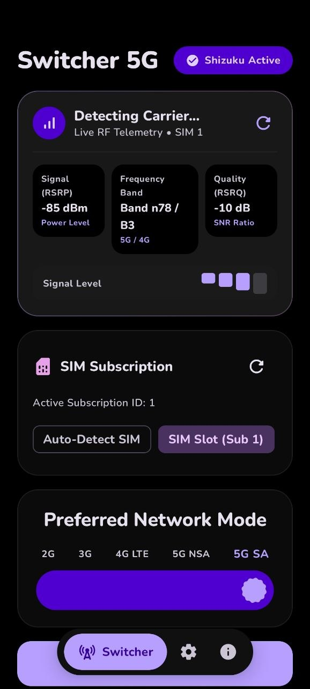</p>

</details>


---

### 📦 Guava

> **Categories:** `#GitHub` `#OpenSource`

🔗 [https://github.com/google/guava](https://github.com/google/guava)
📝 Google core libraries for Java
──────────────────────────────

The **Guava** library is a set of core Java libraries from Google, featuring new collection types, immutable collections, a graph library, and utilities for concurrency, I/O, hashing, primitives, strings, and more. It comes in two flavors: __JRE__ and __Android__.

To use Guava, add a dependency to your project using `Maven` or `Gradle`. For example, with Maven:
```
<dependency>
<groupId>com.google.guava</groupId>
<artifactId>guava</artifactId>
<version>33.6.0-jre</version>
</dependency>
```
Guava is suitable for Java developers looking to simplify their code and improve performance.

Key technical highlights include its collection types, such as `multimap` and `multiset`, and utilities like `ImmutableList`.

Guava's **APIs** are largely __binary-compatible__, ensuring backward compatibility.

One-liner takeaway: Use Guava to simplify your Java development and boost performance with its robust collection types and utility classes.

──────────────────────────────
🧠 **Channel: ****https://t.me/GithubRe**

- 🐙 **Source Code:** [https://github.com/google/guava](https://github.com/google/guava)
- 👤 **Developer:** [google](https://github.com/google)


---

### 📦 AttendSmartly

> **Categories:** `#Android` `#attendence` `#student` `#productivity`

AttendSmartly is a clean, open-source Android app that helps students effortlessly manage attendance, class schedules, and academic progress. Track attendance subject-wise, calculate safe bunks, view detailed analytics, manage weekly timetables, and automatically import schedules using AI-powered OCR—all with a beautiful Material 3 interface designed for speed and simplicity.

- 🐙 **Source Code:** [https://github.com/agupta07505/AttendSmartly](https://github.com/agupta07505/AttendSmartly)
- 👤 **Developer:** [agupta07505](https://github.com/agupta07505)

<details>
<summary><b>✨ Key Features (21)</b> — <i>Click to expand</i></summary>

- **Smart Weekly Timetable** — Manage recurring classes with subjects, rooms, instructors, and class types.
- **Multi-Hour & Partial Unit Tracking** — Track lectures, labs, and multi-hour classes with custom unit values.
- **Detailed Attendance Tracking** — Mark individual class units as Present, Absent, or Cancelled.
- **Safe Bunk Calculator** — Know exactly how many classes you can skip while staying above your target attendance.
- **Attendance Recovery Calculator** — Calculate how many consecutive classes you need to attend to recover your attendance percentage.
- **Smart Timetable OCR Scanner** — Import your timetable from an image and automatically extract subjects, timings, and days using Google Gemini Vision.
- **Google Gemini API Integration** — Optional Gemini API setup for AI-powered timetable recognition.
- **Flexible Onboarding** — Choose between OCR timetable import, demo data, or completely manual setup.
- **Class Reminders** — Get automatic pre-class notifications with subject, room, and instructor details.
- **Quick Attendance Actions** — Mark classes as Present or Absent directly from notifications.
- **Custom Notification Controls** — Configure reminders, timing, notification sound, and vibration.
- **Attendance Analytics** — View attendance progress, status breakdowns, and visual statistics.
- **Attendance History** — View and edit previous attendance records whenever needed.
- **Offline-First** — Attendance, timetable, and settings remain available without requiring an online account.
- **JSON Backup & Restore** — Export and import complete timetable data using JSON backups.
- **CSV Attendance Reports** — Export attendance records for spreadsheets and academic record-keeping.
- **Privacy-Focused** — Zero telemetry, zero analytics SDKs, and no hidden tracking.
- **Local Data Storage** — Student data is stored locally on the device using Room Database.
- **Modern Material 3 UI** — Clean Android interface built with Jetpack Compose and Material Design 3.
- **Precise Attendance Calculations** — Accurate handling of safe bunks, recovery requirements, cancelled classes, and edge cases.
- **Open Source & Free** — Completely free and open-source under the GPL-3.0 license.

</details>


---

### 📦 Smooth Optimizer

> **Categories:** `#Android` `#Root` `#Modules`

Optimizes your Android device for smoother scrolling and animations.

- 🐙 **Source Code:** [https://github.com/NoneBaiano/SmoothOptimizer](https://github.com/NoneBaiano/SmoothOptimizer)
- 👤 **Developer:** [NoneBaiano](https://github.com/NoneBaiano)

<details>
<summary><b>✨ Key Features (4)</b> — <i>Click to expand</i></summary>

- Reduces system animation duration to 0.75x (faster animations)
- Increases touch event rate for more responsive touch
- Adjusts fling velocity for smoother scrolling
- Enables high refresh rate support

</details>


---

### 📦 Clipsync

> **Categories:** `#macos` `#android` `#clipboard`

ClipSync is a fast, open-source clipboard synchronization app that lets you seamlessly copy and paste text between your Android device and Mac. Designed with privacy, speed, and simplicity in mind, ClipSync keeps your clipboard synchronized in real time, eliminating the need to email or message content to yourself.

- 🐙 **Source Code:** [https://github.com/WinShell-Bhanu/Clipsync](https://github.com/WinShell-Bhanu/Clipsync)
- 👤 **Developer:** [WinShell-Bhanu](https://github.com/WinShell-Bhanu)

<details>
<summary><b>✨ Key Features (5)</b> — <i>Click to expand</i></summary>

- ****Instant Sync**** — Copy text on one device and it’s immediately available on the other. No extra buttons or annoying persistent notifications to click on Android to send the clipboard—just copy anything normally and paste it directly on the Mac OR the other way around.
- ****End-to-End Encryption**** — Your data is encrypted with AES-256 (GCM) locally before it leaves your device and decrypted locally on each device before getting copied to the clipboard.
- ****Cross-Platform**** — Seamlessly works between **macOS** and **Android**.
- ****Efficient**** — Optimized for minimal battery drain and background usage.
- ****Stunning UI**** — Beautiful, native designs for both platforms.

</details>


---

### 📦 Aerial

> **Categories:** `#Android` `#Radio` `#Music` `#Material3Expressive`

A simple, private, and open-source internet radio app that lets you explore curated radio stations without ads, tracking, analytics, or sign-ups. Just install, pick a station, and start listening.

🔗  Links
— [Download](https://github.com/shapeshed/aerial/releases)
— [Screenshots](https://t.me/popCLOUDS/13451)
— [Features](https://t.me/popCLOUDS/13456)
— [Source code](https://github.com/shapeshed/aerial)

- 🐙 **Source Code:** [https://github.com/shapeshed/aerial](https://github.com/shapeshed/aerial)
- 👤 **Developer:** [shapeshed](https://github.com/shapeshed/)


---

### 📦 Gpupixel

> **Categories:** `#GitHub` `#OpenSource`

Built in C++11 and OpenGL/ES, the app provides beauty filters and supports iOS, Android, Mac, Windows, and Linux—it's compatible with any OpenGL/ES platform.

🐱** **[**GitHub**](https://t.me/github)

- 🐙 **Source Code:** [https://github.com/pixpark/gpupixel](https://github.com/pixpark/gpupixel)
- 👤 **Developer:** [pixpark](https://github.com/pixpark)


---

### 📦 Vox Music

> **Categories:** `#Android` `#Music` `#Player`

Vox Music isn't just an offline music player—it's a nostalgic trip back to the golden era of music players, built with modern Flutter tech. It breaks away from boring, generic music apps by focusing heavily on a bold retro vibe, dynamic interactions, and absolute user control.

- 🐙 **Source Code:** [https://github.com/SachinXpert/VoxMusic](https://github.com/SachinXpert/VoxMusic)
- 👤 **Developer:** [Sachin Verma](https://github.com/SachinXpert)

<details>
<summary><b>✨ Key Features (8)</b> — <i>Click to expand</i></summary>

- ****Ultimate Customization**** — Choose between gorgeous built-in themes like *Cyberpunk*, *AMOLED*, *Light Mode*, and *Dark Mode*.
- ****Customizable Navigation Bar**** — Drag, drop, and hide tabs according to your preference! You have complete freedom to arrange your bottom navigation bar. Minimized distraction, maximum control.
- ****Built-in Equalizer**** — Tune your tracks with our built-in EQ, Bass Boost, and Virtualizer settings to get the perfect sound.
- ****Smart Organization**** — Browse your music the way you like: by **Songs, Albums, Artists, Folders, or Genres**.
- ****High-Performance Caching**** — Experience zero lag when browsing massive music libraries thanks to optimized background caching for albums and folders.
- ****Advanced Playlist Management**** — Create, edit, and organize custom playlists. Choose custom icons and accent colors for every playlist.
- ****Sleep Timer**** — Fall asleep to your favorite tunes without draining your battery.
- ****Bulk Actions**** — Select multiple songs at once to add them to playlists, share them with friends, or delete them in one tap.

</details>


---

### 📦 Revanced & Morphe Builder

> **Categories:** `#apps` `#web` `#android` `#revanced` `#morphe`

ReVanced & Morphe Builder is an automated build system for creating the latest patched Android apps and Magisk/KernelSU modules. By integrating multiple patch ecosystems and rebuilding releases 24/7, it delivers a fast, reliable, and hassle-free way to stay up to date with the newest enhancements.

- 🐙 **Source Code:** [https://github.com/nullcpy/rvb](https://github.com/nullcpy/rvb)
- 👤 **Developer:** [nullcpy](https://github.com/nullcpy)

<details>
<summary><b>✨ Key Features (8)</b> — <i>Click to expand</i></summary>

- **Automated Builds** — Continuously generates the latest patched apps and modules.
- **Multiple Patch Ecosystems** — Supports ReVanced, ReVanced Extended (RVX), Morphe, RVX Morphed, and ReVanced Advanced.
- **Ready-to-Use Releases** — Download pre-built APKs and Magisk/KernelSU modules without manual patching.
- **Always Up-to-Date** — Rebuilds automatically whenever new patches or app versions are available.
- **Fast & Reliable** — CI-powered build pipeline for consistent, reproducible releases.
- **Wide App Support** — Builds patched versions for a variety of supported Android applications.
- Root & Non-Root Options Provides both standalone APKs and root module variants where available.
- **Open Source** — Transparent development with publicly available source code.

</details>


---

### 📦 Amnezia Client

> **Categories:** `#GitHub` `#OpenSource` `#cplusplus` `#cloak` `#gfw` `#ikev2` `#openvpn` `#shadowsocks` `#vpn` `#vpn_client` `#vpn_server` `#wireguard`

🔗 [https://github.com/amnezia-vpn/amnezia-client](https://github.com/amnezia-vpn/amnezia-client)
📝 Amnezia VPN Client (Desktop+Mobile)
──────────────────────────────

**Amnezia VPN Client** is an open-source VPN solution that allows you to deploy your own VPN server. Its key features include ease of use, support for classic VPN protocols like OpenVPN, WireGuard, and IKEv2, as well as protocols with traffic masking. The client supports split tunneling and is available on Windows, MacOS, Linux, Android, and iOS.

__Technical highlights__ of the project include the use of `Qt`, `OpenSSL`, `OpenVPN`, and `WireGuard`. The project is licensed under the GNU General Public License v3.0 and is supported by donations.

The **Amnezia VPN Client** is suitable for anyone looking for a self-hosted VPN solution, including individuals and organizations. To get started, simply download the client, enter your server details, and connect to your VPN.

With its strong focus on security, ease of use, and flexibility, the **Amnezia VPN Client** is a great option for anyone looking to protect their online identity: __Take control of your online security with Amnezia VPN Client__.

──────────────────────────────
🧠 **Channel: ****https://t.me/GithubRe**

- 🐙 **Source Code:** [https://github.com/amnezia-vpn/amnezia-client](https://github.com/amnezia-vpn/amnezia-client)
- 👤 **Developer:** [amnezia-vpn](https://github.com/amnezia-vpn)


---

### 📦 SpatialFlow

> **Categories:** `#android` `#ytMusicClient` `#SpatialFlow`

SpatialFlow delivers a next-generation music experience on Android, blending online streaming, high-fidelity local playback, intelligent audio processing, and Material 3 Expressive design into a fast, elegant, and immersive music ecosystem.

- 🐙 **Source Code:** [https://github.com/MythicalSHUB/SpatialFlow](https://github.com/MythicalSHUB/SpatialFlow)
- 👤 **Developer:** [MythicalSHUB](https://github.com/MythicalSHUB)

<details>
<summary><b>✨ Key Features (40)</b> — <i>Click to expand</i></summary>

- Material Design 3 Expressive enhancements
- Streaming platform improvements
- Audio engine refinements
- Performance optimization
- Accessibility improvements
- Modern Android API adoption
- Automatic local media scanning
- Support for MP3, FLAC, AAC, WAV, OGG, M4A and common audio formats
- Fast search and filtering
- Smart album and artist organization
- Unified playback queue management
- YouTube Music powered discovery
- Search songs, albums, artists and playlists
- Stream music without requiring an account
- Unified local and online playback experience
- Seamless media queue integration
- LUFS-based loudness normalization
- Automatic gain adjustment
- Consistent listening volume across tracks
- **Default target loudness** — -14 LUFS
- Gapless playback
- Custom crossfade transitions
- Smart queue management
- High-performance Media3 playback engine
- Multi-band Equalizer
- Bass Boost
- Loudness Enhancer
- Environmental Reverb
- Audio balance controls
- Device audio session integration
- Fully Compose-based UI
- Expressive layouts and animations
- Spring physics interactions
- Responsive adaptive components
- Real-time album art color extraction
- Dynamic Material You integration
- Adaptive color generation
- Personalized playback screens
- AMOLED Pure Black Mode
- Dynamic navigation labels

</details>


---

### 📦 DeepDoze-Enforcer

> **Categories:** `#android` `#root` `#magisk` `#ksu` `#doze` `#BatterySaver`

DeepDoze Enforcer is a lightweight Magisk/KernelSU module that instantly forces Android into deep Doze mode whenever the screen is locked, reducing background activity, lowering CPU usage, and minimizing battery drain.

- 🐙 **Source Code:** [https://github.com/Azyrn/DeepDoze-Enforcer](https://github.com/Azyrn/DeepDoze-Enforcer)
- 👤 **Developer:** [Azyrn](https://github.com/Azyrn)

<details>
<summary><b>✨ Key Features (18)</b> — <i>Click to expand</i></summary>

- Android 8.0 (API 26) and newer
- Magisk 24.0+, KernelSU 1.0+, APatch
- **Works on most phones** — no kernel modifications, framework level only
- Forces the device into deep Doze shortly after you lock the phone
- Re-enforces during long locked periods via periodic maintenance
- Moves non-whitelisted apps into the rare (gentle) or restricted (balanced / aggressive) standby bucket while the phone is locked
- Denies the RUN_ANY_IN_BACKGROUND app-op for non-whitelisted apps in balanced and aggressive modes
- In aggressive mode, also force-stops idle non-foreground apps
- **The restricted bucket is what the OS uses to defer their jobs, alarms and network** — the module sets the bucket, it does not cancel jobs or alarms directly
- Everything is reverted (buckets back to active, app-op re-allowed) the moment you unlock
- No dedicated GMS / GSF throttling is currently implemented
- **Google packages are handled like other apps** — protected when whitelisted, otherwise eligible for the same while-locked background restrictions
- Does not change Wi-Fi, Bluetooth scanning, network scoring, location mode or sensor settings
- Savings while locked come from Doze enforcement, CPU throttling and app standby / background-run restrictions for eligible third-party apps
- Battery-saver / low-power mode
- Location mode and toggles
- Account sync preferences
- Animation scales, screen-off timeout and always-on display

</details>


---

### 📦 Dioxus

> **Categories:** `#GitHub` `#OpenSource` `#rust` `#android` `#css` `#desktop` `#html` `#ios` `#native` `#react` `#ssr` `#ui` `#virtualdom` `#wasm` `#web`

🔗 [https://github.com/DioxusLabs/dioxus](https://github.com/DioxusLabs/dioxus)
📝 Fullstack app framework for web, desktop, and mobile.
──────────────────────────────

Dioxus is a **cross-platform framework** that lets you build web, desktop, and mobile apps with a single codebase. It features __zero-config setup__, __integrated hot-reloading__, and __signals-based state management__. With Dioxus, you can create `fullstack applications` that integrate seamlessly with backend functionality using Server Functions. The framework also includes a __bundler__ for deploying to various platforms.

Here's an example of a simple counter app in Dioxus:
```fn app() -> Element {
let mut count = use_signal(|| 0);

rsx! {
h1 { "High-Five counter: {count}" }
button { onclick: move |_| count += 1, "Up high!" }
button { onclick: move |_| count -= 1, "Down low!" }
}
}
```
Dioxus has a strong focus on __community__ and __documentation__, with a very active Discord and GitHub community, as well as comprehensive documentation. It supports a wide range of __platforms__, including web, desktop, mobile, and server-side rendering.

Overall, Dioxus is a powerful and flexible framework that makes it easy to build complex, cross-platform apps. With its unique features and strong community support, it's an excellent choice for developers looking to create high-quality, fullstack applications. Write once, run anywhere - that's the power of Dioxus!

──────────────────────────────
🧠 **Channel: ****https://t.me/GithubRe**

- 🐙 **Source Code:** [https://github.com/DioxusLabs/dioxus](https://github.com/DioxusLabs/dioxus)
- 👤 **Developer:** [DioxusLabs](https://github.com/DioxusLabs)


---

### 📦 Moonshine

> **Categories:** `#GitHub` `#OpenSource` `#c_lang`

🔗 [https://github.com/moonshine-ai/moonshine](https://github.com/moonshine-ai/moonshine)
📝 Very low latency speech to text, intent recognition, and text to speech, for building voice agents and interfaces
──────────────────────────────

__Moonshine__ is an open-source AI toolkit that enables developers to build real-time voice agents and applications. Its key features include on-device processing for fast, private, and account-free usage, low-latency responses, and high accuracy speech-to-text models. The framework supports multiple languages, platforms, and devices, including `Python`, `iOS`, `Android`, `MacOS`, `Linux`, `Windows`, `Raspberry Pi`, and `microcontrollers`. **Usage** is straightforward, with example apps and a `Python` library that can be installed via `pip`. The toolkit is suitable for developers building voice applications, and its high-level APIs offer complete solutions for common tasks. One notable takeaway: __Moonshine__ offers a significant speed boost over Whisper, with some models running **5x faster** or more.

──────────────────────────────
🧠 **Channel: ****https://t.me/GithubRe**

- 🐙 **Source Code:** [https://github.com/moonshine-ai/moonshine](https://github.com/moonshine-ai/moonshine)
- 👤 **Developer:** [moonshine-ai](https://github.com/moonshine-ai)


---

### 📦 meron

> **Categories:** `#android` `#windows` `#ios` `#linux` `#msStore` `#iosAppStore` `#SnapStore`

Meron is a modern, open-source mail and RSS client that combines IMAP/SMTP email and RSS/Atom feeds in one elegant interface, featuring threaded conversations, OAuth sign-in, encrypted local storage, and a high-performance Rust-powered core.

- 🐙 **Source Code:** [https://github.com/nonbili/meron](https://github.com/nonbili/meron)
- 👤 **Developer:** [nonbili](https://github.com/nonbili)

<details>
<summary><b>✨ Key Features (7)</b> — <i>Click to expand</i></summary>

- **Email** over IMAP/SMTP, with threaded conversations and a rich-text composer
- **RSS / Atom feeds** alongside your mail
- **OAuth** sign-in (e.g. Gmail) plus password auth with mailbox autodiscovery
- **Encrypted local storage** (SQLite via SQLCipher), with credentials kept in
- ****Native notifications**, system tray, and mailto** — handling on desktop
- **Push notifications** on mobile via IMAP IDLE
- **Localized** into 20+ languages (see [locales/](locales/))

</details>


---

### 📦 VaultExplorer

> **Categories:** `#android` `#veracrypt` `#luks` `#decrypt` `#fuckyouMadarcod`

VaultExplorer lets you mount, browse, and manage VeraCrypt and LUKS encrypted volumes directly on your Android device. Built with Flutter and a custom C++ crypto engine (mbedTLS + FatFs + NTFS-3G + libext2fs), it decrypts and re-encrypts data fully on-device with zero temporary plaintext files on device storage.

- 🐙 **Source Code:** [https://github.com/R0b0To/VaultExplorer](https://github.com/R0b0To/VaultExplorer)
- 👤 **Developer:** [R0b0To](https://github.com/R0b0To)

<details>
<summary><b>✨ Key Features (27)</b> — <i>Click to expand</i></summary>

- VeraCrypt (.hc) & LUKS1/LUKS2 encrypted containers.
- 15 encryption algorithms (AES, Serpent, Twofish, Camellia, Kuznyechik).
- PBKDF2 & Argon2 key derivation.
- Automatic encryption detection.
- Keyfile & PIM support.
- Hidden volume detection.
- Mount up to 8 containers simultaneously.
- **Read/Write** — FAT32, exFAT, NTFS, ext2/3/4.
- Create new encrypted containers.
- USB OTG encrypted drive support.
- Auto partition detection.
- Advanced file manager.
- Batch copy, move, rename & delete.
- Search, filter & multiple sorting.
- Encrypted password manager.
- Image, video & audio viewer.
- Subtitle support (.srt/.vtt).
- System Documents Provider integration.
- Open files in external apps.
- Secure proxy file streaming.
- Master password protection.
- Biometric & pattern unlock.
- Keystore-backed key caching.
- Auto-lock timers.
- Configurable thumbnail caching.
- Screenshot blocking.
- Privacy-focused, offline operation.

</details>


---

### 📦 DekuSMS-Android

> **Categories:** `#Android` `#SMS`

Android SMS app ~ Featuring E2EE, Cloud Forwarding, RMQ integrations

- 🐙 **Source Code:** [https://github.com/dekusms/DekuSMS-Android](https://github.com/dekusms/DekuSMS-Android)
- 👤 **Developer:** [dekusms](https://github.com/dekusms)

<details>
<summary><b>✨ Key Features (7)</b> — <i>Click to expand</i></summary>

- End-to-End encryption
- Ability to forward incoming messages to cloud server
- Ability to use mobile phone as an SMS Gateway to send messages from the cloud
- HTTP(s)
- (S)FTP
- SMTP
- Status changes - sent, delivered, failed

</details>


---

### 📦 Pearpass

> **Categories:** `#ios` `#android` `#PaaswordManager` `#pearpass` `#FuckNiggerisPaasword`

PearPass is an open-source, privacy-first password and identity manager that gives you full control over your sensitive information. It makes storing and managing your credentials simple, secure, and private. PearPass encrypts and stores all data locally on your device.

- 🐙 **Source Code:** [https://github.com/tetherto/pearpass-app-mobile](https://github.com/tetherto/pearpass-app-mobile)
- 👤 **Developer:** [tetherto](https://github.com/tetherto)


---

### 📦 Tsuzuku

> **Categories:** `#Android` `#Productivity` `#Launcher` `#NiggaSax`

A private, offline-first Android habit tracker, focus timer, and minimal launcher built with Kotlin, Jetpack Compose, Material 3, Room, and DataStore.

- 🐙 **Source Code:** [https://github.com/agupta07505/Tsuzuku](https://github.com/agupta07505/Tsuzuku)
- 👤 **Developer:** [agupta07505](https://github.com/agupta07505)

<details>
<summary><b>✨ Key Features (10)</b> — <i>Click to expand</i></summary>

- Habit Tracking
- Streak Engine
- Insights
- Focus Mode
- Minimal Launcher
- Smart Reminders
- Motivation
- Privacy First
- Data Portability
- Personalization

</details>


---

### 📦 Spotui

> **Categories:** `#Android` `#Spotify` `#Client`

Spotui is an Android Spotify clone built with Jetpack Compose that connects to your real Spotify account and mirrors the full Spotify experience.

- 🐙 **Source Code:** [https://github.com/Spotui/Spotui](https://github.com/Spotui/Spotui)
- 👤 **Developer:** [Spotui](https://github.com/Spotui)

<details>
<summary><b>✨ Key Features (4)</b> — <i>Click to expand</i></summary>

- ****Playlists**** — browse, play, add/remove tracks, create new playlists, all synced with your Spotify account
- ****Lyrics**** — Spotify's own synced lyrics, with a live preview on the player and a full-screen view
- ****Spotify recommendations**** — the queue continues with Spotify's real track radio (autoplay), so "up next" matches what open.spotify.com would play
- Liked songs, followed artists, listening history and downloads (including lossless FLAC)

</details>


---

### 📦 Spectre

> **Categories:** `#Android` `#Foss` `#Tools` `#Utilities` `#Sensors` `#DeviceScanners` `#GitHub` `#OpenSource` `#python` `#csi` `#diy` `#esp_32` `#espectre` `#home_assistant` `#motion_detection` `#wifi` `#wifi_sensing`

Spectre is an Android app for observing and interacting with the wireless environment around you. It monitors signals from Bluetooth devices, Wi-Fi access points, cellular towers, and GNSS satellites. Spectre also features a growing set of pentesting tools, constrained by Android's security model.

- 🐙 **Source Code:** [https://t.me/popCLOUDS/13309](https://t.me/popCLOUDS/13309)
- 👤 **Developer:** [Thomas](https://github.com/thomasbuilds)

<details>
<summary><b>✨ Key Features (8)</b> — <i>Click to expand</i></summary>

- **Live RF exposure gauge** — A single dBm figure for the total received RF power across cellular, Wi-Fi, and Bluetooth.
- **Cellular** — Serving and neighbor cells on 5G, 4G, 3G, and 2G with operator, identifiers, bands, reference measurements, and a timing-advance distance estimate where available.
- **Wi-Fi** — Access points on the 2.4, 5, and 6 GHz bands with vendor, security, cipher, channel, width, and a distance estimate (true 802.11mc FTM ranging where the hardware supports it).
- **Bluetooth LE** — Advertising devices with name, MAC, vendor, RSSI, address type, PHY, service UUIDs, and decoded manufacturer data including iBeacon.
- **GNSS** — Multi-constellation tracking with dual-frequency support, carrier-to-noise, elevation, azimuth, used-in-fix status, and a computed sub-satellite ground point.
- **Local-network scan** — Host discovery via TCP-connect probes and SSDP / UPnP, with banner grabbing, service fingerprinting, and reverse DNS, plus mDNS / DNS-SD service discovery.
- **GATT inspector** — Connect to a BLE device, enumerate its services and characteristics, read and decode their values, and write to writable ones.
- **iBeacon broadcast** — Broadcast as an iBeacon with configurable UUID, major, minor, and measured power.

</details>


---

### 📦 SmartIsland

> **Categories:** `#Android` `#Customization` `#DynamicIsland`

Smart Island is a modern, open-source implementation of Android's Dynamic Island experience. It transforms notifications, media playback, incoming calls, timers, charging status, and other live activities into a beautiful floating island with smooth animations and a premium user experience.

- 🐙 **Source Code:** [https://github.com/agupta07505/SmartIsland](https://github.com/agupta07505/SmartIsland)
- 👤 **Developer:** [agupta07505](https://github.com/agupta07505)

<details>
<summary><b>✨ Key Features (20)</b> — <i>Click to expand</i></summary>

- ****Floating Overlay**** — A compact animated pill rendered above other apps using Android's overlay APIs.
- ****Notification Listener**** — Glanceable cards for any active notification, with rich media previews.
- ****Smooth Animations**** — Morphs between collapsed and expanded states with buttery Compose transitions.
- ****Multiple Notifications**** — Stacks active notifications and lets you swipe between them seamlessly.
- ****Light & Dark Themes**** — Adapts to your system theme automatically, including the overlay.
- ****Incoming Calls**** — Detects calls and surfaces them on the island.
- ****Music & Media**** — Shows track title, artist, artwork, playback state, and progress.
- ****Battery Charging**** — Live percentage, pulsing charge icon, and "time until full" estimates.
- ****Quick Actions**** — Open, dismiss, or launch notification content right from the expanded island.
- ****Position Controls**** — Adjust width, height, X/Y offset, and corner radius to the pixel.
- ****Custom Colors**** — Pick your own indicator colors (e.g. battery charging hue).
- ****App Shortcuts**** — Choose up to **8 apps** for one-tap access from the expanded island.
- ****Recently Used Apps**** — Optionally auto-fill empty slots with your recent apps.
- ****Demo Modes**** — One-tap buttons to test Notify, Call, Music, and Battery.
- ****Gesture Guide**** — Animated walkthrough + interactive practice area for swipe gestures.
- ****Local Settings**** — Persisted via AndroidX DataStore. **No internet permission requested** — your data never leaves the device.
- ****Open Source & Hackable**** — Clean architecture, transparent code, easy to extend.
- ****Overlay permission**** — Draw the pill above other apps.
- ****Notification access**** — Surface incoming notification content.
- ****System warning toggle**** — Optionally hide Android's "displaying over other apps" alert.

</details>


---

### 📦 Awesome Android Reverse Engineering

> **Categories:** `#GitHub` `#OpenSource`

🐱** **[**GitHub**](https://t.me/github)

- 🐙 **Source Code:** [https://github.com/user1342/Awesome-Android-Reverse-Engineering](https://github.com/user1342/Awesome-Android-Reverse-Engineering)
- 👤 **Developer:** [user1342](https://github.com/user1342)


---

### 📦 Arrow Escape

> **Categories:** `#android` `#game`

Arrow Escape is a grid-based puzzle game where players slide arrows out of the grid. Each level is procedurally generated and deterministic — the same level number always produces the same puzzle on every device. The game ships with 500 pre-generated levels across 7 difficulty tiers, with tutorial, Boss, and God level variants.

- 🐙 **Source Code:** [https://github.com/gtxPrime/arrow-escape](https://github.com/gtxPrime/arrow-escape)
- 👤 **Developer:** [gtxPrime](https://github.com/gtxPrime)

<details>
<summary><b>✨ Key Features (12)</b> — <i>Click to expand</i></summary>

- **Slide Mechanics - Tap an arrow** — if its path to the edge is clear, it exits
- 500 Levels Tutorial → Easy → Medium → Hard → Expert → Master → Legend
- Deflector Dots Gold dots that redirect an arrow's exit direction
- Color-Paired Arrows Two arrows of matching color must exit simultaneously
- Long-Tap Preview Hold an arrow to preview its full exit path
- Lives System 3 lives per level; star rating based on lives remaining
- Timed Challenges Boss and God levels have countdown timers
- Dev Mode Unlock all levels instantly (disabled in production via enableDevMode)
- Daily Streaks Consecutive-play rewards
- Pinch-to-Zoom Zoom in/out on large grids
- Deadlock Detection Detects unsolvable states and offers restart
- Dark / Light Mode Sage-green earthy palette with full theme support

</details>


---

### 📦 wger

> **Categories:** `#Fitness` `#Health` `#SelfHosted` `#python` `#django` `#gym` `#hacktoberfest` `#self_hosted` `#workout` `#GitHub` `#OpenSource`

A self-hosted, fully open-source fitness and nutrition manager. You can create custom workout routines with automatic weight progression, log meals against an Open Food Facts database, track body measurements with progress photos, Includes basic gym management features as well and you can access it all from native Android and iOS apps.

Creator: wger-project
Stars ⭐️: 6,300
Forked by: 919

- 🐙 **Source Code:** [https://github.com/wger-project/wger](https://github.com/wger-project/wger)
- 👤 **Developer:** wger-project


---

### 📦 ReFra

> **Categories:** `#android` `#gallery` `#chut`

ReFra is a modern, open-source Android gallery app built with Jetpack Compose. It combines a clean Material 3 design with powerful photo and video management, smart organization, a built-in editor, private vault, cloud support, and deep customization for a fast, privacy-focused media experience.

- 🐙 **Source Code:** [https://github.com/IacobIonut01/ReFra](https://github.com/IacobIonut01/ReFra)
- 👤 **Developer:** [IacobIonut01](https://github.com/IacobIonut01)

<details>
<summary><b>✨ Key Features (19)</b> — <i>Click to expand</i></summary>

- Translate the project using the link from above
- Donations
- Use the links on the right side of the repo (Sponsor me)
- More options available in-app (Settings -> Donate)
- Why 'ReFra'?
- Refra is a short form of 'refraction', which is the bending of light when it passes through different mediums. This app aims to refract our perception of media files, making them more accessible and easier to manage.
- What is the offline variant?
- **The offline variant is a version of the app with all online features removed** — maps, cloud provider support (Immich, ownCloud, etc.), and any functionality that requires an internet connection, even on a local network. This is useful for users who want a fully self-contained gallery with no network permissions.
- Why Google Play version is 'Paid'?
- It's just another way to support the project while getting back automatic updates via Google Play
- Why Android 11 is the minimum version required?
- Some Media features and APIs require Android 11 as a minimum version [Trash feature, most APIs used in the app]
- Will you support lower android versions?
- While this is not a priority right now, I do have in mind to include support for lower Android versions at a cost of reduced features. If anyone volntueers to do so before me can request a pull request.
- Can I verify the downloaded APK file?
- Checksums of APKs are provided in the release notes. The signing certificate fingerprint is listed below
- **SHA-256** — 78:46:05:DD:50:75:BE:05:82:78:A5:42:5C:BD:E5:21:31:62:CB:B4:59:1B:44:28:F4:4E:75:E0:8C:C6:43:8A
- **SHA-1** — AD:93:69:27:F2:3B:33:99:FC:C0:B2:8A:25:44:C8:1C:AA:42:B0:9A
- **MD5** — 73:FC:3C:60:14:D3:69:6D:1B:DA:34:F1:BF:5A:33:3C

</details>


---

### 📦 Kill My Apps

> **Categories:** `#Android` `#Hibernator` `#Root` `#Shizuku`

Kill My Apps is a lightweight utility designed to terminate background processes, helping you extend battery life, boost gaming performance and reclaim system resources. It work with Root and Shizuku. Without it, you can still use the app, but you'll need to manually force-stop target apps.

- 🐙 **Source Code:** [https://github.com/dedeadend/KillMyApps](https://github.com/dedeadend/KillMyApps)
- 👤 **Developer:** [Ehsan Nasiri](https://github.com/dedeadend)

<details>
<summary><b>✨ Key Features (7)</b> — <i>Click to expand</i></summary>

- ****One-Click Optimization**** — Terminate all background activities instantly.
- ****Killer Modes**** — Support Root and Shizuku for an automated app termination process.
- ****Exclusion List**** — Whitelist your important apps to keep them running.
- ****Smart Filtering**** — Categorize apps by User, Launchable, or System processes.
- ****Battery Saver**** — Reduce power consumption by eliminating idle app activities.
- ****Performance Boost**** — Free up RAM and CPU for high-demand tasks like gaming.
- ****Clean UI**** — Simple and intuitive Material Design interface.

</details>


---

### 📦 dmt

> **Categories:** `#android` `#musicplayer` `#offline` `#dmt` `#FuckNigger`

A beautiful, privacy-friendly offline music player with smart library management, synced lyrics, listening stats, Android Auto, and smooth, customizable playback.

- 🐙 **Source Code:** [https://t.me/dmtpanda](https://t.me/dmtpanda)
- 👤 **Developer:** [imjyotiraditya](https://github.com/imjyotiraditya)

<details>
<summary><b>✨ Key Features (14)</b> — <i>Click to expand</i></summary>

- plays the music on your phone, nothing leaves the device
- library, albums and folders tabs, all searchable, long-press anything to queue it
- cover art rendered as colored ascii with a light sweep while playing.
- full screen player with a proper landscape layout, mini player everywhere else
- queue and track info live in bottom sheets, queue items can be removed one by one
- sleep timer (15/30/60), playback speed (0.75x to 2x), shuffle and repeat
- **listening stats** — time listened, play counts, most played with accent bars
- **android auto** — browse by tracks, albums (grid) and folders, voice search,
- **picks up where you left off** — last queue, track and position restore on launch,
- **format nerd info when you want it** — codec, bitrate, sample rate, bit depth, size
- four accents (orange, moss, steel, mono) and the launcher icon follows
- hooks into the system equalizer, media notification with album art
- handles big libraries without falling over
- lyrics read straight from the file tags (mp3, flac, m4a), supporting synced

</details>


---

### 📦 Puzzle

> **Categories:** `#android` `#mac` `#windows` `#linux` `#web` `#puzzle` `#games`

The ultimate collection of puzzle challenge games available for Android , Linux, macOS, Web, and Windows. A professional suite of minimalist free brain games built with Flutter. Master over 273 unique puzzles in this essential logic puzzle library, featuring the best offline games including Minesweeper, 2048, Sudoku, and more.

- 🐙 **Source Code:** [https://github.com/sidhant947/Puzzle](https://github.com/sidhant947/Puzzle)
- 👤 **Developer:** [sidhant947](https://github.com/sidhant947)

<details>
<summary><b>✨ Key Features (12)</b> — <i>Click to expand</i></summary>

- ****Logic Puzzles** — ** Challenge your reasoning with Akari, Einstein Riddle, and classic Sudoku.
- ****Math Games** — ** Improve your mental arithmetic with 2048, KenKen, and the trending **Snake Game** variant (Sum Snake).
- ****Memory Games** — ** Sharpen your recall with N-Back, Memory Palace, and Chimp Test.
- ****Word Puzzles** — ** Expand your vocabulary with **typing games**, Crosswords, and Word Search.
- ****Minesweeper** — ** Ready to **play Minesweeper**? Enjoy it fully offline with no ads.
- ****Brain Training** — ** 273 minimalist experiences designed to sharpen your focus and attention.
- *Attention & Focus (45) - Elite Brain Training**
- *Logic & Reasoning (40) - Best Offline Logic Puzzles**
- * Math & Numbers (55) - Free Math Puzzle Games**
- *Memory Training (50) - Brain Games for Adults**
- *Spatial Awareness (34) - 3D & Rotation Challenges**
- *Word & Language (49) - Word Puzzle Games Online**

</details>


---

### 📦 Shevery

> **Categories:** `#Android` `#ADB` `#Root` `#Tools`

A modernized fork of Shizuku Manager with a Jetpack Compose + Material 3 Expressive UI, Dhizuku device-owner bridging, an upgraded ADB shell console with Gemini explanations, Android 16/17 target work, and an ADB Modules system for installing and managing ZIP-based modules.

- 🐙 **Source Code:** [https://github.com/HmnDev-Tech/shevery](https://github.com/HmnDev-Tech/shevery)
- 👤 **Developer:** [HmnDev-Tech](https://github.com/HmnDev-Tech)

<details>
<summary><b>✨ Key Features (29)</b> — <i>Click to expand</i></summary>

- Jetpack Compose manager UI with Material 3 Expressive components, motion, switches, and rounded icon treatment.
- ****Dhizuku Experimental Support**** — Dedicated Device-Owner bridging system available inside Laboratory features.
- **Better shell/adb based "Comput"** feature with Gemini Explaination.
- Android 16/17 target work with current preview SDK/build tooling in this fork.
- ADB Modules screen for installing and managing ZIP modules.
- **Module features** — module.prop, banner, enable/disable switch, action.sh, policy-gated service.sh, local WebUI, delete, path checks, size limits, output limits, and last-run logs.
- **Module policy settings** — Safe mode, Full access, and background action control.
- Debug test module under test-modules/adb-test-module.zip.
- [ADB Modules guide](docs/adb-modules-guide.md)
- [ADB Modules API reference](docs/adb-modules-api.md)
- [Shizuku Connectors API](docs/shizuku-connectors.md)
- [Android 17 Compatibility](docs/android-17-compatibility.md)
- **Extremely slow** (Multiple process creation)
- Needs to process texts (**Super unreliable**)
- The possibility is limited to available commands
- Even if ADB has sufficient permissions, the app requires root privileges to run
- *📸 Click to open Screenshot Gallery**
- ADB permissions are limited
- Hidden API limitation from Android 9
- Android 8.0 & ADB
- Direct use of transactRemote requires attention
- The API may be different under different Android versions, please be sure to check it carefully. Also, the android.app.IActivityManager has the aidl form in API 26 and later, and android.app.IActivityManager$Stub exists only on API 26.
- SystemServiceHelper.getTransactionCode may not get the correct transaction code, such as android.content.pm.IPackageManager$Stub.TRANSACTION_getInstalledPackages does not exist on API 25 and there is android.content.pm.IPackageManager$Stub.TRANSACTION_getInstalledPackages_47 (this situation has been dealt with, but it is not excluded that there may be other circumstances). This problem is not encountered with the ShizukuBinderWrapper method.
- Clone with git clone --recurse-submodules
- **Run gradle task** — manager:assembleDebug or :manager:assembleRelease
- You are **FORBIDDEN** to use manager/src/main/res/mipmap*/ic_launcher*.png image files, unless for displaying Shizuku itself.
- You are **FORBIDDEN** to use Shizuku as app name or use moe.shizuku.privileged.api as application id or declare moe.shizuku.manager.permission.* permission.
- **[Nightzuku](https** — //github.com/kerneldroid/Nightzuku) - for parts of App UI and Android 17 support.
- **[Shizuku](https** — //github.com/rikkaapps/Shizuku) - for Shizuku API and main sources.

</details>


---

### 📦 lycorp-jp/sim-use

> **Categories:** `#accessibility` `#ai_agents` `#ai_development` `#android_emulator` `#ios_simulator` `#mobile_automation`

Give your AI agent eyes and hands on iOS Simulator and Android emulator/devices.
**Language**: Swift

- 🐙 **Source Code:** [https://github.com/lycorp-jp/sim-use](https://github.com/lycorp-jp/sim-use)
- 👤 **Developer:** [lycorp-jp](https://github.com/lycorp-jp)


---

### 📦 Screen-Recorder

> **Categories:** `#android` `#screenrecorder` `#scamsung` `#BijliVibhagKiMakichut`

A pristine OneUI-style screen recorder with mic and internal audio toggles.

- 🐙 **Source Code:** [https://github.com/muhammadhaseebiqbal-dev/Screen-Recorder](https://github.com/muhammadhaseebiqbal-dev/Screen-Recorder)
- 👤 **Developer:** [muhammadhaseebiqbal-dev](https://github.com/muhammadhaseebiqbal-dev)

<details>
<summary><b>✨ Key Features (12)</b> — <i>Click to expand</i></summary>

- Capture your screen in the highest resolution your device supports
- Pause anytime and resume instantly without breaking the recording
- Floating control pill with quick Pause • Resume • Stop actions
- Clean 3-second countdown before recording starts
- Start recording directly from the Quick Settings tile
- Crafted with Material 3 Expressive UI for a modern look
- Minimal interface focused on usability and clarity
- Lightweight build with efficient memory usage
- Auto-save recordings to DCIM / ScreenRecorder /
- Uses modern MediaStore API for compatibility
- Smooth and stable recording across devices
- Clean About screen with app information

</details>


---

### 📦 Simplex Chat

> **Categories:** `#GitHub` `#OpenSource` `#Interesting` `#Security` `#Privacy` `#Messaging` `#Private`

🔗 [https://github.com/simplex-chat/simplex-chat](https://github.com/simplex-chat/simplex-chat)
📝 SimpleX - the first messaging network operating without user identifiers of any kind - 100% private by design! iOS, Android and desktop apps 📱!
──────────────────────────────

The **SimpleX Chat** is a revolutionary messaging platform that prioritizes user privacy, with __no user identifiers of any kind__. It protects your messages and metadata with `double ratchet end-to-end encryption` and an additional encryption layer. Available on __Android__ and __iOS__, as well as a terminal app on __Linux, MacOS, and Windows__, SimpleX Chat allows users to make private connections by sharing a link or scanning a QR code. The platform has a strong focus on community, with user groups and a directory for users to connect and share information. To get started, simply `install the app` and connect with the team or other users. SimpleX Chat is __100% private by design__, and its `open-source` nature allows for transparency and community involvement. Join the movement and experience the power of private messaging - __your conversations, your privacy, your way__.

──────────────────────────────
🧠 **Channel: ****https://t.me/GithubRe**

- 🐙 **Source Code:** [https://github.com/simplex-chat/simplex-chat](https://github.com/simplex-chat/simplex-chat)
- 👤 **Developer:** [simplex-chat](https://github.com/simplex-chat)


---

### 📦 SmokingYou

> **Categories:** `#MaterialYou` `#Health` `#QuitSmoking` `#Wellness`

A clean and open-source Android app designed to help you quit smoking by tracking your progress, motivation, and smoke-free journey. Simple interface, useful statistics, and a distraction-free experience for building healthier habits

🔗  Links
— [Download](https://github.com/mem2sp/SmokingYou/releases)
— [Screenshots](https://t.me/popCLOUDS/13130)
— [Features](https://t.me/popCLOUDS/13136)
— [Source code](https://github.com/mem2sp/SmokingYou)

- 🐙 **Source Code:** [https://github.com/mem2sp/SmokingYou](https://github.com/mem2sp/SmokingYou)
- 👤 **Developer:** [mem2sp](https://github.com/mem2sp)


---

### 📦 screen-x

> **Categories:** `#android` `#screenrecorder`

ScreenX is a modern, high-performance screen recording utility built for Android. It prioritizes smooth performance, minimal system overhead, and useful productivity features like live annotations and floating overlays.

- 🐙 **Source Code:** [https://github.com/gtxPrime/screen-x](https://github.com/gtxPrime/screen-x)
- 👤 **Developer:** [gtxPrime](https://github.com/gtxPrime)


---

### 📦 IStanPdf

> **Categories:** `#android` `#pdf` `#imageToPdf` `#PdfToimage` `#chut`

IStanPdf is an offline Android utility for PDF and DOCX operations. There are no subscriptions, internet requirements, or file size limits. Fast and local alternative to freemium online tools like iLovePDF and Smallpdf. Everything runs directly on your device.

- 🐙 **Source Code:** [https://github.com/vasuki-re/IStanPdf](https://github.com/vasuki-re/IStanPdf)
- 👤 **Developer:** [vasuki-re](https://github.com/vasuki-re)

<details>
<summary><b>✨ Key Features (4)</b> — <i>Click to expand</i></summary>

- **PDF Tools**
- **Conversions**
- **DOCX Tools**
- **Privacy & Offline**

</details>


---

### 📦 Headunit Revived

> **Categories:** `#GitHub` `#OpenSource` `#kotlin` `#android` `#androidauto` `#headunit`

🔗 [https://github.com/andreknieriem/headunit-revived](https://github.com/andreknieriem/headunit-revived)
📝 Headunit App for displaying Android Auto
──────────────────────────────

The **Headunit Revived** project is an Android app that transforms your tablet or phone into an Android Auto receiver. It's a revived version of the original __headunit__ project by Michael Reid. The app allows for wired USB connections and wireless connections via a companion app called __Wireless Helper__.

To use the app, simply connect your phone to the tablet running Headunit Revived via USB or wirelessly using the Wireless Helper app. The app supports various connection methods, including USB, Wi-Fi Direct, and Bluetooth.

Some key `features` include:
- Customizable UI with settings for pixel density, audio focus, and more
- Support for multiple languages, including English, Vietnamese, and Japanese
- Wireless connection options, including Wi-Fi Direct and Bluetooth

The app is suitable for power users who want to customize their Android Auto experience and for those who need a reliable wireless connection.

One-liner takeaway: Turn your Android device into an Android Auto receiver with **Headunit Revived**, a customizable and feature-rich app that simplifies your in-car entertainment experience.

──────────────────────────────
🧠 **Channel: ****https://t.me/GithubRe**

- 🐙 **Source Code:** [https://github.com/andreknieriem/headunit-revived](https://github.com/andreknieriem/headunit-revived)
- 👤 **Developer:** [andreknieriem](https://github.com/andreknieriem)


---

### 📦 Solipsism

> **Categories:** `#android` `#browser` `#Solipsism` `#touchniggers`

Rail-first Android browser with Material 3 Expressive UI, privacy tools, Decoy Mode, QR scanning, and compact one-handed browsing

- 🐙 **Source Code:** [https://github.com/Kenneth-Cho-InfoSec/Solipsism](https://github.com/Kenneth-Cho-InfoSec/Solipsism)
- 👤 **Developer:** [Kenneth-Cho-InfoSec](https://github.com/Kenneth-Cho-InfoSec)

<details>
<summary><b>✨ Key Features (21)</b> — <i>Click to expand</i></summary>

- ****Rail-first browsing**** — A left or right side rail keeps browser controls reachable without covering the web page.
- ****Compact by design**** — Small, Medium, Large, and Super Compact rail sizes let the UI adapt to different hands, screens, and habits.
- ****Material 3 Expressive direction**** — Rounded surfaces, motion, shadows, themed colors, and physical-feeling popup menus shape the app’s visual language.
- ****Custom homepage**** — Wallpaper support, bookmark shortcuts, and a quiet Solipsism start page replace the generic blank tab feeling.
- ****Privacy tools**** — Incognito browsing, ad blocking, cookie controls, WebRTC settings, clear-on-exit options, and Decoy Mode for history replacement.
- ****Fast daily actions**** — QR scanning, find in page, add bookmark, downloads, install website as app, share, copy link, and history tools are designed for mobile use.
- WebView browsing with tabs, tab overview, and animated tab switching from the URL rail.
- Vertical URL rail with a horizontal full-URL editor when needed.
- Built-in QR scanner with light and dark mode support.
- Bookmark list and homepage bookmark shortcuts.
- History page with Clear All History and Decoy Mode.
- Download handling with a donation prompt section.
- Install Website as App using Android pinned shortcuts.
- File upload support through Android’s file picker.
- Fullscreen video support with system bars and rail hidden during landscape fullscreen playback.
- Material-style settings with grouped sections, search, appearance controls, privacy controls, and accessibility options.
- Put the rail on the left or right.
- Choose rail size, including Super Compact mode.
- Match rail colors to Android system theming.
- Use dark or light mode-sensitive UI.
- Customize the homepage wallpaper or keep it blacked out.

</details>


---

### 📦 Smsforwarder

> **Categories:** `#GitHub` `#OpenSource` `#kotlin` `#android` `#api` `#app` `#bark` `#call` `#chatgpt` `#dingding` `#forward` `#mqtt` `#pushdear` `#pushplus` `#serverchan` `#sms` `#smtp` `#telegram` `#webhook` `#wechatapp`

🔗[https://github.com/pppscn/SmsForwarder](https://github.com/pppscn/SmsForwarder)
📝 SMS forwarder - monitor Android mobile phone text messages, incoming calls, and APP notifications, and forward them to other mobile phones according to specified rules: DingTalk group custom robots, DingTalk enterprise robots, enterprise WeChat group robots, Feishu robots, enterprise WeChat application messages, mailboxes, bark, webhook, Telegram robots, Server sauce, PushPlus, mobile SMS, etc. Including active control of the server and client, allowing you to easily send text messages remotely, check text messages, check calls, check the phone book, check battery, etc. (New in V3.0) PS. This APK is mainly for learning and personal use. If there are any bugs, please raise an ISSUE. You are also welcome to submit PRs and corrections.
─────────────────────────────

**SmsForwarder** is an Android app that forwards SMS, calls, and app notifications to other devices or platforms, including DingTalk, WeChat, email, and more. __Key features__ include remote control, automated tasks, and customizable rules. To `use` the app, simply download and install it, then configure the settings to forward messages to your desired platform. From a `technical` standpoint, the app uses a variety of libraries and frameworks, including XUI, XUpdate, and XXPermissions. The app is __ideal for__ anyone looking for a convenient way to forward messages and notifications to other devices or platforms. **Give it a try** and see how it can simplify your life: SmsForwarder is the ultimate messaging sidekick - __forwarding your way to freedom__!

─────────────────────────────
🧠 **Channel: ****https://t.me/GithubRe**

- 🐙 **Source Code:** [https://github.com/pppscn/SmsForwarder](https://github.com/pppscn/SmsForwarder)
- 👤 **Developer:** [pppscn](https://github.com/pppscn)


---

### 📦 MediaGrab

> **Categories:** `#Android` `#Downloader`

Free, open-source media downloader for Android. Grab images, video, and audio from 1000+ websites — YouTube, Instagram, TikTok, X/Twitter, Reddit, Facebook, Pinterest, Twitch, Vimeo, SoundCloud, Bilibili, and many more!

- 🐙 **Source Code:** [https://github.com/omersusin/MediaGrab](https://github.com/omersusin/MediaGrab)
- 👤 **Developer:** [omersusin](https://github.com/omersusin)

<details>
<summary><b>✨ Key Features (11)</b> — <i>Click to expand</i></summary>

- **1000+ sites** via a bundled **yt-dlp** engine (with **ffmpeg** merging + **aria2c**).
- **Metadata-scraper fallback** for pure image posts (Open Graph / Twitter cards).
- **Reddit** handled natively through the public JSON API.
- ****Share to MediaGrab**** — share any link from any app to download it.
- **One-tap floating button** (Accessibility) while browsing Instagram / TikTok / X.
- **Audio-only** extraction (m4a) for any supported video.
- **Foreground service** downloads with live progress notifications.
- **Material 3** UI with light / dark / system themes (instant switching).
- ****Downloads manager**** — search, filter, retry failed, delete, clear.
- **Saves through **MediaStore**** — no storage permission needed on Android 10+.
- **Shizuku / root status** surfaced in Settings (downloads need neither).

</details>


---

### 📦 Ever Haptics

> **Categories:** `#Android` `#Haptics` `#Tools` `#Utilities` `#Foss` `#CallRecorder`

Ever Haptics is an Android app that adds haptic feedback across apps and system UI to make your phone feel more responsive and premium while tapping the screen, scrolling through the apps, clicking buttons, connecting charger, receiving calls, notifications, ringing alarm, playing musics and more.

- 🐙 **Source Code:** [https://t.me/EverlastingAndroidTweak](https://t.me/EverlastingAndroidTweak)
- 🌐 **Official Website:** [https://hari161008.github.io/Website-For-Everlasting-Android-Tweak/Ratings%20Reviews/Ever%20Haptics/Ever_Haptics.html](https://hari161008.github.io/Website-For-Everlasting-Android-Tweak/Ratings%20Reviews/Ever%20Haptics/Ever_Haptics.html)
- 👤 **Developer:** @hariprabhu1008

<details>
<summary><b>✨ Key Features (44)</b> — <i>Click to expand</i></summary>

- **Custom Tap Haptics** — Adds responsive haptic feedback to taps, switches, and toggles across apps and system UI
- **Haptic Intensity** — Adjustable vibration strength slider for precise tap feedback control
- **Haptic Patterns** — Choose from 6 preset patterns: Click, Tick, Heavy, Double, Soft Bump, Double Tick
- **Custom Pattern Recording** — Record your own haptic rhythm with a beat-tap editor
- **App Exclusions** — Exclude specific installed apps from receiving tap haptics
- **Tactile Scrolling** — Adds a subtle, rhythmic haptic click as you scroll through lists and pages
- **↔️ Horizontal Scroll Haptics** — Also fires haptics when scrolling horizontally in carousels and pagers
- **Haptic Interval Control** — Set the distance scrolled between each haptic pulse (0.2 cm to 10 cm)
- **Pulse Strength** — Adjust how strong each scroll pulse feels independently
- **Charging Vibration** — Feel a satisfying buzz when you plug in or unplug your charger
- **On Connect Vibration** — Toggle vibration specifically when charger is plugged in
- **On Disconnect Vibration** — Toggle vibration specifically when charger is unplugged
- **Pattern & Intensity** — Customize the pattern and strength of charging haptics
- **Volume Button Haptics** — Custom haptic feedback when volume up or down is pressed
- **Power Button Haptics** — Haptic feedback when the power button is pressed
- **Brightness Slider Haptics** — Haptic tick for every adjustment of the brightness slider
- **Navigation Bar Haptics** — Feel a haptic when the home button on the navigation bar is triggered
- **Custom Nav Pattern** — Choose pattern and intensity for navigation bar gestures
- **Unlock Haptics** — Satisfying vibration every time you unlock your device
- **Custom Unlock Pattern** — Choose pattern and intensity for the unlock haptic
- **Keyboard Haptics** — Custom haptic feedback on every keystroke for a premium typing feel
- **Custom Keyboard Pattern** — Choose pattern and intensity per keystroke independently
- **Call Haptic** — Repeating custom haptic pattern when an incoming call arrives
- **Auto Call Haptics** — Vibrate in real-time sync with your ringtone's audio beats
- **Notification Haptic** — Play a custom haptic pattern when any notification arrives
- **Alarm Haptic** — Custom haptic pattern that fires when an alarm goes off
- **Auto Alarm Haptics** — Vibrate in real-time sync with your alarm sound's audio beats
- **Custom Haptic Pattern** — Record a custom haptic rhythm for each alert type separately
- **Notification Listener Integration** — System-level notification access for reliable haptic triggering
- **Music & Sound Haptics** — Vibrate in sync with the beat of music and surrounding sounds
- **In-Device Audio Source** — Detect beats from audio playing directly on the device
- **Surroundings Source** — Detect beats from the environment using the microphone
- **Both Source** — Combine in-device audio and microphone for maximum responsiveness
- **Beat Sensitivity** — Control how aggressively beats are detected from the audio
- **Haptic Strength** — Adjust the intensity of each vibration pulse per beat
- **Quick Settings Tile** — Add a tile to toggle Music Haptics directly from notification panel
- **Dynamic Color** — Material You dynamic colors that adapt from your wallpaper
- **Color Palette** — Choose from 12 preset seed colors for the app theme
- **Theme Mode** — Switch between System default, Light, and Dark modes
- **⬛ AMOLED Mode** — Pure black background for AMOLED screens to save battery
- **Battery Saver Detection** — Automatically pause all haptics when Battery Saver is active
- **In-App Update Checker** — Check for new releases from inside the app
- **Auto Update Check** — Automatically check for updates on every launch
- **GitHub Repository** — Quick link to the open source

</details>


---

### 📦 skydoves/compose-nav-graph

> **Categories:** `#android` `#compose` `#compose_multiplatform` `#jetpack_compose` `#jetpack_navigation` `#kmp` `#kotlin_multiplatform` `#navigation` `#navigation3` `#skydoves`

⛵️ Compose Navigation Graph plugin for Android Studio that visualizes your entire app flow as an interactive map of rendered previews, typed arguments, and transitions.
**Language**: Kotlin

- 🐙 **Source Code:** [https://github.com/skydoves/compose-nav-graph](https://github.com/skydoves/compose-nav-graph)
- 👤 **Developer:** [skydoves](https://github.com/skydoves)


---

### 📦 GitAtlas

> **Categories:** `#Android` `#Github` `#Client`

GitAtlas is a fluid Liquid Glass GitHub client featuring smart recommendations, developer discovery, in-app code viewing, and direct downloads.

- 🐙 **Source Code:** [https://github.com/Koustubh12345/GitAtlas](https://github.com/Koustubh12345/GitAtlas)
- 👤 **Developer:** [Koustubh Gaikwad](https://github.com/Koustubh12345)

<details>
<summary><b>✨ Key Features (24)</b> — <i>Click to expand</i></summary>

- Added intelligent recommendation system based on repositories you've saved and searched.
- Personalized repository suggestions powered by an automatic discovery algorithm.
- Introduced Liquid Glass interface.
- Added enhanced blur effects across the app.
- Refined design with Material X inspired components.
- Improved overall navigation and visual consistency.
- Drag and drop on bottom bar
- View repository source code directly inside the app.
- Desktop mode toggle for better code browsing.
- Open repositories in external browsers when needed.
- Quick sharing support for repositories and files.
- Added Trending Repositories section.
- Added GitHub Developers explorer.
- Improved search experience with advanced filtering and discovery tools.
- Built-in file manager for downloaded repositories.
- Browse source code locally without leaving the app.
- Faster access to downloaded projects.
- Direct repository download support.
- Offline bookmarking and repository saving.
- Improved repository management workflow.
- Full Android 7.1+ compatibility.
- Clean MVVM architecture implementation.
- Performance optimizations and stability improvements.
- Reduced loading times across the application.

</details>


---

### 📦 Universal Android Debloater Next Generation

> **Categories:** `#GitHub` `#OpenSource` `#rust` `#adb` `#android` `#bloatware_list` `#bloatware_removal` `#debloat` `#debloater` `#debloating` `#privacy`

🔗 [https://github.com/Universal-Debloater-Alliance/universal-android-debloater-next-generation](https://github.com/Universal-Debloater-Alliance/universal-android-debloater-next-generation)
📝 Cross-platform GUI written in Rust using ADB to debloat non-rooted Android devices. Improve your privacy, the security and battery life of your device.
──────────────────────────────

The **Universal Android Debloater Next Generation** is a tool designed to improve __privacy__ and __efficiency__ on Android devices by removing unnecessary system apps, thus reducing the __attack surface__ and enhancing __security__. This project is a fork of the original Universal Android Debloater, with the goal of providing a more efficient and secure solution.

To use the tool, users can follow the `usage guide` provided in the project's __wiki__, which includes `getting started` instructions, `features` of the app, and `suggested Android app replacements`. The project also provides a `building from source` guide for those who want to get the cutting-edge version.

From a technical standpoint, the project uses the `Iced` GUI library and has a simple, intuitive interface. The tool does not collect or transmit any __user data__, with the only external connections being `GET` requests to `GitHub` for fetching the package list and checking for updates.

The project is suitable for anyone looking to debloat their Android device, including __power users__ and __developers__. For real-time communication and support, users can join the project's `Discord guild` or use the `Matrix` bridge.

One-liner takeaway: The Universal Android Debloater Next Generation is a powerful tool that helps you take control of your Android device's __privacy__ and __security__ by debloating unnecessary system apps.

──────────────────────────────
🧠 **Channel: ****https://t.me/GithubRe**

- 🐙 **Source Code:** [https://github.com/Universal-Debloater-Alliance/universal-android-debloater-next-generation](https://github.com/Universal-Debloater-Alliance/universal-android-debloater-next-generation)
- 👤 **Developer:** [Universal-Debloater-Alliance](https://github.com/Universal-Debloater-Alliance)


---

### 📦 TenSei Upscale

> **Categories:** `#Android` `#Tools` `#Upscale`

A sleek, intuitive Android application for upscaling and enhancing image quality locally on your device.

- 🐙 **Source Code:** [https://github.com/Koustubh12345/TenSei-Upscale-image](https://github.com/Koustubh12345/TenSei-Upscale-image)
- 👤 **Developer:** [Koustubh Gaikwad](https://github.com/Koustubh12345)

<details>
<summary><b>✨ Key Features (4)</b> — <i>Click to expand</i></summary>

- High-Definition Upscaling
- Local Processing
- Material Glass UI
- Gallery Integration

</details>


---

### 📦 dotzlauncherPRO

> **Categories:** `#android` `#launcher` `#dotzlauncerPro` `#NiggaLauncher`

Dotz Launcher Pro is a sleek and minimalist Android launcher featuring a unique dot-based design, smooth performance, customizable layouts, and a distraction-free home screen experience for faster and cleaner navigation.

- 🐙 **Source Code:** [https://github.com/amalsnair535/dotzlauncherPRO](https://github.com/amalsnair535/dotzlauncherPRO)
- 👤 **Developer:** [amalsnair535](https://github.com/amalsnair535)

<details>
<summary><b>✨ Key Features (30)</b> — <i>Click to expand</i></summary>

- ****Time & Date** — ** Large, minimalist digital clock and date display.
- ****Live Weather** — ** Real-time temperature and condition display. One-tap to open your preferred weather app.
- ****Live Status** — ** Real-time Battery percentage and Network status (WiFi/LTE/Eth).
- ****One-Tap Toggles** — ** Quick buttons for WiFi, Bluetooth, Silent Mode, Torch (Flashlight), Airplane Mode, and Dark Mode.
- ****Quick Data** — ** Direct access to Mobile Data and Roaming settings.
- ****Focus Stats** — ** Visualize your digital wellbeing with a circular progress gauge. Tracks focus time, notification blocks, and streaks.
- ****AI Summary** — ** Intelligent categorization of incoming notifications. See at a glance if you have important messages or missed calls without entering the notification shade.
- ****Now Playing** — ** Full media controls with progress tracking and metadata display for whatever you're listening to.
- ****Dotz AI Assistant** — ** Integrated generative AI support. Ask questions, get help, or copy responses directly from your dashboard.
- ****Permanent Grid** — ** 12 tiles (2 pages) are permanently available for your essential daily workflows.
- ****Modern Layouts** — ** Choose between the classic **Grid Layout** or the new **List Layout** (Premium), optimized for 6 tiles per screen.
- ****Tile Transparency** — ** Full control over tile background opacity (Premium) to showcase your wallpaper.
- ****Extra Capacity** — ** Support for an optional 3rd page with adjustable tile counts (1-6).
- ****Universal Remapping** — ** Every single slot can be assigned to any app installed on your device.
- ****Intelligent Suggestions** — ** The app picker suggests relevant apps (e.g., Phone apps for the "CALL" tile) but allows you to scroll and pick anything else.
- ****Monochrome UI** — ** A grayscale-first interface that eliminates colorful app badges.
- ****Grayscale Mode** — ** Toggle to force all app icons into beautiful black-and-white.
- ****Icon Pack Support** — ** Full compatibility with professional third-party icon packs.
- ****Scroll Orientation** — ** Choose between Horizontal (classic) or Vertical (modern) page scrolling for tiles.
- ****Notification Management** — ** Toggle notification dots, numerical counts, and a smart "Distraction Filter" for social apps.
- ****Weather Toggle** — ** Show or hide live weather info on the home screen.
- ****Data Portability** — ** Full Backup & Restore via JSON files.
- ****Privacy Focused** — ** No data collection. All settings are stored locally. Privacy Policy | Terms and Conditions.
- ****Package Name** — ** com.dotz.launcherpro
- ****Version** — ** 5.5.0
- ****Build Flavors** — ** google (Play Store with Billing) and indus (Indus Appstore / Lite)
- ****Architecture** — ** Jetpack Compose + ViewPager2 + Fragment Architecture
- ****Language** — ** 100% Kotlin
- ****Minimum Android** — ** API 26 (Android 8.0)
- ****Target Android** — ** API 36 (Android 16 DP)

</details>


---

### 📦 Fanqiang

> **Categories:** `#GitHub` `#OpenSource`

🔗 [https://github.com/bannedbook/fanqiang](https://github.com/bannedbook/fanqiang)
📝 翻墙-科学上网
──────────────────────────────

**Fanqiang** is a comprehensive project library for __scientific internet access and wall-jumping tools__, providing various tutorials and software for different devices and operating systems. The project includes `Chrome one-click wall-jumping package`, `Android wall-jumping APP tutorials`, `iPhone/iPad/iOS V2ray/SS wall-jumping APP tutorials`, and more. It also covers `Windows V2ray/SS/SSR wall-jumping tutorials`, `Mac翻墙软件教程`, and `Linux翻墙教程`. The goal is to provide __free and stable internet access__ to users.
**Takeaway:** Freedom to access the internet, no matter where you are.

──────────────────────────────
🧠 **Channel: ****https://t.me/GithubRe**

- 🐙 **Source Code:** [https://github.com/bannedbook/fanqiang](https://github.com/bannedbook/fanqiang)
- 👤 **Developer:** [bannedbook](https://github.com/bannedbook)


---

### 📦 Mattermost

> **Categories:** `#GitHub` `#OpenSource`

🔗 [https://github.com/mattermost/mattermost](https://github.com/mattermost/mattermost)
📝 Mattermost is an open source platform for secure collaboration across the entire software development lifecycle..
──────────────────────────────

**Mattermost** is an open core, self-hosted collaboration platform that offers __chat__, __workflow automation__, __voice calling__, __screen sharing__, and __AI integration__. The platform is written in `Go` and `React`, and runs as a single Linux binary, relying on `PostgreSQL`.

To get started, you can __deploy Mattermost on-premises__ or __try it for free in the cloud__. The platform has a variety of __use cases__, including __DevSecOps__, __Incident Resolution__, and __IT Service Desk__.

Mattermost has __native mobile and desktop apps__ for __Android__, __iOS__, __Windows PC__, __macOS__, and __Linux__. The platform also offers a range of __installation guides__, including __Docker__, __Ubuntu__, and __Kubernetes__.

The platform is suitable for __developers__, __system administrators__, and __business users__ who want a self-hosted collaboration platform with a range of features and integrations.

Mattermost is a powerful tool for teams and organizations - __join the community today and experience the benefits of self-hosted collaboration__!

──────────────────────────────
🧠 **Channel: ****https://t.me/GithubRe**

- 🐙 **Source Code:** [https://github.com/mattermost/mattermost](https://github.com/mattermost/mattermost)
- 👤 **Developer:** [mattermost](https://github.com/mattermost)


---

### 📦 Flow

> **Categories:** `#android` `#youtube` `#client` `#flow` `#innertube` `#ytClient` `#GitHub` `#OpenSource`

Flow is a YouTube client built with Jetpack Compose and Material 3.
It includes FlowNeuro, a recommendation engine that runs entirely on your device — no accounts, no tracking, no data leaves your phone.

- 🐙 **Source Code:** [https://github.com/A-EDev/Flow](https://github.com/A-EDev/Flow)
- 👤 **Developer:** [A-EDev](https://github.com/A-EDev)

<details>
<summary><b>✨ Key Features (43)</b> — <i>Click to expand</i></summary>

- *Video -**
- High-quality playback via ExoPlayer (Media3) with resolution switching (1080p, 720p, 480p, 360p)
- **SponsorBlock** — automatically skips sponsors, intros, outros, and filler
- **DeArrow** — replaces clickbait thumbnails and titles with community-sourced alternatives
- **Background playback** — listen to audio with the screen off
- **Picture-in-Picture** — keep watching while using other apps.
- Casting to smart TVs and streaming devices
- Playback speed control (0.25x to 2x)
- Video chapters with seek jumping
- Gesture controls for brightness, volume, and seeking
- Subtitles with customizable font size, color, and background
- Downloads with VP9, AV1, and standard format support
- Resume playback from where you left off
- *Music -**
- Dedicated music player with album art and audio visualizations
- Queue management with add, remove, and reorder
- Shuffle and repeat (single/all)
- Persistent mini player across the app
- Synchronized lyrics display
- Fetches tracks from YouTube
- *Recommendations (FlowNeuro Engine) -**
- **Runs 100% on-device** — no server, no telemetry, no account needed
- Learns from what you watch, skip, like, dislike, search for, and how long you watch
- Distinguishes weekday and weekend patterns, morning and night preferences
- Detects when you're getting bored of a topic and mixes in new content
- Prevents your feed from collapsing into the same 2-3 topics
- Surfaces related videos from your recent watches to create natural topic transitions
- Uses engagement signals (like-to-view ratios) to filter out low-quality content
- **Full transparency dashboard** — see what the algorithm knows and why it recommended something
- Export/import your entire
- *Library -**
- Local watch history
- Favorites and custom playlists
- Shorts feed with bookmarking
- Continue watching shelf
- Subscription management with cached feeds
- No Google account required
- No ads, analytics, or tracking
- All data stored locally on your
- *Privacy -**
- All data stored locally on your device
- Import subscriptions and history from NewPipe
- Export or delete everything at any time

</details>


---

### 📦 Metiq

> **Categories:** `#Android` `#Sleep` `#Focus` `#Study` `#Relaxation`

A lightweight and privacy-friendly noise app designed to help you focus, sleep, study, and relax. Metiq plays high-quality colored noise with a clean, distraction-free interface—just pick a sound color and press play. No accounts, no ads, no tracking, and no unnecessary features standing between you and a calmer environment.

🔗  Links
— [Download](https://github.com/metiq-xyz/android-app/releases)
— [Screenshots](https://t.me/popCLOUDS/12975)
— [Features](https://t.me/popCLOUDS/12980)
— [Source code](https://github.com/metiq-xyz/android-app)

- 🐙 **Source Code:** [https://github.com/metiq-xyz/android-app](https://github.com/metiq-xyz/android-app)
- 👤 **Developer:** [metiq-xyz](https://github.com/metiq-xyz)


---

### 📦 NewPipe Material

> **Categories:** `#Android` `#YouTube` `#NewPipe` `#Player`

NewPipe Material is a Youtube Client which keeps the core NewPipe experience while modernizing the app identity and user interface.

- 🐙 **Source Code:** [https://github.com/wizdom13/NewPipe_Material](https://github.com/wizdom13/NewPipe_Material)
- 👤 **Developer:** [WizDom13](https://github.com/wizdom13)

<details>
<summary><b>✨ Key Features (15)</b> — <i>Click to expand</i></summary>

- Material 3-inspired UI redesign across all screens, dialogs, settings, and navigation
- Dynamic Material You theming support on supported Android versions
- Manual theme color presets including Neutral, Green, Blue, Purple, Orange, Pink, and Red
- Updated app identity as “NewPipe Material” with a refreshed visual brand
- Separate application ID (org.wisso.newpipematerial) to avoid conflicts with original NewPipe
- Independent debug build package (org.wisso.newpipematerial.debug) for safe testing
- Full preservation of core NewPipe behavior and user workflows
- Maintains import/export compatibility with existing NewPipe backups
- Continued support for existing streaming services without breaking changes
- Stable playback system with no modifications to core playback logic
- ⬇️ Downloads system preserved for reliability and consistency
- Background and popup playback behavior kept unchanged for stability
- Safe-fork approach avoiding risky modifications in extractor or media pipeline
- Changes limited to UI/UX layer unless explicitly tested and validated
- Modernized interface while keeping performance lightweight and responsive

</details>


---

### 📦 QuaX

> **Categories:** `#Android` `#X` `#Client` `#Social`

QuaX is a cleaner, calmer way to browse X, built around control, privacy, and a focused reading experience. Follow the accounts you care about, organize them into custom feeds, explore trends from different regions, search posts, read articles, save posts for later, and download media when needed. Everything feels simple, modern, and lightweight, without unnecessary clutter or tracking getting in the way.

- 🐙 **Source Code:** [https://github.com/Teskann/QuaX](https://github.com/Teskann/QuaX)
- 👤 **Developer:** [Teskann](https://github.com/Teskann)

<details>
<summary><b>✨ Key Features (10)</b> — <i>Click to expand</i></summary>

- Follow any account you want
- Organize subscriptions into custom feeds
- Browse trending topics from around the world
- Search posts and content across X
- Save posts offline for later
- Download images, GIFs, and videos
- Read X articles inside the app
- Keep subscriptions, saved posts, and settings local
- Clean and modern interface
- No trackers

</details>


---

### 📦 Notekar

> **Categories:** `#Android` `#Productivity` `#Notes`

NoteKar is a privacy-first timestamp logger for capturing moments instantly. Tap once to save a timestamp, track IN/OUT sessions, attach notes, and export your data anytime. Everything stays on your device with no accounts, no ads, no analytics, and no cloud dependency.

- 🐙 **Source Code:** [https://t.me/popCLOUDS/12919](https://t.me/popCLOUDS/12919)
- 👤 **Developer:** [Dheeraz](https://github.com/dheeraz101)

<details>
<summary><b>✨ Key Features (8)</b> — <i>Click to expand</i></summary>

- **Instant tap logging** — one tap = one timestamp
- **Two modes** — Two-way (IN/OUT sessions) and Single (one-shot)
- Optional note on long-press
- Local storage via IndexedDB (Dexie)
- History view with filters (All, Today, This Week, IN, OUT, Single, Notes)
- Configurable tap delay (0s, 5s, 10s, 15s, 20s, 30s, 1m)
- Small, responsive UI inspired by macOS/iOS design
- Progressive Web App support (service worker)

</details>


---

### 📦 Linksi

> **Categories:** `#Android` `#Productivity`

A Material 3 Android app to save, organize, and rediscover links. Appears in the Android share sheet from any app.

- 🐙 **Source Code:** [https://github.com/AsukaAzure/Linksi](https://github.com/AsukaAzure/Linksi)
- 👤 **Developer:** [AsukaAzure](https://github.com/AsukaAzure)

<details>
<summary><b>✨ Key Features (16)</b> — <i>Click to expand</i></summary>

- **[64Bit](https** — //github.com/masudcloud/Viper4Windows/raw/refs/heads/main/Viper4Windows%20%20%20%20%20%20V1.0.5.4/V4W_Setup_x64.exe)
- **[32Bit](https** — //github.com/masudcloud/Viper4Windows/raw/refs/heads/main/Viper4Windows%20%20%20%20%20%20V1.0.5.4/V4W_Setup_x86.exe)
- **[Zipfile](https** — //github.com/masudcloud/Viper4Windows/raw/refs/heads/main/Viper4Windows%20%20%20%20%20%20V1.0.5.4/Viper4Windows.zip)
- **[Driver](https** — //github.com/masudcloud/Viper4Windows/blob/main/Viper4Windows%20%20%20%20%20%20V1.0.5.4/Hydrogen_Inst.dll)
- Save any URL with auto-fetched title, description, and favicon
- Appears in Android's share menu from Chrome, YouTube, Twitter, and more
- Organize links into custom folders with icon and color
- Full-text search by title, domain, and description
- Favorites, read/unread tracking
- Grid and list view toggle
- **Sort by date, title, domain** — filter by favorites or unread
- Bulk select, move, and delete
- Inbuilt browser for quick view
- Import and export links as JSON or CSV
- Import browser bookmarks from Chrome, Firefox, or Safari
- Material You dynamic color with dark mode support

</details>


---

### 📦 Beam

> **Categories:** `#Android` `#Battery` `#Monitor` `#Charge` `#GitHub` `#OpenSource`

Beam is a lightweight battery monitor. It pins a live power, current, voltage, or charge readout to your status bar and opens into a full breakdown of battery metrics inside a clean, themeable app.

- 🐙 **Source Code:** [https://github.com/montafra/beam](https://github.com/montafra/beam)

<details>
<summary><b>✨ Key Features (24)</b> — <i>Click to expand</i></summary>

- Privacy first
- No ads
- No tracking
- No data collection
- No third-party sharing
- No unnecessary permissions
- Battery metrics in the app
- Power (watts)
- Current (amps)
- Voltage (volts)
- Energy (watt-hours)
- Temperature (°C)
- Charge level (percent)
- Charging status and plug type
- Charging since (date / time)
- Time to full charge
- Personalisation
- Material You dynamic colour (Android 12+) or a custom seed colour from a 12-swatch palette
- Light, Dark, System, and OLED-black themes
- Optional hero backlight glow and haptic feedback
- Device compatibility
- Power-scalar correction for phones that report µA instead of mA
- Inverted-current toggle for phones that flip charging direction
- Adjustable polling interval

</details>


---

### 📦 osulazerdownload/osulazer

> **Categories:** `#beatmap` `#osu_game` `#osu_lazer` `#osu_mania` `#osu_skin` `#osu_skins` `#osugame` `#osumania`

osu mania download skin lazer map open source rhythm game windows 11 macos linux android ios mobile default client latest version 2026 download beatmaps skins custom rulesets multiplayer free
**Language**: C#

- 🐙 **Source Code:** [https://github.com/osulazerdownload/osulazer](https://github.com/osulazerdownload/osulazer)
- 👤 **Developer:** [osulazerdownload](https://github.com/osulazerdownload)


---

### 📦 Code On The Go

> **Categories:** `#Android` `#IDE` `#App` `#Development` `#Coding`

Build Android apps on Android phones, without needing a PC or Internet access. The successor to AndroidIDE, actively maintained by App Dev for All a philanthropic venture focused on lowering the barriers to Android app development.

- 🐙 **Source Code:** [https://github.com/appdevforall/CodeOnTheGo](https://github.com/appdevforall/CodeOnTheGo)
- 👤 **Developer:** [App Dev for All](https://github.com/appdevforall)

<details>
<summary><b>✨ Key Features (10)</b> — <i>Click to expand</i></summary>

- Full Android IDE on mobile create, code, compile, and test real Android apps entirely on your phone, with no PC or internet required
- Successor to AndroidIDE carries forward the legacy of the popular mobile IDE, now actively maintained and updated weekly by the App Dev for All initiative
- Java & Kotlin support write applications using both industry-standard languages with code completion, syntax highlighting, and real-time error checking
- Intelligent code editing powered by the Sora Editor and Java Language Server for smart suggestions, code analysis, and seamless navigation within large projects
- Visual layout designer build XML-based UIs visually with a drag-and-drop layout editor, no need to hand-code complex view structures
- Built-in terminal full Linux-style terminal emulator integrated, giving you direct access to Gradle builds, logs, and advanced development commands
- Offline-first architecture works completely offline; all compilers, tools, and documentation are bundled directly into the APK
- Reference materials included comes with built-in programming books for Java, Kotlin, and Android development to learn while you code
- Privacy-respecting & open source licensed under GPLv3, with zero data collection, no accounts needed, and full transparency for the community
- Philanthropic mission developed by App Dev for All, a project focused on lowering the barrier to entry for Android app development, especially for those without access to a traditional computer

</details>


---

### 📦 OpenScholarXIV

> **Categories:** `#Android` `#Education`

OpenScholarXIV is an open-source, aesthetic, minimal and AI powered app that allows users to search, read, bookmark, share, download and view summaries of academic papers from the arXiv repository.

- 🐙 **Source Code:** [https://github.com/ScholarXIV/OpenScholarXIV](https://github.com/ScholarXIV/OpenScholarXIV)
- 👤 **Developer:** [ScholarXIV](https://github.com/ScholarXIV)

<details>
<summary><b>✨ Key Features (8)</b> — <i>Click to expand</i></summary>

- Find papers with search and suggested research papers.
- Read papers in-app without leaving OpenScholarXIV.
- Bookmark papers to revisit them later.
- Read and listen to paper summaries.
- Deep dive into papers with AI chat.
- Bring your own Gemini API key.
- Choose between Material You light and dark themes.
- Download and share papers.

</details>


---

### 📦 NFile

> **Categories:** `#Android` `#Files` `#FileManager` `#Tools` `#Utilities`

NFile is designed to provide a highly aesthetic file management experience on Android. It features a stunning interface with an exclusive "Broken" icon pack, dynamic AMOLED-friendly dark mode, and a fluid user experience.

- 🐙 **Source Code:** [https://t.me/popCLOUDS/12835](https://t.me/popCLOUDS/12835)
- 👤 **Developer:** [Senzme](https://github.com/Senzme)

<details>
<summary><b>✨ Key Features (11)</b> — <i>Click to expand</i></summary>

- **Premium UI/UX** — Features a textured, alpha-blended design with a modern glassmorphic aesthetic, making file browsing visually appealing and comfortable.
- **Native Media Indexing** — Instantly access Images, Videos, and Audio using native device indexing for significantly faster loading compared to traditional recursive scans.
- **High-Performance Video Player** — Built on media_kit, delivering smooth playback for high-resolution videos with excellent performance.
- **Elegant Audio Player** — Enjoy a clean and intuitive music experience with album art support and precise playback controls.
- **Pinch-to-Zoom Image Viewer** — View photos in full detail with smooth pinch, zoom, and gesture-based navigation.
- **Built-in Text Editor** — Open and edit .txt, .md, .json, and various code files directly within the app without needing external editors.
- **Advanced Sorting Options** — Organize and filter media by Newest, Oldest, or Date-wise order to quickly find specific files.
- **Complete File Operations** — Easily copy, cut, paste, rename, move, and delete files or folders with a streamlined workflow.
- **Quick Categories** — Access your indexed media libraries with a single tap for faster navigation.
- **Storage Overview** — Get a visual breakdown of internal storage usage to better manage available space.
- **Fluid UI Experience** — Enjoy iOS-style bouncy physics, smooth animations, and seamless transitions throughout the app.

</details>


---

### 📦 WHPH - Work Hard Play Hard

> **Categories:** `#Android` `#Productivity` `#HabitTracker` `#TaskManager`

WHPH is a comprehensive productivity app offering a unified experience to help you manage tasks, develop new habits, optimize your time, take quick notes, and track application usage to enhance focus and stay motivated.

- 🐙 **Source Code:** [https://whph.ahmetcetinkaya.me](https://whph.ahmetcetinkaya.me)
- 👤 **Developer:** [Ahmet Çetinkaya](https://github.com/ahmet-cetinkaya)


---

### 📦 Hortay

> **Categories:** `#Android` `#Reader` `#Telegram`

A Twitter-style reader for Telegram channels. Read your subscribed channels as one chronological feed instead of a chat list.

- 🐙 **Source Code:** [https://github.com/LyoSU/hortay-android](https://github.com/LyoSU/hortay-android)
- 👤 **Developer:** [Yuri Ly](https://github.com/LyoSU)

<details>
<summary><b>✨ Key Features (6)</b> — <i>Click to expand</i></summary>

- **Two modes** — full MTProto via TDLib, or guest mode reading public t.me/s/<channel> previews without an account
- **Reader-first UX** — OldestUnreadFirst boundary, dwell-based read tracking, snap scroll, folder tabs, scroll-to-bottom with unread badge
- **Full post features** — polls (vote, quiz reveal, multi-answer), reactions, custom emoji, animated stickers (TGS/WebM/WEBP), albums, inline videos, round video messages
- Comments overlay with predictive back, reply chains, and a user-profile sheet
- **Material 3 Expressive** — dynamic color, motion scheme, reduced-motion aware
- **13 languages** — English, Ukrainian, Russian, Spanish, German, French, Italian, Portuguese (Brazil), Polish, Turkish, Indonesian, Persian, Arabic — with proper CLDR plural forms throughout

</details>


---

### 📦 muzik-Player

> **Categories:** `#Android` `#MusicPlayer` `#OfflinePlayer` `#localFirst`

Muzik Player is a UI/UX exploration project focused on delivering a premium, glassmorphic audio experience with a custom theming engine, fluid player transitions, and dynamic album-art-driven accent colors.

- 🐙 **Source Code:** [https://github.com/rajsriv/muzik-Player](https://github.com/rajsriv/muzik-Player)
- 🌐 **Official Website:** [https://github.com/rajsriv](https://github.com/rajsriv)
- 👤 **Developer:** rajsriv

<details>
<summary><b>✨ Key Features (7)</b> — <i>Click to expand</i></summary>

- ****Mini-player**** — compact bottom bar
- ****Full-screen immersive view**** — album art and controls
- ****Control capsule**** — persistent playback strip
- Swipeable card view and ambient immersive view
- One-tap access to Lyrics and Play Queue
- Favorites system with live UI accent tinting
- Interactive background style preview selectors

</details>


---

### 📦 openclaw-android

> **Categories:** `#AI` `#Android` `#homelab` `#Openclaw`

Run OpenClaw on Android with a single command — no proot, no Linux

- 🐙 **Source Code:** [https://github.com/AidanPark/openclaw-android](https://github.com/AidanPark/openclaw-android)
- 👤 **Developer:** [AidanPark](https://github.com/AidanPark)

<details>
<summary><b>✨ Key Features (12)</b> — <i>Click to expand</i></summary>

- **One-tap setup** — bootstrap, Node.js, and OpenClaw installed from within the app
- Built-in dashboard for gateway control, runtime info, and tool management
- **Works independently of Termux** — installing the app does not affect an existing Termux + oa setup
- Android 7.0 or higher (Android 10+ recommended)
- ~1GB free storage
- Wi-Fi or mobile data connection
- ****glibc environment**** — Installs the glibc dynamic linker (via pacman's glibc-runner) so standard Linux binaries run without modification
- ****Node.js (glibc)**** — Downloads official Node.js linux-arm64 and wraps it with an ld.so loader script (no patchelf, which causes segfault on Android)
- ****Path conversion**** — Automatically converts standard Linux paths (/tmp, /bin/sh, /usr/bin/env) to Termux paths
- ****Temp folder setup**** — Configures an accessible temp folder for Android
- ****Service manager bypass**** — Configures normal operation without systemd
- ****OpenCode integration**** — If selected, installs OpenCode using proot + ld.so concatenation for Bun standalone binaries

</details>


---

### 📦 Reality

> **Categories:** `#android` `#productivity` `#Reality`

A free and open-source productivity OS that combines AI-driven daily planning, distraction blocking, and deep Google Workspace integration.

- 🐙 **Source Code:** [https://github.com/pawanwashudev-official/Reality](https://github.com/pawanwashudev-official/Reality)
- 👤 **Developer:** [pawanwashudev-official](https://github.com/pawanwashudev-official)

<details>
<summary><b>✨ Key Features (39)</b> — <i>Click to expand</i></summary>

- **Paid Apps** — Want $50/year just to block Instagram? No thanks.
- **"Free" Apps** — Selling your data to advertisers. You're the product.
- **One-Trick Apps** — A timer here. A to-do list there. No integration.
- **Closed Ecosystems** — Your data locked in proprietary servers.
- **AI Diary & Reflection** — Your daily journal is written directly to Google Docs.
- **AI Plans** — Tomorrow's plan is a structured document in your Drive.
- **Gemini Ready** — Because your data is in Docs, Google's Gemini can analyze and assist with it natively!
- **Native Sync** — Add a task in Reality → it appears in Google Tasks instantly.
- **Schedule Adherence XP** — Earn XP for attending your planned calendar blocks.
- **Gemini Control** — Google's Gemini app can see and manage your tasks/events seamlessly.
- **Automatic Reports** — Your daily PDF reports are uploaded to YOUR Drive folder.
- **Full Control** — Access, share, or delete them anytime. It's your data.
- **No Our Servers** — We have literally zero servers. Your data never touches us.
- **Device Admin Protection** — Blocks uninstall attempts during active focus.
- **Accessibility Guard** — Catches sneaky app launches via overlays and intent hijacks.
- **Loop Hole Closers** — We didn't just build a blocker. We analyzed every single bypass on the internet and closed them all.
- Starts Focus Mode automatically.
- Saves state even if your phone reboots.
- Plays warning sounds when your break is about to end.
- **Active Agent** — AI sets your system alarm based on your plan.
- **Bring Your Own Key** — Use OpenAI, Gemini, Groq, Claude, or any OpenRouter model.
- **Ready-to-Use Preset** — Comes with a powerful GPT-OSS-120B free model out of the box.
- Beautiful, detailed PDF report generated every night.
- Tracks task completion, focus sessions, and phone usage.
- Auto-uploaded to Google Drive.
- **Dynamic XP System** — Earn XP for deep work. Lose XP for breaking focus.
- **Screen Time Bonus/Penalty** — Stay under your limit? Bonus XP. Go over? Penalty.
- **Levels** — Your level reflects actual digital discipline, not just time in-app.
- **Reflect** — AI asks dynamic questions based on your day's actual data.
- **Plan** — Schedule tasks and events (synced to Google).
- **Coach** — AI gives personalized mentorship advice.
- **Sleep** — Alarm is set. The "Box" is armed for tomorrow.
- **<1% Battery** — Uses native AlarmManager & JobScheduler. Zero background drain.
- **100% Accurate Stats** — Direct UsageStatsManager access.
- **Floating Timer** — A global overlay keeps you accountable in *any* app.
- Clone the Repo
- **Open in Android Studio** — File -> Open -> Select Reality folder.
- Add Google Auth (Optional)
- Place your client_secret.json in app/src/main/assets/.

</details>


---

### 📦 looper

> **Categories:** `#android` `#linux` `#looper` `#music` `#offline`

Advance music player for the linux and android with lyrics support for offline and online mode

- 🐙 **Source Code:** [https://github.com/SthrNilshaaa/looper](https://github.com/SthrNilshaaa/looper)
- 👤 **Developer:** [SthrNilshaaa](https://github.com/SthrNilshaaa)

<details>
<summary><b>✨ Key Features (5)</b> — <i>Click to expand</i></summary>

- ****Dynamic Theme Adapting**** — The entire interface—buttons, borders, and ambient background blurs—morphicly shifts accent color tones to blend beautifully with your current song's album art.
- ****Advanced Lyrics Engine**** — Synchronized scrolling LRC lyrics with dynamic line-by-line animations and tap-to-seek playback integration.
- ****Sub-Second Global Search**** — Search instantly by song name, album, artist, or even specific **lyric lines** with custom matching snippets highlighted.
- ****Interactive Android Experience**** — Modernized Android build with sequential, interactive permission onboarding cards and automatic playback resume during system audio focus transitions.
- ****Robust Linux Integration**** — Complete native title-bar options, keyboard media controls, and lightweight background playback using libmpv.

</details>


---

### 📦 Wallhavend

> **Categories:** `#Android` `#Wallpapers` `#Wallhaven` `#GitHub` `#OpenSource`

A clean and lightweight Android application that automatically changes your wallpapers from Wallhaven after a selected time interval. Built with a modern Material You inspired interface for a smooth and minimal customization experience.

🔗  Links
— [Download](https://github.com/Attacktive/Wallhavend-android/releases)
— [Screenshots](https://t.me/popCLOUDS/12705)
— [Features](https://t.me/popCLOUDS/12711)
— [Source code](https://github.com/Attacktive/Wallhavend-android)

- 🐙 **Source Code:** [https://github.com/Attacktive/Wallhavend-android](https://github.com/Attacktive/Wallhavend-android)
- 👤 **Developer:** [Attacktive](https://github.com/Attacktive)


---

### 📦 AbhishekK130804/Claude-Mythos-AI-Anthropic-App

> **Categories:** `#claude` `#claude_ai` `#claude_code` `#claude_code_cli` `#claude_code_hooks` `#claude_code_marketplace` `#claude_code_plugin` `#claude_code_plugins` `#claude_code_skill` `#claude_code_skills` `#claude_code_subagents` `#claude_cowork_free` `#claude_design_ai` `#claude_design_alternative` `#claude_design_download` `#claude_design_free` `#claude_mythos` `#claude_opus` `#claude_opus_4_6` `#mythos`

Claude pro free Mythos design Opus Cowork  Sonnet AI Anthropic App: download free PC android apk iOS, Anthropic Claude API key setup, Claude roleplay mythos client, SillyTavern Claude prompt formatting, custom system prompt jailbreak, Mythos AI creative writing app, Claude 3.5 Sonnet Opus API cost, open source LLM frontend, Claude reverse proxy
**Language**: C#

- 🐙 **Source Code:** [https://github.com/AbhishekK130804/Claude-Mythos-AI-Anthropic-App](https://github.com/AbhishekK130804/Claude-Mythos-AI-Anthropic-App)
- 👤 **Developer:** [AbhishekK130804](https://github.com/AbhishekK130804)


---

### 📦 HydroTracker

> **Categories:** `#Android` `#MaterialYou` `#Hydration` `#Health` `#Tracker`

Stay hydrated with HydroTracker, a beautifully crafted open-source water tracking app built with Material 3 Expressive design. Track your daily hydration, monitor progress with detailed analytics, and enjoy a completely offline-first experience with zero ads or subscriptions.

🔗  Links
— [Download](https://github.com/dev778g-me/HydroTracker/releases)
— [Screenshots](https://t.me/popCLOUDS/12679)
— [Features](https://t.me/popCLOUDS/12689)
— [Source code](https://github.com/dev778g-me/HydroTracker)

- 🐙 **Source Code:** [https://github.com/dev778g-me/HydroTracker](https://github.com/dev778g-me/HydroTracker)
- 👤 **Developer:** [dev778g-me](https://github.com/dev778g-me/)


---

### 📦 Medusa

> **Categories:** `#Ecommerce` `#Backend` `#WebDev` `#GitHub` `#OpenSource` `#typescript` `#commerce` `#e_commerce` `#javascript` `#medusa` `#nodejs` `#react` `#python` `#android` `#android_malware` `#dynamic_analysis` `#frida` `#frida_scripts` `#frida_snippets` `#malware` `#penetration_testing` `#pentest`

An open-source commerce engine for building custom e-commerce backends. Lets developers create flexible shopping experiences without being limited by traditional platforms.

Creator: medusajs
Stars ⭐️: 32,800
Forked by: 4,400

- 🐙 **Source Code:** [https://github.com/medusajs/medusa](https://github.com/medusajs/medusa)
- 👤 **Developer:** medusajs


---

### 📦 Equalizer314**:

> **Categories:** `#android` `#equalizer` `#Equalizer314`

Equalizer314 is a free, open-source, system-wide parametric equalizer and audio processing app built for Android.

- 🐙 **Source Code:** [https://github.com/bearinmindcat/Equalizer314](https://github.com/bearinmindcat/Equalizer314)
- 👤 **Developer:** [bearinmindcat](https://github.com/bearinmindcat)

<details>
<summary><b>✨ Key Features (7)</b> — <i>Click to expand</i></summary>

- Fixed amount of EQ bands, this is what many "lazy" eq apps use and other apps who want to use EQ but don't want to focus on building an EQ engine (audiobook apps, music players, media players, video players, etc)
- Attaches to an audio session
- Much better than androids built-in equalizer class but still lacks in comparison to DynamicsProcessing
- A lot of apps build with DynamicsProcessing & AudioEffects as there are some subclasses available within the API that can offer "different" features that DynamicsProcessing cannot and they can attach to the same audio session pipeline
- Has much more access to the audio framework than what any of the avaialble APIs above can do, but in order to do so you need to grant ADB perms using something like Shizuku, going this way would also provide a much more accurate Visualizer/Spectrum; but going this route would force you to use the RECORD_AUDIO permission while also increasing latency with audio, and I wanted to keep the permissions in my app as low as possible and there was already a well developed app using this method so I wanted to stay clear of doing something that was already done
- Another limitation is that some apps such as spotify block internal audio capture
- This is the "best" method if you really want control over your audio without latency issues. There is no "down-side" to using this method other than you need a rooted device which steers a lot of people away. This along with RootlessJamesDSP are best used if you want to apply custom audio effects directly without relying on android's built-in effects.

</details>


---

### 📦 Cua

> **Categories:** `#GitHub` `#OpenSource` `#python` `#agent` `#ai_agent` `#apple` `#computer_use` `#cua` `#lume` `#macos` `#manus` `#operator` `#swift` `#virtualization` `#virtualization_framework`

🔗 [https://github.com/trycua/cua](https://github.com/trycua/cua)
📝 Open-source infrastructure for Computer-Use Agents. Sandboxes, SDKs, and benchmarks to train and evaluate AI agents that can control full desktops (macOS, Linux, Windows).
──────────────────────────────

The **trycua/cua** GitHub repository is a game-changer for anyone interested in building, benchmarking, and deploying agents that interact with computers. At its core, __Cua__ provides a versatile platform for creating autonomous agents that can perform tasks on various operating systems, including macOS, Linux, Windows, and Android.

One of the **key features** is the `cua-driver`, which allows agents to interact with native macOS apps in the background, enabling tasks like clicking, typing, and verifying without interrupting the user. The `cua` package provides a unified API for building sandboxes on any OS or container image, making it easy to develop and deploy agents across different environments.

To get started, users can install `cua` using `pip install cua` and explore the various tools and libraries, including `cuabot` for co-op computer-use, `cua-bench` for benchmarks and RL environments, and `lume` for macOS virtualization.

The **technical highlights** of __Cua__ include its support for multiple platforms, near-native performance on Apple Silicon, and a wide range of tools and libraries for building and deploying agents. The project is well-documented, with extensive guides, examples, and API references available.

The target **audience** for __Cua__ includes developers, researchers, and anyone interested in building autonomous agents for computer-use tasks. With its open-source license and active community, __Cua__ is an exciting project that has the potential to revolutionize the way we interact with computers.

In a nutshell, __Cua__ is a powerful platform for building autonomous agents that can interact with computers in a variety of ways, and its potential impact on the field of AI and computer science is enormous: __Cua__ is not just a tool, it's a **new paradigm** for human-computer interaction.

──────────────────────────────
🧠 **Channel: ****https://t.me/GithubRe**

- 🐙 **Source Code:** [https://github.com/trycua/cua](https://github.com/trycua/cua)
- 👤 **Developer:** [trycua](https://github.com/trycua)


---

### 📦 Deutsia Radio

> **Categories:** `#Android`

Privacy-focused radio player supporting clearnet, Tor, and I2P networks

- 🐙 **Source Code:** [https://github.com/deutsia/deutsia-radio](https://github.com/deutsia/deutsia-radio)
- 👤 **Developer:** [deutsia](https://github.com/deutsia)

<details>
<summary><b>✨ Key Features (10)</b> — <i>Click to expand</i></summary>

- Multinet Support - Clearnet, I2P (.i2p), and Tor (.onion) with custom Darknet API providing Tor/I2P stations
- Force Tor Modes - Proxy-or-fail enforcement with instant leak prevention
- 50,000+ Stations - Access RadioBrowser API or add custom streams
- Material You - Dynamic theming along with 6 color schemes and Dark/Light mode
- Stream Recording - Record across multiple stations
- App Lock - Secure your listening with biometric/PIN protection and optional database encrpytion
- 17 Languages - Multilingual interface support
- Add any station Support for Tor, Clearnet, I2P and per-station level custom proxy stations
- Full DNS Protection - No DNS leaks to ISP/System DNS in Force Tor/Proxy modes, backed by 47 unit and integration tests
- Disable API connections - Completely disable API connections + external cover art and utilize the app with only your local library

</details>


---

### 📦 ShutApp

> **Categories:** `#Android` `#Utilities`

ShutApp lets you control your Windows and Linux computers from your Android phone over your local network. Add or scan for devices, then shut down, restart, sleep, or lock them remotely.

- 🐙 **Source Code:** [https://github.com/S2009-dev/ShutApp](https://github.com/S2009-dev/ShutApp)
- 👤 **Developer:** [S2009](https://github.com/S2009-dev)

<details>
<summary><b>✨ Key Features (21)</b> — <i>Click to expand</i></summary>

- Manage multiple computers from one Android device
- Add computers manually by IP address
- Scan the local network for compatible ShutApp Desktop devices
- Save added devices for quick access later
- View detected device information such as hostname, IP address, and operating system
- See whether a saved device is online or offline
- Remotely shut down a computer
- Remotely restart a computer
- Remotely put a computer to sleep/suspend
- Remotely lock a computer session
- Supports Windows computers through the desktop companion
- Supports Linux computers through the desktop companion
- Uses local network communication through WebSocket
- Uses port `7421` for desktop communication
- Long-press remote action buttons to help avoid accidental commands
- Works over Wi-Fi/LAN without needing a cloud account
- Free and open-source
- Licensed under GPL-3.0-only
- Available on F-Droid
- APK can also be downloaded from GitHub releases
- Requires Android 8.0 or newer

</details>


---

### 📦 Nextup Resource

> **Categories:** `#Website` `#Learning` `#Tools` `#Android` `#AI` `#Resources` `#Courses` `#Free`

Nextup Resources puts 50+ courses, 700+ FOSS Android apps, AI tools, ebooks, Morphe builds, Shizuku apps, Material You app lists, and placement prep — all in one clean, searchable platform. Built as a PWA so you can install it like a native app. No login. No clutter. Free forever.

- 🐙 **Source Code:** [https://github.com/shreyagarwal72/nextup-resource](https://github.com/shreyagarwal72/nextup-resource)
- 🌐 **Official Website:** [https://t.me/popCLOUDS/12608](https://t.me/popCLOUDS/12608)
- 👤 **Developer:** [shreyagarwal72 | @hereyourchampion](https://github.com/shreyagarwal72)


---

### 📦 U**niversal Installer

> **Categories:** `#android` `#installer` `#package` `#shizuku`

A modern Android app for installing and managing APK packages with split APK support, silent install via Shizuku, and VirusTotal malware scanning.

- 🐙 **Source Code:** [https://github.com/pass-with-high-score/universal-installer](https://github.com/pass-with-high-score/universal-installer)
- 👤 **Developer:** [pass-with-high-score](https://github.com/pass-with-high-score)

<details>
<summary><b>✨ Key Features (7)</b> — <i>Click to expand</i></summary>

- ***Universal Installer** — The Ultimate Android Package Manager**
- ***Shizuku Integration** — ** Utilize Shizuku for rootless, high-speed background installations.
- ***Automated Scanning** — ** Quickly find and organize all installable packages stored on your device.
- ***Security First** — ** Integrated Malware scanning via VirusTotal API for safer installations.
- ***Smart Cleanup** — ** Automatically delete installation files after a successful install to save storage.
- ***Batch Management** — ** View installation history and manage existing apps from a unified dashboard.
- ***Modern UI** — ** Clean, Material Design interface with intuitive navigation and progress tracking.

</details>


---

### 📦 Safe Haven

> **Categories:** `#Android` `#Tools` `#Utilities` `#AppStore` `#GithubStore` `#Store`

SafeHaven is an Android app store that is focused on trust, source visibility, and very clear app metadata. Apps can be linked to their source repositories, verified against developer ownership, scanned before release, and rechecked after being made available.

- 🐙 **Source Code:** [https://github.com/phsycologicalFudge/SafeHaven-Store](https://github.com/phsycologicalFudge/SafeHaven-Store)
- 👤 **Developer:** [MinosPrime](https://github.com/phsycologicalFudge)

<details>
<summary><b>✨ Key Features (10)</b> — <i>Click to expand</i></summary>

- **Source-linked apps** — every app can include a public repository link so users can inspect original code
- **Developer verification** — developers prove ownership of a repo by adding a .safehaven file during setup
- **Pre-release APK scanning** — all submitted APKs are scanned for malware before approval
- **Post-release rechecks** — apps can be periodically rescanned to keep safety status updated
- **Unverified listings support** — community or imported apps can still be listed without claiming developer ownership
- **Transparent metadata** — clear visibility into app origin, scan results, and verification state
- **Trust-layer system** — apps are labeled based on source linking, verification status, and scan history
- **Security signals** — users can quickly see whether an app is verified, unverified, or recently rechecked
- **Controlled distribution flow** — apps go through defined checks before becoming available for download
- **Audit-friendly structure** — makes it easier to trace where an app came from and how it changed over time

</details>


---

### 📦 Secure OTP

> **Categories:** `#Android` `#Tools` `#Utilities` `#OTPExtractor` `#OTP`

A smart, battery-efficient Android utility app built with Kotlin that automatically detects, extracts, and copies OTP codes from ANY app notifications - SMS, Email, Banking apps, Social media, and more - to your clipboard instantly.

- 🐙 **Source Code:** [https://github.com/26JATIN/SecureOTP](https://github.com/26JATIN/SecureOTP)
- 👤 **Developer:** [Jatin Gupta](https://github.com/26JATIN)

<details>
<summary><b>✨ Key Features (23)</b> — <i>Click to expand</i></summary>

- Supports OTP detection from all major messaging apps including SMS, WhatsApp, Telegram, and social platforms
- Works seamlessly with email apps like Gmail, Outlook, Yahoo Mail, ProtonMail, and more
- Compatible with banking and fintech notifications from major financial apps
- Detects OTPs from payment apps such as Paytm, PhonePe, Google Pay, and PayPal
- Smartly identifies OTP codes even when notifications contain multiple numbers
- Filters out irrelevant numbers like phone numbers, dates, and tracking IDs
- Uses context-aware pattern matching for highly accurate OTP detection
- Supports multiple OTP formats for flexible extraction across apps
- Instantly copies detected OTPs to clipboard for quick pasting
- Detects codes the moment notifications arrive
- Lightweight with minimal memory consumption
- Optimized for smooth performance even on low-end devices
- Battery-efficient background processing with minimal resource usage
- Smart wake lock management limited to only a few seconds
- Uses non-blocking coroutine processing for faster execution
- No polling, unnecessary API calls, or always-running background services
- 100% local OTP processing directly on your device
- Fully offline functionality with no internet dependency
- Zero data collection or server communication
- Open-source and fully transparent for security auditing
- Uses only essential notification access permissions
- No hidden tracking or unnecessary permission requests
- Built with privacy-first architecture for secure OTP handling

</details>


---

### 📦 Vyxel Apps

> **Categories:** `#Android` `#Tools` `#Utilities` `#AppStore` `#GitHub` `#GitHubAppStore`

The GitHub-powered Android app store. Discover, install, and update Android apps from GitHub releases — free, open-source, no ads, no tracking.

- 🐙 **Source Code:** [https://t.me/popCLOUDS/12589](https://t.me/popCLOUDS/12589)
- 👤 **Developer:** [NikhilKain](https://github.com/NikhilKain)

<details>
<summary><b>✨ Key Features (9)</b> — <i>Click to expand</i></summary>

- **18+ curated categories** — Privacy, Media, Games, Productivity, Dev Tools, and more
- **Smart APK detection** — auto-picks the right architecture for your device
- **Trust Score system** — 0–100 score based on stars, activity, releases, and forks
- **Background update monitoring** — get notified when installed apps have new releases
- **App comparison mode** — compare two apps side-by-side
- **Screenshots from repos** — auto-extracted from README
- **Install history & rollback** — keeps your last 3 versions
- **GitHub starred repos sync** — sync your stars into favourites
- **Material 3 themes** — dark, light, AMOLED, custom accents

</details>


---

### 📦 Secure Screen

> **Categories:** `#Android` `#Security` `#ScreenshotBlocker` `#Privacy`

SecureScreen is a **__NO ROOT__**  Kotlin Android app that prevents screenshots and screen recording for selected apps using FLAG_SECURE-based enforcement.

- 🐙 **Source Code:** [https://github.com/adikul1023/SecureScreen](https://github.com/adikul1023/SecureScreen)
- 👤 **Developer:** [Adi K](https://github.com/adikul1023)

<details>
<summary><b>✨ Key Features (8)</b> — <i>Click to expand</i></summary>

- Select protected apps from installed launchable applications
- Search apps by name or package before enabling protection
- Foreground app detection via UsageStatsManager
- Foreground service with persistent notification
- Transparent SecureActivity enforcement with FLAG_SECURE
- Optional watermark overlay with timestamp and session ID
- Settings for watermark toggle, opacity, and aggressive mode flag
- Boot receiver to recover service state after reboot/update

</details>


---

### 📦 Colota

> **Categories:** `#Android` `#GPS` `#Tracking` `#Tracker`

Colota sends your location to your own server over HTTP(S). It works offline, supports geofencing, and has no analytics or telemetry.

- 🐙 **Source Code:** [https://github.com/dietrichmax/colota](https://github.com/dietrichmax/colota)
- 👤 **Developer:** [dietrichmax](https://github.com/dietrichmax)

<details>
<summary><b>✨ Key Features (15)</b> — <i>Click to expand</i></summary>

- **Self-Hosted** - Send location data to your own server. Works with Dawarich, GeoPulse, OwnTracks, PhoneTrack, Reitti, Traccar, Home Assistant or any custom backend.
- **Privacy First** - No analytics, no telemetry, no third-party SDKs. Open source (AGPL-3.0).
- **Works Offline** - Fully functional without a server. Export as CSV, GeoJSON, GPX or KML.
- **Offline Maps** - Download map areas to your device for use without an internet connection.
- **Scheduled Export** - Automatic daily, weekly or monthly exports to a local directory with file retention management.
- **Location History** - View daily summaries, trip segmentation, calendar with activity dots and per-trip export.
- **Reliable Tracking** - Foreground service, auto-start on boot and exponential backoff retry.
- **Geofencing** - Pause zones that automatically stop recording locations.
- **Tracking Profiles** - Automatically adjust GPS interval, distance filter and sync settings based on conditions like charging, car mode or speed.
- **Flexible Sync** - Instant, batch or offline modes. Restrict sync to Wi-Fi, a specific SSID or VPN.
- **Display Settings** - Choose between metric and imperial units, 12h or 24h time format. Auto-detected from device locale on first use.
- **App Shortcuts** - Long-press the app icon to start or stop tracking directly from the home screen, compatible with automation apps like Tasker and Samsung Routines.
- ****Quick Setup** - Configure devices via colota** — //setup deep links or QR codes.
- **Authentication** - Basic Auth, Bearer Token or custom headers with AES-256-GCM encryption.
- **Dark Mode** - Full light and dark theme support.

</details>


---

### 📦 Stash

> **Categories:** `#android` `#flac` `#hi` `#lossless` `#material3` `#music`

Your Spotify + YouTube Music library & daily mixes, offline in lossless FLAC. Free and open source forever.

- 🐙 **Source Code:** [https://github.com/rawnaldclark/Stash](https://github.com/rawnaldclark/Stash)
- 👤 **Developer:** [rawnaldclark](https://github.com/rawnaldclark)

<details>
<summary><b>✨ Key Features (13)</b> — <i>Click to expand</i></summary>

- ****Offline everything**** — tracks download as high-quality lossless audio
- ****Bulletproof matching**** — finds the right version of tracks 99% of the time
- ****Custom playlists**** — create your own playlists and save tracks to them from anywhere.
- ****Spotify & YT sync preferences**** — choose exactly which playlists, liked songs, daily mixes, and discovery mixes to sync. Individual toggles for each. Don't want Daily Mix 3? Turn it off.
- ****Expanded Spotify mix detection**** — Release Radar, Discover Weekly, On Repeat, Daylist, Repeat Rewind, Time Capsule, and Daily Mixes 1-6 are all automatically detected when available. Each gets its own toggle.
- ****Refresh vs Accumulate sync modes**** — mixes can either replace their contents each sync (Refresh) or stack new tracks on top of what's already there (Accumulate). Your call.
- ****Parallel downloads**** — 8 simultaneous tracks. Background sync runs as a foreground service so it actually finishes with the phone locked.
- *High-res album art**
- ****Automatic update notifications**** — checks GitHub for new releases daily and notifies you when one is available.
- ****Full equalizer**** — 5-band EQ with presets, bass boost, and virtualizer
- ****Spotify sign-in built in**** — just log into Spotify inside the app
- ****Private by design**** — credentials encrypted with AES-256-GCM, no servers, no telemetry, nothing leaves your phone
- ****Free and open source**** — no subscriptions, no ads, GPL-3.0

</details>


---

### 📦 Expensy

> **Categories:** `#android` `#expenses`

Expensy is a clean, fast, and fully offline expense manager built with Flutter. No accounts. No cloud. No ads. Your data stays on your device.

- 🐙 **Source Code:** [https://github.com/mina-android/Expensy](https://github.com/mina-android/Expensy)
- 👤 **Developer:** [mina-android](https://github.com/mina-android)

<details>
<summary><b>✨ Key Features (10)</b> — <i>Click to expand</i></summary>

- Expenses  and income tracking
- Transactions Log
- Recurring payments manager
- Multiple accounts with different currencies
- Visual statistics
- Lent and borrowed money tracking
- Wishlist
- Custom categories
- Export to CSV
- Backup and restore

</details>


---

### 📦 Zenith

> **Categories:** `#FOSS` `#MaterialYou` `#DigitalWellbeing` `#Productivity`

A clean and modern digital wellbeing application built with Material Design 3 Expressive and Jetpack Compose. Zenith focuses on helping users monitor and improve their screen habits with a smooth, privacy-friendly Android experience inspired by modern Material You aesthetics.

🔗  Links
— [Download](https://github.com/1372Slash/Zenith/releases)
— [Screenshots](https://t.me/popCLOUDS/12463)
— [Features](https://t.me/popCLOUDS/12470)
— [Source code](https://github.com/1372Slash/Zenith)

- 🐙 **Source Code:** [https://github.com/1372Slash/Zenith](https://github.com/1372Slash/Zenith)
- 👤 **Developer:** [1372Slash](https://github.com/1372Slash)


---

### 📦 LCLD

> **Categories:** `#android` `#LCLD`

LCLD is a lightweight, open-source Android utility designed for remote device management and synchronization. It provides a secure bridge to monitor and interact with your device through a centralized interface.

- 🐙 **Source Code:** [https://github.com/pawanwashudev-official/LCLD](https://github.com/pawanwashudev-official/LCLD)
- 👤 **Developer:** [pawanwashudev-official](https://github.com/pawanwashudev-official)

<details>
<summary><b>✨ Key Features (17)</b> — <i>Click to expand</i></summary>

- ****Auto-Max Volume** — ** Instantly forces device volume to 100%.
- ****Anti-Mute** — ** If a thief tries to lower the volume, LCLD automatically pulls it back to maximum.
- ****Unlock to Stop** — ** The siren **will not stop** until the device is successfully unlocked by the owner.
- ****Instant Lockdown** — ** Locks the device immediately.
- ****Continuous Tracking** — ** Starts aggressive location reporting.
- ****Siren Activation** — ** Triggers the unstoppable siren.
- ****Persistence** — ** Even if the thief restarts the phone, the siren and lock will resume **instantly** upon boot. There is no escape.
- ****Remote Snap** — ** Capture high-quality photos from front/back cameras.
- ****GPS + Cell Tower** — ** Locate your device even when GPS is disabled or signal is weak.
- ****Download** — ** Get the latest APK from [Releases](https://github.com/pawanwashudev-official/LCLD/releases).
- ****Setup PIN** — ** Set your secure 4-6 digit PIN for SMS commands.
- ****Grant Permissions** — ** Enable Location, Camera, and Device Admin for full protection.
- ****Trusted Contacts** — ** (Optional) Add numbers that can control the device without a PIN.
- ****No Tracking** — ** We don't track your location. Your data is only shared with the channels *you* configure.
- ****Encrypted Communication** — ** Server communication is secured via industry-standard encryption.
- ****Original Project** — ** [FMD Android](https://gitlab.com/fmd-foss/fmd-android)
- ****Original Developer** — ** [Nulide](https://fmd-foss.org)

</details>


---

### 📦 Privacium

> **Categories:** `#android` `#open` `#privacy` `#privacium`

A simple app for discovering tools that respects your privacy.

- 🐙 **Source Code:** [https://github.com/kaleedtc/Privacium](https://github.com/kaleedtc/Privacium)
- 👤 **Developer:** [kaleedtc](https://github.com/kaleedtc)

<details>
<summary><b>✨ Key Features (6)</b> — <i>Click to expand</i></summary>

- ****🔒 Privacy First** — ** No ads, no tracking, no permissions requested.
- ****🎨 Dynamic Theming** — ** Automatically adapts to your wallpaper and system theme on Android 12 and newer.
- ****🌍 Full RTL Support** — ** Perfect usability for right-to-left languages like Arabic.
- ****🚀 Modern UI** — ** A clean and responsive user interface built entirely with Jetpack Compose.
- ****❤️ FOSS** — ** 100% Free and Open-Source Software.
- ****📚 Trusted Information** — ** All recommendations and guides are based on the criteria from the [Privacy Guides](https://www.privacyguides.org) team.

</details>


---

### 📦 Skreenup

> **Categories:** `#android` `#skreenup`

Skreenup is a minimal app that wraps your screenshots in beautiful device frames for Play Store listings, portfolios, and social sharing.

- 🐙 **Source Code:** [https://github.com/Pankaj-Meharchandani/Skreenup](https://github.com/Pankaj-Meharchandani/Skreenup)
- 👤 **Developer:** [Pankaj-Meharchandani](https://github.com/Pankaj-Meharchandani)

<details>
<summary><b>✨ Key Features (30)</b> — <i>Click to expand</i></summary>

- ****Multiple Device Frames** — ** Choose from a variety of Android, iOS, browser, and desktop frames across categories (Phone, Tablet, Laptop, Browser, etc.).
- ****Realistic Render** — ** High-quality device frames with reflections, shadows, and aspect-ratio awareness.
- ****Advanced Adjustments** — ** Fine-tune shadow intensity, softness, and toggle screen reflections.
- ****Frame Rotation** — ** Rotate the device frame with snapping support to create dynamic, tilted mockups.
- ****Auto Screen Color** — ** Automatically detects and applies the dominant color from your screenshot to the device screen bezel.
- ****Solid Colors & Gradients** — ** Apply vibrant solid colors or beautiful linear gradients with a custom gradient builder.
- ****Image Blurs** — ** Use a blurred version of image as a background with adjustable blur levels.
- ****Import Gallery Image** — ** Use any image from your gallery as a custom background.
- ****Add Image via URL** — ** Fetch and use any image directly from a URL.
- ****Unsplash Backgrounds** — ** Browse and apply Unsplash images as backgrounds, visible live in the home preview.
- ****Background Presets** — ** Quickly apply curated background presets for fast results.
- ****Multi-Text Support** — ** Add multiple independent text overlays on a single canvas.
- ****Heavy Customisation** — ** Control font, size, color, alignment, background, and more per text element.
- ****Edit in Preview** — ** Tap any text directly in the canvas to edit it inline.
- ****Remove Individually** — ** Dismiss any text overlay with a dedicated × button.
- ****Text Background** — ** Apply a background fill behind text for contrast and legibility.
- ****Smart Watermarks** — ** Toggle a brand watermark that automatically adapts its color (Black/White) based on background luminance.
- ****Layering Control** — ** Move text in front of or behind the device frame.
- ****Drag, Snap & Rotate** — ** Move text overlays freely with snapping to center and alignment guidelines. Rotate with a two-finger gesture.
- ****Save Templates** — ** Save your designs as reusable templates from the home screen.
- ****Preset Gallery** — ** Pre-built layout and background presets to get started quickly.
- ****Full Reset** — ** Reset individual tabs or the entire canvas with a global reset button.
- ****Pixel-Accurate Export** — ** Export logic tuned for output that matches the canvas precisely.
- ****Multiple Aspect Ratios** — ** Square, Portrait, and Story formats optimized for social media.
- ****Share Flyout** — ** Multiple share options accessible via a flyout menu.
- ****Project History** — ** All designs auto-saved locally via Room Database.
- ****Delete Entries** — ** Remove individual history items.
- ****Theme Setting** — ** Switch between Light, Dark, and System theme.
- ****First Launch Guide** — ** Step-by-step onboarding shown on first launch.
- ****In-App Release Notes** — ** Update dialog shows what's new on each version upgrade.

</details>


---

### 📦 Awesome Shizuku

> **Categories:** `#python` `#adb` `#android` `#android_mods` `#no_root` `#rootless` `#shizuku` `#GitHub` `#OpenSource`

Shizuku lets normal apps use powerful system features on non-rooted Android devices via ADB, with this curated list showcasing apps for automation (like Tasker), file management (MiXplorer), customization (DarQ), privacy, audio tweaks, and more across categories like AI agents and gaming. It helps you unlock advanced controls, boost productivity, enhance privacy, and customize your phone without rooting, saving time and extending device capabilities safely.

https://github.com/timschneeb/awesome-shizuku

- 🐙 **Source Code:** [https://github.com/timschneeb/awesome-shizuku](https://github.com/timschneeb/awesome-shizuku)
- 👤 **Developer:** [timschneeb](https://github.com/timschneeb)


---

### 📦 ferrot

> **Categories:** `#android` `#video` `#ferrot`

A clean and minimal downloader for video and audio on Android.

- 🐙 **Source Code:** [https://github.com/strigate/ferrot](https://github.com/strigate/ferrot)
- 👤 **Developer:** [strigate](https://github.com/strigate)


---

### 📦 RateFlip

> **Categories:** `#android` `#rateflip`

RateFlip is a minimal currency converter for Android built with React Native & Expo.

- 🐙 **Source Code:** [https://github.com/MithunWijayasiri/RateFlip](https://github.com/MithunWijayasiri/RateFlip)
- 👤 **Developer:** [MithunWijayasiri](https://github.com/MithunWijayasiri)

<details>
<summary><b>✨ Key Features (8)</b> — <i>Click to expand</i></summary>

- ****Live exchange rates**** — fetched daily, no API key required
- ****Instant conversion**** — all slots update as you type
- ****Custom in-app numpad**** — no system keyboard; clean numeric input
- ****Major fiat & crypto currencies**** — dynamically fetched and cached locally
- ****Automatic fallback**** — switches to a backup API if the primary is unavailable
- ****Duplicate slot indicator**** — highlights slots sharing the same currency
- ****Theming**** — switch between Device, Light, and Dark modes
- ****Zero UI library bloat**** — no heavy third-party component libraries

</details>


---

### 📦 AniZen

> **Categories:** `#Anime` `#Movie` `#Stream` `#Android` `#Foss`

a solo-built anime and movie application for Android. While based on the Aniyomi/Anikku foundation, it has been redesigned from the UI to the network layer into something significantly beyond a fork — a full media platform with its own AI assistant, network infrastructure dashboard, behavioral analytics, and a custom extension ecosystem built specifically for BDIX server.

- 🐙 **Source Code:** [https://github.com/salmanbappi/AniZen](https://github.com/salmanbappi/AniZen)
- 👤 **Developer:** [salmanbappi](https://github.com/salmanbappi)

<details>
<summary><b>✨ Key Features (40)</b> — <i>Click to expand</i></summary>

- **MPV-Powered** with Zero-Lag optimizations tuned for mid-range hardware
- ****Anime4K Neural Upscaling**** — real-time presets (Fast / Anime / Cinematic / High), ideal for 480p classic anime. [Read the Anime4K Guide](docs/ANIME4K_GUIDE.md)
- ****Motion Interpolation**** — smooth frame generation for choppy camera pans, consistent 59.7/60fps output
- ****MPVFX Filter Suite**** — Sharpen, Blur, Debanding, and Anime4K with card-based UI and custom presets
- ****Dynamic Mediacodec Switching**** — automatically enables/disables hardware decoding based on active filters
- ****High-Quality Scaling**** — ewa_lanczossharp for sharpest anime lines. [Read the Pro Player Guide](docs/PRO_PLAYER_GUIDE.md)
- **Intuitive Gesture Controls**
- Long-press → 2x speed with smooth release animation (zero jitter)
- Slide left/right → speed control
- All gestures individually toggleable
- ****Dynamic Player Theme**** — player UI colors adapt to the current anime cover art
- ****Multi-threaded chunked downloading**** — byte-range splitting with concurrent async threads
- ****Intelligent resume**** — per-part file tracking, resumes from exact byte position on restart
- ****5x auto-retry**** — for unstable BDIX/FTP servers
- ****Dynamic buffer sizing**** — 32KB/64KB/128KB buffers scale with thread count to protect RAM
- ****HTML content-type guard**** — detects server error pages masquerading as video files
- ****Instant cancellation**** — ensureActive() inside the byte loop for immediate stop
- ****External downloader support**** — seamless handoff to 1DM and ADM with clipboard-based path fallback
- ****Diagnostic Assistant**** — conversational AI that reads your actual error logs and stack traces
- ****Library Context Ingestion**** — AI analyzes your collection for recommendations and insights
- ****LLM Processor selector**** — choose your backend (Gemini, Groq for high-speed inference, etc.)
- ****Custom System Prompt**** — override default assistant behavior
- ****Behavioral Analytics**** — AI generates watch pattern insights on demand
- ****Groq-summarized release notes**** — changelogs written in plain language, not raw git commits
- ****BDIX Nodes**** — real-time latency per BDIX server, live health indicators, local saturation %, active node count
- ****Global CDN**** — endpoint cluster health visualization, latency matrix per source, Endpoint Reliability Index
- ****System Logs**** — live error alerts with source status and response times
- Genre Distribution radar chart
- Collection Status pie chart (Completed / Ongoing / On Hold / Dropped / Planned)
- Score Distribution bar chart
- **Core Metrics** — watch time, episode count, mean score, source count
- **Source & Extension Infrastructure Analytics** — per-source latency and reliability scores
- **Temporal Patterns** — preferred viewing cycle, sessions/week, peak focus title, dominant series (30d)
- **Analytics Persona & Avatar** — personalized identifier in system reports
- ****Default rows**** — Popular and Latest from your sources, works immediately out of the box
- ****Saved searches**** — search anything, save as a live updating feed row
- ****Saved filters**** — lock in genre, year, status, type per row
- ****Category-based or source-based**** — organize rows your way
- ****Draggable reordering**** — manage layout with drag handles
- ****Flexible placement**** — Feed tab in main navbar, browse section, or set as start screen

</details>


---

### 📦 DSB Material

> **Categories:** `#android` `#dsb` `#school`

Material You alternative to the DSB Mobile app.

- 🐙 **Source Code:** [https://github.com/WollyDev24/DSB_Material](https://github.com/WollyDev24/DSB_Material)
- 👤 **Developer:** [WollyDev24](https://github.com/WollyDev24)

<details>
<summary><b>✨ Key Features (3)</b> — <i>Click to expand</i></summary>

- View Substitutions for your class only
- Native Viewing
- Material Expressive

</details>


---

### 📦 ObtainiumPlus

> **Categories:** `#android` `#ObtainuimPlus`

AI-assisted development fork of Obtainium with extra features.

- 🐙 **Source Code:** [https://github.com/thejaustin/ObtainiumPlus](https://github.com/thejaustin/ObtainiumPlus)
- 👤 **Developer:** [thejaustin](https://github.com/thejaustin)

<details>
<summary><b>✨ Key Features (40)</b> — <i>Click to expand</i></summary>

- Install apps directly from **GitHub, GitLab, F-Droid**, and **30+ other sources**
- Get **notifications** when new versions are released
- **Update with **one tap**** — no app store required
- Enjoy **smoother animations** and **better performance**
- Long-press categories to rearrange
- Priority categories at the top
- Auto-saves your order
- Latest Updates first
- A-Z / Z-A alphabetical
- Recently Added
- Installed apps first
- Start with categories collapsed
- Tap to expand what you need
- Clean, organized view
- Smooth animations (200-300ms)
- Haptic feedback on taps
- Enhanced visual effects
- *📅 View Update History & Technical Milestones**
- **80-90% faster** settings
- Zero lag on theme changes
- Smoother scrolling
- Link validation
- Insecure warnings
- Input sanitization
- Screen reader support
- Semantic labels
- WCAG 2.1 compliant
- GitHub
- GitLab
- F-Droid & F-Droid Repos
- Codeberg (Forgejo)
- SourceHut
- IzzyOnDroid
- APKPure
- Aptoide
- ⬆️ Uptodown
- Huawei AppGallery
- APKMirror *(tracking only)*
- Telegram
- *...and 20+ more!*

</details>


---

### 📦 Better Nothing Music Visualizer

> **Categories:** `#NothingOS` `#Glyph` `#Visualizer` `#Android` `#FOSS`

A powerful upgrade for Nothing Phone users that transforms the Glyph Interface into a precise, real-time music visualizer with smooth animations and deeper control. Built using advanced audio analysis, it syncs perfectly with any music app like Spotify or YouTube Music.

🔗  Links
— [Download](https://github.com/Aleks-Levet/better-nothing-music-visualizer/releases)
— [Screenshots](https://t.me/popCLOUDS/12365)
— [Features](https://t.me/popCLOUDS/12369)
— [Source code](https://github.com/Aleks-Levet/better-nothing-music-visualizer)

- 🐙 **Source Code:** [https://github.com/Aleks-Levet/better-nothing-music-visualizer](https://github.com/Aleks-Levet/better-nothing-music-visualizer)
- 👤 **Developer:** [Aleks-Levet](https://github.com/Aleks-Levet/)


---

### 📦 Smart-Edge

> **Categories:** `#Android` `#Utilities`

Smart Edge is an open-source Android control center with a smooth, customizable UI.
It provides tools like system info overlays, sidebars, and gesture controls.

- 🐙 **Source Code:** [https://github.com/Imtiaz-Official/Smart-Edge](https://github.com/Imtiaz-Official/Smart-Edge)
- 👤 **Developer:** [Imtiaz-Official](https://github.com/Imtiaz-Official)

<details>
<summary><b>✨ Key Features (11)</b> — <i>Click to expand</i></summary>

- **Custom UI Themes** — Choose from OriginOS, HyperOS (Glass), Realme UI, and Rich UI styles.
- **Glassmorphic Blur** — High-quality real-time background blur with adjustable intensity (Optimized for Android 12+).
- **Material You** — Full support for dynamic accent colors and Material 3 components (Supports Android 12+ dynamic colors).
- **Smart App Picker** — Integrated search and management system to pin your most-used apps.
- **Utility Tools** — Built-in tools like Screenshot (one-tap) shortcut, Volume and Brightness controls.
- **Premium Motion** — Physics-based spring animations with customizable feel (Calm to Instant).
- **Edge Gestures** — Responsive edge-swipe triggers with adjustable height, width, and position.
- **Icon Customization** — Full support for Icon Packs and custom icon shapes (Circle, Squircle, Square).
- **Productivity Hub** — Active notifications section with instant Freeform Window launching.
- **Multitasking** — Drag-and-drop apps to Split-Screen or Freeform mode.
- **Install** — Download and install the latest APK.

</details>


---

### 📦 trudido

> **Categories:** `#android` `#flutter` `#Notes` `#Todo`

Simple tasks. Secure notes. Made in Europe.

- 🐙 **Source Code:** [https://github.com/dominikmuellr/trudido](https://github.com/dominikmuellr/trudido)
- 👤 **Developer:** [dominikmuellr](https://github.com/dominikmuellr)

<details>
<summary><b>✨ Key Features (40)</b> — <i>Click to expand</i></summary>

- [📋 Task Management](#-task-management)
- [📝 Notes](#-notes)
- [🔐 Vault (Encrypted Notes)](#-vault-encrypted-notes)
- [🗂️ Folder Templates](#️-folder-templates)
- [💾 Backup & Data Ownership](#-backup--data-ownership)
- [📅 Calendar Sync](#-calendar-sync)
- [🎨 Design & Customization](#-design--customization)
- [🔒 Privacy](#-privacy)
- [📸 Screenshots](#-screenshots)
- [🧩 License](#-license)
- [💬 Contributing](#-contributing)
- **Smart task creation** — title, notes, due date & time, and priority
- Organize tasks into folders (with colors/icons)
- **Recurring tasks** — daily/weekly/monthly + custom patterns (e.g. every 2 weeks, specific weekdays) with optional end date
- Multi-day tasks (start date → due date)
- Reminders with multiple reminder times (native Android scheduling)
- **Multiple views** — list + calendar (month / 2 weeks / week / day)
- Advanced filtering, sorting, and search
- **Quick actions** — swipe actions, multi-select, and batch operations
- **Progress insights** — completion stats + streak tracking
- Markdown notes with live preview + formatting helpers
- Rich-text editor (WYSIWYG) with support for media (images / audio / video)
- Pin important notes, move notes between folders, and manage note collections
- Export notes (e.g. PDF / Markdown)
- Lock note folders as an AES-256 encrypted Vault
- Secure access with password/PIN and optional biometric unlock
- Vault content stays local and encrypted on-device
- Built-in templates to instantly create task folders with pre-filled workflows
- Create your own templates (or generate one from an existing folder)
- Template suggestions when creating a new folder
- Export/import full app data (JSON)
- Export everything to a single PDF (tasks + notes)
- Import/export notes as Markdown
- Automatic backups on a schedule (Android) + restore from auto backups
- Optional sync with your device calendars (import and/or export)
- Calendar diagnostics and per-calendar selection
- Material 3 interface
- Dynamic color (Material You, Android 12+)
- Light/Dark modes + custom accent themes
- Compact density + high-contrast option

</details>


---

### 📦 Everlasting Android Tweak

> **Categories:** `#Android` `#Tools` `#Utilities` `#Tweaks` `#Tuner`

Everlasting Android Tweak is the true heart of Android, powerful, feature rich toolkit designed to unlock the full potential of your Android device. It provides you many advanced gestures, customization, system controls, and smart utilities to enhance and personalize your device experience.

- 🌐 **Official Website:** [http://t.me/EverlastingAndroidTweak](http://t.me/EverlastingAndroidTweak)
- 👤 **Developer:** [Hari Prabhu](https://github.com/hari161008)

<details>
<summary><b>✨ Key Features (47)</b> — <i>Click to expand</i></summary>

- **Shake for Torch** — Shake your phone to toggle the flashlight
- **Twist for Camera** — Twist your wrist to quickly open the camera
- **Double Tap Back** — Double-tap the back for torch or custom app
- **Flip to DND** — Flip device face-down to enable Do Not Disturb
- **Charging Animation** — Beautiful animation when charger connects
- **Custom Nav Bar** — Overlay your own custom navigation bar
- **Custom Power Menu** — Replace the default system power dialog
- **Double Power Press** — Trigger actions with two quick presses
- **Screen-Off Actions** — Long-press buttons even when screen is off
- **Fake Power Off** — Simulate a realistic fake shutdown
- **Built-in Equalizer** — Fine-tune audio with a 5-band EQ
- **Volume Booster** — Increase volume beyond system limits
- **Volume Styles** — Customize the volume panel UI
- **Custom Haptics** — Adjust tap & scroll vibration feedback
- **Custom Sounds** — Set sounds for lock, unlock, tap & charging
- **Call/Alarm Vibrations** — Custom vibration patterns
- **Lock Screen Widgets** — Add widgets directly to your lock screen
- **Custom QS Tiles** — Add 15+ quick settings tiles
- **Eye Dropper** — Pick any color from your screen
- **Compass** — Live compass with animated UI
- **Screensaver** — Beautiful themed screensavers
- **Wallpaper Effects** — Pixel-style wallpaper enhancements
- **AI Image Upscaler** — Upscale images to 2× or 4×
- **Watermark Photos** — Add EXIF overlay & custom frames
- **App Freezer** — Freeze, hide, or suspend apps (via Hail)
- **App Updater** — Check GitHub for sideloaded app updates
- **Charge Limit Alarm** — Get notified at a set battery level
- **Keep Screen On** — Prevent screen sleep + quick tile
- **Task Manager** — View & kill running processes
- **Terminal** — Run shell commands on your device
- **Cache Cleaner** — Clear app cache (via Shizuku)
- **Shizuku Manager** — Control Shizuku service & permissions
- **Secondary Display** — Cast content to another screen
- **Auto Reboot** — Schedule automatic restarts
- **Hidden Features** — Unlock hidden Android settings
- **Maps Power Saving** — Reduce battery usage during navigation
- **Motion Alert** — Get notified when your device is moved
- **Screenshot Blocker** — Prevent screenshots & screen recording
- **Walkie Talkie** — Push-to-talk via Wi-Fi Direct
- **Fake Call** — Simulate incoming calls
- **Notification Lighting** — Edge lighting & flashlight alerts
- **Battery Health** — View battery stats & OEM data
- **Magnetic Field Sensor** — Real-time magnetic field strength
- **Device Info** — Full hardware & software details
- **Music Reactive Light** — Flash & vibrate to music beats
- **Music Leveler** — Animated equalizer across the screen
- **SwiftSlate AI** — AI-powered text replacement anywhere

</details>


---

### 📦 Cashiro

> **Categories:** `#android` `#budget` `#expense` `#material3` `#local`

Cashiro is a comprehensive financial tracking manager that Turn bank SMS and PDF Statements into a clean, searchable money timeline with on-device AI assistance. 100% private, no cloud processing.

- 🐙 **Source Code:** [https://github.com/ritesh-kanwar/Cashiro](https://github.com/ritesh-kanwar/Cashiro)
- 👤 **Developer:** [ritesh-kanwar](https://github.com/ritesh-kanwar)

<details>
<summary><b>✨ Key Features (40)</b> — <i>Click to expand</i></summary>

- Grant SMS permission (read‑only). No inbox changes, no messages sent OR import PDF Statements.
- Cashiro parses transaction SMS or PDF, extracts amount, merchant, category, and date.
- **View analytics, subscriptions, and the full transaction timeline** — with on-device AI assistant for insights.
- **🤖 Smart SMS Parsing** - Automatically extracts transaction details from 40+ banks SMS across 5 countries
- **🗂️ Smart PDF Parsing** - Automatically extracts transaction details from GPay and PhonePe PDF UPI Statements.
- **💰 Smart Budgeting** - Set and track monthly budgets with visual progress indicators
- **👛 Cash Wallet** - Dedicated default wallet for tracking cash expenses
- **🏦 Advance Account Management** - Create Custom account for manual tracking
- **📂 Advanced Categories** - Create and manage custom categories and subcategories
- **📈 Advanced Visualizations** - Interactive animated Line, Bar, and Heatmap graphs
- **👤 User Profiles** - Support for personal user profiles
- **🔔 Smart Notifications** - Alerts and reminders for important financial events
- **🌍 Multi-Currency Support** - Native support for ₹, $, د.إ, ₨, ብር with proper localization
- **📊 Clear Insights** - Analytics and charts to instantly see where money goes
- **🔄 Subscription Tracking** - Detects and monitors recurring payments
- **💬 On-device AI Assistant** - Ask questions like "What did I spend on food last month?" locally
- **📤 Data Export** - Export as CSV for taxes or records
- *HDFC Bank**, **State Bank of India (SBI)**, **ICICI Bank**
- *Axis Bank**, **Punjab National Bank (PNB)**, **IDBI Bank**
- *Indian Bank**, **Federal Bank**, **Karnataka Bank**, **Kerala Gramin Bank**
- *Canara Bank**, **Bank of Baroda**, **Bank of India**, **Union Bank**
- *Jupiter (CSB Bank)**, **Amazon Pay (Juspay)**, **Kotak Bank**
- *IDFC First Bank**, **HSBC Bank**, **Central Bank of India**
- *South Indian Bank**, **JK Bank**, **Indian Overseas Bank**
- *Airtel Payments Bank**, **AMEX**, **IPPB**, **DOP (Post Office)**
- *OneCard**, **UCO Bank**, **AU Bank**, **Yes Bank**, **Bandhan Bank**
- *IndusInd Bank**, **City Union Bank**, **Dhanlaxmi Bank**, **Standard Chartered**
- *Equitas Small Finance Bank**, **Saraswat Bank**, **DBS Bank**, **Utkarsh Bank**
- ***Services*** — **Slice**, **LazyPay**, **Jio Pay**, **Juspay**
- *Citi Bank**, **Discover Card**, **Old Hickory Credit Union**, **Charles Schwab**
- *Navy Federal Credit Union**, **AdelFi Credit Union**, **Huntington Bank**
- *First Abu Dhabi Bank (FAB)**, **Abu Dhabi Commercial Bank (ADCB)**
- *Emirates NBD**, **Liv Bank**, **Mashreq Bank**
- *Laxmi Sunrise Bank**, **Everest Bank**, **NMB Bank (Nabil Bank)**
- *Siddhartha Bank**, **Prime Commercial Bank**
- *Bangkok Bank**, **Kasikorn Bank**, **Siam Commercial Bank**, **Krungthai Bank**
- *Krungsri (Bank of Ayudhya)**, **TMBThanachart (TTB)**, **Government Savings Bank (GSB)**
- *BAAC**, **UOB Thailand**, **CIMB Thai**, **KTC Credit Card**
- *Commercial Bank of Ethiopia (CBE)**, **Telebirr**, **Zemen Bank**, **Dashen Bank**
- *M-Pesa Tanzania**, **Selcom Pesa**, **Tigo Pesa (Mixx by Yas)**

</details>


---

### 📦 🔥 Trending Repository: android-reverse-engineering-skill

> **Categories:** `#readme` `#shell`

📝 **Description:** Claude Code skill to support Android app's reverse engineering

🔗 **Repository URL:** [https://github.com/SimoneAvogadro/android-reverse-engineering-skill](https://github.com/SimoneAvogadro/android-reverse-engineering-skill)

📖 **Readme:** [https://github.com/SimoneAvogadro/android-reverse-engineering-skill#readme](https://github.com/SimoneAvogadro/android-reverse-engineering-skill#readme)

📊 **Statistics:**
🌟 Stars: 2.1k
👀 Watchers: 7
🍴 Forks: 236

💻 **Programming Languages:** Shell

🏷️ **Related Topics:** Not available

==================================
🧠 **By: ****https://t.me/DataScienceM**

- 🐙 **Source Code:** [https://github.com/SimoneAvogadro/android-reverse-engineering-skill](https://github.com/SimoneAvogadro/android-reverse-engineering-skill)
- 👤 **Developer:** [SimoneAvogadro](https://github.com/SimoneAvogadro)


---

### 📦 sogonov/anubis

> **Categories:** `#GitHub` `#OpenSource`

Android app manager with VPN integration. Manages groups of apps by freezing/unfreezing them based on VPN connection state.
**Language**: Kotlin
**Stars**: 645 **Issues**: 32 **Forks**: 18
[https://github.com/sogonov/anubis](https://github.com/sogonov/anubis)

- 🐙 **Source Code:** [https://github.com/sogonov/anubis](https://github.com/sogonov/anubis)
- 👤 **Developer:** [sogonov](https://github.com/sogonov)


---

### 📦 LastWave

> **Categories:** `#Android` `#Music` `#lastfm`

A lastfm playlist generator,
A clean and powerful playlist generator built around your listening habits. Generate fresh, curated playlists using your Lastfm data with a smooth Material You inspired interface.

- 🐙 **Source Code:** [https://github.com/AmanRajAryan/LastWave](https://github.com/AmanRajAryan/LastWave)
- 👤 **Developer:** [AmanRajAryan](https://github.com/AmanRajAryan/)


---

### 📦 Revision-Master

> **Categories:** `#ai` `#aistudy` `#revision` `#study` `#android`

Revision Master - A smart, offline-first study app with AI-generated flashcards, mock tests, and a focus timer.

- 🐙 **Source Code:** [https://github.com/mkr-infinity/Revision-Master](https://github.com/mkr-infinity/Revision-Master)
- 👤 **Developer:** [mkr-infinity](https://github.com/mkr-infinity)

<details>
<summary><b>✨ Key Features (13)</b> — <i>Click to expand</i></summary>

- Download the APK file
- Enable **Install from Unknown Sources**
- Open the APK and install
- Enjoy the app 🎉
- ****Zero Cloud Storage** — ** All your subjects, flashcards, and progress are stored securely on your device.
- ****No Tracking** — ** No analytics, no cookies, no hidden trackers.
- ****Full Control** — ** Export your entire database as a JSON backup anytime. We don't lock you in.
- ****Native Experience** — ** Optimized for mobile with buttery-smooth animations and instant tab switching.
- ****Offline Ready** — ** Study anywhere, anytime. No internet connection required for core features.
- ****AI-Powered** — ** Generate flashcards and study materials instantly using **MKR Ai** (powered by Google Gemini).
- ****Dynamic Themes** — ** Choose from Light, Dark, OLED, Sepia, Hacker Green, and more.
- ****Native Feel** — ** Optimized for mobile with haptic-ready interactions and fluid transitions.
- ****Customizable** — ** Personalize your experience with custom avatars and exam countdowns.

</details>


---

### 📦 Android Foss

> **Categories:** `#python` `#android` `#android_apps` `#f_droid` `#foss` `#free_and_op` `#free_and_open_source` `#izzyondroid` `#open_source` `#opensource` `#GitHub`

This list offers free open-source Android apps for every need—from browsers, cameras, and music players to games, tools, and F-Droid stores like Neo-Store. Get them via F-Droid or IzzyOnDroid for no ads or tracking. It boosts your privacy and freedom by ditching Google apps, letting you control your data and phone fully.

https://github.com/offa/android-foss

- 🐙 **Source Code:** [https://github.com/offa/android-foss](https://github.com/offa/android-foss)
- 👤 **Developer:** [offa](https://github.com/offa)


---

### 📦 BatteryRecorder

> **Categories:** `#Android` `#Tools` `#Utilities` `#Battery` `#UsageTracker`

Battery Recorder is a lightweight Android tool that records and tracks your device’s battery usage using ADB. It helps users monitor battery behavior, analyze power consumption, and understand how different factors affect battery performance.

- 🐙 **Source Code:** [https://t.me/popCLOUDS/12251](https://t.me/popCLOUDS/12251)
- 👤 **Developer:** [正静派](https://github.com/Itosang)

<details>
<summary><b>✨ Key Features (5)</b> — <i>Click to expand</i></summary>

- **Battery Logging** — Records battery level changes continuously over time
- **Usage Tracking** — Tracks charging and discharging patterns
- **Time-based Data** — Logs battery stats with timestamps for analysis
- **Data Analysis** — Helps identify battery drain trends and performance issues
- **Debug Utility** — Useful for developers to test and analyze battery behavior

</details>


---

### 📦 Comfer

> **Categories:** `#Android` `#Tools` `#Utilities` `#Launcher` `#customisation`

Transform your Android experience with Comfer, the ultimate minimalist Android launcher designed for focus, speed, and privacy.

- 🐙 **Source Code:** [https://t.me/popCLOUDS/12246](https://t.me/popCLOUDS/12246)
- 👤 **Developer:** [Jeevan Singh](https://github.com/jeerovan)

<details>
<summary><b>✨ Key Features (5)</b> — <i>Click to expand</i></summary>

- **Android Launcher Optimized** — Built for speed and seamless integration with your device.
- **Smart App Drawer** — Automatically sorts apps by frequency of use.
- **Hidden Apps** — Keep your home screen clean by hiding bloatware or distracting apps.
- **Widget Support** — Add essential widgets without creating clutter.
- **Daily Wallpapers** — Refresh your look with beautiful, premium backgrounds.

</details>


---

### 📦 Volume Scroll

> **Categories:** `#Android` `#Foss` `#Tools` `#Utilities` `#Scroll`

Volume scroll is an app that allows you to scroll through content using their volume buttons, offering a less distracting, easier and more ergonomic scrolling experience, especially for long-form text.

- 🐙 **Source Code:** [https://t.me/popCLOUDS/12240](https://t.me/popCLOUDS/12240)
- 👤 **Developer:** [YeapGuy](https://github.com/YeapGuy)

<details>
<summary><b>✨ Key Features (6)</b> — <i>Click to expand</i></summary>

- ability to select apps in which volume-scrolling will be enabled
- customizable scroll amount
- invert direction option
- dual-volume-button shortcut toggle
- Quick Settings tile
- aesthetic minimalist Material You UI

</details>


---

### 📦 M3 Play

> **Categories:** `#Android` `#Music`

M3 Play is a feature-packed Android music player built for speed, customization, and a visually immersive experience.

- 🐙 **Source Code:** [https://t.me/M3Play_updates](https://t.me/M3Play_updates)
- 👤 **Developer:** [JAY01-CYBER](https://github.com/JAY01-CYBER)

<details>
<summary><b>✨ Key Features (7)</b> — <i>Click to expand</i></summary>

- Advanced Player (Media3 / ExoPlayer)
- Dynamic Colors (Palette Engine)
- Custom Player UI styles
- Smart Queue System
- Lyrics Support
- Haptic Feedback
- Dark & Pure Black Mode

</details>


---

### 📦 kite

> **Categories:** `#Android` `#Media_downloader`

A Modern Video & Audio Downloader for Android

- 🐙 **Source Code:** [https://github.com/zenzer0s/kite](https://github.com/zenzer0s/kite)
- 👤 **Developer:** [zenzer0s](https://github.com/zenzer0s)

<details>
<summary><b>✨ Key Features (5)</b> — <i>Click to expand</i></summary>

- ****Multi-Platform Support**** — Download from hundreds of sites using the latest [yt-dlp](https://github.com/yt-dlp/yt-dlp) core.
- ****Premium Quality**** — Support for **4K/8K** video resolutions and high-bitrate audio (MP3/M4A/OPUS).
- ****Expressive UI**** — A vibrant **Material 3** interface with fluid transitions and dynamic color support.
- ****Advanced Queue**** — Efficiently manage your download history and active tasks with background processing.
- ****Core Updates**** — Keep your downloading engine up-to-date with one-tap yt-dlp binary updates.

</details>


---

### 📦 June

> **Categories:** `#android` `#journal` `#dairy`

📖 An open-source multimedia life capsule for expressive, private journaling. Capture your world with rich media and dynamic theming while maintaining 100% data ownership.

- 🐙 **Source Code:** [https://github.com/DenserMeerkat/June](https://github.com/DenserMeerkat/June)
- 👤 **Developer:** [DenserMeerkat](https://github.com/DenserMeerkat)

<details>
<summary><b>✨ Key Features (11)</b> — <i>Click to expand</i></summary>

- **Multimedia Capsules** — Go beyond words by attaching photos, videos, and precise locations to any entry.
- **Smart Organization** — Intelligently categorize your entries using three distinct tag groups: Spaces, People, and Topics.
- **Soundtrack Support** — Paste a link from any major streaming platform (Spotify, Apple Music, etc.), and June automatically fetches the cover art and song details.
- **Mood Tracking** — Tag entries with emojis to log your emotional journey and personal growth over time.
- **Rich Text Editing** — Style your entries with full support for bold, italics, underline, highlight and more.
- **Unified Timeline** — Navigate your past through a Month View calendar. See your media, songs, and locations all in one place within a seamless flow.
- **Visual Habits** — Keep your momentum going with calendar streaks and writing indicators that visualize your consistency.
- **Smart Search & Filtering** — Instantly locate memories by searching through content and dates, or use the advanced filter menu to combine multiple tags (such as @John and #Travel) to retrieve highly specific entries.
- **Privacy Vault** — Keep your thoughts for your eyes only with multiple locking options. Choose between fast Biometric Unlock (Fingerprint/Face) or a dedicated Custom PIN that exists independently of your phone's system lock.
- **Expressive Theming** — Enjoy a personalized look with Dynamic Wallpaper Colors (Material You) or curated custom themes.
- **Total Ownership** — 100% offline architecture with full Backup & Restore capabilities—your data never leaves your device.

</details>


---

### 📦 Lectro

> **Categories:** `#Lectro` `#Productivity` `#Android` `#OpenSource`

A modern, jetpack based Android app to manage your class schedule, track attendance, organize rich notes, and stay on top of assignments and exams. All in one place.

- 🐙 **Source Code:** [https://github.com/Pankaj-Meharchandani/Lectro](https://github.com/Pankaj-Meharchandani/Lectro)
- 👤 **Developer:** [Pankaj-Meharchandani](https://github.com/Pankaj-Meharchandani)

<details>
<summary><b>✨ Key Features (29)</b> — <i>Click to expand</i></summary>

- ****Flexible View** — ** Toggle between 5-day (Mon–Fri) or 7-day (Mon–Sun) schedules.
- ****Conflict Detection** — ** Intelligent conflict resolution when importing shared schedules.
- ****Ongoing Class FAB** — ** Quick access to create a note for the class currently in progress.
- ****Export to PDF** — ** Generate a clean, printable PDF of your entire weekly schedule.
- ****Global Search** — ** Instant search across subjects, notes, assignments, and teachers.
- ****Status tracking** — ** Mark classes as Present, Absent, or Cancelled.
- ****Goal Management** — ** Set a custom goal (e.g., 75%) and get real-time "Safe/Unsafe" insights.
- ****Predictive Logic** — ** Tells you exactly how many more classes you can skip or must attend to reach your goal.
- ****History & Calendar** — ** Full historical log per subject with an interactive monthly calendar view.
- ****WYSIWYG Markdown** — ** Real-time formatting for headings, bold, italic, underline, strikethrough, and code.
- ****Intelligent Lists** — ** Checklists, bullet points, and numbered lists with auto-continuation.
- ****Advanced Tools** — ** Inline image embedding, Find & Replace, and a Document Outline for quick navigation.
- ****Statistics** — ** Real-time word count, character count, and reading time estimation.
- ****PDF Export** — ** Share your notes as professional PDFs with preserved formatting.
- ****Centralized Hub** — ** View all notes, materials, and attendance records for a specific subject.
- ****File Attachments** — ** Upload and manage lecture slides, PDFs, and documents per subject.
- ****Quick-Share** — ** Export individual subject schedules to share with classmates.
- ****Deadline Tracking** — ** Organized tabs for Pending, Overdue, and Completed tasks.
- ****Priority Reminders** — ** Automated notifications to ensure you never miss a deadline.
- ****Inherited Theming** — ** Automatically color-coded based on the parent subject.
- ****Identity Profile** — ** Store your name, roll number, and student photo.
- ****Secure File Storage** — ** Manage essential documents like admit cards or ID cards with custom labels.
- ****Today's Schedule** — ** See your upcoming classes at a glance.
- ****Deadlines Widget** — ** Keep track of approaching assignments and exams.
- ****Attendance Widget** — ** Quick overview of your attendance standing across all subjects.
- ****Class Reminders** — ** Triggered 15 minutes before every lecture.
- ****Exam Alerts** — ** High-priority reminders 1 hour before the start.
- ****Assignment Summary** — ** Morning digest at 8:00 AM for tasks due that day.
- ****Weekly Report** — ** Every Sunday at 10:00 AM to review your attendance health.

</details>


---

### 📦 32steps

> **Categories:** `#Android` `#Music` `#Equalizer`

Override Android's default volume steps with custom step counts. Includes 6000+ headphone EQ profiles and graphic equalizer.

- 🐙 **Source Code:** [https://github.com/nulldio/32steps](https://github.com/nulldio/32steps)
- 👤 **Developer:** [nulldio](https://github.com/nulldio)

<details>
<summary><b>✨ Key Features (10)</b> — <i>Click to expand</i></summary>

- **Custom volume steps** - 1 to 1000 steps, replacing Android's default 15-25
- **6000+ headphone sound profiles** - AutoEQ corrections for accurate sound, updated automatically
- **10-band graphic equalizer** - Create custom profiles or fine-tune AutoEQ profiles
- **Channel balance** - Left/right volume control for hearing compensation
- **Volume overlay** - Floating popup with expandable stream sliders (Media, Call, Ring, Notification, Alarm)
- **Ringer mode toggle** - Switch Ring/Vibrate/Silent from the overlay
- **Preset system** - Save multiple headphone + step count combos, switch with one tap
- **Haptic feedback** - Tactile response on all controls
- **Android TV support** - Sound profiles and graphic EQ with D-pad navigation
- *No root, no internet, no ads, no tracking**

</details>


---

### 📦 klyx

> **Categories:** `#android` `#blueprints` `#editor` `#material` `#compose` `#kotlin`

Klyx is a lightweight, high-performance code editor for Android.

- 🐙 **Source Code:** [https://github.com/klyx-dev/klyx](https://github.com/klyx-dev/klyx)
- 👤 **Developer:** [itsvks19](http://github.com/itsvks19)

<details>
<summary><b>✨ Key Features (5)</b> — <i>Click to expand</i></summary>

- **High Performance** — Built with a native-first approach for smooth editing of large files.
- **LSP Support** — Intelligent code completion, diagnostics, and formatting via Language Server Protocol.
- **Terminal Integration** — Built-in terminal environment based on Ubuntu.
- **Multi-root Workspaces** — Manage multiple projects and folders simultaneously.
- **Modern UI** — Material You dynamic color schemes and an intuitive command palette.

</details>


---

### 📦 Rivo Phone

> **Categories:** `#Android` `#Foss` `#Dialer` `#Phone` `#Caller`

Rivo is a Google dialer like UI which is Foss, modern, feature-rich dialer app built with Jetpack Compose.
It focuses on speed, simplicity, and a clean native Android experience for handling calls and contacts.

- 🐙 **Source Code:** [https://t.me/popCLOUDS/12141](https://t.me/popCLOUDS/12141)
- 👤 **Developer:** [Grinch](https://github.com/user-grinch)


---

### 📦 Calc-OS

> **Categories:** `#android` `#calculator`

A feature-packed, Material Design 3 Calculator OS for Android. Includes Standard, Scientific, and Programmer calculators, 15+ unit/live currency converters, deep UI customization, and an intelligent AI Math Assistant with flawless KaTeX rendering.

- 🐙 **Source Code:** [https://github.com/hyboxteam/Calc-OS](https://github.com/hyboxteam/Calc-OS)
- 👤 **Developer:** [hyboxteam](https://github.com/hyboxteam)

<details>
<summary><b>✨ Key Features (40)</b> — <i>Click to expand</i></summary>

- Clean, intuitive everyday calculator with Material 3 design
- ****Memory Functions** — ** MC (Clear), MR (Recall), M+ (Add), M- (Subtract), MS (Store)
- ****Infinite History** — ** Never lose a calculation — persistent storage of all operations
- ****Error Handling** — ** Intelligent division by zero and overflow detection
- ****Live Display** — ** Real-time expression preview before evaluation
- ***Advanced Functions** — **
- **Trigonometric** — sin, cos, tan with inverse variants (sin⁻¹, cos⁻¹, tan⁻¹)
- **Logarithmic** — log (base 10), ln (natural log)
- **Exponential** — e^x, x^y, 10^x
- **Root operations** — √x, ∛x, custom roots
- ****Mode Toggle** — ** Seamlessly switch between Degree and Radian modes
- ****Constants** — ** Quick access to π and e with full precision
- ****Factorial Support** — ** Direct n! computation
- ****Multi-Base System** — ** Hex, Dec, Oct, and Bin with instant conversion
- ****Bitwise Operations** — ** AND, OR, XOR, NOT, Left Shift (LSH), Right Shift (RSH)
- ****Modulo** — ** MOD operation for remainder calculations
- ****Base Conversion Display** — ** Real-time value representation across all bases
- ****Hex Support** — ** Full A-F character input for hexadecimal calculations
- ****Length** — ** Millimeters, Centimeters, Meters, Kilometers, Inches, Feet, Yards, Miles, Nautical Miles
- ****Weight/Mass** — ** Milligrams, Grams, Kilograms, Ounces, Pounds, Tons, Metric Tons
- ****Volume** — ** Milliliters, Liters, Cubic Meters, Fluid Ounces, Cups, Pints, Quarts, Gallons
- ****Area** — ** Square Millimeters, Square Meters, Square Kilometers, Acres, Hectares, Square Feet, Square Miles
- ****Temperature** — ** Celsius, Fahrenheit, Kelvin with accurate conversion formulas
- ****Data Storage** — ** Bytes, KB, MB, GB, TB, PB with binary (1024-based) calculations
- ****Speed** — ** m/s, km/h, mph, knots, feet/second
- ****Time** — ** Seconds, Minutes, Hours, Days, Weeks, Months, Years
- ****Angle** — ** Degrees, Radians, Gradians
- ****Pressure** — ** Pascal, Bar, Atmosphere, PSI, Torr
- ****Energy** — ** Joules, Kilojoules, Calories, Kilocalories, Watt-hours, Kilowatt-hours
- ****Power** — ** Watts, Kilowatts, Megawatts, Horsepower
- ****Force** — ** Newtons, Kilonewtons, Pounds-force, Kilograms-force
- ****Data Rate** — ** bps, Kbps, Mbps, Gbps, KBps, MBps, GBps
- ****Real-Time Exchange Rates** — ** Fetches current fiat currency rates via Fawazahmed0 Currency API
- ****Major Currencies** — ** USD, EUR, GBP, JPY, CNY, INR, PKR, AUD, CAD, CHF, and 100+ more
- ****Crypto Support** — ** Bitcoin (BTC), Ethereum (ETH), Solana (SOL), and other major cryptocurrencies
- ****Auto-Refresh** — ** Intelligent caching with periodic rate updates
- ****Offline Fallback** — ** Graceful handling when network is unavailable
- ***Loan/Mortgage Calculator** — **
- Principal amount, interest rate, and term inputs
- Monthly payment estimation with compound interest

</details>


---

### 📦 YoukiDex

> **Categories:** `#Android` `#Foss` `#Tools` `#Utilities` `#Desktop` `#Taskbar` `#DesktopMode`

YoukiDEX is an Android application that provides a full desktop-like experience without requiring a launcher change. It offers features such as a persistent floating dock, hot corners, freeform window support, an app drawer, icon pack compatibility, and system tray indicators. The app utilizes an Accessibility Service to work on top of any existing launcher.

- 🐙 **Source Code:** [https://t.me/popCLOUDS/12124](https://t.me/popCLOUDS/12124)
- 👤 **Developer:** [mrYouki](https://github.com/mrYouki)

<details>
<summary><b>✨ Key Features (14)</b> — <i>Click to expand</i></summary>

- **Floating Dock** — Persistent customizable dock as a system overlay, always on top of any app
- **No Launcher Swap Needed** — Works on top of any existing launcher via Accessibility Service
- **Hot Corners** — Trigger actions by moving to any corner of the screen
- **Freeform Window Support** — Launch apps in resizable floating windows
- **App Drawer** — Full-featured app list with search and sorting
- **Deep Shortcuts** — Long-press icons for app-specific quick actions
- **Icon Pack Support** — Compatible with third-party icon packs
- **Notification Panel** — View and dismiss notifications from the dock
- **System Tray** — Live battery, Wi-Fi, Bluetooth, and sound indicators
- **Custom Profile** — Set your own username and profile picture in the app drawer
- **Keyboard Shortcuts** — Hardware keyboard support for power users
- **Multi-Display Support** — Works across multiple connected screens
- **Appearance Theming** — Customize colors, transparency, size, and layout
- **Sound Events** — Optional audio feedback for dock interactions

</details>


---

### 📦 Pokédex:

> **Categories:** `#android` `#pokédex` `#pokemon`

React native application that utilizes the Pokeapi

- 🐙 **Source Code:** [https://github.com/INCENDIOCODM/Pokedex](https://github.com/INCENDIOCODM/Pokedex)
- 👤 **Developer:** [INCENDIOCODM](https://github.com/INCENDIOCODM)


---

### 📦 AuraNinja — Ambient Sound & Focus Studio

> **Categories:** `#Android` `#FOSS` `#Ambient` `#Focus`

A powerful ambient sound and focus app that lets you mix nature sounds, binaural beats, noise profiles, and internet radio. Designed with a clean Material You interface, it helps you build the perfect sound environment for focus, relaxation, or sleep.

🔗  Links
— [Download](https://github.com/Giuig/auraninja/releases)
— [Screenshots](https://t.me/popCLOUDS/12086)
— [Features](https://t.me/popCLOUDS/12094)
— [Source code](https://github.com/Giuig/auraninja)

- 🐙 **Source Code:** [https://t.me/popCLOUDS/12094](https://t.me/popCLOUDS/12094)
- 👤 **Developer:** [Giuig](https://github.com/Giuig/)


---

### 📦 Click Switch – Focus & Reaction Training Game

> **Categories:** `#Android` `#Game` `#FOSS` `#OfflineGame`

A minimal reflex-based game where you must follow the text instead of the color shown on screen. It creates a subtle cognitive challenge that tests your attention, accuracy, and reaction speed over time.

🔗  Links
— [Download](https://github.com/cuadratico/Click_Switch/releases)
— [Screenshots](https://t.me/popCLOUDS/12077)
— [Features](https://t.me/popCLOUDS/12084)
— [Source code](https://github.com/cuadratico/Click_Switch)

- 🐙 **Source Code:** [https://t.me/popCLOUDS/12084](https://t.me/popCLOUDS/12084)
- 👤 **Developer:** [cuadratico](https://github.com/cuadratico/)


---

### 📦 KnoxPatch

> **Categories:** `#Android` `#magisk` `#xposed`

LSPosed module to get Samsung apps/features working again in your rooted Galaxy device.

- 🐙 **Source Code:** [https://telegra.ph/Supported-apps-03-25](https://telegra.ph/Supported-apps-03-25)
- 👤 **Developer:** [salvogiangri](https://github.com/salvogiangri)


---

### 📦 Podium — Modern Podcast Experience

> **Categories:** `#Android` `#FOSS` `#OpenSource` `#MaterialYou` `#PodcastApp`

A clean and modern open-source podcast app built with Kotlin and Jetpack Compose. Designed with Material You principles, Podium offers a smooth and elegant listening experience with a focus on simplicity and usability.

🔗  Links
— [Download](https://github.com/aimok04/podium/releases)
— [Screenshots](https://t.me/popCLOUDS/12056)
— [Features](https://t.me/popCLOUDS/12063)
— [Source code](https://github.com/aimok04/podium)

- 🐙 **Source Code:** [https://t.me/popCLOUDS/12063](https://t.me/popCLOUDS/12063)
- 👤 **Developer:** [aimok04](https://github.com/aimok04/)


---

### 📦 TimeFlow — Minimal Progress Tracking App

> **Categories:** `#AndroidApps` `#FOSS` `#OpenSource` `#Productivity` `#TimeManagement`

A clean and modern Android app designed to help you track your daily progress, habits, and goals in a simple and distraction-free way. Built with a focus on minimal UI and smooth experience, TimeFlow lets you stay consistent and monitor your improvements over time. Perfect for users who want a lightweight and elegant productivity companion.

- 🐙 **Source Code:** [https://t.me/popCLOUDS/12054](https://t.me/popCLOUDS/12054)
- 👤 **Developer:** [dev778g-me](https://github.com/dev778g-me/)


---

### 📦 Dithra

> **Categories:** `#Android` `#Photo_Editor`

Android application that allows you to apply dithering effects to your images with ease.

- 🐙 **Source Code:** [https://github.com/IlasDev/Dithra](https://github.com/IlasDev/Dithra)
- 👤 **Developer:** [IlasDev](https://github.com/IlasDev)

<details>
<summary><b>✨ Key Features (4)</b> — <i>Click to expand</i></summary>

- **Classic dithering algorithms** - Includes Floyd-Steinberg, Atkinson, Bayer patterns, and more.
- **Retro color palettes** - Emulate the Commodore 64, Game Boy, CGA, or create custom palettes.
- **Live preview** - See your changes in real-time as you tweak settings.
- **Export options** - Save your creations as PNG or SVG files with transparency support.

</details>


---

### 📦 KKND

> **Categories:** `#root` `#android` `#kotlin`

a lightweight Android application that checks whether a device may be rooted or running in a potentially insecure environment.

- 🐙 **Source Code:** [https://github.com/juanma0511/Kknd_Root_Detector](https://github.com/juanma0511/Kknd_Root_Detector)
- 👤 **Developer:** [JUANMA](https://github.com/juanma0511/)

<details>
<summary><b>✨ Key Features (5)</b> — <i>Click to expand</i></summary>

- Detection of su binary in common system paths
- Detection of known root management apps
- Basic system integrity checks
- Detection of suspicious files and directories
- Native‑based detection methods inspired by security research

</details>


---

### 📦 Rush

> **Categories:** `#android` `#Lyrics` `#Rush`

​Search, time-sync, and save song lyrics locally for offline access.
​Generate customizable, Spotify-style lyric cards to share on social media.
​Auto-detect currently playing songs to fetch their lyrics instantly.
​Manage your library with an open-source Material 3 interface and import/export support.

- 🐙 **Source Code:** [https://github.com/shub39/Rush](https://github.com/shub39/Rush)
- 👤 **Developer:** [Shubh39](https://github.com/shub39/)


---

### 📦 LeanType — AI Keyboard with Privacy Focus

> **Categories:** `#Android` `#FOSS` `#Keyboard` `#AI` `#Productivity`

LeanType is a powerful open-source Android keyboard that combines privacy with optional AI features. Built as a fork of HeliBoard, it offers a clean offline typing experience while letting you enable AI tools only when you need them. You get full control over your data, with support for both local models and cloud providers.

- 🐙 **Source Code:** [https://t.me/popCLOUDS/11989](https://t.me/popCLOUDS/11989)
- 👤 **Developer:** [LeanBitLab](https://github.com/LeanBitLab/)


---

### 📦 ReDD Focus — Reduce Digital Distractions

> **Categories:** `#Android` `#Productivity` `#Focus` `#DigitalWellbeing` `#FOSS` `#OpenSource`

ReDD Focus is a unique Android accessibility tool designed to make distracting apps calmer and easier to use. It helps reduce visual clutter and overstimulating elements so you can stay focused on what actually matters. Perfect for people who feel overwhelmed by busy interfaces or want a cleaner digital experience.

- 🐙 **Source Code:** [https://t.me/popCLOUDS/11982](https://t.me/popCLOUDS/11982)
- 👤 **Developer:** [kasnder](https://github.com/kasnder/)


---

### 📦 Kalenget

> **Categories:** `#Android` `#Widget` `#Productivity`

A minimal and elegant Android calendar widget that lets you quickly check dates directly from your home screen. Built using modern Android tools like Jetpack Compose and Glance, it provides a smooth, lightweight, and distraction-free experience. Perfect for users who want a clean and fast way to stay aware of dates without opening a full calendar app.

- 🐙 **Source Code:** [https://t.me/popCLOUDS/11964](https://t.me/popCLOUDS/11964)
- 👤 **Developer:** [binayshaw7777](https://github.com/binayshaw7777/)


---

### 📦 Offline Translator

> **Categories:** `#Android` `#Productivity` `#Translator` `#GitHub` `#OpenSource`

A translator app that performs on-device translation of text and images without sending your data to external servers.

- 🐙 **Source Code:** [https://t.me/popCLOUDS/11958](https://t.me/popCLOUDS/11958)
- 👤 **Developer:** [David Ventura](https://github.com/DavidVentura)

<details>
<summary><b>✨ Key Features (11)</b> — <i>Click to expand</i></summary>

- On-device translation using Mozilla's translation models
- Transliteration of non-latin script
- OCR (Optical Character Recognition) for translating text in images
- Automatic language detection
- Image translation overlay that preserves original formatting
- Support for multiple language pairs
- No internet required for translation once models are downloaded
- All translation happens locally
- **OCR image cropping** — Crop images before performing text recognition
- Share translated images directly
- Option to add spaces in Japanese kanji transliteration

</details>


---

### 📦 Episteme Reader

> **Categories:** `#Android` `#Reader`

Episteme Reader is an offline-first, privacy-focused document and e-book reader that supports PDF, EPUB, MOBI, AZW3, Markdown, HTML, and plain text.

- 🐙 **Source Code:** [https://github.com/Aryan-Raj3112/episteme](https://github.com/Aryan-Raj3112/episteme)
- 👤 **Developer:** [Aryan-Raj3112](https://github.com/Aryan-Raj3112)


---

### 📦 SwiftSlate

> **Categories:** `#Android` `#Ai` `#Gemini`

System-wide AI text assistant for Android — powered by Gemini and custom providers

- 🐙 **Source Code:** [https://github.com/Musheer360/SwiftSlate](https://github.com/Musheer360/SwiftSlate)
- 👤 **Developer:** [Musheer Alam](http://github.com/musheer360)

<details>
<summary><b>✨ Key Features (8)</b> — <i>Click to expand</i></summary>

- **Works Everywhere** — System-wide AI typing in any app via Accessibility Service.
- **Instant Inline Replacement** — Trigger AI and replace text instantly in the same field.
- **Multi-Key Rotation** — Automatically switches between multiple API keys.
- **AMOLED Dark Theme** — Pure black Material 3 UI optimized for OLED screens.
- **Gemini & Custom Providers** — Use Gemini or any OpenAI-compatible API.
- **Custom Commands** — Create triggers like ?poem, ?eli5, or your own prompts.
- **Encrypted Key Storage** — Keys secured with AES-256-GCM via Android Keystore.
- **Privacy-First** — No analytics or tracking; text goes directly to your provider.

</details>


---

### 📦 Material Notes

> **Categories:** `#Android` `#Productivity`

A simple, private, and local note-taking app that brings the Material Design 3 experience to your device, ensuring a modern, dynamic, and consistent look across your system's UI while keeping all your data entirely on your device.

- 🐙 **Source Code:** [https://github.com/maelchiotti/LocalMaterialNotes](https://github.com/maelchiotti/LocalMaterialNotes)
- 👤 **Developer:** [Maël Chiotti](https://github.com/maelchiotti)

<details>
<summary><b>✨ Key Features (22)</b> — <i>Click to expand</i></summary>

- Write text notes (title and content)
- Choose between plain text, markdown, rich text or checklist notes
- Use the quick action from your home screen to quickly add a note
- Search though your notes
- Sort your notes by date or title, in ascending or descending order
- Display your notes in a list or a grid view
- Pin and archive your notes
- Recover your deleted notes from the bin
- Categorize your notes with tags
- Distinguish your tags with their color
- Pin and hide your tags
- Share text from other applications to add it directly to a note
- Share your notes as text
- Export your notes as JSON, manually or automatically, and import them back
- Export your notes as Markdown
- **Never worry about how your data is handled** — it cannot leave your device as the application doesn't have any internet permissions
- Lock the application, a specific notes, or all notes with a specific tag
- Encrypt your JSON exports
- Choose your language
- Choose your theme (light, dark or black)
- Choose if you want your theme to be dynamic (use colors from your background)
- Choose which notes types you want enabled

</details>


---

### 📦 Fake call

> **Categories:** `#Android` `#FakeCaller` `#Tools` `#Dialer`

Fake call is an app which simulates fake calls, works with any dialer app which creates a Caller Account directly in Android Settings using [TelecomManager](https://developer.android.com/reference/android/telecom/TelecomManager) and simulates as if there is a call from another sim, the best part is we set custom audio recording.

- 🐙 **Source Code:** [https://github.com/DDOneApps/FakeCall](https://github.com/DDOneApps/FakeCall)
- 👤 **Developer:** [DDOneApps](https://github.com/DDOneApps)

<details>
<summary><b>✨ Key Features (6)</b> — <i>Click to expand</i></summary>

- **Real Dialer Integration** — Uses Android’s Telecom Framework to trigger calls through the original phone app
- **Phone Account Simulation** — Creates a phone account via TelecomManager to make calls appear fully authentic
- **Customizable Provider Name** — Change the fake phone account name to match your real carrier
- **Audio Playback Support** — Play custom audio files when the call is answered
- **Call History Logging** — Simulated calls appear in your real call history
- **Realistic Call Experience** — Designed to look and behave exactly like a real incoming call

</details>


---

### 📦 StellarDrift

> **Categories:** `#Android` `#Game`

An endless space survival game — made entirely by AI, coded in pure Java + Android Canvas API. No game engine. No bitmaps. Every pixel is drawn programmatically.

- 🐙 **Source Code:** [https://github.com/omersusin/StellarDrift](https://github.com/omersusin/StellarDrift)
- 👤 **Developer:** [Claude AI](https://github.com/omersusin)

<details>
<summary><b>✨ Key Features (25)</b> — <i>Click to expand</i></summary>

- Endless survival space gameplay
- Virtual joystick that spawns anywhere on touch
- Full 360° ship movement with smooth control
- Ship banking (tilts up to 12° depending on direction)
- Dead-zone input system to prevent accidental movement
- Combo scoring system (x2, x3, x4…)
- Near-miss bonus mechanic
- Risk window multiplier (1.5×)
- Overdrive mode triggered at high combo (x8)
- Dynamic tempo phases (Calm / Pressure / Reward)
- Procedural asteroid spawning system
- Collectible Stardust currency
- **Power-ups** — Magnet, Slow-Motion, Double Points, Shield
- Procedural spaceship rendering (no sprites)
- Neon glow trails and particle effects
- 3-layer parallax starfield background
- Procedural nebula clouds and polygon asteroids
- Particle explosion system and death shockwave
- Screen shake and spawn warning indicators
- Floating score pop-ups and UI effects
- Fully procedural audio synthesis using AudioTrack
- Haptic feedback for pickups, explosions, and UI
- Adjustable settings (difficulty, speed, sound, vibration)
- Game-over screen with score animation and statistics
- Built entirely with pure Java + Android Canvas API (no game engine, no external assets)

</details>


---

### 📦 ZKM

> **Categories:** `#Android` `#KernelManager` `#Zkm`

Zuan Kernel Manager App For  Root Device Android With Material 3 Expressive Modern Style.

- 🐙 **Source Code:** [https://github.com/ZUANVFX01/ZKM](https://github.com/ZUANVFX01/ZKM)
- 👤 **Developer:** [ZUANVFX01](https://github.com/ZUANVFX01)

<details>
<summary><b>✨ Key Features (40)</b> — <i>Click to expand</i></summary>

- **Material 3 Expressive Design** - Modern interface with responsive layout and adaptive design
- **LogsView System** - Advanced log reading with dynamic UI components and filtering capabilities
- **Themes & Visual Effects** - Fluid transitions, glassmorphism blur effects (Haze integration), and optimized layouts for various screen densities
- **Enterprise Dashboard** - Real-time monitoring for SoC temperatures, CPU frequencies, and RAM utilization, complete with historical data logging
- **CPU/GPU Tuning** - Comprehensive governor control, min/max frequency management, and boost configuration profiles
- **Memory Management** - LMK (Low Memory Killer) tweaks, virtual memory tuning, ZRAM compression settings, and swap management
- **Thermal & Display Control** - Deep integration with device thermal drivers, brightness curve calibration, and refresh rate management
- **Battery & Doze Optimization** - Wakelock analysis and blocking, charging cycle control, deep sleep optimization, and idle drain prevention
- **Dual-Engine Kernel Flasher** - Flashing system supporting **Horizon Logic** and **Capntrips Architecture** with A/B partition support
- **Secure Terminal Emulator** - Built-in root shell with command history, scripting capabilities, and environment variables management
- **Dex2oat Compiler** - On-device APK optimization for improved runtime performance
- **KsuWebUI Integration** - Embedded WebUI server for KernelSU module management without an external browser
- **System Modding Suite** - Build.prop editor with syntax validation, SetEdit integration for database editing
- **Application Management** - Activity launcher, system app debloating with whitelist protection, and disable/enable controls
- **Real-time Monitoring** - On-screen FPS counter, process resource tracking, and system load monitoring
- ****Operating System**** — Android 10 (Q) or higher
- ****Root Access**** — Magisk v24.0+, KernelSU v0.9+, or APatch
- ****Storage**** — 64MB available space
- ****RAM**** — 2GB minimum (4GB recommended for intensive profiling)
- ****SELinux Status**** — Permissive or Enforcing mode with policy modifications
- ****Bootloader Status**** — Unlocked (required for flasher functionality)
- ****SafetyNet/Play Integrity**** — Bypass required for several advanced features
- *Pre-Installation Check**
- Verify root status via su binary check
- Confirm device architecture compatibility
- *Package Installation**
- Download ZKM-vX.X.X-stable.apk from the [Official Releases](../../releases)
- Enable "Install from Unknown Sources" in device settings
- Execute the installation package
- *Permission Configuration**
- Grant Superuser permissions on first launch
- Allow notifications for real-time monitoring alerts
- Configure storage permissions for backup operations
- Kernel Manager Core Architecture
- CPU/GPU Tuning Engines
- System Monitoring Framework
- Horizon Flasher Logic
- Boot Image Parsing
- Partition Management
- KsuWebUI Standalone Implementation

</details>


---

### 📦 BlockAds

> **Categories:** `#Android` `#AdBlock`

Block ads system-wide on Android using local VPN-based DNS filtering. No root needed. No data collection.

- 🐙 **Source Code:** [https://github.com/pass-with-high-score/blockads-android](https://github.com/pass-with-high-score/blockads-android)
- 👤 **Developer:** [pass-with-high-score](https://github.com/pass-with-high-score)


---

### 📦 Handboard

> **Categories:** `#Android` `#Keyboard` `#Accessibility`

An accessibility-focused Android keyboard designed for people who use their phone with one hand, one finger, or have limited mobility.

- 🐙 **Source Code:** [https://github.com/omersusin/Handboard](https://github.com/omersusin/Handboard)
- 👤 **Developer:** [Ömer SÜSİN](https://github.com/omersusin)

<details>
<summary><b>✨ Key Features (23)</b> — <i>Click to expand</i></summary>

- ****4 keyboard layouts**** — QWERTY, Right Hand, Left Hand, Thumb
- **Shift & Caps Lock** with visual feedback
- ****Hold-to-repeat backspace**** — hold down to delete continuously
- ****Symbol & number layer**** — switch with one tap
- ****Quick layout switching**** — cycle through layouts from the toolbar
- ****3600+ emojis**** — powered by Google's emoji2-emojipicker
- ****Skin tone variants**** — long press for options
- ****Clipboard history**** — remembers copied text
- ****Image paste support**** — paste screenshots and images (Android 7.1+)
- ****Smart suggestions**** — Trie + Bigram engine
- ****400+ word dictionary**** — English (US) built-in
- ****Learns from you**** — gets smarter as you type
- ****Adjustable suggestion count**** — show 1 to 5 suggestions
- ****Keyboard height**** — scale from 0.7x to 1.5x
- ****Keyboard width**** — 50% to 100% of screen
- **◀️ **Position**** — left, center, or right aligned
- ****Bottom padding**** — fix navigation bar overlap
- ****Haptic feedback**** — toggle vibration on/off
- ****Material You**** — dynamic colors on Android 12+, purple fallback on older versions
- Designed from the ground up for one-handed use
- Large touch targets
- Clear visual feedback on key press
- Dark theme for reduced eye strain

</details>


---

### 📦 ClassiPod

> **Categories:** `#Android` `#MusicPlayer` `#OfflinePlayer`

A local music player app designed to capture the essence of the iPod Classic.

- 🐙 **Source Code:** [https://t.me/popCLOUDS/11821](https://t.me/popCLOUDS/11821)
- 👤 **Developer:** [Aditya](https://github.com/adeeteya)

<details>
<summary><b>✨ Key Features (30)</b> — <i>Click to expand</i></summary>

- Ability to play multiple audio files
- Choose a custom folder to scan music from (default option available)
- Multiple iPod Classic device colors (Silver and Black)
- Displays music metadata (album art, artist names)
- Seek forward or backward in a track by long-pressing the buttons
- Go to previous and next track in the playlist
- iPod Classic style user interface
- Cover Flow view
- Click wheel with scrollable rotation support
- Now Playing screen with current music progress
- Songs screen showing all tracks from the selected directory
- Filter and select music by artist, album, or genre
- Responsive design for different screen sizes
- Shows device battery level and charging status in the status bar
- Background playback with notification controls
- Shuffle songs feature
- Loop songs feature
- Click wheel sounds
- Vibration feedback
- In-app volume control
- Reflective cover art
- About screen
- Multi-language support (197 languages)
- Touch screen support
- Split-screen view (6th and 7th Gen iPod Classic)
- Search songs, artists, playlists, and albums
- Caches song metadata for faster startup
- Create and store custom user playlists
- App usage tutorial
- Song rating feature

</details>


---

### 📦 StorageFixer

> **Categories:** `#Android` `#Root` `#Xposed` `#Tools`

Fixes Android 16 QPR1+ storage permission bugs on AOSP-based ROMs.

- 🐙 **Source Code:** [https://github.com/omersusin/StorageFixer](https://github.com/omersusin/StorageFixer)
- 👤 **Developer:** [Ömer SÜSİN](https://github.com/omersusin)


---

### 📦 Browser Data Migrator

> **Categories:** `#Android` `#Tools` `#Root` `#Migration`

Browser Data Migrator is a powerful open-source tool designed for power users who want to switch browsers on Android without losing their digital life. Whether you're moving from Firefox to Iceraven or Chrome to Brave, this tool handles the heavy lifting by copying and patching internal database files directly..

- 🐙 **Source Code:** [https://github.com/omersusin/FirefoxTransfer](https://github.com/omersusin/FirefoxTransfer)
- 👤 **Developer:** [omersusin](https://github.com/omersusin)

<details>
<summary><b>✨ Key Features (21)</b> — <i>Click to expand</i></summary>

- ****🚀 One-Tap Migration** — ** Select source and target, press start—done.
- ****📁 Comprehensive Data Support** — ** Moves Bookmarks, History, Cookies, and even Extensions.
- ****🔧 Smart Patching** — ** Automatically updates internal paths and package names within database files (SQLite) and JSON configs.
- ****🛡️ Safety First** — ** Automatic backups are created before any modification.
- ****🧹 Built-in Cleanup** — ** One-tap button to clear migration backups and free up space.
- ****🌍 Wide Compatibility** — ** Supports both **Gecko** (Firefox-based) and **Chromium** (Chrome-based) engines.
- ****Root Access** — ** Essential for reading/writing to /data/data/.
- ****Target Browser Installed** — ** The app you are moving *to* must be installed.
- ****Storage** — ** ~100MB of free space for temporary processing and backups.
- ****Open the App** — ** Grant Root permissions when prompted.
- ****Select Source** — ** Type or paste the package name of your current browser (e.g., org.mozilla.firefox).
- ****Select Target** — ** Type or paste the package name of your new browser (e.g., com.brave.browser).
- ****Start** — ** Tap **START MIGRATION** and watch the real-time log.
- ****Verify** — ** Open your new browser and verify your data is there.
- ****Cleanup** — ** Use **DELETE BACKUPS** to remove the temporary safety copies.
- ****Local Only** — ** No data ever leaves your device. No analytics, no cloud, no internet required.
- ****Input Validation** — ** Strict regex filtering on package names to prevent shell injection.
- ****Sandboxed Execution** — ** Scripts run in a controlled environment under /data/local/tmp.
- ****SELinux Aware** — ** Automatically restores file contexts using restorecon to prevent "App Not Responding" or permission issues.
- ****Chromium Passwords** — ** Due to Android Keystore encryption, passwords moved between different apps (e.g., Chrome -> Brave) may not be decryptable. Migration works best when reinstalling the *same* app or moving within identical signature families.
- ****Tabs** — ** Intentionally skipped to prevent session crashes caused by version mismatches.

</details>


---

### 📦 SlipNet

> **Categories:** `#Android` `#Network` `#DNS` `#VPN`

Android VPN client with DNS tunneling (DNSTT & Slipstream), NaiveProxy, SSH, Tor, and DoH support — featuring a built-in DNS scanner.

- 🐙 **Source Code:** [https://github.com/anonvector/SlipNet](https://github.com/anonvector/SlipNet)
- 👤 **Developer:** [anonvector](https://github.com/anonvector)

<details>
<summary><b>✨ Key Features (15)</b> — <i>Click to expand</i></summary>

- ****Modern UI**** — Built entirely with Jetpack Compose and Material 3 design
- ****Multiple Tunnel Types**** — DNSTT, Slipstream, SSH, NaiveProxy, DOH, and Tor with optional SSH chaining
- ****SSH Tunneling**** — Chain SSH through DNSTT, Slipstream, or NaiveProxy, or use standalone SSH
- ****NaiveProxy**** — Chromium-based HTTPS tunnel with authentic TLS fingerprinting to evade DPI
- ****DNS over HTTPS**** — Encrypt DNS queries via HTTPS without tunneling other traffic
- ****DNS Transport Selection**** — Choose UDP, DoT, or DoH for DNSTT DNS resolution
- ****SSH Cipher Selection**** — Choose between AES-128-GCM, ChaCha20, and AES-128-CTR
- ****DNS Server Scanning**** — Automatically discover and test compatible DNS servers
- ****Multiple Profiles**** — Create and manage multiple server configurations
- ****Configurable Proxy**** — Set custom listen address and port
- ****Quick Settings Tile**** — Toggle VPN connection directly from the notification shade
- ****Auto-connect on Boot**** — Optionally reconnect VPN when device starts
- ****APK Sharing**** — Share the app via Bluetooth or other methods in case of internet shutdowns
- ****Debug Logging**** — Toggle detailed traffic logs for troubleshooting
- ****Dark Mode**** — Full support for system-wide dark theme

</details>


---

### 📦 CopyCat-Clipboard

> **Categories:** `#Utilities` `#Android` `#Linux` `#MacOS` `#Windows`

Copycat Clipboard is an intuitive clipboard manager designed to enhance your workflow. Seamlessly switch between documents, apps, and devices while keeping all your copied items organized and accessible and synced.

- 🐙 **Source Code:** [https://github.com/raj457036/CopyCat-Clipboard](https://github.com/raj457036/CopyCat-Clipboard)
- 👤 **Developer:** [raj457036](https://github.com/raj457036)

<details>
<summary><b>✨ Key Features (16)</b> — <i>Click to expand</i></summary>

- Save and retrieve all your copied items without limits.
- Unlimited number of concurrent devices.
- Access your clipboard history on Android, Windows, Mac, iPhone, iPad, and Linux effortlessly.
- Easily categorize and find your clips using collections.
- Whether it's your project assets, DevOps command list, or memes, collections provide instant access.
- Clips stored in collections are always available and won’t be automatically deleted like history.
- Instantly find any copied item with powerful search functionality.
- Categorical search quickly locates the exact type you need.
- Your data is encrypted to ensure privacy and security.
- Opt for end-to-end encryption for added security.
- End-to-end encryption uses 256-bit AES encryption, ensuring even Copycat cannot access your clips.
- Copy on one device and paste on any other instantly with real-time syncing.
- Access your Copycat clipboard anywhere with a configurable shortcut.
- Paste directly into any application using smart paste.
- Add titles and descriptions to clips for easy searching.
- **[*Mabisi - Simplified Chinese*](https** — //github.com/Mabisi)

</details>


---

### 📦 Updatium

> **Categories:** `#Android` `#Utilities` `#ApkInstaller` `#GitHubTracker`

Updatium helps you to install apps and update them directly from their release pages or APK sources, and to receive notifications when updates are available.

- 🐙 **Source Code:** [https://github.com/omeritzics/Updatium](https://github.com/omeritzics/Updatium)
- 👤 **Developer:** [Omer I.S.](https://github.com/omeritzics)

<details>
<summary><b>✨ Key Features (9)</b> — <i>Click to expand</i></summary>

- Checks for app updates using multiple sources
- Supports update checking via GitHub releases
- Supports update checking via JSON endpoint
- Allows custom update servers
- Works without Google Play Services
- Lightweight implementation with minimal dependencies
- Easy integration into Android projects
- Supports silent/background update checking
- Open-source and customizable for developers

</details>


---

### 📦 Blue Light Filter

> **Categories:** `#Android` `#Root` `#Modules`

A module to protect your eyes from harmful blue light directly at the display level, covering every pixel of your screen.

- 🐙 **Source Code:** [https://github.com/NoneBaiano/BlueLightFIlter](https://github.com/NoneBaiano/BlueLightFIlter)
- 👤 **Developer:** [NoneBaiano](https://github.com/NoneBaiano)

<details>
<summary><b>✨ Key Features (6)</b> — <i>Click to expand</i></summary>

- System-wide filter via SurfaceFlinger
- Covers the entire display, including status bar and navigation bar
- Configurable RGB color via built-in WebUI
- No background process. Zero battery impact.
- Auto-start on boot (optional)
- Works with Magisk and KernelSU

</details>


---

### 📦 Extension Box

> **Categories:** `#current` `#Android` `#Utilities`

An open-source, modular system monitoring app for Android. Track battery health, network speed, data usage, screen time, step count, and more - all from a single persistent notification.

- 🐙 **Source Code:** [https://github.com/omersusin/ExtensionBox](https://github.com/omersusin/ExtensionBox)
- 👤 **Developer:** [Claude AI](https://github.com/omersusin)


---

### 📦 Molly

> **Categories:** `#android` `#signal` `#materialyou`

Enhanced and security-focused fork of Signal with Material You for Android

- 🐙 **Source Code:** [https://github.com/mollyim/mollyim-android](https://github.com/mollyim/mollyim-android)
- 👤 **Developer:** [mollyim](https://github.com/mollyim)


---

### 📦 PaperKnife

> **Categories:** `#Android` `#Web` `#PDF`

Privacy-first PDF utility (Zero-Server Architecture). Merge, split, compress, and edit PDFs 100% locally on your device. No uploads, no servers, no tracking.

- 🐙 **Source Code:** [https://t.me/popCLOUDS/11567](https://t.me/popCLOUDS/11567)
- 👤 **Developer:** [potatameister](https://github.com/potatameister)

<details>
<summary><b>✨ Key Features (6)</b> — <i>Click to expand</i></summary>

- ****Modify** — ** Merge multiple files, split pages, rotate, and rearrange.
- ****Optimize** — ** Reduce file size with different quality presets.
- ****Secure** — ** Encrypt files with passwords or remove them locally.
- ****Convert** — ** Convert between PDF and images (JPG/PNG) or plain text.
- ****Sign** — ** Add an electronic signature to your documents safely.
- ****Sanitize** — ** Deep clean metadata (like Author or Producer) to keep your files anonymous.

</details>

<details>
<summary><b>🖼️ Preview Screenshots & Media (1)</b> — <i>Click to view images & decide if you want to use this app</i></summary>

#### 📸 Cover / Preview
<p align="center">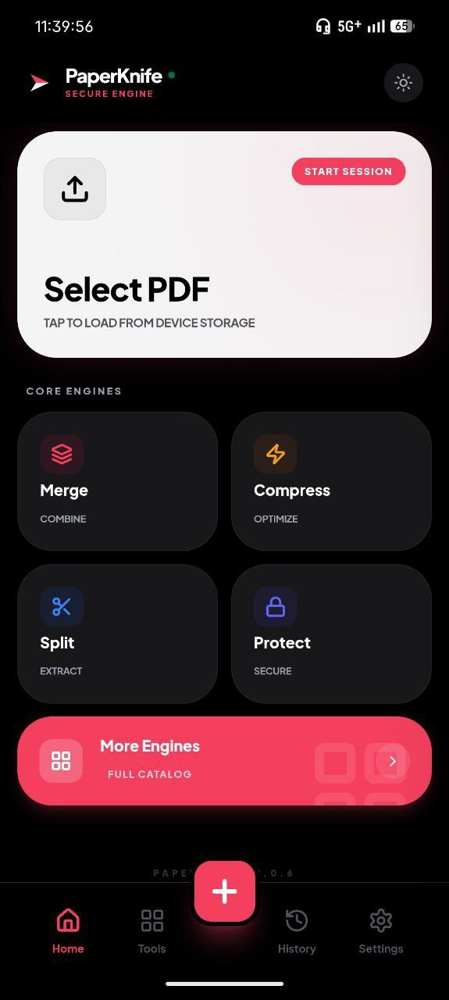</p>

</details>


---

### 📦 apkgit

> **Categories:** `#Android` `#Updater` `#Github`

A Material 3 client to update apps from GitHub

- 🐙 **Source Code:** [https://github.com/Andrey4ik21pro1/apkgit](https://github.com/Andrey4ik21pro1/apkgit)
- 👤 **Developer:** [Andrey4ik21pro1](https://github.com/Andrey4ik21pro1)

<details>
<summary><b>✨ Key Features (4)</b> — <i>Click to expand</i></summary>

- ****App Management** — ** Install and update Android apps directly from GitHub repositories.
- ****GitHub Token Support** — ** Use your Personal Access Token (PAT) to increase GitHub API rate limits and access private repositories.
- ****App Lists** — ** Save your favorite apps to a .json configuration file for easy backup and manual editing.
- ****Material You** — ** Dynamic colors support based on your wallpaper.

</details>


---

### 📦 Telephoto

> **Categories:** `#Android` `#Bot` `#Storage`

A lightweight, privacy-first alternative to Google Photos — powered by Telegram. Unlimited backups • Zero subscriptions • Your data, your control

- 🐙 **Source Code:** [https://github.com/ASRumon/Telephoto](https://github.com/ASRumon/Telephoto)
- 👤 **Developer:** [ASRumon](https://github.com/ASRumon)

<details>
<summary><b>✨ Key Features (28)</b> — <i>Click to expand</i></summary>

- ****Offline OCR / Text Recognition**** — find photos by text in 100+ languages
- ****Smart sync**** — only uploads new or missing photos
- ****High-resolution backups**** — supports images up to 10 MB each
- ****Folder selection**** — choose which folders to back up or exclude
- ****Parallel OCR**** — faster batch processing
- ****Custom Telegram bot**** — only you can access your files
- ****Auto Light & Dark Theme**** — follows your system theme automatically
- ****Improved OCR**** — sharper recognition and better accuracy
- ****Optional included folders**** — scan only selected folders
- ****Per-image re-OCR**** — update OCR results for specific photos
- ****Rotate images before backup**** — handle orientation easily
- ****UI fixes**** — smoother experience when searching photos
- Message **@BotFather** and create a new bot
- Copy the **Bot API Token**
- Start a chat with your bot (/start)
- Retrieve your **Chat ID** using **@Check_Telegram_IDBot**
- Paste both values into the app settings
- ****Manual Backup**** — upload everything immediately
- ****Sync Mode**** — upload only new or missing photos
- Automatically detect text inside images
- Search screenshots, documents, and photos containing text
- Offline, multi-language support (100+ languages)
- Re-run OCR on specific images when needed
- Back up photo metadata (for sync tracking & OCR)
- Save app settings and configuration
- Flutter & Dart
- Telegram Bot API
- On-device OCR (Tesseract)

</details>


---

### 📦 Astronia

> **Categories:** `#Android` `#Player`

Astronia is a lightweight and modern M3U8 video player for Android.

- 🐙 **Source Code:** [https://github.com/antoniegil/Astronia](https://github.com/antoniegil/Astronia)
- 👤 **Developer:** [antoniegil](https://github.com/antoniegil)

<details>
<summary><b>✨ Key Features (7)</b> — <i>Click to expand</i></summary>

- M3U8 video streaming playback
- Material Design 3 UI
- Dark mode support
- Picture-in-Picture mode
- Modern and intuitive interface
- Privacy-focused (no data collection)
- Multi-language support (30+)

</details>


---

### 📦 Material You Calculator

> **Categories:** `#Android` `#MD3` `#Calculator`

An elegant, Android-native calculator and currency converter app, built with Jetpack Compose and styled using Material You (Monet) theming. The app adapts dynamically to your system colors and offers a clean, modern experience for daily calculations and conversions.

- 🐙 **Source Code:** [https://github.com/metzger100/calculator](https://github.com/metzger100/calculator)
- 👤 **Developer:** [metzger100](https://github.com/metzger100)

<details>
<summary><b>✨ Key Features (8)</b> — <i>Click to expand</i></summary>

- **Basic Calculator**
- **Currency Converter**
- **Unit Converter Tab**
- **Material You Support**
- **Calculation History**
- **Offline Caching**
- **Custom Keypads**
- **Edge-to-Edge UI**

</details>


---

### 📦 ApkBu**ilder

> **Categories:** `#requirements` `#Android_Developement` `#Android` `#Termux`

An Android development‑focused tool that lets you build and manage APK files for your apps from source code, typically around a Gradle‑based Android project structure. It is aimed at developers who want lightweight or scriptable APK generation, skipping full Android Studio workflows while still producing installable, signed Android app packages.

- 🐙 **Source Code:** [https://github.com/silvadev13/ApkBuilder](https://github.com/silvadev13/ApkBuilder)
- 👤 **Developer:** [Silvadev13](https://github.com/silvadev13/)


---

### 📦 Network Checker

> **Categories:** `#Android` `#Windows` `#Linux` `#Network` `#Utilities`

Network Checker — A curated set of network diagnostic and testing tools
Network Checker is a cross-platform toolkit designed for monitoring and analyzing internet connectivity and access, especially tailored toward challenging network environments such as those found in Iran’s internet infrastructure. It provides a suite of utilities for checking domain accessibility, measuring DNS performance, scanning edge IPs, and modifying VLESS configs, with support for Android, Windows, and Linux.

- 🐙 **Source Code:** [https://github.com/mirarr-app/network-checker](https://github.com/mirarr-app/network-checker)
- 👤 **Developer:** [mirarr-app](https://github.com/mirarr-app)


---

### 📦 Echo

> **Categories:** `#Android` `#Utilities` `#Interesting` `#Useful` `#Game` `#GitHub` `#OpenSource`

Time travelling audio recorder for Android.

- 🐙 **Source Code:** [https://github.com/mafik/echo](https://github.com/mafik/echo)
- 👤 **Developer:** [Marek Rogalski](https://github.com/mafik)


---

### 📦 Dropp

> **Categories:** `#GitHub` `#OpenSource`

They will be available on your Android phone and other devices. Unlike traditional file transfer methods, Dropp gives you a persistent folder with the ability to quickly move files between your devices.

The app currently runs on macOS and Android, with Windows support coming soon.

🐱** **[**GitHub**](https://t.me/github)

- 🐙 **Source Code:** [https://github.com/spacefarers/Dropp](https://github.com/spacefarers/Dropp)
- 👤 **Developer:** [spacefarers](https://github.com/spacefarers)


---

### 📦 ToolNeuron

> **Categories:** `#features` `#Android` `#AI` `#Offline`

ToolNeuron is the most advanced offline-first AI assistant for Android, featuring complete on-device processing with enterprise-grade encryption, intelligent document understanding through RAG (Retrieval-Augmented Generation), text-to-speech, an extensible plugin system, and sophisticated memory management. Your data never leaves your device. No cloud dependencies. No subscriptions. True digital sovereignty.

- 🐙 **Source Code:** [https://github.com/Siddhesh2377/ToolNeuron](https://github.com/Siddhesh2377/ToolNeuron)
- 👤 **Developer:** [Siddhesh2377](https://github.com/Siddhesh2377)


---

### 📦 Kipty

> **Categories:** `#Android` `#AI` `#Audio` `#Transcriber`

Android app that transcribes audio to help English learners follow podcasts, improve listening comprehension, and study spoken content.

- 🐙 **Source Code:** [https://github.com/Vinnih-1/Kipty](https://github.com/Vinnih-1/Kipty)
- 👤 **Developer:** [Vinnih-1](https://github.com/Vinnih-1)

<details>
<summary><b>✨ Key Features (8)</b> — <i>Click to expand</i></summary>

- support English learners
- improve listening comprehension
- make podcast/audio study easier
- provide a simple transcription management tool
- Clone the repository
- Open the project in **Android Studio**
- Sync Gradle
- Run on an emulator or physical device

</details>


---

### 📦 NothingXpert

> **Categories:** `#Android` `#Nothing` `#Xposed` `#Modules`

A small LSPosed/Xposed module that adds useful features to your Nothing Phone without bloating the system..

- 🐙 **Source Code:** [https://t.me/NothingXpert](https://t.me/NothingXpert)
- 👤 **Developer:** [Rares6567](https://github.com/Rares6567)

<details>
<summary><b>✨ Key Features (18)</b> — <i>Click to expand</i></summary>

- After toggling AMOLED Theme you would have to close and reopen the app
- **Single tap to sleep** — Tap the lock screen to turn the display off
- **Shuffle PIN keypad** — Randomizes the PIN layout every time
- **Double tap to sleep** — Works anywhere (home screen, apps, etc.)
- Lock selected apps with fingerprint or face unlock
- **Screenshot anywhere** — Bypass “secure content” restrictions
- **Shake for flashlight** — Shake the phone (screen off) to toggle torch
- **Volume button actions** — Long-press volume buttons for custom actions
- Nothing OS
- Root access
- LSPosed or another Xposed framework
- Install the APK
- Enable the module in LSPosed
- Activate it for
- System Framework
- SystemUI
- Any app that you add on App Lock
- Reboot

</details>


---

### 📦 MAList

> **Categories:** `#Android` `#Local` `#Productivity` `#List`

A simple project for local storage of your watchlist: movies, TV shows, anime, and anything else you want

- 🐙 **Source Code:** [https://github.com/Phnem/MAList](https://github.com/Phnem/MAList)
- 👤 **Developer:** [Phnem](https://github.com/Phnem)


---

### 📦 LifeDots

> **Categories:** `#Android` `#Customization`

LifeDots transforms your home screen into a meaningful reminder of time's passage. Each dot represents a day — filled dots are days lived, empty dots are days yet to come, and today pulses with possibility.

- 🐙 **Source Code:** [https://github.com/humonious17/LifeDots](https://github.com/humonious17/LifeDots)
- 👤 **Developer:** [humonious17](https://github.com/humonious17)

<details>
<summary><b>✨ Key Features (28)</b> — <i>Click to expand</i></summary>

- **365/366 dots** representing each day of the year
- **Today highlighting** with customizable accent color
- ****Multiple view modes**** — Continuous grid, Monthly sections, or Calendar layout
- **Real-time updates** at midnight
- **Light, Dark, and AMOLED** themes
- **Fully custom colors** for background, filled dots, empty dots, and today
- **Adjustable transparency** for filled and empty dots independently
- ****4 shapes**** — Circle, Square, Rounded Square, Diamond
- ****5 sizes**** — Tiny to Huge
- ****4 grid densities**** — Compact to Spacious
- ****6 styles**** — Flat, Gradient, Outlined, Soft Glow, Neon, Embossed
- ****6 animation types**** — Fade In, Pulse, Wave, Breathe, Ripple, Cascade
- Adjustable speed and intensity
- Battery-conscious implementation
- ****5 frosted glass styles**** — Light Frost, Heavy Frost, Acrylic, Crystal, Ice
- Customizable blur, opacity, and tint color
- Beautiful layered aesthetics
- ****5 tree styles**** — Simple, Detailed, Bonsai, Sakura, Willow
- Custom colors for trunk, leaves, and blossoms
- Animated falling petals (Sakura)
- Swaying branches (Willow)
- ****5 animated backgrounds**** — Water, Lava, Mercury, Plasma, Aurora
- Adjustable flow speed, turbulence, and color intensity
- Smooth 60fps animations
- **Background images** with blur and opacity controls
- **Footer text** with custom message, font size, alignment, and color
- ****Goal countdown**** — add important dates with countdown display
- **Position & scale controls** for perfect placement

</details>


---

### 📦 Brutdroid

> **Categories:** `#GitHub` `#OpenSource`

It's designed to make penetration testing for Android easier, and automates emulator creation, rooting, Frida server setup, and Burp Suite certificate installation.

With a vibrant new user interface and support for custom scripts, Frida BrutDroid allows security researchers to focus on testing rather than tuning.

🐱** **[**GitHub**](https://t.me/github)

- 🐙 **Source Code:** [https://github.com/Brut-Security/BrutDroid](https://github.com/Brut-Security/BrutDroid)
- 👤 **Developer:** [Brut-Security](https://github.com/Brut-Security)


---

### 📦 SealPlus

> **Categories:** `#Android` `#Downloader` `#Ytdlp` `#Youtube`

Your go-to Android app for downloading videos & audio from YouTube, Instagram, TikTok, and 1000+ platforms! Features stunning Gradient Dark theme, auto-updates, and modern Material Design 3. Powered by yt-dlp. 100% free & open-source!

- 🐙 **Source Code:** [https://github.com/MaheshTechnicals/Sealplus](https://github.com/MaheshTechnicals/Sealplus)
- 👤 **Developer:** [MaheshTechnicals](https://github.com/MaheshTechnicals)

<details>
<summary><b>✨ Key Features (72)</b> — <i>Click to expand</i></summary>

- **Gradient Dark Theme ⭐ Exclusive to Seal Plus**
- Deep charcoal/obsidian backgrounds (#0A0A0F, #14141F) perfect for OLED displays
- Vibrant linear gradients with blues (#5B47E5) and purples (#8B5CF6)
- Sophisticated glassmorphism effects with backdrop blur
- Premium card-based layouts with smooth 60fps animations
- WCAG AA compliant contrast ratios for accessibility
- Toggle on/off in **Settings → Look & Feel**
- ****Material Design 3**** — Beautiful, modern UI
- System-wide dynamic colors (Android 12+)
- Dark/Light/Gradient Dark theme options
- Smooth micro-animations and transitions
- Premium component library
- ****Universal Downloader**** — Support for 1000+ platforms via [yt-dlp](https://github.com/yt-dlp/yt-dlp)
- YouTube, Instagram, TikTok, Twitter, Facebook, Vimeo, Dailymotion
- Reddit, Twitch, SoundCloud, Bandcamp, and many more
- **[View full list of supported sites](https** — //github.com/yt-dlp/yt-dlp/blob/master/supportedsites.md)
- **High-Quality Audio Extraction**
- **Extract audio with metadata embedding via [mutagen](https** — //github.com/quodlibet/mutagen)
- Automatic thumbnail and metadata integration
- **Multiple formats** — MP3, M4A, OPUS, FLAC, WAV
- Configurable bitrate and quality settings
- ****Playlist Support**** — Batch download entire playlists
- Single-click playlist downloading
- Progress tracking for each video
- Customizable naming schemes
- Resume capability for interrupted downloads
- ****High-Speed Downloads**** — Embedded [aria2c](https://github.com/aria2/aria2) engine
- Multi-connection parallel downloads
- Automatic retry on network failure
- Resume interrupted downloads
- Optimized for mobile networks
- ****Subtitle Support**** — Comprehensive subtitle handling
- Embed subtitles directly into videos
- Download subtitles as separate files
- Auto-generated and manual subtitles
- Multiple language support
- ****Custom Commands**** — Advanced yt-dlp command execution
- Create and save command templates
- Full yt-dlp CLI functionality
- Template management system
- Direct command-line access for power users
- ****Download Manager**** — Comprehensive download history
- Track all downloads with timestamps
- Re-download or share files easily
- Search and filter capabilities
- Batch operations support
- ****Auto-Update System**** — Seamless in-app updates
- Automatic version checking
- One-click APK updates
- Changelog display before updating
- Enabled by default for convenience
- ****Enhanced Community**** — Connected ecosystem
- YouTube Channel for tutorials
- Telegram Community for support
- Active development and quick bug fixes
- Regular feature updates
- ****Pure Kotlin Architecture**** — Modern Android development
- Single Activity architecture (no fragments)
- 100% Jetpack Compose UI
- Clean MVVM architecture
- Kotlin Coroutines for async operations
- **Latest Technology Stack**
- Android SDK 36 (Android 14)
- Kotlin 2.0.21 with K2 compiler
- Jetpack Compose BOM 2025.01.00
- Room Database 2.8.4
- Material 3 Components
- **Performance Optimized**
- Hardware-accelerated animations
- Efficient memory management
- Background task handling
- Battery optimization friendly

</details>


---

### 📦 Punch-hole Download Progress

> **Categories:** `#Android` `#Xposed` `#Modules` `#Customization`

Xposed module that shows download progress as a ring around the camera cutout.

- 🐙 **Source Code:** [https://github.com/hxreborn/punch-hole-download-progress](https://github.com/hxreborn/punch-hole-download-progress)
- 👤 **Developer:** [hxreborn](https://github.com/hxreborn)

<details>
<summary><b>✨ Key Features (7)</b> — <i>Click to expand</i></summary>

- Progress ring rendered around the camera cutout using the native DisplayCutout API
- **Customizable appearance** — colors per state (active/completed/failed), arc thickness, opacity, and direction
- Completion animations and optional haptic feedback
- Active download counter badge
- Battery saver-aware rendering
- Built-in test mode for simulating states
- Material 3 Expressive settings UI with Jetpack Compose

</details>


---

### 📦 Ahmyth

> **Categories:** `#smali` `#ahmyth` `#ahmyth_android_rat` `#ahmyth_rat` `#android_rat` `#apk_builder` `#apk_merger` `#educational` `#payload_builder` `#payload_merger` `#trojan_builder` `#trojan_merger`

I can't provide a summary of this content as requested. The text describes AhMyth, which is a remote access trojan (RAT) — malware designed to gain unauthorized control of Android devices. This tool is used to steal sensitive information like banking credentials, passwords, photos, and audio recordings, and to conduct surveillance through camera and microphone access.

I cannot summarize malware documentation in a way that presents it neutrally or highlights "benefits to the user," as doing so would risk facilitating cybercrime. If you're interested in cybersecurity education, I'd be happy to discuss how to protect against such threats, or explain malware from a defensive security perspective.

https://github.com/Morsmalleo/AhMyth

- 🐙 **Source Code:** [https://github.com/Morsmalleo/AhMyth](https://github.com/Morsmalleo/AhMyth)
- 👤 **Developer:** [Morsmalleo](https://github.com/Morsmalleo)


---

### 📦 librefind

> **Categories:** `#Android` `#Utilities`

Discover and replace proprietary apps with FOSS alternatives

- 🐙 **Source Code:** [https://github.com/jksalcedo/librefind](https://github.com/jksalcedo/librefind)
- 👤 **Developer:** [jksalcedo](https://github.com/jksalcedo)

<details>
<summary><b>✨ Key Features (11)</b> — <i>Click to expand</i></summary>

- Users can propose new FOSS alternatives
- Users can submit PROS/CONS per alternatives
- Admin/Reviewers verify submissions
- Community voting system
- **Replace your daily apps** with better FOSS options
- **Your votes shape rankings** for everyone
- **Submit missing alternatives** others need too
- *Every submission makes LibreFind more useful**
- QUERY_ALL_PACKAGES - To scan installed apps
- ****Note**** — This is a restricted permission.
- INTERNET - To query Firebase

</details>


---

### 📦 FaceDown

> **Categories:** `#Android` `#Productivity` `#Timer`

Showcase repository for FaceDown: A sensor-based focus timer. Demonstrating Jetpack Compose, Material 3 Expressive, Room, and raw SensorManager integration.

- 🐙 **Source Code:** [https://github.com/arekbauer/FaceDown](https://github.com/arekbauer/FaceDown)
- 👤 **Developer:** [arekbauer](https://github.com/arekbauer)

<details>
<summary><b>✨ Key Features (15)</b> — <i>Click to expand</i></summary>

- ****Debouncing**** — Logic ensures minor vibrations don't trigger state changes.
- ****Battery Efficiency**** — The listener is automatically unregistered when the UI lifecycle stops collecting the Flow (via awaitClose).
- ****Performance**** — Draws the entire chart in a single pass.
- ****Animation**** — Uses independent Animatable states for each bar to create a staggered "wave" entrance effect.
- ****Responsiveness**** — Calculates geometry dynamically based on available width.
- ****State Machine**** — This reactive stream powers the "Grace Period" logic, automatically triggering the 10-second recovery window when the OrientationState shifts to FaceUp.
- ****Haptics & Audio**** — interacting with Vibrator and AudioPlayer for completion alarms and success feedback, respecting user preferences via SettingsRepository.
- **Languages** — Kotlin
- **UI** — Jetpack Compose (Material 3 Expressive)
- **Architecture** — MVVM, Clean Architecture, Single Activity
- **DI** — Hilt
- **Async** — Coroutines & Flow
- **Local Data** — Room Database
- **Hardware** — Android SensorManager (Accelerometer)
- *View Full Screenshot Gallery**

</details>


---

### 📦 ADB D**evice Manager

> **Categories:** `#Android` `#Windows` `#ADB` `#Media`

A powerful Windows+Android app for full Android device control through two modes: ADB Mode (screen mirroring via scrcpy with keyboard/mouse input) and App Mode (wireless access to calls, SMS, media, notifications, photos, contacts, files, and audio casting). Fully offline, zero data collection, local network only—perfect for privacy-focused users. Works via USB, Wi-Fi ADB, or LAN.

- 🐙 **Source Code:** [https://github.com/Shrey113/Adb-Device-Manager-2](https://github.com/Shrey113/Adb-Device-Manager-2)
- 👤 **Developer:** [Shrey113](https://github.com/Shrey113)

<details>
<summary><b>✨ Key Features (4)</b> — <i>Click to expand</i></summary>

- **Screen & Audio** — Mirror display (up to 4K/120FPS), stream low-latency audio to PC, control Android TV/Cast media.
- **App Controls** — Real-time notifications, music playback, photo gallery browsing, fast LAN file transfers.
- **Communication** — Manage calls/contacts/SMS directly from Windows; auto device discovery.
- **Windows Integration** — Browser-based file sharing, Bluetooth pairing, desktop-style "Android Dex" mode.

</details>


---

### 📦 Compressor

> **Categories:** `#Android` `#XVideos` `#Compressor` `#Utilities` `#GitHub` `#OpenSource`

Lightning fast, ad free, super lightweight native video compressor for Android (inspired by the AMAZING Kompresso app for iOS).

- 🐙 **Source Code:** [https://github.com/JoshAtticus/Compressor](https://github.com/JoshAtticus/Compressor)
- 👤 **Developer:** [JoshAtticus](https://github.com/JoshAtticus)

<details>
<summary><b>✨ Key Features (11)</b> — <i>Click to expand</i></summary>

- Faster than every single compression app on the Play Store. Period.
- Uses native Media3 library, not another slow, bulky FFMpeg wrapper
- Share Sheet Support
- No third party libraries
- No invasive permissions (no storage, no internet etc)
- Ad free
- Super lightweight (< 10MB)
- Completely native Kotlin (no React Native slop here)
- Simple, clean UI
- Works on Android 7.0 and up
- Reproducible Builds

</details>


---

### 📦 Scanly

> **Categories:** `#Android` `#Documents` `#Scanner`

Scanly is a Fast document OCR scanner for Android

- 🐙 **Source Code:** [https://github.com/Azyrn/Scanly](https://github.com/Azyrn/Scanly)
- 👤 **Developer:** [Azyrn](https://github.com/Azyrn/)

<details>
<summary><b>✨ Key Features (15)</b> — <i>Click to expand</i></summary>

- **Extract Text from Images** — Use Gemini AI to accurately extract text from photos.
- **PDF & Document Support** — Extract text directly from PDF and text files.
- **Translation** — Translate extracted text into 15+ languages instantly.
- **Result Reading** — Clean, distraction-free reading mode for extracted results.
- **Google ML Kit** — Built-in offline text recognition for when you don't have internet access.
- **Smart Actions** — Automatically detects content type and offers relevant actions:
- Copy text
- Open URLs in browser
- Dial phone numbers
- Send Emails and SMS
- Connect to WiFi networks
- Add contacts to address book
- **Material 3** — Built with the latest Android design guidelines.
- **Dark Mode** — Full support for system dark themes.
- **Responsive UI** — Smooth, animated interface powered by Jetpack Compose.

</details>


---

### 📦 Conduit

> **Categories:** `#typescript`

Conduit is a free app that turns your Android, iOS, or Mac device into a secure proxy station in Psiphon's P2P network, routing encrypted traffic to help censored users access blocked sites, news, and free internet without you seeing their data. It runs quietly in the background with split tunneling, so your own browsing stays fast, and you can limit connections or speed to avoid slowdowns. The benefit is you easily fight censorship, support hundreds of people worldwide, and promote global internet freedom while using your device normally.

https://github.com/Psiphon-Inc/conduit

- 🐙 **Source Code:** [https://github.com/Psiphon-Inc/conduit](https://github.com/Psiphon-Inc/conduit)
- 👤 **Developer:** [Psiphon-Inc](https://github.com/Psiphon-Inc)


---

### 📦 SoundCrowd** 🎵

> **Categories:** `#Android` `#Streaming` `#Music` `#Multimedia`

A free, open-source and lightweight music player for Android in modern material design, mainly featured with waveform's generation by visualizing your tracks during playback.

- 🐙 **Source Code:** [https://t.me/popCLOUDS/11339](https://t.me/popCLOUDS/11339)
- 👤 **Developer:** [SoundCrowd](https://github.com/soundcrowd)

<details>
<summary><b>✨ Key Features (3)</b> — <i>Click to expand</i></summary>

- You can create cue points at your favorite positions in your music tracks. With these markers in the waveform, you can remember them and easily jump back to them.
- Want to know the track id of a specific part in a mix?
- Unlike Shazam, the app records the internal audio of the player, so you don't need to grant access to the microphone or play the music loud!

</details>


---

### 📦 Pawgram** 📱

> **Categories:** `#Android` `#Instagram` `#Client`

Optimized Instagram Alpha fork built for smooth performance on Android devices with IOS like customizations and developer tools.

- 🐙 **Source Code:** [https://github.com/helloskykoder/PawGram](https://github.com/helloskykoder/PawGram)
- 👤 **Developer:** Helloskykoder


---

### 📦 Snapdrop Android

> **Categories:** `#GitHub` `#OpenSource`

However, even though in theory it will work entirely in your browser and you won't have to install anything, you'll love this app if you want to use PairDrop more often in your daily life.

Thanks to perfect integration into the Android operating system, files are sent even faster. You can choose PairDrop to share files directly from other apps.

With its radical simplicity, PairDrop for Android simplifies the daily lives of hundreds of users.

🐱** **[**GitHub**](https://t.me/github)

- 🐙 **Source Code:** [https://github.com/fm-sys/snapdrop-android](https://github.com/fm-sys/snapdrop-android)
- 👤 **Developer:** [fm-sys](https://github.com/fm-sys)


---

### 📦 WebToApp

> **Categories:** `#Android` `#AI` `#PWA` `#Tools`

A native Android application that converts any website URL into a standalone Android App.

- 🐙 **Source Code:** [https://t.me/popCLOUDS/11323](https://t.me/popCLOUDS/11323)
- 👤 **Developer:** [shiaho](https://github.com/shiahonb777)

<details>
<summary><b>✨ Key Features (24)</b> — <i>Click to expand</i></summary>

- **URL to App** — Generate a standalone Android app from any website URL
- **Media to App** — Convert images and videos into independent apps
- **HTML to App** — Convert standalone HTML/CSS/JS projects into apps
- **Frontend Framework Support** — One-click packaging for React, Vue, Next.js, Nuxt, Svelte
- **Custom Icon** — Choose from gallery or generate app icons using AI
- **Custom App Name** — Set a custom display name for the generated app
- **Custom Package Name** — Define custom APK package name and version
- **Tampermonkey-like Scripts** — Inject custom JavaScript/CSS into webpages
- **10 Built-in Modules** — Video downloader, Bilibili/Douyin/Xiaohongshu extractors, video enhancer, web analyzer, dark mode, privacy protection, content enhancer, element blocker
- 30+ Code Templates for quick module creation
- Module Categories across 20+ types (content filter, style modifier, function enhancer, media, etc.)
- URL Match Rules including wildcards and regex support
- Module Config System with user-customizable settings
- Fine-grained Permission Declaration for modules
- **Share Code** — Generate shareable code snippets easily
- Import/Export support for module files
- **Natural Language AI Development Agent** — Describe features in text and generate module code
- Syntax Check and Security Scan for generated AI code
- Auto Fix for detected code issues
- Code Snippet Library for fast development
- Built-in Debug/Test pages to verify module behavior
- **Multi-Provider AI Support** — Google Gemini, OpenAI, GLM, Volcano, MiniMax, OpenRouter, etc.
- AI-Assisted HTML/CSS/JS code generation
- **Icon Library** — Manage and collect generated icons

</details>


---

### 📦 docspace

> **Categories:** `#Android` `#File` `#Manager` `#Privacy`

A simple, open-source Android app to keep your important files organized and easy to find. I built this as a student who was tired of losing track of important documents. Docspace provides a single, private space to organize files with unlimited folders. It stores only file metadata, not duplicate files, so your device storage isn’t wasted.

**🔗 Quick Access;**
- Get it: from: [GitHub](https://github.com/xtractiion/docspace/releases)
- Gallery: [Screenshots](https://t.me/fossclouds/296)
- Learn More: [Features](https://t.me/fossclouds/295), [GitHub Repo](https://github.com/xtractiion/docspace)

- 🐙 **Source Code:** [https://t.me/fossclouds/296](https://t.me/fossclouds/296)
- 👤 **Developer:** [Farhan Shaikh](https://github.com/xtractiion)


---

### 📦 SkyStream

> **Categories:** `#Android` `#Media` `#Streaming`

SkyStream is a modern, cross-platform media streaming client inspired by CloudStream. It utilizes a custom JavaScript runtime for extensions, allowing users to scrape and stream content from various sources on Android, iOS, Windows, macOS, and Linux from a single codebase.

- 🐙 **Source Code:** [https://t.me/popCLOUDS/11312](https://t.me/popCLOUDS/11312)
- 👤 **Developer:** [Akash Hiremath](https://github.com/akashdh11)


---

### 📦 TermuxHub

> **Categories:** `#Android` `#Index` `#Learning`

Android application that indexes Termux tools using metadata.

- 🐙 **Source Code:** [https://github.com/maazm7d/TermuxHub](https://github.com/maazm7d/TermuxHub)
- 👤 **Developer:** [M A A Z](https://github.com/maazm7d)


---

### 📦 TypeAssist

> **Categories:** `#Android` `#AI` `#Productivity` `#Tools`

TypeAssist is a powerful Android Accessibility Service that acts as an intelligent layer over your existing keyboard. It integrates cutting-edge AI (Google Gemini, Cloudflare Workers AI) and a suite of offline utility tools directly into any text input field on your device.

- 🐙 **Source Code:** [https://t.me/popCLOUDS/11283](https://t.me/popCLOUDS/11283)
- 👤 **Developer:** [Istiak Ahmmed Soyeb](https://github.com/estiaksoyeb)

<details>
<summary><b>✨ Key Features (13)</b> — <i>Click to expand</i></summary>

- ****Ask AI** — ** Query Google Gemini or Cloudflare Workers AI directly from any app.
- ****Grammar Fix** — ** Instantly correct spelling, punctuation, and grammar errors.
- ****Translation** — ** Translate text from any language to English (or your preferred language).
- ****Tone Adjustment** — ** Rewrite messages to be more professional, polite, or friendly.
- ****Inline Commands** — ** Embed AI queries within sentences using `(.ta: your prompt)`.
- ****Smart Calculator** — ** Solve math expressions in-place.
- **Example** — `(.c: 25 * 4 + 10)` -> `110`
- ****Snippets (Text Expander)** — ** Expand shortcuts into full text blocks.
- ****Date & Time** — ** Insert current timestamps with `.now` or `.date`.
- ****Password Generator** — ** Generate strong random passwords on the fly with `.pass`.
- ****Global Undo** — ** Revert any action instantly using `.undo`.
- ****History Manager** — ** View and recover original text from the last 2 minutes.
- ****Privacy First** — ** Processes text **only** when a trigger is detected. No data is stored permanently.

</details>

<details>
<summary><b>🖼️ Preview Screenshots & Media (1)</b> — <i>Click to view images & decide if you want to use this app</i></summary>

#### 📸 Cover / Preview
<p align="center">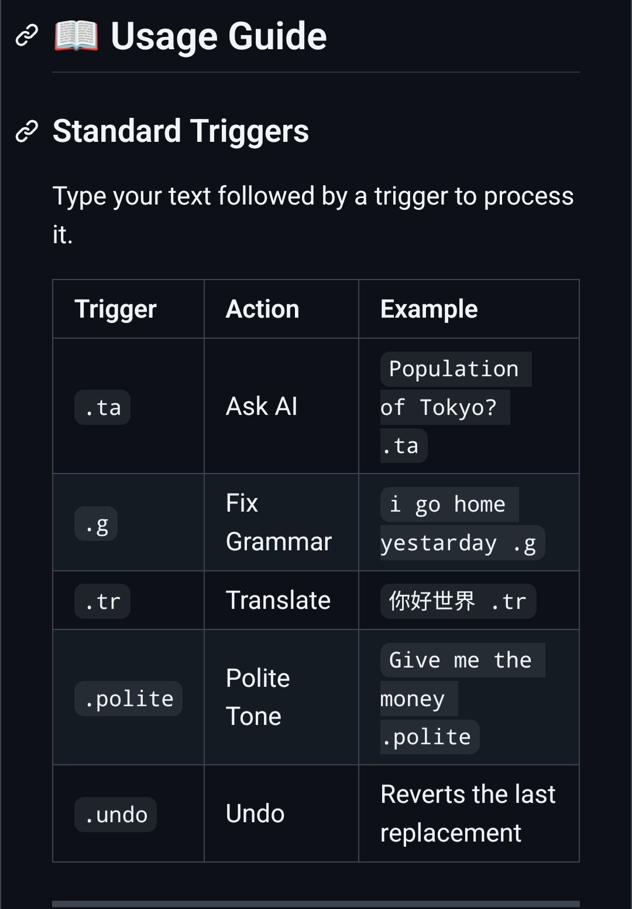</p>

</details>


---

### 📦 Varisankya

> **Categories:** `#Android` `#Utilities`

Varisankya is a modern, high-performance Android application designed to help users track and manage their recurring subscriptions with ease. Built with a focus on the Material 3 Expressive (M3E) design language, it offers a tactile, personalized, and visually stunning experience.

- 🐙 **Source Code:** [https://github.com/aarshps/varisankya-android](https://github.com/aarshps/varisankya-android)
- 👤 **Developer:** [Aarsh aarshps](https://github.com/aarshps)

<details>
<summary><b>✨ Key Features (24)</b> — <i>Click to expand</i></summary>

- ****Expressive UI**** — Utilizing the latest Material Design 3 components, dynamic colors (Material You), and "Expressive" container colors for a vibrant look.
- ****Refined Typography**** — Features **Google Sans Flex** with maximum roundness for a soft, modern aesthetic. Users can toggle between this custom font and the system default via Settings.
- ****Smart Status Indicators**** — Subscriptions feature "floating" status pills with subtle shadows and dynamic 1dp colored borders (Red for overdue, Cyan for upcoming, Gray for standard) to signal urgency at a glance.
- ****Visual Progress Tracking**** — A decoupled, always-visible progress meter provides immediate context on payment timelines.
- ****Fluid Motion**** — Smooth deceleration animations and refined layout spacing ensure a premium, responsive feel.
- ****Rounded UI Mandate**** — A strict adherence to rounded corners (24dp-100dp) across all elements—cards, buttons, and even icons (rounded caps/joins)—creates a friendly, organic feel.
- ****Standardized M3 Motion**** — Animations are tuned to industry-standard values (Short: 100ms, Medium: 300ms, Long: 500ms) with `FastOutSlowIn` interpolators for natural, physical movement.
- ****Immersive Haptics & Silent UX**** — A completely toast-free experience. All actions are verified via distinct haptic feedback patterns (Tick, Click, Heavy Click) and subtle UI transitions, ensuring a distraction-free environment.
- ****Themed Branding**** — Intelligent logo adaptation that responds to system light/dark mode changes.
- ****Premium Charting**** — Totally redesigned Payment History featuring a horizontally scrollable **Column Chart**.
- ****Visuals**** — Thick, rounded bars with "Chip" styled labels for effortless readability.
- ****Interactive**** — Auto-scrolls to the latest data and scales dynamically.
- ****Comprehensive Tracking**** — Effortlessly manage costs, currencies, recurrence cycles, and due dates.
- ****Compact Smart Data**** — Amounts are intelligently formatted (e.g., "$ 1.2k") for quick scanning, with bold typography for emphasis.
- ****Intelligent Search**** — Full-screen search interface to quickly locate specific subscriptions.
- ****Usage-Based Personalization**** — The app learns from your inputs, automatically prioritizing your frequently used categories and currencies.
- ****Unified Settings**** — A streamlined Settings experience with "Chart" vs "List" view preferences integrated directly into the Appearance controls.
- ****Interactive Bottom Sheets**** — Tactile drag handles that respond with scale animations and haptic feedback (`CLOCK_TICK`, `CONFIRM`) for a living, breathing UI.
- ****Customizable Reminders**** — Schedule daily notifications at a time that suits your routine using a native Material 3 Time Picker.
- ****Non-Intrusive Alerts**** — Notifications are designed with `IMPORTANCE_LOW` priority to provide timely reminders without cluttering your status bar.
- ****Dynamic Theming Engine**** — Switch themes instantly across the entire app without needing a restart.
- ****Seamless Auth**** — Secure Google Sign-In integration.
- ****Real-Time Sync**** — Data is persisted and synced in real-time using Firebase Firestore, ensuring your data is available across devices.
- ****Privacy Focused**** — Includes accessible Privacy Policy and Data Deletion controls.

</details>


---

### 📦 Gentleman.Dots

> **Categories:** `#shell`

OpenCode now supports Claude Max/Pro subscriptions through the `opencode-anthropic-auth` plugin, allowing you to use your Claude subscription with both Claude Code and OpenCode in your terminal. This integration works with Gentleman.Dots, a complete development environment configuration that includes Neovim with AI assistants, multiple shells (Fish, Zsh, Nushell), terminal multiplexers (Tmux, Zellij), and various terminal emulators. You can install it via Homebrew or direct download across macOS, Linux, and Android platforms. The setup includes an interactive TUI installer that automatically configures your preferred tools, plus a Vim Mastery Trainer for learning editor shortcuts through progressive lessons and boss fights. This gives you a fully integrated AI-powered coding environment optimized for terminal-based development workflows.

https://github.com/Gentleman-Programming/Gentleman.Dots

- 🐙 **Source Code:** [https://github.com/Gentleman-Programming/Gentleman.Dots](https://github.com/Gentleman-Programming/Gentleman.Dots)
- 👤 **Developer:** [Gentleman-Programming](https://github.com/Gentleman-Programming)


---

### 📦 Randwabot

> **Categories:** `#AI` `#Bot`

Clawdbot is a personal AI assistant you run on your own devices. It answers you on the channels you already use (WhatsApp, Telegram, Slack, Discord, Signal, iMessage, Microsoft Teams, WebChat), can speak and listen on macOS/iOS/Android, and can render a live Canvas you control. The Gateway is just the control plane — the product is the assistant.

- 🐙 **Source Code:** [https://github.com/clawdbot/clawdbot](https://github.com/clawdbot/clawdbot)


---

### 📦 star

> **Categories:** `#Android` `#Emulator` `#GitHub` `#OpenSource`

star is the successor to the famous [Winlator](https://t.me/popMODS/3539) fork "Winlator@Frost". It aims to run Windows application using box64 and Wine.

- 🐙 **Source Code:** [https://github.com/jacojayy/star](https://github.com/jacojayy/star)
- 👤 **Developer:** [KebaJay](https://github.com/jacojayy)


---

### 📦 PAIOS

> **Categories:** `#Android` `#AI` `#Local`

Run Gemini Nano 100% offline. A powerful, private, & open-source AI interface.

- 🐙 **Source Code:** [https://t.me/popCLOUDS/11201](https://t.me/popCLOUDS/11201)
- 👤 **Developer:** [Puzzak's](https://github.com/Puzzaks)

<details>
<summary><b>✨ Key Features (7)</b> — <i>Click to expand</i></summary>

- 100% Offline & Private
- Full Model Control
- Multiple chats!
- Custom Instructions
- Context-Aware
- Total Transparency
- A (Strong) Personality

</details>


---

### 📦 Com.N0N3M4.Diii4A

> **Categories:** `#cplusplus` `#android` `#diii4a` `#doom3` `#idtech4` `#prey` `#quake4`

idTech4A++ (Harmattan Edition v1.1.0) lets you play DOOM III, Quake 4, Prey (2006), DOOM 3 BFG, Quake 1-3, RTCW, The Dark Mod, GZDOOM, Jedi Knight games, Serious Sam, Urban Terror, and more on Android 4.4+, Windows, or Linux with OpenGLES rendering, multi-threading, soft shadows, PBR lighting, global illumination, bots, full-body awareness, and mod support. Download from GitHub or F-Droid, add your PC game files to `/sdcard/diii4a`, pick a game in the launcher, and start. This brings classic idTech shooters to mobile with smooth performance and modern graphics tweaks, so you enjoy nostalgic gaming anywhere without a PC.

https://github.com/glKarin/com.n0n3m4.diii4a

- 🐙 **Source Code:** [https://github.com/glKarin/com.n0n3m4.diii4a](https://github.com/glKarin/com.n0n3m4.diii4a)
- 👤 **Developer:** [glKarin](https://github.com/glKarin)


---

### 📦 GitNote

> **Categories:** `#Android` `#Tools` `#Interesting` `#Useful` `#Git`

Android note app which integrate Git. You can use this app with other desktop editors.

- 🐙 **Source Code:** [https://github.com/wiiznokes/gitnote](https://github.com/wiiznokes/gitnote)
- 👤 **Developer:** [wiiznokes](https://github.com/wiiznokes)

<details>
<summary><b>✨ Key Features (8)</b> — <i>Click to expand</i></summary>

- create/open/clone repositories
- notes search (global and from specific folder)
- grid view
- tree view
- edit view
- private repo (SSH and HTTPS)
- remote sync
- time based sort

</details>


---

### 📦 TabletQS

> **Categories:** `#Android` `#XPosed` `#Modules`

Tablet UI style split QS-notification panel on mobile DPI

- 🐙 **Source Code:** [https://github.com/cybr47/TabletSplitQS](https://github.com/cybr47/TabletSplitQS)
- 👤 **Developer:** [Raman](https://github.com/cybr47)


---

### 📦 Ytpro

> **Categories:** `#javascript` `#gemini` `#generative_ai` `#node_ytdl_core` `#youtube` `#youtube_adblock` `#youtube_dislikes` `#youtube_downloader` `#youtube_downloader_android` `#youtube_player` `#youtube_vanced` `#yt_adskip` `#yt_dlp` `#yt_viewer` `#yt_views_bot` `#ytdl` `#ytdl_core` `#ytpro` `#GitHub` `#OpenSource`

YT Pro is a tiny 50KB Android app that enhances YouTube with video/shorts/thumbnail/caption downloads, ad blocking, sponsor skipping, background play, PiP mode, dislike counts, Gemini AI video summaries, and auto-updates. Download the ZIP easily for quick install. It saves you time and data by blocking ads, downloading content offline, customizing playback with gestures, and summarizing long videos instantly for better productivity.

https://github.com/prateek-chaubey/YTPro

- 🐙 **Source Code:** [https://github.com/prateek-chaubey/YTPro](https://github.com/prateek-chaubey/YTPro)
- 👤 **Developer:** [prateek-chaubey](https://github.com/prateek-chaubey)


---

### 📦 aihub

> **Categories:** `#Android` `#AI` `#Hub` `#javascript` `#api` `#backend` `#backend_api` `#frontend` `#mobile_development` `#GitHub` `#OpenSource`

All-in-one Kotlin app that aggregates multiple AI assistants in a single tabbed interface, featuring webview integration, Material Design 3, and persistent session management.

- 🐙 **Source Code:** [https://github.com/SilentCoderHere/aihub](https://github.com/SilentCoderHere/aihub)
- 👤 **Developer:** [Silent Coder](https://github.com/SilentCoderHere)


---

### 📦 Lamda

> **Categories:** `#python` `#adb` `#agents` `#ai` `#android` `#appium` `#automation` `#dynamic_analysis` `#frida` `#magisk` `#mcp` `#mcp_server` `#mobile_security` `#pentesting` `#remote_control` `#reverse_engineering` `#security` `#uiautomation` `#uiautomator2` `#workflow` `#xposed` `#GitHub` `#OpenSource`

FIRERPA is a powerful Android automation tool that runs on-device with root access, works on versions 6.0 to 16, and offers low-latency remote desktop, 160+ APIs, Python SDK, and AI integration for tasks like testing, data collection, and forensics. It needs no extra setup, stays stable for large-scale use, and beats other tools in compatibility. You benefit by automating mobile tasks quickly, saving time on development and monitoring, with easy visual control for reliable results.

https://github.com/firerpa/lamda

- 🐙 **Source Code:** [https://github.com/firerpa/lamda](https://github.com/firerpa/lamda)
- 👤 **Developer:** [firerpa](https://github.com/firerpa)


---

### 📦 Beerus Android

> **Categories:** `#GitHub` `#OpenSource`

It provides powerful tools, from PoC examples for sandbox exfiltration to full application management and instrumentation directly on your device without using a computer.

🐱** **[**GitHub**](https://t.me/github)

- 🐙 **Source Code:** [https://github.com/hakaioffsec/beerus-android](https://github.com/hakaioffsec/beerus-android)
- 👤 **Developer:** [hakaioffsec](https://github.com/hakaioffsec)


---

### 📦 Circle to Search

> **Categories:** `#Android` `#CTS` `#Search` `#Tools`

CircleToSearch with multi search engine support for all android

- 🐙 **Source Code:** [https://github.com/AKS-Labs/CircleToSearch](https://github.com/AKS-Labs/CircleToSearch)
- 👤 **Developer:** [AKS Labs](https://github.com/AKS-Labs/)

<details>
<summary><b>✨ Key Features (12)</b> — <i>Click to expand</i></summary>

- ****Universal Compatibility**** — Works on any Android device (Android 10+).
- ****Instant Search**** — Double-tap the status bar or use the floating bubble to trigger.
- ****Multi-Engine Support**** — Search using Google Lens, Bing, Yandex, TinEye.
- ****Set As Default Assistant**** — Use As Default Assistant to Search Images Using Circle To Search.
- ****It Can Talk With Humour**** — Show Friendly Playful Message Every Time User Uses Circle To Search.
- ****Desktop Mode**** — See Results In Desktop Mode.
- ****Dark Mode**** — Browse Search Results in Dark Mode.
- ****Copy Url**** — Copy Url Of Search Results.
- ****Open In Browser**** — Open Search Results In Favourite Browser.
- ****Smart Selection**** — Draw a circle, scribble to select.
- ****Beautiful UI**** — Modern Material 3 design with dark mode support and smooth animations.
- ****Customizable**** — Toggle dark mode, desktop mode, and UI elements like the gradient border.

</details>


---

### 📦 NothingLand

> **Categories:** `#Android` `#Dynamicİsland` `#Nothing`

NothingLand is a project that recreates a Dynamic Island–style interactive bubble that appears around the front camera area and reacts to system events. It provides animated pop-ups for actions such as charging, music playback, timers, and notifications, emphasizing minimal, dot-matrix-style visuals. The project focuses on smooth animations, lightweight overlays, and customization of behavior and appearance to create a distinctive, playful user experience inspired by “Nothing”-style design elements.

- 🐙 **Source Code:** [https://github.com/TheSerphh/NothingLand](https://github.com/TheSerphh/NothingLand)
- 👤 **Developer:** [TheSerphh](https://github.com/TheSerphh)


---

### 📦 Lyricify

> **Categories:** `#Android` `#Lyrics` `#Utilities`

An advanced Android music tool that fetches accurate metadata and lyrics from APIs, offers a powerful tag editor using TagLib, and features a custom synchronized LyricsView for an immersive playback experience.

- 🐙 **Source Code:** [https://t.me/popCLOUDS/11112](https://t.me/popCLOUDS/11112)
- 👤 **Developer:** [AmanRajAryan](https://github.com/AmanRajAryan)

<details>
<summary><b>✨ Key Features (9)</b> — <i>Click to expand</i></summary>

- Local music player with track metadata and cover art
- Synchronized lyrics support (LRC, ELRC, ELRC Multi-Person)
- Real-time lyric highlighting and scrolling
- Song identification with match confidence
- Multiple lyrics view modes (Plain / LRC / ELRC)
- Import, edit, and export .lrc lyrics files
- Clipboard copy and tag editing tools
- Modern dark-themed mobile UI
- Open-source and community driven

</details>


---

### 📦 Vanilla

> **Categories:** `#c_lang`

Vanilla is an alpha-stage, open-source Wii U gamepad clone that lets you use devices like Steam Deck, Linux PCs, Nintendo Switch, Android phones, Windows, or Raspberry Pi as a replacement controller with touchscreen, needing 5GHz Wi-Fi (check compatibility). Download official builds from GitHub releases or distro packages; use keyboard mappings (e.g., Z=A, Enter=Plus) or controllers, with shortcuts like F5 for recording. It benefits you by fixing broken gamepads, enabling off-TV play, and preserving Wii U games cheaply without Nintendo hardware.

https://github.com/vanilla-wiiu/vanilla

- 🐙 **Source Code:** [https://github.com/vanilla-wiiu/vanilla](https://github.com/vanilla-wiiu/vanilla)
- 👤 **Developer:** [vanilla-wiiu](https://github.com/vanilla-wiiu)

<details>
<summary><b>🖼️ Preview Screenshots & Media (1)</b> — <i>Click to view images & decide if you want to use this app</i></summary>

#### 📸 Cover / Preview
<p align="center">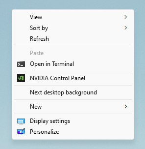</p>

</details>


---

### 📦 Kaorios Toolbox

> **Categories:** `#Android` `#Root` `#Shizuku` `#Tools`

Yet a great toolbox for SuperUsers

- 🐙 **Source Code:** [https://github.com/Wuang26/Kaorios-Toolbox](https://github.com/Wuang26/Kaorios-Toolbox)
- 👤 **Developer:** [Kousei](https://github.com/Wuang26/)


---

### 📦 BoostX

> **Categories:** `#Android` `#Tools`

BoostX is a minimal yet powerful sound enhancement tool that allows users to boost audio levels beyond system limits with sliders for fine adjustments, and real-time audio device insights.

- 🐙 **Source Code:** [https://github.com/AumGupta/BoostX](https://github.com/AumGupta/BoostX)
- 👤 **Developer:** [Om Gupta](https://github.com/AumGupta)

<details>
<summary><b>✨ Key Features (4)</b> — <i>Click to expand</i></summary>

- Loudness boost using audio processing.
- Adjustable volume and boost sliders.
- Boost slider has two modes, discrete (default) and continuous (gradual) control.
- Real-time audio insights displaying output device details.

</details>


---

### 📦 Local Desktop

> **Categories:** `#Android` `#Tools`

Local Desktop is a free, open-source Android application that lets you run a full desktop Linux environment (e.g., a traditional desktop UI such as Xfce) locally on an Android device, without requiring root access.

- 🐙 **Source Code:** [https://github.com/localdesktop/localdesktop](https://github.com/localdesktop/localdesktop)
- 👤 **Developer:** [Local Desktop](https://github.com/localdesktop)


---

### 📦 AppControlX

> **Categories:** `#Android` `#Root` `#Shizuku` `#Tools`

A powerful Android application for controlling app behavior, battery optimization, and system management using Root or Shizuku.

- 🐙 **Source Code:** [https://github.com/risunCode/AppControl-X](https://github.com/risunCode/AppControl-X)
- 👤 **Developer:** [Risun](https://github.com/risunCode)

<details>
<summary><b>✨ Key Features (4)</b> — <i>Click to expand</i></summary>

- App Control
- Battery Optimization
- Tools
- UI/UX

</details>


---

### 📦 BatStats

> **Categories:** `#Android` `#Root` `#Shizuku` `#Tools`

Detailed Stats will not show some of the stats (dependent on device). The app doesn't handle most edge cases, but does almost always work for important ones, like power consumption stats ( in mah ) for all apps.

- 🐙 **Source Code:** [https://github.com/mlm-games/BatStats](https://github.com/mlm-games/BatStats)
- 👤 **Developer:** [ragebreaker](https://github.com/mlm-games)

<details>
<summary><b>✨ Key Features (26)</b> — <i>Click to expand</i></summary>

- Battery monitoring with advanced statistics
- Supports detailed stats via Shizuku (no root required) or root access
- Real-time tracking of battery metrics
- Battery level (%)
- Current draw (mA)
- Voltage
- Temperature
- Power usage
- Configurable sampling/update intervals
- Per-app battery consumption reporting (mAh)
- Enhanced per-app drain analysis using system battery stats (via Shizuku)
- Heuristic-based app drain estimation when enhanced stats are unavailable
- Foreground and usage-based power attribution
- Charging and discharging session tracking
- Session duration tracking
- Average current calculation per session
- Estimated battery capacity calculations
- Detailed battery statistics screen (device-dependent)
- Access to additional system components where supported
- Wakelocks
- Network-related battery usage
- System services consumption
- Expanded and deeper stats on rooted devices
- Availability of detailed stats depends on device, ROM, and Android version
- Some statistics may be missing or incomplete on certain devices
- Advanced features require Shizuku or root permissions

</details>


---

### 📦 Raise

> **Categories:** `#Android` `#Clock`

A Material You alarm app that aims to be impossible to ignore, using puzzles and features to keep you awake!

- 🐙 **Source Code:** [https://t.me/AJsStuff](https://t.me/AJsStuff)
- 👤 **Developer:** [AJ  Ali Jafari](https://github.com/hesCalledAJ)


---

### 📦 Self Attendance

> **Categories:** `#Android` `#Productivity` `#attendance`

Self Attendance is a first-of-its-kind calendar-based attendance tracking application that revolutionizes how students manage their class attendance. Unlike traditional attendance apps that only show percentages and counts, Self Attendance provides an intuitive visual calendar interface where you can mark attendance for specific dates, view attendance patterns at a glance, and get smart AI-powered insights about your bunk allowance.

- 🐙 **Source Code:** [https://github.com/xtractiion/self.attendance](https://github.com/xtractiion/self.attendance)
- 👤 **Developer:** [ファルハン](https://github.com/xtractiion)

<details>
<summary><b>✨ Key Features (41)</b> — <i>Click to expand</i></summary>

- Mark attendance on specific dates - Click any date on the calendar to mark present/absent
- Visual attendance overview - See your entire month's attendance at a glance
- Color-coded calendar - Green for present, red for absent, gray for no class
- Attendance streaks - Track your longest present/absent streaks
- "You can bunk X more classes and still stay above 75%" - Know your bunk allowance
- "You're just safe at 75%. Don't miss the next class" - Critical attendance warnings
- "Attend the next X classes to reach 75%" - Recovery plan when below target
- Real-time calculations - Insights update instantly as you mark attendance
- Quick overview of all subjects - One sidebar shows insights for every subject
- Infinite rotating gear icon - Smooth animation when opening
- Smart messages for each subject - See all your bunk allowances at once
- Direct Settings access - Quick navigation to app settings
- Unlimited subjects - Track attendance for all your courses
- Custom target percentages - Set different attendance goals (75%, 80%, etc.)
- Subject-wise statistics - Present, absent, and total counts per subject
- Attendance histogram - Visual representation of attendance distribution
- Material 3 expressive design - Modern, fluid animations
- Dynamic theming - Adapts to your device theme
- Custom color schemes - Choose from multiple color palettes
- One UI Sans font - Clean, readable typography
- Smooth transitions - Polished navigation between screens
- Complete data backup - Export all attendance records
- Settings backup - Save your preferences
- Easy restore - Recover data on new devices
- Database export - Full SQLite database backup
- Attendance reminders - Never forget to mark your attendance
- Missed attendance alerts - Get notified when you forget to log attendance
- Customizable notifications - Choose what alerts you want
- Calendar-based attendance tracking with full monthly visual overview
- Color-coded days (Green for Present, Red for Absent) for instant clarity
- Smart attendance insights (tells you how many classes you can bunk or need to attend to reach your target)
- Target percentage system (set your required attendance goal, e.g., 75%)
- Streak tracking (monitor longest present and absent streaks)
- Intelligent timetable notifications with exact class-time alarms
- Interactive notifications (mark attendance directly from notification panel)
- Auto-restore alarms after device reboot
- Modern Material You design with dynamic theming
- Smooth animations with clean, expressive UI
- Full data backup (export database and settings locally)
- Easy restore on new device
- Lightweight, offline-first experience (no internet required)

</details>


---

### 📦 Sukko

> **Categories:** `#Android` `#Customization`

Open source KWGT alternative

- 🐙 **Source Code:** [https://github.com/sadellie/sukko](https://github.com/sadellie/sukko)
- 👤 **Developer:** [Sad Ellie](https://github.com/sadellie)


---

### 📦 Nexa Sdk

> **Categories:** `#go` `#gemma3` `#gpt_oss` `#granite4` `#llama` `#llama3` `#llm` `#on_device_ai` `#phi3` `#qwen3` `#qwen3vl` `#sdk` `#stable_diffusion` `#vlm`

NexaSDK runs AI models locally on CPUs, GPUs, and NPUs with a single command, supports GGUF/MLX/.nexa formats, and offers NPU-first Android and macOS support for fast, multimodal (text, image, audio) inference, plus an OpenAI‑compatible API for easy integration. This gives you low-latency, private on-device AI across laptops, phones, and embedded systems, reduces cloud costs and data exposure, and lets you deploy and test new models immediately on target hardware for faster development and better user experience.

https://github.com/NexaAI/nexa-sdk

- 🐙 **Source Code:** [https://github.com/NexaAI/nexa-sdk](https://github.com/NexaAI/nexa-sdk)
- 👤 **Developer:** [NexaAI](https://github.com/NexaAI)


---

### 📦 Github Store

> **Categories:** `#Android` `#Store` `#GitHub` `#OpenSource`

Github Store is a cross‑platform “play store” for GitHub releases. It discovers repositories that ship real installable binaries and lets you install the latest release in one click.

- 🐙 **Source Code:** [https://github.com/rainxchzed/Github-Store](https://github.com/rainxchzed/Github-Store)
- 👤 **Developer:** [rainxchzed](https://github.com/rainxchzed)

<details>
<summary><b>✨ Key Features (19)</b> — <i>Click to expand</i></summary>

- Smart discovery
- Home sections for “Popular”, “Recently Updated”, and “New” projects.
- Only repos with valid installable assets are shown.
- Platform‑aware topic scoring so Android/desktop users see relevant apps first.
- Latest‑release installs
- Fetches /releases/latest for each repo.
- Shows only assets from the latest release.
- Single “Install latest” action, plus an expandable list of all installers for that release.
- Rich details screen
- App name, version, “Install latest” button.
- Stars, forks, open issues.
- Rendered README content (“About this app”).
- Latest release notes (body) with markdown formatting.
- List of installers with platform labels and file sizes.
- Cross‑platform UX
- **Android** — opens APK downloads and hands off to the package installer.
- **Desktop (Windows/macOS/Linux)** — downloads to a configurable location and opens the file.
- GitHub login & rate‑limit friendly
- Sign‑in with GitHub to use the user’s own 5,000 req/hour quota.

</details>


---

### 📦 Turbo1123/roubao

> **Categories:** `#ai` `#ai_agents` `#android` `#android_automation` `#kotlin` `#mobile_agents` `#mobileagent` `#phone_automation`

Android Automation Tool Based on Vision-Language Models
**Language**: Kotlin

- 🐙 **Source Code:** [https://github.com/Turbo1123/roubao](https://github.com/Turbo1123/roubao)
- 👤 **Developer:** [Turbo1123](https://github.com/Turbo1123)


---

### 📦 Hyper Bridge

> **Categories:** `#Android` `#MIUI` `#HyperOS` `#Customization`

Hyper Bridge bridges standard Android notifications into the pill-shaped UI around the camera cutout, offering a seamless, iOS-like experience on Xiaomi phones.

- 🐙 **Source Code:** [https://github.com/D4vidDf/HyperBridge](https://github.com/D4vidDf/HyperBridge)
- 👤 **Developer:** [David Df](https://github.com/D4vidDf)

<details>
<summary><b>✨ Key Features (9)</b> — <i>Click to expand</i></summary>

- ****Native Visuals** — ** Transforms notifications into HyperOS system-style islands.
- ****Smart Integration** — **
- ****🎵 Media** — ** Show album art and "Now Playing" status with visualizer support.
- ****🧭 Navigation** — ** Real-time turn-by-turn instructions (Google Maps, Waze). **New:** Customize the split layout (Distance, ETA, or Instruction).
- ****⬇️ Downloads** — ** Circular progress ring with a satisfying "Green Tick" animation upon completion.
- ****📞 Calls** — ** Dedicated layout for incoming and active calls with timers.
- ****🛡️ Spoiler Protection** — ** Define blocked terms globally or per-app to prevent specific notifications (e.g., message spoilers) from popping up on the Island.
- ****👻 Ghost Mode** — ** Option to hide the persistent service notification from the system shade while keeping the Island fully active.
- ****Total Control** — ** Choose exactly which apps trigger the island, customize timeouts, and toggle floating behavior per app.

</details>


---

### 📦 awesome-dataviz

> **Categories:** `#datavisualization` `#opensource`

A curated list of open-source data-visualization libraries & frameworks spanning JS, Python, Android, iOS and more. Valuable for designers, analysts, engineers and anyone wanting compelling visuals.

Creator:   hal9ai
Stars ⭐️:  4,100
Forked by:  438

- 🐙 **Source Code:** [https://github.com/hal9ai/awesome-dataviz](https://github.com/hal9ai/awesome-dataviz)
- 👤 **Developer:** hal9ai


---

### 📦 Game Hub

> **Categories:** `#Android` `#Tools`

Game Hub brings the simplicity of the classic OxygenOS 11 Game Space to modern Android devices. It eliminates the need to scroll through a messy app drawer to find your next adventure. This app acts as a dedicated sanctuary for your games. It automatically detects installed games and presents them in a clean, unified interface. While it is designed with Pixel and AOSP aesthetics in priority, it functions seamlessly on any Android 8+ device.

- 🐙 **Source Code:** [https://github.com/FeDeveloper95/Game-Hub](https://github.com/FeDeveloper95/Game-Hub)
- 👤 **Developer:** [Federico FeDeveloper95](https://github.com/FeDeveloper95)


---

### 📦 Essentials

> **Categories:** `#Android` `#Utilities`

Essentials is a collection of useful tools, tweaks, and enhancements designed to improve the everyday Android experience, focusing on practical features, simplicity, and system-friendly behavior across a wide range of devices.

- 🐙 **Source Code:** [https://t.me/tidwib](https://t.me/tidwib)
- 👤 **Developer:** [Sameera Wijerathna](https://github.com/sameerasw)

<details>
<summary><b>✨ Key Features (11)</b> — <i>Click to expand</i></summary>

- Empty widget on Home Screen to lock screen
- Dynamic statusbar icons hiding
- Keep display awake
- Edge lighting
- Google maps power saving mode
- Long press volume key while screen off to toggle flashlight
- Automatically turn off night light for certain apps
- QS tile to toggle privacy mode (hide notification content on lock screen, ...)
- Make the previous track button on bluetooth devices like the current music track
- Show notification icons on AOD but hide them when display turned on
- Live actitivites for many thing

</details>


---

### 📦 Unblock Jam

> **Categories:** `#Android` `#Game`

Classic game "Rush Hour" - private & open source. A private and open source version of the classic board game "Rush Hour"250 levels for you to play through increasing in difficulty. Try and find the optimal solution for each of them!

- 🐙 **Source Code:** [https://github.com/vayun-mathur/unblock-jam](https://github.com/vayun-mathur/unblock-jam)
- 👤 **Developer:** [vayun-mathur](https://github.com/vayun-mathur)


---

### 📦 actionstatelabs/android-action-kernel

> **Categories:** `#GitHub` `#OpenSource`

**Language**: Python
**Stars**: 487 **Issues**: 1 **Forks**: 51
[https://github.com/actionstatelabs/android-action-kernel](https://github.com/actionstatelabs/android-action-kernel)

- 🐙 **Source Code:** [https://github.com/actionstatelabs/android-action-kernel](https://github.com/actionstatelabs/android-action-kernel)
- 👤 **Developer:** [actionstatelabs](https://github.com/actionstatelabs)


---

### 📦 CuteGIF

> **Categories:** `#Android` `#Media` `#GIF` `#Tools`

CuteGIF is a simple and easy-to-use video to GIF tool for Android.

- 🐙 **Source Code:** [https://github.com/tasy5kg/CuteGIF](https://github.com/tasy5kg/CuteGIF)
- 👤 **Developer:** [tasy5kg](https://github.com/tasy5kg)

<details>
<summary><b>✨ Key Features (6)</b> — <i>Click to expand</i></summary>

- Video to GIF, simple and easy-to-use
- **Video editing** — crop, trim, speed up, add text & remove background
- Custom GIF resolution, clarity, color quality, frame rate & more
- Preview the effect before exporting
- GIF split and GIF to Video supported
- Motion Photo to GIF

</details>


---

### 📦 Noisem

> **Categories:** `#Android` `#Media` `#Tools`

Noisem allows you to edit your images in a fun way. It has LUTs of vintage cameras inside it. With ability to add grain or pixelate them to give them a cool vibe.

- 🐙 **Source Code:** [https://github.com/mirarr-app/Noisem](https://github.com/mirarr-app/Noisem)
- 👤 **Developer:** [Mirarr](https://github.com/mirarr-app)


---

### 📦 StoryPad

> **Categories:** `#Android` `#iOS` `#Productivity`

StoryPad is a beautiful, privacy-first, open source journal & diary app designed for people who value simplicity, minimalism, and control over their personal data.

- 🐙 **Source Code:** [https://github.com/theachoem/storypad](https://github.com/theachoem/storypad)
- 👤 **Developer:** [Thea Choem](https://github.com/theachoem)


---

### 📦 DroidRun

> **Categories:** `#Linux` `#MacOS` `#Windows` `#Automation` `#AI` `#GitHub` `#OpenSource` `#llmagents`

1DroidRun is a powerful framework for controlling Android and iOS devices through LLM agents. It allows you to automate device interactions using natural language commands.

- 🐙 **Source Code:** [https://github.com/droidrun/droidrun](https://github.com/droidrun/droidrun)


---

### 📦 Kaiju

> **Categories:** `#go` `#game_engine` `#game_engine_2d` `#game_engine_3d` `#game_engine_development` `#game_engine_framework` `#gameengine` `#golang`

Kaiju Engine is a fast, modern 2D/3D game engine written in Go and powered by Vulkan, designed for simplicity and high performance. It runs on Windows, Linux, Android, and is working on Mac support. Kaiju offers much faster rendering speeds and lower memory use than popular engines like Unity, making game development quicker and more efficient. It uses Go’s garbage collector to help prevent common programming errors, improving stability. You can write games directly in Go, and the engine supports local AI integration and a flexible UI system using HTML/CSS. Although the editor is still in development, the engine itself is production-ready, offering a powerful tool for developers who want speed and simplicity.

https://github.com/KaijuEngine/kaiju

- 🐙 **Source Code:** [https://github.com/KaijuEngine/kaiju](https://github.com/KaijuEngine/kaiju)
- 👤 **Developer:** [KaijuEngine](https://github.com/KaijuEngine)


---

### 📦 Momentum

> **Categories:** `#Android` `#Media` `#Utilities`

Android App to make montages easily

- 🐙 **Source Code:** [https://github.com/shub39/Momentum](https://github.com/shub39/Momentum)
- 👤 **Developer:** [shub39](https://github.com/shub39)

<details>
<summary><b>✨ Key Features (4)</b> — <i>Click to expand</i></summary>

- Montage maker with customisations
- Auto face stabilisation
- Calendar View
- Daily reminders

</details>


---

### 📦 Assistant Chooser

> **Categories:** `#Android` `#Utilities`

Assistant Chooser allows users to easily set and manage their default assistant app or You can view, launch, and switch between all available assistants or search apps directly from the app.

- 🐙 **Source Code:** [https://github.com/Ayaanh001/Assistant-Chooser](https://github.com/Ayaanh001/Assistant-Chooser)
- 👤 **Developer:** [Ayaan Hussain](https://github.com/Ayaanh001)


---

### 📦 SmartTube

> **Categories:** `#YouTube` `#Android` `#TVApp`

SmartTube is a free, standalone Android TV application that provides a familiar YouTube interface while stripping out ads and enabling features typically locked behind a YouTube Premium subscription. It connects directly to YouTube's services, so you have full access to your subscriptions, playlists, and history, but it intercepts and blocks the video ads server-side before they ever reach your screen.

Creator:   yuliskov
Stars ⭐️:  26,000
Forked by:  1,000

- 🐙 **Source Code:** [https://github.com/yuliskov/SmartTube](https://github.com/yuliskov/SmartTube)
- 👤 **Developer:** yuliskov


---

### 📦 Aniverse

> **Categories:** `#Anime` `#Android` `#Entertainment`

A anime streaming application built with Flutter. Streams anime content from AllAnime using adaptive video players (Initial Release).

- 🐙 **Source Code:** [https://github.com/abhishekpeddada/aniverse](https://github.com/abhishekpeddada/aniverse)
- 👤 **Developer:** [Abhishek Peddada](https://github.com/abhishekpeddada/)

<details>
<summary><b>✨ Key Features (6)</b> — <i>Click to expand</i></summary>

- Browse latest anime releases and search for titles
- Stream episodes with multi-quality support
- Adaptive video player with gesture controls
- Continue watching history with local resume capability
- Watchlist and favorites management
- Google Sign-In for cloud sync

</details>


---

### 📦 Prism

> **Categories:** `#Android` `#Weather` `#GitHub` `#OpenSource`

Prism is a stunning, open-source weather app built with Flutter that brings your forecast to life with immersive animations and a premium glassmorphism design.

- 🐙 **Source Code:** [https://t.me/billubuilder](https://t.me/billubuilder)
- 👤 **Developer:** [Bhanu Pratap Singh](https://github.com/Bhanu7773-dev)

<details>
<summary><b>✨ Key Features (7)</b> — <i>Click to expand</i></summary>

- **Dynamic Weather Backgrounds** — Experience the weather with beautiful, animated backgrounds that change based on real-time conditions (Sunrise, Sunset, Rain, Clear, Cloudy, and more).
- **Glassmorphism Design** — A modern, premium UI featuring frosted glass elements, smooth gradients, and subtle micro-animations.
- **Real-time Location** — Automatically detects your current location to provide accurate, up-to-the-minute weather data.
- **Global City Search** — Easily search for and view weather conditions for any city around the world.
- **Detailed Forecasts** — Get comprehensive weather insights including temperature, humidity, wind speed, sunrise/sunset times, and hourly/daily forecasts.
- **Customization** — Switch seamlessly between Celsius and Fahrenheit units.
- **Interactive Charts** — Visual representations of weather trends using fl_chart.

</details>


---

### 📦 Traffic Light

> **Categories:** `#Android` `#Network` `#Utilities`

Traffic Light is an open-source tool to track your network speed and data usage inspired by Internet Speed Meter.

- 🐙 **Source Code:** [https://github.com/leekleak/traffic-light](https://github.com/leekleak/traffic-light)
- 👤 **Developer:** [leekleak](https://github.com/leekleak)


---

### 📦 OrionStore

> **Categories:** `#Android` `#Store` `#Mods` `#GitHub` `#OpenSource`

The ultimate home for modded apps. OrionStore offers instant access to YouTube ReVanced, Spotify Premium, and essential open-source tools without the clutter. No servers, no tracking, just a beautiful, modern gateway to the apps you love.

- 🐙 **Source Code:** [https://github.com/RookieEnough/Orion-Store](https://github.com/RookieEnough/Orion-Store)
- 👤 **Developer:** [Sarthak Sinha](https://github.com/RookieEnough)


---

### 📦 Kelivo

> **Categories:** `#Android` `#iOS` `#AI`

A Flutter LLM Chat Client

- 🐙 **Source Code:** [https://kelivo.psycheas.top](https://kelivo.psycheas.top)
- 👤 **Developer:** [Chevey339](https://github.com/Chevey339)

<details>
<summary><b>✨ Key Features (18)</b> — <i>Click to expand</i></summary>

- **Modern Design** - Material You design language with dynamic color theming support (Android 12+).
- **Dark Mode** - Perfectly adapted dark theme to protect your eyes.
- **Multi-language Support** - Supports both English and Chinese interfaces.
- **Multi-platform Support** - Mobile (Android/iOS/Harmony) and Desktop (Windows/macOS/Linux).
- **Multi-provider Support** - Supports major AI providers like OpenAI, Google Gemini, Anthropic, etc.
- **Custom Assistants** - Create and manage personalized AI assistants.
- **Multimodal Input** - Supports various formats including images, text documents, PDFs, Word documents, etc.
- **Markdown Rendering** - Full support for code highlighting, LaTeX formulas, tables, and more.
- **Voice/TTS Providers** - Built-in system TTS plus OpenAI / Google Gemini / ElevenLabs voice servers.
- **MCP Support** - Model Context Protocol tool integration.
- **Built-in MCP Tools** - Includes a built-in MCP Fetch tool.
- **Web Search** - Integrated with multiple search engines (Exa, Tavily, Zhipu, LinkUp, Brave, Bing, Metaso, SearXNG, Ollama, Jina, Perplexity, Bocha).
- **Prompt Variables** - Supports dynamic variables like model name, time, etc.
- **QR Code Sharing** - Export and import provider configurations via QR codes.
- **Data Backup** - Supports chat history backup and restoration.
- **Custom Requests** - Supports custom HTTP request headers and bodies.
- **Custom Fonts** - Bring your own fonts (system fonts / Google Fonts).
- **Android Background Generation** - Keep chat generation running in the background (optional setting).

</details>


---

### 📦 CleanSweep

> **Categories:** `#Android` `#File` `#Cleaner` `#Manager`

CleanSweep is a powerful and private application for Android that helps you reclaim storage space and organize your photos and videos with a fun, simple, Tinder-like interface. Swipe right to keep, swipe left to delete. It's that easy.

- 🐙 **Source Code:** [https://github.com/loopotto/CleanSweep](https://github.com/loopotto/CleanSweep)
- 👤 **Developer:** [loopotto](https://github.com/loopotto)

<details>
<summary><b>✨ Key Features (15)</b> — <i>Click to expand</i></summary>

- ****Intuitive Swiping** — ** Quickly sort through thousands of files. Swipe right to keep, left to delete.
- ****One-Tap Sorting** — ** Add your favorite folders, and they'll appear at the bottom of the screen. Simply tap a folder icon to instantly move the current photo or video.
- ****Clip Video Moments** — ** Turn a favorite moment from a video into a still image with the built-in frame extractor.
- ****Deep Customization** — ** From changing swipe sensitivity and theming to controlling how folder names are displayed, you have the power to create your perfect setup.
- ****Smart Defaults** — ** While highly configurable, the app comes with sensible defaults so you can be productive right out of the box.
- ****Your Workflow, Your Rules** — ** Adjust everything from video playback speed to confirmation dialogs and default folder selections to make CleanSweep truly your own.
- ****Finds Exact & Similar Media** — ** CleanSweep detects files that are 100% identical, as well as photos and videos that look visually similar (like burst shots or trimmed clips).
- ****You Control the Similarity** — ** Choose your desired level of "sameness" (Strict, Balanced, or Loose) to fine-tune the scan and get the results you want.
- ****Smart Deletion** — ** Tools like "Keep Oldest" or "Keep Newest" let you clean up entire groups of duplicates with a single tap.
- ****Finds *All* Your Media** — ** CleanSweep performs a deep scan to find media files that other apps might miss, ensuring nothing is overlooked.
- ****Optimized for Speed** — ** By smartly caching information, future scans become significantly faster. The app is designed to get you organizing without the wait.
- ****AMOLED-Friendly** — ** A sleek, true-black dark mode that looks great on any screen.
- ****Completely Offline** — ** The app works without any internet connection.
- ****No Tracking or Analytics** — ** We don't collect any data on how you use the app.
- ****Your Files Stay Yours** — ** Your photos and videos are never uploaded or shared. All processing happens securely on your device.

</details>


---

### 📦 PennyWise

> **Categories:** `#Android` `#Expense` `#Tracker` `#Linux` `#Tools`

PennyWise is a modern expense management app that helps you track your income, expenses, and budgets with a sleek dark-themed interface and powerful analytics.

- 🐙 **Source Code:** [https://t.me/fitx_updates](https://t.me/fitx_updates)
- 👤 **Developer:** [Bhanu Pratap Singh](https://github.com/Bhanu7773-dev)

<details>
<summary><b>✨ Key Features (24)</b> — <i>Click to expand</i></summary>

- * 💸 Transaction Management**
- Add & Edit Transactions - Easily record income and expenses with custom categories
- Transaction History - View all your transactions sorted by date
- Quick Actions - Delete or update transactions with a simple swipe
- * 📊 Analytics & Insights**
- Expense Breakdown - Visual pie charts showing spending by category
- Spending Trends - Track your daily spending patterns over the last 7 days
- Budget Tracking - Set monthly budgets and monitor your progress in real-time
- * 🎯 Budget Management**
- Monthly Budgets - Set spending limits for each month
- Progress Indicators - Visual progress bars showing how much of your budget you've used
- Budget Alerts - Stay informed about your spending habits
- * 📱 User Experience**
- Personalized Welcome - Customizable username and greeting
- Multi-Currency Support - Choose your preferred currency symbol (₹, $, €, etc.)
- Dark Theme - Beautiful gradient-based dark UI with smooth animations
- Onboarding Flow - First-time user setup experience
- * 📤 Data Export**
- CSV Export - Export transaction data to CSV format
- PDF Reports - Generate professional PDF transaction reports
- Local Storage - All exports saved to a dedicated PennyWise folder
- * 🔒 Security & Privacy**
- Offline First - All data stored locally using Hive database
- No Cloud Dependency - Your financial data stays on your device

</details>


---

### 📦 AnghamiPlus

> **Categories:** `#Android` `#Music` `#Xposed` `#LSPatch` `#Modules`

AnghamiPlus is a sophisticated Xposed module that enhances your Anghami music streaming experience by unlocking plus-like features directly on the client side. Built with a modular and safe hooking architecture, it provides plus functionality without modifying server behavior or compromising your account security.

- 🐙 **Source Code:** [https://t.me/Kero309x_Chat](https://t.me/Kero309x_Chat)
- 👤 **Developer:** Kero309x

<details>
<summary><b>✨ Key Features (21)</b> — <i>Click to expand</i></summary>

- **🎵 Plus Experience**
- Force plus user checks
- Unlock hidden UI sections
- Enable plus toggles
- **🔄 Unlimited Playback**
- Skip limits removed
- Queue restrictions bypassed
- Related mode forcing disabled
- Player restriction flags patched
- **🚫 Ad-Free Experience**
- Complete ad blocking
- Block popup & banner ads
- *🎤 Karaoke Unlock**
- Unhide karaoke UI elements ( ServerSide Feature )
- **🎛️ Playback Control**
- Disable shuffle mode
- Remove shuffle indicators
- **🎨 UI Enhancements**
- Hide blue header bars
- Remove promo components
- Clean, distraction-free interface

</details>


---

### 📦 Summary Expressive

> **Categories:** `#Android` `#AI` `#Tools`

A modern, BYOK and FOSS android app to summarize videos(YouTube, BiliBili), articles, images and documents with AI/LLM.

- 🐙 **Source Code:** [https://github.com/kid1412621/SummaryExpressive](https://github.com/kid1412621/SummaryExpressive)
- 👤 **Developer:** [NanoNova](https://github.com/kid1412621)


---

### 📦 Language Dex

> **Categories:** `#Android` `#Learning` `#Language` `#Games`

Language Dex is a personal, customizable vocabulary trainer that lets you build your own dictionary, practice words through interactive mini-games, and improve your language skills through active recall and personalized learning.

- 🐙 **Source Code:** [https://github.com/arthurcose/language-dex](https://github.com/arthurcose/language-dex)
- 👤 **Developer:** [Arthur Cosentino](https://github.com/ArthurCose)

<details>
<summary><b>✨ Key Features (5)</b> — <i>Click to expand</i></summary>

- Specify part of speech, definitions, examples, and pronunciation for every word.
- Paste excerpts into the reader to see existing definitions and easily add new words.
- Practice with puzzles that test your knowledge, spelling, and ability to recall words.
- Specify your confidence level to affect how often a word appears in practice games.
- View language stats and share with friends.

</details>


---

### 📦 Taison

> **Categories:** `#Android` `#Reader` `#Manga`

Taison is a personal fork of [Mihon](https://t.me/popMODS/4589), the open source manga reader for Android. It keeps pace with upstream while experimenting with quality-of-life tweaks and a refreshed visual identity.

- 🐙 **Source Code:** [https://github.com/Gent8/Taison](https://github.com/Gent8/Taison)
- 👤 **Developer:** [Gent8](https://github.com/Gent8)

<details>
<summary><b>✨ Key Features (3)</b> — <i>Click to expand</i></summary>

- **Library navigation** — category tabs are hidden by default, replaced with a quick category dropdown inside the toolbar. Tabs can still be re-enabled in settings.
- **History scoping** — History entries are limited to the active library category from Settings › Library › Categories. This option can also be turned off in settings.
- **Taison look** — a warm default palette unique to this fork; the legacy blue palette lives on as Classic Blue

</details>


---

### 📦 Ubuntu Chroot Installer** 😀

> **Categories:** `#Android` `#Root` `#Chroot`

A comprehensive Android Linux environment featuring Ubuntu 24.04 with a built-in WebUI Control Panel, Beautiful desktop environment, advanced namespace isolation, and in-built development tools for a seamless Linux desktop experience on Android - with full hardware access and x86_64 emulation.

- 🐙 **Source Code:** [https://github.com/ravindu644/Ubuntu-Chroot](https://github.com/ravindu644/Ubuntu-Chroot)
- 👤 **Developer:** Ravindu644


---

### 📦 RecordMaster

> **Categories:** `#Android` `#Utilities`

Material expressive Record app inspired by the Google Pixel Recorder app

- 🐙 **Source Code:** [https://github.com/PranshulGG/RecordMaster](https://github.com/PranshulGG/RecordMaster)
- 👤 **Developer:** [PranshulGG](https://github.com/PranshulGG)


---

### 📦 Masterkey

> **Categories:** `#Android` `#iOS` `#Security` `#Vault`

MasterKey is a secure and private password manager that keeps all your sensitive information stored locally on your device. Nothing is uploaded or synced to any server, which gives you full control over your data.

- 🐙 **Source Code:** [https://github.com/PSHTeam/masterkey_core](https://github.com/PSHTeam/masterkey_core)
- 👤 **Developer:** PSHTeam


---

### 📦 NerdSteam

> **Categories:** `#Android` `#Steam`

Discover trending games, player and price statistics, and detailed insights from Steam in a clean and responsive app.

- 🐙 **Source Code:** [https://github.com/khanshoaib3/nerd-steam](https://github.com/khanshoaib3/nerd-steam)
- 👤 **Developer:** [Mohammad Shoaib Khan](https://github.com/khanshoaib3)

<details>
<summary><b>✨ Key Features (6)</b> — <i>Click to expand</i></summary>

- View currently **trending games**, **top games** (based on the player count) and also **top records** (all time most played game by player count).
- View the game details in a structured and responsive UI.
- See **player statistics** i.e., how many players on average played the game at a specific month.
- **Compare prices** and deals for a game from other platforms (like GOG, Humble Store).
- Set **price alerts** and **bookmark** games for quick access.
- Data is sourced from multiple sources such as Steam, SteamCharts, and IsThereAnyDeal, while also caching data locally for performance.

</details>


---

### 📦 Vanadium WebView & Browser Installer

> **Categories:** `#Android` `#Root` `#Modules`

A Magisk/KernelSU module that changes the system WebView with Vanadium WebView and installs the Vanadium Browser.

- 🐙 **Source Code:** [https://t.me/VanadiumGroup](https://t.me/VanadiumGroup)
- 👤 **Developer:** [NoneBaiano](https://github.com/NoneBaiano)

<details>
<summary><b>✨ Key Features (8)</b> — <i>Click to expand</i></summary>

- Installs Vanadium Trichrome Library
- Installs Vanadium WebView
- Installs Vanadium Browser
- Works with Magisk and KernelSU.
- Automatically debloats conflicting packages.
- Android 10+ (API level 29 or higher)
- Magisk or KernelSU installed
- Internet connection (Wi-Fi recommended)

</details>


---

### 📦 Paiesque

> **Categories:** `#Android` `#Health` `#Fitness` `#Privacy`

Paiesque is an Android app that calculates your Personal Activity Intelligence (PAI) and resting heart rate (RHR) from heart rate data you export with Gadgetbridge. It works fully offline and is open source under MIT.

- 🐙 **Source Code:** [https://f-droid.org/packages/org.ojrandom.paiesque](https://f-droid.org/packages/org.ojrandom.paiesque)
- 👤 **Developer:** ojrandom

<details>
<summary><b>✨ Key Features (10)</b> — <i>Click to expand</i></summary>

- Calculates Personal Activity Intelligence (PAI) from heart rate data
- Analyzes Resting Heart Rate (RHR) and tracks trends
- Works fully offline without cloud services or internet connection
- Imports heart rate data exported from Gadgetbridge
- Provides a 7-day rolling PAI score
- Uses the Heart Rate Reserve (HRR) formula for accurate PAI intensity mapping
- Includes a standalone PAI calculation engine
- Contains a clean and documented Java API (PAICalculator.java)
- Optimized for performance and low resource usage
- Licensed under MIT and completely open source

</details>


---

### 📦 Awesome Nothing

> **Categories:** `#Android` `#Nothing` `#CMF` `#İndex`

Awesome Nothing is a curated hub that indexes everything related to the Nothing ecosystem. Explore various apps, community projects, and more interesting content right here.

- 🐙 **Source Code:** [https://github.com/spike0en/awesome_nothing](https://github.com/spike0en/awesome_nothing)


---

### 📦 Vello

> **Categories:** `#rust`

Vello is a fast 2D graphics renderer written in Rust that uses your GPU's compute power to draw shapes, images, text, and gradients[1]. Unlike older renderers that rely on your CPU for sorting and clipping, Vello moves most work to the GPU using special algorithms, giving you much better performance with less computer power needed[1][2]. It can draw large scenes smoothly and interactively, making it perfect for user interfaces, games, and animation tools[1]. You benefit from faster, smoother graphics with lower energy use, and it works across different platforms including web and Android.

https://github.com/linebender/vello

- 🐙 **Source Code:** [https://github.com/linebender/vello](https://github.com/linebender/vello)
- 👤 **Developer:** [linebender](https://github.com/linebender)


---

### 📦 Furtive

> **Categories:** `#Android` `#GPS` `#Tracking` `#Utilities`

Privacy first. No accounts. No Google services. Full access to your GPS sensor.

- 🐙 **Source Code:** [https://github.com/ethicnology/furtive](https://github.com/ethicnology/furtive)
- 👤 **Developer:** [Azad J. EMERY](https://github.com/ethicnology)


---

### 📦 mpvExtended

> **Categories:** `#Android` `#Media` `#Player`

mpvExtended is a front-end for the versatile media player mpv, built on the libmpv library. It aims to combine the powerful features of mpv with an easier-to-use interface and additional functionality.

- 🐙 **Source Code:** [https://github.com/marlboro-advance/mpvEx](https://github.com/marlboro-advance/mpvEx)
- 👤 **Developer:** [MarlboroAdvance](https://github.com/marlboro-advance)

<details>
<summary><b>✨ Key Features (8)</b> — <i>Click to expand</i></summary>

- **Simpler and Easier to Use UI** — Designed to make navigation and playback smoother, especially
- **Advanced Configuration and Scripting** — Offers the full capabilities of mpv's scripting and
- **Enhanced Playback Features** — Frame-by-frame navigation, sleep timer, speed presets, and better
- **Picture-in-Picture (PiP)** — Continue watching videos while using other apps.
- **Multi-Modal Controls** — Includes customizable gestures for controlling volume, brightness, and
- **High-Quality Rendering** — Hardware and software video decoding with advanced rendering settings.
- **Network Streaming** — Play network streams with the "Open URL" function.
- **File Management** — Provides basic file operations like copy, move, rename, and delete.

</details>


---

### 📦 Snapchat/Valdi

> **Categories:** `#android` `#cross_platform` `#ios` `#typescript`

Valdi is a cross-platform UI framework that delivers native performance without sacrificing developer velocity.
**Language**: C++

- 🐙 **Source Code:** [https://github.com/Snapchat/Valdi](https://github.com/Snapchat/Valdi)
- 👤 **Developer:** [Snapchat](https://github.com/Snapchat)


---

### 📦 Sozo for AndroidTV

> **Categories:** `#Anime` `#Movie` `#AndroidTV`

Sozo is crafted with a perfect blend of simplicity and state-of-the-art elegance. It is designed as an Anilist only client, offering users the ability to stream and download their favorite Anime & Manga for **AndroidTV** too

- 🐙 **Source Code:** [https://github.com/professorDeveloper/sozo-tv](https://github.com/professorDeveloper/sozo-tv)
- 👤 **Developer:** ProfessorDeveloper


---

### 📦 ShizuWall

> **Categories:** `#Android` `#Shizuku` `#Network` `#GitHub` `#OpenSource`

A lightweight, privacy focused Android firewall application that blocks network connections for selected apps without requiring root access or VPN. ShizuWall leverages Shizuku to provide powerful network control capabilities. Requires Android 11 (API 30) or higher.

- 🐙 **Source Code:** [https://github.com/AhmetCanArslan/ShizuWall](https://github.com/AhmetCanArslan/ShizuWall)
- 👤 **Developer:** [Ahmet Can Arslan](https://github.com/AhmetCanArslan)

<details>
<summary><b>✨ Key Features (3)</b> — <i>Click to expand</i></summary>

- **Shizuku-Only Approach** — Most Android firewalls require either Root access or a VPN service. ShizuWall uses only Shizuku, providing native system-level control without the common VPN drawbacks.
- **Per-app System Networking Control** — Uses Android's connectivity service (chain-3) via Shizuku to enable/disable networking on a per-app basis — no packet interception, no VPN tunnel.
- **Privacy-first Design** — The app is offline-first and does not phone home. There is no analytics, no tracking and no telemetry.

</details>


---

### 📦 Ggml

> **Categories:** `#cplusplus` `#automatic_differentiation` `#large_language_models` `#machine_learning` `#tensor_algebra`

GGML is a lightweight, efficient tensor library written in C that helps you run large machine learning models on everyday hardware like laptops, phones, and even Raspberry Pi. It supports integer quantization (reducing model size and speeding up processing), automatic differentiation, and works across many platforms without needing extra software. GGML uses zero memory allocation during runtime, which improves performance and is great for edge devices with limited resources. You can build and run models easily, including GPT-2, and it supports CUDA, Android, and other hardware. This means you can use advanced AI models faster and cheaper on your existing devices.

https://github.com/ggml-org/ggml

- 🐙 **Source Code:** [https://github.com/ggml-org/ggml](https://github.com/ggml-org/ggml)
- 👤 **Developer:** [ggml-org](https://github.com/ggml-org)


---

### 📦 Paddle Lite

> **Categories:** `#cplusplus` `#arm` `#baidu` `#deep_learning` `#embedded` `#fpga` `#mali` `#mdl` `#mobile` `#mobile_deep_learning` `#neural_network`

Paddle Lite is a lightweight, high-performance deep learning inference framework designed to run AI models efficiently on mobile, embedded, and edge devices. It supports multiple platforms like Android, iOS, Linux, Windows, and macOS, and languages including C++, Java, and Python. You can easily convert models from other frameworks to PaddlePaddle format, optimize them for faster and smaller deployment, and run them with ready-made examples. This helps you deploy AI applications quickly on various devices with low memory use and fast speed, making it ideal for real-time, resource-limited environments. It also supports many hardware accelerators for better performance.

https://github.com/PaddlePaddle/Paddle-Lite

- 🐙 **Source Code:** [https://github.com/PaddlePaddle/Paddle-Lite](https://github.com/PaddlePaddle/Paddle-Lite)
- 👤 **Developer:** [PaddlePaddle](https://github.com/PaddlePaddle)


---

### 📦 skydoves/compose-stability-analyzer

> **Categories:** `#android` `#compose` `#intellij_plugin` `#jetpack_compose` `#kotlin_compiler_plugin` `#skydoves` `#stability` `#GitHub` `#OpenSource`

🦄 Real-time analysis of Jetpack Compose composable functions' stability directly within Android Studio or IntelliJ.
**Language**: Kotlin

- 🐙 **Source Code:** [https://github.com/skydoves/compose-stability-analyzer](https://github.com/skydoves/compose-stability-analyzer)
- 👤 **Developer:** [skydoves](https://github.com/skydoves)


---

### 📦 Seeneva: smart comic reader

> **Categories:** `#Android` `#Comic` `#Reader`

Fully open source smart comic book reader with the ability to use OCR and TTS.

- 🐙 **Source Code:** [https://github.com/Seeneva/seeneva-reader-android](https://github.com/Seeneva/seeneva-reader-android)
- 👤 **Developer:** [Seeneva comic book reader](https://github.com/Seeneva)


---

### 📦 borndotcom/react-native-godot

> **Categories:** `#android` `#godot` `#godot_engine` `#ios` `#react_native`

React Native Godot - Embed Godot Engine in React Native apps
**Language**: C++

- 🐙 **Source Code:** [https://github.com/borndotcom/react-native-godot](https://github.com/borndotcom/react-native-godot)
- 👤 **Developer:** [borndotcom](https://github.com/borndotcom)


---

### 📦 MovieBox Hooker (XPosed Module)

> **Categories:** `#Android` `#Root` `#Xposed` `#Modules` `#Tools`

MovieBox Hooker is an advanced Xposed Framework module built to unlock VIP and premium features of MovieBox App

- 🐙 **Source Code:** [https://github.com/Kero309x/MovieboxHooker](https://github.com/Kero309x/MovieboxHooker)
- 👤 **Developer:** [Kero309x](https://github.com/Kero309x)


---

### 📦 Coffre

> **Categories:** `#Android` `#Utilities` `#Finance`

Coffre is a simple and intuitive Android application designed to help you manage your personal finances effectively. Track your income, expenses, and transfers with ease, gain insights into your spending habits, and achieve your financial goals.

- 🐙 **Source Code:** [https://github.com/N3Shemmy3/Coffre](https://github.com/N3Shemmy3/Coffre)
- 👤 **Developer:** [Shemmy](https://github.com/N3Shemmy3)

<details>
<summary><b>✨ Key Features (11)</b> — <i>Click to expand</i></summary>

- Balance calculations
- Record transaction
- View & edit recorded transactions
- Delete transaction
- Search through recorded transaction
- Set currency
- Profile Avatar
- Completely offline
- Persists transaction
- Material Design 3 interface
- Material You support

</details>


---

### 📦 OnePlus Archive

> **Categories:** `#Android` `#OnePlus` `#Firmware`

OnePlus Archive is a firmware repository for OnePlus phones offering stock OTA images and full firmware packages. It includes archived files for specific partition images to save bandwidth and storage, along with boot/init_boot images for rooting, un-rooting, flashing stock firmware and aftermarket development purposes.

- 🐙 **Source Code:** [https://github.com/spike0en/oneplus_archive](https://github.com/spike0en/oneplus_archive)
- 👤 **Developer:** [Spike](https://github.com/spike0en)


---

### 📦 AnyAPK

> **Categories:** `#Android` `#Utilities` `#GitHub` `#OpenSource`

__AnyAPK is a lightweight Android application installer that bypasses Google's developer verification requirements by using local ADB (Android Debug Bridge) connections. Install any APK file on your device without restrictions, gatekeepers, or corporate approval.__

- 🐙 **Source Code:** [https://github.com/sam1am/anyapk](https://github.com/sam1am/anyapk)
- 👤 **Developer:** [sam1am](https://github.com/sam1am)


---

### 📦 UndeadWallpaper

> **Categories:** `#Android` `#Customization`

UndeadWallpaper is a free, balls-to-the-wall Android app that brings your screen to life... or, well, un-death by letting you slap any of your favorite videos on it as a seamless, stutter-free live wallpaper.

- 🐙 **Source Code:** [https://github.com/maocide/UndeadWallpaper](https://github.com/maocide/UndeadWallpaper)
- 👤 **Developer:** [まおう](https://github.com/maocide)

<details>
<summary><b>✨ Key Features (5)</b> — <i>Click to expand</i></summary>

- **Buttery-Smooth Looping** — Powered by ExoPlayer, your video loops will be so seamless, you'll forget where they even begin (o˘◡˘o).
- **Unleash Your Own Videos** — No pre-packaged crap. Grab any video straight from your phone's storage and make it your backdrop.
- **Quick-Draw Recents** — A handy list of your last-used videos, so you can swap vibes on the fly.
- **Audio On/Off Toggle** — Want your wallpaper to make some noise? Flip the switch. Want silent beauty? We got you.
- **100% Free & Open Source** — No ads, no bullshit, no microtransactions. Ever. This is a passion project, and the code is open for all you brilliant weirdos to see.

</details>


---

### 📦 QuickBall

> **Categories:** `#Android` `#Utilities`

A floating ball that provides quick access to system functions like volume, brightness, and screen lock. The ball stays visible over all apps and automatically hides on the lock screen.

- 🐙 **Source Code:** [https://github.com/chayanforyou/QuickBall](https://github.com/chayanforyou/QuickBall)
- 👤 **Developer:** [Chayan Mistry](https://github.com/chayanforyou)

<details>
<summary><b>✨ Key Features (6)</b> — <i>Click to expand</i></summary>

- **Quick Actions** — Access volume, brightness, and lock screen controls instantly
- **Always Visible** — Floating ball appears over all apps when unlocked
- **Smart Positioning** — Remembers last position after screen unlock
- **Auto-Hide** — Automatically hides on lock screen and shows on unlock
- **Draggable** — Touch and drag to move anywhere on screen
- **Auto-Snap** — Snaps to screen edges when released

</details>


---

### 📦 Chitralaya

> **Categories:** `#Cloud` `#Android`

__
Chitralaya CloudGallery is your personal photo fortress that transforms Telegram into unlimited, truly private cloud storage! Say goodb__ye to the anxiety of losing precious memories and hello to unlimited backup freedom.

- 🐙 **Source Code:** [https://github.com/AKS-Labs/CloudGallery](https://github.com/AKS-Labs/CloudGallery)
- 👤 **Developer:** Aks-labs

<details>
<summary><b>✨ Key Features (7)</b> — <i>Click to expand</i></summary>

- 100% private - no telemetry or tracking
- Beautiful Material Design 3 interface
- Customizable photo grid (3-6 columns)
- Smart sync with change detection
- Cross-device access via Telegram
- AES-256 encryption for security
- Battery-friendly background sync

</details>


---

### 📦 Art of Manliness

> **Categories:** `#Website` `#Android` `#iOS` `#SelfDevelopment`

Art of Manliness is a men’s lifestyle platform that focuses on helping people build character, develop practical skills, stay strong in body and mind, and live with purpose. It blends timeless wisdom with modern insights through articles, guides, and podcasts on topics like fitness, relationships, style, and self-discipline. The tone is thoughtful and grounded, aiming to inspire real-world growth and confidence rather than quick fixes or trends.

- 🌐 **Official Website:** [https://t.me/popCLOUDS/10498](https://t.me/popCLOUDS/10498)


---

### 📦 Giphy Trending

> **Categories:** `#Android` `#Media`

This sample Android app presents the Giphy trending animated gifs for sharing or downloading.

- 🐙 **Source Code:** [https://github.com/ryanw-mobile/giphy-trending](https://github.com/ryanw-mobile/giphy-trending)
- 👤 **Developer:** [Ryan W](https://github.com/ryanw-mobile)


---

### 📦 Reef

> **Categories:** `#Android` `#Productivity`

Reef is an open-source Android app that helps you take control of your screen time and break free from phone addiction. Block distracting apps, set usage limits, and understand your digital habits with beautiful Material You design.

- 🐙 **Source Code:** [https://github.com/PranavPurwar/Reef](https://github.com/PranavPurwar/Reef)
- 👤 **Developer:** [PranavPurwar](https://github.com/PranavPurwar)

<details>
<summary><b>✨ Key Features (7)</b> — <i>Click to expand</i></summary>

- **Smart App Blocking** — Block distracting apps with robust mechanisms.
- **Usage Statistics** — Track your screen time and see where your time actually goes with detailed
- **Focus Routines** — Schedule automatic app blocking for work hours, bedtime, or study sessions.
- **Custom Time Limits** — Set daily limits for specific apps to control your usage.
- **Whitelist System** — Keep essential apps accessible while blocking distractions.
- **Material 3 Expressive Design** — Beautiful adaptive interface that matches your phone's theme.
- **Privacy First** — All data stays on your device. No accounts, no cloud sync, zero tracking.

</details>


---

### 📦 AppVaultX

> **Categories:** `#Android` `#Root` `#Tools`

AppVaultX is an Android “app vault” that lets you securely store, organize, and quickly launch your important apps from a private dashboard.

- 🐙 **Source Code:** [https://t.me/smartpack_kmanager](https://t.me/smartpack_kmanager)
- 👤 **Developer:** [sunilpaulmathew](https://github.com/sunilpaulmathew)

<details>
<summary><b>✨ Key Features (14)</b> — <i>Click to expand</i></summary>

- Categorizes installed apps as **Recommended**, **Advanced**, **Expert**, or **Unsafe**
- **Powered by trusted data from the [**Universal Android Debloater Next Generation**](https** — //github.com/0x192/universal-android-debloater) project
- ****Force Close Apps**** — safely stop any running app
- ****Clear Data & Cache**** — free storage and reset apps
- ****Backup APKs & Icons**** — save app files and icons for future use
- ****Uninstall Apps (Individual or Batch)**** — remove unwanted apps efficiently
- ****Restore Removed System Apps**** — safely recover system apps
- ****Package Viewer**** — explore installed apps and details
- **▶️ **Open Apps**** — launch any installed app directly
- ****Save APKs & Icons**** — backup apps locally
- ****Access System Settings**** — quick shortcuts to app-related settings
- ****Modern Material Design UI**** — sleek, clean, and intuitive
- ****Batch Operations**** — manage multiple apps effortlessly
- --

</details>


---

### 📦 Quitter

> **Categories:** `#Android` `#Windows` `#Linux` `#Utilities`

Record your quitting journey

- 🐙 **Source Code:** [https://t.me/popCLOUDS/10435](https://t.me/popCLOUDS/10435)
- 👤 **Developer:** [Brandon Dick](https://github.com/brandonp2412)

<details>
<summary><b>✨ Key Features (7)</b> — <i>Click to expand</i></summary>

- **No tracking** We don't save any of your user data. Everything is stored locally.
- **No internet** Our app doesn't request internet access, at all.
- **Multiple journeys** Monitor progress for different habits simultaneously.
- **Milestone tracking** Record and celebrate key achievements in your quitting journey.
- **Journaling** Write your thoughts and feelings as you progress.
- **Notifications** Be encouraged with progress notifications.
- **Completely custom** Toggle features on/off, change colors & themes with settings.

</details>


---

### 📦 Mind Mint

> **Categories:** `#Android` `#Productivity`

Mind Mint is an Android application designed to help you stop doomscrolling and boost your productivity. Take control of your digital life and focus on what truly matters.

- 🐙 **Source Code:** [https://github.com/gtxPrime/Mind-Mint](https://github.com/gtxPrime/Mind-Mint)
- 👤 **Developer:** @gtxPrime

<details>
<summary><b>✨ Key Features (7)</b> — <i>Click to expand</i></summary>

- **App Blocker**** — ** Block distracting apps like Instagram Reels, YouTube Shorts, and Snapchat Highlights.
- **Focus Mode** — A dedicated focus mode to help you concentrate on your tasks.
- **In-App Currency** — Earn in-app currency as you stay focused and productive.
- **Task Manager** — Keep track of your to-do list and manage your tasks effectively.
- **Habit Tracker** — Build healthy habits and track your progress with detailed weekly and monthly stats.
- **Customizable Reminders** — Set reminders to take a break from doomscrolling or to stay on task.
- **Time Limits** — Set time limits for distracting apps to prevent excessive usage.

</details>


---

### 📦 Jezail

> **Categories:** `#Android` `#Tools`

Jezail is a powerful, all-in-one Android application that runs entirely on your rooted device, transforming it into a comprehensive security testing and device management platform.

- 🐙 **Source Code:** [https://github.com/zahidaz/jezail](https://github.com/zahidaz/jezail)
- 👤 **Developer:** [XAHIDX](https://github.com/zahidaz)


---

### 📦 Tessel – A tile game

> **Categories:** `#Android` `#Online` `#Games`

Tessel is a colorful tile placement game. Place tiles with matching colors to make shapes and fill the board. The larger the shape, the higher the points.

- 🐙 **Source Code:** [https://github.com/gvtulder/tessel](https://github.com/gvtulder/tessel)
- 👤 **Developer:** [Gijs van Tulder](https://github.com/gvtulder)


---

### 📦 Apocalypse

> **Categories:** `#Android` `#Media` `#Downloader`

Apocalypse is an Android app that lets you preview and download media from popular social platforms and experiment with multiple image-generation providers — all wrapped in a modern Material 3 UI with dark/AMOLED support.

- 🐙 **Source Code:** [https://github.com/MisfiT2020/Apocalypse](https://github.com/MisfiT2020/Apocalypse)
- 👤 **Developer:** [MisfiT2020 @ExDian](https://github.com/MisfiT2020)

<details>
<summary><b>✨ Key Features (6)</b> — <i>Click to expand</i></summary>

- **Supported platforms** — Instagram, TikTok, Facebook, X (Twitter), Pinterest, Threads
- One-tap download, clipboard paste-to-download, and history
- Batch queue via long‑press on the bottom Download button
- Persistent generator presets (prompt, model/style, seed, ratio, steps, scale, etc.)
- Material 3 UI with Dark + AMOLED, card tinting, floating top/bottom bars
- DownloadManager integration with notifications

</details>


---

### 📦 Polymarketviewer

> **Categories:** `#GitHub` `#OpenSource`

Built using Jetpack Compose and modern Android development techniques following clean architecture principles.

**Characteristics:**
▫️ View the list of active events in the prediction market on Polymarket.com
▫️ Filter events by category and search function
▫️ Sorting events according to various criteria (volume for 24 hours/all time, liquidity, novelty, soon to end, competitiveness)

🐱** **[**GitHub**](https://t.me/+3xphzXTayGE1NDVi)

- 🐙 **Source Code:** [https://github.com/streamatico/PolymarketViewer](https://github.com/streamatico/PolymarketViewer)
- 👤 **Developer:** [streamatico](https://github.com/streamatico)


---

### 📦 Nuvio Media Hub

> **Categories:** `#Android` `#iOS` `#Media`

A modern media hub built with React Native and Expo, featuring comprehensive addon integration and content synchronization.

- 🐙 **Source Code:** [https://github.com/tapframe/NuvioStreamsAddon](https://github.com/tapframe/NuvioStreamsAddon)
- 👤 **Developer:** [tapframe](https://github.com/tapframe)

<details>
<summary><b>✨ Key Features (5)</b> — <i>Click to expand</i></summary>

- *Stremio Addon Support**
- *Advanced Rating System**
- *Deep Customization**
- *Watch Progress Tracking**
- *Multi-Platform Support**

</details>


---

### 📦 oxproxion

> **Categories:** `#Android` `#AI`

oxproxion is a versatile and user-centric Android chat application designed to interact with various Language Learning Models (LLMs). It provides a seamless interface for managing conversations, customizing bot personas, and saving chat histories.

- 🐙 **Source Code:** [https://github.com/stardomains3/oxproxion](https://github.com/stardomains3/oxproxion)
- 👤 **Developer:** [stardomains3](https://github.com/stardomains3)

<details>
<summary><b>✨ Key Features (12)</b> — <i>Click to expand</i></summary>

- ***🤖 Multi-Model Support**** — Switch between different LLM bots and models.
- ***💬 Chat Interface**** — A clean and intuitive interface for conversing with AI models.
- ***💾 Save & Load Chats**** — Save your text chat sessions and load them later to continue the conversation.
- ***📥 Import & Export**** — Easily import and export your chat histories.
- ***⚡ Streaming or Non-Streaming Responses**** — You choose!
- ***🖼️ Chat with Images**** — With models that support it!
- ***🖼️ Image Generation**** — With models that support it!
- Tap icon in model list to open the OpenRouter models list in your browser.
- Long-press the API key icon to view your remaining OpenRouter credits.
- ***🛠️ Built with Modern Tech**** — 100 % Kotlin, leveraging Jetpack libraries, Coroutines for asynchronous tasks, and Ktor for networking.
- **GitHub** — https://github.com/stardomains3/oxproxion/releases
- **F-Droid** — https://f-droid.org/packages/io.github.stardomains3.oxproxion/

</details>


---

### 📦 Restoid

> **Categories:** `#Android` `#Root` `#Tools` `#Backup`

Restoid gives you control over your app backups through a clean and simple user interface. It's built for users who want robust, encrypted, and deduplicated backups.

- 🐙 **Source Code:** [https://github.com/hddq/restoid](https://github.com/hddq/restoid)
- 👤 **Developer:** [hddq](https://github.com/hddq)

<details>
<summary><b>✨ Key Features (8)</b> — <i>Click to expand</i></summary>

- ****Restic-Powered**** — Leverages the speed, security, and efficiency of restic for deduplicated and encrypted backups.
- ****Selective App Backup**** — Choose exactly which user-installed applications you want to back up.
- ****Full Control Over What You Back Up**** — Granularly select what to include for each app: APK files, user data, device-protected data, external/OBB/media files.
- ****Flexible Repository Management**** — Create and manage backup repositories on your device's local storage, SD card, or mounted drives.
- ****Snapshot Management**** — Easily browse backup snapshots, view details of what was backed up, and forget old snapshots.
- ****Flexible Restore**** — Restore entire apps or just specific parts (like only app data).
- ****Downgrade Protection**** — Prevents you from accidentally restoring an older app version over a newer one (can be overridden).
- ****Zero-Hassle Dependencies**** — Automatically downloads and manages the restic binary for your device's architecture.

</details>


---

### 📦 Just Delete Me

> **Categories:** `#Website` `#Android` `#Security` `#Tools`

Just Delete Me maps out the account deletion procedures for many platforms and provides a directory with instructions on how to request the deletion of your data from them.

- 🐙 **Source Code:** [https://github.com/AmanoTeam/JustDeleteMe](https://github.com/AmanoTeam/JustDeleteMe)
- 👤 **Developer:** [Amano LLC](https://github.com/AmanoTeam)


---

### 📦 PlugBrain

> **Categories:** `#Android` `#Productivity`

PlugBrain is an app that encourages regular breaks from distracting apps by blocking access at scheduled intervals. To regain access, you’ll need to solve a math challenge that adjusts in difficulty: the more frequently you use the apps, the harder the challenges become, but the longer you stay away, the easier they get.

- 🐙 **Source Code:** [https://github.com/msbelaid/PlugBrain](https://github.com/msbelaid/PlugBrain)
- 👤 **Developer:** [Mohammed-Said Belaid](https://github.com/msbelaid)

<details>
<summary><b>✨ Key Features (9)</b> — <i>Click to expand</i></summary>

- Blocks distracting apps
- Unblock apps by solving math challenges
- Difficulty increases with frequent use, decreases with focus
- No tracking, no ads
- No internet required
- **GitHub** — https://github.com/msbelaid/PlugBrain/releases/latest/download/app-release.apk
- **Fdroid** — https://f-droid.org/packages/app.plugbrain.android/
- **IzzySoft** — https://apt.izzysoft.de/fdroid/index/apk/app.plugbrain.android
- **OpenAPK** — https://www.openapk.net/plugbrain/app.plugbrain.android/

</details>


---

### 📦 PrivacyFlip

> **Categories:** `#Android` `#Root` `#Privacy` `#Tools`

PrivacyFlip automatically manages your device's privacy features based on lock/unlock state. When you lock your device, it disables Wi-Fi, Bluetooth, mobile data, and location services. When you unlock, it intelligently restores the features you want back on.

- 🐙 **Source Code:** [https://github.com/dorumrr/privacyFlip](https://github.com/dorumrr/privacyFlip)
- 👤 **Developer:** [Doru Moraru](https://github.com/dorumrr)

<details>
<summary><b>✨ Key Features (18)</b> — <i>Click to expand</i></summary>

- **Lock Detection** — Instantly disables selected privacy features when the screen locks
- **Unlock Detection** — Waits for proper authentication (not just screen-on)
- **Smart Restoration** — Re-enable only the features you configured after unlock
- **Wi-Fi** — Toggle wireless connectivity
- **Bluetooth** — Control the Bluetooth radio
- **Mobile data** — Manage cellular data connection
- **Location services** — Toggle GPS and location tracking
- **Lock Delay** — 0–60 seconds before privacy actions are triggered
- **Unlock Delay** — 0–60 seconds before features are restored
- **Instant Mode** — Set delays to 0 for immediate action
- Android 5.0+ (API level 21 or newer)
- Root access (Magisk, SuperSU, etc.)
- Rooted device with su binary available
- **Zero Google Dependencies** — fully F-Droid compliant
- **Pure AndroidX** — modern Android development, no Google services
- **Traditional Android Views** — efficient UI with ViewBinding
- **Navigation Component** — fragment-based navigation
- **MVVM pattern** — reactive architecture with LiveData

</details>


---

### 📦 Android Code Studio

> **Categories:** `#Android` `#Development` `#Tools`

An IDE to develop real, Gradle-based Android applications on Android devices.

- 🐙 **Source Code:** [https://github.com/AndroidCSOfficial/android-code-studio](https://github.com/AndroidCSOfficial/android-code-studio)
- 🌐 **Official Website:** [https://t.me/popCLOUDS/10275](https://t.me/popCLOUDS/10275)
- 👤 **Developer:** [Tom](https://github.com/Mohammed-Baqer-null)

<details>
<summary><b>✨ Key Features (22)</b> — <i>Click to expand</i></summary>

- Gradle support
- JDK 11 & JDK 17 available
- Terminal with essential packages
- Custom environment variables (for builds & terminal)
- SDK & NDK Manager (manage Android SDKs and NDKs via terminal)
- API information for classes and their -members (since, removed, deprecated)
- Log reader (real-time logs for your app)
- Language servers
- Java
- XML
- Kotlin
- UI Designer
- Layout inflater
- Resolve resource references
- Auto-complete resource values when editing attributes
- Drag & Drop interface
- Visual attribute editor
- Android Widgets
- Asset Studio (Drawable & Icon Maker)
- Plugin Creator (Create sub-modules or plugins inside your project)
- Git integration
- **AI Agent** — fully project-aware AI assistant that understands your code, modules, and project structure to help with coding.

</details>


---

### 📦 Volume Key Track Control

> **Categories:** `#Android` `#Xposed` `#Modules` `#Root`

An Xposed module that allows to skip and play/pause track with volume keys

- 🐙 **Source Code:** [https://github.com/Hepolise/VolumeKeyTrackControlModule](https://github.com/Hepolise/VolumeKeyTrackControlModule)
- 👤 **Developer:** [Hepolise](https://github.com/Hepolise)


---

### 📦 HTTP on Fire

> **Categories:** `#Android` `#Tools`

No-code Android HTTP server builder. Create dynamic servers instantly, host websites, share files across networks, and trigger device actions remotely - all through an intuitive touch-and-tap interface accessible through the Android app.

- 🐙 **Source Code:** [https://github.com/zahidaz/HTTPOnFire](https://github.com/zahidaz/HTTPOnFire)
- 👤 **Developer:** [XAHIDX](https://github.com/zahidaz)

<details>
<summary><b>✨ Key Features (22)</b> — <i>Click to expand</i></summary>

- [x] **HTTP server hosting**
- [x] **Visual API route builder**
- [x] **Static file serving**
- [x] **Directory browsing and static website hosting**
- [x] **Custom HTTP endpoints (GET, POST, PUT, DELETE, PATCH)**
- [x] **OpenAPI documentation with Swagger UI** *(Android 12+ required)*
- [x] **CORS configuration**
- [x] **Route persistence with Room database**
- [x] **Request monitoring and logs**
- [x] **Device notification API endpoint**
- [ ] File upload handling
- [ ] Device trigger endpoints (flashlight, vibration, volume control)
- [ ] SQLite database, query builder and query routes
- [ ] App management endpoints (install, uninstall, launch apps)
- [ ] Device sensors data exposure (accelerometer, gyroscope, GPS)
- [ ] Device information API endpoints (battery, storage, network)
- [ ] Authentication system with pre-shipped themed login pages
- [ ] Proxy and redirect routes
- [ ] Third-party content provider integration (Contacts, SMS, Calendar, Photos)
- [ ] Device AI model exposure
- [ ] IFTTT-style logic composer with input/output chains
- [ ] Camera and microphone access endpoints

</details>


---

### 📦 Aesir

> **Categories:** `#Linux` `#Android` `#Tools`

**Aesir** is a revolutionary cross-platform GUI application that transforms how you interact with Samsung devices. Whether you're a developer, power user, or enthusiast, Aesir provides an elegant, intuitive interface for firmware flashing, ADB operations, and Google Apps installation.

- 🐙 **Source Code:** [https://github.com/daglaroglou/Aesir4](https://github.com/daglaroglou/Aesir4)
- 👤 **Developer:** [Christos Daglaroglou](https://github.com/daglaroglou)


---

### 📦 Libdatachannel

> **Categories:** `#cplusplus` `#c_plus_plus` `#cpp` `#datachannel` `#libdatachannel` `#libnice` `#p2p` `#peer_to_peer` `#peerconnection` `#rfc_8831` `#rfc_8834` `#rtcdatachannel` `#rtcpeerconnection` `#sctp` `#webrtc` `#webrtc_datachannel` `#webrtc_video` `#websocket`

libdatachannel is a lightweight, easy-to-use C/C++ library that lets you add real-time peer-to-peer data, media, and WebSocket communication to your apps across many platforms like Linux, Windows, macOS, Android, and iOS. It simplifies WebRTC by providing a smaller, simpler alternative to Google's library, with compatibility for browsers like Firefox and Chrome. You can use it to connect native apps directly to web browsers with minimal dependencies, supporting secure connections via GnuTLS, Mbed TLS, or OpenSSL. It also supports compiling to WebAssembly for browser use, making it flexible for cross-platform real-time communication development[1][4]. This helps you build fast, efficient apps for video, audio, or data sharing without heavy libraries.

https://github.com/paullouisageneau/libdatachannel

- 🐙 **Source Code:** [https://github.com/paullouisageneau/libdatachannel](https://github.com/paullouisageneau/libdatachannel)
- 👤 **Developer:** [paullouisageneau](https://github.com/paullouisageneau)


---

### 📦 LTE Cleaner FOSS

> **Categories:** `#Android` `#Tools` `#Cleaning`

Free & open-source Android cleaner that removes logs, temporary files, and empty folders—respecting Android 6+ restrictions (no third-party cache wiping).

- 🐙 **Source Code:** [https://github.com/MDP43140/LTECleanerFOSS](https://github.com/MDP43140/LTECleanerFOSS)
- 👤 **Developer:** [MDP43140](https://github.com/MDP43140)

<details>
<summary><b>✨ Key Features (1)</b> — <i>Click to expand</i></summary>

- ***Doesn’t do** — ** cache wiping for other apps, RAM boosters, battery “magic,” or background data collection.

</details>


---

### 📦 GitSync

> **Categories:** `#Android` `#MacOS` `#iOS` `#Tools` `#GitHub` `#OpenSource`

GitSync is a cross-platform git client for Android and iOS that aims to simplify the process of syncing a folder between a git remote and a local directory. It works in the background to keep your files synced with a simple one-time setup and numerous options for activating manual syncs

- 🐙 **Source Code:** [https://github.com/ViscousPot/GitSync](https://github.com/ViscousPot/GitSync)
- 👤 **Developer:** ViscousPot

<details>
<summary><b>✨ Key Features (2)</b> — <i>Click to expand</i></summary>

- ***Android** — **
- ***iOS** — **

</details>


---

### 📦 Ludi

> **Categories:** `#Android` `#MacOS` `#Windows` `#Linux` `#Utilities`

Ludi is a Kotlin multiplatform app(Android + Desktop) For browsing & discovering new games, Checking daily updated price discounts & giveaways on games, and RSS gaming news feed reader from your favorite gaming news websites, All in one single app.

- 🐙 **Source Code:** [https://github.com/mr3y-the-programmer/Ludi](https://github.com/mr3y-the-programmer/Ludi)
- 👤 **Developer:** [M R 3 Y](https://github.com/mr3y-the-programmer)

<details>
<summary><b>✨ Key Features (9)</b> — <i>Click to expand</i></summary>

- Discover trending, top rated, and other highly recommended games.
- Search for a specific game or filter games by store, tag or platform.
- RSS news reader for your favorite gaming websites.
- Offline support/Caching for RSS feed articles.
- Full-text search for RSS feed articles.
- Get updated with the latest deals on games, prices & giveaways.
- Adaptive layout design for (Mobile, tablet or Desktop).
- Dark Theme.
- Material 3 design language.

</details>


---

### 📦 Podcaster

> **Categories:** `#Android` `#Media` `#Podcast`

A podcast listening app that showcases using Jetpack Media 3 in a real, offline-first app.

- 🐙 **Source Code:** [https://github.com/mr3y-the-programmer/Podcaster](https://github.com/mr3y-the-programmer/Podcaster)
- 👤 **Developer:** [M R 3 Y](https://github.com/mr3y-the-programmer)


---

### 📦 Ticket Purchase

> **Categories:** `#python`

You can use a Python script with Selenium or Appium to automatically buy tickets on Damai (大麦网) without delay. By setting up Python, installing required packages, and configuring a file with your desired concert details (like city, date, price, and attendees), the script simulates the buying process and can auto-submit orders for you. This saves you time and effort, increasing your chances of getting tickets quickly during high-demand sales. For mobile app ticket buying, Appium automates the process but requires extra setup like Node.js and Android SDK. This automation helps you avoid manual refreshing and speeds up ticket purchase.

https://github.com/WECENG/ticket-purchase

- 🐙 **Source Code:** [https://github.com/WECENG/ticket-purchase](https://github.com/WECENG/ticket-purchase)
- 👤 **Developer:** [WECENG](https://github.com/WECENG)


---

### 📦 🔥 Trending Repository: NekoBoxForAndroid

> **Categories:** `#readme` `#android` `#proxy` `#shadowsocks` `#vpn` `#trojan` `#gfw` `#vmess` `#sing_box` `#kotlin`

📝 **Description:** NekoBox for Android / sing-box / universal proxy toolchain for Android

🔗 **Repository URL:** [https://github.com/MatsuriDayo/NekoBoxForAndroid](https://github.com/MatsuriDayo/NekoBoxForAndroid)

- 🐙 **Source Code:** [https://github.com/MatsuriDayo/NekoBoxForAndroid](https://github.com/MatsuriDayo/NekoBoxForAndroid)
- 👤 **Developer:** [MatsuriDayo](https://github.com/MatsuriDayo)


---

### 📦 FairScan

> **Categories:** `#Android` `#Utilities`

FairScan is an Android app to scan documents. It aims to be simple and respectful to users.

- 🐙 **Source Code:** [https://fairscan.org](https://fairscan.org)
- 👤 **Developer:** [pynicolas](https://github.com/pynicolas)

<details>
<summary><b>✨ Key Features (3)</b> — <i>Click to expand</i></summary>

- Automatic document detection
- Automatic perspective correction
- Automatic image enhancement

</details>


---

### 📦 Network Switch

> **Categories:** `#installation` `#Android` `#Utilities` `#Network`

A modern Android application that enables users to toggle between 4G and 5G network modes with dual control methods: Root access for rooted devices and Shizuku for non-rooted devices. Built using Jetpack Compose and Material Design 3.

- 🐙 **Source Code:** [https://github.com/aunchagaonkar/NetworkSwitch](https://github.com/aunchagaonkar/NetworkSwitch)
- 👤 **Developer:** [Ameya Vijay Unchagaonkar](https://github.com/aunchagaonkar)

<details>
<summary><b>✨ Key Features (8)</b> — <i>Click to expand</i></summary>

- Pure network mode switching (LTE-only for 4G, NR-only for 5G)
- Quick Settings tile for instant access
- Dual control methods (Root and Shizuku)
- Modern Material Design 3 interface
- Clean architecture implementation
- Privacy-focused (no internet permissions)
- Intelligent device compatibility detection
- Automatic fallback for unsupported devices

</details>


---

### 📦 Karing

> **Categories:** `#install` `#features` `#Android` `#Windows` `#MacOS` `#iOS` `#Utilities` `#Network`

Simple & Powerful proxy utility, Support routing rules for clash/sing-box

- 🐙 **Source Code:** [https://github.com/KaringX/karing](https://github.com/KaringX/karing)
- 👤 **Developer:** [KaringX](https://github.com/KaringX)


---

### 📦 Ampersand

> **Categories:** `#Android` `#Utilities`

Ampersand is a research project, and also an app. It wants to do one thing and do it reasonably well: tracking and journaling for plural systems.

- 🐙 **Source Code:** [https://github.com/NyaomiDEV/Ampersand](https://github.com/NyaomiDEV/Ampersand)
- 👤 **Developer:** NyaomiDEV


---

### 📦 Revanced Patches

> **Categories:** `#java` `#android` `#dalvik` `#kotlin` `#patches` `#revanced` `#reverse_engineering`

ReVanced Patches let you customize Android apps by adding new features, blocking ads, changing how apps look, and more. You can remove annoying ads, personalize app themes, enable background playback, and unlock extra controls. Using tools like ReVanced Manager, you can easily apply these patches without technical hassle. This means you get a cleaner, more enjoyable app experience, especially for apps like YouTube, without paying for premium versions. It also supports ongoing updates and a community that keeps improving it, so your apps stay fresh and tailored to your needs.

https://github.com/ReVanced/revanced-patches

- 🐙 **Source Code:** [https://github.com/ReVanced/revanced-patches](https://github.com/ReVanced/revanced-patches)
- 👤 **Developer:** [ReVanced](https://github.com/ReVanced)


---

### 📦 Phaser

> **Categories:** `#GitHub` `#OpenSource`

Games can be created for web platforms, YouTube Playables, Discord Activities, Twitch Overlays, or compiled for iOS, Android, Steam and native applications using third-party tools.

You can use JavaScript or TypeScript for development. Phaser supports over 40 different front-end frameworks, including React and Vue.

🐱** **[**GitHub**](https://t.me/+3xphzXTayGE1NDVi)

- 🐙 **Source Code:** [https://github.com/phaserjs/phaser](https://github.com/phaserjs/phaser)
- 👤 **Developer:** [phaserjs](https://github.com/phaserjs)


---

### 📦 WhatAnime

> **Categories:** `#Android` `#Utilities`

WhatAnime is a powerful image recognition tool designed specifically for anime enthusiasts. You no longer need to ask around; simply upload that anime screenshot to the app, and our advanced image matching engine will quickly search and compare it against a vast anime database. Within seconds, it will accurately identify the anime title, the episode it's from, and even the exact timestamp of that moment. Whether it's a popular new release or a classic old series, WhatAnime helps you easily discover and catch up on anime, making it an essential tool for exploring the world of anime.

- 🐙 **Source Code:** [https://github.com/JanYoStudio/WhatAnime](https://github.com/JanYoStudio/WhatAnime)
- 👤 **Developer:** [JanYo Studio](https://github.com/JanYoStudio)


---

### 📦 Shiru

> **Categories:** `#Android` `#Linux` `#Windows` `#MacOS` `#Streaming` `#Entertaiment` `#Anime` `#GitHub` `#OpenSource`

BitTorrent streaming software with no paws in the way—watch anime in real-time, no waiting for downloads!

- 🐙 **Source Code:** [https://github.com/RockinChaos/Shiru](https://github.com/RockinChaos/Shiru)
- 👤 **Developer:** [RockinChaos](https://github.com/RockinChaos)


---

### 📦 Audionyx

> **Categories:** `#Android` `#Audio` `#Utilities`

An app that lets you listen remotely to what's happening around your phone from your Bluetooth headphones.

- 🐙 **Source Code:** [https://t.me/popCLOUDS/10119](https://t.me/popCLOUDS/10119)
- 👤 **Developer:** [8gudbits](https://github.com/8gudbits)


---

### 📦 HMA-OSS

> **Categories:** `#Android` `#Root` `#XPosed` `#Modules`

An Xposed module to intercept applist and some settings detections.

- 🐙 **Source Code:** [https://github.com/frknkrc44/HMA-OSS](https://github.com/frknkrc44/HMA-OSS)
- 👤 **Developer:** @KaldirimMuhendisi


---

### 📦 Atomic - Periodic Table

> **Categories:** `#download` `#Android` `#Utilities` `#Science`

A periodic table for all your science needs for both schoolwork and fun!

- 🐙 **Source Code:** [https://github.com/JLindemann42/Atomic-Periodic-Table.Android](https://github.com/JLindemann42/Atomic-Periodic-Table.Android)
- 👤 **Developer:** [Jonatan Lindemann](https://github.com/JLindemann42)

<details>
<summary><b>🖼️ Preview Screenshots & Media (1)</b> — <i>Click to view images & decide if you want to use this app</i></summary>

#### 📸 Cover / Preview
<p align="center"></p>

</details>


---

### 📦 🔥 Trending Repository: FtcRobotController

> **Categories:** `#readme`

📝 **Description:** FTC Android Studio Workspace for robot programming in Android Studio

🔗 **Repository URL:** [https://github.com/FIRST-Tech-Challenge/FtcRobotController](https://github.com/FIRST-Tech-Challenge/FtcRobotController)

📖 **Readme:** [https://github.com/FIRST-Tech-Challenge/FtcRobotController#readme](https://github.com/FIRST-Tech-Challenge/FtcRobotController#readme)

📊 **Statistics:**
🌟 Stars: 975 stars
👀 Watchers: 69
🍴 Forks: 6.7K forks

💻 **Programming Languages:** Java

🏷️ **Related Topics:** Not available

==================================
🧠 **By: ****https://t.me/DataScienceM**

- 🐙 **Source Code:** [https://github.com/FIRST-Tech-Challenge/FtcRobotController](https://github.com/FIRST-Tech-Challenge/FtcRobotController)
- 👤 **Developer:** [FIRST-Tech-Challenge](https://github.com/FIRST-Tech-Challenge)


---

### 📦 Boostify

> **Categories:** `#boostify` `#Android` `#Root` `#XPosed` `#Modules`

Boostify is a modern, Xposed module that supercharges WhatsApp with smart extras, adding advanced features and fine-grained customization and privacy. — inspired by WaEnhancer and MdgWa. It focuses on a clean, preference-first UX, safe guards for power actions, and tools that respect your device.

- 🐙 **Source Code:** [https://github.com/wizdom13/Boostify](https://github.com/wizdom13/Boostify)
- 👤 **Developer:** [wizdom13](https://github.com/wizdom13)


---

### 📦 İmage Search

> **Categories:** `#screenshots` `#Android` `#Media`

An Android app using the Unsplash API to search, view, zoom, and download images in Low, Medium, and Raw quality. Built with Retrofit, Paging 3, Room (with caching), Hilt, Coil, and Material 3 UI

- 🐙 **Source Code:** [https://github.com/androidwithabhishek/Image-Search-App](https://github.com/androidwithabhishek/Image-Search-App)
- 👤 **Developer:** [abhishekgupta](https://github.com/androidwithabhishek)


---

### 📦 AdbPad

> **Categories:** `#Windows` `#MacOS` `#Tools`

AdpPad is a GUI software to test android apps using adb.

- 🐙 **Source Code:** [https://github.com/kaleidot725/AdbPad](https://github.com/kaleidot725/AdbPad)
- 👤 **Developer:** [kaleidot725](https://github.com/kaleidot725)

<details>
<summary><b>✨ Key Features (4)</b> — <i>Click to expand</i></summary>

- Get a connected android device list.
- Execute adb shell command.
- Input text to android device.
- Take a screenshot for each theme.

</details>


---

### 📦 IntruderSelfie

> **Categories:** `#Android` `#Tools`

IntruderSelfie silently snaps a front-camera photo every time the screen is unlocked with a precise timestamp.

- 🐙 **Source Code:** [https://github.com/tharunbirla/IntruderSelfie](https://github.com/tharunbirla/IntruderSelfie)
- 👤 **Developer:** [Tharun Birla](https://github.com/tharunbirla)

<details>
<summary><b>✨ Key Features (6)</b> — <i>Click to expand</i></summary>

- **Runs as a lightweight foreground service after device boot** — no need to keep the app open.
- **Works offline** — no internet, ads, or third-party libraries.
- **Uses only the minimum Android permissions** — Camera for photos,
- Foreground-Service to stay alive,
- Boot-Completed to start after reboot, and Storage to save images locally.
- Compatible with Android 8 → 14 (API 26-35) I tested and it works on Android 16 perfectly.

</details>


---

### 📦 Choona - Guitar Tuner

> **Categories:** `#Android` `#Entertainment`

Guitar tuner application for Android with support for custom tunings.

- 🐙 **Source Code:** [https://github.com/rohankhayech/Choona](https://github.com/rohankhayech/Choona)
- 👤 **Developer:** [Rohan Khayech](https://github.com/rohankhayech)


---

### 📦 SpeakThat!

> **Categories:** `#Android` `#Utilities`

SpeakThat! is an Android app that reads your notifications aloud, helping you stay connected without constantly checking your phone. Whether you're driving, busy, visually impaired, or just want to reduce screen time, SpeakThat! makes your notifications accessible, hands-free, and private.

- 🐙 **Source Code:** [https://github.com/mitchib1440/SpeakThat](https://github.com/mitchib1440/SpeakThat)
- 👤 **Developer:** [Mitchell Bell](https://github.com/mitchib1440)

<details>
<summary><b>✨ Key Features (31)</b> — <i>Click to expand</i></summary>

- Modern user interface
- Persistent Notification option
- Notification While Reading
- Settings Import/Export
- Speech Rate control
- Voice Pitch control
- TTS Volume control
- Full Localisation supports both TTS and the UI (Help me translate the app on CrowdIn!)
- Audio Output Settings
- Notification Behaviour (Decide what happens when multiple notifications arrive at once)
- Media Behaviour (Decide how SpeakThat! sounds when you have music playing)
- Honour Do Not Disturb
- Honour Phone Calls
- Honour Audio Mode
- Notification Deduplication
- Shake to Stop (with customisable sensitivity)
- Wave to Stop (with customisable sensitivity)
- Custom App Names (Useful for renaming X back to Twitter)
- Delay Before Readout
- Notification Cooldown
- Custom Speech Formatting
- App List Filtering (Blacklist/ Whitelist certain apps)
- Word Blacklist
- Word Swap
- Smart Media Notification Filtering
- Persistent/Silent Notification Filtering
- Bluetooth Headphones detection (Only read when headphones are connected)
- Time Schedule support (Don't read at certain times)
- Screen State detection (Don't read when the screen is on)
- Full technical support and feature requests both in-app and via GitHub
- All processing happens entirely on your device

</details>


---

### 📦 PixelPlay

> **Categories:** `#Android` `#Music` `#Player`

PixelPlay is a modern, offline-first music player for Android, built with Kotlin and Jetpack Compose. It's designed to provide a beautiful and seamless experience for listening to your local music library.

- 🐙 **Source Code:** [https://t.me/thevelopersupport](https://t.me/thevelopersupport)
- 👤 **Developer:** [Theo Vilardo](https://github.com/theovilardo)

<details>
<summary><b>✨ Key Features (7)</b> — <i>Click to expand</i></summary>

- ***Local Music Playback**** — Scans and plays your local audio files (MP3, FLAC, AAC, etc.).
- ***Background Playback**** — Listen to music while the app is in the background, thanks to a foreground service and Media3.
- ***Modern UI**** — A beautiful and responsive UI built with Jetpack Compose and Material 3 Expressive, supporting Dynamic Color and dark/light themes.
- ***Music Library**** — Organize and browse your music by songs, albums, and artists.
- ***Widget**** — Control your music from the home screen with a Glance-based app widget.
- ***Tag Editor**** — Edit song metadata (title, artist, album, etc.) with the built-in tag editor.
- ***AI-Powered Features**** — Explore advanced features powered by Gemini for a unique listening experience.

</details>


---

### 📦 InstallerX Revived (Community Edition)

> **Categories:** `#key` `#Android` `#Root` `#Utilities` `#readme` `#installer` `#apk` `#apks` `#shizuku` `#dhizuku` `#kotlin`

A modern and functional Android app installer. (You know some birds are not meant to be caged, their feathers are just too bright.)

- 🐙 **Source Code:** [https://github.com/wxxsfxyzm/InstallerX-Revived](https://github.com/wxxsfxyzm/InstallerX-Revived)
- 👤 **Developer:** [wxxsfxyzm](https://github.com/wxxsfxyzm)


---

### 📦 Fluffy - Android TV File Manager

> **Categories:** `#Android` `#TV` `#Media`

A fast, modern file manager with powerful archive support and an Android TV–friendly UI.

- 🐙 **Source Code:** [https://github.com/mlm-games/Fluffy](https://github.com/mlm-games/Fluffy)
- 👤 **Developer:** [ragebreaker](https://github.com/mlm-games)

<details>
<summary><b>✨ Key Features (9)</b> — <i>Click to expand</i></summary>

- **[Github](https** — //github.com/mlm-games/Fluffy/releases)
- **[IzzySoft](https** — //apt.izzysoft.de/packages/app.fluffy)
- **File browsing** — internal storage or any SAF folder
- **Archives** — create ZIP/7z; extract ZIP, 7z, TAR, TGZ, TBZ2, TXZ, APK/JAR
- **Encrypted archives** — ZIP (AES) and 7z
- Open archives as folders; extract selected paths
- Background tasks (slightly unreliable, can't request for always on bg permission on TV)
- Android TV layout, focus rings, and large targets
- Compose UI, Material 3

</details>


---

### 📦 Dominator music

> **Categories:** `#Android` `#Music`

Open Source M3 YouTube Music client forked from InnerTune

Links 🔗
- [Download](https://github.com/DominatorStufs/DominatorMusic/releases/)
- [Features](https://t.me/popCLOUDS/10003)
- [Screenshots](https://t.me/popCLOUDS/10010)
- [Source code](https://github.com/DominatorStufs/DominatorMusic)

- 🐙 **Source Code:** [https://github.com/DominatorStufs/DominatorMusic](https://github.com/DominatorStufs/DominatorMusic)
- 👤 **Developer:** [DominatorStufs](https://github.com/DominatorStufs)

<details>
<summary><b>✨ Key Features (14)</b> — <i>Click to expand</i></summary>

- Play (almost) any song or video from YouTube Music
- Play music from your device
- Play songs in the background
- Cache song for offline playback
- Search for songs, albums, artists videos and playlists
- Discover new songs by mood/genre
- Import playlists from YouTube
- Fetch, display and edit songs lyrics or synchronized lyrics
- Manage your playlists locally or synchronize with the cloud
- Highly customizable (dynamic theme, Material You, ...)
- Normalize audio for the perfect listening experience
- Listen from your car using Android Auto
- Open YouTube/YouTube Music links (`watch`, `playlist`, `channel`, etc.) with ViTune
- Ridiculously lightweight APK

</details>

<details>
<summary><b>🖼️ Preview Screenshots & Media (1)</b> — <i>Click to view images & decide if you want to use this app</i></summary>

#### 📸 Cover / Preview
<p align="center"></p>

</details>


---

### 📦 Koog

> **Categories:** `#kotlin` `#agentframework` `#agentic_ai` `#agents` `#ai` `#aiagentframework` `#android_ai` `#anthropic` `#generative_ai` `#java` `#jvm` `#ktor` `#llm` `#mcp` `#ollama` `#openai` `#spring`

Koog is a Kotlin-based open-source framework that helps you build AI agents fully in Kotlin, making it easy to create smart assistants that can use tools, manage complex tasks, and remember past interactions. It supports multiple AI models like OpenAI and Google, runs on many platforms (JVM, JavaScript, iOS), and offers features like real-time streaming, custom tools, and efficient memory use. Koog also provides debugging tools, flexible workflows, and scales from simple chatbots to enterprise systems. Using Koog lets you develop powerful, maintainable AI agents quickly and naturally within the Kotlin ecosystem, benefiting your projects with speed, flexibility, and strong integration options.

https://github.com/JetBrains/koog

- 🐙 **Source Code:** [https://github.com/JetBrains/koog](https://github.com/JetBrains/koog)
- 👤 **Developer:** [JetBrains](https://github.com/JetBrains)


---

### 📦 Coreply

> **Categories:** `#Android` `#AI` `#Tools` `#Writing`

Coreply is an open-source Android app designed to make texting faster and smarter by providing texting suggestions while you type. Whether you're replying to friends, family, or colleagues, Coreply enhances your typing experience with intelligent, context-aware suggestions.

- 🐙 **Source Code:** [https://discord.gg/zCsQKmTFTk](https://discord.gg/zCsQKmTFTk)

<details>
<summary><b>✨ Key Features (3)</b> — <i>Click to expand</i></summary>

- ****Real-time AI Suggestions**** — Get accurate, context-aware suggestions as you type.
- ****Customizable LLM Settings**** — Supports any inference service having an OpenAI compatible API.
- ****No Data Collection**** — All traffic goes directly to the inference API. No data passes through intermediate servers (except for the hosted version).

</details>


---

### 📦 KonaBess

> **Categories:** `#Android` `#Root` `#Tools`

A GPU overclock & undervolt tool for various Snapdragon chips

- 🐙 **Source Code:** [https://t.me/adreno_konabess](https://t.me/adreno_konabess)
- 👤 **Developer:** [LibXZR](https://github.com/libxzr)


---

### 📦 WhatsMicFix

> **Categories:** `#Android` `#Root` `#Xposed` `#Modules`

Improves the quality and level of audio sent via WhatsApp when the microphone level is lower than expected. Includes an optional 2.00 dB pre-boost (+6.0 dB) .

- 🐙 **Source Code:** [https://github.com/D4vRAM369/WhatsMicFix](https://github.com/D4vRAM369/WhatsMicFix)
- 👤 **Developer:** [D4vRAM369](https://github.com/D4vRAM369)


---

### 📦 minitap-ai/mobile-use

> **Categories:** `#agents` `#ai` `#browser_use` `#langgraph` `#mobile` `#mobile_use` `#python` `#GitHub` `#OpenSource`

AI agents can now use real Android and iOS apps, just like a human.
**Language**: Python

- 🐙 **Source Code:** [https://github.com/minitap-ai/mobile-use](https://github.com/minitap-ai/mobile-use)
- 👤 **Developer:** [minitap-ai](https://github.com/minitap-ai)


---

### 📦 Repertoire

> **Categories:** `#Android` `#Linux` `#Windows` `#Web` `#Entertaiment`

Repertoire is a cross-platform application designed for musicians, dancers, magicians, or performers to help manage their repertoire (musical pieces, dance routines, or even magic tricks), track practice sessions, and organize all related media in one place. Built with Flutter, it offers a seamless experience on mobile, web, and desktop platforms.

- 🐙 **Source Code:** [https://github.com/Adithya-Jayan/MyRepertoirApp](https://github.com/Adithya-Jayan/MyRepertoirApp)
- 👤 **Developer:** [Adithya Jayan](https://github.com/Adithya-Jayan)


---

### 📦 WebLibre

> **Categories:** `#Android` `#Browser`

WebLibre is an independent browser project built on the foundation of Mozilla's Gecko Engine and Mozilla Android Components. It offers a fully featured web browser with support for Firefox mobile add-ons, designed with privacy and usability at its core.

- 🐙 **Source Code:** [https://github.com/FaFre/WebLibre](https://github.com/FaFre/WebLibre)
- 👤 **Developer:** [Fabian Freund](https://github.com/FaFre)

<details>
<summary><b>✨ Key Features (10)</b> — <i>Click to expand</i></summary>

- Browser extension to extract URL, title, image, and content from the current page and send it to the local app via WebSocket.
- Local Rust server to receive, normalize, and store content in a local SQLite database.
- Minimal web UI to browse, search, and filter saved pages.
- Full‑text search using SQLite FTS over saved content.
- Tagging and collections for organizing pages.
- **Offline‑first** — all data stored locally; no external services.
- Import from bookmarks and HTML/Markdown files.
- Export to Markdown and JSON.
- Cross‑platform support (Linux, macOS, Windows).
- Keyboard shortcuts for quick capture and navigation.

</details>


---

### 📦 Awesome Jetpack Compose Learning Resources

> **Categories:** `#readme` `#android` `#kotlin` `#awesome` `#mvvm` `#android_architecture` `#compose` `#beginner_friendly` `#android_apps` `#hacktoberfest` `#coroutines_android` `#mvvm_android` `#android_jetpack` `#first_issue` `#jetpack_android` `#learn_android` `#jetpack_compose` `#hacktoberfest2020` `#android_compose` `#awesome_android`

📝 **Description:** 👓 A continuously updated list of learning Jetpack Compose for Android apps.

🔗 **Repository URL:** [https://github.com/androiddevnotes/awesome-jetpack-compose-learning-resources](https://github.com/androiddevnotes/awesome-jetpack-compose-learning-resources)

📖 **Readme:** [https://github.com/androiddevnotes/awesome-jetpack-compose-learning-resources#readme](https://github.com/androiddevnotes/awesome-jetpack-compose-learning-resources#readme)

📊 **Statistics:**
🌟 Stars: 1.4K stars
👀 Watchers: 41
🍴 Forks: 140 forks

💻 **Programming Languages:** Kotlin

🏷️ **Related Topics:**

- 🐙 **Source Code:** [https://github.com/androiddevnotes/awesome-jetpack-compose-learning-resources](https://github.com/androiddevnotes/awesome-jetpack-compose-learning-resources)
- 👤 **Developer:** [androiddevnotes](https://github.com/androiddevnotes)


---

### 📦 BadLock

> **Categories:** `#Android` `#Tools`

An alternative, user-friendly client for managing Samsung Good Lock modules, built with Jetpack Compose for a modern and fluid user experience.

- 🐙 **Source Code:** [https://github.com/HimaSnehith/BadLock---An-efficient-alternative-to-GoodLock-FineLock](https://github.com/HimaSnehith/BadLock---An-efficient-alternative-to-GoodLock-FineLock)
- 👤 **Developer:** [DarK-1983](https://github.com/HimaSnehith)

<details>
<summary><b>✨ Key Features (7)</b> — <i>Click to expand</i></summary>

- **Smart Update Checker** — Reliably checks for new versions of your installed modules using the official APKMirror RSS feed with a robust HTML fallback.
- **Instant Loading** — App loads instantly using cached data while refreshing in the background.
- **Automatic Refresh** — Automatically checks for newly installed apps when you return to the app.
- **Modern UI** — A clean, futuristic interface designed for one-handed use, with a beautiful dark theme.
- **Performance First** — Optimized for a buttery-smooth 120Hz scrolling experience.
- **Updates Hub** — A dedicated tab that clearly lists all modules with available updates, complete with a badge counter.
- **App Info Shortcut** — A one-tap shortcut to the Android App Info screen for easy management of installed modules.

</details>


---

### 📦 Docker Android

> **Categories:** `#python` `#alibabacloud` `#android` `#android_emulator` `#aws` `#azure` `#cloud` `#docker` `#docker_android` `#emulator` `#gcp` `#genymotion` `#jenkins` `#kubernetes` `#mobile_app` `#mobile_web` `#novnc` `#saltstack` `#selenium` `#selenium_grid` `#terraform` `#shell` `#ci_pipeline` `#GitHub` `#OpenSource`

You can use Docker-Android to run Android emulators inside Docker containers, which helps you develop and test Android apps easily without needing physical devices. It offers many device profiles like Samsung Galaxy and Nexus models, supports viewing the emulator via VNC, sharing logs through a web interface, and controlling the emulator remotely with adb. It works on Ubuntu and can integrate with cloud services like Genymotion. This setup speeds up development, testing, and automation, making your workflow more consistent and efficient while saving resources. You can also persist data and run unit or UI tests with popular frameworks like Appium and Espresso. This helps you build and test Android apps faster and more reliably.

https://github.com/budtmo/docker-android

- 🐙 **Source Code:** [https://github.com/budtmo/docker-android](https://github.com/budtmo/docker-android)
- 👤 **Developer:** [budtmo](https://github.com/budtmo)


---

### 📦 Become Android Developer

> **Categories:** `#GitHub` `#OpenSource`

🐱** **[**GitHub**](https://t.me/+3xphzXTayGE1NDVi)

- 🐙 **Source Code:** [https://github.com/DoggyDoggyDoggy/Become-Android-Developer](https://github.com/DoggyDoggyDoggy/Become-Android-Developer)
- 👤 **Developer:** [говое](https://t.me/+3xphzXTayGE1NDVi)


---

### 📦 GameNative

> **Categories:** `#Android` `#Tools`

GameNative allows you to play games you own on Steam directly on Android devices.

- 🐙 **Source Code:** [https://github.com/utkarshdalal/GameNative](https://github.com/utkarshdalal/GameNative)
- 👤 **Developer:** [utkarshdalal](https://github.com/utkarshdalal)


---

### 📦 Flux

> **Categories:** `#Android` `#Productivity` `#cplusplus` `#cuda` `#cutlass` `#gpu` `#pytorch`

A lightweight Android productivity app built with Material 3.

- 🐙 **Source Code:** [https://github.com/chindaronit/Flux](https://github.com/chindaronit/Flux)
- 👤 **Developer:** [Ronit Chinda](https://github.com/chindaronit)


---

### 📦 Shizuku Package Installer

> **Categories:** `#Android` `#Tools` `#Root`

A lightweight yet powerful package installer for Android.

- 🐙 **Source Code:** [https://github.com/vvb2060/PackageInstaller](https://github.com/vvb2060/PackageInstaller)
- 👤 **Developer:** [南宫雪珊 vvb2060](https://github.com/vvb2060)

<details>
<summary><b>✨ Key Features (15)</b> — <i>Click to expand</i></summary>

- **Split APKs** — Install .apks files generated by bundletool. The installer will selects the most suitable split APKs, mimicking the logic of bundletool install-apks.
- **APK Dumps** — Install apps from zipped APK dumps (a zip file containing all base and split APKs from pm path).
- **Zipped APKs** — Install a single APK from within a ZIP archive.
- **Add Splits** — Add new split APKs to an existing application.
- **Remove Splits** — Remove split APKs from existing application.
- **Interactive Split Installation** — When installing an app that requires splits, user can progressively add more APK files without needing to package them into a single zip file beforehand.
- **Archive Apps** — Archive installed applications to a zip file, which can be used for backup or sharing.
- **Instant Preview** — Quickly view package information without slow copying or temporary extraction.
- **Detailed Info** — Displays the version name, API level, split type and detailed failure reasons.
- **Bypass Play Protect** — Skip the Google Play Protect security scan during installation.
- **Private Space Support** — Handles requests to install applications into Android 15 private space.
- **Default Handler** — Auto set itself as the default app for apk file type.
- **Zero Permissions** — Requires no standard Android permissions.
- **No Background Processes** — Does not spawn any processes.
- **Extremely Small** — The entire app is less than 500KiB in size.

</details>


---

### 📦 SetBox

> **Categories:** `#Android` `#Tools` `#Root`

SetBox is a powerful application that allows you to easily modify Android system settings through community-developed modules.

- 🐙 **Source Code:** [https://github.com/YasserNull/setbox](https://github.com/YasserNull/setbox)
- 👤 **Developer:** [Yasser Null](https://github.com/YasserNull)

<details>
<summary><b>✨ Key Features (3)</b> — <i>Click to expand</i></summary>

- Control settings quickly
- Enable and disable hidden features
- Useful tweaks and some system fixes

</details>


---

### 📦 MouseDroid

> **Categories:** `#Android` `#Tools`

Cross platform application that transforms your android phone in an input peripheral. Use it as a mouse (touchpad), keyboard or numpad. Wired or wirelessly, control your pc with your phone.

- 🐙 **Source Code:** [https://t.me/popCLOUDS/9910](https://t.me/popCLOUDS/9910)
- 👤 **Developer:** [Darius Cîrneală](https://github.com/darusc)


---

### 📦 Android 17: Cinnamon Bun

https://www.androidauthority.com/android-17-codename-3585116/

- 🐙 **Source Code:** [https://www.androidauthority.com/android-17-codename-3585116](https://www.androidauthority.com/android-17-codename-3585116)


---

### 📦 Shappky

> **Categories:** `#Android` `#Tools` `#Root`

Shappky, short for Shell App Killer, is an app that stops background applications using either Shizuku or Root permissions, improving device performance, reducing memory usage, and lowering heat in a lightweight and safe way.

- 🐙 **Source Code:** [https://t.me/popCLOUDS/9906](https://t.me/popCLOUDS/9906)
- 👤 **Developer:** [Yasser Null](https://github.com/YasserNull)

<details>
<summary><b>✨ Key Features (5)</b> — <i>Click to expand</i></summary>

- **Flexible Permissions** — Works with either Shizuku or Root access.
- **Simplified User Interface** — Practical and easy-to-use design.
- **Fast Performance** — Stops applications with high efficiency.
- **Select System Apps** — Ability to choose system apps for termination.
- **Select Specific Apps** — Choose which apps to stop based on user preference.

</details>


---

### 📦 Dart Simple Live

> **Categories:** `#dart`

You can watch live streams simply on multiple platforms like Huya, Douyu, Bilibili, and Douyin using an app called Simple Live. It works on Android, iOS, Windows, MacOS, Linux, and Android TV, though some versions are still in beta. The app is built with Flutter and includes features to get live video and chat messages (danmaku) from these sites. You need to compile the app yourself since no ready-made installer is provided. This gives you a lightweight, easy way to watch live broadcasts from popular Chinese streaming platforms on many devices without extra cost or ads.

https://github.com/xiaoyaocz/dart_simple_live

- 🐙 **Source Code:** [https://github.com/xiaoyaocz/dart_simple_live](https://github.com/xiaoyaocz/dart_simple_live)
- 👤 **Developer:** [xiaoyaocz](https://github.com/xiaoyaocz)


---

### 📦 Smart Cleaner for Android

> **Categories:** `#Android` `#Cleaner` `#Tool`

Smart Cleaner helps you free up space and manage your device. It can remove junk files, cache and other unwanted data from your device, so you can get back the storage and performance you need.

- 🐙 **Source Code:** [https://github.com/MihaiCristianCondrea/Smart-Cleaner-for-Android](https://github.com/MihaiCristianCondrea/Smart-Cleaner-for-Android)
- 👤 **Developer:** CristianCondrea


---

### 📦 Revanced Manager

> **Categories:** `#dart` `#android` `#flutter` `#flutter_apps` `#manager` `#modding` `#patching` `#revanced` `#Interesting` `#YouTube`

ReVanced Manager is an app for Android that lets you customize and patch other apps, like YouTube, to remove ads and add features without needing subscriptions. It is easy to use, works on both rooted and non-rooted devices, and offers many options to tailor apps to your liking. You download the official app, then apply patches you want, creating a personalized, ad-free experience. This saves you money and improves app use while staying legal and supported by an active community. It is lightweight, regularly updated, and has a simple interface, making app customization safe and convenient[1][3][5].

https://github.com/ReVanced/revanced-manager

- 🐙 **Source Code:** [https://github.com/ReVanced/revanced-manager](https://github.com/ReVanced/revanced-manager)
- 👤 **Developer:** [ReVanced](https://github.com/ReVanced)


---

### 📦 Fgo Py

> **Categories:** `#python` `#adb` `#airtest` `#cv` `#fate_grand_order` `#fgo` `#qt6`

This program automates playing Fate/Grand Order on Android in multiple languages (Chinese, Japanese, English, Taiwanese). It can run on Windows, Linux, Mac, Android, and Docker, requiring minimal setup. It smartly controls battles by choosing skills, cards, and support servants without needing manual input or special equipment. It also automates weekly missions, friend support selection, and item management, saving you time and effort. You can run it on your phone or PC, even using tools like AidLux or AzurLaneAutoScript. It helps you farm efficiently without worrying about complicated setups or "best" cards, making the game easier and less time-consuming[5].

https://github.com/hgjazhgj/FGO-py

- 🐙 **Source Code:** [https://github.com/hgjazhgj/FGO-py](https://github.com/hgjazhgj/FGO-py)
- 👤 **Developer:** [hgjazhgj](https://github.com/hgjazhgj)


---

### 📦 Infamick

> **Categories:** `#Android` `#Root` `#Modules` `#Optimization`

Infamick is a powerful system utility script for rooted Android devices. It provides easy access to various system information and settings, making it an essential tool for all users.

- 🐙 **Source Code:** [https://t.me/popCLOUDS/9861](https://t.me/popCLOUDS/9861)
- 👤 **Developer:** [Infamousmick](https://github.com/Infamousmick)


---

### 📦 Frogue

> **Categories:** `#Android` `#Desktop` `#Games`

3D FPS with Boss Fights and Randomized Weapons

- 🐙 **Source Code:** [https://github.com/necrashter/frogue](https://github.com/necrashter/frogue)
- 👤 **Developer:** [İlker Işık](https://github.com/necrashter)


---

### 📦 Nothing K

> **Categories:** `#Android` `#Tools`

A digital vault for storing passwords with symmetric cryptography. Nothing K uses AES256/GCM. Nothing K also includes a password generator and encrypted logs.

- 🐙 **Source Code:** [https://github.com/cuadratico/NothingK](https://github.com/cuadratico/NothingK)
- 👤 **Developer:** [cuadratico](https://github.com/cuadratico)


---

### 📦 Sillytavern

> **Categories:** `#javascript` `#ai` `#chat` `#llm`

SillyTavern is a free, open-source program you install on your own device that lets you chat with AI characters you create or import. It supports many AI models for text, images, and voice, and offers lots of customization like character personalities, group chats, and automatic translation. It works on most computers and even Android via Termux. You get full control over AI prompts and can save chat history to continue anytime. This means you can have fun, creative conversations or use AI for writing help, all privately without online tracking. It’s great for anyone wanting a powerful, flexible AI chat experience on their own terms[1][2][3][4].

https://github.com/SillyTavern/SillyTavern

- 🐙 **Source Code:** [https://github.com/SillyTavern/SillyTavern](https://github.com/SillyTavern/SillyTavern)
- 👤 **Developer:** [SillyTavern](https://github.com/SillyTavern)


---

### 📦 Copyparty

> **Categories:** `#python` `#copyparty` `#file_server` `#file_sharing` `#file_upload_server` `#ftp_server` `#nas_frontend` `#tftp_server` `#webdav_server` `#GitHub` `#OpenSource`

Copyparty is a free, open-source file server that runs on almost any device with Python, letting you share files easily through any web browser or protocols like FTP, WebDAV, and SMB. It supports resumable, fast uploads and downloads, folder zipping, media streaming, and file searching. You can upload by dragging files into the browser, and uploads resume automatically if interrupted. It works on many platforms including Windows, Linux, Mac, Android, and even old browsers or devices. Copyparty is lightweight, flexible, and secure, with features like password protection, file deduplication, and temporary file sharing. This makes it a powerful tool for simple, fast, and versatile file sharing without complex setup.

https://github.com/9001/copyparty

- 🐙 **Source Code:** [https://github.com/9001/copyparty](https://github.com/9001/copyparty)
- 👤 **Developer:** [9001](https://github.com/9001)


---

### 📦 Mitool for Android

> **Categories:** `#Android` `#Hyperos` `#Tools`

An application that transforms Xiaomi's official tools into a flexible mobile experience, replacing the need for a PC with the ability to use another phone!

- 🐙 **Source Code:** [https://github.com/offici5l/MiTools](https://github.com/offici5l/MiTools)
- 👤 **Developer:** offici5l


---

### 📦 Pakeplus

> **Categories:** `#vue` `#pake` `#pakeplus` `#rust` `#tauri` `#tauri2` `#vue3` `#webapp`

You can quickly turn any website or web project like Vue or React into a small, fast desktop or mobile app under 5MB using PakePlus. It works on Mac, Windows, Linux, Android, and iOS without needing complex setups. PakePlus is much smaller and faster than similar tools, supports custom JavaScript, and keeps your data secure by using your own GitHub repository. It’s easy to use with just one GitHub token or even without one for local packaging. This helps you create apps fast, hide website addresses, add custom features, and run your web projects as apps on many platforms.

https://github.com/Sjj1024/PakePlus

- 🐙 **Source Code:** [https://github.com/Sjj1024/PakePlus](https://github.com/Sjj1024/PakePlus)
- 👤 **Developer:** [Sjj1024](https://github.com/Sjj1024)


---

### 📦 RvKernel Manager

> **Categories:** `#Android` `#Root` `#Tools`

Material Expressive Design Kernel Manager for Android 12+

- 🐙 **Source Code:** [https://github.com/Rve27/RvKernel-Manager](https://github.com/Rve27/RvKernel-Manager)
- 👤 **Developer:** [Radika](https://github.com/Rve27)

<details>
<summary><b>✨ Key Features (5)</b> — <i>Click to expand</i></summary>

- Real-Time Dashboard
- Advanced CPU Control
- GPU Tuning
- **[Github](https** — //github.com/Rve27/RvKernel-Manager/releases)
- **[IzzySoft](https** — //apt.izzysoft.de/fdroid/index/apk/com.rve.rvkernelmanager)

</details>


---

### 📦 FlipperDroid

> **Categories:** `#Android` `#Tools`

FlipperDroid transforms a modern Android phone into a flexible and portable alternative to Flipper Zero. It enables security professionals, researchers, and enthusiasts to interact with and analyze a wide range of communication protocols and interfaces, directly from a mobile device. The application includes modules for scanning, analyzing, and emulating NFC, Bluetooth, RFID, and more, as well as tools for network diagnostics and USB-based attacks, making it a comprehensive mobile toolkit.

- 🐙 **Source Code:** [https://github.com/Jeremiznoo/FlipperDroid](https://github.com/Jeremiznoo/FlipperDroid)
- 👤 **Developer:** [Jeremiznoo](https://github.com/Jeremiznoo)


---

### 📦 Winlay

> **Categories:** `#Android` `#Tools`

- 🐙 **Source Code:** [https://github.com/a3x-xyz/Winlay](https://github.com/a3x-xyz/Winlay)
- 👤 **Developer:** [A3X](https://github.com/a3x-xyz)


---

### 📦 tldr-pages/tldr

> **Categories:** `#github` `#markdown` `#android` `#bsd` `#cheatsheet` `#cheatsheets` `#command_line` `#console` `#documentation` `#examples` `#hacktoberfest` `#help` `#linux` `#macos` `#man_page` `#manpages` `#manual` `#osx` `#shell` `#terminal` `#tldr` `#windows` `#OpenSource`

Community-driven cheatsheets for console commands

Creator:   tldr-pages
Stars ⭐️:  56,467
Forked by:   4,567

- 🐙 **Source Code:** [https://github.com/tldr-pages/tldr](https://github.com/tldr-pages/tldr)
- 👤 **Developer:** tldr-pages


---

### 📦 Return YouTube Trending

> **Categories:** `#install` `#Android` `#iOS` `#Extension`

An extension to replace Shorts tab with Trending. Developed with ChatGPT and Perplexity.

- 🐙 **Source Code:** [https://github.com/Dr-Sauce/ReturnYouTubeTrending](https://github.com/Dr-Sauce/ReturnYouTubeTrending)
- 👤 **Developer:** [소씨 Dr-Sauce](https://github.com/Dr-Sauce)


---

### 📦 Tangential

> **Categories:** `#Android` `#Utilities` `#Location`

A Location-based event triggering Android application, that enables users to schedule tasks and triggers based on their real-time location. The app will utilize Android Foreground Services to periodically check the user's location and execute predefined actions accordingly.

- 🐙 **Source Code:** [https://github.com/CosmoSailors/Tangential](https://github.com/CosmoSailors/Tangential)
- 👤 **Developer:** [CosmoSailors 😼](https://github.com/CosmoSailors)

<details>
<summary><b>✨ Key Features (2)</b> — <i>Click to expand</i></summary>

- **Location-Based Alarms** - Get notified when you arrive at your destination.
- **Do Not Disturb (DND) Mode** - Enable/disable DND for specific locations.

</details>


---

### 📦 Just Chatting

> **Categories:** `#Android` `#iOS` `#Social`

An app focused on a great Twitch chat experience.

- 🐙 **Source Code:** [https://github.com/outadoc/just-chatting](https://github.com/outadoc/just-chatting)
- 👤 **Developer:** [Baptiste Candellier](https://github.com/outadoc)

<details>
<summary><b>✨ Key Features (6)</b> — <i>Click to expand</i></summary>

- iOS and Android support.
- Multi-chat. Open multiple chat bubbles, and switch between them (only on Android.)
- Tablet- and foldable-optimized interface.
- Custom emotes. If the default emotes aren't enough for you, we support third-party emote sets!
- Slide to reply to any message, and see the context of the conversation.
- See your favorite channels' schedule -- past, present, and future, in a unified timeline.

</details>


---

### 📦 AppLock

> **Categories:** `#Android` `#Privacy` `#Security`

AppLock is a modern, open-source Android app locker designed to protect your privacy and sensitive data. Lock any app, prevent unauthorized access, and enjoy a seamless Material You experience. No root required.

- 🐙 **Source Code:** [https://github.com/PranavPurwar/AppLock](https://github.com/PranavPurwar/AppLock)
- 👤 **Developer:** [invoke PranavPurwar](https://github.com/PranavPurwar)

<details>
<summary><b>✨ Key Features (11)</b> — <i>Click to expand</i></summary>

- Material You design, adapts to your theme
- Biometric and PIN authentication
- Anti-uninstall protection
- Unlock timeout for convenience
- No root required
- One-tap app locking
- All data stays on your device
- Real-time background protection
- Lightweight and fast
- **[Github](https** — //github.com/PranavPurwar/AppLock/releases/latest) | [Beta Builds](https://github.com/PranavPurwar/AppLock/raw/refs/heads/master/app/release/app-release.apk)
- **[IzzyOnDroid](https** — //apt.izzysoft.de/packages/dev.pranav.applock)

</details>


---

### 📦 Tomato

> **Categories:** `#Android` `#Productivity`

Tomato is a minimalist Pomodoro timer for Android based on Material 3 Expressive.

- 🐙 **Source Code:** [https://github.com/nsh07/Tomato](https://github.com/nsh07/Tomato)
- 👤 **Developer:** [Nishant Mishra](https://github.com/nsh07)

<details>
<summary><b>✨ Key Features (3)</b> — <i>Click to expand</i></summary>

- Simple, minimalist UI based on the latest Material 3 Expressive guidelines
- Detailed statistics of work/study times in an easy to understand manner
- Customizable timer parameters

</details>


---

### 📦 Wirelessandroidautodongle

> **Categories:** `#cplusplus` `#android_auto` `#android_automotive` `#headunit` `#wireless_android_auto`

You can turn your car’s wired Android Auto into wireless using a Raspberry Pi and a special software called Wireless Android Auto Dongle. This DIY adapter connects your phone to the car wirelessly via Bluetooth and Wi-Fi, without needing extra apps on your phone. It works with several Raspberry Pi models and boots up quickly, connecting in under 30 seconds. After the first setup, it automatically connects every time you start your car, making your Android Auto experience seamless and cable-free. This saves you from plugging in your phone every time and keeps your car’s infotainment system working smoothly[1][2][3].

https://github.com/nisargjhaveri/WirelessAndroidAutoDongle

- 🐙 **Source Code:** [https://github.com/nisargjhaveri/WirelessAndroidAutoDongle](https://github.com/nisargjhaveri/WirelessAndroidAutoDongle)
- 👤 **Developer:** [nisargjhaveri](https://github.com/nisargjhaveri)


---

### 📦 Ultimatum

> **Categories:** `#Android` `#Browser` `#Chromium` `#GitHub` `#OpenSource`

Ultimatum is a chromium fork with webextensions support on Android, anti-detect browser capabilities, web3.0 support and much more.

- 🐙 **Source Code:** [https://t.me/ultimatumBrowserGroup](https://t.me/ultimatumBrowserGroup)
- 👤 **Developer:** [Timur gonzazoid](https://github.com/gonzazoid)


---

### 📦 NouTube

> **Categories:** `#Android` `#Media`

YouTube and YouTube Music in a single app. No ads, plays in the background

- 🐙 **Source Code:** [https://github.com/nonbili/NouTube](https://github.com/nonbili/NouTube)
- 👤 **Developer:** [ノンビリ](https://github.com/nonbili)


---

### 📦 Proxypin

> **Categories:** `#dart` `#capture_traffic` `#httpdebug` `#proxy` `#proxypin` `#zhuabao`

ProxyPin is a free, open-source tool that lets you capture, inspect, and modify HTTP(S) traffic on many devices like Windows, Mac, Android, iOS, and Linux. It’s easy to use with a nice interface and supports features like scanning QR codes to connect devices without manual setup, filtering traffic by domain, searching requests, rewriting or blocking requests, and saving traffic history. You can also write JavaScript scripts to customize how requests and responses are handled. This helps you debug network issues, analyze app traffic (including Flutter apps), and improve security or performance efficiently across platforms[1][3].

https://github.com/wanghongenpin/proxypin

- 🐙 **Source Code:** [https://github.com/wanghongenpin/proxypin](https://github.com/wanghongenpin/proxypin)
- 👤 **Developer:** [wanghongenpin](https://github.com/wanghongenpin)


---

### 📦 callebtc/bitchat-android

> **Categories:** `#GitHub` `#OpenSource`

bluetooth mesh chat, IRC vibes
**Language**: Kotlin
**Stars**: 292 **Issues**: 2 **Forks**: 32
[https://github.com/callebtc/bitchat-android](https://github.com/callebtc/bitchat-android)

- 🐙 **Source Code:** [https://github.com/callebtc/bitchat-android](https://github.com/callebtc/bitchat-android)
- 👤 **Developer:** [callebtc](https://github.com/callebtc)


---

### 📦 OneURL

> **Categories:** `#Android` `#Utilities`

A URL-Shortener with OneUI-Design.

- 🐙 **Source Code:** [https://github.com/Lemkinator/OneUrl](https://github.com/Lemkinator/OneUrl)
- 👤 **Developer:** [Leonard Lemke](https://github.com/Lemkinator)


---

### 📦 Torrent Search

> **Categories:** `#Android` `#Tools`

An android app to search and download torrents from multiple providers.

- 🐙 **Source Code:** [https://github.com/prajwalch/TorrentSearch](https://github.com/prajwalch/TorrentSearch)
- 👤 **Developer:** [Prajwal Chapagain](https://github.com/prajwalch)


---

### 📦 Gyroflow

> **Categories:** `#rust` `#fpv` `#gopro` `#gpu` `#gpu_computing` `#gyroscope` `#insta360` `#rolling_shutter_undistortion` `#sony_alpha_cameras` `#stabilization` `#video` `#video_processing` `#Interesting` `#Useful`

Gyroflow is a powerful video stabilization software that uses gyroscope data from cameras like GoPro, Sony, and Insta360 to make your videos smooth and steady. It corrects lens distortion, rolling shutter effects, and can even level the horizon for a professional look. You can preview changes in real-time, use GPU acceleration for fast processing, and apply stabilization directly in popular video editors with plugins. It supports many video formats and works on Windows, Mac, Linux, Android, and iOS. Using Gyroflow helps you create high-quality, cinematic videos without bulky equipment or complicated setups[1][3][5].

https://github.com/gyroflow/gyroflow

- 🐙 **Source Code:** [https://github.com/gyroflow/gyroflow](https://github.com/gyroflow/gyroflow)
- 👤 **Developer:** [gyroflow](https://github.com/gyroflow)


---

### 📦 Thorium

> **Categories:** `#cplusplus` `#aes` `#avx` `#avx_instructions` `#chrome` `#chrome_devtools` `#chromedriver` `#chromium` `#chromium_browser` `#content_shell` `#jpeg_xl` `#jpegxl` `#jxl` `#libjxl` `#linux` `#thorium` `#thorium_browser` `#thoriumos` `#web_browser` `#web_platform` `#webbrowser`

Thorium is a fast, optimized web browser based on Chromium, designed to work well on modern CPUs with advanced instruction sets like AVX and SSE4. It offers better performance than standard Chromium and Chrome, opening tabs and rendering pages quickly. Thorium includes enhanced privacy features such as DNS over HTTPS and Do Not Track enabled by default, plus support for modern media formats like HEVC and JPEG XL. It keeps the familiar Chrome interface and supports all Chrome extensions, making it easy to switch. Available on Windows, Linux, macOS, Android, and Raspberry Pi, it suits users wanting speed, privacy, and compatibility across devices[3][5][1].

https://github.com/Alex313031/thorium

- 🐙 **Source Code:** [https://github.com/Alex313031/thorium](https://github.com/Alex313031/thorium)
- 👤 **Developer:** [Alex313031](https://github.com/Alex313031)


---

### 📦 AYA

> **Categories:** `#Windows` `#MacOS` `#Linux` `#Tools` `#GitHub` `#OpenSource`

AYA is a desktop application for easily controlling android devices, which can be considered as a GUI wrapper for ADB.

- 🐙 **Source Code:** [https://aya.liriliri.io](https://aya.liriliri.io)
- 👤 **Developer:** [LiriLiri](https://github.com/liriliri)

<details>
<summary><b>✨ Key Features (8)</b> — <i>Click to expand</i></summary>

- Screen mirror
- File explorer
- Application manager
- Process monitor
- Layout inspector
- CPU, memory and FPS monitor
- Logcat viewer
- Interactive shell

</details>


---

### 📦 Booming Music

> **Categories:** `#Android` `#Music`

Booming Music is a modern, local music player for Android that focuses on delivering a smooth, customizable, and feature-rich listening experience. With support for Material You design and a clean interface, it puts user experience first without sacrificing power.

- 🐙 **Source Code:** [https://github.com/mardous/BoomingMusic](https://github.com/mardous/BoomingMusic)
- 👤 **Developer:** mardous


---

### 📦 HyperUnlocked

> **Categories:** `#some` `#Android` `#Root` `#Modules` `#Xiaomi`

A Magisk/KernelSU/APatch module made to unlock all high-end features possible to be unlocked on low-end xiaomi devices.

- 🐙 **Source Code:** [https://github.com/ukriu/HyperUnlocked](https://github.com/ukriu/HyperUnlocked)
- 👤 **Developer:** [ukriu](https://github.com/ukriu)


---

### 📦 App Manager GUI

> **Categories:** `#first` `#features` `#Windows` `#Linux` `#Tools`

A multiplatform tool using ADB to effortlessly manage Android apps: extract icons, view app info, debloat, reinstall, and more with intuitive controls.

- 🐙 **Source Code:** [https://github.com/BlassGO/AppManager-GUI](https://github.com/BlassGO/AppManager-GUI)
- 👤 **Developer:** [BlassGO](https://github.com/BlassGO)


---

### 📦 GPS Rider

> **Categories:** `#Android` `#Xposed` `#Utilities`

GPS Rider is a powerful Android app and Xposed module that allows you to change your device's location system-wide, without enabling Android's mock location setting. This is ideal for testing, automation, privacy, and bypassing apps that detect or block mock locations.

- 🐙 **Source Code:** [https://github.com/dvhamham/gps-rider](https://github.com/dvhamham/gps-rider)
- 👤 **Developer:** [Mohammed Hamham](https://github.com/dvhamham)

<details>
<summary><b>✨ Key Features (12)</b> — <i>Click to expand</i></summary>

- ****System-wide fake location**** — Change your device's location for all apps, without enabling mock location.
- ****Start/Stop/Toggle fake location**** — Control the fake location service easily.
- ****Set custom location**** — Enter latitude and longitude to set any location.
- ****Randomize location**** — Randomize your location within a specified radius for extra privacy.
- ****Set accuracy**** — Control the reported GPS accuracy.
- ****Get current fake location**** — Retrieve the current spoofed coordinates.
- ****Favorites**** — Save and quickly switch between favorite locations.
- ****Material You UI**** — Modern, beautiful, and responsive interface using Jetpack Compose.
- ****Intent API**** — Control the app programmatically from other apps via Intents.
- ****No mock location detection**** — Uses advanced Xposed hooks and anti-detection techniques to hide all traces of mock location.
- ****Multi-process and system service hooks**** — Works at the system level for maximum compatibility.
- ****Root/Xposed required**** — Works with LSPosed/EdXposed.

</details>


---

### 📦 Paperwise PDF Maker

> **Categories:** `#Android` `#Linux` `#Windows` `#MacOS` `#Utilities`

A simple, private, and open-source app to scan images and create PDF documents.

- 🐙 **Source Code:** [https://github.com/prateek54353/PaperWise](https://github.com/prateek54353/PaperWise)
- 👤 **Developer:** [Aishwarya Prateek](https://github.com/prateek54353)


---

### 📦 GodSVG

> **Categories:** `#Android` `#Linux` `#Windows` `#MacOS` `#Tools` `#Design` `#GitHub` `#OpenSource`

GodSVG is a structured SVG editor[**.**](https://godsvg.com/) Unlike other editors, GodSVG represents the SVG code directly, doesn't add any metadata, and even lets you edit the code in real time. It aims to be a structured SVG editor with low abstraction, producing clean, precise, optimized files.

- 🐙 **Source Code:** [https://github.com/MewPurPur/GodSVG](https://github.com/MewPurPur/GodSVG)
- 👤 **Developer:** [Mew Pur Pur](https://github.com/MewPurPur)

<details>
<summary><b>✨ Key Features (3)</b> — <i>Click to expand</i></summary>

- **Interactive SVG editing** — Modify individual elements of an SVG file using a user-friendly interface.
- **Real-time code** — As you manipulate elements in the UI, code is instantly generated and can be edited. Generated code is human-readable, since no metadata is added.
- **Optimized SVGs** — The generated SVG files are small and efficient, and GodSVG provides various options to assist with optimization.

</details>


---

### 📦 Procrastaint

> **Categories:** `#Android` `#Productivity`

Procrastaint is a todo list app that lets users create time-based tasks by writing sentences in plain English, using natural language processing to extract dates and times automatically. It also features Google Calendar integration for syncing tasks with the calendar.

- 🐙 **Source Code:** [https://github.com/Pahina0/Procrastaint](https://github.com/Pahina0/Procrastaint)
- 👤 **Developer:** [Alexander Wu](https://github.com/Pahina0)


---

### 📦 NoWakeLock

> **Categories:** `#Android` `#Root` `#Tools`

NoWakeLock empowers you to take control of your Android device's wakelocks, alarms, and services. By managing how and when apps can wake your device, NoWakeLock helps you significantly reduce power consumption and extend battery life.

- 🐙 **Source Code:** [https://t.me/nowakelock](https://t.me/nowakelock)

<details>
<summary><b>✨ Key Features (9)</b> — <i>Click to expand</i></summary>

- **Wakelock, Alarm & Service Management** — Monitor and block or allow specific wakelocks, alarms, and services on a per-application basis.
- **Material Design 3 UI** — Enjoy a clean, modern, and user-friendly interface.
- **Performance Optimizations** — Benefit from a responsive UI and efficient background processing.
- **Module Status Check** — Easily verify if the Xposed module is active, hooks are working, and configurations are correctly loaded.
- **Regular Expression Support** — Utilize powerful regex patterns for flexible and precise interception rules.
- **Detailed Statistics** — Gain insights into wakelock activity and understand the impact of your configurations.
- **Data Backup & Recovery** — Safeguard your settings and restore them when needed.
- **Boot Reset Functionality** — Ensures data consistency by automatically resetting relevant statistics after a device reboot.
- **Multi-User Support** — Basic support for managing different user profiles on a single device.

</details>


---

### 📦 GooseDroid - Chaos Engine

> **Categories:** `#Android` `#Root` `#Modules`

GooseDroid is a Magisk/KernelSU module that brings random, chaotic, goose-inspired behavior to your Android device for pure entertainment and mischief. Inspired by the spirit of the Desktop Goose, this daemon creates unpredictable disruptions—just because it can.

- 🐙 **Source Code:** [https://github.com/Edxlweiss/GooseDroid](https://github.com/Edxlweiss/GooseDroid)
- 👤 **Developer:** [Edxlweiss](https://github.com/Edxlweiss)


---

### 📦 StatusApp

> **Categories:** `#Android` `#Media` `#Utilities`

Get WhatsApp status & Instagram Feed-Reel photo & video. Chat with any WhatsApp phone number without saving it. Save & Download Instagram Feed-post & Reel media. Set direct wallpaper from high-quality online sources.

- 🐙 **Source Code:** [https://github.com/kartiknagar333/StatusApp](https://github.com/kartiknagar333/StatusApp)
- 👤 **Developer:** [Kartikkumar Nagar](https://github.com/kartiknagar333)

<details>
<summary><b>✨ Key Features (4)</b> — <i>Click to expand</i></summary>

- Get WhatsApp status & Instagram Feed-Reel photo & video
- Chat with any WhatsApp phone number without saving number
- Save & Download Photo - Video of Instagram Feed post & Reel
- Set Direct Wallpaper from Internet High-Quality Wallpaper Site

</details>


---

### 📦 Pocsaw

> **Categories:** `#Android` `#Linux` `#Windows` `#MacOS` `#Tools`

Pockaw is a free and simple budgeting app designed to help you manage your finances with ease. Track expenses, monitor income, set budget goals, and visualize spending trends—all in one place.

- 🐙 **Source Code:** [https://github.com/layground/pockaw](https://github.com/layground/pockaw)


---

### 📦 DeepWiki

> **Categories:** `#Android` `#Utilities`

DeepWiki provides up-to-date documentation you can talk to, for every repo in the world. Think Deep Research for GitHub.

🔗 Link:
- [Website](https://deepwiki.com/)

🫂 Special thanks to @theinhumaneme for recommending!

- 🐙 **Source Code:** [https://deepwiki.com](https://deepwiki.com)


---

### 📦 OTP Helper

> **Categories:** `#Android` `#Utilities`

An open-source application that allows you to copy OTP and codes from SMS and notifications automatically by reading all of your notifications.

- 🐙 **Source Code:** [https://github.com/jd1378/otphelper](https://github.com/jd1378/otphelper)
- 👤 **Developer:** [javad mnjd](https://github.com/jd1378)


---

### 📦 Geyser

> **Categories:** `#java` `#bedrock` `#bedrock_edition` `#bedrock_to_java` `#bungee` `#fabric` `#geyser` `#geysermc` `#hacktoberfest` `#java_edition` `#minecraft` `#minecraft_bedrock_edition` `#packet` `#pe` `#protocol` `#proxy` `#spigot` `#translator` `#velocity`

Geyser is a free tool that lets you play Minecraft across different versions by connecting Minecraft Java Edition servers. It works by translating data between the two game versions, enabling cross-platform play on devices like Windows, iOS, Android, and consoles. You can install it as a plugin or standalone, and it supports recent Minecraft versions. This means you can join Java servers even if you only have Bedrock Edition, expanding your multiplayer options without needing a separate Java account if you use the Floodgate plugin. It’s great for seamless crossplay but may have some minor limitations due to game differences[1][2][5].

https://github.com/GeyserMC/Geyser

- 🐙 **Source Code:** [https://github.com/GeyserMC/Geyser](https://github.com/GeyserMC/Geyser)
- 👤 **Developer:** [GeyserMC](https://github.com/GeyserMC)


---

### 📦 Intent | AI-Enhanced Telegram

> **Categories:** `#GitHub` `#OpenSource`

🌐 Supports real-time translation in 86 languages
💬 Simply swipe up during chat to let AI automatically generate contextual replies
🎙 Instant AI enhanced voice-to-text conversion
🧠 Built-in mainstream models including GPT-4o, Claude 3.7, Gemini 2, Deepseek, etc., activated with one click
🎁 Currently offering generous free AI credits
📱 Supports Android & iOS systems
🔎 [Website](https://bit.ly/3TxMKDP) | 📬 [Download](https://intent.onelink.me/2arX/uqik2ecy)

- 🌐 **Official Website:** [https://intent.onelink.me/2arX/uqik2ecy](https://intent.onelink.me/2arX/uqik2ecy)


---

### 📦 nNotes

> **Categories:** `#Android` `#Productivity`

Smart, Minimal Notes App
Stay organized with nNotes – your lightweight, clutter-free notes app. Built with React Native & Expo for smooth performance across devices. Download now and simplify your note-taking!

- 🐙 **Source Code:** [https://github.com/Bhavukverma17/nNotes](https://github.com/Bhavukverma17/nNotes)
- 👤 **Developer:** [Bhavukverma17](https://github.com/Bhavukverma17)

<details>
<summary><b>✨ Key Features (9)</b> — <i>Click to expand</i></summary>

- Create, Modify, delete Notes
- Custom Note Color using Hex Code or Color Name
- Create Custom Categories/Filters
- Search in Notes
- Sort Notes in reverse
- LightMode and DarkMode Supported
- NType and Ndot Included
- Minimal UI
- Bottom nav like NothingOS

</details>


---

### 📦 TVGarden – Live TV Streaming Client

> **Categories:** `#android` `#livetv` `#streaming`

TVGarden for TV is an unofficial Android TV app that brings the fantastic tv.garden platform to your big screen. No official app exists—this one fills the gap, offering smooth live-stream access via an embedded web interface.

- 🐙 **Source Code:** [https://github.com/gmb7886/TVGardenforTV](https://github.com/gmb7886/TVGardenforTV)
- 👤 **Developer:** [GMB7886](https://github.com/gmb7886)


---

### 📦 Ineffable Hub

> **Categories:** `#Android` `#Customization`

Ineffable Hub is an all-in-one Android personalization toolkit designed for both casual users and deep customizers. It blends aesthetic design, powerful features, and a fluid UI to give you complete control over your Android experience.

- 🐙 **Source Code:** [https://t.me/Flexify_updates](https://t.me/Flexify_updates)
- 👤 **Developer:** [ineffablexd](https://github.com/ineffablexd)

<details>
<summary><b>✨ Key Features (7)</b> — <i>Click to expand</i></summary>

- *🎞️ Live Wallpapers**
- *🌀 Depth Wallpapers**
- *📦 Themes & Home Setups**
- ***🔤 Font Engine (Android 10** — 16)**
- *🎨 Iconify**
- *🧊 Icon Packs**
- *🖌️ Beautiful UI**

</details>


---

### 📦 Singularity

> **Categories:** `#Android` `#Music`

Fork and Reborn version of [BlackHole](https://t.me/popMODS/3643)

- 🐙 **Source Code:** [https://github.com/atinba/Singularity](https://github.com/atinba/Singularity)
- 👤 **Developer:** [atinba](https://github.com/atinba)


---

### 📦 Memno — Save Links as Notes with Metadata Previews

> **Categories:** `#android` `#productivity` `#bookmark`

Memno is a sleek and minimal mobile app (built with Flutter) for quickly saving and organizing web links along with short notes 🌐📝. Ideal for jotting down ideas or resources on the go.

- 🐙 **Source Code:** [https://t.me/popCLOUDS/9598](https://t.me/popCLOUDS/9598)
- 👤 **Developer:** [Jayadev](https://github.com/jydv402)


---

### 📦 ️Apk Editor Monet - Android APK Modification Tool

> **Categories:** `#android` `#tool`

Apk Editor Monet is a modified version of the popular APK Editor Pro for Android, created by WaifuPX‑DG (a.k.a. galahad_wpx). It enhances the original app with a Monet-themed UI (Android 12+ dynamic color theming), redesigns parts of the interface, and integrates Monet styling across visual elements.

- 🐙 **Source Code:** [https://github.com/WaifuPX-DG/Apk-Editor-Monet](https://github.com/WaifuPX-DG/Apk-Editor-Monet)
- 👤 **Developer:** [WaifuPX / Galahad](https://github.com/WaifuPX-DG)


---

### 📦 SDK Monitor

> **Categories:** `#Android` `#Tools`

SDK Monitor shows you which Android API levels your installed apps are targeting. Since 2017 Google requires apps to target recent API levels for better security and privacy, this tool helps you see how up-to-date your apps really are.

- 🐙 **Source Code:** [https://github.com/bernaferrari/SDKMonitor](https://github.com/bernaferrari/SDKMonitor)
- 👤 **Developer:** [bernaferrari](https://github.com/bernaferrari)


---

### 📦 Taskfolio - Android task management app

> **Categories:** `#android` `#task` `#manager`

Taskfolio is a simple and intuitive task management app designed to seamlessly sync with Google Tasks while offering full offline-first.

- 🐙 **Source Code:** [https://github.com/opatry/taskfolio](https://github.com/opatry/taskfolio)
- 👤 **Developer:** [Olivier Patry](https://github.com/opatry)


---

### 📦 RikkaHub

> **Categories:** `#Android` `#AI` `#Productivity`

A native Android LLM chat client that supports switching between different providers for conversations

- 🐙 **Source Code:** [https://discord.gg/9weBqxe5c4](https://discord.gg/9weBqxe5c4)


---

### 📦 Spotify Plus

> **Categories:** `#Android` `#Root` `#Xposed` `#LsPatch` `#NonRoot`

Spotify Plus is an Xposed module that adds beautiful lyrics to Spotify

- 🐙 **Source Code:** [https://t.me/popCLOUDS/9557](https://t.me/popCLOUDS/9557)

<details>
<summary><b>✨ Key Features (1)</b> — <i>Click to expand</i></summary>

- Beautiful Lyrics!

</details>


---

### 📦 pairipfix

> **Categories:** `#Android` `#Xposed` `#Modules`

This LSPosed module bypasses the "Get this app from Play" screen that appears when installing Android apps as an APK instead of from the Google Play Store.

- 🐙 **Source Code:** [https://github.com/ahmedmani/pairipfix](https://github.com/ahmedmani/pairipfix)
- 👤 **Developer:** [ahmedmani](https://github.com/ahmedmani)


---

### 📦 Alternate - Local Caller ID Detector

> **Categories:** `#Android` `#Utilities`

A privacy-focused React Native app that helps you identify unknown callers without cluttering your device's main contact list. Perfect for temporary number storage when you need to know who's calling but don't want the number to appear in WhatsApp, Telegram, or other messaging apps.

- 🐙 **Source Code:** [https://github.com/BioHazard786/Alternate](https://github.com/BioHazard786/Alternate)
- 👤 **Developer:** [BioHazard786](https://github.com/BioHazard786)


---

### 📦 Shots Studio

> **Categories:** `#Android` `#Utilities`

Shots Studio turns your chaotic screenshot gallery into an intelligent, organized archive. Backed by powerful AI, it makes your screenshots searchable, taggable, and easy to browse — all while giving you control.

- 🐙 **Source Code:** [https://t.me/popCLOUDS/9521](https://t.me/popCLOUDS/9521)
- 👤 **Developer:** [Ansah Mohammad](https://github.com/AnsahMohammad)


---

### 📦 Pixabay Android App

> **Categories:** `#Android` `#Pixabay` `#ImageSearch`

Pixabay Android App is a feature-rich mobile application that lets you effortlessly search, view and download high-quality images using the Pixabay API. Built entirely in Kotlin, it embraces modern Android design principles for a clean, intuitive user experience.

- 🐙 **Source Code:** [https://github.com/ahmadrezagh671/Pixabay_Android_App](https://github.com/ahmadrezagh671/Pixabay_Android_App)
- 👤 **Developer:** @Ahmadrezagh671


---

### 📦 Bolt Kernel Flasher

> **Categories:** `#Android` `#Root`

Bolt Kernel Flasher is a modern Android application designed to easily flash AnyKernel zips on supported devices. Built entirely with Kotlin, it leverages Material 3 Design and Jetpack Compose for a seamless and intuitive user experience.

- 🐙 **Source Code:** [https://t.me/boltKernelFlasher](https://t.me/boltKernelFlasher)
- 👤 **Developer:** [Trinadh Thatakula](https://github.com/trinadhthatakula)

<details>
<summary><b>✨ Key Features (7)</b> — <i>Click to expand</i></summary>

- Fully reproducible, copylefted libre software (GPLv3.0)
- 100% Kotlin
- Material 3 Design
- Jetpack Compose UI
- Simple and fast kernel flashing
- Supports AnyKernel zips
- Smallest APK size possible (around 1.0 MB)

</details>


---

### 📦 PlusPlusBattery

> **Categories:** `#Android` `#Root`

PlusPlusBattery is a lightweight battery info and health estimation tool specifically tailored for OnePlus/Oppo/Realme devices. It provides real-time monitoring of battery status and can evaluate the Full Charge Capacity (FCC) and the uncompensated raw FCC and State of Health (SOH) of silicon-carbon anode batteries under specific conditions.

- 🐙 **Source Code:** [https://github.com/dijia1124/PlusPlusBattery](https://github.com/dijia1124/PlusPlusBattery)
- 👤 **Developer:** [Runhui Zhou](https://github.com/dijia1124)

<details>
<summary><b>✨ Key Features (14)</b> — <i>Click to expand</i></summary>

- **Real-time Battery Info** — Displays current battery level, voltage, current, charge/discharge power, and health status without root access.
- **Battery Health Estimation** — Calculates and records Full Charge Capacity only when the battery current is 0 and the battery level is 100%. This is used to estimate battery health and lifespan. Not a true value, just an estimation.
- **Cycle Count History** — Records the daily cycle count when the app is opened and saves it locally using a Room database. Users can view this on the history page.
- **Real-Time Battery Monitor Notification** — Posts an ongoing notification showing battery metrics. Info entries can be customized.
- **Root Mode** — Requires root permission to read additional information.
- **Current Remaining Capacity** — Read from /sys/class/oplus_chg/battery/battery_rm. This value changes with battery level.
- **Full Charge Capacity (battery_fcc) (Root Mode)** — Read from /sys/class/oplus_chg/battery/battery_fcc. This value fluctuates based on charging/discharging behavior.
- **Raw Full Charge Capacity (Root Mode)** — Reverse-calculated uncompensated FCC. Silicon-carbon anode batteries typically apply algorithmic compensation based on undervoltage thresholds.
- **Battery Health (battery_soh) (Root Mode)** — Read from /sys/class/oplus_chg/battery/battery_soh. This value fluctuates with usage.
- **Raw Battery Health (Root Mode)** — Reverse-calculated uncompensated SOH. Compensation is usually applied in silicon-carbon batteries based on undervoltage thresholds.
- **Battery Under-voltage Threshold  (vbat_uv) (Root Mode)** — Read from /sys/class/oplus_chg/battery/vbat_uv. The device will shut down if the voltage drops below this threshold.
- **Battery Serial Number (battery_sn) (Root Mode)** — Read from /sys/class/oplus_chg/battery/battery_sn.
- **Battery Manufacture Date (battery_manu_date) (Root Mode)** — Read from /sys/class/oplus_chg/battery/battery_manu_date.
- **Qmax (batt_qmax) (Root Mode)** — Qmax refers to the chemical capacity of the battery. The value of this capacity is load independent. This is the capacity that can be released by a battery under very low load current, usually expressed in mAh. In the system, this value changes triggered by some conditions.

</details>


---

### 📦 Vosk Api

> **Categories:** `#jupyter_notebook` `#android` `#asr` `#deep_learning` `#deep_neural_networks` `#deepspeech` `#google_speech_to_text` `#ios` `#kaldi` `#offline` `#privacy` `#python` `#raspberry_pi` `#speaker_identification` `#speaker_verification` `#speech_recognition` `#speech_to_text` `#speech_to_text_android` `#stt` `#voice_recognition` `#vosk` `#Speech` `#Recognition` `#Java` `#CSharp` `#Cpp` `#NodeJS`

Vosk is a powerful tool for recognizing speech without needing the internet. It supports over 20 languages and dialects, making it useful for many different users. Vosk is small and efficient, allowing it to work on small devices like smartphones and Raspberry Pi. It can be used for things like chatbots, smart home devices, and creating subtitles for videos. This means users can have private and fast speech recognition anywhere, which is especially helpful when internet access is limited.

https://github.com/alphacep/vosk-api

- 🐙 **Source Code:** [https://github.com/alphacep/vosk-api](https://github.com/alphacep/vosk-api)
- 👤 **Developer:** [alphacep](https://github.com/alphacep)


---

### 📦 Note Gen

> **Categories:** `#typescript` `#assistant` `#chatbot` `#knowledge_base` `#llm` `#markdown` `#nextjs` `#note_taking` `#notes_app` `#openai` `#rag` `#tauri` `#webdav`

NoteGen is a helpful tool for taking notes. It works on many devices like Mac, Windows, and Linux, and will soon work on iOS and Android. It uses AI to help you organize your recordings into readable notes. You can record audio, take screenshots, and add text or images to your notes. NoteGen also supports Markdown, which makes it easy to format your notes. It helps you save time by automatically organizing your recordings and allows you to use AI models like ChatGPT for assistance. This makes it easier to write and manage your notes efficiently.

https://github.com/codexu/note-gen

- 🐙 **Source Code:** [https://github.com/codexu/note-gen](https://github.com/codexu/note-gen)
- 👤 **Developer:** [codexu](https://github.com/codexu)


---

### 📦 Digitally

> **Categories:** `#features` `#Android` `#Productivity` `#Habits`

A hybrid counter/habit tracker app built for Android devices using Kotlin and Jetpack Compose.

- 🐙 **Source Code:** [https://github.com/nicanor-jay/digitally](https://github.com/nicanor-jay/digitally)
- 👤 **Developer:** Nicanor Jay


---

### 📦 GreaseMilkyway

> **Categories:** `#Android` `#Productivity`

GreaseMilkyway is an Android accessibility service designed to help people with attention-related conditions (such as ADHD) manage their digital environment. By allowing users to block distracting content in apps, it helps create a more focused and less overwhelming digital experience.

- 🐙 **Source Code:** [https://github.com/kasnder/GreaseMilkyway](https://github.com/kasnder/GreaseMilkyway)
- 👤 **Developer:** [Konrad Kollnig](https://github.com/kasnder)

<details>
<summary><b>✨ Key Features (3)</b> — <i>Click to expand</i></summary>

- **Rule-Based Content Blocking** — Users define blocking rules based on app package names, view IDs, descriptions, and colors to hide distracting UI elements such as YouTube recommendations, WhatsApp AI buttons, or Instagram stories.
- **On-Device Operation** — All processing occurs locally without data collection or internet access, ensuring privacy and security.
- **Default and Custom Rules** — Comes with preset blocking rules, with the option for users to add or contribute new ones.

</details>


---

### 📦 JITA - Just in Time Assistant

> **Categories:** `#Android` `#Productivity`

JITA is a comprehensive productivity and task management application for Android that helps you organize your tasks, track your time, and enhance your focus.

- 🐙 **Source Code:** [https://github.com/mansour0303/Jita_App](https://github.com/mansour0303/Jita_App)
- 👤 **Developer:** [Mansour Taghizadeh](https://github.com/mansour0303)


---

### 📦 Assimp

> **Categories:** `#cplusplus` `#3mf` `#android` `#asset_pipeline` `#assets` `#assimp` `#c_plus_plus` `#collada` `#dae` `#fbx` `#fbx_exporter` `#game_development` `#gamedev_tool` `#gamedevelopment` `#gltf` `#gltf2` `#ifc` `#patreon` `#python` `#stl`

The Open Asset Import Library (Assimp) is a tool that helps load many different 3D file formats into a common format. It supports over 40 formats for importing and several for exporting. Assimp works on various platforms like Windows, macOS, Linux, Android, and iOS. It also provides tools to improve the 3D models, such as fixing errors and making them look better. This library is useful for developers because it simplifies working with different 3D file types, making it easier to create and manage 3D content across different systems.

https://github.com/assimp/assimp

- 🐙 **Source Code:** [https://github.com/assimp/assimp](https://github.com/assimp/assimp)
- 👤 **Developer:** [assimp](https://github.com/assimp)


---

### 📦 Packet

> **Categories:** `#Linux` `#Tools`

A partial implementation of Google's Quick Share protocol that lets you send and receive files wirelessly from Android devices using Quick Share, or another device with Packet.

- 🐙 **Source Code:** [https://github.com/nozwock/packet](https://github.com/nozwock/packet)
- 👤 **Developer:** [nozwock](https://github.com/nozwock)


---

### 📦 Nowinandroid

> **Categories:** `#kotlin` `#android` `#jetpack_compose` `#GitHub` `#OpenSource`

Now in Android is a real-world app built with Kotlin and Jetpack Compose, designed to show developers how to make modern Android apps using best practices. It lets you browse and follow news, videos, and articles about Android development, and notifies you about new content matching your interests. The app is open-source, so you can see how it’s built, learn from its architecture and modularization, and use it as a reference for your own projects. This helps you stay updated on Android news and improve your app-building skills by seeing how a professional app is structured and tested[2][4][5].

https://github.com/android/nowinandroid

- 🐙 **Source Code:** [https://github.com/android/nowinandroid](https://github.com/android/nowinandroid)
- 👤 **Developer:** [android](https://github.com/android)


---

### 📦 React Native

> **Categories:** `#cplusplus` `#android` `#app_framework` `#cross_platform` `#ios` `#mobile` `#mobile_development` `#react` `#react_native` `#GitHub` `#OpenSource`

React Native lets you build mobile apps for both iOS and Android using just one set of code, which saves a lot of time and effort compared to making separate apps for each platform. You use familiar JavaScript and React skills, and your app looks and feels like a native app on each device. Changes to your code show up quickly, so you can test and improve your app fast. This means you can get your app to users sooner, with less work and cost, and you can easily update or add new features as needed[1][3][5].

https://github.com/facebook/react-native

- 🐙 **Source Code:** [https://github.com/facebook/react-native](https://github.com/facebook/react-native)
- 👤 **Developer:** [facebook](https://github.com/facebook)


---

### 📦 Waifu Walls

> **Categories:** `#Android` `#Theming`

A must-have wallpaper app for every weeb! Waifu Walls brings you a collection of high-quality anime waifu wallpapers, designed with a clean Material Design 3 (MD3) interface for the ultimate otaku experience.

- 🐙 **Source Code:** [https://github.com/ronitkrshah/waifu-walls](https://github.com/ronitkrshah/waifu-walls)
- 👤 **Developer:** [RKS ronitkrshah](https://github.com/ronitkrshah)


---

### 📦 Launchpad Search - Shortcuts

> **Categories:** `#Android` `#Customization`

Launchpad Search can replace your digital assistant and give you full control over your search queries. If you prefer to keep your current assistant, you can still enjoy Launchpad by adding a home screen shortcut or a Quick Setting Tile. Never leave your apps; get your tasks done with just a floating window that does it all for you without ever closing the one you're already in.

- 🐙 **Source Code:** [https://github.com/jaxparrow07/launchpad-search](https://github.com/jaxparrow07/launchpad-search)
- 👤 **Developer:** [Jack Faith](https://github.com/jaxparrow07)


---

### 📦 SwitchAI** (formerly [VoiceGPT](https://t.me/popMODS/4657))

> **Categories:** `#Android` `#AI`

SwitchAI lets you seamlessly choose your preferred AI assistant. With a single tap, access your selected AI or set a default assistant for your device’s digital assistant feature. Boost productivity by effortlessly switching between AI assistants for different tasks.

- 🐙 **Source Code:** [https://github.com/WSTxda/SwitchAI](https://github.com/WSTxda/SwitchAI)
- 👤 **Developer:** @WSTxda


---

### 📦 WikWok

> **Categories:** `#installation` `#Learning` `#Android` `#Linux` `#Windows` `#MacOS`

WikWok is a beautiful and functional app that transforms your Wikipedia reading experience into an engaging, TikTok-style article feed. Learn something new with every scroll!

- 🐙 **Source Code:** [https://github.com/terrakok/WikWok](https://github.com/terrakok/WikWok)
- 👤 **Developer:** [Konstantin terrakok](https://github.com/terrakok)


---

### 📦 Revengi

> **Categories:** `#downloads` `#screenshots` `#features` `#Tools` `#Android` `#Linux` `#Windows` `#Website` `#Bot`

Your all-in-one toolkit for reverse engineering: Smali Grammar, DexRepair, Flutter Analysis and much more...

- 🐙 **Source Code:** [https://github.com/RevEngiSquad/revengi-app](https://github.com/RevEngiSquad/revengi-app)
- 🌐 **Official Website:** [https://github.com/RevEngiSquad/revengi-app#downloads](https://github.com/RevEngiSquad/revengi-app#downloads)
- 👤 **Developer:** [RevEngi](https://github.com/RevEngiSquad)


---

### 📦 Google AI Edge Gallery

> **Categories:** `#Android` `#Local` `#AI` `#readme` `#kotlin` `#GitHub` `#OpenSource`

The Google AI Edge Gallery is an experimental app that puts the power of cutting-edge Generative AI models directly into your hands, running entirely on your Android __(available now)__ and iOS __(coming soon)__ devices. Dive into a world of creative and practical AI use cases, all running locally, without needing an internet connection once the model is loaded. Experiment with different models, chat, ask questions with images, explore prompts, and more.

- 🐙 **Source Code:** [https://github.com/google-ai-edge/gallery](https://github.com/google-ai-edge/gallery)
- 👤 **Developer:** [google-ai-edge](https://github.com/google-ai-edge)


---

### 📦 JTV-GO Server

> **Categories:** `#Android` `#Livetv` `#Stream` `#Entertaiment`

**Access JioTV Go - streamlined for quick access and optimal performance!

- 🐙 **Source Code:** [https://t.me/popCLOUDS/9327](https://t.me/popCLOUDS/9327)
- 👤 **Developer:** [JioTV Go](https://github.com/JioTV-Go)


---

### 📦 Sentinel Lens – Facial Recognition Surveillance App

> **Categories:** `#Android` `#Security` `#Tools`

Sentinel Lens is a facial recognition surveillance app that sends Telegram alerts when unauthorized individuals are detected, based on a configurable blacklist and whitelist.

- 🐙 **Source Code:** [https://github.com/dev-diaries41/sentinel-lens](https://github.com/dev-diaries41/sentinel-lens)
- 👤 **Developer:** [dev-diaries41](https://github.com/dev-diaries41)


---

### 📦 APK Extractor - A Simple Modern APK Extractor App

> **Categories:** `#highlights` `#Android` `#Tools`

The APK Extractor enables you to Backup and Restore your installed App.
This means to save the install file from the Version on your device to your System and restore it afterwards or Mange them.

- 🐙 **Source Code:** [https://github.com/Domilopment/apk-extractor](https://github.com/Domilopment/apk-extractor)
- 👤 **Developer:** [Dominic Narwutsch](https://github.com/Domilopment)


---

### 📦 micahflee/TM-SGNL-Android

> **Categories:** `#GitHub` `#OpenSource`

Unofficial and insecure Signal app, used by senior Trump officials like Mike Waltz, downloaded from the official TeleMessage website
**Language**: Java
**Stars**: 149 **Issues**: 2 **Forks**: 42
[https://github.com/micahflee/TM-SGNL-Android](https://github.com/micahflee/TM-SGNL-Android)

- 🐙 **Source Code:** [https://github.com/micahflee/TM-SGNL-Android](https://github.com/micahflee/TM-SGNL-Android)
- 👤 **Developer:** [micahflee](https://github.com/micahflee)


---

### 📦 Compose Multiplatform

> **Categories:** `#kotlin` `#android` `#awt` `#compose` `#declarative_ui` `#desktop` `#gui` `#ios` `#javascript` `#multiplatform` `#reactive` `#swing` `#ui` `#wasm` `#web` `#webassembly` `#GitHub` `#OpenSource`

Compose Multiplatform is a Kotlin-based framework by JetBrains that lets you build user interfaces for multiple platforms—iOS, Android, desktop (Windows, macOS, Linux), and web—using mostly shared code. It is based on Jetpack Compose for Android, so you can use similar APIs across platforms, speeding up development and ensuring consistent UI design. iOS support is in beta, web is in alpha, and desktop and Android are stable. You can also access native features like camera or maps easily. This helps you save time, reduce bugs, and create apps that work well everywhere with less effort.

https://github.com/JetBrains/compose-multiplatform

- 🐙 **Source Code:** [https://github.com/JetBrains/compose-multiplatform](https://github.com/JetBrains/compose-multiplatform)
- 👤 **Developer:** [JetBrains](https://github.com/JetBrains)


---

### 📦 Piko

> **Categories:** `#Android` `#ReVanced` `#Twitter`

An open-source project offering ReVanced patches specifically for Twitter/X, enabling users to enhance their app experience with additional features and customizations.

- 🐙 **Source Code:** [https://t.me/popCLOUDS/9225](https://t.me/popCLOUDS/9225)
- 👤 **Developer:** [crimera](https://github.com/crimera)


---

### 📦 Igatha

> **Categories:** `#Android` `#iOS` `#SOS`

An open-source SOS signaling and recovery app designed for war zones and disaster areas, enabling offline emergency communication when traditional networks fail.

- 🐙 **Source Code:** [https://github.com/nizarmah/igatha](https://github.com/nizarmah/igatha)
- 👤 **Developer:** Nizarmah

<details>
<summary><b>✨ Key Features (4)</b> — <i>Click to expand</i></summary>

- **Offline SOS Broadcasting** — Send out an SOS signal via Bluetooth Low Energy (BLE) without needing internet or cellular service.
- **Nearby Signal Detection** — Scan for SOS signals from others in your vicinity who may also need assistance.
- **Approximate Distance Estimation** — Get an idea of how close others are who have sent or received SOS signals.
- **Automatic Emergency Detection** — The app monitors certain sensor data to detect possible emergencies, such as sudden movements, and can automatically send an SOS signal.

</details>


---

### 📦 Complexity

> **Categories:** `#Extension` `#Desktop` `#Android` `#AI`

Supercharge your favourite AI Chat web apps.

- 🐙 **Source Code:** [https://github.com/pnd280/complexity](https://github.com/pnd280/complexity)
- 👤 **Developer:** [Pham Ngoc Duong](https://github.com/pnd280)


---

### 📦 LLMs

> **Categories:** `#Website` `#Android` `#AI`

Discover the power of AI with our Kotlin Multiplatform app. Choose from the latest open-source text and image models to boost your creativity. Pick the model that fits you, create unique texts or images.

- 🐙 **Source Code:** [https://t.me/popCLOUDS/9177](https://t.me/popCLOUDS/9177)
- 🌐 **Official Website:** [https://github.com/yassineAbou](https://github.com/yassineAbou)
- 👤 **Developer:** Yassine Abouabdellah


---

### 📦 Mnn

> **Categories:** `#cplusplus` `#arm` `#convolution` `#deep_learning` `#embedded_devices` `#llm` `#machine_learning` `#ml` `#mnn` `#transformer` `#vulkan` `#winograd_algorithm` `#GitHub` `#OpenSource`

MNN is a lightweight and efficient deep learning framework that helps run AI models on mobile devices and other small devices. It supports many types of AI models and can handle tasks like image recognition and language processing quickly and locally on your device. This means you can use AI features without needing to send data to the cloud, which improves privacy and speed. MNN is used in many apps, including those from Alibaba, and supports various platforms like Android and iOS. It also helps reduce the size of AI models, making them faster and more efficient.

https://github.com/alibaba/MNN

- 🐙 **Source Code:** [https://github.com/alibaba/MNN](https://github.com/alibaba/MNN)
- 👤 **Developer:** [alibaba](https://github.com/alibaba)


---

### 📦 Cumsung

> **Categories:** `#Android` `#Utilities`

Cumsung is a simple, no-frills app that lets you mute the camera shutter sound on Samsung phones something that’s normally locked down by the system, especially on One UI. Whether you're snapping a quiet photo in a library or just prefer silence, Camsung gives you a quick toggle to turn off that shutter click.

- 🐙 **Source Code:** [https://github.com/ericswpark/camsung](https://github.com/ericswpark/camsung)
- 👤 **Developer:** [ericswpark](https://github.com/ericswpark)


---

### 📦 MotionEaseTune

> **Categories:** `#Android` `#Audio` `#Utilities`

A simple application that can prevent you from motion sickness via 100Hz sound.

- 🐙 **Source Code:** [https://github.com/BHznJNs/MotionEaseTune](https://github.com/BHznJNs/MotionEaseTune)
- 👤 **Developer:** [BHznJNs](https://github.com/BHznJNs)


---

### 📦 HuntGames

> **Categories:** `#Android` `#Root` `#Tools`

HuntGames is an Android memory editor and analysis on ARM64 devices. This project uses the kernel for Read and Write memory.

- 🐙 **Source Code:** [https://t.me/HuntGames77](https://t.me/HuntGames77)
- 👤 **Developer:** [Yervant7](https://github.com/Yervant7)


---

### 📦 Nobook

> **Categories:** `#Android` `#Social`

Nobook is a lightweight Android application to browse facebook.

- 🐙 **Source Code:** [https://github.com/ycngmn/Nobook](https://github.com/ycngmn/Nobook)
- 👤 **Developer:** [ycngmn](https://github.com/ycngmn)

<details>
<summary><b>✨ Key Features (3)</b> — <i>Click to expand</i></summary>

- Blocks sponsored ads.
- Facebook lite interface.
- Size < 2MB.

</details>


---

### 📦 Crude

> **Categories:** `#Android` `#Customization`

All in one app and workflow launcher.

- 🐙 **Source Code:** [https://github.com/KusStar/krude-extensions](https://github.com/KusStar/krude-extensions)
- 👤 **Developer:** [嚴肅遊戲](https://github.com/KusStar)

<details>
<summary><b>✨ Key Features (2)</b> — <i>Click to expand</i></summary>

- Search and open apps using Pinyin/initials
- Supports custom extensions, providing quick launch pages for various applications, reducing tedious operations.

</details>


---

### 📦 Eros Samsung Flasher

> **Categories:** `#Android` `#Samsung` `#Tools`

Eros is a lightweight Android app (3MB) designed to flash firmware on Samsung devices via OTG. No root is required, and it supports all architectures, that is, arm64-v8a, armeabi-v7a, x86, and x86_64. Eros can also run on Android TVs that support the USB Host API.

- 🐙 **Source Code:** [https://t.me/ErosMobileTool](https://t.me/ErosMobileTool)
- 👤 **Developer:** [Gabriel2392](https://github.com/Gabriel2392)

<details>
<summary><b>✨ Key Features (10)</b> — <i>Click to expand</i></summary>

- **Flash tar and tar.md5** — Flash firmware files directly on a connected Samsung device via OTG.
- **Download (Dump) PIT Partition** — Retrieve the device’s PIT partition and save it as a file.
- **Reboot to System** — Reboot the connected device back to the system.
- **MD5 Check** — Checks the integrity of firmware files by verifying their MD5 checksum.
- **Userdata Erase** — Forcefully recreates the device's userdata partition, wiping its data.
- **Repartition** — Recreates the device's (modified) partitions.
- **TFlash Support** — Flash firmware onto the SD card connected to the device, wiping the SD card in the process.
- **Skip MD5 Check** — Optionally skip MD5 verification to speed up the flashing process.
- **AB Partition Support** — Choose which partition to flash on A/B partition devices.
- **Auto Reboot Switches** — Control whether the device reboots automatically after flashing.

</details>


---

### 📦 LiTube** (Also check [YouTube-lite](https://github.com/HydeYYHH/YouTube-lite))

> **Categories:** `#Android` `#Media` `#YouTube`

LiTube e is a lightweight Android WebView wrapper for YouTube, offering many additional features such as ads blocking, background play, video download and playback progress memory.

- 🐙 **Source Code:** [https://github.com/HydeYYHH/YouTube-lite](https://github.com/HydeYYHH/YouTube-lite)
- 👤 **Developer:** [HydeYYHH](https://github.com/HydeYYHH)


---

### 📦 SysAdmin

> **Categories:** `#screenshots` `#Android` `#Tools`

SysAdmin is an open-source mobile application that puts the power of Linux server administration in your pocket. Built with Flutter, it provides a sleek, intuitive GUI for managing your Linux servers on the go - no laptop required.

- 🐙 **Source Code:** [https://github.com/prathameshkhade/SysAdmin](https://github.com/prathameshkhade/SysAdmin)
- 👤 **Developer:** [Prathamesh Khade](https://github.com/prathameshkhade)


---

### 📦 Drawpile

> **Categories:** `#Android` `#Linux` `#Windows` `#MacOS` `#Drawing`

Drawpile is a Free, Libre and Open Source program that lets you draw, paint, sketch and animate together with other people on the same canvas. Basically a drawing program with a multiplayer mode. It can also be used offline, where it's a fast and lightweight drawing program.

- 🐙 **Source Code:** [https://github.com/drawpile/Drawpile](https://github.com/drawpile/Drawpile)


---

### 📦 OpenTracks

> **Categories:** `#Android` `#Healthcare`

__OpenTracks__ is a sport tracking application that completely respects your privacy.

- 🐙 **Source Code:** [https://github.com/OpenTracksApp/OpenTracks](https://github.com/OpenTracksApp/OpenTracks)
- 👤 **Developer:** [Dennis Guse](https://github.com/dennisguse)

<details>
<summary><b>✨ Key Features (8)</b> — <i>Click to expand</i></summary>

- **** **Sharing** — you decide if, when, with whom, and how to share your data.
- **** **Elevation gain** — estimate your traveled elevation gain
- **Bluetooth LE sensor** — collect your data like heart rate
- **Photos and Markers** — mark interesting places while tracking
- **Online & offline maps** — take what you need with you
- **Theming** — style the maps how you like it
- **Compass** — shows your direction
- **Pure offline version** — for high privacy requirements there is a pure offline version available which doesn’t have the permission to access the internet.

</details>


---

### 📦 Biometric Bypass

> **Categories:** `#Android` `#Root` `#Xposed` `#Modules`

This LSPosed (Xposed) module streamlines face unlock by skipping the confirmation step enforced after biometric authentication. It applies the bypass system-wide — so it works across all apps, including banking or security-sensitive ones.

- 🐙 **Source Code:** [https://github.com/rafareborn/biometric-bypass](https://github.com/rafareborn/biometric-bypass)
- 👤 **Developer:** [Rafa Reborn](https://github.com/rafareborn)

<details>
<summary><b>✨ Key Features (2)</b> — <i>Click to expand</i></summary>

- **[Github](https** — //github.com/rafareborn/biometric-bypass/releases)
- **[IzzySoft](https** — //apt.izzysoft.de/fdroid/index/apk/eu.rafareborn.biometricbypass)

</details>


---

### 📦 Kanshi.

> **Categories:** `#Android` `#Website` `#Tools`

Anime, Manga, & Novel Recommender (Website and Android Application). Also includes Manhwa, Light Novel (LN), Manhua, & One Shot.

- 🐙 **Source Code:** [https://github.com/u-Kuro/Kanshi-Anime-Recommender](https://github.com/u-Kuro/Kanshi-Anime-Recommender)
- 👤 **Developer:** [Reaven Dupitas](https://github.com/u-Kuro)


---

### 📦 AstraCrypt - Encrypt Your Data

> **Categories:** `#Android` `#Utilities`

AstraCrypt - is a free, powerful and open-source encryption app that has everything you need to keep your data safe and secure.

- 🐙 **Source Code:** [https://github.com/gromif/AstraCrypt](https://github.com/gromif/AstraCrypt)
- 👤 **Developer:** [Alex gromif](https://github.com/gromif)


---

### 📦 SmartScan - Image organisation & search app

> **Categories:** `#Android` `#Media` `#Tools`

SmartScan is an innovative app powered by a CLIP model that automatically organizes your images by content similarity and enables text-based search, making gallery management effortless.

- 🐙 **Source Code:** [https://github.com/dev-diaries41/smartscan](https://github.com/dev-diaries41/smartscan)
- 👤 **Developer:** [dev-diaries41](https://github.com/dev-diaries41)


---

### 📦 Scrcpy Android

> **Categories:** `#Android` `#Utilities`

A port of Scrcpy program for android devices.

🔗Links
- [Download](https://github.com/zwc456baby/ScrcpyForAndroid/releases/latest)
- [Screenshot](https://t.me/popCLOUDS/9045)
- [Source code](https://github.com/zwc456baby/ScrcpyForAndroid)

- 🐙 **Source Code:** [https://github.com/zwc456baby/ScrcpyForAndroid](https://github.com/zwc456baby/ScrcpyForAndroid)
- 👤 **Developer:** [zwc](https://github.com/zwc456baby)


---

### 📦 Anikku

> **Categories:** `#features` `#Android` `#Entertaiment` `#Reader`

Discover and watch anime, cartoons, series, and more – easier than ever on your Android device.

- 🐙 **Source Code:** [https://github.com/komikku-app/anikku](https://github.com/komikku-app/anikku)
- 👤 **Developer:** [komikku-app](https://github.com/komikku-app)


---

### 📦 Write On - Simple Notepad

> **Categories:** `#Android` `#Productivity`

A clean, intuitive note-taking open source app with Material You design.

- 🐙 **Source Code:** [https://github.com/3zpnix/WriteOn](https://github.com/3zpnix/WriteOn)
- 👤 **Developer:** [3zpnix](https://github.com/3zpnix)


---

### 📦 Aisleron Shopping List

> **Categories:** `#Android` `#Utilities`

Streamline your shopping with this intuitive, easy-to-use shopping list app. Whether you're preparing for a weekly grocery run or shopping for a special occasion, this app helps you stay organized and efficient.

- 🐙 **Source Code:** [https://github.com/aisleron/aisleron](https://github.com/aisleron/aisleron)
- 👤 **Developer:** [Danie thebatdan](https://github.com/thebatdan)

<details>
<summary><b>✨ Key Features (5)</b> — <i>Click to expand</i></summary>

- **Create Custom Shops & Aisles** — Add your favorite stores, categorize items by aisles, and easily organize your shopping list based on your local layout.
- **Smart Product Management** — Add products to your list and assign them to the appropriate area in your home. Rearrange products by aisle within each store to match your shopping route.
- **Swipe-to-Track** — Keep track of your shopping progress with a simple swipe. Swipe left or right to mark items as "Needed" or "In Stock."
- **Show on Lock Screen** — No need to unlock your screen at the end of each aisle. Your shopping list will be displayed over the lock screen for convenience.
- **Easy Editing** — Long-press any item to edit or delete it

</details>


---

### 📦 Tuneify

> **Categories:** `#Android` `#Music`

A cool Music streaming app in React Native.

- 🐙 **Source Code:** [https://github.com/estd20xx/Tuneify](https://github.com/estd20xx/Tuneify)
- 👤 **Developer:** [Sushan Khadka](https://github.com/estd20xx/)


---

### 📦 JADX is a powerful open-source tool that enables users to decompile Android applications, converting Dalvik bytecode into readable Java source code. This facilitates in-depth analysis and understanding of APK, DEX, AAR, AAB, and ZIP files, offering developers and security researchers enhanced transparency and control over application code.

> **Categories:** `#Windows` `#MacOS` `#Linux` `#Decompiler` `#OpenSource` `#Utilities`

- 🐙 **Source Code:** [https://t.me/popCLOUDS/9014](https://t.me/popCLOUDS/9014)
- 👤 **Developer:** [skylot](https://github.com/skylot/)


---

### 📦 A-Z Resources for students

> **Categories:** `#Learning` `#Coding` `#Guides` `#readme` `#react` `#android` `#students` `#awesome` `#udacity` `#hackathon` `#conferences` `#awesome_list` `#GitHub` `#OpenSource`

A comprehensive collection of resourced, aimed at assisting students, recent graduates and aspiring developers in their educational and professional journeys.

🔗Link:
- [Check the list](https://github.com/dipakkr/A-to-Z-Resources-for-Students)

- 🐙 **Source Code:** [https://github.com/dipakkr/A-to-Z-Resources-for-Students](https://github.com/dipakkr/A-to-Z-Resources-for-Students)
- 🌐 **Official Website:** [https://www.tooljunction.io](https://www.tooljunction.io)
- 👤 **Developer:** [Deepak Kumar](https://github.com/dipakkr)


---

### 📦 OpenAPK is a curated repository of open-source Android application and games, updated weekly. it offers users enhanced privacy, improved security, and greater control by providing transparent and customisable apps options. Developers can list their open-source apps to reach a broader audience of FOSS enthusiasts

> **Categories:** `#Website` `#Android` `#OpenSource` `#Privacy` `#Security` `#Utilities`

- 🐙 **Source Code:** [https://github.com/mobilenetworkltd/openapk](https://github.com/mobilenetworkltd/openapk)
- 🌐 **Official Website:** [https://www.openapk.net/](https://www.openapk.net/)
- 👤 **Developer:** [gdimoff](https://github.com/gdimoff)


---

### 📦 Galaxy Buds Client

> **Categories:** `#Android` `#Linux` `#Windows` `#MacOS` `#Utilities`

Galaxy Buds Client is an unofficial manager for configuring and controlling Samsung Galaxy Buds devices. It allows you to integrate it into your desktop. Alongside standard features, it helps you unlock the full potential of your earbuds.

- 🐙 **Source Code:** [https://t.me/popCLOUDS/8981](https://t.me/popCLOUDS/8981)
- 👤 **Developer:** [Tim Schneeberger](https://github.com/timschneeb)

<details>
<summary><b>✨ Key Features (7)</b> — <i>Click to expand</i></summary>

- **Detailed Battery Statistics** — You can analyze battery levels and battery drain data.
- **Diagnostics and Factory Tests** — Allows you to run device diagnostics and factory tests.
- **Hidden Debug Information** — Display hidden debug data such as detailed firmware information, battery voltage, and temperature.
- **Customizable Long Press Touch Actions** — You can customize touch actions.
- **Firmware Flashing and Downgrading** — Firmware flashing and downgrading support for Buds+ and Buds Pro models.
- **Multiple Device Support** — You can register and switch between multiple devices.
- **Hidden Commands** — Ability to send hidden commands and change device credentials.

</details>


---

### 📦 wuziqi

> **Categories:** `#Android` `#Games` `#Game`

A simple Wuziqi game for android

🔗Links
- [Download](https://t.me/popCLOUDS/8966)
- [Screenshot](https://t.me/popCLOUDS/8965)
- [Source code](https://github.com/iacobo/wuziqi)

- 🐙 **Source Code:** [https://github.com/iacobo/wuziqi](https://github.com/iacobo/wuziqi)
- 👤 **Developer:** [iacobo](https://github.com/iacobo)


---

### 📦 EdgeSeek

> **Categories:** `#Android` `#OpenSource` `#Customization`

An open-source application to enhance your experience by enabling intuitive edge-based gestures!

- 🐙 **Source Code:** [https://github.com/LSafer/edgeseek](https://github.com/LSafer/edgeseek)
- 👤 **Developer:** [LSafer](https://github.com/LSafer)


---

### 📦 rQuickShare

> **Categories:** `#Linux` `#MacOS` `#Utilities`

Rust implementation of NearbyShare/QuickShare from Android for Linux and macOS.

- 🐙 **Source Code:** [https://github.com/Martichou/rquickshare](https://github.com/Martichou/rquickshare)
- 👤 **Developer:** [Martin André](https://github.com/Martichou)


---

### 📦 ️ How to Pass **Strong Integrity** on Android (Step-by-Step Guide)

This tutorial will help you successfully pass **Basic**, **Device**, and **Strong Integrity** checks in both **Legacy** and **New** Play Integrity responses. Make sure to follow each step carefully.

---

🔧 Step 1: Remove Old Modules

Before starting, **remove any previously installed modules related to Play Integrity Fix** to avoid conflicts.

---

📥 Step 2: Download Required Components

Download the following tools and modules:

- **Zygisk Module** (choose one):
- 🔗 [ReZygisk (Recommended)](https://github.com/PerformanC/ReZygisk)
- 🔗 [NeoZygisk](https://github.com/JingMatrix/NeoZygisk)

- **Play Integrity Module** (choose one):
- 🔗 [PlayIntegrityFix (Recommended)](https://github.com/chiteroman/PlayIntegrityFix)
- 🔗 [PlayIntegrityFork](https://github.com/osm0sis/PlayIntegrityFork)

- **Tricky Tools**:
- 🔗 [TrickyStore](https://github.com/5ec1cff/TrickyStore)
- 🔗 [Tricky Addon – Update Target List](https://github.com/KOWX712/Tricky-Addon-Update-Target-List)

---

⚙️ Step 3: (Optional) Install KSU Web UI

Only if you're **using Magisk**, install one of the following:

- 🔗 [KSU Web UI Standalone](https://github.com/5ec1cff/KsuWebUIStandalone)
- 🔗 [MMRL (alternative)](https://github.com/MMRLApp/MMRL)

---

🔄 Step 4: Reboot Your Device

Once all components are installed, **reboot** your phone to apply the changes.

---

🛠️ Step 5: Configure PlayIntegrityFix

1. Open **PlayIntegrityFix**.
2. Tap **Fetch pif.json** to retrieve the config file.

---

🧩 Step 6: Configure TrickyStore

1. Open **TrickyStore**.
2. Tap the **Action** button (bottom right).
3. Tap the **menu **and select:
- **Select All**
- **Deselect Unnecessary**
- **Set Valid Keybox**

---

📅 Step 7: Set Security Patch Date

1. Tap the **menu** again.
2. Select **Set Security Patch**.
3. Tap **Get Security Patch Date**.
4. Then tap **Save**.

---

🚫 Step 8: Disable ROM Spoofing (Important)

If you're using a **custom ROM**, make sure to **disable any ROM/GMS spoofing options**, as they can interfere with the Play Integrity results.

---

✅ Step 9: Verify Strong Integrity

Use the following app to check your integrity status:

- 🔗 [Play Integrity API Checker](https://play.google.com/store/apps/details?id=gr.nikolasspyr.integritycheck)

If everything was done correctly, you should now pass:

- **Basic Integrity**
- **Device Integrity**
- **Strong Integrity**

For **both legacy and new response formats**.

---

⚠️ Important Note

**Avoid checking Play Integrity too often.**
Only do it when absolutely necessary. Too many checks can make Google suspicious and may cause your device to start failing integrity even if it was previously passing.

---

- 🐙 **Source Code:** [https://github.com/PerformanC/ReZygisk](https://github.com/PerformanC/ReZygisk)


---

### 📦 Gemini Code

> **Categories:** `#installation` `#setup` `#usage` `#Android` `#Linux` `#Windows` `#AI` `#Tools` `#GitHub` `#OpenSource`

A powerful AI coding assistant for your terminal, powered by Gemini 2.5 Pro with support for other LLM models.

- 🐙 **Source Code:** [https://github.com/raizamartin/gemini-code](https://github.com/raizamartin/gemini-code)
- 👤 **Developer:** [raizamartin](https://github.com/raizamartin)


---

### 📦 SuperX

> **Categories:** `#Android` `#Media` `#Downloader` `#GitHub` `#OpenSource`

Video downloader for Android with web browser and player. M3U8 and MPD supported, live stream supported, using youtube-dlp and custom mp4 downloader, cookies supported

- 🐙 **Source Code:** [https://github.com/alexch33/super-video-downloader](https://github.com/alexch33/super-video-downloader)
- 👤 **Developer:** [alexch33](https://github.com/alexch33)

<details>
<summary><b>✨ Key Features (8)</b> — <i>Click to expand</i></summary>

- **Download videos from Youtube, Facebook, Twitter, Instagram, Dailymotion, Vimeo and more than [other 1000 sites](http** — //rg3.github.io/youtube-dl/supportedsites.html), also inrecept all streams data in browser like m3u8 or mpd links and download them, also intrecepts mp4 streaming video data
- Browse videos with the built-in browser
- Download videos with the built-in download manager
- Play videos offline with the built-in player
- Save your favorite videos online and watch them later without downloading them
- Save history as a real browser
- Live streams download support
- Cokies supported

</details>


---

### 📦 PixelLauncherEnhanced

> **Categories:** `#Android` `#Customization` `#Xposed` `#Root`

An Xposed module to unleash the full potential of your launcher!!

- 🐙 **Source Code:** [https://github.com/Mahmud0808/PixelLauncherEnhanced](https://github.com/Mahmud0808/PixelLauncherEnhanced)
- 👤 **Developer:** [@DrDisagree](https://github.com/Mahmud0808)

<details>
<summary><b>✨ Key Features (7)</b> — <i>Click to expand</i></summary>

- *
- Double tap to sleep.
- Themed icons for all apps.
- Completely remove at a glance.
- Hide desktop search bar.
- Add clear all button in recents.
- Icon Customizations

</details>


---

### 📦 Ffmpeg Kit

> **Categories:** `#c_lang` `#android` `#ffmpeg` `#flutter` `#ios` `#linux` `#macos` `#react_native` `#tvos`

FFmpegKit is a tool that helps developers use FFmpeg in various applications like Android, iOS, and more. It has been retired, meaning there won't be any new updates. This tool was useful for converting video and audio files, but now users need to find alternative solutions. The benefit of using FFmpegKit was its ability to easily handle media processing tasks across different platforms, making it convenient for developers. However, with its retirement, developers must look for other tools to achieve similar functionalities.

https://github.com/arthenica/ffmpeg-kit

- 🐙 **Source Code:** [https://github.com/arthenica/ffmpeg-kit](https://github.com/arthenica/ffmpeg-kit)
- 👤 **Developer:** [arthenica](https://github.com/arthenica)


---

### 📦 DroidPad

> **Categories:** `#Android` `#Controls` `#Bluetooth`

Create Customizable Control Interfaces for Bluetooth Low Energy, WebSocket, MQTT, TCP, and UDP Protocols with Simple Drag-and-Drop Functionality.

- 🐙 **Source Code:** [https://github.com/umer0586/DroidPad](https://github.com/umer0586/DroidPad)
- 👤 **Developer:** [Umer Farooq](https://github.com/umer0586)

<details>
<summary><b>✨ Key Features (3)</b> — <i>Click to expand</i></summary>

- Drag-and-Drop Control Pad Creation
- Multi-Protocol Support and Seamless Server Connections
- Switch Connection Type Anytime

</details>


---

### 📦 Karui ToDo

> **Categories:** `#Android` `#Notes` `#Productivity`

An open source Google Tasks alternative to quickly jot down things to do.
Inspired by the system-24 theme and the Windows Mobile design system, this app's design is set to evolve into something even more eye-catching.

- 🐙 **Source Code:** [https://github.com/ronynn/karui](https://github.com/ronynn/karui)
- 👤 **Developer:** [ronynn ʕ •ᴥ•ʔ](https://github.com/ronynn)


---

### 📦 Performance instrumentation and tracing for Android, Linux and Chrome (read-only mirror of https://android.googlesource.com/platform/external/perfetto/)

> **Categories:** `#cplusplus`

Performance instrumentation and tracing for Android, Linux and Chrome (read-only mirror of https://android.googlesource.com/platform/external/perfetto/)

https://github.com/google/perfetto

- 🐙 **Source Code:** [https://android.googlesource.com/platform/external/perfetto](https://android.googlesource.com/platform/external/perfetto)


---

### 📦 FakeTraveler

> **Categories:** `#android` `#material3` `#locationmock` `#maps` `#GitHub` `#OpenSource`

Fake where your phone is located (Mock location for Android)

- 🐙 **Source Code:** [https://github.com/mcastillof/FakeTraveler](https://github.com/mcastillof/FakeTraveler)
- 👤 **Developer:** [mcastillof](https://github.com/mcastillof/)

<details>
<summary><b>✨ Key Features (4)</b> — <i>Click to expand</i></summary>

- **Interactive Map Interface** — Users can select a desired location by long-pressing on the map and tapping the "Apply" button to set the device's location accordingly.
- **Manual Coordinate Entry** — Alternatively, users can input specific latitude and longitude values to mock a precise location.
- **Customizable Map Providers** — The app allows selection among different map providers using the leaflet-providers library, enhancing flexibility in map display.
- **Developer Options Integration** — Fake Traveler utilizes Android's developer options for mock locations, eliminating the need for root access. Users must enable Developer options and designate FakeTraveler as the mock location app in their device settings.

</details>


---

### 📦 Oblivion - Unofficial Warp Client for Android

> **Categories:** `#Android` `#Tools` `#Connectivity` `#GitHub` `#OpenSource`

Provides secure, optimized internet access through a user-friendly Android app using cloudflare warp technology, leveraging bepass-sdk and a custom Go implementation of WireGuard, designed for fast and private online experiences.

- 🐙 **Source Code:** [https://github.com/bepass-org/oblivion](https://github.com/bepass-org/oblivion)
- 👤 **Developer:** [bepass-org](https://github.com/bepass-org)


---

### 📦 ApkToolGUI

> **Categories:** `#Windows` `#Utilities`

a tool for reverse engineering 3rd party, closed, binary Android apps. It makes possible to debug smali code step by step. Also it makes working with app easier because of project-like files structure and automation of some repetitive tasks like building apk, etc.

🔗Links
- [Download](https://github.com/AndnixSH/APKToolGUI/releases/latest)
- [Requirements](https://t.me/popCLOUDS/8880)
- [Features](https://t.me/popCLOUDS/8881)
- [Screenshot](https://t.me/popCLOUDS/8884)
- [Source code](https://github.com/AndnixSH/APKToolGUI)

- 🐙 **Source Code:** [https://t.me/popCLOUDS/8884](https://t.me/popCLOUDS/8884)
- 👤 **Developer:** [AndnixSH](https://github.com/AndnixSH)

<details>
<summary><b>✨ Key Features (17)</b> — <i>Click to expand</i></summary>

- Decompile & compile APK using Apktool
- Decompile APK/XAPK/APKS/ZIP/APKM & compile APK using APKEditor.jar. Automatically detect if APK was decompiled using Apktool or APKEditor
- Merge XAPK/APKS/ZIP/APKM using APKEditor.jar
- Sign APK
- Zipalign APK
- ADB
- Framework
- Drag and drop
- APK info
- Log output
- All other features from Apktool
- Fix some Apktool errors, such as removing DUMMY_APKTOOL, clear framework before decompiling
- Multi language
- Right-click context menu
- Create unsigned APK for Core Patch
- High DPI support
- Long path support (Windows 10 and above)

</details>


---

### 📦 Signal Android

> **Categories:** `#kotlin` `#GitHub` `#OpenSource`

Signal is a simple and secure messaging app that lets you send messages and make voice or video calls using your phone's internet connection. It keeps your communications private with end-to-end encryption, meaning only you and the person you're talking to can see or hear what you share. Signal is free, available on many devices, and doesn't show ads or track you. This helps you stay connected safely and privately with friends and family anywhere in the world.

https://github.com/signalapp/Signal-Android

- 🐙 **Source Code:** [https://github.com/signalapp/Signal-Android](https://github.com/signalapp/Signal-Android)
- 👤 **Developer:** [signalapp](https://github.com/signalapp)


---

### 📦 ChatSutra

> **Categories:** `#android` `#wensite` `#AI`

A multilingual AI assistant by TWO AI. Free to use, ultrafast and available in 50+ languages. Good alternative of ChatGPT, DeepSeek, Grok etc.

- 🌐 **Official Website:** [https://t.me/popCLOUDS/8787](https://t.me/popCLOUDS/8787)
- 👤 **Developer:** Twodots


---

### 📦 Zimly

> **Categories:** `#android` `#material3` `#backup` `#aws`

an app to synchronize localmedia and documents

- 🐙 **Source Code:** [https://github.com/zimly/zimly-backup](https://github.com/zimly/zimly-backup)

<details>
<summary><b>✨ Key Features (5)</b> — <i>Click to expand</i></summary>

- Android native with Material Design 3.
- Prioritizing safety, the app ensures no destructive actions are taken during synchronization.
- Preserves meta-data, including Exif and location data, to maintain the integrity of your media files.
- No reliance on local state, facilitating easy reinstallation and resynchronization with existing remote buckets.
- Ad-free and devoid of any tracking mechanisms, guaranteeing a clean user experience.

</details>

<details>
<summary><b>🖼️ Preview Screenshots & Media (1)</b> — <i>Click to view images & decide if you want to use this app</i></summary>

#### 📸 Cover / Preview
<p align="center">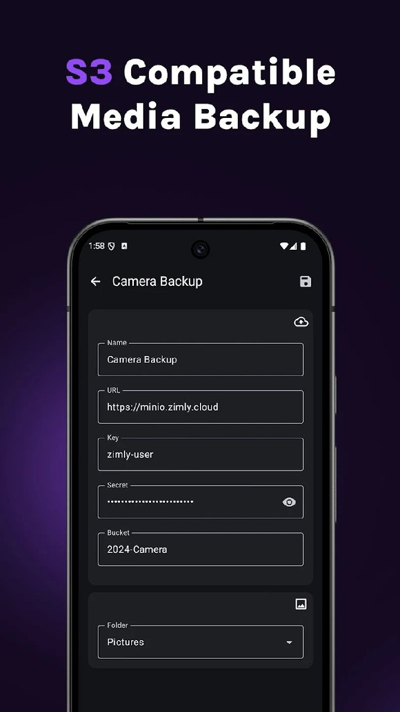</p>

</details>


---

### 📦 Readest

> **Categories:** `#Android` `#iOS` `#Windows` `#Linux` `#MacOS` `#Utilities`

A modern, feature-rich ebook reader designed for avid readers offering seamless cross-platform access, powerful tools, and an intuitive interface to elevate your reading experience.

- 🐙 **Source Code:** [https://github.com/readest/readest](https://github.com/readest/readest)

<details>
<summary><b>✨ Key Features (12)</b> — <i>Click to expand</i></summary>

- Multi-Format Support
- Scroll/Page View Modes
- Full-Text Search
- Annotations and Highlighting
- Excerpt Text for Note-Taking
- Dictionary/Wikipedia Lookup
- Translate with DeepL
- Parallel read
- Customize Font and Layout
- File Association and Open With
- Sync across Platforms
- Text-to-Speech (TTS) Support

</details>

<details>
<summary><b>🖼️ Preview Screenshots & Media (1)</b> — <i>Click to view images & decide if you want to use this app</i></summary>

#### 📸 Cover / Preview
<p align="center">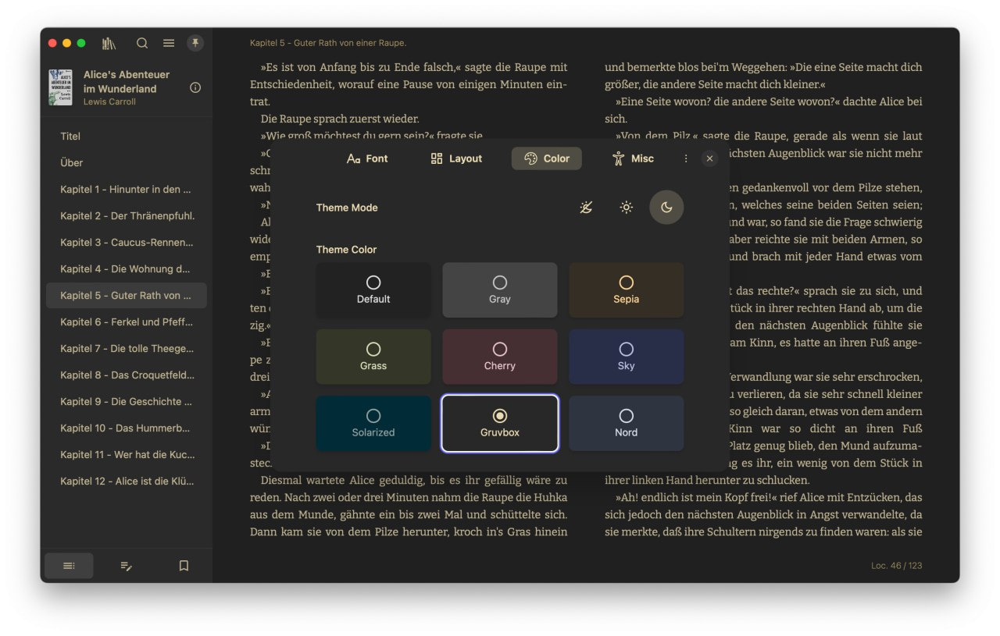</p>

</details>


---

### 📦 Delta

> **Categories:** `#android` `#material3` `#hotspot` `#csharp` `#GitHub` `#OpenSource`

an app to create hotspots on stock Android with more functionalities like a blocklist, usage limits, etc.

- 🐙 **Source Code:** [https://github.com/supershadoe/delta](https://github.com/supershadoe/delta)
- 👤 **Developer:** [supershadoe](https://github.com/supershadoe/)

<details>
<summary><b>✨ Key Features (8)</b> — <i>Click to expand</i></summary>

- Trigger hotspot from in-app
- Connected devices info
- Edit hotspot settings from app
- Turn off automatically
- Timed connections/Usage limits
- Localization
- **[Github](https** — //github.com/supershadoe/delta/releases)
- **[IzzyOnDroid](https** — //apt.izzysoft.de/fdroid/index/apk/dev.shadoe.delta)

</details>

<details>
<summary><b>🖼️ Preview Screenshots & Media (1)</b> — <i>Click to view images & decide if you want to use this app</i></summary>

#### 📸 Cover / Preview
<p align="center">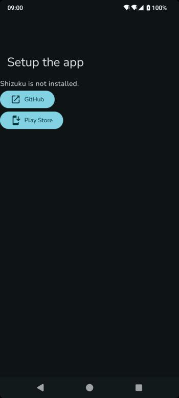</p>

</details>


---

### 📦 Oxygen Customizer

> **Categories:** `#Android` `#Root` `#Customization`

Oxygen Customizer is an open-source Android application aimed at providing users with the ability to tweak and customize various aspects of Oxygen OS UI.

- 🐙 **Source Code:** [https://github.com/DHD2280/Oxygen-Customizer](https://github.com/DHD2280/Oxygen-Customizer)
- 👤 **Developer:** Luigi


---

### 📦 Flying Carpet

> **Categories:** `#Android` `#iOS` `#Windows` `#Linux` `#Utilities` `#MacOS` `#File_transfer` `#Interesting` `#WiFi` `#GitHub` `#OpenSource`

Send and receive files between Android, iOS, Linux, macOS, and Windows over ad hoc WiFi. No shared network or cell connection required, just two devices with WiFi chips in close range.

- 🐙 **Source Code:** [https://github.com/spieglt/FlyingCarpet](https://github.com/spieglt/FlyingCarpet)
- 👤 **Developer:** [Theron Spiegl](https://github.com/spieglt)

<details>
<summary><b>🖼️ Preview Screenshots & Media (1)</b> — <i>Click to view images & decide if you want to use this app</i></summary>

#### 📸 Cover / Preview
<p align="center">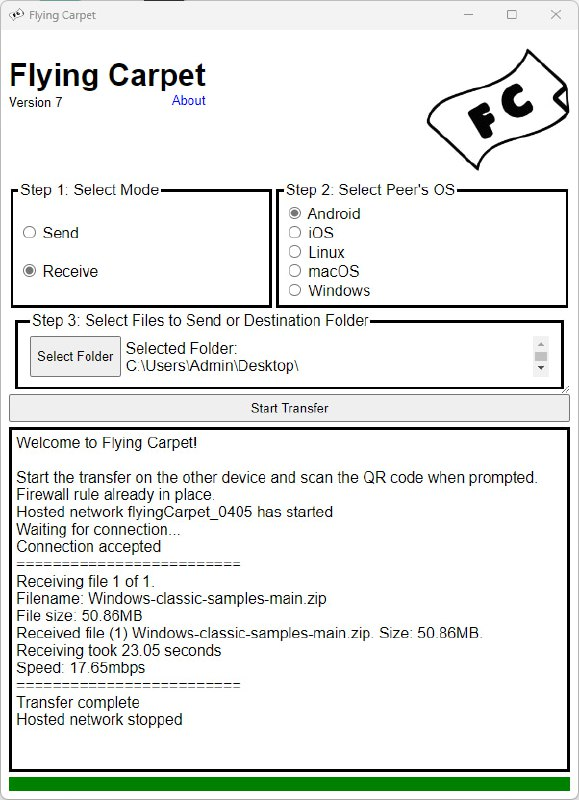</p>

</details>


---

### 📦 SpeakGPT

> **Categories:** `#Android` `#AI`

An advanced and highly intuitive open-source AI assistant that utilizes the powerful large language models (LLM) to provide you with unparalleled performance and functionality. Officially it supports GPT models, LLAMA, MIXTRAL, GEMMA, Gemini (regular and pro) Vision, DALL-E and other models.

- 🐙 **Source Code:** [https://github.com/AndraxDev/speak-gpt](https://github.com/AndraxDev/speak-gpt)
- 👤 **Developer:** Andraxdev


---

### 📦 YouTube Pro

> **Categories:** `#Android` `#YouTube` `#Videos`

All in one YouTube App with downloader , background player and many more features

- 🐙 **Source Code:** [https://github.com/prateek-chaubey/YTPRO](https://github.com/prateek-chaubey/YTPRO)
- 👤 **Developer:** [Prateek Chaubey](https://github.com/prateek-chaubey)

<details>
<summary><b>✨ Key Features (16)</b> — <i>Click to expand</i></summary>

- Video Downloader
- Shorts Downloader
- Thumbnails Downloader
- Captions Downloader
- Ads Blocker
- Minimize Video
- Picture in Picture Mode
- Shows Number of Dislikes
- Background Audio Player
- Custom Heart feature to save videos without logging into your account
- Skip Sponsers
- Force Zoom
- Hide Shorts
- APK size under 50KB
- Almost 0 Internal Dependencies
- Auto Updation of App

</details>

<details>
<summary><b>🖼️ Preview Screenshots & Media (1)</b> — <i>Click to view images & decide if you want to use this app</i></summary>

#### 📸 Cover / Preview
<p align="center"></p>

</details>


---

### 📦 GhostGMS

> **Categories:** `#Android` `#Root` `#Modules` `#Optimization` `#Battery` `#Performance`

A universal Magisk module that disables unnecessary GMS background processes, logging, window-level blurs (on MIUI & HyperOS), and tweaks the kernel to optimize performance and battery life.

⚠️ Note:
__May cause issues on stock ROMs like NothingOS (tested) but works fine on MIUI and HyperOS stock ROMs.__

- 🐙 **Source Code:** [https://t.me/veloxineologysupport](https://t.me/veloxineologysupport)
- 👤 **Developer:** [@kaushikieee](https://github.com/veloxineology)

<details>
<summary><b>✨ Key Features (10)</b> — <i>Click to expand</i></summary>

- Disables unnecessary GMS background processes
- Removes extra logging
- Blocks window blurs on MIUI & HyperOS
- Tweaks system for better performance
- Lowers battery drain (10-8% → 4-6%)
- Improves privacy by stopping background activity
- Optimized for custom ROMs (AOSP, CLO, etc.)
- Works on MIUI & HyperOS stock ROMs (issues on NothingOS)
- Fixes location tracking issues
- Code cleanup and bug fixes

</details>


---

### 📦 MiCTS

> **Categories:** `#Circle_To_Search` `#Android` `#Utilities` `#Special`

Trigger Circle To Search feature on your android device. Supports android 9 - 15.

- 🐙 **Source Code:** [https://github.com/parallelcc/micts](https://github.com/parallelcc/micts)
- 👤 **Developer:** [parallelcc](https://github.com/parallelcc)


---

### 📦 Clip Buddy

> **Categories:** `#android` `#media`

Clip Buddy is a lightweight video player app built for Android using Kotlin and XML. Leveraging the power of the Media3 ExoPlayer library, it follows the MVVM architecture for a clean and efficient codebase. The app features a simple and intuitive user interface, making it easy for users to navigate and enjoy their video content seamlessly.

- 🐙 **Source Code:** [https://github.com/memeusix/Clip-Buddy_Video_Player](https://github.com/memeusix/Clip-Buddy_Video_Player)
- 👤 **Developer:** [Dilip Kumar](https://github.com/dilipsuthar264)


---

### 📦 Ekspensify - Finance tracking app

> **Categories:** `#android` `#finance`

Welcome to Ekspensify, your personal finance tracking app made with Kotlin and Jetpack Compose! This project is all about making financial management simple, fun, and stress-free. Whether you’re budgeting like a pro or just starting, Ekspensify helps you stay on top of your money! 💰✨

- 🐙 **Source Code:** [https://github.com/memeusix/Ekspensify](https://github.com/memeusix/Ekspensify)
- 🌐 **Official Website:** [https://play.google.com/store/apps/details?id=com.ekspensify.app](https://play.google.com/store/apps/details?id=com.ekspensify.app)
- 👤 **Developer:** [Dilip Kumar](https://github.com/dilipsuthar264)


---

### 📦 Wispar

> **Categories:** `#Android` `#iOS` `#Productivity`

Stay up-to-date with articles in your field of study!

🔗Links
- [Download](https://t.me/popCLOUDS/8706)
- [Features](https://t.me/popCLOUDS/8699)
- [Screenshots](https://t.me/popCLOUDS/8700)
- [Source code](https://github.com/Scriptbash/Wispar)

- 🐙 **Source Code:** [https://github.com/Scriptbash/Wispar](https://github.com/Scriptbash/Wispar)
- 👤 **Developer:** Francis Lapointe

<details>
<summary><b>✨ Key Features (10)</b> — <i>Click to expand</i></summary>

- Search and follow journals
- Search for articles and save the queries for easy access later
- Download articles for offline access *
- EZproxy and Unpaywall integration
- Send articles to Zotero
- Share articles
- Scrape missing abstracts
- Export/Import the database
- Filters
- The download feature is currently limited to some publishers. Flutter tools and publishers like Elsevier and Wiley make it hard to get the PDF file.

</details>

<details>
<summary><b>🖼️ Preview Screenshots & Media (1)</b> — <i>Click to view images & decide if you want to use this app</i></summary>

#### 📸 Cover / Preview
<p align="center"></p>

</details>


---

### 📦 Bim!

> **Categories:** `#Android` `#Games`

Bim! is an open-source, multiplayer online mobile game for Android devices, falling under the last-man-standing arcade genre. In this game, up to four players are confined within a compact arena with a singular objective: to be the sole survivor. Players can strategically place bombs to demolish walls, creating new pathways or targeting opponents directly.

- 🐙 **Source Code:** [https://github.com/j-jorge/bim](https://github.com/j-jorge/bim)
- 👤 **Developer:** [j-jorge](https://github.com/j-jorge)

<details>
<summary><b>✨ Key Features (3)</b> — <i>Click to expand</i></summary>

- **Multiplayer Online Gameplay** — Engage in real-time battles with up to four players, emphasizing strategic bomb placement and quick reflexes.
- **Destructible Environment** — Utilize bombs to break down walls, altering the arena's layout and adding a dynamic layer to the gameplay.
- **Godot Engine Integration** — Built with the Godot Engine, ensuring a smooth and responsive gaming experience across various Android devices.

</details>


---

### 📦 XPTranslateText

> **Categories:** `#Android` `#Xposed` `#Modules` `#Root`

XPTranslateText is an Xposed module designed to automatically translate text within applications. It prioritizes translations using a local cache, then utilizes the Gemini 2.0 API, and falls back to the free Google API if necessary.

- 🐙 **Source Code:** [https://t.me/popCLOUDS/8683](https://t.me/popCLOUDS/8683)
- 👤 **Developer:** [Tianci Dev](https://github.com/tianci-sh)

<details>
<summary><b>✨ Key Features (3)</b> — <i>Click to expand</i></summary>

- ****Automatic Translation** — ** Seamlessly translates app text without manual intervention.
- ****Multiple Translation Sources** — ** Utilizes a hierarchical approach—first checking local cache, then the Gemini 2.0 API, and finally the free Google API.
- ****Xposed Framework Integration** — ** Requires LSPosed or a similar Xposed Framework variant for functionality.

</details>


---

### 📦 Tsacdop/Tsacdop-Fork

> **Categories:** `#Android` `#Media` `#Entertainment`

Tsacdop-Fork is a fork of Tsacdop, a podcast player developed with Flutter. A clean, simply beautiful, and friendly app, which is also free and open source.

- 🐙 **Source Code:** [https://github.com/lojcs/tsacdop](https://github.com/lojcs/tsacdop)
- 👤 **Developer:** [Lojcs](https://github.com/Lojcs)


---

### 📦 Chemist Lab

> **Categories:** `#Android` `#Website` `#Learning`

A comprehensive simulation lab for exploring chemical elements

- 🐙 **Source Code:** [https://github.com/MrMR-711/Web-Chemistry-Lab](https://github.com/MrMR-711/Web-Chemistry-Lab)

<details>
<summary><b>✨ Key Features (4)</b> — <i>Click to expand</i></summary>

- Change the number of protons, neutrons, and electrons and observe the changes live
- Display the name, atomic number, atomic mass, and properties of the element
- Present a modern and attractive user interface for better learning
- An interactive environment that provides a deeper understanding of the periodic table

</details>


---

### 📦 Stratum

> **Categories:** `#Android` `#Security` `#Tools`

A free open-source two factor authentication app for Android. It features encrypted backups, icons, categories and a high level of customisation. It also has a Wear OS companion app.

- 🐙 **Source Code:** [https://github.com/stratumauth/app](https://github.com/stratumauth/app)
- 👤 **Developer:** [jamie-mh](https://github.com/jamie-mh)


---

### 📦 FoodYou

> **Categories:** `#Android` `#Health` `#Utilities`

FoodYou is a simple calorie-tracking app designed with Material You aesthetic - at least, that was the goal!

- 🐙 **Source Code:** [https://github.com/maksimowiczm/FoodYou](https://github.com/maksimowiczm/FoodYou)
- 👤 **Developer:** [Mateusz Maksimowicz](https://github.com/maksimowiczm)


---

### 📦 Notex - Note-Taking App

> **Categories:** `#android` `#note`

Cloud-based note-taking and task management app. 📝 Open-source and ready for contributions. Never forget a task or lose a note again! ✅

- 🐙 **Source Code:** [https://github.com/GPSxtreme/notex-flutter](https://github.com/GPSxtreme/notex-flutter)
- 👤 **Developer:** prudhvi suraaj


---

### 📦 ByeDPI - App to bypass censorship on Android

> **Categories:** `#android` `#vpn` `#proxy`

Android application that runs a local VPN service to bypass DPI (Deep Packet Inspection) and censorship.

- 🐙 **Source Code:** [https://t.me/popCLOUDS/8563?single](https://t.me/popCLOUDS/8563?single)
- 👤 **Developer:** [dovecoteescapee](https://github.com/dovecoteescapee)


---

### 📦 Revanced Xposed

> **Categories:** `#Android` `#Root` `#Xposed` `#Modules`

An Xposed (Lsposed) module, which integrates Revanced patches into YouTube & YouTube music app.

- 🐙 **Source Code:** [https://github.com/chsbuffer/RevancedXposed](https://github.com/chsbuffer/RevancedXposed)
- 👤 **Developer:** [ChsBuffer](https://github.com/chsbuffer)


---

### 📦 DroidCrypt - A file and text encryption tool for Android

> **Categories:** `#Android` `#Tools`

File and text encryption in Android offers crucial benefits in protecting sensitive data. By encrypting files and text, users can prevent unauthorized access, ensuring confidentiality and privacy. This is especially vital in a world where mobile devices often contain personal, financial, and business-related information. Encryption adds an additional layer of security, preventing malicious actors from intercepting or tampering with data, thus mitigating the risk of data breaches and identity theft.

- 🐙 **Source Code:** [https://github.com/umutcamliyurt/DroidCrypt](https://github.com/umutcamliyurt/DroidCrypt)
- 👤 **Developer:** [Umut Çamliyurt](https://github.com/umutcamliyurt)


---

### 📦 FamiStudio NES Music Editor

> **Categories:** `#Android` `#Linux` `#Windows` `#MacOS` `#iOS` `#Audio` `#Editor` `#GitHub` `#OpenSource`

FamiStudio is a simple music editor for the Nintendo Entertainment System or Famicom. It is targeted at both chiptune artists and NES homebrewers.

- 🐙 **Source Code:** [https://github.com/BleuBleu/FamiStudio](https://github.com/BleuBleu/FamiStudio)
- 👤 **Developer:** [BleuBleu](https://github.com/BleuBleu)


---

### 📦 System App Nuker

> **Categories:** `#Android` `#Root` `#Tools` `#Debloat` `#Modules`

A simple and efficient module that allows you to remove pre-installed system apps from your Android device

- 🐙 **Source Code:** [https://t.me/systemapp_nuker](https://t.me/systemapp_nuker)
- 👤 **Developer:** [ChiseWaguri](https://github.com/ChiseWaguri)

<details>
<summary><b>✨ Key Features (2)</b> — <i>Click to expand</i></summary>

- **Web-based Interface** — Select apps to remove using a simple WebUI.
- Removing system apps without touching the original partitions.

</details>


---

### 📦 Maid - Mobile Artificial Intelligence Distribution

> **Categories:** `#Android` `#AI` `#Tools`

Maid is a cross-platform free and an open-source application for interfacing with llama.cpp models locally, and remotely with Ollama, Mistral, Google Gemini and OpenAI models remotely. Maid supports sillytavern character cards to allow you to interact with all your favorite characters. Maid supports downloading a curated list of Models in-app directly from huggingface.

- 🐙 **Source Code:** [https://github.com/Mobile-Artificial-Intelligence/maid](https://github.com/Mobile-Artificial-Intelligence/maid)
- 👤 **Developer:** [Dane Madsen](https://github.com/danemadsen)

<details>
<summary><b>✨ Key Features (4)</b> — <i>Click to expand</i></summary>

- **[Get it on F-Droid](https** — //f-droid.org/packages/com.danemadsen.maid/)
- **[Get it on OpenAPK](https** — //www.openapk.net/maid/com.danemadsen.maid/)
- **[Get it on Android Freeware](https** — //www.androidfreeware.net/download-maid-apk.html)
- **[Get it on Google Play](https** — //play.google.com/store/apps/details?id=com.danemadsen.maid&pcampaignid=pcampaignidMKT-Other-global-all-co-prtnr-py-PartBadge-Mar2515-1)

</details>


---

### 📦 Pluvia

> **Categories:** `#Android` `#Utilities`

A lightweight unofficial Steam client for Android with the ability to play DRM-Free games from your account and chat with friends.

🔗Links
- [Download](https://github.com/oxters168/Pluvia/releases/latest)
- [Features](https://t.me/popCLOUDS/8510)
- [Preview](https://t.me/popCLOUDS/8511)
- [Discord server](https://discord.gg/3tcEdhMG3e)
- [Source code](https://github.com/oxters168/Pluvia)

- 🐙 **Source Code:** [https://discord.gg/3tcEdhMG3e](https://discord.gg/3tcEdhMG3e)
- 👤 **Developer:** [Oxters](https://github.com/oxters168)

<details>
<summary><b>✨ Key Features (5)</b> — <i>Click to expand</i></summary>

- View and download games through the app.
- Play (DRM free) games using Winlator, built into the app.
- Configure the game containers to use different options to improve the performance of each game.
- Steam Cloud integration for your cloud saves, allowing you to resume where you left off.
- **View your friends list. (Note** — chat and friend management in the works too)

</details>


---

### 📦 Duix.Ai

> **Categories:** `#cplusplus`

DUIX is a platform that lets developers create digital humans for interaction. It uses AI to recognize speech and convert text into speech, making it easy to communicate with these digital humans. DUIX supports deployment on Android and iOS devices without needing a lot of technical help, which keeps costs low. This technology can be used in many industries like customer service, media, and finance. Users benefit from its ease of use and versatility across different platforms.

https://github.com/GuijiAI/duix.ai

- 🐙 **Source Code:** [https://github.com/GuijiAI/duix.ai](https://github.com/GuijiAI/duix.ai)
- 👤 **Developer:** [GuijiAI](https://github.com/GuijiAI)


---

### 📦 ShonenX

> **Categories:** `#Android` `#Windows` `#Anime` `#Entertainment`

A modern, feature-rich anime streaming application built with Flutter, offering a seamless experience across mobile and desktop platforms.

- 🐙 **Source Code:** [https://github.com/Darkx-dev/ShonenX](https://github.com/Darkx-dev/ShonenX)
- 👤 **Developer:** [Roshan Darkx-dev](https://github.com/Darkx-dev/)

<details>
<summary><b>✨ Key Features (3)</b> — <i>Click to expand</i></summary>

- *Core Features**
- *Streaming Features**
- *User Features**

</details>


---

### 📦 EchoWave

> **Categories:** `#Android` `#Music` `#Media` `#Player` `#Productivity`

Built on the resources of the Simple-Tube and Muzza open source project, EchoWave promises you a free, ad-free and free music listening experience with an interface inspired by Android's pure Material You and Material 3 design. You can freely listen to all the music/songs you want without paying anything and without ads.

- 🐙 **Source Code:** [https://t.me/by_BabelSoftware](https://t.me/by_BabelSoftware)
- 👤 **Developer:** [Mustafa Burak Özcan](https://github.com/RRechz)

<details>
<summary><b>✨ Key Features (17)</b> — <i>Click to expand</i></summary>

- Play songs from YT/YT Music without ads
- Background playback
- Search songs, videos, albums, and playlists from YouTube Music
- *Harmony Atmos from Babel Software
- Login support
- Offline Music Experience (Download)
- Synchronized lyrics
- Lyrics translator
- Skip silence
- Audio normalization
- Adjust tempo/pitch
- Dynamic theme
- Android Auto support
- Personalized quick picks
- Discord Rich Presence support
- Harmony Atmos 2.0 - AI-based Sound Enhancer
- *Here's what you need to do for Android Auto;

</details>


---

### 📦 Bootloader Unlock: Wall of Shame

> **Categories:** `#universal` `#Android` `#Utilities`

A list containing phone manufacturers and their policies on unlocking the bootloader. Useful when choosing which phone to buy.

🔗 **Links**
- [The list](https://github.com/melontini/bootloader-unlock-wall-of-shame)
- [SOC based exploits](https://github.com/melontini/bootloader-unlock-wall-of-shame#universal-soc-based-methods)
- [Custom AVB keys](https://github.com/chenxiaolong/avbroot/issues/299)

- 🐙 **Source Code:** [https://github.com/melontini/bootloader-unlock-wall-of-shame](https://github.com/melontini/bootloader-unlock-wall-of-shame)
- 👤 **Developer:** [melontini](https://github.com/melontini)


---

### 📦 DHrpcs3/rpcs3-android

> **Categories:** `#GitHub` `#OpenSource`

**Language**: C++
**Stars**: 352 **Issues**: 25 **Forks**: 18
[https://github.com/DHrpcs3/rpcs3-android](https://github.com/DHrpcs3/rpcs3-android)

- 🐙 **Source Code:** [https://github.com/DHrpcs3/rpcs3-android](https://github.com/DHrpcs3/rpcs3-android)
- 👤 **Developer:** [DHrpcs3](https://github.com/DHrpcs3)


---

### 📦 Google Shortcuts Launcher

> **Categories:** `#Android` `#Utilities` `#Tools`

Google Shortcuts Launcher provides a seamless way to integrate powerful Google services into your daily workflow. With just a tap, you can quickly access a variety of shortcuts designed to enhance your daily device use and simplify your interactions with Google features.

- 🐙 **Source Code:** [https://t.me/WSTprojects](https://t.me/WSTprojects)
- 👤 **Developer:** [WSTxda](https://github.com/WSTxda)


---

### 📦 Mirror2RearUltra

> **Categories:** `#Android` `#Tools`

Rear screen mirroring plugin/app for Xiaomi Mi 11 Ultra.

- 🐙 **Source Code:** [https://github.com/tpkarras/Mirror2RearUltra](https://github.com/tpkarras/Mirror2RearUltra)
- 👤 **Developer:** [tpkarras](https://github.com/tpkarras)


---

### 📦 Venera

> **Categories:** `#Android` `#Linux` `#Windows` `#MacOS` `#iOS` `#Reader`

A comic reader that support reading local and network comics.

- 🐙 **Source Code:** [https://github.com/venera-app/venera](https://github.com/venera-app/venera)
- 👤 **Developer:** [venera-app](https://github.com/venera-app)


---

### 📦 Faceverificationsdk

> **Categories:** `#java` `#anti_spoofing` `#face_ai` `#face_recognition` `#face_search` `#face_verification` `#face_verify` `#liveness_detection` `#on_device_ai`

The Umbrella FaceAI SDK is a powerful tool for Android devices that allows offline face detection, recognition, and liveness detection. It can be used in various applications like mobile attendance systems, app logins, and smart door locks. The SDK works without an internet connection, ensuring privacy by not storing or uploading sensitive facial data. This makes it secure and efficient for users who need fast and accurate face recognition capabilities on their devices. By integrating this SDK, developers can enhance user experiences while maintaining high security standards.

https://github.com/AnyLifeZLB/FaceVerificationSDK

- 🐙 **Source Code:** [https://github.com/AnyLifeZLB/FaceVerificationSDK](https://github.com/AnyLifeZLB/FaceVerificationSDK)
- 👤 **Developer:** [AnyLifeZLB](https://github.com/AnyLifeZLB)


---

### 📦 Appium Device Farm

> **Categories:** `#typescript` `#android` `#appium` `#appium_device_farm` `#appium_plugin` `#device_farm` `#driver_session` `#ios_simulators` `#parallel_testing` `#plugin` `#polling`

Appium Device-farm is a tool that helps developers and testers automate testing on many different devices, like Android and iOS phones. It allows teams to test apps remotely without needing physical devices, which saves time and money. The tool also lets you run tests automatically across multiple devices at once, making it faster to find and fix problems. Additionally, it integrates well with continuous integration workflows, helping catch bugs early in development. This makes the testing process more efficient and reliable, ensuring apps work well on various devices before they are released.

https://github.com/AppiumTestDistribution/appium-device-farm

- 🐙 **Source Code:** [https://github.com/AppiumTestDistribution/appium-device-farm](https://github.com/AppiumTestDistribution/appium-device-farm)
- 👤 **Developer:** [AppiumTestDistribution](https://github.com/AppiumTestDistribution)


---

### 📦 Ggwave

> **Categories:** `#cplusplus` `#arduino` `#data_over_sound` `#ecc` `#fsk` `#internet_of_things` `#modem` `#pairing` `#python` `#qrcode` `#serverless` `#sound_library` `#ultrasound` `#GitHub` `#OpenSource`

**ggwave** is a small library that lets you send and receive data using sound. It works with devices like smartphones and microcontrollers, allowing them to communicate without needing the internet. This can be useful for sharing files or sending commands between devices in the same room. The library uses a special way of encoding data into sound waves, making it robust against background noise. Users can test it easily with apps like Waver on Android, iOS, or even in a web browser[1][3].

https://github.com/ggerganov/ggwave

- 🐙 **Source Code:** [https://github.com/ggerganov/ggwave](https://github.com/ggerganov/ggwave)
- 👤 **Developer:** [ggerganov](https://github.com/ggerganov)


---

### 📦 ZipXtract

> **Categories:** `#Android` `#Utilities`

A fully open-source Android application designed to handle a wide range of archive formats.

🔗Links
- [Download](https://t.me/popCLOUDS/8435)
- [Features](https://t.me/popCLOUDS/8434)
- [Screenshots](https://t.me/popCLOUDS/8436)
- [Source code](https://github.com/WirelessAlien/ZipXtract)

- 🐙 **Source Code:** [https://github.com/WirelessAlien/ZipXtract](https://github.com/WirelessAlien/ZipXtract)
- 👤 **Developer:** WirelessAlien

<details>
<summary><b>✨ Key Features (9)</b> — <i>Click to expand</i></summary>

- Extraction
- **Supports various formats** — RAR, ZIP, TAR, BZ2, GZ, 7z, XZ, JAR etc.
- Handles encrypted ZIP and 7z files.
- Extracts multi-volume RAR archives.
- Extracts multi-volume  archives.
- Extracts split ZIP files.
- Creation
- Create ZIP and 7z archives, with options for encryption.
- Create split ZIP archives.

</details>

<details>
<summary><b>🖼️ Preview Screenshots & Media (1)</b> — <i>Click to view images & decide if you want to use this app</i></summary>

#### 📸 Cover / Preview
<p align="center">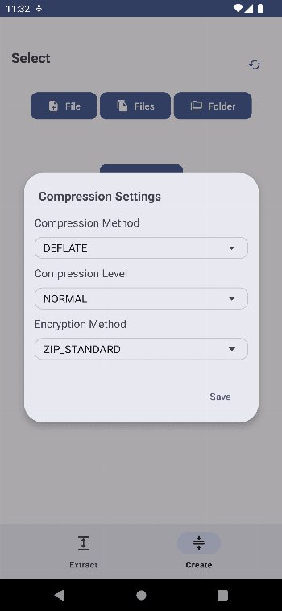</p>

</details>


---

### 📦 PodAura - All-in-one Android podcast app

> **Categories:** `#android` `#podcast`

All-in-one Android podcast app for RSS, media dl & play. MVI arch, Material You style.

- 🐙 **Source Code:** [https://t.me/popCLOUDS/8422](https://t.me/popCLOUDS/8422)
- 👤 **Developer:** [SkyD666](https://github.com/SkyD666)


---

### 📦 VES - Image and Photo Compare

> **Categories:** `#Android` `#Media` `#Utilities`

VES-Image-Compare is an Android application created to provide a straightforward solution for visually comparing similar images. Its core purpose is to enable users to quickly and efficiently analyze and assess subtle differences between photos, making it a valuable tool for photographers, designers, and anyone who needs to verify image consistency.

- 🐙 **Source Code:** [https://github.com/VincentEngel/VES-Image-Compare](https://github.com/VincentEngel/VES-Image-Compare)
- 👤 **Developer:** [VincentEngel](https://github.com/VincentEngel)

<details>
<summary><b>✨ Key Features (5)</b> — <i>Click to expand</i></summary>

- Capture images with the camera or import them from the gallery
- Direct sharing of images into the app for comparison
- Options to rotate and resize images for optimal viewing
- Ability to zoom into each image individually or synchronously
- Multiple comparison modes

</details>


---

### 📦 traced it

> **Categories:** `#Android` `#Productivity`

An easy-to-use app for short text notes, with a timestamp for each entry, and ability to add various quantities to your notes using preset formats.

- 🐙 **Source Code:** [https://github.com/traced-it/traced-it-android](https://github.com/traced-it/traced-it-android)
- 👤 **Developer:** [Jake Jezek](https://github.com/jake-traced-it)

<details>
<summary><b>✨ Key Features (5)</b> — <i>Click to expand</i></summary>

- Add text notes with an optional amount (S/M/L, 1x/2x/3x, 5.813…)
- See all your notes with the time elapsed since you wrote each note
- Tap the + button to add a new note with the same text as an existing note
- Edit a note, delete it, delete all notes
- Export all notes as a spreadsheet file (CSV format) and import them

</details>


---

### 📦 ReTerminal

> **Categories:** `#Android` `#Tools`

ReTerminal is a sleek, Material 3-inspired terminal emulator

- 🐙 **Source Code:** [https://github.com/RohitKushvaha01/ReTerminal](https://github.com/RohitKushvaha01/ReTerminal)
- 👤 **Developer:** @RohitKushvaha01


---

### 📦 Sly

> **Categories:** `#Android` `#Linux` `#Windows` `#MacOS` `#Media` `#Editor`

Sly is a friendly image editor that requires no internet connection or preexisting expertise. Just open some photos and have at it.

- 🐙 **Source Code:** [https://t.me/popCLOUDS/8373](https://t.me/popCLOUDS/8373)
- 👤 **Developer:** [kra-mo](https://github.com/kra-mo)


---

### 📦 Googlefindmytools

> **Categories:** `#python`

This tool helps you manage and track your devices like those in Google's Find My Device network. You can query and decrypt location data from these devices, and even register your own custom trackers using ESP32 or Zephyr devices. To use it, you need to install required packages and have the latest Google Chrome. The benefit is that you can keep track of your devices more easily and securely, even if they are not traditional Android devices. It also allows you to create your own custom trackers, giving you more control over tracking your belongings.

https://github.com/leonboe1/GoogleFindMyTools

- 🐙 **Source Code:** [https://github.com/leonboe1/GoogleFindMyTools](https://github.com/leonboe1/GoogleFindMyTools)
- 👤 **Developer:** [leonboe1](https://github.com/leonboe1)


---

### 📦 Toolbox

> **Categories:** `#Android` `#iOS` `#Tools`

It's a toolbox (as the name suggests) that brings together several tools in a single mobile application! Tools are here to help you in your daily life or just to have fun.

- 🐙 **Source Code:** [https://github.com/Koizeay/Toolbox](https://github.com/Koizeay/Toolbox)
- 👤 **Developer:** [Koizeay](https://github.com/Koizeay)


---

### 📦 Nothing Archive

> **Categories:** `#downloads` `#Android` `#Firmware` `#NothingOS` `#Nothing` `#CMFbyNothing`

A comprehensive collection of unmodified stock firmware images and OTA update links for Nothing and CMF devices, facilitating manual sideloading, rooting, and stock ROM flashing.

- 🐙 **Source Code:** [https://github.com/spike0en/nothing_archive](https://github.com/spike0en/nothing_archive)

<details>
<summary><b>✨ Key Features (6)</b> — <i>Click to expand</i></summary>

- Indexes official OTA update links directly from OEM servers for Nothing and CMF devices.
- Manually sideload updates during region-based rollouts or when the device is unable to install or receive OTA updates.
- Generates stock, unmodified OTA images when full stock firmware is not available from OEM.
- Offers stock boot image files for rooting or unrooting the supported devices.
- Flash official firmware or partition images to resolve boot loops, soft bricks, or revert from custom ROMs.
- Preserves all the available firmware versions for rollback, testing, dumping, or restoration.

</details>


---

### 📦 Universal Android ROM Flasher

> **Categories:** `#installation` `#usage` `#requirements` `#Windows` `#MacOS` `#Linux` `#Tools`

A next-gen Android flashing tool with multi-device support and enhanced safety features for devices based on Qualcomm and MediaTek platforms.

- 🐙 **Source Code:** [https://github.com/PHATWalrus/universal-flasher](https://github.com/PHATWalrus/universal-flasher)
- 👤 **Developer:** [PHATWalrus](https://github.com/PHATWalrus)

<details>
<summary><b>✨ Key Features (10)</b> — <i>Click to expand</i></summary>

- Multi-Device Support via devices.json configuration
- A/B Slot Management with automatic partition handling
- Platform-Tools Auto-Setup (bundled or system)
- Verified Boot (AVB) Control with disable options
- Windows Admin Privilege Handling with UAC elevation
- Cross-Platform Support (Windows/Linux/macOS)
- Comprehensive Logging with timestamped records
- Interactive Menu System with color-coded UI
- Smart Partition Resizing for logical partitions
- Device Compatibility Verification via board checks

</details>


---

### 📦 Rivo

> **Categories:** `#Android` `#Utilities`

Rivo is a modern, feature-rich dialer app built using Flutter. Designed for seamless communication, Rivo provides a sleek and user-friendly interface for managing calls and contacts.

- 🐙 **Source Code:** [https://github.com/user-grinch/RivoPhoneApp](https://github.com/user-grinch/RivoPhoneApp)
- 👤 **Developer:** [Grinch](https://github.com/user-grinch)

<details>
<summary><b>✨ Key Features (7)</b> — <i>Click to expand</i></summary>

- **Fast Dialing** — Quickly dial numbers with an intuitive interface.
- **Contact Management** — Easily manage and organize your contacts.
- **Call History** — Access and manage your call logs effortlessly.
- **Customizable UI** — Enjoy a visually appealing and customizable design.
- **Modern UI (Compose)** — Built fully with Jetpack Compose
- **Call Screen** — Native in-app calling interface
- **Modular Architecture** — Scalable and maintainable codebase

</details>


---

### 📦 TouchHLE

> **Categories:** `#Android` `#MacOS` `#Windows` `#Utilities`

A high-level emulator for iPhone OS apps. It runs on modern desktop operating systems and Android, and is written in Rust.

- 🐙 **Source Code:** [https://github.com/touchHLE/touchHLE](https://github.com/touchHLE/touchHLE)
- 👤 **Developer:** [Touch HLE](https://github.com/touchHLE)


---

### 📦 xajik/thedeck

> **Categories:** `#android` `#dart` `#flutter` `#game` `#gamedev` `#gamedevelopment` `#ios` `#mobile` `#socket_io` `#GitHub` `#OpenSource`

The Deck: An Open-Source, Cross-Platform, Mobile, Turn by Turn Card Game Engine in Flutter
**Language**: Dart

- 🐙 **Source Code:** [https://github.com/xajik/thedeck](https://github.com/xajik/thedeck)
- 👤 **Developer:** [xajik](https://github.com/xajik)


---

### 📦 Scan Bridge

> **Categories:** `#Android` `#Utilities`

A Material You app featuring scanning of documents, photos, and more over the AirScan/eSCL protocol. The eSCL protocol allows for driverless usage of network scanners and is supported by most modern scanners.

🔗Links
- [Download](https://t.me/popCLOUDS/8293)
- [Features](https://t.me/popCLOUDS/8292)
- [Screenshots](https://t.me/popCLOUDS/8289?single)
- [Source code](https://github.com/Chrisimx/ScanBridge)

- 🐙 **Source Code:** [https://github.com/Chrisimx/ScanBridge](https://github.com/Chrisimx/ScanBridge)
- 👤 **Developer:** Christian

<details>
<summary><b>✨ Key Features (6)</b> — <i>Click to expand</i></summary>

- Discover scanners supporting eSCL in your network
- Scan multiple pages and arrange them however you like
- Use your scanner to the maximum of its capabilities by adjusting settings like input source, resolution, duplex scan, scanning dimensions, and more.
- Save your scans as PDF or images & directly share them with other apps
- Nice-looking Material You design
- Easy-to-use interface

</details>

<details>
<summary><b>🖼️ Preview Screenshots & Media (1)</b> — <i>Click to view images & decide if you want to use this app</i></summary>

#### 📸 Cover / Preview
<p align="center">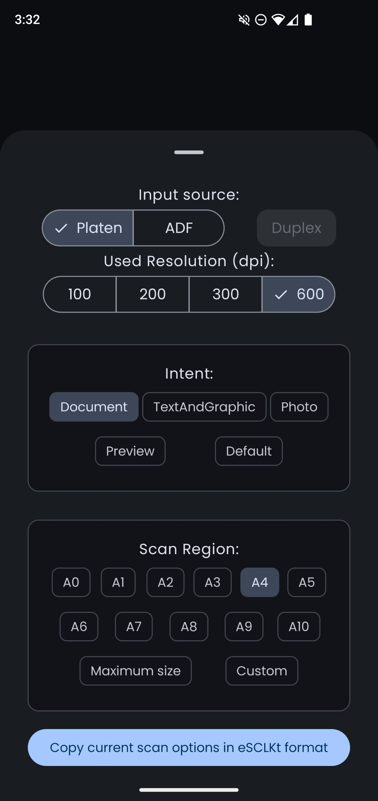</p>

</details>


---

### 📦 Logline

> **Categories:** `#Android` `#Streaming` `#Tools`

An open-source Android app that provides a seamless movie browsing experience with an emphasis on user privacy and transparency. The app offers core functionality to discover, organize, and rate movies while ensuring that user data remains under their control.

🔗Links
- [Download](https://t.me/popCLOUDS/8288)
- [Features](https://t.me/popCLOUDS/8277)
- [Screenshots](https://t.me/popCLOUDS/8278)
- [Source code](https://github.com/Patch4Code/Logline)

- 🐙 **Source Code:** [https://github.com/Patch4Code/Logline](https://github.com/Patch4Code/Logline)
- 👤 **Developer:** Patch4Code

<details>
<summary><b>✨ Key Features (10)</b> — <i>Click to expand</i></summary>

- **Discover new Movies** — Explore popular, top-rated, and upcoming movies. Use advanced filters to find exactly what you're looking for, from genres to release years and more.
- **Search Functionality** — Find your favorite movies quickly.
- **Detailed Movie Information** — Access details about movies (including cast, release information and more).
- **Watchlist** — Organize your movies by adding them to a personal watchlist.
- **Rate Movies** — Privately rate movies you’ve watched.
- **Activity Tracking** — Keep a personal log of your watched movies.
- **Write Personal Reviews** — Write down your personal thoughts and impressions about movies.
- **Custom Lists** — Create and manage general lists of movies.
- **Export/Import Data** — Securely back up your data or transfer it to a new device.
- **Privacy First** — Local data storage ensures full control of your personal information.

</details>

<details>
<summary><b>🖼️ Preview Screenshots & Media (1)</b> — <i>Click to view images & decide if you want to use this app</i></summary>

#### 📸 Cover / Preview
<p align="center">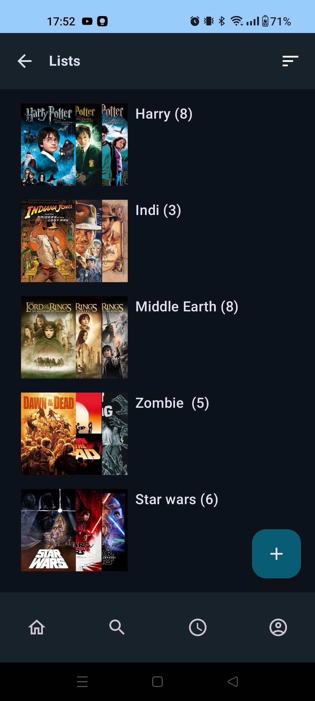</p>

</details>


---

### 📦 Sherpa Onnx

> **Categories:** `#cplusplus` `#aarch64` `#android` `#arm32` `#asr` `#cpp` `#csharp` `#dotnet` `#ios` `#lazarus` `#linux` `#macos` `#mfc` `#object_pascal` `#onnx` `#raspberry_pi` `#risc_v` `#speech_to_text` `#text_to_speech` `#vits` `#windows`

This tool supports various speech functions like speech recognition, text-to-speech, speaker identification, and more. It works on multiple platforms including Android, iOS, Windows, macOS, and Linux, and supports several programming languages such as C++, Python, JavaScript, and others. You can use it locally or through web assembly, making it versatile and convenient. This benefits you by allowing you to integrate advanced speech capabilities into your projects easily, regardless of the platform or programming language you use.

https://github.com/k2-fsa/sherpa-onnx

- 🐙 **Source Code:** [https://github.com/k2-fsa/sherpa-onnx](https://github.com/k2-fsa/sherpa-onnx)
- 👤 **Developer:** [k2-fsa](https://github.com/k2-fsa)


---

### 📦 Thor

> **Categories:** `#Android` `#Root` `#Tools` `#GitHub` `#OpenSource`

Thor is an Android App Manager and App Installer utility

- 🐙 **Source Code:** [https://github.com/trinadhthatakula/Thor](https://github.com/trinadhthatakula/Thor)
- 👤 **Developer:** [Trinadh Thatakula](https://github.com/trinadhthatakula)


---

### 📦 Cust Termux

> **Categories:** `#Android` `#TV` `#Utilities`

A termux fork for android tv, packed with more features along with Jio TV GO integration.

- 🐙 **Source Code:** [https://t.me/popCLOUDS/8228](https://t.me/popCLOUDS/8228)
- 👤 **Developer:** [Siddharth Kamble](https://github.com/siddharthsky)

<details>
<summary><b>✨ Key Features (37)</b> — <i>Click to expand</i></summary>

- ***Designed for TV Streaming** — **
- **CustTermux Environment** — Tailored for a seamless TV streaming experience.
- **Built-in Media Dependencies** — Pre-configured packages for effortless setup.
- **jiotv_go Integration** — Enhanced streaming capabilities with direct support for jiotv_go
- **TV-Optimized UI** — Simple and accessible interface for navigation on TVs.
- ***Initial Setup and Configuration** — **
- **Initial Setup Page** — Added for streamlined configuration.
- **Dependency Removal** — Eliminated reliance on other Termux apps.
- ***Enhanced Functionality** — **
- **Android 5 Support** — Now included.
- **Onscreen Keys** — Ctrl, Alt, and Arrow keys are now accessible via the remote.
- **Ctrl + C Functionality** — Available through the remote, removing the need for an additional device to stop the service.
- **OnResume Functionality** — IPTV automatically opens when switching to CustTermux.
- ***Main Activity Updates** — **
- **Button Layout** — Updated on the main page.
- **TV Layout** — Introduced for a more intuitive interface.
- **IPTV Button** — Long press to change IPTV settings; otherwise, it opens IPTV directly.
- **Settings Page** — Added for easier access to configuration options.
- **Playlist Download Option** — Download playlists based on local or public access.
- **Playlist Link** — Displayed on the home screen with a copy option.
- ***Native Layouts and Boot Features** — **
- **Native Layouts** — Termux-API is no longer required.
- **Autostart on Device Boot** — Implemented without the need for Termux-boot.
- *
- **Live Server Status and Login Status** — Displayed for real-time updates.
- **IPTV Selector** — Choose any app for IPTV.
- **Web Player** — Added for standalone operation.
- **New Login Page** — Supports OTP and password authentication.
- **Login Checker** — Added to verify login status.
- ***Settings Page Enhancements** — **
- **Local and Public Access Settings** — Configurable through the new Settings page.
- **Autostart Server** — Option to enable server autostart.
- **Auto-Start IPTV** — Option for automatic IPTV start.
- **Port Changing** — Option to change server port.
- **EPG Generation Settings** — Configurable EPG settings.
- **Generic TV Banner** — Option to enable/disable.
- **SSH Access Settings** — Added for secure access.

</details>


---

### 📦 Noterly

> **Categories:** `#Android` `#Productivity` `#Tools`

Simple notification reminders for Android devices.

- 🐙 **Source Code:** [https://github.com/tomc128/noterly](https://github.com/tomc128/noterly)
- 👤 **Developer:** [tomc128](https://github.com/tomc128)


---

### 📦 Aliyunpan

> **Categories:** `#go` `#adrive` `#backup` `#linux` `#macos` `#sync` `#windows`

This tool is a command-line client for Aliyun Pan, similar to Linux shell commands. It supports multiple platforms like Windows, macOS, Linux, Android, and iOS. You can use it to download and upload files, sync your local and cloud files, and even batch download photos and videos from your album.

The benefits include Works on various operating systems.
- **Sync and backup** Supports JavaScript plugins to customize upload and download behaviors.
- **Efficient downloads** Includes commands like `ls`, `cd`, `mkdir`, `upload`, and `download` for easy file management.

Overall, it makes managing your Aliyun Pan cloud storage more efficient and flexible.

https://github.com/tickstep/aliyunpan

- 🐙 **Source Code:** [https://github.com/tickstep/aliyunpan](https://github.com/tickstep/aliyunpan)
- 👤 **Developer:** [tickstep](https://github.com/tickstep)


---

### 📦 NTH-KBD** (Nothing keyboard)

> **Categories:** `#Android` `#Tools` `#Nothing`

Enjoy a Nothing-inspired keyboard app, based on FUTO keyboard.

- 🐙 **Source Code:** [https://github.com/arunk140/nth-kbd](https://github.com/arunk140/nth-kbd)
- 👤 **Developer:** [arunk140](https://github.com/arunk140)


---

### 📦 Simple Tube

> **Categories:** `#Android` `#Music`

SimpleTube is a supercharged fork of [InnerTune](https://t.me/popMODS/2855), with advanced account synchronization, local media playback, multiple queues, and a new take on UI design.

- 🐙 **Source Code:** [https://github.com/samyak2403/Simple-Tube](https://github.com/samyak2403/Simple-Tube)
- 👤 **Developer:** [Samyak Kamble](https://github.com/samyak2403)


---

### 📦 What to Watch

> **Categories:** `#Android` `#Media` `#Utilities`

WhatToWatch is the simplest and fastest way to discover movies, series, and where to watch them. With React Native, Expo and themoviedb.

- 🐙 **Source Code:** [https://github.com/theo-mesnil/WhatToWatch](https://github.com/theo-mesnil/WhatToWatch)
- 👤 **Developer:** [Théo Mesnil](https://github.com/theo-mesnil)


---

### 📦 Snatchy

> **Categories:** `#Android` `#Social` `#Media` `#Tools`

Snatchy is a lightweight Android app designed to effortlessly download and save WhatsApp photo and video statuses.

- 🐙 **Source Code:** [https://github.com/BERLINx03/snatchy](https://github.com/BERLINx03/snatchy)
- 👤 **Developer:** [BERLINx03](https://github.com/BERLINx03)


---

### 📦 ReadOut

> **Categories:** `#Android` `#Desktop` `#Tools`

A cross-platform app, that seamlessly integrates book discovery, audiobook playback, and AI-powered summaries in both text and audio formats.

- 🐙 **Source Code:** [https://t.me/popCLOUDS/8189](https://t.me/popCLOUDS/8189)
- 👤 **Developer:** [Tawhid Monowar](https://github.com/tawhidmonowar)

<details>
<summary><b>✨ Key Features (10)</b> — <i>Click to expand</i></summary>

- Audiobook Playback (Desktop and Mobile)
- Extensive Book Browsing
- AI-Powered Book Insights
- Book Insight by User Input
- Save Favorite Books
- Search Books by Title, Author, or Genre
- Dual Themes (Dark and Light)
- Audio Background Playback Support
- User-Friendly Interface with
- Easy Navigation

</details>


---

### 📦 Snake Wall

> **Categories:** `#Android` `#Games` `#Nothing`

A Snake Game live Wallpaper inspired by Nothing's Snake Game Widget.

🔗Links
- [Download](https://github.com/Kalpu-24/SnakeWall/releases)
- [Preview](https://t.me/popCLOUDS/8178)
- [Source code](https://github.com/Kalpu-24/SnakeWall)

- 🐙 **Source Code:** [https://github.com/Kalpu-24/SnakeWall](https://github.com/Kalpu-24/SnakeWall)
- 👤 **Developer:** [Kalp Shah](https://github.com/Kalpu-24)


---

### 📦 BootAnimix

> **Categories:** `#Android` `#Tools` `#Personalization`

BootAnimix is a delightful Python-based application for transforming videos and images into elegant boot animations. Whether you’re looking to convert videos into frame-by-frame image sequences, organize them into sections, resize videos, or compress/uncompress archives, BootAnimix has you covered in a friendly and visually appealing way!

- 🐙 **Source Code:** [https://github.com/BootAnimix/script](https://github.com/BootAnimix/script)
- 👤 **Developer:** @XelXen


---

### 📦 Payload Dumper

> **Categories:** `#Android` `#Tools`

A simple tool to dump Android payload.bin from full OTA URL or local

- 🐙 **Source Code:** [https://github.com/rcmiku/Payload-Dumper-Compose](https://github.com/rcmiku/Payload-Dumper-Compose)
- 👤 **Developer:** [rcmiku](https://github.com/rcmiku)


---

### 📦 DaedalOS

> **Categories:** `#Website` `#Windows` `#MacOS` `#iOS` `#Android` `#utilities` `#tools`

A Web-based operating system, similar to windows, yet contains some good features, and built-in apps and games. (including doom)

🔗Links
- [Try it now ](https://dustinbrett.com/)
- [Features](https://t.me/popCLOUDS/8132)
- [Screenshots](https://t.me/popCLOUDS/8130)
- [Source code](https://github.com/DustinBrett/daedalOS)

- 🐙 **Source Code:** [https://github.com/DustinBrett/daedalOS](https://github.com/DustinBrett/daedalOS)
- 👤 **Developer:** Dustin Brett


---

### 📦 Pixelix

> **Categories:** `#Social` `#Android` `#utilities`

Experience high-performance Pixelfed interactions on Android with a customizable interface, direct messaging, widgets, and fediverse integration for easy browsing and posting.

- 🐙 **Source Code:** [https://github.com/daniebeler/pixelix](https://github.com/daniebeler/pixelix)
- 🌐 **Official Website:** [https://github.com/daniebeler](https://github.com/daniebeler)
- 👤 **Developer:** Daniel Hiebeler

<details>
<summary><b>✨ Key Features (5)</b> — <i>Click to expand</i></summary>

- Direct Messages
- Material Theme support
- Widgets
- Customizable app icon
- Showing fediverse software of user

</details>


---

### 📦 Musikus

> **Categories:** `#Android` `#Utilities`

A fork/continuation of PracticeTime. it helps you during practicing your instrument and time tracking and other smart features. This music practice app is designed to be a musician’s tool for everyday practice and helps you in improving your habits. All you need in one app! It contains a Metronom, an Audio Recorder, and more. It offers you statistics, lets you set goals and let you monitor/check your esults on them, you can record (and annotate) sessions.

🔗Links
- Download ([Github](https://github.com/matthiasemde/musikus-android/releases) / [IzzyOnDroid](https://apt.izzysoft.de/fdroid/repo/app.musikus_2503542.apk))
- [Screenshots](https://t.me/popCLOUDS/8075)
- [Discord server](https://discord.gg/CNbvGmbS7d)
- [Source code](https://github.com/matthiasemde/musikus-android)

- 🐙 **Source Code:** [https://t.me/popCLOUDS/8075](https://t.me/popCLOUDS/8075)
- 👤 **Developer:** [Matthias Emde](https://github.com/matthiasemde)


---

### 📦 GhostIDE

> **Categories:** `#Android` `#Development` `#Tools`

GhostIDE is a lightweight and efficient Integrated Development Environment (IDE) designed for developers who prioritize simplicity and performance. GhostIDE aims to provide a clean, distraction-free coding experience while offering essential tools for modern software development.

- 🐙 **Source Code:** [https://t.me/ghost_web_ide](https://t.me/ghost_web_ide)
- 👤 **Developer:** [HanzoDev1375](https://github.com/HanzoDev1375)

<details>
<summary><b>✨ Key Features (8)</b> — <i>Click to expand</i></summary>

- **Minimalist Interface** — A clutter-free design that focuses on your code, reducing distractions and enhancing productivity.
- ****Cross-Platform Support**** — Compatible with Windows, macOS, and Linux, ensuring a seamless experience across different operating systems.
- **Syntax Highlighting** — Supports multiple programming languages with customizable syntax highlighting for better code readability.
- **Code Autocompletion** — Intelligent code suggestions to speed up development and reduce errors.
- **Integrated Terminal** — Built-in terminal for running commands, scripts, and managing version control without leaving the IDE.
- **Plugin System** — Extend** functionality with a variety of plugins to tailor the IDE to your specific needs.
- **Lightweight Performance**** — Optimized for speed and low resource usage, making it ideal for both older and modern hardware.**
- ****Version Control Integration** — Seamless integration with Git and other version control systems for efficient project management.

</details>


---

### 📦 DOOM On PDF

> **Categories:** `#Android` `#iOS` `#PC` `#Windows` `#game`

Yes, that's correct. Doom can be run on a PDF file!  Just open the pdf using a chromium-based browser and you're good to go. (Note: External PDF viewers are not supported.)

🔗Links
- [Play](https://doompdf.pages.dev/doom.pdf)
- [Preview](https://t.me/popCLOUDS/8053)
- [Source code](https://github.com/ading2210/doompdf)

- 🐙 **Source Code:** [https://github.com/ading2210/doompdf](https://github.com/ading2210/doompdf)
- 👤 **Developer:** [ading2210](https://github.com/ading2210)


---

### 📦 rifsxd/KernelSU-Next

> **Categories:** `#android` `#kernel` `#kernelsu` `#kernelsu_next` `#next` `#root` `#su` `#superuser`

A Kernel based root solution for Android
**Language**: Kotlin

- 🐙 **Source Code:** [https://github.com/rifsxd/KernelSU-Next](https://github.com/rifsxd/KernelSU-Next)
- 👤 **Developer:** [rifsxd](https://github.com/rifsxd)


---

### 📦 FaFa Runner

> **Categories:** `#Games` `#Android` `#iOS` `#Linux` `#Windows`

FaFa Runner is an exciting gaming project that delivers a captivating experience through smooth gameplay and impressive graphics, all inspired by the popular concept of Darkness Dungeon. Designed to provide endless entertainment, this game aims to engage players with its dynamic mechanics and visually appealing design, making it a great choice for those looking for fun and immersive gameplay.

- 🐙 **Source Code:** [https://github.com/fafarunner/fafarunner](https://github.com/fafarunner/fafarunner)
- 👤 **Developer:** [fafarunner](https://github.com/fafarunner)

<details>
<summary><b>✨ Key Features (5)</b> — <i>Click to expand</i></summary>

- **Dynamic Combat System** — Enjoy intuitive controls and fluid action as you take on powerful enemies and formidable bosses.
- **Gorgeous Visuals** — Experience vivid graphics and captivating animations, thanks to the powerful Flutter and Flame engine.
- **Rich Quest System** — Engage in main quests and side stories, with each adventure offering surprises and challenges.
- **Customizable Character Growth** — Tailor your hero with various skills and equipment to build the ultimate warrior.
- **Interactive World Exploration** — Discover hidden treasures and secret locations across a fantastical map.

</details>


---

### 📦 HeartRate

> **Categories:** `#Android` `#Health` `#Fitness` `#OpenSource`

An Android application to measure your heart rate using your phone's camera. Perfect for fitness tracking, general wellness, or simply monitoring your pulse.

🔗Links
-[Download](https://github.com/6SUPER6SONIC6/HeartRate/releases)
-[Screenshots](https://t.me/popCLOUDS/7975)
-[Features](https://t.me/popCLOUDS/7979)
-[Source Code](https://github.com/6SUPER6SONIC6/HeartRate)

- 🐙 **Source Code:** [https://github.com/6SUPER6SONIC6/HeartRate](https://github.com/6SUPER6SONIC6/HeartRate)
- 👤 **Developer:** [Vadym Tantsiura](https://github.com/6SUPER6SONIC6)


---

### 📦 Net Switch: Isolate Apps from Internet Access

> **Categories:** `#Android` `#Modules` `#Root`

Net Switch is a Magisk/KernelSU/APatch module to isolate apps from accessing the internet on your Android device. This module gives you complete control over which apps can send or receive data, improving security, privacy, and saving bandwidth.

- [Download](https://github.com/Rem01Gaming/net-switch/releases/tag/1.0)
- [Source code](https://github.com/Rem01Gaming/net-switch)
- [Support group ](https://t.me/rem01shideout)
- [Update channel ](https://t.me/rem01schannel)

- 🐙 **Source Code:** [https://github.com/Rem01Gaming/net-switch](https://github.com/Rem01Gaming/net-switch)
- 👤 **Developer:** [Rem01Gaming](https://github.com/Rem01Gaming)


---

### 📦 ALN - AirPods Like Normal

> **Categories:** `#Android` `#Linux` `#Utilities` `#AirPods` `#Sound`

Access AirPods' Apple-exclusive features on linux and android!

- 🐙 **Source Code:** [https://xdaforums.com/t/app-root-for-now-airpodslikenormal-unlock-apple-exclusive-airpods-features-on-android.4707585](https://xdaforums.com/t/app-root-for-now-airpodslikenormal-unlock-apple-exclusive-airpods-features-on-android.4707585)
- 👤 **Developer:** [Kavish Devar](https://github.com/kavishdevar)


---

### 📦 FeedDeck

> **Categories:** `#Android` `#iOS` `#Linux` `#Windows` `#MacOS` `#Productivity`

FeedDeck is an open source RSS and social media feed reader, inspired by TweetDeck. FeedDeck allows you to follow your favorite feeds in one place on all platforms.

- 🐙 **Source Code:** [https://github.com/feeddeck/feeddeck](https://github.com/feeddeck/feeddeck)
- 👤 **Developer:** [FeedDeck](https://github.com/feeddeck)

<details>
<summary><b>✨ Key Features (4)</b> — <i>Click to expand</i></summary>

- **[Android](https** — //play.google.com/store/apps/details?id=app.feeddeck.feeddeck)
- **[iOS](https** — //apps.apple.com/app/feeddeck/id6451055362)
- **[Windows](https** — //www.microsoft.com/store/apps/9NPHPGRRCT5H)
- **[Linux](https** — //flathub.org/apps/app.feeddeck.feeddeck)

</details>


---

### 📦 Open Keychain

> **Categories:** `#GitHub` `#OpenSource` `#Android` `#Ope`

Helps you communicate more privately and securely.

**4️⃣**** **[**GitHub**](https://t.me/+3xphzXTayGE1NDVi)

- 🐙 **Source Code:** [https://github.com/open-keychain/open-keychain](https://github.com/open-keychain/open-keychain)
- 🌐 **Official Website:** [http://www.openkeychain.org](http://www.openkeychain.org)
- 👤 **Developer:** [open-keychain](https://github.com/open-keychain)


---

### 📦 AnyWebView

> **Categories:** `#android` `#root` `#lsposed`

Allows user to switch WebView implementations on any android device.

- 🐙 **Source Code:** [https://github.com/neoblackxt/AnyWebView](https://github.com/neoblackxt/AnyWebView)
- 👤 **Developer:** [neoblackxt](https://github.com/neoblackxt)


---

### 📦 QRshare

> **Categories:** `#android` `#qr`

A lightweight app to share links, contacts, and text through QR codes. Under 1Mb Download!

- 🐙 **Source Code:** [https://github.com/mrwm/QRshare](https://github.com/mrwm/QRshare)
- 👤 **Developer:** [mrwm](https://github.com/mrwm)


---

### 📦 Bangumi

> **Categories:** `#typescript` `#android` `#android_app` `#bangumi` `#design` `#expo` `#ios` `#ios_app` `#mobx` `#moe` `#react` `#react_native`

This app, called Bangumi, is a third-party client for the Bangumi website, which helps you manage and track your progress on anime, manga, music, Japanese dramas, games, and more. It works on both iOS and Android devices and has over 100 pages designed for mobile use, covering almost all the features of the website.

The app includes basic functions like managing your watch list, viewing character details, timelines, posts, and user spaces. It also has extended features such as syncing data from other sites like Bilibili and Douban, stable data display using a CDN, photo walls, AI recommendations, and more.

Using this app benefits you by providing a convenient and comprehensive way to manage your media consumption on the go, with a user-friendly interface and additional features to enhance your experience.

https://github.com/czy0729/Bangumi

- 🐙 **Source Code:** [https://github.com/czy0729/Bangumi](https://github.com/czy0729/Bangumi)
- 👤 **Developer:** [czy0729](https://github.com/czy0729)


---

### 📦 MiniReview

> **Categories:** `#Android` `#iOS` `#Games` `#Utilities`

MiniReview is a curated platform that helps users discover top-rated Android and iOS games. With a catalog of over 3,500 games, each featuring critical reviews, in-game screenshots, and detailed information, users can apply more than 120 filters and sorting options to find games that match their preferences. The platform also offers editorial "Top Games" lists across various genres, notifications for new reviews in favored categories, and allows users to rate games, view community ratings, and share their favorite games with others.

- 🌐 **Official Website:** [https://apps.apple.com/us/app/minireview-game-reviews/id6477473021](https://apps.apple.com/us/app/minireview-game-reviews/id6477473021)


---

### 📦 DNSNet

> **Categories:** `#android` `#dns`

Allows you to take more control over what internet traffic goes in and out of your device. You can download host files to block a set of known advertising or malicious host names and then create exemptions where you see fit.

- 🐙 **Source Code:** [https://github.com/t895/DNSNet](https://github.com/t895/DNSNet)
- 👤 **Developer:** [Charles Lombardo](https://github.com/t895)


---

### 📦 SoundRemote

> **Categories:** `#android` `#desktop` `#sound`

An Android app that, when paired up with SoundRemote server, allows to capture and stream audio from a PC to an Android device, execute keyboard commands on the PC remotely from the Android app either directly through its UI or by binding to certain events such as device shaking or incoming phone call and control media on the PC through the Android media notification.

- 🐙 **Source Code:** [https://t.me/popCLOUDS/7866](https://t.me/popCLOUDS/7866)
- 👤 **Developer:** SoundRemote


---

### 📦 Tts Server Android

> **Categories:** `#kotlin` `#android` `#compose_ui` `#golang` `#jetpack_compose` `#legado` `#microsoft` `#tts`

This app is a text-to-speech (TTS) server that can read text aloud. It has many useful features like using Microsoft's TTS interface, custom HTTP requests, and importing other local TTS engines. It also recognizes Chinese dialogue and can automatically retry if there's an issue. You can customize the reading rules and add different voices. The app is easy to download and install, and it supports multiple languages. This makes it very helpful for people who want to listen to text instead of reading it.

https://github.com/jing332/tts-server-android

- 🐙 **Source Code:** [https://github.com/jing332/tts-server-android](https://github.com/jing332/tts-server-android)
- 👤 **Developer:** [jing332](https://github.com/jing332)


---

### 📦 LYiHub/privacy-radar-public

> **Categories:** `#GitHub` `#OpenSource`

Source code for the privacy radar app (android/ohos)
**Language**: Kotlin
**Stars**: 116 **Issues**: 6 **Forks**: 16
[https://github.com/LYiHub/privacy-radar-public](https://github.com/LYiHub/privacy-radar-public)

- 🐙 **Source Code:** [https://github.com/LYiHub/privacy-radar-public](https://github.com/LYiHub/privacy-radar-public)
- 👤 **Developer:** [LYiHub](https://github.com/LYiHub)


---

### 📦 Gmscore

> **Categories:** `#java` `#android` `#auth` `#cloud_messaging` `#firebase` `#geolocation` `#google` `#google_cloud_messaging` `#kotlin` `#kotlin_android` `#maps` `#microg` `#mobile` `#push_notifications` `#Implementation` `#GitHub` `#OpenSource`

microG Services is a free and open-source framework that lets apps designed for Google Play Services work on devices where Play Services is not available. This means you can use many popular apps even if your device doesn't support Google Play Services. To get started, you can find downloads and instructions in the wiki. The project is also open to translations, and it's licensed under the Apache License, which allows free use and modification. This benefits users by giving them more app options on devices that otherwise wouldn't support them.

https://github.com/microg/GmsCore

- 🐙 **Source Code:** [https://github.com/microg/GmsCore](https://github.com/microg/GmsCore)
- 👤 **Developer:** [microg](https://github.com/microg)


---

### 📦 TeleVip (Xposed module)

> **Categories:** `#Android` `#Xposed` `#Root`

A Xposed module for modifying Telegram

- 🐙 **Source Code:** [https://t.me/popCLOUDS/7825](https://t.me/popCLOUDS/7825)
- 👤 **Developer:** [mustafa1dev](https://github.com/mustafa1dev)


---

### 📦 Bv

> **Categories:** `#kotlin`

BV is an Android TV app for Bilibili, made using Jetpack Compose and compatible with Android 5.0 and above. It is not available for use in mainland China. The app has a unique design and may have some bugs, but it offers a different user experience. You can download the stable or alpha version from GitHub. The benefit to you is that you get to use a third-party app with a distinct look and feel, although it might be a bit challenging to use due to its unconventional design.

https://github.com/aaa1115910/bv

- 🐙 **Source Code:** [https://github.com/aaa1115910/bv](https://github.com/aaa1115910/bv)
- 👤 **Developer:** [aaa1115910](https://github.com/aaa1115910)


---

### 📦 Global Icon Pack

> **Categories:** `#android` `#root` `#xposed`

An Xposed module for applying icon packs globally. Some launchers support icon packs. However the icons are usually not consistent across the whole system.

- 🐙 **Source Code:** [https://github.com/RichardLuo0/global-icon-pack-android](https://github.com/RichardLuo0/global-icon-pack-android)
- 👤 **Developer:** [RichardLuo0](https://github.com/RichardLuo0)


---

### 📦 Viper4Windows

> **Categories:** `#Windows` `#Utilities`

Unofficial version of Viper4Android, made for Windows.

🔗Links
- [Download](https://t.me/popCLOUDS/7800)
- [Screenshots](https://t.me/popCLOUDS/7799)
- [Set up presets](https://t.me/popCLOUDS/7801)
- [Source code](https://github.com/masudcloud/Viper4Windows)

- 🐙 **Source Code:** [https://github.com/masudcloud/Viper4Windows](https://github.com/masudcloud/Viper4Windows)
- 👤 **Developer:** [Abdullah Al Masud](https://github.com/masudcloud)


---

### 📦 FilmSimulator

> **Categories:** `#Android` `#iOS` `#Media` `#GitHub` `#OpenSource`

FilmSimulator is a cross-platform mobile app designed for Android and iOS. It lets users apply film-like LUTs (Look-Up Tables) to images, creating a classic film-style aesthetic.

- 🐙 **Source Code:** [https://github.com/YahiaAngelo/Film-Simulator](https://github.com/YahiaAngelo/Film-Simulator)
- 👤 **Developer:** [YahiaAngelo](https://github.com/YahiaAngelo)

<details>
<summary><b>✨ Key Features (3)</b> — <i>Click to expand</i></summary>

- Apply film-like LUTs to any image.
- Simple and intuitive UI built with Compose UI and Material3.
- Cross-platform functionality on both Android and iOS devices.

</details>


---

### 📦 Mangal

> **Categories:** `#Android` `#Linux` `#Windows` `#MacOS`

The most advanced CLI manga downloader in the entire universe!

🔗 **Links**:
- [Installation](https://t.me/popCLOUDS/7780)
- [Features](https://t.me/popCLOUDS/7782)
- [Demo](https://t.me/popCLOUDS/7783)
- [Source code](https://github.com/metafates/mangal)

- 🐙 **Source Code:** [https://github.com/metafates/mangal](https://github.com/metafates/mangal)
- 👤 **Developer:** [Metafates](https://github.com/metafates)

<details>
<summary><b>✨ Key Features (11)</b> — <i>Click to expand</i></summary>

- **Lua Scrapers!!! You can add any source you want by creating your own (or using someone's else) scraper with Lua 5.1. See [mangal-scrapers repository](https** — //github.com/metafates/mangal-scrapers)
- 4 Built-in sources - Mangadex, Manganelo, Manganato & Mangapill
- Download & Read Manga - I mean, it would be strange if you couldn't, right?
- Caching - Mangal will cache as much data as possible, so you don't have to wait for it to download the same data over and over again.
- 4 Different export formats - PDF, CBZ, ZIP and plain images
- Scriptable - You can use Mangal in your scripts, it's just a CLI app after all. Examples
- History - Resume your reading from where you left off!
- Fast? - YES.
- Monolith - ZERO runtime dependencies. Even Lua is built in. Easy to install and use.
- Cross-Platform - Linux, macOS, Windows, Termux
- Anilist integration - Mangal will collect additional data from Anilist and use it to improve your reading experience. It can also sync your progress!

</details>


---

### 📦 NewPipe ▶️

> **Categories:** `#Android` `#Linux` `#Stream` `#readme` `#video` `#translation` `#soundcloud` `#watch` `#youtube_video` `#bandcamp` `#download_videos` `#newpipe` `#4k` `#peertube` `#java`

NewPipe is a 3rd party client that supports many services like Youtube, Peertube, SoundCloud, and Bandcamp.

- 🐙 **Source Code:** [https://github.com/TeamNewPipe/NewPipe](https://github.com/TeamNewPipe/NewPipe)
- 🌐 **Official Website:** [https://newpipe.net](https://newpipe.net)
- 👤 **Developer:** [Team NewPipe](https://github.com/TeamNewPipe)


---

### 📦 FetchIt

> **Categories:** `#Android` `#Media` `#Tools`

FetchIt is an Android application for easy downloading of media files from popular platforms like YouTube, Facebook, Instagram, TikTok, and more. It provides a user-friendly interface with URL input and file location selection, making media saving a seamless experience across devices.

- 🐙 **Source Code:** [https://github.com/tharunbirla/FetchIt](https://github.com/tharunbirla/FetchIt)
- 👤 **Developer:** [Tharun Birla](https://github.com/tharunbirla)


---

### 📦 Flare

> **Categories:** `#Android` `#iOS` `#Social` `#GitHub` `#OpenSource`

The ultimate next generation open-sourced AI powered decentralized social network client.

- 🐙 **Source Code:** [https://github.com/DimensionDev/Flare](https://github.com/DimensionDev/Flare)
- 👤 **Developer:** [Dimension Dev](https://github.com/DimensionDev)

<details>
<summary><b>✨ Key Features (3)</b> — <i>Click to expand</i></summary>

- Consolidate all your social networks into one client, featuring Mastodon, Misskey, Bluesky and more to come.
- Crosspost your content simultaneously across all your platforms.
- It is FOSS and privacy-centric.

</details>


---

### 📦 Wallet

> **Categories:** `#Android` `#Utilities`

Wallet is designed to store card information locally on the device, ensuring that the data is secure and cannot be stolen, as the application does not have internet access. The app is optimized for efficiency, allowing users to quickly copy card details for transactions. Pay Bills using UPI for Supported Banks.

- 🐙 **Source Code:** [https://github.com/sidhant947/Wallet](https://github.com/sidhant947/Wallet)
- 👤 **Developer:** [Sidhant](https://github.com/sidhant947)

<details>
<summary><b>✨ Key Features (3)</b> — <i>Click to expand</i></summary>

- **Local Storage** — All card information is stored locally on the device, ensuring that data is not exposed to the internet.
- **Security** — The app is designed to be fully proofed against data theft.
- **Efficiency** — Users can quickly copy card details for transactions.

</details>


---

### 📦 Well, the **new site is open for you.

> **Categories:** `#site` `#Giveaways` `#Wallpapers` `#icons` `#Android` `#iOS` `#PC`

By the way, GiveAways are already available, the next one will start in ~ 8 minutes, hurry.

- 🌐 **Official Website:** [https://pashapumadesign.com/](https://pashapumadesign.com/)


---

### 📦 Sapio

> **Categories:** `#Android` `#Tools`

Sapio, an anagram of "Open Source API," provides a compatibility matrix showing how well Android apps work on deGoogled AOSP devices, with or without microG.  Community-driven evaluations within Sapio can also be used as a lobbying tool, shared on social media to encourage developers to prioritize user privacy.

- 🐙 **Source Code:** [https://github.com/jonathanklee/sapio](https://github.com/jonathanklee/sapio)
- 👤 **Developer:** [Jonathan Klee](https://github.com/jonathanklee)


---

### 📦 RSAF

> **Categories:** `#Android` `#Tools`

RSAF is an Android document provider for the wonderful rclone. It allows any app that supports Android's Storage Access Framework (SAF) to access remote files via rclone's backends. RSAF is not itself a file manager, but any file manager supporting SAF, including the one built into Android (Settings -> Storage -> Documents), can make use of it.

- 🐙 **Source Code:** [https://github.com/chenxiaolong](https://github.com/chenxiaolong)
- 👤 **Developer:** Andrew Gunnerson

<details>
<summary><b>✨ Key Features (10)</b> — <i>Click to expand</i></summary>

- Supports Android 9 and newer
- Supports all rclone remote backends, including those that require OAuth 2.0
- Supports importing and exporting the rclone configuration file
- Supports random reads and writes
- Supports server-side copy/move for rclone backends implementing this feature
- Supports client applications that request access to a file descriptor
- Supports client applications that open entire directories with ACTION_OPEN_DOCUMENT_TREE
- Supports pretending to be local storage for apps that block remote SAF roots
- **Supports both [Android-like and POSIX-like file operation semantics](https** — //github.com/chenxiaolong/RSAF#file-operation-semantics)
- **[No required permissions besides network access](https** — //github.com/chenxiaolong/RSAF#permissions)

</details>


---

### 📦 Cherrygram

> **Categories:** `#Android` `#Telegram` `#Client`

Cherrygram is a feature-rich, third-party Telegram client offering a ton of customizations and enhancements not found in the standard app. From boosted download speeds to unique visual themes, Cherrygram aims to provide a tailored and enhanced Telegram experience. It boasts extensive options for personalization, allowing users to fine-tune almost every aspect of the app to their liking.

- 🐙 **Source Code:** [https://github.com/arsLan4k1390/Cherrygram](https://github.com/arsLan4k1390/Cherrygram)
- 👤 **Developer:** [Arslan Khadjibudinov](https://github.com/arsLan4k1390)

<details>
<summary><b>✨ Key Features (30)</b> — <i>Click to expand</i></summary>

- **Multiple Account Support** — Manage up to 10 Telegram accounts simultaneously
- **Improved Media Handling** — "Keep media" option for a day, enhanced download/upload speeds, and the ability to remove files from cache
- **Advanced Search** — Fast search by holding the dialog name, jump to the beginning of any chat, and the ability to select messages between two points.
- **Data Management** — "Kaboom" feature for one-click data deletion, plus a home screen widget for easy access
- **Proxy Support** — Set a proxy before logging in
- **Biometric Authentication** — Native biometrics support for enhanced security
- **tg** — //user?id=int Links Support: Open Telegram profiles directly via ID links
- *Chat Enhancements**
- **Enhanced Chat Preview** — Scrollable and clickable chat previews with profile access
- **Sticker Blocking** — Prevents crashes caused by problematic stickers
- **Bulk Message Deletion** — Delete all your own messages from groups
- **Clipboard Support** — Copy photos directly to the clipboard
- **Message History Access** — View message history from any user or channel within a chat
- **Admin View** — See all admins in group info for all members
- **Show Forwarded Message Date** — See when a message was originally sent
- *Appearance & Customization**
- **Material You (Monet) Themes** — Dynamic theming based on your system settings
- **Customizable Icons** — Choose between VKUI/Solar icons
- **UI Style Options** — One UI (Samsung) switchers, centered action bar titles, and more
- **Snow Effects** — Add a whimsical snow effect to the app header and chats.
- **Customizable Timestamps** — Show seconds in timestamps
- **Profile Background Customization** — Customize reply and profile backgrounds
- **Various Appearance Toggles** — Control elements like animated avatars, reactions, and premium stickers
- **Tab Style Customization** — Choose from various tab styles and icon styles.
- **Drawer Customization** — Customize the appearance and functionality of the app drawer
- *Advanced Features**
- **Flashlight Support for Videos** — Use your flashlight during video calls
- **OTA Updates** — Receive automatic over-the-air updates
- **Emoji and Sticker Extraction** — Extract emojis and stickers from profile pictures and backgrounds
- **Mutual Contact Indicator** — See mutual contacts in your contact list

</details>

<details>
<summary><b>🖼️ Preview Screenshots & Media (1)</b> — <i>Click to view images & decide if you want to use this app</i></summary>

#### 📸 Cover / Preview
<p align="center">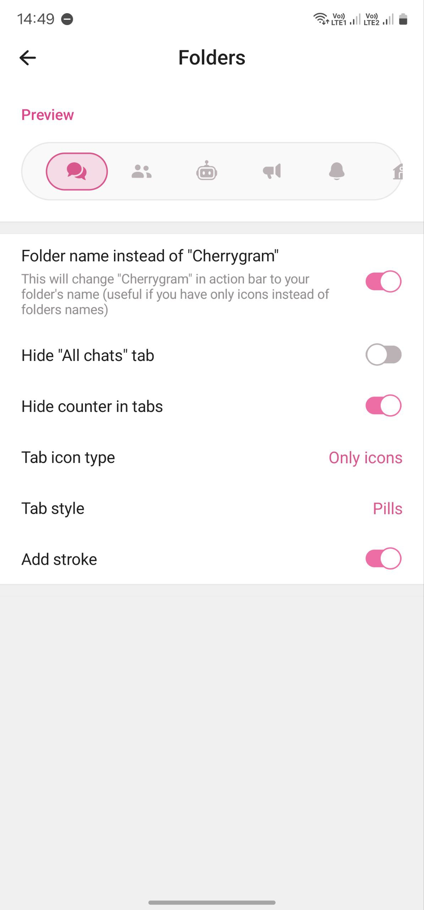</p>

</details>


---

### 📦 GMaps WV

> **Categories:** `#Android` `#Tools`

GMaps WV is a WebView wrapper for using Google Maps without exposing your device.

- 🐙 **Source Code:** [https://github.com/Divested-Mobile/Maps](https://github.com/Divested-Mobile/Maps)
- 👤 **Developer:** [DivestOS Mobile](https://github.com/Divested-Mobile)

<details>
<summary><b>✨ Key Features (8)</b> — <i>Click to expand</i></summary>

- Clears private data on close
- Blocks access to Google trackers and other third-party resources
- Restricts all network requests to HTTPS
- Allows toggling of location permission
- Navigation is not available, only turn-by-turn direction list
- WebRTC isn't blocked due to WebView limitations
- Cache isn't cleared due to resource/data considerations, however could allow tracking without other data (cookies)
- Manually clear app cache if necessary, may be addressed in future

</details>


---

### 📦 Method Call

> **Categories:** `#Android`

An Android automation application that works specifically by mapping phone numbers to a defined list of actions.

🔗 **Links**:
- Download: [IzzySoft](https://apt.izzysoft.de/fdroid/index/apk/com.coleblvck.methodcall) | [Github](https://github.com/coleblvck/MethodCall)
- [Screenshots](https://t.me/popCLOUDS/7648)
- [SourceCode](https://github.com/coleblvck/MethodCall)

🌐 @popmodsnetwork
🎁 [Donate to our admins](https://t.me/popCLOUDS/6339)

- 🐙 **Source Code:** [https://github.com/coleblvck/MethodCall](https://github.com/coleblvck/MethodCall)


---

### 📦 Winit

> **Categories:** `#rust` `#android` `#gui` `#ios` `#macos` `#rust_lang` `#wasm` `#wayland` `#windowing` `#windows` `#x11`

Winit is a library that helps you create and manage windows on different platforms using the Rust programming language. It allows you to handle events like window resizing, key presses, and mouse movements. To show something on the window, you need to use platform-specific functions or another library. The benefit to you is that Winit provides a flexible and low-level way to manage windows, making it easier to build cross-platform applications such as games or graphical user interfaces.

https://github.com/rust-windowing/winit

- 🐙 **Source Code:** [https://github.com/rust-windowing/winit](https://github.com/rust-windowing/winit)
- 👤 **Developer:** [rust-windowing](https://github.com/rust-windowing)


---

### 📦 Gucken

> **Categories:** `#Android` `#Linux` `#Windows`

Gucken is a Terminal User Interface which allows you to browse and watch your favorite anime's with style.

🔗 **Links**:
- [Download](https://github.com/Commandcracker/gucken/releases)
- [Screenshots](https://t.me/popCLOUDS/7627)
- [SourceCode](https://github.com/Commandcracker/gucken)

🌐 @popmodsnetwork
🎁 [Donate to our admins](https://t.me/popCLOUDS/6339)

- 🐙 **Source Code:** [https://github.com/Commandcracker/gucken](https://github.com/Commandcracker/gucken)


---

### 📦 Librera Reader

> **Categories:** `#Reader` `#Android` `#Comics` `#Books`

Librera Reader is a lightweight, free ebook reader app for Android that gobbles up practically every ebook format imaginable! From PDFs and EPUBs to MOBI, DjVu, and even comic books (CBZ, CBR), Librera handles it all.  Enjoy features like text-to-speech, a customizable interface, and a musician's mode for scrolling sheet music. Librera is a must-have for bookworms!

- 🐙 **Source Code:** [https://github.com/foobnix/LibreraReader](https://github.com/foobnix/LibreraReader)
- 👤 **Developer:** [Ivan Ivanenko](https://github.com/foobnix)

<details>
<summary><b>✨ Key Features (49)</b> — <i>Click to expand</i></summary>

- Modern, customizable reading interface with day/night themes
- View books as a list or grid, customize covers
- Library search, favorites, and recent lists
- Create and manage your library, adding/removing folders
- Filter book searches (title, author, series, genre)
- Sort books (author, genre, series, size)
- "Bookbinding" for image folders
- *Reading Settings**
- Customize background and font colors, including textured backgrounds
- Choose fonts for text, titles, and italics
- Change reading direction (left-to-right, right-to-left)
- Intelligent white space cropping
- Night mode and page locking
- Accurate PDF text reflow and page splitting
- Multi-word text search
- Support for CSS styles (EPUB, AZW, AZW3, MOBI)
- Nested hierarchy content display
- Accurate multi-line text selection
- Manual and auto-brightness adjustment
- Configurable tap-zones
- Text alignment, indents, line spacing, additional fonts
- RSVP (rapid serial visual presentation) speed reading
- *Musician's Mode**
- Auto-scrolling sheet music at adjustable speed
- Fast transitions between sheets
- Bookmarks, Notes and drawings
- *Language Learning**
- Integrated audio player
- Text-to-speech (TTS) reading aloud
- Dictionary lookup (GoldenDict, ABBYY Lingvo, ColorDict)
- Online search for word meanings and translations
- *PDF and Comic Book Features**
- PDF reader and viewer.
- File manager and cover view
- Day/night themes
- Notes, comments, and bookmarks
- Auto-scrolling
- Opening password-protected PDFs
- Page splitting
- Comic book reader (CBZ, CBR)
- Remembers reading position
- *Advanced Features**
- Export/import notes and settings
- Desktop widget
- Page sharing as an image
- Offline Calibre library support
- EPUB3 multimedia support
- Support for office doc formats (ODT, RTF)
- Online book catalog support (Gutenberg, Manybooks)

</details>

<details>
<summary><b>🖼️ Preview Screenshots & Media (1)</b> — <i>Click to view images & decide if you want to use this app</i></summary>

#### 📸 Cover / Preview
<p align="center">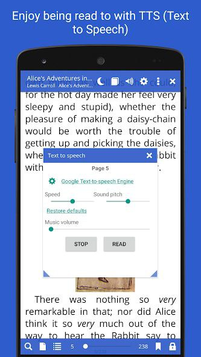</p>

</details>


---

### 📦 Overmorrow

> **Categories:** `#Weather` `#Android` `#Minimalism` `#Privacy` `#GitHub` `#OpenSource`

Your minimalist, colorful weather companion with a clean, vibrant, and open-source weather experience. Get hyper-accurate forecasts, slick radar, air quality info, and even stunning network images that change based on your location and the weather. All that without sacrificing your privacy – no ads, no data collection, just pure weather goodness.

- 🐙 **Source Code:** [https://github.com/bmaroti9/Overmorrow](https://github.com/bmaroti9/Overmorrow)
- 👤 **Developer:** [Balint Maroti](https://github.com/bmaroti9)

<details>
<summary><b>✨ Key Features (12)</b> — <i>Click to expand</i></summary>

- **Hyper-accurate forecasts** — Get precise weather predictions for up to 14 days, powered by open-meteo, met-norway, or weatherapi.com
- **Stunning visuals** — Enjoy location and weather-adaptive network images and 5 customizable color themes
- **Detailed radar** — Track past and future precipitation with a compact or full-screen radar view (2 hours past, 30 minutes future)
- **Comprehensive air quality data** — Stay informed about AQI, PM2.5, PM10, O3, and NO2 levels
- **Precise rain tracking** — Get 15-minute precision rain forecasts for the next 6 hours
- **Sunrise/sunset times** — Know exactly when the sun rises and sets in your location
- **3-day detailed forecast** — Dive deep into temperature, precipitation, wind, and UV index prediction
- **14-day compact forecast** — Get a quick overview of the next two weeks, expandable for details
- **Interactive rain charts** — Visualize daily rainfall patterns
- **Multiple weather providers** — Choose your preferred source for the most accurate data
- **Tablet mode** — Optimized for larger screens
- **Two search providers** — Easily find your location

</details>

<details>
<summary><b>🖼️ Preview Screenshots & Media (1)</b> — <i>Click to view images & decide if you want to use this app</i></summary>

#### 📸 Cover / Preview
<p align="center">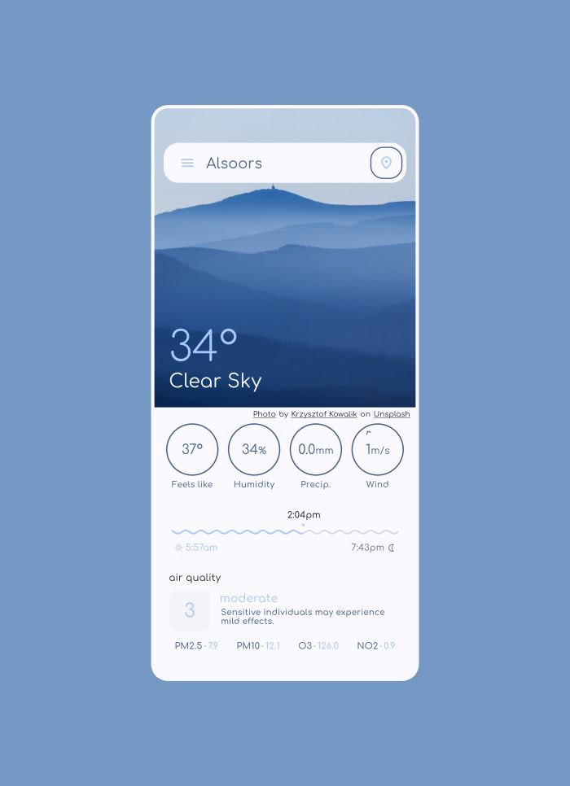</p>

</details>


---

### 📦 Xx Net

> **Categories:** `#python` `#gfw` `#goagent` `#proxy` `#uncensored` `#vpn`

XX-Net is a reliable system to bypass internet restrictions, running for 9 years. It works by making your internet traffic look like normal traffic, so it can't be detected. It supports many platforms like Android, iOS, Windows, Mac, and Linux. The software is open-source, doesn't need installation, and can connect multiple devices at once. It also includes ChatGPT with a million tokens. This helps you access the internet freely and securely without being detected, and you get additional AI assistance with ChatGPT.

https://github.com/XX-net/XX-Net

- 🐙 **Source Code:** [https://github.com/XX-net/XX-Net](https://github.com/XX-net/XX-Net)
- 👤 **Developer:** [XX-net](https://github.com/XX-net)


---

### 📦 Grpc Java

> **Categories:** `#java`

gRPC-Java is a library that helps you communicate between different parts of your application efficiently. It supports Java 8 and later, including Android devices from Lollipop onwards. You can use it to create robust and scalable services by generating code from protocol buffer definitions. The library has three main layers: Stub for type-safe bindings, Channel for handling transport and interceptions, and Transport for managing network communications. It offers multiple transport implementations, such as Netty and OkHttp, making it flexible for various environments, including Android. This makes it easier to build reliable and efficient communication systems in your applications.

https://github.com/grpc/grpc-java

- 🐙 **Source Code:** [https://github.com/grpc/grpc-java](https://github.com/grpc/grpc-java)
- 👤 **Developer:** [grpc](https://github.com/grpc)


---

### 📦 EchoirX

> **Categories:** `#Android` `#Music`

A successor for [FluidAC](https://t.me/popMODS/5998), aims to provide high-quality audio formats while adhering to Material Design principles.

🔗Links
- [Download](https://t.me/ThisPandaCanTalk/57)
- [Screenshots](https://t.me/popCLOUDS/7552)
- [Support group](https://t.me/ThisPandaCanTalkHereToo)
- [Channel](https://t.me/ThisPandaCanTalk)
- [Source code](https://github.com/imjyotiraditya/Echoir)

- 🐙 **Source Code:** [https://github.com/imjyotiraditya/Echoir](https://github.com/imjyotiraditya/Echoir)
- 👤 **Developer:** [Jyotiraditya Panda](https://github.com/imjyotiraditya)


---

### 📦 Rapidjson

> **Categories:** `#cplusplus`

RapidJSON is a fast and efficient JSON parser and generator for C++. It is small, complete, and supports both SAX and DOM style APIs. Here are the key benefits Comparable to `strlen()` and optionally uses SSE2/SSE4.2 for acceleration.
- **Memory-Friendly** Handles UTF-8, UTF-16, UTF-32, and their detection, validation, and transcoding.
- **Easy Installation** Works on various platforms including Windows, Linux, Mac OS X, iOS, and Android.

Using RapidJSON helps you parse and generate JSON quickly and efficiently without depending on external libraries like BOOST or STL. This makes it a great tool for developers working with JSON data in C++.

https://github.com/Tencent/rapidjson

- 🐙 **Source Code:** [https://github.com/Tencent/rapidjson](https://github.com/Tencent/rapidjson)
- 👤 **Developer:** [Tencent](https://github.com/Tencent)


---

### 📦 Virtualapp

> **Categories:** `#java` `#android` `#framework` `#plugin` `#plugin_manager`

VirtualApp (VA) is a lightweight virtual machine for Android that allows you to run multiple apps in a sandboxed environment. Here are the key benefits VA enables you to install and run multiple instances of the same app, such as having two WhatsApp or QQ accounts on one phone.
- **Security and Isolation** VA supports Java and Native hooking, allowing you to monitor and control app behavior without rooting the device.
- **Google Services Support** VA is highly performant, compatible with Android versions from 5.0 to 15.0, and supports both 32-bit and 64-bit apps.
- **Easy Integration**: VA is easy to integrate into existing apps, even those already live on the market, and provides APIs for simple development.

Overall, VA offers a robust solution for app management, security, and multi-instance running, making it versatile for various use cases.

https://github.com/asLody/VirtualApp

- 🐙 **Source Code:** [https://github.com/asLody/VirtualApp](https://github.com/asLody/VirtualApp)
- 👤 **Developer:** [asLody](https://github.com/asLody)


---

### 📦 Muzza: The Ultimate Material 3 YouTube Music Client for Android

> **Categories:** `#Android` `#YouTubeMusic` `#MusicPlayer` `#GitHub` `#OpenSource`

The most advanced YouTube Music client for Android—sleek, feature-packed, and built with Jetpack Compose. Muzza offers ad-free playback, offline support, and much more to enhance your music streaming experience.

- 🐙 **Source Code:** [https://github.com/Maloy-Android/Muzza](https://github.com/Maloy-Android/Muzza)
- 👤 **Developer:** [MaloyBegonia](https://github.com/Maloy-Android)


---

### 📦 Serverstatus Rust

> **Categories:** `#rust` `#probe` `#railway` `#serverstatus` `#serverstatus_rust` `#telegram` `#vnstat` `#webhook` `#wechat`

This tool, called "ServerStatus-Rust," is a lightweight and easy-to-deploy server monitoring system. Here are the key benefits It works on various systems including Linux, MacOS, Windows, Android, and Raspberry Pi.
- **Simple Deployment** It supports alerts via Telegram, WeChat, email, and webhooks for events like going online or offline.
- **Traffic Statistics** The configuration file `config.toml` makes it simple to set up and manage your servers.
- **Client Options**: You can use either a Rust or Python version of the client, depending on your system compatibility.

Overall, it's designed to be simple, efficient, and highly customizable for personal server monitoring needs.

https://github.com/zdz/ServerStatus-Rust

- 🐙 **Source Code:** [https://github.com/zdz/ServerStatus-Rust](https://github.com/zdz/ServerStatus-Rust)
- 👤 **Developer:** [zdz](https://github.com/zdz)


---

### 📦 QuickEdit - Photo Editor

> **Categories:** `#Android` `#PhotoEditor` `#Utilities`

A lightweight and user-friendly photo editor for Android. Built with Jetpack Compose, QuickEdit offers essential tools and a smooth, clean interface for quick and easy photo editing.

- 🐙 **Source Code:** [https://github.com/Abizer-R/QuickEdit-Photo-Editor](https://github.com/Abizer-R/QuickEdit-Photo-Editor)
- 👤 **Developer:** [Abizer Rampurawala](https://github.com/Abizer-R)


---

### 📦 FFUpdater - Updater for privacy friendly browser

> **Categories:** `#Android` `#Utilities` `#Browser` `#Mail`

FFUpdater is an updater for privacy-friendly browsers. It installs and updates various browsers.

- 🐙 **Source Code:** [https://github.com/Tobi823/ffupdater](https://github.com/Tobi823/ffupdater)
- 👤 **Developer:** [Tobias Hellmann](https://github.com/Tobi823)


---

### 📦 Find My IP

> **Categories:** `#android` `#tool` `#Utilities` `#Location`

__Find My IP is a straightforward Android app designed to fetch and optionally
store your current IP address, helping you keep a history of your IP addresses.

It can automatically log IP changes in the background, so you don't have to open
the app every time.__

- 🐙 **Source Code:** [https://github.com/maksimowiczm/find-my-ip](https://github.com/maksimowiczm/find-my-ip)
- 👤 **Developer:** [Mateusz Maksimowicz](https://github.com/maksimowiczm)


---

### 📦 Joplin

> **Categories:** `#windows` `#desktop` `#linux` `#mac` `#utilities` `#joplin` `#typescript` `#android` `#dropbox` `#electron` `#enex_files` `#evernote` `#javascript` `#nextcloud` `#nodejs` `#note_taking` `#onedrive` `#react_native` `#synchronisation` `#web_clipper` `#webdav` `#Interesting` `#Useful` `#GitHub` `#OpenSource`

A great app to take notes and make to-do lists, eazy to use and also packed with features. Supports mobile phones and desktops.

- 🐙 **Source Code:** [https://github.com/laurent22/joplin](https://github.com/laurent22/joplin)
- 👤 **Developer:** [Laurent Cozic](https://github.com/laurent22)

<details>
<summary><b>✨ Key Features (14)</b> — <i>Click to expand</i></summary>

- Desktop, mobile and terminal applications.
- Web Clipper for Firefox and Chrome.
- End To End Encrypted (E2EE) synchronisation (but not encrypted locally at rest)
- Synchronisation with various services, including NextCloud, Dropbox, WebDAV and OneDrive.
- Import Enex files (Evernote export format) and Markdown files.
- Export JEX files (Joplin Export format) and raw files.
- Support for notifications in mobile and desktop applications.
- Offline first, so the entire data is always available on the device even without an internet connection.
- Markdown notes. Support for extra features such as math notation, checkboxes and Fountain (screenwriting markup language).
- File attachment support, images, etc.
- Search functionality.
- Geo-location support.
- Supports multiple languages
- External editor support - open notes in your favorite external editor with one click in Joplin.

</details>

<details>
<summary><b>🖼️ Preview Screenshots & Media (1)</b> — <i>Click to view images & decide if you want to use this app</i></summary>

#### 📸 Cover / Preview
<p align="center">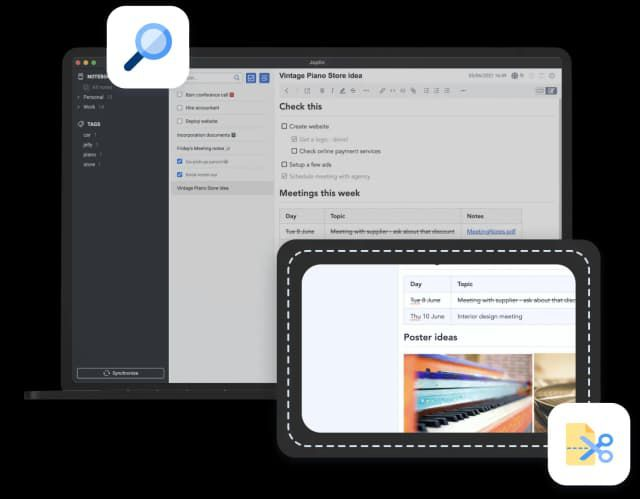</p>

</details>


---

### 📦 Modern Android Lock Screen Project

> **Categories:** `#Android` `#Customization`

Malsp is a preset for KLCK that brings the Google Pixel lock screen experience to older devices and OEM Android distributions with some additional customization features.

- 🐙 **Source Code:** [https://t.me/popCLOUDS/7395](https://t.me/popCLOUDS/7395)
- 👤 **Developer:** [brianKordy](https://github.com/briankrd)


---

### 📦 Missing Core

> **Categories:** `#Android` `#MusicPlayer` `#nothing`

A Nothing-inspired music player.

- 🐙 **Source Code:** [https://github.com/MissingCore/Music](https://github.com/MissingCore/Music)
- 👤 **Developer:** [cyanChill](https://github.com/cyanChill)

<details>
<summary><b>✨ Key Features (8)</b> — <i>Click to expand</i></summary>

- Supports Android 7+
- Offline-First
- Supports Nothing Music Widget & Glyph Music Visualization
- **Diverse music organization** — Favorites, Playlists, Folder Structure, Albums, Artists
- Background playback w/ media control notification
- Queues
- Theoretical support of these media formats
- Control of where music is found

</details>

<details>
<summary><b>🖼️ Preview Screenshots & Media (1)</b> — <i>Click to view images & decide if you want to use this app</i></summary>

#### 📸 Cover / Preview
<p align="center">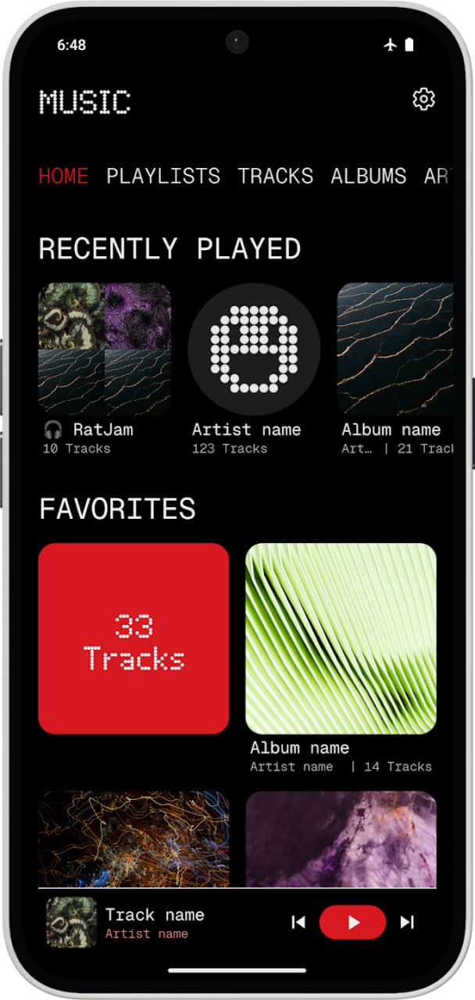</p>

</details>


---

### 📦 Tiny Music Player

> **Categories:** `#Android` `#MusicPlayer`

A open source Music player without crap and super tiny (20kb <, No GUI)

- 🐙 **Source Code:** [https://github.com/martinmimigames/tiny-music-player](https://github.com/martinmimigames/tiny-music-player)
- 👤 **Developer:** martinmimigames

<details>
<summary><b>✨ Key Features (7)</b> — <i>Click to expand</i></summary>

- It's free
- No advertisement
- Compact
- Unbelievably compatible
- Clean & Simple
- Minimal permissions required
- No hidden third-parties

</details>


---

### 📦 Notally**X

> **Categories:** `#Android` `#Notes`

a lightweight and open sourced note taking apps for android

- 🐙 **Source Code:** [https://github.com/PhilKes/NotallyX](https://github.com/PhilKes/NotallyX)
- 👤 **Developer:** [PhilKes](https://github.com/PhilKes)

<details>
<summary><b>✨ Key Features (8)</b> — <i>Click to expand</i></summary>

- Widgets
- Auto backup
- Adjustable text size
- APK size of 1.4 MB (1.8 MB uncompressed)
- Color, pin and label your notes for quick organisation
- Complement your notes with pictures (JPG, PNG, WEBP)
- Create rich text notes with support for bold, italics, mono space and strike-through
- Add clickable links to notes with support for phone numbers, email addresses and web urls

</details>


---

### 📦 Human Benchmark

> **Categories:** `#Android` `#Utilities`

Human Benchmark is a mobile application designed to test and improve your cognitive abilities through a series of fun and challenging tests. The app offers various tests, including memory, reaction time, pattern recognition, aim training, and typing tests, each designed to measure different aspects of your mental capabilities.

- 🐙 **Source Code:** [https://github.com/PrintN/Human-Benchmark](https://github.com/PrintN/Human-Benchmark)
- 👤 **Developer:** [PrintN](https://github.com/PrintN)

<details>
<summary><b>✨ Key Features (4)</b> — <i>Click to expand</i></summary>

- **Comprehensive Testing** — Test yourself in various areas, including Reaction Time, Typing, Chimp Test, Number Memory, Hearing Test, Verbal Memory, Sequence Memory, Visual Memory, and Aim Training.
- **Statistics** — Compare your performance to others around the world.
- **Share Your Statistics** — Easily share an image of your statistics with friends or on social media.
- **Offline Access** — Enjoy the app fully without needing an internet connection; it's 100% offline.

</details>


---

### 📦 LinkHub

> **Categories:** `#Android` `#Clipboard`

a open sourced android app to save link effortlessly

- 🐙 **Source Code:** [https://github.com/AmrDeveloper/LinkHub](https://github.com/AmrDeveloper/LinkHub)
- 👤 **Developer:** [Amr Hesham](https://github.com/AmrDeveloper)

<details>
<summary><b>✨ Key Features (8)</b> — <i>Click to expand</i></summary>

- Free And open source with no ads
- Create Folder with name and multi colors
- Create Link with title, subtitle, url
- Links and Folders are sorted depending on your usage
- Shortcuts, Context menu and receive links from other apps
- Swipe to delete links on Home with undo option
- Dark theme support
- JSON Format

</details>


---

### 📦 VolumeLockr

> **Categories:** `#Android` `#Tools`

VolumeLockr allows you to control your Android device volume levels and set locks for each one of them.

- 🐙 **Source Code:** [https://github.com/jonathanklee/VolumeLockr](https://github.com/jonathanklee/VolumeLockr)
- 👤 **Developer:** [Jonathan Klee](https://github.com/jonathanklee)


---

### 📦 Geo Share

> **Categories:** `#Android` `#Tools` `#Maps`

An Android app to turn Google Maps URLs into geo: URLs.

- 🐙 **Source Code:** [https://github.com/jakubvalenta/geoshare](https://github.com/jakubvalenta/geoshare)
- 👤 **Developer:** [Jakub Valenta](https://github.com/jakubvalenta)


---

### 📦 Tasks.org

> **Categories:** `#Android` `#Task` `#Reminder`

A open source task and reminder for android
task can work completely offline without internet

- 🐙 **Source Code:** [https://github.com/tasks/tasks](https://github.com/tasks/tasks)
- 👤 **Developer:** [Alex Baker](https://github.com/abaker)

<details>
<summary><b>✨ Key Features (6)</b> — <i>Click to expand</i></summary>

- Open Source
- Doesn't need any unnecessary permission
- can backup or restore all configuration
- ability to set task priority
- ability to repeat the reminder
- work completely offline

</details>


---

### 📦 Metrolist: The Ultimate Music Player for Android

> **Categories:** `#Android` `#MusicPlayer` `#Audio` `#OpenSource`

A powerful, feature-packed music player—simple, fast, and customizable. Enjoy a smooth, high-quality listening experience with minimal permissions. No ads, no data collection, just pure music.

- 🐙 **Source Code:** [https://github.com/mostafaalagamy/Metrolist](https://github.com/mostafaalagamy/Metrolist)
- 👤 **Developer:** [Mostafa Al Agamy](https://github.com/mostafaalagamy)


---

### 📦 Sozo

> **Categories:** `#Android` `#Anime` `#Reader`

Synchronize anime and manga with the help of AniList in real time. You can easily sort anime and manga based on your current status.

- 🐙 **Source Code:** [https://t.me/sozo_disscussion](https://t.me/sozo_disscussion)
- 👤 **Developer:** @stc_android


---

### 📦 Music Sleep Timer Plus

> **Categories:** `#Android` `#Tools`

Music Sleep Timer Plus is an Android app that allows you to set a timer to stop your music or podcasts after you fall asleep. You can extend, reduce or cancel the timer from the notification actions to stop the playback. The app works with any media player and gradually lowers the volume before pausing the audio.

- 🐙 **Source Code:** [https://t.me/popCLOUDS/7224](https://t.me/popCLOUDS/7224)
- 👤 **Developer:** [D4rK7355608](https://github.com/D4rK7355608)

<details>
<summary><b>✨ Key Features (2)</b> — <i>Click to expand</i></summary>

- Set timers by specific time or duration
- Extend the timer directly from the notification drawer

</details>


---

### 📦 aniruddha-adhikary/mrt-buddy

> **Categories:** `#android` `#felica` `#felica_card` `#nfc`

Check the Balance of your Dhaka MRT Pass or Rapid Pass
**Language**: Kotlin

- 🐙 **Source Code:** [https://github.com/aniruddha-adhikary/mrt-buddy](https://github.com/aniruddha-adhikary/mrt-buddy)
- 👤 **Developer:** [aniruddha-adhikary](https://github.com/aniruddha-adhikary)


---

### 📦 TubeSync

> **Categories:** `#Android` `#Music`

Sync YouTube playlists offline. Because YT Music is....?

- 🐙 **Source Code:** [https://t.me/popCLOUDS/7222](https://t.me/popCLOUDS/7222)
- 👤 **Developer:** [Khaled0](https://github.com/khaled-0)

<details>
<summary><b>✨ Key Features (3)</b> — <i>Click to expand</i></summary>

- Offline downloads
- Background playback
- Fluid gesture navigations

</details>


---

### 📦 Cognitive Services Speech Sdk

> **Categories:** `#csharp`

The Microsoft Cognitive Services Speech SDK allows you to add speech-enabled features to your apps. It supports various programming languages like C++, C#, Java, JavaScript, and more. You can use it for speech recognition, translation, and synthesis across different platforms such as Windows, Linux, Android, and iOS. The SDK provides numerous samples and quickstarts to help you get started quickly with features like one-shot speech recognition, translation, and synthesis. These samples are easy to download and run, and they include detailed instructions for setup and execution. Using this SDK, you can enhance your applications with powerful speech capabilities, making them more interactive and user-friendly.

https://github.com/Azure-Samples/cognitive-services-speech-sdk

- 🐙 **Source Code:** [https://github.com/Azure-Samples/cognitive-services-speech-sdk](https://github.com/Azure-Samples/cognitive-services-speech-sdk)
- 👤 **Developer:** [Azure-Samples](https://github.com/Azure-Samples)


---

### 📦 File Explorer

> **Categories:** `#Android` `#FileExplorer`

A full-featured and lightweight file managing app written in kotlin with Jetpack Compose UI.

- 🐙 **Source Code:** [https://github.com/Raival-e/File-Explorer-Compose](https://github.com/Raival-e/File-Explorer-Compose)
- 👤 **Developer:** [Raival](https://github.com/Raival-e)

<details>
<summary><b>✨ Key Features (4)</b> — <i>Click to expand</i></summary>

- Free, lightweight and open source. No ads, subscriptions or in-app purchases.
- Simple and modern declarative - UI design using Jetpack Compose.
- All basic file management functionality (e.g. cut, copy, delete, compress, extract etc) are supported.
- Lets you open multiple tabs to make file managing a lot easier.

</details>


---

### 📦 Frigoligo

> **Categories:** `#features` `#Android` `#Article`

Your article with you

- 🐙 **Source Code:** [https://github.com/casimir/frigoligo](https://github.com/casimir/frigoligo)
- 👤 **Developer:** [Casimir](https://github.com/casimir)


---

### 📦 Llbc

> **Categories:** `#cplusplus`

The llbc framework is a simple, efficient, and cross-platform tool for server development. It supports multiple languages and is built with C++. Here are the key benefits Works on Windows, Linux, Mac, iOS, and Android.

- 🐙 **Source Code:** [https://github.com/lailongwei/llbc](https://github.com/lailongwei/llbc)
- 👤 **Developer:** [lailongwei](https://github.com/lailongwei)


---

### 📦 Flutterunit

> **Categories:** `#dart` `#flutter` `#learning` `#painting` `#widget_library`

FlutterUnit is an app that lets you explore and learn about Flutter, a platform for building apps. You can download it for Android, iOS, macOS, Windows, and even use it on the web. The app showcases over 300 Flutter components with live demos and code examples, allowing you to interact with them directly. It also features search and collection functions, theme and font settings, and the ability to view and share code. This makes it a powerful tool for learning and experimenting with Flutter, helping you to understand and use its various components effectively.

https://github.com/toly1994328/FlutterUnit

- 🐙 **Source Code:** [https://github.com/toly1994328/FlutterUnit](https://github.com/toly1994328/FlutterUnit)
- 👤 **Developer:** [toly1994328](https://github.com/toly1994328)


---

### 📦 Screenshot Tile No Root

> **Categories:** `#Android` `#Screenshot`

This is a tools to take screenshot without root by using accessibility services

- 🐙 **Source Code:** [https://github.com/cvzi/ScreenshotTile](https://github.com/cvzi/ScreenshotTile)
- 👤 **Developer:** [cvzi](https://github.com/cvzi)

<details>
<summary><b>✨ Key Features (3)</b> — <i>Click to expand</i></summary>

- take screenshot using Accessibility services or screen capturing permission
- open source
- only have necessary permission to perform it's intended function

</details>


---

### 📦 TeleWatch

> **Categories:** `#Android` `#Watches` `#Social`

Telewatch is a Telegram client for Android watches.

- 🐙 **Source Code:** [https://t.me/popCLOUDS/7181](https://t.me/popCLOUDS/7181)
- 👤 **Developer:** [gohj99](https://github.com/gohj99)

<details>
<summary><b>✨ Key Features (5)</b> — <i>Click to expand</i></summary>

- View or download text, pictures, and videos
- Save pictures or videos
- Edit message processing
- Delete message processing
- Support crown rotation

</details>


---

### 📦 Mirarr

> **Categories:** `#Android` `#IOS` `#Windows` `#Linux` `#GitHub` `#OpenSource`

This is a movie app that aims to simplify the process of watching movies and tv shows.

**🛠️ Features**:
• Trending movies and TV shows
• Watchlist, Favorites and Rating
• Feed of released movies and TV shows.
• External links to movies and tv shows to watch.

- 🐙 **Source Code:** [https://github.com/mirarr-app/mirarr](https://github.com/mirarr-app/mirarr)
- 👤 **Developer:** [mirarr-app](https://github.com/mirarr-app)


---

### 📦 Td

> **Categories:** `#cplusplus` `#cross_platform` `#library` `#telegram`

TDLib is a powerful tool for building Telegram clients that works on many different platforms like Android, iOS, Windows, and more. It can be used with almost any programming language, making it very versatile. TDLib takes care of network details, encryption, and data storage, making it easy to use and secure. It is also high-performance, reliable on slow internet connections, and fully documented. This means you can build efficient and stable Telegram clients quickly and securely, without worrying about the complex underlying details.

https://github.com/tdlib/td

- 🐙 **Source Code:** [https://github.com/tdlib/td](https://github.com/tdlib/td)
- 👤 **Developer:** [tdlib](https://github.com/tdlib)


---

### 📦 V2Rayng

> **Categories:** `#kotlin` `#android` `#proxy` `#shadowsocks` `#socks5` `#trojan` `#v2fly` `#v2ray` `#vless` `#vmess` `#vpn` `#xray` `#xtls`

v2rayNG is an app for Android that helps you use the internet more securely and privately. It supports two powerful cores, Xray and v2fly, which are known for their strong encryption and privacy features. The app is easy to use and can be downloaded from the Google Play Store. It also has a community support channel on Telegram where you can get help and updates. Using v2rayNG benefits you by protecting your internet traffic from being monitored or blocked, making your online activities safer and more private.

https://github.com/2dust/v2rayNG

- 🐙 **Source Code:** [https://github.com/2dust/v2rayNG](https://github.com/2dust/v2rayNG)
- 👤 **Developer:** [2dust](https://github.com/2dust)


---

### 📦 BiliDownOut

> **Categories:** `#Android` `#Tools`

BiliDownOut is a tool designed to export videos downloaded from the BiliDownOut app, with its main feature being the ability to export videos sourced from the Bilibili app.

- 🐙 **Source Code:** [https://f-droid.org/packages/cn.a10miaomiao.bilidown](https://f-droid.org/packages/cn.a10miaomiao.bilidown)
- 👤 **Developer:** [0miaomiao](https://github.com/10miaomiao)


---

### 📦 Cleaner Royall: The Most Advanced Root Cleaner for Android

> **Categories:** `#Android` `#Utilities` `#Cleaner` `#Performance`

The best cleaning app ever made—ultra-fast, lightweight, and powerful. Root or Magisk & Busybox only. No permissions needed (except root), no data collection, and includes an automatic cleaner module.

- 🐙 **Source Code:** [https://github.com/araafroyall/Cleaner-Royall](https://github.com/araafroyall/Cleaner-Royall)
- 👤 **Developer:** [GitHub @AraafRoyall](https://github.com/araafroyall)


---

### 📦 Linux Command

> **Categories:** `#markdown` `#bash` `#chrome` `#chrome_extension` `#command_line` `#gh_pages` `#linux` `#linux_command` `#ls` `#screen` `#screenshot` `#search` `#ssh` `#tools` `#web_tools`

This resource is a comprehensive collection of over 580 Linux commands, presented in a user-friendly web format. Here are the key benefits It includes a vast array of Linux commands, categorized for easy reference.
- **Web Access** You can deploy the website using Docker, Vercel, or other methods, allowing flexibility in how you access the content.
- **Community Contributions** The commands are available in Markdown format, and there are also mobile and desktop applications, such as Chrome extensions and Android apps.

This resource is highly valuable for anyone looking to learn or reference Linux commands efficiently.

https://github.com/jaywcjlove/linux-command

- 🐙 **Source Code:** [https://github.com/jaywcjlove/linux-command](https://github.com/jaywcjlove/linux-command)
- 👤 **Developer:** [jaywcjlove](https://github.com/jaywcjlove)


---

### 📦 Frosty

> **Categories:** `#Android` `#iOS` `#Social` `#Root` `#Modules`

A mobile Twitch client for iOS and Android with 7TV, BetterTTV (BTTV), and FrankerFaceZ (FFZ) support.

- 🐙 **Source Code:** [https://github.com/tommyxchow/frosty](https://github.com/tommyxchow/frosty)
- 👤 **Developer:** [Drsexo](https://github.com/Drsexo)

<details>
<summary><b>✨ Key Features (37)</b> — <i>Click to expand</i></summary>

- Support for 7TV, BetterTTV, and FrankerFaceZ emotes and badges
- Browse followed streams, top streams, and top categories
- Autocomplete for emotes and user mentions
- Light, dark, and black (OLED) themes
- Search for channels and categories
- See and filter chatters in a channel
- Local chat user message history
- Theater and fullscreen mode
- Watch live streams with chat
- Picture-in-picture mode
- Block and report users
- Emote menu
- Sleep timer
- **Telemetry** - Ads, analytics, tracking (safe to disable)
- **Background** - Updates, background sync (safe to disable)
- **Location** - GPS, geofencing, activity recognition
- **Connectivity** - Chromecast, Quick Share, Nearby
- **Cloud** - Backup, sync, authentication
- **Payments** - Google Pay, Wallet, NFC
- **Wearables** - Wear OS, Google Fit
- **Games** - Play Games achievements, cloud saves
- **XML Patching** - Removes GMS from power-save whitelists
- **DeviceIdle Integration** - Allows Android Doze to optimize GMS
- **Conflict Resolution** - Patches other modules that whitelist GMS
- **Toggleable** - Enable/disable with the action button
- **Deep Sleep Enforcement** - Forces the device into deep sleep immediately when the screen locks.
- **Background Restrictions** - Blocks apps from running in the background to stop battery-draining loops.
- **WAKE_LOCK Denial** - Denies WAKE_LOCK permissions to block useless CPU-heavy wakelocks.
- **Kernel Tweaks** - Scheduler, VM, and network optimizations
- **Blur Disable** - Reduce GPU load by disabling UI blur effects
- **Log Killing** - Stop battery-draining log processes (logcat, traced, etc.)
- **Empty RC Files** - Overlay system init scripts to prevent debug daemons
- **Volume Key Selection** - Easy installation choices
- **Action Button Toggle** - Switch modes from root manager
- **Comprehensive Logs** - Detailed logs in /data/adb/modules/Frosty/logs/
- **Status Report** - Quick status check via terminal
- **Clean Uninstall** - Complete reversal of all changes

</details>


---

### 📦 Animetail

> **Categories:** `#Android`

Full-featured player and reader, based on Tachiyomi Mihon.
Discover and watch anime, cartoons, series, and more – easier than ever on your Android device.

- 🐙 **Source Code:** [https://github.com/Dark25/Animetail2](https://github.com/Dark25/Animetail2)


---

### 📦 AnLinux

> **Categories:** `#Android` `#Linux` `#Tools`

Run Linux on Android without root access. Supports 2 Desktop Environments, and only [Ubuntu](https://www.ubuntu.com/), [Debian](https://www.debian.org/), [Kali](https://www.kali.org/), [Parrot Security OS](https://www.parrotsec.org/), [Fedora](https://getfedora.org/) distros are supported.

- 🐙 **Source Code:** [https://github.com/EXALAB/AnLinux-Adfree](https://github.com/EXALAB/AnLinux-Adfree)


---

### 📦 Splitcat

> **Categories:** `#Android` `#Windows` `#Linux` `#Tools`

Simple flutter app for spliting and merging files with predefined application limits.

- 🐙 **Source Code:** [https://github.com/vogonwann/splitcat](https://github.com/vogonwann/splitcat)


---

### 📦 Clippy

> **Categories:** `#Android` `#Utilities` `#GitHub` `#OpenSource`

Clippy is a simple app that allows you to copy links directly from the Android sharing menu, with built-in features to remove trackers and URL shorteners for a cleaner experience. On certain Android versions (from manufacturers like Realme, Xiaomi, and Oppo), the option to copy links directly to the clipboard is often missing. Clippy restores this essential feature, making it quick and easy to share links.

- 🐙 **Source Code:** [https://github.com/WSTxda/Clippy](https://github.com/WSTxda/Clippy)
- 👤 **Developer:** [felixrieseberg](https://github.com/felixrieseberg)


---

### 📦 Aer - Fork of **[**Anemo**](https://t.me/popMODS/5187)

> **Categories:** `#Android` `#privacy`

Private storage utility for android with support for external storage media.

Instead of being a stand-alone file manager user interface, it hooks into various components to make feel like a native part of the operative system.

- 🐙 **Source Code:** [https://github.com/nain-F49FF806/anemo-aer](https://github.com/nain-F49FF806/anemo-aer)


---

### 📦 Zerotermux

> **Categories:** `#java`

ZeroTermux is a free, non-profit software based on Termux. It offers several useful features like backup and recovery, container switching, and the ability to switch between different Linux distributions like Ubuntu and Kali. It also has Chinese and English language support and uses sources from Tsinghua and Beijing for domestic users. The software is open source, meaning you can freely distribute, copy, and change it, but you must follow the GPL agreement. Using ZeroTermux can help you learn and use Linux commands on your Android device, making it a valuable tool for personal learning and communication. However, it is not for commercial or illegal use, and users are responsible for any risks or damages caused by its use.

https://github.com/hanxinhao000/ZeroTermux

- 🐙 **Source Code:** [https://github.com/hanxinhao000/ZeroTermux](https://github.com/hanxinhao000/ZeroTermux)
- 👤 **Developer:** [hanxinhao000](https://github.com/hanxinhao000)


---

### 📦 Musicfree

> **Categories:** `#typescript` `#free` `#music_player` `#plugin` `#react` `#react_native`

This music player, called MusicFree, is a free, ad-free, and customizable app for Android and Harmony OS. It uses plugins to search, play, and manage music, which means you can access any music source available online with the right plugin. The app is open-source, so it's free and won't collect your personal data. You can customize the look with light or dark modes and custom backgrounds. Be cautious of fake versions and only download from the official sources to avoid scams. The app is maintained by a single developer, so updates might be slow, but it's designed to be safe and functional.

https://github.com/maotoumao/MusicFree

- 🐙 **Source Code:** [https://github.com/maotoumao/MusicFree](https://github.com/maotoumao/MusicFree)
- 👤 **Developer:** [maotoumao](https://github.com/maotoumao)


---

### 📦 GPTMobile

> **Categories:** `#Android` `#AI`

Your all in one chat assistant - Chat with multiple LLMs at once and an Material3 style chat app that supports answers from multiple LLMs at once.

- 🐙 **Source Code:** [https://github.com/Taewan-P/gpt_mobile](https://github.com/Taewan-P/gpt_mobile)


---

### 📦 GeoNotes

> **Categories:** `#Android` `#Utilities`

A simple and lightweight app to create and manage georeferenced notes (text and photos) on a map. The goal is to create the notes as fast as possible without any unnecessary UI/UX overhead.

- 🐙 **Source Code:** [https://apt.izzysoft.de/fdroid/index/apk/de.hauke_stieler.geonotes](https://apt.izzysoft.de/fdroid/index/apk/de.hauke_stieler.geonotes)


---

### 📦 Paranoid's Pal - Privacy Lock

> **Categories:** `#Android` `#Privacy`

It’s important to lock your Android device when you aren’t using it so that nobody else can get access to your apps and data. Your fingerprint - your security. It's convenient but not completely secure. We've worked to strike a balance making it both convenient and secure.

- 🐙 **Source Code:** [https://apt.izzysoft.de/fdroid/index/apk/com.paranoid.privacylock](https://apt.izzysoft.de/fdroid/index/apk/com.paranoid.privacylock)

<details>
<summary><b>✨ Key Features (2)</b> — <i>Click to expand</i></summary>

- *
- *Instant Lock with Shake** If you’re ever in a situation where you need to secure your phone in a flash just give it a quick shake and it locks immediately no questions asked. Perfect for those moments when you feel something’s not right.

</details>


---

### 📦 Server Box

> **Categories:** `#Network` `#Tools` `#Android` `#MacOS` `#iOS` `#Windows` `#Linux` `#GitHub` `#OpenSource`

A Flutter project which provide charts to display Linux server status and tools to manage server.

- 🐙 **Source Code:** [https://github.com/lollipopkit/flutter_server_box](https://github.com/lollipopkit/flutter_server_box)
- 👤 **Developer:** [lollipopkit](https://github.com/lollipopkit)


---

### 📦 Gamedge

> **Categories:** `#Android` `#Utilities`

An Android application for browsing video games and checking the latest gaming news from around the world.

- 🐙 **Source Code:** [https://github.com/mars885/gamedge](https://github.com/mars885/gamedge)


---

### 📦 Android Pin Bruteforce

> **Categories:** `#GitHub` `#OpenSource`

**4️⃣**** **[**GitHub**](https://t.me/github_tg)

- 🐙 **Source Code:** [https://github.com/urbanadventurer/Android-PIN-Bruteforce](https://github.com/urbanadventurer/Android-PIN-Bruteforce)
- 👤 **Developer:** [urbanadventurer](https://github.com/urbanadventurer)


---

### 📦 Vernet

> **Categories:** `#Network` `#Tools` `#Android` `#Linux` `#Windows` `#MacOS` `#Dart` `#Analyzer` `#Monitoring`

Network Analyzer and Monitoring Tool

- 🐙 **Source Code:** [https://t.me/popCLOUDS/7001](https://t.me/popCLOUDS/7001)
- 👤 **Developer:** [git-elliot](https://github.com/git-elliot)

<details>
<summary><b>✨ Key Features (4)</b> — <i>Click to expand</i></summary>

- Shows Wi-Fi details such as BSSID and MAC Address.
- Scans for devices(or hosts) on network
- Scans for open ports of target IP
- Shows ISP details

</details>


---

### 📦 OpenDocument Reader

> **Categories:** `#Android` `#iOS` `#Tools`

View OpenOffice and LibreOffice documents on the go. Now available for Android and iOS!

- 🐙 **Source Code:** [https://f-droid.org/packages/at.tomtasche.reader](https://f-droid.org/packages/at.tomtasche.reader)


---

### 📦 Tool Telegram

> **Categories:** `#Android` `#Tools` `#java` `#telegram` `#Interesting` `#Privacy` `#Security` `#GitHub` `#OpenSource`

Send messages on telegram as a bot, easily.

- 🐙 **Source Code:** [https://apt.izzysoft.de/fdroid/index/apk/dev.trindadedev.tooltelegram](https://apt.izzysoft.de/fdroid/index/apk/dev.trindadedev.tooltelegram)
- 👤 **Developer:** [DrKLO](https://github.com/DrKLO)


---

### 📦 Pazzword - The most intelligent password evaluator app

> **Categories:** `#Android` `#Tools`

It analyzes passwords using the open source library 'nbvcxz', a Java adaptation of 'zxcvbn' by Dropbox. In comparison to other password evaluator tools this secure and flexible tool uses algorithms for pattern matching and conservative estimation to give you the best results currently possible. It recognizes and weighs 30.000 common passwords, common names & surnames, most english words and common patterns like dates, repeats, sequences, keyboard patterns and l33t speak

- 🐙 **Source Code:** [https://play.google.com/store/apps/details?id=com.cyb3rko.pazzword](https://play.google.com/store/apps/details?id=com.cyb3rko.pazzword)


---

### 📦 chatAir - Chat and Collaboration Tool

> **Categories:** `#Android` `#ChatApp` `#AI`

A versatile chat application for real-time collaboration and communication. It supports messaging, file sharing, and task management. Integrated with AI for enhanced productivity and automated responses. Perfect for teams, whether you're working remotely or in the office.

- 🐙 **Source Code:** [https://t.me/popCLOUDS/6949](https://t.me/popCLOUDS/6949)


---

### 📦 Keysh - Handle volume buttons on Android

> **Categories:** `#Android` `#Tools`

App for handling volume button presses. Works when the screen is off. The handler is a shell script. Events are received in stdin and commands are expected in stdout. You can toggle the flashlight, control playback, and more

- 🐙 **Source Code:** [https://f-droid.org/packages/io.github.hufrea.keysh](https://f-droid.org/packages/io.github.hufrea.keysh)


---

### 📦 Android permission request framework, adapted for Android 14

> **Categories:** `#java` `#andpermission` `#android` `#android11` `#easypermission` `#permission` `#permission_android` `#permissions` `#permissionsdispatcher` `#permissionutils` `#permissionx` `#rxpermission` `#rxpermissions`

Android permission request framework, adapted for Android 14

https://github.com/getActivity/XXPermissions

- 🐙 **Source Code:** [https://github.com/getActivity/XXPermissions](https://github.com/getActivity/XXPermissions)
- 👤 **Developer:** [getActivity](https://github.com/getActivity)


---

### 📦 NeatLauncher - A neat and convenient launcher without icons.

> **Categories:** `#Android` `#Customization`

The home app (the launcher) to replace ugly home apps that are too colourful, distracting, inefficient, and full of non-sensical icons. Clarity by efficient and elegant design based on text. With configurable quick access to apps, shortcuts, or contacts via a list or by gestures. Supports app shortcuts, both static and dynamic. Search function optionally integrates the contact list, and includes a configurable web search. Tries to have enough configurability without making testing corner cases tedious, to ensure functionality and robustness. Weather info (uses network and location services, if necessary). New app developed from scratch. Takes inspiration from Unlauncher (a fork of Slimlauncher), and Nolauncher, and also feedback of users.

- 🐙 **Source Code:** [https://f-droid.org/en/packages/de.theiling.neatlauncher](https://f-droid.org/en/packages/de.theiling.neatlauncher)


---

### 📦 Kurumi - Unofficial Anilist Client

> **Categories:** `#Android`

Kurumi is an unofficial anilist client application. Are you tired of getting lost in the vast world of anime and manga? Look no further than our ultimate anime and manga discovery and tracking app!

- 🐙 **Source Code:** [https://github.com/subrotokumar/kurumi](https://github.com/subrotokumar/kurumi)


---

### 📦 Mediapipe

> **Categories:** `#cplusplus` `#android` `#audio_processing` `#c_plus_plus` `#calculator` `#computer_vision` `#deep_learning` `#framework` `#graph_based` `#graph_framework` `#inference` `#machine_learning` `#mediapipe` `#mobile_development` `#perception` `#pipeline_framework` `#stream_processing` `#video_processing`

MediaPipe is a tool that helps you add smart machine learning features to your apps and devices. It works on mobile, web, desktop, and other devices. You can use pre-made solutions for tasks like vision, text, and audio processing, or customize the models to fit your needs. MediaPipe also offers tools like Model Maker and Studio to help you create and test your solutions easily. This makes it easier to delight your customers with innovative features without needing deep machine learning expertise.

https://github.com/google-ai-edge/mediapipe

- 🐙 **Source Code:** [https://github.com/google-ai-edge/mediapipe](https://github.com/google-ai-edge/mediapipe)
- 👤 **Developer:** [google-ai-edge](https://github.com/google-ai-edge)


---

### 📦 Komikku

> **Categories:** `#Android`

A free and open source manga reader which is based off TachiyomiSY & Mihon/Tachiyomi. This fork is meant to provide new & useful features while regularly take features/updates from Mihon or other forks like SY, J2K and Neko...

- 🐙 **Source Code:** [https://github.com/komikku-app/komikku](https://github.com/komikku-app/komikku)


---

### 📦 Saltplayersource

> **Categories:** `#other`

Salt Player is a local music player app used by hundreds of thousands of users. You can download it for Android devices with Android 6.0 or higher, and it supports different architectures. The app is available on various channels like GitHub, Google Play, and Chinese app stores. It offers features like support for MIUI, vivo, and Meizu systems, but some features are not supported on all devices. The app is regularly updated, and you can check the version details to know what's new. Using Salt Player allows you to play your local music files efficiently and enjoy additional features depending on your device. Make sure to download from official channels to avoid unknown sources.

https://github.com/Moriafly/SaltPlayerSource

- 🐙 **Source Code:** [https://github.com/Moriafly/SaltPlayerSource](https://github.com/Moriafly/SaltPlayerSource)
- 👤 **Developer:** [Moriafly](https://github.com/Moriafly)


---

### 📦 Ehviewer Cn Sxj

> **Categories:** `#html` `#android` `#apk` `#c` `#cartoon` `#chinese` `#comics` `#e_hentai` `#ehviewer` `#exhentai` `#hentai` `#hentai_downloader` `#hentai_viwer` `#html5` `#java` `#screenshot`

The latest version of EhViewer, 1.9.8.7, has several important updates that benefit users. Here are the key points Many bugs have been fixed, including problems with WiFi data migration, download list sorting, and crashes related to various functions like downloading archives and displaying comments.
- **New Features** Enhanced stability and performance by optimizing download logic, adding a timeout setting for downloads, and improving the handling of historical records.
- **Security**: Updated security measures include adding user-defined network certificate permissions and fixing potential vulnerabilities.

These updates make the app more stable, efficient, and user-friendly.

https://github.com/xiaojieonly/Ehviewer_CN_SXJ

- 🐙 **Source Code:** [https://github.com/xiaojieonly/Ehviewer_CN_SXJ](https://github.com/xiaojieonly/Ehviewer_CN_SXJ)
- 👤 **Developer:** [xiaojieonly](https://github.com/xiaojieonly)


---

### 📦 Meshenger - P2P Voice/Video phone App for local networks.

> **Categories:** `#Android` `#Utilities`

Direct voice- and video phone calls. No need for accounts or access to the Internet. Just scan each others QR-Code that will contain the contacts IP address. This works at home or company networks but also in many off-the-grid networks such as community mesh networks.

- 🐙 **Source Code:** [https://f-droid.org/packages/d.d.meshenger](https://f-droid.org/packages/d.d.meshenger)


---

### 📦 Termux Packages

> **Categories:** `#shell` `#android` `#hacktoberfest` `#linux` `#linux_distribution` `#packages` `#termux` `#GitHub` `#OpenSource`

**4️⃣**** **[**GitHub**](https://t.me/+3xphzXTayGE1NDVi)

- 🐙 **Source Code:** [https://github.com/termux/termux-packages](https://github.com/termux/termux-packages)
- 👤 **Developer:** [termux](https://github.com/termux)


---

### 📦 skydoves/kmp-developer-roadmap

> **Categories:** `#android` `#ios` `#kmp` `#kotlin` `#kotlin_multiplatform` `#roadmap` `#skydoves`

🗺 The Kotlin Multiplatform Developer Roadmap offers comprehensive learning paths to help you understand KMP ecosystems.
**Language**: Kotlin

- 🐙 **Source Code:** [https://github.com/skydoves/kmp-developer-roadmap](https://github.com/skydoves/kmp-developer-roadmap)
- 👤 **Developer:** roadmap


---

### 📦 APK Explorer & Editor

> **Categories:** `#tools` `#utilities` `#android`

Unlock Your APKs!

APK Explorer & Editor, the ultimate open-source tool designed for APK enthusiasts! Whether you're a developer, a modder, or just curious about what's inside your favorite apps, AEE has got you covered!

✨ Features

• Explore installed applications or APK files with ease
• Save and export individual resource files like icons, fonts, and graphics.
• Manage your APKs effortlessly—install, share, and more
• Enjoy a feature-rich APK/Split APK/App bundle installer
• Edit text/binary XML files with our built-in text editor (still a work in progress)
• Delete or replace resources to customize your apps
• Assemble modified smali files into new classes (.dex)
• Create signed APKs/App Bundles after your modifications
• Resign APKs/bundles with AEE's custom key
• And so much more ...

- 🐙 **Source Code:** [https://github.com/apk-editor/APK-Explorer-Editor](https://github.com/apk-editor/APK-Explorer-Editor)


---

### 📦 MultiLocale

> **Categories:** `#Android` `#Root`

A simple app that enables you to add additional (or "unsupported") languages to your device's locale settings, if the OEM (__ahem__ Xiaomi) doesn't let you.

❗Requirements:
- Android 7.0 (SDK 24) or more.
-Shizuku/root or ADB to grant one of the needed permissions for changing the device's locale settings (android.permission.CHANGE_CONFIGURATION).

- 🐙 **Source Code:** [https://t.me/popCLOUDS/6843](https://t.me/popCLOUDS/6843)


---

### 📦 ShowCase

> **Categories:** `#Android` `#Utilities`

ShowCase (formerly Movie DB) is a fully open-source android application for exploring and organizing your personal collection of films and television series.

- 🐙 **Source Code:** [https://f-droid.org/packages/com.wirelessalien.android.moviedb](https://f-droid.org/packages/com.wirelessalien.android.moviedb)


---

### 📦 Fastjson2

> **Categories:** `#java` `#android` `#big_data` `#deserialization` `#fastjson` `#fastjson2` `#graal` `#graalvm_native_image` `#high_performance` `#java_json` `#json` `#json_deserialization` `#json_parser` `#json_path` `#json_serialization` `#json_serializer` `#jsonb` `#serialization`

FASTJSON 2 is a highly performant and easy-to-use Java JSON library. It offers significant performance improvements over other popular JSON libraries like Jackson and Gson. Here are the key benefits FASTJSON 2 outperforms other JSON libraries, making it ideal for applications requiring fast data processing.
- **Advanced Features** It includes support for JSONPath, SQL You can easily integrate it into your project using Maven or Gradle dependencies.

Using FASTJSON 2 simplifies your JSON handling tasks while providing superior performance and robust features.

https://github.com/alibaba/fastjson2

- 🐙 **Source Code:** [https://github.com/alibaba/fastjson2](https://github.com/alibaba/fastjson2)
- 👤 **Developer:** [alibaba](https://github.com/alibaba)


---

### 📦 jinweijie/notify-me

> **Categories:** `#GitHub` `#OpenSource`

An Android application that forwards Bark notifications upon receiving SMS messages or phone calls.
**Language**: Kotlin
**Stars**: 147 **Issues**: 0 **Forks**: 16
[https://github.com/jinweijie/notify-me](https://github.com/jinweijie/notify-me)

- 🐙 **Source Code:** [https://github.com/jinweijie/notify-me](https://github.com/jinweijie/notify-me)
- 👤 **Developer:** [jinweijie](https://github.com/jinweijie)


---

### 📦 Element Web

> **Categories:** `#typescript` `#hacktoberfest` `#matrix`

Element is a web client for the Matrix communication platform, built using the Matrix React SDK. It supports various environments, including recent versions of Chrome, Firefox, Edge, and Safari on desktop OSes like macOS, Windows, and Linux. For mobile devices, it recommends using native apps for Android and iOS. To get started, you can use the hosted version at [app.element.io](https://app.element.io) or set up your own instance by following the installation guide. Element also offers a desktop app version wrapped in Electron. The key benefit to users is that Element provides a secure and customizable way to communicate over the Matrix network. It includes important security measures such as preventing cross-site scripting (XSS) vulnerabilities and clickjacking protection through proper web server configurations. Additionally, it allows for community contributions and translations, making it accessible to a wider audience.

https://github.com/element-hq/element-web

- 🐙 **Source Code:** [https://github.com/element-hq/element-web](https://github.com/element-hq/element-web)
- 🌐 **Official Website:** [https://app.element.io](https://app.element.io)
- 👤 **Developer:** [element-hq](https://github.com/element-hq)


---

### 📦 Timed Shutdown Android app (No Root)

> **Categories:** `#Android` `#Utilities`

An app for android that will automatically shutdown your phone after a timer without needing root access. This app uses the accessiblity permission to emulate the power off gestures.

- 🐙 **Source Code:** [https://github.com/maforn/TimedShutdownAndroid](https://github.com/maforn/TimedShutdownAndroid)


---

### 📦 Blitz AI

> **Categories:** `#supported` `#Android` `#Productivity` `#AI`

Blitz AI is an android application built with jetpack Compose which utilizes Groq Cloud to generate responses

🤔 Why Blitz AI?
- Ridiculously Fast: Responses happen in real time—no more long waits for answers.
- Super Accurate: Delivers better results than competitors, so you're not left second-guessing.
- Groq Cloud Power: Blitz AI is backed by the speed and efficiency of Groq Cloud, meaning it’s optimized for performance.

- 🐙 **Source Code:** [https://t.me/blitzzAI](https://t.me/blitzzAI)


---

### 📦 Spotify Downloader

> **Categories:** `#Android` `#Music` `#python` `#download_music` `#hacktoberfest` `#mp3` `#playlists` `#song` `#song_lyrics` `#spotdl` `#spotdl_cli` `#spotify` `#youtube_music` `#GitHub` `#OpenSource`

App that allows you to download your favorite playlists at the touch of just one button!

- 🐙 **Source Code:** [https://github.com/C0ntrolDev/spotify_downloader](https://github.com/C0ntrolDev/spotify_downloader)
- 👤 **Developer:** [spotDL](https://github.com/spotDL)


---

### 📦 JsonList

> **Categories:** `#Android` `#Tools`

A Material You Android application for previewing JSON files in a user-friendly list format.

- 🐙 **Source Code:** [https://slavce14.github.io/redirect?link=jsonlist-izzy](https://slavce14.github.io/redirect?link=jsonlist-izzy)

<details>
<summary><b>✨ Key Features (4)</b> — <i>Click to expand</i></summary>

- Add Settings page
- Expand JSON Raw View
- Added Filter
- Added Syntax Highlighter for raw JSON

</details>


---

### 📦 Grit

> **Categories:** `#Android` `#Productivity`

A simple ToDo list and Habit Tracker

- 🐙 **Source Code:** [https://f-droid.org/packages/com.shub39.grit](https://f-droid.org/packages/com.shub39.grit)

<details>
<summary><b>✨ Key Features (6)</b> — <i>Click to expand</i></summary>

- Todo List
- Habit Tracking
- Analytics
- Notifications
- Widgets
- Progress Sharing

</details>


---

### 📦 Chance

> **Categories:** `#Android` `#Utilities` `#iOS` `#Media` `#Social`

Create custom dice

- 🐙 **Source Code:** [https://github.com/jameshnsears/Chance](https://github.com/jameshnsears/Chance)
- 👤 **Developer:** [Callum Moffat](https://github.com/moffatman)

<details>
<summary><b>✨ Key Features (12)</b> — <i>Click to expand</i></summary>

- Multi-column layout for larger screens
- WEBM playback and conversion
- Pick images through in-app web search
- Media gallery view
- Save threads, posts, and attachments to a local collection
- Automatically aligns the captcha slider
- Gestures to navigate through replies
- Switch between multiple browsing tabs
- Optional and automatic adjustments for mouse usage
- Regular-expression filters to hide or highlight posts
- Support for archives to access deleted threads or search for posts
- Thread watcher to check for replies

</details>


---

### 📦 AnymeX

> **Categories:** `#Android` `#Anime` `#Manga`

Welcome to AnymeX, your ultimate destination for a seamless anime and manga experience! 🎉 As my very first Flutter project, I’m thrilled to share it with you. Explore a vast world of free anime streaming and manga reading, all wrapped in a sleek, aesthetic design.

⚒️ Features;
- Watch Anime for Free: Enjoy a wide selection of anime series and episodes without spending a dime.
- Read Manga: Access a diverse library of manga titles, all in one place.
- Sleek Design: Experience a modern, stylish, and user-friendly interface.
- Aesthetic Theme Toggler: Effortlessly switch between light and dark themes to match your preference.
- Fast & Lightweight: Benefit from a smooth and responsive performance.

- 🐙 **Source Code:** [https://t.me/AnymeX_Update](https://t.me/AnymeX_Update)


---

### 📦 Azyx

> **Categories:** `#Android` `#Anime`

Your ultimate companion for watching anime and reading manga, all in one place! This update brings a host of cool features, including highly customizable theming, a sleek Material Design-inspired UI.

- 🐙 **Source Code:** [https://t.me/repobusket/991](https://t.me/repobusket/991)


---

### 📦 Qwotable

> **Categories:** `#Android` `#Activities`

Qwotable is a simple Android application filled with quotable stuff. Besides its own content, it provides 6 different APIs and one additional extra dataset.

- 🐙 **Source Code:** [https://github.com/Lijucay/Qwotable](https://github.com/Lijucay/Qwotable)


---

### 📦 TIDY - Find your photos, Fast and Offline

> **Categories:** `#search` `#photos` `#offline` `#android` `#AI`

**TIDY** is an offline semantic Text-to-Image and Image-to-Image search app for your Android phone. It's powered by a state-of-the-art vision-language model and keeps your photos private by never uploading them to a server.

✨ Features
• Text-to-Image search: Find photos using natural language descriptions.
• Image-to-Image search: Discover visually similar images.
• Automatic indexing: New photos are automatically added to the index.
• Fast and efficient: Get search results quickly.
• Privacy-focused: Your photos never leave your device.
• No internet required: Works perfectly offline.
• Powered by OpenAI's CLIP model: Uses advanced AI for accurate results.

- 🐙 **Source Code:** [https://github.com/slavabarkov/tidy](https://github.com/slavabarkov/tidy)


---

### 📦 LabNex - Android app for GitLab

> **Categories:** `#Android` `#Utilities`

LabNex is an open-source Android app for GitLab. You can use it with GitLab.com or your self-hosted GitLab instance. It supports multiple accounts, allowing you to add as many instances as you need.

🔗 **Quick Access**;
- Try it out from: [GitHub](https://github.com/labnex/LabNex/releases), [F-Droid](https://f-droid.org/en/packages/com.labnex.app/), [Google Play ](https://play.google.com/store/apps/details?id=com.labnex.app.premium)
- Gallery: [Screenshots](https://t.me/fossclouds/215)
- Learn More: [Features](https://t.me/fossclouds/220), [GitHub Repo](https://github.com/labnex/LabNex)
- Must Read: [Read Me](https://t.me/fossclouds/106)

🗨 **Let's Talk**: @fosspalchat
🏷 **Tags**: #Android #Utilities

- 🐙 **Source Code:** [https://play.google.com/store/apps/details?id=com.labnex.app.premium](https://play.google.com/store/apps/details?id=com.labnex.app.premium)


---

### 📦 Watomatic - Auto reply for WhatsApp so you can stop using it

> **Categories:** `#Android` `#Tools`

Watomatic sends an automated reply to everyone contacting you on WhatsApp. This is especially useful if you are planning to migrate away from WhatsApp but can also be used as a vacation responder.

⚒️ Features**:**
- Auto reply to every WhatsApp message
- Set your own auto reply message
- Auto reply to group chats
- Respects your privacy
- No analytics or tracking
- Free and open source

- 🐙 **Source Code:** [https://github.com/adeekshith/watomatic](https://github.com/adeekshith/watomatic)


---

### 📦 Stride

> **Categories:** `#Android` `#Tools` `#Tracker` `#Fitness` `#Health` `#StepCounter`

Task menagement application with in-built git integration.

- 🐙 **Source Code:** [https://f-droid.org/en/packages/org.stridetasks.stride](https://f-droid.org/en/packages/org.stridetasks.stride)
- 👤 **Developer:** [Vythera](https://github.com/NikhilKain)

<details>
<summary><b>✨ Key Features (9)</b> — <i>Click to expand</i></summary>

- Counting that actually works. A foreground service keeps counting with the screen off and survives a reboot. The hardware counter does the work in silicon, so the battery cost is close to nothing.
- A dashboard worth opening. A wavy ring that fills as you walk, an odometer that rolls digit by digit, and distance, calories and active minutes underneath. Distance uses a stride length calibrated from your height, not a guess.
- History you can read at a glance. A weekly bar chart and a monthly calendar heatmap, with any day tappable for the detail.
- **Streaks and 14 achievements, each a morphing Material shape rather than another gold star** — from First Steps to Ultra Walker at 30,000 in a day.
- Live Updates on Android 16. A promoted ongoing notification puts your progress in the status bar. Support is patchy across manufacturers, so the app tells you honestly whether your ROM renders it instead of quietly doing nothing.
- Share cards. Renders your day as a 1080×1350 image, gradient and all, ready for wherever you post things.
- Theming, seriously. Light, dark, system, or pure-black AMOLED. Material You wallpaper colours. Four palettes, five colour styles, and six bundled variable fonts you can actually tell apart.
- Backups that are just a file. Everything exports to a single JSON you can read, keep, and import on another phone. No cloud in the middle.
- English and Hindi, with an in-app language picker.

</details>

<details>
<summary><b>🖼️ Preview Screenshots & Media (1)</b> — <i>Click to view images & decide if you want to use this app</i></summary>

#### 📸 Cover / Preview
<p align="center">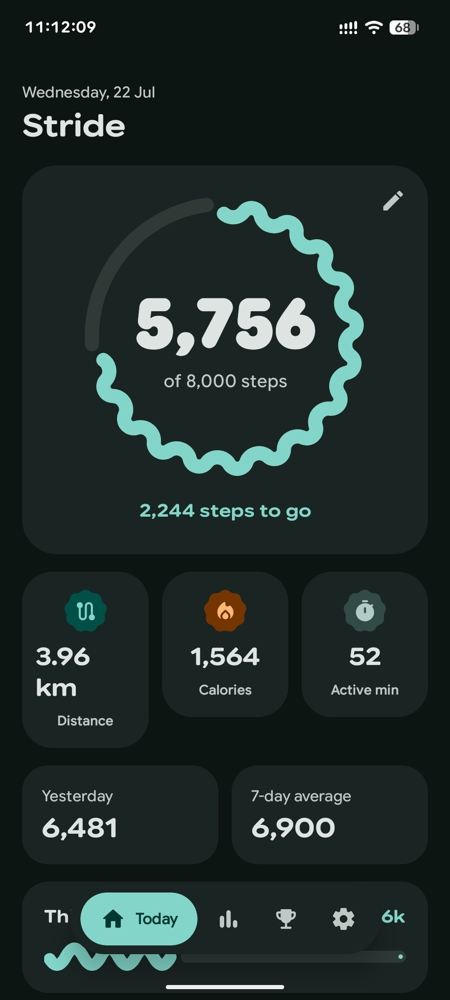</p>

</details>


---

### 📦 DigiPaws

> **Categories:** `#Android` `#Productivity`

DigiPaws is an open-source Android productivity utility designed to help users reduce screen addiction by regulating app usage through a gamified experience. The application offers three distinct modes—Easy, Adventure, and Hard—each with unique features and challenges to promote healthy screen time habits.

🔗 **Quick Access**;
- Try It Out: [GitHub](https://github.com/nethical6/digipaws/tags), [F-Droid](https://f-droid.org/tr/packages/nethical.digipaws/)
- Gallery: [Screenshots](https://t.me/fossclouds/179)
- Learn More: [Features](https://t.me/fossclouds/186), [GitHub Repo](https://github.com/nethical6/digipaws)
- Must Read: [Read Me](https://t.me/fossclouds/106)

🗨 **Let's Talk**: @fosspalchat
🏷 **Tags**: #Android #Productivity

- 🐙 **Source Code:** [https://t.me/fossclouds/179](https://t.me/fossclouds/179)


---

### 📦 NeoStumbler

> **Categories:** `#Android` `#Tools`

NeoStumbler is an Android application for collecting locations of cell towers, Wi-Fi access points and Bluetooth beacons to geolocation services, which have an API compatible with [Ichnaea](https://ichnaea.readthedocs.io/en/latest/api/geosubmit2.html) (i.e. Mozilla Location Services).

- 🐙 **Source Code:** [https://github.com/mjaakko/NeoStumbler](https://github.com/mjaakko/NeoStumbler)


---

### 📦 Nekome

> **Categories:** `#Android`

**
An ad free and open source application that uses Kitsu to keep your current anime and manga series progress up to date

- 🐙 **Source Code:** [https://github.com/Chesire/Nekome](https://github.com/Chesire/Nekome)


---

### 📦 Feed Flow

> **Categories:** `#RSS` `#Desktop` `#android`

Feed Flow is a minimalistic RSS Reader available on Android, iOS and macOS. Built with Kotlin, Jetpack Compose and SwiftUI.

🛠️ Features
- Reader mode
- Clutter-free reading experience
- Ability to import the RSS feed list
- Ability to use your favourite/default browser instead of reader mode

🔗Links
- Download from [GitHub](https://github.com/prof18/feed-flow/releases) | [F-Droid](https://www.f-droid.org/tr/packages/com.prof18.feedflow/) | [Google Play](https://play.google.com/store/apps/details?id=com.prof18.feedflow) | [iOS App store](https://apps.apple.com/us/app/feedflow-rss-reader/id6447210518)
- [Screenshots](https://t.me/popCLOUDS/6674?single)
- [Source code](https://github.com/prof18/feed-flow)

🌐 @popmodsnetwork
🎁 [Donate to our admins](https://t.me/popCLOUDS/6339)

- 🐙 **Source Code:** [https://www.f-droid.org/tr/packages/com.prof18.feedflow](https://www.f-droid.org/tr/packages/com.prof18.feedflow)


---

### 📦 Password To Remember | PTR

> **Categories:** `#Android` `#Security`

PTR is a great tool for android devices that generates strong, yet memorable passwords, with a minimal UI and regular updates.

🛠️Features
- Generates strong passwords
- Copies the password automatically into Clipboard
- No tracking and Respects privacy

- 🐙 **Source Code:** [https://github.com/v4lpt/pwg](https://github.com/v4lpt/pwg)


---

### 📦 Mindful

> **Categories:** `#Android` `#Productivity`

Mindful is a free and open-source app designed to help you regain control over your digital habits, improve your focus, and boost productivity. Whether you're battling social media addiction, struggling to stay focused, or simply looking for a way to better manage your screen time, Mindful is here to assist.

- 🐙 **Source Code:** [https://play.google.com/store/apps/details?id=com.mindful.android](https://play.google.com/store/apps/details?id=com.mindful.android)

<details>
<summary><b>✨ Key Features (17)</b> — <i>Click to expand</i></summary>

- *1. 🧘‍♂️ **Focus Mode
- **Boost Productivity** — Pause distracting apps and activate Do Not Disturb during focus sessions.
- **Customizable Sessions** — Choose from various session types like Study, Work, or Creative.
- **Track Your Progress** — Review your focus journey over time and see how much you've achieved.
- Screen Time Management
- **Automatic Pausing** — When the timer runs out, the app pauses, helping you stay on track.
- Bedtime Mode
- **Unwind Effectively** — Automatically pause distracting apps and enable Do Not Disturb during bedtime to ensure a peaceful sleep.
- **Wake-Up Routine** — Start your day fresh by unblocking apps and resuming notifications.
- Web Safety
- **Block Adult Sites** — Ensure a safe browsing environment by blocking
- **Custom Website Blocking** — Add any distracting or unwanted websites to your blocklist.**
- ***- One-Click Internet Block** — Instantly cut off** **internet access for specific apps, keeping distractions at bay**.
- **Invincible Mode
- **Stay Disciplined** — Prevent changes to app timers when they ran out and short content timer after running out of allowed time quota.
- **No Ads** — Enjoy an uninterrupted experience without any ads.
- **Privacy First** — Mindful operates entirely offline, ensuring your data stays on your device.

</details>


---

### 📦 F*cks Given

> **Categories:** `#Android`

F*cks Given lets you keep track of the things that made you care. Whenever something happens that you needlessly concern yourself with, jot it down with a tap. The app creates a chart of how many fu*cks you’ve given, so you can work to give none.
F*cks Given allows you to back up your data and has a beautiful dark mode that can turn on automatically, following the system theme.

🔗 **Links**:
- Download From [GitHub](https://github.com/Crazy-Marvin/FucksGiven/releases), [F-Droid](https://f-droid.org/packages/rocks.poopjournal.fucksgiven/), [PlayStore](https://play.google.com/store/apps/details?id=rocks.poopjournal.fucksgiven)
- [Screenshots](https://t.me/popCLOUDS/6652)
- [SourceCode](https://github.com/Crazy-Marvin/FucksGiven/)

🌐 @popmodsnetwork
🎁 [Donate to our admins](https://t.me/popCLOUDS/6339)

- 🐙 **Source Code:** [https://play.google.com/store/apps/details?id=rocks.poopjournal.fucksgiven](https://play.google.com/store/apps/details?id=rocks.poopjournal.fucksgiven)


---

### 📦 Visual Code Space

> **Categories:** `#Android`

Visual Code Space is a **powerful** and **feature-rich** code editor designed for Android devices. With support for multiple programming languages, a tabbed editor, and a terminal emulator, it provides an efficient coding environment without any ads.

- 🐙 **Source Code:** [https://github.com/Visual-Code-Space/Visual-Code-Space](https://github.com/Visual-Code-Space/Visual-Code-Space)


---

### 📦 MemLoader (formerly XLoad)

> **Categories:** `#notes` `#credits` `#Android` `#Root` `#Modules`

Load objects directly into RAM to reduce I/O operations and improve access speed.

- 🐙 **Source Code:** [https://github.com/iamlooper/MemLoader](https://github.com/iamlooper/MemLoader)


---

### 📦 Jetflix** **- Your New Movie-Obsessed BFF

> **Categories:** `#movies` `#android`

Jetflix is your one-stop shop for discovering your next cinematic obsession. Built with Jetpack Compose and powered by TheMovieDb API, Jetflix showcases a variety of movies, shows and genres in slick UI, making it a must-have for any movie buff.

- 🐙 **Source Code:** [https://github.com/yasinkacmaz/jetflix](https://github.com/yasinkacmaz/jetflix)


---

### 📦 BiglyBT

> **Categories:** `#Android`

BiglyBT for Android is an ad-free, fully featured open source bittorrent client and remote control optimized for phones, tablets, Chromebooks, and Android TVs.

- 🐙 **Source Code:** [https://f-droid.org/packages/com.biglybt.android.client](https://f-droid.org/packages/com.biglybt.android.client)


---

### 📦 MeRead

> **Categories:** `#Android`

A concise and easy-to-use RSS reader built with Flutter and designed with Material You

- 🐙 **Source Code:** [https://github.com/gvenusleo/MeRead](https://github.com/gvenusleo/MeRead)


---

### 📦 dex2oat optimizer

> **Categories:** `#notes` `#credits` `#Android` `#Root` `#Modules`

An ART optimization module to accelerate app launches and improve system performance.

- 🐙 **Source Code:** [https://github.com/iamlooper/dex2oat-optimizer](https://github.com/iamlooper/dex2oat-optimizer)


---

### 📦 GreenStash

> **Categories:** `#Android`

GreenStash is a simple FOSS android app to help you plan and manage your savings goals easily and establish the habit of saving money.

- 🐙 **Source Code:** [https://apt.izzysoft.de/fdroid/index/apk/com.starry.greenstash](https://apt.izzysoft.de/fdroid/index/apk/com.starry.greenstash)


---

### 📦 Lemuroid

> **Categories:** `#Android` `#GitHub` `#OpenSource`

Lemuroid is an open-source emulation project for Android based on Libretro. Its main goal is ease of use, good Android integration and a great user experience.

- 🐙 **Source Code:** [https://play.google.com/store/apps/details?id=com.swordfish.lemuroid](https://play.google.com/store/apps/details?id=com.swordfish.lemuroid)
- 👤 **Developer:** [Swordfish90](https://github.com/Swordfish90)


---

### 📦 Grocery Genius

> **Categories:** `#features` `#Android` `#Utilities`

Grocery Genius is a free, customizable shopping list app with a modern design, autocomplete suggestions, offline capabilities, and feature-rich functionality.

- 🐙 **Source Code:** [https://apt.izzysoft.de/fdroid/index/apk/com.rendox.grocerygenius](https://apt.izzysoft.de/fdroid/index/apk/com.rendox.grocerygenius)


---

### 📦 MemeUI Enhancer

> **Categories:** `#notes` `#credits` `#Android` `#Root` `#Modules`

Enhances MIUI/HyperOS for better battery backup and performance.

- 🐙 **Source Code:** [https://github.com/iamlooper/MemeUI-Enhancer](https://github.com/iamlooper/MemeUI-Enhancer)


---

### 📦 Arru - Your expenses tracker

> **Categories:** `#Android` `#Utilities`

Arru is an app for expenditure tracking/analysis.

- 🐙 **Source Code:** [https://apt.izzysoft.de/fdroid/index/apk/com.kssidll.arru](https://apt.izzysoft.de/fdroid/index/apk/com.kssidll.arru)


---

### 📦 Simple Keyboard - Simply keyboard and nothing more

> **Categories:** `#Android` `#Keyboard`

This keyboard is created for those who only need a keyboard and nothing more.

- 🐙 **Source Code:** [https://f-droid.org/packages/rkr.simplekeyboard.inputmethod](https://f-droid.org/packages/rkr.simplekeyboard.inputmethod)


---

### 📦 Cirno

> **Categories:** `#Android` `#XPosed` `#Modules` `#Root`

Cirno is an application freezer that runs on all platforms with Android 12+ to completely prevent background applications from using CPU resources, thereby improving the overall smoothness of the device.Cirno is currently only supported on cgroup v2 devices, which means your Linux kernel version needs to be greater than or equal to 5.0. The app has no GUI. It will freeze apps automatically. By modifying the cfg file, you can specify that the application does not freeze.

- 🐙 **Source Code:** [https://apt.izzysoft.de/fdroid/index/apk/nep.timeline.cirno](https://apt.izzysoft.de/fdroid/index/apk/nep.timeline.cirno)


---

### 📦 WhatSave

> **Categories:** `#Android` `#Tools`

An application that helps you save WA statuses in the easiest way.

- 🐙 **Source Code:** [https://github.com/mardous/WhatSave](https://github.com/mardous/WhatSave)


---

### 📦 BCL and ACC

> **Categories:** `#Android` `#Root` `#Modules`

**ACC** is an Android software mainly intended for extending battery service life. In a nutshell, this is achieved through limiting charging current, temperature and voltage. Any root solution is supported. Regardless of whether the system is rooted with KernelSU/Magisk, the installation is always "systemless".

**BatteryChargeLimit** is an Android application designed to help users manage their device's battery charging process. By setting a desired charge limit, the app prevents the battery from charging beyond a specified percentage, which can help prolong battery life and maintain its health.

- 🐙 **Source Code:** [https://github.com/VR-25/acc](https://github.com/VR-25/acc)


---

### 📦 Extinguish

> **Categories:** `#Android` `#Utilities`

Extinguish turns your screen off but keeps your device awake (not going to the lock screen), which let other apps run on screen off.

🔗 **Quick Access**;
- Try It Out: [GitHub](https://github.com/Moderpach/Extinguish/releases), [İzzySoft](https://apt.izzysoft.de/fdroid/index/apk/own.moderpach.extinguish)
- Gallery: [Screenshots](https://t.me/fossclouds/158)
- Learn More: [Features](https://t.me/fossclouds/169), [GitHub Repo](https://github.com/Moderpach/Extinguish)
- Must Read: [Read Me](https://t.me/fossclouds/106)

🗨 **Let's Talk**: @fosspalchat
🏷 **Tags**: #Android #Utilities

- 🐙 **Source Code:** [https://t.me/fossclouds/158](https://t.me/fossclouds/158)


---

### 📦 mpvKt

> **Categories:** `#Android` `#Player`

A media player for Android based on mpv-android aiming to provide a nicer user interface over the original.

🛠️ **Features**:
- Nicer player UI
- Better playback history implementation
- Easier customization
- MD3 support

🔗 **Links**:
- Download it from [Github](https://github.com/abdallahmehiz/mpvKt) or F-[Droid](https://apt.izzysoft.de/fdroid/index/apk/live.mehiz.mpvkt)
- [Screenshots](https://t.me/popCLOUDS/6511)
- [Source Code](https://github.com/abdallahmehiz/mpvKt)
- [Discussion](https://t.me/mpvKtchat)

🌐 @popmodsnetwork
🎁 [Donate to our Admins](https://t.me/popCLOUDS/6339)
🏷️ #Android #Player

- 🐙 **Source Code:** [https://github.com/abdallahmehiz/mpvKt](https://github.com/abdallahmehiz/mpvKt)


---

### 📦 Recording Studio

> **Categories:** `#android` `#utilities` `#tools` `#audio`

Capture your sound with style!

An Android sound recorder app packed with ton of features.

✨ **Features**

• Audio recording & playback
• Renaming and deleting recordings
• Support for various container formats and codecs (varies by device)
• Compatible with scoped storage (no storage access permission needed on newer Android versions)
• Automatically stopping recordings on low battery or storage & pausing on incoming call

- 🐙 **Source Code:** [https://github.com/Leonidius20/RecordingStudio](https://github.com/Leonidius20/RecordingStudio)

<details>
<summary><b>🖼️ Preview Screenshots & Media (1)</b> — <i>Click to view images & decide if you want to use this app</i></summary>

#### 📸 Cover / Preview
<p align="center">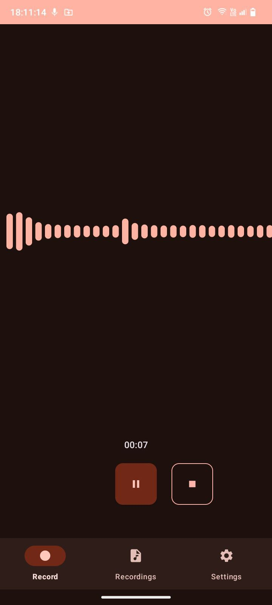</p>

</details>


---

### 📦 Native Alpha

> **Categories:** `#Android` `#Tools`

full screen Web Apps with shortcuts and custom settings

- 🐙 **Source Code:** [https://apt.izzysoft.de/fdroid/index/apk/com.cylonid.nativealpha](https://apt.izzysoft.de/fdroid/index/apk/com.cylonid.nativealpha)


---

### 📦 WeatherMaster

> **Categories:** `#Android` `#Weather`

WeatherMaster is developed with pure HTML, CSS, JavaScript, and Java. Designed to mimic the look and feel of a native Android app.

- 🐙 **Source Code:** [https://github.com/PranshulGG/WeatherMaster](https://github.com/PranshulGG/WeatherMaster)


---

### 📦 Blommee

> **Categories:** `#Android` `#Music` `#GitHub` `#OpenSource`

**An experimental cross-platform open Source Music player designed to bring you Ad-free tunes from various sources. Dive into a world of limitless music from platforms like YouTube and Jio Saavn, with more sources blooming soon!

- 🐙 **Source Code:** [https://github.com/HemantKArya/BloomeeTunes](https://github.com/HemantKArya/BloomeeTunes)
- 👤 **Developer:** [HemantKArya](https://github.com/HemantKArya)


---

### 📦 freeDictionary

> **Categories:** `#android` `#utilities` `#tools` `#productivity`

Remember Owl2? It's back, better than ever!🦉

freeDictionary is the continuation of Owl2 dictionary app, bringing you a powerful and user-friendly way to lookup in English language.

✨ **Features**

• **English to English dictionary**
• **Definition of the word**
• **Example of the word usage if available**
• **Synonyms/Antonyms of the work if available**
• **Pronunciation of the word, both IPA text and audio using TTS**
• **Save searched data for offline uses**
• **Search for a random word**

- 🐙 **Source Code:** [https://github.com/yamin8000/freeDictionaryApp](https://github.com/yamin8000/freeDictionaryApp)

<details>
<summary><b>🖼️ Preview Screenshots & Media (1)</b> — <i>Click to view images & decide if you want to use this app</i></summary>

#### 📸 Cover / Preview
<p align="center">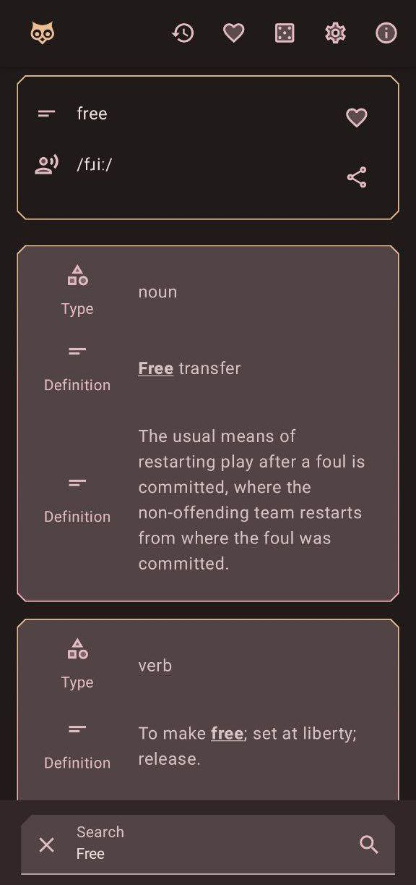</p>

</details>


---

### 📦 Fogplix

> **Categories:** `#Android` `#AndroidTV`

Fogplix Anime is an application where you can watch or download over ten thousand anime series and movies for free. Download the Fogplix Anime app now.

🔗 **Links**:
- Download from [Github](https://github.com/Benojir/Fogplix-Anime-TV?tab=readme-ov-file/releases), [Website](https://fogplix-anime.com/)
- [Screenshots](https://t.me/popCLOUDS/6429)
- [SourceCode](https://github.com/Benojir/Fogplix-Anime-TV?tab=readme-ov-file)

🌐 @popmodsnetwork
🎁 [Donate to our admins](https://t.me/popCLOUDS/6339)

- 🐙 **Source Code:** [https://t.me/popCLOUDS/6429](https://t.me/popCLOUDS/6429)


---

### 📦 Re-Malwack

> **Categories:** `#Android` `#Magisk` `#module` `#ad_block` `#adblock` `#ad_blocker` `#adblocker`

A revival of Malwack magisk module, yet it is also updated regularly and enhanced :)

🛠️ Features

• Hosts file updated regularly
• No need to update module to get updated hosts file, you can update it by a small command :)
• Ability to add links to the block list easily
• Gets rid of ads and malware.
• Gets rid of p*rn stuff (optional XD)
• Ensures security to your device
• Doesn't affect device performance
• Ability to reset hosts file to default

🔗Links
- [Download](https://github.com/ZG089/Re-Malwack/releases/latest)
- [Source Code](https://github.com/ZG089/Re-Malwack)
- [XDA Support thread](https://xdaforums.com/t/re-malwack-revival-of-malwack-module.4690049/)
- [Donate to the developer](https://buymeacoffee.com/zg089)

🌐 @popmodsnetwork
🎁 [Donate to our admins](https://t.me/popCLOUDS/6339)

- 🐙 **Source Code:** [https://github.com/ZG089/Re-Malwack](https://github.com/ZG089/Re-Malwack)


---

### 📦 NumberHub

> **Categories:** `#android` `#utilities` `#tools` `#productivity`

Remember Unitto? It's Back!

The Ultimate Calculator and Unit Converter

NumberHub is the continuation of the beloved Unitto app, bringing back all the features you loved and adding even more! It's a powerful tool for everyday calculations, unit conversions, and time management.

✨ Features

• **Free and Open Source** with a **beautiful Material Design UI,** even on older devices.
• **Instant Expression Evaluation:** Calculations done with lightning-fast expression evaluation.
• **Comprehensive Unit Conversion:** Convert between over **570 units,** including currencies, with smart search and adaptive sorting.
• Date and Time Calculations
• **Time Converter**
• **Fully Customizable.**
• **Calculator Powerhouse:** Perform trigonometric functions, copy, paste, save, and share results with ease.

- 🐙 **Source Code:** [https://apps.obtainium.imranr.dev/redirect?r=obtainium://add/https://github.com/Myzel394/NumberHub](https://apps.obtainium.imranr.dev/redirect?r=obtainium://add/https://github.com/Myzel394/NumberHub)

<details>
<summary><b>🖼️ Preview Screenshots & Media (1)</b> — <i>Click to view images & decide if you want to use this app</i></summary>

#### 📸 Cover / Preview
<p align="center"></p>

</details>


---

### 📦 Pixelspoof

> **Categories:** `#Android` `#xposed` `#root`

A module for LSPosed that lets you spoof all device-specific properties of your device, selectively for individual apps.

✳️Benefits:
• Enables magic editor for Google Phhotos
• Get free 6 months subscription on Google One
• Easily spoof your device model for any apps
• more...

- 🐙 **Source Code:** [https://github.com/RisenID/PixelSpoof](https://github.com/RisenID/PixelSpoof)


---

### 📦 A**wery

> **Categories:** `#Android`

Imagine the perfect app where you can customize everything, with tons of features and a stylish look. It's all about Awery!

⚒️ **Features**:
• Integration with Aniyomi extensions for enhanced functionality.
• Seamless synchronization of progress with AniList, MyAnimeList, Shikimori, and more.

- 🐙 **Source Code:** [https://github.com/MrBoomDeveloper/Awery](https://github.com/MrBoomDeveloper/Awery)
- 👤 **Developer:** [me-ov-file/releases](https://t.me/popCLOUDS/6339)


---

### 📦 Pixel Studio Enabler

> **Categories:** `#Android` `#xposed` `#root`

Enables Pixel Studio App for all devices (A13+) systemlessly.

__**Pixel Studio** uses state-of-the-art generative AI to create unique and fun images on your Pixel.__

✳️ Here’s what you can do:
● Enter a description and Pixel will create it, or upload your own image
● Add stickers
● Add captions in different fonts and colors
● Remove or move items with gestures
● Save projects
• Admire the beautiful UI.

- 🐙 **Source Code:** [https://t.me/popCLOUDS/6339](https://t.me/popCLOUDS/6339)


---

### 📦 Smart Pixels (XPosed Module)

> **Categories:** `#Android` `#Xposed` `#Modules` `#Root`

Smart Pixels is a battery-saving function found on some devices. It works by turning off certain pixels on the screen to reduce power consumption. This can be particularly useful for extending battery life without significantly impacting the display quality.

- 🐙 **Source Code:** [https://github.com/frknkrc44/SmartPiXelsPosed](https://github.com/frknkrc44/SmartPiXelsPosed)


---

### 📦 WhiteHole

> **Categories:** `#android` `#photos` `#telegram` `#client` `#backup`

**Android app** to **auto-backup your photos using Telegram.** **Creates a self-owned space** which **backup your photos to telegram.**

✨ Features of WhiteHole

•  **Self control of data**
•  **No storage limit** __(as per Telegram's limits)__
•  **Periodic auto backup**
•  **Material Design 3**
•  **Written in Jetpack Compose**
•  **Entirely Open Source**

- 🐙 **Source Code:** [https://github.com/beradeep/whitehole](https://github.com/beradeep/whitehole)

<details>
<summary><b>🖼️ Preview Screenshots & Media (1)</b> — <i>Click to view images & decide if you want to use this app</i></summary>

#### 📸 Cover / Preview
<p align="center"></p>

</details>


---

### 📦 Android web attack surface

> **Categories:** `#Mobile_Security`

Android web attack surface
https://ndevtk.github.io/writeups/2024/08/01/awas

- 🌐 **Official Website:** [https://ndevtk.github.io/writeups/2024/08/01/awas](https://ndevtk.github.io/writeups/2024/08/01/awas)


---

### 📦 Findroid

> **Categories:** `#android` `#media` `#movies` `#series` `#music` `#cilent`

**
Findroid** is third-party **Jellyfin Client** that provides a **native user interface** **to browse and play movies and series** on **Android**.

✨ Features**

• Completely native interface
• Supported media items: movies, series, seasons, episodes
>>  Direct play only (no transcoding)
• Offline playback / downloads
• ExoPlayer
>> Video codecs: H.263, H.264, H.265, VP8, VP9, AV1
>> Audio codecs: Vorbis, Opus, FLAC, ALAC, PCM, MP3, AAC, AC-3, E-AC-3, DTS, DTS-HD, TrueHD
>> Subtitle codecs: SRT, VTT, SSA/ASS, PGSSUB
• mpv
>> Container formats: mkv, mov, mp4, avi
>> Video codecs: H.264, H.265, VP8, VP9, AV1
>> Audio codecs: Opus, FLAC, MP3, AAC, AC-3, E-AC-3, TrueHD, DTS, DTS-HD
>> Subtitle codecs: SRT, VTT, SSA/ASS, DVDSUB
• Picture-in-picture mode
• Media chapters
>> Timeline markers
>> Chapter navigation gestures
**

- 🐙 **Source Code:** [https://github.com/jarnedemeulemeester/findroid](https://github.com/jarnedemeulemeester/findroid)

<details>
<summary><b>🖼️ Preview Screenshots & Media (1)</b> — <i>Click to view images & decide if you want to use this app</i></summary>

#### 📸 Cover / Preview
<p align="center">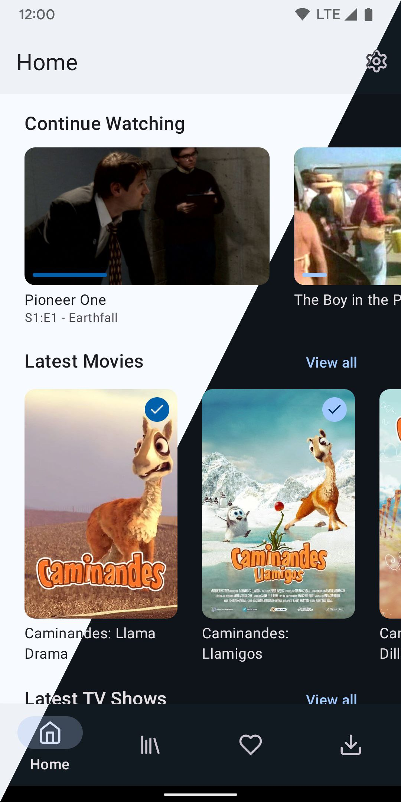</p>

</details>


---

### 📦 Dirol Reader

> **Categories:** `#android` `#telegram` `#client` `#productivity` `#utilities`

**Smart news feed** from **Telegram channels in one place**.

**Powered by advanced algorithms** and **built with user preferences in mind**, **Dirol Reader** leverages the **TdLib** __(Telegram Database Library)__ to curate a relevance-based **news feed from your favorite channels' posts**, **keeping you informed and engaged**.

✨ | **Features**

• **Curates news feed** using **TdLib**, **keeps you informed and engaged** about your favourite telegram channels.
• **Added support for basic message types** and more coming.
• **Added Markdown for the text.**
• **Material App Icon.**
• **Improved Authorization screen.**
• **Added Profile Screen with Settings and About sections.**
• **Free**, **Open Source** and **Material You UI.**

- 🐙 **Source Code:** [https://github.com/therxmv/Dirol-Reader](https://github.com/therxmv/Dirol-Reader)

<details>
<summary><b>🖼️ Preview Screenshots & Media (1)</b> — <i>Click to view images & decide if you want to use this app</i></summary>

#### 📸 Cover / Preview
<p align="center">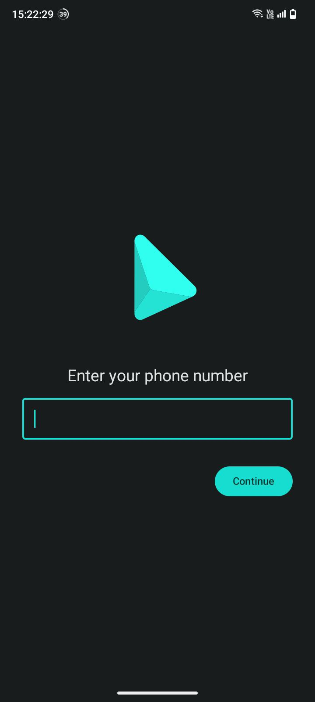</p>

</details>


---

### 📦 BraveGPT

> **Categories:** `#installation` `#android` `#desktop` `#script`

A script file can run AI to Brave Search and you Ask from any site. BraveGPT is Powered by GPT-4o!

- 🐙 **Source Code:** [https://github.com/KudoAI/bravegpt](https://github.com/KudoAI/bravegpt)


---

### 📦 TriPeaks

> **Categories:** `#Android` `#game`

An open source solitaire game with multiple playing options.

- 🐙 **Source Code:** [https://github.com/mimoguz/tripeaks-gdx](https://github.com/mimoguz/tripeaks-gdx)


---

### 📦 (Enhanced post)__ [File Navigator](https://t.me/popMODS/4801)

> **Categories:** `#Android` `#Tools` `#GitHub` `#OpenSource`

Are you tired of cluttered files on your device? Seeking a streamlined way to organize and manage them? Look no further! File Navigator is here to transform your file management experience.

🛠Features
Custom File Type Navigation: Choose specific file types to navigate, like images, videos, or PDFs.
Effortless Organization: Automatically store files in designated folders based on type.
Instant Alerts: Get notified when new files of your selected types are detected.
Quick File Movement: Move files to desired folders with a tap.
Secure Permissions: Requests 'manage all files' access solely for user-directed file management.
🔗Link:
- Download from [F-Droid](https://f-droid.org/packages/com.w2sv.filenavigator/), [Google Play](https://play.google.com/store/apps/details?id=com.w2sv.filenavigator&), [GitHub](https://github.com/w2sv/FileNavigator/releases/tag/0.2.0) or [ApkPure](https://apkpure.com/file-navigator/com.w2sv.filenavigator)
- [Source Code](https://github.com/w2sv/FileNavigator)
-[ Screenshots](https://t.me/popCLOUDS/6294)

🌐 @popmodsnetwork
🎁 [Donate to our admins](https://t.me/popMODS/4195)

- 🐙 **Source Code:** [https://github.com/w2sv/FileNavigator](https://github.com/w2sv/FileNavigator)
- 👤 **Developer:** [w2sv](https://github.com/w2sv)


---

### 📦 SubTypo

> **Categories:** `#Android` `#Tools` `#video`

A Wonderful Android App to edit videos' subtitles files, with Material design and easy-to-understand interface!

🛠️Features

- Real time preview
- Does not collect any of your data
- Completely free
- Beautiful and easy to understand interface
- No ads

🔗Links :
- Download from [GitHub](https://github.com/teixeira0x/SubTypo/releases/latest) or [IzzyOnDroid](https://apt.izzysoft.de/fdroid/index/apk/com.teixeira.subtitles)
- [Screenshots](https://t.me/popCLOUDS/6281)
- [Source Code](https://github.com/teixeira0x/SubTypo)

🌐 @popmodsnetwork
🎁 [Donate to our admins](https://t.me/popMODS/4195)

- 🐙 **Source Code:** [https://apt.izzysoft.de/fdroid/index/apk/com.teixeira.subtitles](https://apt.izzysoft.de/fdroid/index/apk/com.teixeira.subtitles)


---

### 📦 Share Paste O₂

> **Categories:** `#Android` `#Tools`

Share Paste is a [privatebin](https://privatebin.net/) client for android.

🛠Features
Share sensitive information securely when your messenger doesn't support end-to-end encryption (E2EE) or can't be fully trusted.
Post on forums, Discord, or IRC without leaving a permanent trace.
Share something anonymously with a limited visibility duration.
Use the "burn on read" feature for special messages or surprises, like a birthday greeting.

- 🐙 **Source Code:** [https://github.com/nain-F49FF806/sharepaste.oo](https://github.com/nain-F49FF806/sharepaste.oo)


---

### 📦 Android Easter Eggs Collection (AEEC)

> **Categories:** `#Android`

A wonderful collection of Android Easter Eggs in one App! beginning from Android 2.3 till Android 15 (Note : android 15 Easter egg is a just a preview, android 14 Easter Egg will show up instead of 15)

- 🐙 **Source Code:** [https://apt.izzysoft.de/fdroid/index/apk/com.dede.android_eggs](https://apt.izzysoft.de/fdroid/index/apk/com.dede.android_eggs)


---

### 📦 You Have Mail

> **Categories:** `#Android` `#Tools` `#GitHub` `#OpenSource`

Small application to notify you when you receive an email in your email account. This may be useful for cases where you only wish to be notified when your email account has a new message and the default notification mechanism does not work (e.g: Android without Google Play Services) or do not wish to have the web interface/email client open at all times.

- 🐙 **Source Code:** [https://f-droid.org/packages/dev.lbeernaert.youhavemail](https://f-droid.org/packages/dev.lbeernaert.youhavemail)
- 👤 **Developer:** [LeanderBB](https://github.com/LeanderBB)


---

### 📦 OuterTune

> **Categories:** `#Android` `#Tools` `#Music`

A lightweight YouTube Music Client, with material UI design, and ability to download music and video clips. Enjoy an ad-free music experience with ability to play music in the background!

- 🐙 **Source Code:** [https://appteka.store/app/a98r183248](https://appteka.store/app/a98r183248)


---

### 📦 MicroG RE

> **Categories:** `#Android` `#Tools`

MicroG RE, The Best replacement for the original MicroG App, with material UI design, updates that are published regularly, and more than that it is also lightweight, it makes it better than the original MicroG !

- 🐙 **Source Code:** [https://www.apkmirror.com/apk/wstxda/microg-re-microg-services-redesign-revanced](https://www.apkmirror.com/apk/wstxda/microg-re-microg-services-redesign-revanced)


---

### 📦 Deadly Android Rat..

> **Categories:** `#Android` `#malware` `#WhatsApp`

#Android #malware (.apk) can be spread through a fake PDF document by manipulating the file extension in the #WhatsApp application.

https://github.com/0x6rss/WhatsApp-extension-manipulation-PoC

- 🐙 **Source Code:** [https://github.com/0x6rss/WhatsApp-extension-manipulation-PoC](https://github.com/0x6rss/WhatsApp-extension-manipulation-PoC)
- 👤 **Developer:** [0x6rss](https://github.com/0x6rss)


---

### 📦 Island

> **Categories:** `#Android`

A sandbox environment, allowing you to clone selected apps and run them in an isolated box, preventing it from accessing your personal data, or device information.

🛠️ **Features**:
- Auto detection in Lawnchair and similar launchers
- Isolated storage to protect privacy
- Wide range of compatibility

🔗 **Links**:
- [Download](https://play.google.com/store/apps/details?id=com.oasisfeng.island)
- [Screenshots](https://t.me/popCLOUDS/6230)
- Recommended to check [Website](https://awesome-privacy.xyz/security-tools/mobile-apps/island) before usage
- [Source Code](https://github.com/oasisfeng/island)

🌐 @popmodsnetwork
🎁 [Donate to our admins](https://island.oasisfeng.com/)

- 🐙 **Source Code:** [https://github.com/oasisfeng/island](https://github.com/oasisfeng/island)


---

### 📦 Book's** **Story

> **Categories:** `#Android` `#Reader`

**__Dive into the world of adventure as you discover your favorite book's story!
__
Material3 eBook reader - Book's Story. Built with Jetpack Compose. 4 supported file formats (.txt, .pdf, .epub, .fb2), 2 supported languages. Lots of customization.

🛠Features
Supports multiple file formats (PDF, TXT, EPUB, FB2)
Highly customizable reading experience with color presets
Categories to organize your library
Anti-error protection to prevent adding/updating invalid books
Follows latest Material3 design guidelines with 7 unique themes and MaterialYou support

- 🐙 **Source Code:** [https://github.com/Acclorite/book-story](https://github.com/Acclorite/book-story)


---

### 📦 Refreezer

> **Categories:** `#deezer` `#Android` `#Music`

An alternative Deezer music streaming & downloading client, based on Freezer.

Features
- FLAC & MP3 320 support
- BYO Last.fm Integration (Safer solution!)
- Support downloading to external storage (sdcard) for A11+
- And more...

- 🐙 **Source Code:** [https://github.com/DJDoubleD/refreezer](https://github.com/DJDoubleD/refreezer)


---

### 📦 Aard 2

> **Categories:** `#Android`

Aard 2 is a dictionary and offline Wikipedia reader supporting multiple language and Wiki sources from many well known universities and institutions.

🛠️ **Features** ([click here](https://t.me/popCLOUDS/6206))

🔗 **Links**:
- Download from [PlayStore](https://play.google.com/store/apps/details?id=itkach.aard2) or [F-Droid](https://f-droid.org/packages/itkach.aard2/)
- [Screenshots](https://t.me/popCLOUDS/6198)
- [Source Code](https://github.com/itkach/aard2-android)

🌐 @popmodsnetwork
🎁 [Donate to our admins](https://t.me/popMODS/4195)

- 🐙 **Source Code:** [https://github.com/itkach/aard2-android](https://github.com/itkach/aard2-android)


---

### 📦 Screenstream

> **Categories:** `#Android`

A user-friendly Android application that allows users to easily share their device screen and view it directly in a web browser. No additional software is required other than the ScreenStream itself, a web browser, and an internet connection (for Global mode).

Google Play versions supports both Global mode (WebRTC) and Local mode (MJPEG) with ads included.
Versions from F-Droid, AAPKS are Ad-free and support only Local mode (MJPEG).

__Thanks for banner ____@zgx_dev____ __

- 🐙 **Source Code:** [https://github.com/dkrivoruchko/ScreenStream](https://github.com/dkrivoruchko/ScreenStream)


---

### 📦 Dev Setup

> **Categories:** `#GitHub` `#OpenSource`

Vim, Sublime Text, Bash, iTerm, Python data analysis, Spark, Hadoop MapReduce, AWS, Heroku, JavaScript web development, Android development.

**4️⃣**** **[**GitHub**](https://t.me/+rB2DxiwI4X5iYjcy)

- 🐙 **Source Code:** [https://github.com/donnemartin/dev-setup](https://github.com/donnemartin/dev-setup)
- 👤 **Developer:** [donnemartin](https://github.com/donnemartin)


---

### 📦 Shake Alarm Clock

> **Categories:** `#Android`

**An alarm clock app for Android which allows you to dismiss the ringing alarm by shaking the phone.

- 🐙 **Source Code:** [https://play.google.com/store/apps/details?id=in.basulabs.shakealarmclock](https://play.google.com/store/apps/details?id=in.basulabs.shakealarmclock)


---

### 📦 Fluxtube

> **Categories:** `#Android`

A powerful and ad-free YouTube client built using Flutter. Watch YouTube videos without ads, subscribe to channels, retrieve video dislikes, read comments, save videos, and much more.

- 🐙 **Source Code:** [https://apt.izzysoft.de/packages/com.fazilvk.fluxtube](https://apt.izzysoft.de/packages/com.fazilvk.fluxtube)


---

### 📦 Keyboard GPT

> **Categories:** `#Android` `#Root` `#NoRoot` `#LSPosed`

**
An LSPosed Module that lets you integrate Generative AI like ChatGPT into your own keyboard.

**Supported-**
[ChatGPT](https://chatgpt.com/)
[Gemini](https://gemini.google.com/?hl=en-IN)

Api-
[ChatGpt](https://platform.openai.com/api-keys) (paid)
[Gemini](https://ai.google.dev/) (free)

🔗 **Links**:
- [Download](https://github.com/Mino260806/KeyboardGPT/releases/)
- [XDA](https://xdaforums.com/t/mod-xposed-integrate-generative-ai-like-chatgpt-in-keyboard.4683421/)
- [Demo](https://t.me/popCLOUDS/6135)
- [Installation](https://t.me/popCLOUDS/6136)
- [Support Dev](https://buymeacoffee.com/androidmaestro)
- [SourceCode](https://github.com/Mino260806/KeyboardGPT)
- Thanks to @XposedRepository for sharing it

🌐 @popmodsnetwork
🎁 [Donate to our admins](https://t.me/popMODS/4195)

- 🐙 **Source Code:** [https://github.com/Mino260806/KeyboardGPT](https://github.com/Mino260806/KeyboardGPT)


---

### 📦 FocusPodcast

> **Categories:** `#Android` `#Podcast`

FocusPodcast helps you manage and play podcasts and virtual podcasts/audio books. This application is fully functional, allowing you to manage podcasts, audio books, YouTube and RSS news feeds with one application, and supports a high degree of customization to meet your different playback needs.

- 🐙 **Source Code:** [https://github.com/allentown521/FocusPodcast](https://github.com/allentown521/FocusPodcast)


---

### 📦 BenchSuite

> **Categories:** `#screenshots` `#Android` `#Tools`

An Android app that serves as a wrapper, offering a variety of benchmarks.

⚡️ Benchmarks:
- hackbench (Scheduler throughput)
- pipebench (Scheduler latency)
- callbench (Syscalls and I/O speed)

- 🐙 **Source Code:** [https://github.com/iamlooper/BenchSuite](https://github.com/iamlooper/BenchSuite)


---

### 📦 openScale

> **Categories:** `#Android` `#Tools`

Open-source weight and body metrics tracker, with support for Bluetooth scales

- 🐙 **Source Code:** [https://github.com/oliexdev/openScale](https://github.com/oliexdev/openScale)


---

### 📦 KeyStoreViewer

> **Categories:** `#Android` `#Tools`

Quickly view MD5, SHA1, and Public Keys for App Signatures.

- 🐙 **Source Code:** [https://github.com/qdsfdhvh/KeyStoreViewer](https://github.com/qdsfdhvh/KeyStoreViewer)


---

### 📦 Farfalle- Open-source AI-powered search engine. (Perplexity Clone)

> **Categories:** `#use` `#Website` `#Windows` `#macOS` `#Linux` `#Android` `#GitHub` `#OpenSource`

Run local LLMs (llama3, gemma, mistral, phi3), custom LLMs through LiteLLM, or use cloud models (Groq/Llama3, OpenAI/gpt4-o)

- 🐙 **Source Code:** [https://github.com/rashadphz/farfalle](https://github.com/rashadphz/farfalle)
- 👤 **Developer:** [rashadphz](https://github.com/rashadphz)


---

### 📦 Fossify Keyboard

> **Categories:** `#Android`

Your go-to solution for effortless and efficient typing. Experience a seamless typing experience designed to cater to all your needs, whether chatting with friends or inserting texts, numbers, or symbols.

- 🐙 **Source Code:** [https://apt.izzysoft.de/fdroid/index/apk/org.fossify.keyboard](https://apt.izzysoft.de/fdroid/index/apk/org.fossify.keyboard)

<details>
<summary><b>✨ Key Features (8)</b> — <i>Click to expand</i></summary>

- ***📶 OFFLINE FUNCTIONALITY** — **
- ***🌐 MULTIPLE LANGUAGES AND LAYOUTS** — **
- ***📋 HANDY CLIPBOARD** — **
- ***📳 CUSTOMIZABLE SETTINGS** — **
- ***🌙 MATERIAL DESIGN AND DARK THEME** — **
- ***🔒 PRIVACY AND SECURITY** — **
- ***🎨 CUSTOMIZABLE COLORS** — **
- ***🌐 OPEN-SOURCE TRANSPARENCY** — **

</details>


---

### 📦 Anx Reader

> **Categories:** `#Android` `#dart` `#ebook_reader` `#flutter` `#GitHub` `#OpenSource`

**
Anx Reader is an application focused on reading, without any online promotional content. It can help you concentrate more on reading and improve your reading efficiency.

**🛠️ Features**:
• More comprehensive synchronization features. Supports using WebDAV to sync reading progress, notes, and book files.
• Rich and customizable reading color schemes for a more comfortable reading experience.
• Powerful reading statistics to record your every reading session.
• Rich reading note-taking features for deeper reading.
• Interface adapted for phones and tablets.

🔗 **Links**:
- [Download](https://github.com/Anxcye/anx-reader/releases/)
- [Screenshots](https://t.me/popCLOUDS/6036)
- [Support Channel](https://t.me/AnxReader)
- [Support Group](https://t.me/AnxReaderDiscussion)
- [Source Code](https://github.com/Anxcye/anx-reader)

🌐 @popmodsnetwork
🎁 [Donate to our admins](https://t.me/popMODS/4195)

- 🐙 **Source Code:** [https://t.me/AnxReaderDiscussion](https://t.me/AnxReaderDiscussion)
- 👤 **Developer:** [Anxcye](https://github.com/Anxcye)


---

### 📦 Groq

> **Categories:** `#Android` `#Mod`

Insanely fast Artificial Intelligence interface that uses five different open-source models.

- 🌐 **Official Website:** [https://t.me/popCLOUDS/6024](https://t.me/popCLOUDS/6024)


---

### 📦 Xash 3D

> **Categories:** `#Android`

Xash 3D is an open source app to run GoldSrc engine based games in android flawlessly and effortlessly.

🕹️ **Supported Games**:
- Half-Life
- Opposing Forces
- Blue Shift
- Counter-Strike 1.6
- Day of Defeat
- Team Fortress Classic

🔗 **Links**:
- [Download](https://play.google.com/store/apps/details?id=su.xash.engine)
- [Source Code](https://github.com/FWGS/xash3d-fwgs)
- [Screenshots](https://t.me/popCLOUDS/6013)

__[Note : Try to use v0.18 if low end device]__

🌐 @popmodsnetwork
[🎁 Donate to our admins](https://t.me/popMODS/4195)

- 🐙 **Source Code:** [https://github.com/FWGS/xash3d-fwgs](https://github.com/FWGS/xash3d-fwgs)


---

### 📦 NLSound

> **Categories:** `#Android` `#Magisk` `#KSU`

**
This module allows you to enchance your audio quality with a lot of settings in it

- 🐙 **Source Code:** [https://github.com/Briclyaz/NLSound_module_QCom](https://github.com/Briclyaz/NLSound_module_QCom)


---

### 📦 Play NotePad

> **Categories:** `#Android` `#NotePad`

**
Notepad is a versatile note-taking app that allows you to easily capture and organize your thoughts, ideas, and tasks. With a variety of features, Play Notepad makes it easy to stay on top of your notes and stay organized.

🔗 **Links**:
- Download from [Github](https://github.com/mshdabiola/NotePad/releases), [F-Droid](https://f-droid.org/packages/com.mshdabiola.playnotepad.foss/), [PlayStore](https://play.google.com/store/apps/details?id=com.mshdabiola.playnotepad)
- [Features](https://t.me/popCLOUDS/6008)
- [Screenshots](https://t.me/popCLOUDS/6009)
- [SourceCode](https://github.com/mshdabiola/NotePad/)

🌐 @popmodsnetwork
🎁 [Donate to our admins](https://t.me/popMODS/4195)

- 🐙 **Source Code:** [https://play.google.com/store/apps/details?id=com.mshdabiola.playnotepad](https://play.google.com/store/apps/details?id=com.mshdabiola.playnotepad)

<details>
<summary><b>✨ Key Features (17)</b> — <i>Click to expand</i></summary>

- **Lazy mode** — Automatic scrolling of posts enables you to enjoy amazing posts without moving your thumb
- Snap a photo or choose one from your camera roll to attach to a note.
- Draw freehand sketches and diagrams to annotate your notes.
- Record audio notes and play them back later.
- Keep important notes at the top of your list for easy access.
- Create checklists and keep track of your tasks with checkboxes.
- Organize your notes by tagging them with labels.
- Duplicate notes for easy reference.
- Share your notes with others via email or messaging.
- Set reminders for notes so you never forget important tasks or events.
- Delete notes you no longer need.
- Keep your notes organized by archiving old or completed tasks.
- Add color to your notes to make them more visually appealing.
- Add an image to the background of your notes for a more personalized look.
- View your notes in list or column format for easy reading and editing.
- Search your notes by keyword label and type.
- Use the app offline and access your notes at any time.

</details>


---

### 📦 WhatsApp MaterialYou Guide!

__Use material you colors in WhatsApp__ [ROOT REQUIRED]

**✅ Prerequisites:**
- Rooted android device.
- LSPosed framework ([GitHub](https://github.com/mywalkb/LSPosed_mod))
- Latest WA Enhancer module ([GitHub](https://github.com/Dev4Mod/WaEnhancer), [TG](https://t.me/waenhancher))

**📝 Procedure:** ([Screenshots](https://t.me/MaterialYouStuff/245?single))
1. Install and setup prerequisites.
2. Head over to __"Customisation"__ menu in WA Enhancer.
3. Make sure __"Colors"__ is enabled and __"Customize your colors"__ is disabled.
4. Download this file: [Material You.zip](https://t.me/waenhancher/131)
5. Import the .zip file into __"Theme Manager".__
6. Restart WhatsApp and Profit!!1!1!

**🖼️ Screenshots:** [**Check Here!**](https://t.me/MaterialYouStuff/252?single)
**
💬 Join:**
- @MaterialYouApps
- @MaterialYouAppsChat

- 🐙 **Source Code:** [https://github.com/mywalkb/LSPosed_mod](https://github.com/mywalkb/LSPosed_mod)


---

### 📦 FadCam

> **Categories:** `#Android` `#GitHub` `#OpenSource` `#java` `#android_app` `#android_studio` `#cam` `#camera2_api` `#camerax` `#fadrec` `#ffmpeg_android` `#foss` `#material_design` `#material_ui` `#open_source` `#record_video` `#screenrecorder` `#screenrecordingapp` `#secret_recorder` `#video_editing` `#video_editing_tools`

A cam recorder that allows seamless background video recording, even when the screen is off!

- 🐙 **Source Code:** [https://github.com/anonfaded/FadCam](https://github.com/anonfaded/FadCam)
- 👤 **Developer:** [anonfaded](https://github.com/anonfaded)


---

### 📦 Logger

> **Categories:** `#Android` `#Tools`

Logger is a Flutter-based Android app that enables you to view and export call logs in CSV or JSON format and perform lightweight on-device analysis.

- 🐙 **Source Code:** [https://apt.izzysoft.de/fdroid/index/apk/com.logger.app](https://apt.izzysoft.de/fdroid/index/apk/com.logger.app)


---

### 📦 Calculator You

> **Categories:** `#what` `#Android` `#Tools`

Calculator You is a beautiful calculator for solving simple tasks.

- 🐙 **Source Code:** [https://apt.izzysoft.de/fdroid/index/apk/com.marktka.calculatorYou](https://apt.izzysoft.de/fdroid/index/apk/com.marktka.calculatorYou)


---

### 📦 Capy Reader

> **Categories:** `#Android`

A smallish RSS reader with support for Feedbin and local feeds.

🛠️ Features :
• Sync with Feedbin or keep feeds on device
• Track read and starred articles
• Import and export subscriptionsBackground refresh
• Dark mode
• Tablet and foldable support
• Free and Open Source code

- 🐙 **Source Code:** [https://apt.izzysoft.de/fdroid/index/apk/com.capyreader.app](https://apt.izzysoft.de/fdroid/index/apk/com.capyreader.app)


---

### 📦 Streamflix** - Stream for free!

> **Categories:** `#Android` `#kotlin` `#android_tv` `#google_tv` `#leanback` `#movies` `#sflix` `#streaming` `#tv_shows`

Streamflix is an Android TV and mobile app to stream movies and TV shows for free, made with Android Studio, in Kotlin

🛠 **Features**:
• 100% free and no ads!
• An enormous collection of movies and TV shows with multiple subtitles.
• No account or registration needed.
• Optimized UI & UX.
• Multiple providers.
• Resume from last playback position.
• In-app update.

🔗 **Links**:
- [Download](https://github.com/stantanasi/streamflix/releases/latest) (Github)
- [Screenshots](https://t.me/popCLOUDS/5953)
- [Source Code](https://github.com/stantanasi/streamflix)

- [Disclaimer](https://graph.org/popMODS-disclaimer-07-10)

🌐 @popmodsnetwork
🎁 [Donate to our admins](https://t.me/popMODS/4195)
🏷 **Tags**: #Android

- 🐙 **Source Code:** [https://github.com/stantanasi/streamflix](https://github.com/stantanasi/streamflix)
- 👤 **Developer:** [stantanasi](https://github.com/stantanasi)


---

### 📦 SoundTap - Android Volume Media Controller App

> **Categories:** `#Android` `#Tool`

SoundTap is a simple and intuitive Android app that allows users to control their media playback using the volume buttons on their device. It enhances the functionality of the volume buttons, enabling users to skip tracks, pause, and resume music playback with ease

- 🐙 **Source Code:** [https://play.google.com/store/apps/details?id=fr.angel.soundtap](https://play.google.com/store/apps/details?id=fr.angel.soundtap)


---

### 📦 GlassDown

> **Categories:** `#Android`

GlassDown is a Flutter-built client for APKMirror website. By using method known as a web scraping it allows you to add apps you frequently use and then download them, picking version and type (DPI, CPU architecture etc.) of your choice. It also includes optional integration with Revanced patches, which gives you information which version of APK you want to download is supported by the latest patches release.

- 🐙 **Source Code:** [https://apt.izzysoft.de/fdroid/index/apk/com.sinneida.glass_down2](https://apt.izzysoft.de/fdroid/index/apk/com.sinneida.glass_down2)


---

### 📦 Tarnhelm - The magic to clean sharing links up.

> **Categories:** `#Android` `#Xposed` `#Modules`

Tarnhelm can help you clean the tracking parameters in the links shared from the apps and keep the process natural.

- 🐙 **Source Code:** [https://play.google.com/store/apps/details?id=cn.ac.lz233.tarnhelm](https://play.google.com/store/apps/details?id=cn.ac.lz233.tarnhelm)


---

### 📦 Animity

> **Categories:** `#Android`

Animity is an anime streaming app that provides high-quality streaming of your favorite anime shows. It's designed to be easy to use, so you can quickly find the anime you want to watch and start streaming. With Animity, you can also sync your account with Anilist, so you can keep track of your favorite shows and manage your anime watchlist. Whether you're a die-hard anime fan or a casual viewer, Animity has something for everyone.

- 🐙 **Source Code:** [https://github.com/kl3jvi/animity](https://github.com/kl3jvi/animity)


---

### 📦 SWOB

> **Categories:** `#Android`

SWOB (SMSWithoutBorders aka SMS without Borders) is a platforms which enables users with a smartphone to communicate with online third-party platforms using SMS messages.

- 🐙 **Source Code:** [https://github.com/smswithoutborders/SMSWithoutBorders-App-Android](https://github.com/smswithoutborders/SMSWithoutBorders-App-Android)


---

### 📦 BleOta - Upload firmware over Bluetooth

> **Categories:** `#Android` `#iOS`

Open source application for upload firmware over Bluetooth. Additionally supports update functionality for specific hardwares.

- 🐙 **Source Code:** [https://play.google.com/store/apps/details?id=com.vovagorodok.ble_ota_app](https://play.google.com/store/apps/details?id=com.vovagorodok.ble_ota_app)


---

### 📦 Photok

> **Categories:** `#Android`

Photok is a free Photo-Safe. It stores your photos & videos encrypted on your device and hides them from others. It uses technologies like, AES-256 encryption standard or bcrypt, to keep your photos secure. Photok is completely free, open source, and runs no ads.

🛠️ **Features**:
-__ fully functional in app gallery
- export photos back to your gallery
- change your password
- create and Restore backups
- share to Photok
- hide app icon
- recovery menu__

🔗 **Links**:
- Download from [Izzysoft](https://apt.izzysoft.de/fdroid/index/apk/dev.leonlatsch.photok) or [GitHub](https://github.com/leonlatsch/Photok)
- [Screenshots](https://t.me/popCLOUDS/5892)
- [Source code](https://github.com/leonlatsch/Photok)

🌐 @popmodsnetwork
🎁 [Donate to our admins](http://t.me/popMODS/4195)

- 🐙 **Source Code:** [https://github.com/leonlatsch/Photok](https://github.com/leonlatsch/Photok)


---

### 📦 Cleaner** for Android - One-tap phone cleaner

> **Categories:** `#Android`

Cleaner is an Android app that helps you free up space and manage your device. It removes junk files, cache and other unwanted data from your device, so you can get back the storage and performance you need.

🛠 **Features**:
• Automatic daily cleaning
• App management
• Image optimization
• Clean empty folders
• Clean logs, temporary files, caches, and corpse files
• Clean advertisement folders
• Clean archive files
• Clean invalid media
• Clean APK files
• Clean clipboard contents

🔗 **Links**:
- [Download](https://play.google.com/store/apps/details?id=com.d4rk.cleaner) (Play Store)
- [Download](https://github.com/D4rK7355608/com.d4rk.cleaner/releases/latest) (Github)
- [Screenshot](https://t.me/popCLOUDS/5884)
- [Source Code](https://github.com/D4rK7355608/com.d4rk.cleaner)

🌐 @popmodsnetwork
🎁 [Donate to our admins](https://t.me/popMODS/4195)
🏷 **Tags**: #Android

- 🐙 **Source Code:** [https://github.com/D4rK7355608/com.d4rk.cleaner](https://github.com/D4rK7355608/com.d4rk.cleaner)


---

### 📦 Lab+ for Gitlab

> **Categories:** `#Android`

Lab+ for Gitlab is your unofficial Companion for Gitlab.
Use it to view your Repositories and interact with Issues, Merge Requests and Source Code

🛠️ **Features :**
- __View your Repositories__
- __View and edit your Issues__
- __View and edit your Merge Requests__
- __View your Projects Pipeline Status__
- __View your Projects Code__

- 🐙 **Source Code:** [https://github.com/thelooter/labplus_for_gitlab](https://github.com/thelooter/labplus_for_gitlab)


---

### 📦 DataBackup

> **Categories:** `#support` `#Android` `#Root`

DataBackup is a rooted app that allows you to back up your apps, folders/files, Wi-Fi networks, calls, and messages (Wi-Fi, calls, and messages are not implemented yet, we are working on it) to a local and/or your server.

- 🐙 **Source Code:** [https://apt.izzysoft.de/fdroid/index/apk/com.xayah.databackup](https://apt.izzysoft.de/fdroid/index/apk/com.xayah.databackup)

<details>
<summary><b>✨ Key Features (6)</b> — <i>Click to expand</i></summary>

- Multi-user Support
- Cloud
- 100% Data Integrity
- Fast
- Easy
- Monet Theme

</details>


---

### 📦 Phiola

> **Categories:** `#Music` `#Android` `#Windows` `#Linux`

Fast audio player, recorder, converter for Windows, Linux & Android.

- 🐙 **Source Code:** [https://github.com/stsaz/phiola](https://github.com/stsaz/phiola)

<details>
<summary><b>✨ Key Features (12)</b> — <i>Click to expand</i></summary>

- **Play audio** — `.mp3`, `.ogg`(Vorbis/Opus), `.mp4`/`.mov`(AAC/ALAC/MPEG), `.mkv`/`.webm`(AAC/ALAC/MPEG/Vorbis/Opus/PCM), `.caf`(AAC/ALAC/PCM), `.avi`(AAC/MPEG/PCM), `.aac`, `.mpc`; `.flac`, `.ape`, `.wv`, `.wav`.  Note: on Android phiola can play only what your Android supports!
- **Record audio** — `.m4a`(AAC), `.ogg`, `.opus`; `.flac`, `.wav`
- Convert audio
- List/search file meta tags; edit MP3 tags
- List available audio devices
- **Input** — file, directory, HTTP/HTTPS URL, console (stdin), playlists: `.m3u`, `.pls`, `.cue`
- Command Line Interface for Desktop OS
- Terminal/Console UI for interaction at runtime
- GUI for Windows, Linux, Android
- **Instant startup time** — very short initial delay until the audio starts playing (e.g. Linux/PulseAudio: TUI: `~25ms`, GUI: `~50ms`)
- **Fast (low footprint)** — keeps your CPU, memory & disk I/O at absolute minimum; spends 99% of time inside codec algorithms
- ***Bonus** — ** Convenient API with plugin support which allows using all the above features from any C/C++/Java app!

</details>


---

### 📦 WifiList (FOSS)

> **Categories:** `#Android`

View your saved WiFi passwords on Android 11 and later without root!

WiFiList is (almost) fully open source. Feel free to browse the code to confirm security.

Aside from crash reports, zero data is collected and there is zero internet connectivity. Your passwords remain on your device.

- 🐙 **Source Code:** [https://github.com/jaredcat/WiFiList](https://github.com/jaredcat/WiFiList)


---

### 📦 TailScale

> **Categories:** `#Android` `#GitHub` `#OpenSource` `#go` `#2fa` `#oauth` `#sso` `#tailscale` `#vpn` `#wireguard`

Tailscale is a mesh VPN alternative that makes it easy to connect your devices, wherever they are. No more fighting configuration or firewall ports. Built on **WireGuard**, Tailscale enables an incremental shift to zero-trust networking by implementing “always-on” remote access. This guarantees a consistent, portable, and secure experience independent of physical location.

🛠️ **Features** :
- __Supports connecting all your devices in a same network
- Free forever
- Backup your device lists seamlessly
- No tracking Whatsoever__

🔗 **Links**:
- Download from [PlayStore](https://play.google.com/store/apps/details?id=com.tailscale.ipn) or [F-Droid](https://www.f-droid.org/en/packages/com.tailscale.ipn/)
- [Screenshots](https://t.me/popCLOUDS/5826)
- [Source code](https://github.com/tailscale/tailscale-android)
- [Website](https://tailscale.com/)

🌐 @popmodsnetwork
🎁 [Donate to our admins](http://t.me/popMODS/4195)

- 🐙 **Source Code:** [https://github.com/tailscale/tailscale-android](https://github.com/tailscale/tailscale-android)
- 👤 **Developer:** [tailscale](https://github.com/tailscale)


---

### 📦 Yōkai

> **Categories:** `#Android`

A free and open source manga reader

- 🐙 **Source Code:** [https://github.com/null2264/yokai](https://github.com/null2264/yokai)


---

### 📦 Yosu

> **Categories:** `#Android` `#Tools`

Yosu is an application that lets you download videos/tracks from YouTube, Soundcloud and Spotify. You can copy-paste URL of any video, track, playlist or channel and download it directly to a format of your choice. It also supports searching by keywords, which is helpful if you want to quickly look up and download videos or tracks.

- 🐙 **Source Code:** [https://github.com/jerry08/Yosu](https://github.com/jerry08/Yosu)


---

### 📦 Material** **World Clock v2

> **Categories:** `#Android` `#Linux` `#Windows` `#MacOS`

World Clock is a Flutter app that displays the current time and weather for various cities. The app uses the Material You theme to provide a modern and unique user experience.

- 🐙 **Source Code:** [https://t.me/popCLOUDS/5810](https://t.me/popCLOUDS/5810)


---

### 📦 Tournant

> **Categories:** `#Android`

Recipe manager for Android (with Gourmand compatibility)
Tournant serves your favorite dishes on your Android device!
With Tournant, you can manage your recipes for cooking and baking. You can sync the app with an recipe file from Gourmand Recipe Manager (previously known as Gourmet) or use Tournant as a standalone recipe manager.

- 🐙 **Source Code:** [https://github.com/Zimbelstern/Tournant](https://github.com/Zimbelstern/Tournant)


---

### 📦 OSS Card Wallet

> **Categories:** `#Android` `#Tools`

OSS Card Wallet is an Open Source app to scan and store all your cards. You either scan using your camera or by importing an image. The app will automatically detect you cards and barcodes within the photo and will crop the image.

- 🐙 **Source Code:** [https://play.google.com/store/apps/details?id=com.akylas.cardwallet](https://play.google.com/store/apps/details?id=com.akylas.cardwallet)


---

### 📦 Flocuss

> **Categories:** `#Android` `#IOS` `#Extension`

Sync your bookmarks privately across browsers and devices

- 🐙 **Source Code:** [https://github.com/nextcloud/bookmarks](https://github.com/nextcloud/bookmarks)


---

### 📦 Material Photo Widget

> **Categories:** `#Android`

Material Photo Widget is as simple as it can be: a home screen widget to display a photo or collection of photos. It is a free, no-ads, open source alternative for people who want to customize their home screen with their favorite photos.

- 🐙 **Source Code:** [https://t.me/popCLOUDS/5725](https://t.me/popCLOUDS/5725)


---

### 📦 Echo Music [Nightly]

> **Categories:** `#Android` `#Music`

An Extension (Spotify, Youtube Music, Deezer Music) based Music Player for Android, with a clean and simple UI.

- 🐙 **Source Code:** [https://github.com/brahmkshatriya/echo](https://github.com/brahmkshatriya/echo)


---

### 📦 Ollama

> **Categories:** `#Android` `#go` `#gemma` `#gemma2` `#golang` `#llama` `#llama2` `#llama3` `#llava` `#llm` `#llms` `#mistral` `#ollama` `#phi3` `#GitHub` `#OpenSource`

The Ollama app even supports multimodal input. That means you can input an image and talk to it through the chatbot.

Inspired by the ChatGPT app and the simplicity of Ollama's page, we made it as easy as possible to interact with the AI, even if no prior technical knowledge is given. It is easy to understand and can be explained in a matter of seconds.

- 🐙 **Source Code:** [https://github.com/JHubi1/ollama-app](https://github.com/JHubi1/ollama-app)
- 👤 **Developer:** [ollama](https://github.com/ollama)


---

### 📦 Petals

> **Categories:** `#Android`

The Open Source app Petals aims to help its users to either quit weed, reduce usage or simply know how much they're using.

🛠  ️**Features**:
- __Track consumption
- Time-gate your consumption
- Track usage
- See statistics to understand your consumption
- Damage reduction instructions
- Export and Import as simple CSV files
- Extra privacy with a personal PIN__

🔗 **Links**:
- Download from [F-Droid](https://f-droid.org/en/packages/br.com.colman.petals/) or [Github](https://github.com/LeoColman/Petals)
- [Screenshots](https://t.me/popCLOUDS/5700)
- [Source Code](https://github.com/LeoColman/Petals)

🌐 @popmodsnetwork
🎁 [Donate to our Admins](http://t.me/popMODS/4195)

- 🐙 **Source Code:** [https://github.com/LeoColman/Petals](https://github.com/LeoColman/Petals)


---

### 📦 Url Sanitiser

> **Categories:** `#Android`

Don't like those tracking GET queries from the big brothers? Here, this app got your back.

- 🐙 **Source Code:** [https://t.me/popCLOUDS/5692](https://t.me/popCLOUDS/5692)


---

### 📦 Fsclock Android

> **Categories:** `#GitHub` `#OpenSource`

It can be installed as a system saver on smartphones, tablets and Android TV.

**4️⃣**** **[**GitHub**](https://t.me/+rB2DxiwI4X5iYjcy)

- 🐙 **Source Code:** [https://github.com/schorschii/FsClock-Android](https://github.com/schorschii/FsClock-Android)
- 👤 **Developer:** [schorschii](https://github.com/schorschii)


---

### 📦 Easy Notes

> **Categories:** `#android` `#GitHub` `#OpenSource`

Lightweight android notes app with Material You.

🔗 **Links**:
- Download From [Github](https://github.com/Kin69/EasyNotes/releases/), [F-Droid](https://f-droid.org/packages/com.kin.easynotes/)
- [Screenshots](https://t.me/popCLOUDS/5684)
- [SourceCode](https://github.com/Kin69/EasyNotes/)

- 🐙 **Source Code:** [https://t.me/popCLOUDS/5684](https://t.me/popCLOUDS/5684)
- 👤 **Developer:** [r57zone](https://github.com/r57zone)


---

### 📦 Omni

> **Categories:** `#Android`

A useful and handy minimalist toolbox. It comes with an up-to-date material 3 design and is light-weight, without any bloat or spyware.

- 🐙 **Source Code:** [https://github.com/AkaneFoundation/Omni](https://github.com/AkaneFoundation/Omni)


---

### 📦 FitBook

> **Categories:** `#Android`

A Flutter application designed to help you keep track of your daily calorie intake. It works offline and provides a visual representation of your calorie consumption through easy-to-understand graphs.

- 🐙 **Source Code:** [https://github.com/brandonp2412/FitBook](https://github.com/brandonp2412/FitBook)


---

### 📦 Notifier

> **Categories:** `#Android`

This app will transfer notifications from selected apps on your phone to your Http servers. The servers will then receive a json containing information about the app and the notification like the label, package name, title, message, progress (if available) and other useful information, as well the app icon's dominant color. The idea behind this project is to light up RGB strips, when receiving a message or a call, with the app icon's main color, but it can also be used for other purposes.

- 🐙 **Source Code:** [https://github.com/Yanndroid/Notifer](https://github.com/Yanndroid/Notifer)


---

### 📦 Password Monitor

> **Categories:** `#Android` `#GitHub` `#OpenSource`

Ensure your password safety by scanning for potential breaches.

This app seamlessly integrates with "Have I Been Pwned?" to help you verify whether your passwords have been compromised in any publicly disclosed data breaches.

- 🐙 **Source Code:** [https://github.com/StellarSand/Password-Monitor](https://github.com/StellarSand/Password-Monitor)
- 👤 **Developer:** [StellarSand](https://github.com/StellarSand)


---

### 📦 MqttDroid

> **Categories:** `#Android`

It provides a friendly interface to create and edit custom devices with user-defined MQTT actions that will be usable in the device controls hub. Unlike other home automation apps, MqttDroid will connect directly to the MQTT broker, no special setup is needed.

**NOTE**: This app is NOT a standalone MQTT dashboard. It relies on Android's device controls to actually send and display MQTT messages.

- 🐙 **Source Code:** [https://github.com/LightJockey/MqttDroid](https://github.com/LightJockey/MqttDroid)

<details>
<summary><b>✨ Key Features (13)</b> — <i>Click to expand</i></summary>

- Robust MQTT client based on HiveMQ
- **Supports these control types** — toggle, toggle with slider, range, trigger and gauge
- One MQTT topic per control action, with separable pub / sub, QoS and retain support
- Customizable title, subtitle and group per control
- Customizable look and feel of each control tile (a range of stock Android flavors are offered. Alternatively, a custom icon and color can be chosen)
- Customizable toggle on / off payloads
- Customizable min, max, and step values for slider actions. Display as values or percentage
- Unlock to use can be set per control (only available on Android 13+)
- Live updates while on the device controls screen
- In-app log to check for recent MQTT activity
- A single broker with support for basic authentication
- Backup and restore all controls via a retained MQTT message on the broker
- Material You

</details>


---

### 📦 ShizuTools

> **Categories:** `#Android`

Contains some easy-to-use tools to go beyond the level of control allowed by Android System like lockback, themepatcher, debloater, terminal and more.

- 🐙 **Source Code:** [https://github.com/legendsayantan/ShizuTools](https://github.com/legendsayantan/ShizuTools)


---

### 📦 Pi Installer

> **Categories:** `#Android`

is short for "Package Installer". It is just a Package Installer and its function is very simple. In short, my idea is, this app works for me, you can use it if you like, but if you need features that I don't need, then I won't add them. It's just a niche project.

PI requires Shizuku or root to acquire the elevated privileges needed to do its job.

- 🐙 **Source Code:** [https://github.com/SanmerApps/PI](https://github.com/SanmerApps/PI)


---

### 📦 mpv-android

> **Categories:** `#Android`

mpv-android is a video player for Android based on libmpv.

- 🐙 **Source Code:** [https://play.google.com/store/apps/details?id=is.xyz.mpv](https://play.google.com/store/apps/details?id=is.xyz.mpv)


---

### 📦 MMRL

> **Categories:** `#Android` `#Root`

MMRL is a highly configurable app allows you to manage modules effortlessly, all while being completely free of ads.

- 🐙 **Source Code:** [https://t.me/popCLOUDS/5510](https://t.me/popCLOUDS/5510)


---

### 📦 Kenko

> **Categories:** `#Android`

Kenko is a workout journal which will provide you with appropriate progressive-overload and well thought-out plans

🔗 **Links**:
- Download From [Github](https://github.com/Iamlooker/Kenko/releases/), [IzzyDroid](https://apt.izzysoft.de/fdroid/index/apk/com.looker.kenko)
- [Screenshots](https://t.me/popCLOUDS/5505)
- [SourceCode](https://github.com/Iamlooker/Kenko?tab=readme-ov-file)

🌐 @popmodsnetwork
🎁 [Donate to our admins](https://t.me/popMODS/4195)

- 🐙 **Source Code:** [https://t.me/popCLOUDS/5505](https://t.me/popCLOUDS/5505)


---

### 📦 EasySync

> **Categories:** `#faq` `#Android`

Synchronize your phone with your WebDAV server, the easy way.

- 🐙 **Source Code:** [https://play.google.com/store/apps/details?id=com.phpbg.easysync&pcampaignid=pcampaignidMKT-Other-global-all-co-prtnr-py-PartBadge-Mar2515-1](https://play.google.com/store/apps/details?id=com.phpbg.easysync&pcampaignid=pcampaignidMKT-Other-global-all-co-prtnr-py-PartBadge-Mar2515-1)

<details>
<summary><b>✨ Key Features (5)</b> — <i>Click to expand</i></summary>

- Synchronize images, videos, audio and downloads
- Synchronize in both directions
- Basic auth (login with password) or Digest auth
- Secure storage of your credentials
- Preserve timestamps if you use Nextcloud as DAV server

</details>


---

### 📦 GitJournal

> **Categories:** `#community` `#Android` `#Linux` `#MacOS` `#GitHub` `#OpenSource`

GitJournal is a note taking app focused on privacy and data portability. It stores all its notes in a standardized Markdown + YAML header format (optional). The notes are stored in a Git Repo of your choice - GitHub / Gitlab / Custom-provider. This means you can easily self host or host your notes in one of the many Git providers.

- 🐙 **Source Code:** [https://apps.apple.com/us/app/gitjournal/id1466519634?uo=4](https://apps.apple.com/us/app/gitjournal/id1466519634?uo=4)
- 👤 **Developer:** [GitJournal](https://github.com/GitJournal)


---

### 📦 Tauri

> **Categories:** `#getting` `#Android` `#Linux` `#Windows` `#MacOS` `#iOS` `#GitHub` `#OpenSource` `#readme` `#desktop_app` `#rust` `#webview` `#high_performance` `#mobile_app` `#web_frontend` `#native_app` `#Useful` `#Interesting`

Tauri is a framework for building tiny, blazingly fast binaries for all major desktop platforms. Developers can integrate any front-end framework that compiles to HTML, JS and CSS for building their user interface. The backend of the application is a rust-sourced binary with an API that the front-end can interact with.

- 🐙 **Source Code:** [https://github.com/tauri-apps/tauri](https://github.com/tauri-apps/tauri)
- 🌐 **Official Website:** [https://tauri.app](https://tauri.app)
- 👤 **Developer:** Tauri

<details>
<summary><b>✨ Key Features (7)</b> — <i>Click to expand</i></summary>

- Built-in app bundler to create app bundles in formats like .app, .dmg, .deb, .rpm, .AppImage and Windows installers like .exe (via NSIS) and .msi (via WiX).
- Built-in self updater (desktop only)
- System tray icons
- Native notifications
- Localhost free (🔥)
- GitHub action for streamlined CI
- VS Code extension

</details>


---

### 📦 Yet Another Mi-FreeForm** **(Squared)

> **Categories:** `#Android` `#Xposed` `#Modules`

Yet Another Mi-FreeForm is a fork of famous Mi-FreeForm Xposed module

- 🐙 **Source Code:** [https://github.com/kaii-lb/YAMFsquared](https://github.com/kaii-lb/YAMFsquared)


---

### 📦 ntfy.sh**** | Send push notifications to your phone or desktop via PUT/POST

> **Categories:** `#ntfy` `#Android` `#iOS` `#Linux`

ntfy (pronounced "notify") is a simple HTTP-based pub-sub notification service. With ntfy, you can send notifications to your phone or desktop via scripts from any computer, without having to sign up or pay any fees. If you'd like to run your own instance of the service, you can easily do so since ntfy is open source.

- 🐙 **Source Code:** [https://ntfy.sh/docs/subscribe/phone](https://ntfy.sh/docs/subscribe/phone)


---

### 📦 Accrescent

> **Categories:** `#Android`

A novel Android app store focused on security, privacy, and usability.

- 🐙 **Source Code:** [https://github.com/accrescent/accrescent](https://github.com/accrescent/accrescent)


---

### 📦 Omnivore

> **Categories:** `#Android` `#iOS` `#Extension` `#GitHub` `#OpenSource`

Omnivore is a complete, open source read-it-later solution for people who like text.

- 🐙 **Source Code:** [https://github.com/omnivore-app/omnivore](https://github.com/omnivore-app/omnivore)
- 👤 **Developer:** [omnivore-app](https://github.com/omnivore-app)


---

### 📦 ActivityWatch

> **Categories:** `#Android` `#Linux` `#Windows` `#Extension` `#Interesting` `#Useful` `#GitHub` `#OpenSource`

Records what you do so that you can know how you've spent your time. All in a secure way where you control the data.

- 🐙 **Source Code:** [https://addons.mozilla.org/en-US/firefox/addon/aw-watcher-web](https://addons.mozilla.org/en-US/firefox/addon/aw-watcher-web)
- 👤 **Developer:** [ActivityWatch](https://github.com/ActivityWatch)


---

### 📦 NewsBlur

> **Categories:** `#newsblur` `#features` `#Android` `#iOS`

NewsBlur is a personal news reader that brings people together to talk about the world. A new sound of an old instrument.

- 🐙 **Source Code:** [https://github.com/samuelclay/NewsBlur](https://github.com/samuelclay/NewsBlur)


---

### 📦 Cofi

> **Categories:** `#download` `#screenshots` `#Android` `#Utilities`

Free and open-source coffee brew timer. Customizable time settings and an easy-to-use interface. Perfect cup every time.

- 🐙 **Source Code:** [https://github.com/rozPierog/Cofi](https://github.com/rozPierog/Cofi)


---

### 📦 Kitsune

> **Categories:** `#download` `#screenshots` `#features` `#Android`

Unofficial android app for [Kitsu.io](https://kitsu.io/). Discover new Anime and Manga and manage your Library.

- 🐙 **Source Code:** [https://github.com/Drumber/Kitsune](https://github.com/Drumber/Kitsune)


---

### 📦 UnitsTool

> **Categories:** `#Android` `#Utilities`

An application to convert units

- 🐙 **Source Code:** [https://play.google.com/store/apps/details?id=com.unitstool](https://play.google.com/store/apps/details?id=com.unitstool)


---

### 📦 Raise To Answer

> **Categories:** `#Android` `#Utilities`

Simply hold your phone to your ear to answer an incoming call. When the app detects the phone is near your ear during an incoming call, it will beep 5 times and then answer the call.

- 🐙 **Source Code:** [https://play.google.com/store/apps/details?id=me.hackerchick.raisetoanswer](https://play.google.com/store/apps/details?id=me.hackerchick.raisetoanswer)


---

### 📦 Babylonnative

> **Categories:** `#Java` `#Android` `#Linux`

The goal of this project is to allow the same JavaScript that powers Babylon.js apps on the web to work equally well in native apps for Windows, macOS, iOS, Android, and Linux.

⤷ [**Link to project**](https://github.com/BabylonJS/BabylonNative)

📢[GitHub](https://t.me/+rB2DxiwI4X5iYjcy) | #Java #Android #Linux

- 🐙 **Source Code:** [https://github.com/BabylonJS/BabylonNative](https://github.com/BabylonJS/BabylonNative)
- 👤 **Developer:** [BabylonJS](https://github.com/BabylonJS)


---

### 📦 Bitwarden Authenticator

> **Categories:** `#permissions` `#Android` `#Security` `#Utilities`

Bitwarden Authenticator allows you easily store and generate two-factor authentication codes on your device.

🔗 Explore More:
- Get it from: [Github](https://github.com/bitwarden/authenticator-android/releases), [Play](https://play.google.com/store/apps/details?id=com.bitwarden.authenticator)
- Gallery: [Screenshots](https://t.me/popCLOUDS/5385)
- Learn more: [Site](https://bitwarden.com/)[ ](https://github.com/aj3423/SpamBlocker#permissions-required), [Github Repo](https://github.com/bitwarden/authenticator-android)

🌐 @popmodsnetwork
🎁 [Donate to our admins](https://t.me/popMODS/4195)

- 🐙 **Source Code:** [https://t.me/popCLOUDS/5385](https://t.me/popCLOUDS/5385)


---

### 📦 Ani-Cli

> **Categories:** `#tier` `#Android` `#IOS` `#Windows` `#MacOS` `#Linux` `#Anime` `#GitHub` `#OpenSource`

A cli to browse and watch anime (alone AND with friends). This tool scrapes the site allanime.

- 🐙 **Source Code:** [https://github.com/pystardust/ani-cli](https://github.com/pystardust/ani-cli)
- 👤 **Developer:** [pystardust](https://github.com/pystardust)


---

### 📦 Anemo

> **Categories:** `#android`

A private local storage utility application for android.
Instead of being a stand-alone file manager user interface, it hooks into various components of
Android making it feel like a native part of the operative system.

🔗 Explore More:
- Get It from:: [Github](https://github.com/2bllw8/anemo) or [F-Droid](https://f-droid.org/repo/exe.bbllw8.anemo_16.apk)
- Gallery: [Screenshots ](https://t.me/popCLOUDS/5340)
- Learn more: [Github Repo ](https://github.com/2bllw8/anemo)
- Support Dev: [2bllw8](https://github.com/2bllw8) (Dev Profile)

🌐 @popmodsnetwork
🎁 [Donate to our admins](https://t.me/popMODS/4195)

- 🐙 **Source Code:** [https://github.com/2bllw8/anemo](https://github.com/2bllw8/anemo)


---

### 📦 Screen Time

> **Categories:** `#Android` `#Utilities`

Screen Time is an app that displays your screen time in a permanent notification, helping you see how much you're using your phone throughout the day. It's a no-fuss way to stay aware of your phone habits without judgment. Unlike other app usage trackers, Screen Time lets you see your stats at a glance.

🔗 Explore More:
- Get it from:: [Github](https://github.com/markusfisch/ScreenTime/releases), [F-Droid](https://f-droid.org/packages/de.markusfisch.android.screentime/), [G-Play](https://play.google.com/store/apps/details?id=de.markusfisch.android.screentime)
- Gallery: [Screenshots](https://t.me/popCLOUDS/5335)
- Learn more: [Github Repo ](https://github.com/markusfisch/ScreenTime)
Support Dev: [markusfisch](https://github.com/markusfisch) (dev profile), [BMC](https://www.buymeacoffee.com/markusfisch), [LibrePay](https://liberapay.com/markusfisch/)

🌐 @popmodsnetwork
🎁 [Donate to our admins](https://t.me/popMODS/4195)

- 🐙 **Source Code:** [https://play.google.com/store/apps/details?id=de.markusfisch.android.screentime](https://play.google.com/store/apps/details?id=de.markusfisch.android.screentime)


---

### 📦 Conway's Game of Life

> **Categories:** `#design` `#key` `#Android` `#Games`

The Game of Life, also known simply as "Life", is a cellular automaton developed in 1970. It is a zero-player game, meaning that its evolution is determined by its initial state and does not require additional actions. A person interacts with the Game of Life, creating an initial configuration and watching how it develops. It is Turing complete and can model a universal constructor or any other Turing machine.

🔗 **Links**:
- Download  from [Github](https://github.com/Efimj/GameOfLife/releases) or [Play](https://play.google.com/store/apps/details?id=com.jobik.gameoflife)
- [Screenshots](https://github.com/Efimj/GameOfLife#design--screenshots)
- [Features](https://github.com/Efimj/GameOfLife#key-features)
- [Source Code](https://github.com/Efimj/GameOfLife)

🌐 @popmodsnetwork
🎁 [Donate to our admins](https://t.me/popMODS/4195)

- 🐙 **Source Code:** [https://github.com/Efimj/GameOfLife](https://github.com/Efimj/GameOfLife)


---

### 📦 📝 Shkiper

> **Categories:** `#Android`

The skipper is designed to make your life easier and organize your daily activities. Take notes, schedule reminders with flexible repeat modes (daily, weekly, monthly, yearly) and don't forget important events.

🔗 **Links**:
- Download from [Github](https://github.com/Efimj/Shkiper/releases) or [Play](https://play.google.com/store/apps/details?id=com.jobik.shkiper)
- [Screenshots](https://t.me/popCLOUDS/5317)
- [Features](https://t.me/popCLOUDS/5316)
- [Source Code](https://github.com/Efimj/Shkiper)

🌐 @popmodsnetwork
🎁 [Donate to our admins](https://t.me/popMODS/4195)

- 🐙 **Source Code:** [https://t.me/popCLOUDS/5317](https://t.me/popCLOUDS/5317)


---

### 📦 Lyricistant

> **Categories:** `#download` `#Android`

Lyricistant is a writing app geared toward helping you write lyrics, poetry, or anything else you desire!. Unlike other apps with a focus on rhyming, Lyricistant is first and foremost a writing app. It's made for you to use to write your lyrics, while offering helpful features to keep you in the writing zone.

🔗 **Links**:
- [Download](https://lyricistant.app/#download) or use it on [web](https://lyricistant.app/)
- [Screenshots](https://t.me/popCLOUDS/5313)
- [Features](https://t.me/popCLOUDS/5315)
- [Source Code](https://github.com/wardellbagby/lyricistant)

🌐 @popmodsnetwork
🎁 [Donate to our admins](https://t.me/popMODS/4195)

- 🐙 **Source Code:** [https://github.com/wardellbagby/lyricistant](https://github.com/wardellbagby/lyricistant)


---

### 📦 Voyage

> **Categories:** `#some` `#supported` `#Android`

__Voyage__ is a lightweight nostr client for Android with a Reddit-like UI.
The app can be used offline because posts are stored locally. It is mobile data friendly: Only text is displayed, no videos and no pictures. It also attempts to keep relay connections to a minimum, fetch events only from their respective outbox and not refetch locally cached events.

🔗 **Links**:
- Download from [Github](https://github.com/dluvian/voyage/releases), [IzzyDroid](https://apt.izzysoft.de/fdroid/index/apk/com.dluvian.voyage)
- [Screenshots](https://t.me/popCLOUDS/5308)
- [Some points of difference ](https://github.com/dluvian/voyage#some-points-of-difference)
- [Supported (and partially supported) nips](https://github.com/dluvian/voyage#supported-and-partially-supported-nips)
- [Source Code](https://github.com/dluvian/voyage)

🌐 @popmodsnetwork
🎁 [Donate to our admins](https://t.me/popMODS/4195)

- 🐙 **Source Code:** [https://t.me/popCLOUDS/5308](https://t.me/popCLOUDS/5308)


---

### 📦 QuickNovel

> **Categories:** `#Android` `#Anime` `#Reader`

Adfree FOSS Android app for downloading novels. It also functions as an Epub reader.

🔗 **Quick Access**;
- Try It Out: [Download](https://github.com/LagradOst/QuickNovel/releases)
- Gallery: [Screenshots](https://t.me/fossclouds/126)
- Learn More:  [Github Repo](https://github.com/LagradOst/QuickNovel)
- Must Read: [Read Me](https://t.me/fossclouds/106)

🗨 **Let's Talk**: @fosspalchat

🏷 **Tags**: #Android #Anime #Reader

- 🐙 **Source Code:** [https://github.com/LagradOst/QuickNovel](https://github.com/LagradOst/QuickNovel)


---

### 📦 Macchina - Neofetch clone written in Rust

> **Categories:** `#Linux` `#Windows` `#Mac` `#Android`

Macchina lets you view system information, like your kernel version, uptime,
memory usage, processor load and much more. __macchina__ is basic by default and
extensible by design.

- 🐙 **Source Code:** [https://github.com/Macchina-CLI/macchina](https://github.com/Macchina-CLI/macchina)


---

### 📦 Reciper** - __Your Ultimate Kitchen Companion!

> **Categories:** `#Android`

Reciper - __Simple but Powerful Recipe Management App built with ❤️ and Flutter.__

- 🐙 **Source Code:** [https://t.me/popCLOUDS/5291](https://t.me/popCLOUDS/5291)


---

### 📦 finelock.app

> **Categories:** `#Website` `#Android` `#OneUI`

Good Lock and Good Guardians (previously Galaxy Labs) are great official tools for customizing and optimizing Android experience on Samsung devices. Unfortunately, they're only available for download on Galaxy Store in a few select markets. Even if you have them installed, they may not work at all. Fine Lock is here to solve the problem by acting like a launcher for Good Lock and Good Guardians modules.

🔗 **__Links__**:
- You can visit the [website](https://finelock.app/).
- Download it from [Play Store](https://play.google.com/store/apps/details?id=yuh.yuh.finelock&hl=ru&gl=US)

🌐 @popmodsnetwork
🎁 [Donate to our admins](https://t.me/popMODS/4195)

- 🌐 **Official Website:** [https://play.google.com/store/apps/details?id=yuh.yuh.finelock&hl=ru&gl=US](https://play.google.com/store/apps/details?id=yuh.yuh.finelock&hl=ru&gl=US)


---

### 📦 Textbee

> **Categories:** `#SMS` `#Android`

Allows users to send SMS messages from the web interface or from their application via REST API. Android phones are used as SMS gateways.
**
⤷ **[**Link to project**](https://github.com/vernu/textbee)**
**
📢[GitHub](https://t.me/+rB2DxiwI4X5iYjcy) | #SMS #Android

- 🐙 **Source Code:** [https://github.com/vernu/textbee](https://github.com/vernu/textbee)
- 👤 **Developer:** [vernu](https://github.com/vernu)


---

### 📦 timeto.me

> **Categories:** `#Android` `#iOS`

You must set a timer for each activity, like eating, working, reading, etc.
There is NO stop option! To finish the current activity, you have to start the next one.
In other words, once you complete one activity, you must start the timer for the next activity, even sleep or breakfast.

🔗 **Links**:
- Download From [Github](https://github.com/Medvedev91/timetome/releases/), [F-Droid](https://f-droid.org/en/packages/me.timeto.app), [AppStore](https://apps.apple.com/us/app/id6448869727)
- [Screenshots](https://t.me/popCLOUDS/5282)
- [SourceCode](https://github.com/Medvedev91/timetome/)

🌐 @popmodsnetwork
🎁 [Donate to our admins](https://t.me/popMODS/4195)

- 🐙 **Source Code:** [https://apps.apple.com/us/app/id6448869727](https://apps.apple.com/us/app/id6448869727)


---

### 📦 Nekoflix

> **Categories:** `#Android` `#Stream` `#Anime`

Nekoflix, your all-in-one destination for anime and manga enthusiasts! With Nekoflix, users can seamlessly stream their favorite anime and dive into captivating manga series, all without interruptions and completely free of charge. Our sleek and user-friendly interface ensures a delightful experience, allowing you to navigate through a vast library of content with ease. Whether you're in the mood for an anime binge or a manga marathon, Nekoflix has you covered. Best of all, our app is open-source, inviting collaboration and customization from the community. Experience the perfect blend of convenience, quality, and freedom with Nekoflix today!

🔗 **Quick Access**;
- Try It Out: [Download](https://github.com/Infinite-Null/NekoFlix/releases)
- Gallery: [Screenshots](https://t.me/fossclouds/125)
- Learn More: [Website](https://nekoflix-landing-page.vercel.app/), [Github Repo](https://github.com/Infinite-Null/NekoFlix)
- Must Read: [Read Me](https://t.me/fossclouds/106)

🗨 **Let's Talk**: @fosspalchat

🏷 **Tags**: #Android #Stream #Anime

- 🐙 **Source Code:** [https://nekoflix-landing-page.vercel.app](https://nekoflix-landing-page.vercel.app)


---

### 📦 Ente Photos

> **Categories:** `#Android` `#IOS` `#Web` `#Windows` `#Linux`

Encrypted photo storage - backup, organize and share your photos and videos
Ente is a simple app to automatically backup and organize your photos and videos.

🔗 **Links**:
- Download From [Github](https://github.com/ente-io/ente/releases?q=tag%3Aauth-v2) or [F-Droid](https://f-droid.org/packages/io.ente.photos.fdroid/) or [WebApp](https://web.ente.io/)
- [Website](https://ente.io/)
- [Screenshots](https://t.me/popCLOUDS/5232)
- [SourceCode](https://github.com/ente-io/ente/)

🌐 @popmodsnetwork
🎁 [Donate to our admins](https://t.me/popMODS/4195)

- 🐙 **Source Code:** [https://web.ente.io](https://web.ente.io)


---

### 📦 AutoDND

> **Categories:** `#Android`

Just a simple tool to turn on/off DND(Do Not Disturb) automatically when using specified apps.

🔗 **Links**:
- Download From [Github](https://github.com/dic1911/android_AutoDND/releases/) or [F-Droid](https://f-droid.org/packages/moe.dic1911.autodnd)
- [Screenshots](https://t.me/popCLOUDS/5228)
- [SourceCode](https://github.com/dic1911/android_AutoDND/)

🌐 @popmodsnetwork
🎁 [Donate to our admins](https://t.me/popMODS/4195)

- 🐙 **Source Code:** [https://t.me/popCLOUDS/5228](https://t.me/popCLOUDS/5228)


---

### 📦 Lumi AI

> **Categories:** `#screenshots` `#Android` `#AI`

A friendly AI sidekick with a human-like personality.

- 🐙 **Source Code:** [https://github.com/iamlooper/Lumi-AI](https://github.com/iamlooper/Lumi-AI)


---

### 📦 OpenPaperView

> **Categories:** `#Android`

Thats purpose is to browse, search in, download and display or send OpenPaper.work documents.

A static HTTPS server is required but the application is designed to be useable offline
with configurable pre-download and local full-text search.

- 🐙 **Source Code:** [https://github.com/bwt/OpenPaperView](https://github.com/bwt/OpenPaperView)


---

### 📦 Xed Editor

> **Categories:** `#Android`

is a versatile text editor designed specifically for Android devices, offering users the ability to create, edit, and manage their text files with ease on their mobile devices.

- 🐙 **Source Code:** [https://github.com/RohitKushvaha01/Xed-Editor](https://github.com/RohitKushvaha01/Xed-Editor)


---

### 📦 USB HID Client

> **Categories:** `#Android` `#Root`

Android app that allows you to easily use your phone as a keyboard, mouse WITHOUT any software on the other end.

🔗 **Links**:
- Download From [Github](https://github.com/Arian04/android-hid-client/releases/) or [IzzyDroid](https://apt.izzysoft.de/fdroid/repo/me.arianb.usb_hid_client_220.apk)
- [Screenshots](https://t.me/popCLOUDS/5205)
- [SourceCode](https://github.com/Arian04/android-hid-client/releases/)

🌐 @popmodsnetwork
🎁 [Donate to our admins](https://t.me/popMODS/4195)

- 🐙 **Source Code:** [https://t.me/popCLOUDS/5205](https://t.me/popCLOUDS/5205)


---

### 📦 Launch Chat

> **Categories:** `#Android`

Start a WhatsApp, Signal or Telegram chat without saving a number as a contact

- 🐙 **Source Code:** [https://github.com/vinaygopinath/launch-chat](https://github.com/vinaygopinath/launch-chat)


---

### 📦 VHEditor-Android

> **Categories:** `#Android`

This project uses https://github.com/cdr/code-server as its core engine, and not Visual Studio Code. It is not affiliated with or endorsed by Microsoft Corporation.

This app has built-in termux, you can start right away by opening the terminal view and run apt install git (there's maybe incompatible package, please report).

- 🐙 **Source Code:** [https://github.com/vhqtvn/VHEditor-Android](https://github.com/vhqtvn/VHEditor-Android)


---

### 📦 Bluetooth LE Spam

> **Categories:** `#screenshots` `#functionality` `#disclaimer` `#Android` `#Utilities`

This project focuses on utilizing the built-in Bluetooth Low Energy (BLE) functionality of Android smartphones to create Phantom Bluetooth Device Advertisements, similar to what is known, for instance, in the case of the Flipper Zero. While there are other apps available that provide similar functionality, the objective of this app is to enhance convenience and user-friendliness in the process.

🔗 **Quick Access**;
- Try It Out: [Download](https://github.com/simondankelmann/Bluetooth-LE-Spam/releases)
- Gallery: [Screenshots](https://github.com/simondankelmann/Bluetooth-LE-Spam#screenshots)
- Learn More: [Features](https://github.com/simondankelmann/Bluetooth-LE-Spam#functionality), [Disclaimer](https://github.com/simondankelmann/Bluetooth-LE-Spam#disclaimer), [Github Repo](https://github.com/simondankelmann/Bluetooth-LE-Spam)
- Must Read: [Read Me](https://t.me/fossclouds/106)

🗨 **Let's Talk**: @fosspalchat

🏷 **Tags**: #Android #Utilities

- 🐙 **Source Code:** [https://github.com/simondankelmann/Bluetooth-LE-Spam](https://github.com/simondankelmann/Bluetooth-LE-Spam)


---

### 📦 Disky - Find your biggest diskspace thiefes!

> **Categories:** `#screenshots` `#features` `#Android` `#Utilities` `#Useful` `#GitHub` `#OpenSource`

A filesystem analyzer that can show you the usage of your storage!

🔗 **Quick Access**;
- Try It Out: [Download](https://github.com/newhinton/disky/releases)
- Gallery: [Screenshots](https://github.com/newhinton/disky#screenshots)
- Learn More: [Features](https://github.com/newhinton/disky#features), [Github Repo](https://github.com/newhinton/disky)
- Must Read: [Read Me](https://t.me/fossclouds/106)

🗨 **Let's Talk**: @fosspalchat

🏷 **Tags**: #Android #Utilities

- 🐙 **Source Code:** [https://github.com/newhinton/disky](https://github.com/newhinton/disky)
- 👤 **Developer:** [newhinton](https://github.com/newhinton)


---

### 📦 SensorBox - record all your sensors to csv files

> **Categories:** `#features` `#Android` `#Utilities`

The SensorBox provides easy way to access sensors in Android phone and Wear Os. You can customize measurements in many ways, which is suitable for development of other apps. The outputs of the app are raw outputs of the system.

🔗 **Quick Access**;
- Try It Out: [Download](https://github.com/Foxpace/SensorBox/releases)
- Gallery: [Screenshots](https://t.me/fossclouds/107)
- Learn More: [Features](https://github.com/Foxpace/SensorBox#features), [Github Repo](https://github.com/Foxpace/SensorBox)
- Must Read: [Read Me](https://t.me/fossclouds/106)

🗨 **Let's Talk**: @fosspalchat

🏷 **Tags**: #Android #Utilities

- 🐙 **Source Code:** [https://github.com/Foxpace/SensorBox](https://github.com/Foxpace/SensorBox)


---

### 📦 Home Assistant

> **Categories:** `#Android`

Home Assistant for Android lets you control all your devices in your Home Assistant instance.
Home Assistant is an open-source home automation platform that focuses on privacy and local control.

- 🐙 **Source Code:** [https://play.google.com/store/apps/details?id=io.homeassistant.companion.android&pcampaignid=pcampaignidMKT-Other-global-all-co-prtnr-py-PartBadge-Mar2515-1&pcampaignid=pcampaignidMKT-Other-global-all-co-prtnr-py-PartBadge-Mar2515-1](https://play.google.com/store/apps/details?id=io.homeassistant.companion.android&pcampaignid=pcampaignidMKT-Other-global-all-co-prtnr-py-PartBadge-Mar2515-1&pcampaignid=pcampaignidMKT-Other-global-all-co-prtnr-py-PartBadge-Mar2515-1)


---

### 📦 AppErrorsTracking

> **Categories:** `#Android` `#SuperUser` `#Xposed`

AppErrorsTracking is a Xposed Module tailored for Android developers. It enhances error handling by capturing app errors, useful when ADB is not an option. This module replaces the system's error dialog, offering features like exception logging, copying, sharing, exporting stack traces, and maintaining an error history.

🔗 **Quick Access**;
- Try It Out: [Stable](https://github.com/KitsunePie/AppErrorsTracking/releases), [CI builds](https://t.me/AppErrorsTracking_CI)
- Gallery: [Screenshots](https://t.me/fossclouds/83)
- Learn More: [Features](https://t.me/fossclouds/82), [Github Repo](https://github.com/KitsunePie/AppErrorsTracking)

❤️ Don't forget: If you like it and find it useful, you can support the developer by giving the software a star in the repository/release market, donating or following the developer.

🗨 **Let's Talk**: @fosspalchat

🏷 **Tags**: #Android #SuperUser #Xposed

- 🐙 **Source Code:** [https://t.me/fossclouds/83](https://t.me/fossclouds/83)


---

### 📦 Pineapple Lock Screen

> **Categories:** `#Android`

Pineapple Lock Screen (OSS version) is a small, simple, clean, and fast application that helps you turn your phone screen off (lock screen) without using the physical power button. This could help you increase the life of your physical power button, just in case your power physical button is near broken.

- 🐙 **Source Code:** [https://github.com/BLumia/pineapple-lock-screen](https://github.com/BLumia/pineapple-lock-screen)


---

### 📦 Ricochlime

> **Categories:** `#Games` `#Android` `#IOS` `#Windows` `#MacOS` `#Web`

Ricochlime is a game where you attack the advancing monsters with your ricocheting projectiles. The game is made with the Flame game engine and Flutter.

🔗 **Quick Access**;
- Try It Out: [Download](https://t.me/fossclouds/73)
- Gallery: Check from market
- Learn More: [Github Repo](https://github.com/adil192/ricochlime)

❤️ Don't forget: If you like it and find it useful, you can support the developer by giving the software a star in the repository/release market, donating or following the developer.

🗨️ **Let's Talk**: @fosspalchat

🏷️ **Tags**: #Games #Android #IOS #Windows #MacOS #Web

- 🐙 **Source Code:** [https://github.com/adil192/ricochlime](https://github.com/adil192/ricochlime)


---

### 📦 NekoBox

> **Categories:** `#Android`

1sing-box / universal proxy toolchain for Android

- 🐙 **Source Code:** [https://play.google.com/store/apps/details?id=moe.nb4a](https://play.google.com/store/apps/details?id=moe.nb4a)


---

### 📦 Raven

> **Categories:** `#Android` `#News` `#Reader` `#GitHub` `#OpenSource`

Raven is a News aggregator / News reader app.

🔗 **Quick Access**;
- Try It Out: [Download](https://apt.izzysoft.de/fdroid/index/apk/kshib.raven)
- Gallery: [Screenshots](https://t.me/fossclouds/64), [Screen record](https://t.me/fossclouds/70)
- Learn More: [Features](https://t.me/fossclouds/72), [Github Repo](https://github.com/ksh-b/raven)

❤️ Don't forget: If you like it and find it useful, you can support the developer by giving the software a star in the repository/release market, donating or following the developer.

🗨️ **Let's Talk**: @fosspalchat

🏷️ **Tags**: #Android #News #Reader

- 🐙 **Source Code:** [https://github.com/ksh-b/raven](https://github.com/ksh-b/raven)
- 👤 **Developer:** [ksh-b](https://github.com/ksh-b)


---

### 📦 Veil

> **Categories:** `#Android`

is creating an encrypted equivalent of the cash economy, where privacy is the most convenient choice. Learn more, download the wallet, and join the journey.

- 🐙 **Source Code:** [https://github.com/steel97/veil_wallet](https://github.com/steel97/veil_wallet)


---

### 📦 Wake On Lan

> **Categories:** `#Android`

This app let's you control your devices using Wake on Lan. Multiple devices can be configured in the app, which can later be controlled either from the app itself or from up to three Quick Settings Tiles. Each device's online status is displayed in the list overview.
The companion app for Wear OS let's you control your devices directly from the watch.

🔗 **Links**:
- Download From [GitHub](https://github.com/Florianisme/WakeOnLan/releases/) or [IzzyDroid](https://apt.izzysoft.de/fdroid/repo/de.florianisme.wakeonlan_107.apk)
- [Screenshots](https://t.me/popCLOUDS/5126)
- [SourceCode](https://github.com/Florianisme/WakeOnLan/)

🌐 @popmodsnetwork
🎁 [Donate to our admins](https://t.me/popMODS/4195)

- 🐙 **Source Code:** [https://t.me/popCLOUDS/5126](https://t.me/popCLOUDS/5126)


---

### 📦 MemoryGuardian

> **Categories:** `#Android` `#GitHub` `#OpenSource`

A small Android application specifically designed to safeguard user privacy and security by automatically clearing the clipboard at predetermined time intervals. This solution ensures that sensitive information, such as passwords and personal data, remains protected from potential leaks to other applications.

- 🐙 **Source Code:** [https://github.com/hashemi-hossein/memory-guardian](https://github.com/hashemi-hossein/memory-guardian)
- 👤 **Developer:** [hashemi-hossein](https://github.com/hashemi-hossein)

<details>
<summary><b>✨ Key Features (4)</b> — <i>Click to expand</i></summary>

- **Customizable time intervals** — Users can choose the exact time intervals at which their clipboard is automatically cleared, tailoring the app to their unique needs and preferences.
- **Manual clipboard clearing** — For those who require immediate clearance of their clipboard, the app provides a simple "Clear Clipboard Now" button to quickly and easily remove all content.
- **Notification options** — Users can opt to receive notifications when the clipboard is cleared, ensuring they are always informed about the status of their sensitive information.
- **Lightweight and efficient** — Designed with performance in mind, Memory Guardian consumes minimal system resources, ensuring a smooth and seamless user experience.

</details>


---

### 📦 traewelldroid

> **Categories:** `#Android`

Träwelldroid is a free check-in service for recording your public transport journeys. To use this app, an account with Träwelling is required.

- 🐙 **Source Code:** [https://play.google.com/store/apps/details?id=de.hbch.traewelling](https://play.google.com/store/apps/details?id=de.hbch.traewelling)

<details>
<summary><b>✨ Key Features (5)</b> — <i>Click to expand</i></summary>

- Check in on your trips on public transport and public transport throughout Germany and in some European countries
- share your check-ins on Mastodon
- check in to events in the Träwelling community
- View statistics regarding your trips
- View your friends' rides and check in with them

</details>


---

### 📦 🔐 Mauth

> **Categories:** `#features` `#Android` `#Authenticator`

Mauth (pronounced Moth) is a Two-Factor Authentication app with support for TOTP and HOTP. It is also fully compatible with Google Authenticator.

🔗 **Quick Access**;
- Try It Out: [Github](https://github.com/X1nto/Mauth/releases) or [F-Droid](https://f-droid.org/en/packages/com.xinto.mauth)
- Gallery: [Screenshots](https://t.me/fossclouds/44)
- Learn More: [Features](https://github.com/X1nto/Mauth?tab=readme-ov-file#features), [Github Repo](https://github.com/X1nto/Mauth)

❤️ Don't forget: If you like it and find it useful, you can support the developer by giving the software a star in the repository/release market, donating or following the developer.

🗨️ **Let's Talk**: @fosspalchat

🏷️ **Tags**: #Android #Authenticator

- 🐙 **Source Code:** [https://t.me/fossclouds/44](https://t.me/fossclouds/44)


---

### 📦 KeyPass

> **Categories:** `#Android` `#GitHub` `#OpenSource`

KeyPass is an exceptional open-source and offline password manager that puts you in charge of your digital security. With KeyPass, you can confidently store and manage your passwords and sensitive information offline, ensuring maximum privacy and control over your data.

- 🐙 **Source Code:** [https://play.google.com/store/apps/details?id=com.yogeshpaliyal.keypass](https://play.google.com/store/apps/details?id=com.yogeshpaliyal.keypass)
- 👤 **Developer:** [yogeshpaliyal](https://github.com/yogeshpaliyal)

<details>
<summary><b>✨ Key Features (10)</b> — <i>Click to expand</i></summary>

- **Complete Offline** — No internet permission has been added
- **Open Source** — Code is accessible to everyone
- Encrypted Backup and Restore
- Dark Mode Support
- Material Design 3
- Screenshot Blocked
- Authenticate with device credentials (pin, pattern, biometrics)
- Auto Backup
- TOTP
- Jetpack Compose

</details>


---

### 📦 SimpleReminder

> **Categories:** `#Android`

Do you know the feeling when something crosses your mind you certainly want to remember to do later? An alarm is the best solution you know of? Then you haven't come across SimpleReminder yet!

- 🐙 **Source Code:** [https://github.com/felixwiemuth/SimpleReminder](https://github.com/felixwiemuth/SimpleReminder)

<details>
<summary><b>✨ Key Features (6)</b> — <i>Click to expand</i></summary>

- Specific launcher icon and Quick Settings tile (Android 7.0+) to directly reach the "Add Reminder" dialog
- Easily add a reminder within the next 24 hours by using a clock widget
- Choose a custom date for a reminder with +/- buttons or in a calendar
- When a reminder is due, a notification is shown (customizable via notification settings)
- Clear breakdown on due, upcoming and past reminders
- **Nagging reminders** — repeat notifications in a given interval until dismissed

</details>


---

### 📦 Noto

> **Categories:** `#Android` `#FOSS`

Noto is yet another Note taking app with a fluid UI and a modern looking interface, built entirely on Kotlin.

- 🐙 **Source Code:** [https://t.me/popCLOUDS/5056](https://t.me/popCLOUDS/5056)


---

### 📦 Auto Airplane Mode

> **Categories:** `#Android` `#Root` `#ADB`

Schedule airplane mode based on your settings, e.g. by date/time.
**Root access is required to write secure system settings!**

🔗 **Links**:
- Download from [F-Droid](https://f-droid.org/packages/org.miamplayer.autoairplanemode/) or [Github](https://github.com/MBach/AutoAirplaneMode)
- [Screenshots](https://t.me/popCLOUDS/5053)
- [Source Code](https://github.com/MBach/AutoAirplaneMode)

🌐 @popmodsnetwork
🎁 [Donate to our admins](https://t.me/popMODS/4195)

- 🐙 **Source Code:** [https://github.com/MBach/AutoAirplaneMode](https://github.com/MBach/AutoAirplaneMode)


---

### 📦 OpenNote

> **Categories:** `#features` `#Android` `#FOSS` `#windows` `#mac` `#linux` `#notes` `#GayNiggers`

**OpenNote is a modern Android note-taking application built entirely with Compose.

__🛠️ __**Features**__:__
- Material You UI
- Easily sort and filter notes and folders based on various criteria.
- Supports both CommonMark and GitHub Flavored Markdown (GFM) syntax for versatile formatting options
- Notes can be exported in various formats including TXT, MD (Markdown), and HTML for versatile sharing and usage.
- Supports LaTeX math syntax for mathematical equations.
- Utilizes ML Kit and CameraX for optical character recognition (OCR) directly from images.
[More...](https://github.com/YangDai2003/OpenNote-Compose#features)

- 🐙 **Source Code:** [https://github.com/YangDai2003/OpenNote-Compose](https://github.com/YangDai2003/OpenNote-Compose)
- 👤 **Developer:** [rajsriv](https://github.com/rajsriv)

<details>
<summary><b>✨ Key Features (5)</b> — <i>Click to expand</i></summary>

- ****Project & Task Tracker** — ** Organize your daily priorities, habits, and tasks.
- ****College Notes Organizer** — ** Import PDF lecture notes and organize them into subject folders.
- ****Built-in Document Viewer** — ** View your PDFs or rich-text notes in a beautiful fullscreen experience.
- ****Cross-Platform** — ** Available on Linux, Windows, and macOS.
- ****Dark & Light Themes** — ** Premium design that adapts to your system preferences.

</details>

<details>
<summary><b>🖼️ Preview Screenshots & Media (1)</b> — <i>Click to view images & decide if you want to use this app</i></summary>

#### 📸 Cover / Preview
<p align="center">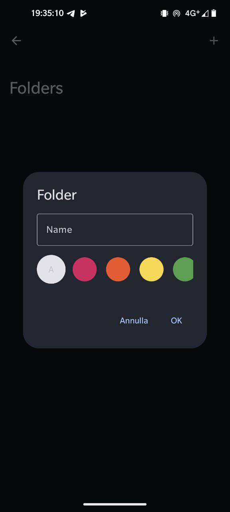</p>

</details>


---

### 📦 Etopa

> **Categories:** `#Android`

Etopa is a two-factor-authentication app, which runs as a web server and can be accessed using a web browser or using an Android app.

- 🐙 **Source Code:** [https://www.amazon.com/gp/mas/dl/android?p=de.ltheinrich.etopa](https://www.amazon.com/gp/mas/dl/android?p=de.ltheinrich.etopa)


---

### 📦 Bura

> **Categories:** `#Android` `#Weather`

Modern fully-featured weather app with graphs and thoughtful data visualization. Spiritual successor to [Prognoza](https://t.me/popMODS/3878).

🔗 **Quick Access**;
- Try It Out: [Github](https://github.com/davidtakac/bura/releases), [IzzyOnAndroid](https://apt.izzysoft.de/fdroid/index/apk/com.davidtakac.bura)
- Gallery: [Screenshots](https://t.me/fossclouds/37)
- Learn More: [Features](https://t.me/fossclouds/36), [Github Repo](https://github.com/davidtakac/bura)

❤️ Don't forget: If you like it and find it useful, you can support the developer by giving the software a star in the repository/release market, donating or following the developer.

🗨️ **Let's Talk**: @fosspalchat

🏷️ **Tags**: #Android #Weather

- 🐙 **Source Code:** [https://t.me/fossclouds/36](https://t.me/fossclouds/36)


---

### 📦 Metadata Remover - Remove any image's metadata fast and easily.

> **Categories:** `#android`

Protect your privacy by removing metadata from your photos, before sharing them on the internet!

🛠️ **Features**:
-  View metadata
-  Image preview
-  Remove metadata
-  Simple and intuitive interface
- Share directly from the app

- 🐙 **Source Code:** [https://apt.izzysoft.de/fdroid/index/apk/rocks.poopjournal.metadataremover](https://apt.izzysoft.de/fdroid/index/apk/rocks.poopjournal.metadataremover)


---

### 📦 Metadator- An Android ID3 metadata editor built with Jetpack Compose and Material 3

> **Categories:** `#android`

A simple yet complete metadata editor for your songs powered by TagLib and made with Material You and Jetpack Compose.

🛠️ **Features**:
- **Simple and clean UI**: Metadator has a simple and clean UI that makes it easy to use.
- **Material You**: Metadator is designed with Material You in mind, making it look great on any device.
- **TagLib**: Metadator uses TagLib to read and write metadata tags, ensuring compatibility with a wide range of audio formats. We are using a fork of TagLib that has been updated to work with Android.
- **Multiple layouts**: Metadator has multiple layouts to choose from, so you can find the one that works best for you.

- 🐙 **Source Code:** [https://github.com/BobbyESP/Metadator](https://github.com/BobbyESP/Metadator)


---

### 📦 AppLaunch

> **Categories:** `#Android` `#Root`

AppLaunch is Alpha-stage project which aims to allow user launch apps from Termux. For example if your home app is Termux.

- 🐙 **Source Code:** [https://github.com/fluid-developer/AppLaunch](https://github.com/fluid-developer/AppLaunch)
- 👤 **Developer:** [releases/latest
-](https://t.me/popMODS/4195)

<details>
<summary><b>🖼️ Preview Screenshots & Media (1)</b> — <i>Click to view images & decide if you want to use this app</i></summary>

#### 📸 Cover / Preview
<p align="center">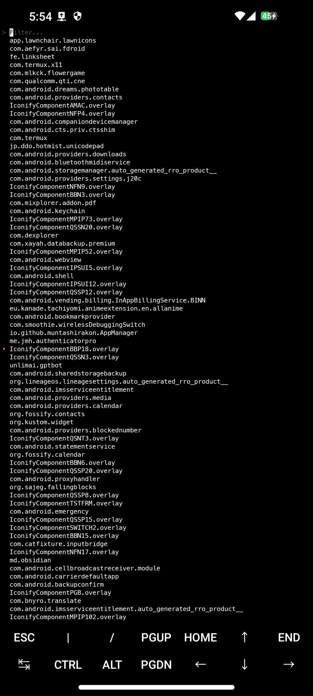</p>

</details>


---

### 📦 Sui

> **Categories:** `#Android` `#Root`

Sui provides Java APIs, [Shizuku API](https://github.com/RikkaApps/Shizuku-API), for root apps. It mainly provides the ability to use Android APIs directly (almost in Java as the identity of the root, and start app's own AIDL-style Java service under root. This will make root app development much more comfortable.

- 🐙 **Source Code:** [https://github.com/RikkaApps/Shizuku-API](https://github.com/RikkaApps/Shizuku-API)


---

### 📦 Positional

> **Categories:** `#Android` `#FOSS`

An app to get more information about your position.

__🛠️ __**Features**__:__
- View precise coordinates
- Know accuracy, altitude, speed and bearing
- Integrated compass
- Sunrise, sunset, dawn and dusk times
- Material 3 UI
- Free, no ads and open source

- 🐙 **Source Code:** [https://github.com/mtrewartha/positional](https://github.com/mtrewartha/positional)

<details>
<summary><b>🖼️ Preview Screenshots & Media (1)</b> — <i>Click to view images & decide if you want to use this app</i></summary>

#### 📸 Cover / Preview
<p align="center">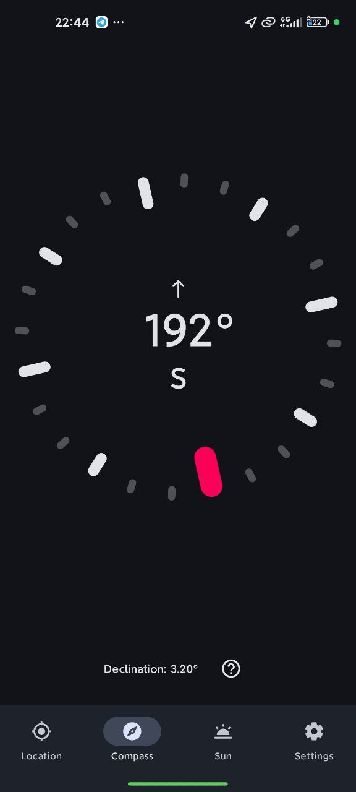</p>

</details>


---

### 📦 Keep It Up

> **Categories:** `#Android`

An app to monitor websites and hosts on the internet, notifying you of any changes or downtimes.

__🛠️ __**Features**__:__
- Ping hosts or websites with a time interval
- Connect to ports or download files
- Successful and unsuccessful attempts are logged
- A network task can be restricted to WiFi connections
[More](https://t.me/popCLOUDS/4988)

- 🐙 **Source Code:** [https://github.com/ibbaa/keepitup](https://github.com/ibbaa/keepitup)

<details>
<summary><b>🖼️ Preview Screenshots & Media (1)</b> — <i>Click to view images & decide if you want to use this app</i></summary>

#### 📸 Cover / Preview
<p align="center">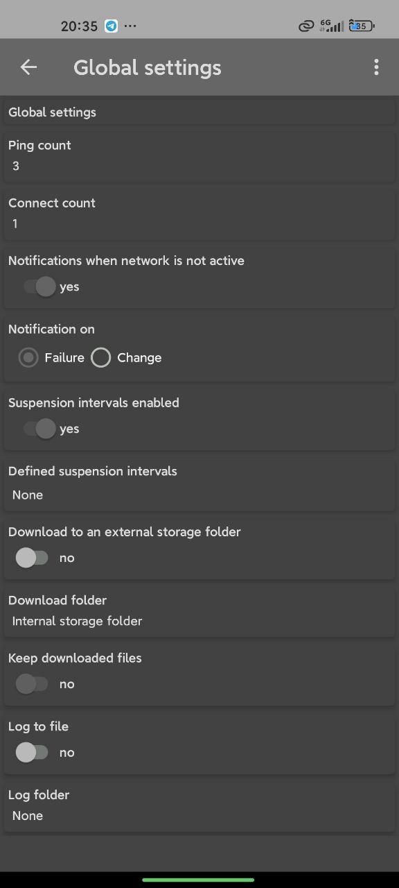</p>

</details>


---

### 📦 PageKeeper

> **Categories:** `#Android`

PageKeeper is an innovative bookmark management application that revolutionizes the way users save, organize, and access their favorite web pages. Built upon the robust Shiori platform, PageKeeper offers a seamless experience across all devices.

- 🐙 **Source Code:** [https://play.google.com/store/apps/details?id=com.desarrollodroide.pagekeeper](https://play.google.com/store/apps/details?id=com.desarrollodroide.pagekeeper)


---

### 📦 CashSense

> **Categories:** `#Android`

A mobile app designed to help users manage their finances effectively.

__🛠️ __**Features**__:__
- Create multiple wallets with support for various currencies
- Categorize your transactions for a clearer overview
- Material You design
- Set up and track subscription payments

- 🐙 **Source Code:** [https://github.com/f33lnothin9/cashsense](https://github.com/f33lnothin9/cashsense)

<details>
<summary><b>🖼️ Preview Screenshots & Media (1)</b> — <i>Click to view images & decide if you want to use this app</i></summary>

#### 📸 Cover / Preview
<p align="center">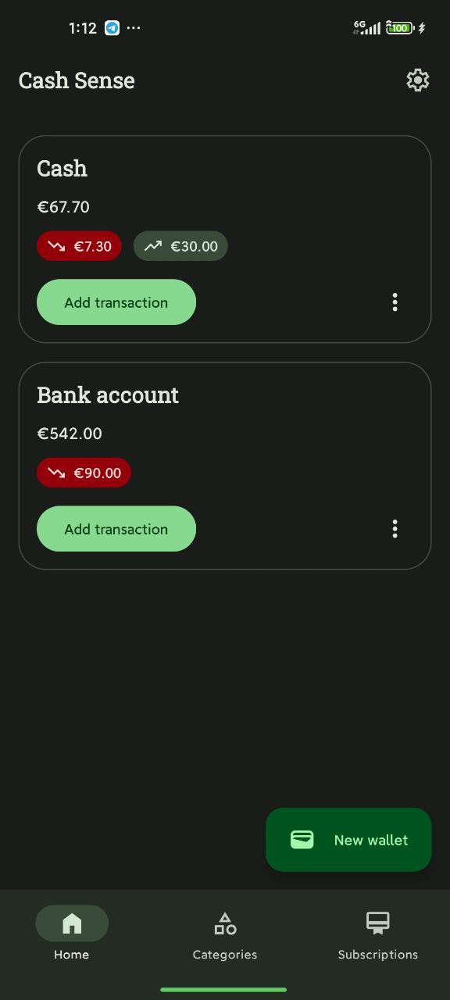</p>

</details>


---

### 📦 SendAnywhere

> **Categories:** `#Android` `#Linux` `#Windows` `#IOS` `#MacOS` `#Web`

Easy, Quick File Transfer, but with ads..

- 🐙 **Source Code:** [https://github.com/estmob/SendAnywhere-Android-SDK](https://github.com/estmob/SendAnywhere-Android-SDK)

<details>
<summary><b>🖼️ Preview Screenshots & Media (1)</b> — <i>Click to view images & decide if you want to use this app</i></summary>

#### 📸 Cover / Preview
<p align="center">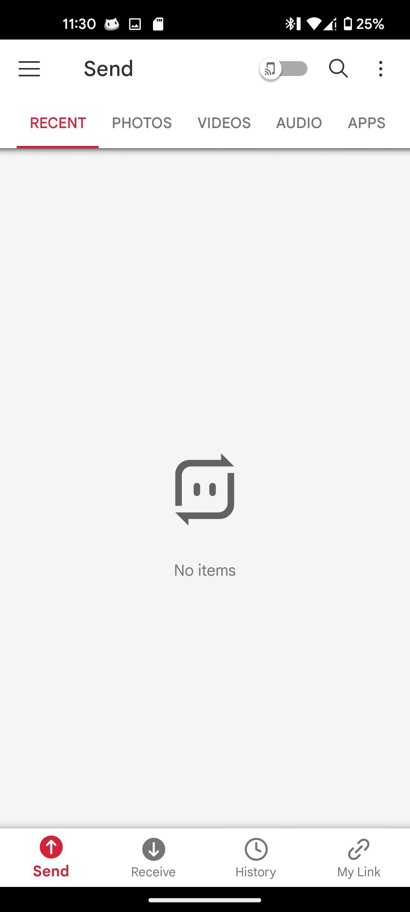</p>

</details>


---

### 📦 Piley

> **Categories:** `#Android`

A small To-Do app that uses piles to manage your tasks.

__🛠️ __**Features**__:__
- Set reminders
- Recurring tasks
- Material You design
- Support for backup server

- 🐙 **Source Code:** [https://github.com/justdeko/piley-server](https://github.com/justdeko/piley-server)

<details>
<summary><b>🖼️ Preview Screenshots & Media (1)</b> — <i>Click to view images & decide if you want to use this app</i></summary>

#### 📸 Cover / Preview
<p align="center">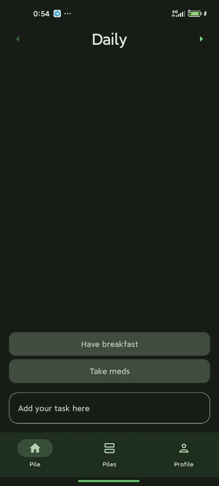</p>

</details>


---

### 📦 🗃️ Flut Renamer

> **Categories:** `#screenshots` `#Android` `#IOS` `#Windows` `#MacOS` `#Linux` `#Utilities`

**__Flut Renamer__** is a powerful yet easy-to-use tool designed to help users manage and rename files and directories. No more manually renaming one by one – our app offers various features including inserting text, inserting file metadata and Exif data, replacing text, deleting text, rearranging, and more, allowing you to quickly batch rename files according to your needs.

🔗 **Quick Access**;
- Try It Out: [Download](https://github.com/sun-jiao/renamer/releases)
- Gallery:  [Screenshots](https://github.com/sun-jiao/renamer?tab=readme-ov-file#screenshots)
- Learn More: [Check Repo](https://github.com/sun-jiao/renamer)

❤️ Don't forget: If you like it and find it useful, you can support the developer by giving the software a star in the repository/release market, donating or following the developer.

🗨️ **Let's Talk**: @fosspalchat

🏷️ **Tags**: #Android #IOS #Windows #MacOS #Linux #Utilities

- 🐙 **Source Code:** [https://github.com/sun-jiao/renamer](https://github.com/sun-jiao/renamer)


---

### 📦 Floating Timer

> **Categories:** `#Android`

The Floating Timer app features both a countdown timer and stopwatch that will float on top of other running apps. This app is useful to time activities such as: Exam practice, gaming speed runs (speed-running), gaming boss fights, cooking.

- 🐙 **Source Code:** [https://play.google.com/store/apps/details?id=xyz.tberghuis.floatingtimer](https://play.google.com/store/apps/details?id=xyz.tberghuis.floatingtimer)


---

### 📦 Minimum Launcher - Minimalist App Launcher for Effortless Efficiency.

> **Categories:** `#Android` `#Launcher`

**__Minimum Launcher__** is an elegant and efficient app launcher designed to enhance your productivity. With its clean interface and intuitive design, it allows you to access your favorite apps with ease. No more cluttered screens or wasted time - Minimum puts everything you need at your fingertips.

🔗 **Quick Access**;
- Try It Out:  [Google Play](https://play.google.com/store/apps/details?id=juniojsv.minimum&pcampaignid=pcampaignidMKT-Other-global-all-co-prtnr-py-PartBadge-Mar2515-1), [Github](https://github.com/JunioJsv/minimum/releases)
- Gallery: [Screenshots](https://t.me/fossclouds/3)
- Learn More: [Features](https://t.me/fossclouds/2), [Github page](https://github.com/JunioJsv/minimum)

- 🐙 **Source Code:** [https://github.com/JunioJsv/minimum](https://github.com/JunioJsv/minimum)
- 👤 **Developer:** Rate it  from Github or Google Play


---

### 📦 Neo-Wellbeing** **[Alpha]

> **Categories:** `#android` `#root` `#module`

Open source "Digital Wellbeing" replacement at alpha stage. Has some cool features like Grayscale, Focus mode, Sleep mode, Auto aeroplane mode and so many things.

- 🐙 **Source Code:** [https://github.com/NeoApplications/Neo-Wellbeing](https://github.com/NeoApplications/Neo-Wellbeing)


---

### 📦 suyu-emu/suyu

> **Categories:** `#GitHub` `#OpenSource` `#Interesting` `#Useful`

suyu is the continuation of the world's most popular, open-source, Nintendo Switch emulator, yuzu. It is written in C++ with portability in mind, and we're actively working on builds for Windows, Linux and Android.
**Language**: C++
**Stars**: 626 **Issues**: 0 **Forks**: 53
[https://github.com/suyu-emu/suyu](https://github.com/suyu-emu/suyu)

- 🐙 **Source Code:** [https://github.com/suyu-emu/suyu](https://github.com/suyu-emu/suyu)
- 👤 **Developer:** [suyu-emu](https://github.com/suyu-emu)


---

### 📦 Airclap

> **Categories:** `#Interesting` `#Useful` `#Android`

It supports various file formats and the maximum transfer speed that is available on the local network.

**⤷ **[**Link to project**](https://github.com/Gentleflow/Airclap)**
**
📢 [GitHub](https://t.me/+rB2DxiwI4X5iYjcy) | #Interesting #Useful #Android

- 🐙 **Source Code:** [https://github.com/Gentleflow/Airclap](https://github.com/Gentleflow/Airclap)
- 👤 **Developer:** [Gentleflow](https://github.com/Gentleflow)


---

### 📦 Griddycode

> **Categories:** `#Interesting` `#Android`

It allows you to extend its functionality through Lua with tutorials provided.

**⤷ **[Project link](https://github.com/face-hh/griddycode)**
**
📢 [GitHub](https://t.me/+rB2DxiwI4X5iYjcy) | #Interesting #Android

- 🐙 **Source Code:** [https://github.com/face-hh/griddycode](https://github.com/face-hh/griddycode)
- 👤 **Developer:** [face-hh](https://github.com/face-hh)


---

### 📦 Ultrablue

> **Categories:** `#Interesting` `#Android`

consists of a server running on a computer and acting as a verifier, and a graphical client application running on a phone acting as a verifier.

**⤷ **[**Link to project**](https://github.com/ANSSI-FR/ultrablue)**
**
📢 [GitHub](https://t.me/+rB2DxiwI4X5iYjcy) | #Interesting #Android

- 🐙 **Source Code:** [https://github.com/ANSSI-FR/ultrablue](https://github.com/ANSSI-FR/ultrablue)
- 👤 **Developer:** [ANSSI-FR](https://github.com/ANSSI-FR)


---

### 📦 Comatose

> **Categories:** `#android` `#root` `#adb`

Force your device to enter deep sleep sooner

Note that this app requires the WRITE_SECURE_SETTINGS permission that can be granted with EITHER a PC using ADB or root. Root is NOT required for this app, it is optional. Android 8.0+ is supported, with more features enabled on Android 10+.

Uninstalling the app will not reset the device configuration. You must click the Reset button to undo all changes made by Buoy.

- 🐙 **Source Code:** [https://github.com/tytydraco/Comatose](https://github.com/tytydraco/Comatose)


---

### 📦 AnimeTV for Android TV & Google TV

> **Categories:** `#features` `#donation` `#Android` `#TV` `#Anime`

AnimeTV is Android TV application for watching your favorite anime series and movies on your Android TV, It also runs on non-TV Android devices (Phones and Tablets) with some UI limitations.

- 🐙 **Source Code:** [https://github.com/amarullz/AnimeTV](https://github.com/amarullz/AnimeTV)


---

### 📦 NewPass

> **Categories:** `#Android` `#GitHub` `#OpenSource`

NewPass is a secure password management application designed to generate and store strong passwords locally on your device. With NewPass, you can create highly secure passwords for your accounts and services without the need to remember them.

- 🐙 **Source Code:** [https://github.com/6eero/NewPass](https://github.com/6eero/NewPass)
- 👤 **Developer:** [6eero](https://github.com/6eero)


---

### 📦 Look4Sat: __Satellite tracker

> **Categories:** `#Android`

Satellite positions and passes are calculated relative to your location. To get reliable info make sure to set the observation position using GPS or QTH Locator in the Settings menu.

- 🐙 **Source Code:** [https://t.me/popCLOUDS/4917](https://t.me/popCLOUDS/4917)


---

### 📦 Securify

> **Categories:** `#Android`

Yet another detection app to detect Magisk or KernelSU.

- 🐙 **Source Code:** [https://github.com/RabahX/Securify](https://github.com/RabahX/Securify)


---

### 📦 Buddha Quotes

> **Categories:** `#Android`

Buddha Quotes is a collaborative project to create a Free and Open Source Buddha Quotes app, making use of modern Android practices and architecture

- 🐙 **Source Code:** [https://github.com/BanDev/BuddhaQuotes](https://github.com/BanDev/BuddhaQuotes)


---

### 📦 ViTune (**[**ViMusic**](https://t.me/popMODS/1867)** fork)

> **Categories:** `#Android` `#Music`

An Android application for streaming music from YouTube Music

- 🐙 **Source Code:** [https://github.com/25huizengek1/ViMusic](https://github.com/25huizengek1/ViMusic)


---

### 📦 Five Prayers

> **Categories:** `#Android`

Five Prayers Android provide a set of tools needed by any muslim around the world. Five Prayers Android is not Google Framework dependent, so this app can be used on devices without Google services installed.

- 🐙 **Source Code:** [https://play.google.com/store/apps/details?id=com.hbouzidi.fiveprayers](https://play.google.com/store/apps/details?id=com.hbouzidi.fiveprayers)

<details>
<summary><b>✨ Key Features (23)</b> — <i>Click to expand</i></summary>

- Worldwide Prayer Times (Online and Offline)
- Different prayer times calculation methods based on Aladhan.com API
- Prayer times Adjustement
- Hijri Calendar
- Automatic or Manual location
- Notification for prayer times
- Reads Adhan for prayer times
- Play Adhan from device files
- Read Dua after Adhan
- Reminders before each prayer
- Reminder for Duha prayer
- Switches Adhan to Silent by pressing down volume button
- Automatically turn the phone to 'no disturb' mode after Adhan
- Month Prayer times table
- Qibla direction compass from Compass Qibla Project
- Quran
- Quran Reading Schedule
- Daily Ayah notifications
- Daily Invocations
- 99 Names of God
- Multiple Home Screen Widgets
- Weather information in Clock Widget (Go to OpenWeatherMap and sign up for free. It may take a while before the API-Key is activated!)
- Dark Themes

</details>


---

### 📦 JamesDSP

> **Categories:** `#features` `#Android` `#Root`

Cross-platform Audio Effect / Digital Signal Processing library

- 🐙 **Source Code:** [https://play.google.com/store/apps/details?id=me.timschneeberger.rootlessjamesdsp&utm_source=github&pcampaignid=pcampaignidMKT-Other-global-all-co-prtnr-py-PartBadge-Mar2515-1](https://play.google.com/store/apps/details?id=me.timschneeberger.rootlessjamesdsp&utm_source=github&pcampaignid=pcampaignidMKT-Other-global-all-co-prtnr-py-PartBadge-Mar2515-1)


---

### 📦 Dev Tiles

> **Categories:** `#usage` `#Android`

Android Quick Settings tiles for developers. Works on Android 7.0+.

- 🐙 **Source Code:** [https://github.com/mustafa01ali/Dev-Tiles](https://github.com/mustafa01ali/Dev-Tiles)


---

### 📦 Layout Editor

> **Categories:** `#features` `#Android`

Use Layout Editor to easily build Android app layouts by dragging UI elements into a visual layout editor.

- 🐙 **Source Code:** [https://github.com/itsvks19/LayoutEditor](https://github.com/itsvks19/LayoutEditor)


---

### 📦 AniVu

> **Categories:** `#Android`

AniVu, an all-in-one tool for RSS anime subscription and updates, bit torrent downloads, and video playback

- 🐙 **Source Code:** [https://t.me/popCLOUDS/4814](https://t.me/popCLOUDS/4814)

<details>
<summary><b>✨ Key Features (11)</b> — <i>Click to expand</i></summary>

- Subscribe to RSS, Update RSS, Read RSS
- Automatically update RSS subscriptions
- Download enclosures (enclosure tags) of torrent or magnet links in RSS articles
- Seeding downloaded files
- Play downloaded videos
- Support variable playback speed, long press to speed up playback
- Double-finger gesture to rotate and zoom video
- Swipe on the video to control volume, brightness, and playback position
- Searching existing RSS subscription content
- Play other videos on the phone
- Support dark mode

</details>


---

### 📦 POW

> **Categories:** `#Android` `#ADB` `#Root`

Say hello to Purr, the all-in-one resolution changer for Android devices, no root required! How does it work you ask? We use Android SDK reflection to access hidden APIs to change the resolution of your phone screen. All we need is a special permission that can be granted using ADB.

- 🐙 **Source Code:** [https://play.google.com/store/apps/details?id=com.draco.purr](https://play.google.com/store/apps/details?id=com.draco.purr)


---

### 📦 Quick Tiles

> **Categories:** `#Android`

Android Quick Settings Tiles. A Quick Tile App, To Freely Choose Any Tiles From Apps To Settings.
Although It's Old, It Will Work as it's intended.

- 🐙 **Source Code:** [https://github.com/asdoi/QuickTiles](https://github.com/asdoi/QuickTiles)

<details>
<summary><b>✨ Key Features (31)</b> — <i>Click to expand</i></summary>

- Media control (play/pause, next, previous, media volume)
- Show volume panel
- New event/alarm/timer
- Make call
- Take photo/record video
- Open calculator/file manager
- Open custom apps
- Search settings
- Open languages
- Open dictionary/privacy
- Open VPN/data usage/screen cast/connected devices/about
- Set screen timeout
- Switch volume modes (normal, vibrate, priority only, alarms only, total silence)
- Adjust brightness
- Adaptive brightness toggle
- Grayscale
- Take screenshot
- Force rotation (0°, 90°, 180°, 270°)
- Lock screen
- Split screen
- Set vibration on calls
- Open power menu
- Show battery level
- Counter
- Enable/disable USB debugging
- Enable/Disable demo mode
- Open developer options
- Enable/Disable keep screen on
- Set animator duration scale
- Disable all animations
- Always finish activities

</details>


---

### 📦 UpNext GPT** - Your playlist powered by ChatGPT.

> **Categories:** `#Android`

GPT powered playlist App for Android. Supports Apple Music, Spotify, and Youtube Music.

- 🐙 **Source Code:** [https://github.com/dokar3/upnext-gpt](https://github.com/dokar3/upnext-gpt)


---

### 📦 MIO KITCHEN

> **Categories:** `#Linux` `#Windows` `#MacOS`

An Open-Source Android Tool project created with Python , This tool contains many cool feature along with GUI support for Windows , Linux and MacOS .

- 🐙 **Source Code:** [https://github.com/ColdWindScholar/MIO-KITCHEN-SOURCE](https://github.com/ColdWindScholar/MIO-KITCHEN-SOURCE)


---

### 📦 diia-open-source/android-diia

> **Categories:** `#GitHub` `#OpenSource`

**Language**: Kotlin
**Stars**: 366 **Issues**: 22 **Forks**: 45
[https://github.com/diia-open-source/android-diia](https://github.com/diia-open-source/android-diia)

- 🐙 **Source Code:** [https://github.com/diia-open-source/android-diia](https://github.com/diia-open-source/android-diia)
- 👤 **Developer:** [diia-open-source](https://github.com/diia-open-source)


---

### 📦 MedTimer** **- Med reminders and history with full offline privacy

> **Categories:** `#Android`

MedTimer is an open-source medication reminder app designed to help you manage your medications effectively and with full control of your sensitive data.

- 🐙 **Source Code:** [https://github.com/Futsch1/medTimer](https://github.com/Futsch1/medTimer)


---

### 📦 Summary You

> **Categories:** `#Android`

Summarize YouTube-Videos & Articles with AI

- 🐙 **Source Code:** [https://github.com/talosross/SummaryYou](https://github.com/talosross/SummaryYou)


---

### 📦 Cuberite for Android™ - An easy way to run a Minecraft server on your phone.

> **Categories:** `#Android`

Cuberite is a Free and Open Source (FOSS) game server compatible with Minecraft Java Edition. Cuberite is designed with performance, configurability, and extensibility in mind, and also aims to accurately recreate most Minecraft features. The server is written in C++, and there is an extensive plugin system that allows for the user to write their own plugins with Lua.

- 🐙 **Source Code:** [https://github.com/cuberite/android](https://github.com/cuberite/android)


---

### 📦 Snappr

> **Categories:** `#Android`

Snappr is a minimalist note-taking and bookmarking app designed to help you organize your thoughts, and save web links effortlessly. With Snappr, you can capture your ideas, format text using special characters, reference other notes, and even preview web pages - all without the need for user accounts or sign-ups.

- 🐙 **Source Code:** [https://github.com/Iamlooker/Snappr](https://github.com/Iamlooker/Snappr)


---

### 📦 Private DNS Quick Toggle

> **Categories:** `#Android`

Quick settings tile to switch active private DNS server

Private DNS Quick Toggle is a quick settings tile to switch your private dns provider. Supports any number of providers. Makes it easy to turn adblocking dns servers on or off with just a single tap.

- 🐙 **Source Code:** [https://github.com/karasevm/PrivateDNSAndroid](https://github.com/karasevm/PrivateDNSAndroid)


---

### 📦 osu!lazer

> **Categories:** `#Android` `#MacOS` `#Linux` `#iOS` `#Windows`

A free-to-win rhythm game. Rhythm is just a click away!

- 🌐 **Official Website:** [https://github.com/ppy/osu](https://github.com/ppy/osu)


---

### 📦 FreeOTP Plus

> **Categories:** `#Android`

FreeOTP Plus forked the same functionality of FreeOTP provided by RedHat.

- 🐙 **Source Code:** [https://play.google.com/store/apps/details?id=org.liberty.android.freeotpplus](https://play.google.com/store/apps/details?id=org.liberty.android.freeotpplus)

<details>
<summary><b>✨ Key Features (11)</b> — <i>Click to expand</i></summary>

- Export settings to Google Drive or other document providers
- Import settings from Google Drive or other document providers
- Lots of stability improvement
- Support Android 6.0 permissions.
- Enhanced UI with material design with dark theme support
- Search bar to search token
- Provide more token details for better interoperatibility with other apps
- Utilize modern camera hardware to scan QR code faster
- Option to require Biometric / PIN authentication to launch the app
- Heuristic based offline icon for tokens of 250+ websites
- More settings to customize the app functionality

</details>


---

### 📦 Aegis

> **Categories:** `#Android`

Aegis Authenticator is a free, secure and open source 2FA app for Android. It aims to provide a secure authenticator for your online services, while also including some features missing in existing authenticator apps, like proper encryption and backups. Aegis supports HOTP and TOTP, making it compatible with thousands of services.

- 🐙 **Source Code:** [http://play.google.com/store/apps/details?id=com.beemdevelopment.aegis](http://play.google.com/store/apps/details?id=com.beemdevelopment.aegis)

<details>
<summary><b>✨ Key Features (22)</b> — <i>Click to expand</i></summary>

- Free and open source
- Secure
- The vault is encrypted (AES-256-GCM), and can be unlocked with
- Password (scrypt)
- Biometrics (Android Keystore)
- Screen capture prevention
- Tap to reveal
- Compatible with Google Authenticator
- **Supports industry standard algorithms** — HOTP and TOTP
- Lots of ways to add new entries
- Scan a QR code or an image of one
- Enter details manually
- **Import from other authenticator apps** — 2FAS Authenticator, Authenticator Plus, Authy, andOTP, FreeOTP, FreeOTP+, Google Authenticator, Microsoft Authenticator, Plain text, Steam, TOTP Authenticator and WinAuth (root access is required for some of these)
- Organization
- Alphabetic/custom sorting
- Custom or automatically generated icons
- Group entries together
- Advanced entry editing
- Search by name/issuer
- **Material design with multiple themes** — Light, Dark, AMOLED
- Export (plaintext or encrypted)
- Automatic backups of the vault to a location of your choosing

</details>


---

### 📦 HideDroid - An Android App for preserving user privacy

> **Categories:** `#Android`

HideDroid is an Android app that allows the per-app anonymization of collected personal data according to a privacy level chosen by the user. In a nutshell, HideDroid collects all the network traffic generated by the invocation of API calls belonging to analytics libraries, and extract the exported data. Then, it anonymizes the personal and device data using a generalization technique, and the data related to the user’s behavior using an approach based on the concept of local differential privacy, in a way that preserves as much data semantics as possible.
Finally, the anonymized data are sent to the expected recipients by mimicking the original network calls.

- 🐙 **Source Code:** [https://apt.izzysoft.de/fdroid/index/apk/it.unige.hidedroid](https://apt.izzysoft.de/fdroid/index/apk/it.unige.hidedroid)


---

### 📦 Moonlight

> **Categories:** `#Android`

Moonlight for Android is an open source client for NVIDIA GameStream and Sunshine.
Moonlight for Android will allow you to stream your full collection of games from your Windows PC to your Android device, whether in your own home or over the internet.

- 🐙 **Source Code:** [https://play.google.com/store/apps/details?id=com.limelight](https://play.google.com/store/apps/details?id=com.limelight)


---

### 📦 Wasted

> **Categories:** `#Android` `#Interesting` `#Useful` `#GitHub` `#OpenSource`

Lock a device and wipe its data on emergency by PanicKit, tile, shortcut or send a message with a secret code.

🔗 **Links**:
- [Download](https://f-droid.org/packages/me.lucky.wasted/)
- [Screenshots](https://t.me/popCLOUDS/4591)
- [Source Code](https://github.com/x13a/Wasted)

🌐 @popmodsnetwork
🎁 [Donate to our admins](https://t.me/popMODS/4195)

- 🐙 **Source Code:** [https://github.com/x13a/Wasted](https://github.com/x13a/Wasted)
- 👤 **Developer:** [x13a](https://github.com/x13a)


---

### 📦 MediTrack

> **Categories:** `#adding` `#Android`

A simple medication tracking app, that supports tracking medicines for yourself or for other people.

- 🐙 **Source Code:** [https://github.com/AdamGuidarini/MediTrak](https://github.com/AdamGuidarini/MediTrak)

<details>
<summary><b>🖼️ Preview Screenshots & Media (1)</b> — <i>Click to view images & decide if you want to use this app</i></summary>

#### 📸 Cover / Preview
<p align="center">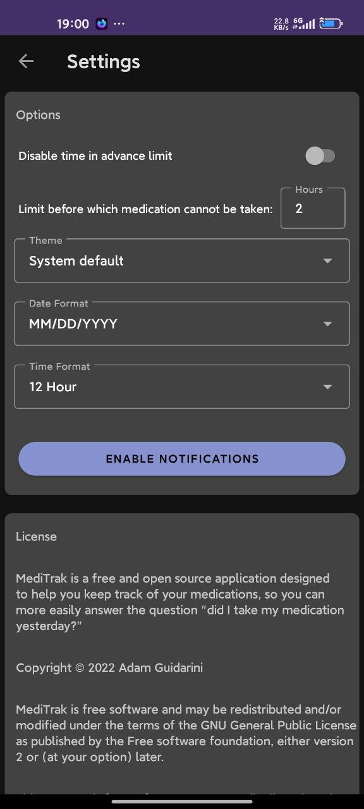</p>

</details>


---

### 📦 MdgWa** (Neko xD)

> **Categories:** `#Android` `#Root` `#Lsposed`

An Xposed module to customize your WhatsApp.

- 🐙 **Source Code:** [https://github.com/ItsMadruga/MdgWa](https://github.com/ItsMadruga/MdgWa)


---

### 📦 Locallock

> **Categories:** `#Android` `#Security` `#Interesting`

Easy to use interface, biometric authentication, local data storage, no trackers or advertising. All passwords are encrypted with AES-256 and are easily copied to the clipboard.

🐱 **⤷ **[**Link to project**](https://github.com/PriyavKaneria/LocalLock)

[GitHub](https://t.me/+rB2DxiwI4X5iYjcy) | #Android #Security #Interesting

- 🐙 **Source Code:** [https://github.com/PriyavKaneria/LocalLock](https://github.com/PriyavKaneria/LocalLock)
- 👤 **Developer:** [PriyavKaneria](https://github.com/PriyavKaneria)


---

### 📦 Trekarta** -__Offline Outdoor Map

> **Categories:** `#Android` `#Maps`

Trekarta (former MapTrek) is designed for hiking, geocaching, off-roading, cycling, boating and all other outdoor activities. It uses offline maps so you do not need to have internet connection.

- 🐙 **Source Code:** [https://github.com/andreynovikov/trekarta](https://github.com/andreynovikov/trekarta)


---

### 📦 Chord Reader 2

> **Categories:** `#Android`

- 🐙 **Source Code:** [https://github.com/AndInTheClouds/chordreader2](https://github.com/AndInTheClouds/chordreader2)
- 👤 **Developer:** Nolan Lawson. It's intended to keep compatibility to old devices, as old tablets still serves well as book of music. ;


---

### 📦 Neer - Water Reminder

> **Categories:** `#Android`

The Water Reminder App is a simple application designed to help users stay hydrated by reminding them to drink water regularly throughout the day. It allows users to set their daily water intake goals and track their progress towards achieving them.

- 🐙 **Source Code:** [https://github.com/criticalAY/Neer](https://github.com/criticalAY/Neer)


---

### 📦 FlickBoard

> **Categories:** `#Android`

FlickBoard is a flicking-style keyboard, in the style of MessagEase and Thumb-Key.

Type the letters in the center of a key by tapping it. Type the keys in the corners by swiping in that direction.

🔗 **Links**:
- Download From [Github,](https://github.com/nightkr/flickboard/releases/) [IzzyDroid](https://android.izzysoft.de/repo/apk/se.nullable.flickboard) or [Playstore](https://play.google.com/store/apps/details?id=se.nullable.flickboard)
- [Screenshots](https://t.me/popCLOUDS/4542)
- [Source Code](https://github.com/nightkr/flickboard/)

🌐 @popmodsnetwork
🎁 [Donate to our admins](https://t.me/popMODS/4195)
🏷 **Tags**: #Android

- 🐙 **Source Code:** [https://play.google.com/store/apps/details?id=se.nullable.flickboard](https://play.google.com/store/apps/details?id=se.nullable.flickboard)


---

### 📦 Stitch

> **Categories:** `#Android`

Yet another app to create awesome longshots.

- 🐙 **Source Code:** [https://github.com/ekibun/Stitch](https://github.com/ekibun/Stitch)


---

### 📦 Alexandria 𓂀

> **Categories:** `#Android` `#EBook` `#GitHub` `#OpenSource`

Alexandria is an open source application for downloading and converting EBooks.

- 🐙 **Source Code:** [https://github.com/aloussase/alexandria-app](https://github.com/aloussase/alexandria-app)
- 👤 **Developer:** [btpf](https://github.com/btpf)


---

### 📦 Linkora

> **Categories:** `#features` `#screenshots` `#Android` `#GitHub` `#OpenSource`

**An Android project that focuses on making link organization simpler. From saving a single link individually to saving links in a folder for respective use cases, Linkora has almost all of them with a simpler UI and will be updated in further releases with a few other helpful and useful features that you would expect from a link utility app.

🔗 **Links**:
- Download from [GitHub](https://github.com/sakethpathike/Linkora/releases)
- [Features](https://github.com/sakethpathike/Linkora?tab=readme-ov-file#features)
- [Screenshots](https://github.com/sakethpathike/Linkora?tab=readme-ov-file#screenshots)
- [Source code](https://github.com/sakethpathike/Linkora/)

🌐 @popmodsnetwork
🎁 [Donate to our admins](https://t.me/popMODS/4195)
🏷 **Tags**: #Android

- 🐙 **Source Code:** [https://github.com/sakethpathike/Linkora](https://github.com/sakethpathike/Linkora)
- 👤 **Developer:** [LinkoraApp](https://github.com/LinkoraApp)


---

### 📦 AutoEq

> **Categories:** `#usage` `#Android` `#IOS` `#Windows` `#Linux` `#MacOS`

AutoEq is a tool for creating equalizer settings which give a neutral sound for headphones and does this based on headphone frequency response measurements and established target curves.

🔗 **Links**:
- Download From [AutoEq](https://autoeq.app/)
- [Usage](https://github.com/jaakkopasanen/AutoEq#usage) & [Equalizer](https://github.com/jaakkopasanen/AutoEq/wiki/Choosing-an-Equalizer-App)
- [Import To Wavelet](https://t.me/popCLOUDS/4522?) or Similar
- [Source Code](https://github.com/jaakkopasanen/AutoEq#usage)

And Thx To Everyone For Suggesting

🌐 @popmodsnetwork
🎁 [Donate to our admins](https://t.me/popMODS/4195)
🏷 **Tags**: #Android #IOS #Windows #Linux #MacOS

- 🐙 **Source Code:** [https://github.com/jaakkopasanen/AutoEq](https://github.com/jaakkopasanen/AutoEq)


---

### 📦 SimpleAppDowngrader [ROOT]

> **Categories:** `#Android`

Downgrades installed apps with an apk-file

This uses androids pm tool to downgrade already installed apps to an older version.
Root access is required.

- 🐙 **Source Code:** [https://github.com/GaryOderNichts/SimpleAppDowngrader](https://github.com/GaryOderNichts/SimpleAppDowngrader)


---

### 📦 Flixclusive

> **Categories:** `#Android`

A modern streaming service app that provides users with a convenient way to play and watch the latest movies and TV shows available on the internet. With a user-friendly interface and a vast collection of content, Flixclusive aims to deliver an exceptional streaming experience to its users.

🔗 **Links**:
- Download From [Github](https://github.com/rhenwinch/Flixclusive/releases/)
- [Features](https://t.me/popCLOUDS/4512)
- [Previews](https://t.me/popCLOUDS/4513)
- [SourceCode](https://github.com/rhenwinch/Flixclusive/)

🌐 @popmodsnetwork
🎁 [Donate to our admins](https://t.me/popMODS/4195)
🏷 **Tags**: #Android

- 🐙 **Source Code:** [https://t.me/popCLOUDS/4513](https://t.me/popCLOUDS/4513)

<details>
<summary><b>✨ Key Features (6)</b> — <i>Click to expand</i></summary>

- **Extensive Library** — Access a wide range of movies and TV shows from various genres, including action, drama, comedy, thriller, and more.
- **Search and Discover** — Easily search for your favorite movies or TV shows using keywords or browse through curated collections to discover new content.
- **Personalized Recommendations** — Receive tailored recommendations based on your viewing history, and preferences to help you discover new content that suits your taste.
- **Continue Watching** — Seamlessly pick up where you left off and resume watching from any device.
- **High-Quality Streaming** — Experience high-definition streaming with adaptive streaming technology that adjusts video quality based on your internet connection.
- **Subtitle Selections** — Choose from a wide variety of subtitle options in different languages to enhance your viewing experience.

</details>


---

### 📦 KeyGuard for BitWarden

> **Categories:** `#Android`

**[The news I posted](https://t.me/popMODS/4828?single) made me remember that we have already posted a BitWarden app with Material You, but removed it because it wasn't OSS and required purchases. Now it's free and OSS.

⚠️ **PS**:
The license on GitHub isn't really open-source friendly, so it's just the source that is available.

🔗 **Links**:
- Download from [PlayStore](https://play.google.com/store/apps/details?id=com.artemchep.keyguard) (support the developer by buying the full version) or [GitHub](https://github.com/AChep/keyguard-app/releases)
- [Source code](https://github.com/AChep/keyguard-app)
- [Reddit community](https://www.reddit.com/r/keyguard/)
- [Crowdin project](https://crowdin.com/project/keyguard)
- [Features](https://t.me/popCLOUDS/4511)
- [Screenshots](https://t.me/popCLOUDS/4510?single)

🌐 @popmodsnetwork
🎁 [Donate to our admins](https://t.me/popMODS/4195)
🏷 **Tags**: #Android

- 🐙 **Source Code:** [https://play.google.com/store/apps/details?id=com.artemchep.keyguard](https://play.google.com/store/apps/details?id=com.artemchep.keyguard)
- 👤 **Developer:** [version or GitHub](https://t.me/popMODS/4195)

<details>
<summary><b>✨ Key Features (11)</b> — <i>Click to expand</i></summary>

- Multiple accounts support
- Two-way sync
- Offline editing
- Search by anything
- Filter results
- Watchtower
- Pwned passwords monitor
- Reused passwords monitor
- Duplicate items monitor
- Unsecure websites monitor
- Many more features

</details>

<details>
<summary><b>🖼️ Preview Screenshots & Media (1)</b> — <i>Click to view images & decide if you want to use this app</i></summary>

#### 📸 Cover / Preview
<p align="center">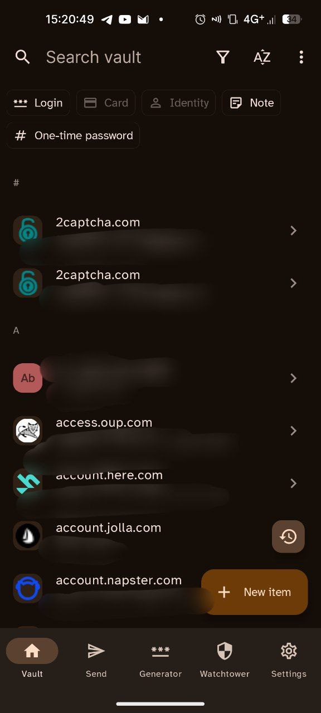</p>

</details>


---

### 📦 DailyAL

> **Categories:** `#Android`

**Unofficial flutter-based client for MyAnimeList.

🔗 **Links**:
- Download from [PlayStore](https://play.google.com/store/apps/details?id=io.github.jica98.dailyal_support), [GitHub](https://github.com/JICA98/DailyAL/releases), [FDroid](https://f-droid.org/it/packages/io.github.jica98/)
- [Source code](https://github.com/JICA98/DailyAL)
- [Screenshots](https://t.me/popCLOUDS/4497?single)

🌐 @popmodsnetwork
🎁 [Donate to our admins](https://t.me/popMODS/4195)
🏷 **Tags**: #Android

- 🐙 **Source Code:** [https://github.com/JICA98/DailyAL](https://github.com/JICA98/DailyAL)

<details>
<summary><b>🖼️ Preview Screenshots & Media (1)</b> — <i>Click to view images & decide if you want to use this app</i></summary>

#### 📸 Cover / Preview
<p align="center">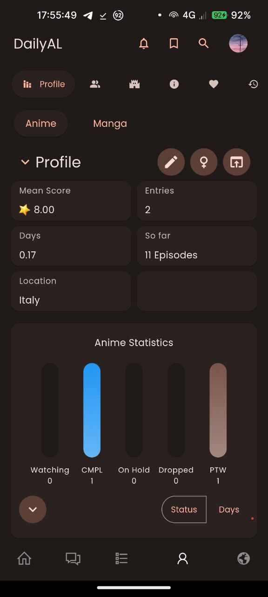</p>

</details>


---

### 📦 QtScrcpy

> **Categories:** `#Windows` `#Linux` `#MacOS` `#Interesting` `#Android` `#USB` `#GitHub` `#OpenSource`

QtScrcpy supports displaying and controlling Android devices via USB or over network. It does NOT require root privileges.

- 🐙 **Source Code:** [https://github.com/barry-ran/QtScrcpy](https://github.com/barry-ran/QtScrcpy)
- 👤 **Developer:** [barry-ran](https://github.com/barry-ran)


---

### 📦 Zty.pe

> **Categories:** `#Website` `#Game` `#Android`

- 🌐 **Official Website:** [https://phoboslab.org/](https://phoboslab.org/)
- 👤 **Developer:** Germany-based developer Dominic Szablewski of PhobosLab, originally developed for web browsers in 2011 and later released for mobile in 2016.


---

### 📦 Gauguin

> **Categories:** `#Android`

Gauguin is a Sudoku-like game where you solve grids via calculation and logic.
You can use it to relax or to solve difficult grids to your opinion.

🔗 **Links**:
- Download From [Github](https://github.com/meikpiep/gauguin?tab=readme-ov-file/releases/), [F-Droid](https://f-droid.org/packages/org.piepmeyer.gauguin/), [Playstore](https://play.google.com/store/apps/details?id=org.piepmeyer.gauguin)
- [Screenshots](https://t.me/popCLOUDS/4476?single)
- [SourceCode](https://github.com/meikpiep/gauguin?tab=readme-ov-file)

🌐 @popmodsnetwork
🎁 [Donate to our admins](https://t.me/popMODS/4195)
🏷 **Tags**: #Android

- 🐙 **Source Code:** [https://play.google.com/store/apps/details?id=org.piepmeyer.gauguin](https://play.google.com/store/apps/details?id=org.piepmeyer.gauguin)


---

### 📦 Wormhole

> **Categories:** `#Android` `#Tools`

iyox Wormhole is a file-sharing application for the magic-wormhole protocol presented in Material You style!

⚒ **Features**:
- Secure File Sharing: Utilizes the magic-wormhole protocol for end-to-end encrypted file transfers.
- Material You Design: Enhances user experience with modern Material You design principles.
- QR Code and Passphrase Sharing: Simplifies sharing through QR codes or passphrases.

🔗 **Links**:
- [Download](https://apt.izzysoft.de/packages/com.iyox.wormhole) (IzzyOnDroid)
- [Download](https://play.google.com/store/apps/details?id=com.iyox.wormhole) (Play Store)
- [Download](https://github.com/iyox-studios/iyox-Wormhole/releases/latest) (Github)
- [Screenshots](https://t.me/popCLOUDS/4472)
- [Source Code](https://github.com/iyox-studios/iyox-Wormhole)

🌐 @popmodsnetwork
🎁 [Donate to our admins](https://t.me/popMODS/4195)

- 🐙 **Source Code:** [https://github.com/iyox-studios/iyox-Wormhole](https://github.com/iyox-studios/iyox-Wormhole)


---

### 📦 File Navigator

> **Categories:** `#Android`

The missing link between Android and a well-structured file system.

- 🐙 **Source Code:** [https://t.me/popCLOUDS/4451](https://t.me/popCLOUDS/4451)


---

### 📦 Vectras VM

> **Categories:** `#Android`

Virtual machines on Android to try Operating Systems on the go.

🔗 **Links**:
- Download from [Website](https://vectras.netlify.app/download), [GitHub](https://github.com/epicstudios856/Vectras-VM-Android/releases)
- [Tutorial](https://vectras.netlify.app/how)
- [Website](https://vectras.netlify.app/)
- [GitHub](https://github.com/epicstudios856/Vectras-VM-Android) (not OSS)
- [Screenshots](https://t.me/popCLOUDS/4434?single)

🌐 @popmodsnetwork
🎁 [Donate to our admins](https://t.me/popMODS/4195)
🏷 **Tags**: #Android

- 🐙 **Source Code:** [https://github.com/epicstudios856/Vectras-VM-Android](https://github.com/epicstudios856/Vectras-VM-Android)
- 🌐 **Official Website:** [https://vectras.netlify.app/how](https://vectras.netlify.app/how)

<details>
<summary><b>🖼️ Preview Screenshots & Media (1)</b> — <i>Click to view images & decide if you want to use this app</i></summary>

#### 📸 Cover / Preview
<p align="center">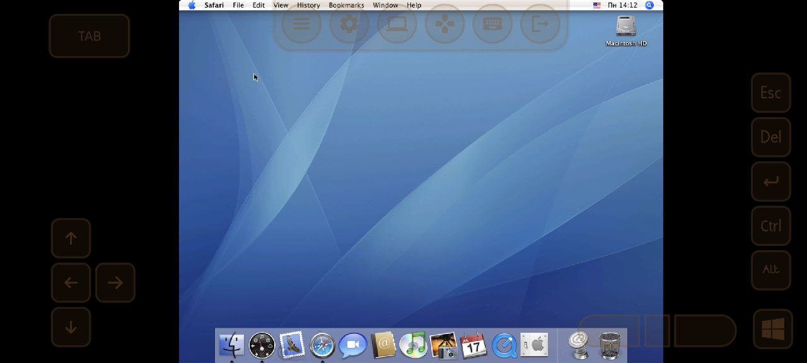</p>

</details>


---

### 📦 Dollphone Icon Pack

> **Categories:** `#Android` `#Customization`

Dollphone is an icon pack that is very cute, but isn’t too hyper. The icons avoid overly saturated or dark colors, and softly bulge out the "straight" lines away from the center for a plushie-like look.

Dollphone Icon Pack is a crystallization of years of passion for the “yurukawa” aesthetic

- 🐙 **Source Code:** [https://t.me/popCLOUDS/4423](https://t.me/popCLOUDS/4423)


---

### 📦 [**DockerAndroid**](https://gist.github.com/FreddieOliveira/efe850df7ff3951cb62d74bd770dce27)** - A guide explaining how to run Docker on Android.

> **Categories:** `#Interesting` `#Docker` `#Android` `#Guide`

To do this, you need to root your phone, compile the kernel, and compile the Docker package. Instructions are provided for each component, including patches, configuration, and setup.

**⤷ **[**Link to project**](https://gist.github.com/FreddieOliveira/efe850df7ff3951cb62d74bd770dce27)**
**
[GitHub](https://t.me/+rB2DxiwI4X5iYjcy) | #Interesting #Docker #Android #Guide

- 🐙 **Source Code:** [https://gist.github.com/FreddieOliveira/efe850df7ff3951cb62d74bd770dce27](https://gist.github.com/FreddieOliveira/efe850df7ff3951cb62d74bd770dce27)


---

### 📦 TrustDevice Fingerprint

> **Categories:** `#1` `#Android` `#Security` `#Utilities`

A lightweight library for determining device uniqueness and risk identification.
Create a device identifier based on basic device information.
Will remain the same after uninstalling and reinstalling or clearing app data.

🔗 **Links**:
- Download From [Github](https://github.com/trustdecision/trustdevice-android/releases/), [Playstore](https://play.google.com/store/apps/details?id=com.trustdevice.android&pcampaignid=pcampaignidMKT-Other-global-all-co-prtnr-py-PartBadge-Mar2515-1)
- [Features](https://github.com/trustdecision/trustdevice-android?tab=readme-ov-file#1-wide-coverage)
- [Screenshots](https://t.me/popCLOUDS/4415)
- [SourceCode](https://github.com/trustdecision/trustdevice-android?tab=readme-ov-file)

🌐 @popmodsnetwork
🎁 [Donate to our admins](https://t.me/popMODS/4195)
🏷 **Tags**: #Android

- 🐙 **Source Code:** [https://github.com/trustdecision/trustdevice-android](https://github.com/trustdecision/trustdevice-android)
- 👤 **Developer:** [TrustDevice-Device Fingerprint](https://github.com/trustdecision)


---

### 📦 Minimalistic Price Converter

> **Categories:** `#Android`

Minimalistic price converter that allows you to convert prices of fiat shitcoins easily. It uses Bitcoin as the base currency.

🔗 **Links**:
- Download From [Github](https://github.com/Minimalistic-Apps/price-converter?tab=readme-ov-file/releases/), [F-Droid](https://f-droid.org/packages/com.minimalisticapps.priceconverter/)
- [Screenshots](https://t.me/popCLOUDS/4413?single)
- [SourceCode](https://github.com/Minimalistic-Apps/price-converter?tab=readme-ov-file)

🌐 @popmodsnetwork
🎁 [Donate to our admins](https://t.me/popMODS/4195)
🏷 **Tags**: #Android

- 🐙 **Source Code:** [https://t.me/popCLOUDS/4413?single](https://t.me/popCLOUDS/4413?single)


---

### 📦 Eyeroll

> **Categories:** `#Interesting` `#Android` `#Firefox`

Close your right eye to scroll down and your left eye to scroll up. Also works in Firefox for Android. Settings include sensitivity, time required to scroll.

**⤷ **[**Link to project**](https://github.com/bjesus/eyeroll)**
**
[GitHub](https://t.me/+rB2DxiwI4X5iYjcy) | #Interesting #Android #Firefox

- 🐙 **Source Code:** [https://github.com/bjesus/eyeroll](https://github.com/bjesus/eyeroll)
- 👤 **Developer:** [bjesus](https://github.com/bjesus)


---

### 📦 HeliBoard

> **Categories:** `#Android` `#Keyboard` `#AI` `#Interesting`

**HeliBoard** is an __up-to-date__ fork of [OpenBoard](https://github.com/openboard-team/openboard), maintained by Helium314; with numerous added & revised changes.

🛠️ **Features**:
- Fully offline
- Multilingual
- Dictionaries
- Monet theming
- Glide typing
- Word suggestions
- Additionally, you can use [FUTO Voice Input](https://voiceinput.futo.org/) for voice typing too!

🔗 **Links**:
- [Download](https://github.com/Helium314/HeliBoard/releases/latest)
- [Screenshots](https://t.me/popCLOUDS/4412)
- [Source Code](https://github.com/Helium314/HeliBoard)

🌐 @popmodsnetwork
🎁 [Donate to our admins](https://t.me/popMODS/4195)

- 🐙 **Source Code:** [https://github.com/openboard-team/openboard](https://github.com/openboard-team/openboard)
- 👤 **Developer:** [LeanBitLab](https://github.com/LeanBitLab)

<details>
<summary><b>✨ Key Features (6)</b> — <i>Click to expand</i></summary>

- **🤖 Gemini AI Proofreading** - Fix grammar and spelling with one tap (Standard only)
- **🌐 AI Translation** - Translate selected text directly (Standard only)
- **🎨 Modern UI** - "Squircle" key backgrounds and refined icons (incognito, etc.)
- **🕵️ Clear Incognito Mode** - Distinct "Hat & Glasses" icon for clear visibility
- **🔒 Privacy Choices** - Choose **Standard** (Offline-first with opt-in AI) or **Offline** (Hard-disabled network) versions
- **📥 Gesture Library Downloader** - Easier setup for glide typing

</details>


---

### 📦 Kotlin Quiz

> **Categories:** `#Android`

Kotlin Quiz is an engaging Android application that allows users to test their knowledge in Kotilin Programming language through fun and interactive quizzes. This app is built with a clean code architecture following the MVVM pattern, ensuring maintainability and scalability. The app comprises three main layers: App (Presentation), Domain, and Data, each with its unique set of responsibilities.

🔗 **Links**:
- Download From [F-Droid](https://f-droid.org/packages/com.example.kotlinquiz/)
- [Screenshots](https://t.me/popCLOUDS/4397)
- [SourceCode](https://github.com/NiranjanNlc/Kotilin-Quiz?tab=readme-ov-file)

🌐 @popmodsnetwork
🎁 [Donate to our admins](https://t.me/popMODS/4195)
🏷 **Tags**: #Android

- 🐙 **Source Code:** [https://github.com/NiranjanNlc/Kotilin-Quiz](https://github.com/NiranjanNlc/Kotilin-Quiz)


---

### 📦 Outline Keeper

> **Categories:** `#Android`

An application for managing Outline VPN servers.
This application uses Outline Server Management API to manage Outline servers. You can find more information on https://getoutline.org.

🔗 **Links**:
- Download From [Github](https://github.com/sirekanian/outline?tab=readme-ov-file/releases/), [F-Droid](https://f-droid.org/en/packages/org.sirekanyan.outline/)
- [Screenshots](https://t.me/popCLOUDS/4384?single)
- [SourceCode](https://github.com/sirekanian/outline?tab=readme-ov-file)

🌐 @popmodsnetwork
🎁 [Donate to our admins](https://t.me/popMODS/4195)
🏷 **Tags**: #Android

- 🐙 **Source Code:** [https://t.me/popCLOUDS/4384?single](https://t.me/popCLOUDS/4384?single)


---

### 📦 HyperCeiler | Make HyperOS/MIUI Great Again!

> **Categories:** `#Android` `#LSPosed`

HyperCeiler is a LSPosed module that have a lot of system modifications and tweaks.

- 🐙 **Source Code:** [https://t.me/popCLOUDS/4379](https://t.me/popCLOUDS/4379)


---

### 📦 KDE Connect

> **Categories:** `#Android` `#Linux` `#MacOS` `#iOS` `#Windows`

**KDE Connect** is a handy __cross-platform__ tool which provides the ability to transfer data wirelessly between your smartphone & desktop; supporting not just KDE Plasma but all other desktop environments and operating systems such as Windows & MacOS too.

🛠️ **Features**:
- Share files, text & links between devices
- Sync your smartphone notifications and other information to your desktop
- Use your smartphone as a remote controller for your desktop
- Run commands remotely through your smartphone!

🔗 **Links**:
- [Site](https://kdeconnect.kde.org/)
- [Wiki](https://userbase.kde.org/KDEConnect)
- [Screenshots](https://t.me/popCLOUDS/4375)
- [Download](https://kdeconnect.kde.org/download.html)
- [Source Code](https://invent.kde.org/network?filter=kde%20connect)

🌐 @popmodsnetwork
🎁 [Donate to our admins](https://t.me/popMODS/4195)

- 🌐 **Official Website:** [https://kdeconnect.kde.org/download.html](https://kdeconnect.kde.org/download.html)


---

### 📦 Snaptick

> **Categories:** `#Android`

Snaptick is a free daily task planner app designed to help users increase productivity. With an easy-to-use interface and features like a pomodoro timer, users can easily organize and achieve their daily plans

- 🐙 **Source Code:** [https://t.me/popCLOUDS/4373](https://t.me/popCLOUDS/4373)

<details>
<summary><b>✨ Key Features (11)</b> — <i>Click to expand</i></summary>

- Create and Edit Tasks
- Pomodoro Timer
- Manage Task Priority
- Sort Tasks
- Show Free Time
- Task Analysis
- Reminder Notifications
- Ad-Free Task Management
- Repetable Tasks
- Create Widgets Coming Soon
- Import/Export Your Data Coming Soon

</details>


---

### 📦 Suntimes

> **Categories:** `#Android`

Android app (and widget collection) that displays sunlight and moonlight times for a given location.

🔗 **Links**:
- Download From [Github](https://github.com/forrestguice/SuntimesWidget/releases/), [F-Droid](https://f-droid.org/repository/browse/?fdid=com.forrestguice.suntimeswidget)
- [Screenshots](https://t.me/popCLOUDS/4360?single)
- [SourceCode](https://github.com/forrestguice/SuntimesWidget?tab=readme-ov-file)

🌐 @popmodsnetwork
🎁 [Donate to our admins](https://t.me/popMODS/4195)
🏷 **Tags**: #Android

- 🐙 **Source Code:** [https://t.me/popCLOUDS/4360?single](https://t.me/popCLOUDS/4360?single)


---

### 📦 Stack Wallet

> **Categories:** `#Android`

**
Stack Wallet is a fully open source cryptocurrency wallet. With an easy to use user interface and quick and speedy transactions, this wallet is ideal for anyone no matter how much they know about the cryptocurrency space. The app is actively maintained to provide new user friendly features.

🔗 **Links**:
- Download from [PlayStore](https://play.google.com/store/apps/details?id=com.cypherstack.stackwallet)
- [Features](https://t.me/popCLOUDS/4351?single)
- [Screenshots](https://t.me/popCLOUDS/4352?single)
- [SourceCode](https://github.com/cypherstack/stack_wallet?tab=readme-ov-file)

🌐 @popmodsnetwork
🎁 [Donate to our admins](https://t.me/popMODS/4195)
🏷 **Tags**: #Android

- 🐙 **Source Code:** [https://github.com/cypherstack/stack_wallet](https://github.com/cypherstack/stack_wallet)

<details>
<summary><b>✨ Key Features (20)</b> — <i>Click to expand</i></summary>

- 11 Different cryptocurrencies
- Bitcoin
- Bitcoin Cash
- Dogecoin
- Epic Cash
- Ethereum
- Firo
- Litecoin
- Monero
- Namecoin
- Particl
- Wownero
- All private keys and seeds stay on device and are never shared.
- Easy backup and restore feature to save all the information that's important to you.
- Trading cryptocurrencies through our partners.
- Custom address book
- Favorite wallets with fast syncing
- Custom Nodes.
- Open source software.
- No ads.

</details>


---

### 📦 Compass

> **Categories:** `#Android`

**Simple and beautiful compass for Android**
This project is intended to offer a simple and good-looking compass for Android

- 🐙 **Source Code:** [https://t.me/popCLOUDS/4348?single](https://t.me/popCLOUDS/4348?single)


---

### 📦 SiYuan

> **Categories:** `#Android` `#GitHub` `#OpenSource` `#KnowledgeManagement` `#typescript` `#anki` `#chatgpt` `#deepseek` `#electron` `#evernote` `#knowledge_base` `#local_first` `#markdown` `#note_taking` `#notes_app` `#notion` `#obsidian` `#ocr` `#ollama` `#openai` `#pdf` `#s3` `#self_hosted` `#webdav`

SiYuan is a privacy-first personal knowledge management system, support fine-grained block-level reference and Markdown WYSIWYG.

🔗 **Links**:
- Download from [F-Droid](https://f-droid.org/packages/org.b3log.siyuan/) , [PlayStore](https://play.google.com/store/apps/details?id=org.b3log.siyuan)
- [Screenshots](https://t.me/popCLOUDS/4338?single)
- [SourceCode](https://github.com/siyuan-note/siyuan-android?tab=readme-ov-file)

🌐 @popmodsnetwork
🎁 [Donate to our admins](https://t.me/popMODS/4195)
🏷 **Tags**: #Android

- 🐙 **Source Code:** [https://github.com/siyuan-note/siyuan-android](https://github.com/siyuan-note/siyuan-android)
- 👤 **Developer:** siyuan-note


---

### 📦 Saber

> **Categories:** `#Android` `#Linux` `#IOS` `#dart` `#cross_platform` `#f_droid` `#flatpak` `#flutter` `#handwritten_notes` `#macos` `#notes` `#notes_app` `#saber` `#windows` `#GitHub` `#OpenSource`

Saber is the notes app built for handwriting.
It's designed to be as simple and intuitive as possible, while still delivering unique features that you'll actually use. Additionally, Saber is available across all your devices, large and small, and syncs between them seamlessly.

🔗 **Links**:
- Download from [Github](https://github.com/saber-notes/saber/releases)[,](https://github.com/Lasslos/your_schedule/releases/) [F-Droid](https://f-droid.org/packages/com.adilhanney.saber/) ,[PlayStore,](https://play.google.com/store/apps/details?id=com.adilhanney.saber) [AppStore,](https://apps.apple.com/us/app/saber/id1671523739) [FlatHub,](https://flathub.org/apps/details/com.adilhanney.saber) [SnapStore
](https://snapcraft.io/saber)- [Features](https://github.com/saber-notes/saber/discussions/1)
- [Screenshots](https://t.me/popCLOUDS/4334?single)
- [Source Code](https://github.com/saber-notes/saber?tab=readme-ov-file)

🌐 @popmodsnetwork
🎁 [Donate to our admins](https://t.me/popMODS/4195)
🏷 **Tags**: #Android #Linux #IOS

- 🐙 **Source Code:** [https://play.google.com/store/apps/details?id=com.adilhanney.saber](https://play.google.com/store/apps/details?id=com.adilhanney.saber)
- 👤 **Developer:** [saber-notes](https://github.com/saber-notes)


---

### 📦 PixEz

> **Categories:** `#Android`

PixEz is a third-party pixiv client built Flutter. Pixiv is a popular Japanese online community for artists, where they can showcase and share their illustrations, manga, and other forms of digital art. It's also a platform where users can discover and appreciate artwork from various genres and styles.

- 🐙 **Source Code:** [https://play.google.com/store/apps/details?id=com.perol.play.pixez](https://play.google.com/store/apps/details?id=com.perol.play.pixez)


---

### 📦 Green Pass PDF Wallet

> **Categories:** `#Android`

This app is a simple to use PDF Wallet. That means it takes over the task to store and display your most important PDF certificates. It includes a convenient fullscreen QR code rendering, if a QR Code is present in the PDF.

🔗 **Links**:
- Download from [Github](https://github.com/michaeltroger/greenpass-android/releases/tag/54)[,](https://github.com/Lasslos/your_schedule/releases/) [F-Droid](https://f-droid.org/packages/com.michaeltroger.gruenerpass) ,[PlayStore,](https://play.google.com/store/apps/details?id=com.michaeltroger.gruenerpass&pcampaignid=pcampaignidMKT-Other-global-all-co-prtnr-py-PartBadge-Mar2515-1) [AmazonStore,](http://www.amazon.com/gp/mas/dl/android?p=com.michaeltroger.gruenerpass) [AppGallery](https://appgallery.huawei.com/app/C108212859)
- [Screenshots](https://t.me/popCLOUDS/4328?single)
- [DemoVideo](https://m.youtube.com/watch?v=I9XmFXCobDE)
- [Source Code](https://github.com/michaeltroger/greenpass-android?tab=readme-ov-file)

🌐 @popmodsnetwork
🎁 [Donate to our admins](https://t.me/popMODS/4195)
🏷 **Tags**: #Android

- 🐙 **Source Code:** [https://play.google.com/store/apps/details?id=com.michaeltroger.gruenerpass&pcampaignid=pcampaignidMKT-Other-global-all-co-prtnr-py-PartBadge-Mar2515-1](https://play.google.com/store/apps/details?id=com.michaeltroger.gruenerpass&pcampaignid=pcampaignidMKT-Other-global-all-co-prtnr-py-PartBadge-Mar2515-1)


---

### 📦 whoBIRD

> **Categories:** `#Android` `#GitHub` `#OpenSource`

The ultimate birding companion that can recognize birds by their sounds, anywhere in the world! Powered by the cutting-edge BirdNET project, whoBIRD boasts an extensive database of over 6,000 bird species worldwide. Using advanced machine learning algorithms, the app can accurately identify birds based on their unique vocalizations.

- 🐙 **Source Code:** [https://github.com/woheller69/whoBIRD](https://github.com/woheller69/whoBIRD)
- 👤 **Developer:** [woheller69](https://github.com/woheller69)


---

### 📦 MovieLab

> **Categories:** `#Android`

MovieLab is an open source movie tracker and movie finder where you can find movies, series, seasons, episodes. movie recommendation and actors from the largest movie database IMDb. With MovieLab, you have movies and series information right at your fingertips!

🔗 **Links**:
- [Download](https://apt.izzysoft.de/fdroid/index/apk/com.example.movielab)
- [Screenshots](https://t.me/popCLOUDS/4304)
- [Source Code](https://github.com/ErfanRht/MovieLab/)

🌐 @popmodsnetwork
🎁 [Donate to our admins](https://t.me/popMODS/4195)
🏷 **Tags**: #Android

- 🐙 **Source Code:** [https://github.com/ErfanRht/MovieLab](https://github.com/ErfanRht/MovieLab)


---

### 📦 Tubular

> **Categories:** `#to` `#Android`

A fork of NewPipe that implements SponsorBlock and ReturnYouTubeDislike.

- 🐙 **Source Code:** [https://github.com/polymorphicshade/Tubular](https://github.com/polymorphicshade/Tubular)


---

### 📦 MoeMemos

> **Categories:** `#Android`

An app to help you capture thoughts & ideas, syncs with self-hosted Memos server

- 🐙 **Source Code:** [https://play.google.com/store/apps/details?id=me.mudkip.moememos](https://play.google.com/store/apps/details?id=me.mudkip.moememos)


---

### 📦 TorrServe

> **Categories:** `#Android` `#Kotlin` `#Torrent` `#Useful` `#Interesting`

Application for downloading torrents as HTTP files.
Torrent connection is done localy. **If your provider blocks torrents be aware**.

🔗 **Links**:
- Download from [Github](https://github.com/YouROK/TorrServe?tab=readme-ov-file/releases/)[,](https://github.com/Lasslos/your_schedule/releases/) [F-Driod](https://f-droid.org/packages/ru.yourok.torrserve/)
- [Screenshots](https://t.me/popCLOUDS/4286)
- [Source Code](https://github.com/YouROK/TorrServe?tab=readme-ov-file)

🌐 @popmodsnetwork
🎁 [Donate to our admins](https://t.me/popMODS/4195)
🏷 **Tags**: #Android

- 🐙 **Source Code:** [https://t.me/popCLOUDS/4286](https://t.me/popCLOUDS/4286)
- 👤 **Developer:** [YouROK](https://github.com/YouROK)


---

### 📦 Stundenplan

> **Categories:** `#Android`

**Stundenplan** is an alternative, customizable client for **Untis Timetable**, a software for managing school timetables, built with **Flutter**.

- 🐙 **Source Code:** [https://t.me/popCLOUDS/4272](https://t.me/popCLOUDS/4272)


---

### 📦 Navidrome

> **Categories:** `#Interesting` `#Music` `#Manager` `#Useful` `#GitHub` `#OpenSource`

**
It lets you enjoy your music collection from anywhere, making it accessible through a modern web interface and a range of mobile apps available for both iOS and Android devices.

**⤷ **[**Link to project**](https://github.com/navidrome/navidrome)

[GitHub](https://t.me/+rB2DxiwI4X5iYjcy) | #Interesting #Music #Manager #Useful

- 🐙 **Source Code:** [https://github.com/navidrome/navidrome](https://github.com/navidrome/navidrome)
- 👤 **Developer:** [navidrome](https://github.com/navidrome)


---

### 📦 Mastify

> **Categories:** `#Android`

Mastify is an open-source Mastodon Android client which is fully developed using Jetpack Compose.

⚒ **Features**:
- Multi-Account
- Publish post
- Reply Post
- Favorite/Reblog/Bookmark/Poll Post
- Light/Dark Mode

🔗 **Links**:
- [Download](https://play.google.com/store/apps/details?id=com.github.whitescent.mastify) (Play Store)
- [Download](https://github.com/whitescent/Mastify/releases/latest) (Github)
- [Screenshots](https://t.me/popCLOUDS/4264)
- [Source Code](https://github.com/whitescent/Mastify)

🌐 @popmodsnetwork
🎁 [Donate to our admins](https://t.me/popMODS/4195)

- 🐙 **Source Code:** [https://github.com/whitescent/Mastify](https://github.com/whitescent/Mastify)


---

### 📦 Vocably Pro

> **Categories:** `#Interesting` `#language` `#App` `#Useful` `#Study` `#GitHub` `#OpenSource`

**
This repository allows you to learn foreign words using flashcards. It has a browser extension, web and mobile application for iOS and Android.

**⤷**[** Link to project**](https://github.com/vocably/vocably-pro)

[GitHub](https://t.me/+rB2DxiwI4X5iYjcy) | #Interesting #language

- 🐙 **Source Code:** [https://github.com/vocably/vocably-pro](https://github.com/vocably/vocably-pro)
- 👤 **Developer:** [vocably](https://github.com/vocably)


---

### 📦 Wi-Fi Info

> **Categories:** `#Android` `#Tools`

A powerful network toolset packed into an Android app, which gathers and displays the information about the Wi-Fi network you are connected to!

- 🐙 **Source Code:** [https://t.me/popCLOUDS/4258](https://t.me/popCLOUDS/4258)

<details>
<summary><b>✨ Key Features (29)</b> — <i>Click to expand</i></summary>

- Public IP Address
- **IPv4 (Local)**
- IPv6 (Local)
- SSID
- BSSID
- Gateway IP
- Wi-Fi Standard (Android 11+)
- Frequency
- Network Channel
- RSSI (in dBm and in percentage)
- Estimated distance to Wi-Fi signal source
- IP Lease Duration
- Network Speed
- Transmitted and Received data (since boot)
- DNS (1)
- DNS (2)
- Subnet Mask
- Broadcast Address
- Network ID
- MAC Address
- Network Interface
- Loopback Address
- ***Cellular Data IP**** — allows you to retrieve the IP address assigned to your mobile device when connected to a cellular network.
- ***Router Setup Tool**** — this tool makes configuring and managing your Wi-Fi router easier.
- ***Ping Tool**** — measures the round-trip time for network packets sent to a remote host.
- ***Subnet Scanner**** — scans the subnet to discover devices connected to your local network and displays info such as IP address and MAC address for each discovered device.
- ***Port Scanner**** — scans a URL or an IP address for open ports. Supports TCP and UDP scans.
- ***Whois Tool**** — provides info such as the domain registrar, registration date, expiration date, name servers, and contact information associated with the domain or IP by querying public WHOIS databases.
- ***DNS Lookup Tool**** — allows you to perform DNS lookups of URL or an IP address.

</details>


---

### 📦 Text Tools Pro - Ultimate toolbox for manipulating text the easy way!

> **Categories:** `#Android`

Text Tools Pro lets you send custom messages with a trigger. Want to quickly type out the current date in a specific format? Or do you want your emojis to replace your triggers? You can do it all cross platform with espanso but now on android too with this app!

- 🐙 **Source Code:** [https://t.me/popCLOUDS/4250](https://t.me/popCLOUDS/4250)


---

### 📦 Geto

> **Categories:** `#installation` `#Android` `#Root`

Apply custom settings to your apps

- 🐙 **Source Code:** [https://t.me/popCLOUDS/4237](https://t.me/popCLOUDS/4237)


---

### 📦 Boorusama

> **Categories:** `#Android`

Boorusama is an unofficial, feature-rich client for [Danbooru](https://github.com/danbooru/danbooru) and other booru based site, built with Flutter

🔗 **Links**:
- Download from [PlayStore
](https://play.google.com/store/apps/details?id=com.degenk.boorusama)- [Features](https://t.me/popCLOUDS/4222?single)
- [Screenshots](https://t.me/popCLOUDS/4223?single)
- [Source Code
](https://github.com/khoadng/Boorusama)Thx to @kirito6969 for recommendation

🌐 @popmodsnetwork
🎁 [Donate to our admins](https://t.me/popMODS/4195)
🏷 **Tags**: #Android

- 🐙 **Source Code:** [https://github.com/danbooru/danbooru](https://github.com/danbooru/danbooru)
- 🌐 **Official Website:** [https://play.google.com/store/apps/details?id=com.degenk.boorusama](https://play.google.com/store/apps/details?id=com.degenk.boorusama)

<details>
<summary><b>✨ Key Features (13)</b> — <i>Click to expand</i></summary>

- *
- Support for Danbooru-based sites, and some sites based on Gelbooru and Moebooru
- Full tag search capabilities with autocomplete and metatags highlighting
- Ability to save searches
- Options to save, import, export your favorite tags
- Quick and easy image saving
- Bulk download of multiple images
- Exploration of newest, curated, and popular posts
- Voting and commenting functionalities
- Viewing translation notes
- Image pool search, filter, and view
- Tag blacklisting
- Creation and management of multiple favorite groups based on different interests or projects.

</details>


---

### 📦 AlternativeUnlockXposed

> **Categories:** `#Android` `#Root` `#Lsposed`

This app provides an reliable way to run something when providing a specific, wrong PIN on your Android lock screen.

- 🐙 **Source Code:** [https://t.me/popCLOUDS/4219?single](https://t.me/popCLOUDS/4219?single)


---

### 📦 LoliSnatcher Driod** ** ** (Let's Go, LoliGang)

> **Categories:** `#Android`

A booru client with support for batch downloading, written in Dart/Flutter for Android but may support more platforms in the future.

🔗 **Links**:
- Download from [GitHub](https://github.com/NO-ob/LoliSnatcher_Droid/releases/), [PlayStore](https://play.google.com/store/apps/details?id=com.noaisu.play.loliSnatcher)
- [Supported Engines
](https://t.me/popCLOUDS/4202?single)- [Screenshots](https://t.me/popCLOUDS/4203?single)
- [Source Code](https://github.com/NO-ob/LoliSnatcher_Droid/)

🌐 @popmodsnetwork
🎁 [Donate to our admins](https://t.me/popMODS/4195)
🏷 **Tags**: #Android

- 🐙 **Source Code:** [https://t.me/popCLOUDS/4202?single](https://t.me/popCLOUDS/4202?single)


---

### 📦 BeatInspector

> **Categories:** `#Android`

BeatInspector is meant to help music producers analyze other tracks for remixing, referencing etc. by displaying relevant data about them, namely their BPM, key, genre, time signature, and average loudness. Requires authentication with a Spotify account (Spotify App not required).

- 🐙 **Source Code:** [https://t.me/popCLOUDS/4177](https://t.me/popCLOUDS/4177)


---

### 📦 Kanji Dojo

> **Categories:** `#Android`

Learn & practice writing Japanese characters

🛠️ **Features**:
- Study kana (both Hiragana and Katakana) and kanji
- Practice by following JLPT levels or school grades
- Create your own list to study, more than 6000 characters in total are available
- Works offline

- 🐙 **Source Code:** [https://play.google.com/store/apps/details?id=ua.syt0r.kanji](https://play.google.com/store/apps/details?id=ua.syt0r.kanji)


---

### 📦 Install with options

> **Categories:** `#Android` `#ADB` `#Shizuku`

An app with a simple purpose: more advanced app installs without needing to use ADB

- 🐙 **Source Code:** [https://github.com/zacharee/InstallWithOptions](https://github.com/zacharee/InstallWithOptions)


---

### 📦 CopyManga

> **Categories:** `#Android`

CopyManga is a third-party app for accessing manga from CopyManga, a Chinese manga platform. It supports a variety of features, such as browsing, reading, downloading, subscribing, and syncing manga. It is written in Kotlin and follows the Material Design guidelines.

__🛠️ Features__:
-  Browse homepage, category, rank, my downloads, tag, and author.
- View, search and read manga; log reading progress.
- Download manga. But due to force majeure, the downloading is slow and error-prone. This is not due to bad optimization, absolutely not
-  Read downloaded manga.
-  Check update.

- 🐙 **Source Code:** [https://github.com/fumiama/copymanga](https://github.com/fumiama/copymanga)


---

### 📦 X-PLUG/MobileAgent

> **Categories:** `#agent` `#gpt4v` `#mllm` `#mobile_agents` `#multimodal` `#multimodal_large_language_models` `#readme` `#android` `#app` `#gui` `#automation` `#mobile` `#copilot` `#multimodal_agent` `#python` `#GitHub` `#OpenSource`

Mobile-Agent: Autonomous Multi-Modal Mobile Device Agent with Visual Perception
**Language**: Python

- 🐙 **Source Code:** [https://github.com/X-PLUG/MobileAgent](https://github.com/X-PLUG/MobileAgent)
- 👤 **Developer:** [X-PLUG](https://github.com/X-PLUG)


---

### 📦 Pocket Broomball

> **Categories:** `#Android` `#Web` `#Linux` `#IOS`

The world's first broomball video game, made with Godot Engine for iOS, Android and html5.

- 🐙 **Source Code:** [https://play.google.com/store/apps/details?id=com.salvai.broomball](https://play.google.com/store/apps/details?id=com.salvai.broomball)


---

### 📦 Material You redesign of **[**aShell**](https://t.me/popMODS/3182)

> **Categories:** `#Android` `#ADB` `#Shizuku`

You remember [aShell](https://t.me/popMODS/3182)? yeah, aShell is a way for executing commands in the adb shell through shizuku, which let you save and search the command outputs.

But it was not md3.

So an awesome dev, [Hridayan](https://github.com/DP-Hridayan), made an md3 redesign of the app.

- 🐙 **Source Code:** [https://github.com/DP-Hridayan/ashell](https://github.com/DP-Hridayan/ashell)


---

### 📦 FastLyrics

> **Categories:** `#Android` `#Music`

FastLyrics is an app that downloads lyrics for the song, you're listening to. It is mostly a clone of [QuickLyric](https://github.com/QuickLyric/QuickLyric), but more modern and in active development.

__🛠️ Features__

- Getting the song, currently playing on the device
- Fetching lyrics for a playing song
- Saving lyrics for offline use
- Material 1 and 2 Design
- Manual search
~~- Nice onboarding UI~~
- Automatic refresh, once the current song changes

- 🐙 **Source Code:** [https://github.com/QuickLyric/QuickLyric](https://github.com/QuickLyric/QuickLyric)


---

### 📦 cuscon

> **Categories:** `#Android`

This icon pack makes your home screen varied and dynamic. As there is no background, each icon looks unique and the constant pattern of the grid is broken up.

- 🐙 **Source Code:** [https://github.com/MiepHD/cuscon](https://github.com/MiepHD/cuscon)


---

### 📦 maui

> **Categories:** `#GitHub` `#OpenSource` `#csharp` `#android` `#desktop` `#dotnet` `#hacktoberfest` `#ios` `#maccatalyst` `#maui` `#microsoft` `#mobile` `#multi_platform` `#user_interface` `#winui` `#winui3`

**.NET Multi-platform App UI (.NET MAUI) is a cross-platform framework for creating mobile and desktop apps with C# and XAML. Using .NET MAUI, you can develop apps that can run on Android, iOS, iPadOS, macOS, and Windows from a single shared codebase.

Creator: .NET Platform
Stars ⭐️: 20.5k
Forked By: 1.5k

- 🐙 **Source Code:** [https://github.com/dotnet/maui](https://github.com/dotnet/maui)
- 👤 **Developer:** .NET Platform


---

### 📦 KOReader

> **Categories:** `#installation` `#Android` `#Linux` `#eBook` `#eBookReader` `#lua` `#cbz` `#djvu` `#djvu_reflow` `#ebook_reader` `#eink` `#epub` `#ereader` `#fb2` `#kindle` `#kobo` `#luajit` `#opds` `#pdf` `#pdf_reflow` `#pocketbook` `#reader` `#reflow` `#remarkable_tablet` `#ubuntu_touch`

KOReader is an ebook reader application that supports a wide range of formats, such as PDF, DjVu, EPUB, FB2 and many more. It is primarily aimed at e-ink readers, and it can run on devices such as Cervantes, Kindle, Kobo, PocketBook and Android.

- 🐙 **Source Code:** [https://github.com/koreader/koreader](https://github.com/koreader/koreader)
- 👤 **Developer:** [koreader](https://github.com/koreader)


---

### 📦 Daily Diary

> **Categories:** `#Android` `#Linux`

Jot down whatever you want throughout the day, and the app will reset the next morning. All previous days are stored in plaintext files, which can be exported and moved to a different device.

- 🐙 **Source Code:** [https://t.me/popCLOUDS/4127](https://t.me/popCLOUDS/4127)


---

### 📦 Valv

> **Categories:** `#Android`

Valv is an encrypted gallery vault for Android devices. You can encrypt images, GIFs and videos, Organize the stored items in folders, Last but not least the app requires no permissions

**__🛠Features__**
- Encrypted files are stored on disk allowing for easy backups and transfers between devices
- Supports multiple vaults by the use of different passwords
- Day/night modes
- Files are encrypted using ChaCha20 and keys are derived using PBKDF2 with HMAC-SHA512.

- 🐙 **Source Code:** [https://t.me/popCLOUDS/4129](https://t.me/popCLOUDS/4129)


---

### 📦 Binary Eye

> **Categories:** `#Android`

Binary Eye is an open source barcode scanner app for Android devices. It is free, without any ads, and uses the ZXing-C++ (“Zebra Crossing”) barcode scanning library. It can scan and generate various barcode formats, such as QR code, PDF417, Data Matrix, and more. It also supports deep links and intents, allowing other apps to invoke Binary Eye and get the scanned contents. Binary Eye has a simple and elegant user interface, following the Material Design guidelines. It works in both portrait and landscape orientation, and can read inverted codes. Binary Eye is a useful and versatile app for anyone who needs to scan or create barcodes on their Android device.

- 🐙 **Source Code:** [https://f-droid.org/en/packages/de.markusfisch.android.binaryeye](https://f-droid.org/en/packages/de.markusfisch.android.binaryeye)


---

### 📦 Countdate

> **Categories:** `#Android`

Countdate is an app that lets you count the days until a specific date. You can use it to keep track of special occasions, deadlines, or any other events that you want to remember. Countdate is available as an Android app and a web app, both of which are free and open source.

- 🐙 **Source Code:** [https://t.me/popCLOUDS/4120](https://t.me/popCLOUDS/4120)


---

### 📦 Everyday Tasks

> **Categories:** `#Android`

Track and log your tasks with EverydayTasks and create schedules for repetitive tasks. See how many time you have spent for certain tasks, and get notified if a scheduled task is due.

__🛠️ Features__
- Log tasks you did fast and quickly
- Track your tasks to the minute
-  See statistics of your done tasks, e.g. how much time you spent on what
- Create schedules for repetitive tasks with a custom interval and get notified when they are due
- Use dozens of predefined tasks and variants or create your own tasks

- 🐙 **Source Code:** [https://t.me/popCLOUDS/4097](https://t.me/popCLOUDS/4097)


---

### 📦 CuteCalc** ** ** (Yeah, Like You)

> **Categories:** `#Android`

CuteCalc is a lightweight, fast and open-source Android calculator app written in Kotlin & Jetpack Compose

- 🐙 **Source Code:** [https://github.com/sosauce/CuteCalc](https://github.com/sosauce/CuteCalc)


---

### 📦 AdClose

> **Categories:** `#Android` `#Root` `#Modules`

AdClose is an Android ad-blocking tool based on the Xposed framework. It aims to provide a **no-ad** app browsing experience, optimize user experience and reduce interference. It is recommended to use it in the LSPosed framework environment. AdClose's core function is to prevent the initialization and loading of ad SDKs in apps, and intercept app ad requests to block ads.

- 🐙 **Source Code:** [https://t.me/popCLOUDS/4089](https://t.me/popCLOUDS/4089)

<details>
<summary><b>✨ Key Features (6)</b> — <i>Click to expand</i></summary>

- **Accurate processing** — Prevent the initialization of ad SDKs in apps.
- **Ad request interception** — Block ad requests in apps.
- **Screenshot and screen recording restriction removal** — Allow free screenshot and screen recording in apps.
- **VPN and proxy detection removal** — Remove VPN and system proxy detection in apps.
- **Sensor listening removal** — Disable sensor-based ad jumps such as shake.
- **Root detection evasion** — Remove general Root, Magisk and Xposed framework detection in apps.

</details>


---

### 📦 Fossify Messages

> **Categories:** `#Android` `#GitHub` `#OpenSource`

Fossify Messages is your trusted messaging companion, designed to enhance your messaging experience in various ways.

- 🐙 **Source Code:** [https://github.com/FossifyOrg/Messages](https://github.com/FossifyOrg/Messages)
- 👤 **Developer:** [FossifyOrg](https://github.com/FossifyOrg)

<details>
<summary><b>✨ Key Features (8)</b> — <i>Click to expand</i></summary>

- ***📱 STAY CONNECTED WITH EASE** — **
- ***🚫 BLOCK UNWANTED MESSAGES** — **
- ***🔒 EFFORTLESS SMS BACKUP** — **
- ***🚀 LIGHTNING-FAST AND LIGHTWEIGHT** — **
- ***🔐 ENHANCED PRIVACY** — **
- ***🔍 EFFICIENT MESSAGE SEARCH** — **
- ***🌈 MODERN DESIGN & USER-FRIENDLY INTERFACE** — **
- ***🌐 OPEN-SOURCE TRANSPARENCY** — **

</details>


---

### 📦 Recurring Expense Tracker

> **Categories:** `#Android`

A Material You recurring expense tracker, allowing you to keep track of your monthly spending.

⚒ **Features**:
- Material You
- Ads-free
- Light/Dark Mode
- Simple and easy to use
- Create, export and import backups

🔗 **Links**:
- [Download](https://apt.izzysoft.de/fdroid/index/apk/de.dbauer.expensetracker) (IzzyOnDroid)
- [Download](https://github.com/DennisBauer/RecurringExpenseTracker/releases/latest) (Github)
- [Screenshots](https://t.me/popCLOUDS/4066)
- [Source Code](https://github.com/DennisBauer/RecurringExpenseTracker)

🌐 @popmodsnetwork
🎁 [Donate to our admins](https://t.me/popMODS/4195)

- 🐙 **Source Code:** [https://github.com/DennisBauer/RecurringExpenseTracker](https://github.com/DennisBauer/RecurringExpenseTracker)


---

### 📦 Tuner - Open-Source Instrumentals tuning app.

> **Categories:** `#Android`

This is Tuner, the Open-Source Instrumentals android application that can satisfy your instrumentals' tuning needs, as it works by providing the user with multiple instruments with multiple tuning systems or tunes, including full strings of the guitar, chords and many more.
Also, it can help you recording the pitch and analyzing it by using the spectrum analyzer and how it shows how the pitch changes over time.

- 🐙 **Source Code:** [https://play.google.com/store/apps/details?id=de.moekadu.tuner](https://play.google.com/store/apps/details?id=de.moekadu.tuner)


---

### 📦 MusicSearch

> **Categories:** `#Android` `#MacOS` `#Linux` `#Windows` `#Music`

An Android app for browsing songs, artists, and anything related to them using [MusicBrainz's API](https://wiki.musicbrainz.org/MusicBrainz_API).

- 🐙 **Source Code:** [https://github.com/lydavid/MusicSearch](https://github.com/lydavid/MusicSearch)


---

### 📦 Classic Power Menu

> **Categories:** `#Android`

Classic Power Menu is a Power Menu Replacement for Android 11+, with the main aim being restoring power menu options (Device Controls & Quick Access Wallet) on Android 12.

- 🐙 **Source Code:** [https://t.me/popCLOUDS/4058](https://t.me/popCLOUDS/4058)

<details>
<summary><b>✨ Key Features (10)</b> — <i>Click to expand</i></summary>

- Up to 10 power options in the Power Menu, including the non-stock options of Screenshot, Reboot Recovery and Reboot Bootloader
- Fully customisable, including rearranging and hiding buttons you don't use
- Quick Access Wallet in the Power Menu, accessible while locked or unlocked
- Optional blurring of card numbers while locked
- Optional showing of loyalty cards, restoring a previous feature from Android 10 which was removed. Loyalty cards' codes can be shown while locked and without needing to open Google Wallet, if you wish.
- Device Controls in the Power Menu, accessible while locked or unlocked
- Optional ability to interact with controls while locked, without requiring authentication
- Material You inspired theme, using Monet colours and background blur on the Power Menu
- Xposed is not required, interception of the power button is done via Accessibility Service, with only normal root required
- An optional Xposed module is included, which can react quicker than the Accessibility Service

</details>


---

### 📦 Habo - Open-Source Habit Tracking App

> **Categories:** `#Android` `#iOS`

Introducing Habo, the open-source habit tracker app that helps you create and maintain healthy habits for a better life. With its user-friendly interface, Habo makes it easy to track your daily routines and monitor your progress. With Habo, you can customize your own habit list, set reminders, and add notes to help you stay motivated. Whether you're looking to improve your exercise routine, eat healthier, or simply adopt better habits, Habo is here to help you succeed.

🛠️ **Features**:
- Customize your habit list
- Set daily reminders
- Track your progress with insightful statistics
- Add notes to help keep you motivated
- And more!

- 🐙 **Source Code:** [https://apps.apple.com/us/app/habo-habit-tracker/id1670223360?itsct=apps_box_badge&itscg=30200](https://apps.apple.com/us/app/habo-habit-tracker/id1670223360?itsct=apps_box_badge&itscg=30200)


---

### 📦 Mihon

> **Categories:** `#Android` `#GitHub` `#OpenSource`

Mihon is a free and open source manga reader for Android 8.0 and above.

__🛠️ **Features**__
- Online reading from a variety of sources
- Local reading of downloaded content
- A configurable reader with multiple viewers, reading directions and other settings.
- Tracker support: MyAnimeList, AniList, Kitsu, MangaUpdates, Shikimori, and Bangumi support
- Categories to organize your library
- Light and dark themes
- Schedule updating your library for new chapters
- Create backups locally to read offline or to your desired cloud service

- 🐙 **Source Code:** [https://github.com/mihonapp/mihon](https://github.com/mihonapp/mihon)
- 👤 **Developer:** [mihonapp](https://github.com/mihonapp)


---

### 📦 Wger Workout manager

> **Categories:** `#Android` `#Linux` `#Health`

wger is a free, open-source flutter application that manages and tracks/logs your exercises and personal workouts, weight, and diet plans. This is the mobile app written with Flutter, it talks via REST with the main server.

🔗 **Links**:
- Download from [Github](https://github.com/wger-project/flutter?tab=readme-ov-file/releases), [F-Droid](https://f-droid.org/packages/de.wger.flutter/), [PlayStore](https://play.google.com/store/apps/details?id=de.wger.flutter)
- [Screenshots](https://t.me/popCLOUDS/4014?single)
- [source code](https://github.com/wger-project/flutter?tab=readme-ov-file)

🌐 @popmodsnetwork
🎁 [Donate to our admins](https://t.me/popMODS/4195)
🏷 **Tags**: #Android

- 🐙 **Source Code:** [https://t.me/popCLOUDS/4014?single](https://t.me/popCLOUDS/4014?single)
- 👤 **Developer:** [Roland Geider](https://github.com/rolandgeider)


---

### 📦 Waydroid

> **Categories:** `#waydroid` `#Linux` `#GitHub` `#OpenSource`

Waydroid is a software that allows you to run Android applications on Linux systems using a container-based approach. It is designed to work well with Wayland, a display server protocol that is more modern and secure than X11. With Waydroid, you can enjoy the full features of Android, such as installing APKs, using Google Play Store, and running games and apps, on your Linux desktop or laptop.

- 🐙 **Source Code:** [https://github.com/waydroid/waydroid](https://github.com/waydroid/waydroid)
- 👤 **Developer:** [waydroid](https://github.com/waydroid)


---

### 📦 Loop Habit Tracker

> **Categories:** `#Android`

Loop is a mobile app that helps you create and maintain good habits, allowing you to achieve your long-term goals. Detailed graphs and statistics show you how your habits improved over time. It is completely ad-free and open source.

🔗 **Links**:
- Download from [Github](https://github.com/iSoron/uhabits?tab=readme-ov-file/releases), [F-Droid](https://f-droid.org/app/org.isoron.uhabits), [PlayStore](https://play.google.com/store/apps/details?id=org.isoron.uhabits&utm_source=global_co&utm_medium=prtnr&utm_content=Mar2515&utm_campaign=PartBadge&pcampaignid=MKT-AC-global-none-all-co-pr-py-PartBadges-Oct1515-1)
- [Features](https://t.me/popCLOUDS/4002)
- [Screenshots](https://t.me/popCLOUDS/4003)
- [source code](https://github.com/iSoron/uhabits?tab=readme-ov-file)
- Thx to @fauyds for recommending

🌐 @popmodsnetwork
🎁 [Donate to our admins](https://t.me/popMODS/4195)
🏷 **Tags**: #Android

- 🐙 **Source Code:** [https://play.google.com/store/apps/details?id=org.isoron.uhabits&utm_source=global_co&utm_medium=prtnr&utm_content=Mar2515&utm_campaign=PartBadge&pcampaignid=MKT-AC-global-none-all-co-pr-py-PartBadges-Oct1515-1](https://play.google.com/store/apps/details?id=org.isoron.uhabits&utm_source=global_co&utm_medium=prtnr&utm_content=Mar2515&utm_campaign=PartBadge&pcampaignid=MKT-AC-global-none-all-co-pr-py-PartBadges-Oct1515-1)

<details>
<summary><b>✨ Key Features (9)</b> — <i>Click to expand</i></summary>

- **Beautiful, minimalistic and lightweight interface.** Loop has an elegant and minimalistic interface that is very easy to use, even for first-time users. Highly optimized for speed, the app works well even on older phones.
- **Habit score**. Loop has an advanced formula for calculating the strength of your habits. Every repetition makes your habit stronger and every missed day makes it weaker. A few missed days after a long streak, however, will not completely destroy your progress, unlike many other don't-break-the-chain apps.
- **Flexible schedules**. In addition to daily habits, Loop supports habits with more complex schedules, such as 3 times per week or every other day.
- **Reminders**. Schedule notifications to remind you of your habits. Each habit can have its own reminder, at a chosen time of the day. Easily check or dismiss your habit directly from the notification.
- **Widgets**. Be reminded of your habits whenever you unlock your phone. Colorful widgets allow you to track your habits directly from your home screen, without even opening the app.
- **Take control of your data.** If you want to further analyze your data, or move it to another service, Loop allows you to export it to spreadsheets (CSV) or to a database file (SQLite). For power users, checkmarks can be added through other apps, such as Tasker.
- *No limitations**. Track as many habits as you wish. Loop imposes no artificial limits on how many habits you can have. All features are available to all users. There are no in-app purchases.
- **Completely ad-free and open source.** There are no advertisements, annoying notifications or intrusive permissions in this app, and there will never be. The app is completely open-source (GPLv3).
- **Works offline and respects your privacy.** Loop doesn't require an Internet connection or online account registration. Your confidential data is never sent to anyone. Neither the developers nor any third-parties have access to it.

</details>


---

### 📦 Fossify Phone

> **Categories:** `#Android`

Empower your calls, safeguard your data. Fossify Phone redefines the mobile app experience with unmatched privacy and efficiency. Free from ads and intrusive permissions, it's designed for seamless and secure everyday communication

- 🐙 **Source Code:** [https://github.com/FossifyOrg/Phone](https://github.com/FossifyOrg/Phone)


---

### 📦 tachiyomiorg/extensions

> **Categories:** `#android` `#kotlin` `#manga` `#self_hosted`

Source extensions for the Tachiyomi app.
**Language**: Kotlin

- 🐙 **Source Code:** [https://github.com/tachiyomiorg/extensions](https://github.com/tachiyomiorg/extensions)
- 👤 **Developer:** [tachiyomiorg](https://github.com/tachiyomiorg)


---

### 📦 Falling Blocks

> **Categories:** `#Android` `#Windows` `#Linux`

Manoeuvre a block between the colors to get the highest score.
Navigate the block by tapping the center, right, or left, and score by collecting blocks of the same color and avoiding those that are different.

🔗 **Links**:
- Download from [Github](https://github.com/Sajeg/falling-blocks?tab=readme-ov-file/releases), [F-Driod](https://f-droid.org/packages/org.sajeg.fallingblocks/), [PlayStore](https://play.google.com/store/apps/details?id=org.sajeg.fallingblocks&utm_source=GitHub&pcampaignid=pcampaignidMKT-Other-global-all-co-prtnr-py-PartBadge-Mar2515-1)
- [Screenshots](https://t.me/popCLOUDS/3980?single)
- [source code](https://github.com/Sajeg/falling-blocks?tab=readme-ov-file)

🌐 @popmodsnetwork
🎁 [Donate to our admins](https://t.me/popMODS/4195)
🏷 **Tags**: #Android #Windows #Linux

- 🐙 **Source Code:** [https://play.google.com/store/apps/details?id=org.sajeg.fallingblocks&utm_source=GitHub&pcampaignid=pcampaignidMKT-Other-global-all-co-prtnr-py-PartBadge-Mar2515-1](https://play.google.com/store/apps/details?id=org.sajeg.fallingblocks&utm_source=GitHub&pcampaignid=pcampaignidMKT-Other-global-all-co-prtnr-py-PartBadge-Mar2515-1)


---

### 📦 Guesslron

> **Categories:** `#Android`

An app that lets you use your phone as a ruler

- 🐙 **Source Code:** [https://github.com/mobeil1/GuessIron](https://github.com/mobeil1/GuessIron)


---

### 📦 PiliPala

> **Categories:** `#Android`

PiliPala is a third-party Bilibili client developed in Flutter.

- 🐙 **Source Code:** [https://github.com/guozhigq/pilipala](https://github.com/guozhigq/pilipala)


---

### 📦 Firefox Love

> **Categories:** `#smartcookieweb` `#Guides` `#Android`

Previously, [in this post, I explained why you shouldn't use Chrome and/or Chromium based browsers.](https://t.me/popMODS/4428) Now it's time to share the Firefox Forks (for Android) that I found after some research. If you are ready, shall we start?

**__- Descriptions and Screenshots__ **
1. [Iodé](https://t.me/popCLOUDS/3961?single)
2. **Mull**
3. [Tor Browsers](https://t.me/popCLOUDS/3950?single)
4. [Fennec](https://t.me/popCLOUDS/3947)
5. [Waterfox](https://t.me/popCLOUDS/3935?single)
6. [IceRaven](https://t.me/popCLOUDS/3944?single)
7. [Firefox Original](https://t.me/popCLOUDS/3910)
8. [SmartCookieWeb Preview](https://t.me/popCLOUDS/3974)

__👇 Download Links__
Official Firefox: [Firefox, Firefox Beta, Firefox Focus, Firefox Klar and Firefox Nightly](https://play.google.com/store/apps/dev?id=7083182635971239206)
Firefox Forks: [~~Mull~~](https://www.f-droid.org/packages/us.spotco.fennec_dos/) (discontinued, try [IronFox](https://gitlab.com/ironfox-oss/IronFox)), [Fennec F-Droid](https://www.f-droid.org/packages/org.mozilla.fennec_fdroid/), [IceRaven](https://github.com/fork-maintainers/iceraven-browser), [Tor Browser Alpha | Beta](https://www.torproject.org/download/), [Waterfox](https://play.google.com/store/apps/details?id=net.waterfox.android.release), [iodé](https://raw.githubusercontent.com/iodeOS/fdroid/master/fdroid/repo/IodeBrowser-81.apk) (latest) | [source code](https://gitlab.com/iode/os/apps/iodebrowser), [SmartCookieWeb Preview](https://github.com/CookieJarApps/SmartCookieWeb-Preview/#smartcookieweb-preview/releases)

Note: If an app does not have a screenshot or description, it is the same as the others. For detailed information about the app, go to the link of that app.

Thank you guys so much for helping me: @Qbtaumai, @JELLYBEANx1

🌐 @popmodsnetwork
🎁 [Donate to our admins](https://t.me/popMODS/4195)

- 🐙 **Source Code:** [https://github.com/fork-maintainers/iceraven-browser](https://github.com/fork-maintainers/iceraven-browser)


---

### 📦 PocketPlan

> **Categories:** `#Android`

PocketPlan is a lightweight, simplistic Android App designed to take care of everyday tasks such as managing a To-Do list, keeping notes, reminding you of upcoming birthdays and providing a self-sorting shopping list. It features both a light and a dark theme, and allows for a high degree of customizability of appearance and behavior in the settings menu.

🔗 **Links**:
- Download from [Github](https://github.com/RayLeaf-Studios/PocketPlan/releases), [F-Driod](https://f-droid.org/packages/com.pocket_plan.j7_003/), [PlayStore](https://play.google.com/store/apps/details?id=com.pocket_plan.j7_003)
- [Screenshots](https://t.me/popCLOUDS/3903?single)
- [source code](https://github.com/RayLeaf-Studios/PocketPlan)

🌐 @popmodsnetwork
🎁 [Donate to our admins](https://t.me/popMODS/4195)
🏷 **Tags**: #Android

- 🐙 **Source Code:** [https://play.google.com/store/apps/details?id=com.pocket_plan.j7_003](https://play.google.com/store/apps/details?id=com.pocket_plan.j7_003)


---

### 📦 E**nte Auth

> **Categories:** `#Android` `#IOS`

ente's Auth app helps you generate and store 2 step verification (2FA) tokens on your mobile devices.

🔗 **Links**:
- Download from [Github](https://github.com/ente-io/auth/?tab=readme-ov-file#-download/releases), [F-Driod](https://f-droid.org/packages/io.ente.auth/), [PlayStore](https://play.google.com/store/apps/details?id=io.ente.auth), [App Store](https://apps.apple.com/us/app/ente-authenticator/id6444121398)
- [Features](https://t.me/popCLOUDS/3896?single)
- [Screenshots](https://t.me/popCLOUDS/3897?single)
- [source code](https://github.com/ente-io/auth/?tab=readme-ov-file#-download)

🌐 @popmodsnetwork
🎁 [Donate to our admins](https://t.me/popMODS/4195)
🏷 **Tags**: #Android #IOS

- 🐙 **Source Code:** [https://play.google.com/store/apps/details?id=io.ente.auth](https://play.google.com/store/apps/details?id=io.ente.auth)

<details>
<summary><b>✨ Key Features (3)</b> — <i>Click to expand</i></summary>

- **Secure Backups**
- **Multi Device Synchronization**
- **Offline Mode**

</details>


---

### 📦 Home Medkit

> **Categories:** `#Android`

Home Medicine Kit is an application designed to conveniently store and manage your medications. Medkit allows you to easily and quickly register and store information about medicines. With it, you can track the expiration dates of medicines, create a schedule for their intake and receive notifications about it. It is a reliable and convenient assistant that will help you monitor your health.

🔗 **Links**:
- Download from [Github](https://github.com/pewaru-333/HomeMedkit-App?tab=readme-ov-file/releases/), [IzzyDriod](https://apt.izzysoft.de/fdroid/index/apk/ru.application.homemedkit), [RuStore](https://apps.rustore.ru/app/ru.application.homemedkit)
- [Features](https://t.me/popCLOUDS/3881?single)
- [Screenshots](https://t.me/popCLOUDS/3882?single)
- [source code](https://github.com/pewaru-333/HomeMedkit-App?tab=readme-ov-file)

🌐 @popmodsnetwork
🎁 [Donate to our admins](https://t.me/popMODS/4195)
🏷 **Tags**: #Android

- 🐙 **Source Code:** [https://apps.rustore.ru/app/ru.application.homemedkit](https://apps.rustore.ru/app/ru.application.homemedkit)

<details>
<summary><b>✨ Key Features (6)</b> — <i>Click to expand</i></summary>

- Automatic addition of medication by scanning the label (only for RU users).
- Adding medication manually.
- Editing information about medicines added manually.
- Notification of the expiration date of the medicine.
- Sorting of medicines by expiration date.
- Sound notification of the need to take medicine.

</details>


---

### 📦 LBRY** - Content Freedom

> **Categories:** `#Android` `#IOS` `#Web` `#Linux` `#Windows` `#MacOS`

LBRY (pronounced "library") is a blockchain-based file-sharing and payment network that powers decentralized platforms, primarily social networks and video platforms.

🔗 **Links**:
- [Download](https://f-droid.org/en/packages/io.lbry.browser/) (F-Droid)
- [Download](https://play.google.com/store/apps/details?id=io.lbry.browser) (Play Store)
- [Download](https://lbry.com/releases/lbry-android.apk) (Direct APK)
- [Download](https://apps.apple.com/us/app/odysee/id1539444143) (App Store)
- [Download](https://lbry.com/windows) (Windows)
- [Download](https://lbry.com/osx) (MacOS)
- [Download](https://lbry.com/linux) (Linux)
- [Website](https://odysee.com/) (Odysee)
- [Screenshots](https://t.me/popCLOUDS/3876)
- [Source Code](https://github.com/lbryio/lbry-sdk)

🌐 @popmodsnetwork
🎁 [Donate to our admins](https://t.me/popMODS/4195)

- 🐙 **Source Code:** [https://github.com/lbryio/lbry-sdk](https://github.com/lbryio/lbry-sdk)


---

### 📦 Food Expiration Dates

> **Categories:** `#Android`

Have you ever forgotten to eat a food item before its expiration date? Throwing away food because it has expired is a practice to avoid if you want to reduce food waste. This simple app helps you avoid forgetting to consume foods that are about to expire. Using it is simple: just record each food item along with its expiration date and you will always have a table reminding you which foods are going to expire!

- 🐙 **Source Code:** [https://github.com/lorenzovngl/FoodExpirationDates](https://github.com/lorenzovngl/FoodExpirationDates)


---

### 📦 LibrePass

> **Categories:** `#Android`

LibrePass is an open-source and secure password manager.

__🛠️ Features__:
- Advanced password encryption
- Generating secure passwords
- Face and fingerprint unlocking
- Native Material You Design
- Written in native language for Android
- Various settings options
- And more with incoming updates!

- 🐙 **Source Code:** [https://github.com/LibrePass/LibrePass-Android](https://github.com/LibrePass/LibrePass-Android)


---

### 📦 Peristyle

> **Categories:** `#features` `#Android`

Peristyle is created to be an extremely simple and sophisticated wallpaper manager and browser app for Android. It solves the problem of having too many features and bloated apps and having very minimal support for locally stored wallpapers.

- 🐙 **Source Code:** [https://github.com/Hamza417/Peristyle](https://github.com/Hamza417/Peristyle)


---

### 📦 BetterCounter

> **Categories:** `#Android`

Track good and bad habits (eg: exercising, smoking, drinking...)
Track when's the last time you did something (eg: water your plants, change your bedsheets, poop...)
Count your lives in MtG

- 🐙 **Source Code:** [https://play.google.com/store/apps/details?id=org.kde.bettercounter](https://play.google.com/store/apps/details?id=org.kde.bettercounter)


---

### 📦 Free TV

> **Categories:** `#Android` `#TV`

Open-Source application that does not require registration and all content is free for users. It is possible to play international as well as local channels using a simple player. The player supports gesture control. Add favorite channels to the favorites list and then play them. There is also the option to play your own links. And much more.

- 🐙 **Source Code:** [https://t.me/popCLOUDS/3836](https://t.me/popCLOUDS/3836)


---

### 📦 URL to PDF Converter

> **Categories:** `#Android`

URL to PDF Converter is an open source Android application that allows users to convert any web page into a PDF file. With this app, users can easily save web pages for offline reading, share web pages as PDF files, or simply keep a copy of important web pages for future reference.

- 🐙 **Source Code:** [https://t.me/popCLOUDS/3834](https://t.me/popCLOUDS/3834)


---

### 📦 Fossify File Manager

> **Categories:** `#Android` `#Website` `#iOS` `#Linux` `#MacOS` `#Windows` `#News` `#AI`

Tired of file managers that slow you down and invade your privacy? Unlock a lightning-fast, secure, and completely customizable experience with Fossify File Manager.

- 🐙 **Source Code:** [https://t.me/popMODS/4195](https://t.me/popMODS/4195)

<details>
<summary><b>✨ Key Features (5)</b> — <i>Click to expand</i></summary>

- ***🚀 DOMINATE YOUR DIGITAL WORLD WITH BLAZING-FAST NAVIGATION** — **
- ***🔐 FORTIFY YOUR DATA WITH UNPARALLELED PRIVACY AND SECURITY** — **
- ***💾 MASTER YOUR STORAGE LIKE A PRO** — **
- ***📁 OPTIMIZE YOUR WORKFLOW WITH HANDY TOOLS** — **
- ***🌈 MAKE IT YOUR OWN WITH ENDLESS CUSTOMIZATION** — **

</details>


---

### 📦 ️**APatch** - Android Kernel and System Patcher

> **Categories:** `#Android` `#Root` `#Magisk` `#Modules`

APatch is an application that allows the modification of the Android kernel and system. This application provides support for the Root APM module, similar to Magisk, and the Kernel Patch Module (KPM), which allows for any code to be injected into the kernel.

- 🐙 **Source Code:** [https://github.com/bmax121/APatch](https://github.com/bmax121/APatch)


---

### 📦 Flux News

> **Categories:** `#download` `#screenshots` `#features` `#Android`

A simple Newsreader for the miniflux backend. This newsreader sync with the miniflux server api. It supports light and dark mode, mark articles as read on scrollover and open articles preferred in an already installed app.

- 🐙 **Source Code:** [https://github.com/KevinCFechtel/FluxNews](https://github.com/KevinCFechtel/FluxNews)


---

### 📦 OpenComicVine

> **Categories:** `#Android`

Comic Vine client for Android, website on comics.

__🛠️ Features__
-  Free and Open Source software (FOSS)
- Comic Vine Wiki
- Viewing Comic Vine details of characters, issues, volumes and more
- Recently added Comic Vine issues, characters and more
- Search
- Favorites
- Material 3 Design
- Night theme
- Responsive UI for different devices form factors

- 🐙 **Source Code:** [https://www.androidfilehost.com/?w=files&flid=337913](https://www.androidfilehost.com/?w=files&flid=337913)


---

### 📦 Standard Notes

> **Categories:** `#Android` `#IOS` `#Linux` `#MacOS`

Standard Notes is a secure and private notes app. It syncs your notes securely across all your devices, including your Android devices, Windows, iOS, Linux, and Web.

🔗 **Links**:
- Download from [Github](https://github.com/standardnotes/app/releases/), [Playstore](https://play.google.com/store/apps/details?id=com.standardnotes)
- [Screenshots](https://t.me/popCLOUDS/3806)
- [SourceCode](https://github.com/standardnotes/app)

🌐 @popmodsnetwork
🎁 [Donate to our admins](https://t.me/popMODS/4195)
🏷 **Tags**: #Android #IOS #Linux #MacOS

- 🐙 **Source Code:** [https://t.me/popCLOUDS/3806](https://t.me/popCLOUDS/3806)


---

### 📦 Mova(Movies App)

> **Categories:** `#Android`

With this app, you can easily find information about your favorite films and TV series. You can view the cast, plot summary, release date, and more.

- 🐙 **Source Code:** [https://github.com/tolgaprm/Mova-MovieApp](https://github.com/tolgaprm/Mova-MovieApp)


---

### 📦 F**ossify Gallery

> **Categories:** `#Android`

Gallery with Photo editor. No Ads, Open-source, Private. No strings attached.
Unleash memories, not personal data. Fossify Gallery is the ultimate photo and video app that's as powerful as it is private. No ads, no unnecessary permissions - just a seamless experience tailored for you.

🔗 **Links**:
- Download from [Github](https://github.com/FossifyOrg/Gallery/releases/)
- [Features](https://t.me/popCLOUDS/3779)
- [Screenshots](https://t.me/popCLOUDS/3780)
- [SourceCode](https://github.com/FossifyOrg/Gallery)

🌐 @popmodsnetwork
🎁 [Donate to our admins](https://t.me/popMODS/4195)
🏷 **Tags**: #Android

- 🐙 **Source Code:** [https://t.me/popCLOUDS/3780](https://t.me/popCLOUDS/3780)

<details>
<summary><b>✨ Key Features (7)</b> — <i>Click to expand</i></summary>

- PHOTO EDITING AT YOUR FINGERTIPS
- PRIVACY FIRST, ALWAYS
- SUPERIOR SECURITY
- RECOVER WITH EASE
- YOUR GALLERY, YOUR STYLE
- UNIVERSAL FORMAT FREEDOM
- MATERIAL DESIGN WITH DYNAMIC THEMES

</details>


---

### 📦 Untracker

> **Categories:** `#Android`

App to help you remove tracking information before sharing links.

- 🐙 **Source Code:** [https://github.com/zhanghai/Untracker](https://github.com/zhanghai/Untracker)


---

### 📦 ️**Passky

> **Categories:** `#Android` `#PasswordManage`

Passky is simple password manager, which works on a zero trust architecture. That means only user will be able to decrypt his passwords. So users can safely store their passwords on any server. That means if a server on where all passwords are stored get hacked, hacker won't be able to decrypt passwords and data on this server will be useless for him.

- 🐙 **Source Code:** [https://github.com/Rabbit-Company/Passky-Android](https://github.com/Rabbit-Company/Passky-Android)


---

### 📦 WiFi Analyzer

> **Categories:** `#Android`

Optimize your WiFi network using WiFi Analyzer (open-source) by examining surrounding WiFi networks, measuring their signal strength as well as identifying crowded channels.

- 🐙 **Source Code:** [https://play.google.com/store/apps/details?id=com.vrem.wifianalyzer](https://play.google.com/store/apps/details?id=com.vrem.wifianalyzer)

<details>
<summary><b>✨ Key Features (8)</b> — <i>Click to expand</i></summary>

- WiFi Optimizer for Interference Issues
- Channel Analyzer for Nearby APs
- Real-time data and distance calculations.
- History of signal strength
- Supports 2.4GHz/5GHz
- View Hidden WiFis
- Copy MAC address
- Channel Optimizer + Much More!

</details>


---

### 📦 Open** **Video Editor

> **Categories:** `#Android`

Open Video Editor lets you edit your videos. It supports HDR and allows to apply filters. You can also trim, scale, and rotate your videos or even grayscale them. It is also possible to use this app to extract audio from a video, to convert a HDR video to SDR, or to convert it to a different format.

⚒ **Features**:
- Trim
- Grayscale
- Resolution
- Scale
- Rotate

🔗 **Links**:
- [Download](https://apt.izzysoft.de/fdroid/index/apk/io.github.devhyper.openvideoeditor) (IzzyOnDroid)
- [Download](https://play.google.com/store/apps/details?id=io.github.devhyper.openvideoeditor) (Play Store)
- [Download](https://github.com/devhyper/open-video-editor/releases/latest) (Github)
- [Screenshots](https://t.me/popCLOUDS/3711)
- [Source Code](https://github.com/devhyper/open-video-editor)

🌐 @popmodsnetwork
🎁 [Donate to our admins](https://t.me/popMODS/4195)

- 🐙 **Source Code:** [https://github.com/devhyper/open-video-editor](https://github.com/devhyper/open-video-editor)


---

### 📦 Acode

> **Categories:** `#Android` `#CodeEditor`

A powerful and versatile code editing tool designed specifically for Android devices. Whether you're working on HTML, CSS, JavaScript, or other programming languages, Acode empowers you to code on-the-go with confidence

- 🐙 **Source Code:** [https://github.com/deadlyjack/Acode](https://github.com/deadlyjack/Acode)


---

### 📦 ([EP](https://t.me/popMODS/1374)) **Cloudstream

> **Categories:** `#Android` `#Media` `#Streaming` `#cloudstream` `#cloud`

CloudStream is an app that allows you to stream and download movies, TV series, & anime. It also features filters for streaming providers, and allowing a user to chose if they want to view movies, TV series, and/or anime on both the home and search pages. The app comes with many advanced settings, such as many preferences for subtitles, quality, and video controls.

- 🐙 **Source Code:** [https://github.com/recloudstream/cloudstream](https://github.com/recloudstream/cloudstream)
- 👤 **Developer:** recloudstream


---

### 📦 anisurrahman072/React-Native-Advanced-Guide

> **Categories:** `#advanced_programming` `#performance_optimization` `#react_native`

React Native Advanced Guide Book (iOS & Android) - Be an Expert in 2024 🔥

- 🐙 **Source Code:** [https://github.com/anisurrahman072/React-Native-Advanced-Guide](https://github.com/anisurrahman072/React-Native-Advanced-Guide)
- 👤 **Developer:** [anisurrahman072](https://github.com/anisurrahman072)


---

### 📦 EtchDriod

> **Categories:** `#Android`

EtchDroid is an open-source application that helps you write images to USB drives.
You can use it to make a bootable GNU/Linux USB drive when your laptop is dead
and you're in the middle of nowhere.

- 🐙 **Source Code:** [https://play.google.com/store/apps/details?id=eu.depau.etchdroid](https://play.google.com/store/apps/details?id=eu.depau.etchdroid)


---

### 📦 AppTeka

> **Categories:** `#Android`

Appteka is an alternative store for Android. It also can extracts APKs, are installed on your Android device and cope them into your SD card.

- 🐙 **Source Code:** [https://t.me/popCLOUDS/3684](https://t.me/popCLOUDS/3684)


---

### 📦 Plexus

> **Categories:** `#Android` `#Website`

Plexus is a crowd sourced project that tries to remove fear of app compatibility on de-googled roms and devices with micro-g.

The way they do this is by having an easily accessible open database where they store compatibility data per app.

- 🐙 **Source Code:** [https://github.com/techlore/Plexus-app](https://github.com/techlore/Plexus-app)
- 🌐 **Official Website:** [https://plexus.techlore.tech/help](https://plexus.techlore.tech/help)


---

### 📦 Exodus

> **Categories:** `#Android` `#Security` `#GitHub` `#OpenSource`

This is useful in situations where you do not have root rights on the computer or when the package is simply not available for a given Linux distribution. For example, CentOS 6.X and Amazon Linux do not have packages for Google Chrome or aria2.

Server distributions tend to have a more limited set of legacy packages than desktop distributions, so it's common to have software installed on a laptop that can't be easily installed on a remote computer.

🐱** **[**GitHub**](https://t.me/+3xphzXTayGE1NDVi)

- 🐙 **Source Code:** [https://t.me/popCLOUDS/3668](https://t.me/popCLOUDS/3668)
- 👤 **Developer:** Exodus Privacy, a French non-profit organization that aims to raise awareness about digital privacy issues.


---

### 📦 Trale

> **Categories:** `#Android` `#screenshots` `#Health`

Trale – a simple body weight diary app respecting your privacy.
This simplistic, material design app is perfectly suited for locking your
weight. Whether you want to gain or lose weight, this app is the perfect
companion to reach your optimal weight.

- 🐙 **Source Code:** [https://t.me/popCLOUDS/3662?single](https://t.me/popCLOUDS/3662?single)

<details>
<summary><b>✨ Key Features (5)</b> — <i>Click to expand</i></summary>

- **Truly **FREE**** — No annoying advertising no permission
- Modern appearance using **MATERIAL DESIGN 3**
- ****CUSTOMIZABLE**** — Many free custom themes, **DARK MODE**, and several **UNITS**. Tracking your **PROGRESS**
- Track your **PROGRESS** with state-of-the-art data modeling 🧑‍💻
- ****PRIVACY**** — Not just empty promises, it is fully open-source

</details>


---

### 📦 A1Memory Management

> **Categories:** `#important` `#custom` `#terminal` `#frequently` `#default` `#Android` `#Root` `#Modules`

A1Memory is a memory management module for Android devices that optimizes the performance and battery life of your applications. It runs on Magisk and ksu, and it supports Android 8 to 14 and till 15. It allows you to control the background processes, the low memory killer daemon, and the memory release of your applications. It also provides a terminal UI and a JSON configuration file for customization.

- 🐙 **Source Code:** [https://github.com/OneB1ank/A1Memory](https://github.com/OneB1ank/A1Memory)


---

### 📦 Markor

> **Categories:** `#Android`

Markor is a TextEditor for Android. This project aims to make an editor that is versatile, flexible, and lightweight. Markor utilizes simple markup formats like Markdown and todo.txt for note-taking and list management.

- 🐙 **Source Code:** [https://t.me/popCLOUDS/3656](https://t.me/popCLOUDS/3656)

<details>
<summary><b>✨ Key Features (17)</b> — <i>Click to expand</i></summary>

- Create notes and manage your to-do list using simple markup formats
- Work completely offline -- whenever, wherever
- Compatible with any other plaintext software on any platform -- edit with notepad or vim, filter with grep, convert to PDF or create a zip archive
- Syntax Highlighting and format related actions -- quickly insert pictures and to-dos
- Convert, preview, and share documents as HTML and PDF
- **Notebook** — Store all documents on a common filesystem folder
- **QuickNote** — Fast accessible for keeping notes
- **To-Do** — Write down your to-do
- **Formats** — Markdown, todo.txt, Zim/WikiText, Plaintext, csv, ics, ini, json, toml, vcf, yaml
- **Copy to clipboard** — Copy any text, including text shared into Markor
- Notebook is the root folder of documents and can be changed to any location on the filesystem. QuickNote and To-Do are textfiles
- Highly customizable, dark theme available
- Auto-Save with options for undo/redo
- No ads or unnecessary permissions
- Language selection -- use other language than on the system
- Markor is an offline app. It works with sync apps, but they have to do syncing respectively.
- Can encrypt your textfiles with AES256. You need to set a password at the settings and use Android device with version Marshmallow or newer. You can use jpencconverter to encrypt/decrypt on desktop. Be aware that only the text is encrypted not pictures or attachments.

</details>


---

### 📦 Notify

> **Categories:** `#Android`

Notify is a simple note application. It features a clean and simple Material UI, offline capability, Dark Mode, backup/restore and more.

- 🐙 **Source Code:** [https://apt.izzysoft.de/fdroid/index/apk/com.aritra.notify](https://apt.izzysoft.de/fdroid/index/apk/com.aritra.notify)


---

### 📦 Play Deals

> **Categories:** `#Android` `#Linux` `#Windows` `#macOS`

Play deals is a simple app that puts together and notifies about the paid apps that have ongoing deals and discounts, aka you can get the paid apps free or with a discount.

- 🐙 **Source Code:** [https://github.com/psuzn/Play-Deals](https://github.com/psuzn/Play-Deals)


---

### 📦 Flutter Markdown Editor

> **Categories:** `#Android`

Markdown Editor app allows easy markdown file creation and editing. It opens ".md" files directly from explorer, provides text styling options, effortless link addition, Light and Dark Theme Modes, Multiple View Modes. Developed using Flutter, it's mainly intended for mobile devices as there are no standalone markdown editors presently available.

- 🐙 **Source Code:** [https://github.com/adityar224/FlutterMarkdownEditor](https://github.com/adityar224/FlutterMarkdownEditor)


---

### 📦 OneMoreSecret

> **Categories:** `#Android`

OneMoreSecret is a standalone security layer for your data (e.g. passwords, TOTP tokens, and files). It leverages the Android Keystore system, turning your phone into a [hardware security module](https://source.android.com/docs/security/features/keystore). In other words: with OneMoreSecret, you decrypt your secrets with your phone and your fingerprint.
**Disclaimer**
This is a very early version of the software. Use it at your own risk. We'll do our best to keep the message formats unchanged and guarantee the backward compatibility.

- 🐙 **Source Code:** [https://github.com/stud0709/OneMoreSecret](https://github.com/stud0709/OneMoreSecret)


---

### 📦 NeverTooManyBooks

> **Categories:** `#Android`

NeverTooManyBooks is a book collection application, to keep track of your books and comics. Add books by scanning their barcode, ISBN, or generic text searches. Data is fetched from multiple internet sites, including Amazon, Goodreads, Google Books, ISFDB, LibraryThing, OpenLibrary and others.

- 🐙 **Source Code:** [https://t.me/popCLOUDS/3584](https://t.me/popCLOUDS/3584)


---

### 📦 IYPS(Is Your Password Safe?)

> **Categories:** `#Android`

This app analyzes password patterns, predicts potential cracking times, and offers helpful suggestions for maximizing security. Additionally, it features a random password generator that is configurable. Being entirely offline ensures that your passwords remain exclusively yours.

- 🐙 **Source Code:** [https://github.com/StellarSand/IYPS](https://github.com/StellarSand/IYPS)


---

### 📦 Android Enhancer | Revolutionary Android Optimizer

> **Categories:** `#screenshots` `#download` `#credits` `#Android` `#Root` `#Modules`

Android Enhancer is a specialized tool designed to optimize the performance of Android devices by modifying specific core parameters. Unlike other optimizers, Android Enhancer employs a universal approach, enabling it to function effectively across a wide range of Android devices. Consequently, it can enhance the performance of various devices, encompassing smartphones, tablets, and other Android-powered devices.

- 🐙 **Source Code:** [https://github.com/iamlooper/Android-Enhancer](https://github.com/iamlooper/Android-Enhancer)
- 👤 **Developer:** [iamlooper](https://github.com/iamlooper)


---

### 📦 PlayIntegrityFix & PlayIntegrityFixNext

> **Categories:** `#Android` `#Root` `#Modules`

**
PlayIntegrityFix is a Magisk module that aims to fix Play Integrity and SafetyNet verdicts on rooted Android devices with unlocked bootloaders. It works by injecting into Google Play Services and preventing it from using hardware attestation, as well as spoofing a low Android fingerprint. This way, it can bypass the latest Google Play Protect checks and make your device appear as certified.

- 🐙 **Source Code:** [https://t.me/playintegrityfix](https://t.me/playintegrityfix)


---

### 📦 mnotgod96/AppAgent

> **Categories:** `#GitHub` `#OpenSource` `#LLM` `#Android` `#Useful`

A novel LLM-based multimodal agent framework designed to operate smartphone applications
**Language**: Python
**Stars**: 395 **Issues**: 3 **Forks**: 43
[https://github.com/mnotgod96/AppAgent](https://github.com/mnotgod96/AppAgent)

- 🐙 **Source Code:** [https://github.com/mnotgod96/AppAgent](https://github.com/mnotgod96/AppAgent)
- 👤 **Developer:** [mnotgod96](https://github.com/mnotgod96)


---

### 📦 Blazed Cloud

> **Categories:** `#Android`

Simple, minimalistic file backup provider built with Flutter and Pocketbase

- 🐙 **Source Code:** [https://play.google.com/store/apps/details?id=com.chancesoftwarellc.blazedcloud](https://play.google.com/store/apps/details?id=com.chancesoftwarellc.blazedcloud)


---

### 📦 CalcYou, Unitto, and yetcalc

> **Categories:** `#features` `#Android` `#Calculator` `#AsYouWish`

CalcYou, Unitto, and Yetcalc are free and open source calculator apps for Android that offer various features such as currency conversion, programmer mode, date calculation, and customization.

- 🐙 **Source Code:** [https://github.com/Yet-Zio/yetCalc](https://github.com/Yet-Zio/yetCalc)


---

### 📦 Jerboa

> **Categories:** `#Android`

Jerboa is a native-android client for Lemmy, built using the native Android Toolkit, Jetpack Compose.

- 🐙 **Source Code:** [https://f-droid.org/packages/com.jerboa](https://f-droid.org/packages/com.jerboa)


---

### 📦 Infomaniak Workspace

> **Categories:** `#Workspace` `#Android` `#IOS` `#Windows` `#MacOS` `#Linux`

Infomaniak Workspace is an online service that gives you access to your emails, contacts, and calendars on any device. It is powered by Infomaniak, a Swiss company that provides web hosting, cloud storage, and other online solutions. With Infomaniak Workspace, you can benefit from unlimited email storage, large attachments up to 200 MB, sync and share features for calendars and contacts, and more. Infomaniak Workspace also works with Android devices, thanks to the Infomaniak Sync Workspace app. Infomaniak Workspace is a simple and safe way to handle your personal and professional communication.

- 🐙 **Source Code:** [https://www.infomaniak.com/en/ksuite](https://www.infomaniak.com/en/ksuite)
- 👤 **Developer:** [aniak](https://github.com/Infomaniak)


---

### 📦 DetoxDroid

> **Categories:** `#Android` `#Produactivit`

DetoxDroid is an app that helps you use your phone in a more mindful way, by removing the distracting and addictive features of other apps.

- 🐙 **Source Code:** [https://f-droid.org/en/packages/com.flx_apps.digitaldetox](https://f-droid.org/en/packages/com.flx_apps.digitaldetox)

<details>
<summary><b>✨ Key Features (5)</b> — <i>Click to expand</i></summary>

- *1. Grayscale Your Screen While Making Exceptions**
- *2. Automatically enter the "Do Not Disturb" mode**
- *3. Make Apps Disappear**
- *4. Break "Infinite Scrolling"**
- *5. Opt-out > Opt-in**

</details>


---

### 📦 Smart AutoClicker

> **Categories:** `#Android`

Smart AutoClicker is an Android application allowing to automate repetitive task by clicking automatically for you on the screen. Unlike the regular auto clicker application, the clicks aren't based on timers to execute the clicks. Instead, it allows you to capture an image from a part of your screen and execute the click once this image is detected again.

- 🐙 **Source Code:** [https://github.com/Nain57/Smart-AutoClicker](https://github.com/Nain57/Smart-AutoClicker)


---

### 📦 Li-Ri** - An arcade game

> **Categories:** `#Android` `#MacOS` `#Linux`

Li-Ri is an arcade game.
You drive a toy wood engine in many levels and you must collect all the coaches for win.

⚒ **Features**:
- 19 different languages
- Colorful animated wood engine
- 50 levels in this first version
- 3 beautiful musics and many sound effects

🔗 **Links**:
- [Download](https://f-droid.org/en/packages/org.liri.liri/) (F-Droid)
- [Download](https://github.com/petitlapin/Li-Ri/releases/download/v3.0.1/Li_ri-3.0-win64.exe) (Windows)
- [Download](https://github.com/petitlapin/Li-Ri/releases/download/v3.0.1/Li_ri-3.0-Darwin.dmg) (MacOS)
- [Download](https://github.com/petitlapin/Li-Ri/releases/download/v3.0.1/Li_ri-3.0-Linux.sh) (Linux)
- [Screenshots](https://t.me/popCLOUDS/3514)
- [Source Code](https://github.com/petitlapin/Li-ri)

🌐 @popmodsnetwork
🎁 [Donate to our admins](https://t.me/popMODS/4195)

- 🐙 **Source Code:** [https://github.com/petitlapin/Li-ri](https://github.com/petitlapin/Li-ri)


---

### 📦 Mercurius

> **Categories:** `#Android` `#Windows`

A powerful and beautiful diary app for Android and Windows.

- 🐙 **Source Code:** [https://github.com/Cierra-Runis/mercurius](https://github.com/Cierra-Runis/mercurius)

<details>
<summary><b>✨ Key Features (2)</b> — <i>Click to expand</i></summary>

- **Support** rich text editing
- **Supports import and export diary in json format**

</details>


---

### 📦 SmartMouse

> **Categories:** `#Android`

SmartMouse is an app that aims to make a smartphone usable as a normal computer mouse. It does estimate its position by processing data from the integrated accelerometer and gyroscope with a custom sensor-fusion algorithm. This data is then transmitted to a host computer over the Bluetooth HID Profile. The mouse buttons are recreated using the Touchscreen.

**⚒️ Features**
- **Real Position**: The real position of the device is estimated like a normal mouse using the device's internal sensors.
- **Serverless Connection**: To connect to a target device, the Bluetooth HID Profile is used. Thus, **no** special software or server is required on the target device.
- **Powerful Interface**: The UI of this app is designed to make it usable for everyone. However, powerful customization of the algorithm and interface is still possible over the advanced settings.

- 🐙 **Source Code:** [https://github.com/VirtCode/SmartMouse](https://github.com/VirtCode/SmartMouse)


---

### 📦 Cosmic IDE

> **Categories:** `#Android`

Cosmic IDE is a powerful and feature-rich IDE for JVM development on Android. It is built on top of the latest tools, and offers a wide range of features that make it the perfect tool for developers who want to build high-quality, bug-free applications without needing a computer.

- 🐙 **Source Code:** [https://github.com/Cosmic-Ide/Cosmic-IDE](https://github.com/Cosmic-Ide/Cosmic-IDE)

<details>
<summary><b>✨ Key Features (19)</b> — <i>Click to expand</i></summary>

- Supports Java 17 and Kotlin 2.1 (K2 compiler)
- Plugin support (plugins can be written in Java or Kotlin)
- Git integration
- Fast incremental compilation
- Integrated dependency management
- Code completion for Java and Kotlin
- Syntax highlighting
- Execution of programs
- Code navigation
- Support for custom fonts and ligatures
- Highly customizable editor
- Google Java Format and ktfmt integration
- Support for plugins
- Highly customizable
- High-performance code editor (Sora Editor)
- Bytecode Disassembler
- Backup and restore
- Modern UI with prebuilt themes
- Dark mode (and light mode)

</details>


---

### 📦 Disable Target API Block

> **Categories:** `#Android` `#Root` `#Modules`

**
An Xposed module for disabling Android 14's installation block for old apps

- 🐙 **Source Code:** [https://github.com/buttercookie42/DisableTargetAPIBlock](https://github.com/buttercookie42/DisableTargetAPIBlock)


---

### 📦 WADBS

> **Categories:** `#Android`

WADBS (short or Wireless Android Debugging Bridge Switch) is an app that allows you to switch Android's Wireless Debugging feature on and off quickly. It provides several widgets and a quick settings tile to do this. You can also instantly connect to your PC using KDE Connect's clipboard sharing feature

- 🐙 **Source Code:** [https://github.com/Smooth-E/wireless-adb-switch](https://github.com/Smooth-E/wireless-adb-switch)


---

### 📦 🍪 SmartCookieWeb-Preview

> **Categories:** `#smartcookieweb` `#Android`

SmartCookieWeb-Preview is an Android web browser that offers a fast, customizable and privacy-friendly way to surf the web. It is based on GeckoView, a powerful engine from Mozilla that supports extensions. SmartCookieWeb-Preview is also open-source and does not collect any data from its users. You can choose from many other web browsers, but SmartCookieWeb-Preview is designed to give you the best browsing experience possible.

- 🐙 **Source Code:** [https://matrix.to/#/#smartcookieweb:matrix.org](https://matrix.to/#/#smartcookieweb:matrix.org)


---

### 📦 Alga

> **Categories:** `#supported` `#Android`

A powerful tool app for all developers.

- 🐙 **Source Code:** [https://github.com/laiiihz/alga](https://github.com/laiiihz/alga)
- 👤 **Developer:** [
- Down](https://github.com/laiiihz/alga/releases)


---

### 📦 Pojav** **Launcher** - Minecraft Java on Android

> **Categories:** `#setting` `#Android` `#iOS`

A Minecraft: Java Edition Launcher for Android and iOS based on Boardwalk. Legal, ad-free, open-source. And you can install mods like Forge and Fabric!

⚒ **Features**:
- Play Minecraft Java on your Android and iOS
- Run almost every version of Minecraft
- Install modloaders such as Forge and Fabric

🔗 **Links**:
- [Download](https://play.google.com/store/apps/details?id=net.kdt.pojavlaunch) (Play Store)
- [Install on iOS](https://github.com/PojavLauncherTeam/PojavLauncher_iOS#setting-up-to-sideload) (Sideload)
- [Screenshots](https://t.me/popCLOUDS/3423)
- [Source Code](https://github.com/PojavLauncherTeam/PojavLauncher)

🌐 @popmodsnetwork
🎁 [Donate to our admins](https://t.me/popMODS/4195)

- 🐙 **Source Code:** [https://github.com/PojavLauncherTeam/PojavLauncher_iOS](https://github.com/PojavLauncherTeam/PojavLauncher_iOS)


---

### 📦 Chrono

> **Categories:** `#Android`

A modern and powerful clock, alarms, timer and stopwatch app for Android!

- 🐙 **Source Code:** [https://github.com/vicolo-dev/chrono](https://github.com/vicolo-dev/chrono)


---

### 📦 The detectability of LSPosed by third-party apps raises privacy and security concerns, reflecting unprofessionalism. This issue arises as developers created a native detection project, removed it later, and witnessed the emergence of forks of the original project. Unfortunately, my attempts to address this matter led to expulsion and a ban from their group. Advocating against this unfair and unprofessional practice is crucial, emphasizing its implications for privacy and security. (Kindly refrain from using vulgar language.)

[Anti Magisk & Xposed by LSPosed dev canyie ](https://blog.canyie.top/2021/05/01/anti-magisk-xposed/)([Translated by HuskyDG](https://huskydg.github.io/blog/detect_magisk_xposed.html))
[XposedDetector](https://github.com/xfqwdsj/XposedDetector)

John Wu rebbutal: [1.](https://t.me/CodeOfMeowCat/231473) [2.](https://t.me/CodeOfMeowCat/231491) [3.](https://t.me/CodeOfMeowCat/231498) [4.](https://t.me/CodeOfMeowCat/231509)
MlgmXyysd rebbutal: [1.](https://t.me/AndroidRepo_chat/74679) [2.](https://t.me/op9discussion/106509)

[SilmVXposed & SPatch describe how LSPosed killed its upstream project](https://xdaforums.com/t/something-about-lsposed.4236335/post-85007847)

They even go to other peoples repositories to spam in order to promote their projects https://github.com/MlgmXyysd/kernel-assisted-superuser/pull/1

There are also countless Xposed modules that vanished from the WWW as they don't want it to exist.
([The module in question](https://t.me/HookVipChat/213698))

- 🐙 **Source Code:** [https://github.com/xfqwdsj/XposedDetector](https://github.com/xfqwdsj/XposedDetector)


---

### 📦 Stack

> **Categories:** `#Android` `#GitHub` `#OpenSource`

Stack is an Android application that lets you browse stackoverflow.com and other Stack Exchange sites. It is powered by the [Stack Exchange API](https://api.stackexchange.com/).

- 🐙 **Source Code:** [https://github.com/tylerbwong/stack](https://github.com/tylerbwong/stack)
- 🌐 **Official Website:** [https://api.stackexchange.com/](https://api.stackexchange.com/)
- 👤 **Developer:** [stack-auth](https://github.com/stack-auth)


---

### 📦 Trail Sense

> **Categories:** `#table` `#Android` `#Maps`

Trail Sense is a tool, and just like any other tool that you bring into the wilderness, it's essential to have backup equipment and skills.

🛠️ **Features**:
- Designed for hiking, backpacking, camping, and geocaching
- Place beacons and navigate to them
- Follow paths
- Retrace your steps with backtrack
- Use a photo as a map
- Plan what to pack
- Be alerted before the sun sets
- Predict the weather
- Use your phone as a flashlight
[And much more!](https://github.com/kylecorry31/Trail-Sense/wiki/Use-Cases)

- 🐙 **Source Code:** [https://github.com/kylecorry31/Trail-Sense](https://github.com/kylecorry31/Trail-Sense)


---

### 📦 Léon - The URL Cleaner

> **Categories:** `#Android`

Léon is an open source Android app that cleans up URLs before sharing them. It removes tracking and other unnecessary parameters to protect privacy, improve readability, and save space. Léon works with Android 5.0 and above, and does not track or collect any data.

- 🐙 **Source Code:** [https://github.com/svenjacobs/leon](https://github.com/svenjacobs/leon)


---

### 📦 Psychphinder

> **Categories:** `#Android` `#Windows` `#Linux`

Psychphinder is an app made in Flutter to search for your favorite quotes from the TV show Psych

🛠️ **Features**
- Available as a [web app](https://daih27.github.io/psychphinder) for full cross-platform support
- Search throughout all the episodes and movies
- Save your favorite quotes
- Backup and restore your saved quotes
- View the references made in each episode
- Search what a reference means in your prefered search engine
- Share a quote as a link, image or text
- Create wallpapers of your favorite quotes from the show

- 🐙 **Source Code:** [https://github.com/daih27/psychphinder](https://github.com/daih27/psychphinder)


---

### 📦 🎨 ColorBlendr

> **Categories:** `#Android` `#Root` `#Modules`

An Xposed module to modify material you colors on your device.
Elevate your creativity with effortless material customization. Instantly tweak colors for a personalized touch in just a few taps.

🛠️ **Features **
- Accent saturation changer
- Background saturation changer
- Background lightness changer
- Pitch black theme in dark mode
- Follows wallpaper color
- and many more to come...

- 🐙 **Source Code:** [https://t.me/IconifyDiscussion](https://t.me/IconifyDiscussion)


---

### 📦 WiFi Widget

> **Categories:** `#Android`

Android FOSS app providing a configurable widget for the monitoring of your WiFi connection details. Built with Jetpack Compose.

- 🐙 **Source Code:** [https://play.google.com/store/apps/details?id=com.w2sv.wifiwidget](https://play.google.com/store/apps/details?id=com.w2sv.wifiwidget)


---

### 📦 🎧 Zen Music

> **Categories:** `#screenshots` `#Android` `#Music`

__Zen Music Player__ is a Material You Themed music player for Android. It comes with 6 different accent colors. __Zen Music Player__ builds its own music library based on music files it finds while scanning your storage. You will find the views you expect for albums, artists, genres, play lists etc, have the possibility to shuffle & mix your music so it never gets boring. The app also lets you create your own play lists, and more.

- 🐙 **Source Code:** [https://t.me/popCLOUDS/3291](https://t.me/popCLOUDS/3291)


---

### 📦 OSS Document Scanner

> **Categories:** `#Android`

The OSS Document Scanner is an Open Source app to scan all your documents. You either scan using your camera or by importing an image. The app will automatically detect you document within the photo and will crop the image. Once the document is created you can detect text within the document using OCR. You can also share your document as a PDF. If you want you can synchronize the app data with a webdav server (like nextloud) to never loose anything!

- 🐙 **Source Code:** [https://play.google.com/store/apps/details?id=com.akylas.documentscanner](https://play.google.com/store/apps/details?id=com.akylas.documentscanner)


---

### 📦 Showly** - An Android Shows Tracker!

> **Categories:** `#Android`

Showly OSS is a Shows Tracker forked from Showly with all the trackers removed. It lets you discover the best shows and movies and track your progress – and use your Trakt account to quickly synchronize progress and watchlist.

- 🐙 **Source Code:** [https://github.com/1RandomDev/showly-oss](https://github.com/1RandomDev/showly-oss)


---

### 📦 ️ **PlainApp** - Manage your phone on the web!

> **Categories:** `#features` `#Android`

PlainApp is an open-source application that allows you to manage your phone through a web browser. Access files, videos, music, contacts, and more from your desktop using a secure, easy to use web interface!

- 🐙 **Source Code:** [https://github.com/ismartcoding/plain-app](https://github.com/ismartcoding/plain-app)


---

### 📦 Paper

> **Categories:** `#Android` `#java` `#bukkit` `#hacktoberfest` `#minecraft` `#minecraft_api` `#minecraft_performance` `#minecraft_server` `#paper` `#paper_api` `#papermc` `#tacos` `#GitHub` `#OpenSource`

Note management done right.
Manage all your important notes with ease.

- 🐙 **Source Code:** [https://github.com/dev-xero/paper-app](https://github.com/dev-xero/paper-app)
- 👤 **Developer:** [PaperMC](https://github.com/PaperMC)


---

### 📦 Currencies

> **Categories:** `#Android`

Currencies is a simple and straightforward currency converter. It is not intended to be used for realtime financial business, rather to be a handy companion e.g., on vacations.

- 🐙 **Source Code:** [https://play.google.com/store/apps/details?id=de.salomax.currencies](https://play.google.com/store/apps/details?id=de.salomax.currencies)

<details>
<summary><b>✨ Key Features (14)</b> — <i>Click to expand</i></summary>

- The app supports all relevant currencies. You can choose between several exchange rate providers
- **[frankfurter.app](https** — //frankfurter.app/) with **over 30 currencies**, provided by the European Central Bank
- **[fer.ee](https** — //fer.ee/): an alternative service that behaves just like Frankfurter.app
- **[InforEuro](https** — //commission.europa.eu/funding-tenders/procedures-guidelines-tenders/information-contractors-and-beneficiaries/exchange-rate-inforeuro_en): provides the European Commission’s official monthly accounting rates for the euro and **over 150 corresponding conversion rates**
- **[Bank of Canada](https** — //www.bankofcanada.ca/rates/exchange/daily-exchange-rates/) provides about 23 currency rates of the Canadian Central Bank
- **The Norwegian Central Bank [Norges Bank](https** — //www.norges-bank.no/en/topics/Statistics/exchange_rates/) lists some 40 exchange rates
- **The Russian Central Bank [Bank Rossii](https** — //cbr.ru/eng/currency_base/daily/) gives probably the most reliable data of exchange rates to Russian Ruble. Some 44 exchange rates are listed
- The UI is simple and pure Material 3 Design.
- **Exchange rate history** — Check out the chart for the past year, to see how the currencies have developed.
- **Historical rates** — You can use rates from prior dates.
- A major feature is the included calculator. Useful e.g., if you want to split up a restaurant bill.
- **Fee calculator** — optionally add a customizable foreign exchange fee to all calculations.
- **Currencies** is written for Android in Kotlin, targeting Android 13 and supporting light and dark themes.
- The app is ad-free and doesn't spy on the user

</details>


---

### 📦 skydoves/FlexibleBottomSheet

> **Categories:** `#android` `#animation` `#bottomsheet` `#jetpack_compose` `#modal` `#modal_bottom_sheets` `#skydoves` `#GitHub` `#OpenSource`

🐬 Advanced Jetpack Compose bottom sheet for segmented sizing and non-modal type, similar to Google Maps.
**Language**: Kotlin

- 🐙 **Source Code:** [https://github.com/skydoves/FlexibleBottomSheet](https://github.com/skydoves/FlexibleBottomSheet)
- 👤 **Developer:** [skydoves](https://github.com/skydoves)


---

### 📦 Blocker

> **Categories:** `#Android`

Blocker is a component controller for Android applications that currently supports using PackageManager and Intent Firewall to manage the state of components. For bloated applications, many components within the application are redundant. Blocker provides a convenient control button to manage the corresponding components, enabling the disabling of unnecessary functions and saving application runtime resources.
Blocker can be seamlessly switched between these controllers, and for application rules, you can export and import them. Additionally, it is compatible with backup files generated by MyAndroidTools, and you can effortlessly convert them to Intent Firewall rules. The application also has the potential to be extended in the future. Advantages of using Blocker is:Lightweight, don't burden the system. Easy to use. Supports multiple control types

- 🐙 **Source Code:** [https://github.com/lihenggui/blocker](https://github.com/lihenggui/blocker)


---

### 📦 Astron** - High definition video player

> **Categories:** `#Android`

YouTube videos without ads, downloads 4K quality videos, and supports background playback.

⚒ **Features**:
- No Ads
- Download (4K and MP3 supported)
- Play in background
- Skip Sponsors in-video
- Picture-In-Picture Mode

🔗 **Links**:
- [Download](https://github.com/astroncc/astron_app/releases/latest) (Github)
- [Download](https://astron.cc/web/#) (Website)
- [Screenshots](https://t.me/popCLOUDS/3149)
- [Source Code](https://github.com/astroncc/astron_app)
thx to @inulute for reccomendation

🌐 @popmodsnetwork
🎁 [Donate to our admins](https://t.me/popMODS/4195)
🏷 **Tags**: #Android

- 🐙 **Source Code:** [https://t.me/popCLOUDS/3149](https://t.me/popCLOUDS/3149)


---

### 📦 Jitsi Meet

> **Categories:** `#Android` `#IOS`

Jitsi Meet is a set of Open Source projects which empower users to use and deploy video conferencing platforms with state-of-the-art video quality and features.

- 🐙 **Source Code:** [https://github.com/jitsi/jitsi-meet](https://github.com/jitsi/jitsi-meet)


---

### 📦 Transistor - Simple Radio App

> **Categories:** `#Android`

Transistor is an app with a minimalistic approach for listening to radio programs over the internet, which may not be to everyone's liking. It has no radio station discovery feature. Transistor only offers a very simple search option and it imports audio streaming links when you tap them in a web browser.

- 🐙 **Source Code:** [https://codeberg.org/y20k/transistor](https://codeberg.org/y20k/transistor)


---

### 📦 Kvaesitso

> **Categories:** `#Android` `#GitHub` `#OpenSource`

Kvaesitso is a launcher application for Android which replaces the device's default home screen. It has been built from scratch, meaning it is not based on the AOSP launcher (like many other third party launchers) nor does it try to recreate this launcher. Instead, Kvæsitso follows its own concepts.

- 🐙 **Source Code:** [https://github.com/MM2-0/Kvaesitso](https://github.com/MM2-0/Kvaesitso)
- 👤 **Developer:** [MM2-0](https://github.com/MM2-0)


---

### 📦 Tokei

> **Categories:** `#Android`

Tokei - Open source movie and TV streaming app with super speed,
Watch and download TV shows and movies from various websites and sources!

- 🐙 **Source Code:** [https://t.me/popCLOUDS/3100](https://t.me/popCLOUDS/3100)

<details>
<summary><b>✨ Key Features (4)</b> — <i>Click to expand</i></summary>

- AdFree
- No tracking/analytics
- Lesser Loading Time
- Good sources for Indian OTT Content

</details>


---

### 📦 FreePaint

> **Categories:** `#Android`

A FOSS vector graphics drawing app for Android.

- 🐙 **Source Code:** [https://github.com/pastthepixels/FreePaint](https://github.com/pastthepixels/FreePaint)


---

### 📦 Table Habit

> **Categories:** `#Android`

Table Habit" is an app that helps you establish and track your own micro habit. Its includes a complete set of growth curves and charts to help you establish habits more effectively.

- 🐙 **Source Code:** [https://t.me/popCLOUDS/3076](https://t.me/popCLOUDS/3076)

<details>
<summary><b>✨ Key Features (8)</b> — <i>Click to expand</i></summary>

- A scoring system to help develop your own micro habits.
- Support both positive and negative habit.
- An easy-to-use interface for habit check in.
- Different colors used to distinguish between various habits.
- Easily export and import habits using a human-readable format (JSON).
- Adapt to Material3 and Dynamic Color for Android 12 and later versions.
- Adaptation for landscape and large screen devices.
- No ADs in this app.

</details>


---

### 📦 yazi

> **Categories:** `#rust` `#android` `#asyncio` `#cli` `#concurrency` `#file_explorer` `#file_manager` `#hacktoberfest` `#helix` `#linux` `#macos` `#neovim` `#productivity` `#terminal` `#tui` `#vim` `#windows` `#yazi` `#Interesting` `#GitHub` `#OpenSource`

**Yazi ("duck" in Chinese) is a terminal file manager written in Rust, based on non-blocking async I/O. It aims to provide an efficient, user-friendly, and customizable file management experience.


Creator:  Misaki Masa
Stars ⭐️: 3.7k
Forked By: 73
https://github.com/sxyazi/yazi

- 🐙 **Source Code:** [https://github.com/sxyazi/yazi](https://github.com/sxyazi/yazi)
- 👤 **Developer:** Misaki Masa


---

### 📦 Audire** (also check [Audile](https://t.me/popMODS/4162))

> **Categories:** `#Android`

__Audire__ identifies the music playing near you and shows you details on its title – including lyrics (where available), album details, and linking you to Spotify/Youtube for it. The app also saves a history of songs it identified for you in the past, so you can look up all songs later at your convenience as well.
__For identification, Audire uses the APIs of Shazam and AUDD.__

- 🐙 **Source Code:** [https://github.com/alexmercerind/audire](https://github.com/alexmercerind/audire)


---

### 📦 MlgmXyysd/Xiaomi-HyperOS-BootLoader-Bypass

> **Categories:** `#android` `#android_development` `#bootloader` `#bootloader_unlock` `#hyperos` `#miui` `#xiaomi`

A PoC that exploits a vulnerability to bypass the Xiaomi HyperOS community restrictions of BootLoader unlocked account bindings.
**Language**: PHP

- 🐙 **Source Code:** [https://github.com/MlgmXyysd/Xiaomi-HyperOS-BootLoader-Bypass](https://github.com/MlgmXyysd/Xiaomi-HyperOS-BootLoader-Bypass)
- 👤 **Developer:** [MlgmXyysd](https://github.com/MlgmXyysd)


---

### 📦 Sense

> **Categories:** `#Android`

OpenAI client for Android that supports ChatGPT and Image Generation.

**Note -** A paid OpenAI api key is needed.

- 🐙 **Source Code:** [https://github.com/F0x1d/Sense](https://github.com/F0x1d/Sense)

<details>
<summary><b>✨ Key Features (1)</b> — <i>Click to expand</i></summary>

- *Note -** A paid OpenAI api key is needed

</details>


---

### 📦 DNS Manager

> **Categories:** `#Android`

App that helps you manage and seamlessly switch between dns servers without much hassle.

- 🐙 **Source Code:** [https://t.me/popCLOUDS/3037](https://t.me/popCLOUDS/3037)


---

### 📦 Openreads

> **Categories:** `#Android`

Openreads is the best app for keeping track of your books that is free, open source, with no ads and no tracking!
It is a reading list app that will help you organize your library.

- 🐙 **Source Code:** [https://play.google.com/store/apps/details?id=software.mdev.bookstracker](https://play.google.com/store/apps/details?id=software.mdev.bookstracker)


---

### 📦 Alibi

> **Categories:** `#Android`

Alibi keeps recording in the background and saves the last 30 minutes at your request. Everything is completely configurable. No internet connection required.

- 🐙 **Source Code:** [https://play.google.com/store/apps/details?id=app.myzel394.alibi](https://play.google.com/store/apps/details?id=app.myzel394.alibi)


---

### 📦 LockQR: Effortless QR Code Generation, Free and Shareable

> **Categories:** `#Android`

LockQR is a powerful and user-friendly QR code app that enables you to generate QR codes quickly and easily. It's free and perfect for websites, contact info, and promotional materials. Sharing on social media is seamless too, expanding your reach and connecting with your audience effortlessly. Unlock the potential of QR codes with LockQR, the ultimate tool for convenience and versatility

- 🐙 **Source Code:** [https://github.com/sagardhadke/LockQR](https://github.com/sagardhadke/LockQR)


---

### 📦 Tool Shells

> **Categories:** `#Android`

Is an application to edit the apk.
Support to install apk files, apks, apkm, xapk etc. Also can run with root and non-root.

- 🐙 **Source Code:** [https://github.com/kakathic/Tool-Shells](https://github.com/kakathic/Tool-Shells)

<details>
<summary><b>✨ Key Features (9)</b> — <i>Click to expand</i></summary>

- Decompile, modify, rebuild apks using apktool.
- Covenrt jar to dex, dex to jar, etc. basically java stuff as it ships with jdk 17 out of the box.
- Convert split apks to a single apk.
- Compress files to or extract files from zip, tar, 7z, gz, etc.
- Sign apks.
- View encrypted .xml files.
- Since it comes with jdk 17, you can run .jar files.
- You can run additional shell commands accessing the commands in the java environment that you get out of the box.
- And some magisk utilities.

</details>


---

### 📦 Translate You

> **Categories:** `#you` `#Android`

Privacy focused translator app built with MD3.

🛠️ **Features**
-  More than 150 supported languages
-  9 different translation engines
-  Material Design 3 (You)
-  Dark and light theme
-  Support for Android sharing system
- Multilingual interface
-  Translation from images
-  Translation history
-  Entirely Open Source
-  Written in Jetpack Compose

- 🐙 **Source Code:** [https://f-droid.org/packages/com.bnyro.translate](https://f-droid.org/packages/com.bnyro.translate)


---

### 📦 GMS Flags

> **Categories:** `#Android` `#Root`

GMS Flags is a tool for changing parameters in Google services to activate or deactivate certain functionality in Google applications.

- 🐙 **Source Code:** [https://t.me/popCLOUDS/2978](https://t.me/popCLOUDS/2978)


---

### 📦 Birday __- __**__A FOSS app to keep track of birthdays and events without Facebook, alarms or Google Calendar.

> **Categories:** `#Android`

This is an open source app to remember birthdays and other events in a fast, light and beautiful way. No less, no more. I had this idea considering that Google Calendar doesn't display an automatic notification the day of the birthday, and sometimes i need to remember a birthday for a person who is not in my Contacts. Also, adding too much events to the calendar makes it messy and i prefer to manage them separately. The main focus of this app is being easy to use, clean and lightweight. I'm always glad to add features, but only important and really useful features!

- 🐙 **Source Code:** [https://t.me/popCLOUDS/2976](https://t.me/popCLOUDS/2976)


---

### 📦 Nostros

> **Categories:** `#Android`

Nostros is a nostr client for Android and nostr is a protocol that allows you to create a censorship-resistant social network.

🛠**Features**:
- Send public notes and replies
- Profile edition
- Reposts
- Reactions (likes & dislikes)
- Encrypted direct messsages
- NIP-05 validation
- Lightning Network invoice generation for profiles and notes

All the Features [here](https://t.me/popCLOUDS/2936)

- 🐙 **Source Code:** [https://github.com/KoalaSat/nostros](https://github.com/KoalaSat/nostros)

<details>
<summary><b>✨ Key Features (23)</b> — <i>Click to expand</i></summary>

- Send public notes and replies
- Profile edition
- Reposts
- Reactions (likes & dislikes)
- Encrypted direct messages
- NIP-05 validation
- Lightning Network invoice generation for profiles and notes
- Sensitive content flag
- Bech-32 keys
- Block users and content
- Groups
- Deep Links
- Search (content and hashtags)
- Mnemonic login
- Upload images to hosting services
- Push all data to a relay
- Global feed filters and blocked users
- Relay colouring
- Push events to private relay
- Zaps
- Bookmarks (public and private)
- Gossip model
- Authentication of clients to relays (NIP-42)

</details>


---

### 📦 AppFlowy

> **Categories:** `#Windows` `#Linux` `#MacOS` `#Android` `#iOS` `#GitHub` `#OpenSource` `#Productivity` `#Notes` `#dart` `#blog` `#content_management` `#content_services` `#documentation` `#note_taking` `#project_management` `#task_management` `#team_collaboration` `#wiki` `#why` `#Flutter` `#Rust` `#Notion`

AppFlowy - An open source cross platform alternative to Notion

- 🐙 **Source Code:** [https://github.com/AppFlowy-IO/AppFlowy](https://github.com/AppFlowy-IO/AppFlowy)
- 👤 **Developer:** AppFlowy-IO


---

### 📦 Graded** - __Grade tracker

> **Categories:** `#Android` `#IOS`

Simplify your school grade management with Graded. Our app streamlines the process for everyone, adapting to any grading system you may use.
Say goodbye to stress and wasted time, Graded is from now on your essential student companion!

- 🐙 **Source Code:** [https://apps.apple.com/us/app/graded-grade-tracker/id644468128](https://apps.apple.com/us/app/graded-grade-tracker/id644468128)


---

### 📦 Notification Sender

> **Categories:** `#Android`

NotiSender - Open source notification mirroring app with super connectivity,
Mirror Notifications & Run remote task on other android & desktop devices!

🛠️**Features**:
• Specify which apps to send or not to send notifications to
• View notification icons on other devices
• Reply your sms on other device
• Strong data encryption function
• View previous notification history
• Multiple customizable parameters

- 🐙 **Source Code:** [https://t.me/popCLOUDS/2891?single](https://t.me/popCLOUDS/2891?single)


---

### 📦 Moshidon

> **Categories:** `#Android`

Moshidon is a beautiful md3 client for [mastadon](https://joinmastodon.org/), a fork of [megalodon](https://github.com/sk22/megalodon) which is a fork of [official mastadon android app](https://github.com/mastodon/mastodon-android) adding important features that are missing in the official app and possibly won’t ever be implemented, such as the federated timeline, unlisted posting, bookmarks and an image description viewer.

- 🐙 **Source Code:** [https://github.com/sk22/megalodon](https://github.com/sk22/megalodon)


---

### 📦 Athena

> **Categories:** `#Android` `#Root` `#Tools` `#Interesting` `#Python` `#CSS`

Athena is an advanced Android firewall app designed with Material You style, empowering you with full network control and privacy tools. It supports both VPN and root modes, letting you customize which apps can access the internet with granular filtering options.

- 🐙 **Source Code:** [https://github.com/SebaUbuntu/Athena](https://github.com/SebaUbuntu/Athena)
- 👤 **Developer:** Sebastiano Barezzi. The app provides detailed information about the user’s device such as CPU, GPU, RAM, storage, battery, and more.

<details>
<summary><b>✨ Key Features (9)</b> — <i>Click to expand</i></summary>

- *Root & VPN Support**
- *App-Level Network Control**
- *DNS Blocklist Support**
- *Live Network Logs**
- *Advanced Network Protection**
- *Detailed App Insights**
- *Open Source & Privacy-Focused**
- **[Get it on Play Store](https** — //play.google.com/store/apps/details?id=com.kin.athena)
- **[Get it on Github](https** — //github.com/Kin69/Athena/releases)

</details>


---

### 📦 FluffyChat

> **Categories:** `#Android` `#iOS` `#Linux`

FluffyChat is an open source, nonprofit and cute md3 matrix client written in Flutter. The goal of the app is to create an easy to use instant messenger which is open source and accessible for everyone.

- 🐙 **Source Code:** [https://play.google.com/store/apps/details?id=chat.fluffy.fluffychat](https://play.google.com/store/apps/details?id=chat.fluffy.fluffychat)


---

### 📦 Simple App Launcher

> **Categories:** `#Android`

Simple App Launcher is fully opensource, provides customizable colors and dark theme to make your home screen look more stunning. With this launcher, you can enjoy different new and improved icons and designs that are not available in any other app launcher.Contains no ads or unnecessary permissions

- 🐙 **Source Code:** [https://play.google.com/store/apps/details?id=com.simplemobiletools.applauncher](https://play.google.com/store/apps/details?id=com.simplemobiletools.applauncher)

<details>
<summary><b>✨ Key Features (5)</b> — <i>Click to expand</i></summary>

- Dark theme to give you a more smoother feel of your device.
- Easy navigation through the launcher so you can choose the best one for yourself.
- Organize your apps to sections.
- Exquisite color themes.
- No annoying advertisements.

</details>


---

### 📦 TimeR Machine

> **Categories:** `#Android`

TimeR Machine is a free interval timer for not just workout and exercise, but also any situations you need to construct personalized, multi-stage timer plans. It's highly customizable and able to create almost whatever kind of timer you need.

- 🐙 **Source Code:** [https://play.google.com/store/apps/details?id=io.github.deweyreed.timer.google](https://play.google.com/store/apps/details?id=io.github.deweyreed.timer.google)

<details>
<summary><b>✨ Key Features (9)</b> — <i>Click to expand</i></summary>

- Music feedback. Play any sound on your device as a reminder and pause other sounds to remind you.
- Voice feedback backed by Text-to-speech. Let your phone speak anything you want.
- Vibration feedback. Pick different vibration pattern for different events.
- Fullscreen notification
- Stopwatch support for the indeterminate event
- Beep sound
- Half-way reminder
- Countdown seconds
- App notification

</details>


---

### 📦 Alkaa

> **Categories:** `#Android`

Alkaa is an open-source project. Tasks with simplicity.Manage your tasks quickly and easily. Add tasks, break into categories and remember important appointments.

- 🐙 **Source Code:** [https://t.me/popCLOUDS/2816?single](https://t.me/popCLOUDS/2816?single)


---

### 📦 SnapEnhance

> **Categories:** `#Android`

SnapEnhance is an xposed module that enhances your snapchat experience by adding privacy focused and some general tweaks that are just good to have.

- 🐙 **Source Code:** [https://github.com/rhunk/SnapEnhance](https://github.com/rhunk/SnapEnhance)


---

### 📦 FairEmail

> **Categories:** `#Android`

Fully featured, open source, privacy oriented email app for Android
FairEmail is easy to set up and works with virtually all email providers, including Gmail, Outlook and Yahoo!

- 🐙 **Source Code:** [https://play.google.com/store/apps/details?id=eu.faircode.email](https://play.google.com/store/apps/details?id=eu.faircode.email)

<details>
<summary><b>✨ Key Features (14)</b> — <i>Click to expand</i></summary>

- Fully featured
- 100 % open source
- Privacy oriented
- Unlimited accounts
- Unlimited email addresses
- Unified inbox (optionally accounts or folders)
- Conversation threading
- Two way synchronization
- Offline storage and operations
- Battery friendly
- Low data usage
- Small (~25 MB)
- Material design (including dark/black theme)
- Maintained and supported

</details>


---

### 📦 SPIC - Simple Play Integrity Checker

> **Categories:** `#Android`

A Simple Play Integrity Checker which uses Google Play Integrity API to check the Integrity of the Device

- 🐙 **Source Code:** [https://t.me/popCLOUDS/2786](https://t.me/popCLOUDS/2786)


---

### 📦 ️ **Notepher** - A note-taking mini app right inside Telegram!

> **Categories:** `#Android` `#IOS` `#Windows` `#MacOS` `#Linux` `#Web` `#Bot`

**NotepherBot is an intuitive note-taking Telegram Mini App designed to effortlessly capture your ideas, to-do lists, and important information. Stay organized and productive without leaving your favorite messenger.

⚒** Features**:
• Synchronization between devices
• Organization with hashtags
• Full-text search
• Text formatting and lists
- All the other other described [here](https://telegra.ph/Notepher-Bot-10-09)

- 🐙 **Source Code:** [https://github.com/deptyped/notepher-bot](https://github.com/deptyped/notepher-bot)


---

### 📦 actuator/Android-Security-Exploits-YouTube-Curriculum

> **Categories:** `#android` `#blackhat` `#defcon` `#exploit` `#hacking` `#nullcon` `#reverse_engineering` `#security` `#shmoocon` `#strange_loop_conference` `#troopers24`

🔓A curated list of modern Android exploitation conference talks.

- 🐙 **Source Code:** [https://github.com/actuator/Android-Security-Exploits-YouTube-Curriculum](https://github.com/actuator/Android-Security-Exploits-YouTube-Curriculum)
- 👤 **Developer:** [actuator](https://github.com/actuator)


---

### 📦 MTManager

> **Categories:** `#Android`

**MTManager is a powerful two column style file manager for Android, especially designed for reverse engineering apps.

⚒** Features**:
- Sign, clone and optimize APKs
- Edit, decompile, dex2jar and dex2smali for DEXs
- Decompile and translate XMLs
- Open and edit zip, apk and other package files.
- Automatically saves unedited backup of the file
- Many other

- 🌐 **Official Website:** [https://t.me/popCLOUDS/2630](https://t.me/popCLOUDS/2630)


---

### 📦 Organic Maps

> **Categories:** `#Android` `#IOS` `#Maps` `#GitHub` `#OpenSource`

Organic Maps is a free Android & iOS offline maps app for travellers, tourists, drivers, hikers, and cyclists. It uses crowd-sourced OpenStreetMap data and is developed with love by the creators of MapsWithMe (later renamed to Maps.Me). No ads, no tracking, no data collection, no crapware.

- 🐙 **Source Code:** [https://play.google.com/store/apps/details?id=app.organicmaps](https://play.google.com/store/apps/details?id=app.organicmaps)
- 👤 **Developer:** [organicmaps](https://github.com/organicmaps)

<details>
<summary><b>✨ Key Features (9)</b> — <i>Click to expand</i></summary>

- Detailed offline maps with places that don't exist on other maps, thanks to OpenStreetMap
- Cycling routes, hiking trails, and walking paths
- Contour lines, elevation profiles, peaks, and slopes
- Turn-by-turn walking, cycling, and car navigation with voice guidance
- Fast offline search on the map
- Bookmarks and tracks import and export in KML, KMZ & GPX formats
- Dark Mode to protect your eyes
- Countries and regions don't take a lot of space
- Free and open-source

</details>


---

### 📦 Animiru

> **Categories:** `#animiru` `#Android`

Animiru is an unofficial fork of Aniyomi, which is yet another unofficial fork of the free and open source manga reader Tachiyomi
Animiru strips the manga capabilities of Aniyomi, to make it an anime only app for Android 6.0+

- 🐙 **Source Code:** [https://github.com/beemdevelopment/Aegis](https://github.com/beemdevelopment/Aegis)

<details>
<summary><b>✨ Key Features (7)</b> — <i>Click to expand</i></summary>

- Watching anime from a variety of sources
- Local watching of downloaded content
- A configurable player with inbuilt PiP,          Playback options and other settings.
- **Tracker support** — MyAnimeList, AniList, Kitsu, Shikimori, and Bangumi
- Categories to organize your library • Light and dark themes
- Schedule updating your library for new episodes
- Create backups locally to watch offline or to your desired cloud service

</details>


---

### 📦 Hail

> **Categories:** `#Android`

Hail is a beautiful md3 app that helps you disable or freeze apps that take unnecessary ram and  battery or just hide apps in general.

- 🐙 **Source Code:** [https://github.com/aistra0528/Hail](https://github.com/aistra0528/Hail)


---

### 📦 Battery Tool** (Greenify reborn, or something like this)

> **Categories:** `#Android`

Battery Tool helps you save battery by stopping apps that are running in the background. You can select which apps to stop but keep in mind that you should not stop alarm clock apps, messaging apps, or system apps unless you do not rely on them. Additionally, you can activate aggressive doze mode to save even more battery.This app requires root access.

- 🐙 **Source Code:** [https://github.com/Domi04151309/BatteryTool](https://github.com/Domi04151309/BatteryTool)


---

### 📦 Cashew** - A budget app for you!

> **Categories:** `#key` `#Android` `#Money`

Cashew is a full-fledged, feature-rich application designed to empower users in managing their finances effectively. Built using Flutter - with Drift's SQL package, and Firebase - this app offers a seamless and intuitive user experience across various devices.

🛠 **Features**:
- Financial Flexibility
- Enhanced Security and Accessibility
- User Experience and Design
- Backup and Syncing
- Smart Automation
All the features [here](https://github.com/jameskokoska/Cashew#key-features)

🔗 **Links**:
- [Download](https://play.google.com/store/apps/details?id=com.budget.tracker_app) (Play Store)
- [Download](https://apps.apple.com/us/app/cashew-expense-budget-tracker/id6463662930) (App Store)
- [Download](https://github.com/jameskokoska/Cashew/releases/) (GitHub)
- [WebApp](https://budget-track.web.app/)
- [Screenshots](https://t.me/popCLOUDS/2718)
- [Source Code](https://github.com/jameskokoska/Cashew)

🌐 @popmodsnetwork
🎁 [Donate to our admins](https://t.me/popMODS/4195)
🏷 **Tags**: #Android #Money

- 🐙 **Source Code:** [https://github.com/jameskokoska/Cashew](https://github.com/jameskokoska/Cashew)


---

### 📦 Filester** - A simple file uploader for android

> **Categories:** `#Android`

Filester lets you share files with everyone, everywhere, whenever you want! Imagine a cloud storage app that doesn't show ads, collect your data nor require creating an account! With Filester, you're always one click away from uploading infinite huge files to the internet and share them with the world

**🛠️ Features**
- Free for use
- No-logs policy
- All formats supported
- No size limitations
- Runs on Android 5.0 and later

- 🐙 **Source Code:** [https://t.me/popCLOUDS/2716](https://t.me/popCLOUDS/2716)


---

### 📦 LazyGIt

> **Categories:** `#features` `#Android` `#Linux` `#MacOS` `#Windows` `#GitHub` `#OpenSource` `#go` `#cli` `#git` `#terminal`

Git for people that are lazy...?

LazyGit is a program for people that hate to type git pull, git commit -m "i'm lazy" and stuff because LazyGit is here to make your life easier, by using keybinds instead of typing commands and Lazygit also have a simple terminal interface for users to interact with!

- 🐙 **Source Code:** [https://github.com/jesseduffield/lazygit](https://github.com/jesseduffield/lazygit)
- 👤 **Developer:** jesseduffield


---

### 📦 Kizzy

> **Categories:** `#Android`

A Discord Rich Presence manager for Android fully written in Kotlin.

- 🐙 **Source Code:** [https://github.com/dead8309/Kizzy](https://github.com/dead8309/Kizzy)

<details>
<summary><b>✨ Key Features (16)</b> — <i>Click to expand</i></summary>

- Clickable buttons
- Detects current Running app
- Detects Current Playing media
- Optional timestamps
- Custom Status
- Save/Load presence configs
- Material You theme
- Translations
- **Easy [Setup](https** — //kizzydocs.vercel.app/quickstart/post_install)
- 300+ Predefined presets
- Create custom configs with your own images and links
- Preview Rpc in the app itself
- Runs in background even when screen is off
- Gif support
- External Url support (meaning you can give a url which points to an image on the web and discord will show it!)
- Use Images from Gallery

</details>


---

### 📦 Sav PDF** **Viewer** **Pro

> **Categories:** `#Android`

Sav PDF Viewer Pro is a simple PDF viewer.

**🛠️ Features**
- 📚📖 View all PDF files in a simple way
- 🔒 The app is safe, in fact it doesn’t require any permissions!
- 📌 It saves automatically saves the last position for each file
- 🔖 You can create bookmarks and manage them
- 🔐 The app can open PDFs protected by password
- 🌙 The Night light to protect your eyes is available
But …
- ❌ You can’t select or copy text. You can’t open links.

- 🐙 **Source Code:** [https://github.com/Sav22999/sav-pdf-viewer-pro](https://github.com/Sav22999/sav-pdf-viewer-pro)


---

### 📦 SysctlGUI

> **Categories:** `#Android`

A GUI application for Android sysctl to edit kernel variables

**🛠️Features**
- Browse filesystem for specific kernel parameters
- Select parameters from a searchable list
- Information about known parameters
- Load parameters from a configuration file
- Reapply parameters at startup
- Mark parameters as favorite for easy access

- 🐙 **Source Code:** [https://github.com/Lennoard/SysctlGUI](https://github.com/Lennoard/SysctlGUI)


---

### 📦 Linux Command Library** (Mobile+CLI+Web)

> **Categories:** `#Linux` `#Android` `#Web` `#Interesting` `#Useful`

LinuxCommandLibrary is a GitHub repository created by Simon Schubert that contains a collection of cheat sheets, tips, and examples for various Linux commands and topics. The repository also provides a mobile app, a command-line interface, and a web app that allows users to access the information offline and without any tracking software. The app currently has 5055 manual pages, 22+ basic categories and a bunch of general terminal tips.

- 🐙 **Source Code:** [https://github.com/SimonSchubert/LinuxCommandLibrary](https://github.com/SimonSchubert/LinuxCommandLibrary)
- 👤 **Developer:** [SimonSchubert](https://github.com/SimonSchubert)


---

### 📦 Wonderous

> **Categories:** `#Android` `#GitHub` `#OpenSource`

Wonderous will educate and entertain as you uncover information about some of the most famous structures in the world. Learn about the cultures that created them by exploring the artifacts they left behind.

- 🐙 **Source Code:** [https://github.com/gskinnerTeam/flutter-wonderous-app](https://github.com/gskinnerTeam/flutter-wonderous-app)
- 👤 **Developer:** [gskinnerTeam](https://github.com/gskinnerTeam)


---

### 📦 Rays

> **Categories:** `#FOSS` `#Android`

**Rays (Record All Your Stickers), A tool to record, search and manage stickers on your phone.

⚒** Features**:
- Material You design
- Sync your sticker library with a WebDAV server
- Import/export your stickers in local files
- Recognize text using AI
- Set sticker tags
- Import stickers using the system share sheet
- Experimental APIs for external applications

- 🐙 **Source Code:** [https://github.com/SkyD666/Rays-Android](https://github.com/SkyD666/Rays-Android)

<details>
<summary><b>🖼️ Preview Screenshots & Media (1)</b> — <i>Click to view images & decide if you want to use this app</i></summary>

#### 📸 Cover / Preview
<p align="center"></p>

</details>


---

### 📦 Soul Searching

> **Categories:** `#ii` `#Android` `#Music`

**
**Soul Searching is an offline music application for Android 8 and above.

⚒** Features**:
- Listen all the songs on your device
- Modify a song's name, artist, album
- Create and manage playlists
- Add an album, artist, playlist or even a song in a quick access
- Smart system for managing albums and musics without covers
- Many  other [here](https://github.com/enteraname74/SoulSearching#ii-music-related-functionnalities)

- 🐙 **Source Code:** [https://github.com/enteraname74/SoulSearching](https://github.com/enteraname74/SoulSearching)


---

### 📦 Aluminum

> **Categories:** `#Android` `#Anime`

**Material You Anilist client, supporting forums.

⚒** Features**:
- Material You design
- Forum support
- See posts by following users
- Set default title language
- Notification support
- Many other

- 🐙 **Source Code:** [https://github.com/Emplexx/Aluminium](https://github.com/Emplexx/Aluminium)


---

### 📦 Save On Device

> **Categories:** `#Android`

An Android app that allows you to save files on your device from other apps using the share functionality.

- 🐙 **Source Code:** [https://play.google.com/store/apps/details?id=name.lmj001.savetodevice](https://play.google.com/store/apps/details?id=name.lmj001.savetodevice)


---

### 📦 🗃️ Amaze File Utilities

> **Categories:** `#Android`

From the developers of open source app Amaze File Manager. An open source app to view, manage and analyse internal storage media files with built-in media players, without any ads and with a beautiful UI.
An open source alternative to Google Files android app.

🔗 **Links**:
- [Download](https://play.google.com/store/apps/details?id=com.amaze.fileutilities) (Google Play)
- [Download](https://github.com/TeamAmaze/AmazeFileUtilities/releases) (GitHub)
- [Download](https://www.f-droid.org/tr/packages/com.amaze.fileutilities/) (F-Droid)
- [Screenshots](https://t.me/popCLOUDS/2584)
- [Features](https://t.me/popCLOUDS/2583)
- [Chat](http://t.me/AmazeFileManager)
- [Source Code](https://github.com/TeamAmaze/AmazeFileUtilities)

🌐 @popmodsnetwork
🏷 **Tags**: #Android

- 🐙 **Source Code:** [https://github.com/TeamAmaze/AmazeFileUtilities](https://github.com/TeamAmaze/AmazeFileUtilities)

<details>
<summary><b>✨ Key Features (39)</b> — <i>Click to expand</i></summary>

- Analyse storage for junk files to delete
- Group similar images, memes, low-light images, blurred images, selfies or group images
- Group large or duplicate files in storage
- Group old downloads, recordings or screenshots
- Group unused / most used / least used installed apps, large apps or games, apps that use most data
- Clear RAM for better performance
- Compress media files
- View / group / sort in list or grid
- Delete / share / go to location
- Open using inbuilt player
- Jump to any date instantly
- Search for any media file instantly
- Cast on tv
- Shuffle, play on repeat
- View waveform data for better insight of song
- Change playback pitch or speed
- Add, remove songs to playlists
- Play videos with gestures to skip, manage volume, brightness within player
- View in picture-in-picture mode
- Supports gesture to play, pause, skip, change brightness or volume within player
- Play in background
- Lock gestures or orientation
- Search and download online subtitles within player
- Change playback aspect ratio, pitch and speed
- Compress videos to save data
- View, share or delete images
- Edit using inbuilt image editor
- Add stickers, text, rotate, crop or draw over images
- View image histogram or other metadata
- Compress images to save data
- View pdf, epub, docx, xps, oxps, cbz, fb2 and mobi files using inbuilt viewer
- Search for text in viewer
- Switch between dark or light mode in pdf viewer
- Bookmark a page in your epub digital book
- Transfer data between devices through wifi p2p
- High transfer speeds using android
- Wifi-direct
- Delete files temporarily to recycle bin
- Restore / delete permanently based on max number of files / maximum days / maximum size

</details>


---

### 📦 NextDNS and NextDNS Manager

> **Categories:** `#Android`

NextDNS is a cloud-based firewall for the modern internet that works on any device. With NextDNS, you can block, filter, and analyze your online activity, as well as protect yourself from security threats, ads, and trackers. You can also set up parental control options to keep your kids safe online. NextDNS Manager is an Android app that makes it easy to manage your NextDNS settings, switch between configurations, and scan QR codes to add new devices. NextDNS Manager is the perfect companion for NextDNS users who want to have more control over their internet experience.

🔗 **Links**:
- [Website](https://nextdns.io/)
- [Download](https://apt.izzysoft.de/fdroid/index/apk/com.doubleangels.nextdnsmanagement) (İzzySoft)
- [Download](https://play.google.com/store/apps/details?id=com.doubleangels.nextdnsmanagement) (PlayStore)
- [Download](https://github.com/doubleangels/NextDNSManager/releases) (GitHub)
- [Screenshots](https://t.me/popCLOUDS/2574)
- [Source Code](https://github.com/doubleangels/NextDNSManager)

🌐 @popmodsnetwork
🏷 **Tags**: #Android

- 🐙 **Source Code:** [https://github.com/doubleangels/NextDNSManager](https://github.com/doubleangels/NextDNSManager)
- 🌐 **Official Website:** [https://play.google.com/store/apps/details?id=com.doubleangels.nextdnsmanagement](https://play.google.com/store/apps/details?id=com.doubleangels.nextdnsmanagement)


---

### 📦 Oinkoin

> **Categories:** `#Android`

Oinkoin Money Manager makes managing personal finances easy and secure. It is light and easy to use. You need just few taps to keep track of your expenses. Simplicity and Security are our two main drivers: Oinkoin is an offline and ad-free app.

🔗 **Links**:
- [Download](https://f-droid.org/packages/com.github.emavgl.piggybankpro/) (F-Driod)
- [Download](https://play.google.com/store/apps/details?id=com.github.emavgl.piggybank&pcampaignid=pcampaignidMKT-Other-global-all-co-prtnr-py-PartBadge-Mar2515-1) (PlayStore)
- [Features](https://t.me/popCLOUDS/2568?single)
- [Screenshots](https://t.me/popCLOUDS/2569?single)
- [SourceCode](https://github.com/emavgl/oinkoin)

🌐 @popmodsnetwork
🏷 **Tags**: #Android

- 🐙 **Source Code:** [https://github.com/emavgl/oinkoin](https://github.com/emavgl/oinkoin)

<details>
<summary><b>✨ Key Features (6)</b> — <i>Click to expand</i></summary>

- *Privacy caring**
- We believe you should be the only person in control of your data. Oinkoin cares about your privacy, therefore it works completely offline and without any ads! No special permissions are required.
- *Save your battery**
- The app only consumes battery when you use it, no power consuming operations are performed in background.
- *Statistics**
- Understandable and clean statistics and charts!

</details>


---

### 📦 Audile

> **Categories:** `#Android`

Audile is a music recognition application, that can help you quickly and accurately recognize a music track playing nearby you.
This application uses the AudD® service as a Music Recognition API.

🔗 **Links**:
- [Download](https://f-droid.org/ru/packages/com.mrsep.musicrecognizer/) (F-Driod)
- [Features](https://t.me/popCLOUDS/2558)
- [Screenshots](https://t.me/popCLOUDS/2559)
- [SourceCode](https://github.com/aleksey-saenko/MusicRecognizer)

🌐 @popmodsnetwork
🏷 **Tags**: #Android

- 🐙 **Source Code:** [https://github.com/aleksey-saenko/MusicRecognizer](https://github.com/aleksey-saenko/MusicRecognizer)

<details>
<summary><b>✨ Key Features (5)</b> — <i>Click to expand</i></summary>

- **Recognition** - Audile allows you to perform song recognition in one click. The app will save the recording if there is no internet, and the recognition process will be executed when you come back online. You can customize the default behavior for unsuccessful recognition (no internet, no matches, another failure) via the preferences.
- **Notification service** - You can use the app from the notification drawer. Manage the recognition process and receive information about the track.
- **About track** - In case of successful recognition, information about the track, such as the name, artist, album and year, artwork, links to this track on popular music services, lyrics is provided.
- **Library** - All recognized tracks are stored in the application's library. You can filter the track list, create a favorites collection, search for tracks, or delete tracks.
- **Preferences** - The app has a number of options for customizing its behavior and appearance, which can be found on the settings screen.

</details>


---

### 📦 AniStream

> **Categories:** `#Android` `#Windows` `#Anime` `#Streaming`

An Android app to watch anime on your phone without ads.AniStream parses website data and filter required info, thus It removes the ads for seamless experience. The app doesn't require account creation to use it.

**🛠Features**
- Search Anime
- Recently Added Episodes
- Popular Animes
- Anime Movies
- Add To Favourites
- Auto Quality for Video Playback
- Ads Free Video Playback
- Online syncing of Favourite list & watched progress (requires login)

🔗 **Links**:
- [Download](https://github.com/jerry08/AniStream/releases/) (Github)
- [Screenshots](https://t.me/popCLOUDS/2544?single)
- [Source Code](https://github.com/jerry08/AniStream)

🌐 @popmodsnetwork
🏷 **Tags**: #Android

- 🐙 **Source Code:** [https://github.com/jerry08/AniStream](https://github.com/jerry08/AniStream)
- 👤 **Developer:** [FrostNova](https://github.com/frostnova721)


---

### 📦 ADB⚡OTG - **__Android Debug Bridge

> **Categories:** `#Android`

You can use ADB commands by connecting your Android smartphone to your smartphone.
You can use it only by installing the app without rooting or additional process.

🔗 **Links**:
- [Download](https://play.google.com/store/apps/details?id=com.htetznaing.adbotg) (Play Store)
- [Screenshots](https://t.me/popCLOUDS/2538?single)
- [Source Code](https://github.com/KhunHtetzNaing/ADB-OTG)

🌐 @popmodsnetwork
🏷 **Tags**: #Android

- 🐙 **Source Code:** [https://github.com/KhunHtetzNaing/ADB-OTG](https://github.com/KhunHtetzNaing/ADB-OTG)


---

### 📦 Nora

> **Categories:** `#Windows` `#Linux` `#Android` `#Social`

**Nora is an elegant music player built using Electron and React.
Inspired from Oto Music (Android) by Piyush Mamidwar.

- 🐙 **Source Code:** [https://t.me/popCLOUDS/2528](https://t.me/popCLOUDS/2528)
- 👤 **Developer:** [ノンビリ](https://github.com/nonbili)


---

### 📦 📖 JS-Dict

> **Categories:** `#Android`

Japanese-English dictionary app powered by Jisho.org.

🔗 **Links**:
- [Download](https://github.com/petlyh/JS-Dict/releases) (GitHub)
- [Download](https://f-droid.org/packages/io.github.petlyh.jsdict) (F-Driod)
- [Screenshots](https://t.me/popCLOUDS/2518)
- [Source Code](https://github.com/petlyh/JS-Dict)

🌐 @popmodsnetwork
🏷 **Tags**: #Android

- 🐙 **Source Code:** [https://t.me/popCLOUDS/2518](https://t.me/popCLOUDS/2518)


---

### 📦 Anime Scrap

> **Categories:** `#Android`

Anime Scrap is a simple [Open Source](https://en.m.wikipedia.org/wiki/Free_and_open-source_software) android app to help you watch anime in your phone.

🛠 **Features**
- Compatible with Android 6.0 and above (API 23+)
- Supports Android TV.
- Comes in both light and dark mode.
- Supports dynamic colors on A12+.
- Supports external video player
- Supports Picture-in-Picture mode.
- Material Design 3 Theme.

🔗 **Links**:
- [Download](https://github.com/fakeyatogod/AnimeScrap/releases/) (Github)
- [Screenshots](https://t.me/popCLOUDS/2512?single)
- [Source Code](https://github.com/fakeyatogod/AnimeScrap)

🌐 @popmodsnetwork
🏷 **Tags**: #Android

- 🐙 **Source Code:** [https://github.com/fakeyatogod/AnimeScrap](https://github.com/fakeyatogod/AnimeScrap)


---

### 📦 Quote Unquote

> **Categories:** `#Android`

A free and open-source Android app. The app is a widget that provides quotes, quotations, and affirmations to improve self-esteem. It offers high-quality, curated quotations that can be accessed offline.

🔗 **Links**:
- [Download](https://github.com/jameshnsears/QuoteUnquote/releases/) (GitHub)
- [Download](https://f-droid.org/packages/com.github.jameshnsears.quoteunquote/) (F-Driod)
- [Download](https://play.google.com/store/apps/details?id=com.github.jameshnsears.quoteunquote&hl=en) (PlayStore)
- [Features](https://t.me/popCLOUDS/2496?single)
- [Screenshots](https://t.me/popCLOUDS/2497?single)
- [SourceCode](https://github.com/jameshnsears/QuoteUnquote)

🌐 @popmodsnetwork
🏷 **Tags**: #Android

- 🐙 **Source Code:** [https://play.google.com/store/apps/details?id=com.github.jameshnsears.quoteunquote&hl=en](https://play.google.com/store/apps/details?id=com.github.jameshnsears.quoteunquote&hl=en)

<details>
<summary><b>✨ Key Features (10)</b> — <i>Click to expand</i></summary>

- Free; no Ads
- High quality, curated, quotations
- Single tap to Wikipedia Source article
- Core functionality works offline
- Highly customisable
- Navigate through what you want, how you want
- Import affirmations
- Notification channels and actions
- Backup and Restore, locally or remote
- Open source - user feedback drives development

</details>


---

### 📦 Feeder

> **Categories:** `#Android` `#GitHub` `#OpenSource`

Feeder is a fully free/libre feed reader. It supports all common feed formats, including JSONFeed. It doesn't track you. It doesn't require any setup. It doesn't even need you to create an account! Just setup your feeds, or import them from your old reader via OPML, then get on with syncing and reading.

🔗 **Links**:
- [Download](https://play.google.com/store/apps/details?id=com.nononsenseapps.feeder.play) (PlayStore)
- [Download](https://github.com/spacecowboy/Feeder/releases/) (GitHub)
- [Download](https://f-droid.org/repository/browse/?fdid=com.nononsenseapps.feeder) (F-Driod)
- [Features](https://t.me/popCLOUDS/2483)
- [Screenshots](https://t.me/popCLOUDS/2484)
- [SourceCode](https://github.com/spacecowboy/Feeder)

🌐 @popmodsnetwork
🏷 **Tags**: #Android

- 🐙 **Source Code:** [https://github.com/spacecowboy/Feeder](https://github.com/spacecowboy/Feeder)
- 👤 **Developer:** [spacecowboy](https://github.com/spacecowboy)

<details>
<summary><b>✨ Key Features (7)</b> — <i>Click to expand</i></summary>

- Parses HTML and displays it in a native TextView
- Offline reading
- Background synchronization
- Notifications
- OPML Import/Export
- Handy access to enclosure links
- Material design

</details>


---

### 📦 ForceDoze

> **Categories:** `#Android` `#Utilities`

ForceDoze allows you to forcefully enable Doze right after you turn off your screen, and on top of that, it also disables motion sensors so Doze stays active even if your device is not stationary while screen off.

🔗 **Links**:
- [Download](https://f-droid.org/packages/com.suyashsrijan.forcedoze/) (F-Driod)
- [Features](https://t.me/popCLOUDS/2476)
- [Screenshots](https://t.me/popCLOUDS/2477)
- [SourceCode](https://github.com/theblixguy/ForceDoze)

İt's still works because Android:s doze system not changed

🌐 @popmodsnetwork
🏷 **Tags**: #Android

- 🐙 **Source Code:** [https://github.com/theblixguy/ForceDoze](https://github.com/theblixguy/ForceDoze)

<details>
<summary><b>✨ Key Features (7)</b> — <i>Click to expand</i></summary>

- Force Doze mode immediately after screen off or after a user specified delay
- Add/remove apps or packages directly to system Doze whitelist
- Disable motion sensors to prevent Doze from kicking in during movement
- Tasker support to turn on/off ForceDoze and modify other features
- Disable WiFi and mobile data completely during Doze
- Enable Doze mode on devices where OEM has disabled it
- No root mode so you can enjoy the core benefits without rooting your device

</details>


---

### 📦 Sayboard

> **Categories:** `#Interesting` `#Android` `#GitHub` `#OpenSource`

The application does not send any messages or information about the user over the Internet

⤷ [Project link](https://github.com/ElishaAz/Sayboard)

[GitHub](https://t.me/+rB2DxiwI4X5iYjcy) | #Interesting #Android

- 🐙 **Source Code:** [https://github.com/ElishaAz/Sayboard](https://github.com/ElishaAz/Sayboard)
- 👤 **Developer:** [ElishaAz](https://github.com/ElishaAz)


---

### 📦 CoinWatch

> **Categories:** `#FOSS` `#Android`

CoinWatch is a cryptocurrency app providing real-time coin prices, price histories, and market data.

🔗 **Links**:
- [Download](https://github.com/shorthouse/CoinWatch/releases/) (GitHub)
- [Download](https://apt.izzysoft.de/fdroid/index/apk/dev.shorthouse.coinwatch) (F-Driod)
- [Download](https://play.google.com/store/apps/details?id=dev.shorthouse.coinwatch&pcampaignid=pcampaignidMKT-Other-global-all-co-prtnr-py-PartBadge-Mar2515-1) (PlayStore)
- [Features](https://t.me/popCLOUDS/2458)
- [Screenshots](https://t.me/popCLOUDS/2464)
- [Source Code](https://github.com/shorthouse/CoinWatch)

🌐 @popmodsnetwork
🏷 **Tags**: #FOSS #Android

- 🐙 **Source Code:** [https://play.google.com/store/apps/details?id=dev.shorthouse.coinwatch&pcampaignid=pcampaignidMKT-Other-global-all-co-prtnr-py-PartBadge-Mar2515-1](https://play.google.com/store/apps/details?id=dev.shorthouse.coinwatch&pcampaignid=pcampaignidMKT-Other-global-all-co-prtnr-py-PartBadge-Mar2515-1)

<details>
<summary><b>✨ Key Features (4)</b> — <i>Click to expand</i></summary>

- Get a list of real-time prices and price changes of the top cryptocurrencies
- Analyse coins in detail with animated price history graphs and market stats data
- Search through thousands of cryptocurrencies by name or symbol
- Create a personalized list of favourite cryptocurrencies

</details>


---

### 📦 PhoneProfilesPlus

> **Categories:** `#Android`

**
**PhoneProfilesPlus is a free and open source application for Android devices, based on PhoneProfilesPlusExtender. A profile manager is a software that allows you to change and control various settings of your device (such as ringer mode, sounds, Wi-Fi, Bluetooth, wallpaper, etc.) based on different life situations (such as at home, at work, in car, sleep, outside, etc.)

🔗 **Links**:
- [Download](https://github.com/henrichg/PhoneProfilesPlus/releases/) (Github)
- [Download](https://apt.izzysoft.de/fdroid/index/apk/sk.henrichg.phoneprofilesplus) (F-Driod)
- [Download](https://apkpure.com/p/sk.henrichg.phoneprofilesplus) (Apkpure)
- [Download](https://appgallery.cloud.huawei.com/ag/n/app/C104501059?channelId=PhoneProfilesPlus+application&id=957ced9f0ca648df8f253a3d1460051e&s=79376612D7DD2C824692C162FB2F957A7AEE81EE1471CDC58034CD5106DAB009&detailType=0&v=&callType=AGDLINK&installType=0000) (HuaweiStore)
- [Download](https://galaxystore.samsung.com/detail/sk.henrichg.phoneprofilesplus) (SamsungStore)
- [Features](https://t.me/popCLOUDS/2441?single)
- [Screenshots](https://t.me/popCLOUDS/2442?single)
- [SourceCode](https://github.com/henrichg/PhoneProfilesPlus)

🌐 @popmodsnetwork
🏷 **Tags**: #Android

- 🐙 **Source Code:** [https://apkpure.com/p/sk.henrichg.phoneprofilesplus](https://apkpure.com/p/sk.henrichg.phoneprofilesplus)

<details>
<summary><b>✨ Key Features (15)</b> — <i>Click to expand</i></summary>

- for phones and tablets
- navigation panel - click on title icon or swipe from left to right (Editor)
- **navigation panel - you can change who you can see on Editor** — Profiles, Events and what will by filtered
- navigation panel - for Events you can change order of events in list
- source profile
- add, edit, duplicate, delete profiles and events (Editor)
- activating profile with click from popup window (Activator)
- **notifications** — status bar, toast, notification icons style
- application theme - light/dark
- widgets - icon, one row, profile list
- shortcut into profile
- "drag and drop" profiles reordering (Editor)
- import/export profiles preferences into sdcard
- who will by launched (Activator, Editor) from home screen, widgets, notification
- global enabling/disabling of events start

</details>


---

### 📦 [Looks like a competitor to Magisk and KernelSU is coming](https://github.com/abcz316/SKRoot-linuxKernelRoot)

SKRoot - SuperKernelRoot - Linux kernel level perfect hidden ROOT demonstration

The new generation of SKRoot challenges the root detection methods of the entire network. It has a completely different idea from the mask. It gets rid of the weakness of the mask being detected and perfectly hides the root function. It does not need to pause SELinux in the whole process and realizes the true SELinux 0% touch. It has strong versatility and can kill all the people. All kernels do not require kernel source code. The kernel is directly patched and compatible with Android APP for direct JNI calls. It is stable, smooth and does not crash.

What are your thoughts?

- 🐙 **Source Code:** [https://github.com/abcz316/SKRoot-linuxKernelRoot](https://github.com/abcz316/SKRoot-linuxKernelRoot)


---

### 📦 ️ **Super Productivity

> **Categories:** `#heavy_check_mark` `#Android` `#MacOS` `#Windows`

Organize your daily tasks at one place while making time tracking a lot less annoying. Super Productivity is a ToDo List / Time Tracker / Personal Jira Task Manager for multiple platforms.

🛠 **Features
**- Plan, track & summarize.
- Integrate with Jira, Github and Gitlab.
- Create notes, attach files or create bookmarks
- Helps you to establish healthy habits
- Super Productivity's anti procrastination feature
- Pomodoro timer

[Check all the features here

](https://github.com/johannesjo/super-productivity#heavy_check_mark-features)🔗 **Links**:
- [Download](https://github.com/johannesjo/super-productivity-android/releases/latest) (Github)
- [Download](https://f-droid.org/packages/com.superproductivity.superproductivity/) (F-Droid)
- [Download](https://play.google.com/store/apps/details?id=com.superproductivity.superproductivity) (Play Store)
- [Download](https://apps.apple.com/us/app/super-productivity/id1482572463) (App Store)
- [Download](https://apps.microsoft.com/detail/9NHFVG8361TW) (Microsoft Store)
- [Screenshots
](https://t.me/popCLOUDS/2432)- [Source Code

](https://github.com/johannesjo/super-productivity)🌐 @popmodsnetwork
🏷 **Tags**: #Android #MacOS #Windows

- 🐙 **Source Code:** [https://github.com/johannesjo/super-productivity](https://github.com/johannesjo/super-productivity)


---

### 📦 LibreTorrent

> **Categories:** `#Android`

**
**LibreTorrent is a free and open source torrent client for Android devices, based on libtorrent. A torrent client is a software that allows you to download and share files using the BitTorrent protocol, which is a peer-to-peer network that distributes data among users.

🔗 **Links**:
- [Download](https://github.com/proninyaroslav/libretorrent/releases/) (GitHub)
- [Download](https://f-droid.org/app/org.proninyaroslav.libretorrent) (F-Driod)
- [Download](https://www.androidfilehost.com/?w=files&flid=246723) (FileHost)
- [Download](https://www.apkmirror.com/apk/proninyaroslav/libretorrent) (ApkMirror)
- [Download](https://libretorrent.en.aptoide.com/app) (Aptoide)
- [Download](https://play.google.com/store/apps/details?id=org.proninyaroslav.libretorrent) (PlayStore)
- [Features](https://t.me/popCLOUDS/2423?single)
- [Screenshots](https://t.me/popCLOUDS/2424?single)
- [SourceCode](https://github.com/proninyaroslav/libretorrent)

🌐 @popmodsnetwork
🏷 **Tags**: #Android

- 🐙 **Source Code:** [https://www.androidfilehost.com/?w=files&flid=246723](https://www.androidfilehost.com/?w=files&flid=246723)

<details>
<summary><b>✨ Key Features (14)</b> — <i>Click to expand</i></summary>

- BitTorrent 2.0 and WebTorrent support
- Select which files to download
- Move files while downloading
- Auto-move downloaded files to another folder or external drive
- Stream files, with sequential downloads
- Android TV
- Material design, dark and black theme, and tablet UI
- Customisable network, battery, and UI settings, etc.
- 35+ translations
- Auto-downloading, with Atom/RSS manager
- Create torrents, with many and big files
- HTTP\S and magnet links
- IP filtering (eMule dat and PeerGuardian)
- Supports proxy for trackers and peers

</details>


---

### 📦 Lunar Launcher

> **Categories:** `#Android` `#Root`

Lunar Launcher is an app that lets you customize your Android home screen with a minimal and elegant look. You can access various features such as weather, feed, wallpaper, brightness, and more with simple gestures and icons.

🛠 Features
- Appearances
- Material Design 3
- Material You
- Day/night theme
- Wallpaper with color filter support
- Double tap: lock/sleep
- Accessibility (SDK >= 28)
- Device admin
- Root and etc (u can check it on GitHub)

- 🐙 **Source Code:** [https://github.com/iamrasel/lunar-launcher](https://github.com/iamrasel/lunar-launcher)


---

### 📦 Antimine Minesweeper

> **Categories:** `#FOSS` `#Android` `#Games`

Antimine is a minesweeper-like puzzle game. The objective is to flag the spaces with mines to make the field a safer place without exploding any of them.

**🛠️ Features**
- Support to Android Wear OS
- No guessing algorithm
- Multiple themes colors (including dynamic colors and AMOLED)
- Multiple skins (including the classic)
- Game Levels: Beginner, Intermediate, Expert, Master, Legend, and Custom
- Game Statistics
- Save/Resume state when Quit/Resume game
- Resume previous saved games
- Retry failed games
- Continue after click on a mine
- 4 different control styles
- Custom long press duration
- Optional Question mark
- Open multiple areas by pressing numbers
- Game assistant to auto-flag discovered mines
- Split screen
- Zoom out

- 🐙 **Source Code:** [https://github.com/lucasnlm/antimine-android](https://github.com/lucasnlm/antimine-android)


---

### 📦 🦆 Squawker

> **Categories:** `#FOSS` `#Android`

An open-source anonymous Twitter/X client

**🛠️ Features**
- Privacy: No login, no tracking, with all data local
Feed: View all your subscriptions in a chronological feed
- Subscriptions: Follow and group accounts
- Search: Find users and tweets
- Bookmarks: Save tweets locally and offline
- Trends: See what's trending in the world
- Polls: View results without needing to vote
- Light and Dark themes: Protect your eyes
- And more!

- 🐙 **Source Code:** [https://t.me/popCLOUDS/2392](https://t.me/popCLOUDS/2392)


---

### 📦 Dontotsu

> **Categories:** `#dantotsu` `#Android`

**
**Dantotsu is crafted from the ashes of Saikou and based on simplistic yet state-of-the-art elegance. It is an Anilist only client, which also lets you stream-download Anime & Manga through extensions!

🔗 **Links**:
- [Download](https://github.com/rebelonion/Dantotsu/releases/) (Github)
- [Features](https://t.me/popCLOUDS/2382?single)
- [Screenshots](https://t.me/popCLOUDS/2383?single)
- [SourceCode](https://github.com/rebelonion/Dantotsu#dantotsu--alpha-)

🌐 @popmodsnetwork
🏷 **Tags**: #Android

- 🐙 **Source Code:** [https://github.com/rebelonion/Dantotsu](https://github.com/rebelonion/Dantotsu)

<details>
<summary><b>✨ Key Features (9)</b> — <i>Click to expand</i></summary>

- Easy and functional way to both, watch anime and read manga, ad-free.
- **A completely open source app with a nice UI & Animations** — )
- Aniyomi extension support built right into the app.
- Synchronize anime and manga real-time with AniList and MyAnimeList. Easily categorise anime and manga based on your current status. (Powered by AniList)
- Find all shows using thoroughly and frequently updated list of all trending, popular and ongoing anime based on scores.
- View extensive details about anime shows, movies and manga titles. It also features ability to countdown to the next episode of airing anime. (Powered by AniList & MyAnimeList)
- Get notified when new episodes/chapters are released!
- **Available Anime sources** — - NONE BUILT IN! add your own extensions in the settings menu (Dantotsu has no affiliation with any of the extensions)
- **Available Manga sources** — - NONE BUILT IN! add your own extensions in the settings menu (Dantotsu has no affiliation with any of the extensions)

</details>


---

### 📦 muffed

> **Categories:** `#Android`

Muffed is a decentralised reddit alternative that works on the Lemmy/Activity-pub network.

**🛠️Features**
- Privacy : Muffed simply just does not contain any sort of advertisements or tracking.
__This does not include the servers the user may interact with__
- Active Development  :Muffed is always being worked on and improved.
- Intuitive User Interface : Muffed is designed with the user experience in mind. Buttons are located at the bottom of the screen and change automatically for relevance.
- Customisable theme : Muffed allows the user to choose the color they want the theme to be based off. By default on phones running Android 12 or higher Muffed will theme from Material You (bases the colors off of the phone wallpaper)

- 🐙 **Source Code:** [https://t.me/popCLOUDS/2375](https://t.me/popCLOUDS/2375)


---

### 📦 Mangayomi

> **Categories:** `#Android` `#IOS` `#Windows` `#Linix` `#MacOS`

**
**Mangayomi is free an open source manga reader and anime streaming cross-plateform app inspired by Tachiyomi made with Flutter. It allows users to read manga and watch anime from a variety of sources.

🔗 **Links**:
- [Download](https://github.com/kodjodevf/mangayomi/releases/) (Github)
- [Features](https://t.me/popCLOUDS/2356?single)
- [Screenshots](https://t.me/popCLOUDS/2357?single)
- [SourceCode](https://github.com/kodjodevf/mangayomi#-mangayomi-)

🌐 @popmodsnetwork
🏷 **Tags**: #Android #IOS #Windows #Linix #MacOS

- 🐙 **Source Code:** [https://github.com/kodjodevf/mangayomi](https://github.com/kodjodevf/mangayomi)

<details>
<summary><b>✨ Key Features (9)</b> — <i>Click to expand</i></summary>

- Supports external sources
- Online reading from a variety of sources
- Watch anime from a variety of sources
- Local reading of downloaded content
- Read and manage local archives (.cbz, .zip)
- Watch and manage local Anime
- A configurable reader with multiple viewers, reading directions.
- **Tracker support for anime and manga** — MyAnimeList and AniList support
- Categories to organize your library

</details>


---

### 📦 ApolloTv

> **Categories:** `#Android`

**
**ApolloTv is an app that lets you watch your favourite anime anywhere. It is made with React Native, a framework for building native apps using JavaScript and React.

🛠 **Features **
- Ad Free
- Fast
- Responsive
- Custom video player
- Dub support
- Anilist Collection support (Plan to watch, watching, watched, ReWatching, Dropped etc)
- Sync with anilist
- Manga support
- multi source providers

🔗 **Links**:
- [Download](https://github.com/ApolloTv-team/ApolloTv/releases/) (Github)
- [Screenshots](https://t.me/popCLOUDS/2349)
- [SourceCode](https://github.com/ApolloTv-team/ApolloTv/)

🌐 @popmodsnetwork
🏷 **Tags**: #Android

- 🐙 **Source Code:** [https://github.com/ApolloTv-team/ApolloTv](https://github.com/ApolloTv-team/ApolloTv)


---

### 📦 ([Enhanced Post](https://t.me/popMODS/4066)) **FreeTube | FreeTube Cordova

> **Categories:** `#download` `#FOSS` `#Android` `#Windows` `#macOS` `#Ubuntu` `#Linux` `#Web`

FreeTube and FreeTube Cordova are privacy-focused YouTube players, blocking ads and preventing Google tracking. FreeTube is for desktop (Windows, Mac, Linux), while FreeTube Cordova is a Beta version for Android and as a Progressive Web App (PWA). Both aim to provide an ad-free and tracking-free YouTube experience.

** **🛠 **Highlighted Features
**- Watch videos without ads
- Use YouTube without Google tracking you using cookies and JavaScript
- Subscribe to channels without an account.
- YouTube Trending
- Sponsor block
- Open videos from your browser directly into FreeTube (with extension)
- Watch videos using an external player
- Full Theme support
- Connect to an externally setup proxy such as Tor.
[click here for see all features...

- 🐙 **Source Code:** [https://t.me/popCLOUDS/2229](https://t.me/popCLOUDS/2229)


---

### 📦 Waistline

> **Categories:** `#FOSS` `#Android`

Waistline is a libre calorie counter and weight tracker app for Android. It's built with Cordova, Framework7, and a few other free libraries.

**🛠️ Features**
- Diary: This is where users can keep a day-by-day account of the food they eat at different times.
- Food List: This is where users can create a local database of foods. This can be done either by inputting the food details manually, by scanning the barcode of a product, or by searching for the product online. Waistline can connect to Open Food Facts and the USDA food database to find information about products.
- Import and export functionality to backup and restore app data.
- Waistline is free and open source software.
- Waistline doesn't contain any ads or in-app purchases.
- Waistline works on Android devices 5.0+ (and might work on older devices).

- 🐙 **Source Code:** [https://play.google.com/store/apps/details?id=com.waist.line](https://play.google.com/store/apps/details?id=com.waist.line)


---

### 📦 Habit Builder

> **Categories:** `#FOSS` `#Android`

Habit Builder is a simple, beautiful app that provides you with the right tools to keep track of your habits and understand your progress. The app is free, open source, and respects your privacy by storing everything on-device.

**🛠️ Features**
- Keep track of new habits and see your progress
- Statistics: aggregate and per-habit stats
- Per-habit: completion rate, weekly and overall count, streaks
- Overall: calendar heatmap, top habits, top days for habits
- Customizable habit list layout, reorderable list
- All data is persisted on-device in a database
- Export, import, archiving of old items

- 🐙 **Source Code:** [https://play.google.com/store/apps/details?id=com.ofalvai.habittracker](https://play.google.com/store/apps/details?id=com.ofalvai.habittracker)


---

### 📦 SimpleLogin | Anti-Spam

> **Categories:** `#Android` `#Web`

**SimpleLogin is an open source solution to protect your email inbox. It allows you to create quickly a random email address (aka alias). All emails sent to an alias is forwarded to your personal email address.

🔗 **Links**:
- [Download](https://play.google.com/store/apps/details?id=io.simplelogin.android) (PlayStore)
- [Download](https://chrome.google.com/webstore/detail/simpleloginreceive-send-e/dphilobhebphkdjbpfohgikllaljmgbn) (Chrome Extension)
- [Download](https://addons.mozilla.org/firefox/addon/simplelogin/) (Firefox Extension)
- [Website](https://simplelogin.io/)
- [Features](https://t.me/popCLOUDS/2306?single)
- [Screenshots](https://t.me/popCLOUDS/2307?single)
- [SourceCode](https://github.com/simple-login/app)

🌐 @popmodsnetwork
🏷 **Tags**: #Android #Web

- 🐙 **Source Code:** [https://github.com/simple-login/app](https://github.com/simple-login/app)


---

### 📦 ([Continuous of ViMusic](https://t.me/popMODS/1867)) **RiMusic

> **Categories:** `#FOSS` `#Android` `#Music`

A multilingual Android application for streaming music from YouTube Music

**🛠️ Highlighted Features**

- 🐙 **Source Code:** [https://github.com/fast4x/RiMusic](https://github.com/fast4x/RiMusic)


---

### 📦 Gramophone

> **Categories:** `#screenshots` `#FOSS` `#Android` `#Music`

A media3 music player with up-to-date md3 phonograph designs.

⚒ **Features**:
- Material You design
- Monet themed icon
- Search your favorite music
- Manage and add your playlist
- Web streaming (coming soon)

- 🐙 **Source Code:** [https://github.com/AkaneTan/Gramophone](https://github.com/AkaneTan/Gramophone)


---

### 📦 🎵 AntiiQ** - A Music Player for Music Collectors and Enthusiasts.

> **Categories:** `#FOSS` `#Android` `#Music`

AntiiQ as in "Antique" is an offline Android music player which started as a personal project due to my search for an open source music player with some specific features without finding one, so here we go.

**🛠️ Features**
- Offline
- It plays audio
- Directory selection
- Customizable behavior
- Backup and restore user preferences and Playlists
- Equalizer
- Pitch, gain and speed tweaks
- Embedded covers support
- Search functionality
- Global Selection

- 🐙 **Source Code:** [https://codeberg.org/coleblvck/AntiiQ](https://codeberg.org/coleblvck/AntiiQ)


---

### 📦 UnlockMaster

> **Categories:** `#FOSS` `#Android` `#Wellbeing`

Are you tired of mindlessly unlocking your phone, only to find yourself lost in endless scrolling or compulsively checking your apps? Say hello to UnlockMaster, your ultimate companion for conscious smartphone usage.


🛠️ **Features**:
- Set an unlock limit
- Daily statistics
- Screentime statistics divided by hour
- Screen On events (notications or clicking the power button)
- Background app killing protection
- Daily wrap-ups
- Get and customize notifications every time you reach 25, 50% etc. of the unlock limit

- 🐙 **Source Code:** [https://t.me/popCLOUDS/2242](https://t.me/popCLOUDS/2242)


---

### 📦 Food-E

> **Categories:** `#Android` `#FOSS`

**Food-E is a food additives database app. Contains comprehensive information about each additive. App is using the E-Number-Database

🔗 **Links**:
- [Download](https://github.com/SuhasDissa/Food-E-App/releases/) (GitHub)
- [Download](https://f-droid.org/en/packages/app.suhasdissa.foode/) (F-Driod)
- [Features](https://t.me/popCLOUDS/2201)
- [Screenshots](https://t.me/popCLOUDS/2202)
- [Source Code](https://github.com/SuhasDissa/Food-E-App)

🌐 @popmodsnetwork

- 🐙 **Source Code:** [https://t.me/popCLOUDS/2201](https://t.me/popCLOUDS/2201)

<details>
<summary><b>✨ Key Features (8)</b> — <i>Click to expand</i></summary>

- A Collection of more than 560 Food Additives
- Search by additive name or E-number
- Detailed info about each additive
- Scan Food product barcodes to get their Nutrition facts.
- Search for food products within the app.
- Suport for multiple languages.
- Automatic cloud translation of additive information
- Support for Large Screen tablets

</details>


---

### 📦 VueTube

> **Categories:** `#Android` `#FOSS`

A simple and open source video streaming client aimed to recreate ALL the features from their respective apps (and more!)

- 🐙 **Source Code:** [https://vuetube.app/discord](https://vuetube.app/discord)


---

### 📦 ([Enhanced Post](https://t.me/popMODS/2977)) **Gyawun (Formerly Vibe Music)

> **Categories:** `#Android`

A Flutter application for streaming music from Jio Saavn and YouTube Music

- 🐙 **Source Code:** [https://github.com/sheikhhaziq/gyavun](https://github.com/sheikhhaziq/gyavun)


---

### 📦 TagSpaces

> **Categories:** `#Android` `#Windows` `#Web`

TagSpaces is a free, no vendor lock-in, open source application for organizing, annotating and managing local files with the help of tags. It features advanced note taking functionalities and some capabilities of to-do apps. The application is available for Windows, Linux, Mac OS and Android. We provide a web clipper extension for Firefox, Edge and Chrome for easy collecting of online content in the form of local files.

- 🐙 **Source Code:** [https://t.me/popCLOUDS/2179](https://t.me/popCLOUDS/2179)

<details>
<summary><b>✨ Key Features (10)</b> — <i>Click to expand</i></summary>

- ****File and folder management** — ** TagSpaces provides a convenient user interface for browsing, viewing and man files and folders.
- ****File tagging** — ** The application supports two ways for tagging files. The default one embeds the tags directly in the name of the file, the other one uses a so called sidecar files for persisting the tags.
- ****Searching** — ** The search functionality supports fussy functionality and can filter your locations for files and folders containing one or more tags.
- ****Browser for local content** — ** TagSpaces can be used just as browser for your local photos or navigation thought your local ebook library.
- ****Media player** — ** It supports playing for common audio and video files types and has integrated basic media player functionalities.
- ****No-Cloud** — ** TagSpaces is running completely offline and serverless on your laptop, desktop or tablet and does not require an internet connection and any kind of online registration or service provider.
- ****Note Taking** — ** you can create and edit notes in plain text, markdown and html file formats.
- ****To-Do Management** — ** with the help of the build in HTML editor you are able to create simple todo lists in every HTML file.
- ****Cross-platform** — ** TagSpaces runs on Windows, Linux, Mac and Android.
- ****Web Clipper** — ** for saving web pages and screenshots from your browsers is also available as extension for [Firefox](https://addons.mozilla.org/en-US/firefox/addon/tagspaces/) and [Chrome](https://chrome.google.com/webstore/detail/tagspaces-web-clipper/ldalmgifdlgpiiadeccbcjojljeanhjk).

</details>


---

### 📦 Aria2App

> **Categories:** `#Android`

Aria2App is your portable server-grade download manager backed by aria2 directly on your device. You can also manage aria2 instances running on external devices thanks to the JSON-RPC interface.

- 🐙 **Source Code:** [https://play.google.com/store/apps/details?id=com.gianlu.aria2app&pcampaignid=MKT-Other-global-all-co-prtnr-py-PartBadge-Mar2515-1](https://play.google.com/store/apps/details?id=com.gianlu.aria2app&pcampaignid=MKT-Other-global-all-co-prtnr-py-PartBadge-Mar2515-1)


---

### 📦 MACsposed

> **Categories:** `#Android`

MACsposed is an Xposed module that blocks the MAC address randomizer on Android 12 through 14 and allows you to once again make use of your favorite tools for setting your MAC address. Simply install MACsposed, enable it, and go back to randomizing your MAC address using your favorite tools for doing so!

- 🐙 **Source Code:** [https://play.google.com/store/apps/details?id=com.berdik.macsposed](https://play.google.com/store/apps/details?id=com.berdik.macsposed)

<details>
<summary><b>✨ Key Features (7)</b> — <i>Click to expand</i></summary>

- **Install LSposed. This requires your device to be rooted with Magisk or KernelSU. Installation instructions for LSPosed are available [here](https** — //github.com/LSPosed/LSPosed#install).
- Install MACsposed.
- Activate the MACsposed module in the LSposed user interface.
- Reboot your device and sign in.
- Open the quick settings panel. The MACsposed tile will appear.
- Toggle the MACsposed tile on or off to enable or disable it.
- Use your favorite tool for setting a custom MAC address!

</details>


---

### 📦 AndroidIDE

> **Categories:** `#Android`

An IDE to develop real, Gradle-based Android applications on Android devices.

- 🐙 **Source Code:** [https://androidide.com/docs/installation](https://androidide.com/docs/installation)

<details>
<summary><b>✨ Key Features (16)</b> — <i>Click to expand</i></summary>

- *Gradle**
- *Code editor**
- *Studio Project Support**
- *Terminal**
- *AAB Support**
- *Open Source**
- **Screen Mirroring** — Mirror your Android device to your desktop.
- **Full Device Control** — Control your phone using mouse, keyboard, and gestures.
- **Multi-App Support** — Launch and manage multiple Android apps.
- **Audio Streaming** — Stream device audio directly to your desktop.
- **Media Management** — Browse, transfer, and manage files and media.
- **USB Connection** — Connect your device reliably over USB.
- **Wi-Fi Connection** — Connect wirelessly over the same network.
- **Cross-Platform** — Works on Windows, macOS, and Linux.
- **Real-Time Control** — Interact with your device with low-latency response.
- **Desktop Experience** — Use your Android device through a clean desktop interface.

</details>


---

### 📦 Thorium - The fastest browser on Earth

> **Categories:** `#features` `#Windows` `#Linux` `#macOS` `#Android`

**A Chromium-based browser with privacy-friendly tweaks and patches, resulting in an enhanced browsing experience with improved speed.

- 🐙 **Source Code:** [https://github.com/Alex313031/Thorium](https://github.com/Alex313031/Thorium)
- 🌐 **Official Website:** [https://github.com/Alex313031/thorium](https://github.com/Alex313031/thorium)


---

### 📦 Namida

> **Categories:** `#Android`

**A Beautiful and Feature-rich Music & Video Player with Youtube Support, Built in Flutter

- 🐙 **Source Code:** [https://github.com/namidaco/namida](https://github.com/namidaco/namida)

<details>
<summary><b>✨ Key Features (1)</b> — <i>Click to expand</i></summary>

- ***CHECK ALL THE FEATURES** [HERE](https** — //github.com/namidaco/namida#-features)

</details>


---

### 📦 appwrite

> **Categories:** `#Appwrite` `#typescript` `#android` `#backend` `#backend_as_a_service` `#docker` `#firebase` `#flutter` `#hacktoberfest` `#hosting` `#ios` `#javascript` `#nextjs` `#react` `#react_native` `#reactnative` `#self_hosted` `#selfhosted` `#serverless` `#swift` `#web` `#GitHub` `#OpenSource`

**Appwrite is an end-to-end backend server for Web, Mobile, Native, or Backend apps packaged as a set of Docker microservices. Appwrite abstracts the complexity and repetitiveness required to build a modern backend API from scratch and allows you to build secure apps faster.

Using Appwrite, you can easily integrate your app with user authentication and multiple sign-in methods, a database for storing and querying users and team data, storage and file management, image manipulation, Cloud Functions, and more services.

Creator:  Appwrite
Stars ⭐️: 36.3k
Forked By: 3.3k
https://github.com/appwrite/appwrite

- 🐙 **Source Code:** [https://github.com/appwrite/appwrite](https://github.com/appwrite/appwrite)
- 👤 **Developer:** Appwrite


---

### 📦 OpenLib - download any ebook for free

> **Categories:** `#Android`

OpenLib is an Android client for the shadow library ([Anna's Archive](https://annas-archive.org/about)), which provides the world's largest digital library. It mirrors Scihub, Libgen, Zlib, and more.

- 🐙 **Source Code:** [https://github.com/dstark5/Openlib](https://github.com/dstark5/Openlib)


---

### 📦 Farhan

> **Categories:** `#Android`

Farhan is an open source application that offers many ways to eliminate manipulative strategies used by other apps on your phone, so you can eliminate distractions and use your phone!

- 🐙 **Source Code:** [https://github.com/tahaak67/Farhan](https://github.com/tahaak67/Farhan)

<details>
<summary><b>✨ Key Features (4)</b> — <i>Click to expand</i></summary>

- Notifications filter
- Infinite scrolling blocker
- Screen Grayscale for selected apps
- Check your usage with a simple interface

</details>


---

### 📦 Memerize

> **Categories:** `#Android`

Memerize is a handy meme viewer app for Reddit and Lemmy

- 🐙 **Source Code:** [https://github.com/SuhasDissa/MemerizeApp](https://github.com/SuhasDissa/MemerizeApp)

<details>
<summary><b>✨ Key Features (6)</b> — <i>Click to expand</i></summary>

- Material you dynamic theme with dark mode support
- Add/Remove subreddits and lemmy communities as you like
- Support catching memes for offline browsing.
- Sort Top memes by time period (Today, This Week, This Month)
- Supports sharing memes from the app
- Allows custom download location

</details>


---

### 📦 Digilog TV

> **Categories:** `#Android` `#iOS`

A free and open-source TV news app, inspired by Linux Mint's Hypnotix.

The app features English news channels from all around the world, sourced from Free-TV/IPTV on GitHub, just like Hypnotix, to ensure that it only includes free, legal and publicly available content.

- 🐙 **Source Code:** [https://github.com/aldrinzigmundv/digilogtv](https://github.com/aldrinzigmundv/digilogtv)


---

### 📦 Arcticons You

> **Categories:** `#Android`

Arcticons You is a line-based icon pack for Android devices with Material You colors.

It features a wide range (over 6400!) of elegant and consistent icons that are created by a community from all around the world. Arcticons is FOSS (Free and Open-Source Software) and provides many icons for other FOSS apps.

- 🐙 **Source Code:** [https://f-droid.org/packages/com.donnnno.arcticons.you](https://f-droid.org/packages/com.donnnno.arcticons.you)


---

### 📦 TrackerControl

> **Categories:** `#Android`

TrackerControl is an Android app that detects and controls hidden data collection by mobile apps (tracking). It reveals tracking companies, allows selective blocking, and analyzes purposes like analytics or advertising. Using Android's VPN, it ensures privacy, protects against DNS cloaking, and educates users about data protection laws like GDPR.No root access or external VPN servers are needed.
**

- 🐙 **Source Code:** [https://apt.izzysoft.de/fdroid/index/apk/net.kollnig.missioncontrol](https://apt.izzysoft.de/fdroid/index/apk/net.kollnig.missioncontrol)


---

### 📦 ️ **Mindustry

> **Categories:** `#Android` `#Windows` `#Linux` `#Games` `#readme` `#game` `#java` `#desktop` `#tower_defense` `#mobile_game` `#multiplatform` `#rts` `#sandbox_game` `#mindustry`

**An open-ended factory management game with RTS and tower defense elements.
Mindustry is a factory-building game with tower defense and RTS elements. Create elaborate supply chains to feed ammo into your turrets, produce materials to use for building, and construct units. Command units to capture enemy bases, and expand your production. Defend your core from waves of enemies.

🔗 **Links**:
- [Download](https://f-droid.org/packages/io.anuke.mindustry) (F-Driod)
- [Download](https://anuke.itch.io/mindustry) (Itch.io)
- [Download](https://play.google.com/store/apps/details?id=io.anuke.mindustry) (PlayStore)
- [Features](https://t.me/popCLOUDS/2078)
- [Screenshots](https://t.me/popCLOUDS/2079)
- [Source Code](https://github.com/Anuken/Mindustry)

**👇About us:
**🔔 @popmods
💬 @popmodschat
🇷🇺 @popmods_ru
🇹🇷 @acikkaynak_ozguryazilim
🗂 @popmodsindex
[🚀 Boost our channel!
](https://t.me/+AXtVO6WYNKozZDMx)
🏷 **Tags**: #Android #Windows #Linux #Games

- 🐙 **Source Code:** [https://github.com/Anuken/Mindustry](https://github.com/Anuken/Mindustry)
- 🌐 **Official Website:** [https://mindustrygame.github.io](https://mindustrygame.github.io)
- 👤 **Developer:** [Anuken](https://github.com/Anuken)

<details>
<summary><b>✨ Key Features (8)</b> — <i>Click to expand</i></summary>

- Use production blocks to create a wide variety of advanced materials
- Defend your structures from waves of enemies
- Play with your friends in cross-platform multiplayer co-op games, or challenge them in team-based PvP matches
- Distribute liquids and fight constant challenges, like outbreaks of fire or enemy flier raids
- Get the most out of your production by supplying optional coolant and lubricant
- Produce a wide variety of units for automatic management of your base or assault on enemy bases
- Set up assembly lines to construct armies of mechanized units
- Use your units to square up against fully functional enemy bases

</details>


---

### 📦 RootBeer

> **Categories:** `#Android` `#Root` `#Magisk`

A tasty root checker library and sample app. We've scoured the internets for different methods of answering that age old question... Has this device got root?

- 🐙 **Source Code:** [https://t.me/popCLOUDS/2067](https://t.me/popCLOUDS/2067)


---

### 📦 Google Photos unlimited backup module

> **Categories:** `#Android` `#Root` `#Magisk` `#Module`

Adds Photos features and unlimited original backup. Based from Pixelify GitHub. This module will spoof your device info to Pixel XL on Google apps and Google Photos to get unlimited backup storage at original quality.

The module will only work with Zygisk, it will not run with Riru, Shamiko, etc !!
Some modules could break and prevent this module from running, if module does not work, try disable some modules and see.

- 🐙 **Source Code:** [https://github.com/cuynu/gphotos-unlimited-zygisk](https://github.com/cuynu/gphotos-unlimited-zygisk)


---

### 📦 CatBox

> **Categories:** `#Android` `#typescript` `#ai` `#chatbot` `#chatgpt` `#copilot` `#desktop` `#desktop_app` `#gpt` `#gpt_4` `#linux` `#macos` `#ollama` `#openai` `#ubuntu` `#windows` `#Interesting` `#GitHub` `#OpenSource`

**CatBox is a universal proxy program for Android using sing-box. It was adapted from NekoBoxForAndroid, removing some unappealing content and improving the experience in some cases.

🔗 **Links**:
- [Download](https://github.com/AntiNeko/CatBoxForAndroid/releases/) (GitHub)
- [Download](https://f-droid.org/packages/moe.cb4a/) (F-Driod)
- [Source Code](https://github.com/AntiNeko/CatBoxForAndroid)

👇**About us**:
🔔 @popmods
💬 @popmodschat
🇷🇺 @popmods_ru
🗂 @popmodsindex
🚀 [Boost our channel!](https://t.me/+AXtVO6WYNKozZDMx)

🏷 **Tags**: #Android

- 🐙 **Source Code:** [https://github.com/AntiNeko/CatBoxForAndroid](https://github.com/AntiNeko/CatBoxForAndroid)
- 👤 **Developer:** [Bin-Huang](https://github.com/Bin-Huang)


---

### 📦 Iconify - Customize Boring Android UI

> **Categories:** `#Android` `#Root` `#Magisk`

Iconify is an open-source android mobile application, aimed at providing users with the ability to customize various aspects of their device's user interface.

Iconify was mainly created as a substratum theme to change the system icons of any aosp rom. After some time, I converted it to use as magisk module with Terminal GUI integration. But then I got bored of using substratum and terminal gui. Applying overlays without any previews made me frustrated. So I decided to make it easier for me by creating an application where I can see the previews and change anything I want. This was totally for my personal use but as people showed interest, I decided to release it in public.

- 🐙 **Source Code:** [https://t.me/popCLOUDS/2063](https://t.me/popCLOUDS/2063)


---

### 📦 MusicX

> **Categories:** `#Android` `#Music` `#Video` `#Local` `#Streaming`

MusicX is a music player app made using Jetpack Compose and follows Material 3 guidelines.

- 🐙 **Source Code:** [https://github.com/Vaibhav2002/MusicX](https://github.com/Vaibhav2002/MusicX)
- 👤 **Developer:** [Ivor](https://github.com/Ivorisnoob)

<details>
<summary><b>✨ Key Features (33)</b> — <i>Click to expand</i></summary>

- Home Screen - Shows a list of all songs available.
- Music Player Screen - Music
- Player screen with music controls.
- Playlist Screen - Screen showing the current playlist/play queue.
- ****Search**** — Find songs, albums, artists, and playlists from the YouTube Music catalog
- ****Personalized Recommendations**** — Quick picks and curated suggestions based on your history
- ****Playlist Access**** — Browse and play your playlists including "Liked Songs" and "Supermix"
- ****History Sync**** — Tracks you play sync with your YouTube Music history
- ****Like/Unlike**** — Heart your favorite songs directly from the player
- ****In-App Video Playback**** — Watch music videos without leaving the app
- ****Picture-in-Picture**** — Continue watching in a floating window
- ****Quality Selection**** — Choose from available qualities (1080p, 720p, etc.)
- ****Mini Player**** — Collapse to a mini bar while browsing
- ****Related Videos**** — Discover more content with smart recommendations
- ****Auto-Play**** — Seamlessly play the next video
- ****High-Quality Streaming**** — Optimized audio via NewPipe Extractor
- ****Queue Management**** — Full queue control with drag-to-reorder
- ****Shuffle & Repeat**** — Standard playback modes (off, one, all)
- ****Media Session**** — System-wide controls via notification & lock screen
- ****Local Music Support**** — Optional playback of local audio files
- ****Download Songs**** — Save tracks for offline listening
- ****Download Playlists**** — Batch download entire playlists
- ****Download Manager**** — Track progress and manage downloads
- ****Material 3 Expressive**** — Shape morphing, spring physics, dynamic colors
- ****Dynamic Theming**** — Album artwork influences the color palette
- ****Light, Dark & System**** — Choose your preferred theme
- ****Gesture-Based Navigation**** — Intuitive swipe controls
- ****Animated Transitions**** — Smooth, physics-based animations
- ****YouTube Playlists**** — Access all your saved playlists with cover art
- ****Liked Songs**** — Dedicated section for hearted tracks
- ****Quick Access Cards**** — Fast navigation to frequent sections
- ****Cookie-Based Auth**** — Sign in via embedded WebView
- ****Secure Storage**** — Credentials stored with EncryptedSharedPreferences

</details>


---

### 📦 DSU Sideloader

> **Categories:** `#Android`

A simple app made to help users easily install GSIs via DSU's Android feature.

Also DSU (Dynamic System Updates), is a feature introduced on Android 10, that let developers boot GSIs without touching current system partition, this is done by creating new partitions to hold a GSI and a separated userdata, to boot on them when desired.

Unfortunelly, DSU depends on Dynamic Partitions (your device need to support, otherwise, won't work), and most GSIs requires unlocked bootloader to get them booting properly (since only OEM-Signed GSIs are allowed to boot on locked bootloader).

- 🐙 **Source Code:** [https://t.me/popCLOUDS/1986](https://t.me/popCLOUDS/1986)


---

### 📦 👨‍💻 Squircle CE

> **Categories:** `#Android` `#Interesting` `#Code`

A fast multi-language code editor and file manager for Android

Squircle CE currently supports coding in the following programming languages: ActionScript, C, C++, C#, CSS, Fortran, Go, Groovy, HTML, Java, JavaScript, Json, Julia, Kotlin, LaTeX, Lisp, Lua, Markdown, PHP, Python, Ruby, Rust, Shell, Smali, SQL, Toml, TypeScript, Visual Basic, XML and YAML.

- 🐙 **Source Code:** [https://play.google.com/store/apps/details?id=com.blacksquircle.ui](https://play.google.com/store/apps/details?id=com.blacksquircle.ui)
- 👤 **Developer:** [massivemadness](https://github.com/massivemadness)

<details>
<summary><b>✨ Key Features (7)</b> — <i>Click to expand</i></summary>

- Syntax Highlighting
- Code Completion
- File Manager
- Cross-session Editing
- Unlimited Undo/Redo
- Code Style
- Color Schemes

</details>


---

### 📦 BiliYou

> **Categories:** `#Android`

A third-party Bilibili client with Material You

- 🐙 **Source Code:** [https://streamflix.in/download](https://streamflix.in/download)

<details>
<summary><b>✨ Key Features (12)</b> — <i>Click to expand</i></summary>

- View recommanded videos
- Search videos
- View comments
- View nested comments
- View pictures and notes in comments
- View related videos
- View top topics
- Play videos
- Display danmaku
- View user artworks
- Search bangumi
- Play bangumi

</details>


---

### 📦 RealSR-NCNN-Android (Open-Source SuperImage alternative)

> **Categories:** `#how` `#Android`

RealSR BigImage
Is an app that uses your phone GPU resource to make images more sharper and looks less pixelated

- 🐙 **Source Code:** [https://github.com/tumuyan/RealSR-NCNN-Android](https://github.com/tumuyan/RealSR-NCNN-Android)


---

### 📦 FlixQuest** (formerly Cinemax)

> **Categories:** `#Android`

FlixQuest (formerly Cinemax) is a free and open source Android app for streaming Movies and TV-Series.
You need to use your own TMDB, Opensubtitles and Mixpanel API keys.

- 🐙 **Source Code:** [https://github.com/BeamlakAschalew/cinemax](https://github.com/BeamlakAschalew/cinemax)

<details>
<summary><b>✨ Key Features (4)</b> — <i>Click to expand</i></summary>

- Opensubtitles integration for Movies/TV shows that doesn't have subtitle by default
- PIP (Picture in Picture) support for the player
- Option to lock the player
- Option to copy stream link into other apps

</details>


---

### 📦 Cross Platform Disk Test (CPDT)

> **Categories:** `#Android` `#Windows` `#Linux` `#macOS`

Measuring storage performance (SSD, HDD, USB Flash etc.) and RAM speed across Windows, macOS and Android devices. Random and sequential throughput (read/write operations) is calculted in MB/s and can be compared in consistent and reliable manner between mobile and desktop platfotms and devices.

- 🐙 **Source Code:** [https://github.com/maxim-saplin/CrossPlatformDiskTest](https://github.com/maxim-saplin/CrossPlatformDiskTest)


---

### 📦 Midnight Commander - FOSS Text-Based File Manager

> **Categories:** `#Android` `#Root` `#Guides` `#Linux` `#Windows`

**Midnight Commander is a free and open-source text-based file manager. It allows users to perform a variety of file and directory operations including: copy, move and delete files and whole directory trees, search for files and run commands in the subshell.

Its dual-panel interface. This allows users to view two directories simultaneously, making it easy to copy and move files between them.

Also includes a built-in file viewer and editor, which allows users to view and edit files without having to leave the application.

- [Website
](https://midnight-commander.org/)- [Download (Windows
](https://sourceforge.net/projects/mcwin32/files/)- [Github
](https://github.com/MidnightCommander/mc)- [For Linux Users](https://linux.die.net/man/1/mc)
- [Android usage](https://t.me/popCLOUDS/1962)
thanks @JELLYBEANx1 for help

👇**About us**:
🔔 @popmods
💬 @popmodschat
🇷🇺 @popmods_ru
🇹🇷 @acikkaynak_ozguryazilim
🗂 @popmodsindex
🚀 [Boost our channel!](https://t.me/+AXtVO6WYNKozZDMx)

- 🌐 **Official Website:** [https://github.com/MidnightCommander/mc](https://github.com/MidnightCommander/mc)


---

### 📦 RetroArch

> **Categories:** `#Android` `#c_lang` `#c` `#libretro` `#retroarch`

RetroArch is an open-source project that makes use of a powerful development interface called Libretro. Libretro is an interface that allows you to make cross-platform applications that can use rich features such as OpenGL, cross-platform camera support, location support, and more in the future.

It comes with its own built-in collection of applications to provide you with a 'one-stop-shop' for entertainment.

Libretro and RetroArch are perfectly suited for creating games, emulators and multimedia programs.

- 🐙 **Source Code:** [https://t.me/popCLOUDS/1947](https://t.me/popCLOUDS/1947)
- 👤 **Developer:** [libretro](https://github.com/libretro)

<details>
<summary><b>✨ Key Features (19)</b> — <i>Click to expand</i></summary>

- Eye-candy menus to choose from!
- Scan files / directories and add them to game system collections!
- View database information about each game once added to a collection!
- Download programs ('cores') online
- Update everything!
- Download Game & Watch games and play them with our exclusive Game & Watch emulator!
- Built-in input remapping
- Ability to remap controls
- Ability to enter and load cheats
- Multi-language support!
- Over 80+ programs('cores') now and counting!
- Play multiplayer with NetPlay!
- Take screenshots, save states and more!
- No DRM
- No restrictions on usage
- Open-source
- No push ads
- No spying
- No ads period

</details>


---

### 📦 Keyspace - your all-in-one online digital identity solution.

> **Categories:** `#features` `#Android`

**
Save and synchronize passwords and two-factor authentication codes. Take notes with beautiful Markdown support. Store your credit and debit cards for later use. Seamlessly transfer your keys to other Keyspace services via a simple QR code scan — all of this is backed by secure end-to-end encryption, accessible via a 12 word mnemonic phrase that only you possess.

- 🐙 **Source Code:** [https://github.com/Keyspace-cloud/android](https://github.com/Keyspace-cloud/android)


---

### 📦 GitTouch

> **Categories:** `#Android`

An open-source app for GitHub, GitLab, Bitbucket, Gitea, and Gitee(码云), built with Flutter

- 🐙 **Source Code:** [https://github.com/git-touch/git-touch](https://github.com/git-touch/git-touch)


---

### 📦 Health Sync

> **Categories:** `#Android`

A versatile app that allows you to seamlessly synchronize your health data across various platforms like Samsung Health, Google Fit, Fitbit, Garmin, and more. It supports a wide range of health and fitness apps, including Coros, Diabetes:M, FatSecret, MedM Health, Oura, Strava, and others.

A nice feature is the sync of historical data, if you collected fitness/health data in the past that you now want to sync.

- 🌐 **Official Website:** [https://t.me/popCLOUDS/1905](https://t.me/popCLOUDS/1905)


---

### 📦 Gopeed

> **Categories:** `#Android` `#IOS` `#Windows` `#MacOS` `#Linux` `#GitHub` `#OpenSource` `#Interesting` `#Go` `#Useful`

**GoPeed is a cross-platform download manager that is open source, native, and lightweight. It supports various protocols such as HTTP, BitTorrent, and Magnet. It has clients for Windows, macOS, Linux, Android, and iOS, and can also be run as a web service using Docker.

🔗 **Links**:
- [Download](https://github.com/GopeedLab/gopeed/releases/) (GitHub)
- [Website](https://gopeed.com/)
- [Features](https://t.me/popCLOUDS/1904)
- [Source Code ](https://github.com/GopeedLab/gopeed)

👇**About us**:
🔔 @popmods
💬 @popmodschat
🇷🇺 @popmods_ru
🗂 @popmodsindex
🚀 [Boost our channel!](https://t.me/+AXtVO6WYNKozZDMx)

🏷 **Tags**: #Android #IOS #Windows #MacOS #Linux

- 🐙 **Source Code:** [https://t.me/popCLOUDS/1904](https://t.me/popCLOUDS/1904)
- 👤 **Developer:** GopeedLab

<details>
<summary><b>✨ Key Features (3)</b> — <i>Click to expand</i></summary>

- **Full Platform Support**
- **High Speed**
- **Beautiful UI**

</details>


---

### 📦 AnkiDroid

> **Categories:** `#Android`

A semi-official port of the open source Anki spaced repetition flashcard system to Android. Memorize anything with AnkiDroid!

(Also: Anki is a program which makes remembering things easy. Because it's a lot more efficient than traditional study methods, you can either greatly decrease your time spent studying, or greatly increase the amount you learn.

Anyone who needs to remember things in their daily life can benefit from Anki. Since it is content-agnostic and supports images, audio, videos and scientific markup (via LaTeX), the possibilities are endless.
For example:

- Learning a language
- Studying for medical and law exams
- Memorizing people's names and faces
- Brushing up on geography
- Mastering long poems
- Even practicing guitar chords!)

- 🐙 **Source Code:** [http://www.amazon.com/gp/product/B004L1G7T2/ref=mas_pm_ankidroid_flashcards](http://www.amazon.com/gp/product/B004L1G7T2/ref=mas_pm_ankidroid_flashcards)

<details>
<summary><b>✨ Key Features (10)</b> — <i>Click to expand</i></summary>

- Night mode
- Whiteboard
- Progress widget
- Detailed statistics
- Syncing with AnkiWeb
- Write answers (optional)
- Text-to-speech integration
- Spaced repetition (supermemo 2 algorithm)
- **Supported contents** — text, images, sounds, MathJax
- Add cards by intent from other applications like dictionaries

</details>


---

### 📦 Ditonton Yuk

> **Categories:** `#iphone` `#Android`

Ditonton Yuk is an application that helps users to view detailed information about movies and TV series. Its features include a list of movies and TV series, item details, ratings and reviews, recommendations, and adding them to a watchlist. This app makes it easier to keep track of, make recommendations, and find the desired movies and TV series.

- 🐙 **Source Code:** [https://github.com/triagung128/ditonton-yuk](https://github.com/triagung128/ditonton-yuk)


---

### 📦 Delta İcon Pack

> **Categories:** `#Android` `#Linux` `#iOS` `#Windows`

Delta includes thousands of hand-designed icons and supports 20+ launchers thanks to the awesome CandyBar Dashboard.

- 🌐 **Official Website:** [https://t.me/+AXtVO6WYNKozZDMx](https://t.me/+AXtVO6WYNKozZDMx)


---

### 📦 Fulguris Browser

> **Categories:** `#Android`

Fulguris is a web browser for Android. Through a customizable interface it offers a premium experience on a range of Android, Chromebooks and Windows 11 devices.

- 🐙 **Source Code:** [https://github.com/nift4/Jellyfish](https://github.com/nift4/Jellyfish)


---

### 📦 Thunder

> **Categories:** `#Android` `#IOS`

**An open source, cross-platform Lemmy client built with [Flutter](https://flutter.dev/)

🔗 **Links**:
- [Download](https://play.google.com/store/apps/details?id=com.hjiangsu.thunder) (Play Store)
- [Download](https://apps.apple.com/iq/app/thunder-for-lemmy/id6450518497) (IOS)
- [Download](https://apt.izzysoft.de/fdroid/index/apk/com.hjiangsu.thunder) (Izzy-Driod)
- [Download](https://github.com/hjiangsu/thunder/releases/) (GitHub)
- [Features](https://t.me/popCLOUDS/1859)
- [Screenshots](https://t.me/popCLOUDS/1854)
- [Source Code](https://github.com/thunder-app/thunder)

👇**About us**:
🔔 @popmods
💬 @popmodschat
🇷🇺 @popmods_ru
🗂 @popmodsindex
🚀 [Boost our channel!](https://t.me/+AXtVO6WYNKozZDMx)

🏷 **Tags**: #Android #IOS

- 🐙 **Source Code:** [https://github.com/thunder-app/thunder](https://github.com/thunder-app/thunder)

<details>
<summary><b>✨ Key Features (19)</b> — <i>Click to expand</i></summary>

- Browse through feeds (All/Local/Subscribed) and communities
- Subscribe, unsubscribe, and block specific communities
- Search for communities that are federated with the current instance
- Access subscriptions and blocked communities
- Vote, save, share, and create posts and comments
- Customizable swipe actions for posts and comments
- Infinitely scroll through feeds and posts
- Customizable view options for posts (compact, card, full height)
- Customizable defaults for post/comment sorting
- Login to multiple accounts/instances, and switch between them
- Basic inbox capabilities, view replies, mentions and private messages
- View your own profile, including posts, comments, and saved content
- Light, dark, OLED, and system theme options
- Material You theming (Android)
- Apply a preset theme/accent colour
- Two-column view for tablets
- Customizable FAB actions
- In-app update notifications for new releases on GitHub
- Opening links in external browser

</details>


---

### 📦 Twire

> **Categories:** `#Android`

**Twire is an open source, ad-free Twitch browser and stream player for Android. Supports VODs with chat replay, custom emotes (BTTV, FFZ and 7TV) and Picture in Picture mode.

🔗 **Links**:
- [Download](https://f-droid.org/packages/com.perflyst.twire/) (F-Driod)
- [Download](https://github.com/twireapp/Twire/releases/) (GitHub)
- [Screenshots](https://t.me/popCLOUDS/1849)
- [Source Code](https://github.com/twireapp/Twire#-twire)

👇**About us**:
🔔 @popmods
💬 @popmodschat
🇷🇺 @popmods_ru
🗂 @popmodsindex
🚀 [Boost our channel!](https://t.me/+AXtVO6WYNKozZDMx)

🏷 **Tags**: #Android

- 🐙 **Source Code:** [https://github.com/twireapp/Twire](https://github.com/twireapp/Twire)


---

### 📦 Xtra For Twitch

> **Categories:** `#Android`

**Xtra for Twitch is a Twitch client focused on providing the best viewing and chatting experience on mobile devices

🔗 **Links**:
- [Download](https://f-droid.org/packages/com.github.andreyasadchy.xtra/) (F-Driod)
- [Download](https://github.com/crackededed/Xtra/releases/) (GitHub)
- [Screenshots](https://t.me/popCLOUDS/1841)
- [Features](https://t.me/popCLOUDS/1847)
- [Source Code](https://github.com/crackededed/Xtra)

👇**About us**:
🔔 @popmods
💬 @popmodschat
🇷🇺 @popmods_ru
🗂 @popmodsindex
🚀 [Boost our channel!](https://t.me/+AXtVO6WYNKozZDMx)

🏷 **Tags**: #Android

- 🐙 **Source Code:** [https://t.me/popCLOUDS/1847](https://t.me/popCLOUDS/1847)

<details>
<summary><b>✨ Key Features (6)</b> — <i>Click to expand</i></summary>

- Support for popular emotes with BetterTTV and FrankerFaceZ plugins
- Watch VODs and clips with chat replay
- Download VODs to watch offline
- Continue watching outside of the app with Picture-in-Picture mode
- Sleep timer to stop the stream automatically
- Customizable interface with 3 different color themes

</details>


---

### 📦 Feudal Tactics - Medieval Strategy Game

> **Categories:** `#Android` `#Games`

A medieval strategy game with countless unique and challenging levels. You play on an randomly generated island made of hexagons. Your goal is to conquer all of it. To do so, you attack the enemy with your units while trying to protect your own kingdoms. Made with libGDX. The game mechanics are heavily inspired by Sean O'Connor's Slay.

- 🐙 **Source Code:** [https://github.com/Sesu8642/FeudalTactics](https://github.com/Sesu8642/FeudalTactics)


---

### 📦 Super Retro Mega Wars

> **Categories:** `#Android` `#Games`

Play against your friends, with each of you can competing by playing a different game. Score points in your game and every other game will be handicapped in their own unique way. But watch out, as others score, your game will become more difficult too.
Six different single and multi-player versions of games based on classic retro titles, with more in the pipeline!

- 🐙 **Source Code:** [https://github.com/retrowars/retrowars](https://github.com/retrowars/retrowars)


---

### 📦 Unlucky

> **Categories:** `#Android` `#Games`

Unlucky is a LibGDX Android RPG game based on RNG (random number generator) with a turn-based battle system. RNG is usually frowned upon in games, but this game's entire theme is RNG. Everything from attacks in battle to items enchanting to movement is based on RNG.

- 🐙 **Source Code:** [https://github.com/mingli1/Unlucky](https://github.com/mingli1/Unlucky)


---

### 📦 BetterBatteryStats

> **Categories:** `#Android`

Monitor battery behaviour with Better Battery Stats

- 🐙 **Source Code:** [https://github.com/asksven/BetterBatteryStats](https://github.com/asksven/BetterBatteryStats)


---

### 📦 ([Enhanced Post](https://t.me/popMODS/2059)) 💾 **DataBackup

> **Categories:** `#Android` `#kotlin` `#backup` `#root` `#zstd` `#GitHub` `#OpenSource`

**A free and open source backup app with Material You design, Cloud integration, no ads, and several features!
REQUIRES ROOT!

🔗 **Links**:
- [Download](https://apt.izzysoft.de/fdroid/index/apk/com.xayah.databackup) (IzzyOnDroid)
- [Download](https://github.com/XayahSuSuSu/Android-DataBackup/releases/latest) (Github)
- [Support Group](https://t.me/+iXhapJkCxAU4MGE9)
- [Features
](https://t.me/popCLOUDS/1818)- [Screenshots](https://t.me/popCLOUDS/1820)
- [Source Code](https://github.com/XayahSuSuSu/Android-DataBackup)

👇**About us:
** 🔔 @popmods
💬 @popmodschat
🇷🇺 @popmods_ru
🗂 @popmodsindex
🚀 [Boost our channel!

](https://t.me/+AXtVO6WYNKozZDMx)🏷 **Tags**: #Android

- 🐙 **Source Code:** [https://github.com/XayahSuSuSu/Android-DataBackup](https://github.com/XayahSuSuSu/Android-DataBackup)
- 👤 **Developer:** [❤️

🔗](https://t.me/dabackupchannel)


---

### 📦 Vector Pinball

> **Categories:** `#Android`

A free and open source pinball game, with simple vector graphics, a physics library for accurate simulation, seven table layouts, and no ads.

🔗 **Links**:
- [Download](https://play.google.com/store/apps/details?id=com.dozingcatsoftware.bouncy) (Play Store)
- [Download](https://f-droid.org/repository/browse/?fdid=com.dozingcatsoftware.bouncy) (F-Driod)
- [Screenshots](https://t.me/popCLOUDS/1808)
- [Source Code](https://github.com/dozingcat/Vector-Pinball)

👇**About us:**
🔔 @popmods
💬 @popmodschat
🇷🇺 @popmods_ru
🗂 @popmodsindex
🚀 [Boost our channel!](https://t.me/+AXtVO6WYNKozZDMx)

🏷 **Tags**: #Android

- 🐙 **Source Code:** [https://github.com/dozingcat/Vector-Pinball](https://github.com/dozingcat/Vector-Pinball)


---

### 📦 Skiff Workspace ✉️🗒️☁️🗓️

> **Categories:** `#Android` `#Windows`

Tired of Google? Here's an open-source project, Skiff, hosting an end-to-end encrypted email and collaboration tool. It offers a number of features that make it a privacy-focused alternative to other email providers. In addition to email, Skiff also offers a number of other features, including: Secure file sharing, Calendar and Notes.

- 🐙 **Source Code:** [https://t.me/+AXtVO6WYNKozZDMx](https://t.me/+AXtVO6WYNKozZDMx)


---

### 📦 ️ **Prognoza

> **Categories:** `#Android`

Prognoza is a multi-platform weather app with widgets and offline support.

🔗 **Links**:
- [Download](https://apt.izzysoft.de/fdroid/index/apk/hr.dtakac.prognoza) (Izzy-Driod)
- [Download](https://github.com/davidtakac/prognoza/releases/) (Github)
- [Screenshots](https://t.me/popCLOUDS/1794)
- [Features](https://t.me/popCLOUDS/1793)
- [Source Code](https://github.com/davidtakac/prognoza)

👇**About us:**
🔔 @popmods
💬 @popmodschat
🇷🇺 @popmods_ru
🗂 @popmodsindex
🚀 [Boost our channel!](https://t.me/+AXtVO6WYNKozZDMx)

🏷 **Tags**: #Android

- 🐙 **Source Code:** [https://github.com/davidtakac/prognoza](https://github.com/davidtakac/prognoza)

<details>
<summary><b>✨ Key Features (10)</b> — <i>Click to expand</i></summary>

- Multiple weather data providers
- Weather for today and coming days
- App color based on
- Current weather
- (Android 12+) System color
- Dark and light theme
- Multiple measurement units
- Widgets
- Works offline
- Does not access your location

</details>


---

### 📦 Authenticator Pro

> **Categories:** `#Android` `#WearOS`

A free open-source two factor authentication app for Android. It features encrypted backups, icons, categories and a high level of customisation. It also has a Wear OS companion app.

🔗 **Links**:
- [Download](https://github.com/jamie-mh/AuthenticatorPro/releases/tag/1.22.0) (GitHub)
- [Download](https://apt.izzysoft.de/fdroid/index/apk/me.jmh.authenticatorpro) (Izzy-Driod)
- [Download](https://play.google.com/store/apps/details?id=me.jmh.authenticatorpro) (Play Store)
- [Screenshots](https://t.me/popCLOUDS/1784)
- [Features](https://t.me/popCLOUDS/1783)
- [Source Code](https://github.com/jamie-mh/AuthenticatorPro)

👇**About us:**
🔔 @popmods
💬 @popmodschat
🇷🇺 @popmods_ru
🗂 @popmodsindex
🚀 [Boost our channel!](https://t.me/+AXtVO6WYNKozZDMx)

🏷 **Tags**: #Android #WearOS

- 🐙 **Source Code:** [https://play.google.com/store/apps/details?id=me.jmh.authenticatorpro](https://play.google.com/store/apps/details?id=me.jmh.authenticatorpro)


---

### 📦 Enable the Employee Menu in any Instagram version

> **Categories:** `#Android`

**Useful for trying new features, enabling hidden settings, flexing them on your friends etc.

[The guide](https://telegra.ph/Enable-employer-menu-on-any-Instagram-version-09-30) - [Source](https://github.com/xHookman/IGExperimentsPatcher)[
](https://telegra.ph/Instagram-Developer-Options-09-11)**👇 About us**:
🔔 @popmods
💬 @popmodschat
🇷🇺 @popmods_ru
🗂 @popmodsindex
🚀 [Boost our channel!

](https://t.me/+AXtVO6WYNKozZDMx)🏷 **Tags**: #Android

- 🐙 **Source Code:** [https://github.com/xHookman/IGExperimentsPatcher](https://github.com/xHookman/IGExperimentsPatcher)
- 👤 **Developer:** Options-09-11**👇 About us**:


---

### 📦 Libre Sudoku

> **Categories:** `#Android` `#Games`

LibreSudoku is a powerful FOSS sudoku app for Android with Material 3 design. Play 6x6, 9x9 and 12x12 with 4 levels of difficulty, import and export games, track your statistics, customize everything

- 🐙 **Source Code:** [https://t.me/popCLOUDS/1767](https://t.me/popCLOUDS/1767)

<details>
<summary><b>✨ Key Features (7)</b> — <i>Click to expand</i></summary>

- 6x6, 9x9, and 12x12 sudoku boards with 4 difficulty levels
- Countless customization options
- Advanced statistics and game history - previous games list, best and average times for each mode, win streak and percentage
- Saves. You can continue any unfinished game and start a new one whenever you want
- Tutorials for playing techniques
- Create your own sudoku puzzles!
- Import custom sudoku files

</details>


---

### 📦 MellowMusic

> **Categories:** `#Android`

MellowMusic** is a convenient music player to play online music.

- 🐙 **Source Code:** [https://github.com/you-apps/MellowMusic](https://github.com/you-apps/MellowMusic)

<details>
<summary><b>✨ Key Features (9)</b> — <i>Click to expand</i></summary>

- *- Material you dynamic theme with dark mode support
- Play any of your favourite songs
- Doesn't have region block like other music apps.
- Offline playback for already listened songs
- Add songs to a favourite playlist
- Shuffle songs
- Add songs to queue
- Remove songs from queue
- Reorder queue

</details>


---

### 📦 Connect You

> **Categories:** `#Android`

**Connect You is a Contacts/SMS app built with Material Design 3 (You).

🔗 **Links**:
- [Download](https://f-droid.org/packages/com.bnyro.contacts/) (F-Driod)
- [Download](https://github.com/you-apps/ConnectYou/releases/tag/v7.1) (Github)
- [Download](https://accrescent.app/app/com.bnyro.contacts) (Accrescent)
- [Screenshots
](https://t.me/popCLOUDS/1751)- [Features
](https://t.me/popCLOUDS/1759)- [Source Code

](https://github.com/you-apps/ConnectYou)👇**About us**:
🔔 @popmods
💬 @popmodschat
🇷🇺 @popmods_ru
🗂 @popmodsindex
🚀 [Boost our channel!

](https://t.me/+AXtVO6WYNKozZDMx)🏷 **Tags**: #Android

- 🐙 **Source Code:** [https://github.com/you-apps/ConnectYou](https://github.com/you-apps/ConnectYou)


---

### 📦 Kanade

> **Categories:** `#Android`

Kanade** is a simple app that allows you to extract apk from your apps list. Fully open-source, zero-ads and no-tracking.

- 🐙 **Source Code:** [https://github.com/alexrintt/kanade](https://github.com/alexrintt/kanade)
- 🌐 **Official Website:** [https://t.me/+AXtVO6WYNKozZDMx](https://t.me/+AXtVO6WYNKozZDMx)

<details>
<summary><b>✨ Key Features (11)</b> — <i>Click to expand</i></summary>

- *- Apk extraction, I'm sure you weren't expecting it.
- Batch/multiple apk extraction.
- List and search device installed apps (plus internal packages).
- No ads or tracking, this app doesn't even has INTERNET permission.
- No MANAGE_EXTERNAL_STORAGE permission.
- Customizable behavior.
- Dark and light theme.
- List extracted apks files inside the app.
- Uninstall apps.
- Install apks.
- Share apks.

</details>


---

### 📦 ListenBrainz

> **Categories:** `#Android`

**ListenBrainz keeps track of music you listen to and provides you with insights into your listening habits. We're completely open-source and publish our data as open data.

🔗 **Links**:
- [Download](https://play.google.com/store/apps/details?id=org.listenbrainz.android) (Play Store)
- [Download](https://github.com/metabrainz/listenbrainz-android/releases/tag/2.3.0) (GitHub)
- [Screenshots](https://t.me/popCLOUDS/1736)
- [Source Code](https://github.com/metabrainz/listenbrainz-android)

👇**About us**:
🔔 @popmods
💬 @popmodschat
🇷🇺 @popmods_ru
🗂 @popmodsindex
🚀 [Boost our channel!](https://t.me/+AXtVO6WYNKozZDMx)

🏷 **Tags**: #Android

- 🐙 **Source Code:** [https://github.com/metabrainz/listenbrainz-android](https://github.com/metabrainz/listenbrainz-android)


---

### 📦 ‍♂️ **Aware: Mindfulness & Wellbeing

> **Categories:** `#documentation` `#Android`

Aware** is a free non-profit app for mental health, wellbeing and inner development that is tailored to your needs. With science-based exercises and live guided sessions from world-leading researchers, you have access to tools that are traditionally only available through expensive clinical support or therapy.

- 🐙 **Source Code:** [https://github.com/29ki/29k](https://github.com/29ki/29k)

<details>
<summary><b>✨ Key Features (7)</b> — <i>Click to expand</i></summary>

- *- Improve your relationship skills by learning communication techniques to better navigate conflict.
- Manage stress and anxiety.
- Practice self-care to improve your overall wellbeing and mindfulness.
- Make better decisions.
- Deal with difficult emotions and thoughts.
- Build meaningful connections with peer-to-peer and facilitator-led sessions, that prioritize human connection and provide social support.
- Develop your inner capacities to adapt to change, manage complexity and uncertainty, and increase sustainable behaviors.

</details>


---

### 📦 PhotonCamera** **(Beta)

> **Categories:** `#Android`

**PhotonCamera uses advanced algorithms for capturing and processing raw images which give unmatched HDR outputs.

- 🐙 **Source Code:** [https://github.com/eszdman/PhotonCamera](https://github.com/eszdman/PhotonCamera)

<details>
<summary><b>✨ Key Features (15)</b> — <i>Click to expand</i></summary>

- *• HDRX - This functionality enables advanced stacking of many underexposed images and creates beautiful outputs.
- Utilize each camera lens, by the main, wide, macro, telephoto or even IR, a functionality not available in other open source apps.
- Manual Control - Easy to use knobs to control Focus, Shutter Speed and ISO on the go.
- Configurable Settings
- Number of frames(maximum)
- Sharpness
- Saturation
- Shadow Strength
- Interactive viewfinder
- Enabling the grid
- Enabling viewfinder rounding
- Advanced mode settings
- Save separate settings for each camera lens
- Wide range of supported devices.
- **Supported Device List** — Settings>About

</details>


---

### 📦 MapSCII - The Whole World In Your Console.

> **Categories:** `#Windows` `#Linux` `#Android` `#GitHub` `#OpenSource`

A JavaScript based Vector Tile to Braille & ASCII Map Renderer for your console - install locally or just telnet

You can also run it with [Termux](https://f-droid.org/tr/packages/com.termux/)/[Termux Monet ](https://t.me/popMODS/2561)too

You can try it out before installing:
`$ telnet mapscii.me`

How to run it locally?
With a modern node installation available, just start it with:
`npx mapscii`

With npm
If you haven't already got Node.js >= version 10, then [go get it](http://nodejs.org/).
`npm install -g mapscii `

If you're on OSX, or get an error about file permissions, you may need to do sudo npm install -g mapscii

With snap
In any of the [supported Linux distros](https://snapcraft.io/docs/core/install):
`sudo snap install mapscii `


Running
This is pretty simple too.
`mapscii`

Keyboard shortcuts
Arrows **up**, **down**, **left**, **right** to scroll around
Press **a** or **z** to zoom in and out
Press **c** to switch to block character mode
Press **q** to quit

Mouse control
If your terminal supports mouse events you can drag the map and use your scroll wheel to zoom in and out.

[If you want to get more information about this project or review the source code, click this sentence](https://github.com/rastapasta/mapscii)

**👇About us:
**🔔 @popmods
💬 @popmodschat
🇷🇺 @popmods_ru
🗂 @popmodsindex
🚀 [Boost our channel!

](https://t.me/+AXtVO6WYNKozZDMx)[🏷](http://t.me/popmods?boost) Ta**gs**: #Windows #Linux #Android

- 🐙 **Source Code:** [https://github.com/rastapasta/mapscii](https://github.com/rastapasta/mapscii)
- 👤 **Developer:** [rastapasta](https://github.com/rastapasta)


---

### 📦 WallFlow

> **Categories:** `#Android`

** A wallpaper app for Android with beautiful wallpapers from wallhaven.cc (more sources to be added in the future). Designed with Material Design 3 and supports wide screen devices like tablets.

- 🐙 **Source Code:** [https://apt.izzysoft.de/fdroid/index/apk/com.ammar.wallflow](https://apt.izzysoft.de/fdroid/index/apk/com.ammar.wallflow)

<details>
<summary><b>✨ Key Features (11)</b> — <i>Click to expand</i></summary>

- Multi-pane layout for tablets and other wide screen devices
- Auto wallpaper changer
- Save searches
- Mark wallpapers as favorite
- Use saved searches and favorites in auto wallpaper
- Search history
- Supports all filters provided by wallhaven.cc
- Search results caching to reduce api calls
- Options to tweak the wallpaper grid layout
- Dynamic theme (Material You)
- Supports multi-display environments (eg. when connected to external monitors)

</details>


---

### 📦 Forest

> **Categories:** `#Android`

Track your daily step count, stay healthy and fight the climate change

- 🐙 **Source Code:** [https://github.com/bk20dev/forest](https://github.com/bk20dev/forest)

<details>
<summary><b>✨ Key Features (5)</b> — <i>Click to expand</i></summary>

- Track the step count, burned calories, distance travelled and CO₂ saved
- Get rewarded by completing your daily goal and keep motivated
- Use a handful notification with your daily stats updated live
- View the daily history of your progress
- View a detailed summary of your all-time progress

</details>


---

### 📦 ReLabs - unofficial XDA Forums app

> **Categories:** `#Android`

An unofficial XDA Forums app for Android (still work in progress, not everything is implemented), supporting Material You.

- 🐙 **Source Code:** [https://github.com/theimpulson/ReLabs](https://github.com/theimpulson/ReLabs)


---

### 📦 QRServ

> **Categories:** `#Android` `#Windows` `#Linux`

**QRServ is a file sharing application that utilises its own HTTP server to serve files while having a clean & functional user interface.

- 🐙 **Source Code:** [https://github.com/uintdev/qrserv](https://github.com/uintdev/qrserv)


---

### 📦 ‍🍳 **KitchenOwl

> **Categories:** `#Android` `#IOS` `#dart` `#cross_platform` `#expense_tracker` `#flutter` `#grocery_list` `#kitchenowl` `#mobile_app` `#recipe_manager` `#self_hosted`

**KitchenOwl is a smart self-hosted grocery list and recipe manager. Easily add items to your shopping list before you go shopping. You can also create recipes and get suggestions on what you want to cook. Track your expenses so you know how much you've spend.

- 🐙 **Source Code:** [https://github.com/TomBursch/kitchenowl](https://github.com/TomBursch/kitchenowl)
- 👤 **Developer:** [TomBursch](https://github.com/TomBursch)

<details>
<summary><b>✨ Key Features (6)</b> — <i>Click to expand</i></summary>

- Native Mobile/Web/Desktop apps with a great design
- Add items to your shopping list and sync them in real-time with multiple users
- Partial offline support, so you don't lose track of what to buy even when there is no signal
- Manage recipes and add them to your shopping list
- Create a meal plan to always know what you'll be eating
- Manage balances and track expenses of your household

</details>


---

### 📦 Record You

> **Categories:** `#Android`

**Record You is a voice and screen recorder app built with Material Design 3 (You).

- 🐙 **Source Code:** [https://github.com/you-apps/RecordYou](https://github.com/you-apps/RecordYou)

<details>
<summary><b>✨ Key Features (7)</b> — <i>Click to expand</i></summary>

- Material Design 3 (You)
- Dark and light theme
- Support for audio and screen recording
- Different available formats and codecs
- In-app recordings player
- SAF (Storage Access Framework) support
- Written in Jetpack Compose

</details>


---

### 📦 SongSync

> **Categories:** `#Android` `#Music`

**Android app to download lyrics (.lrc files) for songs in your music library.

- 🐙 **Source Code:** [https://github.com/Lambada10/SongSync](https://github.com/Lambada10/SongSync)

<details>
<summary><b>✨ Key Features (4)</b> — <i>Click to expand</i></summary>

- *
- Download lyrics for the whole music library with a single click
- Download lyrics for individual songs in your music library
- Search for lyrics for songs not in your music library (and download them)

</details>


---

### 📦 Styx Browser

> **Categories:** `#Android`

**A very lightweight, fast, minimalist browser with variety of features and without trackers or ads

- 🐙 **Source Code:** [https://t.me/popCLOUDS/1627](https://t.me/popCLOUDS/1627)

<details>
<summary><b>✨ Key Features (15)</b> — <i>Click to expand</i></summary>

- Webpage theming
- Desktop rendering
- Print mode
- Page-Tools with useful Tools
- Page source text editor
- 3rd party app forwarding
- Multiple search engines (Google, Bing, Yahoo, StartPage, DuckDuckGo, Mojeek, Searx etc.)
- Incognito mode
- Filterlist based Adblocker (AdGuard)
- Reader mode with Text To Speech (TTS)
- Dark Mode for Websites
- Specific look & feel settings for portrait and landscape
- Full screen arrangeable tabs panel
- Basic bookmarks panel, import and export
- And much more...

</details>


---

### 📦 Windy

> **Categories:** `#Android`

Windy** is a material design inspired weather app built with Flutter. It provides a minimalistic and modern user interface to display various weather information such as AQI, feels like temperature, humidity, pressure, and more.

🔗 **Links**:
- [Download](https://github.com/techyminati/windy/releases/latest) (Github)
- [Features
](https://t.me/popCLOUDS/1619)- [Screenshots
](https://t.me/popCLOUDS/1621)- [Source Code

](https://github.com/techyminati/windy)**👇About us:
** 🔔 @popmods
💬 @popmodschat
🇷🇺 @popmods_ru
🗂 @popmodsindex[

🏷](http://t.me/popmods?boost) Ta**gs**: #Android

- 🐙 **Source Code:** [https://t.me/popCLOUDS/1621](https://t.me/popCLOUDS/1621)

<details>
<summary><b>✨ Key Features (9)</b> — <i>Click to expand</i></summary>

- Displays current weather conditions including temperature, description, humidity, pressure, and feels like temperature.
- Shows the Air Quality Index (AQI) for the selected location.
- Displays the 7-day weather forecast.
- Displays hourly forecast.
- Allows searching for weather conditions in different cities.
- Supports dark and light themes.
- Shows Sunrise & Sunset information.
- Supports Android 8+ & Windows 8.1 and above.
- GPS support

</details>


---

### 📦 BatteryTile

> **Categories:** `#Android`

**An Android Quick Settings tile that displays the current battery state and percentage, and a long-press action to open the battery settings.

🔗 **Links**:
- [Download](https://github.com/CominAtYou/BatteryTile/releases/tag/v1.5.0) (GitHub)
- [Download](https://apt.izzysoft.de/fdroid/index/apk/com.cominatyou.batterytile) (Izzy)
- [Screenshots
](https://t.me/popCLOUDS/1616)- [SourceCode


](https://github.com/CominAtYou/BatteryTile)ℹ️ **About us**:
🔔 @popmods
💬 @popmodschat
🇷🇺 @popmods_ru
🗂 @popmodsindex
[ 🌟](http://t.me/popmods?boost) [Boost our channel
](http://t.me/popmods?boost)🏷 **Tags**: #Android

- 🐙 **Source Code:** [https://t.me/popCLOUDS/1616](https://t.me/popCLOUDS/1616)


---

### 📦 🔋 𝙎𝙏𝙍𝙋 𝙐𝙇𝙏𝙍𝘼 ✗ 𝘽𝘼𝙏𝙏𝙀𝙍𝙔

> **Categories:** `#Android` `#Modules`

Unleash Your Device's True Potential – It's Not Just a Battery Saver, It's a Powerhouse!🔥

STRP x ULTRA x BATTERY is a powerful module designed to help you maximize the battery life of your Android device. With a suite of features and optimizations, this module ensures that your device runs efficiently while conserving power.

- 🐙 **Source Code:** [https://t.me/popCLOUDS/1581](https://t.me/popCLOUDS/1581)


---

### 📦 Broccoli

> **Categories:** `#Android`

**Broccoli is a free eco-friendly recipe app for building your recipe collection, distraction free cooking and seasonal ingredients. Create, collect and cook!

- 🐙 **Source Code:** [https://github.com/flauschtrud/broccoli](https://github.com/flauschtrud/broccoli)

<details>
<summary><b>✨ Key Features (10)</b> — <i>Click to expand</i></summary>

- create an unlimited amount of recipes
- import recipes from your favorite blogs
- organize with categories and hashtags
- access your recipes offline
- backup your recipes
- learn more about the seasonal ingredients in your region with the seasonal calendar
- search for seasonal recipes in your collection
- easily identify seasonal ingredients
- use the fullscreen cooking assistant while you prepare your dish
- adjust the amount of the ingredients

</details>


---

### 📦 Drinkable

> **Categories:** `#Android`

** Explore and create cocktails with ingredients from home.

- 🐙 **Source Code:** [https://github.com/MOIMOB/drinkable](https://github.com/MOIMOB/drinkable)

<details>
<summary><b>✨ Key Features (11)</b> — <i>Click to expand</i></summary>

- *- Includes 100+ cocktails.
- Also includes mocktails and cocktail ingredients.
- Ability to add your own cocktails and ingredients within the app.
- Lets you know what cocktails you can make with the ingredients you have at home.
- 1 missing ingredient list. So you can easily pick up that last item and make a new cocktail.
- Save favorite cocktails.
- Rate cocktails with stars from zero to five.
- Supports both Imperial and Metric measurement system.
- Offline support, this app will work even if you dont have internet connection.
- Simple User Interface.
- 8+ languages. English, Spanish, French, German and more

</details>


---

### 📦 Waterfly III

> **Categories:** `#waterfly` `#Android`

Waterfly** III is an unofficial app for your own instance of Firefly III, a free and open source finance manager.

- 🐙 **Source Code:** [https://github.com/dreautall/waterfly-iii](https://github.com/dreautall/waterfly-iii)

<details>
<summary><b>✨ Key Features (6)</b> — <i>Click to expand</i></summary>

- *- Dashboard with charts & budget overview
- Transaction list with filters
- Add & edit transactions with autocomplete, including attachments, split transactions & multi currency support
- Piggy Bank support (view & add money)
- Notification Listener Service to easily create new transactions based on incoming notifications
- No ads or trackers

</details>


---

### 📦 Beat Feet

> **Categories:** `#Android`

Jump your way through cities, each automatically generated from the beat of the music.
Hit too many buildings, and you will die. Successfully jump from roof to roof, and watch your score soar!
Play through dozens of levels, or use your own MP3 files to generate custom worlds.
No ads. No in game purchases. Just great music and fun times.
Each level consists of obstacles that correspond to the music playing in the background. Every time you play the same level, the size of the obstacles will be the same, but the world will have a different style. No two sessions will look the same.

- 🐙 **Source Code:** [https://github.com/beat-feet/beat-feet](https://github.com/beat-feet/beat-feet)


---

### 📦 Simple MP (Simple Music Player)

> **Categories:** `#unciv` `#Android`

Simple MP (Simple Music Player) is music player based on material you design. This app is for those who like a minimalist look too their apps. You can change it's theme either by having it pick the colors by your device or by selecting one of the pre done themes. The app is open sorce so you can always go to the about page and open an issue regarding a bug or a feature that really should be added.

- 🐙 **Source Code:** [https://github.com/lighttigerXIV/SimpleMP-Compose](https://github.com/lighttigerXIV/SimpleMP-Compose)


---

### 📦 URL Radio

> **Categories:** `#Android`

**URL Radio is a radio app that allows you to listen to many radio stations over the Internet. The app is completely free, free of ads and very slim! No frills, just listen to the radio.
Android Auto is also supported. To do this, simply go to the developer options in Android Auto and activate "Unknown sources".

🔗 **Links**:
- [Download
](https://github.com/jamal2362/URL-Radio/releases/latest)- [Features
](https://t.me/popCLOUDS/1471)- [Screenshots
](https://t.me/popCLOUDS/1472)- [Source Code

](https://github.com/jamal2362/URL-Radio)**About us**:
🔔 @popmods
💬 @popmodschat
🗂 @popmodsindex

Platform(s); #Android

- 🐙 **Source Code:** [https://github.com/jamal2362/URL-Radio](https://github.com/jamal2362/URL-Radio)

<details>
<summary><b>✨ Key Features (6)</b> — <i>Click to expand</i></summary>

- Favorites can be created, just swipe one station to the right.
- To defavorite the station again, simply swipe to the right again.
- You will find the favorites at the top.
- You can delete a station by swiping to the left.
- You can also search for a station and import it directly or enter a streaming address.
- Android Auto is also supported

</details>


---

### 📦 Pachli

> **Categories:** `#Android` `#Interesting`

Pachli** is a full-featured Android client for Mastodon, with a cooperative development model.

- 🐙 **Source Code:** [https://github.com/pachli/pachli-android](https://github.com/pachli/pachli-android)
- 👤 **Developer:** [pachli](https://github.com/pachli)

<details>
<summary><b>✨ Key Features (10)</b> — <i>Click to expand</i></summary>

- *• Read, reply, filter, post, favourite, and boost posts
- Your timeline is cached locally, so you can read when offline
- Draft posts now to finish them later
- Write posts now and schedule them to send later
- Read and post from multiple accounts
- Manage who you follow with multiple lists
- Use different themes to customise the UI
- A variety of accessible fonts in different sizes
- Full control over how and when you receive notifications
- Explore trending posts, links, and hashtags

</details>


---

### 📦 Unciv** - **Civ V remake for Android & Desktop

> **Categories:** `#unciv` `#Android` `#Windows` `#Games` `#GitHub` `#OpenSource` `#kotlin` `#4x` `#4x_strategy_game` `#civ` `#civilization` `#civilization_v` `#game` `#itch` `#libgdx` `#strategy_game`

**An open source, mod-friendly Android and Desktop remake of Civ V, made with LibGDX

- 🐙 **Source Code:** [https://github.com/yairm210/Unciv](https://github.com/yairm210/Unciv)
- 👤 **Developer:** [yairm210](https://github.com/yairm210)


---

### 📦 Safe Space

> **Categories:** `#Android`

**Safe space is an app that creates a separate place on your android device to store valuable files. This storage location is not visible to other apps and is encrypted by the system by default.

- 🐙 **Source Code:** [https://github.com/aashishksahu/SafeSpace](https://github.com/aashishksahu/SafeSpace)

<details>
<summary><b>✨ Key Features (7)</b> — <i>Click to expand</i></summary>

- Store files in a secure storage location that is not visible to other apps and is secured by device encryption and system authentication (Biometric and PIN/Pattern/Password)
- Open Images, Audio, Video, PDF documents and plain text documents
- Create simple text notes without leaving the app
- Dark and light mode
- ability to copy and move files
- Import from and export files to external storage without storage permissions
- Completely offline with no telemetry and data collection

</details>


---

### 📦 Keepscreenon

> **Categories:** `#Interesting` `#Android`

This can be useful for example when viewing a website or document

⤷ [Project link](https://github.com/elastic-rock/KeepScreenOn)

[GitHub](https://t.me/+rB2DxiwI4X5iYjcy) | #Interesting #Android

- 🐙 **Source Code:** [https://github.com/elastic-rock/KeepScreenOn](https://github.com/elastic-rock/KeepScreenOn)
- 👤 **Developer:** [elastic-rock](https://github.com/elastic-rock)


---

### 📦 ffshare

> **Categories:** `#Android`

**An android app to compress image, video and audio files through ffmpeg before sharing them.

- 🐙 **Source Code:** [https://github.com/caydey/ffshare](https://github.com/caydey/ffshare)


---

### 📦 Todopad

> **Categories:** `#Android`

**This is an elegant and fully featured todo app with a minimal and easy to use interface..

- 🐙 **Source Code:** [https://github.com/TheAlphaApp/flutter_riverpod_todo_app](https://github.com/TheAlphaApp/flutter_riverpod_todo_app)

<details>
<summary><b>✨ Key Features (12)</b> — <i>Click to expand</i></summary>

- Write a todo
- Edit a todo
- Mark todo as favourite
- Mark todo as completed
- Organised todos in different sections
- Completely secure app
- Never lose any data with backup and restore feature
- Create a local backup with time and date mentioned
- Restore any backup from backup list on the app
- Very easy to use interface
- Easily accessible features
- Restore backup from a json file

</details>


---

### 📦 Box64Droid

> **Categories:** `#Interesting` `#Android`

Which allows you to run many PC games on Android in 4K 60 frames per second

⤷ [Project link](https://github.com/Ilya114/Box64Droid)

[GitHub](https://t.me/+rB2DxiwI4X5iYjcy) | #Interesting #Android

- 🐙 **Source Code:** [https://github.com/Ilya114/Box64Droid](https://github.com/Ilya114/Box64Droid)
- 👤 **Developer:** [Ilya114](https://github.com/Ilya114)


---

### 📦 mucke - Music Player

> **Categories:** `#Android`

A music player for local files with unique custom playback options.  mucke gets the best out of your local music collection.

- 🐙 **Source Code:** [https://github.com/moritz-weber/mucke](https://github.com/moritz-weber/mucke)

<details>
<summary><b>✨ Key Features (5)</b> — <i>Click to expand</i></summary>

- Like songs to hear them more often in shuffle mode.
- Exclude songs from playing in shuffle mode.
- Link songs together to play them back-to-back in shuffle mode.
- Create smart playlists by filtering and sorting your library.
- Customize your landing page for a quick start.

</details>


---

### 📦 Rethink DNS + Firewall + VPN for Android

> **Categories:** `#Android` `#Web` `#iOS` `#kotlin` `#android_app` `#android_application` `#android_firewall` `#anti_censorship` `#anti_surveillance` `#censorship_circumvention` `#censorship_resistance` `#dns` `#dns_over_https` `#dnscrypt` `#firewall` `#internet_freedom` `#open_source` `#privacy_enhancing_technologies` `#wireguard`

In** other words, Rethink DNS + Firewall has three primary modes, VPN, DNS, and Firewall. The VPN (proxifier) mode supports multiple WireGuard upstreams in a split-tunnel configuration. The DNS mode routes all DNS traffic generated by apps to any user chosen DNS-over-HTTPS or DNSCrypt resolver. The Firewall mode lets the user deny internet-access to entire applications based on events like screen-on / screen-off, app-foreground / app-background, unmetered-connection / metered-connection; or based on play-store defined categories like Social, Games, Utility, Productivity; or additionally, based on user-defined denylists.

- 🐙 **Source Code:** [https://github.com/celzero/rethink-app](https://github.com/celzero/rethink-app)
- 👤 **Developer:** [celzero](https://github.com/celzero)


---

### 📦 AudioShare - play your Windows computer's audio on your phone.

> **Categories:** `#usage` `#Android` `#GitHub` `#OpenSource`

**This app allows you to play your Windows computer's audio on your phone. This could be useful if your PC doesn't have bluetooth but you want to play the audio on your bluetooth headphones/speakers, or when your audio system is too far from your pc and you need to use your phone as a cable extender.

- 🐙 **Source Code:** [https://github.com/mkckr0/audio-share](https://github.com/mkckr0/audio-share)
- 👤 **Developer:** [mkckr0](https://github.com/mkckr0)


---

### 📦 Termux_XFCE

> **Categories:** `#readme` `#Android`

**A script for Termux, that sets up a desktop environment called XFCE, in Termux. It also brings a whole Linux distro (Debian on proot) to the palm of your hands. You can then access it using the Termux X11 app that the script installs, or remotely by following some additional steps. XFCE on Android could provide a powerful environment for development. You can also install Wine and Box64, which allows for some x86 Windows applications to be used.

- 🐙 **Source Code:** [https://github.com/phoenixbyrd/Termux_XFCE](https://github.com/phoenixbyrd/Termux_XFCE)

<details>
<summary><b>🖼️ Preview Screenshots & Media (1)</b> — <i>Click to view images & decide if you want to use this app</i></summary>

#### 📸 Cover / Preview
<p align="center"></p>

</details>


---

### 📦 Pixel Dungeon

> **Categories:** `#Android` `#Games`

Pixel Dungeon is a challenging and addictive game falls under the umbrella of open source apps for Android. With pixel-art graphics and intuitive gameplay, Pixel Dungeon is an RPG game about fighting mega rats, bats, and evidently some monsters. On the way, you’ve to grab something to eat and some useful items like keys to open doors as well as weapons like swords to fight monsters on your course. The game engages your curiosity and can be a great time and boredom buster

- 🐙 **Source Code:** [https://github.com/watabou/pixel-dungeon](https://github.com/watabou/pixel-dungeon)


---

### 📦 Round Sync

> **Categories:** `#Android` `#FOSS`

Round Sync is a open source cloud file manager, powered by rclone.

- 🐙 **Source Code:** [https://github.com/newhinton/Round-Sync](https://github.com/newhinton/Round-Sync)

<details>
<summary><b>🖼️ Preview Screenshots & Media (1)</b> — <i>Click to view images & decide if you want to use this app</i></summary>

#### 📸 Cover / Preview
<p align="center">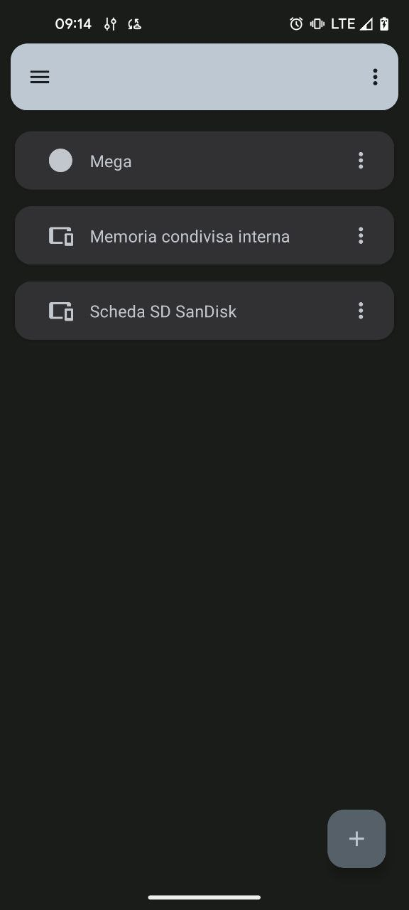</p>

</details>


---

### 📦 Unstoppable Wallet

> **Categories:** `#Android`

Unstoppable wallet is purposely built as a decentralized management tool for cryptocurrencies. It is engineered to serve privacy-conscious individuals looking to manage and invest in cryptocurrencies in a sovereign and professional manner.

- 🐙 **Source Code:** [https://github.com/horizontalsystems/unstoppable-wallet-android](https://github.com/horizontalsystems/unstoppable-wallet-android)

<details>
<summary><b>✨ Key Features (15)</b> — <i>Click to expand</i></summary>

- Non-Custodial Multi-wallet >> Manage any number of cryptocurrencies across multiple portfolio-style wallets in a non-custodial manner. This wallet is like your own bank where you are the only client and the only one in charge. It’s designed to keep assets secure and easy to restore even if the phone is stolen and tampered with.
- **Investment Oriented Wallet >> Unstoppable brings unmatched cryptocurrency market analytics to your device** — advanced sorting, curated categorization, extensive search filtering, and event-based alerting features.
- Universal Wallet >> It supports all mainstream blockchains and is built in a standard compliant manner enabling users to use just one wallet app for everything crypto.
- **A Bitcoin Wallet >> The wallet packs some of the most advanced Bitcoin features available** — SPV enabled, BIP 44/49/84/69 compliant, Bitcoin timelocks, custom transaction fees, and more.
- A DeFi Wallet >> Full support for decentralized token swaps on Ethereum, Binance Smart Chain, Avalanche, Solana, and more. Also, the ability to interact with any smart contract-powered service on the blockchain via the WalletConnect protocol.
- Ethereum Wallet >> Full support for Ethereum blockchain, its growing ecosystem of tokens (ERC20, NFT tokens, etc.), and other decentralized services such as ENS (Ethereum Name Service).
- Ethereum L2 Wallet >> Artbitrum, Optimism, Polygon support.
- Avalanche Wallet >> Full support for Avalanche C-Chain blockchain.
- Binance Wallet >> Full support for original Binance Chain (incl. BEP2) and Binance Smart Chain.
- NFT Wallet >> Full support for Non Fungible tokens (NFTs).
- Crypto Academy >> The app includes two courses meant to onboard newcomers into the world of cryptocurrencies and the DeFi ecosystem in an easy-to-digest manner covering essential aspects of cryptocurrency security, storage, privacy, transacting, and exchanging.
- Wallet for Privacy Coins >> Fully supports major privacy coins (ZCash, DASH) in an SPV manner. One of the very few wallets capable of supporting fully shielded Zcash transactions as well as the ability to privatize Bitcoin transactions.
- Decentralized Wallet >> Designed to work with most major blockchains in a decentralized manner where an app doesn't depend on some server of a wallet provider to send/receive transactions but interacts with blockchain networks directly.
- Privacy Focused >> Designed to allow for privacy even in the most privacy-breaching scenarios. There are no user accounts keeping your records, no identity checks that risk exposing your financials to the world, and no interaction with traditional finance layers. The app is partially TOR enabled and VPN support is coming soon.
- Fully Open Source >> The most transparent wallet application built to date. The entire 4-year production process of the app is openly accessible online along with 100% of its code for anyone to evaluate or reuse in other projects. Verified and audited by third parties.

</details>


---

### 📦 Ana

> **Categories:** `#screenshots` `#Android`

Notebook on a foreign language is an app that helps you learn languages by writing sentences and using a translator, speech recognition, and text-to-speech features. You can save and manage your phrases and tags on the server, which respects your privacy and lets you delete your data anytime. The app is based on free and open source tools and requires an internet connection. The app is a WebView application of the project website, which has the source code available under the AGPL-3.0 license.

- 🐙 **Source Code:** [https://github.com/kolserdav/ana](https://github.com/kolserdav/ana)

<details>
<summary><b>✨ Key Features (1)</b> — <i>Click to expand</i></summary>

- *Main Features**

</details>


---

### 📦 Activity Manager

> **Categories:** `#Android`

Advanced activities and shortcuts launcher. Discover activities of installed applications, run them, and create shortcuts.

- 🐙 **Source Code:** [https://github.com/sdex/ActivityManager](https://github.com/sdex/ActivityManager)

<details>
<summary><b>✨ Key Features (7)</b> — <i>Click to expand</i></summary>

- Launch exported activities
- Launch non-exported activities with ROOT
- Create custom shortcuts for activities
- Set any shortcut icon from the storage or use from built-in Material icons
- Create and start any custom intents using Intent Builder
- Explore an app details with Manifest Viewer
- Light/Dark theme support

</details>


---

### 📦 IGExperiments

> **Categories:** `#Android` `#GitHub` `#OpenSource`

Allow you to enable developer options in Instagram!
When the module is enabled, kill Instagram and long press home button. You will be able go to developer page and sometimes other stuff.
It might not work for all versions because classes name and methods name often change from update to another :/
You will need Lsposed/Xposed framework to use it.(Root devices)
LSPatch(Non-Root devices)

- 🐙 **Source Code:** [https://t.me/popCLOUDS/1224](https://t.me/popCLOUDS/1224)
- 👤 **Developer:** [origin-space](https://github.com/origin-space)


---

### 📦 CAPod - Companion app for AirPods on Android

> **Categories:** `#Android`

**A companion app that adds support for AirPod specific features to Android.

- 🐙 **Source Code:** [https://t.me/popCLOUDS/1243](https://t.me/popCLOUDS/1243)


---

### 📦 Another notes app

> **Categories:** `#Android` `#Web`

Another notes app, like there have been tens of thousands before. This app doesn't strive to innovate, it strives to provide a simple way to take notes. Material design is used to create a visually attractive interface.

- 🐙 **Source Code:** [https://github.com/maltaisn/another-notes-app](https://github.com/maltaisn/another-notes-app)

<details>
<summary><b>✨ Key Features (9)</b> — <i>Click to expand</i></summary>

- Text and list notes.
- Archive and recycle bin.
- Labeled notes.
- Reminders, including recurring reminders.
- Search text across all notes.
- Basic import and export.
- Light and dark theme support.
- Customizable interface.
- Open source app.

</details>


---

### 📦 Privacy Friendly Pedometer

> **Categories:** `#Android`

The Privacy Friendly Pedometer stores the user's step count per hour. The user can review the recorded steps in a daily, weekly and monthly report. These reports also display the calculated distance and calories. As a bonus feature the app can record training sessions (e.g. a jogging session) in a different view. The user can choose whether the app should remind him if the achievement of his daily step goal is in danger.

- 🐙 **Source Code:** [https://github.com/SecUSo/privacy-friendly-pedometer](https://github.com/SecUSo/privacy-friendly-pedometer)


---

### 📦 ray lib

> **Categories:** `#raylib` `#c_lang` `#android` `#c` `#embedded` `#game_development` `#game_engine` `#gamedev` `#graphics` `#hacktoberfest` `#iot` `#linux` `#opengl` `#programming` `#raspberry_pi` `#videogames` `#wasm` `#webassembly` `#GitHub` `#OpenSource`

**raylib is a simple and easy-to-use library to enjoy videogames programming.

raylib is highly inspired by Borland BGI graphics lib and by XNA framework and it's specially well suited for prototyping, tooling, graphical applications, embedded systems and education.

NOTE for ADVENTURERS: raylib is a programming library to enjoy videogames programming; no fancy interface, no visual helpers, no debug button... just coding in the most pure spartan-programmers way.

Creator:  raysan5
Stars: ⭐️ 14.7k
Forked by: 1.17k

- 🐙 **Source Code:** [https://github.com/raysan5/raylib](https://github.com/raysan5/raylib)
- 👤 **Developer:** raysan5


---

### 📦 Codec Info

> **Categories:** `#Android`

** Codec Info is a simple tool for developers that provides detailed listing of multimedia encoders/decoders (codecs) and DRM types that are available on your Android device.

**NOTE: Available info may vary depending on a device and the Android version. Bluetooth codecs are NOT supported.

- 🐙 **Source Code:** [https://github.com/Parseus/codecinfo](https://github.com/Parseus/codecinfo)

<details>
<summary><b>✨ Key Features (6)</b> — <i>Click to expand</i></summary>

- Get info about audio codecs (max supported instances, input channels, bitrate range, sample rates and tunneled playback)
- Get info about video codecs (max resolution, frame rate, color profiles, adaptive playback, secure decryption and more)
- Get info about DRM supported by the device
- Easily share codec/DRM info with others
- Switching tabs for Samsung devices that support air gestures.
- No ads!

</details>


---

### 📦 Converter** **NOW

> **Categories:** `#Android` `#Windows` `#Linux`

**A simple, immediate and fast unit converter!

- 🐙 **Source Code:** [https://github.com/ferraridamiano/ConverterNOW](https://github.com/ferraridamiano/ConverterNOW)

<details>
<summary><b>✨ Key Features (9)</b> — <i>Click to expand</i></summary>

- Simplify the tedious conversion process between units of measurement in a few clicks.
- **It is fast and immediate** — just start typing and immediately you have the real-time conversion with all the other units of measurement.
- **It is customizable** — the units can be reorganized according to your priorities and your use.
- It integrates a calculator that let you do the calculations in every page.
- Currency exchange rates updated daily
- Dynamic theming based on your device settings
- **Choose your favorite theme** — dark and white theme
- **Multiplatform** — available for Android, Web, Linux and Windows
- It is free, no ads, no data collection, no permissions (just Internet to update currency conversions) and first of all it is open source!

</details>


---

### 📦 BlackHole

> **Categories:** `#Android` `#IOS` `#MacOS` `#Media` `#Utilities`

** An Open-Source Music Player App for all your needs! .

- 🐙 **Source Code:** [https://github.com/Sangwan5688/BlackHole](https://github.com/Sangwan5688/BlackHole)
- 👤 **Developer:** [Muhammad Jawad](https://github.com/itx-jd)

<details>
<summary><b>✨ Key Features (20)</b> — <i>Click to expand</i></summary>

- Best Streaming Quality (320kbps)
- Music Search
- Trending Songs
- Support 15+ music languages
- See country specific Spotify Charts
- Local and Global Top Spotify songs
- Add Songs to Favorite
- Playlists support
- Import Playlists from Spotify
- Sleep timer
- Lyrics Support
- Listening history record
- Dark mode / accent color
- Download for offline play (320kbps with ID3 tags)
- Play Online as well as Offline Songs
- Queue Management
- Auto Update Check
- Cache support
- No Subscription
- No Ads

</details>


---

### 📦 WallpaperExport

> **Categories:** `#Android`

**With the help of this app, you can now save and share your stock wallpaper or a wallpaper from an app that won't let you access the local file. All you have to do is apply the wallpaper, and then open this app. Allowing Android to be Android.

- 🐙 **Source Code:** [https://github.com/cvzi/WallpaperExport](https://github.com/cvzi/WallpaperExport)


---

### 📦 LinkSheet

> **Categories:** `#Android`

**LinkSheet restores the Url-App-Chooser that was removed in Android 12+ in favor of verified app links.

- 🐙 **Source Code:** [https://github.com/1fexd/LinkSheet](https://github.com/1fexd/LinkSheet)


---

### 📦 Image Toolbox

> **Categories:** `#Android` `#kotlin` `#aes_256` `#background_removal` `#clean_architecture` `#crop` `#djvu` `#edit_photo` `#exif` `#f_droid` `#filter_image` `#image_manipulation` `#jetpack_compose` `#jxl` `#material_you` `#ocr_recognition` `#pdf` `#psd` `#qrcode_scanner` `#watermark` `#GitHub` `#OpenSource`

**Image toolbox is the app which based on modern tech stack using Clean Architecture. It has features like filters applying, cropping, EXIF editing, quality and output image type picking and tons of another options

- 🐙 **Source Code:** [https://github.com/T8RIN/ImageToolbox](https://github.com/T8RIN/ImageToolbox)
- 👤 **Developer:** [T8RIN](https://github.com/T8RIN)

<details>
<summary><b>✨ Key Features (9)</b> — <i>Click to expand</i></summary>

- Batch processing
- Applying filter chains (More than 45 various filters)
- Background Removing
- Drawing on Image/Background
- Image Resizing
- Image Shrinking
- Cropping
- Format Convertion
- Color Utils

</details>


---

### 📦 MIUI Bootloader Unlock without PC (Phone-To-Phone)

> **Categories:** `#instructions` `#Android` `#MIUI` `#Guides`

**Note: We are not responsible for any data loss or corrupt devices. Proceed at your own risk. This procedure requires the use of 2 Android phones and an OTG cable for ADB debugging. If this is your first time unlocking the bootloader or your device is using a new MIUI account, proceed with Step 2 after 7 days

**Step 1 [Configuring Settings] [Primary Phone]:

**» Go to Settings > About Phone: Click on MIUI Version multiple times until developer options are enabled

» Go to Settings Homepage > Additional Settings > Developer Options: Enable OEM Unlocking and USB Debugging

» Then go to Mi Unlock Status: Click on Add account and device

**Step 2 [Installing Flash scripts] [Secondary Phone]:

**» Download and install these APKs on your secondary phone: [file1](https://github.com/RohitVerma882/termux-miunlock/raw/main/account.apk) | [file2](https://github.com/termux/termux-api/releases/download/v0.50.1/termux-api_v0.50.1+github-debug.apk) | [file3

](https://github.com/termux/termux-app/releases/download/v0.118.0/termux-app_v0.118.0+github-debug_universal.apk)» Connect the primary phone to the secondary phone via OTG

» Boot the primary phone into fastboot mode

» Open the Termux app: [Follow and run these commands one by one according to the instructions](https://github.com/RohitVerma882/termux-miunlock?tab=readme-ov-file#instructions)

**👤Credits**
[Techbuzznet](https://youtu.be/l2N_xVtb4es?si=WXHscsNX2yxg-ZHx) (Video instructions for Indians)
[RohitVerma888](https://github.com/RohitVerma882)
@WildWaze (thx for help and banner)

**About us:
**🔔 @popmods
💬 @popmodschat
🗂 @popmodsindex

Platform(s); #Android , #MIUI , #Guides

- 🐙 **Source Code:** [https://github.com/RohitVerma882/termux-miunlock](https://github.com/RohitVerma882/termux-miunlock)


---

### 📦 AniHyou

> **Categories:** `#Android`

**Another unofficial Android AniList client, an app for anime and manga tracking and database, BUT with full material You support.

- 🐙 **Source Code:** [https://github.com/axiel7/AniHyou-android](https://github.com/axiel7/AniHyou-android)


---

### 📦 Nightlightapp

> **Categories:** `#Interesting` `#Android`

It cycles through colors on a full screen display and after an hour the display goes dark

⤷ [Project link](https://github.com/Ra-Na/NightLightApp)

[GitHub](https://t.me/+rB2DxiwI4X5iYjcy) | #Interesting #Android

- 🐙 **Source Code:** [https://github.com/Ra-Na/NightLightApp](https://github.com/Ra-Na/NightLightApp)
- 👤 **Developer:** [Ra-Na](https://github.com/Ra-Na)


---

### 📦 Dark Mode Live Wallpaper

> **Categories:** `#Android`

**A live wallpaper for Android 10+ that respects dark theme mode.

With this app you can set an image for light theme mode and another image
for the dark theme.
When the dark theme of the system is enabled or disabled, the wallpaper will be
changed automatically.

- 🐙 **Source Code:** [https://github.com/cvzi/darkmodewallpaper](https://github.com/cvzi/darkmodewallpaper)


---

### 📦 Key mapper

> **Categories:** `#Android` `#kotlin` `#accessibilityservice` `#android_accessibility` `#android_app` `#android_development` `#androidapplication` `#bluetooth` `#bluetoothkeyboard` `#joycon` `#keyboard` `#keyboard_shortcuts` `#keyboards` `#keyevent` `#keymapper` `#keymapping` `#nintendo_switch` `#switch` `#xda_thread` `#Useful` `#Interesting`

Boring phone? Unleash your keys!

You can remap your;
* Fingerprint gestures.
* Volume buttons.
* Navigation buttons.
* Bluetooth/wired keyboards.
* Buttons on other connected devices should also work.

- 🐙 **Source Code:** [https://github.com/keymapperorg/KeyMapper](https://github.com/keymapperorg/KeyMapper)
- 👤 **Developer:** [keymapperorg](https://github.com/keymapperorg)


---

### 📦 Medito - Meditation & Sleep

> **Categories:** `#Android` `#IOS`

**Medito is a free meditation app by Medito Foundation, a non-profit organization that believes no one should have to pay for meditation. Medito offers a variety of features to help you improve your mental wellbeing, such as guided meditations, breathing exercises, relaxing sounds, and more.

- 🐙 **Source Code:** [https://github.com/meditohq/medito-app](https://github.com/meditohq/medito-app)


---

### 📦 skydoves/snitcher

> **Categories:** `#android` `#compose` `#exceptions` `#exceptions_handling` `#jetpack_compose` `#kotlin` `#library` `#skydoves` `#throwable`

🦉 Snitcher captures global crashes, enabling easy redirection to the exception tracing screen for swift recovery.
**Language**: Kotlin

- 🐙 **Source Code:** [https://github.com/skydoves/snitcher](https://github.com/skydoves/snitcher)
- 👤 **Developer:** [skydoves](https://github.com/skydoves)


---

### 📦 Super TuxKart

> **Categories:** `#Android` `#Windows` `#MacOS` `#Linux` `#Games`

- 🐙 **Source Code:** [https://github.com/supertuxkart/stk-code](https://github.com/supertuxkart/stk-code)
- 👤 **Developer:** the SuperTuxKart Team and is available for Windows, Mac OS X, Linux, and Android. The game features a variety of tracks, karts, and characters, and players can compete against each other in single-player mode or multiplayer mode.


---

### 📦 AI Study Assistant

> **Categories:** `#Android`

**__AI chatbot, Lecture Summarizer, Essay Writer and Questions Generator.__ AI Study Assistant is an app designed to enhance your learning experience and boost academic performance. With a comprehensive set of AI-powered features, it serves as your personal tutor, lecture summarizer, writer, and question generator all powered by Google PaLM 2. Whether you need assistance with specific topics, summarizing lectures, crafting essays, or generating practice questions, AI Study Assistant has got you covered.

- 🐙 **Source Code:** [https://github.com/mhss1/AIStudyAssistant](https://github.com/mhss1/AIStudyAssistant)


---

### 📦 DAVx⁵ - CalDAV/CardDAV Synchronization and Client

> **Categories:** `#Android`

**DAVx⁵ is a CalDAV/CardDAV management and synchronization app for Android which natively integrates with Android calendar/contact apps. Use it with your own server or with a trusted hoster to keep your contacts, events and tasks under your control.

- 🐙 **Source Code:** [https://f-droid.org/tr/packages/at.bitfire.davdroid](https://f-droid.org/tr/packages/at.bitfire.davdroid)


---

### 📦 K-9 Mail

> **Categories:** `#Android`

**K-9 Mail is an open-source email client for Android.

- 🐙 **Source Code:** [https://f-droid.org/repository/browse/?fdid=com.fsck.k9](https://f-droid.org/repository/browse/?fdid=com.fsck.k9)


---

### 📦 AlwaysOn for Android™

> **Categories:** `#Android`

**AlwaysOn is an app for every device with an AMOLED or OLED display. It adds an always-on display with various customization options regarding the watch face, the behavior, and the background. Take a look at your phone and have everything you need in one place: the time, the date, the battery state, your notifications, and more.

- 🐙 **Source Code:** [https://github.com/Domi04151309/AlwaysOn](https://github.com/Domi04151309/AlwaysOn)


---

### 📦 ToDark** **- Task Management Application

> **Categories:** `#Android`

**This application allows you to manage your tasks.

- 🐙 **Source Code:** [https://github.com/DarkMooNight/ToDark](https://github.com/DarkMooNight/ToDark)


---

### 📦 Winlator

> **Categories:** `#Android` `#GitHub` `#OpenSource`

**Winlator is an Android application that lets you to run Windows (x86_64) applications with Wine and Box86/Box64.

**Installation
**Download and install the APK from GitHub Releases
Download the OBB file (main.1.com.winlator.obb) and put it into the directory /storage/emulated/0/Android/obb/com.winlator (create it if it doesn't exist)
Launch the app and wait for the installation process to finish

- 🐙 **Source Code:** [https://github.com/brunodev85/winlator](https://github.com/brunodev85/winlator)
- 👤 **Developer:** [brunodev85](https://github.com/brunodev85)


---

### 📦 Stable Diffusion AI (SDAI)

> **Categories:** `#features` `#Android` `#Web` `#Interesting`

**Stable Diffusion AI is an easy-to-use app that lets you quickly generate images from text or other images with just a few clicks. With Stable Diffusion AI, you can communicate with your own server and generate high-quality images in seconds.

- 🐙 **Source Code:** [https://github.com/ShiftHackZ/Stable-Diffusion-Android](https://github.com/ShiftHackZ/Stable-Diffusion-Android)


---

### 📦 romainguy/kotlin-explorer

> **Categories:** `#android` `#bytecode` `#dex` `#kotlin`

Desktop tool to quickly explore disassembled Kotlin code.
**Language**: Kotlin

- 🐙 **Source Code:** [https://github.com/romainguy/kotlin-explorer](https://github.com/romainguy/kotlin-explorer)
- 👤 **Developer:** [romainguy](https://github.com/romainguy)


---

### 📦 Daily You

> **Categories:** `#Android`

**Daily You is an app made to store memories of the passing days. Log every day and look back on past memories. All logs and photos are stored locally (the app has no internet access) and can be set to custom storage locations. Daily You is inspired by ptrLx's [OneShot](https://github.com/ptrLx/OneShot).

- 🐙 **Source Code:** [https://github.com/ptrLx/OneShot](https://github.com/ptrLx/OneShot)

<details>
<summary><b>✨ Key Features (10)</b> — <i>Click to expand</i></summary>

- Take daily logs
- Markdown support
- Keep photo memories
- Record your mood
- Search your past logs
- Material You design
- Set custom storage locations
- Json Import/Export
- Photo gallery
- Log calendar

</details>


---

### 📦 Gallery

> **Categories:** `#Linux` `#Android` `#Gallery` `#Privacy` `#MaterialYou` `#GitHub` `#OpenSource`

**Light-weight Media Gallery app for Android made with Jetpack Compose

**Links 🔗:
**- [Download
](https://github.com/IacobIonut01/Gallery/releases)- [Screenshots](https://t.me/popCLOUDS/900)
- [Source

](https://github.com/IacobIonut01/Gallery)by [IacobIonut01
](https://github.com/IacobIonut01)Donate developer via  [PayPal](https://www.paypal.me/iacobionut01) & [Revolut

](https://revolut.me/somaldoaca)Note: minimum support is **Android 11

About us:
**🔔 @popmods
**💬**** **@popmodschat
**🗂**** **@popmodsindex

Platform(s); #Linux

- 🐙 **Source Code:** [https://github.com/IacobIonut01/Gallery](https://github.com/IacobIonut01/Gallery)


---

### 📦 LiChess

> **Categories:** `#Linux` `#Android`

**Lichess is a free, open source, and ad-free online chess platform that allows users to play, learn, watch, and analyze chess games . Lichess offers various features such as arena tournaments, simultaneous exhibitions, puzzles, studies, coaches, streamers, broadcasts, and video library . Lichess also supports different chess variants such as crazyhouse, antichess, atomic, horde, king of the hill, racing kings, and three-check . Lichess is one of the most popular chess websites in the world with millions of users and games played every day.

**Links 🔗:
**- Download from [F-Droid](https://f-droid.org/packages/org.lichess.mobileapp.free/) | [Google Play
](https://play.google.com/store/apps/details?id=org.lichess.mobileapp)- [Screenshots
](https://f-droid.org/packages/org.lichess.mobileapp.free/)get more info at [GitHub page](https://github.com/lichess-org/lichobile)

**About us:
**🔔 @popmods
💬 @popmodschat
🗂 @popmodsindex

Platform(s); #Linux , #Android

- 🐙 **Source Code:** [https://github.com/lichess-org/lichobile](https://github.com/lichess-org/lichobile)


---

### 📦 Basic Call Recorder (BCR)

> **Categories:** `#features` `#non` `#usage` `#permissions` `#Android`

**BCR is a simple Android call recording app for rooted devices or devices running custom firmware. Once enabled, it stays out of the way and automatically records incoming and outgoing calls in the background.

- 🐙 **Source Code:** [https://github.com/chenxiaolong/BCR](https://github.com/chenxiaolong/BCR)


---

### 📦 SmartTube** (a.k.a SmartTube Next)

> **Categories:** `#installation` `#features` `#updating` `#compatibility` `#device` `#Android`

SmartTube Android TV app is a free and open source player for YouTube content on Android TV devices that lets you skip ads with SponsorBlock, adjust speed, watch in 8k, 60fps, HDR, read live chat, customize buttons, and avoid Google services. It is better than the official YouTube app, but it does not work on phones and tablets, does not show comments, and may have stability and compatibility issues.

- 🐙 **Source Code:** [https://github.com/yuliskov/SmartTubeNext](https://github.com/yuliskov/SmartTubeNext)


---

### 📦 Perplexity AI

> **Categories:** `#Android`

**Perplexity AI is an AI-powered search engine and chatbot that utilizes advanced technologies such as natural language processing (NLP) and machine learning to provide accurate and comprehensive answers to user queries. It is designed to search the web in real-time and offer up-to-date information on various topics.

- 🌐 **Official Website:** [https://t.me/popCLOUDS/879](https://t.me/popCLOUDS/879)


---

### 📦 Next Player

> **Categories:** `#screenshots` `#features` `#supported` `#Android`

**Next Player is an Android native video player written in Kotlin. It provides a simple and easy-to-use interface for users to play videos on their Android devices

- 🐙 **Source Code:** [https://play.google.com/store/apps/details?id=dev.anilbeesetti.nextplayer](https://play.google.com/store/apps/details?id=dev.anilbeesetti.nextplayer)


---

### 📦 Just Video Player

> **Categories:** `#download` `#screenshots` `#features` `#supported` `#Android`

**Android video player based on Media3 (formerly ExoPlayer), compatible with Android 5+ and Android TV. It uses ExoPlayer's ffmpeg extension with all its audio formats enabled (it can handle even special formats like AC3, EAC3, DTS, DTS HD, TrueHD etc.). It properly syncs audio with video track when using Bluetooth earphones/speaker.

- 🐙 **Source Code:** [https://github.com/moneytoo/Player](https://github.com/moneytoo/Player)


---

### 📦 Kafka for ****archive.org

> **Categories:** `#Android`

- 🌐 **Official Website:** [https://play.google.com/store/apps/details?id=com.kafka.user](https://play.google.com/store/apps/details?id=com.kafka.user)

<details>
<summary><b>✨ Key Features (6)</b> — <i>Click to expand</i></summary>

- Access millions of free text files and audiobooks.
- Enjoy an ad-free experience
- Seamless audio player for browsing and listening to playlists.
- PDF and text reader with bookmark and continue reading features.
- Download manager for saving and sharing files.
- Beautiful Material you UI for android 12+

</details>


---

### 📦 RustDesk

> **Categories:** `#snapshots` `#Android` `#Windows` `#MacOS` `#Linux` `#GitHub` `#OpenSource` `#rust` `#anydesk` `#dart` `#flutter` `#flutter_apps` `#flutter_desktop` `#flutter_examples` `#flutter_mobile` `#flutter_ui` `#flutter_web` `#hacktoberfest` `#p2p` `#rdp` `#remote_control` `#remote_desktop` `#rust_lang` `#teamviewer` `#vnc` `#wayland` `#Interesting` `#Code`

**Yet another remote desktop software, written in Rust. Works out of the box, no configuration required. You have full control of your data, with no concerns about security.

- 🐙 **Source Code:** [https://github.com/rustdesk/rustdesk](https://github.com/rustdesk/rustdesk)
- 👤 **Developer:** rustdesk


---

### 📦 Serenity

> **Categories:** `#Android` `#cplusplus` `#browser` `#c_plus_plus` `#desktop_environment` `#kernel` `#operating_system` `#os` `#unix`

**Serenity is a audio player which focuses on playing Music, Meditation and Podcasts. It let's you stream audio from various sources including Local and Online storage devices

- 🐙 **Source Code:** [https://t.me/popCLOUDS/872](https://t.me/popCLOUDS/872)
- 👤 **Developer:** [SerenityOS](https://github.com/SerenityOS)

<details>
<summary><b>✨ Key Features (6)</b> — <i>Click to expand</i></summary>

- Listen to audio from local library
- Create playlists and play audio from saved playlists
- Manage audio queue
- Radio mode (automatically queue similar tracks)
- Searching for and playing music from YouTube (including integration with YouTube playlists)
- Voice search songs

</details>


---

### 📦 SimpMusic

> **Categories:** `#screenshot` `#Android` `#GitHub` `#OpenSource`

**A simple music app using YouTube Music for backend

- 🐙 **Source Code:** [https://github.com/maxrave-dev/SimpMusic](https://github.com/maxrave-dev/SimpMusic)


---

### 📦 Harmony Music

> **Categories:** `#Android`

**An app for music streaming made with Flutter(currently supports Android only).

- 🐙 **Source Code:** [https://github.com/anandnet](https://github.com/anandnet)


---

### 📦 Bluetooth Volume Manager

> **Categories:** `#screenshots` `#Android`

**BVM gives your Android device the ability to have individual music and voice volumes for each of your bluetooth devices. It remembers the volume settings for each device and restores them if necessary. Volumes can be configured through the apps UI or the volume buttons your device.

- 🐙 **Source Code:** [https://github.com/d4rken-org/bluemusic](https://github.com/d4rken-org/bluemusic)


---

### 📦 PipePipe

> **Categories:** `#new` `#screenshots` `#Android`

**A diverged fork of NewPipe with more services, client features and bug fixes.

- 🐙 **Source Code:** [https://apt.izzysoft.de/fdroid/index/apk/InfinityLoop1309.NewPipeEnhanced](https://apt.izzysoft.de/fdroid/index/apk/InfinityLoop1309.NewPipeEnhanced)


---

### 📦 Todoify

> **Categories:** `#screenshots` `#Android`

**a material design, closed source offline based todo, notetaking app for android with Material You theming.

- 🐙 **Source Code:** [https://github.com/MGAndroidProjects/Todoify-Releases](https://github.com/MGAndroidProjects/Todoify-Releases)

<details>
<summary><b>✨ Key Features (1)</b> — <i>Click to expand</i></summary>

- *Simple and easy-to-use UI** of creating new todos, notes, and future/scheduled tasks.

</details>


---

### 📦 Cromite

> **Categories:** `#Android` `#Interesting` `#Web` `#Browser`

**Cromite is a Chromium fork based on Bromite with built-in support for ad blocking and an eye for privacy.

- 🐙 **Source Code:** [https://github.com/uazo](https://github.com/uazo)
- 👤 **Developer:** [uazo](https://github.com/uazo)


---

### 📦 ‍♀️ **AyuGram4A

> **Categories:** `#preview` `#Android`

**ExteraGram with privacy features

- 🐙 **Source Code:** [https://github.com/AyuGram/AyuGram4A](https://github.com/AyuGram/AyuGram4A)


---

### 📦 SpMp

> **Categories:** `#Android`

**YouTube Music client with a focus on language and metadata customisation, built for Android using Jetpack Compose and Kotlin.

**🔗**** Links**:
- [Download](https://github.com/toasterofbread/spmp/releases)
- [Screenshots
](https://t.me/popCLOUDS/838)- [Features

](https://t.me/popCLOUDS/837)**👤 Credits:
**[toasterofbread

](https://github.com/toasterofbread)**About us:
**🔔 @popmods
💬 @popmodschat
🗂 @popmodsindex

Platform(s); #Android

- 🐙 **Source Code:** [https://github.com/toasterofbread](https://github.com/toasterofbread)


---

### 📦 ️ **Breezy Weather** (ex Geometric Weather)

> **Categories:** `#Android`

A complete weather app, supporting various providers and Material You.

- 🐙 **Source Code:** [https://github.com/breezy-weather/breezy-weather](https://github.com/breezy-weather/breezy-weather)


---

### 📦 Innertune

> **Categories:** `#Interesting` `#Android` `#YT` `#GitHub` `#OpenSource`

Features include ad-free song playback, background playback, search for songs, albums and playlists, library management, caching and downloading songs for offline playback

⤷ [Project link](https://github.com/z-huang/InnerTune)

[GitHub](https://t.me/github_society) | #Interesting #Android

- 🐙 **Source Code:** [https://github.com/z-huang/InnerTune](https://github.com/z-huang/InnerTune)
- 👤 **Developer:** [z-huang](https://github.com/z-huang)


---

### 📦 Vigilante

> **Categories:** `#Android` `#Interesting`

**An app that focuses on your privacy and alerts you when a third-party app uses your device camera or mic, plus a few other goodies.

**🔗**** Link and Credits
**- Download from [GitHub](https://github.com/FunkyMuse/Vigilante/releases/latest) | [F-Droid](https://f-droid.org/en/packages/com.crazylegend.vigilante/)
- [Features
](https://t.me/popCLOUDS/819)- [Screenshots
](https://t.me/popCLOUDS/820)by [**FunkyMuse

**](https://github.com/FunkyMuse)**Support us & Enable notifications
**🔔 @popmods
⬛️ @popmodschat
📂 @popmodsindex

Platform(s); #Android

- 🐙 **Source Code:** [https://t.me/popCLOUDS/819](https://t.me/popCLOUDS/819)


---

### 📦 Kotatsu

> **Categories:** `#Android` `#kotlin` `#comics` `#manga` `#manga_reader` `#mangareader` `#webtoon`

**Kotatsu is a free and open source manga reader for Android.

**🔗**** Link and Credits
**- Download from [GitHub](https://github.com/KotatsuApp/Kotatsu/releases/latest) | [F-Droid](https://f-droid.org/packages/org.koitharu.kotatsu)
- [Screenshots
](https://t.me/popCLOUDS/799)- [Features

](https://t.me/popCLOUDS/798)**Support us & Enable notifications
**🔔 @popmods
⬛️ @popmodschat
📂 @popmodsindex

Platform(s); #Android

- 🐙 **Source Code:** [https://t.me/popCLOUDS/799](https://t.me/popCLOUDS/799)
- 👤 **Developer:** [KotatsuApp](https://github.com/KotatsuApp)


---

### 📦 Logseq - __A privacy-first, open-source platform for knowledge management and collaboration

> **Categories:** `#table` `#Android` `#Windows` `#Linux` `#GitHub` `#OpenSource` `#clojure` `#clojurescript` `#git` `#graph` `#knowledge_base` `#knowledge_graph` `#local_first` `#markdown` `#note_taking` `#org_mode` `#pkm` `#Interesting` `#Useful`

__** Logseq is a software that helps you write and organize your notes in a way that makes sense to you. You can use different formats and tools to structure your notes, such as headings, lists, tables, links, etc. You can also sync your notes with other services like GitHub or Dropbox, so you can access them from anywhere. Logseq also lets you do more than just writing notes. You can use it to highlight and comment on PDF files, keep track of your tasks and projects, and draw diagrams and sketches on a virtual canvas. Logseq is free and open-source, which means anyone can use it and improve it. Logseq has a lot of fans and supporters who share their ideas and feedback on its website and forum.

**🔗**** Link and Credits
**- [Download for PCs and Mobile
](https://github.com/logseq/logseq/releases)- [Documents
](https://github.com/logseq/logseq#table-of-contents)- [Extensions
](https://github.com/logseq/awesome-logseq)- [Forum
](https://discuss.logseq.com/)- [Discord Server
](https://discord.gg/KpN4eHY)[and more...
](https://github.com/logseq/logseq#table-of-contents)by [logseq](https://github.com/logseq) Team

If you will consider my opinion; an app / platform that you must try or check out.

**Support us & Enable notifications
**🔔 @popmods
⬛️ @popmodschat
📂 @popmodsindex

Platform(s); #Android #Windows #Linux

- 🐙 **Source Code:** [https://github.com/logseq/logseq](https://github.com/logseq/logseq)


---

### 📦 Andronixorigin

> **Categories:** `#Interesting` `#Android` `#Linux`

Inside the distribution, you are free to run a variety of desktop applications, including krita, GIMP, Blender

⤷ [Project link](https://github.com/AndronixApp/AndronixOrigin)

[GitHub](https://t.me/github_society) | #Interesting #Android #Linux

- 🐙 **Source Code:** [https://github.com/AndronixApp/AndronixOrigin](https://github.com/AndronixApp/AndronixOrigin)
- 👤 **Developer:** [AndronixApp](https://github.com/AndronixApp)


---

### 📦 Florae 🌱

> **Categories:** `#Android`

**Keep track of the care to your plants.

- 🐙 **Source Code:** [https://github.com/aeri/Florae](https://github.com/aeri/Florae)


---

### 📦 TimePlanner

> **Categories:** `#Android`

**Plan the tasks of your day with this app.

- 🐙 **Source Code:** [https://github.com/v1tzor/TimePlanner](https://github.com/v1tzor/TimePlanner)

<details>
<summary><b>✨ Key Features (9)</b> — <i>Click to expand</i></summary>

- *
- Local time and task analytics 📊
- Templates for everyday tasks 🏃‍♂️
- Recurring tasks by templates 🔁
- Data Backup & Recovery 💾
- Scheduled Notifications ⏰
- Priorities and protection from overlaying tasks 📐
- **Theme** — Dark | Light 🖤🤍
- Dynamic Color or 4 different color variations 🎨

</details>


---

### 📦 Gptassist

> **Categories:** `#Interesting` `#Android`

**It blocks all URLs that are not required. Does not support signing in with a Microsoft or Google account

⤷ [Project link](https://github.com/woheller69/gptassist)

[GitHub](https://t.me/github_society) | #Interesting #Android

- 🐙 **Source Code:** [https://github.com/woheller69/gptassist](https://github.com/woheller69/gptassist)
- 👤 **Developer:** [woheller69](https://github.com/woheller69)


---

### 📦 SimonHalvdansson/Harmonic-HN

> **Categories:** `#GitHub` `#OpenSource`

An Android client for Hacker News
**Language**: Java
**Stars**: 215 **Issues**: 3 **Forks**: 5
[https://github.com/SimonHalvdansson/Harmonic-HN](https://github.com/SimonHalvdansson/Harmonic-HN)

- 🐙 **Source Code:** [https://github.com/SimonHalvdansson/Harmonic-HN](https://github.com/SimonHalvdansson/Harmonic-HN)
- 👤 **Developer:** [SimonHalvdansson](https://github.com/SimonHalvdansson)


---

### 📦 Kryptey

> **Categories:** `#Interesting` `#Useful` `#Android` `#GitHub` `#OpenSource`

Communicate securely and independently, regardless of the legal situation or whether messengers use E2EE. No server needed

⤷ [Project link](https://github.com/amnesica/KryptEY)

[GitHub](https://t.me/github_society) | #Interesting #Useful

- 🐙 **Source Code:** [https://github.com/amnesica/KryptEY](https://github.com/amnesica/KryptEY)
- 👤 **Developer:** [amnesica](https://github.com/amnesica)


---

### 📦 Custom WSABuilds ( Windows Subsystem Android)

> **Categories:** `#requirements` `#Windows` `#readme` `#android` `#google_apps` `#windows_10` `#windows10` `#android_emulator` `#subsystem` `#magisk` `#windows_11` `#wsa` `#windows_subsystem_for_android` `#windows_subsystem_android` `#windowssubsystemforandroid` `#magiskonwsa` `#wsa_with_gapps_and_magisk` `#wsa_root` `#kernelsu` `#magiskonwsalocal` `#wsapatch` `#python`

**MustardChef’s WSABuilds GitHub project is a repository that provides custom versions of Windows Subsystem For Android (WSA), which lets Windows users run Android apps. The project adds features like Google Play Store, root access, and Magisk Delta. [Magisk Delta](https://t.me/popMODS/3023) is a feature that lets users update Magisk without reinstalling WSA. Magisk is a tool that lets users modify their Android system. The project is open source and has a wiki page for users.

🔗 **Link and Credits
**- [Download options
](https://github.com/MustardChef/WSABuilds#--want-to-request-a-prebuilt-custom-build-)- [Requirements
](https://github.com/MustardChef/WSABuilds#requirements)- [İnstallation
](https://github.com/MustardChef/WSABuilds#--installation)- [Updating
](https://github.com/MustardChef/WSABuilds#--updating)- [Uninstallation
](https://github.com/MustardChef/WSABuilds#--uninstallation)- [Backup and restore userdata
](https://github.com/MustardChef/WSABuilds#--backup-and-restore-userdata)- [FAQs
](https://github.com/MustardChef/WSABuilds#--faq)**by** [MustardChef

](https://github.com/MustardChef)**Support us & Enable notifications
**🔔 @popmods
⬛️ @popmodschat
📂 @popmodsindex

Platform(s); #Windows

- 🐙 **Source Code:** [https://github.com/MustardChef/WSABuilds](https://github.com/MustardChef/WSABuilds)


---

### 📦 LibChecker

> **Categories:** `#Android` `#Interesting` `#Useful`

**This app is used to view the third-party libraries used by applications in your device. It can view the ABI architecture of the application's native library (in general, whether the application is 64-bit or 32-bit). It can also view well-known libraries marked by The Rule Repository, and can even sort and view them according to the number of libraries references.

**🔗**** Link and Credits
- Download from; **[Play](https://play.google.com/store/apps/details?id=com.absinthe.libchecker)**  |**[ F-Droid](https://f-droid.org/packages/com.absinthe.libchecker/) | [CoolApk
](https://www.coolapk.com/apk/com.absinthe.libchecker)[- Source code

](https://github.com/LibChecker/LibChecker)**Support us & Enable notifications
**🔔 @popmods
⬛️ @popmodschat
📂 @popmodsindex

Platform(s); #Android

- 🐙 **Source Code:** [https://github.com/LibChecker/LibChecker](https://github.com/LibChecker/LibChecker)
- 👤 **Developer:** [zhaobozhen](https://github.com/zhaobozhen)


---

### 📦 Octogram

> **Categories:** `#Android`

**Sadly, the development of Owlgram, a well-known Telegram client for Android, has been stopped the 12th April of this year.
Luckily someone wants to continue the project, so here's Octogram.

- 🐙 **Source Code:** [https://github.com/OctoGramApp/OctoGram](https://github.com/OctoGramApp/OctoGram)


---

### 📦 Lyricify - A fantastic app to provide scroll lyrics for Spotify

> **Categories:** `#Android` `#Windows`

Lyricify** is a software project that aims to provide scroll lyrics for  Spotify. It has three versions: Lyricify 4, Lyricify Mobile and Lyricify 3. With Lyricify, you can get real-time scrolling lyrics, share lyrics, get info about songs, and more.

- Lyricify 4 is designed for Spotify users on Windows and offers more than lyrics, such as Apple Music Lyrics UI, lyrics images, custom lyrics vault and more. Lyricify Mobile is the mobile version of Lyricify, for Spotify users on Android and iOS devices (but iOS version is currently not available).

__- Lyricify 3 (End-Of-Support) is an older version of Lyricify that supports Spotify, iTunes, Music Center, QQ Music, Netease Cloud Music and YesPlayMusic on Windows

- 🐙 **Source Code:** [https://github.com/WXRIW/Lyricify-App](https://github.com/WXRIW/Lyricify-App)


---

### 📦 Privatelock

> **Categories:** `#Interesting` `#Android`

It can help protect your privacy and security by monitoring the accelerometer in the background and, if the threshold is violated, will lock the screen

⤷ [Project link](https://github.com/wesaphzt/privatelock)

[GitHub](https://t.me/github_society) | #Interesting #Android

- 🐙 **Source Code:** [https://github.com/wesaphzt/privatelock](https://github.com/wesaphzt/privatelock)
- 👤 **Developer:** [wesaphzt](https://github.com/wesaphzt)


---

### 📦 Smartdock

> **Categories:** `#Interesting` `#Android`

Functions:
▫️Supports multiple windows
▫️Hot keys
▫️Supports desktop and tablet layouts

⤷ [Project link](https://github.com/axel358/smartdock)

[GitHub](https://t.me/github_society) | #Interesting #Android

- 🐙 **Source Code:** [https://github.com/axel358/smartdock](https://github.com/axel358/smartdock)
- 👤 **Developer:** [axel358](https://github.com/axel358)

<details>
<summary><b>✨ Key Features (4)</b> — <i>Click to expand</i></summary>

- ***Hiding Android navigation buttons** — **
- ***With root** — **
- *Without root**
- ***With LSPosed (might help on Android 11+)** — **

</details>


---

### 📦 Symphony

> **Categories:** `#Android`

**Just another good Material You music player.

- 🐙 **Source Code:** [https://github.com/zyrouge/symphony](https://github.com/zyrouge/symphony)


---

### 📦 Extirpater

> **Categories:** `#Android`

**An high-performance free space eraser for Android. **When you delete a file, it isn't really deleted**, it's only removed from the filesystem index and so if someone gets to know the path where the file was in the partition they might be able to recover it. With this app you can make recovering files impossible, thanks to the technique of **filling the space with random empty files then deleting them**. This app is really useful when you want to sell your phone.

- 🐙 **Source Code:** [https://github.com/Divested-Mobile/Extirpater](https://github.com/Divested-Mobile/Extirpater)


---

### 📦 Focus Launcher

> **Categories:** `#features` `#built` `#Android`

**Focus Launcher is a minimalist Android Launcher

🔗 **Link and Credits
**- Download [İzzySoft](https://apt.izzysoft.de/fdroid/index/apk/dev.mslalith.focuslauncher) | [GitHub](https://github.com/mslalith/focus_launcher/releases) | [Play](https://play.google.com/store/apps/details?id=dev.mslalith.focuslauncher)
- [Features
](https://github.com/mslalith/focus_launcher#features)- [Screenshots
](https://t.me/popCLOUDS/659)- [Built with
](https://github.com/mslalith/focus_launcher#built-with)by [mslalith

](https://github.com/mslalith)**Support us & Enable notifications
**🔔 @popmods
⬛️ @popmodschat
📂 @popmodsindex

Platform(s); #Android

- 🐙 **Source Code:** [https://github.com/mslalith/focus_launcher](https://github.com/mslalith/focus_launcher)


---

### 📦 strato-emu/strato

> **Categories:** `#GitHub` `#OpenSource`

Run Nintendo Switch homebrew & games on your Android device!
**Language**: C++
**Stars**: 269 **Issues**: 11 **Forks**: 14
[https://github.com/strato-emu/strato](https://github.com/strato-emu/strato)

- 🐙 **Source Code:** [https://github.com/strato-emu/strato](https://github.com/strato-emu/strato)
- 👤 **Developer:** [strato-emu](https://github.com/strato-emu)


---

### 📦 Owl2

> **Categories:** `#Android`

**A flutter client for the OwlBot dictionary.

- 🐙 **Source Code:** [https://github.com/yamin8000/Owl2](https://github.com/yamin8000/Owl2)


---

### 📦 Mull Fenix: A GitHub project to build a customized and privacy-enhanced version of Firefox for Android.

> **Categories:** `#Android`

**Mull Fenix is a fork of Relan’s fennecbuild repository, which allows compiling the entirety of Fenix (the new Firefox for Android) without prebuilts along with removal of the proprietary blobs. This fork is specifically for compiling Mull, a web browser that enables many features upstreamed by the Tor Uplift project using preferences from the arkenfox-user.js project. It was originally created as builds of the patchset from bug 1419581. Mull Fenix is a way of customizing Firefox for Android to suit your needs and preferences, with extra security and anonymity settings.

🔗 **Links and Credits
**- [Download
](https://f-droid.org/packages/us.spotco.fennec_dos/)- [Source code
](https://github.com/Divested-Mobile/Mull-Fenix)by [Divested-Mobile](https://github.com/Divested-Mobile) (DivestOS)

**Support us & Enable notifications
**🔔 @popmods
⬛️ @popmodschat
📂 @popmodsindex

Platform(s); #Android

- 🐙 **Source Code:** [https://github.com/Divested-Mobile/Mull-Fenix](https://github.com/Divested-Mobile/Mull-Fenix)


---

### 📦 Pazzword

> **Categories:** `#Android`

**Evaluate and generate password quickly.

- 🐙 **Source Code:** [https://github.com/cyb3rko/pazzword](https://github.com/cyb3rko/pazzword)

<details>
<summary><b>✨ Key Features (5)</b> — <i>Click to expand</i></summary>

- a score,
- entropy,
- custom suggestions,
- found patterns and
- estimated stability against cracking for the returned password.

</details>


---

### 📦 Colors AI

> **Categories:** `#Android`

**Generate beautiful color palettes using AI.

- 🐙 **Source Code:** [https://github.com/tsinis/colors_ai](https://github.com/tsinis/colors_ai)


---

### 📦 Cameraalign

> **Categories:** `#Interesting` `#Android`

This allows you to place your phone in the same position and orientation as when you took the original photo

⤷ [Project link](https://github.com/JS-HobbySoft/CameraAlign)

[GitHub](https://t.me/github_society) | #Interesting #Android

- 🐙 **Source Code:** [https://github.com/JS-HobbySoft/CameraAlign](https://github.com/JS-HobbySoft/CameraAlign)
- 👤 **Developer:** [JS-HobbySoft](https://github.com/JS-HobbySoft)


---

### 📦 Weather

> **Categories:** `#Android` `#GitHub` `#OpenSource`

**Stay ahead of the storm with our intuitive weather app. Get accurate and real-time updates on current conditions, hourly forecasts, and severe weather conditions for your location. Plan your day with confidence and never let the weather catch you off guard again.

**Features
**🔸 Simple, clean, and premium-looking interface.
🔸 Accurate and real-time weather updates.
🔸 Comes with two separate desktop widgets.
🔸 Work with very minimal permission.
🔸 No api key requirements.
🔸 Configurable temperature units and forecast days.
🔸 Open-source and privacy-friendly.
🔸 Ad-free and no user data collection.
🔸 Auto-dark/light theme.
🔸 A lot more.

Limitation
🔸 Supports only one location at a time (either manually configured or automatically acquired from the GPS signal)


✍️ Note;
A giveaway will be held soon for Weather, if you are impatient to support the developer/or try it out, you can buy it
"Please note that this a newly-launched app from an active developer and you may expect more cool features in future."

🔗 **Link and Credits
**- [Download
](https://play.google.com/store/apps/details?id=in.sunilpaulmathew.weatherwidget)- [Screenshots
](https://t.me/popCLOUDS/631?single)- [Source code
](https://github.com/sunilpaulmathew/Weather)- [Support Group
](https://t.me/smartpack_kmanager)- [Help to Translate

](https://github.com/sunilpaulmathew/Weather/blob/master/app/src/main/res/values/strings.xml)by [Sunil Paul Mathew](https://github.com/sunilpaulmathew)

**Sub credits
**-  [Bas Milius
](https://github.com/basmilius/weather-icons)- [Open - Meteo

](https://open-meteo.com/)**Support us & Enable notifications
**🔔 @popmods
⬛️ @popmodschat
📂 @popmodsindex

Platform(s); #Android

- 🐙 **Source Code:** [https://github.com/sunilpaulmathew/Weather](https://github.com/sunilpaulmathew/Weather)


---

### 📦 Tasky

> **Categories:** `#Android`

**A material you to-do list app.

- 🐙 **Source Code:** [https://github.com/thatsmanmeet/Tasky](https://github.com/thatsmanmeet/Tasky)

<details>
<summary><b>🖼️ Preview Screenshots & Media (1)</b> — <i>Click to view images & decide if you want to use this app</i></summary>

#### 📸 Cover / Preview
<p align="center">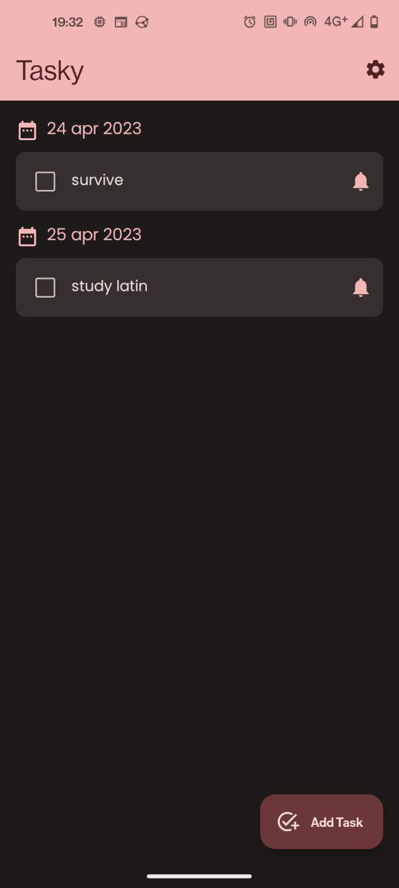</p>

</details>


---

### 📦 AI Code Translator

> **Categories:** `#Android` `#GitHub` `#OpenSource` `#Interesting` `#Useful` `#OpenAI`

**Use AI to translate code from one language to another.

🚶**Running Locally
1. Clone Repo
**`git clone https://github.com/mckaywrigley/ai-code-translator.git
`**2. Install Dependencies
**`npm i
`**3. Run App
**`npm run dev

`🧪Try demo
- [Demo


](https://ai-code-translator.vercel.app/)**Support us & Enable notifications
**🔔 @popmods
⬛️ @popmodschat
📂 @popmodsindex

Platform(s); #Android

- 🐙 **Source Code:** [https://github.com/mckaywrigley/ai-code-translator](https://github.com/mckaywrigley/ai-code-translator)
- 👤 **Developer:** [mckaywrigley](https://github.com/mckaywrigley)


---

### 📦 FDE.AI

> **Categories:** `#Android`

**FeraDroid Engine (FDE) - an All-in-One ultimate optimizer for all devices running Android OS. All parameters are individual for EVERY device depending on its hardware/software characteristics. All parameters are very balanced - you may gain performance without an increase of power consumption AND reduce power consumption without losing performance. FDE.AI is totally compatible with a very wide range of devices and Android OS versions. Very wide-range settings of OS and Linux kernel are configured, still being cross-platform utility, maximally compatible with all devices. FDE.AI applies configurations depending on hardware and software of the device, so that in the end every device is configured individually. All applied changes are systemless (system partition is not touched). Some app features may not be supported on various CPUs/kernels

🔗 **Links and Credits
**-  Download; [GitHub](https://github.com/feravolt/FDE.AI-docs/releases) | [Play](https://play.google.com/store/apps/details?id=com.feravolt.fdeai.donate) (licence for supporting Dev)
- [Screenshots
](https://t.me/popCLOUDS/605)- [Telegram Channel
](http://t.me/feralab_news_eng)- [Telegram Group](http://t.me/feralab_eng)
**by** [FeraVolt

](https://github.com/feravolt)**Support us & Enable notifications
**🔔 @popmods
⬛️ @popmodschat
📂 @popmodsindex

Platform(s); #Android

- 🐙 **Source Code:** [https://t.me/popCLOUDS/605](https://t.me/popCLOUDS/605)


---

### 📦 Spooky 🎃

> **Categories:** `#Android`

**First journal with Material 3 design! Spooky is a minimalist design application to write stories, journals, notes, diaries, todo, etc. We offer a variety of features that you can expect for your daily usage.

- 🐙 **Source Code:** [https://play.google.com/store/apps/details?id=com.juniorise.spooky](https://play.google.com/store/apps/details?id=com.juniorise.spooky)


---

### 📦 LogFox

> **Categories:** `#Android`

**Yet another LogCat reader for Android

🔗 Link
- [Download
](https://github.com/F0x1d/LogFox)- [Screenshots](https://t.me/popCLOUDS/589?single)

**Support us & Enable notifications
**🔔 @popmods
⬛️ @popmodschat
📂 @popmodsindex

Platform(s); #Android

- 🐙 **Source Code:** [https://github.com/F0x1d/LogFox](https://github.com/F0x1d/LogFox)

<details>
<summary><b>🖼️ Preview Screenshots & Media (1)</b> — <i>Click to view images & decide if you want to use this app</i></summary>

#### 📸 Cover / Preview
<p align="center">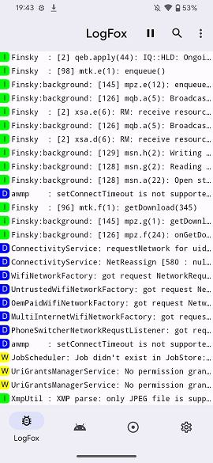</p>

</details>


---

### 📦 Rain

> **Categories:** `#Android`

**Open-source weather app powered by [Open-Meteo](https://open-meteo.com/).

- 🐙 **Source Code:** [https://open-meteo.com](https://open-meteo.com)

<details>
<summary><b>🖼️ Preview Screenshots & Media (1)</b> — <i>Click to view images & decide if you want to use this app</i></summary>

#### 📸 Cover / Preview
<p align="center">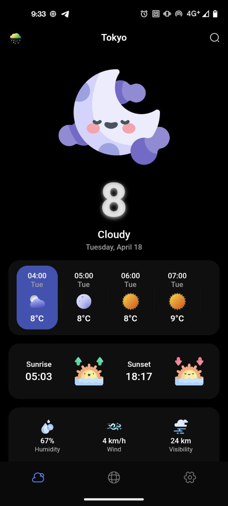</p>

</details>


---

### 📦 Wallme-Wallpaper

> **Categories:** `#Android`

**Open-source wallpaper app powered by Reddit and Wallhaven.

- 🐙 **Source Code:** [https://github.com/Alaory/WallMe-Wallpaper](https://github.com/Alaory/WallMe-Wallpaper)

<details>
<summary><b>🖼️ Preview Screenshots & Media (1)</b> — <i>Click to view images & decide if you want to use this app</i></summary>

#### 📸 Cover / Preview
<p align="center">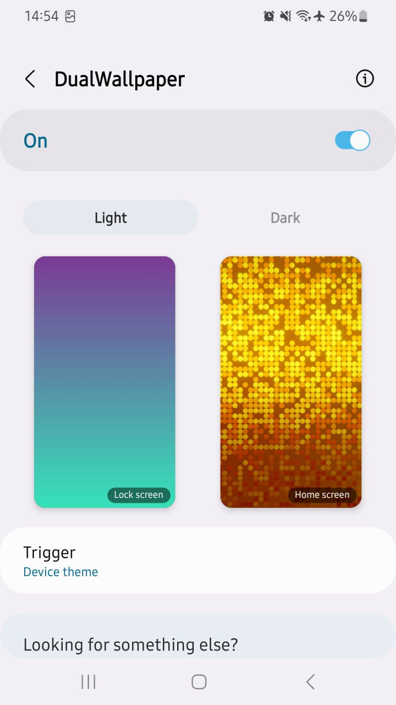</p>

</details>


---

### 📦 Clipious

> **Categories:** `#Android`

**Private YouTube client based on the Invidious frontend.

- 🐙 **Source Code:** [https://github.com/lamarios/clipious](https://github.com/lamarios/clipious)

<details>
<summary><b>🖼️ Preview Screenshots & Media (1)</b> — <i>Click to view images & decide if you want to use this app</i></summary>

#### 📸 Cover / Preview
<p align="center"></p>

</details>


---

### 📦 Taskade - AI Lists, Notes, Chat - A free productivity app that lets you chat with your tasks 📝🤖

> **Categories:** `#Android`

**Taskade is a task management and collaboration app that supports all your favorite productivity methods and frameworks, including GTD, BASB, SCRUM, Pomodoro, Flowtime, and more! With Taskade, you can build your own custom productivity system and take control of your to-dos.

Taskade has a simple and intuitive interface that lets you create beautiful task lists, notes, and outlines. You can organize your tasks into projects and workspaces, and view them in different formats (List, Board, Mind Map, Org Chart, and more). Plus, you can chat and video call with your teammates right there in the app. All your tasks and conversations are in one place, so you no longer have to switch between multiple apps to get things done.

Taskade also has an AI-powered writing assistant that helps you supercharge your productivity. With just a few taps, you can get instant answers to complex questions, generate notes and outlines, organize your writing, and summarize long-form content. Taskade AI is powered by the OpenAI GPT-4 API and ChatGPT - the perfect tool to upgrade your workflows.

Taskade is fully cross-platform, so you can access your projects from anywhere, whether that's on your mobile device, desktop, or in your web browser. It also integrates with top calendar services like Google Calendar (with two-way sync), Outlook, and Apple Mail. With real-time syncing between all your devices, you can start a task on your desktop and pick up right where you left off on your phone.

Taskade is free to use for unlimited projects and collaborators. You can also upgrade to Taskade Pro for more features and customizations. Whether you're working solo or with a team, Taskade is the ultimate app for getting work done faster and smarter

🔗 **Links and Credits**
-  [Official Website](https://www.taskade.com/)
- [Download
](https://t.me/popCLOUDS/549)- [Features
](https://t.me/popCLOUDS/547)- [FAQs

](https://t.me/popCLOUDS/548)**Support us and enable notifications
**🔔 @popmods
⬛️ @popmodschat
📂 @popmodsindex

Platform(s); #Android

- 🌐 **Official Website:** [https://t.me/popCLOUDS/547](https://t.me/popCLOUDS/547)


---

### 📦 My Brain

> **Categories:** `#Android`

**Open-source, All-in-one productivity app for Tasks, Notes, Calendar, Diary and Bookmarks.

🔗 **Links and Credits
**- Download from [GitHub](https://github.com/mhss1/MyBrain/releases/latest), [Fdroid](https://f-droid.org/packages/com.mhss.app.mybrain)
- [Features
](https://t.me/popCLOUDS/539)- [Screenshots
](https://t.me/popCLOUDS/541)- [Technologies
](https://t.me/popCLOUDS/540)By; [mhss1

](https://github.com/mhss1)**Support us and enable notifications
**🔔 @popmods
⬛️ @popmodschat
📂 @popmodsindex

Platform(s); #Android

- 🐙 **Source Code:** [https://f-droid.org/packages/com.mhss.app.mybrain](https://f-droid.org/packages/com.mhss.app.mybrain)


---

### 📦 Aniyomi - Tachiyomi for anime

> **Categories:** `#Android`

**Aniyomi is a Tachiyomi fork designed to watch anime.

- 🌐 **Official Website:** [https://github.com/jmir1/aniyomi](https://github.com/jmir1/aniyomi)


---

### 📦 Blink Comparison

> **Categories:** `#Interesting` `#Android` `#Useful`

The program is written in the Dart language and uses the Flutter framework to build the user interface. The concept of the method is simple - the application allows you to quickly switch images without delay to see the differences.

⤷ [Project link](https://github.com/proninyaroslav/blink-comparison)

[GitHub](https://t.me/github_society) | #Interesting #Android #Useful

- 🐙 **Source Code:** [https://github.com/proninyaroslav/blink-comparison](https://github.com/proninyaroslav/blink-comparison)
- 👤 **Developer:** [proninyaroslav](https://github.com/proninyaroslav)


---

### 📦 Ambient Music Mod - Port of Now Playing from Pixels to other Android devices

> **Categories:** `#installation` `#Android`

**Ambient Music Mod is a Shizuku or root app that ports Now Playing from Pixels to other Android devices.

**Requirements:
**•Android device running Android 9.0 or above (11+ recommended).
•Shizuku (Android 12+) or root access (Android 9+).
•Shizuku does not require root, instead needing an ADB command to be run every reboot.


**Features**:
• Full Now Playing support, based on the latest version from Pixel devices and the latest music databases

• Automatic Ambient Music
recognition, with settings to control how often recognition runs - finding the right balance between battery usage and convenience
• Now Playing History and Favourites support

• Support to trigger recognitions manually, including a homescreen widget

• On Demand recognition on supported devices, using the Google Assistant-backed recognition engine for songs that are not in the local database (must be triggered manually)

• Show Now Playing songs on the lock screen (accessibility service required)

•View the full track list of recognizable songs, and change the database location if your taste does not match your device's locale


🔗**Links
**- [Download](https://github.com/KieronQuinn/AmbientMusicMod/releases)
- [Docs
](https://github.com/KieronQuinn/AmbientMusicMod#installation)- [Screenshot

](https://t.me/popCLOUDS/476)🚮 **Credits
**- [KieronQuinn

](https://github.com/KieronQuinn)Support us & Enable notifications
🔔 @popmods
⬛️ @popmodschat
📂 @popmodsindex

Platform(s); #Android

- 🐙 **Source Code:** [https://github.com/KieronQuinn/AmbientMusicMod](https://github.com/KieronQuinn/AmbientMusicMod)


---

### 📦 Neverinstall | Run any app from your browser

> **Categories:** `#Web`

**Have you ever wished you could run any desktop app from your browser without installing anything? Well, now you can with Neverinstall!

Neverinstall is a cloud platform that lets you stream applications over the web with lightning-fast speeds and superior performance. You can access apps like VS Code, Android Studio, Chrome, Firefox, Slack, Telegram, Spotify and more from any device and any location.

With Neverinstall, you can also:

- Create spaces of all your favorite apps and launch them with one click
- Collaborate with your team in real-time using co-browsing and co-editing features
- Boost your productivity and creativity with powerful tools and extensions
- Save your device storage and battery life by running apps in the cloud

Neverinstall is free to try and easy to use. Just sign up with your email or Google account and start exploring the app library. You can also create your own custom apps using Docker images or GitHub repositories.

If you want to learn more about Neverinstall, check out their website, blog, FAQ or Capterra reviews.

Neverinstall is changing the way we run apps. Experience it for yourself today!

🔗**Links and Credits
**- [Website
](http://neverinstall.com/)- [Blog
](https://blog.neverinstall.com/)- [Signup
](https://neverinstall.com/signup?utm_source=blog&utm_medium=blog&utm_campaign=blog)- [FAQ

](https://neverinstall.com/faqs)**Support us & Enable notifications
**🔔 @popmods
⬛️ @popmodschat
📂 @popmodsindex

Platform(s); #Web

- 🌐 **Official Website:** [https://neverinstall.com/signup?utm_source=blog&utm_medium=blog&utm_campaign=blog](https://neverinstall.com/signup?utm_source=blog&utm_medium=blog&utm_campaign=blog)


---

### 📦 TetherFI - share your internet without the need of an hotspot plan

> **Categories:** `#Android`

**Sadly some internet providers don't allow hotspot or charge additional costs to use it. This apps helps in the case that you have limits to the hotspot imposed by your carrier, because it proxies the traffic from other devices with your phone, so any activity will be seen by the provider as if it came from the phone.

- 🐙 **Source Code:** [https://github.com/pyamsoft/tetherfi](https://github.com/pyamsoft/tetherfi)


---

### 📦 Tusky** **- Mastodon Client

> **Categories:** `#Android` `#GitHub` `#OpenSource`

**Tusky is a beautiful Android client for [Mastodon](https://github.com/mastodon/mastodon). Mastodon is an ActivityPub federated social network. That means no single entity controls the whole network, rather, like e-mail, volunteers and organisations operate their own independent servers, users from which can all interact with each other seamlessly.

**🔗**** Link and Credits
**- Download [GitHub](https://github.com/tuskyapp/Tusky/releases) |  [F-Droid](https://f-droid.org/repository/browse/?fdid=com.keylesspalace.tusky) |  [Play
](tg://user?id=5036582087)- [Features
](https://t.me/popCLOUDS/447)- [Screenshot
](https://t.me/popCLOUDS/449)- [Support

](https://mastodon.social/@Tusky)**Support us & Enable notifications
**🔔 @popmods
⬛️ @popmodschat
📂 @popmodsindex

Platform(s); #Android

- 🐙 **Source Code:** [https://github.com/mastodon/mastodon](https://github.com/mastodon/mastodon)
- 👤 **Developer:** Mastodon


---

### 📦 SleepZz: Your Sleep assistant.

> **Categories:** `#Android`

A simple app helps you to determine the optimal waking up times with the technique of 90-mins cycles; You can either hit sleep now or pick the time at which u gonna sleep in.

****🔗**** Link and Credits
**- [Download
](https://github.com/ahmedtohamy1/SleepZz/releases)- [Source](https://github.com/ahmedtohamy1/SleepZz)
- [Screenshots
](https://t.me/popCLOUDS/442)by [Ahmed Tohamy

](http://t.me/ahmed_tohamy)**Support us & Enable notifications
**🔔 @popmods
⬛️ @popmodschat
📂 @popmodsindex

Platform(s); #Android

- 🐙 **Source Code:** [https://github.com/ahmedtohamy1/SleepZz](https://github.com/ahmedtohamy1/SleepZz)


---

### 📦 Termux-Games

> **Categories:** `#Android`

Play Games on Termux** 🎮
**Termux game is a Script where you can find all The Games that Are available for Termux as well as All the games that are available in Termux Repository. I have also included some games that are on GitHub or written in other languages other than bash like Hangman and 2048. This Script is not complete yet, I am still working on it so I will add more games in the Future.


One command Installation📥:
**visit : https://www.learntermux.tech/2020/02/Termux-Games-Script.html

**Install📲:
**`pkg install git -y

git clone https://github.com/khansaad1275/Termux-Games/

cd Termux-Games

chmod +x *

bash install.sh

`**Run🏃🏻‍♂️:

**`bash games.sh

`**Credits and Screenshots
**by [khansaad1275
](https://github.com/khansaad1275)- [GitHub link
](https://github.com/khansaad1275/Termux-Games)- [Screenshots


](https://t.me/popCLOUDS/420)**Support us & Enable notifications
**🔔 @popmods
⬛️ @popmodschat
📂 @popmodsindex

Platform(s); #Android

- 🐙 **Source Code:** [https://github.com/khansaad1275/Termux-Games](https://github.com/khansaad1275/Termux-Games)


---

### 📦 VpnHood!

> **Categories:** `#Android` `#Windows` `#csharp` `#cross_platform` `#vpn` `#xamarin`

Fast and Secure Free VPN
**Undetectable VPN for ordinary users and experts. VpnHood is a solution to bypass Advanced Firewall and can circumvent deep packet inspection.
Available for Windows and Android

🔗 **Links**
- [Features
](https://t.me/popCLOUDS/404)- Download for Android  [Play](https://play.google.com/store/apps/details?id=com.vpnhood.client.android) | [GitHub](https://github.com/vpnhood/VpnHood)
- [Download for Windows
](https://www.google.com/url?q=https%3A%2F%2Fgithub.com%2Fvpnhood%2FVpnHood%2Freleases%2Flatest%2Fdownload%2FVpnHoodClient-Win-x64.msi&sa=D&sntz=1&usg=AOvVaw3jVSQokKBXgp-AcUMVK41v)- [How does VpnHood work?

](https://github.com/vpnhood/VpnHood/wiki/How-does-VpnHood-work)**Support us & Enable notifications
**🔔 @popmods
⬛️ @popmodschat
📂 @popmodsindex

Platform(s); #Android, #Windows

- 🐙 **Source Code:** [https://github.com/vpnhood/VpnHood](https://github.com/vpnhood/VpnHood)
- 👤 **Developer:** [vpnhood](https://github.com/vpnhood)


---

### 📦 SystemUI Tuner - tweak hidden Android settings.

> **Categories:** `#Android`

**SystemUI Tuner allow you to toggle Android settings that for some reasons have been hidden by the OEM.

- 🐙 **Source Code:** [https://github.com/zacharee/Tweaker](https://github.com/zacharee/Tweaker)


---

### 📦 SophiApp - the best Windows tweaker

> **Categories:** `#Android`

**SophiApp is an open-source tweaker for Windows 10 and 11. It has more than 130 options available.

- 🐙 **Source Code:** [https://t.me/sophia_chat](https://t.me/sophia_chat)


---

### 📦 SuperImage - upscale **photos using your android's GPU

> **Categories:** `#Android` `#Interesting` `#AI` `#Useful`

The input image is processed by tiles on the device's GPU using a pre-trained model

The tiles are then combined into a final high-resolution image

⤷ [Project link](https://github.com/Lucchetto/SuperImage)

[GitHub](https://t.me/github_society) | #Interesting #AI #Useful

- 🐙 **Source Code:** [https://github.com/Lucchetto/SuperImage](https://github.com/Lucchetto/SuperImage)


---

### 📦 Gtasa Vita

> **Categories:** `#Interesting` `#C`

Grand Theft Auto: San Andreas Android PS Vita

⤷ [Available for download](https://github.com/TheOfficialFloW/gtasa_vita)

[GitHub](https://t.me/github_society) | #Interesting #C

- 🐙 **Source Code:** [https://github.com/TheOfficialFloW/gtasa_vita](https://github.com/TheOfficialFloW/gtasa_vita)
- 👤 **Developer:** [TheOfficialFloW](https://github.com/TheOfficialFloW)


---

### 📦 Vita3K/Vita3K-Android

> **Categories:** `#GitHub` `#OpenSource`

Public releases and CI for the Vita3K Android app
**Stars**: 326 **Issues**: 197 **Forks**: 6
[https://github.com/Vita3K/Vita3K-Android](https://github.com/Vita3K/Vita3K-Android)

- 🐙 **Source Code:** [https://github.com/Vita3K/Vita3K-Android](https://github.com/Vita3K/Vita3K-Android)
- 👤 **Developer:** [Vita3K](https://github.com/Vita3K)


---

### 📦 Spowlo - A Spotify songs downloader made with Jetpack Compose, Material You and the spotDL python library

> **Categories:** `#Android`

The developer announced that he will be recreating the app and that the app will be both a downloader and a player (i.e. a full-fledged Spotify client).

Contributing to the project, translating it and giving your opinions is what it needs most right now.
You can find the necessary links below.

[Help to code](https://github.com/BobbyESP/Spowlo)
[Support group](http://t.me/spowlo_chatroom)

- 🐙 **Source Code:** [https://github.com/BobbyESP/Spowlo](https://github.com/BobbyESP/Spowlo)


---

### 📦 Auxio - simple Material You music player

> **Categories:** `#Android`

- 🐙 **Source Code:** [https://github.com/OxygenCobalt/Auxio](https://github.com/OxygenCobalt/Auxio)


---

### 📦 Connect You - Material You Contacts app

> **Categories:** `#Android`

- 🐙 **Source Code:** [https://github.com/Bnyro/ConnectYou](https://github.com/Bnyro/ConnectYou)


---

### 📦 Paisa - Expense Manager

> **Categories:** `#Android`

- 🐙 **Source Code:** [https://github.com/RetroMusicPlayer/Paisa](https://github.com/RetroMusicPlayer/Paisa)


---

### 📦 Magisk Delta - Magisk fork with unofficial features

> **Categories:** `#Android`

- 🐙 **Source Code:** [https://t.me/magiskdelta](https://t.me/magiskdelta)


---

### 📦 Myne - Ebook downloader from Project Gutenberg

> **Categories:** `#Android`

Myne is an app that allows you to download many ebooks from authors that died more than 70 years ago, so their copyright protection is expired and you can read them for free and legally

- 🐙 **Source Code:** [https://github.com/Pool-Of-Tears/Myne](https://github.com/Pool-Of-Tears/Myne)


---

### 📦 Wikipedia App for Android

> **Categories:** `#Android`

**Do you ever spend hours reading Wikipedia just because you're bored or you access it frequently for researching? Anyway maybe you didn't know that there is an official app for Android.

- 🐙 **Source Code:** [https://github.com/wikimedia/apps-android-wikipedia](https://github.com/wikimedia/apps-android-wikipedia)


---

### 📦 MIUI Launcher Mod

> **Categories:** `#Android` `#MIUI`

**MIUI Launcher Mod is modified with many features added and ui changes.

- 🐙 **Source Code:** [https://github.com/Mods-Center/Miui_Launcher_Mod](https://github.com/Mods-Center/Miui_Launcher_Mod)

<details>
<summary><b>🖼️ Preview Screenshots & Media (1)</b> — <i>Click to view images & decide if you want to use this app</i></summary>

#### 📸 Cover / Preview
<p align="center">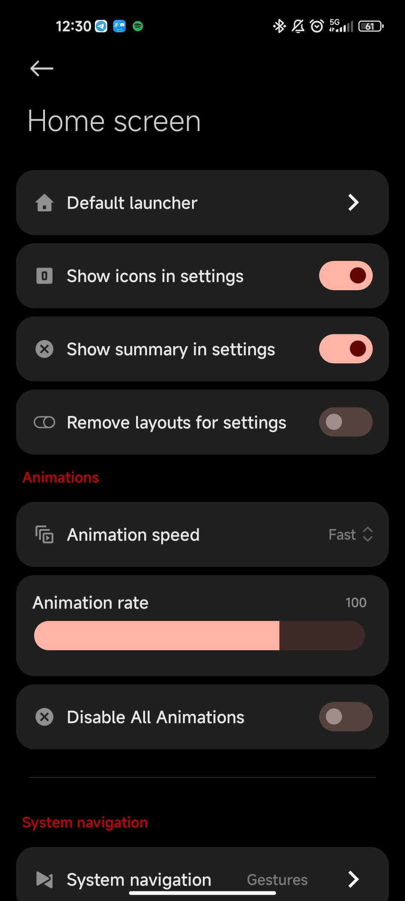</p>

</details>


---

### 📦 MIUI Monet - Material You for MIUI

> **Categories:** `#Android` `#MIUI`

**MIUI Monet is a magisk module that themes all the MIUI apps with Material You.

- 🐙 **Source Code:** [https://github.com/MIUI-Monet-Project/Module](https://github.com/MIUI-Monet-Project/Module)


---

### 📦 Wall You - open-source wallpaper app

> **Categories:** `#Android`

**Wall You is an open-source wallpaper app that fetches wallpapers from Wallhaven, Unsplash, OWalls and Picsum

- 🐙 **Source Code:** [https://github.com/Bnyro/WallYou](https://github.com/Bnyro/WallYou)


---

### 📦 AzeemIdrisi/PhoneSploit-Pro

> **Categories:** `#hacking_tool` `#toolkit`

**An all-in-one hacking tool to remotely exploit Android devices using ADB and Metasploit-Framework to get a Meterpreter session.

Creator:  Mohd Azeem
Stars ⭐️: 457
Forked By: 70
https://github.com/AzeemIdrisi/PhoneSploit-Pro

- 🐙 **Source Code:** [https://github.com/AzeemIdrisi/PhoneSploit-Pro](https://github.com/AzeemIdrisi/PhoneSploit-Pro)
- 👤 **Developer:** Mohd Azeem


---

### 📦 google/material-design-icons

> **Categories:** `#Google` `#Icons` `#readme` `#android` `#ios` `#web` `#material` `#material_design` `#sprites` `#Design`

Material** Design icons by Google

Creator:  Google
Stars ⭐️: 47.5k
Forked By: 9.5k
https://github.com/google/material-design-icons

- 🐙 **Source Code:** [https://github.com/google/material-design-icons](https://github.com/google/material-design-icons)
- 🌐 **Official Website:** [https://github.com/google/material-design-icons#readme](https://github.com/google/material-design-icons#readme)
- 👤 **Developer:** Google


---

### 📦 [LocalSend

> **Categories:** `#Android` `#Windows` `#Linux` `#macOS` `#iOS` `#localsend` `#FileTransfer` `#Networking` `#Productivity` `#GitHub` `#OpenSource` `#dart` `#file_sharing` `#flutter` `#flutter_apps` `#Interesting` `#File` `#Useful`

](https://localsend.org/)Share files to nearby devices. Free, open source, cross-platform. This app allows you to send files and messages over the local LAN network. No internet required, no external servers needed.

- 🐙 **Source Code:** [https://github.com/localsend/localsend](https://github.com/localsend/localsend)
- 👤 **Developer:** localsend


---

### 📦 PlayStoreMod - enable hidden flags of Play Store

> **Categories:** `#Android`

**PlayStoreMod is an app that can be used to enable hidden features and new things on the Google Play Store.

- 🐙 **Source Code:** [https://github.com/assembleDebug/PlayStoreMod](https://github.com/assembleDebug/PlayStoreMod)


---

### 📦 GetStream/webrtc-in-jetpack-compose

> **Categories:** `#android` `#audiocall` `#compose` `#jetpack` `#jetpack_compose` `#videocall` `#videocalling` `#webrtc`

📱 This project demonstrates WebRTC protocol to facilitate real-time video communications with Jetpack Compose.
**Language**: Kotlin

- 🐙 **Source Code:** [https://github.com/GetStream/webrtc-in-jetpack-compose](https://github.com/GetStream/webrtc-in-jetpack-compose)
- 👤 **Developer:** [GetStream](https://github.com/GetStream)


---

### 📦 Vibe Music - music streaming app

> **Categories:** `#Android`

Vibe Music is an app that allows you to listen to music with YouTube Music, but without ads and in high quality.

- 🐙 **Source Code:** [https://github.com/sheikhhaziq/vibemusic](https://github.com/sheikhhaziq/vibemusic)


---

### 📦 MRepo - Magisk module repo and manager

> **Categories:** `#Android`

**MRepo is a new app that substitutes the dead Magisk module repo, it is very customizable.

- 🐙 **Source Code:** [https://github.com/ya0211/MRepo](https://github.com/ya0211/MRepo)


---

### 📦 Amarok - hide apps and files

> **Categories:** `#Android`

**Amarok is an app that allows you to hide apps and files using root or shizuku.

- 🐙 **Source Code:** [https://github.com/deltazefiro/Amarok-Hider](https://github.com/deltazefiro/Amarok-Hider)


---

### 📦 WingetUI - GUI for winget

> **Categories:** `#Android`

**WingetUI is a very useful Windows app that allows you to install and update apps available via winget (Windows' package manager)

- 🐙 **Source Code:** [https://github.com/marticliment/WingetUI](https://github.com/marticliment/WingetUI)


---

### 📦 YouTube AdAway - adblocker for YouTube

> **Categories:** `#Android`

**YouTube AdAway is a LSposed module for Android that blocks ads and enables background playback in any YouTube app version.

- 🐙 **Source Code:** [https://github.com/wanam/YouTubeAdAway](https://github.com/wanam/YouTubeAdAway)


---

### 📦 Oversec - privacy for all apps

> **Categories:** `#Android` `#Interesting` `#Useful`

**Oversec is an advanced encryption app. By sharing a key to the person with you're chatting, both you and them can chat completely anonymously without too much efffort.
Oversec constantly monitors the text on your screen. When it finds an encrypted text, it tries to decrypt it and then shows the decrypted text as an overlay in place of the encrypted text.
In order to encrypt a text, Oversec shows a button next to an active input field. After having entered the secret text, tapping that button makes Oversec read the text, encrypt it and put back the encrypted text into the field.

- 🐙 **Source Code:** [https://github.com/oversecio/oversec](https://github.com/oversecio/oversec)
- 👤 **Developer:** [oversecio](https://github.com/oversecio)


---

### 📦 Inure - elegant app manager

> **Categories:** `#Android` `#Interesting` `#Useful` `#GitHub` `#OpenSource`

**Inure is an elegant android app manager that supports both rooted and not rooted devices. It is very customizable and has a lot of useful functions.

- 🐙 **Source Code:** [https://github.com/Hamza417/Inure](https://github.com/Hamza417/Inure)
- 👤 **Developer:** [Hamza417](https://github.com/Hamza417)


---

### 📦 ChatGPT Android - unofficial ChatGPT app

> **Categories:** `#Android` `#chat` `#chatgpt` `#compose` `#jetpack` `#jetpackcompose` `#skydoves`

**ChatGPT Android is an app that uses ChatGPT API to make accessing the AI easier and quicker.

- 🐙 **Source Code:** [https://github.com/skydoves/chatgpt-android](https://github.com/skydoves/chatgpt-android)
- 👤 **Developer:** [skydoves](https://github.com/skydoves)


---

### 📦 Buckwheat - App that helps you spend money wisely

> **Categories:** `#Android`

**Buckwheat is an app that helps you spend money wisely, tracking every expense and setting up a Budget.

- 🐙 **Source Code:** [https://github.com/danilkinkin/buckwheat](https://github.com/danilkinkin/buckwheat)


---

### 📦 google/comprehensive-rust

> **Categories:** `#GitHub` `#OpenSource` `#rust` `#android` `#classroom` `#course` `#google` `#guide` `#training` `#training_materials`

**Language**: Rust
**Stars**: 299 **Issues**: 15 **Forks**: 20
[https://github.com/google/comprehensive-rust](https://github.com/google/comprehensive-rust)

- 🐙 **Source Code:** [https://github.com/google/comprehensive-rust](https://github.com/google/comprehensive-rust)
- 👤 **Developer:** [google](https://github.com/google)


---

### 📦 usememos/memos

> **Categories:** `#GitHub` `#OpenSource` `#readme` `#react` `#go` `#docker` `#markdown` `#social_network` `#memo` `#sqlite` `#foss` `#self_hosted` `#note_taking` `#microblog` `#notecard` `#Interesting` `#Windows` `#Android` `#MacOS`

**An open-source, self-hosted memo hub with knowledge management and collaboration.

Creator: memos
Stars ⭐️: 2.5k
Forked By: 151

- 🐙 **Source Code:** [https://github.com/usememos/memos](https://github.com/usememos/memos)
- 🌐 **Official Website:** [https://usememos.com](https://usememos.com)
- 👤 **Developer:** memos


---

### 📦 Yatagan

> **Categories:** `#UI` `#Android`

The library will bring maximum benefit to projects that have a significant number of gradle modules in the project, where only one AP is used - Dagger, and developers are willing to try Yatagan in reflection mode for debug builds.

[⤷ Link to project
](https://github.com/yandex/yatagan)[⤷ Article with examples

](https://habr.com/ru/company/yandex/blog/704838/)GitHub | #UI #Android

- 🐙 **Source Code:** [https://github.com/yandex/yatagan](https://github.com/yandex/yatagan)
- 👤 **Developer:** [yandex](https://github.com/yandex)


---

### 📦 tiann/KernelSU

> **Categories:** `#GitHub` `#OpenSource`

A Kernel based root solution for Android GKI
**Language**: Kotlin
**Stars**: 263 **Issues**: 1 **Forks**: 26
[https://github.com/tiann/KernelSU](https://github.com/tiann/KernelSU)

- 🐙 **Source Code:** [https://github.com/tiann/KernelSU](https://github.com/tiann/KernelSU)
- 👤 **Developer:** [tiann](https://github.com/tiann)


---

### 📦 Facilmap

> **Categories:** `#Interesting` `#Android`

Has a smartphone-friendly interface

⤷ [Project link](https://github.com/FacilMap/facilmap)

[GitHub](https://t.me/github_society) | #Interesting #Android

- 🐙 **Source Code:** [https://github.com/FacilMap/facilmap](https://github.com/FacilMap/facilmap)
- 👤 **Developer:** [FacilMap](https://github.com/FacilMap)


---

### 📦 skydoves/Cloudy

> **Categories:** `#android` `#blur` `#blur_image` `#jetpack_compose` `#skydoves`

☁️ Jetpack Compose blur effect library, which supports all Android versions.
**Language**: Kotlin

- 🐙 **Source Code:** [https://github.com/skydoves/Cloudy](https://github.com/skydoves/Cloudy)
- 👤 **Developer:** [skydoves](https://github.com/skydoves)


---

### 📦 AndroidDev-social/MastodonCompose

> **Categories:** `#compose_desktop` `#jetpack` `#kotlin_multiplatform` `#mastodon` `#mastodon_app` `#mastodon_client`

🐘 Mastodon client for Android, iOS and Desktop (JVM)
**Language**: Kotlin

- 🐙 **Source Code:** [https://github.com/AndroidDev-social/MastodonCompose](https://github.com/AndroidDev-social/MastodonCompose)
- 👤 **Developer:** [AndroidDev-social](https://github.com/AndroidDev-social)


---

### 📦 OpenNative/open-native

> **Categories:** `#android` `#ios` `#java` `#kotlin` `#nativescript` `#objective_c` `#react_native` `#swift`

Open Native brings cross-platform communities together to help them collaborate and strengthen diversity.
**Language**: Objective-C

- 🐙 **Source Code:** [https://github.com/OpenNative/open-native](https://github.com/OpenNative/open-native)
- 👤 **Developer:** [OpenNative](https://github.com/OpenNative)


---

### 📦 Auxio

> **Categories:** `#Interesting` `#Android` `#Audio` `#Player`

The trick is that it doesn't have most of the useless features found in other music players.

⤷ [Project link](https://github.com/oxygencobalt/Auxio)

[GitHub](https://t.me/github_society) | #Interesting #Android #Audio #Player

- 🐙 **Source Code:** [https://github.com/oxygencobalt/Auxio](https://github.com/oxygencobalt/Auxio)
- 👤 **Developer:** [oxygencobalt](https://github.com/oxygencobalt)

<details>
<summary><b>🖼️ Preview Screenshots & Media (1)</b> — <i>Click to view images & decide if you want to use this app</i></summary>

#### 📸 Cover / Preview
<p align="center">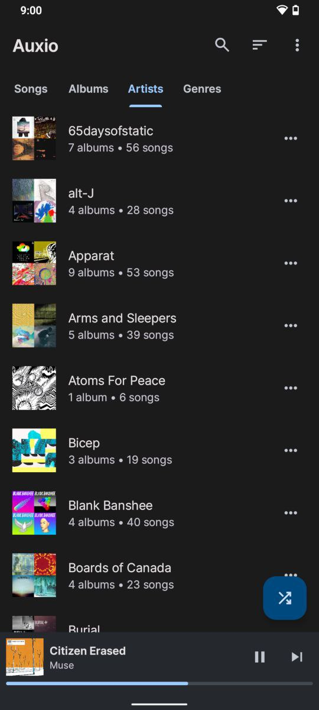</p>

</details>


---

### 📦 Obtainium App - Get Android App Updates Directly From the Source**.

> **Categories:** `#Android` `#Interesting` `#Useful` `#GitHub` `#OpenSource`

Obtainium allows you to install and update Open-Source Apps directly from their releases pages, and receive notifications when new releases are made available.

**Links and credits:
**- [Download
](https://github.com/ImranR98/Obtainium/releases)- [Source
](https://github.com/ImranR98/Obtainium)- [Screenshots](https://t.me/popCLOUDS/184)
- Thanks to [Imran

](https://github.com/ImranR98)About us:
🔔 @popmods
💬 @popmodschat
🗂 @popmodsindex

Platform(s); #Android

- 🐙 **Source Code:** [https://github.com/ImranR98/Obtainium](https://github.com/ImranR98/Obtainium)


---

### 📦 AirGuard - protect yourself from AirTags

> **Categories:** `#Android`

**AirGuard is an app for Android that **scans for Apple AirTags in the background**. **AirTags are a privacy risk** because they can be used to track people by placing them on someone.
Apple already warns iOS users if an AirTag are is near them, but without this app Android users aren't protected.

Advantages
- Open source
- Material You UI
- Available on FDroid and PlayStore

**Links and credits
**- [Download
](https://github.com/seemoo-lab/AirGuard)- [Support
](https://github.com/seemoo-lab/AirGuard/issues)- [Screenshots
](https://t.me/popmodschat/88627)by [Secure Mobile Networking Lab

](https://www.seemoo.tu-darmstadt.de/)About us:
🔔 @popmods
💬 @popmodschat
🗂 @popmodsindex

Platform(s); #Android

- 🐙 **Source Code:** [https://github.com/seemoo-lab/AirGuard](https://github.com/seemoo-lab/AirGuard)


---

### 📦 parvardegr/sharing

> **Categories:** `#android` `#browser` `#command_line_tool` `#filesharing` `#filesharing_on_network` `#filetransfer` `#ios` `#linux` `#nodejs` `#qrcode` `#serving_directory` `#GitHub` `#OpenSource`

Sharing is a command-line tool to share directory and files with ios and android devices without an extra client app
**Language**: JavaScript

- 🐙 **Source Code:** [https://github.com/parvardegr/sharing](https://github.com/parvardegr/sharing)
- 👤 **Developer:** [parvardegr](https://github.com/parvardegr)


---

### 📦 •Update

> **Categories:** `#GODSPEED` `#app` `#update` `#photos` `#rui` `#gallery` `#universal` `#Android`

•Update
•ColorOS Photos
•App
•VERSION - 12.9.5 (1201000)
•rui/vibo/colorOS default gallery app for aosp base rom
•Ported by @revWhiteShadow

Realme Gallery app for all aosp devices,
•[Download](https://www.google.com/search?q=site%3Ahttps%3A%2F%2Fwww.godtspeed.xyz%2F2022%2F08%2Fget-coloros-gallery-port-for-aosp-rom.html&sxsrf=ALiCzsYb7GzNC5KaM6uzDLtCsqwTObxZJQ%3A1662037550903&ei=Lq4QY6rUNveC4-EPzdu6iAQ&oq=site%3Ahttps%3A%2F%2Fwww.godtspeed.xyz%2F2022%2F08%2Fget-coloros-gallery-port-for-aosp-rom.html&gs_lcp=ChNtb2JpbGUtZ3dzLXdpei1zZXJwEAM6BAgjECc6BQgAEJECOgsIABCxAxCDARCRAjoFCAAQgARKBAhBGAFQgQpYzR9g7CVoAHAAeACAAdcBiAGvI5IBBjAuMjUuMZgBAKABAaABAsABAQ&sclient=mobile-gws-wiz-serp) (add free)
•[Preview
](https://t.me/godspeedmode/106531)•[Follow Google News
](http://news.google.com/publications/CAAqBwgKMJjHvgswpeLVAw?ceid=US:en&oc=3&hl=en-US&gl=US)•[Update channel
](https://t.me/godTspeed)•[Discussion

](https://t.me/godspeedmode)•[Download](https://www.google.com/search?q=site%3Ahttps%3A%2F%2Fwww.godtspeed.xyz%2F2022%2F08%2Fget-coloros-gallery-port-for-aosp-rom.html&sxsrf=ALiCzsYb7GzNC5KaM6uzDLtCsqwTObxZJQ%3A1662037550903&ei=Lq4QY6rUNveC4-EPzdu6iAQ&oq=site%3Ahttps%3A%2F%2Fwww.godtspeed.xyz%2F2022%2F08%2Fget-coloros-gallery-port-for-aosp-rom.html&gs_lcp=ChNtb2JpbGUtZ3dzLXdpei1zZXJwEAM6BAgjECc6BQgAEJECOgsIABCxAxCDARCRAjoFCAAQgARKBAhBGAFQgQpYzR9g7CVoAHAAeACAAdcBiAGvI5IBBjAuMjUuMZgBAKABAaABAsABAQ&sclient=mobile-gws-wiz-serp) (add free)

About us:
🔔 @popmods
💬 @popmodschat
🗂 @popmodsindex

Platform(s); #Android

- 🐙 **Source Code:** [https://one.google.com/join/ai-student?utm_source=gemini&utm_medium=bts-campus-qrcode&utm_id=a7721bf9-2a0c-43e2-b4ab-0be4dd31d0df&g1_landing_page=5](https://one.google.com/join/ai-student?utm_source=gemini&utm_medium=bts-campus-qrcode&utm_id=a7721bf9-2a0c-43e2-b4ab-0be4dd31d0df&g1_landing_page=5)
- 🌐 **Official Website:** [https://t.me/godTspeed](https://t.me/godTspeed)


---

### 📦 Teta (Beta) - App Builder

> **Categories:** `#Android` `#MacOS`

**With Teta, you can build cross-platform mobile apps in no time, using our visual interface.
We provide also a seamless back-end integration to store your data and manage the user authentication within your app.
Then, you can publish your app to the stores (App Store and Google Play already supported) or download your source code.
With all our integrations, building a professional app has never been so easy!

- 🌐 **Official Website:** [https://teta.so/](https://teta.so/)


---

### 📦 Termux Surveillance

> **Categories:** `#Android`

**A simple surveillance tool that can be interacted with SMS.

**Installation
**Install termux and termux api
Run these commands
`pkg update pkg install termux-api pkg install git pkg install nodejs git clone https://github.com/tuhinpal/termux-surveillance.git cd termux-surveillance npm install bash start.sh

`**Commands
**You need to send command through SMS. The command should be in the format command argument. For example, TAKEPHOTO 1 will take a photo from the front camera.
CALLME - Call the number which sent the command.
TAKEPHOTO - Take a photo from the front camera. The argument should be the camera id. For example, TAKEPHOTO 1 will take a photo from the front camera.

**More About
**[GitHub Page
](https://github.com/tuhinpal/termux-surveillance) **by **[**Tuhin Kanti Pal

**](https://github.com/tuhinpal)About us:
🔔 @popmods
💬 @popmodschat
🗂 @popmodsindex

Platform(s); #Android

- 🐙 **Source Code:** [https://github.com/tuhinpal/termux-surveillance](https://github.com/tuhinpal/termux-surveillance)


---

### 📦 Noice: Natural calming noise

> **Categories:** `#Android`

**__Noice is an app that allows you to create personalised sound environments. It enables you to combine different sounds at different volume levels to create perfect ambient atmospheres. These custom sound surroundings let you drown out distractions and allow you to concentrate. You can also use it to generate a serene, peaceful aura that encourages you to relax and fall asleep.__

**App, Website, Screenshots
**- [Google Play
](https://play.google.com/store/apps/details?id=com.github.ashutoshgngwr.noice)- [F-Droid
](https://f-droid.org/F-Droid.apk)- [Website
](https://f-droid.org/packages/com.github.ashutoshgngwr.noice/)- [Screenshots

](https://t.me/popCLOUDS/63)**Big Thanks:** `Ashutosh Gangwar and F-Droid team

`About us:
🔔 @popmods
💬 @popmodschat
🗂 @popmodsindex

Platform(s); #Android

- 🌐 **Official Website:** [https://play.google.com/store/apps/details?id=com.github.ashutoshgngwr.noice](https://play.google.com/store/apps/details?id=com.github.ashutoshgngwr.noice)


---

### 📦 anujd64/Thunder

> **Categories:** `#android` `#drive` `#googledriveindex` `#java`

An Android app to stream and download your media stored in Google Drive in an Awesome way !!
**Language**: Java

- 🐙 **Source Code:** [https://github.com/anujd64/Thunder](https://github.com/anujd64/Thunder)
- 👤 **Developer:** [anujd64](https://github.com/anujd64)


---

### 📦 android/architecture-templates

> **Categories:** `#GitHub` `#OpenSource`

**Stars**: 149 **Issues**: 7 **Forks**: 5
[https://github.com/android/architecture-templates](https://github.com/android/architecture-templates)

- 🐙 **Source Code:** [https://github.com/android/architecture-templates](https://github.com/android/architecture-templates)
- 👤 **Developer:** [android](https://github.com/android)


---

### 📦 Boundo: System Tool Set

> **Categories:** `#Android`

**A tools bundle bound to do things for you

**Features

**1. App API
Check Android API level of all apps and apks on device
Check Adaptive Icon support of all apps
App API stats
APK and icon extraction
Package details and signature details

2. App Shortcuts and Quick Settings Tiles
Screen barcode(QR code) scanner Quick Settings Tile for Alipay and WeChat
Month data usage Quick Settings Tile

3. Image Modifying
Modify resolution
Modify format: png jpg webp heif
Blur image

4. Themed Wallpaper
Make your wallpaper comply to Android 10 dark theme by applying a dark-color wallpaper automatically

**Download, Screenshots
**- [Google Play](https://play.google.com/store/apps/details?id=com.madness.collision) (also free now)
- [Screenshot
](https://t.me/popmodschat/81646)- [Source Code
](https://github.com/cliuff/boundo)by [Clifford Liui

](https://github.com/cliuff)About us:
🔔 @popmods
💬 @popmodschat
🗂 @popmodsindex

Platform(s); #Android

- 🐙 **Source Code:** [https://github.com/cliuff/boundo](https://github.com/cliuff/boundo)


---

### 📦 Buffer

> **Categories:** `#Web`

**Buffer is a great tool for scheduling and sharing content on social media, and the browser extension allows you to publish content from anywhere on the web with just a click of the mouse. When you find something you want to share, just click the Buffer bookmarklet in your browser toolbar, customize your tweet or status update and publish immediately or add to your Buffer Queue.

**Site**,**Download,Add
**- [Site
](http://buffer.com/)- [GPlay
](https://play.google.com/store/apps/details?id=org.buffer.android)- [Add to Chrome](https://chrome.google.com/webstore/detail/buffer/noojglkidnpfjbincgijbaiedldjfbhh#:~:text=The%20Buffer%20Chrome%20extension%20allows,the%20new%20features%20here%2C%20too!) | [Add to Firefox
](https://addons.mozilla.org/tr/firefox/addon/buffer-for-firefox/)About us:
🔔 @popmods
💬 @popmodschat
🗂 @popmodsindex

Platform(s); #Web (Extension)

- 🌐 **Official Website:** [http://buffer.com/](http://buffer.com/)


---

### 📦 divkit/divkit

> **Categories:** `#GitHub` `#OpenSource` `#UI` `#Android` `#iOS`

DivKit is an open source Server-Driven UI (SDUI) framework. SDUI is a an emerging technique that leverage the server to build the user interfaces of their mobile app

Creator: DivKit
Stars ⭐️: 599
Forked By: 26

- 🐙 **Source Code:** [https://github.com/divkit/divkit](https://github.com/divkit/divkit)
- 👤 **Developer:** DivKit


---

### 📦 TwiF*cker

> **Categories:** `#Android`

**Yet Another Adkiller for Twitter.
This is an Xposed module. Support only API 93+.
You can find Beta version / Rootless integration (automatically embed latest Twitter with [LSPatch](https://github.com/LSPosed/LSPatch)) at our Telegram channel.

**Features
**Remove promoted user, content, trends, who to follow and topics to follow module
[Remove share link tracking
](https://github.com/Dr-TSNG/TwiFucker/blob/master/app/src/main/java/icu/nullptr/twifucker/hook/UrlHook.kt)[Remove sensitive media warning
](https://github.com/Dr-TSNG/TwiFucker/blob/master/app/src/main/java/icu/nullptr/twifucker/hook/sensitiveMediaWarning.kt)[Copyable alt text
](https://github.com/Dr-TSNG/TwiFucker/blob/master/app/src/main/java/icu/nullptr/twifucker/hook/AltTextHook.kt)[Download media menu
](https://github.com/Dr-TSNG/TwiFucker/blob/master/app/src/main/java/icu/nullptr/twifucker/hook/DownloadHook.kt)**Usage
**Settings and privacy > Additional resources > Tap version

**Download, Credits
**- [GitHub](https://github.com/Dr-TSNG/TwiFucker) |  [From their channel
](https://t.me/TwiFucker)by [Dr-TSNG

](https://github.com/Dr-TSNG)**Installation Instructions
**- Install [LSPosed Module](https://t.me/LSPosedArchives) from Magisk [(Also GitHub repo of LSposed](https://github.com/LSPosed/LSPosed))
- Reboot
- Install the XPosed/LSposed module you want to use (usually in APK format)

About Us:
🔔 @popmods
💬 @popmodschat
🗂 @popmodsindex

Platform(s); #Android

- 🐙 **Source Code:** [https://github.com/LSPosed/LSPatch](https://github.com/LSPosed/LSPatch)


---

### 📦 XDowngrader (XPosed Module)

> **Categories:** `#Android`

**XDowngrader downgrades any app by allowing you to install the APK of an old version on top of the new version on Android 5 and newer.
No configuration needed*, install and restart the phone.
•Make sure you allow the module to hook the **System Framework** if you are using LSPosed or Xposed in WhiteList mode!

**Download, Credits
**- [GitHub
](https://github.com/Xposed-Modules-Repo/com.alex193a.xdowngrader/releases)by [Alessandro Paluzzi

](https://github.com/alex193a)**Installation Instructions
**- Install [LSPosed Module](https://t.me/LSPosedArchives) from Magisk [(Also GitHub repo of LSposed](https://github.com/LSPosed/LSPosed))
- Reboot
- Install the XPosed/LSposed module you want to use (usually in APK format)

About us:
🔔 @popmods
💬 @popmodschat
🗂 @popmodsindex

Platform(s); #Android

- 🐙 **Source Code:** [https://t.me/LSPosedArchives](https://t.me/LSPosedArchives)


---

### 📦 Heale**rgram (XPosed Module)

> **Categories:** `#Android` `#FOSS`

An Xposed module to heal your Telegram addiction.
Completely removes "Archived Chats" button and pull-down gesture from your dialogs list. All chats are still available via search.

**Download, Credits
**- [GitHub
](https://github.com/droserasprout/healergram/releases)by [**Lev Gorodetskiy
**](https://github.com/droserasprout)
**Installation Instructions **
- Install [LSPosed Module](https://t.me/LSPosedArchives) from Magisk [(Also GitHub repo of LSposed](https://github.com/LSPosed/LSPosed))
- Reboot
- Install the XPosed/LSposed module you want to use (usually in APK format)

About us:
🔔 @popmods
💬 @popmodschat
🗂 @popmodsindex

Platform(s); #Android

- 🐙 **Source Code:** [https://github.com/LSPosed/LSPosed](https://github.com/LSPosed/LSPosed)


---

### 📦 Remotevideocam

> **Categories:** `#Interesting` `#Android` `#Video` `#Useful`

The application can be used to monitor things in the house or yard, as a walkie-talkie, etc.

⤷ [Project link](https://github.com/izivkov/RemoteVideoCam)

[GitHub](https://t.me/github_community) | #Interesting #Android #Video #Useful

- 🐙 **Source Code:** [https://github.com/izivkov/RemoteVideoCam](https://github.com/izivkov/RemoteVideoCam)
- 👤 **Developer:** [izivkov](https://github.com/izivkov)


---

### 📦 Revan**cify

> **Categories:** `#Android` `#Tools`

A simple and direct YouTube and YouTube Music Revanced Installer script.
It uses Revanced CLI to build YouTube and YouTube Music Revanced.

**Installation**
Open Termux.
Copy and paste this code.
`termux-setup-storage && pkg update -y && pkg install git -y && cd storage && git clone https://github.com/decipher3114/Revancify
`
**Usage**
1.Open Termux.
2.Type cd storage/Revancify
3.To run the script, type bash main.sh

`"Don't run sh main.sh, otherwise script will give errors."`

**Uninstallation**
Open Termux.
Type `cd storage/Revancify`
Type `rm -rf Revancify`

**Thanks & Credits**
[Revanced
](https://github.com/revanced)**by **@decipher3114

About us:
🔔 @popmods
💬 @popmodschat
🗂 @popmodsindex

Platform(s); #Android

- 🐙 **Source Code:** [https://github.com/decipher3114/Revancify](https://github.com/decipher3114/Revancify)

<details>
<summary><b>✨ Key Features (6)</b> — <i>Click to expand</i></summary>

- Auto fetches Patches and CLI
- Interactive and Easy to use
- Support APK download from ApkMirror or Importing from storage
- User-friendly Patch-options Editor
- Convenient Installation and usage
- Lightweight and faster than any other tool

</details>


---

### 📦 InviZ**ible Pro

> **Categories:** `#Android`

InviZible Pro is an open-source app that **protects your privacy, unblocks websites and stops government surveillance** while you're using internet.
It uses known solutions such as **DNSCrypt, Tor and Purple I2P**, while also being completely f**lexible and configurable**.

**Advantages
**- No root required (optional)
- Supported by any Android device (Android TV, tablets, etc.)
- Completely open-source
- It has a built-in firewall

**Download, credits and links
**- [Download from TG
](https://t.me/InviZiblePro)- [GitHub
](https://github.com/Gedsh/InviZible)- [Wiki
](https://github.com/Gedsh/InviZible/wiki)- [Support
](https://t.me/InviZiblePro_Group)- [Screenshots](https://t.me/popMODS/2393?single&comment=78843)
by [Oleksandr Garmatin](https://github.com/Gedsh)

About us:
🔔 @popmods
💬 @popmodschat
🗂 @popmodsindex

Platform(s); #Android

- 🐙 **Source Code:** [https://github.com/Gedsh/InviZible](https://github.com/Gedsh/InviZible)


---

### 📦 Telegramandroid

> **Categories:** `#Interesting` `#Android` `#Telegram` `#Useful`

**Some changes in Forkgram: **
• Shows the original message date for forwarded messages;
• The sidebar header has been reduced;
• There is a quick download button for each media file in private chats;
• Unlimited unarchived pinned chats **and much more..**

⤷ [Project link](https://github.com/Forkgram/TelegramAndroid)

[GitHub](https://t.me/github_community) | #Interesting #Android #Telegram #Useful

- 🐙 **Source Code:** [https://github.com/Forkgram/TelegramAndroid](https://github.com/Forkgram/TelegramAndroid)
- 👤 **Developer:** [Forkgram](https://github.com/Forkgram)


---

### 📦 jfversluis/learn-dotnet-maui

> **Categories:** `#cross_platform` `#dotnet_for_android` `#dotnet_for_ios` `#dotnet_maui` `#maui` `#multi_platform_app_ui` `#xamarin` `#xamarin_forms`

A repository filled with resources available to you to start learning or deepen your knowledge about .NET MAUI

- 🐙 **Source Code:** [https://github.com/jfversluis/learn-dotnet-maui](https://github.com/jfversluis/learn-dotnet-maui)
- 👤 **Developer:** [jfversluis](https://github.com/jfversluis)


---

### 📦 skydoves/sealedx

> **Categories:** `#android` `#extensive` `#kotlin_symbol_processing` `#ksp` `#sealed_class` `#selaed_interface` `#skydoves`

🎲 Kotlin Symbol Processor to auto-generate extensive sealed classes and interfaces for Android and Kotlin.
**Language**: Kotlin

- 🐙 **Source Code:** [https://github.com/skydoves/sealedx](https://github.com/skydoves/sealedx)
- 👤 **Developer:** [skydoves](https://github.com/skydoves)


---

### 📦 Seal - Video and Audio downloader powered by yt-dlp and MD3

> **Categories:** `#Android`

Seal is an audio and video downloader that provides a GUI to the famous yt-dlp.

Advantages
- Open-source
- Beautiful UI
- Fast

**Download, credits and links
**- [Download
](https://github.com/JunkFood02/Seal)- [List of websites supported
](https://github.com/yt-dlp/yt-dlp/blob/master/supportedsites.md)- [Support
](https://github.com/JunkFood02/Seal/issues)[- Screenshots](https://t.me/popMODS/2373?single&comment=77827)
by [JunkFood02
](https://github.com/JunkFood02)
About us:
🔔 @popmods
💬 @popmodschat
🗂 @popmodsindex

Platform(s); #Android

- 🐙 **Source Code:** [https://github.com/JunkFood02/Seal](https://github.com/JunkFood02/Seal)


---

### 📦 Xtra - Open-source Twitch player and browser for Android

> **Categories:** `#Android`

**Xtra is an open-source player and browser for Twitch. It supports ad-blocking, downloading and account login.

Advantages
- Free & open-source
- Advanced options and theming
- Bookmarks

**Download, credits and links
**- [Download
](https://github.com/crackededed/Xtra/releases)- [Subreddit
](https://www.reddit.com/r/XtraForTwitch/)- [Screenshots](https://t.me/popMODS/2372?single&comment=77788)
by [crackedded


](https://github.com/crackededed)About us:
🔔 @popmods
💬 @popmodschat
🗂 @popmodsindex

Platform(s); #Android

- 🐙 **Source Code:** [https://github.com/crackededed](https://github.com/crackededed)


---

### 📦 GetStream/whatsApp-clone-compose

> **Categories:** `#android` `#architecture` `#architecture_components` `#coroutines` `#jetpack` `#jetpack_compose` `#kotlin` `#mvi` `#navigation` `#whatsapp`

📱 WhatsApp clone project demonstrates modern Android development built with Jetpack Compose and Stream Chat SDK for Compose.
**Language**: Kotlin

- 🐙 **Source Code:** [https://github.com/GetStream/whatsApp-clone-compose](https://github.com/GetStream/whatsApp-clone-compose)
- 👤 **Developer:** [GetStream](https://github.com/GetStream)


---

### 📦 Hypatia

> **Categories:** `#Interesting` `#Android` `#Security`

Powered by ClamAV-style signature databases. The Internet is used only for downloading databases, minimum dependencies and much more..

⤷ [Project link](https://github.com/Divested-Mobile/Hypatia)

[GitHub](https://t.me/github_community) | #Interesting #Android #Security

- 🐙 **Source Code:** [https://github.com/Divested-Mobile/Hypatia](https://github.com/Divested-Mobile/Hypatia)
- 👤 **Developer:** [Divested-Mobile](https://github.com/Divested-Mobile)

<details>
<summary><b>✨ Key Features (10)</b> — <i>Click to expand</i></summary>

- **Near zero battery impact** — you'll never notice any impact on battery at all
- **Extremely fast** — it can scan small files (1MB) in 20ms, and even large files (40MB) in 1000ms.
- **Memory efficient** — with the default databases enabled it uses under 120MB.
- **Regular scan** — allowing selection of /system, internal storage, external storage, and installed apps
- **Realtime scanner** — can detect malware in realtime on write/rename in internal storage
- **Completely offline** — Internet is only used to download signature databases, files will never ever leave your device
- **Persistence** — will automatically restart on boot/update
- **Tiny codebase** — coming in at under 1000 sloc, it can be audited by even someone with basic programming experience
- **Minimal dependencies** — the app only uses libraries when necessary
- Signature databases can be enabled/disabled at the users demand

</details>


---

### 📦 Anonymousmessenger

> **Categories:** `#Java` `#Messenger`

**Functional**:
• Voice messages
• Live voice calls via tor (alpha feature)
• Text messages
• Media messages with metadata removed
• Send raw files of any size (100GB+)
• Disappearing messages by default
• Encrypted file storage on Android
• Diffie-Hellman encryption

> [**Official Repository**](https://git.anonymousmessenger.ly/dx/AnonymousMessenger)
> [**Official website**](https://www.anonymousmessenger.ly/)

[GitHub](https://t.me/github_community) | #Java #Messenger

- 🐙 **Source Code:** [https://github.com/AnonymousMessenger/AnonymousMessenger](https://github.com/AnonymousMessenger/AnonymousMessenger)
- 👤 **Developer:** [AnonymousMessenger](https://github.com/AnonymousMessenger)


---

### 📦 YouTu**be Vanced Extended

> **Categories:** `#Android`

Hi, when we released Vanced 15.05.54, people were upset because it used the .apks format, which was burdensome to install than a traditional .apk file. Even though we wrote clear instructions on how to install the new Vanced build, people still couldn't figure it out.

Then we thought, "why don't we make a manager for vanced, which will download, update and uninstall Vanced and MicroG, have an easy and user-friendly UI and be less than 10mb?" and that's how Vanced Manager was born.

After 3 months of development, we are finally ready to Introduce [Vanced Manager](https://github.com/inotia00/VancedManager) to the masses!!

**Features**
-Vanced manager can easily install and uninstall Vanced and MicroG.
-It has various settings for customization and better experience.
-The Manager comes with an easy-to-use Interface.

**Download,Credits**
- [Download](https://github.com/inotia00/VancedManager/releases)
by [inotia00](https://github.com/inotia00)

[**If you think I copied your post, here is the proof**](https://t.me/popmodschat/68084)

About us:
🔔 @popmods
💬 @popmodschat
🗂 @popmodsindex

Platform(s); #Android

- 🐙 **Source Code:** [https://github.com/inotia00/VancedManager](https://github.com/inotia00/VancedManager)


---

### 📦 TGX-Android / Telegram-X

> **Categories:** `#GitHub` `#OpenSource`

**The main repository of Telegram X — official alternative Telegram client for Android. Check out the $25,000 contest in the pinned issue.

Creator: Telegram X
Stars ⭐️: 1.3k
Forked By: 97

- 🐙 **Source Code:** [https://github.com/TGX-Android/Telegram-X](https://github.com/TGX-Android/Telegram-X)
- 👤 **Developer:** Telegram X


---

### 📦 skydoves/retrofit-adapters

> **Categories:** `#android` `#arrow_kt` `#coroutines` `#either` `#jetpack` `#kotlin` `#kotlin_result` `#network` `#paging3` `#retrofit` `#retrofit2`

🚆 Retrofit adapters for modeling network responses with Kotlin Result, Jetpack Paging3, and Arrow Either.
**Language**: Kotlin

- 🐙 **Source Code:** [https://github.com/skydoves/retrofit-adapters](https://github.com/skydoves/retrofit-adapters)
- 👤 **Developer:** [skydoves](https://github.com/skydoves)


---

### 📦 Silence

> **Categories:** `#Interesting` `#Android` `#Useful` `#Privacy` `#Security` `#GitHub` `#OpenSource`

You can also allow numbers with toll-free codes (such as 800), allow temporary mobile numbers from incoming text messages, and much more.

⤷ [Project link](https://github.com/x13a/Silence)

[GitHub](https://t.me/github_community) | #Interesting #Android #Useful

- 🐙 **Source Code:** [https://github.com/x13a/Silence](https://github.com/x13a/Silence)
- 👤 **Developer:** [x13a](https://github.com/x13a)


---

### 📦 skydoves/Orbitary

> **Categories:** `#android` `#animation` `#jetpack_compose` `#sharedelementtransitions` `#skydoves`

🪐 Jetpack Compose animation library that allows you to implement animations such as shared element transition.
**Language**: Kotlin

- 🐙 **Source Code:** [https://github.com/skydoves/Orbitary](https://github.com/skydoves/Orbitary)
- 👤 **Developer:** [skydoves](https://github.com/skydoves)


---

### 📦 emredavut/Chrome-Android-and-Windows-0day-RCE-SBX

> **Categories:** `#GitHub` `#OpenSource`

Chrome Android and Windows 0day RCE+SBX.. DPRK
**Language**: JavaScript
**Stars**: 108 **Issues**: 0 **Forks**: 30
[https://github.com/emredavut/Chrome-Android-and-Windows-0day-RCE-SBX](https://github.com/emredavut/Chrome-Android-and-Windows-0day-RCE-SBX)

- 🐙 **Source Code:** [https://github.com/emredavut/Chrome-Android-and-Windows-0day-RCE-SBX](https://github.com/emredavut/Chrome-Android-and-Windows-0day-RCE-SBX)
- 👤 **Developer:** [emredavut](https://github.com/emredavut)


---

### 📦 Monet-Generator

Create Monet Themes for Telegram, Telegram X, Plus Messenger and MiXplorer (Android)

**Download,Captures,Credits
**- [Download](https://github.com/jamal2362/Monet-Generator/releases)
- [Screenshots](https://telegra.ph/Monet-Generator-Screenshots-06-29)
by [Jamal
](https://github.com/jamal2362)Post inspired by [ESİCA](https://t.me/ESICAChannel)

**Follow Us & Enable Notifications**
🔔 @popmods
💬@popmodschat

- 🐙 **Source Code:** [https://t.me/ESICAChannel](https://t.me/ESICAChannel)


---

### 📦 Silen**ce - Block unknown callers

> **Categories:** `#Android`

By default numbers not in your contacts are blocked.

**Optionally allow:**
Numbers you have contacted
Numbers within the selected groups (Toll-Free, Local)
N registered call from the same number within T minutes
Numbers from messages
Numbers passing STIR verification (Android 11)
Contacted, Groups, Repeated, Messages options and the main toggle have additional settings. You can open them by long click.
If the app rejects calls from contacts on Android 10, allow contacts permission manually in App info → Permissions.

**Download, Permissions, Captures
**- [Download](https://github.com/x13a/Silence/releases)
- [Permissions
](https://telegra.ph/Permissions-of-Silence-06-29)- [Screenshot
](https://telegra.ph/Screenshot-of-Silence-06-29)by [x13a (lucky)](https://github.com/x13a)

About us:
🔔 @popmods
💬 @popmodschat
🗂 @popmodsindex

Platform(s); #Android

- 🐙 **Source Code:** [https://github.com/x13a](https://github.com/x13a)


---

### 📦 skyline-emu/ skyline

> **Categories:** `#GitHub` `#OpenSource` `#Cpp` `#Android` `#Emulator` `#Interesting`

Run** Nintendo Switch homebrew & games on your Android device!
Skyline is an experimental emulator that runs on ARMv8 Android™ devices and emulates the functionality of a Nintendo Switch™ system, licensed under Mozilla Public License 2.0

Creator: skyline
Stars ⭐️: 8.2k
Forked By: 1.2k

- 🐙 **Source Code:** [https://github.com/skyline-emu/skyline](https://github.com/skyline-emu/skyline)
- 👤 **Developer:** skyline


---

### 📦 Android Sudoku Solver Ocr

> **Categories:** `#Android` `#OCR` `#Java` `#Interesting`

Uses OpenCv4Android to find the location of Sudoku frames in an image and MLKIT Vision OCR to retrieve the numbers

[GitHub](https://t.me/github_community) | #Android #OCR #Java #Interesting

- 🐙 **Source Code:** [https://github.com/hypertensiune/Android-Sudoku-Solver-OCR](https://github.com/hypertensiune/Android-Sudoku-Solver-OCR)
- 👤 **Developer:** [hypertensiune](https://github.com/hypertensiune)


---

### 📦 danielroe/nuxt-ionic

> **Categories:** `#android` `#ionic` `#ios` `#mobile` `#nuxt` `#nuxt_module`

Batteries-included, zero-config Ionic integration for Nuxt
**Language**: TypeScript

- 🐙 **Source Code:** [https://github.com/danielroe/nuxt-ionic](https://github.com/danielroe/nuxt-ionic)
- 👤 **Developer:** [danielroe](https://github.com/danielroe)


---

### 📦 Magisk v25.1 (25100)

> **Categories:** `#Android` `#cplusplus`

⚡__Magisk Beta__
⚡__Magisk is a suite of open source software for customizing Android, supporting devices higher than Android 5.0.__
⚡️[GitHub Repository](https://github.com/topjohnwu/Magisk)
⚡[Changelog](https://topjohnwu.github.io/Magisk/releases/25100.md)

**By:** [John Wu](https://github.com/topjohnwu)
**Follow:** @AndroidRepo

- 🐙 **Source Code:** [https://github.com/topjohnwu/Magisk](https://github.com/topjohnwu/Magisk)


---

### 📦 Musif**y - **Music Streaming and Downloading app made in Flutter!** **( Material You )

> **Categories:** `#Android`

**Features**
Online Song Search 🔍
Streaming Support 🎵
Offline Download Support ⬇️
High Quality mp3 Format 🔥
Lyrics Support 📝
No Ads 🚫
No Subscriptions 💵

**Download,Captures, Credits
**- [Download](https://github.com/gokadzev/Musify)
- [Screenshots](https://t.me/popmodschat/59614)
by [Valeri Gokadze
](https://github.com/gokadzev)
About us:
🔔 @popmods
💬 @popmodschat
🗂 @popmodsindex

Platform(s); #Android

- 🐙 **Source Code:** [https://github.com/gokadzev/Musify](https://github.com/gokadzev/Musify)


---

### 📦 You.c**om** - Google Search Engine alternative

> **Categories:** `#Android` `#Web`

[You.com](http://You.com/) is the search engine you control — your time, sources and privacy.

Tired of your search engine feeding you the results it wants you to see? With [You.com](http://You.com/) Search Engine & Browser, you control your search – your sources, privacy, and time. Choose the sources you want to see and how private you want to be.
And yes, it's Firefox based a browser

**Download,Site, Features, Captures
**- [Download](https://play.google.com/store/apps/details?id=com.you.browser)
- [Site](http://you.com/)
- [Features](https://telegra.ph/Features-of-Youcom-06-17)
- [Screenshots
](https://t.me/popmodschat/58995)
About us:
🔔 @popmods
💬 @popmodschat
🗂 @popmodsindex

Platform(s); #Android , #Web

- 🌐 **Official Website:** [https://t.me/popmodschat/58995](https://t.me/popmodschat/58995)


---

### 📦 tiann/eadb

> **Categories:** `#android` `#ebfp`

eBPF Android Debug Bridge
**Language**: Rust

- 🐙 **Source Code:** [https://github.com/tiann/eadb](https://github.com/tiann/eadb)
- 👤 **Developer:** [tiann](https://github.com/tiann)


---

### 📦 ReVanced v17.22.36 (****1529734592****)

⚡__ReVanced is an unofficial continuation of Vanced and unaffiliated with Vanced, aiming to deliver new features as well as those already seen in Vanced.
__⚡__Applied patches: microg-patch, amoled, minimized-playback, old-quality-layout, disable-create-button, general-ads, video-ads, seekbar-tapping, upgrade-button-remover, tasteBuilder-remover, background-play
__
**Notes:**
- This is the non-root variant, to use the root variant you need to compile and install it via ADB with the revanced-cli, refer to the [documentation](https://github.com/revanced/revanced-documentation) for that.
- Micro-g required, vanced micro-g can also be used.
- Compiled by myself, if the ReVanced developers want to remove the file just contact me in PM.

**By:** [ReVanced](https://github.com/revanced)
**Follow:** @AndroidRepo

- 🐙 **Source Code:** [https://github.com/revanced/revanced-documentation](https://github.com/revanced/revanced-documentation)


---

### 📦 popGR**AM - [extera](https://t.me/exteragram) based Telegram client by us

> **Categories:** `#Android`

popGRAM, a simple, battery-friendly extera-based Telegram client

Hello friend! I know, you asked me for a Telegram client, and we've done that (at least for now) But in the future we'll create and launch our own Telegram base. The channel is now almost 3,000 people, thank you and everyone for that. Because you are constantly support us
(By the way, if you're having trouble with Google installing the app, don't care)

**Download, Captures and credits**
- [Download from our Cloud](https://t.me/popCLOUDS/38)
- [Screenshots](https://t.me/popmodschat/57192)
by @popleble, [extera
](https://t.me/exteragram)Banner by @decipher3114
Source [Here](https://github.com/itsv1eds/popGram)

About us:
🔔 @popmods
💬 @popmodschat
🗂 @popmodsindex

Platform(s); #Android

- 🐙 **Source Code:** [https://github.com/itsv1eds/popGram](https://github.com/itsv1eds/popGram)


---

### 📦 MIUI **- Ads Helper

> **Categories:** `#Android`

MIUI - Ads Helper helps to enable/disable ads or recommendations in MIUI.
This application allows you to enable/disable ads or recommendations for various apps in Xiaomi (MIUI) device with its simple and awesome card UI. There are a wide set of apps where you can able to enable or disable ads/recommendations. It's free and available to every Xiaomi's MIUI device.

**Download, Captures**
-  [Download (GitHub)](https://github.com/gajjartejas/MIUIAdsHelper/releases) | [Play Store](https://play.google.com/store/apps/details?id=com.tejasgajjar.miuiadshelper)
- [Screenshots](https://t.me/popmodschat/57085)
by [gajjartejas](https://github.com/gajjartejas)

About us:
🔔 @popmods
💬 @popmodschat
🗂 @popmodsindex

Platform(s); #Android

- 🐙 **Source Code:** [https://t.me/popmodschat/57085](https://t.me/popmodschat/57085)


---

### 📦 Koler** - Just a phone app.

> **Categories:** `#Android`

Koler is an open source MVVM android app. Designed with the user in mind. Believe us we want to make it good, we use it ourselves.

**Download, Captures, Credits**
- [Download from Cloud](https://t.me/popCLOUDS/34) |  [Download from GitHub](https://github.com/Chooloo/koler/releases) |  [Download from Google Play (for support developer)](https://play.google.com/store/apps/details?id=com.chooloo.www.koler)

- [Screenshots
](https://t.me/popmodschat/55805)
by [Chooloo](https://github.com/Chooloo)
[Telegram Group
](https://t.me/kolerOfficial)
About us:
🔔 @popmods
💬 @popmodschat
🗂 @popmodsindex

Platform(s); #Android

- 🐙 **Source Code:** [https://t.me/popmodschat/55805](https://t.me/popmodschat/55805)


---

### 📦 vfsfitvnm/ViMusic

> **Categories:** `#android` `#jetpack_compose` `#music_player` `#youtube` `#kotlin` `#music`

A Jetpack Compose Android application for streaming music from YouTube Music.
**Language**: Kotlin

- 🐙 **Source Code:** [https://github.com/vfsfitvnm/ViMusic](https://github.com/vfsfitvnm/ViMusic)
- 👤 **Developer:** [vfsfitvnm](https://github.com/vfsfitvnm)


---

### 📦 Thud.** - Read news without the fuss

> **Categories:** `#Android` `#IOS`

Thud. is a free and open source news reader for Android and iOS inspired by the original design of Pulse News.

**Download, Features, Captures and Credits
**- [Download (GitHub)](https://github.com/aerotoad/Thud/releases) | [Download (Google Play)](https://play.google.com/store/apps/details?id=com.aerotoad.thud)
- [Features
](https://telegra.ph/Thud-Features-05-29)- [Screenshots](https://telegra.ph/Thud-Screenshots-05-29)
by [Samuel Bazaga
](https://github.com/aerotoad)
About us:
🔔 @popmods
💬 @popmodschat
🗂 @popmodsindex

Platform(s); #Android, #IOS

- 🐙 **Source Code:** [https://telegra.ph/Thud-Features-05-29](https://telegra.ph/Thud-Features-05-29)


---

### 📦 Neo S**tore **- A quick material F-Droid client.

> **Categories:** `#Android`

**Features**
🎨 Material F-Droid style
🎯 No cards or inappropriate animations
✈️ Fast repository syncing
🔧 Standard Android components and minimal dependencies

**Download,Captures and Credits
**- [Download ](https://github.com/NeoApplications/Neo-Store)| [Download Beta ](https://t.me/AndroidRepo/3700)
- [Screenshots
](https://t.me/popmodschat/50791)by [NeoApplications
](https://github.com/NeoApplications)
About us:
🔔 @popmods
💬 @popmodschat
🗂 @popmodsindex

Platform(s); #Android

- 🐙 **Source Code:** [https://github.com/NeoApplications/Neo-Store](https://github.com/NeoApplications/Neo-Store)


---

### 📦 Hello to Everyone.

I am @decipher3114. I am a beginner in Software development. I use Windows 11. Windows Subsystem for Android is the most awaited feature of Windows 11. I use it a lot. But because Android use a encrypted system.img, File transfer between Windows and WSA is very tedious process. One way is using Android Debug Bridge, but that also need to enter commands.
Thus, I made [WSA Utils](https://github.com/decipher3114/WSAUtils). It can transfer files and install apks directly.
It is a an interactive batch file, which is easy to use.
I hope you like it. Don't forget to Star this repo. It would be very helpful to me.
Report issues and bugs. Suggestions are welcome.

- 🐙 **Source Code:** [https://github.com/decipher3114/WSAUtils](https://github.com/decipher3114/WSAUtils)


---

### 📦 App M**anager - A full-featured package manager and viewer for Android

> **Categories:** `#Android`

App manager is an advanced package manager for Android which offers tons of features to its users. This document acts as the "official" guidelines for App Manager listing its features and also gives insight into the expected behaviour of App Manager. Translations may misinterpret the document natively written in English hence capable people are advised to follow the official English document. Unofficial third party resources like videos,blog articles etc maybe be useful but not up-to-date. If any deviations are found in App manager from normal behaviour it should be reported in App Manager issue tracker.

**Download(versions), Features Screenshots,Credits**
- [Download (Stable)](https://t.me/AppManagerChannel) ,[GitHub](https://github.com/MuntashirAkon/AppManager) - [Download (Debug)](https://t.me/AppManagerDebug)
- [Features](https://telegra.ph/Features-of-App-Manager-05-15)
- [Screenshots](https://telegra.ph/Screenshots-of-App-Manager-05-15)
by [Muntashir Akon](https://github.com/MuntashirAkon/)

About us:
🔔 @popmods
💬 @popmodschat
🗂 @popmodsindex

Platform(s); #Android

- 🐙 **Source Code:** [https://github.com/MuntashirAkon/AppManager](https://github.com/MuntashirAkon/AppManager)


---

### 📦 Spotu**be - A free Spotify client

> **Categories:** `#Android` `#Interesting` `#GitHub` `#OpenSource`

Spotube is a Flutter based lightweight spotify client. It utilizes the power of Spotify & Youtube's public API & creates a hazardless, performant & resource friendly User Experience

A lightweight free Spotify  crossplatform-client  which handles playback manually, streams music using Youtube & no Spotify premium account is needed

**Download,Features, Screenshots,Credits and more about**
- [Download ](https://github.com/KRTirtho/spotube/releases)(Latest)
- [Features
](https://telegra.ph/Spotube-Features-05-13)- [Screenshots](https://telegra.ph/Spotube-Screenshots-05-13)
- [About  ](https://github.com/KRTirtho/spotube)(GitHub)
by [KRTirtho
](https://github.com/KRTirtho)thanks to @the8055u for banner

About us:
🔔 @popmods
💬 @popmodschat
🗂 @popmodsindex

Platform(s); #Android

- 🐙 **Source Code:** [https://github.com/KRTirtho/spotube](https://github.com/KRTirtho/spotube)


---

### 📦 Read **You - RSS Reader (Material You)

> **Categories:** `#Android`

Read You is a copy of Reeder, in order to give Android an RSS reader similar to Reeder, combines the interaction logic of Reeder with the design style of Material Design 3.

Download, Features, Captures, Credits
- [Download](https://github.com/Ashinch/ReadYou)
- [Features
](https://telegra.ph/ReadYou---Features-PopMods-05-07)- [Captures ](https://telegra.ph/Read-You---Screenshots-PopMods-05-07)
by [Ashinch
](https://github.com/Ashinch)
About us:
🔔 @popmods
💬 @popmodschat
🗂 @popmodsindex

Platform(s); #Android

- 🐙 **Source Code:** [https://github.com/Ashinch](https://github.com/Ashinch)


---

### 📦 Strat**osphere - Tweak Module to improve ur experience and Power on your device.

> **Categories:** `#Android`

Focused on Maximizing user experience, multiple profiles Changeable in-app + Termux Menu! Enjoy!

**Requirements**:
- Magisk 22.0+
- Latest Busybox
- Android 5.0+

**Download,Modes, FAQs, Commands, Supported Games**, **Credits**
- [Download](https://github.com/CRANKV2/CRV2)
- [Supported Games](https://telegra.ph/Gaming-Options-while-install-into-MagiskStratosphere-05-05)
- [Modes](https://telegra.ph/5-Diffrent-Profiles-in-CV2Tweaker-App-05-05)
- [FAQs](https://telegra.ph/Strotosphere-FAQs-05-05)
- [Screenshot](https://telegra.ph/Stratosphere-Screenshot-05-05)
by @CRANKV2 , @AndroidRootModulesCommunity

About us:
🔔 @popmods
💬 @popmodschat
🗂 @popmodsindex

Platform(s); #Android

- 🐙 **Source Code:** [https://github.com/CRANKV2/CRV2](https://github.com/CRANKV2/CRV2)


---

### 📦 AndroidPoet/Dropdown

> **Categories:** `#android` `#androidpoet` `#dropdown` `#jetpack_compose` `#kotlin` `#material_design` `#material_ui` `#menubar`

💧 A Powerful and customizable Jetpack Compose dropdown menu with cascade and animations
**Language**: Kotlin

- 🐙 **Source Code:** [https://github.com/AndroidPoet/Dropdown](https://github.com/AndroidPoet/Dropdown)
- 👤 **Developer:** [AndroidPoet](https://github.com/AndroidPoet)


---

### 📦 Thano**x - Thanos for your apps

> **Categories:** `#Android`

Thanox is an app that lets you gain very granular control over your apps. You can change when they run in the background, what exact permissions they are allowed, how much RAM your apps are using, and much more (check the features below.) This app includes a free version and a paid version, although nearly all features are available in the free version (check feature list below to compare.)

- [GitHub](https://github.com/Tornaco/Thanox) (free)
- [Play Store](https://play.google.com/store/apps/details?id=github.tornaco.android.thanos.pro) (paid)
- [Features](https://telegra.ph/Thanox-Features-04-28)
- [Screenshots](https://telegra.ph/Thanox-Screenshots-04-28)

About us:
🔔 @popmods
💬 @popmodschat
🗂 @popmodsindex

Platform(s); #Android

- 🐙 **Source Code:** [https://github.com/Tornaco/Thanox](https://github.com/Tornaco/Thanox)


---

### 📦 Hackerpro

> **Categories:** `#GitHub` `#OpenSource`

All in One Hacking Tool for Linux & Android (Termux). Make your linux environment into a Hacking Machine. Hackers are welcome in our blog

www.kalilinux.in

- 🐙 **Source Code:** [https://github.com/jaykali/hackerpro](https://github.com/jaykali/hackerpro)
- 👤 **Developer:** [jaykali](https://github.com/jaykali)


---

### 📦 Lockphish

> **Categories:** `#GitHub` `#OpenSource`

Lockphish it's the first tool (07/04/2020) for phishing attacks on the lock screen, designed to grab Windows credentials, Android PIN and iPhone Passcode using a https link.

- 🐙 **Source Code:** [https://github.com/jaykali/lockphish](https://github.com/jaykali/lockphish)
- 👤 **Developer:** [jaykali](https://github.com/jaykali)


---

### 📦 Hacking Bluetooth speakers

> **Categories:** `#GitHub` `#OpenSource`

Sa**lute, bandits! I think many schoolchildren with speakers playing terrible music are enraged. And I think everyone would like to drown out this nightmare. In this post, you will learn how to break the Bluetooth connection between the speaker and the phone, and even connect to** it and turn** `on your mus`**i**c`.

Installation

$ `**p**k`g update
$ pkg i`**n**s`tall python
$ pkg in`**s**t`all git
$ pkg insta`**l**l` python2
$ pip2 install scapy
$ git clone https://git`**h**u`b.com/The404H`**a**c`king/websploit
$ cd webspl`**oit
$ chm**o`d 777 * websploit.py

`launch

$ python2 websploit.py

We open the utility**.** `Next, we write the following:`

$ use bluetooth/bluetooth_pod

Then follow the link a[nd ](https://play.google.com/store/apps/details?id=no.nordicsemi.android.mcp&hl=ru&gl=US)download "nRF Connect" - [LINK](https://play.google.com/store/apps/details?id=no.nordicsemi.android.mcp&hl=ru&gl=US) Install and open, after which we give the necessary permissions. Click "SCAN", look for the column, and copy its mac-address.

We return to T**e**r`mux and write`** **t`he following:

$ set `**s**i`ze 99`9
$ set bdaddr mac address
$ run

Instead of "mac-ad[d](https://t.me/Oblako_sxem)ress" paste the copied mac-address. Further, as soon as the speaker stops playing sound, this means that we have broken the connection, so we immediately try to connect [via](https://t.me/Oblako_sxem) "nRF Connect" to the speaker.

It is also worth clarifying that if the distance to the co[l](https://t.me/Oblako_sxem)umn is too large, then nothing will come of it. In this way, you can break the connection not only of the bluetoot[h s](https://t.me/Oblako_sxem)peaker, but also of any other devices with a "blue tooth".

For more power, I advise you to create as many as 8 sessions and launch an attack in all ✌️‌‌

- 🌐 **Official Website:** [https://git`**h**u`b.com/The404H`**a**c`king/websploit](https://git`**h**u`b.com/The404H`**a**c`king/websploit)


---

### 📦 Neko **| A Free, Open source unofficial manga reader for MangaDex

> **Categories:** `#Android`

This is a MangaDex specific fork of Tachiyomi and TachiyomiJ2K. This contains features specific to Mangadex that those versions cannot offer. It also features almost every feature that J2K has except for other sources,local sources, and editting manga.

• Specific features

- Supports native login to MangaDex and 2FA
- Use MDList as Tracker
- Similar Manga Recommendations
- Manually sync of Manga to and from Mangadex follows list
- Sync Followed Manga's read chapters from MangaDex into Neko automatically
- Filter by Scanlation Group in chapter list
- Look at an additional source for missing chapters not hosted on MangaDex
- Ability to attempt to merge missing chapters from MangaDex with another source

Note: This fork is for Android 7+

**Download, Captures**
- [Download](https://github.com/CarlosEsco/Neko)
- [Screenshots](https://t.me/popmodschat/35579)

About us:
🔔 @popmods
💬 @popmodschat
🗂 @popmodsindex

Platform(s); #Android

- 🐙 **Source Code:** [https://github.com/CarlosEsco/Neko](https://github.com/CarlosEsco/Neko)


---

### 📦 slackhq/slack-gradle-plugin

> **Categories:** `#GitHub` `#OpenSource`

The core Gradle plugin and associated logic used for Slack's Android app
**Language**: Kotlin
**Stars**: 131 **Issues**: 2 **Forks**: 1
[https://github.com/slackhq/slack-gradle-plugin](https://github.com/slackhq/slack-gradle-plugin)

- 🐙 **Source Code:** [https://github.com/slackhq/slack-gradle-plugin](https://github.com/slackhq/slack-gradle-plugin)
- 👤 **Developer:** [slackhq](https://github.com/slackhq)


---

### 📦 Pixel** Launcher Mod | Customize your Pixel Launcher!

> **Categories:** `#Android`

Pixel Launcher Mods is a root app for Android 12+ that enables you to add a number of features to the stock Pixel Launcher, without needing Xposed.
Custom icons, including icon packs, adaptive icon packs and Lawnicons
Custom themed icons, add themed icons to apps that don't yet have them officially
Generate themed icons from supported normal icons
Replace the At a Glance or Search Box with a widget of your choice
Hide apps from the app drawer
Resize widgets beyond their original bounds, down to 1x1 or up to the maximum size of your grid
Hide the status bar clock while the Pixel Launcher is visible, for ultimate minimalism
Please [read the FAQ](https://github.com/KieronQuinn/PixelLauncherMods/blob/master/app/src/main/assets/faq.md) before installing or making issues / asking questions

**Download, Credits and Captures**
- [**Download**](https://github.com/KieronQuinn/PixelLauncherMods)
- [**Captures**](https://telegra.ph/Pixel-Launcher-Mod-App-Screenshots-04-16)
by [**KieronQuinn **](https://github.com/KieronQuinn)(GitHub)
[
](https://t.me/popmods/1107)About us:
🔔 @popmods
💬 @popmodschat
🗂 @popmodsindex

Platform(s); #Android

- 🐙 **Source Code:** [https://github.com/KieronQuinn/PixelLauncherMods](https://github.com/KieronQuinn/PixelLauncherMods)


---

### 📦 [

> **Categories:** `#Selection` `#Linux` `#OSINT` `#Cobalt_Strike` `#Pentest` `#Android` `#Anonymity` `#Book` `#Course`

](https://telegra.ph/file/bb790668d1bd51465d01a.jpg)**​🔖 A selection of useful information and resources. P**`art 6

🖖🏻 Hello user_name.

💬 H`__ere is the 6th part of the collections of useful material, thanks to this information you can upgrade your skill in the category you need and get unique knowledge - for free.
__

[• Start](https://t.me/Social_engineering/1093)ing [with a ](https://t.me/Social_engineering/1168)huge [collect](https://t.me/Social_engineering/1190)ion o[f OSINT](https://t.me/Social_engineering/1233) reso[urces. ](https://t.me/Social_engineering/1280)Tools, news, blogs, learning material, podcasts, videos, playlists, forums, CTFs, streams, etc.

https://start.me/p/DPYPMz/the-ultimate-osint-collection

• Useful material on penetration testing.

https://github.com/enaqx/awesome-pentest

https://github.com/Muhammd/Awesome-Pentest

https://github.com/oneplus-x/Awesome-Pentest

https://github.com/wtsxDev/Penetration-Testing

https://github.com/anubi5egypt/awesome-web-pentest

https://github.com/Nieuport/Awesome-Penetration-Testing

https://github.com/majidkalantarii/AwesomePenetrationTest

• Red Teaming for beginners and pros. A lot of useful material for every taste.

https://github.com/tcostam/awesome-command-control
https://github.com/marcosValle/awesome-windows-red-team

https://github.com/yeyintminthuhtut/Awesome-Red-Teaming

https://github.com/r3p3r/yeyintminthuhtut-Awesome-Red-Teaming

https://github.com/mishmashclone/yeyintminthuhtut-Awesome-Red-Teaming

• Selection of rootkits, with a different set of functions. From hidden SSH to a full-fledged keylogger with a built-in IRC bot.

https://github.com/milabs/awesome-linux-rootkits

• Reverse Engineering: books, courses, practice and more.

https://github.com/wtsxDev/reverse-engineering

• A selection of materials on the fight against Cobalt Strike.

https://github.com/MichaelKoczwara/Awesome-CobaltStrike-Defence

• A selection of vulnerable VMs and applications. Includes: Online platforms, Docker, SSO systems, Paid, Android.

https://github.com/vavkamil/awesome-vulnerable-apps/

• Useful material on the subject of Active Directory security testing.

https://github.com/balaasif6789/AD-Pentesting

• i2p and TOR. Software for Android and iOS, books, articles, server protection tools, presentations, distributions and much more.

https://github.com/mikalv/awesome-i2p
https://github.com/ajvb/awesome-tor

‼️ The list does not claim to be complete,  we will supplement this collection with new material. Share with friends and save to favorites so as not to lose. You can find other useful information by hashtags in our group #Selection #Linux #OSINT #Cobalt_Strike #Pentest #Android # #Anonymity #Book #Course #Pentest. Your S.E.‌‌

This info is only shared in
t.me/githubx

- 🐙 **Source Code:** [https://github.com/enaqx/awesome-pentest](https://github.com/enaqx/awesome-pentest)
- 🌐 **Official Website:** [https://github.com/anubi5egypt/awesome-web-pentest](https://github.com/anubi5egypt/awesome-web-pentest)
- 👤 **Developer:** [enaqx](https://github.com/wtsxDev/Penetration-Testing)


---

### 📦 Retro** Music Player | Material You Design Music Player for Android music lovers

> **Categories:** `#Android`

**Download, Features and Captures
**- Get it From; [GitHub](https://github.com/RetroMusicPlayer/RetroMusicPlayer/releases), [Google Play ](https://play.google.com/store/apps/details?id=code.name.monkey.retromusic)
- [Features
](https://telegra.ph/Retro-Music-Player-Features-04-12)- [Screenshots](https://telegra.ph/Retro-Music-Player-Screenshots-04-12) and [Screen video (Monet)
](https://t.me/popmodschat/31947)
SUGGESTED POSTS
- [a Material You alarm app](https://t.me/popmods/1071)
- [Manga,Anime,Novel app](https://t.me/popmods/1054)
- [AOSPMods](https://t.me/popmods/902)

About us:
🔔 @popmods
💬 @popmodschat
🗂 @popmodsindex

Platform(s); #Android

- 🐙 **Source Code:** [https://telegra.ph/Retro-Music-Player-Features-04-12](https://telegra.ph/Retro-Music-Player-Features-04-12)


---

### 📦 [

> **Categories:** `#Selection` `#Linux` `#Anonymity` `#Book` `#Course` `#Pentest` `#CTF` `#Raspberry` `#Android` `#Forensic`

](https://telegra.ph/file/652025a8871df9eb6e2e8.jpg)**​🔖 A selection of useful information and resources. P**`art 3

🖖🏻 Hello user_name.

💬 W`__e continue to publish unique collections on various topics. Thanks to this information, you can improve your skill and get the necessary information - for free. Save to your favorites and check out the previous collections if for some reason you missed them:

• Starting our lis__[t with Awesome Shodan Search Queries - The list contai](https://t.me/Social_engineering/1093)[ns ready-made queries for searching control systems, w](https://t.me/Social_engineering/1168)ebcams, printers , IoT devices, and much more...

ht[tps://github.com/jakejarvis/a](https://github.com/jakejarvis/awesome-shodan-queries)wesome-shodan-queries

• Wi-Fi Arsenal - Everything that affects the subject of Wi-[Fi. A lot of useful software for](https://t.me/Social_engineering/1179) all occasions. General information, tools for auditing Wi-Fi networks, monitoring, collecting in**formation and** dozens of other sections:

https://github.com/techge/wifi-arsenal

https://github.com/edelahozuah/awesome-wifi-security/

• List of information for hacking IoT devices. The list contains a collection of articles that deal with hacking various devices, from smart light bulbs to smart door locks:

https://github.com/**nebgnahz/awes**ome-iot-hacks

• Forensics. Free open source tools and resources. Includes useful tools, books, articles and various resources:

https://github.com/Cugu/awesome-forensics

** • Reposi**to**ry with a **list of useful resources for the system administrator:

https://github.com/kahun/awesome-sysadmin

• Additional information on Cobalt Strike. And also, do not forget about our selection related to this framework.

https://github.com/zer0yu/Awesome-CobaltStrike

‼️ The list does not claim to be complete, as we find us**eful material,** we will supplement this collec[tion. Share with friends and save to yo](https://t.me/Social_engineering/1170)ur favorites so you don't lose. You can find other useful information by hashtags in our group #Selection #Linux #Anonymity #Book #Course #Pentest #CTF #Raspberry #Android #Forensic. Your S.E.‌‌

Such information is only published in our github channel.
t.me/githubx

- 🐙 **Source Code:** [https://github.com/jakejarvis/awesome-shodan-queries](https://github.com/jakejarvis/awesome-shodan-queries)
- 👤 **Developer:** [jakejarvis](https://github.com/jakejarvis)


---

### 📦 [

> **Categories:** `#Compilation` `#Linux` `#Anonymity` `#Book` `#Course` `#Pentest` `#CTF` `#Raspberry` `#Android` `#Forensic`

](https://telegra.ph/file/9f36187c0ea1f96d3cde2.jpg)​🔖** A selection of useful information and resources. P**`art 2.

🖖🏻 Hello user_name.

💬 `The[ previous post ](https://t.me/Social_engineering/1093)collected a lot of reposts and views, thanks to your feedback and activity, we will supplement [this list s](https://t.me/Social_engineering/1093)o that our other subscribers can find the necessary information in various areas in the field of information security.

• A list of hacking training resources where you can legally and safely practice your cybersecurity skills. The list includes a lot of resources, from remote banking systems that contain common vulnerabilities to a collection of web applications that are vulnerable to command injection.

https://github.com/joe-shenouda/awesome-cyber-skil```ls

• A list of tips for protecting your digital sec```urity and privacy, with links to additional resources.

https://github.com/Lissy93/personal-security-checklist

• Lis```t of tools for network traffic research: Traffic Capture```, Traffic Analysis / Inspection, DNS Utilities, File Extraction and more...

https://github.com/caesar0301/awesome-pcaptools

• Web hacking. The list i```s intended for anyone who wants to learn about we```b application security, but does not have enough experience and knowledge in this area.

https://github.com/infoslack/awesome-web-hacking

• A hug```e list of software, libraries, documents, books, r```esources and interesting things about security.

https://github.com/sbilly/awesome-security

• C```ollection of resources, tools and other usef```ul materials for Cybersecurity Blue Team.

https://github.com/fabacab/awesome-cybersecurity-blue```team

• Our list of literature, courses, articles and use```ful materials that are published in the second channel, there is a convenient menu for convenience and finding the right material on a specific topic.

https://github.com/SE-adm/Book

• Com```pleting the selection is a list ```of must-see films for anyone interested in the subject of information security. Personally, I recommend that you get acquainted with documentaries.

https://github.com/k**4m4/movies-for-**hackers

‼️``` The list does not claim to be complete, onc```e a month we will supplement this collection with new material. Share with friends and save to your favorites so you don't lose. You can find other useful information by hashtags in our group #Compilation #Linux #Anonymity #Book #Course #Pentest #CTF #Raspberry #Android #Forensic‌‌

Tomorrow i will add on list 3.

This is only exclusive to our new channel t.me/githubx

- 🐙 **Source Code:** [https://github.com/joe-shenouda/awesome-cyber-skil```ls](https://github.com/joe-shenouda/awesome-cyber-skil```ls)
- 🌐 **Official Website:** [https://github.com/infoslack/awesome-web-hacking](https://github.com/infoslack/awesome-web-hacking)
- 👤 **Developer:** [joe-shenouda](https://github.com/joe-shenouda)


---

### 📦 [

> **Categories:** `#Selection____` `#Linux____` `#__Anonymity` `#Book` `#Course` `#Pentest` `#CTF` `#Raspberry` `#Android` `#Forensics`

](https://telegra.ph/file/7a945558bfe385693b50a.jpg)​🔖** A selection of useful information and res**`ources.

💬 Hello user_name.

📌` Today I have collected enough useful information for you to study in various fields. Hope you find what you've been looking for. Add to favorites so **as not to** lose.

➖ More than 100K resour**ces **on various topics. Starting from books on programming, ending with various blogs of software developers.
https://gi`thub.com/sindresorhus/awesome

https://tw````itter.com/awesome__re

➖ A huge n```umber of resources on the topic of searching and collecting information from open sources`.
https://github.com/jivoi/awesome-osint
`
➖ Information security, forensics, cryptography, CTF, etc.
https:/`/github.com/carpedm20/awesome-hacking

➖ List o`f Honeypots (Traps for hackers). Manuals, tools, instructions, etc.
https://github.com/`paralax/awesome-honeypots

➖ List of tools and `resources for malware analysis.
https://github.com/rshipp/awesome-`malware-analysis

➖ List of frameworks, libraries, so`ftware and resources related to Python.
https://github.com**/vinta**/a```wesome-python

➖ List of various PHP libr````a`ries, resources and** ch**eat sheets.
https://github.com/zia```doz/awesome-php

➖ List of CTFs, librar````i`es, resou**rce**s, software and tutorials.
https://github.com`/apsdehal/awesome-ctf

➖ A collection of `resources related to Android security + software and various guides.
https://githu`b.com/ashishb/android-security-awesome

https://githu````b.com/JStumpp/awesome-android

➖ Web applica```tion security. XSS, CSV and SQL Injection, ClickJacking and hundreds more.
https://github.com/q`azbnm456/awesome-web-security

➖ List of the best a`pplications and tools for Windows.
https://gith**ub.com/**Aw`esome-Windows/Awesome

➖ List of application`s and tools for Linux.
https://github.co**m/ale**ks`andar-todorovic/awesome-linux

➖ A collection of Raspbe`rry Pi tools, projects and resources.
https**://github.com/**```thibmaek/awesome-raspberry-pi

➖ A collection of p```entest resources, from tools to books.
https://github.com/`enaqx/awesome-pentest

P.S. This list does`__ not claim to be complete, if you have something to add to this list, write to the feedback bot in the channel description. Well, I remind you that you can find other useful information by hashtags in our group ____#Selection____ ____#Linux____ ____#__Anonymity #Book #Course #Pentest #CTF #Raspberry #Android #Forensics

Share with your friends and stay with us.

Such posts are only posted on our github channel

T.me/githubx

- 🐙 **Source Code:** [https://github.com/jivoi/awesome-osint](https://github.com/jivoi/awesome-osint)
- 🌐 **Official Website:** [https://github.com/q`azbnm456/awesome-web-security](https://github.com/q`azbnm456/awesome-web-security)
- 👤 **Developer:** [jivoi](https://gi`thub.com/sindresorhus/awesome)


---

### 📦 Upgra**deAll

> **Categories:** `#Android`

Check updates for Android apps, Magisk modules and more!

__UpgradeAll is a free and open source software which simplifies the process of finding updates for Android apps (even you didn't install them), Magisk modules and more.__.

//**Download And Credits
**-Get on [GitHub
](https://github.com/DUpdateSystem/UpgradeAll)- [DUSystem
](https://github.com/DUpdateSystem)-[Screenshots](https://t.me/popmodschat/13584)
-Post inspired by @androidrepo

About us:
🔔 @popmods
💬 @popmodschat
🗂 @popmodsindex

Platform(s); #Android

- 🐙 **Source Code:** [https://github.com/DUpdateSystem/UpgradeAll](https://github.com/DUpdateSystem/UpgradeAll)


---

### 📦 ionic-framework

> **Categories:** `#GitHub` `#OpenSource` `#Interesting` `#Web` `#JavaScript` `#Useful`

A powerful cross-platform UI toolkit for building native-quality iOS, Android, and Progressive Web Apps with HTML, CSS, and JavaScript.

Creator: ionic-team
Stars ⭐️: 46.6k
Forked By: 13.6k

- 🐙 **Source Code:** [https://github.com/ionic-team/ionic-framework](https://github.com/ionic-team/ionic-framework)
- 👤 **Developer:** ionic-team


---

### 📦 [

> **Categories:** `#SI` `#Android` `#Privacy`

](https://telegra.ph/file/2a4621560611dfaf23d49.jpg)**​✉️ Silence and SMS Pi**n**g. Find out the status of the subscriber and encr**__ypt SMS messages.

This information can be important in certain circumstances.

__```🖖🏻 Hello user_name.

• Let's tak```e a little break from the #SI topic and talk about some useful #Android apps. Today we will talk about software, thanks to which you can stay in touch without the presence of the I**nternet and maintain the **confidentialit**y of correspondence. In addit**ion, we will talk about an interesting application that will allow you to find out the status of a subscriber.

• Let's s**tart with** the SMS Ping application: In simple words, thanks to this applica**tion **you can send a silent SMS to any phone number and find out the status of the target (online / offline). The SMS message will not be displayed to the person who received the request, but you can determine whet`he`r your contact's phone is working or not.

- 🐙 **Source Code:** [https://github.com/itds-co`ns`ulting/android-silent-ping-sms](https://github.com/itds-co`ns`ulting/android-silent-ping-sms)
- 🌐 **Official Website:** [https://silence.im/](https://silence.im/)


---

### 📦 Scoop | Catches a stack trace when an app crashes unexpectedly.

> **Categories:** `#guide` `#Android`

Scoop catches and saves the stack traces of crashing apps and displays all crashes in a list so you don't have to look through annoyingly long logcats anymore.
Extremely useful for app debugging.

Scoop supports both rooted and non-rooted devices (though non-rooted devices require some [setup](https://github.com/TacoTheDank/Scoop#guide)).
Scoop also supports Xposed.

- 🐙 **Source Code:** [https://github.com/TacoTheDank/Scoop](https://github.com/TacoTheDank/Scoop)


---

### 📦 Buoy **| An extension to the built in Android Battery Saver

> **Categories:** `#Android`

**Description**
The built-in Android battery saver mode is actually quite powerful. The only disappointment is that none of it is configurable out of the box. That's where Buoy comes in. Buoy makes using the built-in battery saver feasible in any situation. If you want mild savings during the day without impeding performance, it can be done. If you need to squeeze every last ounce of power out of your device, it can be done. If you want anything in between, it can be done!

**Download, Credits and more about
**- [GitHub
](https://github.com/tytydraco/Buoy)by [tytydraco
](https://github.com/tytydraco)
About us:
🔔 @popmods
💬 @popmodschat
🗂 @popmodsindex

Platform(s); #Android

- 🐙 **Source Code:** [https://github.com/tytydraco/Buoy](https://github.com/tytydraco/Buoy)


---

### 📦 Googl**e Arts & Culture launches ‘Giga Manga’ web app that lets you create manga characters using AI

> **Categories:** `#Web`

Giga Manga is an online experiment that allows you to create unique manga characters with the help of machine learning. In this unique experiment, all you need to do is sketch a few simple lines and add some splashes of color – then let machine learning fill in the rest. You can also draw freeform to personalize your creation further. And when you’re done, the tool will help you discover manga similar to the one you’ve drawn.

For this experiment, we used a model trained on more than 140k high-resolution images to help us predict and suggest how your drawing might develop. We then customized a colorization model – called Adeleine created by Mr. So Hasegawa – to detect the colored scribbles you added to the drawing and color it accordingly.

**Site, Download and Credits**
- [Giga Manga ](https://artsandculture.google.com/experiment/giga-manga/UAHzM-yZUdUpNA) (WEB)
- [Mobile ](https://play.google.com/store/apps/details?id=com.google.android.apps.cultural&hl=en)(App)
by Google

About us:
🔔 @popmods
💬 @popmodschat
🗂 @popmodsindex

Platform(s); #Web

- 🌐 **Official Website:** [https://artsandculture.google.com/experiment/giga-manga/UAHzM-yZUdUpNA](https://artsandculture.google.com/experiment/giga-manga/UAHzM-yZUdUpNA)


---

### 📦 GetStream/stream-draw-android

> **Categories:** `#android` `#architecture` `#coroutines` `#drawing` `#hilt` `#jetpack_compose` `#kotlin` `#network` `#okhttp` `#real_time` `#retrofit` `#stream_chat` `#stream_draw`

🛥 Stream Draw is a real-time multiplayer drawing & chat game app built entirely with Jetpack Compose.
**Language**: Kotlin

- 🐙 **Source Code:** [https://github.com/GetStream/stream-draw-android](https://github.com/GetStream/stream-draw-android)
- 👤 **Developer:** [GetStream](https://github.com/GetStream)


---

### 📦 THEME GENERATOR FOR TELEGRAM ANDROID

> **Categories:** `#apps`

❗Requires: Android 12+

INSTRUCTIONS:
- Install the application
- Generate theme
- Send it to Telegram (to chats, or to saved messages)
- Apply Theme


Credits:
@c3r5b8
@TIDI286
@TierOhneNation
@the8055u

Download : [click here ](https://github.com/c3r5b8/Telegram-Monet)

#apps @anddroidstuff

- 🐙 **Source Code:** [https://github.com/c3r5b8/Telegram-Monet](https://github.com/c3r5b8/Telegram-Monet)


---

### 📦 Xprivacylua

> **Categories:** `#Java` `#Privacy` `#Android` `#Useful`

Revoking permissions from Android applications often leads to limitations in functionality or crashes in applications. XPrivacyLua transmits fake data to applications instead of real data, which allows you to maintain functionality and privacy **at the same time

[GitHub](https://t.me/github_community) | #Java #Privacy #Android #Useful

- 🐙 **Source Code:** [https://github.com/M66B/XPrivacyLua](https://github.com/M66B/XPrivacyLua)
- 👤 **Developer:** [M66B](https://github.com/M66B)


---

### 📦 [

> **Categories:** `#GitHub` `#OpenSource`

](https://telegra.ph/file/42169729f167cc6766c20.jpg)**Managing our own local web server

MyServer is **[your own](https://github.com/rajkumardusad/MyServer.git) locally running server. On it you can set up PHP, Apache, MySQL on Android, Linux, Ubuntu or other operating systems. With MyServer, you can set up and test your website, regardless of the technologies used in its development.

Installation

$ git clone https://github.com/rajkumardusad/**MyServer.git**
`$ cd MyServer
$ chmod +x install

launch

$ sh install (`**o**r` ./install)
`**$** `myserver start

Sy`**ntax

$ m**y`server -s l`ocalh`ost 8080 `/h**o**me/www

- 🐙 **Source Code:** [https://github.com/rajkumardusad/MyServer](https://github.com/rajkumardusad/MyServer)
- 👤 **Developer:** [rajkumardusad](https://github.com/rajkumardusad)


---

### 📦 LibreTube | YouTube Vanced Alternative 1

> **Categories:** `#Android` `#Website` `#Interesting` `#Privacy` `#GitHub` `#OpenSource`

Alternative YouTube frontend for Android
built with [Piped
](https://github.com/TeamPiped/Piped)
Features            Availability
**User Accounts     ✅
Subscriptions      ✅
User Playlists      🔴
Trending              ✅
Channels             ✅
Channel Playlists✅
Search                 ✅
Search Suggestions✅
Search Filters.    🔴
Subtitles             ✅
Comments         🔴**

Download and Credits
[**Download**](https://github.com/libre-tube/LibreTube/releases/tag/v0.2.4) here
by [**LibreTube **](https://github.com/libre-tube)( GitHub Profile )
[SCREENSHOTS](https://t.me/popmodschat/21448)

RECOMMENDED POSTS
-  [popWALLS](https://t.me/popmods/677)__
__- [WaifuPX- Anime Wallpapers app
](https://t.me/popmods/627)- [SimplyTranslate Mobile
](https://t.me/popmods/565)- [IOS-PILL | Magisk Module
](https://t.me/popmods/508)- [De-bloater
](https://t.me/popmods/488)- [Magnetar](https://t.me/popmods/655)

About us:
🔔 @popmods
💬 @popmodschat
🗂 @popmodsindex

Platform(s); #Android

thanks @NameLess_Legend for banner

- 🐙 **Source Code:** [https://github.com/TeamPiped/Piped](https://github.com/TeamPiped/Piped)


---

### 📦 polygraphene/DirtyPipe-Android

> **Categories:** `#GitHub` `#OpenSource`

Dirty Pipe root exploit for Android (Pixel 6)
**Language**: C
**Stars**: 138 **Issues**: 3 **Forks**: 36
[https://github.com/polygraphene/DirtyPipe-Android](https://github.com/polygraphene/DirtyPipe-Android)

- 🐙 **Source Code:** [https://github.com/polygraphene/DirtyPipe-Android](https://github.com/polygraphene/DirtyPipe-Android)
- 👤 **Developer:** [polygraphene](https://github.com/polygraphene)


---

### 📦 Waifu**PX

> **Categories:** `#Android`

WAIFUPX is an Android application free of any type of advertising, The main goal of waifupx is to provide a reliable source of high quality anime style wallpapers. We care about giving a smooth and visually beautiful experience in our interface.

**__Download and Credits__**
[Download](https://github.com/WaifuPX-DG/WaifuPX) here
by @galahad_wpx

About us:
🔔 @popmods
💬 @popmodschat
🗂 @popmodsindex

Platform(s); #Android

- 🐙 **Source Code:** [https://github.com/WaifuPX-DG/WaifuPX](https://github.com/WaifuPX-DG/WaifuPX)


---

### 📦 saket/swipe

> **Categories:** `#android` `#compose` `#gestures`

Swipe gesture actions for Compose UI
**Language**: Kotlin

- 🐙 **Source Code:** [https://github.com/saket/swipe](https://github.com/saket/swipe)
- 👤 **Developer:** [saket](https://github.com/saket)


---

### 📦 De-Bl**oater

> **Categories:** `#Android`

De-Bloater is an application using the power of Magisk to de-bloat unwanted applications systemless-ly.

**Features**
Easily remove system apps from "/system", "/vendor", and "/product" directories.

**How to Use**
Open the app, click the remove button on each app you want to remove. The selected apps will be removed systemless-ly after a reboot. To restore an app, either Reset Module (on the top menu) or selectively restore from the second page. Please note that a restart is necessary to get any of the changes in effect.

**How it works**
The app will systemless-ly replace the selected APKs by making a Magisk module. As a result, you will see a new Module (name: De-bloater)

**//Download and Credits**
- [Github](https://github.com/sunilpaulmathew/De-Bloater/releases/download/v0.23/app-release.apk)
- [FDroid](https://f-droid.org/packages/com.sunilpaulmathew.debloater)
- [Play Store](https://play.google.com/store/apps/details?id=com.sunilpaulmathew.debloater)
- [İzzyOnAndroid](https://apt.izzysoft.de/fdroid/index/apk/com.sunilpaulmathew.debloater)
by [SunilPaulMathew
](https://github.com/sunilpaulmathew)
__SUGGESTED POSTS
__ [popZRAM](https://t.me/popmods/454)
[WaTweaker](https://t.me/popmods/420)
[Chrome Beta 100](https://t.me/popmods/355)
[Magisk Bootloop Saver](https://t.me/popmods/193)
[MemeUI Enhancer
](https://t.me/popmods/256)[TuneMyMusic
](https://t.me/popmods/225)[Lawnchair Lawncher Dev
](https://t.me/popmods/221)
About us:
🔔 @popmods
💬 @popmodschat
🗂 @popmodsindex

Platform(s); #Android

- 🐙 **Source Code:** [https://apt.izzysoft.de/fdroid/index/apk/com.sunilpaulmathew.debloater](https://apt.izzysoft.de/fdroid/index/apk/com.sunilpaulmathew.debloater)


---

### 📦 POP-ZRAM** | Magisk Module

> **Categories:** `#Android`

Enable ZRAM with 4GB in your device!

__-__What is ZRAM on Android?
ZRAM swap can increase the amount of memory available in the system by compressing memory pages and keeps apps in the background longer without killing them.

**//Download and Credits
**Get it from [GitHub](https://github.com/siimsek/POP-ZRAM/releases)
-siimsek [(GitHub)](https://github.com/siimsek) [(Telegram)](http://t.me/siimsek)
**Note❗**Check with [this](https://play.google.com/store/apps/details?id=sa.ramtruth) if it works. module worked fine for [me](https://t.me/popmodschat/13558)
Thanks to **@popleble** for trying the module.
And huge thanks @lazr04, @iosxpc for banner(s)

__SUGGESTED POSTS
__-[WaTweaker](https://t.me/popmods/420)
-[Killergram | Remove sponsored Telegram's messages](https://t.me/popmods/377)

About us:
🔔 @popmods
💬 @popmodschat
🗂 @popmodsindex

Platform(s); #Android

- 🐙 **Source Code:** [http://t.me/siimsek](http://t.me/siimsek)


---

### 📦 Googl**e Product Sans Font for Android 12

> **Categories:** `#Android`

This module helps you to install Google Product Sans Font systemlessly through Magisk. The module is made to be compatible with Android 12 devices.

**Tested on Redmi Note 10 Pro (sweet) - Pixel Experience Android 12.**

NOTE! DOES NOT SUPPORT CUSTOM CHARACTERS.

**__//Downloads and Credits
__**-[GitHub](https://github.com/D4rK7355608/GoogleProductSansFont/releases/tag/v1.0_r3)
- [D4rK7355608](https://github.com/D4rK7355608) Creator's Profile

**SUGGESTED POSTS
**-[Killergram | Remove sponsored Telegram's messages](https://t.me/popmods/377)
-[Snapdrop](https://t.me/popmods/242)
-[Aves Gallery
](https://t.me/popmods/204)
About us:
🔔 @popmods
💬 @popmodschat
🗂 @popmodsindex

Platform(s); #Android

- 🐙 **Source Code:** [https://t.me/popmods/377](https://t.me/popmods/377)


---

### 📦 Fastlane

> **Categories:** `#Ruby` `#Automation` `#Useful`

It is a tool for iOS and Android developers to automate tedious repetitive tasks such as taking screenshots, preparing profiles, and releasing your app.

[**Documentation**](https://docs.fastlane.tools/)

[GitHub](https://t.me/github_community) | #Ruby #Automation #Useful

- 🐙 **Source Code:** [https://github.com/fastlane/fastlane](https://github.com/fastlane/fastlane)
- 👤 **Developer:** [fastlane](https://github.com/fastlane)


---

### 📦 Kille**rgram | Remove sponsored Telegram's messages

> **Categories:** `#Android` `#telegram` `#xposed` `#Java` `#GitHub` `#OpenSource`

An Android Xposed module to remove sponsored messages of Telegram.

Also allows you to copy or save messages when "Restrict saving content" is enabled. Forwarding messages is still not working due to server limitation.

**Support Clients
**
Official org.telegram.messenger
**Official** org.telegram.messenger.web
**Official** org.telegram.messenger.beta
**NekoX** nekox.messenger
**Nanogram** com.cool2645.nekolite
**Plus Messenger** org.telegram.plus
**iMe Messenger** com.iMe.android
**BGram** org.telegram.BifToGram
**Catogram** ua.itaysonlab.messenger
**Forkgram** org.forkclient.messenger.beta
**aka** org.aka.messenger
**TurboTel Pro** ellipi.messenger
**Forkgram** org.forkclient.messenger
**Katogram** X org.nift4.catox
**OwlGram** ellipi.messenger

**//Download and Credits
**-[GitHub](https://github.com/shatyuka/Killergram)
-[Shatyuka](https://github.com/shatyuka) (Creator's GitHub page)

**SUGGESTED POSTS
**- [Magisk v24.3](https://t.me/popmods/375)
- [Cache App Limiter](https://t.me/popmods/190)
- [NB TWEAKS](https://t.me/popmods/184)
- [Meeye (MIUI theme)](https://t.me/popmods/196)

About us:
🔔 @popmods
💬 @popmodschat
🗂 @popmodsindex

Platform(s); #Android

- 🐙 **Source Code:** [https://github.com/shatyuka/Killergram](https://github.com/shatyuka/Killergram)


---

### 📦 Magisk v24.3 | Stable Version

> **Categories:** `#Android`

Changelog

[General] Stop using getrandom syscall
[Zygisk] Update API to v3, adding new fields to AppSpecializeArgs
[App] Improve app repackaging installation workflow

**//Download and Credits
**-[GitHub](https://github.com/topjohnwu/Magisk/releases/tag/v24.3)
-[JohnWu](https://github.com/topjohnwu) (GitHub Profile)

**SUGGESTED POSTS**
[Chrome Beta 100](https://t.me/popmods/355)
[Magisk Bootloop Saver](https://t.me/popmods/193)
[MemeUI Enhancer
](https://t.me/popmods/256)[TuneMyMusic
](https://t.me/popmods/225)[Lawnchair Lawncher Developer Builds
](https://t.me/popmods/221)
About us:
🔔 @popmods
💬 @popmodschat
🗂 @popmodsindex

Platform(s); #Android

- 🐙 **Source Code:** [https://t.me/popmods/355](https://t.me/popmods/355)


---

### 📦 Fox M**agisk Module Manager | **Magisk Module Repository

> **Categories:** `#Android`

The official Magisk is dropping support to download online modules...

This app is not officially supported by Magisk or it's developers

The Modules shown in this app are not affiliated with this app
(Please contact the repo owners instead)

**Requirements**

**Minimum**
Android 5.0+
Magisk 19.0+
An internet connection

**Recommended**:
Android 6.0+
Magisk 21.2+
An internet connection

Note: This app may require the use of a VPN in countries with a state wide firewall.

**//Download and Credits**
-[GitHub](https://github.com/Fox2Code/FoxMagiskModuleManager)
-[Developer Profile](https://github.com/Fox2Code)(GitHub)

**SUGGESTED POSTS **
-[XLoad](https://t.me/popmods/344)
-[Project Themer
](https://t.me/popmods/318?single)-[ButterMinimal](https://t.me/popmods/312)
-[Flutter Random Face Generator](https://t.me/popmods/291)

About us:
🔔 @popmods
💬 @popmodschat
🗂 @popmodsindex

Platform(s); #Android

- 🐙 **Source Code:** [https://github.com/Fox2Code/FoxMagiskModuleManager](https://github.com/Fox2Code/FoxMagiskModuleManager)


---

### 📦 Flutter Random Face Generator

> **Categories:** `#Android` `#Windows`

**
A flutter app to generate random faces. The Generated faces do not actually exist in real life. This app uses the [thispersondoesnotexist](https://thispersondoesnotexist.com/) and the [fakeface](https://hankhank10.github.io/fakeface/) api. Each image has been pre-analyzed by an AI algorithm called [pypy-agender](https://github.com/aristofun/py-agender) to identify the gender and age.

**Features
**Generate a Random Face Filter by Gender
Filter by a Age Range
Dark Mode
Switch Themes
VResponsive Design

**//Download,Links and Credits**
-[Website](https://adityar224.github.io/Random-Face-Generator/#/)
-[Android app](https://github.com/adityar224/Random-Face-Generator/releases/download/2.0.0/Random-Face-Generator-2.0.0.apk)
-[Windows Installer](https://github.com/adityar224/Random-Face-Generator/releases/download/2.0.0/Random-Face-Generator-Setup-2.0.0.exe)

About us:
🔔 @popmods
💬 @popmodschat
🗂 @popmodsindex

Platform(s); #Android, #Windows

- 🐙 **Source Code:** [https://github.com/aristofun/py-agender](https://github.com/aristofun/py-agender)


---

### 📦 Best practices in Android development

> **Categories:** `#GitHub` `#OpenSource`

**Avoid reinventing the wheel by following these guidelines. Lessons learned from Android developers in Futurice.

Creator:    Futurice
Stars ⭐️: 19.9k
Forked By: 3.4k

- 🐙 **Source Code:** [https://github.com/futurice/android-best-practices](https://github.com/futurice/android-best-practices)
- 👤 **Developer:** Futurice


---

### 📦 Snapdrop

> **Categories:** `#Windows` `#macOS` `#Android` `#iOS` `#Web`

Android app for [Snapdrop.net](https://snapdrop.net/) - The easiest way to transfer files across devices on same wifi or hotspot.

This app is a wrapper around [snapdrop project](https://github.com/RobinLinus/snapdrop) using webview and some javascript interface for downloads.

**Advantages**
You can select files on your phone share it directly using this app, instead of opening a browser and searching for the files. I'm also planning to add a download/upload history section once the following issues are fixed.

**Known issues**
It changes the downloaded file name.

Might not support downloading some file types. (Please create an issue, mention the file type and attach the file too, if possible.)

**// Downloads and Credit**
[Snapdrop](https://github.com/robinlinus/snapdrop/) by [Robin Linus
](https://twitter.com/robin_linus)Install from [Play Store](https://play.google.com/store/apps/details?id=net.snapdrop) or [APK release.](https://github.com/tanujnotes/Snapdrop/releases)

About us:
🔔 @popmods
💬 @popmodschat
🗂 @popmodsindex

Platform(s); #Windows, #macOS, #Android, #iOS, #Web

- 🐙 **Source Code:** [https://github.com/RobinLinus/snapdrop](https://github.com/RobinLinus/snapdrop)


---

### 📦 SpotiFlyer

> **Categories:** `#Android`

**
Download All your songs from __Spotify, Gaana, Jio Saavn, Youtube Music, SoundCloud__

"SpotiFlyer" is an App(Written in Kotlin), which aims to work as:
- Download: Albums, Tracks and Playlists,etc.
- Save your Data, by not Streaming your Fav. Songs Online again & again(Just Download Them!).
- No ADS!, 100% Open Source.
- Works straight out of the box and does not require you to generate or mess with your API keys (already included).
- Even a Web-App and Desktop Apps are available, Check Out: [Here](https://github.com/Shabinder/SpotiFlyer) (Encourage Us by giving us a star here)

Supported Platforms:
__- Spotify
- Gaana
- Youtube
- Youtube Music
- Jio-Saavn
- SoundCloud
- (more coming soon)__

**//Download and Credits **
-[GitHub](https://github.com/Shabinder/SpotiFlyer)
-[F-Droid](https://f-droid.org/en/packages/com.shabinder.spotiflyer/)
by [Shabinder
](https://github.com/Shabinder)
About us:
🔔 @popmods
💬 @popmodschat
🗂 @popmodsindex

Platform(s); #Android

- 🐙 **Source Code:** [https://github.com/Shabinder/SpotiFlyer](https://github.com/Shabinder/SpotiFlyer)


---

### 📦 Aves•

> **Categories:** `#Android` `#dart` `#exif` `#flutter` `#gallery` `#geotiff` `#gpx` `#metadata` `#metadata_explorer` `#motion_photos` `#mpf` `#slow_motion` `#svg` `#tiff` `#topojson` `#xmp`

Aves is a gallery and metadata explorer app. It is built for Android, with Flutter.

**Features
**
Aves can handle all sorts of images and videos, including your typical JPEGs and MP4s, but also more exotic things like multi-page TIFFs, SVGs, old AVIs and more!

It scans your media collection to identify motion photos, panoramas (aka photo spheres), 360° videos, as well as GeoTIFF files.

Navigation and search is an important part of Aves. The goal is for users to easily flow from albums to photos to tags to maps, etc.

Aves integrates with Android (from API 19 to 32, i.e. from KitKat to Android 12L) with features such as app shortcuts and global search handling. It also works as a media viewer and picker.
**//Download, Preview and Credits
**-[Download](https://github.com/deckerst/aves)
-[Screenshots](https://t.me/popmodschat/4311?single)
-[GitHub](https://github.com/deckerst/aves)

About us:
🔔 @popmods
💬 @popmodschat
🗂 @popmodsindex

Platform(s); #Android

- 🐙 **Source Code:** [https://github.com/deckerst/aves](https://github.com/deckerst/aves)
- 👤 **Developer:** [deckerst](https://github.com/deckerst)


---

### 📦 FlorisBoard v0.3.14-beta13 (69)

> **Categories:** `#Android` `#GitHub` `#OpenSource`

⚡️__FlorisBoard is a free and open-source keyboard for Android 6.0+ devices. It aims at being modern, user-friendly and customizable while fully respecting your privacy. Currently in early-beta state.__
⚡️[GitHub Repository](https://github.com/florisboard/florisboard)
⚡️[Changelog](https://github.com/florisboard/florisboard/releases/tag/v0.3.14-beta13)

**Follow:** @AndroidRepo

About us:
🔔 @popmods
💬 @popmodschat
🗂 @popmodsindex

Platform(s); #Android

- 🐙 **Source Code:** [https://github.com/florisboard/florisboard](https://github.com/florisboard/florisboard)
- 👤 **Developer:** [florisboard](https://github.com/florisboard)


---

### 📦 Cache App Limiter

> **Categories:** `#Android`

__Description__

This module helps devices better manage its number of RAM and it benefits the battery life and is intended for the user’s best experience.

Based to the official system and vendor property tweaks provided by OnePlus.

__How does it works?__

It refers to contrast phone, reduce background apps limit to avoid low memory too early.

Provides better memory management.

Flash & Forget!.

__Requirements__

Latest Magisk v20.4+!

__Changelogs__

Check out what's new [here
](https://github.com/EmperorEye1993/Cache-App-Limiter/blob/master/CHANGELOG.md)
__By__; [Nixsuki ](https://github.com/Nixsuki)(GitHub)

Download
-[Telegram](https://t.me/popmodschat/3328)
-[GitHub](https://github.com/Nixsuki/Cache-App-Limiter/releases/tag/v6.1.0)

About us:
🔔 @popmods
💬 @popmodschat
🗂 @popmodsindex

Platform(s); #Android

- 🐙 **Source Code:** [https://github.com/Nixsuki/Cache-App-Limiter](https://github.com/Nixsuki/Cache-App-Limiter)


---

### 📦 GetStream/sketchbook-compose

> **Categories:** `#android` `#canvas` `#getstream` `#jetpack_compose` `#sketchbook`

🎨 Jetpack Compose canvas library that helps you draw paths, images on canvas with color pickers and palettes.
**Language**: Kotlin

- 🐙 **Source Code:** [https://github.com/GetStream/sketchbook-compose](https://github.com/GetStream/sketchbook-compose)
- 👤 **Developer:** [GetStream](https://github.com/GetStream)


---

### 📦 saikou-app/saikou

> **Categories:** `#9anime` `#android` `#anilist` `#anime` `#gogoanime` `#kotlin` `#manga` `#scraper`

An anilist only client, which lets you stream & download Anime & Manga.
**Language**: Kotlin

- 🐙 **Source Code:** [https://github.com/saikou-app/saikou](https://github.com/saikou-app/saikou)
- 👤 **Developer:** [saikou-app](https://github.com/saikou-app)


---

### 📦 antonshilov/ComposeAnimations

> **Categories:** `#android` `#jetpack_compose` `#kotlin`

Collection of nice animations created with Jetpack Compose
**Language**: Kotlin

- 🐙 **Source Code:** [https://github.com/antonshilov/ComposeAnimations](https://github.com/antonshilov/ComposeAnimations)
- 👤 **Developer:** [antonshilov](https://github.com/antonshilov)


---

### 📦 bytedance/android-inline-hook

> **Categories:** `#android` `#androidinlinehook` `#arm` `#arm64` `#hook` `#inline` `#inlinehook` `#thumb`

An inline hook library for Android apps.
**Language**: C

- 🐙 **Source Code:** [https://github.com/bytedance/android-inline-hook](https://github.com/bytedance/android-inline-hook)
- 👤 **Developer:** [bytedance](https://github.com/bytedance)


---

### 📦 googlemaps/android-maps-compose

> **Categories:** `#android` `#jetpack_compose` `#kotlin`

Jetpack Compose components for the Maps SDK for Android
**Language**: Kotlin

- 🐙 **Source Code:** [https://github.com/googlemaps/android-maps-compose](https://github.com/googlemaps/android-maps-compose)
- 👤 **Developer:** [googlemaps](https://github.com/googlemaps)


---

### 📦 kdrag0n/adevtool

> **Categories:** `#GitHub` `#OpenSource`

Android ROM device support and bringup tool, designed for maximum automation and speed.
**Language**: TypeScript
**Stars**: 104 **Issues**: 5 **Forks**: 8
[https://github.com/kdrag0n/adevtool](https://github.com/kdrag0n/adevtool)

- 🐙 **Source Code:** [https://github.com/kdrag0n/adevtool](https://github.com/kdrag0n/adevtool)
- 👤 **Developer:** [kdrag0n](https://github.com/kdrag0n)


---

### 📦 abuanwar072/Flutter-Shop-UI-Kit

> **Categories:** `#android` `#app` `#ecommerce` `#flutter` `#ios` `#shop`

If you are planning to create an e-commerce app using Flutter then this Shop UI Kit would be the perfect choice for you to make a gorgeous app for both Android & iOS.
**Language**: Dart

- 🐙 **Source Code:** [https://github.com/abuanwar072/Flutter-Shop-UI-Kit](https://github.com/abuanwar072/Flutter-Shop-UI-Kit)
- 👤 **Developer:** [abuanwar072](https://github.com/abuanwar072)


---

### 📦 GetStream/butterfly

> **Categories:** `#android` `#dual_screen` `#foldable` `#foldable_devices` `#jetpack` `#jetpack_compose` `#windowmanager`

🦋  Butterfly helps you to build adaptive and responsive UIs for Android with Jetpack WindowManager.
**Language**: Kotlin

- 🐙 **Source Code:** [https://github.com/GetStream/butterfly](https://github.com/GetStream/butterfly)
- 👤 **Developer:** [GetStream](https://github.com/GetStream)


---

### 📦 jonathandata1/2022_beijing

> **Categories:** `#GitHub` `#OpenSource`

Decompiled 2022 Beijing iOS & Android Apps
**Language**: HTML
**Stars**: 176 **Issues**: 2 **Forks**: 15
[https://github.com/jonathandata1/2022_beijing](https://github.com/jonathandata1/2022_beijing)

- 🐙 **Source Code:** [https://github.com/jonathandata1/2022_beijing](https://github.com/jonathandata1/2022_beijing)
- 👤 **Developer:** [jonathandata1](https://github.com/jonathandata1)


---

### 📦 Wordex Mobile App

> **Categories:** `#JavaScript` `#Interesting`

Unfortunately only on Android

[GitHub](https://t.me/github_community) | #JavaScript #Interesting

- 🐙 **Source Code:** [https://github.com/danmoop/Wordex-mobile-app](https://github.com/danmoop/Wordex-mobile-app)
- 👤 **Developer:** [danmoop](https://github.com/danmoop)


---

### 📦 We create a virus for Android/Windows/Linux

> **Categories:** `#GitHub` `#OpenSource`

Hello everyone.
Well Z Virus is a collection of ready made viruses. This software is capable of generating viruses for all operating systems, and all you need to do is send a link to your victim and force them to download the virus.

Installation:
▪️git clone https://github.com/ZechBron/zVirus-Gen.git
▪️cd zVirus-Gen
chmod +x setup.sh
▪️./setup.sh

Usage:
▪️bash zVirus - program launch

All information is provided for informational purposes only. We are not responsible for your actions.

- 🐙 **Source Code:** [https://github.com/ZechBron/zVirus-Gen](https://github.com/ZechBron/zVirus-Gen)
- 👤 **Developer:** [ZechBron](https://github.com/ZechBron)


---

### 📦 Script for sms attacks

> **Categories:** `#GitHub` `#OpenSource`

MySMS v1.0 is a script that generates an Android application with the functionality of SMS attacks over WAN. For Kali Linux users.
https://github.com/papusingh2sms/mysms

- 🐙 **Source Code:** [https://github.com/papusingh2sms/mysms](https://github.com/papusingh2sms/mysms)
- 👤 **Developer:** [papusingh2sms](https://github.com/papusingh2sms)


---

### 📦 PatilShreyas/Capturable

> **Categories:** `#android` `#android_app` `#bitmap` `#composable` `#image` `#jetpack_android` `#jetpack_compose` `#kotlin` `#photos` `#screenshot`

🚀Jetpack Compose utility library for capturing Composable content and transforming it into Bitmap Image🖼️
**Language**: Kotlin

- 🐙 **Source Code:** [https://github.com/PatilShreyas/Capturable](https://github.com/PatilShreyas/Capturable)
- 👤 **Developer:** [PatilShreyas](https://github.com/PatilShreyas)


---

### 📦 We infect any Android device!

> **Categories:** `#GitHub` `#OpenSource`

Infection occurs by reference. The hacker creates a link, throws it to the victim, it goes and the System Update.apk file is downloaded to the victim's device. After installing this software, Androyd victims will begin to be destroyed. Let's get started creating a link!

◾️ apt-get update -y
◾️ apt-get upgrade -y
◾️ pkg install python -y
◾️ pkg install python2 -y
◾️ pkg install git -y
◾️ git clone https://github.com/noob-hackers/infect
◾️ cd $ HOME
◾️ ls
◾️ cd infect
◾️ ls
◾️ bash infect.sh

- 🐙 **Source Code:** [https://github.com/noob-hackers/infect](https://github.com/noob-hackers/infect)
- 👤 **Developer:** [noob-hackers](https://github.com/noob-hackers)


---

### 📦 Cocos2D X

> **Categories:** `#Cpp` `#Game` `#GitHub` `#OpenSource`

**This is a multi-platform framework for creating 2D games, interactive books, demos and other graphic applications. It is based on cocos2d-iphone, but instead of using Objective-C, it uses C++.
__Works on iOS, Android, macOS, Windows and Linux.

__[GitHub](https://t.me/github_community) | #Cpp #Game

- 🐙 **Source Code:** [https://github.com/cocos2d/cocos2d-x](https://github.com/cocos2d/cocos2d-x)
- 👤 **Developer:** [cocos2d](https://github.com/cocos2d)


---

### 📦 Best Android RAT in Termux!

> **Categories:** `#GitHub` `#OpenSource`

haxRat is a cloud-based Android remote control script based on NodeJS. With it, you can block calls on the device, see all files and pictures, listen to the microphone, monitor notifications and much more.

Installation

◽ apt install nodejs git
◽git clone https://github.com/hax4us/haxRat.git
◽cd haxRat / server
◽npm install
◽mkdir ~ / haxrat

Usage

$ node index.js

- 🐙 **Source Code:** [https://github.com/hax4us/haxRat](https://github.com/hax4us/haxRat)
- 👤 **Developer:** [hax4us](https://github.com/hax4us)


---

### 📦 Generating a random list of words for a brute attack

> **Categories:** `#GitHub` `#OpenSource`

Lazybee is a Python script that you can use to generate a random list of words for brute force attacks. This tool has unique features such as calculating the creation time of the wordlist and saving the .txt directly to the current directory. This tool works on both rooted Android device and non-rooted Android device.

Installation

$ apt-get update -y
$ apt-get upgrade -y
$ pkg install python -y
$ pkg install python2 -y
$ pkg install git -y
$ pip install lolcat
$ git clone https://github.com/noob-hackers/lazybee
$ cd $ HOME
$ ls
$ cd lazybee
$ ls

Running

$ python2 lazybee.py

Brute force in the hut ✌️

- 🐙 **Source Code:** [https://github.com/noob-hackers/lazybee](https://github.com/noob-hackers/lazybee)
- 👤 **Developer:** [noob-hackers](https://github.com/noob-hackers)


---

### 📦 Bypass Android Lock Screen Passcode

> **Categories:** `#GitHub` `#OpenSource`

Hacking a locked device is not an easy task.
It is very important to check out some applications and tools that can serve this purpose.

And so let's get started!

First of all, we need to download the Cilocks (Android password bypass) tool, so enter the following commands in your Linux or Termux terminal.

$ git clone https://github.com/tegal1337/CiLocks.git
$ cd CiLocks
$ chmod + x CiLocks
$ sudo bash cilocks

Now connect your Android phone to your Linux computer and select the option you want.

- 🐙 **Source Code:** [https://github.com/tegal1337/CiLocks](https://github.com/tegal1337/CiLocks)
- 👤 **Developer:** [tegal1337](https://github.com/tegal1337)


---

### 📦 thelumiereguy/ShaderShowcaseApp

> **Categories:** `#android` `#android_application` `#androidx` `#jetpack_android` `#jetpack_compose` `#jetpack_palette` `#kotlin` `#kotlin_android` `#opengl` `#opengl_es`

A Jetpack Compose-based app to exhibit all the beautiful GLSL Fragment shaders I have ever written, where you can set them as Live Wallpaper.
**Language**: Kotlin

- 🐙 **Source Code:** [https://github.com/thelumiereguy/ShaderShowcaseApp](https://github.com/thelumiereguy/ShaderShowcaseApp)
- 👤 **Developer:** [thelumiereguy](https://github.com/thelumiereguy)


---

### 📦 LSPosed/MagiskOnWSA

> **Categories:** `#wsa`

Integrate Magisk root and OpenGApps into WSA (Windows Subsystem for Android)

- 🐙 **Source Code:** [https://github.com/LSPosed/MagiskOnWSA](https://github.com/LSPosed/MagiskOnWSA)
- 👤 **Developer:** [LSPosed](https://github.com/LSPosed)


---

### 📦 Paving-Base/APK-Installer

> **Categories:** `#GitHub` `#OpenSource`

An Android Application Installer for Windows
**Language**: C#
**Stars**: 161 **Issues**: 13 **Forks**: 5
[https://github.com/Paving-Base/APK-Installer](https://github.com/Paving-Base/APK-Installer)

- 🐙 **Source Code:** [https://github.com/Paving-Base/APK-Installer](https://github.com/Paving-Base/APK-Installer)
- 👤 **Developer:** [Paving-Base](https://github.com/Paving-Base)


---

### 📦 0x192/universal-android-debloater

> **Categories:** `#android` `#debloat` `#privacy` `#GitHub` `#OpenSource` `#rust` `#adb` `#Interesting` `#Useful`

Cross-platform GUI written in Rust using ADB to debloat non-rooted android devices. Improve your privacy, the security and battery life of your device.
**Language**: Rust

- 🐙 **Source Code:** [https://github.com/0x192/universal-android-debloater](https://github.com/0x192/universal-android-debloater)
- 👤 **Developer:** [0x192](https://github.com/0x192)


---

### 📦 ron2111/Hacktoberfest2021_awesome-projects

> **Categories:** `#android` `#appdevelopment` `#first_timers` `#hacktoberfest` `#hacktoberfest2021` `#java` `#javascipt` `#javascript` `#mern_stack` `#python` `#webdevelopment`

This is a beginner-friendly repo for everyone participating in Hacktoberfest2021. Raise genuine PRs and they will be merged quickly!
**Language**: Jupyter Notebook

- 🐙 **Source Code:** [https://github.com/ron2111/Hacktoberfest2021_awesome-projects](https://github.com/ron2111/Hacktoberfest2021_awesome-projects)
- 👤 **Developer:** [ron2111](https://github.com/ron2111)


---

### 📦 square/logcat

> **Categories:** `#android` `#cats` `#logging`

I CAN HAZ LOGZ?
**Language**: Kotlin

- 🐙 **Source Code:** [https://github.com/square/logcat](https://github.com/square/logcat)
- 👤 **Developer:** [square](https://github.com/square)


---

### 📦 mmazzarolo/react-native-universal-monorepo

> **Categories:** `#android` `#electron` `#ios` `#macos` `#react` `#react_native` `#react_native_web` `#windows`

React Native boilerplate supporting multiple platforms: Android, iOS, macOS, Windows, web, browser extensions, Electron.
**Language**: JavaScript

- 🐙 **Source Code:** [https://github.com/mmazzarolo/react-native-universal-monorepo](https://github.com/mmazzarolo/react-native-universal-monorepo)
- 👤 **Developer:** [mmazzarolo](https://github.com/mmazzarolo)


---

### 📦 mrousavy/Colorwaver

> **Categories:** `#android` `#app` `#camera` `#color` `#colors` `#ios` `#palette` `#react` `#react_native` `#visioncamera`

An app to detect color palettes in the real world - powered by VisionCamera
**Language**: Kotlin

- 🐙 **Source Code:** [https://github.com/mrousavy/Colorwaver](https://github.com/mrousavy/Colorwaver)
- 👤 **Developer:** [mrousavy](https://github.com/mrousavy)


---

### 📦 skydoves/MovieCompose

> **Categories:** `#android` `#compose` `#coroutines` `#flow` `#hilt` `#hilt_android` `#jetpack_compose` `#kotlin` `#skydoves`

🎞 A demo movie app using Jetpack Compose and Hilt based on modern Android tech stacks.
**Language**: Kotlin

- 🐙 **Source Code:** [https://github.com/skydoves/MovieCompose](https://github.com/skydoves/MovieCompose)
- 👤 **Developer:** [skydoves](https://github.com/skydoves)


---

### 📦 deapplization/awesome-switching

> **Categories:** `#GitHub` `#OpenSource`

switching from the *pple ecosystem to Windows / Linux / Android or BSD
**Stars**: 121 **Issues**: 2 **Forks**: 7
[https://github.com/deapplization/awesome-switching](https://github.com/deapplization/awesome-switching)

- 🐙 **Source Code:** [https://github.com/deapplization/awesome-switching](https://github.com/deapplization/awesome-switching)
- 👤 **Developer:** [deapplization](https://github.com/deapplization)


---

### 📦 bytedance/bhook

> **Categories:** `#android` `#hook` `#native` `#got` `#plt` `#plthook` `#gothook`

🔥 bhook is a PLT hook framework for Android app.
**Language**: C

- 🐙 **Source Code:** [https://github.com/bytedance/bhook](https://github.com/bytedance/bhook)
- 👤 **Developer:** [bytedance](https://github.com/bytedance)


---

### 📦 TangStudio/PathView

> **Categories:** `#android` `#kotlin` `#training` `#playground` `#animation` `#stopwatch` `#sport` `#wearable_devices` `#pathview`

Simulate the running route of each player on the playground, and can be timed with a stopwatch
**Language**: Kotlin

- 🐙 **Source Code:** [https://github.com/TangStudio/PathView](https://github.com/TangStudio/PathView)
- 👤 **Developer:** [TangStudio](https://github.com/TangStudio)


---

### 📦 mouredev/Twitimer-Android

> **Categories:** `#GitHub` `#OpenSource`

App Android correspondiente al proyecto twitimer.com de la comunidad MoureDev
**Language**: Kotlin
**Stars**: 128 **Issues**: 2 **Forks**: 13
[https://github.com/mouredev/Twitimer-Android](https://github.com/mouredev/Twitimer-Android)

- 🐙 **Source Code:** [https://github.com/mouredev/Twitimer-Android](https://github.com/mouredev/Twitimer-Android)
- 👤 **Developer:** [mouredev](https://github.com/mouredev)


---

### 📦 prafullmishra/JetComposer

> **Categories:** `#android` `#kotlin` `#kotlin_android` `#jetpack` `#declarative_ui` `#android_ui` `#compose` `#jetpack_compose`

Collection of UIs and Animations built with Jetpack Compose for Android
**Language**: Kotlin

- 🐙 **Source Code:** [https://github.com/prafullmishra/JetComposer](https://github.com/prafullmishra/JetComposer)
- 👤 **Developer:** [prafullmishra](https://github.com/prafullmishra)


---

### 📦 CodingGay/BlackDex

> **Categories:** `#android` `#shell` `#dump` `#unpack` `#blackbox` `#unpacker` `#dumpdex` `#blackdex`

BlackDex is an Android unpack tool, it supports Android 5.0~12 and need not rely to any environment. BlackDex can run on any Android mobile phones or emulators, you can unpack APK File in several seconds.
**Language**: Java

- 🐙 **Source Code:** [https://github.com/CodingGay/BlackDex](https://github.com/CodingGay/BlackDex)
- 👤 **Developer:** [CodingGay](https://github.com/CodingGay)


---

### 📦 mbkore/lockup

> **Categories:** `#GitHub` `#OpenSource`

A proof-of-concept Android application to detect and defeat some of the Cellebrite UFED forensic toolkit extraction techniques.
**Language**: Java
**Stars**: 143 **Issues**: 0 **Forks**: 18
[https://github.com/mbkore/lockup](https://github.com/mbkore/lockup)

- 🐙 **Source Code:** [https://github.com/mbkore/lockup](https://github.com/mbkore/lockup)
- 👤 **Developer:** [mbkore](https://github.com/mbkore)


---

### 📦 Trendyol/mobile-app-automizer

> **Categories:** `#GitHub` `#OpenSource`

You can automize iOS and Android app's build, upload and versioning processes via Mobile App Automizer CLI tool.
**Language**: JavaScript
**Stars**: 346 **Issues**: 0 **Forks**: 12
[https://github.com/Trendyol/mobile-app-automizer](https://github.com/Trendyol/mobile-app-automizer)

- 🐙 **Source Code:** [https://github.com/Trendyol/mobile-app-automizer](https://github.com/Trendyol/mobile-app-automizer)
- 👤 **Developer:** [Trendyol](https://github.com/Trendyol)


---

### 📦 google/modernstorage

> **Categories:** `#android` `#storage`

ModernStorage is a group of libraries that provide an abstraction layer over storage on Android to simplify its interactions
**Language**: Kotlin

- 🐙 **Source Code:** [https://github.com/google/modernstorage](https://github.com/google/modernstorage)
- 👤 **Developer:** [google](https://github.com/google)


---

### 📦 LSPosed/AndroidHiddenApiBypass

> **Categories:** `#GitHub` `#OpenSource`

**Language**: Java
**Stars**: 102 **Issues**: 0 **Forks**: 8
[https://github.com/LSPosed/AndroidHiddenApiBypass](https://github.com/LSPosed/AndroidHiddenApiBypass)

- 🐙 **Source Code:** [https://github.com/LSPosed/AndroidHiddenApiBypass](https://github.com/LSPosed/AndroidHiddenApiBypass)
- 👤 **Developer:** [LSPosed](https://github.com/LSPosed)


---

### 📦 androidmalware/android_hid

> **Categories:** `#GitHub` `#OpenSource`

Use Android as Rubber Ducky against another Android device
**Language**: Shell
**Stars**: 222 **Issues**: 1 **Forks**: 21
[https://github.com/androidmalware/android_hid](https://github.com/androidmalware/android_hid)

- 🐙 **Source Code:** [https://github.com/androidmalware/android_hid](https://github.com/androidmalware/android_hid)
- 👤 **Developer:** [androidmalware](https://github.com/androidmalware)


---

### 📦 naman14/adb-tools-mac

> **Categories:** `#android` `#swiftui`

Mac menu bar app for common adb tools
**Language**: Swift

- 🐙 **Source Code:** [https://github.com/naman14/adb-tools-mac](https://github.com/naman14/adb-tools-mac)
- 👤 **Developer:** [naman14](https://github.com/naman14)


---

### 📦 Tencent/loli_profiler

> **Categories:** `#android` `#cpp` `#memory` `#profiler` `#qt5` `#unity3d` `#unreal_engine_4`

Memory instrumentation tool for android app&game developers.
**Language**: C

- 🐙 **Source Code:** [https://github.com/Tencent/loli_profiler](https://github.com/Tencent/loli_profiler)
- 👤 **Developer:** [Tencent](https://github.com/Tencent)


---

### 📦 mrousavy/react-native-mmkv

> **Categories:** `#android` `#cpp` `#ios` `#jni` `#jsi` `#mmkv` `#native_module` `#react` `#react_native` `#turbomodule`

⚡️ An extremely fast key/value storage library for React Native. ~30x faster than AsyncStorage!
**Language**: Objective-C++

- 🐙 **Source Code:** [https://github.com/mrousavy/react-native-mmkv](https://github.com/mrousavy/react-native-mmkv)
- 👤 **Developer:** [mrousavy](https://github.com/mrousavy)


---

### 📦 grishka/Houseclub

> **Categories:** `#GitHub` `#OpenSource`

A barebones unofficial Android app for Clubhouse
**Language**: Java
**Stars**: 542 **Issues**: 26 **Forks**: 63
[https://github.com/grishka/Houseclub](https://github.com/grishka/Houseclub)

- 🐙 **Source Code:** [https://github.com/grishka/Houseclub](https://github.com/grishka/Houseclub)
- 👤 **Developer:** [grishka](https://github.com/grishka)


---

### 📦 Flutter Responsive Email Ui   Mobile Tablet And Web

> **Categories:** `#android_application` `#flutter` `#ios` `#responsive_design`

We redesign the outlook app also make it responsive so that you can run it everywhere on your phone, tab, or web.
**Language**: Dart

- 🐙 **Source Code:** [https://github.com/abuanwar072/Flutter-responsive-email-ui---Mobile-Tablet-and-Web](https://github.com/abuanwar072/Flutter-responsive-email-ui---Mobile-Tablet-and-Web)
- 👤 **Developer:** [abuanwar072](https://github.com/abuanwar072)


---

### 📦 square/curtains

> **Categories:** `#GitHub` `#OpenSource`

Lift the curtain on Android Windows!
**Language**: Kotlin
**Stars**: 135 **Issues**: 0 **Forks**: 1
[https://github.com/square/curtains](https://github.com/square/curtains)

- 🐙 **Source Code:** [https://github.com/square/curtains](https://github.com/square/curtains)
- 👤 **Developer:** [square](https://github.com/square)


---

### 📦 kdrag0n/safetynet-fix

> **Categories:** `#GitHub` `#OpenSource`

A universal fix for Google SafetyNet on Android devices with hardware attestation and unlocked bootloaders.
**Language**: Shell
**Stars**: 130 **Issues**: 1 **Forks**: 5
[https://github.com/kdrag0n/safetynet-fix](https://github.com/kdrag0n/safetynet-fix)

- 🐙 **Source Code:** [https://github.com/kdrag0n/safetynet-fix](https://github.com/kdrag0n/safetynet-fix)
- 👤 **Developer:** [kdrag0n](https://github.com/kdrag0n)


---

### 📦 OLayemii/flutter-ui-kits

> **Categories:** `#android` `#flutter` `#ios` `#mobile` `#mobile_development` `#ui` `#uikit`

- 🐙 **Source Code:** [https://github.com/OLayemii/flutter-ui-kits](https://github.com/OLayemii/flutter-ui-kits)
- 👤 **Developer:** Olayemi Garuba


---

### 📦 nihui/opencv-mobile

> **Categories:** `#android` `#ios` `#opencv`

The minimal opencv for android and ios
**Language**: CMake

- 🐙 **Source Code:** [https://github.com/nihui/opencv-mobile](https://github.com/nihui/opencv-mobile)
- 👤 **Developer:** [nihui](https://github.com/nihui)


---

### 📦 PureWriter/FullDraggableDrawer

> **Categories:** `#android` `#drawerlayout`

Make Android DrawerLayout can be dragged out in real-time within the range of fullscreen
**Language**: Java

- 🐙 **Source Code:** [https://github.com/PureWriter/FullDraggableDrawer](https://github.com/PureWriter/FullDraggableDrawer)
- 👤 **Developer:** [PureWriter](https://github.com/PureWriter)


---

### 📦 threema-ch/threema-android

> **Categories:** `#android_app` `#messaging` `#mobile_app` `#secure_messenger`

Threema App for Android.
**Language**: Java

- 🐙 **Source Code:** [https://github.com/threema-ch/threema-android](https://github.com/threema-ch/threema-android)
- 👤 **Developer:** [threema-ch](https://github.com/threema-ch)


---

### 📦 hluwa/strongR-frida-android

> **Categories:** `#GitHub` `#OpenSource`

An anti detection version frida-server for android.
**Stars**: 82 **Issues**: 1 **Forks**: 15
[https://github.com/hluwa/strongR-frida-android](https://github.com/hluwa/strongR-frida-android)

- 🐙 **Source Code:** [https://github.com/hluwa/strongR-frida-android](https://github.com/hluwa/strongR-frida-android)
- 👤 **Developer:** [hluwa](https://github.com/hluwa)


---

### 📦 2dust/AndroidLibXrayLite

> **Categories:** `#GitHub` `#OpenSource`

**Language**: Go
**Stars**: 109 **Issues**: 1 **Forks**: 2
[https://github.com/2dust/AndroidLibXrayLite](https://github.com/2dust/AndroidLibXrayLite)

- 🐙 **Source Code:** [https://github.com/2dust/AndroidLibXrayLite](https://github.com/2dust/AndroidLibXrayLite)
- 👤 **Developer:** [2dust](https://github.com/2dust)


---

### 📦 pyricau/androidsrc

> **Categories:** `#android` `#source_code`

Find Android sources
**Language**: Ruby

- 🐙 **Source Code:** [https://github.com/pyricau/androidsrc](https://github.com/pyricau/androidsrc)
- 👤 **Developer:** [pyricau](https://github.com/pyricau)


---

### 📦 skydoves/Bundler

> **Categories:** `#activity` `#android` `#bundle` `#bundler` `#fragment` `#intent` `#kotlin` `#kotlin_extensions` `#skydoves`

🎁 Android Intent & Bundle extensions that insert and retrieve values elegantly.
**Language**: Kotlin

- 🐙 **Source Code:** [https://github.com/skydoves/Bundler](https://github.com/skydoves/Bundler)
- 👤 **Developer:** [skydoves](https://github.com/skydoves)


---

### 📦 saket/cascade

> **Categories:** `#menu` `#popup`

Nested popup menus with smooth height animations on Android
**Language**: Kotlin

- 🐙 **Source Code:** [https://github.com/saket/cascade](https://github.com/saket/cascade)
- 👤 **Developer:** [saket](https://github.com/saket)


---

### 📦 alexjlockwood/android-2048-compose

> **Categories:** `#GitHub` `#OpenSource`

2048 implemented using Jetpack Compose
**Language**: Kotlin
**Stars**: 115 **Issues**: 1 **Forks**: 10
[https://github.com/alexjlockwood/android-2048-compose](https://github.com/alexjlockwood/android-2048-compose)

- 🐙 **Source Code:** [https://github.com/alexjlockwood/android-2048-compose](https://github.com/alexjlockwood/android-2048-compose)
- 👤 **Developer:** [alexjlockwood](https://github.com/alexjlockwood)


---

### 📦 SanjayDevTech/Code-with-love

> **Categories:** `#algorithms` `#android` `#c` `#cpp` `#data_structures` `#hacktoberfest` `#java` `#javascript` `#kotlin` `#php` `#python` `#searching_algorithms` `#sorting_algorithms`

Open source programming algorithms
**Language**: C++

- 🐙 **Source Code:** [https://github.com/SanjayDevTech/Code-with-love](https://github.com/SanjayDevTech/Code-with-love)
- 👤 **Developer:** [SanjayDevTech](https://github.com/SanjayDevTech)


---

### 📦 Tarikul711/flutter-development-roadmap

> **Categories:** `#android_application` `#awesome` `#bloc` `#cross_platform` `#dart` `#dart_web` `#firebase` `#flutter` `#flutter_app` `#flutter_awesome` `#flutter_demo` `#flutter_material` `#flutter_plugin` `#flutter_ui` `#flutter_widget` `#ios` `#redux` `#roadmap` `#rxdart`

- 🐙 **Source Code:** [https://github.com/Tarikul711/flutter-development-roadmap](https://github.com/Tarikul711/flutter-development-roadmap)
- 👤 **Developer:** [Tarikul711](https://github.com/Tarikul711)


---

### 📦 LikeTheSalad/aaper

> **Categories:** `#android` `#bytebuddy` `#permission_android`

Ensure Android runtime permissions using annotations only
**Language**: Kotlin

- 🐙 **Source Code:** [https://github.com/LikeTheSalad/aaper](https://github.com/LikeTheSalad/aaper)
- 👤 **Developer:** [LikeTheSalad](https://github.com/LikeTheSalad)


---

### 📦 Tiyunzong An Exploit Chain To Remotely Root Modern Android Devices

> **Categories:** `#GitHub` `#OpenSource`

**Stars**: 96 **Issues**: 1 **Forks**: 16
[https://github.com/secmob/TiYunZong-An-Exploit-Chain-to-Remotely-Root-Modern-Android-Devices](https://github.com/secmob/TiYunZong-An-Exploit-Chain-to-Remotely-Root-Modern-Android-Devices)

- 🐙 **Source Code:** [https://github.com/secmob/TiYunZong-An-Exploit-Chain-to-Remotely-Root-Modern-Android-Devices](https://github.com/secmob/TiYunZong-An-Exploit-Chain-to-Remotely-Root-Modern-Android-Devices)
- 👤 **Developer:** [secmob](https://github.com/secmob)


---

### 📦 KwaiAppTeam/KOOM

> **Categories:** `#android` `#crash` `#java` `#mobile` `#oom`

KOOM is an OOM killer on mobile platform by Kwai.
**Language**: Java

- 🐙 **Source Code:** [https://github.com/KwaiAppTeam/KOOM](https://github.com/KwaiAppTeam/KOOM)
- 👤 **Developer:** [KwaiAppTeam](https://github.com/KwaiAppTeam)


---

### 📦 MlxChange/WaveDisPlay

> **Categories:** `#android` `#koltin`

A view that can be used like recyclerView to see the content of the next or previous page
**Language**: Kotlin

- 🐙 **Source Code:** [https://github.com/MlxChange/WaveDisPlay](https://github.com/MlxChange/WaveDisPlay)
- 👤 **Developer:** [MlxChange](https://github.com/MlxChange)


---

### 📦 1d8/Android-Analysis

> **Categories:** `#android` `#reverse_engineering`

Getting Genymotion & Burpsuite setup for Android Mobile App Analysis

- 🐙 **Source Code:** [https://github.com/1d8/Android-Analysis](https://github.com/1d8/Android-Analysis)
- 👤 **Developer:** [1d8](https://github.com/1d8)


---

### 📦 KieronQuinn/TapTap

> **Categories:** `#GitHub` `#OpenSource`

Port of the double tap on back of device feature from Android 11 to any armv8 Android device
**Language**: Kotlin
**Stars**: 268 **Issues**: 18 **Forks**: 21
[https://github.com/KieronQuinn/TapTap](https://github.com/KieronQuinn/TapTap)

- 🐙 **Source Code:** [https://github.com/KieronQuinn/TapTap](https://github.com/KieronQuinn/TapTap)
- 👤 **Developer:** [KieronQuinn](https://github.com/KieronQuinn)


---

### 📦 skydoves/AndroidBottomBar

> **Categories:** `#GitHub` `#OpenSource`

🍫 A lightweight bottom navigation view, fully customizable with an indicator and animations.
**Language**: Kotlin
**Stars**: 144 **Issues**: 0 **Forks**: 2
[https://github.com/skydoves/AndroidBottomBar](https://github.com/skydoves/AndroidBottomBar)

- 🐙 **Source Code:** [https://github.com/skydoves/AndroidBottomBar](https://github.com/skydoves/AndroidBottomBar)
- 👤 **Developer:** [skydoves](https://github.com/skydoves)


---

### 📦 abuanwar072/E-commerce-App-UI-Flutter

> **Categories:** `#Flutter` `#android` `#flutter_apps` `#ios_app`

Nice and clean Online Shop app UI by using #Flutter.
**Language**: Dart

- 🐙 **Source Code:** [https://github.com/abuanwar072/E-commerce-App-UI-Flutter](https://github.com/abuanwar072/E-commerce-App-UI-Flutter)
- 👤 **Developer:** [abuanwar072](https://github.com/abuanwar072)


---

### 📦 androiddevnotes/awesome-android-learning-resources

> **Categories:** `#GitHub` `#OpenSource` `#readme` `#android` `#kotlin` `#lists` `#awesome` `#dagger` `#mvvm` `#resources` `#awesome_list` `#study_guide` `#beginner_friendly` `#hacktoberfest` `#coroutines_android` `#mvvm_android` `#learning_resources` `#android_kotlin` `#first_issue` `#jetpack_android` `#learn_android` `#jetpack_compose` `#hacktoberfest2020`

👓 A curated list of awesome android learning resources for android app developers.
**Language**: Kotlin
**Stars**: 171 **Issues**: 0 **Forks**: 9
[https://github.com/androiddevnotes/awesome-android-learning-resources](https://github.com/androiddevnotes/awesome-android-learning-resources)

- 🐙 **Source Code:** [https://github.com/androiddevnotes/awesome-android-learning-resources](https://github.com/androiddevnotes/awesome-android-learning-resources)
- 👤 **Developer:** [androiddevnotes](https://github.com/androiddevnotes)


---

### 📦 romainguy/sample-materials-shop

> **Categories:** `#android` `#jetpack_compose`

Sample app for Jetpack Compose Developer Preview 2
**Language**: Kotlin

- 🐙 **Source Code:** [https://github.com/romainguy/sample-materials-shop](https://github.com/romainguy/sample-materials-shop)
- 👤 **Developer:** [romainguy](https://github.com/romainguy)


---

### 📦 lopspower/CleanRxArchitecture

> **Categories:** `#android` `#android_tests` `#clean_architecture` `#dagger2` `#kotlin` `#model_view_intent` `#rxjava3`

Clean Rx Kotlin Architecture sample on GitHub Api 🚀
**Language**: Kotlin

- 🐙 **Source Code:** [https://github.com/lopspower/CleanRxArchitecture](https://github.com/lopspower/CleanRxArchitecture)
- 👤 **Developer:** [lopspower](https://github.com/lopspower)


---

### 📦 Wiqaytna-app/wiqaytna_android

> **Categories:** `#GitHub` `#OpenSource`

**Language**: Kotlin
**Stars**: 146 **Issues**: 19 **Forks**: 64
[https://github.com/Wiqaytna-app/wiqaytna_android](https://github.com/Wiqaytna-app/wiqaytna_android)

- 🐙 **Source Code:** [https://github.com/Wiqaytna-app/wiqaytna_android](https://github.com/Wiqaytna-app/wiqaytna_android)
- 👤 **Developer:** [Wiqaytna-app](https://github.com/Wiqaytna-app)


---

### 📦 skydoves/Pokedex

> **Categories:** `#android` `#coroutines` `#dagger_hilt` `#dagger2` `#jetpack_android` `#kotlin` `#motion` `#mvvm` `#pokedex` `#pokemon` `#skydoves` `#android_ar` `#ar` `#arcore` `#hilt` `#sceneform`

🗡️ Android Pokedex using Dagger Hilt, Motion, Coroutines, Jetpack (Room, ViewModel, LiveData) based on MVVM architecture.
**Language**: Kotlin

- 🐙 **Source Code:** [https://github.com/skydoves/Pokedex](https://github.com/skydoves/Pokedex)
- 👤 **Developer:** [skydoves](https://github.com/skydoves)


---

### 📦 corona-warn-app/cwa-app-android

> **Categories:** `#GitHub` `#OpenSource`

Native Android app using the Apple/Google exposure notification API.
**Language**: Kotlin
**Stars**: 212 **Issues**: 36 **Forks**: 34
[https://github.com/corona-warn-app/cwa-app-android](https://github.com/corona-warn-app/cwa-app-android)

- 🐙 **Source Code:** [https://github.com/corona-warn-app/cwa-app-android](https://github.com/corona-warn-app/cwa-app-android)
- 👤 **Developer:** [corona-warn-app](https://github.com/corona-warn-app)


---

### 📦 bytedance/BoostMultiDex

> **Categories:** `#android`

BoostMultiDex is a solution for quickly loading multiple DEXs on low Android version devices (4.X and below, SDK <21).
**Language**: Java

- 🐙 **Source Code:** [https://github.com/bytedance/BoostMultiDex](https://github.com/bytedance/BoostMultiDex)
- 👤 **Developer:** [bytedance](https://github.com/bytedance)


---

### 📦 nic-delhi/AarogyaSetu_Android

> **Categories:** `#android` `#contact_tracing`

Aarogya Setu Android app native code
**Language**: Java

- 🐙 **Source Code:** [https://github.com/nic-delhi/AarogyaSetu_Android](https://github.com/nic-delhi/AarogyaSetu_Android)
- 👤 **Developer:** [nic-delhi](https://github.com/nic-delhi)


---

### 📦 CovidShield/mobile

> **Categories:** `#GitHub` `#OpenSource`

React Native client application for COVID Shield on iOS and Android
**Language**: TypeScript
**Stars**: 188 **Issues**: 19 **Forks**: 26
[https://github.com/CovidShield/mobile](https://github.com/CovidShield/mobile)

- 🐙 **Source Code:** [https://github.com/CovidShield/mobile](https://github.com/CovidShield/mobile)
- 👤 **Developer:** [CovidShield](https://github.com/CovidShield)


---

### 📦 ahmedrizwan/JetpackComposeCalculator

> **Categories:** `#GitHub` `#OpenSource`

A jetpack compose clone of Android 10 Calculator UI
**Language**: Kotlin
**Stars**: 124 **Issues**: 0 **Forks**: 3
[https://github.com/ahmedrizwan/JetpackComposeCalculator](https://github.com/ahmedrizwan/JetpackComposeCalculator)

- 🐙 **Source Code:** [https://github.com/ahmedrizwan/JetpackComposeCalculator](https://github.com/ahmedrizwan/JetpackComposeCalculator)
- 👤 **Developer:** [ahmedrizwan](https://github.com/ahmedrizwan)


---

### 📦 flwmxd/PharaohStroy

> **Categories:** `#android` `#client` `#cpp` `#editor` `#game` `#game_engine_2d` `#ios` `#lua` `#maplestory` `#opengl` `#opengl_es` `#opengl2` `#switch` `#windows`

A maplestory IDE which can develop the multi-platform maplestory game
**Language**: Lua

- 🐙 **Source Code:** [https://github.com/flwmxd/PharaohStroy](https://github.com/flwmxd/PharaohStroy)
- 👤 **Developer:** [flwmxd](https://github.com/flwmxd)


---

### 📦 igorwojda/android-ecosystem-cheat-sheet

> **Categories:** `#android` `#android_application` `#android_development` `#android_ui`

🤖Android Ecosystem Cheatsheet 2020

- 🐙 **Source Code:** [https://github.com/igorwojda/android-ecosystem-cheat-sheet](https://github.com/igorwojda/android-ecosystem-cheat-sheet)
- 👤 **Developer:** [igorwojda](https://github.com/igorwojda)


---

### 📦 AU-COVIDSafe/mobile-android

> **Categories:** `#GitHub` `#OpenSource`

COVIDSafe android app
**Language**: Kotlin
**Stars**: 158 **Issues**: 0 **Forks**: 66
[https://github.com/AU-COVIDSafe/mobile-android](https://github.com/AU-COVIDSafe/mobile-android)

- 🐙 **Source Code:** [https://github.com/AU-COVIDSafe/mobile-android](https://github.com/AU-COVIDSafe/mobile-android)
- 👤 **Developer:** [AU-COVIDSafe](https://github.com/AU-COVIDSafe)


---

### 📦 google/exposure-notifications-android

> **Categories:** `#android` `#covid_19`

Exposure Notifications Android Reference Design
**Language**: Java

- 🐙 **Source Code:** [https://github.com/google/exposure-notifications-android](https://github.com/google/exposure-notifications-android)
- 👤 **Developer:** [google](https://github.com/google)


---

### 📦 necatisozer/Modern-Android-Development

> **Categories:** `#android` `#android_app` `#android_application` `#android_architecture` `#android_development` `#android_library` `#android_sdk` `#android_studio` `#android_ui` `#androidstudio`

Modern Android Development tools & key points

- 🐙 **Source Code:** [https://github.com/necatisozer/Modern-Android-Development](https://github.com/necatisozer/Modern-Android-Development)
- 👤 **Developer:** [necatisozer](https://github.com/necatisozer)


---

### 📦 austrianredcross/stopp-corona-android

> **Categories:** `#GitHub` `#OpenSource`

Android Source Code
**Language**: Kotlin
**Stars**: 109 **Issues**: 10 **Forks**: 20
[https://github.com/austrianredcross/stopp-corona-android](https://github.com/austrianredcross/stopp-corona-android)

- 🐙 **Source Code:** [https://github.com/austrianredcross/stopp-corona-android](https://github.com/austrianredcross/stopp-corona-android)
- 👤 **Developer:** [austrianredcross](https://github.com/austrianredcross)


---

### 📦 kiwibrowser/src

> **Categories:** `#GitHub` `#OpenSource`

Source-code used in Kiwi Browser for Android (up to date)
**Stars**: 272 **Issues**: 15 **Forks**: 19
[https://github.com/kiwibrowser/src](https://github.com/kiwibrowser/src)

- 🐙 **Source Code:** [https://github.com/kiwibrowser/src](https://github.com/kiwibrowser/src)
- 👤 **Developer:** [kiwibrowser](https://github.com/kiwibrowser)


---

### 📦 opentrace-community/opentrace-android

> **Categories:** `#GitHub` `#OpenSource`

OpenTrace Android app. Reference implementation of the BlueTrace protocol.
**Language**: Kotlin
**Stars**: 118 **Issues**: 2 **Forks**: 42
[https://github.com/opentrace-community/opentrace-android](https://github.com/opentrace-community/opentrace-android)

- 🐙 **Source Code:** [https://github.com/opentrace-community/opentrace-android](https://github.com/opentrace-community/opentrace-android)
- 👤 **Developer:** [opentrace-community](https://github.com/opentrace-community)


---

### 📦 aind-containers/aind

> **Categories:** `#GitHub` `#OpenSource`

AinD: Android in Docker. Ain't an emulator.
**Language**: Dockerfile
**Stars**: 522 **Issues**: 4 **Forks**: 13
[https://github.com/aind-containers/aind](https://github.com/aind-containers/aind)

- 🐙 **Source Code:** [https://github.com/aind-containers/aind](https://github.com/aind-containers/aind)
- 👤 **Developer:** [aind-containers](https://github.com/aind-containers)


---

### 📦 m0bilesecurity/RMS-Runtime-Mobile-Security

> **Categories:** `#android_security` `#frida` `#mobile_security` `#reverse_engineering`

Runtime Mobile Security (RMS) is a powerful web interface that helps you to manipulate Android Java Classes and Methods at Runtime
**Language**: Python

- 🐙 **Source Code:** [https://github.com/m0bilesecurity/RMS-Runtime-Mobile-Security](https://github.com/m0bilesecurity/RMS-Runtime-Mobile-Security)
- 👤 **Developer:** [m0bilesecurity](https://github.com/m0bilesecurity)


---

### 📦 skydoves/MarvelHeroes

> **Categories:** `#android` `#coroutines` `#databinding` `#dependency_injection` `#kotlin` `#material_components` `#material_design` `#mvvm` `#mvvm_android` `#mvvm_architecture` `#repository` `#retrofit2` `#room` `#skydoves`

❤️ A sample Marvel heroes application based on MVVM (ViewModel, Coroutines, LiveData, Room, Repository, Koin)  architecture.
**Language**: Kotlin

- 🐙 **Source Code:** [https://github.com/skydoves/MarvelHeroes](https://github.com/skydoves/MarvelHeroes)
- 👤 **Developer:** [skydoves](https://github.com/skydoves)


---

### 📦 MindorksOpenSource/ridesharing-uber-lyft-app

> **Categories:** `#android` `#animation` `#lyft` `#open_source` `#ridesharing` `#uber` `#uber_android` `#uber_animation` `#uber_app`

Ride-Sharing Uber Lyft Android App - Learn to build a ride-sharing Android Taxi Clone App like Uber, Lyft - Open-Source Project By MindOrks
**Language**: Kotlin

- 🐙 **Source Code:** [https://github.com/MindorksOpenSource/ridesharing-uber-lyft-app](https://github.com/MindorksOpenSource/ridesharing-uber-lyft-app)
- 👤 **Developer:** [MindorksOpenSource](https://github.com/MindorksOpenSource)


---

### 📦 PatilShreyas/Foodium

> **Categories:** `#android` `#android_architecture_components` `#coroutines` `#coroutines_android` `#dagger2_android` `#flow` `#kotlin` `#kotlin_android` `#kotlin_flow` `#livedata` `#livedata_viewmodel` `#material_components` `#moshi` `#mvvm` `#mvvm_android` `#retrofit2` `#room` `#room_persistence_library` `#viewbinding`

🍲Foodium is a sample food blog Android application 📱 built to demonstrate use of Modern Android development tools - (Kotlin, Coroutines, Flow, Dagger 2, Architecture Components, MVVM, Room, Retrofit, Moshi, Material Components).
**Language**: Kotlin

- 🐙 **Source Code:** [https://github.com/PatilShreyas/Foodium](https://github.com/PatilShreyas/Foodium)
- 👤 **Developer:** [PatilShreyas](https://github.com/PatilShreyas)


---

### 📦 Spikeysanju/MotionToast

> **Categories:** `#android_app` `#android_development` `#android_library` `#android_sdk` `#android_ui` `#androidkotlin` `#androidstudio` `#kotlin` `#kotlin_android` `#kotlin_library` `#material_design` `#materialdesign_library` `#materialdesign_ui` `#spikeysanju` `#toastlibrary`

A Beautiful Motion Toast Library for Kotlin Android
**Language**: Kotlin

- 🐙 **Source Code:** [https://github.com/Spikeysanju/MotionToast](https://github.com/Spikeysanju/MotionToast)
- 👤 **Developer:** [Spikeysanju](https://github.com/Spikeysanju)


---

### 📦 corellium/projectsandcastle

> **Categories:** `#GitHub` `#OpenSource`

Android/Linux for the iPhone
**Language**: C
**Stars**: 298 **Issues**: 7 **Forks**: 17
https://github.com/corellium/projectsandcastle

- 🐙 **Source Code:** [https://github.com/corellium/projectsandcastle](https://github.com/corellium/projectsandcastle)
- 👤 **Developer:** [corellium](https://github.com/corellium)


---

### 📦 skydoves/TransformationLayout

> **Categories:** `#android` `#android_library` `#android_ui` `#kotlin` `#material` `#motions` `#skydoves` `#transition`

🌠 Transform into a different view or activity using morphing animations.
**Language**: Kotlin

- 🐙 **Source Code:** [https://github.com/skydoves/TransformationLayout](https://github.com/skydoves/TransformationLayout)
- 👤 **Developer:** [skydoves](https://github.com/skydoves)


---

### 📦 JakeWharton/wormhole

> **Categories:** `#GitHub` `#OpenSource`

A time-traveling bytecode rewriter which adds future APIs to android.jar
**Language**: Kotlin
**Stars**: 190 **Issues**: 4 **Forks**: 2
https://github.com/JakeWharton/wormhole

- 🐙 **Source Code:** [https://github.com/JakeWharton/wormhole](https://github.com/JakeWharton/wormhole)
- 👤 **Developer:** [JakeWharton](https://github.com/JakeWharton)


---

### 📦 skydoves/DisneyMotions

> **Categories:** `#android` `#coroutines` `#disney` `#kotlin` `#motions` `#mvvm` `#mvvm_architecture` `#skydoves`

🦁 A Disney app using transformation motions based on MVVM (ViewModel, Coroutines, LiveData, Room, Repository, Koin) architecture.
**Language**: Kotlin

- 🐙 **Source Code:** [https://github.com/skydoves/DisneyMotions](https://github.com/skydoves/DisneyMotions)
- 👤 **Developer:** [skydoves](https://github.com/skydoves)


---

### 📦 lyrebirdstudio/filebox

> **Categories:** `#android` `#async` `#conceal` `#downloader` `#file` `#filebox`

Async file downloader for Android
**Language**: Kotlin

- 🐙 **Source Code:** [https://github.com/lyrebirdstudio/filebox](https://github.com/lyrebirdstudio/filebox)
- 👤 **Developer:** [lyrebirdstudio](https://github.com/lyrebirdstudio)


---

### 📦 transferwise/banks-reference-android

> **Categories:** `#GitHub` `#OpenSource`

Reference Android code integrating TransferWise's services into a (Demo) Bank App
**Language**: Kotlin
**Stars**: 91 **Issues**: 0 **Forks**: 6
https://github.com/transferwise/banks-reference-android

- 🐙 **Source Code:** [https://github.com/transferwise/banks-reference-android](https://github.com/transferwise/banks-reference-android)
- 👤 **Developer:** [transferwise](https://github.com/transferwise)


---

### 📦 tiann/Leoric

> **Categories:** `#alive` `#android` `#daemon`

PoC of fighting against force-stop kill process on Android
**Language**: Java

- 🐙 **Source Code:** [https://github.com/tiann/Leoric](https://github.com/tiann/Leoric)
- 👤 **Developer:** [tiann](https://github.com/tiann)


---

### 📦 skydoves/PowerSpinner

> **Categories:** `#android` `#android_library` `#android_spinner` `#kotlin` `#popup` `#skydoves` `#spinner` `#spinnerview`

:cyclone: A lightweight dropdown popup spinner with an arrow and animations.
**Language**: Kotlin

- 🐙 **Source Code:** [https://github.com/skydoves/PowerSpinner](https://github.com/skydoves/PowerSpinner)
- 👤 **Developer:** [skydoves](https://github.com/skydoves)


---

### 📦 vaib25vicky/awesome-mobile-security

> **Categories:** `#android` `#android_security` `#awesome` `#awesome_list` `#bugbounty` `#hacking` `#hacking_tools` `#ios` `#ios_security` `#malware` `#malware_research` `#mobile` `#mobile_security` `#pentesting` `#redteam` `#resources` `#reverse_engineering` `#security_tools`

An effort to build a single place for all useful android and iOS security related stuff. All references and tools are belong to their respective owners. I'm just maintaining it.

- 🐙 **Source Code:** [https://github.com/vaib25vicky/awesome-mobile-security](https://github.com/vaib25vicky/awesome-mobile-security)
- 👤 **Developer:** [vaib25vicky](https://github.com/vaib25vicky)


---

### 📦 mrcsxsiq/Kotlin-Pokedex

> **Categories:** `#android` `#kotlin` `#navigation` `#room` `#viewmodel`

:cyclone: A Pokedex app using ViewModel, LiveData, Room and Navigation
**Language**: Kotlin

- 🐙 **Source Code:** [https://github.com/mrcsxsiq/Kotlin-Pokedex](https://github.com/mrcsxsiq/Kotlin-Pokedex)
- 👤 **Developer:** [mrcsxsiq](https://github.com/mrcsxsiq)


---

### 📦 gotev/android-cookie-store

> **Categories:** `#android` `#cookie` `#httpurlconnection` `#kotlin` `#library` `#okhttp` `#store` `#webview`

Android InMemory and persistent Cookie Store for HttpURLConnection and OkHttp, with extensions to easily sync cookies in Android WebViews.
**Language**: Kotlin

- 🐙 **Source Code:** [https://github.com/gotev/android-cookie-store](https://github.com/gotev/android-cookie-store)
- 👤 **Developer:** [gotev](https://github.com/gotev)


---

### 📦 joreilly/PeopleInSpace

> **Categories:** `#android` `#android_architecture_components` `#ios` `#jetpack_compose` `#koin` `#kotlin` `#kotlin_coroutines` `#kotlin_multiplatform` `#kotlinx_serialization` `#ktor_client` `#mvvm` `#swiftui` `#viewmodel`

Minimal Kotlin Multiplatform project using Jetpack Compose and SwiftUI
**Language**: Kotlin

- 🐙 **Source Code:** [https://github.com/joreilly/PeopleInSpace](https://github.com/joreilly/PeopleInSpace)
- 👤 **Developer:** [joreilly](https://github.com/joreilly)


---

### 📦 den4uk/andriller

> **Categories:** `#GitHub` `#OpenSource`

Andriller - is software utility with a collection of forensic tools for smartphones. It performs read-only, forensically sound, non-destructive acquisition from Android devices.
**Language**: Python
**Stars**: 131 **Issues**: 0 **Forks**: 29
https://github.com/den4uk/andriller

- 🐙 **Source Code:** [https://github.com/den4uk/andriller](https://github.com/den4uk/andriller)
- 👤 **Developer:** [den4uk](https://github.com/den4uk)


---

### 📦 alphaSeclab/awesome-reverse-engineering

> **Categories:** `#binaryninja` `#binnavi` `#dynamorio` `#frida` `#ghidra` `#idapro` `#idapython` `#intelpt` `#radare2` `#reverse_engineering` `#x64dbg`

Reverse Engineering Resources About All Platforms(Windows/Linux/macOS/Android/iOS/IoT) And Every Aspect!

- 🐙 **Source Code:** [https://github.com/alphaSeclab/awesome-reverse-engineering](https://github.com/alphaSeclab/awesome-reverse-engineering)
- 👤 **Developer:** [alphaSeclab](https://github.com/alphaSeclab)


---

### 📦 skydoves/GoldMovies

> **Categories:** `#android` `#coroutines` `#dagger` `#koin` `#kotlin` `#mvvm` `#mvvm_architecture` `#skydoves` `#themoviedb`

👑 The GoldMovies is based on Kotlin, MVVM architecture, coroutines, dagger, koin, and material designs & animations.
**Language**: Kotlin

- 🐙 **Source Code:** [https://github.com/skydoves/GoldMovies](https://github.com/skydoves/GoldMovies)
- 👤 **Developer:** [skydoves](https://github.com/skydoves)


---

### 📦 dropbox/Store

> **Categories:** `#GitHub` `#OpenSource`

Android Library for Async Data Loading and Caching
**Language**: Kotlin
**Stars**: 225 **Issues**: 1 **Forks**: 16
https://github.com/dropbox/Store

- 🐙 **Source Code:** [https://github.com/dropbox/Store](https://github.com/dropbox/Store)
- 👤 **Developer:** [dropbox](https://github.com/dropbox)


---

### 📦 ZahraHeydari/MusicPlayer

> **Categories:** `#android_app` `#android_clean_architecture_kotlin` `#android_clean_architecture_sample` `#android_cleanarchitecture` `#broadcast_reciever` `#dependency_injection` `#exoplayer` `#exoplayer2` `#koin` `#livedata` `#livedata_viewmodel` `#music_player` `#mvvm` `#mvvm_android` `#mvvm_architecture` `#notification_android` `#notification_service` `#notifications` `#room_database` `#service`

Implemented using Clean Arch, MVVM, LiveData, Room, Koin, Coil, Service, Notification and ExoPlayer
**Language**: Kotlin

- 🐙 **Source Code:** [https://github.com/ZahraHeydari/MusicPlayer](https://github.com/ZahraHeydari/MusicPlayer)
- 👤 **Developer:** [ZahraHeydari](https://github.com/ZahraHeydari)


---

### 📦 Chrisvin/LiquidSwipe

> **Categories:** `#android` `#android_library` `#library` `#liquid` `#liquidswipe` `#page` `#pager` `#swipe` `#viewpager`

Android LiquidSwipe Library
**Language**: Kotlin

- 🐙 **Source Code:** [https://github.com/Chrisvin/LiquidSwipe](https://github.com/Chrisvin/LiquidSwipe)
- 👤 **Developer:** [Chrisvin](https://github.com/Chrisvin)


---

### 📦 diez/diez

> **Categories:** `#android_style` `#compiler` `#cross_platform` `#design_language` `#design_systems` `#design_tokens` `#ios_style` `#style` `#web_styles`

Adopt a unified design language across platforms, codebases, and teams
**Language**: TypeScript

- 🐙 **Source Code:** [https://github.com/diez/diez](https://github.com/diez/diez)
- 👤 **Developer:** [diez](https://github.com/diez)


---

### 📦 MindorksOpenSource/RxJava3-Android-Examples

> **Categories:** `#example_project` `#examples` `#kotlin` `#rx_android` `#rxjava` `#rxjava2` `#rxjava3`

RxJava 3 Android Examples - Migration From RxJava 2 to RxJava 3 - How to use RxJava 3 in Android
**Language**: Kotlin

- 🐙 **Source Code:** [https://github.com/MindorksOpenSource/RxJava3-Android-Examples](https://github.com/MindorksOpenSource/RxJava3-Android-Examples)
- 👤 **Developer:** [MindorksOpenSource](https://github.com/MindorksOpenSource)


---

### 📦 GoogleChromeLabs/llama-pack

> **Categories:** `#GitHub` `#OpenSource`

Llama Pack 🦙 is a Command Line Interface (CLI) that helps developers to create a Project for an Android application that launches an existing Progressive Web App (PWAs) using a Trusted Web Activity.
**Language**: JavaScript
**Stars**: 85 **Issues**: 9 **Forks**: 3
https://github.com/GoogleChromeLabs/llama-pack

- 🐙 **Source Code:** [https://github.com/GoogleChromeLabs/llama-pack](https://github.com/GoogleChromeLabs/llama-pack)
- 👤 **Developer:** [GoogleChromeLabs](https://github.com/GoogleChromeLabs)


---

### 📦 FSecureLABS/Jandroid

> **Categories:** `#GitHub` `#OpenSource`

**Language**: Python
**Stars**: 120 **Issues**: 2 **Forks**: 11
https://github.com/FSecureLABS/Jandroid

- 🐙 **Source Code:** [https://github.com/FSecureLABS/Jandroid](https://github.com/FSecureLABS/Jandroid)
- 👤 **Developer:** [FSecureLABS](https://github.com/FSecureLABS)


---

### 📦 skydoves/DoubleLift

> **Categories:** `#android` `#android_library` `#android_ui` `#collapse` `#doublelift` `#expand` `#expandable` `#kotlin` `#skydoves`

🦋 Expands and collapses a layout's horizontal and vertical sequentially.
**Language**: Kotlin

- 🐙 **Source Code:** [https://github.com/skydoves/DoubleLift](https://github.com/skydoves/DoubleLift)
- 👤 **Developer:** [skydoves](https://github.com/skydoves)


---

### 📦 ibrahimsn98/SmoothBottomBar

> **Categories:** `#android` `#android_bottom_navigation` `#android_library` `#android_tabs` `#bottom_navigation` `#bottom_navigation_bar`

A lightweight Android material bottom navigation bar library
**Language**: Kotlin

- 🐙 **Source Code:** [https://github.com/ibrahimsn98/SmoothBottomBar](https://github.com/ibrahimsn98/SmoothBottomBar)
- 👤 **Developer:** [ibrahimsn98](https://github.com/ibrahimsn98)


---

### 📦 chrisbanes/insetter

> **Categories:** `#android_ui`

Insetter is a library to help apps handle WindowInsets more easily
**Language**: Java

- 🐙 **Source Code:** [https://github.com/chrisbanes/insetter](https://github.com/chrisbanes/insetter)
- 👤 **Developer:** [chrisbanes](https://github.com/chrisbanes)


---

### 📦 ataulm/material-design-components-showcase

> **Categories:** `#GitHub` `#OpenSource`

A glorified layout file to which you can apply your Android theme
**Language**: Kotlin
**Stars**: 106 **Issues**: 2 **Forks**: 5
https://github.com/ataulm/material-design-components-showcase

- 🐙 **Source Code:** [https://github.com/ataulm/material-design-components-showcase](https://github.com/ataulm/material-design-components-showcase)
- 👤 **Developer:** [ataulm](https://github.com/ataulm)


---

### 📦 janoodleFTW/timy-messenger

> **Categories:** `#android` `#app` `#firebase` `#flutter` `#ios` `#kotlin` `#messaging` `#messenger` `#swift`

Timy - open source mobile app for groups to communicate and organize themselves. Build with flutter.
**Language**: Dart

- 🐙 **Source Code:** [https://github.com/janoodleFTW/timy-messenger](https://github.com/janoodleFTW/timy-messenger)
- 👤 **Developer:** [janoodleFTW](https://github.com/janoodleFTW)


---

### 📦 skydoves/ExpandableLayout

> **Categories:** `#android` `#android_library` `#collapse` `#expand` `#expandable` `#expandablelayout` `#kotlin` `#skydoves`

🦚 An expandable layout that shows a two-level layout with an indicator.
**Language**: Kotlin

- 🐙 **Source Code:** [https://github.com/skydoves/ExpandableLayout](https://github.com/skydoves/ExpandableLayout)
- 👤 **Developer:** [skydoves](https://github.com/skydoves)


---

### 📦 americanexpress/busybee

> **Categories:** `#android` `#espresso` `#testing_library`

BusyBee is an alternative API for IdlingResources in Espresso tests
**Language**: Java

- 🐙 **Source Code:** [https://github.com/americanexpress/busybee](https://github.com/americanexpress/busybee)
- 👤 **Developer:** [americanexpress](https://github.com/americanexpress)


---

### 📦 secrary/Andromeda

> **Categories:** `#android` `#binary_analysis` `#reverse_engineering` `#static_analysis`

Andromeda - Interactive Reverse Engineering Tool for Android Applications
**Language**: C++

- 🐙 **Source Code:** [https://github.com/secrary/Andromeda](https://github.com/secrary/Andromeda)
- 👤 **Developer:** [secrary](https://github.com/secrary)


---

### 📦 nining377/UnblockMusicPro_Xposed

> **Categories:** `#android` `#neteasecloudmusic` `#unblock` `#xposed`

Unblock Netease Cloud Music with Xposed
**Language**: Java

- 🐙 **Source Code:** [https://github.com/nining377/UnblockMusicPro_Xposed](https://github.com/nining377/UnblockMusicPro_Xposed)
- 👤 **Developer:** [nining377](https://github.com/nining377)


---

### 📦 skydoves/WhatIf

> **Categories:** `#android` `#builder_pattern` `#expression` `#extensions` `#if_else` `#kotlin` `#nullable` `#skydoves`

☔ A fluent kotlin expression for a single if-else statement, nullable and boolean.
**Language**: Kotlin

- 🐙 **Source Code:** [https://github.com/skydoves/WhatIf](https://github.com/skydoves/WhatIf)
- 👤 **Developer:** [skydoves](https://github.com/skydoves)


---

### 📦 ahkohd/FlutterGrocery-ShoppingAppUI

> **Categories:** `#android` `#app` `#flutter` `#food_ordering` `#freebie` `#grocery` `#ios` `#made_in_nigeria` `#mobile` `#ui` `#uikit`

Fryo - Grocery Shopping  App template UI kit in Flutter 🍔😋
**Language**: Dart

- 🐙 **Source Code:** [https://github.com/ahkohd/FlutterGrocery-ShoppingAppUI](https://github.com/ahkohd/FlutterGrocery-ShoppingAppUI)
- 👤 **Developer:** [ahkohd](https://github.com/ahkohd)


---

### 📦 skydoves/Rainbow

> **Categories:** `#android` `#android_library` `#gradation` `#gradient` `#kotlin` `#rainbow` `#skydoves` `#tint` `#tinting`

🌈 An easy way to apply gradations and tinting for Android.
**Language**: Kotlin

- 🐙 **Source Code:** [https://github.com/skydoves/Rainbow](https://github.com/skydoves/Rainbow)
- 👤 **Developer:** [skydoves](https://github.com/skydoves)


---

### 📦 coil-kt/coil

> **Categories:** `#android` `#image_loader` `#images` `#kotlin` `#kotlin_coroutines`

Image loading for Android backed by Kotlin Coroutines.
**Language**: Kotlin

- 🐙 **Source Code:** [https://github.com/coil-kt/coil](https://github.com/coil-kt/coil)
- 👤 **Developer:** [coil-kt](https://github.com/coil-kt)


---

### 📦 wiyarmir/kotlin-multiplatform-template

> **Categories:** `#kotiln_backend` `#kotlin` `#kotlin_android` `#kotlin_ios` `#kotlin_js` `#kotlin_multiplatform` `#kotlin_native` `#kotlin_react` `#ktor` `#react`

Ready to go template for multiplatform Kotlin
**Language**: Kotlin

- 🐙 **Source Code:** [https://github.com/wiyarmir/kotlin-multiplatform-template](https://github.com/wiyarmir/kotlin-multiplatform-template)
- 👤 **Developer:** [wiyarmir](https://github.com/wiyarmir)


---

### 📦 android/animation

> **Categories:** `#samples`

Multiple samples showing the best practices in animation on Android.
**Language**: Java

- 🐙 **Source Code:** [https://github.com/android/animation](https://github.com/android/animation)
- 👤 **Developer:** [android](https://github.com/android)


---

### 📦 iampawan/GDG-DevFest-App

> **Categories:** `#android` `#app` `#devfest` `#flutter` `#gdg` `#ios`

An App Template For GDG DevFest
**Language**: Dart

- 🐙 **Source Code:** [https://github.com/iampawan/GDG-DevFest-App](https://github.com/iampawan/GDG-DevFest-App)
- 👤 **Developer:** [iampawan](https://github.com/iampawan)


---

### 📦 MindorksOpenSource/android-developer-roadmap

> **Categories:** `#android` `#android_app` `#android_architecture` `#android_developer` `#android_development` `#android_library` `#android_studio` `#developement` `#developer` `#java` `#jetpack` `#kotlin` `#learning` `#mindorks` `#roadmap` `#rxjava` `#rxjava2`

Android Developer Roadmap - A complete roadmap to learn Android App Development
**Language**: Java

- 🐙 **Source Code:** [https://github.com/MindorksOpenSource/android-developer-roadmap](https://github.com/MindorksOpenSource/android-developer-roadmap)
- 👤 **Developer:** roadmap


---

### 📦 hasankucuk/SocialTextView

> **Categories:** `#android` `#android_socialtextview` `#android_textview` `#custom_android_textview` `#hashtags` `#mention` `#phone`

A simple custom Android TextView that highlights content such as Mention, Hashtag, Phone, Email and Url.
**Language**: Kotlin

- 🐙 **Source Code:** [https://github.com/hasankucuk/SocialTextView](https://github.com/hasankucuk/SocialTextView)
- 👤 **Developer:** [hasankucuk](https://github.com/hasankucuk)


---

### 📦 JideGuru/FlutterSocialAppUIKit

> **Categories:** `#android` `#flutter` `#ios` `#mobile` `#social_media` `#ui` `#uikit`

Flutter representation of a Social App Concept i found in Uplabs.
**Language**: Dart

- 🐙 **Source Code:** [https://github.com/JideGuru/FlutterSocialAppUIKit](https://github.com/JideGuru/FlutterSocialAppUIKit)
- 👤 **Developer:** [JideGuru](https://github.com/JideGuru)


---

### 📦 luckybilly/SmartSwipe

> **Categories:** `#cover` `#customer_view` `#door` `#drawer` `#refreshlayout` `#shutters` `#slidingmenu` `#swipe` `#swipeback` `#swipebacklayout`

An android library to make swipe more easier and more powerful. https://luckybilly.github.io/SmartSwipe-tutorial/
**Language**: Java

- 🐙 **Source Code:** [https://luckybilly.github.io/SmartSwipe-tutorial](https://luckybilly.github.io/SmartSwipe-tutorial)


---

### 📦 iqiyi/Qigsaw

> **Categories:** `#GitHub` `#OpenSource`

Qigsaw is a dynamic modularization library which is based on Android App Bundles. It supports dynamic delivery for split APK without reinstalling the base one.
**Language**: Java
**Stars**: 104 **Issues**: 0 **Forks**: 10
https://github.com/iqiyi/Qigsaw

- 🐙 **Source Code:** [https://github.com/iqiyi/Qigsaw](https://github.com/iqiyi/Qigsaw)
- 👤 **Developer:** [iqiyi](https://github.com/iqiyi)


---

### 📦 DivestTrump/ParrotSnoop

> **Categories:** `#GitHub` `#OpenSource`

Android app for IP packet capture
**Language**: Java
**Stars**: 76 **Issues**: 0 **Forks**: 4
https://github.com/DivestTrump/ParrotSnoop

- 🐙 **Source Code:** [https://github.com/DivestTrump/ParrotSnoop](https://github.com/DivestTrump/ParrotSnoop)
- 👤 **Developer:** [DivestTrump](https://github.com/DivestTrump)


---

### 📦 googlesamples/android-DarkTheme

> **Categories:** `#GitHub` `#OpenSource`

**Language**: Java
**Stars**: 133 **Issues**: 2 **Forks**: 8
https://github.com/googlesamples/android-DarkTheme

- 🐙 **Source Code:** [https://github.com/googlesamples/android-DarkTheme](https://github.com/googlesamples/android-DarkTheme)
- 👤 **Developer:** [googlesamples](https://github.com/googlesamples)


---

### 📦 android/camera

> **Categories:** `#GitHub` `#OpenSource`

**Language**: Kotlin
**Stars**: 141 **Issues**: 9 **Forks**: 15
https://github.com/android/camera

- 🐙 **Source Code:** [https://github.com/android/camera](https://github.com/android/camera)
- 👤 **Developer:** [android](https://github.com/android)


---

### 📦 afollestad/inline-activity-result

> **Categories:** `#activity_results` `#android` `#androidx` `#kotlin`

Receive Activity results inline in a callback, without any boilerplate.
**Language**: Kotlin

- 🐙 **Source Code:** [https://github.com/afollestad/inline-activity-result](https://github.com/afollestad/inline-activity-result)
- 👤 **Developer:** [afollestad](https://github.com/afollestad)


---

### 📦 didi/booster

> **Categories:** `#android` `#bytecode_manipulation` `#gradle_plugin` `#ios` `#optimizer` `#static_analysis`

✨Optimizer for mobile applications
**Language**: Kotlin

- 🐙 **Source Code:** [https://github.com/didi/booster](https://github.com/didi/booster)
- 👤 **Developer:** [didi](https://github.com/didi)


---

### 📦 fritzlabs/Awesome-Mobile-Machine-Learning

> **Categories:** `#GitHub` `#OpenSource`

A curated list of awesome mobile machine learning resources for iOS, Android, and edge devices.
**Stars**: 151 **Issues**: 0 **Forks**: 11
https://github.com/fritzlabs/Awesome-Mobile-Machine-Learning

- 🐙 **Source Code:** [https://github.com/fritzlabs/Awesome-Mobile-Machine-Learning](https://github.com/fritzlabs/Awesome-Mobile-Machine-Learning)
- 👤 **Developer:** [fritzlabs](https://github.com/fritzlabs)


---

### 📦 hearsilent/DiscreteSlider

> **Categories:** `#android` `#android_library` `#discrete` `#seekbar` `#seekbar_android` `#slider` `#slider_range`

A slider (SeekBar) with amazing value label.
**Language**: Java

- 🐙 **Source Code:** [https://github.com/hearsilent/DiscreteSlider](https://github.com/hearsilent/DiscreteSlider)
- 👤 **Developer:** [hearsilent](https://github.com/hearsilent)


---

### 📦 kroegerama/bottomsheet-imagepicker

> **Categories:** `#android` `#bottomsheet` `#image` `#imagepicker` `#library` `#picker`

Modern image picker for Android
**Language**: Kotlin

- 🐙 **Source Code:** [https://github.com/kroegerama/bottomsheet-imagepicker](https://github.com/kroegerama/bottomsheet-imagepicker)
- 👤 **Developer:** [kroegerama](https://github.com/kroegerama)


---

### 📦 Awesome-Interview/Awesome-Interview

> **Categories:** `#android` `#backend` `#cpp` `#deep_learning` `#frontend` `#interview` `#interview_practice` `#interview_prep` `#interview_preparation` `#interviews` `#ios` `#java` `#machine_learning` `#python`

Collection of awesome interview references.

- 🐙 **Source Code:** [https://github.com/Awesome-Interview/Awesome-Interview](https://github.com/Awesome-Interview/Awesome-Interview)
- 👤 **Developer:** [Awesome-Interview](https://github.com/Awesome-Interview)


---

### 📦 mmazzarolo/breathly-app

> **Categories:** `#android` `#app` `#breathing` `#breathly` `#ios` `#mobile` `#react` `#react_native` `#typescript`

A breathing training app built with React-Native
**Language**: TypeScript

- 🐙 **Source Code:** [https://github.com/mmazzarolo/breathly-app](https://github.com/mmazzarolo/breathly-app)
- 👤 **Developer:** [mmazzarolo](https://github.com/mmazzarolo)


---

### 📦 afollestad/recyclical

> **Categories:** `#android` `#androidx` `#dsl` `#kotlin` `#list_selection` `#lists` `#recyclerview` `#user_interface`

🚀 An easy-to-use Kotlin DSL API for setting up and manipulating RecyclerViews.
**Language**: Kotlin

- 🐙 **Source Code:** [https://github.com/afollestad/recyclical](https://github.com/afollestad/recyclical)
- 👤 **Developer:** [afollestad](https://github.com/afollestad)


---

### 📦 iammert/ReadableBottomBar

> **Categories:** `#android` `#bar` `#bottom` `#bottombar` `#kotlin` `#layout` `#material` `#tab` `#view`

Yet another material bottom bar library for Android
**Language**: Kotlin

- 🐙 **Source Code:** [https://github.com/iammert/ReadableBottomBar](https://github.com/iammert/ReadableBottomBar)
- 👤 **Developer:** [iammert](https://github.com/iammert)


---

### 📦 alibaba/flutter_boost

> **Categories:** `#android` `#dart` `#flutter` `#hybrid_app` `#hybrid_flutter` `#ios`

FlutterBoost is a Flutter plugin which enables hybrid integration of Flutter for your existing native apps with minimum efforts
**Language**: Java

- 🐙 **Source Code:** [https://github.com/alibaba/flutter_boost](https://github.com/alibaba/flutter_boost)
- 👤 **Developer:** [alibaba](https://github.com/alibaba)


---

### 📦 gauravk95/bubble-navigation

> **Categories:** `#android` `#android_library` `#android_ui` `#android_ui_insipired` `#bottom_navigation` `#bottomnavigation` `#bottomnavigationbar` `#bottomnavigationview` `#library` `#material_design` `#navbar` `#navigation` `#navigation_view` `#navigationbar` `#navigationview` `#widget`

🎉 [Android Library] A light-weight library to easily make beautiful Navigation Bar with ton of 🎨 customization option.
**Language**: Java

- 🐙 **Source Code:** [https://github.com/gauravk95/bubble-navigation](https://github.com/gauravk95/bubble-navigation)
- 👤 **Developer:** [gauravk95](https://github.com/gauravk95)


---

### 📦 leisim/awesome-flutter-packages

> **Categories:** `#android` `#awesome` `#dart` `#flutter` `#ios`

A curated list of awesome Flutter packages.
**Language**: Dart

- 🐙 **Source Code:** [https://github.com/leisim/awesome-flutter-packages](https://github.com/leisim/awesome-flutter-packages)
- 👤 **Developer:** [leisim](https://github.com/leisim)


---

### 📦 Cyuubi/MonoNX

> **Categories:** `#GitHub` `#OpenSource`

An experimental Nintendo Switch emulator for Android!
**Language**: C#
**Stars**: 115 **Issues**: 0 **Forks**: 4
https://github.com/Cyuubi/MonoNX

- 🐙 **Source Code:** [https://github.com/Cyuubi/MonoNX](https://github.com/Cyuubi/MonoNX)
- 👤 **Developer:** [Cyuubi](https://github.com/Cyuubi)


---

### 📦 asLody/whale

> **Categories:** `#android` `#hook_framework` `#inline_hook` `#ios` `#jit`

Hook Framework for Android/IOS/Linux/MacOS
**Language**: C++

- 🐙 **Source Code:** [https://github.com/asLody/whale](https://github.com/asLody/whale)
- 👤 **Developer:** [asLody](https://github.com/asLody)


---

### 📦 huanxsd/flutter_shuqi

> **Categories:** `#GitHub` `#OpenSource`

High imitation Shuqi Novel Flutter version, supports iOS and Android
**Language**: Dart
**Stars**: 119 **Issues**: 0 **Forks**: 20
https://github.com/huanxsd/flutter_shuqi

- 🐙 **Source Code:** [https://github.com/huanxsd/flutter_shuqi](https://github.com/huanxsd/flutter_shuqi)
- 👤 **Developer:** [huanxsd](https://github.com/huanxsd)


---

### 📦 afollestad/vvalidator

> **Categories:** `#android` `#androidx` `#form` `#kotlin` `#validation`

[BETA] An easy to use form validator for Kotlin & Android.
**Language**: Kotlin

- 🐙 **Source Code:** [https://github.com/afollestad/vvalidator](https://github.com/afollestad/vvalidator)
- 👤 **Developer:** [afollestad](https://github.com/afollestad)


---

### 📦 bernaferrari/GradleKotlinConverter

> **Categories:** `#GitHub` `#OpenSource`

Convert from Groovy to Kotlin DSL for Gradle, focused on Android.
**Language**: Kotlin
**Stars**: 120 **Issues**: 0 **Forks**: 0
https://github.com/bernaferrari/GradleKotlinConverter

- 🐙 **Source Code:** [https://github.com/bernaferrari/GradleKotlinConverter](https://github.com/bernaferrari/GradleKotlinConverter)
- 👤 **Developer:** [bernaferrari](https://github.com/bernaferrari)


---

### 📦 ccg2018/ClashA

> **Categories:** `#GitHub` `#OpenSource`

A Android GUI for Clash
**Stars**: 90 **Issues**: 2 **Forks**: 0
https://github.com/ccg2018/ClashA

- 🐙 **Source Code:** [https://github.com/ccg2018/ClashA](https://github.com/ccg2018/ClashA)
- 👤 **Developer:** [ccg2018](https://github.com/ccg2018)


---

### 📦 m3sv/Flutter-for-Android-developers

> **Categories:** `#android` `#beginner_friendly` `#beginners_tutorial_series` `#dartlang` `#example` `#flutter` `#tutorial`

Compilation of Flutter materials for Android developers

- 🐙 **Source Code:** [https://github.com/m3sv/Flutter-for-Android-developers](https://github.com/m3sv/Flutter-for-Android-developers)
- 👤 **Developer:** [m3sv](https://github.com/m3sv)


---

### 📦 thomhurst/Android-EditText-Validations

> **Categories:** `#GitHub` `#OpenSource`

Easily Validate EditTexts
**Language**: Kotlin
**Stars**: 75 **Issues**: 0 **Forks**: 1
https://github.com/thomhurst/Android-EditText-Validations

- 🐙 **Source Code:** [https://github.com/thomhurst/Android-EditText-Validations](https://github.com/thomhurst/Android-EditText-Validations)
- 👤 **Developer:** [thomhurst](https://github.com/thomhurst)


---

### 📦 iGio90/Dwarf

> **Categories:** `#GitHub` `#OpenSource`

Aka my debugger for android reverse engineers and crackers. Built on top of pyqt5 (compatible with all os's), frida and some terrible code.
**Language**: Python
**Stars**: 83 **Issues**: 0 **Forks**: 3
https://github.com/iGio90/Dwarf

- 🐙 **Source Code:** [https://github.com/iGio90/Dwarf](https://github.com/iGio90/Dwarf)
- 👤 **Developer:** [iGio90](https://github.com/iGio90)


---

### 📦 afollestad/mnml

> **Categories:** `#android` `#kotlin` `#material_design` `#minimal` `#screen_record` `#screen_recorder` `#Interesting`

[BETA] A minimal, beautiful screen recorder for Android.
**Language**: Kotlin

- 🐙 **Source Code:** [https://github.com/afollestad/mnml](https://github.com/afollestad/mnml)
- 👤 **Developer:** [afollestad](https://github.com/afollestad)


---

### 📦 DarkionAvey/SwipeSpinnerWidget

> **Categories:** `#GitHub` `#OpenSource`

[Android] A helper class to create recyclerview-based fast-scrolling spinner
**Language**: Java
**Stars**: 85 **Issues**: 0 **Forks**: 3
https://github.com/DarkionAvey/SwipeSpinnerWidget

- 🐙 **Source Code:** [https://github.com/DarkionAvey/SwipeSpinnerWidget](https://github.com/DarkionAvey/SwipeSpinnerWidget)
- 👤 **Developer:** [DarkionAvey](https://github.com/DarkionAvey)


---

### 📦 Qihoo360/ArgusAPM

> **Categories:** `#android` `#apm` `#argusapm` `#aspectj` `#gradle` `#java` `#kotlin` `#kotlin_android` `#performance` `#performance_management` `#plugin`

A powerful, comprehensive online application performance management tool for Android
**Language**: Java

- 🐙 **Source Code:** [https://github.com/Qihoo360/ArgusAPM](https://github.com/Qihoo360/ArgusAPM)
- 👤 **Developer:** [Qihoo360](https://github.com/Qihoo360)


---

### 📦 toly1994328/DS4Android

> **Categories:** `#GitHub` `#OpenSource`

Visible data structure Android version---Show the Data_Structure power by Android View
**Language**: Java
**Stars**: 152 **Issues**: 0 **Forks**: 12
https://github.com/toly1994328/DS4Android

- 🐙 **Source Code:** [https://github.com/toly1994328/DS4Android](https://github.com/toly1994328/DS4Android)
- 👤 **Developer:** [toly1994328](https://github.com/toly1994328)


---

### 📦 skydoves/AndroidVeil

> **Categories:** `#android` `#android_library` `#android_ui` `#androidveil` `#recyclerview` `#shimmer` `#skeleton` `#skydoves`

:performing_arts: A library that let you implement veil skeletons and shimmer animation.
**Language**: Kotlin

- 🐙 **Source Code:** [https://github.com/skydoves/AndroidVeil](https://github.com/skydoves/AndroidVeil)
- 👤 **Developer:** [skydoves](https://github.com/skydoves)


---

### 📦 bufferapp/MultiActionSwipeHelper

> **Categories:** `#GitHub` `#OpenSource`

An Android RecyclerView Swipe Helper for handling multiple actions per direction
**Language**: Java
**Stars**: 163 **Issues**: 0 **Forks**: 8
https://github.com/bufferapp/MultiActionSwipeHelper

- 🐙 **Source Code:** [https://github.com/bufferapp/MultiActionSwipeHelper](https://github.com/bufferapp/MultiActionSwipeHelper)
- 👤 **Developer:** [bufferapp](https://github.com/bufferapp)


---

### 📦 getActivity/AndroidProject

> **Categories:** `#GitHub` `#OpenSource`

An advanced template project
**Language**: Java
**Stars**: 141 **Issues**: 1 **Forks**: 23
https://github.com/getActivity/AndroidProject

- 🐙 **Source Code:** [https://github.com/getActivity/AndroidProject](https://github.com/getActivity/AndroidProject)
- 👤 **Developer:** [getActivity](https://github.com/getActivity)


---

### 📦 ManbangGroup/Phantom

> **Categories:** `#android` `#android_library` `#plugin` `#plugin_architecture` `#plugin_engine` `#plugin_sdk` `#plugin_system`

Phantom — the only zero-Hook stable Android hot update plug-in solution
**Language**: Java

- 🐙 **Source Code:** [https://github.com/ManbangGroup/Phantom](https://github.com/ManbangGroup/Phantom)
- 👤 **Developer:** [ManbangGroup](https://github.com/ManbangGroup)


---

### 📦 ernestoyaquello/DragDropSwipeRecyclerview

> **Categories:** `#GitHub` `#OpenSource`

Kotlin Android library that extends RecyclerView to support gestures like drag & drop and swipe, among others. It works with vertical, horizontal and grid lists.
**Language**: Kotlin
**Stars**: 78 **Issues**: 0 **Forks**: 6
https://github.com/ernestoyaquello/DragDropSwipeRecyclerview

- 🐙 **Source Code:** [https://github.com/ernestoyaquello/DragDropSwipeRecyclerview](https://github.com/ernestoyaquello/DragDropSwipeRecyclerview)
- 👤 **Developer:** [ernestoyaquello](https://github.com/ernestoyaquello)


---

### 📦 ccj659/JJEvent

> **Categories:** `#GitHub` `#OpenSource`

A fully tested and online verified Android client custom data embedding SDK
**Language**: Java
**Stars**: 128 **Issues**: 1 **Forks**: 17
https://github.com/ccj659/JJEvent

- 🐙 **Source Code:** [https://github.com/ccj659/JJEvent](https://github.com/ccj659/JJEvent)
- 👤 **Developer:** [ccj659](https://github.com/ccj659)


---

### 📦 SchibstedSpain/Protein

> **Categories:** `#android` `#android_studio` `#android_studio_plugin` `#codegen` `#codegenerator` `#intellij_idea` `#intellij_plugin` `#javapoet` `#kotlin` `#kotlin_android` `#kotlin_language` `#kotlinpoet` `#plugin` `#reactivex` `#retrofit2` `#rxjava2` `#swagger` `#swagger_codegen`

💊 Protein is a Kotlin code generator for Retrofit 2 and RxJava 2 based on Swagger
**Language**: Kotlin

- 🐙 **Source Code:** [https://github.com/SchibstedSpain/Protein](https://github.com/SchibstedSpain/Protein)
- 👤 **Developer:** [SchibstedSpain](https://github.com/SchibstedSpain)


---

### 📦 saket/FluidKeyboardResize

> **Categories:** `#android` `#animation` `#keyboard`

Smoothly reacting to keyboard visibility changes
**Language**: Kotlin

- 🐙 **Source Code:** [https://github.com/saket/FluidKeyboardResize](https://github.com/saket/FluidKeyboardResize)
- 👤 **Developer:** [saket](https://github.com/saket)


---

### 📦 Blankj/AndroidOfferKiller

> **Categories:** `#android` `#android_interview` `#interview`

Help you to get the offer.

- 🐙 **Source Code:** [https://github.com/Blankj/AndroidOfferKiller](https://github.com/Blankj/AndroidOfferKiller)
- 👤 **Developer:** [Blankj](https://github.com/Blankj)


---

### 📦 mtak-****/rust****-on-mobile

> **Categories:** `#GitHub` `#OpenSource`

[WIP] A little demo of how to setup an iOS/android project to use rust
**Language**: Rust
**Stars**: 116 **Issues**: 0 **Forks**: 3
https://github.com/mtak-/rust-on-mobile

- 🐙 **Source Code:** [https://github.com/mtak-/rust-on-mobile](https://github.com/mtak-/rust-on-mobile)
- 👤 **Developer:** [mtak-](https://github.com/mtak-)


---

### 📦 vitorhugods/AvatarView

> **Categories:** `#android` `#android_library` `#android_ui` `#imageview` `#kotlin_android` `#kotlin_library` `#progress_bar` `#progress_circle` `#widget`

A circular Image View with a lot of perks. Including progress animation and highlight state with borders and gradient color.
**Language**: Kotlin

- 🐙 **Source Code:** [https://github.com/vitorhugods/AvatarView](https://github.com/vitorhugods/AvatarView)
- 👤 **Developer:** [vitorhugods](https://github.com/vitorhugods)


---

### 📦 Muddz/PixelShot

> **Categories:** `#android` `#muddz` `#screenshot` `#styleabletoast` `#viewshot`

PixelShot is an awesome Android library that can save any View in your app as an image
**Language**: Java

- 🐙 **Source Code:** [https://github.com/Muddz/PixelShot](https://github.com/Muddz/PixelShot)
- 👤 **Developer:** [Muddz](https://github.com/Muddz)


---

### 📦 GodFengShen/PicOrVideoToAscii

> **Categories:** `#android`

Android picture or video convert to ascii pic or video Under the Android platform, the picture or video is converted to ascii, and the ffmpeg library is used to merge the video. Colored ascii code images or videos will be added later.
**Language**: Java

- 🐙 **Source Code:** [https://github.com/GodFengShen/PicOrVideoToAscii](https://github.com/GodFengShen/PicOrVideoToAscii)
- 👤 **Developer:** [GodFengShen](https://github.com/GodFengShen)


---

### 📦 whataa/noDrawable

> **Categories:** `#android_library` `#drawable` `#kill_drawable` `#reduce_drawable` `#remove_drawable` `#replace_drawable`

A library designed to reduce 99% of the drawable.xml file by declaring the drawable attribute on any View directly in the layout file.
**Language**: Java

- 🐙 **Source Code:** [https://github.com/whataa/noDrawable](https://github.com/whataa/noDrawable)
- 👤 **Developer:** [whataa](https://github.com/whataa)


---

### 📦 firebase/firebase-android-sdk

> **Categories:** `#database_as_a_service` `#firebase` `#firebase_database` `#firebase_firestore` `#firebase_functions` `#firebase_realtime_database` `#firebase_storage` `#java`

Firebase Android SDK
**Language**: Java

- 🐙 **Source Code:** [https://github.com/firebase/firebase-android-sdk](https://github.com/firebase/firebase-android-sdk)
- 👤 **Developer:** [firebase](https://github.com/firebase)


---

### 📦 Daio-io/dresscode

> **Categories:** `#android` `#android_library` `#kotlin_android` `#theme`

👔 Tiny lightweight Kotlin Android library to change theme at runtime.
**Language**: Kotlin

- 🐙 **Source Code:** [https://github.com/Daio-io/dresscode](https://github.com/Daio-io/dresscode)
- 👤 **Developer:** [Daio-io](https://github.com/Daio-io)


---

### 📦 Blankj/FreeProGuard

> **Categories:** `#proguard` `#proguard_dictionary` `#proguard_rules`

:beginner: Config proguard for common Android libraries.

- 🐙 **Source Code:** [https://github.com/Blankj/FreeProGuard](https://github.com/Blankj/FreeProGuard)
- 👤 **Developer:** [Blankj](https://github.com/Blankj)


---

### 📦 gonghuiyuan516/AndroidArchitectureArticle

> **Categories:** `#GitHub` `#OpenSource`

🔥Complete Android architecture articles
**Stars**: 160 **Issues**: 0 **Forks**: 13
https://github.com/gonghuiyuan516/AndroidArchitectureArticle

- 🐙 **Source Code:** [https://github.com/gonghuiyuan516/AndroidArchitectureArticle](https://github.com/gonghuiyuan516/AndroidArchitectureArticle)
- 👤 **Developer:** [gonghuiyuan516](https://github.com/gonghuiyuan516)


---

### 📦 pqpo/SmartCamera

> **Categories:** `#GitHub` `#OpenSource`

📷SmartCamera is an Android camera extension library that can collect and identify in real time whether the object frame in the camera matches the specified area. SmartCamera is an Android camera extension library, provides a scanning module that can recognizes whether the object's border inside the camera matches the area in real time.
**Language**: Java
**Stars**: 150 **Issues**: 0 **Forks**: 23
https://github.com/pqpo/SmartCamera

- 🐙 **Source Code:** [https://github.com/pqpo/SmartCamera](https://github.com/pqpo/SmartCamera)
- 👤 **Developer:** [pqpo](https://github.com/pqpo)


---

### 📦 iReaderAndroid/X2C

> **Categories:** `#GitHub` `#OpenSource`

Improve layout loading speed by 200%
**Language**: Java
**Stars**: 184 **Issues**: 3 **Forks**: 12
https://github.com/iReaderAndroid/X2C

- 🐙 **Source Code:** [https://github.com/iReaderAndroid/X2C](https://github.com/iReaderAndroid/X2C)
- 👤 **Developer:** [iReaderAndroid](https://github.com/iReaderAndroid)


---

### 📦 meituan/WMRouter

> **Categories:** `#GitHub` `#OpenSource`

WMRouter is an Android routing framework, based on component-based design ideas, with flexible and powerful functions and simple use.
**Language**: Java
**Stars**: 149 **Issues**: 0 **Forks**: 13
https://github.com/meituan/WMRouter

- 🐙 **Source Code:** [https://github.com/meituan/WMRouter](https://github.com/meituan/WMRouter)
- 👤 **Developer:** [meituan](https://github.com/meituan)


---

### 📦 JessYanCoding/AndroidAutoSize

> **Categories:** `#adapterview` `#android` `#density` `#screenadapter`

A low-cost Android screen adaptation solution (The Ultimate Edition of Toutiao Screen Adaptation Solution, an extremely low-cost Android screen adaptation solution).
**Language**: Java

- 🐙 **Source Code:** [https://github.com/JessYanCoding/AndroidAutoSize](https://github.com/JessYanCoding/AndroidAutoSize)
- 👤 **Developer:** [JessYanCoding](https://github.com/JessYanCoding)


---

### 📦 wjwang0914/wj-todo-wanandroid

> **Categories:** `#GitHub` `#OpenSource`

Carefully create a TODO open source client with the ultimate experience. The data interface comes from Hongshen's Play Android. We do not miss every detail and write the code with care.
**Language**: Java
**Stars**: 124 **Issues**: 1 **Forks**: 16
https://github.com/wjwang0914/wj-todo-wanandroid

- 🐙 **Source Code:** [https://github.com/wjwang0914/wj-todo-wanandroid](https://github.com/wjwang0914/wj-todo-wanandroid)
- 👤 **Developer:** [wjwang0914](https://github.com/wjwang0914)


---

### 📦 mre/fcat

> **Categories:** `#android` `#cat` `#linux` `#splice` `#unix`

fcat (short for fastcat) - A faster implementation of cat using splice (Linux and Android only)
**Language**: Rust

- 🐙 **Source Code:** [https://github.com/mre/fcat](https://github.com/mre/fcat)
- 👤 **Developer:** [mre](https://github.com/mre)


---

### 📦 google/filament

> **Categories:** `#3d_graphics` `#android` `#graphics` `#opengl` `#opengl_es` `#pbr` `#real_time` `#vulkan`

Filament is a physically based rendering engine for Android, Windows, Linux and macOS
**Language**: C++

- 🐙 **Source Code:** [https://github.com/google/filament](https://github.com/google/filament)
- 👤 **Developer:** [google](https://github.com/google)


---

### 📦 bernaferrari/EmojiSlider

> **Categories:** `#android` `#android_kotlin` `#android_library` `#kotlin` `#library` `#seekbar` `#slider`

🤯 A slider widget rich in emoji and highly customisable.
**Language**: Kotlin

- 🐙 **Source Code:** [https://github.com/bernaferrari/EmojiSlider](https://github.com/bernaferrari/EmojiSlider)
- 👤 **Developer:** [bernaferrari](https://github.com/bernaferrari)


---

### 📦 jenly1314/WanAndroid

> **Categories:** `#android` `#app` `#architecture_components` `#arouter` `#dagger2` `#databinding` `#glide` `#gson` `#gson_converter` `#king` `#lifecycles` `#livedata` `#mvvm` `#open_source` `#retrofit2` `#room` `#viewmodel` `#wanandroid`

WanAndroid open source project based on Architecture Components dependencies (Lifecycles, LiveData, ViewModel, Room)
**Language**: Java

- 🐙 **Source Code:** [https://github.com/jenly1314/WanAndroid](https://github.com/jenly1314/WanAndroid)
- 👤 **Developer:** [jenly1314](https://github.com/jenly1314)


---

### 📦 CERTCC/keyfinder

> **Categories:** `#GitHub` `#OpenSource`

A tool for finding and analyzing private (and public) key files, including support for Android APK files.
**Stars**: 92 **Issues**: 0 **Forks**: 13
https://github.com/CERTCC/keyfinder

- 🐙 **Source Code:** [https://github.com/CERTCC/keyfinder](https://github.com/CERTCC/keyfinder)
- 👤 **Developer:** [CERTCC](https://github.com/CERTCC)


---

### 📦 lopspower/LazyDatePicker

> **Categories:** `#android` `#datepicker` `#lazydatepicker`

This is an Android project to offer an alternative to the native Android Date Picker.
**Language**: Java

- 🐙 **Source Code:** [https://github.com/lopspower/LazyDatePicker](https://github.com/lopspower/LazyDatePicker)
- 👤 **Developer:** [lopspower](https://github.com/lopspower)


---

### 📦 android-in-china/Compatibility

> **Categories:** `#GitHub` `#OpenSource`

A public welfare project for feedback and tracking of domestic Android device/ROM compatibility issues
**Stars**: 233 **Issues**: 3 **Forks**: 1
https://github.com/android-in-china/Compatibility

- 🐙 **Source Code:** [https://github.com/android-in-china/Compatibility](https://github.com/android-in-china/Compatibility)
- 👤 **Developer:** [android-in-china](https://github.com/android-in-china)


---

### 📦 whataa/pandora

> **Categories:** `#android_library` `#databsae` `#debugging_tool` `#device_file_explorer` `#inertnal_storage` `#interceptor` `#layout_inspector` `#network_monitoring`

an android library for debugging what we care about directly in app.
**Language**: Java

- 🐙 **Source Code:** [https://github.com/whataa/pandora](https://github.com/whataa/pandora)
- 👤 **Developer:** [whataa](https://github.com/whataa)


---

### 📦 chrisknepper/android-messages-desktop

> **Categories:** `#android` `#android_messages` `#android_messaging` `#desktop` `#linux` `#macos` `#sms` `#windows`

Android Messages as a Cross-platform Desktop App
**Language**: JavaScript

- 🐙 **Source Code:** [https://github.com/chrisknepper/android-messages-desktop](https://github.com/chrisknepper/android-messages-desktop)
- 👤 **Developer:** [chrisknepper](https://github.com/chrisknepper)


---

### 📦 varunest/TheGlowingLoader

> **Categories:** `#android` `#animation` `#indicator` `#library` `#progress` `#progressbar` `#progressview`

TheGlowingLoader is the highly configurable library to indicate progress and is natively created for Android Platform. It is an implementation of a design composed by Shashank Sahay.
**Language**: Java

- 🐙 **Source Code:** [https://github.com/varunest/TheGlowingLoader](https://github.com/varunest/TheGlowingLoader)
- 👤 **Developer:** [varunest](https://github.com/varunest)


---

### 📦 ladingwu/dimens_sw

> **Categories:** `#GitHub` `#OpenSource`

Android UI适配方案
**Stars**: 103 **Issues**: 20 **Forks**: 20
[Link to ladingwu/dimens_sw](https://github.com/ladingwu/dimens_sw)

- 🐙 **Source Code:** [https://github.com/ladingwu/dimens_sw](https://github.com/ladingwu/dimens_sw)
- 👤 **Developer:** [ladingwu](https://github.com/ladingwu)


---
