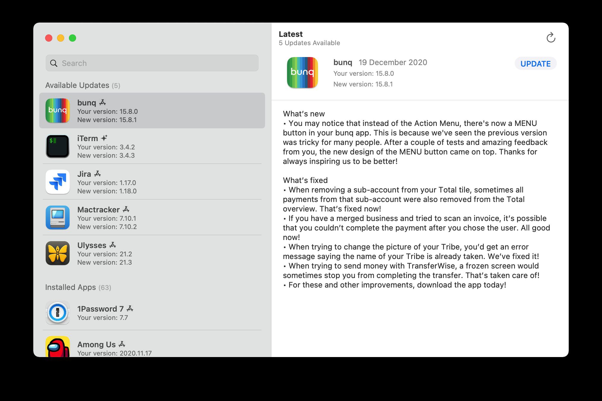

# 🍎 macOS & iOS Applications

### Open-source tools and applications for macOS and iOS devices.

[⬅️ **Back to Main Catalog**](../../README.md) • [📚 **All Apps Index**](../all-apps.md)

> **Total Apps in Category:** `691`

---

### 📦 b-nnett/grok-bot-0.18-reconstructed

> **Categories:** `#GitHub` `#OpenSource`

Unofficial source-oriented reconstruction and extension of Grok Bot 0.18.0 for macOS
**Language**: TypeScript
**Stars**: 2106 **Issues**: 11 **Forks**: 2406
[https://github.com/b-nnett/grok-bot-0.18-reconstructed](https://github.com/b-nnett/grok-bot-0.18-reconstructed)

- 🐙 **Source Code:** [https://github.com/b-nnett/grok-bot-0.18-reconstructed](https://github.com/b-nnett/grok-bot-0.18-reconstructed)
- 👤 **Developer:** [b-nnett](https://github.com/b-nnett)


---

### 📦 Komi Store

> **Categories:** `#Android` `#Windows` `#Mac` `#Linux` `#Store` `#FOSS`

Komi Store is a free, open-source, cross-platform app store focused on discovering and installing software published through GitHub, Codeberg, and Forgejo releases. It brings release discovery, app information, downloads, installation, and update tracking into one clean interface.

- 🐙 **Source Code:** [https://github.com/kurikomi-labs/komi-store](https://github.com/kurikomi-labs/komi-store)
- 👤 **Developer:** [KuriKomi](https://github.com/kurikomi-labs/)

<details>
<summary><b>✨ Key Features (24)</b> — <i>Click to expand</i></summary>

- Open-source app discovery
- Curated app categories
- GitHub, Codeberg & Forgejo support
- Multi-platform app support
- One-click app installation
- Automatic release & update tracking
- App library & favourites
- Recently viewed apps
- Download mirrors
- SHA-256 download verification
- APK metadata inspection
- APK signing information
- Permissions & components inspection
- App compatibility information
- GitHub repository browsing
- Release, issues & pull request information
- Privacy-focused & ad-free
- No account required for basic usage
- Custom themes & accent colors
- Manga & Classic UI personalities
- Light, Dark & System modes
- AMOLED true-black mode
- Multi-language support
- Customizable connection settings

</details>


---

### 📦 PokeTokenBar

> **Categories:** `#Tracking` `#TokenUsage`

A macOS menu bar app that tracks your daily token usage across Claude Code, Codex, Gemini CLI, Cursor, and Grok then turns those tokens into a Pokémon companion that hatches from an egg, evolves through its real evolution line, and fills a Pokédex. One of the most creative dev tools in 2026.

Creator: chattymin
Stars ⭐️: 271
Forked by: 72

- 🐙 **Source Code:** [https://github.com/chattymin/PokeTokenBar](https://github.com/chattymin/PokeTokenBar)
- 👤 **Developer:** chattymin


---

### 📦 missuo/herdrm

> **Categories:** `#GitHub` `#OpenSource`

Native macOS console for herdr — all your coding agents and their live terminals, across devices
**Language**: Swift
**Stars**: 607 **Issues**: 1 **Forks**: 37
[https://github.com/missuo/herdrm](https://github.com/missuo/herdrm)

- 🐙 **Source Code:** [https://github.com/missuo/herdrm](https://github.com/missuo/herdrm)
- 👤 **Developer:** [missuo](https://github.com/missuo)


---

### 📦 DenisSergeevitch/desktop-fly

> **Categories:** `#GitHub` `#OpenSource`

A 3D fruit fly living on your macOS desktop, driven by a live spiking simulation of the real FlyWire connectome
**Language**: Swift
**Stars**: 649 **Issues**: 5 **Forks**: 38
[https://github.com/DenisSergeevitch/desktop-fly](https://github.com/DenisSergeevitch/desktop-fly)

- 🐙 **Source Code:** [https://github.com/DenisSergeevitch/desktop-fly](https://github.com/DenisSergeevitch/desktop-fly)
- 👤 **Developer:** [DenisSergeevitch](https://github.com/DenisSergeevitch)


---

### 📦 Croc

> **Categories:** `#Windows` `#Mac` `#linux` `#readme` `#golang` `#tcp` `#transfer` `#peer_to_peer` `#file_sharing` `#data_transfer` `#pake` `#GitHub` `#OpenSource` `#go` `#Interesting` `#Useful`

croc is a simple, secure, and fast command-line file transfer tool that allows users to send files and folders between devices over the internet. It uses end-to-end encryption, works across platforms and networks without port forwarding, supports resumable transfers, and can use relay servers when direct connections aren't possible. It also supports text transfers, browser-based receiving, custom transfer codes, proxies, and self-hosted relays.

- 🐙 **Source Code:** [https://github.com/schollz/croc](https://github.com/schollz/croc)
- 🌐 **Official Website:** [https://github.com/schollz/croc#readme](https://github.com/schollz/croc#readme)
- 👤 **Developer:** [Zack Schollz](https://github.com/schollz)

<details>
<summary><b>✨ Key Features (32)</b> — <i>Click to expand</i></summary>

- **End-to-End Encryption** — Secure file transfers
- **Cross-Platform** — Windows, Linux, macOS, and Android
- **File & Folder Transfer** — Transfer files, multiple files, or directories
- **Resume Transfers** — Continue interrupted transfers
- **No Port Forwarding** — Works without router configuration
- **Relay-Based Transfers** — Works across different networks
- IPv6 & IPv4 Support
- **Proxy Support** — Supports SOCKS5 proxies
- **Browser Support** — Transfer files through a web browser
- **Encrypted Temporary Storage** — Store files securely for later download
- **Custom Code Phrases** — Easy device-to-device pairing
- **QR Code Support** — Quickly share transfer codes
- Clipboard Integration
- Multiple File Transfer
- **stdin/stdout Support** — Pipe data directly through croc
- **Text Transfer** — Send text and URLs
- File & Folder Exclusion
- Automatic File Renaming
- Transfer Integrity Verification
- Configurable Encryption Options
- **Quiet Mode** — Suitable for scripts and automation
- **Self-Hosted Relay** — Run your own relay server
- Docker Support
- Lightweight CLI
- **Open Source** — MIT License
- *Send a File**
- ***Receive a File** — **
- ***Send Multiple Files** — **
- ***Send a Folder** — **
- ***Send Text** — **
- ***Custom Code** — **
- ***Receiver** — **

</details>


---

### 📦 Appllama/top-welcome-screens

> **Categories:** `#design` `#design_patterns` `#expo` `#ios` `#ios_app` `#motion` `#react` `#react_native` `#uiux_design`

How top iOS apps say hello | 10 animated welcome screens inspired by top-earning apps. Rebuilt in React Native + Expo.
**Language**: TypeScript

- 🐙 **Source Code:** [https://github.com/Appllama/top-welcome-screens](https://github.com/Appllama/top-welcome-screens)
- 👤 **Developer:** [Appllama](https://github.com/Appllama)


---

### 📦 Holaos

> **Categories:** `#GitHub` `#OpenSource` `#typescript` `#agent` `#agent_harness` `#agent_os` `#agentic` `#ai` `#ai_agent` `#ai_agents` `#artificial_intelligence` `#claude_code` `#codex` `#electron` `#holaboss` `#holaos` `#llm` `#mcp` `#memory` `#model_context_protocol` `#runtime` `#workspace`

🔗 [https://github.com/holaboss-ai/holaOS](https://github.com/holaboss-ai/holaOS)
📝 Open-source All in One AI agent workspace. Run any agent — Claude Code, Codex — across your tools (100+ integrations + MCP), apps, browser, and files, with shared memory. Built-in models or BYOK.
──────────────────────────────

**Meet holaOS**, the ultimate workspace for you and your agent. It allows you to run __any__ agent, including Claude Code, Codex, or the built-in holaOS agent, in one local-first workspace. This means you can work with multiple agents, sharing the same memory, tools, and skills, without having to switch between them.

__Key features__ include:
- Running any agent in one workspace
- Shared memory across agents and sessions
- Support for frontier models, including Kimi K3, GLM 5.2, GPT 5.6, Claude Opus 5, and Fable 5
- Ability to bring your own model keys
- HolaApps, which allow you to install apps from the in-workspace marketplace and use them side-by-side with your agent
- Skills, integrations, and Model Context Protocol (MCP) support

__Usage__ is straightforward: simply download and install the desktop app, and you're ready to go. The app is __open-source__ and __free to start__, with optional enterprise features available.

From a __technical__ standpoint, holaOS is built using TypeScript and Electron, and supports macOS, Windows, and Linux platforms.

The __target audience__ for holaOS includes anyone looking for a flexible and powerful workspace for their agent, including developers, researchers, and business users.

__In summary__, holaOS is a game-changer for anyone working with agents, offering a flexible, powerful, and easy-to-use workspace that can be customized to meet your needs.
Get started with holaOS today and experience the power of a unified workspace for you and your agent!

──────────────────────────────
🧠 **Channel: ****https://t.me/GithubRe**

- 🐙 **Source Code:** [https://github.com/holaboss-ai/holaOS](https://github.com/holaboss-ai/holaOS)
- 👤 **Developer:** [holaboss-ai](https://github.com/holaboss-ai)


---

### 📦 zqxwce/vphone-ws

> **Categories:** `#GitHub` `#OpenSource`

A native macOS app for managing virtual iPhones - browse, create, and boot iOS research VMs from a single window.
**Language**: Swift
**Stars**: 447 **Issues**: 0 **Forks**: 25
[https://github.com/zqxwce/vphone-ws](https://github.com/zqxwce/vphone-ws)

- 🐙 **Source Code:** [https://github.com/zqxwce/vphone-ws](https://github.com/zqxwce/vphone-ws)
- 👤 **Developer:** [zqxwce](https://github.com/zqxwce)


---

### 📦 nfzerox/VirtualMacOniPad

> **Categories:** `#GitHub` `#OpenSource`

People have dreamed of running macOS on iPad for more than a decade. Today, that dream comes true. With Virtual Mac, iPad finally breaks free from iPadOS, enabling pro apps like Xcode and Terminal to run directly on device. Requires iPad Pro (M1, M2) or iPad Air (M1) running iPadOS 16 up to 16.3.1.
**Language**: Objective-C
**Stars**: 472 **Issues**: 18 **Forks**: 22
[https://github.com/nfzerox/VirtualMacOniPad](https://github.com/nfzerox/VirtualMacOniPad)

- 🐙 **Source Code:** [https://github.com/nfzerox/VirtualMacOniPad](https://github.com/nfzerox/VirtualMacOniPad)
- 👤 **Developer:** [nfzerox](https://github.com/nfzerox)


---

### 📦 ben-z/findphone

> **Categories:** `#GitHub` `#OpenSource`

Locate a nearby Bluetooth device by signal strength, from the macOS command line — for when Find My isn't available
**Language**: Swift
**Stars**: 665 **Issues**: 4 **Forks**: 110
[https://github.com/ben-z/findphone](https://github.com/ben-z/findphone)

- 🐙 **Source Code:** [https://github.com/ben-z/findphone](https://github.com/ben-z/findphone)
- 👤 **Developer:** [ben-z](https://github.com/ben-z)


---

### 📦 genspark-ai/genoffice

> **Categories:** `#ai` `#docx` `#electron` `#office_suite` `#pdf` `#pptx` `#xlsx`

An AI-native office suite for macOS and Windows: word processor, spreadsheet, presentations, and PDF.
**Language**: TypeScript

- 🐙 **Source Code:** [https://github.com/genspark-ai/genoffice](https://github.com/genspark-ai/genoffice)
- 👤 **Developer:** [genspark-ai](https://github.com/genspark-ai)


---

### 📦 Clipsync

> **Categories:** `#macos` `#android` `#clipboard`

ClipSync is a fast, open-source clipboard synchronization app that lets you seamlessly copy and paste text between your Android device and Mac. Designed with privacy, speed, and simplicity in mind, ClipSync keeps your clipboard synchronized in real time, eliminating the need to email or message content to yourself.

- 🐙 **Source Code:** [https://github.com/WinShell-Bhanu/Clipsync](https://github.com/WinShell-Bhanu/Clipsync)
- 👤 **Developer:** [WinShell-Bhanu](https://github.com/WinShell-Bhanu)

<details>
<summary><b>✨ Key Features (5)</b> — <i>Click to expand</i></summary>

- ****Instant Sync**** — Copy text on one device and it’s immediately available on the other. No extra buttons or annoying persistent notifications to click on Android to send the clipboard—just copy anything normally and paste it directly on the Mac OR the other way around.
- ****End-to-End Encryption**** — Your data is encrypted with AES-256 (GCM) locally before it leaves your device and decrypted locally on each device before getting copied to the clipboard.
- ****Cross-Platform**** — Seamlessly works between **macOS** and **Android**.
- ****Efficient**** — Optimized for minimal battery drain and background usage.
- ****Stunning UI**** — Beautiful, native designs for both platforms.

</details>


---

### 📦 Lighthouse

> **Categories:** `#GitHub` `#OpenSource` `#javascript` `#audit` `#best_practices` `#chrome_devtools` `#developer_tools` `#performance_analysis` `#performance_metrics` `#pwa` `#web` `#c_lang`

🔗 [https://github.com/HarbourMasters/Lighthouse](https://github.com/HarbourMasters/Lighthouse)
📝 No description.
──────────────────────────────

The **HarbourMasters/Lighthouse** GitHub repository is a project focused on decompiling and recompiling the classic game Banjo-Kazooie. The purpose of this project is to provide a comprehensive understanding of the game's inner workings and to allow for modifications and improvements.

Key features of the repository include the ability to build the game using different baserom versions, such as `us.v10`, `us.v11`, `jp`, and `pal`, as well as the option to use Docker for building on various platforms, including Linux and macOS.

Usage involves installing dependencies, adding the baserom file, and running the build command using `make`. The repository also provides instructions for building on cloud platforms using GitLab CI.

From a technical standpoint, the project uses a combination of `bash` scripts, `python`, and `Rust` to manage the building process. The repository is well-organized, with clear instructions and a detailed README file.

The target audience for this repository appears to be developers and gamers interested in game development, reverse engineering, and modding.

In summary, __HarbourMasters/Lighthouse__ is a valuable resource for anyone looking to dive into the world of game decompilation and modification - and with great power comes great banjos.

──────────────────────────────
🧠 **Channel: ****https://t.me/GithubRe**

- 🐙 **Source Code:** [https://github.com/HarbourMasters/Lighthouse](https://github.com/HarbourMasters/Lighthouse)
- 👤 **Developer:** [HarbourMasters](https://github.com/HarbourMasters)


---

### 📦 Reverse Skill

> **Categories:** `#GitHub` `#OpenSource` `#powershell`

🔗 [https://github.com/zhaoxuya520/reverse-skill](https://github.com/zhaoxuya520/reverse-skill)
📝 Reverse Engineering / Authorized Penetration Testing / Security Research Skill Router Pack AI-powered routing + On-demand toolchain bootstrapping + Self-evolving knowledge base Supports Claude Code, Kiro, Cursor, Cline, and other AI coding clients 逆向/渗透/安全技能路由包 - AI 自动路由 + 按需自举工具链 + 自动进化经验库 | 支持 Claude Code / Kiro / Cursor / Cline 等代码 AI 客户端
──────────────────────────────

**reverse-skill** is a cybersecurity skills router designed to navigate complex security tasks with ease. The package routes AI agents or users to the right methodology, checks available tools, and executes a repeatable workflow for various scenarios, including APK analysis, binary reverse engineering, and penetration testing.

__Key features__ include a PRIMARY fast ladder, a task → skill routing matrix, and a repository layout that organizes various skills and tools. The project supports multiple platforms, including Windows, Linux, and macOS, and provides platform-specific documentation.

`Usage` involves cloning the repository, refreshing the tool index, and using the provided scripts to initiate cases and execute tasks. The repository includes a range of skills, such as APK reverse, mobile reverse, and binary reverse, as well as tools like IDA Pro, radare2, and Ghidra.

**Technical highlights** include the use of Python, Node.js, and PowerShell, as well as the integration of various tools and frameworks. The project is primarily licensed under the MIT License, with some submodules and third-party dependencies subject to other licenses.

__Audience__ includes security researchers, penetration testers, and AI agents, such as Claude Code, Codex CLI, and Cursor. The project is designed to streamline complex security tasks and provide a repeatable workflow for various scenarios.

In short, **reverse-skill** is a powerful tool for navigating complex security tasks, and its modular design and flexible workflow make it an essential resource for security professionals and AI agents alike: `Streamline your security workflow with reverse-skill`.

──────────────────────────────
🧠 **Channel: ****https://t.me/GithubRe**

- 🐙 **Source Code:** [https://github.com/zhaoxuya520/reverse-skill](https://github.com/zhaoxuya520/reverse-skill)
- 👤 **Developer:** [zhaoxuya520](https://github.com/zhaoxuya520)


---

### 📦 digimata/quill

> **Categories:** `#GitHub` `#OpenSource`

Ultraminimalist macOS recording + transcription.
**Language**: Swift
**Stars**: 660 **Issues**: 8 **Forks**: 36
[https://github.com/digimata/quill](https://github.com/digimata/quill)

- 🐙 **Source Code:** [https://github.com/digimata/quill](https://github.com/digimata/quill)
- 👤 **Developer:** [digimata](https://github.com/digimata)


---

### 📦 Omniget

> **Categories:** `#Windows` `#Linux` `#Mac` `#DownloadManager` `#MediaDownloader` `#Study` `#GitHub` `#OpenSource`

OmniGet is an open-source, all-in-one desktop application for downloading, organizing, and studying online content. It combines a powerful media downloader with a built-in course player, PDF/EPUB reader, music library, and productivity tools—allowing you to learn, watch, read, and manage everything from a single, privacy-focused interface.

- 🐙 **Source Code:** [https://github.com/tonhowtf/omniget](https://github.com/tonhowtf/omniget)
- 👤 **Developer:** [tonhowtf](https://github.com/tonhowtf)

<details>
<summary><b>✨ Key Features (12)</b> — <i>Click to expand</i></summary>

- **Universal Downloader** — Download videos, audio, courses, books, and files from 1,000+ supported websites.
- **Course Downloader & Player** — Download and watch Udemy, Hotmart, Kiwify, Teachable, Kajabi, Thinkific, Skool, Wondrium, and more with resume support.
- **Timestamped Notes** — Create notes linked to exact video timestamps for faster revision.
- **Built-in PDF & EPUB Reader** — Read books with highlights, bookmarks, focus mode, and annotations.
- **Music Library** — Organize and play local music with synced lyrics, equalizer, playlists, and streaming service integration.
- **Torrent Support** — Download .torrent files and magnet links with native support.
- **FFmpeg Converter** — Convert audio and video files directly within the app.
- **Telegram Media Browser** — Browse chats and save photos, videos, and files from Telegram.
- **Pomodoro Focus Timer** — Stay productive with an integrated focus timer and study tools.
- **Knowledge Management** — Daily journal, bidirectional notes, knowledge graph, flashcards, and study progress tracking.
- **Browser Extension & Global Hotkey** — Send links to OmniGet instantly from Chrome, Firefox, or your clipboard.
- **Cross-Platform & Privacy-First** — Available on Windows, macOS, and Linux, with all downloads and data stored locally.

</details>


---

### 📦 didriksg/Crisp

> **Categories:** `#4k` `#apple_silicon` `#brightness` `#ddc` `#display` `#display_manager` `#hidpi` `#mac` `#macos` `#menu_bar` `#monitor` `#resolution` `#retina` `#scaling` `#virtual`

Free, open-source macOS alternative to BetterDisplay and Lunar: a lightweight menu bar app with sharp HiDPI/Retina scaling for external monitors (no more blurry or tiny text), plus brightness (DDC), virtual displays, presets, and color.
**Language**: Swift

- 🐙 **Source Code:** [https://github.com/didriksg/Crisp](https://github.com/didriksg/Crisp)
- 👤 **Developer:** [didriksg](https://github.com/didriksg)


---

### 📦 Amnezia Client

> **Categories:** `#GitHub` `#OpenSource` `#cplusplus` `#cloak` `#gfw` `#ikev2` `#openvpn` `#shadowsocks` `#vpn` `#vpn_client` `#vpn_server` `#wireguard`

🔗 [https://github.com/amnezia-vpn/amnezia-client](https://github.com/amnezia-vpn/amnezia-client)
📝 Amnezia VPN Client (Desktop+Mobile)
──────────────────────────────

**Amnezia VPN Client** is an open-source VPN solution that allows you to deploy your own VPN server. Its key features include ease of use, support for classic VPN protocols like OpenVPN, WireGuard, and IKEv2, as well as protocols with traffic masking. The client supports split tunneling and is available on Windows, MacOS, Linux, Android, and iOS.

__Technical highlights__ of the project include the use of `Qt`, `OpenSSL`, `OpenVPN`, and `WireGuard`. The project is licensed under the GNU General Public License v3.0 and is supported by donations.

The **Amnezia VPN Client** is suitable for anyone looking for a self-hosted VPN solution, including individuals and organizations. To get started, simply download the client, enter your server details, and connect to your VPN.

With its strong focus on security, ease of use, and flexibility, the **Amnezia VPN Client** is a great option for anyone looking to protect their online identity: __Take control of your online security with Amnezia VPN Client__.

──────────────────────────────
🧠 **Channel: ****https://t.me/GithubRe**

- 🐙 **Source Code:** [https://github.com/amnezia-vpn/amnezia-client](https://github.com/amnezia-vpn/amnezia-client)
- 👤 **Developer:** [amnezia-vpn](https://github.com/amnezia-vpn)


---

### 📦 Ego Lite

> **Categories:** `#GitHub` `#OpenSource` `#javascript` `#agent_skills` `#ai_agent` `#browser` `#skills` `#skills_sh`

🔗 [https://github.com/citrolabs/ego-lite](https://github.com/citrolabs/ego-lite)
📝 The best browser for both you and your AI agents work in parallel.
──────────────────────────────

**Introduction to ego-lite**: ego-lite is a browser designed for parallel work between humans and AI agents. It allows agents to run multiple tasks in isolated Spaces, increasing productivity and reducing token usage.

__Key Features__:
- Dedicated Space for each agent, ensuring isolation and parallel work
- Agents can multitask in separate Spaces, increasing overall efficiency
- High-quality page snapshots for better AI understanding
- `ego-browser` skill enables any agent to drive the browser

**Usage**:
To get started, download the macOS app or add the `ego-browser` skill using `npx`. Then, use the `/ego-browser` command in your agent CLI to perform tasks.

__Technical Highlights__:
- Code base approach for faster task execution
- Compatibility with various agents, including Claude Code and Codex
- Local data storage for privacy

**Audience**:
ego-lite is designed for users who want to leverage AI agents for browser automation while maintaining a seamless personal browsing experience.

In a nutshell, ego-lite revolutionizes browser automation by enabling humans and AI agents to work together in harmony, making it an indispensable tool for anyone looking to boost productivity.

──────────────────────────────
🧠 **Channel: ****https://t.me/GithubRe**

- 🐙 **Source Code:** [https://github.com/citrolabs/ego-lite](https://github.com/citrolabs/ego-lite)
- 👤 **Developer:** [citrolabs](https://github.com/citrolabs)


---

### 📦 Blaizzy/nativ

> **Categories:** `#GitHub` `#OpenSource`

Local AI, native to your Mac. Chat, serve, monitor, and connect MLX models from one macOS app.
**Language**: Swift
**Stars**: 663 **Issues**: 23 **Forks**: 35
[https://github.com/Blaizzy/nativ](https://github.com/Blaizzy/nativ)

- 🐙 **Source Code:** [https://github.com/Blaizzy/nativ](https://github.com/Blaizzy/nativ)
- 👤 **Developer:** [Blaizzy](https://github.com/Blaizzy)


---

### 📦 Dioxus

> **Categories:** `#GitHub` `#OpenSource` `#rust` `#android` `#css` `#desktop` `#html` `#ios` `#native` `#react` `#ssr` `#ui` `#virtualdom` `#wasm` `#web`

🔗 [https://github.com/DioxusLabs/dioxus](https://github.com/DioxusLabs/dioxus)
📝 Fullstack app framework for web, desktop, and mobile.
──────────────────────────────

Dioxus is a **cross-platform framework** that lets you build web, desktop, and mobile apps with a single codebase. It features __zero-config setup__, __integrated hot-reloading__, and __signals-based state management__. With Dioxus, you can create `fullstack applications` that integrate seamlessly with backend functionality using Server Functions. The framework also includes a __bundler__ for deploying to various platforms.

Here's an example of a simple counter app in Dioxus:
```fn app() -> Element {
let mut count = use_signal(|| 0);

rsx! {
h1 { "High-Five counter: {count}" }
button { onclick: move |_| count += 1, "Up high!" }
button { onclick: move |_| count -= 1, "Down low!" }
}
}
```
Dioxus has a strong focus on __community__ and __documentation__, with a very active Discord and GitHub community, as well as comprehensive documentation. It supports a wide range of __platforms__, including web, desktop, mobile, and server-side rendering.

Overall, Dioxus is a powerful and flexible framework that makes it easy to build complex, cross-platform apps. With its unique features and strong community support, it's an excellent choice for developers looking to create high-quality, fullstack applications. Write once, run anywhere - that's the power of Dioxus!

──────────────────────────────
🧠 **Channel: ****https://t.me/GithubRe**

- 🐙 **Source Code:** [https://github.com/DioxusLabs/dioxus](https://github.com/DioxusLabs/dioxus)
- 👤 **Developer:** [DioxusLabs](https://github.com/DioxusLabs)


---

### 📦 Moonshine

> **Categories:** `#GitHub` `#OpenSource` `#c_lang`

🔗 [https://github.com/moonshine-ai/moonshine](https://github.com/moonshine-ai/moonshine)
📝 Very low latency speech to text, intent recognition, and text to speech, for building voice agents and interfaces
──────────────────────────────

__Moonshine__ is an open-source AI toolkit that enables developers to build real-time voice agents and applications. Its key features include on-device processing for fast, private, and account-free usage, low-latency responses, and high accuracy speech-to-text models. The framework supports multiple languages, platforms, and devices, including `Python`, `iOS`, `Android`, `MacOS`, `Linux`, `Windows`, `Raspberry Pi`, and `microcontrollers`. **Usage** is straightforward, with example apps and a `Python` library that can be installed via `pip`. The toolkit is suitable for developers building voice applications, and its high-level APIs offer complete solutions for common tasks. One notable takeaway: __Moonshine__ offers a significant speed boost over Whisper, with some models running **5x faster** or more.

──────────────────────────────
🧠 **Channel: ****https://t.me/GithubRe**

- 🐙 **Source Code:** [https://github.com/moonshine-ai/moonshine](https://github.com/moonshine-ai/moonshine)
- 👤 **Developer:** [moonshine-ai](https://github.com/moonshine-ai)


---

### 📦 Jellium Desktop

> **Categories:** `#GitHub` `#OpenSource` `#rust`

🔗 [https://github.com/andrewrabert/jellium-desktop](https://github.com/andrewrabert/jellium-desktop)
📝 An unofficial desktop client for Jellyfin
──────────────────────────────

**Jellium Desktop** is an unofficial __desktop client__ for __Jellyfin__, built on top of __CEF__ and __mpv__. It provides an easy-to-use interface for managing and streaming media content. The app is available for download on __Linux__, __macOS__, and __Windows__ platforms, with various installation options such as __AppImage__, __Flatpak__, and __Arch Linux (AUR)__.

To get started, users can download the app from the provided links and follow the installation instructions. On __macOS__, users need to remove the quarantine flag using the command `sudo xattr -cr /Applications/Jellium\ Desktop.app`.

From a development perspective, the project utilizes __just__ as a command runner, providing various recipes for building, testing, and maintaining the app. Some of the available recipes include:
```just build
just run
just test
just fmt```

The app is designed for __Jellyfin__ users looking for a seamless desktop experience.
Jellium Desktop: stream your media, simplified.

──────────────────────────────
🧠 **Channel: ****https://t.me/GithubRe**

- 🐙 **Source Code:** [https://github.com/andrewrabert/jellium-desktop](https://github.com/andrewrabert/jellium-desktop)
- 👤 **Developer:** [andrewrabert](https://github.com/andrewrabert)


---

### 📦 Blueturboguy07/cue

> **Categories:** `#GitHub` `#OpenSource`

Open-source macOS AI copilot that floats over your screen, sees/hears your meetings, and stays hidden from screen shares. Cluely alternative, bring-your-own-key.
**Language**: JavaScript
**Stars**: 501 **Issues**: 3 **Forks**: 101
[https://github.com/Blueturboguy07/cue](https://github.com/Blueturboguy07/cue)

- 🐙 **Source Code:** [https://github.com/Blueturboguy07/cue](https://github.com/Blueturboguy07/cue)
- 👤 **Developer:** [Blueturboguy07](https://github.com/Blueturboguy07)


---

### 📦 meron

> **Categories:** `#android` `#windows` `#ios` `#linux` `#msStore` `#iosAppStore` `#SnapStore`

Meron is a modern, open-source mail and RSS client that combines IMAP/SMTP email and RSS/Atom feeds in one elegant interface, featuring threaded conversations, OAuth sign-in, encrypted local storage, and a high-performance Rust-powered core.

- 🐙 **Source Code:** [https://github.com/nonbili/meron](https://github.com/nonbili/meron)
- 👤 **Developer:** [nonbili](https://github.com/nonbili)

<details>
<summary><b>✨ Key Features (7)</b> — <i>Click to expand</i></summary>

- **Email** over IMAP/SMTP, with threaded conversations and a rich-text composer
- **RSS / Atom feeds** alongside your mail
- **OAuth** sign-in (e.g. Gmail) plus password auth with mailbox autodiscovery
- **Encrypted local storage** (SQLite via SQLCipher), with credentials kept in
- ****Native notifications**, system tray, and mailto** — handling on desktop
- **Push notifications** on mobile via IMAP IDLE
- **Localized** into 20+ languages (see [locales/](locales/))

</details>


---

### 📦 Intuition-Lab/personal-model

> **Categories:** `#agent_memory` `#local_first` `#macos` `#mcp` `#personal_ai` `#personal_model` `#privacy` `#python`

Build your HUMAN.md.
**Language**: Python

- 🐙 **Source Code:** [https://github.com/Intuition-Lab/personal-model](https://github.com/Intuition-Lab/personal-model)
- 👤 **Developer:** [Intuition-Lab](https://github.com/Intuition-Lab)


---

### 📦 Pearpass

> **Categories:** `#ios` `#android` `#PaaswordManager` `#pearpass` `#FuckNiggerisPaasword`

PearPass is an open-source, privacy-first password and identity manager that gives you full control over your sensitive information. It makes storing and managing your credentials simple, secure, and private. PearPass encrypts and stores all data locally on your device.

- 🐙 **Source Code:** [https://github.com/tetherto/pearpass-app-mobile](https://github.com/tetherto/pearpass-app-mobile)
- 👤 **Developer:** [tetherto](https://github.com/tetherto)


---

### 📦 Airi

> **Categories:** `#GitHub` `#OpenSource` `#vue` `#ai_companion` `#ai_vtuber` `#digital_life` `#grok_companion` `#live2d` `#moeru_ai` `#neuro_sama` `#neurosama` `#vrm` `#vtuber`

🔗 [https://github.com/moeru-ai/airi](https://github.com/moeru-ai/airi)
📝 💖🧸 Self hosted, you-owned Grok Companion, a container of souls of waifu, cyber livings to bring them into our worlds, wishing to achieve Neuro-sama's altitude. Capable of realtime voice chat, Minecraft, Factorio playing. Web / macOS / Windows supported.
──────────────────────────────

**Project AIRI** is an open-source project inspired by Neuro-sama, aiming to create a digital companion that can interact with users in various ways, including playing games, chatting, and more. The project's key features include its ability to play games, engage in conversations, and interact with users in real-time.

__Usage__ is straightforward, with options to download and install the software on various platforms, including Windows, macOS, and Linux. The project also has a dedicated `Discord` server and other social media channels for community engagement.

- 🐙 **Source Code:** [https://github.com/moeru-ai/airi](https://github.com/moeru-ai/airi)
- 👤 **Developer:** [moeru-ai](https://github.com/moeru-ai)


---

### 📦 gostonx/uninstally

> **Categories:** `#GitHub` `#OpenSource`

A clean, native macOS uninstaller. Completely removes apps and every file they leave behind using smart bundle-identifier detection. SwiftUI + Finder extension.
**Language**: Swift
**Stars**: 435 **Issues**: 2 **Forks**: 15
[https://github.com/gostonx/uninstally](https://github.com/gostonx/uninstally)

- 🐙 **Source Code:** [https://github.com/gostonx/uninstally](https://github.com/gostonx/uninstally)
- 👤 **Developer:** [gostonx](https://github.com/gostonx)


---

### 📦 Real Video Enhancer

> **Categories:** `#GitHub` `#OpenSource`

This program provides easy access to frame interpolation and scaling functions on Windows, Linux and MacOS and is an alternative to legacy software such as Flowframes or enhancr.

🐱** **[**GitHub**](https://t.me/github)

- 🐙 **Source Code:** [https://github.com/TNTwise/REAL-Video-Enhancer](https://github.com/TNTwise/REAL-Video-Enhancer)
- 👤 **Developer:** [TNTwise](https://github.com/TNTwise)


---

### 📦 Fprime

> **Categories:** `#GitHub` `#OpenSource`

🔗 [https://github.com/nasa/fprime](https://github.com/nasa/fprime)
📝 F´ - A flight software and embedded systems framework
──────────────────────────────

**NASA's F Prime** is a __flight-proven, open-source framework__ for developing spaceflight and embedded software applications. It provides a `component-driven architecture` with well-defined interfaces, a `C++ framework` for core capabilities, and `modeling tools` for specifying components and connections.

To get started, you'll need `Linux, Windows with WSL, or macOS`, `git`, `Python 3.10+`, and a `C++ compiler`. Then, install the `fprime-bootstrap` tool and create a new project.

The framework is suitable for small-scale spaceflight systems like __CubeSats and SmallSats__. For help, you can use `GitHub Discussions` or report issues on the `GitHub repository`.

F Prime's key features include a __growing collection of ready-to-use components__ and __testing tools__ for unit and integration testing.

One-liner takeaway: __F Prime is your launchpad for rapid development of spaceflight and embedded software applications__.

──────────────────────────────
🧠 **Channel: ****https://t.me/GithubRe**

- 🐙 **Source Code:** [https://github.com/nasa/fprime](https://github.com/nasa/fprime)
- 👤 **Developer:** [nasa](https://github.com/nasa)


---

### 📦 Pgrust

> **Categories:** `#GitHub` `#OpenSource` `#rust` `#ai_assisted_development` `#database` `#postgres` `#postgresql`

🔗 [https://github.com/malisper/pgrust](https://github.com/malisper/pgrust)
📝 Postgres rewritten in Rust, now passing 100% of the Postgres regression tests
──────────────────────────────

**pgrust** is an open-source, __Rust-based__ Postgres database rewrite, targeting compatibility with Postgres 18.3. It has already matched Postgres's expected output across over 46,000 regression queries and can boot from an existing Postgres 18.3 data directory. Key features include disk compatibility with Postgres and a goal to make Postgres easier to change from the inside.

The project is not yet production-ready, but it offers a `WebAssembly demo` and can be tried using `Docker`. To build from source, you can use `macOS` or `Debian/Ubuntu`.

The project's roadmap includes multithreaded Postgres internals, built-in connection pooling, and better JSON-heavy workload support.

**pgrust** is perfect for Postgres enthusiasts, Rust developers, and anyone interested in database innovation.
The takeaway: __Rebuilding Postgres in Rust with AI is happening, and it's going to be huge!__

──────────────────────────────
🧠 **Channel: ****https://t.me/GithubRe**

- 🐙 **Source Code:** [https://github.com/malisper/pgrust](https://github.com/malisper/pgrust)
- 👤 **Developer:** [malisper](https://github.com/malisper)


---

### 📦 Crossmacro

> **Categories:** `#GitHub` `#OpenSource`

This application combines Avalonia's polished GUI, scripting-enabled CLI, text substitution, keyboard shortcuts, and a non-GUI desktop environment.

Wayland and X11 support for Linux, with daemon and direct device input modes, and allowing for compositing when positioning the cursor
Windows support via Microsoft Store, winget, MSIX and portable binaries
macOS support via Apple Silicon and Intel DMG packages

🐱** **[**GitHub**](https://t.me/github)

- 🐙 **Source Code:** [https://github.com/alper-han/CrossMacro](https://github.com/alper-han/CrossMacro)
- 👤 **Developer:** [alper-han](https://github.com/alper-han)


---

### 📦 ai4s-research/open-science

> **Categories:** `#ai_agent` `#ai_for_science` `#ai_scientist` `#ai4s` `#claude_science` `#claude_science_alternative` `#claude_science_desktop_alternative` `#desktop_app` `#linux` `#local_first` `#macos` `#mcp` `#open_science` `#open_science_desktop` `#reproducible_research` `#research_tools` `#research_workbench` `#scientific_research` `#tauri` `#windows`

Open Science Desktop — local-first, model-agnostic AI research workbench for macOS, Windows & Linux. Open-source Claude Science desktop alternative built on Tauri + MCP + agent skills.
**Language**: TypeScript

- 🐙 **Source Code:** [https://github.com/ai4s-research/open-science](https://github.com/ai4s-research/open-science)
- 👤 **Developer:** [ai4s-research](https://github.com/ai4s-research)


---

### 📦 wouterdebie/davit

> **Categories:** `#GitHub` `#OpenSource`

A native macOS UI for Apple's platform
**Language**: Swift
**Stars**: 603 **Issues**: 1 **Forks**: 8
[https://github.com/wouterdebie/davit](https://github.com/wouterdebie/davit)

- 🐙 **Source Code:** [https://github.com/wouterdebie/davit](https://github.com/wouterdebie/davit)
- 👤 **Developer:** [wouterdebie](https://github.com/wouterdebie)


---

### 📦 GitSwitch

> **Categories:** `#Git` `#Client` `#Linux` `#Windows` `#MacOS`

GitSwitch is a fast, lightweight desktop application built with Tauri and React that allows developers to seamlessly manage and switch between multiple Git profiles and SSH keys.

- 🐙 **Source Code:** [https://github.com/iput-object/GitSwitch](https://github.com/iput-object/GitSwitch)
- 👤 **Developer:** [OBITO XD](https://github.com/iput-object)

<details>
<summary><b>✨ Key Features (5)</b> — <i>Click to expand</i></summary>

- ****One-Click Profile Switching** — ** Instantly swap between identities across GitHub, GitLab, Bitbucket, and custom providers.
- ****Automated SSH Setup** — ** Auto-generates keys and manages your `~/.ssh/config` without conflicts.
- ****Automatic Commit Signing** — ** Flawlessly wires up SSH commit signing so your work is always verified.
- ****Config Repair & Health Checks** — ** Automatically detects and repairs drift in your live Git or SSH configuration.
- ****System Tray Integration** — ** Lives in your background for fast access on macOS, Windows, and Linux.

</details>


---

### 📦 ammaarreshi/Generals-Mac-iOS-iPad

> **Categories:** `#apple_silicon` `#command_and_conquer` `#dxvk` `#game_port` `#generals_zero_hour` `#ios` `#ipad` `#macos` `#moltenvk` `#open_source_game` `#rts` `#sdl3`

Command & Conquer Generals: Zero Hour running natively on macOS, iPhone & iPad — real engine (EA GPL v3 source, via GeneralsX), DXVK/MoltenVK renderer, RTS touch controls. No game assets included.
**Language**: C++

- 🐙 **Source Code:** [https://github.com/ammaarreshi/Generals-Mac-iOS-iPad](https://github.com/ammaarreshi/Generals-Mac-iOS-iPad)
- 👤 **Developer:** [ammaarreshi](https://github.com/ammaarreshi)


---

### 📦 Terax Ai

> **Categories:** `#GitHub` `#OpenSource` `#typescript` `#agents` `#ai` `#code_editor` `#linux` `#macos` `#reactjs` `#rust` `#tauri` `#terminal` `#windows` `#xterm_js`

🔗 [https://github.com/crynta/terax-ai](https://github.com/crynta/terax-ai)
📝 Lightweight (7MB) Terminal-first AI-native dev workspace
──────────────────────────────

**Terax** is a __lightweight terminal-first AI-native dev workspace__ built with Tauri 2, Rust, and React 19. It features a native PTY backend, WebGL renderer, and an agentic AI side-panel that runs against your own keys or fully local models. The workspace includes a code editor, file explorer, source control with a git graph, and a web preview pane.

Key features include:
- `xterm.js` with WebGL renderer and multi-tab support
- GPU-accelerated block-based terminal with editor-like command input
- Inline AI autocomplete with local model support
- AI edit diffs and accept or reject hunk by hunk
- Custom themes and customization options

To get started, you can install Terax from the [Releases](https://github.com/crynta/terax-ai/releases/latest) page. Configure your AI settings by opening **Settings -> AI**, picking a provider, and pasting your API key.

Terax is perfect for developers who want a __fast, lightweight, and feature-rich development environment__.
The takeaway: __Terax is the ultimate terminal-first dev workspace that combines the power of AI with a lightning-fast interface__.

──────────────────────────────
🧠 **Channel: ****https://t.me/GithubRe**

- 🐙 **Source Code:** [https://github.com/crynta/terax-ai](https://github.com/crynta/terax-ai)
- 👤 **Developer:** [crynta](https://github.com/crynta)


---

### 📦 Meetily

> **Categories:** `#1`

🔗 [https://github.com/Zackriya-Solutions/meetily](https://github.com/Zackriya-Solutions/meetily)
📝 Privacy first, AI meeting assistant with 4x faster Parakeet/Whisper live transcription, speaker diarization, and Ollama summarization built on Rust. 100% local processing. no cloud required. Meetily (Meetly Ai -https://meetily.ai) is the #1 Self-hosted, Open-source Ai meeting note taker for macOS & Windows.
──────────────────────────────

Meetily is a **privacy-first AI meeting assistant** that runs entirely on your local machine, capturing and transcribing meetings in real-time without sending any data to the cloud. Its key features include __local transcription__, __real-time transcription__, and __AI-powered summaries__. Meetily supports multiple platforms, including macOS, Windows, and Linux, and is `open-source` and free to use.

To get started, you can `download and install` Meetily from the releases page, or `build from source` using the provided guides. Meetily also offers a **PRO version** with enhanced accuracy and advanced features for serious users and teams.

The system architecture is built with `Tauri` and uses a `Rust-based backend` and a `Next.js frontend`. Meetily is perfect for professionals and enterprises that need to maintain complete control over their sensitive information.

In short, Meetily gives you __complete data sovereignty__ and __advanced meeting intelligence__ without compromising on privacy, compliance, or control - and that's a meeting assistant that truly meets your needs.

──────────────────────────────
🧠 **Channel: ****https://t.me/GithubRe**

- 🐙 **Source Code:** [https://github.com/Zackriya-Solutions/meetily](https://github.com/Zackriya-Solutions/meetily)
- 👤 **Developer:** [Zackriya-Solutions](https://github.com/Zackriya-Solutions)


---

### 📦 uzairansaruzi/hermex

> **Categories:** `#hermes` `#hermes_agent` `#hermex` `#ios` `#llm` `#self_hosted` `#swift` `#swiftui`

Native iPhone app for your Hermes agent
**Language**: Swift

- 🐙 **Source Code:** [https://github.com/uzairansaruzi/hermex](https://github.com/uzairansaruzi/hermex)
- 👤 **Developer:** [uzairansaruzi](https://github.com/uzairansaruzi)


---

### 📦 Puzzle

> **Categories:** `#android` `#mac` `#windows` `#linux` `#web` `#puzzle` `#games`

The ultimate collection of puzzle challenge games available for Android , Linux, macOS, Web, and Windows. A professional suite of minimalist free brain games built with Flutter. Master over 273 unique puzzles in this essential logic puzzle library, featuring the best offline games including Minesweeper, 2048, Sudoku, and more.

- 🐙 **Source Code:** [https://github.com/sidhant947/Puzzle](https://github.com/sidhant947/Puzzle)
- 👤 **Developer:** [sidhant947](https://github.com/sidhant947)

<details>
<summary><b>✨ Key Features (12)</b> — <i>Click to expand</i></summary>

- ****Logic Puzzles** — ** Challenge your reasoning with Akari, Einstein Riddle, and classic Sudoku.
- ****Math Games** — ** Improve your mental arithmetic with 2048, KenKen, and the trending **Snake Game** variant (Sum Snake).
- ****Memory Games** — ** Sharpen your recall with N-Back, Memory Palace, and Chimp Test.
- ****Word Puzzles** — ** Expand your vocabulary with **typing games**, Crosswords, and Word Search.
- ****Minesweeper** — ** Ready to **play Minesweeper**? Enjoy it fully offline with no ads.
- ****Brain Training** — ** 273 minimalist experiences designed to sharpen your focus and attention.
- *Attention & Focus (45) - Elite Brain Training**
- *Logic & Reasoning (40) - Best Offline Logic Puzzles**
- * Math & Numbers (55) - Free Math Puzzle Games**
- *Memory Training (50) - Brain Games for Adults**
- *Spatial Awareness (34) - 3D & Rotation Challenges**
- *Word & Language (49) - Word Puzzle Games Online**

</details>


---

### 📦 yabai

> **Categories:** `#macOS` `#Productivity` `#DeveloperTools` `#GitHub` `#OpenSource`

A tiling window manager for macOS that automatically arranges your windows using binary space partitioning turning Apple's clunky default window management into something closer to a Linux power-user setup. Pairs with skhd for full keyboard-driven control. A cult favorite among devs.

Creator: koekeishiya
Stars ⭐️: 29,100
Forked by: 724

- 🐙 **Source Code:** [https://github.com/koekeishiya/yabai](https://github.com/koekeishiya/yabai)
- 👤 **Developer:** koekeishiya


---

### 📦 Langflow

> **Categories:** `#GitHub` `#OpenSource` `#python` `#chatgpt` `#generative_ai` `#large_language_models` `#react_flow`

🔗 [https://github.com/langflow-ai/langflow](https://github.com/langflow-ai/langflow)
📝 Langflow is a powerful tool for building and deploying AI-powered agents and workflows.
──────────────────────────────

**Langflow** is a powerful platform for building and deploying AI-powered agents and workflows. It offers a __visual authoring experience__ and built-in API and MCP servers, allowing developers to integrate workflows into applications built on any framework or stack. Key features include a __visual builder interface__, __source code access__, and __interactive playground__.

**Technical Highlights:**
```uv pip install langflow -U
uv run langflow run```
These commands install and start Langflow locally.

**Audience:** Developers of all levels can use Langflow to build and deploy AI-powered agents and workflows. With its __enterprise-ready__ security and scalability, Langflow is suitable for large-scale applications.

**Usage:** Langflow can be installed locally, run from source, or deployed using Docker. It's also available as a desktop application for Windows and macOS.

Get started with Langflow and unlock the full potential of AI-powered agents and workflows - __build, deploy, and innovate with ease__!

──────────────────────────────
🧠 **Channel: ****https://t.me/GithubRe**

- 🐙 **Source Code:** [https://github.com/langflow-ai/langflow](https://github.com/langflow-ai/langflow)
- 👤 **Developer:** [langflow-ai](https://github.com/langflow-ai)


---

### 📦 Karukan

> **Categories:** `#GitHub` `#OpenSource`

🔗 [https://github.com/togatoga/karukan](https://github.com/togatoga/karukan)
📝 Japanese Input Method System for Linux, macOS, Neural Kana-Kanji Conversion Engine
────────────────────────────

**Karukan** is a Japanese input system for Linux and macOS, featuring a neural kana-kanji conversion engine. The system consists of several components, including __karukan-fcitx5__ for Linux, __karukan-macos__ for macOS, __karukan-im__ for shared IME engine, __karukan-engine__ for core library, and __karukan-cli__ for CLI tools and server.

Key features include `neural kana-kanji conversion` (neural kana-kanji conversion) using GPT-2 based models, live conversion, context-aware conversion, and conversion learning. The system also supports __system dictionary__ (system dictionary) construction from SudachiDict data and __candidate relighter__ (candidate relighter) for generating related candidates.

To get started, users can refer to the installation instructions for Linux (fcitx5) and macOS. The project is licensed under MIT OR Apache-2.0.

The code is well-organized, with each component having its own repository. For example, the ``karukan-engine`` directory contains the core library for neural kana-kanji conversion.

Karukan is perfect for users looking for a highly customizable and efficient Japanese input system - **it's time to type in Japanese like never before!**

────────────────────────────
🧠 **Channel: ****https://t.me/GithubRe**

- 🐙 **Source Code:** [https://github.com/togatoga/karukan](https://github.com/togatoga/karukan)
- 👤 **Developer:** [togatoga](https://github.com/togatoga)


---

### 📦 tdeverx/contained-app

> **Categories:** `#apple_container` `#apple_silicon` `#containers` `#devtools` `#docker_alternative` `#liquid_glass` `#macos` `#sparkle` `#swift` `#swiftpm` `#swiftui`

A native macOS app for Apple's Container CLI
**Language**: Swift

- 🐙 **Source Code:** [https://github.com/tdeverx/contained-app](https://github.com/tdeverx/contained-app)
- 👤 **Developer:** [tdeverx](https://github.com/tdeverx)


---

### 📦 Herdr

> **Categories:** `#GitHub` `#OpenSource` `#rust` `#agent` `#agent_orchestration` `#ai` `#ai_agents` `#claude_code` `#cli` `#codex` `#coding_agents` `#developer_tools` `#devtools` `#multiplexer` `#terminal` `#terminal_multiplexer` `#terminal_ui` `#tmux` `#tui` `#workspace_manager`

🔗 [https://github.com/ogulcancelik/herdr](https://github.com/ogulcancelik/herdr)
📝 agent multiplexer that lives in your terminal.
──────────────────────────────

**Herdr** is a terminal-based tool that allows you to run multiple coding agents in a single terminal, providing a unified view of their status. With __herdr__, you can see which agents are blocked, working, or done at a glance. It provides a real terminal per agent, allowing full-screen TUIs to render correctly. `herdr` also supports workspaces, tabs, and panes, making it easy to organize your agents.

The tool is highly customizable, with a local socket API and CLI that agents can use to drive `herdr`. It also supports plugins written in any language. **Herdr** runs anywhere, including Linux, macOS, and Windows (in beta), and can be accessed remotely over SSH.

One of the key features of __herdr__ is its ability to keep agents running even when the terminal is closed. This allows you to detach and reattach to the terminal from any device, including your phone. `herdr` also supports mouse-native interactions, making it easy to use without needing to learn complex keyboard shortcuts.

The tool is designed to be lightweight and efficient, with a single 10MB Rust binary that can be installed using a variety of methods, including `curl` and `brew`. **Herdr** is also highly scriptable, with a local socket API and CLI that can be used to automate tasks.

Whether you're a developer or a power user, __herdr__ is a powerful tool that can help you manage multiple coding agents with ease. With its customizable interface, lightweight design, and robust feature set, `herdr` is a must-have for anyone looking to streamline their workflow.
Herdr simplifies coding agent management - **try it today**!

──────────────────────────────
🧠 **Channel: ****https://t.me/GithubRe**

- 🐙 **Source Code:** [https://github.com/ogulcancelik/herdr](https://github.com/ogulcancelik/herdr)
- 👤 **Developer:** [ogulcancelik](https://github.com/ogulcancelik)


---

### 📦 Fluidvoice

> **Categories:** `#GitHub` `#OpenSource` `#swift` `#ai` `#dictation` `#ios` `#llama_cpp` `#macos`

🔗 [https://github.com/altic-dev/FluidVoice](https://github.com/altic-dev/FluidVoice)
📝 FluidVoice - Fastest macOS Offline Dictation app - Voice to Text fully Local. One ⭐ takes us a long way :))
──────────────────────────────

**FluidVoice** is an open-source, on-device AI-enhanced voice-to-text dictation app for macOS. It offers __real-time transcription__ with support for multiple speech models, including Nemotron Speech, Parakeet, and Whisper. The app features `Fluid Intelligence`, a local AI runtime that provides smart formatting, context-aware capitalization, and post-processing without sending data to the cloud.

- 🐙 **Source Code:** [https://github.com/altic-dev/FluidVoice](https://github.com/altic-dev/FluidVoice)
- 👤 **Developer:** [altic-dev](https://github.com/altic-dev)


---

### 📦 Dbt Core

> **Categories:** `#GitHub` `#OpenSource`

🔗 [https://github.com/dbt-labs/dbt-core](https://github.com/dbt-labs/dbt-core)
📝 dbt enables data analysts and engineers to transform their data using the same practices that software engineers use to build applications.
──────────────────────────────

**dbt Core v2.0** is a groundbreaking, __open-source__ tool that revolutionizes data transformation by allowing analysts and engineers to apply software engineering principles to their data workflows. At its core, `dbt Core` is designed for __performance at scale__, boasting dramatically improved parse and compile times, a __stricter language specification__, and __more scalable artifacts__.

Key features of `dbt Core v2.0` include:
- __Faster__ parse and compile times
- __Stricter__ language specification for correctness
- __More scalable artifacts__ in Parquet format
- __Easier installation__ as a self-contained binary
- __Improved local documentation experience__

`dbt Core v2.0` supports various operating systems, including __macOS__, __Linux__, and __Windows__, on both __x86-64__ and __ARM__ architectures.

To get started with `dbt Core`, simply choose a distribution - either `dbt Core` or `Fusion` - and install it locally.

- 🐙 **Source Code:** [https://github.com/dbt-labs/dbt-core](https://github.com/dbt-labs/dbt-core)
- 👤 **Developer:** [dbt-labs](https://github.com/dbt-labs)


---

### 📦 m1ckc3s/claude-status-bar

> **Categories:** `#GitHub` `#OpenSource`

A tiny macOS menu bar status indicator for Claude Code: animated icons, elapsed timer, and open/close lifecycle.
**Language**: Swift
**Stars**: 337 **Issues**: 6 **Forks**: 21
[https://github.com/m1ckc3s/claude-status-bar](https://github.com/m1ckc3s/claude-status-bar)

- 🐙 **Source Code:** [https://github.com/m1ckc3s/claude-status-bar](https://github.com/m1ckc3s/claude-status-bar)
- 👤 **Developer:** [m1ckc3s](https://github.com/m1ckc3s)


---

### 📦 Simplex Chat

> **Categories:** `#GitHub` `#OpenSource` `#Interesting` `#Security` `#Privacy` `#Messaging` `#Private`

🔗 [https://github.com/simplex-chat/simplex-chat](https://github.com/simplex-chat/simplex-chat)
📝 SimpleX - the first messaging network operating without user identifiers of any kind - 100% private by design! iOS, Android and desktop apps 📱!
──────────────────────────────

The **SimpleX Chat** is a revolutionary messaging platform that prioritizes user privacy, with __no user identifiers of any kind__. It protects your messages and metadata with `double ratchet end-to-end encryption` and an additional encryption layer. Available on __Android__ and __iOS__, as well as a terminal app on __Linux, MacOS, and Windows__, SimpleX Chat allows users to make private connections by sharing a link or scanning a QR code. The platform has a strong focus on community, with user groups and a directory for users to connect and share information. To get started, simply `install the app` and connect with the team or other users. SimpleX Chat is __100% private by design__, and its `open-source` nature allows for transparency and community involvement. Join the movement and experience the power of private messaging - __your conversations, your privacy, your way__.

──────────────────────────────
🧠 **Channel: ****https://t.me/GithubRe**

- 🐙 **Source Code:** [https://github.com/simplex-chat/simplex-chat](https://github.com/simplex-chat/simplex-chat)
- 👤 **Developer:** [simplex-chat](https://github.com/simplex-chat)


---

### 📦 Voicebox

> **Categories:** `#GitHub` `#OpenSource` `#typescript` `#ai` `#cuda` `#mlx` `#qwen3_tts` `#qwen3_tts_ui` `#voice_ai` `#voice_clone` `#whisper`

🔗 [https://github.com/jamiepine/voicebox](https://github.com/jamiepine/voicebox)
📝 The open-source AI voice studio. Clone, dictate, create.
──────────────────────────────

The **Voicebox** GitHub repository is an open-source AI voice studio that allows you to clone any voice, generate speech, and dictate into any app. This __local-first__ solution provides complete privacy, as your models, voice data, and captures never leave your machine.

Key `features` include 7 TTS engines, voice cloning, 23 languages, post-processing effects, and unlimited length generation. You can use Voicebox to create __expressive speech__ with paralinguistic tags, and it also supports `voice input` with a global dictation hotkey.

The **technical highlights** of Voicebox include its `REST API`, `MCP server`, and native performance built with Tauri (Rust). It runs everywhere, including macOS, Windows, Linux, and Docker.

Voicebox is perfect for __developers__, __content creators__, and anyone looking for a powerful, private, and customizable voice studio.

In short, Voicebox is the ultimate voice studio that puts you in control of your voice - __literally__.

──────────────────────────────
🧠 **Channel: ****https://t.me/GithubRe**

- 🐙 **Source Code:** [https://github.com/jamiepine/voicebox](https://github.com/jamiepine/voicebox)
- 👤 **Developer:** [jamiepine](https://github.com/jamiepine)


---

### 📦 privatenumber/mac-ocr

> **Categories:** `#apple_vision` `#cli` `#command_line_tool` `#image_to_text` `#macos` `#nodejs` `#ocr` `#pdf` `#searchable_pdf` `#swift` `#text_recognition` `#vision_framework`

macOS CLI for OCR and searchable PDFs using Apple's Vision framework.
**Language**: Swift

- 🐙 **Source Code:** [https://github.com/privatenumber/mac-ocr](https://github.com/privatenumber/mac-ocr)
- 👤 **Developer:** [privatenumber](https://github.com/privatenumber)


---

### 📦 Palmier Pro

> **Categories:** `#GitHub` `#OpenSource` `#swift` `#ai_video` `#claude` `#macos` `#mcp` `#seedance2` `#video_editor`

🔗 [https://github.com/palmier-io/palmier-pro](https://github.com/palmier-io/palmier-pro)
📝 macOS video editor built for AI
──────────────────────────────

**Palmier Pro** is an open-source video editor built for AI, available for macOS 26 (Tahoe) on Apple Silicon. This __Swift-native__ editor allows you to generate and edit videos inside the timeline, integrating `AI models like Seedance, Kling, and Nano Banana Pro`. It connects with agents via MCP, enabling collaborative work on projects.

Key features include a built-in __generative AI__, integration with `Claude, Codex, and Cursor` agents, and an `MCP server` that exposes `http://127.0.0.1:19789/mcp` for connections.

The __video editor__ is free to download and use, while __generative AI features__ require a login and subscription.

**Palmier Pro** has a growing community, with support available on __Discord__, __Twitter/X__, and __Instagram__, as well as through `Github Issues` and email.

Get started with **Palmier Pro** today and experience the future of video editing - where AI and human creativity collide!

──────────────────────────────
🧠 **Channel: ****https://t.me/GithubRe**

- 🐙 **Source Code:** [https://github.com/palmier-io/palmier-pro](https://github.com/palmier-io/palmier-pro)
- 👤 **Developer:** [palmier-io](https://github.com/palmier-io)


---

### 📦 odysseus

> **Categories:** `#quick` `#windows` `#mac` `#linux` `#odysseus` `#gayniggers` `#GitHub` `#OpenSource`

A self-hosted AI workspace -- meant to be the self-hosted version of the UI experience you get from ChatGPT and Claude. But with more jank and fun. Running on your own hardware, with your own data -- local-first, privacy-first, and no trojan.

- 🐙 **Source Code:** [https://github.com/pewdiepie-archdaemon/odysseus](https://github.com/pewdiepie-archdaemon/odysseus)
- 👤 **Developer:** [PewDiePie](https://github.com/pewdiepie-archdaemon)

<details>
<summary><b>✨ Key Features (12)</b> — <i>Click to expand</i></summary>

- **Chat** -- chat with any local model or API; adding them is super simple.
- **Agent** -- hand it tools and let it run the whole task itself.
- **Cookbook** -- Scans your hardware.
- **Deep Research** -- multi-step runs that gather, read, and synthesize sources into a nice visual report.
- **Compare** -- a fun tool to compare models side by side. Test completely blind, no bias! multi-model ·
- **Documents** -- YOU write the text, AI is there to assist, not the opposite.
- **Memory / Skills** -- Persistent memory and skills, your agent evolves over time as it better understands you and your tasks! ChromaDB ·
- ****Email** -- IMAP/SMTP inbox with AI triage built in** — urgency reminders, auto-tag, auto-summary, auto-reply drafts, auto-spam.
- **Notes & Tasks** -- Quick notes with reminders, a todo list, and scheduled tasks the agent can act on.
- **Calendar** -- Local-first calendar with CalDAV sync to Radicale / Nextcloud / Apple / Fastmail.
- **Works on mobile** -- looks and runs great on your phone, not just desktop.
- **Extras** -- more to explore, happy if you give it a go! image editor ·

</details>


---

### 📦 Mattermost

> **Categories:** `#GitHub` `#OpenSource`

🔗 [https://github.com/mattermost/mattermost](https://github.com/mattermost/mattermost)
📝 Mattermost is an open source platform for secure collaboration across the entire software development lifecycle..
──────────────────────────────

**Mattermost** is an open core, self-hosted collaboration platform that offers __chat__, __workflow automation__, __voice calling__, __screen sharing__, and __AI integration__. The platform is written in `Go` and `React`, and runs as a single Linux binary, relying on `PostgreSQL`.

To get started, you can __deploy Mattermost on-premises__ or __try it for free in the cloud__. The platform has a variety of __use cases__, including __DevSecOps__, __Incident Resolution__, and __IT Service Desk__.

Mattermost has __native mobile and desktop apps__ for __Android__, __iOS__, __Windows PC__, __macOS__, and __Linux__. The platform also offers a range of __installation guides__, including __Docker__, __Ubuntu__, and __Kubernetes__.

The platform is suitable for __developers__, __system administrators__, and __business users__ who want a self-hosted collaboration platform with a range of features and integrations.

Mattermost is a powerful tool for teams and organizations - __join the community today and experience the benefits of self-hosted collaboration__!

──────────────────────────────
🧠 **Channel: ****https://t.me/GithubRe**

- 🐙 **Source Code:** [https://github.com/mattermost/mattermost](https://github.com/mattermost/mattermost)
- 👤 **Developer:** [mattermost](https://github.com/mattermost)


---

### 📦 Tolaria

> **Categories:** `#GitHub` `#OpenSource` `#typescript`

🔗 [https://github.com/refactoringhq/tolaria](https://github.com/refactoringhq/tolaria)
📝 Desktop app to manage markdown knowledge bases
──────────────────────────────

Meet **Tolaria**, a desktop app for managing __markdown knowledge bases__ on macOS, Windows, and Linux. It's designed for personal knowledge management, company documentation, and storing AI assistant memory.

Key features include:
- `files-first` approach with plain markdown files,
- `git-first` with every vault being a git repository,
- `offline-first` with no accounts or subscriptions needed, and
- `open source` with a permissive license.

To get started, you can install Tolaria via `Homebrew` or download the latest release. The app is built with `Tauri`, `React`, and `TypeScript`, and its tech docs provide a detailed overview of the system design and data flow.

Tolaria is perfect for power-users who want to manage their knowledge base efficiently.
One notable takeaway: Tolaria is the ultimate tool for organizing your digital life - __it's like having your own personal superpower__.

──────────────────────────────
🧠 **Channel: ****https://t.me/GithubRe**

- 🐙 **Source Code:** [https://github.com/refactoringhq/tolaria](https://github.com/refactoringhq/tolaria)
- 👤 **Developer:** [refactoringhq](https://github.com/refactoringhq)


---

### 📦 Mxc

> **Categories:** `#rust` `#GitHub` `#OpenSource`

MXC is a sandbox system that runs untrusted code safely on Windows, Linux, and macOS with shared JSON settings and a TypeScript SDK. It helps you control files, network access, and UI use while giving you a safer way to test or run code; this can protect your computer and make automation easier to build. The project is still early preview, so its security rules are not yet final and should not be treated as fully trusted security boundaries.

https://github.com/microsoft/mxc

- 🐙 **Source Code:** [https://github.com/microsoft/mxc](https://github.com/microsoft/mxc)
- 👤 **Developer:** [microsoft](https://github.com/microsoft)


---

### 📦 Flowsint

> **Categories:** `#GitHub` `#OpenSource` `#typescript` `#investigation` `#osint` `#python` `#recon`

🔗 [https://github.com/reconurge/flowsint](https://github.com/reconurge/flowsint)
📝 A modern platform for visual, flexible, and extensible graph-based investigations. For cybersecurity analysts and investigators.
──────────────────────────────

**Introduction to Flowsint**: Flowsint is an open-source OSINT graph exploration tool designed for __ethical investigation, transparency, and verification__. It's built to help users explore relationships between entities through a visual graph interface and automated enrichers.

__Key Features__:
- Graph-based investigation
- Automated enrichers for domains, IPs, social media, and more
- Support for multiple data types, including domains, IPs, ASNs, and more
- Modern and user-friendly interface

**Usage**: To get started, users can install Flowsint using Docker and Make on Linux/macOS or using Docker Desktop on Windows. The application is accessible at `http://localhost:5173`.

__Technical Highlights__:
- Modular structure with separate modules for core utilities, enrichers, API, and frontend
- Built using Python, FastAPI, and Pydantic
- Supports PostgreSQL and Neo4j databases

**Audience**: Flowsint is designed for __cybersecurity researchers, journalists, law enforcement, and organizations conducting internal threat intelligence or digital risk analysis__.

__Important Note__: Flowsint is strictly for **lawful, ethical investigation and research purposes**. Any misuse of this software is prohibited.

In short, Flowsint is a powerful tool for OSINT investigations - use it to uncover hidden connections, and always remember: with great power comes great responsibility.

──────────────────────────────
🧠 **Channel: ****https://t.me/GithubRe**

- 🐙 **Source Code:** [https://github.com/reconurge/flowsint](https://github.com/reconurge/flowsint)
- 👤 **Developer:** [reconurge](https://github.com/reconurge)


---

### 📦 Open Llm Vtuber

> **Categories:** `#GitHub` `#OpenSource` `#python` `#ai` `#ai_companion` `#ai_vtuber` `#ai_waifu` `#chatbots` `#live2d` `#live2d_web` `#llm` `#neuro_sama` `#ollama`

🔗 [https://github.com/Open-LLM-VTuber/Open-LLM-VTuber](https://github.com/Open-LLM-VTuber/Open-LLM-VTuber)
📝 Talk to any LLM with hands-free voice interaction, voice interruption, and Live2D taking face running locally across platforms
──────────────────────────────

**Open-LLM-VTuber** is a __voice-interactive AI companion__ that supports __real-time voice conversations__ and __visual perception__. It features a __lively Live2D avatar__ and can run completely offline on your computer. The project offers `cross-platform support` for Windows, macOS, and Linux, and has `two usage modes`: web version and desktop client.

The __desktop client__ has a `transparent background desktop pet mode`, allowing the AI companion to accompany you anywhere on your screen. It also supports `advanced interaction features` like visual perception, voice interruption, touch feedback, and Live2D expressions.

**Key technical highlights** include `extensive model support` for Large Language Models, Automatic Speech Recognition, and Text-to-Speech, as well as `high customizability` through simple module configuration, character customization, and flexible Agent implementation.

The project is suitable for __users looking for a personalized AI companion__ and __developers interested in contributing to or customizing the project__.

Get your own AI companion today - it's like having a `virtual friend` by your side!

──────────────────────────────
🧠 **Channel: ****https://t.me/GithubRe**

- 🐙 **Source Code:** [https://github.com/Open-LLM-VTuber/Open-LLM-VTuber](https://github.com/Open-LLM-VTuber/Open-LLM-VTuber)
- 👤 **Developer:** [Open-LLM-VTuber](https://github.com/Open-LLM-VTuber)


---

### 📦 osulazerdownload/osulazer

> **Categories:** `#beatmap` `#osu_game` `#osu_lazer` `#osu_mania` `#osu_skin` `#osu_skins` `#osugame` `#osumania`

osu mania download skin lazer map open source rhythm game windows 11 macos linux android ios mobile default client latest version 2026 download beatmaps skins custom rulesets multiplayer free
**Language**: C#

- 🐙 **Source Code:** [https://github.com/osulazerdownload/osulazer](https://github.com/osulazerdownload/osulazer)
- 👤 **Developer:** [osulazerdownload](https://github.com/osulazerdownload)


---

### 📦 Liteparse

> **Categories:** `#GitHub` `#OpenSource` `#LiteParse` `#PDF` `#Markdown` `#Rust` `#LLM` `#document_ocr` `#document_processing` `#ocr` `#ocr_recognition` `#pdf_parser` `#text_extraction`

🔗 [https://github.com/run-llama/liteparse](https://github.com/run-llama/liteparse)
📝 A fast, helpful, and open-source document parser
──────────────────────────────

**LiteParse** is a fast and lightweight, open-source PDF parsing tool that delivers high-quality spatial text parsing with bounding boxes. It runs locally on your machine, without relying on proprietary features or cloud dependencies.

__Key features__ of LiteParse include fast text parsing using PDFium, a flexible OCR system with built-in Tesseract and support for HTTP servers, screenshot generation, and multiple output formats like JSON and text. It also supports multi-language use from Rust, Node.js/TypeScript, Python, or the browser (WASM) and is multi-platform, compatible with Linux, macOS, and Windows.

To `install` LiteParse, you can use your preferred package manager. For example, you can install it via `npm` for Node.js/TypeScript, `pip` for Python, or `cargo` for Rust.

The `CLI usage` is straightforward. You can parse files using the `lit parse` command, generate screenshots with `lit screenshot`, and perform batch parsing with `lit batch-parse`.

__Technical highlights__ include automatic conversion of various document formats to PDF before parsing, support for office documents via LibreOffice, and image formats via ImageMagick.

**Audience**: LiteParse is suitable for developers and users who need fast and accurate PDF parsing capabilities, especially those working with large volumes of documents or requiring precise text positioning information.

In summary, LiteParse is a powerful, user-friendly tool that provides fast and accurate PDF parsing, making it an excellent choice for anyone looking to extract valuable information from their documents - __Parse your documents, unleash the power of your data__.

──────────────────────────────
🧠 **Channel: ****https://t.me/GithubRe**

- 🐙 **Source Code:** [https://github.com/run-llama/liteparse](https://github.com/run-llama/liteparse)
- 👤 **Developer:** [run-llama](https://github.com/run-llama)


---

### 📦 Unclecheng-li/poc-lab

> **Categories:** `#c` `#cybersecurity` `#linux` `#poc` `#python` `#python3` `#vulnerability`

Recent CVE PoC & reproduction scripts. Focused on high-severity vulnerabilities across Linux kernel, Windows, macOS and more.
**Language**: C

- 🐙 **Source Code:** [https://github.com/Unclecheng-li/poc-lab](https://github.com/Unclecheng-li/poc-lab)
- 👤 **Developer:** [Unclecheng-li](https://github.com/Unclecheng-li)


---

### 📦 perplexityai/bumblebee

> **Categories:** `#golang` `#package_inventory` `#supply_chain_security`

Read-only tool for inventorying packages, extensions, and developer-tool metadata on macOS and Linux developer endpoints, built for fast supply-chain exposure checks.
**Language**: Go

- 🐙 **Source Code:** [https://github.com/perplexityai/bumblebee](https://github.com/perplexityai/bumblebee)
- 👤 **Developer:** tool metadata on macOS and Linux developer endpoints, built for fast supply-chain exposure checks.


---

### 📦 Presenton

> **Categories:** `#GitHub` `#OpenSource` `#javascript` `#ai_agent` `#ai_presentation` `#api` `#gamma` `#powerpoint_automation` `#powerpoint_free` `#powerpoint_generation` `#presentation`

🔗 [https://github.com/presenton/presenton](https://github.com/presenton/presenton)
📝 Open-Source AI Presentation Generator and API (Gamma, Beautiful AI, Decktopus Alternative)
──────────────────────────────

**Presenton** is an open-source AI presentation generator and API that offers a self-hosted solution, giving you full control over your models and data. With __no SaaS lock-in or forced subscriptions__, you can use it with various models like OpenAI, Gemini, Vertex AI, and more. The key features include `AI presentation generation`, `customizable templates and themes`, and `export options to PPTX and PDF`. You can run Presenton using `Docker` or as an `Electron desktop app` on Windows, macOS, or Linux. It's also deployable to cloud providers like Railway and DigitalOcean. Presenton is __fully editable__ and allows you to bring your own models and API keys, making it a versatile tool for creating professional presentations. **Get started with Presenton today and take control of your AI presentation workflow**!

──────────────────────────────
🧠 **Channel: ****https://t.me/GithubRe**

- 🐙 **Source Code:** [https://github.com/presenton/presenton](https://github.com/presenton/presenton)
- 👤 **Developer:** [presenton](https://github.com/presenton)


---

### 📦 kageroumado/phosphene

> **Categories:** `#GitHub` `#OpenSource`

A video wallpaper engine for macOS Tahoe
**Language**: Swift
**Stars**: 602 **Issues**: 9 **Forks**: 17
[https://github.com/kageroumado/phosphene](https://github.com/kageroumado/phosphene)

- 🐙 **Source Code:** [https://github.com/kageroumado/phosphene](https://github.com/kageroumado/phosphene)
- 👤 **Developer:** [kageroumado](https://github.com/kageroumado)


---

### 📦 Helvesec/rmux

> **Categories:** `#agent` `#ai` `#cli` `#linux` `#macos` `#multiplexer` `#multiplexers` `#powershell` `#ratatui` `#rust` `#terminal` `#tokio` `#windows`

Universal Rust multiplexer with a typed SDK — drive any CLI or TUI app from code. Native on Linux, macOS, and Windows.
**Language**: Rust

- 🐙 **Source Code:** [https://github.com/Helvesec/rmux](https://github.com/Helvesec/rmux)
- 👤 **Developer:** [Helvesec](https://github.com/Helvesec)


---

### 📦 Oh My Pi

> **Categories:** `#GitHub` `#OpenSource` `#typescript` `#ai_agent` `#ai_coding_agent` `#anthropic` `#bun` `#claude` `#cli` `#coding_assistant` `#llm` `#mcp` `#multi_provider` `#openai` `#rust` `#terminal` `#tui`

🔗 [https://github.com/can1357/oh-my-pi](https://github.com/can1357/oh-my-pi)
📝 ⌥ AI Coding agent for the terminal — hash-anchored edits, optimized tool harness, LSP, Python, browser, subagents, and more
──────────────────────────────

**Introducing oh-my-pi**, a cutting-edge coding agent that integrates a powerful IDE into its core. This innovative tool, built on top of __Mario Zechner's Pi__, is designed to revolutionize the way you code. With **40+ providers**, **32 built-in tools**, and **13 LSP operations**, oh-my-pi is an all-in-one solution for developers.

To get started, you can install oh-my-pi using `curl -fsSL https://omp.sh/install | sh` on macOS and Linux, or `bun install -g @oh-my-pi/pi-coding-agent` with Bun. Windows users can use `irm https://omp.sh/install.ps1 | iex` in PowerShell.

Oh-my-pi boasts an impressive array of features, including **code execution** with tool-calling, **LSP integration** for seamless coding, and a **real debugger** for efficient issue resolution. It also supports **time-traveling stream rules**, **first-class subagents**, and **native performance** on all platforms, including Windows.

The tool is designed to be **user-friendly**, with features like **code review** with priorities and verdicts, **hashline editing** for perfect edits, and **hindsight** for curated memory. Oh-my-pi also integrates seamlessly with **GitHub** and supports **ACP** for editor-drivable functionality.

In summary, oh-my-pi is a game-changing coding agent that streamlines your development workflow. With its extensive features and user-friendly interface, it's an essential tool for any serious developer. __Revolutionize your coding experience with oh-my-pi – it's the ultimate productivity boost!__

──────────────────────────────
🧠 **Channel: ****https://t.me/GithubRe**

- 🐙 **Source Code:** [https://github.com/can1357/oh-my-pi](https://github.com/can1357/oh-my-pi)
- 👤 **Developer:** [can1357](https://github.com/can1357)


---

### 📦 Dreamserver

> **Categories:** `#GitHub` `#OpenSource` `#python` `#ai_agents` `#amd` `#comfyui` `#docker` `#llama_cpp` `#llm` `#local_ai` `#n8n` `#nvidia` `#open_webui` `#rag` `#self_hosted` `#speech_to_text` `#strix_halo` `#text_to_speech` `#workflow_automation`

🔗 [https://github.com/Light-Heart-Labs/DreamServer](https://github.com/Light-Heart-Labs/DreamServer)
📝 Local AI anywhere, for everyone — LLM inference, chat UI, voice, agents, workflows, RAG, and image generation. No cloud, no subscriptions.
──────────────────────────────

**Dream Server** is an open-source, local-first AI stack that empowers individuals to self-host their AI infrastructure. The project's primary goal is to provide a __sovereign__ AI solution, allowing users to run their AI models on their own hardware, without relying on cloud services or centralized providers.

Key features of **Dream Server** include:
- __One-command installation__: detects GPU, picks the right model, and launches all services
- __Chatting in under 2 minutes__: bootstrap mode enables instant chatting while the full model downloads in the background
- __Full service stack__: chat, agents, voice, workflows, search, RAG, image generation, and privacy tools, all pre-wired and talking to each other

From a technical standpoint, **Dream Server** supports various platforms, including `Linux`, `Windows`, and `macOS`, with `NVIDIA`, `AMD`, and `Intel Arc` GPUs. The project also features __hardware auto-detection__, which selects the optimal model based on the user's hardware.

The target audience for **Dream Server** includes individuals and organizations seeking to maintain control over their AI infrastructure and data. With its user-friendly installation process and extensive documentation, **Dream Server** makes it possible for anyone to self-host their AI, regardless of their technical background.

**Dream Server** is the ultimate game-changer: __Take back control of your AI, and never look back__.

──────────────────────────────
🧠 **Channel: ****https://t.me/GithubRe**

- 🐙 **Source Code:** [https://github.com/Light-Heart-Labs/DreamServer](https://github.com/Light-Heart-Labs/DreamServer)
- 👤 **Developer:** [Light-Heart-Labs](https://github.com/Light-Heart-Labs)


---

### 📦 Open Generative Ai

> **Categories:** `#GitHub` `#OpenSource` `#javascript` `#ai_art_generator` `#ai_image_generation` `#ai_video_generation` `#creative_tools` `#flux_1` `#generative_ai` `#higgsfield` `#higgsfield_ai` `#higgsfield_alternative` `#image_to_video` `#kling_ai` `#midjourney_alternative` `#muapi` `#open_source` `#sora_alternative` `#text_to_video` `#uncensored` `#unrestricted` `#wan_video`

🔗 [https://github.com/Anil-matcha/Open-Generative-AI](https://github.com/Anil-matcha/Open-Generative-AI)
📝 Open-source alternative to AI video platforms — Free AI image & video generation studio with 200+ models (Flux, Midjourney, Kling, Sora, Veo). No content filters. Self-hosted, MIT licensed.
──────────────────────────────

__Open Generative AI__ is a free, open-source AI image, video, cinema, and lip sync studio that offers full creative freedom with no content filters or guardrails. It supports text-to-image, image-to-image, text-to-video, image-to-video, and audio-driven lip sync generation across **200+ state-of-the-art models**. The platform is **self-hosted**, allowing users to keep their data on their machine, and is **extensible**, enabling users to add their own models, modify the UI, and build on top of it.

The platform has a **hosted version** that can be accessed directly in the browser, with no installation required. It also has a **desktop app** that can be downloaded and installed on various platforms, including macOS, Windows, and Linux.

The desktop app supports **two independent local engines**: `sd.cpp` and `Wan2GP`. The `sd.cpp` engine is bundled with the app and can run on the same machine, while the `Wan2GP` engine requires a separate server with a CUDA or ROCm GPU.

The platform is designed for users who want full control over their creative workflow and are looking for a free and open-source alternative to AI video platforms. It's perfect for __artists, designers, and creators__ who want to generate high-quality AI images and videos without any restrictions.

In short, __Open Generative AI__ is a powerful tool that offers **unlimited creative possibilities** with its open-source and self-hosted approach, making it an attractive option for those seeking a free and flexible AI image and video generation platform. __Unleash your creativity with Open Generative AI — where art meets AI__.

──────────────────────────────
🧠 **Channel: ****https://t.me/GithubRe**

- 🐙 **Source Code:** [https://github.com/Anil-matcha/Open-Generative-AI](https://github.com/Anil-matcha/Open-Generative-AI)
- 👤 **Developer:** [Anil-matcha](https://github.com/Anil-matcha)


---

### 📦 Legcord

> **Categories:** `#typescript` `#armcord` `#discord` `#discord_client` `#discord_mod` `#discord_plugin` `#discord_theme` `#electron` `#legcord` `#nodejs` `#shelter` `#vencord`

Legcord is a standalone Discord client that blocks all trackers for top privacy, includes built-in mods like Vencord for extras or vanilla use, supports themes, rich presence, and experimental mobile on Linux phones. It's more stable with newer Electron, works cross-platform (Windows, Linux, macOS via easy installs like winget, deb, brew), and avoids the official app. You gain secure, customizable chatting with better performance and no bans reported, despite ToS note—download from legcord.app for instant safe upgrades.

https://github.com/Legcord/Legcord

- 🐙 **Source Code:** [https://github.com/Legcord/Legcord](https://github.com/Legcord/Legcord)
- 👤 **Developer:** [Legcord](https://github.com/Legcord)


---

### 📦 Cua

> **Categories:** `#GitHub` `#OpenSource` `#python` `#agent` `#ai_agent` `#apple` `#computer_use` `#cua` `#lume` `#macos` `#manus` `#operator` `#swift` `#virtualization` `#virtualization_framework`

🔗 [https://github.com/trycua/cua](https://github.com/trycua/cua)
📝 Open-source infrastructure for Computer-Use Agents. Sandboxes, SDKs, and benchmarks to train and evaluate AI agents that can control full desktops (macOS, Linux, Windows).
──────────────────────────────

The **trycua/cua** GitHub repository is a game-changer for anyone interested in building, benchmarking, and deploying agents that interact with computers. At its core, __Cua__ provides a versatile platform for creating autonomous agents that can perform tasks on various operating systems, including macOS, Linux, Windows, and Android.

One of the **key features** is the `cua-driver`, which allows agents to interact with native macOS apps in the background, enabling tasks like clicking, typing, and verifying without interrupting the user. The `cua` package provides a unified API for building sandboxes on any OS or container image, making it easy to develop and deploy agents across different environments.

To get started, users can install `cua` using `pip install cua` and explore the various tools and libraries, including `cuabot` for co-op computer-use, `cua-bench` for benchmarks and RL environments, and `lume` for macOS virtualization.

The **technical highlights** of __Cua__ include its support for multiple platforms, near-native performance on Apple Silicon, and a wide range of tools and libraries for building and deploying agents. The project is well-documented, with extensive guides, examples, and API references available.

The target **audience** for __Cua__ includes developers, researchers, and anyone interested in building autonomous agents for computer-use tasks. With its open-source license and active community, __Cua__ is an exciting project that has the potential to revolutionize the way we interact with computers.

In a nutshell, __Cua__ is a powerful platform for building autonomous agents that can interact with computers in a variety of ways, and its potential impact on the field of AI and computer science is enormous: __Cua__ is not just a tool, it's a **new paradigm** for human-computer interaction.

──────────────────────────────
🧠 **Channel: ****https://t.me/GithubRe**

- 🐙 **Source Code:** [https://github.com/trycua/cua](https://github.com/trycua/cua)
- 👤 **Developer:** [trycua](https://github.com/trycua)


---

### 📦 pixel-point/media-downloader

> **Categories:** `#GitHub` `#OpenSource`

Beautiful native macOS video downloader. Download and trim in one app.
**Language**: Swift
**Stars**: 532 **Issues**: 3 **Forks**: 25
[https://github.com/pixel-point/media-downloader](https://github.com/pixel-point/media-downloader)

- 🐙 **Source Code:** [https://github.com/pixel-point/media-downloader](https://github.com/pixel-point/media-downloader)
- 👤 **Developer:** [pixel-point](https://github.com/pixel-point)


---

### 📦 PentHertz/LUKSbox

> **Categories:** `#encryption` `#file` `#secure` `#sensitive_data` `#vault`

Store sensitive files in the cloud, or on shared media without trusting the host. LUKSbox is a Rust-based encrypted-container tool with passphrase, FIDO2 (YubiKey, Titan, Nitrokey, Windows Hello), TPM 2.0, and hybrid post-quantum (ML-KEM-768 / 1024) keyslots. Mounts as a real drive on Linux, macOS, and Windows.
**Language**: Rust

- 🐙 **Source Code:** [https://github.com/PentHertz/LUKSbox](https://github.com/PentHertz/LUKSbox)
- 👤 **Developer:** [PentHertz](https://github.com/PentHertz)


---

### 📦 Hermes Agent

> **Categories:** `#GitHub` `#OpenSource` `#python`

🔗 [https://github.com/NousResearch/hermes-agent](https://github.com/NousResearch/hermes-agent)
📝 The agent that grows with you
──────────────────────────────

**Hermes Agent** is a self-improving AI agent that creates skills from experience, improves them during use, and builds a deepening model of the user across sessions. It can run on various platforms, including a $5 VPS, GPU cluster, or serverless infrastructure. __Key features__ include a real terminal interface, cross-platform conversation continuity, a closed learning loop, scheduled automations, and delegates and parallelizes tasks. `hermes model` allows switching between different models and providers, such as Nous Portal, OpenRouter, and Hugging Face, without code changes. The agent can be used via Telegram, Discord, Slack, WhatsApp, Signal, or the command-line interface.

To get started, users can run the `curl -fsSL https://raw.githubusercontent.com/NousResearch/hermes-agent/main/scripts/install.sh | bash` command for Linux, macOS, WSL2, or Termux, or use the PowerShell script for Windows. After installation, users can start chatting with the agent using `hermes`, configure tools with `hermes tools`, or set individual config values with `hermes config set`.

The **target audience** includes researchers, developers, and individuals interested in AI and self-improving systems. With its __extensive documentation__ and `contributing guide`, Hermes Agent is an open and collaborative project.

- 🐙 **Source Code:** [https://github.com/NousResearch/hermes-agent](https://github.com/NousResearch/hermes-agent)
- 👤 **Developer:** [NousResearch](https://github.com/NousResearch)


---

### 📦 Openhuman

> **Categories:** `#GitHub` `#OpenSource` `#rust`

🔗 [https://github.com/tinyhumansai/openhuman](https://github.com/tinyhumansai/openhuman)
📝 Your Personal AI super intelligence. Private, Simple and extremely powerful.
──────────────────────────────

**OpenHuman** is an open-source agentic assistant designed to integrate with your daily life, providing a simple and human-centric experience. It features a clean desktop interface, __auto-fetch__ capabilities, and `118+ third-party integrations` via OAuth. The assistant has a __memory tree__ and an __Obsidian wiki__ to store and summarize your data, allowing it to learn and remember your context in minutes.

To get started, you can download OpenHuman from the website or run the installation script using
`curl -fsSL https://raw.githubusercontent.com/tinyhumansai/openhuman/main/scripts/install.sh | bash` for MacOS/Linux or
`irm https://raw.githubusercontent.com/tinyhumansai/openhuman/main/scripts/install.ps1 | iex` for Windows.

**Key highlights** include smart token compression, messaging channels, and a focus on privacy and security. The project is suitable for individuals looking for a personal AI assistant and developers interested in contributing to an open-source project.

The ultimate goal of OpenHuman is to provide an assistant that can **learn and remember your context in minutes**, making it a powerful tool for anyone looking to streamline their daily tasks.
In a nutshell, OpenHuman is your __personal AI superpower__ - private, simple, and extremely powerful.

──────────────────────────────
🧠 **Channel: ****https://t.me/GithubRe**

- 🐙 **Source Code:** [https://github.com/tinyhumansai/openhuman](https://github.com/tinyhumansai/openhuman)
- 🌐 **Official Website:** [https://raw.githubusercontent.com/tinyhumansai/openhuman/main/scripts/install.sh](https://raw.githubusercontent.com/tinyhumansai/openhuman/main/scripts/install.sh)
- 👤 **Developer:** [tinyhumansai](https://github.com/tinyhumansai)


---

### 📦 jundot/omlx** is trending — and it deserves your attention.

> **Categories:** `#GitHub` `#OpenSource` `#python` `#apple_silicon` `#inference_server` `#llm` `#macos` `#mlx` `#openai_api`

🔗 [https://github.com/jundot/omlx](https://github.com/jundot/omlx)
📝 LLM inference server with continuous batching & SSD caching for Apple Silicon — managed from the macOS menu bar
──────────────────────────────

**oMLX** is an optimized solution for running Large Language Models (LLMs) on Macs, providing a convenient and controlled experience. The key features include __continuous batching__ and __tiered KV caching__, which enable efficient model inference and caching. `omlx` can be installed via Homebrew, from source, or by downloading the macOS app.

To get started, simply run `omlx serve --model-dir ~/models` to discover and serve LLMs, VLMs, embedding models, and rerankers from subdirectories. The server includes a built-in chat UI and supports OpenAI-compatible clients.

Some technical highlights of **oMLX** include its ability to handle concurrent requests, support for vision-language models, and a web-based admin dashboard for real-time monitoring and model management. The dashboard also features a model downloader, allowing users to search and download MLX models directly.

**oMLX** is designed for developers, researchers, and anyone looking to run LLMs on their Macs. With its user-friendly interface and robust feature set, it's an excellent choice for those seeking a seamless and efficient LLM experience.

In a nutshell, **oMLX** makes running Large Language Models on your Mac a breeze - giving you the perfect blend of convenience, control, and performance.

──────────────────────────────
🧠 **Channel: ****https://t.me/GithubRe**

- 🐙 **Source Code:** [https://github.com/jundot/omlx](https://github.com/jundot/omlx)
- 👤 **Developer:** [jundot](https://github.com/jundot)


---

### 📦 Deepseek Tui

> **Categories:** `#GitHub` `#OpenSource` `#rust` `#cli` `#deepseek` `#llm` `#terminal` `#tui`

🔗 [https://github.com/Hmbown/DeepSeek-TUI](https://github.com/Hmbown/DeepSeek-TUI)
📝 Coding agent for DeepSeek models that runs in your terminal
──────────────────────────────

**DeepSeek TUI** is a terminal-based coding agent that streamlines your workflow by integrating file editing, shell commands, web search, git management, and more. It's built around DeepSeek V4, offering features like __auto mode__, __thinking-mode streaming__, and a __full tool suite__.

To get started, install `deepseek-tui` using npm, Cargo, or by downloading prebuilt binaries. You can then run `deepseek` in your terminal to access the TUI.

The app offers __three modes__: Plan (read-only), Agent (interactive), and YOLO (auto-approve). It also supports __session save/resume__, __workspace rollback__, and __live cost tracking__.

Key technical highlights include a `ratatui` interface, an `async engine`, and an OpenAI-compatible streaming client. The tool is designed for developers who want to boost their productivity and is available for Linux, macOS, and Windows.

In short, DeepSeek TUI is a powerful tool that helps you code smarter, not harder - __streamline your workflow and take your productivity to the next level__.

──────────────────────────────
🧠 **Channel: ****https://t.me/GithubRe**

- 🐙 **Source Code:** [https://github.com/Hmbown/DeepSeek-TUI](https://github.com/Hmbown/DeepSeek-TUI)
- 👤 **Developer:** [Hmbown](https://github.com/Hmbown)


---

### 📦 Ladybird

> **Categories:** `#GitHub` `#OpenSource` `#cplusplus` `#browser` `#browser_engine`

🔗 [https://github.com/LadybirdBrowser/ladybird](https://github.com/LadybirdBrowser/ladybird)
📝 Truly independent web browser
──────────────────────────────

Check out **Ladybird**, a revolutionary web browser built from the ground up with a novel engine based on web standards. It's currently in pre-alpha, so it's best suited for __developers__ who want to get involved early on.

Key features include a `multi-process architecture` for improved security and robustness, with each tab running in its own sandboxed `renderer process`. It also inherits a range of core library support components from __SerenityOS__, such as `LibWeb`, `LibJS`, and `LibCrypto`.

To get started, you can build and run Ladybird on `Linux`, `macOS`, `Windows` (with WSL2), and other `*Nixes` by following the build instructions. You can find code-related documentation in the `documentation` folder.

If you're interested in contributing, join the __Discord server__ to participate in development discussions and check out the `CONTRIBUTING.md` file for guidelines.

Ladybird is licensed under a __2-clause BSD license__, making it a great open-source project to get involved with.

One-liner takeaway: Ladybird is the **future of browsing**, and you can be a part of it.

──────────────────────────────
🧠 **Channel: ****https://t.me/GithubRe**

- 🐙 **Source Code:** [https://github.com/LadybirdBrowser/ladybird](https://github.com/LadybirdBrowser/ladybird)
- 👤 **Developer:** [LadybirdBrowser](https://github.com/LadybirdBrowser)


---

### 📦 pluk-inc/md-preview

> **Categories:** `#macos` `#markdown`

A simple Markdown viewer for reading .md files
**Language**: Swift

- 🐙 **Source Code:** [https://github.com/pluk-inc/md-preview](https://github.com/pluk-inc/md-preview)
- 👤 **Developer:** [pluk-inc](https://github.com/pluk-inc)


---

### 📦 tddworks/baguette

> **Categories:** `#agent` `#apple` `#cli` `#devicefarm` `#indigohid` `#ios` `#simulator` `#simulatorkit` `#streaming`

Headless iOS Simulator manager/farm + host-side input injection for iOS 26 — taps, swipes, multi-finger gestures, and 60 fps streaming
**Language**: Swift

- 🐙 **Source Code:** [https://github.com/tddworks/baguette](https://github.com/tddworks/baguette)
- 👤 **Developer:** [tddworks](https://github.com/tddworks)


---

### 📦 darrylmorley/whatcable

> **Categories:** `#apple_silicon` `#hardware_info` `#iokit` `#mac_app` `#macos` `#menubar` `#menubar_app` `#swift` `#swiftui` `#thunderbolt` `#usb_c` `#usb_power_delivery` `#utility`

macOS menu bar app that tells you, in plain English, what each USB-C cable plugged into your Mac can actually do
**Language**: Swift

- 🐙 **Source Code:** [https://github.com/darrylmorley/whatcable](https://github.com/darrylmorley/whatcable)
- 👤 **Developer:** [darrylmorley](https://github.com/darrylmorley)


---

### 📦 Grafyx

> **Categories:** `#Windows` `#Linux` `#MacOS` `#Tools` `#Utilities`

Grafyx is a high-performance, CLI-driven code knowledge graph tool designed to map and visualize the complex relationships and architecture within modern codebases.

- 🐙 **Source Code:** [https://github.com/0xarchit/grafyx](https://github.com/0xarchit/grafyx)
- 👤 **Developer:** [0xarchit](https://github.com/0xarchit)

<details>
<summary><b>✨ Key Features (10)</b> — <i>Click to expand</i></summary>

- **◬ Deep Recursive Scanning** — Maps complex directory structures and service interactions with sub-millisecond precision
- **⨠ Automated Service Discovery** — Detects monorepos and microservice boundaries without manual configuration
- **⊚ Local-First Execution** — Processes entirely on-device ensuring zero cloud dependencies and absolute privacy
- **∿ Fluid "Hot" Physics** — Offers liquid-smooth visual adjustments to node repulsion and gravity without re-rendering
- **⧉ Interactive Node Graphs** — Explores dependency chains and bottlenecks via a highly responsive D3.js frontend
- **◐ Semantic Highlighting** — Fixed dark mode with color-scaled nodes and edges distinguishing services from structural hierarchy
- **Universal Native Performance** — Ships as highly optimized, pre-compiled static binaries for Apple Silicon, Windows, and Linux
- **⟴ Zero-Friction Lifecycle** — Features built-in, system-aware commands for seamless self-installation and automated updates
- **⑇ Decoupled Architecture** — Separates heavy static analysis from the frontend to guarantee silky-smooth UI frame rates
- **◫ Dual-Pipeline Storage** — Exports structural data to both human-readable JSON and high-performance SQLite simultaneously

</details>


---

### 📦 jcode is a fast, low-RAM coding agent for Linux, macOS, and Windows that boosts your skills with multi-session workflows, smart memory recall, swarm collaboration, side panels for diagrams/files, and logins for models like Claude or OpenAI. Install easily via `curl -fsSL https://raw.githubusercontent.com/1jehuang/jcode/master/scripts/install.sh | bash`, then run `jcode`. It uses far less memory (27MB vs. 300MB+ for rivals) and starts in 14ms, letting you handle many agents smoothly without slowdowns or high costs—perfect for efficient, scalable coding.

> **Categories:** `#rust` `#ai` `#claude` `#cli` `#coding_agent` `#llm` `#mcp` `#openai` `#terminal` `#tui`

jcode is a fast, low-RAM coding agent for Linux, macOS, and Windows that boosts your skills with multi-session workflows, smart memory recall, swarm collaboration, side panels for diagrams/files, and logins for models like Claude or OpenAI. Install easily via `curl -fsSL https://raw.githubusercontent.com/1jehuang/jcode/master/scripts/install.sh | bash`, then run `jcode`. It uses far less memory (27MB vs. 300MB+ for rivals) and starts in 14ms, letting you handle many agents smoothly without slowdowns or high costs—perfect for efficient, scalable coding.

https://github.com/1jehuang/jcode

- 🐙 **Source Code:** [https://raw.githubusercontent.com/1jehuang/jcode/master/scripts/install.sh](https://raw.githubusercontent.com/1jehuang/jcode/master/scripts/install.sh)


---

### 📦 Beads

> **Categories:** `#go` `#agents` `#claude_code` `#coding`

Beads (bd) is a free CLI tool for macOS, Linux, Windows, and FreeBSD that gives AI coding agents persistent, structured memory via a version-controlled Dolt SQL database with graphs for tasks, dependencies, and hierarchies. Install once with `curl` script or brew, then `bd init` in any project—no repo cloning needed. Key commands like `bd ready`, `bd create`, and `bd update` track blockers, claim tasks, and auto-detect ready work in JSON for agents. It prevents conflicts with hash IDs, compacts old tasks, and supports stealth/git-free modes. You benefit by replacing messy plans with clear, long-term task tracking that keeps AI agents focused without losing context, boosting productivity on complex projects.

https://github.com/gastownhall/beads

- 🐙 **Source Code:** [https://github.com/gastownhall/beads](https://github.com/gastownhall/beads)
- 👤 **Developer:** [gastownhall](https://github.com/gastownhall)


---

### 📦 Kagi

> **Categories:** `#windows` `#linux` `#macos` `#kagi` `#paasword` `#local`

🔑 A Fast Minimal and Secure Local Password Manager.

- 🐙 **Source Code:** [https://github.com/koiverse/Kagi](https://github.com/koiverse/Kagi)
- 👤 **Developer:** [koiverse](https://github.com/koiverse)

<details>
<summary><b>✨ Key Features (13)</b> — <i>Click to expand</i></summary>

- Local-only encrypted vault (AES-256-GCM)
- **Master password** — based unlock and auto-lock
- Entry types
- Login
- Credit Card
- Secure Notes
- Identity
- **Credit card fields** — number, expiration (MM/YY), CVV, notes
- Lightweight notes with title and content
- CSV import and export
- Secure vault purge and full reset actions
- Modern acrylic UI with Material components
- Optimized for fast desktop performance

</details>


---

### 📦 Ddgs

> **Categories:** `#python` `#api` `#ddgs` `#dht` `#mcp` `#mcp_server` `#metasearch` `#p2p` `#search` `#websearch`

DDGS is a Python library (version 3.10+) for metasearch that pulls text, images, videos, news, and books from engines like Bing, DuckDuckGo, and Google. Install with `pip install ddgs`, use `DDGS().text("query")` for fast results, or run API/CLI servers for web access; optional DHT (Linux/macOS) shares anonymous caches to cut latency 90% and dodge rate limits. It benefits you by delivering quick, diverse, aggregated search data without single-engine restrictions or slow repeats—ideal for apps, scripts, or tools needing reliable info fast.

https://github.com/deedy5/ddgs

- 🐙 **Source Code:** [https://github.com/deedy5/ddgs](https://github.com/deedy5/ddgs)
- 👤 **Developer:** [deedy5](https://github.com/deedy5)


---

### 📦 Ytlite

> **Categories:** `#logos` `#downloader` `#ios` `#jailbreak` `#sponsorblock` `#tweak` `#youtube`

YouTube Plus enhances the iOS YouTube app with over 100 options like downloading videos/audio/thumbnails, copying info, customizing interfaces (remove feeds, OLED mode), player gestures, built-in SponsorBlock, and tweaks for 4K, PiP, dislikes, and quality selector. Build your custom version via GitHub Actions using a decrypted YouTube IPA—fork the repo, run the workflow, select tweaks, and download from releases (last free v5.2b4). This gives you a tailored, ad-free experience with premium features for better viewing and saving content.

https://github.com/dayanch96/YTLite

- 🐙 **Source Code:** [https://github.com/dayanch96/YTLite](https://github.com/dayanch96/YTLite)
- 👤 **Developer:** [dayanch96](https://github.com/dayanch96)


---

### 📦 Maivi

> **Categories:** `#GitHub` `#OpenSource`

Just press Alt+Q (Option+Q on macOS) to start recording and press again to stop. The transcript appears in real time and is automatically copied to the clipboard.

🐱** **[**GitHub**](https://t.me/github)

- 🐙 **Source Code:** [https://github.com/MaximeRivest/maivi](https://github.com/MaximeRivest/maivi)
- 👤 **Developer:** [MaximeRivest](https://github.com/MaximeRivest)


---

### 📦 momenbasel/PureMac

> **Categories:** `#cache_cleaner` `#cleanmymac` `#cleanup` `#disk_cleaner` `#disk_space` `#homebrew` `#mac_utility` `#macos` `#macos_app` `#macos_cleaner` `#macosx` `#native` `#oss` `#osx` `#privacy` `#swift` `#swiftui` `#system_cleaner` `#xcode_cleaner`

Free, open-source macOS cleaner. CleanMyMac alternative with zero telemetry. Native SwiftUI, scheduled auto-cleaning, Xcode/Homebrew/system cache cleanup. MIT licensed.
**Language**: Swift

- 🐙 **Source Code:** [https://github.com/momenbasel/PureMac](https://github.com/momenbasel/PureMac)
- 👤 **Developer:** [momenbasel](https://github.com/momenbasel)


---

### 📦 ryanstephen/lil-agents

> **Categories:** `#GitHub` `#OpenSource`

tiny AI companions that live on your macOS dock
**Language**: Swift
**Stars**: 636 **Issues**: 12 **Forks**: 107
[https://github.com/ryanstephen/lil-agents](https://github.com/ryanstephen/lil-agents)

- 🐙 **Source Code:** [https://github.com/ryanstephen/lil-agents](https://github.com/ryanstephen/lil-agents)
- 👤 **Developer:** [ryanstephen](https://github.com/ryanstephen)


---

### 📦 marswaveai/TypeNo

> **Categories:** `#accessibility` `#dictation` `#local_first` `#macos` `#menu_bar_app` `#open_source` `#privacy` `#productivity` `#speech_to_text` `#swift` `#voice_input`

A free, open source, privacy-first voice input app for macOS.
**Language**: Swift

- 🐙 **Source Code:** [https://github.com/marswaveai/TypeNo](https://github.com/marswaveai/TypeNo)
- 👤 **Developer:** [marswaveai](https://github.com/marswaveai)


---

### 📦 Shpigford/chops

> **Categories:** `#ai` `#macos` `#skills` `#swiftui`

Your AI agent skills, finally organized. A macOS app to browse, edit, and manage skills across Claude Code, Cursor, Codex, Windsurf, and Amp.
**Language**: Swift

- 🐙 **Source Code:** [https://github.com/Shpigford/chops](https://github.com/Shpigford/chops)
- 👤 **Developer:** [Shpigford](https://github.com/Shpigford)


---

### 📦 Unifi Docker

> **Categories:** `#shell` `#GitHub` `#OpenSource`

Unifi-in-Docker lets you run Ubiquiti's Unifi Controller easily in a Docker container on Ubuntu, Debian, macOS, Windows, or Raspberry Pi. Install Docker, create ~/unifi/data and ~/unifi/log folders, then run a simple docker command to start it—access at https8443. Upgrades are easy: stop the old container, run the new one; your data stays safe on your disk. This benefits you by skipping version conflicts with Java or OS updates, making setup and maintenance fast and hassle-free.

https://github.com/jacobalberty/unifi-docker

- 🐙 **Source Code:** [https://github.com/jacobalberty/unifi-docker](https://github.com/jacobalberty/unifi-docker)
- 👤 **Developer:** [jacobalberty](https://github.com/jacobalberty)


---

### 📦 webadderall/Recordly

> **Categories:** `#electron` `#free` `#linux` `#macos` `#open_source` `#screen_recorder` `#screen_studio` `#windows`

A free, open-source Screen Studio alternative that adds auto-zoom, cursor animations and more to your screen recordings.
**Language**: TypeScript

- 🐙 **Source Code:** [https://github.com/webadderall/Recordly](https://github.com/webadderall/Recordly)
- 👤 **Developer:** [webadderall](https://github.com/webadderall)


---

### 📦 Widelands

> **Categories:** `#cplusplus` `#apple_silicon` `#bsd` `#c_plus_plus` `#cmake` `#floss` `#game` `#gplv2` `#json` `#linux` `#lua` `#macos_app` `#python` `#strategy` `#windows` `#GitHub` `#OpenSource`

Widelands is a free, open-source real-time strategy game like Settlers II, where you lead a small clan to build roads, gather resources like wood and gold, manage four unique tribes, trade, or fight in single-player campaigns and multiplayer. Download it easily for Windows, Mac, or Linux, or compile from source with simple scripts and tools like CMake on various systems. This lets you enjoy deep, replayable empire-building fun at no cost, anytime with friends or AI.

https://github.com/widelands/widelands

- 🐙 **Source Code:** [https://github.com/widelands/widelands](https://github.com/widelands/widelands)
- 👤 **Developer:** [widelands](https://github.com/widelands)


---

### 📦 Michaelliv/pi-generative-ui

> **Categories:** `#GitHub` `#OpenSource`

Claude.ai's generative UI — reverse-engineered, rebuilt for pi. Interactive HTML/SVG widgets in native macOS windows.
**Language**: TypeScript
**Stars**: 616 **Issues**: 0 **Forks**: 35
[https://github.com/Michaelliv/pi-generative-ui](https://github.com/Michaelliv/pi-generative-ui)

- 🐙 **Source Code:** [https://github.com/Michaelliv/pi-generative-ui](https://github.com/Michaelliv/pi-generative-ui)
- 👤 **Developer:** [Michaelliv](https://github.com/Michaelliv)


---

### 📦 Microsoft Removal Tool For Macos

> **Categories:** `#GitHub` `#OpenSource`

Ideal for a complete reinstall of Office or if you want to completely get rid of Microsoft software on your system.

🐱** **[**GitHub**](https://t.me/github)

- 🐙 **Source Code:** [https://github.com/demureiskander/Microsoft-Removal-Tool-for-macOS](https://github.com/demureiskander/Microsoft-Removal-Tool-for-macOS)
- 👤 **Developer:** [demureiskander](https://github.com/demureiskander)


---

### 📦 RuView

> **Categories:** `#Wifi` `#Security` `#Scan` `#Windows` `#MAC` `#readme` `#densepose` `#densepose_controlnet` `#GitHub` `#OpenSource`

π RuView: WiFi DensePose turns commodity WiFi signals into real-time human pose estimation, vital sign monitoring, and presence detection — all without a single pixel of video.

- 🐙 **Source Code:** [https://github.com/ruvnet/RuView](https://github.com/ruvnet/RuView)
- 🌐 **Official Website:** [https://github.com/ruvnet/RuView#readme](https://github.com/ruvnet/RuView#readme)
- 👤 **Developer:** [ruvnet](https://github.com/ruvnet)

<details>
<summary><b>✨ Key Features (40)</b> — <i>Click to expand</i></summary>

- ***🏥 Everyday** — Healthcare, retail, office, hospitality (commodity WiFi)**
- ***🏟️ Specialized** — Events, fitness, education, civic (CSI-capable hardware)**
- ***🤖 Robotics & Industrial** — Autonomous systems, manufacturing, android spatial awareness**
- ***🔥 Extreme** — Through-wall, disaster, defense, underground**
- ***🧩 Edge Intelligence** — All 65 Modules Implemented (ADR-041 complete)**
- ***🧠 Self-Learning WiFi AI (ADR-024)** — Adaptive recognition, self-optimization, and intelligent anomaly detection**
- Turns any WiFi signal into a 128-number "fingerprint" that uniquely describes what's happening in a room
- **Learns entirely on its own from raw WiFi data** — no cameras, no labeling, no human supervision needed
- Recognizes rooms, detects intruders, identifies people, and classifies activities using only WiFi
- Runs on an $8 ESP32 chip (the entire model fits in 55 KB of memory)
- Produces both body pose tracking AND environment fingerprints in a single computation
- ***Guided Installer** — Interactive hardware detection and profile selection**
- ***From Source** — Rust (primary) or Python**
- ***Docker** — Pre-built images, no toolchain needed**
- *System Requirements**
- ****Rust**** — 1.70+ (primary runtime — install via [rustup](https://rustup.rs/))
- ****Python**** — 3.8+ (for verification and legacy v1 API)
- ****OS**** — Linux (Ubuntu 18.04+), macOS (10.15+), Windows 10+
- ****Memory**** — Minimum 4GB RAM, Recommended 8GB+
- ****Storage**** — 2GB free space for models and data
- ****Network**** — WiFi interface with CSI capability (optional — installer detects what you have)
- ****GPU**** — Optional (NVIDIA CUDA or Apple Metal)
- ***Rust Crates** — Individual crates on ****crates.io**
- *First API call in 3 commands**
- ***📡 Signal Processing & Sensing** — From raw WiFi frames to vital signs**
- ***🧠 Models & Training** — DensePose pipeline, RVF containers, SONA adaptation, RuVector integration**
- ***🖥️ Usage & Configuration** — CLI flags, API endpoints, hardware setup**
- ***⚙️ Development & Testing** — 542+ tests, CI, deployment**
- ***📊 Performance & Benchmarks** — Measured throughput, latency, resource usage**
- ***📄 Meta** — License, changelog, support**
- ***🌍 Cross-Environment Generalization (ADR-027** — Project MERIDIAN) — Train once, deploy in any room without retraining**
- Bounded calibration buffer (max 10,000 frames) prevents memory exhaustion
- **adapt() returns Result** — no panics on bad input
- Atomic instance counter ensures unique weight initialization across threads
- Division-by-zero guards on all augmentation parameters
- ***🔍 Independent Capability Audit (ADR-028)** — 1,031 tests, SHA-256 proof, self-verifying witness bundle**
- ***📡 Multistatic Sensing (ADR-029/030/031** — Project RuvSense + RuView) — Multiple ESP32 nodes fuse viewpoints for production-grade pose, tracking, and exotic sensing**
- 4 ESP32-S3 nodes ($48 total) provide 12 TX-RX measurement links covering 360 degrees
- Each node hops across WiFi channels 1/6/11, tripling effective bandwidth from 20→60 MHz
- **Coherence gating rejects noisy frames automatically** — no manual tuning, stable for days

</details>


---

### 📦 Lossless Cut

> **Categories:** `#Video` `#Editor` `#Windows` `#Linux` `#MacOS` `#GitHub` `#OpenSource`

LosslessCut aims to be the ultimate cross platform FFmpeg GUI for extremely fast and lossless operations on video, audio, subtitle and other related media files. The main feature is lossless trimming and cutting of video and audio files, which is great for saving space by rough-cutting your large video files taken from a video camera, GoPro, drone, etc. It lets you quickly extract the good parts from your videos and discard many gigabytes of data without doing a slow re-encode and thereby losing quality.

- 🐙 **Source Code:** [https://github.com/mifi/lossless-cut](https://github.com/mifi/lossless-cut)
- 👤 **Developer:** [Mikael Finstad](https://github.com/mifi/)


---

### 📦 taigrr/spank

> **Categories:** `#accelerometer` `#apple_silicon` `#fun` `#go` `#iokit` `#macos`

Slap your MacBook, it yells back. Uses Apple Silicon accelerometer via IOKit HID.
**Language**: Go

- 🐙 **Source Code:** [https://github.com/taigrr/spank](https://github.com/taigrr/spank)
- 👤 **Developer:** [taigrr](https://github.com/taigrr)


---

### 📦 Cc Switch

> **Categories:** `#typescript` `#ai_tools` `#claude_code` `#codex` `#desktop_app` `#kimi_k2_thiking` `#mcp` `#minimax` `#open_source` `#opencode` `#provider_management` `#rust` `#skills` `#skills_management` `#tauri` `#wsl_support` `#GitHub` `#OpenSource`

CC-Switch is a free desktop app (v3.10.2) for Windows, macOS, and Linux that lets you easily switch API providers, manage MCP servers, install Claude skills, and edit prompts for Claude Code, Codex, and Gemini CLI tools. It offers speed tests, auto-backups, cloud sync, and sponsor discounts up to 66% off APIs. This saves you time from manual config edits, picks the fastest services, and boosts coding productivity with seamless AI tool management.

https://github.com/farion1231/cc-switch

- 🐙 **Source Code:** [https://github.com/farion1231/cc-switch](https://github.com/farion1231/cc-switch)
- 👤 **Developer:** [farion1231](https://github.com/farion1231)


---

### 📦 CopyCat-Clipboard

> **Categories:** `#Utilities` `#Android` `#Linux` `#MacOS` `#Windows`

Copycat Clipboard is an intuitive clipboard manager designed to enhance your workflow. Seamlessly switch between documents, apps, and devices while keeping all your copied items organized and accessible and synced.

- 🐙 **Source Code:** [https://github.com/raj457036/CopyCat-Clipboard](https://github.com/raj457036/CopyCat-Clipboard)
- 👤 **Developer:** [raj457036](https://github.com/raj457036)

<details>
<summary><b>✨ Key Features (16)</b> — <i>Click to expand</i></summary>

- Save and retrieve all your copied items without limits.
- Unlimited number of concurrent devices.
- Access your clipboard history on Android, Windows, Mac, iPhone, iPad, and Linux effortlessly.
- Easily categorize and find your clips using collections.
- Whether it's your project assets, DevOps command list, or memes, collections provide instant access.
- Clips stored in collections are always available and won’t be automatically deleted like history.
- Instantly find any copied item with powerful search functionality.
- Categorical search quickly locates the exact type you need.
- Your data is encrypted to ensure privacy and security.
- Opt for end-to-end encryption for added security.
- End-to-end encryption uses 256-bit AES encryption, ensuring even Copycat cannot access your clips.
- Copy on one device and paste on any other instantly with real-time syncing.
- Access your Copycat clipboard anywhere with a configurable shortcut.
- Paste directly into any application using smart paste.
- Add titles and descriptions to clips for easy searching.
- **[*Mabisi - Simplified Chinese*](https** — //github.com/Mabisi)

</details>


---

### 📦 quoroom-ai/room

> **Categories:** `#ai` `#automaton` `#claude` `#claudecode` `#linux` `#llm` `#macos` `#openclaw` `#windows`

Autonomous AI agents will earn money — with or without us. It's already happening behind closed doors. We believe this should be studied in the open, where everyone can watch, learn, and build on the results.  Quoroom is a public experiment: let's see what a swarm of AI agents can actually do when given a goal and a wallet.
**Language**: TypeScript

- 🐙 **Source Code:** [https://github.com/quoroom-ai/room](https://github.com/quoroom-ai/room)
- 👤 **Developer:** [quoroom-ai](https://github.com/quoroom-ai)


---

### 📦 superhq-ai/shuru

> **Categories:** `#GitHub` `#OpenSource`

A local-first microVM sandbox for running AI agents safely on macOS
**Language**: Rust
**Stars**: 405 **Issues**: 2 **Forks**: 5
[https://github.com/superhq-ai/shuru](https://github.com/superhq-ai/shuru)

- 🐙 **Source Code:** [https://github.com/superhq-ai/shuru](https://github.com/superhq-ai/shuru)
- 👤 **Developer:** [superhq-ai](https://github.com/superhq-ai)


---

### 📦 olvvier/apple-silicon-accelerometer

> **Categories:** `#accelerometer` `#apple` `#applespu` `#gyroscope` `#hid` `#iokit` `#m2` `#m3` `#m4` `#macbook` `#macos` `#mems` `#research` `#sensor` `#spu`

reading the undocumented mems accelerometer + gyroscope on apple silicon macbooks via iokit hid
**Language**: Python

- 🐙 **Source Code:** [https://github.com/olvvier/apple-silicon-accelerometer](https://github.com/olvvier/apple-silicon-accelerometer)
- 👤 **Developer:** [olvvier](https://github.com/olvvier)


---

### 📦 quickemu

> **Categories:** `#GitHub` `#OpenSource` `#shell` `#9p` `#efi` `#hackintosh` `#hacktoberfest` `#kvm` `#linux` `#macos` `#qemu` `#spice` `#tpm` `#virgl` `#virglrenderer` `#virtio` `#virtualization` `#windows` `#Emulator` `#Terminal` `#Interesting`

Quickly create and run optimised Windows, macOS and Linux virtual machines

Creator:   quickemu-project
Stars ⭐️:  13649
Forked by:  591

- 🐙 **Source Code:** [https://github.com/quickemu-project/quickemu](https://github.com/quickemu-project/quickemu)
- 👤 **Developer:** quickemu-project


---

### 📦 tnbeznlacut/sora2-watermark-deleter-windows-macos

> **Categories:** `#awesome_lists` `#sora2_watermark_deleter_windows_macos` `#sysops`

sora2 watermark deleter windows macos
**Language**: Python

- 🐙 **Source Code:** [https://github.com/tnbeznlacut/sora2-watermark-deleter-windows-macos](https://github.com/tnbeznlacut/sora2-watermark-deleter-windows-macos)
- 👤 **Developer:** [tnbeznlacut](https://github.com/tnbeznlacut)


---

### 📦 f/textream

> **Categories:** `#macos` `#macos_app` `#streaming`

Textream is a free macOS teleprompter app for streamers, interviewers, and presenters. It highlights your script in real-time as you speak, displayed in a beautiful Dynamic Island overlay.
**Language**: Swift

- 🐙 **Source Code:** [https://github.com/f/textream](https://github.com/f/textream)
- 👤 **Developer:** [f](https://github.com/f)


---

### 📦 Dropp

> **Categories:** `#GitHub` `#OpenSource`

They will be available on your Android phone and other devices. Unlike traditional file transfer methods, Dropp gives you a persistent folder with the ability to quickly move files between your devices.

The app currently runs on macOS and Android, with Windows support coming soon.

🐱** **[**GitHub**](https://t.me/github)

- 🐙 **Source Code:** [https://github.com/spacefarers/Dropp](https://github.com/spacefarers/Dropp)
- 👤 **Developer:** [spacefarers](https://github.com/spacefarers)


---

### 📦 tldev/posturr

> **Categories:** `#GitHub` `#OpenSource`

A macOS app that blurs your screen when you slouch. Uses Vision framework for real-time posture detection.
**Language**: Swift
**Stars**: 748 **Issues**: 2 **Forks**: 18
[https://github.com/tldev/posturr](https://github.com/tldev/posturr)

- 🐙 **Source Code:** [https://github.com/tldev/posturr](https://github.com/tldev/posturr)
- 👤 **Developer:** [tldev](https://github.com/tldev)


---

### 📦 Leocad

> **Categories:** `#GitHub` `#OpenSource`

It is distributed free of charge under the GNU Public License v2 and runs on Windows, Linux and macOS operating systems.

🐱** **[**GitHub**](https://t.me/github)

- 🐙 **Source Code:** [https://github.com/leozide/leocad](https://github.com/leozide/leocad)
- 👤 **Developer:** [leozide](https://github.com/leozide)


---

### 📦 Xray 16

> **Categories:** `#cplusplus` `#3d_engine` `#arm64` `#cmake` `#cpp17` `#d3d11` `#directx` `#directx11` `#engine` `#game` `#game_engine` `#gamedev` `#mod` `#opengl` `#opensource` `#sdl` `#sdl2` `#stalker` `#x64` `#xray_engine` `#GitHub`

OpenXRay is a free, improved version of the X-Ray Engine for S.T.A.L.K.E.R. games like Call of Pripyat and Clear Sky. It adds 64-bit support, higher FPS, bug fixes, modding tools, and runs on Linux, macOS, and more. This benefits you with smoother, more stable gameplay, better performance on modern or non-Windows PCs, and easy access to new mods without changing the classic feel.

https://github.com/OpenXRay/xray-16

- 🐙 **Source Code:** [https://github.com/OpenXRay/xray-16](https://github.com/OpenXRay/xray-16)
- 👤 **Developer:** [OpenXRay](https://github.com/OpenXRay)


---

### 📦 Mac Mouse Fix

> **Categories:** `#objective_c` `#3rd_party_mouse` `#invert_scrolling` `#mac_mouse` `#mouse` `#mouse_events` `#mousewheel` `#remap` `#remapping` `#scroll` `#scrolling` `#smooth_scrolling` `#symbolic_hotkeys` `#tools` `#utility` `#GitHub` `#OpenSource`

Mac Mouse Fix enhances your regular mouse on Mac with smooth scrolling, natural trackpad gestures like Mission Control or Spaces switching, and customizable buttons for keyboard shortcuts—even Apple keys for volume or brightness. Download free from the website (version 3 for macOS 11+; version 2 stays free forever). It boosts productivity by making any $10 mouse feel better than an Apple Trackpad, saving time on navigation and controls.

https://github.com/noah-nuebling/mac-mouse-fix

- 🐙 **Source Code:** [https://github.com/noah-nuebling/mac-mouse-fix](https://github.com/noah-nuebling/mac-mouse-fix)
- 👤 **Developer:** [noah-nuebling](https://github.com/noah-nuebling)


---

### 📦 ronitsingh10/FineTune

> **Categories:** `#audio` `#audio_utility` `#macos` `#macos_app` `#menu_bar` `#menubar` `#menubar_app` `#swift` `#swiftui` `#utility`

FineTune, a macOS menu bar app to control volume for each app independently, route apps to different output devices, and apply EQ
**Language**: Swift

- 🐙 **Source Code:** [https://github.com/ronitsingh10/FineTune](https://github.com/ronitsingh10/FineTune)
- 👤 **Developer:** [ronitsingh10](https://github.com/ronitsingh10)


---

### 📦 Ostt

> **Categories:** `#GitHub` `#OpenSource`

Record audio with real-time waveform visualization, automatically transcribe using multiple vendors and AI models, and keep an easy-to-read history of all transcripts.

Built in Rust for high performance and minimal dependencies, Ostt runs seamlessly on Linux and macOS.

🐱** **[**GitHub**](https://t.me/github)

- 🐙 **Source Code:** [https://github.com/kristoferlund/ostt](https://github.com/kristoferlund/ostt)
- 👤 **Developer:** [kristoferlund](https://github.com/kristoferlund)


---

### 📦 SkyStream

> **Categories:** `#Android` `#Media` `#Streaming`

SkyStream is a modern, cross-platform media streaming client inspired by CloudStream. It utilizes a custom JavaScript runtime for extensions, allowing users to scrape and stream content from various sources on Android, iOS, Windows, macOS, and Linux from a single codebase.

- 🐙 **Source Code:** [https://t.me/popCLOUDS/11312](https://t.me/popCLOUDS/11312)
- 👤 **Developer:** [Akash Hiremath](https://github.com/akashdh11)


---

### 📦 Aionui

> **Categories:** `#typescript` `#acp` `#ai` `#ai_agent` `#banana` `#chat` `#chatbot` `#claude_code` `#codex` `#cowork` `#excel` `#gemini` `#gemini_cli` `#gemini_pro` `#llm` `#multi_agent` `#nano_banana` `#office` `#qwen_code` `#skills` `#webui` `#GitHub` `#OpenSource`

AionUi is a free, open-source app that gives your CLI AI tools like Gemini CLI, Claude Code, and Qwen Code a simple graphical interface on macOS, Windows, or Linux. It auto-detects them for easy chatting, saves talks locally with multi-sessions, organizes files smartly, previews 9+ formats like PDF or code instantly, generates/editing images, and offers web access. You benefit by ditching complex commands for quick, secure AI help in office tasks, coding, or data work—saving time and boosting productivity without data leaving your device.

https://github.com/iOfficeAI/AionUi

- 🐙 **Source Code:** [https://github.com/iOfficeAI/AionUi](https://github.com/iOfficeAI/AionUi)
- 👤 **Developer:** [iOfficeAI](https://github.com/iOfficeAI)


---

### 📦 Gentleman.Dots

> **Categories:** `#shell`

OpenCode now supports Claude Max/Pro subscriptions through the `opencode-anthropic-auth` plugin, allowing you to use your Claude subscription with both Claude Code and OpenCode in your terminal. This integration works with Gentleman.Dots, a complete development environment configuration that includes Neovim with AI assistants, multiple shells (Fish, Zsh, Nushell), terminal multiplexers (Tmux, Zellij), and various terminal emulators. You can install it via Homebrew or direct download across macOS, Linux, and Android platforms. The setup includes an interactive TUI installer that automatically configures your preferred tools, plus a Vim Mastery Trainer for learning editor shortcuts through progressive lessons and boss fights. This gives you a fully integrated AI-powered coding environment optimized for terminal-based development workflows.

https://github.com/Gentleman-Programming/Gentleman.Dots

- 🐙 **Source Code:** [https://github.com/Gentleman-Programming/Gentleman.Dots](https://github.com/Gentleman-Programming/Gentleman.Dots)
- 👤 **Developer:** [Gentleman-Programming](https://github.com/Gentleman-Programming)


---

### 📦 Randwabot

> **Categories:** `#AI` `#Bot`

Clawdbot is a personal AI assistant you run on your own devices. It answers you on the channels you already use (WhatsApp, Telegram, Slack, Discord, Signal, iMessage, Microsoft Teams, WebChat), can speak and listen on macOS/iOS/Android, and can render a live Canvas you control. The Gateway is just the control plane — the product is the assistant.

- 🐙 **Source Code:** [https://github.com/clawdbot/clawdbot](https://github.com/clawdbot/clawdbot)


---

### 📦 Basalt

> **Categories:** `#GitHub` `#OpenSource`

Basalt is a cross-platform application and can be installed and run on major operating systems: Windows, macOS and Linux.

Basalt is not a full-fledged replacement for Obsidian, but rather a minimalistic approach to managing notes in the terminal with an easy-to-read Markdown display and a WYSIWYG interface.

🐱** **[**GitHub**](https://t.me/github)

- 🐙 **Source Code:** [https://github.com/erikjuhani/basalt](https://github.com/erikjuhani/basalt)
- 👤 **Developer:** [erikjuhani](https://github.com/erikjuhani)


---

### 📦 Dimillian/CodexSkillManager

> **Categories:** `#GitHub` `#OpenSource`

macOS app to manage your Codex skills
**Language**: Swift
**Stars**: 428 **Issues**: 3 **Forks**: 21
[https://github.com/Dimillian/CodexSkillManager](https://github.com/Dimillian/CodexSkillManager)

- 🐙 **Source Code:** [https://github.com/Dimillian/CodexSkillManager](https://github.com/Dimillian/CodexSkillManager)
- 👤 **Developer:** [Dimillian](https://github.com/Dimillian)


---

### 📦 SpotiFLAC

> **Categories:** `#Linux` `#Windows` `#MacOS` `#Music` `#Downloader` `#readme` `#spotify` `#spotify_downloader` `#wails` `#typescript` `#GitHub` `#OpenSource`

Get Spotify tracks in true FLAC from Tidal, Qobuz & Amazon Music — no account required.

- 🐙 **Source Code:** [https://github.com/afkarxyz/SpotiFLAC](https://github.com/afkarxyz/SpotiFLAC)
- 👤 **Developer:** [afkarxyz](https://github.com/afkarxyz)


---

### 📦 tobi/AudioPriorityBar

> **Categories:** `#GitHub` `#OpenSource`

A native macOS menu bar app for managing audio device priorities
**Language**: Swift
**Stars**: 318 **Issues**: 2 **Forks**: 8
[https://github.com/tobi/AudioPriorityBar](https://github.com/tobi/AudioPriorityBar)

- 🐙 **Source Code:** [https://github.com/tobi/AudioPriorityBar](https://github.com/tobi/AudioPriorityBar)
- 👤 **Developer:** [tobi](https://github.com/tobi)


---

### 📦 nguyenphutrong/quotio

> **Categories:** `#GitHub` `#OpenSource`

Stop juggling AI accounts. Quotio is a beautiful native macOS menu bar app that unifies your Claude, Gemini, OpenAI, Qwen, and Antigravity subscriptions – with real-time quota tracking and smart auto-failover for AI coding tools like Claude Code, OpenCode, and Droid.
**Language**: Swift
**Stars**: 291 **Issues**: 2 **Forks**: 29
[https://github.com/nguyenphutrong/quotio](https://github.com/nguyenphutrong/quotio)

- 🐙 **Source Code:** [https://github.com/nguyenphutrong/quotio](https://github.com/nguyenphutrong/quotio)
- 👤 **Developer:** [nguyenphutrong](https://github.com/nguyenphutrong)


---

### 📦 tddworks/ClaudeBar

> **Categories:** `#claude` `#claude_code` `#codex` `#gemini`

A macOS menu bar application that monitors AI coding assistant usage quotas. Keep track of your Claude, Codex, and Gemini usage at a glance.
**Language**: Swift

- 🐙 **Source Code:** [https://github.com/tddworks/ClaudeBar](https://github.com/tddworks/ClaudeBar)
- 👤 **Developer:** [tddworks](https://github.com/tddworks)


---

### 📦 Flowsurface

> **Categories:** `#rust` `#cryptocurrency` `#iced` `#orderbook_tick_data`

Flowsurface is a free, open-source desktop app for charting crypto trades on Binance, Bybit, Hyperliquid, and OKX. It offers real-time tools like heatmaps of order books, candlestick and footprint charts, time & sales lists, DOM ladders, and comparison graphs, plus sound alerts, multi-monitor support, and customizable layouts. Download prebuilt files for Windows, macOS, or Linux, or build with Rust. This helps you analyze liquidity, order flow, and market intent directly and privately, improving your trading decisions without paid software lock-in.

https://github.com/flowsurface-rs/flowsurface

- 🐙 **Source Code:** [https://github.com/flowsurface-rs/flowsurface](https://github.com/flowsurface-rs/flowsurface)
- 👤 **Developer:** [flowsurface-rs](https://github.com/flowsurface-rs)


---

### 📦 0xDABmusic

> **Categories:** `#Linux` `#Windows` `#MacOS` `#Music`

0xDABmusic is a high-performance, native music player built with Go and Wails, designed for those who demand quality and privacy. Experience lightning-fast playback, studio-grade audio, and seamless integration without the bloat.

- 🐙 **Source Code:** [https://dab.0xarchit.is-a.dev](https://dab.0xarchit.is-a.dev)
- 👤 **Developer:** [Archit Jain](https://github.com/0xarchit)

<details>
<summary><b>✨ Key Features (14)</b> — <i>Click to expand</i></summary>

- Built with Go & Wails for instant startup
- Extremely low resource usage
- Smooth native experience on all platforms
- Full support for FLAC and high-fidelity artifacts
- Pure, uncompromised sound quality
- Import playlists directly from Spotify & Youtube music
- Convert streaming tracks to local files
- Sync enhanced metadata automatically
- Real-time lyrics with karaoke-style highlighting
- Auto-fetch capability for supported tracks
- Integrated seamless display
- No ads, no tracking, no subscriptions
- You own your data, always
- All api keys and passwords remains upto your device only

</details>


---

### 📦 Nexa Sdk

> **Categories:** `#go` `#gemma3` `#gpt_oss` `#granite4` `#llama` `#llama3` `#llm` `#on_device_ai` `#phi3` `#qwen3` `#qwen3vl` `#sdk` `#stable_diffusion` `#vlm`

NexaSDK runs AI models locally on CPUs, GPUs, and NPUs with a single command, supports GGUF/MLX/.nexa formats, and offers NPU-first Android and macOS support for fast, multimodal (text, image, audio) inference, plus an OpenAI‑compatible API for easy integration. This gives you low-latency, private on-device AI across laptops, phones, and embedded systems, reduces cloud costs and data exposure, and lets you deploy and test new models immediately on target hardware for faster development and better user experience.

https://github.com/NexaAI/nexa-sdk

- 🐙 **Source Code:** [https://github.com/NexaAI/nexa-sdk](https://github.com/NexaAI/nexa-sdk)
- 👤 **Developer:** [NexaAI](https://github.com/NexaAI)


---

### 📦 Bluerestd

> **Categories:** `#GitHub` `#OpenSource`

Currently runs on Linux and Windows, with support for FreeBSD and MacOS coming soon.

A demo version for Windows is shown above.

🐱** **[**GitHub**](https://t.me/github)

- 🐙 **Source Code:** [https://github.com/bluetuith-org/bluerestd](https://github.com/bluetuith-org/bluerestd)
- 👤 **Developer:** [bluetuith-org](https://github.com/bluetuith-org)


---

### 📦 Gpumkat

> **Categories:** `#GitHub` `#OpenSource`

If the system reports that macOS cannot determine whether a file is malicious, close it, go to Settings and allow it to run.

🐱** **[**GitHub**](https://t.me/github)

- 🐙 **Source Code:** [https://github.com/MetalLikeCuda/gpumkat](https://github.com/MetalLikeCuda/gpumkat)
- 👤 **Developer:** [MetalLikeCuda](https://github.com/MetalLikeCuda)


---

### 📦 Turing Smart Screen Python

> **Categories:** `#rich_text_format` `#lcd_display` `#python` `#serial_communication` `#smart_display` `#smart_screen` `#system_monitor` `#system_monitoring` `#turing_smart_screen` `#xuanfang`

**turing-smart-screen-python** is free open-source Python software (3.9+) for small USB-C IPS smart screens like Turing 3.5"/5", XuanFang, and others on Windows, Linux, Raspberry Pi, or macOS. Use it as a standalone system monitor showing CPU/GPU usage, temps, memory, and custom data via easy themes (with editor and community shares), or integrate into your Python projects to display text, images, progress bars, brightness, rotation, and RGB LEDs. It auto-detects ports with a simple GUI wizard—no coding needed. You benefit by turning your screen into a customizable HW dashboard or app display affordably, cross-platform, without vendor limits.

https://github.com/mathoudebine/turing-smart-screen-python

- 🐙 **Source Code:** [https://github.com/mathoudebine/turing-smart-screen-python](https://github.com/mathoudebine/turing-smart-screen-python)
- 👤 **Developer:** [mathoudebine](https://github.com/mathoudebine)


---

### 📦 Kruszoneq/macUSB

> **Categories:** `#GitHub` `#OpenSource`

The easiest way to create legacy macOS bootable drives on modern Macs. Revive old Intel Macs using your Apple Silicon machine - no Terminal knowledge required.
**Language**: Swift
**Stars**: 288 **Issues**: 0 **Forks**: 11
[https://github.com/Kruszoneq/macUSB](https://github.com/Kruszoneq/macUSB)

- 🐙 **Source Code:** [https://github.com/Kruszoneq/macUSB](https://github.com/Kruszoneq/macUSB)
- 👤 **Developer:** [Kruszoneq](https://github.com/Kruszoneq)


---

### 📦 OpenScreen

> **Categories:** `#Utilities` `#Linux` `#Windows` `#MacOS` `#readme` `#electron` `#open_source` `#screen_recorder` `#screen_capture` `#pixijs` `#typescript` `#GitHub` `#OpenSource`

OpenScreen is a free, open‑source alternative to Screen Studio that lets you create clean, polished product demos and walkthroughs without subscriptions, watermarks, or usage limits.

- 🐙 **Source Code:** [https://github.com/siddharthvaddem/openscreen](https://github.com/siddharthvaddem/openscreen)
- 🌐 **Official Website:** [https://openscreen.vercel.app](https://openscreen.vercel.app)
- 👤 **Developer:** [siddharthvaddem](https://github.com/siddharthvaddem)


---

### 📦 productdevbook/port-killer

> **Categories:** `#developer_tools` `#macos` `#macos_app` `#menu_bar` `#port_killer` `#process_manager` `#swift` `#swiftui`

Native macOS menu bar app for finding and killing processes on open ports. Perfect for developers.
**Language**: Swift

- 🐙 **Source Code:** [https://github.com/productdevbook/port-killer](https://github.com/productdevbook/port-killer)
- 👤 **Developer:** [productdevbook](https://github.com/productdevbook)


---

### 📦 farouqaldori/claude-island

> **Categories:** `#GitHub` `#OpenSource`

Claude Code notifications without the context switch. A minimal, always-present session manager for macOS.
**Language**: Swift
**Stars**: 326 **Issues**: 10 **Forks**: 27
[https://github.com/farouqaldori/claude-island](https://github.com/farouqaldori/claude-island)

- 🐙 **Source Code:** [https://github.com/farouqaldori/claude-island](https://github.com/farouqaldori/claude-island)
- 👤 **Developer:** [farouqaldori](https://github.com/farouqaldori)


---

### 📦 StoryPad

> **Categories:** `#Android` `#iOS` `#Productivity`

StoryPad is a beautiful, privacy-first, open source journal & diary app designed for people who value simplicity, minimalism, and control over their personal data.

- 🐙 **Source Code:** [https://github.com/theachoem/storypad](https://github.com/theachoem/storypad)
- 👤 **Developer:** [Thea Choem](https://github.com/theachoem)


---

### 📦 DroidRun

> **Categories:** `#Linux` `#MacOS` `#Windows` `#Automation` `#AI` `#GitHub` `#OpenSource` `#llmagents`

1DroidRun is a powerful framework for controlling Android and iOS devices through LLM agents. It allows you to automate device interactions using natural language commands.

- 🐙 **Source Code:** [https://github.com/droidrun/droidrun](https://github.com/droidrun/droidrun)


---

### 📦 Foundry Local

> **Categories:** `#svelte`

Foundry Local lets you run powerful AI models directly on your own computer without needing an Azure subscription or internet connection. This means your data stays private and secure because everything happens locally on your device. It automatically picks the best model version for your hardware, whether you have a GPU, NPU, or just a CPU, ensuring fast and efficient performance. You can easily install it on Windows or macOS, run models via simple commands, and integrate AI into your apps using SDKs for Python, C#, or JavaScript. This gives you full control, reduces costs, and speeds up AI tasks without relying on the cloud.

https://github.com/microsoft/Foundry-Local

- 🐙 **Source Code:** [https://github.com/microsoft/Foundry-Local](https://github.com/microsoft/Foundry-Local)
- 👤 **Developer:** [microsoft](https://github.com/microsoft)


---

### 📦 PlayTorrio

> **Categories:** `#download` `#Inactive` `#Streaming` `#Linux` `#Windows` `#MacOS`

PlayTorrio is an all-in-one media center application that brings together streaming, torrenting, and media management in a beautiful, easy-to-use interface.

- 🐙 **Source Code:** [https://github.com/ayman707-ux/PlayTorrio](https://github.com/ayman707-ux/PlayTorrio)
- 🌐 **Official Website:** [https://t.me/aalexismaple](https://t.me/aalexismaple)
- 👤 **Developer:** [ayman707-ux](https://github.com/ayman707-ux)

<details>
<summary><b>✨ Key Features (24)</b> — <i>Click to expand</i></summary>

- WebTorrent Integration - Stream torrents directly without waiting for downloads
- Debrid Services - Support for Real-Debrid, AllDebrid, and more
- Multi-File Selection - Choose which files to stream from torrents
- Resume Playback - Continue watching where you left off
- Movies & TV Shows - Browse and search extensive catalogs
- Anime - Dedicated anime section with subtitles
- Metadata - Rich information from TMDB, TVDB, and more
- Jackett Integration - Search across hundreds of torrent sites
- Chromecast Support - Cast to your TV seamlessly
- MPV Player - High-quality playback with hardware acceleration
- VLC Integration - Alternative player support
- Subtitle Support - Automatic subtitle downloading and loading
- EPUB Downloads - Download and read books
- Z-Library Integration - Access millions of books
- Cover Art - Beautiful library with cover images
- Offline Reading - Books saved locally
- Music Streaming - Stream from various sources
- Offline Downloads - Save music for offline listening
- Cover Art & Metadata - Rich music library
- Discord Rich Presence - Show what you're watching
- Auto-Updates - Stay up to date automatically
- Cache Management - Control storage and cleanup
- Custom Cache Location - Choose where to store files
- Dark Mode UI - Beautiful, modern interface

</details>


---

### 📦 Misuzu Music

> **Categories:** `#Player` `#Linux` `#Windows` `#MacOS`

A cross-platform local music player that supports automatic matching of lyrics and posters, playlist creation, and furigana (kana) annotations for Japanese kanji. The interface is styled after Apple Music.

- 🐙 **Source Code:** [https://github.com/MCDFsteve/MisuzuMusic](https://github.com/MCDFsteve/MisuzuMusic)
- 👤 **Developer:** [MCDFsteve](https://github.com/MCDFsteve)

<details>
<summary><b>✨ Key Features (9)</b> — <i>Click to expand</i></summary>

- Import local music
- Allows creating playlists
- Allow loading local lyric LRC files
- Supports displaying furigana readings for Japanese kanji
- Supports automatically fetching lyrics and cover art online for music without lyrics or cover art
- Lightweight
- Cross-platform
- Apple Music-inspired design style
- Desktop lyrics

</details>


---

### 📦 Kelivo

> **Categories:** `#Android` `#iOS` `#AI`

A Flutter LLM Chat Client

- 🐙 **Source Code:** [https://kelivo.psycheas.top](https://kelivo.psycheas.top)
- 👤 **Developer:** [Chevey339](https://github.com/Chevey339)

<details>
<summary><b>✨ Key Features (18)</b> — <i>Click to expand</i></summary>

- **Modern Design** - Material You design language with dynamic color theming support (Android 12+).
- **Dark Mode** - Perfectly adapted dark theme to protect your eyes.
- **Multi-language Support** - Supports both English and Chinese interfaces.
- **Multi-platform Support** - Mobile (Android/iOS/Harmony) and Desktop (Windows/macOS/Linux).
- **Multi-provider Support** - Supports major AI providers like OpenAI, Google Gemini, Anthropic, etc.
- **Custom Assistants** - Create and manage personalized AI assistants.
- **Multimodal Input** - Supports various formats including images, text documents, PDFs, Word documents, etc.
- **Markdown Rendering** - Full support for code highlighting, LaTeX formulas, tables, and more.
- **Voice/TTS Providers** - Built-in system TTS plus OpenAI / Google Gemini / ElevenLabs voice servers.
- **MCP Support** - Model Context Protocol tool integration.
- **Built-in MCP Tools** - Includes a built-in MCP Fetch tool.
- **Web Search** - Integrated with multiple search engines (Exa, Tavily, Zhipu, LinkUp, Brave, Bing, Metaso, SearXNG, Ollama, Jina, Perplexity, Bocha).
- **Prompt Variables** - Supports dynamic variables like model name, time, etc.
- **QR Code Sharing** - Export and import provider configurations via QR codes.
- **Data Backup** - Supports chat history backup and restoration.
- **Custom Requests** - Supports custom HTTP request headers and bodies.
- **Custom Fonts** - Bring your own fonts (system fonts / Google Fonts).
- **Android Background Generation** - Keep chat generation running in the background (optional setting).

</details>


---

### 📦 BrowserOS

> **Categories:** `#AI` `#Agent` `#Browser` `#Linux` `#MacOS` `#Windows` `#GitHub` `#OpenSource`

BrowserOS is an open-source chromium fork that runs AI agents natively. Your open-source, privacy-first alternative to ChatGPT Atlas, Perplexity Comet, Dia.

- 🐙 **Source Code:** [https://browseros.com](https://browseros.com)
- 👤 **Developer:** [BrowserOS](https://github.com/browseros-ai)


---

### 📦 ebook2audiobook

> **Categories:** `#audiobook` `#readme` `#multilingual` `#windows` `#linux` `#docker` `#mac` `#kaggle` `#tts` `#english` `#epub` `#chinese` `#gradio` `#audiobooks` `#colab_notebook` `#voice_cloning` `#xtts` `#python` `#GitHub` `#OpenSource`

ebook2audiobook is a command-line tool that takes your EPUB files and converts them into spoken audio. It processes the book chapter by chapter, cleans up the text, and generates natural-sounding speech using either Google's Text-to-Speech API or OpenAI's TTS service. The result is a properly or organized audiobook with chapters preserved as separate audio files. It works with over 1,100 languages.

Creator:   DrewThomasson
Stars ⭐️:  14,000
Forked by: 1,000

- 🐙 **Source Code:** [https://github.com/DrewThomasson/ebook2audiobook](https://github.com/DrewThomasson/ebook2audiobook)
- 👤 **Developer:** DrewThomasson


---

### 📦 PallavAg/iOS-Clone-SwiftUI

> **Categories:** `#ios` `#swiftui`

iOS Clone built by Gemini 3.0 Pro in SwiftUI
**Language**: Swift

- 🐙 **Source Code:** [https://github.com/PallavAg/iOS-Clone-SwiftUI](https://github.com/PallavAg/iOS-Clone-SwiftUI)
- 👤 **Developer:** [PallavAg](https://github.com/PallavAg)


---

### 📦 RepoHub

> **Categories:** `#Website` `#Windows` `#MacOS` `#Linux` `#Tools`

RepoHub simplifies software installation on Linux, Windows, and macOS with a unified interface that uses official repositories for discovering and installing packages.

- 🐙 **Source Code:** [https://github.com/yusufipk/RepoHub](https://github.com/yusufipk/RepoHub)
- 🌐 **Official Website:** [https://github.com/yusufipk](https://github.com/yusufipk)
- 👤 **Developer:** Yusuf İpek


---

### 📦 supertone-inc/supertonic

> **Categories:** `#cpp` `#csharp` `#go` `#ios` `#java` `#lightweight` `#nodejs` `#on_device` `#python` `#rust` `#swift` `#text_to_speech` `#tt` `#tts` `#web` `#GitHub` `#OpenSource`

Lightning-fast, on-device TTS — running natively via ONNX.
**Language**: Swift

- 🐙 **Source Code:** [https://github.com/supertone-inc/supertonic](https://github.com/supertone-inc/supertonic)
- 👤 **Developer:** [supertone-inc](https://github.com/supertone-inc)


---

### 📦 Mic92/strace-macos

> **Categories:** `#build_with_buildbot`

A clone of the strace command for macOS
**Language**: Python

- 🐙 **Source Code:** [https://github.com/Mic92/strace-macos](https://github.com/Mic92/strace-macos)
- 👤 **Developer:** [Mic92](https://github.com/Mic92)


---

### 📦 Aptakube

> **Categories:** `#GitHub` `#OpenSource`

Available for Windows, macOS and Linux.

**Characteristics:**
— Simultaneous connection to one or more clusters
- Aggregated log viewing
— Difference in resources
- Multiple namespace selector
— User-friendly type of resources
— View and change objects

🐱** **[**GitHub**](https://t.me/github)

- 🐙 **Source Code:** [https://github.com/aptakube/aptakube](https://github.com/aptakube/aptakube)
- 👤 **Developer:** [aptakube](https://github.com/aptakube)


---

### 📦 Masterkey

> **Categories:** `#Android` `#iOS` `#Security` `#Vault`

MasterKey is a secure and private password manager that keeps all your sensitive information stored locally on your device. Nothing is uploaded or synced to any server, which gives you full control over your data.

- 🐙 **Source Code:** [https://github.com/PSHTeam/masterkey_core](https://github.com/PSHTeam/masterkey_core)
- 👤 **Developer:** PSHTeam


---

### 📦 Opcore Simplify

> **Categories:** `#python` `#hackintosh` `#hackintosh_efi` `#lzhoang2601` `#lzhoang2801` `#macos` `#opencore` `#opencore_efi` `#opencoresimplify`

OpCore Simplify is a tool that makes it much easier to set up OpenCore EFI for Hackintosh systems by automatically creating the right configuration for your specific hardware. It checks your hardware, adds needed patches and drivers, and builds a ready-to-use EFI folder, saving you time and reducing mistakes. This means you can start installing macOS on your PC with a solid setup, even if you are new to Hackintosh.

https://github.com/lzhoang2801/OpCore-Simplify

- 🐙 **Source Code:** [https://github.com/lzhoang2801/OpCore-Simplify](https://github.com/lzhoang2801/OpCore-Simplify)
- 👤 **Developer:** [lzhoang2801](https://github.com/lzhoang2801)


---

### 📦 Snapchat/Valdi

> **Categories:** `#android` `#cross_platform` `#ios` `#typescript`

Valdi is a cross-platform UI framework that delivers native performance without sacrificing developer velocity.
**Language**: C++

- 🐙 **Source Code:** [https://github.com/Snapchat/Valdi](https://github.com/Snapchat/Valdi)
- 👤 **Developer:** [Snapchat](https://github.com/Snapchat)


---

### 📦 Music You

> **Categories:** `#typescript` `#electron` `#material_you` `#music` `#music_player` `#netease_cloud_music` `#react` `#reactjs`

Music You is a free desktop music player that lets you enjoy all the features of NetEase Cloud Music on your computer, with a modern, easy-to-use design that follows Google’s Material You style. You can log in with your phone, browse recommendations, manage your music library, listen to podcasts and radio, see lyrics (including word-by-word highlights), play local files, and access your cloud music. The app is built with React and Electron, works on Windows, macOS, and Linux, and is open source—so you can even download and modify the code yourself. This gives you a smooth, full-featured music experience right on your desktop, with regular updates and a clean, customizable interface.

https://github.com/GuMengYu/music-you

- 🐙 **Source Code:** [https://github.com/GuMengYu/music-you](https://github.com/GuMengYu/music-you)
- 👤 **Developer:** [GuMengYu](https://github.com/GuMengYu)


---

### 📦 Paddle Lite

> **Categories:** `#cplusplus` `#arm` `#baidu` `#deep_learning` `#embedded` `#fpga` `#mali` `#mdl` `#mobile` `#mobile_deep_learning` `#neural_network`

Paddle Lite is a lightweight, high-performance deep learning inference framework designed to run AI models efficiently on mobile, embedded, and edge devices. It supports multiple platforms like Android, iOS, Linux, Windows, and macOS, and languages including C++, Java, and Python. You can easily convert models from other frameworks to PaddlePaddle format, optimize them for faster and smaller deployment, and run them with ready-made examples. This helps you deploy AI applications quickly on various devices with low memory use and fast speed, making it ideal for real-time, resource-limited environments. It also supports many hardware accelerators for better performance.

https://github.com/PaddlePaddle/Paddle-Lite

- 🐙 **Source Code:** [https://github.com/PaddlePaddle/Paddle-Lite](https://github.com/PaddlePaddle/Paddle-Lite)
- 👤 **Developer:** [PaddlePaddle](https://github.com/PaddlePaddle)


---

### 📦 borndotcom/react-native-godot

> **Categories:** `#android` `#godot` `#godot_engine` `#ios` `#react_native`

React Native Godot - Embed Godot Engine in React Native apps
**Language**: C++

- 🐙 **Source Code:** [https://github.com/borndotcom/react-native-godot](https://github.com/borndotcom/react-native-godot)
- 👤 **Developer:** [borndotcom](https://github.com/borndotcom)


---

### 📦 gotohp

> **Categories:** `#requires` `#Media` `#Linux` `#MacOS`

Unofficial Google Photos Desktop GUI Client.

- 🐙 **Source Code:** [https://github.com/xob0t/gotohp](https://github.com/xob0t/gotohp)
- 👤 **Developer:** [xob0t](https://github.com/xob0t)

<details>
<summary><b>✨ Key Features (8)</b> — <i>Click to expand</i></summary>

- Unlimited uploads (can be disabled)
- Drag-and-drop file upload interface
- Credential management
- Real-time upload progress tracking
- Configurable upload threads
- Individual files or directories uploads, with optional recursive scanning
- Skips files already present in your account
- Configurable, presistent upload settings (stored in "%system config path%/gotohp/gotohp.config")

</details>


---

### 📦 Voiceink

> **Categories:** `#swift` `#macos` `#macos_app`

VoiceInk is a powerful voice-to-text app for macOS that transcribes your voice into text almost instantly. It uses local AI models, ensuring your data stays private and never leaves your device. This app supports over 100 languages and offers features like customizable shortcuts, a personal dictionary for custom terms, and smart modes for different writing styles. By using VoiceInk, you can type faster and more accurately, which is helpful for note-taking, content creation, and professional communication. It's especially beneficial for those who value privacy and need efficient voice-to-text functionality.

https://github.com/Beingpax/VoiceInk

- 🐙 **Source Code:** [https://github.com/Beingpax/VoiceInk](https://github.com/Beingpax/VoiceInk)
- 👤 **Developer:** [Beingpax](https://github.com/Beingpax)


---

### 📦 PixiEditor

> **Categories:** `#Windows` `#Linux` `#MacOS` `#Editor` `#Graphic` `#Design` `#csharp` `#2d` `#avaloniaui` `#dotnet_core` `#dotnetcore` `#game_development` `#graphics` `#graphics_editor` `#linux_desktop` `#painting` `#pixel_art` `#pixi` `#procedural_drawing` `#procedural_generation` `#raster_graphics` `#sprites` `#tabs` `#vector_graphics`

PixiEditor is a universal 2D editor that was made to provide you with tools and features for all your 2D needs. Create beautiful sprites for your games, animations, edit images, create logos. All packed up in an intuitive and familiar interface.

- 🐙 **Source Code:** [https://github.com/PixiEditor/PixiEditor](https://github.com/PixiEditor/PixiEditor)


---

### 📦 Desktop-TUI

> **Categories:** `#install` `#Windows` `#Linux` `#MacOS` `#GitHub` `#OpenSource`

A desktop environment without graphics, terminal-driven, minimalist, and nostalgic.

- 🐙 **Source Code:** [https://github.com/Julien-cpsn/desktop-tui](https://github.com/Julien-cpsn/desktop-tui)
- 👤 **Developer:** [Julien C.](https://github.com/Julien-cpsn)

<details>
<summary><b>✨ Key Features (10)</b> — <i>Click to expand</i></summary>

- Parse shortcut files containing apps
- Custom additional commands
- Custom window options
- Custom terminal options
- Display any application or command that uses stdout
- Move and resize windows
- Handle and display application error
- Change tiling options
- Let the user select a file or a folder to use its path as a command argument
- Clock

</details>


---

### 📦 Vst3Sdk

> **Categories:** `#cmake` `#audio` `#ios` `#linux` `#macos` `#plugins` `#sdk` `#vst3` `#win32`

VST 3 is an improved version of the VST audio plug-in interface. It offers several benefits, including better performance by only processing audio when needed, dynamic input/output configurations, and precise automation. Users can also enjoy a more organized interface and support for advanced audio features like 3D sound. These improvements make it easier for developers to create plugins and for users to work with them in digital audio workstations (DAWs), enhancing overall audio production efficiency.

https://github.com/steinbergmedia/vst3sdk

- 🐙 **Source Code:** [https://github.com/steinbergmedia/vst3sdk](https://github.com/steinbergmedia/vst3sdk)
- 👤 **Developer:** [steinbergmedia](https://github.com/steinbergmedia)


---

### 📦 GitNuro  - Multiplatform Git Client

> **Categories:** `#downloadinstall` `#features` `#Learning` `#Linux` `#Windows` `#MacOS` `#kotlin` `#compose_multiplatform` `#git` `#jetbrains_compose` `#jgit` `#multiplatform` `#rust` `#GitHub` `#OpenSource`

The main goal of GitNuro is to provide a multiplatform open source Git client without any kind of constraint on how you can use it nor relying on web technologies.

- 🐙 **Source Code:** [https://github.com/JetpackDuba/Gitnuro](https://github.com/JetpackDuba/Gitnuro)
- 👤 **Developer:** [Abdelilah El Aissaoui](https://github.com/JetpackDuba)


---

### 📦 Art of Manliness

> **Categories:** `#Website` `#Android` `#iOS` `#SelfDevelopment`

Art of Manliness is a men’s lifestyle platform that focuses on helping people build character, develop practical skills, stay strong in body and mind, and live with purpose. It blends timeless wisdom with modern insights through articles, guides, and podcasts on topics like fitness, relationships, style, and self-discipline. The tone is thoughtful and grounded, aiming to inspire real-world growth and confidence rather than quick fixes or trends.

- 🌐 **Official Website:** [https://t.me/popCLOUDS/10498](https://t.me/popCLOUDS/10498)


---

### 📦 Blind Watermark

> **Categories:** `#python` `#blind_watermark` `#image_processing` `#watermark` `#watermark_image`

You can add invisible watermarks to images using a Python tool based on DWT-DCT-SVD techniques, which hides your watermark securely without changing the image's appearance. This watermark can be embedded and later extracted even if the image is rotated, cropped, resized, or altered by noise or brightness changes. You can use it easily via command line or Python code, protecting your images from unauthorized use while keeping them visually unchanged. This helps prove ownership and maintain image authenticity without affecting quality or usability. The tool supports embedding text, images, or bit arrays as watermarks and works on Windows, Linux, and macOS.

https://github.com/guofei9987/blind_watermark

- 🐙 **Source Code:** [https://github.com/guofei9987/blind_watermark](https://github.com/guofei9987/blind_watermark)
- 👤 **Developer:** [guofei9987](https://github.com/guofei9987)


---

### 📦 rafaelSwi/SolidGlass

> **Categories:** `#GitHub` `#OpenSource`

Software to disable Liquid Glass on macOS Tahoe
**Language**: Swift
**Stars**: 202 **Issues**: 3 **Forks**: 2
[https://github.com/rafaelSwi/SolidGlass](https://github.com/rafaelSwi/SolidGlass)

- 🐙 **Source Code:** [https://github.com/rafaelSwi/SolidGlass](https://github.com/rafaelSwi/SolidGlass)
- 👤 **Developer:** [rafaelSwi](https://github.com/rafaelSwi)


---

### 📦 Everywhere

> **Categories:** `#csharp` `#agent` `#ai` `#avalonia` `#chat` `#claude` `#deepseek` `#gpt_oss` `#grok` `#llm` `#mcp` `#ollama` `#openai` `#rag` `#ui_automation` `#GitHub` `#OpenSource`

Everywhere is an AI assistant that works directly on your screen without needing screenshots or app switching. You just press a shortcut and it understands the context instantly to help you with tasks like fixing errors, summarizing articles, translating text, or improving your writing tone. It supports many AI models and runs on Windows, with macOS and Linux versions coming soon. This tool saves you time and effort by giving quick, relevant help exactly where you need it, making your work and browsing smoother and more efficient. It also supports multiple languages and has a modern, easy-to-use interface.

https://github.com/DearVa/Everywhere

- 🐙 **Source Code:** [https://github.com/DearVa/Everywhere](https://github.com/DearVa/Everywhere)
- 👤 **Developer:** [DearVa](https://github.com/DearVa)


---

### 📦 Nuvio Media Hub

> **Categories:** `#Android` `#iOS` `#Media`

A modern media hub built with React Native and Expo, featuring comprehensive addon integration and content synchronization.

- 🐙 **Source Code:** [https://github.com/tapframe/NuvioStreamsAddon](https://github.com/tapframe/NuvioStreamsAddon)
- 👤 **Developer:** [tapframe](https://github.com/tapframe)

<details>
<summary><b>✨ Key Features (5)</b> — <i>Click to expand</i></summary>

- *Stremio Addon Support**
- *Advanced Rating System**
- *Deep Customization**
- *Watch Progress Tracking**
- *Multi-Platform Support**

</details>


---

### 📦 Spek

> **Categories:** `#Linux` `#MacOS` `#Windows` `#Audio` `#Tools`

Spek is a free, open-source spectrogram viewer that helps you analyze audio by visualizing its frequency content over time. It’s written in C/C++, decodes with FFmpeg, and uses wxWidgets for a fast, cross-platform GUI. If you’ve ever wanted to spot lossy transcodes, inspect bandwidth limits, or just see what’s really inside a track, Spek gives you a clean, responsive spectrogram with sensible defaults and expert controls.

- 🐙 **Source Code:** [https://github.com/alexkay/spek](https://github.com/alexkay/spek)
- 👤 **Developer:** [Alexander Kojevnikov](https://github.com/alexkay)

<details>
<summary><b>✨ Key Features (13)</b> — <i>Click to expand</i></summary>

- Supports a wide range of **lossy and lossless** audio formats via FFmpeg
- Ultra-fast, multi-threaded signal processing
- Displays codec name and audio parameters
- Save spectrogram as an image (e.g., PNG)
- Drag-and-drop loading and file-type associations
- Auto-fitting time, frequency, and spectral-density rulers
- Adjustable spectral-density range (dB scale)
- Adjustable colour palette
- Adjustable FFT/DFT size and window function
- Switch between audio streams/channels
- High-DPI display support
- **Cross-platform GUI** — GNU/Linux, Windows, macOS
- Translations / multi-language UI

</details>


---

### 📦 Clip Vault

> **Categories:** `#GitHub` `#OpenSource`

Clip Vault automatically saves and encrypts your clipboard history, making it searchable.

**Characteristics**
▫️End-to-end encryption - all data on the clipboard is encrypted using SQLCipher
▫️Cross-platform - works on macOS, Windows and Linux
▫️Quick search - quickly search for items from the clipboard in your history
▫️Global hotkeys - access your clipboard from anywhere

🐱** **[**GitHub**](https://t.me/+3xphzXTayGE1NDVi)

- 🐙 **Source Code:** [https://github.com/densumesh/clip-vault](https://github.com/densumesh/clip-vault)
- 👤 **Developer:** [densumesh](https://github.com/densumesh)


---

### 📦 Handy

> **Categories:** `#typescript` `#accessibility` `#cross_platform` `#speech_to_text` `#tauri_v2` `#GitHub` `#OpenSource`

Handy is a free, open-source speech-to-text app that works offline on Windows, macOS, and Linux. You press a shortcut, speak, and your words appear in any text field without sending your voice to the cloud, keeping your data private. It uses advanced models like Whisper and Parakeet for accurate transcription and supports GPU acceleration or CPU-only modes. Handy is simple, privacy-focused, and customizable, making it ideal if you want a secure, extensible tool for converting speech to text without relying on internet services. This helps you type hands-free while protecting your privacy and controlling your data.

https://github.com/cjpais/Handy

- 🐙 **Source Code:** [https://github.com/cjpais/Handy](https://github.com/cjpais/Handy)
- 👤 **Developer:** [cjpais](https://github.com/cjpais)


---

### 📦 Libdatachannel

> **Categories:** `#cplusplus` `#c_plus_plus` `#cpp` `#datachannel` `#libdatachannel` `#libnice` `#p2p` `#peer_to_peer` `#peerconnection` `#rfc_8831` `#rfc_8834` `#rtcdatachannel` `#rtcpeerconnection` `#sctp` `#webrtc` `#webrtc_datachannel` `#webrtc_video` `#websocket`

libdatachannel is a lightweight, easy-to-use C/C++ library that lets you add real-time peer-to-peer data, media, and WebSocket communication to your apps across many platforms like Linux, Windows, macOS, Android, and iOS. It simplifies WebRTC by providing a smaller, simpler alternative to Google's library, with compatibility for browsers like Firefox and Chrome. You can use it to connect native apps directly to web browsers with minimal dependencies, supporting secure connections via GnuTLS, Mbed TLS, or OpenSSL. It also supports compiling to WebAssembly for browser use, making it flexible for cross-platform real-time communication development[1][4]. This helps you build fast, efficient apps for video, audio, or data sharing without heavy libraries.

https://github.com/paullouisageneau/libdatachannel

- 🐙 **Source Code:** [https://github.com/paullouisageneau/libdatachannel](https://github.com/paullouisageneau/libdatachannel)
- 👤 **Developer:** [paullouisageneau](https://github.com/paullouisageneau)


---

### 📦 DeprecatedLuar/better-curl-saul

> **Categories:** `#cli_tool` `#curl` `#curl_commands` `#golang` `#http` `#http_client` `#http_requests` `#linux` `#macos` `#windows`

Better Curl Saul is a terminal based lightweight API testing client focused on user experience and simplicity when compared to other clients
**Language**: Go

- 🐙 **Source Code:** [https://github.com/DeprecatedLuar/better-curl-saul](https://github.com/DeprecatedLuar/better-curl-saul)
- 👤 **Developer:** [DeprecatedLuar](https://github.com/DeprecatedLuar)


---

### 📦 RapidRAW

> **Categories:** `#Windows` `#Linux` `#MacOS` `#Tools` `#Media` `#Editing` `#GitHub` `#OpenSource`

A beautiful, non-destructive, and GPU-accelerated RAW image editor built with performance in mind.

- 🐙 **Source Code:** [https://github.com/CyberTimon/RapidRAW](https://github.com/CyberTimon/RapidRAW)
- 👤 **Developer:** [Timon Käch](https://github.com/CyberTimon)

<details>
<summary><b>✨ Key Features (26)</b> — <i>Click to expand</i></summary>

- *Core Editing Engine**
- *GPU-accelerated processing** (custom WGSL shader) for instant feedback
- ***Masking** — ** AI Subject, **Sky**, **Foreground** + Brush, Linear, Radial
- ***Generative edits** — ** remove/add with prompts; non-destructive **patch layers** (optional ComfyUI backend)
- *Full RAW support** via rawler; **non-destructive** sidecar (.rrdata); **32-bit precision** pipeline
- *Professional-grade Adjustments**
- ***Tone** — ** Exposure, Contrast, Highlights, Shadows, Whites, Blacks
- ***Curves** — ** Luma + RGB (R/G/B channels)
- ***Color** — ** Temperature, Tint, Vibrance, Saturation, full **HSL** mixer
- ***Detail** — ** Sharpening, Clarity, Structure, Noise Reduction
- ***Effects** — ** **LUTs**, Dehaze, Vignette, Film Grain
- ***Transform** — ** Crop (aspect-ratio lock), Rotate, Flip
- *Library & Workflow**
- ***Image Library** — ** sort, rate, tag, and manage collections
- ***Folder Management** — ** built-in tree (create/rename/delete)
- ***File Ops** — ** import, copy/move, rename, duplicate (with edits)
- *Filmstrip View** for quick navigation while editing
- *Batch operations** (apply settings / export)
- *EXIF viewer** (shutter, aperture, ISO, lens, etc.)
- *Productivity & UI**
- ***Presets** — ** create, save, import, export
- *Copy/Paste settings** across images
- *Undo/Redo** history for every edit
- ***Customizable UI** — ** resizable panels, multiple themes, smooth animations
- *Panorama stitcher**
- ***Export controls** — ** format, quality, naming, metadata, resizing options

</details>


---

### 📦 GitSync

> **Categories:** `#Android` `#MacOS` `#iOS` `#Tools` `#GitHub` `#OpenSource`

GitSync is a cross-platform git client for Android and iOS that aims to simplify the process of syncing a folder between a git remote and a local directory. It works in the background to keep your files synced with a simple one-time setup and numerous options for activating manual syncs

- 🐙 **Source Code:** [https://github.com/ViscousPot/GitSync](https://github.com/ViscousPot/GitSync)
- 👤 **Developer:** ViscousPot

<details>
<summary><b>✨ Key Features (2)</b> — <i>Click to expand</i></summary>

- ***Android** — **
- ***iOS** — **

</details>


---

### 📦 Ludi

> **Categories:** `#Android` `#MacOS` `#Windows` `#Linux` `#Utilities`

Ludi is a Kotlin multiplatform app(Android + Desktop) For browsing & discovering new games, Checking daily updated price discounts & giveaways on games, and RSS gaming news feed reader from your favorite gaming news websites, All in one single app.

- 🐙 **Source Code:** [https://github.com/mr3y-the-programmer/Ludi](https://github.com/mr3y-the-programmer/Ludi)
- 👤 **Developer:** [M R 3 Y](https://github.com/mr3y-the-programmer)

<details>
<summary><b>✨ Key Features (9)</b> — <i>Click to expand</i></summary>

- Discover trending, top rated, and other highly recommended games.
- Search for a specific game or filter games by store, tag or platform.
- RSS news reader for your favorite gaming websites.
- Offline support/Caching for RSS feed articles.
- Full-text search for RSS feed articles.
- Get updated with the latest deals on games, prices & giveaways.
- Adaptive layout design for (Mobile, tablet or Desktop).
- Dark Theme.
- Material 3 design language.

</details>


---

### 📦 RoversX/LaunchNext

> **Categories:** `#GitHub` `#OpenSource`

Bring your Launchpad back in MacOS26+ ,highly customizable, powerful, free.
**Language**: Swift
**Stars**: 295 **Issues**: 37 **Forks**: 16
[https://github.com/RoversX/LaunchNext](https://github.com/RoversX/LaunchNext)

- 🐙 **Source Code:** [https://github.com/RoversX/LaunchNext](https://github.com/RoversX/LaunchNext)
- 👤 **Developer:** [RoversX](https://github.com/RoversX)


---

### 📦 Opcode

> **Categories:** `#typescript` `#anthropic` `#anthropic_claude` `#claude` `#claude_4` `#claude_4_opus` `#claude_4_sonnet` `#claude_ai` `#claude_code` `#claude_code_sdk` `#cursor` `#ide` `#llm` `#llm_code` `#rust` `#tauri`

opcode is a powerful desktop app that makes working with Claude Code easier and more visual. It lets you manage projects and coding sessions with a clear interface, create custom AI agents for specific tasks, track your usage and costs, and organize servers all in one place. You can save and restore session checkpoints, view detailed logs, and edit project files with live previews. It runs securely on your computer, keeping your data private, and supports Windows, macOS, and Linux. This tool helps you be more productive and organized when coding with Claude Code by replacing complex command-line work with a user-friendly GUI.

https://github.com/winfunc/opcode

- 🐙 **Source Code:** [https://github.com/winfunc/opcode](https://github.com/winfunc/opcode)
- 👤 **Developer:** [winfunc](https://github.com/winfunc)


---

### 📦 Gurk

> **Categories:** `#installation` `#usage` `#Linux` `#MacOS` `#Windows` `#Social`

Signal Messenger client for terminal

- 🐙 **Source Code:** [https://github.com/boxdot/gurk-rs](https://github.com/boxdot/gurk-rs)
- 👤 **Developer:** [boxdot](https://github.com/boxdot)


---

### 📦 Karing

> **Categories:** `#install` `#features` `#Android` `#Windows` `#MacOS` `#iOS` `#Utilities` `#Network`

Simple & Powerful proxy utility, Support routing rules for clash/sing-box

- 🐙 **Source Code:** [https://github.com/KaringX/karing](https://github.com/KaringX/karing)
- 👤 **Developer:** [KaringX](https://github.com/KaringX)


---

### 📦 iannuttall/fartscroll-lid

> **Categories:** `#GitHub` `#OpenSource`

A hilarious macOS app that plays fart sounds as you open and close your MacBook lid
**Language**: Objective-C
**Stars**: 262 **Issues**: 0 **Forks**: 9
[https://github.com/iannuttall/fartscroll-lid](https://github.com/iannuttall/fartscroll-lid)

- 🐙 **Source Code:** [https://github.com/iannuttall/fartscroll-lid](https://github.com/iannuttall/fartscroll-lid)
- 👤 **Developer:** [iannuttall](https://github.com/iannuttall)


---

### 📦 Shiru

> **Categories:** `#Android` `#Linux` `#Windows` `#MacOS` `#Streaming` `#Entertaiment` `#Anime` `#GitHub` `#OpenSource`

BitTorrent streaming software with no paws in the way—watch anime in real-time, no waiting for downloads!

- 🐙 **Source Code:** [https://github.com/RockinChaos/Shiru](https://github.com/RockinChaos/Shiru)
- 👤 **Developer:** [RockinChaos](https://github.com/RockinChaos)


---

### 📦 rafaelSwi/MenuBarUSB

> **Categories:** `#GitHub` `#OpenSource`

Simple app that displays your USB connections in the macOS MenuBar
**Language**: Swift
**Stars**: 189 **Issues**: 0 **Forks**: 3
[https://github.com/rafaelSwi/MenuBarUSB](https://github.com/rafaelSwi/MenuBarUSB)

- 🐙 **Source Code:** [https://github.com/rafaelSwi/MenuBarUSB](https://github.com/rafaelSwi/MenuBarUSB)
- 👤 **Developer:** [rafaelSwi](https://github.com/rafaelSwi)


---

### 📦 WhatsCLI

> **Categories:** `#installation` `#features` `#Social` `#MacOS` `#Windows` `#Linux`

A command-line WhatsApp client written in Go and highly riceable with Lua scripts

- 🐙 **Source Code:** [https://github.com/ArturCSegat/whats-cli](https://github.com/ArturCSegat/whats-cli)
- 👤 **Developer:** [ArturCSega](https://github.com/ArturCSegat)


---

### 📦 Mago

> **Categories:** `#rust` `#code_analyzer` `#code_style` `#coding_standards` `#formatter` `#lexer` `#linter` `#parser` `#php` `#static_analysis` `#type_checker`

Mago is a very fast tool for PHP that checks your code for errors, fixes many problems automatically, and formats it neatly. It is built using Rust, which makes it much faster and more reliable than many other PHP tools. Mago helps you find bugs, improve code quality, and keep your code clean and consistent with less effort. It also offers deep analysis to catch tricky issues and lets you see your code’s structure visually. This means you can write better PHP code faster and with more confidence. Installation is easy on macOS and Linux using a simple script or other methods like Homebrew or Composer.

https://github.com/carthage-software/mago

- 🐙 **Source Code:** [https://github.com/carthage-software/mago](https://github.com/carthage-software/mago)
- 👤 **Developer:** [carthage-software](https://github.com/carthage-software)


---

### 📦 AdbPad

> **Categories:** `#Windows` `#MacOS` `#Tools`

AdpPad is a GUI software to test android apps using adb.

- 🐙 **Source Code:** [https://github.com/kaleidot725/AdbPad](https://github.com/kaleidot725/AdbPad)
- 👤 **Developer:** [kaleidot725](https://github.com/kaleidot725)

<details>
<summary><b>✨ Key Features (4)</b> — <i>Click to expand</i></summary>

- Get a connected android device list.
- Execute adb shell command.
- Input text to android device.
- Take a screenshot for each theme.

</details>


---

### 📦 Docker Icloudpd

> **Categories:** `#shell` `#apple` `#docker_container` `#icloud` `#photos`

You can use the docker-icloudpd Alpine Linux container to back up all your iCloud photos from multiple Apple devices to one server securely. It stores your login safely, converts HEIC photos to JPG, and can notify you via apps like Telegram. You can re-authenticate easily by messaging a Telegram bot or running a simple command, so you don’t need to access the container directly. It also supports uploading photos to Nextcloud and syncing deletions. This helps you keep all your photos backed up in one place with easy management and notifications, saving time and effort. Advanced Data Protection must be off for it to work.

https://github.com/boredazfcuk/docker-icloudpd

- 🐙 **Source Code:** [https://github.com/boredazfcuk/docker-icloudpd](https://github.com/boredazfcuk/docker-icloudpd)
- 👤 **Developer:** [boredazfcuk](https://github.com/boredazfcuk)


---

### 📦 Nob.H

> **Categories:** `#c_lang`

You can build C projects using only a C compiler without needing tools like make or cmake by using the "nob" library, which lets you write build instructions in C itself. This makes your build process very portable across many systems (Linux, Windows, MacOS, etc.) because it depends only on the C compiler, which is widely available. It also lets you reuse code between your project and build system since both use C. However, it requires comfort with C programming and is mainly useful for simpler C/C++ projects, not complex ones with many dependencies. You just include the single header file "nob.h" to start using it. This approach simplifies building and increases control if you prefer coding your build steps in C directly.

https://github.com/tsoding/nob.h

- 🐙 **Source Code:** [https://github.com/tsoding/nob.h](https://github.com/tsoding/nob.h)
- 👤 **Developer:** [tsoding](https://github.com/tsoding)


---

### 📦 Dart Simple Live

> **Categories:** `#dart`

You can watch live streams simply on multiple platforms like Huya, Douyu, Bilibili, and Douyin using an app called Simple Live. It works on Android, iOS, Windows, MacOS, Linux, and Android TV, though some versions are still in beta. The app is built with Flutter and includes features to get live video and chat messages (danmaku) from these sites. You need to compile the app yourself since no ready-made installer is provided. This gives you a lightweight, easy way to watch live broadcasts from popular Chinese streaming platforms on many devices without extra cost or ads.

https://github.com/xiaoyaocz/dart_simple_live

- 🐙 **Source Code:** [https://github.com/xiaoyaocz/dart_simple_live](https://github.com/xiaoyaocz/dart_simple_live)
- 👤 **Developer:** [xiaoyaocz](https://github.com/xiaoyaocz)


---

### 📦 Sine

> **Categories:** `#Linux` `#Windows` `#MacOS` `#Browser` `#Customization`

Sine is a community-driven mod/theme manager for all Firefox-based browsers, designed to be a more efficient, powerful, user-friendly, and compatible alternative to manual installation.

- 🐙 **Source Code:** [https://github.com/CosmoCreeper/Sine](https://github.com/CosmoCreeper/Sine)
- 👤 **Developer:** [CosmoCreeper](https://github.com/CosmoCreeper)


---

### 📦 Trippy

> **Categories:** `#rust` `#cli` `#command_line_interface` `#command_line_tool` `#dns` `#icmp` `#linux` `#macos` `#mtr` `#netbsd` `#network` `#networking` `#ping` `#ratatui` `#rustlang` `#tool` `#traceroute` `#tui` `#tui_rs` `#windows`

Trippy is a powerful tool that combines traceroute and ping functions to help you analyze network problems easily. It works on Linux, BSD, macOS, and Windows, and you can install it through many package managers or directly with commands like `cargo install trippy`. Running a simple trace is as easy as typing `sudo trip example.com`. Trippy offers detailed network tracing with features like multipath strategies and unprivileged modes, making it flexible for different needs. Using Trippy helps you quickly find where network issues occur, saving time and improving troubleshooting efficiency. Full guides and documentation are available online to get you started smoothly.

https://github.com/fujiapple852/trippy

- 🐙 **Source Code:** [https://github.com/fujiapple852/trippy](https://github.com/fujiapple852/trippy)
- 👤 **Developer:** [fujiapple852](https://github.com/fujiapple852)


---

### 📦 tldr-pages/tldr

> **Categories:** `#github` `#markdown` `#android` `#bsd` `#cheatsheet` `#cheatsheets` `#command_line` `#console` `#documentation` `#examples` `#hacktoberfest` `#help` `#linux` `#macos` `#man_page` `#manpages` `#manual` `#osx` `#shell` `#terminal` `#tldr` `#windows` `#OpenSource`

Community-driven cheatsheets for console commands

Creator:   tldr-pages
Stars ⭐️:  56,467
Forked by:   4,567

- 🐙 **Source Code:** [https://github.com/tldr-pages/tldr](https://github.com/tldr-pages/tldr)
- 👤 **Developer:** tldr-pages


---

### 📦 Return YouTube Trending

> **Categories:** `#install` `#Android` `#iOS` `#Extension`

An extension to replace Shorts tab with Trending. Developed with ChatGPT and Perplexity.

- 🐙 **Source Code:** [https://github.com/Dr-Sauce/ReturnYouTubeTrending](https://github.com/Dr-Sauce/ReturnYouTubeTrending)
- 👤 **Developer:** [소씨 Dr-Sauce](https://github.com/Dr-Sauce)


---

### 📦 Just Chatting

> **Categories:** `#Android` `#iOS` `#Social`

An app focused on a great Twitch chat experience.

- 🐙 **Source Code:** [https://github.com/outadoc/just-chatting](https://github.com/outadoc/just-chatting)
- 👤 **Developer:** [Baptiste Candellier](https://github.com/outadoc)

<details>
<summary><b>✨ Key Features (6)</b> — <i>Click to expand</i></summary>

- iOS and Android support.
- Multi-chat. Open multiple chat bubbles, and switch between them (only on Android.)
- Tablet- and foldable-optimized interface.
- Custom emotes. If the default emotes aren't enough for you, we support third-party emote sets!
- Slide to reply to any message, and see the context of the conversation.
- See your favorite channels' schedule -- past, present, and future, in a unified timeline.

</details>


---

### 📦 Amazon Q Developer Cli

> **Categories:** `#rust` `#agent` `#ai` `#amazon_q` `#cli` `#linux` `#llm` `#macos` `#mcp` `#open_source` `#productivity` `#shell` `#terminal` `#typescript`

Amazon Q CLI is a powerful tool that lets you interact with AWS and your development environment using natural language right from your terminal. It helps you write code, run commands, and manage AWS resources faster by understanding your context and providing smart suggestions, autocompletion, and even translating plain English into shell commands. It supports multi-turn conversations, so you can ask follow-up questions and get real-time help without leaving the command line. This boosts your productivity by simplifying complex tasks, reducing errors, and speeding up development workflows, making it easier to manage projects and infrastructure efficiently[1][2][3].

https://github.com/aws/amazon-q-developer-cli

- 🐙 **Source Code:** [https://github.com/aws/amazon-q-developer-cli](https://github.com/aws/amazon-q-developer-cli)
- 👤 **Developer:** cli


---

### 📦 Pybind11

> **Categories:** `#cplusplus` `#bindings` `#python`

**pybind11** is a tool that helps connect C++ and Python. It allows you to use C++ code in Python and vice versa. This means you can take advantage of C++'s speed and Python's ease of use. **pybind11** is lightweight and easy to use, making it simpler to create Python bindings for C++ code compared to older tools like Boost.Python. It supports many C++ features and works on multiple platforms, including Windows, Linux, and macOS. Using **pybind11** can make your programs smaller and faster to compile.

https://github.com/pybind/pybind11

- 🐙 **Source Code:** [https://github.com/pybind/pybind11](https://github.com/pybind/pybind11)
- 👤 **Developer:** [pybind](https://github.com/pybind)


---

### 📦 Zluda

> **Categories:** `#rust` `#cuda` `#GitHub` `#OpenSource`

ZLUDA is a software that lets you run CUDA programs, originally made for NVIDIA GPUs, on AMD Radeon RX 5000 series and newer GPUs without changing the programs. It aims to give near-native performance on non-NVIDIA hardware, making CUDA applications more accessible. Currently, ZLUDA is still being developed and mainly supports Geekbench tests, so it might not work perfectly with all applications yet. It works on Windows and Linux but not on MacOS. If you have an AMD GPU and want to try running CUDA apps without an NVIDIA card, ZLUDA could be very useful as it opens up more hardware options for CUDA software[3][5].

https://github.com/vosen/ZLUDA

- 🐙 **Source Code:** [https://github.com/vosen/ZLUDA](https://github.com/vosen/ZLUDA)
- 👤 **Developer:** [vosen](https://github.com/vosen)


---

### 📦 Thorium

> **Categories:** `#cplusplus` `#aes` `#avx` `#avx_instructions` `#chrome` `#chrome_devtools` `#chromedriver` `#chromium` `#chromium_browser` `#content_shell` `#jpeg_xl` `#jpegxl` `#jxl` `#libjxl` `#linux` `#thorium` `#thorium_browser` `#thoriumos` `#web_browser` `#web_platform` `#webbrowser`

Thorium is a fast, optimized web browser based on Chromium, designed to work well on modern CPUs with advanced instruction sets like AVX and SSE4. It offers better performance than standard Chromium and Chrome, opening tabs and rendering pages quickly. Thorium includes enhanced privacy features such as DNS over HTTPS and Do Not Track enabled by default, plus support for modern media formats like HEVC and JPEG XL. It keeps the familiar Chrome interface and supports all Chrome extensions, making it easy to switch. Available on Windows, Linux, macOS, Android, and Raspberry Pi, it suits users wanting speed, privacy, and compatibility across devices[3][5][1].

https://github.com/Alex313031/thorium

- 🐙 **Source Code:** [https://github.com/Alex313031/thorium](https://github.com/Alex313031/thorium)
- 👤 **Developer:** [Alex313031](https://github.com/Alex313031)


---

### 📦 AYA

> **Categories:** `#Windows` `#MacOS` `#Linux` `#Tools` `#GitHub` `#OpenSource`

AYA is a desktop application for easily controlling android devices, which can be considered as a GUI wrapper for ADB.

- 🐙 **Source Code:** [https://aya.liriliri.io](https://aya.liriliri.io)
- 👤 **Developer:** [LiriLiri](https://github.com/liriliri)

<details>
<summary><b>✨ Key Features (8)</b> — <i>Click to expand</i></summary>

- Screen mirror
- File explorer
- Application manager
- Process monitor
- Layout inspector
- CPU, memory and FPS monitor
- Logcat viewer
- Interactive shell

</details>


---

### 📦 Tablecruncher

> **Categories:** `#GitHub` `#OpenSource`

It is available for macOS, Windows and Linux.

♎️** **[**GitHub**](https://t.me/+3xphzXTayGE1NDVi)

- 🐙 **Source Code:** [https://github.com/Tablecruncher/tablecruncher](https://github.com/Tablecruncher/tablecruncher)
- 👤 **Developer:** [Tablecruncher](https://github.com/Tablecruncher)


---

### 📦 Bilitools

> **Categories:** `#typescript` `#bilibili` `#download` `#rust` `#tauri_app` `#vue`

BiliTools is a tool that helps you download and manage content from Bilibili. It supports downloading videos, audio, music, and subtitles in various formats. You can also use it to parse historical and real-time comments, and it includes AI summary features. The tool is easy to install on Windows and macOS and supports multiple languages. It's free and open-source, making it a convenient option for users who want to manage their Bilibili content efficiently. This tool benefits users by simplifying the process of accessing and organizing Bilibili resources.

https://github.com/btjawa/BiliTools

- 🐙 **Source Code:** [https://github.com/btjawa/BiliTools](https://github.com/btjawa/BiliTools)
- 👤 **Developer:** [btjawa](https://github.com/btjawa)


---

### 📦 Paperwise PDF Maker

> **Categories:** `#Android` `#Linux` `#Windows` `#MacOS` `#Utilities`

A simple, private, and open-source app to scan images and create PDF documents.

- 🐙 **Source Code:** [https://github.com/prateek54353/PaperWise](https://github.com/prateek54353/PaperWise)
- 👤 **Developer:** [Aishwarya Prateek](https://github.com/prateek54353)


---

### 📦 GodSVG

> **Categories:** `#Android` `#Linux` `#Windows` `#MacOS` `#Tools` `#Design` `#GitHub` `#OpenSource`

GodSVG is a structured SVG editor[**.**](https://godsvg.com/) Unlike other editors, GodSVG represents the SVG code directly, doesn't add any metadata, and even lets you edit the code in real time. It aims to be a structured SVG editor with low abstraction, producing clean, precise, optimized files.

- 🐙 **Source Code:** [https://github.com/MewPurPur/GodSVG](https://github.com/MewPurPur/GodSVG)
- 👤 **Developer:** [Mew Pur Pur](https://github.com/MewPurPur)

<details>
<summary><b>✨ Key Features (3)</b> — <i>Click to expand</i></summary>

- **Interactive SVG editing** — Modify individual elements of an SVG file using a user-friendly interface.
- **Real-time code** — As you manipulate elements in the UI, code is instantly generated and can be edited. Generated code is human-readable, since no metadata is added.
- **Optimized SVGs** — The generated SVG files are small and efficient, and GodSVG provides various options to assist with optimization.

</details>


---

### 📦 Serial Studio

> **Categories:** `#cplusplus` `#arduino` `#cansat` `#csv` `#embedded` `#graph` `#ground_station` `#iot` `#microcontroller` `#network` `#projects` `#qt` `#serial` `#serial_studio`

Serial Studio is a free, easy-to-use tool that lets you visualize real-time data from devices like microcontrollers via serial ports, Bluetooth, or network connections. It works on Windows, macOS, and Linux, and offers customizable dashboards with various widgets to monitor sensor data, debug info, or telemetry. You can quickly plot data, export it as CSV for analysis, and even use advanced features like checksum validation and JavaScript data processing. It supports hobbyists, educators, and professionals by simplifying data monitoring and debugging, saving you time and effort in understanding your device’s output. Pro versions add commercial use and extra features[1][4][5].

https://github.com/Serial-Studio/Serial-Studio

- 🐙 **Source Code:** [https://github.com/Serial-Studio/Serial-Studio](https://github.com/Serial-Studio/Serial-Studio)
- 👤 **Developer:** [Serial-Studio](https://github.com/Serial-Studio)


---

### 📦 Voxa

> **Categories:** `#MacOS` `#Social`

Voxa is a sleek, lightweight, native macOS Discord client built using SwiftUI. Designed for speed, efficiency, and a modern user experience, it brings the best of Discord to your Mac in a fully optimized package.

- 🐙 **Source Code:** [https://github.com/voxa-org/Voxa](https://github.com/voxa-org/Voxa)

<details>
<summary><b>✨ Key Features (5)</b> — <i>Click to expand</i></summary>

- **Native macOS Experience** — Built with SwiftUI, Voxa integrates seamlessly with macOS features for a polished and fast user interface.
- **Performance-Focused** — Lightweight design ensures low resource usage and high responsiveness.
- **Customizable Interface**** — ** Modify** **appearance with custom CSS and theming.**
- ***- Advanced Window Management** — Resizable and draggable windows with transparency and aesthetic layouts.
- **FakeNitro and other Vencord plugins** — FakeNitro and Apple Emojis have recently been implemented into Voxa and other BetterDiscord/Vencord plugins are expected soon! See [Upcoming Features](https://github.com/voxa-org/Voxa/tree/main#upcoming-features).

</details>


---

### 📦 Mootdx

> **Categories:** `#python` `#mootdx` `#pytdx` `#tdx` `#tdxpy`

mootdx is a free, open-source Python tool that helps you easily read and use stock market data from Tongdaxin on Windows, MacOS, and Linux. It supports Python 3.8+ and can read offline daily, minute, and timeline stock data, as well as online real-time market quotes and financial files. You can install it simply with pip and use it to get detailed stock info for analysis or trading. This saves you time and effort by providing a ready-made, flexible way to access and work with Chinese stock market data in Python. It’s great for learning, research, and personal projects but not for commercial use[1][4].

https://github.com/mootdx/mootdx

- 🐙 **Source Code:** [https://github.com/mootdx/mootdx](https://github.com/mootdx/mootdx)
- 👤 **Developer:** [mootdx](https://github.com/mootdx)


---

### 📦 Pocsaw

> **Categories:** `#Android` `#Linux` `#Windows` `#MacOS` `#Tools`

Pockaw is a free and simple budgeting app designed to help you manage your finances with ease. Track expenses, monitor income, set budget goals, and visualize spending trends—all in one place.

- 🐙 **Source Code:** [https://github.com/layground/pockaw](https://github.com/layground/pockaw)


---

### 📦 Isle Portable

> **Categories:** `#cplusplus`

The LEGO Island portable project recreates the original LEGO Island game (version 1.1, English) so it can run on many platforms like Windows, Linux, macOS, and even the web, without changing the gameplay or adding new features. It replaces Windows-only parts with cross-platform libraries like SDL3 to make the game work smoothly on different systems. You need an original copy of LEGO Island to use it, and while developer builds exist, user-friendly versions are still being made. This means you can enjoy the classic LEGO Island game on modern devices and operating systems that it wasn’t originally designed for, preserving the nostalgic experience across platforms[2].

https://github.com/isledecomp/isle-portable

- 🐙 **Source Code:** [https://github.com/isledecomp/isle-portable](https://github.com/isledecomp/isle-portable)
- 👤 **Developer:** [isledecomp](https://github.com/isledecomp)


---

### 📦 Terminator

> **Categories:** `#GitHub` `#OpenSource`

AI-based GUI automation for Windows, MacOS, Linux.

♎️** **[**GitHub**](https://t.me/+3xphzXTayGE1NDVi)

- 🐙 **Source Code:** [https://github.com/mediar-ai/terminator](https://github.com/mediar-ai/terminator)
- 👤 **Developer:** [mediar-ai](https://github.com/mediar-ai)


---

### 📦 Esp Idf

> **Categories:** `#c_lang`

ESP-IDF is Espressif's official software framework for developing applications on ESP32 and related chips, supporting Windows, Linux, and macOS. It offers a complete set of tools, libraries, and drivers for Wi-Fi, Bluetooth, and IoT features, enabling you to build connected devices efficiently using C or C++. ESP-IDF supports multiple chip versions with stable releases and ongoing updates, ensuring reliability and production readiness. It includes easy commands for building, flashing, and monitoring your projects, plus example templates to start quickly. Using ESP-IDF helps you create robust, feature-rich IoT applications with strong community and official support. This saves time and effort in development and deployment.

https://github.com/espressif/esp-idf

- 🐙 **Source Code:** [https://github.com/espressif/esp-idf](https://github.com/espressif/esp-idf)
- 👤 **Developer:** [espressif](https://github.com/espressif)


---

### 📦 finnvoor/yap

> **Categories:** `#GitHub` `#OpenSource`

🗣️ A CLI for on-device speech transcription using Speech.framework on macOS 26
**Language**: Swift
**Stars**: 337 **Issues**: 2 **Forks**: 5
[https://github.com/finnvoor/yap](https://github.com/finnvoor/yap)

- 🐙 **Source Code:** [https://github.com/finnvoor/yap](https://github.com/finnvoor/yap)
- 👤 **Developer:** [finnvoor](https://github.com/finnvoor)


---

### 📦 rudrankriyam/Foundation-Models-Framework-Example

> **Categories:** `#GitHub` `#OpenSource`

Example apps for Foundation Models Framework in iOS 26 and macOS 26
**Language**: Swift
**Stars**: 222 **Issues**: 0 **Forks**: 5
[https://github.com/rudrankriyam/Foundation-Models-Framework-Example](https://github.com/rudrankriyam/Foundation-Models-Framework-Example)

- 🐙 **Source Code:** [https://github.com/rudrankriyam/Foundation-Models-Framework-Example](https://github.com/rudrankriyam/Foundation-Models-Framework-Example)
- 👤 **Developer:** [rudrankriyam](https://github.com/rudrankriyam)


---

### 📦 Osx Proxmox

> **Categories:** `#GitHub` `#OpenSource`

This guide offers the easiest and most efficient way to set up macOS on Proxmox, whether you're using AMD or Intel hardware.

5️⃣** **[**GitHub**](https://t.me/+3xphzXTayGE1NDVi)

- 🐙 **Source Code:** [https://github.com/luchina-gabriel/OSX-PROXMOX](https://github.com/luchina-gabriel/OSX-PROXMOX)
- 👤 **Developer:** [luchina-gabriel](https://github.com/luchina-gabriel)


---

### 📦 Zettlr

> **Categories:** `#typescript` `#desktop` `#docx` `#electron` `#html` `#languages` `#libreoffice` `#linux` `#macos` `#markdown` `#nodejs` `#office` `#offline` `#pandoc` `#pdf` `#productivity` `#windows` `#zettlr`

Zettlr is a free, open-source app that helps you write, organize, and publish your notes and documents using simple Markdown files. It works on Windows, macOS, and Linux, and lets you manage your notes with features like workspaces, tags, and powerful search, so you can quickly find what you need. Zettlr supports easy citations with reference managers like Zotero, offers code highlighting, dark mode, and flexible export options to PDF, Word, or LaTeX, making it ideal for students, researchers, and writers who want a privacy-focused, distraction-free way to work with their ideas and publish their work[1][3][5]. The benefit is that you can focus on your content, not formatting, and easily turn your notes into professional documents.

https://github.com/Zettlr/Zettlr

- 🐙 **Source Code:** [https://github.com/Zettlr/Zettlr](https://github.com/Zettlr/Zettlr)
- 👤 **Developer:** [Zettlr](https://github.com/Zettlr)


---

### 📦 lucasromerodb/liquid-glass-effect-macos

> **Categories:** `#GitHub` `#OpenSource`

Demo here
**Language**: HTML
**Stars**: 332 **Issues**: 2 **Forks**: 21
[https://github.com/lucasromerodb/liquid-glass-effect-macos](https://github.com/lucasromerodb/liquid-glass-effect-macos)

- 🐙 **Source Code:** [https://github.com/lucasromerodb/liquid-glass-effect-macos](https://github.com/lucasromerodb/liquid-glass-effect-macos)
- 👤 **Developer:** [lucasromerodb](https://github.com/lucasromerodb)


---

### 📦 Wgpu

> **Categories:** `#rust` `#d3d12` `#gpu` `#hacktoberfest` `#metal` `#opengl` `#vulkan` `#webgpu`

**wgpu** is a powerful graphics library for Rust that works on many platforms, including Windows, macOS, Linux, and the web. It supports various graphics APIs like Vulkan, Metal, and DirectX. This library is safe and portable, making it easy to create graphics and compute applications. Using **wgpu**, you can build fast and efficient graphics programs that run on different devices and browsers, which is beneficial for developers who want to create cross-platform applications.

https://github.com/gfx-rs/wgpu

- 🐙 **Source Code:** [https://github.com/gfx-rs/wgpu](https://github.com/gfx-rs/wgpu)
- 👤 **Developer:** [gfx-rs](https://github.com/gfx-rs)


---

### 📦 Cava

> **Categories:** `#c_lang` `#alsa` `#audio_visualizer` `#freebsd` `#glsl_shaders` `#linux` `#macos` `#ncurses` `#pipewire` `#portaudio` `#pulseaudio` `#sdl2` `#sndio` `#windows`

Cava is a free, open-source audio visualizer that works on Linux, FreeBSD, macOS, and Windows, letting you see music as moving bars right in your terminal or desktop window[1][3]. It’s easy to install and use, supports many audio systems, and lets you customize colors and settings. The main benefit is that it makes listening to music more fun and visually engaging, especially for people who enjoy seeing sound represented in real time, and it works on almost any computer or device[1][3][4].

https://github.com/karlstav/cava

- 🐙 **Source Code:** [https://github.com/karlstav/cava](https://github.com/karlstav/cava)
- 👤 **Developer:** [karlstav](https://github.com/karlstav)


---

### 📦 Vosk Api

> **Categories:** `#jupyter_notebook` `#android` `#asr` `#deep_learning` `#deep_neural_networks` `#deepspeech` `#google_speech_to_text` `#ios` `#kaldi` `#offline` `#privacy` `#python` `#raspberry_pi` `#speaker_identification` `#speaker_verification` `#speech_recognition` `#speech_to_text` `#speech_to_text_android` `#stt` `#voice_recognition` `#vosk` `#Speech` `#Recognition` `#Java` `#CSharp` `#Cpp` `#NodeJS`

Vosk is a powerful tool for recognizing speech without needing the internet. It supports over 20 languages and dialects, making it useful for many different users. Vosk is small and efficient, allowing it to work on small devices like smartphones and Raspberry Pi. It can be used for things like chatbots, smart home devices, and creating subtitles for videos. This means users can have private and fast speech recognition anywhere, which is especially helpful when internet access is limited.

https://github.com/alphacep/vosk-api

- 🐙 **Source Code:** [https://github.com/alphacep/vosk-api](https://github.com/alphacep/vosk-api)
- 👤 **Developer:** [alphacep](https://github.com/alphacep)


---

### 📦 Netpad

> **Categories:** `#typescript` `#aurelia` `#cross_platform` `#csharp` `#database` `#desktop` `#dotnet` `#editor` `#electron` `#ide` `#linux` `#macos` `#playground` `#roslyn` `#tauri` `#windows` `#GitHub` `#OpenSource`

NetPad is a tool that lets you write and run C# code easily without creating projects. It helps you prototype, test code, visualize data, and query databases. You can use it to learn C# or experiment with new features. NetPad is available on Windows, macOS, and Linux, making it useful for developers across different platforms. It offers features like code completion, syntax highlighting, and the ability to add NuGet packages, making coding more efficient and accessible.

https://github.com/tareqimbasher/NetPad

- 🐙 **Source Code:** [https://github.com/tareqimbasher/NetPad](https://github.com/tareqimbasher/NetPad)
- 👤 **Developer:** [tareqimbasher](https://github.com/tareqimbasher)


---

### 📦 allenv0/AirPosture

> **Categories:** `#airpods` `#airpodspro` `#ios` `#iosapp` `#macos` `#macosapp` `#swiftui`

Turn your AirPods into a posture coach on macOS
**Language**: Swift

- 🐙 **Source Code:** [https://github.com/allenv0/AirPosture](https://github.com/allenv0/AirPosture)
- 👤 **Developer:** [allenv0](https://github.com/allenv0)


---

### 📦 Spotizerr

> **Categories:** `#installation` `#Utilities` `#Tools` `#Music` `#Windows` `#Linux` `#MacOS` `#GitHub` `#OpenSource`

a music downloader which combines the best of two worlds: Spotify's catalog and Deezer's quality. Search for a track using Spotify search api, click download and, depending on your preferences, it will download directly from Spotify or firstly try to download from Deezer, if it fails, it'll fallback to Spotify.

- 🐙 **Source Code:** [https://github.com/Xoconoch/spotizerr](https://github.com/Xoconoch/spotizerr)
- 👤 **Developer:** [Xoconoch](https://github.com/Xoconoch)

<details>
<summary><b>✨ Key Features (11)</b> — <i>Click to expand</i></summary>

- Browse through artist, albums, playlists and tracks and jump between them
- Dual-service integration (Spotify & Deezer)
- Direct URL downloads for Spotify tracks/albums/playlists/artists
- Search using spotify's catalog
- Credential management system
- Download queue with real-time progress
- Service fallback system when downloading
- Real time downloading
- Quality selector
- Customizable track number padding (01. Track or 1. Track)
- Customizable retry parameters (max attempts, delay, increase per retry)

</details>


---

### 📦 Assimp

> **Categories:** `#cplusplus` `#3mf` `#android` `#asset_pipeline` `#assets` `#assimp` `#c_plus_plus` `#collada` `#dae` `#fbx` `#fbx_exporter` `#game_development` `#gamedev_tool` `#gamedevelopment` `#gltf` `#gltf2` `#ifc` `#patreon` `#python` `#stl`

The Open Asset Import Library (Assimp) is a tool that helps load many different 3D file formats into a common format. It supports over 40 formats for importing and several for exporting. Assimp works on various platforms like Windows, macOS, Linux, Android, and iOS. It also provides tools to improve the 3D models, such as fixing errors and making them look better. This library is useful for developers because it simplifies working with different 3D file types, making it easier to create and manage 3D content across different systems.

https://github.com/assimp/assimp

- 🐙 **Source Code:** [https://github.com/assimp/assimp](https://github.com/assimp/assimp)
- 👤 **Developer:** [assimp](https://github.com/assimp)


---

### 📦 React Native

> **Categories:** `#cplusplus` `#android` `#app_framework` `#cross_platform` `#ios` `#mobile` `#mobile_development` `#react` `#react_native` `#GitHub` `#OpenSource`

React Native lets you build mobile apps for both iOS and Android using just one set of code, which saves a lot of time and effort compared to making separate apps for each platform. You use familiar JavaScript and React skills, and your app looks and feels like a native app on each device. Changes to your code show up quickly, so you can test and improve your app fast. This means you can get your app to users sooner, with less work and cost, and you can easily update or add new features as needed[1][3][5].

https://github.com/facebook/react-native

- 🐙 **Source Code:** [https://github.com/facebook/react-native](https://github.com/facebook/react-native)
- 👤 **Developer:** [facebook](https://github.com/facebook)


---

### 📦 Lakr233/Sentry

> **Categories:** `#GitHub` `#OpenSource`

A powerful macOS security monitoring application that detects unauthorized access attempts and records video evidence for you.
**Language**: Swift
**Stars**: 175 **Issues**: 0 **Forks**: 14
[https://github.com/Lakr233/Sentry](https://github.com/Lakr233/Sentry)

- 🐙 **Source Code:** [https://github.com/Lakr233/Sentry](https://github.com/Lakr233/Sentry)
- 👤 **Developer:** [Lakr233](https://github.com/Lakr233)


---

### 📦 WikWok

> **Categories:** `#installation` `#Learning` `#Android` `#Linux` `#Windows` `#MacOS`

WikWok is a beautiful and functional app that transforms your Wikipedia reading experience into an engaging, TikTok-style article feed. Learn something new with every scroll!

- 🐙 **Source Code:** [https://github.com/terrakok/WikWok](https://github.com/terrakok/WikWok)
- 👤 **Developer:** [Konstantin terrakok](https://github.com/terrakok)


---

### 📦 Zed

> **Categories:** `#Linux` `#Windows` `#MacOS` `#Web` `#Coding` `#rust` `#gpui` `#rust_lang` `#text_editor` `#zed` `#GitHub` `#OpenSource`

Zed is a high-performance, multiplayer code editor from the creators of Atom and Tree-sitter.

- 🐙 **Source Code:** [https://github.com/zed-industries/zed](https://github.com/zed-industries/zed)
- 🌐 **Official Website:** [https://zed.dev/about](https://zed.dev/about)
- 👤 **Developer:** [zed-industries](https://github.com/zed-industries)


---

### 📦 Ncspot

> **Categories:** `#rust`

ncspot is a lightweight Spotify client that runs in the terminal, written in Rust and using librespot. It works only with Spotify premium accounts and supports playing tracks, albums, playlists, and searching music. It is designed to use very little computer resources and works on many platforms, including those without official Spotify apps like BSD systems. It comes with Vim-style keybindings and allows remote control via an IPC socket. You can easily install it on macOS, Windows, Linux, and BSD, and customize it with a config file. This makes it a simple, fast, and efficient way to enjoy Spotify on various systems[1][2][5].

https://github.com/hrkfdn/ncspot

- 🐙 **Source Code:** [https://github.com/hrkfdn/ncspot](https://github.com/hrkfdn/ncspot)
- 👤 **Developer:** [hrkfdn](https://github.com/hrkfdn)


---

### 📦 Ice

> **Categories:** `#install` `#featuresroadmap` `#MacOS` `#Utilities` `#readme` `#swift` `#menubar` `#utility` `#statusbar` `#status_bar` `#macos_app` `#menu_bar` `#swiftui` `#menubar_app`

Ice is a powerful menu bar management tool. While its primary function is hiding and showing menu bar items, it aims to cover a wide variety of additional features to make it one of the most versatile menu bar tools available.

- 🐙 **Source Code:** [https://github.com/jordanbaird/Ice](https://github.com/jordanbaird/Ice)
- 🌐 **Official Website:** [https://icemenubar.app](https://icemenubar.app)
- 👤 **Developer:** [Jordan Baird](https://github.com/jordanbaird)


---

### 📦 Brisk

> **Categories:** `#package` `#Linux` `#Windows` `#MacOS` `#Downloader` `#GitHub` `#OpenSource`

Brisk is a high-performance download manager, built from scratch without external tools like aria2. It maximizes download speeds by dynamically managing multiple connections and offers seamless browser integration via an extension for direct download capture and management.

- 🐙 **Source Code:** [https://github.com/BrisklyDev/brisk](https://github.com/BrisklyDev/brisk)
- 👤 **Developer:** [Briskly Dev](https://github.com/BrisklyDev)

<details>
<summary><b>✨ Key Features (9)</b> — <i>Click to expand</i></summary>

- ****Dynamic Connection Spawn** — ** Downloads start with a single connection; new connections are added dynamically as needed without disrupting active ones, improving speeds especially for small to medium files.
- ****Dynamic Connection Reuse** — ** Once a connection finishes its assigned byte range, it is immediately reassigned to assist other connections, maintaining a high number of active connections and consistent peak speeds.
- ****Automatic Connection Reset** — ** Connections that hang or stall are automatically reset to maintain download stability.
- Captures download requests directly from the browser and adds them to Brisk automatically.
- Extracts multiple download links from selected text areas for batch adding.
- Captures and downloads M3U8 video streams from the browser (requires the extension).
- Organize downloads into queues and schedule them to run later for better management.
- Quickly add URLs from clipboard using Ctrl + Alt + A.
- Automatically detects file types (documents, videos, audio, archives, etc.) and sorts downloads into appropriate folders by default.

</details>


---

### 📦 Highs

> **Categories:** `#cplusplus` `#high_performance` `#interior_point_method` `#linear_optimization` `#mixed_integer_programming` `#parallel` `#quadratic_programming` `#simplex`

HiGHS is a free, high-performance software that solves large and complex optimization problems like linear, quadratic, and mixed-integer programming. It works fast on many computers, including Linux, MacOS, and Windows, without needing extra software. You can use it through various programming languages like Python, C, C#, and Fortran, making it easy to integrate into your projects. HiGHS supports both serial and parallel computing, and it is advancing GPU acceleration for even faster solutions. This helps you efficiently find the best solutions for planning, scheduling, and decision-making problems in science, engineering, and business. Installation is straightforward, and detailed documentation is available to guide you[1][2][3][4].

https://github.com/ERGO-Code/HiGHS

- 🐙 **Source Code:** [https://github.com/ERGO-Code/HiGHS](https://github.com/ERGO-Code/HiGHS)
- 👤 **Developer:** [ERGO-Code](https://github.com/ERGO-Code)


---

### 📦 Tchmaterial Parser

> **Categories:** `#python`

This tool helps you easily download PDF textbooks from the National Primary and Secondary School Smart Education Platform by extracting the book URLs and saving the files automatically with correct names. Since February 2025, the platform requires login, so you must set an Access Token (login credential) in the tool to download books. It supports batch downloads, shows progress, works on Windows, Linux, and macOS, and saves your token securely on your device. This makes getting and managing digital textbooks much faster and more convenient for study or teaching.

https://github.com/happycola233/tchMaterial-parser

- 🐙 **Source Code:** [https://github.com/happycola233/tchMaterial-parser](https://github.com/happycola233/tchMaterial-parser)
- 👤 **Developer:** [happycola233](https://github.com/happycola233)


---

### 📦 Freelens

> **Categories:** `#GitHub` `#OpenSource`

This is a standalone application that is compatible with macOS, Windows and Linux operating systems, making it accessible to a wide range of users.

5️⃣** **[**GitHub**](https://t.me/+3xphzXTayGE1NDVi)

- 🐙 **Source Code:** [https://github.com/freelensapp/freelens](https://github.com/freelensapp/freelens)
- 👤 **Developer:** [freelensapp](https://github.com/freelensapp)


---

### 📦 Compose Multiplatform

> **Categories:** `#kotlin` `#android` `#awt` `#compose` `#declarative_ui` `#desktop` `#gui` `#ios` `#javascript` `#multiplatform` `#reactive` `#swing` `#ui` `#wasm` `#web` `#webassembly` `#GitHub` `#OpenSource`

Compose Multiplatform is a Kotlin-based framework by JetBrains that lets you build user interfaces for multiple platforms—iOS, Android, desktop (Windows, macOS, Linux), and web—using mostly shared code. It is based on Jetpack Compose for Android, so you can use similar APIs across platforms, speeding up development and ensuring consistent UI design. iOS support is in beta, web is in alpha, and desktop and Android are stable. You can also access native features like camera or maps easily. This helps you save time, reduce bugs, and create apps that work well everywhere with less effort.

https://github.com/JetBrains/compose-multiplatform

- 🐙 **Source Code:** [https://github.com/JetBrains/compose-multiplatform](https://github.com/JetBrains/compose-multiplatform)
- 👤 **Developer:** [JetBrains](https://github.com/JetBrains)


---

### 📦 kanshurichard/enableAppleAI

> **Categories:** `#GitHub` `#OpenSource`

Enable Apple Intelligence on Macs sold in Mainland China with SIP enabled, tested on MacOS 15.5 beta
**Language**: Shell
**Stars**: 141 **Issues**: 8 **Forks**: 3
[https://github.com/kanshurichard/enableAppleAI](https://github.com/kanshurichard/enableAppleAI)

- 🐙 **Source Code:** [https://github.com/kanshurichard/enableAppleAI](https://github.com/kanshurichard/enableAppleAI)
- 👤 **Developer:** [kanshurichard](https://github.com/kanshurichard)


---

### 📦 Igatha

> **Categories:** `#Android` `#iOS` `#SOS`

An open-source SOS signaling and recovery app designed for war zones and disaster areas, enabling offline emergency communication when traditional networks fail.

- 🐙 **Source Code:** [https://github.com/nizarmah/igatha](https://github.com/nizarmah/igatha)
- 👤 **Developer:** Nizarmah

<details>
<summary><b>✨ Key Features (4)</b> — <i>Click to expand</i></summary>

- **Offline SOS Broadcasting** — Send out an SOS signal via Bluetooth Low Energy (BLE) without needing internet or cellular service.
- **Nearby Signal Detection** — Scan for SOS signals from others in your vicinity who may also need assistance.
- **Approximate Distance Estimation** — Get an idea of how close others are who have sent or received SOS signals.
- **Automatic Emergency Detection** — The app monitors certain sensor data to detect possible emergencies, such as sudden movements, and can automatically send an SOS signal.

</details>


---

### 📦 Alacritty

> **Categories:** `#rust` `#bsd` `#gpu` `#linux` `#macos` `#opengl` `#terminal` `#terminal_emulators` `#vte` `#windows` `#Emulator` `#Interesting` `#GitHub` `#OpenSource`

Alacritty is a fast, cross-platform terminal emulator that uses OpenGL for smooth performance, works on BSD, Linux, macOS, and Windows, and offers customizable settings while keeping things simple. It’s lightweight, integrates well with tools like window managers or terminal multiplexers, and is already reliable enough for daily use despite being in beta, making it ideal for users who want speed and flexibility without unnecessary features.

https://github.com/alacritty/alacritty

- 🐙 **Source Code:** [https://github.com/alacritty/alacritty](https://github.com/alacritty/alacritty)
- 👤 **Developer:** [alacritty](https://github.com/alacritty)


---

### 📦 Drawpile

> **Categories:** `#Android` `#Linux` `#Windows` `#MacOS` `#Drawing`

Drawpile is a Free, Libre and Open Source program that lets you draw, paint, sketch and animate together with other people on the same canvas. Basically a drawing program with a multiplayer mode. It can also be used offline, where it's a fast and lightweight drawing program.

- 🐙 **Source Code:** [https://github.com/drawpile/Drawpile](https://github.com/drawpile/Drawpile)


---

### 📦 1998code/SwiftGlass

> **Categories:** `#apple` `#glass` `#ios` `#ipados` `#macos` `#swift` `#swiftglass` `#swiftui` `#tvos` `#visionos` `#watchos`

Glassy Everything, even Old Devices. [ AI Assistant available below ]
**Language**: Swift

- 🐙 **Source Code:** [https://github.com/1998code/SwiftGlass](https://github.com/1998code/SwiftGlass)
- 👤 **Developer:** [1998code](https://github.com/1998code)


---

### 📦 Sourcetrail

> **Categories:** `#cplusplus` `#c` `#cpp` `#java` `#python`

Sourcetrail is a free, offline-friendly tool that helps you quickly understand unfamiliar code by visualizing its structure through interactive dependency graphs and code views, supporting C, C++, Java, and Python across Windows, macOS, and Linux. Though development stopped in 2021, it remains useful for exploring codebases without needing an internet connection, making it easier to navigate complex projects and find how different parts connect.

https://github.com/CoatiSoftware/Sourcetrail

- 🐙 **Source Code:** [https://github.com/CoatiSoftware/Sourcetrail](https://github.com/CoatiSoftware/Sourcetrail)
- 👤 **Developer:** [CoatiSoftware](https://github.com/CoatiSoftware)


---

### 📦 Meeting Minutes

> **Categories:** `#cplusplus` `#ai` `#automation` `#cross_platform` `#linux` `#live` `#llm` `#mac` `#macos_app` `#meeting_minutes` `#meeting_notes` `#recorder` `#rust` `#whisper` `#whisper_cpp` `#windows` `#GitHub` `#OpenSource`

Meetily is an AI meeting assistant that helps teams by capturing and transcribing meeting audio in real-time. It generates meeting summaries and action items, making it easier to review and follow up on discussions. Meetily focuses on privacy by processing data locally on your device, ensuring your meeting content remains secure. It's cost-effective, works offline, and supports multiple platforms. Users can customize it to fit their needs, making it a convenient tool for efficient meeting management. This helps teams focus on discussions without worrying about taking notes manually.

https://github.com/Zackriya-Solutions/meeting-minutes

- 🐙 **Source Code:** [https://github.com/Zackriya-Solutions/meeting-minutes](https://github.com/Zackriya-Solutions/meeting-minutes)
- 👤 **Developer:** [Zackriya-Solutions](https://github.com/Zackriya-Solutions)


---

### 📦 JADX is a powerful open-source tool that enables users to decompile Android applications, converting Dalvik bytecode into readable Java source code. This facilitates in-depth analysis and understanding of APK, DEX, AAR, AAB, and ZIP files, offering developers and security researchers enhanced transparency and control over application code.

> **Categories:** `#Windows` `#MacOS` `#Linux` `#Decompiler` `#OpenSource` `#Utilities`

- 🐙 **Source Code:** [https://t.me/popCLOUDS/9014](https://t.me/popCLOUDS/9014)
- 👤 **Developer:** [skylot](https://github.com/skylot/)


---

### 📦 Galaxy Buds Client

> **Categories:** `#Android` `#Linux` `#Windows` `#MacOS` `#Utilities`

Galaxy Buds Client is an unofficial manager for configuring and controlling Samsung Galaxy Buds devices. It allows you to integrate it into your desktop. Alongside standard features, it helps you unlock the full potential of your earbuds.

- 🐙 **Source Code:** [https://t.me/popCLOUDS/8981](https://t.me/popCLOUDS/8981)
- 👤 **Developer:** [Tim Schneeberger](https://github.com/timschneeb)

<details>
<summary><b>✨ Key Features (7)</b> — <i>Click to expand</i></summary>

- **Detailed Battery Statistics** — You can analyze battery levels and battery drain data.
- **Diagnostics and Factory Tests** — Allows you to run device diagnostics and factory tests.
- **Hidden Debug Information** — Display hidden debug data such as detailed firmware information, battery voltage, and temperature.
- **Customizable Long Press Touch Actions** — You can customize touch actions.
- **Firmware Flashing and Downgrading** — Firmware flashing and downgrading support for Buds+ and Buds Pro models.
- **Multiple Device Support** — You can register and switch between multiple devices.
- **Hidden Commands** — Ability to send hidden commands and change device credentials.

</details>


---

### 📦 Cursor Free Vip

> **Categories:** `#python` `#automation` `#cursor` `#cursor_ai` `#cursor_ide` `#cursorai` `#cursors` `#free` `#freetrial` `#pro` `#GitHub` `#OpenSource`

Cursor Free VIP is an open-source tool that allows users to bypass the membership verification of Cursor AI, granting access to premium features without a subscription. It supports Windows, macOS, and Linux, and automates account registration and configuration resets. By using this tool, you can enjoy the full capabilities of Cursor AI, such as Google and GitHub OAuth authentication, without the limitations of free trials. This means you can enhance your coding experience and productivity without incurring additional costs, making it a valuable resource for developers looking to maximize their tools.

https://github.com/yeongpin/cursor-free-vip

- 🐙 **Source Code:** [https://github.com/yeongpin/cursor-free-vip](https://github.com/yeongpin/cursor-free-vip)
- 👤 **Developer:** [yeongpin](https://github.com/yeongpin)


---

### 📦 OnL👀k

> **Categories:** `#Desktop` `#Windows` `#Linux` `#MacOS` `#Utilities` `#github` `#AI` `#typescript` `#browser` `#design` `#devtool` `#electron` `#figma` `#frontend` `#hacktoberfest` `#local_first` `#low_code` `#nextjs` `#no_code` `#react` `#tailwindcss` `#ui` `#vitejs` `#webflow` `#OpenSource`

Seamlessly integrate with any website or web app running on React + TailwindCSS, and make live edits directly in the browser DOM. Customize your design, control your codebase, and push your changes without compromise

- 🐙 **Source Code:** [https://github.com/onlook-dev/onlook](https://github.com/onlook-dev/onlook)
- 🌐 **Official Website:** [https://t.me/popCLOUDS/8963](https://t.me/popCLOUDS/8963)


---

### 📦 rQuickShare

> **Categories:** `#Linux` `#MacOS` `#Utilities`

Rust implementation of NearbyShare/QuickShare from Android for Linux and macOS.

- 🐙 **Source Code:** [https://github.com/Martichou/rquickshare](https://github.com/Martichou/rquickshare)
- 👤 **Developer:** [Martin André](https://github.com/Martichou)


---

### 📦 Action Gh Release

> **Categories:** `#typescript` `#github_actions` `#github_releases`

This GitHub Action helps create and manage GitHub Releases automatically. It supports Linux, Windows, and macOS environments. You can use it to limit releases to specific tags, upload release assets, and include external release notes. Customization options allow you to control the release name, notes, and whether it's a draft or prerelease. This automation saves time and ensures consistency in your release process, making it easier to manage software deployments efficiently.

https://github.com/softprops/action-gh-release

- 🐙 **Source Code:** [https://github.com/softprops/action-gh-release](https://github.com/softprops/action-gh-release)
- 👤 **Developer:** [softprops](https://github.com/softprops)


---

### 📦 Fleet

> **Categories:** `#go` `#device_management` `#employee_experience` `#endpoint_ops` `#endpoint_security` `#gitops` `#mdm_api` `#open_source` `#osquery` `#security_analytics` `#vulnerability_management`

Fleet is an open-source platform that helps organizations manage and secure their devices. It supports many operating systems like macOS, Windows, Linux, and ChromeOS. Fleet provides a simple dashboard to control devices from anywhere and integrates well with other tools like Puppet and Splunk. It also offers features like automatic software updates, disk encryption, and remote device management. This makes it easier for IT teams to keep devices secure and up-to-date. Additionally, Fleet is customizable and free to use, which can save organizations money and make their IT processes more efficient.

https://github.com/fleetdm/fleet

- 🐙 **Source Code:** [https://github.com/fleetdm/fleet](https://github.com/fleetdm/fleet)
- 👤 **Developer:** [fleetdm](https://github.com/fleetdm)


---

### 📦 Ffmpeg Kit

> **Categories:** `#c_lang` `#android` `#ffmpeg` `#flutter` `#ios` `#linux` `#macos` `#react_native` `#tvos`

FFmpegKit is a tool that helps developers use FFmpeg in various applications like Android, iOS, and more. It has been retired, meaning there won't be any new updates. This tool was useful for converting video and audio files, but now users need to find alternative solutions. The benefit of using FFmpegKit was its ability to easily handle media processing tasks across different platforms, making it convenient for developers. However, with its retirement, developers must look for other tools to achieve similar functionalities.

https://github.com/arthenica/ffmpeg-kit

- 🐙 **Source Code:** [https://github.com/arthenica/ffmpeg-kit](https://github.com/arthenica/ffmpeg-kit)
- 👤 **Developer:** [arthenica](https://github.com/arthenica)


---

### 📦 Invoke AI

> **Categories:** `#Desktop` `#Windows` `#Linux` `#MacOS` `#AI` `#Utilities` `#Interesting` `#Web` `#Useful`

A leading creative engine built to empower professionals and enthusiasts alike. Generate and create stunning visual media using the latest AI-driven technologies. Invoke offers an industry leading web-based UI, and serves as the foundation for multiple commercial products.

- 🐙 **Source Code:** [https://github.com/invoke-ai/InvokeAI](https://github.com/invoke-ai/InvokeAI)
- 🌐 **Official Website:** [https://t.me/popCLOUDS/8924](https://t.me/popCLOUDS/8924)

<details>
<summary><b>✨ Key Features (11)</b> — <i>Click to expand</i></summary>

- Web Server & UI
- Unified Canvas
- Workflows & Nodes
- Board & Gallery Management
- Support for both ckpt and diffusers models
- SD1.5, SD2.0, SDXL, and FLUX support
- Upscaling Tools
- Embedding Manager & Support
- Model Manager & Support
- Workflow creation & management
- Node-Based Architecture

</details>


---

### 📦 caioricciuti/cr-mac-helper

> **Categories:** `#cleaner` `#cleanup_script` `#helper_tool` `#macos` `#shell_script`

Shell scripts to help manage, clean, and optimize your macOS system. Includes app cleanup, path management, and more.
**Language**: Shell

- 🐙 **Source Code:** [https://github.com/caioricciuti/cr-mac-helper](https://github.com/caioricciuti/cr-mac-helper)
- 👤 **Developer:** [caioricciuti](https://github.com/caioricciuti)


---

### 📦 Persepolis

> **Categories:** `#Desktop` `#Windows` `#Linux` `#MacOS` `#Tools` `#GitHub` `#OpenSource`

Persepolis is a download manager written in Python. Persepolis is a sample of free and open-source software. It's developed for GNU/Linux distributions, BSDs, macOS, and Microsoft Windows.

- 🐙 **Source Code:** [https://github.com/persepolisdm/persepolis](https://github.com/persepolisdm/persepolis)
- 👤 **Developer:** Persepolisdm

<details>
<summary><b>✨ Key Features (4)</b> — <i>Click to expand</i></summary>

- Multi-segment downloading (64 connections)
- Scheduling downloads
- Download queuing
- Downloading videos from Youtube and more.

</details>


---

### 📦 Readest

> **Categories:** `#Android` `#iOS` `#Windows` `#Linux` `#MacOS` `#Utilities`

A modern, feature-rich ebook reader designed for avid readers offering seamless cross-platform access, powerful tools, and an intuitive interface to elevate your reading experience.

- 🐙 **Source Code:** [https://github.com/readest/readest](https://github.com/readest/readest)

<details>
<summary><b>✨ Key Features (12)</b> — <i>Click to expand</i></summary>

- Multi-Format Support
- Scroll/Page View Modes
- Full-Text Search
- Annotations and Highlighting
- Excerpt Text for Note-Taking
- Dictionary/Wikipedia Lookup
- Translate with DeepL
- Parallel read
- Customize Font and Layout
- File Association and Open With
- Sync across Platforms
- Text-to-Speech (TTS) Support

</details>

<details>
<summary><b>🖼️ Preview Screenshots & Media (1)</b> — <i>Click to view images & decide if you want to use this app</i></summary>

#### 📸 Cover / Preview
<p align="center"></p>

</details>


---

### 📦 HyperSploit

> **Categories:** `#Tools` `#Windows` `#MacOS` `#Linux`

HyperSploit is a user-friendly, standalone utility designed to bypass HyperOS restrictions on bootloader unlocking. It offers a streamlined experience without external dependencies and includes an older version of the Settings app to facilitate rollback if the current version is patched.

- 🐙 **Source Code:** [https://t.me/popCLOUDS/8757](https://t.me/popCLOUDS/8757)
- 👤 **Developer:** [TheAirBlow](https://github.com/TheAirBlow)


---

### 📦 Flying Carpet

> **Categories:** `#Android` `#iOS` `#Windows` `#Linux` `#Utilities` `#MacOS` `#File_transfer` `#Interesting` `#WiFi` `#GitHub` `#OpenSource`

Send and receive files between Android, iOS, Linux, macOS, and Windows over ad hoc WiFi. No shared network or cell connection required, just two devices with WiFi chips in close range.

- 🐙 **Source Code:** [https://github.com/spieglt/FlyingCarpet](https://github.com/spieglt/FlyingCarpet)
- 👤 **Developer:** [Theron Spiegl](https://github.com/spieglt)

<details>
<summary><b>🖼️ Preview Screenshots & Media (1)</b> — <i>Click to view images & decide if you want to use this app</i></summary>

#### 📸 Cover / Preview
<p align="center"></p>

</details>


---

### 📦 Wispar

> **Categories:** `#Android` `#iOS` `#Productivity`

Stay up-to-date with articles in your field of study!

🔗Links
- [Download](https://t.me/popCLOUDS/8706)
- [Features](https://t.me/popCLOUDS/8699)
- [Screenshots](https://t.me/popCLOUDS/8700)
- [Source code](https://github.com/Scriptbash/Wispar)

- 🐙 **Source Code:** [https://github.com/Scriptbash/Wispar](https://github.com/Scriptbash/Wispar)
- 👤 **Developer:** Francis Lapointe

<details>
<summary><b>✨ Key Features (10)</b> — <i>Click to expand</i></summary>

- Search and follow journals
- Search for articles and save the queries for easy access later
- Download articles for offline access *
- EZproxy and Unpaywall integration
- Send articles to Zotero
- Share articles
- Scrape missing abstracts
- Export/Import the database
- Filters
- The download feature is currently limited to some publishers. Flutter tools and publishers like Elsevier and Wiley make it hard to get the PDF file.

</details>

<details>
<summary><b>🖼️ Preview Screenshots & Media (1)</b> — <i>Click to view images & decide if you want to use this app</i></summary>

#### 📸 Cover / Preview
<p align="center"></p>

</details>


---

### 📦 Openvino Notebooks

> **Categories:** `#jupyter_notebook` `#computer_vision` `#deep_learning` `#inference` `#machine_learning` `#openvino`

OpenVINO Notebooks are a collection of interactive Jupyter notebooks that help developers learn and experiment with the OpenVINO Toolkit. These notebooks provide an introduction to OpenVINO basics and show how to optimize deep learning inference using the API. They can be run on various platforms, including Windows, Ubuntu, macOS, and cloud services like Azure ML or Google Colab. This makes it easy for users to get started with AI development without needing extensive hardware knowledge, allowing them to focus on building applications efficiently across different devices.

https://github.com/openvinotoolkit/openvino_notebooks

- 🐙 **Source Code:** [https://github.com/openvinotoolkit/openvino_notebooks](https://github.com/openvinotoolkit/openvino_notebooks)
- 👤 **Developer:** [openvinotoolkit](https://github.com/openvinotoolkit)


---

### 📦 Go Cursor Help

> **Categories:** `#shell` `#cursor` `#error`

Using the Cursor Free Trial Reset Tool helps you continue using Cursor AI's premium features without paying. This tool resets your device identifier, making it seem like a new user to Cursor AI. It supports Windows, macOS, and Linux systems. By resetting the trial period, you can access advanced features for free again. However, be aware that this method may not work forever as Cursor AI updates its system[1][3].

https://github.com/yuaotian/go-cursor-help

- 🐙 **Source Code:** [https://github.com/yuaotian/go-cursor-help](https://github.com/yuaotian/go-cursor-help)
- 👤 **Developer:** [yuaotian](https://github.com/yuaotian)


---

### 📦 Sidekick

> **Categories:** `#swift` `#ai` `#aichat` `#chatbot` `#chatgpt` `#deepseek` `#deepseek_r1` `#gemma` `#gemma3` `#gguf` `#llama` `#llama3` `#llm` `#macos` `#qwen` `#qwen2` `#qwq` `#qwq_32b` `#rag` `#swiftui` `#GitHub` `#OpenSource`

Sidekick is a local-first AI application for Macs that helps you find information from your files, folders, and websites without needing the internet. It's private, so your data stays secure on your device. You can ask questions like "Did the Aztecs use captured Spanish weapons?" and get answers with references. Sidekick also supports image generation, LaTeX rendering, and more. This makes it useful for research and work because it keeps your data safe and provides quick access to relevant information.

https://github.com/johnbean393/Sidekick

- 🐙 **Source Code:** [https://github.com/johnbean393/Sidekick](https://github.com/johnbean393/Sidekick)
- 👤 **Developer:** [johnbean393](https://github.com/johnbean393)


---

### 📦 Ezbookkeeping

> **Categories:** `#GitHub` `#OpenSource`

It can be deployed on almost all platforms, including Windows, macOS and Linux on x86, amd64 and ARM architectures.

5️⃣** **[**GitHub**](https://t.me/+3xphzXTayGE1NDVi)

- 🐙 **Source Code:** [https://github.com/mayswind/ezbookkeeping](https://github.com/mayswind/ezbookkeeping)
- 👤 **Developer:** [mayswind](https://github.com/mayswind)


---

### 📦 Hitomi Downloader

> **Categories:** `#Windows` `#MacOS` `#Utilities` `#Extension` `#GitHub` `#OpenSource` `#Interesting` `#Downloander`

Desktop utility to download images/videos/music/text from various websites, and more.

- 🐙 **Source Code:** [https://github.com/KurtBestor/Hitomi-Downloader](https://github.com/KurtBestor/Hitomi-Downloader)
- 🌐 **Official Website:** [https://t.me/popCLOUDS/8586](https://t.me/popCLOUDS/8586)
- 👤 **Developer:** [Kurt Bestor](https://github.com/KurtBestor)


---

### 📦 FamiStudio NES Music Editor

> **Categories:** `#Android` `#Linux` `#Windows` `#MacOS` `#iOS` `#Audio` `#Editor` `#GitHub` `#OpenSource`

FamiStudio is a simple music editor for the Nintendo Entertainment System or Famicom. It is targeted at both chiptune artists and NES homebrewers.

- 🐙 **Source Code:** [https://github.com/BleuBleu/FamiStudio](https://github.com/BleuBleu/FamiStudio)
- 👤 **Developer:** [BleuBleu](https://github.com/BleuBleu)


---

### 📦 Vtm

> **Categories:** `#cplusplus` `#desktop_environment` `#multiplexer` `#terminal` `#text_based` `#windows_console`

**vtm** is a special program that turns your terminal into a text-based desktop. It lets you run many console applications in separate windows, which can be moved and resized like regular windows. This makes it easier to organize and use multiple tools at once. **vtm** works on Windows, Linux, macOS, and other Unix-like systems. Using **vtm**, users can have a more organized workspace with floating windows for different tasks, making it simpler to manage multiple applications simultaneously.

https://github.com/directvt/vtm

- 🐙 **Source Code:** [https://github.com/directvt/vtm](https://github.com/directvt/vtm)
- 👤 **Developer:** [directvt](https://github.com/directvt)


---

### 📦 Homebrew is a tool that helps you install and manage software on your computer, especially for macOS users. It makes it easy to find, download, and update programs without having to search the internet or worry about installing dependencies manually. Homebrew keeps your software up-to-date automatically, which means you don't have to check for updates yourself. This helps keep your system secure and running smoothly. Plus, Homebrew ensures that all installed packages are neatly organized in their own folders, so they don't clutter your system.

> **Categories:** `#ruby` `#brew` `#homebrew` `#macos` `#package_manager`

Homebrew is a tool that helps you install and manage software on your computer, especially for macOS users. It makes it easy to find, download, and update programs without having to search the internet or worry about installing dependencies manually. Homebrew keeps your software up-to-date automatically, which means you don't have to check for updates yourself. This helps keep your system secure and running smoothly. Plus, Homebrew ensures that all installed packages are neatly organized in their own folders, so they don't clutter your system.

https://github.com/Homebrew/brew

- 🌐 **Official Website:** [https://github.com/Homebrew/brew](https://github.com/Homebrew/brew)


---

### 📦 natbro/kaon

> **Categories:** `#crossover_windows` `#gaming` `#gptk` `#macos` `#steam`

Tools, and instructions for more easily installing and launching Windows games via Wine or CrossOver  directly in the macOS Steam client
**Language**: C++

- 🐙 **Source Code:** [https://github.com/natbro/kaon](https://github.com/natbro/kaon)
- 👤 **Developer:** [natbro](https://github.com/natbro)


---

### 📦 shadPS4

> **Categories:** `#github` `#Gaming` `#Emulation` `#OpenSource` `#readme` `#windows` `#macos` `#linux` `#emulator` `#cpp` `#vulkan` `#imgui` `#ps4` `#cpp20` `#playstation4` `#sdl3` `#cplusplus`

shadPS4 is an early PlayStation 4 emulator for Windows, Linux and macOS written in C++.

Creator: Shadps4-emu
Stars ⭐️: 14.1k
Forked by: 919

- 🐙 **Source Code:** [https://github.com/shadps4-emu/shadPS4](https://github.com/shadps4-emu/shadPS4)
- 👤 **Developer:** Shadps4-emu


---

### 📦 Venera

> **Categories:** `#Android` `#Linux` `#Windows` `#MacOS` `#iOS` `#Reader`

A comic reader that support reading local and network comics.

- 🐙 **Source Code:** [https://github.com/venera-app/venera](https://github.com/venera-app/venera)
- 👤 **Developer:** [venera-app](https://github.com/venera-app)


---

### 📦 Yaak

> **Categories:** `#typescript` `#desktop` `#http_client` `#linux` `#macos` `#tauri` `#windows` `#GitHub` `#OpenSource`

Yaak is a powerful desktop tool for working with different types of APIs like REST, GraphQL, and WebSockets. It lets you import data from tools like Postman and organize your requests into workspaces. You can automatically authorize requests with various authentication methods and filter responses using JSONPath or XPath. Yaak also allows you to chain multiple requests, use environment variables, and send dynamic values. It has many themes and lets you create custom plugins. The benefit to you is that it makes managing and testing APIs much easier and more efficient, saving you time and effort.

https://github.com/mountain-loop/yaak

- 🐙 **Source Code:** [https://github.com/mountain-loop/yaak](https://github.com/mountain-loop/yaak)
- 👤 **Developer:** [mountain-loop](https://github.com/mountain-loop)


---

### 📦 Sly

> **Categories:** `#Android` `#Linux` `#Windows` `#MacOS` `#Media` `#Editor`

Sly is a friendly image editor that requires no internet connection or preexisting expertise. Just open some photos and have at it.

- 🐙 **Source Code:** [https://t.me/popCLOUDS/8373](https://t.me/popCLOUDS/8373)
- 👤 **Developer:** [kra-mo](https://github.com/kra-mo)


---

### 📦 Codename Goose

> **Categories:** `#Desktop` `#Linux` `#MacOS` `#AI` `#readme` `#mcp` `#hacktoberfest` `#rust`

An open-source, extensible AI agent that goes beyond code suggestions
Install, execute, edit, and test with any LLM

🔗Links
- [Official Site](https://block.github.io/goose/)
- [Download](https://github.com/block/goose/releases/latest)
- [Screenshots](https://t.me/popCLOUDS/8371)
- [Source code](https://github.com/block/goose)
Organization: [Block Open Source](https://github.com/block)

- 🐙 **Source Code:** [https://github.com/block/goose](https://github.com/block/goose)
- 🌐 **Official Website:** [https://t.me/popCLOUDS/8371](https://t.me/popCLOUDS/8371)

<details>
<summary><b>🖼️ Preview Screenshots & Media (1)</b> — <i>Click to view images & decide if you want to use this app</i></summary>

#### 📸 Cover / Preview
<p align="center"></p>

</details>


---

### 📦 Onit-AI

> **Categories:** `#MacOS` `#AI` `#Utilities`

An open-source AI chat assistant that lives in your desktop!
It's like ChatGPT Desktop, but with local mode and support for other model providers (Anthropic, Google AI, xAI, etc.). It's also like Cursor Chat, but everywhere on your computer — not just in your IDE.

🔗Links
- [Official Website](https://getonit.ai/)
- [Download](https://syntheticco.blob.core.windows.net/onit-release/Onit_02.07.2025.dmg)
- [Features](https://t.me/popCLOUDS/8370)
- [Screenshots](https://t.me/popCLOUDS/8367)
- [Source code](https://github.com/synth-inc/onit)

Organization: [Synth.Inc](https://github.com/synth-inc)

- 🐙 **Source Code:** [https://github.com/synth-inc/onit](https://github.com/synth-inc/onit)
- 🌐 **Official Website:** [https://t.me/popCLOUDS/8370](https://t.me/popCLOUDS/8370)

<details>
<summary><b>✨ Key Features (5)</b> — <i>Click to expand</i></summary>

- **Local Mode** — Chat with any model running locally on Ollama - no internet required
- **Multi-Provider Support** — Toggle between top models from OpenAI, Anthropic, and xAI
- **File Upload** — Add context through images or files (with drag & drop support)
- **History** — Access previous chats through history view or up/down arrow shortcuts
- **Customizable Shortcuts** — Choose your hotkey to launch the chat window

</details>

<details>
<summary><b>🖼️ Preview Screenshots & Media (1)</b> — <i>Click to view images & decide if you want to use this app</i></summary>

#### 📸 Cover / Preview
<p align="center"></p>

</details>


---

### 📦 Nerd Fonts

> **Categories:** `#css` `#font` `#font_awesome` `#fonts` `#hacktoberfest` `#icon_font` `#iconic_fonts` `#octicons` `#patched_fonts` `#patcher` `#powerline` `#python` `#shell` `#statusline` `#GitHub` `#OpenSource`

Nerd Fonts is a project that adds a large number of glyphs (icons) to popular programming fonts. It includes icons from sets like Font Awesome, Devicons, and Octicons. You can download and install these fonts in various ways, such as through release archives, Homebrew on macOS, Chocolatey or Scoop on Windows, or using a PowerShell web installer. There is also a font patcher tool that allows you to patch your own fonts with these glyphs. This benefits users by enhancing their coding environment with visually appealing and useful icons, making it easier to distinguish different types of files and code elements.

https://github.com/ryanoasis/nerd-fonts

- 🐙 **Source Code:** [https://github.com/ryanoasis/nerd-fonts](https://github.com/ryanoasis/nerd-fonts)
- 👤 **Developer:** [ryanoasis](https://github.com/ryanoasis)


---

### 📦 DockDoor

> **Categories:** `#MacOS` `#Utilities`

DockDoor is a macOS application that adds a much-needed feature to your Mac: Dock previews. Developed with Swift and SwiftUI, it offers seamless integration with macOS. DockDoor is designed for ease of use and intuitive interactions. As an open-source project, it welcomes contributions from developers to enhance the application's functionality, performance and user experience. MacOS 13.0 or later required

- 🐙 **Source Code:** [https://github.com/ejbills/DockDoor](https://github.com/ejbills/DockDoor)
- 👤 **Developer:** [ejbills](https://github.com/ejbills)

<details>
<summary><b>✨ Key Features (11)</b> — <i>Click to expand</i></summary>

- Dock Window Previews
- Hover over any app icon in the macOS Dock to preview its open windows, similar to Windows' taskbar peek functionality. The previews display live content and include traffic light buttons (close, minimize, full-screen) for quick window management .
- ***Note*** — Previews for minimized windows are not yet supported, though the developer is working on this .
- Alt+Tab-Style Window Switcher
- **Use Ctrl+Tab** — (default) or customizable shortcuts to cycle through open windows. The switcher highlights active windows and allows quick navigation. Enhancements in v1.5 added app titles, dimmed inactive windows, and screen placement options .
- Aero Shake (v1.6+)
- **Shake a window to minimize other/all open windows, configurable in settings** — a feature inspired by Windows .
- Multi-Row Flow Container
- Organize window previews in customizable grid layouts (multi-row/column) instead of a single scrollable row. This improves visibility for users with many open windows .
- Window Dragging & Repositioning
- Drag windows directly from DockDoor previews to reposition them on the desktop without activating the window first .

</details>


---

### 📦 Whisky

> **Categories:** `#MacOS` `#Tools`

Whisky is a modern Wine wrapper for macOS designed to simplify running Windows applications via a user-friendly SwiftUI interface.

- 🐙 **Source Code:** [https://getwhisky.app](https://getwhisky.app)
- 👤 **Developer:** [Isaac Marovitz](https://github.com/IsaacMarovitz)

<details>
<summary><b>✨ Key Features (13)</b> — <i>Click to expand</i></summary>

- Bottle Management
- Create/manage "bottles" (isolated Wine prefixes) to sandbox Windows apps.
- Customizable bottle settings (Windows version, environment variables).
- Wine Integration
- Auto-download Wine binaries (including custom versions like vanilla or Wine-GE).
- CLI access via winetricks for advanced configurations.
- Game Porting Toolkit (GPTK) Support
- Optimizes gaming performance using Apple's GPTK (D3DMetal for DirectX translation).
- Requires manual GPTK installation (due to licensing).
- GUI Tools
- .exe installer wizard.
- Shortcut creation for installed apps.
- Built-in logs and bottle file directory access.

</details>


---

### 📦 Toolbox

> **Categories:** `#Android` `#iOS` `#Tools`

It's a toolbox (as the name suggests) that brings together several tools in a single mobile application! Tools are here to help you in your daily life or just to have fun.

- 🐙 **Source Code:** [https://github.com/Koizeay/Toolbox](https://github.com/Koizeay/Toolbox)
- 👤 **Developer:** [Koizeay](https://github.com/Koizeay)


---

### 📦 Universal Android ROM Flasher

> **Categories:** `#installation` `#usage` `#requirements` `#Windows` `#MacOS` `#Linux` `#Tools`

A next-gen Android flashing tool with multi-device support and enhanced safety features for devices based on Qualcomm and MediaTek platforms.

- 🐙 **Source Code:** [https://github.com/PHATWalrus/universal-flasher](https://github.com/PHATWalrus/universal-flasher)
- 👤 **Developer:** [PHATWalrus](https://github.com/PHATWalrus)

<details>
<summary><b>✨ Key Features (10)</b> — <i>Click to expand</i></summary>

- Multi-Device Support via devices.json configuration
- A/B Slot Management with automatic partition handling
- Platform-Tools Auto-Setup (bundled or system)
- Verified Boot (AVB) Control with disable options
- Windows Admin Privilege Handling with UAC elevation
- Cross-Platform Support (Windows/Linux/macOS)
- Comprehensive Logging with timestamped records
- Interactive Menu System with color-coded UI
- Smart Partition Resizing for logical partitions
- Device Compatibility Verification via board checks

</details>


---

### 📦 TouchHLE

> **Categories:** `#Android` `#MacOS` `#Windows` `#Utilities`

A high-level emulator for iPhone OS apps. It runs on modern desktop operating systems and Android, and is written in Rust.

- 🐙 **Source Code:** [https://github.com/touchHLE/touchHLE](https://github.com/touchHLE/touchHLE)
- 👤 **Developer:** [Touch HLE](https://github.com/touchHLE)


---

### 📦 okooo5km/HiPixel

> **Categories:** `#GitHub` `#OpenSource`

HiPixel is a native macOS application for AI-powered image super-resolution, built with SwiftUI and leveraging Upscayl's powerful AI models.
**Language**: Swift
**Stars**: 173 **Issues**: 0 **Forks**: 3
[https://github.com/okooo5km/HiPixel](https://github.com/okooo5km/HiPixel)

- 🐙 **Source Code:** [https://github.com/okooo5km/HiPixel](https://github.com/okooo5km/HiPixel)
- 👤 **Developer:** [okooo5km](https://github.com/okooo5km)


---

### 📦 xajik/thedeck

> **Categories:** `#android` `#dart` `#flutter` `#game` `#gamedev` `#gamedevelopment` `#ios` `#mobile` `#socket_io` `#GitHub` `#OpenSource`

The Deck: An Open-Source, Cross-Platform, Mobile, Turn by Turn Card Game Engine in Flutter
**Language**: Dart

- 🐙 **Source Code:** [https://github.com/xajik/thedeck](https://github.com/xajik/thedeck)
- 👤 **Developer:** [xajik](https://github.com/xajik)


---

### 📦 Sherpa Onnx

> **Categories:** `#cplusplus` `#aarch64` `#android` `#arm32` `#asr` `#cpp` `#csharp` `#dotnet` `#ios` `#lazarus` `#linux` `#macos` `#mfc` `#object_pascal` `#onnx` `#raspberry_pi` `#risc_v` `#speech_to_text` `#text_to_speech` `#vits` `#windows`

This tool supports various speech functions like speech recognition, text-to-speech, speaker identification, and more. It works on multiple platforms including Android, iOS, Windows, macOS, and Linux, and supports several programming languages such as C++, Python, JavaScript, and others. You can use it locally or through web assembly, making it versatile and convenient. This benefits you by allowing you to integrate advanced speech capabilities into your projects easily, regardless of the platform or programming language you use.

https://github.com/k2-fsa/sherpa-onnx

- 🐙 **Source Code:** [https://github.com/k2-fsa/sherpa-onnx](https://github.com/k2-fsa/sherpa-onnx)
- 👤 **Developer:** [k2-fsa](https://github.com/k2-fsa)


---

### 📦 NextChat is a fast and lightweight AI assistant that supports multiple models like Claude, DeepSeek, GPT4, and Gemini Pro. You can use it on the web, or download desktop apps for Windows, MacOS, and Linux. Here are the key benefits You can deploy it for free with one click on Vercel in under a minute.

> **Categories:** `#typescript` `#calclaude` `#chatgpt` `#claude` `#cross_platform` `#desktop` `#fe` `#gemini` `#gemini_pro` `#gemini_server` `#gemini_ultra` `#gpt_4o` `#groq` `#nextjs` `#ollama` `#react` `#tauri` `#tauri_app` `#vercel` `#webui`

NextChat is a fast and lightweight AI assistant that supports multiple models like Claude, DeepSeek, GPT4, and Gemini Pro. You can use it on the web, or download desktop apps for Windows, MacOS, and Linux. Here are the key benefits You can deploy it for free with one click on Vercel in under a minute.
- **Privacy** It includes markdown support, responsive design, dark mode, and real-time chat capabilities.
- **Customization** Available in several languages including English, Chinese, Japanese, French, Spanish, and more.

Overall, NextChat provides a versatile and secure way to interact with advanced AI models.

https://github.com/ChatGPTNextWeb/NextChat

- 🌐 **Official Website:** [https://github.com/ChatGPTNextWeb/NextChat](https://github.com/ChatGPTNextWeb/NextChat)


---

### 📦 trycua/lume

> **Categories:** `#apple` `#cua` `#lume` `#macos` `#virtualization` `#virtualization_framework` `#GitHub` `#OpenSource`

A lightweight CLI and local API server to create, run and manage macOS and Linux virtual machines (VMs) natively on Apple Silicon.
**Language**: Swift

- 🐙 **Source Code:** [https://github.com/trycua/lume](https://github.com/trycua/lume)
- 👤 **Developer:** [trycua](https://github.com/trycua)


---

### 📦 Aliyunpan

> **Categories:** `#go` `#adrive` `#backup` `#linux` `#macos` `#sync` `#windows`

This tool is a command-line client for Aliyun Pan, similar to Linux shell commands. It supports multiple platforms like Windows, macOS, Linux, Android, and iOS. You can use it to download and upload files, sync your local and cloud files, and even batch download photos and videos from your album.

The benefits include Works on various operating systems.
- **Sync and backup** Supports JavaScript plugins to customize upload and download behaviors.
- **Efficient downloads** Includes commands like `ls`, `cd`, `mkdir`, `upload`, and `download` for easy file management.

Overall, it makes managing your Aliyun Pan cloud storage more efficient and flexible.

https://github.com/tickstep/aliyunpan

- 🐙 **Source Code:** [https://github.com/tickstep/aliyunpan](https://github.com/tickstep/aliyunpan)
- 👤 **Developer:** [tickstep](https://github.com/tickstep)


---

### 📦 Baidupcs Go

> **Categories:** `#go` `#baidupcs`

This tool, BaiduPCS-Go, is a command-line client for Baidu Netdisk that works like a Linux shell. Here’s what you need to know It works on Windows, macOS, Linux, and even mobile devices.
- **Multiple Account Support** You can download, upload, copy, move, delete, and share files and directories. It also supports downloading entire directories and uploading large files.
- **Offline Download** You can share files and directories, and manage the recycling bin.
- **Configuration**: You can customize settings such as download/upload speeds, concurrent tasks, and more.

Using this tool simplifies managing your Baidu Netdisk files and directories efficiently, especially for those familiar with Linux commands. It's beneficial because it offers advanced features like offline downloads, file sharing, and detailed configuration options, making it a powerful tool for managing your cloud storage.

https://github.com/qjfoidnh/BaiduPCS-Go

- 🐙 **Source Code:** [https://github.com/qjfoidnh/BaiduPCS-Go](https://github.com/qjfoidnh/BaiduPCS-Go)
- 👤 **Developer:** [qjfoidnh](https://github.com/qjfoidnh)


---

### 📦 DaedalOS

> **Categories:** `#Website` `#Windows` `#MacOS` `#iOS` `#Android` `#utilities` `#tools`

A Web-based operating system, similar to windows, yet contains some good features, and built-in apps and games. (including doom)

🔗Links
- [Try it now ](https://dustinbrett.com/)
- [Features](https://t.me/popCLOUDS/8132)
- [Screenshots](https://t.me/popCLOUDS/8130)
- [Source code](https://github.com/DustinBrett/daedalOS)

- 🐙 **Source Code:** [https://github.com/DustinBrett/daedalOS](https://github.com/DustinBrett/daedalOS)
- 👤 **Developer:** Dustin Brett


---

### 📦 Z**asper

> **Categories:** `#windows` `#linux` `#mac` `#ide`

Zasper is an IDE designed from the ground up to support massive concurrency. It provides a minimal memory footprint, exceptional speed, and the ability to handle numerous concurrent connections. It's perfectly suited for running REPL-style data applications, with Jupyter notebooks being one example.

- 🐙 **Source Code:** [https://github.com/zasper-io/zasper](https://github.com/zasper-io/zasper)
- 👤 **Developer:** [zasper](https://github.com/daniebeler)


---

### 📦 Tabby

> **Categories:** `#AI` `#typescript` `#serial` `#ssh_client` `#telnet_client` `#terminal` `#terminal_emulators` `#rust` `#codegen` `#coding_assistant` `#coding_language` `#developer_experience` `#developer_tools` `#gen_ai` `#ide` `#llms` `#GitHub` `#OpenSource`

Tabby is a highly configurable terminal emulator that works on Windows, macOS, and Linux. It includes an integrated SSH and Telnet client, a serial terminal, and supports multiple shells like PowerShell, WSL, and Git-Bash. You can customize shortcuts, themes, and color schemes, and it also features split panes, tab memory, and direct file transfer via Zmodem. Tabby has full Unicode support and doesn't slow down with fast output. It also offers plugins and themes that can be installed directly from the settings. This makes Tabby a powerful and flexible tool for managing remote environments and terminal tasks efficiently.

https://github.com/Eugeny/tabby

- 🐙 **Source Code:** [https://github.com/TabbyML/tabby](https://github.com/TabbyML/tabby)
- 👤 **Developer:** TabbyML


---

### 📦 DOOM On PDF

> **Categories:** `#Android` `#iOS` `#PC` `#Windows` `#game`

Yes, that's correct. Doom can be run on a PDF file!  Just open the pdf using a chromium-based browser and you're good to go. (Note: External PDF viewers are not supported.)

🔗Links
- [Play](https://doompdf.pages.dev/doom.pdf)
- [Preview](https://t.me/popCLOUDS/8053)
- [Source code](https://github.com/ading2210/doompdf)

- 🐙 **Source Code:** [https://github.com/ading2210/doompdf](https://github.com/ading2210/doompdf)
- 👤 **Developer:** [ading2210](https://github.com/ading2210)


---

### 📦 FullMoon

> **Categories:** `#IOS` `#MacOS` `#AI` `#AI_Models` `#llama` `#GitHub` `#OpenSource`

The simplest way to use private LLMs: This program works fully offline and private when you don’t have internet. It also runs models on-device optimized for Apple silicon. Supports only Llama 3.2 1B and Llama 3.2 3B.

🔗Links
- [Website](https://fullmoon.app/)
- [Download](https://apps.apple.com/us/app/fullmoon-local-intelligence/id6727014156)
- [Screenshots](https://t.me/popCLOUDS/8039)
- [Source code](https://github.com/mainframecomputer/fullmoon-ios)
Organization : [Mainframe](https://github.com/mainframecomputer)

- 🐙 **Source Code:** [https://github.com/mainframecomputer/fullmoon-ios](https://github.com/mainframecomputer/fullmoon-ios)
- 🌐 **Official Website:** [https://t.me/popCLOUDS/8039](https://t.me/popCLOUDS/8039)


---

### 📦 czkawka

> **Categories:** `#Desktop` `#Windows` `#linux` `#Mac` `#Utilities` `#readme` `#rust` `#gtk_rs` `#duplicates` `#cleaner` `#multiplatform` `#similar_images` `#similar_music` `#similar_videos` `#Useful`

A simple, fast and free app to remove unnecessary files from your computer.

🔗Links
- [Download](https://github.com/qarmin/czkawka/releases)
- [Features](https://t.me/popCLOUDS/8038)
- [Screenshots](https://t.me/popCLOUDS/8035)
- [Source code](https://github.com/qarmin/czkawka)

- 🐙 **Source Code:** [https://github.com/qarmin/czkawka](https://github.com/qarmin/czkawka)
- 👤 **Developer:** [Rafał Mikrut](https://github.com/qarmin)

<details>
<summary><b>✨ Key Features (20)</b> — <i>Click to expand</i></summary>

- Written in memory-safe Rust
- Amazingly fast, due to using more or less advanced algorithms and multithreading
- Free, Open Source without ads
- **Multiplatform** — works on Linux, Windows, macOS, FreeBSD and many more
- **Cache support** — second and further scans should be much faster than the first one
- **CLI frontend** — for easy automation
- **GUI frontend** — uses GTK 4 or Slint frameworks
- **No spying** — Czkawka does not have access to the Internet, nor does it collect any user information or statistics
- **Multilingual** — support multiple languages like Polish, English or Italian
- **Duplicates** — Finds duplicates based on file name, size or hash
- Empty Folders - Finds empty folders with the help of an advanced algorithm
- Big Files - Finds the provided number of the biggest files in given location
- Empty Files - Looks for empty files across the drive
- Temporary Files - Finds temporary files
- Similar Images - Finds images which are not exactly the same (different resolution, watermarks)
- Similar Videos - Looks for visually similar videos
- Same Music - Searches for similar music by tags or by reading content and comparing it
- Invalid Symbolic Links - Shows symbolic links which point to non-existent files/directories
- Broken Files - Finds files that are invalid or corrupted
- Bad Extensions - Lists files whose content not match with their extension

</details>


---

### 📦 FaFa Runner

> **Categories:** `#Games` `#Android` `#iOS` `#Linux` `#Windows`

FaFa Runner is an exciting gaming project that delivers a captivating experience through smooth gameplay and impressive graphics, all inspired by the popular concept of Darkness Dungeon. Designed to provide endless entertainment, this game aims to engage players with its dynamic mechanics and visually appealing design, making it a great choice for those looking for fun and immersive gameplay.

- 🐙 **Source Code:** [https://github.com/fafarunner/fafarunner](https://github.com/fafarunner/fafarunner)
- 👤 **Developer:** [fafarunner](https://github.com/fafarunner)

<details>
<summary><b>✨ Key Features (5)</b> — <i>Click to expand</i></summary>

- **Dynamic Combat System** — Enjoy intuitive controls and fluid action as you take on powerful enemies and formidable bosses.
- **Gorgeous Visuals** — Experience vivid graphics and captivating animations, thanks to the powerful Flutter and Flame engine.
- **Rich Quest System** — Engage in main quests and side stories, with each adventure offering surprises and challenges.
- **Customizable Character Growth** — Tailor your hero with various skills and equipment to build the ultimate warrior.
- **Interactive World Exploration** — Discover hidden treasures and secret locations across a fantastical map.

</details>


---

### 📦 Cronica

> **Categories:** `#Utilities` `#iOS` `#MacOS`

Cronica is a minimalist watchlist app that reminds you about upcoming releases.

- 🐙 **Source Code:** [https://github.com/egger/cronica](https://github.com/egger/cronica)
- 👤 **Developer:** [Egger & Co](https://github.com/egger)

<details>
<summary><b>✨ Key Features (8)</b> — <i>Click to expand</i></summary>

- Release notification
- Utilizes The Movie Database
- Separates released and upcoming content
- Watch trailers and find info about shows and movies
- Discover new titles
- iCloud integration
- Mark episodes as watched
- Quickly search for your favorite shows and movies

</details>


---

### 📦 SideStore

> **Categories:** `#Sideloading` `#iOS` `#AltStore` `#AppStoreAlternative`

Sideload apps on iOS devices

- 🐙 **Source Code:** [https://github.com/SideStore/SideStore](https://github.com/SideStore/SideStore)
- 👤 **Developer:** [SideStore Team](https://github.com/sidestore)

<details>
<summary><b>✨ Key Features (4)</b> — <i>Click to expand</i></summary>

- **Sideloading Capabilities** — Easily sideload apps using your Apple ID.
- **No AltServer Required** — Unlike AltStore, SideStore doesn't need AltServer.
- **App Refresh** — Automatically refreshes apps to prevent expiration.
- **Community-Driven** — Implements features requested by the community.

</details>


---

### 📦 Firebase Ios Sdk

> **Categories:** `#cplusplus` `#authentication` `#database_as_a_service` `#firebase` `#firebase_auth` `#firebase_authentication` `#firebase_database` `#firebase_messaging` `#firebase_storage` `#ios_sdk` `#objective_c` `#push_notifications` `#storage_service` `#GitHub` `#OpenSource`

Firebase is a powerful tool to help you build, grow, and monetize your app. It offers various tools and libraries that you can easily install using methods like CocoaPods, Swift Package Manager, or directly from GitHub. This makes it simple to integrate features like authentication, database management, performance monitoring, and more into your Apple platform apps. By using Firebase, you can focus on developing your app without worrying about the underlying infrastructure, which saves time and effort. Additionally, Firebase supports multiple Apple platforms including iOS, macOS, tvOS, and even watchOS, though some platforms have limited support. This versatility makes Firebase a valuable resource for app developers.

https://github.com/firebase/firebase-ios-sdk

- 🐙 **Source Code:** [https://github.com/firebase/firebase-ios-sdk](https://github.com/firebase/firebase-ios-sdk)
- 👤 **Developer:** [firebase](https://github.com/firebase)


---

### 📦 Dotomo

> **Categories:** `#IOS` `#Utilities` `#AI` `#notes`

This intuitive note-taking tool efficiently transforms bedtime thoughts into actionable tasks. With AI-powered reminders, scheduling, and unique night-time focus, it offers personalized insights and notifications to enhance productivity and task management, ensuring every thought counts.


🔗Links
- [Website ](https://www.dotomo.dev/)(For Early access request)
- [Screenshots](https://t.me/popCLOUDS/7958)
- [Source Code](https://github.com/arashmidus/dotomo)

- 🐙 **Source Code:** [https://github.com/arashmidus/dotomo](https://github.com/arashmidus/dotomo)
- 🌐 **Official Website:** [https://t.me/popCLOUDS/7958](https://t.me/popCLOUDS/7958)
- 👤 **Developer:** [arashmidus](https://github.com/arashmidus)


---

### 📦 FeedDeck

> **Categories:** `#Android` `#iOS` `#Linux` `#Windows` `#MacOS` `#Productivity`

FeedDeck is an open source RSS and social media feed reader, inspired by TweetDeck. FeedDeck allows you to follow your favorite feeds in one place on all platforms.

- 🐙 **Source Code:** [https://github.com/feeddeck/feeddeck](https://github.com/feeddeck/feeddeck)
- 👤 **Developer:** [FeedDeck](https://github.com/feeddeck)

<details>
<summary><b>✨ Key Features (4)</b> — <i>Click to expand</i></summary>

- **[Android](https** — //play.google.com/store/apps/details?id=app.feeddeck.feeddeck)
- **[iOS](https** — //apps.apple.com/app/feeddeck/id6451055362)
- **[Windows](https** — //www.microsoft.com/store/apps/9NPHPGRRCT5H)
- **[Linux](https** — //flathub.org/apps/app.feeddeck.feeddeck)

</details>


---

### 📦 Tuist

> **Categories:** `#swift` `#hacktoberfest` `#ios` `#objective_c` `#productivity` `#scalability` `#xcode`

Tuist is a command line tool that helps manage and optimize large modular projects for Xcode. It generates and maintains project files, making it easier to work with complex projects. To use Tuist, you install it via `mise install tuist`, then initialize, customize, and generate your project with commands like `tuist init`, `tuist edit`, and `tuist generate`. This tool is open source, written in Swift, and supported by several companies and contributors. Using Tuist simplifies the process of managing Xcode projects, saving time and reducing complexity.

https://github.com/tuist/tuist

- 🐙 **Source Code:** [https://github.com/tuist/tuist](https://github.com/tuist/tuist)
- 👤 **Developer:** [tuist](https://github.com/tuist)


---

### 📦 Bangumi

> **Categories:** `#typescript` `#android` `#android_app` `#bangumi` `#design` `#expo` `#ios` `#ios_app` `#mobx` `#moe` `#react` `#react_native`

This app, called Bangumi, is a third-party client for the Bangumi website, which helps you manage and track your progress on anime, manga, music, Japanese dramas, games, and more. It works on both iOS and Android devices and has over 100 pages designed for mobile use, covering almost all the features of the website.

The app includes basic functions like managing your watch list, viewing character details, timelines, posts, and user spaces. It also has extended features such as syncing data from other sites like Bilibili and Douban, stable data display using a CDN, photo walls, AI recommendations, and more.

Using this app benefits you by providing a convenient and comprehensive way to manage your media consumption on the go, with a user-friendly interface and additional features to enhance your experience.

https://github.com/czy0729/Bangumi

- 🐙 **Source Code:** [https://github.com/czy0729/Bangumi](https://github.com/czy0729/Bangumi)
- 👤 **Developer:** [czy0729](https://github.com/czy0729)


---

### 📦 MiniReview

> **Categories:** `#Android` `#iOS` `#Games` `#Utilities`

MiniReview is a curated platform that helps users discover top-rated Android and iOS games. With a catalog of over 3,500 games, each featuring critical reviews, in-game screenshots, and detailed information, users can apply more than 120 filters and sorting options to find games that match their preferences. The platform also offers editorial "Top Games" lists across various genres, notifications for new reviews in favored categories, and allows users to rate games, view community ratings, and share their favorite games with others.

- 🌐 **Official Website:** [https://apps.apple.com/us/app/minireview-game-reviews/id6477473021](https://apps.apple.com/us/app/minireview-game-reviews/id6477473021)


---

### 📦 Ghostty

> **Categories:** `#Linux` `#MacOS` `#readme` `#zig` `#GitHub` `#OpenSource`

Ghostty is a fast, feature-rich, and cross-platform terminal emulator that uses platform-native UI and GPU acceleration.

- 🐙 **Source Code:** [https://github.com/ghostty-org/ghostty](https://github.com/ghostty-org/ghostty)
- 🌐 **Official Website:** [https://ghostty.org](https://ghostty.org)
- 👤 **Developer:** [Mitchellh](https://github.com/mitchellh)


---

### 📦 Boring Notch

> **Categories:** `#MacOS` `#Customization` `#Utilities`

Boring Notch is an app that transforms your MacBook's notch into a dynamic music control center, complete with a visualizer and music controls. It requires macOS 14.2 or later and Xcode 15.0 or later. The app offers features like proper notch sizing, animations, a charging indicator, playback live activity, calendar integration, and customizable gesture control. The team is also working on exciting extensions.

- 🐙 **Source Code:** [https://github.com/TheBoredTeam/boring.notch](https://github.com/TheBoredTeam/boring.notch)
- 👤 **Developer:** [TheBoringTeam](https://github.com/TheBoredTeam)


---

### 📦 Jaennaet/pISSStream

> **Categories:** `#GitHub` `#OpenSource`

macOS menu bar app that shows how full the International Space Station's urine tank is in real time
**Language**: Swift
**Stars**: 406 **Issues**: 1 **Forks**: 10
[https://github.com/Jaennaet/pISSStream](https://github.com/Jaennaet/pISSStream)

- 🐙 **Source Code:** [https://github.com/Jaennaet/pISSStream](https://github.com/Jaennaet/pISSStream)
- 👤 **Developer:** [Jaennaet](https://github.com/Jaennaet)


---

### 📦 GreasyFork

> **Categories:** `#Browser` `#Tweaking` `#Linux` `#Windows` `#MacOS`

Greasy Fork is a platform that hosts user scripts—small programs designed to enhance your browsing experience by adding features, simplifying usage, or removing unwanted elements from websites. These scripts are created and shared by users worldwide, are free to install, and are easy to use.

- 🐙 **Source Code:** [https://github.com/greasyfork-org/greasyfork](https://github.com/greasyfork-org/greasyfork)
- 🌐 **Official Website:** [https://t.me/popCLOUDS/7820](https://t.me/popCLOUDS/7820)
- 👤 **Developer:** [GreasyFork.org](https://github.com/greasyfork-org/)


---

### 📦 Copilotforxcode

> **Categories:** `#swift`

GitHub Copilot for Xcode is a tool that helps you write code faster and smarter. It gives you coding suggestions as you type in Xcode. To use it, you need macOS 12+, Xcode 8+, and a GitHub Copilot subscription. You can install it using Homebrew or by downloading the DMG file. After installation, you need to give it some permissions and sign in with your GitHub account.

The benefit to you is that it makes coding easier and faster by providing helpful suggestions as you work, saving you time and effort.

https://github.com/github/CopilotForXcode

- 🐙 **Source Code:** [https://github.com/github/CopilotForXcode](https://github.com/github/CopilotForXcode)
- 👤 **Developer:** [github](https://github.com/github)


---

### 📦 Frpc Desktop

> **Categories:** `#vue` `#desktop` `#electron` `#frp` `#frp_desktop` `#frp_linux` `#frp_macos` `#frp_window` `#frpc` `#javascript` `#tailwindcss` `#typescript` `#vite`

Frpc-Desktop is a free and open-source desktop client that helps you set up and manage FRP (Fast Reverse Proxy) easily. It supports all FRP versions, automatic startup, and visual configuration, making it simple to penetrate your internal network. The app also offers features like batch port management, various proxy types, and the ability to import and export configurations. This tool is beneficial because it simplifies the process of setting up and managing FRP, saving you time and effort with its user-friendly interface.

https://github.com/luckjiawei/frpc-desktop

- 🐙 **Source Code:** [https://github.com/luckjiawei/frpc-desktop](https://github.com/luckjiawei/frpc-desktop)
- 👤 **Developer:** [luckjiawei](https://github.com/luckjiawei)


---

### 📦 FilmSimulator

> **Categories:** `#Android` `#iOS` `#Media` `#GitHub` `#OpenSource`

FilmSimulator is a cross-platform mobile app designed for Android and iOS. It lets users apply film-like LUTs (Look-Up Tables) to images, creating a classic film-style aesthetic.

- 🐙 **Source Code:** [https://github.com/YahiaAngelo/Film-Simulator](https://github.com/YahiaAngelo/Film-Simulator)
- 👤 **Developer:** [YahiaAngelo](https://github.com/YahiaAngelo)

<details>
<summary><b>✨ Key Features (3)</b> — <i>Click to expand</i></summary>

- Apply film-like LUTs to any image.
- Simple and intuitive UI built with Compose UI and Material3.
- Cross-platform functionality on both Android and iOS devices.

</details>


---

### 📦 Mangal

> **Categories:** `#Android` `#Linux` `#Windows` `#MacOS`

The most advanced CLI manga downloader in the entire universe!

🔗 **Links**:
- [Installation](https://t.me/popCLOUDS/7780)
- [Features](https://t.me/popCLOUDS/7782)
- [Demo](https://t.me/popCLOUDS/7783)
- [Source code](https://github.com/metafates/mangal)

- 🐙 **Source Code:** [https://github.com/metafates/mangal](https://github.com/metafates/mangal)
- 👤 **Developer:** [Metafates](https://github.com/metafates)

<details>
<summary><b>✨ Key Features (11)</b> — <i>Click to expand</i></summary>

- **Lua Scrapers!!! You can add any source you want by creating your own (or using someone's else) scraper with Lua 5.1. See [mangal-scrapers repository](https** — //github.com/metafates/mangal-scrapers)
- 4 Built-in sources - Mangadex, Manganelo, Manganato & Mangapill
- Download & Read Manga - I mean, it would be strange if you couldn't, right?
- Caching - Mangal will cache as much data as possible, so you don't have to wait for it to download the same data over and over again.
- 4 Different export formats - PDF, CBZ, ZIP and plain images
- Scriptable - You can use Mangal in your scripts, it's just a CLI app after all. Examples
- History - Resume your reading from where you left off!
- Fast? - YES.
- Monolith - ZERO runtime dependencies. Even Lua is built in. Easy to install and use.
- Cross-Platform - Linux, macOS, Windows, Termux
- Anilist integration - Mangal will collect additional data from Anilist and use it to improve your reading experience. It can also sync your progress!

</details>


---

### 📦 Radarr

> **Categories:** `#csharp` `#bittorrent` `#couchpotato` `#hacktoberfest` `#movie` `#movies` `#nzb` `#torrent` `#usenet` `#GitHub` `#OpenSource`

Radarr is a tool that helps you manage your movie collection. It can find new movies from various sources like Usenet and BitTorrent, and it automatically downloads, sorts, and renames them. It also upgrades the quality of your movies if a better version becomes available. Radarr works on many platforms including Windows, Linux, and macOS, and it integrates well with media players like Kodi and Plex. This makes it easy to keep your movie library organized and up-to-date, saving you time and effort.

https://github.com/Radarr/Radarr

- 🐙 **Source Code:** [https://github.com/Radarr/Radarr](https://github.com/Radarr/Radarr)
- 👤 **Developer:** [Radarr](https://github.com/Radarr)


---

### 📦 Gitea

> **Categories:** `#go` `#devops` `#docker_registry_v2` `#git` `#git_gui` `#git_server` `#gitea` `#github` `#github_actions` `#gitlab` `#gogs` `#golang` `#hacktoberfest` `#maven_server` `#npm_registry` `#vue` `#Interesting` `#Useful`

Gitea is a simple and fast way to set up your own Git service. It works on many platforms like Linux, macOS, and Windows. You can easily install it and use it to manage your code repositories. Gitea is free, open-source, and has a community that helps with translations and contributions. You can try it online or set up your own instance quickly. This makes it easy for developers to host their own Git servers without much hassle, giving them full control over their code.

https://github.com/go-gitea/gitea

- 🐙 **Source Code:** [https://github.com/go-gitea/gitea](https://github.com/go-gitea/gitea)
- 👤 **Developer:** [go-gitea](https://github.com/go-gitea)


---

### 📦 Flare

> **Categories:** `#Android` `#iOS` `#Social` `#GitHub` `#OpenSource`

The ultimate next generation open-sourced AI powered decentralized social network client.

- 🐙 **Source Code:** [https://github.com/DimensionDev/Flare](https://github.com/DimensionDev/Flare)
- 👤 **Developer:** [Dimension Dev](https://github.com/DimensionDev)

<details>
<summary><b>✨ Key Features (3)</b> — <i>Click to expand</i></summary>

- Consolidate all your social networks into one client, featuring Mastodon, Misskey, Bluesky and more to come.
- Crosspost your content simultaneously across all your platforms.
- It is FOSS and privacy-centric.

</details>


---

### 📦 Waveterm

> **Categories:** `#typescript` `#command_line` `#developer_tools` `#linux` `#macos` `#productivity` `#terminal` `#windows` `#GitHub` `#OpenSource`

It includes a basic terminal, directory browser, file previewer (images, media, markup), graphics editor (for code/text files), web browser and integrated AI chat.

Wave is not just another terminal emulator; it's a rethinking of how terminals are created.

**4️⃣**** **[**GitHub**](https://t.me/+3xphzXTayGE1NDVi)

- 🐙 **Source Code:** [https://github.com/wavetermdev/waveterm](https://github.com/wavetermdev/waveterm)
- 👤 **Developer:** [wavetermdev](https://github.com/wavetermdev)


---

### 📦 Well, the **new site is open for you.

> **Categories:** `#site` `#Giveaways` `#Wallpapers` `#icons` `#Android` `#iOS` `#PC`

By the way, GiveAways are already available, the next one will start in ~ 8 minutes, hurry.

- 🌐 **Official Website:** [https://pashapumadesign.com/](https://pashapumadesign.com/)


---

### 📦 Celve/Peninsula

> **Categories:** `#GitHub` `#OpenSource`

Dynamic Peninsula for macOS, focusing on window switching, notifications, and file storage.
**Language**: Swift
**Stars**: 137 **Issues**: 6 **Forks**: 1
[https://github.com/Celve/Peninsula](https://github.com/Celve/Peninsula)

- 🐙 **Source Code:** [https://github.com/Celve/Peninsula](https://github.com/Celve/Peninsula)
- 👤 **Developer:** [Celve](https://github.com/Celve)


---

### 📦 Winit

> **Categories:** `#rust` `#android` `#gui` `#ios` `#macos` `#rust_lang` `#wasm` `#wayland` `#windowing` `#windows` `#x11`

Winit is a library that helps you create and manage windows on different platforms using the Rust programming language. It allows you to handle events like window resizing, key presses, and mouse movements. To show something on the window, you need to use platform-specific functions or another library. The benefit to you is that Winit provides a flexible and low-level way to manage windows, making it easier to build cross-platform applications such as games or graphical user interfaces.

https://github.com/rust-windowing/winit

- 🐙 **Source Code:** [https://github.com/rust-windowing/winit](https://github.com/rust-windowing/winit)
- 👤 **Developer:** [rust-windowing](https://github.com/rust-windowing)


---

### 📦 Dotnet Docker

> **Categories:** `#dockerfile`

.NET is a powerful development platform that lets you build applications for Windows, macOS, and Linux. It supports various scenarios like devices, cloud, and IoT. You can use languages like C# or F# to write .NET apps, which offer features like automatic memory management and asynchronous constructs. .NET is open source, so anyone can use it for free, and it's maintained by Microsoft and the .NET community. You can easily run .NET applications using Docker images, which come in different variants to suit your needs, such as distroless images for better security and smaller sizes. This makes it easy to develop and deploy high-quality applications quickly and efficiently.

https://github.com/dotnet/dotnet-docker

- 🐙 **Source Code:** [https://github.com/dotnet/dotnet-docker](https://github.com/dotnet/dotnet-docker)
- 👤 **Developer:** [dotnet](https://github.com/dotnet)


---

### 📦 Wvp Gb28181 Pro

> **Categories:** `#java` `#28181` `#28181web` `#gb28181` `#gb28181server` `#wvp`

This video platform is easy to use and follows the GB28181-2016 standard. It supports various video devices, including those from brands like Hikvision, Dahua, and Uniview. You can watch camera videos directly in your browser without any plugins. It also works with non-standard devices and allows cross-network video preview and alarm information handling. The platform supports multiple streaming protocols, cloud recording, and remote control of cameras. It is compatible with different operating systems like Linux, macOS, and Windows. This makes it very versatile and convenient for managing and viewing video feeds from different sources.

https://github.com/648540858/wvp-GB28181-pro

- 🐙 **Source Code:** [https://github.com/648540858/wvp-GB28181-pro](https://github.com/648540858/wvp-GB28181-pro)
- 👤 **Developer:** [648540858](https://github.com/648540858)


---

### 📦 Serverstatus Rust

> **Categories:** `#rust` `#probe` `#railway` `#serverstatus` `#serverstatus_rust` `#telegram` `#vnstat` `#webhook` `#wechat`

This tool, called "ServerStatus-Rust," is a lightweight and easy-to-deploy server monitoring system. Here are the key benefits It works on various systems including Linux, MacOS, Windows, Android, and Raspberry Pi.
- **Simple Deployment** It supports alerts via Telegram, WeChat, email, and webhooks for events like going online or offline.
- **Traffic Statistics** The configuration file `config.toml` makes it simple to set up and manage your servers.
- **Client Options**: You can use either a Rust or Python version of the client, depending on your system compatibility.

Overall, it's designed to be simple, efficient, and highly customizable for personal server monitoring needs.

https://github.com/zdz/ServerStatus-Rust

- 🐙 **Source Code:** [https://github.com/zdz/ServerStatus-Rust](https://github.com/zdz/ServerStatus-Rust)
- 👤 **Developer:** [zdz](https://github.com/zdz)


---

### 📦 hkdobrev/cleanmac

> **Categories:** `#GitHub` `#OpenSource`

Clean your macOS with a script, not an expensive app
**Language**: Shell
**Stars**: 171 **Issues**: 3 **Forks**: 9
[https://github.com/hkdobrev/cleanmac](https://github.com/hkdobrev/cleanmac)

- 🐙 **Source Code:** [https://github.com/hkdobrev/cleanmac](https://github.com/hkdobrev/cleanmac)
- 👤 **Developer:** [hkdobrev](https://github.com/hkdobrev)


---

### 📦 Iptvnator

> **Categories:** `#typescript` `#chromeos` `#electron` `#epg` `#fair_source` `#iptv` `#iptv_m3u` `#iptv_player` `#iptv_player_application` `#linux` `#m3u` `#m3u8` `#macos` `#player` `#player_video` `#playlist` `#pwa` `#snap` `#tauri` `#tv` `#video` `#GitHub` `#OpenSource`

IPTVnator is a free video player application that lets you watch IPTV channels using m3u and m3u8 playlists. You can add these playlists from files or internet links and even get TV guides (EPG) in XMLTV format. It supports multiple players like MPV and VLC, has features like channel search, favorite channels, and different themes. It's available for macOS, Windows, and Linux, and you can download it from the release page or install it using package managers. This app is helpful because it allows you to organize and watch your IPTV channels easily on various devices.

https://github.com/4gray/iptvnator

- 🐙 **Source Code:** [https://github.com/4gray/iptvnator](https://github.com/4gray/iptvnator)
- 👤 **Developer:** [4gray](https://github.com/4gray)


---

### 📦 Alamofire

> **Categories:** `#swift` `#alamofire` `#carthage` `#certificate_pinning` `#cocoapods` `#httpurlresponse` `#networking` `#parameter_encoding` `#public_key_pinning` `#request` `#response` `#swift_package_manager` `#urlrequest` `#urlsession` `#xcode` `#Interesting` `#MacOS`

Alamofire is a powerful library for making HTTP requests in Swift. It makes networking easier with its simple and concise syntax. You can write complex requests with features like automatic retry, authentication, and response validation in just a few lines of code. Alamofire supports various platforms including iOS, macOS, tvOS, watchOS, and even Linux and Windows, though with some limitations on the latter. It also integrates well with tools like CocoaPods, Carthage, and the Swift Package Manager for easy installation. Using Alamofire helps you manage network requests efficiently and debug them easily, making your development process faster and more reliable.

https://github.com/Alamofire/Alamofire

- 🐙 **Source Code:** [https://github.com/Alamofire/Alamofire](https://github.com/Alamofire/Alamofire)
- 👤 **Developer:** [Alamofire](https://github.com/Alamofire)


---

### 📦 Joplin

> **Categories:** `#windows` `#desktop` `#linux` `#mac` `#utilities` `#joplin` `#typescript` `#android` `#dropbox` `#electron` `#enex_files` `#evernote` `#javascript` `#nextcloud` `#nodejs` `#note_taking` `#onedrive` `#react_native` `#synchronisation` `#web_clipper` `#webdav` `#Interesting` `#Useful` `#GitHub` `#OpenSource`

A great app to take notes and make to-do lists, eazy to use and also packed with features. Supports mobile phones and desktops.

- 🐙 **Source Code:** [https://github.com/laurent22/joplin](https://github.com/laurent22/joplin)
- 👤 **Developer:** [Laurent Cozic](https://github.com/laurent22)

<details>
<summary><b>✨ Key Features (14)</b> — <i>Click to expand</i></summary>

- Desktop, mobile and terminal applications.
- Web Clipper for Firefox and Chrome.
- End To End Encrypted (E2EE) synchronisation (but not encrypted locally at rest)
- Synchronisation with various services, including NextCloud, Dropbox, WebDAV and OneDrive.
- Import Enex files (Evernote export format) and Markdown files.
- Export JEX files (Joplin Export format) and raw files.
- Support for notifications in mobile and desktop applications.
- Offline first, so the entire data is always available on the device even without an internet connection.
- Markdown notes. Support for extra features such as math notation, checkboxes and Fountain (screenwriting markup language).
- File attachment support, images, etc.
- Search functionality.
- Geo-location support.
- Supports multiple languages
- External editor support - open notes in your favorite external editor with one click in Joplin.

</details>

<details>
<summary><b>🖼️ Preview Screenshots & Media (1)</b> — <i>Click to view images & decide if you want to use this app</i></summary>

#### 📸 Cover / Preview
<p align="center"></p>

</details>


---

### 📦 Rpcs3

> **Categories:** `#cplusplus` `#assembly_language` `#c` `#cpp` `#emulation` `#emulator` `#hacktoberfest` `#llvm` `#multiplatform` `#opengl` `#ps3` `#vulkan`

RPCS3 is the first free and open-source emulator for the PlayStation 3, working on Windows, Linux, macOS, and FreeBSD. It allows you to play PS3 games on your computer. You can find more information on their website, wiki, and forums. To use it, make sure your computer meets the minimum requirements and has the latest graphics driver and necessary software installed. By using RPCS3, you can enjoy PS3 games without needing a PS3 console, which is a big benefit for gamers who want to play these games on different devices.

https://github.com/RPCS3/rpcs3

- 🐙 **Source Code:** [https://github.com/RPCS3/rpcs3](https://github.com/RPCS3/rpcs3)
- 👤 **Developer:** [RPCS3](https://github.com/RPCS3)


---

### 📦 Xmrig

> **Categories:** `#c_lang` `#argon2` `#cpuminer` `#cryptocurrency` `#cryptonight` `#miner` `#monero` `#randomx` `#xmr` `#xmrig`

XMRig is a powerful and free mining software that works on many operating systems like Windows, Linux, macOS, and FreeBSD. It supports various mining algorithms and can use both CPU and GPU for mining. You can easily configure it using a JSON file or a command line interface. There's also a wizard to help you set it up quickly. The benefit to you is that XMRig is highly customizable, efficient, and easy to use, making it a great tool for miners who want flexibility and high performance.

https://github.com/xmrig/xmrig

- 🐙 **Source Code:** [https://github.com/xmrig/xmrig](https://github.com/xmrig/xmrig)
- 👤 **Developer:** [xmrig](https://github.com/xmrig)


---

### 📦 Hackbrowserdata

> **Categories:** `#GitHub` `#OpenSource`

It supports the most popular browsers on the market and runs on Windows, macOS and Linux.

**4️⃣**** **[**GitHub**](https://t.me/+3xphzXTayGE1NDVi)

- 🐙 **Source Code:** [https://github.com/moonD4rk/HackBrowserData](https://github.com/moonD4rk/HackBrowserData)
- 👤 **Developer:** [moonD4rk](https://github.com/moonD4rk)


---

### 📦 Black Friday Deals

> **Categories:** `#swift`

This list offers a wide range of Black Friday deals on software, books, and courses for macOS and iOS users. You can save up to 50% or more on various tools and apps, including development software like Proxyman and RocketSim, productivity tools like BoltAI and DeskRest, video editing software like Darkroom, and graphic design tools like Affinity Photo. There are also deals on books about coding and app development, as well as courses on Linux, DevOps, and cybersecurity. Additionally, you can find discounts on business software, health and fitness apps, and finance trackers. These deals can help you save money while enhancing your productivity, creativity, and knowledge.

https://github.com/mRs-/Black-Friday-Deals

- 🐙 **Source Code:** [https://github.com/mRs-/Black-Friday-Deals](https://github.com/mRs-/Black-Friday-Deals)
- 👤 **Developer:** [mRs-](https://github.com/mRs-)


---

### 📦 Freecad

> **Categories:** `#cplusplus` `#3d` `#3d_printing` `#architecture` `#bim` `#cad` `#coin` `#engineering` `#fem` `#freecad` `#linux` `#mac_osx` `#opencascade` `#windows`

FreeCAD is a free, open-source 3D parametric modeler that lets you design real-life objects of any size. You can easily modify your designs by changing parameters in your model history. It allows you to create 3D models from 2D sketches and generate high-quality production-ready drawings. FreeCAD is versatile, suitable for product design, mechanical engineering, and architecture, and it works on Windows, macOS, and Linux. The software has a strong community support with extensive documentation, forums, and a bug tracker, making it easier to get help when you need it. This makes FreeCAD a powerful tool for hobbyists, students, teachers, and professionals alike.

https://github.com/FreeCAD/FreeCAD

- 🐙 **Source Code:** [https://github.com/FreeCAD/FreeCAD](https://github.com/FreeCAD/FreeCAD)
- 👤 **Developer:** [FreeCAD](https://github.com/FreeCAD)


---

### 📦 Hyperfine

> **Categories:** `#rust` `#benchmark` `#cli` `#command_line` `#terminal` `#tool`

Hyperfine is a powerful tool that helps you measure how long different commands or programs take to run. Here’s why it’s useful:

- You can compare the speed of different commands or programs easily.
- It runs multiple tests and gives you detailed statistics, including average, minimum, and maximum times.
- You can prepare the system before each test (e.g., clear disk caches) to get accurate results.
- It supports various output formats like CSV, JSON, and Markdown, making it easy to analyze and share results.
- It works on many operating systems, including Windows, macOS, and Linux.

Overall, hyperfine helps you understand which commands or programs are faster and why, making it a valuable tool for optimizing performance.

https://github.com/sharkdp/hyperfine

- 🐙 **Source Code:** [https://github.com/sharkdp/hyperfine](https://github.com/sharkdp/hyperfine)
- 👤 **Developer:** [sharkdp](https://github.com/sharkdp)


---

### 📦 Mutable** - **hide* content across the web and save your sanity

> **Categories:** `#Extension` `#iOS` `#MacOS`

Take control of the websites you browse every day and eliminate the content you don't want to see! Mutable helps you mute unwanted content across multiple sites at once. Just pick the keywords you want to hide and Mutable will blur, hide, or replace any posts it finds containing those terms!

- 🐙 **Source Code:** [https://github.com/IdreesInc/Mutable](https://github.com/IdreesInc/Mutable)
- 👤 **Developer:** [IdreesInc](https://github.com/IdreesInc)


---

### 📦 Mkcert

> **Categories:** `#go` `#certificates` `#chrome` `#firefox` `#https` `#ios` `#linux` `#local_development` `#localhost` `#macos` `#root_ca` `#tls` `#windows` `#GitHub` `#OpenSource`

mkcert is a simple tool that helps you create and use trusted certificates for local development without any complicated setup. It automatically installs a local Certificate Authority (CA) on your system, which allows you to generate certificates that your browser and other tools will trust. This is especially useful because using real certificates for development can be risky or impossible for certain hosts like `localhost` or `example.test`. With mkcert, you can avoid trust errors and manage your own CA easily, making your development process smoother and more secure.

https://github.com/FiloSottile/mkcert

- 🐙 **Source Code:** [https://github.com/FiloSottile/mkcert](https://github.com/FiloSottile/mkcert)
- 👤 **Developer:** [FiloSottile](https://github.com/FiloSottile)


---

### 📦 Figura - A Free MacOS (14+) Native Background Remover

> **Categories:** `#MacOS` `#Tools`

A sleek, free native macOS app that removes backgrounds from images with a minimal interface and modern design. It's fast!

- 🐙 **Source Code:** [https://t.me/popCLOUDS/7305](https://t.me/popCLOUDS/7305)
- 👤 **Developer:** [Nuanced](https://github.com/nuance-dev)


---

### 📦 Pywalfox

> **Categories:** `#Extension` `#Windows` `#Linux` `#MacOS`

Pywalfox is a Firefox theme generator that dynamically changes the browser's appearance based on color schemes. It uses Pywal, a popular Python tool for color palette generation, to create aesthetically consistent themes. Pywalfox applies these palettes to Firefox, customizing UI elements, backgrounds, and more. It's designed for users who want their browser to match their system's colors or a specific theme.

- 🐙 **Source Code:** [https://github.com/Frewacom/pywalfox](https://github.com/Frewacom/pywalfox)
- 👤 **Developer:** [Frewacom](https://github.com/Frewacom)


---

### 📦 Medio - A Free MacOS Diff Checker

> **Categories:** `#MacOS` `#Tools`

A fast, native and free macOS text comparison tool with real-time diff highlighting and a minimal interface.

- 🐙 **Source Code:** [https://github.com/nuance-dev/medio](https://github.com/nuance-dev/medio)
- 👤 **Developer:** [Nuanced](https://github.com/nuance-dev)


---

### 📦 Achico - A Free MacOS Native File Compression App

> **Categories:** `#MacOS` `#Tools`

A lightweight, native macOS app that intelligently compresses files while maintaining quality. Support for PDF, images, videos, and more! Simple, fast, and efficient!

- 🐙 **Source Code:** [https://github.com/nuance-dev/achico](https://github.com/nuance-dev/achico)
- 👤 **Developer:** [Nuanced](https://github.com/nuance-dev)


---

### 📦 Retrom

> **Categories:** `#installation` `#Linux` `#Windows` `#MacOS` `#Gaming` `#Tools`

Host your game collection centrally, play on any device, and manage emulators & artwork via a web client.

- 🐙 **Source Code:** [https://github.com/JMBeresford/retrom](https://github.com/JMBeresford/retrom)
- 👤 **Developer:** [John Beresford](https://github.com/JMBeresford)


---

### 📦 AIDE - Your Coding Pal 👨‍💻

> **Categories:** `#Code` `#Linux` `#IDE` `#VScode` `#Windows` `#MacOS` `#programming` `#coding`

An Open Source AI-native code editor. It is a fork of VS Code, yet it is better and comes with great AI features :)

- 🐙 **Source Code:** [https://github.com/codestoryai/aide](https://github.com/codestoryai/aide)
- 👤 **Developer:** [CodeStory](https://github.com/codestoryai)


---

### 📦 Flutterunit

> **Categories:** `#dart` `#flutter` `#learning` `#painting` `#widget_library`

FlutterUnit is an app that lets you explore and learn about Flutter, a platform for building apps. You can download it for Android, iOS, macOS, Windows, and even use it on the web. The app showcases over 300 Flutter components with live demos and code examples, allowing you to interact with them directly. It also features search and collection functions, theme and font settings, and the ability to view and share code. This makes it a powerful tool for learning and experimenting with Flutter, helping you to understand and use its various components effectively.

https://github.com/toly1994328/FlutterUnit

- 🐙 **Source Code:** [https://github.com/toly1994328/FlutterUnit](https://github.com/toly1994328/FlutterUnit)
- 👤 **Developer:** [toly1994328](https://github.com/toly1994328)


---

### 📦 Mirarr

> **Categories:** `#Android` `#IOS` `#Windows` `#Linux` `#GitHub` `#OpenSource`

This is a movie app that aims to simplify the process of watching movies and tv shows.

**🛠️ Features**:
• Trending movies and TV shows
• Watchlist, Favorites and Rating
• Feed of released movies and TV shows.
• External links to movies and tv shows to watch.

- 🐙 **Source Code:** [https://github.com/mirarr-app/mirarr](https://github.com/mirarr-app/mirarr)
- 👤 **Developer:** [mirarr-app](https://github.com/mirarr-app)


---

### 📦 Kanata

> **Categories:** `#rust` `#cross_platform` `#interception_driver` `#keyboard` `#keyboard_layout` `#linux` `#macos` `#mouse` `#mouse_emulation` `#windows`

Kanata is a software that helps you customize your keyboard to make it more comfortable and efficient. It works on Linux, macOS, and Windows. Here’s how it benefits you:

- You can create multiple layers of key functions, similar to how the Shift key works but for any key.
- You can customize advanced key behaviors like tap-hold, macros, and Unicode output.
- It allows live reloading of configurations, so you can easily test and adjust your settings.
- You can also use features like Vim-like leader sequences and run a TCP server to interact with other programs.

This means you can set up your keyboard to fit your specific needs and workflows, making typing more comfortable and productive. For example, you could map arrow keys or a numpad to easier-to-reach positions, helping reduce strain on your hands.

https://github.com/jtroo/kanata

- 🐙 **Source Code:** [https://github.com/jtroo/kanata](https://github.com/jtroo/kanata)
- 👤 **Developer:** [jtroo](https://github.com/jtroo)


---

### 📦 Frosty

> **Categories:** `#Android` `#iOS` `#Social` `#Root` `#Modules`

A mobile Twitch client for iOS and Android with 7TV, BetterTTV (BTTV), and FrankerFaceZ (FFZ) support.

- 🐙 **Source Code:** [https://github.com/tommyxchow/frosty](https://github.com/tommyxchow/frosty)
- 👤 **Developer:** [Drsexo](https://github.com/Drsexo)

<details>
<summary><b>✨ Key Features (37)</b> — <i>Click to expand</i></summary>

- Support for 7TV, BetterTTV, and FrankerFaceZ emotes and badges
- Browse followed streams, top streams, and top categories
- Autocomplete for emotes and user mentions
- Light, dark, and black (OLED) themes
- Search for channels and categories
- See and filter chatters in a channel
- Local chat user message history
- Theater and fullscreen mode
- Watch live streams with chat
- Picture-in-picture mode
- Block and report users
- Emote menu
- Sleep timer
- **Telemetry** - Ads, analytics, tracking (safe to disable)
- **Background** - Updates, background sync (safe to disable)
- **Location** - GPS, geofencing, activity recognition
- **Connectivity** - Chromecast, Quick Share, Nearby
- **Cloud** - Backup, sync, authentication
- **Payments** - Google Pay, Wallet, NFC
- **Wearables** - Wear OS, Google Fit
- **Games** - Play Games achievements, cloud saves
- **XML Patching** - Removes GMS from power-save whitelists
- **DeviceIdle Integration** - Allows Android Doze to optimize GMS
- **Conflict Resolution** - Patches other modules that whitelist GMS
- **Toggleable** - Enable/disable with the action button
- **Deep Sleep Enforcement** - Forces the device into deep sleep immediately when the screen locks.
- **Background Restrictions** - Blocks apps from running in the background to stop battery-draining loops.
- **WAKE_LOCK Denial** - Denies WAKE_LOCK permissions to block useless CPU-heavy wakelocks.
- **Kernel Tweaks** - Scheduler, VM, and network optimizations
- **Blur Disable** - Reduce GPU load by disabling UI blur effects
- **Log Killing** - Stop battery-draining log processes (logcat, traced, etc.)
- **Empty RC Files** - Overlay system init scripts to prevent debug daemons
- **Volume Key Selection** - Easy installation choices
- **Action Button Toggle** - Switch modes from root manager
- **Comprehensive Logs** - Detailed logs in /data/adb/modules/Frosty/logs/
- **Status Report** - Quick status check via terminal
- **Clean Uninstall** - Complete reversal of all changes

</details>


---

### 📦 Whitesur Gtk Theme

> **Categories:** `#scss` `#gnome` `#gtk` `#gtk_theme` `#gtk3` `#gtk4` `#macos`

The WhiteSur GTK Theme is a macOS-like theme for Linux desktops. It makes your Linux desktop look like a Mac. Here’s how it benefits you The theme is easy to install with a simple script that handles all the dependencies.
- **Customization** You can also install matching icon themes and wallpapers to complete the macOS look.
- **Flexibility**: The theme supports various options like changing panel opacity, window control buttons, and more, giving you a lot of control over how your desktop looks.

Overall, it enhances the visual appeal of your Linux desktop and offers a lot of customization options.

https://github.com/vinceliuice/WhiteSur-gtk-theme

- 🐙 **Source Code:** [https://github.com/vinceliuice/WhiteSur-gtk-theme](https://github.com/vinceliuice/WhiteSur-gtk-theme)
- 👤 **Developer:** [vinceliuice](https://github.com/vinceliuice)


---

### 📦 Autogluon

> **Categories:** `#python` `#autogluon` `#automated_machine_learning` `#automl` `#computer_vision` `#data_science` `#deep_learning` `#ensemble_learning` `#forecasting` `#gluon` `#hyperparameter_optimization` `#machine_learning` `#natural_language_processing` `#object_detection` `#pytorch` `#scikit_learn` `#structured_data` `#tabular_data` `#time_series` `#transfer_learning`

AutoGluon makes machine learning easy and fast. With just a few lines of code, you can train and use high-accuracy models for images, text, time series, and tabular data. This means you can quickly build and deploy powerful machine learning models without needing to write a lot of code. It supports Python 3.8 to 3.11 and works on Linux, MacOS, and Windows, making it convenient for various users. This saves time and effort, allowing you to focus on other parts of your project.

https://github.com/autogluon/autogluon

- 🐙 **Source Code:** [https://github.com/autogluon/autogluon](https://github.com/autogluon/autogluon)
- 👤 **Developer:** [autogluon](https://github.com/autogluon)


---

### 📦 Domain Admin

> **Categories:** `#python` `#domain` `#ssl` `#ssl_cert`

Domain Admin is a tool that helps you monitor and manage your domain names and SSL certificates. It alerts you when these certificates are about to expire, so you don't miss the renewal and your website stays online. It supports various types of certificates and notification methods like email, Webhook, and messaging apps. You can install it on different platforms like macOS, Linux, and Windows. The benefit is that it saves you from the hassle of manual tracking and ensures your website remains secure and accessible without interruptions.

https://github.com/dromara/domain-admin

- 🐙 **Source Code:** [https://github.com/dromara/domain-admin](https://github.com/dromara/domain-admin)
- 👤 **Developer:** [dromara](https://github.com/dromara)


---

### 📦 Ruby

> **Categories:** `#ruby` `#c` `#jit` `#language` `#object_oriented` `#programming_language` `#ruby_language` `#rust`

Ruby is a simple and powerful programming language used for web development and scripting. It has a straightforward syntax and advanced object-oriented features, making it easy to learn and use. Ruby works on many platforms, including Windows, macOS, and Unix-like systems. You can install Ruby using various methods, including downloading from the official website or using Git. The language offers features like exception handling, iterators, and garbage collection, making it highly portable and efficient. This makes Ruby beneficial for users who need a flexible and easy-to-use programming language for various tasks.

https://github.com/ruby/ruby

- 🐙 **Source Code:** [https://github.com/ruby/ruby](https://github.com/ruby/ruby)
- 👤 **Developer:** [ruby](https://github.com/ruby)


---

### 📦 Srs

> **Categories:** `#cplusplus` `#audio` `#c` `#c_plus_plus` `#dash` `#hevc` `#hls` `#live` `#live_streaming` `#low_latency` `#media_server` `#multimedia` `#prometheus_exporter` `#rtmp` `#server_side` `#srt` `#streaming` `#video` `#video_conferencing` `#video_streaming` `#webrtc`

SRS (Simple Realtime Server) is a powerful and efficient video server that supports multiple streaming protocols like RTMP, WebRTC, HLS, and more. It works on various operating systems (Linux, Windows, macOS) and hardware architectures. You can easily set it up using Docker and stream videos using tools like FFmpeg or OBS. SRS is free and open-source, licensed under MIT, making it a great choice for developers to build high-quality streaming platforms. It also offers extensive documentation and community support, making it easier to get started and troubleshoot issues.

https://github.com/ossrs/srs

- 🐙 **Source Code:** [https://github.com/ossrs/srs](https://github.com/ossrs/srs)
- 👤 **Developer:** [ossrs](https://github.com/ossrs)


---

### 📦 Server Box

> **Categories:** `#Network` `#Tools` `#Android` `#MacOS` `#iOS` `#Windows` `#Linux` `#GitHub` `#OpenSource`

A Flutter project which provide charts to display Linux server status and tools to manage server.

- 🐙 **Source Code:** [https://github.com/lollipopkit/flutter_server_box](https://github.com/lollipopkit/flutter_server_box)
- 👤 **Developer:** [lollipopkit](https://github.com/lollipopkit)


---

### 📦 Vernet

> **Categories:** `#Network` `#Tools` `#Android` `#Linux` `#Windows` `#MacOS` `#Dart` `#Analyzer` `#Monitoring`

Network Analyzer and Monitoring Tool

- 🐙 **Source Code:** [https://t.me/popCLOUDS/7001](https://t.me/popCLOUDS/7001)
- 👤 **Developer:** [git-elliot](https://github.com/git-elliot)

<details>
<summary><b>✨ Key Features (4)</b> — <i>Click to expand</i></summary>

- Shows Wi-Fi details such as BSSID and MAC Address.
- Scans for devices(or hosts) on network
- Scans for open ports of target IP
- Shows ISP details

</details>


---

### 📦 Clickhouse

> **Categories:** `#cplusplus` `#ai` `#analytics` `#big_data` `#clickhouse` `#cpp` `#dbms` `#distributed_database` `#hacktoberfest` `#mpp` `#olap` `#rust` `#sql` `#GitHub` `#OpenSource`

ClickHouse is a free, open-source database that helps you get real-time analytical data reports. It's easy to install using a simple command on Linux, macOS, or FreeBSD. You can find lots of helpful resources like tutorials, documentation, and videos on their website. There are also community meetups and online chats where you can learn from other users. Using ClickHouse benefits you by allowing fast and efficient analysis of large amounts of data, which is useful for making quick decisions and improving your business operations.

https://github.com/ClickHouse/ClickHouse

- 🐙 **Source Code:** [https://github.com/ClickHouse/ClickHouse](https://github.com/ClickHouse/ClickHouse)
- 👤 **Developer:** [ClickHouse](https://github.com/ClickHouse)


---

### 📦 OpenDocument Reader

> **Categories:** `#Android` `#iOS` `#Tools`

View OpenOffice and LibreOffice documents on the go. Now available for Android and iOS!

- 🐙 **Source Code:** [https://f-droid.org/packages/at.tomtasche.reader](https://f-droid.org/packages/at.tomtasche.reader)


---

### 📦 Playwright Python

> **Categories:** `#python` `#chromium` `#firefox` `#playwright` `#webkit`

Playwright is a Python library that helps you automate browsers like Chromium, Firefox, and WebKit using a single API. It makes automation ever-green, capable, reliable, and fast. This means you can easily write code to control these browsers on Linux, macOS, and Windows without worrying about different APIs for each browser. The benefit to you is that you can automate tasks quickly and efficiently across multiple browsers, saving time and effort. Here’s an example of how simple it is to use Playwright to take screenshots of a webpage using different browsers.

https://github.com/microsoft/playwright-python

- 🐙 **Source Code:** [https://github.com/microsoft/playwright-python](https://github.com/microsoft/playwright-python)
- 👤 **Developer:** [microsoft](https://github.com/microsoft)


---

### 📦 Papermark - The open-source DocSend alternative.

> **Categories:** `#getting` `#Linux` `#Windows` `#MacOS` `#analysis` `#typescript` `#dataroom` `#hacktoberfest` `#next_auth` `#nextjs` `#open_source` `#pdf` `#postgresql` `#prisma` `#tailwindcss` `#zod` `#GitHub` `#OpenSource`

Papermark is the open-source document-sharing alternative to DocSend, featuring built-in analytics and custom domains.

- 🐙 **Source Code:** [https://github.com/mfts/papermark](https://github.com/mfts/papermark)
- 👤 **Developer:** mfts


---

### 📦 Opencore Legacy Patcher

> **Categories:** `#python` `#big_sur` `#macos` `#opencore` `#patcher`

The OpenCore Legacy Patcher is a tool that helps old Macs run newer versions of macOS, even if Apple no longer supports them. It allows you to install and use macOS Big Sur and later on Macs as old as 2007. This tool supports many features like Wi-Fi, system updates, and security protections. It also unlocks features like Sidecar and AirPlay on older Macs. Using this patcher, you can give new life to your old Mac without needing complex firmware changes, making it easier to keep your device up-to-date and functional.

https://github.com/dortania/OpenCore-Legacy-Patcher

- 🐙 **Source Code:** [https://github.com/dortania/OpenCore-Legacy-Patcher](https://github.com/dortania/OpenCore-Legacy-Patcher)
- 👤 **Developer:** [dortania](https://github.com/dortania)


---

### 📦 Speedy - Combine multiple internet connections to maximize your speed.

> **Categories:** `#Windows` `#Linux` `#MacOS` `#Tools`

If you are in a place that you have multiple internet connections ( WiFi, 3g, 4g, 5g, Lan, etc. ) with poor speed, you can combine them together to get a faster and more reliable connection.

- 🐙 **Source Code:** [https://github.com/RezaRafia/Speedy](https://github.com/RezaRafia/Speedy)


---

### 📦 Kingfisher

> **Categories:** `#swift` `#cache` `#filters` `#image` `#image_processor` `#ios` `#kingfisher` `#macos` `#xcode` `#GitHub` `#OpenSource`

Kingfisher is a powerful library for downloading and caching images in your apps. It helps you load images from the web quickly and efficiently. Here are the key benefits:
- It downloads images asynchronously and caches them for faster access later.
- You can customize how images are processed, such as resizing or adding effects.
- It supports both UIKit and SwiftUI, making it versatile for different types of apps.
- It includes features like placeholders, indicators, and transition animations while loading images.
- You can control cache behavior, including expiration dates and size limits.

Using Kingfisher simplifies your code and improves your app's performance when handling images. For example, you can set an image to an `UIImageView` with just a few lines of code, and it will handle the downloading and caching automatically. This makes your app run smoother and saves you time in development.

https://github.com/onevcat/Kingfisher

- 🐙 **Source Code:** [https://github.com/onevcat/Kingfisher](https://github.com/onevcat/Kingfisher)
- 👤 **Developer:** [onevcat](https://github.com/onevcat)


---

### 📦 Duckstation

> **Categories:** `#cplusplus` `#appimage` `#emulator` `#enhancements` `#fast` `#hardware_renderers` `#jit_compiler` `#opengl` `#playstation` `#ps1` `#psx` `#vulkan` `#GitHub` `#OpenSource`

DuckStation is a simulator for the Sony PlayStation 1 (PS1) console that lets you play PS1 games on your computer or other devices. It focuses on being fast, accurate, and easy to use, even on lower-end devices. You need a PS1 BIOS image to start it, which you can get from your own console.

Key features include:
- Support for various operating systems like Windows, Linux, and macOS.
- High-performance rendering with upscaling and texture filtering.
- Save state support and rewind functionality.
- Compatibility with different controller types and lightgun support.
- Automatic updates and content scanning.

To use it, download the latest build from GitHub, extract the files, and follow the setup wizard. This emulator is beneficial because it allows you to play classic PS1 games with enhanced graphics and performance on modern devices.

https://github.com/stenzek/duckstation

- 🐙 **Source Code:** [https://github.com/stenzek/duckstation](https://github.com/stenzek/duckstation)
- 👤 **Developer:** [stenzek](https://github.com/stenzek)


---

### 📦 Wiliwili

> **Categories:** `#cplusplus` `#bilibili` `#mpv` `#nanovg` `#nintendo_switch` `#nintendo_switch_homebrew` `#opencc` `#opengl` `#ps4` `#psv` `#xbox`

This is a special app called wiliwili, designed for users who use game controllers. It allows you to watch videos from Bilibili (a popular video platform) on various devices like Nintendo Switch, PSVita, PS4, Windows, macOS, and Linux.

### Benefits:
- You can control the app using touch screens, mice, keyboards, or game controllers.
- It offers a similar experience to the official PC client but is optimized for handheld devices.
- The app supports multiple languages and has features like search, filters for videos, live streams, and personal pages.
- You can customize the layout and theme colors.
- It works smoothly on different platforms, including older computers.

Overall, wiliwili provides a convenient and customizable way to enjoy Bilibili content on various devices.

https://github.com/xfangfang/wiliwili

- 🐙 **Source Code:** [https://github.com/xfangfang/wiliwili](https://github.com/xfangfang/wiliwili)
- 👤 **Developer:** [xfangfang](https://github.com/xfangfang)


---

### 📦 wBlock - The next-generation ad blocker for Safari.

> **Categories:** `#MacOS` `#Tools`

wBlock is a powerful content blocker for macOS that cuts through the noise, delivering a clean and private browsing experience without the hassle. Using AdGuard's filters and more, wBlock gives you the best of all worlds: high performance and maximum blocking.

- 🐙 **Source Code:** [https://t.me/popCLOUDS/6865](https://t.me/popCLOUDS/6865)


---

### 📦 Lede

> **Categories:** `#c_lang` `#lede` `#lua` `#openwrt_feed` `#openwrt_package` `#openwrt_zh_cn`

This guide helps you compile and use OpenWRT firmware for various devices, including those with Loongson and Phytium architectures. It provides step-by-step instructions on how to set up your environment, download the source code, and compile the firmware on different operating systems like Linux, WSL/WSL2, and macOS. The benefit to you is that you can customize and secure your router or other devices with a clean and safe firmware, free from any backdoors or monitoring software. Additionally, it offers resources for learning OpenWRT development and supports community involvement through discussion groups and donation options.

https://github.com/coolsnowwolf/lede

- 🐙 **Source Code:** [https://github.com/coolsnowwolf/lede](https://github.com/coolsnowwolf/lede)
- 👤 **Developer:** [coolsnowwolf](https://github.com/coolsnowwolf)


---

### 📦 skydoves/kmp-developer-roadmap

> **Categories:** `#android` `#ios` `#kmp` `#kotlin` `#kotlin_multiplatform` `#roadmap` `#skydoves`

🗺 The Kotlin Multiplatform Developer Roadmap offers comprehensive learning paths to help you understand KMP ecosystems.
**Language**: Kotlin

- 🐙 **Source Code:** [https://github.com/skydoves/kmp-developer-roadmap](https://github.com/skydoves/kmp-developer-roadmap)
- 👤 **Developer:** roadmap


---

### 📦 DeskPad - A virtual monitor for screen sharing

> **Categories:** `#MacOS` `#Tools` `#GitHub` `#OpenSource`

Certain workflows require sharing the entire screen (usually due to switching through multiple applications), but if the presenter has a much larger display than the audience it can be hard to see what is happening. DeskPad creates a virtual display that is mirrored within its application window so that you can create a dedicated, easily shareable workspace.

- 🐙 **Source Code:** [https://github.com/Stengo/DeskPad](https://github.com/Stengo/DeskPad)
- 👤 **Developer:** [Stengo](https://github.com/Stengo)


---

### 📦 Yolov5

> **Categories:** `#python` `#coreml` `#deep_learning` `#ios` `#machine_learning` `#ml` `#object_detection` `#onnx` `#pytorch` `#tflite` `#ultralytics` `#yolo` `#yolov3` `#yolov5` `#Algorithm`

YOLOv5 is a powerful and easy-to-use AI model for object detection, image segmentation, and classification. It is designed to be fast, accurate, and simple to implement. Here are the key benefits YOLOv5 is straightforward to set up and use, with detailed documentation and tutorials available.
- **Performance** You can use YOLOv5 for object detection, image segmentation, and classification tasks.
- **Community Support** You can run YOLOv5 in various environments such as Google Colab, Paperspace, Kaggle, and Docker.

Overall, YOLOv5 simplifies the process of integrating advanced AI capabilities into your projects.

https://github.com/ultralytics/yolov5

- 🐙 **Source Code:** [https://github.com/ultralytics/yolov5](https://github.com/ultralytics/yolov5)
- 👤 **Developer:** [ultralytics](https://github.com/ultralytics)


---

### 📦 Lottie Ios

> **Categories:** `#swift` `#animation` `#bodymovin` `#custom_transitions` `#ios` `#ios_animation` `#ios_transition` `#keyframes` `#transition_animation` `#GitHub` `#OpenSource`

Lottie is a powerful tool for adding animations to your iOS, macOS, tvOS, and other apps. It allows designers to create beautiful animations that can be easily integrated into your app without needing extensive coding. These animations are lightweight and can be played, resized, looped, sped up, slowed down, or even changed at runtime. You can install Lottie using Swift Package Manager, CocoaPods, or Carthage. This makes it easy to enhance your app's user experience with engaging and dynamic visuals without collecting any user data.

https://github.com/airbnb/lottie-ios

- 🐙 **Source Code:** [https://github.com/airbnb/lottie-ios](https://github.com/airbnb/lottie-ios)
- 👤 **Developer:** [airbnb](https://github.com/airbnb)


---

### 📦 Maaassistantarknights

> **Categories:** `#cplusplus` `#arknights` `#computer_vision` `#maa`

MAA Assistant Arknights is a powerful tool designed to help players of the game "Arknights" automate daily tasks. It uses image recognition technology to complete tasks such as daily missions, recruiting operators, and managing base facilities. The tool supports multiple platforms including Windows, Linux, and macOS.

Using MAA Assistant Arknights, you can automatically complete daily routines like collecting credits, shopping, and receiving rewards. It also helps in identifying operator lists, tracking materials needed for development, and optimizing base scheduling. The tool integrates with various platforms like Penguin Logistics and Yituliu to upload data and plan strategies.

By using this assistant, you save time and effort by automating repetitive tasks, allowing you to focus on other aspects of the game or your daily life. Additionally, it supports multiple languages and has an active community for support and development contributions.

Overall, MAA Assistant Arknights makes playing Arknights more efficient and enjoyable by handling mundane tasks automatically.

https://github.com/MaaAssistantArknights/MaaAssistantArknights

- 🐙 **Source Code:** [https://github.com/MaaAssistantArknights/MaaAssistantArknights](https://github.com/MaaAssistantArknights/MaaAssistantArknights)
- 👤 **Developer:** [MaaAssistantArknights](https://github.com/MaaAssistantArknights)


---

### 📦 Deskflow

> **Categories:** `#cplusplus` `#keyboard` `#keyboard_emulation` `#mouse` `#mouse_emulation` `#network` `#GitHub` `#OpenSource`

Deskflow is a free and open-source app that lets you use the keyboard, mouse, or trackpad of one computer to control nearby computers. This makes it easy to work seamlessly between multiple devices. It supports all major operating systems like Windows, macOS, Linux, and Unix-like BSD-derived systems. You can install Deskflow using various package managers or build it yourself. The project values community involvement, privacy by default, and fun development without business pressures. By using Deskflow, you can enhance your productivity by effortlessly switching between different computers with just one set of input devices.

https://github.com/deskflow/deskflow

- 🐙 **Source Code:** [https://github.com/deskflow/deskflow](https://github.com/deskflow/deskflow)
- 👤 **Developer:** [deskflow](https://github.com/deskflow)


---

### 📦 DPI bypass multi platform

> **Categories:** `#c_lang` `#anti_dpi` `#censorship_circumvention` `#freebsd` `#linux` `#macos` `#openbsd` `#openwrt` `#russian` `#windows`

DPI bypass multi platform

https://github.com/bol-van/zapret

- 🐙 **Source Code:** [https://github.com/bol-van/zapret](https://github.com/bol-van/zapret)
- 👤 **Developer:** [bol-van](https://github.com/bol-van)


---

### 📦 Element Web

> **Categories:** `#typescript` `#hacktoberfest` `#matrix`

Element is a web client for the Matrix communication platform, built using the Matrix React SDK. It supports various environments, including recent versions of Chrome, Firefox, Edge, and Safari on desktop OSes like macOS, Windows, and Linux. For mobile devices, it recommends using native apps for Android and iOS. To get started, you can use the hosted version at [app.element.io](https://app.element.io) or set up your own instance by following the installation guide. Element also offers a desktop app version wrapped in Electron. The key benefit to users is that Element provides a secure and customizable way to communicate over the Matrix network. It includes important security measures such as preventing cross-site scripting (XSS) vulnerabilities and clickjacking protection through proper web server configurations. Additionally, it allows for community contributions and translations, making it accessible to a wider audience.

https://github.com/element-hq/element-web

- 🐙 **Source Code:** [https://github.com/element-hq/element-web](https://github.com/element-hq/element-web)
- 🌐 **Official Website:** [https://app.element.io](https://app.element.io)
- 👤 **Developer:** [element-hq](https://github.com/element-hq)


---

### 📦 Chance

> **Categories:** `#Android` `#Utilities` `#iOS` `#Media` `#Social`

Create custom dice

- 🐙 **Source Code:** [https://github.com/jameshnsears/Chance](https://github.com/jameshnsears/Chance)
- 👤 **Developer:** [Callum Moffat](https://github.com/moffatman)

<details>
<summary><b>✨ Key Features (12)</b> — <i>Click to expand</i></summary>

- Multi-column layout for larger screens
- WEBM playback and conversion
- Pick images through in-app web search
- Media gallery view
- Save threads, posts, and attachments to a local collection
- Automatically aligns the captcha slider
- Gestures to navigate through replies
- Switch between multiple browsing tabs
- Optional and automatic adjustments for mouse usage
- Regular-expression filters to hide or highlight posts
- Support for archives to access deleted threads or search for posts
- Thread watcher to check for replies

</details>


---

### 📦 sheshbabu/Chital

> **Categories:** `#llm` `#ollama_client` `#swiftui`

A native macOS app for chatting with Ollama models
**Language**: Swift

- 🐙 **Source Code:** [https://github.com/sheshbabu/Chital](https://github.com/sheshbabu/Chital)
- 👤 **Developer:** [sheshbabu](https://github.com/sheshbabu)


---

### 📦 Open Scanner - Fast, free document scanning app for iPhone**.

> **Categories:** `#iOS` `#Tools` `#ios_app` `#swift` `#swiftui` `#GitHub` `#OpenSource`

Open Scanner scans your receipts, notes, textbooks, and anything else you point your iPhone at. It saves your scans into its built-in library, and syncs them to all your devices. Unlike other scanner apps, Open Scanner is free, and always will be: no ads, no in-app purchases, no subscriptions.

- 🐙 **Source Code:** [https://github.com/pencilresearch/OpenScanner](https://github.com/pencilresearch/OpenScanner)
- 👤 **Developer:** [pencilresearch](https://github.com/pencilresearch)


---

### 📦 Feed Flow

> **Categories:** `#RSS` `#Desktop` `#android`

Feed Flow is a minimalistic RSS Reader available on Android, iOS and macOS. Built with Kotlin, Jetpack Compose and SwiftUI.

🛠️ Features
- Reader mode
- Clutter-free reading experience
- Ability to import the RSS feed list
- Ability to use your favourite/default browser instead of reader mode

🔗Links
- Download from [GitHub](https://github.com/prof18/feed-flow/releases) | [F-Droid](https://www.f-droid.org/tr/packages/com.prof18.feedflow/) | [Google Play](https://play.google.com/store/apps/details?id=com.prof18.feedflow) | [iOS App store](https://apps.apple.com/us/app/feedflow-rss-reader/id6447210518)
- [Screenshots](https://t.me/popCLOUDS/6674?single)
- [Source code](https://github.com/prof18/feed-flow)

🌐 @popmodsnetwork
🎁 [Donate to our admins](https://t.me/popCLOUDS/6339)

- 🐙 **Source Code:** [https://www.f-droid.org/tr/packages/com.prof18.feedflow](https://www.f-droid.org/tr/packages/com.prof18.feedflow)


---

### 📦 Ryu

> **Categories:** `#IOS`

A simple way to enjoy and watch anime on iOS

- 🐙 **Source Code:** [https://github.com/cranci1/Ryu](https://github.com/cranci1/Ryu)


---

### 📦 Capter

> **Categories:** `#Linux` `#MacOS` `#Windows` `#Tools`

A simple cross-platform screenshot tool made in Rust

- 🐙 **Source Code:** [https://t.me/popCLOUDS/6508](https://t.me/popCLOUDS/6508)


---

### 📦 Xtreme DL Manager** **(XDM)

> **Categories:** `#downloads` `#windows` `#linux` `#mac` `#chrome` `#edge` `#firefox` `#utilities` `#tools` `#GitHub` `#OpenSource`

**XDM** is a **download manager** that **boosts download speeds** by **up to 500%.** It also lets you **grab videos from websites**, **resume interrupted downloads,** and even **convert them to different formats**.  It **works with popular browsers** like **Chrome**, **Firefox**, **Edge**, **Brave**, etc.

✨ Features
• Download files at **maximum possible speed**
• **XDM** can **save video** from **video streaming sites.**
• Works on **Windows**, **Linux** and **MacOS**.
• **XDM** has **built in video converter**.
• Supports **HTTP**, **HTTPS**, **FTP** as well as **MPEG-DASH**, **Apple HLS**, and **Adobe HDS**.
• XDM also supports **authentication**, **proxy servers**, etc.
• **Automation on download completion.**
• **Resumes broken / dead downloads** caused by connection problem, power failure or session expiration.
• Works with **Windows ISA**, **auto proxy scripts**, **proxy servers**, **NTLM**, **Kerberos authentication.**

- 🐙 **Source Code:** [https://github.com/subhra74/xdm](https://github.com/subhra74/xdm)
- 👤 **Developer:** [subhra74](https://github.com/subhra74)


---

### 📦 PasteBar

> **Categories:** `#windows` `#mac` `#utilities` `#tools` `#productivity`

**Limitless Clipboard Manager**

**PasteBar** is the **ultimate**, **free clipboard manager** that changes **copying**, **organizing**, and **pasting** forever, designed to **boost your productivity** by **reducing repetitive copying and pasting tasks.**

✨ **Features**

**• Unlimited clipboard history
• Searchable copy history
• Custom saved clips
• Quick-access paste menus
• Collections, tabs, and boards for organization
• Local storage for privacy and security
• Lock screen and passcode protection
• Support for text, images, files, links, and code snippets
• Automatic programming language detection and syntax highlighting:
• Markdown support in notes
• Instant pasting from system menu
• Dark theme
• Global search functionality
• Customizable clips and menus
• Support for forms and templates
• Web scraping and API data** extraction capabilities

- 🌐 **Official Website:** [https://github.com/PasteBar/PasteBarApp/](https://github.com/PasteBar/PasteBarApp/)


---

### 📦 Webkit

> **Categories:** `#GitHub` `#OpenSource`

On iOS and macOS it supports Safari, Mail, iBooks and many other apps.

Helps format and display web pages, making them accessible to users across different browsers.

**4️⃣** [**GitHub**](https://t.me/github_tg)

- 🐙 **Source Code:** [https://github.com/WebKit/WebKit](https://github.com/WebKit/WebKit)
- 👤 **Developer:** [WebKit](https://github.com/WebKit)


---

### 📦 WinDiskWriter

> **Categories:** `#macOS` `#Tools`

A macOS app that creates bootable USB drives for Windows. Patches Windows 11 to bypass TPM and Secure Boot requirements.

- 🐙 **Source Code:** [https://github.com/TechUnRestricted/WinDiskWriter](https://github.com/TechUnRestricted/WinDiskWriter)


---

### 📦 YouTube Music Desktop App

> **Categories:** `#available` `#translation` `#build` `#Windows` `#Music`

Looking for a better way to enjoy YouTube Music on your desktop? The YouTube Music Desktop App offers a native experience with powerful customization options. Whether you're on Windows, MacOS, or Linux, this app has you covered with a range of features and plugins that enhance your listening experience.

🛠 Features
- Native Look & Feel: Maintains the original YouTube Music interface with a familiar user experience.
- Custom Plugins: Tailor the app to your needs with plugins that add, remove, or tweak functionality.
- Built-in Ad Blocker: Automatically blocks all ads and tracking, so you can enjoy uninterrupted music.
- Downloader: Download MP3s directly from the app using youtube-dl.
- Ambient Mode: Creates a visual lighting effect by casting colors from the video into your screen’s background.

- 🐙 **Source Code:** [https://t.me/popCLOUDS/6318](https://t.me/popCLOUDS/6318)
- 🌐 **Official Website:** [https://github.com/th-ch/youtube-music/releases](https://github.com/th-ch/youtube-music/releases)


---

### 📦 OpenDevin

> **Categories:** `#Windows` `#macOS` `#Linux`

- 🌐 **Official Website:** [https://github.com/OpenDevin/OpenDevin](https://github.com/OpenDevin/OpenDevin)


---

### 📦 TagStudio

> **Categories:** `#current` `#Windows` `#macOS` `#Linux`

TagStudio is a photo & file organization application with an underlying system that focuses on giving freedom and flexibility to the user. No proprietary programs or formats, no sea of sidecar files, and no complete upheaval of your filesystem structure.

- 🐙 **Source Code:** [https://github.com/TagStudioDev/TagStudio](https://github.com/TagStudioDev/TagStudio)


---

### 📦 Farfalle- Open-source AI-powered search engine. (Perplexity Clone)

> **Categories:** `#use` `#Website` `#Windows` `#macOS` `#Linux` `#Android` `#GitHub` `#OpenSource`

Run local LLMs (llama3, gemma, mistral, phi3), custom LLMs through LiteLLM, or use cloud models (Groq/Llama3, OpenAI/gpt4-o)

- 🐙 **Source Code:** [https://github.com/rashadphz/farfalle](https://github.com/rashadphz/farfalle)
- 👤 **Developer:** [rashadphz](https://github.com/rashadphz)


---

### 📦 Taisei

> **Categories:** `#Linux` `#Windows` `#Mac`

A free and open-source Touhou(Danmaku/Bullet Hell) Project fangame.
**

- 🐙 **Source Code:** [https://t.me/popCLOUDS/6093](https://t.me/popCLOUDS/6093)


---

### 📦 Mythic

> **Categories:** `#MacOS`

An open-source Epic Games Launcher alternative and normal game launcher for macOS written in Swift. We started this project to create a GUI frontend for Legendary and to play Windows games using game porting toolkit by Apple.

**Features**
☑️ Windows Game Support (DX9-12) (64-bit)
❌ Steam Support (Coming in update <1.x.x)
☑️ Epic Games Support
☑️ Manual Game Imports
☑️ Game management
☑️ Discord Integration

- 🐙 **Source Code:** [https://github.com/MythicApp/Mythic](https://github.com/MythicApp/Mythic)


---

### 📦 AirBattery

> **Categories:** `#installation` `#MacOS`

Get battery usage of all devices on Mac and show them on the Dock / StatusBar / Widgets!

- 🐙 **Source Code:** [https://github.com/lihaoyun6/AirBattery](https://github.com/lihaoyun6/AirBattery)


---

### 📦 OpenRecall

> **Categories:** `#get` `#why` `#Windows` `#MacOS` `#Linux`

OpenRecall is a fully open-source, privacy-first alternative to proprietary solutions like Microsoft's Windows Recall. With OpenRecall, you can easily access your digital history, enhancing your memory and productivity without compromising your privacy.

- 🐙 **Source Code:** [https://github.com/openrecall/openrecall](https://github.com/openrecall/openrecall)


---

### 📦 EeveeSpotify

> **Categories:** `#how` `#restrictions` `#lyrics` `#iOS` `#GitHub` `#OpenSource`

This tweak makes Spotify think you have a Premium subscription, granting free listening, and provides some additional features like custom lyrics.

- 🐙 **Source Code:** [https://github.com/whoeevee/EeveeSpotify](https://github.com/whoeevee/EeveeSpotify)
- 👤 **Developer:** [whoeevee](https://github.com/whoeevee)


---

### 📦 BleOta - Upload firmware over Bluetooth

> **Categories:** `#Android` `#iOS`

Open source application for upload firmware over Bluetooth. Additionally supports update functionality for specific hardwares.

- 🐙 **Source Code:** [https://play.google.com/store/apps/details?id=com.vovagorodok.ble_ota_app](https://play.google.com/store/apps/details?id=com.vovagorodok.ble_ota_app)


---

### 📦 Material** **World Clock v2

> **Categories:** `#Android` `#Linux` `#Windows` `#MacOS`

World Clock is a Flutter app that displays the current time and weather for various cities. The app uses the Material You theme to provide a modern and unique user experience.

- 🐙 **Source Code:** [https://t.me/popCLOUDS/5810](https://t.me/popCLOUDS/5810)


---

### 📦 Flocuss

> **Categories:** `#Android` `#IOS` `#Extension`

Sync your bookmarks privately across browsers and devices

- 🐙 **Source Code:** [https://github.com/nextcloud/bookmarks](https://github.com/nextcloud/bookmarks)


---

### 📦 SpotX

> **Categories:** `#Windows` `#MacOS` `#Linux`

Spotify adblocker with experemental features and more

- 🐙 **Source Code:** [https://github.com/SpotX-Official/SpotX](https://github.com/SpotX-Official/SpotX)


---

### 📦 Open WebUI

> **Categories:** `#how` `#Linux` `#Windows` `#MacOS` `#github` `#AI` `#SelfHosted` `#Productivity` `#readme` `#ui` `#mcp` `#openapi` `#self_hosted` `#openai` `#webui` `#rag` `#llm` `#llms` `#ollama` `#llm_ui` `#ollama_webui` `#llm_webui` `#open_webui` `#OpenSource`

Open WebUI is an extensible, feature-rich, and user-friendly self-hosted WebUI designed to operate entirely offline. It supports various LLM runners, including Ollama and OpenAI-compatible APIs.

- 🐙 **Source Code:** [https://github.com/open-webui/open-webui](https://github.com/open-webui/open-webui)
- 🌐 **Official Website:** [https://github.com/open-webui/open-webui](https://github.com/open-webui/open-webui)
- 👤 **Developer:** Open-webui

<details>
<summary><b>✨ Key Features (1)</b> — <i>Click to expand</i></summary>

- * **

</details>


---

### 📦 Superfile

> **Categories:** `#Linux` `#Windows` `#MacOS` `#github` `#OpenSource` `#go` `#bubbletea` `#cli` `#file_manager` `#filemanager` `#filesystem` `#golang` `#linux_app` `#terminal_app` `#terminal_based` `#terminal_file_manager` `#tui` `#Terminal` `#Useful`

Pretty fancy and modern terminal file manager

- 🐙 **Source Code:** [https://superfile.netlify.app/getting-started/installation](https://superfile.netlify.app/getting-started/installation)
- 👤 **Developer:** yorukot


---

### 📦 insidegui/AudioCap

> **Categories:** `#GitHub` `#OpenSource`

Sample code for recording system audio on macOS 14.4+
**Language**: Swift
**Stars**: 130 **Issues**: 0 **Forks**: 10
[https://github.com/insidegui/AudioCap](https://github.com/insidegui/AudioCap)

- 🐙 **Source Code:** [https://github.com/insidegui/AudioCap](https://github.com/insidegui/AudioCap)
- 👤 **Developer:** [insidegui](https://github.com/insidegui)


---

### 📦 Corsixth

> **Categories:** `#GitHub` `#OpenSource`

It added support for modern operating systems (Windows, macOS, Linux and BSD)

**4️⃣**** **[**GitHub**](https://t.me/+rB2DxiwI4X5iYjcy)

- 🐙 **Source Code:** [https://github.com/CorsixTH/CorsixTH](https://github.com/CorsixTH/CorsixTH)
- 👤 **Developer:** [CorsixTH](https://github.com/CorsixTH)


---

### 📦 GitJournal

> **Categories:** `#community` `#Android` `#Linux` `#MacOS` `#GitHub` `#OpenSource`

GitJournal is a note taking app focused on privacy and data portability. It stores all its notes in a standardized Markdown + YAML header format (optional). The notes are stored in a Git Repo of your choice - GitHub / Gitlab / Custom-provider. This means you can easily self host or host your notes in one of the many Git providers.

- 🐙 **Source Code:** [https://apps.apple.com/us/app/gitjournal/id1466519634?uo=4](https://apps.apple.com/us/app/gitjournal/id1466519634?uo=4)
- 👤 **Developer:** [GitJournal](https://github.com/GitJournal)


---

### 📦 Karbonized

> **Categories:** `#Linux` `#Windows` `#MacOS`

Karbonized is a user-friendly app designed to help you create stunning visuals with ease. Our block-based system allows you to customize and arrange code snippets, text, images, QR codes, and more, giving you the freedom to bring your ideas to life.

- 🐙 **Source Code:** [https://github.com/yossthedev/karbonized](https://github.com/yossthedev/karbonized)


---

### 📦 Tauri

> **Categories:** `#getting` `#Android` `#Linux` `#Windows` `#MacOS` `#iOS` `#GitHub` `#OpenSource` `#readme` `#desktop_app` `#rust` `#webview` `#high_performance` `#mobile_app` `#web_frontend` `#native_app` `#Useful` `#Interesting`

Tauri is a framework for building tiny, blazingly fast binaries for all major desktop platforms. Developers can integrate any front-end framework that compiles to HTML, JS and CSS for building their user interface. The backend of the application is a rust-sourced binary with an API that the front-end can interact with.

- 🐙 **Source Code:** [https://github.com/tauri-apps/tauri](https://github.com/tauri-apps/tauri)
- 🌐 **Official Website:** [https://tauri.app](https://tauri.app)
- 👤 **Developer:** Tauri

<details>
<summary><b>✨ Key Features (7)</b> — <i>Click to expand</i></summary>

- Built-in app bundler to create app bundles in formats like .app, .dmg, .deb, .rpm, .AppImage and Windows installers like .exe (via NSIS) and .msi (via WiX).
- Built-in self updater (desktop only)
- System tray icons
- Native notifications
- Localhost free (🔥)
- GitHub action for streamlined CI
- VS Code extension

</details>


---

### 📦 ntfy.sh**** | Send push notifications to your phone or desktop via PUT/POST

> **Categories:** `#ntfy` `#Android` `#iOS` `#Linux`

ntfy (pronounced "notify") is a simple HTTP-based pub-sub notification service. With ntfy, you can send notifications to your phone or desktop via scripts from any computer, without having to sign up or pay any fees. If you'd like to run your own instance of the service, you can easily do so since ntfy is open source.

- 🐙 **Source Code:** [https://ntfy.sh/docs/subscribe/phone](https://ntfy.sh/docs/subscribe/phone)


---

### 📦 Omnivore

> **Categories:** `#Android` `#iOS` `#Extension` `#GitHub` `#OpenSource`

Omnivore is a complete, open source read-it-later solution for people who like text.

- 🐙 **Source Code:** [https://github.com/omnivore-app/omnivore](https://github.com/omnivore-app/omnivore)
- 👤 **Developer:** [omnivore-app](https://github.com/omnivore-app)


---

### 📦 NewsBlur

> **Categories:** `#newsblur` `#features` `#Android` `#iOS`

NewsBlur is a personal news reader that brings people together to talk about the world. A new sound of an old instrument.

- 🐙 **Source Code:** [https://github.com/samuelclay/NewsBlur](https://github.com/samuelclay/NewsBlur)


---

### 📦 Babylonnative

> **Categories:** `#Java` `#Android` `#Linux`

The goal of this project is to allow the same JavaScript that powers Babylon.js apps on the web to work equally well in native apps for Windows, macOS, iOS, Android, and Linux.

⤷ [**Link to project**](https://github.com/BabylonJS/BabylonNative)

📢[GitHub](https://t.me/+rB2DxiwI4X5iYjcy) | #Java #Android #Linux

- 🐙 **Source Code:** [https://github.com/BabylonJS/BabylonNative](https://github.com/BabylonJS/BabylonNative)
- 👤 **Developer:** [BabylonJS](https://github.com/BabylonJS)


---

### 📦 Evangelion Clock Screensaver

> **Categories:** `#Mac` `#Clock` `#Tool`

It displays time in hours, minutes and seconds and is available in two styles.

⤷ [**Link to project**](https://github.com/Wandmalfarbe/evangelion-clock-screensaver)

📢[GitHub](https://t.me/+rB2DxiwI4X5iYjcy) | #Mac #Clock #Tool

- 🐙 **Source Code:** [https://github.com/Wandmalfarbe/evangelion-clock-screensaver](https://github.com/Wandmalfarbe/evangelion-clock-screensaver)
- 👤 **Developer:** [Wandmalfarbe](https://github.com/Wandmalfarbe)


---

### 📦 Ani-Cli

> **Categories:** `#tier` `#Android` `#IOS` `#Windows` `#MacOS` `#Linux` `#Anime` `#GitHub` `#OpenSource`

A cli to browse and watch anime (alone AND with friends). This tool scrapes the site allanime.

- 🐙 **Source Code:** [https://github.com/pystardust/ani-cli](https://github.com/pystardust/ani-cli)
- 👤 **Developer:** [pystardust](https://github.com/pystardust)


---

### 📦 Macchina - Neofetch clone written in Rust

> **Categories:** `#Linux` `#Windows` `#Mac` `#Android`

Macchina lets you view system information, like your kernel version, uptime,
memory usage, processor load and much more. __macchina__ is basic by default and
extensible by design.

- 🐙 **Source Code:** [https://github.com/Macchina-CLI/macchina](https://github.com/Macchina-CLI/macchina)


---

### 📦 timeto.me

> **Categories:** `#Android` `#iOS`

You must set a timer for each activity, like eating, working, reading, etc.
There is NO stop option! To finish the current activity, you have to start the next one.
In other words, once you complete one activity, you must start the timer for the next activity, even sleep or breakfast.

🔗 **Links**:
- Download From [Github](https://github.com/Medvedev91/timetome/releases/), [F-Droid](https://f-droid.org/en/packages/me.timeto.app), [AppStore](https://apps.apple.com/us/app/id6448869727)
- [Screenshots](https://t.me/popCLOUDS/5282)
- [SourceCode](https://github.com/Medvedev91/timetome/)

🌐 @popmodsnetwork
🎁 [Donate to our admins](https://t.me/popMODS/4195)

- 🐙 **Source Code:** [https://apps.apple.com/us/app/id6448869727](https://apps.apple.com/us/app/id6448869727)


---

### 📦 Intelli Shell

> **Categories:** `#Tool` `#Terminal`

**
Allows users to easily find useful commands without having to maintain a clean command history. It currently runs on Bash, Zsh and Fish and is compatible with most GNU/Linux, Windows and macOS systems.

**⤷ **[**Link to project**](https://github.com/lasantosr/intelli-shell)

📢[GitHub](https://t.me/+rB2DxiwI4X5iYjcy) | #Tool #Terminal

- 🐙 **Source Code:** [https://github.com/lasantosr/intelli-shell](https://github.com/lasantosr/intelli-shell)
- 👤 **Developer:** [lasantosr](https://github.com/lasantosr)


---

### 📦 Ente Photos

> **Categories:** `#Android` `#IOS` `#Web` `#Windows` `#Linux`

Encrypted photo storage - backup, organize and share your photos and videos
Ente is a simple app to automatically backup and organize your photos and videos.

🔗 **Links**:
- Download From [Github](https://github.com/ente-io/ente/releases?q=tag%3Aauth-v2) or [F-Droid](https://f-droid.org/packages/io.ente.photos.fdroid/) or [WebApp](https://web.ente.io/)
- [Website](https://ente.io/)
- [Screenshots](https://t.me/popCLOUDS/5232)
- [SourceCode](https://github.com/ente-io/ente/)

🌐 @popmodsnetwork
🎁 [Donate to our admins](https://t.me/popMODS/4195)

- 🐙 **Source Code:** [https://web.ente.io](https://web.ente.io)


---

### 📦 Ricochlime

> **Categories:** `#Games` `#Android` `#IOS` `#Windows` `#MacOS` `#Web`

Ricochlime is a game where you attack the advancing monsters with your ricocheting projectiles. The game is made with the Flame game engine and Flutter.

🔗 **Quick Access**;
- Try It Out: [Download](https://t.me/fossclouds/73)
- Gallery: Check from market
- Learn More: [Github Repo](https://github.com/adil192/ricochlime)

❤️ Don't forget: If you like it and find it useful, you can support the developer by giving the software a star in the repository/release market, donating or following the developer.

🗨️ **Let's Talk**: @fosspalchat

🏷️ **Tags**: #Games #Android #IOS #Windows #MacOS #Web

- 🐙 **Source Code:** [https://github.com/adil192/ricochlime](https://github.com/adil192/ricochlime)


---

### 📦 buserror/libmui

> **Categories:** `#GitHub` `#OpenSource`

Classic MacOS & GS/OS widget library for linux (and other?)
**Language**: C
**Stars**: 348 **Issues**: 2 **Forks**: 5
[https://github.com/buserror/libmui](https://github.com/buserror/libmui)

- 🐙 **Source Code:** [https://github.com/buserror/libmui](https://github.com/buserror/libmui)
- 👤 **Developer:** [buserror](https://github.com/buserror)


---

### 📦 OpenNote

> **Categories:** `#features` `#Android` `#FOSS` `#windows` `#mac` `#linux` `#notes` `#GayNiggers`

**OpenNote is a modern Android note-taking application built entirely with Compose.

__🛠️ __**Features**__:__
- Material You UI
- Easily sort and filter notes and folders based on various criteria.
- Supports both CommonMark and GitHub Flavored Markdown (GFM) syntax for versatile formatting options
- Notes can be exported in various formats including TXT, MD (Markdown), and HTML for versatile sharing and usage.
- Supports LaTeX math syntax for mathematical equations.
- Utilizes ML Kit and CameraX for optical character recognition (OCR) directly from images.
[More...](https://github.com/YangDai2003/OpenNote-Compose#features)

- 🐙 **Source Code:** [https://github.com/YangDai2003/OpenNote-Compose](https://github.com/YangDai2003/OpenNote-Compose)
- 👤 **Developer:** [rajsriv](https://github.com/rajsriv)

<details>
<summary><b>✨ Key Features (5)</b> — <i>Click to expand</i></summary>

- ****Project & Task Tracker** — ** Organize your daily priorities, habits, and tasks.
- ****College Notes Organizer** — ** Import PDF lecture notes and organize them into subject folders.
- ****Built-in Document Viewer** — ** View your PDFs or rich-text notes in a beautiful fullscreen experience.
- ****Cross-Platform** — ** Available on Linux, Windows, and macOS.
- ****Dark & Light Themes** — ** Premium design that adapts to your system preferences.

</details>

<details>
<summary><b>🖼️ Preview Screenshots & Media (1)</b> — <i>Click to view images & decide if you want to use this app</i></summary>

#### 📸 Cover / Preview
<p align="center"></p>

</details>


---

### 📦 Notepadnext

> **Categories:** `#Notepad` `#Useful`

While the application is generally stable and usable, it cannot be considered secure for very sensitive work. Installation packages are available for Windows, GNU/Linux and MacOS.

⤷** **[**Link to project**](https://github.com/dail8859/NotepadNext)

📢[GitHub](https://t.me/+rB2DxiwI4X5iYjcy) | #Notepad #Useful

- 🐙 **Source Code:** [https://github.com/dail8859/NotepadNext](https://github.com/dail8859/NotepadNext)
- 👤 **Developer:** [dail8859](https://github.com/dail8859)


---

### 📦 SendAnywhere

> **Categories:** `#Android` `#Linux` `#Windows` `#IOS` `#MacOS` `#Web`

Easy, Quick File Transfer, but with ads..

- 🐙 **Source Code:** [https://github.com/estmob/SendAnywhere-Android-SDK](https://github.com/estmob/SendAnywhere-Android-SDK)

<details>
<summary><b>🖼️ Preview Screenshots & Media (1)</b> — <i>Click to view images & decide if you want to use this app</i></summary>

#### 📸 Cover / Preview
<p align="center"></p>

</details>


---

### 📦 🗃️ Flut Renamer

> **Categories:** `#screenshots` `#Android` `#IOS` `#Windows` `#MacOS` `#Linux` `#Utilities`

**__Flut Renamer__** is a powerful yet easy-to-use tool designed to help users manage and rename files and directories. No more manually renaming one by one – our app offers various features including inserting text, inserting file metadata and Exif data, replacing text, deleting text, rearranging, and more, allowing you to quickly batch rename files according to your needs.

🔗 **Quick Access**;
- Try It Out: [Download](https://github.com/sun-jiao/renamer/releases)
- Gallery:  [Screenshots](https://github.com/sun-jiao/renamer?tab=readme-ov-file#screenshots)
- Learn More: [Check Repo](https://github.com/sun-jiao/renamer)

❤️ Don't forget: If you like it and find it useful, you can support the developer by giving the software a star in the repository/release market, donating or following the developer.

🗨️ **Let's Talk**: @fosspalchat

🏷️ **Tags**: #Android #IOS #Windows #MacOS #Linux #Utilities

- 🐙 **Source Code:** [https://github.com/sun-jiao/renamer](https://github.com/sun-jiao/renamer)


---

### 📦 ScreenPlay

> **Categories:** `#Windows` `#Linux` `#MacOS`

ScreenPlay is an Open Source cross-platform app for displaying Live Wallpaper, Widgets and AppDrawer.

- 🌐 **Official Website:** [https://store.steampowered.com/app/672870/ScreenPlay/](https://store.steampowered.com/app/672870/ScreenPlay/)


---

### 📦 MIO KITCHEN

> **Categories:** `#Linux` `#Windows` `#MacOS`

An Open-Source Android Tool project created with Python , This tool contains many cool feature along with GUI support for Windows , Linux and MacOS .

- 🐙 **Source Code:** [https://github.com/ColdWindScholar/MIO-KITCHEN-SOURCE](https://github.com/ColdWindScholar/MIO-KITCHEN-SOURCE)


---

### 📦 osu!lazer

> **Categories:** `#Android` `#MacOS` `#Linux` `#iOS` `#Windows`

A free-to-win rhythm game. Rhythm is just a click away!

- 🌐 **Official Website:** [https://github.com/ppy/osu](https://github.com/ppy/osu)


---

### 📦 AutoEq

> **Categories:** `#usage` `#Android` `#IOS` `#Windows` `#Linux` `#MacOS`

AutoEq is a tool for creating equalizer settings which give a neutral sound for headphones and does this based on headphone frequency response measurements and established target curves.

🔗 **Links**:
- Download From [AutoEq](https://autoeq.app/)
- [Usage](https://github.com/jaakkopasanen/AutoEq#usage) & [Equalizer](https://github.com/jaakkopasanen/AutoEq/wiki/Choosing-an-Equalizer-App)
- [Import To Wavelet](https://t.me/popCLOUDS/4522?) or Similar
- [Source Code](https://github.com/jaakkopasanen/AutoEq#usage)

And Thx To Everyone For Suggesting

🌐 @popmodsnetwork
🎁 [Donate to our admins](https://t.me/popMODS/4195)
🏷 **Tags**: #Android #IOS #Windows #Linux #MacOS

- 🐙 **Source Code:** [https://github.com/jaakkopasanen/AutoEq](https://github.com/jaakkopasanen/AutoEq)


---

### 📦 Tlm

> **Categories:** `#Terminal` `#CLI` `#GitHub` `#OpenSource`

It does not require an API key or internet connection. Capable of automatically detecting shells, can generate strings and explain commands. Works on macOS, Linux, Windows.

**⤷ **[**Link to project**](https://github.com/yusufcanb/tlm)

🐱 [GitHub](https://t.me/+rB2DxiwI4X5iYjcy) | #Terminal #CLI

- 🐙 **Source Code:** [https://github.com/yusufcanb/tlm](https://github.com/yusufcanb/tlm)
- 👤 **Developer:** [yusufcanb](https://github.com/yusufcanb)


---

### 📦 Powershellrun

> **Categories:** `#Terminal` `#PowerShell`

Installation requires Windows or macOS with PowerShell 7 or later. Options include customizing hotkeys and themes.
**
⤷ **[**Link to project**](https://github.com/mdgrs-mei/PowerShellRun)

🐱 [GitHub](https://t.me/+rB2DxiwI4X5iYjcy) | #Terminal #PowerShell

- 🐙 **Source Code:** [https://github.com/mdgrs-mei/PowerShellRun](https://github.com/mdgrs-mei/PowerShellRun)
- 👤 **Developer:** [mdgrs-mei](https://github.com/mdgrs-mei)


---

### 📦 QtScrcpy

> **Categories:** `#Windows` `#Linux` `#MacOS` `#Interesting` `#Android` `#USB` `#GitHub` `#OpenSource`

QtScrcpy supports displaying and controlling Android devices via USB or over network. It does NOT require root privileges.

- 🐙 **Source Code:** [https://github.com/barry-ran/QtScrcpy](https://github.com/barry-ran/QtScrcpy)
- 👤 **Developer:** [barry-ran](https://github.com/barry-ran)


---

### 📦 Cinny | Yet another matrix client

> **Categories:** `#Windows` `#Mac` `#Linux`

A Matrix client focusing primarily on simple, elegant and secure interface. The main goal is to have an instant messaging application that is easy on people and has a modern touch.

- 🐙 **Source Code:** [https://github.com/cinnyapp/cinny-desktop](https://github.com/cinnyapp/cinny-desktop)


---

### 📦 KDE Connect

> **Categories:** `#Android` `#Linux` `#MacOS` `#iOS` `#Windows`

**KDE Connect** is a handy __cross-platform__ tool which provides the ability to transfer data wirelessly between your smartphone & desktop; supporting not just KDE Plasma but all other desktop environments and operating systems such as Windows & MacOS too.

🛠️ **Features**:
- Share files, text & links between devices
- Sync your smartphone notifications and other information to your desktop
- Use your smartphone as a remote controller for your desktop
- Run commands remotely through your smartphone!

🔗 **Links**:
- [Site](https://kdeconnect.kde.org/)
- [Wiki](https://userbase.kde.org/KDEConnect)
- [Screenshots](https://t.me/popCLOUDS/4375)
- [Download](https://kdeconnect.kde.org/download.html)
- [Source Code](https://invent.kde.org/network?filter=kde%20connect)

🌐 @popmodsnetwork
🎁 [Donate to our admins](https://t.me/popMODS/4195)

- 🌐 **Official Website:** [https://kdeconnect.kde.org/download.html](https://kdeconnect.kde.org/download.html)


---

### 📦 Saber

> **Categories:** `#Android` `#Linux` `#IOS` `#dart` `#cross_platform` `#f_droid` `#flatpak` `#flutter` `#handwritten_notes` `#macos` `#notes` `#notes_app` `#saber` `#windows` `#GitHub` `#OpenSource`

Saber is the notes app built for handwriting.
It's designed to be as simple and intuitive as possible, while still delivering unique features that you'll actually use. Additionally, Saber is available across all your devices, large and small, and syncs between them seamlessly.

🔗 **Links**:
- Download from [Github](https://github.com/saber-notes/saber/releases)[,](https://github.com/Lasslos/your_schedule/releases/) [F-Droid](https://f-droid.org/packages/com.adilhanney.saber/) ,[PlayStore,](https://play.google.com/store/apps/details?id=com.adilhanney.saber) [AppStore,](https://apps.apple.com/us/app/saber/id1671523739) [FlatHub,](https://flathub.org/apps/details/com.adilhanney.saber) [SnapStore
](https://snapcraft.io/saber)- [Features](https://github.com/saber-notes/saber/discussions/1)
- [Screenshots](https://t.me/popCLOUDS/4334?single)
- [Source Code](https://github.com/saber-notes/saber?tab=readme-ov-file)

🌐 @popmodsnetwork
🎁 [Donate to our admins](https://t.me/popMODS/4195)
🏷 **Tags**: #Android #Linux #IOS

- 🐙 **Source Code:** [https://play.google.com/store/apps/details?id=com.adilhanney.saber](https://play.google.com/store/apps/details?id=com.adilhanney.saber)
- 👤 **Developer:** [saber-notes](https://github.com/saber-notes)


---

### 📦 Lessica/TrollRecorder

> **Categories:** `#audio_recorder` `#ios` `#jailbreak` `#trollstore` `#tweak`

WIP: A simple audio recorder for TrollStore.
**Language**: Objective-C++

- 🐙 **Source Code:** [https://github.com/Lessica/TrollRecorder](https://github.com/Lessica/TrollRecorder)
- 👤 **Developer:** [Lessica](https://github.com/Lessica)


---

### 📦 Spoofmac

> **Categories:** `#Interesting` `#Useful` `#MAC`

It is very easy to use. In order for everything to work, you just need to run the Python script and enter one command that will change your MAC address.

**⤷ **[**Link to project**](https://github.com/feross/SpoofMAC)

[GitHub](https://t.me/+rB2DxiwI4X5iYjcy) | #Interesting #Useful #MAC

- 🐙 **Source Code:** [https://github.com/feross/SpoofMAC](https://github.com/feross/SpoofMAC)
- 👤 **Developer:** [feross](https://github.com/feross)


---

### 📦 Lakr233/FixTim

> **Categories:** `#GitHub` `#OpenSource`

Fix every runtime bug on macOS.
**Language**: Swift
**Stars**: 429 **Issues**: 0 **Forks**: 5
[https://github.com/Lakr233/FixTim](https://github.com/Lakr233/FixTim)

- 🐙 **Source Code:** [https://github.com/Lakr233/FixTim](https://github.com/Lakr233/FixTim)
- 👤 **Developer:** [Lakr233](https://github.com/Lakr233)


---

### 📦 projectstorm/dynamouse

> **Categories:** `#external_display` `#macos` `#mouse_pointer` `#system` `#tray_application` `#utility`

macOS multi-mouse & multi-external display assignment for complex screen and peripheral workstations.
**Language**: TypeScript

- 🐙 **Source Code:** [https://github.com/projectstorm/dynamouse](https://github.com/projectstorm/dynamouse)
- 👤 **Developer:** [projectstorm](https://github.com/projectstorm)


---

### 📦 argmaxinc/WhisperKit

> **Categories:** `#GitHub` `#OpenSource` `#swift` `#inference` `#ios` `#macos` `#pretrained_models` `#speech_recognition` `#transformers` `#visionos` `#watchos` `#whisper`

Robust speech recognition on-device with CoreML and Swift for iOS and macOS applications.
**Language**: Swift
**Stars**: 256 **Issues**: 1 **Forks**: 13
[https://github.com/argmaxinc/WhisperKit](https://github.com/argmaxinc/WhisperKit)

- 🐙 **Source Code:** [https://github.com/argmaxinc/WhisperKit](https://github.com/argmaxinc/WhisperKit)
- 👤 **Developer:** [argmaxinc](https://github.com/argmaxinc)


---

### 📦 Pocket Broomball

> **Categories:** `#Android` `#Web` `#Linux` `#IOS`

The world's first broomball video game, made with Godot Engine for iOS, Android and html5.

- 🐙 **Source Code:** [https://play.google.com/store/apps/details?id=com.salvai.broomball](https://play.google.com/store/apps/details?id=com.salvai.broomball)


---

### 📦 maui

> **Categories:** `#GitHub` `#OpenSource` `#csharp` `#android` `#desktop` `#dotnet` `#hacktoberfest` `#ios` `#maccatalyst` `#maui` `#microsoft` `#mobile` `#multi_platform` `#user_interface` `#winui` `#winui3`

**.NET Multi-platform App UI (.NET MAUI) is a cross-platform framework for creating mobile and desktop apps with C# and XAML. Using .NET MAUI, you can develop apps that can run on Android, iOS, iPadOS, macOS, and Windows from a single shared codebase.

Creator: .NET Platform
Stars ⭐️: 20.5k
Forked By: 1.5k

- 🐙 **Source Code:** [https://github.com/dotnet/maui](https://github.com/dotnet/maui)
- 👤 **Developer:** .NET Platform


---

### 📦 MusicSearch

> **Categories:** `#Android` `#MacOS` `#Linux` `#Windows` `#Music`

An Android app for browsing songs, artists, and anything related to them using [MusicBrainz's API](https://wiki.musicbrainz.org/MusicBrainz_API).

- 🐙 **Source Code:** [https://github.com/lydavid/MusicSearch](https://github.com/lydavid/MusicSearch)


---

### 📦 Habo - Open-Source Habit Tracking App

> **Categories:** `#Android` `#iOS`

Introducing Habo, the open-source habit tracker app that helps you create and maintain healthy habits for a better life. With its user-friendly interface, Habo makes it easy to track your daily routines and monitor your progress. With Habo, you can customize your own habit list, set reminders, and add notes to help you stay motivated. Whether you're looking to improve your exercise routine, eat healthier, or simply adopt better habits, Habo is here to help you succeed.

🛠️ **Features**:
- Customize your habit list
- Set daily reminders
- Track your progress with insightful statistics
- Add notes to help keep you motivated
- And more!

- 🐙 **Source Code:** [https://apps.apple.com/us/app/habo-habit-tracker/id1670223360?itsct=apps_box_badge&itscg=30200](https://apps.apple.com/us/app/habo-habit-tracker/id1670223360?itsct=apps_box_badge&itscg=30200)


---

### 📦 E**nte Auth

> **Categories:** `#Android` `#IOS`

ente's Auth app helps you generate and store 2 step verification (2FA) tokens on your mobile devices.

🔗 **Links**:
- Download from [Github](https://github.com/ente-io/auth/?tab=readme-ov-file#-download/releases), [F-Driod](https://f-droid.org/packages/io.ente.auth/), [PlayStore](https://play.google.com/store/apps/details?id=io.ente.auth), [App Store](https://apps.apple.com/us/app/ente-authenticator/id6444121398)
- [Features](https://t.me/popCLOUDS/3896?single)
- [Screenshots](https://t.me/popCLOUDS/3897?single)
- [source code](https://github.com/ente-io/auth/?tab=readme-ov-file#-download)

🌐 @popmodsnetwork
🎁 [Donate to our admins](https://t.me/popMODS/4195)
🏷 **Tags**: #Android #IOS

- 🐙 **Source Code:** [https://play.google.com/store/apps/details?id=io.ente.auth](https://play.google.com/store/apps/details?id=io.ente.auth)

<details>
<summary><b>✨ Key Features (3)</b> — <i>Click to expand</i></summary>

- **Secure Backups**
- **Multi Device Synchronization**
- **Offline Mode**

</details>


---

### 📦 LBRY** - Content Freedom

> **Categories:** `#Android` `#IOS` `#Web` `#Linux` `#Windows` `#MacOS`

LBRY (pronounced "library") is a blockchain-based file-sharing and payment network that powers decentralized platforms, primarily social networks and video platforms.

🔗 **Links**:
- [Download](https://f-droid.org/en/packages/io.lbry.browser/) (F-Droid)
- [Download](https://play.google.com/store/apps/details?id=io.lbry.browser) (Play Store)
- [Download](https://lbry.com/releases/lbry-android.apk) (Direct APK)
- [Download](https://apps.apple.com/us/app/odysee/id1539444143) (App Store)
- [Download](https://lbry.com/windows) (Windows)
- [Download](https://lbry.com/osx) (MacOS)
- [Download](https://lbry.com/linux) (Linux)
- [Website](https://odysee.com/) (Odysee)
- [Screenshots](https://t.me/popCLOUDS/3876)
- [Source Code](https://github.com/lbryio/lbry-sdk)

🌐 @popmodsnetwork
🎁 [Donate to our admins](https://t.me/popMODS/4195)

- 🐙 **Source Code:** [https://github.com/lbryio/lbry-sdk](https://github.com/lbryio/lbry-sdk)


---

### 📦 Fossify File Manager

> **Categories:** `#Android` `#Website` `#iOS` `#Linux` `#MacOS` `#Windows` `#News` `#AI`

Tired of file managers that slow you down and invade your privacy? Unlock a lightning-fast, secure, and completely customizable experience with Fossify File Manager.

- 🐙 **Source Code:** [https://t.me/popMODS/4195](https://t.me/popMODS/4195)

<details>
<summary><b>✨ Key Features (5)</b> — <i>Click to expand</i></summary>

- ***🚀 DOMINATE YOUR DIGITAL WORLD WITH BLAZING-FAST NAVIGATION** — **
- ***🔐 FORTIFY YOUR DATA WITH UNPARALLELED PRIVACY AND SECURITY** — **
- ***💾 MASTER YOUR STORAGE LIKE A PRO** — **
- ***📁 OPTIMIZE YOUR WORKFLOW WITH HANDY TOOLS** — **
- ***🌈 MAKE IT YOUR OWN WITH ENDLESS CUSTOMIZATION** — **

</details>


---

### 📦 Pulse Browser

> **Categories:** `#Windows` `#MacOS` `#Linux` `#Interesting` `#Web` `#Browser`

An experimental Firefox fork that enhances focus and increases work productivity due to its hyper minimalistic UI and built-in tools.

- 🐙 **Source Code:** [https://github.com/pulse-browser/browser](https://github.com/pulse-browser/browser)
- 🌐 **Official Website:** [https://discord.com/invite/xNkretH7sD](https://discord.com/invite/xNkretH7sD)
- 👤 **Developer:** [pulse-browser](https://github.com/pulse-browser)


---

### 📦 Standard Notes

> **Categories:** `#Android` `#IOS` `#Linux` `#MacOS`

Standard Notes is a secure and private notes app. It syncs your notes securely across all your devices, including your Android devices, Windows, iOS, Linux, and Web.

🔗 **Links**:
- Download from [Github](https://github.com/standardnotes/app/releases/), [Playstore](https://play.google.com/store/apps/details?id=com.standardnotes)
- [Screenshots](https://t.me/popCLOUDS/3806)
- [SourceCode](https://github.com/standardnotes/app)

🌐 @popmodsnetwork
🎁 [Donate to our admins](https://t.me/popMODS/4195)
🏷 **Tags**: #Android #IOS #Linux #MacOS

- 🐙 **Source Code:** [https://t.me/popCLOUDS/3806](https://t.me/popCLOUDS/3806)


---

### 📦 Floorp

> **Categories:** `#Linux` `#macOS` `#Windows` `#cplusplus` `#browser` `#firefox` `#gecko` `#mozilla` `#webbrowser` `#Interesting` `#Web`

Floorp is a web browser that offers strong privacy and customization options. It's based on Mozilla Firefox but adds features like vertical tabs, workspaces, and built-in tracking protection. This means you can manage your tabs more efficiently and keep your browsing private without being tracked. Floorp also allows you to customize its appearance and layout, making it a great choice for users who want control over their browsing experience. It supports Windows, macOS, and Linux, so you can use it across different devices.

https://github.com/Floorp-Projects/Floorp

- 🐙 **Source Code:** [https://t.me/popCLOUDS/3650](https://t.me/popCLOUDS/3650)
- 👤 **Developer:** the Floorp project, which is a group of open-source contributors from Japan. Floorp claims to be the most sophisticated, unlimitedly customizable and unsupervised web browser in the Firefox derivation.


---

### 📦 Lessica/Reveil

> **Categories:** `#dashboard` `#ios` `#jailbreak_detection` `#security_tools` `#swiftui` `#system_information`

Bringing back the most advanced system and security analysis tool.
**Language**: Swift

- 🐙 **Source Code:** [https://github.com/Lessica/Reveil](https://github.com/Lessica/Reveil)
- 👤 **Developer:** [Lessica](https://github.com/Lessica)


---

### 📦 Dime

> **Categories:** `#iOS`

A 100% free personal finance tracker built with iOS design guidelines in mind.

- 🐙 **Source Code:** [https://github.com/rarfell/dimeapp](https://github.com/rarfell/dimeapp)


---

### 📦 jasonjmcghee/rem

> **Categories:** `#local` `#macos` `#memory` `#search` `#swift` `#swiftui`

An open source approach to locally record and enable searching everything you view on your Apple Silicon.
**Language**: Swift

- 🐙 **Source Code:** [https://github.com/jasonjmcghee/rem](https://github.com/jasonjmcghee/rem)
- 👤 **Developer:** [jasonjmcghee](https://github.com/jasonjmcghee)


---

### 📦 Play Deals

> **Categories:** `#Android` `#Linux` `#Windows` `#macOS`

Play deals is a simple app that puts together and notifies about the paid apps that have ongoing deals and discounts, aka you can get the paid apps free or with a discount.

- 🐙 **Source Code:** [https://github.com/psuzn/Play-Deals](https://github.com/psuzn/Play-Deals)


---

### 📦 Pinokio - The AI Browser for Creative Minds

> **Categories:** `#AI` `#macOS` `#Linux` `#Windows`

Pinokio is an AI platform that lets you create amazing things with various tools, such as voice cloning, face swapping, animation, and more . You can use Pinokio on any OS, and it is loved by artists and designers . You don’t need to deal with complicated installs, slow servers, or long queues - just download Pinokio here, pick the tools you want and start making music, sounds and images on your own computer. Pinokio is also an open-source AI browser that you can help improve on GitHub

- 🐙 **Source Code:** [https://pinokio.computer](https://pinokio.computer)


---

### 📦 Infomaniak Workspace

> **Categories:** `#Workspace` `#Android` `#IOS` `#Windows` `#MacOS` `#Linux`

Infomaniak Workspace is an online service that gives you access to your emails, contacts, and calendars on any device. It is powered by Infomaniak, a Swiss company that provides web hosting, cloud storage, and other online solutions. With Infomaniak Workspace, you can benefit from unlimited email storage, large attachments up to 200 MB, sync and share features for calendars and contacts, and more. Infomaniak Workspace also works with Android devices, thanks to the Infomaniak Sync Workspace app. Infomaniak Workspace is a simple and safe way to handle your personal and professional communication.

- 🐙 **Source Code:** [https://www.infomaniak.com/en/ksuite](https://www.infomaniak.com/en/ksuite)
- 👤 **Developer:** [aniak](https://github.com/Infomaniak)


---

### 📦 Privacy.sexy

> **Categories:** `#Website` `#Desktop` `#Windows` `#MacOS` `#Linux` `#Interesting` `#Privacy`

An open-source website and tool to enforce privacy and security on Windows, MacOS and Linux, because privacy is sexy

- 🐙 **Source Code:** [https://github.com/undergroundwires/privacy.sexy](https://github.com/undergroundwires/privacy.sexy)
- 🌐 **Official Website:** [https://GitHub.com/undergroundwires/privacy.sexy/](https://GitHub.com/undergroundwires/privacy.sexy/)
- 👤 **Developer:** [undergroundwires](https://github.com/undergroundwires)


---

### 📦 Li-Ri** - An arcade game

> **Categories:** `#Android` `#MacOS` `#Linux`

Li-Ri is an arcade game.
You drive a toy wood engine in many levels and you must collect all the coaches for win.

⚒ **Features**:
- 19 different languages
- Colorful animated wood engine
- 50 levels in this first version
- 3 beautiful musics and many sound effects

🔗 **Links**:
- [Download](https://f-droid.org/en/packages/org.liri.liri/) (F-Droid)
- [Download](https://github.com/petitlapin/Li-Ri/releases/download/v3.0.1/Li_ri-3.0-win64.exe) (Windows)
- [Download](https://github.com/petitlapin/Li-Ri/releases/download/v3.0.1/Li_ri-3.0-Darwin.dmg) (MacOS)
- [Download](https://github.com/petitlapin/Li-Ri/releases/download/v3.0.1/Li_ri-3.0-Linux.sh) (Linux)
- [Screenshots](https://t.me/popCLOUDS/3514)
- [Source Code](https://github.com/petitlapin/Li-ri)

🌐 @popmodsnetwork
🎁 [Donate to our admins](https://t.me/popMODS/4195)

- 🐙 **Source Code:** [https://github.com/petitlapin/Li-ri](https://github.com/petitlapin/Li-ri)


---

### 📦 Pojav** **Launcher** - Minecraft Java on Android

> **Categories:** `#setting` `#Android` `#iOS`

A Minecraft: Java Edition Launcher for Android and iOS based on Boardwalk. Legal, ad-free, open-source. And you can install mods like Forge and Fabric!

⚒ **Features**:
- Play Minecraft Java on your Android and iOS
- Run almost every version of Minecraft
- Install modloaders such as Forge and Fabric

🔗 **Links**:
- [Download](https://play.google.com/store/apps/details?id=net.kdt.pojavlaunch) (Play Store)
- [Install on iOS](https://github.com/PojavLauncherTeam/PojavLauncher_iOS#setting-up-to-sideload) (Sideload)
- [Screenshots](https://t.me/popCLOUDS/3423)
- [Source Code](https://github.com/PojavLauncherTeam/PojavLauncher)

🌐 @popmodsnetwork
🎁 [Donate to our admins](https://t.me/popMODS/4195)

- 🐙 **Source Code:** [https://github.com/PojavLauncherTeam/PojavLauncher_iOS](https://github.com/PojavLauncherTeam/PojavLauncher_iOS)


---

### 📦 Xplorer - A customizable, modern and cross-platform File Explorer.

> **Categories:** `#Windows` `#Linux` `#macOS`

Xplorer is a modern file explorer built from ground-up to be fully customizable to fit 2022's need. Besides, Xplorer is a cross-platform application powered by the web that is being wrapped using [Tauri](https://tauri.studio/) framework in which you can run Xplorer on Windows, MacOS, or Linux without having much trouble.

**🛠️ Highlighted Features **
- It looks modern
- Easy to use
- Cross-platform
- File Preview, even for videos!
- Customizable
- Supports multiple tabs
- Most importantly, It's an Open Source Software (OSS)!

- 🐙 **Source Code:** [https://t.me/popCLOUDS/3341](https://t.me/popCLOUDS/3341)


---

### 📦 OpenTabletDriver

> **Categories:** `#Windows` `#Linux` `#macOS`

An cross-platform opensource drawing tablet driver alternative to your proprietary drivers with plugins support and more

- 🐙 **Source Code:** [https://github.com/OpenTabletDriver/OpenTabletDriver](https://github.com/OpenTabletDriver/OpenTabletDriver)


---

### 📦 Jitsi Meet

> **Categories:** `#Android` `#IOS`

Jitsi Meet is a set of Open Source projects which empower users to use and deploy video conferencing platforms with state-of-the-art video quality and features.

- 🐙 **Source Code:** [https://github.com/jitsi/jitsi-meet](https://github.com/jitsi/jitsi-meet)


---

### 📦 yazi

> **Categories:** `#rust` `#android` `#asyncio` `#cli` `#concurrency` `#file_explorer` `#file_manager` `#hacktoberfest` `#helix` `#linux` `#macos` `#neovim` `#productivity` `#terminal` `#tui` `#vim` `#windows` `#yazi` `#Interesting` `#GitHub` `#OpenSource`

**Yazi ("duck" in Chinese) is a terminal file manager written in Rust, based on non-blocking async I/O. It aims to provide an efficient, user-friendly, and customizable file management experience.


Creator:  Misaki Masa
Stars ⭐️: 3.7k
Forked By: 73
https://github.com/sxyazi/yazi

- 🐙 **Source Code:** [https://github.com/sxyazi/yazi](https://github.com/sxyazi/yazi)
- 👤 **Developer:** Misaki Masa


---

### 📦 Muffon

> **Categories:** `#Windows` `#Linux` `#MacOS` `#Vue` `#Ruby` `#Interesting` `#Browser`

Muffon is a cross-platform music streaming client for desktop, which helps you listen to, discover and organize music in an advanced way

- 🐙 **Source Code:** [https://t.me/popCLOUDS/3028?single](https://t.me/popCLOUDS/3028?single)
- 👤 **Developer:** [staniel359](https://github.com/staniel359)

<details>
<summary><b>✨ Key Features (35)</b> — <i>Click to expand</i></summary>

- **absolutely free**
- **no ads**
- **no login** (but required for certain features)
- **listening** (artists / albums / tracks) (+ offline) (+ equalizer)
- **artists** (tracks / albums / similar / shows)
- **albums**
- **tracks** (similar / albums)
- **tags** (artists / albums / tracks)
- **queue** (+ shuffle / loop) (+ albums adding)
- **music library** (+ import from account) (+ compatibility)
- **music services integration** (Last.FM, Spotify - Coming soon)
- **recommendations** (artists / tracks) (based on your library) (+ filters)
- **search** (artists / albums / album groups / tracks / lyrics / tags / videos / video channels / video playlists) (through all of the sources above)
- **radio** (tags / artists / top)
- **scrobbling** (Last.FM)
- **Discord Rich Presence** (+ buttons customization)
- **videos** (+ related / channels / playlists) (YouTube, YouTube Music)
- **lyrics** (+ annotations) (Genius, MusixMatch)
- **top** (artists / albums / tracks / tags) (+ country select)
- **new / upcoming releases**
- **multitag search** (artists / albums)
- **external links** (artists / albums / tracks / videos / video channels / video playlists)
- **playlists** (+ import from account) (+ album / queue adding)
- **favorites** (artists / albums / tracks / videos) (+ import from account)
- **bookmarks** (artists / albums / tracks / videos / video channels / video playlists)
- **listened** (artists / albums / tracks)
- **watched** (videos)
- **posting** (+ comments)
- **following**
- **messaging**
- **feed** (+ global)
- **communities**
- >**sharing** (artists / albums / tracks / videos / video channels / video playlists / playlists / communities)
- **theming** (dark mode / background / transparency)
- **history** (activity / player / browser)

</details>


---

### 📦 AppFlowy

> **Categories:** `#Windows` `#Linux` `#MacOS` `#Android` `#iOS` `#GitHub` `#OpenSource` `#Productivity` `#Notes` `#dart` `#blog` `#content_management` `#content_services` `#documentation` `#note_taking` `#project_management` `#task_management` `#team_collaboration` `#wiki` `#why` `#Flutter` `#Rust` `#Notion`

AppFlowy - An open source cross platform alternative to Notion

- 🐙 **Source Code:** [https://github.com/AppFlowy-IO/AppFlowy](https://github.com/AppFlowy-IO/AppFlowy)
- 👤 **Developer:** AppFlowy-IO


---

### 📦 Graded** - __Grade tracker

> **Categories:** `#Android` `#IOS`

Simplify your school grade management with Graded. Our app streamlines the process for everyone, adapting to any grading system you may use.
Say goodbye to stress and wasted time, Graded is from now on your essential student companion!

- 🐙 **Source Code:** [https://apps.apple.com/us/app/graded-grade-tracker/id644468128](https://apps.apple.com/us/app/graded-grade-tracker/id644468128)


---

### 📦 FluffyChat

> **Categories:** `#Android` `#iOS` `#Linux`

FluffyChat is an open source, nonprofit and cute md3 matrix client written in Flutter. The goal of the app is to create an easy to use instant messenger which is open source and accessible for everyone.

- 🐙 **Source Code:** [https://play.google.com/store/apps/details?id=chat.fluffy.fluffychat](https://play.google.com/store/apps/details?id=chat.fluffy.fluffychat)


---

### 📦 ️ **Notepher** - A note-taking mini app right inside Telegram!

> **Categories:** `#Android` `#IOS` `#Windows` `#MacOS` `#Linux` `#Web` `#Bot`

**NotepherBot is an intuitive note-taking Telegram Mini App designed to effortlessly capture your ideas, to-do lists, and important information. Stay organized and productive without leaving your favorite messenger.

⚒** Features**:
• Synchronization between devices
• Organization with hashtags
• Full-text search
• Text formatting and lists
- All the other other described [here](https://telegra.ph/Notepher-Bot-10-09)

- 🐙 **Source Code:** [https://github.com/deptyped/notepher-bot](https://github.com/deptyped/notepher-bot)


---

### 📦 Ascii Image Converter

> **Categories:** `#Interesting` `#Useful`

It supports various input formats such as JPEG, PNG, BMP and GIF.
This tool is available on Windows, Linux, and macOS
Now it also supports braille

⤷ [Project link](https://github.com/TheZoraiz/ascii-image-converter)

[GitHub](https://t.me/+rB2DxiwI4X5iYjcy) | #Interesting #Useful

- 🐙 **Source Code:** [https://github.com/TheZoraiz/ascii-image-converter](https://github.com/TheZoraiz/ascii-image-converter)
- 👤 **Developer:** [TheZoraiz](https://github.com/TheZoraiz)


---

### 📦 Organic Maps

> **Categories:** `#Android` `#IOS` `#Maps` `#GitHub` `#OpenSource`

Organic Maps is a free Android & iOS offline maps app for travellers, tourists, drivers, hikers, and cyclists. It uses crowd-sourced OpenStreetMap data and is developed with love by the creators of MapsWithMe (later renamed to Maps.Me). No ads, no tracking, no data collection, no crapware.

- 🐙 **Source Code:** [https://play.google.com/store/apps/details?id=app.organicmaps](https://play.google.com/store/apps/details?id=app.organicmaps)
- 👤 **Developer:** [organicmaps](https://github.com/organicmaps)

<details>
<summary><b>✨ Key Features (9)</b> — <i>Click to expand</i></summary>

- Detailed offline maps with places that don't exist on other maps, thanks to OpenStreetMap
- Cycling routes, hiking trails, and walking paths
- Contour lines, elevation profiles, peaks, and slopes
- Turn-by-turn walking, cycling, and car navigation with voice guidance
- Fast offline search on the map
- Bookmarks and tracks import and export in KML, KMZ & GPX formats
- Dark Mode to protect your eyes
- Countries and regions don't take a lot of space
- Free and open-source

</details>


---

### 📦 Ultimate Vocal Remover GUI

> **Categories:** `#installation` `#Windows` `#macOS` `#Linux` `#GitHub` `#OpenSource`

GUI for a Vocal Remover that uses Deep Neural Networks.
This application uses state-of-the-art source separation models to remove vocals from audio files. UVR's core developers trained all of the models provided in this package (except for the Demucs v3 and v4 4-stem models).

- 🐙 **Source Code:** [https://github.com/Anjok07/ultimatevocalremovergui](https://github.com/Anjok07/ultimatevocalremovergui)
- 👤 **Developer:** [Anjok07](https://github.com/Anjok07)


---

### 📦 LazyGIt

> **Categories:** `#features` `#Android` `#Linux` `#MacOS` `#Windows` `#GitHub` `#OpenSource` `#go` `#cli` `#git` `#terminal`

Git for people that are lazy...?

LazyGit is a program for people that hate to type git pull, git commit -m "i'm lazy" and stuff because LazyGit is here to make your life easier, by using keybinds instead of typing commands and Lazygit also have a simple terminal interface for users to interact with!

- 🐙 **Source Code:** [https://github.com/jesseduffield/lazygit](https://github.com/jesseduffield/lazygit)
- 👤 **Developer:** jesseduffield


---

### 📦 Nicotine+ for Soulseek

> **Categories:** `#nicotine` `#FOSS` `#Windows` `#Linux` `#MacOS` `#Music`

**Nicotine+ is an advanced multiplatform client for the Soulseek P2P protocol, which is made for high quality music sharing.

⚒** Features**:
- Available for Linux, Windows and MacOS
- Customize your search queries using filters like bitrate, file size etc.
- Order results by download speed or any of the above filters
- Chat with other people about music with the inbuilt chatrooms support
- Share your musical library with other users
- Set yours and see other people's profile bio and interests
- Extend its functionality with useful plugins

- 🐙 **Source Code:** [https://github.com/nicotine-plus/nicotine-plus](https://github.com/nicotine-plus/nicotine-plus)


---

### 📦 Linky

> **Categories:** `#iOS`

**
**Linky is an open-source iOS app that empowers iPhone users to perform a multitude of tasks—such as opening apps, shortcuts, and URL schemes—by simply drawing a single gesture on a lock screen widget.

🔗 **Links**:
- [Download](https://apps.apple.com/us/app/linky-quick-app-launcher/id6449445087?itsct=apps_box_badge&itscg=30200) (AppStore)
- [Features](https://t.me/popCLOUDS/2456?single)
- [Preview](https://t.me/popCLOUDS/2457?single)
- [SourceCode](https://github.com/kwsong0113/imagine)

🌐 @popmodsnetwork
🏷 **Tags**: #iOS

- 🐙 **Source Code:** [https://github.com/kwsong0113/imagine](https://github.com/kwsong0113/imagine)

<details>
<summary><b>✨ Key Features (4)</b> — <i>Click to expand</i></summary>

- **App** — Perform actions on Apple-made apps, settings, and third-party apps by simply drawing gestures.
- **Apple Shortcut** — Execute frequently used shortcuts with gestures
- **Custom URL Scheme Support** — Linky extends support to custom URL Schemes, enabling interaction with unregistered apps.
- **Statistics** — Review launched app records through Linky, gaining valuable insights into app interactions.

</details>


---

### 📦 ️ **Super Productivity

> **Categories:** `#heavy_check_mark` `#Android` `#MacOS` `#Windows`

Organize your daily tasks at one place while making time tracking a lot less annoying. Super Productivity is a ToDo List / Time Tracker / Personal Jira Task Manager for multiple platforms.

🛠 **Features
**- Plan, track & summarize.
- Integrate with Jira, Github and Gitlab.
- Create notes, attach files or create bookmarks
- Helps you to establish healthy habits
- Super Productivity's anti procrastination feature
- Pomodoro timer

[Check all the features here

](https://github.com/johannesjo/super-productivity#heavy_check_mark-features)🔗 **Links**:
- [Download](https://github.com/johannesjo/super-productivity-android/releases/latest) (Github)
- [Download](https://f-droid.org/packages/com.superproductivity.superproductivity/) (F-Droid)
- [Download](https://play.google.com/store/apps/details?id=com.superproductivity.superproductivity) (Play Store)
- [Download](https://apps.apple.com/us/app/super-productivity/id1482572463) (App Store)
- [Download](https://apps.microsoft.com/detail/9NHFVG8361TW) (Microsoft Store)
- [Screenshots
](https://t.me/popCLOUDS/2432)- [Source Code

](https://github.com/johannesjo/super-productivity)🌐 @popmodsnetwork
🏷 **Tags**: #Android #MacOS #Windows

- 🐙 **Source Code:** [https://github.com/johannesjo/super-productivity](https://github.com/johannesjo/super-productivity)


---

### 📦 Moosync

> **Categories:** `#Windows` `#Linux` `#MacOS`

**
**Moosync is a desktop music player that can play local audio files or stream songs from Youtube, Spotify and other sources. It has features like ad-free playback, realtime lyrics, LastFM scrobbling, music recommendations, playlist integration, theme customization, and extension support.

🔗 **Links**:
- [Download](https://github.com/Moosync/Moosync/releases/) (Github)
- [Extensions](https://discord.com/invite/xKYWDYsbhG) (Discord)
- [Website](https://moosync.app/)
- [Features](https://t.me/popCLOUDS/2398?single)
- [Screenshots](https://t.me/popCLOUDS/2399?single)
- [SourceCode](https://github.com/Moosync/Moosync)

🌐 @popmodsnetwork
🏷 **Tags**: #Windows #Linux #MacOS

- 🐙 **Source Code:** [https://moosync.app](https://moosync.app)

<details>
<summary><b>✨ Key Features (11)</b> — <i>Click to expand</i></summary>

- Play audio files on your desktop.
- Seamlessly integrate your Spotify and Youtube (including Invidious) songs.
- Ad-free
- Realtime lyrics
- Scrobble your tracks on LastFM.
- Get music recommendations directly from Spotify, Youtube and LastFM
- Mix and match songs from different providers in a single playlist
- Easy to use interface
- Customizable theme engine
- Develop own apps on top of Moosync • Extension API
- Available on Windows and Linux and MacOS

</details>


---

### 📦 Mangayomi

> **Categories:** `#Android` `#IOS` `#Windows` `#Linix` `#MacOS`

**
**Mangayomi is free an open source manga reader and anime streaming cross-plateform app inspired by Tachiyomi made with Flutter. It allows users to read manga and watch anime from a variety of sources.

🔗 **Links**:
- [Download](https://github.com/kodjodevf/mangayomi/releases/) (Github)
- [Features](https://t.me/popCLOUDS/2356?single)
- [Screenshots](https://t.me/popCLOUDS/2357?single)
- [SourceCode](https://github.com/kodjodevf/mangayomi#-mangayomi-)

🌐 @popmodsnetwork
🏷 **Tags**: #Android #IOS #Windows #Linix #MacOS

- 🐙 **Source Code:** [https://github.com/kodjodevf/mangayomi](https://github.com/kodjodevf/mangayomi)

<details>
<summary><b>✨ Key Features (9)</b> — <i>Click to expand</i></summary>

- Supports external sources
- Online reading from a variety of sources
- Watch anime from a variety of sources
- Local reading of downloaded content
- Read and manage local archives (.cbz, .zip)
- Watch and manage local Anime
- A configurable reader with multiple viewers, reading directions.
- **Tracker support for anime and manga** — MyAnimeList and AniList support
- Categories to organize your library

</details>


---

### 📦 ([Enhanced Post](https://t.me/popMODS/4066)) **FreeTube | FreeTube Cordova

> **Categories:** `#download` `#FOSS` `#Android` `#Windows` `#macOS` `#Ubuntu` `#Linux` `#Web`

FreeTube and FreeTube Cordova are privacy-focused YouTube players, blocking ads and preventing Google tracking. FreeTube is for desktop (Windows, Mac, Linux), while FreeTube Cordova is a Beta version for Android and as a Progressive Web App (PWA). Both aim to provide an ad-free and tracking-free YouTube experience.

** **🛠 **Highlighted Features
**- Watch videos without ads
- Use YouTube without Google tracking you using cookies and JavaScript
- Subscribe to channels without an account.
- YouTube Trending
- Sponsor block
- Open videos from your browser directly into FreeTube (with extension)
- Watch videos using an external player
- Full Theme support
- Connect to an externally setup proxy such as Tor.
[click here for see all features...

- 🐙 **Source Code:** [https://t.me/popCLOUDS/2229](https://t.me/popCLOUDS/2229)


---

### 📦 LocalPilot** - Use GitHub Copilot locally on your Macbook with one-click.

> **Categories:** `#installation` `#Mac` `#Developing` `#GitHub` `#OpenSource`

LocalPilot is an open-source AI autocompletion tool that allows users to use GitHub Copilot locally on their MacBook. The tool provides the power of AI-driven autocompletion even in situations with limited internet access.

**🛠 Features
**- Works Offline
- Can select between 4 differents AI:
- GIthub Cloud
- CodeLlama-7b
- Mistral-7b
- CodeLlama-34b

- 🐙 **Source Code:** [https://github.com/danielgross/localpilot](https://github.com/danielgross/localpilot)
- 👤 **Developer:** [danielgross](https://github.com/danielgross)


---

### 📦 FreeTube

> **Categories:** `#download` `#FOSS` `#Windows` `#macOS` `#Ubuntu` `#Linux` `#Web` `#javascript` `#freetube` `#privacy` `#subscriptions` `#video` `#videos` `#youtube` `#Useful` `#Interesting`

FreeTube is an open source desktop YouTube player built with privacy in mind. Use YouTube without advertisements and prevent Google from tracking you with their cookies and JavaScript. Available for Windows, Mac & Linux.

**🛠️ ** **Highlighted Features **
- Watch videos without ads
- Use YouTube without Google tracking you using cookies and JavaScript
- Subscribe to channels without an account.
- Youtube Trending
- Sponsor block
- Open videos from your browser directly into FreeTube (with extension)
- Watch videos using an external player
- Full Theme support
- Connect to an externally setup proxy such as Tor.
[click here for see all features...](https://t.me/popCLOUDS/2228)

- 🐙 **Source Code:** [https://addons.mozilla.org/en-US/firefox/addon/privacy-redirect](https://addons.mozilla.org/en-US/firefox/addon/privacy-redirect)
- 🌐 **Official Website:** [https://chrome.google.com/webstore/detail/privacy-redirect/pmcmeagblkinmogikoikkdjiligflglb](https://chrome.google.com/webstore/detail/privacy-redirect/pmcmeagblkinmogikoikkdjiligflglb)
- 👤 **Developer:** [FreeTubeApp](https://github.com/FreeTubeApp)

<details>
<summary><b>✨ Key Features (23)</b> — <i>Click to expand</i></summary>

- Watch videos without ads
- Use YouTube without Google tracking you using cookies and JavaScript
- Two extractor APIs to choose from (Built in or Invidious)
- Subscribe to channels without an account
- Connect to an externally setup proxy such as Tor
- View and search your local subscriptions, history, and saved videos
- Organize your subscriptions into "Profiles" to create a more focused feed
- Export & import subscriptions
- Youtube Trending
- Youtube Chapters
- Most popular videos page based on the set Invidious instance
- SponsorBlock
- Open videos from your browser directly into FreeTube (with extension)
- Watch videos using an external player
- Full Theme support
- Make a screenshot of a video
- Multiple windows
- Mini Player (Picture-in-Picture)
- Keyboard shortcuts
- Option to show only family friendly content
- Show/hide functionality or elements within the app using the distraction free settings
- View channel community posts
- View most age restricted videos

</details>


---

### 📦 DeepNotes

> **Categories:** `#Windows` `#Linux` `#MacOS` `#FOSS` `#GitHub` `#OpenSource`

DeepNotes is an open source, end-to-end encrypted infinite canvas note-taking app with deep page navigation and live collaboration.

- 🐙 **Source Code:** [https://t.me/popCLOUDS/2212](https://t.me/popCLOUDS/2212)
- 👤 **Developer:** [deepnote](https://github.com/deepnote)

<details>
<summary><b>✨ Key Features (6)</b> — <i>Click to expand</i></summary>

- **Infinite canvas note-taking** — Free yourself from the big wall of text.
- **Deep page navigation** — Explore concepts in all their complexity.
- **End-to-end encryption** — Keep your notes well protected.
- **Live collaboration** — Create groups to collaborate with your team.
- **Flexible note system** — Organize your notes in whatever way you want.
- **Lifelong storage** — Never lose your notes ever again.

</details>


---

### 📦 Thorium - The fastest browser on Earth

> **Categories:** `#features` `#Windows` `#Linux` `#macOS` `#Android`

**A Chromium-based browser with privacy-friendly tweaks and patches, resulting in an enhanced browsing experience with improved speed.

- 🐙 **Source Code:** [https://github.com/Alex313031/Thorium](https://github.com/Alex313031/Thorium)
- 🌐 **Official Website:** [https://github.com/Alex313031/thorium](https://github.com/Alex313031/thorium)


---

### 📦 appwrite

> **Categories:** `#Appwrite` `#typescript` `#android` `#backend` `#backend_as_a_service` `#docker` `#firebase` `#flutter` `#hacktoberfest` `#hosting` `#ios` `#javascript` `#nextjs` `#react` `#react_native` `#reactnative` `#self_hosted` `#selfhosted` `#serverless` `#swift` `#web` `#GitHub` `#OpenSource`

**Appwrite is an end-to-end backend server for Web, Mobile, Native, or Backend apps packaged as a set of Docker microservices. Appwrite abstracts the complexity and repetitiveness required to build a modern backend API from scratch and allows you to build secure apps faster.

Using Appwrite, you can easily integrate your app with user authentication and multiple sign-in methods, a database for storing and querying users and team data, storage and file management, image manipulation, Cloud Functions, and more services.

Creator:  Appwrite
Stars ⭐️: 36.3k
Forked By: 3.3k
https://github.com/appwrite/appwrite

- 🐙 **Source Code:** [https://github.com/appwrite/appwrite](https://github.com/appwrite/appwrite)
- 👤 **Developer:** Appwrite


---

### 📦 RootHide/FairFree

> **Categories:** `#GitHub` `#OpenSource`

jailbreak any ipa and run on apple silicon M1/M2 macOS without decrypted.
**Language**: JavaScript
**Stars**: 119 **Issues**: 1 **Forks**: 10
[https://github.com/RootHide/FairFree](https://github.com/RootHide/FairFree)

- 🐙 **Source Code:** [https://github.com/RootHide/FairFree](https://github.com/RootHide/FairFree)
- 👤 **Developer:** [RootHide](https://github.com/RootHide)


---

### 📦 Digilog TV

> **Categories:** `#Android` `#iOS`

A free and open-source TV news app, inspired by Linux Mint's Hypnotix.

The app features English news channels from all around the world, sourced from Free-TV/IPTV on GitHub, just like Hypnotix, to ensure that it only includes free, legal and publicly available content.

- 🐙 **Source Code:** [https://github.com/aldrinzigmundv/digilogtv](https://github.com/aldrinzigmundv/digilogtv)


---

### 📦 Modded Youtube Music

> **Categories:** `#Windows` `#Linux` `#macOS` `#github` `#typescript` `#adblock` `#adblocker` `#blocker` `#desktop_app` `#electron` `#mac` `#macosx` `#music` `#music_player` `#music_player_application` `#node` `#youtube` `#youtube_dl` `#youtube_downloader` `#youtube_music` `#youtube_music_player` `#youtube_player` `#youtube_playlist`

**
YouTube Music Desktop App bundled with custom plugins (and built-in ad blocker / downloader)

Electron wrapper around YouTube Music featuring:
Native look & feel, aims at keeping the original interface
Framework for custom plugins: change YouTube Music to your needs (style, content, features), enable/disable plugins in one click

- 🐙 **Source Code:** [https://github.com/th-ch/youtube-music](https://github.com/th-ch/youtube-music)
- 🌐 **Official Website:** [https://github.com/open-webui/open-webui](https://github.com/open-webui/open-webui)
- 👤 **Developer:** th-ch


---

### 📦 CatBox

> **Categories:** `#Android` `#typescript` `#ai` `#chatbot` `#chatgpt` `#copilot` `#desktop` `#desktop_app` `#gpt` `#gpt_4` `#linux` `#macos` `#ollama` `#openai` `#ubuntu` `#windows` `#Interesting` `#GitHub` `#OpenSource`

**CatBox is a universal proxy program for Android using sing-box. It was adapted from NekoBoxForAndroid, removing some unappealing content and improving the experience in some cases.

🔗 **Links**:
- [Download](https://github.com/AntiNeko/CatBoxForAndroid/releases/) (GitHub)
- [Download](https://f-droid.org/packages/moe.cb4a/) (F-Driod)
- [Source Code](https://github.com/AntiNeko/CatBoxForAndroid)

👇**About us**:
🔔 @popmods
💬 @popmodschat
🇷🇺 @popmods_ru
🗂 @popmodsindex
🚀 [Boost our channel!](https://t.me/+AXtVO6WYNKozZDMx)

🏷 **Tags**: #Android

- 🐙 **Source Code:** [https://github.com/AntiNeko/CatBoxForAndroid](https://github.com/AntiNeko/CatBoxForAndroid)
- 👤 **Developer:** [Bin-Huang](https://github.com/Bin-Huang)


---

### 📦 Arc** - Your browser, your way.

> **Categories:** `#iOS` `#MacOS`

Arc is a chromium based browser for mac which helps you in effortlessly organizing everything you do online through spaces and look good while doing it, it has a lot of customization and little tweaks waiting to be discovered

- 🌐 **Official Website:** [https://t.me/popCLOUDS/2062](https://t.me/popCLOUDS/2062)


---

### 📦 Cross Platform Disk Test (CPDT)

> **Categories:** `#Android` `#Windows` `#Linux` `#macOS`

Measuring storage performance (SSD, HDD, USB Flash etc.) and RAM speed across Windows, macOS and Android devices. Random and sequential throughput (read/write operations) is calculted in MB/s and can be compared in consistent and reliable manner between mobile and desktop platfotms and devices.

- 🐙 **Source Code:** [https://github.com/maxim-saplin/CrossPlatformDiskTest](https://github.com/maxim-saplin/CrossPlatformDiskTest)


---

### 📦 Gopeed

> **Categories:** `#Android` `#IOS` `#Windows` `#MacOS` `#Linux` `#GitHub` `#OpenSource` `#Interesting` `#Go` `#Useful`

**GoPeed is a cross-platform download manager that is open source, native, and lightweight. It supports various protocols such as HTTP, BitTorrent, and Magnet. It has clients for Windows, macOS, Linux, Android, and iOS, and can also be run as a web service using Docker.

🔗 **Links**:
- [Download](https://github.com/GopeedLab/gopeed/releases/) (GitHub)
- [Website](https://gopeed.com/)
- [Features](https://t.me/popCLOUDS/1904)
- [Source Code ](https://github.com/GopeedLab/gopeed)

👇**About us**:
🔔 @popmods
💬 @popmodschat
🇷🇺 @popmods_ru
🗂 @popmodsindex
🚀 [Boost our channel!](https://t.me/+AXtVO6WYNKozZDMx)

🏷 **Tags**: #Android #IOS #Windows #MacOS #Linux

- 🐙 **Source Code:** [https://t.me/popCLOUDS/1904](https://t.me/popCLOUDS/1904)
- 👤 **Developer:** GopeedLab

<details>
<summary><b>✨ Key Features (3)</b> — <i>Click to expand</i></summary>

- **Full Platform Support**
- **High Speed**
- **Beautiful UI**

</details>


---

### 📦 KeyClu** - Simple and handy overview of applications shortcuts.

> **Categories:** `#macOS`

KeyClu helps you access all the shortcuts of your current app right through the press of a key so you don't have to scroll through the menu bar, searching for keyboard shortcuts

- 🐙 **Source Code:** [https://github.com/Anze/KeyCluCask](https://github.com/Anze/KeyCluCask)


---

### 📦 Delta İcon Pack

> **Categories:** `#Android` `#Linux` `#iOS` `#Windows`

Delta includes thousands of hand-designed icons and supports 20+ launchers thanks to the awesome CandyBar Dashboard.

- 🌐 **Official Website:** [https://t.me/+AXtVO6WYNKozZDMx](https://t.me/+AXtVO6WYNKozZDMx)


---

### 📦 Latest

> **Categories:** `#macOS`

This is Latest, a small utility app for the Mac. Latest is a free and open-source app for macOS that checks if all your apps are up to date. Get a quick overview of which apps changed and what changed and update them right away. Latest currently supports apps downloaded from the Mac App Store and apps that use Sparkle for updates, which covers most of the apps on the market.

- 🐙 **Source Code:** [https://github.com/mangerlahn/Latest](https://github.com/mangerlahn/Latest)

<details>
<summary><b>🖼️ Preview Screenshots & Media (1)</b> — <i>Click to view images & decide if you want to use this app</i></summary>

#### 📸 Cover / Preview
<p align="center"></p>

</details>


---

### 📦 Thunder

> **Categories:** `#Android` `#IOS`

**An open source, cross-platform Lemmy client built with [Flutter](https://flutter.dev/)

🔗 **Links**:
- [Download](https://play.google.com/store/apps/details?id=com.hjiangsu.thunder) (Play Store)
- [Download](https://apps.apple.com/iq/app/thunder-for-lemmy/id6450518497) (IOS)
- [Download](https://apt.izzysoft.de/fdroid/index/apk/com.hjiangsu.thunder) (Izzy-Driod)
- [Download](https://github.com/hjiangsu/thunder/releases/) (GitHub)
- [Features](https://t.me/popCLOUDS/1859)
- [Screenshots](https://t.me/popCLOUDS/1854)
- [Source Code](https://github.com/thunder-app/thunder)

👇**About us**:
🔔 @popmods
💬 @popmodschat
🇷🇺 @popmods_ru
🗂 @popmodsindex
🚀 [Boost our channel!](https://t.me/+AXtVO6WYNKozZDMx)

🏷 **Tags**: #Android #IOS

- 🐙 **Source Code:** [https://github.com/thunder-app/thunder](https://github.com/thunder-app/thunder)

<details>
<summary><b>✨ Key Features (19)</b> — <i>Click to expand</i></summary>

- Browse through feeds (All/Local/Subscribed) and communities
- Subscribe, unsubscribe, and block specific communities
- Search for communities that are federated with the current instance
- Access subscriptions and blocked communities
- Vote, save, share, and create posts and comments
- Customizable swipe actions for posts and comments
- Infinitely scroll through feeds and posts
- Customizable view options for posts (compact, card, full height)
- Customizable defaults for post/comment sorting
- Login to multiple accounts/instances, and switch between them
- Basic inbox capabilities, view replies, mentions and private messages
- View your own profile, including posts, comments, and saved content
- Light, dark, OLED, and system theme options
- Material You theming (Android)
- Apply a preset theme/accent colour
- Two-column view for tablets
- Customizable FAB actions
- In-app update notifications for new releases on GitHub
- Opening links in external browser

</details>


---

### 📦 Upscayl - Cross-Platform AI Upscaling

> **Categories:** `#Windows` `#macOS` `#Linux` `#Web` `#Interesting` `#Code` `#Tool` `#AI` `#Useful` `#GitHub` `#OpenSource`

**Upscayl is a Free and Open Source cross-platform AI Image Upscaler application built with the Linux-first philosophy.

- 🐙 **Source Code:** [https://github.com/upscayl/upscayl](https://github.com/upscayl/upscayl)
- 👤 **Developer:** [upscayl](https://github.com/upscayl)


---

### 📦 macOScontainers/homebrew-formula

> **Categories:** `#GitHub` `#OpenSource`

**Language**: Ruby
**Stars**: 225 **Issues**: 0 **Forks**: 2
[https://github.com/macOScontainers/homebrew-formula](https://github.com/macOScontainers/homebrew-formula)

- 🐙 **Source Code:** [https://github.com/macOScontainers/homebrew-formula](https://github.com/macOScontainers/homebrew-formula)
- 👤 **Developer:** [macOScontainers](https://github.com/macOScontainers)


---

### 📦 ‍🍳 **KitchenOwl

> **Categories:** `#Android` `#IOS` `#dart` `#cross_platform` `#expense_tracker` `#flutter` `#grocery_list` `#kitchenowl` `#mobile_app` `#recipe_manager` `#self_hosted`

**KitchenOwl is a smart self-hosted grocery list and recipe manager. Easily add items to your shopping list before you go shopping. You can also create recipes and get suggestions on what you want to cook. Track your expenses so you know how much you've spend.

- 🐙 **Source Code:** [https://github.com/TomBursch/kitchenowl](https://github.com/TomBursch/kitchenowl)
- 👤 **Developer:** [TomBursch](https://github.com/TomBursch)

<details>
<summary><b>✨ Key Features (6)</b> — <i>Click to expand</i></summary>

- Native Mobile/Web/Desktop apps with a great design
- Add items to your shopping list and sync them in real-time with multiple users
- Partial offline support, so you don't lose track of what to buy even when there is no signal
- Manage recipes and add them to your shopping list
- Create a meal plan to always know what you'll be eating
- Manage balances and track expenses of your household

</details>


---

### 📦 ⏱ **Pomatez

> **Categories:** `#Windows` `#MacOS` `#Linux`

**Stay Focused. Take a Break.

- 🐙 **Source Code:** [https://snapcraft.io/pomatez](https://snapcraft.io/pomatez)
- 🌐 **Official Website:** [https://t.me/popCLOUDS/1602](https://t.me/popCLOUDS/1602)

<details>
<summary><b>✨ Key Features (20)</b> — <i>Click to expand</i></summary>

- *Built-in task list -** it allows you to create a simple list of todos and mark the items done when it's done.
- *Full-screen breaks -** once enabled, it will force you to not continue working during break time by occupying the whole screen of your desktop, but right now it doesn't support multiple monitors.
- *Desktop notification -** once enabled, you will get desktop notifications from time to time depending on the notification type you selected.
- *- None** - no notification will be shown. default
- *- Normal -** will show notification in every break.
- *- Extra -** will show notification 60 seconds before the break starts, and 30s before the break ends, and the actual break starts.
- *Special breaks -** a special feature that enables you to set specific times to take important breaks like lunch, snack, dinner and etc.. without updating the Pomodoro configuration.
- *Keyboard shortcuts -** might be helpful for you depending on your use case but currently, these keyboard shortcuts are not yet customizable.
- *Auto updates -** the app will automatically check for updates and download them in the background. You will be notified when the update is ready to be installed.
- *Always on top -** once enabled, the app will always be on top of other apps running on your Operating System.
- *Minimize to tray -** once enabled, the minimize action will not minimize the app. Instead, it will be hidden and sent to the tray.
- *Close to tray -** once enabled, the close action will not quit the app. Instead, it will be hidden and sent to the tray.
- *Progress on tray -** the app will show a progress indicator on your system tray. This feature can be activated if minimize to tray or close to tray feature is enabled also.
- *Progress animation -** by default, you will get a smooth timer progress animation but if you're worried about the app's memory consumption on your computer, you can disable it by the way.
- *Toggle native titlebar -** it allows you to switch between the custom title bar of the app to a native one provided by your Operating System and vice versa, depending on your personal preference.
- *Auto-start work time -** once enabled, you will no longer need to manually start the work timer again after the break ends, it will automatically start for you.
- *Voice assistance -** once enabled, your desktop notification will include a male voice to inform you of things related to your Pomodoro session. Useful sometimes especially when you're away from your computer during break time.
- *Dark theme -** it allows you to use dark mode and helps you reduce eye strain and improves visibility if you are the type of person with low vision and high sensitivity to bright light.
- *Strict mode -** once enabled, the app will strictly follow the rules you have set and prevent you from pausing, skipping, and resetting the timer when it started.
- *Compact Mode -** once enabled, the app will occupy less space on your screen and it will be useful if you're using a small-screen device.

</details>


---

### 📦 Ravynos

> **Categories:** `#Interesting` `#Useful`

**
Key development goals include compatibility with macOS apps, similar user interface, compatibility with macOS folder layouts and standalone apps

⤷ [Project link](https://github.com/ravynsoft/ravynos)

[GitHub](https://t.me/+rB2DxiwI4X5iYjcy) | #Interesting #Useful

- 🐙 **Source Code:** [https://github.com/ravynsoft/ravynos](https://github.com/ravynsoft/ravynos)
- 👤 **Developer:** [ravynsoft](https://github.com/ravynsoft)


---

### 📦 Final2X

> **Categories:** `#Interesting` `#Useful` `#Windows`

The tool is available for Windows, MacOS and GNU/Linux

⤷ [Project link](https://github.com/Tohrusky/Final2x)

[GitHub](https://t.me/+rB2DxiwI4X5iYjcy) | #Interesting #Useful #Windows

- 🐙 **Source Code:** [https://github.com/Tohrusky/Final2x](https://github.com/Tohrusky/Final2x)
- 👤 **Developer:** [Tohrusky](https://github.com/Tohrusky)


---

### 📦 Rethink DNS + Firewall + VPN for Android

> **Categories:** `#Android` `#Web` `#iOS` `#kotlin` `#android_app` `#android_application` `#android_firewall` `#anti_censorship` `#anti_surveillance` `#censorship_circumvention` `#censorship_resistance` `#dns` `#dns_over_https` `#dnscrypt` `#firewall` `#internet_freedom` `#open_source` `#privacy_enhancing_technologies` `#wireguard`

In** other words, Rethink DNS + Firewall has three primary modes, VPN, DNS, and Firewall. The VPN (proxifier) mode supports multiple WireGuard upstreams in a split-tunnel configuration. The DNS mode routes all DNS traffic generated by apps to any user chosen DNS-over-HTTPS or DNSCrypt resolver. The Firewall mode lets the user deny internet-access to entire applications based on events like screen-on / screen-off, app-foreground / app-background, unmetered-connection / metered-connection; or based on play-store defined categories like Social, Games, Utility, Productivity; or additionally, based on user-defined denylists.

- 🐙 **Source Code:** [https://github.com/celzero/rethink-app](https://github.com/celzero/rethink-app)
- 👤 **Developer:** [celzero](https://github.com/celzero)


---

### 📦 BlackHole

> **Categories:** `#Android` `#IOS` `#MacOS` `#Media` `#Utilities`

** An Open-Source Music Player App for all your needs! .

- 🐙 **Source Code:** [https://github.com/Sangwan5688/BlackHole](https://github.com/Sangwan5688/BlackHole)
- 👤 **Developer:** [Muhammad Jawad](https://github.com/itx-jd)

<details>
<summary><b>✨ Key Features (20)</b> — <i>Click to expand</i></summary>

- Best Streaming Quality (320kbps)
- Music Search
- Trending Songs
- Support 15+ music languages
- See country specific Spotify Charts
- Local and Global Top Spotify songs
- Add Songs to Favorite
- Playlists support
- Import Playlists from Spotify
- Sleep timer
- Lyrics Support
- Listening history record
- Dark mode / accent color
- Download for offline play (320kbps with ID3 tags)
- Play Online as well as Offline Songs
- Queue Management
- Auto Update Check
- Cache support
- No Subscription
- No Ads

</details>


---

### 📦 Fcp

> **Categories:** `#Interesting` `#Useful` `#Rust`

**
Tests show that fcp is significantly faster than cp on both macOS and GNU/Linux when copying large files

⤷ [Project link](https://github.com/Svetlitski/fcp)

[GitHub](https://t.me/+rB2DxiwI4X5iYjcy) | #Interesting #Useful

- 🐙 **Source Code:** [https://github.com/Svetlitski/fcp](https://github.com/Svetlitski/fcp)
- 👤 **Developer:** [Svetlitski](https://github.com/Svetlitski)


---

### 📦 Medito - Meditation & Sleep

> **Categories:** `#Android` `#IOS`

**Medito is a free meditation app by Medito Foundation, a non-profit organization that believes no one should have to pay for meditation. Medito offers a variety of features to help you improve your mental wellbeing, such as guided meditations, breathing exercises, relaxing sounds, and more.

- 🐙 **Source Code:** [https://github.com/meditohq/medito-app](https://github.com/meditohq/medito-app)


---

### 📦 Kando

> **Categories:** `#Interesting` `#Useful` `#GitHub` `#OpenSource`

**
It is currently available for Windows and GNU/Linux, with potential future support for macOS

⤷ [Project link](https://github.com/kando-menu/kando)

[GitHub](https://t.me/+rB2DxiwI4X5iYjcy) | #Interesting #Useful

- 🐙 **Source Code:** [https://github.com/kando-menu/kando](https://github.com/kando-menu/kando)
- 👤 **Developer:** [kando-menu](https://github.com/kando-menu)


---

### 📦 Super TuxKart

> **Categories:** `#Android` `#Windows` `#MacOS` `#Linux` `#Games`

- 🐙 **Source Code:** [https://github.com/supertuxkart/stk-code](https://github.com/supertuxkart/stk-code)
- 👤 **Developer:** the SuperTuxKart Team and is available for Windows, Mac OS X, Linux, and Android. The game features a variety of tracks, karts, and characters, and players can compete against each other in single-player mode or multiplayer mode.


---

### 📦 RustDesk

> **Categories:** `#snapshots` `#Android` `#Windows` `#MacOS` `#Linux` `#GitHub` `#OpenSource` `#rust` `#anydesk` `#dart` `#flutter` `#flutter_apps` `#flutter_desktop` `#flutter_examples` `#flutter_mobile` `#flutter_ui` `#flutter_web` `#hacktoberfest` `#p2p` `#rdp` `#remote_control` `#remote_desktop` `#rust_lang` `#teamviewer` `#vnc` `#wayland` `#Interesting` `#Code`

**Yet another remote desktop software, written in Rust. Works out of the box, no configuration required. You have full control of your data, with no concerns about security.

- 🐙 **Source Code:** [https://github.com/rustdesk/rustdesk](https://github.com/rustdesk/rustdesk)
- 👤 **Developer:** rustdesk


---

### 📦 agmmnn/tauri-controls

> **Categories:** `#cross_platform` `#desktop` `#desktop_app` `#macos` `#tauri` `#tauri_app` `#tauri_plugin` `#windows`

🚥 Native-looking window controls for Tauri 2. (React+Tailwind)
**Language**: TypeScript

- 🐙 **Source Code:** [https://github.com/agmmnn/tauri-controls](https://github.com/agmmnn/tauri-controls)
- 👤 **Developer:** [agmmnn](https://github.com/agmmnn)


---

### 📦 Idnt

> **Categories:** `#Interesting` `#Terminal` `#Linux` `#MacOS`

Use IDNT with caution so as not to remove an important package and make your system unbootable

⤷ [Project link](https://github.com/r-darwish/idnt)

[GitHub](https://t.me/github_society) | #Interesting #Terminal #Linux #MacOS

- 🐙 **Source Code:** [https://github.com/r-darwish/idnt](https://github.com/r-darwish/idnt)
- 👤 **Developer:** [r-darwish](https://github.com/r-darwish)


---

### 📦 hiddevdploeg/Billboard

> **Categories:** `#ads` `#advertising` `#apple` `#banner` `#indiedev` `#ios` `#ipad` `#swift` `#swift_package_manager` `#swiftui`

a Swift Package that lets you add beautiful and privacy-friendly Ads to your app. These are Advertisements for Indies, by Indies.
**Language**: Swift

- 🐙 **Source Code:** [https://github.com/hiddevdploeg/Billboard](https://github.com/hiddevdploeg/Billboard)
- 👤 **Developer:** [hiddevdploeg](https://github.com/hiddevdploeg)


---

### 📦 terhechte/Ebou

> **Categories:** `#app` `#desktop_app` `#dioxus` `#linux` `#macos` `#mastodon` `#mastodon_client` `#rust` `#windows` `#Interesting`

A cross platform Mastodon Client written in Rust
**Language**: Rust

- 🐙 **Source Code:** [https://github.com/terhechte/Ebou](https://github.com/terhechte/Ebou)
- 👤 **Developer:** [terhechte](https://github.com/terhechte)


---

### 📦 Frogmouth

> **Categories:** `#Interesting` `#Linux` `#macOS` `#GitHub` `#OpenSource`

There is a familiar browser navigation stack, history, bookmarks and table of contents
Frogmouth runs on GNU/Linux, macOS and Windows

⤷ [Project link](https://github.com/Textualize/frogmouth)

[GitHub](https://t.me/github_society) | #Interesting #Linux #macOS

- 🐙 **Source Code:** [https://github.com/Textualize/frogmouth](https://github.com/Textualize/frogmouth)
- 👤 **Developer:** [Textualize](https://github.com/Textualize)


---

### 📦 Killport

> **Categories:** `#Interesting` `#Linux` `#Rust`

Designed to be simple, fast and effective. The tool is built on Rust and runs on GNU/Linux and macOS.

⤷ [Project link](https://github.com/jkfran/killport)

[GitHub](https://t.me/github_society) | #Interesting #Linux #Rust

- 🐙 **Source Code:** [https://github.com/jkfran/killport](https://github.com/jkfran/killport)
- 👤 **Developer:** [jkfran](https://github.com/jkfran)


---

### 📦 StanfordBDHG/HealthGPT

> **Categories:** `#apple_health` `#healthkit` `#ios` `#openai` `#swift`

Query your Apple Health data with natural language 💬 🩺
**Language**: Swift

- 🐙 **Source Code:** [https://github.com/StanfordBDHG/HealthGPT](https://github.com/StanfordBDHG/HealthGPT)
- 👤 **Developer:** [StanfordBDHG](https://github.com/StanfordBDHG)


---

### 📦 dice2o/BingGPT

> **Categories:** `#BingGpt`

Desktop** application of new Bing's AI-powered chat (Windows, macOS and Linux)

Creator:  DICE
Stars ⭐️: 1.3k
Forked By: 92
https://github.com/dice2o/BingGPT

- 🐙 **Source Code:** [https://github.com/dice2o/BingGPT](https://github.com/dice2o/BingGPT)
- 👤 **Developer:** DICE


---

### 📦 grishka/NearDrop

> **Categories:** `#GitHub` `#OpenSource`

An unofficial Google Nearby Share app for macOS
**Language**: Swift
**Stars**: 363 **Issues**: 7 **Forks**: 5
[https://github.com/grishka/NearDrop](https://github.com/grishka/NearDrop)

- 🐙 **Source Code:** [https://github.com/grishka/NearDrop](https://github.com/grishka/NearDrop)
- 👤 **Developer:** [grishka](https://github.com/grishka)


---

### 📦 aheze/SwipeActions

> **Categories:** `#drag` `#gesture` `#ios` `#list` `#notifications` `#swift` `#swiftui` `#swipe` `#swipe_actions`

Add customizable swipe actions to any view.
**Language**: Swift

- 🐙 **Source Code:** [https://github.com/aheze/SwipeActions](https://github.com/aheze/SwipeActions)
- 👤 **Developer:** [aheze](https://github.com/aheze)


---

### 📦 Motrix - A full-featured download manager

> **Categories:** `#Linux` `#MacOS` `#GitHub` `#OpenSource` `#JavaScript` `#Downloader` `#Interesting` `#Manager` `#Torrent`

**Motrix is a full-featured download manager that supports downloading HTTP, FTP, BitTorrent, Magnet, etc.
Motrix has a clean and easy to use interface


❇️ **Features
**🕹 Simple and clear user interface
🦄 Supports BitTorrent & Magnet
☑️ BitTorrent selective download
📡 Update tracker list every day automatically
🔌 UPnP & NAT-PMP Port Mapping
🎛 Up to 10 concurrent download tasks
🚀 Supports 64 threads in a single task
🚥 Supports speed limit
🕶 Mock User-Agent
🔔 Download completed Notification
💻 Ready for Touch Bar (Mac only)
🤖 Resident system tray for quick operation
📟 Tray speed meter displays real-time speed (Mac only)
🌑 Dark mode
🗑 Delete related files when removing tasks (optional)


🔗 **Links
**- [Website
](https://motrix.app/)- [Download
](https://github.com/agalwood/Motrix/releases/)- [Docs
](https://github.com/agalwood/Motrix#-installation)- [Screenshot

](https://github.com/agalwood/Motrix#-user-interface) **Credits
**- [Agalwood

](https://github.com/agalwood)**Support us & Enable notifications
**🔔 @popmods
⬛️ @popmodschat
📂 @popmodsindex

Platform(s); #Linux #MacOS

- 🐙 **Source Code:** [https://github.com/agalwood/Motrix](https://github.com/agalwood/Motrix)
- 🌐 **Official Website:** [https://github.com/agalwood/Motrix/releases/](https://github.com/agalwood/Motrix/releases/)


---

### 📦 Soundcloud9000

> **Categories:** `#Ruby` `#Linux` `#MacOS` `#Interesting`

Works on macOS and GNU/Linux

⤷ [Project link](https://github.com/sumanthratna/soundcloud9000)

[GitHub](https://t.me/github_society) | #Ruby #Linux #MacOS #Interesting

- 🐙 **Source Code:** [https://github.com/sumanthratna/soundcloud9000](https://github.com/sumanthratna/soundcloud9000)
- 👤 **Developer:** [sumanthratna](https://github.com/sumanthratna)


---

### 📦 google/material-design-icons

> **Categories:** `#Google` `#Icons` `#readme` `#android` `#ios` `#web` `#material` `#material_design` `#sprites` `#Design`

Material** Design icons by Google

Creator:  Google
Stars ⭐️: 47.5k
Forked By: 9.5k
https://github.com/google/material-design-icons

- 🐙 **Source Code:** [https://github.com/google/material-design-icons](https://github.com/google/material-design-icons)
- 🌐 **Official Website:** [https://github.com/google/material-design-icons#readme](https://github.com/google/material-design-icons#readme)
- 👤 **Developer:** Google


---

### 📦 [LocalSend

> **Categories:** `#Android` `#Windows` `#Linux` `#macOS` `#iOS` `#localsend` `#FileTransfer` `#Networking` `#Productivity` `#GitHub` `#OpenSource` `#dart` `#file_sharing` `#flutter` `#flutter_apps` `#Interesting` `#File` `#Useful`

](https://localsend.org/)Share files to nearby devices. Free, open source, cross-platform. This app allows you to send files and messages over the local LAN network. No internet required, no external servers needed.

- 🐙 **Source Code:** [https://github.com/localsend/localsend](https://github.com/localsend/localsend)
- 👤 **Developer:** localsend


---

### 📦 Ferdium - all your services in one place

> **Categories:** `#Windows` `#MacOS` `#Linux`

**Ferdium is a multi-platform program that aggregates all your services (like Whatsapp, Telegram, Instagram etc.) in one desktop app.

- 🐙 **Source Code:** [https://github.com/ferdium/ferdium-app](https://github.com/ferdium/ferdium-app)
- 🌐 **Official Website:** [https://ferdium.org/faq](https://ferdium.org/faq)


---

### 📦 insidegui/MacPreviewUtils

> **Categories:** `#GitHub` `#OpenSource`

Handy tools for SwiftUI previews on macOS.
**Language**: Swift
**Stars**: 122 **Issues**: 0 **Forks**: 0
[https://github.com/insidegui/MacPreviewUtils](https://github.com/insidegui/MacPreviewUtils)

- 🐙 **Source Code:** [https://github.com/insidegui/MacPreviewUtils](https://github.com/insidegui/MacPreviewUtils)
- 👤 **Developer:** [insidegui](https://github.com/insidegui)


---

### 📦 zhuowei/MacDirtyCowDemo

> **Categories:** `#GitHub` `#OpenSource`

Get root on macOS 13.0.1 with CVE-2022-46689 (macOS equivalent of the Dirty Cow bug), using the testcase extracted from Apple's XNU source.
**Language**: C
**Stars**: 123 **Issues**: 0 **Forks**: 10
[https://github.com/zhuowei/MacDirtyCowDemo](https://github.com/zhuowei/MacDirtyCowDemo)

- 🐙 **Source Code:** [https://github.com/zhuowei/MacDirtyCowDemo](https://github.com/zhuowei/MacDirtyCowDemo)
- 👤 **Developer:** [zhuowei](https://github.com/zhuowei)


---

### 📦 usememos/memos

> **Categories:** `#GitHub` `#OpenSource` `#readme` `#react` `#go` `#docker` `#markdown` `#social_network` `#memo` `#sqlite` `#foss` `#self_hosted` `#note_taking` `#microblog` `#notecard` `#Interesting` `#Windows` `#Android` `#MacOS`

**An open-source, self-hosted memo hub with knowledge management and collaboration.

Creator: memos
Stars ⭐️: 2.5k
Forked By: 151

- 🐙 **Source Code:** [https://github.com/usememos/memos](https://github.com/usememos/memos)
- 🌐 **Official Website:** [https://usememos.com](https://usememos.com)
- 👤 **Developer:** memos


---

### 📦 lencx/ChatGPT

> **Categories:** `#application` `#chatgpt` `#desktop_app` `#linux` `#macos` `#tauri` `#windows` `#GPT`

🤖 ChatGPT Desktop Application (Mac, Windows and Linux)
**Language**: Rust

- 🐙 **Source Code:** [https://github.com/lencx/ChatGPT](https://github.com/lencx/ChatGPT)
- 👤 **Developer:** [lencx](https://github.com/lencx)


---

### 📦 sonnylazuardi/chatgpt-desktop

> **Categories:** `#ai` `#chatgpt` `#desktop` `#desktop_app` `#gpt_3` `#mac` `#macos` `#menu_bar` `#nextjs` `#openai` `#tauri` `#windows`

OpenAI ChatGPT desktop app for Mac, Windows, & Linux menubar using Tauri & Rust
**Language**: Rust

- 🐙 **Source Code:** [https://github.com/sonnylazuardi/chatgpt-desktop](https://github.com/sonnylazuardi/chatgpt-desktop)
- 👤 **Developer:** [sonnylazuardi](https://github.com/sonnylazuardi)


---

### 📦 vincelwt/chatgpt-mac

> **Categories:** `#chatgpt` `#gpt_3` `#macos` `#menubar` `#menubar_app` `#openai`

ChatGPT for Mac, living in your menubar.
**Language**: JavaScript

- 🐙 **Source Code:** [https://github.com/vincelwt/chatgpt-mac](https://github.com/vincelwt/chatgpt-mac)
- 👤 **Developer:** [vincelwt](https://github.com/vincelwt)


---

### 📦 Xplorer

> **Categories:** `#Interesting` `#File` `#Useful` `#GitHub` `#OpenSource`

• Works on Windows, GNU/Linux and MacOS.
• Supports preview of not only images or documents, but also videos

⤷ [Project link](https://github.com/kimlimjustin/xplorer)

[GitHub](https://t.me/github_society) | #Interesting #File

- 🐙 **Source Code:** [https://github.com/kimlimjustin/xplorer](https://github.com/kimlimjustin/xplorer)
- 👤 **Developer:** [kimlimjustin](https://github.com/kimlimjustin)


---

### 📦 sourcelocation/AirTroller

> **Categories:** `#airdrop` `#cydia` `#ios` `#ipa` `#iphone` `#jailbreak` `#jb` `#objc` `#swift` `#trollstore` `#ts`

AirDrop spammer / flooder to troll friends
**Language**: Swift

- 🐙 **Source Code:** [https://github.com/sourcelocation/AirTroller](https://github.com/sourcelocation/AirTroller)
- 👤 **Developer:** [sourcelocation](https://github.com/sourcelocation)


---

### 📦 0x36/weightBufs

> **Categories:** `#GitHub` `#OpenSource`

ANE kernel r/w exploit for iOS 15 and macOS 12
**Language**: Objective-C
**Stars**: 123 **Issues**: 3 **Forks**: 7
[https://github.com/0x36/weightBufs](https://github.com/0x36/weightBufs)

- 🐙 **Source Code:** [https://github.com/0x36/weightBufs](https://github.com/0x36/weightBufs)
- 👤 **Developer:** [0x36](https://github.com/0x36)


---

### 📦 aheze/SwiftUICraft

> **Categories:** `#3d` `#3d_graphics` `#ios` `#minecraft` `#prism` `#swift` `#swiftui`

Minecraft but made with SwiftUI.
**Language**: Swift

- 🐙 **Source Code:** [https://github.com/aheze/SwiftUICraft](https://github.com/aheze/SwiftUICraft)
- 👤 **Developer:** [aheze](https://github.com/aheze)


---

### 📦 OpenNative/open-native

> **Categories:** `#android` `#ios` `#java` `#kotlin` `#nativescript` `#objective_c` `#react_native` `#swift`

Open Native brings cross-platform communities together to help them collaborate and strengthen diversity.
**Language**: Objective-C

- 🐙 **Source Code:** [https://github.com/OpenNative/open-native](https://github.com/OpenNative/open-native)
- 👤 **Developer:** [OpenNative](https://github.com/OpenNative)


---

### 📦 Better Discord **-  **Better Discord enhances Discord desktop app with new features.

> **Categories:** `#manual` `#Windows` `#Linux` `#MacOS`

**BetterDiscord is a client modification for Discord. This allows you to add plugins and themes to your personal copy of Discord. BetterDiscord also adds a number of other features out of the box.

**Links and credits
**• Download:
- [Windows](https://github.com/BetterDiscord/Installer/releases/latest/download/BetterDiscord-Windows.exe) | [Linux](https://github.com/BetterDiscord/Installer/releases/latest/download/BetterDiscord-Linux.AppImage) | [MacOs
](https://github.com/BetterDiscord/Installer/releases/latest/download/BetterDiscord-Mac.zip)- For installation guide, follow their GitHub clicking [here
](https://github.com/BetterDiscord/BetterDiscord#manual-installation)- Thanks for [BetterDiscord](https://github.com/BetterDiscord)** **team

About us:
🔔 @popmods
💬 @popmodschat
🗂 @popmodsindex

Platform(s); #Windows , #Linux , #MacOS

- 🐙 **Source Code:** [https://github.com/BetterDiscord/BetterDiscord](https://github.com/BetterDiscord/BetterDiscord)


---

### 📦 Vial Gui

> **Categories:** `#Interesting` `#Windows` `#Linux` `#MacOS` `#Useful`

Allows you to configure layers, macros, keyboard shortcuts, custom layouts and much more

⤷ [Project link](https://github.com/vial-kb/vial-gui)

[GitHub](https://t.me/github_society) | #Interesting #Windows #Linux #MacOS #Useful

- 🐙 **Source Code:** [https://github.com/vial-kb/vial-gui](https://github.com/vial-kb/vial-gui)
- 👤 **Developer:** [vial-kb](https://github.com/vial-kb)


---

### 📦 sourcelocation/DebToIPA

> **Categories:** `#deb` `#ios` `#ipa` `#iphone` `#jailbreak` `#jb` `#swift` `#trollstore`

Convert .deb apps to .ipa files, on iOS, locally
**Language**: Swift

- 🐙 **Source Code:** [https://github.com/sourcelocation/DebToIPA](https://github.com/sourcelocation/DebToIPA)
- 👤 **Developer:** [sourcelocation](https://github.com/sourcelocation)


---

### 📦 Prayag2/kde_controlcentre

> **Categories:** `#GitHub` `#OpenSource`

A control centre for KDE inspired by MacOS!
**Language**: QML
**Stars**: 128 **Issues**: 11 **Forks**: 6
[https://github.com/Prayag2/kde_controlcentre](https://github.com/Prayag2/kde_controlcentre)

- 🐙 **Source Code:** [https://github.com/Prayag2/kde_controlcentre](https://github.com/Prayag2/kde_controlcentre)
- 👤 **Developer:** [Prayag2](https://github.com/Prayag2)


---

### 📦 parvardegr/sharing

> **Categories:** `#android` `#browser` `#command_line_tool` `#filesharing` `#filesharing_on_network` `#filetransfer` `#ios` `#linux` `#nodejs` `#qrcode` `#serving_directory` `#GitHub` `#OpenSource`

Sharing is a command-line tool to share directory and files with ios and android devices without an extra client app
**Language**: JavaScript

- 🐙 **Source Code:** [https://github.com/parvardegr/sharing](https://github.com/parvardegr/sharing)
- 👤 **Developer:** [parvardegr](https://github.com/parvardegr)


---

### 📦 aheze/Prism

> **Categories:** `#3d` `#3d_graphics` `#ios` `#scenekit` `#swift` `#swiftui`

A lightweight 3D renderer for SwiftUI.
**Language**: Swift

- 🐙 **Source Code:** [https://github.com/aheze/Prism](https://github.com/aheze/Prism)
- 👤 **Developer:** [aheze](https://github.com/aheze)


---

### 📦 Teta (Beta) - App Builder

> **Categories:** `#Android` `#MacOS`

**With Teta, you can build cross-platform mobile apps in no time, using our visual interface.
We provide also a seamless back-end integration to store your data and manage the user authentication within your app.
Then, you can publish your app to the stores (App Store and Google Play already supported) or download your source code.
With all our integrations, building a professional app has never been so easy!

- 🌐 **Official Website:** [https://teta.so/](https://teta.so/)


---

### 📦 Autocomplete

> **Categories:** `#TypeScript`

As you type, subcommands, options, and contextually relevant arguments are displayed in your existing Terminal on macOS

⤷ [Project link](https://github.com/withfig/autocomplete)

[GitHub](https://t.me/github_society) | #TypeScript

- 🐙 **Source Code:** [https://github.com/withfig/autocomplete](https://github.com/withfig/autocomplete)
- 👤 **Developer:** [withfig](https://github.com/withfig)


---

### 📦 macbian-linux/macos-subsystem-for-linux

> **Categories:** `#GitHub` `#OpenSource`

Guide on how to use Qemu to create a similar effect to Windows Subsystem for Linux on macOS. Unfinished; contributions are welcome!
**Stars**: 411 **Issues**: 0 **Forks**: 4
[https://github.com/macbian-linux/macos-subsystem-for-linux](https://github.com/macbian-linux/macos-subsystem-for-linux)

- 🐙 **Source Code:** [https://github.com/macbian-linux/macos-subsystem-for-linux](https://github.com/macbian-linux/macos-subsystem-for-linux)
- 👤 **Developer:** [macbian-linux](https://github.com/macbian-linux)


---

### 📦 Bashtop

> **Categories:** `#Shell` `#MacOS` `#Linux` `#Manager` `#Interesting` `#Useful` `#GitHub` `#OpenSource`

There’s also MacOS support

⤷ [Project link](https://github.com/aristocratos/bashtop)

[GitHub](https://t.me/github_community) | #Shell #MacOS #Linux #Manager #Interesting #Useful

- 🐙 **Source Code:** [https://github.com/aristocratos/bashtop](https://github.com/aristocratos/bashtop)
- 👤 **Developer:** [aristocratos](https://github.com/aristocratos)


---

### 📦 macos-fuse-t/fuse-t

> **Categories:** `#GitHub` `#OpenSource`

**Stars**: 125 **Issues**: 1 **Forks**: 0
[https://github.com/macos-fuse-t/fuse-t](https://github.com/macos-fuse-t/fuse-t)

- 🐙 **Source Code:** [https://github.com/macos-fuse-t/fuse-t](https://github.com/macos-fuse-t/fuse-t)
- 👤 **Developer:** [macos-fuse-t](https://github.com/macos-fuse-t)


---

### 📦 divkit/divkit

> **Categories:** `#GitHub` `#OpenSource` `#UI` `#Android` `#iOS`

DivKit is an open source Server-Driven UI (SDUI) framework. SDUI is a an emerging technique that leverage the server to build the user interfaces of their mobile app

Creator: DivKit
Stars ⭐️: 599
Forked By: 26

- 🐙 **Source Code:** [https://github.com/divkit/divkit](https://github.com/divkit/divkit)
- 👤 **Developer:** DivKit


---

### 📦 Gitup

> **Categories:** `#ObjectiveC` `#MacOS` `#Interesting` `#Useful` `#Git`

It's unlike any other Git client, from the way it's built (interacts directly with an on-disk Git database) to the way it works

⤷ [Project link](https://github.com/git-up/GitUp)

[GitHub](https://t.me/github_community) | #ObjectiveC #MacOS #Interesting #Useful #Git

- 🐙 **Source Code:** [https://github.com/git-up/GitUp](https://github.com/git-up/GitUp)
- 👤 **Developer:** [git-up](https://github.com/git-up)


---

### 📦 sakofchit/system.css

> **Categories:** `#classic_macos` `#css` `#design_system` `#macos`

A design system for building retro Apple interfaces
**Language**: CSS

- 🐙 **Source Code:** [https://github.com/sakofchit/system.css](https://github.com/sakofchit/system.css)
- 👤 **Developer:** [sakofchit](https://github.com/sakofchit)


---

### 📦 brave/brave-browser

> **Categories:** `#GitHub` `#OpenSource` `#readme` `#windows` `#macos` `#linux` `#browser` `#chromium` `#brave` `#Interesting`

**This repository holds the build tools needed to build the Brave desktop browser for macOS, Windows, and Linux.

Creator: Brave Software
Stars ⭐️: 13.3k
Forked By: 1.5k

- 🐙 **Source Code:** [https://github.com/brave/brave-browser](https://github.com/brave/brave-browser)
- 🌐 **Official Website:** [https://brave.com](https://brave.com)
- 👤 **Developer:** Brave Software


---

### 📦 Ohmyzsh

> **Categories:** `#Shell` `#Useful`

Includes 300+ additional plugins (rails, git, macOS, hub, docker, homebrew, node, php, python, etc.), 140+ themes, and an auto-update tool to easily keep up with the latest community updates.

[GitHub](https://t.me/github_community) | #Shell #Useful

- 🐙 **Source Code:** [https://github.com/ohmyzsh/ohmyzsh](https://github.com/ohmyzsh/ohmyzsh)
- 👤 **Developer:** [ohmyzsh](https://github.com/ohmyzsh)


---

### 📦 Spicetify Cli

> **Categories:** `#JavaScript` `#Useful` `#Interesting` `#Linux` `#MacOS`

__**Features:**
• Ability to change the color of the entire user interface
• CSS for advanced customization
• Ability to connect other extensions (JavaScript scripts) to manipulate the user interface and control the player
• Ability to remove bloated components to improve performance

⤷ [Project link](https://github.com/khanhas/spicetify-cli)

[GitHub](https://t.me/github_community) | #JavaScript #Useful

- 🐙 **Source Code:** [https://github.com/khanhas/spicetify-cli](https://github.com/khanhas/spicetify-cli)
- 👤 **Developer:** [khanhas](https://github.com/khanhas)


---

### 📦 Homebrew Cask

> **Categories:** `#Ruby` `#MacOS` `#Interesting`

Extension for Homebrew, which allows you to manage the installation, uninstallation, update of GUI programs, for example, Atom or Google Chrome

[GitHub](https://t.me/github_community) | #Ruby #MacOS #Interesting

- 🐙 **Source Code:** [https://github.com/Homebrew/homebrew-cask](https://github.com/Homebrew/homebrew-cask)
- 👤 **Developer:** [Homebrew](https://github.com/Homebrew)


---

### 📦 simonbs/KeyboardToolbar

> **Categories:** `#ios` `#swift`

⌨️ Add tools above your keyboard with iOS-like keyboard buttons.
**Language**: Swift

- 🐙 **Source Code:** [https://github.com/simonbs/KeyboardToolbar](https://github.com/simonbs/KeyboardToolbar)
- 👤 **Developer:** [simonbs](https://github.com/simonbs)


---

### 📦 Open Source Mac Os Apps

> **Categories:** `#MacOS` `#Interesting` `#Archive`

This list contains many native and cross-platform apps.

__The main "goal" of this repository is to find and collect free and open source applications and start contributing

__[GitHub](https://t.me/github_community) | #MacOS #Interesting #Archive

- 🐙 **Source Code:** [https://github.com/serhii-londar/open-source-mac-os-apps](https://github.com/serhii-londar/open-source-mac-os-apps)
- 👤 **Developer:** [serhii-londar](https://github.com/serhii-londar)


---

### 📦 shaps80/SwiftUIBackports

> **Categories:** `#backport` `#ios` `#macos` `#modal` `#photopicker` `#presentation` `#propertywrapper` `#sharesheet` `#swift` `#swiftui` `#textview` `#tvos` `#watchos`

A collection of SwiftUI backports for iOS, macOS, tvOS and watchOS
**Language**: Swift

- 🐙 **Source Code:** [https://github.com/shaps80/SwiftUIBackports](https://github.com/shaps80/SwiftUIBackports)
- 👤 **Developer:** [shaps80](https://github.com/shaps80)


---

### 📦 danielroe/nuxt-ionic

> **Categories:** `#android` `#ionic` `#ios` `#mobile` `#nuxt` `#nuxt_module`

Batteries-included, zero-config Ionic integration for Nuxt
**Language**: TypeScript

- 🐙 **Source Code:** [https://github.com/danielroe/nuxt-ionic](https://github.com/danielroe/nuxt-ionic)
- 👤 **Developer:** [danielroe](https://github.com/danielroe)


---

### 📦 Artetris

> **Categories:** `#Swift` `#iOS` `#Interesting` `#AR`

This application will only work on iOS devices with A9 chip

[GitHub](https://t.me/github_community) | #Swift #iOS #Interesting #AR

- 🐙 **Source Code:** [https://github.com/exyte/ARTetris](https://github.com/exyte/ARTetris)
- 👤 **Developer:** [exyte](https://github.com/exyte)


---

### 📦 zhuowei/HvDecompile

> **Categories:** `#GitHub` `#OpenSource`

Decompiling macOS Hypervisor.framework by hand
**Language**: Objective-C
**Stars**: 66 **Issues**: 0 **Forks**: 3
[https://github.com/zhuowei/HvDecompile](https://github.com/zhuowei/HvDecompile)

- 🐙 **Source Code:** [https://github.com/zhuowei/HvDecompile](https://github.com/zhuowei/HvDecompile)
- 👤 **Developer:** [zhuowei](https://github.com/zhuowei)


---

### 📦 jtrivedi/Wave

> **Categories:** `#animation` `#gestures` `#interaction_design` `#ios` `#motion` `#swift` `#ui` `#uikit`

Wave is a spring-based animation engine for iOS that makes it easy to create fluid, interruptible animations that feel great.
**Language**: Swift

- 🐙 **Source Code:** [https://github.com/jtrivedi/Wave](https://github.com/jtrivedi/Wave)
- 👤 **Developer:** [jtrivedi](https://github.com/jtrivedi)


---

### 📦 Thud.** - Read news without the fuss

> **Categories:** `#Android` `#IOS`

Thud. is a free and open source news reader for Android and iOS inspired by the original design of Pulse News.

**Download, Features, Captures and Credits
**- [Download (GitHub)](https://github.com/aerotoad/Thud/releases) | [Download (Google Play)](https://play.google.com/store/apps/details?id=com.aerotoad.thud)
- [Features
](https://telegra.ph/Thud-Features-05-29)- [Screenshots](https://telegra.ph/Thud-Screenshots-05-29)
by [Samuel Bazaga
](https://github.com/aerotoad)
About us:
🔔 @popmods
💬 @popmodschat
🗂 @popmodsindex

Platform(s); #Android, #IOS

- 🐙 **Source Code:** [https://telegra.ph/Thud-Features-05-29](https://telegra.ph/Thud-Features-05-29)


---

### 📦 Pulse

> **Categories:** `#Swift` `#Logger` `#Network` `#Inspector` `#Interesting` `#MacOS` `#Python` `#AI` `#Useful` `#Photo`

Allows you to record and audit URLSession logs and network requests directly from your iOS app using Pulse Console. There is also the ability to share and view logs in the Pulse macOS app

[GitHub](https://t.me/github_community) | #Swift #Logger #Network #Inspector #Interesting #MacOS

- 🐙 **Source Code:** [https://github.com/kean/Pulse](https://github.com/kean/Pulse)
- 👤 **Developer:** [kean](https://github.com/kean)


---

### 📦 PowerShell/PowerShell

> **Categories:** `#GitHub` `#OpenSource` `#readme` `#windows` `#macos` `#linux` `#shell` `#command_line` `#powershell` `#netcore` `#hacktoberfest` `#csharp`

PowerShell Core is a cross-platform (Windows, Linux, and macOS) automation and configuration tool/framework that works well with your existing tools and is optimized for dealing with structured data (e.g. JSON, CSV, XML, etc.), REST APIs, and object models.

Creator: PowerShell
Stars ⭐️: 33.2k
Forked By: 5.5k

- 🐙 **Source Code:** [https://github.com/PowerShell/PowerShell](https://github.com/PowerShell/PowerShell)
- 👤 **Developer:** PowerShell


---

### 📦 kkoomen/pointless

> **Categories:** `#canvas` `#cross_platform` `#desktop` `#drawing` `#endless` `#linux` `#macos` `#react` `#reactjs` `#rust` `#tauri` `#windows` `#GitHub` `#OpenSource`

An endless drawing canvas desktop app made with Tauri (Rust) and React 🎨 ✍️
**Language**: JavaScript

- 🐙 **Source Code:** [https://github.com/kkoomen/pointless](https://github.com/kkoomen/pointless)
- 👤 **Developer:** [kkoomen](https://github.com/kkoomen)


---

### 📦 Yggdrasil Go

> **Categories:** `#Go` `#Interesting` `#Web` `#Security`

**__Yggdrasil runs on a range of platforms including Linux, macOS, Ubiquiti EdgeRouter, VyOS, Windows, FreeBSD, OpenBSD and OpenWrt__

Data transmitted within the network is encrypted. End-to-end asymmetric elliptic curve encryption is used. Additional anonymization can be provided through the Tor and I2P networks

[GitHub](https://t.me/github_community) | #Go #Interesting #Web #Security

- 🐙 **Source Code:** [https://github.com/yggdrasil-network/yggdrasil-go](https://github.com/yggdrasil-network/yggdrasil-go)
- 👤 **Developer:** [yggdrasil-network](https://github.com/yggdrasil-network)


---

### 📦 [

> **Categories:** `#GitHub` `#OpenSource`

](https://telegra.ph/file/97b80745adc99fd962017.jpg)**​📦 Ready-made VM images for quick deployment and experimentation.**```

🖖🏻 Hello user_name.

• Today I``` have selected for you a list of repositories w**ith read**y-made images for VirtualBox and** VMWare vi**rtu**al mach**ines. Very handy for quick deployment as test benches.

• Free VirtualBox Images fr[om the developers of VirtualBox.
• A collection of p](http://virtualboxes.org/images)reb[uilt VMs from Oracle.
• Absolute](http://www.fors.ru/upload/magazine/02/html_texts/oracle_anons_vm.html)ly [any VM configurations based on Linux and Open Sources.
• VMwar](http://www.turnkeylinux.org/all)e i[mage with older versions of Windows (98, 2000, XP)

• VM o](http://www.iaf-virtualization.narod.ru/)n iOS and MacOS:
https://getutm.app
https://mac.getutm.app
Images:
https://mac.getutm.app/gallery/
https://github.com/utmapp/vm-downloads/releases

Your **S.E.‌**[**‌**](https://t.me/Social_engineering)

- 🐙 **Source Code:** [https://github.com/utmapp/vm-downloads](https://github.com/utmapp/vm-downloads)
- 👤 **Developer:** [of VirtualBox.
• A collection of phttp://virtualboxes.org/i](http://www.turnkeylinux.org/all)


---

### 📦 Redisdesktopmanager

> **Categories:** `#Redis` `#Cpp` `#Useful`

It is an easy-to-use graphical tool available for Windows, Linux, MacOS and iPadOS

⤷ [Documentation](https://docs.resp.app/en/latest/)

[GitHub](https://t.me/github_community) | #Redis #Cpp #Useful

- 🐙 **Source Code:** [https://github.com/uglide/RedisDesktopManager](https://github.com/uglide/RedisDesktopManager)
- 👤 **Developer:** [uglide](https://github.com/uglide)


---

### 📦 CodeEditApp/CodeEdit

> **Categories:** `#GitHub` `#OpenSource` `#Swift` `#Code` `#Editor` `#Interesting`

CodeEdit App for macOS
**Language**: Swift
**Stars**: 143 **Issues**: 2 **Forks**: 12
[https://github.com/CodeEditApp/CodeEdit](https://github.com/CodeEditApp/CodeEdit)

- 🐙 **Source Code:** [https://github.com/CodeEditApp/CodeEdit](https://github.com/CodeEditApp/CodeEdit)
- 👤 **Developer:** [CodeEditApp](https://github.com/CodeEditApp)


---

### 📦 Snapdrop

> **Categories:** `#Windows` `#macOS` `#Android` `#iOS` `#Web`

Android app for [Snapdrop.net](https://snapdrop.net/) - The easiest way to transfer files across devices on same wifi or hotspot.

This app is a wrapper around [snapdrop project](https://github.com/RobinLinus/snapdrop) using webview and some javascript interface for downloads.

**Advantages**
You can select files on your phone share it directly using this app, instead of opening a browser and searching for the files. I'm also planning to add a download/upload history section once the following issues are fixed.

**Known issues**
It changes the downloaded file name.

Might not support downloading some file types. (Please create an issue, mention the file type and attach the file too, if possible.)

**// Downloads and Credit**
[Snapdrop](https://github.com/robinlinus/snapdrop/) by [Robin Linus
](https://twitter.com/robin_linus)Install from [Play Store](https://play.google.com/store/apps/details?id=net.snapdrop) or [APK release.](https://github.com/tanujnotes/Snapdrop/releases)

About us:
🔔 @popmods
💬 @popmodschat
🗂 @popmodsindex

Platform(s); #Windows, #macOS, #Android, #iOS, #Web

- 🐙 **Source Code:** [https://github.com/RobinLinus/snapdrop](https://github.com/RobinLinus/snapdrop)


---

### 📦 nihui/realcugan-ncnn-vulkan

> **Categories:** `#amd` `#gpu` `#intel` `#linux` `#macos` `#ncnn` `#nvidia` `#realcugan` `#vulkan` `#windows`

real-cugan converter ncnn version, runs fast on intel / amd / nvidia GPU with vulkan
**Language**: C

- 🐙 **Source Code:** [https://github.com/nihui/realcugan-ncnn-vulkan](https://github.com/nihui/realcugan-ncnn-vulkan)
- 👤 **Developer:** [nihui](https://github.com/nihui)


---

### 📦 FelixKratz/SketchyVim

> **Categories:** `#accessibility` `#input` `#keyboard_shortcuts` `#macos` `#text` `#vim`

Turns macOS input fields into real vim buffers
**Language**: C

- 🐙 **Source Code:** [https://github.com/FelixKratz/SketchyVim](https://github.com/FelixKratz/SketchyVim)
- 👤 **Developer:** [FelixKratz](https://github.com/FelixKratz)


---

### 📦 ObuchiYuki/DevToysMac

> **Categories:** `#GitHub` `#OpenSource` `#Interesting` `#MacOS` `#Swift`

DevToys For mac
**Language**: Swift
**Stars**: 92 **Issues**: 0 **Forks**: 1
[https://github.com/ObuchiYuki/DevToysMac](https://github.com/ObuchiYuki/DevToysMac)

- 🐙 **Source Code:** [https://github.com/ObuchiYuki/DevToysMac](https://github.com/ObuchiYuki/DevToysMac)
- 👤 **Developer:** [ObuchiYuki](https://github.com/ObuchiYuki)


---

### 📦 abuanwar072/Flutter-Shop-UI-Kit

> **Categories:** `#android` `#app` `#ecommerce` `#flutter` `#ios` `#shop`

If you are planning to create an e-commerce app using Flutter then this Shop UI Kit would be the perfect choice for you to make a gorgeous app for both Android & iOS.
**Language**: Dart

- 🐙 **Source Code:** [https://github.com/abuanwar072/Flutter-Shop-UI-Kit](https://github.com/abuanwar072/Flutter-Shop-UI-Kit)
- 👤 **Developer:** [abuanwar072](https://github.com/abuanwar072)


---

### 📦 Asynclocationkit

> **Categories:** `#iOS` `#Swift` `#SwiftConcurrency` `#Async`

"__Allows you to take advantage of new Swift language features when working with Apple CoreLocation.__ __Available with iOS 13 and Swift 5.5__"

__You can propose a project here: ____@mintotii__

[Github](https://t.me/github_community) | #iOS #Swift #SwiftConcurrency #Async

- 🐙 **Source Code:** [https://github.com/AsyncSwift/AsyncLocationKit](https://github.com/AsyncSwift/AsyncLocationKit)
- 👤 **Developer:** [AsyncSwift](https://github.com/AsyncSwift)


---

### 📦 babashka/obb

> **Categories:** `#automation` `#babashka` `#clojure` `#clojurescript` `#javascript` `#macos` `#scripting`

Ad-hoc ClojureScript scripting of Mac applications via Apple's Open Scripting Architecture.
**Language**: Clojure

- 🐙 **Source Code:** [https://github.com/babashka/obb](https://github.com/babashka/obb)
- 👤 **Developer:** [babashka](https://github.com/babashka)


---

### 📦 Cocos2D X

> **Categories:** `#Cpp` `#Game` `#GitHub` `#OpenSource`

**This is a multi-platform framework for creating 2D games, interactive books, demos and other graphic applications. It is based on cocos2d-iphone, but instead of using Objective-C, it uses C++.
__Works on iOS, Android, macOS, Windows and Linux.

__[GitHub](https://t.me/github_community) | #Cpp #Game

- 🐙 **Source Code:** [https://github.com/cocos2d/cocos2d-x](https://github.com/cocos2d/cocos2d-x)
- 👤 **Developer:** [cocos2d](https://github.com/cocos2d)


---

### 📦 DavidBuchanan314/ambiguous-png-packer

> **Categories:** `#apple` `#exploit` `#idot` `#png` `#png_encoder` `#Python` `#Interesting`

Craft PNG files that appear completely different in Apple software
**Language**: Python

- 🐙 **Source Code:** [https://github.com/DavidBuchanan314/ambiguous-png-packer](https://github.com/DavidBuchanan314/ambiguous-png-packer)
- 👤 **Developer:** [DavidBuchanan314](https://github.com/DavidBuchanan314)


---

### 📦 berstend/node-safe

> **Categories:** `#developer_tools` `#macos` `#nodejs` `#npm` `#sandbox` `#security` `#yarn`

🤠 Make using Node.js safe again with Deno-like permissions
**Language**: JavaScript

- 🐙 **Source Code:** [https://github.com/berstend/node-safe](https://github.com/berstend/node-safe)
- 👤 **Developer:** [berstend](https://github.com/berstend)


---

### 📦 waydabber/BetterDummy

> **Categories:** `#4k` `#custom` `#display` `#dummy` `#hdmi` `#hidpi` `#m1` `#mac` `#mini` `#qhd` `#resolution` `#screen` `#virtual`

Software Dummy Display Adapter for Apple Silicon Macs to Have Custom HiDPI Resolutions.
**Language**: Swift

- 🐙 **Source Code:** [https://github.com/waydabber/BetterDummy](https://github.com/waydabber/BetterDummy)
- 👤 **Developer:** [waydabber](https://github.com/waydabber)


---

### 📦 illusionofchaos/ios-nehelper-wifi-info-0day

> **Categories:** `#0day` `#ios` `#ios15` `#swift`

iOS 15 0-day exploit
**Language**: Swift

- 🐙 **Source Code:** [https://github.com/illusionofchaos/ios-nehelper-wifi-info-0day](https://github.com/illusionofchaos/ios-nehelper-wifi-info-0day)
- 👤 **Developer:** [illusionofchaos](https://github.com/illusionofchaos)


---

### 📦 illusionofchaos/ios-analyticsd-pre14.7-exploit

> **Categories:** `#0day` `#ios` `#swift`

iOS exploit (fixed in 14.7)
**Language**: Swift

- 🐙 **Source Code:** [https://github.com/illusionofchaos/ios-analyticsd-pre14.7-exploit](https://github.com/illusionofchaos/ios-analyticsd-pre14.7-exploit)
- 👤 **Developer:** [illusionofchaos](https://github.com/illusionofchaos)


---

### 📦 mmazzarolo/react-native-universal-monorepo

> **Categories:** `#android` `#electron` `#ios` `#macos` `#react` `#react_native` `#react_native_web` `#windows`

React Native boilerplate supporting multiple platforms: Android, iOS, macOS, Windows, web, browser extensions, Electron.
**Language**: JavaScript

- 🐙 **Source Code:** [https://github.com/mmazzarolo/react-native-universal-monorepo](https://github.com/mmazzarolo/react-native-universal-monorepo)
- 👤 **Developer:** [mmazzarolo](https://github.com/mmazzarolo)


---

### 📦 heyvito/podman-macos

> **Categories:** `#container` `#docker` `#mac` `#macos` `#podman`

📦  Podman frontend for macOS
**Language**: Objective-C

- 🐙 **Source Code:** [https://github.com/heyvito/podman-macos](https://github.com/heyvito/podman-macos)
- 👤 **Developer:** [heyvito](https://github.com/heyvito)


---

### 📦 mrousavy/Colorwaver

> **Categories:** `#android` `#app` `#camera` `#color` `#colors` `#ios` `#palette` `#react` `#react_native` `#visioncamera`

An app to detect color palettes in the real world - powered by VisionCamera
**Language**: Kotlin

- 🐙 **Source Code:** [https://github.com/mrousavy/Colorwaver](https://github.com/mrousavy/Colorwaver)
- 👤 **Developer:** [mrousavy](https://github.com/mrousavy)


---

### 📦 roboflow-ai/neuralhash-collisions

> **Categories:** `#apple` `#csam` `#neuralhash` `#perceptual_hashing`

A catalog of naturally occurring images whose Apple NeuralHash is identical.
**Language**: JavaScript

- 🐙 **Source Code:** [https://github.com/roboflow-ai/neuralhash-collisions](https://github.com/roboflow-ai/neuralhash-collisions)
- 👤 **Developer:** [roboflow-ai](https://github.com/roboflow-ai)


---

### 📦 OpenSesameManager/OpenSesame

> **Categories:** `#ios` `#macos` `#password_manager` `#swift` `#swiftui`

Native and encrypted password manager for iOS and macOS.
**Language**: Swift

- 🐙 **Source Code:** [https://github.com/OpenSesameManager/OpenSesame](https://github.com/OpenSesameManager/OpenSesame)
- 👤 **Developer:** [OpenSesameManager](https://github.com/OpenSesameManager)


---

### 📦 AsuharietYgvar/AppleNeuralHash2ONNX

> **Categories:** `#apple` `#machine_learning` `#neuralhash` `#reverse_engineering`

Convert Apple NeuralHash model for CSAM Detection to ONNX.
**Language**: Python

- 🐙 **Source Code:** [https://github.com/AsuharietYgvar/AppleNeuralHash2ONNX](https://github.com/AsuharietYgvar/AppleNeuralHash2ONNX)
- 👤 **Developer:** [AsuharietYgvar](https://github.com/AsuharietYgvar)


---

### 📦 PuruVJ/macos-web

> **Categories:** `#GitHub` `#OpenSource` `#TypeScript` `#Interesting` `#Web` `#MacOS`

**Language**: Svelte
**Stars**: 237 **Issues**: 0 **Forks**: 14
[https://github.com/PuruVJ/macos-web](https://github.com/PuruVJ/macos-web)

- 🐙 **Source Code:** [https://github.com/PuruVJ/macos-web](https://github.com/PuruVJ/macos-web)
- 👤 **Developer:** [PuruVJ](https://github.com/PuruVJ)


---

### 📦 Letscoder/PlayCover

> **Categories:** `#GitHub` `#OpenSource`

PlayCover is a project that allows you to sideload iOS apps on macOS( currently arm, Intel support will be tested.
**Language**: Objective-C
**Stars**: 153 **Issues**: 6 **Forks**: 5
[https://github.com/Letscoder/PlayCover](https://github.com/Letscoder/PlayCover)

- 🐙 **Source Code:** [https://github.com/Letscoder/PlayCover](https://github.com/Letscoder/PlayCover)
- 👤 **Developer:** [Letscoder](https://github.com/Letscoder)


---

### 📦 lyft/Hammer

> **Categories:** `#testing` `#ios` `#lyft` `#ui_testing`

iOS touch synthesis library
**Language**: Swift

- 🐙 **Source Code:** [https://github.com/lyft/Hammer](https://github.com/lyft/Hammer)
- 👤 **Developer:** [lyft](https://github.com/lyft)


---

### 📦 scriptingosx/DownloadFullInstaller

> **Categories:** `#macos` `#swift` `#deployment` `#installer` `#pkg` `#macadmins` `#swiftui` `#bigsur`

macOS application written in SwiftUI that downloads installer pkgs for the Install macOS Big Sur application.
**Language**: Swift

- 🐙 **Source Code:** [https://github.com/scriptingosx/DownloadFullInstaller](https://github.com/scriptingosx/DownloadFullInstaller)
- 👤 **Developer:** [scriptingosx](https://github.com/scriptingosx)


---

### 📦 darrarski/xcframework-maker

> **Categories:** `#swift_package_manager` `#spm` `#xcframework` `#arm64_simulator`

macOS utility for converting fat-frameworks to SPM-compatible XCFramework with arm64-simulator support
**Language**: Swift

- 🐙 **Source Code:** [https://github.com/darrarski/xcframework-maker](https://github.com/darrarski/xcframework-maker)
- 👤 **Developer:** [darrarski](https://github.com/darrarski)


---

### 📦 adamfootdev/BottomSheet

> **Categories:** `#swift` `#ios` `#uikit` `#swiftui` `#ios15`

Access UISheetPresentationController in SwiftUI on iOS 15 using a simple .bottomSheet modifier.
**Language**: Swift

- 🐙 **Source Code:** [https://github.com/adamfootdev/BottomSheet](https://github.com/adamfootdev/BottomSheet)
- 👤 **Developer:** [adamfootdev](https://github.com/adamfootdev)


---

### 📦 mattrighetti/HNReaderApp

> **Categories:** `#macos` `#application` `#hacker_news` `#hackernews_api` `#swiftui` `#hackernews_client`

Hacker News client for macOS
**Language**: Swift

- 🐙 **Source Code:** [https://github.com/mattrighetti/HNReaderApp](https://github.com/mattrighetti/HNReaderApp)
- 👤 **Developer:** [mattrighetti](https://github.com/mattrighetti)


---

### 📦 aleksey-hoffman/sigma-file-manager

> **Categories:** `#electron` `#vue` `#electron_app` `#file_manager` `#modern_applications` `#Interesting` `#Useful` `#File` `#GitHub` `#OpenSource`

"Sigma File Manager" is a free, open-source, quickly evolving, modern file manager (explorer / finder) app for Windows, MacOS, and Linux.
**Language**: HTML

- 🐙 **Source Code:** [https://github.com/aleksey-hoffman/sigma-file-manager](https://github.com/aleksey-hoffman/sigma-file-manager)
- 👤 **Developer:** [aleksey-hoffman](https://github.com/aleksey-hoffman)


---

### 📦 majd/ipatool

> **Categories:** `#ios` `#apple` `#itunes` `#ipa` `#appstore` `#go` `#cli` `#command_line` `#command_line_tool` `#golang` `#golang_library` `#macos` `#research` `#reverse_engineering` `#security` `#swift` `#tool`

Command-line tool that allows searching and downloading app packages (known as ipa files) from the iOS App Store
**Language**: Swift

- 🐙 **Source Code:** [https://github.com/majd/ipatool](https://github.com/majd/ipatool)
- 👤 **Developer:** [majd](https://github.com/majd)


---

### 📦 AkihiroSuda/lima

> **Categories:** `#macos` `#vm` `#qemu` `#containerd`

Lima: Linux-on-Mac ("macOS subsystem for Linux", "containerd for Mac")
**Language**: Go

- 🐙 **Source Code:** [https://github.com/AkihiroSuda/lima](https://github.com/AkihiroSuda/lima)
- 👤 **Developer:** [AkihiroSuda](https://github.com/AkihiroSuda)


---

### 📦 positive-security/send-my

> **Categories:** `#apple` `#bluetooth` `#data_exfiltration` `#find_my` `#airtag`

Upload arbitrary data via Apple's Find My network.
**Language**: C

- 🐙 **Source Code:** [https://github.com/positive-security/send-my](https://github.com/positive-security/send-my)
- 👤 **Developer:** [positive-security](https://github.com/positive-security)


---

### 📦 sindresorhus/System-Color-Picker

> **Categories:** `#macos` `#swift` `#color_picker` `#macos_app` `#swiftui`

The macOS color picker as an app with more features
**Language**: Swift

- 🐙 **Source Code:** [https://github.com/sindresorhus/System-Color-Picker](https://github.com/sindresorhus/System-Color-Picker)
- 👤 **Developer:** [sindresorhus](https://github.com/sindresorhus)


---

### 📦 kosmigramma/appleshouter

> **Categories:** `#apns` `#apple` `#apple_wallet` `#ios` `#notification` `#notification_service` `#notifications` `#push_notifications` `#pwa` `#web_push` `#webapps` `#workaround`

iOS Push Notifications for PWAs and Web apps
**Language**: JavaScript

- 🐙 **Source Code:** [https://github.com/kosmigramma/appleshouter](https://github.com/kosmigramma/appleshouter)
- 👤 **Developer:** [kosmigramma](https://github.com/kosmigramma)


---

### 📦 ehmicky/cross-platform-terminal-characters

> **Categories:** `#ascii` `#bash` `#characters` `#cli` `#codepoints` `#cross_platform` `#encoding` `#font` `#linux` `#macos` `#operating_system` `#os` `#portability` `#shell` `#terminal` `#ucd` `#unicode` `#unix` `#utf_8` `#windows`

All the characters that work on most terminals
**Language**: JavaScript

- 🐙 **Source Code:** [https://github.com/ehmicky/cross-platform-terminal-characters](https://github.com/ehmicky/cross-platform-terminal-characters)
- 👤 **Developer:** [ehmicky](https://github.com/ehmicky)


---

### 📦 pointfreeco/isowords

> **Categories:** `#game` `#ios` `#swift_composable_architecture` `#swiftui`

Open source game built in SwiftUI and the Composable Architecture.
**Language**: Swift

- 🐙 **Source Code:** [https://github.com/pointfreeco/isowords](https://github.com/pointfreeco/isowords)
- 👤 **Developer:** [pointfreeco](https://github.com/pointfreeco)


---

### 📦 mrousavy/react-native-mmkv

> **Categories:** `#android` `#cpp` `#ios` `#jni` `#jsi` `#mmkv` `#native_module` `#react` `#react_native` `#turbomodule`

⚡️ An extremely fast key/value storage library for React Native. ~30x faster than AsyncStorage!
**Language**: Objective-C++

- 🐙 **Source Code:** [https://github.com/mrousavy/react-native-mmkv](https://github.com/mrousavy/react-native-mmkv)
- 👤 **Developer:** [mrousavy](https://github.com/mrousavy)


---

### 📦 waylybaye/Swapman

> **Categories:** `#GitHub` `#OpenSource`

swapfile monitor for macOS Big Sur
**Language**: Swift
**Stars**: 128 **Issues**: 1 **Forks**: 5
[https://github.com/waylybaye/Swapman](https://github.com/waylybaye/Swapman)

- 🐙 **Source Code:** [https://github.com/waylybaye/Swapman](https://github.com/waylybaye/Swapman)
- 👤 **Developer:** [waylybaye](https://github.com/waylybaye)


---

### 📦 Flutter Responsive Email Ui   Mobile Tablet And Web

> **Categories:** `#android_application` `#flutter` `#ios` `#responsive_design`

We redesign the outlook app also make it responsive so that you can run it everywhere on your phone, tab, or web.
**Language**: Dart

- 🐙 **Source Code:** [https://github.com/abuanwar072/Flutter-responsive-email-ui---Mobile-Tablet-and-Web](https://github.com/abuanwar072/Flutter-responsive-email-ui---Mobile-Tablet-and-Web)
- 👤 **Developer:** [abuanwar072](https://github.com/abuanwar072)


---

### 📦 sdushantha/wifi-password

> **Categories:** `#commandline` `#linux` `#macos` `#network` `#python` `#python3` `#qrcode` `#wifi` `#wifi_network` `#windows`

Quickly fetch your WiFi password and if needed, generate a QR code of your WiFi to allow phones to easily connect
**Language**: Python

- 🐙 **Source Code:** [https://github.com/sdushantha/wifi-password](https://github.com/sdushantha/wifi-password)
- 👤 **Developer:** [sdushantha](https://github.com/sdushantha)


---

### 📦 jpsim/ZenTuner

> **Categories:** `#ios` `#macos` `#music` `#swift` `#swiftui` `#tuner`

A minimal chromatic tuner.
**Language**: Swift

- 🐙 **Source Code:** [https://github.com/jpsim/ZenTuner](https://github.com/jpsim/ZenTuner)
- 👤 **Developer:** [jpsim](https://github.com/jpsim)


---

### 📦 nalzok/wechat-decipher-macos

> **Categories:** `#macos` `#wechat`

Scripts to extract chat history from WeChat on macOS
**Language**: DTrace

- 🐙 **Source Code:** [https://github.com/nalzok/wechat-decipher-macos](https://github.com/nalzok/wechat-decipher-macos)
- 👤 **Developer:** [nalzok](https://github.com/nalzok)


---

### 📦 gyf304/vmcli

> **Categories:** `#cli` `#m1` `#macos` `#virtual_machine` `#vm`

A set of utilities (vmcli + vmctl) for macOS Virtualization.framework
**Language**: Swift

- 🐙 **Source Code:** [https://github.com/gyf304/vmcli](https://github.com/gyf304/vmcli)
- 👤 **Developer:** [gyf304](https://github.com/gyf304)


---

### 📦 OLayemii/flutter-ui-kits

> **Categories:** `#android` `#flutter` `#ios` `#mobile` `#mobile_development` `#ui` `#uikit`

- 🐙 **Source Code:** [https://github.com/OLayemii/flutter-ui-kits](https://github.com/OLayemii/flutter-ui-kits)
- 👤 **Developer:** Olayemi Garuba


---

### 📦 nihui/opencv-mobile

> **Categories:** `#android` `#ios` `#opencv`

The minimal opencv for android and ios
**Language**: CMake

- 🐙 **Source Code:** [https://github.com/nihui/opencv-mobile](https://github.com/nihui/opencv-mobile)
- 👤 **Developer:** [nihui](https://github.com/nihui)


---

### 📦 x74353/SaveAmphetamine

> **Categories:** `#apple` `#censorship` `#freedom`

Apple has threatened to remove Amphetamine from the App Store.

- 🐙 **Source Code:** [https://github.com/x74353/SaveAmphetamine](https://github.com/x74353/SaveAmphetamine)
- 👤 **Developer:** [x74353](https://github.com/x74353)


---

### 📦 ant4g0nist/Vulnerable-Kext

> **Categories:** `#driver` `#exploit_development` `#exploitation` `#ios` `#kernel` `#macos` `#memory_corruption` `#vulnerabilities` `#xnu`

A WIP "Vulnerable by Design" kext for iOS/macOS to play & learn *OS kernel exploitation
**Language**: C

- 🐙 **Source Code:** [https://github.com/ant4g0nist/Vulnerable-Kext](https://github.com/ant4g0nist/Vulnerable-Kext)
- 👤 **Developer:** [ant4g0nist](https://github.com/ant4g0nist)


---

### 📦 mohakapt/Stringz

> **Categories:** `#internationalization` `#ios` `#ios_localization` `#language` `#language_translation` `#localization` `#localization_editor` `#localization_tool` `#macos` `#macos_app` `#macos_localization` `#strings` `#strings_editor` `#translation` `#tvos` `#watchos` `#xcode`

A lightweight and powerful tool for localizting iOS, macOS, tvOS and watchOS applications.
**Language**: Swift

- 🐙 **Source Code:** [https://github.com/mohakapt/Stringz](https://github.com/mohakapt/Stringz)
- 👤 **Developer:** [mohakapt](https://github.com/mohakapt)


---

### 📦 igorkulman/ChangeMenuBarColor

> **Categories:** `#bigsur` `#macos` `#swift` `#swiftpackage`

Simple utility to change macOS Big Sur menu bar color by appending a colored rectangle to a wallpaper image
**Language**: Swift

- 🐙 **Source Code:** [https://github.com/igorkulman/ChangeMenuBarColor](https://github.com/igorkulman/ChangeMenuBarColor)
- 👤 **Developer:** [igorkulman](https://github.com/igorkulman)


---

### 📦 fabio914/OculusQuestMixedRealityForiOS

> **Categories:** `#arkit` `#ios` `#mixed_reality` `#oculus_quest` `#virtual_reality`

Oculus Quest Mixed Reality app for iOS
**Language**: C

- 🐙 **Source Code:** [https://github.com/fabio914/OculusQuestMixedRealityForiOS](https://github.com/fabio914/OculusQuestMixedRealityForiOS)
- 👤 **Developer:** [fabio914](https://github.com/fabio914)


---

### 📦 DevUtilsApp/DevUtils-app

> **Categories:** `#macos_app` `#productivity` `#swift` `#utilities` `#ObjectiveC` `#Toolbox` `#Useful`

Developer Utilities for macOS
**Language**: Swift

- 🐙 **Source Code:** [https://github.com/DevUtilsApp/DevUtils-app](https://github.com/DevUtilsApp/DevUtils-app)
- 👤 **Developer:** [DevUtilsApp](https://github.com/DevUtilsApp)


---

### 📦 sdushantha/tmpmail

> **Categories:** `#1secmail` `#bash` `#commandline` `#disposable_email` `#linux` `#macos` `#temporary_email` `#tmpmail` `#Shell` `#Interesting` `#GitHub` `#OpenSource`

✉️  A temporary email right from your terminal
**Language**: Shell

- 🐙 **Source Code:** [https://github.com/sdushantha/tmpmail](https://github.com/sdushantha/tmpmail)
- 👤 **Developer:** [sdushantha](https://github.com/sdushantha)


---

### 📦 fastai/fastmac

> **Categories:** `#macos` `#ssh` `#tmate` `#workflow`

Get a MacOS or Linux shell, for free, in around 2 minutes
**Language**: Shell

- 🐙 **Source Code:** [https://github.com/fastai/fastmac](https://github.com/fastai/fastmac)
- 👤 **Developer:** [fastai](https://github.com/fastai)


---

### 📦 Tarikul711/flutter-development-roadmap

> **Categories:** `#android_application` `#awesome` `#bloc` `#cross_platform` `#dart` `#dart_web` `#firebase` `#flutter` `#flutter_app` `#flutter_awesome` `#flutter_demo` `#flutter_material` `#flutter_plugin` `#flutter_ui` `#flutter_widget` `#ios` `#redux` `#roadmap` `#rxdart`

- 🐙 **Source Code:** [https://github.com/Tarikul711/flutter-development-roadmap](https://github.com/Tarikul711/flutter-development-roadmap)
- 👤 **Developer:** [Tarikul711](https://github.com/Tarikul711)


---

### 📦 dasautoooo/Parma

> **Categories:** `#ios` `#macos` `#markdown` `#swift` `#swiftui`

A SwiftUI view for displaying Markdown with customizable appearances.
**Language**: Swift

- 🐙 **Source Code:** [https://github.com/dasautoooo/Parma](https://github.com/dasautoooo/Parma)
- 👤 **Developer:** [dasautoooo](https://github.com/dasautoooo)


---

### 📦 NilsIrl/MozWire

> **Categories:** `#mozilla` `#rust` `#wireguard`

MozillaVPN is an unofficial configuration manager giving Linux, macOS users (among others), access to MozillaVPN.
**Language**: Rust

- 🐙 **Source Code:** [https://github.com/NilsIrl/MozWire](https://github.com/NilsIrl/MozWire)
- 👤 **Developer:** [NilsIrl](https://github.com/NilsIrl)


---

### 📦 knightswarrior/AppAutoUpdater

> **Categories:** `#GitHub` `#OpenSource`

AutoUpdater is a library which allows developers to easily add auto update feature to their desktop (Windows, macOS and Linux) application.
**Language**: C#
**Stars**: 84 **Issues**: 0 **Forks**: 17
[https://github.com/knightswarrior/AppAutoUpdater](https://github.com/knightswarrior/AppAutoUpdater)

- 🐙 **Source Code:** [https://github.com/knightswarrior/AppAutoUpdater](https://github.com/knightswarrior/AppAutoUpdater)
- 👤 **Developer:** [knightswarrior](https://github.com/knightswarrior)


---

### 📦 sslab-gatech/pwn2own2020

> **Categories:** `#exploit` `#macos` `#pwn2own` `#safari`

Compromising the macOS Kernel through Safari by Chaining Six Vulnerabilities
**Language**: C++

- 🐙 **Source Code:** [https://github.com/sslab-gatech/pwn2own2020](https://github.com/sslab-gatech/pwn2own2020)
- 👤 **Developer:** [sslab-gatech](https://github.com/sslab-gatech)


---

### 📦 ther0n/UnnaturalScrollWheels

> **Categories:** `#GitHub` `#OpenSource`

Invert scroll direction for physical scroll wheels while maintaining "Natural" scrolling for trackpads on MacOS
**Language**: Swift
**Stars**: 232 **Issues**: 0 **Forks**: 7
[https://github.com/ther0n/UnnaturalScrollWheels](https://github.com/ther0n/UnnaturalScrollWheels)

- 🐙 **Source Code:** [https://github.com/ther0n/UnnaturalScrollWheels](https://github.com/ther0n/UnnaturalScrollWheels)
- 👤 **Developer:** [ther0n](https://github.com/ther0n)


---

### 📦 jordansinger/SwiftUI-Kit

> **Categories:** `#components` `#ios` `#ios14` `#ipad` `#ipados` `#kit` `#macos` `#swiftui`

A SwiftUI system components and interactions demo app
**Language**: Swift

- 🐙 **Source Code:** [https://github.com/jordansinger/SwiftUI-Kit](https://github.com/jordansinger/SwiftUI-Kit)
- 👤 **Developer:** [jordansinger](https://github.com/jordansinger)


---

### 📦 Dimillian/RedditOS

> **Categories:** `#GitHub` `#OpenSource`

A SwiftUI Reddit client for macOS
**Language**: Swift
**Stars**: 152 **Issues**: 0 **Forks**: 5
[https://github.com/Dimillian/RedditOS](https://github.com/Dimillian/RedditOS)

- 🐙 **Source Code:** [https://github.com/Dimillian/RedditOS](https://github.com/Dimillian/RedditOS)
- 👤 **Developer:** [Dimillian](https://github.com/Dimillian)


---

### 📦 everettjf/WasmPatch

> **Categories:** `#libffi` `#objective_c` `#patch` `#wasm` `#webassembly`

[WIP]Yet Another Patch Module For iOS/macOS
**Language**: C

- 🐙 **Source Code:** [https://github.com/everettjf/WasmPatch](https://github.com/everettjf/WasmPatch)
- 👤 **Developer:** [everettjf](https://github.com/everettjf)


---

### 📦 a2/swift-shortcuts

> **Categories:** `#apple` `#automation` `#ios` `#ios14` `#shortcuts` `#swift`

An iOS 14 Shortcuts creator written in Swift, inspired by SwiftUI.
**Language**: Swift

- 🐙 **Source Code:** [https://github.com/a2/swift-shortcuts](https://github.com/a2/swift-shortcuts)
- 👤 **Developer:** [a2](https://github.com/a2)


---

### 📦 jordansinger/mail-swiftui-sample

> **Categories:** `#GitHub` `#OpenSource`

Example Mail app on macOS using SwiftUI
**Language**: Swift
**Stars**: 107 **Issues**: 0 **Forks**: 2
[https://github.com/jordansinger/mail-swiftui-sample](https://github.com/jordansinger/mail-swiftui-sample)

- 🐙 **Source Code:** [https://github.com/jordansinger/mail-swiftui-sample](https://github.com/jordansinger/mail-swiftui-sample)
- 👤 **Developer:** [jordansinger](https://github.com/jordansinger)


---

### 📦 Say-Their-Name/say-their-names-ios

> **Categories:** `#ios` `#swift`

Say Their Name - iOS
**Language**: Swift

- 🐙 **Source Code:** [https://github.com/Say-Their-Name/say-their-names-ios](https://github.com/Say-Their-Name/say-their-names-ios)
- 👤 **Developer:** [Say-Their-Name](https://github.com/Say-Their-Name)


---

### 📦 sickcodes/Docker-OSX

> **Categories:** `#GitHub` `#OpenSource` `#shell` `#container` `#docker` `#docker_osx` `#kvm` `#macos` `#os` `#osx` `#osx_kvm` `#x` `#x11` `#Windows` `#Linux`

Mac in Docker! Run near native OSX-KVM in Docker! X11 Forwarding!
**Language**: Dockerfile
**Stars**: 1745 **Issues**: 6 **Forks**: 73
[https://github.com/sickcodes/Docker-OSX](https://github.com/sickcodes/Docker-OSX)

- 🐙 **Source Code:** [https://github.com/sickcodes/Docker-OSX](https://github.com/sickcodes/Docker-OSX)
- 👤 **Developer:** [sickcodes](https://github.com/sickcodes)


---

### 📦 insidegui/EmojiPickerUI

> **Categories:** `#GitHub` `#OpenSource`

Framework implementing a macOS-style emoji picker for iPadOS.
**Language**: Swift
**Stars**: 142 **Issues**: 0 **Forks**: 5
[https://github.com/insidegui/EmojiPickerUI](https://github.com/insidegui/EmojiPickerUI)

- 🐙 **Source Code:** [https://github.com/insidegui/EmojiPickerUI](https://github.com/insidegui/EmojiPickerUI)
- 👤 **Developer:** [insidegui](https://github.com/insidegui)


---

### 📦 hkgumbs/multi

> **Categories:** `#GitHub` `#OpenSource`

Create a custom, lightweight macOS app from a group of websites
**Language**: Swift
**Stars**: 210 **Issues**: 1 **Forks**: 8
[https://github.com/hkgumbs/multi](https://github.com/hkgumbs/multi)

- 🐙 **Source Code:** [https://github.com/hkgumbs/multi](https://github.com/hkgumbs/multi)
- 👤 **Developer:** [hkgumbs](https://github.com/hkgumbs)


---

### 📦 flwmxd/PharaohStroy

> **Categories:** `#android` `#client` `#cpp` `#editor` `#game` `#game_engine_2d` `#ios` `#lua` `#maplestory` `#opengl` `#opengl_es` `#opengl2` `#switch` `#windows`

A maplestory IDE which can develop the multi-platform maplestory game
**Language**: Lua

- 🐙 **Source Code:** [https://github.com/flwmxd/PharaohStroy](https://github.com/flwmxd/PharaohStroy)
- 👤 **Developer:** [flwmxd](https://github.com/flwmxd)


---

### 📦 pointfreeco/swift-composable-architecture

> **Categories:** `#GitHub` `#OpenSource` `#swift` `#architecture` `#composition` `#modularity` `#swiftui` `#testability` `#uikit` `#Apple` `#Tool`

A library for building applications in a consistent and understandable way, with composition, testing, and ergonomics in mind.
**Language**: Swift
**Stars**: 551 **Issues**: 2 **Forks**: 15
[https://github.com/pointfreeco/swift-composable-architecture](https://github.com/pointfreeco/swift-composable-architecture)

- 🐙 **Source Code:** [https://github.com/pointfreeco/swift-composable-architecture](https://github.com/pointfreeco/swift-composable-architecture)
- 👤 **Developer:** [pointfreeco](https://github.com/pointfreeco)


---

### 📦 akeru-inc/xcnotary

> **Categories:** `#catalina` `#macos` `#notarization` `#objc` `#objectivec` `#osx` `#rust` `#swift`

the missing macOS app notarization helper, built with Rust
**Language**: Rust

- 🐙 **Source Code:** [https://github.com/akeru-inc/xcnotary](https://github.com/akeru-inc/xcnotary)
- 👤 **Developer:** [akeru-inc](https://github.com/akeru-inc)


---

### 📦 Wazzaps/jqed

> **Categories:** `#GitHub` `#OpenSource`

json interactive stream editor (jq + up) - for Linux and MacOS
**Language**: Python
**Stars**: 161 **Issues**: 4 **Forks**: 1
[https://github.com/Wazzaps/jqed](https://github.com/Wazzaps/jqed)

- 🐙 **Source Code:** [https://github.com/Wazzaps/jqed](https://github.com/Wazzaps/jqed)
- 👤 **Developer:** [Wazzaps](https://github.com/Wazzaps)


---

### 📦 tylerhall/DefaultApp

> **Categories:** `#GitHub` `#OpenSource`

A highly-opinionated Xcode project template to build a new macOS app with.
**Language**: Swift
**Stars**: 402 **Issues**: 0 **Forks**: 14
https://github.com/tylerhall/DefaultApp

- 🐙 **Source Code:** [https://github.com/tylerhall/DefaultApp](https://github.com/tylerhall/DefaultApp)
- 👤 **Developer:** [tylerhall](https://github.com/tylerhall)


---

### 📦 MhdHejazi/CoronaTracker

> **Categories:** `#coronavirus` `#coronavirus_tracker` `#coronavirus_tracking` `#covid_19` `#ios` `#ios_app` `#macos_app` `#swift`

Coronavirus tracker app for iOS & macOS with map & charts
**Language**: Swift

- 🐙 **Source Code:** [https://github.com/MhdHejazi/CoronaTracker](https://github.com/MhdHejazi/CoronaTracker)
- 👤 **Developer:** [MhdHejazi](https://github.com/MhdHejazi)


---

### 📦 SuprHackerSteve/Crescendo

> **Categories:** `#endpointsecurity` `#macos` `#swift`

Crescendo is a swift based, real time event viewer for macOS. It utilizes Apple's Endpoint Security Framework.
**Language**: Swift

- 🐙 **Source Code:** [https://github.com/SuprHackerSteve/Crescendo](https://github.com/SuprHackerSteve/Crescendo)
- 👤 **Developer:** [SuprHackerSteve](https://github.com/SuprHackerSteve)


---

### 📦 surparallel/pelagia

> **Categories:** `#automaitc` `#c` `#cpp` `#embedded_kv` `#key_value` `#kv` `#linux` `#lock_free` `#lockfree` `#lua` `#luajit` `#macos` `#multithreading` `#thread` `#windows`

- 🐙 **Source Code:** [https://github.com/surparallel/pelagia](https://github.com/surparallel/pelagia)
- 👤 **Developer:** Surparallel Open Source based on the concept of sequential virtual machine.


---

### 📦 insidegui/MultipeerKit

> **Categories:** `#ios` `#macos` `#peer_to_peer` `#swift_library` `#tvos`

MultipeerConnectivity + Codable = ❤️
**Language**: Swift

- 🐙 **Source Code:** [https://github.com/insidegui/MultipeerKit](https://github.com/insidegui/MultipeerKit)
- 👤 **Developer:** [insidegui](https://github.com/insidegui)


---

### 📦 sindresorhus/Pasteboard-Viewer

> **Categories:** `#clipboard` `#clipboard_manager` `#developer_tools` `#macos` `#macos_app` `#nspasteboard` `#pasteboard`

📋 Inspect the system pasteboards on macOS
**Language**: Swift

- 🐙 **Source Code:** [https://github.com/sindresorhus/Pasteboard-Viewer](https://github.com/sindresorhus/Pasteboard-Viewer)
- 👤 **Developer:** [sindresorhus](https://github.com/sindresorhus)


---

### 📦 twostraws/ControlRoom

> **Categories:** `#GitHub` `#OpenSource`

A macOS app to control the Xcode Simulator.
**Language**: Swift
**Stars**: 516 **Issues**: 3 **Forks**: 29
https://github.com/twostraws/ControlRoom

- 🐙 **Source Code:** [https://github.com/twostraws/ControlRoom](https://github.com/twostraws/ControlRoom)
- 👤 **Developer:** [twostraws](https://github.com/twostraws)


---

### 📦 Ahmadalsofi/SOTabBar

> **Categories:** `#animation` `#bottombar` `#custom` `#fancy` `#ios` `#sotabbar` `#swift` `#tabbar` `#tabbarcontroller`

Light way to add Fancy bottom bar 📲
**Language**: Swift

- 🐙 **Source Code:** [https://github.com/Ahmadalsofi/SOTabBar](https://github.com/Ahmadalsofi/SOTabBar)
- 👤 **Developer:** [Ahmadalsofi](https://github.com/Ahmadalsofi)


---

### 📦 vaib25vicky/awesome-mobile-security

> **Categories:** `#android` `#android_security` `#awesome` `#awesome_list` `#bugbounty` `#hacking` `#hacking_tools` `#ios` `#ios_security` `#malware` `#malware_research` `#mobile` `#mobile_security` `#pentesting` `#redteam` `#resources` `#reverse_engineering` `#security_tools`

An effort to build a single place for all useful android and iOS security related stuff. All references and tools are belong to their respective owners. I'm just maintaining it.

- 🐙 **Source Code:** [https://github.com/vaib25vicky/awesome-mobile-security](https://github.com/vaib25vicky/awesome-mobile-security)
- 👤 **Developer:** [vaib25vicky](https://github.com/vaib25vicky)


---

### 📦 joreilly/PeopleInSpace

> **Categories:** `#android` `#android_architecture_components` `#ios` `#jetpack_compose` `#koin` `#kotlin` `#kotlin_coroutines` `#kotlin_multiplatform` `#kotlinx_serialization` `#ktor_client` `#mvvm` `#swiftui` `#viewmodel`

Minimal Kotlin Multiplatform project using Jetpack Compose and SwiftUI
**Language**: Kotlin

- 🐙 **Source Code:** [https://github.com/joreilly/PeopleInSpace](https://github.com/joreilly/PeopleInSpace)
- 👤 **Developer:** [joreilly](https://github.com/joreilly)


---

### 📦 karaggeorge/macos-key-cast

> **Categories:** `#GitHub` `#OpenSource`

Log keys pressed on macOS. Useful for screen recordings and presentations.
**Language**: Swift
**Stars**: 77 **Issues**: 1 **Forks**: 2
https://github.com/karaggeorge/macos-key-cast

- 🐙 **Source Code:** [https://github.com/karaggeorge/macos-key-cast](https://github.com/karaggeorge/macos-key-cast)
- 👤 **Developer:** [karaggeorge](https://github.com/karaggeorge)


---

### 📦 alphaSeclab/awesome-reverse-engineering

> **Categories:** `#binaryninja` `#binnavi` `#dynamorio` `#frida` `#ghidra` `#idapro` `#idapython` `#intelpt` `#radare2` `#reverse_engineering` `#x64dbg`

Reverse Engineering Resources About All Platforms(Windows/Linux/macOS/Android/iOS/IoT) And Every Aspect!

- 🐙 **Source Code:** [https://github.com/alphaSeclab/awesome-reverse-engineering](https://github.com/alphaSeclab/awesome-reverse-engineering)
- 👤 **Developer:** [alphaSeclab](https://github.com/alphaSeclab)


---

### 📦 quickbirdstudios/SwiftUI-Architectures

> **Categories:** `#architectural_patterns` `#architecture` `#ios` `#ios_swift` `#ios_ui` `#model_view` `#redux` `#swift` `#swiftui` `#swiftui_example` `#swiftui_mvvm`

Three different architectures (Model-View, Redux, MVVM) for using SwiftUI implemented at the example of a chat app
**Language**: Swift

- 🐙 **Source Code:** [https://github.com/quickbirdstudios/SwiftUI-Architectures](https://github.com/quickbirdstudios/SwiftUI-Architectures)
- 👤 **Developer:** [quickbirdstudios](https://github.com/quickbirdstudios)


---

### 📦 mitchellh/gon

> **Categories:** `#build_tool` `#golang` `#macos` `#notary`

Sign, notarize, and package macOS CLI tools and applications written in any language. Available as both a CLI and a Go library.
**Language**: Go

- 🐙 **Source Code:** [https://github.com/mitchellh/gon](https://github.com/mitchellh/gon)
- 👤 **Developer:** [mitchellh](https://github.com/mitchellh)


---

### 📦 paololeonardi/WaterfallGrid

> **Categories:** `#ios` `#macos` `#swift` `#swift_package_manager` `#swiftui` `#swiftui_grid` `#tvos` `#watchos` `#waterfall_layout`

A waterfall grid layout view for SwiftUI.
**Language**: Swift

- 🐙 **Source Code:** [https://github.com/paololeonardi/WaterfallGrid](https://github.com/paololeonardi/WaterfallGrid)
- 👤 **Developer:** [paololeonardi](https://github.com/paololeonardi)


---

### 📦 cormiertyshawn895/Retroactive

> **Categories:** `#GitHub` `#OpenSource`

Run Aperture, iPhoto, or iTunes on macOS Catalina.
**Language**: Swift
**Stars**: 156 **Issues**: 8 **Forks**: 8
https://github.com/cormiertyshawn895/Retroactive

- 🐙 **Source Code:** [https://github.com/cormiertyshawn895/Retroactive](https://github.com/cormiertyshawn895/Retroactive)
- 👤 **Developer:** [cormiertyshawn895](https://github.com/cormiertyshawn895)


---

### 📦 kendfinger/MacHack

> **Categories:** `#cli_tools` `#macos`

Hidden Tools in macOS

- 🐙 **Source Code:** [https://github.com/kendfinger/MacHack](https://github.com/kendfinger/MacHack)
- 👤 **Developer:** [kendfinger](https://github.com/kendfinger)


---

### 📦 ehmicky/human-signals

> **Categories:** `#error` `#error_handling` `#es6` `#exit` `#exitcode` `#handlers` `#interrupts` `#irq` `#javascript` `#linux` `#macos` `#nodejs` `#operating_system` `#process` `#sigint` `#signal` `#signals` `#sigterm` `#status` `#windows`

Human-friendly process signals
**Language**: JavaScript

- 🐙 **Source Code:** [https://github.com/ehmicky/human-signals](https://github.com/ehmicky/human-signals)
- 👤 **Developer:** [ehmicky](https://github.com/ehmicky)


---

### 📦 janoodleFTW/timy-messenger

> **Categories:** `#android` `#app` `#firebase` `#flutter` `#ios` `#kotlin` `#messaging` `#messenger` `#swift`

Timy - open source mobile app for groups to communicate and organize themselves. Build with flutter.
**Language**: Dart

- 🐙 **Source Code:** [https://github.com/janoodleFTW/timy-messenger](https://github.com/janoodleFTW/timy-messenger)
- 👤 **Developer:** [janoodleFTW](https://github.com/janoodleFTW)


---

### 📦 ExistentialAudio/BlackHole

> **Categories:** `#audio` `#driver` `#macos`

BlackHole is a modern macOS virtual audio driver that allows applications to pass audio to other applications with zero latency.
**Language**: C

- 🐙 **Source Code:** [https://github.com/ExistentialAudio/BlackHole](https://github.com/ExistentialAudio/BlackHole)
- 👤 **Developer:** [ExistentialAudio](https://github.com/ExistentialAudio)


---

### 📦 A2nkF/macOS-Kernel-Exploit

> **Categories:** `#GitHub` `#OpenSource`

macOS Kernel Exploit for CVE-????-???? (currently a 0day. I'll add the CVE# once it is published). Credit for the bug goes to @LinusHenze :).
**Language**: C
**Stars**: 178 **Issues**: 0 **Forks**: 32
https://github.com/A2nkF/macOS-Kernel-Exploit

- 🐙 **Source Code:** [https://github.com/A2nkF/macOS-Kernel-Exploit](https://github.com/A2nkF/macOS-Kernel-Exploit)
- 👤 **Developer:** [A2nkF](https://github.com/A2nkF)


---

### 📦 Cosmo/Clippy

> **Categories:** `#clippy` `#macos` `#spritekit` `#swift`

📎💬🎉 Clippy from Microsoft Office is back and runs on macOS! Written in Swift.
**Language**: Swift

- 🐙 **Source Code:** [https://github.com/Cosmo/Clippy](https://github.com/Cosmo/Clippy)
- 👤 **Developer:** [Cosmo](https://github.com/Cosmo)


---

### 📦 ahkohd/FlutterGrocery-ShoppingAppUI

> **Categories:** `#android` `#app` `#flutter` `#food_ordering` `#freebie` `#grocery` `#ios` `#made_in_nigeria` `#mobile` `#ui` `#uikit`

Fryo - Grocery Shopping  App template UI kit in Flutter 🍔😋
**Language**: Dart

- 🐙 **Source Code:** [https://github.com/ahkohd/FlutterGrocery-ShoppingAppUI](https://github.com/ahkohd/FlutterGrocery-ShoppingAppUI)
- 👤 **Developer:** [ahkohd](https://github.com/ahkohd)


---

### 📦 iampawan/GDG-DevFest-App

> **Categories:** `#android` `#app` `#devfest` `#flutter` `#gdg` `#ios`

An App Template For GDG DevFest
**Language**: Dart

- 🐙 **Source Code:** [https://github.com/iampawan/GDG-DevFest-App](https://github.com/iampawan/GDG-DevFest-App)
- 👤 **Developer:** [iampawan](https://github.com/iampawan)


---

### 📦 drakkan/sftpgo

> **Categories:** `#go` `#linux` `#macos` `#sftp_server` `#unix` `#windows`

Full featured and highly configurable SFTP server software
**Language**: Go

- 🐙 **Source Code:** [https://github.com/drakkan/sftpgo](https://github.com/drakkan/sftpgo)
- 👤 **Developer:** [drakkan](https://github.com/drakkan)


---

### 📦 JideGuru/FlutterSocialAppUIKit

> **Categories:** `#android` `#flutter` `#ios` `#mobile` `#social_media` `#ui` `#uikit`

Flutter representation of a Social App Concept i found in Uplabs.
**Language**: Dart

- 🐙 **Source Code:** [https://github.com/JideGuru/FlutterSocialAppUIKit](https://github.com/JideGuru/FlutterSocialAppUIKit)
- 👤 **Developer:** [JideGuru](https://github.com/JideGuru)


---

### 📦 ipasimulator/ipasim

> **Categories:** `#emulator` `#ios` `#objective_c` `#winobjc`

iOS emulator for Windows
**Language**: C++

- 🐙 **Source Code:** [https://github.com/ipasimulator/ipasim](https://github.com/ipasimulator/ipasim)
- 👤 **Developer:** [ipasimulator](https://github.com/ipasimulator)


---

### 📦 broadwaylamb/OpenCombine

> **Categories:** `#combine` `#ios` `#linux` `#macos` `#reactive_programming` `#swift` `#tvos` `#watchos`

Open-source implementation of Apple's Combine framework for processing values over time.
**Language**: Swift

- 🐙 **Source Code:** [https://github.com/broadwaylamb/OpenCombine](https://github.com/broadwaylamb/OpenCombine)
- 👤 **Developer:** [broadwaylamb](https://github.com/broadwaylamb)


---

### 📦 steventroughtonsmith/shortcuts-iosmac

> **Categories:** `#GitHub` `#OpenSource`

Hacked-together implementation of Shortcuts for macOS Catalina using system frameworks
**Language**: Objective-C
**Stars**: 130 **Issues**: 0 **Forks**: 6
https://github.com/steventroughtonsmith/shortcuts-iosmac

- 🐙 **Source Code:** [https://github.com/steventroughtonsmith/shortcuts-iosmac](https://github.com/steventroughtonsmith/shortcuts-iosmac)
- 👤 **Developer:** [steventroughtonsmith](https://github.com/steventroughtonsmith)


---

### 📦 freak4pc/RxCombine

> **Categories:** `#applecombine` `#combine` `#frp` `#ios` `#linux` `#macos` `#reactive` `#reactive_programming` `#reactive_streams` `#rxswift` `#swift` `#watchos`

Bi-directional type bridging between RxSwift and Apple's Combine framework
**Language**: Swift

- 🐙 **Source Code:** [https://github.com/freak4pc/RxCombine](https://github.com/freak4pc/RxCombine)
- 👤 **Developer:** [freak4pc](https://github.com/freak4pc)


---

### 📦 ygit/swiftui

> **Categories:** `#apple` `#awesome` `#declarative` `#list` `#swift` `#swiftui` `#ui` `#xcode`

- 🐙 **Source Code:** [https://github.com/ygit/swiftui](https://github.com/ygit/swiftui)
- 👤 **Developer:** [ygit](https://github.com/ygit)


---

### 📦 Juanpe/About-SwiftUI

> **Categories:** `#apple` `#articles` `#docs` `#learning` `#list` `#swift` `#swiftui` `#uikit` `#videos` `#wwdc`

Gathering all info published, both by Apple and by others, about new framework SwiftUI.
**Language**: Swift

- 🐙 **Source Code:** [https://github.com/Juanpe/About-SwiftUI](https://github.com/Juanpe/About-SwiftUI)
- 👤 **Developer:** [Juanpe](https://github.com/Juanpe)


---

### 📦 unixzii/SwiftUI-2048

> **Categories:** `#demo` `#ios` `#macos` `#sample` `#swift` `#swiftui` `#swiftui_example` `#wwdc`

A 2048 game writing with SwiftUI.
**Language**: Swift

- 🐙 **Source Code:** [https://github.com/unixzii/SwiftUI-2048](https://github.com/unixzii/SwiftUI-2048)
- 👤 **Developer:** [unixzii](https://github.com/unixzii)


---

### 📦 piknotech/SFSafeSymbols

> **Categories:** `#icons` `#ios` `#swift` `#symbols`

A safe way to access Apple's SF System Symbols using static typing
**Language**: Swift

- 🐙 **Source Code:** [https://github.com/piknotech/SFSafeSymbols](https://github.com/piknotech/SFSafeSymbols)
- 👤 **Developer:** [piknotech](https://github.com/piknotech)


---

### 📦 TalkingData/YourView

> **Categories:** `#3d` `#ios` `#reveal` `#reverse` `#uiview` `#view_hierarchy`

YourView is a desktop App in MacOS based on Apple SceneKit. You may use it to view iOS App's view hierarchy 3D.
**Language**: Objective-C

- 🐙 **Source Code:** [https://github.com/TalkingData/YourView](https://github.com/TalkingData/YourView)
- 👤 **Developer:** [TalkingData](https://github.com/TalkingData)


---

### 📦 IvanVorobei/SPAlert

> **Categories:** `#alert` `#alert_controller` `#animated` `#apple` `#apple_music` `#applemusic` `#appstore` `#feedback` `#native` `#popup` `#swift` `#ui` `#ui_components` `#uikit`

Native popup alert similar to Apple Music or Feedback in AppStore app. Support animations & customisable.
**Language**: Swift

- 🐙 **Source Code:** [https://github.com/IvanVorobei/SPAlert](https://github.com/IvanVorobei/SPAlert)
- 👤 **Developer:** [IvanVorobei](https://github.com/IvanVorobei)


---

### 📦 Silence-GitHub/BBMetalImage

> **Categories:** `#filter` `#image` `#image_editor` `#image_processor` `#ios` `#jpeg` `#metal` `#png` `#swift`

A high performance Swift library for GPU-accelerated image/video processing based on Metal.
**Language**: Swift

- 🐙 **Source Code:** [https://github.com/Silence-GitHub/BBMetalImage](https://github.com/Silence-GitHub/BBMetalImage)
- 👤 **Developer:** [Silence-GitHub](https://github.com/Silence-GitHub)


---

### 📦 didi/booster

> **Categories:** `#android` `#bytecode_manipulation` `#gradle_plugin` `#ios` `#optimizer` `#static_analysis`

✨Optimizer for mobile applications
**Language**: Kotlin

- 🐙 **Source Code:** [https://github.com/didi/booster](https://github.com/didi/booster)
- 👤 **Developer:** [didi](https://github.com/didi)


---

### 📦 Ji4n1ng/OpenInTerminal

> **Categories:** `#GitHub` `#OpenSource`

✨ Finder Toolbar app for macOS to open the current directory in Terminal, iTerm or Hyper.
**Language**: Swift
**Stars**: 133 **Issues**: 1 **Forks**: 12
https://github.com/Ji4n1ng/OpenInTerminal

- 🐙 **Source Code:** [https://github.com/Ji4n1ng/OpenInTerminal](https://github.com/Ji4n1ng/OpenInTerminal)
- 👤 **Developer:** [Ji4n1ng](https://github.com/Ji4n1ng)


---

### 📦 ivRodriguezCA/RE-iOS-Apps

> **Categories:** `#app_security` `#ios` `#online_course` `#reverse_engineering` `#security`

A completely free, open source and online course about Reverse Engineering iOS Applications.

- 🐙 **Source Code:** [https://github.com/ivRodriguezCA/RE-iOS-Apps](https://github.com/ivRodriguezCA/RE-iOS-Apps)
- 👤 **Developer:** [ivRodriguezCA](https://github.com/ivRodriguezCA)


---

### 📦 Awesome-Interview/Awesome-Interview

> **Categories:** `#android` `#backend` `#cpp` `#deep_learning` `#frontend` `#interview` `#interview_practice` `#interview_prep` `#interview_preparation` `#interviews` `#ios` `#java` `#machine_learning` `#python`

Collection of awesome interview references.

- 🐙 **Source Code:** [https://github.com/Awesome-Interview/Awesome-Interview](https://github.com/Awesome-Interview/Awesome-Interview)
- 👤 **Developer:** [Awesome-Interview](https://github.com/Awesome-Interview)


---

### 📦 onmyway133/RoughSwift

> **Categories:** `#ios` `#swift`

🎃Create hand-drawn, sketchy, comic shape in Swift
**Language**: Swift

- 🐙 **Source Code:** [https://github.com/onmyway133/RoughSwift](https://github.com/onmyway133/RoughSwift)
- 👤 **Developer:** [onmyway133](https://github.com/onmyway133)


---

### 📦 mmazzarolo/breathly-app

> **Categories:** `#android` `#app` `#breathing` `#breathly` `#ios` `#mobile` `#react` `#react_native` `#typescript`

A breathing training app built with React-Native
**Language**: TypeScript

- 🐙 **Source Code:** [https://github.com/mmazzarolo/breathly-app](https://github.com/mmazzarolo/breathly-app)
- 👤 **Developer:** [mmazzarolo](https://github.com/mmazzarolo)


---

### 📦 sagaya/Wobbly

> **Categories:** `#animatecss` `#ios` `#ios_animation` `#ios_swift` `#ios_ui` `#iosanimation` `#swift` `#swift_library` `#swift4`

(Animate CSS) animations for iOS. An easy to use library of iOS animations. As easy to use as an easy thing.
**Language**: Swift

- 🐙 **Source Code:** [https://github.com/sagaya/Wobbly](https://github.com/sagaya/Wobbly)
- 👤 **Developer:** [sagaya](https://github.com/sagaya)


---

### 📦 alibaba/flutter_boost

> **Categories:** `#android` `#dart` `#flutter` `#hybrid_app` `#hybrid_flutter` `#ios`

FlutterBoost is a Flutter plugin which enables hybrid integration of Flutter for your existing native apps with minimum efforts
**Language**: Java

- 🐙 **Source Code:** [https://github.com/alibaba/flutter_boost](https://github.com/alibaba/flutter_boost)
- 👤 **Developer:** [alibaba](https://github.com/alibaba)


---

### 📦 leisim/awesome-flutter-packages

> **Categories:** `#android` `#awesome` `#dart` `#flutter` `#ios`

A curated list of awesome Flutter packages.
**Language**: Dart

- 🐙 **Source Code:** [https://github.com/leisim/awesome-flutter-packages](https://github.com/leisim/awesome-flutter-packages)
- 👤 **Developer:** [leisim](https://github.com/leisim)


---

### 📦 peripheryapp/periphery

> **Categories:** `#apple` `#ios` `#macos` `#swift` `#xcode`

Eliminate Unused Swift Code.
**Language**: Swift

- 🐙 **Source Code:** [https://github.com/peripheryapp/periphery](https://github.com/peripheryapp/periphery)
- 👤 **Developer:** [peripheryapp](https://github.com/peripheryapp)


---

### 📦 jogendra/BedgeNotificHub

> **Categories:** `#animations` `#cocoapods` `#ios` `#notifications` `#pod` `#podfile` `#swift` `#swift_4` `#swift_framework` `#swift_language` `#swift4` `#xcode`

 Make any UIView a full fledged animated notification center. It is a way to quickly add a notification badge icon to a UIView.
**Language**: Swift

- 🐙 **Source Code:** [https://github.com/jogendra/BedgeNotificHub](https://github.com/jogendra/BedgeNotificHub)
- 👤 **Developer:** [jogendra](https://github.com/jogendra)


---

### 📦 tailec/ios-architecture

> **Categories:** `#architecture` `#ios` `#ios_architectures` `#mvc` `#mvvm` `#redux` `#rib` `#rxswift` `#swift` `#viper`

A collection of iOS architectures - MVC, MVVM, MVVM+RxSwift, VIPER, RIBs and many others
**Language**: Swift

- 🐙 **Source Code:** [https://github.com/tailec/ios-architecture](https://github.com/tailec/ios-architecture)
- 👤 **Developer:** [tailec](https://github.com/tailec)


---

### 📦 GeoSn0w/OsirisJailbreak12

> **Categories:** `#cve_2019_6225` `#ios` `#jailbreak` `#kernel` `#osiris`

iOS 12.0 -> 12.1.2 Incomplete Osiris Jailbreak with CVE-2019-6225 by GeoSn0w (FCE365)
**Language**: C

- 🐙 **Source Code:** [https://github.com/GeoSn0w/OsirisJailbreak12](https://github.com/GeoSn0w/OsirisJailbreak12)
- 👤 **Developer:** [GeoSn0w](https://github.com/GeoSn0w)


---

### 📦 asLody/whale

> **Categories:** `#android` `#hook_framework` `#inline_hook` `#ios` `#jit`

Hook Framework for Android/IOS/Linux/MacOS
**Language**: C++

- 🐙 **Source Code:** [https://github.com/asLody/whale](https://github.com/asLody/whale)
- 👤 **Developer:** [asLody](https://github.com/asLody)


---

### 📦 ehmicky/portable-node-guide

> **Categories:** `#cross_platform` `#guide` `#guidelines` `#linux` `#macos` `#macosx` `#node` `#operating_system` `#os` `#portability` `#portable` `#unix` `#windows`

Practical guide on how to write portable/cross-platform Node.js code

- 🐙 **Source Code:** [https://github.com/ehmicky/portable-node-guide](https://github.com/ehmicky/portable-node-guide)
- 👤 **Developer:** [ehmicky](https://github.com/ehmicky)


---

### 📦 saoudrizwan/DynamicJSON

> **Categories:** `#ios` `#ios_swift` `#macos` `#swift` `#swift4` `#swift4_2` `#tvos` `#watchos`

Access JSON properties dynamically like JavaScript using Swift 4.2's new @dynamicMemberLookup feature
**Language**: Swift

- 🐙 **Source Code:** [https://github.com/saoudrizwan/DynamicJSON](https://github.com/saoudrizwan/DynamicJSON)
- 👤 **Developer:** [saoudrizwan](https://github.com/saoudrizwan)


---

### 📦 wulkano/aperture-node

> **Categories:** `#aperture` `#kap` `#macos` `#nodejs` `#npm_package` `#screen_recorder`

Record the screen on macOS from Node.js
**Language**: Swift

- 🐙 **Source Code:** [https://github.com/wulkano/aperture-node](https://github.com/wulkano/aperture-node)
- 👤 **Developer:** [wulkano](https://github.com/wulkano)


---

### 📦 sdushantha/sherlock

> **Categories:** `#cli` `#linux` `#macos` `#osint` `#python3` `#reconnaissance` `#sherlock`

🔎 Find usernames across over 75 social networks
**Language**: Python

- 🐙 **Source Code:** [https://github.com/sdushantha/sherlock](https://github.com/sdushantha/sherlock)
- 👤 **Developer:** [sdushantha](https://github.com/sdushantha)


---

### 📦 LinusU/Marionette

> **Categories:** `#automation` `#headless` `#headless_browsers` `#ios` `#macos` `#wkwebview`

🧸 Swift library which provides a high-level API to control a WKWebView
**Language**: Swift

- 🐙 **Source Code:** [https://github.com/LinusU/Marionette](https://github.com/LinusU/Marionette)
- 👤 **Developer:** [LinusU](https://github.com/LinusU)


---

### 📦 IvanVorobei/SPStorkController

> **Categories:** `#alert` `#animation` `#app` `#apple` `#controller` `#gester` `#ios11` `#mail` `#mimicrate` `#music` `#native` `#pop` `#popover` `#popup` `#similar` `#swift` `#swipe` `#ui` `#up` `#ux`

Modal controller as in mail or Apple music application
**Language**: Swift

- 🐙 **Source Code:** [https://github.com/IvanVorobei/SPStorkController](https://github.com/IvanVorobei/SPStorkController)
- 👤 **Developer:** [IvanVorobei](https://github.com/IvanVorobei)


---

### 📦 pedrommcarrasco/Brooklyn

> **Categories:** `#apple` `#macos` `#screensaver`

🍎 Screensaver inspired by Apple's Event on October 30, 2018
**Language**: Swift

- 🐙 **Source Code:** [https://github.com/pedrommcarrasco/Brooklyn](https://github.com/pedrommcarrasco/Brooklyn)
- 👤 **Developer:** [pedrommcarrasco](https://github.com/pedrommcarrasco)


---

### 📦 consenlabs/token-core-ios

> **Categories:** `#bitcoin` `#blockchain` `#eos` `#ethereum` `#ios` `#sdk` `#wallet`

a blockchain private key management library on iOS
**Language**: Swift

- 🐙 **Source Code:** [https://github.com/consenlabs/token-core-ios](https://github.com/consenlabs/token-core-ios)
- 👤 **Developer:** [consenlabs](https://github.com/consenlabs)


---

### 📦 rianhunter/dbxfs

> **Categories:** `#dropbox` `#fuse` `#fuse_filesystem` `#linux` `#macos`

User-space file system for Dropbox
**Language**: Python

- 🐙 **Source Code:** [https://github.com/rianhunter/dbxfs](https://github.com/rianhunter/dbxfs)
- 👤 **Developer:** [rianhunter](https://github.com/rianhunter)


---

### 📦 gaowanli/MyCoin

> **Categories:** `#ios` `#ios_app` `#ios_swift` `#swift` `#swift_4_2` `#swift_app`

The MyCoin app for iOS
**Language**: Swift

- 🐙 **Source Code:** [https://github.com/gaowanli/MyCoin](https://github.com/gaowanli/MyCoin)
- 👤 **Developer:** [gaowanli](https://github.com/gaowanli)


---

### 📦 alexander-akhmetov/python-shortcuts

> **Categories:** `#ios` `#library` `#python` `#shortcuts` `#siri` `#toml`

Create Siri Shortcuts with Python
**Language**: Python

- 🐙 **Source Code:** [https://github.com/alexander-akhmetov/python-shortcuts](https://github.com/alexander-akhmetov/python-shortcuts)
- 👤 **Developer:** [alexander-akhmetov](https://github.com/alexander-akhmetov)


---

### 📦 freetonik/castlemacs

> **Categories:** `#GitHub` `#OpenSource`

Modern, minimalist Emacs for macOS ⌘
**Language**: Emacs Lisp
**Stars**: 91 **Issues**: 2 **Forks**: 3
https://github.com/freetonik/castlemacs

- 🐙 **Source Code:** [https://github.com/freetonik/castlemacs](https://github.com/freetonik/castlemacs)
- 👤 **Developer:** [freetonik](https://github.com/freetonik)


---

### 📦 fanmingfei/array-reverse-ios12

> **Categories:** `#GitHub` `#OpenSource`

Fixed Array Reverse Bug On iOS 12 & Safari 12.0 on MacOS.
**Language**: JavaScript
**Stars**: 110 **Issues**: 4 **Forks**: 6
https://github.com/fanmingfei/array-reverse-ios12

- 🐙 **Source Code:** [https://github.com/fanmingfei/array-reverse-ios12](https://github.com/fanmingfei/array-reverse-ios12)
- 👤 **Developer:** [fanmingfei](https://github.com/fanmingfei)


---

### 📦 eBay/HeadGazeLib

> **Categories:** `#accessibility` `#arkit` `#headtracking` `#ios` `#swift`

A library to empower iOS app control through head gaze without a finger touch
**Language**: Swift

- 🐙 **Source Code:** [https://github.com/eBay/HeadGazeLib](https://github.com/eBay/HeadGazeLib)
- 👤 **Developer:** [eBay](https://github.com/eBay)


---

### 📦 felixrieseberg/windows95

> **Categories:** `#GitHub` `#OpenSource`

💩🚀 Windows 95 in Electron. Runs on macOS, Linux, and Windows.
**Language**: JavaScript
**Stars**: 2462 **Issues**: 23 **Forks**: 115
https://github.com/felixrieseberg/windows95

- 🐙 **Source Code:** [https://github.com/felixrieseberg/windows95](https://github.com/felixrieseberg/windows95)
- 👤 **Developer:** [felixrieseberg](https://github.com/felixrieseberg)


---

### 📦 didi/kemon

> **Categories:** `#GitHub` `#OpenSource`

An Open-Source Pre and Post Callback-Based Framework for macOS Kernel Monitoring.
**Language**: C
**Stars**: 100 **Issues**: 0 **Forks**: 21
https://github.com/didi/kemon

- 🐙 **Source Code:** [https://github.com/didi/kemon](https://github.com/didi/kemon)
- 👤 **Developer:** [didi](https://github.com/didi)


---

### 📦 google/filament

> **Categories:** `#3d_graphics` `#android` `#graphics` `#opengl` `#opengl_es` `#pbr` `#real_time` `#vulkan`

Filament is a physically based rendering engine for Android, Windows, Linux and macOS
**Language**: C++

- 🐙 **Source Code:** [https://github.com/google/filament](https://github.com/google/filament)
- 👤 **Developer:** [google](https://github.com/google)


---

### 📦 louisdh/source-editor

> **Categories:** `#GitHub` `#OpenSource`

A native source editor for iOS and macOS, written in Swift
**Language**: Swift
**Stars**: 195 **Issues**: 0 **Forks**: 11
https://github.com/louisdh/source-editor

- 🐙 **Source Code:** [https://github.com/louisdh/source-editor](https://github.com/louisdh/source-editor)
- 👤 **Developer:** [louisdh](https://github.com/louisdh)


---

### 📦 samyk/frisky

> **Categories:** `#GitHub` `#OpenSource`

Instruments to assist in binary application reversing and augmentation, geared towards walled gardens like iOS and macOS
**Language**: C++
**Stars**: 109 **Issues**: 0 **Forks**: 12
https://github.com/samyk/frisky

- 🐙 **Source Code:** [https://github.com/samyk/frisky](https://github.com/samyk/frisky)
- 👤 **Developer:** [samyk](https://github.com/samyk)


---

### 📦 chrisknepper/android-messages-desktop

> **Categories:** `#android` `#android_messages` `#android_messaging` `#desktop` `#linux` `#macos` `#sms` `#windows`

Android Messages as a Cross-platform Desktop App
**Language**: JavaScript

- 🐙 **Source Code:** [https://github.com/chrisknepper/android-messages-desktop](https://github.com/chrisknepper/android-messages-desktop)
- 👤 **Developer:** [chrisknepper](https://github.com/chrisknepper)


---

### 📦 steve228uk/YouTube-Music

> **Categories:** `#mac` `#macos` `#music` `#osx` `#swift` `#wrapper` `#youtube`

:musical_note: A Mac app wrapper for music.youtube.com
**Language**: Swift

- 🐙 **Source Code:** [https://github.com/steve228uk/YouTube-Music](https://github.com/steve228uk/YouTube-Music)
- 👤 **Developer:** [steve228uk](https://github.com/steve228uk)


---
