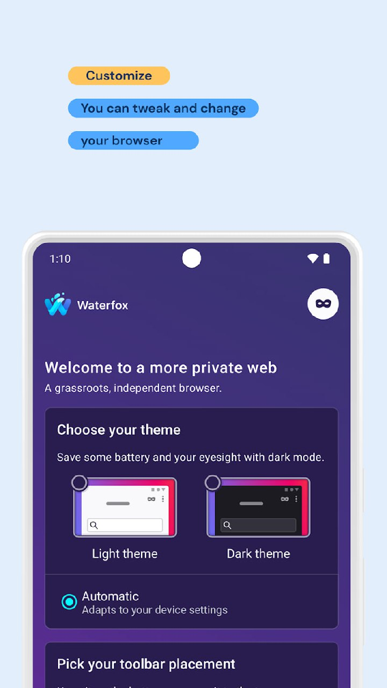

# 🧩 Browser Extensions & Add-ons

### Extensions and scripts for Chrome, Firefox, Edge, and Chromium browsers.

[⬅️ **Back to Main Catalog**](../../README.md) • [📚 **All Apps Index**](../all-apps.md)

> **Total Apps in Category:** `347`

---

### 📦 Typephp

> **Categories:** `#php`

TypePHP turns PHP code into fast native programs, extensions, or shared libraries before you run them, so you get better speed, no warm-up time, and stronger source protection. It keeps normal PHP syntax, adds compile-time types, and can help you build CLI tools, services, or performance-heavy code with less runtime overhead, which can make your app faster and easier to ship.

https://github.com/swoole/typephp

- 🐙 **Source Code:** [https://github.com/swoole/typephp](https://github.com/swoole/typephp)
- 👤 **Developer:** [swoole](https://github.com/swoole)


---

### 📦 b-nnett/grok-bot-0.18-reconstructed

> **Categories:** `#GitHub` `#OpenSource`

Unofficial source-oriented reconstruction and extension of Grok Bot 0.18.0 for macOS
**Language**: TypeScript
**Stars**: 2106 **Issues**: 11 **Forks**: 2406
[https://github.com/b-nnett/grok-bot-0.18-reconstructed](https://github.com/b-nnett/grok-bot-0.18-reconstructed)

- 🐙 **Source Code:** [https://github.com/b-nnett/grok-bot-0.18-reconstructed](https://github.com/b-nnett/grok-bot-0.18-reconstructed)
- 👤 **Developer:** [b-nnett](https://github.com/b-nnett)


---

### 📦 1C Enterprise Agent Toolkit

> **Categories:** `#GitHub` `#OpenSource`

It is not tied to UNF or other standard configuration: it uploads only user-specified metadata, isolates work on extensions from the main database, checks the result of the batch Configurator and deletes the temporary data created by it.

🐱** **[**GitHub**](https://t.me/github)

- 🐙 **Source Code:** [https://github.com/Muredsa/1C-Enterprise-Agent-Toolkit](https://github.com/Muredsa/1C-Enterprise-Agent-Toolkit)
- 👤 **Developer:** [Muredsa](https://github.com/Muredsa)


---

### 📦 Pigsty

> **Categories:** `#shell` `#graphics` `#infra` `#postgres` `#service` `#toolbox` `#yours`

Pigsty helps you set up and run PostgreSQL fast, with high availability, backup, monitoring, and many extensions on Linux or Docker. It supports small to large setups, so you can save time, reduce mistakes, and manage a reliable database system with one command.

https://github.com/pgsty/pigsty

- 🐙 **Source Code:** [https://github.com/pgsty/pigsty](https://github.com/pgsty/pigsty)
- 👤 **Developer:** [pgsty](https://github.com/pgsty)


---

### 📦 Chatgpt Product Info

> **Categories:** `#GitHub` `#OpenSource`

The extension runs inside `chatgpt.com`, reads the active conversation from your logged-in ChatGPT session, normalizes visible research signals and allows you to save, organize, review and export results locally.

🐱** **[**GitHub**](https://t.me/github)

- 🐙 **Source Code:** [https://github.com/Xyborg/ChatGPT-Product-Info](https://github.com/Xyborg/ChatGPT-Product-Info)
- 👤 **Developer:** [Xyborg](https://github.com/Xyborg)


---

### 📦 Harper

> **Categories:** `#GitHub` `#OpenSource` `#rust` `#chrome_extension` `#developer_tools` `#english_language` `#grammar_checker` `#nodejs` `#react` `#svelte` `#webassembly`

🔗 [https://github.com/Automattic/harper](https://github.com/Automattic/harper)
📝 Offline, privacy-first grammar checker. Fast, open-source, Rust-powered
──────────────────────────────

**Harper** is an English grammar checker designed to provide a private and efficient solution for writers. It was created to overcome the shortcomings of existing tools like Grammarly and LanguageTool, which are often __too expensive__, __too overbearing__, and __lacking in context__. `Harper` is built to be __fast__, __lightweight__, and __completely private__, with a memory footprint of less than 1/50th of LanguageTool. It supports various editors, including Visual Studio Code, Neovim, and Emacs, and can even be loaded via WebAssembly.

The core of `Harper` is __extensible__, allowing for contributions to support other languages. With its focus on performance and user value, `Harper` is the perfect solution for writers who want a seamless and private writing experience.
You can use `Harper` to improve your writing with its __fast__ and __accurate__ grammar checking, and its __small__ size makes it easy to integrate into your workflow.
Harper is for anyone looking for a __fast__, __private__, and __efficient__ grammar checker: Write with **Harper**, and take control of your writing experience.

──────────────────────────────
🧠 **Channel: ****https://t.me/GithubRe**

- 🐙 **Source Code:** [https://github.com/Automattic/harper](https://github.com/Automattic/harper)
- 👤 **Developer:** [Automattic](https://github.com/Automattic)


---

### 📦 Astrbot

> **Categories:** `#GitHub` `#OpenSource` `#python` `#agent` `#ai` `#chatbot` `#chatgpt` `#docker` `#function_calling` `#gemini` `#gpt` `#llama` `#llm` `#ollama` `#openai` `#qq` `#qqbot` `#qqchannel` `#telegram`

🔗 [https://github.com/AstrBotDevs/AstrBot](https://github.com/AstrBotDevs/AstrBot)
📝 AI Agent Assistant & development framework that integrates lots of IM platforms, LLMs, plugins and AI feature, and can be your openclaw alternative. ✨
──────────────────────────────

**AstrBot** is an open-source, all-in-one chatbot platform that integrates with popular instant messaging apps. It provides a reliable and scalable conversational AI infrastructure for individuals, developers, and teams. With __AstrBot__, you can quickly build production-ready AI applications within your IM platform workflows.

Key features include `AI LLM Conversations`, multimodal support, agent platforms, and multi-platform compatibility with __QQ__, __Telegram__, __Slack__, and more. **AstrBot** also offers plugin extensions with over 1000 plugins available for one-click installation.

To get started, you can choose from various deployment methods, including one-click deployment with `uv`, cloud deployment with __RainYun__, Docker deployment, or desktop application deployment. **AstrBot** supports multiple messaging platforms and model services, making it a versatile and powerful tool for building conversational AI applications.

Whether you're building a personal AI companion or an enterprise knowledge base, __AstrBot__ enables you to create custom AI solutions with ease. So why wait? Dive into the world of conversational AI with **AstrBot** and discover the endless possibilities it has to offer: AstrBot is the ultimate conversational AI platform to unlock your chatbot's full potential!

──────────────────────────────
🧠 **Channel: ****https://t.me/GithubRe**

- 🐙 **Source Code:** [https://github.com/AstrBotDevs/AstrBot](https://github.com/AstrBotDevs/AstrBot)
- 👤 **Developer:** [AstrBotDevs](https://github.com/AstrBotDevs)


---

### 📦 Kimi Cli

> **Categories:** `#GitHub` `#OpenSource` `#python`

🔗 [https://github.com/MoonshotAI/kimi-cli](https://github.com/MoonshotAI/kimi-cli)
📝 Kimi Code CLI is your next CLI agent.
──────────────────────────────

**Kimi CLI** is an AI agent that runs in the terminal, helping you complete software development tasks and terminal operations. It can read and edit code, execute shell commands, search and fetch web pages, and autonomously plan and adjust actions during execution.

__Key features__ include a shell command mode, VS Code extension, IDE integration via ACP, Zsh integration, and MCP support. You can use Kimi CLI with various tools and editors, such as Visual Studio Code, Zed, and JetBrains, to enhance your development experience.

To get started, you can install Kimi CLI and refer to the `getting started` guide. For development, you can clone the repository, prepare the environment, and run Kimi CLI using `uv run kimi`.

**Technical highlights** include support for MCP tools, ad-hoc MCP configuration, and a range of sub-commands for managing MCP servers. The project is evolving into **Kimi Code CLI**, which will automatically migrate your configuration and sessions.

This project is suitable for developers and users who want to leverage AI capabilities in their terminal and development workflow.

One-liner takeaway: **Kimi CLI** is an AI-powered terminal agent that streamlines your development workflow, and it's evolving into **Kimi Code CLI** for even more capabilities.

──────────────────────────────
🧠 **Channel: ****https://t.me/GithubRe**

- 🐙 **Source Code:** [https://github.com/MoonshotAI/kimi-cli](https://github.com/MoonshotAI/kimi-cli)
- 👤 **Developer:** [MoonshotAI](https://github.com/MoonshotAI)


---

### 📦 gostonx/uninstally

> **Categories:** `#GitHub` `#OpenSource`

A clean, native macOS uninstaller. Completely removes apps and every file they leave behind using smart bundle-identifier detection. SwiftUI + Finder extension.
**Language**: Swift
**Stars**: 435 **Issues**: 2 **Forks**: 15
[https://github.com/gostonx/uninstally](https://github.com/gostonx/uninstally)

- 🐙 **Source Code:** [https://github.com/gostonx/uninstally](https://github.com/gostonx/uninstally)
- 👤 **Developer:** [gostonx](https://github.com/gostonx)


---

### 📦 Wand Enhancer

> **Categories:** `#GitHub` `#OpenSource` `#csharp` `#wand` `#wand_enhancer` `#wand_pro` `#wemod` `#wpf`

🔗 [https://github.com/k1tbyte/Wand-Enhancer](https://github.com/k1tbyte/Wand-Enhancer)
📝 Advanced UX and interoperability extension for Wand (WeMod) app
──────────────────────────────

**Wand-Enhancer** is an open-source tool designed to extend local client-side configurations and improve the UX of the Wand application. __Key features__ include local environment configuration management, automated compatibility adjustments, advanced layout and theme customization, AI features, and a remote web panel for mobile control.

To `use` Wand-Enhancer, you'll need to build the executable from your own fork using GitHub Actions, as there are no official prebuilt binaries available. The project emphasizes **safety** and transparency, with the code being entirely open-source, operating locally, and making zero network requests.

__Technical highlights__ include the ability to inject custom JavaScript into Wand at patch time, allowing for further customization and tweaks. The project is **licensed** under Apache-2.0 and welcomes community support.

The **target audience** appears to be power users and developers looking to customize and enhance their Wand experience.

Takeaway: `Wand-Enhancer` empowers users to unlock the full potential of the Wand application, and its open-source nature ensures a transparent and community-driven development process.

──────────────────────────────
🧠 **Channel: ****https://t.me/GithubRe**

- 🐙 **Source Code:** [https://github.com/k1tbyte/Wand-Enhancer](https://github.com/k1tbyte/Wand-Enhancer)
- 👤 **Developer:** [k1tbyte](https://github.com/k1tbyte)


---

### 📦 Shpigford/knockoff

> **Categories:** `#amazon` `#browser_extension` `#chrome_extension`

Chrome extension that filters pseudo-brand junk out of Amazon. Buy from real, established brands.
**Language**: JavaScript

- 🐙 **Source Code:** [https://github.com/Shpigford/knockoff](https://github.com/Shpigford/knockoff)
- 👤 **Developer:** [Shpigford](https://github.com/Shpigford)


---

### 📦 kui123456789/cdk-redeem-only-extension

> **Categories:** `#GitHub` `#OpenSource`

UPI redeem only extension
**Language**: JavaScript
**Stars**: 368 **Issues**: 1 **Forks**: 167
[https://github.com/kui123456789/cdk-redeem-only-extension](https://github.com/kui123456789/cdk-redeem-only-extension)

- 🐙 **Source Code:** [https://github.com/kui123456789/cdk-redeem-only-extension](https://github.com/kui123456789/cdk-redeem-only-extension)
- 👤 **Developer:** [kui123456789](https://github.com/kui123456789)


---

### 📦 abundantbeing/hermes-browser-extension

> **Categories:** `#ai_agent` `#browser_extension` `#chrome_extension` `#edge_extension` `#hermes_agent` `#local_first` `#nous_research` `#sidepanel`

Browser-native side panel for Hermes Agent — connect web context to your local Hermes runtime.
**Language**: JavaScript

- 🐙 **Source Code:** [https://github.com/abundantbeing/hermes-browser-extension](https://github.com/abundantbeing/hermes-browser-extension)
- 👤 **Developer:** [abundantbeing](https://github.com/abundantbeing)


---

### 📦 AlexandrosGounis/pdfx

> **Categories:** `#GitHub` `#OpenSource`

An extension of the traditional PDF standard, allowing multiple files to be stored in a single file via metadata
**Language**: TypeScript
**Stars**: 381 **Issues**: 2 **Forks**: 42
[https://github.com/AlexandrosGounis/pdfx](https://github.com/AlexandrosGounis/pdfx)

- 🐙 **Source Code:** [https://github.com/AlexandrosGounis/pdfx](https://github.com/AlexandrosGounis/pdfx)
- 👤 **Developer:** [AlexandrosGounis](https://github.com/AlexandrosGounis)


---

### 📦 Page Agent

> **Categories:** `#GitHub` `#OpenSource` `#typescript` `#agent` `#ai` `#ai_agents` `#browser_automation` `#javascript` `#ui_automation` `#web`

🔗 [https://github.com/alibaba/page-agent](https://github.com/alibaba/page-agent)
📝 JavaScript in-page GUI agent. Control web interfaces with natural language.
──────────────────────────────

The **alibaba/page-agent** GitHub repository is home to the innovative Page Agent, a GUI agent that can control web interfaces with natural language. This project allows for __easy integration__ with just a few lines of in-page JavaScript, eliminating the need for browser extensions, Python, or headless browsers. Key features include __text-based DOM manipulation__, the ability to __bring your own LLMs__, and an optional __Chrome extension__ for multi-page tasks.

The Page Agent is versatile and can be used in various __use cases__, such as creating a __SaaS AI copilot__, implementing __smart form filling__, enhancing __accessibility__, and more. To get started, users can try the `one-line integration` with a free demo LLM or install the package via `npm install page-agent`.

From a technical standpoint, the project is built using `TypeScript` and has a relatively small `bundle size`. The repository is actively maintained and welcomes contributions from the community. The project is licensed under the __MIT License__ and acknowledges the work of the `browser-use` project.

The Page Agent is designed for __client-side web enhancement__ and can be used by developers, businesses, and individuals looking to automate web interactions or create custom AI-powered interfaces. With its ease of use and flexibility, the Page Agent has the potential to revolutionize the way we interact with web applications. __Star this repo__ if you find PageAgent helpful - it's a game-changer for web automation and AI-powered interfaces!

──────────────────────────────
🧠 **Channel: ****https://t.me/GithubRe**

- 🐙 **Source Code:** [https://github.com/alibaba/page-agent](https://github.com/alibaba/page-agent)
- 🌐 **Official Website:** [https://cdn.jsdelivr.net/npm/page-agent@1.11.0/dist/iife/page-agent.demo.js"](https://cdn.jsdelivr.net/npm/page-agent@1.11.0/dist/iife/page-agent.demo.js")
- 👤 **Developer:** [alibaba](https://github.com/alibaba)


---

### 📦 Kilocode

> **Categories:** `#GitHub` `#OpenSource` `#typescript` `#ai_coding` `#ai_developer_tools` `#chatgpt` `#claude` `#gemini` `#sonnet` `#vscode` `#vscode_extension`

🔗 [https://github.com/Kilo-Org/kilocode](https://github.com/Kilo-Org/kilocode)
📝 Kilo is the all-in-one agentic engineering platform. Build, ship, and iterate faster with the most popular open source coding agent.
──────────────────────────────

The **Kilo-Org/kilocode** GitHub repository is home to an open-source coding agent designed to assist developers in building with AI. This agent is accessible across various platforms, including __VS Code__, __JetBrains__, and the __CLI__. One of its key features is the ability to pick from over `500+` models and switch between them mid-task, all while paying the model provider's rate with no markup.

To get started, you can install Kilo Code via the [VS Code Marketplace](https://marketplace.visualstudio.com/items?itemName=kilocode.Kilo-Code), or by running ```npm install -g @kilocode/cli``` in your terminal for the CLI version. It also supports installation via ```curl```, ```pnpm```, ```bun```, and ```Homebrew```.

The Kilo Code agent ships with specialized **agents** that can be switched depending on the task at hand, including **Code**, **Plan**, **Ask**, **Debug**, and **Review**. It offers features like __code generation__ from natural language, __inline autocomplete__, and __self-checking__, making it a powerful tool for developers.

Whether you're a developer, writer, or someone in between, contributions to Kilo Code are welcome. The project is licensed under __MIT__, allowing for free use, modification, and distribution.

In a nutshell, Kilo Code is your go-to coding companion that brings the power of AI to your fingertips - so why not give it a try and __code smarter, not harder__?

──────────────────────────────
🧠 **Channel: ****https://t.me/GithubRe**

- 🐙 **Source Code:** [https://github.com/Kilo-Org/kilocode](https://github.com/Kilo-Org/kilocode)
- 👤 **Developer:** [Kilo-Org](https://github.com/Kilo-Org)


---

### 📦 Puppeteer

> **Categories:** `#GitHub` `#OpenSource` `#typescript` `#automation` `#chrome` `#chromium` `#developer_tools` `#firefox` `#headless_chrome` `#node_module` `#testing` `#web` `#API`

🔗 [https://github.com/puppeteer/puppeteer](https://github.com/puppeteer/puppeteer)
📝 JavaScript API for Chrome and Firefox
──────────────────────────────

**Puppeteer** is a JavaScript library that provides a high-level API to control Chrome or Firefox over the DevTools Protocol or WebDriver BiDi. It runs in headless mode by default, allowing for automated browser interactions without a visible UI.

The key features of __Puppeteer__ include its ability to launch a browser, open new pages, navigate to URLs, set screen sizes, and simulate user interactions like keyboard input and clicks.

To get started, you can install `puppeteer` using npm, which downloads a compatible Chrome browser during installation. Alternatively, you can install `puppeteer-core` as a library without downloading Chrome.

Here's an example of how to use `puppeteer`:
```import puppeteer from 'puppeteer';
const browser = await puppeteer.launch();
const page = await browser.newPage();
await page.goto('https://developer.chrome.com/');
// ... other interactions ...
await browser.close();
```

**Puppeteer** is perfect for developers who want to automate browser interactions for tasks like web scraping, automated testing, or automating workflows.

The takeaway: __Puppeteer__ helps you automate beyond recorder - it's not just about automating browser interactions, it's about creating new possibilities.

──────────────────────────────
🧠 **Channel: ****https://t.me/GithubRe**

- 🐙 **Source Code:** [https://github.com/puppeteer/puppeteer](https://github.com/puppeteer/puppeteer)
- 👤 **Developer:** [puppeteer](https://developer.chrome.com/')


---

### 📦 BatSlop

> **Categories:** `#Extension`

BatSlop is a tiny joke browser extension for people tired of the endless “I made this” posts in programming and tech subreddits. It replaces phrases like “I made,” “I built,” or “I programmed” with “AI made,” “AI built,” and “AI programmed,” and may swap preview images with the classic Batman slapping Robin meme. It does not detect AI, judge anyone’s work, or accuse posters of anything. It is just a dumb shitpost extension for people with a sense of humor.

- 🐙 **Source Code:** [https://github.com/2001db8/BatSlop](https://github.com/2001db8/BatSlop)
- 👤 **Developer:** [2001db8](https://github.com/2001db8)

<details>
<summary><b>✨ Key Features (8)</b> — <i>Click to expand</i></summary>

- Replaces phrases like “I made” and “I programmed” with “AI made” and “AI programmed”
- Works as a joke extension for Reddit programming and tech posts
- May swap matching preview images with the Batman slapping Robin meme
- Supports Chromium-based browsers like Chrome, Edge, and Brave
- Supports Firefox through an unsigned XPI package
- Does not detect AI usage or verify who actually made something
- Does not accuse, judge, or shame individual posters
- Tiny, simple, and made purely for fun

</details>


---

### 📦 Pg Durable

> **Categories:** `#GitHub` `#OpenSource` `#rust` `#ai_pipelines` `#ai_workflows` `#durable_execution` `#durable_functions` `#durable_workflows` `#postgresql`

🔗 [https://github.com/microsoft/pg_durable](https://github.com/microsoft/pg_durable)
📝 PostgreSQL in-database durable execution
──────────────────────────────

**pg_durable** is a PostgreSQL extension that enables long-running, fault-tolerant SQL functions. It allows teams to define workflows in SQL, with the extension checkpointing each step, and resume after crashes, restarts, or failed steps. This approach eliminates the need for external services like cron jobs, workers, queues, and status tables.

__Key features__ include durable execution, SQL-native workflow definition, and database-aware primitives for scheduling and parallel execution. The extension is designed for backend and data engineers, DBAs, and SREs who want to automate runbooks and build data or AI pipelines with durable execution.

`SELECT df.start(...)` is used to define a workflow, and the extension takes care of executing each step durably. The `df` namespace provides various functions for managing workflows, including `df.start()`, `df.cancel()`, and `df.grant_usage()`.

**Technical highlights** include zero-infrastructure requirements, as the extension runs as a PostgreSQL extension, and a SQL-native approach, making it easy to define and manage workflows.

The target __audience__ includes teams building data or AI pipelines, and those who want to automate runbooks that must survive restarts and be auditable in SQL.

To get started, you can install the extension using Debian packages or build it from source, and then create the extension in your PostgreSQL database using `CREATE EXTENSION pg_durable;`.

One-liner takeaway: __pg_durable__ brings durable execution to PostgreSQL, allowing teams to define and run long-running, fault-tolerant SQL workflows without external services.

──────────────────────────────
🧠 **Channel: ****https://t.me/GithubRe**

- 🐙 **Source Code:** [https://github.com/microsoft/pg_durable](https://github.com/microsoft/pg_durable)
- 👤 **Developer:** [microsoft](https://github.com/microsoft)


---

### 📦 Openclaw Windows Node

> **Categories:** `#GitHub` `#OpenSource` `#csharp`

🔗 [https://github.com/openclaw/openclaw-windows-node](https://github.com/openclaw/openclaw-windows-node)
📝 Windows companion suite for OpenClaw - System Tray app, Shared library, Node, and PowerToys Command Palette extension
──────────────────────────────

The **openclaw-windows-node** repository is a native Windows companion suite for __OpenClaw__, the AI-powered personal assistant. This monorepo contains the Windows hub, shared client libraries, and CLI utilities. The suite includes a system tray application, a shared gateway client library, and a CLI validator for WebSocket connections.

To get started, users can download the latest stable installer from the OpenClaw Windows docs or build the project using the provided `build.ps1` script. The suite features a modern Windows 11-style system tray companion with dark/light mode support, quick send functionality, and auto-updates. It also includes an embedded chat window with WebView2, toast notifications, and channel control.

Technical highlights of the project include the use of `WinUI 3` for the system tray application and `WebView2` for the embedded chat window. The project also utilizes `dotnet` for building and running the application.

The audience for this project includes users of the OpenClaw personal assistant who want a native Windows companion suite. The project is designed to be user-friendly, with a simple setup process and an intuitive interface.

In summary, the **openclaw-windows-node** repository provides a powerful and user-friendly native Windows companion suite for OpenClaw, with a range of features and technical capabilities. __Transform your Windows PC into a node that OpenClaw can control, and unlock a world of possibilities!__

──────────────────────────────
🧠 **Channel: ****https://t.me/GithubRe**

- 🐙 **Source Code:** [https://github.com/openclaw/openclaw-windows-node](https://github.com/openclaw/openclaw-windows-node)
- 👤 **Developer:** [openclaw](https://github.com/openclaw)


---

### 📦 Pi Subagents

> **Categories:** `#GitHub` `#OpenSource` `#typescript`

🔗 [https://github.com/nicobailon/pi-subagents](https://github.com/nicobailon/pi-subagents)
📝 Pi extension for async subagent delegation with truncation, artifacts, and session sharing
──────────────────────────────

**Pi Subagents** is a GitHub repository that enables Pi to delegate tasks to focused child agents, enhancing productivity and efficiency. The key features of __pi-subagents__ include code review, scouting, implementation, parallel audits, and background jobs.

To get started, simply install `pi-subagents` using `pi install npm:pi-subagents`. You can then use natural language to ask Pi for delegation, such as "Use reviewer to review this diff" or "Ask oracle for a second opinion on my current plan".

The repository includes various built-in agents, such as `scout`, `researcher`, `planner`, `worker`, and `reviewer`, each designed for specific tasks. You can also customize these agents or create new ones to suit your needs.

The extension provides a range of workflows, from simple code reviews to complex implementation plans. It also supports background runs, parallel reviewers, and saved workflows, making it a versatile tool for various use cases.

**Key benefits** of __pi-subagents__ include improved code quality, increased productivity, and enhanced collaboration. With its flexible and customizable architecture, __pi-subagents__ is an essential tool for anyone looking to streamline their workflow and improve their overall development experience.

**Takeaway:** With __pi-subagents__, you can **supercharge your productivity** by delegating tasks to specialized child agents, freeing you up to focus on high-level decision-making and strategy.

──────────────────────────────
🧠 **Channel: ****https://t.me/GithubRe**

- 🐙 **Source Code:** [https://github.com/nicobailon/pi-subagents](https://github.com/nicobailon/pi-subagents)
- 👤 **Developer:** [nicobailon](https://github.com/nicobailon)


---

### 📦 Babysitter

> **Categories:** `#javascript` `#agent_orchestration` `#agent_skills` `#agentic_ai` `#agentic_workflow` `#ai_agents` `#ai_automation` `#babysitter` `#claude_code` `#claude_code_skills` `#claude_code_workflows` `#claude_skills` `#claude_workflows` `#codex_plugin` `#codex_skills` `#codex_workflow` `#hermes_plugin` `#pi_extension` `#trustworthy_ai` `#vibe_coding` `#GitHub` `#OpenSource`

Babysitter is a tool that helps you run AI coding work in a strict, step-by-step way, with checks, approvals, and a full log of every decision. It can save you time, reduce mistakes, and make complex tasks easier to control because it keeps the process deterministic, resumable, and easier to audit.

https://github.com/a5c-ai/babysitter

- 🐙 **Source Code:** [https://github.com/a5c-ai/babysitter](https://github.com/a5c-ai/babysitter)
- 👤 **Developer:** [a5c-ai](https://github.com/a5c-ai)


---

### 📦 Supermemory

> **Categories:** `#GitHub` `#OpenSource` `#typescript` `#cloudflare_kv` `#cloudflare_pages` `#cloudflare_workers` `#drizzle_orm` `#postgres` `#remix` `#tailwindcss` `#vite`

🔗 [https://github.com/supermemoryai/supermemory](https://github.com/supermemoryai/supermemory)
📝 Memory engine and app that is extremely fast, scalable. The Memory API for the AI era.
──────────────────────────────

**Supermemory** is a state-of-the-art memory and context engine for AI, designed to give your AI a brain that can learn, remember, and recall information across conversations. With __key features__ like automatic fact extraction, user profiling, hybrid search, and connectors for Google Drive, Gmail, and more, Supermemory is a powerful tool for building AI applications.

To __use Supermemory__, you can either use the app and browser extension for personal use or integrate the API into your AI products. The API provides a single interface for memory, RAG, user profiles, and connectors, making it easy to add memory and context to your agents and apps.

Some of the __technical highlights__ of Supermemory include its ability to extract memories, build user profiles, and return relevant context without requiring embedding pipelines, vector DB config, or chunking strategies. It also supports framework integrations with popular AI frameworks like Vercel AI SDK, LangChain, and OpenAI Agents SDK.

**Supermemory is designed for** anyone building AI applications, from developers and researchers to companies and individuals looking to create more intelligent and context-aware AI systems.

In summary, `Supermemory` is a game-changer for AI applications, providing a powerful and easy-to-use memory and context engine that can help you build more intelligent and human-like AI systems - __give your AI a brain that never forgets__.

──────────────────────────────
🧠 **Channel: ****https://t.me/GithubRe**

- 🐙 **Source Code:** [https://github.com/supermemoryai/supermemory](https://github.com/supermemoryai/supermemory)
- 👤 **Developer:** [supermemoryai](https://github.com/supermemoryai)


---

### 📦 perplexityai/bumblebee

> **Categories:** `#golang` `#package_inventory` `#supply_chain_security`

Read-only tool for inventorying packages, extensions, and developer-tool metadata on macOS and Linux developer endpoints, built for fast supply-chain exposure checks.
**Language**: Go

- 🐙 **Source Code:** [https://github.com/perplexityai/bumblebee](https://github.com/perplexityai/bumblebee)
- 👤 **Developer:** tool metadata on macOS and Linux developer endpoints, built for fast supply-chain exposure checks.


---

### 📦 Guarddog

> **Categories:** `#heuristics`

It performs a series of heuristic checks on a package's source code (using Semgrep rules) and its metadata.

GuardDog can be used to scan local or remote PyPI and npm packages, Go modules, RubyGems, GitHub actions or VSCode extensions using any of the available [heuristics](https://github.com/DataDog/guarddog#heuristics).

🐱** **[**GitHub**](https://t.me/github)

- 🐙 **Source Code:** [https://github.com/DataDog/guarddog](https://github.com/DataDog/guarddog)
- 👤 **Developer:** [DataDog](https://github.com/DataDog)


---

### 📦 Donutbrowser

> **Categories:** `#GitHub` `#OpenSource`

**Characteristics**
▫️Unlimited browser profiles - each completely isolated with its own fingerprint, cookies, extensions and data
▫️Chromium and Firefox engines - Chromium based on Wayfern, Firefox based on Camoufox, both with improved fingerprint spoofing
▫️Proxy support - HTTP, HTTPS, SOCKS4, SOCKS5 per profile with dynamic proxy URLs

🐱** **[**GitHub**](https://t.me/github)

- 🐙 **Source Code:** [https://github.com/zhom/donutbrowser](https://github.com/zhom/donutbrowser)
- 👤 **Developer:** [zhom](https://github.com/zhom)


---

### 📦 Goose

> **Categories:** `#GitHub` `#OpenSource`

🔗 [https://github.com/aaif-goose/goose](https://github.com/aaif-goose/goose)
📝 an open source, extensible AI agent that goes beyond code suggestions - install, execute, edit, and test with any LLM
──────────────────────────────

The **goose** project is a __native open source AI agent__ that runs on your machine, offering a desktop app, CLI, and API for various tasks such as code, workflows, research, writing, automation, and data analysis. It supports `15+ providers` like Anthropic, OpenAI, and Google, and connects to `70+ extensions` via the Model Context Protocol open standard.

To get started, you can `download the desktop app` or install the CLI using a `bash script`. The project is part of the Agentic AI Foundation (AAIF) at the Linux Foundation and is built in __Rust__ for performance and portability.

The target audience includes developers, researchers, and anyone looking for a versatile AI agent. With its wide range of features and extensions, **goose** is an excellent choice for those seeking to streamline their workflows.

In a nutshell, __goose__ is the ultimate AI sidekick that helps you "migrate" your tasks to production - and that's no __fowl__ play!

──────────────────────────────
🧠 **Channel: ****https://t.me/GithubRe**

- 🐙 **Source Code:** [https://github.com/aaif-goose/goose](https://github.com/aaif-goose/goose)
- 👤 **Developer:** [aaif-goose](https://github.com/aaif-goose)


---

### 📦 Context Mode

> **Categories:** `#GitHub` `#OpenSource` `#typescript` `#antigravity` `#claude` `#claude_code` `#claude_code_hooks` `#claude_code_plugins` `#claude_code_skill` `#codex` `#codex_cli` `#context_mode` `#copilot` `#cursor_plugin` `#kiro` `#mcp` `#mcp_server` `#mcp_tools` `#openclaw` `#opencode` `#pi_agent` `#skills` `#zed_extension`

🔗 [https://github.com/mksglu/context-mode](https://github.com/mksglu/context-mode)
📝 Context window optimization for AI coding agents. Sandboxes tool output, 98% reduction. 14 platforms
──────────────────────────────

**Context Mode** is a solution to the problem of context overload in tools like Playwright and GitHub. It's an MCP server that solves four key issues: __context saving__, __session continuity__, __think in code__, and __output compression__. With Context Mode, tools keep raw data out of the context window, reducing context size by up to 98%. It also tracks file edits, git operations, and other events, allowing the model to pick up where it left off.

The `ctx_execute` function runs scripts that replace multiple tool calls, saving context. For example:
```ctx_execute("javascript", `
const files = fs.readdirSync('src').filter(f => f.endsWith('.ts'));
files.forEach(f => console.log(f + ': ' + fs.readFileSync('src/'+f,'utf8').split('\\n').length + ' lines'));
`);```
This approach reduces output tokens by ~65-75% while maintaining technical accuracy.

**Installation** varies by platform, with options for Claude Code, Gemini CLI, and VS Code Copilot. The [demo](https://www.youtube.com/watch?v=QUHrntlfPo4) showcases Context Mode's capabilities.

The takeaway: __Context Mode is the key to unlocking efficient context management, and it's a game-changer for anyone working with MCP tools__.

──────────────────────────────
🧠 **Channel: ****https://t.me/GithubRe**

- 🐙 **Source Code:** [https://github.com/mksglu/context-mode](https://github.com/mksglu/context-mode)
- 👤 **Developer:** [mksglu](https://github.com/mksglu)


---

### 📦 AniZen

> **Categories:** `#Anime` `#Movie` `#Stream` `#Android` `#Foss`

a solo-built anime and movie application for Android. While based on the Aniyomi/Anikku foundation, it has been redesigned from the UI to the network layer into something significantly beyond a fork — a full media platform with its own AI assistant, network infrastructure dashboard, behavioral analytics, and a custom extension ecosystem built specifically for BDIX server.

- 🐙 **Source Code:** [https://github.com/salmanbappi/AniZen](https://github.com/salmanbappi/AniZen)
- 👤 **Developer:** [salmanbappi](https://github.com/salmanbappi)

<details>
<summary><b>✨ Key Features (40)</b> — <i>Click to expand</i></summary>

- **MPV-Powered** with Zero-Lag optimizations tuned for mid-range hardware
- ****Anime4K Neural Upscaling**** — real-time presets (Fast / Anime / Cinematic / High), ideal for 480p classic anime. [Read the Anime4K Guide](docs/ANIME4K_GUIDE.md)
- ****Motion Interpolation**** — smooth frame generation for choppy camera pans, consistent 59.7/60fps output
- ****MPVFX Filter Suite**** — Sharpen, Blur, Debanding, and Anime4K with card-based UI and custom presets
- ****Dynamic Mediacodec Switching**** — automatically enables/disables hardware decoding based on active filters
- ****High-Quality Scaling**** — ewa_lanczossharp for sharpest anime lines. [Read the Pro Player Guide](docs/PRO_PLAYER_GUIDE.md)
- **Intuitive Gesture Controls**
- Long-press → 2x speed with smooth release animation (zero jitter)
- Slide left/right → speed control
- All gestures individually toggleable
- ****Dynamic Player Theme**** — player UI colors adapt to the current anime cover art
- ****Multi-threaded chunked downloading**** — byte-range splitting with concurrent async threads
- ****Intelligent resume**** — per-part file tracking, resumes from exact byte position on restart
- ****5x auto-retry**** — for unstable BDIX/FTP servers
- ****Dynamic buffer sizing**** — 32KB/64KB/128KB buffers scale with thread count to protect RAM
- ****HTML content-type guard**** — detects server error pages masquerading as video files
- ****Instant cancellation**** — ensureActive() inside the byte loop for immediate stop
- ****External downloader support**** — seamless handoff to 1DM and ADM with clipboard-based path fallback
- ****Diagnostic Assistant**** — conversational AI that reads your actual error logs and stack traces
- ****Library Context Ingestion**** — AI analyzes your collection for recommendations and insights
- ****LLM Processor selector**** — choose your backend (Gemini, Groq for high-speed inference, etc.)
- ****Custom System Prompt**** — override default assistant behavior
- ****Behavioral Analytics**** — AI generates watch pattern insights on demand
- ****Groq-summarized release notes**** — changelogs written in plain language, not raw git commits
- ****BDIX Nodes**** — real-time latency per BDIX server, live health indicators, local saturation %, active node count
- ****Global CDN**** — endpoint cluster health visualization, latency matrix per source, Endpoint Reliability Index
- ****System Logs**** — live error alerts with source status and response times
- Genre Distribution radar chart
- Collection Status pie chart (Completed / Ongoing / On Hold / Dropped / Planned)
- Score Distribution bar chart
- **Core Metrics** — watch time, episode count, mean score, source count
- **Source & Extension Infrastructure Analytics** — per-source latency and reliability scores
- **Temporal Patterns** — preferred viewing cycle, sessions/week, peak focus title, dominant series (30d)
- **Analytics Persona & Avatar** — personalized identifier in system reports
- ****Default rows**** — Popular and Latest from your sources, works immediately out of the box
- ****Saved searches**** — search anything, save as a live updating feed row
- ****Saved filters**** — lock in genre, year, status, type per row
- ****Category-based or source-based**** — organize rows your way
- ****Draggable reordering**** — manage layout with drag handles
- ****Flexible placement**** — Feed tab in main navbar, browse section, or set as start screen

</details>


---

### 📦 bergside/design-md-chrome

> **Categories:** `#ai` `#chrome` `#chrome_extension` `#design_md` `#design_skills` `#extension` `#open_source` `#skills` `#skills_ai` `#typeui`

Chrome extension to extract styles from any website and generate DESIGN.md files and design skills for AI based on TypeUI
**Language**: JavaScript

- 🐙 **Source Code:** [https://github.com/bergside/design-md-chrome](https://github.com/bergside/design-md-chrome)
- 👤 **Developer:** [bergside](https://github.com/bergside)


---

### 📦 Claude Context

> **Categories:** `#typescript` `#agent` `#agentic_rag` `#ai_coding` `#claude_code` `#code_generation` `#code_search` `#cursor` `#embedding` `#gemini_cli` `#mcp` `#merkle_tree` `#nodejs` `#openai` `#rag` `#semantic_search` `#vector_database` `#vibe_coding` `#voyage_ai` `#vscode_extension` `#GitHub` `#OpenSource`

Claude Context is a plugin that adds semantic code search to Claude Code and other AI tools, using your full codebase as context via a vector database like Zilliz Cloud. It finds relevant code instantly with natural language queries, indexes efficiently (only changed files), and cuts token use by ~40% for the same quality. You save costs on large projects, get precise results without loading whole files, and code faster with deep, relevant context across millions of lines. Setup needs free Zilliz/OpenAI keys and Node.js 20+; works with VS Code, Cursor, and more.

https://github.com/zilliztech/claude-context

- 🐙 **Source Code:** [https://github.com/zilliztech/claude-context](https://github.com/zilliztech/claude-context)
- 👤 **Developer:** [zilliztech](https://github.com/zilliztech)


---

### 📦 kessler/gemma-gem

> **Categories:** `#ai` `#chrome_extension` `#gemma4` `#gemma4_2b` `#gemma4_agent_skills` `#llm`

Gemma Gem runs Google's Gemma 4 model entirely on-device via WebGPU — no API keys, no cloud, no data leaving your machine.
**Language**: TypeScript

- 🐙 **Source Code:** [https://github.com/kessler/gemma-gem](https://github.com/kessler/gemma-gem)
- 👤 **Developer:** [kessler](https://github.com/kessler)


---

### 📦 patoles/agent-flow

> **Categories:** `#agent_visualization` `#ai_agents` `#claude_code` `#developer_tools` `#llm` `#vscode_extension`

Real-time visualization of Claude Code agent orchestration — see your agents think, branch, and coordinate as they work.
**Language**: TypeScript

- 🐙 **Source Code:** [https://github.com/patoles/agent-flow](https://github.com/patoles/agent-flow)
- 👤 **Developer:** [patoles](https://github.com/patoles)


---

### 📦 win4r/ClawTeam-OpenClaw

> **Categories:** `#ai_agents` `#clawdbot` `#openclaw` `#openclaw_extension` `#openclaw_plugin` `#openclaw_skills` `#swarm` `#swarm_intelligence` `#swarms`

ClawTeam fork fully adapted for OpenClaw — multi-agent swarm coordination with OpenClaw as the default agent
**Language**: Python

- 🐙 **Source Code:** [https://github.com/win4r/ClawTeam-OpenClaw](https://github.com/win4r/ClawTeam-OpenClaw)
- 👤 **Developer:** [win4r](https://github.com/win4r)


---

### 📦 davebcn87/pi-autoresearch

> **Categories:** `#GitHub` `#OpenSource`

Autonomous experiment loop extension for pi
**Language**: TypeScript
**Stars**: 1281 **Issues**: 5 **Forks**: 63
[https://github.com/davebcn87/pi-autoresearch](https://github.com/davebcn87/pi-autoresearch)

- 🐙 **Source Code:** [https://github.com/davebcn87/pi-autoresearch](https://github.com/davebcn87/pi-autoresearch)
- 👤 **Developer:** [davebcn87](https://github.com/davebcn87)


---

### 📦 googleworkspace/cli

> **Categories:** `#agent_skills` `#ai_agent` `#automation` `#cli` `#discovery_api` `#gemini_cli_extension` `#google_admin` `#google_api` `#google_calendar` `#google_chat` `#google_docs` `#google_drive` `#google_sheets` `#google_workspace` `#oauth2` `#rust`

Google Workspace CLI — one command-line tool for Drive, Gmail, Calendar, Sheets, Docs, Chat, Admin, and more. Dynamically built from Google Discovery Service. Includes AI agent skills.
**Language**: Rust

- 🐙 **Source Code:** [https://github.com/googleworkspace/cli](https://github.com/googleworkspace/cli)
- 👤 **Developer:** [googleworkspace](https://github.com/googleworkspace)


---

### 📦 Gosuki

> **Categories:** `#GitHub` `#OpenSource`

It combines bookmarks from different browsers, synchronizes them in real time (locally or via P2P), does not require the installation of extensions and stores all data locally.

🐱** **[**GitHub**](https://t.me/github)

- 🐙 **Source Code:** [https://github.com/blob42/gosuki](https://github.com/blob42/gosuki)
- 👤 **Developer:** [blob42](https://github.com/blob42)


---

### 📦 Wa Incognito

> **Categories:** `#Extension` `#WhatsApp` `#Foss` `#Chrome`

WAIncognito is an extension for WhatsApp Web that focuses on privacy and control. It lets you read messages, view statuses, and browse chats without revealing your activity, also having extra utilities like restoring deleted messages and downloading statuses.

- 🐙 **Source Code:** [https://github.com/tomer8007/whatsapp-web-incognito](https://github.com/tomer8007/whatsapp-web-incognito)
- 👤 **Developer:** [Tomer](https://github.com/tomer8007)

<details>
<summary><b>✨ Key Features (9)</b> — <i>Click to expand</i></summary>

- Read messages without sending blue ticks
- Hide online and last-seen status
- Hide typing and recording indicators
- View group chats invisibly
- Watch statuses secretly without being logged
- Restore and read deleted messages
- Download status photos and videos
- Toggle privacy options directly in WhatsApp Web
- Manually mark chats as read when you want

</details>


---

### 📦 New-WEB

> **Categories:** `#Extension` `#Firefox` `#Chrome` `#Edge` `#Newtab`

A privacy-focused, premium Chrome Extension (Manifest V3) that replaces the new tab page with a minimal dark UI featuring search/AI toggle, weather widget, and top sites.

- 🐙 **Source Code:** [https://github.com/Hayagriva0/New-WEB](https://github.com/Hayagriva0/New-WEB)
- 🌐 **Official Website:** [https://github.com/Hayagriva0/New-WEB/releases](https://github.com/Hayagriva0/New-WEB/releases)
- 👤 **Developer:** [Hayagriva0](https://github.com/Hayagriva0)

<details>
<summary><b>✨ Key Features (5)</b> — <i>Click to expand</i></summary>

- ****Privacy-focused Search**** — Quick access to DuckDuckGo and Google search suggestions.
- ****AI Mode**** — Seamless integration for AI-assisted queries right from your new tab.
- ****Weather Widget**** — Real-time accurate weather updates using your local area.
- ****Favourite Sites**** — Easy and quick access to your most visited and curated websites.
- ****Premium Aesthetic**** — A beautifully crafted, modern, and clean interface that feels native and refined.

</details>


---

### 📦 Extension Box

> **Categories:** `#current` `#Android` `#Utilities`

An open-source, modular system monitoring app for Android. Track battery health, network speed, data usage, screen time, step count, and more - all from a single persistent notification.

- 🐙 **Source Code:** [https://github.com/omersusin/ExtensionBox](https://github.com/omersusin/ExtensionBox)
- 👤 **Developer:** [Claude AI](https://github.com/omersusin)


---

### 📦 Summarize

> **Categories:** `#typescript` `#ai` `#cli` `#summarize` `#GitHub` `#OpenSource`

Summarize is a fast tool for summarizing URLs, PDFs, images, audio/video, YouTube, and podcasts via Chrome Side Panel (with chat and history), Firefox Sidebar, or CLI. Install the extension from Chrome Web Store, add the local daemon with `npm i -g @steipete/summarize` and `summarize daemon install --token <TOKEN>`, then get one-click summaries, YouTube slides with OCR/timestamps, streaming Markdown, and media transcription. It saves time by quickly digesting long content so you focus on key insights without reading everything.

https://github.com/steipete/summarize

- 🐙 **Source Code:** [https://github.com/steipete/summarize](https://github.com/steipete/summarize)
- 👤 **Developer:** [steipete](https://github.com/steipete)


---

### 📦 Gh Aw

> **Categories:** `#go` `#actions` `#cai` `#ci` `#claude_code` `#codex` `#copilot` `#gh_extension` `#github_actions`

- 🐙 **Source Code:** [https://github.com/github/gh-aw](https://github.com/github/gh-aw)
- 👤 **Developer:** [github](https://github.com/github)


---

### 📦 P2P Live Share

> **Categories:** `#GitHub` `#OpenSource`

This VSCode extension allows you to collaborate on editing files in real time and...

▫️Remote language service
▫️Sharing terminal access
▫️Port forwarding
▫️Chat with images
▫️Sharing text selection
▫️Sync workspace files

You can install this extension by searching for "P2P Live Share" in the VSCode or Cursor extensions panel.

To start sharing, click the Share button on the P2P Live Share panel, which can be found in the activity bar.

🐱** **[**GitHub**](https://t.me/github)

- 🐙 **Source Code:** [https://github.com/kermanx/p2p-live-share](https://github.com/kermanx/p2p-live-share)
- 👤 **Developer:** [kermanx](https://github.com/kermanx)


---

### 📦 material-homepage

> **Categories:** `#browser` `#homepage` `#MD3` `#newtab` `#Extension`

A minimal, focused browser homepage and new tab

- 🐙 **Source Code:** [https://github.com/MrSIHAB/material-homepage](https://github.com/MrSIHAB/material-homepage)
- 🌐 **Official Website:** [https://github.com/MrSIHAB/material-homepage/releases](https://github.com/MrSIHAB/material-homepage/releases)
- 👤 **Developer:** [MrSIHAB](https://github.com/MrSIHAB)

<details>
<summary><b>✨ Key Features (40)</b> — <i>Click to expand</i></summary>

- Modern, clean, and visually appealing design
- Distraction-free user interface for enhanced focus
- Customizable search bar to select preferred search engines
- Dynamic theme personalization with interactive color palettes
- User-defined shortcut sites for easy access
- Automatic light and dark mode based on the selected color
- Backup settings and shortcuts for seamless use on new browsers or devices
- Local storage of preferences to ensure privacy
- Default shortcuts for popular websites, including AI tools, social media, development resources, Google, and Microsoft services.
- Install the Material Homepage extension from your browser’s extension store.
- Enable Material Homepage if it isn't enabled by default.
- Open a new tab to access your customized dashboard.
- Use the search bar for web searches and URL navigation.
- Personalize your homepage by selecting themes from the palette.
- Organize shortcuts with drag-and-drop ease.
- Use the Translator widget for instant translations.
- A future To-Do widget will further enhance productivity.
- All settings are saved locally for privacy.
- **Go to [Firefox-addon/material-homepage](https** — //addons.mozilla.org/en-US/firefox/addon/material-hompage/)
- Click on install
- If you see any footer banner or banner at top, please right click on that and disable that.
- You can now enjoy it in your New Tab
- **Visit [Edge-addons/material-homepage](https** — //microsoftedge.microsoft.com/addons/detail/material-hompage/gppedgcpmlnfphgohlcdmeejokcgipjb)
- Click on GET button and install the extension.
- Go to settings->appearance->extension
- Turn Material-Homepage on.
- Now enjoy your browser
- **Download the [latest release](https** — //github.com/mrsihab/material-homepage/releases) of Material Homepage.
- Once you downloaded the zip file, extract the zip file
- Store the file in a secure location. If you delete or move the file, it will be removed from browser too.
- Open your browser and go to extension manager page. settings->extension->manage extension
- You will be redirected to extension manager page.
- Now enable developer option and turn developer mode on.
- There should be a **load unpacked** option unlocked.
- Click **Load unpacked** button and locate to the file where you stored material homepage.
- Turn on the extension if it is off.
- Now you can enjoy your extension. You can even turn off the developer option.
- But remember, even the extension is available in your browser, don't delete any files of material homepage from your file explorer. Otherwise it will be removed from browser automatically.
- Install the git if you haven't git installed yet. You can verify by running git --version command in your terminal.
- Navigate to a secured folder where you can clone the repository. Ex. User/home

</details>


---

### 📦 SkyStream

> **Categories:** `#Android` `#Media` `#Streaming`

SkyStream is a modern, cross-platform media streaming client inspired by CloudStream. It utilizes a custom JavaScript runtime for extensions, allowing users to scrape and stream content from various sources on Android, iOS, Windows, macOS, and Linux from a single codebase.

- 🐙 **Source Code:** [https://t.me/popCLOUDS/11312](https://t.me/popCLOUDS/11312)
- 👤 **Developer:** [Akash Hiremath](https://github.com/akashdh11)


---

### 📦 Waterfox

> **Categories:** `#GitHub` `#OpenSource`

It is designed as a full-fledged replacement for the aforementioned browser and offers advanced privacy features, improved performance, and customization while maintaining compatibility with existing extensions.

🐱** **[**GitHub**](https://t.me/github)

- 🐙 **Source Code:** [https://github.com/BrowserWorks/waterfox](https://github.com/BrowserWorks/waterfox)
- 👤 **Developer:** [BrowserWorks](https://github.com/BrowserWorks)

<details>
<summary><b>🖼️ Preview Screenshots & Media (1)</b> — <i>Click to view images & decide if you want to use this app</i></summary>

#### 📸 Cover / Preview
<p align="center"></p>

</details>


---

### 📦 URBoard

> **Categories:** `#Chrome` `#Extension` `#Customization`

URBoard is a minimalist, beautiful, and highly customizable personal dashboard that replaces your browser's new tab. Designed with a focus on aesthetics, speed, and privacy.

- 🐙 **Source Code:** [https://t.me/urboardproject](https://t.me/urboardproject)
- 👤 **Developer:** [jow4h](https://github.com/jow4h)

<details>
<summary><b>✨ Key Features (9)</b> — <i>Click to expand</i></summary>

- ****Dynamic Clock**** — Localized time and date tracking.
- ****Weather Widget**** — Real-time weather updates powered by Open-Meteo.
- ****Smart Shortcuts**** — Manage your most visited sites.
- ****Spotify Integration**** — View and control your currently playing music.
- ****To-Do List**** — Stay organized with a sleek task manager.
- ****Sticky Notes**** — Quick multi-line notes with neon futuristic tints.
- ****Pomodoro Timer**** — Boost productivity with Focus/Break modes.
- ****Customization**** — Accent colors, dynamic wallpapers, and multi-language support.
- ****Privacy**** — No tracking, all data is stored locally.

</details>


---

### 📦 ZenTree Tabs

> **Categories:** `#Chrome` `#Extension`

ZenTree Tabs is a modern Chrome Extension that organizes your tabs into a vertical tree structure appearing in the Chrome Side Panel. Inspired by the "Arc" browser aesthetic, it brings order to your browsing chaos with automatic nesting, native group support, and a fluid, glassmorphic UI.

- 🐙 **Source Code:** [https://github.com/shuknuk/zentreeTabs](https://github.com/shuknuk/zentreeTabs)
- 👤 **Developer:** [Kinshuk Goel](https://github.com/shuknuk)

<details>
<summary><b>✨ Key Features (15)</b> — <i>Click to expand</i></summary>

- ****🌳 Vertical Tree Layout**** — Tabs automatically nest under their "opener", keeping your research context organized.
- ****📂 Native Group Integration**** — Existing Chrome Tab Groups are visualized as folders. Click headers to collapse/expand both the sidebar and the top group strip.
- ****🔖 Bookmarks Manager**** — integrated sidebar to view, open, and manage your bookmarks hierarchy.
- ****📥 Downloads Manager**** — Track recent downloads, view their status, and open files directly from the panel.
- ****✏️ Tab Renaming**** — Double-click any tab title to rename it locally (`Enter` to save, `Esc` to cancel).
- ****🎯 Multi-Select Tabs**** — Select multiple tabs with `Ctrl/Cmd + Click` or `Shift + Click` for batch operations. Close, group, or manage multiple tabs at once with the selection toolbar.
- ****✋ Drag & Drop**** — Reorder tabs or change their nesting hierarchy with smooth HTML5 drag-and-drop. You can also drag tabs directly into Group Headers to group them.
- ****🎨 Modern Aesthetic**** — Features a "Vibe Coding" inspired UI with glassmorphism, hover effects, and full Dark Mode support.
- **🎭 Theming Support**
- ****5 Themes**** — Ocean (Default), Sunset, Forest, Berry, and Monochrome.
- ****Customization**** — Toggle "Background Mesh" and "Glassy Tabs" for a personal feel.
- **🖼️ Smart Icons**
- Correctly fetches icons for Extension pages (New Tab, etc.).
- **Displays clean SVG system icons for `chrome** — //` pages (Settings, Extensions, History, etc.).
- ****⚡ Smart Logic**** — "New Tabs" always start at the root level, preventing accidental nesting chain fatigue.

</details>


---

### 📦 LightSession for ChatGPT

> **Categories:** `#Extension` `#Tools` `#AI`

Keep ChatGPT fast by keeping only the last N messages in the DOM. Local-only, privacy-first browser extension that fixes UI lag in long conversations.

- 🐙 **Source Code:** [https://github.com/11me/light-session](https://github.com/11me/light-session)
- 👤 **Developer:** [11me](https://github.com/11me/)


---

### 📦 Esp Drone

> **Categories:** `#c_lang` `#drone` `#esp32` `#quadcopter`

ESP-Drone is an open-source project using ESP32 chips to build a simple Wi-Fi drone you control with a phone app or gamepad. It offers stabilize, height-hold, and position-hold modes (with extensions), plus clear code for STEAM education, based on Crazyflie firmware. You benefit by easily making a cheap ($30-50), lightweight drone in 6-8 hours for fun indoor flights, learning electronics like sensors and motors, and customizing with open code—no extra radio needed.

https://github.com/espressif/esp-drone

- 🐙 **Source Code:** [https://github.com/espressif/esp-drone](https://github.com/espressif/esp-drone)
- 👤 **Developer:** [espressif](https://github.com/espressif)


---

### 📦 Pg Aiguide

> **Categories:** `#python` `#ai` `#ai_agents` `#ai_coding` `#claude_code_plugin` `#claude_code_plugins` `#claude_code_plugins_marketplace` `#claude_marketplace` `#claude_plugin` `#claude_skills` `#docs` `#documentation` `#mcp` `#mcp_server` `#postgres` `#postgresql` `#skills`

pg-aiguide helps AI coding tools create better PostgreSQL code with semantic search of official docs, best-practice skills for schemas/indexes, and extension info like TimescaleDB. Install it free as a public MCP server or Claude plugin in tools like Cursor/VS Code for one-click setup. It fixes AI's weak spots—outdated code, missing constraints (4x more), indexes (55% more), and modern PG17 features—producing robust, fast, maintainable schemas that save you debugging time and production fixes.

https://github.com/timescale/pg-aiguide

- 🐙 **Source Code:** [https://github.com/timescale/pg-aiguide](https://github.com/timescale/pg-aiguide)
- 👤 **Developer:** [timescale](https://github.com/timescale)


---

### 📦 yeahhe365/gemini-nexus

> **Categories:** `#GitHub` `#OpenSource`

A powerful browser extension that integrates Google Gemini AI directly into your web experience. Features include sidebar chat, OCR text extraction, area sniping, and conversation history.
**Language**: JavaScript
**Stars**: 426 **Issues**: 4 **Forks**: 40
[https://github.com/yeahhe365/gemini-nexus](https://github.com/yeahhe365/gemini-nexus)

- 🐙 **Source Code:** [https://github.com/yeahhe365/gemini-nexus](https://github.com/yeahhe365/gemini-nexus)
- 👤 **Developer:** [yeahhe365](https://github.com/yeahhe365)


---

### 📦 🔥 Trending Repository: chrome-devtools-mcp

> **Categories:** `#readme` `#debugging` `#chrome` `#browser` `#chrome_devtools` `#mcp` `#devtools` `#puppeteer` `#mcp_server` `#GitHub` `#OpenSource` `#typescript`

📝 **Description:** Chrome DevTools for coding agents

🔗 **Repository URL:** [https://github.com/ChromeDevTools/chrome-devtools-mcp](https://github.com/ChromeDevTools/chrome-devtools-mcp)

- 🐙 **Source Code:** [https://github.com/ChromeDevTools/chrome-devtools-mcp](https://github.com/ChromeDevTools/chrome-devtools-mcp)
- 👤 **Developer:** [ChromeDevTools](https://github.com/ChromeDevTools)


---

### 📦 Markdown Viewer Extension

> **Categories:** `#GitHub` `#OpenSource`

1. Automatically turns diagrams and diagrams into clean pictures.
2. Converts LaTeX formulas to normal Word formulas.
3. Supports code highlighting, tables and lists without shifts.

🐱** **[**GitHub**](https://t.me/github)

- 🐙 **Source Code:** [https://github.com/xicilion/markdown-viewer-extension](https://github.com/xicilion/markdown-viewer-extension)
- 👤 **Developer:** [xicilion](https://github.com/xicilion)


---

### 📦 classicshi/web3-decoder

> **Categories:** `#cryptocurrency` `#web3` `#web3_decoder`

Web3 Decoder is a Burp Suite Extension designed for analyzing blockchain operations and smart contract interactions. It processes JSON-RPC calls to Ethereum and compatible networks (including Polygon, Arbitrum, BSC, and others)
**Language**: Python

- 🐙 **Source Code:** [https://github.com/classicshi/web3-decoder](https://github.com/classicshi/web3-decoder)
- 👤 **Developer:** [classicshi](https://github.com/classicshi)


---

### 📦 Spot SponsorBlock** **(SponsorBlock for Spotify)

> **Categories:** `#Extension` `#Music` `#Utilities`

Spot SponsorBlock is an open-source crowdsourced browser extension to skip sponsor segments in Spotify podcasts. Users submit when a sponsor happens from the extension, and the extension automatically skips sponsors it knows about. It also supports skipping other categories, such as intros, outros and self promotions.

- 🐙 **Source Code:** [https://github.com/Spot-SponsorBlock/Spot-SponsorBlock-Extension](https://github.com/Spot-SponsorBlock/Spot-SponsorBlock-Extension)
- 👤 **Developer:** [Spot SponsorBlock](https://github.com/Spot-SponsorBlock)


---

### 📦 Mcp Pointer

> **Categories:** `#GitHub` `#OpenSource`

▫️ MCP Server (Node. js package) - provides communication between the browser and AI tools using the Model Context Protocol
▫️ Chrome extension - captures selection of DOM elements in the browser using Option+Click

The extension allows DOM elements to be visually highlighted in the browser, and the MCP server makes this textual context available to agent-based programming tools such as Claude Code, Cursor and Windsurf through standardized MCP tools.

🐱** **[**GitHub**](https://t.me/github)

- 🐙 **Source Code:** [https://github.com/etsd-tech/mcp-pointer](https://github.com/etsd-tech/mcp-pointer)
- 👤 **Developer:** [etsd-tech](https://github.com/etsd-tech)


---

### 📦 DucPhamNgoc08/CodeVisualizer

> **Categories:** `#ast` `#code_analysis` `#code_visualization` `#codevisualizer` `#diagrams` `#visualization` `#vscode` `#vscode_extension`

CodeVisualizer is a powerful VS Code extension that provides two main visualization capabilities: function-level flowcharts for understanding code control flow, and codebase-level dependency graphs for analyzing project structure and module relationships.
**Language**: TypeScript

- 🐙 **Source Code:** [https://github.com/DucPhamNgoc08/CodeVisualizer](https://github.com/DucPhamNgoc08/CodeVisualizer)
- 👤 **Developer:** [DucPhamNgoc08](https://github.com/DucPhamNgoc08)


---

### 📦 Xandai Extension

> **Categories:** `#GitHub` `#OpenSource`

🐱** **[**GitHub**](https://t.me/github)

- 🐙 **Source Code:** [https://github.com/XandAI-project/XandAI-Extension](https://github.com/XandAI-project/XandAI-Extension)
- 👤 **Developer:** [XandAI-project](https://github.com/XandAI-project)


---

### 📦 Vicinae

> **Categories:** `#GitHub` `#OpenSource`

It includes a set of built-in modules, and extensions can be quickly developed using completely server-side React/TypeScript - without using a browser or Electron.

Inspired by the popular launch of Raycast, Vicinae provides a largely compatible extension API that allows you to reuse many existing Raycast extensions with minimal changes.

🐱** **[**GitHub**](https://t.me/github)

- 🐙 **Source Code:** [https://github.com/vicinaehq/vicinae](https://github.com/vicinaehq/vicinae)
- 👤 **Developer:** [vicinaehq](https://github.com/vicinaehq)


---

### 📦 OldTwitter

> **Categories:** `#Extension` `#Social`

Browser extension to return the old Twitter layout from 2015 (and option to use 2018 design).

- 🐙 **Source Code:** [https://github.com/dimdenGD/OldTwitter](https://github.com/dimdenGD/OldTwitter)
- 👤 **Developer:** [dimden](https://github.com/dimdenGD)

<details>
<summary><b>✨ Key Features (16)</b> — <i>Click to expand</i></summary>

- Almost all of Twitter functionality is implemented
- **Both reverse chronological and algorithmical timelines support. And exclusive** — Reverse chronological timeline with friends likes and follows (basically mix of both chrono and algo timelines)
- Custom profile link colors supported
- **You can change custom profile link color and it'll appear for other extension users (priority** — oldtwitter color db -> twitter color db -> default color)
- Removes all analytics and tracking from Twitter
- Track your unfollowers for free
- Search, sort and filter your followers
- Removes all ads
- Easy download of videos and GIFs
- Translate tweets without having to open them, also ability to set specific users/languages to autotranslate
- Shows why tweets were added to algorthimical timeline
- Dark mode support
- Ability to enable/disable Twemoji, disable stars (favorites) back to likes (hearts), change font, default link color and any other color in extension
- Lot of hotkeys
- Mobile support with Kiwi Browser or Firefox
- Custom CSS support

</details>


---

### 📦 Sticky Notes for Figma

> **Categories:** `#Design` `#Extension`

A simple sticky notes tool for Figma.

- 🐙 **Source Code:** [https://github.com/alexwidua/figma-sticky-notes](https://github.com/alexwidua/figma-sticky-notes)
- 👤 **Developer:** [Alex Widua](https://github.com/alexwidua)


---

### 📦 CopyFish

> **Categories:** `#Extension` `#Utilities` `#OCR`

Copyfish is a free browser extension that performs OCR on screenshots, images, video subtitles and PDF pages so you can copy the detected text or translate it on the spot. It uses the OCR.space API under the hood and includes features tailored for language learners (repeatable subtitle capture), manga/scan readers, and general screenshot-to-text workflows.

- 🐙 **Source Code:** [https://github.com/A9T9/Copyfish](https://github.com/A9T9/Copyfish)
- 👤 **Developer:** [Ui.Vision](https://github.com/A9T9)


---

### 📦 Claude Enhanced

> **Categories:** `#features` `#Extension` `#Tools` `#AI`

This extension adds a bunch of QOL/Utility features to Claude.ai, like Search, Navigation, TTS, STT, forking, exporting, etc.

- 🐙 **Source Code:** [https://github.com/lugia19/Claude-Enhanced](https://github.com/lugia19/Claude-Enhanced)
- 👤 **Developer:** lugia19


---

### 📦 NewSync

> **Categories:** `#installation` `#Extension`

NewSync is a feature-rich browser extension that brings synchronized lyrics to YouTube Music with an elegant Apple Music-inspired interface. Experience your favorite songs like never before with real-time lyrics display, smart translations, and beautiful visual effects. Enjoy perfectly synchronized lyrics that follow your music with line-by-line and word-by-word highlighting, sleek minimal design with premium fonts and custom icons, and instant translation capabilities using Google Translate or Gemini AI.

- 🐙 **Source Code:** [https://github.com/ban-heesoo/NewSync](https://github.com/ban-heesoo/NewSync)
- 👤 **Developer:** [Ban Heesoo](https://github.com/ban-heesoo)


---

### 📦 Glide

> **Categories:** `#typescript` `#browser` `#firefox` `#firefox_browser` `#GitHub` `#OpenSource`

Glide Browser is a web browser built on Firefox that lets you control everything with your keyboard, making it fast and easy to use without a mouse[1]. It supports custom key shortcuts, works with web extensions, and lets you tweak settings for specific websites. You can quickly switch between tabs using a fuzzy search, and even change how the browser behaves on different sites. Because it’s open source and extensible, you can add new features or adjust it to fit your needs. The main benefit is a smoother, more efficient browsing experience, especially if you prefer keyboard shortcuts over clicking.

https://github.com/glide-browser/glide

- 🐙 **Source Code:** [https://github.com/glide-browser/glide](https://github.com/glide-browser/glide)
- 👤 **Developer:** [glide-browser](https://github.com/glide-browser)


---

### 📦 Duolingo Max

> **Categories:** `#installation` `#Extension` `#Tools`

Gives Duolingo Max features for free

- 🐙 **Source Code:** [https://github.com/apersongithub/Duolingo-Unlimited-Hearts](https://github.com/apersongithub/Duolingo-Unlimited-Hearts)
- 👤 **Developer:** [a person](https://github.com/apersongithub)


---

### 📦 YouTube Comment Search (Continued)

> **Categories:** `#Extension` `#Tools`

YCS is a lightweight continuation of YouTube Comment Search that runs directly on the video page to make discussions fast and navigable. YCS lets you search comments, replies, chat replay, and the transcript by text, author, or timestamp—then jump straight to the exact moment you care about with instant filtering and clean, on-page results.

- 🐙 **Source Code:** [https://github.com/pc035860/YCS-cont](https://github.com/pc035860/YCS-cont)
- 👤 **Developer:** [Chih-Hsuan Fan](https://github.com/pc035860)


---

### 📦 Refined GitHub

> **Categories:** `#install` `#highlights` `#Extension` `#Tools` `#typescript` `#browser_extension` `#chrome_extension` `#firefox_addon` `#github` `#github_extension` `#safari_extension` `#userstyle`

Browser extension that simplifies the GitHub interface and adds useful features.

- 🐙 **Source Code:** [https://github.com/refined-github/refined-github](https://github.com/refined-github/refined-github)
- 👤 **Developer:** [Refined GitHub](https://github.com/refined-github)


---

### 📦 AdNauseam

> **Categories:** `#Extension` `#AdBlocker` `#JavaScript` `#AdBlock` `#Interesting` `#Web` `#Browser`

AdNauseam is a lightweight browser extension that blends software tool and artware intervention to actively fight back against tracking by advertising networks. AdNauseam works like an ad-blocker (it is built atop uBlock Origin) to silently simulate clicks on each blocked ad, confusing trackers as to one's real interests. At the same time, AdNauseam serves as a means of voicing your discontent with advertising networks that disregard privacy and engage in bulk surveillance.

- 🐙 **Source Code:** [https://github.com/dhowe/AdNauseam](https://github.com/dhowe/AdNauseam)
- 👤 **Developer:** Daniel Howe

<details>
<summary><b>✨ Key Features (3)</b> — <i>Click to expand</i></summary>

- Blocking & Obfuscation
- Modes, Controls & Privacy
- Performance

</details>


---

### 📦 RedditEnhancer

> **Categories:** `#download` `#features` `#Extension`

RedditEnhancer is a privacy-friendly browser extension that lets you clean and customize Reddit—both the classic and the newest UI. Redirect to your preferred layout, filter posts by keywords/users/URLs, hide noisy elements, adjust feed width and spacing, add custom backgrounds/blur, and enable media/productivity helpers like “open image in new tab,” video download, and back-to-top.

- 🐙 **Source Code:** [https://github.com/joelacus/RedditEnhancer](https://github.com/joelacus/RedditEnhancer)
- 👤 **Developer:** [Joelacus](https://github.com/joelacus)


---

### 📦 stateless-me/uuidv47

> **Categories:** `#c` `#c89` `#database` `#header_only` `#libpq` `#postgres` `#postgresql_extension` `#siphash` `#uuid` `#uuidv4` `#uuidv7`

⚡ UUIDv47 = v4 privacy + v7 performance
**Language**: C

- 🐙 **Source Code:** [https://github.com/stateless-me/uuidv47](https://github.com/stateless-me/uuidv47)
- 👤 **Developer:** [stateless-me](https://github.com/stateless-me)


---

### 📦 GWUDCAP/cc-sessions

> **Categories:** `#GitHub` `#OpenSource`

An opinionated extension set for Claude Code (hooks, subagents, commands, task/git management infrastructure)
**Language**: Python
**Stars**: 395 **Issues**: 7 **Forks**: 31
[https://github.com/GWUDCAP/cc-sessions](https://github.com/GWUDCAP/cc-sessions)

- 🐙 **Source Code:** [https://github.com/GWUDCAP/cc-sessions](https://github.com/GWUDCAP/cc-sessions)
- 👤 **Developer:** [GWUDCAP](https://github.com/GWUDCAP)


---

### 📦 Unbaited

> **Categories:** `#GitHub` `#OpenSource`

A browser extension that helps you filter attention-grabbing and provocative content in your X feed.

🐱** **[**GitHub**](https://t.me/+3xphzXTayGE1NDVi)

- 🐙 **Source Code:** [https://github.com/danielpetho/unbaited](https://github.com/danielpetho/unbaited)
- 👤 **Developer:** [danielpetho](https://github.com/danielpetho)


---

### 📦 Poml

> **Categories:** `#typescript` `#llm` `#markup_language` `#prompt` `#vscode_extension` `#GitHub` `#OpenSource`

POML (Prompt Orchestration Markup Language) is a special markup language that helps you build clear, organized, and flexible prompts for large language models (LLMs). It uses simple HTML-like tags to separate parts like roles, tasks, examples, and data, making prompts easier to read, reuse, and update. You can include text, tables, images, and style prompts without changing their core logic. POML also has tools like a Visual Studio Code extension and SDKs for JavaScript and Python, which help you write, test, and manage prompts efficiently. This means you can create smarter, more reliable AI applications with less effort and better control.

https://github.com/microsoft/poml

- 🐙 **Source Code:** [https://github.com/microsoft/poml](https://github.com/microsoft/poml)
- 👤 **Developer:** [microsoft](https://github.com/microsoft)


---

### 📦 Telegram Downloader

> **Categories:** `#Website` `#Extension` `#Utilities`

Instantly save any video (MP4, MKV), photo, music (MP3), or document directly from Telegram with just one click. (No app needed)

- 🌐 **Official Website:** [https://t.me/popCLOUDS/9920](https://t.me/popCLOUDS/9920)


---

### 📦 markitdown

> **Categories:** `#files` `#markdown` `#readme` `#pdf` `#openai` `#microsoft_office` `#autogen` `#langchain` `#autogen_extension` `#GitHub` `#OpenSource` `#html`

markitdown: Convert files and office documents into Markdown effortlessly

Creator:    microsoft
Stars ⭐️:  67,268
Forked by:   3561

- 🐙 **Source Code:** [https://github.com/microsoft/markitdown](https://github.com/microsoft/markitdown)
- 👤 **Developer:** microsoft


---

### 📦 wecode-ai/RunVSAgent

> **Categories:** `#ai_coding_agent` `#jetbrains` `#roo_code`

Run VSCode-based coding agents and extensions seamlessly within other IDE platforms - bridging the gap between VSCode ecosystem and other development environment.
**Language**: Kotlin

- 🐙 **Source Code:** [https://github.com/wecode-ai/RunVSAgent](https://github.com/wecode-ai/RunVSAgent)
- 👤 **Developer:** [wecode-ai](https://github.com/wecode-ai)


---

### 📦 Nativemindextension

> **Categories:** `#GitHub` `#OpenSource`

🐱** **[**GitHub**](https://t.me/+3xphzXTayGE1NDVi)

- 🐙 **Source Code:** [https://github.com/NativeMindBrowser/NativeMindExtension](https://github.com/NativeMindBrowser/NativeMindExtension)
- 👤 **Developer:** [NativeMindBrowser](https://github.com/NativeMindBrowser)


---

### 📦 Flyde

> **Categories:** `#typescript` `#agentic_ai` `#ai` `#flow_based_programming` `#visual_ai` `#visual_programming` `#visual_programming_editor` `#visual_programming_language` `#vscode` `#vscode_extension`

Flyde is a free, open-source tool that lets you build and manage AI workflows visually inside your existing TypeScript codebase using VS Code. It helps you create, test, and improve complex backend AI logic like AI agents and prompt chains with a clear visual interface, making it easier for both developers and non-developers to collaborate. Flyde integrates directly with your code and tools, so you keep full control while simplifying development and debugging. This saves time, reduces errors, and improves teamwork on AI-powered backend projects.

https://github.com/flydelabs/flyde

- 🐙 **Source Code:** [https://github.com/flydelabs/flyde](https://github.com/flydelabs/flyde)
- 👤 **Developer:** [flydelabs](https://github.com/flydelabs)


---

### 📦 Linkwarden

> **Categories:** `#typescript` `#bookmark` `#bookmark_manager` `#collaboration` `#nextjs` `#react_native` `#read_it_later` `#self_hosted` `#JavaScript` `#Web` `#Interesting` `#Useful` `#Archive` `#GitHub` `#OpenSource`

Linkwarden is a free, open-source bookmark manager that helps you save, organize, and preserve webpages in one place. It automatically captures screenshots and PDFs of pages so you can access them even if the original site disappears. You can highlight and annotate articles, organize links with tags and collections, and share or collaborate with others. It works on most browsers with extensions, supports syncing, bulk actions, and has powerful search features. You can self-host it for privacy or use their cloud service for convenience. This keeps your important links safe, easy to find, and useful for both personal and team projects[2][3][4].

https://github.com/linkwarden/linkwarden

- 🐙 **Source Code:** [https://github.com/linkwarden/linkwarden](https://github.com/linkwarden/linkwarden)
- 👤 **Developer:** [linkwarden](https://github.com/linkwarden)


---

### 📦 brennercruvinel/CCPlugins

> **Categories:** `#automated` `#claude` `#claude_ai` `#claude_code` `#cli` `#collection` `#commands` `#extensions` `#plugins`

Claude Code Plugins that actually save time. Built by a dev tired of typing please act like a senior engineer in every conversation.
**Language**: Python

- 🐙 **Source Code:** [https://github.com/brennercruvinel/CCPlugins](https://github.com/brennercruvinel/CCPlugins)
- 👤 **Developer:** [brennercruvinel](https://github.com/brennercruvinel)


---

### 📦 Return YouTube Trending

> **Categories:** `#install` `#Android` `#iOS` `#Extension`

An extension to replace Shorts tab with Trending. Developed with ChatGPT and Perplexity.

- 🐙 **Source Code:** [https://github.com/Dr-Sauce/ReturnYouTubeTrending](https://github.com/Dr-Sauce/ReturnYouTubeTrending)
- 👤 **Developer:** [소씨 Dr-Sauce](https://github.com/Dr-Sauce)


---

### 📦 jtang613/GhidrAssistMCP

> **Categories:** `#ghidra` `#ghidra_extension` `#ghidra_plugin` `#llm` `#mcp` `#mcp_server` `#reverse_engineering`

An MCP extension for Ghidra
**Language**: Java

- 🐙 **Source Code:** [https://github.com/jtang613/GhidrAssistMCP](https://github.com/jtang613/GhidrAssistMCP)
- 👤 **Developer:** [jtang613](https://github.com/jtang613)


---

### 📦 Ultimatum

> **Categories:** `#Android` `#Browser` `#Chromium` `#GitHub` `#OpenSource`

Ultimatum is a chromium fork with webextensions support on Android, anti-detect browser capabilities, web3.0 support and much more.

- 🐙 **Source Code:** [https://t.me/ultimatumBrowserGroup](https://t.me/ultimatumBrowserGroup)
- 👤 **Developer:** [Timur gonzazoid](https://github.com/gonzazoid)


---

### 📦 Thorium

> **Categories:** `#cplusplus` `#aes` `#avx` `#avx_instructions` `#chrome` `#chrome_devtools` `#chromedriver` `#chromium` `#chromium_browser` `#content_shell` `#jpeg_xl` `#jpegxl` `#jxl` `#libjxl` `#linux` `#thorium` `#thorium_browser` `#thoriumos` `#web_browser` `#web_platform` `#webbrowser`

Thorium is a fast, optimized web browser based on Chromium, designed to work well on modern CPUs with advanced instruction sets like AVX and SSE4. It offers better performance than standard Chromium and Chrome, opening tabs and rendering pages quickly. Thorium includes enhanced privacy features such as DNS over HTTPS and Do Not Track enabled by default, plus support for modern media formats like HEVC and JPEG XL. It keeps the familiar Chrome interface and supports all Chrome extensions, making it easy to switch. Available on Windows, Linux, macOS, Android, and Raspberry Pi, it suits users wanting speed, privacy, and compatibility across devices[3][5][1].

https://github.com/Alex313031/thorium

- 🐙 **Source Code:** [https://github.com/Alex313031/thorium](https://github.com/Alex313031/thorium)
- 👤 **Developer:** [Alex313031](https://github.com/Alex313031)


---

### 📦 Isaaclab

> **Categories:** `#python` `#isaac_sim` `#omniverse_kit_extension` `#robot_learning` `#robotics`

Isaac Lab is a free, open-source tool that helps you easily create and test robot learning projects using fast, realistic simulations powered by NVIDIA’s Isaac Sim. It supports many robot types and environments, with accurate sensors like cameras and LIDAR, and runs quickly on GPUs. You can train robots using popular AI methods like reinforcement learning, either on your computer or in the cloud. This saves you time and money by letting you develop and improve robot skills virtually before using real hardware. Isaac Lab also has detailed guides and a community to support your learning and projects. This makes robot research and development simpler and more efficient.

https://github.com/isaac-sim/IsaacLab

- 🐙 **Source Code:** [https://github.com/isaac-sim/IsaacLab](https://github.com/isaac-sim/IsaacLab)
- 👤 **Developer:** [isaac-sim](https://github.com/isaac-sim)


---

### 📦 Researcher Webextension

> **Categories:** `#GitHub` `#OpenSource`

♎️** **[**GitHub**](https://t.me/+3xphzXTayGE1NDVi)

- 🐙 **Source Code:** [https://github.com/andots/researcher-webextension](https://github.com/andots/researcher-webextension)
- 👤 **Developer:** [andots](https://github.com/andots)


---

### 📦 anthropics/dxt

> **Categories:** `#GitHub` `#OpenSource`

Desktop Extensions: One-click local MCP server installation in desktop apps
**Language**: TypeScript
**Stars**: 209 **Issues**: 9 **Forks**: 9
[https://github.com/anthropics/dxt](https://github.com/anthropics/dxt)

- 🐙 **Source Code:** [https://github.com/anthropics/dxt](https://github.com/anthropics/dxt)
- 👤 **Developer:** [anthropics](https://github.com/anthropics)


---

### 📦 YouLy+

> **Categories:** `#installation` `#Extension` `#Music`

YouLy+ is a browser extension that enhances your YouTube Music experience by providing an enhanced lyrics feature with line-by-line and word-by-word synchronization. Follow along with your favorite songs like never before!

- 🐙 **Source Code:** [https://github.com/ibratabian17/YouLyPlus](https://github.com/ibratabian17/YouLyPlus)
- 👤 **Developer:** [Ibra Al Tabian](https://github.com/ibratabian17)

<details>
<summary><b>✨ Key Features (4)</b> — <i>Click to expand</i></summary>

- **Synchronized Lyrics** — Enjoy real-time, accurately synced lyrics that highlight each line and word as the song plays.
- **Seamless YouTube Music Integration** — Automatically activates on YouTube Music, displaying enhanced lyrics without interrupting your listening experience.
- **Customizable Settings** — Tweak the lyrics display and synchronization options to best suit your preferences.
- **Lightweight and Fast** — Built to work smoothly with minimal impact on your system’s performance.

</details>


---

### 📦 The Mouse Is Lava

> **Categories:** `#GitHub` `#OpenSource`

The purpose of the extension is to minimize the number of mouse touches.

5️⃣** **[**GitHub**](https://t.me/+3xphzXTayGE1NDVi)

- 🐙 **Source Code:** [https://github.com/gruns/the-mouse-is-lava](https://github.com/gruns/the-mouse-is-lava)
- 👤 **Developer:** [gruns](https://github.com/gruns)


---

### 📦 Prompt Optimizer

> **Categories:** `#typescript` `#llm` `#prompt` `#prompt_engineering` `#prompt_optimization` `#prompt_toolkit` `#prompt_tuning` `#Interesting` `#Python` `#GitHub` `#OpenSource`

Prompt Optimizer is a tool that helps you write better instructions for AI models, making their answers more accurate and useful. It works as a web app and a Chrome extension, supports many popular AI models like OpenAI, Gemini, and DeepSeek, and lets you compare original and improved prompts side by side. You can set advanced options for each model, and your data stays private and secure. The benefit is that you get smarter, clearer AI responses with less effort, and you can use it easily on any device or browser.

https://github.com/linshenkx/prompt-optimizer

- 🐙 **Source Code:** [https://github.com/linshenkx/prompt-optimizer](https://github.com/linshenkx/prompt-optimizer)
- 👤 **Developer:** [linshenkx](https://github.com/linshenkx)


---

### 📦 hangwin/mcp-chrome

> **Categories:** `#GitHub` `#OpenSource`

Chrome MCP Server is a Chrome extension-based Model Context Protocol (MCP) server that exposes your Chrome browser functionality to AI assistants like Claude, enabling complex browser automation, content analysis, and semantic search.
**Language**: TypeScript
**Stars**: 267 **Issues**: 0 **Forks**: 17
[https://github.com/hangwin/mcp-chrome](https://github.com/hangwin/mcp-chrome)

- 🐙 **Source Code:** [https://github.com/hangwin/mcp-chrome](https://github.com/hangwin/mcp-chrome)
- 👤 **Developer:** [hangwin](https://github.com/hangwin)


---

### 📦 Nanobrowser

> **Categories:** `#AI` `#Browser` `#Extension` `#readme` `#chrome_extension` `#agent` `#automation` `#opensource` `#comet` `#nano` `#multi_agent` `#dia` `#browser_automation` `#ai_agents` `#web_automation` `#mariner` `#n8n` `#manus` `#playwright` `#ai_tools` `#browser_use` `#typescript` `#GitHub`

Nanobrowser is an open-source AI web automation tool that runs in your browser. A free alternative to OpenAI Operator with flexible LLM options and multi-agent system.

- 🐙 **Source Code:** [https://github.com/nanobrowser/nanobrowser](https://github.com/nanobrowser/nanobrowser)
- 🌐 **Official Website:** [https://nanobrowser.ai](https://nanobrowser.ai)

<details>
<summary><b>✨ Key Features (6)</b> — <i>Click to expand</i></summary>

- ***Multi-agent System**** — Specialized AI agents collaborate to accomplish complex web workflows
- ***Interactive Side Panel**** — Intuitive chat interface with real-time status updates
- ***Task Automation**** — Seamlessly automate repetitive web automation tasks across websites
- ***Follow-up Questions**** — Ask contextual follow-up questions about completed tasks
- ***Conversation History**** — Easily access and manage your AI agent interaction history
- ***Multiple LLM Support**** — Connect your preferred LLM providers and assign different models to different agents

</details>


---

### 📦 Intel Extension For Pytorch

> **Categories:** `#python` `#deep_learning` `#intel` `#machine_learning` `#neural_network` `#pytorch` `#quantization`

Intel Extension for PyTorch boosts the speed of PyTorch on Intel hardware, including both CPUs and GPUs, by using special features like AVX-512, AMX, and XMX for faster calculations[5][2][4]. It supports many popular large language models (LLMs) such as Llama, Qwen, Phi, and DeepSeek, offering optimizations for different data types and easy GPU acceleration. This means you can run advanced AI models much faster and more efficiently on your Intel computer, with simple setup and support for both ready-made and custom models.

https://github.com/intel/intel-extension-for-pytorch

- 🐙 **Source Code:** [https://github.com/intel/intel-extension-for-pytorch](https://github.com/intel/intel-extension-for-pytorch)
- 👤 **Developer:** [intel](https://github.com/intel)


---

### 📦 Brisk

> **Categories:** `#package` `#Linux` `#Windows` `#MacOS` `#Downloader` `#GitHub` `#OpenSource`

Brisk is a high-performance download manager, built from scratch without external tools like aria2. It maximizes download speeds by dynamically managing multiple connections and offers seamless browser integration via an extension for direct download capture and management.

- 🐙 **Source Code:** [https://github.com/BrisklyDev/brisk](https://github.com/BrisklyDev/brisk)
- 👤 **Developer:** [Briskly Dev](https://github.com/BrisklyDev)

<details>
<summary><b>✨ Key Features (9)</b> — <i>Click to expand</i></summary>

- ****Dynamic Connection Spawn** — ** Downloads start with a single connection; new connections are added dynamically as needed without disrupting active ones, improving speeds especially for small to medium files.
- ****Dynamic Connection Reuse** — ** Once a connection finishes its assigned byte range, it is immediately reassigned to assist other connections, maintaining a high number of active connections and consistent peak speeds.
- ****Automatic Connection Reset** — ** Connections that hang or stall are automatically reset to maintain download stability.
- Captures download requests directly from the browser and adds them to Brisk automatically.
- Extracts multiple download links from selected text areas for batch adding.
- Captures and downloads M3U8 video streams from the browser (requires the extension).
- Organize downloads into queues and schedule them to run later for better management.
- Quickly add URLs from clipboard using Ctrl + Alt + A.
- Automatically detects file types (documents, videos, audio, archives, etc.) and sorts downloads into appropriate folders by default.

</details>


---

### 📦 VS Code Fork Extension Installer

> **Categories:** `#installation` `#chrome` `#extension` `#vscode`

VS Code Fork Extension Installer
This Chrome extension allows you to install extensions directly from the Visual Studio Marketplace onto various VS Code forks like VSCodium, Code - OSS, Theia, and others by automatically modifying the installation links.

- 🐙 **Source Code:** [https://github.com/soulspark666/VSCode-Fork-Extension-Installer](https://github.com/soulspark666/VSCode-Fork-Extension-Installer)
- 👤 **Developer:** [soulspark666](https://github.com/soulspark666)


---

### 📦 svnscha/mcp-windbg

> **Categories:** `#copilot` `#copilot_chat` `#crash_dump` `#crash_reports` `#mcp` `#mcp_server` `#windbg` `#windbg_extension`

Model Context Protocol for WinDBG
**Language**: Python

- 🐙 **Source Code:** [https://github.com/svnscha/mcp-windbg](https://github.com/svnscha/mcp-windbg)
- 👤 **Developer:** [svnscha](https://github.com/svnscha)


---

### 📦 Complexity

> **Categories:** `#Extension` `#Desktop` `#Android` `#AI`

Supercharge your favourite AI Chat web apps.

- 🐙 **Source Code:** [https://github.com/pnd280/complexity](https://github.com/pnd280/complexity)
- 👤 **Developer:** [Pham Ngoc Duong](https://github.com/pnd280)


---

### 📦 Surfsense

> **Categories:** `#typescript` `#aceternity_ui` `#agent` `#agents` `#ai` `#chrome_extension` `#extension` `#fastapi` `#glean` `#langchain` `#langgraph` `#nextjs` `#nextjs15` `#notebooklm` `#notion` `#ollama` `#perplexity` `#python` `#rag` `#slack` `#GitHub` `#OpenSource`

SurfSense is a highly customizable AI research tool that helps you organize and search your personal knowledge base. It connects to many external sources like search engines, Slack, Notion, YouTube, and GitHub. You can upload various file types and interact with your saved content using natural language. SurfSense provides cited answers and supports local AI models, making it a powerful tool for research. It's also self-hostable and open-source, allowing you to control your data and customize it as needed. This helps you manage information more efficiently and privately.

https://github.com/MODSetter/SurfSense

- 🐙 **Source Code:** [https://github.com/MODSetter/SurfSense](https://github.com/MODSetter/SurfSense)
- 👤 **Developer:** [MODSetter](https://github.com/MODSetter)


---

### 📦 Hyprnote

> **Categories:** `#typescript` `#local_first` `#notetaking` `#open_source` `#react` `#rust` `#tauri`

Hyprnote is a tool that helps you with meeting notes. It records and transcribes meetings, then creates useful summaries from the notes. What's special about Hyprnote is that it works offline using open-source models, so you don't need the internet to use it. It's also very flexible because you can add or create extensions to make it work better for you. This means you can use it anywhere, even without internet, and it helps keep your notes organized and private.

https://github.com/fastrepl/hyprnote

- 🐙 **Source Code:** [https://github.com/fastrepl/hyprnote](https://github.com/fastrepl/hyprnote)
- 👤 **Developer:** [fastrepl](https://github.com/fastrepl)


---

### 📦 Music Time for Spotify** ( Spotify Premium)

> **Categories:** `#vscode` `#extention` `#spotify`

Music Time for Spotify is a VS Code extension that discovers the most productive music to listen to as you code.

- 🐙 **Source Code:** [https://github.com/swdotcom/swdc-vscode-musictime](https://github.com/swdotcom/swdc-vscode-musictime)


---

### 📦 Awesome Burp Extensions

> **Categories:** `#GitHub` `#OpenSource`

5️⃣** **[**GitHub**](https://t.me/+3xphzXTayGE1NDVi)

- 🐙 **Source Code:** [https://github.com/snoopysecurity/awesome-burp-extensions](https://github.com/snoopysecurity/awesome-burp-extensions)
- 👤 **Developer:** [snoopysecurity](https://github.com/snoopysecurity)


---

### 📦 Postgres Language Server

> **Categories:** `#rust` `#language_server_protocol` `#postgres`

The Postgres Language Server is a tool that helps developers work better with PostgreSQL databases. It provides features like autocompletion, syntax error highlighting, type-checking, and a linter to ensure your SQL code is correct and efficient. This tool makes it easier to write and manage SQL queries by reducing errors and suggesting improvements. It's available in various formats, such as a VSCode extension and Neovim plugin, making it accessible to different users. By using this tool, developers can write more accurate SQL code faster and improve their overall development experience.

https://github.com/supabase-community/postgres-language-server

- 🐙 **Source Code:** [https://github.com/supabase-community/postgres-language-server](https://github.com/supabase-community/postgres-language-server)
- 👤 **Developer:** [supabase-community](https://github.com/supabase-community)


---

### 📦 Mue

> **Categories:** `#Extension` `#Personlization`

A fast, open and free-to-use browser extension that gives a new, fresh and customisable tab page to modern browsers.

- 🐙 **Source Code:** [https://github.com/mue/mue](https://github.com/mue/mue)
- 👤 **Developer:** [David Ralph](https://github.com/davidcralph)

<details>
<summary><b>✨ Key Features (6)</b> — <i>Click to expand</i></summary>

- Beautiful and Minimalist Design
- Customisable Layout
- Widgets (such as weather, notes, bookmarks and more)
- Privacy-Focused - does not track your browsing activity
- Extensible with the Mue Marketplace
- Open Source under the BSD-3 License

</details>


---

### 📦 Chrome Extension Boilerplate React Vite

> **Categories:** `#typescript`

This boilerplate helps you create Chrome and Firefox extensions using React, TypeScript, Vite, and Tailwind CSS. It provides a fast development experience with features like hot module reload and end-to-end testing. By using this template, you can quickly build extensions for both browsers, making it easier to manage your project's structure and dependencies. This benefits users by simplifying the process of creating browser extensions, allowing them to focus on developing their ideas rather than setting up the environment from scratch.

https://github.com/Jonghakseo/chrome-extension-boilerplate-react-vite

- 🐙 **Source Code:** [https://github.com/Jonghakseo/chrome-extension-boilerplate-react-vite](https://github.com/Jonghakseo/chrome-extension-boilerplate-react-vite)
- 👤 **Developer:** [Jonghakseo](https://github.com/Jonghakseo)


---

### 📦 Hitomi Downloader

> **Categories:** `#Windows` `#MacOS` `#Utilities` `#Extension` `#GitHub` `#OpenSource` `#Interesting` `#Downloander`

Desktop utility to download images/videos/music/text from various websites, and more.

- 🐙 **Source Code:** [https://github.com/KurtBestor/Hitomi-Downloader](https://github.com/KurtBestor/Hitomi-Downloader)
- 🌐 **Official Website:** [https://t.me/popCLOUDS/8586](https://t.me/popCLOUDS/8586)
- 👤 **Developer:** [Kurt Bestor](https://github.com/KurtBestor)


---

### 📦 brycebostwick/FixTheGulf

> **Categories:** `#GitHub` `#OpenSource`

A Chrome extension that restores the Gulf of Mexico's name
**Language**: JavaScript
**Stars**: 150 **Issues**: 6 **Forks**: 14
[https://github.com/brycebostwick/FixTheGulf](https://github.com/brycebostwick/FixTheGulf)

- 🐙 **Source Code:** [https://github.com/brycebostwick/FixTheGulf](https://github.com/brycebostwick/FixTheGulf)
- 👤 **Developer:** [brycebostwick](https://github.com/brycebostwick)


---

### 📦 Ai File Sorter

> **Categories:** `#GitHub` `#OpenSource`

With AI integration and a user-friendly GTK-based interface, it classifies and sorts files and folders by their names and extensions.

5️⃣** **[**GitHub**](https://t.me/+3xphzXTayGE1NDVi)

- 🐙 **Source Code:** [https://github.com/hyperfield/ai-file-sorter](https://github.com/hyperfield/ai-file-sorter)
- 👤 **Developer:** [hyperfield](https://github.com/hyperfield)


---

### 📦 Rustowl

> **Categories:** `#rust` `#lifetime` `#ownership` `#visualization` `#GitHub` `#OpenSource`

RustOwl is a tool that helps you understand how variables are used in Rust programming. It shows you the lifetimes and ownership of variables by using different colors when you hover over them in your code editor. For example, green shows the variable's lifetime, blue shows immutable borrowing, and red shows lifetime errors. RustOwl works with editors like VSCode, Neovim, and Emacs. To use it, you install the extension or plugin, and then when you save your Rust code, it analyzes and displays this information. This makes it easier to debug and optimize your Rust programs.

https://github.com/cordx56/rustowl

- 🐙 **Source Code:** [https://github.com/cordx56/rustowl](https://github.com/cordx56/rustowl)
- 👤 **Developer:** [cordx56](https://github.com/cordx56)


---

### 📦 Zotero Style

> **Categories:** `#javascript` `#addon` `#color` `#plugin` `#progress` `#tag` `#zotero` `#zotero_addon` `#zotero_plugin`

This plugin, called "Ethereal Style," enhances your Zotero experience by adding several useful features. It allows you to visualize your reading progress and annotation counts for PDFs, mark papers as read or unread, and customize tags and columns to better organize your research. You can also use a graph view to see how items are related, filter items quickly, and customize PDF styles. These features make it easier to manage and visualize your research materials, helping you stay organized and focused on your reading tasks.

https://github.com/MuiseDestiny/zotero-style

- 🐙 **Source Code:** [https://github.com/MuiseDestiny/zotero-style](https://github.com/MuiseDestiny/zotero-style)
- 👤 **Developer:** [MuiseDestiny](https://github.com/MuiseDestiny)


---

### 📦 This tool is a web interface for generating text using large language models. It supports multiple models like Transformers, llama.cpp, and ExLlamaV2, and you can easily switch between them without restarting. It offers features like automatic prompt formatting, different chat modes, and the ability to save and switch between past conversations. You can also customize text generation with various sampling parameters and use extensions for additional functionality. The installation is straightforward, and you can run it locally or even on Google Colab. This makes it easy to generate text efficiently and flexibly, benefiting users by providing a user-friendly and powerful text generation platform.

> **Categories:** `#python`

This tool is a web interface for generating text using large language models. It supports multiple models like Transformers, llama.cpp, and ExLlamaV2, and you can easily switch between them without restarting. It offers features like automatic prompt formatting, different chat modes, and the ability to save and switch between past conversations. You can also customize text generation with various sampling parameters and use extensions for additional functionality. The installation is straightforward, and you can run it locally or even on Google Colab. This makes it easy to generate text efficiently and flexibly, benefiting users by providing a user-friendly and powerful text generation platform.

https://github.com/oobabooga/text-generation-webui

- 🌐 **Official Website:** [https://github.com/oobabooga/text-generation-webui](https://github.com/oobabooga/text-generation-webui)


---

### 📦 WayneKeenan/ClintonCAT

> **Categories:** `#GitHub` `#OpenSource`

Chrome Browser Extension for automatically searching Rossmann's Consumer Action Taskforce (CAT) articles for the current site being visited.
**Language**: JavaScript
**Stars**: 282 **Issues**: 18 **Forks**: 21
[https://github.com/WayneKeenan/ClintonCAT](https://github.com/WayneKeenan/ClintonCAT)

- 🐙 **Source Code:** [https://github.com/WayneKeenan/ClintonCAT](https://github.com/WayneKeenan/ClintonCAT)
- 👤 **Developer:** [WayneKeenan](https://github.com/WayneKeenan)


---

### 📦 Awesome Deepseek Integration

> **Categories:** `#other` `#GitHub` `#OpenSource`

You can integrate the DeepSeek API into many popular software applications to enhance their functionality with AI. This includes chat clients like Chatbox and ChatGPT-Next-Web, productivity tools such as Raycast, and even coding assistants in IDEs like JetBrains and VS Code. You can also use it in browser extensions for translations, Neovim plugins for coding assistance, and other tools like Zotero for research organization. To get started, you need to access the DeepSeek Open Platform to obtain an API key. This integration helps you automate tasks, improve language translations, and gain better insights through advanced AI capabilities.

https://github.com/deepseek-ai/awesome-deepseek-integration

- 🐙 **Source Code:** [https://github.com/deepseek-ai/awesome-deepseek-integration](https://github.com/deepseek-ai/awesome-deepseek-integration)
- 👤 **Developer:** [deepseek-ai](https://github.com/deepseek-ai)


---

### 📦 Gourieff/ComfyUI-ReActor

> **Categories:** `#comfyui` `#comfyui_nodes` `#face_swapping`

Fast and Simple Face Swap Extension Node for ComfyUI (SFW)
**Language**: Python

- 🐙 **Source Code:** [https://github.com/Gourieff/ComfyUI-ReActor](https://github.com/Gourieff/ComfyUI-ReActor)
- 👤 **Developer:** [Gourieff](https://github.com/Gourieff)


---

### 📦 Fluentassertions

> **Categories:** `#csharp` `#assertions` `#bdd_style` `#c_sharp` `#fluent_assertions` `#hacktoberfest` `#mstest` `#tdd` `#unit_testing` `#xunit`

Fluent Assertions is a tool that helps developers write clearer and more readable unit tests for .NET projects. It provides extension methods that make it easier to express what you expect the outcome of your tests to be, making your code more understandable. This tool supports various .NET versions and is widely used and maintained by a community of contributors. Using Fluent Assertions can save you time and reduce errors in your testing process, making your development work more efficient.

https://github.com/fluentassertions/fluentassertions

- 🐙 **Source Code:** [https://github.com/fluentassertions/fluentassertions](https://github.com/fluentassertions/fluentassertions)
- 👤 **Developer:** [fluentassertions](https://github.com/fluentassertions)


---

### 📦 Kutt

> **Categories:** `#javascript` `#link_shortener` `#shorten_urls` `#shortener` `#url_shortener` `#urlshortener`

Kutt.it is a tool that helps you shorten URLs easily. You can create, edit, and manage your links, set custom URLs, passwords, and expiration times. It also shows private statistics for your shortened links and has an admin page to manage users. You can use it with different databases like SQLite, Postgres, or MySQL, and it supports custom domains. Setting it up is simple, and there are browser extensions and integrations with other tools available. This makes it easy to use and helps you keep track of your links efficiently.

https://github.com/thedevs-network/kutt

- 🐙 **Source Code:** [https://github.com/thedevs-network/kutt](https://github.com/thedevs-network/kutt)
- 👤 **Developer:** [thedevs-network](https://github.com/thedevs-network)


---

### 📦 Undo Close Tabs

> **Categories:** `#Extension`

Allows you to restore the tab you just closed with a single click—plus it can offer a list of recently closed tabs within a convenient context menu.

- 🐙 **Source Code:** [https://github.com/M-Reimer/undoclosetab](https://github.com/M-Reimer/undoclosetab)
- 👤 **Developer:** [Manuel Reimer](https://github.com/M-Reimer)


---

### 📦 Jobs Applier Ai Agent

> **Categories:** `#python` `#agent` `#application_resume` `#artificial_intelligence` `#automate` `#automation` `#bot` `#chatgpt` `#chrome` `#gpt` `#human_resources` `#job` `#jobs` `#jobsearch` `#jobseeker` `#opeai` `#resume` `#scraper` `#scraping` `#selenium`

AIHawk is an AI-powered job search assistant that helps you automate job applications, get personalized recommendations, and land your dream job faster. Here’s how it benefits you AIHawk automates the tedious process of filling out job application forms, saving you time and effort.
- **Personalized Recommendations** It generates customized resumes and cover letters to match the requirements of each job you apply for.
- **Community Support** The project is open-source and actively maintained by a team of contributors, ensuring it keeps getting better with user input.

Overall, AIHawk streamlines the job search process, making it more efficient and increasing your chances of finding the right job quickly.

https://github.com/feder-cr/Jobs_Applier_AI_Agent

- 🐙 **Source Code:** [https://github.com/feder-cr/Jobs_Applier_AI_Agent](https://github.com/feder-cr/Jobs_Applier_AI_Agent)
- 👤 **Developer:** [feder-cr](https://github.com/feder-cr)


---

### 📦 Abdallah-Alwarawreh/Syrup

> **Categories:** `#coupons` `#extension` `#honey` `#shopping` `#syrup`

Syrup, a Honey alternative
**Language**: TypeScript

- 🐙 **Source Code:** [https://github.com/Abdallah-Alwarawreh/Syrup](https://github.com/Abdallah-Alwarawreh/Syrup)
- 👤 **Developer:** [Abdallah-Alwarawreh](https://github.com/Abdallah-Alwarawreh)


---

### 📦 Java Class Extension

> **Categories:** `#GitHub` `#OpenSource`

**4️⃣**** **[**GitHub**](https://t.me/+3xphzXTayGE1NDVi)

- 🐙 **Source Code:** [https://github.com/gregory-ledenev/java-class-extension](https://github.com/gregory-ledenev/java-class-extension)
- 👤 **Developer:** [gregory-ledenev](https://github.com/gregory-ledenev)


---

### 📦 Youtube Times

> **Categories:** `#Browser` `#Extension` `#Utilities`

A Firefox Extension that replaces the undescriptive youtube time with the exact absolute time of release. Perfect for all your Internet Historian needs!

- 🐙 **Source Code:** [https://github.com/RandomGamingDev/yt-times](https://github.com/RandomGamingDev/yt-times)
- 👤 **Developer:** [RandomGamingDev](https://github.com/RandomGamingDev)


---

### 📦 StyleBot

> **Categories:** `#Extension` `#Customization`

Stylebot is a browser extension that lets you change the appearance of the web instantly.

- 🐙 **Source Code:** [https://github.com/ankit/stylebot](https://github.com/ankit/stylebot)
- 👤 **Developer:** [Ankit](https://github.com/ankit)

<details>
<summary><b>✨ Key Features (5)</b> — <i>Click to expand</i></summary>

- **Easy to use** — Pick and style elements using UI actions
- **Simple & Quick** — Changes are saved instantly
- **Code editor** — Write your own CSS
- **Readability Mode** — Make articles on any site readable by hiding non-essential page elements like sidebars, footers and ads.
- **Grayscale Mode** — Turn on grayscale to reduce strain from websites

</details>


---

### 📦 Boring Notch

> **Categories:** `#MacOS` `#Customization` `#Utilities`

Boring Notch is an app that transforms your MacBook's notch into a dynamic music control center, complete with a visualizer and music controls. It requires macOS 14.2 or later and Xcode 15.0 or later. The app offers features like proper notch sizing, animations, a charging indicator, playback live activity, calendar integration, and customizable gesture control. The team is also working on exciting extensions.

- 🐙 **Source Code:** [https://github.com/TheBoredTeam/boring.notch](https://github.com/TheBoredTeam/boring.notch)
- 👤 **Developer:** [TheBoringTeam](https://github.com/TheBoredTeam)


---

### 📦 get-artab/artab

> **Categories:** `#arts` `#chrome` `#edge` `#extension` `#firefox`

Get Inspired by the World's Greatest Artworks Every Time You Open a New Tab. Extension Available for Chrome, Edge, and Firefox.
**Language**: TypeScript

- 🐙 **Source Code:** [https://github.com/get-artab/artab](https://github.com/get-artab/artab)
- 👤 **Developer:** [get-artab](https://github.com/get-artab)


---

### 📦 Swag

> **Categories:** `#go` `#annotations` `#golang` `#openapi` `#swagger` `#swagger2`

Swag is a tool that helps you generate Swagger 2.0 documentation for your Go API projects. Here’s how it benefits you Swag supports various Go web frameworks like Gin, Echo, and Net/HTTP, making it easy to integrate into your existing project.
- **Automated Documentation** You can use specific annotations to describe API operations, parameters, responses, and security settings, giving you full control over the documentation.
- **Formatting** It allows you to override types, ignore fields, and add custom extensions to your Swagger definitions.

To get started, you install Swag, add comments to your code, and run `swag init` to generate the documentation. This makes maintaining and sharing your API documentation much simpler.

https://github.com/swaggo/swag

- 🐙 **Source Code:** [https://github.com/swaggo/swag](https://github.com/swaggo/swag)
- 👤 **Developer:** [swaggo](https://github.com/swaggo)


---

### 📦 No Login

> **Categories:** `#Extension` `#Productivity`

This extension let's you to access social media websites without logging in, by removing login popups, bypassing other banners, etc.

- 🐙 **Source Code:** [https://github.com/MartinBraquet/no-login](https://github.com/MartinBraquet/no-login)
- 👤 **Developer:** [Martin Braquet](https://github.com/MartinBraquet)


---

### 📦 Helium

> **Categories:** `#python` `#chrome` `#firefox` `#helium` `#python3` `#selenium` `#selenium_python` `#web_automation` `#web_scraping` `#webdriver` `#GitHub` `#OpenSource`

Helium is a Python library that makes it easier to automate web browsers like Chrome and Firefox. It simplifies tasks compared to using Selenium, another popular automation tool. With Helium, you can write shorter and more readable scripts because it lets you refer to web page elements by their visible labels instead of complicated IDs or selectors. Helium also handles tricky tasks like interacting with nested frames, managing windows, and waiting for elements to appear on the page automatically. This makes your scripts more stable and easier to maintain. Overall, Helium saves you time and effort in web automation.

https://github.com/mherrmann/helium

- 🐙 **Source Code:** [https://github.com/mherrmann/helium](https://github.com/mherrmann/helium)
- 👤 **Developer:** [mherrmann](https://github.com/mherrmann)


---

### 📦 Pandas Datareader

> **Categories:** `#GitHub` `#OpenSource`

This is an extension to the pandas library that makes it easier to access data for analysis.

**4️⃣**** **[**GitHub**](https://t.me/+3xphzXTayGE1NDVi)

- 🐙 **Source Code:** [https://github.com/pydata/pandas-datareader](https://github.com/pydata/pandas-datareader)
- 👤 **Developer:** [pydata](https://github.com/pydata)


---

### 📦 Awesome Advent Of Code

> **Categories:** `#other` `#advent_of_code` `#advent_of_code_2018` `#advent_of_code_2019` `#advent_of_code_2020` `#advent_of_code_2021` `#advent_of_code_2022` `#advent_of_code_2023` `#adventofcode` `#awesome`

The Advent of Code is a yearly coding challenge where participants solve daily puzzles during the month of December. Here’s what you need to know There are many resources available, including the official website, a subreddit, project templates for various programming languages, and tools like browser extensions and command-line utilities to help you manage and solve the puzzles.
- **Tools and Utilities** Solutions are available in numerous programming languages, from Python and Rust to less common ones like Ada and Whitespace.
- **Benefits**: Participating helps you improve your coding skills, learn new languages, and join a community of coders. The resources provided make it easier to set up projects quickly and track your progress.

Overall, it's a great way to challenge yourself and have fun while coding.

https://github.com/Bogdanp/awesome-advent-of-code

- 🐙 **Source Code:** [https://github.com/Bogdanp/awesome-advent-of-code](https://github.com/Bogdanp/awesome-advent-of-code)
- 👤 **Developer:** [Bogdanp](https://github.com/Bogdanp)


---

### 📦 Xiaoju Survey

> **Categories:** `#typescript` `#dynamic_form_builder` `#enterprises` `#form` `#form_builder` `#java` `#nodejs` `#question` `#quiz` `#react_native` `#survey` `#vue3`

XIAOJUSURVEY is a lightweight and secure survey system that helps you create various types of questionnaires, exams, evaluations, and complex forms easily. It offers over 40 question types and more than 100 templates for market research, customer satisfaction surveys, online exams, voting, and more. The system allows for smart logic design, fine-grained permission management, and online data analysis with export options.

The benefits include:
- Easy creation of surveys with multiple data collection types.
- Customizable themes to match your brand.
- High security features like data encryption and sensitive information detection.
- Low deployment costs and quick setup using Docker.
- Flexible extension capabilities through modular design.

This makes it a powerful tool for both individuals and enterprises to quickly build and analyze surveys in various scenarios.

https://github.com/didi/xiaoju-survey

- 🐙 **Source Code:** [https://github.com/didi/xiaoju-survey](https://github.com/didi/xiaoju-survey)
- 👤 **Developer:** [didi](https://github.com/didi)


---

### 📦 Link Extractor

> **Categories:** `#Browser` `#Extension`

Modern Chrome Web Extension and Firefox Browser Addon to easily extract, parse, or open all links/domains from a site or text with optional filters. Feature packed with automatic dark/light mode, copy to clipboard, keyboard shortcuts, custom options, and much more...

- 🐙 **Source Code:** [https://github.com/cssnr/link-extractor](https://github.com/cssnr/link-extractor)
- 👤 **Developer:** [CSSNR](https://github.com/cssnr)


---

### 📦 Cache Cleaner

> **Categories:** `#Browser` `#Extension`

Modern extension to easily clean selected cache items specific sites or the whole browser with a single key press, from the right-click context menu or via the toolbar icon popup.

- 🐙 **Source Code:** [https://github.com/cssnr/cache-cleaner](https://github.com/cssnr/cache-cleaner)
- 👤 **Developer:** [CSSNR](https://github.com/cssnr)

<details>
<summary><b>✨ Key Features (7)</b> — <i>Click to expand</i></summary>

- Clear cache and reload site with a single key or button press
- Choose which cache items to clear or clear all data
- Clear cache for a specific site or the whole browser
- Option to clear **Cache Storage** in Firefox for individual sites
- Works in both Firefox and Chromium based browsers
- Custom time frames to clear supported caches
- Chrome only, option to exclude specified origins

</details>


---

### 📦 Flowtide

> **Categories:** `#Browser` `#Extension`

It is a beautiful, smart New Tab page for your browser. Magic Search is the core feature of Flowtide, allowing you to easily complete tasks (e.g. making a Google Doc or Excel workbook) and search your bookmarks all with "/".

- 🐙 **Source Code:** [https://github.com/thingbomb/flowtide](https://github.com/thingbomb/flowtide)
- 👤 **Developer:** [ThingBomb](https://github.com/thingbomb)


---

### 📦 Mutable** - **hide* content across the web and save your sanity

> **Categories:** `#Extension` `#iOS` `#MacOS`

Take control of the websites you browse every day and eliminate the content you don't want to see! Mutable helps you mute unwanted content across multiple sites at once. Just pick the keywords you want to hide and Mutable will blur, hide, or replace any posts it finds containing those terms!

- 🐙 **Source Code:** [https://github.com/IdreesInc/Mutable](https://github.com/IdreesInc/Mutable)
- 👤 **Developer:** [IdreesInc](https://github.com/IdreesInc)


---

### 📦 Win11 Edit Menu Enabler and Default Program Setter

> **Categories:** `#Windows` `#Utilities`

This program enables the **"**Edit**"** option in the right-click context menu for specific file extensions in Windows 11 and allows users to configure the default program for editing those files by modifying the Windows Registry.

- 🐙 **Source Code:** [https://github.com/osmanonurkoc/edit_menu_configurator](https://github.com/osmanonurkoc/edit_menu_configurator)
- 👤 **Developer:** @osmanonurkoc


---

### 📦 Gesturefy

> **Categories:** `#Extension`

Gesturefy is a pure mouse gesture extension, which means it's only suited for mice and not touchpads. "What's a mouse gesture?" you might ask yourself. Well, mouse gestures are like keyboard shortcuts, only for your mouse. Instead of pressing a bunch of keys, you simply move your mouse in a certain manner to execute commands and actions. Mouse gestures can be more natural and convenient than keyboard shortcuts and thus are also suitable for casual users. Wait, is that a mouse in your hand? Come and try it out :)

- 🐙 **Source Code:** [https://github.com/Robbendebiene/Gesturefy](https://github.com/Robbendebiene/Gesturefy)
- 👤 **Developer:** [Robin Thomas](https://github.com/Robbendebiene)

<details>
<summary><b>✨ Key Features (1)</b> — <i>Click to expand</i></summary>

- ***MacOS Sierra** — ** Wheel gestures currently doesn't work (see this [bug](https://bugzilla.mozilla.org/show_bug.cgi?id=1424893))

</details>


---

### 📦 SpoPlus Extension

> **Categories:** `#Extension`

Extension that allows you to customize and personalize the web version of Spotify. Transform the Spotify interface into a personalized experience that reflects your style and preferences.

- 🐙 **Source Code:** [https://github.com/gerwld/spoplus-extension](https://github.com/gerwld/spoplus-extension)
- 👤 **Developer:** [gerwld](https://github.com/gerwld)


---

### 📦 Mkcert

> **Categories:** `#go` `#certificates` `#chrome` `#firefox` `#https` `#ios` `#linux` `#local_development` `#localhost` `#macos` `#root_ca` `#tls` `#windows` `#GitHub` `#OpenSource`

mkcert is a simple tool that helps you create and use trusted certificates for local development without any complicated setup. It automatically installs a local Certificate Authority (CA) on your system, which allows you to generate certificates that your browser and other tools will trust. This is especially useful because using real certificates for development can be risky or impossible for certain hosts like `localhost` or `example.test`. With mkcert, you can avoid trust errors and manage your own CA easily, making your development process smoother and more secure.

https://github.com/FiloSottile/mkcert

- 🐙 **Source Code:** [https://github.com/FiloSottile/mkcert](https://github.com/FiloSottile/mkcert)
- 👤 **Developer:** [FiloSottile](https://github.com/FiloSottile)


---

### 📦 Sidebery

> **Categories:** `#Extension` `#Productivity`

Firefox extension for managing tabs and bookmarks in sidebar.

- 🐙 **Source Code:** [https://github.com/mbnuqw/sidebery](https://github.com/mbnuqw/sidebery)
- 👤 **Developer:** [Max Badryzlov](https://github.com/mbnuqw)

<details>
<summary><b>✨ Key Features (6)</b> — <i>Click to expand</i></summary>

- Vertical tabs panels with tree or flat layout
- Bookmarks panels
- History panel
- Search in panels
- Customizable context menu
- Snapshots (saved windows/panels/tabs)

</details>


---

### 📦 Augmented Steam

> **Categories:** `#Extension`

Augmented Steam is a browser extension that improves your experience on the Steam platform by providing helpful information and tons of customization options.

- 🐙 **Source Code:** [https://github.com/IsThereAnyDeal/AugmentedSteam](https://github.com/IsThereAnyDeal/AugmentedSteam)
- 👤 **Developer:** [IsThereAnyDeal](https://github.com/IsThereAnyDeal)

<details>
<summary><b>✨ Key Features (11)</b> — <i>Click to expand</i></summary>

- Price details (current best, historical low) for any game or DLC sourced from many authorized stores
- More visible highlighting of games you own or have wishlisted or ignored (also works with your IsThereAnyDeal Waitlist and Collection!)
- Fine-tuned product search with search filters such as review count / score and Early Access
- Sort and filter options for the market, games, friends, groups, achievements, badges and reviews
- Links to popular websites with additional related information, plus the ability to add your own custom links
- Quick / Instant Sell items in your inventory
- Custom profile backgrounds and styles, visible to all users of Augmented Steam
- Take and store notes about any game
- Maximize information relevance by hiding unwanted content blocks from app pages or the homepage
- Automatically skip age gates for NSFW content
- Batch actions for various scenarios, e.g. registering multiple product keys or adding multiple DLCs to your cart at once

</details>


---

### 📦 Pywalfox

> **Categories:** `#Extension` `#Windows` `#Linux` `#MacOS`

Pywalfox is a Firefox theme generator that dynamically changes the browser's appearance based on color schemes. It uses Pywal, a popular Python tool for color palette generation, to create aesthetically consistent themes. Pywalfox applies these palettes to Firefox, customizing UI elements, backgrounds, and more. It's designed for users who want their browser to match their system's colors or a specific theme.

- 🐙 **Source Code:** [https://github.com/Frewacom/pywalfox](https://github.com/Frewacom/pywalfox)
- 👤 **Developer:** [Frewacom](https://github.com/Frewacom)


---

### 📦 Tabby - Window & Tab Manager

> **Categories:** `#Firefox` `#Extension`

Tabby is an open-source window & tab manager that can manage great amounts of windows and tabs at ease.

- 🐙 **Source Code:** [https://github.com/Bill13579/tabby](https://github.com/Bill13579/tabby)
- 👤 **Developer:** [Bill13579](https://github.com/Bill13579)


---

### 📦 Simple Icons

> **Categories:** `#javascript` `#brand` `#brand_assets` `#brand_colors` `#branding` `#branding_assets` `#brands` `#company_brands` `#design` `#design_assets` `#icon_pack` `#icon_packs` `#icons` `#iconset` `#logo` `#logos` `#svg` `#svg_files` `#svg_icons` `#svg_images`

Simple Icons offers over 3200 free SVG icons for popular brands, all available on one page at SimpleIcons.org. You can download these icons directly from the website or use them via a CDN like jsDelivr or unpkg. The icons can also be used in various programming languages and frameworks such as Node.js, TypeScript, PHP, and more. Additionally, there are third-party libraries and extensions available for tools like Figma, Miro, and Webflow. Before using the icons, make sure to read the legal disclaimer. This resource is highly beneficial as it provides a vast collection of high-quality icons that can be easily integrated into your projects, saving time and effort in finding and designing icons.

https://github.com/simple-icons/simple-icons

- 🐙 **Source Code:** [https://github.com/simple-icons/simple-icons](https://github.com/simple-icons/simple-icons)
- 👤 **Developer:** [simple-icons](https://github.com/simple-icons)


---

### 📦 NomadicDaddy/htmx-debugger

> **Categories:** `#htmx` `#hypermedia` `#hypermedia_driven_application` `#GitHub` `#OpenSource`

a browser extension (Chrome and Firefox) debugging tool for htmx applications
**Language**: JavaScript

- 🐙 **Source Code:** [https://github.com/NomadicDaddy/htmx-debugger](https://github.com/NomadicDaddy/htmx-debugger)
- 👤 **Developer:** [NomadicDaddy](https://github.com/NomadicDaddy)


---

### 📦 Linux Command

> **Categories:** `#markdown` `#bash` `#chrome` `#chrome_extension` `#command_line` `#gh_pages` `#linux` `#linux_command` `#ls` `#screen` `#screenshot` `#search` `#ssh` `#tools` `#web_tools`

This resource is a comprehensive collection of over 580 Linux commands, presented in a user-friendly web format. Here are the key benefits It includes a vast array of Linux commands, categorized for easy reference.
- **Web Access** You can deploy the website using Docker, Vercel, or other methods, allowing flexibility in how you access the content.
- **Community Contributions** The commands are available in Markdown format, and there are also mobile and desktop applications, such as Chrome extensions and Android apps.

This resource is highly valuable for anyone looking to learn or reference Linux commands efficiently.

https://github.com/jaywcjlove/linux-command

- 🐙 **Source Code:** [https://github.com/jaywcjlove/linux-command](https://github.com/jaywcjlove/linux-command)
- 👤 **Developer:** [jaywcjlove](https://github.com/jaywcjlove)


---

### 📦 Genaiscript

> **Categories:** `#typescript` `#agent` `#agents` `#ai` `#chatgpt` `#genai` `#genaistack` `#gpt` `#gpt4` `#javascript` `#llm` `#prompt_engineering` `#scripting` `#vscode_extension` `#GitHub` `#OpenSource`

GenAIScript is a powerful tool that helps you work with large language models (LLMs) using JavaScript. It allows you to create and manage prompts, include files and data, and extract structured output all in one script. You can write JavaScript code to generate prompts, analyze data, and save results in files. It integrates well with Visual Studio Code, making it easy to edit, debug, and run your scripts. This tool also supports various file types like PDFs, DOCX, CSV, and XLSX, and you can even reuse and share your scripts. The benefit is that it simplifies the process of working with LLMs, making it more efficient and productive for developers.

https://github.com/microsoft/genaiscript

- 🐙 **Source Code:** [https://github.com/microsoft/genaiscript](https://github.com/microsoft/genaiscript)
- 👤 **Developer:** [microsoft](https://github.com/microsoft)


---

### 📦 This curriculum is a 12-week course by Microsoft Cloud Advocates to teach web development basics. It covers JavaScript, CSS, and HTML through hands-on projects like building a terrarium, browser extensions, and a space game. Each lesson includes quizzes, discussions, and practical assignments to help you learn and retain the information better. You can work in a browser-based environment or locally on your computer using tools like Visual Studio Code. The curriculum is designed to be engaging and flexible, with projects that start simple and become more complex over time. This helps you gain solid web development skills in a fun and interactive way.

> **Categories:** `#javascript` `#css` `#curriculum` `#education` `#html` `#learning` `#tutorials`

This curriculum is a 12-week course by Microsoft Cloud Advocates to teach web development basics. It covers JavaScript, CSS, and HTML through hands-on projects like building a terrarium, browser extensions, and a space game. Each lesson includes quizzes, discussions, and practical assignments to help you learn and retain the information better. You can work in a browser-based environment or locally on your computer using tools like Visual Studio Code. The curriculum is designed to be engaging and flexible, with projects that start simple and become more complex over time. This helps you gain solid web development skills in a fun and interactive way.

https://github.com/microsoft/Web-Dev-For-Beginners

- 🌐 **Official Website:** [https://github.com/microsoft/Web-Dev-For-Beginners](https://github.com/microsoft/Web-Dev-For-Beginners)


---

### 📦 Metamask Extension

> **Categories:** `#javascript` `#brave` `#chrome` `#dapp` `#dapp_developers` `#edge` `#ethereum` `#extension` `#firefox` `#opera`

You can use MetaMask, a browser extension, to manage your Ethereum accounts and interact with the blockchain. Here’s how it benefits you You can download the latest version of MetaMask from the official website and install it on Firefox, Google Chrome, or Chromium-based browsers.
- **Development Tools** There are community forums and support sites where you can ask questions, request features, and get help from other users and developers.
- **Customization and Testing** MetaMask provides resources to help dapp developers extend its features, add new networks, and customize the user experience.

Overall, MetaMask makes it easy to manage your crypto assets and develop blockchain applications with robust support and tools.

https://github.com/MetaMask/metamask-extension

- 🐙 **Source Code:** [https://github.com/MetaMask/metamask-extension](https://github.com/MetaMask/metamask-extension)
- 👤 **Developer:** [MetaMask](https://github.com/MetaMask)


---

### 📦 Playwright Python

> **Categories:** `#python` `#chromium` `#firefox` `#playwright` `#webkit`

Playwright is a Python library that helps you automate browsers like Chromium, Firefox, and WebKit using a single API. It makes automation ever-green, capable, reliable, and fast. This means you can easily write code to control these browsers on Linux, macOS, and Windows without worrying about different APIs for each browser. The benefit to you is that you can automate tasks quickly and efficiently across multiple browsers, saving time and effort. Here’s an example of how simple it is to use Playwright to take screenshots of a webpage using different browsers.

https://github.com/microsoft/playwright-python

- 🐙 **Source Code:** [https://github.com/microsoft/playwright-python](https://github.com/microsoft/playwright-python)
- 👤 **Developer:** [microsoft](https://github.com/microsoft)


---

### 📦 NiazMorshed2007/shadcn-tiptap

> **Categories:** `#editor` `#prosemirror` `#rich_text_editor` `#tiptap`

Sets of custom extensions for tiptap editor.
**Language**: TypeScript

- 🐙 **Source Code:** [https://github.com/NiazMorshed2007/shadcn-tiptap](https://github.com/NiazMorshed2007/shadcn-tiptap)
- 👤 **Developer:** [NiazMorshed2007](https://github.com/NiazMorshed2007)


---

### 📦 Pt Plugin Plus

> **Categories:** `#javascript` `#chrome_extension` `#edge_extension` `#firefox_addon` `#web_extension`

This browser plugin, PT Helper Plus, makes using PT sites much easier and faster. It works with various browsers like Chrome, Firefox, and Microsoft Edge. You can use it to send torrent files directly to your download server with just one click, supporting servers like Transmission, µTorrent, and more. It also allows batch downloads, copying download links, and searching for torrents across multiple sites. Additionally, it shows the available space on your download server and has special features for different sites. This plugin simplifies many tasks, making your torrent downloading experience more efficient and convenient.

https://github.com/pt-plugins/PT-Plugin-Plus

- 🐙 **Source Code:** [https://github.com/pt-plugins/PT-Plugin-Plus](https://github.com/pt-plugins/PT-Plugin-Plus)
- 👤 **Developer:** [pt-plugins](https://github.com/pt-plugins)


---

### 📦 Ip2Region

> **Categories:** `#go` `#c` `#clang` `#golang` `#ip_address` `#ip_address_database` `#ip_address_location` `#ip_location` `#ip_lookup` `#java` `#lua` `#lua_extension` `#php` `#rust` `#xdb_engine` `#GitHub` `#OpenSource`

Ip2region is a tool that helps you find the location of an IP address very quickly. It can handle a huge number of IP addresses and provides detailed information like country, region, province, city, and ISP. The tool is very fast, taking only about 10 microseconds to query an IP address. It supports many programming languages and allows you to customize the data to fit your needs. You can also update the data yourself using various tools and methods provided. This makes it very useful for applications that need fast and accurate IP location information.

https://github.com/lionsoul2014/ip2region

- 🐙 **Source Code:** [https://github.com/lionsoul2014/ip2region](https://github.com/lionsoul2014/ip2region)
- 👤 **Developer:** [lionsoul2014](https://github.com/lionsoul2014)


---

### 📦 X6

> **Categories:** `#typescript` `#antv` `#dag` `#diagram` `#diagramming` `#erd` `#erdiagram` `#flowchart` `#graph` `#graph_editor` `#javascript` `#javascript_diagramming_library` `#svg` `#uml_diagram`

X6 is a powerful graph editing engine from AntV that makes it easy to create flowcharts, DAG graphs, and ER diagrams. It offers simple and customizable node styles using SVG, HTML, React, Vue, or Angular, and comes with over 10 built-in extensions like box selection and mini maps. X6 is data-driven and event-driven, allowing you to focus on your data and business logic. It supports modern browsers and server-side rendering, making it versatile for various projects. This tool helps you build complex graphs quickly and efficiently, saving time and effort in your development process.

https://github.com/antvis/X6

- 🐙 **Source Code:** [https://github.com/antvis/X6](https://github.com/antvis/X6)
- 👤 **Developer:** [antvis](https://github.com/antvis)


---

### 📦 Cat Catch

> **Categories:** `#javascript` `#chrome` `#chrome_extension` `#firefox` `#firefox_addon` `#jquery` `#GitHub` `#OpenSource`

The Cat-Catch extension helps you find and list all the resources on a web page. You can install it on Chrome, Edge, or Firefox from the provided links. This tool is open-source, meaning anyone can download and modify it, but be cautious of fake versions with ads. The extension does not collect personal information and respects copyright laws. It's beneficial because it makes it easy to identify and manage resources on any webpage, enhancing your browsing experience and helping you stay safe online.

https://github.com/xifangczy/cat-catch

- 🐙 **Source Code:** [https://github.com/xifangczy/cat-catch](https://github.com/xifangczy/cat-catch)
- 👤 **Developer:** [xifangczy](https://github.com/xifangczy)


---

### 📦 Rime Ice

> **Categories:** `#lua` `#rime` `#rime_config` `#rime_custom` `#rime_schema` `#rime_squirrel` `#rime_weasel`

This input method, called "雾凇拼音" (Ice Pinyin), is a comprehensive and user-friendly Chinese input system. It works with the Rime Input Method Engine and offers several benefits Includes full pinyin schemes, English input support, and various extensions like emoji, date/time input, and traditional Chinese calendar conversion.
- **Well-Maintained Dictionary** Users can easily install or update the configuration using scripts or manual methods.
- **Customizable**: Allows users to customize settings such as double pinyin schemes, special character inputs, and more.

Overall, it provides a robust and customizable input experience with long-term maintenance of its dictionaries and features.

https://github.com/iDvel/rime-ice

- 🐙 **Source Code:** [https://github.com/iDvel/rime-ice](https://github.com/iDvel/rime-ice)
- 👤 **Developer:** [iDvel](https://github.com/iDvel)


---

### 📦 Ai Side Panel Extension

> **Categories:** `#GitHub` `#OpenSource`

**4️⃣**** **[**GitHub**](https://t.me/github_tg)

- 🐙 **Source Code:** [https://github.com/creosB/AI-Side-Panel-Extension](https://github.com/creosB/AI-Side-Panel-Extension)
- 👤 **Developer:** [creosB](https://github.com/creosB)


---

### 📦 Material You NewTab

> **Categories:** `#Extension` `#GitHub` `#OpenSource`

Experience a sleek NewTab or homepage theme for your browser, inspired by Google's 'Material You' design. This extension offers a wealth of functionality, including the ability to search using your preferred search engine (Google, DuckDuckGo, Bing, YouTube) without needing to change the search engine from the settings. It also provides convenient shortcuts to your favorite websites, theming functionality, and much more. 🛡️ This extension doesn't require any permissions, ensuring your privacy and security while browsing.

- 🐙 **Source Code:** [https://github.com/XengShi/materialYouNewTab](https://github.com/XengShi/materialYouNewTab)
- 👤 **Developer:** [prem-k-r](https://github.com/prem-k-r)


---

### 📦 voideditor/void

> **Categories:** `#chatgpt` `#claude` `#copilot` `#cursor` `#developer_tools` `#editor` `#llm` `#open_source` `#openai` `#visual_studio_code` `#vscode` `#vscode_extension` `#typescript`

**Language**: TypeScript

- 🐙 **Source Code:** [https://github.com/voideditor/void](https://github.com/voideditor/void)
- 👤 **Developer:** [voideditor](https://github.com/voideditor)


---

### 📦 Youtube Addiction Rehab Chrome Extension

> **Categories:** `#GitHub` `#OpenSource`

**4️⃣**** **[**GitHub**](https://t.me/github_tg)

- 🐙 **Source Code:** [https://github.com/JoeyWangTW/youtube-addiction-rehab-chrome-extension](https://github.com/JoeyWangTW/youtube-addiction-rehab-chrome-extension)
- 👤 **Developer:** [JoeyWangTW](https://github.com/JoeyWangTW)


---

### 📦 shyjal/visual-try-on

> **Categories:** `#chrome` `#chrome_extension` `#ecommerce` `#tryon` `#GitHub` `#OpenSource`

A chrome extension to easily do visual trials of clothing from any e-commerce store. Fill the form below to get notified about release of the simple non-tech version of the extension 👇
**Language**: JavaScript

- 🐙 **Source Code:** [https://github.com/shyjal/visual-try-on](https://github.com/shyjal/visual-try-on)
- 👤 **Developer:** [shyjal](https://github.com/shyjal)


---

### 📦 A**wery

> **Categories:** `#Android`

Imagine the perfect app where you can customize everything, with tons of features and a stylish look. It's all about Awery!

⚒️ **Features**:
• Integration with Aniyomi extensions for enhanced functionality.
• Seamless synchronization of progress with AniList, MyAnimeList, Shikimori, and more.

- 🐙 **Source Code:** [https://github.com/MrBoomDeveloper/Awery](https://github.com/MrBoomDeveloper/Awery)
- 👤 **Developer:** [me-ov-file/releases](https://t.me/popCLOUDS/6339)


---

### 📦 Xtreme DL Manager** **(XDM)

> **Categories:** `#downloads` `#windows` `#linux` `#mac` `#chrome` `#edge` `#firefox` `#utilities` `#tools` `#GitHub` `#OpenSource`

**XDM** is a **download manager** that **boosts download speeds** by **up to 500%.** It also lets you **grab videos from websites**, **resume interrupted downloads,** and even **convert them to different formats**.  It **works with popular browsers** like **Chrome**, **Firefox**, **Edge**, **Brave**, etc.

✨ Features
• Download files at **maximum possible speed**
• **XDM** can **save video** from **video streaming sites.**
• Works on **Windows**, **Linux** and **MacOS**.
• **XDM** has **built in video converter**.
• Supports **HTTP**, **HTTPS**, **FTP** as well as **MPEG-DASH**, **Apple HLS**, and **Adobe HDS**.
• XDM also supports **authentication**, **proxy servers**, etc.
• **Automation on download completion.**
• **Resumes broken / dead downloads** caused by connection problem, power failure or session expiration.
• Works with **Windows ISA**, **auto proxy scripts**, **proxy servers**, **NTLM**, **Kerberos authentication.**

- 🐙 **Source Code:** [https://github.com/subhra74/xdm](https://github.com/subhra74/xdm)
- 👤 **Developer:** [subhra74](https://github.com/subhra74)


---

### 📦 AB Download Manager

> **Categories:** `#Windows` `#Linux` `#readme` `#desktop_app` `#kotlin` `#firefox` `#chrome` `#downloader` `#download` `#desktop` `#downloadmanager` `#compose` `#download_manager` `#kotlin_multiplatform` `#compose_desktop` `#compose_multiplatform`

AB Download Manager is a desktop app which lets you manage and organize your download files better than before

• **Features**
⚡️ Faster Download Speed
⏰ Queues and Schedulers
🌐 Browser Extensions
💻 Multiplatform (Windows / Linux for now)
🌙 Multiple Themes (Dark/Light) with modern UI
❤️ Free and Open Source

- 🐙 **Source Code:** [https://github.com/amir1376/ab-download-manager](https://github.com/amir1376/ab-download-manager)
- 🌐 **Official Website:** [https://abdownloadmanager.com](https://abdownloadmanager.com)
- 👤 **Developer:** [amir1376](https://github.com/amir1376)


---

### 📦 feder-cr/linkedIn_auto_jobs_applier_with_AI

> **Categories:** `#application_resume` `#automate` `#automation` `#bot` `#challenge` `#chatgpt` `#chrome` `#gpt` `#job` `#jobsearch` `#jobseeker` `#linkedin_api` `#linkedin_scraper` `#opeai` `#python` `#python3` `#resume` `#scraper` `#scraping` `#selenium`

LinkedIn_AIHawk is a tool that automates  the jobs application process on LinkedIn. Utilizing artificial intelligence, it enables users to apply for multiple job offers in an automated and personalized way.
**Language**: Python

- 🐙 **Source Code:** [https://github.com/feder-cr/linkedIn_auto_jobs_applier_with_AI](https://github.com/feder-cr/linkedIn_auto_jobs_applier_with_AI)
- 👤 **Developer:** [feder-cr](https://github.com/feder-cr)


---

### 📦 Deadly Android Rat..

> **Categories:** `#Android` `#malware` `#WhatsApp`

#Android #malware (.apk) can be spread through a fake PDF document by manipulating the file extension in the #WhatsApp application.

https://github.com/0x6rss/WhatsApp-extension-manipulation-PoC

- 🐙 **Source Code:** [https://github.com/0x6rss/WhatsApp-extension-manipulation-PoC](https://github.com/0x6rss/WhatsApp-extension-manipulation-PoC)
- 👤 **Developer:** [0x6rss](https://github.com/0x6rss)


---

### 📦 Flocuss

> **Categories:** `#Android` `#IOS` `#Extension`

Sync your bookmarks privately across browsers and devices

- 🐙 **Source Code:** [https://github.com/nextcloud/bookmarks](https://github.com/nextcloud/bookmarks)


---

### 📦 Echo Music [Nightly]

> **Categories:** `#Android` `#Music`

An Extension (Spotify, Youtube Music, Deezer Music) based Music Player for Android, with a clean and simple UI.

- 🐙 **Source Code:** [https://github.com/brahmkshatriya/echo](https://github.com/brahmkshatriya/echo)


---

### 📦 Askyoutube

> **Categories:** `#GitHub` `#OpenSource`

The extension extracts the video transcript and sends it to the OpenAI API along with the user's task request.

**4️⃣**** **[**GitHub**](https://t.me/+rB2DxiwI4X5iYjcy)

- 🐙 **Source Code:** [https://github.com/josephrmartinez/AskYouTube](https://github.com/josephrmartinez/AskYouTube)
- 👤 **Developer:** [josephrmartinez](https://github.com/josephrmartinez)


---

### 📦 Color Helper Extension

> **Categories:** `#GitHub` `#OpenSource`

**4️⃣**** **[**GitHub**](https://t.me/+rB2DxiwI4X5iYjcy)

- 🐙 **Source Code:** [https://github.com/Mtillmann/color-helper-extension](https://github.com/Mtillmann/color-helper-extension)
- 👤 **Developer:** [Mtillmann](https://github.com/Mtillmann)


---

### 📦 Omnivore

> **Categories:** `#Android` `#iOS` `#Extension` `#GitHub` `#OpenSource`

Omnivore is a complete, open source read-it-later solution for people who like text.

- 🐙 **Source Code:** [https://github.com/omnivore-app/omnivore](https://github.com/omnivore-app/omnivore)
- 👤 **Developer:** [omnivore-app](https://github.com/omnivore-app)


---

### 📦 ActivityWatch

> **Categories:** `#Android` `#Linux` `#Windows` `#Extension` `#Interesting` `#Useful` `#GitHub` `#OpenSource`

Records what you do so that you can know how you've spent your time. All in a secure way where you control the data.

- 🐙 **Source Code:** [https://addons.mozilla.org/en-US/firefox/addon/aw-watcher-web](https://addons.mozilla.org/en-US/firefox/addon/aw-watcher-web)
- 👤 **Developer:** [ActivityWatch](https://github.com/ActivityWatch)


---

### 📦 marekbrze/categorized-raycast-extensions

> **Categories:** `#GitHub` `#OpenSource`

Easily find Raycast Extensions!🚀
**Stars**: 256 **Issues**: 1 **Forks**: 5
[https://github.com/marekbrze/categorized-raycast-extensions](https://github.com/marekbrze/categorized-raycast-extensions)

- 🐙 **Source Code:** [https://github.com/marekbrze/categorized-raycast-extensions](https://github.com/marekbrze/categorized-raycast-extensions)
- 👤 **Developer:** [marekbrze](https://github.com/marekbrze)


---

### 📦 Containerise

> **Categories:** `#FireFox` `#Site`

](https://github.com/kintesh/containerise)⤷ [**Project Link**](https://github.com/kintesh/containerise)

📢[GitHub](https://t.me/+rB2DxiwI4X5iYjcy) | #FireFox #Site

- 🐙 **Source Code:** [https://github.com/kintesh/containerise](https://github.com/kintesh/containerise)
- 👤 **Developer:** [kintesh](https://github.com/kintesh)


---

### 📦 Betterfox

> **Categories:** `#Interesting` `#Firefox` `#Browser`

It aims to improve browser settings for privacy-conscious users. In addition, Betterfox can significantly increase Firefox browsing speed.
**
⤷ **[**Link to project**](https://github.com/yokoffing/Betterfox)**
**
📢[GitHub](https://t.me/+rB2DxiwI4X5iYjcy) | #Interesting #Firefox #Browser

- 🐙 **Source Code:** [https://github.com/yokoffing/Betterfox](https://github.com/yokoffing/Betterfox)
- 👤 **Developer:** [yokoffing](https://github.com/yokoffing)


---

### 📦 GitHub Web IDE

> **Categories:** `#github` `#Extension`

This extension enhances GitHub repositories by adding a convenient dropdown menu. This menu offers direct links to various online platforms that allow users to view and interact with the repository's source code in an environment reminiscent of an IDE.

🔗 **Quick Access**;
- Try It Out: [for Firefox](https://addons.mozilla.org/firefox/addon/github-web-ide), [for Chromium](https://chromewebstore.google.com/detail/adjiklnjodbiaioggfpbpkhbfcnhgkfe), [for Edge](https://microsoftedge.microsoft.com/addons/detail/akjbkjciknacicbnkfjbnlaeednpadcf)
- Gallery: [Screenshots](https://github.com/zvizvi/Github-Web-IDE#github)
- Learn More: [Github Repo](https://github.com/zvizvi/Github-Web-IDE)
- Must Read: [Read Me](https://t.me/fossclouds/106)

🗨 **Let's Talk**: @fosspalchat

🏷 **Tags**: #Extension

- 🐙 **Source Code:** [https://github.com/zvizvi/Github-Web-IDE](https://github.com/zvizvi/Github-Web-IDE)


---

### 📦 GPThemes

> **Categories:** `#Extension`

**GPThemes is a Chrome extension designed to improve the visual experience of ChatGPT by injecting custom CSS to enhance its theme**

🔗 **Quick Access**;
- Try It Out: [for Firefox](https://addons.mozilla.org/en-US/firefox/addon/gpthemes/), [for Chromium](https://chromewebstore.google.com/detail/gpthemes/bghdlfnkbghekhdadaokecnhkcodfcna) or [download from Github ](https://github.com/itsmartashub/GPThemes/releases)
- Gallery: [Screenshots](https://t.me/fossclouds/110)
- Learn More:  [Github Repo](https://github.com/itsmartashub/GPThemes)
- Must Read: [Read Me](https://t.me/fossclouds/106)

🗨 **Let's Talk**: @fosspalchat

🏷 **Tags**: #Extension

- 🐙 **Source Code:** [https://github.com/itsmartashub/GPThemes](https://github.com/itsmartashub/GPThemes)


---

### 📦 Skip Yt Ad

> **Categories:** `#Useful` `#Youtube`

Features include skipping multiple ads, running smoothly in the background, light and easy to use, and skipping YT surveys. The extension skips ads in less than 100 milliseconds.

⤷** **[**Link to project**](https://github.com/dikshantrajput/skip-yt-ad)

😸[GitHub](https://t.me/+rB2DxiwI4X5iYjcy) | #Useful #Youtube

- 🐙 **Source Code:** [https://github.com/dikshantrajput/skip-yt-ad](https://github.com/dikshantrajput/skip-yt-ad)
- 👤 **Developer:** [dikshantrajput](https://github.com/dikshantrajput)


---

### 📦 File Centipede

> **Categories:** `#features` `#Extension` `#cplusplus` `#bittorrent_client` `#bt` `#download` `#download_manager` `#download_videos` `#ftp_client` `#http_client` `#libtorrent` `#m3u8` `#magnet` `#qbittorrent` `#qt` `#remote_download` `#ssh_client` `#stream_downloader` `#torrent` `#transmission` `#video_downloader` `#webdav_client` `#GitHub` `#OpenSource`

File centipede is an All-In-One internet file upload/download manager, BitTorrent Client, WebDAV client, FTP client, and SSH client. It is designed to be fast, customizable, and user-friendly. It supports multi-protocols and contains many useful auxiliary tools such as HTTP requester, file merge, and encoders. With the browser integration, you can download audio and videos from websites, even encrypted videos.

- 🐙 **Source Code:** [https://github.com/filecxx/FileCentipede](https://github.com/filecxx/FileCentipede)
- 👤 **Developer:** [filecxx](https://github.com/filecxx)


---

### 📦 little-rat

> **Categories:** `#Extension`

Small Chrome extension to monitor (and optionally block) other extensions' network calls

- 🐙 **Source Code:** [https://t.me/popCLOUDS/4623](https://t.me/popCLOUDS/4623)


---

### 📦 GigaBrain

> **Categories:** `#Website` `#Extension`

GigaBrain is an innovative platform designed to streamline the process of finding authentic answers from real people across various online communities, particularly Reddit. It utilizes advanced language models and human feedback to sift through billions of discussions, extracting the most relevant posts and comments. The service aims to cut through the noise, providing users with concise, threaded answers complete with source citations, saving time and enhancing knowledge

- 🌐 **Official Website:** [https://chrome.google.com/webstore/detail/gigabrain-ai-companion-fo/kofkhnkdmpbngifdgbjeedlppjilcaei](https://chrome.google.com/webstore/detail/gigabrain-ai-companion-fo/kofkhnkdmpbngifdgbjeedlppjilcaei)


---

### 📦 classvsoftware/under-new-management

> **Categories:** `#extensions` `#extensions_chrome` `#javascript` `#Browser` `#Useful`

Detect when your installed Chrome extensions have changed owners.
**Language**: TypeScript

- 🐙 **Source Code:** [https://github.com/classvsoftware/under-new-management](https://github.com/classvsoftware/under-new-management)
- 👤 **Developer:** [classvsoftware](https://github.com/classvsoftware)


---

### 📦 Eyeroll

> **Categories:** `#Interesting` `#Android` `#Firefox`

Close your right eye to scroll down and your left eye to scroll up. Also works in Firefox for Android. Settings include sensitivity, time required to scroll.

**⤷ **[**Link to project**](https://github.com/bjesus/eyeroll)**
**
[GitHub](https://t.me/+rB2DxiwI4X5iYjcy) | #Interesting #Android #Firefox

- 🐙 **Source Code:** [https://github.com/bjesus/eyeroll](https://github.com/bjesus/eyeroll)
- 👤 **Developer:** [bjesus](https://github.com/bjesus)


---

### 📦 ThemeSong for YouTube Music (Enhancer)

> **Categories:** `#Windows` `#Extension`

Enhancer for YouTube Music™. Dynamic Themes, Visualizers, Side Panel Mini Player, Lyrics, Sleep Timer, Notifications, and more!

- 🐙 **Source Code:** [https://github.com/KristofferTroncoso/ThemeSong](https://github.com/KristofferTroncoso/ThemeSong)

<details>
<summary><b>✨ Key Features (7)</b> — <i>Click to expand</i></summary>

- **Sleep Timer** — Auto-pause your music after a set amount of time.
- **Open in YouTube** — Open the song or video on YouTube to see view counts, likes, and comments!
- **Search for Lyrics** — Search for the song's lyrics on Genius, Musixmatch, and more!
- **Desktop Song Notifications (toggle-able)** — Quick pop-up notification on what song is playing while playing in the background.
- **Quick Access Panel** — Quickly switch visualizers, themes, and dark/light modes right from the playbar!
- **Now Playing / Mini-player** — Access player controls from your Chrome toolbar
- **Side Panel Player** — Mini-player on your browser side panel

</details>


---

### 📦 Vocably Pro

> **Categories:** `#Interesting` `#language` `#App` `#Useful` `#Study` `#GitHub` `#OpenSource`

**
This repository allows you to learn foreign words using flashcards. It has a browser extension, web and mobile application for iOS and Android.

**⤷**[** Link to project**](https://github.com/vocably/vocably-pro)

[GitHub](https://t.me/+rB2DxiwI4X5iYjcy) | #Interesting #language

- 🐙 **Source Code:** [https://github.com/vocably/vocably-pro](https://github.com/vocably/vocably-pro)
- 👤 **Developer:** [vocably](https://github.com/vocably)


---

### 📦 tachiyomiorg/extensions

> **Categories:** `#android` `#kotlin` `#manga` `#self_hosted`

Source extensions for the Tachiyomi app.
**Language**: Kotlin

- 🐙 **Source Code:** [https://github.com/tachiyomiorg/extensions](https://github.com/tachiyomiorg/extensions)
- 👤 **Developer:** [tachiyomiorg](https://github.com/tachiyomiorg)


---

### 📦 ThePBone/tachiyomi-extensions-revived

> **Categories:** `#manga` `#mangadex` `#tachiyomi` `#tachiyomi_extensions`

Revival of removed source extensions for the Tachiyomi app.
**Language**: Kotlin

- 🐙 **Source Code:** [https://github.com/ThePBone/tachiyomi-extensions-revived](https://github.com/ThePBone/tachiyomi-extensions-revived)
- 👤 **Developer:** [ThePBone](https://github.com/ThePBone)


---

### 📦 keiyoushi/extensions

> **Categories:** `#GitHub` `#OpenSource`

Source extensions for the Tachiyomi app.
**Stars**: 405 **Issues**: 0 **Forks**: 50
[https://github.com/keiyoushi/extensions](https://github.com/keiyoushi/extensions)

- 🐙 **Source Code:** [https://github.com/keiyoushi/extensions](https://github.com/keiyoushi/extensions)
- 👤 **Developer:** [keiyoushi](https://github.com/keiyoushi)


---

### 📦 Floorp

> **Categories:** `#Linux` `#macOS` `#Windows` `#cplusplus` `#browser` `#firefox` `#gecko` `#mozilla` `#webbrowser` `#Interesting` `#Web`

Floorp is a web browser that offers strong privacy and customization options. It's based on Mozilla Firefox but adds features like vertical tabs, workspaces, and built-in tracking protection. This means you can manage your tabs more efficiently and keep your browsing private without being tracked. Floorp also allows you to customize its appearance and layout, making it a great choice for users who want control over their browsing experience. It supports Windows, macOS, and Linux, so you can use it across different devices.

https://github.com/Floorp-Projects/Floorp

- 🐙 **Source Code:** [https://t.me/popCLOUDS/3650](https://t.me/popCLOUDS/3650)
- 👤 **Developer:** the Floorp project, which is a group of open-source contributors from Japan. Floorp claims to be the most sophisticated, unlimitedly customizable and unsupervised web browser in the Firefox derivation.


---

### 📦 Use Bing or Bard in your search engines

> **Categories:** `#Web` `#Extension`

These browser add-ons (for Chromium and Firefox) use the popular artificial intelligences Bing and Bard to transform your search experience, shorten your search time and help you quickly find anything you're looking for but can't find. There are hundreds of use cases I haven't mentioned. Use it however you want, it's up to you.

- 🐙 **Source Code:** [https://github.com/Dj0ulo/OptiSearch](https://github.com/Dj0ulo/OptiSearch)


---

### 📦 ImprovedTube

> **Categories:** `#WebExtension`

ImprovedTube is a browser extension that allows you to customize and enhance your YouTube experience. It has over 500,000 active users and a nearly perfect star rating

- 🐙 **Source Code:** [https://github.com/code-charity/youtube](https://github.com/code-charity/youtube)

<details>
<summary><b>🖼️ Preview Screenshots & Media (1)</b> — <i>Click to view images & decide if you want to use this app</i></summary>

#### 📸 Cover / Preview
<p align="center"></p>

</details>


---

### 📦 🍪 SmartCookieWeb-Preview

> **Categories:** `#smartcookieweb` `#Android`

SmartCookieWeb-Preview is an Android web browser that offers a fast, customizable and privacy-friendly way to surf the web. It is based on GeckoView, a powerful engine from Mozilla that supports extensions. SmartCookieWeb-Preview is also open-source and does not collect any data from its users. You can choose from many other web browsers, but SmartCookieWeb-Preview is designed to give you the best browsing experience possible.

- 🐙 **Source Code:** [https://matrix.to/#/#smartcookieweb:matrix.org](https://matrix.to/#/#smartcookieweb:matrix.org)


---

### 📦 xnl-h4ck3r/XnlReveal

> **Categories:** `#GitHub` `#OpenSource`

A Chrome/Firefox browser extension to show alerts for relfected query params, show hidden elements and enable disabled elements.
**Language**: JavaScript
**Stars**: 117 **Issues**: 1 **Forks**: 22
[https://github.com/xnl-h4ck3r/XnlReveal](https://github.com/xnl-h4ck3r/XnlReveal)

- 🐙 **Source Code:** [https://github.com/xnl-h4ck3r/XnlReveal](https://github.com/xnl-h4ck3r/XnlReveal)
- 👤 **Developer:** [xnl-h4ck3r](https://github.com/xnl-h4ck3r)


---

### 📦 questdb

> **Categories:** `#QuestDB` `#PostgreSQL` `#SQL`

**QuestDB is an open-source time-series database for high throughput ingestion and fast SQL queries with operational simplicity. It supports schema-agnostic ingestion using the InfluxDB line protocol, PostgreSQL wire protocol, and a REST API for bulk imports and exports.

QuestDB is well suited for financial market data, application metrics, sensor data, real-time analytics, dashboards, and infrastructure monitoring.

QuestDB implements ANSI SQL with native time-series SQL extensions. These SQL extensions make it simple to correlate data from multiple sources using relational and time-series joins. We achieve high performance by adopting a column-oriented storage model, parallelized vector execution, SIMD instructions, and low-latency techniques. The entire codebase is built from the ground up in Java and C++, with no dependencies and zero garbage collection.

Creator:  QuestDB
Stars ⭐️: 12.8k
Forked By: 993
https://github.com/questdb/questdb

- 🐙 **Source Code:** [https://github.com/questdb/questdb](https://github.com/questdb/questdb)
- 👤 **Developer:** QuestDB


---

### 📦 Komorebi

> **Categories:** `#getting` `#Windows` `#Interesting` `#Extension` `#GitHub` `#OpenSource`

You want tilling manager experience like linux users? i got chu

Komorebi A tiling window manager for Windows

komorebi is a tiling window manager that works as an extension to Microsoft's Desktop Window Manager in Windows 10 and above.

komorebi allows you to control application windows, virtual workspaces and display monitors with a CLI which can be used with third-party software such as AutoHotKey to set user-defined keyboard shortcuts.

- 🐙 **Source Code:** [https://github.com/LGUG2Z/komorebi](https://github.com/LGUG2Z/komorebi)
- 👤 **Developer:** [LGUG2Z](https://github.com/LGUG2Z)


---

### 📦 AndrewWalsh/openapi-devtools

> **Categories:** `#api` `#chrome` `#devtools` `#generator` `#openapi` `#openapi3` `#specification`

Effortlessly discover API behaviour with a Chrome extension that automatically generates OpenAPI specifications in real time for any app or website
**Language**: TypeScript

- 🐙 **Source Code:** [https://github.com/AndrewWalsh/openapi-devtools](https://github.com/AndrewWalsh/openapi-devtools)
- 👤 **Developer:** [AndrewWalsh](https://github.com/AndrewWalsh)


---

### 📦 Moosync

> **Categories:** `#Windows` `#Linux` `#MacOS`

**
**Moosync is a desktop music player that can play local audio files or stream songs from Youtube, Spotify and other sources. It has features like ad-free playback, realtime lyrics, LastFM scrobbling, music recommendations, playlist integration, theme customization, and extension support.

🔗 **Links**:
- [Download](https://github.com/Moosync/Moosync/releases/) (Github)
- [Extensions](https://discord.com/invite/xKYWDYsbhG) (Discord)
- [Website](https://moosync.app/)
- [Features](https://t.me/popCLOUDS/2398?single)
- [Screenshots](https://t.me/popCLOUDS/2399?single)
- [SourceCode](https://github.com/Moosync/Moosync)

🌐 @popmodsnetwork
🏷 **Tags**: #Windows #Linux #MacOS

- 🐙 **Source Code:** [https://moosync.app](https://moosync.app)

<details>
<summary><b>✨ Key Features (11)</b> — <i>Click to expand</i></summary>

- Play audio files on your desktop.
- Seamlessly integrate your Spotify and Youtube (including Invidious) songs.
- Ad-free
- Realtime lyrics
- Scrobble your tracks on LastFM.
- Get music recommendations directly from Spotify, Youtube and LastFM
- Mix and match songs from different providers in a single playlist
- Easy to use interface
- Customizable theme engine
- Develop own apps on top of Moosync • Extension API
- Available on Windows and Linux and MacOS

</details>


---

### 📦 oracle/javavscode

> **Categories:** `#java` `#language_server_protocol` `#oracle` `#vscode_extension`

Java platform support for Visual Studio Code for full featured Java development (edit-compile-debug & test cycle)
**Language**: TypeScript

- 🐙 **Source Code:** [https://github.com/oracle/javavscode](https://github.com/oracle/javavscode)
- 👤 **Developer:** [oracle](https://github.com/oracle)


---

### 📦 Dontotsu

> **Categories:** `#dantotsu` `#Android`

**
**Dantotsu is crafted from the ashes of Saikou and based on simplistic yet state-of-the-art elegance. It is an Anilist only client, which also lets you stream-download Anime & Manga through extensions!

🔗 **Links**:
- [Download](https://github.com/rebelonion/Dantotsu/releases/) (Github)
- [Features](https://t.me/popCLOUDS/2382?single)
- [Screenshots](https://t.me/popCLOUDS/2383?single)
- [SourceCode](https://github.com/rebelonion/Dantotsu#dantotsu--alpha-)

🌐 @popmodsnetwork
🏷 **Tags**: #Android

- 🐙 **Source Code:** [https://github.com/rebelonion/Dantotsu](https://github.com/rebelonion/Dantotsu)

<details>
<summary><b>✨ Key Features (9)</b> — <i>Click to expand</i></summary>

- Easy and functional way to both, watch anime and read manga, ad-free.
- **A completely open source app with a nice UI & Animations** — )
- Aniyomi extension support built right into the app.
- Synchronize anime and manga real-time with AniList and MyAnimeList. Easily categorise anime and manga based on your current status. (Powered by AniList)
- Find all shows using thoroughly and frequently updated list of all trending, popular and ongoing anime based on scores.
- View extensive details about anime shows, movies and manga titles. It also features ability to countdown to the next episode of airing anime. (Powered by AniList & MyAnimeList)
- Get notified when new episodes/chapters are released!
- **Available Anime sources** — - NONE BUILT IN! add your own extensions in the settings menu (Dantotsu has no affiliation with any of the extensions)
- **Available Manga sources** — - NONE BUILT IN! add your own extensions in the settings menu (Dantotsu has no affiliation with any of the extensions)

</details>


---

### 📦 ([Enhanced Post](https://t.me/popMODS/4066)) **FreeTube | FreeTube Cordova

> **Categories:** `#download` `#FOSS` `#Android` `#Windows` `#macOS` `#Ubuntu` `#Linux` `#Web`

FreeTube and FreeTube Cordova are privacy-focused YouTube players, blocking ads and preventing Google tracking. FreeTube is for desktop (Windows, Mac, Linux), while FreeTube Cordova is a Beta version for Android and as a Progressive Web App (PWA). Both aim to provide an ad-free and tracking-free YouTube experience.

** **🛠 **Highlighted Features
**- Watch videos without ads
- Use YouTube without Google tracking you using cookies and JavaScript
- Subscribe to channels without an account.
- YouTube Trending
- Sponsor block
- Open videos from your browser directly into FreeTube (with extension)
- Watch videos using an external player
- Full Theme support
- Connect to an externally setup proxy such as Tor.
[click here for see all features...

- 🐙 **Source Code:** [https://t.me/popCLOUDS/2229](https://t.me/popCLOUDS/2229)


---

### 📦 SimpleLogin | Anti-Spam

> **Categories:** `#Android` `#Web`

**SimpleLogin is an open source solution to protect your email inbox. It allows you to create quickly a random email address (aka alias). All emails sent to an alias is forwarded to your personal email address.

🔗 **Links**:
- [Download](https://play.google.com/store/apps/details?id=io.simplelogin.android) (PlayStore)
- [Download](https://chrome.google.com/webstore/detail/simpleloginreceive-send-e/dphilobhebphkdjbpfohgikllaljmgbn) (Chrome Extension)
- [Download](https://addons.mozilla.org/firefox/addon/simplelogin/) (Firefox Extension)
- [Website](https://simplelogin.io/)
- [Features](https://t.me/popCLOUDS/2306?single)
- [Screenshots](https://t.me/popCLOUDS/2307?single)
- [SourceCode](https://github.com/simple-login/app)

🌐 @popmodsnetwork
🏷 **Tags**: #Android #Web

- 🐙 **Source Code:** [https://github.com/simple-login/app](https://github.com/simple-login/app)


---

### 📦 FreeTube

> **Categories:** `#download` `#FOSS` `#Windows` `#macOS` `#Ubuntu` `#Linux` `#Web` `#javascript` `#freetube` `#privacy` `#subscriptions` `#video` `#videos` `#youtube` `#Useful` `#Interesting`

FreeTube is an open source desktop YouTube player built with privacy in mind. Use YouTube without advertisements and prevent Google from tracking you with their cookies and JavaScript. Available for Windows, Mac & Linux.

**🛠️ ** **Highlighted Features **
- Watch videos without ads
- Use YouTube without Google tracking you using cookies and JavaScript
- Subscribe to channels without an account.
- Youtube Trending
- Sponsor block
- Open videos from your browser directly into FreeTube (with extension)
- Watch videos using an external player
- Full Theme support
- Connect to an externally setup proxy such as Tor.
[click here for see all features...](https://t.me/popCLOUDS/2228)

- 🐙 **Source Code:** [https://addons.mozilla.org/en-US/firefox/addon/privacy-redirect](https://addons.mozilla.org/en-US/firefox/addon/privacy-redirect)
- 🌐 **Official Website:** [https://chrome.google.com/webstore/detail/privacy-redirect/pmcmeagblkinmogikoikkdjiligflglb](https://chrome.google.com/webstore/detail/privacy-redirect/pmcmeagblkinmogikoikkdjiligflglb)
- 👤 **Developer:** [FreeTubeApp](https://github.com/FreeTubeApp)

<details>
<summary><b>✨ Key Features (23)</b> — <i>Click to expand</i></summary>

- Watch videos without ads
- Use YouTube without Google tracking you using cookies and JavaScript
- Two extractor APIs to choose from (Built in or Invidious)
- Subscribe to channels without an account
- Connect to an externally setup proxy such as Tor
- View and search your local subscriptions, history, and saved videos
- Organize your subscriptions into "Profiles" to create a more focused feed
- Export & import subscriptions
- Youtube Trending
- Youtube Chapters
- Most popular videos page based on the set Invidious instance
- SponsorBlock
- Open videos from your browser directly into FreeTube (with extension)
- Watch videos using an external player
- Full Theme support
- Make a screenshot of a video
- Multiple windows
- Mini Player (Picture-in-Picture)
- Keyboard shortcuts
- Option to show only family friendly content
- Show/hide functionality or elements within the app using the distraction free settings
- View channel community posts
- View most age restricted videos

</details>


---

### 📦 Friendly Adblock for YouTube

> **Categories:** `#features` `#Web` `#adblock` `#adguard` `#blocker` `#chrome` `#extension` `#firefox` `#javascript` `#opera` `#privacy` `#youtube`

A fast, lightweight, and undetectable YouTube Ads Blocker for Chrome, Opera and Firefox.

- 🐙 **Source Code:** [https://github.com/0x48piraj/fadblock](https://github.com/0x48piraj/fadblock)
- 👤 **Developer:** [0x48piraj](https://github.com/0x48piraj)


---

### 📦 TagSpaces

> **Categories:** `#Android` `#Windows` `#Web`

TagSpaces is a free, no vendor lock-in, open source application for organizing, annotating and managing local files with the help of tags. It features advanced note taking functionalities and some capabilities of to-do apps. The application is available for Windows, Linux, Mac OS and Android. We provide a web clipper extension for Firefox, Edge and Chrome for easy collecting of online content in the form of local files.

- 🐙 **Source Code:** [https://t.me/popCLOUDS/2179](https://t.me/popCLOUDS/2179)

<details>
<summary><b>✨ Key Features (10)</b> — <i>Click to expand</i></summary>

- ****File and folder management** — ** TagSpaces provides a convenient user interface for browsing, viewing and man files and folders.
- ****File tagging** — ** The application supports two ways for tagging files. The default one embeds the tags directly in the name of the file, the other one uses a so called sidecar files for persisting the tags.
- ****Searching** — ** The search functionality supports fussy functionality and can filter your locations for files and folders containing one or more tags.
- ****Browser for local content** — ** TagSpaces can be used just as browser for your local photos or navigation thought your local ebook library.
- ****Media player** — ** It supports playing for common audio and video files types and has integrated basic media player functionalities.
- ****No-Cloud** — ** TagSpaces is running completely offline and serverless on your laptop, desktop or tablet and does not require an internet connection and any kind of online registration or service provider.
- ****Note Taking** — ** you can create and edit notes in plain text, markdown and html file formats.
- ****To-Do Management** — ** with the help of the build in HTML editor you are able to create simple todo lists in every HTML file.
- ****Cross-platform** — ** TagSpaces runs on Windows, Linux, Mac and Android.
- ****Web Clipper** — ** for saving web pages and screenshots from your browsers is also available as extension for [Firefox](https://addons.mozilla.org/en-US/firefox/addon/tagspaces/) and [Chrome](https://chrome.google.com/webstore/detail/tagspaces-web-clipper/ldalmgifdlgpiiadeccbcjojljeanhjk).

</details>


---

### 📦 Search By Image

> **Categories:** `#Interesting` `#Extension` `#Browser` `#GitHub` `#OpenSource`

Supports more than 30 search engines. Also supports searching video frames, capturing details in images, and searching images from private sites

⤷ [Project link](https://github.com/dessant/search-by-image)

[GitHub](https://t.me/+rB2DxiwI4X5iYjcy) | #Interesting #Extension #Browser

- 🐙 **Source Code:** [https://github.com/dessant/search-by-image](https://github.com/dessant/search-by-image)
- 👤 **Developer:** [dessant](https://github.com/dessant)


---

### 📦 Tencent/LightDiffusionFlow

> **Categories:** `#lightflow` `#sd` `#sd_webui` `#stable_diffusion` `#stable_diffusion_webui` `#stable_diffusion_webui_plugin` `#workflow`

This extension is developed for AUTOMATIC1111's Stable Diffusion web UI that provides import/export options for parameters.
**Language**: JavaScript

- 🐙 **Source Code:** [https://github.com/Tencent/LightDiffusionFlow](https://github.com/Tencent/LightDiffusionFlow)
- 👤 **Developer:** [Tencent](https://github.com/Tencent)


---

### 📦 xNul/code-llama-for-vscode

> **Categories:** `#assistant` `#code` `#code_llama` `#codellama` `#continue` `#continuedev` `#copilot` `#llama` `#llama2` `#llamacpp` `#llm` `#local` `#meta` `#ollama` `#studio` `#visual` `#vscode`

Use Code Llama with Visual Studio Code and the Continue extension. A local LLM alternative to GitHub Copilot.
**Language**: Python

- 🐙 **Source Code:** [https://github.com/xNul/code-llama-for-vscode](https://github.com/xNul/code-llama-for-vscode)
- 👤 **Developer:** [xNul](https://github.com/xNul)


---

### 📦 Just Video Player

> **Categories:** `#download` `#screenshots` `#features` `#supported` `#Android`

**Android video player based on Media3 (formerly ExoPlayer), compatible with Android 5+ and Android TV. It uses ExoPlayer's ffmpeg extension with all its audio formats enabled (it can handle even special formats like AC3, EAC3, DTS, DTS HD, TrueHD etc.). It properly syncs audio with video track when using Bluetooth earphones/speaker.

- 🐙 **Source Code:** [https://github.com/moneytoo/Player](https://github.com/moneytoo/Player)


---

### 📦 s0md3v/sd-webui-roop

> **Categories:** `#face_swap` `#roop` `#sd_webui` `#stable_diffusion`

roop extension for StableDiffusion web-ui
**Language**: Python

- 🐙 **Source Code:** [https://github.com/s0md3v/sd-webui-roop](https://github.com/s0md3v/sd-webui-roop)
- 👤 **Developer:** [s0md3v](https://github.com/s0md3v)


---

### 📦 Logseq - __A privacy-first, open-source platform for knowledge management and collaboration

> **Categories:** `#table` `#Android` `#Windows` `#Linux` `#GitHub` `#OpenSource` `#clojure` `#clojurescript` `#git` `#graph` `#knowledge_base` `#knowledge_graph` `#local_first` `#markdown` `#note_taking` `#org_mode` `#pkm` `#Interesting` `#Useful`

__** Logseq is a software that helps you write and organize your notes in a way that makes sense to you. You can use different formats and tools to structure your notes, such as headings, lists, tables, links, etc. You can also sync your notes with other services like GitHub or Dropbox, so you can access them from anywhere. Logseq also lets you do more than just writing notes. You can use it to highlight and comment on PDF files, keep track of your tasks and projects, and draw diagrams and sketches on a virtual canvas. Logseq is free and open-source, which means anyone can use it and improve it. Logseq has a lot of fans and supporters who share their ideas and feedback on its website and forum.

**🔗**** Link and Credits
**- [Download for PCs and Mobile
](https://github.com/logseq/logseq/releases)- [Documents
](https://github.com/logseq/logseq#table-of-contents)- [Extensions
](https://github.com/logseq/awesome-logseq)- [Forum
](https://discuss.logseq.com/)- [Discord Server
](https://discord.gg/KpN4eHY)[and more...
](https://github.com/logseq/logseq#table-of-contents)by [logseq](https://github.com/logseq) Team

If you will consider my opinion; an app / platform that you must try or check out.

**Support us & Enable notifications
**🔔 @popmods
⬛️ @popmodschat
📂 @popmodsindex

Platform(s); #Android #Windows #Linux

- 🐙 **Source Code:** [https://github.com/logseq/logseq](https://github.com/logseq/logseq)


---

### 📦 antfu/raycast-multi-translate

> **Categories:** `#raycast_extension` `#translate`

A Raycast extension that translates text to multiple languages at once
**Language**: TypeScript

- 🐙 **Source Code:** [https://github.com/antfu/raycast-multi-translate](https://github.com/antfu/raycast-multi-translate)
- 👤 **Developer:** [antfu](https://github.com/antfu)


---

### 📦 Remove YouTube Suggestions - extension

> **Categories:** `#Web`

**Spend less time on YouTube. Customize YouTube's user interface to be less engaging.
Hide recommended videos on YouTube and customize the user interface. 65+ options.

Completely free and open-source.
No need to sign up or log in.
Lightweight and fast.
Regularly updated.
Schedule specific times for the extension to be active.
Privacy-focused. Does not share data and respects users' privacy.

🔗 **Link and Credits
**- Extension for [Chrome](https://chrome.google.com/webstore/detail/rys-%E2%80%94-remove-youtube-sugg/cdhdichomdnlaadbndgmagohccgpejae),  [Firefox
](https://addons.mozilla.org/en-US/firefox/addon/remove-youtube-s-suggestions)- [Features
](https://lawrencehook.com/rys/features/)- [Source code](https://github.com/lawrencehook/remove-youtube-suggestions)

**Support us & Enable notifications
**🔔 @popmods
⬛️ @popmodschat
📂 @popmodsindex

Platform(s); #Web (Extension)

- 🐙 **Source Code:** [https://github.com/lawrencehook/remove-youtube-suggestions](https://github.com/lawrencehook/remove-youtube-suggestions)


---

### 📦 Qrpwd

> **Categories:** `#Interesting` `#Code`

The point of this extension is to store encoded QR codes containing 2FA backup codes in a visible place, such as in an image library, repository, or even as a WhatsApp message to yourself

⤷ [Project link](https://github.com/franzenzenhofer/qrpwd)

[GitHub](https://t.me/github_society) | #Interesting #Code

- 🐙 **Source Code:** [https://github.com/franzenzenhofer/qrpwd](https://github.com/franzenzenhofer/qrpwd)
- 👤 **Developer:** [franzenzenhofer](https://github.com/franzenzenhofer)


---

### 📦 yankooliveira/sd-webui-photopea-embed

> **Categories:** `#GitHub` `#OpenSource`

A simple Stable Diffusion WebUI extension that adds a Photopea tab and integration.
**Language**: JavaScript
**Stars**: 208 **Issues**: 2 **Forks**: 4
[https://github.com/yankooliveira/sd-webui-photopea-embed](https://github.com/yankooliveira/sd-webui-photopea-embed)

- 🐙 **Source Code:** [https://github.com/yankooliveira/sd-webui-photopea-embed](https://github.com/yankooliveira/sd-webui-photopea-embed)
- 👤 **Developer:** [yankooliveira](https://github.com/yankooliveira)


---

### 📦 GPTZero

> **Categories:** `#Web` `#Interesting` `#AI`

GPTZero is a classification model that predicts whether a document was written by a large language model, providing predictions on a sentence, paragraph, and document level. GPTZero was trained on a large, diverse corpus of human-written and AI-generated text, with a focus on English prose.

🔗 **Link and Credits
**- [Website
](https://gptzero.me/)- [Extension
](https://chrome.google.com/webstore/detail/origin-by-gptzero/kgobeoibakoahbfnlficpmibdbkdchap)- [FAQs

](https://gptzero.me/faq)**Support us & Enable notifications
**🔔 @popmods
⬛️ @popmodschat
📂 @popmodsindex

Platform(s); #Web (Extension)

- 🐙 **Source Code:** [https://github.com/BurhanUlTayyab/GPTZero](https://github.com/BurhanUlTayyab/GPTZero)
- 🌐 **Official Website:** [https://gptzero.me/faq](https://gptzero.me/faq)
- 👤 **Developer:** [BurhanUlTayyab](https://github.com/BurhanUlTayyab)


---

### 📦 allenai/mmc4

> **Categories:** `#GitHub` `#OpenSource`

MultimodalC4 is a multimodal extension of c4 that interleaves millions of images with text.
**Stars**: 504 **Issues**: 5 **Forks**: 14
[https://github.com/allenai/mmc4](https://github.com/allenai/mmc4)

- 🐙 **Source Code:** [https://github.com/allenai/mmc4](https://github.com/allenai/mmc4)
- 👤 **Developer:** [allenai](https://github.com/allenai)


---

### 📦 kevmo314/magic-copy

> **Categories:** `#chrome_extension` `#computer_vision` `#image_processing`

Magic Copy is a Chrome extension that uses Meta's Segment Anything Model to extract a foreground object from an image and copy it to the clipboard.
**Language**: TypeScript

- 🐙 **Source Code:** [https://github.com/kevmo314/magic-copy](https://github.com/kevmo314/magic-copy)
- 👤 **Developer:** [kevmo314](https://github.com/kevmo314)


---

### 📦 aress31/burpgpt

> **Categories:** `#ai` `#burp_extensions` `#burpsuite` `#cybersecurity` `#gpt` `#openai` `#pentesting` `#security` `#security_automation` `#webapp`

A Burp Suite extension that integrates OpenAI's GPT to perform an additional passive scan for discovering highly bespoke vulnerabilities, and enables running traffic-based analysis of any type.
**Language**: Java

- 🐙 **Source Code:** [https://github.com/aress31/burpgpt](https://github.com/aress31/burpgpt)
- 👤 **Developer:** [aress31](https://github.com/aress31)


---

### 📦 hisxo/ReconAIzer

> **Categories:** `#bugbounty` `#burp_extensions` `#burpsuite` `#openai` `#openai_api`

A Burp Suite extension to add OpenAI to Burp to help you with your Bug Bounty recon!
**Language**: Python

- 🐙 **Source Code:** [https://github.com/hisxo/ReconAIzer](https://github.com/hisxo/ReconAIzer)
- 👤 **Developer:** [hisxo](https://github.com/hisxo)


---

### 📦 Kickthemout

> **Categories:** `#Interesting` `#Useful`

This extension allows you to select specific or all devices and carry out an ARP-spoof attack on them from your local network

⤷ [Project link
](https://github.com/k4m4/kickthemout)
[GitHub](https://t.me/github_society) | #Interesting #Useful

- 🐙 **Source Code:** [https://github.com/k4m4/kickthemout](https://github.com/k4m4/kickthemout)
- 👤 **Developer:** [k4m4](https://github.com/k4m4)


---

### 📦 TaxyAI/browser-extension

> **Categories:** `#GitHub` `#OpenSource`

Automate your browser with GPT-4
**Language**: TypeScript
**Stars**: 735 **Issues**: 6 **Forks**: 29
[https://github.com/TaxyAI/browser-extension](https://github.com/TaxyAI/browser-extension)

- 🐙 **Source Code:** [https://github.com/TaxyAI/browser-extension](https://github.com/TaxyAI/browser-extension)
- 👤 **Developer:** [TaxyAI](https://github.com/TaxyAI)


---

### 📦 Helixform/CodeCursor

> **Categories:** `#chatgpt` `#extension` `#gpt_4` `#ide` `#openai` `#plugin` `#rust` `#typescript` `#visual_studio_code`

An extension for using Cursor in Visual Studio Code.
**Language**: Rust

- 🐙 **Source Code:** [https://github.com/Helixform/CodeCursor](https://github.com/Helixform/CodeCursor)
- 👤 **Developer:** [Helixform](https://github.com/Helixform)


---

### 📦 Integrating ChatGPT into your browser deeply, everything you need is here** **-  A Chrome Extension

> **Categories:** `#credit` `#Web` `#browser_extension` `#chatgpt` `#chrome_extension` `#edge_extension` `#firefox_addon` `#firefox_extension` `#safari_extension`

**✨ Features
🌈 Call up the chat dialog box on any page at any time.
🔗 Multiple API support (Web API for Free and Plus users, GPT-3.5, GPT-4).
📦 Integration adaptation for various commonly used websites (reddit, quora, youtube, github, gitlab, stackoverflow, zhihu, bilibili). (Inspired by wimdenherder)
🔍 Adaptation to all mainstream search engines, and custom queries to support additional sites.
🧰 Selection tool and right-click menu to perform various tasks, such as translation, summarization, polishing, sentiment analysis, paragraph division, code explain and queries.
🗂 Static cards support floating chat boxes for multi-branch conversations.
🖨 Easily save your complete chat records or copy them partially.
🎨 Powerful rendering support, whether for code highlighting or complex mathematical formulas.
🌍 Language preference support.
📝 Custom API address support.
⚙️ All site adaptations and selection tools(bubble) can be freely switched on or off, disable modules you don't need.
💡 Selection tools and site adaptation are easy to develop and extend, see the Development&Contributing section.
😉 In addition, if there are any deficiencies in answers, just chat to correct.


🔗**Links
**- [Github
](https://github.com/josStorer/chatGPTBox)- [Download](https://chrome.google.com/webstore/detail/chatgptbox/eobbhoofkanlmddnplfhnmkfbnlhpbbo)
- [Screenshot
](https://t.me/popCLOUDS/489)- [Guide
](https://github.com/josStorer/chatGPTBox/wiki/Guide)- [Video Demonstration

](https://www.youtube.com/watch?v=E1smDxJvTRs)🚮 **Credits
**- [josStorer

](https://github.com/josStorer/chatGPTBox#credit)**Support us & Enable notifications
**🔔 @popmods
⬛️ @popmodschat
📂 @popmodsindex

Platform(s); #Web (Extension)

- 🐙 **Source Code:** [https://github.com/josStorer/chatGPTBox](https://github.com/josStorer/chatGPTBox)
- 👤 **Developer:** [josStorer](https://github.com/josStorer)


---

### 📦 Neverinstall | Run any app from your browser

> **Categories:** `#Web`

**Have you ever wished you could run any desktop app from your browser without installing anything? Well, now you can with Neverinstall!

Neverinstall is a cloud platform that lets you stream applications over the web with lightning-fast speeds and superior performance. You can access apps like VS Code, Android Studio, Chrome, Firefox, Slack, Telegram, Spotify and more from any device and any location.

With Neverinstall, you can also:

- Create spaces of all your favorite apps and launch them with one click
- Collaborate with your team in real-time using co-browsing and co-editing features
- Boost your productivity and creativity with powerful tools and extensions
- Save your device storage and battery life by running apps in the cloud

Neverinstall is free to try and easy to use. Just sign up with your email or Google account and start exploring the app library. You can also create your own custom apps using Docker images or GitHub repositories.

If you want to learn more about Neverinstall, check out their website, blog, FAQ or Capterra reviews.

Neverinstall is changing the way we run apps. Experience it for yourself today!

🔗**Links and Credits
**- [Website
](http://neverinstall.com/)- [Blog
](https://blog.neverinstall.com/)- [Signup
](https://neverinstall.com/signup?utm_source=blog&utm_medium=blog&utm_campaign=blog)- [FAQ

](https://neverinstall.com/faqs)**Support us & Enable notifications
**🔔 @popmods
⬛️ @popmodschat
📂 @popmodsindex

Platform(s); #Web

- 🌐 **Official Website:** [https://neverinstall.com/signup?utm_source=blog&utm_medium=blog&utm_campaign=blog](https://neverinstall.com/signup?utm_source=blog&utm_medium=blog&utm_campaign=blog)


---

### 📦 ChatGPT for Browsers

> **Categories:** `#Web` `#browser_extension` `#chatgpt` `#Interesting` `#Extension` `#Ai` `#Useful`

**Display ChatGPT response alongside search engine results

- 🐙 **Source Code:** [https://github.com/wong2/chat-gpt-google-extension](https://github.com/wong2/chat-gpt-google-extension)
- 👤 **Developer:** [wong2](https://github.com/wong2)


---

### 📦 jexom/sd-webui-depth-lib

> **Categories:** `#stable_diffusion` `#stable_diffusion_webui_plugin`

Depth map library for use with the Control Net extension for Automatic1111/stable-diffusion-webui
**Language**: JavaScript

- 🐙 **Source Code:** [https://github.com/jexom/sd-webui-depth-lib](https://github.com/jexom/sd-webui-depth-lib)
- 👤 **Developer:** [jexom](https://github.com/jexom)


---

### 📦 Dalle2 Google Extension

> **Categories:** `#Interesting` `#AI` `#Extension` `#Browser`

API key required for DALL-E 2

⤷ [Project link](https://github.com/alonstern/DALLE2-google-extension)

[GitHub](https://t.me/github_society) | #Interesting #AI #Extension #Browser

- 🐙 **Source Code:** [https://github.com/alonstern/DALLE2-google-extension](https://github.com/alonstern/DALLE2-google-extension)
- 👤 **Developer:** [alonstern](https://github.com/alonstern)


---

### 📦 Mikubill/sd-webui-controlnet

> **Categories:** `#GitHub` `#OpenSource`

WebUI extension for ControlNet
**Language**: Python
**Stars**: 632 **Issues**: 42 **Forks**: 65
[https://github.com/Mikubill/sd-webui-controlnet](https://github.com/Mikubill/sd-webui-controlnet)

- 🐙 **Source Code:** [https://github.com/Mikubill/sd-webui-controlnet](https://github.com/Mikubill/sd-webui-controlnet)
- 👤 **Developer:** [Mikubill](https://github.com/Mikubill)


---

### 📦 Tranquility Reader Webextensions

> **Categories:** `#Interesting` `#Firefox` `#Browser` `#Extension`

Tranquility removes unnecessary elements from a web page such as advertisements, images, social sharing widgets and other distractions

⤷ [Project link](https://github.com/ushnisha/tranquility-reader-webextensions)

[GitHub](https://t.me/github_society) | #Interesting #Firefox #Browser #Extension

- 🐙 **Source Code:** [https://github.com/ushnisha/tranquility-reader-webextensions](https://github.com/ushnisha/tranquility-reader-webextensions)
- 👤 **Developer:** [ushnisha](https://github.com/ushnisha)


---

### 📦 Hoverzoom

> **Categories:** `#JavaScript` `#Extension` `#Interesting` `#Browser`

Just hover your mouse over any image and the extension will automatically enlarge the image to its full size

⤷ [Project link](https://github.com/extesy/hoverzoom)

[GitHub](https://t.me/github_society) | #JavaScript #Extension #Interesting

- 🐙 **Source Code:** [https://github.com/extesy/hoverzoom](https://github.com/extesy/hoverzoom)
- 👤 **Developer:** [extesy](https://github.com/extesy)


---

### 📦 Web Archives

> **Categories:** `#Interesting` `#Browser` `#Extension` `#Archive`

Search can be initiated from the context menu and browser toolbar

⤷ [Project link](https://github.com/dessant/web-archives)

[GitHubх](https://t.me/github_society) | #Interesting #Browser #Extension #Archive

- 🐙 **Source Code:** [https://github.com/dessant/web-archives](https://github.com/dessant/web-archives)
- 👤 **Developer:** [dessant](https://github.com/dessant)


---

### 📦 Chatgpt Matrix Style

> **Categories:** `#Interesting` `#AI` `#Extension`

Especially relevant after the influx of popularity of neural networks

⤷ [Project link](https://github.com/lvwzhen/ChatGPT-Matrix-Style)

[GitHub](https://t.me/github_society) | #Interesting #AI #Extension

- 🐙 **Source Code:** [https://github.com/lvwzhen/ChatGPT-Matrix-Style](https://github.com/lvwzhen/ChatGPT-Matrix-Style)
- 👤 **Developer:** [lvwzhen](https://github.com/lvwzhen)


---

### 📦 kazuki-sf/YouTube_Summary_with_ChatGPT

> **Categories:** `#chatgpt` `#chrome_extension` `#manifest_v3`

YouTube Summary with ChatGPT is a simple Chrome Extension (manifest v3) that allows you to get both YouTube video transcripts and summary of the video with OpenAI's ChatGPT AI technology.
**Language**: JavaScript

- 🐙 **Source Code:** [https://github.com/kazuki-sf/YouTube_Summary_with_ChatGPT](https://github.com/kazuki-sf/YouTube_Summary_with_ChatGPT)
- 👤 **Developer:** [kazuki-sf](https://github.com/kazuki-sf)


---

### 📦 liady/ChatGPT-pdf

> **Categories:** `#GitHub` `#OpenSource`

A Chrome extension for downloading your ChatGPT history to PNG, PDF or a sharable link
**Language**: JavaScript
**Stars**: 243 **Issues**: 5 **Forks**: 17
[https://github.com/liady/ChatGPT-pdf](https://github.com/liady/ChatGPT-pdf)

- 🐙 **Source Code:** [https://github.com/liady/ChatGPT-pdf](https://github.com/liady/ChatGPT-pdf)
- 👤 **Developer:** [liady](https://github.com/liady)


---

### 📦 gragland/chatgpt-chrome-extension

> **Categories:** `#GitHub` `#OpenSource`

A ChatGPT Chrome extension. Integrates ChatGPT into every text box on the internet.
**Language**: JavaScript
**Stars**: 291 **Issues**: 0 **Forks**: 35
[https://github.com/gragland/chatgpt-chrome-extension](https://github.com/gragland/chatgpt-chrome-extension)

- 🐙 **Source Code:** [https://github.com/gragland/chatgpt-chrome-extension](https://github.com/gragland/chatgpt-chrome-extension)
- 👤 **Developer:** [gragland](https://github.com/gragland)


---

### 📦 qunash/chatgpt-advanced

> **Categories:** `#ai` `#browser_extension` `#chatgpt`

A browser extension that augments your ChatGPT prompts with web results.
**Language**: JavaScript

- 🐙 **Source Code:** [https://github.com/qunash/chatgpt-advanced](https://github.com/qunash/chatgpt-advanced)
- 👤 **Developer:** [qunash](https://github.com/qunash)


---

### 📦 clmnin/****summarize.site

> **Categories:** `#browser_extension` `#chatgpt` `#chatgpt_browser_extension` `#chatgpt_chrome_extension` `#chrome_extension` `#firefox_extension` `#openai`

Summarize web pages using OpenAI ChatGPT
**Language**: JavaScript

- 🐙 **Source Code:** [https://github.com/clmnin/summarize.site](https://github.com/clmnin/summarize.site)
- 👤 **Developer:** [clmnin](https://github.com/clmnin)


---

### 📦 ZohaibAhmed/ChatGPT-Google

> **Categories:** `#GitHub` `#OpenSource`

Chrome Extension that Integrates ChatGPT (Unofficial) into Google Search
**Language**: JavaScript
**Stars**: 305 **Issues**: 3 **Forks**: 20
[https://github.com/ZohaibAhmed/ChatGPT-Google](https://github.com/ZohaibAhmed/ChatGPT-Google)

- 🐙 **Source Code:** [https://github.com/ZohaibAhmed/ChatGPT-Google](https://github.com/ZohaibAhmed/ChatGPT-Google)
- 👤 **Developer:** [ZohaibAhmed](https://github.com/ZohaibAhmed)


---

### 📦 mpociot/chatgpt-vscode

> **Categories:** `#GitHub` `#OpenSource`

A VSCode extension that allows you to use ChatGPT
**Language**: TypeScript
**Stars**: 506 **Issues**: 2 **Forks**: 27
[https://github.com/mpociot/chatgpt-vscode](https://github.com/mpociot/chatgpt-vscode)

- 🐙 **Source Code:** [https://github.com/mpociot/chatgpt-vscode](https://github.com/mpociot/chatgpt-vscode)
- 👤 **Developer:** [mpociot](https://github.com/mpociot)


---

### 📦 Youtube Chapters In Player

> **Categories:** `#Interesting` `#Extension` `#Useful`

Works in full screen and “theater” modes

⤷ [Project link](https://github.com/ris58h/youtube-chapters-in-player)

[GitHub](https://t.me/github_society) | #Interesting #Extension #Useful

- 🐙 **Source Code:** [https://github.com/ris58h/youtube-chapters-in-player](https://github.com/ris58h/youtube-chapters-in-player)
- 👤 **Developer:** [ris58h](https://github.com/ris58h)


---

### 📦 Chrome Extension Yok

> **Categories:** `#Interesting` `#Useful` `#Web` `#Extension` `#GitHub` `#OpenSource`

⤷ [Ссылка на проект](https://github.com/mrzlab630/chrome-extension-YoK)

[GitHub](https://t.me/github_society) | #Interesting #Useful #Web #Extension

- 🐙 **Source Code:** [https://github.com/mrzlab630/chrome-extension-YoK](https://github.com/mrzlab630/chrome-extension-YoK)
- 👤 **Developer:** [mrzlab630](https://github.com/mrzlab630)


---

### 📦 7eu7d7/DreamArtist-sd-webui-extension

> **Categories:** `#GitHub` `#OpenSource`

DreamArtist for Stable-Diffusion-webui extension
**Language**: Python
**Stars**: 146 **Issues**: 8 **Forks**: 2
[https://github.com/7eu7d7/DreamArtist-sd-webui-extension](https://github.com/7eu7d7/DreamArtist-sd-webui-extension)

- 🐙 **Source Code:** [https://github.com/7eu7d7/DreamArtist-sd-webui-extension](https://github.com/7eu7d7/DreamArtist-sd-webui-extension)
- 👤 **Developer:** [7eu7d7](https://github.com/7eu7d7)


---

### 📦 wesbos/who-blue

> **Categories:** `#GitHub` `#OpenSource`

A browser extension to separate lords from peasants
**Language**: JavaScript
**Stars**: 228 **Issues**: 9 **Forks**: 23
[https://github.com/wesbos/who-blue](https://github.com/wesbos/who-blue)

- 🐙 **Source Code:** [https://github.com/wesbos/who-blue](https://github.com/wesbos/who-blue)
- 👤 **Developer:** [wesbos](https://github.com/wesbos)


---

### 📦 wseagar/eight-dollars

> **Categories:** `#GitHub` `#OpenSource`

A browser extension that shows twitter blue vs real verified users
**Language**: JavaScript
**Stars**: 338 **Issues**: 19 **Forks**: 22
[https://github.com/wseagar/eight-dollars](https://github.com/wseagar/eight-dollars)

- 🐙 **Source Code:** [https://github.com/wseagar/eight-dollars](https://github.com/wseagar/eight-dollars)
- 👤 **Developer:** [wseagar](https://github.com/wseagar)


---

### 📦 d8ahazard/sd_dreambooth_extension

> **Categories:** `#GitHub` `#OpenSource`

**Language**: Python
**Stars**: 139 **Issues**: 35 **Forks**: 10
[https://github.com/d8ahazard/sd_dreambooth_extension](https://github.com/d8ahazard/sd_dreambooth_extension)

- 🐙 **Source Code:** [https://github.com/d8ahazard/sd_dreambooth_extension](https://github.com/d8ahazard/sd_dreambooth_extension)
- 👤 **Developer:** [d8ahazard](https://github.com/d8ahazard)


---

### 📦 zerobig/vscode-1c-metadata-viewer

> **Categories:** `#1c` `#1c_enterprise` `#visual_studio_code` `#vscode` `#vscode_extension`

Displaying the 1C configuration metadata tree and opening modules in VSC
**Language**: TypeScript

- 🐙 **Source Code:** [https://github.com/zerobig/vscode-1c-metadata-viewer](https://github.com/zerobig/vscode-1c-metadata-viewer)
- 👤 **Developer:** [zerobig](https://github.com/zerobig)


---

### 📦 Absolutedoubletrace

> **Categories:** `#Interesting` `#Web` `#Extension`

In addition to Canvas, it can replace audio fingerprints, WebGL, User-agent, video card model, Hyperlink Auditing, processor, etc.

⤷ [Project link](https://github.com/jake-cryptic/AbsoluteDoubleTrace/)

[GitHub](https://t.me/github_society) | #Interesting #Web #Extension

- 🐙 **Source Code:** [https://github.com/jake-cryptic/AbsoluteDoubleTrace](https://github.com/jake-cryptic/AbsoluteDoubleTrace)
- 👤 **Developer:** [jake-cryptic](https://github.com/jake-cryptic)


---

### 📦 s3c-krd/s3cXSSer

> **Categories:** `#GitHub` `#OpenSource`

This extension will help you to detect GET/POST based XSS vulnerability in any website easily
**Language**: JavaScript
**Stars**: 112 **Issues**: 0 **Forks**: 15
[https://github.com/s3c-krd/s3cXSSer](https://github.com/s3c-krd/s3cXSSer)

- 🐙 **Source Code:** [https://github.com/s3c-krd/s3cXSSer](https://github.com/s3c-krd/s3cXSSer)
- 👤 **Developer:** [s3c-krd](https://github.com/s3c-krd)


---

### 📦 Anti Adblock Killer

> **Categories:** `#Interesting` `#JavaScript` `#Useful` `#Browser` `#Extension`

Consists of a custom script "AakScript" written in Javascript and a list of filters "AakList"

⤷ [Project link](https://github.com/reek/anti-adblock-killer)

[GitHub](https://t.me/github_society) | #Interesting #JavaScript #Useful #Browser #Extension

- 🐙 **Source Code:** [https://github.com/reek/anti-adblock-killer](https://github.com/reek/anti-adblock-killer)
- 👤 **Developer:** [reek](https://github.com/reek)


---

### 📦 anil-yelken/cyber-security-tools

> **Categories:** `#blue_team` `#burp_extensions` `#cyber` `#cyber_security` `#incident_response` `#iot_hacking` `#linux` `#linux_incident_response` `#purple_team` `#python_for_hackers` `#red_team` `#sigma_rules` `#source_code_analysis` `#threat_hunting` `#vulnerable_flask_app` `#vulnerable_soap_service` `#web` `#web_vulnerability_scanner` `#windows` `#windows_incident_response`

My cyber security tools

- 🐙 **Source Code:** [https://github.com/anil-yelken/cyber-security-tools](https://github.com/anil-yelken/cyber-security-tools)
- 👤 **Developer:** [anil-yelken](https://github.com/anil-yelken)


---

### 📦 Github Selfies

> **Categories:** `#JavaScript` `#Interesting`

This is a browser extension that allows you to attach selfies to pull requests and comments on Github. Useless but still interesting

⤷ [Project link](https://github.com/thieman/github-selfies)
⤷ [Link to extension](https://chrome.google.com/webstore/detail/github-selfies/ldnpkdnkgkogfnahcnldaedcoadjbkbl)

[GitHub](https://t.me/github_society) | #JavaScript #Interesting

- 🐙 **Source Code:** [https://github.com/thieman/github-selfies](https://github.com/thieman/github-selfies)
- 👤 **Developer:** [thieman](https://github.com/thieman)


---

### 📦 Burlesco

> **Categories:** `#Browser` `#Interesting` `#Useful`

Works in Opera, Firefox and Chrome (and any browser that supports WebExtension)

⤷ [Project link](https://github.com/burlesco/burlesco)

[GitHub](https://t.me/github_society) | #Browser #Interesting #Useful

- 🐙 **Source Code:** [https://github.com/burlesco/burlesco](https://github.com/burlesco/burlesco)
- 👤 **Developer:** [burlesco](https://github.com/burlesco)


---

### 📦 OhMyGuus/I-Dont-Care-About-Cookies

> **Categories:** `#GitHub` `#OpenSource` `#Interesting` `#Useful` `#Browser` `#Web` `#Security` `#Privacy`

Debloated fork of the extension "I don't care about cookies" (WIP)
**Language**: CSS
**Stars**: 343 **Issues**: 9 **Forks**: 8
[https://github.com/OhMyGuus/I-Dont-Care-About-Cookies](https://github.com/OhMyGuus/I-Dont-Care-About-Cookies)

- 🐙 **Source Code:** [https://github.com/OhMyGuus/I-Dont-Care-About-Cookies](https://github.com/OhMyGuus/I-Dont-Care-About-Cookies)
- 👤 **Developer:** [OhMyGuus](https://github.com/OhMyGuus)


---

### 📦 Mailvelope

> **Categories:** `#Web`

Mailvelope is a browser extension for Google Chrome and Firefox that allows secure email communication based on the OpenPGP standard. It can be configured to work with arbitrary Webmail provider.

**Extensions,Credits
**- [Chrome](https://chrome.google.com/webstore/detail/kajibbejlbohfaggdiogboambcijhkke) | - [Firefox
](https://addons.mozilla.org/en/firefox/addon/mailvelope/)- [GitHub page
](https://github.com/mailvelope/mailvelope)by [Mailvelope

](https://github.com/mailvelope)About us:
🔔 @popmods
💬 @popmodschat
🗂 @popmodsindex

Platform(s); #Web (Extension)

- 🐙 **Source Code:** [https://github.com/mailvelope/mailvelope](https://github.com/mailvelope/mailvelope)


---

### 📦 Loom

**Loom is one of the most essential Chrome extensions. It is a video messaging tool created for the workplace. Users can record their screen, face, or voice and create videos in just a few clicks. This helps save time, as users can get straight to the point by creating and sharing their content.

- 🌐 **Official Website:** [https://www.loom.com/](https://www.loom.com/)


---

### 📦 Buffer

> **Categories:** `#Web`

**Buffer is a great tool for scheduling and sharing content on social media, and the browser extension allows you to publish content from anywhere on the web with just a click of the mouse. When you find something you want to share, just click the Buffer bookmarklet in your browser toolbar, customize your tweet or status update and publish immediately or add to your Buffer Queue.

**Site**,**Download,Add
**- [Site
](http://buffer.com/)- [GPlay
](https://play.google.com/store/apps/details?id=org.buffer.android)- [Add to Chrome](https://chrome.google.com/webstore/detail/buffer/noojglkidnpfjbincgijbaiedldjfbhh#:~:text=The%20Buffer%20Chrome%20extension%20allows,the%20new%20features%20here%2C%20too!) | [Add to Firefox
](https://addons.mozilla.org/tr/firefox/addon/buffer-for-firefox/)About us:
🔔 @popmods
💬 @popmodschat
🗂 @popmodsindex

Platform(s); #Web (Extension)

- 🌐 **Official Website:** [http://buffer.com/](http://buffer.com/)


---

### 📦 mcanouil/awesome-quarto

> **Categories:** `#awesome` `#awesome_list` `#julia` `#jupyter_notebook` `#observable` `#python` `#quarto` `#quarto_extension` `#quarto_pub` `#quarto_template` `#r` `#rmarkdown` `#rstats`

A curated list of Quarto talks, tools, examples & articles! Contributions welcome!

- 🐙 **Source Code:** [https://github.com/mcanouil/awesome-quarto](https://github.com/mcanouil/awesome-quarto)
- 👤 **Developer:** [mcanouil](https://github.com/mcanouil)


---

### 📦 Spicetify Cli

> **Categories:** `#JavaScript` `#Useful` `#Interesting` `#Linux` `#MacOS`

__**Features:**
• Ability to change the color of the entire user interface
• CSS for advanced customization
• Ability to connect other extensions (JavaScript scripts) to manipulate the user interface and control the player
• Ability to remove bloated components to improve performance

⤷ [Project link](https://github.com/khanhas/spicetify-cli)

[GitHub](https://t.me/github_community) | #JavaScript #Useful

- 🐙 **Source Code:** [https://github.com/khanhas/spicetify-cli](https://github.com/khanhas/spicetify-cli)
- 👤 **Developer:** [khanhas](https://github.com/khanhas)


---

### 📦 Homebrew Cask

> **Categories:** `#Ruby` `#MacOS` `#Interesting`

Extension for Homebrew, which allows you to manage the installation, uninstallation, update of GUI programs, for example, Atom or Google Chrome

[GitHub](https://t.me/github_community) | #Ruby #MacOS #Interesting

- 🐙 **Source Code:** [https://github.com/Homebrew/homebrew-cask](https://github.com/Homebrew/homebrew-cask)
- 👤 **Developer:** [Homebrew](https://github.com/Homebrew)


---

### 📦 aheze/Multiliner

> **Categories:** `#formatter` `#formatting` `#swift` `#swiftui`

An Xcode source extension to expand lengthy lines.
**Language**: Swift

- 🐙 **Source Code:** [https://github.com/aheze/Multiliner](https://github.com/aheze/Multiliner)
- 👤 **Developer:** [aheze](https://github.com/aheze)


---

### 📦 x2bool/xlite

> **Categories:** `#excel` `#sql` `#sqlite` `#sqlite3` `#xls` `#xlsx` `#GitHub` `#OpenSource`

SQLite extension to query Excel (.xlsx, .xls, .ods) files as virtual tables
**Language**: Rust

- 🐙 **Source Code:** [https://github.com/x2bool/xlite](https://github.com/x2bool/xlite)
- 👤 **Developer:** [x2bool](https://github.com/x2bool)


---

### 📦 ansh/bionic-reading

> **Categories:** `#GitHub` `#OpenSource`

A Chrome Extension for Bionic Reading on ANY website!
**Language**: JavaScript
**Stars**: 249 **Issues**: 15 **Forks**: 36
[https://github.com/ansh/bionic-reading](https://github.com/ansh/bionic-reading)

- 🐙 **Source Code:** [https://github.com/ansh/bionic-reading](https://github.com/ansh/bionic-reading)
- 👤 **Developer:** [ansh](https://github.com/ansh)


---

### 📦 Nsfw Filter

> **Categories:** `#TypeScript` `#Extension` `#Useful`

__This extension does NOT collect/send any user data. All operations with images are performed locally in the browser. No user data is sent to the server for processing

__**How it works: **When a web page loads, all images remain hidden until they are verified to be NSFW or not. If they are found to be NSFW, they remain hidden. Otherwise they become visible.

[GitHub](https://t.me/github_community) | #TypeScript #Extension #Useful

- 🐙 **Source Code:** [https://github.com/nsfw-filter/nsfw-filter](https://github.com/nsfw-filter/nsfw-filter)
- 👤 **Developer:** [nsfw-filter](https://github.com/nsfw-filter)


---

### 📦 Kawarimimeeting

> **Categories:** `#JavaScript` `#Interesting`

The extension records a video fragment and plays it in a loop instead of the actual camera stream

[GitHub](https://t.me/github_community) | #JavaScript #Interesting

- 🐙 **Source Code:** [https://github.com/MLOA/KawarimiMeeting](https://github.com/MLOA/KawarimiMeeting)
- 👤 **Developer:** [MLOA](https://github.com/MLOA)


---

### 📦 Youtube Extension

> **Categories:** `#JavaScript` `#Extension` `#Browser` `#Useful` `#GitHub` `#OpenSource`

With ImprovedTube you can set a constant player size, make playlists play in reverse, set a constant playback speed or fix video quality and many other options.

**⤷** [Website](http://improvedtube.com/)

[GitHub](https://t.me/github_community) | #JavaScript #Extension #Browser #Useful

- 🐙 **Source Code:** [https://github.com/code4charity/YouTube-Extension](https://github.com/code4charity/YouTube-Extension)
- 👤 **Developer:** [code4charity](https://github.com/code4charity)


---

### 📦 adnanaga/pushy

> **Categories:** `#GitHub` `#OpenSource`

Create awkward situations with my chrome extension that send you messages that look like an iMessage popup
**Language**: JavaScript
**Stars**: 151 **Issues**: 0 **Forks**: 5
[https://github.com/adnanaga/pushy](https://github.com/adnanaga/pushy)

- 🐙 **Source Code:** [https://github.com/adnanaga/pushy](https://github.com/adnanaga/pushy)
- 👤 **Developer:** [adnanaga](https://github.com/adnanaga)


---

### 📦 Sponsorblock

> **Categories:** `#TypeScript` `#Interesting` `#Useful`

The way to define sponsorship segments is quite simple:
Users themselves add timings for ad blocks to the extension server, and the extension already receives this block from the server (the server is also Open Source)

[GitHub](https://t.me/github_community) | #TypeScript #Interesting #Useful

- 🐙 **Source Code:** [https://github.com/ajayyy/SponsorBlock](https://github.com/ajayyy/SponsorBlock)
- 👤 **Developer:** [ajayyy](https://github.com/ajayyy)


---

### 📦 kagancapar/CVE-2022-29072

> **Categories:** `#GitHub` `#OpenSource`

7-Zip through 21.07 on Windows allows privilege escalation and command execution when a file with the .7z extension is dragged to the Help>Contents area.
**Language**: HTML
**Stars**: 497 **Issues**: 6 **Forks**: 78
[https://github.com/kagancapar/CVE-2022-29072](https://github.com/kagancapar/CVE-2022-29072)

- 🐙 **Source Code:** [https://github.com/kagancapar/CVE-2022-29072](https://github.com/kagancapar/CVE-2022-29072)
- 👤 **Developer:** [kagancapar](https://github.com/kagancapar)


---

### 📦 EYHN/space-thumbnails

> **Categories:** `#3d` `#explorer` `#preview` `#rust` `#thumbnails`

Generates preview thumbnails for 3D model files. Provide a Windows Explorer extensions that adds preview thumbnails for 3D model files.
**Language**: Rust

- 🐙 **Source Code:** [https://github.com/EYHN/space-thumbnails](https://github.com/EYHN/space-thumbnails)
- 👤 **Developer:** [EYHN](https://github.com/EYHN)


---

### 📦 Buoy **| An extension to the built in Android Battery Saver

> **Categories:** `#Android`

**Description**
The built-in Android battery saver mode is actually quite powerful. The only disappointment is that none of it is configurable out of the box. That's where Buoy comes in. Buoy makes using the built-in battery saver feasible in any situation. If you want mild savings during the day without impeding performance, it can be done. If you need to squeeze every last ounce of power out of your device, it can be done. If you want anything in between, it can be done!

**Download, Credits and more about
**- [GitHub
](https://github.com/tytydraco/Buoy)by [tytydraco
](https://github.com/tytydraco)
About us:
🔔 @popmods
💬 @popmodschat
🗂 @popmodsindex

Platform(s); #Android

- 🐙 **Source Code:** [https://github.com/tytydraco/Buoy](https://github.com/tytydraco/Buoy)


---

### 📦 antfu/vscode-smart-clicks

> **Categories:** `#vscode` `#vscode_extension`

Smart selection with double clicks for VS Code.
**Language**: TypeScript

- 🐙 **Source Code:** [https://github.com/antfu/vscode-smart-clicks](https://github.com/antfu/vscode-smart-clicks)
- 👤 **Developer:** [antfu](https://github.com/antfu)


---

### 📦 neilsardesai/Manila

> **Categories:** `#GitHub` `#OpenSource`

A Finder extension for changing folder colors
**Language**: Swift
**Stars**: 204 **Issues**: 0 **Forks**: 2
[https://github.com/neilsardesai/Manila](https://github.com/neilsardesai/Manila)

- 🐙 **Source Code:** [https://github.com/neilsardesai/Manila](https://github.com/neilsardesai/Manila)
- 👤 **Developer:** [neilsardesai](https://github.com/neilsardesai)


---

### 📦 antfu/vscode-settings

> **Categories:** `#vscode` `#vscode_extension` `#vscode_settings` `#vscode_settings_json`

My VS Code settings and extensions

- 🐙 **Source Code:** [https://github.com/antfu/vscode-settings](https://github.com/antfu/vscode-settings)
- 👤 **Developer:** [antfu](https://github.com/antfu)


---

### 📦 Github Repo Size

> **Categories:** `#JavaScript` `#Extension` `#Chrome` `#Useful`

⤷** [Вебстор Chrome](https://chrome.google.com/webstore/detail/github-repository-size/apnjnioapinblneaedefcnopcjepgkci)

[GitHub](https://t.me/github_community) | #JavaScript #Extension #Chrome #Useful

- 🐙 **Source Code:** [https://github.com/harshjv/github-repo-size](https://github.com/harshjv/github-repo-size)
- 👤 **Developer:** [harshjv](https://github.com/harshjv)


---

### 📦 Octotree

> **Categories:** `#JavaScript` `#Extension` `#Browser` `#Useful`

**This is a browser extension that improves viewing and exploration of GitHub project code

Features like pull request review, syntax themes, the ability to split the interface into multiple tabs, custom code fonts, and more take the GitHub experience to the next level.

**⤷** [Website](https://www.octotree.io/)

[GitHub](https://t.me/github_community) | #JavaScript #Extension #Browser #Useful

- 🐙 **Source Code:** [https://github.com/ovity/octotree](https://github.com/ovity/octotree)
- 👤 **Developer:** [ovity](https://github.com/ovity)


---

### 📦 gennaro-tedesco/gh-s

> **Categories:** `#command_line` `#gh_extension` `#go`

search github repositories interactively
**Language**: Go

- 🐙 **Source Code:** [https://github.com/gennaro-tedesco/gh-s](https://github.com/gennaro-tedesco/gh-s)
- 👤 **Developer:** [gennaro-tedesco](https://github.com/gennaro-tedesco)


---

### 📦 mjakeman/extension-manager

> **Categories:** `#c` `#gnome` `#gnome_extension` `#gnome_shell` `#gnome_shell_extension` `#gtk4` `#libadwaita`

An extension manager for browsing and installing GNOME Shell Extensions.
**Language**: C

- 🐙 **Source Code:** [https://github.com/mjakeman/extension-manager](https://github.com/mjakeman/extension-manager)
- 👤 **Developer:** [mjakeman](https://github.com/mjakeman)


---

### 📦 alyssaxuu/omni

> **Categories:** `#bookmarks` `#bookmarks_manager` `#chrome` `#chrome_extension` `#commands` `#dark` `#history` `#interface` `#omnisearch` `#productivity` `#raycast` `#shortcuts` `#spotlight` `#tabs_management`

The all-in-one interface for Chrome
**Language**: JavaScript

- 🐙 **Source Code:** [https://github.com/alyssaxuu/omni](https://github.com/alyssaxuu/omni)
- 👤 **Developer:** [alyssaxuu](https://github.com/alyssaxuu)


---

### 📦 tangxiaofeng7/BurpLog4j2Scan

> **Categories:** `#GitHub` `#OpenSource`

Burpsuite extension for log4j2rce
**Language**: Java
**Stars**: 240 **Issues**: 3 **Forks**: 51
[https://github.com/tangxiaofeng7/BurpLog4j2Scan](https://github.com/tangxiaofeng7/BurpLog4j2Scan)

- 🐙 **Source Code:** [https://github.com/tangxiaofeng7/BurpLog4j2Scan](https://github.com/tangxiaofeng7/BurpLog4j2Scan)
- 👤 **Developer:** [tangxiaofeng7](https://github.com/tangxiaofeng7)


---

### 📦 silentsignal/burp-log4shell

> **Categories:** `#burp_extensions` `#burp_plugin` `#burpsuite` `#burpsuite_extender` `#log4j2`

Log4Shell scanner for Burp Suite
**Language**: Kotlin

- 🐙 **Source Code:** [https://github.com/silentsignal/burp-log4shell](https://github.com/silentsignal/burp-log4shell)
- 👤 **Developer:** [silentsignal](https://github.com/silentsignal)


---

### 📦 pgamerx/yt-dislikes-viewer

> **Categories:** `#chrome` `#chrome_extension` `#chrome_extensions` `#chromium` `#chromium_extension` `#dislikes` `#dislikes_count` `#likes_dislikes` `#mozilla` `#mozilla_firefox` `#mozilla_firefox_addon` `#youtube` `#youtube_api` `#youtube_api_v3` `#youtube_extension`

A browser extension that allows you to see dislikes on a youtube video after the youtube update
**Language**: JavaScript

- 🐙 **Source Code:** [https://github.com/pgamerx/yt-dislikes-viewer](https://github.com/pgamerx/yt-dislikes-viewer)
- 👤 **Developer:** [pgamerx](https://github.com/pgamerx)


---

### 📦 Anarios/return-youtube-dislike

> **Categories:** `#GitHub` `#OpenSource` `#JavaScript` `#Youtube` `#Extension`

Chrome extension to return youtube dislikes
**Language**: JavaScript
**Stars**: 143 **Issues**: 0 **Forks**: 7
[https://github.com/Anarios/return-youtube-dislike](https://github.com/Anarios/return-youtube-dislike)

- 🐙 **Source Code:** [https://github.com/Anarios/return-youtube-dislike](https://github.com/Anarios/return-youtube-dislike)
- 👤 **Developer:** [Anarios](https://github.com/Anarios)


---

### 📦 AlynxZhou/gnome-shell-extension-inotch

> **Categories:** `#GitHub` `#OpenSource`

Add a useless notch to your screen.
**Language**: JavaScript
**Stars**: 232 **Issues**: 5 **Forks**: 2
[https://github.com/AlynxZhou/gnome-shell-extension-inotch](https://github.com/AlynxZhou/gnome-shell-extension-inotch)

- 🐙 **Source Code:** [https://github.com/AlynxZhou/gnome-shell-extension-inotch](https://github.com/AlynxZhou/gnome-shell-extension-inotch)
- 👤 **Developer:** [AlynxZhou](https://github.com/AlynxZhou)


---

### 📦 lukeed/mrmime

> **Categories:** `#GitHub` `#OpenSource`

A tiny (2.8kB) and fast utility for getting a MIME type from an extension or filename
**Language**: TypeScript
**Stars**: 115 **Issues**: 0 **Forks**: 2
[https://github.com/lukeed/mrmime](https://github.com/lukeed/mrmime)

- 🐙 **Source Code:** [https://github.com/lukeed/mrmime](https://github.com/lukeed/mrmime)
- 👤 **Developer:** [lukeed](https://github.com/lukeed)


---

### 📦 christianselig/Amplosion

> **Categories:** `#GitHub` `#OpenSource`

An iOS app/Safari extension to automagically redirect AMP links to their normal counterpart. Comes with a trusty dog.
**Language**: Swift
**Stars**: 144 **Issues**: 7 **Forks**: 6
[https://github.com/christianselig/Amplosion](https://github.com/christianselig/Amplosion)

- 🐙 **Source Code:** [https://github.com/christianselig/Amplosion](https://github.com/christianselig/Amplosion)
- 👤 **Developer:** [christianselig](https://github.com/christianselig)


---

### 📦 antfu/github-doorcat

> **Categories:** `#chrome` `#developers` `#github` `#webextension`

😼 Supercharges GitHub navbar for fast navigation [WIP]
**Language**: TypeScript

- 🐙 **Source Code:** [https://github.com/antfu/github-doorcat](https://github.com/antfu/github-doorcat)
- 👤 **Developer:** [antfu](https://github.com/antfu)


---

### 📦 mmazzarolo/react-native-universal-monorepo

> **Categories:** `#android` `#electron` `#ios` `#macos` `#react` `#react_native` `#react_native_web` `#windows`

React Native boilerplate supporting multiple platforms: Android, iOS, macOS, Windows, web, browser extensions, Electron.
**Language**: JavaScript

- 🐙 **Source Code:** [https://github.com/mmazzarolo/react-native-universal-monorepo](https://github.com/mmazzarolo/react-native-universal-monorepo)
- 👤 **Developer:** [mmazzarolo](https://github.com/mmazzarolo)


---

### 📦 hieunc229/copilot-clone

> **Categories:** `#extension` `#vscode` `#code_completion` `#code_suggestion`

VSCode extension for code suggestion
**Language**: TypeScript

- 🐙 **Source Code:** [https://github.com/hieunc229/copilot-clone](https://github.com/hieunc229/copilot-clone)
- 👤 **Developer:** [hieunc229](https://github.com/hieunc229)


---

### 📦 alyssaxuu/carden

> **Categories:** `#chrome_extension` `#learning` `#education` `#algorithm` `#knowledge` `#flashcards` `#spaced_repetition` `#gamification` `#anki`

Flashcards with spaced repetition and gamification 🌱
**Language**: JavaScript

- 🐙 **Source Code:** [https://github.com/alyssaxuu/carden](https://github.com/alyssaxuu/carden)
- 👤 **Developer:** [alyssaxuu](https://github.com/alyssaxuu)


---

### 📦 neon-age/Smart-Inspector

> **Categories:** `#editor` `#components` `#events` `#ui` `#extension` `#unity` `#ux` `#inspector` `#tabs` `#reordering` `#compact` `#reorderable` `#drawers`

Keeps your screen real-estate clean with refined, compact UX.
**Language**: C#

- 🐙 **Source Code:** [https://github.com/neon-age/Smart-Inspector](https://github.com/neon-age/Smart-Inspector)
- 👤 **Developer:** [neon-age](https://github.com/neon-age)


---

### 📦 Activision/USDShellExtension

> **Categories:** `#GitHub` `#OpenSource`

USD shell extension for Windows.
**Language**: C++
**Stars**: 109 **Issues**: 0 **Forks**: 3
[https://github.com/Activision/USDShellExtension](https://github.com/Activision/USDShellExtension)

- 🐙 **Source Code:** [https://github.com/Activision/USDShellExtension](https://github.com/Activision/USDShellExtension)
- 👤 **Developer:** [Activision](https://github.com/Activision)


---

### 📦 w3c/webextensions

> **Categories:** `#GitHub` `#OpenSource`

Charter and administrivia for the WebExtensions Community Group (WECG)
**Language**: Makefile
**Stars**: 107 **Issues**: 2 **Forks**: 6
[https://github.com/w3c/webextensions](https://github.com/w3c/webextensions)

- 🐙 **Source Code:** [https://github.com/w3c/webextensions](https://github.com/w3c/webextensions)
- 👤 **Developer:** [w3c](https://github.com/w3c)


---

### 📦 laxyapahuja/bunken

> **Categories:** `#chrome` `#extension` `#books` `#goodreads` `#ebooks` `#libgen` `#openlibrary`

A chrome extension to download ebooks directly from Goodreads.
**Language**: JavaScript

- 🐙 **Source Code:** [https://github.com/laxyapahuja/bunken](https://github.com/laxyapahuja/bunken)
- 👤 **Developer:** [laxyapahuja](https://github.com/laxyapahuja)


---

### 📦 b4rtaz/voice-assistant

> **Categories:** `#vscode` `#speech_recognition` `#vscode_extension` `#speech_to_text` `#Interesting` `#JavaScript` `#TypeScript`

Voice assistant for Visual Studio Code.
**Language**: TypeScript

- 🐙 **Source Code:** [https://github.com/b4rtaz/voice-assistant](https://github.com/b4rtaz/voice-assistant)
- 👤 **Developer:** [b4rtaz](https://github.com/b4rtaz)


---

### 📦 synacktiv/HopLa

> **Categories:** `#burp` `#burp_plugin` `#burp_extensions` `#burp_ui` `#burp_suite`

HopLa Burp Suite Extender plugin -  Adds autocompletion support and useful payloads in Burp Suite
**Language**: Java

- 🐙 **Source Code:** [https://github.com/synacktiv/HopLa](https://github.com/synacktiv/HopLa)
- 👤 **Developer:** [synacktiv](https://github.com/synacktiv)


---

### 📦 dynamicwebpaige/thinking-in-data

> **Categories:** `#visualization` `#data_science` `#data` `#vscode` `#datascience` `#vscode_extension` `#machinelearning`

A VS Code extension pack to help users visualize, understand, and interact with data.

- 🐙 **Source Code:** [https://github.com/dynamicwebpaige/thinking-in-data](https://github.com/dynamicwebpaige/thinking-in-data)
- 👤 **Developer:** [dynamicwebpaige](https://github.com/dynamicwebpaige)


---

### 📦 rusticstuff/simdutf8

> **Categories:** `#rust` `#simd_extensions` `#unicode` `#utf_8`

SIMD-accelerated UTF-8 validation for Rust.
**Language**: Rust

- 🐙 **Source Code:** [https://github.com/rusticstuff/simdutf8](https://github.com/rusticstuff/simdutf8)
- 👤 **Developer:** [rusticstuff](https://github.com/rusticstuff)


---

### 📦 sickcodes/no-sandbox

> **Categories:** `#0day` `#bug` `#bugbounty` `#chrome` `#chromium` `#exploit` `#rce` `#research`

No Sandbox - Applications That Run Chromium and Chrome Without The Sandbox. TL;DR exploits in these browser based applications are already sandboxed escaped: https://no-sandbox.io/

- 🐙 **Source Code:** [https://github.com/sickcodes/no-sandbox](https://github.com/sickcodes/no-sandbox)
- 👤 **Developer:** [sickcodes](https://github.com/sickcodes)


---

### 📦 antfu/vscode-vite

> **Categories:** `#dev_server` `#dx` `#vite` `#vscode` `#vscode_extension`

One step faster for Vite in VS Code ⚡️
**Language**: TypeScript

- 🐙 **Source Code:** [https://github.com/antfu/vscode-vite](https://github.com/antfu/vscode-vite)
- 👤 **Developer:** [antfu](https://github.com/antfu)


---

### 📦 surfcodes/surf

> **Categories:** `#code_server` `#github` `#github1s` `#surf`

surf GitHub code with VS Code. (with CLI, chrome extensions)
**Language**: TypeScript

- 🐙 **Source Code:** [https://github.com/surfcodes/surf](https://github.com/surfcodes/surf)
- 👤 **Developer:** [surfcodes](https://github.com/surfcodes)


---

### 📦 jevakallio/vscode-live-frame

> **Categories:** `#developer_tools` `#extension` `#vscode`

Run your web app inside VS Code
**Language**: TypeScript

- 🐙 **Source Code:** [https://github.com/jevakallio/vscode-live-frame](https://github.com/jevakallio/vscode-live-frame)
- 👤 **Developer:** [jevakallio](https://github.com/jevakallio)


---

### 📦 amitness/papers-with-video

> **Categories:** `#GitHub` `#OpenSource`

Chrome extension that adds video explanations to research papers on arxiv.org
**Language**: JavaScript
**Stars**: 150 **Issues**: 1 **Forks**: 9
[https://github.com/amitness/papers-with-video](https://github.com/amitness/papers-with-video)

- 🐙 **Source Code:** [https://github.com/amitness/papers-with-video](https://github.com/amitness/papers-with-video)
- 👤 **Developer:** [amitness](https://github.com/amitness)


---

### 📦 QasimWani/LeetHub

> **Categories:** `#chrome_extension` `#coding_interviews` `#github` `#github_api` `#javascript` `#leetcode` `#leethub` `#portfolio`

Automatically sync your leetcode solutions to your github account - top 10 trending GitHub repository
**Language**: JavaScript

- 🐙 **Source Code:** [https://github.com/QasimWani/LeetHub](https://github.com/QasimWani/LeetHub)
- 👤 **Developer:** [QasimWani](https://github.com/QasimWani)


---

### 📦 skydoves/Bundler

> **Categories:** `#activity` `#android` `#bundle` `#bundler` `#fragment` `#intent` `#kotlin` `#kotlin_extensions` `#skydoves`

🎁 Android Intent & Bundle extensions that insert and retrieve values elegantly.
**Language**: Kotlin

- 🐙 **Source Code:** [https://github.com/skydoves/Bundler](https://github.com/skydoves/Bundler)
- 👤 **Developer:** [skydoves](https://github.com/skydoves)


---

### 📦 ErickWendel/semana-javascript-expert01

> **Categories:** `#GitHub` `#OpenSource` `#javascript` `#js` `#peerjs` `#webrtc` `#websocket` `#canvas` `#eye_detection` `#hand_detection` `#machine_learning` `#mediapipe` `#mediapipe_face_detection` `#mediapipe_hands` `#multithreading` `#tensorflow` `#tensorflowjs` `#tutorial` `#webcam` `#webworkers` `#chatbot` `#chatbot_widget` `#chrome` `#chrome_prompt_api` `#webai`

Exemplos de código da primeira semana Javascript Expert
**Language**: JavaScript
**Stars**: 110 **Issues**: 1 **Forks**: 24
[https://github.com/ErickWendel/semana-javascript-expert01](https://github.com/ErickWendel/semana-javascript-expert01)

- 🐙 **Source Code:** [https://github.com/ErickWendel/semana-javascript-expert01](https://github.com/ErickWendel/semana-javascript-expert01)
- 👤 **Developer:** [ErickWendel](https://github.com/ErickWendel)


---

### 📦 tomer8007/widevine-l3-decryptor

> **Categories:** `#GitHub` `#OpenSource`

A Chrome extension that demonstrates bypassing Widevine L3 DRM
**Language**: JavaScript
**Stars**: 104 **Issues**: 1 **Forks**: 17
[https://github.com/tomer8007/widevine-l3-decryptor](https://github.com/tomer8007/widevine-l3-decryptor)

- 🐙 **Source Code:** [https://github.com/tomer8007/widevine-l3-decryptor](https://github.com/tomer8007/widevine-l3-decryptor)
- 👤 **Developer:** [tomer8007](https://github.com/tomer8007)


---

### 📦 jhlyeung/rumin-web-clipper

> **Categories:** `#GitHub` `#OpenSource`

Web clipper browser extension for saving highlights, screenshots, and automatically extracting content from web pages.
**Language**: JavaScript
**Stars**: 255 **Issues**: 0 **Forks**: 12
[https://github.com/jhlyeung/rumin-web-clipper](https://github.com/jhlyeung/rumin-web-clipper)

- 🐙 **Source Code:** [https://github.com/jhlyeung/rumin-web-clipper](https://github.com/jhlyeung/rumin-web-clipper)
- 👤 **Developer:** [jhlyeung](https://github.com/jhlyeung)


---

### 📦 deepklarity/jupyter-text2code

> **Categories:** `#GitHub` `#OpenSource`

A proof-of-concept jupyter extension which converts english queries into relevant python code
**Language**: Jupyter Notebook
**Stars**: 115 **Issues**: 6 **Forks**: 23
[https://github.com/deepklarity/jupyter-text2code](https://github.com/deepklarity/jupyter-text2code)

- 🐙 **Source Code:** [https://github.com/deepklarity/jupyter-text2code](https://github.com/deepklarity/jupyter-text2code)
- 👤 **Developer:** [deepklarity](https://github.com/deepklarity)


---

### 📦 beyondcode/livewire-devtools

> **Categories:** `#GitHub` `#OpenSource`

Chrome and Firefox DevTools extension for debugging Livewire applications
**Language**: JavaScript
**Stars**: 79 **Issues**: 6 **Forks**: 5
[https://github.com/beyondcode/livewire-devtools](https://github.com/beyondcode/livewire-devtools)

- 🐙 **Source Code:** [https://github.com/beyondcode/livewire-devtools](https://github.com/beyondcode/livewire-devtools)
- 👤 **Developer:** [beyondcode](https://github.com/beyondcode)


---

### 📦 pinoceniccola/what-hn-says-webext

> **Categories:** `#algolia` `#hackernews` `#webextension`

Web Extension: Easily find Hacker News discussions about the page you're currently browsing.
**Language**: HTML

- 🐙 **Source Code:** [https://github.com/pinoceniccola/what-hn-says-webext](https://github.com/pinoceniccola/what-hn-says-webext)
- 👤 **Developer:** [pinoceniccola](https://github.com/pinoceniccola)


---

### 📦 daattali/oldschool-github-extension

> **Categories:** `#chrome_extension` `#chrome_extensions` `#firefox_addon` `#firefox_extension` `#github`

GitHub changed their UI on 2020-06-23, this Chrome/Firefox extension brings a few items back to their classic look
**Language**: CSS

- 🐙 **Source Code:** [https://github.com/daattali/oldschool-github-extension](https://github.com/daattali/oldschool-github-extension)
- 👤 **Developer:** [daattali](https://github.com/daattali)


---

### 📦 hediet/vscode-realtime-debugging

> **Categories:** `#GitHub` `#OpenSource`

An extension for VS Code that visualizes how a program is being executed in real time.
**Language**: TypeScript
**Stars**: 137 **Issues**: 1 **Forks**: 2
[https://github.com/hediet/vscode-realtime-debugging](https://github.com/hediet/vscode-realtime-debugging)

- 🐙 **Source Code:** [https://github.com/hediet/vscode-realtime-debugging](https://github.com/hediet/vscode-realtime-debugging)
- 👤 **Developer:** [hediet](https://github.com/hediet)


---

### 📦 chrisbanes/accompanist

> **Categories:** `#GitHub` `#OpenSource`

A collection of extension libraries for Jetpack Compose
**Language**: Kotlin
**Stars**: 144 **Issues**: 1 **Forks**: 2
[https://github.com/chrisbanes/accompanist](https://github.com/chrisbanes/accompanist)

- 🐙 **Source Code:** [https://github.com/chrisbanes/accompanist](https://github.com/chrisbanes/accompanist)
- 👤 **Developer:** [chrisbanes](https://github.com/chrisbanes)


---

### 📦 hediet/vscode-drawio

> **Categories:** `#GitHub` `#OpenSource` `#TypeScript` `#Code` `#Interesting`

This extension integrates Draw.io into VS Code.
**Language**: TypeScript
**Stars**: 768 **Issues**: 3 **Forks**: 14
[https://github.com/hediet/vscode-drawio](https://github.com/hediet/vscode-drawio)

- 🐙 **Source Code:** [https://github.com/hediet/vscode-drawio](https://github.com/hediet/vscode-drawio)
- 👤 **Developer:** [hediet](https://github.com/hediet)


---

### 📦 0x01h/sci-hub-now

> **Categories:** `#open_access` `#sci_hub` `#sci_hubextension` `#scihub` `#webextensions_api`

Free access to academic papers with just a single click! Abolish publishers, long live the open access movement! 🦅
**Language**: JavaScript

- 🐙 **Source Code:** [https://github.com/0x01h/sci-hub-now](https://github.com/0x01h/sci-hub-now)
- 👤 **Developer:** [0x01h](https://github.com/0x01h)


---

### 📦 mandatoryprogrammer/CursedChrome

> **Categories:** `#GitHub` `#OpenSource`

Chrome-extension implant that turns victim Chrome browsers into fully-functional HTTP proxies, allowing you to browse sites as your victims.
**Language**: JavaScript
**Stars**: 239 **Issues**: 1 **Forks**: 41
[https://github.com/mandatoryprogrammer/CursedChrome](https://github.com/mandatoryprogrammer/CursedChrome)

- 🐙 **Source Code:** [https://github.com/mandatoryprogrammer/CursedChrome](https://github.com/mandatoryprogrammer/CursedChrome)
- 👤 **Developer:** [mandatoryprogrammer](https://github.com/mandatoryprogrammer)


---

### 📦 addyosmani/puppeteer-webperf

> **Categories:** `#chrome` `#chrome_devtools` `#devtools` `#lighthouse` `#puppeteer` `#puppeteer_demo` `#web_performance`

Automating Web Performance testing with Puppeteer 🎪
**Language**: JavaScript

- 🐙 **Source Code:** [https://github.com/addyosmani/puppeteer-webperf](https://github.com/addyosmani/puppeteer-webperf)
- 👤 **Developer:** [addyosmani](https://github.com/addyosmani)


---

### 📦 cyrildiagne/instagram-3d-photo

> **Categories:** `#GitHub` `#OpenSource` `#Interesting` `#Browser` `#Extension`

A Chrome extension that adds a 3d photo effect to instagram pages.
**Language**: Jupyter Notebook
**Stars**: 253 **Issues**: 2 **Forks**: 9
[https://github.com/cyrildiagne/instagram-3d-photo](https://github.com/cyrildiagne/instagram-3d-photo)

- 🐙 **Source Code:** [https://github.com/cyrildiagne/instagram-3d-photo](https://github.com/cyrildiagne/instagram-3d-photo)
- 👤 **Developer:** [cyrildiagne](https://github.com/cyrildiagne)


---

### 📦 arkadiyt/zoom-redirector

> **Categories:** `#GitHub` `#OpenSource`

Zoom Redirector is a browser extension that transparently redirects any meeting links to use Zoom's browser based web client.
**Language**: JavaScript
**Stars**: 291 **Issues**: 2 **Forks**: 9
[https://github.com/arkadiyt/zoom-redirector](https://github.com/arkadiyt/zoom-redirector)

- 🐙 **Source Code:** [https://github.com/arkadiyt/zoom-redirector](https://github.com/arkadiyt/zoom-redirector)
- 👤 **Developer:** [arkadiyt](https://github.com/arkadiyt)


---

### 📦 vsls-contrib/code-tour

> **Categories:** `#code_navigation` `#knowledge_sharing` `#vscode` `#vscode_extension`

VS Code extension that allows you to record and playback guided tours of codebases, directly within the editor
**Language**: TypeScript

- 🐙 **Source Code:** [https://github.com/vsls-contrib/code-tour](https://github.com/vsls-contrib/code-tour)
- 👤 **Developer:** [vsls-contrib](https://github.com/vsls-contrib)


---

### 📦 aeksco/react-typescript-chrome-extension-starter

> **Categories:** `#chrome_extension` `#jest` `#react` `#typescript`

:desktop_computer: A Chrome Extension starter kit built with React, TypeScript, SCSS, Storybook, Jest, EsLint, Prettier, Webpack and Bootstrap
**Language**: JavaScript

- 🐙 **Source Code:** [https://github.com/aeksco/react-typescript-chrome-extension-starter](https://github.com/aeksco/react-typescript-chrome-extension-starter)
- 👤 **Developer:** [aeksco](https://github.com/aeksco)


---

### 📦 gotev/android-cookie-store

> **Categories:** `#android` `#cookie` `#httpurlconnection` `#kotlin` `#library` `#okhttp` `#store` `#webview`

Android InMemory and persistent Cookie Store for HttpURLConnection and OkHttp, with extensions to easily sync cookies in Android WebViews.
**Language**: Kotlin

- 🐙 **Source Code:** [https://github.com/gotev/android-cookie-store](https://github.com/gotev/android-cookie-store)
- 👤 **Developer:** [gotev](https://github.com/gotev)


---

### 📦 vsls-contrib/gistpad

> **Categories:** `#collaboration` `#gist` `#github` `#vscode` `#vscode_extension`

Browse, edit and fork GitHub Gists, directly within Visual Studio Code
**Language**: TypeScript

- 🐙 **Source Code:** [https://github.com/vsls-contrib/gistpad](https://github.com/vsls-contrib/gistpad)
- 👤 **Developer:** [vsls-contrib](https://github.com/vsls-contrib)


---

### 📦 heybourn/headwind

> **Categories:** `#css` `#formatter` `#tailwindcss` `#visual_studio_code` `#visual_studio_extension`

An opinionated Tailwind CSS class sorter built for Visual Studio Code
**Language**: TypeScript

- 🐙 **Source Code:** [https://github.com/heybourn/headwind](https://github.com/heybourn/headwind)
- 👤 **Developer:** [heybourn](https://github.com/heybourn)


---

### 📦 muan/paint-github

> **Categories:** `#GitHub` `#OpenSource` `#JavaScript` `#Interesting`

[WebExtension] Draw your GitHub comment.
**Language**: JavaScript
**Stars**: 94 **Issues**: 0 **Forks**: 3
https://github.com/muan/paint-github

- 🐙 **Source Code:** [https://github.com/muan/paint-github](https://github.com/muan/paint-github)
- 👤 **Developer:** [muan](https://github.com/muan)


---

### 📦 jogboms/time.dart

> **Categories:** `#dart` `#dartlang` `#datetime` `#duration` `#extensions` `#library` `#time` `#tools`

⏰ Type-safe DateTime and Duration calculations, powered by extensions.
**Language**: Dart

- 🐙 **Source Code:** [https://github.com/jogboms/time.dart](https://github.com/jogboms/time.dart)
- 👤 **Developer:** [jogboms](https://github.com/jogboms)


---

### 📦 timothycrosley/hypothesis-auto

> **Categories:** `#GitHub` `#OpenSource`

An extensions for Hypothesis that provides fully automatic testing for type hinted functions
**Language**: Python
**Stars**: 113 **Issues**: 1 **Forks**: 4
https://github.com/timothycrosley/hypothesis-auto

- 🐙 **Source Code:** [https://github.com/timothycrosley/hypothesis-auto](https://github.com/timothycrosley/hypothesis-auto)
- 👤 **Developer:** [timothycrosley](https://github.com/timothycrosley)


---

### 📦 skydoves/WhatIf

> **Categories:** `#android` `#builder_pattern` `#expression` `#extensions` `#if_else` `#kotlin` `#nullable` `#skydoves`

☔ A fluent kotlin expression for a single if-else statement, nullable and boolean.
**Language**: Kotlin

- 🐙 **Source Code:** [https://github.com/skydoves/WhatIf](https://github.com/skydoves/WhatIf)
- 👤 **Developer:** [skydoves](https://github.com/skydoves)


---

### 📦 downthemall/downthemall

> **Categories:** `#download` `#download_manager` `#downloader` `#webextension`

The DownThemAll! WebExtension
**Language**: TypeScript

- 🐙 **Source Code:** [https://github.com/downthemall/downthemall](https://github.com/downthemall/downthemall)
- 👤 **Developer:** [downthemall](https://github.com/downthemall)


---

### 📦 akarnokd/kotlin-flow-extensions

> **Categories:** `#async` `#continuation` `#coroutines` `#extensions` `#flow` `#functional` `#kotlin`

Extensions to the Kotlin Flow library.
**Language**: Kotlin

- 🐙 **Source Code:** [https://github.com/akarnokd/kotlin-flow-extensions](https://github.com/akarnokd/kotlin-flow-extensions)
- 👤 **Developer:** [akarnokd](https://github.com/akarnokd)


---

### 📦 InitRoot/BurpJSLinkFinder

> **Categories:** `#GitHub` `#OpenSource`

Burp Extension for a passive scanning JS files for endpoint links.
**Language**: Python
**Stars**: 121 **Issues**: 1 **Forks**: 13
https://github.com/InitRoot/BurpJSLinkFinder

- 🐙 **Source Code:** [https://github.com/InitRoot/BurpJSLinkFinder](https://github.com/InitRoot/BurpJSLinkFinder)
- 👤 **Developer:** [InitRoot](https://github.com/InitRoot)


---

### 📦 maxchou415/hanKuoYu-Filter

> **Categories:** `#GitHub` `#OpenSource`

The Chrome Extension to hide any post which is include "HanKuoYu" on Facebook.
**Language**: JavaScript
**Stars**: 102 **Issues**: 2 **Forks**: 9
https://github.com/maxchou415/hanKuoYu-Filter

- 🐙 **Source Code:** [https://github.com/maxchou415/hanKuoYu-Filter](https://github.com/maxchou415/hanKuoYu-Filter)
- 👤 **Developer:** [maxchou415](https://github.com/maxchou415)


---

### 📦 graphql-heroes/ApolloOfflineClient

> **Categories:** `#apollo` `#apollographql` `#cache` `#graphql` `#offline`

Community extensions for Apollo Client providing Offline and Conflicts Support
**Language**: TypeScript

- 🐙 **Source Code:** [https://github.com/graphql-heroes/ApolloOfflineClient](https://github.com/graphql-heroes/ApolloOfflineClient)
- 👤 **Developer:** [graphql-heroes](https://github.com/graphql-heroes)


---

### 📦 JohnSundell/Codextended

> **Categories:** `#codable` `#json_parsing` `#swift` `#type_inference`

Extensions giving Swift's Codable API type inference super powers 🦸‍♂️🦹‍♀️
**Language**: Swift

- 🐙 **Source Code:** [https://github.com/JohnSundell/Codextended](https://github.com/JohnSundell/Codextended)
- 👤 **Developer:** [JohnSundell](https://github.com/JohnSundell)


---

### 📦 leggett/simplify

> **Categories:** `#GitHub` `#OpenSource`

Chrome extension to simplify Gmail's interface
**Language**: CSS
**Stars**: 169 **Issues**: 12 **Forks**: 7
https://github.com/leggett/simplify

- 🐙 **Source Code:** [https://github.com/leggett/simplify](https://github.com/leggett/simplify)
- 👤 **Developer:** [leggett](https://github.com/leggett)


---

### 📦 Ibit-to/google-unlocked

> **Categories:** `#chrome_extension` `#javascript`

Google Unlocked Chrome extension unlocks hidden google search results
**Language**: JavaScript

- 🐙 **Source Code:** [https://github.com/Ibit-to/google-unlocked](https://github.com/Ibit-to/google-unlocked)
- 👤 **Developer:** [Ibit-to](https://github.com/Ibit-to)


---

### 📦 mxcl/Chalk

> **Categories:** `#swift` `#terminal_colors`

Terminal colors using Swift 5’s string interpolation extensions.
**Language**: Swift

- 🐙 **Source Code:** [https://github.com/mxcl/Chalk](https://github.com/mxcl/Chalk)
- 👤 **Developer:** [mxcl](https://github.com/mxcl)


---

### 📦 EgorBo/Disasmo

> **Categories:** `#asm` `#csharp` `#disassembler` `#netcore` `#visual_studio_extension`

VS2019 Add-in. Click on any method or class to see what .NET Core's JIT generates for them (ASM).
**Language**: C#

- 🐙 **Source Code:** [https://github.com/EgorBo/Disasmo](https://github.com/EgorBo/Disasmo)
- 👤 **Developer:** [EgorBo](https://github.com/EgorBo)


---

### 📦 rhardih/ekill

> **Categories:** `#chrome_extension`

Chrome extension to nuke annoying elements in a web page
**Language**: JavaScript

- 🐙 **Source Code:** [https://github.com/rhardih/ekill](https://github.com/rhardih/ekill)
- 👤 **Developer:** [rhardih](https://github.com/rhardih)


---

### 📦 ruanyf/chrome-extension-demo

> **Categories:** `#GitHub` `#OpenSource`

how to create a Chrome extension
**Language**: JavaScript
**Stars**: 112 **Issues**: 0 **Forks**: 5
https://github.com/ruanyf/chrome-extension-demo

- 🐙 **Source Code:** [https://github.com/ruanyf/chrome-extension-demo](https://github.com/ruanyf/chrome-extension-demo)
- 👤 **Developer:** [ruanyf](https://github.com/ruanyf)


---

### 📦 pqpo/SmartCamera

> **Categories:** `#GitHub` `#OpenSource`

📷SmartCamera is an Android camera extension library that can collect and identify in real time whether the object frame in the camera matches the specified area. SmartCamera is an Android camera extension library, provides a scanning module that can recognizes whether the object's border inside the camera matches the area in real time.
**Language**: Java
**Stars**: 150 **Issues**: 0 **Forks**: 23
https://github.com/pqpo/SmartCamera

- 🐙 **Source Code:** [https://github.com/pqpo/SmartCamera](https://github.com/pqpo/SmartCamera)
- 👤 **Developer:** [pqpo](https://github.com/pqpo)


---

### 📦 checkly/puppeteer-recorder

> **Categories:** `#chrome` `#chrome_extension` `#puppeteer` `#vue`

Puppeteer recorder is a Chrome extension that records your browser interactions and generates a  Puppeteer script.
**Language**: JavaScript

- 🐙 **Source Code:** [https://github.com/checkly/puppeteer-recorder](https://github.com/checkly/puppeteer-recorder)
- 👤 **Developer:** [checkly](https://github.com/checkly)


---

### 📦 deepsweet/foxr

> **Categories:** `#firefox` `#headless` `#marionette` `#puppeteer` `#remote` `#selenium`

🦊 Node.js API to control Firefox
**Language**: TypeScript

- 🐙 **Source Code:** [https://github.com/deepsweet/foxr](https://github.com/deepsweet/foxr)
- 👤 **Developer:** [deepsweet](https://github.com/deepsweet)


---

### 📦 romanzaikin/BurpExtension-WhatsApp-Decryption-CheckPoint

> **Categories:** `#burpsuite_extender` `#hacking_tool` `#protocol_buffers` `#whatsapp`

**Language**: Python

- 🐙 **Source Code:** [https://github.com/romanzaikin/BurpExtension-WhatsApp-Decryption-CheckPoint](https://github.com/romanzaikin/BurpExtension-WhatsApp-Decryption-CheckPoint)
- 👤 **Developer:** [romanzaikin](https://github.com/romanzaikin)


---

### 📦 sujan-s/code-blue

> **Categories:** `#theme` `#vscode` `#vscode_extension` `#vscode_theme`

A carefully concocted dark theme made of subtle blues and bright hues that’s easy on the eyes for focused coding.

- 🐙 **Source Code:** [https://github.com/sujan-s/code-blue](https://github.com/sujan-s/code-blue)
- 👤 **Developer:** [sujan-s](https://github.com/sujan-s)


---

### 📦 DominicMaas/TimelineExtension

> **Categories:** `#chrome_extension` `#firefox_extension` `#microsoft_graph` `#vivaldi_extension` `#windows_timeline`

Windows Timeline extension for Google Chrome and Firefox.
**Language**: JavaScript

- 🐙 **Source Code:** [https://github.com/DominicMaas/TimelineExtension](https://github.com/DominicMaas/TimelineExtension)
- 👤 **Developer:** [DominicMaas](https://github.com/DominicMaas)


---

### 📦 nccgroup/BurpSuiteHTTPSmuggler

> **Categories:** `#burpsuite` `#burpsuite_extender` `#bypass` `#waf`

A Burp Suite extension to help pentesters to bypass WAFs or test their effectiveness using a number of techniques
**Language**: Java

- 🐙 **Source Code:** [https://github.com/nccgroup/BurpSuiteHTTPSmuggler](https://github.com/nccgroup/BurpSuiteHTTPSmuggler)
- 👤 **Developer:** [nccgroup](https://github.com/nccgroup)


---
