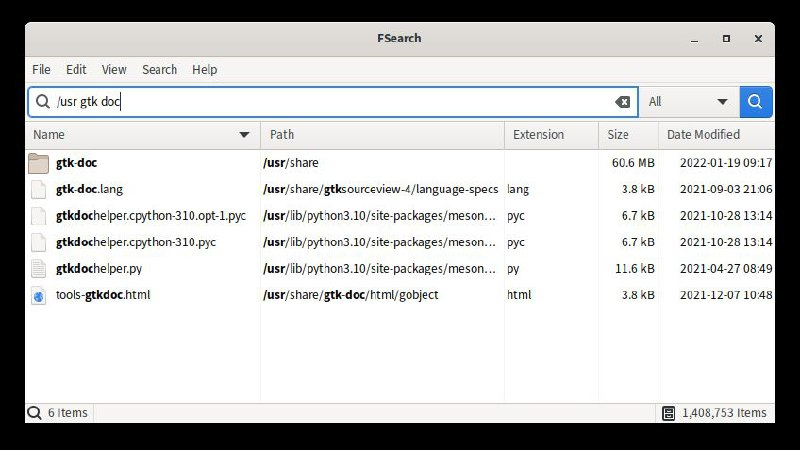

# 🐧 Linux Software & CLI Tools

### Linux applications, command-line utilities, packages, and desktop tools.

[⬅️ **Back to Main Catalog**](../../README.md) • [📚 **All Apps Index**](../all-apps.md)

> **Total Apps in Category:** `778`

---

### 📦 Croc

> **Categories:** `#Windows` `#Mac` `#linux` `#readme` `#golang` `#tcp` `#transfer` `#peer_to_peer` `#file_sharing` `#data_transfer` `#pake` `#GitHub` `#OpenSource` `#go` `#Interesting` `#Useful`

croc is a simple, secure, and fast command-line file transfer tool that allows users to send files and folders between devices over the internet. It uses end-to-end encryption, works across platforms and networks without port forwarding, supports resumable transfers, and can use relay servers when direct connections aren't possible. It also supports text transfers, browser-based receiving, custom transfer codes, proxies, and self-hosted relays.

- 🐙 **Source Code:** [https://github.com/schollz/croc](https://github.com/schollz/croc)
- 🌐 **Official Website:** [https://github.com/schollz/croc#readme](https://github.com/schollz/croc#readme)
- 👤 **Developer:** [Zack Schollz](https://github.com/schollz)

<details>
<summary><b>✨ Key Features (32)</b> — <i>Click to expand</i></summary>

- **End-to-End Encryption** — Secure file transfers
- **Cross-Platform** — Windows, Linux, macOS, and Android
- **File & Folder Transfer** — Transfer files, multiple files, or directories
- **Resume Transfers** — Continue interrupted transfers
- **No Port Forwarding** — Works without router configuration
- **Relay-Based Transfers** — Works across different networks
- IPv6 & IPv4 Support
- **Proxy Support** — Supports SOCKS5 proxies
- **Browser Support** — Transfer files through a web browser
- **Encrypted Temporary Storage** — Store files securely for later download
- **Custom Code Phrases** — Easy device-to-device pairing
- **QR Code Support** — Quickly share transfer codes
- Clipboard Integration
- Multiple File Transfer
- **stdin/stdout Support** — Pipe data directly through croc
- **Text Transfer** — Send text and URLs
- File & Folder Exclusion
- Automatic File Renaming
- Transfer Integrity Verification
- Configurable Encryption Options
- **Quiet Mode** — Suitable for scripts and automation
- **Self-Hosted Relay** — Run your own relay server
- Docker Support
- Lightweight CLI
- **Open Source** — MIT License
- *Send a File**
- ***Receive a File** — **
- ***Send Multiple Files** — **
- ***Send a Folder** — **
- ***Send Text** — **
- ***Custom Code** — **
- ***Receiver** — **

</details>


---

### 📦 Omniget

> **Categories:** `#Windows` `#Linux` `#Mac` `#DownloadManager` `#MediaDownloader` `#Study` `#GitHub` `#OpenSource`

OmniGet is an open-source, all-in-one desktop application for downloading, organizing, and studying online content. It combines a powerful media downloader with a built-in course player, PDF/EPUB reader, music library, and productivity tools—allowing you to learn, watch, read, and manage everything from a single, privacy-focused interface.

- 🐙 **Source Code:** [https://github.com/tonhowtf/omniget](https://github.com/tonhowtf/omniget)
- 👤 **Developer:** [tonhowtf](https://github.com/tonhowtf)

<details>
<summary><b>✨ Key Features (12)</b> — <i>Click to expand</i></summary>

- **Universal Downloader** — Download videos, audio, courses, books, and files from 1,000+ supported websites.
- **Course Downloader & Player** — Download and watch Udemy, Hotmart, Kiwify, Teachable, Kajabi, Thinkific, Skool, Wondrium, and more with resume support.
- **Timestamped Notes** — Create notes linked to exact video timestamps for faster revision.
- **Built-in PDF & EPUB Reader** — Read books with highlights, bookmarks, focus mode, and annotations.
- **Music Library** — Organize and play local music with synced lyrics, equalizer, playlists, and streaming service integration.
- **Torrent Support** — Download .torrent files and magnet links with native support.
- **FFmpeg Converter** — Convert audio and video files directly within the app.
- **Telegram Media Browser** — Browse chats and save photos, videos, and files from Telegram.
- **Pomodoro Focus Timer** — Stay productive with an integrated focus timer and study tools.
- **Knowledge Management** — Daily journal, bidirectional notes, knowledge graph, flashcards, and study progress tracking.
- **Browser Extension & Global Hotkey** — Send links to OmniGet instantly from Chrome, Firefox, or your clipboard.
- **Cross-Platform & Privacy-First** — Available on Windows, macOS, and Linux, with all downloads and data stored locally.

</details>


---

### 📦 meron

> **Categories:** `#android` `#windows` `#ios` `#linux` `#msStore` `#iosAppStore` `#SnapStore`

Meron is a modern, open-source mail and RSS client that combines IMAP/SMTP email and RSS/Atom feeds in one elegant interface, featuring threaded conversations, OAuth sign-in, encrypted local storage, and a high-performance Rust-powered core.

- 🐙 **Source Code:** [https://github.com/nonbili/meron](https://github.com/nonbili/meron)
- 👤 **Developer:** [nonbili](https://github.com/nonbili)

<details>
<summary><b>✨ Key Features (7)</b> — <i>Click to expand</i></summary>

- **Email** over IMAP/SMTP, with threaded conversations and a rich-text composer
- **RSS / Atom feeds** alongside your mail
- **OAuth** sign-in (e.g. Gmail) plus password auth with mailbox autodiscovery
- **Encrypted local storage** (SQLite via SQLCipher), with credentials kept in
- ****Native notifications**, system tray, and mailto** — handling on desktop
- **Push notifications** on mobile via IMAP IDLE
- **Localized** into 20+ languages (see [locales/](locales/))

</details>


---

### 📦 Axis

> **Categories:** `#Linux` `#Windows` `#Tools`

Axis is an open-source desktop application built with HTML, CSS, JavaScript, and Tauri that lets you compare, rank, and organize virtually anything. Games, movies, anime, phones, PC hardware, books, cars — if it can be rated, it can be ranked.

- 🐙 **Source Code:** [https://github.com/PR0Gorib/Axis](https://github.com/PR0Gorib/Axis)
- 👤 **Developer:** [Ramim Hasan](https://github.com/PR0Gorib)

<details>
<summary><b>✨ Key Features (16)</b> — <i>Click to expand</i></summary>

- Custom ranking categories
- Side-by-side comparison mode
- Radar & bar chart visualizations
- Dynamic rankings, podiums & score tiers
- Advanced image manager (up to 5 images per item)
- Automatic backups & restore manager
- Bulk stat editing tools
- Keyboard shortcuts
- Centralized settings panel
- Search, tags & advanced filtering
- Category templates
- Beautiful Share as Image exports
- Favorites / pinned items
- Dark & Light themes
- Native desktop app via Tauri
- Fully offline & privacy-friendly

</details>


---

### 📦 GitSwitch

> **Categories:** `#Git` `#Client` `#Linux` `#Windows` `#MacOS`

GitSwitch is a fast, lightweight desktop application built with Tauri and React that allows developers to seamlessly manage and switch between multiple Git profiles and SSH keys.

- 🐙 **Source Code:** [https://github.com/iput-object/GitSwitch](https://github.com/iput-object/GitSwitch)
- 👤 **Developer:** [OBITO XD](https://github.com/iput-object)

<details>
<summary><b>✨ Key Features (5)</b> — <i>Click to expand</i></summary>

- ****One-Click Profile Switching** — ** Instantly swap between identities across GitHub, GitLab, Bitbucket, and custom providers.
- ****Automated SSH Setup** — ** Auto-generates keys and manages your `~/.ssh/config` without conflicts.
- ****Automatic Commit Signing** — ** Flawlessly wires up SSH commit signing so your work is always verified.
- ****Config Repair & Health Checks** — ** Automatically detects and repairs drift in your live Git or SSH configuration.
- ****System Tray Integration** — ** Lives in your background for fast access on macOS, Windows, and Linux.

</details>


---

### 📦 Puzzle

> **Categories:** `#android` `#mac` `#windows` `#linux` `#web` `#puzzle` `#games`

The ultimate collection of puzzle challenge games available for Android , Linux, macOS, Web, and Windows. A professional suite of minimalist free brain games built with Flutter. Master over 273 unique puzzles in this essential logic puzzle library, featuring the best offline games including Minesweeper, 2048, Sudoku, and more.

- 🐙 **Source Code:** [https://github.com/sidhant947/Puzzle](https://github.com/sidhant947/Puzzle)
- 👤 **Developer:** [sidhant947](https://github.com/sidhant947)

<details>
<summary><b>✨ Key Features (12)</b> — <i>Click to expand</i></summary>

- ****Logic Puzzles** — ** Challenge your reasoning with Akari, Einstein Riddle, and classic Sudoku.
- ****Math Games** — ** Improve your mental arithmetic with 2048, KenKen, and the trending **Snake Game** variant (Sum Snake).
- ****Memory Games** — ** Sharpen your recall with N-Back, Memory Palace, and Chimp Test.
- ****Word Puzzles** — ** Expand your vocabulary with **typing games**, Crosswords, and Word Search.
- ****Minesweeper** — ** Ready to **play Minesweeper**? Enjoy it fully offline with no ads.
- ****Brain Training** — ** 273 minimalist experiences designed to sharpen your focus and attention.
- *Attention & Focus (45) - Elite Brain Training**
- *Logic & Reasoning (40) - Best Offline Logic Puzzles**
- * Math & Numbers (55) - Free Math Puzzle Games**
- *Memory Training (50) - Brain Games for Adults**
- *Spatial Awareness (34) - 3D & Rotation Challenges**
- *Word & Language (49) - Word Puzzle Games Online**

</details>


---

### 📦 odysseus

> **Categories:** `#quick` `#windows` `#mac` `#linux` `#odysseus` `#gayniggers` `#GitHub` `#OpenSource`

A self-hosted AI workspace -- meant to be the self-hosted version of the UI experience you get from ChatGPT and Claude. But with more jank and fun. Running on your own hardware, with your own data -- local-first, privacy-first, and no trojan.

- 🐙 **Source Code:** [https://github.com/pewdiepie-archdaemon/odysseus](https://github.com/pewdiepie-archdaemon/odysseus)
- 👤 **Developer:** [PewDiePie](https://github.com/pewdiepie-archdaemon)

<details>
<summary><b>✨ Key Features (12)</b> — <i>Click to expand</i></summary>

- **Chat** -- chat with any local model or API; adding them is super simple.
- **Agent** -- hand it tools and let it run the whole task itself.
- **Cookbook** -- Scans your hardware.
- **Deep Research** -- multi-step runs that gather, read, and synthesize sources into a nice visual report.
- **Compare** -- a fun tool to compare models side by side. Test completely blind, no bias! multi-model ·
- **Documents** -- YOU write the text, AI is there to assist, not the opposite.
- **Memory / Skills** -- Persistent memory and skills, your agent evolves over time as it better understands you and your tasks! ChromaDB ·
- ****Email** -- IMAP/SMTP inbox with AI triage built in** — urgency reminders, auto-tag, auto-summary, auto-reply drafts, auto-spam.
- **Notes & Tasks** -- Quick notes with reminders, a todo list, and scheduled tasks the agent can act on.
- **Calendar** -- Local-first calendar with CalDAV sync to Radicale / Nextcloud / Apple / Fastmail.
- **Works on mobile** -- looks and runs great on your phone, not just desktop.
- **Extras** -- more to explore, happy if you give it a go! image editor ·

</details>


---

### 📦 openclaw-android

> **Categories:** `#AI` `#Android` `#homelab` `#Openclaw`

Run OpenClaw on Android with a single command — no proot, no Linux

- 🐙 **Source Code:** [https://github.com/AidanPark/openclaw-android](https://github.com/AidanPark/openclaw-android)
- 👤 **Developer:** [AidanPark](https://github.com/AidanPark)

<details>
<summary><b>✨ Key Features (12)</b> — <i>Click to expand</i></summary>

- **One-tap setup** — bootstrap, Node.js, and OpenClaw installed from within the app
- Built-in dashboard for gateway control, runtime info, and tool management
- **Works independently of Termux** — installing the app does not affect an existing Termux + oa setup
- Android 7.0 or higher (Android 10+ recommended)
- ~1GB free storage
- Wi-Fi or mobile data connection
- ****glibc environment**** — Installs the glibc dynamic linker (via pacman's glibc-runner) so standard Linux binaries run without modification
- ****Node.js (glibc)**** — Downloads official Node.js linux-arm64 and wraps it with an ld.so loader script (no patchelf, which causes segfault on Android)
- ****Path conversion**** — Automatically converts standard Linux paths (/tmp, /bin/sh, /usr/bin/env) to Termux paths
- ****Temp folder setup**** — Configures an accessible temp folder for Android
- ****Service manager bypass**** — Configures normal operation without systemd
- ****OpenCode integration**** — If selected, installs OpenCode using proot + ld.so concatenation for Bun standalone binaries

</details>


---

### 📦 looper

> **Categories:** `#android` `#linux` `#looper` `#music` `#offline`

Advance music player for the linux and android with lyrics support for offline and online mode

- 🐙 **Source Code:** [https://github.com/SthrNilshaaa/looper](https://github.com/SthrNilshaaa/looper)
- 👤 **Developer:** [SthrNilshaaa](https://github.com/SthrNilshaaa)

<details>
<summary><b>✨ Key Features (5)</b> — <i>Click to expand</i></summary>

- ****Dynamic Theme Adapting**** — The entire interface—buttons, borders, and ambient background blurs—morphicly shifts accent color tones to blend beautifully with your current song's album art.
- ****Advanced Lyrics Engine**** — Synchronized scrolling LRC lyrics with dynamic line-by-line animations and tap-to-seek playback integration.
- ****Sub-Second Global Search**** — Search instantly by song name, album, artist, or even specific **lyric lines** with custom matching snippets highlighted.
- ****Interactive Android Experience**** — Modernized Android build with sequential, interactive permission onboarding cards and automatic playback resume during system audio focus transitions.
- ****Robust Linux Integration**** — Complete native title-bar options, keyboard media controls, and lightweight background playback using libmpv.

</details>


---

### 📦 ShutApp

> **Categories:** `#Android` `#Utilities`

ShutApp lets you control your Windows and Linux computers from your Android phone over your local network. Add or scan for devices, then shut down, restart, sleep, or lock them remotely.

- 🐙 **Source Code:** [https://github.com/S2009-dev/ShutApp](https://github.com/S2009-dev/ShutApp)
- 👤 **Developer:** [S2009](https://github.com/S2009-dev)

<details>
<summary><b>✨ Key Features (21)</b> — <i>Click to expand</i></summary>

- Manage multiple computers from one Android device
- Add computers manually by IP address
- Scan the local network for compatible ShutApp Desktop devices
- Save added devices for quick access later
- View detected device information such as hostname, IP address, and operating system
- See whether a saved device is online or offline
- Remotely shut down a computer
- Remotely restart a computer
- Remotely put a computer to sleep/suspend
- Remotely lock a computer session
- Supports Windows computers through the desktop companion
- Supports Linux computers through the desktop companion
- Uses local network communication through WebSocket
- Uses port `7421` for desktop communication
- Long-press remote action buttons to help avoid accidental commands
- Works over Wi-Fi/LAN without needing a cloud account
- Free and open-source
- Licensed under GPL-3.0-only
- Available on F-Droid
- APK can also be downloaded from GitHub releases
- Requires Android 8.0 or newer

</details>


---

### 📦 Grafyx

> **Categories:** `#Windows` `#Linux` `#MacOS` `#Tools` `#Utilities`

Grafyx is a high-performance, CLI-driven code knowledge graph tool designed to map and visualize the complex relationships and architecture within modern codebases.

- 🐙 **Source Code:** [https://github.com/0xarchit/grafyx](https://github.com/0xarchit/grafyx)
- 👤 **Developer:** [0xarchit](https://github.com/0xarchit)

<details>
<summary><b>✨ Key Features (10)</b> — <i>Click to expand</i></summary>

- **◬ Deep Recursive Scanning** — Maps complex directory structures and service interactions with sub-millisecond precision
- **⨠ Automated Service Discovery** — Detects monorepos and microservice boundaries without manual configuration
- **⊚ Local-First Execution** — Processes entirely on-device ensuring zero cloud dependencies and absolute privacy
- **∿ Fluid "Hot" Physics** — Offers liquid-smooth visual adjustments to node repulsion and gravity without re-rendering
- **⧉ Interactive Node Graphs** — Explores dependency chains and bottlenecks via a highly responsive D3.js frontend
- **◐ Semantic Highlighting** — Fixed dark mode with color-scaled nodes and edges distinguishing services from structural hierarchy
- **Universal Native Performance** — Ships as highly optimized, pre-compiled static binaries for Apple Silicon, Windows, and Linux
- **⟴ Zero-Friction Lifecycle** — Features built-in, system-aware commands for seamless self-installation and automated updates
- **⑇ Decoupled Architecture** — Separates heavy static analysis from the frontend to guarantee silky-smooth UI frame rates
- **◫ Dual-Pipeline Storage** — Exports structural data to both human-readable JSON and high-performance SQLite simultaneously

</details>


---

### 📦 Kagi

> **Categories:** `#windows` `#linux` `#macos` `#kagi` `#paasword` `#local`

🔑 A Fast Minimal and Secure Local Password Manager.

- 🐙 **Source Code:** [https://github.com/koiverse/Kagi](https://github.com/koiverse/Kagi)
- 👤 **Developer:** [koiverse](https://github.com/koiverse)

<details>
<summary><b>✨ Key Features (13)</b> — <i>Click to expand</i></summary>

- Local-only encrypted vault (AES-256-GCM)
- **Master password** — based unlock and auto-lock
- Entry types
- Login
- Credit Card
- Secure Notes
- Identity
- **Credit card fields** — number, expiration (MM/YY), CVV, notes
- Lightweight notes with title and content
- CSV import and export
- Secure vault purge and full reset actions
- Modern acrylic UI with Material components
- Optimized for fast desktop performance

</details>


---

### 📦 Lossless Cut

> **Categories:** `#Video` `#Editor` `#Windows` `#Linux` `#MacOS` `#GitHub` `#OpenSource`

LosslessCut aims to be the ultimate cross platform FFmpeg GUI for extremely fast and lossless operations on video, audio, subtitle and other related media files. The main feature is lossless trimming and cutting of video and audio files, which is great for saving space by rough-cutting your large video files taken from a video camera, GoPro, drone, etc. It lets you quickly extract the good parts from your videos and discard many gigabytes of data without doing a slow re-encode and thereby losing quality.

- 🐙 **Source Code:** [https://github.com/mifi/lossless-cut](https://github.com/mifi/lossless-cut)
- 👤 **Developer:** [Mikael Finstad](https://github.com/mifi/)


---

### 📦 D**ynamic Music Pill

> **Categories:** `#Linux` `#Widget` `#Customisation`

A dynamic, elegant, and highly customizable music widget for GNOME Shell. It brings a pill-shaped media controller with a live waveform visualizer directly to your Dash or Panel.

- 🐙 **Source Code:** [https://t.me/popCLOUDS/11694](https://t.me/popCLOUDS/11694)
- 👤 **Developer:** [Andbal23](https://github.com/Andbal23)

<details>
<summary><b>✨ Key Features (12)</b> — <i>Click to expand</i></summary>

- ****Adaptive Colors** — ** The widget's background and visualizer smoothly adapt to the current track's album art.
- ****GPU-Accelerated Visualizer** — ** Real-time waveform or beat animation that reacts to your music, running at a silky smooth 60 FPS with zero CPU drain.
- ****Advanced Transparency** — ** Inherit transparency settings across the background, album art, text, and visualizer for a seamless UI integration.
- ****Scroll to Control** — ** Smoothly adjust your **system volume** (with GNOME OSD support) or switch tracks by simply scrolling over the pill. Features a built-in "Delta Accumulator" for perfect touchpad support!
- ****Configurable Mouse Actions** — ** Assign custom actions (Play/Pause, Next, Prev, Open App, Open Menu) to Left, Middle, and Right clicks.
- ****Hide Default GNOME Player** — ** Optionally disable the built-in GNOME media controls in the Quick Settings to avoid duplicate widgets.
- ****Dynamic Transitions** — ** Skipping tracks directly from the pop-up menu dynamically resizes the menu with smooth crossfade animations.
- ****Spinning Vinyl Effect** — ** The album art rotates like a vinyl record while the music is playing.
- ****Seek Bar** — ** Jump to any part of the song directly from the pop-up.
- ****Dual Placement** — ** Place it on the **Dash** (Dock) or anywhere on the **Top Panel** (Left, Center, Right).
- ****🎮 Game Mode** — ** Automatically disables visualizers and animations when a fullscreen app or game is active to maximize your FPS.
- ****Backup & Restore** — ** Export your perfectly tuned settings to a .json file and restore them anytime.

</details>


---

### 📦 CopyCat-Clipboard

> **Categories:** `#Utilities` `#Android` `#Linux` `#MacOS` `#Windows`

Copycat Clipboard is an intuitive clipboard manager designed to enhance your workflow. Seamlessly switch between documents, apps, and devices while keeping all your copied items organized and accessible and synced.

- 🐙 **Source Code:** [https://github.com/raj457036/CopyCat-Clipboard](https://github.com/raj457036/CopyCat-Clipboard)
- 👤 **Developer:** [raj457036](https://github.com/raj457036)

<details>
<summary><b>✨ Key Features (16)</b> — <i>Click to expand</i></summary>

- Save and retrieve all your copied items without limits.
- Unlimited number of concurrent devices.
- Access your clipboard history on Android, Windows, Mac, iPhone, iPad, and Linux effortlessly.
- Easily categorize and find your clips using collections.
- Whether it's your project assets, DevOps command list, or memes, collections provide instant access.
- Clips stored in collections are always available and won’t be automatically deleted like history.
- Instantly find any copied item with powerful search functionality.
- Categorical search quickly locates the exact type you need.
- Your data is encrypted to ensure privacy and security.
- Opt for end-to-end encryption for added security.
- End-to-end encryption uses 256-bit AES encryption, ensuring even Copycat cannot access your clips.
- Copy on one device and paste on any other instantly with real-time syncing.
- Access your Copycat clipboard anywhere with a configurable shortcut.
- Paste directly into any application using smart paste.
- Add titles and descriptions to clips for easy searching.
- **[*Mabisi - Simplified Chinese*](https** — //github.com/Mabisi)

</details>


---

### 📦 LinOffice

> **Categories:** `#Linux` `#Office`

LinOffice lets you run Microslop Office on Linux by automatically installing Windows and Office inside a virtual machine. It makes Microslop Office applications (like Word, Excel, PowerPoint, OneNote and Outlook) behave as if they are native Linux apps

- 🐙 **Source Code:** [https://github.com/eylenburg/linoffice](https://github.com/eylenburg/linoffice)
- 👤 **Developer:** [eylenburg](https://github.com/eylenburg)

<details>
<summary><b>✨ Key Features (28)</b> — <i>Click to expand</i></summary>

- [x] **Automatic non-interactive setup**
- [x] **Run Microsoft Office apps as if they were native Linux apps**
- [x] **Office apps have access to ****/home**** folder and Linux clipboard**
- [x] Run Publisher or Access, if manually installed by user
- [x] Quickly access useful tools such as Powershell, Command Prompt, Windows Explorer, Registry Editor, Office Language Settings
- [x] Run a full Windows session via RDP or VNC
- [x] Automatic suspension of the Windows container when inactive, resume when starting an Office app
- [x] Automatic deletion of Office lock files (like ~$file.docx)
- [x] Force time sync in Windows after Linux host wakes up from sleep, to avoid time drift (time zone is always set to UTC for simplicity)
- [x] Automatic detection of language, date format, thousand and decimal separator, currency symbol, keyboard layout etc
- [x] Toggle settings such as display scaling, auto-suspend on/off, network on/off (to prevent Windows and Office from "phoning home")
- [x] Circumvent geo-blocking for the Office installation
- [x] Install updates for Windows and Office
- [x] Tidy Quick Access pane in Windows File Explorer
- **[x] Automatically debloats Windows and disables telemetry and ads, using [Win11Debloat](https** — //github.com/Raphire/Win11Debloat/)
- [x] Troubleshooting functions e.g. force cleanup of Office lock files, recreate .desktop files for the Office apps, reboot the Windows container, container health check
- *Planned features**
- [ ] Logo to use for the GUI
- [ ] Translations for the GUI
- [ ] Deliver as Flatpak or AppImage, which would have these benefits
- Bundles dependencies such as FreeRDP and Podman-Compose; only Podman would need to be installed on the system already
- Installation and uninstallation more straight-forward for Linux beginners
- Code changes needed
- APPDATA folder should not be hardcoded (in setup.sh, linoffice.sh, mainwindow.py, installer.py, linoffice.py, TimeSync.ps1, FirstRunRDP.ps1, and RegistryOverride.ps1) or at least only hardcoded in one of them and then read by the others (like uninstall.sh is doing).
- Flatpak would not allow creatingfiles in the config folder inside the app's folder (compose.yaml, linoffice.conf, oem/registry/regional-settings.reg), so it might be better to to move this whole folder out of the app directory and change the file references (perhaps copy to the APPDATA folder)
- [ ] ARM support (should be possible as both Windows and Office have ARM versions)
- [ ] Support for non-core Office apps (e.g. Access, Publisher, Visio)
- [ ] Support for older Office versions (e.g. 2016, 2019, 2021)

</details>


---

### 📦 Network Checker

> **Categories:** `#Android` `#Windows` `#Linux` `#Network` `#Utilities`

Network Checker — A curated set of network diagnostic and testing tools
Network Checker is a cross-platform toolkit designed for monitoring and analyzing internet connectivity and access, especially tailored toward challenging network environments such as those found in Iran’s internet infrastructure. It provides a suite of utilities for checking domain accessibility, measuring DNS performance, scanning edge IPs, and modifying VLESS configs, with support for Android, Windows, and Linux.

- 🐙 **Source Code:** [https://github.com/mirarr-app/network-checker](https://github.com/mirarr-app/network-checker)
- 👤 **Developer:** [mirarr-app](https://github.com/mirarr-app)


---

### 📦 SkyStream

> **Categories:** `#Android` `#Media` `#Streaming`

SkyStream is a modern, cross-platform media streaming client inspired by CloudStream. It utilizes a custom JavaScript runtime for extensions, allowing users to scrape and stream content from various sources on Android, iOS, Windows, macOS, and Linux from a single codebase.

- 🐙 **Source Code:** [https://t.me/popCLOUDS/11312](https://t.me/popCLOUDS/11312)
- 👤 **Developer:** [Akash Hiremath](https://github.com/akashdh11)


---

### 📦 ImageFlow

> **Categories:** `#Linux` `#Utilities`

This application is designed for converting videos into animated GIF and WebP images using the FFmpeg library. It allows you to configure basic parameters, such as the resulting image resolution, frame rate, applied filters (interpolation method, dithering mode), and palette generation method.

- 🐙 **Source Code:** [https://github.com/GS90/ImageFlow](https://github.com/GS90/ImageFlow)
- 👤 **Developer:** [Golodnikov Sergey](https://github.com/GS90)

<details>
<summary><b>✨ Key Features (4)</b> — <i>Click to expand</i></summary>

- All conversion parameters can be configured.
- Preview of the result.
- Support for many formats.
- Intuitive and user-friendly interface

</details>


---

### 📦 SpotiFLAC

> **Categories:** `#Linux` `#Windows` `#MacOS` `#Music` `#Downloader` `#readme` `#spotify` `#spotify_downloader` `#wails` `#typescript` `#GitHub` `#OpenSource`

Get Spotify tracks in true FLAC from Tidal, Qobuz & Amazon Music — no account required.

- 🐙 **Source Code:** [https://github.com/afkarxyz/SpotiFLAC](https://github.com/afkarxyz/SpotiFLAC)
- 👤 **Developer:** [afkarxyz](https://github.com/afkarxyz)


---

### 📦 zenshin.

> **Categories:** `#Windows` `#Linux` `#Web`

A poorly written web and electron based anime list manager with media streaming capabilities.

- 🐙 **Source Code:** [https://m.youtube.com/watch?v=cpMpWohodUc](https://m.youtube.com/watch?v=cpMpWohodUc)
- 👤 **Developer:** [hitarth.](https://github.com/hitarth-gg)


---

### 📦 Local Desktop

> **Categories:** `#Android` `#Tools`

Local Desktop is a free, open-source Android application that lets you run a full desktop Linux environment (e.g., a traditional desktop UI such as Xfce) locally on an Android device, without requiring root access.

- 🐙 **Source Code:** [https://github.com/localdesktop/localdesktop](https://github.com/localdesktop/localdesktop)
- 👤 **Developer:** [Local Desktop](https://github.com/localdesktop)


---

### 📦 0xDABmusic

> **Categories:** `#Linux` `#Windows` `#MacOS` `#Music`

0xDABmusic is a high-performance, native music player built with Go and Wails, designed for those who demand quality and privacy. Experience lightning-fast playback, studio-grade audio, and seamless integration without the bloat.

- 🐙 **Source Code:** [https://dab.0xarchit.is-a.dev](https://dab.0xarchit.is-a.dev)
- 👤 **Developer:** [Archit Jain](https://github.com/0xarchit)

<details>
<summary><b>✨ Key Features (14)</b> — <i>Click to expand</i></summary>

- Built with Go & Wails for instant startup
- Extremely low resource usage
- Smooth native experience on all platforms
- Full support for FLAC and high-fidelity artifacts
- Pure, uncompromised sound quality
- Import playlists directly from Spotify & Youtube music
- Convert streaming tracks to local files
- Sync enhanced metadata automatically
- Real-time lyrics with karaoke-style highlighting
- Auto-fetch capability for supported tracks
- Integrated seamless display
- No ads, no tracking, no subscriptions
- You own your data, always
- All api keys and passwords remains upto your device only

</details>


---

### 📦 OpenScreen

> **Categories:** `#Utilities` `#Linux` `#Windows` `#MacOS` `#readme` `#electron` `#open_source` `#screen_recorder` `#screen_capture` `#pixijs` `#typescript` `#GitHub` `#OpenSource`

OpenScreen is a free, open‑source alternative to Screen Studio that lets you create clean, polished product demos and walkthroughs without subscriptions, watermarks, or usage limits.

- 🐙 **Source Code:** [https://github.com/siddharthvaddem/openscreen](https://github.com/siddharthvaddem/openscreen)
- 🌐 **Official Website:** [https://openscreen.vercel.app](https://openscreen.vercel.app)
- 👤 **Developer:** [siddharthvaddem](https://github.com/siddharthvaddem)


---

### 📦 Dissent

> **Categories:** `#Social` `#Linux` `#Windows`

Dissent is a third-party Discord client designed for a smooth, native experience on Linux/Windows desktops.

- 🐙 **Source Code:** [https://github.com/diamondburned/dissent](https://github.com/diamondburned/dissent)
- 👤 **Developer:** [diamondburned](https://github.com/diamondburned)

<details>
<summary><b>✨ Key Features (9)</b> — <i>Click to expand</i></summary>

- Text chat with complete Markdown and custom emoji support
- Guild folders and channel categories
- Tabbed chat interface
- Quick switcher for channels and servers
- Image and file uploads, previews, and downloads
- User theming via custom CSS
- Partial thread/forum support
- Partial message reaction support
- Partial AI summary support (provided by Discord)

</details>


---

### 📦 DroidRun

> **Categories:** `#Linux` `#MacOS` `#Windows` `#Automation` `#AI` `#GitHub` `#OpenSource` `#llmagents`

1DroidRun is a powerful framework for controlling Android and iOS devices through LLM agents. It allows you to automate device interactions using natural language commands.

- 🐙 **Source Code:** [https://github.com/droidrun/droidrun](https://github.com/droidrun/droidrun)


---

### 📦 PlayTorrio

> **Categories:** `#download` `#Inactive` `#Streaming` `#Linux` `#Windows` `#MacOS`

PlayTorrio is an all-in-one media center application that brings together streaming, torrenting, and media management in a beautiful, easy-to-use interface.

- 🐙 **Source Code:** [https://github.com/ayman707-ux/PlayTorrio](https://github.com/ayman707-ux/PlayTorrio)
- 🌐 **Official Website:** [https://t.me/aalexismaple](https://t.me/aalexismaple)
- 👤 **Developer:** [ayman707-ux](https://github.com/ayman707-ux)

<details>
<summary><b>✨ Key Features (24)</b> — <i>Click to expand</i></summary>

- WebTorrent Integration - Stream torrents directly without waiting for downloads
- Debrid Services - Support for Real-Debrid, AllDebrid, and more
- Multi-File Selection - Choose which files to stream from torrents
- Resume Playback - Continue watching where you left off
- Movies & TV Shows - Browse and search extensive catalogs
- Anime - Dedicated anime section with subtitles
- Metadata - Rich information from TMDB, TVDB, and more
- Jackett Integration - Search across hundreds of torrent sites
- Chromecast Support - Cast to your TV seamlessly
- MPV Player - High-quality playback with hardware acceleration
- VLC Integration - Alternative player support
- Subtitle Support - Automatic subtitle downloading and loading
- EPUB Downloads - Download and read books
- Z-Library Integration - Access millions of books
- Cover Art - Beautiful library with cover images
- Offline Reading - Books saved locally
- Music Streaming - Stream from various sources
- Offline Downloads - Save music for offline listening
- Cover Art & Metadata - Rich music library
- Discord Rich Presence - Show what you're watching
- Auto-Updates - Stay up to date automatically
- Cache Management - Control storage and cleanup
- Custom Cache Location - Choose where to store files
- Dark Mode UI - Beautiful, modern interface

</details>


---

### 📦 Misuzu Music

> **Categories:** `#Player` `#Linux` `#Windows` `#MacOS`

A cross-platform local music player that supports automatic matching of lyrics and posters, playlist creation, and furigana (kana) annotations for Japanese kanji. The interface is styled after Apple Music.

- 🐙 **Source Code:** [https://github.com/MCDFsteve/MisuzuMusic](https://github.com/MCDFsteve/MisuzuMusic)
- 👤 **Developer:** [MCDFsteve](https://github.com/MCDFsteve)

<details>
<summary><b>✨ Key Features (9)</b> — <i>Click to expand</i></summary>

- Import local music
- Allows creating playlists
- Allow loading local lyric LRC files
- Supports displaying furigana readings for Japanese kanji
- Supports automatically fetching lyrics and cover art online for music without lyrics or cover art
- Lightweight
- Cross-platform
- Apple Music-inspired design style
- Desktop lyrics

</details>


---

### 📦 BrowserOS

> **Categories:** `#AI` `#Agent` `#Browser` `#Linux` `#MacOS` `#Windows` `#GitHub` `#OpenSource`

BrowserOS is an open-source chromium fork that runs AI agents natively. Your open-source, privacy-first alternative to ChatGPT Atlas, Perplexity Comet, Dia.

- 🐙 **Source Code:** [https://browseros.com](https://browseros.com)
- 👤 **Developer:** [BrowserOS](https://github.com/browseros-ai)


---

### 📦 PennyWise

> **Categories:** `#Android` `#Expense` `#Tracker` `#Linux` `#Tools`

PennyWise is a modern expense management app that helps you track your income, expenses, and budgets with a sleek dark-themed interface and powerful analytics.

- 🐙 **Source Code:** [https://t.me/fitx_updates](https://t.me/fitx_updates)
- 👤 **Developer:** [Bhanu Pratap Singh](https://github.com/Bhanu7773-dev)

<details>
<summary><b>✨ Key Features (24)</b> — <i>Click to expand</i></summary>

- * 💸 Transaction Management**
- Add & Edit Transactions - Easily record income and expenses with custom categories
- Transaction History - View all your transactions sorted by date
- Quick Actions - Delete or update transactions with a simple swipe
- * 📊 Analytics & Insights**
- Expense Breakdown - Visual pie charts showing spending by category
- Spending Trends - Track your daily spending patterns over the last 7 days
- Budget Tracking - Set monthly budgets and monitor your progress in real-time
- * 🎯 Budget Management**
- Monthly Budgets - Set spending limits for each month
- Progress Indicators - Visual progress bars showing how much of your budget you've used
- Budget Alerts - Stay informed about your spending habits
- * 📱 User Experience**
- Personalized Welcome - Customizable username and greeting
- Multi-Currency Support - Choose your preferred currency symbol (₹, $, €, etc.)
- Dark Theme - Beautiful gradient-based dark UI with smooth animations
- Onboarding Flow - First-time user setup experience
- * 📤 Data Export**
- CSV Export - Export transaction data to CSV format
- PDF Reports - Generate professional PDF transaction reports
- Local Storage - All exports saved to a dedicated PennyWise folder
- * 🔒 Security & Privacy**
- Offline First - All data stored locally using Hive database
- No Cloud Dependency - Your financial data stays on your device

</details>


---

### 📦 RepoHub

> **Categories:** `#Website` `#Windows` `#MacOS` `#Linux` `#Tools`

RepoHub simplifies software installation on Linux, Windows, and macOS with a unified interface that uses official repositories for discovering and installing packages.

- 🐙 **Source Code:** [https://github.com/yusufipk/RepoHub](https://github.com/yusufipk/RepoHub)
- 🌐 **Official Website:** [https://github.com/yusufipk](https://github.com/yusufipk)
- 👤 **Developer:** Yusuf İpek


---

### 📦 Ubuntu Chroot Installer** 😀

> **Categories:** `#Android` `#Root` `#Chroot`

A comprehensive Android Linux environment featuring Ubuntu 24.04 with a built-in WebUI Control Panel, Beautiful desktop environment, advanced namespace isolation, and in-built development tools for a seamless Linux desktop experience on Android - with full hardware access and x86_64 emulation.

- 🐙 **Source Code:** [https://github.com/ravindu644/Ubuntu-Chroot](https://github.com/ravindu644/Ubuntu-Chroot)
- 👤 **Developer:** Ravindu644


---

### 📦 gotohp

> **Categories:** `#requires` `#Media` `#Linux` `#MacOS`

Unofficial Google Photos Desktop GUI Client.

- 🐙 **Source Code:** [https://github.com/xob0t/gotohp](https://github.com/xob0t/gotohp)
- 👤 **Developer:** [xob0t](https://github.com/xob0t)

<details>
<summary><b>✨ Key Features (8)</b> — <i>Click to expand</i></summary>

- Unlimited uploads (can be disabled)
- Drag-and-drop file upload interface
- Credential management
- Real-time upload progress tracking
- Configurable upload threads
- Individual files or directories uploads, with optional recursive scanning
- Skips files already present in your account
- Configurable, presistent upload settings (stored in "%system config path%/gotohp/gotohp.config")

</details>


---

### 📦 WinBoat

> **Categories:** `#Linux` `#Tools` `#readme` `#windows` `#docker` `#docker_compose` `#virtualization` `#rdp` `#typescript` `#GitHub` `#OpenSource`

WinBoat is a simple tool that lets you run Windows applications on Linux as if they were native. It automatically creates a Windows virtual machine in Docker, connects it to your system, and lets you open Windows programs directly on your Linux desktop without complex setup.

- 🐙 **Source Code:** [https://github.com/TibixDev/winboat](https://github.com/TibixDev/winboat)
- 👤 **Developer:** TibixDev

<details>
<summary><b>✨ Key Features (6)</b> — <i>Click to expand</i></summary>

- Elegant Interface
- Automated Installs
- Run Any App
- Full Windows Desktop
- Filesystem Integration
- And Many More

</details>


---

### 📦 PixiEditor

> **Categories:** `#Windows` `#Linux` `#MacOS` `#Editor` `#Graphic` `#Design` `#csharp` `#2d` `#avaloniaui` `#dotnet_core` `#dotnetcore` `#game_development` `#graphics` `#graphics_editor` `#linux_desktop` `#painting` `#pixel_art` `#pixi` `#procedural_drawing` `#procedural_generation` `#raster_graphics` `#sprites` `#tabs` `#vector_graphics`

PixiEditor is a universal 2D editor that was made to provide you with tools and features for all your 2D needs. Create beautiful sprites for your games, animations, edit images, create logos. All packed up in an intuitive and familiar interface.

- 🐙 **Source Code:** [https://github.com/PixiEditor/PixiEditor](https://github.com/PixiEditor/PixiEditor)


---

### 📦 Desktop-TUI

> **Categories:** `#install` `#Windows` `#Linux` `#MacOS` `#GitHub` `#OpenSource`

A desktop environment without graphics, terminal-driven, minimalist, and nostalgic.

- 🐙 **Source Code:** [https://github.com/Julien-cpsn/desktop-tui](https://github.com/Julien-cpsn/desktop-tui)
- 👤 **Developer:** [Julien C.](https://github.com/Julien-cpsn)

<details>
<summary><b>✨ Key Features (10)</b> — <i>Click to expand</i></summary>

- Parse shortcut files containing apps
- Custom additional commands
- Custom window options
- Custom terminal options
- Display any application or command that uses stdout
- Move and resize windows
- Handle and display application error
- Change tiling options
- Let the user select a file or a folder to use its path as a command argument
- Clock

</details>


---

### 📦 GitNuro  - Multiplatform Git Client

> **Categories:** `#downloadinstall` `#features` `#Learning` `#Linux` `#Windows` `#MacOS` `#kotlin` `#compose_multiplatform` `#git` `#jetbrains_compose` `#jgit` `#multiplatform` `#rust` `#GitHub` `#OpenSource`

The main goal of GitNuro is to provide a multiplatform open source Git client without any kind of constraint on how you can use it nor relying on web technologies.

- 🐙 **Source Code:** [https://github.com/JetpackDuba/Gitnuro](https://github.com/JetpackDuba/Gitnuro)
- 👤 **Developer:** [Abdelilah El Aissaoui](https://github.com/JetpackDuba)


---

### 📦 Quitter

> **Categories:** `#Android` `#Windows` `#Linux` `#Utilities`

Record your quitting journey

- 🐙 **Source Code:** [https://t.me/popCLOUDS/10435](https://t.me/popCLOUDS/10435)
- 👤 **Developer:** [Brandon Dick](https://github.com/brandonp2412)

<details>
<summary><b>✨ Key Features (7)</b> — <i>Click to expand</i></summary>

- **No tracking** We don't save any of your user data. Everything is stored locally.
- **No internet** Our app doesn't request internet access, at all.
- **Multiple journeys** Monitor progress for different habits simultaneously.
- **Milestone tracking** Record and celebrate key achievements in your quitting journey.
- **Journaling** Write your thoughts and feelings as you progress.
- **Notifications** Be encouraged with progress notifications.
- **Completely custom** Toggle features on/off, change colors & themes with settings.

</details>


---

### 📦 SteamBrew/Millennium

> **Categories:** `#Windows` `#Linux` `#Tools` `#Gaming`

SteamBrew/Millennium is a mod manager for the Steam desktop client. It lets you browse, install, update, and toggle themes and plugins (Millennium) in one place, no manual patching, easy rollback to stock.

- 🐙 **Source Code:** [https://github.com/SteamClientHomebrew/Millennium](https://github.com/SteamClientHomebrew/Millennium)

<details>
<summary><b>✨ Key Features (7)</b> — <i>Click to expand</i></summary>

- **Plugin system** — Built-in plugin loader + JavaScript plugin API; browse community plugins.
- **Themes/skins** — CSS-based theming with a public theme catalog and dev docs.
- **Install / enable / update add-ons** — In-client install & enable flows; updater fixes are actively shipped in releases.
- **Run popular tools inside Steam** — Plugins can port browser extensions like Augmented Steam into the client (now superseded by Extendium, but shows the capability).
- **For developers** — Open-ended framework + “Developer API” for building themes/plugins.
- **URL protocol** — Custom steam:// commands to drive Millennium actions.
- **Platform support** — Windows script installer; Linux packages (AUR, Nix); macOS has no official build yet.

</details>


---

### 📦 Spek

> **Categories:** `#Linux` `#MacOS` `#Windows` `#Audio` `#Tools`

Spek is a free, open-source spectrogram viewer that helps you analyze audio by visualizing its frequency content over time. It’s written in C/C++, decodes with FFmpeg, and uses wxWidgets for a fast, cross-platform GUI. If you’ve ever wanted to spot lossy transcodes, inspect bandwidth limits, or just see what’s really inside a track, Spek gives you a clean, responsive spectrogram with sensible defaults and expert controls.

- 🐙 **Source Code:** [https://github.com/alexkay/spek](https://github.com/alexkay/spek)
- 👤 **Developer:** [Alexander Kojevnikov](https://github.com/alexkay)

<details>
<summary><b>✨ Key Features (13)</b> — <i>Click to expand</i></summary>

- Supports a wide range of **lossy and lossless** audio formats via FFmpeg
- Ultra-fast, multi-threaded signal processing
- Displays codec name and audio parameters
- Save spectrogram as an image (e.g., PNG)
- Drag-and-drop loading and file-type associations
- Auto-fitting time, frequency, and spectral-density rulers
- Adjustable spectral-density range (dB scale)
- Adjustable colour palette
- Adjustable FFT/DFT size and window function
- Switch between audio streams/channels
- High-DPI display support
- **Cross-platform GUI** — GNU/Linux, Windows, macOS
- Translations / multi-language UI

</details>


---

### 📦 Aesir

> **Categories:** `#Linux` `#Android` `#Tools`

**Aesir** is a revolutionary cross-platform GUI application that transforms how you interact with Samsung devices. Whether you're a developer, power user, or enthusiast, Aesir provides an elegant, intuitive interface for firmware flashing, ADB operations, and Google Apps installation.

- 🐙 **Source Code:** [https://github.com/daglaroglou/Aesir4](https://github.com/daglaroglou/Aesir4)
- 👤 **Developer:** [Christos Daglaroglou](https://github.com/daglaroglou)


---

### 📦 RapidRAW

> **Categories:** `#Windows` `#Linux` `#MacOS` `#Tools` `#Media` `#Editing` `#GitHub` `#OpenSource`

A beautiful, non-destructive, and GPU-accelerated RAW image editor built with performance in mind.

- 🐙 **Source Code:** [https://github.com/CyberTimon/RapidRAW](https://github.com/CyberTimon/RapidRAW)
- 👤 **Developer:** [Timon Käch](https://github.com/CyberTimon)

<details>
<summary><b>✨ Key Features (26)</b> — <i>Click to expand</i></summary>

- *Core Editing Engine**
- *GPU-accelerated processing** (custom WGSL shader) for instant feedback
- ***Masking** — ** AI Subject, **Sky**, **Foreground** + Brush, Linear, Radial
- ***Generative edits** — ** remove/add with prompts; non-destructive **patch layers** (optional ComfyUI backend)
- *Full RAW support** via rawler; **non-destructive** sidecar (.rrdata); **32-bit precision** pipeline
- *Professional-grade Adjustments**
- ***Tone** — ** Exposure, Contrast, Highlights, Shadows, Whites, Blacks
- ***Curves** — ** Luma + RGB (R/G/B channels)
- ***Color** — ** Temperature, Tint, Vibrance, Saturation, full **HSL** mixer
- ***Detail** — ** Sharpening, Clarity, Structure, Noise Reduction
- ***Effects** — ** **LUTs**, Dehaze, Vignette, Film Grain
- ***Transform** — ** Crop (aspect-ratio lock), Rotate, Flip
- *Library & Workflow**
- ***Image Library** — ** sort, rate, tag, and manage collections
- ***Folder Management** — ** built-in tree (create/rename/delete)
- ***File Ops** — ** import, copy/move, rename, duplicate (with edits)
- *Filmstrip View** for quick navigation while editing
- *Batch operations** (apply settings / export)
- *EXIF viewer** (shutter, aperture, ISO, lens, etc.)
- *Productivity & UI**
- ***Presets** — ** create, save, import, export
- *Copy/Paste settings** across images
- *Undo/Redo** history for every edit
- ***Customizable UI** — ** resizable panels, multiple themes, smooth animations
- *Panorama stitcher**
- ***Export controls** — ** format, quality, naming, metadata, resizing options

</details>


---

### 📦 Ludi

> **Categories:** `#Android` `#MacOS` `#Windows` `#Linux` `#Utilities`

Ludi is a Kotlin multiplatform app(Android + Desktop) For browsing & discovering new games, Checking daily updated price discounts & giveaways on games, and RSS gaming news feed reader from your favorite gaming news websites, All in one single app.

- 🐙 **Source Code:** [https://github.com/mr3y-the-programmer/Ludi](https://github.com/mr3y-the-programmer/Ludi)
- 👤 **Developer:** [M R 3 Y](https://github.com/mr3y-the-programmer)

<details>
<summary><b>✨ Key Features (9)</b> — <i>Click to expand</i></summary>

- Discover trending, top rated, and other highly recommended games.
- Search for a specific game or filter games by store, tag or platform.
- RSS news reader for your favorite gaming websites.
- Offline support/Caching for RSS feed articles.
- Full-text search for RSS feed articles.
- Get updated with the latest deals on games, prices & giveaways.
- Adaptive layout design for (Mobile, tablet or Desktop).
- Dark Theme.
- Material 3 design language.

</details>


---

### 📦 GopherTube

> **Categories:** `#installation` `#Linux` `#Media` `#GitHub` `#OpenSource`

GopherTube is a terminal-based YouTube client that lets you search, preview, play, and download videos without opening a browser. It presents results in a keyboard-driven TUI, shows inline ASCII/ANSI thumbnails via chafa, plays streams through mpv, and uses yt-dlp for downloads. Suitable for local shells and SSH sessions, with minimal external dependencies.

- 🐙 **Source Code:** [https://github.com/KrishnaSSH/GopherTube](https://github.com/KrishnaSSH/GopherTube)
- 👤 **Developer:** [KrishnaSSH](https://github.com/KrishnaSSH)

<details>
<summary><b>✨ Key Features (8)</b> — <i>Click to expand</i></summary>

- Fast YouTube search (scrapes YouTube directly, no API key needed)
- Play videos with mpv
- Minimal terminal UI (fzf)
- Keyboard navigation (arrows, Enter, Tab, Esc)
- TOML config
- Download videos with quality selection (yt-dlp)
- **Downloads menu** — browse and play downloaded videos
- Thumbnail preview in downloads menu

</details>


---

### 📦 Gurk

> **Categories:** `#installation` `#usage` `#Linux` `#MacOS` `#Windows` `#Social`

Signal Messenger client for terminal

- 🐙 **Source Code:** [https://github.com/boxdot/gurk-rs](https://github.com/boxdot/gurk-rs)
- 👤 **Developer:** [boxdot](https://github.com/boxdot)


---

### 📦 Newelle

> **Categories:** `#Linux` `#Utilities`

Newelle is an open‑source desktop AI assistant for GNOME that provides a native GTK4/libadwaita interface to multiple LLMs, both cloud and local, with optional command execution on Linux systems . It focuses on extensibility, privacy‑aware configuration, and a fluid desktop experience via features like mini window mode, profiles, and a built-in file manager.

- 🐙 **Source Code:** [https://github.com/topics/newelle-extension](https://github.com/topics/newelle-extension)
- 👤 **Developer:** [Yehor Hliebov](https://github.com/qwersyk)


---

### 📦 Shiru

> **Categories:** `#Android` `#Linux` `#Windows` `#MacOS` `#Streaming` `#Entertaiment` `#Anime` `#GitHub` `#OpenSource`

BitTorrent streaming software with no paws in the way—watch anime in real-time, no waiting for downloads!

- 🐙 **Source Code:** [https://github.com/RockinChaos/Shiru](https://github.com/RockinChaos/Shiru)
- 👤 **Developer:** [RockinChaos](https://github.com/RockinChaos)


---

### 📦 WhatsCLI

> **Categories:** `#installation` `#features` `#Social` `#MacOS` `#Windows` `#Linux`

A command-line WhatsApp client written in Go and highly riceable with Lua scripts

- 🐙 **Source Code:** [https://github.com/ArturCSegat/whats-cli](https://github.com/ArturCSegat/whats-cli)
- 👤 **Developer:** [ArturCSega](https://github.com/ArturCSegat)


---

### 📦 WinApps

> **Categories:** `#installation` `#officially` `#Linux` `#Tools` `#shell` `#cassowary` `#docker` `#freerdp` `#gnome` `#hacktoberfest` `#integration` `#kde` `#libvirt` `#linux_app` `#nautilus` `#nix_flake` `#podman` `#qemu` `#qemu_kvm` `#seamless` `#winapps` `#windows` `#wine` `#xfce`

Run Windows apps such as Microsoft Office/Adobe in Linux (Ubuntu/Fedora) and GNOME/KDE, Arch Linux, Gentoo Linux, OpenSUSE as if they were a part of the native OS, including Nautilus integration.

- 🐙 **Source Code:** [https://github.com/winapps-org/winapps](https://github.com/winapps-org/winapps)


---

### 📦 Repertoire

> **Categories:** `#Android` `#Linux` `#Windows` `#Web` `#Entertaiment`

Repertoire is a cross-platform application designed for musicians, dancers, magicians, or performers to help manage their repertoire (musical pieces, dance routines, or even magic tricks), track practice sessions, and organize all related media in one place. Built with Flutter, it offers a seamless experience on mobile, web, and desktop platforms.

- 🐙 **Source Code:** [https://github.com/Adithya-Jayan/MyRepertoirApp](https://github.com/Adithya-Jayan/MyRepertoirApp)
- 👤 **Developer:** [Adithya Jayan](https://github.com/Adithya-Jayan)


---

### 📦 Sine

> **Categories:** `#Linux` `#Windows` `#MacOS` `#Browser` `#Customization`

Sine is a community-driven mod/theme manager for all Firefox-based browsers, designed to be a more efficient, powerful, user-friendly, and compatible alternative to manual installation.

- 🐙 **Source Code:** [https://github.com/CosmoCreeper/Sine](https://github.com/CosmoCreeper/Sine)
- 👤 **Developer:** [CosmoCreeper](https://github.com/CosmoCreeper)


---

### 📦 AYA

> **Categories:** `#Windows` `#MacOS` `#Linux` `#Tools` `#GitHub` `#OpenSource`

AYA is a desktop application for easily controlling android devices, which can be considered as a GUI wrapper for ADB.

- 🐙 **Source Code:** [https://aya.liriliri.io](https://aya.liriliri.io)
- 👤 **Developer:** [LiriLiri](https://github.com/liriliri)

<details>
<summary><b>✨ Key Features (8)</b> — <i>Click to expand</i></summary>

- Screen mirror
- File explorer
- Application manager
- Process monitor
- Layout inspector
- CPU, memory and FPS monitor
- Logcat viewer
- Interactive shell

</details>


---

### 📦 App Manager GUI

> **Categories:** `#first` `#features` `#Windows` `#Linux` `#Tools`

A multiplatform tool using ADB to effortlessly manage Android apps: extract icons, view app info, debloat, reinstall, and more with intuitive controls.

- 🐙 **Source Code:** [https://github.com/BlassGO/AppManager-GUI](https://github.com/BlassGO/AppManager-GUI)
- 👤 **Developer:** [BlassGO](https://github.com/BlassGO)


---

### 📦 Paperwise PDF Maker

> **Categories:** `#Android` `#Linux` `#Windows` `#MacOS` `#Utilities`

A simple, private, and open-source app to scan images and create PDF documents.

- 🐙 **Source Code:** [https://github.com/prateek54353/PaperWise](https://github.com/prateek54353/PaperWise)
- 👤 **Developer:** [Aishwarya Prateek](https://github.com/prateek54353)


---

### 📦 GodSVG

> **Categories:** `#Android` `#Linux` `#Windows` `#MacOS` `#Tools` `#Design` `#GitHub` `#OpenSource`

GodSVG is a structured SVG editor[**.**](https://godsvg.com/) Unlike other editors, GodSVG represents the SVG code directly, doesn't add any metadata, and even lets you edit the code in real time. It aims to be a structured SVG editor with low abstraction, producing clean, precise, optimized files.

- 🐙 **Source Code:** [https://github.com/MewPurPur/GodSVG](https://github.com/MewPurPur/GodSVG)
- 👤 **Developer:** [Mew Pur Pur](https://github.com/MewPurPur)

<details>
<summary><b>✨ Key Features (3)</b> — <i>Click to expand</i></summary>

- **Interactive SVG editing** — Modify individual elements of an SVG file using a user-friendly interface.
- **Real-time code** — As you manipulate elements in the UI, code is instantly generated and can be edited. Generated code is human-readable, since no metadata is added.
- **Optimized SVGs** — The generated SVG files are small and efficient, and GodSVG provides various options to assist with optimization.

</details>


---

### 📦 Pocsaw

> **Categories:** `#Android` `#Linux` `#Windows` `#MacOS` `#Tools`

Pockaw is a free and simple budgeting app designed to help you manage your finances with ease. Track expenses, monitor income, set budget goals, and visualize spending trends—all in one place.

- 🐙 **Source Code:** [https://github.com/layground/pockaw](https://github.com/layground/pockaw)


---

### 📦 Snipping Lens

> **Categories:** `#Desktop` `#Windows` `#Linux` `#Utilities`

Snipping Lens is a cross-platform application that automatically detects when you take screenshots and searches them using Google Lens for quick image lookup, and text extraction and translation.

- 🐙 **Source Code:** [https://t.me/popCLOUDS/9640](https://t.me/popCLOUDS/9640)
- 👤 **Developer:** [RisPNG](https://github.com/RisPNG)

<details>
<summary><b>✨ Key Features (6)</b> — <i>Click to expand</i></summary>

- Found a coding video but cannot copy the code?
- You're a dyslexic or know a dyslexic fella that has trouble spelling and copying things properly?
- Need texts from meetings share screen?
- Found a meme and wanna reverse search its origin?
- Want to quickly translate foreign text from screenshots?
- Working with scanned documents or textbooks?

</details>


---

### 📦 Spotizerr

> **Categories:** `#installation` `#Utilities` `#Tools` `#Music` `#Windows` `#Linux` `#MacOS` `#GitHub` `#OpenSource`

a music downloader which combines the best of two worlds: Spotify's catalog and Deezer's quality. Search for a track using Spotify search api, click download and, depending on your preferences, it will download directly from Spotify or firstly try to download from Deezer, if it fails, it'll fallback to Spotify.

- 🐙 **Source Code:** [https://github.com/Xoconoch/spotizerr](https://github.com/Xoconoch/spotizerr)
- 👤 **Developer:** [Xoconoch](https://github.com/Xoconoch)

<details>
<summary><b>✨ Key Features (11)</b> — <i>Click to expand</i></summary>

- Browse through artist, albums, playlists and tracks and jump between them
- Dual-service integration (Spotify & Deezer)
- Direct URL downloads for Spotify tracks/albums/playlists/artists
- Search using spotify's catalog
- Credential management system
- Download queue with real-time progress
- Service fallback system when downloading
- Real time downloading
- Quality selector
- Customizable track number padding (01. Track or 1. Track)
- Customizable retry parameters (max attempts, delay, increase per retry)

</details>


---

### 📦 Packet

> **Categories:** `#Linux` `#Tools`

A partial implementation of Google's Quick Share protocol that lets you send and receive files wirelessly from Android devices using Quick Share, or another device with Packet.

- 🐙 **Source Code:** [https://github.com/nozwock/packet](https://github.com/nozwock/packet)
- 👤 **Developer:** [nozwock](https://github.com/nozwock)


---

### 📦 WikWok

> **Categories:** `#installation` `#Learning` `#Android` `#Linux` `#Windows` `#MacOS`

WikWok is a beautiful and functional app that transforms your Wikipedia reading experience into an engaging, TikTok-style article feed. Learn something new with every scroll!

- 🐙 **Source Code:** [https://github.com/terrakok/WikWok](https://github.com/terrakok/WikWok)
- 👤 **Developer:** [Konstantin terrakok](https://github.com/terrakok)


---

### 📦 Zed

> **Categories:** `#Linux` `#Windows` `#MacOS` `#Web` `#Coding` `#rust` `#gpui` `#rust_lang` `#text_editor` `#zed` `#GitHub` `#OpenSource`

Zed is a high-performance, multiplayer code editor from the creators of Atom and Tree-sitter.

- 🐙 **Source Code:** [https://github.com/zed-industries/zed](https://github.com/zed-industries/zed)
- 🌐 **Official Website:** [https://zed.dev/about](https://zed.dev/about)
- 👤 **Developer:** [zed-industries](https://github.com/zed-industries)


---

### 📦 Revengi

> **Categories:** `#downloads` `#screenshots` `#features` `#Tools` `#Android` `#Linux` `#Windows` `#Website` `#Bot`

Your all-in-one toolkit for reverse engineering: Smali Grammar, DexRepair, Flutter Analysis and much more...

- 🐙 **Source Code:** [https://github.com/RevEngiSquad/revengi-app](https://github.com/RevEngiSquad/revengi-app)
- 🌐 **Official Website:** [https://github.com/RevEngiSquad/revengi-app#downloads](https://github.com/RevEngiSquad/revengi-app#downloads)
- 👤 **Developer:** [RevEngi](https://github.com/RevEngiSquad)


---

### 📦 Brisk

> **Categories:** `#package` `#Linux` `#Windows` `#MacOS` `#Downloader` `#GitHub` `#OpenSource`

Brisk is a high-performance download manager, built from scratch without external tools like aria2. It maximizes download speeds by dynamically managing multiple connections and offers seamless browser integration via an extension for direct download capture and management.

- 🐙 **Source Code:** [https://github.com/BrisklyDev/brisk](https://github.com/BrisklyDev/brisk)
- 👤 **Developer:** [Briskly Dev](https://github.com/BrisklyDev)

<details>
<summary><b>✨ Key Features (9)</b> — <i>Click to expand</i></summary>

- ****Dynamic Connection Spawn** — ** Downloads start with a single connection; new connections are added dynamically as needed without disrupting active ones, improving speeds especially for small to medium files.
- ****Dynamic Connection Reuse** — ** Once a connection finishes its assigned byte range, it is immediately reassigned to assist other connections, maintaining a high number of active connections and consistent peak speeds.
- ****Automatic Connection Reset** — ** Connections that hang or stall are automatically reset to maintain download stability.
- Captures download requests directly from the browser and adds them to Brisk automatically.
- Extracts multiple download links from selected text areas for batch adding.
- Captures and downloads M3U8 video streams from the browser (requires the extension).
- Organize downloads into queues and schedule them to run later for better management.
- Quickly add URLs from clipboard using Ctrl + Alt + A.
- Automatically detects file types (documents, videos, audio, archives, etc.) and sorts downloads into appropriate folders by default.

</details>


---

### 📦 spotify-qt

> **Categories:** `#installing` `#Linux` `#Windows` `#Music`

An unofficial Spotify client using Qt as a simpler, lighter alternative to the official client. Please note that you need an actual Spotify client running, for example librespot, which can be configured from within the app.

- 🐙 **Source Code:** [https://github.com/kraxarn/spotify-qt](https://github.com/kraxarn/spotify-qt)
- 👤 **Developer:** [kraxie](https://github.com/kraxarn)


---

### 📦 SysAdmin

> **Categories:** `#screenshots` `#Android` `#Tools`

SysAdmin is an open-source mobile application that puts the power of Linux server administration in your pocket. Built with Flutter, it provides a sleek, intuitive GUI for managing your Linux servers on the go - no laptop required.

- 🐙 **Source Code:** [https://github.com/prathameshkhade/SysAdmin](https://github.com/prathameshkhade/SysAdmin)
- 👤 **Developer:** [Prathamesh Khade](https://github.com/prathameshkhade)


---

### 📦 Drawpile

> **Categories:** `#Android` `#Linux` `#Windows` `#MacOS` `#Drawing`

Drawpile is a Free, Libre and Open Source program that lets you draw, paint, sketch and animate together with other people on the same canvas. Basically a drawing program with a multiplayer mode. It can also be used offline, where it's a fast and lightweight drawing program.

- 🐙 **Source Code:** [https://github.com/drawpile/Drawpile](https://github.com/drawpile/Drawpile)


---

### 📦 JADX is a powerful open-source tool that enables users to decompile Android applications, converting Dalvik bytecode into readable Java source code. This facilitates in-depth analysis and understanding of APK, DEX, AAR, AAB, and ZIP files, offering developers and security researchers enhanced transparency and control over application code.

> **Categories:** `#Windows` `#MacOS` `#Linux` `#Decompiler` `#OpenSource` `#Utilities`

- 🐙 **Source Code:** [https://t.me/popCLOUDS/9014](https://t.me/popCLOUDS/9014)
- 👤 **Developer:** [skylot](https://github.com/skylot/)


---

### 📦 Galaxy Buds Client

> **Categories:** `#Android` `#Linux` `#Windows` `#MacOS` `#Utilities`

Galaxy Buds Client is an unofficial manager for configuring and controlling Samsung Galaxy Buds devices. It allows you to integrate it into your desktop. Alongside standard features, it helps you unlock the full potential of your earbuds.

- 🐙 **Source Code:** [https://t.me/popCLOUDS/8981](https://t.me/popCLOUDS/8981)
- 👤 **Developer:** [Tim Schneeberger](https://github.com/timschneeb)

<details>
<summary><b>✨ Key Features (7)</b> — <i>Click to expand</i></summary>

- **Detailed Battery Statistics** — You can analyze battery levels and battery drain data.
- **Diagnostics and Factory Tests** — Allows you to run device diagnostics and factory tests.
- **Hidden Debug Information** — Display hidden debug data such as detailed firmware information, battery voltage, and temperature.
- **Customizable Long Press Touch Actions** — You can customize touch actions.
- **Firmware Flashing and Downgrading** — Firmware flashing and downgrading support for Buds+ and Buds Pro models.
- **Multiple Device Support** — You can register and switch between multiple devices.
- **Hidden Commands** — Ability to send hidden commands and change device credentials.

</details>


---

### 📦 OnL👀k

> **Categories:** `#Desktop` `#Windows` `#Linux` `#MacOS` `#Utilities` `#github` `#AI` `#typescript` `#browser` `#design` `#devtool` `#electron` `#figma` `#frontend` `#hacktoberfest` `#local_first` `#low_code` `#nextjs` `#no_code` `#react` `#tailwindcss` `#ui` `#vitejs` `#webflow` `#OpenSource`

Seamlessly integrate with any website or web app running on React + TailwindCSS, and make live edits directly in the browser DOM. Customize your design, control your codebase, and push your changes without compromise

- 🐙 **Source Code:** [https://github.com/onlook-dev/onlook](https://github.com/onlook-dev/onlook)
- 🌐 **Official Website:** [https://t.me/popCLOUDS/8963](https://t.me/popCLOUDS/8963)


---

### 📦 rQuickShare

> **Categories:** `#Linux` `#MacOS` `#Utilities`

Rust implementation of NearbyShare/QuickShare from Android for Linux and macOS.

- 🐙 **Source Code:** [https://github.com/Martichou/rquickshare](https://github.com/Martichou/rquickshare)
- 👤 **Developer:** [Martin André](https://github.com/Martichou)


---

### 📦 Gemini Code

> **Categories:** `#installation` `#setup` `#usage` `#Android` `#Linux` `#Windows` `#AI` `#Tools` `#GitHub` `#OpenSource`

A powerful AI coding assistant for your terminal, powered by Gemini 2.5 Pro with support for other LLM models.

- 🐙 **Source Code:** [https://github.com/raizamartin/gemini-code](https://github.com/raizamartin/gemini-code)
- 👤 **Developer:** [raizamartin](https://github.com/raizamartin)


---

### 📦 Invoke AI

> **Categories:** `#Desktop` `#Windows` `#Linux` `#MacOS` `#AI` `#Utilities` `#Interesting` `#Web` `#Useful`

A leading creative engine built to empower professionals and enthusiasts alike. Generate and create stunning visual media using the latest AI-driven technologies. Invoke offers an industry leading web-based UI, and serves as the foundation for multiple commercial products.

- 🐙 **Source Code:** [https://github.com/invoke-ai/InvokeAI](https://github.com/invoke-ai/InvokeAI)
- 🌐 **Official Website:** [https://t.me/popCLOUDS/8924](https://t.me/popCLOUDS/8924)

<details>
<summary><b>✨ Key Features (11)</b> — <i>Click to expand</i></summary>

- Web Server & UI
- Unified Canvas
- Workflows & Nodes
- Board & Gallery Management
- Support for both ckpt and diffusers models
- SD1.5, SD2.0, SDXL, and FLUX support
- Upscaling Tools
- Embedding Manager & Support
- Model Manager & Support
- Workflow creation & management
- Node-Based Architecture

</details>


---

### 📦 Hydra Launcher

> **Categories:** `#Windows` `#Linux` `#Gaming` `#typescript` `#Interesting` `#Game` `#BitTorrent`

Hydra is a game launcher with its own embedded bittorrent client.

- 🐙 **Source Code:** [https://github.com/hydralauncher/hydra](https://github.com/hydralauncher/hydra)

<details>
<summary><b>✨ Key Features (5)</b> — <i>Click to expand</i></summary>

- Own embedded bittorrent client
- How Long To Beat (HLTB) integration on game page
- Downloads path customization
- Windows and Linux support
- Constantly updated

</details>


---

### 📦 Persepolis

> **Categories:** `#Desktop` `#Windows` `#Linux` `#MacOS` `#Tools` `#GitHub` `#OpenSource`

Persepolis is a download manager written in Python. Persepolis is a sample of free and open-source software. It's developed for GNU/Linux distributions, BSDs, macOS, and Microsoft Windows.

- 🐙 **Source Code:** [https://github.com/persepolisdm/persepolis](https://github.com/persepolisdm/persepolis)
- 👤 **Developer:** Persepolisdm

<details>
<summary><b>✨ Key Features (4)</b> — <i>Click to expand</i></summary>

- Multi-segment downloading (64 connections)
- Scheduling downloads
- Download queuing
- Downloading videos from Youtube and more.

</details>


---

### 📦 Readest

> **Categories:** `#Android` `#iOS` `#Windows` `#Linux` `#MacOS` `#Utilities`

A modern, feature-rich ebook reader designed for avid readers offering seamless cross-platform access, powerful tools, and an intuitive interface to elevate your reading experience.

- 🐙 **Source Code:** [https://github.com/readest/readest](https://github.com/readest/readest)

<details>
<summary><b>✨ Key Features (12)</b> — <i>Click to expand</i></summary>

- Multi-Format Support
- Scroll/Page View Modes
- Full-Text Search
- Annotations and Highlighting
- Excerpt Text for Note-Taking
- Dictionary/Wikipedia Lookup
- Translate with DeepL
- Parallel read
- Customize Font and Layout
- File Association and Open With
- Sync across Platforms
- Text-to-Speech (TTS) Support

</details>

<details>
<summary><b>🖼️ Preview Screenshots & Media (1)</b> — <i>Click to view images & decide if you want to use this app</i></summary>

#### 📸 Cover / Preview
<p align="center"></p>

</details>


---

### 📦 FSearch

> **Categories:** `#Linux` `#Utilities`

a fast file search utility, inspired by Everything Search Engine.

- 🐙 **Source Code:** [https://github.com/cboxdoerfer/fsearch](https://github.com/cboxdoerfer/fsearch)
- 👤 **Developer:** [Christian Boxdörfer](https://github.com/cboxdoerfer)

<details>
<summary><b>✨ Key Features (9)</b> — <i>Click to expand</i></summary>

- Instant (as you type) results
- Advanced search syntax
- Wildcard support
- RegEx support
- Filter support (only search for files, folders or everything)
- Include and exclude specific folders to be indexed
- Ability to exclude certain files/folders from index using wildcard expressions
- Fast sort by filename, path, size or modification time
- Customizable interface (e.g., switch between traditional UI with menubar and client-side decorations)

</details>

<details>
<summary><b>🖼️ Preview Screenshots & Media (1)</b> — <i>Click to view images & decide if you want to use this app</i></summary>

#### 📸 Cover / Preview
<p align="center"></p>

</details>


---

### 📦 HyperSploit

> **Categories:** `#Tools` `#Windows` `#MacOS` `#Linux`

HyperSploit is a user-friendly, standalone utility designed to bypass HyperOS restrictions on bootloader unlocking. It offers a streamlined experience without external dependencies and includes an older version of the Settings app to facilitate rollback if the current version is patched.

- 🐙 **Source Code:** [https://t.me/popCLOUDS/8757](https://t.me/popCLOUDS/8757)
- 👤 **Developer:** [TheAirBlow](https://github.com/TheAirBlow)


---

### 📦 Flying Carpet

> **Categories:** `#Android` `#iOS` `#Windows` `#Linux` `#Utilities` `#MacOS` `#File_transfer` `#Interesting` `#WiFi` `#GitHub` `#OpenSource`

Send and receive files between Android, iOS, Linux, macOS, and Windows over ad hoc WiFi. No shared network or cell connection required, just two devices with WiFi chips in close range.

- 🐙 **Source Code:** [https://github.com/spieglt/FlyingCarpet](https://github.com/spieglt/FlyingCarpet)
- 👤 **Developer:** [Theron Spiegl](https://github.com/spieglt)

<details>
<summary><b>🖼️ Preview Screenshots & Media (1)</b> — <i>Click to view images & decide if you want to use this app</i></summary>

#### 📸 Cover / Preview
<p align="center"></p>

</details>


---

### 📦 Hyprland Material You

> **Categories:** `#installation` `#Linux` `#Theming` `#Utilities`

**
Dynamic and elegant desktop setup inspired by Material You, featuring auto-generated colors, fluid animations, and ripple effects for a cohesive, customizable user experience.

🔗 **Links**
- [Installation](https://github.com/koeqaife/hyprland-material-you?tab=readme-ov-file#installation)
- [Features](https://t.me/popCLOUDS/8636)
- [Screenshots](https://t.me/popCLOUDS/8638)
- [Source code](https://github.com/koeqaife/hyprland-material-you)

- 🐙 **Source Code:** [https://github.com/koeqaife/hyprland-material-you](https://github.com/koeqaife/hyprland-material-you)
- 👤 **Developer:** [koeqaife](https://github.com/koeqaife)

<details>
<summary><b>✨ Key Features (7)</b> — <i>Click to expand</i></summary>

- Autogenerated colors based off wallpaper
- Natural and fluid animations throughout the system
- Ripple effect on all buttons
- Android-style control center
- Themed hyprlock
- Gemini and Weather in sidebar
- Many color schemes available (expressive, monochrome, vibrant...)

</details>


---

### 📦 Safe Eyes

> **Categories:** `#installation` `#Linux` `#Utilities`

Protect your eyes from eye strain using this simple and beautiful, yet extensible break reminder.

- 🐙 **Source Code:** [https://github.com/slgobinath/SafeEyes](https://github.com/slgobinath/SafeEyes)
- 👤 **Developer:** [Gobinath](https://github.com/slgobinath)

<details>
<summary><b>✨ Key Features (8)</b> — <i>Click to expand</i></summary>

- Remind you to take breaks with exercises to reduce RSI
- Disable keyboard during breaks
- Notification before and after breaks
- Smart pause if system is idle
- Multi-screen support
- Customizable user interface
- Command-line arguments to control the running instance
- Customizable using plug-ins

</details>


---

### 📦 FamiStudio NES Music Editor

> **Categories:** `#Android` `#Linux` `#Windows` `#MacOS` `#iOS` `#Audio` `#Editor` `#GitHub` `#OpenSource`

FamiStudio is a simple music editor for the Nintendo Entertainment System or Famicom. It is targeted at both chiptune artists and NES homebrewers.

- 🐙 **Source Code:** [https://github.com/BleuBleu/FamiStudio](https://github.com/BleuBleu/FamiStudio)
- 👤 **Developer:** [BleuBleu](https://github.com/BleuBleu)


---

### 📦 Venera

> **Categories:** `#Android` `#Linux` `#Windows` `#MacOS` `#iOS` `#Reader`

A comic reader that support reading local and network comics.

- 🐙 **Source Code:** [https://github.com/venera-app/venera](https://github.com/venera-app/venera)
- 👤 **Developer:** [venera-app](https://github.com/venera-app)


---

### 📦 Sly

> **Categories:** `#Android` `#Linux` `#Windows` `#MacOS` `#Media` `#Editor`

Sly is a friendly image editor that requires no internet connection or preexisting expertise. Just open some photos and have at it.

- 🐙 **Source Code:** [https://t.me/popCLOUDS/8373](https://t.me/popCLOUDS/8373)
- 👤 **Developer:** [kra-mo](https://github.com/kra-mo)


---

### 📦 Codename Goose

> **Categories:** `#Desktop` `#Linux` `#MacOS` `#AI` `#readme` `#mcp` `#hacktoberfest` `#rust`

An open-source, extensible AI agent that goes beyond code suggestions
Install, execute, edit, and test with any LLM

🔗Links
- [Official Site](https://block.github.io/goose/)
- [Download](https://github.com/block/goose/releases/latest)
- [Screenshots](https://t.me/popCLOUDS/8371)
- [Source code](https://github.com/block/goose)
Organization: [Block Open Source](https://github.com/block)

- 🐙 **Source Code:** [https://github.com/block/goose](https://github.com/block/goose)
- 🌐 **Official Website:** [https://t.me/popCLOUDS/8371](https://t.me/popCLOUDS/8371)

<details>
<summary><b>🖼️ Preview Screenshots & Media (1)</b> — <i>Click to view images & decide if you want to use this app</i></summary>

#### 📸 Cover / Preview
<p align="center"></p>

</details>


---

### 📦 Universal Android ROM Flasher

> **Categories:** `#installation` `#usage` `#requirements` `#Windows` `#MacOS` `#Linux` `#Tools`

A next-gen Android flashing tool with multi-device support and enhanced safety features for devices based on Qualcomm and MediaTek platforms.

- 🐙 **Source Code:** [https://github.com/PHATWalrus/universal-flasher](https://github.com/PHATWalrus/universal-flasher)
- 👤 **Developer:** [PHATWalrus](https://github.com/PHATWalrus)

<details>
<summary><b>✨ Key Features (10)</b> — <i>Click to expand</i></summary>

- Multi-Device Support via devices.json configuration
- A/B Slot Management with automatic partition handling
- Platform-Tools Auto-Setup (bundled or system)
- Verified Boot (AVB) Control with disable options
- Windows Admin Privilege Handling with UAC elevation
- Cross-Platform Support (Windows/Linux/macOS)
- Comprehensive Logging with timestamped records
- Interactive Menu System with color-coded UI
- Smart Partition Resizing for logical partitions
- Device Compatibility Verification via board checks

</details>


---

### 📦 Linux on PDF

> **Categories:** `#Desktop` `#Utilities`

Linux running inside a PDF file via a RISC-V emulator, which is based on TinyEMU.

🔗Links
- [Try it](https://linux.doompdf.dev/linux.pdf) (Works only on Chromium-based browsers, On Desktops)
- [Preview](https://t.me/popCLOUDS/8265)
- [Source code](https://github.com/ading2210/linuxpdf)

- 🐙 **Source Code:** [https://github.com/ading2210/linuxpdf](https://github.com/ading2210/linuxpdf)
- 👤 **Developer:** [ading2210](https://github.com/ading2210)


---

### 📦 Z**asper

> **Categories:** `#windows` `#linux` `#mac` `#ide`

Zasper is an IDE designed from the ground up to support massive concurrency. It provides a minimal memory footprint, exceptional speed, and the ability to handle numerous concurrent connections. It's perfectly suited for running REPL-style data applications, with Jupyter notebooks being one example.

- 🐙 **Source Code:** [https://github.com/zasper-io/zasper](https://github.com/zasper-io/zasper)
- 👤 **Developer:** [zasper](https://github.com/daniebeler)


---

### 📦 Arnis

> **Categories:** `#question` `#Windows` `#Linux` `#Tools` `#readme` `#rust` `#minecraft` `#maps` `#openstreetmap` `#osm` `#overpass_api` `#tauri` `#Interesting` `#Game` `#GitHub` `#OpenSource`

Generate any location from the real world in Minecraft Java Edition with a high level of detail

- 🐙 **Source Code:** [https://github.com/louis-e/arnis](https://github.com/louis-e/arnis)
- 👤 **Developer:** [Louis Erbkamm louis-e](https://github.com/louis-e)


---

### 📦 czkawka

> **Categories:** `#Desktop` `#Windows` `#linux` `#Mac` `#Utilities` `#readme` `#rust` `#gtk_rs` `#duplicates` `#cleaner` `#multiplatform` `#similar_images` `#similar_music` `#similar_videos` `#Useful`

A simple, fast and free app to remove unnecessary files from your computer.

🔗Links
- [Download](https://github.com/qarmin/czkawka/releases)
- [Features](https://t.me/popCLOUDS/8038)
- [Screenshots](https://t.me/popCLOUDS/8035)
- [Source code](https://github.com/qarmin/czkawka)

- 🐙 **Source Code:** [https://github.com/qarmin/czkawka](https://github.com/qarmin/czkawka)
- 👤 **Developer:** [Rafał Mikrut](https://github.com/qarmin)

<details>
<summary><b>✨ Key Features (20)</b> — <i>Click to expand</i></summary>

- Written in memory-safe Rust
- Amazingly fast, due to using more or less advanced algorithms and multithreading
- Free, Open Source without ads
- **Multiplatform** — works on Linux, Windows, macOS, FreeBSD and many more
- **Cache support** — second and further scans should be much faster than the first one
- **CLI frontend** — for easy automation
- **GUI frontend** — uses GTK 4 or Slint frameworks
- **No spying** — Czkawka does not have access to the Internet, nor does it collect any user information or statistics
- **Multilingual** — support multiple languages like Polish, English or Italian
- **Duplicates** — Finds duplicates based on file name, size or hash
- Empty Folders - Finds empty folders with the help of an advanced algorithm
- Big Files - Finds the provided number of the biggest files in given location
- Empty Files - Looks for empty files across the drive
- Temporary Files - Finds temporary files
- Similar Images - Finds images which are not exactly the same (different resolution, watermarks)
- Similar Videos - Looks for visually similar videos
- Same Music - Searches for similar music by tags or by reading content and comparing it
- Invalid Symbolic Links - Shows symbolic links which point to non-existent files/directories
- Broken Files - Finds files that are invalid or corrupted
- Bad Extensions - Lists files whose content not match with their extension

</details>


---

### 📦 FaFa Runner

> **Categories:** `#Games` `#Android` `#iOS` `#Linux` `#Windows`

FaFa Runner is an exciting gaming project that delivers a captivating experience through smooth gameplay and impressive graphics, all inspired by the popular concept of Darkness Dungeon. Designed to provide endless entertainment, this game aims to engage players with its dynamic mechanics and visually appealing design, making it a great choice for those looking for fun and immersive gameplay.

- 🐙 **Source Code:** [https://github.com/fafarunner/fafarunner](https://github.com/fafarunner/fafarunner)
- 👤 **Developer:** [fafarunner](https://github.com/fafarunner)

<details>
<summary><b>✨ Key Features (5)</b> — <i>Click to expand</i></summary>

- **Dynamic Combat System** — Enjoy intuitive controls and fluid action as you take on powerful enemies and formidable bosses.
- **Gorgeous Visuals** — Experience vivid graphics and captivating animations, thanks to the powerful Flutter and Flame engine.
- **Rich Quest System** — Engage in main quests and side stories, with each adventure offering surprises and challenges.
- **Customizable Character Growth** — Tailor your hero with various skills and equipment to build the ultimate warrior.
- **Interactive World Exploration** — Discover hidden treasures and secret locations across a fantastical map.

</details>


---

### 📦 AliasVault

> **Categories:** `#Docker` `#Windows` `#Linux` `#RaspberryPI`

An end-to-end encrypted password and alias manager that protects your privacy by creating alternative identities, passwords and email addresses for every website you use.

🔗Links
- [Installation guide](https://docs.aliasvault.net/installation/install) (docker)
- [Features](https://t.me/popCLOUDS/7974)
- [Screenshots](https://t.me/popCLOUDS/7971)
- [Discord server](https://discord.gg/DsaXMTEtpF)
- [Source code](https://github.com/lanedirt/AliasVault)

- 🐙 **Source Code:** [https://github.com/lanedirt/AliasVault](https://github.com/lanedirt/AliasVault)
- 🌐 **Official Website:** [https://docs.aliasvault.net/installation/install](https://docs.aliasvault.net/installation/install)
- 👤 **Developer:** Leendert de Borst


---

### 📦 ALN - AirPods Like Normal

> **Categories:** `#Android` `#Linux` `#Utilities` `#AirPods` `#Sound`

Access AirPods' Apple-exclusive features on linux and android!

- 🐙 **Source Code:** [https://xdaforums.com/t/app-root-for-now-airpodslikenormal-unlock-apple-exclusive-airpods-features-on-android.4707585](https://xdaforums.com/t/app-root-for-now-airpodslikenormal-unlock-apple-exclusive-airpods-features-on-android.4707585)
- 👤 **Developer:** [Kavish Devar](https://github.com/kavishdevar)


---

### 📦 Parabolic

> **Categories:** `#Linux` `#Windows` `#Tools` `#readme` `#music` `#downloader` `#youtube` `#qt` `#cpp` `#youtube_dl` `#gnome` `#videos` `#flathub` `#gtk4` `#yt_dlp` `#libadwaita` `#cplusplus`

Download web video and audio

- 🐙 **Source Code:** [https://github.com/NickvisionApps/Parabolic](https://github.com/NickvisionApps/Parabolic)
- 🌐 **Official Website:** [https://github.com/NickvisionApps/Parabolic#readme](https://github.com/NickvisionApps/Parabolic#readme)
- 👤 **Developer:** [Nickvision](https://github.com/NickvisionApps)

<details>
<summary><b>✨ Key Features (3)</b> — <i>Click to expand</i></summary>

- A basic yt-dlp frontend (supported sites)
- Supports downloading videos in multiple formats (mp4, webm, mp3, opus, flac, and wav)
- Run multiple downloads at a time

</details>


---

### 📦 FeedDeck

> **Categories:** `#Android` `#iOS` `#Linux` `#Windows` `#MacOS` `#Productivity`

FeedDeck is an open source RSS and social media feed reader, inspired by TweetDeck. FeedDeck allows you to follow your favorite feeds in one place on all platforms.

- 🐙 **Source Code:** [https://github.com/feeddeck/feeddeck](https://github.com/feeddeck/feeddeck)
- 👤 **Developer:** [FeedDeck](https://github.com/feeddeck)

<details>
<summary><b>✨ Key Features (4)</b> — <i>Click to expand</i></summary>

- **[Android](https** — //play.google.com/store/apps/details?id=app.feeddeck.feeddeck)
- **[iOS](https** — //apps.apple.com/app/feeddeck/id6451055362)
- **[Windows](https** — //www.microsoft.com/store/apps/9NPHPGRRCT5H)
- **[Linux](https** — //flathub.org/apps/app.feeddeck.feeddeck)

</details>


---

### 📦 Ghostty

> **Categories:** `#Linux` `#MacOS` `#readme` `#zig` `#GitHub` `#OpenSource`

Ghostty is a fast, feature-rich, and cross-platform terminal emulator that uses platform-native UI and GPU acceleration.

- 🐙 **Source Code:** [https://github.com/ghostty-org/ghostty](https://github.com/ghostty-org/ghostty)
- 🌐 **Official Website:** [https://ghostty.org](https://ghostty.org)
- 👤 **Developer:** [Mitchellh](https://github.com/mitchellh)


---

### 📦 GreasyFork

> **Categories:** `#Browser` `#Tweaking` `#Linux` `#Windows` `#MacOS`

Greasy Fork is a platform that hosts user scripts—small programs designed to enhance your browsing experience by adding features, simplifying usage, or removing unwanted elements from websites. These scripts are created and shared by users worldwide, are free to install, and are easy to use.

- 🐙 **Source Code:** [https://github.com/greasyfork-org/greasyfork](https://github.com/greasyfork-org/greasyfork)
- 🌐 **Official Website:** [https://t.me/popCLOUDS/7820](https://t.me/popCLOUDS/7820)
- 👤 **Developer:** [GreasyFork.org](https://github.com/greasyfork-org/)


---

### 📦 Mangal

> **Categories:** `#Android` `#Linux` `#Windows` `#MacOS`

The most advanced CLI manga downloader in the entire universe!

🔗 **Links**:
- [Installation](https://t.me/popCLOUDS/7780)
- [Features](https://t.me/popCLOUDS/7782)
- [Demo](https://t.me/popCLOUDS/7783)
- [Source code](https://github.com/metafates/mangal)

- 🐙 **Source Code:** [https://github.com/metafates/mangal](https://github.com/metafates/mangal)
- 👤 **Developer:** [Metafates](https://github.com/metafates)

<details>
<summary><b>✨ Key Features (11)</b> — <i>Click to expand</i></summary>

- **Lua Scrapers!!! You can add any source you want by creating your own (or using someone's else) scraper with Lua 5.1. See [mangal-scrapers repository](https** — //github.com/metafates/mangal-scrapers)
- 4 Built-in sources - Mangadex, Manganelo, Manganato & Mangapill
- Download & Read Manga - I mean, it would be strange if you couldn't, right?
- Caching - Mangal will cache as much data as possible, so you don't have to wait for it to download the same data over and over again.
- 4 Different export formats - PDF, CBZ, ZIP and plain images
- Scriptable - You can use Mangal in your scripts, it's just a CLI app after all. Examples
- History - Resume your reading from where you left off!
- Fast? - YES.
- Monolith - ZERO runtime dependencies. Even Lua is built in. Easy to install and use.
- Cross-Platform - Linux, macOS, Windows, Termux
- Anilist integration - Mangal will collect additional data from Anilist and use it to improve your reading experience. It can also sync your progress!

</details>


---

### 📦 NewPipe ▶️

> **Categories:** `#Android` `#Linux` `#Stream` `#readme` `#video` `#translation` `#soundcloud` `#watch` `#youtube_video` `#bandcamp` `#download_videos` `#newpipe` `#4k` `#peertube` `#java`

NewPipe is a 3rd party client that supports many services like Youtube, Peertube, SoundCloud, and Bandcamp.

- 🐙 **Source Code:** [https://github.com/TeamNewPipe/NewPipe](https://github.com/TeamNewPipe/NewPipe)
- 🌐 **Official Website:** [https://newpipe.net](https://newpipe.net)
- 👤 **Developer:** [Team NewPipe](https://github.com/TeamNewPipe)


---

### 📦 Astroluma** ⭐️

> **Categories:** `#Linux` `#Productivity` `#docker` `#homelab` `#homeserver` `#self_hosted` `#selfhosted`

A feature-rich, user-friendly dashboard designed to help you manage multiple aspects of your daily tasks and services. Built with flexibility in mind, it allows you to control various features like task management, device monitoring, app integration, and real-time weather updates, all from a single platform. With its responsive design and dynamic configuration options.

- 🐙 **Source Code:** [https://github.com/Sanjeet990/Astroluma](https://github.com/Sanjeet990/Astroluma)
- 👤 **Developer:** [Sanjeet990](https://github.com/Sanjeet990)

<details>
<summary><b>🖼️ Preview Screenshots & Media (1)</b> — <i>Click to view images & decide if you want to use this app</i></summary>

#### 📸 Cover / Preview
<p align="center"></p>

</details>


---

### 📦 Curd

> **Categories:** `#Windows` `#Linux`

A cli application to stream anime with Anilist integration and Discord RPC written in golang. Works on Windows and Linux

🔗 **Links**:
- [Download](https://t.me/popCLOUDS/7656)
- [Demo](https://t.me/popCLOUDS/7653)
- [Features](https://t.me/popCLOUDS/7657)
- [SourceCode](https://github.com/Wraient/curd)

- 🐙 **Source Code:** [https://github.com/Wraient/curd](https://github.com/Wraient/curd)
- 👤 **Developer:** [Wraient](https://github.com/Wraient)

<details>
<summary><b>✨ Key Features (12)</b> — <i>Click to expand</i></summary>

- **[Windows](https** — //github.com/Wraient/curd/releases/)
- **[Linux](https** — //github.com/Wraient/curd#linux)
- Stream anime online
- Update anime in Anilist after completion
- Skip anime Intro and Outro
- Skip Filler and Recap episodes
- Discord RPC about the anime
- Rofi support
- Image preview in rofi
- Local anime history to continue
- Save mpv speed for next episode
- Configurable through config file

</details>


---

### 📦 Gucken

> **Categories:** `#Android` `#Linux` `#Windows`

Gucken is a Terminal User Interface which allows you to browse and watch your favorite anime's with style.

🔗 **Links**:
- [Download](https://github.com/Commandcracker/gucken/releases)
- [Screenshots](https://t.me/popCLOUDS/7627)
- [SourceCode](https://github.com/Commandcracker/gucken)

🌐 @popmodsnetwork
🎁 [Donate to our admins](https://t.me/popCLOUDS/6339)

- 🐙 **Source Code:** [https://github.com/Commandcracker/gucken](https://github.com/Commandcracker/gucken)


---

### 📦 Joplin

> **Categories:** `#windows` `#desktop` `#linux` `#mac` `#utilities` `#joplin` `#typescript` `#android` `#dropbox` `#electron` `#enex_files` `#evernote` `#javascript` `#nextcloud` `#nodejs` `#note_taking` `#onedrive` `#react_native` `#synchronisation` `#web_clipper` `#webdav` `#Interesting` `#Useful` `#GitHub` `#OpenSource`

A great app to take notes and make to-do lists, eazy to use and also packed with features. Supports mobile phones and desktops.

- 🐙 **Source Code:** [https://github.com/laurent22/joplin](https://github.com/laurent22/joplin)
- 👤 **Developer:** [Laurent Cozic](https://github.com/laurent22)

<details>
<summary><b>✨ Key Features (14)</b> — <i>Click to expand</i></summary>

- Desktop, mobile and terminal applications.
- Web Clipper for Firefox and Chrome.
- End To End Encrypted (E2EE) synchronisation (but not encrypted locally at rest)
- Synchronisation with various services, including NextCloud, Dropbox, WebDAV and OneDrive.
- Import Enex files (Evernote export format) and Markdown files.
- Export JEX files (Joplin Export format) and raw files.
- Support for notifications in mobile and desktop applications.
- Offline first, so the entire data is always available on the device even without an internet connection.
- Markdown notes. Support for extra features such as math notation, checkboxes and Fountain (screenwriting markup language).
- File attachment support, images, etc.
- Search functionality.
- Geo-location support.
- Supports multiple languages
- External editor support - open notes in your favorite external editor with one click in Joplin.

</details>

<details>
<summary><b>🖼️ Preview Screenshots & Media (1)</b> — <i>Click to view images & decide if you want to use this app</i></summary>

#### 📸 Cover / Preview
<p align="center"></p>

</details>


---

### 📦 Pywalfox

> **Categories:** `#Extension` `#Windows` `#Linux` `#MacOS`

Pywalfox is a Firefox theme generator that dynamically changes the browser's appearance based on color schemes. It uses Pywal, a popular Python tool for color palette generation, to create aesthetically consistent themes. Pywalfox applies these palettes to Firefox, customizing UI elements, backgrounds, and more. It's designed for users who want their browser to match their system's colors or a specific theme.

- 🐙 **Source Code:** [https://github.com/Frewacom/pywalfox](https://github.com/Frewacom/pywalfox)
- 👤 **Developer:** [Frewacom](https://github.com/Frewacom)


---

### 📦 Retrom

> **Categories:** `#installation` `#Linux` `#Windows` `#MacOS` `#Gaming` `#Tools`

Host your game collection centrally, play on any device, and manage emulators & artwork via a web client.

- 🐙 **Source Code:** [https://github.com/JMBeresford/retrom](https://github.com/JMBeresford/retrom)
- 👤 **Developer:** [John Beresford](https://github.com/JMBeresford)


---

### 📦 AIDE - Your Coding Pal 👨‍💻

> **Categories:** `#Code` `#Linux` `#IDE` `#VScode` `#Windows` `#MacOS` `#programming` `#coding`

An Open Source AI-native code editor. It is a fork of VS Code, yet it is better and comes with great AI features :)

- 🐙 **Source Code:** [https://github.com/codestoryai/aide](https://github.com/codestoryai/aide)
- 👤 **Developer:** [CodeStory](https://github.com/codestoryai)


---

### 📦 Tess** - **Hackable, Simple, Rapid & Beautiful

> **Categories:** `#Linux` `#Windows` `#Tools`

terminal for the new era of technology.**

Tess is a terminal emulator. It lets you have a full access to your computer, use command line based programs and many more.

- 🐙 **Source Code:** [https://t.me/popCLOUDS/7180](https://t.me/popCLOUDS/7180)
- 👤 **Developer:** [SquitchYT](https://github.com/SquitchYT)


---

### 📦 Mirarr

> **Categories:** `#Android` `#IOS` `#Windows` `#Linux` `#GitHub` `#OpenSource`

This is a movie app that aims to simplify the process of watching movies and tv shows.

**🛠️ Features**:
• Trending movies and TV shows
• Watchlist, Favorites and Rating
• Feed of released movies and TV shows.
• External links to movies and tv shows to watch.

- 🐙 **Source Code:** [https://github.com/mirarr-app/mirarr](https://github.com/mirarr-app/mirarr)
- 👤 **Developer:** [mirarr-app](https://github.com/mirarr-app)


---

### 📦 AnLinux

> **Categories:** `#Android` `#Linux` `#Tools`

Run Linux on Android without root access. Supports 2 Desktop Environments, and only [Ubuntu](https://www.ubuntu.com/), [Debian](https://www.debian.org/), [Kali](https://www.kali.org/), [Parrot Security OS](https://www.parrotsec.org/), [Fedora](https://getfedora.org/) distros are supported.

- 🐙 **Source Code:** [https://github.com/EXALAB/AnLinux-Adfree](https://github.com/EXALAB/AnLinux-Adfree)


---

### 📦 Splitcat

> **Categories:** `#Android` `#Windows` `#Linux` `#Tools`

Simple flutter app for spliting and merging files with predefined application limits.

- 🐙 **Source Code:** [https://github.com/vogonwann/splitcat](https://github.com/vogonwann/splitcat)


---

### 📦 Server Box

> **Categories:** `#Network` `#Tools` `#Android` `#MacOS` `#iOS` `#Windows` `#Linux` `#GitHub` `#OpenSource`

A Flutter project which provide charts to display Linux server status and tools to manage server.

- 🐙 **Source Code:** [https://github.com/lollipopkit/flutter_server_box](https://github.com/lollipopkit/flutter_server_box)
- 👤 **Developer:** [lollipopkit](https://github.com/lollipopkit)


---

### 📦 Vernet

> **Categories:** `#Network` `#Tools` `#Android` `#Linux` `#Windows` `#MacOS` `#Dart` `#Analyzer` `#Monitoring`

Network Analyzer and Monitoring Tool

- 🐙 **Source Code:** [https://t.me/popCLOUDS/7001](https://t.me/popCLOUDS/7001)
- 👤 **Developer:** [git-elliot](https://github.com/git-elliot)

<details>
<summary><b>✨ Key Features (4)</b> — <i>Click to expand</i></summary>

- Shows Wi-Fi details such as BSSID and MAC Address.
- Scans for devices(or hosts) on network
- Scans for open ports of target IP
- Shows ISP details

</details>


---

### 📦 Papermark - The open-source DocSend alternative.

> **Categories:** `#getting` `#Linux` `#Windows` `#MacOS` `#analysis` `#typescript` `#dataroom` `#hacktoberfest` `#next_auth` `#nextjs` `#open_source` `#pdf` `#postgresql` `#prisma` `#tailwindcss` `#zod` `#GitHub` `#OpenSource`

Papermark is the open-source document-sharing alternative to DocSend, featuring built-in analytics and custom domains.

- 🐙 **Source Code:** [https://github.com/mfts/papermark](https://github.com/mfts/papermark)
- 👤 **Developer:** mfts


---

### 📦 Speedy - Combine multiple internet connections to maximize your speed.

> **Categories:** `#Windows` `#Linux` `#MacOS` `#Tools`

If you are in a place that you have multiple internet connections ( WiFi, 3g, 4g, 5g, Lan, etc. ) with poor speed, you can combine them together to get a faster and more reliable connection.

- 🐙 **Source Code:** [https://github.com/RezaRafia/Speedy](https://github.com/RezaRafia/Speedy)


---

### 📦 Clapgrep

> **Categories:** `#Linux` `#Utilities`

Ever had a folder full of PDF files, where you knew, somewhere in there, is what you're looking for. But you did not know in which file. So you had to search each of them at a time…

- 🐙 **Source Code:** [https://flathub.org/apps/de.leopoldluley.Clapgrep](https://flathub.org/apps/de.leopoldluley.Clapgrep)


---

### 📦 Lisa

> **Categories:** `#Windows` `#Linux` `#Interesting`

A Desktop application, for streaming and downloading your favourite Anime & Manga.

- 🐙 **Source Code:** [https://github.com/Cosmicoppai/LiSA](https://github.com/Cosmicoppai/LiSA)
- 👤 **Developer:** [danieluhricek](https://github.com/danieluhricek)


---

### 📦 Cirno

> **Categories:** `#Android` `#XPosed` `#Modules` `#Root`

Cirno is an application freezer that runs on all platforms with Android 12+ to completely prevent background applications from using CPU resources, thereby improving the overall smoothness of the device.Cirno is currently only supported on cgroup v2 devices, which means your Linux kernel version needs to be greater than or equal to 5.0. The app has no GUI. It will freeze apps automatically. By modifying the cfg file, you can specify that the application does not freeze.

- 🐙 **Source Code:** [https://apt.izzysoft.de/fdroid/index/apk/nep.timeline.cirno](https://apt.izzysoft.de/fdroid/index/apk/nep.timeline.cirno)


---

### 📦 Capter

> **Categories:** `#Linux` `#MacOS` `#Windows` `#Tools`

A simple cross-platform screenshot tool made in Rust

- 🐙 **Source Code:** [https://t.me/popCLOUDS/6508](https://t.me/popCLOUDS/6508)


---

### 📦 LinUtil** **- Your Linux Toolbox for Efficiency

> **Categories:** `#linux` `#utilities` `#terminal` `#shell` `#GitHub` `#OpenSource`

**LinUtil** is a distro-agnostic toolbox written in Rust, designed to simplify everyday Linux tasks.  It helps you set up applications, optimize your system, and manage your Linux environment with ease.

⚒️ **Features**:
• Distro-Specific Tweaks: Tailored configurations for popular Linux distributions.
• System & Game Configurations: Optimize your system for specific use cases, including gaming.
• Instant Install: Quickly install essential tools with a single click.
• Full GUI: A user-friendly interface built with Rust for speed and reliability.

- 🐙 **Source Code:** [https://github.com/ChrisTitusTech/linutil](https://github.com/ChrisTitusTech/linutil)
- 👤 **Developer:** [ChrisTitusTech](https://github.com/ChrisTitusTech)


---

### 📦 Xtreme DL Manager** **(XDM)

> **Categories:** `#downloads` `#windows` `#linux` `#mac` `#chrome` `#edge` `#firefox` `#utilities` `#tools` `#GitHub` `#OpenSource`

**XDM** is a **download manager** that **boosts download speeds** by **up to 500%.** It also lets you **grab videos from websites**, **resume interrupted downloads,** and even **convert them to different formats**.  It **works with popular browsers** like **Chrome**, **Firefox**, **Edge**, **Brave**, etc.

✨ Features
• Download files at **maximum possible speed**
• **XDM** can **save video** from **video streaming sites.**
• Works on **Windows**, **Linux** and **MacOS**.
• **XDM** has **built in video converter**.
• Supports **HTTP**, **HTTPS**, **FTP** as well as **MPEG-DASH**, **Apple HLS**, and **Adobe HDS**.
• XDM also supports **authentication**, **proxy servers**, etc.
• **Automation on download completion.**
• **Resumes broken / dead downloads** caused by connection problem, power failure or session expiration.
• Works with **Windows ISA**, **auto proxy scripts**, **proxy servers**, **NTLM**, **Kerberos authentication.**

- 🐙 **Source Code:** [https://github.com/subhra74/xdm](https://github.com/subhra74/xdm)
- 👤 **Developer:** [subhra74](https://github.com/subhra74)


---

### 📦 Walker

> **Categories:** `#installation` `#Linux` `#utilities` `#tools`

A highly extendable application launcher that doesn't hold back on features and usability. Fast. Unclutters your brain. Improves your workflow.

Features ⚒️
•Plugin support: simple stdin/stdout (external or via configuration)
•Icons/images
•Start as service for faster startup
•Run entries via labels (F<1-8> or jkl;asdf)
•Non-blocking async handling of results
•Typeahead
•start with explicit modules, style or config
•Arrow-up history
•Drag&drop support
•Dmenu-mode
•Run as password input
•Theming support (global, per module, with inheritance)

- 🐙 **Source Code:** [https://github.com/abenz1267/walker](https://github.com/abenz1267/walker)


---

### 📦 YouTube Music Desktop App

> **Categories:** `#available` `#translation` `#build` `#Windows` `#Music`

Looking for a better way to enjoy YouTube Music on your desktop? The YouTube Music Desktop App offers a native experience with powerful customization options. Whether you're on Windows, MacOS, or Linux, this app has you covered with a range of features and plugins that enhance your listening experience.

🛠 Features
- Native Look & Feel: Maintains the original YouTube Music interface with a familiar user experience.
- Custom Plugins: Tailor the app to your needs with plugins that add, remove, or tweak functionality.
- Built-in Ad Blocker: Automatically blocks all ads and tracking, so you can enjoy uninterrupted music.
- Downloader: Download MP3s directly from the app using youtube-dl.
- Ambient Mode: Creates a visual lighting effect by casting colors from the video into your screen’s background.

- 🐙 **Source Code:** [https://t.me/popCLOUDS/6318](https://t.me/popCLOUDS/6318)
- 🌐 **Official Website:** [https://github.com/th-ch/youtube-music/releases](https://github.com/th-ch/youtube-music/releases)


---

### 📦 AB Download Manager

> **Categories:** `#Windows` `#Linux` `#readme` `#desktop_app` `#kotlin` `#firefox` `#chrome` `#downloader` `#download` `#desktop` `#downloadmanager` `#compose` `#download_manager` `#kotlin_multiplatform` `#compose_desktop` `#compose_multiplatform`

AB Download Manager is a desktop app which lets you manage and organize your download files better than before

• **Features**
⚡️ Faster Download Speed
⏰ Queues and Schedulers
🌐 Browser Extensions
💻 Multiplatform (Windows / Linux for now)
🌙 Multiple Themes (Dark/Light) with modern UI
❤️ Free and Open Source

- 🐙 **Source Code:** [https://github.com/amir1376/ab-download-manager](https://github.com/amir1376/ab-download-manager)
- 🌐 **Official Website:** [https://abdownloadmanager.com](https://abdownloadmanager.com)
- 👤 **Developer:** [amir1376](https://github.com/amir1376)


---

### 📦 BoxBuddy

> **Categories:** `#Linux` `#Tools`

An unofficial GUI for managing your Distroboxes. Written with GTK4 + Libadwaita. Note that this does not come with Podman or Distrobox, those will need to be installed on the host.

- 🐙 **Source Code:** [https://flathub.org/apps/io.github.dvlv.boxbuddyrs](https://flathub.org/apps/io.github.dvlv.boxbuddyrs)


---

### 📦 Wike

> **Categories:** `#Linux`

Wike** is a Wikipedia reader for the GNOME Desktop. Provides access to all the content of this online encyclopedia in a native application, with a simpler and distraction-free view of articles.

- 🐙 **Source Code:** [https://github.com/hugolabe/Wike](https://github.com/hugolabe/Wike)


---

### 📦 Distrobox

> **Categories:** `#installation` `#Linux` `#Tools`

Use any linux distribution inside your terminal. Enable both backward and forward compatibility with software and freedom to use whatever distribution you’re more comfortable with.

- 🐙 **Source Code:** [https://github.com/89luca89/distrobox](https://github.com/89luca89/distrobox)


---

### 📦 OpenDevin

> **Categories:** `#Windows` `#macOS` `#Linux`

- 🌐 **Official Website:** [https://github.com/OpenDevin/OpenDevin](https://github.com/OpenDevin/OpenDevin)


---

### 📦 TagStudio

> **Categories:** `#current` `#Windows` `#macOS` `#Linux`

TagStudio is a photo & file organization application with an underlying system that focuses on giving freedom and flexibility to the user. No proprietary programs or formats, no sea of sidecar files, and no complete upheaval of your filesystem structure.

- 🐙 **Source Code:** [https://github.com/TagStudioDev/TagStudio](https://github.com/TagStudioDev/TagStudio)


---

### 📦 Unyo - Anime streaming and Manga reader desktop app without ads.

> **Categories:** `#Windows` `#Linux`

Unyo is a desktop application (inspired from Dantotsu) where you can watch and read your favourite animes and mangas, it is fully integrated with anilist so whatever content you consume will always be synced automatically. It has a great UI and animations, and above all Add-Free.

- 🐙 **Source Code:** [https://github.com/K3vinb5/Unyo](https://github.com/K3vinb5/Unyo)


---

### 📦 Farfalle- Open-source AI-powered search engine. (Perplexity Clone)

> **Categories:** `#use` `#Website` `#Windows` `#macOS` `#Linux` `#Android` `#GitHub` `#OpenSource`

Run local LLMs (llama3, gemma, mistral, phi3), custom LLMs through LiteLLM, or use cloud models (Groq/Llama3, OpenAI/gpt4-o)

- 🐙 **Source Code:** [https://github.com/rashadphz/farfalle](https://github.com/rashadphz/farfalle)
- 👤 **Developer:** [rashadphz](https://github.com/rashadphz)


---

### 📦 Taisei

> **Categories:** `#Linux` `#Windows` `#Mac`

A free and open-source Touhou(Danmaku/Bullet Hell) Project fangame.
**

- 🐙 **Source Code:** [https://t.me/popCLOUDS/6093](https://t.me/popCLOUDS/6093)


---

### 📦 KeyPunch

> **Categories:** `#Linux`

Practice your typing skills
There is no doubt that typing on a keyboard is an essential skill in the digital age. Typing fast and accurately gives you more opportunities, more time for what matters to you, and a sense of self-accomplishment.

Keypunch lets you practice typing. Thanks to fast-paced sessions with instant feedback afterwards and a plethora of available languages, you might even have a little fun doing so. With determination, proper technique and some time, you will experience a noticeable increase in both the speed and the accuracy of which your thoughts and ideas are put into words on the screen.

If you are already a racer at typing, Keypunch still has something for you. Try practicing with numbers and punctuation, or choose your own text to type out as fast as you can.

Get ready to accelerate your typing

- 🐙 **Source Code:** [https://github.com/bragefuglseth/keypunch](https://github.com/bragefuglseth/keypunch)


---

### 📦 OpenRecall

> **Categories:** `#get` `#why` `#Windows` `#MacOS` `#Linux`

OpenRecall is a fully open-source, privacy-first alternative to proprietary solutions like Microsoft's Windows Recall. With OpenRecall, you can easily access your digital history, enhancing your memory and productivity without compromising your privacy.

- 🐙 **Source Code:** [https://github.com/openrecall/openrecall](https://github.com/openrecall/openrecall)


---

### 📦 Rhythia

> **Categories:** `#Linux` `#Windows`

**Rhythm-based aim game
**

- 🐙 **Source Code:** [https://github.com/David20122/sound-space-plus](https://github.com/David20122/sound-space-plus)


---

### 📦 Phiola

> **Categories:** `#Music` `#Android` `#Windows` `#Linux`

Fast audio player, recorder, converter for Windows, Linux & Android.

- 🐙 **Source Code:** [https://github.com/stsaz/phiola](https://github.com/stsaz/phiola)

<details>
<summary><b>✨ Key Features (12)</b> — <i>Click to expand</i></summary>

- **Play audio** — `.mp3`, `.ogg`(Vorbis/Opus), `.mp4`/`.mov`(AAC/ALAC/MPEG), `.mkv`/`.webm`(AAC/ALAC/MPEG/Vorbis/Opus/PCM), `.caf`(AAC/ALAC/PCM), `.avi`(AAC/MPEG/PCM), `.aac`, `.mpc`; `.flac`, `.ape`, `.wv`, `.wav`.  Note: on Android phiola can play only what your Android supports!
- **Record audio** — `.m4a`(AAC), `.ogg`, `.opus`; `.flac`, `.wav`
- Convert audio
- List/search file meta tags; edit MP3 tags
- List available audio devices
- **Input** — file, directory, HTTP/HTTPS URL, console (stdin), playlists: `.m3u`, `.pls`, `.cue`
- Command Line Interface for Desktop OS
- Terminal/Console UI for interaction at runtime
- GUI for Windows, Linux, Android
- **Instant startup time** — very short initial delay until the audio starts playing (e.g. Linux/PulseAudio: TUI: `~25ms`, GUI: `~50ms`)
- **Fast (low footprint)** — keeps your CPU, memory & disk I/O at absolute minimum; spends 99% of time inside codec algorithms
- ***Bonus** — ** Convenient API with plugin support which allows using all the above features from any C/C++/Java app!

</details>


---

### 📦 Material** **World Clock v2

> **Categories:** `#Android` `#Linux` `#Windows` `#MacOS`

World Clock is a Flutter app that displays the current time and weather for various cities. The app uses the Material You theme to provide a modern and unique user experience.

- 🐙 **Source Code:** [https://t.me/popCLOUDS/5810](https://t.me/popCLOUDS/5810)


---

### 📦 SpotX

> **Categories:** `#Windows` `#MacOS` `#Linux`

Spotify adblocker with experemental features and more

- 🐙 **Source Code:** [https://github.com/SpotX-Official/SpotX](https://github.com/SpotX-Official/SpotX)


---

### 📦 Open WebUI

> **Categories:** `#how` `#Linux` `#Windows` `#MacOS` `#github` `#AI` `#SelfHosted` `#Productivity` `#readme` `#ui` `#mcp` `#openapi` `#self_hosted` `#openai` `#webui` `#rag` `#llm` `#llms` `#ollama` `#llm_ui` `#ollama_webui` `#llm_webui` `#open_webui` `#OpenSource`

Open WebUI is an extensible, feature-rich, and user-friendly self-hosted WebUI designed to operate entirely offline. It supports various LLM runners, including Ollama and OpenAI-compatible APIs.

- 🐙 **Source Code:** [https://github.com/open-webui/open-webui](https://github.com/open-webui/open-webui)
- 🌐 **Official Website:** [https://github.com/open-webui/open-webui](https://github.com/open-webui/open-webui)
- 👤 **Developer:** Open-webui

<details>
<summary><b>✨ Key Features (1)</b> — <i>Click to expand</i></summary>

- * **

</details>


---

### 📦 Superfile

> **Categories:** `#Linux` `#Windows` `#MacOS` `#github` `#OpenSource` `#go` `#bubbletea` `#cli` `#file_manager` `#filemanager` `#filesystem` `#golang` `#linux_app` `#terminal_app` `#terminal_based` `#terminal_file_manager` `#tui` `#Terminal` `#Useful`

Pretty fancy and modern terminal file manager

- 🐙 **Source Code:** [https://superfile.netlify.app/getting-started/installation](https://superfile.netlify.app/getting-started/installation)
- 👤 **Developer:** yorukot


---

### 📦 GitJournal

> **Categories:** `#community` `#Android` `#Linux` `#MacOS` `#GitHub` `#OpenSource`

GitJournal is a note taking app focused on privacy and data portability. It stores all its notes in a standardized Markdown + YAML header format (optional). The notes are stored in a Git Repo of your choice - GitHub / Gitlab / Custom-provider. This means you can easily self host or host your notes in one of the many Git providers.

- 🐙 **Source Code:** [https://apps.apple.com/us/app/gitjournal/id1466519634?uo=4](https://apps.apple.com/us/app/gitjournal/id1466519634?uo=4)
- 👤 **Developer:** [GitJournal](https://github.com/GitJournal)


---

### 📦 Karbonized

> **Categories:** `#Linux` `#Windows` `#MacOS`

Karbonized is a user-friendly app designed to help you create stunning visuals with ease. Our block-based system allows you to customize and arrange code snippets, text, images, QR codes, and more, giving you the freedom to bring your ideas to life.

- 🐙 **Source Code:** [https://github.com/yossthedev/karbonized](https://github.com/yossthedev/karbonized)


---

### 📦 Tauri

> **Categories:** `#getting` `#Android` `#Linux` `#Windows` `#MacOS` `#iOS` `#GitHub` `#OpenSource` `#readme` `#desktop_app` `#rust` `#webview` `#high_performance` `#mobile_app` `#web_frontend` `#native_app` `#Useful` `#Interesting`

Tauri is a framework for building tiny, blazingly fast binaries for all major desktop platforms. Developers can integrate any front-end framework that compiles to HTML, JS and CSS for building their user interface. The backend of the application is a rust-sourced binary with an API that the front-end can interact with.

- 🐙 **Source Code:** [https://github.com/tauri-apps/tauri](https://github.com/tauri-apps/tauri)
- 🌐 **Official Website:** [https://tauri.app](https://tauri.app)
- 👤 **Developer:** Tauri

<details>
<summary><b>✨ Key Features (7)</b> — <i>Click to expand</i></summary>

- Built-in app bundler to create app bundles in formats like .app, .dmg, .deb, .rpm, .AppImage and Windows installers like .exe (via NSIS) and .msi (via WiX).
- Built-in self updater (desktop only)
- System tray icons
- Native notifications
- Localhost free (🔥)
- GitHub action for streamlined CI
- VS Code extension

</details>


---

### 📦 ntfy.sh**** | Send push notifications to your phone or desktop via PUT/POST

> **Categories:** `#ntfy` `#Android` `#iOS` `#Linux`

ntfy (pronounced "notify") is a simple HTTP-based pub-sub notification service. With ntfy, you can send notifications to your phone or desktop via scripts from any computer, without having to sign up or pay any fees. If you'd like to run your own instance of the service, you can easily do so since ntfy is open source.

- 🐙 **Source Code:** [https://ntfy.sh/docs/subscribe/phone](https://ntfy.sh/docs/subscribe/phone)


---

### 📦 ActivityWatch

> **Categories:** `#Android` `#Linux` `#Windows` `#Extension` `#Interesting` `#Useful` `#GitHub` `#OpenSource`

Records what you do so that you can know how you've spent your time. All in a secure way where you control the data.

- 🐙 **Source Code:** [https://addons.mozilla.org/en-US/firefox/addon/aw-watcher-web](https://addons.mozilla.org/en-US/firefox/addon/aw-watcher-web)
- 👤 **Developer:** [ActivityWatch](https://github.com/ActivityWatch)


---

### 📦 Lidarr

> **Categories:** `#Linux` `#Windows`

Lidarr is a music collection manager for Usenet and BitTorrent users. It can monitor multiple RSS feeds for new tracks from your favorite artists and will grab, sort and rename them. It can also be configured to automatically upgrade the quality of files already downloaded when a better quality format becomes available.

- 🐙 **Source Code:** [https://lidarr.audio/discord](https://lidarr.audio/discord)


---

### 📦 Ani-Cli

> **Categories:** `#tier` `#Android` `#IOS` `#Windows` `#MacOS` `#Linux` `#Anime` `#GitHub` `#OpenSource`

A cli to browse and watch anime (alone AND with friends). This tool scrapes the site allanime.

- 🐙 **Source Code:** [https://github.com/pystardust/ani-cli](https://github.com/pystardust/ani-cli)
- 👤 **Developer:** [pystardust](https://github.com/pystardust)


---

### 📦 Macchina - Neofetch clone written in Rust

> **Categories:** `#Linux` `#Windows` `#Mac` `#Android`

Macchina lets you view system information, like your kernel version, uptime,
memory usage, processor load and much more. __macchina__ is basic by default and
extensible by design.

- 🐙 **Source Code:** [https://github.com/Macchina-CLI/macchina](https://github.com/Macchina-CLI/macchina)


---

### 📦 Ente Photos

> **Categories:** `#Android` `#IOS` `#Web` `#Windows` `#Linux`

Encrypted photo storage - backup, organize and share your photos and videos
Ente is a simple app to automatically backup and organize your photos and videos.

🔗 **Links**:
- Download From [Github](https://github.com/ente-io/ente/releases?q=tag%3Aauth-v2) or [F-Droid](https://f-droid.org/packages/io.ente.photos.fdroid/) or [WebApp](https://web.ente.io/)
- [Website](https://ente.io/)
- [Screenshots](https://t.me/popCLOUDS/5232)
- [SourceCode](https://github.com/ente-io/ente/)

🌐 @popmodsnetwork
🎁 [Donate to our admins](https://t.me/popMODS/4195)

- 🐙 **Source Code:** [https://web.ente.io](https://web.ente.io)


---

### 📦 Linux Icons

> **Categories:** `#Linux`

The Blue-Red Linux KDE Theme offers a visually appealing contrast that enhances the user experience. Its design balances aesthetic appeal with functionality for KDE desktop environments.

- 🐙 **Source Code:** [https://github.com/White9shadow/blu-red-icons](https://github.com/White9shadow/blu-red-icons)


---

### 📦 OpenNote

> **Categories:** `#features` `#Android` `#FOSS` `#windows` `#mac` `#linux` `#notes` `#GayNiggers`

**OpenNote is a modern Android note-taking application built entirely with Compose.

__🛠️ __**Features**__:__
- Material You UI
- Easily sort and filter notes and folders based on various criteria.
- Supports both CommonMark and GitHub Flavored Markdown (GFM) syntax for versatile formatting options
- Notes can be exported in various formats including TXT, MD (Markdown), and HTML for versatile sharing and usage.
- Supports LaTeX math syntax for mathematical equations.
- Utilizes ML Kit and CameraX for optical character recognition (OCR) directly from images.
[More...](https://github.com/YangDai2003/OpenNote-Compose#features)

- 🐙 **Source Code:** [https://github.com/YangDai2003/OpenNote-Compose](https://github.com/YangDai2003/OpenNote-Compose)
- 👤 **Developer:** [rajsriv](https://github.com/rajsriv)

<details>
<summary><b>✨ Key Features (5)</b> — <i>Click to expand</i></summary>

- ****Project & Task Tracker** — ** Organize your daily priorities, habits, and tasks.
- ****College Notes Organizer** — ** Import PDF lecture notes and organize them into subject folders.
- ****Built-in Document Viewer** — ** View your PDFs or rich-text notes in a beautiful fullscreen experience.
- ****Cross-Platform** — ** Available on Linux, Windows, and macOS.
- ****Dark & Light Themes** — ** Premium design that adapts to your system preferences.

</details>

<details>
<summary><b>🖼️ Preview Screenshots & Media (1)</b> — <i>Click to view images & decide if you want to use this app</i></summary>

#### 📸 Cover / Preview
<p align="center"></p>

</details>


---

### 📦 SendAnywhere

> **Categories:** `#Android` `#Linux` `#Windows` `#IOS` `#MacOS` `#Web`

Easy, Quick File Transfer, but with ads..

- 🐙 **Source Code:** [https://github.com/estmob/SendAnywhere-Android-SDK](https://github.com/estmob/SendAnywhere-Android-SDK)

<details>
<summary><b>🖼️ Preview Screenshots & Media (1)</b> — <i>Click to view images & decide if you want to use this app</i></summary>

#### 📸 Cover / Preview
<p align="center"></p>

</details>


---

### 📦 🗃️ Flut Renamer

> **Categories:** `#screenshots` `#Android` `#IOS` `#Windows` `#MacOS` `#Linux` `#Utilities`

**__Flut Renamer__** is a powerful yet easy-to-use tool designed to help users manage and rename files and directories. No more manually renaming one by one – our app offers various features including inserting text, inserting file metadata and Exif data, replacing text, deleting text, rearranging, and more, allowing you to quickly batch rename files according to your needs.

🔗 **Quick Access**;
- Try It Out: [Download](https://github.com/sun-jiao/renamer/releases)
- Gallery:  [Screenshots](https://github.com/sun-jiao/renamer?tab=readme-ov-file#screenshots)
- Learn More: [Check Repo](https://github.com/sun-jiao/renamer)

❤️ Don't forget: If you like it and find it useful, you can support the developer by giving the software a star in the repository/release market, donating or following the developer.

🗨️ **Let's Talk**: @fosspalchat

🏷️ **Tags**: #Android #IOS #Windows #MacOS #Linux #Utilities

- 🐙 **Source Code:** [https://github.com/sun-jiao/renamer](https://github.com/sun-jiao/renamer)


---

### 📦 ScreenPlay

> **Categories:** `#Windows` `#Linux` `#MacOS`

ScreenPlay is an Open Source cross-platform app for displaying Live Wallpaper, Widgets and AppDrawer.

- 🌐 **Official Website:** [https://store.steampowered.com/app/672870/ScreenPlay/](https://store.steampowered.com/app/672870/ScreenPlay/)


---

### 📦 MIO KITCHEN

> **Categories:** `#Linux` `#Windows` `#MacOS`

An Open-Source Android Tool project created with Python , This tool contains many cool feature along with GUI support for Windows , Linux and MacOS .

- 🐙 **Source Code:** [https://github.com/ColdWindScholar/MIO-KITCHEN-SOURCE](https://github.com/ColdWindScholar/MIO-KITCHEN-SOURCE)


---

### 📦 osu!lazer

> **Categories:** `#Android` `#MacOS` `#Linux` `#iOS` `#Windows`

A free-to-win rhythm game. Rhythm is just a click away!

- 🌐 **Official Website:** [https://github.com/ppy/osu](https://github.com/ppy/osu)


---

### 📦 🎨 Paleta

> **Categories:** `#Linux`

Find the dominant color palette from any image and manage palettes with Paleta. An intuitive tool for designers, artists, or anyone looking to streamline their color work.

- 🐙 **Source Code:** [https://github.com/nate-xyz/paleta](https://github.com/nate-xyz/paleta)


---

### 📦 ExplainShell

> **Categories:** `#Website`

Discover ExplainShell, an innovative web-based tool that demystifies shell commands. With its extensive database of parsed man pages, it provides clear, detailed explanations for each part of a command, making it easier to understand and learn the Linux command line.

- 🌐 **Official Website:** [https://github.com/idank/explainshell](https://github.com/idank/explainshell)


---

### 📦 AutoEq

> **Categories:** `#usage` `#Android` `#IOS` `#Windows` `#Linux` `#MacOS`

AutoEq is a tool for creating equalizer settings which give a neutral sound for headphones and does this based on headphone frequency response measurements and established target curves.

🔗 **Links**:
- Download From [AutoEq](https://autoeq.app/)
- [Usage](https://github.com/jaakkopasanen/AutoEq#usage) & [Equalizer](https://github.com/jaakkopasanen/AutoEq/wiki/Choosing-an-Equalizer-App)
- [Import To Wavelet](https://t.me/popCLOUDS/4522?) or Similar
- [Source Code](https://github.com/jaakkopasanen/AutoEq#usage)

And Thx To Everyone For Suggesting

🌐 @popmodsnetwork
🎁 [Donate to our admins](https://t.me/popMODS/4195)
🏷 **Tags**: #Android #IOS #Windows #Linux #MacOS

- 🐙 **Source Code:** [https://github.com/jaakkopasanen/AutoEq](https://github.com/jaakkopasanen/AutoEq)


---

### 📦 ghfetch

> **Categories:** `#quick` `#usage` `#obtaining` `#Windows` `#Linux`

ghfetch is a CLI tool to fetch GitHub user information and show like neofetch.

• [QuickStart](https://github.com/orangekame3/ghfetch?tab=readme-ov-file#quick-start)
• [Usage](https://github.com/orangekame3/ghfetch?tab=readme-ov-file#usage)
• [For Access Token](https://github.com/orangekame3/ghfetch?tab=readme-ov-file#obtaining-a-github-personal-access-token)

🔗 **Links**:
- Download From [Github](https://github.com/orangekame3/ghfetch/releases/)
- [Preview](https://t.me/popCLOUDS/4504?single)
- [SourceCode](https://github.com/orangekame3/ghfetch/)

🌐 @popmodsnetwork
🎁 [Donate to our admins](https://t.me/popMODS/4195)
🏷 **Tags**: #Windows #Linux

- 🐙 **Source Code:** [https://github.com/orangekame3/ghfetch](https://github.com/orangekame3/ghfetch)


---

### 📦 QtScrcpy

> **Categories:** `#Windows` `#Linux` `#MacOS` `#Interesting` `#Android` `#USB` `#GitHub` `#OpenSource`

QtScrcpy supports displaying and controlling Android devices via USB or over network. It does NOT require root privileges.

- 🐙 **Source Code:** [https://github.com/barry-ran/QtScrcpy](https://github.com/barry-ran/QtScrcpy)
- 👤 **Developer:** [barry-ran](https://github.com/barry-ran)


---

### 📦 Cinny | Yet another matrix client

> **Categories:** `#Windows` `#Mac` `#Linux`

A Matrix client focusing primarily on simple, elegant and secure interface. The main goal is to have an instant messaging application that is easy on people and has a modern touch.

- 🐙 **Source Code:** [https://github.com/cinnyapp/cinny-desktop](https://github.com/cinnyapp/cinny-desktop)


---

### 📦 KDE Connect

> **Categories:** `#Android` `#Linux` `#MacOS` `#iOS` `#Windows`

**KDE Connect** is a handy __cross-platform__ tool which provides the ability to transfer data wirelessly between your smartphone & desktop; supporting not just KDE Plasma but all other desktop environments and operating systems such as Windows & MacOS too.

🛠️ **Features**:
- Share files, text & links between devices
- Sync your smartphone notifications and other information to your desktop
- Use your smartphone as a remote controller for your desktop
- Run commands remotely through your smartphone!

🔗 **Links**:
- [Site](https://kdeconnect.kde.org/)
- [Wiki](https://userbase.kde.org/KDEConnect)
- [Screenshots](https://t.me/popCLOUDS/4375)
- [Download](https://kdeconnect.kde.org/download.html)
- [Source Code](https://invent.kde.org/network?filter=kde%20connect)

🌐 @popmodsnetwork
🎁 [Donate to our admins](https://t.me/popMODS/4195)

- 🌐 **Official Website:** [https://kdeconnect.kde.org/download.html](https://kdeconnect.kde.org/download.html)


---

### 📦 Saber

> **Categories:** `#Android` `#Linux` `#IOS` `#dart` `#cross_platform` `#f_droid` `#flatpak` `#flutter` `#handwritten_notes` `#macos` `#notes` `#notes_app` `#saber` `#windows` `#GitHub` `#OpenSource`

Saber is the notes app built for handwriting.
It's designed to be as simple and intuitive as possible, while still delivering unique features that you'll actually use. Additionally, Saber is available across all your devices, large and small, and syncs between them seamlessly.

🔗 **Links**:
- Download from [Github](https://github.com/saber-notes/saber/releases)[,](https://github.com/Lasslos/your_schedule/releases/) [F-Droid](https://f-droid.org/packages/com.adilhanney.saber/) ,[PlayStore,](https://play.google.com/store/apps/details?id=com.adilhanney.saber) [AppStore,](https://apps.apple.com/us/app/saber/id1671523739) [FlatHub,](https://flathub.org/apps/details/com.adilhanney.saber) [SnapStore
](https://snapcraft.io/saber)- [Features](https://github.com/saber-notes/saber/discussions/1)
- [Screenshots](https://t.me/popCLOUDS/4334?single)
- [Source Code](https://github.com/saber-notes/saber?tab=readme-ov-file)

🌐 @popmodsnetwork
🎁 [Donate to our admins](https://t.me/popMODS/4195)
🏷 **Tags**: #Android #Linux #IOS

- 🐙 **Source Code:** [https://play.google.com/store/apps/details?id=com.adilhanney.saber](https://play.google.com/store/apps/details?id=com.adilhanney.saber)
- 👤 **Developer:** [saber-notes](https://github.com/saber-notes)


---

### 📦 Simplewall **- **Open-Source firewall app.

> **Categories:** `#Windows`

This is Simplewall. A simple tool to configure Windows Filtering Platform (WFP) which can configure network activity on your computer.

The lightweight application is less than a megabyte, and it is compatible with Windows 8.1 and higher operating systems. You can download either the installer or portable version. For correct working you are require administrator rights.

🛠️ __Features__:
- Simple interface without annoying pop ups
- Rules editor (create your own rules)
- Internal blocklist (block Windows spy / telemetry)
- Windows Subsystem for Linux (WSL) support
- Windows Store support
- Dropped packets information with notification and logging to a file feature (win7+)
- Allowed packets information with logging to a file feature (win8+)

🔗 **__Links__**:
- [Download it from Github](https://github.com/henrypp/simplewall/releases)
- [Screenshots](https://t.me/popCLOUDS/4198)
- [Source Code ](https://github.com/henrypp/simplewall)

🌐 @popmodsnetwork
🎁 [Donate to our admins](https://t.me/popMODS/4195)

- 🐙 **Source Code:** [https://github.com/henrypp/simplewall](https://github.com/henrypp/simplewall)


---

### 📦 Pocket Broomball

> **Categories:** `#Android` `#Web` `#Linux` `#IOS`

The world's first broomball video game, made with Godot Engine for iOS, Android and html5.

- 🐙 **Source Code:** [https://play.google.com/store/apps/details?id=com.salvai.broomball](https://play.google.com/store/apps/details?id=com.salvai.broomball)


---

### 📦 KOReader

> **Categories:** `#installation` `#Android` `#Linux` `#eBook` `#eBookReader` `#lua` `#cbz` `#djvu` `#djvu_reflow` `#ebook_reader` `#eink` `#epub` `#ereader` `#fb2` `#kindle` `#kobo` `#luajit` `#opds` `#pdf` `#pdf_reflow` `#pocketbook` `#reader` `#reflow` `#remarkable_tablet` `#ubuntu_touch`

KOReader is an ebook reader application that supports a wide range of formats, such as PDF, DjVu, EPUB, FB2 and many more. It is primarily aimed at e-ink readers, and it can run on devices such as Cervantes, Kindle, Kobo, PocketBook and Android.

- 🐙 **Source Code:** [https://github.com/koreader/koreader](https://github.com/koreader/koreader)
- 👤 **Developer:** [koreader](https://github.com/koreader)


---

### 📦 Daily Diary

> **Categories:** `#Android` `#Linux`

Jot down whatever you want throughout the day, and the app will reset the next morning. All previous days are stored in plaintext files, which can be exported and moved to a different device.

- 🐙 **Source Code:** [https://t.me/popCLOUDS/4127](https://t.me/popCLOUDS/4127)


---

### 📦 MusicSearch

> **Categories:** `#Android` `#MacOS` `#Linux` `#Windows` `#Music`

An Android app for browsing songs, artists, and anything related to them using [MusicBrainz's API](https://wiki.musicbrainz.org/MusicBrainz_API).

- 🐙 **Source Code:** [https://github.com/lydavid/MusicSearch](https://github.com/lydavid/MusicSearch)


---

### 📦 Wger Workout manager

> **Categories:** `#Android` `#Linux` `#Health`

wger is a free, open-source flutter application that manages and tracks/logs your exercises and personal workouts, weight, and diet plans. This is the mobile app written with Flutter, it talks via REST with the main server.

🔗 **Links**:
- Download from [Github](https://github.com/wger-project/flutter?tab=readme-ov-file/releases), [F-Droid](https://f-droid.org/packages/de.wger.flutter/), [PlayStore](https://play.google.com/store/apps/details?id=de.wger.flutter)
- [Screenshots](https://t.me/popCLOUDS/4014?single)
- [source code](https://github.com/wger-project/flutter?tab=readme-ov-file)

🌐 @popmodsnetwork
🎁 [Donate to our admins](https://t.me/popMODS/4195)
🏷 **Tags**: #Android

- 🐙 **Source Code:** [https://t.me/popCLOUDS/4014?single](https://t.me/popCLOUDS/4014?single)
- 👤 **Developer:** [Roland Geider](https://github.com/rolandgeider)


---

### 📦 Waydroid

> **Categories:** `#waydroid` `#Linux` `#GitHub` `#OpenSource`

Waydroid is a software that allows you to run Android applications on Linux systems using a container-based approach. It is designed to work well with Wayland, a display server protocol that is more modern and secure than X11. With Waydroid, you can enjoy the full features of Android, such as installing APKs, using Google Play Store, and running games and apps, on your Linux desktop or laptop.

- 🐙 **Source Code:** [https://github.com/waydroid/waydroid](https://github.com/waydroid/waydroid)
- 👤 **Developer:** [waydroid](https://github.com/waydroid)


---

### 📦 Falling Blocks

> **Categories:** `#Android` `#Windows` `#Linux`

Manoeuvre a block between the colors to get the highest score.
Navigate the block by tapping the center, right, or left, and score by collecting blocks of the same color and avoiding those that are different.

🔗 **Links**:
- Download from [Github](https://github.com/Sajeg/falling-blocks?tab=readme-ov-file/releases), [F-Driod](https://f-droid.org/packages/org.sajeg.fallingblocks/), [PlayStore](https://play.google.com/store/apps/details?id=org.sajeg.fallingblocks&utm_source=GitHub&pcampaignid=pcampaignidMKT-Other-global-all-co-prtnr-py-PartBadge-Mar2515-1)
- [Screenshots](https://t.me/popCLOUDS/3980?single)
- [source code](https://github.com/Sajeg/falling-blocks?tab=readme-ov-file)

🌐 @popmodsnetwork
🎁 [Donate to our admins](https://t.me/popMODS/4195)
🏷 **Tags**: #Android #Windows #Linux

- 🐙 **Source Code:** [https://play.google.com/store/apps/details?id=org.sajeg.fallingblocks&utm_source=GitHub&pcampaignid=pcampaignidMKT-Other-global-all-co-prtnr-py-PartBadge-Mar2515-1](https://play.google.com/store/apps/details?id=org.sajeg.fallingblocks&utm_source=GitHub&pcampaignid=pcampaignidMKT-Other-global-all-co-prtnr-py-PartBadge-Mar2515-1)


---

### 📦 LBRY** - Content Freedom

> **Categories:** `#Android` `#IOS` `#Web` `#Linux` `#Windows` `#MacOS`

LBRY (pronounced "library") is a blockchain-based file-sharing and payment network that powers decentralized platforms, primarily social networks and video platforms.

🔗 **Links**:
- [Download](https://f-droid.org/en/packages/io.lbry.browser/) (F-Droid)
- [Download](https://play.google.com/store/apps/details?id=io.lbry.browser) (Play Store)
- [Download](https://lbry.com/releases/lbry-android.apk) (Direct APK)
- [Download](https://apps.apple.com/us/app/odysee/id1539444143) (App Store)
- [Download](https://lbry.com/windows) (Windows)
- [Download](https://lbry.com/osx) (MacOS)
- [Download](https://lbry.com/linux) (Linux)
- [Website](https://odysee.com/) (Odysee)
- [Screenshots](https://t.me/popCLOUDS/3876)
- [Source Code](https://github.com/lbryio/lbry-sdk)

🌐 @popmodsnetwork
🎁 [Donate to our admins](https://t.me/popMODS/4195)

- 🐙 **Source Code:** [https://github.com/lbryio/lbry-sdk](https://github.com/lbryio/lbry-sdk)


---

### 📦 Fossify File Manager

> **Categories:** `#Android` `#Website` `#iOS` `#Linux` `#MacOS` `#Windows` `#News` `#AI`

Tired of file managers that slow you down and invade your privacy? Unlock a lightning-fast, secure, and completely customizable experience with Fossify File Manager.

- 🐙 **Source Code:** [https://t.me/popMODS/4195](https://t.me/popMODS/4195)

<details>
<summary><b>✨ Key Features (5)</b> — <i>Click to expand</i></summary>

- ***🚀 DOMINATE YOUR DIGITAL WORLD WITH BLAZING-FAST NAVIGATION** — **
- ***🔐 FORTIFY YOUR DATA WITH UNPARALLELED PRIVACY AND SECURITY** — **
- ***💾 MASTER YOUR STORAGE LIKE A PRO** — **
- ***📁 OPTIMIZE YOUR WORKFLOW WITH HANDY TOOLS** — **
- ***🌈 MAKE IT YOUR OWN WITH ENDLESS CUSTOMIZATION** — **

</details>


---

### 📦 Pulse Browser

> **Categories:** `#Windows` `#MacOS` `#Linux` `#Interesting` `#Web` `#Browser`

An experimental Firefox fork that enhances focus and increases work productivity due to its hyper minimalistic UI and built-in tools.

- 🐙 **Source Code:** [https://github.com/pulse-browser/browser](https://github.com/pulse-browser/browser)
- 🌐 **Official Website:** [https://discord.com/invite/xNkretH7sD](https://discord.com/invite/xNkretH7sD)
- 👤 **Developer:** [pulse-browser](https://github.com/pulse-browser)


---

### 📦 Standard Notes

> **Categories:** `#Android` `#IOS` `#Linux` `#MacOS`

Standard Notes is a secure and private notes app. It syncs your notes securely across all your devices, including your Android devices, Windows, iOS, Linux, and Web.

🔗 **Links**:
- Download from [Github](https://github.com/standardnotes/app/releases/), [Playstore](https://play.google.com/store/apps/details?id=com.standardnotes)
- [Screenshots](https://t.me/popCLOUDS/3806)
- [SourceCode](https://github.com/standardnotes/app)

🌐 @popmodsnetwork
🎁 [Donate to our admins](https://t.me/popMODS/4195)
🏷 **Tags**: #Android #IOS #Linux #MacOS

- 🐙 **Source Code:** [https://t.me/popCLOUDS/3806](https://t.me/popCLOUDS/3806)


---

### 📦 Floorp

> **Categories:** `#Linux` `#macOS` `#Windows` `#cplusplus` `#browser` `#firefox` `#gecko` `#mozilla` `#webbrowser` `#Interesting` `#Web`

Floorp is a web browser that offers strong privacy and customization options. It's based on Mozilla Firefox but adds features like vertical tabs, workspaces, and built-in tracking protection. This means you can manage your tabs more efficiently and keep your browsing private without being tracked. Floorp also allows you to customize its appearance and layout, making it a great choice for users who want control over their browsing experience. It supports Windows, macOS, and Linux, so you can use it across different devices.

https://github.com/Floorp-Projects/Floorp

- 🐙 **Source Code:** [https://t.me/popCLOUDS/3650](https://t.me/popCLOUDS/3650)
- 👤 **Developer:** the Floorp project, which is a group of open-source contributors from Japan. Floorp claims to be the most sophisticated, unlimitedly customizable and unsupervised web browser in the Firefox derivation.


---

### 📦 EtchDriod

> **Categories:** `#Android`

EtchDroid is an open-source application that helps you write images to USB drives.
You can use it to make a bootable GNU/Linux USB drive when your laptop is dead
and you're in the middle of nowhere.

- 🐙 **Source Code:** [https://play.google.com/store/apps/details?id=eu.depau.etchdroid](https://play.google.com/store/apps/details?id=eu.depau.etchdroid)


---

### 📦 Exodus

> **Categories:** `#Android` `#Security` `#GitHub` `#OpenSource`

This is useful in situations where you do not have root rights on the computer or when the package is simply not available for a given Linux distribution. For example, CentOS 6.X and Amazon Linux do not have packages for Google Chrome or aria2.

Server distributions tend to have a more limited set of legacy packages than desktop distributions, so it's common to have software installed on a laptop that can't be easily installed on a remote computer.

🐱** **[**GitHub**](https://t.me/+3xphzXTayGE1NDVi)

- 🐙 **Source Code:** [https://t.me/popCLOUDS/3668](https://t.me/popCLOUDS/3668)
- 👤 **Developer:** Exodus Privacy, a French non-profit organization that aims to raise awareness about digital privacy issues.


---

### 📦 Railway

> **Categories:** `#features` `#Linux`

Railway lets you look up travel information for many different railways, all without needing to navigate through different websites

- 🌐 **Official Website:** [https://flathub.org/apps/de.schmidhuberj.DieBahn](https://flathub.org/apps/de.schmidhuberj.DieBahn)


---

### 📦 Play Deals

> **Categories:** `#Android` `#Linux` `#Windows` `#macOS`

Play deals is a simple app that puts together and notifies about the paid apps that have ongoing deals and discounts, aka you can get the paid apps free or with a discount.

- 🐙 **Source Code:** [https://github.com/psuzn/Play-Deals](https://github.com/psuzn/Play-Deals)


---

### 📦 Pinokio - The AI Browser for Creative Minds

> **Categories:** `#AI` `#macOS` `#Linux` `#Windows`

Pinokio is an AI platform that lets you create amazing things with various tools, such as voice cloning, face swapping, animation, and more . You can use Pinokio on any OS, and it is loved by artists and designers . You don’t need to deal with complicated installs, slow servers, or long queues - just download Pinokio here, pick the tools you want and start making music, sounds and images on your own computer. Pinokio is also an open-source AI browser that you can help improve on GitHub

- 🐙 **Source Code:** [https://pinokio.computer](https://pinokio.computer)


---

### 📦 Audiotube

> **Categories:** `#Linux`

A youtube music client for Linux.

- 🐙 **Source Code:** [https://t.me/popMODS/4447](https://t.me/popMODS/4447)


---

### 📦 Infomaniak Workspace

> **Categories:** `#Workspace` `#Android` `#IOS` `#Windows` `#MacOS` `#Linux`

Infomaniak Workspace is an online service that gives you access to your emails, contacts, and calendars on any device. It is powered by Infomaniak, a Swiss company that provides web hosting, cloud storage, and other online solutions. With Infomaniak Workspace, you can benefit from unlimited email storage, large attachments up to 200 MB, sync and share features for calendars and contacts, and more. Infomaniak Workspace also works with Android devices, thanks to the Infomaniak Sync Workspace app. Infomaniak Workspace is a simple and safe way to handle your personal and professional communication.

- 🐙 **Source Code:** [https://www.infomaniak.com/en/ksuite](https://www.infomaniak.com/en/ksuite)
- 👤 **Developer:** [aniak](https://github.com/Infomaniak)


---

### 📦 Privacy.sexy

> **Categories:** `#Website` `#Desktop` `#Windows` `#MacOS` `#Linux` `#Interesting` `#Privacy`

An open-source website and tool to enforce privacy and security on Windows, MacOS and Linux, because privacy is sexy

- 🐙 **Source Code:** [https://github.com/undergroundwires/privacy.sexy](https://github.com/undergroundwires/privacy.sexy)
- 🌐 **Official Website:** [https://GitHub.com/undergroundwires/privacy.sexy/](https://GitHub.com/undergroundwires/privacy.sexy/)
- 👤 **Developer:** [undergroundwires](https://github.com/undergroundwires)


---

### 📦 Li-Ri** - An arcade game

> **Categories:** `#Android` `#MacOS` `#Linux`

Li-Ri is an arcade game.
You drive a toy wood engine in many levels and you must collect all the coaches for win.

⚒ **Features**:
- 19 different languages
- Colorful animated wood engine
- 50 levels in this first version
- 3 beautiful musics and many sound effects

🔗 **Links**:
- [Download](https://f-droid.org/en/packages/org.liri.liri/) (F-Droid)
- [Download](https://github.com/petitlapin/Li-Ri/releases/download/v3.0.1/Li_ri-3.0-win64.exe) (Windows)
- [Download](https://github.com/petitlapin/Li-Ri/releases/download/v3.0.1/Li_ri-3.0-Darwin.dmg) (MacOS)
- [Download](https://github.com/petitlapin/Li-Ri/releases/download/v3.0.1/Li_ri-3.0-Linux.sh) (Linux)
- [Screenshots](https://t.me/popCLOUDS/3514)
- [Source Code](https://github.com/petitlapin/Li-ri)

🌐 @popmodsnetwork
🎁 [Donate to our admins](https://t.me/popMODS/4195)

- 🐙 **Source Code:** [https://github.com/petitlapin/Li-ri](https://github.com/petitlapin/Li-ri)


---

### 📦 Rofi - Rofi: A window switcher, application launcher and dmenu replacement

> **Categories:** `#Features` `#Linux` `#Dmenu` `#Useful` `#Tool`

Rofi is a simple yet powerful app launcher, window switcher, device control and more

[Check out their Github repo for its features](https://github.com/davatorium/rofi#Features)

- 🐙 **Source Code:** [https://github.com/davatorium/rofi](https://github.com/davatorium/rofi)
- 👤 **Developer:** [davatorium](https://github.com/davatorium)


---

### 📦 Psychphinder

> **Categories:** `#Android` `#Windows` `#Linux`

Psychphinder is an app made in Flutter to search for your favorite quotes from the TV show Psych

🛠️ **Features**
- Available as a [web app](https://daih27.github.io/psychphinder) for full cross-platform support
- Search throughout all the episodes and movies
- Save your favorite quotes
- Backup and restore your saved quotes
- View the references made in each episode
- Search what a reference means in your prefered search engine
- Share a quote as a link, image or text
- Create wallpapers of your favorite quotes from the show

- 🐙 **Source Code:** [https://github.com/daih27/psychphinder](https://github.com/daih27/psychphinder)


---

### 📦 Xplorer - A customizable, modern and cross-platform File Explorer.

> **Categories:** `#Windows` `#Linux` `#macOS`

Xplorer is a modern file explorer built from ground-up to be fully customizable to fit 2022's need. Besides, Xplorer is a cross-platform application powered by the web that is being wrapped using [Tauri](https://tauri.studio/) framework in which you can run Xplorer on Windows, MacOS, or Linux without having much trouble.

**🛠️ Highlighted Features **
- It looks modern
- Easy to use
- Cross-platform
- File Preview, even for videos!
- Customizable
- Supports multiple tabs
- Most importantly, It's an Open Source Software (OSS)!

- 🐙 **Source Code:** [https://t.me/popCLOUDS/3341](https://t.me/popCLOUDS/3341)


---

### 📦 Vesktop

> **Categories:** `#installing` `#Desktop` `#Linux` `#Windows` `#vencord` `#Interesting` `#Useful`

Vesktop is a cross-platform 3rd party Discord client for desktop aiming to give you a snappier experience with [Vencord](https://github.com/Vendicated/Vencord) pre-installed.

📕Note:
- Just like ArmCord, it is against Discord tos, but not that much for getting something crazy to happen, but still try not to flex too much.

- 🐙 **Source Code:** [https://github.com/Vendicated/Vencord](https://github.com/Vendicated/Vencord)
- 👤 **Developer:** [Vendicated](https://github.com/Vendicated)


---

### 📦 ArmCord

> **Categories:** `#how` `#features` `#Desktop` `#Windows` `#Linux`

ArmCord is a custom desktop client designed to enhance your Discord experience while keeping everything lightweight.

- 🐙 **Source Code:** [https://github.com/ArmCord/ArmCord](https://github.com/ArmCord/ArmCord)


---

### 📦 OpenTabletDriver

> **Categories:** `#Windows` `#Linux` `#macOS`

An cross-platform opensource drawing tablet driver alternative to your proprietary drivers with plugins support and more

- 🐙 **Source Code:** [https://github.com/OpenTabletDriver/OpenTabletDriver](https://github.com/OpenTabletDriver/OpenTabletDriver)


---

### 📦 YTerMusic

> **Categories:** `#Linux` `#GitHub` `#OpenSource`

YTerMusic is a terminal based Youtube Music Player. It's aims to be as fast and simple as possible.

🛠️ **Features**:
- Play your Youtube Music Playlist and Supermix.
- Memory efficient (Around 20MB of RAM while fully loaded)
- Cache all downloads and store them
- Work even without connection (If musics were already downloaded)
- Automatic background download manager

- 🐙 **Source Code:** [https://github.com/ccgauche/ytermusic](https://github.com/ccgauche/ytermusic)
- 👤 **Developer:** [tramhao](https://github.com/tramhao)


---

### 📦 Muffon

> **Categories:** `#Windows` `#Linux` `#MacOS` `#Vue` `#Ruby` `#Interesting` `#Browser`

Muffon is a cross-platform music streaming client for desktop, which helps you listen to, discover and organize music in an advanced way

- 🐙 **Source Code:** [https://t.me/popCLOUDS/3028?single](https://t.me/popCLOUDS/3028?single)
- 👤 **Developer:** [staniel359](https://github.com/staniel359)

<details>
<summary><b>✨ Key Features (35)</b> — <i>Click to expand</i></summary>

- **absolutely free**
- **no ads**
- **no login** (but required for certain features)
- **listening** (artists / albums / tracks) (+ offline) (+ equalizer)
- **artists** (tracks / albums / similar / shows)
- **albums**
- **tracks** (similar / albums)
- **tags** (artists / albums / tracks)
- **queue** (+ shuffle / loop) (+ albums adding)
- **music library** (+ import from account) (+ compatibility)
- **music services integration** (Last.FM, Spotify - Coming soon)
- **recommendations** (artists / tracks) (based on your library) (+ filters)
- **search** (artists / albums / album groups / tracks / lyrics / tags / videos / video channels / video playlists) (through all of the sources above)
- **radio** (tags / artists / top)
- **scrobbling** (Last.FM)
- **Discord Rich Presence** (+ buttons customization)
- **videos** (+ related / channels / playlists) (YouTube, YouTube Music)
- **lyrics** (+ annotations) (Genius, MusixMatch)
- **top** (artists / albums / tracks / tags) (+ country select)
- **new / upcoming releases**
- **multitag search** (artists / albums)
- **external links** (artists / albums / tracks / videos / video channels / video playlists)
- **playlists** (+ import from account) (+ album / queue adding)
- **favorites** (artists / albums / tracks / videos) (+ import from account)
- **bookmarks** (artists / albums / tracks / videos / video channels / video playlists)
- **listened** (artists / albums / tracks)
- **watched** (videos)
- **posting** (+ comments)
- **following**
- **messaging**
- **feed** (+ global)
- **communities**
- >**sharing** (artists / albums / tracks / videos / video channels / video playlists / playlists / communities)
- **theming** (dark mode / background / transparency)
- **history** (activity / player / browser)

</details>


---

### 📦 AppFlowy

> **Categories:** `#Windows` `#Linux` `#MacOS` `#Android` `#iOS` `#GitHub` `#OpenSource` `#Productivity` `#Notes` `#dart` `#blog` `#content_management` `#content_services` `#documentation` `#note_taking` `#project_management` `#task_management` `#team_collaboration` `#wiki` `#why` `#Flutter` `#Rust` `#Notion`

AppFlowy - An open source cross platform alternative to Notion

- 🐙 **Source Code:** [https://github.com/AppFlowy-IO/AppFlowy](https://github.com/AppFlowy-IO/AppFlowy)
- 👤 **Developer:** AppFlowy-IO


---

### 📦 FluffyChat

> **Categories:** `#Android` `#iOS` `#Linux`

FluffyChat is an open source, nonprofit and cute md3 matrix client written in Flutter. The goal of the app is to create an easy to use instant messenger which is open source and accessible for everyone.

- 🐙 **Source Code:** [https://play.google.com/store/apps/details?id=chat.fluffy.fluffychat](https://play.google.com/store/apps/details?id=chat.fluffy.fluffychat)


---

### 📦 ️ **Notepher** - A note-taking mini app right inside Telegram!

> **Categories:** `#Android` `#IOS` `#Windows` `#MacOS` `#Linux` `#Web` `#Bot`

**NotepherBot is an intuitive note-taking Telegram Mini App designed to effortlessly capture your ideas, to-do lists, and important information. Stay organized and productive without leaving your favorite messenger.

⚒** Features**:
• Synchronization between devices
• Organization with hashtags
• Full-text search
• Text formatting and lists
- All the other other described [here](https://telegra.ph/Notepher-Bot-10-09)

- 🐙 **Source Code:** [https://github.com/deptyped/notepher-bot](https://github.com/deptyped/notepher-bot)


---

### 📦 Ultimate Vocal Remover GUI

> **Categories:** `#installation` `#Windows` `#macOS` `#Linux` `#GitHub` `#OpenSource`

GUI for a Vocal Remover that uses Deep Neural Networks.
This application uses state-of-the-art source separation models to remove vocals from audio files. UVR's core developers trained all of the models provided in this package (except for the Demucs v3 and v4 4-stem models).

- 🐙 **Source Code:** [https://github.com/Anjok07/ultimatevocalremovergui](https://github.com/Anjok07/ultimatevocalremovergui)
- 👤 **Developer:** [Anjok07](https://github.com/Anjok07)


---

### 📦 Easy Effects

> **Categories:** `#Linux`

Easy Effects is an advanced audio manipulation tool. It includes an equalizer, limiter, compressor and a reverberation tool, just to mention a few. To complement this there is also a built in spectrum analyzer.

🔗 **Links**:
- [Download](https://flathub.org/apps/com.github.wwmm.easyeffects) (FlatHub)
- [Effects](https://t.me/popCLOUDS/2728?single)
- [Screenshots](https://t.me/popCLOUDS/2729)
- [Source Code](https://github.com/wwmm/easyeffects)

🌐 @popmodsnetwork
🏷 **Tags**: #Linux

- 🐙 **Source Code:** [https://github.com/wwmm/easyeffects](https://github.com/wwmm/easyeffects)


---

### 📦 LazyGIt

> **Categories:** `#features` `#Android` `#Linux` `#MacOS` `#Windows` `#GitHub` `#OpenSource` `#go` `#cli` `#git` `#terminal`

Git for people that are lazy...?

LazyGit is a program for people that hate to type git pull, git commit -m "i'm lazy" and stuff because LazyGit is here to make your life easier, by using keybinds instead of typing commands and Lazygit also have a simple terminal interface for users to interact with!

- 🐙 **Source Code:** [https://github.com/jesseduffield/lazygit](https://github.com/jesseduffield/lazygit)
- 👤 **Developer:** jesseduffield


---

### 📦 Linux Command Library** (Mobile+CLI+Web)

> **Categories:** `#Linux` `#Android` `#Web` `#Interesting` `#Useful`

LinuxCommandLibrary is a GitHub repository created by Simon Schubert that contains a collection of cheat sheets, tips, and examples for various Linux commands and topics. The repository also provides a mobile app, a command-line interface, and a web app that allows users to access the information offline and without any tracking software. The app currently has 5055 manual pages, 22+ basic categories and a bunch of general terminal tips.

- 🐙 **Source Code:** [https://github.com/SimonSchubert/LinuxCommandLibrary](https://github.com/SimonSchubert/LinuxCommandLibrary)
- 👤 **Developer:** [SimonSchubert](https://github.com/SimonSchubert)


---

### 📦 Mousai** and **SongRec

> **Categories:** `#installation` `#Linux` `#AsYouWish` `#Interesting` `#Rust`

Mousai and SongRec  do an excellent job of music recognition, allowing users to quickly identify any song playing around them. Both apps are open source and extremely simple to use. With just the press of a button, you can quickly find the name of a song that is playing. These apps are excellent tools for music lovers and make music recognition quick and easy.

- 🐙 **Source Code:** [https://github.com/marin-m/SongRec](https://github.com/marin-m/SongRec)
- 👤 **Developer:** [marin-m](https://github.com/marin-m)


---

### 📦 Nicotine+ for Soulseek

> **Categories:** `#nicotine` `#FOSS` `#Windows` `#Linux` `#MacOS` `#Music`

**Nicotine+ is an advanced multiplatform client for the Soulseek P2P protocol, which is made for high quality music sharing.

⚒** Features**:
- Available for Linux, Windows and MacOS
- Customize your search queries using filters like bitrate, file size etc.
- Order results by download speed or any of the above filters
- Chat with other people about music with the inbuilt chatrooms support
- Share your musical library with other users
- Set yours and see other people's profile bio and interests
- Extend its functionality with useful plugins

- 🐙 **Source Code:** [https://github.com/nicotine-plus/nicotine-plus](https://github.com/nicotine-plus/nicotine-plus)


---

### 📦 Gradience

> **Categories:** `#Gradience` `#Linux` `#FOSS`

Material You for GNOME Linux.

⚒** Features**:
🎨 Changing any color of Adwaita theme
🖼 Applying Material 3 color scheme from wallpaper
🎁 Usage of other users presets
⚙️ Changing advanced options with CSS
🧩 Extending functionality using plugins

- 🐙 **Source Code:** [https://github.com/GradienceTeam/Gradience](https://github.com/GradienceTeam/Gradience)


---

### 📦 Nora

> **Categories:** `#Windows` `#Linux` `#Android` `#Social`

**Nora is an elegant music player built using Electron and React.
Inspired from Oto Music (Android) by Piyush Mamidwar.

- 🐙 **Source Code:** [https://t.me/popCLOUDS/2528](https://t.me/popCLOUDS/2528)
- 👤 **Developer:** [ノンビリ](https://github.com/nonbili)


---

### 📦 Komorebi

> **Categories:** `#getting` `#Windows` `#Interesting` `#Extension`

You want tilling manager experience like linux users? i got chu

Komorebi A tiling window manager for Windows

komorebi is a tiling window manager that works as an extension to Microsoft's Desktop Window Manager in Windows 10 and above.

komorebi allows you to control application windows, virtual workspaces and display monitors with a CLI which can be used with third-party software such as AutoHotKey to set user-defined keyboard shortcuts.

- 🐙 **Source Code:** [https://github.com/LGUG2Z/komorebi](https://github.com/LGUG2Z/komorebi)
- 👤 **Developer:** [LGUG2Z](https://github.com/LGUG2Z)


---

### 📦 [Looks like a competitor to Magisk and KernelSU is coming](https://github.com/abcz316/SKRoot-linuxKernelRoot)

SKRoot - SuperKernelRoot - Linux kernel level perfect hidden ROOT demonstration

The new generation of SKRoot challenges the root detection methods of the entire network. It has a completely different idea from the mask. It gets rid of the weakness of the mask being detected and perfectly hides the root function. It does not need to pause SELinux in the whole process and realizes the true SELinux 0% touch. It has strong versatility and can kill all the people. All kernels do not require kernel source code. The kernel is directly patched and compatible with Android APP for direct JNI calls. It is stable, smooth and does not crash.

What are your thoughts?

- 🐙 **Source Code:** [https://github.com/abcz316/SKRoot-linuxKernelRoot](https://github.com/abcz316/SKRoot-linuxKernelRoot)


---

### 📦 Moosync

> **Categories:** `#Windows` `#Linux` `#MacOS`

**
**Moosync is a desktop music player that can play local audio files or stream songs from Youtube, Spotify and other sources. It has features like ad-free playback, realtime lyrics, LastFM scrobbling, music recommendations, playlist integration, theme customization, and extension support.

🔗 **Links**:
- [Download](https://github.com/Moosync/Moosync/releases/) (Github)
- [Extensions](https://discord.com/invite/xKYWDYsbhG) (Discord)
- [Website](https://moosync.app/)
- [Features](https://t.me/popCLOUDS/2398?single)
- [Screenshots](https://t.me/popCLOUDS/2399?single)
- [SourceCode](https://github.com/Moosync/Moosync)

🌐 @popmodsnetwork
🏷 **Tags**: #Windows #Linux #MacOS

- 🐙 **Source Code:** [https://moosync.app](https://moosync.app)

<details>
<summary><b>✨ Key Features (11)</b> — <i>Click to expand</i></summary>

- Play audio files on your desktop.
- Seamlessly integrate your Spotify and Youtube (including Invidious) songs.
- Ad-free
- Realtime lyrics
- Scrobble your tracks on LastFM.
- Get music recommendations directly from Spotify, Youtube and LastFM
- Mix and match songs from different providers in a single playlist
- Easy to use interface
- Customizable theme engine
- Develop own apps on top of Moosync • Extension API
- Available on Windows and Linux and MacOS

</details>


---

### 📦 ([Enhanced Post](https://t.me/popMODS/4066)) **FreeTube | FreeTube Cordova

> **Categories:** `#download` `#FOSS` `#Android` `#Windows` `#macOS` `#Ubuntu` `#Linux` `#Web`

FreeTube and FreeTube Cordova are privacy-focused YouTube players, blocking ads and preventing Google tracking. FreeTube is for desktop (Windows, Mac, Linux), while FreeTube Cordova is a Beta version for Android and as a Progressive Web App (PWA). Both aim to provide an ad-free and tracking-free YouTube experience.

** **🛠 **Highlighted Features
**- Watch videos without ads
- Use YouTube without Google tracking you using cookies and JavaScript
- Subscribe to channels without an account.
- YouTube Trending
- Sponsor block
- Open videos from your browser directly into FreeTube (with extension)
- Watch videos using an external player
- Full Theme support
- Connect to an externally setup proxy such as Tor.
[click here for see all features...

- 🐙 **Source Code:** [https://t.me/popCLOUDS/2229](https://t.me/popCLOUDS/2229)


---

### 📦 FreeTube

> **Categories:** `#download` `#FOSS` `#Windows` `#macOS` `#Ubuntu` `#Linux` `#Web` `#javascript` `#freetube` `#privacy` `#subscriptions` `#video` `#videos` `#youtube` `#Useful` `#Interesting`

FreeTube is an open source desktop YouTube player built with privacy in mind. Use YouTube without advertisements and prevent Google from tracking you with their cookies and JavaScript. Available for Windows, Mac & Linux.

**🛠️ ** **Highlighted Features **
- Watch videos without ads
- Use YouTube without Google tracking you using cookies and JavaScript
- Subscribe to channels without an account.
- Youtube Trending
- Sponsor block
- Open videos from your browser directly into FreeTube (with extension)
- Watch videos using an external player
- Full Theme support
- Connect to an externally setup proxy such as Tor.
[click here for see all features...](https://t.me/popCLOUDS/2228)

- 🐙 **Source Code:** [https://addons.mozilla.org/en-US/firefox/addon/privacy-redirect](https://addons.mozilla.org/en-US/firefox/addon/privacy-redirect)
- 🌐 **Official Website:** [https://chrome.google.com/webstore/detail/privacy-redirect/pmcmeagblkinmogikoikkdjiligflglb](https://chrome.google.com/webstore/detail/privacy-redirect/pmcmeagblkinmogikoikkdjiligflglb)
- 👤 **Developer:** [FreeTubeApp](https://github.com/FreeTubeApp)

<details>
<summary><b>✨ Key Features (23)</b> — <i>Click to expand</i></summary>

- Watch videos without ads
- Use YouTube without Google tracking you using cookies and JavaScript
- Two extractor APIs to choose from (Built in or Invidious)
- Subscribe to channels without an account
- Connect to an externally setup proxy such as Tor
- View and search your local subscriptions, history, and saved videos
- Organize your subscriptions into "Profiles" to create a more focused feed
- Export & import subscriptions
- Youtube Trending
- Youtube Chapters
- Most popular videos page based on the set Invidious instance
- SponsorBlock
- Open videos from your browser directly into FreeTube (with extension)
- Watch videos using an external player
- Full Theme support
- Make a screenshot of a video
- Multiple windows
- Mini Player (Picture-in-Picture)
- Keyboard shortcuts
- Option to show only family friendly content
- Show/hide functionality or elements within the app using the distraction free settings
- View channel community posts
- View most age restricted videos

</details>


---

### 📦 DeepNotes

> **Categories:** `#Windows` `#Linux` `#MacOS` `#FOSS` `#GitHub` `#OpenSource`

DeepNotes is an open source, end-to-end encrypted infinite canvas note-taking app with deep page navigation and live collaboration.

- 🐙 **Source Code:** [https://t.me/popCLOUDS/2212](https://t.me/popCLOUDS/2212)
- 👤 **Developer:** [deepnote](https://github.com/deepnote)

<details>
<summary><b>✨ Key Features (6)</b> — <i>Click to expand</i></summary>

- **Infinite canvas note-taking** — Free yourself from the big wall of text.
- **Deep page navigation** — Explore concepts in all their complexity.
- **End-to-end encryption** — Keep your notes well protected.
- **Live collaboration** — Create groups to collaborate with your team.
- **Flexible note system** — Organize your notes in whatever way you want.
- **Lifelong storage** — Never lose your notes ever again.

</details>


---

### 📦 TagSpaces

> **Categories:** `#Android` `#Windows` `#Web`

TagSpaces is a free, no vendor lock-in, open source application for organizing, annotating and managing local files with the help of tags. It features advanced note taking functionalities and some capabilities of to-do apps. The application is available for Windows, Linux, Mac OS and Android. We provide a web clipper extension for Firefox, Edge and Chrome for easy collecting of online content in the form of local files.

- 🐙 **Source Code:** [https://t.me/popCLOUDS/2179](https://t.me/popCLOUDS/2179)

<details>
<summary><b>✨ Key Features (10)</b> — <i>Click to expand</i></summary>

- ****File and folder management** — ** TagSpaces provides a convenient user interface for browsing, viewing and man files and folders.
- ****File tagging** — ** The application supports two ways for tagging files. The default one embeds the tags directly in the name of the file, the other one uses a so called sidecar files for persisting the tags.
- ****Searching** — ** The search functionality supports fussy functionality and can filter your locations for files and folders containing one or more tags.
- ****Browser for local content** — ** TagSpaces can be used just as browser for your local photos or navigation thought your local ebook library.
- ****Media player** — ** It supports playing for common audio and video files types and has integrated basic media player functionalities.
- ****No-Cloud** — ** TagSpaces is running completely offline and serverless on your laptop, desktop or tablet and does not require an internet connection and any kind of online registration or service provider.
- ****Note Taking** — ** you can create and edit notes in plain text, markdown and html file formats.
- ****To-Do Management** — ** with the help of the build in HTML editor you are able to create simple todo lists in every HTML file.
- ****Cross-platform** — ** TagSpaces runs on Windows, Linux, Mac and Android.
- ****Web Clipper** — ** for saving web pages and screenshots from your browsers is also available as extension for [Firefox](https://addons.mozilla.org/en-US/firefox/addon/tagspaces/) and [Chrome](https://chrome.google.com/webstore/detail/tagspaces-web-clipper/ldalmgifdlgpiiadeccbcjojljeanhjk).

</details>


---

### 📦 Thorium - The fastest browser on Earth

> **Categories:** `#features` `#Windows` `#Linux` `#macOS` `#Android`

**A Chromium-based browser with privacy-friendly tweaks and patches, resulting in an enhanced browsing experience with improved speed.

- 🐙 **Source Code:** [https://github.com/Alex313031/Thorium](https://github.com/Alex313031/Thorium)
- 🌐 **Official Website:** [https://github.com/Alex313031/thorium](https://github.com/Alex313031/thorium)


---

### 📦 Digilog TV

> **Categories:** `#Android` `#iOS`

A free and open-source TV news app, inspired by Linux Mint's Hypnotix.

The app features English news channels from all around the world, sourced from Free-TV/IPTV on GitHub, just like Hypnotix, to ensure that it only includes free, legal and publicly available content.

- 🐙 **Source Code:** [https://github.com/aldrinzigmundv/digilogtv](https://github.com/aldrinzigmundv/digilogtv)


---

### 📦 Modded Youtube Music

> **Categories:** `#Windows` `#Linux` `#macOS` `#github` `#typescript` `#adblock` `#adblocker` `#blocker` `#desktop_app` `#electron` `#mac` `#macosx` `#music` `#music_player` `#music_player_application` `#node` `#youtube` `#youtube_dl` `#youtube_downloader` `#youtube_music` `#youtube_music_player` `#youtube_player` `#youtube_playlist`

**
YouTube Music Desktop App bundled with custom plugins (and built-in ad blocker / downloader)

Electron wrapper around YouTube Music featuring:
Native look & feel, aims at keeping the original interface
Framework for custom plugins: change YouTube Music to your needs (style, content, features), enable/disable plugins in one click

- 🐙 **Source Code:** [https://github.com/th-ch/youtube-music](https://github.com/th-ch/youtube-music)
- 🌐 **Official Website:** [https://github.com/open-webui/open-webui](https://github.com/open-webui/open-webui)
- 👤 **Developer:** th-ch


---

### 📦 ️ **Mindustry

> **Categories:** `#Android` `#Windows` `#Linux` `#Games` `#readme` `#game` `#java` `#desktop` `#tower_defense` `#mobile_game` `#multiplatform` `#rts` `#sandbox_game` `#mindustry`

**An open-ended factory management game with RTS and tower defense elements.
Mindustry is a factory-building game with tower defense and RTS elements. Create elaborate supply chains to feed ammo into your turrets, produce materials to use for building, and construct units. Command units to capture enemy bases, and expand your production. Defend your core from waves of enemies.

🔗 **Links**:
- [Download](https://f-droid.org/packages/io.anuke.mindustry) (F-Driod)
- [Download](https://anuke.itch.io/mindustry) (Itch.io)
- [Download](https://play.google.com/store/apps/details?id=io.anuke.mindustry) (PlayStore)
- [Features](https://t.me/popCLOUDS/2078)
- [Screenshots](https://t.me/popCLOUDS/2079)
- [Source Code](https://github.com/Anuken/Mindustry)

**👇About us:
**🔔 @popmods
💬 @popmodschat
🇷🇺 @popmods_ru
🇹🇷 @acikkaynak_ozguryazilim
🗂 @popmodsindex
[🚀 Boost our channel!
](https://t.me/+AXtVO6WYNKozZDMx)
🏷 **Tags**: #Android #Windows #Linux #Games

- 🐙 **Source Code:** [https://github.com/Anuken/Mindustry](https://github.com/Anuken/Mindustry)
- 🌐 **Official Website:** [https://mindustrygame.github.io](https://mindustrygame.github.io)
- 👤 **Developer:** [Anuken](https://github.com/Anuken)

<details>
<summary><b>✨ Key Features (8)</b> — <i>Click to expand</i></summary>

- Use production blocks to create a wide variety of advanced materials
- Defend your structures from waves of enemies
- Play with your friends in cross-platform multiplayer co-op games, or challenge them in team-based PvP matches
- Distribute liquids and fight constant challenges, like outbreaks of fire or enemy flier raids
- Get the most out of your production by supplying optional coolant and lubricant
- Produce a wide variety of units for automatic management of your base or assault on enemy bases
- Set up assembly lines to construct armies of mechanized units
- Use your units to square up against fully functional enemy bases

</details>


---

### 📦 CatBox

> **Categories:** `#Android` `#typescript` `#ai` `#chatbot` `#chatgpt` `#copilot` `#desktop` `#desktop_app` `#gpt` `#gpt_4` `#linux` `#macos` `#ollama` `#openai` `#ubuntu` `#windows` `#Interesting` `#GitHub` `#OpenSource`

**CatBox is a universal proxy program for Android using sing-box. It was adapted from NekoBoxForAndroid, removing some unappealing content and improving the experience in some cases.

🔗 **Links**:
- [Download](https://github.com/AntiNeko/CatBoxForAndroid/releases/) (GitHub)
- [Download](https://f-droid.org/packages/moe.cb4a/) (F-Driod)
- [Source Code](https://github.com/AntiNeko/CatBoxForAndroid)

👇**About us**:
🔔 @popmods
💬 @popmodschat
🇷🇺 @popmods_ru
🗂 @popmodsindex
🚀 [Boost our channel!](https://t.me/+AXtVO6WYNKozZDMx)

🏷 **Tags**: #Android

- 🐙 **Source Code:** [https://github.com/AntiNeko/CatBoxForAndroid](https://github.com/AntiNeko/CatBoxForAndroid)
- 👤 **Developer:** [Bin-Huang](https://github.com/Bin-Huang)


---

### 📦 Cross Platform Disk Test (CPDT)

> **Categories:** `#Android` `#Windows` `#Linux` `#macOS`

Measuring storage performance (SSD, HDD, USB Flash etc.) and RAM speed across Windows, macOS and Android devices. Random and sequential throughput (read/write operations) is calculted in MB/s and can be compared in consistent and reliable manner between mobile and desktop platfotms and devices.

- 🐙 **Source Code:** [https://github.com/maxim-saplin/CrossPlatformDiskTest](https://github.com/maxim-saplin/CrossPlatformDiskTest)


---

### 📦 Midnight Commander - FOSS Text-Based File Manager

> **Categories:** `#Android` `#Root` `#Guides` `#Linux` `#Windows`

**Midnight Commander is a free and open-source text-based file manager. It allows users to perform a variety of file and directory operations including: copy, move and delete files and whole directory trees, search for files and run commands in the subshell.

Its dual-panel interface. This allows users to view two directories simultaneously, making it easy to copy and move files between them.

Also includes a built-in file viewer and editor, which allows users to view and edit files without having to leave the application.

- [Website
](https://midnight-commander.org/)- [Download (Windows
](https://sourceforge.net/projects/mcwin32/files/)- [Github
](https://github.com/MidnightCommander/mc)- [For Linux Users](https://linux.die.net/man/1/mc)
- [Android usage](https://t.me/popCLOUDS/1962)
thanks @JELLYBEANx1 for help

👇**About us**:
🔔 @popmods
💬 @popmodschat
🇷🇺 @popmods_ru
🇹🇷 @acikkaynak_ozguryazilim
🗂 @popmodsindex
🚀 [Boost our channel!](https://t.me/+AXtVO6WYNKozZDMx)

- 🌐 **Official Website:** [https://github.com/MidnightCommander/mc](https://github.com/MidnightCommander/mc)


---

### 📦 Gopeed

> **Categories:** `#Android` `#IOS` `#Windows` `#MacOS` `#Linux` `#GitHub` `#OpenSource` `#Interesting` `#Go` `#Useful`

**GoPeed is a cross-platform download manager that is open source, native, and lightweight. It supports various protocols such as HTTP, BitTorrent, and Magnet. It has clients for Windows, macOS, Linux, Android, and iOS, and can also be run as a web service using Docker.

🔗 **Links**:
- [Download](https://github.com/GopeedLab/gopeed/releases/) (GitHub)
- [Website](https://gopeed.com/)
- [Features](https://t.me/popCLOUDS/1904)
- [Source Code ](https://github.com/GopeedLab/gopeed)

👇**About us**:
🔔 @popmods
💬 @popmodschat
🇷🇺 @popmods_ru
🗂 @popmodsindex
🚀 [Boost our channel!](https://t.me/+AXtVO6WYNKozZDMx)

🏷 **Tags**: #Android #IOS #Windows #MacOS #Linux

- 🐙 **Source Code:** [https://t.me/popCLOUDS/1904](https://t.me/popCLOUDS/1904)
- 👤 **Developer:** GopeedLab

<details>
<summary><b>✨ Key Features (3)</b> — <i>Click to expand</i></summary>

- **Full Platform Support**
- **High Speed**
- **Beautiful UI**

</details>


---

### 📦 Ventoy

> **Categories:** `#Windows` `#Linux` `#GitHub` `#OpenSource` `#c_lang` `#auto_install` `#bootable_usb` `#bsd` `#chromeos` `#iso_files` `#legacy` `#multiboot` `#persistence` `#secure_boot` `#uefi` `#unattended` `#unix` `#usb` `#C` `#Useful` `#Boot` `#Interesting`

**Ventoy is an open source tool to create bootable USB drive for ISO/WIM/IMG/VHD(x)/EFI files.

🔗 **Links**:
- [Download](https://github.com/ventoy/Ventoy/releases/) (Github)
- [Website](https://www.ventoy.net/)
- [Features](https://t.me/popCLOUDS/1879)
- [Screenshots](https://t.me/popCLOUDS/1880)
- [Source Code](https://github.com/ventoy/Ventoy)

👇**About us**:
🔔 @popmods
💬 @popmodschat
🇷🇺 @popmods_ru
🗂 @popmodsindex
🚀 [Boost our channel!](https://t.me/+AXtVO6WYNKozZDMx)

🏷 **Tags**: #Windows #Linux

- 🐙 **Source Code:** [https://t.me/popCLOUDS/1879](https://t.me/popCLOUDS/1879)
- 👤 **Developer:** longpanda ventoy

<details>
<summary><b>✨ Key Features (32)</b> — <i>Click to expand</i></summary>

- 100% open source
- Simple to use
- Fast (limited only by the speed of copying iso file)
- Can be installed in USB/Local Disk/SSD/NVMe/SD Card
- Directly boot from ISO/WIM/IMG/VHD(x)/EFI files, no extraction needed
- Support to browse and boot ISO/WIM/IMG/VHD(x)/EFI files in local disk
- No need to be continuous in disk for ISO/WIM/IMG/VHD(x)/EFI files
- MBR and GPT partition style supported (1.0.15+)
- x86 Legacy BIOS, IA32 UEFI, x86_64 UEFI, ARM64 UEFI, MIPS64EL UEFI supported
- IA32/x86_64 UEFI Secure Boot supported (1.0.07+)
- Linux Persistence supported (1.0.11+)
- Windows auto installation supported (1.0.09+)
- Linux auto installation supported (1.0.09+)
- Variables Expansion supported for • Windows/Linux auto installation script
- FAT32/exFAT/NTFS/UDF/XFS/Ext2(3)(4) supported for main partition
- ISO files larger than 4GB supported
- Menu alias, Menu tip message supported
- Password protect supported
- Native boot menu style for Legacy & UEFI
- Most types of OS supported, 1100+ iso files tested
- Linux vDisk boot supported
- Not only boot but also complete installation process
- Menu dynamically switchable between List/TreeView mode
- "Ventoy Compatible" concept
- Plugin Framework and GUI plugin configurator
- Injection files to runtime environment
- Boot configuration file dynamically replacement
- Highly customizable theme and menu
- USB drive write-protected support
- USB normal use unaffected
- Data nondestructive during version upgrade
- No need to update Ventoy when a new distro is released

</details>


---

### 📦 Delta İcon Pack

> **Categories:** `#Android` `#Linux` `#iOS` `#Windows`

Delta includes thousands of hand-designed icons and supports 20+ launchers thanks to the awesome CandyBar Dashboard.

- 🌐 **Official Website:** [https://t.me/+AXtVO6WYNKozZDMx](https://t.me/+AXtVO6WYNKozZDMx)


---

### 📦 Upscayl - Cross-Platform AI Upscaling

> **Categories:** `#Windows` `#macOS` `#Linux` `#Web` `#Interesting` `#Code` `#Tool` `#AI` `#Useful` `#GitHub` `#OpenSource`

**Upscayl is a Free and Open Source cross-platform AI Image Upscaler application built with the Linux-first philosophy.

- 🐙 **Source Code:** [https://github.com/upscayl/upscayl](https://github.com/upscayl/upscayl)
- 👤 **Developer:** [upscayl](https://github.com/upscayl)


---

### 📦 Cider

> **Categories:** `#Windows` `#Linux`

**A new cross-platform Apple Music experience based on Electron and Vue.js written from scratch with performance & visuals in mind.

🔗 **Links**:
- [Download](https://www.microsoft.com/store/apps/9PL8WPH0QK9M) (Windows Store)
- [Download](https://cidercollective.itch.io/cider) (Itch.io)
- [Download](https://flathub.org/apps/sh.cider.Cider) (Flathub)
- [Download](https://github.com/ciderapp/Cider/releases) (GitHub)
- [Website
](https://cider.sh/)- [Features](https://t.me/popCLOUDS/1725)
- [Source Code

](https://github.com/ciderapp/Cider)👇**About us**:
🔔 @popmods
💬 @popmodschat
🇷🇺 @popmods_ru
🗂 @popmodsindex
🚀 [Boost our channel!

](https://t.me/+AXtVO6WYNKozZDMx)🏷 **Tags**: #Windows #Linux

- 🐙 **Source Code:** [https://github.com/ciderapp/Cider](https://github.com/ciderapp/Cider)

<details>
<summary><b>🖼️ Preview Screenshots & Media (1)</b> — <i>Click to view images & decide if you want to use this app</i></summary>

#### 📸 Cover / Preview
<p align="center"></p>

</details>


---

### 📦 MapSCII - The Whole World In Your Console.

> **Categories:** `#Windows` `#Linux` `#Android` `#GitHub` `#OpenSource`

A JavaScript based Vector Tile to Braille & ASCII Map Renderer for your console - install locally or just telnet

You can also run it with [Termux](https://f-droid.org/tr/packages/com.termux/)/[Termux Monet ](https://t.me/popMODS/2561)too

You can try it out before installing:
`$ telnet mapscii.me`

How to run it locally?
With a modern node installation available, just start it with:
`npx mapscii`

With npm
If you haven't already got Node.js >= version 10, then [go get it](http://nodejs.org/).
`npm install -g mapscii `

If you're on OSX, or get an error about file permissions, you may need to do sudo npm install -g mapscii

With snap
In any of the [supported Linux distros](https://snapcraft.io/docs/core/install):
`sudo snap install mapscii `


Running
This is pretty simple too.
`mapscii`

Keyboard shortcuts
Arrows **up**, **down**, **left**, **right** to scroll around
Press **a** or **z** to zoom in and out
Press **c** to switch to block character mode
Press **q** to quit

Mouse control
If your terminal supports mouse events you can drag the map and use your scroll wheel to zoom in and out.

[If you want to get more information about this project or review the source code, click this sentence](https://github.com/rastapasta/mapscii)

**👇About us:
**🔔 @popmods
💬 @popmodschat
🇷🇺 @popmods_ru
🗂 @popmodsindex
🚀 [Boost our channel!

](https://t.me/+AXtVO6WYNKozZDMx)[🏷](http://t.me/popmods?boost) Ta**gs**: #Windows #Linux #Android

- 🐙 **Source Code:** [https://github.com/rastapasta/mapscii](https://github.com/rastapasta/mapscii)
- 👤 **Developer:** [rastapasta](https://github.com/rastapasta)


---

### 📦 QRServ

> **Categories:** `#Android` `#Windows` `#Linux`

**QRServ is a file sharing application that utilises its own HTTP server to serve files while having a clean & functional user interface.

- 🐙 **Source Code:** [https://github.com/uintdev/qrserv](https://github.com/uintdev/qrserv)


---

### 📦 ⏱ **Pomatez

> **Categories:** `#Windows` `#MacOS` `#Linux`

**Stay Focused. Take a Break.

- 🐙 **Source Code:** [https://snapcraft.io/pomatez](https://snapcraft.io/pomatez)
- 🌐 **Official Website:** [https://t.me/popCLOUDS/1602](https://t.me/popCLOUDS/1602)

<details>
<summary><b>✨ Key Features (20)</b> — <i>Click to expand</i></summary>

- *Built-in task list -** it allows you to create a simple list of todos and mark the items done when it's done.
- *Full-screen breaks -** once enabled, it will force you to not continue working during break time by occupying the whole screen of your desktop, but right now it doesn't support multiple monitors.
- *Desktop notification -** once enabled, you will get desktop notifications from time to time depending on the notification type you selected.
- *- None** - no notification will be shown. default
- *- Normal -** will show notification in every break.
- *- Extra -** will show notification 60 seconds before the break starts, and 30s before the break ends, and the actual break starts.
- *Special breaks -** a special feature that enables you to set specific times to take important breaks like lunch, snack, dinner and etc.. without updating the Pomodoro configuration.
- *Keyboard shortcuts -** might be helpful for you depending on your use case but currently, these keyboard shortcuts are not yet customizable.
- *Auto updates -** the app will automatically check for updates and download them in the background. You will be notified when the update is ready to be installed.
- *Always on top -** once enabled, the app will always be on top of other apps running on your Operating System.
- *Minimize to tray -** once enabled, the minimize action will not minimize the app. Instead, it will be hidden and sent to the tray.
- *Close to tray -** once enabled, the close action will not quit the app. Instead, it will be hidden and sent to the tray.
- *Progress on tray -** the app will show a progress indicator on your system tray. This feature can be activated if minimize to tray or close to tray feature is enabled also.
- *Progress animation -** by default, you will get a smooth timer progress animation but if you're worried about the app's memory consumption on your computer, you can disable it by the way.
- *Toggle native titlebar -** it allows you to switch between the custom title bar of the app to a native one provided by your Operating System and vice versa, depending on your personal preference.
- *Auto-start work time -** once enabled, you will no longer need to manually start the work timer again after the break ends, it will automatically start for you.
- *Voice assistance -** once enabled, your desktop notification will include a male voice to inform you of things related to your Pomodoro session. Useful sometimes especially when you're away from your computer during break time.
- *Dark theme -** it allows you to use dark mode and helps you reduce eye strain and improves visibility if you are the type of person with low vision and high sensitivity to bright light.
- *Strict mode -** once enabled, the app will strictly follow the rules you have set and prevent you from pausing, skipping, and resetting the timer when it started.
- *Compact Mode -** once enabled, the app will occupy less space on your screen and it will be useful if you're using a small-screen device.

</details>


---

### 📦 Protonup-Qt

> **Categories:** `#Linux`

Install** and manage Wine- and Proton-based compatibility tools for Steam and Lutris with this graphical user interface.

- 🐙 **Source Code:** [https://github.com/DavidoTek/ProtonUp-Qt](https://github.com/DavidoTek/ProtonUp-Qt)


---

### 📦 Termux_XFCE

> **Categories:** `#readme` `#Android`

**A script for Termux, that sets up a desktop environment called XFCE, in Termux. It also brings a whole Linux distro (Debian on proot) to the palm of your hands. You can then access it using the Termux X11 app that the script installs, or remotely by following some additional steps. XFCE on Android could provide a powerful environment for development. You can also install Wine and Box64, which allows for some x86 Windows applications to be used.

- 🐙 **Source Code:** [https://github.com/phoenixbyrd/Termux_XFCE](https://github.com/phoenixbyrd/Termux_XFCE)

<details>
<summary><b>🖼️ Preview Screenshots & Media (1)</b> — <i>Click to view images & decide if you want to use this app</i></summary>

#### 📸 Cover / Preview
<p align="center"></p>

</details>


---

### 📦 Converter** **NOW

> **Categories:** `#Android` `#Windows` `#Linux`

**A simple, immediate and fast unit converter!

- 🐙 **Source Code:** [https://github.com/ferraridamiano/ConverterNOW](https://github.com/ferraridamiano/ConverterNOW)

<details>
<summary><b>✨ Key Features (9)</b> — <i>Click to expand</i></summary>

- Simplify the tedious conversion process between units of measurement in a few clicks.
- **It is fast and immediate** — just start typing and immediately you have the real-time conversion with all the other units of measurement.
- **It is customizable** — the units can be reorganized according to your priorities and your use.
- It integrates a calculator that let you do the calculations in every page.
- Currency exchange rates updated daily
- Dynamic theming based on your device settings
- **Choose your favorite theme** — dark and white theme
- **Multiplatform** — available for Android, Web, Linux and Windows
- It is free, no ads, no data collection, no permissions (just Internet to update currency conversions) and first of all it is open source!

</details>


---

### 📦 Super TuxKart

> **Categories:** `#Android` `#Windows` `#MacOS` `#Linux` `#Games`

- 🐙 **Source Code:** [https://github.com/supertuxkart/stk-code](https://github.com/supertuxkart/stk-code)
- 👤 **Developer:** the SuperTuxKart Team and is available for Windows, Mac OS X, Linux, and Android. The game features a variety of tracks, karts, and characters, and players can compete against each other in single-player mode or multiplayer mode.


---

### 📦 Gallery

> **Categories:** `#Linux` `#Android` `#Gallery` `#Privacy` `#MaterialYou` `#GitHub` `#OpenSource`

**Light-weight Media Gallery app for Android made with Jetpack Compose

**Links 🔗:
**- [Download
](https://github.com/IacobIonut01/Gallery/releases)- [Screenshots](https://t.me/popCLOUDS/900)
- [Source

](https://github.com/IacobIonut01/Gallery)by [IacobIonut01
](https://github.com/IacobIonut01)Donate developer via  [PayPal](https://www.paypal.me/iacobionut01) & [Revolut

](https://revolut.me/somaldoaca)Note: minimum support is **Android 11

About us:
**🔔 @popmods
**💬**** **@popmodschat
**🗂**** **@popmodsindex

Platform(s); #Linux

- 🐙 **Source Code:** [https://github.com/IacobIonut01/Gallery](https://github.com/IacobIonut01/Gallery)


---

### 📦 LiChess

> **Categories:** `#Linux` `#Android`

**Lichess is a free, open source, and ad-free online chess platform that allows users to play, learn, watch, and analyze chess games . Lichess offers various features such as arena tournaments, simultaneous exhibitions, puzzles, studies, coaches, streamers, broadcasts, and video library . Lichess also supports different chess variants such as crazyhouse, antichess, atomic, horde, king of the hill, racing kings, and three-check . Lichess is one of the most popular chess websites in the world with millions of users and games played every day.

**Links 🔗:
**- Download from [F-Droid](https://f-droid.org/packages/org.lichess.mobileapp.free/) | [Google Play
](https://play.google.com/store/apps/details?id=org.lichess.mobileapp)- [Screenshots
](https://f-droid.org/packages/org.lichess.mobileapp.free/)get more info at [GitHub page](https://github.com/lichess-org/lichobile)

**About us:
**🔔 @popmods
💬 @popmodschat
🗂 @popmodsindex

Platform(s); #Linux , #Android

- 🐙 **Source Code:** [https://github.com/lichess-org/lichobile](https://github.com/lichess-org/lichobile)


---

### 📦 Lutris

> **Categories:** `#Linux`

**Lutris is an open gaming platform for Linux. Lutris helps you install and play video games from all eras and from most gaming systems. By leveraging and combining existing emulators, engine re-implementations and compatibility layers, it gives you a central interface to launch all your games. The client can connect with existing services like Humble Bundle, GOG and Steam to make your game libraries easily available.

**Links 🔗:
**- [Website
](https://lutris.net/)- [Features
](https://lutris.net/about)- [Download
](https://lutris.net/downloads)- [Source

](https://github.com/lutris/lutris)**About us:
**🔔 @popmods
**💬**** **@popmodschat
**🗂**** **@popmodsindex

Platform(s); #Linux

- 🐙 **Source Code:** [https://github.com/lutris/lutris](https://github.com/lutris/lutris)
- 🌐 **Official Website:** [https://lutris.net/downloads](https://lutris.net/downloads)


---

### 📦 RustDesk

> **Categories:** `#snapshots` `#Android` `#Windows` `#MacOS` `#Linux` `#GitHub` `#OpenSource` `#rust` `#anydesk` `#dart` `#flutter` `#flutter_apps` `#flutter_desktop` `#flutter_examples` `#flutter_mobile` `#flutter_ui` `#flutter_web` `#hacktoberfest` `#p2p` `#rdp` `#remote_control` `#remote_desktop` `#rust_lang` `#teamviewer` `#vnc` `#wayland` `#Interesting` `#Code`

**Yet another remote desktop software, written in Rust. Works out of the box, no configuration required. You have full control of your data, with no concerns about security.

- 🐙 **Source Code:** [https://github.com/rustdesk/rustdesk](https://github.com/rustdesk/rustdesk)
- 👤 **Developer:** rustdesk


---

### 📦 Logseq - __A privacy-first, open-source platform for knowledge management and collaboration

> **Categories:** `#table` `#Android` `#Windows` `#Linux` `#GitHub` `#OpenSource` `#clojure` `#clojurescript` `#git` `#graph` `#knowledge_base` `#knowledge_graph` `#local_first` `#markdown` `#note_taking` `#org_mode` `#pkm` `#Interesting` `#Useful`

__** Logseq is a software that helps you write and organize your notes in a way that makes sense to you. You can use different formats and tools to structure your notes, such as headings, lists, tables, links, etc. You can also sync your notes with other services like GitHub or Dropbox, so you can access them from anywhere. Logseq also lets you do more than just writing notes. You can use it to highlight and comment on PDF files, keep track of your tasks and projects, and draw diagrams and sketches on a virtual canvas. Logseq is free and open-source, which means anyone can use it and improve it. Logseq has a lot of fans and supporters who share their ideas and feedback on its website and forum.

**🔗**** Link and Credits
**- [Download for PCs and Mobile
](https://github.com/logseq/logseq/releases)- [Documents
](https://github.com/logseq/logseq#table-of-contents)- [Extensions
](https://github.com/logseq/awesome-logseq)- [Forum
](https://discuss.logseq.com/)- [Discord Server
](https://discord.gg/KpN4eHY)[and more...
](https://github.com/logseq/logseq#table-of-contents)by [logseq](https://github.com/logseq) Team

If you will consider my opinion; an app / platform that you must try or check out.

**Support us & Enable notifications
**🔔 @popmods
⬛️ @popmodschat
📂 @popmodsindex

Platform(s); #Android #Windows #Linux

- 🐙 **Source Code:** [https://github.com/logseq/logseq](https://github.com/logseq/logseq)


---

### 📦 Bottles

> **Categories:** `#shortcuts` `#faq` `#notices` `#Linux` `#Interesting` `#Game` `#GitHub` `#OpenSource`

**An open-source program to run Windows software and games on Linux!

**🔗**** Link and Credits
**- [Download
](https://github.com/bottlesdevs/Bottles/releases)- [İnstall](https://github.com/bottlesdevs/Bottles#%EF%B8%8F-install)
- [Shortcuts
](https://github.com/bottlesdevs/Bottles#shortcuts)- [FAQs
](https://github.com/bottlesdevs/Bottles#faq)- [Notices for package maintainers

](https://github.com/bottlesdevs/Bottles#notices-for-package-maintainers)**Support us & Enable notifications
**🔔 @popmods
⬛️ @popmodschat
📂 @popmodsindex

Platform(s); #Linux

- 🐙 **Source Code:** [https://github.com/bottlesdevs/Bottles](https://github.com/bottlesdevs/Bottles)
- 👤 **Developer:** [bottlesdevs](https://github.com/bottlesdevs)


---

### 📦 FDE.AI

> **Categories:** `#Android`

**FeraDroid Engine (FDE) - an All-in-One ultimate optimizer for all devices running Android OS. All parameters are individual for EVERY device depending on its hardware/software characteristics. All parameters are very balanced - you may gain performance without an increase of power consumption AND reduce power consumption without losing performance. FDE.AI is totally compatible with a very wide range of devices and Android OS versions. Very wide-range settings of OS and Linux kernel are configured, still being cross-platform utility, maximally compatible with all devices. FDE.AI applies configurations depending on hardware and software of the device, so that in the end every device is configured individually. All applied changes are systemless (system partition is not touched). Some app features may not be supported on various CPUs/kernels

🔗 **Links and Credits
**-  Download; [GitHub](https://github.com/feravolt/FDE.AI-docs/releases) | [Play](https://play.google.com/store/apps/details?id=com.feravolt.fdeai.donate) (licence for supporting Dev)
- [Screenshots
](https://t.me/popCLOUDS/605)- [Telegram Channel
](http://t.me/feralab_news_eng)- [Telegram Group](http://t.me/feralab_eng)
**by** [FeraVolt

](https://github.com/feravolt)**Support us & Enable notifications
**🔔 @popmods
⬛️ @popmodschat
📂 @popmodsindex

Platform(s); #Android

- 🐙 **Source Code:** [https://t.me/popCLOUDS/605](https://t.me/popCLOUDS/605)


---

### 📦 Motrix - A full-featured download manager

> **Categories:** `#Linux` `#MacOS` `#GitHub` `#OpenSource` `#JavaScript` `#Downloader` `#Interesting` `#Manager` `#Torrent`

**Motrix is a full-featured download manager that supports downloading HTTP, FTP, BitTorrent, Magnet, etc.
Motrix has a clean and easy to use interface


❇️ **Features
**🕹 Simple and clear user interface
🦄 Supports BitTorrent & Magnet
☑️ BitTorrent selective download
📡 Update tracker list every day automatically
🔌 UPnP & NAT-PMP Port Mapping
🎛 Up to 10 concurrent download tasks
🚀 Supports 64 threads in a single task
🚥 Supports speed limit
🕶 Mock User-Agent
🔔 Download completed Notification
💻 Ready for Touch Bar (Mac only)
🤖 Resident system tray for quick operation
📟 Tray speed meter displays real-time speed (Mac only)
🌑 Dark mode
🗑 Delete related files when removing tasks (optional)


🔗 **Links
**- [Website
](https://motrix.app/)- [Download
](https://github.com/agalwood/Motrix/releases/)- [Docs
](https://github.com/agalwood/Motrix#-installation)- [Screenshot

](https://github.com/agalwood/Motrix#-user-interface) **Credits
**- [Agalwood

](https://github.com/agalwood)**Support us & Enable notifications
**🔔 @popmods
⬛️ @popmodschat
📂 @popmodsindex

Platform(s); #Linux #MacOS

- 🐙 **Source Code:** [https://github.com/agalwood/Motrix](https://github.com/agalwood/Motrix)
- 🌐 **Official Website:** [https://github.com/agalwood/Motrix/releases/](https://github.com/agalwood/Motrix/releases/)


---

### 📦 [LocalSend

> **Categories:** `#Android` `#Windows` `#Linux` `#macOS` `#iOS` `#localsend` `#FileTransfer` `#Networking` `#Productivity` `#GitHub` `#OpenSource` `#dart` `#file_sharing` `#flutter` `#flutter_apps` `#Interesting` `#File` `#Useful`

](https://localsend.org/)Share files to nearby devices. Free, open source, cross-platform. This app allows you to send files and messages over the local LAN network. No internet required, no external servers needed.

- 🐙 **Source Code:** [https://github.com/localsend/localsend](https://github.com/localsend/localsend)
- 👤 **Developer:** localsend


---

### 📦 Ferdium - all your services in one place

> **Categories:** `#Windows` `#MacOS` `#Linux`

**Ferdium is a multi-platform program that aggregates all your services (like Whatsapp, Telegram, Instagram etc.) in one desktop app.

- 🐙 **Source Code:** [https://github.com/ferdium/ferdium-app](https://github.com/ferdium/ferdium-app)
- 🌐 **Official Website:** [https://ferdium.org/faq](https://ferdium.org/faq)


---

### 📦 Better Discord **-  **Better Discord enhances Discord desktop app with new features.

> **Categories:** `#manual` `#Windows` `#Linux` `#MacOS`

**BetterDiscord is a client modification for Discord. This allows you to add plugins and themes to your personal copy of Discord. BetterDiscord also adds a number of other features out of the box.

**Links and credits
**• Download:
- [Windows](https://github.com/BetterDiscord/Installer/releases/latest/download/BetterDiscord-Windows.exe) | [Linux](https://github.com/BetterDiscord/Installer/releases/latest/download/BetterDiscord-Linux.AppImage) | [MacOs
](https://github.com/BetterDiscord/Installer/releases/latest/download/BetterDiscord-Mac.zip)- For installation guide, follow their GitHub clicking [here
](https://github.com/BetterDiscord/BetterDiscord#manual-installation)- Thanks for [BetterDiscord](https://github.com/BetterDiscord)** **team

About us:
🔔 @popmods
💬 @popmodschat
🗂 @popmodsindex

Platform(s); #Windows , #Linux , #MacOS

- 🐙 **Source Code:** [https://github.com/BetterDiscord/BetterDiscord](https://github.com/BetterDiscord/BetterDiscord)


---

### 📦 Tipi- A personal homeserver for everyone

> **Categories:** `#Linux` `#Interesting` `#Server` `#TypeScript`

**Tipi is a personal homeserver orchestrator. It is running docker containers under the hood and provides a simple web interface to manage them. Every service comes with an opinionated configuration in order to remove the need for manual configuration and network setup.

__Check demo
__[**demo.runtipi.com**](https://demo.runtipi.com/) / username: **user@runtipi.com** / password: **runtipi

More about,Apps List,İnstallation, Credits
**- [More About](https://github.com/meienberger/runtipi/)
- [Apps List
](https://telegra.ph/Tipi-apps-list-09-26)- [İnstallation](https://telegra.ph/Tipi-İnstallation-09-26)
by [Nicolas Meienberger

](https://github.com/meienberger)About us:
🔔 @popmods
💬 @popmodschat
🗂 @popmodsindex

Platform(s); #Linux

- 🐙 **Source Code:** [https://github.com/meienberger/runtipi](https://github.com/meienberger/runtipi)


---

### 📦 grz0zrg/fbg

> **Categories:** `#2d` `#framebuffer` `#graphics` `#library` `#lightweight` `#multi` `#multithreaded` `#multithreading`

FBGraphics (FBG) is a simple C 24 bpp graphics library for the Linux framebuffer with parallelism support.
**Language**: C

- 🐙 **Source Code:** [https://github.com/grz0zrg/fbg](https://github.com/grz0zrg/fbg)
- 👤 **Developer:** [grz0zrg](https://github.com/grz0zrg)


---

### 📦 chrisknepper/android-messages-desktop

> **Categories:** `#android` `#android_messages` `#android_messaging` `#desktop` `#linux` `#macos` `#sms` `#windows`

Android Messages as a Cross-platform Desktop App
**Language**: JavaScript

- 🐙 **Source Code:** [https://github.com/chrisknepper/android-messages-desktop](https://github.com/chrisknepper/android-messages-desktop)
- 👤 **Developer:** [chrisknepper](https://github.com/chrisknepper)


---

### 📦 lujqme/douyin

> **Categories:** `#douyin` `#electron_app`

Douyin Desktop Version (WIn/Linux/Mac OS)
**Language**: HTML

- 🐙 **Source Code:** [https://github.com/lujqme/douyin](https://github.com/lujqme/douyin)
- 👤 **Developer:** [lujqme](https://github.com/lujqme)


---

### 📦 google/filament

> **Categories:** `#3d_graphics` `#android` `#graphics` `#opengl` `#opengl_es` `#pbr` `#real_time` `#vulkan`

Filament is a physically based rendering engine for Android, Windows, Linux and macOS
**Language**: C++

- 🐙 **Source Code:** [https://github.com/google/filament](https://github.com/google/filament)
- 👤 **Developer:** [google](https://github.com/google)


---

### 📦 mre/fcat

> **Categories:** `#android` `#cat` `#linux` `#splice` `#unix`

fcat (short for fastcat) - A faster implementation of cat using splice (Linux and Android only)
**Language**: Rust

- 🐙 **Source Code:** [https://github.com/mre/fcat](https://github.com/mre/fcat)
- 👤 **Developer:** [mre](https://github.com/mre)


---

### 📦 trimstray/sysadmin-interview-questions

> **Categories:** `#bsd` `#devops` `#interview` `#interview_questions` `#linux` `#network` `#security` `#sysadmin` `#sysops` `#unix`

A collection of Sysadmin Interview Questions and Answers (2018 Edition).

- 🐙 **Source Code:** [https://github.com/trimstray/sysadmin-interview-questions](https://github.com/trimstray/sysadmin-interview-questions)
- 👤 **Developer:** [trimstray](https://github.com/trimstray)


---

### 📦 felixrieseberg/windows95

> **Categories:** `#GitHub` `#OpenSource`

💩🚀 Windows 95 in Electron. Runs on macOS, Linux, and Windows.
**Language**: JavaScript
**Stars**: 2462 **Issues**: 23 **Forks**: 115
https://github.com/felixrieseberg/windows95

- 🐙 **Source Code:** [https://github.com/felixrieseberg/windows95](https://github.com/felixrieseberg/windows95)
- 👤 **Developer:** [felixrieseberg](https://github.com/felixrieseberg)


---

### 📦 jessfraz/bpfd

> **Categories:** `#GitHub` `#OpenSource`

Framework for running BPF programs with rules on Linux as a daemon. Container aware.
**Language**: Go
**Stars**: 110 **Issues**: 1 **Forks**: 4
https://github.com/jessfraz/bpfd

- 🐙 **Source Code:** [https://github.com/jessfraz/bpfd](https://github.com/jessfraz/bpfd)
- 👤 **Developer:** [jessfraz](https://github.com/jessfraz)


---

### 📦 TarsCloud/TarsGo

> **Categories:** `#golang` `#high_performance` `#microservices` `#rpc`

A  high performance microservice  framework  in golang. A linux foundation project.
**Language**: Go

- 🐙 **Source Code:** [https://github.com/TarsCloud/TarsGo](https://github.com/TarsCloud/TarsGo)
- 👤 **Developer:** [TarsCloud](https://github.com/TarsCloud)


---

### 📦 rianhunter/wasmjit

> **Categories:** `#linux` `#wasm` `#webassembly`

Kernel Mode WebAssembly Runtime for Linux
**Language**: C

- 🐙 **Source Code:** [https://github.com/rianhunter/wasmjit](https://github.com/rianhunter/wasmjit)
- 👤 **Developer:** [rianhunter](https://github.com/rianhunter)


---

### 📦 0xmitsurugi/gimmecredz

> **Categories:** `#pentester`

You're a #pentester and you totally pwn that linux box, congrats! Now what? You can launch gimmecredz.sh  which will try to extract all passwords from known locations.
**Language**: Shell
**Stars**: 96 **Issues**: 0 **Forks**: 14
https://github.com/0xmitsurugi/gimmecredz

- 🐙 **Source Code:** [https://github.com/0xmitsurugi/gimmecredz](https://github.com/0xmitsurugi/gimmecredz)
- 👤 **Developer:** [0xmitsurugi](https://github.com/0xmitsurugi)


---

### 📦 rianhunter/dbxfs

> **Categories:** `#dropbox` `#fuse` `#fuse_filesystem` `#linux` `#macos`

User-space file system for Dropbox
**Language**: Python

- 🐙 **Source Code:** [https://github.com/rianhunter/dbxfs](https://github.com/rianhunter/dbxfs)
- 👤 **Developer:** [rianhunter](https://github.com/rianhunter)


---

### 📦 mxmssh/drAFL

> **Categories:** `#GitHub` `#OpenSource`

AFL + DynamoRIO = fuzzing binaries with no source code on Linux
**Language**: C
**Stars**: 103 **Issues**: 1 **Forks**: 12
https://github.com/mxmssh/drAFL

- 🐙 **Source Code:** [https://github.com/mxmssh/drAFL](https://github.com/mxmssh/drAFL)
- 👤 **Developer:** [mxmssh](https://github.com/mxmssh)


---

### 📦 raminfp/linux_exploit_development

> **Categories:** `#c` `#exploit_development` `#linux` `#shellcode_development`

Linux Exploit Development Techniques
**Language**: Python

- 🐙 **Source Code:** [https://github.com/raminfp/linux_exploit_development](https://github.com/raminfp/linux_exploit_development)
- 👤 **Developer:** [raminfp](https://github.com/raminfp)


---

### 📦 Glorf/lear

> **Categories:** `#GitHub` `#OpenSource`

Linux Engine for Asset Retrieval
**Language**: C
**Stars**: 110 **Issues**: 1 **Forks**: 6
https://github.com/Glorf/lear

- 🐙 **Source Code:** [https://github.com/Glorf/lear](https://github.com/Glorf/lear)
- 👤 **Developer:** [Glorf](https://github.com/Glorf)


---

### 📦 sdushantha/sherlock

> **Categories:** `#cli` `#linux` `#macos` `#osint` `#python3` `#reconnaissance` `#sherlock`

🔎 Find usernames across over 75 social networks
**Language**: Python

- 🐙 **Source Code:** [https://github.com/sdushantha/sherlock](https://github.com/sdushantha/sherlock)
- 👤 **Developer:** [sdushantha](https://github.com/sdushantha)


---

### 📦 trimstray/technical-whitepapers

> **Categories:** `#bsd` `#databases` `#devops` `#hacking` `#linux` `#manuals` `#pdfs` `#pentesters` `#security` `#security_researchers` `#sysadmin` `#whitepapers`

Collection of IT whitepapers, presentations, pdfs; hacking, web app security, db, reverse engineering and more; EN/PL.

- 🐙 **Source Code:** [https://github.com/trimstray/technical-whitepapers](https://github.com/trimstray/technical-whitepapers)
- 👤 **Developer:** [trimstray](https://github.com/trimstray)


---

### 📦 trimstray/linux-hardening-checklist

> **Categories:** `#GitHub` `#OpenSource`

:rocket: This simple checklist is to help you deploying the most important areas of the GNU/Linux production systems - work in progress.
**Stars**: 145 **Issues**: 0 **Forks**: 15
https://github.com/trimstray/linux-hardening-checklist

- 🐙 **Source Code:** [https://github.com/trimstray/linux-hardening-checklist](https://github.com/trimstray/linux-hardening-checklist)
- 👤 **Developer:** [trimstray](https://github.com/trimstray)


---

### 📦 ehmicky/portable-node-guide

> **Categories:** `#cross_platform` `#guide` `#guidelines` `#linux` `#macos` `#macosx` `#node` `#operating_system` `#os` `#portability` `#portable` `#unix` `#windows`

Practical guide on how to write portable/cross-platform Node.js code

- 🐙 **Source Code:** [https://github.com/ehmicky/portable-node-guide](https://github.com/ehmicky/portable-node-guide)
- 👤 **Developer:** [ehmicky](https://github.com/ehmicky)


---

### 📦 asLody/whale

> **Categories:** `#android` `#hook_framework` `#inline_hook` `#ios` `#jit`

Hook Framework for Android/IOS/Linux/MacOS
**Language**: C++

- 🐙 **Source Code:** [https://github.com/asLody/whale](https://github.com/asLody/whale)
- 👤 **Developer:** [asLody](https://github.com/asLody)


---

### 📦 imthenachoman/How-To-Secure-A-Linux-Server

> **Categories:** `#hardening` `#hardening_steps` `#linux` `#linux_server` `#security` `#security_hardening` `#server` `#readme` `#cc_by_sa` `#GitHub` `#OpenSource`

An evolving how-to guide for securing a Linux server.

- 🐙 **Source Code:** [https://github.com/imthenachoman/How-To-Secure-A-Linux-Server](https://github.com/imthenachoman/How-To-Secure-A-Linux-Server)
- 👤 **Developer:** [imthenachoman](https://github.com/imthenachoman)


---

### 📦 initstring/dirty_sock

> **Categories:** `#linux` `#privilege_escalation` `#security`

Ubuntu Linux privilege escalation exploit (CVE-2019-7304)
**Language**: Python

- 🐙 **Source Code:** [https://github.com/initstring/dirty_sock](https://github.com/initstring/dirty_sock)
- 👤 **Developer:** [initstring](https://github.com/initstring)


---

### 📦 r00tman/corrupter

> **Categories:** `#golang` `#i3` `#i3lock` `#image_processing` `#linux` `#sway`

Simple image glitcher suitable for producing nice looking lockscreens
**Language**: Go

- 🐙 **Source Code:** [https://github.com/r00tman/corrupter](https://github.com/r00tman/corrupter)
- 👤 **Developer:** [r00tman](https://github.com/r00tman)


---

### 📦 acln0/zerocopy

> **Categories:** `#go` `#linux` `#pipelines` `#splice` `#tee` `#zero_copy`

Zero-copy I/O primitives and pipelines for Go. Linux-specific.
**Language**: Go

- 🐙 **Source Code:** [https://github.com/acln0/zerocopy](https://github.com/acln0/zerocopy)
- 👤 **Developer:** [acln0](https://github.com/acln0)


---

### 📦 rek7/fireELF

> **Categories:** `#exploit_development` `#exploitation` `#exploitation_framework` `#framework` `#linux` `#malware` `#malware_development` `#pentesting` `#python` `#redteam` `#security` `#security_tools`

Fileless Linux Malware Framework
**Language**: Python

- 🐙 **Source Code:** [https://github.com/rek7/fireELF](https://github.com/rek7/fireELF)
- 👤 **Developer:** [rek7](https://github.com/rek7)


---

### 📦 itsKindred/procSpy

> **Categories:** `#GitHub` `#OpenSource`

Python tool that monitors and logs user-run commands on a Linux system for either offensive or defensive purposes..
**Language**: Python
**Stars**: 150 **Issues**: 0 **Forks**: 13
https://github.com/itsKindred/procSpy

- 🐙 **Source Code:** [https://github.com/itsKindred/procSpy](https://github.com/itsKindred/procSpy)
- 👤 **Developer:** [itsKindred](https://github.com/itsKindred)


---

### 📦 captn3m0/****endoflife.date

> **Categories:** `#alpine` `#alpinelinux` `#django` `#end_of_life` `#eol` `#iphone` `#java` `#laravel` `#lts` `#mariadb` `#php` `#postgres` `#python` `#redis` `#release_policy` `#release_schedule` `#rhel` `#symfony` `#ubuntu` `#windows`

Informative site with EoL dates of everything
**Language**: HTML

- 🐙 **Source Code:** [https://github.com/captn3m0/endoflife.date](https://github.com/captn3m0/endoflife.date)
- 👤 **Developer:** [captn3m0](https://github.com/captn3m0)


---

### 📦 freak4pc/RxCombine

> **Categories:** `#applecombine` `#combine` `#frp` `#ios` `#linux` `#macos` `#reactive` `#reactive_programming` `#reactive_streams` `#rxswift` `#swift` `#watchos`

Bi-directional type bridging between RxSwift and Apple's Combine framework
**Language**: Swift

- 🐙 **Source Code:** [https://github.com/freak4pc/RxCombine](https://github.com/freak4pc/RxCombine)
- 👤 **Developer:** [freak4pc](https://github.com/freak4pc)


---

### 📦 broadwaylamb/OpenCombine

> **Categories:** `#combine` `#ios` `#linux` `#macos` `#reactive_programming` `#swift` `#tvos` `#watchos`

Open-source implementation of Apple's Combine framework for processing values over time.
**Language**: Swift

- 🐙 **Source Code:** [https://github.com/broadwaylamb/OpenCombine](https://github.com/broadwaylamb/OpenCombine)
- 👤 **Developer:** [broadwaylamb](https://github.com/broadwaylamb)


---

### 📦 blaCCkHatHacEEkr/PENTESTING-BIBLE

> **Categories:** `#awesome` `#awesome_list` `#bugbounty` `#csrf` `#cybersecurity` `#hacking` `#hacking_tool` `#kali_linux` `#linux` `#malware_analysis` `#mitm` `#osint` `#osint_resources` `#pentesting` `#redteam` `#resources` `#sql_injection` `#windows` `#xss` `#xxe` `#Interesting` `#Security` `#Privacy`

Leran Ethical Hacking and penetration testing .hundreds of ethical hacking & penetration testing & red team & cyber security & computer science resources.

- 🐙 **Source Code:** [https://github.com/blaCCkHatHacEEkr/PENTESTING-BIBLE](https://github.com/blaCCkHatHacEEkr/PENTESTING-BIBLE)
- 👤 **Developer:** [blaCCkHatHacEEkr](https://github.com/blaCCkHatHacEEkr)


---

### 📦 sdushantha/farge

> **Categories:** `#bash` `#color` `#colorpicker` `#commandline` `#linux`

🎨 Click on a pixel on your screen and show its color value
**Language**: Shell

- 🐙 **Source Code:** [https://github.com/sdushantha/farge](https://github.com/sdushantha/farge)
- 👤 **Developer:** [sdushantha](https://github.com/sdushantha)


---

### 📦 drakkan/sftpgo

> **Categories:** `#go` `#linux` `#macos` `#sftp_server` `#unix` `#windows`

Full featured and highly configurable SFTP server software
**Language**: Go

- 🐙 **Source Code:** [https://github.com/drakkan/sftpgo](https://github.com/drakkan/sftpgo)
- 👤 **Developer:** [drakkan](https://github.com/drakkan)


---

### 📦 mzfr/gtfo

> **Categories:** `#binaries` `#enumeration` `#exe` `#exploit` `#gtfobins` `#linux` `#lolbas` `#windows`

Search gtfobins and lolbas files from your terminal
**Language**: Python

- 🐙 **Source Code:** [https://github.com/mzfr/gtfo](https://github.com/mzfr/gtfo)
- 👤 **Developer:** [mzfr](https://github.com/mzfr)


---

### 📦 ehmicky/human-signals

> **Categories:** `#error` `#error_handling` `#es6` `#exit` `#exitcode` `#handlers` `#interrupts` `#irq` `#javascript` `#linux` `#macos` `#nodejs` `#operating_system` `#process` `#sigint` `#signal` `#signals` `#sigterm` `#status` `#windows`

Human-friendly process signals
**Language**: JavaScript

- 🐙 **Source Code:** [https://github.com/ehmicky/human-signals](https://github.com/ehmicky/human-signals)
- 👤 **Developer:** [ehmicky](https://github.com/ehmicky)


---

### 📦 RanadeepPolavarapu/docker-nginx-http3

> **Categories:** `#0_rtt` `#brotli` `#http2` `#http2_push` `#http3` `#nginx` `#quic` `#tls13`

Alpine Linux image with Nginx with HTTP/3 (QUIC), TLSv1.3, 0-RTT, brotli support. All built on the bleeding edge for max performance. Built on the edge, for the edge.
**Language**: Dockerfile

- 🐙 **Source Code:** [https://github.com/RanadeepPolavarapu/docker-nginx-http3](https://github.com/RanadeepPolavarapu/docker-nginx-http3)
- 👤 **Developer:** [RanadeepPolavarapu](https://github.com/RanadeepPolavarapu)


---

### 📦 fohtla/Fallout3Terminal

> **Categories:** `#GitHub` `#OpenSource`

A recreation of the Fallout 3 terminal via a linux bash script! Requires cool-retro-term, sox and pv installed as packages.
**Language**: Shell
**Stars**: 114 **Issues**: 2 **Forks**: 9
https://github.com/fohtla/Fallout3Terminal

- 🐙 **Source Code:** [https://github.com/fohtla/Fallout3Terminal](https://github.com/fohtla/Fallout3Terminal)
- 👤 **Developer:** [fohtla](https://github.com/fohtla)


---

### 📦 SteveSandersonMS/WebWindow

> **Categories:** `#GitHub` `#OpenSource`

.NET Core library to open native OS windows containing web UI on Windows, Mac, and Linux. Experimental.
**Language**: TypeScript
**Stars**: 216 **Issues**: 3 **Forks**: 5
https://github.com/SteveSandersonMS/WebWindow

- 🌐 **Official Website:** [https://github.com/SteveSandersonMS/WebWindow](https://github.com/SteveSandersonMS/WebWindow)


---

### 📦 mzfr/rsh

> **Categories:** `#awk` `#bash` `#linux` `#netcat` `#perl` `#php` `#powershell` `#python` `#reverse_shell` `#windows`

generate reverse shell from CLI for linux and Windows.
**Language**: Python

- 🐙 **Source Code:** [https://github.com/mzfr/rsh](https://github.com/mzfr/rsh)
- 👤 **Developer:** [mzfr](https://github.com/mzfr)


---

### 📦 AbsoZed/****DockerPwn.py

> **Categories:** `#docker` `#linux` `#paramiko` `#python` `#python3`

Python automation of Docker.sock abuse
**Language**: Python

- 🐙 **Source Code:** [https://github.com/AbsoZed/DockerPwn.py](https://github.com/AbsoZed/DockerPwn.py)
- 👤 **Developer:** [AbsoZed](https://github.com/AbsoZed)


---

### 📦 alphaSeclab/awesome-reverse-engineering

> **Categories:** `#binaryninja` `#binnavi` `#dynamorio` `#frida` `#ghidra` `#idapro` `#idapython` `#intelpt` `#radare2` `#reverse_engineering` `#x64dbg`

Reverse Engineering Resources About All Platforms(Windows/Linux/macOS/Android/iOS/IoT) And Every Aspect!

- 🐙 **Source Code:** [https://github.com/alphaSeclab/awesome-reverse-engineering](https://github.com/alphaSeclab/awesome-reverse-engineering)
- 👤 **Developer:** [alphaSeclab](https://github.com/alphaSeclab)


---

### 📦 medusalix/xow

> **Categories:** `#dongle` `#linux` `#usb` `#user_mode` `#wireless` `#xbox` `#xbox_one`

Linux driver for the Xbox One wireless dongle
**Language**: C++

- 🐙 **Source Code:** [https://github.com/medusalix/xow](https://github.com/medusalix/xow)
- 👤 **Developer:** [medusalix](https://github.com/medusalix)


---

### 📦 marin-m/vmlinux-to-elf

> **Categories:** `#elf` `#firmware_analysis` `#linux` `#linux_kernel` `#reverse_engineering` `#vmlinux`

A tool to recover a fully analyzable .ELF from a raw kernel, through extracting the kernel symbol table (kallsyms)
**Language**: Python

- 🐙 **Source Code:** [https://github.com/marin-m/vmlinux-to-elf](https://github.com/marin-m/vmlinux-to-elf)
- 👤 **Developer:** [marin-m](https://github.com/marin-m)


---

### 📦 DavidBuchanan314/dlinject

> **Categories:** `#assembly` `#ld_preload` `#pwntools` `#python3` `#shellcode` `#x86_64`

Inject a shared library (i.e. arbitrary code) into a live linux process, without ptrace
**Language**: Python

- 🐙 **Source Code:** [https://github.com/DavidBuchanan314/dlinject](https://github.com/DavidBuchanan314/dlinject)
- 👤 **Developer:** [DavidBuchanan314](https://github.com/DavidBuchanan314)


---

### 📦 varmd/wine-wayland

> **Categories:** `#dxvk` `#gaming` `#linux` `#vulkan` `#wayland` `#weston` `#wine`

Wine-wayland allows playing DX9/DX11 and Vulkan games using pure wayland and Wine/DXVK.
**Language**: C

- 🐙 **Source Code:** [https://github.com/varmd/wine-wayland](https://github.com/varmd/wine-wayland)
- 👤 **Developer:** [varmd](https://github.com/varmd)


---

### 📦 sdushantha/fontpreview

> **Categories:** `#bash` `#cli` `#commandline` `#font_size` `#fontpreview` `#fonts` `#fontviewer` `#fuzzy_search` `#linux`

🔡 Very customizable and minimal font previewer written in bash
**Language**: Shell

- 🐙 **Source Code:** [https://github.com/sdushantha/fontpreview](https://github.com/sdushantha/fontpreview)
- 👤 **Developer:** [sdushantha](https://github.com/sdushantha)


---

### 📦 adi1090x/battery-wallpaper

> **Categories:** `#adi1090x` `#animation` `#archlinux` `#bash` `#bash_script` `#bash_scripting` `#customization` `#debian` `#desktop` `#linux` `#script` `#scripts` `#ubuntu` `#unixporn` `#wallpaper`

Simple bash script to set an animated battery as desktop wallpaper.
**Language**: Shell

- 🐙 **Source Code:** [https://github.com/adi1090x/battery-wallpaper](https://github.com/adi1090x/battery-wallpaper)
- 👤 **Developer:** [adi1090x](https://github.com/adi1090x)


---

### 📦 corellium/projectsandcastle

> **Categories:** `#GitHub` `#OpenSource`

Android/Linux for the iPhone
**Language**: C
**Stars**: 298 **Issues**: 7 **Forks**: 17
https://github.com/corellium/projectsandcastle

- 🐙 **Source Code:** [https://github.com/corellium/projectsandcastle](https://github.com/corellium/projectsandcastle)
- 👤 **Developer:** [corellium](https://github.com/corellium)


---

### 📦 surparallel/pelagia

> **Categories:** `#automaitc` `#c` `#cpp` `#embedded_kv` `#key_value` `#kv` `#linux` `#lock_free` `#lockfree` `#lua` `#luajit` `#macos` `#multithreading` `#thread` `#windows`

- 🐙 **Source Code:** [https://github.com/surparallel/pelagia](https://github.com/surparallel/pelagia)
- 👤 **Developer:** Surparallel Open Source based on the concept of sequential virtual machine.


---

### 📦 izabera/zeromaps

> **Categories:** `#GitHub` `#OpenSource`

A "living" Linux process with no memory
**Language**: C
**Stars**: 253 **Issues**: 0 **Forks**: 5
[https://github.com/izabera/zeromaps](https://github.com/izabera/zeromaps)

- 🐙 **Source Code:** [https://github.com/izabera/zeromaps](https://github.com/izabera/zeromaps)
- 👤 **Developer:** [izabera](https://github.com/izabera)


---

### 📦 adi1090x/plymouth-themes

> **Categories:** `#adi1090x` `#archlinux` `#bootanimation` `#bootsplash` `#bootsplash_theme` `#debian` `#fedora` `#linux` `#plymouth` `#plymouth_bootsplash` `#plymouth_theme` `#plymouth_themes` `#ubuntu` `#unixporn`

A big collection of plymouth themes
**Language**: Shell

- 🐙 **Source Code:** [https://github.com/adi1090x/plymouth-themes](https://github.com/adi1090x/plymouth-themes)
- 👤 **Developer:** [adi1090x](https://github.com/adi1090x)


---

### 📦 Wazzaps/jqed

> **Categories:** `#GitHub` `#OpenSource`

json interactive stream editor (jq + up) - for Linux and MacOS
**Language**: Python
**Stars**: 161 **Issues**: 4 **Forks**: 1
[https://github.com/Wazzaps/jqed](https://github.com/Wazzaps/jqed)

- 🐙 **Source Code:** [https://github.com/Wazzaps/jqed](https://github.com/Wazzaps/jqed)
- 👤 **Developer:** [Wazzaps](https://github.com/Wazzaps)


---

### 📦 learnbyexample/learn_gnuawk

> **Categories:** `#awk` `#command_line` `#ebooks` `#exercises` `#gnu` `#learn_by_doing` `#linux` `#one_liners` `#regex`

Example based guide to mastering GNU awk
**Language**: Shell

- 🐙 **Source Code:** [https://github.com/learnbyexample/learn_gnuawk](https://github.com/learnbyexample/learn_gnuawk)
- 👤 **Developer:** [learnbyexample](https://github.com/learnbyexample)


---

### 📦 thelinuxchoice/catchyou

> **Categories:** `#GitHub` `#OpenSource`

FUD win32 msfvenom payload generator
**Language**: Shell
**Stars**: 102 **Issues**: 0 **Forks**: 19
[https://github.com/thelinuxchoice/catchyou](https://github.com/thelinuxchoice/catchyou)

- 🐙 **Source Code:** [https://github.com/thelinuxchoice/catchyou](https://github.com/thelinuxchoice/catchyou)
- 👤 **Developer:** [thelinuxchoice](https://github.com/thelinuxchoice)


---

### 📦 san-kumar/howdoi

> **Categories:** `#GitHub` `#OpenSource`

Get quick answers to common linux related questions, right inside your terminal by typing "howdoi [your question]".
**Language**: PHP
**Stars**: 173 **Issues**: 0 **Forks**: 5
[https://github.com/san-kumar/howdoi](https://github.com/san-kumar/howdoi)

- 🐙 **Source Code:** [https://github.com/san-kumar/howdoi](https://github.com/san-kumar/howdoi)
- 👤 **Developer:** [san-kumar](https://github.com/san-kumar)


---

### 📦 x08d/****lockdown.sh

> **Categories:** `#debian` `#harden` `#linux` `#lockdown` `#lynis` `#security`

Lockdown your linux install. The simple zero config linux hardening script
**Language**: Shell

- 🐙 **Source Code:** [https://github.com/x08d/lockdown.sh](https://github.com/x08d/lockdown.sh)
- 👤 **Developer:** [x08d](https://github.com/x08d)


---

### 📦 joshiemoore/snakeware

> **Categories:** `#linux` `#operating_system` `#python` `#x86_64`

A free Linux distro with a fully Python userspace
**Language**: Python

- 🐙 **Source Code:** [https://github.com/joshiemoore/snakeware](https://github.com/joshiemoore/snakeware)
- 👤 **Developer:** [joshiemoore](https://github.com/joshiemoore)


---

### 📦 sickcodes/Docker-OSX

> **Categories:** `#GitHub` `#OpenSource` `#shell` `#container` `#docker` `#docker_osx` `#kvm` `#macos` `#os` `#osx` `#osx_kvm` `#x` `#x11` `#Windows` `#Linux`

Mac in Docker! Run near native OSX-KVM in Docker! X11 Forwarding!
**Language**: Dockerfile
**Stars**: 1745 **Issues**: 6 **Forks**: 73
[https://github.com/sickcodes/Docker-OSX](https://github.com/sickcodes/Docker-OSX)

- 🐙 **Source Code:** [https://github.com/sickcodes/Docker-OSX](https://github.com/sickcodes/Docker-OSX)
- 👤 **Developer:** [sickcodes](https://github.com/sickcodes)


---

### 📦 spieglt/whatfiles

> **Categories:** `#GitHub` `#OpenSource`

Log what files are accessed by any Linux process
**Language**: C
**Stars**: 300 **Issues**: 0 **Forks**: 8
[https://github.com/spieglt/whatfiles](https://github.com/spieglt/whatfiles)

- 🐙 **Source Code:** [https://github.com/spieglt/whatfiles](https://github.com/spieglt/whatfiles)
- 👤 **Developer:** [spieglt](https://github.com/spieglt)


---

### 📦 Diolinux/PhotoGIMP

> **Categories:** `#GitHub` `#OpenSource` `#css`

A Patch for GIMP 2.10+ for Photoshop Users
**Language**: Scheme
**Stars**: 123 **Issues**: 7 **Forks**: 5
[https://github.com/Diolinux/PhotoGIMP](https://github.com/Diolinux/PhotoGIMP)

- 🐙 **Source Code:** [https://github.com/Diolinux/PhotoGIMP](https://github.com/Diolinux/PhotoGIMP)
- 👤 **Developer:** [Diolinux](https://github.com/Diolinux)


---

### 📦 thelinuxchoice/hmmcookies

> **Categories:** `#GitHub` `#OpenSource`

Grab cookies from Firefox, Chrome, Opera using a shortcut file (bypass SmartScreen/Defender)
**Language**: Shell
**Stars**: 89 **Issues**: 2 **Forks**: 26
[https://github.com/thelinuxchoice/hmmcookies](https://github.com/thelinuxchoice/hmmcookies)

- 🐙 **Source Code:** [https://github.com/thelinuxchoice/hmmcookies](https://github.com/thelinuxchoice/hmmcookies)
- 👤 **Developer:** [thelinuxchoice](https://github.com/thelinuxchoice)


---

### 📦 josh-richardson/cadmus

> **Categories:** `#GitHub` `#OpenSource` `#Python` `#Shell` `#Linux` `#Useful` `#Interesting`

A GUI frontend for @werman's Pulse Audio real-time noise suppression plugin
**Language**: Python
**Stars**: 293 **Issues**: 12 **Forks**: 2
[https://github.com/josh-richardson/cadmus](https://github.com/josh-richardson/cadmus)

- 🐙 **Source Code:** [https://github.com/josh-richardson/cadmus](https://github.com/josh-richardson/cadmus)
- 👤 **Developer:** [josh-richardson](https://github.com/josh-richardson)


---

### 📦 wimpysworld/rolling-rhino

> **Categories:** `#release` `#rhino` `#rolling` `#rolling_release` `#ubuntu`

Rolling Rhino; convert Ubuntu into a rolling release as seen on YouTube
**Language**: Shell

- 🐙 **Source Code:** [https://github.com/wimpysworld/rolling-rhino](https://github.com/wimpysworld/rolling-rhino)
- 👤 **Developer:** [wimpysworld](https://github.com/wimpysworld)


---

### 📦 microsoft/ProcMon-for-Linux

> **Categories:** `#GitHub` `#OpenSource`

Procmon is a Linux reimagining of the classic Procmon tool from the Sysinternals suite of tools for Windows. Procmon provides a convenient and efficient way for Linux developers to trace the syscall activity on the system.
**Language**: C++
**Stars**: 116 **Issues**: 1 **Forks**: 4
[https://github.com/microsoft/ProcMon-for-Linux](https://github.com/microsoft/ProcMon-for-Linux)

- 🐙 **Source Code:** [https://github.com/microsoft/ProcMon-for-Linux](https://github.com/microsoft/ProcMon-for-Linux)
- 👤 **Developer:** [microsoft](https://github.com/microsoft)


---

### 📦 knightswarrior/AppAutoUpdater

> **Categories:** `#GitHub` `#OpenSource`

AutoUpdater is a library which allows developers to easily add auto update feature to their desktop (Windows, macOS and Linux) application.
**Language**: C#
**Stars**: 84 **Issues**: 0 **Forks**: 17
[https://github.com/knightswarrior/AppAutoUpdater](https://github.com/knightswarrior/AppAutoUpdater)

- 🐙 **Source Code:** [https://github.com/knightswarrior/AppAutoUpdater](https://github.com/knightswarrior/AppAutoUpdater)
- 👤 **Developer:** [knightswarrior](https://github.com/knightswarrior)


---

### 📦 NilsIrl/MozWire

> **Categories:** `#mozilla` `#rust` `#wireguard`

MozillaVPN is an unofficial configuration manager giving Linux, macOS users (among others), access to MozillaVPN.
**Language**: Rust

- 🐙 **Source Code:** [https://github.com/NilsIrl/MozWire](https://github.com/NilsIrl/MozWire)
- 👤 **Developer:** [NilsIrl](https://github.com/NilsIrl)


---

### 📦 fastai/fastmac

> **Categories:** `#macos` `#ssh` `#tmate` `#workflow`

Get a MacOS or Linux shell, for free, in around 2 minutes
**Language**: Shell

- 🐙 **Source Code:** [https://github.com/fastai/fastmac](https://github.com/fastai/fastmac)
- 👤 **Developer:** [fastai](https://github.com/fastai)


---

### 📦 sdushantha/tmpmail

> **Categories:** `#1secmail` `#bash` `#commandline` `#disposable_email` `#linux` `#macos` `#temporary_email` `#tmpmail` `#Shell` `#Interesting` `#GitHub` `#OpenSource`

✉️  A temporary email right from your terminal
**Language**: Shell

- 🐙 **Source Code:** [https://github.com/sdushantha/tmpmail](https://github.com/sdushantha/tmpmail)
- 👤 **Developer:** [sdushantha](https://github.com/sdushantha)


---

### 📦 charliesome/doslinux

> **Categories:** `#dos` `#linux` `#wsl`

Run Linux programs on DOS
**Language**: C

- 🐙 **Source Code:** [https://github.com/charliesome/doslinux](https://github.com/charliesome/doslinux)
- 👤 **Developer:** [charliesome](https://github.com/charliesome)


---

### 📦 k4yt3x/sysctl

> **Categories:** `#hardening` `#linux` `#security` `#sysctl`

K4YT3X's Hardened sysctl Configuration

- 🐙 **Source Code:** [https://github.com/k4yt3x/sysctl](https://github.com/k4yt3x/sysctl)
- 👤 **Developer:** [k4yt3x](https://github.com/k4yt3x)


---

### 📦 Fmstrat/winapps

> **Categories:** `#GitHub` `#OpenSource` `#Shell` `#Linux` `#Windows` `#Interesting`

Run Windows apps such as Microsoft Office in Linux (Ubuntu) and GNOME as if they were a part of the native OS, including Nautilus integration.
**Language**: Shell
**Stars**: 491 **Issues**: 7 **Forks**: 9
[https://github.com/Fmstrat/winapps](https://github.com/Fmstrat/winapps)

- 🐙 **Source Code:** [https://github.com/Fmstrat/winapps](https://github.com/Fmstrat/winapps)
- 👤 **Developer:** [Fmstrat](https://github.com/Fmstrat)


---

### 📦 adi1090x/uGRUB

> **Categories:** `#adi1090x` `#archcraft` `#archlinux` `#bootable` `#bootable_live_cd` `#bootable_media` `#bootable_usb` `#bootable_usb_drives` `#debian` `#grub` `#grub_theme` `#grub2` `#grub2_theme` `#linux` `#ubuntu` `#unixporn`

Create an ultimate multiboot USB flash drive with Grub2 bootloader

- 🐙 **Source Code:** [https://github.com/adi1090x/uGRUB](https://github.com/adi1090x/uGRUB)
- 👤 **Developer:** [adi1090x](https://github.com/adi1090x)


---

### 📦 rocky-linux/infrastructure

> **Categories:** `#GitHub` `#OpenSource`

**Language**: HTML
**Stars**: 119 **Issues**: 17 **Forks**: 18
[https://github.com/rocky-linux/infrastructure](https://github.com/rocky-linux/infrastructure)

- 🐙 **Source Code:** [https://github.com/rocky-linux/infrastructure](https://github.com/rocky-linux/infrastructure)
- 👤 **Developer:** [rocky-linux](https://github.com/rocky-linux)


---

### 📦 rocky-linux/****rockylinux.org

> **Categories:** `#hugo` `#landing` `#linux` `#rocky_linux` `#tailwind`

The official website of the Rocky Linux Project.
**Language**: HTML

- 🐙 **Source Code:** [https://github.com/rocky-linux/rockylinux.org](https://github.com/rocky-linux/rockylinux.org)
- 👤 **Developer:** [rocky-linux](https://github.com/rocky-linux)


---

### 📦 flouthoc/vas-quod

> **Categories:** `#cgroup` `#container_runtime` `#containers` `#linux_containers` `#lxc` `#unshare` `#vas_quod`

:aerial_tramway: Minimal linux container runtime.
**Language**: Rust

- 🐙 **Source Code:** [https://github.com/flouthoc/vas-quod](https://github.com/flouthoc/vas-quod)
- 👤 **Developer:** [flouthoc](https://github.com/flouthoc)


---

### 📦 evilsocket/uroboros

> **Categories:** `#GitHub` `#OpenSource`

A GNU/Linux monitoring and profiling tool focused on single processes.
**Language**: Go
**Stars**: 147 **Issues**: 1 **Forks**: 6
[https://github.com/evilsocket/uroboros](https://github.com/evilsocket/uroboros)

- 🐙 **Source Code:** [https://github.com/evilsocket/uroboros](https://github.com/evilsocket/uroboros)
- 👤 **Developer:** [evilsocket](https://github.com/evilsocket)


---

### 📦 flavioislima/HeroicGamesLauncher

> **Categories:** `#GitHub` `#OpenSource`

HGL is a Native alternative Linux Launcher for Epic Games
**Language**: TypeScript
**Stars**: 149 **Issues**: 7 **Forks**: 6
[https://github.com/flavioislima/HeroicGamesLauncher](https://github.com/flavioislima/HeroicGamesLauncher)

- 🐙 **Source Code:** [https://github.com/flavioislima/HeroicGamesLauncher](https://github.com/flavioislima/HeroicGamesLauncher)
- 👤 **Developer:** [flavioislima](https://github.com/flavioislima)


---

### 📦 AsahiLinux/gpu

> **Categories:** `#GitHub` `#OpenSource`

Dissecting the M1's GPU for 3D acceleration
**Language**: C
**Stars**: 162 **Issues**: 1 **Forks**: 2
[https://github.com/AsahiLinux/gpu](https://github.com/AsahiLinux/gpu)

- 🐙 **Source Code:** [https://github.com/AsahiLinux/gpu](https://github.com/AsahiLinux/gpu)
- 👤 **Developer:** [AsahiLinux](https://github.com/AsahiLinux)


---

### 📦 AsahiLinux/m1n1

> **Categories:** `#GitHub` `#OpenSource`

A bootloader and experimentation playground for Apple Silicon
**Language**: C
**Stars**: 108 **Issues**: 1 **Forks**: 9
[https://github.com/AsahiLinux/m1n1](https://github.com/AsahiLinux/m1n1)

- 🐙 **Source Code:** [https://github.com/AsahiLinux/m1n1](https://github.com/AsahiLinux/m1n1)
- 👤 **Developer:** [AsahiLinux](https://github.com/AsahiLinux)


---

### 📦 sdushantha/wifi-password

> **Categories:** `#commandline` `#linux` `#macos` `#network` `#python` `#python3` `#qrcode` `#wifi` `#wifi_network` `#windows`

Quickly fetch your WiFi password and if needed, generate a QR code of your WiFi to allow phones to easily connect
**Language**: Python

- 🐙 **Source Code:** [https://github.com/sdushantha/wifi-password](https://github.com/sdushantha/wifi-password)
- 👤 **Developer:** [sdushantha](https://github.com/sdushantha)


---

### 📦 ehmicky/cross-platform-terminal-characters

> **Categories:** `#ascii` `#bash` `#characters` `#cli` `#codepoints` `#cross_platform` `#encoding` `#font` `#linux` `#macos` `#operating_system` `#os` `#portability` `#shell` `#terminal` `#ucd` `#unicode` `#unix` `#utf_8` `#windows`

All the characters that work on most terminals
**Language**: JavaScript

- 🐙 **Source Code:** [https://github.com/ehmicky/cross-platform-terminal-characters](https://github.com/ehmicky/cross-platform-terminal-characters)
- 👤 **Developer:** [ehmicky](https://github.com/ehmicky)


---

### 📦 sepfy/pear

> **Categories:** `#c` `#h264` `#iot` `#linux` `#raspberry_pi` `#webrtc`

WebRTC Library for IoT/Embedded Device using C
**Language**: C

- 🐙 **Source Code:** [https://github.com/sepfy/pear](https://github.com/sepfy/pear)
- 👤 **Developer:** [sepfy](https://github.com/sepfy)


---

### 📦 GoodManWEN/****GoodManWEN.github.io

> **Categories:** `#blog` `#deepin` `#tailwindcss` `#vue`

A website simulating linux system's GUI, using theme of Deepin distro.
**Language**: Vue

- 🐙 **Source Code:** [https://github.com/GoodManWEN/GoodManWEN.github.io](https://github.com/GoodManWEN/GoodManWEN.github.io)
- 👤 **Developer:** [GoodManWEN](https://github.com/GoodManWEN)


---

### 📦 stolk/diskgraph

> **Categories:** `#GitHub` `#OpenSource`

Graphs the disk IO in a linux terminal.
**Language**: C
**Stars**: 117 **Issues**: 1 **Forks**: 2
[https://github.com/stolk/diskgraph](https://github.com/stolk/diskgraph)

- 🐙 **Source Code:** [https://github.com/stolk/diskgraph](https://github.com/stolk/diskgraph)
- 👤 **Developer:** [stolk](https://github.com/stolk)


---

### 📦 AkihiroSuda/lima

> **Categories:** `#macos` `#vm` `#qemu` `#containerd`

Lima: Linux-on-Mac ("macOS subsystem for Linux", "containerd for Mac")
**Language**: Go

- 🐙 **Source Code:** [https://github.com/AkihiroSuda/lima](https://github.com/AkihiroSuda/lima)
- 👤 **Developer:** [AkihiroSuda](https://github.com/AkihiroSuda)


---

### 📦 aleksey-hoffman/sigma-file-manager

> **Categories:** `#electron` `#vue` `#electron_app` `#file_manager` `#modern_applications` `#Interesting` `#Useful` `#File` `#GitHub` `#OpenSource`

"Sigma File Manager" is a free, open-source, quickly evolving, modern file manager (explorer / finder) app for Windows, MacOS, and Linux.
**Language**: HTML

- 🐙 **Source Code:** [https://github.com/aleksey-hoffman/sigma-file-manager](https://github.com/aleksey-hoffman/sigma-file-manager)
- 👤 **Developer:** [aleksey-hoffman](https://github.com/aleksey-hoffman)


---

### 📦 Afacanc38/hos-geldiniz-gtk

> **Categories:** `#python` `#gtk` `#gnu_linux` `#gnu` `#pygtk` `#pardus`

GNU/Linux'u yeni kurduğunuzda açılacak karşılama ekranı.
**Language**: Python

- 🐙 **Source Code:** [https://github.com/Afacanc38/hos-geldiniz-gtk](https://github.com/Afacanc38/hos-geldiniz-gtk)
- 👤 **Developer:** [Afacanc38](https://github.com/Afacanc38)


---

### 📦 r-pufky/wireguard-initramfs

> **Categories:** `#debian` `#dropbear` `#initramfs` `#wireguard`

Use dropbear over wireguard.
**Language**: Shell

- 🐙 **Source Code:** [https://github.com/r-pufky/wireguard-initramfs](https://github.com/r-pufky/wireguard-initramfs)
- 👤 **Developer:** [r-pufky](https://github.com/r-pufky)


---

### 📦 tokyoneon/CredPhish

> **Categories:** `#shell` `#dns` `#backdoor` `#reverse_shell` `#penetration_testing` `#dns_server` `#information_security` `#kali_linux` `#offensive_security` `#exfiltration` `#kali` `#bypass_antivirus` `#antivirus_evasion` `#c2` `#social_engineering` `#kali_scripts` `#amsi`

CredPhish is a PowerShell script designed to invoke legitimate credential prompts and exfiltrate passwords over DNS.
**Language**: PowerShell

- 🐙 **Source Code:** [https://github.com/tokyoneon/CredPhish](https://github.com/tokyoneon/CredPhish)
- 👤 **Developer:** [tokyoneon](https://github.com/tokyoneon)


---

### 📦 deapplization/awesome-switching

> **Categories:** `#GitHub` `#OpenSource`

switching from the *pple ecosystem to Windows / Linux / Android or BSD
**Stars**: 121 **Issues**: 2 **Forks**: 7
[https://github.com/deapplization/awesome-switching](https://github.com/deapplization/awesome-switching)

- 🐙 **Source Code:** [https://github.com/deapplization/awesome-switching](https://github.com/deapplization/awesome-switching)
- 👤 **Developer:** [deapplization](https://github.com/deapplization)


---

### 📦 Torbet/Vim-It-Up

> **Categories:** `#bash` `#bashrc` `#dotfiles` `#linux` `#neovim` `#neovim_configuration` `#neovim_dotfiles` `#nvim` `#oh_my_zsh` `#tmux` `#tmux_conf` `#unix` `#vim` `#vim_plugin` `#vimrc` `#zsh` `#zshrc`

A collection of dotfile scripts, plugins, and clever hacks so that you can become the master of your own OS! 🚀

- 🐙 **Source Code:** [https://github.com/Torbet/Vim-It-Up](https://github.com/Torbet/Vim-It-Up)
- 👤 **Developer:** [Torbet](https://github.com/Torbet)


---

### 📦 hepingood/w25qxx

> **Categories:** `#c` `#flash` `#linux` `#mcu` `#spi` `#w25q128` `#w25q16` `#w25q256` `#w25q32` `#w25q64` `#w25q80`

w25qxx full function driver
**Language**: C

- 🐙 **Source Code:** [https://github.com/hepingood/w25qxx](https://github.com/hepingood/w25qxx)
- 👤 **Developer:** [hepingood](https://github.com/hepingood)


---

### 📦 sioodmy/todo

> **Categories:** `#cli` `#linux` `#rust` `#todo`

Simple todo cli program written in rust
**Language**: Rust

- 🐙 **Source Code:** [https://github.com/sioodmy/todo](https://github.com/sioodmy/todo)
- 👤 **Developer:** [sioodmy](https://github.com/sioodmy)


---

### 📦 ChrisTitusTech/ArchTitus

> **Categories:** `#GitHub` `#OpenSource`

Automated Arch Linux Install
**Language**: Shell
**Stars**: 127 **Issues**: 9 **Forks**: 99
[https://github.com/ChrisTitusTech/ArchTitus](https://github.com/ChrisTitusTech/ArchTitus)

- 🐙 **Source Code:** [https://github.com/ChrisTitusTech/ArchTitus](https://github.com/ChrisTitusTech/ArchTitus)
- 👤 **Developer:** [ChrisTitusTech](https://github.com/ChrisTitusTech)


---

### 📦 extremecodetv/ExtremeCodeOS

> **Categories:** `#dist` `#linux`

New gen. Linux
**Language**: C

- 🐙 **Source Code:** [https://github.com/extremecodetv/ExtremeCodeOS](https://github.com/extremecodetv/ExtremeCodeOS)
- 👤 **Developer:** [extremecodetv](https://github.com/extremecodetv)


---

### 📦 glibg10b/ltt-linux-challenge-issues

> **Categories:** `#linustechtips` `#linux` `#user_experience` `#youtube`

A list of issues Linus and Luke experienced during the LTT Linux Daily Driver Challenge

- 🐙 **Source Code:** [https://github.com/glibg10b/ltt-linux-challenge-issues](https://github.com/glibg10b/ltt-linux-challenge-issues)
- 👤 **Developer:** [glibg10b](https://github.com/glibg10b)


---

### 📦 mergebase/log4j-detector

> **Categories:** `#cve_2021_44228` `#cve_2021_45046` `#cybersecurity` `#log4j` `#pentest` `#sca`

Detects vulnerable log4j versions on your file-system within any application. It is able to even find instances that are hidden several layers deep. Works on Linux, Windows, and Mac, and everywhere else Java runs, too!
**Language**: Java

- 🐙 **Source Code:** [https://github.com/mergebase/log4j-detector](https://github.com/mergebase/log4j-detector)
- 👤 **Developer:** [mergebase](https://github.com/mergebase)


---

### 📦 mufeedvh/moonwalk

> **Categories:** `#cve` `#exploit` `#exploitation` `#infosec` `#infosectools` `#linux` `#privilege_escalation` `#red_teaming` `#redteam` `#redteam_tools` `#security` `#security_tools`

Cover your tracks during Linux Exploitation by leaving zero traces on system logs and filesystem timestamps. 👻🐚
**Language**: Rust

- 🐙 **Source Code:** [https://github.com/mufeedvh/moonwalk](https://github.com/mufeedvh/moonwalk)
- 👤 **Developer:** [mufeedvh](https://github.com/mufeedvh)


---

### 📦 CeInnovationTeam/OCI-Fast-Track-Linuxtips

> **Categories:** `#GitHub` `#OpenSource`

Material para evento OCI Fast Track Linuxtips
**Language**: HCL
**Stars**: 470 **Issues**: 1 **Forks**: 126
[https://github.com/CeInnovationTeam/OCI-Fast-Track-Linuxtips](https://github.com/CeInnovationTeam/OCI-Fast-Track-Linuxtips)

- 🐙 **Source Code:** [https://github.com/CeInnovationTeam/OCI-Fast-Track-Linuxtips](https://github.com/CeInnovationTeam/OCI-Fast-Track-Linuxtips)
- 👤 **Developer:** [CeInnovationTeam](https://github.com/CeInnovationTeam)


---

### 📦 vastutsav/command-line-quick-reference

> **Categories:** `#bash` `#command_line` `#commandline` `#documentation` `#guide` `#linux` `#productivity` `#reference` `#unix`

quick reference on command line tools and techniques

- 🐙 **Source Code:** [https://github.com/vastutsav/command-line-quick-reference](https://github.com/vastutsav/command-line-quick-reference)
- 👤 **Developer:** [vastutsav](https://github.com/vastutsav)


---

### 📦 nihui/realcugan-ncnn-vulkan

> **Categories:** `#amd` `#gpu` `#intel` `#linux` `#macos` `#ncnn` `#nvidia` `#realcugan` `#vulkan` `#windows`

real-cugan converter ncnn version, runs fast on intel / amd / nvidia GPU with vulkan
**Language**: C

- 🐙 **Source Code:** [https://github.com/nihui/realcugan-ncnn-vulkan](https://github.com/nihui/realcugan-ncnn-vulkan)
- 👤 **Developer:** [nihui](https://github.com/nihui)


---

### 📦 kris-nova/boopkit

> **Categories:** `#ebpf` `#linux_kernel_hacking` `#security` `#tcp`

Linux eBPF backdoor over TCP. Spawn reverse shells, RCE, on prior privileged access. Less Honkin, More Tonkin.
**Language**: C

- 🐙 **Source Code:** [https://github.com/kris-nova/boopkit](https://github.com/kris-nova/boopkit)
- 👤 **Developer:** [kris-nova](https://github.com/kris-nova)


---

### 📦 peng-zhihui/Planck-Pi

> **Categories:** `#GitHub` `#OpenSource`

Super TINY & Low-cost Linux Develop-Kit Based On F1C200s.
**Stars**: 430 **Issues**: 2 **Forks**: 88
[https://github.com/peng-zhihui/Planck-Pi](https://github.com/peng-zhihui/Planck-Pi)

- 🐙 **Source Code:** [https://github.com/peng-zhihui/Planck-Pi](https://github.com/peng-zhihui/Planck-Pi)
- 👤 **Developer:** [peng-zhihui](https://github.com/peng-zhihui)


---

### 📦 vimallinuxworld13/AWS_workshop_2022_data

> **Categories:** `#GitHub` `#OpenSource`

**Language**: JavaScript
**Stars**: 76 **Issues**: 2 **Forks**: 80
[https://github.com/vimallinuxworld13/AWS_workshop_2022_data](https://github.com/vimallinuxworld13/AWS_workshop_2022_data)

- 🐙 **Source Code:** [https://github.com/vimallinuxworld13/AWS_workshop_2022_data](https://github.com/vimallinuxworld13/AWS_workshop_2022_data)
- 👤 **Developer:** [vimallinuxworld13](https://github.com/vimallinuxworld13)


---

### 📦 TheSadError/NIVOS

> **Categories:** `#GitHub` `#OpenSource`

NIVOS is a python tool that allows you to scan deeply, crack wifi, see people on your network. It applies to all linux operating systems. And it is improving every day, new packages are added.
**Language**: Python
**Stars**: 76 **Issues**: 1 **Forks**: 41
[https://github.com/TheSadError/NIVOS](https://github.com/TheSadError/NIVOS)

- 🐙 **Source Code:** [https://github.com/TheSadError/NIVOS](https://github.com/TheSadError/NIVOS)
- 👤 **Developer:** [TheSadError](https://github.com/TheSadError)


---

### 📦 rochacbruno/python-week-2022

> **Categories:** `#GitHub` `#OpenSource`

Template Para a Python Week 2002 - 25 a 29 de Abril na Linux Tips
**Language**: Python
**Stars**: 100 **Issues**: 0 **Forks**: 107
[https://github.com/rochacbruno/python-week-2022](https://github.com/rochacbruno/python-week-2022)

- 🐙 **Source Code:** [https://github.com/rochacbruno/python-week-2022](https://github.com/rochacbruno/python-week-2022)
- 👤 **Developer:** [rochacbruno](https://github.com/rochacbruno)


---

### 📦 kkoomen/pointless

> **Categories:** `#canvas` `#cross_platform` `#desktop` `#drawing` `#endless` `#linux` `#macos` `#react` `#reactjs` `#rust` `#tauri` `#windows` `#GitHub` `#OpenSource`

An endless drawing canvas desktop app made with Tauri (Rust) and React 🎨 ✍️
**Language**: JavaScript

- 🐙 **Source Code:** [https://github.com/kkoomen/pointless](https://github.com/kkoomen/pointless)
- 👤 **Developer:** [kkoomen](https://github.com/kkoomen)


---

### 📦 b3nj5m1n/xdg-ninja

> **Categories:** `#GitHub` `#OpenSource` `#Interesting` `#Linux`

**Language**: Shell
**Stars**: 205 **Issues**: 4 **Forks**: 4
[https://github.com/b3nj5m1n/xdg-ninja](https://github.com/b3nj5m1n/xdg-ninja)

- 🐙 **Source Code:** [https://github.com/b3nj5m1n/xdg-ninja](https://github.com/b3nj5m1n/xdg-ninja)
- 👤 **Developer:** [b3nj5m1n](https://github.com/b3nj5m1n)


---

### 📦 taviso/123elf

> **Categories:** `#lotus` `#retrocomputing` `#spreadsheet` `#terminal` `#unix`

A native port of Lotus 1-2-3 to Linux.
**Language**: C

- 🐙 **Source Code:** [https://github.com/taviso/123elf](https://github.com/taviso/123elf)
- 👤 **Developer:** [taviso](https://github.com/taviso)


---

### 📦 pioz/god

> **Categories:** `#deployment` `#golang` `#tool`

Automation tool to deploy and manage Go services using systemd on GNU/Linux machines
**Language**: Go

- 🐙 **Source Code:** [https://github.com/pioz/god](https://github.com/pioz/god)
- 👤 **Developer:** [pioz](https://github.com/pioz)


---

### 📦 ahmedtariq01/Cloud-DevOps-Learning-Resources

> **Categories:** `#ansible` `#aws` `#azure` `#azure_devops` `#books` `#devops` `#docker` `#gcp` `#jenkins` `#kubernetes` `#notes` `#terraform` `#readme` `#linux` `#containers` `#cicd` `#devops_tools` `#cloudnative` `#cloudsecurity` `#cloudcomputing` `#devsecops` `#multicloud`

This repo includes Books and imp notes related to GCP, Azure, AWS, Docker, K8s, and DevOps. More, exam and interview prep notes.

- 🐙 **Source Code:** [https://github.com/ahmedtariq01/Cloud-DevOps-Learning-Resources](https://github.com/ahmedtariq01/Cloud-DevOps-Learning-Resources)
- 👤 **Developer:** [ahmedtariq01](https://github.com/ahmedtariq01)


---

### 📦 tr3ee/CVE-2022-23222

> **Categories:** `#GitHub` `#OpenSource`

CVE-2022-23222: Linux Kernel eBPF Local Privilege Escalation
**Language**: C
**Stars**: 337 **Issues**: 2 **Forks**: 51
[https://github.com/tr3ee/CVE-2022-23222](https://github.com/tr3ee/CVE-2022-23222)

- 🐙 **Source Code:** [https://github.com/tr3ee/CVE-2022-23222](https://github.com/tr3ee/CVE-2022-23222)
- 👤 **Developer:** [tr3ee](https://github.com/tr3ee)


---

### 📦 citronneur/pamspy

> **Categories:** `#GitHub` `#OpenSource`

Credentials Dumper for Linux using eBPF
**Language**: C
**Stars**: 617 **Issues**: 2 **Forks**: 29
[https://github.com/citronneur/pamspy](https://github.com/citronneur/pamspy)

- 🐙 **Source Code:** [https://github.com/citronneur/pamspy](https://github.com/citronneur/pamspy)
- 👤 **Developer:** [citronneur](https://github.com/citronneur)


---

### 📦 DeutscheKI/tevr-asr-tool

> **Categories:** `#1` `#asr` `#c_plus_plus` `#command_line_tool` `#debian` `#debian_package` `#deep_learning` `#german_speech_recognition` `#kenlm` `#language_model` `#machine_learning` `#no_cloud` `#offline` `#pretrained_models` `#private` `#speech` `#speech_recognition` `#speech_to_text` `#tensorflow` `#tensorflow_lite` `#wave`

State-of-the-art (ranked #1 Aug 2022) German Speech Recognition in 284 lines of C++. This is a 100% private 100% offline 100% free CLI tool.
**Language**: C

- 🐙 **Source Code:** [https://github.com/DeutscheKI/tevr-asr-tool](https://github.com/DeutscheKI/tevr-asr-tool)
- 👤 **Developer:** [DeutscheKI](https://github.com/DeutscheKI)


---

### 📦 hanzala123/arch2appimage

> **Categories:** `#GitHub` `#OpenSource`

This is a python script that downloads Arch Linux packages (Official/Chaotic AUR) and converts to an AppImage executable
**Language**: Python
**Stars**: 156 **Issues**: 5 **Forks**: 2
[https://github.com/hanzala123/arch2appimage](https://github.com/hanzala123/arch2appimage)

- 🐙 **Source Code:** [https://github.com/hanzala123/arch2appimage](https://github.com/hanzala123/arch2appimage)
- 👤 **Developer:** [hanzala123](https://github.com/hanzala123)


---

### 📦 macbian-linux/macos-subsystem-for-linux

> **Categories:** `#GitHub` `#OpenSource`

Guide on how to use Qemu to create a similar effect to Windows Subsystem for Linux on macOS. Unfinished; contributions are welcome!
**Stars**: 411 **Issues**: 0 **Forks**: 4
[https://github.com/macbian-linux/macos-subsystem-for-linux](https://github.com/macbian-linux/macos-subsystem-for-linux)

- 🐙 **Source Code:** [https://github.com/macbian-linux/macos-subsystem-for-linux](https://github.com/macbian-linux/macos-subsystem-for-linux)
- 👤 **Developer:** [macbian-linux](https://github.com/macbian-linux)


---

### 📦 parvardegr/sharing

> **Categories:** `#android` `#browser` `#command_line_tool` `#filesharing` `#filesharing_on_network` `#filetransfer` `#ios` `#linux` `#nodejs` `#qrcode` `#serving_directory` `#GitHub` `#OpenSource`

Sharing is a command-line tool to share directory and files with ios and android devices without an extra client app
**Language**: JavaScript

- 🐙 **Source Code:** [https://github.com/parvardegr/sharing](https://github.com/parvardegr/sharing)
- 👤 **Developer:** [parvardegr](https://github.com/parvardegr)


---

### 📦 anil-yelken/cyber-security-tools

> **Categories:** `#blue_team` `#burp_extensions` `#cyber` `#cyber_security` `#incident_response` `#iot_hacking` `#linux` `#linux_incident_response` `#purple_team` `#python_for_hackers` `#red_team` `#sigma_rules` `#source_code_analysis` `#threat_hunting` `#vulnerable_flask_app` `#vulnerable_soap_service` `#web` `#web_vulnerability_scanner` `#windows` `#windows_incident_response`

My cyber security tools

- 🐙 **Source Code:** [https://github.com/anil-yelken/cyber-security-tools](https://github.com/anil-yelken/cyber-security-tools)
- 👤 **Developer:** [anil-yelken](https://github.com/anil-yelken)


---

### 📦 trinib/Linux-Bash-Commands

> **Categories:** `#awesome` `#awesome_list` `#bash` `#cheatsheet` `#cli` `#learning` `#linux` `#linux_commands` `#shell` `#terminal` `#ultimate`

:godmode: Ultimate list of Linux bash commands

- 🐙 **Source Code:** [https://github.com/trinib/Linux-Bash-Commands](https://github.com/trinib/Linux-Bash-Commands)
- 👤 **Developer:** [trinib](https://github.com/trinib)


---

### 📦 Lxtharia/minegrub-theme

> **Categories:** `#GitHub` `#OpenSource` `#Interesting` `#Linux` `#Fun`

A Grub Theme in the style of Minecraft!
**Stars**: 315 **Issues**: 1 **Forks**: 4
[https://github.com/Lxtharia/minegrub-theme](https://github.com/Lxtharia/minegrub-theme)

- 🐙 **Source Code:** [https://github.com/Lxtharia/minegrub-theme](https://github.com/Lxtharia/minegrub-theme)
- 👤 **Developer:** [Lxtharia](https://github.com/Lxtharia)


---

### 📦 sonnylazuardi/chatgpt-desktop

> **Categories:** `#ai` `#chatgpt` `#desktop` `#desktop_app` `#gpt_3` `#mac` `#macos` `#menu_bar` `#nextjs` `#openai` `#tauri` `#windows`

OpenAI ChatGPT desktop app for Mac, Windows, & Linux menubar using Tauri & Rust
**Language**: Rust

- 🐙 **Source Code:** [https://github.com/sonnylazuardi/chatgpt-desktop](https://github.com/sonnylazuardi/chatgpt-desktop)
- 👤 **Developer:** [sonnylazuardi](https://github.com/sonnylazuardi)


---

### 📦 lencx/ChatGPT

> **Categories:** `#application` `#chatgpt` `#desktop_app` `#linux` `#macos` `#tauri` `#windows` `#GPT`

🤖 ChatGPT Desktop Application (Mac, Windows and Linux)
**Language**: Rust

- 🐙 **Source Code:** [https://github.com/lencx/ChatGPT](https://github.com/lencx/ChatGPT)
- 👤 **Developer:** [lencx](https://github.com/lencx)


---

### 📦 namazso/linux_injector

> **Categories:** `#GitHub` `#OpenSource`

A simple ptrace-less shared library injector for x64 Linux
**Language**: C++
**Stars**: 126 **Issues**: 0 **Forks**: 11
[https://github.com/namazso/linux_injector](https://github.com/namazso/linux_injector)

- 🐙 **Source Code:** [https://github.com/namazso/linux_injector](https://github.com/namazso/linux_injector)
- 👤 **Developer:** [namazso](https://github.com/namazso)


---

### 📦 jafarlihi/modreveal

> **Categories:** `#blueteam` `#kernel_module` `#kernel_security` `#lkm` `#lkm_rootkit` `#security` `#security_audit` `#security_tools`

Utility to find hidden Linux kernel modules
**Language**: C

- 🐙 **Source Code:** [https://github.com/jafarlihi/modreveal](https://github.com/jafarlihi/modreveal)
- 👤 **Developer:** [jafarlihi](https://github.com/jafarlihi)


---

### 📦 jafarlihi/sysm

> **Categories:** `#audio` `#linux` `#music` `#system_monitor` `#system_monitoring` `#Interesting` `#Useful` `#System`

sysm makes your system play custom sounds when any configured system or external event happens
**Language**: C++

- 🐙 **Source Code:** [https://github.com/jafarlihi/sysm](https://github.com/jafarlihi/sysm)
- 👤 **Developer:** [jafarlihi](https://github.com/jafarlihi)


---

### 📦 queer/boxxy

> **Categories:** `#GitHub` `#OpenSource` `#Interesting` `#Linux` `#Useful`

boxxy puts bad Linux applications in a box with only their files.
**Language**: Rust
**Stars**: 692 **Issues**: 5 **Forks**: 13
[https://github.com/queer/boxxy](https://github.com/queer/boxxy)

- 🐙 **Source Code:** [https://github.com/queer/boxxy](https://github.com/queer/boxxy)
- 👤 **Developer:** [queer](https://github.com/queer)


---

### 📦 fafrd/aquarium

> **Categories:** `#GitHub` `#OpenSource`

AI-controlled Linux Containers
**Language**: Go
**Stars**: 393 **Issues**: 1 **Forks**: 20
[https://github.com/fafrd/aquarium](https://github.com/fafrd/aquarium)

- 🐙 **Source Code:** [https://github.com/fafrd/aquarium](https://github.com/fafrd/aquarium)
- 👤 **Developer:** [fafrd](https://github.com/fafrd)


---

### 📦 terhechte/Ebou

> **Categories:** `#app` `#desktop_app` `#dioxus` `#linux` `#macos` `#mastodon` `#mastodon_client` `#rust` `#windows` `#Interesting`

A cross platform Mastodon Client written in Rust
**Language**: Rust

- 🐙 **Source Code:** [https://github.com/terhechte/Ebou](https://github.com/terhechte/Ebou)
- 👤 **Developer:** [terhechte](https://github.com/terhechte)


---

### 📦 linux-china/chatgpt-spring-boot-starter

> **Categories:** `#GitHub` `#OpenSource`

Spring Boot ChatGPT Starter
**Language**: Java
**Stars**: 325 **Issues**: 1 **Forks**: 63
[https://github.com/linux-china/chatgpt-spring-boot-starter](https://github.com/linux-china/chatgpt-spring-boot-starter)

- 🐙 **Source Code:** [https://github.com/linux-china/chatgpt-spring-boot-starter](https://github.com/linux-china/chatgpt-spring-boot-starter)
- 👤 **Developer:** [linux-china](https://github.com/linux-china)


---

### 📦 Fadi002/unshackle

> **Categories:** `#bypass_password` `#linux` `#linux_password_bypass` `#password_crack` `#unshackle` `#windows` `#windows_password_bypass`

Open-source tool to bypass windows and linux passwords from bootable usb
**Language**: Shell

- 🐙 **Source Code:** [https://github.com/Fadi002/unshackle](https://github.com/Fadi002/unshackle)
- 👤 **Developer:** [Fadi002](https://github.com/Fadi002)


---

### 📦 liltom-eth/llama2-webui

> **Categories:** `#llama_2` `#llama2` `#llm` `#llm_inference`

Run Llama 2 locally with gradio UI on GPU or CPU from anywhere (Linux/Windows/Mac). Supporting Llama-2-7B/13B/70B with 8-bit, 4-bit. Supporting GPU inference (6 GB VRAM) and CPU inference.
**Language**: Python

- 🐙 **Source Code:** [https://github.com/liltom-eth/llama2-webui](https://github.com/liltom-eth/llama2-webui)
- 👤 **Developer:** [liltom-eth](https://github.com/liltom-eth)


---

### 📦 sunfishcode/eyra

> **Categories:** `#linux` `#rust`

Rust programs written entirely in Rust
**Language**: Rust

- 🐙 **Source Code:** [https://github.com/sunfishcode/eyra](https://github.com/sunfishcode/eyra)
- 👤 **Developer:** [sunfishcode](https://github.com/sunfishcode)


---

### 📦 BeichenDream/FakeToa

> **Categories:** `#GitHub` `#OpenSource`

Fake IP sources using Linux's BPF feature
**Language**: Python
**Stars**: 295 **Issues**: 1 **Forks**: 45
[https://github.com/BeichenDream/FakeToa](https://github.com/BeichenDream/FakeToa)

- 🐙 **Source Code:** [https://github.com/BeichenDream/FakeToa](https://github.com/BeichenDream/FakeToa)
- 👤 **Developer:** [BeichenDream](https://github.com/BeichenDream)


---

### 📦 linuxadi/40k-nuclei-templates

> **Categories:** `#GitHub` `#OpenSource`

40,000+ Nuclei templates for security scanning and detection across diverse web applications and services
**Stars**: 143 **Issues**: 1 **Forks**: 30
[https://github.com/linuxadi/40k-nuclei-templates](https://github.com/linuxadi/40k-nuclei-templates)

- 🐙 **Source Code:** [https://github.com/linuxadi/40k-nuclei-templates](https://github.com/linuxadi/40k-nuclei-templates)
- 👤 **Developer:** [linuxadi](https://github.com/linuxadi)


---

### 📦 linuxtips/MesDoKubernetes

> **Categories:** `#GitHub` `#OpenSource`

**Stars**: 954 **Issues**: 1 **Forks**: 508
[https://github.com/linuxtips/MesDoKubernetes](https://github.com/linuxtips/MesDoKubernetes)

- 🐙 **Source Code:** [https://github.com/linuxtips/MesDoKubernetes](https://github.com/linuxtips/MesDoKubernetes)
- 👤 **Developer:** [linuxtips](https://github.com/linuxtips)


---

### 📦 GloriousEggroll/ULWGL

> **Categories:** `#GitHub` `#OpenSource`

Unified Linux Wine Game Launcher
**Language**: Python
**Stars**: 275 **Issues**: 1 **Forks**: 3
[https://github.com/GloriousEggroll/ULWGL](https://github.com/GloriousEggroll/ULWGL)

- 🐙 **Source Code:** [https://github.com/GloriousEggroll/ULWGL](https://github.com/GloriousEggroll/ULWGL)
- 👤 **Developer:** [GloriousEggroll](https://github.com/GloriousEggroll)


---

### 📦 suyu-emu/suyu

> **Categories:** `#GitHub` `#OpenSource` `#Interesting` `#Useful`

suyu is the continuation of the world's most popular, open-source, Nintendo Switch emulator, yuzu. It is written in C++ with portability in mind, and we're actively working on builds for Windows, Linux and Android.
**Language**: C++
**Stars**: 626 **Issues**: 0 **Forks**: 53
[https://github.com/suyu-emu/suyu](https://github.com/suyu-emu/suyu)

- 🐙 **Source Code:** [https://github.com/suyu-emu/suyu](https://github.com/suyu-emu/suyu)
- 👤 **Developer:** [suyu-emu](https://github.com/suyu-emu)


---

### 📦 buserror/libmui

> **Categories:** `#GitHub` `#OpenSource`

Classic MacOS & GS/OS widget library for linux (and other?)
**Language**: C
**Stars**: 348 **Issues**: 2 **Forks**: 5
[https://github.com/buserror/libmui](https://github.com/buserror/libmui)

- 🐙 **Source Code:** [https://github.com/buserror/libmui](https://github.com/buserror/libmui)
- 👤 **Developer:** [buserror](https://github.com/buserror)


---

### 📦 flying-pizza-69/GestureX

> **Categories:** `#GitHub` `#OpenSource` `#Interesting` `#Linux` `#Tool`

GestureX: Control Linux-based operating systems using hand gestures. Built using Mediapipe, OpenCV and PyGTK.
**Language**: Python
**Stars**: 182 **Issues**: 3 **Forks**: 6
[https://github.com/flying-pizza-69/GestureX](https://github.com/flying-pizza-69/GestureX)

- 🐙 **Source Code:** [https://github.com/flying-pizza-69/GestureX](https://github.com/flying-pizza-69/GestureX)
- 👤 **Developer:** [flying-pizza-69](https://github.com/flying-pizza-69)


---

### 📦 onuratakan/gpt-computer-assistant

> **Categories:** `#assistant` `#chatgpt` `#chatgpt_app` `#gpt` `#gpt_4o` `#openai` `#ubuntu` `#windows` `#GitHub` `#OpenSource`

gpt-4o for windows and ubuntu
**Language**: Python

- 🐙 **Source Code:** [https://github.com/onuratakan/gpt-computer-assistant](https://github.com/onuratakan/gpt-computer-assistant)
- 👤 **Developer:** [onuratakan](https://github.com/onuratakan)


---

### 📦 pythops/oryx

> **Categories:** `#ebpf` `#linux` `#network` `#ratatui` `#rust` `#sniffing` `#tui` `#GitHub` `#OpenSource`

🕵️‍♂️ TUI for sniffing network traffic using eBPF
**Language**: Rust

- 🐙 **Source Code:** [https://github.com/pythops/oryx](https://github.com/pythops/oryx)
- 👤 **Developer:** [pythops](https://github.com/pythops)


---

### 📦 leerob/next-self-host

> **Categories:** `#GitHub` `#OpenSource`

An example deploying Next / Postgres / Nginx to a Ubuntu Linux server.
**Language**: TypeScript
**Stars**: 124 **Issues**: 0 **Forks**: 5
[https://github.com/leerob/next-self-host](https://github.com/leerob/next-self-host)

- 🐙 **Source Code:** [https://github.com/leerob/next-self-host](https://github.com/leerob/next-self-host)
- 👤 **Developer:** [leerob](https://github.com/leerob)


---

### 📦 Faceplugin-ltd/Open-Source-Face-Recognition-SDK

> **Categories:** `#biometric_authentication` `#deep_learning` `#face_detection` `#face_landmark_detection` `#face_matching` `#face_recognition` `#identity_verification` `#machine_learning` `#python` `#GitHub` `#OpenSource`

The worlds's 1st open source face recognition SDK for Windows and Linux (Face detection, Face landmark extraction, Face feature extraction, Face template mathcing)
**Language**: Python

- 🐙 **Source Code:** [https://github.com/Faceplugin-ltd/Open-Source-Face-Recognition-SDK](https://github.com/Faceplugin-ltd/Open-Source-Face-Recognition-SDK)
- 👤 **Developer:** [Faceplugin-ltd](https://github.com/Faceplugin-ltd)


---

### 📦 vernu/vps-audit

> **Categories:** `#auditi` `#bash` `#ci_cd` `#debian` `#devops` `#ec2` `#infrastructure` `#linux` `#monitoring` `#opensource` `#performance_monitoring` `#security` `#security_audit` `#security_tools` `#server` `#shell` `#system_administration` `#ubuntu` `#vps` `#GitHub`

lightweight, dependency-free bash script for security, performance auditing and infrastructure monitoring of Linux servers.
**Language**: Shell

- 🐙 **Source Code:** [https://github.com/vernu/vps-audit](https://github.com/vernu/vps-audit)
- 👤 **Developer:** [vernu](https://github.com/vernu)


---

### 📦 trycua/lume

> **Categories:** `#apple` `#cua` `#lume` `#macos` `#virtualization` `#virtualization_framework` `#GitHub` `#OpenSource`

A lightweight CLI and local API server to create, run and manage macOS and Linux virtual machines (VMs) natively on Apple Silicon.
**Language**: Swift

- 🐙 **Source Code:** [https://github.com/trycua/lume](https://github.com/trycua/lume)
- 👤 **Developer:** [trycua](https://github.com/trycua)


---

### 📦 Zouuup/landrun

> **Categories:** `#GitHub` `#OpenSource`

Run any Linux process in a secure, unprivileged sandbox using Landlock LSM. Think firejail, but lightweight, user-friendly, and baked into the kernel.
**Language**: Go
**Stars**: 459 **Issues**: 1 **Forks**: 5
[https://github.com/Zouuup/landrun](https://github.com/Zouuup/landrun)

- 🐙 **Source Code:** [https://github.com/Zouuup/landrun](https://github.com/Zouuup/landrun)
- 👤 **Developer:** [Zouuup](https://github.com/Zouuup)


---

### 📦 mist941/basic-server-configuration

> **Categories:** `#ansible` `#devops` `#linux` `#server` `#system_administration` `#system_administration_tool` `#tools`

An Ansible playbook for automating secure server setup and configuration with sensible defaults for systems.
**Language**: Shell

- 🐙 **Source Code:** [https://github.com/mist941/basic-server-configuration](https://github.com/mist941/basic-server-configuration)
- 👤 **Developer:** [mist941](https://github.com/mist941)


---

### 📦 NSG650/LinuxInExcel

> **Categories:** `#GitHub` `#OpenSource`

**Language**: C
**Stars**: 241 **Issues**: 1 **Forks**: 10
[https://github.com/NSG650/LinuxInExcel](https://github.com/NSG650/LinuxInExcel)

- 🐙 **Source Code:** [https://github.com/NSG650/LinuxInExcel](https://github.com/NSG650/LinuxInExcel)
- 👤 **Developer:** [NSG650](https://github.com/NSG650)


---

### 📦 iluxu/llmbasedos

> **Categories:** `#GitHub` `#OpenSource`

Minimal Linux OS with a Model Context Protocol (MCP) gateway to expose local capabilities to LLMs.
**Language**: Python
**Stars**: 204 **Issues**: 0 **Forks**: 11
[https://github.com/iluxu/llmbasedos](https://github.com/iluxu/llmbasedos)

- 🐙 **Source Code:** [https://github.com/iluxu/llmbasedos](https://github.com/iluxu/llmbasedos)
- 👤 **Developer:** [iluxu](https://github.com/iluxu)


---

### 📦 xXJSONDeruloXx/decky-lossless-scaling-vk

> **Categories:** `#GitHub` `#OpenSource`

Decky plugin to streamline installation and usage of lsfg-vk; the Lossless Scaling compatibility layer for linux
**Language**: Python
**Stars**: 135 **Issues**: 8 **Forks**: 0
[https://github.com/xXJSONDeruloXx/decky-lossless-scaling-vk](https://github.com/xXJSONDeruloXx/decky-lossless-scaling-vk)

- 🐙 **Source Code:** [https://github.com/xXJSONDeruloXx/decky-lossless-scaling-vk](https://github.com/xXJSONDeruloXx/decky-lossless-scaling-vk)
- 👤 **Developer:** [xXJSONDeruloXx](https://github.com/xXJSONDeruloXx)


---

### 📦 ebogdum/callfs

> **Categories:** `#filesystem` `#go` `#golang` `#object_storage` `#rest_api` `#restapi` `#restful` `#restful_api` `#s3` `#storage` `#storage_api`

CallFS is an ultra-lightweight, high-performance REST API filesystem that provides precise Linux filesystem semantics over various backends including local filesystem, Amazon S3, and distributed peer networks
**Language**: Go

- 🐙 **Source Code:** [https://github.com/ebogdum/callfs](https://github.com/ebogdum/callfs)
- 👤 **Developer:** [ebogdum](https://github.com/ebogdum)


---

### 📦 IHATEGIVINGAUSERNAME/theProtector

> **Categories:** `#GitHub` `#OpenSource`

Linux Bash Script for the Paranoid Admin on a Budget - real-time monitoring and active threat response
**Language**: Shell
**Stars**: 314 **Issues**: 1 **Forks**: 21
[https://github.com/IHATEGIVINGAUSERNAME/theProtector](https://github.com/IHATEGIVINGAUSERNAME/theProtector)

- 🐙 **Source Code:** [https://github.com/IHATEGIVINGAUSERNAME/theProtector](https://github.com/IHATEGIVINGAUSERNAME/theProtector)
- 👤 **Developer:** [IHATEGIVINGAUSERNAME](https://github.com/IHATEGIVINGAUSERNAME)


---

### 📦 ccheshirecat/flint

> **Categories:** `#cloud` `#cloud_init` `#devops` `#hypervisor` `#infra` `#infrastructure` `#kvm` `#libvirt` `#orchestration` `#oss` `#qemu` `#serial` `#snapshot` `#virtual_machine` `#virtualization` `#vm` `#vmm` `#webtty`

Lightweight tool for managing linux virtual machines
**Language**: TypeScript

- 🐙 **Source Code:** [https://github.com/ccheshirecat/flint](https://github.com/ccheshirecat/flint)
- 👤 **Developer:** [ccheshirecat](https://github.com/ccheshirecat)


---

### 📦 mmulet/term.everything

> **Categories:** `#alacritty` `#cli` `#foss` `#iterm2` `#kitty` `#linux` `#ssh` `#terminal` `#wayland` `#wayland_compositor` `#GitHub` `#OpenSource`

Run any GUI app in the terminal❗
**Language**: TypeScript

- 🐙 **Source Code:** [https://github.com/mmulet/term.everything](https://github.com/mmulet/term.everything)
- 👤 **Developer:** [mmulet](https://github.com/mmulet)


---

### 📦 DeprecatedLuar/better-curl-saul

> **Categories:** `#cli_tool` `#curl` `#curl_commands` `#golang` `#http` `#http_client` `#http_requests` `#linux` `#macos` `#windows`

Better Curl Saul is a terminal based lightweight API testing client focused on user experience and simplicity when compared to other clients
**Language**: Go

- 🐙 **Source Code:** [https://github.com/DeprecatedLuar/better-curl-saul](https://github.com/DeprecatedLuar/better-curl-saul)
- 👤 **Developer:** [DeprecatedLuar](https://github.com/DeprecatedLuar)


---

### 📦 rolflobker/recall-for-linux

> **Categories:** `#GitHub` `#OpenSource`

Bring Microsoft Recall to Linux!
**Language**: Shell
**Stars**: 489 **Issues**: 32 **Forks**: 9
[https://github.com/rolflobker/recall-for-linux](https://github.com/rolflobker/recall-for-linux)

- 🐙 **Source Code:** [https://github.com/rolflobker/recall-for-linux](https://github.com/rolflobker/recall-for-linux)
- 👤 **Developer:** [rolflobker](https://github.com/rolflobker)


---

### 📦 joelseverin/linux-wasm

> **Categories:** `#linux` `#wasm`

WebAssembly (Wasm) arch support for the Linux kernel
**Language**: JavaScript

- 🐙 **Source Code:** [https://github.com/joelseverin/linux-wasm](https://github.com/joelseverin/linux-wasm)
- 👤 **Developer:** [joelseverin](https://github.com/joelseverin)


---

### 📦 hexagonal-sun/moss

> **Categories:** `#GitHub` `#OpenSource`

Rust Linux-compatible kernel
**Language**: Rust
**Stars**: 385 **Issues**: 3 **Forks**: 6
[https://github.com/hexagonal-sun/moss](https://github.com/hexagonal-sun/moss)

- 🐙 **Source Code:** [https://github.com/hexagonal-sun/moss](https://github.com/hexagonal-sun/moss)
- 👤 **Developer:** [hexagonal-sun](https://github.com/hexagonal-sun)


---

### 📦 Nerds489/NETREAPER

> **Categories:** `#aircrack_ng` `#arch_linux` `#bash` `#debian` `#ethical_hacking` `#kali` `#linux` `#linux_tools` `#network_security` `#nmap` `#offensive_security` `#penetration_testing` `#pentesting` `#red_team` `#security` `#wifi` `#wireless`

Network security framework. 70+ tools. Built mean, runs clean.
**Language**: Shell

- 🐙 **Source Code:** [https://github.com/Nerds489/NETREAPER](https://github.com/Nerds489/NETREAPER)
- 👤 **Developer:** [Nerds489](https://github.com/Nerds489)


---

### 📦 abusoww/tuxmate

> **Categories:** `#linux` `#tool` `#web`

THE MISSING BULK APP INSTALLER FOR LINUX
**Language**: TypeScript

- 🐙 **Source Code:** [https://github.com/abusoww/tuxmate](https://github.com/abusoww/tuxmate)
- 👤 **Developer:** [abusoww](https://github.com/abusoww)


---

### 📦 kavehtehrani/cloudflare-speed-cli

> **Categories:** `#cloudflare` `#linux` `#linux_cli` `#network_performance` `#rust` `#speedtest` `#tui`

CLI for internet speed test via cloudflare
**Language**: Rust

- 🐙 **Source Code:** [https://github.com/kavehtehrani/cloudflare-speed-cli](https://github.com/kavehtehrani/cloudflare-speed-cli)
- 👤 **Developer:** [kavehtehrani](https://github.com/kavehtehrani)


---

### 📦 ophub/fnnas

> **Categories:** `#a311d` `#allwinner` `#amlogic` `#arm64` `#debian` `#fnnas` `#fnos` `#nas` `#rk3399` `#rk3528` `#rk3566` `#rk3568` `#rk3588` `#rockchip` `#s905d` `#s905x3` `#s912` `#s922x`

Supports running FnNAS on Amlogic, Allwinner, and Rockchip devices. Support a311d, s922x, s905x3, s905x2, s912, s905d, s905x, s905w, s905, s905l, rk3588, rk3568, rk3399, rk3328, h6, etc.
**Language**: Shell

- 🐙 **Source Code:** [https://github.com/ophub/fnnas](https://github.com/ophub/fnnas)
- 👤 **Developer:** [ophub](https://github.com/ophub)


---

### 📦 memovai/mimiclaw

> **Categories:** `#ai` `#assistant` `#clawdbot` `#edge_ai_agents` `#memory` `#openclaw`

MimiClaw: Run OpenClaw on a $5 chip. No OS(Linux). No Node.js. No Mac mini. No Raspberry Pi. No VPS.😗Local-first memory. Shareable. Portable. Privacy-first.
**Language**: C

- 🐙 **Source Code:** [https://github.com/memovai/mimiclaw](https://github.com/memovai/mimiclaw)
- 👤 **Developer:** [memovai](https://github.com/memovai)


---

### 📦 quoroom-ai/room

> **Categories:** `#ai` `#automaton` `#claude` `#claudecode` `#linux` `#llm` `#macos` `#openclaw` `#windows`

Autonomous AI agents will earn money — with or without us. It's already happening behind closed doors. We believe this should be studied in the open, where everyone can watch, learn, and build on the results.  Quoroom is a public experiment: let's see what a swarm of AI agents can actually do when given a goal and a wallet.
**Language**: TypeScript

- 🐙 **Source Code:** [https://github.com/quoroom-ai/room](https://github.com/quoroom-ai/room)
- 👤 **Developer:** [quoroom-ai](https://github.com/quoroom-ai)


---

### 📦 webadderall/Recordly

> **Categories:** `#electron` `#free` `#linux` `#macos` `#open_source` `#screen_recorder` `#screen_studio` `#windows`

A free, open-source Screen Studio alternative that adds auto-zoom, cursor animations and more to your screen recordings.
**Language**: TypeScript

- 🐙 **Source Code:** [https://github.com/webadderall/Recordly](https://github.com/webadderall/Recordly)
- 👤 **Developer:** [webadderall](https://github.com/webadderall)


---

### 📦 sooryathejas/METATRON

> **Categories:** `#GitHub` `#OpenSource`

AI-powered penetration testing assistant using local LLM on linux (Parrot OS)
**Language**: Python
**Stars**: 1776 **Issues**: 6 **Forks**: 351
[https://github.com/sooryathejas/METATRON](https://github.com/sooryathejas/METATRON)

- 🐙 **Source Code:** [https://github.com/sooryathejas/METATRON](https://github.com/sooryathejas/METATRON)
- 👤 **Developer:** [sooryathejas](https://github.com/sooryathejas)


---

### 📦 obdev/littlesnitch-linux

> **Categories:** `#GitHub` `#OpenSource`

Open Source components of Little Snitch for Linux
**Language**: Rust
**Stars**: 655 **Issues**: 3 **Forks**: 21
[https://github.com/obdev/littlesnitch-linux](https://github.com/obdev/littlesnitch-linux)

- 🐙 **Source Code:** [https://github.com/obdev/littlesnitch-linux](https://github.com/obdev/littlesnitch-linux)
- 👤 **Developer:** [obdev](https://github.com/obdev)


---

### 📦 ps5-linux/ps5-linux-loader

> **Categories:** `#GitHub` `#OpenSource`

Linux payload implementing the HV exploit and a custom bootloader
**Language**: C
**Stars**: 606 **Issues**: 3 **Forks**: 34
[https://github.com/ps5-linux/ps5-linux-loader](https://github.com/ps5-linux/ps5-linux-loader)

- 🐙 **Source Code:** [https://github.com/ps5-linux/ps5-linux-loader](https://github.com/ps5-linux/ps5-linux-loader)
- 👤 **Developer:** [ps5-linux](https://github.com/ps5-linux)


---

### 📦 PentHertz/LUKSbox

> **Categories:** `#encryption` `#file` `#secure` `#sensitive_data` `#vault`

Store sensitive files in the cloud, or on shared media without trusting the host. LUKSbox is a Rust-based encrypted-container tool with passphrase, FIDO2 (YubiKey, Titan, Nitrokey, Windows Hello), TPM 2.0, and hybrid post-quantum (ML-KEM-768 / 1024) keyslots. Mounts as a real drive on Linux, macOS, and Windows.
**Language**: Rust

- 🐙 **Source Code:** [https://github.com/PentHertz/LUKSbox](https://github.com/PentHertz/LUKSbox)
- 👤 **Developer:** [PentHertz](https://github.com/PentHertz)


---

### 📦 Helvesec/rmux

> **Categories:** `#agent` `#ai` `#cli` `#linux` `#macos` `#multiplexer` `#multiplexers` `#powershell` `#ratatui` `#rust` `#terminal` `#tokio` `#windows`

Universal Rust multiplexer with a typed SDK — drive any CLI or TUI app from code. Native on Linux, macOS, and Windows.
**Language**: Rust

- 🐙 **Source Code:** [https://github.com/Helvesec/rmux](https://github.com/Helvesec/rmux)
- 👤 **Developer:** [Helvesec](https://github.com/Helvesec)


---

### 📦 perplexityai/bumblebee

> **Categories:** `#golang` `#package_inventory` `#supply_chain_security`

Read-only tool for inventorying packages, extensions, and developer-tool metadata on macOS and Linux developer endpoints, built for fast supply-chain exposure checks.
**Language**: Go

- 🐙 **Source Code:** [https://github.com/perplexityai/bumblebee](https://github.com/perplexityai/bumblebee)
- 👤 **Developer:** tool metadata on macOS and Linux developer endpoints, built for fast supply-chain exposure checks.


---

### 📦 Unclecheng-li/poc-lab

> **Categories:** `#c` `#cybersecurity` `#linux` `#poc` `#python` `#python3` `#vulnerability`

Recent CVE PoC & reproduction scripts. Focused on high-severity vulnerabilities across Linux kernel, Windows, macOS and more.
**Language**: C

- 🐙 **Source Code:** [https://github.com/Unclecheng-li/poc-lab](https://github.com/Unclecheng-li/poc-lab)
- 👤 **Developer:** [Unclecheng-li](https://github.com/Unclecheng-li)


---

### 📦 osulazerdownload/osulazer

> **Categories:** `#beatmap` `#osu_game` `#osu_lazer` `#osu_mania` `#osu_skin` `#osu_skins` `#osugame` `#osumania`

osu mania download skin lazer map open source rhythm game windows 11 macos linux android ios mobile default client latest version 2026 download beatmaps skins custom rulesets multiplayer free
**Language**: C#

- 🐙 **Source Code:** [https://github.com/osulazerdownload/osulazer](https://github.com/osulazerdownload/osulazer)
- 👤 **Developer:** [osulazerdownload](https://github.com/osulazerdownload)


---

### 📦 c0deJedi/nbd-vram

> **Categories:** `#cuda` `#gpu` `#laptop` `#linux` `#memory` `#nbd` `#nvidia` `#swap` `#vram`

Use your NVIDIA GPU's VRAM as swap space on Linux. Built for laptops with soldered memory and no upgrade path. If you have an RTX card sitting there with 8GB of VRAM and you're getting swapped to SSD, this puts that VRAM to work
**Language**: Shell

- 🐙 **Source Code:** [https://github.com/c0deJedi/nbd-vram](https://github.com/c0deJedi/nbd-vram)
- 👤 **Developer:** [c0deJedi](https://github.com/c0deJedi)


---

### 📦 diinki/linux-antiquity

> **Categories:** `#GitHub` `#OpenSource`

A highly tasteful Linux-theme, reminiscent of art-nouveau and old drawings related to astronomy, science, and mythology.
**Language**: QML
**Stars**: 356 **Issues**: 1 **Forks**: 7
[https://github.com/diinki/linux-antiquity](https://github.com/diinki/linux-antiquity)

- 🐙 **Source Code:** [https://github.com/diinki/linux-antiquity](https://github.com/diinki/linux-antiquity)
- 👤 **Developer:** [diinki](https://github.com/diinki)


---

### 📦 ai4s-research/open-science

> **Categories:** `#ai_agent` `#ai_for_science` `#ai_scientist` `#ai4s` `#claude_science` `#claude_science_alternative` `#claude_science_desktop_alternative` `#desktop_app` `#linux` `#local_first` `#macos` `#mcp` `#open_science` `#open_science_desktop` `#reproducible_research` `#research_tools` `#research_workbench` `#scientific_research` `#tauri` `#windows`

Open Science Desktop — local-first, model-agnostic AI research workbench for macOS, Windows & Linux. Open-source Claude Science desktop alternative built on Tauri + MCP + agent skills.
**Language**: TypeScript

- 🐙 **Source Code:** [https://github.com/ai4s-research/open-science](https://github.com/ai4s-research/open-science)
- 👤 **Developer:** [ai4s-research](https://github.com/ai4s-research)


---

### 📦 linux-insides

> **Categories:** `#linux`

A** book-in-progress about the Linux kernel and its insides.

Stars ⭐️: 23.2k
Forked By : 2.7k

https://github.com/0xAX/linux-insides

- 🐙 **Source Code:** [https://github.com/0xAX/linux-insides](https://github.com/0xAX/linux-insides)
- 👤 **Developer:** [0xAX](https://github.com/0xAX)


---

### 📦 All in One Hacking tool For Hackers🥇

> **Categories:** `#hacking` `#readme` `#linux` `#steganography` `#xss_detection` `#hacker` `#xss_attacks` `#ctf_tools` `#password_attack` `#ddos_attack_tool` `#allinonehackingtool` `#web_attack` `#wireless_attack` `#besthackingtool` `#python` `#GitHub` `#OpenSource` `#all` `#soft` `#anonymity`

**Creator:  Hardik Zinzuvadiya
Stars ⭐️: 7.9k
Forked By: 1.3k

- 🐙 **Source Code:** [https://github.com/Z4nzu/hackingtool](https://github.com/Z4nzu/hackingtool)
- 👤 **Developer:** Hardik Zinzuvadiya


---

### 📦 the-book-of-secret-knowledge

> **Categories:** `#GitHub` `#OpenSource` `#tools` `#resources` `#readme` `#linux` `#lists` `#security` `#devops` `#awesome` `#hacking` `#bsd` `#awesome_list` `#guidelines` `#hacks` `#sysops` `#cheatsheets` `#search_engines` `#howtos` `#pentesters` `#manuals` `#one_liners` `#security_researchers` `#other` `#Archive` `#Interesting`

A collection of inspiring lists, manuals, cheatsheets, blogs, hacks, one-liners, cli/web tools and more.

Creator:  Michał Ży
Stars ⭐️: 63.3k
Forked By: 5.8k

- 🐙 **Source Code:** [https://github.com/trimstray/the-book-of-secret-knowledge](https://github.com/trimstray/the-book-of-secret-knowledge)
- 👤 **Developer:** Michał Ży


---

### 📦 PowerShell/PowerShell

> **Categories:** `#GitHub` `#OpenSource` `#readme` `#windows` `#macos` `#linux` `#shell` `#command_line` `#powershell` `#netcore` `#hacktoberfest` `#csharp`

PowerShell Core is a cross-platform (Windows, Linux, and macOS) automation and configuration tool/framework that works well with your existing tools and is optimized for dealing with structured data (e.g. JSON, CSV, XML, etc.), REST APIs, and object models.

Creator: PowerShell
Stars ⭐️: 33.2k
Forked By: 5.5k

- 🐙 **Source Code:** [https://github.com/PowerShell/PowerShell](https://github.com/PowerShell/PowerShell)
- 👤 **Developer:** PowerShell


---

### 📦 OAI / OpenAPI-Specification

> **Categories:** `#GitHub` `#OpenSource`

The** OpenAPI Specification is a community-driven open specification within the OpenAPI Initiative, a Linux Foundation Collaborative Project.

Creator: OpenAPI
Stars ⭐️: 24.3k
Forked By: 8.4k

- 🐙 **Source Code:** [https://github.com/OAI/OpenAPI-Specification](https://github.com/OAI/OpenAPI-Specification)
- 👤 **Developer:** OpenAPI


---

### 📦 brave/brave-browser

> **Categories:** `#GitHub` `#OpenSource` `#readme` `#windows` `#macos` `#linux` `#browser` `#chromium` `#brave` `#Interesting`

**This repository holds the build tools needed to build the Brave desktop browser for macOS, Windows, and Linux.

Creator: Brave Software
Stars ⭐️: 13.3k
Forked By: 1.5k

- 🐙 **Source Code:** [https://github.com/brave/brave-browser](https://github.com/brave/brave-browser)
- 🌐 **Official Website:** [https://brave.com](https://brave.com)
- 👤 **Developer:** Brave Software


---

### 📦 sherlock-project/sherlock

> **Categories:** `#GitHub` `#OpenSource` `#Security` `#OSINT` `#Privacy` `#readme` `#python` `#linux` `#cli` `#tools` `#sherlock` `#python3` `#forensics` `#cybersecurity` `#infosec` `#pentesting` `#cti` `#hacktoberfest` `#information_gathering` `#reconnaissance` `#redteam` `#Investigation` `#Interesting`

**🔎 Hunt down social media accounts by username across social networks

Creator: Sherlock
Stars ⭐️: 37.1k
Forked By: 4.4k

- 🐙 **Source Code:** [https://github.com/sherlock-project/sherlock](https://github.com/sherlock-project/sherlock)
- 🌐 **Official Website:** [https://sherlockproject.xyz](https://sherlockproject.xyz)
- 👤 **Developer:** Sherlock


---

### 📦 dice2o/BingGPT

> **Categories:** `#BingGpt`

Desktop** application of new Bing's AI-powered chat (Windows, macOS and Linux)

Creator:  DICE
Stars ⭐️: 1.3k
Forked By: 92
https://github.com/dice2o/BingGPT

- 🐙 **Source Code:** [https://github.com/dice2o/BingGPT](https://github.com/dice2o/BingGPT)
- 👤 **Developer:** DICE


---

### 📦 incus

> **Categories:** `#incus`

**Incus is a modern, secure and powerful system container and virtual machine manager.

It provides a unified experience for running and managing full Linux systems inside containers or virtual machines. Incus supports images for a large number of Linux distributions (official Ubuntu images and images provided by the community) and is built around a very powerful, yet pretty simple, REST API. Incus scales from one instance on a single machine to a cluster in a full data center rack, making it suitable for running workloads both for development and in production.

Incus allows you to easily set up a system that feels like a small private cloud. You can run any type of workload in an efficient way while keeping your resources optimized.

Creator:  Linux container projects
Stars: ⭐️ 811
Forked by: 46

- 🐙 **Source Code:** [https://github.com/lxc/incus](https://github.com/lxc/incus)
- 👤 **Developer:** Linux container projects


---

### 📦 ray lib

> **Categories:** `#raylib` `#c_lang` `#android` `#c` `#embedded` `#game_development` `#game_engine` `#gamedev` `#graphics` `#hacktoberfest` `#iot` `#linux` `#opengl` `#programming` `#raspberry_pi` `#videogames` `#wasm` `#webassembly` `#GitHub` `#OpenSource`

**raylib is a simple and easy-to-use library to enjoy videogames programming.

raylib is highly inspired by Borland BGI graphics lib and by XNA framework and it's specially well suited for prototyping, tooling, graphical applications, embedded systems and education.

NOTE for ADVENTURERS: raylib is a programming library to enjoy videogames programming; no fancy interface, no visual helpers, no debug button... just coding in the most pure spartan-programmers way.

Creator:  raysan5
Stars: ⭐️ 14.7k
Forked by: 1.17k

- 🐙 **Source Code:** [https://github.com/raysan5/raylib](https://github.com/raysan5/raylib)
- 👤 **Developer:** raysan5


---

### 📦 B**uild

> **Categories:** `#build`

**Armbian Linux Build Framework

Creator:  Armbian
Stars: ⭐️ 3.2k
Forked by: 1.7k

- 🐙 **Source Code:** [https://github.com/armbian/build](https://github.com/armbian/build)
- 👤 **Developer:** Armbian


---

### 📦 yazi

> **Categories:** `#rust` `#android` `#asyncio` `#cli` `#concurrency` `#file_explorer` `#file_manager` `#hacktoberfest` `#helix` `#linux` `#macos` `#neovim` `#productivity` `#terminal` `#tui` `#vim` `#windows` `#yazi` `#Interesting` `#GitHub` `#OpenSource`

**Yazi ("duck" in Chinese) is a terminal file manager written in Rust, based on non-blocking async I/O. It aims to provide an efficient, user-friendly, and customizable file management experience.


Creator:  Misaki Masa
Stars ⭐️: 3.7k
Forked By: 73
https://github.com/sxyazi/yazi

- 🐙 **Source Code:** [https://github.com/sxyazi/yazi](https://github.com/sxyazi/yazi)
- 👤 **Developer:** Misaki Masa


---

### 📦 VirtualBox KVM

> **Categories:** `#GitHub` `#OpenSource`

**This repository contains an adapted version of the open source virtualization tool VirtualBox called VirtualBox KVM. VirtualBox KVM uses Linux KVM as the underlying hypervisor.

Creator: cyberus-technology
Stars ⭐️: 625
Forked By: 81

- 🐙 **Source Code:** [https://github.com/cyberus-technology/virtualbox-kvm](https://github.com/cyberus-technology/virtualbox-kvm)
- 👤 **Developer:** cyberus-technology


---

### 📦 Tabby

> **Categories:** `#AI` `#typescript` `#serial` `#ssh_client` `#telnet_client` `#terminal` `#terminal_emulators` `#rust` `#codegen` `#coding_assistant` `#coding_language` `#developer_experience` `#developer_tools` `#gen_ai` `#ide` `#llms` `#GitHub` `#OpenSource`

Tabby is a highly configurable terminal emulator that works on Windows, macOS, and Linux. It includes an integrated SSH and Telnet client, a serial terminal, and supports multiple shells like PowerShell, WSL, and Git-Bash. You can customize shortcuts, themes, and color schemes, and it also features split panes, tab memory, and direct file transfer via Zmodem. Tabby has full Unicode support and doesn't slow down with fast output. It also offers plugins and themes that can be installed directly from the settings. This makes Tabby a powerful and flexible tool for managing remote environments and terminal tasks efficiently.

https://github.com/Eugeny/tabby

- 🐙 **Source Code:** [https://github.com/TabbyML/tabby](https://github.com/TabbyML/tabby)
- 👤 **Developer:** TabbyML


---

### 📦 shadPS4

> **Categories:** `#github` `#Gaming` `#Emulation` `#OpenSource` `#readme` `#windows` `#macos` `#linux` `#emulator` `#cpp` `#vulkan` `#imgui` `#ps4` `#cpp20` `#playstation4` `#sdl3` `#cplusplus`

shadPS4 is an early PlayStation 4 emulator for Windows, Linux and macOS written in C++.

Creator: Shadps4-emu
Stars ⭐️: 14.1k
Forked by: 919

- 🐙 **Source Code:** [https://github.com/shadps4-emu/shadPS4](https://github.com/shadps4-emu/shadPS4)
- 👤 **Developer:** Shadps4-emu


---

### 📦 tldr-pages/tldr

> **Categories:** `#github` `#markdown` `#android` `#bsd` `#cheatsheet` `#cheatsheets` `#command_line` `#console` `#documentation` `#examples` `#hacktoberfest` `#help` `#linux` `#macos` `#man_page` `#manpages` `#manual` `#osx` `#shell` `#terminal` `#tldr` `#windows` `#OpenSource`

Community-driven cheatsheets for console commands

Creator:   tldr-pages
Stars ⭐️:  56,467
Forked by:   4,567

- 🐙 **Source Code:** [https://github.com/tldr-pages/tldr](https://github.com/tldr-pages/tldr)
- 👤 **Developer:** tldr-pages


---

### 📦 bytebot

> **Categories:** `#automation` `#aiagent` `#readme` `#agent` `#docker` `#ai` `#mcp` `#desktop` `#gemini` `#openai` `#desktop_automation` `#agents` `#cua` `#ai_agents` `#ai_tools` `#llm` `#anthropic` `#agentic_ai` `#computer_use` `#computer_use_agent` `#bytebot` `#typescript` `#GitHub` `#OpenSource`

Bytebot is a self-hosted AI desktop agent that automates computer tasks through natural language commands, operating within a containerized Linux Desktop Environment.

Creator:   bytebot-ai
Stars ⭐️:  9,000
Forked by:  1,000

- 🐙 **Source Code:** [https://github.com/bytebot-ai/bytebot](https://github.com/bytebot-ai/bytebot)
- 👤 **Developer:** bytebot-ai


---

### 📦 ebook2audiobook

> **Categories:** `#audiobook` `#readme` `#multilingual` `#windows` `#linux` `#docker` `#mac` `#kaggle` `#tts` `#english` `#epub` `#chinese` `#gradio` `#audiobooks` `#colab_notebook` `#voice_cloning` `#xtts` `#python` `#GitHub` `#OpenSource`

ebook2audiobook is a command-line tool that takes your EPUB files and converts them into spoken audio. It processes the book chapter by chapter, cleans up the text, and generates natural-sounding speech using either Google's Text-to-Speech API or OpenAI's TTS service. The result is a properly or organized audiobook with chapters preserved as separate audio files. It works with over 1,100 languages.

Creator:   DrewThomasson
Stars ⭐️:  14,000
Forked by: 1,000

- 🐙 **Source Code:** [https://github.com/DrewThomasson/ebook2audiobook](https://github.com/DrewThomasson/ebook2audiobook)
- 👤 **Developer:** DrewThomasson


---

### 📦 tracee

> **Categories:** `#linux` `#security` `#GitHub` `#OpenSource`

An open-source guardian for Linux systems providing Linux runtime security and forensics using eBPF.

Creator:   aquasecurity
Stars ⭐️:  4,000
Forked by:  463

- 🐙 **Source Code:** [https://github.com/aquasecurity/tracee](https://github.com/aquasecurity/tracee)
- 👤 **Developer:** aquasecurity


---

### 📦 quickemu

> **Categories:** `#GitHub` `#OpenSource` `#shell` `#9p` `#efi` `#hackintosh` `#hacktoberfest` `#kvm` `#linux` `#macos` `#qemu` `#spice` `#tpm` `#virgl` `#virglrenderer` `#virtio` `#virtualization` `#windows` `#Emulator` `#Terminal` `#Interesting`

Quickly create and run optimised Windows, macOS and Linux virtual machines

Creator:   quickemu-project
Stars ⭐️:  13649
Forked by:  591

- 🐙 **Source Code:** [https://github.com/quickemu-project/quickemu](https://github.com/quickemu-project/quickemu)
- 👤 **Developer:** quickemu-project


---

### 📦 Netdata

> **Categories:** `#Monitoring` `#DevOps` `#SelfHosted` `#readme` `#mysql` `#linux` `#docker` `#kubernetes` `#machine_learning` `#database` `#ai` `#mongodb` `#influxdb` `#mcp` `#grafana` `#alerting` `#postgresql` `#cncf` `#prometheus` `#data_visualization` `#observability` `#netdata` `#c_lang` `#raspberry_pi` `#statsd` `#GitHub` `#OpenSource`

Netdata is an open-source, real-time infrastructure monitoring platform that auto-discovers everything (CPUs, containers, databases, services) and it builds live dashboards instantly with zero configuration. It runs on-premises, collects per-second metrics, and is trusted by over 1.5 million downloads per day.

Creator: Netdata Inc.
Stars ⭐️: 79,000
Forked by: 6,400

- 🐙 **Source Code:** [https://github.com/netdata/netdata](https://github.com/netdata/netdata)
- 🌐 **Official Website:** [https://www.netdata.cloud](https://www.netdata.cloud)
- 👤 **Developer:** Netdata Inc.


---

### 📦 yabai

> **Categories:** `#macOS` `#Productivity` `#DeveloperTools` `#GitHub` `#OpenSource`

A tiling window manager for macOS that automatically arranges your windows using binary space partitioning turning Apple's clunky default window management into something closer to a Linux power-user setup. Pairs with skhd for full keyboard-driven control. A cult favorite among devs.

Creator: koekeishiya
Stars ⭐️: 29,100
Forked by: 724

- 🐙 **Source Code:** [https://github.com/koekeishiya/yabai](https://github.com/koekeishiya/yabai)
- 👤 **Developer:** koekeishiya


---

### 📦 🐧 20 Top Linux-related GitHub Projects

> **Categories:** `#GitHub` `#OpenSource` `#readme` `#c_lang`

**1. **[**Linux**](https://github.com/torvalds/linux)
The official Linux kernel source code maintained by Linus Torvalds. The foundation of most Linux operating systems.

**2. **[**Oh My Zsh**](https://github.com/ohmyzsh/ohmyzsh)
A community-driven framework that makes the Zsh shell more powerful with themes and thousands of plugins.

**3. **[**The Art of Command Line**](https://github.com/jlevy/the-art-of-command-line)
A practical guide packed with useful command-line tips and best practices for Linux users.

**4. **[**yt-dlp**](https://github.com/yt-dlp/yt-dlp)
A feature-rich command-line tool for downloading videos and audio from YouTube and hundreds of other websites.

**5. **[**Neovim**](https://github.com/neovim/neovim)
A modern, extensible fork of Vim with improved performance, built-in LSP support, and a rich plugin ecosystem.

**6.**[** fzf**](https://github.com/junegunn/fzf)
A blazing fast fuzzy finder that lets you instantly search files, command history, Git branches, and more.

**7. **[**ripgrep**](https://github.com/BurntSushi/ripgrep)
An extremely fast recursive search tool that outperforms traditional grep for searching code and text.

**8. **[**tldr-pages**](https://github.com/tldr-pages/tldr)
Community-maintained cheat sheets that provide simple, practical examples for thousands of terminal commands.

**9. **[**bat**](https://github.com/sharkdp/bat)
A modern replacement for `cat` with syntax highlighting, Git integration, and line numbers.

**10. **[**tmux**](https://github.com/tmux/tmux)
A terminal multiplexer that lets you run and manage multiple terminal sessions from a single window.

**11. **[**Helix**](https://github.com/helix-editor/helix)
A modern modal text editor built with speed, multiple selections, and native Language Server Protocol support.

**12. **[**fd**](https://github.com/sharkdp/fd)
A simple, user-friendly, and much faster alternative to the traditional `find` command.

**13. **[**curl**](https://github.com/curl/curl)
A powerful command-line tool and library for transferring data over HTTP, HTTPS, FTP, and many other protocols.

**14. **[**Vim**](https://github.com/vim/vim)
The classic and highly customizable text editor used by developers and system administrators for decades.

**15. **[**Pure Bash Bible**](https://github.com/dylanaraps/pure-bash-bible)
A collection of Bash techniques that replace common external commands using pure Bash.

**16. **[**Linux Insides**](https://github.com/0xAX/linux-insides)
A free online book explaining how the Linux kernel works from the inside.

**17. **[**fish Shell**](https://github.com/fish-shell/fish-shell)
A smart, user-friendly command-line shell with autosuggestions, syntax highlighting, and sensible defaults.

**18. **[**btop**](https://github.com/aristocratos/btop)
A beautiful terminal-based system monitor for CPU, memory, disks, processes, and network usage.

**19. **[**Proton**](https://github.com/ValveSoftware/Proton)
Valve's compatibility layer that lets Windows games run on Linux through Steam.

**20. **[**OpenSSL**](https://github.com/openssl/openssl)
The industry-standard toolkit for SSL/TLS encryption, cryptography, and secure network communication.


💡 **Save this list if you're learning Linux or want to level up your command-line workflow.**

- 🐙 **Source Code:** [https://github.com/torvalds/linux](https://github.com/torvalds/linux)
- 👤 **Developer:** [torvalds](https://github.com/torvalds)


---

### 📦 A useful find on GitHub CheatSheets-for-Developers

> **Categories:** `#GitHub` `#OpenSource`

LINK: https://github.com/crescentpartha/CheatSheets-for-Developers

This is a huge collection of cheat sheets for a wide variety of technologies:

JavaScript, Python, Git, Docker, SQL, Linux, Regex, and many others.

Conveniently structured — you can quickly find the topic you need.

Save it and use it 🔥

👉 @DATASCIENCEN

- 🐙 **Source Code:** [https://github.com/crescentpartha/CheatSheets-for-Developers](https://github.com/crescentpartha/CheatSheets-for-Developers)
- 👤 **Developer:** [crescentpartha](https://github.com/crescentpartha)


---

### 📦 🔥 Trending Repository: 90DaysOfCyberSecurity

> **Categories:** `#readme` `#cybersecurity` `#learn` `#hacktoberfest` `#ethical_hacking` `#communityexchange` `#other` `#Interesting` `#Python` `#Network` `#Security`

📝 **Description:** This repository contains a 90-day cybersecurity study plan, along with resources and materials for learning various cybersecurity concepts and technologies. The plan is organized into daily tasks, covering topics such as Network+, Security+, Linux, Python, Traffic Analysis, Git, ELK, AWS, Azure, and Hacking. The repository also includes a `LEARN.md

🔗 **Repository URL:** [https://github.com/farhanashrafdev/90DaysOfCyberSecurity](https://github.com/farhanashrafdev/90DaysOfCyberSecurity)

📖 **Readme:** [https://github.com/farhanashrafdev/90DaysOfCyberSecurity#readme](https://github.com/farhanashrafdev/90DaysOfCyberSecurity#readme)

📊 **Statistics:**
🌟 Stars: 10.7K stars
👀 Watchers: 192
🍴 Forks: 1.2K forks

💻 **Programming Languages:** Not available

🏷️ **Related Topics:**

- 🐙 **Source Code:** [https://github.com/farhanashrafdev/90DaysOfCyberSecurity](https://github.com/farhanashrafdev/90DaysOfCyberSecurity)
- 👤 **Developer:** [farhanashrafdev](https://github.com/farhanashrafdev)


---

### 📦 🔥 Trending Repository: devops-exercises

> **Categories:** `#readme` `#python` `#git` `#linux` `#docker` `#kubernetes` `#aws` `#ansible` `#devops` `#sql` `#azure` `#containers` `#terraform` `#openstack` `#interview` `#prometheus` `#coding` `#sre` `#interview_questions` `#production_engineer` `#Interesting` `#Archive` `#Useful`

📝 **Description:** Linux, Jenkins, AWS, SRE, Prometheus, Docker, Python, Ansible, Git, Kubernetes, Terraform, OpenStack, SQL, NoSQL, Azure, GCP, DNS, Elastic, Network, Virtualization. DevOps Interview Questions

🔗 **Repository URL:** [https://github.com/bregman-arie/devops-exercises](https://github.com/bregman-arie/devops-exercises)

📖 **Readme:** [https://github.com/bregman-arie/devops-exercises#readme](https://github.com/bregman-arie/devops-exercises#readme)

📊 **Statistics:**
🌟 Stars: 78.9K stars
👀 Watchers: 1.3k
🍴 Forks: 17.8K forks

💻 **Programming Languages:** Python - Shell - HCL - HTML - Groovy

🏷️ **Related Topics:**

- 🐙 **Source Code:** [https://github.com/bregman-arie/devops-exercises](https://github.com/bregman-arie/devops-exercises)
- 👤 **Developer:** [bregman-arie](https://github.com/bregman-arie)


---

### 📦 🔥 Trending Repository: zapret-discord-youtube-linux

> **Categories:** `#readme` `#linux` `#bash` `#youtube` `#ubuntu` `#arch` `#discord` `#dpi` `#zapret` `#nftables` `#goodbyedpi` `#nfqws` `#shell`

📝 **Description:** (NOW ONLY FOR NFTABLES) Port zapret-discord-youtube from Flowseal and bol-van for easy to use on linux

🔗 **Repository URL:** [https://github.com/Sergeydigl3/zapret-discord-youtube-linux](https://github.com/Sergeydigl3/zapret-discord-youtube-linux)

📖 **Readme:** [https://github.com/Sergeydigl3/zapret-discord-youtube-linux#readme](https://github.com/Sergeydigl3/zapret-discord-youtube-linux#readme)

📊 **Statistics:**
🌟 Stars: 805 stars
👀 Watchers: 12
🍴 Forks: 38 forks

💻 **Programming Languages:** Shell - Batchfile

🏷️ **Related Topics:**

- 🐙 **Source Code:** [https://github.com/Sergeydigl3/zapret-discord-youtube-linux](https://github.com/Sergeydigl3/zapret-discord-youtube-linux)
- 👤 **Developer:** [Sergeydigl3](https://github.com/Sergeydigl3)


---

### 📦 🔥 Trending Repository: ansible-collection-hardening

> **Categories:** `#readme` `#linux` `#nginx` `#ansible` `#protection` `#collection` `#playbook` `#role` `#devsec` `#hardening` `#hacktoberfest` `#sysctl` `#ansible_collection` `#os_hardening` `#mysql_hardening` `#ssh_hardening` `#nginx_hardening` `#jinja`

📝 **Description:** This Ansible collection provides battle tested hardening for Linux, SSH, nginx, MySQL

🔗 **Repository URL:** [https://github.com/dev-sec/ansible-collection-hardening](https://github.com/dev-sec/ansible-collection-hardening)

- 🐙 **Source Code:** [https://github.com/dev-sec/ansible-collection-hardening](https://github.com/dev-sec/ansible-collection-hardening)
- 👤 **Developer:** [dev-sec](https://github.com/dev-sec)


---

### 📦 Ladybird

> **Categories:** `#GitHub` `#OpenSource` `#cplusplus` `#browser` `#browser_engine`

🔗 [https://github.com/LadybirdBrowser/ladybird](https://github.com/LadybirdBrowser/ladybird)
📝 Truly independent web browser
──────────────────────────────

Check out **Ladybird**, a revolutionary web browser built from the ground up with a novel engine based on web standards. It's currently in pre-alpha, so it's best suited for __developers__ who want to get involved early on.

Key features include a `multi-process architecture` for improved security and robustness, with each tab running in its own sandboxed `renderer process`. It also inherits a range of core library support components from __SerenityOS__, such as `LibWeb`, `LibJS`, and `LibCrypto`.

To get started, you can build and run Ladybird on `Linux`, `macOS`, `Windows` (with WSL2), and other `*Nixes` by following the build instructions. You can find code-related documentation in the `documentation` folder.

If you're interested in contributing, join the __Discord server__ to participate in development discussions and check out the `CONTRIBUTING.md` file for guidelines.

Ladybird is licensed under a __2-clause BSD license__, making it a great open-source project to get involved with.

One-liner takeaway: Ladybird is the **future of browsing**, and you can be a part of it.

──────────────────────────────
🧠 **Channel: ****https://t.me/GithubRe**

- 🐙 **Source Code:** [https://github.com/LadybirdBrowser/ladybird](https://github.com/LadybirdBrowser/ladybird)
- 👤 **Developer:** [LadybirdBrowser](https://github.com/LadybirdBrowser)


---

### 📦 Deepseek Tui

> **Categories:** `#GitHub` `#OpenSource` `#rust` `#cli` `#deepseek` `#llm` `#terminal` `#tui`

🔗 [https://github.com/Hmbown/DeepSeek-TUI](https://github.com/Hmbown/DeepSeek-TUI)
📝 Coding agent for DeepSeek models that runs in your terminal
──────────────────────────────

**DeepSeek TUI** is a terminal-based coding agent that streamlines your workflow by integrating file editing, shell commands, web search, git management, and more. It's built around DeepSeek V4, offering features like __auto mode__, __thinking-mode streaming__, and a __full tool suite__.

To get started, install `deepseek-tui` using npm, Cargo, or by downloading prebuilt binaries. You can then run `deepseek` in your terminal to access the TUI.

The app offers __three modes__: Plan (read-only), Agent (interactive), and YOLO (auto-approve). It also supports __session save/resume__, __workspace rollback__, and __live cost tracking__.

Key technical highlights include a `ratatui` interface, an `async engine`, and an OpenAI-compatible streaming client. The tool is designed for developers who want to boost their productivity and is available for Linux, macOS, and Windows.

In short, DeepSeek TUI is a powerful tool that helps you code smarter, not harder - __streamline your workflow and take your productivity to the next level__.

──────────────────────────────
🧠 **Channel: ****https://t.me/GithubRe**

- 🐙 **Source Code:** [https://github.com/Hmbown/DeepSeek-TUI](https://github.com/Hmbown/DeepSeek-TUI)
- 👤 **Developer:** [Hmbown](https://github.com/Hmbown)


---

### 📦 Goose

> **Categories:** `#GitHub` `#OpenSource`

🔗 [https://github.com/aaif-goose/goose](https://github.com/aaif-goose/goose)
📝 an open source, extensible AI agent that goes beyond code suggestions - install, execute, edit, and test with any LLM
──────────────────────────────

The **goose** project is a __native open source AI agent__ that runs on your machine, offering a desktop app, CLI, and API for various tasks such as code, workflows, research, writing, automation, and data analysis. It supports `15+ providers` like Anthropic, OpenAI, and Google, and connects to `70+ extensions` via the Model Context Protocol open standard.

To get started, you can `download the desktop app` or install the CLI using a `bash script`. The project is part of the Agentic AI Foundation (AAIF) at the Linux Foundation and is built in __Rust__ for performance and portability.

The target audience includes developers, researchers, and anyone looking for a versatile AI agent. With its wide range of features and extensions, **goose** is an excellent choice for those seeking to streamline their workflows.

In a nutshell, __goose__ is the ultimate AI sidekick that helps you "migrate" your tasks to production - and that's no __fowl__ play!

──────────────────────────────
🧠 **Channel: ****https://t.me/GithubRe**

- 🐙 **Source Code:** [https://github.com/aaif-goose/goose](https://github.com/aaif-goose/goose)
- 👤 **Developer:** [aaif-goose](https://github.com/aaif-goose)


---

### 📦 Openhuman

> **Categories:** `#GitHub` `#OpenSource` `#rust`

🔗 [https://github.com/tinyhumansai/openhuman](https://github.com/tinyhumansai/openhuman)
📝 Your Personal AI super intelligence. Private, Simple and extremely powerful.
──────────────────────────────

**OpenHuman** is an open-source agentic assistant designed to integrate with your daily life, providing a simple and human-centric experience. It features a clean desktop interface, __auto-fetch__ capabilities, and `118+ third-party integrations` via OAuth. The assistant has a __memory tree__ and an __Obsidian wiki__ to store and summarize your data, allowing it to learn and remember your context in minutes.

To get started, you can download OpenHuman from the website or run the installation script using
`curl -fsSL https://raw.githubusercontent.com/tinyhumansai/openhuman/main/scripts/install.sh | bash` for MacOS/Linux or
`irm https://raw.githubusercontent.com/tinyhumansai/openhuman/main/scripts/install.ps1 | iex` for Windows.

**Key highlights** include smart token compression, messaging channels, and a focus on privacy and security. The project is suitable for individuals looking for a personal AI assistant and developers interested in contributing to an open-source project.

The ultimate goal of OpenHuman is to provide an assistant that can **learn and remember your context in minutes**, making it a powerful tool for anyone looking to streamline their daily tasks.
In a nutshell, OpenHuman is your __personal AI superpower__ - private, simple, and extremely powerful.

──────────────────────────────
🧠 **Channel: ****https://t.me/GithubRe**

- 🐙 **Source Code:** [https://github.com/tinyhumansai/openhuman](https://github.com/tinyhumansai/openhuman)
- 🌐 **Official Website:** [https://raw.githubusercontent.com/tinyhumansai/openhuman/main/scripts/install.sh](https://raw.githubusercontent.com/tinyhumansai/openhuman/main/scripts/install.sh)
- 👤 **Developer:** [tinyhumansai](https://github.com/tinyhumansai)


---

### 📦 Hermes Agent

> **Categories:** `#GitHub` `#OpenSource` `#python`

🔗 [https://github.com/NousResearch/hermes-agent](https://github.com/NousResearch/hermes-agent)
📝 The agent that grows with you
──────────────────────────────

**Hermes Agent** is a self-improving AI agent that creates skills from experience, improves them during use, and builds a deepening model of the user across sessions. It can run on various platforms, including a $5 VPS, GPU cluster, or serverless infrastructure. __Key features__ include a real terminal interface, cross-platform conversation continuity, a closed learning loop, scheduled automations, and delegates and parallelizes tasks. `hermes model` allows switching between different models and providers, such as Nous Portal, OpenRouter, and Hugging Face, without code changes. The agent can be used via Telegram, Discord, Slack, WhatsApp, Signal, or the command-line interface.

To get started, users can run the `curl -fsSL https://raw.githubusercontent.com/NousResearch/hermes-agent/main/scripts/install.sh | bash` command for Linux, macOS, WSL2, or Termux, or use the PowerShell script for Windows. After installation, users can start chatting with the agent using `hermes`, configure tools with `hermes tools`, or set individual config values with `hermes config set`.

The **target audience** includes researchers, developers, and individuals interested in AI and self-improving systems. With its __extensive documentation__ and `contributing guide`, Hermes Agent is an open and collaborative project.

- 🐙 **Source Code:** [https://github.com/NousResearch/hermes-agent](https://github.com/NousResearch/hermes-agent)
- 👤 **Developer:** [NousResearch](https://github.com/NousResearch)


---

### 📦 Cua

> **Categories:** `#GitHub` `#OpenSource` `#python` `#agent` `#ai_agent` `#apple` `#computer_use` `#cua` `#lume` `#macos` `#manus` `#operator` `#swift` `#virtualization` `#virtualization_framework`

🔗 [https://github.com/trycua/cua](https://github.com/trycua/cua)
📝 Open-source infrastructure for Computer-Use Agents. Sandboxes, SDKs, and benchmarks to train and evaluate AI agents that can control full desktops (macOS, Linux, Windows).
──────────────────────────────

The **trycua/cua** GitHub repository is a game-changer for anyone interested in building, benchmarking, and deploying agents that interact with computers. At its core, __Cua__ provides a versatile platform for creating autonomous agents that can perform tasks on various operating systems, including macOS, Linux, Windows, and Android.

One of the **key features** is the `cua-driver`, which allows agents to interact with native macOS apps in the background, enabling tasks like clicking, typing, and verifying without interrupting the user. The `cua` package provides a unified API for building sandboxes on any OS or container image, making it easy to develop and deploy agents across different environments.

To get started, users can install `cua` using `pip install cua` and explore the various tools and libraries, including `cuabot` for co-op computer-use, `cua-bench` for benchmarks and RL environments, and `lume` for macOS virtualization.

The **technical highlights** of __Cua__ include its support for multiple platforms, near-native performance on Apple Silicon, and a wide range of tools and libraries for building and deploying agents. The project is well-documented, with extensive guides, examples, and API references available.

The target **audience** for __Cua__ includes developers, researchers, and anyone interested in building autonomous agents for computer-use tasks. With its open-source license and active community, __Cua__ is an exciting project that has the potential to revolutionize the way we interact with computers.

In a nutshell, __Cua__ is a powerful platform for building autonomous agents that can interact with computers in a variety of ways, and its potential impact on the field of AI and computer science is enormous: __Cua__ is not just a tool, it's a **new paradigm** for human-computer interaction.

──────────────────────────────
🧠 **Channel: ****https://t.me/GithubRe**

- 🐙 **Source Code:** [https://github.com/trycua/cua](https://github.com/trycua/cua)
- 👤 **Developer:** [trycua](https://github.com/trycua)


---

### 📦 Open Generative Ai

> **Categories:** `#GitHub` `#OpenSource` `#javascript` `#ai_art_generator` `#ai_image_generation` `#ai_video_generation` `#creative_tools` `#flux_1` `#generative_ai` `#higgsfield` `#higgsfield_ai` `#higgsfield_alternative` `#image_to_video` `#kling_ai` `#midjourney_alternative` `#muapi` `#open_source` `#sora_alternative` `#text_to_video` `#uncensored` `#unrestricted` `#wan_video`

🔗 [https://github.com/Anil-matcha/Open-Generative-AI](https://github.com/Anil-matcha/Open-Generative-AI)
📝 Open-source alternative to AI video platforms — Free AI image & video generation studio with 200+ models (Flux, Midjourney, Kling, Sora, Veo). No content filters. Self-hosted, MIT licensed.
──────────────────────────────

__Open Generative AI__ is a free, open-source AI image, video, cinema, and lip sync studio that offers full creative freedom with no content filters or guardrails. It supports text-to-image, image-to-image, text-to-video, image-to-video, and audio-driven lip sync generation across **200+ state-of-the-art models**. The platform is **self-hosted**, allowing users to keep their data on their machine, and is **extensible**, enabling users to add their own models, modify the UI, and build on top of it.

The platform has a **hosted version** that can be accessed directly in the browser, with no installation required. It also has a **desktop app** that can be downloaded and installed on various platforms, including macOS, Windows, and Linux.

The desktop app supports **two independent local engines**: `sd.cpp` and `Wan2GP`. The `sd.cpp` engine is bundled with the app and can run on the same machine, while the `Wan2GP` engine requires a separate server with a CUDA or ROCm GPU.

The platform is designed for users who want full control over their creative workflow and are looking for a free and open-source alternative to AI video platforms. It's perfect for __artists, designers, and creators__ who want to generate high-quality AI images and videos without any restrictions.

In short, __Open Generative AI__ is a powerful tool that offers **unlimited creative possibilities** with its open-source and self-hosted approach, making it an attractive option for those seeking a free and flexible AI image and video generation platform. __Unleash your creativity with Open Generative AI — where art meets AI__.

──────────────────────────────
🧠 **Channel: ****https://t.me/GithubRe**

- 🐙 **Source Code:** [https://github.com/Anil-matcha/Open-Generative-AI](https://github.com/Anil-matcha/Open-Generative-AI)
- 👤 **Developer:** [Anil-matcha](https://github.com/Anil-matcha)


---

### 📦 Dreamserver

> **Categories:** `#GitHub` `#OpenSource` `#python` `#ai_agents` `#amd` `#comfyui` `#docker` `#llama_cpp` `#llm` `#local_ai` `#n8n` `#nvidia` `#open_webui` `#rag` `#self_hosted` `#speech_to_text` `#strix_halo` `#text_to_speech` `#workflow_automation`

🔗 [https://github.com/Light-Heart-Labs/DreamServer](https://github.com/Light-Heart-Labs/DreamServer)
📝 Local AI anywhere, for everyone — LLM inference, chat UI, voice, agents, workflows, RAG, and image generation. No cloud, no subscriptions.
──────────────────────────────

**Dream Server** is an open-source, local-first AI stack that empowers individuals to self-host their AI infrastructure. The project's primary goal is to provide a __sovereign__ AI solution, allowing users to run their AI models on their own hardware, without relying on cloud services or centralized providers.

Key features of **Dream Server** include:
- __One-command installation__: detects GPU, picks the right model, and launches all services
- __Chatting in under 2 minutes__: bootstrap mode enables instant chatting while the full model downloads in the background
- __Full service stack__: chat, agents, voice, workflows, search, RAG, image generation, and privacy tools, all pre-wired and talking to each other

From a technical standpoint, **Dream Server** supports various platforms, including `Linux`, `Windows`, and `macOS`, with `NVIDIA`, `AMD`, and `Intel Arc` GPUs. The project also features __hardware auto-detection__, which selects the optimal model based on the user's hardware.

The target audience for **Dream Server** includes individuals and organizations seeking to maintain control over their AI infrastructure and data. With its user-friendly installation process and extensive documentation, **Dream Server** makes it possible for anyone to self-host their AI, regardless of their technical background.

**Dream Server** is the ultimate game-changer: __Take back control of your AI, and never look back__.

──────────────────────────────
🧠 **Channel: ****https://t.me/GithubRe**

- 🐙 **Source Code:** [https://github.com/Light-Heart-Labs/DreamServer](https://github.com/Light-Heart-Labs/DreamServer)
- 👤 **Developer:** [Light-Heart-Labs](https://github.com/Light-Heart-Labs)


---

### 📦 Oh My Pi

> **Categories:** `#GitHub` `#OpenSource` `#typescript` `#ai_agent` `#ai_coding_agent` `#anthropic` `#bun` `#claude` `#cli` `#coding_assistant` `#llm` `#mcp` `#multi_provider` `#openai` `#rust` `#terminal` `#tui`

🔗 [https://github.com/can1357/oh-my-pi](https://github.com/can1357/oh-my-pi)
📝 ⌥ AI Coding agent for the terminal — hash-anchored edits, optimized tool harness, LSP, Python, browser, subagents, and more
──────────────────────────────

**Introducing oh-my-pi**, a cutting-edge coding agent that integrates a powerful IDE into its core. This innovative tool, built on top of __Mario Zechner's Pi__, is designed to revolutionize the way you code. With **40+ providers**, **32 built-in tools**, and **13 LSP operations**, oh-my-pi is an all-in-one solution for developers.

To get started, you can install oh-my-pi using `curl -fsSL https://omp.sh/install | sh` on macOS and Linux, or `bun install -g @oh-my-pi/pi-coding-agent` with Bun. Windows users can use `irm https://omp.sh/install.ps1 | iex` in PowerShell.

Oh-my-pi boasts an impressive array of features, including **code execution** with tool-calling, **LSP integration** for seamless coding, and a **real debugger** for efficient issue resolution. It also supports **time-traveling stream rules**, **first-class subagents**, and **native performance** on all platforms, including Windows.

The tool is designed to be **user-friendly**, with features like **code review** with priorities and verdicts, **hashline editing** for perfect edits, and **hindsight** for curated memory. Oh-my-pi also integrates seamlessly with **GitHub** and supports **ACP** for editor-drivable functionality.

In summary, oh-my-pi is a game-changing coding agent that streamlines your development workflow. With its extensive features and user-friendly interface, it's an essential tool for any serious developer. __Revolutionize your coding experience with oh-my-pi – it's the ultimate productivity boost!__

──────────────────────────────
🧠 **Channel: ****https://t.me/GithubRe**

- 🐙 **Source Code:** [https://github.com/can1357/oh-my-pi](https://github.com/can1357/oh-my-pi)
- 👤 **Developer:** [can1357](https://github.com/can1357)


---

### 📦 Presenton

> **Categories:** `#GitHub` `#OpenSource` `#javascript` `#ai_agent` `#ai_presentation` `#api` `#gamma` `#powerpoint_automation` `#powerpoint_free` `#powerpoint_generation` `#presentation`

🔗 [https://github.com/presenton/presenton](https://github.com/presenton/presenton)
📝 Open-Source AI Presentation Generator and API (Gamma, Beautiful AI, Decktopus Alternative)
──────────────────────────────

**Presenton** is an open-source AI presentation generator and API that offers a self-hosted solution, giving you full control over your models and data. With __no SaaS lock-in or forced subscriptions__, you can use it with various models like OpenAI, Gemini, Vertex AI, and more. The key features include `AI presentation generation`, `customizable templates and themes`, and `export options to PPTX and PDF`. You can run Presenton using `Docker` or as an `Electron desktop app` on Windows, macOS, or Linux. It's also deployable to cloud providers like Railway and DigitalOcean. Presenton is __fully editable__ and allows you to bring your own models and API keys, making it a versatile tool for creating professional presentations. **Get started with Presenton today and take control of your AI presentation workflow**!

──────────────────────────────
🧠 **Channel: ****https://t.me/GithubRe**

- 🐙 **Source Code:** [https://github.com/presenton/presenton](https://github.com/presenton/presenton)
- 👤 **Developer:** [presenton](https://github.com/presenton)


---

### 📦 Liteparse

> **Categories:** `#GitHub` `#OpenSource` `#LiteParse` `#PDF` `#Markdown` `#Rust` `#LLM` `#document_ocr` `#document_processing` `#ocr` `#ocr_recognition` `#pdf_parser` `#text_extraction`

🔗 [https://github.com/run-llama/liteparse](https://github.com/run-llama/liteparse)
📝 A fast, helpful, and open-source document parser
──────────────────────────────

**LiteParse** is a fast and lightweight, open-source PDF parsing tool that delivers high-quality spatial text parsing with bounding boxes. It runs locally on your machine, without relying on proprietary features or cloud dependencies.

__Key features__ of LiteParse include fast text parsing using PDFium, a flexible OCR system with built-in Tesseract and support for HTTP servers, screenshot generation, and multiple output formats like JSON and text. It also supports multi-language use from Rust, Node.js/TypeScript, Python, or the browser (WASM) and is multi-platform, compatible with Linux, macOS, and Windows.

To `install` LiteParse, you can use your preferred package manager. For example, you can install it via `npm` for Node.js/TypeScript, `pip` for Python, or `cargo` for Rust.

The `CLI usage` is straightforward. You can parse files using the `lit parse` command, generate screenshots with `lit screenshot`, and perform batch parsing with `lit batch-parse`.

__Technical highlights__ include automatic conversion of various document formats to PDF before parsing, support for office documents via LibreOffice, and image formats via ImageMagick.

**Audience**: LiteParse is suitable for developers and users who need fast and accurate PDF parsing capabilities, especially those working with large volumes of documents or requiring precise text positioning information.

In summary, LiteParse is a powerful, user-friendly tool that provides fast and accurate PDF parsing, making it an excellent choice for anyone looking to extract valuable information from their documents - __Parse your documents, unleash the power of your data__.

──────────────────────────────
🧠 **Channel: ****https://t.me/GithubRe**

- 🐙 **Source Code:** [https://github.com/run-llama/liteparse](https://github.com/run-llama/liteparse)
- 👤 **Developer:** [run-llama](https://github.com/run-llama)


---

### 📦 Open Llm Vtuber

> **Categories:** `#GitHub` `#OpenSource` `#python` `#ai` `#ai_companion` `#ai_vtuber` `#ai_waifu` `#chatbots` `#live2d` `#live2d_web` `#llm` `#neuro_sama` `#ollama`

🔗 [https://github.com/Open-LLM-VTuber/Open-LLM-VTuber](https://github.com/Open-LLM-VTuber/Open-LLM-VTuber)
📝 Talk to any LLM with hands-free voice interaction, voice interruption, and Live2D taking face running locally across platforms
──────────────────────────────

**Open-LLM-VTuber** is a __voice-interactive AI companion__ that supports __real-time voice conversations__ and __visual perception__. It features a __lively Live2D avatar__ and can run completely offline on your computer. The project offers `cross-platform support` for Windows, macOS, and Linux, and has `two usage modes`: web version and desktop client.

The __desktop client__ has a `transparent background desktop pet mode`, allowing the AI companion to accompany you anywhere on your screen. It also supports `advanced interaction features` like visual perception, voice interruption, touch feedback, and Live2D expressions.

**Key technical highlights** include `extensive model support` for Large Language Models, Automatic Speech Recognition, and Text-to-Speech, as well as `high customizability` through simple module configuration, character customization, and flexible Agent implementation.

The project is suitable for __users looking for a personalized AI companion__ and __developers interested in contributing to or customizing the project__.

Get your own AI companion today - it's like having a `virtual friend` by your side!

──────────────────────────────
🧠 **Channel: ****https://t.me/GithubRe**

- 🐙 **Source Code:** [https://github.com/Open-LLM-VTuber/Open-LLM-VTuber](https://github.com/Open-LLM-VTuber/Open-LLM-VTuber)
- 👤 **Developer:** [Open-LLM-VTuber](https://github.com/Open-LLM-VTuber)


---

### 📦 Flowsint

> **Categories:** `#GitHub` `#OpenSource` `#typescript` `#investigation` `#osint` `#python` `#recon`

🔗 [https://github.com/reconurge/flowsint](https://github.com/reconurge/flowsint)
📝 A modern platform for visual, flexible, and extensible graph-based investigations. For cybersecurity analysts and investigators.
──────────────────────────────

**Introduction to Flowsint**: Flowsint is an open-source OSINT graph exploration tool designed for __ethical investigation, transparency, and verification__. It's built to help users explore relationships between entities through a visual graph interface and automated enrichers.

__Key Features__:
- Graph-based investigation
- Automated enrichers for domains, IPs, social media, and more
- Support for multiple data types, including domains, IPs, ASNs, and more
- Modern and user-friendly interface

**Usage**: To get started, users can install Flowsint using Docker and Make on Linux/macOS or using Docker Desktop on Windows. The application is accessible at `http://localhost:5173`.

__Technical Highlights__:
- Modular structure with separate modules for core utilities, enrichers, API, and frontend
- Built using Python, FastAPI, and Pydantic
- Supports PostgreSQL and Neo4j databases

**Audience**: Flowsint is designed for __cybersecurity researchers, journalists, law enforcement, and organizations conducting internal threat intelligence or digital risk analysis__.

__Important Note__: Flowsint is strictly for **lawful, ethical investigation and research purposes**. Any misuse of this software is prohibited.

In short, Flowsint is a powerful tool for OSINT investigations - use it to uncover hidden connections, and always remember: with great power comes great responsibility.

──────────────────────────────
🧠 **Channel: ****https://t.me/GithubRe**

- 🐙 **Source Code:** [https://github.com/reconurge/flowsint](https://github.com/reconurge/flowsint)
- 👤 **Developer:** [reconurge](https://github.com/reconurge)


---

### 📦 Tolaria

> **Categories:** `#GitHub` `#OpenSource` `#typescript`

🔗 [https://github.com/refactoringhq/tolaria](https://github.com/refactoringhq/tolaria)
📝 Desktop app to manage markdown knowledge bases
──────────────────────────────

Meet **Tolaria**, a desktop app for managing __markdown knowledge bases__ on macOS, Windows, and Linux. It's designed for personal knowledge management, company documentation, and storing AI assistant memory.

Key features include:
- `files-first` approach with plain markdown files,
- `git-first` with every vault being a git repository,
- `offline-first` with no accounts or subscriptions needed, and
- `open source` with a permissive license.

To get started, you can install Tolaria via `Homebrew` or download the latest release. The app is built with `Tauri`, `React`, and `TypeScript`, and its tech docs provide a detailed overview of the system design and data flow.

Tolaria is perfect for power-users who want to manage their knowledge base efficiently.
One notable takeaway: Tolaria is the ultimate tool for organizing your digital life - __it's like having your own personal superpower__.

──────────────────────────────
🧠 **Channel: ****https://t.me/GithubRe**

- 🐙 **Source Code:** [https://github.com/refactoringhq/tolaria](https://github.com/refactoringhq/tolaria)
- 👤 **Developer:** [refactoringhq](https://github.com/refactoringhq)


---

### 📦 Ghosttrack

> **Categories:** `#GitHub` `#OpenSource` `#python` `#cybersecurity` `#fyp` `#hacking` `#hacking_tool` `#indonesia` `#information` `#information_gathering` `#ip_geolocation` `#linux` `#osint` `#osint_python` `#osint_tool` `#pentesting` `#phone_number` `#python_hacking` `#termux` `#termux_hacks` `#termux_tool`

🔗 [https://github.com/HunxByts/GhostTrack](https://github.com/HunxByts/GhostTrack)
📝 Useful tool to track location or mobile number
──────────────────────────────

The **GhostTrack** tool is a powerful __osint__ or information gathering resource, designed to track locations or mobile numbers. Key features include `IP Tracker`, `Phone Tracker`, and `Username Tracker`, which enable users to gather information from target IPs, phone numbers, and social media usernames. To use **GhostTrack**, users can clone the repository and install required packages with `pip3 install -r requirements.txt`, then run `python3 GhostTR.py`. The tool is suitable for security researchers and enthusiasts.
The takeaway: __Track down targets with ease using GhostTrack__.

──────────────────────────────
🧠 **Channel: ****https://t.me/GithubRe**

- 🐙 **Source Code:** [https://github.com/HunxByts/GhostTrack](https://github.com/HunxByts/GhostTrack)
- 👤 **Developer:** [HunxByts](https://github.com/HunxByts)


---

### 📦 Mattermost

> **Categories:** `#GitHub` `#OpenSource`

🔗 [https://github.com/mattermost/mattermost](https://github.com/mattermost/mattermost)
📝 Mattermost is an open source platform for secure collaboration across the entire software development lifecycle..
──────────────────────────────

**Mattermost** is an open core, self-hosted collaboration platform that offers __chat__, __workflow automation__, __voice calling__, __screen sharing__, and __AI integration__. The platform is written in `Go` and `React`, and runs as a single Linux binary, relying on `PostgreSQL`.

To get started, you can __deploy Mattermost on-premises__ or __try it for free in the cloud__. The platform has a variety of __use cases__, including __DevSecOps__, __Incident Resolution__, and __IT Service Desk__.

Mattermost has __native mobile and desktop apps__ for __Android__, __iOS__, __Windows PC__, __macOS__, and __Linux__. The platform also offers a range of __installation guides__, including __Docker__, __Ubuntu__, and __Kubernetes__.

The platform is suitable for __developers__, __system administrators__, and __business users__ who want a self-hosted collaboration platform with a range of features and integrations.

Mattermost is a powerful tool for teams and organizations - __join the community today and experience the benefits of self-hosted collaboration__!

──────────────────────────────
🧠 **Channel: ****https://t.me/GithubRe**

- 🐙 **Source Code:** [https://github.com/mattermost/mattermost](https://github.com/mattermost/mattermost)
- 👤 **Developer:** [mattermost](https://github.com/mattermost)


---

### 📦 Fanqiang

> **Categories:** `#GitHub` `#OpenSource`

🔗 [https://github.com/bannedbook/fanqiang](https://github.com/bannedbook/fanqiang)
📝 翻墙-科学上网
──────────────────────────────

**Fanqiang** is a comprehensive project library for __scientific internet access and wall-jumping tools__, providing various tutorials and software for different devices and operating systems. The project includes `Chrome one-click wall-jumping package`, `Android wall-jumping APP tutorials`, `iPhone/iPad/iOS V2ray/SS wall-jumping APP tutorials`, and more. It also covers `Windows V2ray/SS/SSR wall-jumping tutorials`, `Mac翻墙软件教程`, and `Linux翻墙教程`. The goal is to provide __free and stable internet access__ to users.
**Takeaway:** Freedom to access the internet, no matter where you are.

──────────────────────────────
🧠 **Channel: ****https://t.me/GithubRe**

- 🐙 **Source Code:** [https://github.com/bannedbook/fanqiang](https://github.com/bannedbook/fanqiang)
- 👤 **Developer:** [bannedbook](https://github.com/bannedbook)


---

### 📦 Aspnetcore

> **Categories:** `#GitHub` `#OpenSource` `#csharp` `#aspnetcore` `#dotnet` `#hacktoberfest` `#help_wanted`

🔗 [https://github.com/dotnet/aspnetcore](https://github.com/dotnet/aspnetcore)
📝 ASP.NET Core is a cross-platform .NET framework for building modern cloud-based web applications on Windows, Mac, or Linux.
──────────────────────────────

**ASP.NET**** Core** is an open-source, cross-platform framework for building modern cloud-based internet-connected applications. It's part of the __.NET__ ecosystem, allowing you to develop and run apps on __Windows__, __Mac__, and __Linux__. The framework is modular, providing flexibility while keeping overhead minimal.

You can get started by following the `Getting Started` instructions and exploring the __.NET Homepage__ for guides and resources. To engage with the community, try out daily builds, file issues, and join design conversations.

For developers, ```ASP.NET Core``` offers a lot, including a cross-platform runtime and data access technology.

If you're looking for a powerful framework to build modern applications, **ASP.NET**** Core** is the way to go - __build fast, build cross-platform, build with ____ASP.NET____ Core__.

──────────────────────────────
🧠 **Channel: ****https://t.me/GithubRe**

- 🐙 **Source Code:** [https://github.com/dotnet/aspnetcore](https://github.com/dotnet/aspnetcore)
- 👤 **Developer:** [dotnet](https://github.com/dotnet)


---

### 📦 Voicebox

> **Categories:** `#GitHub` `#OpenSource` `#typescript` `#ai` `#cuda` `#mlx` `#qwen3_tts` `#qwen3_tts_ui` `#voice_ai` `#voice_clone` `#whisper`

🔗 [https://github.com/jamiepine/voicebox](https://github.com/jamiepine/voicebox)
📝 The open-source AI voice studio. Clone, dictate, create.
──────────────────────────────

The **Voicebox** GitHub repository is an open-source AI voice studio that allows you to clone any voice, generate speech, and dictate into any app. This __local-first__ solution provides complete privacy, as your models, voice data, and captures never leave your machine.

Key `features` include 7 TTS engines, voice cloning, 23 languages, post-processing effects, and unlimited length generation. You can use Voicebox to create __expressive speech__ with paralinguistic tags, and it also supports `voice input` with a global dictation hotkey.

The **technical highlights** of Voicebox include its `REST API`, `MCP server`, and native performance built with Tauri (Rust). It runs everywhere, including macOS, Windows, Linux, and Docker.

Voicebox is perfect for __developers__, __content creators__, and anyone looking for a powerful, private, and customizable voice studio.

In short, Voicebox is the ultimate voice studio that puts you in control of your voice - __literally__.

──────────────────────────────
🧠 **Channel: ****https://t.me/GithubRe**

- 🐙 **Source Code:** [https://github.com/jamiepine/voicebox](https://github.com/jamiepine/voicebox)
- 👤 **Developer:** [jamiepine](https://github.com/jamiepine)


---

### 📦 Simplex Chat

> **Categories:** `#GitHub` `#OpenSource` `#Interesting` `#Security` `#Privacy`

🔗 [https://github.com/simplex-chat/simplex-chat](https://github.com/simplex-chat/simplex-chat)
📝 SimpleX - the first messaging network operating without user identifiers of any kind - 100% private by design! iOS, Android and desktop apps 📱!
──────────────────────────────

The **SimpleX Chat** is a revolutionary messaging platform that prioritizes user privacy, with __no user identifiers of any kind__. It protects your messages and metadata with `double ratchet end-to-end encryption` and an additional encryption layer. Available on __Android__ and __iOS__, as well as a terminal app on __Linux, MacOS, and Windows__, SimpleX Chat allows users to make private connections by sharing a link or scanning a QR code. The platform has a strong focus on community, with user groups and a directory for users to connect and share information. To get started, simply `install the app` and connect with the team or other users. SimpleX Chat is __100% private by design__, and its `open-source` nature allows for transparency and community involvement. Join the movement and experience the power of private messaging - __your conversations, your privacy, your way__.

──────────────────────────────
🧠 **Channel: ****https://t.me/GithubRe**

- 🐙 **Source Code:** [https://github.com/simplex-chat/simplex-chat](https://github.com/simplex-chat/simplex-chat)
- 👤 **Developer:** [simplex-chat](https://github.com/simplex-chat)


---

### 📦 Dbt Core

> **Categories:** `#GitHub` `#OpenSource`

🔗 [https://github.com/dbt-labs/dbt-core](https://github.com/dbt-labs/dbt-core)
📝 dbt enables data analysts and engineers to transform their data using the same practices that software engineers use to build applications.
──────────────────────────────

**dbt Core v2.0** is a groundbreaking, __open-source__ tool that revolutionizes data transformation by allowing analysts and engineers to apply software engineering principles to their data workflows. At its core, `dbt Core` is designed for __performance at scale__, boasting dramatically improved parse and compile times, a __stricter language specification__, and __more scalable artifacts__.

Key features of `dbt Core v2.0` include:
- __Faster__ parse and compile times
- __Stricter__ language specification for correctness
- __More scalable artifacts__ in Parquet format
- __Easier installation__ as a self-contained binary
- __Improved local documentation experience__

`dbt Core v2.0` supports various operating systems, including __macOS__, __Linux__, and __Windows__, on both __x86-64__ and __ARM__ architectures.

To get started with `dbt Core`, simply choose a distribution - either `dbt Core` or `Fusion` - and install it locally.

- 🐙 **Source Code:** [https://github.com/dbt-labs/dbt-core](https://github.com/dbt-labs/dbt-core)
- 👤 **Developer:** [dbt-labs](https://github.com/dbt-labs)


---

### 📦 Herdr

> **Categories:** `#GitHub` `#OpenSource` `#rust` `#agent` `#agent_orchestration` `#ai` `#ai_agents` `#claude_code` `#cli` `#codex` `#coding_agents` `#developer_tools` `#devtools` `#multiplexer` `#terminal` `#terminal_multiplexer` `#terminal_ui` `#tmux` `#tui` `#workspace_manager`

🔗 [https://github.com/ogulcancelik/herdr](https://github.com/ogulcancelik/herdr)
📝 agent multiplexer that lives in your terminal.
──────────────────────────────

**Herdr** is a terminal-based tool that allows you to run multiple coding agents in a single terminal, providing a unified view of their status. With __herdr__, you can see which agents are blocked, working, or done at a glance. It provides a real terminal per agent, allowing full-screen TUIs to render correctly. `herdr` also supports workspaces, tabs, and panes, making it easy to organize your agents.

The tool is highly customizable, with a local socket API and CLI that agents can use to drive `herdr`. It also supports plugins written in any language. **Herdr** runs anywhere, including Linux, macOS, and Windows (in beta), and can be accessed remotely over SSH.

One of the key features of __herdr__ is its ability to keep agents running even when the terminal is closed. This allows you to detach and reattach to the terminal from any device, including your phone. `herdr` also supports mouse-native interactions, making it easy to use without needing to learn complex keyboard shortcuts.

The tool is designed to be lightweight and efficient, with a single 10MB Rust binary that can be installed using a variety of methods, including `curl` and `brew`. **Herdr** is also highly scriptable, with a local socket API and CLI that can be used to automate tasks.

Whether you're a developer or a power user, __herdr__ is a powerful tool that can help you manage multiple coding agents with ease. With its customizable interface, lightweight design, and robust feature set, `herdr` is a must-have for anyone looking to streamline their workflow.
Herdr simplifies coding agent management - **try it today**!

──────────────────────────────
🧠 **Channel: ****https://t.me/GithubRe**

- 🐙 **Source Code:** [https://github.com/ogulcancelik/herdr](https://github.com/ogulcancelik/herdr)
- 👤 **Developer:** [ogulcancelik](https://github.com/ogulcancelik)


---

### 📦 Karukan

> **Categories:** `#GitHub` `#OpenSource`

🔗 [https://github.com/togatoga/karukan](https://github.com/togatoga/karukan)
📝 Japanese Input Method System for Linux, macOS, Neural Kana-Kanji Conversion Engine
────────────────────────────

**Karukan** is a Japanese input system for Linux and macOS, featuring a neural kana-kanji conversion engine. The system consists of several components, including __karukan-fcitx5__ for Linux, __karukan-macos__ for macOS, __karukan-im__ for shared IME engine, __karukan-engine__ for core library, and __karukan-cli__ for CLI tools and server.

Key features include `neural kana-kanji conversion` (neural kana-kanji conversion) using GPT-2 based models, live conversion, context-aware conversion, and conversion learning. The system also supports __system dictionary__ (system dictionary) construction from SudachiDict data and __candidate relighter__ (candidate relighter) for generating related candidates.

To get started, users can refer to the installation instructions for Linux (fcitx5) and macOS. The project is licensed under MIT OR Apache-2.0.

The code is well-organized, with each component having its own repository. For example, the ``karukan-engine`` directory contains the core library for neural kana-kanji conversion.

Karukan is perfect for users looking for a highly customizable and efficient Japanese input system - **it's time to type in Japanese like never before!**

────────────────────────────
🧠 **Channel: ****https://t.me/GithubRe**

- 🐙 **Source Code:** [https://github.com/togatoga/karukan](https://github.com/togatoga/karukan)
- 👤 **Developer:** [togatoga](https://github.com/togatoga)


---

### 📦 Meetily

> **Categories:** `#1`

🔗 [https://github.com/Zackriya-Solutions/meetily](https://github.com/Zackriya-Solutions/meetily)
📝 Privacy first, AI meeting assistant with 4x faster Parakeet/Whisper live transcription, speaker diarization, and Ollama summarization built on Rust. 100% local processing. no cloud required. Meetily (Meetly Ai -https://meetily.ai) is the #1 Self-hosted, Open-source Ai meeting note taker for macOS & Windows.
──────────────────────────────

Meetily is a **privacy-first AI meeting assistant** that runs entirely on your local machine, capturing and transcribing meetings in real-time without sending any data to the cloud. Its key features include __local transcription__, __real-time transcription__, and __AI-powered summaries__. Meetily supports multiple platforms, including macOS, Windows, and Linux, and is `open-source` and free to use.

To get started, you can `download and install` Meetily from the releases page, or `build from source` using the provided guides. Meetily also offers a **PRO version** with enhanced accuracy and advanced features for serious users and teams.

The system architecture is built with `Tauri` and uses a `Rust-based backend` and a `Next.js frontend`. Meetily is perfect for professionals and enterprises that need to maintain complete control over their sensitive information.

In short, Meetily gives you __complete data sovereignty__ and __advanced meeting intelligence__ without compromising on privacy, compliance, or control - and that's a meeting assistant that truly meets your needs.

──────────────────────────────
🧠 **Channel: ****https://t.me/GithubRe**

- 🐙 **Source Code:** [https://github.com/Zackriya-Solutions/meetily](https://github.com/Zackriya-Solutions/meetily)
- 👤 **Developer:** [Zackriya-Solutions](https://github.com/Zackriya-Solutions)


---

### 📦 Terax Ai

> **Categories:** `#GitHub` `#OpenSource` `#typescript` `#agents` `#ai` `#code_editor` `#linux` `#macos` `#reactjs` `#rust` `#tauri` `#terminal` `#windows` `#xterm_js`

🔗 [https://github.com/crynta/terax-ai](https://github.com/crynta/terax-ai)
📝 Lightweight (7MB) Terminal-first AI-native dev workspace
──────────────────────────────

**Terax** is a __lightweight terminal-first AI-native dev workspace__ built with Tauri 2, Rust, and React 19. It features a native PTY backend, WebGL renderer, and an agentic AI side-panel that runs against your own keys or fully local models. The workspace includes a code editor, file explorer, source control with a git graph, and a web preview pane.

Key features include:
- `xterm.js` with WebGL renderer and multi-tab support
- GPU-accelerated block-based terminal with editor-like command input
- Inline AI autocomplete with local model support
- AI edit diffs and accept or reject hunk by hunk
- Custom themes and customization options

To get started, you can install Terax from the [Releases](https://github.com/crynta/terax-ai/releases/latest) page. Configure your AI settings by opening **Settings -> AI**, picking a provider, and pasting your API key.

Terax is perfect for developers who want a __fast, lightweight, and feature-rich development environment__.
The takeaway: __Terax is the ultimate terminal-first dev workspace that combines the power of AI with a lightning-fast interface__.

──────────────────────────────
🧠 **Channel: ****https://t.me/GithubRe**

- 🐙 **Source Code:** [https://github.com/crynta/terax-ai](https://github.com/crynta/terax-ai)
- 👤 **Developer:** [crynta](https://github.com/crynta)


---

### 📦 Fprime

> **Categories:** `#GitHub` `#OpenSource`

🔗 [https://github.com/nasa/fprime](https://github.com/nasa/fprime)
📝 F´ - A flight software and embedded systems framework
──────────────────────────────

**NASA's F Prime** is a __flight-proven, open-source framework__ for developing spaceflight and embedded software applications. It provides a `component-driven architecture` with well-defined interfaces, a `C++ framework` for core capabilities, and `modeling tools` for specifying components and connections.

To get started, you'll need `Linux, Windows with WSL, or macOS`, `git`, `Python 3.10+`, and a `C++ compiler`. Then, install the `fprime-bootstrap` tool and create a new project.

The framework is suitable for small-scale spaceflight systems like __CubeSats and SmallSats__. For help, you can use `GitHub Discussions` or report issues on the `GitHub repository`.

F Prime's key features include a __growing collection of ready-to-use components__ and __testing tools__ for unit and integration testing.

One-liner takeaway: __F Prime is your launchpad for rapid development of spaceflight and embedded software applications__.

──────────────────────────────
🧠 **Channel: ****https://t.me/GithubRe**

- 🐙 **Source Code:** [https://github.com/nasa/fprime](https://github.com/nasa/fprime)
- 👤 **Developer:** [nasa](https://github.com/nasa)


---

### 📦 Airi

> **Categories:** `#GitHub` `#OpenSource` `#vue` `#ai_companion` `#ai_vtuber` `#digital_life` `#grok_companion` `#live2d` `#moeru_ai` `#neuro_sama` `#neurosama` `#vrm` `#vtuber`

🔗 [https://github.com/moeru-ai/airi](https://github.com/moeru-ai/airi)
📝 💖🧸 Self hosted, you-owned Grok Companion, a container of souls of waifu, cyber livings to bring them into our worlds, wishing to achieve Neuro-sama's altitude. Capable of realtime voice chat, Minecraft, Factorio playing. Web / macOS / Windows supported.
──────────────────────────────

**Project AIRI** is an open-source project inspired by Neuro-sama, aiming to create a digital companion that can interact with users in various ways, including playing games, chatting, and more. The project's key features include its ability to play games, engage in conversations, and interact with users in real-time.

__Usage__ is straightforward, with options to download and install the software on various platforms, including Windows, macOS, and Linux. The project also has a dedicated `Discord` server and other social media channels for community engagement.

- 🐙 **Source Code:** [https://github.com/moeru-ai/airi](https://github.com/moeru-ai/airi)
- 👤 **Developer:** [moeru-ai](https://github.com/moeru-ai)


---

### 📦 Bonsai Demo

> **Categories:** `#GitHub` `#OpenSource` `#shell` `#bonsai` `#llamacpp` `#llm` `#mlx` `#prism_ml` `#small_models`

🔗 [https://github.com/PrismML-Eng/Bonsai-demo](https://github.com/PrismML-Eng/Bonsai-demo)
📝 Bonsai Demo
──────────────────────────────

The **Bonsai-demo** repository provides a local demo for running __Bonsai__ and __Ternary-Bonsai__ language models on various platforms, including Mac, Linux, Windows, and CPU. The repository features **vision-language models** that accept images and text, as well as **agentic tool calling** and **reasoning models**.

To get started, users can run the `./setup.sh` command to download the required models and binaries, and then use the `./scripts/start_llama_server.sh` command to start the demo server. The repository supports different model sizes, including **27B**, **8B**, **4B**, and **1.7B**, and allows users to switch between the __Ternary__ and __1-bit__ families.

The demo is suitable for developers and researchers interested in natural language processing and computer vision. With its **tiny footprint** and support for **long context conversations**, the Bonsai-demo is an exciting project that showcases the potential of efficient language models.

One-liner takeaway: Experience the power of efficient language models with the **Bonsai-demo**, where you can run __vision-language models__ locally and explore the possibilities of __agentic tool calling__ and __reasoning models__.

──────────────────────────────
🧠 **Channel: ****https://t.me/GithubRe**

- 🐙 **Source Code:** [https://github.com/PrismML-Eng/Bonsai-demo](https://github.com/PrismML-Eng/Bonsai-demo)
- 👤 **Developer:** [PrismML-Eng](https://github.com/PrismML-Eng)


---

### 📦 Jellium Desktop

> **Categories:** `#GitHub` `#OpenSource` `#rust`

🔗 [https://github.com/andrewrabert/jellium-desktop](https://github.com/andrewrabert/jellium-desktop)
📝 An unofficial desktop client for Jellyfin
──────────────────────────────

**Jellium Desktop** is an unofficial __desktop client__ for __Jellyfin__, built on top of __CEF__ and __mpv__. It provides an easy-to-use interface for managing and streaming media content. The app is available for download on __Linux__, __macOS__, and __Windows__ platforms, with various installation options such as __AppImage__, __Flatpak__, and __Arch Linux (AUR)__.

To get started, users can download the app from the provided links and follow the installation instructions. On __macOS__, users need to remove the quarantine flag using the command `sudo xattr -cr /Applications/Jellium\ Desktop.app`.

From a development perspective, the project utilizes __just__ as a command runner, providing various recipes for building, testing, and maintaining the app. Some of the available recipes include:
```just build
just run
just test
just fmt```

The app is designed for __Jellyfin__ users looking for a seamless desktop experience.
Jellium Desktop: stream your media, simplified.

──────────────────────────────
🧠 **Channel: ****https://t.me/GithubRe**

- 🐙 **Source Code:** [https://github.com/andrewrabert/jellium-desktop](https://github.com/andrewrabert/jellium-desktop)
- 👤 **Developer:** [andrewrabert](https://github.com/andrewrabert)


---

### 📦 Moonshine

> **Categories:** `#GitHub` `#OpenSource` `#c_lang`

🔗 [https://github.com/moonshine-ai/moonshine](https://github.com/moonshine-ai/moonshine)
📝 Very low latency speech to text, intent recognition, and text to speech, for building voice agents and interfaces
──────────────────────────────

__Moonshine__ is an open-source AI toolkit that enables developers to build real-time voice agents and applications. Its key features include on-device processing for fast, private, and account-free usage, low-latency responses, and high accuracy speech-to-text models. The framework supports multiple languages, platforms, and devices, including `Python`, `iOS`, `Android`, `MacOS`, `Linux`, `Windows`, `Raspberry Pi`, and `microcontrollers`. **Usage** is straightforward, with example apps and a `Python` library that can be installed via `pip`. The toolkit is suitable for developers building voice applications, and its high-level APIs offer complete solutions for common tasks. One notable takeaway: __Moonshine__ offers a significant speed boost over Whisper, with some models running **5x faster** or more.

──────────────────────────────
🧠 **Channel: ****https://t.me/GithubRe**

- 🐙 **Source Code:** [https://github.com/moonshine-ai/moonshine](https://github.com/moonshine-ai/moonshine)
- 👤 **Developer:** [moonshine-ai](https://github.com/moonshine-ai)


---

### 📦 Amnezia Client

> **Categories:** `#GitHub` `#OpenSource` `#cplusplus` `#cloak` `#gfw` `#ikev2` `#openvpn` `#shadowsocks` `#vpn` `#vpn_client` `#vpn_server` `#wireguard`

🔗 [https://github.com/amnezia-vpn/amnezia-client](https://github.com/amnezia-vpn/amnezia-client)
📝 Amnezia VPN Client (Desktop+Mobile)
──────────────────────────────

**Amnezia VPN Client** is an open-source VPN solution that allows you to deploy your own VPN server. Its key features include ease of use, support for classic VPN protocols like OpenVPN, WireGuard, and IKEv2, as well as protocols with traffic masking. The client supports split tunneling and is available on Windows, MacOS, Linux, Android, and iOS.

__Technical highlights__ of the project include the use of `Qt`, `OpenSSL`, `OpenVPN`, and `WireGuard`. The project is licensed under the GNU General Public License v3.0 and is supported by donations.

The **Amnezia VPN Client** is suitable for anyone looking for a self-hosted VPN solution, including individuals and organizations. To get started, simply download the client, enter your server details, and connect to your VPN.

With its strong focus on security, ease of use, and flexibility, the **Amnezia VPN Client** is a great option for anyone looking to protect their online identity: __Take control of your online security with Amnezia VPN Client__.

──────────────────────────────
🧠 **Channel: ****https://t.me/GithubRe**

- 🐙 **Source Code:** [https://github.com/amnezia-vpn/amnezia-client](https://github.com/amnezia-vpn/amnezia-client)
- 👤 **Developer:** [amnezia-vpn](https://github.com/amnezia-vpn)


---

### 📦 Snipe It

> **Categories:** `#GitHub` `#OpenSource` `#php` `#asset_management` `#asset_manager` `#assets_management` `#itam` `#license_management`

🔗 [https://github.com/grokability/snipe-it](https://github.com/grokability/snipe-it)
📝 A free open source IT asset/license management system
──────────────────────────────

The **Snipe-IT** repository on GitHub is a __FOSS project__ designed for asset management in IT operations. It helps track and manage company assets, such as laptops, software licenses, and other equipment. `Snipe-IT` is built on `Laravel 12` and is actively developed with frequent releases.

The software is __web-based__, so it can be accessed through a web browser and runs on various operating systems, including Mac OSX, Linux, and Windows. A `Docker image` is also available for easy deployment.

To get started, users can follow the `installation manual` and check the `requirements documentation` for full requirements. The repository also includes a `user's manual` for help with using the software.

- 🐙 **Source Code:** [https://github.com/grokability/snipe-it](https://github.com/grokability/snipe-it)
- 👤 **Developer:** [grokability](https://github.com/grokability)


---

### 📦 Reverse Skill

> **Categories:** `#GitHub` `#OpenSource` `#powershell`

🔗 [https://github.com/zhaoxuya520/reverse-skill](https://github.com/zhaoxuya520/reverse-skill)
📝 Reverse Engineering / Authorized Penetration Testing / Security Research Skill Router Pack AI-powered routing + On-demand toolchain bootstrapping + Self-evolving knowledge base Supports Claude Code, Kiro, Cursor, Cline, and other AI coding clients 逆向/渗透/安全技能路由包 - AI 自动路由 + 按需自举工具链 + 自动进化经验库 | 支持 Claude Code / Kiro / Cursor / Cline 等代码 AI 客户端
──────────────────────────────

**reverse-skill** is a cybersecurity skills router designed to navigate complex security tasks with ease. The package routes AI agents or users to the right methodology, checks available tools, and executes a repeatable workflow for various scenarios, including APK analysis, binary reverse engineering, and penetration testing.

__Key features__ include a PRIMARY fast ladder, a task → skill routing matrix, and a repository layout that organizes various skills and tools. The project supports multiple platforms, including Windows, Linux, and macOS, and provides platform-specific documentation.

`Usage` involves cloning the repository, refreshing the tool index, and using the provided scripts to initiate cases and execute tasks. The repository includes a range of skills, such as APK reverse, mobile reverse, and binary reverse, as well as tools like IDA Pro, radare2, and Ghidra.

**Technical highlights** include the use of Python, Node.js, and PowerShell, as well as the integration of various tools and frameworks. The project is primarily licensed under the MIT License, with some submodules and third-party dependencies subject to other licenses.

__Audience__ includes security researchers, penetration testers, and AI agents, such as Claude Code, Codex CLI, and Cursor. The project is designed to streamline complex security tasks and provide a repeatable workflow for various scenarios.

In short, **reverse-skill** is a powerful tool for navigating complex security tasks, and its modular design and flexible workflow make it an essential resource for security professionals and AI agents alike: `Streamline your security workflow with reverse-skill`.

──────────────────────────────
🧠 **Channel: ****https://t.me/GithubRe**

- 🐙 **Source Code:** [https://github.com/zhaoxuya520/reverse-skill](https://github.com/zhaoxuya520/reverse-skill)
- 👤 **Developer:** [zhaoxuya520](https://github.com/zhaoxuya520)


---

### 📦 Lighthouse

> **Categories:** `#GitHub` `#OpenSource` `#javascript` `#audit` `#best_practices` `#chrome_devtools` `#developer_tools` `#performance_analysis` `#performance_metrics` `#pwa` `#web` `#c_lang`

🔗 [https://github.com/HarbourMasters/Lighthouse](https://github.com/HarbourMasters/Lighthouse)
📝 No description.
──────────────────────────────

The **HarbourMasters/Lighthouse** GitHub repository is a project focused on decompiling and recompiling the classic game Banjo-Kazooie. The purpose of this project is to provide a comprehensive understanding of the game's inner workings and to allow for modifications and improvements.

Key features of the repository include the ability to build the game using different baserom versions, such as `us.v10`, `us.v11`, `jp`, and `pal`, as well as the option to use Docker for building on various platforms, including Linux and macOS.

Usage involves installing dependencies, adding the baserom file, and running the build command using `make`. The repository also provides instructions for building on cloud platforms using GitLab CI.

From a technical standpoint, the project uses a combination of `bash` scripts, `python`, and `Rust` to manage the building process. The repository is well-organized, with clear instructions and a detailed README file.

The target audience for this repository appears to be developers and gamers interested in game development, reverse engineering, and modding.

In summary, __HarbourMasters/Lighthouse__ is a valuable resource for anyone looking to dive into the world of game decompilation and modification - and with great power comes great banjos.

──────────────────────────────
🧠 **Channel: ****https://t.me/GithubRe**

- 🐙 **Source Code:** [https://github.com/HarbourMasters/Lighthouse](https://github.com/HarbourMasters/Lighthouse)
- 👤 **Developer:** [HarbourMasters](https://github.com/HarbourMasters)


---

### 📦 Devops Interview Guide

> **Categories:** `#GitHub` `#OpenSource` `#other`

🔗 [https://github.com/litu54/DevOps-Interview-Guide](https://github.com/litu54/DevOps-Interview-Guide)
📝 DevOps Interview Guide
──────────────────────────────

The **litu54/DevOps-Interview-Guide** GitHub repository is a treasure trove for DevOps and SRE professionals. It contains __real__ interview questions from various companies, including `85` well-known organizations, collected from actual interview experiences in `2025` and `2026`. The repository is meticulously organized, with each company having its own folder, and each interview experience stored in a separate file.

You can __browse__ through the repository to __prep__ for your interview by searching for a specific company or skimming through multiple folders. The repository covers a wide range of topics, including `Kubernetes`, `Docker`, `Terraform`, `AWS`/`Azure`/`GCP`, `CI/CD`, `Ansible`, `Linux`, and `SRE fundamentals`.

- 🐙 **Source Code:** [https://github.com/litu54/DevOps-Interview-Guide](https://github.com/litu54/DevOps-Interview-Guide)
- 👤 **Developer:** [litu54](https://github.com/litu54)


---

### 📦 Holaos

> **Categories:** `#GitHub` `#OpenSource` `#typescript` `#agent` `#agent_harness` `#agent_os` `#agentic` `#ai` `#ai_agent` `#ai_agents` `#artificial_intelligence` `#claude_code` `#codex` `#electron` `#holaboss` `#holaos` `#llm` `#mcp` `#memory` `#model_context_protocol` `#runtime` `#workspace`

🔗 [https://github.com/holaboss-ai/holaOS](https://github.com/holaboss-ai/holaOS)
📝 Open-source All in One AI agent workspace. Run any agent — Claude Code, Codex — across your tools (100+ integrations + MCP), apps, browser, and files, with shared memory. Built-in models or BYOK.
──────────────────────────────

**Meet holaOS**, the ultimate workspace for you and your agent. It allows you to run __any__ agent, including Claude Code, Codex, or the built-in holaOS agent, in one local-first workspace. This means you can work with multiple agents, sharing the same memory, tools, and skills, without having to switch between them.

__Key features__ include:
- Running any agent in one workspace
- Shared memory across agents and sessions
- Support for frontier models, including Kimi K3, GLM 5.2, GPT 5.6, Claude Opus 5, and Fable 5
- Ability to bring your own model keys
- HolaApps, which allow you to install apps from the in-workspace marketplace and use them side-by-side with your agent
- Skills, integrations, and Model Context Protocol (MCP) support

__Usage__ is straightforward: simply download and install the desktop app, and you're ready to go. The app is __open-source__ and __free to start__, with optional enterprise features available.

From a __technical__ standpoint, holaOS is built using TypeScript and Electron, and supports macOS, Windows, and Linux platforms.

The __target audience__ for holaOS includes anyone looking for a flexible and powerful workspace for their agent, including developers, researchers, and business users.

__In summary__, holaOS is a game-changer for anyone working with agents, offering a flexible, powerful, and easy-to-use workspace that can be customized to meet your needs.
Get started with holaOS today and experience the power of a unified workspace for you and your agent!

──────────────────────────────
🧠 **Channel: ****https://t.me/GithubRe**

- 🐙 **Source Code:** [https://github.com/holaboss-ai/holaOS](https://github.com/holaboss-ai/holaOS)
- 👤 **Developer:** [holaboss-ai](https://github.com/holaboss-ai)


---

### 📦 Omarchy

> **Categories:** `#GitHub` `#OpenSource` `#shell`

🔗 [https://github.com/basecamp/omarchy](https://github.com/basecamp/omarchy)
📝 Beautiful, Modern & Opinionated Linux
──────────────────────────────

Check out __Omarchy__, a sleek Linux distribution from **Basecamp** and created by **DHH**. It's designed to be __modern__ and __opinionated__, making it a unique offering in the Linux world. To learn more, head over to `omarchy.org`. **Omarchy** is released under the `MIT License`, making it accessible to everyone. Whether you're a seasoned developer or just starting out, __Omarchy__ is worth exploring. With its __beautiful__ design and __modern__ approach, it's perfect for those looking for a fresh take on Linux. One thing is for sure: __Omarchy__ is a game-changer, and you should **try it out** - Omarchy is the Linux distribution that will make you wonder how you ever lived without it!

──────────────────────────────
🧠 **Channel: ****https://t.me/GithubRe**

- 🐙 **Source Code:** [https://github.com/basecamp/omarchy](https://github.com/basecamp/omarchy)
- 👤 **Developer:** [basecamp](https://github.com/basecamp)


---

### 📦 Wireguard Install

> **Categories:** `#shell` `#linux` `#nat` `#privacy` `#vpn` `#wireguard`

This script helps you set up a WireGuard VPN on a Linux server easily. WireGuard creates an encrypted tunnel for your internet traffic, making it seem like you're browsing from the server's IP address. The script supports both IPv4 and IPv6 and works with several Linux distributions. To use it, simply download and run the script, answer its questions, and it will install and configure WireGuard for you. This setup enhances your online security and privacy by encrypting your internet traffic. The benefit to you is enhanced security and privacy as your internet traffic is encrypted and routed through the server's IP address, protecting your identity and data from being intercepted or tracked.

https://github.com/angristan/wireguard-install

- 🐙 **Source Code:** [https://github.com/angristan/wireguard-install](https://github.com/angristan/wireguard-install)
- 👤 **Developer:** [angristan](https://github.com/angristan)


---

### 📦 Element Web

> **Categories:** `#typescript` `#hacktoberfest` `#matrix`

Element is a web client for the Matrix communication platform, built using the Matrix React SDK. It supports various environments, including recent versions of Chrome, Firefox, Edge, and Safari on desktop OSes like macOS, Windows, and Linux. For mobile devices, it recommends using native apps for Android and iOS. To get started, you can use the hosted version at [app.element.io](https://app.element.io) or set up your own instance by following the installation guide. Element also offers a desktop app version wrapped in Electron. The key benefit to users is that Element provides a secure and customizable way to communicate over the Matrix network. It includes important security measures such as preventing cross-site scripting (XSS) vulnerabilities and clickjacking protection through proper web server configurations. Additionally, it allows for community contributions and translations, making it accessible to a wider audience.

https://github.com/element-hq/element-web

- 🐙 **Source Code:** [https://github.com/element-hq/element-web](https://github.com/element-hq/element-web)
- 🌐 **Official Website:** [https://app.element.io](https://app.element.io)
- 👤 **Developer:** [element-hq](https://github.com/element-hq)


---

### 📦 DPI bypass multi platform

> **Categories:** `#c_lang` `#anti_dpi` `#censorship_circumvention` `#freebsd` `#linux` `#macos` `#openbsd` `#openwrt` `#russian` `#windows`

DPI bypass multi platform

https://github.com/bol-van/zapret

- 🐙 **Source Code:** [https://github.com/bol-van/zapret](https://github.com/bol-van/zapret)
- 👤 **Developer:** [bol-van](https://github.com/bol-van)


---

### 📦 Mind Map

> **Categories:** `#javascript` `#graph` `#jsmind` `#mind_map` `#mind_mapping` `#mindmap` `#mindmapping` `#svg` `#xmind` `#Security` `#Useful` `#GitHub` `#OpenSource`

This tool is called "Simple Mind Map" and it helps you create and manage mind maps easily. You can use it to develop web-based mind map products without relying on any specific framework. It supports various types of diagrams, such as logical structure graphs, mind maps, organizational charts, and more. You can customize the appearance with multiple themes and styles, drag-and-drop nodes, export to different formats like JSON, PNG, SVG, PDF, Markdown, and XMind.

The tool also offers features like keyboard shortcuts, search and replace functions, mini maps, watermarks, and collaborative editing. It's available online or can be downloaded for Windows, Mac, and Linux. The project is open-source under the MIT license and has a community support group for any questions or custom development needs.

Using this tool simplifies your workflow by providing a flexible and powerful way to visualize ideas and projects.

https://github.com/wanglin2/mind-map

- 🐙 **Source Code:** [https://github.com/wanglin2/mind-map](https://github.com/wanglin2/mind-map)
- 👤 **Developer:** [wanglin2](https://github.com/wanglin2)


---

### 📦 Nekoray

> **Categories:** `#cplusplus` `#linux` `#proxy` `#qt` `#shadowsocks` `#sing_box` `#trojan` `#v2ray` `#vless` `#vmess` `#windows`

NekoBox is a user-friendly tool that helps you manage proxy settings on your computer. It works on both Windows and Linux without needing any installation, making it easy to use right away. You can download it from GitHub and start using it immediately. NekoBox supports various proxy protocols like SOCKS, HTTP(S), Shadowsocks, and more, allowing you to customize your internet connection settings easily. This tool simplifies managing proxies, making it beneficial for users who need flexible and secure internet access.

https://github.com/MatsuriDayo/nekoray

- 🐙 **Source Code:** [https://github.com/MatsuriDayo/nekoray](https://github.com/MatsuriDayo/nekoray)
- 👤 **Developer:** [MatsuriDayo](https://github.com/MatsuriDayo)


---

### 📦 Deskflow

> **Categories:** `#cplusplus` `#keyboard` `#keyboard_emulation` `#mouse` `#mouse_emulation` `#network` `#GitHub` `#OpenSource`

Deskflow is a free and open-source app that lets you use the keyboard, mouse, or trackpad of one computer to control nearby computers. This makes it easy to work seamlessly between multiple devices. It supports all major operating systems like Windows, macOS, Linux, and Unix-like BSD-derived systems. You can install Deskflow using various package managers or build it yourself. The project values community involvement, privacy by default, and fun development without business pressures. By using Deskflow, you can enhance your productivity by effortlessly switching between different computers with just one set of input devices.

https://github.com/deskflow/deskflow

- 🐙 **Source Code:** [https://github.com/deskflow/deskflow](https://github.com/deskflow/deskflow)
- 👤 **Developer:** [deskflow](https://github.com/deskflow)


---

### 📦 Cs Books

> **Categories:** `#other` `#algorithms` `#c` `#cpp` `#cs_books` `#database` `#interview` `#java` `#javascript` `#linux` `#os` `#pdf` `#python` `#redis` `#sql`

## Computer Book Resource Collection

This is a rich collection of computer book resources, including over 1000 classic books. It covers many areas:

- Programming languages
- Data structures
- Algorithms
- Operating systems
- Networks
- Databases
- Machine learning
- Deep learning

### Overview of Resources

- **Multiple languages**: Tutorials and manuals from beginner to advanced levels.
- **Special topics**: Books on Spark, Hadoop, Kafka, TensorFlow, and more.
- **For all levels**: Suitable for beginners and experienced developers.
- **Easy access**: The collection is regularly updated with new books.
- **Interview prep**: Lots of interview questions and notes to help you prepare.

This collection is very comprehensive. It can help different types of learners. It's great for improving programming skills and preparing for technical interviews.

https://github.com/forthespada/CS-Books

- 🐙 **Source Code:** [https://github.com/forthespada/CS-Books](https://github.com/forthespada/CS-Books)
- 👤 **Developer:** [forthespada](https://github.com/forthespada)


---

### 📦 Maaassistantarknights

> **Categories:** `#cplusplus` `#arknights` `#computer_vision` `#maa`

MAA Assistant Arknights is a powerful tool designed to help players of the game "Arknights" automate daily tasks. It uses image recognition technology to complete tasks such as daily missions, recruiting operators, and managing base facilities. The tool supports multiple platforms including Windows, Linux, and macOS.

Using MAA Assistant Arknights, you can automatically complete daily routines like collecting credits, shopping, and receiving rewards. It also helps in identifying operator lists, tracking materials needed for development, and optimizing base scheduling. The tool integrates with various platforms like Penguin Logistics and Yituliu to upload data and plan strategies.

By using this assistant, you save time and effort by automating repetitive tasks, allowing you to focus on other aspects of the game or your daily life. Additionally, it supports multiple languages and has an active community for support and development contributions.

Overall, MAA Assistant Arknights makes playing Arknights more efficient and enjoyable by handling mundane tasks automatically.

https://github.com/MaaAssistantArknights/MaaAssistantArknights

- 🐙 **Source Code:** [https://github.com/MaaAssistantArknights/MaaAssistantArknights](https://github.com/MaaAssistantArknights/MaaAssistantArknights)
- 👤 **Developer:** [MaaAssistantArknights](https://github.com/MaaAssistantArknights)


---

### 📦 Alphafold

> **Categories:** `#python`

AlphaFold is a powerful tool for predicting protein structures. Here’s how it benefits you:

AlphaFold allows you to predict the 3D structure of proteins from their amino acid sequences. It uses advanced machine learning models and large genetic databases to make highly accurate predictions. You can run AlphaFold on a Linux machine with an NVIDIA GPU, and it provides various models (monomer, multimer) to handle different types of protein structures. The process involves downloading genetic databases, setting up the environment, and running the prediction script. The output includes predicted structures, confidence scores, and other useful metadata.

This tool is particularly useful for researchers and scientists who need to understand protein structures for drug design, disease research, or other biological studies. By using AlphaFold, you can save time and resources compared to experimental methods like X-ray crystallography or NMR spectroscopy, while still achieving high accuracy in your predictions.

https://github.com/google-deepmind/alphafold

- 🐙 **Source Code:** [https://github.com/google-deepmind/alphafold](https://github.com/google-deepmind/alphafold)
- 👤 **Developer:** [google-deepmind](https://github.com/google-deepmind)


---

### 📦 Et

> **Categories:** `#csharp` `#actor` `#c_sharp` `#dotnet` `#game` `#game_engine` `#meta` `#metaverse` `#mmo` `#mmorpg` `#server` `#unity` `#unity3d` `#web3`

ET is a powerful and flexible game development framework for distributed game servers and clients. It uses C# and .NET Core, and works on Windows and Linux. Key benefits include:

- Fast development: Hot reloading for both client and server code changes without restarts
- Shared code between client and server
- Supports KCP, ENET, TCP and WebSocket protocols for low-latency networking
- Easy AI development, simpler than behavior trees
- Visual tools to debug and monitor client and server data

These features make ET well-suited for large game projects, improving development speed and performance.

https://github.com/egametang/ET

- 🐙 **Source Code:** [https://github.com/egametang/ET](https://github.com/egametang/ET)
- 👤 **Developer:** [egametang](https://github.com/egametang)


---

### 📦 Deno

> **Categories:** `#rust` `#deno` `#javascript` `#typescript`

Deno is a powerful tool for developers that allows you to run JavaScript, TypeScript, and WebAssembly with strong security features. It's built on top of V8, Rust, and Tokio, making it reliable and efficient. You can easily install Deno using simple commands on Mac, Linux, or Windows. Once installed, you can create web servers or other applications quickly. For example, you can write a simple "Hello World" web server in TypeScript and run it locally with just a few lines of code. Deno also offers extensive documentation and community resources to help you get started and stay updated.

The benefit to you is that Deno provides a secure and user-friendly environment to develop web applications quickly and efficiently, with robust support from its community and detailed documentation.

https://github.com/denoland/deno

- 🐙 **Source Code:** [https://github.com/denoland/deno](https://github.com/denoland/deno)
- 👤 **Developer:** [denoland](https://github.com/denoland)


---

### 📦 Lede

> **Categories:** `#c_lang` `#lede` `#lua` `#openwrt_feed` `#openwrt_package` `#openwrt_zh_cn`

This guide helps you compile and use OpenWRT firmware for various devices, including those with Loongson and Phytium architectures. It provides step-by-step instructions on how to set up your environment, download the source code, and compile the firmware on different operating systems like Linux, WSL/WSL2, and macOS. The benefit to you is that you can customize and secure your router or other devices with a clean and safe firmware, free from any backdoors or monitoring software. Additionally, it offers resources for learning OpenWRT development and supports community involvement through discussion groups and donation options.

https://github.com/coolsnowwolf/lede

- 🐙 **Source Code:** [https://github.com/coolsnowwolf/lede](https://github.com/coolsnowwolf/lede)
- 👤 **Developer:** [coolsnowwolf](https://github.com/coolsnowwolf)


---

### 📦 Termux Packages

> **Categories:** `#shell` `#android` `#hacktoberfest` `#linux` `#linux_distribution` `#packages` `#termux` `#GitHub` `#OpenSource`

**4️⃣**** **[**GitHub**](https://t.me/+3xphzXTayGE1NDVi)

- 🐙 **Source Code:** [https://github.com/termux/termux-packages](https://github.com/termux/termux-packages)
- 👤 **Developer:** [termux](https://github.com/termux)


---

### 📦 Rufus

> **Categories:** `#c_lang` `#bios` `#boot` `#bootable_drives` `#freedos` `#gpt` `#grub` `#grub4dos` `#iso` `#mbr` `#md5` `#persistence` `#rufus` `#secure_boot` `#sha1` `#sha256` `#syslinux` `#uefi` `#usb` `#windows` `#windows_to_go` `#C` `#Useful` `#GitHub` `#OpenSource`

Rufus is a tool that helps you format and create bootable USB drives. It can format USB drives in various file systems and create bootable drives for Windows, Linux, and other operating systems. You can also use it to create Windows installation drives, even for PCs without certain security features. Rufus is free, secure, and easy to use, with a simple interface available in many languages. It doesn't need to be installed and works on both old and new computers. This makes it very useful for setting up new operating systems or fixing computer problems quickly and easily.

https://github.com/pbatard/rufus

- 🐙 **Source Code:** [https://github.com/pbatard/rufus](https://github.com/pbatard/rufus)
- 👤 **Developer:** [pbatard](https://github.com/pbatard)


---

### 📦 Wiliwili

> **Categories:** `#cplusplus` `#bilibili` `#mpv` `#nanovg` `#nintendo_switch` `#nintendo_switch_homebrew` `#opencc` `#opengl` `#ps4` `#psv` `#xbox`

This is a special app called wiliwili, designed for users who use game controllers. It allows you to watch videos from Bilibili (a popular video platform) on various devices like Nintendo Switch, PSVita, PS4, Windows, macOS, and Linux.

### Benefits:
- You can control the app using touch screens, mice, keyboards, or game controllers.
- It offers a similar experience to the official PC client but is optimized for handheld devices.
- The app supports multiple languages and has features like search, filters for videos, live streams, and personal pages.
- You can customize the layout and theme colors.
- It works smoothly on different platforms, including older computers.

Overall, wiliwili provides a convenient and customizable way to enjoy Bilibili content on various devices.

https://github.com/xfangfang/wiliwili

- 🐙 **Source Code:** [https://github.com/xfangfang/wiliwili](https://github.com/xfangfang/wiliwili)
- 👤 **Developer:** [xfangfang](https://github.com/xfangfang)


---

### 📦 Duckstation

> **Categories:** `#cplusplus` `#appimage` `#emulator` `#enhancements` `#fast` `#hardware_renderers` `#jit_compiler` `#opengl` `#playstation` `#ps1` `#psx` `#vulkan` `#GitHub` `#OpenSource`

DuckStation is a simulator for the Sony PlayStation 1 (PS1) console that lets you play PS1 games on your computer or other devices. It focuses on being fast, accurate, and easy to use, even on lower-end devices. You need a PS1 BIOS image to start it, which you can get from your own console.

Key features include:
- Support for various operating systems like Windows, Linux, and macOS.
- High-performance rendering with upscaling and texture filtering.
- Save state support and rewind functionality.
- Compatibility with different controller types and lightgun support.
- Automatic updates and content scanning.

To use it, download the latest build from GitHub, extract the files, and follow the setup wizard. This emulator is beneficial because it allows you to play classic PS1 games with enhanced graphics and performance on modern devices.

https://github.com/stenzek/duckstation

- 🐙 **Source Code:** [https://github.com/stenzek/duckstation](https://github.com/stenzek/duckstation)
- 👤 **Developer:** [stenzek](https://github.com/stenzek)


---

### 📦 Helix

> **Categories:** `#rust` `#kakoune` `#text_editor` `#vim` `#Interesting` `#Terminal` `#Linux`

Helix is a text editor inspired by Kakoune and Neovim, written in Rust. It offers features like Vim-like modal editing, multiple selections, built-in language server support, and smart syntax highlighting. This editor is mainly for terminal use but may have a custom renderer in the future. It's easy to install and has detailed documentation and troubleshooting guides. Users benefit from its powerful editing capabilities, efficient syntax highlighting, and active community support, making it a versatile and user-friendly tool for coding.

https://github.com/helix-editor/helix

- 🐙 **Source Code:** [https://github.com/helix-editor/helix](https://github.com/helix-editor/helix)
- 👤 **Developer:** [helix-editor](https://github.com/helix-editor)


---

### 📦 Kubeasz

> **Categories:** `#jinja` `#ansible` `#calico` `#cilium` `#docker` `#etcd` `#flannel` `#k8s` `#kubeasz` `#kubernetes`

**kubeasz** is a tool that helps you quickly set up a highly available Kubernetes (k8s) cluster. It uses binary deployment and Ansible playbooks for automation, offering both one-click installation scripts and step-by-step guides. You can customize almost any parameter of the cluster components and use pre-set default configurations for large-scale clusters.

The benefits include:
- High availability for master nodes
- Support for multiple architectures (amd64/arm64)
- Offline installation option
- Compatibility with various Linux distributions
- Automated network setup with options like Calico, Cilium, and more
- Easy management and upgrade of the cluster

This makes it easier to deploy and manage Kubernetes clusters efficiently.

https://github.com/easzlab/kubeasz

- 🐙 **Source Code:** [https://github.com/easzlab/kubeasz](https://github.com/easzlab/kubeasz)
- 👤 **Developer:** [easzlab](https://github.com/easzlab)


---

### 📦 Playwright Python

> **Categories:** `#python` `#chromium` `#firefox` `#playwright` `#webkit`

Playwright is a Python library that helps you automate browsers like Chromium, Firefox, and WebKit using a single API. It makes automation ever-green, capable, reliable, and fast. This means you can easily write code to control these browsers on Linux, macOS, and Windows without worrying about different APIs for each browser. The benefit to you is that you can automate tasks quickly and efficiently across multiple browsers, saving time and effort. Here’s an example of how simple it is to use Playwright to take screenshots of a webpage using different browsers.

https://github.com/microsoft/playwright-python

- 🐙 **Source Code:** [https://github.com/microsoft/playwright-python](https://github.com/microsoft/playwright-python)
- 👤 **Developer:** [microsoft](https://github.com/microsoft)


---

### 📦 Clickhouse

> **Categories:** `#cplusplus` `#ai` `#analytics` `#big_data` `#clickhouse` `#cpp` `#dbms` `#distributed_database` `#hacktoberfest` `#mpp` `#olap` `#rust` `#sql` `#GitHub` `#OpenSource`

ClickHouse is a free, open-source database that helps you get real-time analytical data reports. It's easy to install using a simple command on Linux, macOS, or FreeBSD. You can find lots of helpful resources like tutorials, documentation, and videos on their website. There are also community meetups and online chats where you can learn from other users. Using ClickHouse benefits you by allowing fast and efficient analysis of large amounts of data, which is useful for making quick decisions and improving your business operations.

https://github.com/ClickHouse/ClickHouse

- 🐙 **Source Code:** [https://github.com/ClickHouse/ClickHouse](https://github.com/ClickHouse/ClickHouse)
- 👤 **Developer:** [ClickHouse](https://github.com/ClickHouse)


---

### 📦 Srs

> **Categories:** `#cplusplus` `#audio` `#c` `#c_plus_plus` `#dash` `#hevc` `#hls` `#live` `#live_streaming` `#low_latency` `#media_server` `#multimedia` `#prometheus_exporter` `#rtmp` `#server_side` `#srt` `#streaming` `#video` `#video_conferencing` `#video_streaming` `#webrtc`

SRS (Simple Realtime Server) is a powerful and efficient video server that supports multiple streaming protocols like RTMP, WebRTC, HLS, and more. It works on various operating systems (Linux, Windows, macOS) and hardware architectures. You can easily set it up using Docker and stream videos using tools like FFmpeg or OBS. SRS is free and open-source, licensed under MIT, making it a great choice for developers to build high-quality streaming platforms. It also offers extensive documentation and community support, making it easier to get started and troubleshoot issues.

https://github.com/ossrs/srs

- 🐙 **Source Code:** [https://github.com/ossrs/srs](https://github.com/ossrs/srs)
- 👤 **Developer:** [ossrs](https://github.com/ossrs)


---

### 📦 Asterinas

> **Categories:** `#rust` `#kernel` `#os` `#tee`

Asterinas is a new, secure, and fast operating system kernel written in Rust. It works like Linux but is safer and easier for developers to use. Asterinas uses Rust to protect memory better and has a special architecture to make it more reliable. Developers can use a helpful toolkit called OSDK and choose whether to share their code or keep it private. To start using Asterinas, you need a Linux machine with Docker, then follow simple steps to download, build, and run it in a virtual machine. This makes Asterinas a great option for those looking for a secure and developer-friendly OS kernel.

https://github.com/asterinas/asterinas

- 🐙 **Source Code:** [https://github.com/asterinas/asterinas](https://github.com/asterinas/asterinas)
- 👤 **Developer:** friendly OS kernel.


---

### 📦 Domain Admin

> **Categories:** `#python` `#domain` `#ssl` `#ssl_cert`

Domain Admin is a tool that helps you monitor and manage your domain names and SSL certificates. It alerts you when these certificates are about to expire, so you don't miss the renewal and your website stays online. It supports various types of certificates and notification methods like email, Webhook, and messaging apps. You can install it on different platforms like macOS, Linux, and Windows. The benefit is that it saves you from the hassle of manual tracking and ensures your website remains secure and accessible without interruptions.

https://github.com/dromara/domain-admin

- 🐙 **Source Code:** [https://github.com/dromara/domain-admin](https://github.com/dromara/domain-admin)
- 👤 **Developer:** [dromara](https://github.com/dromara)


---

### 📦 Autogluon

> **Categories:** `#python` `#autogluon` `#automated_machine_learning` `#automl` `#computer_vision` `#data_science` `#deep_learning` `#ensemble_learning` `#forecasting` `#gluon` `#hyperparameter_optimization` `#machine_learning` `#natural_language_processing` `#object_detection` `#pytorch` `#scikit_learn` `#structured_data` `#tabular_data` `#time_series` `#transfer_learning`

AutoGluon makes machine learning easy and fast. With just a few lines of code, you can train and use high-accuracy models for images, text, time series, and tabular data. This means you can quickly build and deploy powerful machine learning models without needing to write a lot of code. It supports Python 3.8 to 3.11 and works on Linux, MacOS, and Windows, making it convenient for various users. This saves time and effort, allowing you to focus on other parts of your project.

https://github.com/autogluon/autogluon

- 🐙 **Source Code:** [https://github.com/autogluon/autogluon](https://github.com/autogluon/autogluon)
- 👤 **Developer:** [autogluon](https://github.com/autogluon)


---

### 📦 Zerotermux

> **Categories:** `#java`

ZeroTermux is a free, non-profit software based on Termux. It offers several useful features like backup and recovery, container switching, and the ability to switch between different Linux distributions like Ubuntu and Kali. It also has Chinese and English language support and uses sources from Tsinghua and Beijing for domestic users. The software is open source, meaning you can freely distribute, copy, and change it, but you must follow the GPL agreement. Using ZeroTermux can help you learn and use Linux commands on your Android device, making it a valuable tool for personal learning and communication. However, it is not for commercial or illegal use, and users are responsible for any risks or damages caused by its use.

https://github.com/hanxinhao000/ZeroTermux

- 🐙 **Source Code:** [https://github.com/hanxinhao000/ZeroTermux](https://github.com/hanxinhao000/ZeroTermux)
- 👤 **Developer:** [hanxinhao000](https://github.com/hanxinhao000)


---

### 📦 Whitesur Gtk Theme

> **Categories:** `#scss` `#gnome` `#gtk` `#gtk_theme` `#gtk3` `#gtk4` `#macos`

The WhiteSur GTK Theme is a macOS-like theme for Linux desktops. It makes your Linux desktop look like a Mac. Here’s how it benefits you The theme is easy to install with a simple script that handles all the dependencies.
- **Customization** You can also install matching icon themes and wallpapers to complete the macOS look.
- **Flexibility**: The theme supports various options like changing panel opacity, window control buttons, and more, giving you a lot of control over how your desktop looks.

Overall, it enhances the visual appeal of your Linux desktop and offers a lot of customization options.

https://github.com/vinceliuice/WhiteSur-gtk-theme

- 🐙 **Source Code:** [https://github.com/vinceliuice/WhiteSur-gtk-theme](https://github.com/vinceliuice/WhiteSur-gtk-theme)
- 👤 **Developer:** [vinceliuice](https://github.com/vinceliuice)


---

### 📦 Linux Command

> **Categories:** `#markdown` `#bash` `#chrome` `#chrome_extension` `#command_line` `#gh_pages` `#linux` `#linux_command` `#ls` `#screen` `#screenshot` `#search` `#ssh` `#tools` `#web_tools`

This resource is a comprehensive collection of over 580 Linux commands, presented in a user-friendly web format. Here are the key benefits It includes a vast array of Linux commands, categorized for easy reference.
- **Web Access** You can deploy the website using Docker, Vercel, or other methods, allowing flexibility in how you access the content.
- **Community Contributions** The commands are available in Markdown format, and there are also mobile and desktop applications, such as Chrome extensions and Android apps.

This resource is highly valuable for anyone looking to learn or reference Linux commands efficiently.

https://github.com/jaywcjlove/linux-command

- 🐙 **Source Code:** [https://github.com/jaywcjlove/linux-command](https://github.com/jaywcjlove/linux-command)
- 👤 **Developer:** [jaywcjlove](https://github.com/jaywcjlove)


---

### 📦 Kanata

> **Categories:** `#rust` `#cross_platform` `#interception_driver` `#keyboard` `#keyboard_layout` `#linux` `#macos` `#mouse` `#mouse_emulation` `#windows`

Kanata is a software that helps you customize your keyboard to make it more comfortable and efficient. It works on Linux, macOS, and Windows. Here’s how it benefits you:

- You can create multiple layers of key functions, similar to how the Shift key works but for any key.
- You can customize advanced key behaviors like tap-hold, macros, and Unicode output.
- It allows live reloading of configurations, so you can easily test and adjust your settings.
- You can also use features like Vim-like leader sequences and run a TCP server to interact with other programs.

This means you can set up your keyboard to fit your specific needs and workflows, making typing more comfortable and productive. For example, you could map arrow keys or a numpad to easier-to-reach positions, helping reduce strain on your hands.

https://github.com/jtroo/kanata

- 🐙 **Source Code:** [https://github.com/jtroo/kanata](https://github.com/jtroo/kanata)
- 👤 **Developer:** [jtroo](https://github.com/jtroo)


---

### 📦 Wg Easy

> **Categories:** `#javascript`

WireGuard Easy is a simple way to install and manage WireGuard on any Linux host. It comes with a user-friendly Web UI, making it easy to list, create, edit, delete, enable, and disable clients. You can also view client QR codes, download configuration files, and see connection statistics. It supports multiple languages, automatic light/dark mode, and Prometheus metrics. To use it, you need Docker installed on your host. The setup is straightforward with a few commands, and you can easily update to the latest version. This tool makes managing your VPN much simpler and more intuitive.

https://github.com/wg-easy/wg-easy

- 🐙 **Source Code:** [https://github.com/wg-easy/wg-easy](https://github.com/wg-easy/wg-easy)
- 👤 **Developer:** [wg-easy](https://github.com/wg-easy)


---

### 📦 Chatgpt Mirai Qq Bot

> **Categories:** `#python` `#bard` `#bot` `#chatglm_6b` `#chatgpt` `#discord` `#ernie` `#go_cqhttp` `#mirai` `#mirai_qq` `#new_bing` `#openai` `#poe` `#qq` `#qqbot` `#sydney` `#telegram` `#wechat` `#xinghuo`

This project is about a chatbot that supports various language models and can be used on multiple platforms like QQ, Telegram, Discord, and more. Here’s what you need to know The bot works on several chat platforms, including Mirai, go-cqhttp, Telegram, Discord, and WeChat.
- **Features** There are easy-to-follow deployment guides for Linux, Windows, and Mac users, including automated scripts.
- **HTTP API** You can load pre-set chat styles and convert text to images or voice messages.

Using this bot can help you automate and enhance your chat interactions across different platforms with advanced AI capabilities.

https://github.com/lss233/chatgpt-mirai-qq-bot

- 🐙 **Source Code:** [https://github.com/lss233/chatgpt-mirai-qq-bot](https://github.com/lss233/chatgpt-mirai-qq-bot)
- 👤 **Developer:** [lss233](https://github.com/lss233)


---

### 📦 Llbc

> **Categories:** `#cplusplus`

The llbc framework is a simple, efficient, and cross-platform tool for server development. It supports multiple languages and is built with C++. Here are the key benefits Works on Windows, Linux, Mac, iOS, and Android.

- 🐙 **Source Code:** [https://github.com/lailongwei/llbc](https://github.com/lailongwei/llbc)
- 👤 **Developer:** [lailongwei](https://github.com/lailongwei)


---

### 📦 Cognitive Services Speech Sdk

> **Categories:** `#csharp`

The Microsoft Cognitive Services Speech SDK allows you to add speech-enabled features to your apps. It supports various programming languages like C++, C#, Java, JavaScript, and more. You can use it for speech recognition, translation, and synthesis across different platforms such as Windows, Linux, Android, and iOS. The SDK provides numerous samples and quickstarts to help you get started quickly with features like one-shot speech recognition, translation, and synthesis. These samples are easy to download and run, and they include detailed instructions for setup and execution. Using this SDK, you can enhance your applications with powerful speech capabilities, making them more interactive and user-friendly.

https://github.com/Azure-Samples/cognitive-services-speech-sdk

- 🐙 **Source Code:** [https://github.com/Azure-Samples/cognitive-services-speech-sdk](https://github.com/Azure-Samples/cognitive-services-speech-sdk)
- 👤 **Developer:** [Azure-Samples](https://github.com/Azure-Samples)


---

### 📦 30Daymakecppserver

> **Categories:** `#cplusplus` `#cpp` `#cppserver` `#epoll` `#server` `#socket`

This tutorial helps you learn how to build a C++ server in 30 days, even if you have no experience. It focuses on practical coding and covers important topics like TCP connections, socket programming, and high concurrency on Linux. Each day, you'll write and run code to see your progress, making it interactive and rewarding. By the end, you'll understand the deep basics of server development and can easily read complex server codes. This hands-on approach makes learning C++ more engaging and helps you build a real server step-by-step.

https://github.com/yuesong-feng/30dayMakeCppServer

- 🐙 **Source Code:** [https://github.com/yuesong-feng/30dayMakeCppServer](https://github.com/yuesong-feng/30dayMakeCppServer)
- 👤 **Developer:** [yuesong-feng](https://github.com/yuesong-feng)


---

### 📦 Onnxruntime

> **Categories:** `#cplusplus` `#ai_framework` `#deep_learning` `#hardware_acceleration` `#machine_learning` `#neural_networks` `#onnx` `#pytorch` `#scikit_learn` `#tensorflow` `#GitHub` `#OpenSource`

ONNX Runtime is a tool that makes machine learning faster and cheaper. It works on many different devices and operating systems, like Windows, Linux, and Mac, and supports popular machine learning frameworks like PyTorch and TensorFlow. This means you can use it to speed up your machine learning models, making your applications run faster and more efficiently. It also helps in training models quickly, especially on powerful NVIDIA GPUs. This benefits you by providing faster customer experiences and lower costs for your machine learning projects.

https://github.com/microsoft/onnxruntime

- 🐙 **Source Code:** [https://github.com/microsoft/onnxruntime](https://github.com/microsoft/onnxruntime)
- 👤 **Developer:** [microsoft](https://github.com/microsoft)


---

### 📦 Postgresql Cluster

> **Categories:** `#typescript` `#ansible` `#cluster` `#consul` `#etcd` `#failover` `#high_availability` `#patroni` `#postgres` `#postgresql` `#replication`

This solution helps you set up a highly available PostgreSQL database cluster easily. It uses tools like Patroni, etcd, and Ansible to automate the deployment and management of your database cluster. You can choose from three deployment schemes: simple high-availability, high-availability with load balancing, or high-availability with Consul service discovery. This ensures your database is always accessible and can handle failures automatically. The benefit to you is that your database remains reliable and performant, even in case of server failures, which is crucial for production environments. Additionally, the solution supports various Linux distributions and PostgreSQL versions, making it versatile for different setups.

https://github.com/vitabaks/postgresql_cluster

- 🐙 **Source Code:** [https://github.com/vitabaks/postgresql_cluster](https://github.com/vitabaks/postgresql_cluster)
- 👤 **Developer:** [vitabaks](https://github.com/vitabaks)


---

### 📦 Mkcert

> **Categories:** `#go` `#certificates` `#chrome` `#firefox` `#https` `#ios` `#linux` `#local_development` `#localhost` `#macos` `#root_ca` `#tls` `#windows` `#GitHub` `#OpenSource`

mkcert is a simple tool that helps you create and use trusted certificates for local development without any complicated setup. It automatically installs a local Certificate Authority (CA) on your system, which allows you to generate certificates that your browser and other tools will trust. This is especially useful because using real certificates for development can be risky or impossible for certain hosts like `localhost` or `example.test`. With mkcert, you can avoid trust errors and manage your own CA easily, making your development process smoother and more secure.

https://github.com/FiloSottile/mkcert

- 🐙 **Source Code:** [https://github.com/FiloSottile/mkcert](https://github.com/FiloSottile/mkcert)
- 👤 **Developer:** [FiloSottile](https://github.com/FiloSottile)


---

### 📦 Focalboard

> **Categories:** `#typescript` `#asana` `#collaboration` `#goal_tracking` `#golang` `#hacktoberfest` `#kanban_board` `#notion` `#project` `#project_management` `#trello` `#Interesting` `#Useful` `#GitHub` `#OpenSource`

Focalboard is a free, open-source tool for managing projects, similar to Trello, Notion, and Asana. It helps you organize and track work for yourself or your team. You can use it as a standalone desktop app for personal projects on Windows, Mac, or Linux, or set up a personal server for multiple users. To get started, you can download the app from app stores or follow the installation guides on the website. This tool is beneficial because it allows you to define, organize, and manage your work efficiently, all while being customizable and self-hosted.

https://github.com/mattermost-community/focalboard

- 🐙 **Source Code:** [https://github.com/mattermost-community/focalboard](https://github.com/mattermost-community/focalboard)
- 👤 **Developer:** [mattermost-community](https://github.com/mattermost-community)


---

### 📦 Seer

> **Categories:** `#cplusplus` `#cpp` `#debug` `#debugger` `#debugger_gdb` `#debugger_visualizer` `#debugger_visualizers` `#debuggers` `#debugging` `#debugging_tool` `#debugging_tools` `#gdb` `#gdb_frontend` `#gdb_mi` `#gdb_ui` `#gdbserver` `#gnu_debugger` `#qt` `#qt5` `#qt6`

Seer is a user-friendly graphical interface (GUI) for the debugger gdb on Linux. It makes debugging easier with a simple and pleasing GUI. You can install Seer using package managers or build it from source, ensuring you have the necessary requirements like Linux, C++17, gdb, CMake, and QT6. Seer offers various features such as viewing source code, variables, registers, breakpoints, and assembly code. It also includes tools like a memory visualizer, array visualizer, and struct visualizer to help you understand your program's data better. This tool simplifies the debugging process, making it more efficient and intuitive for users.

https://github.com/epasveer/seer

- 🐙 **Source Code:** [https://github.com/epasveer/seer](https://github.com/epasveer/seer)
- 👤 **Developer:** [epasveer](https://github.com/epasveer)


---

### 📦 Hyperfine

> **Categories:** `#rust` `#benchmark` `#cli` `#command_line` `#terminal` `#tool`

Hyperfine is a powerful tool that helps you measure how long different commands or programs take to run. Here’s why it’s useful:

- You can compare the speed of different commands or programs easily.
- It runs multiple tests and gives you detailed statistics, including average, minimum, and maximum times.
- You can prepare the system before each test (e.g., clear disk caches) to get accurate results.
- It supports various output formats like CSV, JSON, and Markdown, making it easy to analyze and share results.
- It works on many operating systems, including Windows, macOS, and Linux.

Overall, hyperfine helps you understand which commands or programs are faster and why, making it a valuable tool for optimizing performance.

https://github.com/sharkdp/hyperfine

- 🐙 **Source Code:** [https://github.com/sharkdp/hyperfine](https://github.com/sharkdp/hyperfine)
- 👤 **Developer:** [sharkdp](https://github.com/sharkdp)


---

### 📦 Cs Base

> **Categories:** `#other` `#c` `#cpp` `#golang` `#java` `#linux` `#network` `#python` `#tcp`

This website offers a comprehensive guide to computer basics through detailed illustrations and easy-to-understand explanations. It covers topics such as computer networks, operating systems, database systems (like MySQL and Redis), and more. The content is organized into sections like network fundamentals, HTTP and TCP protocols, IP basics, system hardware and software structures, memory management, process management, and file systems.

The benefit to the user is that it makes complex computer concepts simpler to grasp through visual aids and clear explanations. This resource is particularly helpful for those who struggle with dense technical texts, as it breaks down the information into manageable and visually engaging pieces. Additionally, the site includes learning tips and interview questions, making it a valuable resource for both learners and professionals in the field of computer science.

https://github.com/xiaolincoder/CS-Base

- 🐙 **Source Code:** [https://github.com/xiaolincoder/CS-Base](https://github.com/xiaolincoder/CS-Base)
- 👤 **Developer:** [xiaolincoder](https://github.com/xiaolincoder)


---

### 📦 Freecad

> **Categories:** `#cplusplus` `#3d` `#3d_printing` `#architecture` `#bim` `#cad` `#coin` `#engineering` `#fem` `#freecad` `#linux` `#mac_osx` `#opencascade` `#windows`

FreeCAD is a free, open-source 3D parametric modeler that lets you design real-life objects of any size. You can easily modify your designs by changing parameters in your model history. It allows you to create 3D models from 2D sketches and generate high-quality production-ready drawings. FreeCAD is versatile, suitable for product design, mechanical engineering, and architecture, and it works on Windows, macOS, and Linux. The software has a strong community support with extensive documentation, forums, and a bug tracker, making it easier to get help when you need it. This makes FreeCAD a powerful tool for hobbyists, students, teachers, and professionals alike.

https://github.com/FreeCAD/FreeCAD

- 🐙 **Source Code:** [https://github.com/FreeCAD/FreeCAD](https://github.com/FreeCAD/FreeCAD)
- 👤 **Developer:** [FreeCAD](https://github.com/FreeCAD)


---

### 📦 Black Friday Deals

> **Categories:** `#swift`

This list offers a wide range of Black Friday deals on software, books, and courses for macOS and iOS users. You can save up to 50% or more on various tools and apps, including development software like Proxyman and RocketSim, productivity tools like BoltAI and DeskRest, video editing software like Darkroom, and graphic design tools like Affinity Photo. There are also deals on books about coding and app development, as well as courses on Linux, DevOps, and cybersecurity. Additionally, you can find discounts on business software, health and fitness apps, and finance trackers. These deals can help you save money while enhancing your productivity, creativity, and knowledge.

https://github.com/mRs-/Black-Friday-Deals

- 🐙 **Source Code:** [https://github.com/mRs-/Black-Friday-Deals](https://github.com/mRs-/Black-Friday-Deals)
- 👤 **Developer:** [mRs-](https://github.com/mRs-)


---

### 📦 Kubespray

> **Categories:** `#jinja` `#ansible` `#aws` `#bare_metal` `#gce` `#hacktoberfest` `#high_availability` `#k8s_sig_cluster_lifecycle` `#kubernetes` `#kubernetes_cluster` `#kubespray`

You can use Kubespray to easily deploy a production-ready Kubernetes cluster on various cloud providers like AWS, Azure, OpenStack, and more, or even on bare metal. This tool offers a highly available cluster and allows you to choose your network plugin, supporting many popular Linux distributions. It also includes continuous integration tests to ensure stability. To set up, you can use Ansible or Vagrant, and there are detailed guides and community resources available to help you through the process. This makes it easier and faster to get a reliable Kubernetes cluster up and running, saving you time and effort.

https://github.com/kubernetes-sigs/kubespray

- 🐙 **Source Code:** [https://github.com/kubernetes-sigs/kubespray](https://github.com/kubernetes-sigs/kubespray)
- 👤 **Developer:** [kubernetes-sigs](https://github.com/kubernetes-sigs)


---

### 📦 Xmrig

> **Categories:** `#c_lang` `#argon2` `#cpuminer` `#cryptocurrency` `#cryptonight` `#miner` `#monero` `#randomx` `#xmr` `#xmrig`

XMRig is a powerful and free mining software that works on many operating systems like Windows, Linux, macOS, and FreeBSD. It supports various mining algorithms and can use both CPU and GPU for mining. You can easily configure it using a JSON file or a command line interface. There's also a wizard to help you set it up quickly. The benefit to you is that XMRig is highly customizable, efficient, and easy to use, making it a great tool for miners who want flexibility and high performance.

https://github.com/xmrig/xmrig

- 🐙 **Source Code:** [https://github.com/xmrig/xmrig](https://github.com/xmrig/xmrig)
- 👤 **Developer:** [xmrig](https://github.com/xmrig)


---

### 📦 Rpcs3

> **Categories:** `#cplusplus` `#assembly_language` `#c` `#cpp` `#emulation` `#emulator` `#hacktoberfest` `#llvm` `#multiplatform` `#opengl` `#ps3` `#vulkan`

RPCS3 is the first free and open-source emulator for the PlayStation 3, working on Windows, Linux, macOS, and FreeBSD. It allows you to play PS3 games on your computer. You can find more information on their website, wiki, and forums. To use it, make sure your computer meets the minimum requirements and has the latest graphics driver and necessary software installed. By using RPCS3, you can enjoy PS3 games without needing a PS3 console, which is a big benefit for gamers who want to play these games on different devices.

https://github.com/RPCS3/rpcs3

- 🐙 **Source Code:** [https://github.com/RPCS3/rpcs3](https://github.com/RPCS3/rpcs3)
- 👤 **Developer:** [RPCS3](https://github.com/RPCS3)


---

### 📦 Alamofire

> **Categories:** `#swift` `#alamofire` `#carthage` `#certificate_pinning` `#cocoapods` `#httpurlresponse` `#networking` `#parameter_encoding` `#public_key_pinning` `#request` `#response` `#swift_package_manager` `#urlrequest` `#urlsession` `#xcode` `#Interesting` `#MacOS`

Alamofire is a powerful library for making HTTP requests in Swift. It makes networking easier with its simple and concise syntax. You can write complex requests with features like automatic retry, authentication, and response validation in just a few lines of code. Alamofire supports various platforms including iOS, macOS, tvOS, watchOS, and even Linux and Windows, though with some limitations on the latter. It also integrates well with tools like CocoaPods, Carthage, and the Swift Package Manager for easy installation. Using Alamofire helps you manage network requests efficiently and debug them easily, making your development process faster and more reliable.

https://github.com/Alamofire/Alamofire

- 🐙 **Source Code:** [https://github.com/Alamofire/Alamofire](https://github.com/Alamofire/Alamofire)
- 👤 **Developer:** [Alamofire](https://github.com/Alamofire)


---

### 📦 Iptvnator

> **Categories:** `#typescript` `#chromeos` `#electron` `#epg` `#fair_source` `#iptv` `#iptv_m3u` `#iptv_player` `#iptv_player_application` `#linux` `#m3u` `#m3u8` `#macos` `#player` `#player_video` `#playlist` `#pwa` `#snap` `#tauri` `#tv` `#video` `#GitHub` `#OpenSource`

IPTVnator is a free video player application that lets you watch IPTV channels using m3u and m3u8 playlists. You can add these playlists from files or internet links and even get TV guides (EPG) in XMLTV format. It supports multiple players like MPV and VLC, has features like channel search, favorite channels, and different themes. It's available for macOS, Windows, and Linux, and you can download it from the release page or install it using package managers. This app is helpful because it allows you to organize and watch your IPTV channels easily on various devices.

https://github.com/4gray/iptvnator

- 🐙 **Source Code:** [https://github.com/4gray/iptvnator](https://github.com/4gray/iptvnator)
- 👤 **Developer:** [4gray](https://github.com/4gray)


---

### 📦 Serverstatus Rust

> **Categories:** `#rust` `#probe` `#railway` `#serverstatus` `#serverstatus_rust` `#telegram` `#vnstat` `#webhook` `#wechat`

This tool, called "ServerStatus-Rust," is a lightweight and easy-to-deploy server monitoring system. Here are the key benefits It works on various systems including Linux, MacOS, Windows, Android, and Raspberry Pi.
- **Simple Deployment** It supports alerts via Telegram, WeChat, email, and webhooks for events like going online or offline.
- **Traffic Statistics** The configuration file `config.toml` makes it simple to set up and manage your servers.
- **Client Options**: You can use either a Rust or Python version of the client, depending on your system compatibility.

Overall, it's designed to be simple, efficient, and highly customizable for personal server monitoring needs.

https://github.com/zdz/ServerStatus-Rust

- 🐙 **Source Code:** [https://github.com/zdz/ServerStatus-Rust](https://github.com/zdz/ServerStatus-Rust)
- 👤 **Developer:** [zdz](https://github.com/zdz)


---

### 📦 Wvp Gb28181 Pro

> **Categories:** `#java` `#28181` `#28181web` `#gb28181` `#gb28181server` `#wvp`

This video platform is easy to use and follows the GB28181-2016 standard. It supports various video devices, including those from brands like Hikvision, Dahua, and Uniview. You can watch camera videos directly in your browser without any plugins. It also works with non-standard devices and allows cross-network video preview and alarm information handling. The platform supports multiple streaming protocols, cloud recording, and remote control of cameras. It is compatible with different operating systems like Linux, macOS, and Windows. This makes it very versatile and convenient for managing and viewing video feeds from different sources.

https://github.com/648540858/wvp-GB28181-pro

- 🐙 **Source Code:** [https://github.com/648540858/wvp-GB28181-pro](https://github.com/648540858/wvp-GB28181-pro)
- 👤 **Developer:** [648540858](https://github.com/648540858)


---

### 📦 Rapidjson

> **Categories:** `#cplusplus`

RapidJSON is a fast and efficient JSON parser and generator for C++. It is small, complete, and supports both SAX and DOM style APIs. Here are the key benefits Comparable to `strlen()` and optionally uses SSE2/SSE4.2 for acceleration.
- **Memory-Friendly** Handles UTF-8, UTF-16, UTF-32, and their detection, validation, and transcoding.
- **Easy Installation** Works on various platforms including Windows, Linux, Mac OS X, iOS, and Android.

Using RapidJSON helps you parse and generate JSON quickly and efficiently without depending on external libraries like BOOST or STL. This makes it a great tool for developers working with JSON data in C++.

https://github.com/Tencent/rapidjson

- 🐙 **Source Code:** [https://github.com/Tencent/rapidjson](https://github.com/Tencent/rapidjson)
- 👤 **Developer:** [Tencent](https://github.com/Tencent)


---

### 📦 Dotnet Docker

> **Categories:** `#dockerfile`

.NET is a powerful development platform that lets you build applications for Windows, macOS, and Linux. It supports various scenarios like devices, cloud, and IoT. You can use languages like C# or F# to write .NET apps, which offer features like automatic memory management and asynchronous constructs. .NET is open source, so anyone can use it for free, and it's maintained by Microsoft and the .NET community. You can easily run .NET applications using Docker images, which come in different variants to suit your needs, such as distroless images for better security and smaller sizes. This makes it easy to develop and deploy high-quality applications quickly and efficiently.

https://github.com/dotnet/dotnet-docker

- 🐙 **Source Code:** [https://github.com/dotnet/dotnet-docker](https://github.com/dotnet/dotnet-docker)
- 👤 **Developer:** [dotnet](https://github.com/dotnet)


---

### 📦 Xx Net

> **Categories:** `#python` `#gfw` `#goagent` `#proxy` `#uncensored` `#vpn`

XX-Net is a reliable system to bypass internet restrictions, running for 9 years. It works by making your internet traffic look like normal traffic, so it can't be detected. It supports many platforms like Android, iOS, Windows, Mac, and Linux. The software is open-source, doesn't need installation, and can connect multiple devices at once. It also includes ChatGPT with a million tokens. This helps you access the internet freely and securely without being detected, and you get additional AI assistance with ChatGPT.

https://github.com/XX-net/XX-Net

- 🐙 **Source Code:** [https://github.com/XX-net/XX-Net](https://github.com/XX-net/XX-Net)
- 👤 **Developer:** [XX-net](https://github.com/XX-net)


---

### 📦 Waveterm

> **Categories:** `#typescript` `#command_line` `#developer_tools` `#linux` `#macos` `#productivity` `#terminal` `#windows` `#GitHub` `#OpenSource`

It includes a basic terminal, directory browser, file previewer (images, media, markup), graphics editor (for code/text files), web browser and integrated AI chat.

Wave is not just another terminal emulator; it's a rethinking of how terminals are created.

**4️⃣**** **[**GitHub**](https://t.me/+3xphzXTayGE1NDVi)

- 🐙 **Source Code:** [https://github.com/wavetermdev/waveterm](https://github.com/wavetermdev/waveterm)
- 👤 **Developer:** [wavetermdev](https://github.com/wavetermdev)


---

### 📦 Gitea

> **Categories:** `#go` `#devops` `#docker_registry_v2` `#git` `#git_gui` `#git_server` `#gitea` `#github` `#github_actions` `#gitlab` `#gogs` `#golang` `#hacktoberfest` `#maven_server` `#npm_registry` `#vue` `#Interesting` `#Useful`

Gitea is a simple and fast way to set up your own Git service. It works on many platforms like Linux, macOS, and Windows. You can easily install it and use it to manage your code repositories. Gitea is free, open-source, and has a community that helps with translations and contributions. You can try it online or set up your own instance quickly. This makes it easy for developers to host their own Git servers without much hassle, giving them full control over their code.

https://github.com/go-gitea/gitea

- 🐙 **Source Code:** [https://github.com/go-gitea/gitea](https://github.com/go-gitea/gitea)
- 👤 **Developer:** [go-gitea](https://github.com/go-gitea)


---

### 📦 Radarr

> **Categories:** `#csharp` `#bittorrent` `#couchpotato` `#hacktoberfest` `#movie` `#movies` `#nzb` `#torrent` `#usenet` `#GitHub` `#OpenSource`

Radarr is a tool that helps you manage your movie collection. It can find new movies from various sources like Usenet and BitTorrent, and it automatically downloads, sorts, and renames them. It also upgrades the quality of your movies if a better version becomes available. Radarr works on many platforms including Windows, Linux, and macOS, and it integrates well with media players like Kodi and Plex. This makes it easy to keep your movie library organized and up-to-date, saving you time and effort.

https://github.com/Radarr/Radarr

- 🐙 **Source Code:** [https://github.com/Radarr/Radarr](https://github.com/Radarr/Radarr)
- 👤 **Developer:** [Radarr](https://github.com/Radarr)


---

### 📦 Pcsx2

> **Categories:** `#cplusplus` `#cpp` `#emulation` `#emulator` `#pcsx2` `#ps2` `#Interesting`

PCSX2 is a free and open-source emulator that lets you play PlayStation 2 (PS2) games on your PC. It works on Windows, Linux, and Mac platforms. With PCSX2, you can run most PS2 games at full speed, including popular ones like Final Fantasy X and Devil May Cry 3. You need a BIOS dump from a legitimate PS2 console to use it. The benefit is that you can enjoy your favorite PS2 games without needing the original console, making it convenient and fun for gamers.

https://github.com/PCSX2/pcsx2

- 🐙 **Source Code:** [https://github.com/PCSX2/pcsx2](https://github.com/PCSX2/pcsx2)
- 👤 **Developer:** [PCSX2](https://github.com/PCSX2)


---

### 📦 Frpc Desktop

> **Categories:** `#vue` `#desktop` `#electron` `#frp` `#frp_desktop` `#frp_linux` `#frp_macos` `#frp_window` `#frpc` `#javascript` `#tailwindcss` `#typescript` `#vite`

Frpc-Desktop is a free and open-source desktop client that helps you set up and manage FRP (Fast Reverse Proxy) easily. It supports all FRP versions, automatic startup, and visual configuration, making it simple to penetrate your internal network. The app also offers features like batch port management, various proxy types, and the ability to import and export configurations. This tool is beneficial because it simplifies the process of setting up and managing FRP, saving you time and effort with its user-friendly interface.

https://github.com/luckjiawei/frpc-desktop

- 🐙 **Source Code:** [https://github.com/luckjiawei/frpc-desktop](https://github.com/luckjiawei/frpc-desktop)
- 👤 **Developer:** [luckjiawei](https://github.com/luckjiawei)


---

### 📦 1Panel

> **Categories:** `#go` `#1panel` `#cockpit` `#docker` `#docker_ui` `#lamp` `#linux` `#lnmp` `#webmin` `#fail2ban` `#frp` `#ftp` `#gitea` `#mysql` `#nginx` `#openresty` `#panel` `#php` `#php8` `#podman` `#postgresql` `#pure_ftpd` `#redis` `#s3fs` `#supervisor` `#Interesting` `#Useful` `#Python` `#GitHub` `#OpenSource`

1Panel is a free, web-based tool that helps you manage your Linux servers easily. It has a user-friendly interface where you can monitor your server, manage files, databases, and containers. You can quickly set up websites with WordPress and install other useful tools from its application store. 1Panel also focuses on security with features like firewall management and one-click backups to protect your data. This makes managing your server efficient, secure, and straightforward.

https://github.com/1Panel-dev/1Panel

- 🐙 **Source Code:** [https://github.com/1Panel-dev/1Panel](https://github.com/1Panel-dev/1Panel)
- 👤 **Developer:** [1Panel-dev](https://github.com/1Panel-dev)


---

### 📦 Cherry Studio

> **Categories:** `#typescript` `#agent` `#anthropic` `#assistant` `#chatbot` `#chatbotai` `#electron` `#llm` `#openai` `#GitHub` `#OpenSource`

Cherry Studio is a powerful desktop app that works on Windows, Mac, and Linux. It supports many different AI services like OpenAI, Gemini, and more. You can use pre-configured AI assistants or create your own, and even have conversations with multiple AI models at once. The app also helps with documents, images, and other files, and includes tools like global search, topic management, and AI translation. It's easy to use, has light and dark themes, and allows easy content sharing. This makes it very useful for anyone who needs to work with AI tools regularly.

https://github.com/kangfenmao/cherry-studio

- 🐙 **Source Code:** [https://github.com/kangfenmao/cherry-studio](https://github.com/kangfenmao/cherry-studio)
- 👤 **Developer:** [kangfenmao](https://github.com/kangfenmao)


---

### 📦 Trinitycore

> **Categories:** `#cplusplus` `#hacktoberfest` `#linux` `#mmorpg` `#multi_platform` `#multiplayer` `#trinitycore` `#wow`

- 🐙 **Source Code:** [https://github.com/TrinityCore/TrinityCore](https://github.com/TrinityCore/TrinityCore)
- 👤 **Developer:** [TrinityCore](https://github.com/TrinityCore)


---

### 📦 Ubicloud

> **Categories:** `#ruby` `#bare_metal` `#cloud` `#github_actions` `#hosting` `#linux` `#managed_cloud` `#open` `#opensource` `#portable` `#postgresql` `#GitHub`

Ubicloud is an open-source cloud system that you can run anywhere, similar to how Linux is an alternative to proprietary operating systems. It offers cloud services on bare metal servers from providers like Hetzner, Leaseweb, and AWS Bare Metal. You can either use their managed service or build your own cloud by setting up the control plane and connecting to the cloud console.

Using Ubicloud benefits you in several ways:
- It is cheaper than public cloud providers like AWS, saving you money.
- It gives you control over your infrastructure and data.
- It is portable and secure, allowing you to deploy apps easily and manage resources flexibly.
- You can use it for various workloads such as CI/CD pipelines, compute-heavy tests, or managing bare metal machines.

Overall, Ubicloud provides a cost-effective, open-source alternative to traditional cloud services, giving you more control and flexibility.

https://github.com/ubicloud/ubicloud

- 🐙 **Source Code:** [https://github.com/ubicloud/ubicloud](https://github.com/ubicloud/ubicloud)
- 👤 **Developer:** [ubicloud](https://github.com/ubicloud)


---

### 📦 The LinuxServer.io Webtop container offers a full desktop environment accessible via any modern web browser. Here are the key benefits and features The container receives regular application, security, and base OS updates to ensure you have the latest features and security patches.

> **Categories:** `#dockerfile` `#alpine` `#arch` `#docker` `#fedora` `#guacamole_server` `#hacktoberfest` `#rdp` `#ubuntu` `#webtop` `#xrdp`

The LinuxServer.io Webtop container offers a full desktop environment accessible via any modern web browser. Here are the key benefits and features The container receives regular application, security, and base OS updates to ensure you have the latest features and security patches.
- **Easy User Mappings** The container supports multiple architectures like x86-64, arm64, and more, making it versatile for different hardware setups.
- **Customizable** It supports GPU acceleration for improved performance in graphics-intensive applications.
- **Community Support** While it has basic HTTP authentication, it is recommended to use a reverse proxy for secure Internet exposure.

This setup provides a convenient and secure way to run a full desktop environment in a container, accessible from anywhere, with ongoing support and updates.

https://github.com/linuxserver/docker-webtop

- 🌐 **Official Website:** [https://github.com/linuxserver/docker-webtop](https://github.com/linuxserver/docker-webtop)


---

### 📦 Baidupcs Go

> **Categories:** `#go` `#baidupcs`

This tool, BaiduPCS-Go, is a command-line client for Baidu Netdisk that works like a Linux shell. Here’s what you need to know It works on Windows, macOS, Linux, and even mobile devices.
- **Multiple Account Support** You can download, upload, copy, move, delete, and share files and directories. It also supports downloading entire directories and uploading large files.
- **Offline Download** You can share files and directories, and manage the recycling bin.
- **Configuration**: You can customize settings such as download/upload speeds, concurrent tasks, and more.

Using this tool simplifies managing your Baidu Netdisk files and directories efficiently, especially for those familiar with Linux commands. It's beneficial because it offers advanced features like offline downloads, file sharing, and detailed configuration options, making it a powerful tool for managing your cloud storage.

https://github.com/qjfoidnh/BaiduPCS-Go

- 🐙 **Source Code:** [https://github.com/qjfoidnh/BaiduPCS-Go](https://github.com/qjfoidnh/BaiduPCS-Go)
- 👤 **Developer:** [qjfoidnh](https://github.com/qjfoidnh)


---

### 📦 Aliyunpan

> **Categories:** `#go` `#adrive` `#backup` `#linux` `#macos` `#sync` `#windows`

This tool is a command-line client for Aliyun Pan, similar to Linux shell commands. It supports multiple platforms like Windows, macOS, Linux, Android, and iOS. You can use it to download and upload files, sync your local and cloud files, and even batch download photos and videos from your album.

The benefits include Works on various operating systems.
- **Sync and backup** Supports JavaScript plugins to customize upload and download behaviors.
- **Efficient downloads** Includes commands like `ls`, `cd`, `mkdir`, `upload`, and `download` for easy file management.

Overall, it makes managing your Aliyun Pan cloud storage more efficient and flexible.

https://github.com/tickstep/aliyunpan

- 🐙 **Source Code:** [https://github.com/tickstep/aliyunpan](https://github.com/tickstep/aliyunpan)
- 👤 **Developer:** [tickstep](https://github.com/tickstep)


---

### 📦 Httptap

> **Categories:** `#go` `#gvisor` `#linux_network_namespace` `#man_in_the_middle` `#monastery` `#networking` `#tun_device` `#GitHub` `#OpenSource`

`httptap` is a tool that lets you see the HTTP and HTTPS requests made by any Linux program. You can use it by running `httptap -- <command>`, and it will show you the details of the HTTP requests and responses without needing root access or changing your system settings. It works by running the command in a separate network namespace and decrypting HTTPS traffic using a temporary certificate authority. This helps you understand what your programs are doing online, which can be very useful for debugging or learning how different tools work. For example, you can see the exact URLs and responses when using `curl` or other commands, making it easier to troubleshoot issues or analyze network behavior.

https://github.com/monasticacademy/httptap

- 🐙 **Source Code:** [https://github.com/monasticacademy/httptap](https://github.com/monasticacademy/httptap)
- 👤 **Developer:** [monasticacademy](https://github.com/monasticacademy)


---

### 📦 NextChat is a fast and lightweight AI assistant that supports multiple models like Claude, DeepSeek, GPT4, and Gemini Pro. You can use it on the web, or download desktop apps for Windows, MacOS, and Linux. Here are the key benefits You can deploy it for free with one click on Vercel in under a minute.

> **Categories:** `#typescript` `#calclaude` `#chatgpt` `#claude` `#cross_platform` `#desktop` `#fe` `#gemini` `#gemini_pro` `#gemini_server` `#gemini_ultra` `#gpt_4o` `#groq` `#nextjs` `#ollama` `#react` `#tauri` `#tauri_app` `#vercel` `#webui`

NextChat is a fast and lightweight AI assistant that supports multiple models like Claude, DeepSeek, GPT4, and Gemini Pro. You can use it on the web, or download desktop apps for Windows, MacOS, and Linux. Here are the key benefits You can deploy it for free with one click on Vercel in under a minute.
- **Privacy** It includes markdown support, responsive design, dark mode, and real-time chat capabilities.
- **Customization** Available in several languages including English, Chinese, Japanese, French, Spanish, and more.

Overall, NextChat provides a versatile and secure way to interact with advanced AI models.

https://github.com/ChatGPTNextWeb/NextChat

- 🌐 **Official Website:** [https://github.com/ChatGPTNextWeb/NextChat](https://github.com/ChatGPTNextWeb/NextChat)


---

### 📦 Sherpa Onnx

> **Categories:** `#cplusplus` `#aarch64` `#android` `#arm32` `#asr` `#cpp` `#csharp` `#dotnet` `#ios` `#lazarus` `#linux` `#macos` `#mfc` `#object_pascal` `#onnx` `#raspberry_pi` `#risc_v` `#speech_to_text` `#text_to_speech` `#vits` `#windows`

This tool supports various speech functions like speech recognition, text-to-speech, speaker identification, and more. It works on multiple platforms including Android, iOS, Windows, macOS, and Linux, and supports several programming languages such as C++, Python, JavaScript, and others. You can use it locally or through web assembly, making it versatile and convenient. This benefits you by allowing you to integrate advanced speech capabilities into your projects easily, regardless of the platform or programming language you use.

https://github.com/k2-fsa/sherpa-onnx

- 🐙 **Source Code:** [https://github.com/k2-fsa/sherpa-onnx](https://github.com/k2-fsa/sherpa-onnx)
- 👤 **Developer:** [k2-fsa](https://github.com/k2-fsa)


---

### 📦 Llm4Decompile

> **Categories:** `#python` `#binary` `#decompile` `#large_language_models` `#reverse_engineering`

LLM4Decompile is a powerful tool that helps convert binary code back into readable C source code. It uses large language models to decompile Linux x86_64 binaries, supporting different optimization levels. The tool has various models with high re-executability rates, meaning the decompiled code can often run correctly and pass tests. You can easily use it by following the quick start guide, which includes steps to set up the environment, preprocess the binary, and decompile it into C code. This tool is beneficial because it saves time and effort in understanding complex binary code, making it easier to analyze and modify software.

https://github.com/albertan017/LLM4Decompile

- 🐙 **Source Code:** [https://github.com/albertan017/LLM4Decompile](https://github.com/albertan017/LLM4Decompile)
- 👤 **Developer:** [albertan017](https://github.com/albertan017)


---

### 📦 Firefly Iii

> **Categories:** `#php` `#accounting` `#budget` `#budgeting` `#budgets` `#cash_flow` `#cashflow` `#credit_card` `#docker` `#expenses` `#finance` `#finances` `#financial` `#linux` `#money` `#paycheck` `#personal_finance` `#php7` `#GitHub` `#OpenSource`

Firefly III is a free and open-source personal finance manager that helps you track your expenses and income. It allows you to create budgets, categories, and tags, and import data from external tools. You can see where your money is going, manage recurring transactions, and set financial goals. It's self-hosted, meaning your data stays private and secure. Firefly III also offers features like double-entry bookkeeping, piggy banks, income and expense reports, and two-factor authentication. By using Firefly III, you can gain control over your finances, save money, and feel more secure about your financial situation.

https://github.com/firefly-iii/firefly-iii

- 🐙 **Source Code:** [https://github.com/firefly-iii/firefly-iii](https://github.com/firefly-iii/firefly-iii)
- 👤 **Developer:** [firefly-iii](https://github.com/firefly-iii)


---

### 📦 Source Sdk 2013

> **Categories:** `#cplusplus`

The Source SDK 2013 allows you to create and build mods for games like Half-Life 2, Half-Life 2: Deathmatch, and Team Fortress 2. To use it, you need to install the Source SDK 2013 Multiplayer via Steam and have either Visual Studio 2022 for Windows or podman for Linux. You clone the repository, run a script to generate the project files, and then build and launch your mod using the provided instructions. This toolkit helps you create custom content for these games and distribute your mods on Steam or elsewhere, making it easier to share your creations with others.

https://github.com/ValveSoftware/source-sdk-2013

- 🐙 **Source Code:** [https://github.com/ValveSoftware/source-sdk-2013](https://github.com/ValveSoftware/source-sdk-2013)
- 👤 **Developer:** [ValveSoftware](https://github.com/ValveSoftware)


---

### 📦 Yaak

> **Categories:** `#typescript` `#desktop` `#http_client` `#linux` `#macos` `#tauri` `#windows` `#GitHub` `#OpenSource`

Yaak is a powerful desktop tool for working with different types of APIs like REST, GraphQL, and WebSockets. It lets you import data from tools like Postman and organize your requests into workspaces. You can automatically authorize requests with various authentication methods and filter responses using JSONPath or XPath. Yaak also allows you to chain multiple requests, use environment variables, and send dynamic values. It has many themes and lets you create custom plugins. The benefit to you is that it makes managing and testing APIs much easier and more efficient, saving you time and effort.

https://github.com/mountain-loop/yaak

- 🐙 **Source Code:** [https://github.com/mountain-loop/yaak](https://github.com/mountain-loop/yaak)
- 👤 **Developer:** [mountain-loop](https://github.com/mountain-loop)


---

### 📦 Coturn

> **Categories:** `#c_lang` `#networking` `#server` `#turn`

Coturn is a free, open-source TURN server that helps devices communicate over the internet when they are behind firewalls or NATs. It supports many protocols like UDP, TCP, and DTLS, making it reliable for WebRTC applications. Users can easily install Coturn on Linux using Docker or package managers. The benefit of using Coturn is that it ensures consistent connectivity in complex network environments, allowing thousands of simultaneous calls per CPU. This makes it ideal for VoIP services and other real-time communication platforms.

https://github.com/coturn/coturn

- 🐙 **Source Code:** [https://github.com/coturn/coturn](https://github.com/coturn/coturn)
- 👤 **Developer:** [coturn](https://github.com/coturn)


---

### 📦 Vtm

> **Categories:** `#cplusplus` `#desktop_environment` `#multiplexer` `#terminal` `#text_based` `#windows_console`

**vtm** is a special program that turns your terminal into a text-based desktop. It lets you run many console applications in separate windows, which can be moved and resized like regular windows. This makes it easier to organize and use multiple tools at once. **vtm** works on Windows, Linux, macOS, and other Unix-like systems. Using **vtm**, users can have a more organized workspace with floating windows for different tasks, making it simpler to manage multiple applications simultaneously.

https://github.com/directvt/vtm

- 🐙 **Source Code:** [https://github.com/directvt/vtm](https://github.com/directvt/vtm)
- 👤 **Developer:** [directvt](https://github.com/directvt)


---

### 📦 Go Cursor Help

> **Categories:** `#shell` `#cursor` `#error`

Using the Cursor Free Trial Reset Tool helps you continue using Cursor AI's premium features without paying. This tool resets your device identifier, making it seem like a new user to Cursor AI. It supports Windows, macOS, and Linux systems. By resetting the trial period, you can access advanced features for free again. However, be aware that this method may not work forever as Cursor AI updates its system[1][3].

https://github.com/yuaotian/go-cursor-help

- 🐙 **Source Code:** [https://github.com/yuaotian/go-cursor-help](https://github.com/yuaotian/go-cursor-help)
- 👤 **Developer:** [yuaotian](https://github.com/yuaotian)


---

### 📦 Robotgo

> **Categories:** `#go` `#automation` `#c` `#golang` `#hook` `#image` `#mouse` `#opencv` `#robot` `#robotgo` `#rpa` `#window`

Robotgo is a tool that helps automate tasks on your computer using the Go programming language. It can control the mouse and keyboard, capture screenshots, and work with windows. This means you can use it to automatically do things like scrolling, clicking, or typing text. Robotgo works on Windows, Mac, and Linux systems, making it very versatile. Using Robotgo can save time by automating repetitive tasks, allowing you to focus on more important things.

https://github.com/go-vgo/robotgo

- 🐙 **Source Code:** [https://github.com/go-vgo/robotgo](https://github.com/go-vgo/robotgo)
- 👤 **Developer:** [go-vgo](https://github.com/go-vgo)


---

### 📦 Awesome Linux Software

> **Categories:** `#python` `#applications` `#awesome_list` `#cli_app` `#cross_platform` `#desktop_environment` `#free` `#freeware_icon` `#gui_app` `#icon_theme` `#linux` `#linux_app` `#linux_desktop` `#linux_resource` `#open_source` `#oss_icon` `#software` `#tools` `#ubuntu_linux` `#Archive`

This collection of **Awesome Linux Software** provides a comprehensive list of tools and applications for various tasks, including audio editing, chat clients, data backup, desktop customization, development tools, email clients, file managers, games, graphics editors, internet browsers, office suites, productivity apps, security tools, sharing files, terminal emulators, text editors, utilities, video players, VPNs, and more. It helps users discover new software and alternatives to popular programs, making it easier to find the right tool for any task on Linux systems. The list includes both open-source and non-free options, offering something for everyone.

https://github.com/luong-komorebi/Awesome-Linux-Software

- 🐙 **Source Code:** [https://github.com/luong-komorebi/Awesome-Linux-Software](https://github.com/luong-komorebi/Awesome-Linux-Software)
- 👤 **Developer:** [luong-komorebi](https://github.com/luong-komorebi)


---

### 📦 Performance instrumentation and tracing for Android, Linux and Chrome (read-only mirror of https://android.googlesource.com/platform/external/perfetto/)

> **Categories:** `#cplusplus`

Performance instrumentation and tracing for Android, Linux and Chrome (read-only mirror of https://android.googlesource.com/platform/external/perfetto/)

https://github.com/google/perfetto

- 🐙 **Source Code:** [https://android.googlesource.com/platform/external/perfetto](https://android.googlesource.com/platform/external/perfetto)


---

### 📦 Ffmpeg Kit

> **Categories:** `#c_lang` `#android` `#ffmpeg` `#flutter` `#ios` `#linux` `#macos` `#react_native` `#tvos`

FFmpegKit is a tool that helps developers use FFmpeg in various applications like Android, iOS, and more. It has been retired, meaning there won't be any new updates. This tool was useful for converting video and audio files, but now users need to find alternative solutions. The benefit of using FFmpegKit was its ability to easily handle media processing tasks across different platforms, making it convenient for developers. However, with its retirement, developers must look for other tools to achieve similar functionalities.

https://github.com/arthenica/ffmpeg-kit

- 🐙 **Source Code:** [https://github.com/arthenica/ffmpeg-kit](https://github.com/arthenica/ffmpeg-kit)
- 👤 **Developer:** [arthenica](https://github.com/arthenica)


---

### 📦 Fleet

> **Categories:** `#go` `#device_management` `#employee_experience` `#endpoint_ops` `#endpoint_security` `#gitops` `#mdm_api` `#open_source` `#osquery` `#security_analytics` `#vulnerability_management`

Fleet is an open-source platform that helps organizations manage and secure their devices. It supports many operating systems like macOS, Windows, Linux, and ChromeOS. Fleet provides a simple dashboard to control devices from anywhere and integrates well with other tools like Puppet and Splunk. It also offers features like automatic software updates, disk encryption, and remote device management. This makes it easier for IT teams to keep devices secure and up-to-date. Additionally, Fleet is customizable and free to use, which can save organizations money and make their IT processes more efficient.

https://github.com/fleetdm/fleet

- 🐙 **Source Code:** [https://github.com/fleetdm/fleet](https://github.com/fleetdm/fleet)
- 👤 **Developer:** [fleetdm](https://github.com/fleetdm)


---

### 📦 Action Gh Release

> **Categories:** `#typescript` `#github_actions` `#github_releases`

This GitHub Action helps create and manage GitHub Releases automatically. It supports Linux, Windows, and macOS environments. You can use it to limit releases to specific tags, upload release assets, and include external release notes. Customization options allow you to control the release name, notes, and whether it's a draft or prerelease. This automation saves time and ensures consistency in your release process, making it easier to manage software deployments efficiently.

https://github.com/softprops/action-gh-release

- 🐙 **Source Code:** [https://github.com/softprops/action-gh-release](https://github.com/softprops/action-gh-release)
- 👤 **Developer:** [softprops](https://github.com/softprops)


---

### 📦 mdserver-web is a simple and open-source Linux management panel. It supports systems like Debian, Ubuntu, and CentOS. This panel is similar to others like "宝塔" but doesn't require a phone number for registration and has no ads. It offers features like SSH terminal tools, website backup, and plugin management. Users can easily install common software like PHP, MySQL, and Nginx. The benefit is that it provides a user-friendly interface for managing Linux servers without the need for complex configurations or ads.

> **Categories:** `#python` `#linux` `#memcached` `#mysql` `#php` `#php70` `#php71` `#php72` `#php73` `#php74` `#php80` `#php81` `#php82` `#php83` `#php84` `#redis`

mdserver-web is a simple and open-source Linux management panel. It supports systems like Debian, Ubuntu, and CentOS. This panel is similar to others like "宝塔" but doesn't require a phone number for registration and has no ads. It offers features like SSH terminal tools, website backup, and plugin management. Users can easily install common software like PHP, MySQL, and Nginx. The benefit is that it provides a user-friendly interface for managing Linux servers without the need for complex configurations or ads.

https://github.com/midoks/mdserver-web

- 🌐 **Official Website:** [https://github.com/midoks/mdserver-web](https://github.com/midoks/mdserver-web)


---

### 📦 Cursor Free Vip

> **Categories:** `#python` `#automation` `#cursor` `#cursor_ai` `#cursor_ide` `#cursorai` `#cursors` `#free` `#freetrial` `#pro` `#GitHub` `#OpenSource`

Cursor Free VIP is an open-source tool that allows users to bypass the membership verification of Cursor AI, granting access to premium features without a subscription. It supports Windows, macOS, and Linux, and automates account registration and configuration resets. By using this tool, you can enjoy the full capabilities of Cursor AI, such as Google and GitHub OAuth authentication, without the limitations of free trials. This means you can enhance your coding experience and productivity without incurring additional costs, making it a valuable resource for developers looking to maximize their tools.

https://github.com/yeongpin/cursor-free-vip

- 🐙 **Source Code:** [https://github.com/yeongpin/cursor-free-vip](https://github.com/yeongpin/cursor-free-vip)
- 👤 **Developer:** [yeongpin](https://github.com/yeongpin)


---

### 📦 Meeting Minutes

> **Categories:** `#cplusplus` `#ai` `#automation` `#cross_platform` `#linux` `#live` `#llm` `#mac` `#macos_app` `#meeting_minutes` `#meeting_notes` `#recorder` `#rust` `#whisper` `#whisper_cpp` `#windows` `#GitHub` `#OpenSource`

Meetily is an AI meeting assistant that helps teams by capturing and transcribing meeting audio in real-time. It generates meeting summaries and action items, making it easier to review and follow up on discussions. Meetily focuses on privacy by processing data locally on your device, ensuring your meeting content remains secure. It's cost-effective, works offline, and supports multiple platforms. Users can customize it to fit their needs, making it a convenient tool for efficient meeting management. This helps teams focus on discussions without worrying about taking notes manually.

https://github.com/Zackriya-Solutions/meeting-minutes

- 🐙 **Source Code:** [https://github.com/Zackriya-Solutions/meeting-minutes](https://github.com/Zackriya-Solutions/meeting-minutes)
- 👤 **Developer:** [Zackriya-Solutions](https://github.com/Zackriya-Solutions)


---

### 📦 Less Slow.Cpp

> **Categories:** `#cplusplus` `#assembly` `#assembly_language` `#avx512` `#benchmark` `#coroutines` `#cpp` `#cpp_programming` `#cpp17` `#cpp20` `#cuda` `#gcc` `#google_benchmark` `#hpc` `#io_uring` `#linux_kernel` `#llvm` `#ptx` `#ranges` `#tutorial` `#tutorials`

This repository helps developers improve their coding skills by showing how to write faster and more efficient code. It includes examples for C++, CUDA, and Assembly, focusing on performance optimization techniques. By using this resource, developers can learn how to avoid common pitfalls like performance bottlenecks and improve their coding habits. It also provides benchmarks to compare different coding methods, helping users choose the best approach for their projects. This can lead to significant speed improvements and better use of computer resources.

https://github.com/ashvardanian/less_slow.cpp

- 🐙 **Source Code:** [https://github.com/ashvardanian/less_slow.cpp](https://github.com/ashvardanian/less_slow.cpp)
- 👤 **Developer:** [ashvardanian](https://github.com/ashvardanian)


---

### 📦 Sourcetrail

> **Categories:** `#cplusplus` `#c` `#cpp` `#java` `#python`

Sourcetrail is a free, offline-friendly tool that helps you quickly understand unfamiliar code by visualizing its structure through interactive dependency graphs and code views, supporting C, C++, Java, and Python across Windows, macOS, and Linux. Though development stopped in 2021, it remains useful for exploring codebases without needing an internet connection, making it easier to navigate complex projects and find how different parts connect.

https://github.com/CoatiSoftware/Sourcetrail

- 🐙 **Source Code:** [https://github.com/CoatiSoftware/Sourcetrail](https://github.com/CoatiSoftware/Sourcetrail)
- 👤 **Developer:** [CoatiSoftware](https://github.com/CoatiSoftware)


---

### 📦 Alacritty

> **Categories:** `#rust` `#bsd` `#gpu` `#linux` `#macos` `#opengl` `#terminal` `#terminal_emulators` `#vte` `#windows` `#Emulator` `#Interesting` `#GitHub` `#OpenSource`

Alacritty is a fast, cross-platform terminal emulator that uses OpenGL for smooth performance, works on BSD, Linux, macOS, and Windows, and offers customizable settings while keeping things simple. It’s lightweight, integrates well with tools like window managers or terminal multiplexers, and is already reliable enough for daily use despite being in beta, making it ideal for users who want speed and flexibility without unnecessary features.

https://github.com/alacritty/alacritty

- 🐙 **Source Code:** [https://github.com/alacritty/alacritty](https://github.com/alacritty/alacritty)
- 👤 **Developer:** [alacritty](https://github.com/alacritty)


---

### 📦 Papirus Icon Theme

> **Categories:** `#shell` `#icon_theme` `#icons` `#linux` `#papirus` `#papirus_icon_theme` `#papirus_theme` `#theme`

Papirus is a free, open-source icon theme for Linux with over 60,000 icons covering apps, folders, and system elements, available in light, dark, and base variants for different desktop themes. It supports customization like folder color changes, integrates with KDE and GTK themes, and offers easy installation via scripts, PPAs, or third-party packages for most Linux distributions, providing a visually consistent and modern look across your system.

https://github.com/PapirusDevelopmentTeam/papirus-icon-theme

- 🐙 **Source Code:** [https://github.com/PapirusDevelopmentTeam/papirus-icon-theme](https://github.com/PapirusDevelopmentTeam/papirus-icon-theme)
- 👤 **Developer:** [PapirusDevelopmentTeam](https://github.com/PapirusDevelopmentTeam)


---

### 📦 Beekeeper Studio

> **Categories:** `#typescript` `#bigquery` `#cassandra` `#cockroachdb` `#database` `#electron` `#firebird` `#linux_app` `#mac_app` `#mariadb` `#mssql` `#mysql` `#postgresql` `#sql` `#sql_server` `#sqlite` `#windows_app` `#GitHub` `#OpenSource`

Beekeeper Studio is a free, open-source SQL editor and database manager that works on Windows, Mac, and Linux. It supports many databases like MySQL, PostgreSQL, and SQLite. The app offers features like auto-complete SQL queries, syntax highlighting, and a tabbed interface for multitasking. You can sort and filter data, save queries, and even export data in formats like CSV or JSON. It's designed to be easy to use and enjoyable, making database management simpler for everyone. You can download it for free and upgrade to premium features if needed.

https://github.com/beekeeper-studio/beekeeper-studio

- 🐙 **Source Code:** [https://github.com/beekeeper-studio/beekeeper-studio](https://github.com/beekeeper-studio/beekeeper-studio)
- 👤 **Developer:** [beekeeper-studio](https://github.com/beekeeper-studio)


---

### 📦 Compose Multiplatform

> **Categories:** `#kotlin` `#android` `#awt` `#compose` `#declarative_ui` `#desktop` `#gui` `#ios` `#javascript` `#multiplatform` `#reactive` `#swing` `#ui` `#wasm` `#web` `#webassembly` `#GitHub` `#OpenSource`

Compose Multiplatform is a Kotlin-based framework by JetBrains that lets you build user interfaces for multiple platforms—iOS, Android, desktop (Windows, macOS, Linux), and web—using mostly shared code. It is based on Jetpack Compose for Android, so you can use similar APIs across platforms, speeding up development and ensuring consistent UI design. iOS support is in beta, web is in alpha, and desktop and Android are stable. You can also access native features like camera or maps easily. This helps you save time, reduce bugs, and create apps that work well everywhere with less effort.

https://github.com/JetBrains/compose-multiplatform

- 🐙 **Source Code:** [https://github.com/JetBrains/compose-multiplatform](https://github.com/JetBrains/compose-multiplatform)
- 👤 **Developer:** [JetBrains](https://github.com/JetBrains)


---

### 📦 Crowdsec

> **Categories:** `#go` `#attacks_prevention` `#detection` `#linux` `#protection` `#security` `#GitHub` `#OpenSource`

CrowdSec is an open-source security solution that helps protect servers from malicious IP addresses. It uses a community-driven approach, where users share information about threats they've faced, creating a shared blocklist to prevent attacks. CrowdSec's Security Engine can detect bad behaviors by analyzing logs and HTTP requests, and it supports multiple platforms. This system is fast, easy to use, and designed for modern infrastructures, making it a powerful tool for securing your systems against various threats. By using CrowdSec, you benefit from collective protection and can focus on real security issues.

https://github.com/crowdsecurity/crowdsec

- 🐙 **Source Code:** [https://github.com/crowdsecurity/crowdsec](https://github.com/crowdsecurity/crowdsec)
- 👤 **Developer:** [crowdsecurity](https://github.com/crowdsecurity)


---

### 📦 Tchmaterial Parser

> **Categories:** `#python`

This tool helps you easily download PDF textbooks from the National Primary and Secondary School Smart Education Platform by extracting the book URLs and saving the files automatically with correct names. Since February 2025, the platform requires login, so you must set an Access Token (login credential) in the tool to download books. It supports batch downloads, shows progress, works on Windows, Linux, and macOS, and saves your token securely on your device. This makes getting and managing digital textbooks much faster and more convenient for study or teaching.

https://github.com/happycola233/tchMaterial-parser

- 🐙 **Source Code:** [https://github.com/happycola233/tchMaterial-parser](https://github.com/happycola233/tchMaterial-parser)
- 👤 **Developer:** [happycola233](https://github.com/happycola233)


---

### 📦 Highs

> **Categories:** `#cplusplus` `#high_performance` `#interior_point_method` `#linear_optimization` `#mixed_integer_programming` `#parallel` `#quadratic_programming` `#simplex`

HiGHS is a free, high-performance software that solves large and complex optimization problems like linear, quadratic, and mixed-integer programming. It works fast on many computers, including Linux, MacOS, and Windows, without needing extra software. You can use it through various programming languages like Python, C, C#, and Fortran, making it easy to integrate into your projects. HiGHS supports both serial and parallel computing, and it is advancing GPU acceleration for even faster solutions. This helps you efficiently find the best solutions for planning, scheduling, and decision-making problems in science, engineering, and business. Installation is straightforward, and detailed documentation is available to guide you[1][2][3][4].

https://github.com/ERGO-Code/HiGHS

- 🐙 **Source Code:** [https://github.com/ERGO-Code/HiGHS](https://github.com/ERGO-Code/HiGHS)
- 👤 **Developer:** [ERGO-Code](https://github.com/ERGO-Code)


---

### 📦 Wsl2 Linux Kernel

> **Categories:** `#c_lang`

Windows Subsystem for Linux 2 (WSL2) lets you run Linux on Windows using a lightweight virtual machine. This means you can use Linux tools and apps directly from Windows, which is great for developers. WSL2 is faster and more efficient than its predecessor, WSL1, because it uses a complete Linux kernel. This setup allows for better performance and compatibility with Linux applications. Users can also customize their WSL2 kernel by building it from source, which can be useful for adding specific features or fixing issues.

https://github.com/microsoft/WSL2-Linux-Kernel

- 🐙 **Source Code:** [https://github.com/microsoft/WSL2-Linux-Kernel](https://github.com/microsoft/WSL2-Linux-Kernel)
- 👤 **Developer:** [microsoft](https://github.com/microsoft)


---

### 📦 Ncspot

> **Categories:** `#rust`

ncspot is a lightweight Spotify client that runs in the terminal, written in Rust and using librespot. It works only with Spotify premium accounts and supports playing tracks, albums, playlists, and searching music. It is designed to use very little computer resources and works on many platforms, including those without official Spotify apps like BSD systems. It comes with Vim-style keybindings and allows remote control via an IPC socket. You can easily install it on macOS, Windows, Linux, and BSD, and customize it with a config file. This makes it a simple, fast, and efficient way to enjoy Spotify on various systems[1][2][5].

https://github.com/hrkfdn/ncspot

- 🐙 **Source Code:** [https://github.com/hrkfdn/ncspot](https://github.com/hrkfdn/ncspot)
- 👤 **Developer:** [hrkfdn](https://github.com/hrkfdn)


---

### 📦 Assimp

> **Categories:** `#cplusplus` `#3mf` `#android` `#asset_pipeline` `#assets` `#assimp` `#c_plus_plus` `#collada` `#dae` `#fbx` `#fbx_exporter` `#game_development` `#gamedev_tool` `#gamedevelopment` `#gltf` `#gltf2` `#ifc` `#patreon` `#python` `#stl`

The Open Asset Import Library (Assimp) is a tool that helps load many different 3D file formats into a common format. It supports over 40 formats for importing and several for exporting. Assimp works on various platforms like Windows, macOS, Linux, Android, and iOS. It also provides tools to improve the 3D models, such as fixing errors and making them look better. This library is useful for developers because it simplifies working with different 3D file types, making it easier to create and manage 3D content across different systems.

https://github.com/assimp/assimp

- 🐙 **Source Code:** [https://github.com/assimp/assimp](https://github.com/assimp/assimp)
- 👤 **Developer:** [assimp](https://github.com/assimp)


---

### 📦 Netpad

> **Categories:** `#typescript` `#aurelia` `#cross_platform` `#csharp` `#database` `#desktop` `#dotnet` `#editor` `#electron` `#ide` `#linux` `#macos` `#playground` `#roslyn` `#tauri` `#windows` `#GitHub` `#OpenSource`

NetPad is a tool that lets you write and run C# code easily without creating projects. It helps you prototype, test code, visualize data, and query databases. You can use it to learn C# or experiment with new features. NetPad is available on Windows, macOS, and Linux, making it useful for developers across different platforms. It offers features like code completion, syntax highlighting, and the ability to add NuGet packages, making coding more efficient and accessible.

https://github.com/tareqimbasher/NetPad

- 🐙 **Source Code:** [https://github.com/tareqimbasher/NetPad](https://github.com/tareqimbasher/NetPad)
- 👤 **Developer:** [tareqimbasher](https://github.com/tareqimbasher)


---

### 📦 Note Gen

> **Categories:** `#typescript` `#assistant` `#chatbot` `#knowledge_base` `#llm` `#markdown` `#nextjs` `#note_taking` `#notes_app` `#openai` `#rag` `#tauri` `#webdav`

NoteGen is a helpful tool for taking notes. It works on many devices like Mac, Windows, and Linux, and will soon work on iOS and Android. It uses AI to help you organize your recordings into readable notes. You can record audio, take screenshots, and add text or images to your notes. NoteGen also supports Markdown, which makes it easy to format your notes. It helps you save time by automatically organizing your recordings and allows you to use AI models like ChatGPT for assistance. This makes it easier to write and manage your notes efficiently.

https://github.com/codexu/note-gen

- 🐙 **Source Code:** [https://github.com/codexu/note-gen](https://github.com/codexu/note-gen)
- 👤 **Developer:** [codexu](https://github.com/codexu)


---

### 📦 Cava

> **Categories:** `#c_lang` `#alsa` `#audio_visualizer` `#freebsd` `#glsl_shaders` `#linux` `#macos` `#ncurses` `#pipewire` `#portaudio` `#pulseaudio` `#sdl2` `#sndio` `#windows`

Cava is a free, open-source audio visualizer that works on Linux, FreeBSD, macOS, and Windows, letting you see music as moving bars right in your terminal or desktop window[1][3]. It’s easy to install and use, supports many audio systems, and lets you customize colors and settings. The main benefit is that it makes listening to music more fun and visually engaging, especially for people who enjoy seeing sound represented in real time, and it works on almost any computer or device[1][3][4].

https://github.com/karlstav/cava

- 🐙 **Source Code:** [https://github.com/karlstav/cava](https://github.com/karlstav/cava)
- 👤 **Developer:** [karlstav](https://github.com/karlstav)


---

### 📦 Wgpu

> **Categories:** `#rust` `#d3d12` `#gpu` `#hacktoberfest` `#metal` `#opengl` `#vulkan` `#webgpu`

**wgpu** is a powerful graphics library for Rust that works on many platforms, including Windows, macOS, Linux, and the web. It supports various graphics APIs like Vulkan, Metal, and DirectX. This library is safe and portable, making it easy to create graphics and compute applications. Using **wgpu**, you can build fast and efficient graphics programs that run on different devices and browsers, which is beneficial for developers who want to create cross-platform applications.

https://github.com/gfx-rs/wgpu

- 🐙 **Source Code:** [https://github.com/gfx-rs/wgpu](https://github.com/gfx-rs/wgpu)
- 👤 **Developer:** [gfx-rs](https://github.com/gfx-rs)


---

### 📦 Self Llm

> **Categories:** `#jupyter_notebook` `#chatglm` `#chatglm3` `#gemma_2b_it` `#glm_4` `#internlm2` `#llama3` `#llm` `#lora` `#minicpm` `#q_wen` `#qwen` `#qwen1_5` `#qwen2`

This guide helps beginners set up and use open-source large language models (LLMs) on Linux or cloud platforms like AutoDL, with step-by-step instructions for environment setup, model deployment, and fine-tuning for models such as LLaMA, ChatGLM, and InternLM[2][4][5]. It covers everything from basic installation to advanced techniques like LoRA and distributed fine-tuning, and supports integration with tools like LangChain and online demo deployment. The main benefit is making powerful AI models accessible and easy to use for students, researchers, and anyone interested in experimenting with or customizing LLMs for their own projects[2][4][5].

https://github.com/datawhalechina/self-llm

- 🐙 **Source Code:** [https://github.com/datawhalechina/self-llm](https://github.com/datawhalechina/self-llm)
- 👤 **Developer:** [datawhalechina](https://github.com/datawhalechina)


---

### 📦 Zettlr

> **Categories:** `#typescript` `#desktop` `#docx` `#electron` `#html` `#languages` `#libreoffice` `#linux` `#macos` `#markdown` `#nodejs` `#office` `#offline` `#pandoc` `#pdf` `#productivity` `#windows` `#zettlr`

Zettlr is a free, open-source app that helps you write, organize, and publish your notes and documents using simple Markdown files. It works on Windows, macOS, and Linux, and lets you manage your notes with features like workspaces, tags, and powerful search, so you can quickly find what you need. Zettlr supports easy citations with reference managers like Zotero, offers code highlighting, dark mode, and flexible export options to PDF, Word, or LaTeX, making it ideal for students, researchers, and writers who want a privacy-focused, distraction-free way to work with their ideas and publish their work[1][3][5]. The benefit is that you can focus on your content, not formatting, and easily turn your notes into professional documents.

https://github.com/Zettlr/Zettlr

- 🐙 **Source Code:** [https://github.com/Zettlr/Zettlr](https://github.com/Zettlr/Zettlr)
- 👤 **Developer:** [Zettlr](https://github.com/Zettlr)


---

### 📦 Esp Idf

> **Categories:** `#c_lang`

ESP-IDF is Espressif's official software framework for developing applications on ESP32 and related chips, supporting Windows, Linux, and macOS. It offers a complete set of tools, libraries, and drivers for Wi-Fi, Bluetooth, and IoT features, enabling you to build connected devices efficiently using C or C++. ESP-IDF supports multiple chip versions with stable releases and ongoing updates, ensuring reliability and production readiness. It includes easy commands for building, flashing, and monitoring your projects, plus example templates to start quickly. Using ESP-IDF helps you create robust, feature-rich IoT applications with strong community and official support. This saves time and effort in development and deployment.

https://github.com/espressif/esp-idf

- 🐙 **Source Code:** [https://github.com/espressif/esp-idf](https://github.com/espressif/esp-idf)
- 👤 **Developer:** [espressif](https://github.com/espressif)


---

### 📦 Spaghettikart

> **Categories:** `#c_lang`

SpaghettiKart is an unofficial PC port of Mario Kart 64 that runs smoothly on Windows, Linux, and even Nintendo Switch, offering better performance and online multiplayer, which the original N64 version lacked. You need a legal US ROM in .z64 format to use it, as the game itself doesn’t include any copyrighted assets. It supports custom mods and different graphics backends for better visuals and stability. This means you can enjoy Mario Kart 64 with improved graphics, online play, and modding options on modern devices, making the classic game more accessible and fun today[2][4].

https://github.com/HarbourMasters/SpaghettiKart

- 🐙 **Source Code:** [https://github.com/HarbourMasters/SpaghettiKart](https://github.com/HarbourMasters/SpaghettiKart)
- 👤 **Developer:** [HarbourMasters](https://github.com/HarbourMasters)


---

### 📦 Isle Portable

> **Categories:** `#cplusplus`

The LEGO Island portable project recreates the original LEGO Island game (version 1.1, English) so it can run on many platforms like Windows, Linux, macOS, and even the web, without changing the gameplay or adding new features. It replaces Windows-only parts with cross-platform libraries like SDL3 to make the game work smoothly on different systems. You need an original copy of LEGO Island to use it, and while developer builds exist, user-friendly versions are still being made. This means you can enjoy the classic LEGO Island game on modern devices and operating systems that it wasn’t originally designed for, preserving the nostalgic experience across platforms[2].

https://github.com/isledecomp/isle-portable

- 🐙 **Source Code:** [https://github.com/isledecomp/isle-portable](https://github.com/isledecomp/isle-portable)
- 👤 **Developer:** [isledecomp](https://github.com/isledecomp)


---

### 📦 Mootdx

> **Categories:** `#python` `#mootdx` `#pytdx` `#tdx` `#tdxpy`

mootdx is a free, open-source Python tool that helps you easily read and use stock market data from Tongdaxin on Windows, MacOS, and Linux. It supports Python 3.8+ and can read offline daily, minute, and timeline stock data, as well as online real-time market quotes and financial files. You can install it simply with pip and use it to get detailed stock info for analysis or trading. This saves you time and effort by providing a ready-made, flexible way to access and work with Chinese stock market data in Python. It’s great for learning, research, and personal projects but not for commercial use[1][4].

https://github.com/mootdx/mootdx

- 🐙 **Source Code:** [https://github.com/mootdx/mootdx](https://github.com/mootdx/mootdx)
- 👤 **Developer:** [mootdx](https://github.com/mootdx)


---

### 📦 Serial Studio

> **Categories:** `#cplusplus` `#arduino` `#cansat` `#csv` `#embedded` `#graph` `#ground_station` `#iot` `#microcontroller` `#network` `#projects` `#qt` `#serial` `#serial_studio`

Serial Studio is a free, easy-to-use tool that lets you visualize real-time data from devices like microcontrollers via serial ports, Bluetooth, or network connections. It works on Windows, macOS, and Linux, and offers customizable dashboards with various widgets to monitor sensor data, debug info, or telemetry. You can quickly plot data, export it as CSV for analysis, and even use advanced features like checksum validation and JavaScript data processing. It supports hobbyists, educators, and professionals by simplifying data monitoring and debugging, saving you time and effort in understanding your device’s output. Pro versions add commercial use and extra features[1][4][5].

https://github.com/Serial-Studio/Serial-Studio

- 🐙 **Source Code:** [https://github.com/Serial-Studio/Serial-Studio](https://github.com/Serial-Studio/Serial-Studio)
- 👤 **Developer:** [Serial-Studio](https://github.com/Serial-Studio)


---

### 📦 Codenameengine

> **Categories:** `#haxe` `#cne` `#codename_engine` `#fnf` `#fnf_engine` `#fnf_team` `#fridaynightfunkin`

Codename Engine is a new, easy-to-use engine for Friday Night Funkin' that makes modding simpler and more flexible. It is still in beta, so some features are missing, but it supports creating and playing mods, modpacks, and even making your own sub-engines with proper credit. You can build it on Windows, Linux, or Mac by following specific steps. The engine is optimized and allows source-like editing without constant recompiling, making it great for both beginners and advanced modders. Using Codename Engine helps you customize your Friday Night Funkin' experience more easily and creatively[1][3][5].

https://github.com/CodenameCrew/CodenameEngine

- 🐙 **Source Code:** [https://github.com/CodenameCrew/CodenameEngine](https://github.com/CodenameCrew/CodenameEngine)
- 👤 **Developer:** [CodenameCrew](https://github.com/CodenameCrew)


---

### 📦 Thorium

> **Categories:** `#cplusplus` `#aes` `#avx` `#avx_instructions` `#chrome` `#chrome_devtools` `#chromedriver` `#chromium` `#chromium_browser` `#content_shell` `#jpeg_xl` `#jpegxl` `#jxl` `#libjxl` `#linux` `#thorium` `#thorium_browser` `#thoriumos` `#web_browser` `#web_platform` `#webbrowser`

Thorium is a fast, optimized web browser based on Chromium, designed to work well on modern CPUs with advanced instruction sets like AVX and SSE4. It offers better performance than standard Chromium and Chrome, opening tabs and rendering pages quickly. Thorium includes enhanced privacy features such as DNS over HTTPS and Do Not Track enabled by default, plus support for modern media formats like HEVC and JPEG XL. It keeps the familiar Chrome interface and supports all Chrome extensions, making it easy to switch. Available on Windows, Linux, macOS, Android, and Raspberry Pi, it suits users wanting speed, privacy, and compatibility across devices[3][5][1].

https://github.com/Alex313031/thorium

- 🐙 **Source Code:** [https://github.com/Alex313031/thorium](https://github.com/Alex313031/thorium)
- 👤 **Developer:** [Alex313031](https://github.com/Alex313031)


---

### 📦 Zluda

> **Categories:** `#rust` `#cuda` `#GitHub` `#OpenSource`

ZLUDA is a software that lets you run CUDA programs, originally made for NVIDIA GPUs, on AMD Radeon RX 5000 series and newer GPUs without changing the programs. It aims to give near-native performance on non-NVIDIA hardware, making CUDA applications more accessible. Currently, ZLUDA is still being developed and mainly supports Geekbench tests, so it might not work perfectly with all applications yet. It works on Windows and Linux but not on MacOS. If you have an AMD GPU and want to try running CUDA apps without an NVIDIA card, ZLUDA could be very useful as it opens up more hardware options for CUDA software[3][5].

https://github.com/vosen/ZLUDA

- 🐙 **Source Code:** [https://github.com/vosen/ZLUDA](https://github.com/vosen/ZLUDA)
- 👤 **Developer:** [vosen](https://github.com/vosen)


---

### 📦 Gyroflow

> **Categories:** `#rust` `#fpv` `#gopro` `#gpu` `#gpu_computing` `#gyroscope` `#insta360` `#rolling_shutter_undistortion` `#sony_alpha_cameras` `#stabilization` `#video` `#video_processing` `#Interesting` `#Useful`

Gyroflow is a powerful video stabilization software that uses gyroscope data from cameras like GoPro, Sony, and Insta360 to make your videos smooth and steady. It corrects lens distortion, rolling shutter effects, and can even level the horizon for a professional look. You can preview changes in real-time, use GPU acceleration for fast processing, and apply stabilization directly in popular video editors with plugins. It supports many video formats and works on Windows, Mac, Linux, Android, and iOS. Using Gyroflow helps you create high-quality, cinematic videos without bulky equipment or complicated setups[1][3][5].

https://github.com/gyroflow/gyroflow

- 🐙 **Source Code:** [https://github.com/gyroflow/gyroflow](https://github.com/gyroflow/gyroflow)
- 👤 **Developer:** [gyroflow](https://github.com/gyroflow)


---

### 📦 Proxypin

> **Categories:** `#dart` `#capture_traffic` `#httpdebug` `#proxy` `#proxypin` `#zhuabao`

ProxyPin is a free, open-source tool that lets you capture, inspect, and modify HTTP(S) traffic on many devices like Windows, Mac, Android, iOS, and Linux. It’s easy to use with a nice interface and supports features like scanning QR codes to connect devices without manual setup, filtering traffic by domain, searching requests, rewriting or blocking requests, and saving traffic history. You can also write JavaScript scripts to customize how requests and responses are handled. This helps you debug network issues, analyze app traffic (including Flutter apps), and improve security or performance efficiently across platforms[1][3].

https://github.com/wanghongenpin/proxypin

- 🐙 **Source Code:** [https://github.com/wanghongenpin/proxypin](https://github.com/wanghongenpin/proxypin)
- 👤 **Developer:** [wanghongenpin](https://github.com/wanghongenpin)


---

### 📦 Pybind11

> **Categories:** `#cplusplus` `#bindings` `#python`

**pybind11** is a tool that helps connect C++ and Python. It allows you to use C++ code in Python and vice versa. This means you can take advantage of C++'s speed and Python's ease of use. **pybind11** is lightweight and easy to use, making it simpler to create Python bindings for C++ code compared to older tools like Boost.Python. It supports many C++ features and works on multiple platforms, including Windows, Linux, and macOS. Using **pybind11** can make your programs smaller and faster to compile.

https://github.com/pybind/pybind11

- 🐙 **Source Code:** [https://github.com/pybind/pybind11](https://github.com/pybind/pybind11)
- 👤 **Developer:** [pybind](https://github.com/pybind)


---

### 📦 WebVM lets you run a full Linux system directly in your web browser without needing a server. It uses a special engine called CheerpX to safely run unmodified Linux programs by converting x86 code to WebAssembly. You get a real Debian Linux environment with many tools, and it supports networking through Tailscale VPN, so your browser VM can connect securely to the internet. You can also customize and deploy your own WebVM easily using GitHub, making it great for development, testing, or learning Linux without installing anything. This means you can have a powerful, private Linux machine anytime, anywhere, just in your browser[1][2][3].

> **Categories:** `#javascript` `#cheerp` `#cheerpx` `#cpp` `#lwip` `#repl` `#tailscale` `#vm` `#wasm` `#webassembly` `#webvm` `#xterm_js`

WebVM lets you run a full Linux system directly in your web browser without needing a server. It uses a special engine called CheerpX to safely run unmodified Linux programs by converting x86 code to WebAssembly. You get a real Debian Linux environment with many tools, and it supports networking through Tailscale VPN, so your browser VM can connect securely to the internet. You can also customize and deploy your own WebVM easily using GitHub, making it great for development, testing, or learning Linux without installing anything. This means you can have a powerful, private Linux machine anytime, anywhere, just in your browser[1][2][3].

https://github.com/leaningtech/webvm

- 🌐 **Official Website:** [https://github.com/leaningtech/webvm](https://github.com/leaningtech/webvm)


---

### 📦 Amazon Q Developer Cli

> **Categories:** `#rust` `#agent` `#ai` `#amazon_q` `#cli` `#linux` `#llm` `#macos` `#mcp` `#open_source` `#productivity` `#shell` `#terminal` `#typescript`

Amazon Q CLI is a powerful tool that lets you interact with AWS and your development environment using natural language right from your terminal. It helps you write code, run commands, and manage AWS resources faster by understanding your context and providing smart suggestions, autocompletion, and even translating plain English into shell commands. It supports multi-turn conversations, so you can ask follow-up questions and get real-time help without leaving the command line. This boosts your productivity by simplifying complex tasks, reducing errors, and speeding up development workflows, making it easier to manage projects and infrastructure efficiently[1][2][3].

https://github.com/aws/amazon-q-developer-cli

- 🐙 **Source Code:** [https://github.com/aws/amazon-q-developer-cli](https://github.com/aws/amazon-q-developer-cli)
- 👤 **Developer:** cli


---

### 📦 Trippy

> **Categories:** `#rust` `#cli` `#command_line_interface` `#command_line_tool` `#dns` `#icmp` `#linux` `#macos` `#mtr` `#netbsd` `#network` `#networking` `#ping` `#ratatui` `#rustlang` `#tool` `#traceroute` `#tui` `#tui_rs` `#windows`

Trippy is a powerful tool that combines traceroute and ping functions to help you analyze network problems easily. It works on Linux, BSD, macOS, and Windows, and you can install it through many package managers or directly with commands like `cargo install trippy`. Running a simple trace is as easy as typing `sudo trip example.com`. Trippy offers detailed network tracing with features like multipath strategies and unprivileged modes, making it flexible for different needs. Using Trippy helps you quickly find where network issues occur, saving time and improving troubleshooting efficiency. Full guides and documentation are available online to get you started smoothly.

https://github.com/fujiapple852/trippy

- 🐙 **Source Code:** [https://github.com/fujiapple852/trippy](https://github.com/fujiapple852/trippy)
- 👤 **Developer:** [fujiapple852](https://github.com/fujiapple852)


---

### 📦 Pakeplus

> **Categories:** `#vue` `#pake` `#pakeplus` `#rust` `#tauri` `#tauri2` `#vue3` `#webapp`

You can quickly turn any website or web project like Vue or React into a small, fast desktop or mobile app under 5MB using PakePlus. It works on Mac, Windows, Linux, Android, and iOS without needing complex setups. PakePlus is much smaller and faster than similar tools, supports custom JavaScript, and keeps your data secure by using your own GitHub repository. It’s easy to use with just one GitHub token or even without one for local packaging. This helps you create apps fast, hide website addresses, add custom features, and run your web projects as apps on many platforms.

https://github.com/Sjj1024/PakePlus

- 🐙 **Source Code:** [https://github.com/Sjj1024/PakePlus](https://github.com/Sjj1024/PakePlus)
- 👤 **Developer:** [Sjj1024](https://github.com/Sjj1024)


---

### 📦 Copyparty

> **Categories:** `#python` `#copyparty` `#file_server` `#file_sharing` `#file_upload_server` `#ftp_server` `#nas_frontend` `#tftp_server` `#webdav_server` `#GitHub` `#OpenSource`

Copyparty is a free, open-source file server that runs on almost any device with Python, letting you share files easily through any web browser or protocols like FTP, WebDAV, and SMB. It supports resumable, fast uploads and downloads, folder zipping, media streaming, and file searching. You can upload by dragging files into the browser, and uploads resume automatically if interrupted. It works on many platforms including Windows, Linux, Mac, Android, and even old browsers or devices. Copyparty is lightweight, flexible, and secure, with features like password protection, file deduplication, and temporary file sharing. This makes it a powerful tool for simple, fast, and versatile file sharing without complex setup.

https://github.com/9001/copyparty

- 🐙 **Source Code:** [https://github.com/9001/copyparty](https://github.com/9001/copyparty)
- 👤 **Developer:** [9001](https://github.com/9001)


---

### 📦 Fgo Py

> **Categories:** `#python` `#adb` `#airtest` `#cv` `#fate_grand_order` `#fgo` `#qt6`

This program automates playing Fate/Grand Order on Android in multiple languages (Chinese, Japanese, English, Taiwanese). It can run on Windows, Linux, Mac, Android, and Docker, requiring minimal setup. It smartly controls battles by choosing skills, cards, and support servants without needing manual input or special equipment. It also automates weekly missions, friend support selection, and item management, saving you time and effort. You can run it on your phone or PC, even using tools like AidLux or AzurLaneAutoScript. It helps you farm efficiently without worrying about complicated setups or "best" cards, making the game easier and less time-consuming[5].

https://github.com/hgjazhgj/FGO-py

- 🐙 **Source Code:** [https://github.com/hgjazhgj/FGO-py](https://github.com/hgjazhgj/FGO-py)
- 👤 **Developer:** [hgjazhgj](https://github.com/hgjazhgj)


---

### 📦 Vibe

> **Categories:** `#typescript` `#ai` `#cross_platform` `#desktop` `#openai` `#rust` `#transcribe` `#whisper`

You can use Vibe to easily transcribe audio and video files on your own computer without needing the internet. It works offline using OpenAI’s Whisper engine, so your data stays private and never leaves your device. Vibe supports many languages, multiple file formats like SRT for captions, and can transcribe from system audio, microphone, or popular websites. It runs on Mac, Windows, and Linux, and offers features like batch transcription, real-time preview, translation, and AI-powered summaries. This helps you quickly get accurate transcripts while keeping your information secure and under your control.

https://github.com/thewh1teagle/vibe

- 🐙 **Source Code:** [https://github.com/thewh1teagle/vibe](https://github.com/thewh1teagle/vibe)
- 👤 **Developer:** [thewh1teagle](https://github.com/thewh1teagle)


---

### 📦 Dart Simple Live

> **Categories:** `#dart`

You can watch live streams simply on multiple platforms like Huya, Douyu, Bilibili, and Douyin using an app called Simple Live. It works on Android, iOS, Windows, MacOS, Linux, and Android TV, though some versions are still in beta. The app is built with Flutter and includes features to get live video and chat messages (danmaku) from these sites. You need to compile the app yourself since no ready-made installer is provided. This gives you a lightweight, easy way to watch live broadcasts from popular Chinese streaming platforms on many devices without extra cost or ads.

https://github.com/xiaoyaocz/dart_simple_live

- 🐙 **Source Code:** [https://github.com/xiaoyaocz/dart_simple_live](https://github.com/xiaoyaocz/dart_simple_live)
- 👤 **Developer:** [xiaoyaocz](https://github.com/xiaoyaocz)


---

### 📦 Buttercup

> **Categories:** `#python`

Buttercup is an AI-powered system that automatically finds and fixes security bugs in open-source software by running smart tests (fuzzing) and then creating patches to fix vulnerabilities. It works mainly on Linux with at least 8 CPU cores, 16 GB RAM, and 100 GB disk space, using AI models from providers like OpenAI or Anthropic. You can easily set it up on your computer, monitor its progress through a web interface, and control costs by limiting AI usage. This helps you improve software security efficiently without manual code review, saving time and reducing risks from software bugs.

https://github.com/trailofbits/buttercup

- 🐙 **Source Code:** [https://github.com/trailofbits/buttercup](https://github.com/trailofbits/buttercup)
- 👤 **Developer:** [trailofbits](https://github.com/trailofbits)


---

### 📦 Abogen

> **Categories:** `#python` `#audiobook` `#audiobooks` `#content_creation` `#content_creator` `#epub_converter` `#kokoro` `#kokoro_82m` `#kokoro_tts` `#media_generation` `#narrator` `#speech_synthesis` `#subtitles` `#text_to_audio` `#text_to_speech` `#tts` `#voice_synthesis` `#GitHub` `#OpenSource`

Abogen is a user-friendly tool that quickly converts ePub, PDF, or text files into natural-sounding audio with synchronized subtitles, perfect for creating audiobooks or voiceovers for social media and other projects. You can customize speech speed, choose or mix voices, generate subtitles by sentence or word, and select various audio and subtitle formats. It supports batch processing with queue mode and lets you save chapters separately or merged. Installation is straightforward on Windows, Mac, and Linux, with options for GPU acceleration. This saves you time and effort in producing high-quality audio content from text files efficiently.

https://github.com/denizsafak/abogen

- 🐙 **Source Code:** [https://github.com/denizsafak/abogen](https://github.com/denizsafak/abogen)
- 👤 **Developer:** [denizsafak](https://github.com/denizsafak)


---

### 📦 Nob.H

> **Categories:** `#c_lang`

You can build C projects using only a C compiler without needing tools like make or cmake by using the "nob" library, which lets you write build instructions in C itself. This makes your build process very portable across many systems (Linux, Windows, MacOS, etc.) because it depends only on the C compiler, which is widely available. It also lets you reuse code between your project and build system since both use C. However, it requires comfort with C programming and is mainly useful for simpler C/C++ projects, not complex ones with many dependencies. You just include the single header file "nob.h" to start using it. This approach simplifies building and increases control if you prefer coding your build steps in C directly.

https://github.com/tsoding/nob.h

- 🐙 **Source Code:** [https://github.com/tsoding/nob.h](https://github.com/tsoding/nob.h)
- 👤 **Developer:** [tsoding](https://github.com/tsoding)


---

### 📦 Docker Icloudpd

> **Categories:** `#shell` `#apple` `#docker_container` `#icloud` `#photos`

You can use the docker-icloudpd Alpine Linux container to back up all your iCloud photos from multiple Apple devices to one server securely. It stores your login safely, converts HEIC photos to JPG, and can notify you via apps like Telegram. You can re-authenticate easily by messaging a Telegram bot or running a simple command, so you don’t need to access the container directly. It also supports uploading photos to Nextcloud and syncing deletions. This helps you keep all your photos backed up in one place with easy management and notifications, saving time and effort. Advanced Data Protection must be off for it to work.

https://github.com/boredazfcuk/docker-icloudpd

- 🐙 **Source Code:** [https://github.com/boredazfcuk/docker-icloudpd](https://github.com/boredazfcuk/docker-icloudpd)
- 👤 **Developer:** [boredazfcuk](https://github.com/boredazfcuk)


---

### 📦 Sqlbot

> **Categories:** `#python` `#chatbi` `#deepseek` `#llm` `#nl2sql` `#rag` `#sqlbot` `#text_to_sql` `#text2sql`

SQLBot is an easy-to-use intelligent system that turns natural language questions into SQL queries using advanced AI models and retrieval-augmented generation (RAG). You just need to set up your AI model and data source to start asking questions about your data. It integrates smoothly with other business systems and AI platforms, making it simple to add smart data querying to your apps. It also ensures data security with workspace-based resource isolation and fine-grained access control. You can quickly deploy it on a Linux server using Docker, enabling fast, secure, and intelligent data interaction without needing deep SQL knowledge. This saves you time and improves data accessibility.

https://github.com/dataease/SQLBot

- 🐙 **Source Code:** [https://github.com/dataease/SQLBot](https://github.com/dataease/SQLBot)
- 👤 **Developer:** [dataease](https://github.com/dataease)


---

### 📦 Reinstall

> **Categories:** `#shell` `#alpine` `#alpine_linux` `#boot` `#distro` `#grub` `#installer` `#iso` `#linux` `#linux_distribution` `#liveos` `#netboot` `#netinst` `#netinstall` `#operating_systems` `#os` `#reinstall` `#shell_script` `#vps` `#windows`

You can use a powerful script to easily reinstall Linux or Windows on your server with just one command. It supports 19 popular Linux versions and all Windows versions from Vista to Windows 11, automatically downloading official ISO files and drivers. It works for switching between Linux and Windows, handles different network setups without manual IP input, and supports BIOS, EFI, and ARM servers. The script is lightweight, safe, and fetches all resources live from official sources. This saves you time and effort in system installation or reinstallation, especially on low-memory or cloud servers. You can also customize passwords, SSH keys, and ports during installation.

https://github.com/bin456789/reinstall

- 🐙 **Source Code:** [https://github.com/bin456789/reinstall](https://github.com/bin456789/reinstall)
- 👤 **Developer:** [bin456789](https://github.com/bin456789)


---

### 📦 Mago

> **Categories:** `#rust` `#code_analyzer` `#code_style` `#coding_standards` `#formatter` `#lexer` `#linter` `#parser` `#php` `#static_analysis` `#type_checker`

Mago is a very fast tool for PHP that checks your code for errors, fixes many problems automatically, and formats it neatly. It is built using Rust, which makes it much faster and more reliable than many other PHP tools. Mago helps you find bugs, improve code quality, and keep your code clean and consistent with less effort. It also offers deep analysis to catch tricky issues and lets you see your code’s structure visually. This means you can write better PHP code faster and with more confidence. Installation is easy on macOS and Linux using a simple script or other methods like Homebrew or Composer.

https://github.com/carthage-software/mago

- 🐙 **Source Code:** [https://github.com/carthage-software/mago](https://github.com/carthage-software/mago)
- 👤 **Developer:** [carthage-software](https://github.com/carthage-software)


---

### 📦 Antimicrox

> **Categories:** `#cplusplus` `#controller` `#gamepad` `#gamepad_api` `#games` `#gaming` `#keyboard_emulation` `#Interesting` `#Graphics`

AntiMicroX lets you use a gamepad to control your computer by mapping gamepad buttons to keyboard keys, mouse actions, scripts, or macros. It works on Linux and Windows, supports many gamepads, and allows you to create multiple profiles for different apps or games. This makes it easier to play games that don’t support controllers or to control desktop apps with a gamepad, improving comfort and accessibility. You can install it easily on various systems, including Windows, Linux (via Flatpak, AppImage, or package managers), and customize it to fit your needs. It’s open-source and free to use.

https://github.com/AntiMicroX/antimicrox

- 🐙 **Source Code:** [https://github.com/AntiMicroX/antimicrox](https://github.com/AntiMicroX/antimicrox)
- 👤 **Developer:** [AntiMicroX](https://github.com/AntiMicroX)


---

### 📦 Opcode

> **Categories:** `#typescript` `#anthropic` `#anthropic_claude` `#claude` `#claude_4` `#claude_4_opus` `#claude_4_sonnet` `#claude_ai` `#claude_code` `#claude_code_sdk` `#cursor` `#ide` `#llm` `#llm_code` `#rust` `#tauri`

opcode is a powerful desktop app that makes working with Claude Code easier and more visual. It lets you manage projects and coding sessions with a clear interface, create custom AI agents for specific tasks, track your usage and costs, and organize servers all in one place. You can save and restore session checkpoints, view detailed logs, and edit project files with live previews. It runs securely on your computer, keeping your data private, and supports Windows, macOS, and Linux. This tool helps you be more productive and organized when coding with Claude Code by replacing complex command-line work with a user-friendly GUI.

https://github.com/winfunc/opcode

- 🐙 **Source Code:** [https://github.com/winfunc/opcode](https://github.com/winfunc/opcode)
- 👤 **Developer:** [winfunc](https://github.com/winfunc)


---

### 📦 Libdatachannel

> **Categories:** `#cplusplus` `#c_plus_plus` `#cpp` `#datachannel` `#libdatachannel` `#libnice` `#p2p` `#peer_to_peer` `#peerconnection` `#rfc_8831` `#rfc_8834` `#rtcdatachannel` `#rtcpeerconnection` `#sctp` `#webrtc` `#webrtc_datachannel` `#webrtc_video` `#websocket`

libdatachannel is a lightweight, easy-to-use C/C++ library that lets you add real-time peer-to-peer data, media, and WebSocket communication to your apps across many platforms like Linux, Windows, macOS, Android, and iOS. It simplifies WebRTC by providing a smaller, simpler alternative to Google's library, with compatibility for browsers like Firefox and Chrome. You can use it to connect native apps directly to web browsers with minimal dependencies, supporting secure connections via GnuTLS, Mbed TLS, or OpenSSL. It also supports compiling to WebAssembly for browser use, making it flexible for cross-platform real-time communication development[1][4]. This helps you build fast, efficient apps for video, audio, or data sharing without heavy libraries.

https://github.com/paullouisageneau/libdatachannel

- 🐙 **Source Code:** [https://github.com/paullouisageneau/libdatachannel](https://github.com/paullouisageneau/libdatachannel)
- 👤 **Developer:** [paullouisageneau](https://github.com/paullouisageneau)


---

### 📦 Handy

> **Categories:** `#typescript` `#accessibility` `#cross_platform` `#speech_to_text` `#tauri_v2` `#GitHub` `#OpenSource`

Handy is a free, open-source speech-to-text app that works offline on Windows, macOS, and Linux. You press a shortcut, speak, and your words appear in any text field without sending your voice to the cloud, keeping your data private. It uses advanced models like Whisper and Parakeet for accurate transcription and supports GPU acceleration or CPU-only modes. Handy is simple, privacy-focused, and customizable, making it ideal if you want a secure, extensible tool for converting speech to text without relying on internet services. This helps you type hands-free while protecting your privacy and controlling your data.

https://github.com/cjpais/Handy

- 🐙 **Source Code:** [https://github.com/cjpais/Handy](https://github.com/cjpais/Handy)
- 👤 **Developer:** [cjpais](https://github.com/cjpais)


---

### 📦 Openemr

> **Categories:** `#php` `#ehr` `#emr` `#fhir` `#global_health` `#health` `#healthcare` `#hit` `#international` `#linux` `#medical` `#medical_informatics` `#medical_information` `#medical_records` `#openemr` `#osx` `#practice_management` `#proprietary_counterparts` `#sponsors` `#windows`

OpenEMR is a free, open-source electronic health records (EHR) and medical practice management software that works on many platforms like Windows, Linux, and Mac. It offers features such as patient scheduling, electronic billing, integrated health records, and support for both outpatient and inpatient care. It supports modern standards like FHIR for easy and secure data sharing between healthcare providers. OpenEMR is highly customizable, allowing you to tailor it to your specific needs, and it is ONC certified, ensuring compliance with healthcare regulations. Using OpenEMR can save costs compared to paid EHRs and gives you control over your patient data while benefiting from a supportive community and free resources.

https://github.com/openemr/openemr

- 🐙 **Source Code:** [https://github.com/openemr/openemr](https://github.com/openemr/openemr)
- 👤 **Developer:** [openemr](https://github.com/openemr)


---

### 📦 Everywhere

> **Categories:** `#csharp` `#agent` `#ai` `#avalonia` `#chat` `#claude` `#deepseek` `#gpt_oss` `#grok` `#llm` `#mcp` `#ollama` `#openai` `#rag` `#ui_automation` `#GitHub` `#OpenSource`

Everywhere is an AI assistant that works directly on your screen without needing screenshots or app switching. You just press a shortcut and it understands the context instantly to help you with tasks like fixing errors, summarizing articles, translating text, or improving your writing tone. It supports many AI models and runs on Windows, with macOS and Linux versions coming soon. This tool saves you time and effort by giving quick, relevant help exactly where you need it, making your work and browsing smoother and more efficient. It also supports multiple languages and has a modern, easy-to-use interface.

https://github.com/DearVa/Everywhere

- 🐙 **Source Code:** [https://github.com/DearVa/Everywhere](https://github.com/DearVa/Everywhere)
- 👤 **Developer:** [DearVa](https://github.com/DearVa)


---

### 📦 Blind Watermark

> **Categories:** `#python` `#blind_watermark` `#image_processing` `#watermark` `#watermark_image`

You can add invisible watermarks to images using a Python tool based on DWT-DCT-SVD techniques, which hides your watermark securely without changing the image's appearance. This watermark can be embedded and later extracted even if the image is rotated, cropped, resized, or altered by noise or brightness changes. You can use it easily via command line or Python code, protecting your images from unauthorized use while keeping them visually unchanged. This helps prove ownership and maintain image authenticity without affecting quality or usability. The tool supports embedding text, images, or bit arrays as watermarks and works on Windows, Linux, and macOS.

https://github.com/guofei9987/blind_watermark

- 🐙 **Source Code:** [https://github.com/guofei9987/blind_watermark](https://github.com/guofei9987/blind_watermark)
- 👤 **Developer:** [guofei9987](https://github.com/guofei9987)


---

### 📦 Vst3Sdk

> **Categories:** `#cmake` `#audio` `#ios` `#linux` `#macos` `#plugins` `#sdk` `#vst3` `#win32`

VST 3 is an improved version of the VST audio plug-in interface. It offers several benefits, including better performance by only processing audio when needed, dynamic input/output configurations, and precise automation. Users can also enjoy a more organized interface and support for advanced audio features like 3D sound. These improvements make it easier for developers to create plugins and for users to work with them in digital audio workstations (DAWs), enhancing overall audio production efficiency.

https://github.com/steinbergmedia/vst3sdk

- 🐙 **Source Code:** [https://github.com/steinbergmedia/vst3sdk](https://github.com/steinbergmedia/vst3sdk)
- 👤 **Developer:** [steinbergmedia](https://github.com/steinbergmedia)


---

### 📦 Paddle Lite

> **Categories:** `#cplusplus` `#arm` `#baidu` `#deep_learning` `#embedded` `#fpga` `#mali` `#mdl` `#mobile` `#mobile_deep_learning` `#neural_network`

Paddle Lite is a lightweight, high-performance deep learning inference framework designed to run AI models efficiently on mobile, embedded, and edge devices. It supports multiple platforms like Android, iOS, Linux, Windows, and macOS, and languages including C++, Java, and Python. You can easily convert models from other frameworks to PaddlePaddle format, optimize them for faster and smaller deployment, and run them with ready-made examples. This helps you deploy AI applications quickly on various devices with low memory use and fast speed, making it ideal for real-time, resource-limited environments. It also supports many hardware accelerators for better performance.

https://github.com/PaddlePaddle/Paddle-Lite

- 🐙 **Source Code:** [https://github.com/PaddlePaddle/Paddle-Lite](https://github.com/PaddlePaddle/Paddle-Lite)
- 👤 **Developer:** [PaddlePaddle](https://github.com/PaddlePaddle)


---

### 📦 Music You

> **Categories:** `#typescript` `#electron` `#material_you` `#music` `#music_player` `#netease_cloud_music` `#react` `#reactjs`

Music You is a free desktop music player that lets you enjoy all the features of NetEase Cloud Music on your computer, with a modern, easy-to-use design that follows Google’s Material You style. You can log in with your phone, browse recommendations, manage your music library, listen to podcasts and radio, see lyrics (including word-by-word highlights), play local files, and access your cloud music. The app is built with React and Electron, works on Windows, macOS, and Linux, and is open source—so you can even download and modify the code yourself. This gives you a smooth, full-featured music experience right on your desktop, with regular updates and a clean, customizable interface.

https://github.com/GuMengYu/music-you

- 🐙 **Source Code:** [https://github.com/GuMengYu/music-you](https://github.com/GuMengYu/music-you)
- 👤 **Developer:** [GuMengYu](https://github.com/GuMengYu)


---

### 📦 Hyde

> **Categories:** `#shell` `#aesthetic` `#dark_mode` `#dynamic` `#hyde` `#hyprdots` `#light_mode` `#themes` `#unix_porn` `#wallpapers`

HyDE is a clean, modular, and visually appealing development environment designed for Hyprland on Arch Linux and some Arch-based distros. It offers easy installation via a script that auto-detects NVIDIA cards and configures necessary drivers, but it may conflict with existing desktop environments or theming. You can customize it with many official and community themes using a tool called themepatcher. HyDE keeps your configuration organized and separate from core scripts, making updates safer and simpler. It also supports running in a virtual machine for testing. Joining the HyDE Discord community helps you get support and share ideas. This setup benefits you by providing a stylish, maintainable, and customizable desktop environment with a smooth update process and community support.

https://github.com/HyDE-Project/HyDE

- 🐙 **Source Code:** [https://github.com/HyDE-Project/HyDE](https://github.com/HyDE-Project/HyDE)
- 👤 **Developer:** [HyDE-Project](https://github.com/HyDE-Project)


---

### 📦 Wivrn

> **Categories:** `#cplusplus` `#oculus` `#oculus_quest` `#oculus_quest_2` `#openxr` `#vr`

WiVRn lets you wirelessly connect your standalone VR headset (like Meta Quest or Pico) to a Linux PC, so you can play PC VR games with the computer doing all the processing. It supports many headsets and uses OpenXR for compatibility with most VR apps, including SteamVR games. You install a server on your Linux PC and a client app on your headset, then connect over WiFi or USB. This setup gives you a wireless VR experience with good tracking and audio, letting you enjoy PC-quality VR without cables. It’s open source and works well on various Linux distributions.

https://github.com/WiVRn/WiVRn

- 🐙 **Source Code:** [https://github.com/WiVRn/WiVRn](https://github.com/WiVRn/WiVRn)
- 👤 **Developer:** [WiVRn](https://github.com/WiVRn)


---

### 📦 Argos Translate

> **Categories:** `#python` `#language_models` `#linux` `#machine_translation` `#nlp` `#open_source` `#transformers` `#translation` `#GitHub` `#OpenSource`

Argos Translate is a free, open-source tool that lets you translate text offline using your own computer. It works as a Python library, command-line tool, or with a graphical interface, and supports many languages. You can install language packages for direct translations, and it can even translate between languages that don’t have a direct package by using a middle language. This means you can translate more language pairs, though the quality might be a little lower. Argos Translate is fast, private, and does not need an internet connection after setup, making it useful for secure or offline translation needs.

https://github.com/argosopentech/argos-translate

- 🐙 **Source Code:** [https://github.com/argosopentech/argos-translate](https://github.com/argosopentech/argos-translate)
- 👤 **Developer:** [argosopentech](https://github.com/argosopentech)


---

### 📦 Kaiju

> **Categories:** `#go` `#game_engine` `#game_engine_2d` `#game_engine_3d` `#game_engine_development` `#game_engine_framework` `#gameengine` `#golang`

Kaiju Engine is a fast, modern 2D/3D game engine written in Go and powered by Vulkan, designed for simplicity and high performance. It runs on Windows, Linux, Android, and is working on Mac support. Kaiju offers much faster rendering speeds and lower memory use than popular engines like Unity, making game development quicker and more efficient. It uses Go’s garbage collector to help prevent common programming errors, improving stability. You can write games directly in Go, and the engine supports local AI integration and a flexible UI system using HTML/CSS. Although the editor is still in development, the engine itself is production-ready, offering a powerful tool for developers who want speed and simplicity.

https://github.com/KaijuEngine/kaiju

- 🐙 **Source Code:** [https://github.com/KaijuEngine/kaiju](https://github.com/KaijuEngine/kaiju)
- 👤 **Developer:** [KaijuEngine](https://github.com/KaijuEngine)


---

### 📦 Modernwms

> **Categories:** `#vue` `#inventory` `#inventory_management` `#warehouse_management` `#warehouse_management_system` `#wms`

**ModernWMS** is a free, open-source warehouse management system built with .NET 7, Vue 3, and tools like QR codes, Docker, and databases (MySQL 8+, SQL Server, PostgreSQL). It supports Linux, Windows, and easy Docker setup for quick deployment. Access via browser with admin/1 login; try the demo. You save IT costs with real-time inventory tracking, order management, and efficiency for small/medium businesses, avoiding expensive proprietary software while handling core logistics fast.

https://github.com/fjykTec/ModernWMS

- 🐙 **Source Code:** [https://github.com/fjykTec/ModernWMS](https://github.com/fjykTec/ModernWMS)
- 👤 **Developer:** [fjykTec](https://github.com/fjykTec)


---

### 📦 Turing Smart Screen Python

> **Categories:** `#rich_text_format` `#lcd_display` `#python` `#serial_communication` `#smart_display` `#smart_screen` `#system_monitor` `#system_monitoring` `#turing_smart_screen` `#xuanfang`

**turing-smart-screen-python** is free open-source Python software (3.9+) for small USB-C IPS smart screens like Turing 3.5"/5", XuanFang, and others on Windows, Linux, Raspberry Pi, or macOS. Use it as a standalone system monitor showing CPU/GPU usage, temps, memory, and custom data via easy themes (with editor and community shares), or integrate into your Python projects to display text, images, progress bars, brightness, rotation, and RGB LEDs. It auto-detects ports with a simple GUI wizard—no coding needed. You benefit by turning your screen into a customizable HW dashboard or app display affordably, cross-platform, without vendor limits.

https://github.com/mathoudebine/turing-smart-screen-python

- 🐙 **Source Code:** [https://github.com/mathoudebine/turing-smart-screen-python](https://github.com/mathoudebine/turing-smart-screen-python)
- 👤 **Developer:** [mathoudebine](https://github.com/mathoudebine)


---

### 📦 Flowsurface

> **Categories:** `#rust` `#cryptocurrency` `#iced` `#orderbook_tick_data`

Flowsurface is a free, open-source desktop app for charting crypto trades on Binance, Bybit, Hyperliquid, and OKX. It offers real-time tools like heatmaps of order books, candlestick and footprint charts, time & sales lists, DOM ladders, and comparison graphs, plus sound alerts, multi-monitor support, and customizable layouts. Download prebuilt files for Windows, macOS, or Linux, or build with Rust. This helps you analyze liquidity, order flow, and market intent directly and privately, improving your trading decisions without paid software lock-in.

https://github.com/flowsurface-rs/flowsurface

- 🐙 **Source Code:** [https://github.com/flowsurface-rs/flowsurface](https://github.com/flowsurface-rs/flowsurface)
- 👤 **Developer:** [flowsurface-rs](https://github.com/flowsurface-rs)


---

### 📦 Vanilla

> **Categories:** `#c_lang`

Vanilla is an alpha-stage, open-source Wii U gamepad clone that lets you use devices like Steam Deck, Linux PCs, Nintendo Switch, Android phones, Windows, or Raspberry Pi as a replacement controller with touchscreen, needing 5GHz Wi-Fi (check compatibility). Download official builds from GitHub releases or distro packages; use keyboard mappings (e.g., Z=A, Enter=Plus) or controllers, with shortcuts like F5 for recording. It benefits you by fixing broken gamepads, enabling off-TV play, and preserving Wii U games cheaply without Nintendo hardware.

https://github.com/vanilla-wiiu/vanilla

- 🐙 **Source Code:** [https://github.com/vanilla-wiiu/vanilla](https://github.com/vanilla-wiiu/vanilla)
- 👤 **Developer:** [vanilla-wiiu](https://github.com/vanilla-wiiu)

<details>
<summary><b>🖼️ Preview Screenshots & Media (1)</b> — <i>Click to view images & decide if you want to use this app</i></summary>

#### 📸 Cover / Preview
<p align="center"></p>

</details>


---

### 📦 Com.N0N3M4.Diii4A

> **Categories:** `#cplusplus` `#android` `#diii4a` `#doom3` `#idtech4` `#prey` `#quake4`

idTech4A++ (Harmattan Edition v1.1.0) lets you play DOOM III, Quake 4, Prey (2006), DOOM 3 BFG, Quake 1-3, RTCW, The Dark Mod, GZDOOM, Jedi Knight games, Serious Sam, Urban Terror, and more on Android 4.4+, Windows, or Linux with OpenGLES rendering, multi-threading, soft shadows, PBR lighting, global illumination, bots, full-body awareness, and mod support. Download from GitHub or F-Droid, add your PC game files to `/sdcard/diii4a`, pick a game in the launcher, and start. This brings classic idTech shooters to mobile with smooth performance and modern graphics tweaks, so you enjoy nostalgic gaming anywhere without a PC.

https://github.com/glKarin/com.n0n3m4.diii4a

- 🐙 **Source Code:** [https://github.com/glKarin/com.n0n3m4.diii4a](https://github.com/glKarin/com.n0n3m4.diii4a)
- 👤 **Developer:** [glKarin](https://github.com/glKarin)


---

### 📦 Gentleman.Dots

> **Categories:** `#shell`

OpenCode now supports Claude Max/Pro subscriptions through the `opencode-anthropic-auth` plugin, allowing you to use your Claude subscription with both Claude Code and OpenCode in your terminal. This integration works with Gentleman.Dots, a complete development environment configuration that includes Neovim with AI assistants, multiple shells (Fish, Zsh, Nushell), terminal multiplexers (Tmux, Zellij), and various terminal emulators. You can install it via Homebrew or direct download across macOS, Linux, and Android platforms. The setup includes an interactive TUI installer that automatically configures your preferred tools, plus a Vim Mastery Trainer for learning editor shortcuts through progressive lessons and boss fights. This gives you a fully integrated AI-powered coding environment optimized for terminal-based development workflows.

https://github.com/Gentleman-Programming/Gentleman.Dots

- 🐙 **Source Code:** [https://github.com/Gentleman-Programming/Gentleman.Dots](https://github.com/Gentleman-Programming/Gentleman.Dots)
- 👤 **Developer:** [Gentleman-Programming](https://github.com/Gentleman-Programming)


---

### 📦 Aionui

> **Categories:** `#typescript` `#acp` `#ai` `#ai_agent` `#banana` `#chat` `#chatbot` `#claude_code` `#codex` `#cowork` `#excel` `#gemini` `#gemini_cli` `#gemini_pro` `#llm` `#multi_agent` `#nano_banana` `#office` `#qwen_code` `#skills` `#webui` `#GitHub` `#OpenSource`

AionUi is a free, open-source app that gives your CLI AI tools like Gemini CLI, Claude Code, and Qwen Code a simple graphical interface on macOS, Windows, or Linux. It auto-detects them for easy chatting, saves talks locally with multi-sessions, organizes files smartly, previews 9+ formats like PDF or code instantly, generates/editing images, and offers web access. You benefit by ditching complex commands for quick, secure AI help in office tasks, coding, or data work—saving time and boosting productivity without data leaving your device.

https://github.com/iOfficeAI/AionUi

- 🐙 **Source Code:** [https://github.com/iOfficeAI/AionUi](https://github.com/iOfficeAI/AionUi)
- 👤 **Developer:** [iOfficeAI](https://github.com/iOfficeAI)


---

### 📦 Paper2Any

> **Categories:** `#python` `#agent` `#ai` `#aippt` `#editable_pptx` `#langgraph` `#paper2slides` `#ppt_generator` `#GitHub` `#OpenSource`

Paper2Any turns paper PDFs, images, or text into editable diagrams, technical roadmaps, experiment plots, PPT slides, and more with one click. Key tools include Paper2Figure for scientific visuals, Paper2PPT for custom decks with table extraction, PDF2PPT for layout-perfect conversions, and AI beautification. Install via GitHub on Python 3.11+, Linux preferred; try online demo or scripts. You save hours recreating figures or slides for research, talks, or reports, getting pro-quality, customizable outputs fast.

https://github.com/OpenDCAI/Paper2Any

- 🐙 **Source Code:** [https://github.com/OpenDCAI/Paper2Any](https://github.com/OpenDCAI/Paper2Any)
- 👤 **Developer:** [OpenDCAI](https://github.com/OpenDCAI)


---

### 📦 Xray 16

> **Categories:** `#cplusplus` `#3d_engine` `#arm64` `#cmake` `#cpp17` `#d3d11` `#directx` `#directx11` `#engine` `#game` `#game_engine` `#gamedev` `#mod` `#opengl` `#opensource` `#sdl` `#sdl2` `#stalker` `#x64` `#xray_engine` `#GitHub`

OpenXRay is a free, improved version of the X-Ray Engine for S.T.A.L.K.E.R. games like Call of Pripyat and Clear Sky. It adds 64-bit support, higher FPS, bug fixes, modding tools, and runs on Linux, macOS, and more. This benefits you with smoother, more stable gameplay, better performance on modern or non-Windows PCs, and easy access to new mods without changing the classic feel.

https://github.com/OpenXRay/xray-16

- 🐙 **Source Code:** [https://github.com/OpenXRay/xray-16](https://github.com/OpenXRay/xray-16)
- 👤 **Developer:** [OpenXRay](https://github.com/OpenXRay)


---

### 📦 Linux Cachyos

> **Categories:** `#shell` `#archlinux` `#baby_sched` `#cachy` `#cachy_scheduler` `#cachyos` `#cacule_sched` `#kernel` `#linux_kernel` `#performance` `#performance_tuning`

CachyOS offers enhanced Linux kernels with schedulers like BORE for gaming, EEVDF for general use, and BMQ, plus variants for security, servers, real-time, and Steam Deck. They include advanced optimizations like LTO, profile-guided compilation, AMD P-State boosts, ZFS/NVIDIA support, and CPU-specific builds (x86-64-v3/v4, Zen4). Easy repo install auto-detects your CPU for top performance. This boosts your system's speed, responsiveness, and efficiency on modern hardware, making gaming, daily tasks, and heavy workloads smoother and faster.

https://github.com/CachyOS/linux-cachyos

- 🐙 **Source Code:** [https://github.com/CachyOS/linux-cachyos](https://github.com/CachyOS/linux-cachyos)
- 👤 **Developer:** [CachyOS](https://github.com/CachyOS)


---

### 📦 Moltbot

> **Categories:** `#typescript` `#ai` `#assistant` `#clawd` `#crustacean` `#moltbot` `#molty` `#own_your_data` `#personal`

Moltbot is your personal AI assistant that runs on your devices like Mac, Linux, or Windows. It chats on WhatsApp, Telegram, Slack, Discord, and more, with voice on phones and live visuals. Install easily with `npm install -g moltbot@latest` then `moltbot onboard`. Use top models like Claude Opus for smart replies. It remembers talks, runs tasks, sends reminders, and builds skills itself. You gain a fast, private helper that acts first—handling emails, calendars, and chores proactively to save time and boost productivity every day.

https://github.com/moltbot/moltbot

- 🐙 **Source Code:** [https://github.com/moltbot/moltbot](https://github.com/moltbot/moltbot)
- 👤 **Developer:** [moltbot](https://github.com/moltbot)


---

### 📦 Litebox

> **Categories:** `#rust` `#GitHub` `#OpenSource`

LiteBox is a new open-source Rust library OS from Microsoft that sandboxes apps with a tiny host interface to slash attack risks and boost security. It runs Linux programs on Windows without changes, sandboxes Linux apps better than containers, supports secure tech like SEV-SNP and OP-TEE, and works in kernel or non-kernel setups under MIT license. You gain safer app isolation, easier cross-platform runs, and smaller vulnerability blasts for secure coding, CI jobs, or cloud tasks—while it's evolving, so adapt as it improves.

https://github.com/microsoft/litebox

- 🐙 **Source Code:** [https://github.com/microsoft/litebox](https://github.com/microsoft/litebox)
- 👤 **Developer:** [microsoft](https://github.com/microsoft)


---

### 📦 Cc Switch

> **Categories:** `#typescript` `#ai_tools` `#claude_code` `#codex` `#desktop_app` `#kimi_k2_thiking` `#mcp` `#minimax` `#open_source` `#opencode` `#provider_management` `#rust` `#skills` `#skills_management` `#tauri` `#wsl_support` `#GitHub` `#OpenSource`

CC-Switch is a free desktop app (v3.10.2) for Windows, macOS, and Linux that lets you easily switch API providers, manage MCP servers, install Claude skills, and edit prompts for Claude Code, Codex, and Gemini CLI tools. It offers speed tests, auto-backups, cloud sync, and sponsor discounts up to 66% off APIs. This saves you time from manual config edits, picks the fastest services, and boosts coding productivity with seamless AI tool management.

https://github.com/farion1231/cc-switch

- 🐙 **Source Code:** [https://github.com/farion1231/cc-switch](https://github.com/farion1231/cc-switch)
- 👤 **Developer:** [farion1231](https://github.com/farion1231)


---

### 📦 Sub2Api

> **Categories:** `#go` `#2api` `#antigravity2api` `#cc2api` `#claude` `#claude_code` `#codex` `#crs` `#crs2` `#gemini` `#GitHub` `#OpenSource`

Sub2API is an open-source AI API gateway that shares quotas from subscriptions like Claude Code ($200/month) across users via generated API keys. It manages multiple accounts, tracks token usage for precise billing, balances loads smartly, limits concurrency/rates, and offers an admin dashboard. Easy deployment via one-click script or Docker on Linux with PostgreSQL/Redis. You benefit by cutting AI costs through efficient sharing, accessing services seamlessly with native tools, and self-hosting for secure, scalable control without vendor lock-in.

https://github.com/Wei-Shaw/sub2api

- 🐙 **Source Code:** [https://github.com/Wei-Shaw/sub2api](https://github.com/Wei-Shaw/sub2api)
- 👤 **Developer:** [Wei-Shaw](https://github.com/Wei-Shaw)


---

### 📦 React Grab

> **Categories:** `#typescript` `#ai` `#coding` `#react` `#react_grab` `#GitHub` `#OpenSource`

React Grab lets you point at any UI element on your React site, press Cmd+C (Mac) or Ctrl+C (Windows/Linux), and copy its exact file name, React component, and HTML code to your clipboard. Install it easily in Next.js or Vite projects with one command like `npx grab@latest init`. This speeds up AI coding tools like Cursor or Claude by up to 3x, saves time and costs by giving precise context instead of vague searches, and makes edits faster and more accurate right from your browser.

https://github.com/aidenybai/react-grab

- 🐙 **Source Code:** [https://github.com/aidenybai/react-grab](https://github.com/aidenybai/react-grab)
- 👤 **Developer:** [aidenybai](https://github.com/aidenybai)


---

### 📦 Iped

> **Categories:** `#java` `#digital_forensics` `#forensic` `#recovery`

IPED is a free, open-source Java tool from Brazilian Federal Police for processing and analyzing digital evidence from crime scenes or corporate probes. It handles huge cases fast—up to 400GB/hour and 135 million items—with features like data carving, hashing, regex searches for wallets/emails, face/image matching, timelines, GPS maps, OCR, and browser history parsing. Runs on Windows/Linux from USB drives with an easy interface. You benefit by getting powerful, stable forensics without cost, saving time on large investigations.

https://github.com/sepinf-inc/IPED

- 🐙 **Source Code:** [https://github.com/sepinf-inc/IPED](https://github.com/sepinf-inc/IPED)
- 👤 **Developer:** [sepinf-inc](https://github.com/sepinf-inc)


---

### 📦 Widelands

> **Categories:** `#cplusplus` `#apple_silicon` `#bsd` `#c_plus_plus` `#cmake` `#floss` `#game` `#gplv2` `#json` `#linux` `#lua` `#macos_app` `#python` `#strategy` `#windows` `#GitHub` `#OpenSource`

Widelands is a free, open-source real-time strategy game like Settlers II, where you lead a small clan to build roads, gather resources like wood and gold, manage four unique tribes, trade, or fight in single-player campaigns and multiplayer. Download it easily for Windows, Mac, or Linux, or compile from source with simple scripts and tools like CMake on various systems. This lets you enjoy deep, replayable empire-building fun at no cost, anytime with friends or AI.

https://github.com/widelands/widelands

- 🐙 **Source Code:** [https://github.com/widelands/widelands](https://github.com/widelands/widelands)
- 👤 **Developer:** [widelands](https://github.com/widelands)


---

### 📦 Ai Scientist V2

> **Categories:** `#python` `#GitHub` `#OpenSource`

AI Scientist-v2 is an autonomous AI system that generates research ideas, runs experiments, analyzes data, and writes full scientific papers using agentic tree search—no human templates needed. It produced the first entirely AI-written paper accepted via peer review at an ICLR workshop. You benefit by quickly exploring ML topics, automating discovery to save time and costs (about $20 per run on Linux with GPU), and scaling your research productivity for faster breakthroughs. Install via conda, set API keys, ideate with a Markdown file, then launch experiments. Run in a safe sandbox due to code risks.

https://github.com/SakanaAI/AI-Scientist-v2

- 🐙 **Source Code:** [https://github.com/SakanaAI/AI-Scientist-v2](https://github.com/SakanaAI/AI-Scientist-v2)
- 👤 **Developer:** [SakanaAI](https://github.com/SakanaAI)


---

### 📦 Limine

> **Categories:** `#c_lang` `#aarch64` `#arm` `#arm64` `#bios` `#boot_loader` `#boot_manager` `#bootloader` `#efi` `#gpt` `#loongarch` `#loongarch64` `#loongson` `#mbr` `#risc_v` `#riscv` `#riscv64` `#uefi` `#x64` `#x86` `#x86_64` `#GitHub` `#OpenSource`

Limine is a modern bootloader that boots Linux and other OSes on x86, ARM64, RISC-V, and LoongArch64 hardware, supporting MBR/GPT partitions and FAT/ISO filesystems on 32-bit Pentium Pro+ or 64-bit systems. Get binaries via Git (e.g., `git clone --branch=v11.x-binary`), build tools with `make`, and join Matrix/Fluxer chats for help. This lets you easily manage and boot multiple OSes with a clean menu, saving time on custom PC or server setups.

https://github.com/Limine-Bootloader/Limine

- 🐙 **Source Code:** [https://github.com/Limine-Bootloader/Limine](https://github.com/Limine-Bootloader/Limine)
- 👤 **Developer:** [Limine-Bootloader](https://github.com/Limine-Bootloader)


---

### 📦 Pi Hole

> **Categories:** `#shell` `#ad_blocker` `#blocker` `#cloud` `#dashboard` `#dhcp` `#dhcp_server` `#dns_server` `#dnsmasq` `#pi_hole` `#raspberry_pi` `#GitHub` `#OpenSource`

Pi-hole blocks ads and unwanted content network-wide on your Linux device without installing software on each gadget. It installs in under 10 minutes, works on apps and TVs, speeds up browsing by caching queries, and offers a web dashboard for stats and control. Use its DHCP to auto-protect all devices. You gain faster, cleaner internet, better privacy, and full control—free and open-source.

https://github.com/pi-hole/pi-hole

- 🐙 **Source Code:** [https://github.com/pi-hole/pi-hole](https://github.com/pi-hole/pi-hole)
- 👤 **Developer:** [pi-hole](https://github.com/pi-hole)


---

### 📦 Ddgs

> **Categories:** `#python` `#api` `#ddgs` `#dht` `#mcp` `#mcp_server` `#metasearch` `#p2p` `#search` `#websearch`

DDGS is a Python library (version 3.10+) for metasearch that pulls text, images, videos, news, and books from engines like Bing, DuckDuckGo, and Google. Install with `pip install ddgs`, use `DDGS().text("query")` for fast results, or run API/CLI servers for web access; optional DHT (Linux/macOS) shares anonymous caches to cut latency 90% and dodge rate limits. It benefits you by delivering quick, diverse, aggregated search data without single-engine restrictions or slow repeats—ideal for apps, scripts, or tools needing reliable info fast.

https://github.com/deedy5/ddgs

- 🐙 **Source Code:** [https://github.com/deedy5/ddgs](https://github.com/deedy5/ddgs)
- 👤 **Developer:** [deedy5](https://github.com/deedy5)


---

### 📦 Beads

> **Categories:** `#go` `#agents` `#claude_code` `#coding`

Beads (bd) is a free CLI tool for macOS, Linux, Windows, and FreeBSD that gives AI coding agents persistent, structured memory via a version-controlled Dolt SQL database with graphs for tasks, dependencies, and hierarchies. Install once with `curl` script or brew, then `bd init` in any project—no repo cloning needed. Key commands like `bd ready`, `bd create`, and `bd update` track blockers, claim tasks, and auto-detect ready work in JSON for agents. It prevents conflicts with hash IDs, compacts old tasks, and supports stealth/git-free modes. You benefit by replacing messy plans with clear, long-term task tracking that keeps AI agents focused without losing context, boosting productivity on complex projects.

https://github.com/gastownhall/beads

- 🐙 **Source Code:** [https://github.com/gastownhall/beads](https://github.com/gastownhall/beads)
- 👤 **Developer:** [gastownhall](https://github.com/gastownhall)


---

### 📦 Start Os

> **Categories:** `#typescript` `#bitcoin` `#bitcoin_node` `#lightning_node` `#p2p` `#personal_server` `#privacy_enhancing_technologies` `#self_hosting` `#GitHub` `#OpenSource`

StartOS is a free, open-source Linux OS for your personal server. It easily sets up services like Bitcoin nodes, Lightning, Matrix chat, Nextcloud storage, and more from its Marketplace—running them safely in isolated containers with backups, updates, and monitoring. Buy a ready Start9 server or install on your hardware. This gives you full data control, no cloud reliance, better privacy, and ownership of your tech for secure self-hosting.

https://github.com/Start9Labs/start-os

- 🐙 **Source Code:** [https://github.com/Start9Labs/start-os](https://github.com/Start9Labs/start-os)
- 👤 **Developer:** [Start9Labs](https://github.com/Start9Labs)


---

### 📦 jcode is a fast, low-RAM coding agent for Linux, macOS, and Windows that boosts your skills with multi-session workflows, smart memory recall, swarm collaboration, side panels for diagrams/files, and logins for models like Claude or OpenAI. Install easily via `curl -fsSL https://raw.githubusercontent.com/1jehuang/jcode/master/scripts/install.sh | bash`, then run `jcode`. It uses far less memory (27MB vs. 300MB+ for rivals) and starts in 14ms, letting you handle many agents smoothly without slowdowns or high costs—perfect for efficient, scalable coding.

> **Categories:** `#rust` `#ai` `#claude` `#cli` `#coding_agent` `#llm` `#mcp` `#openai` `#terminal` `#tui`

jcode is a fast, low-RAM coding agent for Linux, macOS, and Windows that boosts your skills with multi-session workflows, smart memory recall, swarm collaboration, side panels for diagrams/files, and logins for models like Claude or OpenAI. Install easily via `curl -fsSL https://raw.githubusercontent.com/1jehuang/jcode/master/scripts/install.sh | bash`, then run `jcode`. It uses far less memory (27MB vs. 300MB+ for rivals) and starts in 14ms, letting you handle many agents smoothly without slowdowns or high costs—perfect for efficient, scalable coding.

https://github.com/1jehuang/jcode

- 🐙 **Source Code:** [https://raw.githubusercontent.com/1jehuang/jcode/master/scripts/install.sh](https://raw.githubusercontent.com/1jehuang/jcode/master/scripts/install.sh)


---

### 📦 Legcord

> **Categories:** `#typescript` `#armcord` `#discord` `#discord_client` `#discord_mod` `#discord_plugin` `#discord_theme` `#electron` `#legcord` `#nodejs` `#shelter` `#vencord`

Legcord is a standalone Discord client that blocks all trackers for top privacy, includes built-in mods like Vencord for extras or vanilla use, supports themes, rich presence, and experimental mobile on Linux phones. It's more stable with newer Electron, works cross-platform (Windows, Linux, macOS via easy installs like winget, deb, brew), and avoids the official app. You gain secure, customizable chatting with better performance and no bans reported, despite ToS note—download from legcord.app for instant safe upgrades.

https://github.com/Legcord/Legcord

- 🐙 **Source Code:** [https://github.com/Legcord/Legcord](https://github.com/Legcord/Legcord)
- 👤 **Developer:** [Legcord](https://github.com/Legcord)


---

### 📦 Mxc

> **Categories:** `#rust` `#GitHub` `#OpenSource`

MXC is a sandbox system that runs untrusted code safely on Windows, Linux, and macOS with shared JSON settings and a TypeScript SDK. It helps you control files, network access, and UI use while giving you a safer way to test or run code; this can protect your computer and make automation easier to build. The project is still early preview, so its security rules are not yet final and should not be treated as fully trusted security boundaries.

https://github.com/microsoft/mxc

- 🐙 **Source Code:** [https://github.com/microsoft/mxc](https://github.com/microsoft/mxc)
- 👤 **Developer:** [microsoft](https://github.com/microsoft)


---

### 📦 Pigsty

> **Categories:** `#shell` `#graphics` `#infra` `#postgres` `#service` `#toolbox` `#yours`

Pigsty helps you set up and run PostgreSQL fast, with high availability, backup, monitoring, and many extensions on Linux or Docker. It supports small to large setups, so you can save time, reduce mistakes, and manage a reliable database system with one command.

https://github.com/pgsty/pigsty

- 🐙 **Source Code:** [https://github.com/pgsty/pigsty](https://github.com/pgsty/pigsty)
- 👤 **Developer:** [pgsty](https://github.com/pgsty)


---

### 📦 Amlogic S9Xxx Openwrt

> **Categories:** `#shell` `#a311d` `#allwinner` `#amlogic` `#h96` `#hg680p` `#hk1` `#n1` `#openwrt` `#r66s` `#r68s` `#rockchip` `#s905` `#s905d` `#s905x` `#s905x2` `#s905x3` `#s912` `#s922x` `#ugoos` `#x96`

OpenWrt turns a TV box or router into a flexible Linux system you can customize with many packages. You can install it, update the system or kernel, make swap space, back up the old system, and reset it if needed. This helps you give old hardware new life, add features you want, and fix problems more easily.

https://github.com/ophub/amlogic-s9xxx-openwrt

- 🐙 **Source Code:** [https://github.com/ophub/amlogic-s9xxx-openwrt](https://github.com/ophub/amlogic-s9xxx-openwrt)
- 👤 **Developer:** [ophub](https://github.com/ophub)


---

### 📦 Cocos2D X

> **Categories:** `#Cpp` `#Game` `#GitHub` `#OpenSource`

**This is a multi-platform framework for creating 2D games, interactive books, demos and other graphic applications. It is based on cocos2d-iphone, but instead of using Objective-C, it uses C++.
__Works on iOS, Android, macOS, Windows and Linux.

__[GitHub](https://t.me/github_community) | #Cpp #Game

- 🐙 **Source Code:** [https://github.com/cocos2d/cocos2d-x](https://github.com/cocos2d/cocos2d-x)
- 👤 **Developer:** [cocos2d](https://github.com/cocos2d)


---

### 📦 Redisdesktopmanager

> **Categories:** `#Redis` `#Cpp` `#Useful`

It is an easy-to-use graphical tool available for Windows, Linux, MacOS and iPadOS

⤷ [Documentation](https://docs.resp.app/en/latest/)

[GitHub](https://t.me/github_community) | #Redis #Cpp #Useful

- 🐙 **Source Code:** [https://github.com/uglide/RedisDesktopManager](https://github.com/uglide/RedisDesktopManager)
- 👤 **Developer:** [uglide](https://github.com/uglide)


---

### 📦 Photoshopcclinux

> **Categories:** `#Shell` `#Linux` `#Useful`

**__This bash script will help you install Photoshop CC version 19 on your Linux machine. Also it uses wine and installs some necessary components for best performance__

**Features**:
• Automatically downloads the necessary components and installs them (vcrun, atmlib, msxml...)
• Supports graphics cards such as (intel, Nvidia)
• It's free, you don't need a license key
• **Works on any Linux distribution

**[GitHub](https://t.me/github_community) | #Shell #Linux #Useful

- 🐙 **Source Code:** [https://github.com/Gictorbit/photoshopCClinux](https://github.com/Gictorbit/photoshopCClinux)
- 👤 **Developer:** [Gictorbit](https://github.com/Gictorbit)


---

### 📦 Bauh

> **Categories:** `#Python` `#Linux` `#Useful` `#Interesting`

Collects all package managers into one interface - among them AUR, Flatpak, Snap, etc.

[GitHub](https://t.me/github_community) | #Python #Linux #Useful #Interesting

- 🐙 **Source Code:** [https://github.com/vinifmor/bauh](https://github.com/vinifmor/bauh)
- 👤 **Developer:** [vinifmor](https://github.com/vinifmor)


---

### 📦 Yggdrasil Go

> **Categories:** `#Go` `#Interesting` `#Web` `#Security`

**__Yggdrasil runs on a range of platforms including Linux, macOS, Ubiquiti EdgeRouter, VyOS, Windows, FreeBSD, OpenBSD and OpenWrt__

Data transmitted within the network is encrypted. End-to-end asymmetric elliptic curve encryption is used. Additional anonymization can be provided through the Tor and I2P networks

[GitHub](https://t.me/github_community) | #Go #Interesting #Web #Security

- 🐙 **Source Code:** [https://github.com/yggdrasil-network/yggdrasil-go](https://github.com/yggdrasil-network/yggdrasil-go)
- 👤 **Developer:** [yggdrasil-network](https://github.com/yggdrasil-network)


---

### 📦 Archcraft

> **Categories:** `#Shell` `#OS` `#Linux`

__Archcraft is very minimalistic and lightweight. It can run using only 500 MB of memory, as it only uses window managers and some lightweight applications.__

With pre-configured configurations, Archcraft gives you everything you need out of the box.

[GitHub](https://t.me/github_community) | #Shell #OS #Linux

- 🐙 **Source Code:** [https://github.com/archcraft-os/archcraft](https://github.com/archcraft-os/archcraft)
- 👤 **Developer:** [archcraft-os](https://github.com/archcraft-os)


---

### 📦 Picocrypt

> **Categories:** `#Linux` `#Privacy` `#Security`

It is designed to be the primary encryption tool, with an emphasis on security, simplicity and reliability.

Picocrypt uses the strong XChaCha20 cipher and Argon2id key derivation feature to provide a high level of security, even from three-letter agencies such as the NSA

[GitHub](https://t.me/github_community) | #Linux #Privacy #Security

- 🐙 **Source Code:** [https://github.com/HACKERALERT/Picocrypt](https://github.com/HACKERALERT/Picocrypt)
- 👤 **Developer:** [HACKERALERT](https://github.com/HACKERALERT)


---

### 📦 Zaread

> **Categories:** `#Shell` `#Linux` `#PDF` `#Interesting` `#Useful`

Uses zathura pdf/epub viewer as document/ebook reader tool

Supported formats PDF, EPUB, OOXML (docx, xlsx, pptx), Old MS Office documents (doc, xls, ppt), MOBI, CSV, Markdown (md)

[GitHub](https://t.me/github_community) | #Shell #Linux #PDF #Interesting #Useful

- 🐙 **Source Code:** [https://github.com/paoloap/zaread](https://github.com/paoloap/zaread)
- 👤 **Developer:** [paoloap](https://github.com/paoloap)


---

### 📦 Community Edition

> **Categories:** `#JavaScript` `#Interesting`

Available for Windows, Mac and Linux

[GitHub](https://t.me/github_community) | #JavaScript #Interesting

- 🐙 **Source Code:** [https://github.com/ramboxapp/community-edition](https://github.com/ramboxapp/community-edition)
- 👤 **Developer:** [ramboxapp](https://github.com/ramboxapp)


---

### 📦 Rice Clock

> **Categories:** `#Linux` `#Python` `#Interesting`

Project from a subscriber. You can submit yours here: @mintotii

[GitHub](https://t.me/github_community) | #Linux #Python #Interesting

- 🐙 **Source Code:** [https://github.com/meth1337/rice-clock](https://github.com/meth1337/rice-clock)
- 👤 **Developer:** [meth1337](https://github.com/meth1337)


---

### 📦 Easywall

> **Categories:** `#Python` `#Firewall` `#Web` `#Interface`

__IPTables is the strongest/most powerful firewall for Linux because it can filter packets in the kernel before they reach the application. __

Using IPTables is not very easy for novice Linux users, so easywall is used - a simple web interface for IPTables.

__The focus of the software is on ease of installation and use__

[GitHub](https://t.me/github_community) | #Python #Firewall #Web #Interface

- 🐙 **Source Code:** [https://github.com/jpylypiw/easywall](https://github.com/jpylypiw/easywall)
- 👤 **Developer:** [jpylypiw](https://github.com/jpylypiw)


---

### 📦 Zulucrypt

> **Categories:** `#Disk` `#Utility` `#Interesting` `#Security`

**Simple, feature-rich and powerful hard drive encryption solution**

Currently, zuluCrypt only runs on Linux and can manage PLAIN dm-crypt volumes, LUKS encrypted volumes, TrueCrypt, VeraCrypt and BitLocker

[GitHub](https://t.me/github_community) | #Disk #Utility #Interesting #Security

- 🐙 **Source Code:** [https://github.com/mhogomchungu/zuluCrypt](https://github.com/mhogomchungu/zuluCrypt)
- 👤 **Developer:** [mhogomchungu](https://github.com/mhogomchungu)


---

### 📦 Tesla Charging Port Opener

> **Categories:** `#Interesting`

⤷ [Ссылка на проект](https://github.com/jimilinuxguy/Tesla-Charging-Port-Opener)

[GitHub](https://t.me/github_community) | #Interesting

- 🐙 **Source Code:** [https://github.com/jimilinuxguy/Tesla-Charging-Port-Opener](https://github.com/jimilinuxguy/Tesla-Charging-Port-Opener)
- 👤 **Developer:** [jimilinuxguy](https://github.com/jimilinuxguy)


---

### 📦 Spicetify Cli

> **Categories:** `#JavaScript` `#Useful` `#Interesting` `#Linux` `#MacOS`

__**Features:**
• Ability to change the color of the entire user interface
• CSS for advanced customization
• Ability to connect other extensions (JavaScript scripts) to manipulate the user interface and control the player
• Ability to remove bloated components to improve performance

⤷ [Project link](https://github.com/khanhas/spicetify-cli)

[GitHub](https://t.me/github_community) | #JavaScript #Useful

- 🐙 **Source Code:** [https://github.com/khanhas/spicetify-cli](https://github.com/khanhas/spicetify-cli)
- 👤 **Developer:** [khanhas](https://github.com/khanhas)


---

### 📦 Gromit Mpx

> **Categories:** `#Interesting` `#Linux` `#Useful`

In short, Gromit-MPX allows you to draw anywhere on your GNU/Linux desktop screen

⤷ [Project link](https://github.com/bk138/gromit-mpx)

[GitHub](https://t.me/github_community) | #Interesting #Linux

- 🐙 **Source Code:** [https://github.com/bk138/gromit-mpx](https://github.com/bk138/gromit-mpx)
- 👤 **Developer:** [bk138](https://github.com/bk138)


---

### 📦 Shellfirm

> **Categories:** `#Interesting` `#Terminal` `#Shell` `#Linux` `#Useful` `#GitHub` `#OpenSource`

To still run the command, you need confirmation from the user to execute the risky command

⤷ [Project link](https://github.com/kaplanelad/shellfirm)

[GitHub](https://t.me/github_community) | #Interesting #Terminal #Shell #Linux #Useful

- 🐙 **Source Code:** [https://github.com/kaplanelad/shellfirm](https://github.com/kaplanelad/shellfirm)
- 👤 **Developer:** [kaplanelad](https://github.com/kaplanelad)


---

### 📦 Rednixos

> **Categories:** `#Interesting` `#Linux` `#Security` `#Privacy`

RedNixOS aims to be a Kali-like Linux distribution built on top of NixOS and aimed at security researchers, pen testers, Red Teamers and security enthusiasts

⤷ [Project link](https://github.com/redcode-labs/RedNixOS)

[GitHub](https://t.me/github_community) | #Interesting #Linux #Security #Privacy

- 🐙 **Source Code:** [https://github.com/redcode-labs/RedNixOS](https://github.com/redcode-labs/RedNixOS)
- 👤 **Developer:** [redcode-labs](https://github.com/redcode-labs)


---

### 📦 Hiddenwall

> **Categories:** `#Interesting` `#Linux` `#Security` `#Privacy`

If you have HiddenWall, attackers will not be able to find the hidden kernel module, and your network settings will remain protected

⤷ [Project link](https://github.com/CoolerVoid/HiddenWall)

[GitHub](https://t.me/github_community) | #Interesting #Linux #Security #Privacy

- 🐙 **Source Code:** [https://github.com/CoolerVoid/HiddenWall](https://github.com/CoolerVoid/HiddenWall)
- 👤 **Developer:** [CoolerVoid](https://github.com/CoolerVoid)


---

### 📦 Dragonfire

> **Categories:** `#Python` `#Assistant` `#Linux`

Dragonfire uses Mozilla DeepSpeech to understand your voice commands and Festival Speech Synthesis System to handle text-to-speech tasks

⤷ [Project link](https://github.com/DragonComputer/Dragonfire)

[GitHub](https://t.me/github_community) | #Python #Assistant #Linux

- 🐙 **Source Code:** [https://github.com/DragonComputer/Dragonfire](https://github.com/DragonComputer/Dragonfire)
- 👤 **Developer:** [DragonComputer](https://github.com/DragonComputer)


---

### 📦 Bashtop

> **Categories:** `#Shell` `#MacOS` `#Linux` `#Manager` `#Interesting` `#Useful` `#GitHub` `#OpenSource`

There’s also MacOS support

⤷ [Project link](https://github.com/aristocratos/bashtop)

[GitHub](https://t.me/github_community) | #Shell #MacOS #Linux #Manager #Interesting #Useful

- 🐙 **Source Code:** [https://github.com/aristocratos/bashtop](https://github.com/aristocratos/bashtop)
- 👤 **Developer:** [aristocratos](https://github.com/aristocratos)


---

### 📦 Jshielder

> **Categories:** `#Interesting` `#JavaScript` `#Linux`

JSHielder automates the process of installing all the necessary packages to host a web application and secure a GNU/Linux server with minimal user interaction

⤷ [Project link](https://github.com/Jsitech/JShielder)

[GitHub](https://t.me/github_society) | #Interesting #JavaScript #Linux

- 🐙 **Source Code:** [https://github.com/Jsitech/JShielder](https://github.com/Jsitech/JShielder)
- 👤 **Developer:** [Jsitech](https://github.com/Jsitech)


---

### 📦 Gitlint

> **Categories:** `#Interesting` `#Python`

Works on Linux and Mac, Windows is still in experimental mode

In other words, it checks your commit messages to see if they adhere to the general style

⤷ [Project link](https://github.com/jorisroovers/gitlint)

[GitHub](https://t.me/github_society) | #Interesting #Python

- 🐙 **Source Code:** [https://github.com/jorisroovers/gitlint](https://github.com/jorisroovers/gitlint)
- 👤 **Developer:** [jorisroovers](https://github.com/jorisroovers)


---

### 📦 Peazip

> **Categories:** `#Interesting` `#Pascal` `#Zip` `#Windows` `#Linux`

Works with more than 200 types and variants of archives (7z, ace, arc, bz2, cab, gz, iso, paq, pea, rar, tar, wim, zip, zipx ...), can process compound archives (001, r01, z01), supports several archive encryption standards and compression types

⤷ [Project link](https://github.com/peazip/PeaZip)

[GitHub](https://t.me/github_society) | #Interesting

- 🐙 **Source Code:** [https://github.com/peazip/PeaZip](https://github.com/peazip/PeaZip)
- 👤 **Developer:** [peazip](https://github.com/peazip)


---

### 📦 Vial Gui

> **Categories:** `#Interesting` `#Windows` `#Linux` `#MacOS` `#Useful`

Allows you to configure layers, macros, keyboard shortcuts, custom layouts and much more

⤷ [Project link](https://github.com/vial-kb/vial-gui)

[GitHub](https://t.me/github_society) | #Interesting #Windows #Linux #MacOS #Useful

- 🐙 **Source Code:** [https://github.com/vial-kb/vial-gui](https://github.com/vial-kb/vial-gui)
- 👤 **Developer:** [vial-kb](https://github.com/vial-kb)


---

### 📦 Portwine

> **Categories:** `#Interesting` `#Linux` `#Windows` `#Game`

Allows you to use Valve's well-known Wine fork, but at the same time exclude Steam from the dependency, using instead the minimal Steam Runtime Sniper environment

⤷ [Project link](https://github.com/Castro-Fidel/PortWINE)

[GitHub](https://t.me/github_society) | #Interesting #Linux #Windows #Game

- 🐙 **Source Code:** [https://github.com/Castro-Fidel/PortWINE](https://github.com/Castro-Fidel/PortWINE)
- 👤 **Developer:** [Castro-Fidel](https://github.com/Castro-Fidel)


---

### 📦 Pyusb

> **Categories:** `#Python` `#Windows` `#Linux` `#Interesting` `#Useful`

PyUSB is developed and tested on Linux and Windows and should work on any platform with Python >= 3.7

⤷ [Project link](https://github.com/pyusb/pyusb)

[GitHub](https://t.me/github_community) | #Python #Windows #Linux #Interesting #Useful

- 🐙 **Source Code:** [https://github.com/pyusb/pyusb](https://github.com/pyusb/pyusb)
- 👤 **Developer:** [pyusb](https://github.com/pyusb)


---

### 📦 Textsnatcher

> **Categories:** `#Linux` `#OCR` `#Interesting` `#Useful` `#Text` `#GitHub` `#OpenSource`

⤷ [Project Link](https://github.com/RajSolai/TextSnatcher)

[GitHub](https://t.me/github_society) | #Linux #OCR #Interesting

- 🐙 **Source Code:** [https://github.com/RajSolai/TextSnatcher](https://github.com/RajSolai/TextSnatcher)
- 👤 **Developer:** [RajSolai](https://github.com/RajSolai)


---

### 📦 Xplorer

> **Categories:** `#Interesting` `#File` `#Useful` `#GitHub` `#OpenSource`

• Works on Windows, GNU/Linux and MacOS.
• Supports preview of not only images or documents, but also videos

⤷ [Project link](https://github.com/kimlimjustin/xplorer)

[GitHub](https://t.me/github_society) | #Interesting #File

- 🐙 **Source Code:** [https://github.com/kimlimjustin/xplorer](https://github.com/kimlimjustin/xplorer)
- 👤 **Developer:** [kimlimjustin](https://github.com/kimlimjustin)


---

### 📦 Sshto

> **Categories:** `#Interesting` `#Linux` `#Ssh`

It creates a menu (via dialog) from your ~/.ssh/config. It can not only connect, but also execute commands, copy files, tunnel ports

⤷ [Project link](https://github.com/vaniacer/sshto)

[GitHub](https://t.me/github_society) | #Interesting #Linux #Ssh

- 🐙 **Source Code:** [https://github.com/vaniacer/sshto](https://github.com/vaniacer/sshto)
- 👤 **Developer:** [vaniacer](https://github.com/vaniacer)


---

### 📦 Popcorn Desktop

> **Categories:** `#JavaScript` `#Interesting` `#Torrent`

Works on Windows/Mac/Linux

⤷ [Project link](https://github.com/popcorn-official/popcorn-desktop)

[GitHub](https://t.me/github_community) | #JavaScript #Interesting #Torrent

- 🐙 **Source Code:** [https://github.com/popcorn-official/popcorn-desktop](https://github.com/popcorn-official/popcorn-desktop)
- 👤 **Developer:** [popcorn-official](https://github.com/popcorn-official)


---

### 📦 Cinnxp

> **Categories:** `#Linux` `#Windows` `#Interesting`

Powered by Mint-XP (fmcgorenc) and Adwaita
Supports various themes and fonts

⤷ [Project link](https://github.com/ndwarshuis/CinnXP)

[GitHub](https://t.me/github_society) | #Linux #Windows #Interesting

- 🐙 **Source Code:** [https://github.com/ndwarshuis/CinnXP](https://github.com/ndwarshuis/CinnXP)
- 👤 **Developer:** [ndwarshuis](https://github.com/ndwarshuis)


---

### 📦 Tilck

> **Categories:** `#Interesting` `#Linux`

The small and simple design makes it an ideal platform for playing with the kernel while still being able to compare how the same x86 bits perform in the Linux kernel

⤷ [Project link](https://github.com/vvaltchev/tilck)

[GitHub](https://t.me/github_society) | #Interesting #Linux

- 🐙 **Source Code:** [https://github.com/vvaltchev/tilck](https://github.com/vvaltchev/tilck)
- 👤 **Developer:** [vvaltchev](https://github.com/vvaltchev)


---

### 📦 Reconnaissance Detection

> **Categories:** `#Interesting` `#Linux`

In other words, with the help of hook functions (kernel callback functions) of the netfilter framework, user modules can access and obtain detailed information about packages

⤷ [Project link](https://github.com/ashcode028/Reconnaissance-Detection)

[GitHub](https://t.me/github_society) | #Interesting #Linux

- 🐙 **Source Code:** [https://github.com/ashcode028/Reconnaissance-Detection](https://github.com/ashcode028/Reconnaissance-Detection)
- 👤 **Developer:** [ashcode028](https://github.com/ashcode028)


---

### 📦 Lure

> **Categories:** `#Interesting` `#Go` `#Linux`

It can download a repository, build packages in it using a bash script similar to PKGBUILD, and then install them using the system's package manager

⤷ [Project link](https://github.com/Arsen6331/lure)

[GitHub](https://t.me/github_society) | #Interesting #Go #Linux

- 🐙 **Source Code:** [https://github.com/Arsen6331/lure](https://github.com/Arsen6331/lure)
- 👤 **Developer:** [Arsen6331](https://github.com/Arsen6331)


---

### 📦 Lwp

> **Categories:** `#Interesting` `#Windows` `#Linux`

Each of these layers will move with the mouse cursor, creating a beautiful visual Parallax effect like in the video.

⤷ [Project link](https://github.com/jszczerbinsky/lwp)

[GitHub](https://t.me/github_society) | #Interesting #Windows #Linux

- 🐙 **Source Code:** [https://github.com/jszczerbinsky/lwp](https://github.com/jszczerbinsky/lwp)
- 👤 **Developer:** [jszczerbinsky](https://github.com/jszczerbinsky)


---

### 📦 Soundcloud9000

> **Categories:** `#Ruby` `#Linux` `#MacOS` `#Interesting`

Works on macOS and GNU/Linux

⤷ [Project link](https://github.com/sumanthratna/soundcloud9000)

[GitHub](https://t.me/github_society) | #Ruby #Linux #MacOS #Interesting

- 🐙 **Source Code:** [https://github.com/sumanthratna/soundcloud9000](https://github.com/sumanthratna/soundcloud9000)
- 👤 **Developer:** [sumanthratna](https://github.com/sumanthratna)


---

### 📦 Killport

> **Categories:** `#Interesting` `#Linux` `#Rust`

Designed to be simple, fast and effective. The tool is built on Rust and runs on GNU/Linux and macOS.

⤷ [Project link](https://github.com/jkfran/killport)

[GitHub](https://t.me/github_society) | #Interesting #Linux #Rust

- 🐙 **Source Code:** [https://github.com/jkfran/killport](https://github.com/jkfran/killport)
- 👤 **Developer:** [jkfran](https://github.com/jkfran)


---

### 📦 Frogmouth

> **Categories:** `#Interesting` `#Linux` `#macOS` `#GitHub` `#OpenSource`

There is a familiar browser navigation stack, history, bookmarks and table of contents
Frogmouth runs on GNU/Linux, macOS and Windows

⤷ [Project link](https://github.com/Textualize/frogmouth)

[GitHub](https://t.me/github_society) | #Interesting #Linux #macOS

- 🐙 **Source Code:** [https://github.com/Textualize/frogmouth](https://github.com/Textualize/frogmouth)
- 👤 **Developer:** [Textualize](https://github.com/Textualize)


---

### 📦 Selfharm Linux

> **Categories:** `#Interesting` `#Linux`

This is a game to see how long the user can continue to use the operating system before it crashes - It can be run in Safe or Dangerous mode

⤷ [Project link](https://github.com/RGBCube/selfharm-linux)

[GitHub](https://t.me/github_society) | #Interesting #Linux

- 🐙 **Source Code:** [https://github.com/RGBCube/selfharm-linux](https://github.com/RGBCube/selfharm-linux)
- 👤 **Developer:** [RGBCube](https://github.com/RGBCube)


---

### 📦 Powersave

> **Categories:** `#Interesting` `#Linux`

Power savings apply to various components, including the sound card, backlight brightness, Bluetooth and network interfaces

⤷ [Project link](https://github.com/Hjdskes/powersave)

[GitHub](https://t.me/github_society) | #Interesting #Linux

- 🐙 **Source Code:** [https://github.com/Hjdskes/powersave](https://github.com/Hjdskes/powersave)
- 👤 **Developer:** [Hjdskes](https://github.com/Hjdskes)


---

### 📦 Makima

> **Categories:** `#Interesting` `#Linux`

**
▫️Configure key bindings using a simple TOML configuration file.
▫️Binding individual keys/buttons or entire macros, sequences and keyboard shortcuts
▫️Move the cursor using analog sticks with adjustable sensitivity

⤷ [Project link](https://github.com/cyber-sushi/makima)

[GitHub](https://t.me/github_society) | #Interesting #Linux

- 🐙 **Source Code:** [https://github.com/cyber-sushi/makima](https://github.com/cyber-sushi/makima)
- 👤 **Developer:** [cyber-sushi](https://github.com/cyber-sushi)


---

### 📦 Traitor

> **Categories:** `#Interesting` `#Linux`

Traitor can be run with different flags to search for potential vulnerabilities, attempt to exploit them, or target a specific vulnerability

⤷ [Project link](https://github.com/liamg/traitor)

[GitHub](https://t.me/github_society) | #Interesting #Linux

- 🐙 **Source Code:** [https://github.com/liamg/traitor](https://github.com/liamg/traitor)
- 👤 **Developer:** [liamg](https://github.com/liamg)


---

### 📦 Webcam Filters

> **Categories:** `#Linux` `#Video` `#Interesting`

The app creates a virtual webcam with a common set of filters that you can use in other video conferencing apps

⤷ [Project link](https://github.com/jashandeep-sohi/webcam-filters)

[GitHub](https://t.me/github_community) | #Linux #Video #Interesting

- 🐙 **Source Code:** [https://github.com/jashandeep-sohi/webcam-filters](https://github.com/jashandeep-sohi/webcam-filters)
- 👤 **Developer:** [jashandeep-sohi](https://github.com/jashandeep-sohi)


---

### 📦 Shredos.X86 64

> **Categories:** `#Linux` `#Security` `#OS` `#Useful`

If you're familiar with dwipe from DBAN, then you'll feel right at home with ShredOS and nwipe

⤷ [Project link](https://github.com/PartialVolume/shredos.x86_64)

[GitHub](https://t.me/github_society) | #Linux #Security #OS #Useful

- 🐙 **Source Code:** [https://github.com/PartialVolume/shredos.x86_64](https://github.com/PartialVolume/shredos.x86_64)
- 👤 **Developer:** [PartialVolume](https://github.com/PartialVolume)


---

### 📦 Andronixorigin

> **Categories:** `#Interesting` `#Android` `#Linux`

Inside the distribution, you are free to run a variety of desktop applications, including krita, GIMP, Blender

⤷ [Project link](https://github.com/AndronixApp/AndronixOrigin)

[GitHub](https://t.me/github_society) | #Interesting #Android #Linux

- 🐙 **Source Code:** [https://github.com/AndronixApp/AndronixOrigin](https://github.com/AndronixApp/AndronixOrigin)
- 👤 **Developer:** [AndronixApp](https://github.com/AndronixApp)


---

### 📦 Halloy

> **Categories:** `#Interesting` `#Code` `#GitHub` `#OpenSource`

It aims to provide a simple and fast client for Mac, Windows and GNU/Linux platforms

⤷ [Project link](https://github.com/squidowl/halloy)

[GitHub](https://t.me/github_society) | #Interesting #Code

- 🐙 **Source Code:** [https://github.com/squidowl/halloy](https://github.com/squidowl/halloy)
- 👤 **Developer:** [squidowl](https://github.com/squidowl)


---

### 📦 Idnt

> **Categories:** `#Interesting` `#Terminal` `#Linux` `#MacOS`

Use IDNT with caution so as not to remove an important package and make your system unbootable

⤷ [Project link](https://github.com/r-darwish/idnt)

[GitHub](https://t.me/github_society) | #Interesting #Terminal #Linux #MacOS

- 🐙 **Source Code:** [https://github.com/r-darwish/idnt](https://github.com/r-darwish/idnt)
- 👤 **Developer:** [r-darwish](https://github.com/r-darwish)


---

### 📦 Gnome Runcat

> **Categories:** `#Interesting` `#JavaScript` `#Linux`

The speed of the cat changes depending on the processor load

⤷ [Project link](https://github.com/win0err/gnome-runcat)

[GitHub](https://t.me/github_society) | #Interesting #JavaScript #Linux

- 🐙 **Source Code:** [https://github.com/win0err/gnome-runcat](https://github.com/win0err/gnome-runcat)
- 👤 **Developer:** [win0err](https://github.com/win0err)


---

### 📦 Kando

> **Categories:** `#Interesting` `#Useful` `#GitHub` `#OpenSource`

**
It is currently available for Windows and GNU/Linux, with potential future support for macOS

⤷ [Project link](https://github.com/kando-menu/kando)

[GitHub](https://t.me/+rB2DxiwI4X5iYjcy) | #Interesting #Useful

- 🐙 **Source Code:** [https://github.com/kando-menu/kando](https://github.com/kando-menu/kando)
- 👤 **Developer:** [kando-menu](https://github.com/kando-menu)


---

### 📦 Fcp

> **Categories:** `#Interesting` `#Useful` `#Rust`

**
Tests show that fcp is significantly faster than cp on both macOS and GNU/Linux when copying large files

⤷ [Project link](https://github.com/Svetlitski/fcp)

[GitHub](https://t.me/+rB2DxiwI4X5iYjcy) | #Interesting #Useful

- 🐙 **Source Code:** [https://github.com/Svetlitski/fcp](https://github.com/Svetlitski/fcp)
- 👤 **Developer:** [Svetlitski](https://github.com/Svetlitski)


---

### 📦 Soinjector

> **Categories:** `#Interesting` `#C` `#Linux`

Can be useful when you need to change the behavior of a program or to add new functionality to a program without having to recompile the source code

⤷ [Project link](https://github.com/meth1337/soinjector)

[GitHub](https://t.me/+rB2DxiwI4X5iYjcy) | #Interesting #C #Linux

- 🐙 **Source Code:** [https://github.com/meth1337/soinjector](https://github.com/meth1337/soinjector)
- 👤 **Developer:** [meth1337](https://github.com/meth1337)


---

### 📦 Final2X

> **Categories:** `#Interesting` `#Useful` `#Windows`

The tool is available for Windows, MacOS and GNU/Linux

⤷ [Project link](https://github.com/Tohrusky/Final2x)

[GitHub](https://t.me/+rB2DxiwI4X5iYjcy) | #Interesting #Useful #Windows

- 🐙 **Source Code:** [https://github.com/Tohrusky/Final2x](https://github.com/Tohrusky/Final2x)
- 👤 **Developer:** [Tohrusky](https://github.com/Tohrusky)


---

### 📦 Blanket

> **Categories:** `#Interesting` `#Linux` `#Useful`

This can help eliminate distractions around you. And it can envelop you in a feeling of closeness and security.

⤷ [Project link](https://github.com/rafaelmardojai/blanket)

[GitHub](https://t.me/+rB2DxiwI4X5iYjcy) | #Interesting #Linux #Useful

- 🐙 **Source Code:** [https://github.com/rafaelmardojai/blanket](https://github.com/rafaelmardojai/blanket)
- 👤 **Developer:** [rafaelmardojai](https://github.com/rafaelmardojai)


---

### 📦 Linux Remote Desktop

> **Categories:** `#Interesting` `#Web` `#Docker`

The remote environment is efficient and scalable, and can be deployed to any number of users. There is a web-based admin control panel that allows you to control your organization's environment

[⤷ Project link](https://github.com/nubosoftware/linux-remote-desktop)

[GitHub](https://t.me/github_society) | #Interesting #Web #Docker

- 🐙 **Source Code:** [https://github.com/nubosoftware/linux-remote-desktop](https://github.com/nubosoftware/linux-remote-desktop)
- 👤 **Developer:** [nubosoftware](https://github.com/nubosoftware)


---

### 📦 Freebsd Wifibox

> **Categories:** `#Interesting` `#Linux`

This allows you to use WiFi adapters for which there are no necessary drivers in FreeBSD, not for the Linux kernel

⤷ [Project link](https://github.com/pgj/freebsd-wifibox)

[GitHub](https://t.me/+rB2DxiwI4X5iYjcy) | #Interesting #Linux

- 🐙 **Source Code:** [https://github.com/pgj/freebsd-wifibox](https://github.com/pgj/freebsd-wifibox)
- 👤 **Developer:** [pgj](https://github.com/pgj)


---

### 📦 Ascii Image Converter

> **Categories:** `#Interesting` `#Useful`

It supports various input formats such as JPEG, PNG, BMP and GIF.
This tool is available on Windows, Linux, and macOS
Now it also supports braille

⤷ [Project link](https://github.com/TheZoraiz/ascii-image-converter)

[GitHub](https://t.me/+rB2DxiwI4X5iYjcy) | #Interesting #Useful

- 🐙 **Source Code:** [https://github.com/TheZoraiz/ascii-image-converter](https://github.com/TheZoraiz/ascii-image-converter)
- 👤 **Developer:** [TheZoraiz](https://github.com/TheZoraiz)


---

### 📦 Pfq

> **Categories:** `#Interesting` `#framework`

It is designed for the Linux operating system, which allows efficient packet capture/transmission (10G and above), functional processing in the kernel, and packet control via sockets/endpoints.

⤷ [Project link](https://github.com/pfq/PFQ)

[GitHub](https://t.me/github_society) | #Interesting #framework

- 🐙 **Source Code:** [https://github.com/pfq/PFQ](https://github.com/pfq/PFQ)
- 👤 **Developer:** [pfq](https://github.com/pfq)


---

### 📦 Edb Debugger

> **Categories:** `#Interesting` `#Useful` `#Linux`

It is a powerful tool that can be used to analyze and debug a wide range of executable files, including ELF, PE, Mach-O, and Java class files.

In case of a sudden spike in throughput, quickly open nethogs and find the process responsible. Nethogs reports PID, user and program path.

⤷ [Project link](https://github.com/eteran/edb-debugger)

[GitHub](https://t.me/github_society) | #Interesting #Useful #Linux

- 🐙 **Source Code:** [https://github.com/eteran/edb-debugger](https://github.com/eteran/edb-debugger)
- 👤 **Developer:** [eteran](https://github.com/eteran)


---

### 📦 Tlm

> **Categories:** `#Terminal` `#CLI` `#GitHub` `#OpenSource`

It does not require an API key or internet connection. Capable of automatically detecting shells, can generate strings and explain commands. Works on macOS, Linux, Windows.

**⤷ **[**Link to project**](https://github.com/yusufcanb/tlm)

🐱 [GitHub](https://t.me/+rB2DxiwI4X5iYjcy) | #Terminal #CLI

- 🐙 **Source Code:** [https://github.com/yusufcanb/tlm](https://github.com/yusufcanb/tlm)
- 👤 **Developer:** [yusufcanb](https://github.com/yusufcanb)


---

### 📦 Ubuntuhardeningframework

> **Categories:** `#Protect` `#Ubuntu`

Core toolkits include SSH intrusion detection, RKHunter, Lynis, firewall deployment, network core hardening, shared memory, and SSH. You can find all other functions inside the repository.

**⤷ **[**Link to project**](https://github.com/error-try-again/UbuntuHardeningFramework)

🐱 [GitHub](https://t.me/+rB2DxiwI4X5iYjcy) | #Protect #Ubuntu

- 🐙 **Source Code:** [https://github.com/error-try-again/UbuntuHardeningFramework](https://github.com/error-try-again/UbuntuHardeningFramework)
- 👤 **Developer:** [error-try-again](https://github.com/error-try-again)


---

### 📦 Lexido

> **Categories:** `#Linux` `#Useful` `#Terminal`

It offers intelligent command suggestions based on prompts and the current environment. Features include team suggestions, cross-platform support, continuous communication, pipeline support, and efficiency.

**⤷ **[**Link to project**](https://github.com/micr0-dev/lexido)**
**
🐱 [GitHub](https://t.me/+rB2DxiwI4X5iYjcy) | #Linux #Useful #Terminal

- 🐙 **Source Code:** [https://github.com/micr0-dev/lexido](https://github.com/micr0-dev/lexido)
- 👤 **Developer:** [micr0-dev](https://github.com/micr0-dev)


---

### 📦 Hiddenvm

> **Categories:** `#Tails` `#VirtualBox` `#GNU` `#Linux`

Allows you to run almost any OS as a virtual machine inside Tails. The virtual machine can be placed in a hidden VeraCrypt volume for plausible deniability. Installation and use instructions are provided, including troubleshooting tips.

**⤷ **[**Link to project**](https://github.com/aforensics/HiddenVM)

📢 [GitHub](https://t.me/+rB2DxiwI4X5iYjcy) | #Tails #VirtualBox #GNU #Linux

- 🐙 **Source Code:** [https://github.com/aforensics/HiddenVM](https://github.com/aforensics/HiddenVM)
- 👤 **Developer:** [aforensics](https://github.com/aforensics)


---

### 📦 Notepadnext

> **Categories:** `#Notepad` `#Useful`

While the application is generally stable and usable, it cannot be considered secure for very sensitive work. Installation packages are available for Windows, GNU/Linux and MacOS.

⤷** **[**Link to project**](https://github.com/dail8859/NotepadNext)

📢[GitHub](https://t.me/+rB2DxiwI4X5iYjcy) | #Notepad #Useful

- 🐙 **Source Code:** [https://github.com/dail8859/NotepadNext](https://github.com/dail8859/NotepadNext)
- 👤 **Developer:** [dail8859](https://github.com/dail8859)


---

### 📦 Awesome Linux Minimalism

> **Categories:** `#GNU` `#Linux` `#Interesting`

It encourages you to use lighter and more efficient applications that consume less memory and resources of your PC.

**⤷ **[**Link to project**](https://github.com/knassar702/awesome-linux-minimalism)

📢[GitHub](https://t.me/+rB2DxiwI4X5iYjcy) | #GNU #Linux #Interesting

- 🐙 **Source Code:** [https://github.com/knassar702/awesome-linux-minimalism](https://github.com/knassar702/awesome-linux-minimalism)
- 👤 **Developer:** [knassar702](https://github.com/knassar702)


---

### 📦 Wireguard Linux Compat

> **Categories:** `#Wireguard` `#Useful` `#Network` `#GitHub` `#OpenSource`

DPI can detect WireGuard traffic based on fixed origin, response, and cookie message sizes and the presence of a 4-byte tag in all messages. It obfuscates packets by adding random junk bytes to handshake and cookie packets, and by encrypting the packet header with a hash of the interface's public key and a random nonce.

**⤷ **[**Link to project**](https://github.com/el3xyz/wireguard-linux-compat)

📢[GitHub](https://t.me/+rB2DxiwI4X5iYjcy) | #Wireguard #Useful #Network

- 🐙 **Source Code:** [https://github.com/el3xyz/wireguard-linux-compat](https://github.com/el3xyz/wireguard-linux-compat)
- 👤 **Developer:** [el3xyz](https://github.com/el3xyz)


---

### 📦 Detonator

> **Categories:** `#2D` `#Useful` `#Linux` `#OpenGL`

Designed for simple single-player games such as puzzles, platformers and tile-based real-time strategy games.

**⤷ **[**Link to project**](https://github.com/ensisoft/detonator)

📢[GitHub](https://t.me/+rB2DxiwI4X5iYjcy) | #2D #Useful #Linux #OpenGL

- 🐙 **Source Code:** [https://github.com/ensisoft/detonator](https://github.com/ensisoft/detonator)
- 👤 **Developer:** [ensisoft](https://github.com/ensisoft)


---

### 📦 Usb Wifi

> **Categories:** `#Wifi` `#Interesting`

Has a list of Plug and Play USB Wi-Fi adapters supported by native Linux kernel drivers, speed comparisons, instructions for testing, installing firmware, and more.

**⤷ **[**Link to project**](https://github.com/morrownr/USB-WiFi)

📢[GitHub](https://t.me/+rB2DxiwI4X5iYjcy) | #Wifi #Interesting

- 🐙 **Source Code:** [https://github.com/morrownr/USB-WiFi](https://github.com/morrownr/USB-WiFi)
- 👤 **Developer:** [morrownr](https://github.com/morrownr)


---

### 📦 Intelli Shell

> **Categories:** `#Tool` `#Terminal`

**
Allows users to easily find useful commands without having to maintain a clean command history. It currently runs on Bash, Zsh and Fish and is compatible with most GNU/Linux, Windows and macOS systems.

**⤷ **[**Link to project**](https://github.com/lasantosr/intelli-shell)

📢[GitHub](https://t.me/+rB2DxiwI4X5iYjcy) | #Tool #Terminal

- 🐙 **Source Code:** [https://github.com/lasantosr/intelli-shell](https://github.com/lasantosr/intelli-shell)
- 👤 **Developer:** [lasantosr](https://github.com/lasantosr)


---

### 📦 Kew

> **Categories:** `#Linux` `#Useful` `#GNU`

It creates a playlist based on the corresponding directory. Can be controlled using keyboard shortcuts.

**⤷ **[**Link to project**](https://github.com/ravachol/kew)

📢[GitHub](https://t.me/+rB2DxiwI4X5iYjcy) | #Linux #Useful #GNU

- 🐙 **Source Code:** [https://github.com/ravachol/kew](https://github.com/ravachol/kew)
- 👤 **Developer:** [ravachol](https://github.com/ravachol)


---

### 📦 Babylonnative

> **Categories:** `#Java` `#Android` `#Linux`

The goal of this project is to allow the same JavaScript that powers Babylon.js apps on the web to work equally well in native apps for Windows, macOS, iOS, Android, and Linux.

⤷ [**Link to project**](https://github.com/BabylonJS/BabylonNative)

📢[GitHub](https://t.me/+rB2DxiwI4X5iYjcy) | #Java #Android #Linux

- 🐙 **Source Code:** [https://github.com/BabylonJS/BabylonNative](https://github.com/BabylonJS/BabylonNative)
- 👤 **Developer:** [BabylonJS](https://github.com/BabylonJS)


---

### 📦 Blue Recorder

> **Categories:** `#GitHub` `#OpenSource`

Supports audio and video recording on almost all Linux interfaces, including Wayland display server, in a GNOME session.

**4️⃣**** **[**GitHub**](https://t.me/+rB2DxiwI4X5iYjcy)

- 🐙 **Source Code:** [https://github.com/xlmnxp/blue-recorder](https://github.com/xlmnxp/blue-recorder)
- 👤 **Developer:** [xlmnxp](https://github.com/xlmnxp)


---

### 📦 Corsixth

> **Categories:** `#GitHub` `#OpenSource`

It added support for modern operating systems (Windows, macOS, Linux and BSD)

**4️⃣**** **[**GitHub**](https://t.me/+rB2DxiwI4X5iYjcy)

- 🐙 **Source Code:** [https://github.com/CorsixTH/CorsixTH](https://github.com/CorsixTH/CorsixTH)
- 👤 **Developer:** [CorsixTH](https://github.com/CorsixTH)


---

### 📦 Oculante

> **Categories:** `#GitHub` `#OpenSource`

It supports almost all formats and runs on Win/Mac/Linux.

**4️⃣**** **[**GitHub**](https://t.me/+rB2DxiwI4X5iYjcy)

- 🐙 **Source Code:** [https://github.com/woelper/oculante](https://github.com/woelper/oculante)
- 👤 **Developer:** [woelper](https://github.com/woelper)


---

### 📦 Cassowary

> **Categories:** `#GitHub` `#OpenSource`

Use linux applications to run files located in a windows vm without having to install applications on the vm.

**4️⃣**** **[**GitHub**](https://t.me/+rB2DxiwI4X5iYjcy)

- 🐙 **Source Code:** [https://github.com/casualsnek/cassowary](https://github.com/casualsnek/cassowary)
- 👤 **Developer:** [casualsnek](https://github.com/casualsnek)


---

### 📦 Linux Privilege Escalation

> **Categories:** `#GitHub` `#OpenSource`

**4️⃣**** **[**GitHub**](https://t.me/+rB2DxiwI4X5iYjcy)

- 🐙 **Source Code:** [https://github.com/Ignitetechnologies/Linux-Privilege-Escalation](https://github.com/Ignitetechnologies/Linux-Privilege-Escalation)
- 👤 **Developer:** [Ignitetechnologies](https://github.com/Ignitetechnologies)


---

### 📦 Dbgate

> **Categories:** `#GitHub` `#OpenSource`

Runs on Windows, Linux, Mac or as a web application.

**4️⃣**** **[**GitHub**](https://t.me/+rB2DxiwI4X5iYjcy)

- 🐙 **Source Code:** [https://github.com/dbgate/dbgate](https://github.com/dbgate/dbgate)
- 👤 **Developer:** [dbgate](https://github.com/dbgate)


---

### 📦 Hackbrowserdata

> **Categories:** `#GitHub` `#OpenSource`

It supports the most popular browsers on the market and runs on Windows, macOS and Linux.

**4️⃣**** **[**GitHub**](https://t.me/+3xphzXTayGE1NDVi)

- 🐙 **Source Code:** [https://github.com/moonD4rk/HackBrowserData](https://github.com/moonD4rk/HackBrowserData)
- 👤 **Developer:** [moonD4rk](https://github.com/moonD4rk)


---

### 📦 Level Ip

> **Categories:** `#GitHub` `#OpenSource`

**
The main goals are to:**
▫️Learning the TCP/IP protocol
▫️Learn Linux systems/network programming
▫️Learn Linux Socket API

**4️⃣**** **[**GitHub**](https://t.me/+3xphzXTayGE1NDVi)

- 🐙 **Source Code:** [https://github.com/saminiir/level-ip](https://github.com/saminiir/level-ip)
- 👤 **Developer:** [saminiir](https://github.com/saminiir)


---

### 📦 Awesome Linux Attack Forensics Purplelabs

> **Categories:** `#GitHub` `#OpenSource`

✳️** **[**GitHub**](https://t.me/+3xphzXTayGE1NDVi)

- 🐙 **Source Code:** [https://github.com/cr0nx/awesome-linux-attack-forensics-purplelabs](https://github.com/cr0nx/awesome-linux-attack-forensics-purplelabs)
- 👤 **Developer:** [cr0nx](https://github.com/cr0nx)


---

### 📦 Ezbookkeeping

> **Categories:** `#GitHub` `#OpenSource`

It can be deployed on almost all platforms, including Windows, macOS and Linux on x86, amd64 and ARM architectures.

5️⃣** **[**GitHub**](https://t.me/+3xphzXTayGE1NDVi)

- 🐙 **Source Code:** [https://github.com/mayswind/ezbookkeeping](https://github.com/mayswind/ezbookkeeping)
- 👤 **Developer:** [mayswind](https://github.com/mayswind)


---

### 📦 Freelens

> **Categories:** `#GitHub` `#OpenSource`

This is a standalone application that is compatible with macOS, Windows and Linux operating systems, making it accessible to a wide range of users.

5️⃣** **[**GitHub**](https://t.me/+3xphzXTayGE1NDVi)

- 🐙 **Source Code:** [https://github.com/freelensapp/freelens](https://github.com/freelensapp/freelens)
- 👤 **Developer:** [freelensapp](https://github.com/freelensapp)


---

### 📦 Shell Commands For Linux

> **Categories:** `#GitHub` `#OpenSource`

5️⃣** **[**GitHub**](https://t.me/+3xphzXTayGE1NDVi)

- 🐙 **Source Code:** [https://github.com/PopckovS/shell_commands_for_Linux](https://github.com/PopckovS/shell_commands_for_Linux)
- 👤 **Developer:** [PopckovS](https://github.com/PopckovS)


---

### 📦 Terminator

> **Categories:** `#GitHub` `#OpenSource`

AI-based GUI automation for Windows, MacOS, Linux.

♎️** **[**GitHub**](https://t.me/+3xphzXTayGE1NDVi)

- 🐙 **Source Code:** [https://github.com/mediar-ai/terminator](https://github.com/mediar-ai/terminator)
- 👤 **Developer:** [mediar-ai](https://github.com/mediar-ai)


---

### 📦 Tablecruncher

> **Categories:** `#GitHub` `#OpenSource`

It is available for macOS, Windows and Linux.

♎️** **[**GitHub**](https://t.me/+3xphzXTayGE1NDVi)

- 🐙 **Source Code:** [https://github.com/Tablecruncher/tablecruncher](https://github.com/Tablecruncher/tablecruncher)
- 👤 **Developer:** [Tablecruncher](https://github.com/Tablecruncher)


---

### 📦 Clip Vault

> **Categories:** `#GitHub` `#OpenSource`

Clip Vault automatically saves and encrypts your clipboard history, making it searchable.

**Characteristics**
▫️End-to-end encryption - all data on the clipboard is encrypted using SQLCipher
▫️Cross-platform - works on macOS, Windows and Linux
▫️Quick search - quickly search for items from the clipboard in your history
▫️Global hotkeys - access your clipboard from anywhere

🐱** **[**GitHub**](https://t.me/+3xphzXTayGE1NDVi)

- 🐙 **Source Code:** [https://github.com/densumesh/clip-vault](https://github.com/densumesh/clip-vault)
- 👤 **Developer:** [densumesh](https://github.com/densumesh)


---

### 📦 Virshle

> **Categories:** `#GitHub` `#OpenSource`

▫️It runs on top of a cloud hypervisor and linux-kvm for machine virtualization,
▫️Extensively uses openvswitch to configure the network.
▫️Use pipelight-init to quickly initialize a virtual machine on boot.

🐱** **[**GitHu**](https://t.me/+3xphzXTayGE1NDVi)[**b**](https://t.me/bloomeconomy)

- 🐙 **Source Code:** [https://github.com/pipelight/virshle](https://github.com/pipelight/virshle)
- 👤 **Developer:** [pipelight](https://github.com/pipelight)


---

### 📦 Aptakube

> **Categories:** `#GitHub` `#OpenSource`

Available for Windows, macOS and Linux.

**Characteristics:**
— Simultaneous connection to one or more clusters
- Aggregated log viewing
— Difference in resources
- Multiple namespace selector
— User-friendly type of resources
— View and change objects

🐱** **[**GitHub**](https://t.me/github)

- 🐙 **Source Code:** [https://github.com/aptakube/aptakube](https://github.com/aptakube/aptakube)
- 👤 **Developer:** [aptakube](https://github.com/aptakube)


---

### 📦 Bluerestd

> **Categories:** `#GitHub` `#OpenSource`

Currently runs on Linux and Windows, with support for FreeBSD and MacOS coming soon.

A demo version for Windows is shown above.

🐱** **[**GitHub**](https://t.me/github)

- 🐙 **Source Code:** [https://github.com/bluetuith-org/bluerestd](https://github.com/bluetuith-org/bluerestd)
- 👤 **Developer:** [bluetuith-org](https://github.com/bluetuith-org)


---

### 📦 Hackberrypicm5

> **Categories:** `#GitHub` `#OpenSource`

The goal of the project is to create a Linux-based laptop that will allow users to gain a deeper understanding of Linux and the architecture of hardware, software, and Linux kernels.

🐱** **[**GitHub**](https://t.me/github)

- 🐙 **Source Code:** [https://github.com/ZitaoTech/HackberryPiCM5](https://github.com/ZitaoTech/HackberryPiCM5)
- 👤 **Developer:** [ZitaoTech](https://github.com/ZitaoTech)


---

### 📦 Moss Kernel

> **Categories:** `#GitHub` `#OpenSource`

It features a modern asynchronous kernel, a modular architecture abstraction layer, and provides binary compatibility with Linux userspace applications (currently capable of executing most BusyBox commands).

🐱** **[**GitHub**](https://t.me/github)

- 🐙 **Source Code:** [https://github.com/hexagonal-sun/moss-kernel](https://github.com/hexagonal-sun/moss-kernel)
- 👤 **Developer:** [hexagonal-sun](https://github.com/hexagonal-sun)


---

### 📦 Basalt

> **Categories:** `#GitHub` `#OpenSource`

Basalt is a cross-platform application and can be installed and run on major operating systems: Windows, macOS and Linux.

Basalt is not a full-fledged replacement for Obsidian, but rather a minimalistic approach to managing notes in the terminal with an easy-to-read Markdown display and a WYSIWYG interface.

🐱** **[**GitHub**](https://t.me/github)

- 🐙 **Source Code:** [https://github.com/erikjuhani/basalt](https://github.com/erikjuhani/basalt)
- 👤 **Developer:** [erikjuhani](https://github.com/erikjuhani)


---

### 📦 Ostt

> **Categories:** `#GitHub` `#OpenSource`

Record audio with real-time waveform visualization, automatically transcribe using multiple vendors and AI models, and keep an easy-to-read history of all transcripts.

Built in Rust for high performance and minimal dependencies, Ostt runs seamlessly on Linux and macOS.

🐱** **[**GitHub**](https://t.me/github)

- 🐙 **Source Code:** [https://github.com/kristoferlund/ostt](https://github.com/kristoferlund/ostt)
- 👤 **Developer:** [kristoferlund](https://github.com/kristoferlund)


---

### 📦 Leocad

> **Categories:** `#GitHub` `#OpenSource`

It is distributed free of charge under the GNU Public License v2 and runs on Windows, Linux and macOS operating systems.

🐱** **[**GitHub**](https://t.me/github)

- 🐙 **Source Code:** [https://github.com/leozide/leocad](https://github.com/leozide/leocad)
- 👤 **Developer:** [leozide](https://github.com/leozide)


---

### 📦 Gthulhu

> **Categories:** `#GitHub` `#OpenSource`

▫️Qumun provides a number of APIs and abstractions to simplify the development of custom Linux kernel schedulers using eBPF and Go.
▫️Gthulhu implements a virtual runtime-based scheduling policy inspired by the concept of proportional resource allocation and the needs of modern cloud applications.
▫️Gthulhu supports preemptive multitasking, latency-aware task prioritization, and dynamic timing adjustments to optimize CPU usage and responsiveness. The user can determine which tasks should be performed first using the HTTP APIs provided by the API server.

🐱** **[**GitHub**](https://t.me/github)

- 🐙 **Source Code:** [https://github.com/Gthulhu/Gthulhu](https://github.com/Gthulhu/Gthulhu)
- 👤 **Developer:** [Gthulhu](https://github.com/Gthulhu)


---

### 📦 8Mb.Local

> **Categories:** `#GitHub` `#OpenSource`

Upload the file, select a target size (e.g. 8MB, 25MB, 50MB, 100MB) and let GPU-accelerated encoding generate a compact AV1/HEVC/H.264 file.

Supports NVIDIA NVENC, Intel/AMD VAAPI (Linux) and CPU fallback.

🐱** **[**GitHub**](https://t.me/github)

- 🐙 **Source Code:** [https://github.com/JMS1717/8mb.local](https://github.com/JMS1717/8mb.local)
- 👤 **Developer:** [JMS1717](https://github.com/JMS1717)


---

### 📦 Crosspaste Desktop

> **Categories:** `#GitHub` `#OpenSource`

▫️ Real-time sharing: Instantly share clipboard content between devices.
▫️ Single cross-platform version: single interface for Mac, Windows and Linux. No need to change habits.
▫️ Supports different types of clipboard: work with different types of clipboard: text, color, URL, HTML, RTF, image, file.
▫️ End-to-end encryption: Uses asymmetric encryption to completely protect your data.

🐱** **[**GitHub**](https://t.me/github)

- 🐙 **Source Code:** [https://github.com/CrossPaste/crosspaste-desktop](https://github.com/CrossPaste/crosspaste-desktop)
- 👤 **Developer:** [CrossPaste](https://github.com/CrossPaste)


---

### 📦 Clipboard History

> **Categories:** `#GitHub` `#OpenSource`

**
Main functions:**

▫️Ringboard remembers what you copied after reboot.
▫️Ringboard can save anything, including images or arbitrary bytes.
▫️You can view your clipboard history using regular expressions or regular queries.
▫️Ringboard can be installed anywhere (on Linux) and is not tied to a specific desktop environment or framework.

🐱** **[**GitHub**](https://t.me/github)

- 🐙 **Source Code:** [https://github.com/SUPERCILEX/clipboard-history](https://github.com/SUPERCILEX/clipboard-history)
- 👤 **Developer:** [SUPERCILEX](https://github.com/SUPERCILEX)


---

### 📦 Ipban

> **Categories:** `#GitHub` `#OpenSource`

IPBan supports Windows and Linux and provides protection for your dedicated or cloud server.

Upgrade to IPBan Pro today and get a discount.

🐱** **[**GitHub**](https://t.me/github)

- 🐙 **Source Code:** [https://github.com/DigitalRuby/IPBan](https://github.com/DigitalRuby/IPBan)
- 👤 **Developer:** [DigitalRuby](https://github.com/DigitalRuby)


---

### 📦 Crossmacro

> **Categories:** `#GitHub` `#OpenSource`

This application combines Avalonia's polished GUI, scripting-enabled CLI, text substitution, keyboard shortcuts, and a non-GUI desktop environment.

Wayland and X11 support for Linux, with daemon and direct device input modes, and allowing for compositing when positioning the cursor
Windows support via Microsoft Store, winget, MSIX and portable binaries
macOS support via Apple Silicon and Intel DMG packages

🐱** **[**GitHub**](https://t.me/github)

- 🐙 **Source Code:** [https://github.com/alper-han/CrossMacro](https://github.com/alper-han/CrossMacro)
- 👤 **Developer:** [alper-han](https://github.com/alper-han)


---

### 📦 Real Video Enhancer

> **Categories:** `#GitHub` `#OpenSource`

This program provides easy access to frame interpolation and scaling functions on Windows, Linux and MacOS and is an alternative to legacy software such as Flowframes or enhancr.

🐱** **[**GitHub**](https://t.me/github)

- 🐙 **Source Code:** [https://github.com/TNTwise/REAL-Video-Enhancer](https://github.com/TNTwise/REAL-Video-Enhancer)
- 👤 **Developer:** [TNTwise](https://github.com/TNTwise)


---

### 📦 Launchalllinux

> **Categories:** `#GitHub` `#OpenSource`

A project is needed when several bots live on one machine, and they need to be managed without manually navigating through folders, without duplicating shell commands and without scattered scripts.

🐱** **[**GitHub**](https://t.me/github)

- 🐙 **Source Code:** [https://github.com/Vlan3ik/LaunchAllLinux](https://github.com/Vlan3ik/LaunchAllLinux)
- 👤 **Developer:** [Vlan3ik](https://github.com/Vlan3ik)


---

### 📦 Gpupixel

> **Categories:** `#GitHub` `#OpenSource`

Built in C++11 and OpenGL/ES, the app provides beauty filters and supports iOS, Android, Mac, Windows, and Linux—it's compatible with any OpenGL/ES platform.

🐱** **[**GitHub**](https://t.me/github)

- 🐙 **Source Code:** [https://github.com/pixpark/gpupixel](https://github.com/pixpark/gpupixel)
- 👤 **Developer:** [pixpark](https://github.com/pixpark)


---

### 📦 Linuxplay

> **Categories:** `#GitHub` `#OpenSource`

🐱** **[**GitHub**](https://t.me/github)

- 🐙 **Source Code:** [https://github.com/Techlm77/LinuxPlay](https://github.com/Techlm77/LinuxPlay)
- 👤 **Developer:** [Techlm77](https://github.com/Techlm77)


---

### 📦 Bypass Android Lock Screen Passcode

> **Categories:** `#GitHub` `#OpenSource`

Hacking a locked device is not an easy task.
It is very important to check out some applications and tools that can serve this purpose.

And so let's get started!

First of all, we need to download the Cilocks (Android password bypass) tool, so enter the following commands in your Linux or Termux terminal.

$ git clone https://github.com/tegal1337/CiLocks.git
$ cd CiLocks
$ chmod + x CiLocks
$ sudo bash cilocks

Now connect your Android phone to your Linux computer and select the option you want.

- 🐙 **Source Code:** [https://github.com/tegal1337/CiLocks](https://github.com/tegal1337/CiLocks)
- 👤 **Developer:** [tegal1337](https://github.com/tegal1337)


---

### 📦 Deanon victim multitool using phishing link

> **Categories:** `#GitHub` `#OpenSource`

Storm Breaker is a utility for creating phishing links, which in turn generates and "steals" a photo from the victim's camera. You can also access the location of the victim's smartphone, steal Windows 10 passwords, access the webcam and microphone.

Installation on Linux

$ git clone https://github.com/ultrasecurity/Storm-Breaker
$ cd Storm-Breaker
$ sudo bash linux-installer.sh
$ python3 -m pip install -r requirments.txt

Running

$ sudo python3 Storm-Breaker.py

Strictly for informational purposes only ✌️

- 🐙 **Source Code:** [https://github.com/ultrasecurity/Storm-Breaker](https://github.com/ultrasecurity/Storm-Breaker)
- 👤 **Developer:** [ultrasecurity](https://github.com/ultrasecurity)


---

### 📦 Hacking Wi-Fi over Kali Linux

> **Categories:** `#GitHub` `#OpenSource`

First, you need a Wi-Fi network adapter that supports monitoring mode, compatible with Kali Linux. Wifite2 is installed by default in Kali Linux. I recommend installing this distribution on a virtual machine or directly on a computer with an updated boot record and the ability to choose an operating system. In general, Wifite2 can be installed on any other distribution, but I'm assuming you have Kali Linux. After all, it is the most common.

If Wifite2 is not installed on your system, you can download this utility from the repository on GitHub. In a terminal, enter the commands shown below to clone the repository and start the installation:

$ git clone https://github.com/derv82/wifite2.git
$ cd wifite2
$ ls
$ sudo python setup.py install

Running
$ ./Wifite.py

Now enter the wifite -h command for detailed usage information.

⚠️ All information is provided for informational purposes only. We are not responsible for your actions.

- 🐙 **Source Code:** [https://github.com/derv82/wifite2](https://github.com/derv82/wifite2)
- 👤 **Developer:** [derv82](https://github.com/derv82)


---

### 📦 Protecting yourself from DDoS attacks

> **Categories:** `#GitHub` `#OpenSource`

Anti-DDOS is an open source project designed to protect against DOS and DDoS attacks. The necessary security configurations are used and works only on the Linux operating system, but is fully compatible with it.

Installation

$ git clone https://github.com/ismailtasdelen/Anti-DDOS.git

Usage

$ cd Anti-DDOS
$ bash ./anti-ddos.sh

- 🐙 **Source Code:** [https://github.com/ismailtasdelen/Anti-DDOS](https://github.com/ismailtasdelen/Anti-DDOS)
- 👤 **Developer:** [ismailtasdelen](https://github.com/ismailtasdelen)


---

### 📦 Finding a Wi-Fi password by calculating master keys

> **Categories:** `#GitHub` `#OpenSource`

Pyrit is a tool with which it is possible to carry out an attack on Wi-Fi networks using the WPA / WPA2-PSK security protocol.

Password guessing is done by calculating paired master keys by the tool.

Installation on Linux:

• sudo pip install psycopg2
• sudo apt install python3-scapy
• git clone https://github.com/JPaulMora/Pyrit.git
• cd Pyrit
• python setup.py clean
• python setup.py build
• sudo python setup.py install
• pyrit

- 🐙 **Source Code:** [https://github.com/JPaulMora/Pyrit](https://github.com/JPaulMora/Pyrit)
- 👤 **Developer:** [JPaulMora](https://github.com/JPaulMora)


---

### 📦 Powerful SMS bomber impulse

> **Categories:** `#GitHub` `#OpenSource`

This bomber has more than 60 services, is cross-platform software, runs on Linux, Windows, as well as Termux.

Windows (Requires Python 3.8)

Download Impulse from github https://github.com/LimerBoy/Impulse/
Open the command line in the software directory
We execute the commands:
pip install -r requirements.txt
•• python impulse.py --help

Linux

sudo apt update
• sudo apt install python3 python3-pip git -y
• git clone https://github.com/LimerBoy/Impulse
• cd Impulse /
• pip3 install -r requirements.txt
• python3 impulse.py --help

Termux

pkg update
• pkg install python3 python3-pip git -y
• git clone https://github.com/LimerBoy/Impulse
• cd Impulse /
• pip3 install -r requirements.txt
• python3 impulse.py --help

Launch example

python3 impulse.py --method SMS --time 20 --threads 15 --target +79255554566

Bombie, have fun ✌️

- 🐙 **Source Code:** [https://github.com/LimerBoy/Impulse](https://github.com/LimerBoy/Impulse)
- 👤 **Developer:** [LimerBoy](https://github.com/LimerBoy)


---

### 📦 ​Install 340 useful utilities with one click

> **Categories:** `#GitHub` `#OpenSource`

Sashay is a script that gives you the ability to automatically install 340 basic Linux tools with which you can upgrade your "skills".

Categories:
- DDOS attacks
- Brute force attacks
- Scan websites for vulnerabilities
- OSINT tools
- Sniffing
- and a couple of other useful programs.

Installation:
• git clone https://github.com/viewerdiscretion/sashay.git
• cd sashay
• chmod +x install

Launch:
• sh install

To run at any time use the sshy command

- 🐙 **Source Code:** [https://github.com/viewerdiscretion/sashay](https://github.com/viewerdiscretion/sashay)
- 👤 **Developer:** [viewerdiscretion](https://github.com/viewerdiscretion)


---

### 📦 Script for sms attacks

> **Categories:** `#GitHub` `#OpenSource`

MySMS v1.0 is a script that generates an Android application with the functionality of SMS attacks over WAN. For Kali Linux users.
https://github.com/papusingh2sms/mysms

- 🐙 **Source Code:** [https://github.com/papusingh2sms/mysms](https://github.com/papusingh2sms/mysms)
- 👤 **Developer:** [papusingh2sms](https://github.com/papusingh2sms)


---

### 📦 We create a virus for Android/Windows/Linux

> **Categories:** `#GitHub` `#OpenSource`

Hello everyone.
Well Z Virus is a collection of ready made viruses. This software is capable of generating viruses for all operating systems, and all you need to do is send a link to your victim and force them to download the virus.

Installation:
▪️git clone https://github.com/ZechBron/zVirus-Gen.git
▪️cd zVirus-Gen
chmod +x setup.sh
▪️./setup.sh

Usage:
▪️bash zVirus - program launch

All information is provided for informational purposes only. We are not responsible for your actions.

- 🐙 **Source Code:** [https://github.com/ZechBron/zVirus-Gen](https://github.com/ZechBron/zVirus-Gen)
- 👤 **Developer:** [ZechBron](https://github.com/ZechBron)


---

### 📦 Powerful phishing tool

> **Categories:** `#GitHub` `#OpenSource`

SuperLink allows you to create a phishing site using a PHP server and Ngrok and generate a link to it. When the victim opens the link, they will be prompted to give some permissions. If the victim clicks on the "allow" button, then we will get his data up to the location.

Installation

$ git clone https://github.com/IHosseini083/SuperLink.git
$cd SuperLink
$ bash linux_installer.sh

Usage

$ python3 SuperLink.py -p (port)

- 🐙 **Source Code:** [https://github.com/IHosseini083/SuperLink](https://github.com/IHosseini083/SuperLink)
- 👤 **Developer:** [IHosseini083](https://github.com/IHosseini083)


---

### 📦 [

> **Categories:** `#GitHub` `#OpenSource`

](https://telegra.ph/file/3cf4a9d9454f010c43cd6.jpg)**Install 340 useful utilities with one click

Sashay is** a script that allows you to automatically install 340 basic Linux tools with which you can upgrade your "skills".

Categories:
- DDOS attacks
- Brute force attac**ks
- Scan web**sites for v**u**lnerabilities
- **O**SINT tools
- Sniffing
- and a coupl**e** of other useful pr**o**grams.

In**s**tallation:
• git clone https://gi**thub.com/vi**ew`erdiscretion/sashay.git
• cd sashay
• chmod +x install

L`au`nch:
• sh `in`stall

To run at a`**ny time,** u`se the sshy `command

- 🐙 **Source Code:** [https://gi**thub.com/vi**ew`erdiscretion/sashay](https://gi**thub.com/vi**ew`erdiscretion/sashay)


---

### 📦 [

> **Categories:** `#GitHub` `#OpenSource`

](https://telegra.ph/file/42169729f167cc6766c20.jpg)**Managing our own local web server

MyServer is **[your own](https://github.com/rajkumardusad/MyServer.git) locally running server. On it you can set up PHP, Apache, MySQL on Android, Linux, Ubuntu or other operating systems. With MyServer, you can set up and test your website, regardless of the technologies used in its development.

Installation

$ git clone https://github.com/rajkumardusad/**MyServer.git**
`$ cd MyServer
$ chmod +x install

launch

$ sh install (`**o**r` ./install)
`**$** `myserver start

Sy`**ntax

$ m**y`server -s l`ocalh`ost 8080 `/h**o**me/www

- 🐙 **Source Code:** [https://github.com/rajkumardusad/MyServer](https://github.com/rajkumardusad/MyServer)
- 👤 **Developer:** [rajkumardusad](https://github.com/rajkumardusad)


---

### 📦 [

> **Categories:** `#GitHub` `#OpenSource`

](https://telegra.ph/file/97b80745adc99fd962017.jpg)**​📦 Ready-made VM images for quick deployment and experimentation.**```

🖖🏻 Hello user_name.

• Today I``` have selected for you a list of repositories w**ith read**y-made images for VirtualBox and** VMWare vi**rtu**al mach**ines. Very handy for quick deployment as test benches.

• Free VirtualBox Images fr[om the developers of VirtualBox.
• A collection of p](http://virtualboxes.org/images)reb[uilt VMs from Oracle.
• Absolute](http://www.fors.ru/upload/magazine/02/html_texts/oracle_anons_vm.html)ly [any VM configurations based on Linux and Open Sources.
• VMwar](http://www.turnkeylinux.org/all)e i[mage with older versions of Windows (98, 2000, XP)

• VM o](http://www.iaf-virtualization.narod.ru/)n iOS and MacOS:
https://getutm.app
https://mac.getutm.app
Images:
https://mac.getutm.app/gallery/
https://github.com/utmapp/vm-downloads/releases

Your **S.E.‌**[**‌**](https://t.me/Social_engineering)

- 🐙 **Source Code:** [https://github.com/utmapp/vm-downloads](https://github.com/utmapp/vm-downloads)
- 👤 **Developer:** [of VirtualBox.
• A collection of phttp://virtualboxes.org/i](http://www.turnkeylinux.org/all)


---

### 📦 CVE-2022-0847**: Linux Kernel LPE ("Dirty Pipe")

> **Categories:** `#git` `#exploit` `#pentest`

https://github.com/antx-code/CVE-2022-0847

- 🐙 **Source Code:** [https://github.com/antx-code/CVE-2022-0847](https://github.com/antx-code/CVE-2022-0847)
- 👤 **Developer:** [antx-code](https://github.com/antx-code)


---

### 📦 [

> **Categories:** `#Selection____` `#Linux____` `#__Anonymity` `#Book` `#Course` `#Pentest` `#CTF` `#Raspberry` `#Android` `#Forensics`

](https://telegra.ph/file/7a945558bfe385693b50a.jpg)​🔖** A selection of useful information and res**`ources.

💬 Hello user_name.

📌` Today I have collected enough useful information for you to study in various fields. Hope you find what you've been looking for. Add to favorites so **as not to** lose.

➖ More than 100K resour**ces **on various topics. Starting from books on programming, ending with various blogs of software developers.
https://gi`thub.com/sindresorhus/awesome

https://tw````itter.com/awesome__re

➖ A huge n```umber of resources on the topic of searching and collecting information from open sources`.
https://github.com/jivoi/awesome-osint
`
➖ Information security, forensics, cryptography, CTF, etc.
https:/`/github.com/carpedm20/awesome-hacking

➖ List o`f Honeypots (Traps for hackers). Manuals, tools, instructions, etc.
https://github.com/`paralax/awesome-honeypots

➖ List of tools and `resources for malware analysis.
https://github.com/rshipp/awesome-`malware-analysis

➖ List of frameworks, libraries, so`ftware and resources related to Python.
https://github.com**/vinta**/a```wesome-python

➖ List of various PHP libr````a`ries, resources and** ch**eat sheets.
https://github.com/zia```doz/awesome-php

➖ List of CTFs, librar````i`es, resou**rce**s, software and tutorials.
https://github.com`/apsdehal/awesome-ctf

➖ A collection of `resources related to Android security + software and various guides.
https://githu`b.com/ashishb/android-security-awesome

https://githu````b.com/JStumpp/awesome-android

➖ Web applica```tion security. XSS, CSV and SQL Injection, ClickJacking and hundreds more.
https://github.com/q`azbnm456/awesome-web-security

➖ List of the best a`pplications and tools for Windows.
https://gith**ub.com/**Aw`esome-Windows/Awesome

➖ List of application`s and tools for Linux.
https://github.co**m/ale**ks`andar-todorovic/awesome-linux

➖ A collection of Raspbe`rry Pi tools, projects and resources.
https**://github.com/**```thibmaek/awesome-raspberry-pi

➖ A collection of p```entest resources, from tools to books.
https://github.com/`enaqx/awesome-pentest

P.S. This list does`__ not claim to be complete, if you have something to add to this list, write to the feedback bot in the channel description. Well, I remind you that you can find other useful information by hashtags in our group ____#Selection____ ____#Linux____ ____#__Anonymity #Book #Course #Pentest #CTF #Raspberry #Android #Forensics

Share with your friends and stay with us.

Such posts are only posted on our github channel

T.me/githubx

- 🐙 **Source Code:** [https://github.com/jivoi/awesome-osint](https://github.com/jivoi/awesome-osint)
- 🌐 **Official Website:** [https://github.com/q`azbnm456/awesome-web-security](https://github.com/q`azbnm456/awesome-web-security)
- 👤 **Developer:** [jivoi](https://gi`thub.com/sindresorhus/awesome)


---

### 📦 [

> **Categories:** `#Compilation` `#Linux` `#Anonymity` `#Book` `#Course` `#Pentest` `#CTF` `#Raspberry` `#Android` `#Forensic`

](https://telegra.ph/file/9f36187c0ea1f96d3cde2.jpg)​🔖** A selection of useful information and resources. P**`art 2.

🖖🏻 Hello user_name.

💬 `The[ previous post ](https://t.me/Social_engineering/1093)collected a lot of reposts and views, thanks to your feedback and activity, we will supplement [this list s](https://t.me/Social_engineering/1093)o that our other subscribers can find the necessary information in various areas in the field of information security.

• A list of hacking training resources where you can legally and safely practice your cybersecurity skills. The list includes a lot of resources, from remote banking systems that contain common vulnerabilities to a collection of web applications that are vulnerable to command injection.

https://github.com/joe-shenouda/awesome-cyber-skil```ls

• A list of tips for protecting your digital sec```urity and privacy, with links to additional resources.

https://github.com/Lissy93/personal-security-checklist

• Lis```t of tools for network traffic research: Traffic Capture```, Traffic Analysis / Inspection, DNS Utilities, File Extraction and more...

https://github.com/caesar0301/awesome-pcaptools

• Web hacking. The list i```s intended for anyone who wants to learn about we```b application security, but does not have enough experience and knowledge in this area.

https://github.com/infoslack/awesome-web-hacking

• A hug```e list of software, libraries, documents, books, r```esources and interesting things about security.

https://github.com/sbilly/awesome-security

• C```ollection of resources, tools and other usef```ul materials for Cybersecurity Blue Team.

https://github.com/fabacab/awesome-cybersecurity-blue```team

• Our list of literature, courses, articles and use```ful materials that are published in the second channel, there is a convenient menu for convenience and finding the right material on a specific topic.

https://github.com/SE-adm/Book

• Com```pleting the selection is a list ```of must-see films for anyone interested in the subject of information security. Personally, I recommend that you get acquainted with documentaries.

https://github.com/k**4m4/movies-for-**hackers

‼️``` The list does not claim to be complete, onc```e a month we will supplement this collection with new material. Share with friends and save to your favorites so you don't lose. You can find other useful information by hashtags in our group #Compilation #Linux #Anonymity #Book #Course #Pentest #CTF #Raspberry #Android #Forensic‌‌

Tomorrow i will add on list 3.

This is only exclusive to our new channel t.me/githubx

- 🐙 **Source Code:** [https://github.com/joe-shenouda/awesome-cyber-skil```ls](https://github.com/joe-shenouda/awesome-cyber-skil```ls)
- 🌐 **Official Website:** [https://github.com/infoslack/awesome-web-hacking](https://github.com/infoslack/awesome-web-hacking)
- 👤 **Developer:** [joe-shenouda](https://github.com/joe-shenouda)


---

### 📦 [

> **Categories:** `#Selection` `#Linux` `#Anonymity` `#Book` `#Course` `#Pentest` `#CTF` `#Raspberry` `#Android` `#Forensic`

](https://telegra.ph/file/652025a8871df9eb6e2e8.jpg)**​🔖 A selection of useful information and resources. P**`art 3

🖖🏻 Hello user_name.

💬 W`__e continue to publish unique collections on various topics. Thanks to this information, you can improve your skill and get the necessary information - for free. Save to your favorites and check out the previous collections if for some reason you missed them:

• Starting our lis__[t with Awesome Shodan Search Queries - The list contai](https://t.me/Social_engineering/1093)[ns ready-made queries for searching control systems, w](https://t.me/Social_engineering/1168)ebcams, printers , IoT devices, and much more...

ht[tps://github.com/jakejarvis/a](https://github.com/jakejarvis/awesome-shodan-queries)wesome-shodan-queries

• Wi-Fi Arsenal - Everything that affects the subject of Wi-[Fi. A lot of useful software for](https://t.me/Social_engineering/1179) all occasions. General information, tools for auditing Wi-Fi networks, monitoring, collecting in**formation and** dozens of other sections:

https://github.com/techge/wifi-arsenal

https://github.com/edelahozuah/awesome-wifi-security/

• List of information for hacking IoT devices. The list contains a collection of articles that deal with hacking various devices, from smart light bulbs to smart door locks:

https://github.com/**nebgnahz/awes**ome-iot-hacks

• Forensics. Free open source tools and resources. Includes useful tools, books, articles and various resources:

https://github.com/Cugu/awesome-forensics

** • Reposi**to**ry with a **list of useful resources for the system administrator:

https://github.com/kahun/awesome-sysadmin

• Additional information on Cobalt Strike. And also, do not forget about our selection related to this framework.

https://github.com/zer0yu/Awesome-CobaltStrike

‼️ The list does not claim to be complete, as we find us**eful material,** we will supplement this collec[tion. Share with friends and save to yo](https://t.me/Social_engineering/1170)ur favorites so you don't lose. You can find other useful information by hashtags in our group #Selection #Linux #Anonymity #Book #Course #Pentest #CTF #Raspberry #Android #Forensic. Your S.E.‌‌

Such information is only published in our github channel.
t.me/githubx

- 🐙 **Source Code:** [https://github.com/jakejarvis/awesome-shodan-queries](https://github.com/jakejarvis/awesome-shodan-queries)
- 👤 **Developer:** [jakejarvis](https://github.com/jakejarvis)


---

### 📦 [

> **Categories:** `#security` `#Selection` `#Linux` `#Anonymity` `#Book` `#Course` `#Pentest`

](https://telegra.ph/file/a7ed9785b311121043ad8.jpg)**​🔖 A selection of useful information and resources. P**`art 5

🖖🏻 Hello user_name.

💬 ,`__ thanks to this information you can upgrade your skill in the category you need and get unique knowledge - for free.

📌

• Starting with a collection of resources related to vehicle safety audits. The repository contain__s v[arious ](https://t.me/Social_engineering/1093)tool[s, arti](https://t.me/Social_engineering/1168)cles,[ books,](https://t.me/Social_engineering/1190) vide[os, websi](https://t.me/Social_engineering/1233)tes, equipment blogs and podcasts.

https://github.com/jaredthecoder/awesome-vehicle-security

• Huge list of PHP libraries and useful resources to learn.

https://github.com/ziadoz/awesome-php#security

• List of books, resources, tools, practice sites for reverse engineering.

https://github.com/tylerha97/awesome-reversing

• List of information security conferences from 2012 to 2022

https://github.com/PaulSec/awesome-sec-talks

• This repository lists static analysis tools for all programming languages, build tools, configuration files, and more.

https://github.com/analysis-tools-dev/static-analysis

• A collection of resources and useful material on the subject of cryptography.

https://github.com/sobolevn/awesome-cryptography

• A lot of useful material on the security of the Linux kernel.

https://github.com/xairy/linux-kernel-exploitation


‼️ The list does not claim to be complete, once a month we will supplement this collection with new material. Share with friends and save to your favorites so you don't lose. You can find other useful information by hashtags in our group #Selection[ #Linux #Anonymity #Book #Course #Pentest. Your S.E.‌‌

Suc](https://t.me/s_e_oblako/203)h information is only published in our new github channel
t.me/githubx

- 🐙 **Source Code:** [https://t.me/Social_engineering/1093](https://t.me/Social_engineering/1093)


---

### 📦 [

> **Categories:** `#Selection` `#Linux` `#OSINT` `#Cobalt_Strike` `#Pentest` `#Android` `#Anonymity` `#Book` `#Course`

](https://telegra.ph/file/bb790668d1bd51465d01a.jpg)**​🔖 A selection of useful information and resources. P**`art 6

🖖🏻 Hello user_name.

💬 H`__ere is the 6th part of the collections of useful material, thanks to this information you can upgrade your skill in the category you need and get unique knowledge - for free.
__

[• Start](https://t.me/Social_engineering/1093)ing [with a ](https://t.me/Social_engineering/1168)huge [collect](https://t.me/Social_engineering/1190)ion o[f OSINT](https://t.me/Social_engineering/1233) reso[urces. ](https://t.me/Social_engineering/1280)Tools, news, blogs, learning material, podcasts, videos, playlists, forums, CTFs, streams, etc.

https://start.me/p/DPYPMz/the-ultimate-osint-collection

• Useful material on penetration testing.

https://github.com/enaqx/awesome-pentest

https://github.com/Muhammd/Awesome-Pentest

https://github.com/oneplus-x/Awesome-Pentest

https://github.com/wtsxDev/Penetration-Testing

https://github.com/anubi5egypt/awesome-web-pentest

https://github.com/Nieuport/Awesome-Penetration-Testing

https://github.com/majidkalantarii/AwesomePenetrationTest

• Red Teaming for beginners and pros. A lot of useful material for every taste.

https://github.com/tcostam/awesome-command-control
https://github.com/marcosValle/awesome-windows-red-team

https://github.com/yeyintminthuhtut/Awesome-Red-Teaming

https://github.com/r3p3r/yeyintminthuhtut-Awesome-Red-Teaming

https://github.com/mishmashclone/yeyintminthuhtut-Awesome-Red-Teaming

• Selection of rootkits, with a different set of functions. From hidden SSH to a full-fledged keylogger with a built-in IRC bot.

https://github.com/milabs/awesome-linux-rootkits

• Reverse Engineering: books, courses, practice and more.

https://github.com/wtsxDev/reverse-engineering

• A selection of materials on the fight against Cobalt Strike.

https://github.com/MichaelKoczwara/Awesome-CobaltStrike-Defence

• A selection of vulnerable VMs and applications. Includes: Online platforms, Docker, SSO systems, Paid, Android.

https://github.com/vavkamil/awesome-vulnerable-apps/

• Useful material on the subject of Active Directory security testing.

https://github.com/balaasif6789/AD-Pentesting

• i2p and TOR. Software for Android and iOS, books, articles, server protection tools, presentations, distributions and much more.

https://github.com/mikalv/awesome-i2p
https://github.com/ajvb/awesome-tor

‼️ The list does not claim to be complete,  we will supplement this collection with new material. Share with friends and save to favorites so as not to lose. You can find other useful information by hashtags in our group #Selection #Linux #OSINT #Cobalt_Strike #Pentest #Android # #Anonymity #Book #Course #Pentest. Your S.E.‌‌

This info is only shared in
t.me/githubx

- 🐙 **Source Code:** [https://github.com/enaqx/awesome-pentest](https://github.com/enaqx/awesome-pentest)
- 🌐 **Official Website:** [https://github.com/anubi5egypt/awesome-web-pentest](https://github.com/anubi5egypt/awesome-web-pentest)
- 👤 **Developer:** [enaqx](https://github.com/wtsxDev/Penetration-Testing)


---

### 📦 [S](https://raw.githubusercontent.com/Speek-App/Speek/main/images/Screenshot2.jpg)**peek.**[C](https://t.me/open_source_friend)**hat

> **Categories:** `#GitHub` `#OpenSource`

S**peek.[C](https://t.me/open_source_friend)hat is a messaging app that is anonymous[ ](https://t.me/open_source_friend)and censorship resistant. Plus, i[t](https://t.me/open_source_friend) doesn't co[m](https://t.me/open_source_friend)promise on ease of use and is just as easy to use as popular messaging apps.

Speek is serv[e](https://t.me/open_source_friend)rless, stores no metadata, requires no ID or phone [n](https://t.me/open_source_friend)umber, and all messages are [f](https://t.me/open_source_friend)ully encrypted and ro[u](https://t.me/open_source_friend)ted through the Tor network. This makes it pos[s](https://t.me/open_source_friend)ible for IP addresses to never be public and users to remain anonymous.
[
](https://t.me/open_source_friend)▫️You can chat withou[t](https://t.me/open_source_friend) revealing your identity (or IP address) to any[o](https://t.me/open_source_friend)ne
▫️No one can know who your contacts are [o](https://t.me/open_source_friend)r when you speak (no m[e](https://t.me/open_source_friend)tadata!)
▫️There are no servers or operators that could be compromised by[ ](https://t.me/open_source_friend)exposing your information.
▫️Speek.Chat is cross-platform and easy for non-technical user[s](https://t.me/open_source_friend).
▫️Works on OS X, GNU/Linux, Windows

https://github.com/speek-app/speek

- 🐙 **Source Code:** [https://t.me/open_source_friend](https://t.me/open_source_friend)


---

### 📦 Kali Linux Cheat Sheet for Penetration Testers

> **Categories:** `#cheatsheet`

https://github.com/NoorQureshi/kali-linux-cheatsheet

- 🐙 **Source Code:** [https://github.com/NoorQureshi/kali-linux-cheatsheet](https://github.com/NoorQureshi/kali-linux-cheatsheet)
- 👤 **Developer:** [NoorQureshi](https://github.com/NoorQureshi)


---

### 📦 Hackerpro

> **Categories:** `#GitHub` `#OpenSource`

All in One Hacking Tool for Linux & Android (Termux). Make your linux environment into a Hacking Machine. Hackers are welcome in our blog

www.kalilinux.in

- 🐙 **Source Code:** [https://github.com/jaykali/hackerpro](https://github.com/jaykali/hackerpro)
- 👤 **Developer:** [jaykali](https://github.com/jaykali)


---

### 📦 Security Harden Linux

> **Categories:** `#GitHub` `#OpenSource`

https://github.com/captainzero93/security_harden_linux/

- 🐙 **Source Code:** [https://github.com/captainzero93/security_harden_linux](https://github.com/captainzero93/security_harden_linux)
- 👤 **Developer:** [captainzero93](https://github.com/captainzero93)


---

### 📦 1. Loading BOF on Linux

> **Categories:** `#tools` `#Offensive_security`

- 🐙 **Source Code:** [https://github.com/trustedsec/ELFLoader](https://github.com/trustedsec/ELFLoader)
- 👤 **Developer:** [trustedsec](https://github.com/trustedsec)


---

### 📦 Kali Linux Osint Vm

> **Categories:** `#GitHub` `#OpenSource`

https://github.com/midnit3Z0mbi3/Kali-Linux-OSINT-VM

- 🐙 **Source Code:** [https://github.com/midnit3Z0mbi3/Kali-Linux-OSINT-VM](https://github.com/midnit3Z0mbi3/Kali-Linux-OSINT-VM)
- 👤 **Developer:** [midnit3Z0mbi3](https://github.com/midnit3Z0mbi3)


---
