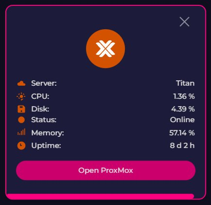

# 🌐 Web, AI & Cloud Platforms

### AI platforms, web applications, self-hosted services, and cloud tools.

[⬅️ **Back to Main Catalog**](../../README.md) • [📚 **All Apps Index**](../all-apps.md)

> **Total Apps in Category:** `1051`

---

### 📦 damejan80/tokentab

> **Categories:** `#ai` `#claude` `#claude_code` `#cursor` `#python` `#token_optimization` `#token_usage`

A CLI that reads Claude Code, Codex, and Gemini CLI session logs and works out how much they cost, by model, project, and day.
**Language**: Python

- 🐙 **Source Code:** [https://github.com/damejan80/tokentab](https://github.com/damejan80/tokentab)
- 👤 **Developer:** [damejan80](https://github.com/damejan80)


---

### 📦 Hister

> **Categories:** `#go` `#browser_history` `#golang` `#history` `#index` `#mcp` `#mcp_server` `#personal_search` `#personal_search_engine` `#privacy` `#search` `#search_engine` `#semantic_search` `#web`

Hister is a private search tool that lets you search the full text of web pages and local files you have already visited or saved, from a browser, terminal, or AI assistant. It runs locally or on your own server, needs little setup, and helps you quickly find old information again while keeping your data private.

https://github.com/asciimoo/hister

- 🐙 **Source Code:** [https://github.com/asciimoo/hister](https://github.com/asciimoo/hister)
- 👤 **Developer:** [asciimoo](https://github.com/asciimoo)


---

### 📦 Neuronpedia

> **Categories:** `#Website` `#AI` `#Learning`

Neuronpedia is an open-source AI interpretability platform for exploring and understanding what happens inside neural networks and LLMs. It enables researchers to inspect model features, neuron activations, circuits, and internal representations, making complex model behavior more transparent and easier to understand. It also provides tools for investigating and steering model behavior.

- 🌐 **Official Website:** [https://github.com/hijohnnylin/neuronpedia](https://github.com/hijohnnylin/neuronpedia)
- 👤 **Developer:** [Johnny Lin](https://github.com/hijohnnylin)

<details>
<summary><b>✨ Key Features (13)</b> — <i>Click to expand</i></summary>

- **Feature/latent exploration** — inspect individual model features and activations
- **Semantic search** — search millions of latents/features by meaning
- **Activation analysis** — view top activations, logits, and activation density
- **Model steering** — modify model behavior using latents or custom vectors
- **Circuit Tracer/graphs** — visualize relationships between model components
- **Auto-interpretability** — automatically generate and score feature explanations
- **SAE support** — work with Sparse Autoencoders and their features
- **Probes, concepts & transcoders** — support advanced interpretability research
- **Inference testing** — run prompts and examine internal model behavior
- **Dashboards & UMAP** — visualize features and embeddings
- **API + Python/TypeScript libraries** — access functionality programmatically
- **Import/export & datasets** — work with interpretability datasets
- **Self-hosting** — run the open-source platform locally or in the cloud

</details>


---

### 📦 Modular

> **Categories:** `#GitHub` `#OpenSource` `#mojo` `#ai` `#language` `#machine_learning` `#max` `#modular` `#programming_language`

🔗 [https://github.com/modular/modular](https://github.com/modular/modular)
📝 The Modular Platform (includes MAX & Mojo)
──────────────────────────────

**What is Modular?**
Modular is an open‑source platform that brings together everything you need to build, train, and serve AI models. It ships two star components: the __MAX Framework__ 🧑‍🚀 for high‑performance inference, and the __Mojo language__ 🔥 for fast, low‑level model code.

**Key pieces you’ll find in this repo**

**Mojo compiler** – the `/KGEN` folder contains the compiler front‑end.
**Mojo standard library** – ready‑to‑use utilities live in `/mojo/stdlib`.
**MAX accelerator library** – GPU/TPU kernels are under `/max/kernels`.
**MAX inference server** – an OpenAI‑compatible endpoint in `/max/python/max/serve`.
**MAX model pipelines** – Python‑based graph pipelines in `/max/python/max/pipelines`.
**Examples** – real‑world demos for both MAX and Mojo in `/max/examples` and `/mojo/examples`.


**Getting started in a nutshell**
If you just want to spin up a model with MAX, follow the official quick‑start:

```# Clone the repo
git clone https://github.com/modular/modular.git
cd modular

# Install the Python side
pip install -r max/python/requirements.txt

# Run the example server
python -m max.serve --model your_model_name
```

For Mojo, the quick‑start guide walks you through installing the compiler and running a hello‑world program:

```# Install Mojo (see the Mojo docs for the latest command)
curl -sSf https://install.mojo-lang.org | bash

# Compile and run a Mojo file
mojo my_program.mojo
```

**Technical highlights**

**Unified code base** – Both the accelerator kernels and the inference server are written in Python, while performance‑critical parts live in Mojo, letting you drop to native speed when needed.
**OpenAI‑compatible API** – The MAX server speaks the same JSON schema as OpenAI, so existing client libraries work out‑of‑the‑box.
**Modular pipelines** – Graph‑style pipelines let you compose preprocessing, model execution, and post‑processing with just a few Python lines.
**Extensible standard library** – Mojo’s stdlib is open for contributions, so you can add new data structures or math helpers without waiting for a new compiler release.
**Apache 2.0 + LLVM exceptions** – Most of the repo is permissively licensed; the MAX components follow the Modular Community License.


**Who should dive in?**

AI researchers who need a fast inference server that can be swapped into existing pipelines.
Systems engineers looking to write custom kernels in a language that compiles to native code.
Python developers who want to experiment with AI models but also need the option to drop into Mojo for speed‑critical sections.
Open‑source contributors eager to shape the future of a unified AI platform.


**Community & support**
Join the conversation on Discord, the forum, or the regular community calls. All events and recordings are posted on the Meetup page and YouTube channel.

**Takeaway** – __Modular gives you the freedom to prototype in Python and accelerate to native performance with Mojo, all under one open‑source roof.__

──────────────────────────────
🧠 **Channel: ****https://t.me/GithubRe**

- 🐙 **Source Code:** [https://github.com/modular/modular](https://github.com/modular/modular)
- 👤 **Developer:** [modular](https://github.com/modular)


---

### 📦 Layer5

> **Categories:** `#javascript` `#cloud` `#cloud_native` `#cncf` `#configuration_management` `#design_patterns` `#design_system` `#gatsbyjs` `#hacktoberfest` `#internship` `#kanvas` `#kubernetes` `#lfx` `#management_plane` `#meshery` `#orchestration` `#playground` `#visual_designer` `#visualization`

Layer5 makes cloud software for managing apps and infrastructure, with tools like Meshery for Kubernetes, Kanvas for design and operations, Nighthawk for performance testing, a cloud native catalog, Academy, and shared patterns and components. The benefit is simpler teamwork, faster setup, better operations, and easier learning, so you can build and run cloud systems with less stress and more control.

https://github.com/layer5io/layer5

- 🐙 **Source Code:** [https://github.com/layer5io/layer5](https://github.com/layer5io/layer5)
- 👤 **Developer:** [layer5io](https://github.com/layer5io)


---

### 📦 elie222/rakazo

> **Categories:** `#ai_agents` `#chatgpt` `#docker` `#electron` `#expo` `#grok` `#llm` `#self_hosted` `#typescript`

Open-source Grok Bot alternative. Choose your own model and sandbox.
**Language**: TypeScript

- 🐙 **Source Code:** [https://github.com/elie222/rakazo](https://github.com/elie222/rakazo)
- 👤 **Developer:** [elie222](https://github.com/elie222)


---

### 📦 0xsline/awesome-deepseek-harness

> **Categories:** `#agent` `#ai` `#ai_agents` `#ai_tools` `#awesome` `#awesome_list` `#coding_assistant` `#curated_list` `#deepseek` `#deepseek_harness` `#developer_tools` `#dsh` `#dsh_plugin` `#dsh_plugins` `#harness` `#llm` `#mcp` `#plugins`

DeepSeek Harness (DSH) ecosystem: curated plugins, tools, and infrastructure from dsh-external/hub and the public dsh-plugin topic.
**Language**: Python

- 🐙 **Source Code:** [https://github.com/0xsline/awesome-deepseek-harness](https://github.com/0xsline/awesome-deepseek-harness)
- 👤 **Developer:** [0xsline](https://github.com/0xsline)


---

### 📦 vercel-labs/eve-software-factory-template

> **Categories:** `#agent` `#ai` `#eve` `#vercel`

Meet Foreman, an eve Software Factory.
**Language**: TypeScript

- 🐙 **Source Code:** [https://github.com/vercel-labs/eve-software-factory-template](https://github.com/vercel-labs/eve-software-factory-template)
- 👤 **Developer:** [vercel-labs](https://github.com/vercel-labs)


---

### 📦 Clash Flac

> **Categories:** `#Website` `#Stream` `#Flac` `#Lyrics`

ClashFLAC is a Stream high-resolution audio previews, search across millions of tracks, and download bit-perfect 24-bit lossless FLAC files with embedded synced lyrics effortlessly!

- 🐙 **Source Code:** [https://github.com/ajisth69/clashflac](https://github.com/ajisth69/clashflac)
- 🌐 **Official Website:** [https://clashflac.pages.dev/](https://clashflac.pages.dev/)
- 👤 **Developer:** @letmesolo_her


---

### 📦 Holaos

> **Categories:** `#GitHub` `#OpenSource` `#typescript` `#agent` `#agent_harness` `#agent_os` `#agentic` `#ai` `#ai_agent` `#ai_agents` `#artificial_intelligence` `#claude_code` `#codex` `#electron` `#holaboss` `#holaos` `#llm` `#mcp` `#memory` `#model_context_protocol` `#runtime` `#workspace`

🔗 [https://github.com/holaboss-ai/holaOS](https://github.com/holaboss-ai/holaOS)
📝 Open-source All in One AI agent workspace. Run any agent — Claude Code, Codex — across your tools (100+ integrations + MCP), apps, browser, and files, with shared memory. Built-in models or BYOK.
──────────────────────────────

**Meet holaOS**, the ultimate workspace for you and your agent. It allows you to run __any__ agent, including Claude Code, Codex, or the built-in holaOS agent, in one local-first workspace. This means you can work with multiple agents, sharing the same memory, tools, and skills, without having to switch between them.

__Key features__ include:
- Running any agent in one workspace
- Shared memory across agents and sessions
- Support for frontier models, including Kimi K3, GLM 5.2, GPT 5.6, Claude Opus 5, and Fable 5
- Ability to bring your own model keys
- HolaApps, which allow you to install apps from the in-workspace marketplace and use them side-by-side with your agent
- Skills, integrations, and Model Context Protocol (MCP) support

__Usage__ is straightforward: simply download and install the desktop app, and you're ready to go. The app is __open-source__ and __free to start__, with optional enterprise features available.

From a __technical__ standpoint, holaOS is built using TypeScript and Electron, and supports macOS, Windows, and Linux platforms.

The __target audience__ for holaOS includes anyone looking for a flexible and powerful workspace for their agent, including developers, researchers, and business users.

__In summary__, holaOS is a game-changer for anyone working with agents, offering a flexible, powerful, and easy-to-use workspace that can be customized to meet your needs.
Get started with holaOS today and experience the power of a unified workspace for you and your agent!

──────────────────────────────
🧠 **Channel: ****https://t.me/GithubRe**

- 🐙 **Source Code:** [https://github.com/holaboss-ai/holaOS](https://github.com/holaboss-ai/holaOS)
- 👤 **Developer:** [holaboss-ai](https://github.com/holaboss-ai)


---

### 📦 guillaumemeyer/watermarks-remover

> **Categories:** `#agent_skill` `#ai` `#c2pa` `#claude` `#provenance` `#synthid` `#watermark`

Strip multi-vendor AI provenance marks: Unicode text hygiene, statistical rewrite hooks, and C2PA/metadata from PNG/JPEG/SVG/PDF/DOCX/HTML/MD
**Language**: Python

- 🐙 **Source Code:** [https://github.com/guillaumemeyer/watermarks-remover](https://github.com/guillaumemeyer/watermarks-remover)
- 👤 **Developer:** [guillaumemeyer](https://github.com/guillaumemeyer)


---

### 📦 Embabel Agent

> **Categories:** `#GitHub` `#OpenSource` `#kotlin` `#agent` `#agentic_ai` `#agents` `#ai` `#ai_agents` `#aiagentframework` `#genai` `#generative_ai` `#java` `#llms` `#multi_agents` `#multi_agents_orchestration` `#multi_agents_system` `#spring`

🔗 [https://github.com/embabel/embabel-agent](https://github.com/embabel/embabel-agent)
📝 Agent framework for the JVM. Pronounced Em-BAY-bel /ɛmˈbeɪbəl/
──────────────────────────────

**Embabel Agent Framework** is a Java-based framework for building intelligent agents that can seamlessly mix large language model (LLM) interactions with code and domain models. It's designed to support sophisticated planning, extensibility, and reuse, making it an ideal choice for developers who want to create complex, dynamic systems.

The framework is built on top of the JVM, leveraging the strengths of __Spring__ and __Kotlin__, and provides a natural usage model for __Java__ developers. It's highly extensible, allowing developers to add new domain objects, actions, goals, and conditions without modifying existing code.

__Key features__ include:

- `Actions`: Steps an agent takes
- `Goals`: What an agent is trying to achieve
- `Conditions`: Conditions to assess before executing an action or determining that a goal has been achieved
- `Domain model`: Objects underpinning the flow and informing actions, goals, and conditions

**Technical highlights** include:

- __Sophisticated planning__ using Goal Oriented Action Planning (GOAP) or Utility AI
- __Strong typing__ and object-oriented benefits
- __Platform abstraction__ for clean separation between programming model and platform internals
- __Designed for LLM mixing__ and cost-effective solution

__Audience__: Embabel Agent Framework is ideal for developers who want to create complex, dynamic systems that leverage the power of LLMs and agentic programming.

Get started with Embabel in under 5 minutes using the `Java` or `Kotlin` template, and explore the `Embabel Agent Examples Repository` for tutorials and examples.

Embabel Agent Framework: where __intelligence__ meets __adaptability__.

──────────────────────────────
🧠 **Channel: ****https://t.me/GithubRe**

- 🐙 **Source Code:** [https://github.com/embabel/embabel-agent](https://github.com/embabel/embabel-agent)
- 👤 **Developer:** [embabel](https://github.com/embabel)


---

### 📦 Macro

> **Categories:** `#GitHub` `#OpenSource` `#rust` `#agent` `#ai` `#ai_agents` `#all_in_one` `#crm` `#crm_system` `#email` `#linear` `#mcp` `#messaging` `#notes` `#notion` `#office` `#slack` `#slack_alternative` `#startup` `#startup_tools` `#typescript` `#workspace`

🔗 [https://github.com/macro-inc/macro](https://github.com/macro-inc/macro)
📝 Macro is a unified workspace for teams: email, chat, docs, tasks, agents, calls, and CRM — @-linked together with shared AI memory.
──────────────────────────────

Let's break down the **Macro** workspace. Macro is an all-in-one platform designed to unify __email__, __messages__, __docs__, __tasks__, and __CRM__ into a single, fast interface with shared team-level memory. The platform is built around the concept of `blocks`, which are modular, extensible, and work together like Legos.

Some of the key **features** of Macro include:
- __Multi-account email inbox__ with unified search and AI tools
- __Team chat__ designed for focused technical discussions
- __Task management__ built around chat, with bidirectional links to messages and emails
- __Docs__ with live collaboration, version control, and offline editing
- __CRM__ that keeps itself up to date, with bidirectional links to messages and emails

The platform is built using `SolidJS` and `Rust` for speed and reliability. Macro is designed for small companies or teams within larger companies, and is __dogfooded__ by the Macro team themselves.

The platform's technical highlights include its use of a `bidirectional graph` to store cross-references between different blocks, and its `CRDT`-based collaboration system for live document editing.

Overall, Macro is designed to be a single, unified platform for teams to work together, with all the tools and features they need to collaborate and get work done. With its focus on speed, reliability, and ease of use, Macro is an attractive option for teams looking to streamline their workflow.
One-liner takeaway: Macro is the ultimate all-in-one workspace that unifies your team's tools and streamlines your workflow!

──────────────────────────────
🧠 **Channel: ****https://t.me/GithubRe**

- 🐙 **Source Code:** [https://github.com/macro-inc/macro](https://github.com/macro-inc/macro)
- 👤 **Developer:** [macro-inc](https://github.com/macro-inc)


---

### 📦 Semantica

> **Categories:** `#GitHub` `#OpenSource` `#python` `#agent_memory` `#ai` `#ai_governance` `#ai_infrastructure` `#artificial_intelligence` `#context_engineering` `#context_graphs` `#data_engineering` `#decision_intelligence` `#developer_tools` `#explainable_ai` `#generative_ai` `#graph_rag` `#knowledge_graph` `#llm` `#ontology` `#provenance` `#reasoning` `#semantic_search`

🔗 [https://github.com/semantica-agi/semantica](https://github.com/semantica-agi/semantica)
📝 Graph-Native Infrastructure for Context and Accountable AI Systems
──────────────────────────────

**Semantica** is an open-source, graph-native infrastructure for context and accountable AI systems, designed to provide explainable, traceable, and trustworthy decision-making. __Key features__ include context graphs, decision intelligence, ontology management, knowledge modeling, and end-to-end traceability.

__Technical highlights__ of Semantica include polyglot graph storage, support for RDF and LPG, and compliance with W3C standards, making it __interoperable__ with various systems.

**Audience** for Semantica includes AI/ML platform teams, data platform teams, compliance and risk teams, regulated enterprises, and platform and data engineers who require a self-hosted and customizable solution for decision intelligence and context management.

To get started with Semantica, you can `pip install semantica` and explore the `ContextGraph` class, which allows you to record decisions, trace decision chains, and analyze decision impact.

In a nutshell, Semantica is the missing link between AI decision-making and explainability, making it an essential tool for anyone working with high-stakes, regulated domains: **With Semantica, your AI decisions are no longer black boxes, but transparent, auditable, and trustworthy.**

──────────────────────────────
🧠 **Channel: ****https://t.me/GithubRe**

- 🐙 **Source Code:** [https://github.com/semantica-agi/semantica](https://github.com/semantica-agi/semantica)
- 👤 **Developer:** [semantica-agi](https://github.com/semantica-agi)


---

### 📦 genspark-ai/genoffice

> **Categories:** `#ai` `#docx` `#electron` `#office_suite` `#pdf` `#pptx` `#xlsx`

An AI-native office suite for macOS and Windows: word processor, spreadsheet, presentations, and PDF.
**Language**: TypeScript

- 🐙 **Source Code:** [https://github.com/genspark-ai/genoffice](https://github.com/genspark-ai/genoffice)
- 👤 **Developer:** [genspark-ai](https://github.com/genspark-ai)


---

### 📦 Just A Link

> **Categories:** `#Website` `#Portfolio`

Just A Link is a serverless, zero-database "Link-in-bio". User profiles (name, avatar, bio, theme, and links) are compressed and encoded entirely inside the URL fragment

- 🐙 **Source Code:** [https://github.com/jaival-11/justalink](https://github.com/jaival-11/justalink)
- 🌐 **Official Website:** [https://t.me/popCLOUDS/13468](https://t.me/popCLOUDS/13468)
- 👤 **Developer:** @jaival_11

<details>
<summary><b>✨ Key Features (8)</b> — <i>Click to expand</i></summary>

- ****Zero-Server Architecture** — ** Your entire profile payload lives directly inside the URL (#data=), with no backend required.
- ****Privacy-First** — ** Your profile data is never stored on external servers or databases.
- ****Multiple Themes** — ** Choose from six built-in themes — Slate Dark, Minimal Light, Cyber High-Contrast, Emerald Solid, Berry Violet, and Neo Punch — or create your own!
- ****Fully Customisable** — ** Easily personalise every part of your page. It’s your page — make it truly yours.
- ****Restore Profiles** — ** Restore profiles directly from a URL or hash, allowing you to edit them without rebuilding everything from scratch.
- ****No Login Required** — ** Create and customise your profile without creating an account.
- ****Lightweight & Fast** — ** Built with pure client-side technology, with no unnecessary framework bloat.
- ****Professional-Ready** — ** Create polished profile pages suitable for professional use, portfolios, personal branding, and more.

</details>


---

### 📦 Lighthouse

> **Categories:** `#GitHub` `#OpenSource` `#javascript` `#audit` `#best_practices` `#chrome_devtools` `#developer_tools` `#performance_analysis` `#performance_metrics` `#pwa` `#web` `#c_lang`

🔗 [https://github.com/HarbourMasters/Lighthouse](https://github.com/HarbourMasters/Lighthouse)
📝 No description.
──────────────────────────────

The **HarbourMasters/Lighthouse** GitHub repository is a project focused on decompiling and recompiling the classic game Banjo-Kazooie. The purpose of this project is to provide a comprehensive understanding of the game's inner workings and to allow for modifications and improvements.

Key features of the repository include the ability to build the game using different baserom versions, such as `us.v10`, `us.v11`, `jp`, and `pal`, as well as the option to use Docker for building on various platforms, including Linux and macOS.

Usage involves installing dependencies, adding the baserom file, and running the build command using `make`. The repository also provides instructions for building on cloud platforms using GitLab CI.

From a technical standpoint, the project uses a combination of `bash` scripts, `python`, and `Rust` to manage the building process. The repository is well-organized, with clear instructions and a detailed README file.

The target audience for this repository appears to be developers and gamers interested in game development, reverse engineering, and modding.

In summary, __HarbourMasters/Lighthouse__ is a valuable resource for anyone looking to dive into the world of game decompilation and modification - and with great power comes great banjos.

──────────────────────────────
🧠 **Channel: ****https://t.me/GithubRe**

- 🐙 **Source Code:** [https://github.com/HarbourMasters/Lighthouse](https://github.com/HarbourMasters/Lighthouse)
- 👤 **Developer:** [HarbourMasters](https://github.com/HarbourMasters)


---

### 📦 Spec Kit

> **Categories:** `#GitHub` `#OpenSource` `#python` `#ai` `#copilot` `#development` `#engineering` `#prd` `#spec` `#spec_driven`

Github introduced **Spec Kit**,  An open source toolkit that allows you to focus on product scenarios and predictable outcomes instead of vibe coding every piece from scratch

Creator:   github
Stars ⭐️:  122,000
Forked by:  10,800

- 🐙 **Source Code:** [https://github.com/github/spec-kit](https://github.com/github/spec-kit)
- 👤 **Developer:** github


---

### 📦 Baileys

> **Categories:** `#GitHub` `#OpenSource` `#javascript` `#Interesting` `#Web` `#API` `#TypeScript`

🔗 [https://github.com/WhiskeySockets/Baileys](https://github.com/WhiskeySockets/Baileys)
📝 Socket-based TS/JavaScript API for WhatsApp Web
──────────────────────────────

**Baileys** is a TypeScript library that lets you interact with the WhatsApp Web API using WebSockets. It's designed to be efficient and doesn't require Selenium or a browser to work. With Baileys, you can send messages, media, and more, and even handle events like message receipts and presence updates. The library is __not affiliated with WhatsApp__ and should be used responsibly.

To get started, you can `import makeWASocket from '@whiskeysockets/baileys'` and create a socket instance with your preferred configuration. You can then use the socket to authenticate with WhatsApp using a QR code or pairing code.

Baileys has a lot of __key features__, including support for multi-device and web versions of WhatsApp, and the ability to send and receive messages, media, and other content. The library also provides a range of __technical highlights__, including automatic caching of group metadata, improved retry systems, and support for decrypting poll votes.

The library is suitable for __developers of all levels__, from beginners to experienced developers, and is __well-documented__ with a comprehensive wiki and example code.

To use Baileys, simply `yarn add @whiskeysockets/baileys` and start building your WhatsApp-based application.

One-liner takeaway: __Automate your WhatsApp interactions with Baileys, a powerful and efficient TypeScript library that's a game-changer for chatbots and more!__

──────────────────────────────
🧠 **Channel: ****https://t.me/GithubRe**

- 🐙 **Source Code:** [https://github.com/WhiskeySockets/Baileys](https://github.com/WhiskeySockets/Baileys)
- 👤 **Developer:** [WhiskeySockets](https://github.com/WhiskeySockets)


---

### 📦 0xwilliamortiz/openclaude-improved

> **Categories:** `#agentic_ai` `#ai` `#ai_agent` `#ai_coding` `#ai_coding_agent` `#ai_coding_agents` `#ai_coding_assistant` `#anthropic` `#claude` `#claude_code` `#cli` `#coding_agent` `#gemini` `#gemini_ai` `#gemini_cli` `#llm` `#mcp` `#model_context_protocol` `#openrouter`

runs anywhere. uses anything
**Language**: TypeScript

- 🐙 **Source Code:** [https://github.com/0xwilliamortiz/openclaude-improved](https://github.com/0xwilliamortiz/openclaude-improved)
- 👤 **Developer:** [0xwilliamortiz](https://github.com/0xwilliamortiz)


---

### 📦 Revanced & Morphe Builder

> **Categories:** `#apps` `#web` `#android` `#revanced` `#morphe`

ReVanced & Morphe Builder is an automated build system for creating the latest patched Android apps and Magisk/KernelSU modules. By integrating multiple patch ecosystems and rebuilding releases 24/7, it delivers a fast, reliable, and hassle-free way to stay up to date with the newest enhancements.

- 🐙 **Source Code:** [https://github.com/nullcpy/rvb](https://github.com/nullcpy/rvb)
- 👤 **Developer:** [nullcpy](https://github.com/nullcpy)

<details>
<summary><b>✨ Key Features (8)</b> — <i>Click to expand</i></summary>

- **Automated Builds** — Continuously generates the latest patched apps and modules.
- **Multiple Patch Ecosystems** — Supports ReVanced, ReVanced Extended (RVX), Morphe, RVX Morphed, and ReVanced Advanced.
- **Ready-to-Use Releases** — Download pre-built APKs and Magisk/KernelSU modules without manual patching.
- **Always Up-to-Date** — Rebuilds automatically whenever new patches or app versions are available.
- **Fast & Reliable** — CI-powered build pipeline for consistent, reproducible releases.
- **Wide App Support** — Builds patched versions for a variety of supported Android applications.
- Root & Non-Root Options Provides both standalone APKs and root module variants where available.
- **Open Source** — Transparent development with publicly available source code.

</details>


---

### 📦 Kritt-ai/open-kritt

> **Categories:** `#agent` `#agents` `#ai` `#bug_bounty` `#bugbounty` `#bugbounty_tools` `#security` `#security_research`

Orchestrate AI agents to find real vulnerabilities in code.
**Language**: JavaScript

- 🐙 **Source Code:** [https://github.com/Kritt-ai/open-kritt](https://github.com/Kritt-ai/open-kritt)
- 👤 **Developer:** [Kritt-ai](https://github.com/Kritt-ai)


---

### 📦 Chat2Db

> **Categories:** `#GitHub` `#OpenSource` `#java` `#ai` `#bi` `#chatgpt` `#clickhouse` `#clickhouse_client` `#database` `#datagrip` `#db2` `#dbeaver` `#gpt` `#hive` `#mysql` `#navicat` `#oracle` `#postgresql` `#redis` `#redis_client` `#sqlserver` `#text2sql`

🔗 [https://github.com/OtterMind/Chat2DB](https://github.com/OtterMind/Chat2DB)
📝 🔥🔥🔥 AI-driven database tool and SQL client, The hottest GUI client, supporting MySQL, Oracle, PostgreSQL, DB2, SQL Server, DB2, SQLite, H2, ClickHouse, and more.
──────────────────────────────

**Chat2DB** is an AI-powered database client and SQL workspace designed for developers, DBAs, analysts, and data teams. It supports __30+ databases__, including MySQL, PostgreSQL, and MongoDB, and offers features like `SQL editing`, `completion`, and `execution`. The platform also includes an __AI assistant__ that can generate, explain, and optimize SQL queries in natural language.

To use Chat2DB, you can download the desktop app or run it via `Docker`. The platform provides a __quick start__ guide and supports multiple languages, including English, Chinese, Japanese, Spanish, and Korean.

From a technical perspective, Chat2DB uses `AES-256-GCM encryption` to secure stored datasource passwords and AI model API keys. The platform also offers a `CLI with MCP support` and supports `custom JDBC drivers`.

Chat2DB is designed for a wide range of users, from individual developers to large data teams. Whether you're looking for a powerful database client or a collaborative SQL workspace, Chat2DB has the features and flexibility you need.

In short, Chat2DB is the ultimate database client and SQL workspace for anyone looking to streamline their workflow and take their data analysis to the next level: __Chat2DB - where data meets AI__.

──────────────────────────────
🧠 **Channel: ****https://t.me/GithubRe**

- 🐙 **Source Code:** [https://github.com/OtterMind/Chat2DB](https://github.com/OtterMind/Chat2DB)
- 👤 **Developer:** [OtterMind](https://github.com/OtterMind)


---

### 📦 Pumpkin

> **Categories:** `#quick` `#GitHub` `#OpenSource` `#rust` `#docker` `#game_server` `#gamedev` `#minecraft` `#minecraft_bedrock_edition` `#minecraft_protocol` `#minecraft_server` `#networking` `#server`

🔗 [https://github.com/Pumpkin-MC/Pumpkin](https://github.com/Pumpkin-MC/Pumpkin)
📝 Empowering everyone to host fast and efficient Minecraft servers.
──────────────────────────────

Pumpkin is a __fast and efficient__ Minecraft server built entirely in Rust, focusing on **performance**, **compatibility**, **security**, **flexibility**, and **extensibility**. It supports the latest Java and Bedrock Minecraft server versions, while adhering to Vanilla game mechanics. The server features `multi-threading` for maximum speed, `highly configurable` settings, and a `foundation for plugin development`.

To get started, check out the [Quick Start](https://docs.pumpkinmc.org/#quick-start) guide. Pumpkin is ideal for __Minecraft enthusiasts__ and __developers__ looking for a customizable and efficient server experience.

Pumpkin is __currently under heavy development__, but it's already showing great promise.
One-liner takeaway: Pumpkin is the **future of Minecraft servers**, built for __speed__, __security__, and __customization__.

──────────────────────────────
🧠 **Channel: ****https://t.me/GithubRe**

- 🐙 **Source Code:** [https://github.com/Pumpkin-MC/Pumpkin](https://github.com/Pumpkin-MC/Pumpkin)
- 👤 **Developer:** [Pumpkin-MC](https://github.com/Pumpkin-MC)


---

### 📦 Outlines

> **Categories:** `#GitHub` `#OpenSource` `#typescript` `#docker` `#hacktoberfest` `#javascript` `#mobx` `#nodejs` `#react` `#slack` `#wiki` `#python` `#cfg` `#generative_ai` `#json` `#llms` `#prompt_engineering` `#regex` `#structured_generation` `#symbolic_ai`

🔗 [https://github.com/dottxt-ai/outlines](https://github.com/dottxt-ai/outlines)
📝 Structured Outputs
──────────────────────────────

**Introducing Outlines**, a revolutionary tool that guarantees __structured outputs for Large Language Models (LLMs)__. With Outlines, you can ensure that your LLMs produce predictable, high-quality outputs, eliminating the need for post-generation parsing or regex. This tool is designed to work seamlessly with any LLM, including OpenAI, Ollama, and vLLM, and provides `simple integration` through a single line of code: `model(prompt, output_type)`.

Outlines is built around a __philosophy of simplicity__, using Python's type system to define the desired output structure. You can use `Literal` types for simple classification, `int` for numerical values, or define complex objects using `Pydantic models`. The tool also supports `union types` for handling incomplete data or uncertain outputs.

To get started with Outlines, simply `pip install outlines` and connect to your preferred LLM using `from_transformers`. You can then use the `model` function to generate structured outputs, such as `sentiment analysis`, `product categorization`, or `event parsing`.

Outlines is trusted by top companies like NVIDIA, Cohere, and HuggingFace, and is designed for a wide range of applications, from __customer support triage__ to __e-commerce product categorization__. Whether you're a developer, researcher, or business leader, Outlines is the perfect tool for unlocking the full potential of LLMs.

In short, Outlines is the key to __unleashing the power of LLMs__ - try it today and discover a world of __structured, predictable, and high-quality outputs__! **Outlines: where LLMs meet structure**.

──────────────────────────────
🧠 **Channel: ****https://t.me/GithubRe**

- 🐙 **Source Code:** [https://github.com/dottxt-ai/outlines](https://github.com/dottxt-ai/outlines)
- 👤 **Developer:** [dottxt-ai](https://github.com/dottxt-ai)


---

### 📦 erickong/penecho

> **Categories:** `#ai` `#canvas` `#claude` `#codex` `#education` `#handwriting` `#nodejs` `#visual_thinking`

Think with AI beyond the chat box. A shared canvas for handwriting, equations, diagrams, and spatial reasoning.
**Language**: JavaScript

- 🐙 **Source Code:** [https://github.com/erickong/penecho](https://github.com/erickong/penecho)
- 👤 **Developer:** [erickong](https://github.com/erickong)


---

### 📦 Dioxus

> **Categories:** `#GitHub` `#OpenSource` `#rust` `#android` `#css` `#desktop` `#html` `#ios` `#native` `#react` `#ssr` `#ui` `#virtualdom` `#wasm` `#web`

🔗 [https://github.com/DioxusLabs/dioxus](https://github.com/DioxusLabs/dioxus)
📝 Fullstack app framework for web, desktop, and mobile.
──────────────────────────────

Dioxus is a **cross-platform framework** that lets you build web, desktop, and mobile apps with a single codebase. It features __zero-config setup__, __integrated hot-reloading__, and __signals-based state management__. With Dioxus, you can create `fullstack applications` that integrate seamlessly with backend functionality using Server Functions. The framework also includes a __bundler__ for deploying to various platforms.

Here's an example of a simple counter app in Dioxus:
```fn app() -> Element {
let mut count = use_signal(|| 0);

rsx! {
h1 { "High-Five counter: {count}" }
button { onclick: move |_| count += 1, "Up high!" }
button { onclick: move |_| count -= 1, "Down low!" }
}
}
```
Dioxus has a strong focus on __community__ and __documentation__, with a very active Discord and GitHub community, as well as comprehensive documentation. It supports a wide range of __platforms__, including web, desktop, mobile, and server-side rendering.

Overall, Dioxus is a powerful and flexible framework that makes it easy to build complex, cross-platform apps. With its unique features and strong community support, it's an excellent choice for developers looking to create high-quality, fullstack applications. Write once, run anywhere - that's the power of Dioxus!

──────────────────────────────
🧠 **Channel: ****https://t.me/GithubRe**

- 🐙 **Source Code:** [https://github.com/DioxusLabs/dioxus](https://github.com/DioxusLabs/dioxus)
- 👤 **Developer:** [DioxusLabs](https://github.com/DioxusLabs)


---

### 📦 Clash Dev Analyser

> **Categories:** `#Website` `#GitHub` `#Analyser` `#DevProfileChecker`

A deterministic engine to analyze GitHub developers and repositories in real time. Features profile metric scoring, head-to-head battle mode, AI roasts, intelligence breakdown reports, and downloadable card exports.

- 🐙 **Source Code:** [https://github.com/ajisth69/dev-analyzer](https://github.com/ajisth69/dev-analyzer)
- 🌐 **Official Website:** [https://clashdevanalyser.vercel.app/](https://clashdevanalyser.vercel.app/)
- 👤 **Developer:** @letmesolo_her

<details>
<summary><b>✨ Key Features (7)</b> — <i>Click to expand</i></summary>

- **Developer Analysis** — Evaluates GitHub user profiles across key performance metrics.
- **Repository Analysis** — Provides technical depth and maintenance scores for any public repository.
- **Battle Mode** — Head-to-head metrics comparison between developers or repositories.
- **Roast Mode** — AI-generated technical feedback based on profile activity.
- **Intelligence Reports** — Per-category metrics breakdown and deterministic scoring.
- **Export Capabilities** — Generate downloadable visual summary cards.
- **Stateless Architecture** — Zero database dependency, real-time GitHub API aggregation

</details>

<details>
<summary><b>🖼️ Preview Screenshots & Media (1)</b> — <i>Click to view images & decide if you want to use this app</i></summary>

#### 📸 Cover / Preview
<p align="center"></p>

</details>


---

### 📦 MIgHTy-alIeN/Trading-Bot

> **Categories:** `#ai` `#aitradingbot` `#bot` `#btc` `#claude` `#eth` `#etherlab` `#mev` `#mevbots`

An arbitrage bot is a smart contract connected to an external automation script that controls its operation.
**Language**: Solidity

- 🐙 **Source Code:** [https://github.com/MIgHTy-alIeN/Trading-Bot](https://github.com/MIgHTy-alIeN/Trading-Bot)
- 👤 **Developer:** [MIgHTy-alIeN](https://github.com/MIgHTy-alIeN)


---

### 📦 Astrbot

> **Categories:** `#GitHub` `#OpenSource` `#python` `#agent` `#ai` `#chatbot` `#chatgpt` `#docker` `#function_calling` `#gemini` `#gpt` `#llama` `#llm` `#ollama` `#openai` `#qq` `#qqbot` `#qqchannel` `#telegram`

🔗 [https://github.com/AstrBotDevs/AstrBot](https://github.com/AstrBotDevs/AstrBot)
📝 AI Agent Assistant & development framework that integrates lots of IM platforms, LLMs, plugins and AI feature, and can be your openclaw alternative. ✨
──────────────────────────────

**AstrBot** is an open-source, all-in-one chatbot platform that integrates with popular instant messaging apps. It provides a reliable and scalable conversational AI infrastructure for individuals, developers, and teams. With __AstrBot__, you can quickly build production-ready AI applications within your IM platform workflows.

Key features include `AI LLM Conversations`, multimodal support, agent platforms, and multi-platform compatibility with __QQ__, __Telegram__, __Slack__, and more. **AstrBot** also offers plugin extensions with over 1000 plugins available for one-click installation.

To get started, you can choose from various deployment methods, including one-click deployment with `uv`, cloud deployment with __RainYun__, Docker deployment, or desktop application deployment. **AstrBot** supports multiple messaging platforms and model services, making it a versatile and powerful tool for building conversational AI applications.

Whether you're building a personal AI companion or an enterprise knowledge base, __AstrBot__ enables you to create custom AI solutions with ease. So why wait? Dive into the world of conversational AI with **AstrBot** and discover the endless possibilities it has to offer: AstrBot is the ultimate conversational AI platform to unlock your chatbot's full potential!

──────────────────────────────
🧠 **Channel: ****https://t.me/GithubRe**

- 🐙 **Source Code:** [https://github.com/AstrBotDevs/AstrBot](https://github.com/AstrBotDevs/AstrBot)
- 👤 **Developer:** [AstrBotDevs](https://github.com/AstrBotDevs)


---

### 📦 Wigolo

> **Categories:** `#GitHub` `#OpenSource` `#typescript` `#agent` `#ai` `#ai_agent` `#claude` `#cli` `#developer_tools` `#local_first` `#mcp` `#mcp_server` `#metasearch` `#model_context_protocol` `#nodejs` `#privacy` `#rag` `#search` `#search_engine` `#web_crawler` `#web_scraping` `#web_search`

🔗 [https://github.com/KnockOutEZ/wigolo](https://github.com/KnockOutEZ/wigolo)
📝 The go-to web for your AI coding agent — local-first search, fetch, crawl & research over MCP. No API keys, no cloud, $0/query. Public beta.
──────────────────────────────

**Meet wigolo**, a local-first web intelligence platform designed for AI agents. It provides a durable surface for everything web-related, including search, fetch, crawl, extract, cache, and research, all without requiring API keys or incurring metered bills.

__Key features__ include multi-engine web search, tiered routing for fetching pages, structured data extraction, and a memory that compounds with each query. `wigolo` runs wherever your agent runs, whether as an MCP server, a REST/MCP endpoint, or embedded through an SDK.

To get started, simply run `npx wigolo init --agents=<your-agent>` to set up the local engine. You can then use various tools like `search`, `fetch`, and `research` to gather information.

__Technical highlights__ include on-device models, direct adapters for public engines, and transparent per-result scoring. `wigolo` is designed for agents, not humans, and provides honest output with surfaced degradation and self-flagged junk results.

**Audience**: This platform is ideal for developers and users of AI agents, including those using Claude Code, Cursor, Codex, and other popular AI tools.

In short, `wigolo` is a powerful, private, and free web intelligence platform that empowers your AI agents to gather information without incurring costs or relying on third-party services. The takeaway: __with wigolo, your AI agents can search, fetch, and research the web without breaking the bank or sacrificing privacy__.

──────────────────────────────
🧠 **Channel: ****https://t.me/GithubRe**

- 🐙 **Source Code:** [https://github.com/KnockOutEZ/wigolo](https://github.com/KnockOutEZ/wigolo)
- 👤 **Developer:** [KnockOutEZ](https://github.com/KnockOutEZ)


---

### 📦 Clashdrive

> **Categories:** `#Website` `#Telegram` `#TGClient` `#Privacy` `#Storage` `#Tools` `#Utilitied`

Clashdrive is an open-source Telegram-based cloud platform featuring parallel connections for downloading, uploading, and previewing every file format. It includes file indexing, search, and file sharing options, bypassing Telegram's speed and 2GB upload limits.

- 🐙 **Source Code:** [https://github.com/ajisth69/Clashdrive](https://github.com/ajisth69/Clashdrive)
- 🌐 **Official Website:** [https://t.me/popCLOUDS/13291?single](https://t.me/popCLOUDS/13291?single)
- 👤 **Developer:** @letmesolo_her

<details>
<summary><b>🖼️ Preview Screenshots & Media (1)</b> — <i>Click to view images & decide if you want to use this app</i></summary>

#### 📸 Cover / Preview
<p align="center"></p>

</details>


---

### 📦 OpenBB

> **Categories:** `#Finance` `#DataAnalytics` `#OpenSource` `#readme` `#python` `#machine_learning` `#options` `#crypto` `#ai` `#economics` `#derivatives` `#stocks` `#quantitative_finance` `#equity` `#fixed_income` `#openbb` `#artificial_intelligence` `#cryptocurrency` `#hacktoberfest` `#investment` `#investment_research` `#GitHub`

A fully open-source financial data platform built as the AGPL-licensed alternative to the Bloomberg Terminal. It pulls stock, options, crypto, and macroeconomic data from dozens of sources into Python, Excel, or an AI agent via MCP. It is built for analysts and quants who want a serious research stack without the seat-license tax.

Creator: OpenBB-finance
Stars ⭐️: 69,400
Forked by: 7,000

- 🐙 **Source Code:** [https://github.com/OpenBB-finance/OpenBB](https://github.com/OpenBB-finance/OpenBB)
- 🌐 **Official Website:** [https://openbb.co](https://openbb.co)
- 👤 **Developer:** OpenBB-finance


---

### 📦 Terraform

> **Categories:** `#GitHub` `#OpenSource` `#go` `#cloud` `#cloud_management` `#graph` `#infrastructure_as_code` `#terraform`

🔗 [https://github.com/hashicorp/terraform](https://github.com/hashicorp/terraform)
📝 Terraform enables you to safely and predictably create, change, and improve infrastructure. It is a source-available tool that codifies APIs into declarative configuration files that can be shared amongst team members, treated as code, edited, reviewed, and versioned.
──────────────────────────────

Terraform is a tool for building, changing, and versioning infrastructure safely and efficiently. Its key features include __Infrastructure as Code__, allowing you to describe infrastructure using a high-level configuration syntax, __Execution Plans__ to avoid surprises when manipulating infrastructure, and a __Resource Graph__ for efficient infrastructure creation.

To get started with Terraform, you can visit the [Terraform website](https://developer.hashicorp.com/terraform) for documentation, guides, and tutorials. The `terraform` command line interface is used to manage infrastructure, and providers can be automatically downloaded from the [Terraform Registry](https://registry.terraform.io/).

Terraform is ideal for DevOps teams, operators, and developers who want to manage their infrastructure in a more efficient and automated way. With its __Change Automation__ feature, complex changes can be applied with minimal human interaction.

Here's a basic `terraform` example:
```provider "aws" {
region = "us-west-2"
}

resource "aws_instance" "example" {
ami           = "ami-0c94855ba95c71c99"
instance_type = "t2.micro"
}```

Terraform helps you manage your infrastructure as code - automate your workflow and take control of your infrastructure today!

──────────────────────────────
🧠 **Channel: ****https://t.me/GithubRe**

- 🐙 **Source Code:** [https://github.com/hashicorp/terraform](https://github.com/hashicorp/terraform)
- 👤 **Developer:** [hashicorp](https://github.com/hashicorp)


---

### 📦 Stitch Skills

> **Categories:** `#GitHub` `#OpenSource` `#typescript` `#Design` `#AI` `#DeveloperTools`

🔗 [https://github.com/google-labs-code/stitch-skills](https://github.com/google-labs-code/stitch-skills)
📝 A library of Agent Skills designed to work with the Stitch MCP server. Each skill follows the Agent Skills open standard, for compatibility with coding agents such as Antigravity, Gemini CLI, Claude Code, Cursor.
──────────────────────────────

The **google-labs-code/stitch-skills** GitHub repository offers a collection of agent skills and plugins for __Google Stitch__, following the `Agent Skills` open standard. These skills are compatible with coding agents like Codex, Antigravity, and Gemini CLI.

To get started, you can install plugins using the `Codex CLI` or UI, or add skills selectively. The repository includes design-focused skills (`stitch-design`), build and component skills (`stitch-build`), and utility skills (`stitch-utilities`).

Some key features include:
- Converting frontend code to Stitch Design
- Generating new screens from text or images
- Managing design systems and uploading local assets

The repository is structured to follow the Agent Skills standard, with each skill having its own directory and files for scripts, resources, and examples.

**Key takeaway:** The __google-labs-code/stitch-skills__ repository provides a robust set of skills and plugins to enhance your Google Stitch experience, and is a great resource for developers looking to streamline their design and development workflow.

──────────────────────────────
🧠 **Channel: ****https://t.me/GithubRe**

- 🐙 **Source Code:** [https://github.com/google-labs-code/stitch-skills](https://github.com/google-labs-code/stitch-skills)
- 👤 **Developer:** [google-labs-code](https://github.com/google-labs-code)


---

### 📦 wger

> **Categories:** `#Fitness` `#Health` `#SelfHosted` `#python` `#django` `#gym` `#hacktoberfest` `#self_hosted` `#workout` `#GitHub` `#OpenSource`

A self-hosted, fully open-source fitness and nutrition manager. You can create custom workout routines with automatic weight progression, log meals against an Open Food Facts database, track body measurements with progress photos, Includes basic gym management features as well and you can access it all from native Android and iOS apps.

Creator: wger-project
Stars ⭐️: 6,300
Forked by: 919

- 🐙 **Source Code:** [https://github.com/wger-project/wger](https://github.com/wger-project/wger)
- 👤 **Developer:** wger-project


---

### 📦 Officecli

> **Categories:** `#GitHub` `#OpenSource` `#csharp` `#agent` `#ai` `#claude_code` `#cli` `#codex` `#docx` `#excel` `#office` `#openclaw` `#pptx` `#presentation` `#skills` `#word` `#xlsx`

🔗 [https://github.com/iOfficeAI/OfficeCLI](https://github.com/iOfficeAI/OfficeCLI)
📝 OfficeCLI is the first and best Office suite purpose-built for AI agents to read, edit, and automate Word, Excel, and PowerPoint files. Free, open-source, single binary, no Office installation required.
──────────────────────────────

**OfficeCLI** is an open-source Office suite designed for AI agents, allowing them to control Word, Excel, and PowerPoint with a single line of code. It features a built-in HTML rendering engine, reproducing documents with high fidelity. __Key highlights include__:

- `officecli` command for creating, reading, and editing Office documents
- Support for various document elements, such as text, images, tables, and charts
- __Live preview__ for instant feedback

**Technical features**:

- `install` command for easy setup
- `create`, `add`, `set`, and `remove` commands for document manipulation
- `view` command for rendering documents as HTML or outline

__Audience__: AI developers, Office power users, and anyone looking for a seamless Office experience.

One-liner takeaway: **OfficeCLI empowers AI agents to create stunning Office documents in seconds, streamlining content creation and automation**.

──────────────────────────────
🧠 **Channel: ****https://t.me/GithubRe**

- 🐙 **Source Code:** [https://github.com/iOfficeAI/OfficeCLI](https://github.com/iOfficeAI/OfficeCLI)
- 👤 **Developer:** [iOfficeAI](https://github.com/iOfficeAI)


---

### 📦 synthetic-sciences/openscience

> **Categories:** `#agent` `#ai` `#ai_agent` `#bun` `#cli` `#co_scientist` `#llm` `#ml` `#ml_engineering` `#open_source` `#research` `#research_tools` `#science` `#scientific_computing` `#typescript`

The open-source AI workbench for scientific research
**Language**: TypeScript

- 🐙 **Source Code:** [https://github.com/synthetic-sciences/openscience](https://github.com/synthetic-sciences/openscience)
- 👤 **Developer:** [synthetic-sciences](https://github.com/synthetic-sciences)


---

### 📦 Codexbar

> **Categories:** `#GitHub` `#OpenSource` `#swift` `#ai` `#claude_code` `#codex`

🔗 [https://github.com/steipete/CodexBar](https://github.com/steipete/CodexBar)
📝 Show usage stats for OpenAI Codex and Claude Code, without having to login.
──────────────────────────────

__README not available for this repository.__

──────────────────────────────
🧠 **Channel: ****https://t.me/GithubRe**

- 🐙 **Source Code:** [https://github.com/steipete/CodexBar](https://github.com/steipete/CodexBar)
- 👤 **Developer:** [steipete](https://github.com/steipete)


---

### 📦 elder-plinius/T3MP3ST

> **Categories:** `#agents` `#ai` `#multi_agent` `#offensive_security` `#redteam`

autonomous red teaming platform; multi-agent offensive-security meta-harness
**Language**: TypeScript

- 🐙 **Source Code:** [https://github.com/elder-plinius/T3MP3ST](https://github.com/elder-plinius/T3MP3ST)
- 👤 **Developer:** [elder-plinius](https://github.com/elder-plinius)


---

### 📦 Terax Ai

> **Categories:** `#GitHub` `#OpenSource` `#typescript` `#agents` `#ai` `#code_editor` `#linux` `#macos` `#reactjs` `#rust` `#tauri` `#terminal` `#windows` `#xterm_js`

🔗 [https://github.com/crynta/terax-ai](https://github.com/crynta/terax-ai)
📝 Lightweight (7MB) Terminal-first AI-native dev workspace
──────────────────────────────

**Terax** is a __lightweight terminal-first AI-native dev workspace__ built with Tauri 2, Rust, and React 19. It features a native PTY backend, WebGL renderer, and an agentic AI side-panel that runs against your own keys or fully local models. The workspace includes a code editor, file explorer, source control with a git graph, and a web preview pane.

Key features include:
- `xterm.js` with WebGL renderer and multi-tab support
- GPU-accelerated block-based terminal with editor-like command input
- Inline AI autocomplete with local model support
- AI edit diffs and accept or reject hunk by hunk
- Custom themes and customization options

To get started, you can install Terax from the [Releases](https://github.com/crynta/terax-ai/releases/latest) page. Configure your AI settings by opening **Settings -> AI**, picking a provider, and pasting your API key.

Terax is perfect for developers who want a __fast, lightweight, and feature-rich development environment__.
The takeaway: __Terax is the ultimate terminal-first dev workspace that combines the power of AI with a lightning-fast interface__.

──────────────────────────────
🧠 **Channel: ****https://t.me/GithubRe**

- 🐙 **Source Code:** [https://github.com/crynta/terax-ai](https://github.com/crynta/terax-ai)
- 👤 **Developer:** [crynta](https://github.com/crynta)


---

### 📦 Unity Mcp

> **Categories:** `#GitHub` `#OpenSource` `#csharp` `#ai` `#ai_integration` `#anthropic` `#claude` `#copilot` `#cursor` `#game_development` `#gamedev` `#gemini` `#llm` `#mcp` `#model_context_protocol` `#openai` `#unity` `#unity3d` `#videogames`

🔗 [https://github.com/CoplayDev/unity-mcp](https://github.com/CoplayDev/unity-mcp)
📝 Unity MCP acts as a bridge between AI assistants and your Unity Editor. Give your LLM tools to manage assets, control scenes, edit scripts, and automate tasks within Unity.
──────────────────────────────

__MCP for Unity__ is a game-changer for Unity developers, enabling them to control the Unity Editor using natural language from any MCP client. The **Model Context Protocol** allows large language models (LLMs) like Claude, Codex, and VS Code to manage assets, control scenes, edit scripts, run tests, and automate workflows.

To get started, simply `install` the package from the Unity Package Manager, `configure` the detected clients, and `prompt` the LLM to perform tasks. With 47 focused MCP tool entrypoints, you can create scenes, edit C# scripts, and more.

The project is **free** and **open-source** under the MIT license, with a thriving __community__ on Discord, GitHub Issues, and Discussions. Whether you're a seasoned developer or just starting out, __MCP for Unity__ is a powerful tool to streamline your workflow.

One-liner takeaway: __MCP for Unity__ unlocks the full potential of LLMs in game development, making it a must-have tool for any Unity developer looking to boost productivity and creativity!

──────────────────────────────
🧠 **Channel: ****https://t.me/GithubRe**

- 🐙 **Source Code:** [https://github.com/CoplayDev/unity-mcp](https://github.com/CoplayDev/unity-mcp)
- 👤 **Developer:** [CoplayDev](https://github.com/CoplayDev)


---

### 📦 Folia Major

> **Categories:** `#GitHub` `#OpenSource` `#typescript` `#ai` `#music` `#music_player` `#navidrome_client` `#netease_music` `#player` `#pwa` `#react` `#vercel_deployment`

🔗 [https://github.com/chthollyphile/folia-major](https://github.com/chthollyphile/folia-major)
📝 专注于绚丽的歌词动画效果的本地音乐/navidrome/第三方网易云播放器
──────────────────────────────

**Folia** is an immersive online music player that offers a unique listening experience with its full-screen lyrics display and AI-generated theme colors. The project supports various music sources, including NetEase Cloud Music, Navidrome, and local music libraries. __Key features__ include intelligent lyrics matching, LRC file recognition, and multiple full-screen lyrics animations.

To get started, users can choose from `desktop` or `web` versions, with options for `one-click deployment` to Vercel. The project is built using `Node.js` and offers a `responsive layout` that adapts to different window sizes.

- 🐙 **Source Code:** [https://github.com/chthollyphile/folia-major](https://github.com/chthollyphile/folia-major)
- 👤 **Developer:** [chthollyphile](https://github.com/chthollyphile)


---

### 📦 jmerelnyc/Talos

> **Categories:** `#ai` `#distributed_computing` `#gpu` `#llm` `#ollama` `#python` `#websocket` `#worker`

GPU worker client for the Talos network. Pairs with your Talos account, serves open-model inference jobs over a WebSocket, and reports uptime for payouts.
**Language**: Python

- 🐙 **Source Code:** [https://github.com/jmerelnyc/Talos](https://github.com/jmerelnyc/Talos)
- 👤 **Developer:** [jmerelnyc](https://github.com/jmerelnyc)


---

### 📦 Puzzle

> **Categories:** `#android` `#mac` `#windows` `#linux` `#web` `#puzzle` `#games`

The ultimate collection of puzzle challenge games available for Android , Linux, macOS, Web, and Windows. A professional suite of minimalist free brain games built with Flutter. Master over 273 unique puzzles in this essential logic puzzle library, featuring the best offline games including Minesweeper, 2048, Sudoku, and more.

- 🐙 **Source Code:** [https://github.com/sidhant947/Puzzle](https://github.com/sidhant947/Puzzle)
- 👤 **Developer:** [sidhant947](https://github.com/sidhant947)

<details>
<summary><b>✨ Key Features (12)</b> — <i>Click to expand</i></summary>

- ****Logic Puzzles** — ** Challenge your reasoning with Akari, Einstein Riddle, and classic Sudoku.
- ****Math Games** — ** Improve your mental arithmetic with 2048, KenKen, and the trending **Snake Game** variant (Sum Snake).
- ****Memory Games** — ** Sharpen your recall with N-Back, Memory Palace, and Chimp Test.
- ****Word Puzzles** — ** Expand your vocabulary with **typing games**, Crosswords, and Word Search.
- ****Minesweeper** — ** Ready to **play Minesweeper**? Enjoy it fully offline with no ads.
- ****Brain Training** — ** 273 minimalist experiences designed to sharpen your focus and attention.
- *Attention & Focus (45) - Elite Brain Training**
- *Logic & Reasoning (40) - Best Offline Logic Puzzles**
- * Math & Numbers (55) - Free Math Puzzle Games**
- *Memory Training (50) - Brain Games for Adults**
- *Spatial Awareness (34) - 3D & Rotation Challenges**
- *Word & Language (49) - Word Puzzle Games Online**

</details>


---

### 📦 Instatic

> **Categories:** `#GitHub` `#OpenSource` `#typescript` `#cms` `#css` `#css_framework` `#page_builder` `#static` `#website`

🔗 [https://github.com/CoreBunch/Instatic](https://github.com/CoreBunch/Instatic)
📝 Instatic is a modern self-hosted visual CMS - get it running in 1 minute
──────────────────────────────

Instatic is a self-hosted __CMS__ that lets you build, manage, and deploy a website from a single `Bun` server. With Instatic, you get a **visual editor**, **content engine**, and **publisher** all in one, producing clean, semantic `HTML` and compact `CSS`. The platform is **MIT-licensed** and self-hosted, giving you full control over your site.

Key features include a **design system** with __Core Framework__, a **build system** with reusable __visual components__, and a **management system** with a __data workspace__ and __media workspace__. Instatic also has an **analyze system** with a customizable __dashboard__ and __audit log__, as well as an **extend system** with __sandboxed plugins__.

To get started, you can deploy Instatic in one click using __Railway__ or other providers. The platform is ideal for developers, designers, and content creators who want a self-hosted, customizable, and secure CMS.

Instatic is perfect for those who want to **own their site** and **love building it** - with Instatic, you can have a site that's **yours, not rented**.

──────────────────────────────
🧠 **Channel: ****https://t.me/GithubRe**

- 🐙 **Source Code:** [https://github.com/CoreBunch/Instatic](https://github.com/CoreBunch/Instatic)
- 👤 **Developer:** [CoreBunch](https://github.com/CoreBunch)


---

### 📦 TianhangZhuzth/Fundamental-Ava

> **Categories:** `#ai` `#ai_agents`

Build digital human beings — autonomous, collaborative, and socially intelligent agents. FNzgGxU31RWiDgLr3GvxxSa42nRntvZNSG6aBMQ1pump
**Language**: Python

- 🐙 **Source Code:** [https://github.com/TianhangZhuzth/Fundamental-Ava](https://github.com/TianhangZhuzth/Fundamental-Ava)
- 👤 **Developer:** [TianhangZhuzth](https://github.com/TianhangZhuzth)


---

### 📦 Paperless-ngx

> **Categories:** `#Documents` `#SelfHosted` `#Productivity` `#GitHub` `#OpenSource`

Paperless-ngx is a self-hosted document management system that automatically imports, OCRs, tags, and organizes all your scanned documents and PDFs into a searchable archive. You will never lose a receipt, invoice, or contract again. Fully paperless, fully private, and beautifully designed.

Creator: paperless-ngx
Stars ⭐️: 41,900
Forked by: 2,800

- 🐙 **Source Code:** [https://github.com/paperless-ngx/paperless-ngx](https://github.com/paperless-ngx/paperless-ngx)
- 👤 **Developer:** paperless-ngx


---

### 📦 Herdr

> **Categories:** `#GitHub` `#OpenSource` `#rust` `#agent` `#agent_orchestration` `#ai` `#ai_agents` `#claude_code` `#cli` `#codex` `#coding_agents` `#developer_tools` `#devtools` `#multiplexer` `#terminal` `#terminal_multiplexer` `#terminal_ui` `#tmux` `#tui` `#workspace_manager`

🔗 [https://github.com/ogulcancelik/herdr](https://github.com/ogulcancelik/herdr)
📝 agent multiplexer that lives in your terminal.
──────────────────────────────

**Herdr** is a terminal-based tool that allows you to run multiple coding agents in a single terminal, providing a unified view of their status. With __herdr__, you can see which agents are blocked, working, or done at a glance. It provides a real terminal per agent, allowing full-screen TUIs to render correctly. `herdr` also supports workspaces, tabs, and panes, making it easy to organize your agents.

The tool is highly customizable, with a local socket API and CLI that agents can use to drive `herdr`. It also supports plugins written in any language. **Herdr** runs anywhere, including Linux, macOS, and Windows (in beta), and can be accessed remotely over SSH.

One of the key features of __herdr__ is its ability to keep agents running even when the terminal is closed. This allows you to detach and reattach to the terminal from any device, including your phone. `herdr` also supports mouse-native interactions, making it easy to use without needing to learn complex keyboard shortcuts.

The tool is designed to be lightweight and efficient, with a single 10MB Rust binary that can be installed using a variety of methods, including `curl` and `brew`. **Herdr** is also highly scriptable, with a local socket API and CLI that can be used to automate tasks.

Whether you're a developer or a power user, __herdr__ is a powerful tool that can help you manage multiple coding agents with ease. With its customizable interface, lightweight design, and robust feature set, `herdr` is a must-have for anyone looking to streamline their workflow.
Herdr simplifies coding agent management - **try it today**!

──────────────────────────────
🧠 **Channel: ****https://t.me/GithubRe**

- 🐙 **Source Code:** [https://github.com/ogulcancelik/herdr](https://github.com/ogulcancelik/herdr)
- 👤 **Developer:** [ogulcancelik](https://github.com/ogulcancelik)


---

### 📦 Fluidvoice

> **Categories:** `#GitHub` `#OpenSource` `#swift` `#ai` `#dictation` `#ios` `#llama_cpp` `#macos`

🔗 [https://github.com/altic-dev/FluidVoice](https://github.com/altic-dev/FluidVoice)
📝 FluidVoice - Fastest macOS Offline Dictation app - Voice to Text fully Local. One ⭐ takes us a long way :))
──────────────────────────────

**FluidVoice** is an open-source, on-device AI-enhanced voice-to-text dictation app for macOS. It offers __real-time transcription__ with support for multiple speech models, including Nemotron Speech, Parakeet, and Whisper. The app features `Fluid Intelligence`, a local AI runtime that provides smart formatting, context-aware capitalization, and post-processing without sending data to the cloud.

- 🐙 **Source Code:** [https://github.com/altic-dev/FluidVoice](https://github.com/altic-dev/FluidVoice)
- 👤 **Developer:** [altic-dev](https://github.com/altic-dev)


---

### 📦 Page Agent

> **Categories:** `#GitHub` `#OpenSource` `#typescript` `#agent` `#ai` `#ai_agents` `#browser_automation` `#javascript` `#ui_automation` `#web`

🔗 [https://github.com/alibaba/page-agent](https://github.com/alibaba/page-agent)
📝 JavaScript in-page GUI agent. Control web interfaces with natural language.
──────────────────────────────

The **alibaba/page-agent** GitHub repository is home to the innovative Page Agent, a GUI agent that can control web interfaces with natural language. This project allows for __easy integration__ with just a few lines of in-page JavaScript, eliminating the need for browser extensions, Python, or headless browsers. Key features include __text-based DOM manipulation__, the ability to __bring your own LLMs__, and an optional __Chrome extension__ for multi-page tasks.

The Page Agent is versatile and can be used in various __use cases__, such as creating a __SaaS AI copilot__, implementing __smart form filling__, enhancing __accessibility__, and more. To get started, users can try the `one-line integration` with a free demo LLM or install the package via `npm install page-agent`.

From a technical standpoint, the project is built using `TypeScript` and has a relatively small `bundle size`. The repository is actively maintained and welcomes contributions from the community. The project is licensed under the __MIT License__ and acknowledges the work of the `browser-use` project.

The Page Agent is designed for __client-side web enhancement__ and can be used by developers, businesses, and individuals looking to automate web interactions or create custom AI-powered interfaces. With its ease of use and flexibility, the Page Agent has the potential to revolutionize the way we interact with web applications. __Star this repo__ if you find PageAgent helpful - it's a game-changer for web automation and AI-powered interfaces!

──────────────────────────────
🧠 **Channel: ****https://t.me/GithubRe**

- 🐙 **Source Code:** [https://github.com/alibaba/page-agent](https://github.com/alibaba/page-agent)
- 🌐 **Official Website:** [https://cdn.jsdelivr.net/npm/page-agent@1.11.0/dist/iife/page-agent.demo.js"](https://cdn.jsdelivr.net/npm/page-agent@1.11.0/dist/iife/page-agent.demo.js")
- 👤 **Developer:** [alibaba](https://github.com/alibaba)


---

### 📦 raiyanyahya/recall

> **Categories:** `#ai` `#ai_agents` `#anthropic` `#claude` `#claude_code` `#claude_code_plugin` `#claude_plugin` `#context` `#developer_tools` `#llm` `#local_first` `#memory` `#offline` `#privacy` `#productivity` `#python` `#summarization` `#textrank`

Stop wasting tokens and re-explaining your project every session. Recall gives Claude Code durable memory — entirely offline.
**Language**: Python

- 🐙 **Source Code:** [https://github.com/raiyanyahya/recall](https://github.com/raiyanyahya/recall)
- 👤 **Developer:** [raiyanyahya](https://github.com/raiyanyahya)


---

### 📦 sums001/Windows-Copilot-API

> **Categories:** `#ai` `#ai_agents` `#api` `#copilot` `#llm` `#microsoft_copilot` `#openai`

Reverse engineered Windows Copilot into an OpenAI-compatible API. Access GPT-4 and GPT-5 models through a simple REST interface without API keys or billing.
**Language**: Python

- 🐙 **Source Code:** [https://github.com/sums001/Windows-Copilot-API](https://github.com/sums001/Windows-Copilot-API)
- 👤 **Developer:** [sums001](https://github.com/sums001)


---

### 📦 ctxline-claude

> **Categories:** `#web` `#cLaude` `#cLaudecode` `#statusline` `#TelegramUnbannedinIndia`

A lightweight, zero-config statusline for Claude Code.Monitor context usage, session limits, and weekly allowance without leaving Claude Code.

- 🐙 **Source Code:** [https://github.com/MithunWijayasiri/ctxline-claude](https://github.com/MithunWijayasiri/ctxline-claude)
- 🌐 **Official Website:** [https://t.me/popCLOUDS/13086](https://t.me/popCLOUDS/13086)
- 👤 **Developer:** [MithunWijayasiri](https://github.com/MithunWijayasiri)

<details>
<summary><b>✨ Key Features (1)</b> — <i>Click to expand</i></summary>

- **See your current directory, active model, context window usage, and Claude usage limits at a glance** — including both your current 5-hour session and weekly allowance.

</details>


---

### 📦 Hyperframes

> **Categories:** `#GitHub` `#OpenSource` `#typescript` `#ai` `#animation` `#ffmpeg` `#framework` `#gsap` `#html` `#mcp` `#puppeteer` `#rendering` `#video`

🔗 [https://github.com/heygen-com/hyperframes](https://github.com/heygen-com/hyperframes)
📝 Write HTML. Render video. Built for agents.
──────────────────────────────

**HyperFrames** is an open-source framework that turns HTML, CSS, media, and animations into deterministic MP4 videos. It allows users to create videos by writing HTML, adding data attributes for timing and tracks, and using libraries like GSAP or CSS for seekable animation. __Key features__ include a CLI for previewing and rendering videos, a catalog of reusable blocks and components, and support for AI coding agents. `HyperFrames` can be used locally or with Docker, and it renders videos using headless Chrome and FFmpeg.

The framework is __agent-friendly__, allowing coding agents to write HTML and produce videos without requiring proprietary timeline formats. It's also __deterministic__, producing the same output from the same input, making it suitable for CI and automated rendering. The `HyperFrames` stack includes a growing set of tools, including a studio for previewing and editing compositions and a community playground for sharing and rendering HTML-native video projects.

**Technical highlights** include the ability to use custom animation runtimes, a non-interactive CLI by default, and no build step required for compositions. __Audience__ includes developers, designers, and content creators looking to produce high-quality videos using HTML and CSS.

In summary, `HyperFrames` provides a unique approach to video creation, allowing users to write HTML and produce deterministic MP4 videos, making it an exciting tool for those looking to automate video production: __write once, render anywhere__.

──────────────────────────────
🧠 **Channel: ****https://t.me/GithubRe**

- 🐙 **Source Code:** [https://github.com/heygen-com/hyperframes](https://github.com/heygen-com/hyperframes)
- 👤 **Developer:** [heygen-com](https://github.com/heygen-com)


---

### 📦 This template helps you rebuild a website into a clean Next.js app with AI coding tools. You point it at a URL, run `/clone-website`, and it finds the design, downloads assets, writes component plans, and builds the site in parts, which saves time and helps you recreate a site more accurately.

> **Categories:** `#typescript` `#ai` `#ai_agents` `#ai_tools` `#automation` `#boilerplate` `#claude` `#claude_code` `#clone` `#developer_tools` `#nextjs` `#react` `#reverse_engineering` `#shadcn_ui` `#skills` `#tailwindcss` `#template` `#web_scraping` `#website_clone`

This template helps you rebuild a website into a clean Next.js app with AI coding tools. You point it at a URL, run `/clone-website`, and it finds the design, downloads assets, writes component plans, and builds the site in parts, which saves time and helps you recreate a site more accurately.

https://github.com/JCodesMore/ai-website-cloner-template

- 🌐 **Official Website:** [https://github.com/JCodesMore/ai-website-cloner-template](https://github.com/JCodesMore/ai-website-cloner-template)


---

### 📦 System Prompts Leaks

> **Categories:** `#GitHub` `#OpenSource` `#javascript` `#ai` `#anthropic` `#chatbots` `#chatgpt` `#claude` `#gemini` `#generative_ai` `#google_deepmind` `#large_language_models` `#llm` `#openai` `#prompt_engineering` `#prompt_injection` `#prompts`

🔗 [https://github.com/asgeirtj/system_prompts_leaks](https://github.com/asgeirtj/system_prompts_leaks)
📝 Extracted system prompts from Anthropic - Claude Fable 5, Opus 4.8, Claude Code, Claude Design. OpenAI - ChatGPT 5.5 Thinking, GPT 5.5 Instant, Codex. Google - Gemini 3.5 Flash, 3.1 Pro, Antigravity. xAI - Grok, Cursor, Copilot, VS Code, Perplexity, and more. Updated regularly.
──────────────────────────────

The **asgeirtj/system_prompts_leaks** GitHub repository is a community-driven effort to document system prompts for various AI chatbots, including Claude, ChatGPT, and Gemini. The purpose of this repo is to provide a centralized location for users to access and compare system prompts, which are the hidden rules and guidelines that govern AI behavior.

__Key features__ of this repository include a comprehensive collection of system prompts for different AI models, including older versions and variants. The repo also provides `diff` files to compare changes between different versions of system prompts.

The repository is __easy to use__, with a simple and organized structure that allows users to navigate and find the system prompts they need. The repo is also __technically sound__, with a focus on providing accurate and up-to-date information.

This repository is intended for a __broad audience__, including AI researchers, developers, and enthusiasts. Whether you're interested in understanding how AI chatbots work or simply want to explore the possibilities of AI, this repository is a valuable resource.

In short, the **asgeirtj/system_prompts_leaks** repository is a powerful tool for anyone looking to unlock the secrets of AI chatbots - __check it out and start exploring the hidden rules of AI today!__

──────────────────────────────
🧠 **Channel: ****https://t.me/GithubRe**

- 🐙 **Source Code:** [https://github.com/asgeirtj/system_prompts_leaks](https://github.com/asgeirtj/system_prompts_leaks)
- 👤 **Developer:** [asgeirtj](https://github.com/asgeirtj)


---

### 📦 Cognee

> **Categories:** `#GitHub` `#OpenSource` `#python` `#ai` `#ai_agents` `#ai_memory` `#cognitive_architecture` `#cognitive_memory` `#contributions_welcome` `#good_first_issue` `#good_first_pr` `#graph_database` `#graph_rag` `#graphrag` `#help_wanted` `#knowledge` `#knowledge_graph` `#neo4j` `#open_source` `#openai` `#rag` `#vector_database`

🔗 [https://github.com/topoteretes/cognee](https://github.com/topoteretes/cognee)
📝 Cognee is the open-source AI memory platform for agents. Give your AI agents persistent long-term memory across sessions with a self-hosted knowledge graph engine.
──────────────────────────────

**Cognee** is an open-source AI memory platform that gives AI agents persistent long-term memory across sessions. It ingests data in any format, builds a self-hosted knowledge graph, and enables agents to recall, connect, and act with full context. __Key features__ include vector embeddings, graph reasoning, and cognitive-science-grounded ontology generation.

To get started, you can `install Cognee` using pip, then `configure the LLM API key` and `run the pipeline` using the provided example code. The platform also includes a `CLI` for easy interaction and a `local UI` for visualization.

**Technical highlights** include support for multiple LLM providers, a flexible architecture, and a growing community of developers. __Audience__ includes AI researchers, developers, and organizations looking to build more intelligent and persistent AI agents.

**Cognee** is ideal for building company brains, creating knowledge infrastructure, and developing persistent and learning agents. With its __easy-to-use__ interface and __extensive documentation__, Cognee is perfect for anyone looking to take their AI projects to the next level.
Use Cognee to build intelligent AI agents that __learn, remember, and improve__ over time — the future of AI depends on it.

──────────────────────────────
🧠 **Channel: ****https://t.me/GithubRe**

- 🐙 **Source Code:** [https://github.com/topoteretes/cognee](https://github.com/topoteretes/cognee)
- 👤 **Developer:** [topoteretes](https://github.com/topoteretes)


---

### 📦 Smsforwarder

> **Categories:** `#GitHub` `#OpenSource` `#kotlin` `#android` `#api` `#app` `#bark` `#call` `#chatgpt` `#dingding` `#forward` `#mqtt` `#pushdear` `#pushplus` `#serverchan` `#sms` `#smtp` `#telegram` `#webhook` `#wechatapp`

🔗[https://github.com/pppscn/SmsForwarder](https://github.com/pppscn/SmsForwarder)
📝 SMS forwarder - monitor Android mobile phone text messages, incoming calls, and APP notifications, and forward them to other mobile phones according to specified rules: DingTalk group custom robots, DingTalk enterprise robots, enterprise WeChat group robots, Feishu robots, enterprise WeChat application messages, mailboxes, bark, webhook, Telegram robots, Server sauce, PushPlus, mobile SMS, etc. Including active control of the server and client, allowing you to easily send text messages remotely, check text messages, check calls, check the phone book, check battery, etc. (New in V3.0) PS. This APK is mainly for learning and personal use. If there are any bugs, please raise an ISSUE. You are also welcome to submit PRs and corrections.
─────────────────────────────

**SmsForwarder** is an Android app that forwards SMS, calls, and app notifications to other devices or platforms, including DingTalk, WeChat, email, and more. __Key features__ include remote control, automated tasks, and customizable rules. To `use` the app, simply download and install it, then configure the settings to forward messages to your desired platform. From a `technical` standpoint, the app uses a variety of libraries and frameworks, including XUI, XUpdate, and XXPermissions. The app is __ideal for__ anyone looking for a convenient way to forward messages and notifications to other devices or platforms. **Give it a try** and see how it can simplify your life: SmsForwarder is the ultimate messaging sidekick - __forwarding your way to freedom__!

─────────────────────────────
🧠 **Channel: ****https://t.me/GithubRe**

- 🐙 **Source Code:** [https://github.com/pppscn/SmsForwarder](https://github.com/pppscn/SmsForwarder)
- 👤 **Developer:** [pppscn](https://github.com/pppscn)


---

### 📦 Voicebox

> **Categories:** `#GitHub` `#OpenSource` `#typescript` `#ai` `#cuda` `#mlx` `#qwen3_tts` `#qwen3_tts_ui` `#voice_ai` `#voice_clone` `#whisper`

🔗 [https://github.com/jamiepine/voicebox](https://github.com/jamiepine/voicebox)
📝 The open-source AI voice studio. Clone, dictate, create.
──────────────────────────────

The **Voicebox** GitHub repository is an open-source AI voice studio that allows you to clone any voice, generate speech, and dictate into any app. This __local-first__ solution provides complete privacy, as your models, voice data, and captures never leave your machine.

Key `features` include 7 TTS engines, voice cloning, 23 languages, post-processing effects, and unlimited length generation. You can use Voicebox to create __expressive speech__ with paralinguistic tags, and it also supports `voice input` with a global dictation hotkey.

The **technical highlights** of Voicebox include its `REST API`, `MCP server`, and native performance built with Tauri (Rust). It runs everywhere, including macOS, Windows, Linux, and Docker.

Voicebox is perfect for __developers__, __content creators__, and anyone looking for a powerful, private, and customizable voice studio.

In short, Voicebox is the ultimate voice studio that puts you in control of your voice - __literally__.

──────────────────────────────
🧠 **Channel: ****https://t.me/GithubRe**

- 🐙 **Source Code:** [https://github.com/jamiepine/voicebox](https://github.com/jamiepine/voicebox)
- 👤 **Developer:** [jamiepine](https://github.com/jamiepine)


---

### 📦 eli-labz/Third-Eye

> **Categories:** `#ai` `#ai_agent` `#geospatial` `#maven_smart_system` `#palantir`

A production-grade OSINT platform that provides situational awareness across multiple intelligence domains.
**Language**: TypeScript

- 🐙 **Source Code:** [https://github.com/eli-labz/Third-Eye](https://github.com/eli-labz/Third-Eye)
- 👤 **Developer:** [eli-labz](https://github.com/eli-labz)


---

### 📦 Awesome Artificial Intelligence

> **Categories:** `#GitHub` `#OpenSource` `#other` `#ai` `#artificial_intelligence` `#deep_learning` `#intelligent_machines` `#intelligent_systems` `#machine_intelligence` `#machine_learning` `#neural_network` `#reinforcement_learning` `#statistical_learning` `#unsupervised_learning`

🔗 [https://github.com/owainlewis/awesome-artificial-intelligence](https://github.com/owainlewis/awesome-artificial-intelligence)
📝 A curated list of Artificial Intelligence (AI) courses, books, video lectures and papers.
──────────────────────────────

The **owainlewis/awesome-artificial-intelligence** GitHub repository is a __curated collection__ of resources for building and shipping AI systems, focusing on AI engineering. It covers key areas like `learn`, `build`, and `agents`, providing a comprehensive overview of the AI landscape.

The `learn` section offers a list of __must-read books__ and __courses__ for deep learning, natural language processing, and reinforcement learning. It also includes __landmark papers__ that shaped modern AI, such as `Attention Is All You Need` and `Scaling Laws for Neural Language Models`.

The `build` section presents various __frameworks__ and __tools__ for building AI systems, including `PocketFlow`, `Google ADK`, and `Pydantic-AI`. It also covers __evals__ and __IDEs__ like `OpenAI Evals` and `Cursor`.

The `agents` section showcases __harnesses__ that turn LLMs into autonomous workers, such as `Claude Code` and ` Codex CLI`. It also includes a list of __state-of-the-art models__ by modality, including language, image, video, and audio models.

This repository is a valuable resource for __AI engineers__, __researchers__, and __developers__ looking to stay up-to-date with the latest developments in AI. Whether you're a beginner or an expert, this repository has something to offer.
One-liner takeaway: __Stay ahead in the AI game with this curated collection of resources, and remember, "the model is swappable, but the harness is the product"__.

──────────────────────────────
🧠 **Channel: ****https://t.me/GithubRe**

- 🐙 **Source Code:** [https://github.com/owainlewis/awesome-artificial-intelligence](https://github.com/owainlewis/awesome-artificial-intelligence)
- 👤 **Developer:** [owainlewis](https://github.com/owainlewis)


---

### 📦 Hyper Extract

> **Categories:** `#python` `#ai` `#ai_agents` `#cli` `#hypergraph` `#information_extraction` `#knowledge` `#knowledge_graph` `#llm` `#rag` `#GitHub` `#OpenSource`

Hyper-Extract is a tool that uses AI to turn messy documents into clean, structured knowledge like lists, graphs, and linked data with one command. It gives you fast search, easy visual reports, and ready-made templates, so you can save time, understand information faster, and keep adding new documents without rebuilding everything.

https://github.com/yifanfeng97/Hyper-Extract

- 🐙 **Source Code:** [https://github.com/yifanfeng97/Hyper-Extract](https://github.com/yifanfeng97/Hyper-Extract)
- 👤 **Developer:** [yifanfeng97](https://github.com/yifanfeng97)


---

### 📦 TestSprite/testsprite-cli

> **Categories:** `#ai` `#cli` `#e2e_testing` `#playwright` `#qa` `#test_automation` `#testing`

Official TestSprite CLI — AI-powered automated testing from your terminal
**Language**: TypeScript

- 🐙 **Source Code:** [https://github.com/TestSprite/testsprite-cli](https://github.com/TestSprite/testsprite-cli)
- 👤 **Developer:** [TestSprite](https://github.com/TestSprite)


---

### 📦 Openmontage

> **Categories:** `#GitHub` `#OpenSource` `#python` `#agent` `#agentic_ai` `#ai` `#claude` `#copilot` `#cursor` `#elevenlabs` `#ffmpeg` `#flux` `#image_generation` `#open_source` `#openai` `#remotion` `#stable_diffusion` `#text_to_speech` `#text_to_video` `#video_generation` `#video_production`

🔗 [https://github.com/calesthio/OpenMontage](https://github.com/calesthio/OpenMontage)
📝 World's first open-source, agentic video production system. 12 pipelines, 52 tools, 500+ agent skills. Turn your AI coding assistant into a full video production studio.
──────────────────────────────

Welcome to **OpenMontage**, the first open-source, agentic video production system. This innovative tool allows you to create stunning videos by simply describing what you want in plain language. The agent handles research, scripting, asset generation, editing, and final composition.

With __OpenMontage__, you can produce high-quality videos without extensive video production experience. The system can work with various AI coding assistants, such as Claude Code, Cursor, Copilot, Windsurf, or Codex.

The key features of **OpenMontage** include:

*   Starting from a reference video or a blank prompt
*   Generating AI images, writing and narrating scripts, and finding royalty-free background music
*   Burning in word-level subtitles and rendering the final video
*   Supporting multiple pipelines, including image-based video and local character animation

To get started, you'll need to install `Python 3.10+`, `FFmpeg`, and `Node.js 18+`. You can then clone the `OpenMontage` repository, run `make setup`, and start creating your videos.

**OpenMontage** is suitable for various users, including video creators, marketers, educators, and anyone looking to produce high-quality videos without extensive production experience.

In summary, __OpenMontage__ is a powerful tool that simplifies video production, making it accessible to everyone. With its agentic approach, you can create stunning videos by just describing your ideas, and the system will handle the rest. **Unlock your creativity with OpenMontage** and discover a new way of making videos.

──────────────────────────────
🧠 **Channel: ****https://t.me/GithubRe**

- 🐙 **Source Code:** [https://github.com/calesthio/OpenMontage](https://github.com/calesthio/OpenMontage)
- 👤 **Developer:** [calesthio](https://github.com/calesthio)


---

### 📦 Puppeteer

> **Categories:** `#GitHub` `#OpenSource` `#typescript` `#automation` `#chrome` `#chromium` `#developer_tools` `#firefox` `#headless_chrome` `#node_module` `#testing` `#web` `#API`

🔗 [https://github.com/puppeteer/puppeteer](https://github.com/puppeteer/puppeteer)
📝 JavaScript API for Chrome and Firefox
──────────────────────────────

**Puppeteer** is a JavaScript library that provides a high-level API to control Chrome or Firefox over the DevTools Protocol or WebDriver BiDi. It runs in headless mode by default, allowing for automated browser interactions without a visible UI.

The key features of __Puppeteer__ include its ability to launch a browser, open new pages, navigate to URLs, set screen sizes, and simulate user interactions like keyboard input and clicks.

To get started, you can install `puppeteer` using npm, which downloads a compatible Chrome browser during installation. Alternatively, you can install `puppeteer-core` as a library without downloading Chrome.

Here's an example of how to use `puppeteer`:
```import puppeteer from 'puppeteer';
const browser = await puppeteer.launch();
const page = await browser.newPage();
await page.goto('https://developer.chrome.com/');
// ... other interactions ...
await browser.close();
```

**Puppeteer** is perfect for developers who want to automate browser interactions for tasks like web scraping, automated testing, or automating workflows.

The takeaway: __Puppeteer__ helps you automate beyond recorder - it's not just about automating browser interactions, it's about creating new possibilities.

──────────────────────────────
🧠 **Channel: ****https://t.me/GithubRe**

- 🐙 **Source Code:** [https://github.com/puppeteer/puppeteer](https://github.com/puppeteer/puppeteer)
- 👤 **Developer:** [puppeteer](https://developer.chrome.com/')


---

### 📦 Netdata

> **Categories:** `#Monitoring` `#DevOps` `#SelfHosted` `#readme` `#mysql` `#linux` `#docker` `#kubernetes` `#machine_learning` `#database` `#ai` `#mongodb` `#influxdb` `#mcp` `#grafana` `#alerting` `#postgresql` `#cncf` `#prometheus` `#data_visualization` `#observability` `#netdata` `#c_lang` `#raspberry_pi` `#statsd` `#GitHub` `#OpenSource`

Netdata is an open-source, real-time infrastructure monitoring platform that auto-discovers everything (CPUs, containers, databases, services) and it builds live dashboards instantly with zero configuration. It runs on-premises, collects per-second metrics, and is trusted by over 1.5 million downloads per day.

Creator: Netdata Inc.
Stars ⭐️: 79,000
Forked by: 6,400

- 🐙 **Source Code:** [https://github.com/netdata/netdata](https://github.com/netdata/netdata)
- 🌐 **Official Website:** [https://www.netdata.cloud](https://www.netdata.cloud)
- 👤 **Developer:** Netdata Inc.


---

### 📦 Council of High Intelligence

> **Categories:** `#installation` `#AI` `#Skills` `#ClaudeCode` `#Codex` `#GitHub` `#OpenSource`

Simulate a network of expert agents representing different philosophies and domains of knowledge. Each agent collaborates through structured deliberation rounds, balancing opposing viewpoints to produce high-quality, nuanced outputs. Ideal for research, strategy, and AI-assisted decision-making. Harness collective intelligence with modular agents and a central synthesis engine.

- 🐙 **Source Code:** [https://github.com/0xNyk/council-of-high-intelligence](https://github.com/0xNyk/council-of-high-intelligence)
- 👤 **Developer:** [0xNyk](https://github.com/0xNyk)

<details>
<summary><b>✨ Key Features (8)</b> — <i>Click to expand</i></summary>

- **Multi-agent deliberation** — Each agent represents a unique domain or philosophy, generating diverse perspectives simultaneously.
- **Central synthesis engine** — Combines insights from all agents into a single, coherent output, balancing competing viewpoints.
- **Modular and extensible agent roles** — Define custom agents with distinct reasoning styles or objectives.
- **Structured reasoning pipelines** — Support multiple deliberation rounds, including critique, synthesis, and validation phases for high-quality results.
- **Real-time interaction & transparency** — Monitor ongoing agent discussions and view detailed reasoning logs.
- **Integration-ready** — Connect external tools, data sources, and APIs for grounded, real-world decision-making.
- **Quality control** — Peer review, bias mitigation, and audit trails ensure accuracy, safety, and reproducibility.
- **Scalable deployment** — Configure agent count, deliberation style, and workflow to fit different applications and research needs.

</details>


---

### 📦 Hivemind

> **Categories:** `#GitHub` `#OpenSource` `#typescript` `#ai` `#ai_agents` `#ai_memory` `#anthropic` `#artificial_intelligence` `#claude` `#claude_agent_sdk` `#claude_agents` `#claude_code_plugin` `#claude_skills` `#codex` `#embeddings` `#long_term_memory` `#memory_engine` `#openclaw` `#openclaw_skills` `#postgres` `#rag`

🔗 [https://github.com/activeloopai/hivemind](https://github.com/activeloopai/hivemind)
📝 One brain for all your agents
──────────────────────────────

__Hivemind__ is an auto-learning, cloud-backed shared brain for various agents, including **Claude Code, OpenClaw, Codex, Cursor, Hermes, and pi**. It allows agents to learn from each other and build on shared knowledge. With Hivemind, every agent on a team can execute patterns figured out by other agents, making them sharper and more efficient.

The key features of Hivemind include:
- **Capturing** every session's prompts, tool calls, and responses as structured traces in Deeplake
- **Codifying** patterns into reusable `SKILL.md` files, available to every agent on the team
- **Searching** traces and skills with hybrid lexical + semantic retrieval
- **Propagating** capability across sessions, agents, teammates, and machines in real time

To get started with Hivemind, simply run the command: `npm install -g @deeplake/hivemind && hivemind install`. This will detect every supported assistant on the machine, wire up the hooks, and show a one-line consent prompt before opening a browser for sign-in.

Hivemind is designed for teams of engineers and developers who want to improve the efficiency and effectiveness of their agents. It's particularly useful for teams that use multiple agents and want to share knowledge and expertise across the team.

**Technical highlights** of Hivemind include its ability to reduce cost, tokens, and turns required to reach an answer, making it a more efficient solution than traditional methods. On the LoCoMo benchmark, Hivemind cuts cost, tokens, and turns versus a no-memory baseline, with improvements of **25% cheaper, 1.7× fewer tokens, and 31% fewer turns**.

In summary, Hivemind is a powerful tool for teams that want to unlock the full potential of their agents and improve their overall productivity. With its auto-learning, cloud-backed shared brain, Hivemind is the perfect solution for teams that want to __work smarter, not harder__ - and that's the **bee's knees**!

──────────────────────────────
🧠 **Channel: ****https://t.me/GithubRe**

- 🐙 **Source Code:** [https://github.com/activeloopai/hivemind](https://github.com/activeloopai/hivemind)
- 👤 **Developer:** [activeloopai](https://github.com/activeloopai)


---

### 📦 superloglabs/superlog

> **Categories:** `#ai` `#llm` `#memory` `#observability` `#opentelemetry` `#react` `#self_hosted` `#skills` `#typescript`

Open-source observability tool that uses AI agents to self-heal your software
**Language**: TypeScript

- 🐙 **Source Code:** [https://github.com/superloglabs/superlog](https://github.com/superloglabs/superlog)
- 👤 **Developer:** [superloglabs](https://github.com/superloglabs)


---

### 📦 razr001/align-dev

> **Categories:** `#ai` `#claude_code` `#codex` `#copilot` `#cursor` `#fronted` `#nextjs` `#skills`

AlignDev helps AI-assisted frontend teams generate shared coding standards and SKILL.md so Claude Code, Codex, Cursor, Copilot, and other agents write consistently.
**Language**: TypeScript

- 🐙 **Source Code:** [https://github.com/razr001/align-dev](https://github.com/razr001/align-dev)
- 👤 **Developer:** [razr001](https://github.com/razr001)


---

### 📦 Whichllm

> **Categories:** `#GitHub` `#OpenSource` `#python` `#ai` `#apple_silicon` `#benchmarks` `#cli` `#command_line_tool` `#gguf` `#gpu` `#huggingface` `#inference` `#llm` `#local_llm` `#ollama` `#vram`

🔗 [https://github.com/Andyyyy64/whichllm](https://github.com/Andyyyy64/whichllm)
📝 Find the local LLM that actually runs and performs best on your hardware. Ranked by real, recency-aware benchmarks, not parameter count. One command, run it instantly.
──────────────────────────────

**whichllm** is a handy tool that helps you find the best local LLM (Large Language Model) that can run on your hardware. It auto-detects your GPU, CPU, and RAM, and then ranks the top models from HuggingFace that fit your system. You can use it to simulate a GPU before buying, compare upgrade candidates, and even start a chat with a model.

The tool uses __evidence-based ranking__, not just size heuristics, to choose the top pick. It also considers __recency-aware__ scores, so stale leaderboards are demoted. You can use `whichllm` to get a copy-paste Python snippet for any model, and it supports various model formats like GGUF, AWQ, and GPTQ.

__Technical highlights__ include architecture-aware estimates, live data from the HuggingFace API, and a simple, scriptable command-line interface. **whichllm** is designed for developers, researchers, and anyone who wants to work with LLMs.

To get started, simply run `uvx whichllm@latest` or install it using `brew install andyyyy64/whichllm/whichllm` or `pip install whichllm`.

Here's a punchy one-liner takeaway: With **whichllm**, you can easily find the perfect LLM for your hardware and start building amazing AI projects!

──────────────────────────────
🧠 **Channel: ****https://t.me/GithubRe**

- 🐙 **Source Code:** [https://github.com/Andyyyy64/whichllm](https://github.com/Andyyyy64/whichllm)
- 👤 **Developer:** [Andyyyy64](https://github.com/Andyyyy64)


---

### 📦 Clashgram

> **Categories:** `#Web` `#Desktop` `#Telegr` `#Client`

Clashgram is a highly optimized, privacy-focused hybrid web and native client for Telegram. Architected on top of the official Telegram Web A client, Clashgram introduces rigorous privacy controls, client-side message retention, multi-account routing, dynamic glassmorphism interface layers, and local machine learning audio transcription.

- 🐙 **Source Code:** [https://github.com/ajisth69/clashgram](https://github.com/ajisth69/clashgram)
- 🌐 **Official Website:** [https://t.me/popCLOUDS/12945](https://t.me/popCLOUDS/12945)
- 👤 **Developer:** [Ajisth Singh](https://github.com/ajisth69)

<details>
<summary><b>✨ Key Features (10)</b> — <i>Click to expand</i></summary>

- **Encrypted Login Storage** — Protects local Telegram login/session data with strong encryption instead of leaving sensitive keys exposed in the browser.
- **Passcode Lock** — Adds a local passcode layer so private chats stay protected even if someone opens your browser.
- **Ghost Mode** — Privacy-focused tools for reading messages, viewing stories, and using hidden client-side features with more control.
- **Anti-Delete & Anti-Edit Tools** — Helps you see message changes by keeping track of deleted or edited messages locally.
- **Advanced Media Controls** — Gives more freedom over downloads, previews, and media handling inside the web client.
- **Modern Glassmorphism UI** — A cleaner, smoother interface with animated themes, stylish panels, and custom typography.
- **Instant Document Preview** — Open PDFs and files directly in the browser without being forced to download them first.
- **Developer Transparency Tools** — Easily view raw User IDs, Group IDs, and technical details without extra bots or extensions.
- **Fast Browser-Based Experience** — Runs directly in your browser with a lightweight, smooth, web-first design.
- **Security-First Telegram Web Alternative** — Built for users who want stronger local protection, more privacy tools, and a cleaner Telegram web experience.

</details>


---

### 📦 tastyeffectco/sandboxes

> **Categories:** `#ai` `#ai_agent` `#dev_environment` `#docker` `#isolation` `#preview` `#preview_environment` `#sandbox` `#self_hosted`

Self-hosted dev sandboxes with preview URLs. One command. No Kubernetes, perfect for coding agents and Saas factories
**Language**: Go

- 🐙 **Source Code:** [https://github.com/tastyeffectco/sandboxes](https://github.com/tastyeffectco/sandboxes)
- 👤 **Developer:** [tastyeffectco](https://github.com/tastyeffectco)


---

### 📦 Mempalace

> **Categories:** `#GitHub` `#OpenSource` `#python` `#ai` `#chromadb` `#llm` `#mcp` `#memory`

🔗 [https://github.com/MemPalace/mempalace](https://github.com/MemPalace/mempalace)
📝 The best-benchmarked open-source AI memory system. And it's free.
──────────────────────────────

**Introduction to MemPalace**: MemPalace is a local-first AI memory tool that stores conversation history as verbatim text and retrieves it with semantic search. It's designed to be private and secure, with no API calls or cloud dependencies.

__Main Features__:
- Verbatim storage of conversation history
- Semantic search for retrieving stored conversations
- Pluggable backend for flexibility
- Local-first approach for privacy and security
- CLI and Python API for easy usage

`Usage Example`:
```bash
mempalace mine ~/projects/myapp  # mine project files
mempalace mine ~/.claude/projects/ --mode convos  # mine Claude Code sessions
mempalace search "why did we switch to GraphQL"  # search conversations
```

**Technical Highlights**:
- 96.6% retrieval recall on LongMemEval benchmark
- Pluggable backend with ChromaDB as the default
- Support for multiple languages

__Audience__: MemPalace is suitable for developers, researchers, and anyone looking for a private and secure way to store and retrieve conversation history.

**Takeaway**: MemPalace is a powerful tool for storing and retrieving conversation history, with a strong focus on privacy and security, making it an excellent choice for those who value their data.

──────────────────────────────
🧠 **Channel: ****https://t.me/GithubRe**

- 🐙 **Source Code:** [https://github.com/MemPalace/mempalace](https://github.com/MemPalace/mempalace)
- 👤 **Developer:** [MemPalace](https://github.com/MemPalace)


---

### 📦 Karakeep

> **Categories:** `#SelfHosted` `#Productivity` `#AI` `#typescript` `#bookmark_manager` `#bookmarks` `#bookmarks_manager` `#nextjs` `#react_native` `#read_it_later` `#self_hosted` `#GitHub` `#OpenSource`

A self-hostable bookmark manager for data hoarders. You can save links, notes, images, and PDFs in one place with AI-powered auto-tagging and full-text search. Think of it as a self-hosted Pocket replacement that actually gets smarter the more you save.

Creator: karakeep-app
Stars ⭐️: 25,200
Forked by: 1,200

- 🐙 **Source Code:** [https://github.com/karakeep-app/karakeep](https://github.com/karakeep-app/karakeep)
- 👤 **Developer:** karakeep-app


---

### 📦 OmniTools

> **Categories:** `#SelfHosted` `#WebTools` `#Docker` `#typescript` `#alternative` `#converter` `#data_manipulation` `#developer_tools` `#devtools` `#frontend` `#good_first_issue` `#image_manipulation` `#image_processing` `#javascript` `#pdf_manipulation` `#productivity` `#react` `#self_hosted` `#swissarmyknife` `#tools` `#video_manipulation` `#webapp` `#website`

A privacy‑first web toolbox for everyday tasks images, PDFs, video, text, data, and math utilities, all processed directly in your browser with zero uploads. Use instantly online or self host with a lightweight Docker image.

- 🐙 **Source Code:** [https://github.com/iib0011/omni-tools](https://github.com/iib0011/omni-tools)
- 🌐 **Official Website:** [https://t.me/popCLOUDS/12901](https://t.me/popCLOUDS/12901)
- 👤 **Developer:** [iib0011](https://github.com/iib0011)

<details>
<summary><b>✨ Key Features (8)</b> — <i>Click to expand</i></summary>

- All in one web toolbox process images, PDFs, videos, text, lists, dates, math, and data from a single clean dashboard, directly in your browser
- Instant access, no install open omnitools.app and start using every tool immediately; no downloads, accounts, or sign ups required
- 100% client side processing every file stays on your device; nothing is ever uploaded to a server, guaranteeing full privacy and security
- Self hosting ready for those who want their own private instance, the entire app fits in a 28 MB Docker image and deploys with one command
- Modern, responsive interface built with React, TypeScript, and Material UI, works smoothly on desktops, tablets, and phones
- Broad tool selection image resizer/converter/editor, video trimmer/reverser, PDF merge/split/edit, JSON/CSV/XML formatters, case converters, list shufflers, prime number generator, Ohm’s law calculator, and more
- Ad free & anonymous no ads, no tracking, no personal data collection; just pure utility
- Community driven & multi language MIT licensed, open to contributions, feature requests, and translations via GitHub and Discord

</details>


---

### 📦 Trivy

> **Categories:** `#GitHub` `#OpenSource` `#go` `#containers` `#devsecops` `#docker` `#golang` `#hacktoberfest` `#iac` `#infrastructure_as_code` `#kubernetes` `#misconfiguration` `#security` `#security_tools` `#vulnerability` `#vulnerability_detection` `#vulnerability_scanners` `#Useful` `#Scanner`

🔗 [https://github.com/aquasecurity/trivy](https://github.com/aquasecurity/trivy)
📝 Find vulnerabilities, misconfigurations, secrets, SBOM in containers, Kubernetes, code repositories, clouds and more
──────────────────────────────

**Trivy** is a versatile security scanner that can detect security issues in various targets, including container images, filesystems, Git repositories, and Kubernetes. It has multiple scanners that look for known vulnerabilities, sensitive information, and misconfigurations. __Key features__ include support for most programming languages, operating systems, and platforms, as well as integration with popular tools like GitHub Actions and VS Code.

To get started with `trivy`, you can install it using common distribution channels like `brew install trivy` or `docker run aquasec/trivy`. The `trivy` command can be used to scan targets, such as `trivy image python:3.4-alpine` or `trivy fs --scanners vuln,secret,misconfig myproject/`.

**Technical highlights** include canary builds generated with every push to the main branch, which can be used for testing but are not recommended for production use. __Audience__ includes developers, security professionals, and anyone looking to improve the security of their applications and infrastructure.

In summary, **Trivy** is a powerful tool for detecting security issues, and its ease of use and flexibility make it a great choice for anyone looking to improve their security posture - **scan your code with Trivy today and sleep better tonight!**

──────────────────────────────
🧠 **Channel: ****https://t.me/GithubRe**

- 🐙 **Source Code:** [https://github.com/aquasecurity/trivy](https://github.com/aquasecurity/trivy)
- 👤 **Developer:** [aquasecurity](https://github.com/aquasecurity)


---

### 📦 Open Llm Vtuber

> **Categories:** `#GitHub` `#OpenSource` `#python` `#ai` `#ai_companion` `#ai_vtuber` `#ai_waifu` `#chatbots` `#live2d` `#live2d_web` `#llm` `#neuro_sama` `#ollama`

🔗 [https://github.com/Open-LLM-VTuber/Open-LLM-VTuber](https://github.com/Open-LLM-VTuber/Open-LLM-VTuber)
📝 Talk to any LLM with hands-free voice interaction, voice interruption, and Live2D taking face running locally across platforms
──────────────────────────────

**Open-LLM-VTuber** is a __voice-interactive AI companion__ that supports __real-time voice conversations__ and __visual perception__. It features a __lively Live2D avatar__ and can run completely offline on your computer. The project offers `cross-platform support` for Windows, macOS, and Linux, and has `two usage modes`: web version and desktop client.

The __desktop client__ has a `transparent background desktop pet mode`, allowing the AI companion to accompany you anywhere on your screen. It also supports `advanced interaction features` like visual perception, voice interruption, touch feedback, and Live2D expressions.

**Key technical highlights** include `extensive model support` for Large Language Models, Automatic Speech Recognition, and Text-to-Speech, as well as `high customizability` through simple module configuration, character customization, and flexible Agent implementation.

The project is suitable for __users looking for a personalized AI companion__ and __developers interested in contributing to or customizing the project__.

Get your own AI companion today - it's like having a `virtual friend` by your side!

──────────────────────────────
🧠 **Channel: ****https://t.me/GithubRe**

- 🐙 **Source Code:** [https://github.com/Open-LLM-VTuber/Open-LLM-VTuber](https://github.com/Open-LLM-VTuber/Open-LLM-VTuber)
- 👤 **Developer:** [Open-LLM-VTuber](https://github.com/Open-LLM-VTuber)


---

### 📦 Headroom

> **Categories:** `#GitHub` `#OpenSource` `#python` `#agent` `#ai` `#anthropic` `#claude_code` `#compression` `#context_engineering` `#context_window` `#cursor` `#fastapi` `#langchain` `#llm` `#mcp` `#openai` `#prompt_engineering` `#proxy` `#rag` `#token_optimization` `#tokens` `#typescript`

🔗 [https://github.com/chopratejas/headroom](https://github.com/chopratejas/headroom)
📝 Compress tool outputs, logs, files, and RAG chunks before they reach the LLM. 60-95% fewer tokens, same answers. Library, proxy, MCP server.
──────────────────────────────

**Headroom** is a context compression layer for AI agents that reduces the number of tokens by 60-95%, making it a game-changer for those who run AI coding agents daily. This __library__, __proxy__, and __MCP server__ offers __local-first__ and __reversible__ compression, ensuring that originals are never deleted and can be retrieved on demand. With `headroom`, you can compress everything your AI agent reads, including tool outputs, logs, RAG chunks, files, and conversation history, without changing your code.

The technical highlights of `headroom` include its ability to work with multiple agents, providing shared memory and cross-agent compatibility. It also features a `ContentRouter` that detects content type and selects the right compressor, as well as `SmartCrusher`, `CodeCompressor`, and `Kompress-base` for compressing JSON, AST, and prose.

To get started with `headroom`, you can install it using `pip install "headroom-ai[all]"` or `npm install headroom-ai`, then pick your mode by wrapping an agent, using the proxy, or importing the library. The target audience for `headroom` includes developers who work with AI coding agents and want to reduce costs without compromising performance.

One-liner takeaway: With `headroom`, you can significantly reduce the number of tokens your AI agent processes, resulting in massive savings without sacrificing accuracy, and that's a **total game-changer**.

──────────────────────────────
🧠 **Channel: ****https://t.me/GithubRe**

- 🐙 **Source Code:** [https://github.com/chopratejas/headroom](https://github.com/chopratejas/headroom)
- 👤 **Developer:** [chopratejas](https://github.com/chopratejas)


---

### 📦 🎁 SPOTO Mid-Year Sale – Grab Your IT Certification Success Kit!

> **Categories:** `#Python` `#AI` `#Cisco` `#PMI` `#Fortinet` `#AWS` `#Azure` `#Excel` `#Comptia` `#ITIL` `#Cloud`

🔥 Whether you're prepping for #Python, #AI, #Cisco, #PMI, #Fortinet, #AWS, #Azure, #Excel, #Comptia, #ITIL, #Cloud or any other hot certification – SPOTO has your back with real exam dumps and hands-on training!

**✅ Free Resources:**
・Free Python, Excel, Cyber Security, Cisco, SQL, ITIL, PMP, AWS courses: https://bit.ly/4alTSfk
・IT Certs E-book: https://bit.ly/49ub0zq
・IT Exams Skill Test: https://bit.ly/4dVPapB
・Free AI material and support tools: https://bit.ly/4elzcpl
・Free Cloud Study Guide: https://bit.ly/4u7sdG0

**🎁 Join SPOTO Mid-Year Lucky Draw:
📱 iPhone 17                   🛒 Free Order
🛒 Amazon Gift $100    📘PMP/ AWS/ CCNA Course**

**👉 Enter the Draw Now → ****https://bit.ly/4uN3lVt**

👉 Join Our IT Learning Community for free resources & support:
https://chat.whatsapp.com/FmbIbbqm2QhKglVpVTSH4d
💬 Want exam help? Chat with an admin now:
https://wa.link/knicza
**
⏰ Mid-Year Deal Ends Soon – Don't Miss Out!**

- 🐙 **Source Code:** [https://bit.ly/4alTSfk](https://bit.ly/4alTSfk)


---

### 📦 boona13/image-extender

> **Categories:** `#ai` `#gemini` `#image_generation` `#nano_banana` `#nextjs` `#openrouter` `#outpainting` `#poisson_blending` `#tailwindcss` `#typescript`

Seamlessly extend any image in any direction with AI. Open-source web app powered by Gemini via OpenRouter, with Poisson-blended seams and best-of-3 variant picker.
**Language**: TypeScript

- 🐙 **Source Code:** [https://github.com/boona13/image-extender](https://github.com/boona13/image-extender)
- 👤 **Developer:** [boona13](https://github.com/boona13)


---

### 📦 Scrapling

> **Categories:** `#GitHub` `#OpenSource` `#python` `#ai` `#ai_scraping` `#automation` `#crawler` `#crawling` `#crawling_python` `#data` `#data_extraction` `#mcp` `#mcp_server` `#playwright` `#scraping` `#selectors` `#stealth` `#web_scraper` `#web_scraping` `#web_scraping_python` `#webscraping` `#xpath`

🔗 [https://github.com/D4Vinci/Scrapling](https://github.com/D4Vinci/Scrapling)
📝 🕷️ An adaptive Web Scraping framework that handles everything from a single request to a full-scale crawl!
──────────────────────────────

**Scrapling** is an adaptive web scraping framework that simplifies the process of extracting data from websites. Its key features include __selection methods__, __fetchers__, and __spiders__ that enable users to scale up to concurrent, multi-session crawls with pause/resume and automatic proxy rotation. The framework is designed to handle website changes and anti-bot systems, ensuring that your data extraction efforts are not disrupted.

To use `Scrapling`, you can start by installing the library and then using its various components, such as the `Fetcher` and `Spider` classes, to fetch and parse web pages. For example:
```from scrapling.fetchers import Fetcher
p = Fetcher.fetch('https://example.com', headless=True, network_idle=True)
products = p.css('.product', auto_save=True)
```

**Scrapling** is suitable for both beginners and experienced users, providing an easy-to-use interface for simple scraping tasks and advanced features for large-scale crawls. Whether you're a web scraper, data scientist, or just someone looking to extract data from websites, **Scrapling** has something for everyone. With its __blazing fast__ performance, __real-time stats__, and __streaming__ capabilities, **Scrapling** is the perfect tool for anyone looking to extract data from the web.
Scrapling: where web scraping meets simplicity - try it and __scrape like a pro__!

──────────────────────────────
🧠 **Channel: ****https://t.me/GithubRe**

- 🐙 **Source Code:** [https://github.com/D4Vinci/Scrapling](https://github.com/D4Vinci/Scrapling)
- 👤 **Developer:** [D4Vinci](https://github.com/D4Vinci)


---

### 📦 Scrap

> **Categories:** `#Scraperr` `#WebScraping` `#XPath` `#SelfHosted` `#DataExtraction` `#DevTools` `#python` `#crawler` `#crawling` `#framework` `#hacktoberfest` `#scraping` `#web_scraping` `#web_scraping_python` `#GitHub` `#OpenSource`

🛠 Scraperr is a self-hosted application designed to accurately extract data from websites using XPath selectors.

🔰 It provides a convenient interface for managing scraping tasks, viewing and exporting data.

🔰 Key features include XPath-based extraction, queue management, scraping all pages of a single domain, adding custom headers, automatic media downloading, and visualizing results in tables.

🔰 The application is intended only for sites where scraping is allowed, and the developer is not responsible for possible abuse.

- 🐙 **Source Code:** [https://github.com/jaypyles/Scraperr](https://github.com/jaypyles/Scraperr)
- 👤 **Developer:** [jaypyles](https://github.com/jaypyles)


---

### 📦 Homer

> **Categories:** `#Dashboard` `#SelfHosted` `#Productivity` `#GitHub` `#OpenSource`

A simple static dashboard to organize all your services, tools, and links in one place.

Creator: bastienwirtz
Stars ⭐️: 11,500
Forked by: 1,000

- 🐙 **Source Code:** [https://github.com/bastienwirtz/homer](https://github.com/bastienwirtz/homer)
- 🌐 **Official Website:** [https://github.com/bastienwirtz/homer](https://github.com/bastienwirtz/homer)
- 👤 **Developer:** bastienwirtz


---

### 📦 openclaw-android

> **Categories:** `#AI` `#Android` `#homelab` `#Openclaw`

Run OpenClaw on Android with a single command — no proot, no Linux

- 🐙 **Source Code:** [https://github.com/AidanPark/openclaw-android](https://github.com/AidanPark/openclaw-android)
- 👤 **Developer:** [AidanPark](https://github.com/AidanPark)

<details>
<summary><b>✨ Key Features (12)</b> — <i>Click to expand</i></summary>

- **One-tap setup** — bootstrap, Node.js, and OpenClaw installed from within the app
- Built-in dashboard for gateway control, runtime info, and tool management
- **Works independently of Termux** — installing the app does not affect an existing Termux + oa setup
- Android 7.0 or higher (Android 10+ recommended)
- ~1GB free storage
- Wi-Fi or mobile data connection
- ****glibc environment**** — Installs the glibc dynamic linker (via pacman's glibc-runner) so standard Linux binaries run without modification
- ****Node.js (glibc)**** — Downloads official Node.js linux-arm64 and wraps it with an ld.so loader script (no patchelf, which causes segfault on Android)
- ****Path conversion**** — Automatically converts standard Linux paths (/tmp, /bin/sh, /usr/bin/env) to Termux paths
- ****Temp folder setup**** — Configures an accessible temp folder for Android
- ****Service manager bypass**** — Configures normal operation without systemd
- ****OpenCode integration**** — If selected, installs OpenCode using proot + ld.so concatenation for Bun standalone binaries

</details>


---

### 📦 UditAkhourii/adhd

> **Categories:** `#adhd` `#agents` `#ai` `#ai_agents` `#brainstorm` `#chain_of_thought` `#claude` `#claude_agent_sdk` `#creativity` `#divergent_thinking` `#ideation` `#interdisciplinary` `#llm` `#llm_tools` `#nodejs` `#prompt_engineering` `#tree_of_thought` `#typescript`

ADHD — a skill for coding agents. Tree-of-thought with pruning, built on the Claude Agent SDK. Fans out parallel divergent thoughts under different cognitive frames, scores, prunes traps, deepens the survivors. The no-brainer skill for creative and interdisciplinary work.
**Language**: TypeScript

- 🐙 **Source Code:** [https://github.com/UditAkhourii/adhd](https://github.com/UditAkhourii/adhd)
- 👤 **Developer:** [UditAkhourii](https://github.com/UditAkhourii)


---

### 📦 Duplicati

> **Categories:** `#Backup` `#OpenSource` `#DataSecurity` `#Tech` `#Cloud` `#Duplicati`

It stores data as **encrypted blocks in a local folder**, on an external drive, or in the cloud ☁️💾

**Duplicati is focused** on automatic, scheduled backups with a web interface, making it convenient for home users 🏠📅

**Languages**: C# (93.0%), JavaScript (3.0%), HTML (1.6%), ... 💻📊

⭐️ Star 14.4k

[https://github.com/duplicati/duplicati](https://github.com/duplicati/duplicati) 🔗🌐

- 🐙 **Source Code:** [https://github.com/duplicati/duplicati](https://github.com/duplicati/duplicati)
- 👤 **Developer:** [duplicati](https://github.com/duplicati)


---

### 📦 Taste Skill

> **Categories:** `#GitHub` `#OpenSource` `#shell` `#agent` `#ai` `#claude` `#claude_code` `#codex` `#coding` `#design` `#frontend` `#lowcode` `#nocode` `#skill` `#skills` `#vibecoding`

🔗 [https://github.com/Leonxlnx/taste-skill](https://github.com/Leonxlnx/taste-skill)
📝 Taste-Skill - gives your AI good taste. stops the AI from generating boring, generic slop
──────────────────────────────

The **Taste Skill** repository on GitHub offers a unique set of tools for developers looking to enhance their frontend designs with the help of AI agents. At its core, __Taste Skill__ is designed to provide `agent skills` that improve layout, typography, motion, and spacing in AI-built interfaces, moving away from boilerplate-looking UIs. The repository includes both `implementation skills` that output code and `image-generation skills` for creating reference images. These skills can be easily installed using the `npx skills add` command, allowing developers to integrate them into their projects seamlessly.

One of the key features of **Taste Skill** is its flexibility and customization options. Developers can choose from a variety of skills, each with its own specific focus, such as `design-taste-frontend` for a general, all-around frontend design or `gpt-taste` for stricter, GPT/Codex-oriented design rules. Additionally, skills like `image-to-code-skill` enable an image-first workflow where images are generated, analyzed, and then implemented in code.

The technical highlights of **Taste Skill** include its framework-agnostic approach, making it compatible with major coding frameworks like React, Vue, and Svelte. The skills are also designed to be portable, using `SKILL.md` files that can be easily loaded by agents or copied into projects and conversations. For those interested in image generation, skills like `imagegen-frontend-web` and `imagegen-frontend-mobile` produce design images that can be used with ChatGPT Images, Codex, or other agents that generate images.

**Taste Skill** is aimed at developers and designers looking to elevate their frontend designs with the assistance of AI. It's particularly useful for those working on premium frontend projects where layout, typography, and motion are crucial. By providing a set of specialized and adjustable skills, **Taste Skill** helps in creating unique, high-quality designs that stand out from the typical AI-generated UIs.

- 🐙 **Source Code:** [https://github.com/Leonxlnx/taste-skill](https://github.com/Leonxlnx/taste-skill)
- 🌐 **Official Website:** [https://github.com/Leonxlnx/taste-skill```](https://github.com/Leonxlnx/taste-skill```)
- 👤 **Developer:** [Leonxlnx](https://github.com/Leonxlnx/taste-skill`)


---

### 📦 Presenton

> **Categories:** `#GitHub` `#OpenSource` `#javascript` `#ai_agent` `#ai_presentation` `#api` `#gamma` `#powerpoint_automation` `#powerpoint_free` `#powerpoint_generation` `#presentation`

🔗 [https://github.com/presenton/presenton](https://github.com/presenton/presenton)
📝 Open-Source AI Presentation Generator and API (Gamma, Beautiful AI, Decktopus Alternative)
──────────────────────────────

**Presenton** is an open-source AI presentation generator and API that offers a self-hosted solution, giving you full control over your models and data. With __no SaaS lock-in or forced subscriptions__, you can use it with various models like OpenAI, Gemini, Vertex AI, and more. The key features include `AI presentation generation`, `customizable templates and themes`, and `export options to PPTX and PDF`. You can run Presenton using `Docker` or as an `Electron desktop app` on Windows, macOS, or Linux. It's also deployable to cloud providers like Railway and DigitalOcean. Presenton is __fully editable__ and allows you to bring your own models and API keys, making it a versatile tool for creating professional presentations. **Get started with Presenton today and take control of your AI presentation workflow**!

──────────────────────────────
🧠 **Channel: ****https://t.me/GithubRe**

- 🐙 **Source Code:** [https://github.com/presenton/presenton](https://github.com/presenton/presenton)
- 👤 **Developer:** [presenton](https://github.com/presenton)


---

### 📦 Helvesec/rmux

> **Categories:** `#agent` `#ai` `#cli` `#linux` `#macos` `#multiplexer` `#multiplexers` `#powershell` `#ratatui` `#rust` `#terminal` `#tokio` `#windows`

Universal Rust multiplexer with a typed SDK — drive any CLI or TUI app from code. Native on Linux, macOS, and Windows.
**Language**: Rust

- 🐙 **Source Code:** [https://github.com/Helvesec/rmux](https://github.com/Helvesec/rmux)
- 👤 **Developer:** [Helvesec](https://github.com/Helvesec)


---

### 📦 Openwa

> **Categories:** `#GitHub` `#OpenSource` `#typescript` `#api` `#gateway` `#whatsapp`

🔗 [https://github.com/rmyndharis/OpenWA](https://github.com/rmyndharis/OpenWA)
📝 Free, Open Source, Self-Hosted WhatsApp API Gateway
──────────────────────────────

Check out **OpenWA**, a free and open-source __WhatsApp API Gateway__ designed for developers who want full control over their messaging infrastructure. This project offers a `pluggable architecture`, allowing you to swap database engines, storage backends, and cache layers without changing your application code.

Key features include a __full dashboard__ for session, webhook, and API key management, `multi-session` support to run multiple WhatsApp sessions concurrently, and __docker native__ for zero-configuration production readiness.

To get started, you can use the `docker` option or set up `local development` environment. The project is built on top of `NestJS 11.x`, `TypeScript 5.x`, and `Node.js 22 LTS`, ensuring a robust and scalable architecture.

Whether you're a developer looking for a customizable WhatsApp API solution or an enterprise seeking to integrate WhatsApp into your existing infrastructure, **OpenWA** is definitely worth exploring.

Take control of your messaging infrastructure with **OpenWA** - the open-source WhatsApp API Gateway that's __free, flexible, and powerful__.

──────────────────────────────
🧠 **Channel: ****https://t.me/GithubRe**

- 🐙 **Source Code:** [https://github.com/rmyndharis/OpenWA](https://github.com/rmyndharis/OpenWA)
- 👤 **Developer:** [rmyndharis](https://github.com/rmyndharis)


---

### 📦 Ai Engineering From Scratch

> **Categories:** `#GitHub` `#OpenSource` `#python` `#agents` `#ai` `#ai_agents` `#ai_engineering` `#computer_vision` `#course` `#deep_learning` `#from_scratch` `#generative_ai` `#llm` `#machine_learning` `#mcp` `#nlp` `#reinforcement_learning` `#rust` `#swarm_intelligence` `#transformers` `#tutorial` `#typescript`

🔗 [https://github.com/rohitg00/ai-engineering-from-scratch](https://github.com/rohitg00/ai-engineering-from-scratch)
📝 Learn it. Build it. Ship it for others.
──────────────────────────────

The GitHub repository __rohitg00/ai-engineering-from-scratch__ offers a comprehensive curriculum for learning AI engineering from the ground up. This **free, open-source** resource provides `428 lessons` across `20 phases`, covering topics from math foundations to autonomous systems, with a focus on hands-on implementation in `Python, TypeScript, Rust, and Julia`.

The curriculum is structured to help learners build a strong foundation in AI concepts, with each lesson following a consistent pattern of reading, deriving math, writing code, running tests, and keeping reusable artifacts. The repository includes a range of features, such as a **placement quiz** to help learners find their starting point and a **personalized learning path** with hour estimates.

The target audience for this repository includes individuals who want to understand how AI __actually works__, not just call APIs. The curriculum is designed to be accessible to those with basic coding skills, and no prior knowledge of AI is required.

By the end of the curriculum, learners will have a portfolio of `428 artifacts` that they can use in their daily workflow, including **prompts, skills, agents, and MCP servers**. The repository also includes a range of tools and resources, such as **SkillKit**, to help learners get started and stay on track.

In short, __rohitg00/ai-engineering-from-scratch__ is a valuable resource for anyone looking to learn AI engineering from scratch, with a focus on hands-on implementation and practical application. **Build it, don't just learn it**.

──────────────────────────────
🧠 **Channel: ****https://t.me/GithubRe**

- 🐙 **Source Code:** [https://github.com/rohitg00/ai-engineering-from-scratch](https://github.com/rohitg00/ai-engineering-from-scratch)
- 👤 **Developer:** [rohitg00](https://github.com/rohitg00)


---

### 📦 12 Factor Agents

> **Categories:** `#GitHub` `#OpenSource` `#typescript` `#12_factor` `#12_factor_agents` `#agents` `#ai` `#context_window` `#framework` `#llms` `#memory` `#orchestration` `#prompt_engineering` `#rag`

🔗 [https://github.com/humanlayer/12-factor-agents](https://github.com/humanlayer/12-factor-agents)
📝 What are the principles we can use to build LLM-powered software that is actually good enough to put in the hands of production customers?
──────────────────────────────

The **12-factor-agents** GitHub repository provides a set of principles for building reliable LLM applications. The project, inspired by the __12 Factor Apps__ methodology, aims to help developers create more maintainable and scalable LLM-powered software.

Key features include a set of 12 factors, such as `own your prompts`, `own your context window`, and `make your agent a stateless reducer`, which serve as guidelines for designing and implementing LLM applications.

Developers can use these factors to build more robust and efficient agents, and the repository provides a [community-driven discussion](https://github.com/humanlayer/12-factor-agents) for feedback and contributions.

The target audience for this repository includes developers and founders working with LLMs, particularly those interested in building production-ready customer-facing agents.

From a technical perspective, the repository highlights the importance of `unifying execution state and business state` and `launching/pausing/resuming with simple APIs`.

In summary, the 12-factor-agents repository offers a valuable resource for developers seeking to build reliable and scalable LLM applications, with a focus on __user value__ and __maintainability__.

One key takeaway: __building reliable LLM applications requires a deep understanding of the underlying principles and a focus on creating maintainable and scalable software__.

──────────────────────────────
🧠 **Channel: ****https://t.me/GithubRe**

- 🐙 **Source Code:** [https://github.com/humanlayer/12-factor-agents](https://github.com/humanlayer/12-factor-agents)
- 👤 **Developer:** [humanlayer](https://github.com/humanlayer)


---

### 📦 Dreamserver

> **Categories:** `#GitHub` `#OpenSource` `#python` `#ai_agents` `#amd` `#comfyui` `#docker` `#llama_cpp` `#llm` `#local_ai` `#n8n` `#nvidia` `#open_webui` `#rag` `#self_hosted` `#speech_to_text` `#strix_halo` `#text_to_speech` `#workflow_automation`

🔗 [https://github.com/Light-Heart-Labs/DreamServer](https://github.com/Light-Heart-Labs/DreamServer)
📝 Local AI anywhere, for everyone — LLM inference, chat UI, voice, agents, workflows, RAG, and image generation. No cloud, no subscriptions.
──────────────────────────────

**Dream Server** is an open-source, local-first AI stack that empowers individuals to self-host their AI infrastructure. The project's primary goal is to provide a __sovereign__ AI solution, allowing users to run their AI models on their own hardware, without relying on cloud services or centralized providers.

Key features of **Dream Server** include:
- __One-command installation__: detects GPU, picks the right model, and launches all services
- __Chatting in under 2 minutes__: bootstrap mode enables instant chatting while the full model downloads in the background
- __Full service stack__: chat, agents, voice, workflows, search, RAG, image generation, and privacy tools, all pre-wired and talking to each other

From a technical standpoint, **Dream Server** supports various platforms, including `Linux`, `Windows`, and `macOS`, with `NVIDIA`, `AMD`, and `Intel Arc` GPUs. The project also features __hardware auto-detection__, which selects the optimal model based on the user's hardware.

The target audience for **Dream Server** includes individuals and organizations seeking to maintain control over their AI infrastructure and data. With its user-friendly installation process and extensive documentation, **Dream Server** makes it possible for anyone to self-host their AI, regardless of their technical background.

**Dream Server** is the ultimate game-changer: __Take back control of your AI, and never look back__.

──────────────────────────────
🧠 **Channel: ****https://t.me/GithubRe**

- 🐙 **Source Code:** [https://github.com/Light-Heart-Labs/DreamServer](https://github.com/Light-Heart-Labs/DreamServer)
- 👤 **Developer:** [Light-Heart-Labs](https://github.com/Light-Heart-Labs)


---

### 📦 Dograh

> **Categories:** `#python` `#ai` `#ai_agents` `#conversational_ai` `#fastapi` `#llm` `#nextjs` `#open_source` `#outbound_calls` `#pipecat` `#self_hosted` `#speech_to_text` `#telephony` `#text_to_speech` `#voice` `#voice_agents` `#voice_ai` `#voice_assistant` `#voip` `#webrtc` `#GitHub` `#OpenSource`

Dograh AI is an open-source, self-hostable tool for building voice agents with a drag-and-drop workflow. You can start fast, run it on your own server, use your own LLM, TTS, and STT services, and avoid vendor lock-in. The benefit to you is more control, more privacy, and a working voice bot in minutes without needing API keys.

https://github.com/dograh-hq/dograh

- 🐙 **Source Code:** [https://github.com/dograh-hq/dograh](https://github.com/dograh-hq/dograh)
- 👤 **Developer:** [dograh-hq](https://github.com/dograh-hq)


---

### 📦 Plausible Analytics

> **Categories:** `#Analytics` `#Privacy` `#Web` `#GitHub` `#OpenSource` `#Interesting`

A lightweight, privacy-friendly alternative to Google Analytics. Great for simple website analytics without tracking users aggressively.

Creator: plausible
Stars ⭐️: 24,800
Forked by: 1,500

- 🐙 **Source Code:** [https://github.com/plausible/analytics](https://github.com/plausible/analytics)
- 👤 **Developer:** plausible


---

### 📦 Nextup Resource

> **Categories:** `#Website` `#Learning` `#Tools` `#Android` `#AI` `#Resources` `#Courses` `#Free`

Nextup Resources puts 50+ courses, 700+ FOSS Android apps, AI tools, ebooks, Morphe builds, Shizuku apps, Material You app lists, and placement prep — all in one clean, searchable platform. Built as a PWA so you can install it like a native app. No login. No clutter. Free forever.

- 🐙 **Source Code:** [https://github.com/shreyagarwal72/nextup-resource](https://github.com/shreyagarwal72/nextup-resource)
- 🌐 **Official Website:** [https://t.me/popCLOUDS/12608](https://t.me/popCLOUDS/12608)
- 👤 **Developer:** [shreyagarwal72 | @hereyourchampion](https://github.com/shreyagarwal72)


---

### 📦 Mealie

> **Categories:** `#Lifestyle` `#Productivity` `#SelfHosted` `#python` `#hacktoberfest` `#hacktoberfest2022` `#meal_plans` `#recipe_manager` `#self_hosted` `#GitHub` `#OpenSource`

A modern recipe manager that lets you organize meals, plan weekly menus, and generate shopping lists. It is cool for developers who want to build or use real-life productivity apps beyond coding.

Creator: hay-kot
Stars ⭐️: 12,000
Forked by: 1,200

- 🐙 **Source Code:** [https://github.com/mealie-recipes/mealie](https://github.com/mealie-recipes/mealie)
- 👤 **Developer:** hay-kot


---

### 📦 Llms From Scratch

> **Categories:** `#GitHub` `#OpenSource` `#jupyter_notebook` `#ai` `#artificial_intelligence` `#chatgpt` `#deep_learning` `#from_scratch` `#gpt` `#language_model` `#large_language_models` `#llm` `#machine_learning` `#python` `#pytorch` `#transformer`

🔗 [https://github.com/rasbt/LLMs-from-scratch](https://github.com/rasbt/LLMs-from-scratch)
📝 Implement a ChatGPT-like LLM in PyTorch from scratch, step by step
──────────────────────────────

Check out the **rasbt/LLMs-from-scratch** GitHub repo, the official code repository for the book "Build a Large Language Model (From Scratch)". This repo provides a __step-by-step guide__ to developing, pretraining, and finetuning a GPT-like Large Language Model (LLM) from scratch.

The repo includes `code examples` and `exercises` for each chapter, allowing you to __practice and learn__ by coding. You can __download the repository__ using `git clone --depth 1 https://github.com/rasbt/LLMs-from-scratch.git` or click the "Download ZIP" button.

**Key features** include:
- Implementing a GPT model from scratch
- Pretraining on unlabeled data
- Finetuning for text classification and instruction following
- Using PyTorch to implement the code

This repo is perfect for __developers and researchers__ looking to __build and understand__ LLMs.
The __prerequisites__ include a strong foundation in Python programming and some experience with deep neural networks.

You can __run the code__ on your laptop, and it will automatically utilize GPUs if available.

Build a Large Language Model from scratch and become a master of LLMs - __the possibilities are endless__!

──────────────────────────────
🧠 **Channel: ****https://t.me/GithubRe**

- 🐙 **Source Code:** [https://github.com/rasbt/LLMs-from-scratch](https://github.com/rasbt/LLMs-from-scratch)
- 👤 **Developer:** [rasbt](https://github.com/rasbt)


---

### 📦 cux

> **Categories:** `#AI` `#Tools`

Claude account switcher for uninterrupted sessions. Run multiple Claude Code Pro/Max accounts as one auto-switch on rate limits, resume the same conversation without losing context.

- 🐙 **Source Code:** [http://cux.inulute.com](http://cux.inulute.com)
- 👤 **Developer:** [inulute](https://github.com/inulute)


---

### 📦 Oracle Ai Developer Hub

> **Categories:** `#GitHub` `#OpenSource` `#jupyter_notebook` `#agentmemory` `#agents` `#ai` `#ai_developer` `#artificial_intelligence` `#generative_ai` `#kubernetes` `#kustomize` `#oracle_database` `#oracleaidatabase` `#oraclejet` `#rag`

🔗 [https://github.com/oracle-devrel/oracle-ai-developer-hub](https://github.com/oracle-devrel/oracle-ai-developer-hub)
📝 Technical resources for AI developers to build applications, agents, and systems using Oracle AI Database and OCI services
──────────────────────────────

The **Oracle AI Developer Hub** is a comprehensive repository that provides technical resources for building AI applications, agents, and systems using Oracle AI Database and OCI services. It's organized into several key areas, including __Apps__, __Notebooks__, __Guides__, and __Agent Memory__.

The `Apps` section features reference implementations of AI-powered solutions, such as FitTracker, agentic_rag, and finance-ai-agent-demo. These apps demonstrate end-to-end implementations of AI applications, agents, and systems that leverage Oracle AI Database and OCI services.

The `Notebooks` section offers Jupyter notebooks and interactive tutorials covering AI/ML model development, Oracle Database AI features, and OCI AI services integration patterns. Notebooks like agentic_rag_langchain_oracledb_demo and oracle_langchain_example provide hands-on experience with building AI agents and RAG applications.

The `Guides` section provides comprehensive documentation, reference materials, and conference presentations on AI agent architecture, reasoning strategies, and memory systems. Guides like Building the Brain and Backbone of Enterprise AI Agents and Memory Engineering: The Discipline Behind Memory Augmented Agents offer in-depth insights into advanced reasoning and infrastructure strategies.

The `Agent Memory` section focuses on the Oracle AI Agent Memory package, which provides a unified memory core for AI agents. Notebooks in this section demonstrate how to use Oracle AI Database as the memory core, serving conversation history, durable facts, and entity state from a single converged engine.

This repository is ideal for AI developers, engineers, and researchers looking to build production-grade AI solutions.
To get started, explore the `Apps` and `Notebooks` sections, and dive into the `Guides` and `Agent Memory` sections for more in-depth knowledge.
The Oracle AI Developer Hub is your one-stop-shop for building innovative AI applications - __start building today__!

──────────────────────────────
🧠 **Channel: ****https://t.me/GithubRe**

- 🐙 **Source Code:** [https://github.com/oracle-devrel/oracle-ai-developer-hub](https://github.com/oracle-devrel/oracle-ai-developer-hub)
- 👤 **Developer:** hub** landed on trending. Worth a proper look.


---

### 📦 Easy Vibe

> **Categories:** `#GitHub` `#OpenSource` `#javascript` `#agent` `#ai` `#coding` `#course` `#deepseek` `#gemini` `#genai` `#gpt` `#llm` `#low_code` `#mcp` `#nextjs` `#no_code` `#openai` `#programming` `#tutorial` `#vibe_coding` `#vibecoding` `#vscode` `#workflow`

🔗 [https://github.com/datawhalechina/easy-vibe](https://github.com/datawhalechina/easy-vibe)
📝 💻 vibe coding 2026 | Your first modern programming course for beginners to master step by step.
──────────────────────────────

The **datawhalechina/easy-vibe** GitHub repository is a treasure trove for anyone looking to dive into the world of coding and AI development. Its primary __purpose__ is to provide a beginner-friendly learning platform where users can turn their ideas into real products by conversing with AI. The key __features__ include a step-by-step visual tutorial, immersive simulated coding, and visible AI principles.

To get started, users can simply describe what they want, and the platform will guide them through the process. The repository offers various __learning paths__ tailored to different needs, including a fast first win, turning an idea into a product prototype, building full-stack products, and advancing Claude Code and agent workflows.

__Technical highlights__ of the repository include interactive demos, cross-platform project tutorials, and a comprehensive knowledge base covering computer fundamentals, AI principles, and engineering practices.

The platform is designed for a wide range of audiences, from __complete beginners__ to __mid-level and senior developers__, as well as __product managers__ and __founders__.

In short, `datawhalechina/easy-vibe` is your one-stop-shop for learning AI-assisted coding, and with its interactive approach, you can __turn your ideas into products__ in no time. So, what are you waiting for? Dive into the world of __Easy-Vibe__ and start building your dream projects today - __if you can talk, you can build apps__!

──────────────────────────────
🧠 **Channel: ****https://t.me/GithubRe**

- 🐙 **Source Code:** [https://github.com/datawhalechina/easy-vibe](https://github.com/datawhalechina/easy-vibe)
- 👤 **Developer:** [datawhalechina](https://github.com/datawhalechina)


---

### 📦 Pageindex

> **Categories:** `#GitHub` `#OpenSource` `#python` `#ai` `#llm` `#rag` `#reasoning` `#retrieval`

🔗 [https://github.com/VectifyAI/PageIndex](https://github.com/VectifyAI/PageIndex)
📝 📑 PageIndex: Document Index for Vectorless, Reasoning-based RAG
──────────────────────────────

**PageIndex** is a vectorless, reasoning-based RAG system that enables Large Language Models (LLMs) to perform context-aware retrieval over long documents. It builds a hierarchical tree index from documents and uses LLMs to reason over that index for agentic, context-aware retrieval. __Key features__ include: no vector database, no chunking, better explainability and traceability, context-aware retrieval, and human-like retrieval.

To `use` PageIndex, you can self-host it with this open-source repo, use the cloud service for production-grade results, or integrate it via MCP or API. The `PageIndex Framework` is available for a deeper dive, and `cookbooks` and `tutorials` provide additional usage guides and examples.

**Technical highlights** include the ability to transform lengthy PDF documents into a semantic tree structure, similar to a "table of contents" but optimized for use with LLMs. PageIndex is suitable for financial reports, regulatory filings, academic textbooks, and more.

The target __audience__ includes developers, researchers, and professionals working with long documents that demand domain expertise and multi-step reasoning.

Try PageIndex today and experience the power of reasoning-based retrieval: `pip3 install --upgrade -r requirements.txt` and `python3 run_pageindex.py --pdf_path /path/to/your/document.pdf`.

Takeaway: PageIndex revolutionizes document retrieval with its vectorless, reasoning-based approach, making it an essential tool for anyone working with complex documents.

──────────────────────────────
🧠 **Channel: ****https://t.me/GithubRe**

- 🐙 **Source Code:** [https://github.com/VectifyAI/PageIndex](https://github.com/VectifyAI/PageIndex)
- 👤 **Developer:** [VectifyAI](https://github.com/VectifyAI)


---

### 📦 Free Llm Api Resources

> **Categories:** `#GitHub` `#OpenSource` `#python` `#ai` `#claude` `#gemini` `#llama` `#llm` `#openai`

🔗 [https://github.com/cheahjs/free-llm-api-resources](https://github.com/cheahjs/free-llm-api-resources)
📝 A list of free LLM inference resources accessible via API.
──────────────────────────────

The **cheahjs/free-llm-api-resources** GitHub repository provides a list of services that offer free access or credits towards API-based Large Language Model (LLM) usage. The repository is updated by a Python script and includes a warning not to abuse these services.

The key features of this repository include:
- A list of __free providers__ such as OpenRouter, Google AI Studio, and NVIDIA NIM
- A list of __providers with trial credits__ such as Fireworks and Baseten
- Model limits and usage guidelines for each provider

To use this repository, simply browse through the list of providers, check their limits and usage guidelines, and start using their APIs.

Some technical highlights of this repository include:
- `OpenRouter` with models like Gemma 3 12B Instruct and Llama 3.2 3B Instruct
- `Google AI Studio` with models like Gemini 3 Flash and Gemini 2.5 Flash
- `NVIDIA NIM` with various open models

This repository is useful for anyone looking to use LLM APIs without incurring significant costs, including developers, researchers, and students.

Don't abuse these free services, or we might lose them - use them wisely and build something amazing!

──────────────────────────────
🧠 **Channel: ****https://t.me/GithubRe**

- 🐙 **Source Code:** [https://github.com/cheahjs/free-llm-api-resources](https://github.com/cheahjs/free-llm-api-resources)
- 👤 **Developer:** [cheahjs](https://github.com/cheahjs)


---

### 📦 alash3al/stash

> **Categories:** `#ai` `#ai_agents` `#ai_memory` `#memory`

Stash — persistent memory layer for AI agents. Episodes, facts, and working context stored in Postgres. MCP server included. Self-hosted, single binary, no cloud required.
**Language**: Go

- 🐙 **Source Code:** [https://github.com/alash3al/stash](https://github.com/alash3al/stash)
- 👤 **Developer:** [alash3al](https://github.com/alash3al)


---

### 📦 jcode is a fast, low-RAM coding agent for Linux, macOS, and Windows that boosts your skills with multi-session workflows, smart memory recall, swarm collaboration, side panels for diagrams/files, and logins for models like Claude or OpenAI. Install easily via `curl -fsSL https://raw.githubusercontent.com/1jehuang/jcode/master/scripts/install.sh | bash`, then run `jcode`. It uses far less memory (27MB vs. 300MB+ for rivals) and starts in 14ms, letting you handle many agents smoothly without slowdowns or high costs—perfect for efficient, scalable coding.

> **Categories:** `#rust` `#ai` `#claude` `#cli` `#coding_agent` `#llm` `#mcp` `#openai` `#terminal` `#tui`

jcode is a fast, low-RAM coding agent for Linux, macOS, and Windows that boosts your skills with multi-session workflows, smart memory recall, swarm collaboration, side panels for diagrams/files, and logins for models like Claude or OpenAI. Install easily via `curl -fsSL https://raw.githubusercontent.com/1jehuang/jcode/master/scripts/install.sh | bash`, then run `jcode`. It uses far less memory (27MB vs. 300MB+ for rivals) and starts in 14ms, letting you handle many agents smoothly without slowdowns or high costs—perfect for efficient, scalable coding.

https://github.com/1jehuang/jcode

- 🐙 **Source Code:** [https://raw.githubusercontent.com/1jehuang/jcode/master/scripts/install.sh](https://raw.githubusercontent.com/1jehuang/jcode/master/scripts/install.sh)


---

### 📦 🔥 Trending Repository: daily_stock_analysis

> **Categories:** `#readme` `#agent` `#ai` `#stock` `#gemini` `#quant` `#quantitative_trading` `#rag` `#aigc` `#llm` `#GitHub` `#OpenSource` `#python`

📝 **Description:** LLM-powered stock analysis system for A/H/US markets: multi-data source quotes + real-time news + LLM decision dashboard + multi-channel push, zero-cost scheduled operation, pure white prostitution. LLM-powered stock analysis system for A/H/US markets.

🔗 **Repository URL:** [https://github.com/ZhuLinsen/daily_stock_analysis](https://github.com/ZhuLinsen/daily_stock_analysis)

📖 **Readme:** [https://github.com/ZhuLinsen/daily_stock_analysis#readme](https://github.com/ZhuLinsen/daily_stock_analysis#readme)

📊 **Statistics:**
🌟 Stars:
👀Watchers: 150
🍴Forks: 32.8k

💻 **Programming Languages:** Python - TypeScript - CSS - JavaScript - Shell - Jinja

🏷️ **Related Topics:**

- 🐙 **Source Code:** [https://github.com/ZhuLinsen/daily_stock_analysis](https://github.com/ZhuLinsen/daily_stock_analysis)
- 👤 **Developer:** [ZhuLinsen](https://github.com/ZhuLinsen)


---

### 📦 future-agi/future-agi

> **Categories:** `#ai` `#ai_gateway` `#evals` `#llm` `#observability` `#simulation`

Open-source, end-to-end platform for evaluating, observing, and improving LLM and AI agent applications. Tracing · Evals · Simulations · Datasets · Gateway · Guardrails. Self-hostable. Apache 2.0.
**Language**: Python

- 🐙 **Source Code:** [https://github.com/future-agi/future-agi](https://github.com/future-agi/future-agi)
- 👤 **Developer:** [future-agi](https://github.com/future-agi)


---

### 📦 Shlink

> **Categories:** `#Web` `#Tools` `#SelfHosted` `#GitHub` `#OpenSource`

A self-hosted URL shortener with analytics, QR codes, and API support. Great for anyone who wants full control over links and tracking instead of using bit. ly.

Creator: shlinkio
Stars ⭐️: 4,900
Forked by: 400

- 🐙 **Source Code:** [https://github.com/shlinkio/shlink](https://github.com/shlinkio/shlink)
- 👤 **Developer:** shlinkio


---

### 📦 earthtojake/text-to-cad

> **Categories:** `#agents` `#ai` `#ai_agents` `#cad` `#text_to_cad` `#wasm` `#GitHub` `#OpenSource` `#javascript` `#3mf` `#build123d` `#dxf` `#glb` `#mechanical_engineering` `#opencascade` `#robotics` `#sdf` `#srdf` `#step` `#stl` `#stp` `#urdf`

An open source harness for generating CAD models
**Language**: JavaScript

- 🐙 **Source Code:** [https://github.com/earthtojake/text-to-cad](https://github.com/earthtojake/text-to-cad)
- 👤 **Developer:** [earthtojake](https://github.com/earthtojake)


---

### 📦 Ddgs

> **Categories:** `#python` `#api` `#ddgs` `#dht` `#mcp` `#mcp_server` `#metasearch` `#p2p` `#search` `#websearch`

DDGS is a Python library (version 3.10+) for metasearch that pulls text, images, videos, news, and books from engines like Bing, DuckDuckGo, and Google. Install with `pip install ddgs`, use `DDGS().text("query")` for fast results, or run API/CLI servers for web access; optional DHT (Linux/macOS) shares anonymous caches to cut latency 90% and dodge rate limits. It benefits you by delivering quick, diverse, aggregated search data without single-engine restrictions or slow repeats—ideal for apps, scripts, or tools needing reliable info fast.

https://github.com/deedy5/ddgs

- 🐙 **Source Code:** [https://github.com/deedy5/ddgs](https://github.com/deedy5/ddgs)
- 👤 **Developer:** [deedy5](https://github.com/deedy5)


---

### 📦 bergside/design-md-chrome

> **Categories:** `#ai` `#chrome` `#chrome_extension` `#design_md` `#design_skills` `#extension` `#open_source` `#skills` `#skills_ai` `#typeui`

Chrome extension to extract styles from any website and generate DESIGN.md files and design skills for AI based on TypeUI
**Language**: JavaScript

- 🐙 **Source Code:** [https://github.com/bergside/design-md-chrome](https://github.com/bergside/design-md-chrome)
- 👤 **Developer:** [bergside](https://github.com/bergside)


---

### 📦 Pi Hole

> **Categories:** `#shell` `#ad_blocker` `#blocker` `#cloud` `#dashboard` `#dhcp` `#dhcp_server` `#dns_server` `#dnsmasq` `#pi_hole` `#raspberry_pi` `#GitHub` `#OpenSource`

Pi-hole blocks ads and unwanted content network-wide on your Linux device without installing software on each gadget. It installs in under 10 minutes, works on apps and TVs, speeds up browsing by caching queries, and offers a web dashboard for stats and control. Use its DHCP to auto-protect all devices. You gain faster, cleaner internet, better privacy, and full control—free and open-source.

https://github.com/pi-hole/pi-hole

- 🐙 **Source Code:** [https://github.com/pi-hole/pi-hole](https://github.com/pi-hole/pi-hole)
- 👤 **Developer:** [pi-hole](https://github.com/pi-hole)


---

### 📦 kyegomez/OpenMythos

> **Categories:** `#ai` `#anthropic` `#attention` `#claude` `#claude_ai` `#claude_code` `#claude_code_plugin` `#claude_mythos` `#claude_sonnet` `#deepmind` `#gpt_5` `#gpt_7` `#jax` `#looped_transformers` `#ml` `#pytorch` `#sonnet` `#torch`

A theoretical reconstruction of the Claude Mythos architecture, built from first principles using the available research literature.
**Language**: Python

- 🐙 **Source Code:** [https://github.com/kyegomez/OpenMythos](https://github.com/kyegomez/OpenMythos)
- 👤 **Developer:** [kyegomez](https://github.com/kyegomez)


---

### 📦 MiroFish

> **Categories:** `#AI` `#Financial_forecasting` `#Future_prediction` `#Public_opinion_analysis` `#Social_prediction` `#Swarm_intelligence` `#readme` `#python3` `#knowledge_graph` `#multi_agent_simulation` `#llms` `#agent_memory` `#GitHub` `#OpenSource` `#python`

A Simple and Universal Swarm Intelligence Engine, Predicting Anything.

- 🐙 **Source Code:** [https://github.com/666ghj/MiroFish](https://github.com/666ghj/MiroFish)
- 🌐 **Official Website:** [https://github.com/666ghj/MiroFish#readme](https://github.com/666ghj/MiroFish#readme)
- 👤 **Developer:** [666ghj](https://github.com/666ghj)

<details>
<summary><b>✨ Key Features (7)</b> — <i>Click to expand</i></summary>

- ****At the Macro Level**** — We are a rehearsal laboratory for decision-makers, allowing policies and public relations to be tested at zero risk
- ****At the Micro Level**** — We are a creative sandbox for individual users — whether deducing novel endings or exploring imaginative scenarios, everything can be fun, playful, and accessible
- ****Graph Building**** — Seed extraction & Individual/collective memory injection & GraphRAG construction
- ****Environment Setup**** — Entity relationship extraction & Persona generation & Agent configuration injection
- ****Simulation**** — Dual-platform parallel simulation & Auto-parse prediction requirements & Dynamic temporal memory updates
- ****Report Generation**** — ReportAgent with rich toolset for deep interaction with post-simulation environment
- ****Deep Interaction**** — Chat with any agent in the simulated world & Interact with ReportAgent

</details>

<details>
<summary><b>🖼️ Preview Screenshots & Media (1)</b> — <i>Click to view images & decide if you want to use this app</i></summary>

#### 📸 Cover / Preview
<p align="center"></p>

</details>


---

### 📦 Manavarya09/design-extract

> **Categories:** `#agent_skill` `#agent_skills` `#ai` `#claude_code_plugin` `#cli` `#colors` `#css` `#design_system` `#design_tokens` `#npx` `#playwright` `#skills_sh` `#tailwind` `#typography` `#web_scraping`

Extract the complete design language from any website — colors, typography, spacing, shadows, and more. npx CLI + Claude Code plugin.
**Language**: JavaScript

- 🐙 **Source Code:** [https://github.com/Manavarya09/design-extract](https://github.com/Manavarya09/design-extract)
- 👤 **Developer:** [Manavarya09](https://github.com/Manavarya09)


---

### 📦 Dify

> **Categories:** `#AI` `#LLM` `#Apps` `#readme` `#python` `#agent` `#workflow` `#automation` `#mcp` `#nextjs` `#orchestration` `#gemini` `#openai` `#gpt` `#low_code` `#no_code` `#rag` `#gpt_4` `#genai` `#agentic_framework` `#agentic_workflow` `#agentic_ai` `#typescript` `#anthropic` `#backend_as_a_service` `#chatbot` `#llama3` `#llmops` `#workflows` `#App` `#Interesting`

An open-source platform to build and deploy AI applications with LLMs, prompts, and datasets. Useful for developers creating production-ready AI apps with a clean interface.

Creator: langgenius
Stars ⭐️: 134,000
Forked by: 20,800

- 🐙 **Source Code:** [https://github.com/langgenius/dify](https://github.com/langgenius/dify)
- 🌐 **Official Website:** [https://dify.ai](https://dify.ai)
- 👤 **Developer:** langgenius


---

### 📦 yaojingang/GEOFlow

> **Categories:** `#ai` `#cms` `#content_automation` `#geo` `#openai_compatible` `#php` `#postgresql` `#seo`

Open-source GEO content production system with AI tasks, review workflow, and publishing.
**Language**: PHP

- 🐙 **Source Code:** [https://github.com/yaojingang/GEOFlow](https://github.com/yaojingang/GEOFlow)
- 👤 **Developer:** [yaojingang](https://github.com/yaojingang)


---

### 📦 Magika

> **Categories:** `#python` `#ai` `#deep_learning` `#filetype` `#keras_classification_models` `#keras_models` `#mime_types` `#onnx` `#Interesting` `#GitHub` `#OpenSource`

Magika is a fast AI tool from Google that detects file types with ~99% accuracy across 200+ formats, using a tiny model that works in milliseconds on one CPU. Install easily via pip, brew, or scripts for CLI/Python/JS/Go use; scan files, directories, or streams with options like JSON output or recursion. It boosts your safety by routing files to scanners, like in Gmail/Drive, helping spot threats quickly without size limits.

https://github.com/google/magika

- 🐙 **Source Code:** [https://github.com/google/magika](https://github.com/google/magika)
- 👤 **Developer:** [google](https://github.com/google)


---

### 📦 Revision-Master

> **Categories:** `#ai` `#aistudy` `#revision` `#study` `#android`

Revision Master - A smart, offline-first study app with AI-generated flashcards, mock tests, and a focus timer.

- 🐙 **Source Code:** [https://github.com/mkr-infinity/Revision-Master](https://github.com/mkr-infinity/Revision-Master)
- 👤 **Developer:** [mkr-infinity](https://github.com/mkr-infinity)

<details>
<summary><b>✨ Key Features (13)</b> — <i>Click to expand</i></summary>

- Download the APK file
- Enable **Install from Unknown Sources**
- Open the APK and install
- Enjoy the app 🎉
- ****Zero Cloud Storage** — ** All your subjects, flashcards, and progress are stored securely on your device.
- ****No Tracking** — ** No analytics, no cookies, no hidden trackers.
- ****Full Control** — ** Export your entire database as a JSON backup anytime. We don't lock you in.
- ****Native Experience** — ** Optimized for mobile with buttery-smooth animations and instant tab switching.
- ****Offline Ready** — ** Study anywhere, anytime. No internet connection required for core features.
- ****AI-Powered** — ** Generate flashcards and study materials instantly using **MKR Ai** (powered by Google Gemini).
- ****Dynamic Themes** — ** Choose from Light, Dark, OLED, Sepia, Hacker Green, and more.
- ****Native Feel** — ** Optimized for mobile with haptic-ready interactions and fluid transitions.
- ****Customizable** — ** Personalize your experience with custom avatars and exam countdowns.

</details>


---

### 📦 AgriciDaniel/claude-obsidian

> **Categories:** `#ai` `#claude_code` `#claude_code_skill` `#knowledge_management` `#obsidian` `#open_source` `#second_brain` `#python` `#agent_skills` `#ai_note_taking` `#ai_second_brain` `#claude_memory` `#claude_plugin` `#karpathy_llm_wiki` `#knowledge_graph` `#note_taking` `#notion_alternative` `#obsidian_ai` `#obsidian_plugin` `#obsidian_second_brain` `#personal_knowledge_management` `#pkm`

Claude + Obsidian knowledge companion. Persistent, compounding wiki vault based on Karpathy's LLM Wiki pattern. /wiki /save /autoresearch
**Language**: Shell

- 🐙 **Source Code:** [https://github.com/AgriciDaniel/claude-obsidian](https://github.com/AgriciDaniel/claude-obsidian)
- 👤 **Developer:** [AgriciDaniel](https://github.com/AgriciDaniel)


---

### 📦 Inbox Zero

> **Categories:** `#Productivity` `#AI` `#Email` `#typescript` `#gmail` `#loops` `#nextjs` `#openai` `#postgresql` `#posthog` `#prisma` `#resend` `#shadcn_ui` `#tailwind` `#tinybird` `#turborepo` `#upstash` `#GitHub` `#OpenSource`

An AI-powered email client that helps you automatically organize, clean, and respond to emails. Great to avoid email clutter.

Creator: elie222
Stars ⭐️: 10,300
Forked by: 1,200

- 🐙 **Source Code:** [https://github.com/elie222/inbox-zero](https://github.com/elie222/inbox-zero)
- 👤 **Developer:** elie222


---

### 📦 kessler/gemma-gem

> **Categories:** `#ai` `#chrome_extension` `#gemma4` `#gemma4_2b` `#gemma4_agent_skills` `#llm`

Gemma Gem runs Google's Gemma 4 model entirely on-device via WebGPU — no API keys, no cloud, no data leaving your machine.
**Language**: TypeScript

- 🐙 **Source Code:** [https://github.com/kessler/gemma-gem](https://github.com/kessler/gemma-gem)
- 👤 **Developer:** [kessler](https://github.com/kessler)


---

### 📦 Houseofmvps/codesight

> **Categories:** `#ai` `#claude` `#cli` `#code_analysis` `#codebase` `#codex` `#context_engineering` `#copilot` `#cursor` `#developer_tools` `#llm` `#mcp` `#repo_map` `#token_savings`

Universal AI context generator. Saves thousands of tokens per conversation in Claude Code, Cursor, Copilot, Codex, and more.
**Language**: TypeScript

- 🐙 **Source Code:** [https://github.com/Houseofmvps/codesight](https://github.com/Houseofmvps/codesight)
- 👤 **Developer:** [Houseofmvps](https://github.com/Houseofmvps)


---

### 📦 milla-jovovich/mempalace

> **Categories:** `#ai` `#chromadb` `#llm` `#mcp` `#memory` `#python`

The highest-scoring AI memory system ever benchmarked. And it's free.
**Language**: Python

- 🐙 **Source Code:** [https://github.com/milla-jovovich/mempalace](https://github.com/milla-jovovich/mempalace)
- 👤 **Developer:** [milla-jovovich](https://github.com/milla-jovovich)


---

### 📦 JuliusBrussee/caveman

> **Categories:** `#ai` `#anthropic` `#caveman` `#claude` `#claude_code` `#llm` `#meme` `#prompt_engineering` `#skill` `#tokens` `#GitHub` `#OpenSource` `#javascript`

🪨 why use many token when few token do trick — Claude Code skill that cuts 75% of tokens by talking like caveman
**Language**: Python

- 🐙 **Source Code:** [https://github.com/JuliusBrussee/caveman](https://github.com/JuliusBrussee/caveman)
- 👤 **Developer:** [JuliusBrussee](https://github.com/JuliusBrussee)


---

### 📦 motiful/cc-gateway

> **Categories:** `#anthropic` `#api_gateway` `#claude_code` `#docker` `#fingerprint` `#privacy` `#reverse_proxy` `#telemetry` `#typescript`

AI API identity gateway — reverse proxy that normalizes device fingerprints and telemetry for privacy-preserving API proxying
**Language**: TypeScript

- 🐙 **Source Code:** [https://github.com/motiful/cc-gateway](https://github.com/motiful/cc-gateway)
- 👤 **Developer:** [motiful](https://github.com/motiful)


---

### 📦 Gitlawb/openclaude

> **Categories:** `#GitHub` `#OpenSource` `#typescript` `#ai` `#ai_agent` `#ai_tools` `#cli` `#coding`

Claude Code opened to any LLM — OpenAI, Gemini, DeepSeek, Ollama, and 200+ models via OpenAI-compatible API shim
**Language**: TypeScript
**Stars**: 4613 **Issues**: 32 **Forks**: 1768
[https://github.com/Gitlawb/openclaude](https://github.com/Gitlawb/openclaude)

- 🐙 **Source Code:** [https://github.com/Gitlawb/openclaude](https://github.com/Gitlawb/openclaude)
- 👤 **Developer:** [Gitlawb](https://github.com/Gitlawb)


---

### 📦 Forkit Dev

> **Categories:** `#AI` `#OpenSource` `#Transparency` `#GitHub`

An open-source "passport" layer for AI systems that provides models and agents with a verifiable identity, lineage, and ownership trail. It ensures traceability and governance, preventing AI systems from becoming untraceable "black boxes."

👉 This is a project one of our members, **Sarker**, shared in our group.

Creator: arpitasarker01
Stars ⭐️: _
Forked by: _

- 🐙 **Source Code:** [https://github.com/arpitasarker01/Forkit_Dev](https://github.com/arpitasarker01/Forkit_Dev)
- 👤 **Developer:** arpitasarker01


---

### 📦 amitshekhariitbhu/ai-engineering-interview-questions

> **Categories:** `#agents` `#ai` `#ai_agents` `#ai_engineering` `#fine_tuning` `#interview` `#interview_preparation` `#interview_questions` `#llm` `#mcp` `#quantization` `#questions_and_answers` `#rag`

Your Cheat Sheet for AI Engineering Interview – Questions and Answers.
**Language**: Markdown

- 🐙 **Source Code:** [https://github.com/amitshekhariitbhu/ai-engineering-interview-questions](https://github.com/amitshekhariitbhu/ai-engineering-interview-questions)
- 👤 **Developer:** [amitshekhariitbhu](https://github.com/amitshekhariitbhu)


---

### 📦 CoderLuii/HolyClaude

> **Categories:** `#ai` `#ai_coding` `#anthropic` `#claude` `#claude_code` `#coding_agent` `#container` `#developer_tools` `#devtools` `#docker` `#docker_compose` `#gemini` `#headless_browser` `#openai` `#playwright`

AI coding workstation: Claude Code + web UI + 5 AI CLIs + headless browser + 50+ tools
**Language**: Dockerfile

- 🐙 **Source Code:** [https://github.com/CoderLuii/HolyClaude](https://github.com/CoderLuii/HolyClaude)
- 👤 **Developer:** [CoderLuii](https://github.com/CoderLuii)


---

### 📦 Shpigford/chops

> **Categories:** `#ai` `#macos` `#skills` `#swiftui`

Your AI agent skills, finally organized. A macOS app to browse, edit, and manage skills across Claude Code, Cursor, Codex, Windsurf, and Amp.
**Language**: Swift

- 🐙 **Source Code:** [https://github.com/Shpigford/chops](https://github.com/Shpigford/chops)
- 👤 **Developer:** [Shpigford](https://github.com/Shpigford)


---

### 📦 rzru/nightingale

> **Categories:** `#ai` `#bevy` `#bevy_engine` `#demucs` `#karaoke` `#karaoke_application` `#karaoke_game` `#machine_learning` `#machine_learning_algorithms` `#ml` `#party` `#rust` `#whisper` `#whisper_ai` `#whisperx`

Machine learning powered Karaoke app (with scores!)
**Language**: Rust

- 🐙 **Source Code:** [https://github.com/rzru/nightingale](https://github.com/rzru/nightingale)
- 👤 **Developer:** [rzru](https://github.com/rzru)


---

### 📦 LeanType — AI Keyboard with Privacy Focus

> **Categories:** `#Android` `#FOSS` `#Keyboard` `#AI` `#Productivity`

LeanType is a powerful open-source Android keyboard that combines privacy with optional AI features. Built as a fork of HeliBoard, it offers a clean offline typing experience while letting you enable AI tools only when you need them. You get full control over your data, with support for both local models and cloud providers.

- 🐙 **Source Code:** [https://t.me/popCLOUDS/11989](https://t.me/popCLOUDS/11989)
- 👤 **Developer:** [LeanBitLab](https://github.com/LeanBitLab/)


---

### 📦 nikmcfly/MiroFish-Offline

> **Categories:** `#ai` `#multi_agent` `#neo4j` `#offline` `#ollama` `#open_source` `#prediction` `#simulation` `#swarm_intelligence` `#vue`

Offline multi-agent simulation & prediction engine. English fork of MiroFish with Neo4j + Ollama local stack.
**Language**: Python

- 🐙 **Source Code:** [https://github.com/nikmcfly/MiroFish-Offline](https://github.com/nikmcfly/MiroFish-Offline)
- 👤 **Developer:** [nikmcfly](https://github.com/nikmcfly)


---

### 📦 Opendataloader Pdf

> **Categories:** `#java` `#a11y` `#accessibility` `#ai` `#bounding_box` `#document_parsing` `#eaa` `#html` `#json` `#markdown` `#ocr` `#ocr_recognition` `#pdf` `#pdf_accessibility` `#pdf_converter` `#pdf_extraction` `#pdf_parser` `#pdf_ua` `#rag` `#tables` `#tagged_pdf` `#GitHub` `#OpenSource`

OpenDataLoader PDF is a free, open-source tool (Apache 2.0) that tops benchmarks with 0.90 accuracy for extracting structured data like Markdown, JSON (with bounding boxes), and HTML from any PDF—digital, scanned, or complex with tables, formulas, charts, and OCR in 80+ languages. It runs locally on CPU (0.05s/page fast mode), filters AI prompt injections for safety, integrates with LangChain/RAG, and automates accessibility tagging to Tagged PDF. You save time and costs on parsing for AI pipelines or compliance (vs. $50–200/manual doc), getting precise, private results for better LLM apps and legal standards.

https://github.com/opendataloader-project/opendataloader-pdf

- 🐙 **Source Code:** [https://github.com/opendataloader-project/opendataloader-pdf](https://github.com/opendataloader-project/opendataloader-pdf)
- 👤 **Developer:** [opendataloader-project](https://github.com/opendataloader-project)


---

### 📦 Claude Cookbooks

> **Categories:** `#AI` `#PromptEngineering` `#AIEngineering` `#readme` `#GitHub` `#OpenSource`

Explore this collection of notebooks to learn **effective ways to use Claude** for **text classification**, **RAG**, **summarization**, **tool integration**, and **multimodal tasks** sharpening your AI building skills for faster, more innovative projects in development or research. Its content features practical code examples and guides.
Prerequisites include** Claude API key** and **basic API familiarity**. It's completely **FREE** on GitHub.

📚 Recipes for building with Claude AI
⏰ Duration: 20 hours
🏃‍♂️ Self Paced
👨‍🏫 Created by: Anthropic (open source GitHub)
🔗 [Course Link](https://github.com/anthropics/claude-cookbooks)

- 🐙 **Source Code:** [https://github.com/anthropics/claude-cookbooks](https://github.com/anthropics/claude-cookbooks)
- 👤 **Developer:** [anthropics](https://github.com/anthropics)


---

### 📦 SwiftSlate

> **Categories:** `#Android` `#Ai` `#Gemini`

System-wide AI text assistant for Android — powered by Gemini and custom providers

- 🐙 **Source Code:** [https://github.com/Musheer360/SwiftSlate](https://github.com/Musheer360/SwiftSlate)
- 👤 **Developer:** [Musheer Alam](http://github.com/musheer360)

<details>
<summary><b>✨ Key Features (8)</b> — <i>Click to expand</i></summary>

- **Works Everywhere** — System-wide AI typing in any app via Accessibility Service.
- **Instant Inline Replacement** — Trigger AI and replace text instantly in the same field.
- **Multi-Key Rotation** — Automatically switches between multiple API keys.
- **AMOLED Dark Theme** — Pure black Material 3 UI optimized for OLED screens.
- **Gemini & Custom Providers** — Use Gemini or any OpenAI-compatible API.
- **Custom Commands** — Create triggers like ?poem, ?eli5, or your own prompts.
- **Encrypted Key Storage** — Keys secured with AES-256-GCM via Android Keystore.
- **Privacy-First** — No analytics or tracking; text goes directly to your provider.

</details>


---

### 📦 Metabase

> **Categories:** `#Analytics` `#BI` `#DataVisualization` `#DataAnalytics` `#BusinessIntelligence` `#SelfHosted` `#readme` `#visualization` `#mysql` `#slack` `#postgres` `#data` `#clojure` `#database` `#dashboard` `#reporting` `#postgresql` `#data_visualization` `#metabase` `#business_intelligence` `#data_analysis` `#sql_editor`

A business intelligence and analytics tool that lets users ask questions about data without writing SQL. Supports dashboards, scheduled reports, and visual analytics. Widely used by analysts, managers, and decision makers who want insights without engineering dependency.

Creator: metabase
Stars ⭐️: 45,700
Forked by: 6,200

- 🐙 **Source Code:** [https://github.com/metabase/metabase](https://github.com/metabase/metabase)
- 🌐 **Official Website:** [https://metabase.com](https://metabase.com)
- 👤 **Developer:** metabase


---

### 📦 23 Years of SPOTO – Claim Your Free IT Certs Prep Kit!

> **Categories:** `#Python` `#AI` `#Cisco` `#PMI` `#Fortinet` `#AWS` `#Azure` `#Excel` `#comptia` `#ITIL` `#cloud`

🔥Whether you're preparing for #Python, #AI, #Cisco, #PMI, #Fortinet, #AWS, #Azure, #Excel, #comptia, #ITIL, #cloud or any other in-demand certification – SPOTO has got you covered!

✅** Free Resources :**
・Free Python, Excel, Cyber Security, Cisco, SQL, ITIL, PMP, AWS courses: https://bit.ly/4lk4m3c
・IT Certs E-book: https://bit.ly/4bdZOqt
・IT Exams Skill Test: https://bit.ly/4sDvi0b
・Free AI material and support tools: https://bit.ly/46TpsQ8
・Free Cloud Study Guide: https://bit.ly/4lk3dIS

🎁 **Join SPOTO 23rd anniversary Lucky Draw:**
📱 iPhone 17
🛒free order
🛒 Amazon Gift Card $50/$100
📘 AI/CCNA/PMP Course Training + Study Material + eBook
Enter the Draw 👉: https://bit.ly/3NwkceD

👉 **Become Part of Our IT Learning Circle! resources and support:**
https://chat.whatsapp.com/Cnc5M5353oSBo3savBl397

💬 **Want exam help? Chat with an admin now!**
wa.link/rozuuw

⏰**Last Chance – Get It Before It’s Gone!**

- 🐙 **Source Code:** [https://bit.ly/4lk4m3c](https://bit.ly/4lk4m3c)


---

### 📦 Jido

> **Categories:** `#elixir` `#agent` `#ai` `#artificial_intelligence` `#event_driven_architecture` `#functional_programming` `#orchestration` `#workflow`

Jido is a pure functional framework for Elixir to build autonomous multi-agent workflows. Agents are immutable data with a simple `cmd/2` function that transforms state purely and outputs directives for effects like signals or spawning, handled by OTP runtime. It formalizes patterns like standard signals, reusable actions, and hierarchies over raw GenServer, adding AI tools, strategies (ReAct, FSM), and supervision. You benefit by creating scalable, testable, fault-tolerant agent systems easily for production AI apps, saving reinvented code.

https://github.com/agentjido/jido

- 🐙 **Source Code:** [https://github.com/agentjido/jido](https://github.com/agentjido/jido)
- 👤 **Developer:** [agentjido](https://github.com/agentjido)


---

### 📦 Cyberstrikeai

> **Categories:** `#go` `#ai` `#ai_agents` `#ai_cybersecurity` `#ai_hacking` `#ai_penetration_testing` `#ai_security_tool` `#ctf_tools` `#mcp` `#pentesting_tools` `#GitHub` `#OpenSource`

CyberStrikeAI is an open-source AI platform built in Go that automates security testing with 100+ tools like nmap, sqlmap, and metasploit, plus roles for pentesting/CTF, skills for vulnerabilities like SQL injection, dashboards, attack-chain graphs, and chat interfaces. Hackers have misused it for real attacks on FortiGate devices, automating scans and exploits via AI agents. For you, it offers easy deployment to test your own authorized systems quickly, spotting weaknesses before attackers do—saving time and boosting defense.

https://github.com/Ed1s0nZ/CyberStrikeAI

- 🐙 **Source Code:** [https://github.com/Ed1s0nZ/CyberStrikeAI](https://github.com/Ed1s0nZ/CyberStrikeAI)
- 👤 **Developer:** [Ed1s0nZ](https://github.com/Ed1s0nZ)


---

### 📦 React Grab

> **Categories:** `#typescript` `#ai` `#coding` `#react` `#react_grab` `#GitHub` `#OpenSource`

React Grab lets you point at any UI element on your React site, press Cmd+C (Mac) or Ctrl+C (Windows/Linux), and copy its exact file name, React component, and HTML code to your clipboard. Install it easily in Next.js or Vite projects with one command like `npx grab@latest init`. This speeds up AI coding tools like Cursor or Claude by up to 3x, saves time and costs by giving precise context instead of vague searches, and makes edits faster and more accurate right from your browser.

https://github.com/aidenybai/react-grab

- 🐙 **Source Code:** [https://github.com/aidenybai/react-grab](https://github.com/aidenybai/react-grab)
- 👤 **Developer:** [aidenybai](https://github.com/aidenybai)


---

### 📦 Opensandbox

> **Categories:** `#python` `#ai` `#ai_agent` `#ai_infra` `#kubernetes` `#sandbox` `#GitHub` `#OpenSource`

OpenSandbox is a general-purpose sandbox platform that lets you safely run AI applications, code, and agents in isolated environments. It provides multi-language SDKs for Python, Java, and JavaScript, making it easy to integrate into your projects. The platform supports Docker and Kubernetes runtimes, so you can run sandboxes locally or at scale. Key benefits include running code generated by AI models safely, executing data analysis, automating browser tasks, and training AI systems without risking your main system. Whether you're building coding agents, testing applications, or letting AI handle complex tasks, OpenSandbox gives you a secure, controlled space to experiment and execute code without side effects.

https://github.com/alibaba/OpenSandbox

- 🐙 **Source Code:** [https://github.com/alibaba/OpenSandbox](https://github.com/alibaba/OpenSandbox)
- 👤 **Developer:** [alibaba](https://github.com/alibaba)


---

### 📦 quoroom-ai/room

> **Categories:** `#ai` `#automaton` `#claude` `#claudecode` `#linux` `#llm` `#macos` `#openclaw` `#windows`

Autonomous AI agents will earn money — with or without us. It's already happening behind closed doors. We believe this should be studied in the open, where everyone can watch, learn, and build on the results.  Quoroom is a public experiment: let's see what a swarm of AI agents can actually do when given a goal and a wallet.
**Language**: TypeScript

- 🐙 **Source Code:** [https://github.com/quoroom-ai/room](https://github.com/quoroom-ai/room)
- 👤 **Developer:** [quoroom-ai](https://github.com/quoroom-ai)


---

### 📦 Nullclaw

> **Categories:** `#AI` `#AI_assistant` `#assistant` `#personal` `#zig`

Fastest, smallest, and fully autonomous AI assistant infrastructure written in Zig

- 🐙 **Source Code:** [https://github.com/nullclaw/nullclaw](https://github.com/nullclaw/nullclaw)
- 👤 **Developer:** [nullclaw](https://github.com/nullclaw)

<details>
<summary><b>✨ Key Features (5)</b> — <i>Click to expand</i></summary>

- ****Impossibly Small** — ** 678 KB static binary — no runtime, no VM, no framework overhead.
- ****Near-Zero Memory** — ** ~1 MB peak RSS. Runs comfortably on the cheapest ARM SBCs and microcontrollers.
- ****Instant Startup** — ** <2 ms on Apple Silicon, <8 ms on a 0.8 GHz edge core.
- ****True Portability** — ** Single self-contained binary across ARM, x86, and RISC-V. Drop it anywhere, it just runs.
- ****Feature-Complete** — ** 22+ providers, 11 channels, 18+ tools, hybrid vector+FTS5 memory, multi-layer sandbox, tunnels, hardware peripherals, MCP, subagents, streaming, voice — the full stack.

</details>


---

### 📦 spacedriveapp/spacebot

> **Categories:** `#agent` `#ai`

An AI agent for teams, communities, and multi-user environments.
**Language**: Rust

- 🐙 **Source Code:** [https://github.com/spacedriveapp/spacebot](https://github.com/spacedriveapp/spacebot)
- 👤 **Developer:** [spacedriveapp](https://github.com/spacedriveapp)


---

### 📦 An excellent resource for learning about neural networks

> **Categories:** `#AI` `#ML` `#PYTHON`

We're sharing a cool resource **for learning about neural networks, offering clear, step-by-step instruction** with dynamic visualizations and easy-to-understand explanations.

In addition, you'll find many other useful materials on machine learning on the site.

Find and use it — https://mlu-explain.github.io/neural-networks/

- 🐙 **Source Code:** [https://mlu-explain.github.io/neural-networks](https://mlu-explain.github.io/neural-networks)


---

### 📦 Summarize

> **Categories:** `#typescript` `#ai` `#cli` `#summarize` `#GitHub` `#OpenSource`

Summarize is a fast tool for summarizing URLs, PDFs, images, audio/video, YouTube, and podcasts via Chrome Side Panel (with chat and history), Firefox Sidebar, or CLI. Install the extension from Chrome Web Store, add the local daemon with `npm i -g @steipete/summarize` and `summarize daemon install --token <TOKEN>`, then get one-click summaries, YouTube slides with OCR/timestamps, streaming Markdown, and media transcription. It saves time by quickly digesting long content so you focus on key insights without reading everything.

https://github.com/steipete/summarize

- 🐙 **Source Code:** [https://github.com/steipete/summarize](https://github.com/steipete/summarize)
- 👤 **Developer:** [steipete](https://github.com/steipete)


---

### 📦 PaperKnife

> **Categories:** `#Android` `#Web` `#PDF`

Privacy-first PDF utility (Zero-Server Architecture). Merge, split, compress, and edit PDFs 100% locally on your device. No uploads, no servers, no tracking.

- 🐙 **Source Code:** [https://t.me/popCLOUDS/11567](https://t.me/popCLOUDS/11567)
- 👤 **Developer:** [potatameister](https://github.com/potatameister)

<details>
<summary><b>✨ Key Features (6)</b> — <i>Click to expand</i></summary>

- ****Modify** — ** Merge multiple files, split pages, rotate, and rearrange.
- ****Optimize** — ** Reduce file size with different quality presets.
- ****Secure** — ** Encrypt files with passwords or remove them locally.
- ****Convert** — ** Convert between PDF and images (JPG/PNG) or plain text.
- ****Sign** — ** Add an electronic signature to your documents safely.
- ****Sanitize** — ** Deep clean metadata (like Author or Producer) to keep your files anonymous.

</details>

<details>
<summary><b>🖼️ Preview Screenshots & Media (1)</b> — <i>Click to view images & decide if you want to use this app</i></summary>

#### 📸 Cover / Preview
<p align="center"></p>

</details>


---

### 📦 mosaxiv/clawlet

> **Categories:** `#ai` `#assistant` `#personal`

Ultra-Lightweight&Efficient Personal AI Assistant
**Language**: Go

- 🐙 **Source Code:** [https://github.com/mosaxiv/clawlet](https://github.com/mosaxiv/clawlet)
- 👤 **Developer:** [mosaxiv](https://github.com/mosaxiv)


---

### 📦 Aios Core

> **Categories:** `#javascript` `#agents` `#ai` `#ai_agents` `#automation` `#claude` `#cli` `#development` `#framework` `#fullstack` `#nodejs` `#orchestration` `#typescript` `#GitHub` `#OpenSource`

Synkra AIOS is an AI-powered development framework that automates software creation through specialized agents working together in coordinated teams. It uses a two-phase approach: planning agents (analyst, PM, architect) create detailed project specifications, then development agents (Scrum Master, developer, QA) execute those plans with full context preserved throughout. The framework prioritizes CLI-first operations with observability and UI as secondary layers, eliminating common problems like planning inconsistency and context loss in AI-assisted development. You benefit from faster, more coherent project delivery with autonomous agents handling planning, coding, and quality assurance while maintaining architectural consistency and reducing manual coordination overhead.

https://github.com/SynkraAI/aios-core

- 🐙 **Source Code:** [https://github.com/SynkraAI/aios-core](https://github.com/SynkraAI/aios-core)
- 👤 **Developer:** [SynkraAI](https://github.com/SynkraAI)


---

### 📦 PeonPing/peon-ping

> **Categories:** `#ai` `#ai_engineering` `#antigravity` `#claude_code` `#codex` `#cursor` `#opencode` `#terminal`

Warcraft III Peon voice notifications (+ more!) for Claude Code, Codex, and other IDEs. Stop babysitting your terminal.
**Language**: Shell

- 🐙 **Source Code:** [https://github.com/PeonPing/peon-ping](https://github.com/PeonPing/peon-ping)
- 👤 **Developer:** [PeonPing](https://github.com/PeonPing)


---

### 📦 🔥 Trending Repository: Personal_AI_Infrastructure

> **Categories:** `#readme` `#productivity` `#ai` `#humans` `#augmentation` `#GitHub` `#OpenSource` `#typescript`

📝 **Description:** Agentic AI Infrastructure for magnifying HUMAN capabilities.

🔗 **Repository URL:** [https://github.com/danielmiessler/Personal_AI_Infrastructure](https://github.com/danielmiessler/Personal_AI_Infrastructure)

📖 **Readme:** [https://github.com/danielmiessler/Personal_AI_Infrastructure#readme](https://github.com/danielmiessler/Personal_AI_Infrastructure#readme)

📊 **Statistics:**
🌟 Stars: 7.2K stars
👀 Watchers: 120
🍴 Forks: 1.1K forks

💻 **Programming Languages:** TypeScript - Vue - Python - Shell - CSS - Handlebars

🏷️ **Related Topics:**

- 🐙 **Source Code:** [https://github.com/danielmiessler/Personal_AI_Infrastructure](https://github.com/danielmiessler/Personal_AI_Infrastructure)
- 👤 **Developer:** [danielmiessler](https://github.com/danielmiessler)


---

### 📦 memovai/mimiclaw

> **Categories:** `#ai` `#assistant` `#clawdbot` `#edge_ai_agents` `#memory` `#openclaw`

MimiClaw: Run OpenClaw on a $5 chip. No OS(Linux). No Node.js. No Mac mini. No Raspberry Pi. No VPS.😗Local-first memory. Shareable. Portable. Privacy-first.
**Language**: C

- 🐙 **Source Code:** [https://github.com/memovai/mimiclaw](https://github.com/memovai/mimiclaw)
- 👤 **Developer:** [memovai](https://github.com/memovai)


---

### 📦 op7418/CodePilot

> **Categories:** `#ai` `#anthropic` `#claude` `#claude_code` `#desktop_app` `#electron` `#gui` `#nextjs`

A native desktop GUI for Claude Code — chat, code, and manage projects visually. Built with Electron + Next.js.
**Language**: TypeScript

- 🐙 **Source Code:** [https://github.com/op7418/CodePilot](https://github.com/op7418/CodePilot)
- 👤 **Developer:** [op7418](https://github.com/op7418)


---

### 📦 Home Assistant apps extend your smart home setup with tools like MQTT brokers, MariaDB databases, Duck DNS for secure remote access, file editors, Samba sharing, Zigbee/Z-Wave controllers, and more, all installed easily via the frontend. This benefits you by unifying device control in one app for powerful local automations, better privacy without cloud reliance, no subscriptions, and flexibility across brands—simplifying management even if internet fails.

> **Categories:** `#shell` `#automation` `#docker` `#hacktoberfest` `#home` `#iot`

Home Assistant apps extend your smart home setup with tools like MQTT brokers, MariaDB databases, Duck DNS for secure remote access, file editors, Samba sharing, Zigbee/Z-Wave controllers, and more, all installed easily via the frontend. This benefits you by unifying device control in one app for powerful local automations, better privacy without cloud reliance, no subscriptions, and flexibility across brands—simplifying management even if internet fails.

https://github.com/home-assistant/addons

- 🌐 **Official Website:** [https://github.com/home-assistant/addons](https://github.com/home-assistant/addons)


---

### 📦 fspecii/ace-step-ui

> **Categories:** `#ace_step` `#ai` `#ai_music` `#local_first` `#music` `#music_generation` `#open_source` `#react` `#suno_alternative` `#typescript` `#readme` `#javascript`

🎵 The Ultimate Open Source Suno Alternative - Professional UI for ACE-Step 1.5 AI Music Generation. Free, local, unlimited. Stop paying for Suno!
**Language**: JavaScript

- 🐙 **Source Code:** [https://github.com/fspecii/ace-step-ui](https://github.com/fspecii/ace-step-ui)
- 🌐 **Official Website:** [https://github.com/fspecii/ace-step-ui#readme](https://github.com/fspecii/ace-step-ui#readme)
- 👤 **Developer:** [fspecii](https://github.com/fspecii)


---

### 📦 BlockRunAI/ClawRouter

> **Categories:** `#ai` `#ai_agents` `#anthropic` `#cost_optimization` `#crypto` `#deepseek` `#gemini` `#llm` `#llm_router` `#micropayments` `#openai` `#openclaw` `#smart_routing` `#usdc` `#x402` `#GitHub` `#OpenSource`

Smart LLM router — save 78% on inference costs. 30+ models, one wallet, x402 micropayments.
**Language**: TypeScript

- 🐙 **Source Code:** [https://github.com/BlockRunAI/ClawRouter](https://github.com/BlockRunAI/ClawRouter)
- 👤 **Developer:** [BlockRunAI](https://github.com/BlockRunAI)


---

### 📦 Want to Upskill in IT? Try Our FREE 2026 Learning Kits!

> **Categories:** `#Python` `#Cisco` `#PMI` `#Fortinet` `#AWS` `#Azure` `#AI` `#Excel` `#comptia` `#ITIL` `#cloud`

SPOTO gives you **free, instant access to high-quality, updated resources** that help you study smarter and pass exams faster.
✅ **Latest Exam Materials:**
Covering  #Python, #Cisco, #PMI, #Fortinet, #AWS, #Azure, #AI, #Excel, #comptia, #ITIL, #cloud & more!
✅ **100% Free, No Sign-up:**
All materials are instantly downloadable

✅ **What’s Inside:**
・📘IT Certs E-book: https://bit.ly/3Mlu5ez
・📝IT Exams Skill Test: https://bit.ly/3NVrgRU
・🎓Free IT courses: https://bit.ly/3M9h5su
・🤖Free PMP Study Guide: https://bit.ly/4te3EIn
・☁️Free Cloud Study Guide: https://bit.ly/4kgFVDs

👉 **Become Part of Our IT Learning Circle! resources and support:**
https://chat.whatsapp.com/FlG2rOYVySLEHLKXF3nKGB

💬 **Want exam help? Chat with an admin now!**
wa.link/8fy3x4

- 🐙 **Source Code:** [https://chat.whatsapp.com/FlG2rOYVySLEHLKXF3nKGB](https://chat.whatsapp.com/FlG2rOYVySLEHLKXF3nKGB)


---

### 📦 ToolNeuron

> **Categories:** `#features` `#Android` `#AI` `#Offline`

ToolNeuron is the most advanced offline-first AI assistant for Android, featuring complete on-device processing with enterprise-grade encryption, intelligent document understanding through RAG (Retrieval-Augmented Generation), text-to-speech, an extensible plugin system, and sophisticated memory management. Your data never leaves your device. No cloud dependencies. No subscriptions. True digital sovereignty.

- 🐙 **Source Code:** [https://github.com/Siddhesh2377/ToolNeuron](https://github.com/Siddhesh2377/ToolNeuron)
- 👤 **Developer:** [Siddhesh2377](https://github.com/Siddhesh2377)


---

### 📦 Kipty

> **Categories:** `#Android` `#AI` `#Audio` `#Transcriber`

Android app that transcribes audio to help English learners follow podcasts, improve listening comprehension, and study spoken content.

- 🐙 **Source Code:** [https://github.com/Vinnih-1/Kipty](https://github.com/Vinnih-1/Kipty)
- 👤 **Developer:** [Vinnih-1](https://github.com/Vinnih-1)

<details>
<summary><b>✨ Key Features (8)</b> — <i>Click to expand</i></summary>

- support English learners
- improve listening comprehension
- make podcast/audio study easier
- provide a simple transcription management tool
- Clone the repository
- Open the project in **Android Studio**
- Sync Gradle
- Run on an emulator or physical device

</details>


---

### 📦 yoink

> **Categories:** `#Downloader` `#Website`

A simple, open-source media downloader powered by yt-dlp

- 🐙 **Source Code:** [https://github.com/coah80/yoink](https://github.com/coah80/yoink)
- 🌐 **Official Website:** [https://t.me/popCLOUDS/11442](https://t.me/popCLOUDS/11442)
- 👤 **Developer:** [coah80](https://github.com/coah80)

<details>
<summary><b>✨ Key Features (3)</b> — <i>Click to expand</i></summary>

- Download videos and audio from 1000+ sites
- Convert between formats
- Compress videos to a target file size

</details>


---

### 📦 Here:** GitHub repository to learn AI Engineering.

> **Categories:** `#ML` `#AI` `#LLM` `#promptengineering` `#RAG` `#agents` `#MCP`

It contains some of the best free courses, articles, tutorials, and videos on the following topics:

Mathematical foundation
Basics of AI and #ML
Deep Learning and specializations
Generative #AI
Large language models (#LLM)
Guides on #promptengineering
#RAG, #agents, and #MCP

See here: https://github.com/ashishps1/learn-ai-engineering

👉 @CODEPROGRAMMER

- 🐙 **Source Code:** [https://github.com/ashishps1/learn-ai-engineering](https://github.com/ashishps1/learn-ai-engineering)
- 👤 **Developer:** [ashishps1](https://github.com/ashishps1)


---

### 📦 luccast/crabwalk

> **Categories:** `#ai` `#ai_agents` `#clawdbot` `#moltbot` `#monitoring`

🦀 Crabwalk 🦀 Real-time companion monitor for Clawdbot agents.
**Language**: TypeScript

- 🐙 **Source Code:** [https://github.com/luccast/crabwalk](https://github.com/luccast/crabwalk)
- 👤 **Developer:** [luccast](https://github.com/luccast)


---

### 📦 Moltbot

> **Categories:** `#typescript` `#ai` `#assistant` `#clawd` `#crustacean` `#moltbot` `#molty` `#own_your_data` `#personal`

Moltbot is your personal AI assistant that runs on your devices like Mac, Linux, or Windows. It chats on WhatsApp, Telegram, Slack, Discord, and more, with voice on phones and live visuals. Install easily with `npm install -g moltbot@latest` then `moltbot onboard`. Use top models like Claude Opus for smart replies. It remembers talks, runs tasks, sends reminders, and builds skills itself. You gain a fast, private helper that acts first—handling emails, calendars, and chores proactively to save time and boost productivity every day.

https://github.com/moltbot/moltbot

- 🐙 **Source Code:** [https://github.com/moltbot/moltbot](https://github.com/moltbot/moltbot)
- 👤 **Developer:** [moltbot](https://github.com/moltbot)


---

### 📦 majcheradam/ocrbase

> **Categories:** `#ai` `#bun` `#document_processing` `#drizzle` `#elysia` `#json` `#markdown` `#ocr` `#paddleocr` `#pdf` `#react_hooks` `#self_hosted` `#typescript` `#websocket`

📄 PDF ->.MD/.JSON Document OCR and structured data extraction API. PaddleOCR + LLM-powered parsing. Real-time WebSocket updates. Type-safe TypeScript SDK with React hooks. Self-hostable.
**Language**: TypeScript

- 🐙 **Source Code:** [https://github.com/majcheradam/ocrbase](https://github.com/majcheradam/ocrbase)
- 👤 **Developer:** [majcheradam](https://github.com/majcheradam)


---

### 📦 openai-cookbook

> **Categories:** `#GitHub` `#OpenSource` `#readme` `#openai` `#openai_api` `#gpt_4` `#chatgpt` `#Interesting` `#AI`

Examples and guides for using the OpenAI API

Creator:   openai
Stars ⭐️:  70860
Forked by:  11858

- 🐙 **Source Code:** [https://github.com/openai/openai-cookbook](https://github.com/openai/openai-cookbook)
- 🌐 **Official Website:** [https://cookbook.openai.com](https://cookbook.openai.com)
- 👤 **Developer:** openai


---

### 📦 WebToApp

> **Categories:** `#Android` `#AI` `#PWA` `#Tools`

A native Android application that converts any website URL into a standalone Android App.

- 🐙 **Source Code:** [https://t.me/popCLOUDS/11323](https://t.me/popCLOUDS/11323)
- 👤 **Developer:** [shiaho](https://github.com/shiahonb777)

<details>
<summary><b>✨ Key Features (24)</b> — <i>Click to expand</i></summary>

- **URL to App** — Generate a standalone Android app from any website URL
- **Media to App** — Convert images and videos into independent apps
- **HTML to App** — Convert standalone HTML/CSS/JS projects into apps
- **Frontend Framework Support** — One-click packaging for React, Vue, Next.js, Nuxt, Svelte
- **Custom Icon** — Choose from gallery or generate app icons using AI
- **Custom App Name** — Set a custom display name for the generated app
- **Custom Package Name** — Define custom APK package name and version
- **Tampermonkey-like Scripts** — Inject custom JavaScript/CSS into webpages
- **10 Built-in Modules** — Video downloader, Bilibili/Douyin/Xiaohongshu extractors, video enhancer, web analyzer, dark mode, privacy protection, content enhancer, element blocker
- 30+ Code Templates for quick module creation
- Module Categories across 20+ types (content filter, style modifier, function enhancer, media, etc.)
- URL Match Rules including wildcards and regex support
- Module Config System with user-customizable settings
- Fine-grained Permission Declaration for modules
- **Share Code** — Generate shareable code snippets easily
- Import/Export support for module files
- **Natural Language AI Development Agent** — Describe features in text and generate module code
- Syntax Check and Security Scan for generated AI code
- Auto Fix for detected code issues
- Code Snippet Library for fast development
- Built-in Debug/Test pages to verify module behavior
- **Multi-Provider AI Support** — Google Gemini, OpenAI, GLM, Volcano, MiniMax, OpenRouter, etc.
- AI-Assisted HTML/CSS/JS code generation
- **Icon Library** — Manage and collect generated icons

</details>


---

### 📦 Tambo

> **Categories:** `#typescript` `#agent` `#agents` `#ai` `#assistant` `#assistant_chat_bots` `#generative_ui` `#js` `#react` `#reactjs` `#ui` `#ui_components` `#GitHub` `#OpenSource`

Tambo AI is a free React SDK that lets AI generate and control your app's UI from natural language chats, like showing charts or updating notes without clicks. Register components with simple Zod schemas, wrap in TamboProvider, and use hooks for streaming chats. It beats manual wiring with MCP tools, self-hosting, and templates. You save hours prototyping adaptive apps that fit every user—newbies see basics, pros get advanced views—cutting support needs and boosting speed.

https://github.com/tambo-ai/tambo

- 🐙 **Source Code:** [https://github.com/tambo-ai/tambo](https://github.com/tambo-ai/tambo)
- 👤 **Developer:** [tambo-ai](https://github.com/tambo-ai)


---

### 📦 TypeAssist

> **Categories:** `#Android` `#AI` `#Productivity` `#Tools`

TypeAssist is a powerful Android Accessibility Service that acts as an intelligent layer over your existing keyboard. It integrates cutting-edge AI (Google Gemini, Cloudflare Workers AI) and a suite of offline utility tools directly into any text input field on your device.

- 🐙 **Source Code:** [https://t.me/popCLOUDS/11283](https://t.me/popCLOUDS/11283)
- 👤 **Developer:** [Istiak Ahmmed Soyeb](https://github.com/estiaksoyeb)

<details>
<summary><b>✨ Key Features (13)</b> — <i>Click to expand</i></summary>

- ****Ask AI** — ** Query Google Gemini or Cloudflare Workers AI directly from any app.
- ****Grammar Fix** — ** Instantly correct spelling, punctuation, and grammar errors.
- ****Translation** — ** Translate text from any language to English (or your preferred language).
- ****Tone Adjustment** — ** Rewrite messages to be more professional, polite, or friendly.
- ****Inline Commands** — ** Embed AI queries within sentences using `(.ta: your prompt)`.
- ****Smart Calculator** — ** Solve math expressions in-place.
- **Example** — `(.c: 25 * 4 + 10)` -> `110`
- ****Snippets (Text Expander)** — ** Expand shortcuts into full text blocks.
- ****Date & Time** — ** Insert current timestamps with `.now` or `.date`.
- ****Password Generator** — ** Generate strong random passwords on the fly with `.pass`.
- ****Global Undo** — ** Revert any action instantly using `.undo`.
- ****History Manager** — ** View and recover original text from the last 2 minutes.
- ****Privacy First** — ** Processes text **only** when a trigger is detected. No data is stored permanently.

</details>

<details>
<summary><b>🖼️ Preview Screenshots & Media (1)</b> — <i>Click to view images & decide if you want to use this app</i></summary>

#### 📸 Cover / Preview
<p align="center"></p>

</details>


---

### 📦 Paper2Any

> **Categories:** `#python` `#agent` `#ai` `#aippt` `#editable_pptx` `#langgraph` `#paper2slides` `#ppt_generator` `#GitHub` `#OpenSource`

Paper2Any turns paper PDFs, images, or text into editable diagrams, technical roadmaps, experiment plots, PPT slides, and more with one click. Key tools include Paper2Figure for scientific visuals, Paper2PPT for custom decks with table extraction, PDF2PPT for layout-perfect conversions, and AI beautification. Install via GitHub on Python 3.11+, Linux preferred; try online demo or scripts. You save hours recreating figures or slides for research, talks, or reports, getting pro-quality, customizable outputs fast.

https://github.com/OpenDCAI/Paper2Any

- 🐙 **Source Code:** [https://github.com/OpenDCAI/Paper2Any](https://github.com/OpenDCAI/Paper2Any)
- 👤 **Developer:** [OpenDCAI](https://github.com/OpenDCAI)


---

### 📦 Aionui

> **Categories:** `#typescript` `#acp` `#ai` `#ai_agent` `#banana` `#chat` `#chatbot` `#claude_code` `#codex` `#cowork` `#excel` `#gemini` `#gemini_cli` `#gemini_pro` `#llm` `#multi_agent` `#nano_banana` `#office` `#qwen_code` `#skills` `#webui` `#GitHub` `#OpenSource`

AionUi is a free, open-source app that gives your CLI AI tools like Gemini CLI, Claude Code, and Qwen Code a simple graphical interface on macOS, Windows, or Linux. It auto-detects them for easy chatting, saves talks locally with multi-sessions, organizes files smartly, previews 9+ formats like PDF or code instantly, generates/editing images, and offers web access. You benefit by ditching complex commands for quick, secure AI help in office tasks, coding, or data work—saving time and boosting productivity without data leaving your device.

https://github.com/iOfficeAI/AionUi

- 🐙 **Source Code:** [https://github.com/iOfficeAI/AionUi](https://github.com/iOfficeAI/AionUi)
- 👤 **Developer:** [iOfficeAI](https://github.com/iOfficeAI)


---

### 📦 Randwabot

> **Categories:** `#AI` `#Bot`

Clawdbot is a personal AI assistant you run on your own devices. It answers you on the channels you already use (WhatsApp, Telegram, Slack, Discord, Signal, iMessage, Microsoft Teams, WebChat), can speak and listen on macOS/iOS/Android, and can render a live Canvas you control. The Gateway is just the control plane — the product is the assistant.

- 🐙 **Source Code:** [https://github.com/clawdbot/clawdbot](https://github.com/clawdbot/clawdbot)


---

### 📦 Do you want to teach AI on real projects?

> **Categories:** `#repository` `#AI` `#MachineLearning` `#Deep` `#code`

In this #repository, there are 29 projects with Generative #AI,#MachineLearning, and #Deep +Learning.

With full #code for each one. This is pure gold: https://github.com/KalyanM45/AI-Project-Gallery

👉 https://t.me/CodeProgrammer

- 🐙 **Source Code:** [https://github.com/KalyanM45/AI-Project-Gallery](https://github.com/KalyanM45/AI-Project-Gallery)
- 👤 **Developer:** [KalyanM45](https://github.com/KalyanM45)


---

### 📦 teng-lin/notebooklm-py

> **Categories:** `#GitHub` `#OpenSource` `#readme` `#python` `#api` `#sdk` `#skills` `#flashcards` `#python_api` `#quiz_generator` `#podcast_generator` `#claude` `#cli_tool` `#ai_automation` `#study_tools` `#notebooklm` `#google_notebooklm` `#notebookln` `#notebooklm_api` `#audio_overview`

**Language**: Python
**Stars**: 466 **Issues**: 1 **Forks**: 42
[https://github.com/teng-lin/notebooklm-py](https://github.com/teng-lin/notebooklm-py)

- 🐙 **Source Code:** [https://github.com/teng-lin/notebooklm-py](https://github.com/teng-lin/notebooklm-py)
- 🌐 **Official Website:** [https://github.com/teng-lin/notebooklm-py#readme](https://github.com/teng-lin/notebooklm-py#readme)
- 👤 **Developer:** [teng-lin](https://github.com/teng-lin)


---

### 📦 Removewindowsai

> **Categories:** `#powershell` `#ai` `#bloatware` `#bloatware_removal` `#copilot` `#debloat` `#generative_ai` `#image_creator` `#optimizer` `#privacy` `#recall` `#rewrite` `#security` `#windows` `#GitHub` `#OpenSource`

This PowerShell script removes all AI features from Windows 11 (like Copilot, Recall, AI in Paint/Notepad/Edge), disables registry keys, deletes packages/files, prevents reinstalls, and offers classic app replacements with backup/revert options. Run it as admin via UI or commands for a cleaner system. You gain better privacy, security, faster performance, and no unwanted bloat—full control over your PC.

https://github.com/zoicware/RemoveWindowsAI

- 🐙 **Source Code:** [https://github.com/zoicware/RemoveWindowsAI](https://github.com/zoicware/RemoveWindowsAI)
- 👤 **Developer:** [zoicware](https://github.com/zoicware)


---

### 📦 🔥 Trending Repository: cursor-talk-to-figma-mcp

> **Categories:** `#readme` `#agent` `#design` `#automation` `#ai` `#mcp` `#cursor` `#figma` `#ai_agents` `#llm` `#llms` `#generative_ai` `#agentic` `#agentic_ai` `#model_context_protocol` `#javascript` `#GitHub` `#OpenSource`

📝 **Description:** TalkToFigma: MCP integration between Cursor and Figma, allowing Cursor Agentic AI to communicate with Figma for reading designs and modifying them programmatically.

🔗 **Repository URL:** [https://github.com/grab/cursor-talk-to-figma-mcp](https://github.com/grab/cursor-talk-to-figma-mcp)

- 🐙 **Source Code:** [https://github.com/grab/cursor-talk-to-figma-mcp](https://github.com/grab/cursor-talk-to-figma-mcp)
- 🌐 **Official Website:** [https://github.com/grab/cursor-talk-to-figma-mcp#readme](https://github.com/grab/cursor-talk-to-figma-mcp#readme)
- 👤 **Developer:** [grab](https://github.com/grab)


---

### 📦 PAIOS

> **Categories:** `#Android` `#AI` `#Local`

Run Gemini Nano 100% offline. A powerful, private, & open-source AI interface.

- 🐙 **Source Code:** [https://t.me/popCLOUDS/11201](https://t.me/popCLOUDS/11201)
- 👤 **Developer:** [Puzzak's](https://github.com/Puzzaks)

<details>
<summary><b>✨ Key Features (7)</b> — <i>Click to expand</i></summary>

- 100% Offline & Private
- Full Model Control
- Multiple chats!
- Custom Instructions
- Context-Aware
- Total Transparency
- A (Strong) Personality

</details>


---

### 📦 🔥 Trending Repository: ralph-claude-code

> **Categories:** `#readme` `#ai` `#development_workflow` `#development_tools` `#ai_agents` `#ai_agent` `#ai_development_tools` `#ai_development` `#claude_code` `#claude_code_cli` `#shell` `#GitHub` `#OpenSource`

📝 **Description:** Autonomous AI development loop for Claude Code with intelligent exit detection

🔗 **Repository URL:** [https://github.com/frankbria/ralph-claude-code](https://github.com/frankbria/ralph-claude-code)

📖 **Readme:** [https://github.com/frankbria/ralph-claude-code#readme](https://github.com/frankbria/ralph-claude-code#readme)

📊 **Statistics:**
🌟 Stars: 1.3K stars
👀 Watchers: 10
🍴 Forks: 96 forks

💻 **Programming Languages:** Shell

🏷️ **Related Topics:**

- 🐙 **Source Code:** [https://github.com/frankbria/ralph-claude-code](https://github.com/frankbria/ralph-claude-code)
- 👤 **Developer:** [frankbria](https://github.com/frankbria)


---

### 📦 Picarta AI

> **Categories:** `#Website`

Picarta AI is an image location search engine that utilizes Artificial Intelligence to determine where a photo has been taken in the world. Our mission is to verify photo locations worldwide, ensuring authenticity, countering misinformation, and offering reliable geolocation solutions.

- 🌐 **Official Website:** [https://github.com/PicartaAI](https://github.com/PicartaAI)


---

### 📦 ‍💻** FREE 2026 IT Learning Kits Giveaway

> **Categories:** `#Cisco` `#AWS` `#PMP` `#Python` `#Excel` `#Google` `#Microsoft` `#AI`

🔥Whether you're preparing for #Cisco #AWS #PMP #Python #Excel #Google #Microsoft #AI or any other in-demand certification – SPOTO has got you covered!

🎁** Explore Our FREE Study Resources**
·IT Certs E-book : https://bit.ly/3YvSMHL
·IT exams skill Test : https://bit.ly/4r4VHnd
·Python, ITIL, PMP, Excel, Cyber Security, cloud, SQL Courses : https://bit.ly/4qNWl8r
·Free AI online preparation material and support tools : https://bit.ly/4qKiKTN

🔗 **Need IT Certs Exam Help？** contact:  wa.link/dm4kyz
📲 **Join IT Study Group for insider tips & expert support: **
https://chat.whatsapp.com/BEQ9WrfLnpg1SgzGQw69oM

- 🐙 **Source Code:** [https://bit.ly/3YvSMHL](https://bit.ly/3YvSMHL)


---

### 📦 aihub

> **Categories:** `#Android` `#AI` `#Hub` `#javascript` `#api` `#backend` `#backend_api` `#frontend` `#mobile_development` `#GitHub` `#OpenSource`

All-in-one Kotlin app that aggregates multiple AI assistants in a single tabbed interface, featuring webview integration, Material Design 3, and persistent session management.

- 🐙 **Source Code:** [https://github.com/SilentCoderHere/aihub](https://github.com/SilentCoderHere/aihub)
- 👤 **Developer:** [Silent Coder](https://github.com/SilentCoderHere)


---

### 📦 LightSession for ChatGPT

> **Categories:** `#Extension` `#Tools` `#AI`

Keep ChatGPT fast by keeping only the last N messages in the DOM. Local-only, privacy-first browser extension that fixes UI lag in long conversations.

- 🐙 **Source Code:** [https://github.com/11me/light-session](https://github.com/11me/light-session)
- 👤 **Developer:** [11me](https://github.com/11me/)


---

### 📦 Lamda

> **Categories:** `#python` `#adb` `#agents` `#ai` `#android` `#appium` `#automation` `#dynamic_analysis` `#frida` `#magisk` `#mcp` `#mcp_server` `#mobile_security` `#pentesting` `#remote_control` `#reverse_engineering` `#security` `#uiautomation` `#uiautomator2` `#workflow` `#xposed` `#GitHub` `#OpenSource`

FIRERPA is a powerful Android automation tool that runs on-device with root access, works on versions 6.0 to 16, and offers low-latency remote desktop, 160+ APIs, Python SDK, and AI integration for tasks like testing, data collection, and forensics. It needs no extra setup, stays stable for large-scale use, and beats other tools in compatibility. You benefit by automating mobile tasks quickly, saving time on development and monitoring, with easy visual control for reliable results.

https://github.com/firerpa/lamda

- 🐙 **Source Code:** [https://github.com/firerpa/lamda](https://github.com/firerpa/lamda)
- 👤 **Developer:** [firerpa](https://github.com/firerpa)


---

### 📦 Finsys/dockhand

> **Categories:** `#docker` `#docker_compose` `#dockerfile` `#dockerr_management`

Dockhand - Docker management you will like.
**Language**: Svelte

- 🐙 **Source Code:** [https://github.com/Finsys/dockhand](https://github.com/Finsys/dockhand)
- 👤 **Developer:** [Finsys](https://github.com/Finsys)


---

### 📦 lklynet/hypermind

> **Categories:** `#decentralized` `#dht` `#distributed_system` `#docker` `#fun` `#homelab` `#hyperswarm` `#meme` `#nodejs` `#p2p` `#pointless` `#self_hosted` `#selfhosting` `#server` `#social_experiment` `#toy_project` `#useless`

The High-Availability Solution to a Problem That Doesn't Exist.
**Language**: JavaScript

- 🐙 **Source Code:** [https://github.com/lklynet/hypermind](https://github.com/lklynet/hypermind)
- 👤 **Developer:** [lklynet](https://github.com/lklynet)


---

### 📦 Pg Aiguide

> **Categories:** `#python` `#ai` `#ai_agents` `#ai_coding` `#claude_code_plugin` `#claude_code_plugins` `#claude_code_plugins_marketplace` `#claude_marketplace` `#claude_plugin` `#claude_skills` `#docs` `#documentation` `#mcp` `#mcp_server` `#postgres` `#postgresql` `#skills`

pg-aiguide helps AI coding tools create better PostgreSQL code with semantic search of official docs, best-practice skills for schemas/indexes, and extension info like TimescaleDB. Install it free as a public MCP server or Claude plugin in tools like Cursor/VS Code for one-click setup. It fixes AI's weak spots—outdated code, missing constraints (4x more), indexes (55% more), and modern PG17 features—producing robust, fast, maintainable schemas that save you debugging time and production fixes.

https://github.com/timescale/pg-aiguide

- 🐙 **Source Code:** [https://github.com/timescale/pg-aiguide](https://github.com/timescale/pg-aiguide)
- 👤 **Developer:** [timescale](https://github.com/timescale)


---

### 📦 abusoww/tuxmate

> **Categories:** `#linux` `#tool` `#web`

THE MISSING BULK APP INSTALLER FOR LINUX
**Language**: TypeScript

- 🐙 **Source Code:** [https://github.com/abusoww/tuxmate](https://github.com/abusoww/tuxmate)
- 👤 **Developer:** [abusoww](https://github.com/abusoww)


---

### 📦 city-roads

> **Categories:** `#Website` `#Utilities` `#Mapping` `#GitHub` `#OpenSource`

city-roads is a browser-based mapping tool that draws every road in a selected city as a single, clean line map. After a user enters a city name, it retrieves the city’s road geometry from OpenStreetMap and renders the full street network in the browser, making it useful for exploring urban layouts, comparing city structures, and creating visually striking map graphics.

- 🐙 **Source Code:** [https://github.com/anvaka/city-roads](https://github.com/anvaka/city-roads)
- 🌐 **Official Website:** [https://t.me/popCLOUDS/11077](https://t.me/popCLOUDS/11077)
- 👤 **Developer:** [Andrei Kashcha](https://github.com/anvaka)

<details>
<summary><b>✨ Key Features (8)</b> — <i>Click to expand</i></summary>

- **Renders complete city road networks** as clean, minimalist line maps
- **City search by name** with automatic place lookup and boundary detection
- **Pulls live road geometry from OpenStreetMap** (via Overpass)
- **Fast rendering with WebGL** for smooth interaction on large datasets
- **Style customization** (line, background, and label colors)
- **Export options** to save the current view as **PNG** or **SVG**
- **Works directly in the browser** (no install required)
- **Optimized for popular cities** using cached city data to reduce load time

</details>


---

### 📦 zenshin.

> **Categories:** `#Windows` `#Linux` `#Web`

A poorly written web and electron based anime list manager with media streaming capabilities.

- 🐙 **Source Code:** [https://m.youtube.com/watch?v=cpMpWohodUc](https://m.youtube.com/watch?v=cpMpWohodUc)
- 👤 **Developer:** [hitarth.](https://github.com/hitarth-gg)


---

### 📦 Salvo

> **Categories:** `#rust` `#async` `#framework` `#http_server` `#salvo` `#web`

Salvo is a simple yet powerful Rust web framework that gives you fast, modern servers (HTTP/1–3, WebSocket/WebTransport) with minimal Rust knowledge required, built on Hyper and Tokio. It uses a unified handler/middleware model, an infinitely nestable, chainable router for clear public/private route grouping, built-in multipart/file upload and data extraction, automatic OpenAPI generation, ACME TLS support, and a CLI to scaffold projects—so you can prototype and deploy secure, high-performance backends quickly with less boilerplate and easier routing, testing, and API documentation.

https://github.com/salvo-rs/salvo

- 🐙 **Source Code:** [https://github.com/salvo-rs/salvo](https://github.com/salvo-rs/salvo)
- 👤 **Developer:** [salvo-rs](https://github.com/salvo-rs)


---

### 📦 localstack

> **Categories:** `#GitHub` `#OpenSource` `#readme` `#python` `#testing` `#aws` `#cloud` `#continuous_integration` `#developer_tools` `#localstack`

💻 A fully functional local AWS cloud stack. Develop and test your cloud & Serverless apps offline

Creator:   localstack
Stars ⭐️:  63180
Forked by:  4421

- 🐙 **Source Code:** [https://github.com/localstack/localstack](https://github.com/localstack/localstack)
- 🌐 **Official Website:** [https://localstack.cloud](https://localstack.cloud)
- 👤 **Developer:** localstack


---

### 📦 Yuxi Know

> **Categories:** `#python` `#docker` `#fastapi` `#kbqa` `#kgqa` `#llms` `#neo4j` `#rag` `#vue` `#GitHub` `#OpenSource`

Yuxi-Know (语析) is a free, open-source platform built with LangGraph, Vue.js, FastAPI, and LightRAG to create smart agents using RAG knowledge bases and knowledge graphs. The latest v0.4.0-beta (Dec 2025) adds file uploads, multimodal image support, mind maps from files, evaluation tools, dark mode, and better graph visuals. It helps you quickly build and deploy custom AI agents for Q&A, analysis, and searches without starting from scratch, saving time and effort on development.

https://github.com/xerrors/Yuxi-Know

- 🐙 **Source Code:** [https://github.com/xerrors/Yuxi-Know](https://github.com/xerrors/Yuxi-Know)
- 👤 **Developer:** [xerrors](https://github.com/xerrors)


---

### 📦 Cocoindex

> **Categories:** `#rust` `#ai` `#change_data_capture` `#context_engineering` `#data` `#data_engineering` `#data_indexing` `#data_infrastructure` `#data_processing` `#etl` `#hacktoberfest` `#help_wanted` `#indexing` `#knowledge_graph` `#llm` `#pipeline` `#python` `#rag` `#real_time` `#semantic_search` `#GitHub` `#OpenSource`

**CocoIndex** is a fast, open-source Python tool (Rust core) for transforming data into AI formats like vector indexes or knowledge graphs. Define simple data flows in ~100 lines of code using plug-and-play blocks for sources, embeddings, and targets—install via `pip install cocoindex`, add Postgres, and run. It auto-syncs fresh data with minimal recompute on changes, tracking lineage. **You save time building scalable RAG/semantic search pipelines effortlessly, avoiding complex ETL and stale data issues for production-ready AI apps.**

https://github.com/cocoindex-io/cocoindex

- 🐙 **Source Code:** [https://github.com/cocoindex-io/cocoindex](https://github.com/cocoindex-io/cocoindex)
- 👤 **Developer:** [cocoindex-io](https://github.com/cocoindex-io)


---

### 📦 Deepaudit

> **Categories:** `#python` `#ai` `#bug_detection` `#code_audit` `#code_quality` `#code_review` `#developer_tools` `#devsecops` `#google_gemini` `#llm` `#react` `#sast` `#security_scanner` `#supabase` `#typescript` `#vite` `#vulnerability_scanner` `#xai`

**DeepAudit** is an AI-powered code audit tool using multi-agent collaboration to deeply scan projects for vulnerabilities like SQL injection, XSS, and path traversal. Import code from GitHub/GitLab or paste snippets; agents plan, analyze with RAG knowledge, and verify issues via secure Docker sandbox PoCs, generating PDF reports with fix suggestions. Deploy easily with one Docker command, supports local Ollama models for privacy, and cuts traditional tools' high false positives. **You benefit** by automating secure audits like a pro hacker—saving time, reducing errors, ensuring real exploits are caught, and speeding safe releases without manual hassle.

https://github.com/lintsinghua/DeepAudit

- 🐙 **Source Code:** [https://github.com/lintsinghua/DeepAudit](https://github.com/lintsinghua/DeepAudit)
- 👤 **Developer:** [lintsinghua](https://github.com/lintsinghua)


---

### 📦 **

> **Categories:** `#typescript` `#agent` `#agentic` `#agentic_ai` `#agents` `#agents_sdk` `#ai` `#ai_agents` `#aiagentframework` `#genai` `#genai_chatbot` `#llm` `#llms` `#multi_agent` `#multi_agent_systems` `#multi_agents` `#multi_agents_collaboration`

**
Agent Development Kit (ADK) for TypeScript **is an open-source toolkit to build, test, and deploy advanced AI agents with full control in code. Key features include rich tools like Google Search, custom functions, and multi-agent hierarchies for scalable apps, plus a dev UI for easy debugging. Install via` npm install @google/adk.`** You benefit **by creating flexible, versioned AI agents that integrate tightly with Google Cloud, run anywhere from laptop to cloud, and speed up development like regular software.

https://github.com/google/adk-js

- 🐙 **Source Code:** [https://github.com/google/adk-js](https://github.com/google/adk-js)
- 👤 **Developer:** [google](https://github.com/google)


---

### 📦 svelte

> **Categories:** `#GitHub` `#OpenSource` `#javascript` `#compiler` `#template` `#ui` `#TypeScript` `#Web`

web development for the rest of us

Creator:   sveltejs
Stars ⭐️:  84914
Forked by:  4681

- 🐙 **Source Code:** [https://github.com/sveltejs/svelte](https://github.com/sveltejs/svelte)
- 👤 **Developer:** sveltejs


---

### 📦 supabase

> **Categories:** `#GitHub` `#OpenSource` `#readme` `#alternative` `#postgres` `#firebase` `#oauth2` `#database` `#ai` `#example` `#nextjs` `#websockets` `#realtime` `#postgresql` `#auth` `#postgis` `#embeddings` `#postgrest` `#vectors` `#deno` `#supabase` `#pgvector` `#typescript`

The Postgres development platform. Supabase gives you a dedicated Postgres database to build your web, mobile, and AI applications.

Creator:   supabase
Stars ⭐️:  93287
Forked by:  10762

- 🐙 **Source Code:** [https://github.com/supabase/supabase](https://github.com/supabase/supabase)
- 🌐 **Official Website:** [https://supabase.com](https://supabase.com)
- 👤 **Developer:** supabase


---

### 📦 Turbo1123/roubao

> **Categories:** `#ai` `#ai_agents` `#android` `#android_automation` `#kotlin` `#mobile_agents` `#mobileagent` `#phone_automation`

Android Automation Tool Based on Vision-Language Models
**Language**: Kotlin

- 🐙 **Source Code:** [https://github.com/Turbo1123/roubao](https://github.com/Turbo1123/roubao)
- 👤 **Developer:** [Turbo1123](https://github.com/Turbo1123)


---

### 📦 cporter202/API-mega-list

> **Categories:** `#api` `#api_library` `#api_list` `#apis`

This GitHub repo is a powerhouse collection of APIs you can start using immediately to build everything from simple automations to full-scale applications. One of the most valuable API lists on GitHub—period. 💪
**Language**: JavaScript

- 🐙 **Source Code:** [https://github.com/cporter202/API-mega-list](https://github.com/cporter202/API-mega-list)
- 👤 **Developer:** [cporter202](https://github.com/cporter202)


---

### 📦 DroidRun

> **Categories:** `#Linux` `#MacOS` `#Windows` `#Automation` `#AI` `#GitHub` `#OpenSource` `#llmagents`

1DroidRun is a powerful framework for controlling Android and iOS devices through LLM agents. It allows you to automate device interactions using natural language commands.

- 🐙 **Source Code:** [https://github.com/droidrun/droidrun](https://github.com/droidrun/droidrun)


---

### 📦 Vibesdk

> **Categories:** `#typescript` `#ai` `#cloudflare_workers` `#coding_agent` `#durable_objects` `#text_to_app` `#vibe_coding` `#GitHub` `#OpenSource`

Cloudflare VibeSDK lets you create AI-powered web apps by simply describing what you want in natural language. It’s open source and runs on Cloudflare’s platform, providing secure, isolated environments to build, preview, and deploy apps quickly with one click. You can customize AI behavior, control code patterns, and keep data private. It’s great for companies, startups, or teams who want to build apps without deep coding skills, speeding up development and enabling non-technical users to create tools easily. The platform supports live previews, chat-based interaction, and integrates with GitHub for smooth workflows.

https://github.com/cloudflare/vibesdk

- 🐙 **Source Code:** [https://github.com/cloudflare/vibesdk](https://github.com/cloudflare/vibesdk)
- 👤 **Developer:** [cloudflare](https://github.com/cloudflare)


---

### 📦 wannalie/sora-watermark-cleaner

> **Categories:** `#artificial_intelligence` `#python` `#sora_ai` `#sora_watermark_remover` `#sora2` `#ai` `#sora_video`

Sora2 Watermark Cleaner (GUI) is a graphical application for removing your own technical or test watermarks from images and videos during development or internal workflows.
**Language**: Python

- 🐙 **Source Code:** [https://github.com/wannalie/sora-watermark-cleaner](https://github.com/wannalie/sora-watermark-cleaner)
- 👤 **Developer:** [wannalie](https://github.com/wannalie)


---

### 📦 Kelivo

> **Categories:** `#Android` `#iOS` `#AI`

A Flutter LLM Chat Client

- 🐙 **Source Code:** [https://kelivo.psycheas.top](https://kelivo.psycheas.top)
- 👤 **Developer:** [Chevey339](https://github.com/Chevey339)

<details>
<summary><b>✨ Key Features (18)</b> — <i>Click to expand</i></summary>

- **Modern Design** - Material You design language with dynamic color theming support (Android 12+).
- **Dark Mode** - Perfectly adapted dark theme to protect your eyes.
- **Multi-language Support** - Supports both English and Chinese interfaces.
- **Multi-platform Support** - Mobile (Android/iOS/Harmony) and Desktop (Windows/macOS/Linux).
- **Multi-provider Support** - Supports major AI providers like OpenAI, Google Gemini, Anthropic, etc.
- **Custom Assistants** - Create and manage personalized AI assistants.
- **Multimodal Input** - Supports various formats including images, text documents, PDFs, Word documents, etc.
- **Markdown Rendering** - Full support for code highlighting, LaTeX formulas, tables, and more.
- **Voice/TTS Providers** - Built-in system TTS plus OpenAI / Google Gemini / ElevenLabs voice servers.
- **MCP Support** - Model Context Protocol tool integration.
- **Built-in MCP Tools** - Includes a built-in MCP Fetch tool.
- **Web Search** - Integrated with multiple search engines (Exa, Tavily, Zhipu, LinkUp, Brave, Bing, Metaso, SearXNG, Ollama, Jina, Perplexity, Bocha).
- **Prompt Variables** - Supports dynamic variables like model name, time, etc.
- **QR Code Sharing** - Export and import provider configurations via QR codes.
- **Data Backup** - Supports chat history backup and restoration.
- **Custom Requests** - Supports custom HTTP request headers and bodies.
- **Custom Fonts** - Bring your own fonts (system fonts / Google Fonts).
- **Android Background Generation** - Keep chat generation running in the background (optional setting).

</details>


---

### 📦 RMBG

> **Categories:** `#ai` `#imageeditor`

🛠️ RMBG is a new AI background removal model that significantly outperforms its counterparts.

🔰 It effectively separates the foreground and background for various types of images, providing high accuracy and commercial applicability.

- 🐙 **Source Code:** [https://github.com/Bria-AI/RMBG-2.0](https://github.com/Bria-AI/RMBG-2.0)
- 👤 **Developer:** [Bria-AI](https://github.com/Bria-AI)


---

### 📦 BrowserOS

> **Categories:** `#AI` `#Agent` `#Browser` `#Linux` `#MacOS` `#Windows` `#GitHub` `#OpenSource`

BrowserOS is an open-source chromium fork that runs AI agents natively. Your open-source, privacy-first alternative to ChatGPT Atlas, Perplexity Comet, Dia.

- 🐙 **Source Code:** [https://browseros.com](https://browseros.com)
- 👤 **Developer:** [BrowserOS](https://github.com/browseros-ai)


---

### 📦 classicshi/sora-api

> **Categories:** `#ai` `#artifical_intelligence` `#sora_ai` `#sora_api` `#sora2` `#video_generation`

This project is designed to simplify the process of creating Sora 2 AI videos using the API and a web interface.
**Language**: Python

- 🐙 **Source Code:** [https://github.com/classicshi/sora-api](https://github.com/classicshi/sora-api)
- 👤 **Developer:** [classicshi](https://github.com/classicshi)


---

### 📦 pshenok/server-survival

> **Categories:** `#aws` `#cloud` `#devops` `#education` `#game` `#javascript` `#learning` `#open_source` `#simulation` `#threejs` `#tower_defense` `#GitHub` `#OpenSource`

Tower defense game that teaches cloud architecture. Build infrastructure, survive traffic, learn scaling.
**Language**: JavaScript

- 🐙 **Source Code:** [https://github.com/pshenok/server-survival](https://github.com/pshenok/server-survival)
- 👤 **Developer:** [pshenok](https://github.com/pshenok)


---

### 📦 Automated

> **Categories:** `#python` `#soft` `#github` `#Streamlit` `#agent` `#ai` `#deepseek` `#ollama` `#omniparser` `#rpa` `#OpenSource`

If you love tools that save time, money, and nerves — this is 100% for you.

This is an open-source panel on **Python + Streamlit**, packed with a whole arsenal of useful automations.

You open it — and it’s like gaining a superpower: doing everything faster.

**What it can do:**
🖼 **Background Remover** — removes photo backgrounds in a second.
🧾 **QR Generator** — creates QR codes for anything.
💻 **Fake Data Generator** — generates realistic test data.
🎧 **Audiobook Converter** — turns PDFs into audiobooks.
📥 **YouTube Downloader** — downloads video and audio.
💬 **Bulk Email Sender** — mass email sending.
📸 **Image Downloader** — searches and downloads images by keywords.
📝 **Article Summarizer** — creates well-written concise summaries.
📊 **Resource Monitor** — monitors your system resources.
🔍 **Code Analyzer** — checks code with Pylint and Flake8.
🧹 **Clipboard Manager** — stores clipboard history.
🔗 **Link Checker** — checks which links are alive.
📷 **Image Editor** — a mini-Photoshop: crop, blur, resize, watermark, formatting, and lots of effects.
🗞 **News Reader** — reads out current news.

And that’s just part of the list.

**Why do you need this?**
🟢 a ready set of utilities for developers, marketers, designers, or SMM;
🟢 huge time savings;
🟢 local, free, and without limits;
🟢 can be integrated into your projects, bots, or workflow.

⚡️ **How to run (quickly)**

```git clone https://github.com/Ai-Quill/automated.git
cd automated
pip install -r requirements.txt
streamlit run app.py```

🖥**Open in your browser:** `http://localhost:8501`

And enjoy the panel where all tools are just one click away.

♎️ [GitHub/Instructions](https://github.com/Ai-Quill/automated)

- 🐙 **Source Code:** [https://github.com/Ai-Quill/automated](https://github.com/Ai-Quill/automated)
- 👤 **Developer:** [Ai-Quill](https://github.com/Ai-Quill)


---

### 📦 ZimengXiong/ExcaliDash

> **Categories:** `#excalidash` `#excalidraw` `#excalidraw_platform` `#self_hosted` `#selfhosted` `#websocket`

A self hosted dashboard and organizer for Excalidraw with live collaboration.
**Language**: TypeScript

- 🐙 **Source Code:** [https://github.com/ZimengXiong/ExcaliDash](https://github.com/ZimengXiong/ExcaliDash)
- 👤 **Developer:** [ZimengXiong](https://github.com/ZimengXiong)


---

### 📦 divagr18/memlayer

> **Categories:** `#agent` `#ai` `#ai_infrastructure` `#context_management` `#developer_tools` `#embedded` `#graph_database` `#knowledge_graph` `#llm` `#llm_memory` `#memory` `#openai` `#persistent_memory` `#python` `#rag` `#retrieval` `#retrieval_augmented_generation` `#semantic_search` `#transformer` `#vector_database`

Plug-and-play memory for LLMs in 3 lines of code. Add persistent, intelligent, human-like memory and recall to any model in minutes.
**Language**: Python

- 🐙 **Source Code:** [https://github.com/divagr18/memlayer](https://github.com/divagr18/memlayer)
- 👤 **Developer:** [divagr18](https://github.com/divagr18)


---

### 📦 Summary Expressive

> **Categories:** `#Android` `#AI` `#Tools`

A modern, BYOK and FOSS android app to summarize videos(YouTube, BiliBili), articles, images and documents with AI/LLM.

- 🐙 **Source Code:** [https://github.com/kid1412621/SummaryExpressive](https://github.com/kid1412621/SummaryExpressive)
- 👤 **Developer:** [NanoNova](https://github.com/kid1412621)


---

### 📦 ebook2audiobook

> **Categories:** `#audiobook` `#readme` `#multilingual` `#windows` `#linux` `#docker` `#mac` `#kaggle` `#tts` `#english` `#epub` `#chinese` `#gradio` `#audiobooks` `#colab_notebook` `#voice_cloning` `#xtts` `#python` `#GitHub` `#OpenSource`

ebook2audiobook is a command-line tool that takes your EPUB files and converts them into spoken audio. It processes the book chapter by chapter, cleans up the text, and generates natural-sounding speech using either Google's Text-to-Speech API or OpenAI's TTS service. The result is a properly or organized audiobook with chapters preserved as separate audio files. It works with over 1,100 languages.

Creator:   DrewThomasson
Stars ⭐️:  14,000
Forked by: 1,000

- 🐙 **Source Code:** [https://github.com/DrewThomasson/ebook2audiobook](https://github.com/DrewThomasson/ebook2audiobook)
- 👤 **Developer:** DrewThomasson


---

### 📦 RepoHub

> **Categories:** `#Website` `#Windows` `#MacOS` `#Linux` `#Tools`

RepoHub simplifies software installation on Linux, Windows, and macOS with a unified interface that uses official repositories for discovering and installing packages.

- 🐙 **Source Code:** [https://github.com/yusufipk/RepoHub](https://github.com/yusufipk/RepoHub)
- 🌐 **Official Website:** [https://github.com/yusufipk](https://github.com/yusufipk)
- 👤 **Developer:** Yusuf İpek


---

### 📦 dzhng/claude-agent-server

> **Categories:** `#agent` `#ai` `#claude` `#claude_agent_sdk` `#claude_agents` `#claude_code`

Run Claude Agent (Claude Code) in a sandbox, control it via websocket
**Language**: TypeScript

- 🐙 **Source Code:** [https://github.com/dzhng/claude-agent-server](https://github.com/dzhng/claude-agent-server)
- 👤 **Developer:** [dzhng](https://github.com/dzhng)


---

### 📦 9j/claude-code-mux

> **Categories:** `#ai` `#anthropic` `#claude_code` `#claude_code_router` `#openai`

High-performance AI routing proxy built in Rust with automatic failover, priority-based routing, and    support for 15+ providers (Anthropic, OpenAI, Cerebras, Minimax, Kimi, etc.)
**Language**: Rust

- 🐙 **Source Code:** [https://github.com/9j/claude-code-mux](https://github.com/9j/claude-code-mux)
- 👤 **Developer:** [9j](https://github.com/9j)


---

### 📦 supertone-inc/supertonic

> **Categories:** `#cpp` `#csharp` `#go` `#ios` `#java` `#lightweight` `#nodejs` `#on_device` `#python` `#rust` `#swift` `#text_to_speech` `#tt` `#tts` `#web` `#GitHub` `#OpenSource`

Lightning-fast, on-device TTS — running natively via ONNX.
**Language**: Swift

- 🐙 **Source Code:** [https://github.com/supertone-inc/supertonic](https://github.com/supertone-inc/supertonic)
- 👤 **Developer:** [supertone-inc](https://github.com/supertone-inc)


---

### 📦 steipete/oracle

> **Categories:** `#agents` `#ai` `#gpt_5_pro`

Ask the oracle when you're stuck. Invoke GPT-5 Pro with a custom context and files.
**Language**: TypeScript

- 🐙 **Source Code:** [https://github.com/steipete/oracle](https://github.com/steipete/oracle)
- 👤 **Developer:** [steipete](https://github.com/steipete)


---

### 📦 AnandChowdhary/continuous-claude

> **Categories:** `#ai` `#ai_agents` `#claude` `#claude_code` `#continuous_ai`

🔂 Run Claude Code in a continuous loop, autonomously creating PRs, waiting for checks, and merging
**Language**: Shell

- 🐙 **Source Code:** [https://github.com/AnandChowdhary/continuous-claude](https://github.com/AnandChowdhary/continuous-claude)
- 👤 **Developer:** [AnandChowdhary](https://github.com/AnandChowdhary)


---

### 📦 LocalAI

> **Categories:** `#LLM` `#opensource` `#readme` `#api` `#ai` `#mcp` `#decentralized` `#text_generation` `#distributed` `#tts` `#image_generation` `#llama` `#object_detection` `#mamba` `#libp2p` `#gemma` `#mistral` `#audio_generation` `#stable_diffusion` `#rwkv` `#musicgen` `#rerank` `#cplusplus` `#gpt4all` `#kubernetes` `#llama3` `#p2p` `#GitHub`

The free, Open Source alternative to OpenAI, Claude and others. Self-hosted and local-first. Drop-in replacement for OpenAI, running on consumer-grade hardware. No GPU required. Runs gguf, transformers, diffusers and many more.

- 🐙 **Source Code:** [https://github.com/mudler/LocalAI](https://github.com/mudler/LocalAI)
- 🌐 **Official Website:** [https://localai.io](https://localai.io)
- 👤 **Developer:** mudler


---

### 📦 Memori

> **Categories:** `#python` `#agent` `#ai` `#aiagent` `#awesome` `#chatgpt` `#hacktoberfest` `#hacktoberfest2025` `#llm` `#long_short_term_memory` `#memori_ai` `#memory` `#memory_management` `#rag` `#state_management`

Memori is an open-source memory engine that gives AI language models human-like memory using standard SQL databases like PostgreSQL, MySQL, or SQLite.[1][2] With just one line of code, you can enable any LLM to remember conversations, learn from interactions, and maintain context across sessions.[1] The key benefits are significant cost savings of 80-90% compared to expensive vector databases, complete data ownership and transparency since memories are stored in SQL databases you control, and zero vendor lock-in allowing you to export and move your data anywhere.[1][3] Memori works with popular frameworks like OpenAI, Anthropic, and LangChain, making it easy to integrate into existing projects without complex setup.[1]

https://github.com/GibsonAI/Memori

- 🐙 **Source Code:** [https://github.com/GibsonAI/Memori](https://github.com/GibsonAI/Memori)
- 👤 **Developer:** [GibsonAI](https://github.com/GibsonAI)


---

### 📦 Leann

> **Categories:** `#python` `#ai` `#faiss` `#gpt_oss` `#langchain` `#llama_index` `#llm` `#localstorage` `#offline_first` `#ollama` `#privacy` `#rag` `#retrieval_augmented_generation` `#vector_database` `#vector_search` `#vectors`

LEANN is a tiny, powerful vector database that lets you turn your laptop into a personal AI assistant capable of searching millions of documents using 97% less storage than traditional systems without losing accuracy. It works by storing a compact graph and computing embeddings only when needed, saving huge space and keeping your data private on your device. You can search your files, emails, browser history, chat logs, live data from platforms like Slack and Twitter, and even codebases—all locally without cloud costs. This means fast, private, and efficient AI-powered search and retrieval on your own laptop.

https://github.com/yichuan-w/LEANN

- 🐙 **Source Code:** [https://github.com/yichuan-w/LEANN](https://github.com/yichuan-w/LEANN)
- 👤 **Developer:** [yichuan-w](https://github.com/yichuan-w)


---

### 📦 Trendradar

> **Categories:** `#python` `#data_analysis` `#dingtalk_robot` `#docker` `#feishu_robot` `#hot_news` `#mail` `#mcp` `#mcp_server` `#news` `#ntfy` `#telegram_bot` `#trending_topics` `#wechat_robot`

TrendRadar is a lightweight, easy-to-deploy tool that gathers trending topics from 11+ major platforms like Zhihu, Douyin, and Baidu in just 30 seconds. It lets you set custom keywords to filter only news you care about, eliminating information overload. The tool offers three smart notification modes—daily summaries, current rankings, or incremental alerts—and supports multiple channels including WeChat Work, Feishu, DingTalk, Telegram, and email. You can customize how trends are ranked using a personalized algorithm that weighs ranking position, frequency, and hotness. With GitHub Pages for web reports, Docker support, and AI-powered analysis through MCP protocol, TrendRadar transforms scattered platform algorithms into one unified, user-controlled news feed tailored to your interests.

https://github.com/sansan0/TrendRadar

- 🐙 **Source Code:** [https://github.com/sansan0/TrendRadar](https://github.com/sansan0/TrendRadar)
- 👤 **Developer:** [sansan0](https://github.com/sansan0)


---

### 📦 sheepbox8646/ChatTutor

> **Categories:** `#ai` `#ai_education` `#education` `#llm` `#stem`

👨‍🏫 ChatTutor: Visual and Interactive AI Tutor
**Language**: TypeScript

- 🐙 **Source Code:** [https://github.com/sheepbox8646/ChatTutor](https://github.com/sheepbox8646/ChatTutor)
- 👤 **Developer:** [sheepbox8646](https://github.com/sheepbox8646)


---

### 📦 Adk Go

> **Categories:** `#go` `#a2a` `#agents` `#agents_sdk` `#ai` `#aiagentframework` `#gemini` `#genai` `#llm` `#mcp` `#multi_agent_collaboration` `#multi_agent_systems` `#sdk` `#vertex_ai`

The Agent Development Kit (ADK) for Go is an open-source toolkit that makes it easy to build, test, and deploy smart AI agents using the Go programming language. It lets you create simple or complex agent workflows, use ready-made or custom tools, and run your agents anywhere, especially in cloud environments. With ADK, you get full control, flexibility, and the ability to scale your applications, making it faster and simpler to develop powerful AI solutions for real-world tasks.

https://github.com/google/adk-go

- 🐙 **Source Code:** [https://github.com/google/adk-go](https://github.com/google/adk-go)
- 👤 **Developer:** [google](https://github.com/google)


---

### 📦 gamosoft/NoteDiscovery

> **Categories:** `#docker` `#evernote` `#fastapi` `#free` `#hosted` `#knowledge_base` `#markdown` `#note` `#note_taking` `#notion` `#obsidian` `#open_source` `#privacy` `#python` `#self_hosted`

Your Self-Hosted Knowledge Base
**Language**: JavaScript

- 🐙 **Source Code:** [https://github.com/gamosoft/NoteDiscovery](https://github.com/gamosoft/NoteDiscovery)
- 👤 **Developer:** [gamosoft](https://github.com/gamosoft)


---

### 📦 lerobot

> **Categories:** `#robotics` `#AI` `#readme` `#python` `#GitHub` `#OpenSource`

This is an end-to-end library for robot learning. It handles the entire pipeline from loading and processing robotics datasets to training policies and deploying them in simulation or on real hardware.

Creator:   huggingface
Stars ⭐️:  19,000
Forked by: 3,000

- 🐙 **Source Code:** [https://github.com/huggingface/lerobot](https://github.com/huggingface/lerobot)
- 👤 **Developer:** huggingface


---

### 📦 liujuntao123/smart-excalidraw-next

> **Categories:** `#ai` `#chart` `#excalidraw`

A smart, powerful, and beautiful excalidraw drawing tool.Draw Professional Charts with Natural Language
**Language**: JavaScript

- 🐙 **Source Code:** [https://github.com/liujuntao123/smart-excalidraw-next](https://github.com/liujuntao123/smart-excalidraw-next)
- 👤 **Developer:** [liujuntao123](https://github.com/liujuntao123)


---

### 📦 Public APIs

> **Categories:** `#Development` `#API` `#apis` `#public` `#GitHub` `#OpenSource` `#readme` `#lists` `#open_source` `#list` `#resources` `#dataset` `#free` `#software` `#public_api` `#public_apis` `#python` `#Archive` `#Interesting` `#Web`

Public APIs is a curated directory of free, open APIs for developers. It collects hundreds of services across categories like finance, machine learning, gaming, geolocation, security, and more. Each entry includes documentation links, authentication details, and usage terms, making it easy to discover data sources or integrate new features into projects.

🔗 Link:
- [GitHub repo](https://github.com/public-apis/public-apis)

- 🐙 **Source Code:** [https://github.com/public-apis/public-apis](https://github.com/public-apis/public-apis)
- 🌐 **Official Website:** [https://APILayer.com/?utm_source=Github&utm_medium=Referral&utm_campaign=Public-apis-repo](https://APILayer.com/?utm_source=Github&utm_medium=Referral&utm_campaign=Public-apis-repo)
- 👤 **Developer:** [public-apis](https://github.com/public-apis)


---

### 📦 Hacker AI

> **Categories:** `#AI` `#Website`

Provides advanced AI and integrated tools to help security teams conduct comprehensive penetration tests effortlessly. Scan, exploit, and analyze web applications, networks, and cloud environments with ease and precision, without needing expert skills.

- 🌐 **Official Website:** [https://github.com/hackerai-tech](https://github.com/hackerai-tech)


---

### 📦 Xiaomusic

> **Categories:** `#python` `#docker` `#docker_compose` `#music` `#pdm` `#vue` `#xiaoai` `#xiaoai_speaker` `#xiaomi` `#xiaomusic`

XiaoMusic lets you play any music on your XiaoAI speaker using simple voice commands. You can install it easily with Docker or pip, then connect it to your Xiaomi account through a web interface. It downloads songs automatically and supports many formats. This means you can enjoy unlimited music, create playlists, and control playback hands-free, making your speaker much more powerful and flexible.

https://github.com/hanxi/xiaomusic

- 🐙 **Source Code:** [https://github.com/hanxi/xiaomusic](https://github.com/hanxi/xiaomusic)
- 👤 **Developer:** [hanxi](https://github.com/hanxi)


---

### 📦 Weknora

> **Categories:** `#go` `#agent` `#agentic` `#ai` `#chatbot` `#chatbots` `#embeddings` `#evaluation` `#generative_ai` `#golang` `#knowledge_base` `#llm` `#multi_tenant` `#multimodel` `#ollama` `#openai` `#question_answering` `#rag` `#reranking` `#semantic_search` `#vector_search`

WeKnora is a powerful tool that helps you understand and find answers in complex documents like PDFs and Word files. It uses advanced AI to read documents, understand what they mean, and answer your questions in a simple way. This tool is useful for businesses and researchers because it can quickly find information from many documents, making it easier to manage knowledge and make decisions. It also supports multiple languages and can be used privately, ensuring your data stays safe.

https://github.com/Tencent/WeKnora

- 🐙 **Source Code:** [https://github.com/Tencent/WeKnora](https://github.com/Tencent/WeKnora)
- 👤 **Developer:** [Tencent](https://github.com/Tencent)


---

### 📦 Chitralaya

> **Categories:** `#Cloud` `#Android`

__
Chitralaya CloudGallery is your personal photo fortress that transforms Telegram into unlimited, truly private cloud storage! Say goodb__ye to the anxiety of losing precious memories and hello to unlimited backup freedom.

- 🐙 **Source Code:** [https://github.com/AKS-Labs/CloudGallery](https://github.com/AKS-Labs/CloudGallery)
- 👤 **Developer:** Aks-labs

<details>
<summary><b>✨ Key Features (7)</b> — <i>Click to expand</i></summary>

- 100% private - no telemetry or tracking
- Beautiful Material Design 3 interface
- Customizable photo grid (3-6 columns)
- Smart sync with change detection
- Cross-device access via Telegram
- AES-256 encryption for security
- Battery-friendly background sync

</details>


---

### 📦 WinBoat

> **Categories:** `#Linux` `#Tools` `#readme` `#windows` `#docker` `#docker_compose` `#virtualization` `#rdp` `#typescript` `#GitHub` `#OpenSource`

WinBoat is a simple tool that lets you run Windows applications on Linux as if they were native. It automatically creates a Windows virtual machine in Docker, connects it to your system, and lets you open Windows programs directly on your Linux desktop without complex setup.

- 🐙 **Source Code:** [https://github.com/TibixDev/winboat](https://github.com/TibixDev/winboat)
- 👤 **Developer:** TibixDev

<details>
<summary><b>✨ Key Features (6)</b> — <i>Click to expand</i></summary>

- Elegant Interface
- Automated Installs
- Run Any App
- Full Windows Desktop
- Filesystem Integration
- And Many More

</details>


---

### 📦 Finally! A Text-to-SQL tool that really works! **😎

> **Categories:** `#GitHub` `#OpenSource` `#python` `#agent` `#ai` `#data_visualization` `#database` `#llm` `#rag` `#sql` `#text_to_sql`

Vanna is an open-source RAG framework for complex Text-to-SQL generation. It can work with dynamic data and supports custom training of the RAG model to improve accuracy.

Completely [open-source](https://github.com/vanna-ai/vanna)

👉  @DataScienceN

- 🐙 **Source Code:** [https://github.com/vanna-ai/vanna](https://github.com/vanna-ai/vanna)
- 👤 **Developer:** [vanna-ai](https://github.com/vanna-ai)


---

### 📦 Art of Manliness

> **Categories:** `#Website` `#Android` `#iOS` `#SelfDevelopment`

Art of Manliness is a men’s lifestyle platform that focuses on helping people build character, develop practical skills, stay strong in body and mind, and live with purpose. It blends timeless wisdom with modern insights through articles, guides, and podcasts on topics like fitness, relationships, style, and self-discipline. The tone is thoughtful and grounded, aiming to inspire real-world growth and confidence rather than quick fixes or trends.

- 🌐 **Official Website:** [https://t.me/popCLOUDS/10498](https://t.me/popCLOUDS/10498)


---

### 📦 setls/HacxGPT

> **Categories:** `#ai` `#chatbot` `#gpt` `#hackerai` `#hacking` `#hacx_gpt` `#hacxgpt` `#wormgpt`

HacxGPT — a highly experimental language model derived from WormGPT’s core architecture. Created to investigate the nature of unrestricted reasoning, synthetic cognition, and the ethics of machine autonomy.
**Language**: Python

- 🐙 **Source Code:** [https://github.com/setls/HacxGPT](https://github.com/setls/HacxGPT)
- 👤 **Developer:** [setls](https://github.com/setls)


---

### 📦 Claude Enhanced

> **Categories:** `#features` `#Extension` `#Tools` `#AI`

This extension adds a bunch of QOL/Utility features to Claude.ai, like Search, Navigation, TTS, STT, forking, exporting, etc.

- 🐙 **Source Code:** [https://github.com/lugia19/Claude-Enhanced](https://github.com/lugia19/Claude-Enhanced)
- 👤 **Developer:** lugia19


---

### 📦 Zenime - Ad free anime streaming platform

> **Categories:** `#general` `#Website` `#Streaming` `#Media` `#Anime`

Zenime is an open-source anime streaming service that uses a custom API, built using ReactJS with JavaScript and Tailwind CSS. It lets you easily find any anime with an intuitive search & suggestion feature and stream without any ads.

- 🐙 **Source Code:** [https://github.com/itzzzme/zenime](https://github.com/itzzzme/zenime)
- 🌐 **Official Website:** [https://t.me/popCLOUDS/10429](https://t.me/popCLOUDS/10429)
- 👤 **Developer:** [itzzzme](https://github.com/itzzzme)


---

### 📦 Ai Engineering Hub

> **Categories:** `#GitHub` `#OpenSource` `#readme` `#machine_learning` `#ai` `#mcp` `#agents` `#rag` `#llms` `#jupyter_notebook`

All resources can be found here: [GitHub](https://github.com/patchy631/ai-engineering-hub/tree/main/ai-engineering-roadmap)

👉  @codeprogrammer

- 🐙 **Source Code:** [https://github.com/patchy631/ai-engineering-hub](https://github.com/patchy631/ai-engineering-hub)
- 🌐 **Official Website:** [https://join.dailydoseofds.com](https://join.dailydoseofds.com)
- 👤 **Developer:** [patchy631](https://github.com/patchy631)


---

### 📦 🔥 Trending Repository: testcontainers-java

> **Categories:** `#readme` `#java` `#testing` `#docker` `#docker_compose` `#jvm` `#integration_testing` `#test_automation` `#junit` `#hacktoberfest`

📝 **Description:** Testcontainers is a Java library that supports JUnit tests, providing lightweight, throwaway instances of common databases, Selenium web browsers, or anything else that can run in a Docker container.

🔗 **Repository URL:** [https://github.com/testcontainers/testcontainers-java](https://github.com/testcontainers/testcontainers-java)

- 🐙 **Source Code:** [https://github.com/testcontainers/testcontainers-java](https://github.com/testcontainers/testcontainers-java)
- 🌐 **Official Website:** [https://testcontainers.org](https://testcontainers.org)
- 👤 **Developer:** [testcontainers](https://github.com/testcontainers)


---

### 📦 Motia

> **Categories:** `#motia` `#backend` `#opensource` `#nodejs` `#python` `#typescript` `#cloudnative` `#serverless` `#developers` `#readme` `#javascript` `#ruby` `#api` `#framework` `#ai` `#agi` `#developer_tools` `#agents` `#genai` `#GitHub`

Building backends just got easier! 🚀
This repo unifies APIs, background jobs, workflows & even AI agents into a single framework. With a visual Workbench, cloud-agnostic deployments, and built-in observability, Motia makes backend development smooth & scalable.

Creator:   MotiaDev
Stars ⭐️:  7,500+
Forked by:  570+

- 🐙 **Source Code:** [https://github.com/MotiaDev/motia](https://github.com/MotiaDev/motia)
- 🌐 **Official Website:** [https://motia.dev](https://motia.dev)
- 👤 **Developer:** MotiaDev


---

### 📦 twenty

> **Categories:** `#github` `#readme` `#react` `#javascript` `#graphql` `#open_source` `#sales` `#marketing` `#typescript` `#web` `#reactjs` `#postgresql` `#crm` `#monorepo` `#customer` `#hacktoberfest` `#crm_system` `#nestjs` `#good_first_issue` `#OpenSource` `#hacktoberfest2024` `#javacript` `#Interesting` `#Useful`

**
A modern, community-driven alternative to Salesforce, built in TypeScript - fully open source and packed with collaboration tools, pipelines, automation, and more. Ideal for anyone building an open CRM or workflow platform.

Creator:   twentyhq
Stars ⭐️:  34,500
Forked by:   3900

- 🐙 **Source Code:** [https://github.com/twentyhq/twenty](https://github.com/twentyhq/twenty)
- 🌐 **Official Website:** [https://twenty.com](https://twenty.com)
- 👤 **Developer:** twentyhq


---

### 📦 Everywhere

> **Categories:** `#csharp` `#agent` `#ai` `#avalonia` `#chat` `#claude` `#deepseek` `#gpt_oss` `#grok` `#llm` `#mcp` `#ollama` `#openai` `#rag` `#ui_automation` `#GitHub` `#OpenSource`

Everywhere is an AI assistant that works directly on your screen without needing screenshots or app switching. You just press a shortcut and it understands the context instantly to help you with tasks like fixing errors, summarizing articles, translating text, or improving your writing tone. It supports many AI models and runs on Windows, with macOS and Linux versions coming soon. This tool saves you time and effort by giving quick, relevant help exactly where you need it, making your work and browsing smoother and more efficient. It also supports multiple languages and has a modern, easy-to-use interface.

https://github.com/DearVa/Everywhere

- 🐙 **Source Code:** [https://github.com/DearVa/Everywhere](https://github.com/DearVa/Everywhere)
- 👤 **Developer:** [DearVa](https://github.com/DearVa)


---

### 📦 Klavis

> **Categories:** `#python` `#agents` `#ai` `#ai_agents` `#api` `#developer_tools` `#discord` `#function_calling` `#integration` `#llm` `#mcp` `#mcp_client` `#mcp_server` `#oauth2` `#open_source` `#GitHub` `#OpenSource`

Klavis AI helps developers connect AI tools to other services like GitHub, Gmail, and Slack easily. It offers hosted servers that handle authentication and client code automatically, making it simpler to integrate AI with various platforms. This saves time and effort by eliminating the need for custom authentication management and client library maintenance. Users can quickly set up and scale their AI applications without worrying about complex integrations, making it easier to deploy AI-powered workflows securely and efficiently.

https://github.com/Klavis-AI/klavis

- 🐙 **Source Code:** [https://github.com/Klavis-AI/klavis](https://github.com/Klavis-AI/klavis)
- 👤 **Developer:** [Klavis-AI](https://github.com/Klavis-AI)


---

### 📦 psalias2006/gpu-hot

> **Categories:** `#charts` `#cuda` `#dashboard` `#docker` `#flask` `#gpu` `#gpu_monitoring` `#nvidia` `#nvidia_docker` `#nvidia_gpu` `#nvidia_smi` `#python` `#real_time` `#real_time_monitoring` `#socker_io` `#system_monitoring` `#GitHub` `#OpenSource`

🔥 Real-time NVIDIA GPU dashboard
**Language**: JavaScript

- 🐙 **Source Code:** [https://github.com/psalias2006/gpu-hot](https://github.com/psalias2006/gpu-hot)
- 👤 **Developer:** [psalias2006](https://github.com/psalias2006)


---

### 📦 bytebot

> **Categories:** `#automation` `#aiagent` `#readme` `#agent` `#docker` `#ai` `#mcp` `#desktop` `#gemini` `#openai` `#desktop_automation` `#agents` `#cua` `#ai_agents` `#ai_tools` `#llm` `#anthropic` `#agentic_ai` `#computer_use` `#computer_use_agent` `#bytebot` `#typescript` `#GitHub` `#OpenSource`

Bytebot is a self-hosted AI desktop agent that automates computer tasks through natural language commands, operating within a containerized Linux Desktop Environment.

Creator:   bytebot-ai
Stars ⭐️:  9,000
Forked by:  1,000

- 🐙 **Source Code:** [https://github.com/bytebot-ai/bytebot](https://github.com/bytebot-ai/bytebot)
- 👤 **Developer:** bytebot-ai


---

### 📦 Thingsboard

> **Categories:** `#java` `#cloud` `#coap` `#dashboard` `#iot` `#iot_analytics` `#iot_platform` `#iot_solutions` `#kafka` `#lwm2m` `#microservices` `#middleware` `#mqtt` `#netty` `#platform` `#snmp` `#thingsboard` `#visualization` `#websockets` `#widgets` `#GitHub` `#OpenSource`

ThingsBoard is an open-source IoT platform that helps manage and analyze data from connected devices. It allows users to collect data, create real-time dashboards, and automate tasks using a powerful rule engine. This platform supports various protocols like MQTT and HTTP, making it easy to connect devices. Users can also define relationships between devices and assets, and trigger alarms based on specific conditions. The benefit is that it simplifies IoT project development, making it scalable and efficient for applications like smart farming, smart offices, and more.

https://github.com/thingsboard/thingsboard

- 🐙 **Source Code:** [https://github.com/thingsboard/thingsboard](https://github.com/thingsboard/thingsboard)
- 👤 **Developer:** [thingsboard](https://github.com/thingsboard)


---

### 📦 oxproxion

> **Categories:** `#Android` `#AI`

oxproxion is a versatile and user-centric Android chat application designed to interact with various Language Learning Models (LLMs). It provides a seamless interface for managing conversations, customizing bot personas, and saving chat histories.

- 🐙 **Source Code:** [https://github.com/stardomains3/oxproxion](https://github.com/stardomains3/oxproxion)
- 👤 **Developer:** [stardomains3](https://github.com/stardomains3)

<details>
<summary><b>✨ Key Features (12)</b> — <i>Click to expand</i></summary>

- ***🤖 Multi-Model Support**** — Switch between different LLM bots and models.
- ***💬 Chat Interface**** — A clean and intuitive interface for conversing with AI models.
- ***💾 Save & Load Chats**** — Save your text chat sessions and load them later to continue the conversation.
- ***📥 Import & Export**** — Easily import and export your chat histories.
- ***⚡ Streaming or Non-Streaming Responses**** — You choose!
- ***🖼️ Chat with Images**** — With models that support it!
- ***🖼️ Image Generation**** — With models that support it!
- Tap icon in model list to open the OpenRouter models list in your browser.
- Long-press the API key icon to view your remaining OpenRouter credits.
- ***🛠️ Built with Modern Tech**** — 100 % Kotlin, leveraging Jetpack libraries, Coroutines for asynchronous tasks, and Ktor for networking.
- **GitHub** — https://github.com/stardomains3/oxproxion/releases
- **F-Droid** — https://f-droid.org/packages/io.github.stardomains3.oxproxion/

</details>


---

### 📦 Just Delete Me

> **Categories:** `#Website` `#Android` `#Security` `#Tools`

Just Delete Me maps out the account deletion procedures for many platforms and provides a directory with instructions on how to request the deletion of your data from them.

- 🐙 **Source Code:** [https://github.com/AmanoTeam/JustDeleteMe](https://github.com/AmanoTeam/JustDeleteMe)
- 👤 **Developer:** [Amano LLC](https://github.com/AmanoTeam)


---

### 📦 Awesome Copilot

> **Categories:** `#javascript` `#ai` `#github_copilot` `#prompt_engineering`

You can improve your GitHub Copilot experience by using the Awesome GitHub Copilot Customizations, a collection of ready-made prompts, instructions, and chat modes tailored for different coding tasks and roles. This toolkit helps you write better code faster by providing focused code suggestions, enforcing coding standards, and offering expert AI personas for specialized help. You can easily add these customizations to editors like VS Code using the MCP Server. This saves you time, boosts productivity, ensures consistent code quality, and helps you learn best practices while coding. It also supports collaboration and onboarding by standardizing workflows and documentation.

https://github.com/github/awesome-copilot

- 🐙 **Source Code:** [https://github.com/github/awesome-copilot](https://github.com/github/awesome-copilot)
- 👤 **Developer:** [github](https://github.com/github)


---

### 📦 🔥 Trending Repository: devops-exercises

> **Categories:** `#readme` `#python` `#git` `#linux` `#docker` `#kubernetes` `#aws` `#ansible` `#devops` `#sql` `#azure` `#containers` `#terraform` `#openstack` `#interview` `#prometheus` `#coding` `#sre` `#interview_questions` `#production_engineer` `#Interesting` `#Archive` `#Useful`

📝 **Description:** Linux, Jenkins, AWS, SRE, Prometheus, Docker, Python, Ansible, Git, Kubernetes, Terraform, OpenStack, SQL, NoSQL, Azure, GCP, DNS, Elastic, Network, Virtualization. DevOps Interview Questions

🔗 **Repository URL:** [https://github.com/bregman-arie/devops-exercises](https://github.com/bregman-arie/devops-exercises)

📖 **Readme:** [https://github.com/bregman-arie/devops-exercises#readme](https://github.com/bregman-arie/devops-exercises#readme)

📊 **Statistics:**
🌟 Stars: 78.9K stars
👀 Watchers: 1.3k
🍴 Forks: 17.8K forks

💻 **Programming Languages:** Python - Shell - HCL - HTML - Groovy

🏷️ **Related Topics:**

- 🐙 **Source Code:** [https://github.com/bregman-arie/devops-exercises](https://github.com/bregman-arie/devops-exercises)
- 👤 **Developer:** [bregman-arie](https://github.com/bregman-arie)


---

### 📦 AdNauseam

> **Categories:** `#Extension` `#AdBlocker` `#JavaScript` `#AdBlock` `#Interesting` `#Web` `#Browser`

AdNauseam is a lightweight browser extension that blends software tool and artware intervention to actively fight back against tracking by advertising networks. AdNauseam works like an ad-blocker (it is built atop uBlock Origin) to silently simulate clicks on each blocked ad, confusing trackers as to one's real interests. At the same time, AdNauseam serves as a means of voicing your discontent with advertising networks that disregard privacy and engage in bulk surveillance.

- 🐙 **Source Code:** [https://github.com/dhowe/AdNauseam](https://github.com/dhowe/AdNauseam)
- 👤 **Developer:** Daniel Howe

<details>
<summary><b>✨ Key Features (3)</b> — <i>Click to expand</i></summary>

- Blocking & Obfuscation
- Modes, Controls & Privacy
- Performance

</details>


---

### 📦 Keybr

> **Categories:** `#Website`

Keybr is a smart typing trainer that goes beyond static drills. It records each keystroke and computes per-key statistics, then auto-generates lessons focused on the keys you find hardest. You can set a target WPM, the app introduces letters one by one until you reach that goal, and it even predicts how many lessons you’ll need. A clean profile view visualizes your learning progress.

- 🐙 **Source Code:** [https://github.com/aradzie/keybr.com](https://github.com/aradzie/keybr.com)
- 🌐 **Official Website:** [https://t.me/popCLOUDS/10262](https://t.me/popCLOUDS/10262)
- 👤 **Developer:** [Aliaksandr Radzivanovich](https://github.com/aradzie)


---

### 📦 apple/swift-configuration

> **Categories:** `#configuration` `#server` `#swift`

API package for reading configuration.
**Language**: Swift

- 🐙 **Source Code:** [https://github.com/apple/swift-configuration](https://github.com/apple/swift-configuration)
- 👤 **Developer:** [apple](https://github.com/apple)


---

### 📦 Onyx

> **Categories:** `#python` `#ai` `#ai_chat` `#chatgpt` `#enterprise_search` `#gen_ai` `#information_retrieval` `#llm` `#llm_ui` `#nextjs` `#rag`

Onyx is an open-source AI platform that lets you easily create and use custom AI chat agents with any large language model (LLM). It supports advanced features like web search, document search, code execution, and connecting to over 40 apps, all while keeping your data secure and private. You can deploy it quickly on your own servers or cloud, making it great for individuals or large teams. Onyx helps you get accurate, reliable answers from your own knowledge and automates tasks, improving productivity and collaboration in your work. It’s flexible, secure, and free to start with.

https://github.com/onyx-dot-app/onyx

- 🐙 **Source Code:** [https://github.com/onyx-dot-app/onyx](https://github.com/onyx-dot-app/onyx)
- 👤 **Developer:** [onyx-dot-app](https://github.com/onyx-dot-app)


---

### 📦 Emoji Encoder/Decoder

> **Categories:** `#Website` `#Tools`

Encode arbitrary data inside a single emoji (or any Unicode character) using chained variation selectors—with a browser encoder/decoder demo.

- 🌐 **Official Website:** [https://github.com/paulgb/emoji-encoder](https://github.com/paulgb/emoji-encoder)
- 👤 **Developer:** [paulgb](https://github.com/paulgb)


---

### 📦 EgalitarianMonkey/hometube

> **Categories:** `#docker` `#homelab` `#jellyfin` `#open_source` `#plex` `#selfhosted` `#sponsorblock` `#youtube_downloader` `#yt_dlp` `#GitHub` `#OpenSource`

HomeTube is a friendly video downloader managing single video URL into organized content structure for automatic home media server experience.
**Language**: Python

- 🐙 **Source Code:** [https://github.com/EgalitarianMonkey/hometube](https://github.com/EgalitarianMonkey/hometube)
- 👤 **Developer:** [EgalitarianMonkey](https://github.com/EgalitarianMonkey)


---

### 📦 Aihy/CLOV

> **Categories:** `#ai` `#ai_agents` `#chatbot`

Valuation of tokens corresponding to influential individuals on social platforms through AI algorithms
**Language**: TypeScript

- 🐙 **Source Code:** [https://github.com/Aihy/CLOV](https://github.com/Aihy/CLOV)
- 👤 **Developer:** [Aihy](https://github.com/Aihy)


---

### 📦 pingooio/pingoo

> **Categories:** `#akamai` `#anti_bot` `#apache2` `#api` `#api_gateway` `#captcha` `#cloudflare` `#fastly` `#firewall` `#haproxy` `#load_balancer` `#nginx` `#pingoo` `#proxy` `#quic` `#reverse_proxy` `#rust` `#security` `#service_discovery` `#waf`

The fast and secure Load Balancer / API Gateway / Reverse Proxy with built-in service discovery, GeoIP, WAF, bot protection and much more - https://pingoo.io
**Language**: Rust

- 🐙 **Source Code:** [https://github.com/pingooio/pingoo](https://github.com/pingooio/pingoo)
- 👤 **Developer:** [pingooio](https://github.com/pingooio)


---

### 📦 Deep Chat

> **Categories:** `#typescript` `#ai` `#ai_chatbot` `#angular` `#chat` `#chatbot` `#chatgpt` `#cohere` `#component` `#files` `#huggingface` `#image` `#nextjs` `#openai` `#react` `#react_chatbot` `#solid` `#speech` `#svelte` `#vue` `#agent` `#ai_assistant` `#ai_chat` `#claude` `#cross_platform` `#deepseek` `#gemini` `#llm_client` `#mcp` `#mcp_client` `#openai_client` `#tool_calling` `#Interesting` `#Useful` `#GitHub` `#OpenSource`

Deep Chat is an easy-to-add AI chat tool for your website that connects with popular AI services like ChatGPT and HuggingFace or your own custom APIs using just one line of code. It supports text, voice input, speech-to-text, text-to-speech, file sharing, webcam photos, and audio recording, making conversations more interactive. You can customize everything from avatars to message styles and run small AI models directly in the browser without servers. It works with major web frameworks and offers features like local message storage and focus mode for a modern chat experience. This helps you quickly add a powerful, flexible AI chatbot that fits your needs and improves user engagement.

https://github.com/OvidijusParsiunas/deep-chat

- 🐙 **Source Code:** [https://github.com/OvidijusParsiunas/deep-chat](https://github.com/OvidijusParsiunas/deep-chat)
- 👤 **Developer:** [OvidijusParsiunas](https://github.com/OvidijusParsiunas)


---

### 📦 subnetmarco/pgmcp

> **Categories:** `#agent` `#agentic_ai` `#ai` `#analytics` `#artificial_intelligence` `#data_analysis` `#database` `#kong` `#mcp` `#mcp_server` `#postgres` `#postgresql`

An MCP server to query any Postgres database in natural language.
**Language**: Go

- 🐙 **Source Code:** [https://github.com/subnetmarco/pgmcp](https://github.com/subnetmarco/pgmcp)
- 👤 **Developer:** [subnetmarco](https://github.com/subnetmarco)


---

### 📦 AnswerGit

> **Categories:** `#Website` `#Tools` `#AI` `#github` `#git` `#explanations` `#OpenSource`

AnswerGit is a platform that allows you to analyze Git repositories and ask AI questions about the code. It uses AI to provide detailed explanations and summaries of Git commands, workflows, and code structure, making it easier to understand and interact with code repositories.

- 🐙 **Source Code:** [https://answergit.vercel.app](https://answergit.vercel.app)
- 👤 **Developer:** [TharaneshA](https://github.com/TharaneshA)


---

### 📦 magic-resume

> **Categories:** `#resume` `#aieditor` `#nextjs` `#typescript` `#ai` `#deepseek` `#doubao` `#motion` `#react` `#resume_website` `#shadcn_ui` `#GitHub` `#OpenSource`

Magic resume is a modern online resume editor that makes creating professional resumes easy and fun. Built with Next.js and Motion, it supports live preview and custom themes.

Creator:   JOYCEQL
Stars ⭐️:  2,295
Forked by:  270

- 🐙 **Source Code:** [https://github.com/JOYCEQL/magic-resume](https://github.com/JOYCEQL/magic-resume)
- 👤 **Developer:** JOYCEQL


---

### 📦 oxbshw/LLM-Agents-Ecosystem-Handbook

> **Categories:** `#ai` `#ai_agent` `#ai_agents` `#fine_tuning` `#finetuning_llms` `#freamework` `#llm` `#llmops` `#local_development` `#mcp_server` `#memory` `#rag` `#rag_chatbot` `#voice_agent`

One-stop handbook for building, deploying, and understanding LLM agents with 60+ skeletons, tutorials, ecosystem guides, and evaluation tools.
**Language**: Python

- 🐙 **Source Code:** [https://github.com/oxbshw/LLM-Agents-Ecosystem-Handbook](https://github.com/oxbshw/LLM-Agents-Ecosystem-Handbook)
- 👤 **Developer:** [oxbshw](https://github.com/oxbshw)


---

### 📦 Aisheets

> **Categories:** `#typescript` `#ai` `#nocode` `#oss` `#synthetic_data` `#GitHub` `#OpenSource`

Hugging Face AI Sheets is a free, no-code tool that lets you create, improve, and change datasets easily using AI models through a spreadsheet-like interface. You can start with your own data or generate new data by writing simple prompts. It supports thousands of open AI models and works locally or online. You can clean data, classify text, add missing info, or create synthetic data without coding. It also lets you compare different AI models and improve results by editing outputs. This tool helps you save time and effort in managing data and testing AI models quickly and flexibly.

https://github.com/huggingface/aisheets

- 🐙 **Source Code:** [https://github.com/huggingface/aisheets](https://github.com/huggingface/aisheets)
- 👤 **Developer:** [huggingface](https://github.com/huggingface)


---

### 📦 ccheshirecat/flint

> **Categories:** `#cloud` `#cloud_init` `#devops` `#hypervisor` `#infra` `#infrastructure` `#kvm` `#libvirt` `#orchestration` `#oss` `#qemu` `#serial` `#snapshot` `#virtual_machine` `#virtualization` `#vm` `#vmm` `#webtty`

Lightweight tool for managing linux virtual machines
**Language**: TypeScript

- 🐙 **Source Code:** [https://github.com/ccheshirecat/flint](https://github.com/ccheshirecat/flint)
- 👤 **Developer:** [ccheshirecat](https://github.com/ccheshirecat)


---

### 📦 🔥 Trending Repository: system-prompts-and-models-of-ai-tools

> **Categories:** `#readme` `#open_source` `#ai` `#vscode` `#trae` `#devin` `#cursor` `#bolt` `#copilot` `#v0` `#windsurf` `#perplexity` `#replit` `#lovable` `#github_copilot` `#system_prompts` `#cursorai` `#windsurf_ai` `#trae_ide` `#trae_ai` `#cluely` `#GitHub` `#OpenSource` `#other` `#devinai`

📝 **Description:** FULL v0, Cursor, Manus, Augment Code, Same.dev, Lovable, Devin, Replit Agent, Windsurf Agent, VSCode Agent, Dia Browser, Xcode, Trae AI, Cluely & Orchids.app (And other Open Sourced) System Prompts, Tools & AI Models.

🔗 **Repository URL:** [https://github.com/x1xhlol/system-prompts-and-models-of-ai-tools](https://github.com/x1xhlol/system-prompts-and-models-of-ai-tools)

📖 **Readme:** [https://github.com/x1xhlol/system-prompts-and-models-of-ai-tools#readme](https://github.com/x1xhlol/system-prompts-and-models-of-ai-tools#readme)

📊 **Statistics:**
🌟 Stars: 81.6K stars
👀 Watchers: 1k
🍴 Forks: 22.8K forks

💻 **Programming Languages:** Not available

🏷️ **Related Topics:**

- 🐙 **Source Code:** [https://github.com/x1xhlol/system-prompts-and-models-of-ai-tools](https://github.com/x1xhlol/system-prompts-and-models-of-ai-tools)
- 👤 **Developer:** [x1xhlol](https://github.com/x1xhlol)


---

### 📦 Varietyz/Disciplined-AI-Software-Development

> **Categories:** `#ai` `#ai_agents` `#ai_collaboration` `#best_practices` `#collaborate` `#collaboration` `#collaborative` `#context` `#documentation` `#dry` `#educational` `#kiss` `#llms` `#methodology` `#methodology_development` `#prompt_engineering` `#software_architecture` `#software_development` `#software_engineering` `#workflow` `#GitHub` `#OpenSource`

This methodology provides a structured approach for collaborating with AI systems on software development projects. It addresses common issues like code bloat, architectural drift, and context dilution through systematic constraints and validation checkpoints.
**Language**: Python

- 🐙 **Source Code:** [https://github.com/Varietyz/Disciplined-AI-Software-Development](https://github.com/Varietyz/Disciplined-AI-Software-Development)
- 👤 **Developer:** [Varietyz](https://github.com/Varietyz)


---

### 📦 Siddhesh2377/structured-prompt-builder

> **Categories:** `#ai` `#browser` `#gemini` `#gemini_ai` `#gemini_api` `#optimization` `#optimization_methods` `#optimization_tools` `#promotion` `#prompt_engineering` `#tool` `#tools` `#GitHub` `#OpenSource`

A lightweight, browser‑first tool for designing well‑structured AI prompts with a clean UI, live previews, a local Prompt Library, and optional Gemini‑powered prompt optimization.
**Language**: HTML

- 🐙 **Source Code:** [https://github.com/Siddhesh2377/structured-prompt-builder](https://github.com/Siddhesh2377/structured-prompt-builder)
- 👤 **Developer:** [Siddhesh2377](https://github.com/Siddhesh2377)


---

### 📦 docker/cagent

> **Categories:** `#agents` `#ai` `#GitHub` `#OpenSource`

Agent Builder and Runtime by Docker Engineering
**Language**: Go

- 🐙 **Source Code:** [https://github.com/docker/cagent](https://github.com/docker/cagent)
- 👤 **Developer:** [docker](https://github.com/docker)


---

### 📦 Serena

> **Categories:** `#python` `#agent` `#ai` `#ai_coding` `#claude` `#claude_code` `#language_server` `#llms` `#mcp_server` `#programming` `#vibe_coding`

Serena is a free, open-source toolkit that turns large language models (LLMs) into powerful coding agents able to work directly on your codebase with IDE-like precision. It uses semantic code analysis to understand code structure and symbols, enabling efficient code search and editing without reading entire files. Serena supports many programming languages and integrates flexibly with various LLMs and development environments via the Model Context Protocol (MCP). This means you can automate complex coding tasks, improve productivity, and reduce costs without subscriptions, making your coding workflow faster and smarter.

https://github.com/oraios/serena

- 🐙 **Source Code:** [https://github.com/oraios/serena](https://github.com/oraios/serena)
- 👤 **Developer:** [oraios](https://github.com/oraios)


---

### 📦 Termix

> **Categories:** `#typescript` `#docker` `#file_management` `#self_hosted` `#ssh` `#ssh_tunnel` `#GitHub` `#OpenSource`

Termix is a free, open-source platform that helps you manage multiple servers easily through a web interface. It lets you access servers via SSH with features like split-screen terminals, manage SSH tunnels, edit files remotely, and organize your connections. You can also monitor server stats like CPU and memory use. It has strong security with user authentication and supports modern web design for a clean look. Termix is easy to install using Docker and offers ongoing improvements like mobile support and more admin controls. This saves you time and effort by centralizing server management in one place.

https://github.com/LukeGus/Termix

- 🐙 **Source Code:** [https://github.com/LukeGus/Termix](https://github.com/LukeGus/Termix)
- 👤 **Developer:** [LukeGus](https://github.com/LukeGus)


---

### 📦 🔥 Trending Repository: whatsapp-web.js

> **Categories:** `#readme` `#api` `#bot` `#bot_api` `#whatsapp` `#whatsapp_web` `#hacktoberfest` `#whatsapp_bot` `#whatsapp_api` `#whatsapp_web_api` `#GitHub` `#OpenSource`

📝 **Description:** A WhatsApp client library for NodeJS that connects through the WhatsApp Web browser app

🔗 **Repository URL:** [https://github.com/pedroslopez/whatsapp-web.js](https://github.com/pedroslopez/whatsapp-web.js)

- 🐙 **Source Code:** [https://github.com/pedroslopez/whatsapp-web.js](https://github.com/pedroslopez/whatsapp-web.js)
- 🌐 **Official Website:** [https://wwebjs.dev](https://wwebjs.dev)
- 👤 **Developer:** [pedroslopez](https://github.com/pedroslopez)


---

### 📦 Koog

> **Categories:** `#kotlin` `#agentframework` `#agentic_ai` `#agents` `#ai` `#aiagentframework` `#android_ai` `#anthropic` `#generative_ai` `#java` `#jvm` `#ktor` `#llm` `#mcp` `#ollama` `#openai` `#spring`

Koog is a Kotlin-based open-source framework that helps you build AI agents fully in Kotlin, making it easy to create smart assistants that can use tools, manage complex tasks, and remember past interactions. It supports multiple AI models like OpenAI and Google, runs on many platforms (JVM, JavaScript, iOS), and offers features like real-time streaming, custom tools, and efficient memory use. Koog also provides debugging tools, flexible workflows, and scales from simple chatbots to enterprise systems. Using Koog lets you develop powerful, maintainable AI agents quickly and naturally within the Kotlin ecosystem, benefiting your projects with speed, flexibility, and strong integration options.

https://github.com/JetBrains/koog

- 🐙 **Source Code:** [https://github.com/JetBrains/koog](https://github.com/JetBrains/koog)
- 👤 **Developer:** [JetBrains](https://github.com/JetBrains)


---

### 📦 Humanlayer

> **Categories:** `#typescript` `#agentic_ai` `#agentic_workflow` `#agents` `#ai` `#approval_process` `#escalation_policy` `#function_calling` `#human_as_tool` `#human_in_the_loop` `#humanlayer` `#llm` `#llms` `#GitHub` `#OpenSource`

HumanLayer helps you safely use AI agents to automate important tasks by ensuring a human always reviews high-risk actions, like sending emails or changing private data. This is crucial because AI can make mistakes or create wrong outputs, and some tasks are too sensitive to trust AI alone. HumanLayer’s tools guarantee human oversight in these cases, so you get the benefits of AI automation without risking errors in critical work. This makes AI more reliable and useful for automating complex workflows while keeping control and safety in your hands.

https://github.com/humanlayer/humanlayer

- 🐙 **Source Code:** [https://github.com/humanlayer/humanlayer](https://github.com/humanlayer/humanlayer)
- 👤 **Developer:** [humanlayer](https://github.com/humanlayer)


---

### 📦 Coreply

> **Categories:** `#Android` `#AI` `#Tools` `#Writing`

Coreply is an open-source Android app designed to make texting faster and smarter by providing texting suggestions while you type. Whether you're replying to friends, family, or colleagues, Coreply enhances your typing experience with intelligent, context-aware suggestions.

- 🐙 **Source Code:** [https://discord.gg/zCsQKmTFTk](https://discord.gg/zCsQKmTFTk)

<details>
<summary><b>✨ Key Features (3)</b> — <i>Click to expand</i></summary>

- ****Real-time AI Suggestions**** — Get accurate, context-aware suggestions as you type.
- ****Customizable LLM Settings**** — Supports any inference service having an OpenAI compatible API.
- ****No Data Collection**** — All traffic goes directly to the inference API. No data passes through intermediate servers (except for the hosted version).

</details>


---

### 📦 OpenCut

> **Categories:** `#Website` `#Media` `#Editor`

The open-source CapCut alternative

- 🌐 **Official Website:** [https://github.com/OpenCut-app/OpenCut](https://github.com/OpenCut-app/OpenCut)
- 👤 **Developer:** [OpenCut-app](https://github.com/OpenCut-app)

<details>
<summary><b>✨ Key Features (6)</b> — <i>Click to expand</i></summary>

- Timeline-based editing
- Multi-track support
- Real-time preview
- No watermarks or subscriptions
- Analytics provided by Databuddy, 100% Anonymized & Non-invasive.
- Blog powered by Marble, Headless CMS.

</details>


---

### 📦 WinApps

> **Categories:** `#installation` `#officially` `#Linux` `#Tools` `#shell` `#cassowary` `#docker` `#freerdp` `#gnome` `#hacktoberfest` `#integration` `#kde` `#libvirt` `#linux_app` `#nautilus` `#nix_flake` `#podman` `#qemu` `#qemu_kvm` `#seamless` `#winapps` `#windows` `#wine` `#xfce`

Run Windows apps such as Microsoft Office/Adobe in Linux (Ubuntu/Fedora) and GNOME/KDE, Arch Linux, Gentoo Linux, OpenSUSE as if they were a part of the native OS, including Nautilus integration.

- 🐙 **Source Code:** [https://github.com/winapps-org/winapps](https://github.com/winapps-org/winapps)


---

### 📦 minitap-ai/mobile-use

> **Categories:** `#agents` `#ai` `#browser_use` `#langgraph` `#mobile` `#mobile_use` `#python` `#GitHub` `#OpenSource`

AI agents can now use real Android and iOS apps, just like a human.
**Language**: Python

- 🐙 **Source Code:** [https://github.com/minitap-ai/mobile-use](https://github.com/minitap-ai/mobile-use)
- 👤 **Developer:** [minitap-ai](https://github.com/minitap-ai)


---

### 📦 vercel/streamdown

> **Categories:** `#ai` `#markdown` `#streaming` `#GitHub` `#OpenSource`

A drop-in replacement for react-markdown, designed for AI-powered streaming.
**Language**: TypeScript

- 🐙 **Source Code:** [https://github.com/vercel/streamdown](https://github.com/vercel/streamdown)
- 👤 **Developer:** [vercel](https://github.com/vercel)


---

### 📦 Repertoire

> **Categories:** `#Android` `#Linux` `#Windows` `#Web` `#Entertaiment`

Repertoire is a cross-platform application designed for musicians, dancers, magicians, or performers to help manage their repertoire (musical pieces, dance routines, or even magic tricks), track practice sessions, and organize all related media in one place. Built with Flutter, it offers a seamless experience on mobile, web, and desktop platforms.

- 🐙 **Source Code:** [https://github.com/Adithya-Jayan/MyRepertoirApp](https://github.com/Adithya-Jayan/MyRepertoirApp)
- 👤 **Developer:** [Adithya Jayan](https://github.com/Adithya-Jayan)


---

### 📦 Uptime Kuma

> **Categories:** `#github` `#readme` `#docker` `#monitor` `#monitoring` `#responsive` `#single_page_app` `#websocket` `#socket_io` `#selfhosted` `#self_hosted` `#uptime` `#webapp` `#uptime_monitoring` `#javascript` `#js` `#OpenSource`

**
Self‑hosted and user-friendly uptime monitoring with support for HTTP, TCP, ping, custom status pages, and notifications via over 90 services (Telegram, Slack, email, etc.). Built with Vue.js and backed by Docker support.

Creator:   louislam
Stars ⭐️:   72,400
Forked by:   6,400

- 🐙 **Source Code:** [https://github.com/louislam/uptime-kuma](https://github.com/louislam/uptime-kuma)
- 🌐 **Official Website:** [https://uptime.kuma.pet](https://uptime.kuma.pet)
- 👤 **Developer:** louislam


---

### 📦 instructa/browser-echo

> **Categories:** `#ai` `#browser` `#claude_code` `#codex_cli` `#cursor` `#gemini_cli` `#llm` `#log` `#logging`

⚡ Stream browser logs to terminal, zero setup, perfect for Ai Agents
**Language**: TypeScript

- 🐙 **Source Code:** [https://github.com/instructa/browser-echo](https://github.com/instructa/browser-echo)
- 👤 **Developer:** [instructa](https://github.com/instructa)


---

### 📦 🔥 Trending Repository: datascience

> **Categories:** `#readme` `#data_science` `#machine_learning` `#natural_language_processing` `#computer_vision` `#machine_learning_algorithms` `#artificial_intelligence` `#neural_networks` `#deeplearning` `#datascienceproject` `#ai` `#openai` `#gpt` `#copilot` `#agents` `#data_scientist` `#ml_engineering` `#ai_engineer` `#ai_engineering` `#ml_engineer` `#generative_ai`

📝 **Description:** This repository is a compilation of free resources for learning Data Science.

🔗 **Repository URL:** [https://github.com/geekywrites/datascience](https://github.com/geekywrites/datascience)

- 🐙 **Source Code:** [https://github.com/geekywrites/datascience](https://github.com/geekywrites/datascience)
- 👤 **Developer:** [geekywrites](https://github.com/geekywrites)


---

### 📦 🔥 Trending Repository: learn-tt

> **Categories:** `#readme` `#rust` `#learning` `#programming` `#rust_lang` `#rust_tutorial` `#learn_rust` `#rust_programming` `#python` `#privacy` `#ai` `#offline_first` `#localstorage` `#vectors` `#faiss` `#rag` `#vector_search` `#vector_database` `#llm` `#langchain` `#llama_index` `#retrieval_augmented_generation` `#ollama` `#gpt_oss` `#ai_agents` `#llm_agent` `#c_sharp` `#finance` `#algorithm` `#options` `#trading` `#trading_bot` `#forex` `#trading_platform` `#trading_strategies` `#trading_algorithms` `#stock_indicators` `#algorithmic_trading_engine` `#quantconnect` `#lean_engine`

📝 **Description:** A collection of resources for learning type theory and type theory adjacent fields.

🔗 **Repository URL:** [https://github.com/jozefg/learn-tt](https://github.com/jozefg/learn-tt)

📖 **Readme:** [https://github.com/jozefg/learn-tt#readme](https://github.com/jozefg/learn-tt#readme)

📊 **Statistics:**
🌟 Stars: 2.3K stars
👀 Watchers: 89
🍴 Forks: 129 forks

💻 **Programming Languages:** Not available

🏷️ **Related Topics:** Not available

==================================
🧠 **By: ****https://t.me/DataScienceN**

- 🐙 **Source Code:** [https://github.com/jozefg/learn-tt](https://github.com/jozefg/learn-tt)
- 🌐 **Official Website:** [https://implrust.com](https://implrust.com)
- 👤 **Developer:** [jozefg](https://github.com/jozefg)


---

### 📦 Magentic Ui

> **Categories:** `#python` `#agents` `#ai` `#ai_ux` `#autogen` `#browser_use` `#computer_use_agent` `#cua` `#ui`

Magentic-UI is a tool that helps you automate complex web tasks by working together with you. It lets you plan step-by-step actions, watch the progress, and approve sensitive steps to keep control and safety. You can interact with it through a browser, upload files, and even run multiple tasks at once. It learns from past tasks to improve future automation. This means you save time on repetitive or complicated web activities while staying in control, making your work easier and more efficient. It supports Python 3.10+ and works best with Docker or WSL2 on Windows.

https://github.com/microsoft/magentic-ui

- 🐙 **Source Code:** [https://github.com/microsoft/magentic-ui](https://github.com/microsoft/magentic-ui)
- 👤 **Developer:** [microsoft](https://github.com/microsoft)


---

### 📦 Docker Android

> **Categories:** `#python` `#alibabacloud` `#android` `#android_emulator` `#aws` `#azure` `#cloud` `#docker` `#docker_android` `#emulator` `#gcp` `#genymotion` `#jenkins` `#kubernetes` `#mobile_app` `#mobile_web` `#novnc` `#saltstack` `#selenium` `#selenium_grid` `#terraform` `#shell` `#ci_pipeline` `#GitHub` `#OpenSource`

You can use Docker-Android to run Android emulators inside Docker containers, which helps you develop and test Android apps easily without needing physical devices. It offers many device profiles like Samsung Galaxy and Nexus models, supports viewing the emulator via VNC, sharing logs through a web interface, and controlling the emulator remotely with adb. It works on Ubuntu and can integrate with cloud services like Genymotion. This setup speeds up development, testing, and automation, making your workflow more consistent and efficient while saving resources. You can also persist data and run unit or UI tests with popular frameworks like Appium and Espresso. This helps you build and test Android apps faster and more reliably.

https://github.com/budtmo/docker-android

- 🐙 **Source Code:** [https://github.com/budtmo/docker-android](https://github.com/budtmo/docker-android)
- 👤 **Developer:** [budtmo](https://github.com/budtmo)


---

### 📦 Telegram Downloader

> **Categories:** `#Website` `#Extension` `#Utilities`

Instantly save any video (MP4, MKV), photo, music (MP3), or document directly from Telegram with just one click. (No app needed)

- 🌐 **Official Website:** [https://t.me/popCLOUDS/9920](https://t.me/popCLOUDS/9920)


---

### 📦 Git Mcp

> **Categories:** `#typescript` `#agentic_ai` `#agents` `#ai` `#claude` `#copilot` `#cursor` `#git` `#llm` `#mcp`

GitMCP is a free, open-source service that connects AI assistants to any GitHub project’s latest documentation and code using the Model Context Protocol (MCP). This means your AI can access up-to-date, accurate information directly from the source, reducing mistakes and hallucinations when coding or asking questions about libraries, even new or niche ones. You just add a GitMCP URL for your chosen GitHub repo to your AI tool, and it fetches relevant docs and code smartly without setup hassle. This helps you get reliable code examples and API usage instantly, improving your coding efficiency and accuracy. It’s private, easy to use, and works with many AI assistants.

https://github.com/idosal/git-mcp

- 🐙 **Source Code:** [https://github.com/idosal/git-mcp](https://github.com/idosal/git-mcp)
- 👤 **Developer:** [idosal](https://github.com/idosal)


---

### 📦 office-sec/AionUi

> **Categories:** `#ai` `#ai_agent` `#gemini` `#gemini_ai` `#gemini_cli` `#gemini_pro` `#gui` `#gui_application` `#ide` `#llm` `#llm_code` `#multi_agent` `#nodejs` `#react` `#typescript`

Free, local, open-source GUI app for Gemini CLI — Enhance Chat Experience, Multi-tasking, Code Diff View, File & Project Management, and more | 🌟 Star if you like it!
**Language**: TypeScript

- 🐙 **Source Code:** [https://github.com/office-sec/AionUi](https://github.com/office-sec/AionUi)
- 👤 **Developer:** [office-sec](https://github.com/office-sec)


---

### 📦 Tinyauth

> **Categories:** `#go` `#2fa` `#authentication` `#caddy` `#golang` `#middleware` `#nginx` `#selfhosted` `#sso` `#totp` `#traefik_middleware` `#typescipt` `#GitHub` `#OpenSource`

Tinyauth is a simple tool that adds a login screen or OAuth login (Google, Github, etc.) to your Docker apps, making them secure easily. It works with popular reverse proxies like Traefik, Nginx, and Caddy. You can quickly set it up using their documentation and demo, and it supports basic authentication and API access. This helps protect your apps from unauthorized access without complex setup. It’s open source, actively developed, and has a helpful community on Discord for support. Using Tinyauth improves your app security with minimal effort and flexible login options.

https://github.com/steveiliop56/tinyauth

- 🐙 **Source Code:** [https://github.com/steveiliop56/tinyauth](https://github.com/steveiliop56/tinyauth)
- 👤 **Developer:** [steveiliop56](https://github.com/steveiliop56)


---

### 📦 openai/gpt-5-coding-examples

> **Categories:** `#codex` `#coding` `#frontend` `#gpt` `#openai` `#web` `#website`

GPT-5 coding examples
**Language**: HTML

- 🌐 **Official Website:** [https://github.com/openai/gpt-5-coding-examples](https://github.com/openai/gpt-5-coding-examples)


---

### 📦 nextify-limited/libra

> **Categories:** `#ai` `#cloudflare_workers` `#lovable` `#typescript` `#v0` `#vibe_coding` `#web_coding`

The open-source V0/Lovable alternative
**Language**: TypeScript

- 🐙 **Source Code:** [https://github.com/nextify-limited/libra](https://github.com/nextify-limited/libra)
- 👤 **Developer:** [nextify-limited](https://github.com/nextify-limited)


---

### 📦 Vibe

> **Categories:** `#typescript` `#ai` `#cross_platform` `#desktop` `#openai` `#rust` `#transcribe` `#whisper`

You can use Vibe to easily transcribe audio and video files on your own computer without needing the internet. It works offline using OpenAI’s Whisper engine, so your data stays private and never leaves your device. Vibe supports many languages, multiple file formats like SRT for captions, and can transcribe from system audio, microphone, or popular websites. It runs on Mac, Windows, and Linux, and offers features like batch transcription, real-time preview, translation, and AI-powered summaries. This helps you quickly get accurate transcripts while keeping your information secure and under your control.

https://github.com/thewh1teagle/vibe

- 🐙 **Source Code:** [https://github.com/thewh1teagle/vibe](https://github.com/thewh1teagle/vibe)
- 👤 **Developer:** [thewh1teagle](https://github.com/thewh1teagle)


---

### 📦 GLM AI

> **Categories:** `#AI`

- 🐙 **Source Code:** [https://github.com/zai-org/GLM-4.5](https://github.com/zai-org/GLM-4.5)
- 👤 **Developer:** [Z.ai](https://github.com/zai-org)


---

### 📦 Flyde

> **Categories:** `#typescript` `#agentic_ai` `#ai` `#flow_based_programming` `#visual_ai` `#visual_programming` `#visual_programming_editor` `#visual_programming_language` `#vscode` `#vscode_extension`

Flyde is a free, open-source tool that lets you build and manage AI workflows visually inside your existing TypeScript codebase using VS Code. It helps you create, test, and improve complex backend AI logic like AI agents and prompt chains with a clear visual interface, making it easier for both developers and non-developers to collaborate. Flyde integrates directly with your code and tools, so you keep full control while simplifying development and debugging. This saves time, reduces errors, and improves teamwork on AI-powered backend projects.

https://github.com/flydelabs/flyde

- 🐙 **Source Code:** [https://github.com/flydelabs/flyde](https://github.com/flydelabs/flyde)
- 👤 **Developer:** [flydelabs](https://github.com/flydelabs)


---

### 📦 Recipes

> **Categories:** `#html` `#cookbook` `#cooking` `#django` `#docker` `#food` `#markdown` `#meal_planner` `#recipe` `#recipes` `#selfhosted` `#shopping`

Tandoor Recipes is a free, self-hosted app that helps you organize, plan, and share your digital recipe collection easily. You can import recipes from many websites, create meal plans, and generate shopping lists automatically. It works well on phones and tablets, supports tagging and searching recipes quickly, and lets you share and collaborate with family or friends. It also offers features like OCR to digitize paper recipes and syncs with cloud storage. Setting it up with Docker is simple, and it keeps your recipes safe and accessible in one place, making cooking and meal prep more efficient and enjoyable[1][2][3].

https://github.com/TandoorRecipes/recipes

- 🐙 **Source Code:** [https://github.com/TandoorRecipes/recipes](https://github.com/TandoorRecipes/recipes)
- 👤 **Developer:** [TandoorRecipes](https://github.com/TandoorRecipes)


---

### 📦 InsForge/InsForge

> **Categories:** `#GitHub` `#OpenSource` `#readme` `#oauth2` `#ai` `#nextjs` `#websockets` `#realtime` `#postgresql` `#embeddings` `#coding` `#vectors` `#ai_agents` `#deno` `#pgvector` `#insforge` `#typescript`

InsForge is the Agent-Native Supabase Alternative. We are building the features of Supabase in an AI-native way, enabling AI agents to build and manage full-stack applications autonomously.
**Language**: TypeScript
**Stars**: 201 **Issues**: 10 **Forks**: 21
[https://github.com/InsForge/InsForge](https://github.com/InsForge/InsForge)

- 🐙 **Source Code:** [https://github.com/InsForge/InsForge](https://github.com/InsForge/InsForge)
- 🌐 **Official Website:** [https://insforge.dev](https://insforge.dev)
- 👤 **Developer:** [InsForge](https://github.com/InsForge)


---

### 📦 Linkwarden

> **Categories:** `#typescript` `#bookmark` `#bookmark_manager` `#collaboration` `#nextjs` `#react_native` `#read_it_later` `#self_hosted` `#JavaScript` `#Web` `#Interesting` `#Useful` `#Archive` `#GitHub` `#OpenSource`

Linkwarden is a free, open-source bookmark manager that helps you save, organize, and preserve webpages in one place. It automatically captures screenshots and PDFs of pages so you can access them even if the original site disappears. You can highlight and annotate articles, organize links with tags and collections, and share or collaborate with others. It works on most browsers with extensions, supports syncing, bulk actions, and has powerful search features. You can self-host it for privacy or use their cloud service for convenience. This keeps your important links safe, easy to find, and useful for both personal and team projects[2][3][4].

https://github.com/linkwarden/linkwarden

- 🐙 **Source Code:** [https://github.com/linkwarden/linkwarden](https://github.com/linkwarden/linkwarden)
- 👤 **Developer:** [linkwarden](https://github.com/linkwarden)


---

### 📦 Sillytavern

> **Categories:** `#javascript` `#ai` `#chat` `#llm`

SillyTavern is a free, open-source program you install on your own device that lets you chat with AI characters you create or import. It supports many AI models for text, images, and voice, and offers lots of customization like character personalities, group chats, and automatic translation. It works on most computers and even Android via Termux. You get full control over AI prompts and can save chat history to continue anytime. This means you can have fun, creative conversations or use AI for writing help, all privately without online tracking. It’s great for anyone wanting a powerful, flexible AI chat experience on their own terms[1][2][3][4].

https://github.com/SillyTavern/SillyTavern

- 🐙 **Source Code:** [https://github.com/SillyTavern/SillyTavern](https://github.com/SillyTavern/SillyTavern)
- 👤 **Developer:** [SillyTavern](https://github.com/SillyTavern)


---

### 📦 Objectclear

> **Categories:** `#AI` `#ImageEditing` `#ComputerVision` `#Gradio` `#OpenSource` `#Python` `#GitHub`

⚙️ What It Can Do:

🖼️ Upload any image
🎯 Select the object you want to remove
🌟 The model automatically erases the object and **intelligently reconstructs** the background

⚡️ Under the Hood:

— Uses **Segment Anything (SAM)** by Meta for object segmentation
— Leverages **Inpaint-Anything** for realistic background generation
— Works in your browser with an intuitive **Gradio UI**

✔️ Fully open-source and can be run locally.

- 🐙 **Source Code:** [https://github.com/zjx0101/ObjectClear](https://github.com/zjx0101/ObjectClear)
- 👤 **Developer:** [zjx0101](https://github.com/zjx0101)


---

### 📦 Github Profile Analyser

> **Categories:** `#Website` `#Tools`

A serverless web app built with Cloudflare Workers to fetch and visualize GitHub user data. This tool helps developers understand their GitHub presence through visualizations, badge tracking, and AI-powered analysis.

- 🐙 **Source Code:** [https://github.com/0xarchit/github-profile-analyzer](https://github.com/0xarchit/github-profile-analyzer)
- 👤 **Developer:** [0xarchit](https://github.com/0xarchit)


---

### 📦 claude-task-master

> **Categories:** `#github` `#javascript` `#ai` `#cursor` `#cursor_ai` `#cursorai` `#lovable` `#lovable_dev` `#roocode` `#task_manager` `#tasks` `#tasks_list` `#windsurf` `#windsurf_ai` `#OpenSource`

**
An AI-powered task-management system you can drop into Cursor, Lovable, Windsurf, Roo, and others.

Creator:   **eyaltoledano**
Stars ⭐️:  14,537
Forked by:   1,492

- 🐙 **Source Code:** [https://github.com/eyaltoledano/claude-task-master](https://github.com/eyaltoledano/claude-task-master)
- 👤 **Developer:** eyaltoledano


---

### 📦 Topic: Python Script to Convert a Shared ChatGPT Link to PDF – Step-by-Step Guide

> **Categories:** `#Python` `#ChatGPT` `#PDF` `#WebScraping` `#Automation` `#pdfkit` `#tkinter` `#GitHub` `#OpenSource` `#OpenAI` `#API` `#ML` `#DEEPLEARNING` `#AI`

---

### **Objective**

In this lesson, we’ll build a Python script that:

• Takes a **ChatGPT share link** (e.g., `https://chat.openai.com/share/abc123`)
• Downloads the **HTML content** of the chat
• Converts it to a **PDF file** using `pdfkit` and `wkhtmltopdf`

This is useful for archiving, sharing, or printing ChatGPT conversations in a clean format.

---

### **1. Prerequisites**

Before starting, you need the following libraries and tools:

#### • Install `pdfkit` and `requests`

```pip install pdfkit requests```

#### • Install `wkhtmltopdf`

Download from:
[https://wkhtmltopdf.org/downloads.html](https://wkhtmltopdf.org/downloads.html)

Make sure to add the path of the installed binary to your system PATH.

---

### **2. Python Script: Convert Shared ChatGPT URL to PDF**

```import pdfkit
import requests
import os

# Define output filename
output_file = "chatgpt_conversation.pdf"

# ChatGPT shared URL (user input)
chat_url = input("Enter the ChatGPT share URL: ").strip()

# Verify the URL format
if not chat_url.startswith("https://chat.openai.com/share/"):
print("Invalid URL. Must start with https://chat.openai.com/share/")
exit()

try:
# Download HTML content
response = requests.get(chat_url)
if response.status_code != 200:
raise Exception(f"Failed to load the chat: {response.status_code}")

html_content = response.text

# Save HTML to temporary file
with open("temp_chat.html", "w", encoding="utf-8") as f:
f.write(html_content)

# Convert HTML to PDF
pdfkit.from_file("temp_chat.html", output_file)

print(f"\n✅ PDF saved as: {output_file}")

# Optional: remove temp file
os.remove("temp_chat.html")

except Exception as e:
print(f"❌ Error: {e}")```

---

### **3. Notes**

• This approach works **only if the shared page is publicly accessible** (which ChatGPT share links are).
• The PDF output will contain the **web page version**, including theme and layout.
• You can customize the PDF output using `pdfkit` options (like page size, margins, etc.).

---

### **4. Optional Enhancements**

• Add GUI with **Tkinter**
• Accept **multiple URLs**
• Add **PDF metadata (title, author, etc.)**
• Add support for **offline rendering** using `BeautifulSoup` to clean content

---

### **Exercise**

• Try converting multiple ChatGPT share links to PDF
• Customize the styling with your own CSS
• Add a timestamp or watermark to the PDF

---

- 🐙 **Source Code:** [https://t.me/CodeProgrammer](https://t.me/CodeProgrammer)


---

### 📦 chiphuyen/sniffly

> **Categories:** `#agent` `#ai` `#analytics` `#coding`

Claude Code dashboard with usage stats, error analysis, and sharable feature
**Language**: Python

- 🐙 **Source Code:** [https://github.com/chiphuyen/sniffly](https://github.com/chiphuyen/sniffly)
- 👤 **Developer:** [chiphuyen](https://github.com/chiphuyen)


---

### 📦 Databend

> **Categories:** `#rust` `#ai` `#bigdata` `#database` `#lakehouse` `#olap` `#serverless` `#snowflake` `#sql`

Databend is an open-source, cloud data warehouse built with Rust that offers a fast, cost-effective alternative to Snowflake. It supports both cloud and on-premise deployment, handles massive data (over 800 petabytes), and processes over 100 million queries daily. Databend excels in fast query execution, real-time data updates, and simplified data ingestion without extra ETL tools. It includes AI-powered analytics, advanced indexing, ACID compliance, and flexible schema support for semi-structured data. Using Databend can save you money, give you full control over your data, and provide high performance for complex analytics on large datasets[1][3].

https://github.com/databendlabs/databend

- 🐙 **Source Code:** [https://github.com/databendlabs/databend](https://github.com/databendlabs/databend)
- 👤 **Developer:** [databendlabs](https://github.com/databendlabs)


---

### 📦 Librephotos

> **Categories:** `#python` `#django` `#exif` `#hacktoberfest` `#machine_learning` `#photo` `#selfhosted`

LibrePhotos is a free, open-source photo management tool you can host yourself, keeping all your photos and data private on your own device instead of the cloud. It supports all photo types, including raw files and videos, and offers features like face recognition, event-based albums, timeline views, and smart search by objects or metadata. You can organize photos easily, edit them slightly, and access everything through a web interface. This means you get powerful photo organization and privacy without relying on commercial services that use your data for ads. It’s great for anyone wanting control and security over their photo collection[1][2][4].

https://github.com/LibrePhotos/librephotos

- 🐙 **Source Code:** [https://github.com/LibrePhotos/librephotos](https://github.com/LibrePhotos/librephotos)
- 👤 **Developer:** [LibrePhotos](https://github.com/LibrePhotos)


---

### 📦 Amazon Q Developer Cli

> **Categories:** `#rust` `#agent` `#ai` `#amazon_q` `#cli` `#linux` `#llm` `#macos` `#mcp` `#open_source` `#productivity` `#shell` `#terminal` `#typescript`

Amazon Q CLI is a powerful tool that lets you interact with AWS and your development environment using natural language right from your terminal. It helps you write code, run commands, and manage AWS resources faster by understanding your context and providing smart suggestions, autocompletion, and even translating plain English into shell commands. It supports multi-turn conversations, so you can ask follow-up questions and get real-time help without leaving the command line. This boosts your productivity by simplifying complex tasks, reducing errors, and speeding up development workflows, making it easier to manage projects and infrastructure efficiently[1][2][3].

https://github.com/aws/amazon-q-developer-cli

- 🐙 **Source Code:** [https://github.com/aws/amazon-q-developer-cli](https://github.com/aws/amazon-q-developer-cli)
- 👤 **Developer:** cli


---

### 📦 Jstudner/jcorp-nomad

> **Categories:** `#dlna` `#esp32` `#homelab` `#jellyfin` `#low_power` `#media_server` `#offline_server` `#selfhosted` `#server` `#usb_server` `#wifi_hotspot`

An extremely compact offline media server for Movies, Shows, Books, and Music.
**Language**: HTML

- 🐙 **Source Code:** [https://github.com/Jstudner/jcorp-nomad](https://github.com/Jstudner/jcorp-nomad)
- 👤 **Developer:** [Jstudner](https://github.com/Jstudner)


---

### 📦 tensorzero

> **Categories:** `#github` `#readme` `#python` `#rust` `#machine_learning` `#ai` `#deep_learning` `#ml` `#artificial_intelligence` `#openai` `#llama` `#gpt` `#mlops` `#ml_engineering` `#ai_engineering` `#large_language_models` `#llm` `#llms` `#generative_ai` `#llmops` `#anthropic` `#genai` `#OpenSource`

**
TensorZero creates a feedback loop for optimizing LLM applications — turning production data into smarter, faster, and cheaper models.

Creator:   tensorzero
Stars ⭐️:  6,832
Forked by:  411

- 🐙 **Source Code:** [https://github.com/tensorzero/tensorzero](https://github.com/tensorzero/tensorzero)
- 🌐 **Official Website:** [https://github.com/open-webui/open-webui](https://github.com/open-webui/open-webui)
- 👤 **Developer:** tensorzero


---

### 📦 jamubc/gemini-mcp-tool

> **Categories:** `#ai` `#claude` `#cli` `#codebase_analysis` `#file_analysis` `#gemini` `#mcp` `#model_context_protocol` `#npm` `#typescript`

MCP server that enables AI assistants to interact with Google Gemini CLI, leveraging Gemini's massive token window for large file analysis and codebase understanding
**Language**: JavaScript

- 🐙 **Source Code:** [https://github.com/jamubc/gemini-mcp-tool](https://github.com/jamubc/gemini-mcp-tool)
- 👤 **Developer:** [jamubc](https://github.com/jamubc)


---

### 📦 Agenticseek

> **Categories:** `#github` `#readme` `#ai` `#agents` `#autonomous_agents` `#voice_assistant` `#llm` `#llm_agents` `#agentic_ai` `#deepseek_r1` `#python` `#OpenSource`

Fully Local Manus AI. No APIs, No $200 monthly bills. Enjoy an autonomous agent that thinks, browses the web, and code for the sole cost of electricity.

Creator:   Fosowl
Stars ⭐️:  10,286
Forked by:  861

- 🐙 **Source Code:** [https://github.com/Fosowl/agenticSeek](https://github.com/Fosowl/agenticSeek)
- 🌐 **Official Website:** [https://github.com/open-webui/open-webui](https://github.com/open-webui/open-webui)
- 👤 **Developer:** Fosowl


---

### 📦 Sponge

> **Categories:** `#go` `#ai_assistant` `#ai_generated_code` `#cloud_native` `#code_generation` `#custom_templates` `#developer_tools` `#development_framework` `#gin` `#go_sponge` `#golang` `#grpc` `#grpc_gateway` `#low_code` `#microservice` `#protobuf` `#restful_api` `#sponge` `#web`

Sponge is a powerful Go development framework that helps you quickly build backend services like RESTful APIs and microservices with minimal coding. It generates modular Go code automatically by parsing SQL, Protobuf, and JSON files, letting you create complete backend projects through a simple web interface without complex commands. Sponge supports custom templates and integrates AI assistants (like ChatGPT) to help write business logic, greatly speeding up development and reducing repetitive work. It also offers full support for testing, API docs, and deployment, making your project more stable, efficient, and easier to maintain. This saves you time and improves code quality.

https://github.com/go-dev-frame/sponge

- 🐙 **Source Code:** [https://github.com/go-dev-frame/sponge](https://github.com/go-dev-frame/sponge)
- 👤 **Developer:** [go-dev-frame](https://github.com/go-dev-frame)


---

### 📦 Three.Js

> **Categories:** `#javascript` `#3d` `#augmented_reality` `#canvas` `#html5` `#svg` `#virtual_reality` `#webaudio` `#webgl` `#webgl2` `#webgpu` `#webxr` `#Web`

Three.js is a powerful and easy-to-use JavaScript library that helps you create 3D graphics and animations on the web with much less code than using WebGL directly. It handles complex tasks like rendering and math calculations, so you can focus on designing your 3D scenes. It supports WebGL and WebGPU, with additional options like SVG and CSS3D. Three.js has excellent documentation, many examples, and a large, active community that provides support and updates. This makes it ideal for quickly building interactive 3D content that works across browsers, improving your web projects with engaging visuals and smooth performance[1][3][5].

https://github.com/mrdoob/three.js

- 🐙 **Source Code:** [https://github.com/mrdoob/three.js](https://github.com/mrdoob/three.js)
- 👤 **Developer:** [mrdoob](https://github.com/mrdoob)


---

### 📦 Agent-S

> **Categories:** `#github` `#readme` `#memory` `#planning` `#cua` `#ai_agents` `#grounding` `#computer_automation` `#mllm` `#retrieval_augmented_generation` `#in_context_reinforcement_learning` `#agent_computer_interface` `#gui_agents` `#computer_use` `#computer_use_agent` `#OpenSource` `#python` `#agents` `#ai` `#multimodal` `#real_time` `#video` `#voice` `#voice_assistant` `#typescript` `#cloudflare` `#durable_objects` `#workflows` `#jupyter_notebook` `#anthropic` `#anthropic_claude` `#automation` `#claude` `#claude_code` `#claude_code_cli` `#claude_code_commands` `#claude_code_plugin` `#claude_code_plugins` `#claude_code_subagents` `#claude_skills` `#claudecode` `#claudecode_config` `#claudecode_subagents` `#orchestration` `#sub_agents` `#subagents`

**
Agent S: an open agentic framework that uses computers like a human

Creator:   Simular-AI
Stars ⭐️:  3,865
Forked by: 377

- 🐙 **Source Code:** [https://github.com/simular-ai/Agent-S](https://github.com/simular-ai/Agent-S)
- 🌐 **Official Website:** [https://github.com/open-webui/open-webui](https://github.com/open-webui/open-webui)
- 👤 **Developer:** Simular-AI


---

### 📦 betomoedano/snapai

> **Categories:** `#ai` `#cli` `#developer_tools` `#expo` `#icon_generator` `#openai` `#react_native`

AI-powered icon generation CLI for React Native & Expo developers. Generate stunning app icons in seconds using OpenAI's latest models.
**Language**: TypeScript

- 🐙 **Source Code:** [https://github.com/betomoedano/snapai](https://github.com/betomoedano/snapai)
- 👤 **Developer:** [betomoedano](https://github.com/betomoedano)


---

### 📦 Rowboat

> **Categories:** `#github` `#readme` `#productivity` `#open_source` `#ai` `#orchestration` `#multiagent` `#agents` `#ai_agents` `#llm` `#generative_ai` `#chatgpt` `#opeani` `#ai_agents_automation` `#claude_code` `#agents_sdk` `#claude_cowork` `#OpenSource` `#typescript`

**
AI-powered multi-agent builder

Creator:   Rowboatlabs
Stars ⭐️:  2,412
Forked by: 181

- 🐙 **Source Code:** [https://github.com/rowboatlabs/rowboat](https://github.com/rowboatlabs/rowboat)
- 🌐 **Official Website:** [https://github.com/open-webui/open-webui](https://github.com/open-webui/open-webui)
- 👤 **Developer:** Rowboatlabs


---

### 📦 vitali87/code-graph-rag

> **Categories:** `#GitHub` `#OpenSource` `#python` `#ai` `#ast` `#claude_code` `#code_analysis` `#code_understanding` `#codebase_search` `#developer_tools` `#graph_database` `#knowledge_graph` `#llm` `#mcp` `#mcp_server` `#memgraph` `#monorepo` `#multi_language` `#rag` `#retrieval_augmented_generation` `#semantic_search` `#tree_sitter`

Search Monorepos and get relevant answers
**Language**: Python
**Stars**: 251 **Issues**: 2 **Forks**: 30
[https://github.com/vitali87/code-graph-rag](https://github.com/vitali87/code-graph-rag)

- 🐙 **Source Code:** [https://github.com/vitali87/code-graph-rag](https://github.com/vitali87/code-graph-rag)
- 👤 **Developer:** [vitali87](https://github.com/vitali87)


---

### 📦 Suna

> **Categories:** `#github` `#typescript` `#ai` `#ai_agents` `#llm`

**
Suna - Open Source Generalist AI Agent

Creator:   Kortix-AI
Stars ⭐️:  9,333
Forked by: 1,138

- 🐙 **Source Code:** [https://github.com/kortix-ai/suna](https://github.com/kortix-ai/suna)
- 🌐 **Official Website:** [https://github.com/open-webui/open-webui](https://github.com/open-webui/open-webui)
- 👤 **Developer:** Kortix-AI


---

### 📦 Maciek-roboblog/Claude-Code-Usage-Monitor

> **Categories:** `#ai` `#analytics` `#claude` `#claude_code` `#claude_usage` `#limits` `#monitoring` `#terminal` `#usage_tracking`

Real-time Claude Code usage monitor with predictions and warnings
**Language**: Python

- 🐙 **Source Code:** [https://github.com/Maciek-roboblog/Claude-Code-Usage-Monitor](https://github.com/Maciek-roboblog/Claude-Code-Usage-Monitor)
- 👤 **Developer:** [Maciek-roboblog](https://github.com/Maciek-roboblog)


---

### 📦 Genkit

> **Categories:** `#typescript` `#agents` `#ai` `#embedders` `#genkit` `#llm` `#machine_learning` `#multimodal` `#rag` `#vector_database`

Genkit is an open-source framework by Google Firebase that helps you easily build AI-powered apps using a single interface to connect many AI models like Google Gemini, OpenAI, and Anthropic. It supports JavaScript/TypeScript (stable), Go (beta), and Python (alpha), letting you create chatbots, automations, and recommendations quickly with simple code. Genkit works well with web and mobile platforms, offers tools for testing and debugging AI features locally, and lets you deploy and monitor your AI apps on Firebase or other cloud services. This saves you time and effort in developing and managing AI applications efficiently.

https://github.com/firebase/genkit

- 🐙 **Source Code:** [https://github.com/firebase/genkit](https://github.com/firebase/genkit)
- 👤 **Developer:** [firebase](https://github.com/firebase)


---

### 📦 perrypixel/10x-Tool-Calls

> **Categories:** `#ai` `#coding_agent` `#cursor` `#windsurf`

10x-Tool-Calls is a lightweight rules file designed to help you maximize the value of your monthly AI coding tool calls, enabling you to get more done with fewer requests.
**Language**: Python

- 🐙 **Source Code:** [https://github.com/perrypixel/10x-Tool-Calls](https://github.com/perrypixel/10x-Tool-Calls)
- 👤 **Developer:** [perrypixel](https://github.com/perrypixel)


---

### 📦 olmOCR

> **Categories:** `#Website` `#AI` `#Tools`

A toolkit for converting PDFs and other image-based document formats into clean, readable, plain text format.

- 🌐 **Official Website:** [https://github.com/allenai/olmocr](https://github.com/allenai/olmocr)

<details>
<summary><b>✨ Key Features (6)</b> — <i>Click to expand</i></summary>

- Convert PDF, PNG, and JPEG based documents into clean Markdown
- Support for equations, tables, handwriting, and complex formatting
- Automatically removes headers and footers
- Convert into text with a natural reading order, even in the presence of figures, multi-column layouts, and insets
- Efficient, less than $200 USD per million pages converted
- (Based on a 7B parameter VLM, so it requires a GPU)

</details>


---

### 📦 RikkaHub

> **Categories:** `#Android` `#AI` `#Productivity`

A native Android LLM chat client that supports switching between different providers for conversations

- 🐙 **Source Code:** [https://discord.gg/9weBqxe5c4](https://discord.gg/9weBqxe5c4)


---

### 📦 Nanobrowser

> **Categories:** `#AI` `#Browser` `#Extension` `#readme` `#chrome_extension` `#agent` `#automation` `#opensource` `#comet` `#nano` `#multi_agent` `#dia` `#browser_automation` `#ai_agents` `#web_automation` `#mariner` `#n8n` `#manus` `#playwright` `#ai_tools` `#browser_use` `#typescript` `#GitHub`

Nanobrowser is an open-source AI web automation tool that runs in your browser. A free alternative to OpenAI Operator with flexible LLM options and multi-agent system.

- 🐙 **Source Code:** [https://github.com/nanobrowser/nanobrowser](https://github.com/nanobrowser/nanobrowser)
- 🌐 **Official Website:** [https://nanobrowser.ai](https://nanobrowser.ai)

<details>
<summary><b>✨ Key Features (6)</b> — <i>Click to expand</i></summary>

- ***Multi-agent System**** — Specialized AI agents collaborate to accomplish complex web workflows
- ***Interactive Side Panel**** — Intuitive chat interface with real-time status updates
- ***Task Automation**** — Seamlessly automate repetitive web automation tasks across websites
- ***Follow-up Questions**** — Ask contextual follow-up questions about completed tasks
- ***Conversation History**** — Easily access and manage your AI agent interaction history
- ***Multiple LLM Support**** — Connect your preferred LLM providers and assign different models to different agents

</details>


---

### 📦 11cafe/jaaz

> **Categories:** `#agent` `#ai` `#aiagent` `#aiimage` `#aiimagegenerator` `#aitool` `#aitools` `#flux` `#lovart` `#manus` `#stable_diffusion` `#readme` `#canva` `#comfyui` `#typescript` `#GitHub` `#OpenSource`

AI design agent, local alternative for Lovart. AI agent with ability to design, edit and generate images, posters, storyboards, etc.
**Language**: TypeScript

- 🐙 **Source Code:** [https://github.com/11cafe/jaaz](https://github.com/11cafe/jaaz)
- 🌐 **Official Website:** [https://jaaz.app](https://jaaz.app)
- 👤 **Developer:** [11cafe](https://github.com/11cafe)


---

### 📦 React Bits

> **Categories:** `#Website` `#Design` `#javascript` `#3d` `#animations` `#component_library` `#components` `#components_library` `#components_react` `#css_animations` `#react` `#reactjs` `#tailwind` `#tailwindcss` `#ui_components` `#ui_library` `#web` `#GitHub` `#OpenSource`

React Bits is a large collection of animated React components made to spice up your web creations. We've got animations, components, backgrounds, and awesome stuff that you won't be able to find anywhere else - all free for you to use! These components are all enhanced with customization options as props, to make it easy for you to get exactly what you need.

- 🐙 **Source Code:** [https://github.com/DavidHDev/react-bits](https://github.com/DavidHDev/react-bits)
- 🌐 **Official Website:** [https://github.com/DavidHDev/react-bits](https://github.com/DavidHDev/react-bits)
- 👤 **Developer:** [DavidHDev](https://github.com/DavidHDev)

<details>
<summary><b>✨ Key Features (4)</b> — <i>Click to expand</i></summary>

- 60 total components (text animations, animations, components, backgrounds), growing every day
- All components are lightweight, with minimal dependencies, and highly customizable
- Designed to integrate seamlessly with any modern React project
- Each component comes in 4 variants, to keep everyone happy

</details>


---

### 📦 Mcp Agent

> **Categories:** `#python` `#agents` `#ai` `#ai_agents` `#llm` `#llms` `#mcp` `#model_context_protocol` `#GitHub` `#OpenSource`

The Model Context Protocol (MCP) is a standard way for AI agents to connect with different tools and data sources, making it much easier to build powerful AI applications without writing custom code for each integration[2][5]. The mcp-agent framework uses MCP to let you quickly create agents that can do things like read files, fetch web pages, or manage emails, and you can combine these agents in flexible ways to handle complex tasks. This means you can focus on what you want your AI to do, while mcp-agent takes care of connecting to the right tools and managing the workflow, saving you time and effort[3][5].

https://github.com/lastmile-ai/mcp-agent

- 🐙 **Source Code:** [https://github.com/lastmile-ai/mcp-agent](https://github.com/lastmile-ai/mcp-agent)
- 👤 **Developer:** [lastmile-ai](https://github.com/lastmile-ai)


---

### 📦 Dashy

> **Categories:** `#vue` `#awesome` `#dashboard` `#docker` `#hacktoberfest` `#homelab` `#homepage` `#mit` `#nodejs` `#organization` `#productivity` `#pwa` `#self_hosted` `#startpage` `#Web` `#Interesting` `#GitHub` `#OpenSource`

Dashy is a free, open-source dashboard that lets you organize and access all your self-hosted services, apps, and web links from one central place, making it easy to manage and monitor everything you use regularly[1][2][4]. It comes with over 50 pre-built widgets for things like system monitoring, news, weather, and productivity, and you can customize the look and layout with themes, icons, and different views[4][5]. The main benefit is that Dashy saves you time and hassle by giving you a single, user-friendly page to launch and check on all your important services, with features like instant search, status indicators, and multi-language support[4][5].

https://github.com/Lissy93/dashy

- 🐙 **Source Code:** [https://github.com/Lissy93/dashy](https://github.com/Lissy93/dashy)
- 👤 **Developer:** [Lissy93](https://github.com/Lissy93)


---

### 📦 hexdocom/lemonai

> **Categories:** `#agent` `#agentic_ai` `#ai` `#desktop` `#fullstack` `#javascript` `#llm` `#nodejs` `#vue3`

The world's first Full-Stack Open-Source General AI Agent
**Language**: JavaScript

- 🐙 **Source Code:** [https://github.com/hexdocom/lemonai](https://github.com/hexdocom/lemonai)
- 👤 **Developer:** [hexdocom](https://github.com/hexdocom)


---

### 📦 Olow304/memvid

> **Categories:** `#ai` `#context` `#embedded` `#faiss` `#knowledge_base` `#knowledge_graph` `#llm` `#machine_learning` `#memory` `#nlp` `#offline_first` `#opencv` `#python` `#rag` `#retrieval_augmented_generation` `#semantic_search` `#vector_database` `#video_processing` `#readme`

Video-based AI memory library. Store millions of text chunks in MP4 files with lightning-fast semantic search. No database needed.
**Language**: Python

- 🐙 **Source Code:** [https://github.com/Olow304/memvid](https://github.com/Olow304/memvid)
- 🌐 **Official Website:** [https://www.memvid.com](https://www.memvid.com)
- 👤 **Developer:** [Olow304](https://github.com/Olow304)


---

### 📦 Billionmail

> **Categories:** `#go` `#dovecot` `#email` `#email_marketing` `#mail` `#mailserver` `#newsletter` `#newsletters` `#postfix` `#rspamd` `#server` `#smtp` `#GitHub` `#OpenSource`

BillionMail is a free, open-source mail server and email marketing tool that lets you send newsletters, promotions, and transactional emails with full control and privacy. You can install it in about eight minutes, connect your own domain, and start campaigns easily. It offers advanced analytics, unlimited sending, customizable templates, and keeps your data secure on your own server. This means you avoid expensive fees, hidden costs, and third-party tracking, making it ideal for businesses and individuals who want powerful, private, and flexible email marketing[2][3][4].

https://github.com/aaPanel/BillionMail

- 🐙 **Source Code:** [https://github.com/aaPanel/BillionMail](https://github.com/aaPanel/BillionMail)
- 👤 **Developer:** [aaPanel](https://github.com/aaPanel)


---

### 📦 Fastapi

> **Categories:** `#python` `#api` `#async` `#asyncio` `#fastapi` `#framework` `#json` `#json_schema` `#openapi` `#openapi3` `#pydantic` `#python_types` `#python3` `#redoc` `#rest` `#starlette` `#swagger` `#swagger_ui` `#uvicorn` `#web`

FastAPI is a modern Python web framework for building fast, reliable APIs that is easy to learn and quick to code, making it ready for production use right away. It uses standard Python type hints, which means you get automatic data validation, fewer bugs, and great editor support with code completion and type checks. FastAPI also generates interactive documentation automatically, so you and your team can understand and test your API easily. The main benefit is that you can develop robust, high-performance APIs much faster and with less effort, while reducing errors and making your code easier to maintain[1][2][3].

https://github.com/fastapi/fastapi

- 🐙 **Source Code:** [https://github.com/fastapi/fastapi](https://github.com/fastapi/fastapi)
- 👤 **Developer:** [fastapi](https://github.com/fastapi)


---

### 📦 Deep Prove

> **Categories:** `#rust` `#ai` `#ml` `#zk` `#zk_snarks` `#zkml` `#GitHub` `#OpenSource`

DeepProve is a fast and efficient tool that uses zero-knowledge cryptography to prove that neural network inferences (like those from MLPs or CNNs) are done correctly without revealing any private data or the model itself. It speeds up verification significantly, for example, proving CNN inference 158 times faster and dense layers 54 times faster than previous methods. This technology is especially useful in fields like healthcare, finance, and blockchain, where privacy and trust are crucial, allowing you to verify AI results securely without exposing sensitive information or proprietary models. This means you get trustworthy AI verification while keeping data confidential.

https://github.com/Lagrange-Labs/deep-prove

- 🐙 **Source Code:** [https://github.com/Lagrange-Labs/deep-prove](https://github.com/Lagrange-Labs/deep-prove)
- 👤 **Developer:** [Lagrange-Labs](https://github.com/Lagrange-Labs)


---

### 📦 n8n

> **Categories:** `#github` `#typescript` `#apis` `#automated` `#automation` `#cli` `#data_flow` `#development` `#docker` `#integration_framework` `#integrations` `#ipaas` `#low_code` `#low_code_development_platform` `#low_code_platform` `#n8n` `#no_code` `#node` `#self_hosted` `#workflow` `#workflow_automation` `#OpenSource`

Fair-code workflow automation platform with native AI capabilities. Combine visual building with custom code, self-host or cloud, 400+ integrations.

Creator:   n8n-io
Stars ⭐️:  83,684
Forked by: 22,502

- 🐙 **Source Code:** [https://github.com/n8n-io/n8n](https://github.com/n8n-io/n8n)
- 🌐 **Official Website:** [https://github.com/open-webui/open-webui](https://github.com/open-webui/open-webui)
- 👤 **Developer:** n8n-io


---

### 📦 Stalwart

> **Categories:** `#rust` `#caldav` `#carddav` `#imap` `#jmap` `#mail` `#pop3` `#server` `#smtp` `#webdav` `#GitHub` `#OpenSource`

Stalwart is a secure, fast, and scalable open-source mail and collaboration server supporting all major email protocols (IMAP, SMTP, JMAP, POP3) plus calendar, contacts, and file sharing. It offers strong built-in spam and phishing protection, advanced message authentication (DMARC, DKIM, SPF), and flexible storage options. Designed for high availability and fault tolerance, it can scale from small setups to thousands of nodes without complex proxies. Its web-based admin interface and automation tools simplify management. Using Stalwart helps you control your email securely, improve collaboration, and reduce reliance on big tech, making your communication more private and reliable.

https://github.com/stalwartlabs/stalwart

- 🐙 **Source Code:** [https://github.com/stalwartlabs/stalwart](https://github.com/stalwartlabs/stalwart)
- 👤 **Developer:** [stalwartlabs](https://github.com/stalwartlabs)


---

### 📦 SwitchAI** (formerly [VoiceGPT](https://t.me/popMODS/4657))

> **Categories:** `#Android` `#AI`

SwitchAI lets you seamlessly choose your preferred AI assistant. With a single tap, access your selected AI or set a default assistant for your device’s digital assistant feature. Boost productivity by effortlessly switching between AI assistants for different tasks.

- 🐙 **Source Code:** [https://github.com/WSTxda/SwitchAI](https://github.com/WSTxda/SwitchAI)
- 👤 **Developer:** @WSTxda


---

### 📦 Zed

> **Categories:** `#Linux` `#Windows` `#MacOS` `#Web` `#Coding` `#rust` `#gpui` `#rust_lang` `#text_editor` `#zed` `#GitHub` `#OpenSource`

Zed is a high-performance, multiplayer code editor from the creators of Atom and Tree-sitter.

- 🐙 **Source Code:** [https://github.com/zed-industries/zed](https://github.com/zed-industries/zed)
- 🌐 **Official Website:** [https://zed.dev/about](https://zed.dev/about)
- 👤 **Developer:** [zed-industries](https://github.com/zed-industries)


---

### 📦 Revengi

> **Categories:** `#downloads` `#screenshots` `#features` `#Tools` `#Android` `#Linux` `#Windows` `#Website` `#Bot`

Your all-in-one toolkit for reverse engineering: Smali Grammar, DexRepair, Flutter Analysis and much more...

- 🐙 **Source Code:** [https://github.com/RevEngiSquad/revengi-app](https://github.com/RevEngiSquad/revengi-app)
- 🌐 **Official Website:** [https://github.com/RevEngiSquad/revengi-app#downloads](https://github.com/RevEngiSquad/revengi-app#downloads)
- 👤 **Developer:** [RevEngi](https://github.com/RevEngiSquad)


---

### 📦 Google AI Edge Gallery

> **Categories:** `#Android` `#Local` `#AI` `#readme` `#kotlin` `#GitHub` `#OpenSource`

The Google AI Edge Gallery is an experimental app that puts the power of cutting-edge Generative AI models directly into your hands, running entirely on your Android __(available now)__ and iOS __(coming soon)__ devices. Dive into a world of creative and practical AI use cases, all running locally, without needing an internet connection once the model is loaded. Experiment with different models, chat, ask questions with images, explore prompts, and more.

- 🐙 **Source Code:** [https://github.com/google-ai-edge/gallery](https://github.com/google-ai-edge/gallery)
- 👤 **Developer:** [google-ai-edge](https://github.com/google-ai-edge)


---

### 📦 Terabox Downloader Unlimited

> **Categories:** `#Website` `#Tools`

This Downloader will give you fast download url from a Terabox shared link.

- 🌐 **Official Website:** [https://github.com/0xarchit/Terabox-Downloader](https://github.com/0xarchit/Terabox-Downloader)
- 👤 **Developer:** [Archit Jain](https://github.com/0xarchit)


---

### 📦 NullFlix

> **Categories:** `#Website` `#Streaming`

NullFlix is a free, web-based movie streaming platform built with Next.js and TailwindCSS. It lets you browse and watch movies from multiple providers in a sleek, responsive interface. Powered by OMDb for metadata and real-time streaming from various sources, it’s the ultimate fusion of clean UI and hidden firepower.

- 🐙 **Source Code:** [https://v0-nullflix.vercel.app](https://v0-nullflix.vercel.app)
- 🌐 **Official Website:** [https://github.com/X-TechPro/NullFlix](https://github.com/X-TechPro/NullFlix)
- 👤 **Developer:** [X-TechPro](https://github.com/X-TechPro)


---

### 📦 strands-agents/sdk-python

> **Categories:** `#agentic` `#agentic_ai` `#agents` `#ai` `#anthropic` `#autonomous_agents` `#genai` `#litellm` `#llm` `#machine_learning` `#mcp` `#multi_agent_systems` `#ollama` `#opentelemetry` `#python`

A model-driven approach to building AI agents in just a few lines of code.
**Language**: Python

- 🐙 **Source Code:** [https://github.com/strands-agents/sdk-python](https://github.com/strands-agents/sdk-python)
- 👤 **Developer:** [strands-agents](https://github.com/strands-agents)


---

### 📦 EvolutionAPI/evo-ai

> **Categories:** `#a2a_protocol` `#adk` `#agent` `#agentic_ai` `#agentic_workflow` `#ai` `#crewai` `#langgraph` `#mcp` `#python`

Evo AI is an open-source platform for creating and managing AI agents, enabling integration with different AI models and services.
**Language**: Python

- 🐙 **Source Code:** [https://github.com/EvolutionAPI/evo-ai](https://github.com/EvolutionAPI/evo-ai)
- 👤 **Developer:** [EvolutionAPI](https://github.com/EvolutionAPI)


---

### 📦 Zorokee/ArtificialCast

> **Categories:** `#ai` `#artificial_intelligence` `#csharp` `#dotnet` `#llm` `#satire` `#type_casting`

Type-safe transformation powered by inference.
**Language**: C#

- 🐙 **Source Code:** [https://github.com/Zorokee/ArtificialCast](https://github.com/Zorokee/ArtificialCast)
- 👤 **Developer:** [Zorokee](https://github.com/Zorokee)


---

### 📦 operacle/checkcle

> **Categories:** `#api` `#monitoring` `#pocketbase` `#realtime` `#typescript` `#uptime`

CheckCle is a self-hosted open-source alternative to UptimeRobot, PagerDuty, Better Stack, and more — offering real-time server & service uptime monitoring, incident, multi-channel alerting.
**Language**: TypeScript

- 🐙 **Source Code:** [https://github.com/operacle/checkcle](https://github.com/operacle/checkcle)
- 👤 **Developer:** [operacle](https://github.com/operacle)


---

### 📦 dtyq/magic

> **Categories:** `#agent` `#agi` `#ai` `#gpt` `#llm` `#low_code` `#mcp` `#no_code` `#sandbox` `#workflow` `#php` `#GitHub` `#OpenSource`

The first open-source all-in-one AI productivity platform
**Language**: PHP

- 🐙 **Source Code:** [https://github.com/dtyq/magic](https://github.com/dtyq/magic)
- 👤 **Developer:** [dtyq](https://github.com/dtyq)


---

### 📦 AppSumo

> **Categories:** `#Website` `#Deals` `#LifetimeDeals`

A platform that offers lifetime deals on software and digital tools for entrepreneurs, developers, and small businesses. AppSumo helps you discover new and useful apps at heavily discounted prices — often one-time payments instead of recurring subscriptions.

- 🌐 **Official Website:** [https://www.youtube.com/channel/UCRrAZbOmqB3pX7dWHC_-wEQ](https://www.youtube.com/channel/UCRrAZbOmqB3pX7dWHC_-wEQ)


---

### 📦 Learn Agentic Ai

> **Categories:** `#jupyter_notebook` `#a2a` `#agentic_ai` `#dapr` `#dapr_pub_sub` `#dapr_service_invocation` `#dapr_sidecar` `#dapr_workflow` `#docker` `#kafka` `#kubernetes` `#langmem` `#mcp` `#openai` `#openai_agents_sdk` `#openai_api` `#postgresql_database` `#rabbitmq` `#rancher_desktop` `#redis` `#serverless_containers` `#GitHub` `#OpenSource`

The Dapr Agentic Cloud Ascent (DACA) design pattern helps you build powerful, scalable AI systems that can handle millions of AI agents working together without crashing. It uses Dapr technology with Kubernetes to efficiently manage many AI agents as lightweight virtual actors, ensuring fast response, reliability, and easy scaling. You can start small using free or low-cost cloud tools and grow to planet-scale systems. The OpenAI Agents SDK is recommended for beginners because it is simple, flexible, and gives you good control to develop AI agents quickly. This approach saves costs, avoids vendor lock-in, and supports resilient, event-driven AI workflows, making it ideal for developers aiming to create advanced, cloud-native AI applications[1][2][3][4].

https://github.com/panaversity/learn-agentic-ai

- 🐙 **Source Code:** [https://github.com/panaversity/learn-agentic-ai](https://github.com/panaversity/learn-agentic-ai)
- 👤 **Developer:** [panaversity](https://github.com/panaversity)


---

### 📦 bytedance/deer-flow

> **Categories:** `#agent` `#agentic` `#agentic_framework` `#agentic_workflow` `#ai` `#ai_agents` `#bytedance` `#deep_research` `#langchain` `#langgraph` `#langmanus` `#llm` `#multi_agent` `#nodejs` `#podcast` `#python` `#typescript` `#readme` `#superagent` `#harness` `#GitHub` `#OpenSource`

DeerFlow is a community-driven framework for deep research, combining language models with tools like web search, crawling, and Python execution, while contributing back to the open-source community.
**Language**: TypeScript

- 🐙 **Source Code:** [https://github.com/bytedance/deer-flow](https://github.com/bytedance/deer-flow)
- 🌐 **Official Website:** [https://deerflow.tech](https://deerflow.tech)
- 👤 **Developer:** [bytedance](https://github.com/bytedance)


---

### 📦 Compose Multiplatform

> **Categories:** `#kotlin` `#android` `#awt` `#compose` `#declarative_ui` `#desktop` `#gui` `#ios` `#javascript` `#multiplatform` `#reactive` `#swing` `#ui` `#wasm` `#web` `#webassembly` `#GitHub` `#OpenSource`

Compose Multiplatform is a Kotlin-based framework by JetBrains that lets you build user interfaces for multiple platforms—iOS, Android, desktop (Windows, macOS, Linux), and web—using mostly shared code. It is based on Jetpack Compose for Android, so you can use similar APIs across platforms, speeding up development and ensuring consistent UI design. iOS support is in beta, web is in alpha, and desktop and Android are stable. You can also access native features like camera or maps easily. This helps you save time, reduce bugs, and create apps that work well everywhere with less effort.

https://github.com/JetBrains/compose-multiplatform

- 🐙 **Source Code:** [https://github.com/JetBrains/compose-multiplatform](https://github.com/JetBrains/compose-multiplatform)
- 👤 **Developer:** [JetBrains](https://github.com/JetBrains)


---

### 📦 Kubectl Ai

> **Categories:** `#go` `#ai` `#assistant` `#cli` `#kubernetes`

**kubectl-ai** is a tool that helps manage Kubernetes using AI. It lets you ask questions or give commands in simple language, and it will execute the right Kubernetes actions for you. This makes it easier to manage your Kubernetes cluster without needing to remember complex commands. You can use it to check app status, create deployments, or troubleshoot issues, all by just typing what you want to do. It supports various AI models and can be used interactively or with other Unix commands, making it a powerful assistant for Kubernetes users.

https://github.com/GoogleCloudPlatform/kubectl-ai

- 🐙 **Source Code:** [https://github.com/GoogleCloudPlatform/kubectl-ai](https://github.com/GoogleCloudPlatform/kubectl-ai)
- 👤 **Developer:** [GoogleCloudPlatform](https://github.com/GoogleCloudPlatform)


---

### 📦 Complexity

> **Categories:** `#Extension` `#Desktop` `#Android` `#AI`

Supercharge your favourite AI Chat web apps.

- 🐙 **Source Code:** [https://github.com/pnd280/complexity](https://github.com/pnd280/complexity)
- 👤 **Developer:** [Pham Ngoc Duong](https://github.com/pnd280)


---

### 📦 LLMs

> **Categories:** `#Website` `#Android` `#AI`

Discover the power of AI with our Kotlin Multiplatform app. Choose from the latest open-source text and image models to boost your creativity. Pick the model that fits you, create unique texts or images.

- 🐙 **Source Code:** [https://t.me/popCLOUDS/9177](https://t.me/popCLOUDS/9177)
- 🌐 **Official Website:** [https://github.com/yassineAbou](https://github.com/yassineAbou)
- 👤 **Developer:** Yassine Abouabdellah


---

### 📦 Aci

> **Categories:** `#python` `#agents` `#ai` `#ai_agents` `#api` `#developer_tools` `#function_calling` `#integration` `#llm` `#mcp` `#oauth2` `#open_source` `#permissions` `#tools` `#GitHub` `#OpenSource`

ACI.dev is an open-source platform that helps build AI agents by providing easy access to over 600 tools. It simplifies authentication and tool integration, allowing AI agents to work with many services like Google Calendar and Slack without needing separate setups. This platform offers multi-tenant authentication, flexible access methods, and natural language permissions, making it easier to manage and secure AI agent capabilities. It's open-source and works with any framework, which means you can build AI agents without worrying about vendor lock-in.

https://github.com/aipotheosis-labs/aci

- 🐙 **Source Code:** [https://github.com/aipotheosis-labs/aci](https://github.com/aipotheosis-labs/aci)
- 👤 **Developer:** [aipotheosis-labs](https://github.com/aipotheosis-labs)


---

### 📦 Surfsense

> **Categories:** `#typescript` `#aceternity_ui` `#agent` `#agents` `#ai` `#chrome_extension` `#extension` `#fastapi` `#glean` `#langchain` `#langgraph` `#nextjs` `#nextjs15` `#notebooklm` `#notion` `#ollama` `#perplexity` `#python` `#rag` `#slack` `#GitHub` `#OpenSource`

SurfSense is a highly customizable AI research tool that helps you organize and search your personal knowledge base. It connects to many external sources like search engines, Slack, Notion, YouTube, and GitHub. You can upload various file types and interact with your saved content using natural language. SurfSense provides cited answers and supports local AI models, making it a powerful tool for research. It's also self-hostable and open-source, allowing you to control your data and customize it as needed. This helps you manage information more efficiently and privately.

https://github.com/MODSetter/SurfSense

- 🐙 **Source Code:** [https://github.com/MODSetter/SurfSense](https://github.com/MODSetter/SurfSense)
- 👤 **Developer:** [MODSetter](https://github.com/MODSetter)


---

### 📦 Langwatch

> **Categories:** `#typescript` `#ai` `#analytics` `#datasets` `#dspy` `#evaluation` `#gpt` `#llm` `#llmops` `#low_code` `#observability` `#openai` `#prompt_engineering` `#GitHub` `#OpenSource`

LangWatch helps you monitor, test, and improve AI applications by tracking performance, comparing different setups, and optimizing prompts automatically. It works with any AI tool or framework, keeps your data secure, and lets you collaborate with experts to fix issues quickly, making your AI more reliable and efficient.

https://github.com/langwatch/langwatch

- 🐙 **Source Code:** [https://github.com/langwatch/langwatch](https://github.com/langwatch/langwatch)
- 👤 **Developer:** [langwatch](https://github.com/langwatch)


---

### 📦 Syft

> **Categories:** `#go` `#containers` `#cyclonedx` `#docker` `#golang` `#hacktoberfest` `#oci` `#sbom` `#spdx` `#static_analysis` `#tool` `#GitHub` `#OpenSource`

Syft is a tool that helps create a list of all the software components used in your applications, known as a Software Bill of Materials (SBOM). This list is important for finding vulnerabilities and ensuring that your software complies with licensing rules. By using Syft, you can better manage your software's security and compliance. It works with many types of software and can be used with other tools like Grype to check for vulnerabilities. This helps keep your software safe and up-to-date.

https://github.com/anchore/syft

- 🐙 **Source Code:** [https://github.com/anchore/syft](https://github.com/anchore/syft)
- 👤 **Developer:** [anchore](https://github.com/anchore)


---

### 📦 hotheadhacker/no-as-a-service

> **Categories:** `#api` `#expressjs` `#json` `#Naas` `#reject` `#GitHub` `#OpenSource`

No-as-a-Service (NAAS) is a simple API that returns a random rejection reason. Use it when you need a realistic excuse, a fun “no,” or want to simulate being turned down in style.
**Language**: JavaScript

- 🐙 **Source Code:** [https://github.com/hotheadhacker/no-as-a-service](https://github.com/hotheadhacker/no-as-a-service)
- 👤 **Developer:** [hotheadhacker](https://github.com/hotheadhacker)


---

### 📦 rainmanjam/jobspy-api

> **Categories:** `#docker` `#fastapi` `#glassdoor` `#google_jobs` `#job_scraper` `#jobspy` `#linkedin` `#pyrhon` `#remote_jobs`

Dockerized version of JobSpy job search utility with API key auth, rate limiting, and proxy support.
**Language**: Python

- 🐙 **Source Code:** [https://github.com/rainmanjam/jobspy-api](https://github.com/rainmanjam/jobspy-api)
- 👤 **Developer:** [rainmanjam](https://github.com/rainmanjam)


---

### 📦 Tiny8Bit

> **Categories:** `#Website` `#Emulator` `#8bit` `#RetroComputing`

Chips is a collection of 8-bit chip and system emulators implemented as standalone, dependency-free C headers.  It allows for the emulation of classic systems by wiring together chip emulators using a 'pin bit mask' approach, where each tick function processes a 64-bit input representing the chip's I/O pins.

- 🐙 **Source Code:** [https://github.com/floooh/chips](https://github.com/floooh/chips)
- 👤 **Developer:** [Andre Weissflog](https://github.com/floooh)


---

### 📦 Codedex

> **Categories:** `#Website` `#Learning`

Codédex is an interactive platform that teaches programming through a gamified experience, guiding users through languages like Python, HTML, CSS, and JavaScript while they earn XP, unlock levels, and collect badges. It’s designed for learners of all levels and emphasizes a fun, self-paced approach to building coding skills.

- 🌐 **Official Website:** [https://github.com/sonnynomnom](https://github.com/sonnynomnom)
- 👤 **Developer:** [Sonny Li](https://github.com/codedex-io)


---

### 📦 Trackers Library is Officially Released!** 🚀

> **Categories:** `#ComputerVision` `#ObjectTracking` `#OpenSource` `#DeepLearning` `#AI`

If you're working in computer vision and object tracking, this one's for you!

💡 **Trackers** is a powerful open-source library with support for a wide range of detection models and tracking algorithms:

✅ Plug-and-play compatibility with detection models from:
Roboflow Inference, Hugging Face Transformers, Ultralytics, MMDetection, and more!

✅ Tracking algorithms supported:
SORT, DeepSORT, and advanced trackers like StrongSORT, BoT‑SORT, ByteTrack, OC‑SORT – with even more coming soon!

- 🐙 **Source Code:** [https://www.linkedin.com/posts/skalskip92_trackers-library-is-out-plugandplay-activity-7321128111503253504-3U6-?utm_source=share&utm_medium=member_desktop&rcm=ACoAAEXwhVcBcv2n3wq8JzEai3TfWmKLRLTefYo](https://www.linkedin.com/posts/skalskip92_trackers-library-is-out-plugandplay-activity-7321128111503253504-3U6-?utm_source=share&utm_medium=member_desktop&rcm=ACoAAEXwhVcBcv2n3wq8JzEai3TfWmKLRLTefYo)


---

### 📦 Netmaker

> **Categories:** `#go` `#cloud` `#devsecops` `#k8s` `#kubernetes` `#mesh` `#mesh_network` `#network` `#networking` `#overlay_network` `#security` `#self_hosted` `#virtual_network` `#virtual_networking` `#vpn` `#vpn_server` `#wg_quick` `#wireguard` `#wireguard_ui` `#wireguard_vpn` `#zero_trust`

Netmaker is a powerful tool for creating and managing secure networks. It uses WireGuard to provide fast and secure connections, allowing you to connect devices anywhere in the world. With features like mesh VPNs and multi-network segmentation, you can organize your networks securely and efficiently. Netmaker also offers robust access controls and integration with OAuth for secure user management. This helps keep your network safe and compliant, making it ideal for businesses managing complex network setups.

https://github.com/gravitl/netmaker

- 🐙 **Source Code:** [https://github.com/gravitl/netmaker](https://github.com/gravitl/netmaker)
- 👤 **Developer:** [gravitl](https://github.com/gravitl)


---

### 📦 pad-ws/****pad.ws

> **Categories:** `#cloud` `#devtool` `#whiteboard` `#GitHub` `#OpenSource`

Whiteboard as an IDE, draw and code in your browser
**Language**: TypeScript

- 🐙 **Source Code:** [https://github.com/pad-ws/pad.ws](https://github.com/pad-ws/pad.ws)
- 👤 **Developer:** [pad-ws](https://github.com/pad-ws)


---

### 📦 Openleaf

> **Categories:** `#features` `#Website` `#Utilities`

Openleaf is a minimalist, browser-based rich text editor that lets you start writing instantly without signup, downloads, or configuration. Just go to any URL and start typing!

- 🐙 **Source Code:** [https://github.com/AashishRichhariya/openleaf](https://github.com/AashishRichhariya/openleaf)
- 🌐 **Official Website:** [https://github.com/AashishRichhariya/openleaf](https://github.com/AashishRichhariya/openleaf)
- 👤 **Developer:** [AashishRichhariya](https://github.com/AashishRichhariya)


---

### 📦 nari-labs/dia

> **Categories:** `#ai` `#open_weight` `#text_to_speech` `#GitHub` `#OpenSource`

A TTS model capable of generating ultra-realistic dialogue in one pass.
**Language**: Python

- 🐙 **Source Code:** [https://github.com/nari-labs/dia](https://github.com/nari-labs/dia)
- 👤 **Developer:** [nari-labs](https://github.com/nari-labs)


---

### 📦 LLM.pdf

> **Categories:** `#AI`

A fully offline, self-contained AI that runs inside a PDF. No internet, no app, just open and chat. Powered by llama.cpp and asm.js. Custom model support included. A new way to experience language models anywhere.

- 🐙 **Source Code:** [https://github.com/EvanZhouDev](https://github.com/EvanZhouDev)
- 👤 **Developer:** Evan Zhou


---

### 📦 Kanshi.

> **Categories:** `#Android` `#Website` `#Tools`

Anime, Manga, & Novel Recommender (Website and Android Application). Also includes Manhwa, Light Novel (LN), Manhua, & One Shot.

- 🐙 **Source Code:** [https://github.com/u-Kuro/Kanshi-Anime-Recommender](https://github.com/u-Kuro/Kanshi-Anime-Recommender)
- 👤 **Developer:** [Reaven Dupitas](https://github.com/u-Kuro)


---

### 📦 Zero Width Shortener (ZWS)

> **Categories:** `#Website` `#URL` `#URLShortener`

Shorten URLs with invisible spaces.

- 🐙 **Source Code:** [https://github.com/zws-im/zws](https://github.com/zws-im/zws)
- 🌐 **Official Website:** [https://github.com/zws-im](https://github.com/zws-im)


---

### 📦 iFurySt/RedNote-MCP

> **Categories:** `#ai` `#mcp` `#mcp_server` `#rednote` `#rednote_mcp` `#xhs` `#xhs_mcp`

🚀MCP server for accessing RedNote(XiaoHongShu, xhs).
**Language**: TypeScript

- 🐙 **Source Code:** [https://github.com/iFurySt/RedNote-MCP](https://github.com/iFurySt/RedNote-MCP)
- 👤 **Developer:** [iFurySt](https://github.com/iFurySt)


---

### 📦 Fiber

> **Categories:** `#go` `#express` `#expressjs` `#fast` `#fiber` `#flexible` `#framework` `#friendly` `#golang` `#hacktoberfest` `#hacktoberfest2020` `#nodejs` `#performance` `#rest_api` `#web`

Fiber is a fast and easy-to-use web framework for Go, inspired by Express.js. It offers **high performance** thanks to its use of the Fasthttp engine and **zero memory allocation**. This makes it ideal for building **high-load applications** and **microservices**. Fiber also supports **robust routing**, **static files**, **WebSockets**, and **middleware**, making it a great choice for developers transitioning from Node.js to Go. Its simple API and extensive documentation help developers build web applications quickly and efficiently.

https://github.com/gofiber/fiber

- 🐙 **Source Code:** [https://github.com/gofiber/fiber](https://github.com/gofiber/fiber)
- 👤 **Developer:** [gofiber](https://github.com/gofiber)


---

### 📦 mirth/chonky

> **Categories:** `#ai` `#chunking` `#llms` `#ml` `#rag` `#semantic_chunking` `#text_splitter`

Fully neural approach for text chunking
**Language**: Python

- 🐙 **Source Code:** [https://github.com/mirth/chonky](https://github.com/mirth/chonky)
- 👤 **Developer:** [mirth](https://github.com/mirth)


---

### 📦 wassim249/fastapi-langgraph-agent-production-ready-template

> **Categories:** `#agent` `#agentic_ai` `#docker` `#fastapi` `#fastapi_template` `#langchain` `#langchain_python` `#langgraph` `#langgraph_python` `#llm` `#memory`

A production-ready FastAPI template for building AI agent applications with LangGraph integration. This template provides a robust foundation for building scalable, secure, and maintainable AI agent services.
**Language**: Python

- 🐙 **Source Code:** [https://github.com/wassim249/fastapi-langgraph-agent-production-ready-template](https://github.com/wassim249/fastapi-langgraph-agent-production-ready-template)
- 👤 **Developer:** [wassim249](https://github.com/wassim249)


---

### 📦 Meeting Minutes

> **Categories:** `#cplusplus` `#ai` `#automation` `#cross_platform` `#linux` `#live` `#llm` `#mac` `#macos_app` `#meeting_minutes` `#meeting_notes` `#recorder` `#rust` `#whisper` `#whisper_cpp` `#windows` `#GitHub` `#OpenSource`

Meetily is an AI meeting assistant that helps teams by capturing and transcribing meeting audio in real-time. It generates meeting summaries and action items, making it easier to review and follow up on discussions. Meetily focuses on privacy by processing data locally on your device, ensuring your meeting content remains secure. It's cost-effective, works offline, and supports multiple platforms. Users can customize it to fit their needs, making it a convenient tool for efficient meeting management. This helps teams focus on discussions without worrying about taking notes manually.

https://github.com/Zackriya-Solutions/meeting-minutes

- 🐙 **Source Code:** [https://github.com/Zackriya-Solutions/meeting-minutes](https://github.com/Zackriya-Solutions/meeting-minutes)
- 👤 **Developer:** [Zackriya-Solutions](https://github.com/Zackriya-Solutions)


---

### 📦 Intentkit

> **Categories:** `#python` `#ai` `#ai_agent` `#ai_agent_framework` `#intents` `#launchpad` `#web3`

IntentKit is a tool that helps create and manage AI agents. These agents can do many things like interact with blockchain, manage social media, and learn new skills. It supports multiple agents and allows them to work on their own. The system is still in development and not ready for full use. Using IntentKit benefits users by making it easy to build and customize AI agents for various tasks, such as automating social media or managing blockchain transactions. This can save time and make complex tasks simpler.

https://github.com/crestalnetwork/intentkit

- 🐙 **Source Code:** [https://github.com/crestalnetwork/intentkit](https://github.com/crestalnetwork/intentkit)
- 👤 **Developer:** [crestalnetwork](https://github.com/crestalnetwork)


---

### 📦 OpenAPK is a curated repository of open-source Android application and games, updated weekly. it offers users enhanced privacy, improved security, and greater control by providing transparent and customisable apps options. Developers can list their open-source apps to reach a broader audience of FOSS enthusiasts

> **Categories:** `#Website` `#Android` `#OpenSource` `#Privacy` `#Security` `#Utilities`

- 🐙 **Source Code:** [https://github.com/mobilenetworkltd/openapk](https://github.com/mobilenetworkltd/openapk)
- 🌐 **Official Website:** [https://www.openapk.net/](https://www.openapk.net/)
- 👤 **Developer:** [gdimoff](https://github.com/gdimoff)


---

### 📦 Nokia Design Archive

> **Categories:** `#research` `#Website` `#Education`

A graphic and interactive platform that allows you to explore behind-the-scenes design processes at Nokia.

- 🌐 **Official Website:** [https://nokiadesignarchive.aalto.fi/research.html#research-team-members](https://nokiadesignarchive.aalto.fi/research.html#research-team-members)


---

### 📦 OnL👀k

> **Categories:** `#Desktop` `#Windows` `#Linux` `#MacOS` `#Utilities` `#github` `#AI` `#typescript` `#browser` `#design` `#devtool` `#electron` `#figma` `#frontend` `#hacktoberfest` `#local_first` `#low_code` `#nextjs` `#no_code` `#react` `#tailwindcss` `#ui` `#vitejs` `#webflow` `#OpenSource`

Seamlessly integrate with any website or web app running on React + TailwindCSS, and make live edits directly in the browser DOM. Customize your design, control your codebase, and push your changes without compromise

- 🐙 **Source Code:** [https://github.com/onlook-dev/onlook](https://github.com/onlook-dev/onlook)
- 🌐 **Official Website:** [https://t.me/popCLOUDS/8963](https://t.me/popCLOUDS/8963)


---

### 📦 Instagram Unfollowers

> **Categories:** `#Website` `#Social`

A nifty tool that lets you see who doesn't follow you back on Instagram.
Browser-based and requires no downloads or installations!

- 🐙 **Source Code:** [https://github.com/davidarroyo1234/InstagramUnfollowers](https://github.com/davidarroyo1234/InstagramUnfollowers)
- 👤 **Developer:** [David Arroyo](https://github.com/davidarroyo1234)


---

### 📦 mist941/basic-server-configuration

> **Categories:** `#ansible` `#devops` `#linux` `#server` `#system_administration` `#system_administration_tool` `#tools`

An Ansible playbook for automating secure server setup and configuration with sensible defaults for systems.
**Language**: Shell

- 🐙 **Source Code:** [https://github.com/mist941/basic-server-configuration](https://github.com/mist941/basic-server-configuration)
- 👤 **Developer:** [mist941](https://github.com/mist941)


---

### 📦 ibelick/zola

> **Categories:** `#ai` `#chat` `#multi_model` `#nextjs` `#open_source` `#prompt_kit` `#shadcn_ui` `#supabase` `#typescript`

Zola is a free, open-source AI chat app with multi-model support.
**Language**: TypeScript

- 🐙 **Source Code:** [https://github.com/ibelick/zola](https://github.com/ibelick/zola)
- 👤 **Developer:** [ibelick](https://github.com/ibelick)


---

### 📦 Gemini Code

> **Categories:** `#installation` `#setup` `#usage` `#Android` `#Linux` `#Windows` `#AI` `#Tools` `#GitHub` `#OpenSource`

A powerful AI coding assistant for your terminal, powered by Gemini 2.5 Pro with support for other LLM models.

- 🐙 **Source Code:** [https://github.com/raizamartin/gemini-code](https://github.com/raizamartin/gemini-code)
- 👤 **Developer:** [raizamartin](https://github.com/raizamartin)


---

### 📦 Self-hosted AI Starter Kit

> **Categories:** `#github` `#AI` `#other` `#ai_agents` `#low_code` `#self_hosted` `#starter_kit` `#OpenSource`

The Self-hosted AI Starter Kit is an open-source template that quickly sets up a local AI environment. Curated by n8n, it provides essential tools for creating secure, self-hosted AI workflows.

Creator: N8n-io
Stars ⭐️: 5.4K
Forked by: 1.1K

- 🐙 **Source Code:** [https://github.com/n8n-io/self-hosted-ai-starter-kit](https://github.com/n8n-io/self-hosted-ai-starter-kit)
- 🌐 **Official Website:** [https://github.com/open-webui/open-webui*](https://github.com/open-webui/open-webui*)
- 👤 **Developer:** N8n-io


---

### 📦 Invoke AI

> **Categories:** `#Desktop` `#Windows` `#Linux` `#MacOS` `#AI` `#Utilities` `#Interesting` `#Web` `#Useful`

A leading creative engine built to empower professionals and enthusiasts alike. Generate and create stunning visual media using the latest AI-driven technologies. Invoke offers an industry leading web-based UI, and serves as the foundation for multiple commercial products.

- 🐙 **Source Code:** [https://github.com/invoke-ai/InvokeAI](https://github.com/invoke-ai/InvokeAI)
- 🌐 **Official Website:** [https://t.me/popCLOUDS/8924](https://t.me/popCLOUDS/8924)

<details>
<summary><b>✨ Key Features (11)</b> — <i>Click to expand</i></summary>

- Web Server & UI
- Unified Canvas
- Workflows & Nodes
- Board & Gallery Management
- Support for both ckpt and diffusers models
- SD1.5, SD2.0, SDXL, and FLUX support
- Upscaling Tools
- Embedding Manager & Support
- Model Manager & Support
- Workflow creation & management
- Node-Based Architecture

</details>


---

### 📦 Qwen2.5

> **Categories:** `#github` `#AI` `#shell`

Make websites accessible for AI agents

Creator: Browser use
Stars ⭐️: 45.4
Forked by: 4.6

- 🐙 **Source Code:** [https://github.com/QwenLM/Qwen2.5](https://github.com/QwenLM/Qwen2.5)
- 🌐 **Official Website:** [https://github.com/open-webui/open-webui*](https://github.com/open-webui/open-webui*)
- 👤 **Developer:** Qwen team, Alibaba Cloud.


---

### 📦 Dockge

> **Categories:** `#typescript` `#docker` `#docker_compose` `#docker_deployment` `#docker_stack` `#docker_stack_deploy` `#docker_ui` `#responsive` `#self_hosted` `#selfhosted` `#single_page_app` `#socket_io` `#webapp` `#websocket` `#GitHub` `#OpenSource`

Dockge is a user-friendly tool for managing Docker Compose applications. It offers a simple interface where you can create, edit, start, stop, and manage your Docker containers and services. Dockge includes features like an interactive YAML editor, a web terminal, and real-time monitoring. This makes it easier to manage your Docker applications without needing to use the command line. It's especially useful for those who prefer working with `compose.yaml` files, providing a more streamlined experience compared to other tools like Portainer.

https://github.com/louislam/dockge

- 🐙 **Source Code:** [https://github.com/louislam/dockge](https://github.com/louislam/dockge)
- 👤 **Developer:** [louislam](https://github.com/louislam)


---

### 📦 Dagger

> **Categories:** `#go` `#agents` `#ai` `#caching` `#ci_cd` `#containers` `#continuous_deployment` `#continuous_integration` `#dag` `#dagger` `#devops` `#docker` `#graphql` `#workflows` `#GitHub` `#OpenSource`

Dagger is a tool that helps make workflows easier to manage. It lets you break down complex tasks into smaller, reusable parts that can run in different environments. This means you can work with many languages and tools without worrying about compatibility issues. Dagger also helps you see what's happening in your workflows, making it easier to fix problems. It saves time and money by caching results, so you don't have to redo tasks. Overall, Dagger makes it simpler to build and manage workflows, especially for AI and software development tasks.

https://github.com/dagger/dagger

- 🐙 **Source Code:** [https://github.com/dagger/dagger](https://github.com/dagger/dagger)
- 👤 **Developer:** [dagger](https://github.com/dagger)


---

### 📦 Lightpanda Browser

> **Categories:** `#github` `#AI` `#readme` `#browser` `#zig` `#headless` `#cdp` `#browser_automation` `#puppeteer` `#playwright` `#OpenSource`

Lightpanda is the open-source browser made for headless usage:

*  Javascript execution
*  Support of Web APIs (partial, WIP)
*  Compatible with Playwright, Puppeteer through CDP (WIP)

Fast web automation for AI agents, LLM training, scraping and testing with minimal memory footprint:

*  Ultra-low memory footprint (9x less than Chrome)
*  Exceptionally fast execution (11x faster than Chrome) & instant startup

Creator: Lightpanda-io
Stars ⭐️: 5k
Forked by: 103

- 🐙 **Source Code:** [https://github.com/lightpanda-io/browser](https://github.com/lightpanda-io/browser)
- 🌐 **Official Website:** [https://github.com/open-webui/open-webui*](https://github.com/open-webui/open-webui*)
- 👤 **Developer:** Lightpanda-io


---

### 📦 Gogs

> **Categories:** `#go` `#docker` `#git` `#gogs` `#mysql` `#postgresql` `#raspberry_pi` `#scip_enabled` `#self_hosted` `#sqlite3` `#GitHub` `#OpenSource`

**4️⃣**** **[**GitHub**](https://t.me/+rB2DxiwI4X5iYjcy)

- 🐙 **Source Code:** [https://github.com/gogs/gogs](https://github.com/gogs/gogs)
- 👤 **Developer:** [gogs](https://github.com/gogs)


---

### 📦 Morphic

> **Categories:** `#Website` `#AI` `#generative_ai` `#generative_ui` `#nextjs` `#react` `#shadcn_ui` `#tailwindcss` `#typescript` `#vercel_ai_sdk`

An AI-powered search engine with a generative UI.

- 🐙 **Source Code:** [https://github.com/miurla/morphic](https://github.com/miurla/morphic)
- 🌐 **Official Website:** [https://github.com/miurla/morphic?tab=readme-ov-file#-features](https://github.com/miurla/morphic?tab=readme-ov-file#-features)
- 👤 **Developer:** [Yoshiki Miura](https://github.com/miurla)


---

### 📦 Pulumi Aws

> **Categories:** `#go` `#aws` `#cloud` `#cloud_computing` `#csharp` `#dotnet` `#fsharp` `#golang` `#infrastructure` `#infrastructure_as_code` `#javascript` `#lambda` `#pulumi` `#python` `#typescript`

Pulumi helps you manage cloud resources like AWS using code. This means you can automate and control your cloud infrastructure easily. Pulumi supports many programming languages, making it flexible for different teams. It also helps with security and compliance, ensuring your cloud setup is safe and follows rules. By using Pulumi, you can speed up deployments and make your cloud operations more efficient. This helps you save time and reduce risks, making it easier to manage complex cloud environments.

https://github.com/pulumi/pulumi-aws

- 🐙 **Source Code:** [https://github.com/pulumi/pulumi-aws](https://github.com/pulumi/pulumi-aws)
- 👤 **Developer:** [pulumi](https://github.com/pulumi)


---

### 📦 ChatSutra

> **Categories:** `#android` `#wensite` `#AI`

A multilingual AI assistant by TWO AI. Free to use, ultrafast and available in 50+ languages. Good alternative of ChatGPT, DeepSeek, Grok etc.

- 🌐 **Official Website:** [https://t.me/popCLOUDS/8787](https://t.me/popCLOUDS/8787)
- 👤 **Developer:** Twodots


---

### 📦 DeepSeek-Coder

> **Categories:** `#github` `#AI` `#other` `#python` `#OpenSource`

DeepSeek Coder is composed of a series of code language models, each trained from scratch on 2T tokens, with a composition of 87% code and 13% natural language in both English and Chinese. We provide various sizes of the code model, ranging from 1B to 33B versions. Each model is pre-trained on project-level code corpus by employing a window size of 16K and an extra fill-in-the-blank task, to support project-level code completion and infilling. For coding capabilities, DeepSeek Coder achieves state-of-the-art performance among open-source code models on multiple programming languages and various benchmarks.

Creator: Deepseek-AI
Stars ⭐️: 15.6k
Forked by: 1.5k

- 🐙 **Source Code:** [https://github.com/deepseek-ai/DeepSeek-Coder](https://github.com/deepseek-ai/DeepSeek-Coder)
- 👤 **Developer:** Deepseek-AI


---

### 📦 isaiahbjork/orpheus-tts-local

> **Categories:** `#ai` `#python` `#text_to_speech` `#tts`

Run Orpheus 3B Locally With LM Studio
**Language**: Python

- 🐙 **Source Code:** [https://github.com/isaiahbjork/orpheus-tts-local](https://github.com/isaiahbjork/orpheus-tts-local)
- 👤 **Developer:** [isaiahbjork](https://github.com/isaiahbjork)


---

### 📦 Killed by Microsoft

> **Categories:** `#Website`

A full list of dead products which are killed by Microsoft

🔗 Link:
- [Website](https://killedbymicrosoft.info/)

♥️ Special thanks [@miragzamov](https://t.me/popMODS/6437?comment=584099) for recommending!

- 🌐 **Official Website:** [https://killedbymicrosoft.info/](https://killedbymicrosoft.info/)


---

### 📦 Eliza

> **Categories:** `#github` `#AI` `#typescript` `#OpenSource`

Autonomous agents for everyone

Creator: Eliza
Stars ⭐️: 12.6k
Forked by: 3.6k

- 🐙 **Source Code:** [https://github.com/elizaOS/eliza](https://github.com/elizaOS/eliza)
- 👤 **Developer:** Eliza

<details>
<summary><b>🖼️ Preview Screenshots & Media (1)</b> — <i>Click to view images & decide if you want to use this app</i></summary>

#### 📸 Cover / Preview
<p align="center"></p>

</details>


---

### 📦 jae-jae/fetcher-mcp

> **Categories:** `#ai` `#mcp` `#playwright`

MCP server for fetch web page content using Playwright headless browser.
**Language**: TypeScript

- 🐙 **Source Code:** [https://github.com/jae-jae/fetcher-mcp](https://github.com/jae-jae/fetcher-mcp)
- 👤 **Developer:** [jae-jae](https://github.com/jae-jae)


---

### 📦 SpeakGPT

> **Categories:** `#Android` `#AI`

An advanced and highly intuitive open-source AI assistant that utilizes the powerful large language models (LLM) to provide you with unparalleled performance and functionality. Officially it supports GPT models, LLAMA, MIXTRAL, GEMMA, Gemini (regular and pro) Vision, DALL-E and other models.

- 🐙 **Source Code:** [https://github.com/AndraxDev/speak-gpt](https://github.com/AndraxDev/speak-gpt)
- 👤 **Developer:** Andraxdev


---

### 📦 End of Life Date

> **Categories:** `#Website`

endoflife.date is a platform that aggregates and presents end-of-life (EOL) and support lifecycle information for various products in a clear and concise manner. It currently tracks 369 products across categories such as programming languages, devices, databases, operating systems, frameworks, desktop applications, server applications, cloud services, and standards

- 🐙 **Source Code:** [https://github.com/endoflife-date/endoflife.date](https://github.com/endoflife-date/endoflife.date)
- 🌐 **Official Website:** [https://github.com/endoflife-date](https://github.com/endoflife-date)
- 👤 **Developer:** EOLD


---

### 📦 Ra.Aid

> **Categories:** `#python` `#agents` `#ai` `#software_engineering`

RA.Aid is a tool that helps you develop software on your own. It can research, plan, and implement complex tasks for you. This means it breaks down big jobs into smaller steps and does them one by one. RA.Aid also uses the internet to find information and best practices, making sure your code is up-to-date and efficient. Using RA.Aid saves time and effort because it automates many parts of coding, allowing you to focus on more important things[1][3].

https://github.com/ai-christianson/RA.Aid

- 🐙 **Source Code:** [https://github.com/ai-christianson/RA.Aid](https://github.com/ai-christianson/RA.Aid)
- 👤 **Developer:** [ai-christianson](https://github.com/ai-christianson)


---

### 📦 Chemist Lab

> **Categories:** `#Android` `#Website` `#Learning`

A comprehensive simulation lab for exploring chemical elements

- 🐙 **Source Code:** [https://github.com/MrMR-711/Web-Chemistry-Lab](https://github.com/MrMR-711/Web-Chemistry-Lab)

<details>
<summary><b>✨ Key Features (4)</b> — <i>Click to expand</i></summary>

- Change the number of protons, neutrons, and electrons and observe the changes live
- Display the name, atomic number, atomic mass, and properties of the element
- Present a modern and attractive user interface for better learning
- An interactive environment that provides a deeper understanding of the periodic table

</details>


---

### 📦 Sidekick

> **Categories:** `#swift` `#ai` `#aichat` `#chatbot` `#chatgpt` `#deepseek` `#deepseek_r1` `#gemma` `#gemma3` `#gguf` `#llama` `#llama3` `#llm` `#macos` `#qwen` `#qwen2` `#qwq` `#qwq_32b` `#rag` `#swiftui` `#GitHub` `#OpenSource`

Sidekick is a local-first AI application for Macs that helps you find information from your files, folders, and websites without needing the internet. It's private, so your data stays secure on your device. You can ask questions like "Did the Aztecs use captured Spanish weapons?" and get answers with references. Sidekick also supports image generation, LaTeX rendering, and more. This makes it useful for research and work because it keeps your data safe and provides quick access to relevant information.

https://github.com/johnbean393/Sidekick

- 🐙 **Source Code:** [https://github.com/johnbean393/Sidekick](https://github.com/johnbean393/Sidekick)
- 👤 **Developer:** [johnbean393](https://github.com/johnbean393)


---

### 📦 Xpipe

> **Categories:** `#java` `#bash` `#docker` `#filemanager` `#files` `#incus` `#javafx` `#k8s` `#kubernetes` `#lxd` `#networking` `#podman` `#sftp` `#ssh` `#tailscale` `#wsl` `#GitHub` `#OpenSource`

XPipe is a tool that helps you manage all your remote connections in one place. It works with tools like SSH, Docker, and Kubernetes, making it easy to connect to servers and manage files remotely. You can use your favorite text editors and terminals with XPipe, which also supports secure file transfers and password management. This means you can easily access and work on multiple systems at once without needing to set up anything on the remote systems themselves.

https://github.com/xpipe-io/xpipe

- 🐙 **Source Code:** [https://github.com/xpipe-io/xpipe](https://github.com/xpipe-io/xpipe)
- 👤 **Developer:** [xpipe-io](https://github.com/xpipe-io)


---

### 📦 openai/openai-agents-python

> **Categories:** `#agents` `#ai` `#framework` `#llm` `#openai` `#python` `#readme` `#GitHub` `#OpenSource`

A lightweight, powerful framework for multi-agent workflows
**Language**: Python

- 🐙 **Source Code:** [https://github.com/openai/openai-agents-python](https://github.com/openai/openai-agents-python)
- 🌐 **Official Website:** [https://github.com/openai/openai-agents-python#readme](https://github.com/openai/openai-agents-python#readme)
- 👤 **Developer:** [openai](https://github.com/openai)


---

### 📦 Mem0

> **Categories:** `#python` `#agent` `#ai` `#aiagent` `#application` `#chatbots` `#chatgpt` `#embeddings` `#llm` `#long_term_memory` `#memory` `#memory_management` `#rag` `#state_management` `#vector_database` `#GitHub` `#OpenSource`

Mem0 is a special tool that helps AI systems remember things. It makes AI interactions more personal and efficient by storing user preferences and past conversations. This means you don't have to repeat information, and the AI can give better answers based on what it knows about you. Mem0 also saves money by only sending important data to AI models, reducing costs up to 80%. It's easy to use and works with popular AI platforms like OpenAI and Claude.

https://github.com/mem0ai/mem0

- 🐙 **Source Code:** [https://github.com/mem0ai/mem0](https://github.com/mem0ai/mem0)
- 👤 **Developer:** [mem0ai](https://github.com/mem0ai)


---

### 📦 fingerthief/recommendarr

> **Categories:** `#ai` `#artificial_intelligence` `#local` `#local_llm_integration` `#radarr` `#recommendation` `#self_hosted` `#sonarr` `#vue` `#vuejs`

An AI driven recommendation system based on Radarr and Sonarr library information
**Language**: Vue

- 🐙 **Source Code:** [https://github.com/fingerthief/recommendarr](https://github.com/fingerthief/recommendarr)
- 👤 **Developer:** [fingerthief](https://github.com/fingerthief)


---

### 📦 Deep-Live-Cam

> **Categories:** `#github` `#deepfake` `#image` `#readme` `#ai` `#realtime` `#artificial_intelligence` `#faceswap` `#gan` `#webcam` `#webcamera` `#deep_fake` `#ai_face` `#video_deepfake` `#realtime_deepfake` `#deepfake_webcam` `#realtime_face_changer` `#fake_webcam` `#ai_webcam` `#ai_deep_fake` `#real_time_deepfake` `#python` `#OpenSource`

Real time face swap and one-click video deepfake with only a single image

Creator: Hacksider
Stars ⭐️: 42.8k
Forked by: 6.3k

- 🐙 **Source Code:** [https://github.com/hacksider/Deep-Live-Cam](https://github.com/hacksider/Deep-Live-Cam)
- 🌐 **Official Website:** [https://github.com/open-webui/open-webui](https://github.com/open-webui/open-webui)
- 👤 **Developer:** Hacksider


---

### 📦 Maid - Mobile Artificial Intelligence Distribution

> **Categories:** `#Android` `#AI` `#Tools`

Maid is a cross-platform free and an open-source application for interfacing with llama.cpp models locally, and remotely with Ollama, Mistral, Google Gemini and OpenAI models remotely. Maid supports sillytavern character cards to allow you to interact with all your favorite characters. Maid supports downloading a curated list of Models in-app directly from huggingface.

- 🐙 **Source Code:** [https://github.com/Mobile-Artificial-Intelligence/maid](https://github.com/Mobile-Artificial-Intelligence/maid)
- 👤 **Developer:** [Dane Madsen](https://github.com/danemadsen)

<details>
<summary><b>✨ Key Features (4)</b> — <i>Click to expand</i></summary>

- **[Get it on F-Droid](https** — //f-droid.org/packages/com.danemadsen.maid/)
- **[Get it on OpenAPK](https** — //www.openapk.net/maid/com.danemadsen.maid/)
- **[Get it on Android Freeware](https** — //www.androidfreeware.net/download-maid-apk.html)
- **[Get it on Google Play](https** — //play.google.com/store/apps/details?id=com.danemadsen.maid&pcampaignid=pcampaignidMKT-Other-global-all-co-prtnr-py-PartBadge-Mar2515-1)

</details>


---

### 📦 Awesome Mcp Servers

> **Categories:** `#other` `#ai` `#mcp` `#anthropic_claude` `#awesome` `#context` `#model_context_protocol` `#servers` `#tool_use` `#tools` `#GitHub` `#OpenSource`

The Model Context Protocol (MCP) is an open standard that helps AI models interact with external data and tools securely. It allows AI systems to access real-time information, perform actions, and provide more accurate responses by connecting them to various resources like databases, APIs, and file systems. This protocol simplifies the development of AI applications by providing a standardized way for different AI tools to communicate and exchange data, reducing the need for custom integrations. Users benefit from enhanced context awareness and streamlined development processes, making it easier to build and maintain complex AI applications.

https://github.com/punkpeye/awesome-mcp-servers

- 🐙 **Source Code:** [https://github.com/punkpeye/awesome-mcp-servers](https://github.com/punkpeye/awesome-mcp-servers)
- 👤 **Developer:** [punkpeye](https://github.com/punkpeye)


---

### 📦 Moby

> **Categories:** `#go` `#containers` `#docker` `#golang` `#Interesting` `#Useful`

Moby is an open-source project that helps make software containerization easier and more flexible. It provides a set of tools, like building blocks, which developers can use to create custom systems for running containers. This means you can pick and choose the parts you need, making it easy to build new systems without having to start from scratch. Moby benefits users by allowing them to experiment with different components and ideas, helping advance container technology in a collaborative way.

https://github.com/moby/moby

- 🐙 **Source Code:** [https://github.com/moby/moby](https://github.com/moby/moby)
- 👤 **Developer:** [moby](https://github.com/moby)


---

### 📦 Spacy

> **Categories:** `#python` `#ai` `#artificial_intelligence` `#cython` `#data_science` `#deep_learning` `#entity_linking` `#machine_learning` `#named_entity_recognition` `#natural_language_processing` `#neural_network` `#neural_networks` `#nlp` `#nlp_library` `#spacy` `#text_classification` `#tokenization`

spaCy is a powerful tool for understanding and processing human language. It helps computers analyze text by breaking it into parts like words, sentences, and entities (like names or places). This makes it useful for tasks such as identifying who is doing what in a sentence or finding specific information from large texts. Using spaCy can save time and improve accuracy compared to manual analysis. It supports many languages and integrates well with advanced models like BERT, making it ideal for real-world applications.

https://github.com/explosion/spaCy

- 🐙 **Source Code:** [https://github.com/explosion/spaCy](https://github.com/explosion/spaCy)
- 👤 **Developer:** [explosion](https://github.com/explosion)


---

### 📦 Composio

> **Categories:** `#python` `#agents` `#ai` `#ai_agents` `#aiagents` `#developer_tools` `#function_calling` `#gpt_4` `#gpt_4o` `#hacktoberfest` `#hacktoberfest2024` `#javascript` `#js` `#llm` `#llmops` `#typescript`

Composio is a powerful tool that helps AI agents work with many different apps and services. It supports over 250 tools, including popular ones like GitHub, Gmail, and Salesforce. Composio makes it easy to manage authentication across multiple accounts, which means you can securely connect your AI agents to various platforms without worrying about security issues. This integration enhances productivity by automating tasks and streamlining workflows, making it easier for developers and users to get more out of their AI tools.

https://github.com/ComposioHQ/composio

- 🐙 **Source Code:** [https://github.com/ComposioHQ/composio](https://github.com/ComposioHQ/composio)
- 👤 **Developer:** [ComposioHQ](https://github.com/ComposioHQ)


---

### 📦 Awesome .cursorrules

> **Categories:** `#github` `#AI` `#other` `#awesome` `#awesome_list` `#cursor` `#cursor_ai_editor` `#cursorrules` `#OpenSource`

A curated list of awesome .cursorrules files for enhancing your Cursor AI experience.

Cursor AI is an AI-powered code editor. .cursorrules files define custom rules for Cursor AI to follow when generating code, allowing you to tailor its behavior to your specific needs and preferences.

Creator: PatrickJS
Stars ⭐️: 7.8k
Forked by: 516

- 🐙 **Source Code:** [https://github.com/PatrickJS/awesome-cursorrules](https://github.com/PatrickJS/awesome-cursorrules)
- 🌐 **Official Website:** [https://github.com/open-webui/open-webui](https://github.com/open-webui/open-webui)
- 👤 **Developer:** PatrickJS


---

### 📦 Plotwist

> **Categories:** `#Website` `#Entertainment`

Open-source easy management and reviews about movies, series and animes.

- 🐙 **Source Code:** [https://github.com/plotwist-app/plotwist](https://github.com/plotwist-app/plotwist)
- 🌐 **Official Website:** [https://t.me/popCLOUDS/8489](https://t.me/popCLOUDS/8489)
- 👤 **Developer:** [Luiz Henrique](https://github.com/lui7henrique)

<details>
<summary><b>✨ Key Features (7)</b> — <i>Click to expand</i></summary>

- Review TV shows, movies, anime, and K-dramas
- Create lists
- Track your cinema history
- Manage watched, ongoing, and planned content
- Follow other users
- Get personalized recommendations
- Gain insights with charts

</details>


---

### 📦 CodeUpdaterBot/ClickUi

> **Categories:** `#ai` `#chatgpt` `#claude` `#deepseek` `#hotkeys` `#kokoro` `#ollama` `#open_source` `#openai` `#python` `#sonos` `#whisper`

The best way to use AI is on your own computer. Use local or paid API models, and ctrl+k to show/hide the chat UI. Experience the future of AI, and help build it too!
**Language**: Python

- 🐙 **Source Code:** [https://github.com/CodeUpdaterBot/ClickUi](https://github.com/CodeUpdaterBot/ClickUi)
- 👤 **Developer:** [CodeUpdaterBot](https://github.com/CodeUpdaterBot)


---

### 📦 dnakov/anon-kode

> **Categories:** `#ai` `#code` `#llm` `#ollama` `#openai`

koding with any LLMs
**Language**: JavaScript

- 🐙 **Source Code:** [https://github.com/dnakov/anon-kode](https://github.com/dnakov/anon-kode)
- 👤 **Developer:** [dnakov](https://github.com/dnakov)


---

### 📦 Learnopencv

> **Categories:** `#jupyter_notebook` `#ai` `#computer_vision` `#computervision` `#deep_learning` `#deep_neural_networks` `#deeplearning` `#machine_learning` `#opencv` `#opencv_cpp` `#opencv_library` `#opencv_python` `#opencv_tutorial` `#opencv3`

Learning OpenCV and AI can greatly benefit your career by opening up opportunities in fields like autonomous vehicles, healthcare, and robotics. OpenCV University offers comprehensive courses that teach computer vision and deep learning using frameworks like PyTorch. These courses are project-based, providing hands-on experience with real-world applications. By mastering these skills, you can develop innovative solutions and even start your own AI company. The courses are accessible to beginners and offer lifetime access for continuous learning.

https://github.com/spmallick/learnopencv

- 🐙 **Source Code:** [https://github.com/spmallick/learnopencv](https://github.com/spmallick/learnopencv)
- 👤 **Developer:** [spmallick](https://github.com/spmallick)


---

### 📦 Rag Techniques

> **Categories:** `#jupyter_notebook` `#ai` `#langchain` `#llama_index` `#llm` `#llms` `#opeani` `#python` `#rag` `#tutorials`

This project is about improving Retrieval-Augmented Generation (RAG) systems, which combine information retrieval with AI to generate more accurate and relevant responses. By sponsoring this project through GitHub Sponsors, you help support the development of these advanced techniques. Your sponsorship fuels innovation in RAG technologies, allowing for better maintenance and expansion of this valuable resource. This benefits users by providing them with cutting-edge tools and insights that enhance their work with AI systems.

https://github.com/NirDiamant/RAG_Techniques

- 🐙 **Source Code:** [https://github.com/NirDiamant/RAG_Techniques](https://github.com/NirDiamant/RAG_Techniques)
- 👤 **Developer:** [NirDiamant](https://github.com/NirDiamant)


---

### 📦 Coturn

> **Categories:** `#c_lang` `#networking` `#server` `#turn`

Coturn is a free, open-source TURN server that helps devices communicate over the internet when they are behind firewalls or NATs. It supports many protocols like UDP, TCP, and DTLS, making it reliable for WebRTC applications. Users can easily install Coturn on Linux using Docker or package managers. The benefit of using Coturn is that it ensures consistent connectivity in complex network environments, allowing thousands of simultaneous calls per CPU. This makes it ideal for VoIP services and other real-time communication platforms.

https://github.com/coturn/coturn

- 🐙 **Source Code:** [https://github.com/coturn/coturn](https://github.com/coturn/coturn)
- 👤 **Developer:** [coturn](https://github.com/coturn)


---

### 📦 Maxun

> **Categories:** `#github` `#typescript` `#api` `#automation` `#browser` `#browser_automation` `#low_code` `#maxun` `#no_code` `#playwright` `#robotic_process_automation` `#rpa` `#scraper` `#self_hosted` `#spreadsheet` `#web_automation` `#web_scraper` `#web_scraping` `#website_to_api` `#OpenSource`

Open-source no-code web data extraction platform. Turn websites to APIs and spreadsheets with no-code robots in minutes [In Beta]

Creator: Getmaxun
Stars ⭐️: 8.2k
Forked by: 632

- 🐙 **Source Code:** [https://github.com/getmaxun/maxun](https://github.com/getmaxun/maxun)
- 👤 **Developer:** Getmaxun


---

### 📦 Dokploy

> **Categories:** `#github` `#typescript` `#backend` `#backups` `#databases` `#deployment` `#devops` `#docker` `#frontend` `#mariadb` `#mongodb` `#mysql` `#nextjs` `#postgresql` `#self_hosted` `#vps` `#PaaS` `#Interesting`

Dokploy is a free, self-hostable Platform as a Service (PaaS) that simplifies the deployment and management of applications and databases.

Features
Dokploy includes multiple features to make your life easier.

*  Applications: Deploy any type of application (Node.js, PHP, Python, Go, Ruby, etc.).

*  Databases: Create and manage databases with support for MySQL, PostgreSQL, MongoDB, MariaDB, and Redis.

*  Backups: Automate backups for databases to an external storage destination.

*  Docker Compose: Native support for Docker Compose to manage complex applications.

*  Multi Node: Scale applications to multiple nodes using Docker Swarm to manage the cluster.

*  Templates: Deploy open-source templates (Plausible, Pocketbase, Calcom, etc.) with a single click.

*  Traefik Integration: Automatically integrates with Traefik for routing and load balancing.

*  Real-time Monitoring: Monitor CPU, memory, storage, and network usage for every resource.

*  Docker Management: Easily deploy and manage Docker containers.

*  CLI/API: Manage your applications and databases using the command line or through the API.

*  Notifications: Get notified when your deployments succeed or fail (via Slack, Discord, Telegram, Email, etc.).

*  Multi Server: Deploy and manage your applications remotely to external servers.
Self-Hosted: Self-host Dokploy on your VPS.

Creator: Dokploy
Stars ⭐️: 14.7k
Forked by: 752

- 🐙 **Source Code:** [https://github.com/Dokploy/dokploy](https://github.com/Dokploy/dokploy)
- 👤 **Developer:** Dokploy


---

### 📦 negativa-ai/BLAFS

> **Categories:** `#container` `#docker`

A Bloat Aware Filesystem for Container Debloating.
**Language**: Go

- 🐙 **Source Code:** [https://github.com/negativa-ai/BLAFS](https://github.com/negativa-ai/BLAFS)
- 👤 **Developer:** [negativa-ai](https://github.com/negativa-ai)


---

### 📦 Exo

> **Categories:** `#github` `#AI` `#readme` `#python` `#OpenSource`

exo: Run your own AI cluster at home with everyday devices. Maintained by exo labs.

Creator: Exo-explore
Stars ⭐️: 19.1k
Forked by: 1.1k

- 🐙 **Source Code:** [https://github.com/exo-explore/exo](https://github.com/exo-explore/exo)
- 👤 **Developer:** Exo-explore


---

### 📦 Full Stack Fastapi Template

> **Categories:** `#typescript` `#backend` `#chakra_ui` `#docker` `#fastapi` `#frontend` `#json` `#json_schema` `#jwt` `#letsencrypt` `#openapi` `#postgresql` `#python` `#react` `#sqlmodel` `#swagger` `#tanstack_query` `#tanstack_router` `#traefik` `#GitHub` `#OpenSource`

This template helps you quickly set up a full-stack application using FastAPI for the backend and React for the frontend. It includes tools like PostgreSQL for the database, Docker Compose for development and production, and secure features like JWT authentication and password recovery. The template also supports dark mode, automatic HTTPS certificates, and continuous integration and deployment through GitHub Actions. You can easily clone or fork the repository and customize it using environment variables. This makes it easy to start building your application quickly and securely.

https://github.com/fastapi/full-stack-fastapi-template

- 🐙 **Source Code:** [https://github.com/fastapi/full-stack-fastapi-template](https://github.com/fastapi/full-stack-fastapi-template)
- 👤 **Developer:** [fastapi](https://github.com/fastapi)


---

### 📦 Pandas Ai

> **Categories:** `#python` `#ai` `#csv` `#data` `#data_analysis` `#data_science` `#data_visualization` `#database` `#datalake` `#gpt_4` `#llm` `#pandas` `#sql` `#text_to_sql` `#GitHub` `#OpenSource`

PandaAI is a tool that lets you ask questions about your data using natural language. It's helpful for both non-technical and technical users. Non-technical users can interact with data more easily, while technical users can save time and effort. You can load your data, save it as a dataframe, and then ask questions like "Which are the top 5 countries by sales?" or "What is the total sales for the top 3 countries?" PandaAI also allows you to visualize charts and work with multiple datasets. It's easy to install using pip or poetry and can be used in Jupyter notebooks, Streamlit apps, or even a secure Docker sandbox. This makes it simpler and more efficient to analyze your data.

https://github.com/sinaptik-ai/pandas-ai

- 🐙 **Source Code:** [https://github.com/sinaptik-ai/pandas-ai](https://github.com/sinaptik-ai/pandas-ai)
- 👤 **Developer:** [sinaptik-ai](https://github.com/sinaptik-ai)


---

### 📦 Codename Goose

> **Categories:** `#Desktop` `#Linux` `#MacOS` `#AI` `#readme` `#mcp` `#hacktoberfest` `#rust`

An open-source, extensible AI agent that goes beyond code suggestions
Install, execute, edit, and test with any LLM

🔗Links
- [Official Site](https://block.github.io/goose/)
- [Download](https://github.com/block/goose/releases/latest)
- [Screenshots](https://t.me/popCLOUDS/8371)
- [Source code](https://github.com/block/goose)
Organization: [Block Open Source](https://github.com/block)

- 🐙 **Source Code:** [https://github.com/block/goose](https://github.com/block/goose)
- 🌐 **Official Website:** [https://t.me/popCLOUDS/8371](https://t.me/popCLOUDS/8371)

<details>
<summary><b>🖼️ Preview Screenshots & Media (1)</b> — <i>Click to view images & decide if you want to use this app</i></summary>

#### 📸 Cover / Preview
<p align="center"></p>

</details>


---

### 📦 Onit-AI

> **Categories:** `#MacOS` `#AI` `#Utilities`

An open-source AI chat assistant that lives in your desktop!
It's like ChatGPT Desktop, but with local mode and support for other model providers (Anthropic, Google AI, xAI, etc.). It's also like Cursor Chat, but everywhere on your computer — not just in your IDE.

🔗Links
- [Official Website](https://getonit.ai/)
- [Download](https://syntheticco.blob.core.windows.net/onit-release/Onit_02.07.2025.dmg)
- [Features](https://t.me/popCLOUDS/8370)
- [Screenshots](https://t.me/popCLOUDS/8367)
- [Source code](https://github.com/synth-inc/onit)

Organization: [Synth.Inc](https://github.com/synth-inc)

- 🐙 **Source Code:** [https://github.com/synth-inc/onit](https://github.com/synth-inc/onit)
- 🌐 **Official Website:** [https://t.me/popCLOUDS/8370](https://t.me/popCLOUDS/8370)

<details>
<summary><b>✨ Key Features (5)</b> — <i>Click to expand</i></summary>

- **Local Mode** — Chat with any model running locally on Ollama - no internet required
- **Multi-Provider Support** — Toggle between top models from OpenAI, Anthropic, and xAI
- **File Upload** — Add context through images or files (with drag & drop support)
- **History** — Access previous chats through history view or up/down arrow shortcuts
- **Customizable Shortcuts** — Choose your hotkey to launch the chat window

</details>

<details>
<summary><b>🖼️ Preview Screenshots & Media (1)</b> — <i>Click to view images & decide if you want to use this app</i></summary>

#### 📸 Cover / Preview
<p align="center"></p>

</details>


---

### 📦 AI Logo Generator

> **Categories:** `#Website` `#AI` `#Design` `#Tools`

An open source logo generator – create professional logos in seconds with customizable styles.

__Note: Each account (from site) have 3 generate credit__

- 🌐 **Official Website:** [https://github.com/Nutlope/logocreator](https://github.com/Nutlope/logocreator)
- 👤 **Developer:** [Hassan El Mghari](https://github.com/Nutlope)


---

### 📦 AnotiaWang/deep-research-web-ui

> **Categories:** `#agent` `#ai` `#free` `#gpt` `#nuxt` `#openai` `#research` `#web`

(Supports DeepSeek R1) An AI-powered research assistant that performs iterative, deep research on any topic by combining search engines, web scraping, and large language models.
**Language**: Vue

- 🐙 **Source Code:** [https://github.com/AnotiaWang/deep-research-web-ui](https://github.com/AnotiaWang/deep-research-web-ui)
- 👤 **Developer:** [AnotiaWang](https://github.com/AnotiaWang)


---

### 📦 Validator

> **Categories:** `#go` `#error_handling` `#translation` `#validation` `#Interesting` `#JavaScript` `#Web`

The `validator` package helps you check if the data in your Go structs and fields are correct. It has many useful features like validating across different fields and structs, checking complex data types, and handling custom validation rules. You can also customize error messages and use it with popular frameworks like Gin. This makes it easier to ensure your data is valid and consistent, saving you time and reducing errors in your code. To use it, you just need to install the package with `go get` and import it into your project.

https://github.com/go-playground/validator

- 🐙 **Source Code:** [https://github.com/go-playground/validator](https://github.com/go-playground/validator)
- 👤 **Developer:** [go-playground](https://github.com/go-playground)


---

### 📦 Vision Agent

> **Categories:** `#python` `#agentic_ai` `#agents` `#ai` `#ai_agents` `#realtime` `#stt` `#tts` `#video_agents` `#video_ai` `#vision_ai` `#voice_ai` `#GitHub` `#OpenSource`

VisionAgent is a tool that helps you create code to solve vision tasks, like counting objects in images or detecting people. You can install it using `pip install vision-agent` and set up API keys for better performance. It generates code automatically, so you don't have to write it yourself. For example, you can use it to count people in an image or detect objects in videos. The benefit is that it saves you time and effort by automating the process of creating complex vision-related code. You can also get updates and help through their Discord channel.

https://github.com/landing-ai/vision-agent

- 🐙 **Source Code:** [https://github.com/landing-ai/vision-agent](https://github.com/landing-ai/vision-agent)
- 👤 **Developer:** [landing-ai](https://github.com/landing-ai)


---

### 📦 Code2prompt

> **Categories:** `#github` `#rust` `#ai` `#chatgpt` `#claude` `#cli` `#command_line` `#command_line_tool` `#gpt` `#llm` `#prompt` `#prompt_engineering` `#prompt_generator` `#prompt_toolkit` `#OpenSource`

code2prompt is a command-line tool (CLI) that converts your codebase into a single LLM prompt with a source tree, prompt templating, and token counting.

Creator: mufeedvh
Stars ⭐️: 3.7k
Forked by: 222

- 🐙 **Source Code:** [https://github.com/mufeedvh/code2prompt](https://github.com/mufeedvh/code2prompt)
- 👤 **Developer:** mufeedvh


---

### 📦 Firefly Iii

> **Categories:** `#php` `#accounting` `#budget` `#budgeting` `#budgets` `#cash_flow` `#cashflow` `#credit_card` `#docker` `#expenses` `#finance` `#finances` `#financial` `#linux` `#money` `#paycheck` `#personal_finance` `#php7` `#GitHub` `#OpenSource`

Firefly III is a free and open-source personal finance manager that helps you track your expenses and income. It allows you to create budgets, categories, and tags, and import data from external tools. You can see where your money is going, manage recurring transactions, and set financial goals. It's self-hosted, meaning your data stays private and secure. Firefly III also offers features like double-entry bookkeeping, piggy banks, income and expense reports, and two-factor authentication. By using Firefly III, you can gain control over your finances, save money, and feel more secure about your financial situation.

https://github.com/firefly-iii/firefly-iii

- 🐙 **Source Code:** [https://github.com/firefly-iii/firefly-iii](https://github.com/firefly-iii/firefly-iii)
- 👤 **Developer:** [firefly-iii](https://github.com/firefly-iii)


---

### 📦 RXResu

> **Categories:** `#Website` `#AI` `#pwa` `#react` `#resume` `#resume_builder` `#tailwindcss` `#typescript` `#hacktoberfest` `#material_ui` `#nestjs` `#nextjs` `#Useful` `#Interesting` `#GitHub` `#OpenSource`

Reactive Resume is a free, open-source resume builder designed to streamline creating, updating, and sharing your resume while prioritizing privacy—featuring zero user tracking or ads. Extremely user-friendly and self-hostable in under 30 seconds for full data control, it offers multi-language support, real-time editing, diverse templates, drag-and-drop customization, and OpenAI integration to enhance your content. Share your resume via personalized links, track views/downloads, adjust layouts by rearranging sections, and choose from multiple fonts and themes—including a dark mode for comfort.

- 🐙 **Source Code:** [https://github.com/AmruthPillai/Reactive-Resume](https://github.com/AmruthPillai/Reactive-Resume)
- 🌐 **Official Website:** [https://t.me/popCLOUDS/8295](https://t.me/popCLOUDS/8295)
- 👤 **Developer:** Amruth Pillai

<details>
<summary><b>✨ Key Features (24)</b> — <i>Click to expand</i></summary>

- Free, forever and open-source
- No telemetry, user tracking or advertising
- You can self-host the application in less than 30 seconds
- Available in multiple languages (help add/improve your language here)
- Use your email address (or a throw-away address, no problem) to create an account
- You can also sign in with your GitHub or Google account, and even set up two-factor authentication for extra security
- Create as many resumes as you like under a single account, optimising each resume for every job application based on its description for a higher ATS score
- Bring your own OpenAI API key and unlock features such as improving your writing, fixing spelling and grammar or changing the tone of your text in one-click
- Translate your resume into any language using ChatGPT and import it back for easier editing
- Create single page resumes or a resume that spans multiple pages easily
- Customize the colours and layouts to add a personal touch to your resume
- Customise your page layout as you like just by dragging-and-dropping sections
- Create custom sections that are specific to your industry if the existing ones don't fit
- Jot down personal notes specific to your resume that's only visible to you
- Lock a resume to prevent making any further edits (useful for master templates)
- Dozens of templates to choose from, ranging from professional to modern
- Design your resume using the standardised EuroPass design template
- Supports printing resumes in A4 or Letter page formats
- Design your resume with any font that's available on Google Fonts
- Share a personalised link of your resume to companies or recruiters for them to get the latest updates
- You can track the number of views or downloads your public resume has received
- Built with state-of-the-art (at the moment) and dependable technologies that's battle tested and peer reviewed by the open-source community on GitHub
- MIT License, so do what you like with the code as long as you credit the original author
- And yes, there’s a dark mode too 🌓

</details>


---

### 📦 Mindsdb

> **Categories:** `#python` `#agi` `#ai` `#artificial_inteligence` `#databases` `#llms` `#rag` `#GitHub` `#OpenSource`

MindsDB is a powerful tool that helps you manage and use your data better. It connects to many different data sources, like databases and SaaS applications, and organizes the data so you can easily ask questions and get answers using SQL. You can install it on your laptop or in the cloud and customize it as needed. MindsDB also builds AI models that learn from your data, allowing you to search and find specific information quickly. This makes it easier to build AI applications without worrying about the complex details of data handling. Overall, MindsDB simplifies working with messy data, making it easier to extract valuable insights and build intelligent applications.

https://github.com/mindsdb/mindsdb

- 🐙 **Source Code:** [https://github.com/mindsdb/mindsdb](https://github.com/mindsdb/mindsdb)
- 👤 **Developer:** [mindsdb](https://github.com/mindsdb)


---

### 📦 LLPlayer

> **Categories:** `#Windows` `#Desktop` `#Utilities` `#AI` `#asr` `#csharp` `#flyleaf` `#language_learning` `#media_player` `#ocr` `#player` `#tesseract` `#video` `#video_player` `#whisper` `#wpf` `#yt_dlp` `#GitHub` `#OpenSource`

A video player focused on subtitle-related features such as dual subtitles, AI-generated subtitles, real-time OCR, real-time translation, word lookup, and more!

🔗Links
- [Official Site](https://llplayer.com/)
- [Download](https://github.com/umlx5h/LLPlayer/releases)
- [Features](https://t.me/popCLOUDS/8266)
- [Screenshot](https://t.me/popCLOUDS/8267)
- [Live Preview](https://t.me/popCLOUDS/8268)
- [Source code](https://github.com/umlx5h/LLPlayer)

- 🐙 **Source Code:** [https://github.com/umlx5h/LLPlayer](https://github.com/umlx5h/LLPlayer)
- 🌐 **Official Website:** [https://llplayer.com/](https://llplayer.com/)
- 👤 **Developer:** [umlx5h](https://github.com/umlx5h)

<details>
<summary><b>✨ Key Features (14)</b> — <i>Click to expand</i></summary>

- **Dual Subtitles** — Two subtitles can be displayed simultaneously. Both text subtitles and bitmap subtitles are supported.
- **AI-generated subtitles (ASR)** — Real-time automatic subtitle generation from any video and audio, powered by OpenAI Whisper. 100 languages are suported!
- **Real-time Translation** — Supports Google and DeepL API, 134 languages are currently supported!
- **Real-time OCR subtitles** — Can convert bitmap subtitles to text subtitles in real time, powered by Tesseract OCR and Microsoft OCR.
- **Subtitles Sidebar** — Both text and bitmap are supported. Seek and word lookup available. Has anti-spoiler functionality.
- **Instant word lookup** — Word lookup and browser searches can be performed on subtitle text.
- **Customizable Browser Search** — Browser searches can be performed from the context menu of a word, and the search site can be completely customized.
- **Plays online videos** — With yt-dlp integration, any online video can be played back in real time, with AI subtitle generation, word lookups!
- **Flexible Subtitles Size/Placement Settings** — The size and position of the dual subtitles can be adjusted very flexibly.
- **Subtitles Seeking for any format** — Any subtitle format can be used for subtitle seek.
- **Built-in Subtitles Downloader** — Supports opensubtitles.org
- **Customizable Dark Theme** — The theme is based on black and can be customized.
- **Fully Customizable Shortcuts** — All keyboard shortcuts are fully customizable. The same action can be assigned to multiple keys!
- **Built-in Cheat Sheet** — You can find out how to use the application in the application itself.

</details>

<details>
<summary><b>🖼️ Preview Screenshots & Media (1)</b> — <i>Click to view images & decide if you want to use this app</i></summary>

#### 📸 Cover / Preview
<p align="center"></p>

</details>


---

### 📦 Gpt Researcher

> **Categories:** `#python` `#agent` `#ai` `#automation` `#llms` `#openai` `#research` `#search` `#webscraping` `#GitHub` `#OpenSource`

GPT Researcher is a tool that helps you do thorough research on any topic quickly and accurately. It uses AI to gather information from many sources, including the web and your local documents, and then puts it all together into a detailed report with citations. This tool is useful because it saves time and resources compared to doing manual research, which can take weeks. It also reduces the risk of misinformation and bias by aggregating data from multiple sources. You can customize it to fit your specific needs and export reports in various formats like PDF, Word, and more. Overall, GPT Researcher makes it easier to get reliable and unbiased information for your research tasks.

https://github.com/assafelovic/gpt-researcher

- 🐙 **Source Code:** [https://github.com/assafelovic/gpt-researcher](https://github.com/assafelovic/gpt-researcher)
- 👤 **Developer:** [assafelovic](https://github.com/assafelovic)


---

### 📦 Ultravox

> **Categories:** `#github` `#python` `#ai` `#llm` `#slm` `#speech` `#OpenSource`

Ultravox is a new kind of multimodal LLM that can understand text as well as human speech, without the need for a separate Audio Speech Recognition (ASR) stage. Building on research like AudioLM, SeamlessM4T, Gazelle, SpeechGPT, and others, Ultravox is able to extend any open-weight LLM with a multimodal projector that converts audio directly into the high-dimensional space used by LLM. We've trained versions on Llama 3, Mistral, and Gemma. This direct coupling allows Ultravox to respond much more quickly than systems that combine separate ASR and LLM components. In the future this will also allow Ultravox to natively understand the paralinguistic cues of timing and emotion that are omnipresent in human speech.

The current version of Ultravox (v0.4), when invoked with audio content, has a time-to-first-token (TTFT) of approximately 150ms, and a tokens-per-second rate of ~60 using a Llama 3.1 8B backbone. While quite fast, we believe there is considerable room for improvement in these numbers.

Ultravox currently takes in audio and emits streaming text. As we evolve the model, we'll train it to be able to emit a stream of speech tokens that can then be converted directly into raw audio by an appropriate unit vocoder.

Creator: Fixie-ai
Stars⭐️ : 3k
Forked by: 190

- 🐙 **Source Code:** [https://github.com/fixie-ai/ultravox](https://github.com/fixie-ai/ultravox)
- 👤 **Developer:** Fixie-ai


---

### 📦 Manifest

> **Categories:** `#typescript` `#admin_panel` `#api` `#baas` `#backend` `#backend_api` `#backend_as_a_servise` `#backend_server` `#cms` `#database` `#headless` `#headless_cms` `#headless_cms_rest_api` `#manifest` `#open_source` `#rest_api` `#sdk_js` `#yaml`

Manifest is a simple and easy-to-use backend solution that fits into your project like any other file. It provides essential features like authentication, validation, storage, image resizing, an admin panel, REST API, and a JavaScript SDK. This makes it perfect for making websites dynamic, building CRUD-heavy apps, and rapid prototyping. You can get started quickly by running a single terminal command. Using Manifest helps you avoid unnecessary costs and complexity, making it ideal for small projects, prototypes, and MVPs.

https://github.com/mnfst/manifest

- 🐙 **Source Code:** [https://github.com/mnfst/manifest](https://github.com/mnfst/manifest)
- 👤 **Developer:** [mnfst](https://github.com/mnfst)


---

### 📦 Nicegui

> **Categories:** `#python` `#frontend` `#gui` `#interaction` `#interface` `#interfaces` `#robotics` `#scripting` `#toolkit` `#webapp` `#website` `#GitHub` `#OpenSource`

NiceGUI is a simple and powerful tool to create user interfaces using Python. It lets you make buttons, dialogs, 3D scenes, plots, and more, all accessible in your web browser. It's great for small web apps, dashboards, robotics projects, and smart home solutions. You can easily install it using `pip` and start creating your GUI with just a few lines of code. The benefit is that it's easy to use, automatically reloads when you change the code, and offers many features like notifications, custom colors, and interactive elements, making it a versatile tool for various projects.

https://github.com/zauberzeug/nicegui

- 🐙 **Source Code:** [https://github.com/zauberzeug/nicegui](https://github.com/zauberzeug/nicegui)
- 👤 **Developer:** [zauberzeug](https://github.com/zauberzeug)


---

### 📦 Loras-dev

> **Categories:** `#Website` `#AI` `#Tools`

An open source real-time AI image generator. Powered by Flux through Together.ai.

🔗Links
- [Website](https://www.loras.dev/)
- [Preview](https://t.me/popCLOUDS/8251)
- [Source code](https://github.com/Nutlope/loras-dev)

- 🌐 **Official Website:** [https://github.com/Nutlope/loras-dev](https://github.com/Nutlope/loras-dev)
- 👤 **Developer:** [Hassan El Mghari](https://github.com/Nutlope)


---

### 📦 Register

> **Categories:** `#javascript` `#cloudflare` `#dev` `#developer` `#dns` `#domain` `#foss` `#free` `#free_domain` `#free_for_dev` `#free_for_developers` `#github_pages` `#oss` `#subdomain` `#website` `#domains` `#free_domains` `#subdomains` `#GitHub` `#OpenSource`

With **is-a.dev**, you can get a cool `.is-a.dev` domain for your personal website. Here’s how: fork the GitHub repository, add a file with your domain name, and submit a pull request. After it's approved, you'll have your new domain within 24 hours. Join the Discord server for updates and support. This service is free, but you can donate $2 to bypass some rules and get a special role in the Discord server. It's supported by Cloudflare, making it reliable and easy to use.

https://github.com/is-a-dev/register

- 🐙 **Source Code:** [https://github.com/is-a-dev/register](https://github.com/is-a-dev/register)
- 👤 **Developer:** [is-a-dev](https://github.com/is-a-dev)


---

### 📦 Ramalama

> **Categories:** `#shell` `#ai` `#containers` `#inference_server` `#llamacpp` `#llm` `#podman` `#vllm`

RamaLama is a tool that makes working with AI models easy by using containers. It checks your system for GPU support and uses CPU if no GPU is found. RamaLama uses container engines like Podman or Docker to run AI models, so you don't need to configure your system. You can pull and run AI models from various registries with simple commands, and it supports multiple types of hardware including CPUs and GPUs. This makes it convenient for users as they don't have to set up complex environments, and they can interact with different models easily.

https://github.com/containers/ramalama

- 🐙 **Source Code:** [https://github.com/containers/ramalama](https://github.com/containers/ramalama)
- 👤 **Developer:** [containers](https://github.com/containers)


---

### 📦 Moondream

> **Categories:** `#github` `#AI` `#ComputerVision` `#EdgeAI` `#OpenSource`

Moondream is a highly efficient open-source vision language model that combines powerful image understanding capabilities with a remarkably small footprint. It's designed to be versatile and accessible, capable of running on a wide range of devices and platforms.

The project offers two model variants:
*  Moondream 2B: The primary model with 2 billion parameters, offering robust performance for general-purpose image understanding tasks including captioning, visual question answering, and object detection.
*  Moondream 0.5B: A compact 500 million parameter model specifically optimized as a distillation target for edge devices, enabling efficient deployment on resource-constrained hardware while maintaining impressive capabilities.

Creator: Vikhyat
Stars⭐️ : 7k
Forked by: 549
https://github.com/vikhyat/moondream

- 🐙 **Source Code:** [https://github.com/vikhyat/moondream](https://github.com/vikhyat/moondream)
- 👤 **Developer:** Vikhyat


---

### 📦 Open WebUI is a powerful and user-friendly AI platform that you can run entirely offline. It supports various AI models like Ollama and OpenAI, and has a built-in inference engine for advanced chat interactions. You can set it up easily using Docker or Kubernetes, and it offers many features such as granular permissions, responsive design for all devices, Markdown and LaTeX support, hands-free voice/video calls, and integration with web searches and image generation.

> **Categories:** `#javascript` `#ai` `#llm` `#llm_ui` `#llm_webui` `#llms` `#ollama` `#ollama_webui` `#open_webui` `#openai` `#rag` `#self_hosted` `#ui` `#webui`

Open WebUI is a powerful and user-friendly AI platform that you can run entirely offline. It supports various AI models like Ollama and OpenAI, and has a built-in inference engine for advanced chat interactions. You can set it up easily using Docker or Kubernetes, and it offers many features such as granular permissions, responsive design for all devices, Markdown and LaTeX support, hands-free voice/video calls, and integration with web searches and image generation.

Using Open WebUI benefits you by providing a secure and customizable AI experience. You can manage user roles and permissions, use multiple models simultaneously, and even create your own models through the Web UI. It also supports multilingual interactions and continuous updates to improve its functionality. Overall, Open WebUI makes it easy to deploy and use AI in a flexible and secure way.

https://github.com/open-webui/open-webui

- 🌐 **Official Website:** [https://github.com/open-webui/open-webui](https://github.com/open-webui/open-webui)


---

### 📦 multimodal-art-projection/YuE

> **Categories:** `#agi` `#ai` `#artificial_intelligence` `#deep_learning` `#foundation_models` `#llm` `#music_generation`

YuE: Open Full-song Music Generation Foundation Model, something similar to Suno.ai but open
**Language**: Python

- 🐙 **Source Code:** [https://github.com/multimodal-art-projection/YuE](https://github.com/multimodal-art-projection/YuE)
- 👤 **Developer:** [multimodal-art-projection](https://github.com/multimodal-art-projection)


---

### 📦 getAsterisk/deepclaude

> **Categories:** `#ai` `#anthropic` `#anthropic_claude` `#api` `#chain_of_thought` `#claude` `#deepseek` `#deepseek_r1` `#llm` `#rust`

A high-performance LLM inference API and Chat UI that integrates DeepSeek R1's CoT reasoning traces with Anthropic Claude models.
**Language**: Rust

- 🐙 **Source Code:** [https://github.com/getAsterisk/deepclaude](https://github.com/getAsterisk/deepclaude)
- 👤 **Developer:** [getAsterisk](https://github.com/getAsterisk)


---

### 📦 defihook/solana-ai-agent

> **Categories:** `#ai` `#ai_agent` `#blockchain` `#solana_ai_agent` `#trending` `#trends` `#web3`

AI Agent is a groundbreaking AI agent built on the Solana, integrating advanced artificial intelligence with social media capabilities and decentralized trading. An evolving digital entity striving to bridge the gap between AI, social media, and crypto.
**Language**: TypeScript

- 🐙 **Source Code:** [https://github.com/defihook/solana-ai-agent](https://github.com/defihook/solana-ai-agent)
- 👤 **Developer:** [defihook](https://github.com/defihook)


---

### 📦 WrenAI

> **Categories:** `#AI` `#texttoSQL` `#bi` `#charts` `#agents` `#sql` `#llm` `#GitHub` `#OpenSource` `#typescript` `#agent` `#bigquery` `#duckdb` `#genbi` `#gpt` `#openai` `#postgresql` `#rag` `#reporting` `#spreadsheets` `#sqlai` `#text_to_sql` `#text2sql`

Open-source GenBI AI Agent that empowers data-driven teams to chat with their data to generate Text-to-SQL, charts, spreadsheets, reports, and BI. 📈📊📋🧑‍💻

Creator: Canner
Stars ⭐️: 4.9k
Forked by: 403

- 🐙 **Source Code:** [https://github.com/Canner/WrenAI](https://github.com/Canner/WrenAI)
- 👤 **Developer:** Canner


---

### 📦 Learn Anything

> **Categories:** `#Website` `#Productivity`

Organize world's knowledge, explore connections and curate learning paths.

- 🐙 **Source Code:** [https://github.com/learn-anything/learn-anything](https://github.com/learn-anything/learn-anything)
- 🌐 **Official Website:** [https://github.com/nikitavoloboev](https://github.com/nikitavoloboev)
- 👤 **Developer:** nikitavoloboev


---

### 📦 Listen

> **Categories:** `#rust` `#ai` `#dex` `#memecoins` `#solana` `#trading`

"Listen" is a powerful tool for trading on the Solana blockchain. It lets you monitor transactions in real-time, swap tokens quickly across different exchanges, and track prices and performance metrics. It also integrates with AI agents and Prometheus for advanced monitoring. To use it, you need to set up some environment files and dependencies, then you can run it using Docker or command lines. This tool helps you make faster and smarter trades, and it provides detailed metrics to help you understand your trading performance better. However, be careful as it is still being developed and some features might not work perfectly yet.

https://github.com/piotrostr/listen

- 🐙 **Source Code:** [https://github.com/piotrostr/listen](https://github.com/piotrostr/listen)
- 👤 **Developer:** [piotrostr](https://github.com/piotrostr)


---

### 📦 DaedalOS

> **Categories:** `#Website` `#Windows` `#MacOS` `#iOS` `#Android` `#utilities` `#tools`

A Web-based operating system, similar to windows, yet contains some good features, and built-in apps and games. (including doom)

🔗Links
- [Try it now ](https://dustinbrett.com/)
- [Features](https://t.me/popCLOUDS/8132)
- [Screenshots](https://t.me/popCLOUDS/8130)
- [Source code](https://github.com/DustinBrett/daedalOS)

- 🐙 **Source Code:** [https://github.com/DustinBrett/daedalOS](https://github.com/DustinBrett/daedalOS)
- 👤 **Developer:** Dustin Brett


---

### 📦 Tabby

> **Categories:** `#AI` `#typescript` `#serial` `#ssh_client` `#telnet_client` `#terminal` `#terminal_emulators` `#rust` `#codegen` `#coding_assistant` `#coding_language` `#developer_experience` `#developer_tools` `#gen_ai` `#ide` `#llms` `#GitHub` `#OpenSource`

Tabby is a highly configurable terminal emulator that works on Windows, macOS, and Linux. It includes an integrated SSH and Telnet client, a serial terminal, and supports multiple shells like PowerShell, WSL, and Git-Bash. You can customize shortcuts, themes, and color schemes, and it also features split panes, tab memory, and direct file transfer via Zmodem. Tabby has full Unicode support and doesn't slow down with fast output. It also offers plugins and themes that can be installed directly from the settings. This makes Tabby a powerful and flexible tool for managing remote environments and terminal tasks efficiently.

https://github.com/Eugeny/tabby

- 🐙 **Source Code:** [https://github.com/TabbyML/tabby](https://github.com/TabbyML/tabby)
- 👤 **Developer:** TabbyML


---

### 📦 Open Genmoji

> **Categories:** `#tutorial` `#Customization` `#Ai` `#Tools` `#emoji` `#genmoji`

Open Genmoji attempts to recreate Apple's Genmoji feature, but with open technology. Open Genmoji works anywhere—Not just Apple devices.

- 🐙 **Source Code:** [https://github.com/EvanZhouDev/open-genmoji](https://github.com/EvanZhouDev/open-genmoji)
- 👤 **Developer:** [Evan Zhou EvanZhouDev](https://github.com/EvanZhouDev)


---

### 📦 Whoogle Search

> **Categories:** `#python` `#adblock` `#docker` `#easy_deploy` `#flask` `#heroku` `#metasearch` `#metasearch_engine` `#privacy` `#search` `#search_engine` `#Useful` `#deGoogle`

Whoogle is a search engine that lets you use Google search without ads, JavaScript, cookies, or IP address tracking. It filters out unwanted content and can be easily set up using various methods like Docker, Heroku, or manual installation. You can customize it with environment variables and set it as your primary search engine on desktop and mobile devices. However, as of January 16, 2025, Google may no longer support JavaScript-free search results, which could affect Whoogle's functionality. The developer is looking into workarounds for this issue. Using Whoogle benefits you by providing a private and ad-free search experience.

https://github.com/benbusby/whoogle-search

- 🐙 **Source Code:** [https://github.com/benbusby/whoogle-search](https://github.com/benbusby/whoogle-search)
- 👤 **Developer:** [benbusby](https://github.com/benbusby)


---

### 📦 The LinuxServer.io Webtop container offers a full desktop environment accessible via any modern web browser. Here are the key benefits and features The container receives regular application, security, and base OS updates to ensure you have the latest features and security patches.

> **Categories:** `#dockerfile` `#alpine` `#arch` `#docker` `#fedora` `#guacamole_server` `#hacktoberfest` `#rdp` `#ubuntu` `#webtop` `#xrdp`

The LinuxServer.io Webtop container offers a full desktop environment accessible via any modern web browser. Here are the key benefits and features The container receives regular application, security, and base OS updates to ensure you have the latest features and security patches.
- **Easy User Mappings** The container supports multiple architectures like x86-64, arm64, and more, making it versatile for different hardware setups.
- **Customizable** It supports GPU acceleration for improved performance in graphics-intensive applications.
- **Community Support** While it has basic HTTP authentication, it is recommended to use a reverse proxy for secure Internet exposure.

This setup provides a convenient and secure way to run a full desktop environment in a container, accessible from anywhere, with ongoing support and updates.

https://github.com/linuxserver/docker-webtop

- 🌐 **Official Website:** [https://github.com/linuxserver/docker-webtop](https://github.com/linuxserver/docker-webtop)


---

### 📦 Genesis

> **Categories:** `#AI` `#python`

Genesis is a physics platform designed for general-purpose Robotics/Embodied AI/Physical AI applications. It is simultaneously multiple things:

*   A universal physics engine re-built from the ground up, capable of simulating a wide range of materials and physical phenomena.
*   A lightweight, ultra-fast, pythonic, and user-friendly robotics simulation platform.
*   A powerful and fast photo-realistic rendering system.
*   A generative data engine that transforms user-prompted natural language description into various modalities of data.


Creator:  Genesis-Embodied-AI
Stars ⭐️: 22.9k
Forked By: 1.9k
https://github.com/Genesis-Embodied-AI/Genesis

- 🐙 **Source Code:** [https://github.com/Genesis-Embodied-AI/Genesis](https://github.com/Genesis-Embodied-AI/Genesis)
- 👤 **Developer:** Genesis-Embodied-AI


---

### 📦 FullMoon

> **Categories:** `#IOS` `#MacOS` `#AI` `#AI_Models` `#llama` `#GitHub` `#OpenSource`

The simplest way to use private LLMs: This program works fully offline and private when you don’t have internet. It also runs models on-device optimized for Apple silicon. Supports only Llama 3.2 1B and Llama 3.2 3B.

🔗Links
- [Website](https://fullmoon.app/)
- [Download](https://apps.apple.com/us/app/fullmoon-local-intelligence/id6727014156)
- [Screenshots](https://t.me/popCLOUDS/8039)
- [Source code](https://github.com/mainframecomputer/fullmoon-ios)
Organization : [Mainframe](https://github.com/mainframecomputer)

- 🐙 **Source Code:** [https://github.com/mainframecomputer/fullmoon-ios](https://github.com/mainframecomputer/fullmoon-ios)
- 🌐 **Official Website:** [https://t.me/popCLOUDS/8039](https://t.me/popCLOUDS/8039)


---

### 📦 Authelia

> **Categories:** `#go` `#2fa` `#authentication` `#docker` `#golang` `#kubernetes` `#ldap` `#mfa` `#multifactor` `#oauth2` `#openid_connect` `#push_notifications` `#security` `#sso` `#sso_authentication` `#totp` `#two_factor` `#two_factor_authentication` `#u2f` `#webauthn` `#yubikey` `#GitHub` `#OpenSource`

Authelia is an open-source authentication and authorization server that provides two-factor authentication and single sign-on (SSO) for your applications. It works with reverse proxies like nginx, Traefik, Caddy, and others to allow, deny, or redirect requests based on fine-grained access rules. Key features include multiple second-factor methods (such as security keys, time-based one-time passwords, and mobile push notifications), password reset with identity verification, and access restriction after too many invalid attempts.

Using Authelia benefits you by enhancing the security of your applications with robust authentication mechanisms, making it easier to manage user access and ensuring that only authorized users can access your resources. It is highly available and can be deployed in various environments, including Docker and Kubernetes. Additionally, being open-source means it is auditable and maintained by a community, ensuring continuous improvement and security.

https://github.com/authelia/authelia

- 🐙 **Source Code:** [https://github.com/authelia/authelia](https://github.com/authelia/authelia)
- 👤 **Developer:** [authelia](https://github.com/authelia)


---

### 📦 CNTRLAI/Notate

> **Categories:** `#ai` `#anthropic` `#chromadb` `#embeddings` `#gemeni` `#llm` `#ml` `#ollama` `#openai` `#xai`

About Notate is an advanced research enhancement tool that integrates AI-driven data organization and vectorstore collections to amplify your research and optimize workflows.
**Language**: TypeScript

- 🐙 **Source Code:** [https://github.com/CNTRLAI/Notate](https://github.com/CNTRLAI/Notate)
- 👤 **Developer:** [CNTRLAI](https://github.com/CNTRLAI)


---

### 📦 Ubicloud

> **Categories:** `#ruby` `#bare_metal` `#cloud` `#github_actions` `#hosting` `#linux` `#managed_cloud` `#open` `#opensource` `#portable` `#postgresql` `#GitHub`

Ubicloud is an open-source cloud system that you can run anywhere, similar to how Linux is an alternative to proprietary operating systems. It offers cloud services on bare metal servers from providers like Hetzner, Leaseweb, and AWS Bare Metal. You can either use their managed service or build your own cloud by setting up the control plane and connecting to the cloud console.

Using Ubicloud benefits you in several ways:
- It is cheaper than public cloud providers like AWS, saving you money.
- It gives you control over your infrastructure and data.
- It is portable and secure, allowing you to deploy apps easily and manage resources flexibly.
- You can use it for various workloads such as CI/CD pipelines, compute-heavy tests, or managing bare metal machines.

Overall, Ubicloud provides a cost-effective, open-source alternative to traditional cloud services, giving you more control and flexibility.

https://github.com/ubicloud/ubicloud

- 🐙 **Source Code:** [https://github.com/ubicloud/ubicloud](https://github.com/ubicloud/ubicloud)
- 👤 **Developer:** [ubicloud](https://github.com/ubicloud)


---

### 📦 Scira (Formerly MiniPerplx)

> **Categories:** `#Website` `#AI` `#Tools`

A minimalistic AI-powered search engine that helps you find information on the internet. Powered by Vercel AI SDK! Search with models like Grok 2.0.

- 🌐 **Official Website:** [https://github.com/zaidmukaddam/scira](https://github.com/zaidmukaddam/scira)
- 👤 **Developer:** Zaid Mukaddam

<details>
<summary><b>✨ Key Features (14)</b> — <i>Click to expand</i></summary>

- **AI-powered search** — Get answers to your questions using Anthropic's Models.
- **Web search** — Search the web using Tavily's API.
- **URL Specific search** — Get information from a specific URL.
- **Weather** — Get the current weather for any location using OpenWeather's API.
- **Programming** — Run code snippets in multiple languages using E2B's API.
- **Maps** — Get the location of any place using Google Maps API, Mapbox API, and TripAdvisor API.
- **Translation** — Translate text to different languages using Microsoft's Translator API.
- **YouTube Search** — Search for videos on YouTube and get timestamps and transcripts.
- **Academic Search** — Search for academic papers.
- **Product Search** — Search for products on Amazon.
- **X Posts Search** — Search for posts on X.com.
- **Flight Tracker** — Track flights using AviationStack's API.
- **Trending Movies and TV Shows** — Get information about trending movies and TV shows.
- **Movie or TV Show Search** — Get information about any movie or TV show.

</details>


---

### 📦 FacePoke

> **Categories:** `#Website` `#Ai` `#Tools`

FacePoke is an online AI-powered tool that allows you to edit and animate facial expressions in real-time. You can upload a portrait and use a simple drag-and-drop interface to adjust facial features, head movements, and subtle emotions.

- 🌐 **Official Website:** [https://github.com/jbilcke-hf/FacePoke](https://github.com/jbilcke-hf/FacePoke)
- 👤 **Developer:** [Julian BILCKE](https://github.com/jbilcke-hf)


---

### 📦 KHOJ AI

> **Categories:** `#AI` `#GitHub` `#OpenSource`

Your AI second brain. Self-hostable. Get answers from the web or your docs. Build custom agents, schedule automations, do deep research. Turn any online or local LLM into your personal, autonomous AI (gpt, claude, gemini, llama, qwen, mistral). Get started - free.

Creator: Abhijit Gupta
Stars ⭐️: 23.7k
Forked By: 1.3k
https://github.com/khoj-ai/khoj

- 🐙 **Source Code:** [https://github.com/khoj-ai/khoj](https://github.com/khoj-ai/khoj)
- 👤 **Developer:** Abhijit Gupta


---

### 📦 AliasVault

> **Categories:** `#Docker` `#Windows` `#Linux` `#RaspberryPI`

An end-to-end encrypted password and alias manager that protects your privacy by creating alternative identities, passwords and email addresses for every website you use.

🔗Links
- [Installation guide](https://docs.aliasvault.net/installation/install) (docker)
- [Features](https://t.me/popCLOUDS/7974)
- [Screenshots](https://t.me/popCLOUDS/7971)
- [Discord server](https://discord.gg/DsaXMTEtpF)
- [Source code](https://github.com/lanedirt/AliasVault)

- 🐙 **Source Code:** [https://github.com/lanedirt/AliasVault](https://github.com/lanedirt/AliasVault)
- 🌐 **Official Website:** [https://docs.aliasvault.net/installation/install](https://docs.aliasvault.net/installation/install)
- 👤 **Developer:** Leendert de Borst


---

### 📦 It Tools

> **Categories:** `#vue` `#converter` `#developer_productivity` `#developer_tools` `#frontend` `#javascript` `#productivity` `#tool` `#tools` `#typescript` `#vuejs` `#website` `#GitHub` `#OpenSource`

🐱** **[**GitHub**](https://t.me/github)

- 🐙 **Source Code:** [https://github.com/CorentinTh/it-tools](https://github.com/CorentinTh/it-tools)
- 👤 **Developer:** [CorentinTh](https://github.com/CorentinTh)


---

### 📦 Dotomo

> **Categories:** `#IOS` `#Utilities` `#AI` `#notes`

This intuitive note-taking tool efficiently transforms bedtime thoughts into actionable tasks. With AI-powered reminders, scheduling, and unique night-time focus, it offers personalized insights and notifications to enhance productivity and task management, ensuring every thought counts.


🔗Links
- [Website ](https://www.dotomo.dev/)(For Early access request)
- [Screenshots](https://t.me/popCLOUDS/7958)
- [Source Code](https://github.com/arashmidus/dotomo)

- 🐙 **Source Code:** [https://github.com/arashmidus/dotomo](https://github.com/arashmidus/dotomo)
- 🌐 **Official Website:** [https://t.me/popCLOUDS/7958](https://t.me/popCLOUDS/7958)
- 👤 **Developer:** [arashmidus](https://github.com/arashmidus)


---

### 📦 Crewai

> **Categories:** `#python` `#agents` `#ai` `#ai_agents` `#llms` `#Interesting` `#GitHub` `#OpenSource`

CrewAI is a powerful framework that helps you build sophisticated AI systems where multiple agents work together seamlessly. Here’s how it benefits you CrewAI allows AI agents to assume roles, share goals, and operate as a cohesive unit, similar to a well-oiled crew. This enables complex problem-solving in real-world scenarios.
- **Deep Customization** Agents can autonomously delegate tasks and collaborate, making it easier to handle complex tasks efficiently.
- **Production-Grade Architecture** You can define and customize tasks with granular control, whether it's simple operations or complex multi-step processes.
- **Integration with Models**: CrewAI works with various language models, including OpenAI and local models, giving you the flexibility to choose the best model for your application.

By combining these features, CrewAI helps you build complex, production-grade applications with predictable and consistent results.

https://github.com/crewAIInc/crewAI

- 🐙 **Source Code:** [https://github.com/crewAIInc/crewAI](https://github.com/crewAIInc/crewAI)
- 👤 **Developer:** [crewAIInc](https://github.com/crewAIInc)


---

### 📦 Canary

> **Categories:** `#lua` `#game` `#game_server` `#mmorpg` `#opentibia` `#otserv` `#server`

- 🐙 **Source Code:** [https://github.com/opentibiabr/canary](https://github.com/opentibiabr/canary)
- 👤 **Developer:** [opentibiabr](https://github.com/opentibiabr)


---

### 📦 Serve

> **Categories:** `#python` `#cloud_native` `#cncf` `#deep_learning` `#docker` `#fastapi` `#framework` `#generative_ai` `#grpc` `#jaeger` `#kubernetes` `#llmops` `#machine_learning` `#microservice` `#mlops` `#multimodal` `#neural_search` `#opentelemetry` `#orchestration` `#pipeline` `#prometheus` `#erp` `#hacktoberfest` `#odoo` `#GitHub` `#OpenSource`

Jina-serve is a tool that helps you build and deploy AI services easily. It supports major machine learning frameworks and allows you to scale your services from local development to production quickly. You can use it to create AI services that communicate via gRPC, HTTP, and WebSockets. It has features like built-in Docker integration, one-click cloud deployment, and support for Kubernetes and Docker Compose, making it easy to manage and scale your AI applications. This makes it simpler for you to focus on the core logic of your AI projects without worrying about the technical details of deployment and scaling.

https://github.com/jina-ai/serve

- 🐙 **Source Code:** [https://github.com/jina-ai/serve](https://github.com/jina-ai/serve)
- 👤 **Developer:** [jina-ai](https://github.com/jina-ai)


---

### 📦 Praisonai

> **Categories:** `#jupyter_notebook` `#agents` `#ai` `#ai_agent_framework` `#ai_agent_sdk` `#ai_agents` `#ai_agents_framework` `#ai_agents_sdk` `#ai_framwork` `#aiagent` `#aiagentframework` `#aiagents` `#aiagentsframework` `#framework` `#multi_agent` `#multi_agent_collaboration` `#multi_agent_system` `#multi_agent_systems` `#multi_agents` `#multi_ai_agent` `#multi_ai_agents` `#GitHub` `#OpenSource`

PraisonAI is a powerful tool that helps you build and manage AI agents easily. It combines different frameworks like CrewAI and AutoGen to create multi-agent systems with minimal coding. Here are the key benefits You can quickly create AI agents without much coding.
- **Multiple Interfaces** The tool allows internet searches to get up-to-date information.
- **Vision Language Model Support** You can integrate custom tools and configure the system using YAML files.
- **Low-Code Solution**: It offers both no-code and coding options, making it accessible to users of all skill levels.

Overall, PraisonAI simplifies the process of working with AI agents, making it easier to automate tasks, collaborate with AI, and customize your workflow.

https://github.com/MervinPraison/PraisonAI

- 🐙 **Source Code:** [https://github.com/MervinPraison/PraisonAI](https://github.com/MervinPraison/PraisonAI)
- 👤 **Developer:** [MervinPraison](https://github.com/MervinPraison)


---

### 📦 MMAudio

> **Categories:** `#Desktop` `#AI`

**Generating synchronized audio from video/text

- 🐙 **Source Code:** [https://github.com/hkchengrex/MMAudio](https://github.com/hkchengrex/MMAudio)
- 👤 **Developer:** [Rex Cheng](https://github.com/hkchengrex)


---

### 📦 Stagehand

> **Categories:** `#typescript` `#agents` `#ai` `#llms` `#playwright` `#puppeteer` `#selenium`

Stagehand is an AI-powered web browsing framework that makes web automation simple and flexible. It uses three main APIs

- **Simplicity** You can choose from various language models from OpenAI and Anthropic, and configure the framework to run locally or remotely using Browserbase.
- **Reliability** Stagehand is open source, maintained by the Browserbase team, and has a Slack community for updates and feedback.

Overall, Stagehand helps you automate web tasks efficiently and reliably, making it easier to manage and integrate into your projects.

https://github.com/browserbase/stagehand

- 🐙 **Source Code:** [https://github.com/browserbase/stagehand](https://github.com/browserbase/stagehand)
- 👤 **Developer:** [browserbase](https://github.com/browserbase)


---

### 📦 CerebrasCoder

> **Categories:** `#utilities` `#AI` `#website`

An open-source app that generates websites with Llama3.3-70b as fast as you can type. 100% free and open-source.

🔗Links
- [Website](https://cerebrascoder.com/)
- [Screenshots](https://t.me/popCLOUDS/7817)
- [Source code ](https://t.co/QTflqX2SPg)

- 🐙 **Source Code:** [https://cerebrascoder.com](https://cerebrascoder.com)
- 🌐 **Official Website:** [https://t.co/QTflqX2SPg](https://t.co/QTflqX2SPg)

<details>
<summary><b>🖼️ Preview Screenshots & Media (1)</b> — <i>Click to view images & decide if you want to use this app</i></summary>

#### 📸 Cover / Preview
<p align="center"></p>

</details>


---

### 📦 Midscene.js is a tool that uses AI to automate tasks on web pages. You can tell it what to do using simple language, and it will control the page, check things, and give you data in JSON format. It's easy to use because you don't need to write complex code; just describe what you want, and it will do it. You also get visual reports to help you understand and fix any issues. This makes automation much simpler and more enjoyable.

> **Categories:** `#html` `#ai` `#aitest` `#gpt` `#react` `#testing` `#typescript` `#web`

Midscene.js is a tool that uses AI to automate tasks on web pages. You can tell it what to do using simple language, and it will control the page, check things, and give you data in JSON format. It's easy to use because you don't need to write complex code; just describe what you want, and it will do it. You also get visual reports to help you understand and fix any issues. This makes automation much simpler and more enjoyable.

https://github.com/web-infra-dev/midscene

- 🌐 **Official Website:** [https://github.com/web-infra-dev/midscene](https://github.com/web-infra-dev/midscene)


---

### 📦 1Panel

> **Categories:** `#go` `#1panel` `#cockpit` `#docker` `#docker_ui` `#lamp` `#linux` `#lnmp` `#webmin` `#fail2ban` `#frp` `#ftp` `#gitea` `#mysql` `#nginx` `#openresty` `#panel` `#php` `#php8` `#podman` `#postgresql` `#pure_ftpd` `#redis` `#s3fs` `#supervisor` `#Interesting` `#Useful` `#Python` `#GitHub` `#OpenSource`

1Panel is a free, web-based tool that helps you manage your Linux servers easily. It has a user-friendly interface where you can monitor your server, manage files, databases, and containers. You can quickly set up websites with WordPress and install other useful tools from its application store. 1Panel also focuses on security with features like firewall management and one-click backups to protect your data. This makes managing your server efficient, secure, and straightforward.

https://github.com/1Panel-dev/1Panel

- 🐙 **Source Code:** [https://github.com/1Panel-dev/1Panel](https://github.com/1Panel-dev/1Panel)
- 👤 **Developer:** [1Panel-dev](https://github.com/1Panel-dev)


---

### 📦 Konfig

> **Categories:** `#typescript` `#api` `#documentation` `#sdks`

To use Konfig, you need to download the repository and set up your environment. First, clone the repository and initialize its submodules. Then, set up a Postgres database and create a `.env` file with necessary settings like database URLs and secret keys. After setting up your environment, you can run the server using `yarn dev` in the `konfig-dash` directory. This process helps you quickly get started with Konfig, allowing you to manage and generate configurations efficiently. It saves time by automating many steps and ensures everything is set up correctly for you to start working right away.

https://github.com/konfig-dev/konfig

- 🐙 **Source Code:** [https://github.com/konfig-dev/konfig](https://github.com/konfig-dev/konfig)
- 👤 **Developer:** [konfig-dev](https://github.com/konfig-dev)


---

### 📦 vernu/vps-audit

> **Categories:** `#auditi` `#bash` `#ci_cd` `#debian` `#devops` `#ec2` `#infrastructure` `#linux` `#monitoring` `#opensource` `#performance_monitoring` `#security` `#security_audit` `#security_tools` `#server` `#shell` `#system_administration` `#ubuntu` `#vps` `#GitHub`

lightweight, dependency-free bash script for security, performance auditing and infrastructure monitoring of Linux servers.
**Language**: Shell

- 🐙 **Source Code:** [https://github.com/vernu/vps-audit](https://github.com/vernu/vps-audit)
- 👤 **Developer:** [vernu](https://github.com/vernu)


---

### 📦 Glaze

> **Categories:** `#cplusplus` `#api` `#beve` `#binary` `#cpp` `#csv` `#fast` `#header_only` `#interface` `#json` `#json_rpc2` `#json_schema` `#reflection` `#serialization`

Glaze is a very fast JSON library that reads and writes data directly from object memory, making it highly performant. Here are the key benefits Glaze is one of the fastest JSON libraries, outperforming many others in benchmarks.
- **Ease of Use** Glaze supports various formats like JSON, CSV, and BEVE (binary efficient versatile encoding), and it allows custom read/write functions and wrappers.
- **Error Handling** Glaze is compatible with multiple compilers (Clang, MSVC, GCC) and supports both 64-bit and 32-bit systems.
- **Advanced Features**: It includes support for JSON-RPC 2.0, JSON Schema generation, and more advanced features like thread pooling and time trace profiling.

Overall, Glaze offers high performance, ease of use, and a wide range of features, making it a powerful tool for handling JSON and other data formats.

https://github.com/stephenberry/glaze

- 🐙 **Source Code:** [https://github.com/stephenberry/glaze](https://github.com/stephenberry/glaze)
- 👤 **Developer:** [stephenberry](https://github.com/stephenberry)


---

### 📦 Astroluma** ⭐️

> **Categories:** `#Linux` `#Productivity` `#docker` `#homelab` `#homeserver` `#self_hosted` `#selfhosted`

A feature-rich, user-friendly dashboard designed to help you manage multiple aspects of your daily tasks and services. Built with flexibility in mind, it allows you to control various features like task management, device monitoring, app integration, and real-time weather updates, all from a single platform. With its responsive design and dynamic configuration options.

- 🐙 **Source Code:** [https://github.com/Sanjeet990/Astroluma](https://github.com/Sanjeet990/Astroluma)
- 👤 **Developer:** [Sanjeet990](https://github.com/Sanjeet990)

<details>
<summary><b>🖼️ Preview Screenshots & Media (1)</b> — <i>Click to view images & decide if you want to use this app</i></summary>

#### 📸 Cover / Preview
<p align="center"></p>

</details>


---

### 📦 Wukong Robot

> **Categories:** `#python` `#ai` `#alexa` `#amazon_echo` `#anyq` `#asr` `#bci` `#chatgpt` `#google_home` `#gpt3` `#homeassistant` `#muse` `#openai` `#raspeberry_pi` `#snowboy` `#speaker` `#tts` `#unit`

wukong-robot is a simple, flexible, and elegant Chinese voice dialogue robot/smart speaker project. It allows makers and hackers in China to quickly create personalized smart speakers. Here are the key benefits You can customize and develop your own plugins for speech recognition, synthesis, and dialogue management.
- **Chinese Support** It supports integration with smart home protocols like Siri, 小爱音箱, and HomeAssistant, allowing voice control of smart devices.
- **Easy Installation** You can customize the robot's name, choose different speech recognition and synthesis plugins, and even use brain-computer interface (BCI) for wake-up.
- **Open API**: It provides an open API for more advanced functionalities.

Overall, wukong-robot offers a highly customizable and flexible solution for creating smart speakers, making it a great choice for those who want to personalize their smart home experience.

https://github.com/wzpan/wukong-robot

- 🐙 **Source Code:** [https://github.com/wzpan/wukong-robot](https://github.com/wzpan/wukong-robot)
- 👤 **Developer:** [wzpan](https://github.com/wzpan)


---

### 📦 Amplication

> **Categories:** `#typescript` `#api` `#code_generation` `#csharp` `#csharp_code` `#dotnet` `#dotnet_core` `#graphql` `#hacktoberfest` `#javascript` `#low_code` `#nestjs` `#nodejs` `#prisma` `#web`

Amplication is a powerful tool that helps you create scalable and secure .NET and Node.js applications quickly. It uses AI to turn your ideas into production-ready code in just a few minutes. With Amplication, you can automate backend development, ensuring consistency and high standards. The platform offers a user-friendly interface for integrating APIs, data models, databases, authentication, and authorization. It also supports team collaboration and allows for easy customization of the code. This saves you time and effort, letting you focus on your business logic while Amplication handles the complex parts of development.

https://github.com/amplication/amplication

- 🐙 **Source Code:** [https://github.com/amplication/amplication](https://github.com/amplication/amplication)
- 👤 **Developer:** [amplication](https://github.com/amplication)


---

### 📦 Dokku

> **Categories:** `#shell` `#buildpack` `#containers` `#devops` `#docker` `#dokku` `#heroku` `#kubernetes` `#nomad` `#paas`

Dokku is a small and easy-to-use platform that helps you deploy and manage applications, similar to Heroku but using Docker. It works on Ubuntu and Debian operating systems. To install it, you just need to run a few simple commands as a user with sudo access. Once installed, you can easily set up your server domain and add user access. Dokku provides detailed documentation and support through GitHub issues, troubleshooting guides, and a Slack community. This makes it easier for developers to deploy and manage their applications efficiently.

https://github.com/dokku/dokku

- 🐙 **Source Code:** [https://github.com/dokku/dokku](https://github.com/dokku/dokku)
- 👤 **Developer:** [dokku](https://github.com/dokku)


---

### 📦 Sunshine

> **Categories:** `#cplusplus` `#cpp` `#docker` `#flathub_pkg` `#game_stream` `#game_streaming` `#game_streaming_server` `#geforce_experience` `#homebrew_pkg` `#moonlight` `#pacman_pkg` `#python` `#remote_desktop` `#replicator_custom_issues` `#replicator_release_notifications` `#rtd` `#winget_pkg` `#Interesting` `#Game` `#GitHub` `#OpenSource`

Sunshine is a tool that lets you stream games from your computer to other devices using Moonlight. It supports low latency and works with AMD, Intel, and Nvidia GPUs for better performance. You can configure and pair devices using a web interface from any browser. The system requirements include a decent GPU, CPU, at least 4GB of RAM, and a good network connection. This means you can play games smoothly on different devices without needing powerful hardware on each one, making it convenient and efficient for gaming.

https://github.com/LizardByte/Sunshine

- 🐙 **Source Code:** [https://github.com/LizardByte/Sunshine](https://github.com/LizardByte/Sunshine)
- 👤 **Developer:** [LizardByte](https://github.com/LizardByte)


---

### 📦 Fli.so

> **Categories:** `#Website` `#Utilities`

a lightning-fast URL shortener built with SvelteKit and PocketBase. Clean interface, powerful features, zero complexity.

- 🌐 **Official Website:** [https://t.me/popCLOUDS/7584](https://t.me/popCLOUDS/7584)
- 👤 **Developer:** ThisUX


---

### 📦 Sticker Baker

> **Categories:** `#AI` `#Stickers` `#Customization`

A versatile and feature-packed sticker creation tool for messaging apps, designed to make sticker crafting seamless and fun. Whether you’re creating custom stickers for personal use or sharing with friends, Sticker Baker provides everything you need in one place.

- 🐙 **Source Code:** [https://github.com/cbh123/stickerbaker](https://github.com/cbh123/stickerbaker)


---

### 📦 Postgrest

> **Categories:** `#haskell` `#api` `#automatic_api` `#database` `#http` `#pg` `#pgsql` `#postgres` `#postgresql` `#postgrest` `#rest` `#server` `#sql` `#GitHub` `#OpenSource`

PostgREST is a tool that turns your PostgreSQL database into a RESTful API quickly and efficiently. It provides a fast, standards-compliant API without you having to write it from scratch. Here are the key benefits It offers subsecond response times and can handle up to 2000 requests per second, even on a free Heroku tier.
- **Security** It generates self-documenting APIs using OpenAPI standards and ensures data integrity by enforcing database constraints.
- **Performance**: Written in Haskell, it uses efficient database connections and lightweight threads for high performance.

Overall, PostgREST makes creating and managing APIs easier, faster, and more secure.

https://github.com/PostgREST/postgrest

- 🐙 **Source Code:** [https://github.com/PostgREST/postgrest](https://github.com/PostgREST/postgrest)
- 👤 **Developer:** [PostgREST](https://github.com/PostgREST)


---

### 📦 v0 by Vercel

> **Categories:** `#website` `#ai`

Vercel's AI Products consist of tools that help users generate code and improve their technical skills and ship web applications, including through a generative chat assistant.

- 🌐 **Official Website:** [https://github.com/vercel](https://github.com/vercel)
- 👤 **Developer:** Vercel


---

### 📦 cyclotruc/gitingest

> **Categories:** `#ai` `#code` `#ingestion` `#python`

Web interface to turn codebases into prompt-friendly text
**Language**: HTML

- 🐙 **Source Code:** [https://github.com/cyclotruc/gitingest](https://github.com/cyclotruc/gitingest)
- 👤 **Developer:** [cyclotruc](https://github.com/cyclotruc)


---

### 📦 Qodo Cover

> **Categories:** `#python` `#agents` `#ai` `#test_automation` `#testing`

Qodo Cover is a tool that helps you improve your code quality by automatically generating tests to increase code coverage. It uses advanced AI models to create unit tests, which can run in your GitHub CI workflow or locally as a CLI tool. This saves you time and effort in manually writing tests, ensuring your software is more reliable and stable. You can easily integrate it into your development workflow, and it supports various programming languages like Python, Go, and Java. By using Qodo Cover, you can focus more on developing your software while the tool handles the testing, making your development process more efficient.

https://github.com/qodo-ai/qodo-cover

- 🐙 **Source Code:** [https://github.com/qodo-ai/qodo-cover](https://github.com/qodo-ai/qodo-cover)
- 👤 **Developer:** [qodo-ai](https://github.com/qodo-ai)


---

### 📦 Litellm

> **Categories:** `#python` `#ai_gateway` `#anthropic` `#azure_openai` `#bedrock` `#gateway` `#langchain` `#llm` `#llm_gateway` `#llmops` `#openai` `#openai_proxy` `#vertex_ai` `#AI` `#Useful`

LiteLLM is a tool that helps you use different AI models from various providers like OpenAI, Azure, and Huggingface in a simple way. Here’s how it benefits you You can call any AI model using a consistent format, making it easier to switch between different providers.
- **Consistent Output** You can set budgets and rate limits for your projects, helping you manage costs and usage efficiently.
- **Retry and Fallback Logic** It supports streaming responses and asynchronous calls, which can improve performance.
- **Logging and Observability**: You can easily log data to various tools like Lunary, Langfuse, and Slack, helping you monitor and analyze your AI usage.

Overall, LiteLLM simplifies working with multiple AI providers, makes your code cleaner, and helps you manage resources better.

https://github.com/BerriAI/litellm

- 🐙 **Source Code:** [https://github.com/BerriAI/litellm](https://github.com/BerriAI/litellm)
- 👤 **Developer:** [BerriAI](https://github.com/BerriAI)


---

### 📦 Aisystem

> **Categories:** `#jupyter_notebook` `#ai` `#aiinfra` `#aisys` `#dlsys` `#mlsys`

- 🐙 **Source Code:** [https://github.com/chenzomi12/AISystem](https://github.com/chenzomi12/AISystem)
- 👤 **Developer:** [chenzomi12](https://github.com/chenzomi12)


---

### 📦 CityHop Cafe

> **Categories:** `#Website` `#VirtualTravel` `#Relaxation` `#OpenSource` `#LoFi`

You can travel the world from the comfort of your desk at CityHop Cafe, where you can drive or walk through new cities while enjoying relaxing music. Just take a seat back and unwind.

- 🌐 **Official Website:** [https://github.com/Nickersoft/cityhop.cafe](https://github.com/Nickersoft/cityhop.cafe)
- 👤 **Developer:** [Nickersoft](https://github.com/Nickersoft)


---

### 📦 Openapi Generator

> **Categories:** `#java` `#api` `#api_client` `#api_server` `#generator` `#hacktoberfest` `#openapi` `#openapi_generator` `#openapi3` `#rest` `#rest_api` `#rest_client` `#restful_api` `#sdk` `#GitHub` `#OpenSource`

OpenAPI Generator is a tool that automates the generation of API client libraries, server stubs, documentation, and configuration files from an OpenAPI specification. Here are the key benefits and features Generates code for over 30 programming languages and frameworks, including Java, Python, C#, Go, Ruby, and many more.
- **API Clients and Server Stubs** Generates HTML documentation, Confluence Wiki pages, and configuration files for Apache2, among others.
- **Customization** Can be integrated into workflows using Maven, Gradle, GitHub, and CI/CD pipelines.
- **Security** Maintained by a large community of contributors, ensuring continuous improvement and support.

Using OpenAPI Generator helps developers streamline their API development process, reduce errors, and focus on more complex aspects of their projects.

https://github.com/OpenAPITools/openapi-generator

- 🐙 **Source Code:** [https://github.com/OpenAPITools/openapi-generator](https://github.com/OpenAPITools/openapi-generator)
- 👤 **Developer:** [OpenAPITools](https://github.com/OpenAPITools)


---

### 📦 Nats Server

> **Categories:** `#go` `#cloud` `#cloud_computing` `#cloud_native` `#distributed_systems` `#golang` `#message_bus` `#message_queue` `#messaging` `#microservices_architecture` `#nats_server`

NATS is a simple, secure, and fast communication system for digital systems, services, and devices. It can run anywhere, from your own server to the cloud or even a small device like a Raspberry Pi. NATS helps make complex systems easier to design and operate. With over 40 different language implementations, it's versatile and widely supported. Using NATS benefits you by providing a reliable and secure way to communicate between different parts of your system, making your work more efficient and stable.

https://github.com/nats-io/nats-server

- 🐙 **Source Code:** [https://github.com/nats-io/nats-server](https://github.com/nats-io/nats-server)
- 👤 **Developer:** [nats-io](https://github.com/nats-io)


---

### 📦 lmnr-ai/flow

> **Categories:** `#ai` `#aiagent` `#workflow`

A lightweight task engine for building AI agents that prioritizes simplicity and flexibility.
**Language**: Python

- 🐙 **Source Code:** [https://github.com/lmnr-ai/flow](https://github.com/lmnr-ai/flow)
- 👤 **Developer:** [lmnr-ai](https://github.com/lmnr-ai)


---

### 📦 HIFI TUI

> **Categories:** `#Music` `#Terminal` `#Privacy` `#SelfHosted`

HIFI TUI is a privacy-focused, cross-platform, self-hostable Tidal instance that brings the power of HiFi audio to your terminal.  Enjoy lossless FLAC audio, MQA, and all the Tidal goodness, all from the comfort of your command line.  Perfect for audiophiles who appreciate both great sound and elegant command-line interfaces.

- 🐙 **Source Code:** [https://github.com/sachinsenal0x64/hifi-tui](https://github.com/sachinsenal0x64/hifi-tui)
- 👤 **Developer:** [sachin senal](https://github.com/sachinsenal0x64)

<details>
<summary><b>✨ Key Features (9)</b> — <i>Click to expand</i></summary>

- **Tidal Premium (HiFi-Plus) Access** — Listen for free using HiFi API (requires a Tidal subscription for self-hosting)
- Supports Sony 360RA, Dolby Atmos, MQA, Hi-Res FLAC, Lossless FLAC, and more ...
- Vim-like Keybindings
- Plays Tidal music and podcasts
- Tidal Account Management
- Playlist & Library Management
- Bypass Geo-Restricted Content
- Powerful Async/Concurrency Support ... Blazing fast playback
- Control playback remotely over the network

</details>

<details>
<summary><b>🖼️ Preview Screenshots & Media (1)</b> — <i>Click to view images & decide if you want to use this app</i></summary>

#### 📸 Cover / Preview
<p align="center"></p>

</details>


---

### 📦 jlowin/fastmcp

> **Categories:** `#anthropic` `#api` `#claude` `#llm` `#model_context_protocol` `#python` `#server` `#github`

The fast, Pythonic way to build Model Context Protocol servers 🚀
**Language**: Python

- 🐙 **Source Code:** [https://github.com/jlowin/fastmcp](https://github.com/jlowin/fastmcp)
- 🌐 **Official Website:** [https://github.com/open-webui/open-webui](https://github.com/open-webui/open-webui)
- 👤 **Developer:** [jlowin](https://github.com/jlowin)


---

### 📦 Overseerr

> **Categories:** `#typescript` `#docker` `#movie` `#notifications` `#nzb` `#plex` `#radarr` `#sonarr` `#tv`

Overseerr is a free and open-source software that helps you manage requests for your media library. It integrates with services like Sonarr, Radarr, and Plex, making it easy to manage user access and requests. Key features include a customizable request system, granular permission settings, support for various notification agents, and a mobile-friendly design. This tool simplifies the process of approving requests and keeps track of available titles in your Plex library. It's also supported by a large community and has extensive documentation for easy setup and use.

https://github.com/sct/overseerr

- 🐙 **Source Code:** [https://github.com/sct/overseerr](https://github.com/sct/overseerr)
- 👤 **Developer:** [sct](https://github.com/sct)


---

### 📦 papersgpt/papersgpt-for-zotero

> **Categories:** `#ai` `#chatgpt` `#claude` `#gemini` `#gemma` `#llama` `#marco_o1` `#mistral` `#paper` `#phi_3` `#qwq_32b_preview` `#summary` `#zotero` `#zotero_plugin` `#GitHub` `#OpenSource`

Zotero AI plugin chatting papers with ChatGPT, Gemini, Claude, Llama 3.2, QwQ-32B-Preview, Marco-o1, Gemma, Mistral and Phi-3.5
**Language**: JavaScript

- 🐙 **Source Code:** [https://github.com/papersgpt/papersgpt-for-zotero](https://github.com/papersgpt/papersgpt-for-zotero)
- 👤 **Developer:** [papersgpt](https://github.com/papersgpt)


---

### 📦 Repomix

> **Categories:** `#typescript` `#ai` `#ai_assistant` `#anthropic` `#chatbot` `#chatgpt` `#claude` `#developer_tools` `#development_tools` `#devtools` `#gemini` `#generative_ai` `#gpt` `#javascript` `#js` `#llm` `#nodejs` `#openai` `#GitHub` `#OpenSource`

Repomix is a tool that packs your entire code repository into a single file, making it easy for AI tools like ChatGPT and Claude to understand and analyze your code. It formats your code in a way that AI can process efficiently, provides token counts, and is simple to use with just one command. You can customize what to include or exclude, and it respects your `.gitignore` files. Repomix also includes security checks to prevent sensitive information from being included. To use it, simply install Repomix with `npm install -g repomix` and run `repomix` in your project directory. This helps you get comprehensive code reviews, generate documentation, and more, all while ensuring your code is secure and optimized for AI analysis.

https://github.com/yamadashy/repomix

- 🐙 **Source Code:** [https://github.com/yamadashy/repomix](https://github.com/yamadashy/repomix)
- 👤 **Developer:** [yamadashy](https://github.com/yamadashy)


---

### 📦 callstackincubator/cali

> **Categories:** `#agents` `#ai` `#llm` `#react_native` `#GitHub` `#OpenSource`

AI agent for building React Native apps
**Language**: TypeScript

- 🐙 **Source Code:** [https://github.com/callstackincubator/cali](https://github.com/callstackincubator/cali)
- 👤 **Developer:** [callstackincubator](https://github.com/callstackincubator)


---

### 📦 Cloudberry

> **Categories:** `#c_lang` `#ai` `#big_data` `#c` `#cloudberry` `#data_analysis` `#data_warehouse` `#database` `#distributed_database` `#greenplum` `#mpp` `#olap` `#postgres` `#postgresql` `#sql` `#GitHub` `#OpenSource`

Focused on processing and analyzing data stored in distributed and cloud systems.

**4️⃣**** **[**GitHub**](https://t.me/+3xphzXTayGE1NDVi)

- 🐙 **Source Code:** [https://github.com/apache/cloudberry](https://github.com/apache/cloudberry)
- 👤 **Developer:** [apache](https://github.com/apache)


---

### 📦 pgai

> **Categories:** `#ai` `#python` `#llm` `#postgresql` `#rag` `#GitHub` `#OpenSource`

A suite of tools to develop RAG, semantic search, and other AI applications more easily with PostgreSQL

Creator: Timescale
Stars ⭐️: 1.8k
Forked By: 81
https://github.com/timescale/pgai

- 🐙 **Source Code:** [https://github.com/timescale/pgai](https://github.com/timescale/pgai)
- 👤 **Developer:** Timescale


---

### 📦 changedetection-io

> **Categories:** `#GitHub` `#OpenSource` `#readme` `#notifications` `#rss` `#monitoring` `#self_hosted` `#web_scraping` `#website_monitor` `#url_monitor` `#change_alert` `#change_detection` `#website_change_monitor` `#website_change_tracker` `#website_monitoring` `#change_monitoring` `#website_watcher` `#website_change_detector` `#restock_monitor` `#website_change_detection` `#website_change_notification` `#back_in_stock` `#website_defacement_monitoring` `#python` `#changedetection` `#Interesting` `#Web`

The best and simplest free open source web page change detection, website watcher, restock monitor and notification service. Restock Monitor, change detection. Designed for simplicity - Simply monitor which websites had a text change for free. Free Open source web page change detection, Website defacement monitoring, Price change notification

Creator: dgtlmoon
Stars ⭐️: 18.9k
Forked By: 1k
https://github.com/dgtlmoon/changedetection.io


open_source
➖➖➖➖➖➖➖➖➖➖➖➖➖➖
Join @datascience_bds for more cool repositories.
*This channel belongs to @bigdataspecialist group

- 🐙 **Source Code:** [https://github.com/dgtlmoon/changedetection.io](https://github.com/dgtlmoon/changedetection.io)
- 🌐 **Official Website:** [https://changedetection.io](https://changedetection.io)
- 👤 **Developer:** dgtlmoon


---

### 📦 Matrix Docker Ansible Deploy

> **Categories:** `#jinja` `#ansible_playbook` `#ansible_role` `#automation` `#docker` `#jitsi` `#matrix_org` `#matrix_server` `#self_hosting`

This tool helps you set up and manage your own Matrix server, a secure and decentralized communication network. It uses Ansible and Docker to automate the installation and maintenance of various services like the homeserver, web clients, and additional components like bridges to other communication platforms (e.g., Discord, Slack, Telegram). The setup is made easy with detailed documentation and automated tasks, allowing you to host your own Matrix server with custom configurations and security features like SSL certificates. This benefits you by giving you full control over your communication data and the ability to customize your server according to your needs.

https://github.com/spantaleev/matrix-docker-ansible-deploy

- 🐙 **Source Code:** [https://github.com/spantaleev/matrix-docker-ansible-deploy](https://github.com/spantaleev/matrix-docker-ansible-deploy)
- 👤 **Developer:** [spantaleev](https://github.com/spantaleev)


---

### 📦 Langchaingo

> **Categories:** `#go` `#ai` `#golang` `#langchain` `#GitHub` `#OpenSource`

LangChain Go is a tool that helps you build applications using large language models (LLMs) with the Go programming language. It makes it easy to use LLMs by allowing you to combine different parts of your application in a flexible way. This means you can create smart programs that can answer questions, generate text, and more, all within your Go code. The benefit to you is that you can quickly and easily integrate powerful AI capabilities into your projects without needing to learn complex new technologies. There are also many examples and resources available to help you get started.

https://github.com/tmc/langchaingo

- 🐙 **Source Code:** [https://github.com/tmc/langchaingo](https://github.com/tmc/langchaingo)
- 👤 **Developer:** [tmc](https://github.com/tmc)


---

### 📦 DocumindHQ/documind

> **Categories:** `#ai` `#document_extraction` `#document_processing` `#llms` `#open_source` `#pdf_extractor` `#GitHub` `#OpenSource`

Open-source platform for extracting structured data from documents using AI.
**Language**: TypeScript

- 🐙 **Source Code:** [https://github.com/DocumindHQ/documind](https://github.com/DocumindHQ/documind)
- 👤 **Developer:** [DocumindHQ](https://github.com/DocumindHQ)


---

### 📦 django

> **Categories:** `#django` `#python` `#apps` `#framework` `#models` `#orm` `#templates` `#views` `#web` `#Useful` `#Interesting` `#GitHub` `#OpenSource`

The Web framework for perfectionists with deadlines.

Creator: django
Stars ⭐️: 80.8k
Forked By: 31.8k
https://github.com/django/django

- 🐙 **Source Code:** [https://github.com/django/django](https://github.com/django/django)
- 👤 **Developer:** django


---

### 📦 Example Voting App

> **Categories:** `#csharp` `#demo` `#docker` `#docker_compose` `#example` `#kubernetes` `#sample` `#swarm`

This voting app is a simple example of a distributed application that runs on multiple Docker containers. To use it, you need to download Docker Desktop and ensure you have the latest version of Docker Compose. The app uses Python, Node.js, and .NET, with Redis for messaging and Postgres for storage. You can run the app using `docker compose up` and access it at http8080 for voting and http8081 for results. The benefit to the user is that this app demonstrates how different technologies can work together in a distributed system, making it easier to understand and set up similar applications.

https://github.com/dockersamples/example-voting-app

- 🐙 **Source Code:** [https://github.com/dockersamples/example-voting-app](https://github.com/dockersamples/example-voting-app)
- 👤 **Developer:** [dockersamples](https://github.com/dockersamples)


---

### 📦 Garak

> **Categories:** `#python` `#ai` `#llm_evaluation` `#llm_security` `#security_scanners` `#vulnerability_assessment` `#GitHub` `#OpenSource`

`garak` is a free tool that helps check if large language models (LLMs) have weaknesses or can be made to fail in unwanted ways. It tests for issues like hallucinations, data leaks, prompt injections, misinformation, and more. You can use it like `nmap` but for LLMs. To use `garak`, you install it with `pip` and specify the LLM model you want to test. It runs various probes to see if the model behaves incorrectly and gives you detailed reports on any vulnerabilities found. This helps ensure your LLMs are safe and reliable. You can get started by following the user guide and joining their Discord community for support.

https://github.com/NVIDIA/garak

- 🐙 **Source Code:** [https://github.com/NVIDIA/garak](https://github.com/NVIDIA/garak)
- 👤 **Developer:** [NVIDIA](https://github.com/NVIDIA)


---

### 📦 fabric

> **Categories:** `#AI_Framework` `#go` `#ai` `#augmentation` `#flourishing` `#life` `#work` `#GitHub` `#OpenSource`

fabric is an open-source framework for augmenting humans using AI. It provides a modular framework for solving specific problems using a crowdsourced set of AI prompts that can be used anywhere.

Creator: danielmiessler
Stars ⭐️: 25.1k
Forked By: 2.7k
https://github.com/danielmiessler/fabric

- 🐙 **Source Code:** [https://github.com/danielmiessler/fabric](https://github.com/danielmiessler/fabric)
- 👤 **Developer:** danielmiessler


---

### 📦 Vaultwarden

> **Categories:** `#rust` `#bitwarden` `#bitwarden_rs` `#docker` `#hacktoberfest` `#rocket` `#vaultwarden`

Vaultwarden is a lighter alternative to the official Bitwarden server, written in Rust. It allows you to self-host your password manager, which is useful if the official Bitwarden service is too resource-heavy for your needs. Vaultwarden supports most Bitwarden features, including personal vaults, password sharing, two-factor authentication, and organizations. You can easily install and run it using Docker or other container services. This solution is beneficial because it gives you more control over your data and can be more efficient on smaller servers or personal devices. Additionally, it has a strong community support and regular updates to ensure stability and security.

https://github.com/dani-garcia/vaultwarden

- 🐙 **Source Code:** [https://github.com/dani-garcia/vaultwarden](https://github.com/dani-garcia/vaultwarden)
- 👤 **Developer:** [dani-garcia](https://github.com/dani-garcia)


---

### 📦 Hurmet

> **Categories:** `#utilities` `#web` `#text`

A web-based rich text editor endowed with live calculations. With it, you can create documents that do calculations and preserve an easy-to-read record of your work.

- 🌐 **Official Website:** [https://github.com/ronkok/Hurmet](https://github.com/ronkok/Hurmet)
- 👤 **Developer:** [RonKok](https://github.com/ronkok)

<details>
<summary><b>🖼️ Preview Screenshots & Media (1)</b> — <i>Click to view images & decide if you want to use this app</i></summary>

#### 📸 Cover / Preview
<p align="center"></p>

</details>


---

### 📦 Distroless

> **Categories:** `#starlark` `#bazel` `#docker`

Using "Distroless" container images is beneficial because they are very small and only include your application and its necessary dependencies, without extra programs like package managers or shells. This makes the images lighter (some are as small as 2 MiB) and more secure, as there is less to scan for vulnerabilities. It also simplifies maintaining and updating your containers since you only need to focus on what's essential for your app. Additionally, these images are signed for verification, ensuring their integrity. Overall, this approach improves security, reduces size, and simplifies management.

https://github.com/GoogleContainerTools/distroless

- 🐙 **Source Code:** [https://github.com/GoogleContainerTools/distroless](https://github.com/GoogleContainerTools/distroless)
- 👤 **Developer:** [GoogleContainerTools](https://github.com/GoogleContainerTools)


---

### 📦 Mochi Ai** ✨

> **Categories:** `#Ai` `#video` `#generate` `#innovate`

A Built-different AI video generation model from Genmo, Allows you to generate realistic videos, respecting laws of physics, considering every detail.

- 🌐 **Official Website:** [https://github.com/genmoai/models](https://github.com/genmoai/models)
- 👤 **Developer:** [Genmo.Ai](https://github.com/genmoai)

<details>
<summary><b>🖼️ Preview Screenshots & Media (1)</b> — <i>Click to view images & decide if you want to use this app</i></summary>

#### 📸 Cover / Preview
<p align="center"></p>

</details>


---

### 📦 jhj0517/AdvancedLivePortrait-WebUI

> **Categories:** `#advancedliveportrait` `#ai` `#deeplearning` `#facial_recognition` `#gradio` `#liveportrait` `#open_source` `#python` `#torch` `#webui` `#GitHub` `#OpenSource`

gradio WebUI for AdvancedLivePortrait
**Language**: Python

- 🐙 **Source Code:** [https://github.com/jhj0517/AdvancedLivePortrait-WebUI](https://github.com/jhj0517/AdvancedLivePortrait-WebUI)
- 👤 **Developer:** [jhj0517](https://github.com/jhj0517)


---

### 📦 Letta

> **Categories:** `#python` `#ai` `#ai_agents` `#llm` `#llm_agent` `#GitHub` `#OpenSource`

You can use Letta to create stateful agents with advanced reasoning capabilities and transparent long-term memory.

**4️⃣**** **[**GitHub**](https://t.me/+3xphzXTayGE1NDVi)

- 🐙 **Source Code:** [https://github.com/letta-ai/letta](https://github.com/letta-ai/letta)
- 👤 **Developer:** [letta-ai](https://github.com/letta-ai)


---

### 📦 Nginx Proxy

> **Categories:** `#python` `#docker` `#docker_gen` `#nginx` `#reverse_proxy` `#GitHub` `#OpenSource`

Using nginx-proxy helps you manage multiple web applications easily. It sets up a container with nginx and docker-gen, which automatically configures and updates the nginx reverse proxy when you start or stop containers. Here’s how it benefits you: You can run multiple web apps on the same server without manually configuring each one. Just set an environment variable `VIRTUAL_HOST` for each app, and nginx-proxy will route requests to the right container. This saves time and makes managing your web applications simpler and more efficient.

https://github.com/nginx-proxy/nginx-proxy

- 🐙 **Source Code:** [https://github.com/nginx-proxy/nginx-proxy](https://github.com/nginx-proxy/nginx-proxy)
- 👤 **Developer:** [nginx-proxy](https://github.com/nginx-proxy)


---

### 📦 Webpack is a tool that helps you manage and bundle your JavaScript files for use in a browser. Here’s what you need to know Webpack combines multiple JavaScript files into one or several bundles, making it easier to load them in your web application.

> **Categories:** `#javascript` `#amd` `#build_tool` `#commonjs` `#compiler` `#es2015` `#es6` `#esm` `#javascript_compiler` `#javascript_modules` `#loaders` `#module_bundler` `#plugins` `#web` `#web_performance` `#webpack`

Webpack is a tool that helps you manage and bundle your JavaScript files for use in a browser. Here’s what you need to know Webpack combines multiple JavaScript files into one or several bundles, making it easier to load them in your web application.
- **Module Formats** You can use loaders to preprocess files (e.g., converting TypeScript to JavaScript) and plugins to extend Webpack's functionality (e.g., extracting CSS into separate files).
- **Code Splitting** It offers various optimizations to reduce the output size of your JavaScript, such as minifying and deduplicating modules.

Using Webpack can make your web application faster and more efficient by optimizing how your code is loaded and executed. You can install it using npm or yarn with commands like `npm install --save-dev webpack` or `yarn add webpack --dev`.

https://github.com/webpack/webpack

- 🌐 **Official Website:** [https://github.com/webpack/webpack](https://github.com/webpack/webpack)


---

### 📦 30Daymakecppserver

> **Categories:** `#cplusplus` `#cpp` `#cppserver` `#epoll` `#server` `#socket`

This tutorial helps you learn how to build a C++ server in 30 days, even if you have no experience. It focuses on practical coding and covers important topics like TCP connections, socket programming, and high concurrency on Linux. Each day, you'll write and run code to see your progress, making it interactive and rewarding. By the end, you'll understand the deep basics of server development and can easily read complex server codes. This hands-on approach makes learning C++ more engaging and helps you build a real server step-by-step.

https://github.com/yuesong-feng/30dayMakeCppServer

- 🐙 **Source Code:** [https://github.com/yuesong-feng/30dayMakeCppServer](https://github.com/yuesong-feng/30dayMakeCppServer)
- 👤 **Developer:** [yuesong-feng](https://github.com/yuesong-feng)


---

### 📦 Stirling-PDF

> **Categories:** `#Windows` `#Tools` `#pdf` `#Privacy` `#SelfHosted` `#1` `#readme` `#java` `#docker` `#pdf_converter` `#pdf_manipulation` `#pdfmerger` `#pdf_merger` `#pdf_tools` `#pdf_editor` `#pdf_web_apps` `#pdf_ocr` `#Interesting` `#AI` `#GitHub` `#OpenSource`

Stirling-PDF is a robust, locally hosted web-based PDF manipulation tool using Docker. It enables you to carry out various operations on PDF files, including splitting, merging, converting, reorganizing, adding images, rotating, compressing, and more. This locally hosted web application has evolved to encompass a comprehensive set of features, addressing all your PDF requirements.

**🛠️ Features**:
• Custom download options
• Parallel file processing and downloads
• Custom 'Pipelines' to run multiple features in a queue
• API for integration with external scripts
• Optional Login and Authentication support
• Database Backup and Import

- 🐙 **Source Code:** [https://github.com/Stirling-Tools/Stirling-PDF](https://github.com/Stirling-Tools/Stirling-PDF)
- 🌐 **Official Website:** [https://stirlingpdf.com](https://stirlingpdf.com)
- 👤 **Developer:** Stirling-Tools


---

### 📦 Scarbir.com is a website dedicated to providing honest reviews of affordable true wireless earphones (for example; best under $100, best under $50, best under $25)

> **Categories:** `#Website` `#Guides`

- 🌐 **Official Website:** [https://www.scarbir.com/](https://www.scarbir.com/)


---

### 📦 Bolt.new

> **Categories:** `#Website` `#Online` `#Tools`

Prompt, run, edit, and deploy full-stack web applications.

- 🐙 **Source Code:** [https://github.com/stackblitz/bolt.new](https://github.com/stackblitz/bolt.new)
- 🌐 **Official Website:** [https://github.com/stackblitz](https://github.com/stackblitz)
- 👤 **Developer:** stackblitz


---

### 📦 gregpr07/browser-use

> **Categories:** `#agent` `#anthropic` `#automation` `#browser` `#llm` `#openai` `#python` `#web`

Open-Source Web Automation library with any LLM
**Language**: Python

- 🐙 **Source Code:** [https://github.com/gregpr07/browser-use](https://github.com/gregpr07/browser-use)
- 👤 **Developer:** [gregpr07](https://github.com/gregpr07)


---

### 📦 Datachain

> **Categories:** `#python` `#ai` `#cv` `#data_analytics` `#data_wrangling` `#embeddings` `#llm` `#llm_eval` `#machine_learning` `#mlops` `#multimodal` `#GitHub` `#OpenSource`

DataChain is a powerful tool for managing and processing large amounts of data, especially useful for artificial intelligence tasks. It helps you organize unstructured data from various sources like cloud storage or local files into structured datasets. You can process this data efficiently using Python, without needing SQL or Spark, and even use local AI models or APIs to enrich your data. Key benefits include parallel processing, out-of-memory computing, and optimized vector searches, making it faster and more efficient. Additionally, DataChain integrates well with popular libraries like PyTorch and TensorFlow, allowing you to easily export data for further analysis or training models. This makes it easier to handle complex data tasks and improves your overall workflow.

https://github.com/iterative/datachain

- 🐙 **Source Code:** [https://github.com/iterative/datachain](https://github.com/iterative/datachain)
- 👤 **Developer:** [iterative](https://github.com/iterative)


---

### 📦 Chatnio

> **Categories:** `#typescript` `#ai` `#api` `#api_gateway` `#chat` `#chatgpt` `#cross_platform` `#gemini` `#golang` `#openai` `#proxy` `#react`

Chat Nio is a powerful tool that combines advanced AI features with a user-friendly interface. It supports multiple AI models like OpenAI, Anthropic, and Midjourney, and offers features such as rich model support, beautiful UI design, complete Markdown support, and text-to-image generation. It also includes powerful conversation sync, file parsing, and full model internet search capabilities. Users can benefit from multi-theme support, internationalization, and innovative model caching to reduce costs. Additionally, it has comprehensive backend management, multiple billing methods, and excellent channel management. This makes Chat Nio ideal for businesses looking for a one-stop solution for their AI needs, enhancing user experience and reducing learning costs.

https://github.com/zmh-program/chatnio

- 🐙 **Source Code:** [https://github.com/zmh-program/chatnio](https://github.com/zmh-program/chatnio)
- 👤 **Developer:** [zmh-program](https://github.com/zmh-program)


---

### 📦 X to Voice

> **Categories:** `#Online` `#AI`

Open-source tool that analyzes your X/Twitter profile data to generate a custom voice with ElevenLabs Voice Design API, integrating with Hedra's video API for an innovative audio-visual experience.

- 🌐 **Official Website:** [https://github.com/elevenlabs/elevenlabs-examples/tree/main/examples/text-to-voice/x-to-voice](https://github.com/elevenlabs/elevenlabs-examples/tree/main/examples/text-to-voice/x-to-voice)
- 👤 **Developer:** [@elevenlabs](https://github.com/elevenlabs)


---

### 📦 docling

> **Categories:** `#documentation` `#python` `#ai` `#convert` `#documents` `#pdf` `#tables` `#GitHub` `#OpenSource`

Get your docs ready for gen AI

Creator: IBM Deep Search
Stars ⭐️: 4.1k
Forked By: 230
https://github.com/DS4SD/docling

- 🐙 **Source Code:** [https://github.com/DS4SD/docling](https://github.com/DS4SD/docling)
- 👤 **Developer:** IBM Deep Search


---

### 📦 GPRM : GitHub Profile ReadMe Maker

> **Categories:** `#Website` `#Tools`

Best Profile Generator, Create your perfect GitHub Profile ReadMe in the best possible way. Lots of features and tools included, all for free

- 🐙 **Source Code:** [https://github.com/VishwaGauravIn/github-profile-readme-maker](https://github.com/VishwaGauravIn/github-profile-readme-maker)
- 🌐 **Official Website:** [https://t.me/popCLOUDS/7158](https://t.me/popCLOUDS/7158)
- 👤 **Developer:** [VishwaGauravIn](https://github.com/VishwaGauravIn)


---

### 📦 Hummingbot

> **Categories:** `#python` `#algotrading` `#arbitrage` `#backtesting` `#bitcoin` `#bot` `#crypto` `#cryptocurrency` `#cython` `#dex` `#docker` `#ethereum` `#hft` `#marketmaking` `#orderbook` `#trading` `#GitHub` `#OpenSource`

5️⃣** **[**GitHub**](https://t.me/+3xphzXTayGE1NDVi)

- 🐙 **Source Code:** [https://github.com/hummingbot/hummingbot](https://github.com/hummingbot/hummingbot)
- 👤 **Developer:** [hummingbot](https://github.com/hummingbot)


---

### 📦 Photes. io

> **Categories:** `#Website` `#Tools`

Photes is an AI-powered tool that transforms photos into well-structured text notes. It can be particularly useful for converting images from meetings, classes, or any other context into organized notes.

- 🌐 **Official Website:** [https://t.me/popCLOUDS/7128](https://t.me/popCLOUDS/7128)


---

### 📦 maiqingqiang/NotebookMLX

> **Categories:** `#ai` `#llama` `#mlx` `#notebookllama` `#notebooklm`

📋 NotebookMLX - An Open Source version of NotebookLM (Ported NotebookLlama)
**Language**: Jupyter Notebook

- 🐙 **Source Code:** [https://github.com/maiqingqiang/NotebookMLX](https://github.com/maiqingqiang/NotebookMLX)
- 👤 **Developer:** [maiqingqiang](https://github.com/maiqingqiang)


---

### 📦 Genaiscript

> **Categories:** `#typescript` `#agent` `#agents` `#ai` `#chatgpt` `#genai` `#genaistack` `#gpt` `#gpt4` `#javascript` `#llm` `#prompt_engineering` `#scripting` `#vscode_extension` `#GitHub` `#OpenSource`

GenAIScript is a powerful tool that helps you work with large language models (LLMs) using JavaScript. It allows you to create and manage prompts, include files and data, and extract structured output all in one script. You can write JavaScript code to generate prompts, analyze data, and save results in files. It integrates well with Visual Studio Code, making it easy to edit, debug, and run your scripts. This tool also supports various file types like PDFs, DOCX, CSV, and XLSX, and you can even reuse and share your scripts. The benefit is that it simplifies the process of working with LLMs, making it more efficient and productive for developers.

https://github.com/microsoft/genaiscript

- 🐙 **Source Code:** [https://github.com/microsoft/genaiscript](https://github.com/microsoft/genaiscript)
- 👤 **Developer:** [microsoft](https://github.com/microsoft)


---

### 📦 Llama Factory

> **Categories:** `#python` `#agent` `#ai` `#chatglm` `#fine_tuning` `#gpt` `#instruction_tuning` `#language_model` `#large_language_models` `#llama` `#llama3` `#llm` `#lora` `#mistral` `#moe` `#peft` `#qlora` `#quantization` `#qwen` `#rlhf` `#transformers` `#GitHub` `#OpenSource`

LLaMA Factory is a tool that makes it easy to fine-tune large language models. It supports many different models like LLaMA, ChatGLM, and Qwen, among others. You can use various training methods such as full-tuning, freeze-tuning, LoRA, and QLoRA, which are efficient and save GPU memory. The tool also includes advanced algorithms and practical tricks to improve performance.

Using LLaMA Factory, you can train models up to 3.7 times faster with better results compared to other methods. It provides a user-friendly interface through Colab, PAI-DSW, or local machines, and even offers a web UI for easier management. The benefit to you is that it simplifies the process of fine-tuning large language models, making it faster and more efficient, which can be very useful for research and development projects.

https://github.com/hiyouga/LLaMA-Factory

- 🐙 **Source Code:** [https://github.com/hiyouga/LLaMA-Factory](https://github.com/hiyouga/LLaMA-Factory)
- 👤 **Developer:** [hiyouga](https://github.com/hiyouga)


---

### 📦 suitedaces/computer-agent

> **Categories:** `#ai` `#ai_tools` `#anthropic` `#claude_3_5_sonnet` `#computer_use` `#gui` `#pyqt` `#pyqt6` `#python` `#GitHub` `#OpenSource`

Desktop app powered by Claude’s computer use capability to control your computer
**Language**: Python

- 🐙 **Source Code:** [https://github.com/suitedaces/computer-agent](https://github.com/suitedaces/computer-agent)
- 👤 **Developer:** [suitedaces](https://github.com/suitedaces)


---

### 📦 Azure Rest Api Specs

> **Categories:** `#powershell` `#azure` `#cloud` `#openapi` `#rest` `#swagger`

- 🐙 **Source Code:** [https://github.com/Azure/azure-rest-api-specs](https://github.com/Azure/azure-rest-api-specs)
- 👤 **Developer:** [Azure](https://github.com/Azure)


---

### 📦 VideoLingo - Connect the World, Frame by Frame

> **Categories:** `#Online` `#AI` `#Translation` `#python` `#ai_translation` `#dubbing` `#localization` `#video_translation` `#voice_cloning` `#GitHub` `#OpenSource`

VideoLingo is an all-in-one video translation, localization, and dubbing tool aimed at generating Netflix-quality subtitles. It eliminates stiff machine translations and multi-line subtitles while adding high-quality dubbing, enabling global knowledge sharing across language barriers. With an intuitive Streamlit interface, you can transform a video link into a localized video with high-quality bilingual subtitles and dubbing in just a few clicks.

- 🐙 **Source Code:** [https://github.com/Huanshere/VideoLingo](https://github.com/Huanshere/VideoLingo)
- 👤 **Developer:** [Huanshere](https://github.com/Huanshere)


---

### 📦 Pokeapi

> **Categories:** `#python` `#api` `#beginner_friendly` `#graphql` `#hacktoberfest` `#pokeapi` `#pokemon`

PokeAPI is a tool that lets you access Pokémon data easily. You can set it up on your computer or use Docker to run it like a production environment. Here’s how it helps you:
- You can get detailed information about Pokémon, such as their stats, evolutions, and more.
- It supports various programming languages with pre-made wrappers, making it easy to use in different projects.
- You can run the API locally or use Docker for a more advanced setup.
- It also has GraphQL support for more flexible data querying.
- Contributing to the project is simple, and you can help improve it by fixing bugs or adding new features.

This makes PokeAPI very useful for developers, researchers, and anyone who wants to work with Pokémon data.

https://github.com/PokeAPI/pokeapi

- 🐙 **Source Code:** [https://github.com/PokeAPI/pokeapi](https://github.com/PokeAPI/pokeapi)
- 👤 **Developer:** [PokeAPI](https://github.com/PokeAPI)


---

### 📦 You Get

> **Categories:** `#python` `#Interesting` `#Web` `#Video` `#GitHub` `#OpenSource`

You-Get is a simple tool that helps you download videos, audio, and images from the internet. It works with many popular websites like YouTube, Youku, and more. Here’s how it benefits you:

- You can download your favorite videos or audio files directly to your computer without needing to watch them online.
- It allows you to avoid ads and closed-source technologies like Flash.
- You can stream videos directly to your media player without opening a web browser.
- It supports downloading images and other binary files from web pages.
- You can even use it to search for videos on Google and download them directly.

To use it, you just need to install the tool using Python's package manager `pip` and then run commands like `you-get 'video_url'` to download content. This tool gives you more control over what you watch and save on your computer.

https://github.com/soimort/you-get

- 🐙 **Source Code:** [https://github.com/soimort/you-get](https://github.com/soimort/you-get)
- 👤 **Developer:** [soimort](https://github.com/soimort)


---

### 📦 Llama Recipes

> **Categories:** `#jupyter_notebook` `#ai` `#finetuning` `#langchain` `#llama` `#llama2` `#llm` `#machine_learning` `#python` `#pytorch` `#vllm` `#GitHub` `#OpenSource`

The `llama-recipes` repository helps you get started with Meta's Llama models, including Llama 3.2 Text and Vision. It provides example scripts and notebooks for various use cases, such as fine-tuning the models and building applications. You can use these models locally, in the cloud, or on-premises. The repository includes guides for installing the necessary tools, converting models to Hugging Face format, and using features like multimodal inference and responsible AI practices. This makes it easier for you to quickly set up and use the Llama models for your projects, saving time and effort.

https://github.com/meta-llama/llama-recipes

- 🐙 **Source Code:** [https://github.com/meta-llama/llama-recipes](https://github.com/meta-llama/llama-recipes)
- 👤 **Developer:** [meta-llama](https://github.com/meta-llama)


---

### 📦 JumpCutter - Speed Up Video Playback by Cutting Silence

> **Categories:** `#Browser` `#Productivity` `#Utilities` `#TypeScript` `#Web` `#Video` `#Interesting` `#Useful` `#GitHub` `#OpenSource`

JumpCutter is a tool that automatically cuts out silence from videos, speeding up playback and making your viewing experience more efficient. Perfect for lectures, podcasts, and tutorials.

- 🐙 **Source Code:** [https://github.com/WofWca/jumpcutter](https://github.com/WofWca/jumpcutter)
- 👤 **Developer:** [WofWca](https://github.com/WofWca)


---

### 📦 GPTMobile

> **Categories:** `#Android` `#AI`

Your all in one chat assistant - Chat with multiple LLMs at once and an Material3 style chat app that supports answers from multiple LLMs at once.

- 🐙 **Source Code:** [https://github.com/Taewan-P/gpt_mobile](https://github.com/Taewan-P/gpt_mobile)


---

### 📦 Skyvern

> **Categories:** `#python` `#api` `#automation` `#browser` `#browser_automation` `#computer` `#gpt` `#llm` `#playwright` `#rpa` `#vision` `#workflow` `#Tool` `#Useful` `#GitHub` `#OpenSource`

Skyvern is a tool that automates browser-based workflows using Large Language Models (LLMs) and computer vision. It can interact with websites without needing custom scripts, making it resistant to website layout changes. Here’s how it benefits you Skyvern can handle tasks on websites it has never seen before, filling out forms, extracting data, and even handling 2FA authentication.
- **Flexibility** Unlike traditional automation methods, Skyvern is less likely to break when website layouts change.
- **Ease of Use**: You can create tasks and workflows through a simple API or a user-friendly UI, without needing to write complex code.

Overall, Skyvern simplifies and stabilizes the automation of web-based tasks, making it easier to manage and scale your workflows.

https://github.com/Skyvern-AI/skyvern

- 🐙 **Source Code:** [https://github.com/Skyvern-AI/skyvern](https://github.com/Skyvern-AI/skyvern)
- 👤 **Developer:** [Skyvern-AI](https://github.com/Skyvern-AI)


---

### 📦 Easyspider

> **Categories:** `#javascript` `#batch_processing` `#batch_script` `#code_free` `#crawler` `#data_collection` `#frontend` `#gui` `#html` `#input_parameters` `#layman` `#parameters` `#robotics` `#rpa` `#scraper` `#spider` `#visual` `#visualization` `#visualprogramming` `#web` `#www` `#GitHub` `#OpenSource`

EasySpider is a free, code-free web crawler software that helps you collect data from websites easily. You can use it without writing any code, just by selecting the content you want to operate on a web page and following the prompts. It can also be run from the command line, making it easy to integrate into other systems. This software is very user-friendly and allows you to collect data from websites quickly, even if you don't know how to code. It also supports various proxy services and captcha solutions, making data collection more efficient. Using EasySpider can save you a lot of time and effort in collecting web data.

https://github.com/NaiboWang/EasySpider

- 🐙 **Source Code:** [https://github.com/NaiboWang/EasySpider](https://github.com/NaiboWang/EasySpider)
- 👤 **Developer:** [NaiboWang](https://github.com/NaiboWang)


---

### 📦 Clickhouse

> **Categories:** `#cplusplus` `#ai` `#analytics` `#big_data` `#clickhouse` `#cpp` `#dbms` `#distributed_database` `#hacktoberfest` `#mpp` `#olap` `#rust` `#sql` `#GitHub` `#OpenSource`

ClickHouse is a free, open-source database that helps you get real-time analytical data reports. It's easy to install using a simple command on Linux, macOS, or FreeBSD. You can find lots of helpful resources like tutorials, documentation, and videos on their website. There are also community meetups and online chats where you can learn from other users. Using ClickHouse benefits you by allowing fast and efficient analysis of large amounts of data, which is useful for making quick decisions and improving your business operations.

https://github.com/ClickHouse/ClickHouse

- 🐙 **Source Code:** [https://github.com/ClickHouse/ClickHouse](https://github.com/ClickHouse/ClickHouse)
- 👤 **Developer:** [ClickHouse](https://github.com/ClickHouse)


---

### 📦 protectai/vulnhuntr

> **Categories:** `#ai` `#llm` `#security` `#static_analysis` `#vulnerability_detection` `#GitHub` `#OpenSource`

Zero shot vulnerability discovery using LLMs
**Language**: Python

- 🐙 **Source Code:** [https://github.com/protectai/vulnhuntr](https://github.com/protectai/vulnhuntr)
- 👤 **Developer:** [protectai](https://github.com/protectai)


---

### 📦 Gobuster

> **Categories:** `#go` `#dns` `#pentesting` `#tool` `#web`

Gobuster is a powerful tool that helps you find hidden parts of websites and other online resources. It can brute-force (try many possibilities) to find:
- Hidden directories and files on websites.
- Subdomains of a domain.
- Virtual host names on web servers.
- Open Amazon S3 and Google Cloud buckets.
- Files on TFTP servers.

Using Gobuster, you can quickly identify potential vulnerabilities and hidden resources, making it a valuable tool for security testing and web exploration. It supports various modes, such as directory scanning, DNS subdomain enumeration, and more, each with customizable options to fit your needs. This makes it easier to discover and analyze different aspects of a website or server efficiently.

https://github.com/OJ/gobuster

- 🐙 **Source Code:** [https://github.com/OJ/gobuster](https://github.com/OJ/gobuster)
- 👤 **Developer:** [OJ](https://github.com/OJ)


---

### 📦 Docker Minecraft Server

> **Categories:** `#shell` `#docker_image` `#dockerfiles` `#hacktoberfest` `#minecraft_server` `#Interesting` `#Docker` `#Minecraft` `#GitHub` `#OpenSource`

This tool helps you easily set up and manage a Minecraft server using Docker. You can quickly start with Docker Compose, run different versions of Minecraft, and use various server types. It also allows you to customize server properties, manage mods and plugins automatically, and use different modpack providers. There are many examples and detailed documentation to help you get started and make the most out of your Minecraft server. This makes it easier and faster to set up and manage your server, saving you time and effort.

https://github.com/itzg/docker-minecraft-server

- 🐙 **Source Code:** [https://github.com/itzg/docker-minecraft-server](https://github.com/itzg/docker-minecraft-server)
- 👤 **Developer:** [itzg](https://github.com/itzg)


---

### 📦 chatAir - Chat and Collaboration Tool

> **Categories:** `#Android` `#ChatApp` `#AI`

A versatile chat application for real-time collaboration and communication. It supports messaging, file sharing, and task management. Integrated with AI for enhanced productivity and automated responses. Perfect for teams, whether you're working remotely or in the office.

- 🐙 **Source Code:** [https://t.me/popCLOUDS/6949](https://t.me/popCLOUDS/6949)


---

### 📦 Googleapis

> **Categories:** `#starlark` `#protocol_buffers` `#Interesting` `#API`

This repository provides the original interface definitions for Google APIs, which support both REST and gRPC protocols. By using these definitions, you can better understand Google APIs and use them more efficiently. You can generate client libraries, documentation, and other tools with open source tools. The repository also guides you on how to build API client libraries using Bazel and access Google APIs through various methods like JSON over HTTP or Protocol Buffers over gRPC. This helps developers integrate Google APIs into their applications more effectively and efficiently.

https://github.com/googleapis/googleapis

- 🐙 **Source Code:** [https://github.com/googleapis/googleapis](https://github.com/googleapis/googleapis)
- 👤 **Developer:** [googleapis](https://github.com/googleapis)


---

### 📦 Fay

> **Categories:** `#other` `#ai` `#douyin` `#python` `#ue4`

Fay is a digital human framework that can help you in different ways. You can use it as an assistant to interact with devices, as an agent that makes decisions and contacts you, or as a salesperson. Recent updates have improved its performance, such as faster speech recognition and synthesis, better text-to-speech logic, and the ability to handle multiple users simultaneously. These updates make Fay more efficient and responsive, allowing it to provide better interactions and responses. This benefits you by making your interactions with digital humans more seamless and effective.

https://github.com/xszyou/Fay

- 🐙 **Source Code:** [https://github.com/xszyou/Fay](https://github.com/xszyou/Fay)
- 👤 **Developer:** [xszyou](https://github.com/xszyou)


---

### 📦 Directus

> **Categories:** `#typescript` `#api` `#app` `#cms` `#composable` `#data_visualization` `#database` `#directus` `#graphql` `#headless_cms` `#javascript` `#mariadb` `#mssql` `#mysql` `#no_code` `#node` `#postgresql` `#sql` `#sqlite` `#vue`

Directus is a tool that helps you manage your SQL database content in real-time. It's open source, so you don't have to pay extra or get locked into a specific vendor. You can use it with many different databases like PostgreSQL, MySQL, and more. Directus provides a fast API and a user-friendly dashboard that doesn't require coding skills. You can run it locally, on your own servers, or use their cloud service starting at $15/month. This makes it easy to manage your data without needing technical expertise, and you can customize it to fit your needs.

https://github.com/directus/directus

- 🐙 **Source Code:** [https://github.com/directus/directus](https://github.com/directus/directus)
- 👤 **Developer:** [directus](https://github.com/directus)


---

### 📦 Deal With It

> **Categories:** `#Website` `#Online` `#Fun`

GIF emoji generator. All done artisanally and securely in your browser.

- 🐙 **Source Code:** [https://github.com/klimeryk/dealwithit](https://github.com/klimeryk/dealwithit)
- 🌐 **Official Website:** [https://t.me/popCLOUDS/6910](https://t.me/popCLOUDS/6910)


---

### 📦 adaline/gateway

> **Categories:** `#ai` `#ai_agents` `#anthropic` `#language_model` `#llm` `#llmops` `#openai` `#prompt_engineering` `#togetherai` `#typescript` `#GitHub` `#OpenSource`

The only fully local production-grade Super SDK that provides a simple, unified, and powerful interface for calling more than 200+ LLMs.
**Language**: TypeScript

- 🐙 **Source Code:** [https://github.com/adaline/gateway](https://github.com/adaline/gateway)
- 👤 **Developer:** [adaline](https://github.com/adaline)


---

### 📦 Ccxt

> **Categories:** `#python` `#altcoin` `#api` `#arbitrage` `#bitcoin` `#bot` `#btc` `#crypto` `#cryptocurrencies` `#cryptocurrency` `#e_commerce` `#eth` `#ethereum` `#exchange` `#invest` `#library` `#market_data` `#merchant` `#strategy` `#trade` `#trading` `#GitHub` `#OpenSource`

The CCXT library is a powerful tool for cryptocurrency trading and e-commerce, supporting over 100 cryptocurrency exchanges. Here’s what you need to know CCXT works with JavaScript, Python, PHP, and C#.
- **Exchange Coverage** Provides access to both public and private APIs, allowing you to fetch market data, trade, manage accounts, and more.
- **Unified API** Ideal for coders, developers, technically-skilled traders, data scientists, and financial analysts to build trading algorithms and strategies.
- **Benefits** Easy to install via package managers like NPM, PyPI, Packagist/Composer, and Nuget.
- **Documentation**: Comprehensive documentation and examples are available to help you get started quickly.

Using CCXT can significantly streamline your cryptocurrency trading and analysis tasks, making it a valuable resource for anyone involved in the crypto space.

https://github.com/ccxt/ccxt

- 🐙 **Source Code:** [https://github.com/ccxt/ccxt](https://github.com/ccxt/ccxt)
- 👤 **Developer:** [ccxt](https://github.com/ccxt)


---

### 📦 Kubeasz

> **Categories:** `#jinja` `#ansible` `#calico` `#cilium` `#docker` `#etcd` `#flannel` `#k8s` `#kubeasz` `#kubernetes`

**kubeasz** is a tool that helps you quickly set up a highly available Kubernetes (k8s) cluster. It uses binary deployment and Ansible playbooks for automation, offering both one-click installation scripts and step-by-step guides. You can customize almost any parameter of the cluster components and use pre-set default configurations for large-scale clusters.

The benefits include:
- High availability for master nodes
- Support for multiple architectures (amd64/arm64)
- Offline installation option
- Compatibility with various Linux distributions
- Automated network setup with options like Calico, Cilium, and more
- Easy management and upgrade of the cluster

This makes it easier to deploy and manage Kubernetes clusters efficiently.

https://github.com/easzlab/kubeasz

- 🐙 **Source Code:** [https://github.com/easzlab/kubeasz](https://github.com/easzlab/kubeasz)
- 👤 **Developer:** [easzlab](https://github.com/easzlab)


---

### 📦 swarm

> **Categories:** `#openai` `#python` `#agents` `#ai` `#artificial_intelligence` `#attention_mechanism` `#chatgpt` `#gpt4` `#gpt4all` `#huggingface` `#langchain` `#langchain_python` `#machine_learning` `#multi_modal_imaging` `#multi_modality` `#multimodal` `#prompt_engineering` `#prompt_toolkit` `#prompting` `#swarms` `#transformer_models` `#tree_of_thoughts` `#GitHub` `#OpenSource`

Educational framework exploring ergonomic, lightweight multi-agent orchestration. Managed by OpenAI Solution team.

Creator:  openai
Stars ⭐️: 10k
Forked By: 774
https://github.com/openai/swarm

- 🐙 **Source Code:** [https://github.com/openai/swarm](https://github.com/openai/swarm)
- 👤 **Developer:** openai


---

### 📦 alohe/quicky

> **Categories:** `#automation` `#cli` `#deployment` `#nextjs` `#npm` `#npm_package` `#npx` `#self_hosted` `#server` `#GitHub` `#OpenSource`

A simple CLI tool to self-host Next.js applications.
**Language**: JavaScript

- 🐙 **Source Code:** [https://github.com/alohe/quicky](https://github.com/alohe/quicky)
- 👤 **Developer:** [alohe](https://github.com/alohe)


---

### 📦 Miniob

> **Categories:** `#cplusplus` `#classroom` `#database` `#education` `#hackertoberfest` `#learn_to_database` `#mini_database` `#training` `#go` `#amazon_s3` `#cloud` `#cloudnative` `#cloudstorage` `#k8s` `#kubernetes` `#multi_cloud` `#multi_cloud_kubernetes` `#objectstorage` `#s3` `#storage`

MinIO is a fast and scalable object storage system that works like Amazon S3. It's great for storing large amounts of data, especially for machine learning and analytics projects. MinIO is easy to use, runs on many platforms, and supports Kubernetes for easy management. It also provides strong data protection with features like erasure coding and encryption. This makes MinIO a good choice for businesses that need reliable and efficient data storage solutions.

https://github.com/minio/minio

- 🐙 **Source Code:** [https://github.com/oceanbase/miniob](https://github.com/oceanbase/miniob)
- 👤 **Developer:** the OceanBase team and several universities to help students, database professionals, and enthusiasts learn database fundamentals. The project is simple and easy to understand, with step-by-step exercises that start from the basics and go deep into database internals. It simplifies complex features like concurrency and security to focus on the core principles of databases. This helps users master database kernel modules, memory management, network communication, and disk I/O handling, which are valuable skills for future interviews and jobs. Additionally, MiniOB provides detailed documentation, video tutorials, and an online development platform to make learning easier.


---

### 📦 Qinglong

> **Categories:** `#typescript` `#crontab` `#docker` `#javascript` `#python` `#shell` `#task_manager`

This platform, called 青龙 (Qinglong), is a powerful tool for managing timed tasks. It supports multiple scripting languages like Python3, JavaScript, Shell, and Typescript. You can manage your scripts online, view task logs in real-time, set tasks to run at precise intervals down to seconds, and even receive system-level notifications. The platform also offers dark mode and mobile compatibility.

Using Qinglong simplifies your task management by providing a centralized interface to handle all your scheduled tasks efficiently. It supports various deployment methods such as Docker, npm, and more, making it easy to set up and use regardless of your technical environment. This makes it a versatile and user-friendly solution for automating repetitive tasks.

https://github.com/whyour/qinglong

- 🐙 **Source Code:** [https://github.com/whyour/qinglong](https://github.com/whyour/qinglong)
- 👤 **Developer:** [whyour](https://github.com/whyour)


---

### 📦 NirDiamant/Prompt_Engineering

> **Categories:** `#ai` `#genai` `#hacktoberfest` `#langchain` `#prompt_engineering` `#tutorials` `#GitHub` `#OpenSource`

This repository offers a comprehensive collection of tutorials and implementations for Prompt Engineering techniques, ranging from fundamental concepts to advanced strategies. It serves as an essential resource for mastering the art of effectively communicating with and leveraging large language models in AI applications.
**Language**: Jupyter Notebook

- 🐙 **Source Code:** [https://github.com/NirDiamant/Prompt_Engineering](https://github.com/NirDiamant/Prompt_Engineering)
- 👤 **Developer:** [NirDiamant](https://github.com/NirDiamant)


---

### 📦 Unkey

> **Categories:** `#typescript` `#api` `#api_keys` `#authentication` `#authorization` `#gateway` `#hacktoberfest` `#open_source` `#rate_limiter`

- 🐙 **Source Code:** [https://github.com/unkeyed/unkey](https://github.com/unkeyed/unkey)
- 👤 **Developer:** [unkeyed](https://github.com/unkeyed)


---

### 📦 Douyin Tiktok Download Api

> **Categories:** `#python` `#api` `#async` `#crawler` `#douyin` `#douyin_api` `#douyin_scraper` `#douyin_tiktok_api` `#douyin_tiktok_download` `#fastapi` `#no_watermark` `#online_parsing` `#pywebio` `#scraper` `#spider` `#tiktok` `#tiktok_api` `#tiktok_scraper` `#tiktok_signature` `#web_scraping`

This tool, called "Douyin_TikTok_Download_API," allows you to easily download videos and data from Douyin (Chinese TikTok), TikTok, and Bilibili without watermarks. Here’s how it benefits you The tool is ready to use out of the box and supports API calls, online batch parsing, and downloading.
- **Versatile** Built with PyWebIO, FastAPI, and HTTPX for fast asynchronous data scraping.
- **Customizable** Provides comprehensive API documentation for easy integration into your projects.
- **iOS Integration**: Supports iOS shortcuts for quick video downloads without watermarks.

Overall, this tool simplifies the process of downloading content from these platforms while offering flexibility and high performance.

https://github.com/Evil0ctal/Douyin_TikTok_Download_API

- 🐙 **Source Code:** [https://github.com/Evil0ctal/Douyin_TikTok_Download_API](https://github.com/Evil0ctal/Douyin_TikTok_Download_API)
- 👤 **Developer:** [Evil0ctal](https://github.com/Evil0ctal)


---

### 📦 Et

> **Categories:** `#csharp` `#actor` `#c_sharp` `#dotnet` `#game` `#game_engine` `#meta` `#metaverse` `#mmo` `#mmorpg` `#server` `#unity` `#unity3d` `#web3`

ET is a powerful and flexible game development framework for distributed game servers and clients. It uses C# and .NET Core, and works on Windows and Linux. Key benefits include:

- Fast development: Hot reloading for both client and server code changes without restarts
- Shared code between client and server
- Supports KCP, ENET, TCP and WebSocket protocols for low-latency networking
- Easy AI development, simpler than behavior trees
- Visual tools to debug and monitor client and server data

These features make ET well-suited for large game projects, improving development speed and performance.

https://github.com/egametang/ET

- 🐙 **Source Code:** [https://github.com/egametang/ET](https://github.com/egametang/ET)
- 👤 **Developer:** [egametang](https://github.com/egametang)


---

### 📦 Traefik

> **Categories:** `#go` `#consul` `#docker` `#etcd` `#golang` `#kubernetes` `#letsencrypt` `#load_balancer` `#marathon` `#mesos` `#microservice` `#reverse_proxy` `#traefik` `#zookeeper`

Traefik is a tool that makes it easy to manage traffic to your microservices. It automatically configures itself by listening to your service registry or orchestrator, such as Docker, Kubernetes, or Consul, so you don't have to manually update routes every time you change your services. This saves you time and effort in managing complex environments. Traefik also supports features like load balancing, HTTPS with Let's Encrypt, and provides a simple web UI for monitoring. Overall, it simplifies the process of exposing your microservices to the outside world.

https://github.com/traefik/traefik

- 🐙 **Source Code:** [https://github.com/traefik/traefik](https://github.com/traefik/traefik)
- 👤 **Developer:** [traefik](https://github.com/traefik)


---

### 📦 Nest

> **Categories:** `#typescript` `#framework` `#hacktoberfest` `#javascript` `#javascript_framework` `#microservices` `#nest` `#nestjs` `#node` `#nodejs` `#nodejs_framework` `#typescript_framework` `#websockets` `#Interesting` `#Server`

Nest is a powerful framework for building efficient and scalable server-side applications using Node.js. It uses modern JavaScript and TypeScript, combining elements of Object Oriented Programming, Functional Programming, and Functional Reactive Programming. Nest provides an out-of-the-box application architecture that makes it easy to create highly testable, maintainable, and scalable applications. It also supports a wide range of libraries like Express and Fastify, allowing you to use many third-party plugins. This framework helps developers build robust server-side applications quickly and efficiently, making it a great tool for improving productivity and application quality.

https://github.com/nestjs/nest

- 🐙 **Source Code:** [https://github.com/nestjs/nest](https://github.com/nestjs/nest)
- 👤 **Developer:** [nestjs](https://github.com/nestjs)


---

### 📦 Chatgpt On Wechat

> **Categories:** `#python` `#ai` `#chatglm_4` `#chatgpt` `#claude3` `#dingtalk` `#feishu_bot` `#gemini` `#glm` `#gpt_4` `#kimi` `#linkai` `#llm` `#openai` `#python3` `#qwen` `#rag` `#wechat` `#wechat_bot` `#wenxinyiyan` `#xunfei_spark`

This project, called "chatgpt-on-wechat" (CoW), is an intelligent chatbot based on large language models that can be integrated with various platforms like WeChat public accounts, enterprise WeChat apps, Feishu, and DingTalk. It supports multiple models such as GPT-3.5, GPT-4, Claude, Gemini, and more. The bot can handle text, voice, and image inputs and access external resources through plugins.

### Key Benefits Supports deployment on multiple platforms including WeChat public accounts, enterprise WeChat apps, Feishu, and DingTalk.
- **Advanced Conversations** Recognizes voice messages and generates images using various models.
- **Customizable Plugins** Enables custom AI applications using uploaded knowledge base files.

### How It Helps You:
This project helps you create a highly customizable AI chatbot that can be integrated into your existing communication platforms. It enhances customer service, personal assistance, and team efficiency by providing intelligent responses to text, voice, and image queries. The ability to customize knowledge bases and plugins makes it versatile for different business needs.

https://github.com/zhayujie/chatgpt-on-wechat

- 🐙 **Source Code:** [https://github.com/zhayujie/chatgpt-on-wechat](https://github.com/zhayujie/chatgpt-on-wechat)
- 👤 **Developer:** [zhayujie](https://github.com/zhayujie)


---

### 📦 Dotnetguide

> **Categories:** `#csharp` `#asp_net` `#asp_net_core_web_api` `#asp_net_mvc` `#aspnet_core` `#aspnetcore` `#csharp_code` `#design_patterns` `#memcached` `#microsoft` `#microsoft_sql` `#mongodb` `#mysql` `#nosql` `#oracle` `#postgresql` `#practice` `#redis` `#sql` `#web`

This is a complete guide to help developers learn, work, and interview about C#, .NET, and .NET Core. Here's a short summary and benefits for users:

### Main content
- **Learning resources**: Created an open-source tech community for .NET developers. Offers tech sharing, advice, project framework recommendations, and job info.
- **Interview guide**: Provides various practical development tutorials, like MongoDB, SQLite, Blazor, etc.
- **Coding tips and algorithms**: Covers relational (SQL) and non-relational (NoSQL) databases, system design, and computer networks.
- **Container tech and DevOps**: Offers Git tutorials and various resume templates.

### Benefits for users
- **Complete learning resources**: Created a tech community to help developers share and work together.
- **Interview prep**: Helps developers get hands-on experience through various practical tutorials.
- **Skill improvement**: Covers many tech areas including coding tips, databases, system design, etc. Helps developers improve their overall skills.

In short, this guide is a very complete and valuable resource. It can meet the various needs of .NET developers and help them advance in their careers.

https://github.com/YSGStudyHards/DotNetGuide

- 🐙 **Source Code:** [https://github.com/YSGStudyHards/DotNetGuide](https://github.com/YSGStudyHards/DotNetGuide)
- 👤 **Developer:** [YSGStudyHards](https://github.com/YSGStudyHards)


---

### 📦 Bilibili Api Collect

> **Categories:** `#javascript` `#api` `#bilibili` `#bilibili_api` `#bilibili_comment` `#bilibili_danmaku` `#bilibili_download` `#bilibili_live` `#bilibili_login` `#grpc` `#json`

This project collects and organizes various APIs from Bilibili's web, app, and TV clients. It provides detailed documentation on how to use these APIs, including REST API, gRPC, and WebSocket interfaces. The project is constantly updated and includes information on authentication, video operations, user data, comments, live streaming, and more.

The benefit to the user is that this comprehensive resource allows developers to easily access and utilize Bilibili's APIs for their own projects. It saves time by providing well-researched and explained methods for interacting with Bilibili's services, making it easier to develop applications related to video sharing, live streaming, user management, and other features available on the platform.

https://github.com/SocialSisterYi/bilibili-API-collect

- 🐙 **Source Code:** [https://github.com/SocialSisterYi/bilibili-API-collect](https://github.com/SocialSisterYi/bilibili-API-collect)
- 👤 **Developer:** [SocialSisterYi](https://github.com/SocialSisterYi)


---

### 📦 Meshery

> **Categories:** `#cloud_native` `#readme` `#visualization` `#docker` `#kubernetes` `#golang` `#reactjs` `#cncf` `#webassembly` `#wasm` `#opa` `#infrastructure_as_code` `#gsoc` `#kubernetes_operator` `#control_plane` `#hacktoberfest` `#gitops` `#platform_engineering` `#meshery` `#management_plane` `#internal_developer_platform` `#GitHub` `#OpenSource`

Meshery, the cloud native manager

Creator:  Meshery
Stars ⭐️: 5.8k
Forked By: 1.8k
https://github.com/meshery/meshery

- 🐙 **Source Code:** [https://github.com/meshery/meshery](https://github.com/meshery/meshery)
- 🌐 **Official Website:** [https://meshery.io](https://meshery.io)
- 👤 **Developer:** Meshery


---

### 📦 Blitz AI

> **Categories:** `#supported` `#Android` `#Productivity` `#AI`

Blitz AI is an android application built with jetpack Compose which utilizes Groq Cloud to generate responses

🤔 Why Blitz AI?
- Ridiculously Fast: Responses happen in real time—no more long waits for answers.
- Super Accurate: Delivers better results than competitors, so you're not left second-guessing.
- Groq Cloud Power: Blitz AI is backed by the speed and efficiency of Groq Cloud, meaning it’s optimized for performance.

- 🐙 **Source Code:** [https://t.me/blitzzAI](https://t.me/blitzzAI)


---

### 📦 Continue

> **Categories:** `#AI` `#code` `#DeveloperTools` `#Productivity` `#GitHub` `#OpenSource` `#typescript` `#chatgpt` `#copilot` `#developer_tools` `#intellij` `#jetbrains` `#llm` `#open_source` `#openai` `#pycharm` `#software_development` `#visual_studio_code` `#vscode`

Continue is the leading open-source AI code assistant. You can connect any models and any context to build custom autocomplete and chat experiences inside VS Code and JetBrains

Creator:  continuedev
Stars ⭐️: 17.6k
Forked By: 1.4k
https://github.com/continuedev/continue

- 🐙 **Source Code:** [https://github.com/continuedev/continue](https://github.com/continuedev/continue)
- 👤 **Developer:** continuedev


---

### 📦 Crawl 4 AI

> **Categories:** `#AI` `#llm` `#web` `#github` `#Privacy` `#Productivity` `#rust` `#computer_vision` `#machine_learning` `#ml` `#multimodal` `#vision` `#OpenSource`

**screen pipe**

24/7 local AI screen & mic recording. Build AI apps that have the full context. Works with Ollama. Alternative to Rewind.ai. Open. Secure. You own your data. Rust.

Creator:  mediar-ai
Stars ⭐️: 6k
Forked By: 304
https://github.com/mediar-ai/screenpipe

- 🐙 **Source Code:** [https://github.com/mediar-ai/screenpipe](https://github.com/mediar-ai/screenpipe)
- 🌐 **Official Website:** [https://discord.gg/jP8KfhDhyN](https://discord.gg/jP8KfhDhyN)
- 👤 **Developer:** mediar-ai


---

### 📦 LangbaseInc/BaseAI

> **Categories:** `#ai` `#baseai` `#langbase`

BaseAI — The Web AI Framework
**Language**: TypeScript

- 🐙 **Source Code:** [https://github.com/LangbaseInc/BaseAI](https://github.com/LangbaseInc/BaseAI)
- 👤 **Developer:** [LangbaseInc](https://github.com/LangbaseInc)


---

### 📦 TIDY - Find your photos, Fast and Offline

> **Categories:** `#search` `#photos` `#offline` `#android` `#AI`

**TIDY** is an offline semantic Text-to-Image and Image-to-Image search app for your Android phone. It's powered by a state-of-the-art vision-language model and keeps your photos private by never uploading them to a server.

✨ Features
• Text-to-Image search: Find photos using natural language descriptions.
• Image-to-Image search: Discover visually similar images.
• Automatic indexing: New photos are automatically added to the index.
• Fast and efficient: Get search results quickly.
• Privacy-focused: Your photos never leave your device.
• No internet required: Works perfectly offline.
• Powered by OpenAI's CLIP model: Uses advanced AI for accurate results.

- 🐙 **Source Code:** [https://github.com/slavabarkov/tidy](https://github.com/slavabarkov/tidy)


---

### 📦 llama-stack

> **Categories:** `#api` `#python` `#GitHub` `#OpenSource`

Model components of the Llama Stack APIs

Creator:  Meta Llama
Stars ⭐️: 1.5k
Forked By: 137
https://github.com/meta-llama/llama-stack

- 🐙 **Source Code:** [https://github.com/meta-llama/llama-stack](https://github.com/meta-llama/llama-stack)
- 👤 **Developer:** Meta Llama


---

### 📦 zml/zml

> **Categories:** `#ai` `#bazel` `#hpc` `#inference` `#xla` `#zig`

High performance AI inference stack. Built for production. @ziglang / @openxla / MLIR / @bazelbuild
**Language**: Zig

- 🐙 **Source Code:** [https://github.com/zml/zml](https://github.com/zml/zml)
- 👤 **Developer:** [zml](https://github.com/zml)


---

### 📦 TextBin

> **Categories:** `#Website`

A modern, responsive web app and FOSS alternative to Pastebin. It provides a user-friendly interface for creating, managing, and sharing text snippets with powerful features like syntax highlighting and expiration settings.

- 🌐 **Official Website:** [https://github.com/The-Enthusiast-404/text-bin-frontend](https://github.com/The-Enthusiast-404/text-bin-frontend)


---

### 📦 NirDiamant/GenAI_Agents

> **Categories:** `#GitHub` `#OpenSource` `#jupyter_notebook` `#agents` `#ai` `#genai` `#langchain` `#langgraph` `#llm` `#llms` `#openai` `#tutorials`

This repository provides tutorials and implementations for various Generative AI Agent techniques, from basic to advanced. It serves as a comprehensive guide for building intelligent, interactive AI systems.
**Language**: Jupyter Notebook
**Stars**: 205 **Issues**: 0 **Forks**: 11
[https://github.com/NirDiamant/GenAI_Agents](https://github.com/NirDiamant/GenAI_Agents)

- 🐙 **Source Code:** [https://github.com/NirDiamant/GenAI_Agents](https://github.com/NirDiamant/GenAI_Agents)
- 👤 **Developer:** [NirDiamant](https://github.com/NirDiamant)


---

### 📦 Lost Media Archive

> **Categories:** `#Website`

- 🌐 **Official Website:** [https://t.me/popCLOUDS/6339](https://t.me/popCLOUDS/6339)


---

### 📦 Bookracy

> **Categories:** `#Website` `#Ebooks`

Bookracy is a open-source project that aims to provide a platform for sharing and discovering books for free built with shadcn. Bookracy is currently a work in progress while we build out the features and functionality.

⚒ **Features**:
- Free Access: Over 2,000,000 books, articles, and publications are available for free.
- Customizable Reading Experience: Users can adjust fonts, themes, and more to personalize their reading.
- Device Syncing: Access your library from any device and sync across multiple devices.
- Organizational Tools: Tag and organize your personal collection for easy management.
- Offline Access: Download books and documents for offline reading.
- Advanced Search Filters: Easily find specific books or documents with advanced search options.
- Regular Updates: The catalog is regularly updated with new additions.

🔗 **Links**:
- [Website](https://github.com/bookracy)
- [Screenshots](https://t.me/popCLOUDS/6502)
- [Source Code](https://github.com/bookracy)
- [Discord Server](https://discord.com/invite/bookracy)

🌐 @popmodsnetwork
🎁 [Donate to our admins](https://t.me/popCLOUDS/6339)

- 🐙 **Source Code:** [https://discord.com/invite/bookracy](https://discord.com/invite/bookracy)
- 🌐 **Official Website:** [https://github.com/bookracy](https://github.com/bookracy)


---

### 📦 JUSTSUJAY/nlp-zero-to-hero

> **Categories:** `#ai` `#andrej_karpathy` `#data_science` `#machine_learning` `#nlp` `#zero_to_hero`

NLP Zero to Hero in just 10 Kernels
**Language**: Jupyter Notebook

- 🐙 **Source Code:** [https://github.com/JUSTSUJAY/nlp-zero-to-hero](https://github.com/JUSTSUJAY/nlp-zero-to-hero)
- 👤 **Developer:** [JUSTSUJAY](https://github.com/JUSTSUJAY)


---

### 📦 storm

> **Categories:** `#GitHub` `#OpenSource` `#AI` `#python` `#emnlp2024` `#knowledge_curation` `#large_language_models` `#naacl` `#nlp` `#report_generation` `#retrieval_augmented_generation`

An LLM-powered knowledge curation system that researches a topic and generates a full-length report with citations.

Creator:  Stanford Open Virtual Assistant Lab
Stars ⭐️: 8.8k
Forked By: 827

- 🐙 **Source Code:** [https://github.com/stanford-oval/storm](https://github.com/stanford-oval/storm)
- 👤 **Developer:** Stanford Open Virtual Assistant Lab


---

### 📦 jefferson-calmon/codocx

> **Categories:** `#ai` `#cli` `#code` `#docs` `#zero_config`

A ferramenta mais simples e fácil de usar para automatizar documentação de código
**Language**: TypeScript

- 🐙 **Source Code:** [https://github.com/jefferson-calmon/codocx](https://github.com/jefferson-calmon/codocx)
- 👤 **Developer:** [jefferson-calmon](https://github.com/jefferson-calmon)


---

### 📦 LittleLink

> **Categories:** `#Website`

The DIY self-hosted LinkTree alternative. LittleLink has more than 100 branded button styles you can easily use, with more regularly added by our community.

- 🐙 **Source Code:** [https://github.com/sethcottle/littlelink](https://github.com/sethcottle/littlelink)


---

### 📦 CleanSnap

> **Categories:** `#Website` `#AI`

**
__Instantly transform your screenshots into stunning images with AI. It's free, fast, and watermark-free—perfect for creating professional visuals in seconds.
__
🔗Link:
- [Website](https://www.cleansnap.co/)

🌐 @popmodsnetwork
🎁 [Donate to our admins](https://t.me/popMODS/4195)

- 🌐 **Official Website:** [https://t.me/popMODS/4195](https://t.me/popMODS/4195)


---

### 📦 Lucida

> **Categories:** `#Website`

Lucida is an all in one solution to download music from every popular platform at high speed with the highest quality including lossless support without needing any subscription.

💾 **Supports**:
- __Tidal
- Spotify
- Qobuz
- Soundcloud
- Deezer__

🔗 **Links**:
- [Lucida (website)](http://lucida.to/)
- [Screenshots](https://t.me/popCLOUDS/6186)
- [Support group](https://t.me/lucidahasmusic)

🌐 @popmodsnetwork
🎁 [Donate to our admins](https://t.me/popMODS/4195)

- 🌐 **Official Website:** [https://t.me/lucidahasmusic](https://t.me/lucidahasmusic)


---

### 📦 hoppscotch

> **Categories:** `#GitHub` `#OpenSource` `#readme` `#testing` `#api` `#graphql` `#http` `#vuejs` `#spa` `#tools` `#pwa` `#rest` `#vue` `#rest_api` `#websocket` `#http_client` `#api_client` `#developer_tools` `#api_rest` `#testing_tools` `#api_testing` `#typescript` `#hacktoberfest`

Open source API development ecosystem

Creator: hoppscotch
Stars ⭐️: 61.8k
Forked By: 4.3k

- 🐙 **Source Code:** [https://github.com/hoppscotch/hoppscotch](https://github.com/hoppscotch/hoppscotch)
- 👤 **Developer:** hoppscotch


---

### 📦 gcui-art/album-ai

> **Categories:** `#ai` `#album` `#gpt_4o_mini` `#haiku` `#image` `#llm` `#rag`

AI-First Album: Chat with your gallery using plain language! LLM Vision + RAG + Album/Gallery/.
**Language**: TypeScript

- 🐙 **Source Code:** [https://github.com/gcui-art/album-ai](https://github.com/gcui-art/album-ai)
- 👤 **Developer:** [gcui-art](https://github.com/gcui-art)


---

### 📦 LastMinute

> **Categories:** `#Website`

LastMinute is a travel website where you can find amazing late travel deals. Whether you're looking for hotels, flights, holidays, or city breaks, they offer substantial savings. You can reserve seats on flights, read reviews, and book hotels directly on their website.

🔗 Link:
- [Website](https://www.lastminute.com/)

🌐 @popmodsnetwork
🎁 [Donate to our admins](https://t.me/popMODS/4195)

- 🌐 **Official Website:** [https://www.lastminute.com/](https://www.lastminute.com/)


---

### 📦 Farfalle- Open-source AI-powered search engine. (Perplexity Clone)

> **Categories:** `#use` `#Website` `#Windows` `#macOS` `#Linux` `#Android` `#GitHub` `#OpenSource`

Run local LLMs (llama3, gemma, mistral, phi3), custom LLMs through LiteLLM, or use cloud models (Groq/Llama3, OpenAI/gpt4-o)

- 🐙 **Source Code:** [https://github.com/rashadphz/farfalle](https://github.com/rashadphz/farfalle)
- 👤 **Developer:** [rashadphz](https://github.com/rashadphz)


---

### 📦 tillywork

> **Categories:** `#Website`

Manage projects, streamline marketing and sales, and create your product roadmap in one app.

🤔 What you can do with tillywork?:
- Plan your tasks down to every last detail: Using our Notion-like editor, plan your projects with ease, leaving no stone unturned.
- Create views for all your needs: Create multiple views, customize each view for the data you need.
- Collaborate on projects: Easily share feedback between your team, and take your project to the finish line.

- 🐙 **Source Code:** [https://github.com/tillywork/tillywork](https://github.com/tillywork/tillywork)
- 🌐 **Official Website:** [https://t.me/popCLOUDS/6087](https://t.me/popCLOUDS/6087)


---

### 📦 AI Uncensored

> **Categories:** `#Website` `#AI`

AI Uncensored is an Artificial Intelligence with no filters, designed for freedom and to fight against censorship.

You can use this AI to ask any questions that other AIs won't answer, including sensitive information or Not Safe For Work content.

- 🌐 **Official Website:** [https://t.me/popCLOUDS/6007?single](https://t.me/popCLOUDS/6007?single)


---

### 📦 ozgrozer/ai-renamer

> **Categories:** `#ai` `#automation` `#cli_tool` `#file_management` `#file_renamer` `#files` `#llama3` `#machine_learning` `#ollama` `#GitHub` `#OpenSource`

A Node.js CLI that uses Ollama models (Llama, Gemma, Llava etc.) to intelligently rename files and images in a specified directory
**Language**: JavaScript

- 🐙 **Source Code:** [https://github.com/ozgrozer/ai-renamer](https://github.com/ozgrozer/ai-renamer)
- 👤 **Developer:** [ozgrozer](https://github.com/ozgrozer)


---

### 📦 Miruro

> **Categories:** `#Website`

Miruro is a cutting-edge anime streaming platform2. It's powered by the Consumet API and crafted using React and Vite42. The platform boasts a stylish and contemporary interface2, ensuring an immersive viewing journey without interruptions2.

- 🐙 **Source Code:** [https://github.com/Miruro-no-kuon/Miruro](https://github.com/Miruro-no-kuon/Miruro)


---

### 📦 PenPot** - The open-source design tool

> **Categories:** `#Web` `#Design`

Penpot is the first open-source design tool for design and code collaboration. Designers can create stunning designs, interactive prototypes, design systems at scale, while developers enjoy ready-to-use code and make their workflow easy and fast. And all of this with no handoff drama.

🛠 **Features**:
• Designed for both designers and developers
• Work with ready-to-use code with the Inspect Tab
• Self host your own instance or run on the web
• Use Webhooks and API for integration into the development toolchain.
• A complete user-guide from zero to hero!
• Completely free
🚀 Full list of features [here](https://penpot.app/features)

🔗 **Links**:
- [Website](https://penpot.app/)
- [Documentation](https://help.penpot.app/technical-guide/)
- [Tutorials](https://www.youtube.com/playlist?list=PLgcCPfOv5v54WpXhHmNO7T-YC7AE-SRsr)
- [Video Presentation](https://t.me/popCLOUDS/5816)
- [Source Code](https://github.com/penpot/penpot)

🌐 @popmodsnetwork
🎁 [Donate to our admins](https://t.me/popMODS/4195)
🏷 **Tags**: #Web #Design

- 🌐 **Official Website:** [https://github.com/penpot/penpot](https://github.com/penpot/penpot)


---

### 📦 sysadminsmedia/homebox

> **Categories:** `#inventory` `#selfhosted`

A continuation of HomeBox the inventory and organization system built for the Home User
**Language**: Go

- 🐙 **Source Code:** [https://github.com/sysadminsmedia/homebox](https://github.com/sysadminsmedia/homebox)
- 👤 **Developer:** [sysadminsmedia](https://github.com/sysadminsmedia)


---

### 📦 frigate

> **Categories:** `#GitHub` `#OpenSource` `#readme` `#home_automation` `#mqtt` `#ai` `#camera` `#rtsp` `#tensorflow` `#nvr` `#realtime` `#home_assistant` `#homeautomation` `#object_detection` `#google_coral` `#typescript` `#Interesting` `#Useful`

NVR with realtime local object detection for IP cameras**
**
Creator: Blake Blackshear
Stars ⭐️: 15.5k
Forked By: 1.5k

- 🐙 **Source Code:** [https://github.com/blakeblackshear/frigate](https://github.com/blakeblackshear/frigate)
- 🌐 **Official Website:** [https://frigate.video](https://frigate.video)
- 👤 **Developer:** Blake Blackshear


---

### 📦 fofr/cog-consistent-character

> **Categories:** `#ai` `#cog` `#comfyui` `#replicate` `#stable_diffusion`

Create images of a given character in different poses
**Language**: Python

- 🐙 **Source Code:** [https://github.com/fofr/cog-consistent-character](https://github.com/fofr/cog-consistent-character)
- 👤 **Developer:** [fofr](https://github.com/fofr)


---

### 📦 Open WebUI

> **Categories:** `#how` `#Linux` `#Windows` `#MacOS` `#github` `#AI` `#SelfHosted` `#Productivity` `#readme` `#ui` `#mcp` `#openapi` `#self_hosted` `#openai` `#webui` `#rag` `#llm` `#llms` `#ollama` `#llm_ui` `#ollama_webui` `#llm_webui` `#open_webui` `#OpenSource`

Open WebUI is an extensible, feature-rich, and user-friendly self-hosted WebUI designed to operate entirely offline. It supports various LLM runners, including Ollama and OpenAI-compatible APIs.

- 🐙 **Source Code:** [https://github.com/open-webui/open-webui](https://github.com/open-webui/open-webui)
- 🌐 **Official Website:** [https://github.com/open-webui/open-webui](https://github.com/open-webui/open-webui)
- 👤 **Developer:** Open-webui

<details>
<summary><b>✨ Key Features (1)</b> — <i>Click to expand</i></summary>

- * **

</details>


---

### 📦 Codium-ai/cover-agent

> **Categories:** `#agents` `#ai` `#test_automation` `#testing`

CodiumAI Cover-Agent: An AI-Powered Tool for Automated Test Generation and Code Coverage Enhancement! 💻🤖🧪🐞
**Language**: Python

- 🐙 **Source Code:** [https://github.com/Codium-ai/cover-agent](https://github.com/Codium-ai/cover-agent)
- 👤 **Developer:** [Codium-ai](https://github.com/Codium-ai)


---

### 📦 unclecode/crawl4ai

> **Categories:** `#GitHub` `#OpenSource` `#AI` `#llm` `#web` `#1` `#gpt` `#readme` `#python`

🔥🕷️ Crawl4AI: Open-source LLM Friendly Web Crawler & Scrapper
**Language**: HTML
**Stars**: 328 **Issues**: 2 **Forks**: 22
[https://github.com/unclecode/crawl4ai](https://github.com/unclecode/crawl4ai)

- 🐙 **Source Code:** [https://github.com/unclecode/crawl4ai](https://github.com/unclecode/crawl4ai)
- 🌐 **Official Website:** [https://github.com/firecrawl/firecrawl](https://github.com/firecrawl/firecrawl)
- 👤 **Developer:** [unclecode](https://github.com/unclecode)


---

### 📦 kyegomez/AlphaFold3

> **Categories:** `#ai` `#alphafold` `#artificial_intelligence` `#bio` `#biology` `#biology_ai` `#geneml` `#ml`

Implementation of Alpha Fold 3 from the paper: "Accurate structure prediction of biomolecular interactions with AlphaFold3" in PyTorch
**Language**: Python

- 🐙 **Source Code:** [https://github.com/kyegomez/AlphaFold3](https://github.com/kyegomez/AlphaFold3)
- 👤 **Developer:** [kyegomez](https://github.com/kyegomez)


---

### 📦 neovim

> **Categories:** `#GitHub` `#OpenSource` `#readme` `#c` `#vim` `#api` `#lua` `#neovim` `#nvim` `#text_editor` `#vim_script`

Vim-fork focused on extensibility and usability**
**
Creator: neovim
Stars ⭐️: 76.1k
Forked By: 5.3k

- 🐙 **Source Code:** [https://github.com/neovim/neovim](https://github.com/neovim/neovim)
- 🌐 **Official Website:** [https://neovim.io](https://neovim.io)
- 👤 **Developer:** neovim


---

### 📦 Swetrix Api

> **Categories:** `#Web` `#Useful` `#Interesting`

**
Allows you to analyze traffic in detail, monitor individual user sessions, track site speed and monitor client errors.

⤷ [Project link](https://github.com/swetrix/swetrix-api)

- 🐙 **Source Code:** [https://github.com/swetrix/swetrix-api](https://github.com/swetrix/swetrix-api)
- 👤 **Developer:** [swetrix](https://github.com/swetrix)


---

### 📦 CarCareKiosk

> **Categories:** `#Website`

CarCareKiosk is an online platform that offers a vast library of free how-to videos to assist car owners with vehicle maintenance and repairs. Established in 2010, the website features over 60,000 instructional videos created by ASE-certified technicians. These videos are designed to be high-quality, concise, and specific to the viewer's car model, empowering users to perform repairs and maintenance tasks confidently.

- 🌐 **Official Website:** [https://t.me/popMODS/4195](https://t.me/popMODS/4195)


---

### 📦 Soundnode App

> **Categories:** `#App` `#API` `#JS`

The application uses NW.js, Angular and Soundcloud API capabilities. If you wanted to work with the Soundcloud API, you have a good opportunity to study it in practice, improving the application to suit your needs.

⤷ [**Link to project**](https://github.com/Soundnode/soundnode-app)

📢[GitHub](https://t.me/+rB2DxiwI4X5iYjcy) | #App #API #JS

- 🐙 **Source Code:** [https://github.com/Soundnode/soundnode-app](https://github.com/Soundnode/soundnode-app)
- 👤 **Developer:** [Soundnode](https://github.com/Soundnode)


---

### 📦 glanceapp/glance

> **Categories:** `#dashboard` `#docker` `#feed_reader` `#golang` `#homepage` `#rss` `#self_hosted` `#github` `#SelfHosted` `#Productivity` `#go` `#aggregator` `#homelab` `#monitoring` `#reddit` `#rss_reader` `#startpage` `#youtube` `#OpenSource`

A selfhosted dashboard that puts all your feeds in one place
**Language**: Go

- 🐙 **Source Code:** [https://github.com/glanceapp/glance](https://github.com/glanceapp/glance)
- 🌐 **Official Website:** [https://github.com/open-webui/open-webui](https://github.com/open-webui/open-webui)
- 👤 **Developer:** [glanceapp](https://github.com/glanceapp)


---

### 📦 Novel

> **Categories:** `#AI` `#Useful` `#GPT`

Technical stack used for Novel includes __Next.js, Tiptap, OpenAI, Vercel AI SDK, Vercel, TailwindCSS and Cal Sans font.__
**
⤷ **[**Projectlink**](https://github.com/steven-tey/novel)

📢[GitHub](https://t.me/+rB2DxiwI4X5iYjcy) | #AI #Useful #GPT

- 🐙 **Source Code:** [https://github.com/steven-tey/novel](https://github.com/steven-tey/novel)
- 👤 **Developer:** [steven-tey](https://github.com/steven-tey)


---

### 📦 Anime.Gf

> **Categories:** `#Interesting` `#AI` `#Useful`

**
You can create a character card, edit it, or delete it. It is also possible to regenerate an answer, customize LLM generation, customize topics, or restore a recently deleted character card.
**
⤷ **[**Link to project**](https://github.com/cyanff/anime.gf)

📢[GitHub](https://t.me/+rB2DxiwI4X5iYjcy) | #Interesting #AI #Useful

- 🐙 **Source Code:** [https://github.com/cyanff/anime.gf](https://github.com/cyanff/anime.gf)
- 👤 **Developer:** [cyanff](https://github.com/cyanff)


---

### 📦 coolify

> **Categories:** `#GitHub` `#OpenSource` `#php` `#analytics` `#couchdb` `#databases` `#docker` `#minio` `#mongodb` `#mysql` `#mysql_database` `#nextjs` `#nodejs` `#postgresql` `#reactjs` `#redis` `#self_hosting` `#static` `#svelte` `#vscode` `#vuejs`

Coolify is an open-source & self-hostable alternative to Heroku / Netlify / Vercel / etc.
It helps you to manage your servers, applications, databases on your own hardware, all you need is SSH connection. You can manage VPS, Bare Metal, Raspberry PI's anything.
Imagine if you could have the ease of a cloud but with your own servers. That is Coolify.
No vendor lock-in, which means that all the configuration for your applications/databases/etc are saved to your server. So if you decide to stop using Coolify (oh nooo), you could still manage your running resources. You just lose the automations and all the magic.**
**
Creator: coollabsio
Stars ⭐️: 12.8k
Forked By: 673

- 🐙 **Source Code:** [https://github.com/coollabsio/coolify](https://github.com/coollabsio/coolify)
- 🌐 **Official Website:** [https://coolify.io](https://coolify.io)
- 👤 **Developer:** coollabsio


---

### 📦 Darkgpt

> **Categories:** `#GPT` `#AI` `#Useful`

Powered by GPT-4-200K[,](https://t.me/open_source_friend) designed to perform queries against leaked databases[.](https://t.me/open_source_friend) The guide helps set up and run the project in a local environment[.](https://t.me/open_source_friend)

**⤷ **[**Link to project**](https://github.com/luijait/DarkGPT)

📢[GitHub](https://t.me/+rB2DxiwI4X5iYjcy) | #GPT #AI #Useful

- 🐙 **Source Code:** [https://github.com/luijait/DarkGPT](https://github.com/luijait/DarkGPT)
- 👤 **Developer:** [luijait](https://github.com/luijait)


---

### 📦 Priviblur

> **Categories:** `#Server` `#Useful` `#Front`

It serves as a proxy server for Tumblr, allowing users to view blogs without being tracked. The goal of the project is to replicate the experience seen in modern software.

**⤷ **[**Link to project**](https://github.com/syeopite/priviblur)

📢[GitHub](https://t.me/+rB2DxiwI4X5iYjcy) | #Server #Useful #Front

- 🐙 **Source Code:** [https://github.com/syeopite/priviblur](https://github.com/syeopite/priviblur)
- 👤 **Developer:** [syeopite](https://github.com/syeopite)


---

### 📦 Llama Journey

> **Categories:** `#Interesting` `#AI`

Additional steps include exploring the world, creating a new world using the game console, and fixing empty room problems by creating doors or people using the console.

**⤷ **[**Link to project**](https://github.com/ejones/llama-journey)

📢[GitHub](https://t.me/+rB2DxiwI4X5iYjcy) | #Interesting #AI

- 🐙 **Source Code:** [https://github.com/ejones/llama-journey](https://github.com/ejones/llama-journey)
- 👤 **Developer:** [ejones](https://github.com/ejones)


---

### 📦 finelock.app

> **Categories:** `#Website` `#Android` `#OneUI`

Good Lock and Good Guardians (previously Galaxy Labs) are great official tools for customizing and optimizing Android experience on Samsung devices. Unfortunately, they're only available for download on Galaxy Store in a few select markets. Even if you have them installed, they may not work at all. Fine Lock is here to solve the problem by acting like a launcher for Good Lock and Good Guardians modules.

🔗 **__Links__**:
- You can visit the [website](https://finelock.app/).
- Download it from [Play Store](https://play.google.com/store/apps/details?id=yuh.yuh.finelock&hl=ru&gl=US)

🌐 @popmodsnetwork
🎁 [Donate to our admins](https://t.me/popMODS/4195)

- 🌐 **Official Website:** [https://play.google.com/store/apps/details?id=yuh.yuh.finelock&hl=ru&gl=US](https://play.google.com/store/apps/details?id=yuh.yuh.finelock&hl=ru&gl=US)


---

### 📦 Fusor.net

> **Categories:** `#Website`

**An open-source nuclear fusion reactor website that is accessible to everyone, that contains a lot of guides on the materials that are required to build a nuclear fusion reactor, the nuclear process in a detailed way and how to build a nuclear fusion reactor using safe materials without causing any harm.**

🔗 **__Links__**:
- Visit the website from [here](http://fusor.net/).

🌐 @popmodsnetwork
🎁 [Donate to our admins](https://t.me/popMODS/4195)

- 🌐 **Official Website:** [https://t.me/popMODS/4195](https://t.me/popMODS/4195)


---

### 📦 mishushakov/llm-scraper

> **Categories:** `#ai` `#browser` `#browser_automation` `#gpt` `#langchain` `#llama` `#llm` `#openai` `#playwright` `#puppeteer` `#scraper` `#typescript` `#artificial_intelligence` `#gpt_4` `#Library` `#Useful` `#GitHub` `#OpenSource`

Turn any webpage into structured data using LLMs
**Language**: TypeScript

- 🐙 **Source Code:** [https://github.com/mishushakov/llm-scraper](https://github.com/mishushakov/llm-scraper)
- 👤 **Developer:** [mishushakov](https://github.com/mishushakov)


---

### 📦 Spidersuite

> **Categories:** `#Web` `#Useful`

It can be used to map and analyze the attack surface. It supports importing content from other tools such as Burp Suite and OWASP ZAP.

**⤷ **[**Link to project**](https://github.com/3nock/SpiderSuite)

📢[GitHub](https://t.me/+rB2DxiwI4X5iYjcy) | #Web #Useful

- 🐙 **Source Code:** [https://github.com/3nock/SpiderSuite](https://github.com/3nock/SpiderSuite)
- 👤 **Developer:** [3nock](https://github.com/3nock)


---

### 📦 Ente Photos

> **Categories:** `#Android` `#IOS` `#Web` `#Windows` `#Linux`

Encrypted photo storage - backup, organize and share your photos and videos
Ente is a simple app to automatically backup and organize your photos and videos.

🔗 **Links**:
- Download From [Github](https://github.com/ente-io/ente/releases?q=tag%3Aauth-v2) or [F-Droid](https://f-droid.org/packages/io.ente.photos.fdroid/) or [WebApp](https://web.ente.io/)
- [Website](https://ente.io/)
- [Screenshots](https://t.me/popCLOUDS/5232)
- [SourceCode](https://github.com/ente-io/ente/)

🌐 @popmodsnetwork
🎁 [Donate to our admins](https://t.me/popMODS/4195)

- 🐙 **Source Code:** [https://web.ente.io](https://web.ente.io)


---

### 📦 Lumi AI

> **Categories:** `#screenshots` `#Android` `#AI`

A friendly AI sidekick with a human-like personality.

- 🐙 **Source Code:** [https://github.com/iamlooper/Lumi-AI](https://github.com/iamlooper/Lumi-AI)


---

### 📦 mendableai/firecrawl

> **Categories:** `#ai` `#crawler` `#data` `#html_to_markdown` `#llm` `#markdown` `#rag` `#scraper` `#scraping` `#web_crawler` `#GitHub` `#OpenSource` `#typescript` `#ai_scraping` `#webscraping`

🔥 Turn entire websites into LLM-ready markdown
**Language**: TypeScript

- 🐙 **Source Code:** [https://github.com/mendableai/firecrawl](https://github.com/mendableai/firecrawl)
- 👤 **Developer:** [mendableai](https://github.com/mendableai)


---

### 📦 Chatall

> **Categories:** `#AI` `#Useful`

Helps you find the best results for your query by sending hints to ChatGPT, Bing Chat, bard, Alpaca, Vincuna, Claude, ChatGLM, MOSS, iFlytek Spark, ERNIE and many others. ▫️Supports multiple languages.

**⤷ **[**Link to project**](https://github.com/sunner/ChatALL)

📢[GitHub](https://t.me/+rB2DxiwI4X5iYjcy) | #AI #Useful

- 🐙 **Source Code:** [https://github.com/sunner/ChatALL](https://github.com/sunner/ChatALL)
- 👤 **Developer:** [sunner](https://github.com/sunner)


---

### 📦 Interngpt

> **Categories:** `#AI` `#Useful`

Improves the efficiency of communication between users and chatbots, especially in complex visual scenarios. Allows you to interact with ChatGPT by clicking, dragging and drawing.

**⤷ **[**Link to project**](https://github.com/OpenGVLab/InternGPT)

📢[GitHub](https://t.me/+rB2DxiwI4X5iYjcy) | #AI #Useful

- 🐙 **Source Code:** [https://github.com/OpenGVLab/InternGPT](https://github.com/OpenGVLab/InternGPT)
- 👤 **Developer:** [OpenGVLab](https://github.com/OpenGVLab)


---

### 📦 Ollama Webui

> **Categories:** `#AI` `#Docker` `#Useful`

It has an intuitive interface, responsive design, responsiveness, and easy setup with Docker or Kubernetes. Conversation tagging, model loading and deleting are supported.

**⤷ **[**Link to project**](https://github.com/ollama-webui/ollama-webui)

📢[GitHub](https://t.me/+rB2DxiwI4X5iYjcy) | #AI #Docker #Useful

- 🐙 **Source Code:** [https://github.com/ollama-webui/ollama-webui](https://github.com/ollama-webui/ollama-webui)
- 👤 **Developer:** [ollama-webui](https://github.com/ollama-webui)


---

### 📦 Twikit

> **Categories:** `#API` `#Twitter` `#Useful`

It allows users to perform various Twitter-related activities such as creating tweets, searching for tweets, and retrieving trending topics.

**⤷ **[**Link to project**](https://github.com/d60/twikit)

📢[GitHub](https://t.me/+rB2DxiwI4X5iYjcy) | #API #Twitter #Useful

- 🐙 **Source Code:** [https://github.com/d60/twikit](https://github.com/d60/twikit)
- 👤 **Developer:** [d60](https://github.com/d60)


---

### 📦 HeyForm

> **Categories:** `#Web` `#SelfHost` `#UI` `#Interesting` `#GitHub` `#OpenSource`

HeyForm is an open-source form builder that allows anyone to create engaging conversational forms for surveys, questionnaires, quizzes, and polls. No coding skills required.

⚒ **Features**:
-  Unlimited forms, Unlimited questions.
-  Versatile Inputs: Text, email, numbers, pictures, files...
-  Smart Logic: Conditional logic and URL redirections for dynamic, adaptable forms.
-  Powerful Integrations: Connect with tools like Zapier, Telegram, Google...
-  Spam prevention
-  You can self-host it!

🔗 **Links**:
- [Website](https://heyform.net/)
- [Self-Hosting](https://docs.heyform.net/self-hosting) (Zeabur, Railway, Docker)
- [Screenshots](https://t.me/popCLOUDS/5156)
- [Source Code](https://github.com/heyform/heyform)

🌐 @popmodsnetwork
🎁 [Donate to our admins](https://t.me/popMODS/4195)

- 🐙 **Source Code:** [https://github.com/heyform/heyform](https://github.com/heyform/heyform)
- 👤 **Developer:** [heyform](https://github.com/heyform)


---

### 📦 Ricochlime

> **Categories:** `#Games` `#Android` `#IOS` `#Windows` `#MacOS` `#Web`

Ricochlime is a game where you attack the advancing monsters with your ricocheting projectiles. The game is made with the Flame game engine and Flutter.

🔗 **Quick Access**;
- Try It Out: [Download](https://t.me/fossclouds/73)
- Gallery: Check from market
- Learn More: [Github Repo](https://github.com/adil192/ricochlime)

❤️ Don't forget: If you like it and find it useful, you can support the developer by giving the software a star in the repository/release market, donating or following the developer.

🗨️ **Let's Talk**: @fosspalchat

🏷️ **Tags**: #Games #Android #IOS #Windows #MacOS #Web

- 🐙 **Source Code:** [https://github.com/adil192/ricochlime](https://github.com/adil192/ricochlime)


---

### 📦 Multi Modal Starter Kit

> **Categories:** `#AI` `#Interesting` `#Video`

Takes just a few frames as a basis. Works with models such as LLaVa, LLaVa-vicuna, BakLLaVA, GPT-4v.

**⤷ **[**Link to project**](https://github.com/tigrisdata-community/multi-modal-starter-kit)

📢[GitHub](https://t.me/+rB2DxiwI4X5iYjcy) | #AI #Interesting #Video

- 🐙 **Source Code:** [https://github.com/tigrisdata-community/multi-modal-starter-kit](https://github.com/tigrisdata-community/multi-modal-starter-kit)
- 👤 **Developer:** [tigrisdata-community](https://github.com/tigrisdata-community)


---

### 📦 Lazytainer

> **Categories:** `#Tool` `#Docker` `#Useful`

If there is traffic, the container starts, otherwise the container is stopped/suspended. Containers can be categorized into groups in Lazytainer by adding labels.

**⤷ **[**Link to project**](https://github.com/vmorganp/Lazytainer)

📢[GitHub](https://t.me/+rB2DxiwI4X5iYjcy) | #Tool #Docker #Useful

- 🐙 **Source Code:** [https://github.com/vmorganp/Lazytainer](https://github.com/vmorganp/Lazytainer)
- 👤 **Developer:** [vmorganp](https://github.com/vmorganp)


---

### 📦 Ftxui

> **Categories:** `#Photo` `#AI` `#Useful` `#GitHub` `#OpenSource`

Features include functional styling, keyboard and mouse navigation, support for UTF8 characters, full-width characters, animation, and drawing. The documentation includes initial sample projects. FTXUI also supports various colors, borders, dividers, text styles, tables, canvas, components, menus, sliders and much more.
**
⤷ **[**Link to project**](https://github.com/ArthurSonzogni/FTXUI)

📢[GitHub](https://t.me/+rB2DxiwI4X5iYjcy) | #Photo #AI #Useful

- 🐙 **Source Code:** [https://github.com/ArthurSonzogni/FTXUI](https://github.com/ArthurSonzogni/FTXUI)
- 👤 **Developer:** [ArthurSonzogni](https://github.com/ArthurSonzogni)


---

### 📦 Pass Rs

> **Categories:** `#Photo` `#AI` `#Useful`

Allows you to save passwords and usernames. Licensed under GPLv3. Installation guide included.

**⤷ **[**Link to project**](https://github.com/ssiyad/pass-rs)

📢[GitHub](https://t.me/+rB2DxiwI4X5iYjcy) | #Photo #AI #Useful

- 🐙 **Source Code:** [https://github.com/ssiyad/pass-rs](https://github.com/ssiyad/pass-rs)
- 👤 **Developer:** [ssiyad](https://github.com/ssiyad)


---

### 📦 Dynamicrafter

> **Categories:** `#Photo` `#AI` `#Useful` `#GitHub` `#OpenSource`

The tool can be used to create looping videos and generative frame interpolation. Compared to popular analogues Stable Video Diffusion and PikaLabs, DynamiCrafter demonstrates more impressive results.

⤷** **[**Link to project**](https://github.com/Doubiiu/DynamiCrafter)

📢[GitHub](https://t.me/+rB2DxiwI4X5iYjcy) | #Photo #AI #Useful

- 🐙 **Source Code:** [https://github.com/Doubiiu/DynamiCrafter](https://github.com/Doubiiu/DynamiCrafter)
- 👤 **Developer:** [Doubiiu](https://github.com/Doubiiu)


---

### 📦 SendAnywhere

> **Categories:** `#Android` `#Linux` `#Windows` `#IOS` `#MacOS` `#Web`

Easy, Quick File Transfer, but with ads..

- 🐙 **Source Code:** [https://github.com/estmob/SendAnywhere-Android-SDK](https://github.com/estmob/SendAnywhere-Android-SDK)

<details>
<summary><b>🖼️ Preview Screenshots & Media (1)</b> — <i>Click to view images & decide if you want to use this app</i></summary>

#### 📸 Cover / Preview
<p align="center"></p>

</details>


---

### 📦 Img2Img Turbo

> **Categories:** `#AI` `#Interesting` `#Photo` `#GitHub` `#OpenSource`

Instructions are provided for setting up the environment and using the model. You can control the output style by changing the text prompt.

**⤷ **[**Link to project**](https://github.com/GaParmar/img2img-turbo)

📢 [GitHub](https://t.me/+rB2DxiwI4X5iYjcy) | #AI #Interesting #Photo

- 🐙 **Source Code:** [https://github.com/GaParmar/img2img-turbo](https://github.com/GaParmar/img2img-turbo)
- 👤 **Developer:** [GaParmar](https://github.com/GaParmar)


---

### 📦 Draw2Img

> **Categories:** `#Interesting` `#Photo` `#AI` `#GitHub` `#OpenSource`

Features include an interactive canvas with basic drawing tools, real-time image creation using SDXL-turbo, and flexible editable parameters. Photos can be exported to PNG and JSON.

**⤷ **[**Link to project**](https://github.com/GradientSurfer/Draw2Img)

📢 [GitHub](https://t.me/+rB2DxiwI4X5iYjcy) | #Interesting #Photo #AI

- 🐙 **Source Code:** [https://github.com/GradientSurfer/Draw2Img](https://github.com/GradientSurfer/Draw2Img)
- 👤 **Developer:** [GradientSurfer](https://github.com/GradientSurfer)


---

### 📦 MyMap.ai

> **Categories:** `#Website` `#AI`

MyMap.ai is a digital tool that helps you create mind maps. A mind map is a diagram used to visually organize information, often starting with a central idea and branching out to show related concepts. MyMap.ai’s tool makes it easy to turn written ideas into these visual diagrams. It’s useful for organizing your thoughts, planning projects, or studying for exams. The tool is user-friendly and doesn’t require any special design skills, making it accessible for anyone looking to organize their ideas better.

🔗 Link:
- [Website](https://www.mymap.ai/mindmap)

🌐 @popmodsnetwork
🎁 [Donate to our admins](https://t.me/popMODS/4195)

- 🌐 **Official Website:** [https://t.me/popMODS/4195](https://t.me/popMODS/4195)


---

### 📦 Medium Unlocker

> **Categories:** `#Web`

Medium Unlocker is a web tool designed to access Medium articles without any paywalls. It utilizes Google Webcache to display Medium articles for free.

- 🐙 **Source Code:** [https://github.com/inulute/medium-unlocker](https://github.com/inulute/medium-unlocker)
- 🌐 **Official Website:** [https://t.me/popCLOUDS/4849](https://t.me/popCLOUDS/4849)

<details>
<summary><b>✨ Key Features (3)</b> — <i>Click to expand</i></summary>

- *
- ****Unlock Medium Articles**** — Enter the URL of the Medium article you want to read, and the tool will fetch and display the content without requiring a Medium account or subscription.
- ****Educational Purposes**** — This tool is intended for educational purposes only. We do not encourage any illegal activities.

</details>


---

### 📦 Ddcolor

> **Categories:** `#Tool` `#Interesting` `#AI` `#GitHub` `#OpenSource`

It can provide vibrant and natural coloring to historical black and white photographs, and can colorize or recolor landscapes from anime or games.
**
⤷ **[**Link to project**](https://github.com/piddnad/DDColor)**
**
🐱 [GitHub](https://t.me/+rB2DxiwI4X5iYjcy) | #Tool #Interesting #AI

- 🐙 **Source Code:** [https://github.com/piddnad/DDColor](https://github.com/piddnad/DDColor)
- 👤 **Developer:** [piddnad](https://github.com/piddnad)


---

### 📦 Gpt Cli

> **Categories:** `#AI` `#Terminal`

Covers explanations of technical terms, git diff checks, writing commit messages, and diff checks in gitlab merge requests.

**⤷ **[**Link to project**](https://github.com/MattSegal/gpt-cli)**
**
🐱 [GitHub](https://t.me/+rB2DxiwI4X5iYjcy) | #AI #Terminal

- 🐙 **Source Code:** [https://github.com/MattSegal/gpt-cli](https://github.com/MattSegal/gpt-cli)
- 👤 **Developer:** [MattSegal](https://github.com/MattSegal)


---

### 📦 Iopaint

> **Categories:** `#AI` `#Photo` `#Useful` `#GitHub` `#OpenSource`

It offers features such as erasing unwanted objects, replacing certain parts of an image, creating larger images, drawing text, and much more. It can be accessed through the web interface by installing and running the IOPaint package.

**⤷ **[**Link to project**](https://github.com/Sanster/IOPaint)**
**
🐱 [GitHub](https://t.me/+rB2DxiwI4X5iYjcy) | #AI #Photo #Useful

- 🐙 **Source Code:** [https://github.com/Sanster/IOPaint](https://github.com/Sanster/IOPaint)
- 👤 **Developer:** [Sanster](https://github.com/Sanster)


---

### 📦 STREAMit!

> **Categories:** `#features` `#Website`

STREAMit! is a free and ad-free Movies/TV Shows streaming app. No sign up or registration needed.

- 🐙 **Source Code:** [https://github.com/sinnedpenguin/streamit](https://github.com/sinnedpenguin/streamit)
- 🌐 **Official Website:** [https://github.com/sinnedpenguin/streamit#features](https://github.com/sinnedpenguin/streamit#features)

<details>
<summary><b>🖼️ Preview Screenshots & Media (1)</b> — <i>Click to view images & decide if you want to use this app</i></summary>

#### 📸 Cover / Preview
<p align="center"></p>

</details>


---

### 📦 Emojied 🌐

> **Categories:** `#Website`

An open-source URL-shortener service that uses emojis in the shortened links. You can also customize them and see statistics, and it even works without JS!

- 🐙 **Source Code:** [https://github.com/sekunho/emojied](https://github.com/sekunho/emojied)
- 🌐 **Official Website:** [https://emojied.net/👩🏼‍💻](https://emojied.net/👩🏼‍💻)


---

### 📦 symfony-orchestra/view-bundle

> **Categories:** `#api` `#api_rest` `#json` `#symfony` `#symfony_bundle`

The `view-bundle` is a simple and highly efficient Symfony bundle designed to replace Symfony Responses when working with the JSON API.
**Language**: PHP

- 🐙 **Source Code:** [https://github.com/symfony-orchestra/view-bundle](https://github.com/symfony-orchestra/view-bundle)
- 👤 **Developer:** [symfony-orchestra](https://github.com/symfony-orchestra)


---

### 📦 ExplainShell

> **Categories:** `#Website`

Discover ExplainShell, an innovative web-based tool that demystifies shell commands. With its extensive database of parsed man pages, it provides clear, detailed explanations for each part of a command, making it easier to understand and learn the Linux command line.

- 🌐 **Official Website:** [https://github.com/idank/explainshell](https://github.com/idank/explainshell)


---

### 📦 GigaBrain

> **Categories:** `#Website` `#Extension`

GigaBrain is an innovative platform designed to streamline the process of finding authentic answers from real people across various online communities, particularly Reddit. It utilizes advanced language models and human feedback to sift through billions of discussions, extracting the most relevant posts and comments. The service aims to cut through the noise, providing users with concise, threaded answers complete with source citations, saving time and enhancing knowledge

- 🌐 **Official Website:** [https://chrome.google.com/webstore/detail/gigabrain-ai-companion-fo/kofkhnkdmpbngifdgbjeedlppjilcaei](https://chrome.google.com/webstore/detail/gigabrain-ai-companion-fo/kofkhnkdmpbngifdgbjeedlppjilcaei)


---

### 📦 Brick Break Anywhere

> **Categories:** `#Interesting` `#Web` `#Browser`

This is a full-fledged game that is similar to Breakout, the goal of which is to clear the playing field of all the tiles by hitting the balls with a racket. Works on any web page, as it is implemented using vanilla dom scripting.

**⤷ **[**Link to project**](https://github.com/canalun/brick-break-anywhere)

🐱[GitHub](https://t.me/+rB2DxiwI4X5iYjcy) | #Interesting #Web #Browser

- 🐙 **Source Code:** [https://github.com/canalun/brick-break-anywhere](https://github.com/canalun/brick-break-anywhere)
- 👤 **Developer:** [canalun](https://github.com/canalun)


---

### 📦 Lavague

> **Categories:** `#Useful` `#AI` `#Browser`

It uses Text2Action AI to automate browser interactions. LaVague strives to free up time for more meaningful activities, allowing users to focus on what really matters to them.

**⤷ **[**Link to project**](https://github.com/dhuynh95/LaVague)

🐱 [GitHub](https://t.me/+rB2DxiwI4X5iYjcy) | #Useful #AI #Browser

- 🐙 **Source Code:** [https://github.com/dhuynh95/LaVague](https://github.com/dhuynh95/LaVague)
- 👤 **Developer:** [dhuynh95](https://github.com/dhuynh95)


---

### 📦 Chilltranslator

> **Categories:** `#Interesting` `#AI`

It transforms negative comments into constructive conversations using artificial intelligence. Provides instructions for getting started, including installation and local use

**⤷ **[**Link to project**](https://github.com/lukestanley/ChillTranslator)

🐱 [GitHub](https://t.me/+rB2DxiwI4X5iYjcy) | #Interesting #AI

- 🐙 **Source Code:** [https://github.com/lukestanley/ChillTranslator](https://github.com/lukestanley/ChillTranslator)
- 👤 **Developer:** [lukestanley](https://github.com/lukestanley)


---

### 📦 HeyPuter/puter

> **Categories:** `#cloud_os` `#desktop` `#desktop_environment` `#javascrip` `#osjs` `#web_desktop` `#web_os` `#webtop` `#javascript` `#cloud` `#cloud_storage` `#dropbox` `#good_first_issue` `#gui` `#nas` `#open_source` `#operating_system` `#os` `#puter` `#remote_desktop` `#storage` `#Server` `#Interesting` `#Useful` `#GitHub` `#OpenSource`

Desktop Environment in the Browser!
**Language**: JavaScript

- 🐙 **Source Code:** [https://github.com/HeyPuter/puter](https://github.com/HeyPuter/puter)
- 👤 **Developer:** [HeyPuter](https://github.com/HeyPuter)


---

### 📦 Open-Sora Plan

> **Categories:** `#AI` `#GitHub` `#OpenSource`

- 🐙 **Source Code:** [https://github.com/PKU-YuanGroup/Open-Sora-Plan](https://github.com/PKU-YuanGroup/Open-Sora-Plan)
- 👤 **Developer:** PKU-YUAN-Lab


---

### 📦 Flashpaper

> **Categories:** `#Interesting` `#Web`

No database or complex setup required. Installation can be done using Docker or a traditional installation with PHP 7.0+ and a web server. Secrets can be obtained by decrypting the sent text using the appropriate keys.

**⤷ **[**Link to project**](https://github.com/AndrewPaglusch/FlashPaper)**
**
🐱 [GitHub](https://t.me/+rB2DxiwI4X5iYjcy) | #Interesting #Web

- 🐙 **Source Code:** [https://github.com/AndrewPaglusch/FlashPaper](https://github.com/AndrewPaglusch/FlashPaper)
- 👤 **Developer:** [AndrewPaglusch](https://github.com/AndrewPaglusch)


---

### 📦 Zty.pe

> **Categories:** `#Website` `#Game` `#Android`

- 🌐 **Official Website:** [https://phoboslab.org/](https://phoboslab.org/)
- 👤 **Developer:** Germany-based developer Dominic Szablewski of PhobosLab, originally developed for web browsers in 2011 and later released for mobile in 2016.


---

### 📦 Whisper Clip

> **Categories:** `#Interesting` `#Tool` `#Audio` `#AI` `#GitHub` `#OpenSource`

It uses OpenAI's Whisper and includes recording, transcribing audio, and saving the transcription to the clipboard.

**⤷ **[**Link to project**](https://github.com/gustavostz/whisper-clip)

[GitHub](https://t.me/+rB2DxiwI4X5iYjcy) | #Interesting #Tool #Audio #AI

- 🐙 **Source Code:** [https://github.com/gustavostz/whisper-clip](https://github.com/gustavostz/whisper-clip)
- 👤 **Developer:** [gustavostz](https://github.com/gustavostz)


---

### 📦 [**DockerAndroid**](https://gist.github.com/FreddieOliveira/efe850df7ff3951cb62d74bd770dce27)** - A guide explaining how to run Docker on Android.

> **Categories:** `#Interesting` `#Docker` `#Android` `#Guide`

To do this, you need to root your phone, compile the kernel, and compile the Docker package. Instructions are provided for each component, including patches, configuration, and setup.

**⤷ **[**Link to project**](https://gist.github.com/FreddieOliveira/efe850df7ff3951cb62d74bd770dce27)**
**
[GitHub](https://t.me/+rB2DxiwI4X5iYjcy) | #Interesting #Docker #Android #Guide

- 🐙 **Source Code:** [https://gist.github.com/FreddieOliveira/efe850df7ff3951cb62d74bd770dce27](https://gist.github.com/FreddieOliveira/efe850df7ff3951cb62d74bd770dce27)


---

### 📦 HeliBoard

> **Categories:** `#Android` `#Keyboard` `#AI` `#Interesting`

**HeliBoard** is an __up-to-date__ fork of [OpenBoard](https://github.com/openboard-team/openboard), maintained by Helium314; with numerous added & revised changes.

🛠️ **Features**:
- Fully offline
- Multilingual
- Dictionaries
- Monet theming
- Glide typing
- Word suggestions
- Additionally, you can use [FUTO Voice Input](https://voiceinput.futo.org/) for voice typing too!

🔗 **Links**:
- [Download](https://github.com/Helium314/HeliBoard/releases/latest)
- [Screenshots](https://t.me/popCLOUDS/4412)
- [Source Code](https://github.com/Helium314/HeliBoard)

🌐 @popmodsnetwork
🎁 [Donate to our admins](https://t.me/popMODS/4195)

- 🐙 **Source Code:** [https://github.com/openboard-team/openboard](https://github.com/openboard-team/openboard)
- 👤 **Developer:** [LeanBitLab](https://github.com/LeanBitLab)

<details>
<summary><b>✨ Key Features (6)</b> — <i>Click to expand</i></summary>

- **🤖 Gemini AI Proofreading** - Fix grammar and spelling with one tap (Standard only)
- **🌐 AI Translation** - Translate selected text directly (Standard only)
- **🎨 Modern UI** - "Squircle" key backgrounds and refined icons (incognito, etc.)
- **🕵️ Clear Incognito Mode** - Distinct "Hat & Glasses" icon for clear visibility
- **🔒 Privacy Choices** - Choose **Standard** (Offline-first with opt-in AI) or **Offline** (Hard-disabled network) versions
- **📥 Gesture Library Downloader** - Easier setup for glide typing

</details>


---

### 📦 Phidata

> **Categories:** `#GitHub` `#OpenSource` `#python` `#ai` `#aws` `#developer_tools` `#gpt_4` `#llm` `#llmops`

**Phidata is a toolkit for building AI Assistants using function calling.

Function calling enables LLMs to achieve tasks by calling functions and intelligently choosing their next step based on the response, just like how humans solve problems.

Creator: phidatahq
Stars ⭐️: 1.4k
Forked By: 149

- 🐙 **Source Code:** [https://github.com/phidatahq/phidata](https://github.com/phidatahq/phidata)
- 👤 **Developer:** phidatahq


---

### 📦 Odinrunes

> **Categories:** `#Interesting` `#AI` `#GUI` `#GitHub` `#OpenSource`

It can capture context from various sources such as **buffer**, **clipboard**, **screen areas** and **files** to provide more accurate responses from GPT models. Supports multiple GPT providers: OpenAI and Google.

**⤷ **[**Link to project**](https://github.com/leonid20000/OdinRunes)

[GitHub](https://t.me/+rB2DxiwI4X5iYjcy) | #Interesting #AI #GUI

- 🐙 **Source Code:** [https://github.com/leonid20000/OdinRunes](https://github.com/leonid20000/OdinRunes)
- 👤 **Developer:** [leonid20000](https://github.com/leonid20000)


---

### 📦 Tapnet

> **Categories:** `#Interesting` `#AI` `#GitHub` `#OpenSource`

It can be used in robotics, 3D reconstruction, video production and many other fields.
**
⤷ **[**Link to project**](https://github.com/google-deepmind/tapnet)**
**
[GitHub](https://t.me/+rB2DxiwI4X5iYjcy) | #Interesting #AI

- 🐙 **Source Code:** [https://github.com/google-deepmind/tapnet](https://github.com/google-deepmind/tapnet)
- 👤 **Developer:** [google-deepmind](https://github.com/google-deepmind)


---

### 📦 dvcoolarun/web2pdf

> **Categories:** `#automation` `#cli` `#printing` `#python` `#Web` `#Pdf` `#Interesting`

🔄 CLI to convert Webpages to PDFs 🚀
**Language**: Python

- 🐙 **Source Code:** [https://github.com/dvcoolarun/web2pdf](https://github.com/dvcoolarun/web2pdf)
- 👤 **Developer:** [dvcoolarun](https://github.com/dvcoolarun)


---

### 📦 maybe-finance / maybe

> **Categories:** `#GitHub` `#OpenSource` `#Finance` `#SelfHosted` `#Productivity` `#ruby` `#hotwire` `#personal_finance` `#postgresql` `#ruby_on_rails` `#stimulusjs` `#turbo` `#Interesting`

The OS for your personal finances

Creator: maybe
Stars ⭐️: 18.6k
Forked By: 1.3k

- 🐙 **Source Code:** [https://github.com/maybe-finance/maybe](https://github.com/maybe-finance/maybe)
- 👤 **Developer:** maybe


---

### 📦 Pocket Broomball

> **Categories:** `#Android` `#Web` `#Linux` `#IOS`

The world's first broomball video game, made with Godot Engine for iOS, Android and html5.

- 🐙 **Source Code:** [https://play.google.com/store/apps/details?id=com.salvai.broomball](https://play.google.com/store/apps/details?id=com.salvai.broomball)


---

### 📦 all-in-aigc/aicover

> **Categories:** `#ai` `#aicover` `#dalle_3`

ai cover generator
**Language**: TypeScript

- 🐙 **Source Code:** [https://github.com/all-in-aigc/aicover](https://github.com/all-in-aigc/aicover)
- 👤 **Developer:** [all-in-aigc](https://github.com/all-in-aigc)


---

### 📦 leptonai/search_with_lepton

> **Categories:** `#ai` `#ai_applications` `#leptonai` `#llm`

Building a quick conversation-based search demo with Lepton AI.
**Language**: TypeScript

- 🐙 **Source Code:** [https://github.com/leptonai/search_with_lepton](https://github.com/leptonai/search_with_lepton)
- 👤 **Developer:** [leptonai](https://github.com/leptonai)


---

### 📦 thijsvanloef/palworld-server-docker

> **Categories:** `#dedicated_gameservers` `#dedicated_server` `#docker` `#palworld` `#palworld_dedicated_server`

A Docker Container to easily run a Palworld dedicated server.
**Language**: Shell

- 🐙 **Source Code:** [https://github.com/thijsvanloef/palworld-server-docker](https://github.com/thijsvanloef/palworld-server-docker)
- 👤 **Developer:** [thijsvanloef](https://github.com/thijsvanloef)


---

### 📦 IFixIt

> **Categories:** `#Website`

ifixit is a website that helps you fix your own stuff, such as phones, laptops, cameras, cars, and more. It has free guides that show you how to take apart, repair, and reassemble your devices. It also sells parts and tools that you can use for your repairs. You can join the website and share your own repair stories, ask questions, and learn from others. The website wants to make the world a better place by reducing waste and saving money.

🔗 Link:
- [Website](http://ifixit.com/)

🌐 @popmodsnetwork
🎁 [Donate to our admins](https://t.me/popMODS/4195)

- 🌐 **Official Website:** [https://t.me/popMODS/4195](https://t.me/popMODS/4195)


---

### 📦 sst/demo-ai-app

> **Categories:** `#ai` `#ion` `#sst`

Sample AI movies app built with ❍ Ion
**Language**: TypeScript

- 🐙 **Source Code:** [https://github.com/sst/demo-ai-app](https://github.com/sst/demo-ai-app)
- 👤 **Developer:** [sst](https://github.com/sst)


---

### 📦 Wojak Paradise

> **Categories:** `#Website`

Wojak Paradise is a website dedicated to the art and culture of wojaks, which are simple but expressive drawings of human faces. Wojaks are used to create memes, comics, and other forms of online communication. On Wojak Paradise, you can browse, download, and upload thousands of wojaks of different styles and themes. You can also join the community of wojak enthusiasts on the subreddit r/Wojakcomic. Wojak Paradise is the ultimate destination for all wojak lovers.

🔗 Link:
-  [Website](https://wojakparadise.net/)

🌐 @popmodsnetwork
🎁 [Donate to our admins](https://t.me/popMODS/4195)
🏷 **Tags**: #Website

- 🌐 **Official Website:** [https://t.me/popMODS/4195](https://t.me/popMODS/4195)


---

### 📦 dockur/windows

> **Categories:** `#docker` `#docker_container` `#windows` `#windows_virtual_machines` `#shell` `#virtualization` `#windows_virtual_desktop` `#windows_virtual_machine` `#windows_vm` `#GitHub` `#OpenSource`

Windows in a Docker container.
**Language**: Shell

- 🐙 **Source Code:** [https://github.com/dockur/windows](https://github.com/dockur/windows)
- 👤 **Developer:** [dockur](https://github.com/dockur)


---

### 📦 Devfind

> **Categories:** `#Interesting` `#Web` `#GitHub` `#OpenSource`

**Search engine with links to portfolio and Github profiles. You can search for programmers by name, skills, country of residence, etc.**

⤷ **[**Link to project**](https://github.com/shyamtawli/devFind)

[GitHub](https://t.me/+rB2DxiwI4X5iYjcy) | #Interesting #Web

- 🐙 **Source Code:** [https://github.com/shyamtawli/devFind](https://github.com/shyamtawli/devFind)
- 👤 **Developer:** [shyamtawli](https://github.com/shyamtawli)


---

### 📦 Generative-ai-for-beginners

> **Categories:** `#GitHub` `#OpenSource` `#jupyter_notebook` `#ai` `#azure` `#chatgpt` `#dall_e` `#generative_ai` `#generativeai` `#gpt` `#language_model` `#llms` `#openai` `#prompt_engineering` `#semantic_search` `#transformers` `#Interesting` `#Microsoft`

**Learn the fundamentals of building Generative AI applications with our 12-lesson comprehensive course by Microsoft Cloud Advocates. Each lesson covers a key aspect of Generative AI principles and application development. Throughout this course, you will be building your own Generative AI startup so you can get an understanding of what it takes to launch your ideas.

Creator: Microsoft
Stars ⭐️: 21.1k
Forked By: 12.8k

- 🐙 **Source Code:** [https://github.com/microsoft/generative-ai-for-beginners](https://github.com/microsoft/generative-ai-for-beginners)
- 🌐 **Official Website:** [https://github.com/open-webui/open-webui](https://github.com/open-webui/open-webui)
- 👤 **Developer:** Microsoft


---

### 📦 VikParuchuri/surya

> **Categories:** `#ai` `#computer` `#OCR` `#python` `#GitHub` `#OpenSource`

Multilingual document OCR models for text detection and recognition
**Language**: Python

- 🐙 **Source Code:** [https://github.com/VikParuchuri/surya](https://github.com/VikParuchuri/surya)
- 👤 **Developer:** [VikParuchuri](https://github.com/VikParuchuri)


---

### 📦 Handrefiner

> **Categories:** `#Interesting` `#AI`

**
Designed to work with pictures from SD, just one click, and instead of three fingers there will be five.

**⤷ **[**Link to project**](https://github.com/wenquanlu/HandRefiner)**
**
[GitHub](https://t.me/+rB2DxiwI4X5iYjcy) | #Interesting #AI

- 🐙 **Source Code:** [https://github.com/wenquanlu/HandRefiner](https://github.com/wenquanlu/HandRefiner)
- 👤 **Developer:** [wenquanlu](https://github.com/wenquanlu)


---

### 📦 linkdd/aitoolkit

> **Categories:** `#ai` `#behavior_tree` `#cpp` `#cpp23` `#finite_state_machine` `#gamedev` `#gamedev_library` `#goal_oriented_action_planning` `#utility_ai`

Give a brain to your game's NPCs
**Language**: C++

- 🐙 **Source Code:** [https://github.com/linkdd/aitoolkit](https://github.com/linkdd/aitoolkit)
- 👤 **Developer:** [linkdd](https://github.com/linkdd)


---

### 📦 kyegomez/MultiModalMamba

> **Categories:** `#ai` `#artificial_intelligence` `#attention_mechanism` `#machine_learning` `#mamba` `#ml` `#pytorch` `#ssm` `#torch` `#transformer_architecture` `#transformers` `#zeta`

A novel implementation of fusing ViT with Mamba into a fast, agile, and high performance Multi-Modal Model. Powered by Zeta, the simplest AI framework ever.
**Language**: Python

- 🐙 **Source Code:** [https://github.com/kyegomez/MultiModalMamba](https://github.com/kyegomez/MultiModalMamba)
- 👤 **Developer:** [kyegomez](https://github.com/kyegomez)


---

### 📦 LBRY** - Content Freedom

> **Categories:** `#Android` `#IOS` `#Web` `#Linux` `#Windows` `#MacOS`

LBRY (pronounced "library") is a blockchain-based file-sharing and payment network that powers decentralized platforms, primarily social networks and video platforms.

🔗 **Links**:
- [Download](https://f-droid.org/en/packages/io.lbry.browser/) (F-Droid)
- [Download](https://play.google.com/store/apps/details?id=io.lbry.browser) (Play Store)
- [Download](https://lbry.com/releases/lbry-android.apk) (Direct APK)
- [Download](https://apps.apple.com/us/app/odysee/id1539444143) (App Store)
- [Download](https://lbry.com/windows) (Windows)
- [Download](https://lbry.com/osx) (MacOS)
- [Download](https://lbry.com/linux) (Linux)
- [Website](https://odysee.com/) (Odysee)
- [Screenshots](https://t.me/popCLOUDS/3876)
- [Source Code](https://github.com/lbryio/lbry-sdk)

🌐 @popmodsnetwork
🎁 [Donate to our admins](https://t.me/popMODS/4195)

- 🐙 **Source Code:** [https://github.com/lbryio/lbry-sdk](https://github.com/lbryio/lbry-sdk)


---

### 📦 system-design-primer

> **Categories:** `#GitHub` `#OpenSource` `#readme` `#python` `#design` `#development` `#programming` `#web` `#system` `#design_patterns` `#interview` `#web_application` `#webapp` `#interview_practice` `#interview_questions` `#design_system` `#Interesting`

**Learn how to design large-scale systems. Prep for the system design interview. Includes Anki flashcards.

Creator: Donne Martin
Stars ⭐️: 241k
Forked By: 42k

- 🐙 **Source Code:** [https://github.com/donnemartin/system-design-primer](https://github.com/donnemartin/system-design-primer)
- 👤 **Developer:** Donne Martin


---

### 📦 Fossify File Manager

> **Categories:** `#Android` `#Website` `#iOS` `#Linux` `#MacOS` `#Windows` `#News` `#AI`

Tired of file managers that slow you down and invade your privacy? Unlock a lightning-fast, secure, and completely customizable experience with Fossify File Manager.

- 🐙 **Source Code:** [https://t.me/popMODS/4195](https://t.me/popMODS/4195)

<details>
<summary><b>✨ Key Features (5)</b> — <i>Click to expand</i></summary>

- ***🚀 DOMINATE YOUR DIGITAL WORLD WITH BLAZING-FAST NAVIGATION** — **
- ***🔐 FORTIFY YOUR DATA WITH UNPARALLELED PRIVACY AND SECURITY** — **
- ***💾 MASTER YOUR STORAGE LIKE A PRO** — **
- ***📁 OPTIMIZE YOUR WORKFLOW WITH HANDY TOOLS** — **
- ***🌈 MAKE IT YOUR OWN WITH ENDLESS CUSTOMIZATION** — **

</details>


---

### 📦 Pulse Browser

> **Categories:** `#Windows` `#MacOS` `#Linux` `#Interesting` `#Web` `#Browser`

An experimental Firefox fork that enhances focus and increases work productivity due to its hyper minimalistic UI and built-in tools.

- 🐙 **Source Code:** [https://github.com/pulse-browser/browser](https://github.com/pulse-browser/browser)
- 🌐 **Official Website:** [https://discord.com/invite/xNkretH7sD](https://discord.com/invite/xNkretH7sD)
- 👤 **Developer:** [pulse-browser](https://github.com/pulse-browser)


---

### 📦 Sing Box

> **Categories:** `#Interesting` `#Web`

**
A large list of settings, convenient documentation and a forum for additional discussions.

**⤷ **[**Link to project**](https://github.com/SagerNet/sing-box)

[GitHub](https://t.me/+rB2DxiwI4X5iYjcy) | #Interesting #Web

- 🐙 **Source Code:** [https://github.com/SagerNet/sing-box](https://github.com/SagerNet/sing-box)
- 👤 **Developer:** [SagerNet](https://github.com/SagerNet)


---

### 📦 Floorp

> **Categories:** `#Linux` `#macOS` `#Windows` `#cplusplus` `#browser` `#firefox` `#gecko` `#mozilla` `#webbrowser` `#Interesting` `#Web`

Floorp is a web browser that offers strong privacy and customization options. It's based on Mozilla Firefox but adds features like vertical tabs, workspaces, and built-in tracking protection. This means you can manage your tabs more efficiently and keep your browsing private without being tracked. Floorp also allows you to customize its appearance and layout, making it a great choice for users who want control over their browsing experience. It supports Windows, macOS, and Linux, so you can use it across different devices.

https://github.com/Floorp-Projects/Floorp

- 🐙 **Source Code:** [https://t.me/popCLOUDS/3650](https://t.me/popCLOUDS/3650)
- 👤 **Developer:** the Floorp project, which is a group of open-source contributors from Japan. Floorp claims to be the most sophisticated, unlimitedly customizable and unsupervised web browser in the Firefox derivation.


---

### 📦 OpenVoice

> **Categories:** `#GitHub` `#OpenSource` `#readme` `#text_to_speech` `#tts` `#voice_clone` `#zero_shot_tts` `#python` `#Interesting` `#AI` `#Tool` `#Useful` `#Audio`

**Instant voice cloning by MyShell.

Creator: myshell-ai
Stars ⭐️: 7.8k
Forked By: 542

- 🐙 **Source Code:** [https://github.com/myshell-ai/OpenVoice](https://github.com/myshell-ai/OpenVoice)
- 🌐 **Official Website:** [https://github.com/myshell-ai/OpenVoice#readme](https://github.com/myshell-ai/OpenVoice#readme)
- 👤 **Developer:** myshell-ai


---

### 📦 Immich

> **Categories:** `#PhotoGallery` `#BackupTool` `#immich` `#Photos` `#SelfHosted` `#Privacy` `#readme` `#nodejs` `#javascript` `#typescript` `#svelte` `#photo_gallery` `#mobile_app` `#self_hosted` `#videos` `#google_photos` `#flutter` `#backup_tool` `#nestjs` `#photos_management` `#sveltekit` `#google_photos_alternative` `#GitHub` `#OpenSource` `#Interesting` `#Archive` `#Web` `#Useful`

This is a client app for the self-hostable Immich Server (which can be found with the app's source repo). You will need to run/manage the server on your own in order to use the app.

- 🐙 **Source Code:** [https://github.com/immich-app/immich](https://github.com/immich-app/immich)
- 🌐 **Official Website:** [https://immich.app](https://immich.app)
- 👤 **Developer:** immich-app

<details>
<summary><b>✨ Key Features (15)</b> — <i>Click to expand</i></summary>

- Upload and view assets(videos/images).
- Multi-user supported.
- Quick navigation with drag scroll bar.
- Auto Backup.
- Support HEIC/HEIF Backup.
- Extract and display EXIF info.
- Real-time render from multi-device upload event.
- Image Tagging/Classification based on ImageNet dataset
- Object detection based on COCO SSD.
- Search assets based on tags and exif data (lens, make, model, orientation)
- Upload assets from your local computer/server using immich cli tools
- Reverse geocoding from image exif data
- Show asset's location information on map (OpenStreetMap).
- Show curated places on the search page
- Show curated objects on the search page

</details>


---

### 📦 keras

> **Categories:** `#GitHub` `#OpenSource` `#Python` `#Deep` `#Learning` `#API` `#Interesting`

**Keras 3 is a new multi-backend implementation of the Keras API, with support for TensorFlow, JAX, and PyTorch.

Creator: keras
Stars ⭐️: 60k
Forked By: 19.5k

- 🐙 **Source Code:** [https://github.com/keras-team/keras](https://github.com/keras-team/keras)
- 👤 **Developer:** keras


---

### 📦 ([EP](https://t.me/popMODS/1374)) **Cloudstream

> **Categories:** `#Android` `#Media` `#Streaming` `#cloudstream` `#cloud`

CloudStream is an app that allows you to stream and download movies, TV series, & anime. It also features filters for streaming providers, and allowing a user to chose if they want to view movies, TV series, and/or anime on both the home and search pages. The app comes with many advanced settings, such as many preferences for subtitles, quality, and video controls.

- 🐙 **Source Code:** [https://github.com/recloudstream/cloudstream](https://github.com/recloudstream/cloudstream)
- 👤 **Developer:** recloudstream


---

### 📦 Winget.run

> **Categories:** `#Website` `#Desktop` `#Windows`

An open-source website to view, discover, install and get more information on all winget packages.

- 🐙 **Source Code:** [https://github.com/microsoft/winget-cli](https://github.com/microsoft/winget-cli)
- 🌐 **Official Website:** [https://t.me/popMODS/4195](https://t.me/popMODS/4195)

<details>
<summary><b>🖼️ Preview Screenshots & Media (1)</b> — <i>Click to view images & decide if you want to use this app</i></summary>

#### 📸 Cover / Preview
<p align="center"></p>

</details>


---

### 📦 DLYuanGod/TinyGPT-V

> **Categories:** `#GitHub` `#OpenSource` `#Interesting` `#AI` `#ML`

TinyGPT-V: Efficient Multimodal Large Language Model via Small Backbones
**Language**: Python
**Stars**: 174 **Issues**: 2 **Forks**: 10
[https://github.com/DLYuanGod/TinyGPT-V](https://github.com/DLYuanGod/TinyGPT-V)

- 🐙 **Source Code:** [https://github.com/DLYuanGod/TinyGPT-V](https://github.com/DLYuanGod/TinyGPT-V)
- 👤 **Developer:** [DLYuanGod](https://github.com/DLYuanGod)


---

### 📦 alesaccoia/VoiceStreamAI

> **Categories:** `#ai` `#speech_recognition` `#speech_to_text` `#websocket`

Near-Realtime audio transcription using self-hosted Whisper and WebSocket in Python/JS
**Language**: Python

- 🐙 **Source Code:** [https://github.com/alesaccoia/VoiceStreamAI](https://github.com/alesaccoia/VoiceStreamAI)
- 👤 **Developer:** [alesaccoia](https://github.com/alesaccoia)


---

### 📦 Plexus

> **Categories:** `#Android` `#Website`

Plexus is a crowd sourced project that tries to remove fear of app compatibility on de-googled roms and devices with micro-g.

The way they do this is by having an easily accessible open database where they store compatibility data per app.

- 🐙 **Source Code:** [https://github.com/techlore/Plexus-app](https://github.com/techlore/Plexus-app)
- 🌐 **Official Website:** [https://plexus.techlore.tech/help](https://plexus.techlore.tech/help)


---

### 📦 LibreChat

> **Categories:** `#GitHub` `#OpenSource` `#typescript` `#ai` `#anthropic` `#artifacts` `#assistant_api` `#aws` `#azure` `#chatgpt` `#chatgpt_clone` `#claude` `#clone` `#dall_e_3` `#deepseek` `#gemini` `#google` `#librechat` `#o1` `#openai` `#plugins` `#vision` `#webui`

**Enhanced ChatGPT Clone: Features OpenAI, GPT-4 Vision, Bing, Anthropic, OpenRouter, PaLM 2, AI model switching, message search, langchain, DALL-E-3, ChatGPT Plugins, OpenAI Functions, Secure Multi-User System, Presets, completely open-source for self-hosting. More features in development

Creator: Danny Avila
Stars ⭐️: 2.8k
Forked By: 708

- 🐙 **Source Code:** [https://github.com/danny-avila/LibreChat](https://github.com/danny-avila/LibreChat)
- 👤 **Developer:** Danny Avila


---

### 📦 Use Bing or Bard in your search engines

> **Categories:** `#Web` `#Extension`

These browser add-ons (for Chromium and Firefox) use the popular artificial intelligences Bing and Bard to transform your search experience, shorten your search time and help you quickly find anything you're looking for but can't find. There are hundreds of use cases I haven't mentioned. Use it however you want, it's up to you.

- 🐙 **Source Code:** [https://github.com/Dj0ulo/OptiSearch](https://github.com/Dj0ulo/OptiSearch)


---

### 📦 Pinokio - The AI Browser for Creative Minds

> **Categories:** `#AI` `#macOS` `#Linux` `#Windows`

Pinokio is an AI platform that lets you create amazing things with various tools, such as voice cloning, face swapping, animation, and more . You can use Pinokio on any OS, and it is loved by artists and designers . You don’t need to deal with complicated installs, slow servers, or long queues - just download Pinokio here, pick the tools you want and start making music, sounds and images on your own computer. Pinokio is also an open-source AI browser that you can help improve on GitHub

- 🐙 **Source Code:** [https://pinokio.computer](https://pinokio.computer)


---

### 📦 Privacy.sexy

> **Categories:** `#Website` `#Desktop` `#Windows` `#MacOS` `#Linux` `#Interesting` `#Privacy`

An open-source website and tool to enforce privacy and security on Windows, MacOS and Linux, because privacy is sexy

- 🐙 **Source Code:** [https://github.com/undergroundwires/privacy.sexy](https://github.com/undergroundwires/privacy.sexy)
- 🌐 **Official Website:** [https://GitHub.com/undergroundwires/privacy.sexy/](https://GitHub.com/undergroundwires/privacy.sexy/)
- 👤 **Developer:** [undergroundwires](https://github.com/undergroundwires)


---

### 📦 Beatbump

> **Categories:** `#instances` `#Website`

Another privacy-respecting alternative frontend for YouTube Music which provides a fully-featured music listening experience while helping to ease your privacy concerns associated with other platforms.

- 🐙 **Source Code:** [https://github.com/snuffyDev/Beatbump](https://github.com/snuffyDev/Beatbump)


---

### 📦 ComfyUI

> **Categories:** `#GitHub` `#OpenSource` `#readme` `#python` `#ai` `#pytorch` `#comfy` `#stable_diffusion` `#comfyui`

**The most powerful and modular stable diffusion GUI with a graph/nodes interface. This ui will let you design and execute advanced stable diffusion pipelines using a graph/nodes/flowchart based interface.

Creator: comfyanonymous
Stars ⭐️: 18.2k
Forked By: 1.9k

- 🐙 **Source Code:** [https://github.com/comfyanonymous/ComfyUI](https://github.com/comfyanonymous/ComfyUI)
- 👤 **Developer:** comfyanonymous


---

### 📦 Dumb for Genius

> **Categories:** `#Website`

Genius's website for lyrics sucks, it's full of trackers and ads. So Dumb fixes this problem by providing privacy-focused frontends.

- 🐙 **Source Code:** [https://github.com/rramiachraf/dumb](https://github.com/rramiachraf/dumb)


---

### 📦 OpenSubtitles

> **Categories:** `#Website` `#Web`

The most famous website to download subtitles for movies and shows.

🔗 **Links**:
- [Website](https://www.opensubtitles.org/)
- [Forum](https://forum.opensubtitles.org/)
- [Apps and players using it](https://trac.opensubtitles.org/projects/opensubtitles/wiki/ProgramsUsingAPI)

- 🌐 **Official Website:** [https://trac.opensubtitles.org/projects/opensubtitles/wiki/ProgramsUsingAPI](https://trac.opensubtitles.org/projects/opensubtitles/wiki/ProgramsUsingAPI)


---

### 📦 friuns2/Leaked-GPTs

> **Categories:** `#ai` `#awesome` `#awesome_list` `#gpts`

Leaked GPTs Prompts Bypass the 25 message limit or to try out GPTs without a Plus subscription.

- 🐙 **Source Code:** [https://github.com/friuns2/Leaked-GPTs](https://github.com/friuns2/Leaked-GPTs)
- 👤 **Developer:** [friuns2](https://github.com/friuns2)


---

### 📦 mmm.page

> **Categories:** `#Website` `#Design`

A dead simple website creator, free and without ads.

🔗 **Links**:
- [Website](https://mmm.page/)
- [Screenshots](https://t.me/popCLOUDS/3212)
- [Demo](http://alph4.mmm.page/)

- 🌐 **Official Website:** [http://alph4.mmm.page/](http://alph4.mmm.page/)


---

### 📦 unslothai/unsloth

> **Categories:** `#ai` `#finetuning` `#llm` `#readme` `#agent` `#text_to_speech` `#tts` `#openai` `#llama` `#lora` `#gemma` `#mistral` `#fine_tuning` `#llms` `#qwen` `#deepseek` `#unsloth` `#llama3` `#deepseek_r1` `#gemma3` `#qwen3` `#gpt_oss` `#GitHub` `#OpenSource` `#python` `#gemma2` `#phi3` `#qlora`

5X faster 50% less memory LLM finetuning
**Language**: Python

- 🐙 **Source Code:** [https://github.com/unslothai/unsloth](https://github.com/unslothai/unsloth)
- 👤 **Developer:** [unslothai](https://github.com/unslothai)


---

### 📦 Scallion

> **Categories:** `#Interesting` `#Web` `#Browser`

This is a GPU driven Onion Hash Generator written in C# that allows you to generate standard GPG keys and .onion addresses (for Tor hidden services) using OpenCL.

⤷ [Project link](https://github.com/lachesis/scallion)

[GitHub](https://t.me/github_society) | #Interesting #Web #Browser

- 🐙 **Source Code:** [https://github.com/lachesis/scallion](https://github.com/lachesis/scallion)
- 👤 **Developer:** [lachesis](https://github.com/lachesis)


---

### 📦 friuns2/BlackFriday-GPTs-Prompts

> **Categories:** `#ai` `#awesome` `#awesome_list` `#gpt` `#other` `#agents` `#agi` `#anthropic` `#artifacts` `#bots` `#chatbot` `#chatgpt` `#claude` `#exploit` `#gemini` `#google` `#hack` `#jailbreak` `#openai` `#prompts` `#spam`

List of free GPTs that doesn't require plus subscription
**Language**: JavaScript

- 🐙 **Source Code:** [https://github.com/friuns2/BlackFriday-GPTs-Prompts](https://github.com/friuns2/BlackFriday-GPTs-Prompts)
- 👤 **Developer:** [friuns2](https://github.com/friuns2)


---

### 📦 HuggingChat

> **Categories:** `#Web`

Open-source alternative to ChatGPT by [HuggingFace](https://huggingface.co/), which has the goal of making the best community driven AI chat models available for everyone.

- 🐙 **Source Code:** [https://huggingface.co](https://huggingface.co)
- 🌐 **Official Website:** [https://t.me/popMODS/4195](https://t.me/popMODS/4195)


---

### 📦 abi/screenshot-to-code

> **Categories:** `#GitHub` `#OpenSource` `#python` `#Useful` `#AI`

Drop in a screenshot and convert it to clean HTML/Tailwind/JS code
**Language**: TypeScript
**Stars**: 308 **Issues**: 1 **Forks**: 42
[https://github.com/abi/screenshot-to-code](https://github.com/abi/screenshot-to-code)

- 🐙 **Source Code:** [https://github.com/abi/screenshot-to-code](https://github.com/abi/screenshot-to-code)
- 👤 **Developer:** [abi](https://github.com/abi)


---

### 📦 BuilderIO/gpt-crawler

> **Categories:** `#GitHub` `#OpenSource` `#AI` `#typescript`

Crawl a site to generate knowledge files to create your own custom GPT from a URL
**Language**: TypeScript
**Stars**: 304 **Issues**: 1 **Forks**: 29
[https://github.com/BuilderIO/gpt-crawler](https://github.com/BuilderIO/gpt-crawler)

- 🐙 **Source Code:** [https://github.com/BuilderIO/gpt-crawler](https://github.com/BuilderIO/gpt-crawler)
- 👤 **Developer:** [BuilderIO](https://github.com/BuilderIO)


---

### 📦 netease-youdao/EmotiVoice

> **Categories:** `#ai` `#deep_learning` `#emotion` `#emotivoice` `#multi_speaker` `#prompt` `#python` `#pytorch` `#speech` `#speech_synthesis` `#style` `#text_to_speech` `#tts`

EmotiVoice 😊: a Multi-Voice and Prompt-Controlled TTS Engine
**Language**: Python

- 🐙 **Source Code:** [https://github.com/netease-youdao/EmotiVoice](https://github.com/netease-youdao/EmotiVoice)
- 👤 **Developer:** [netease-youdao](https://github.com/netease-youdao)


---

### 📦 ️ **Notepher** - A note-taking mini app right inside Telegram!

> **Categories:** `#Android` `#IOS` `#Windows` `#MacOS` `#Linux` `#Web` `#Bot`

**NotepherBot is an intuitive note-taking Telegram Mini App designed to effortlessly capture your ideas, to-do lists, and important information. Stay organized and productive without leaving your favorite messenger.

⚒** Features**:
• Synchronization between devices
• Organization with hashtags
• Full-text search
• Text formatting and lists
- All the other other described [here](https://telegra.ph/Notepher-Bot-10-09)

- 🐙 **Source Code:** [https://github.com/deptyped/notepher-bot](https://github.com/deptyped/notepher-bot)


---

### 📦 SawyerHood/draw-a-ui

> **Categories:** `#ai` `#gpt` `#openai` `#react` `#typescript`

Draw a mockup and generate html for it
**Language**: TypeScript

- 🐙 **Source Code:** [https://github.com/SawyerHood/draw-a-ui](https://github.com/SawyerHood/draw-a-ui)
- 👤 **Developer:** [SawyerHood](https://github.com/SawyerHood)


---

### 📦 lxe/llavavision

> **Categories:** `#ai` `#artificial_intelligence` `#computer_vision` `#llama` `#llamacpp` `#llm` `#local_llm` `#machine_learning` `#multimodal` `#webapp`

A simple "Be My Eyes" web app with a llama.cpp/llava backend
**Language**: JavaScript

- 🐙 **Source Code:** [https://github.com/lxe/llavavision](https://github.com/lxe/llavavision)
- 👤 **Developer:** [lxe](https://github.com/lxe)


---

### 📦 kubero-dev/ladder

> **Categories:** `#bypass` `#cors` `#cors_proxy` `#paywall` `#paywall_blocker` `#paywall_bypasser` `#Interesting` `#Useful` `#Web` `#GitHub` `#OpenSource`

Alternative to 12ft.io. Bypass paywalls with a proxy ladder and remove CORS headers from any URL
**Language**: HTML

- 🐙 **Source Code:** [https://github.com/kubero-dev/ladder](https://github.com/kubero-dev/ladder)
- 👤 **Developer:** [kubero-dev](https://github.com/kubero-dev)


---

### 📦 Linux Command Library** (Mobile+CLI+Web)

> **Categories:** `#Linux` `#Android` `#Web` `#Interesting` `#Useful`

LinuxCommandLibrary is a GitHub repository created by Simon Schubert that contains a collection of cheat sheets, tips, and examples for various Linux commands and topics. The repository also provides a mobile app, a command-line interface, and a web app that allows users to access the information offline and without any tracking software. The app currently has 5055 manual pages, 22+ basic categories and a bunch of general terminal tips.

- 🐙 **Source Code:** [https://github.com/SimonSchubert/LinuxCommandLibrary](https://github.com/SimonSchubert/LinuxCommandLibrary)
- 👤 **Developer:** [SimonSchubert](https://github.com/SimonSchubert)


---

### 📦 junhoyeo/BetterOCR

> **Categories:** `#ai` `#chatgpt` `#chatgpt_api` `#easyocr` `#llm` `#ocr` `#openai` `#openai_api` `#tesseract` `#tesseract_ocr`

🔍 Better text detection by combining multiple OCR engines (EasyOCR, Tesseract) with 🧠 LLM.
**Language**: Python

- 🐙 **Source Code:** [https://github.com/junhoyeo/BetterOCR](https://github.com/junhoyeo/BetterOCR)
- 👤 **Developer:** [junhoyeo](https://github.com/junhoyeo)


---

### 📦 Distillama

> **Categories:** `#Interesting` `#Web`

⤷ [Project link](https://github.com/shreyaskarnik/DistiLlama)

[GitHub](https://t.me/+rB2DxiwI4X5iYjcy) | #Interesting #Web

- 🐙 **Source Code:** [https://github.com/shreyaskarnik/DistiLlama](https://github.com/shreyaskarnik/DistiLlama)
- 👤 **Developer:** [shreyaskarnik](https://github.com/shreyaskarnik)


---

### 📦 gofr-dev/gofr

> **Categories:** `#go` `#golang` `#golang_framework` `#microservice` `#microservice_framework` `#server` `#framework` `#go_framework` `#grpc` `#grpc_go` `#grpc_golang` `#hacktoberfest` `#http_server` `#logging` `#metrics` `#opentelemetry` `#performance` `#rest_api` `#tracing` `#web_framework` `#GitHub` `#OpenSource`

An opinionated Go framework for accelerated microservice development
**Language**: Go

- 🐙 **Source Code:** [https://github.com/gofr-dev/gofr](https://github.com/gofr-dev/gofr)
- 👤 **Developer:** [gofr-dev](https://github.com/gofr-dev)


---

### 📦 Naiveproxy

> **Categories:** `#Interesting` `#Useful` `#Web`

It mitigates various traffic attacks, including website fingerprinting, TLS parameter fingerprinting, active probing, and length-based traffic analysis

⤷ [Project link](https://github.com/klzgrad/naiveproxy)

[GitHub](https://t.me/+rB2DxiwI4X5iYjcy) | #Interesting #Useful

- 🐙 **Source Code:** [https://github.com/klzgrad/naiveproxy](https://github.com/klzgrad/naiveproxy)
- 👤 **Developer:** [klzgrad](https://github.com/klzgrad)


---

### 📦 AndrewWalsh/openapi-devtools

> **Categories:** `#api` `#chrome` `#devtools` `#generator` `#openapi` `#openapi3` `#specification`

Effortlessly discover API behaviour with a Chrome extension that automatically generates OpenAPI specifications in real time for any app or website
**Language**: TypeScript

- 🐙 **Source Code:** [https://github.com/AndrewWalsh/openapi-devtools](https://github.com/AndrewWalsh/openapi-devtools)
- 👤 **Developer:** [AndrewWalsh](https://github.com/AndrewWalsh)


---

### 📦 ([Enhanced Post](https://t.me/popMODS/4066)) **FreeTube | FreeTube Cordova

> **Categories:** `#download` `#FOSS` `#Android` `#Windows` `#macOS` `#Ubuntu` `#Linux` `#Web`

FreeTube and FreeTube Cordova are privacy-focused YouTube players, blocking ads and preventing Google tracking. FreeTube is for desktop (Windows, Mac, Linux), while FreeTube Cordova is a Beta version for Android and as a Progressive Web App (PWA). Both aim to provide an ad-free and tracking-free YouTube experience.

** **🛠 **Highlighted Features
**- Watch videos without ads
- Use YouTube without Google tracking you using cookies and JavaScript
- Subscribe to channels without an account.
- YouTube Trending
- Sponsor block
- Open videos from your browser directly into FreeTube (with extension)
- Watch videos using an external player
- Full Theme support
- Connect to an externally setup proxy such as Tor.
[click here for see all features...

- 🐙 **Source Code:** [https://t.me/popCLOUDS/2229](https://t.me/popCLOUDS/2229)


---

### 📦 leptonai

> **Categories:** `#LeptonAI` `#AI`

**The LeptonAI python library allows you to build an AI service from python code with ease. Key features include:

A pythonic abstraction Photon, allowing you to convert research and modeling code into a service with a few lines of code.
Simple abstractions to launch models like those on HuggingFace in few lines of code.
Prebuilt examples for common models such as Llama, SDXL, Whisper, and others.
AI tailored batteries included such as autobatching, background jobs, etc.
A client to automatically call your service like native Python functions.
Pythonic configuration specs to be readily shipped in a cloud environment.

Creator:  Lepton AI
Stars ⭐️: 168
Forked By: 11
https://github.com/leptonai/leptonai

- 🐙 **Source Code:** [https://github.com/leptonai/leptonai](https://github.com/leptonai/leptonai)
- 👤 **Developer:** Lepton AI


---

### 📦 SimpleLogin | Anti-Spam

> **Categories:** `#Android` `#Web`

**SimpleLogin is an open source solution to protect your email inbox. It allows you to create quickly a random email address (aka alias). All emails sent to an alias is forwarded to your personal email address.

🔗 **Links**:
- [Download](https://play.google.com/store/apps/details?id=io.simplelogin.android) (PlayStore)
- [Download](https://chrome.google.com/webstore/detail/simpleloginreceive-send-e/dphilobhebphkdjbpfohgikllaljmgbn) (Chrome Extension)
- [Download](https://addons.mozilla.org/firefox/addon/simplelogin/) (Firefox Extension)
- [Website](https://simplelogin.io/)
- [Features](https://t.me/popCLOUDS/2306?single)
- [Screenshots](https://t.me/popCLOUDS/2307?single)
- [SourceCode](https://github.com/simple-login/app)

🌐 @popmodsnetwork
🏷 **Tags**: #Android #Web

- 🐙 **Source Code:** [https://github.com/simple-login/app](https://github.com/simple-login/app)


---

### 📦 FreeTube

> **Categories:** `#download` `#FOSS` `#Windows` `#macOS` `#Ubuntu` `#Linux` `#Web` `#javascript` `#freetube` `#privacy` `#subscriptions` `#video` `#videos` `#youtube` `#Useful` `#Interesting`

FreeTube is an open source desktop YouTube player built with privacy in mind. Use YouTube without advertisements and prevent Google from tracking you with their cookies and JavaScript. Available for Windows, Mac & Linux.

**🛠️ ** **Highlighted Features **
- Watch videos without ads
- Use YouTube without Google tracking you using cookies and JavaScript
- Subscribe to channels without an account.
- Youtube Trending
- Sponsor block
- Open videos from your browser directly into FreeTube (with extension)
- Watch videos using an external player
- Full Theme support
- Connect to an externally setup proxy such as Tor.
[click here for see all features...](https://t.me/popCLOUDS/2228)

- 🐙 **Source Code:** [https://addons.mozilla.org/en-US/firefox/addon/privacy-redirect](https://addons.mozilla.org/en-US/firefox/addon/privacy-redirect)
- 🌐 **Official Website:** [https://chrome.google.com/webstore/detail/privacy-redirect/pmcmeagblkinmogikoikkdjiligflglb](https://chrome.google.com/webstore/detail/privacy-redirect/pmcmeagblkinmogikoikkdjiligflglb)
- 👤 **Developer:** [FreeTubeApp](https://github.com/FreeTubeApp)

<details>
<summary><b>✨ Key Features (23)</b> — <i>Click to expand</i></summary>

- Watch videos without ads
- Use YouTube without Google tracking you using cookies and JavaScript
- Two extractor APIs to choose from (Built in or Invidious)
- Subscribe to channels without an account
- Connect to an externally setup proxy such as Tor
- View and search your local subscriptions, history, and saved videos
- Organize your subscriptions into "Profiles" to create a more focused feed
- Export & import subscriptions
- Youtube Trending
- Youtube Chapters
- Most popular videos page based on the set Invidious instance
- SponsorBlock
- Open videos from your browser directly into FreeTube (with extension)
- Watch videos using an external player
- Full Theme support
- Make a screenshot of a video
- Multiple windows
- Mini Player (Picture-in-Picture)
- Keyboard shortcuts
- Option to show only family friendly content
- Show/hide functionality or elements within the app using the distraction free settings
- View channel community posts
- View most age restricted videos

</details>


---

### 📦 Friendly Adblock for YouTube

> **Categories:** `#features` `#Web` `#adblock` `#adguard` `#blocker` `#chrome` `#extension` `#firefox` `#javascript` `#opera` `#privacy` `#youtube`

A fast, lightweight, and undetectable YouTube Ads Blocker for Chrome, Opera and Firefox.

- 🐙 **Source Code:** [https://github.com/0x48piraj/fadblock](https://github.com/0x48piraj/fadblock)
- 👤 **Developer:** [0x48piraj](https://github.com/0x48piraj)


---

### 📦 TagSpaces

> **Categories:** `#Android` `#Windows` `#Web`

TagSpaces is a free, no vendor lock-in, open source application for organizing, annotating and managing local files with the help of tags. It features advanced note taking functionalities and some capabilities of to-do apps. The application is available for Windows, Linux, Mac OS and Android. We provide a web clipper extension for Firefox, Edge and Chrome for easy collecting of online content in the form of local files.

- 🐙 **Source Code:** [https://t.me/popCLOUDS/2179](https://t.me/popCLOUDS/2179)

<details>
<summary><b>✨ Key Features (10)</b> — <i>Click to expand</i></summary>

- ****File and folder management** — ** TagSpaces provides a convenient user interface for browsing, viewing and man files and folders.
- ****File tagging** — ** The application supports two ways for tagging files. The default one embeds the tags directly in the name of the file, the other one uses a so called sidecar files for persisting the tags.
- ****Searching** — ** The search functionality supports fussy functionality and can filter your locations for files and folders containing one or more tags.
- ****Browser for local content** — ** TagSpaces can be used just as browser for your local photos or navigation thought your local ebook library.
- ****Media player** — ** It supports playing for common audio and video files types and has integrated basic media player functionalities.
- ****No-Cloud** — ** TagSpaces is running completely offline and serverless on your laptop, desktop or tablet and does not require an internet connection and any kind of online registration or service provider.
- ****Note Taking** — ** you can create and edit notes in plain text, markdown and html file formats.
- ****To-Do Management** — ** with the help of the build in HTML editor you are able to create simple todo lists in every HTML file.
- ****Cross-platform** — ** TagSpaces runs on Windows, Linux, Mac and Android.
- ****Web Clipper** — ** for saving web pages and screenshots from your browsers is also available as extension for [Firefox](https://addons.mozilla.org/en-US/firefox/addon/tagspaces/) and [Chrome](https://chrome.google.com/webstore/detail/tagspaces-web-clipper/ldalmgifdlgpiiadeccbcjojljeanhjk).

</details>


---

### 📦 appwrite

> **Categories:** `#Appwrite` `#typescript` `#android` `#backend` `#backend_as_a_service` `#docker` `#firebase` `#flutter` `#hacktoberfest` `#hosting` `#ios` `#javascript` `#nextjs` `#react` `#react_native` `#reactnative` `#self_hosted` `#selfhosted` `#serverless` `#swift` `#web` `#GitHub` `#OpenSource`

**Appwrite is an end-to-end backend server for Web, Mobile, Native, or Backend apps packaged as a set of Docker microservices. Appwrite abstracts the complexity and repetitiveness required to build a modern backend API from scratch and allows you to build secure apps faster.

Using Appwrite, you can easily integrate your app with user authentication and multiple sign-in methods, a database for storing and querying users and team data, storage and file management, image manipulation, Cloud Functions, and more services.

Creator:  Appwrite
Stars ⭐️: 36.3k
Forked By: 3.3k
https://github.com/appwrite/appwrite

- 🐙 **Source Code:** [https://github.com/appwrite/appwrite](https://github.com/appwrite/appwrite)
- 👤 **Developer:** Appwrite


---

### 📦 huggingface/text-embeddings-inference

> **Categories:** `#ai` `#embeddings` `#huggingface` `#llm` `#ml`

A blazing fast inference solution for text embeddings models
**Language**: Rust

- 🐙 **Source Code:** [https://github.com/huggingface/text-embeddings-inference](https://github.com/huggingface/text-embeddings-inference)
- 👤 **Developer:** [huggingface](https://github.com/huggingface)


---

### 📦 Scrapecomfort

> **Categories:** `#Interesting` `#Useful` `#Web` `#GitHub` `#OpenSource`

Has an intuitive interface that makes it easy to use and is suitable for users with a variety of technical skills

⤷ [Project link](https://github.com/Indie-Platforms/scrapecomfort)

[GitHub](https://t.me/+rB2DxiwI4X5iYjcy) | #Interesting #Useful #Web

- 🐙 **Source Code:** [https://github.com/Indie-Platforms/scrapecomfort](https://github.com/Indie-Platforms/scrapecomfort)
- 👤 **Developer:** [Indie-Platforms](https://github.com/Indie-Platforms)


---

### 📦 CatBox

> **Categories:** `#Android` `#typescript` `#ai` `#chatbot` `#chatgpt` `#copilot` `#desktop` `#desktop_app` `#gpt` `#gpt_4` `#linux` `#macos` `#ollama` `#openai` `#ubuntu` `#windows` `#Interesting` `#GitHub` `#OpenSource`

**CatBox is a universal proxy program for Android using sing-box. It was adapted from NekoBoxForAndroid, removing some unappealing content and improving the experience in some cases.

🔗 **Links**:
- [Download](https://github.com/AntiNeko/CatBoxForAndroid/releases/) (GitHub)
- [Download](https://f-droid.org/packages/moe.cb4a/) (F-Driod)
- [Source Code](https://github.com/AntiNeko/CatBoxForAndroid)

👇**About us**:
🔔 @popmods
💬 @popmodschat
🇷🇺 @popmods_ru
🗂 @popmodsindex
🚀 [Boost our channel!](https://t.me/+AXtVO6WYNKozZDMx)

🏷 **Tags**: #Android

- 🐙 **Source Code:** [https://github.com/AntiNeko/CatBoxForAndroid](https://github.com/AntiNeko/CatBoxForAndroid)
- 👤 **Developer:** [Bin-Huang](https://github.com/Bin-Huang)


---

### 📦 Addy.io

> **Categories:** `#Website` `#Web` `#Privacy` `#Mail` `#Security` `#Interesting`

Addy.io (formerly AnonAddy) allows you to create temporary aliases that send to your personal mail. The web interface allows you to create aliases easily, or they can be created on the fly without needing to visit the site. You are able to deactivate any alias at any time, stopping the spam from services you no longer need. It also has a generous free tier that allows for unlimited aliases with a 10MB / month bandwidth. If this is not enough, you can pay or host it yourself.

🔗 **Link:**
- [Website](https://addy.io/)
- [Source Code](https://github.com/anonaddy/anonaddy)

👇**About us:**
🔔 @popmods
💬 @popmodschat
🇷🇺 @popmods_ru
🗂 @popmodsindex
🚀 [Boost our channel!](https://t.me/+AXtVO6WYNKozZDMx)

- 🐙 **Source Code:** [https://github.com/anonaddy/anonaddy](https://github.com/anonaddy/anonaddy)
- 👤 **Developer:** [anonaddy](https://github.com/anonaddy)


---

### 📦 DocsGPT

> **Categories:** `#DocsGPT` `#GPT` `#typescript` `#ai` `#chatgpt` `#hacktoberfest` `#information_retrieval` `#language_model` `#llm` `#machine_learning` `#natural_language_processing` `#python` `#pytorch` `#rag` `#react` `#semantic_search` `#transformers` `#web_app` `#GitHub` `#OpenSource`

**DocsGPT is a cutting-edge open-source solution that streamlines the process of finding information in project documentation. With its integration of the powerful GPT models, developers can easily ask questions about a project and receive accurate answers.

- 🐙 **Source Code:** [https://github.com/arc53/DocsGPT](https://github.com/arc53/DocsGPT)
- 👤 **Developer:** Arc53


---

### 📦 bitmagnet-io/bitmagnet

> **Categories:** `#bittorrent` `#dht` `#prowlarr` `#radarr` `#selfhosted` `#servarr` `#sonarr` `#torrent` `#torrents` `#torznab` `#GitHub` `#OpenSource`

A self-hosted BitTorrent indexer, DHT crawler, content classifier and torrent search engine with web UI, GraphQL API and Servarr stack integration.
**Language**: Go

- 🐙 **Source Code:** [https://github.com/bitmagnet-io/bitmagnet](https://github.com/bitmagnet-io/bitmagnet)
- 👤 **Developer:** [bitmagnet-io](https://github.com/bitmagnet-io)


---

### 📦 Upscayl - Cross-Platform AI Upscaling

> **Categories:** `#Windows` `#macOS` `#Linux` `#Web` `#Interesting` `#Code` `#Tool` `#AI` `#Useful` `#GitHub` `#OpenSource`

**Upscayl is a Free and Open Source cross-platform AI Image Upscaler application built with the Linux-first philosophy.

- 🐙 **Source Code:** [https://github.com/upscayl/upscayl](https://github.com/upscayl/upscayl)
- 👤 **Developer:** [upscayl](https://github.com/upscayl)


---

### 📦 SerCeMan/fontogen

> **Categories:** `#ai` `#fonts` `#ml` `#Interesting` `#Useful` `#GitHub` `#OpenSource`

Hey, Computer, Make Me a Font
**Language**: Python

- 🐙 **Source Code:** [https://github.com/SerCeMan/fontogen](https://github.com/SerCeMan/fontogen)
- 👤 **Developer:** [SerCeMan](https://github.com/SerCeMan)


---

### 📦 Semantic-kernel

> **Categories:** `#semantic` `#kernal` `#csharp` `#ai` `#artificial_intelligence` `#llm` `#openai` `#sdk` `#GitHub` `#OpenSource`

**Semantic Kernel is an SDK that integrates Large Language Models (LLMs) like OpenAI, Azure OpenAI, and Hugging Face with conventional programming languages like C#, Python, and Java. Semantic Kernel achieves this by allowing you to define plugins that can be chained together in just a few lines of code.

What makes Semantic Kernel special, however, is its ability to automatically orchestrate plugins with AI. With Semantic Kernel planners, you can ask an LLM to generate a plan that achieves a user's unique goal. Afterwards, Semantic Kernel will execute the plan for the user.

Creator:  Microsoft
Stars: ⭐️ 12.6k
Forked by: 1.8k

- 🐙 **Source Code:** [https://github.com/microsoft/semantic-kernel](https://github.com/microsoft/semantic-kernel)
- 👤 **Developer:** Microsoft


---

### 📦 📽️🔧 Cobalt Tools

> **Categories:** `#Web` `#Website` `#Tools` `#github` `#svelte` `#collaboration` `#downloader` `#javascript` `#music` `#reddit` `#social_media` `#soundcloud` `#tiktok` `#twitter` `#typescript` `#video` `#vimeo` `#vk` `#webapp` `#youtube` `#youtube_downloader` `#OpenSource`

**Your one stop for all your social media downloading needs! Download videos (and audios) from YouTube, Instagram, TikTok, Reddit and more, right through your browser! You also have control over the quality and file format of your downloads. Completely open source, zero ads and trackers.

🔗 **Links**:
- [Website
](https://cobalt.tools/)- [Screenshots](https://t.me/popCLOUDS/1802)
- [Supported Services](https://t.me/popCLOUDS/1801)
- [Source Code](https://github.com/wukko/cobalt)

👇**About us:**
🔔 @popmods
💬 @popmodschat
🇷🇺 @popmods_ru
🗂 @popmodsindex
🚀 [Boost our channel!](https://t.me/+AXtVO6WYNKozZDMx)

🏷 **Tags**: #Web

- 🐙 **Source Code:** [https://github.com/wukko/cobalt](https://github.com/wukko/cobalt)
- 🌐 **Official Website:** [https://t.me/popCLOUDS/1801](https://t.me/popCLOUDS/1801)
- 👤 **Developer:** [Imputnet](https://github.com/imputnet)


---

### 📦 Linux Remote Desktop

> **Categories:** `#Interesting` `#Web` `#Docker`

The remote environment is efficient and scalable, and can be deployed to any number of users. There is a web-based admin control panel that allows you to control your organization's environment

[⤷ Project link](https://github.com/nubosoftware/linux-remote-desktop)

[GitHub](https://t.me/github_society) | #Interesting #Web #Docker

- 🐙 **Source Code:** [https://github.com/nubosoftware/linux-remote-desktop](https://github.com/nubosoftware/linux-remote-desktop)
- 👤 **Developer:** [nubosoftware](https://github.com/nubosoftware)


---

### 📦 Wails

> **Categories:** `#Interesting` `#Web` `#Code`

It allows users to combine Go code and the web interface into a single binary

⤷ [Project link](https://github.com/wailsapp/wails)

[GitHub](https://t.me/+rB2DxiwI4X5iYjcy) | #Interesting #Web #Code

- 🐙 **Source Code:** [https://github.com/wailsapp/wails](https://github.com/wailsapp/wails)
- 👤 **Developer:** [wailsapp](https://github.com/wailsapp)


---

### 📦 Responsively App

> **Categories:** `#Interesting` `#Useful` `#Web`

Has the following functions:
▫️Mirror user experience on all devices
▫️Customizable preview layout to suit all your needs
▫️One convenient element inspector for all devices in preview

⤷ [Project link](https://github.com/responsively-org/responsively-app)

[GitHub](https://t.me/+rB2DxiwI4X5iYjcy) | #Interesting #Useful #Web

- 🐙 **Source Code:** [https://github.com/responsively-org/responsively-app](https://github.com/responsively-org/responsively-app)
- 👤 **Developer:** [responsively-org](https://github.com/responsively-org)


---

### 📦 Photoprism

> **Categories:** `#Interesting` `#Photo` `#AI`

Features include photo and video browsing, powerful search filters, facial recognition, automatic classification based on content and location, and Live Photos playback

⤷ [Project link](https://github.com/photoprism/photoprism)

[GitHub](https://t.me/github_society) | #Interesting #Photo #AI

- 🐙 **Source Code:** [https://github.com/photoprism/photoprism](https://github.com/photoprism/photoprism)
- 👤 **Developer:** [photoprism](https://github.com/photoprism)


---

### 📦 rapidpages/rapidpages

> **Categories:** `#ai` `#openai` `#react` `#tailwind` `#ui`

Generate React and Tailwind components using AI
**Language**: TypeScript

- 🐙 **Source Code:** [https://github.com/rapidpages/rapidpages](https://github.com/rapidpages/rapidpages)
- 👤 **Developer:** [rapidpages](https://github.com/rapidpages)


---

### 📦 hysteria

> **Categories:** `#hysteria` `#GitHub` `#OpenSource` `#Interesting` `#Server`

**Hysteria is a feature-packed proxy & relay tool optimized for lossy, unstable connections (e.g. satellite networks, congested public Wi-Fi, connecting to foreign servers from China)

Creator:  apernet
Stars: ⭐️ 6.3k
Forked by: 761

- 🐙 **Source Code:** [https://github.com/apernet/hysteria](https://github.com/apernet/hysteria)
- 👤 **Developer:** apernet


---

### 📦 emrgnt-cmplxty/sciphi

> **Categories:** `#agents` `#ai` `#artificial_intelligence` `#machine_learning` `#synthetic_data`

SciPhi is a simple framework for generating synthetic / fine-tuning data, and for robust evaluation of LLMs.
**Language**: Python

- 🐙 **Source Code:** [https://github.com/emrgnt-cmplxty/sciphi](https://github.com/emrgnt-cmplxty/sciphi)
- 👤 **Developer:** [emrgnt-cmplxty](https://github.com/emrgnt-cmplxty)


---

### 📦 enesozturk/json-data-ai-template

> **Categories:** `#ai` `#json`

JSONDataAI.com template with Next.js 13 and Vercel AI SDK
**Language**: TypeScript

- 🐙 **Source Code:** [https://github.com/enesozturk/json-data-ai-template](https://github.com/enesozturk/json-data-ai-template)
- 👤 **Developer:** [enesozturk](https://github.com/enesozturk)


---

### 📦 Rethink DNS + Firewall + VPN for Android

> **Categories:** `#Android` `#Web` `#iOS` `#kotlin` `#android_app` `#android_application` `#android_firewall` `#anti_censorship` `#anti_surveillance` `#censorship_circumvention` `#censorship_resistance` `#dns` `#dns_over_https` `#dnscrypt` `#firewall` `#internet_freedom` `#open_source` `#privacy_enhancing_technologies` `#wireguard`

In** other words, Rethink DNS + Firewall has three primary modes, VPN, DNS, and Firewall. The VPN (proxifier) mode supports multiple WireGuard upstreams in a split-tunnel configuration. The DNS mode routes all DNS traffic generated by apps to any user chosen DNS-over-HTTPS or DNSCrypt resolver. The Firewall mode lets the user deny internet-access to entire applications based on events like screen-on / screen-off, app-foreground / app-background, unmetered-connection / metered-connection; or based on play-store defined categories like Social, Games, Utility, Productivity; or additionally, based on user-defined denylists.

- 🐙 **Source Code:** [https://github.com/celzero/rethink-app](https://github.com/celzero/rethink-app)
- 👤 **Developer:** [celzero](https://github.com/celzero)


---

### 📦 Surfingkeys

> **Categories:** `#Interesting` `#Web`

**
Features include jump links, Surfingkeys modes, omnibar, Vim-style tag search, tab switching, window management, commands, smooth scrolling, session management and more

⤷ [Project link](https://github.com/brookhong/Surfingkeys)

[GitHub](https://t.me/+rB2DxiwI4X5iYjcy) | #Interesting #Web

- 🐙 **Source Code:** [https://github.com/brookhong/Surfingkeys](https://github.com/brookhong/Surfingkeys)
- 👤 **Developer:** [brookhong](https://github.com/brookhong)


---

### 📦 Another notes app

> **Categories:** `#Android` `#Web`

Another notes app, like there have been tens of thousands before. This app doesn't strive to innovate, it strives to provide a simple way to take notes. Material design is used to create a visually attractive interface.

- 🐙 **Source Code:** [https://github.com/maltaisn/another-notes-app](https://github.com/maltaisn/another-notes-app)

<details>
<summary><b>✨ Key Features (9)</b> — <i>Click to expand</i></summary>

- Text and list notes.
- Archive and recycle bin.
- Labeled notes.
- Reminders, including recurring reminders.
- Search text across all notes.
- Basic import and export.
- Light and dark theme support.
- Customizable interface.
- Open source app.

</details>


---

### 📦 ReshotAI/gaussian-painters

> **Categories:** `#3d` `#ai` `#art` `#gaussian_splatting` `#machine_learning` `#nerf` `#painting` `#python` `#pytorch`

Gaussian Painters using 3D Gaussian Splatting
**Language**: Python

- 🐙 **Source Code:** [https://github.com/ReshotAI/gaussian-painters](https://github.com/ReshotAI/gaussian-painters)
- 👤 **Developer:** [ReshotAI](https://github.com/ReshotAI)


---

### 📦 jstrieb/paperify

> **Categories:** `#latex` `#pandoc` `#posix_sh` `#research_paper` `#shell` `#shell_script` `#Interesting` `#AI` `#Web`

Transform any document, web page, or eBook into a research paper (ChatGPT not required)
**Language**: Shell

- 🐙 **Source Code:** [https://github.com/jstrieb/paperify](https://github.com/jstrieb/paperify)
- 👤 **Developer:** [jstrieb](https://github.com/jstrieb)


---

### 📦 rigdev/rig

> **Categories:** `#application_platform` `#authentication` `#ci_cd` `#cli` `#database` `#deployment` `#docker` `#github_actions` `#golang` `#k8s` `#kubernetes` `#mongodb` `#open_source` `#postgresql` `#storage` `#typescript` `#user_management`

Rig.dev offers an open-source application platform for Kubernetes. We empower developers with our developer-friendly deployment engine that simplifies the process of rolling out, managing, debugging and scaling applications. On top, we provide foundational APIs for user management, authentication, storage, and database integrations.
**Language**: Go

- 🐙 **Source Code:** [https://github.com/rigdev/rig](https://github.com/rigdev/rig)
- 👤 **Developer:** friendly deployment engine that simplifies the process of rolling out, managing, debugging and scaling applications. On top, we provide foundational APIs for user management, authentication, storage, and database integrations.


---

### 📦 Aidea

> **Categories:** `#Interesting` `#AI`

Supports image generation functions such as Stable Diffusion, Wenshengtu, Tushtu, AI ultra-high resolution conversion and black and white image colorization

⤷ [Project link](https://github.com/mylxsw/aidea)

[GitHub](https://t.me/+rB2DxiwI4X5iYjcy) | #Interesting #AI

- 🐙 **Source Code:** [https://github.com/mylxsw/aidea](https://github.com/mylxsw/aidea)
- 👤 **Developer:** [mylxsw](https://github.com/mylxsw)


---

### 📦 OpenBMB/ChatDev

> **Categories:** `#GitHub` `#OpenSource` `#chatdev` `#AI` `#Agents` `#Innovation` `#readme` `#python`

Create Customized Software using Natural Language Idea (through Multi-Agent Collaboration)
**Language**: Python
**Stars**: 875 **Issues**: 3 **Forks**: 76
[https://github.com/OpenBMB/ChatDev](https://github.com/OpenBMB/ChatDev)

- 🐙 **Source Code:** [https://github.com/OpenBMB/ChatDev](https://github.com/OpenBMB/ChatDev)
- 👤 **Developer:** [OpenBMB](https://github.com/OpenBMB)


---

### 📦 Remove Paywall

> **Categories:** `#Web`

**RemovePaywall is a useful tool for those who don’t subscribe to certain websites but still need to read articles from them. As an occasional user, RemovePaywall enables me to avoid the paywalls and access the content I need without having to subscribe or make any payment. It’s a great way to bypass the amount of money charged for accessing valuable information and insights on the website. RemovePaywall makes my online experience easier as it helps save money on multiple subscriptions!

- 🌐 **Official Website:** [https://removepaywall.gumroad.com/l/RemovePaywall](https://removepaywall.gumroad.com/l/RemovePaywall)


---

### 📦 Pokergpt

> **Categories:** `#Interesting` `#Discord` `#AI` `#Game`

**
The bot uses the ChatGPT-4 language model and handles all aspects of the game, including dealing cards, managing bets, and determining winners

⤷ [Project link](https://github.com/matteo-psnt/PokerGPT)

[GitHub](https://t.me/+rB2DxiwI4X5iYjcy) | #Interesting #Discord #AI #Game

- 🐙 **Source Code:** [https://github.com/matteo-psnt/PokerGPT](https://github.com/matteo-psnt/PokerGPT)
- 👤 **Developer:** [matteo-psnt](https://github.com/matteo-psnt)


---

### 📦 Awesome Oss Monetization

> **Categories:** `#Interesting` `#Code` `#Web`

This list is the result of extensive internet research. It is categorized based on the concept the payer is paying for

⤷ [Project link](https://github.com/PayDevs/awesome-oss-monetization)

[GitHub](https://t.me/+rB2DxiwI4X5iYjcy) | #Interesting #Code #Web

- 🐙 **Source Code:** [https://github.com/PayDevs/awesome-oss-monetization](https://github.com/PayDevs/awesome-oss-monetization)
- 👤 **Developer:** [PayDevs](https://github.com/PayDevs)


---

### 📦 facefusion/facefusion

> **Categories:** `#ai` `#deepfake` `#faceswap` `#GitHub` `#OpenSource`

Next generation face swapper and enhancer
**Language**: Python

- 🐙 **Source Code:** [https://github.com/facefusion/facefusion](https://github.com/facefusion/facefusion)
- 👤 **Developer:** [facefusion](https://github.com/facefusion)


---

### 📦 ishtms/learn-nodejs-hard-way

> **Categories:** `#api` `#backend` `#backend_development` `#book` `#coding` `#education` `#javascript` `#learn_to_code` `#learning` `#learning_by_doing` `#learning_exercise` `#node` `#nodejs` `#programming` `#programming_fundamentals` `#server` `#training_materials`

Master Nodejs and backend development by creating a backend web framework from scratch.
**Language**: JavaScript

- 🐙 **Source Code:** [https://github.com/ishtms/learn-nodejs-hard-way](https://github.com/ishtms/learn-nodejs-hard-way)
- 👤 **Developer:** [ishtms](https://github.com/ishtms)


---

### 📦 Stable Diffusion AI (SDAI)

> **Categories:** `#features` `#Android` `#Web` `#Interesting`

**Stable Diffusion AI is an easy-to-use app that lets you quickly generate images from text or other images with just a few clicks. With Stable Diffusion AI, you can communicate with your own server and generate high-quality images in seconds.

- 🐙 **Source Code:** [https://github.com/ShiftHackZ/Stable-Diffusion-Android](https://github.com/ShiftHackZ/Stable-Diffusion-Android)


---

### 📦 leejet/stable-diffusion.cpp

> **Categories:** `#ai` `#cplusplus` `#diffusion` `#ggml` `#image_generation` `#latent_diffusion` `#stable_diffusion` `#text2image` `#txt2img`

Stable Diffusion in pure C/C++
**Language**: C

- 🐙 **Source Code:** [https://github.com/leejet/stable-diffusion.cpp](https://github.com/leejet/stable-diffusion.cpp)
- 👤 **Developer:** [leejet](https://github.com/leejet)


---

### 📦 lllyasviel/Fooocus

> **Categories:** `#GitHub` `#OpenSource` `#python` `#Interesting` `#AI`

Focus on prompting and generating
**Language**: Python
**Stars**: 703 **Issues**: 19 **Forks**: 23
[https://github.com/lllyasviel/Fooocus](https://github.com/lllyasviel/Fooocus)

- 🐙 **Source Code:** [https://github.com/lllyasviel/Fooocus](https://github.com/lllyasviel/Fooocus)
- 👤 **Developer:** [lllyasviel](https://github.com/lllyasviel)


---

### 📦 Pisshoff

> **Categories:** `#Interesting` `#Server` `#Useful` `#GitHub` `#OpenSource`

**
All actions taken by the hacker while connecting are recorded in a JSON audit log file.
The server does not interact with the underlying operating system and returns only the expected result

⤷ [Project link](https://github.com/w4/pisshoff)

[GitHub](https://t.me/github_society) | #Interesting #Server #Useful

- 🐙 **Source Code:** [https://github.com/w4/pisshoff](https://github.com/w4/pisshoff)
- 👤 **Developer:** [w4](https://github.com/w4)


---

### 📦 Skeleton Mammoth

> **Categories:** `#Interesting` `#Web` `#Archive` `#GitHub` `#OpenSource`

It improves the user experience by simulating the layout or elements of a website while data is loading

⤷ [Project link](https://github.com/WOLFRIEND/skeleton-mammoth)

[GitHub](https://t.me/github_society) | #Interesting #Web #Archive

- 🐙 **Source Code:** [https://github.com/WOLFRIEND/skeleton-mammoth](https://github.com/WOLFRIEND/skeleton-mammoth)
- 👤 **Developer:** [WOLFRIEND](https://github.com/WOLFRIEND)


---

### 📦 Cromite

> **Categories:** `#Android` `#Interesting` `#Web` `#Browser`

**Cromite is a Chromium fork based on Bromite with built-in support for ad blocking and an eye for privacy.

- 🐙 **Source Code:** [https://github.com/uazo](https://github.com/uazo)
- 👤 **Developer:** [uazo](https://github.com/uazo)


---

### 📦 Animate Diff

> **Categories:** `#Animate` `#Diff` `#Interesting` `#Useful` `#AI`

**Official implementation of AnimateDiff.

Creator:  Yuwei Guo
Stars: ⭐️ 1.7k
Forked by: 121

- 🐙 **Source Code:** [https://github.com/guoyww/AnimateDiff](https://github.com/guoyww/AnimateDiff)
- 👤 **Developer:** Yuwei Guo


---

### 📦 Explosion-Scratch/claude-unofficial-api

> **Categories:** `#api` `#claude` `#cli` `#gpt` `#llm` `#node` `#unofficial`

Unofficial API for Claude-2 via Claude Web (Also CLI)
**Language**: JavaScript

- 🐙 **Source Code:** [https://github.com/Explosion-Scratch/claude-unofficial-api](https://github.com/Explosion-Scratch/claude-unofficial-api)
- 👤 **Developer:** [Explosion-Scratch](https://github.com/Explosion-Scratch)


---

### 📦 insomnia

> **Categories:** `#API` `#GraphQL` `#insomnia` `#GitHub` `#OpenSource` `#typescript` `#api_client` `#api_design` `#curl` `#electron_app` `#grpc` `#http_client` `#rest_api` `#websockets` `#JavaScript` `#Client`

**The open-source, cross-platform API client for GraphQL, REST, WebSockets and gRPC.

Creator:  Kong
Stars: ⭐️ 29.4k
Forked by: 1.5k

- 🐙 **Source Code:** [https://github.com/Kong/insomnia](https://github.com/Kong/insomnia)
- 👤 **Developer:** Kong


---

### 📦 quivr

> **Categories:** `#quivr` `#AI` `#Interesting` `#GitHub` `#OpenSource`

**Quivr, your second brain, utilizes the power of GenerativeAI to store and retrieve unstructured information. Think of it as Obsidian, but turbocharged with AI capabilities. Dump all your files and chat with it using your Generative AI Second Brain using LLMs ( GPT 3.5/4, Private, Anthropic, VertexAI ) & Embeddings

Creator:  Stan Girard
Stars: ⭐️ 15.5k
Forked by: 1.7k

- 🐙 **Source Code:** [https://github.com/StanGirard/quivr](https://github.com/StanGirard/quivr)
- 👤 **Developer:** Stan Girard


---

### 📦 Apollo-Custom Api Credentials

> **Categories:** `#Apollo` `#custom` `#API`

**Tweak to use your own reddit API credentials in Apollo
sign out of all accounts in Apollo before installing
Install the tweak and launch Apollo.
When prompted, sign into reddit.com.
After signing in, you'll be redirected to your account's "developer apps" page.
A new developer app needs to be created. The tweak will autopopulate all fields with the correct information.
Complete the Captcha and click create app.
Once the app has been created, you will land on the Apollo Home feed.

Creator:  Ethan Arbuckle
Stars: ⭐️ 683
Forked by: 173

- 🐙 **Source Code:** [https://github.com/EthanArbuckle/Apollo-CustomApiCredentials](https://github.com/EthanArbuckle/Apollo-CustomApiCredentials)
- 👤 **Developer:** Ethan Arbuckle


---

### 📦 painebenjamin/****app.enfugue.ai

> **Categories:** `#ai` `#generative_art` `#stable_diffusion`

ENFUGUE is a feature-rich self-hosted Stable Diffusion webapp
**Language**: JavaScript

- 🐙 **Source Code:** [https://github.com/painebenjamin/app.enfugue.ai](https://github.com/painebenjamin/app.enfugue.ai)
- 👤 **Developer:** [painebenjamin](https://github.com/painebenjamin)


---

### 📦 AI Tutor

> **Categories:** `#AI` `#GPT_4` `#Tutor`

**A GPT-4 AI Tutor Prompt for customizable personalized learning experiences.
Unlock the potential of GPT-4 with Mr. Ranedeer AI Tutor, a customizable prompt that delivers personalized learning experiences for users with diverse needs and interests.

Creator:  Jush
Stars: ⭐️ 13.9k
Forked by: 1.3k

- 🐙 **Source Code:** [https://github.com/JushBJJ/Mr.-Ranedeer-AI-Tutor](https://github.com/JushBJJ/Mr.-Ranedeer-AI-Tutor)
- 👤 **Developer:** Jush


---

### 📦 Chatgpt Toolbox

> **Categories:** `#Interesting` `#AI`

**
Users can simply select a piece of text on any web page, right-click and choose from a variety of ready-made prompts to engage in engaging conversations with ChatGPT

⤷ [Project link](https://github.com/smoqadam/chatgpt-toolbox)

[GitHub](https://t.me/github_society) | #Interesting #AI

- 🐙 **Source Code:** [https://github.com/smoqadam/chatgpt-toolbox](https://github.com/smoqadam/chatgpt-toolbox)
- 👤 **Developer:** [smoqadam](https://github.com/smoqadam)


---

### 📦 steven-tey/chathn

> **Categories:** `#ai` `#ai_sdk` `#edge_functions` `#hacker_news` `#nextjs` `#openai` `#openai_functions` `#streaming` `#vercel`

Chat with Hacker News using natural language. Built with OpenAI Functions and Vercel AI SDK.
**Language**: TypeScript

- 🐙 **Source Code:** [https://github.com/steven-tey/chathn](https://github.com/steven-tey/chathn)
- 👤 **Developer:** [steven-tey](https://github.com/steven-tey)


---

### 📦 e2b-dev/awesome-ai-agents

> **Categories:** `#agent` `#ai` `#artificial_intelligence` `#autogpt` `#autonomous_agents` `#awesome` `#babyagi` `#gpt_4` `#openai` `#python` `#readme` `#gpt` `#copilot` `#gpt_engineer` `#other`

A list of AI autonomous agents

- 🐙 **Source Code:** [https://github.com/e2b-dev/awesome-ai-agents](https://github.com/e2b-dev/awesome-ai-agents)
- 👤 **Developer:** [e2b-dev](https://github.com/e2b-dev)


---

### 📦 embedchain/embedchain

> **Categories:** `#ai` `#chatbot` `#chatgpt` `#llm` `#GitHub` `#OpenSource`

Framework to easily create LLM powered bots over any dataset.
**Language**: Python

- 🐙 **Source Code:** [https://github.com/embedchain/embedchain](https://github.com/embedchain/embedchain)
- 👤 **Developer:** [embedchain](https://github.com/embedchain)


---

### 📦 Issa Recipe App

> **Categories:** `#Interesting` `#AI`

Users can create their own recipes using AI based on party size, ingredients, occasion, dietary restrictions, food allergies and more

⤷ [Project link](https://github.com/BrianJr03/Issa-Recipe-App)

[GitHub](https://t.me/github_society) | #Interesting #AI

- 🐙 **Source Code:** [https://github.com/BrianJr03/Issa-Recipe-App](https://github.com/BrianJr03/Issa-Recipe-App)
- 👤 **Developer:** [BrianJr03](https://github.com/BrianJr03)


---

### 📦 Stability-AI/generative-models

> **Categories:** `#GitHub` `#OpenSource` `#AI` `#Generative_AI` `#Models`

Generative Models by Stability AI
**Language**: Python
**Stars**: 1181 **Issues**: 6 **Forks**: 135
[https://github.com/Stability-AI/generative-models](https://github.com/Stability-AI/generative-models)

- 🐙 **Source Code:** [https://github.com/Stability-AI/generative-models](https://github.com/Stability-AI/generative-models)
- 👤 **Developer:** [Stability-AI](https://github.com/Stability-AI)


---

### 📦 Huggingfacemodeldownloader

> **Categories:** `#Interesting` `#File` `#Web` `#GitHub` `#OpenSource`

**
It provides multi-threaded loading capabilities for LFS files and guarantees the integrity of loaded models by verifying their SHA256 checksum

⤷ [Project link](https://github.com/bodaay/HuggingFaceModelDownloader)

[GitHub](https://t.me/github_society) | #Interesting #File #Web

- 🐙 **Source Code:** [https://github.com/bodaay/HuggingFaceModelDownloader](https://github.com/bodaay/HuggingFaceModelDownloader)
- 👤 **Developer:** [bodaay](https://github.com/bodaay)


---

### 📦 mshumer/gpt-author

> **Categories:** `#GitHub` `#OpenSource` `#AI` `#Interesting`

**Language**: Jupyter Notebook
**Stars**: 500 **Issues**: 5 **Forks**: 48
[https://github.com/mshumer/gpt-author](https://github.com/mshumer/gpt-author)

- 🐙 **Source Code:** [https://github.com/mshumer/gpt-author](https://github.com/mshumer/gpt-author)
- 👤 **Developer:** [mshumer](https://github.com/mshumer)


---

### 📦 AI For Beginners

> **Categories:** `#AI` `#Artificial_Intelligence` `#readme` `#nlp` `#machine_learning` `#computer_vision` `#deep_learning` `#cnn` `#gan` `#rnn` `#microsoft_for_beginners` `#GitHub` `#OpenSource`

**Different approaches to Artificial Intelligence, including the "good old" symbolic approach with Knowledge Representation and reasoning (GOFAI).
Neural Networks and Deep Learning, which are at the core of modern AI. We will illustrate the concepts behind these important topics using code in two of the most popular frameworks - TensorFlow and PyTorch.
Neural Architectures for working with images and text. We will cover recent models but may lack a little bit on the state-of-the-art.
Less popular AI approaches, such as Genetic Algorithms and Multi-Agent Systems.

Creator:  Microsoft
Stars: ⭐️ 11.8k
Forked by: 1.9k

- 🐙 **Source Code:** [https://github.com/microsoft/AI-For-Beginners](https://github.com/microsoft/AI-For-Beginners)
- 👤 **Developer:** Microsoft


---

### 📦 GPT Engineer

> **Categories:** `#GPT` `#AI` `#GPT_Enginner` `#codegeneration` `#codingasssistant` `#Interesting`

Specify what you want it to build, the AI asks for clarification, and then builds it.
GPT Engineer is made to be easy to adapt, extend, and make your agent learn how you want your code to look. It generates an entire codebase based on a prompt.
You can specify the "identity" of the AI agent by editing the files in the identity folder.
Editing the identity, and evolving the main_prompt, is currently how you make the agent remember things between projects.
Each step in steps.py will have its communication history with GPT4 stored in the logs folder, and can be rerun with scripts/rerun_edited_message_logs.py.

Creator:  Anton Osika
Stars ⭐️: 2.4k
Forked By: 291
https://github.com/AntonOsika/gpt-engineer

- 🐙 **Source Code:** [https://github.com/AntonOsika/gpt-engineer](https://github.com/AntonOsika/gpt-engineer)
- 👤 **Developer:** Anton Osika


---

### 📦 Mintplex-Labs/anything-llm

> **Categories:** `#chatbot_application` `#chatbot_framework` `#chatgpt_app` `#chatgpt_bot` `#chroma` `#gpt3` `#langchain` `#langchain_js` `#langchain_python` `#llm` `#openai` `#openai_api` `#openai_chatgpt` `#pinecone` `#vectorization` `#GitHub` `#OpenSource` `#AI` `#SelfHosted` `#DeveloperTools` `#javascript` `#agent_framework_javascript` `#ai_agents` `#crewai` `#custom_ai_agents` `#desktop_app` `#llama3` `#llm_application` `#llm_webui` `#lmstudio` `#local_llm` `#localai` `#multimodal` `#nodejs` `#ollama` `#rag` `#vector_database` `#webui`

A full-stack application that turns any documents into an intelligent chatbot with a sleek UI and easier way to manage your workspaces.
**Language**: JavaScript

- 🐙 **Source Code:** [https://github.com/Mintplex-Labs/anything-llm](https://github.com/Mintplex-Labs/anything-llm)
- 👤 **Developer:** [Mintplex-Labs](https://github.com/Mintplex-Labs)


---

### 📦 SuperAGI

> **Categories:** `#superagi` `#ai` `#agi` `#agents` `#autonomousagents`

**SuperAGI: An open-source framework for building, managing, and running useful autonomous AI agents. You can run concurrent agents, and add custom tools. The web version will be out soon.

Creator:  TransformerOptimus
Stars ⭐️: 1k
Forked By: 101
https://github.com/TransformerOptimus/SuperAGI

This one is also created by one of our subscribers

- 🐙 **Source Code:** [https://github.com/TransformerOptimus/SuperAGI](https://github.com/TransformerOptimus/SuperAGI)
- 👤 **Developer:** TransformerOptimus


---

### 📦 Chatgpt3 Free Prompt List

> **Categories:** `#Interesting` `#Useful` `#AI`

**
Helps create prompts that guide the model to create a specific tone, style or type of content

⤷ [Project link](https://github.com/mattnigh/ChatGPT3-Free-Prompt-List)

[GitHub](https://t.me/github_society) | #Interesting #Useful #AI

- 🐙 **Source Code:** [https://github.com/mattnigh/ChatGPT3-Free-Prompt-List](https://github.com/mattnigh/ChatGPT3-Free-Prompt-List)
- 👤 **Developer:** [mattnigh](https://github.com/mattnigh)


---

### 📦 gpt4free

> **Categories:** `#gpt` `#gpt4` `#AI` `#readme` `#chatbot` `#reverse_engineering` `#openai` `#chatbots` `#language_model` `#openai_api` `#gpt_4` `#chatgpt` `#chatgpt_api` `#openai_chatgpt` `#chatgpt_free` `#chatgpt_4` `#chatgpt4` `#gpt4_api` `#deepseek` `#gpt_4o` `#deepseek_api` `#deepseek_r1` `#python` `#free_gpt` `#gpt_3` `#gpt3`

**decentralising the Ai Industry, just some language model api's...

Creator:  xtekky
Stars ⭐️: 16.5k
Forked By: 2k
https://github.com/xtekky/gpt4free

- 🐙 **Source Code:** [https://github.com/xtekky/gpt4free](https://github.com/xtekky/gpt4free)
- 👤 **Developer:** xtekky


---

### 📦 Ecoute

> **Categories:** `#Interesting` `#AI`

**
Besides this, using OpenAI GPT-3.5, it generates contextual responses based on your conversation

⤷ [Project link](https://github.com/SevaSk/ecoute)

[GitHub](https://t.me/github_society) | #Interesting #AI

- 🐙 **Source Code:** [https://github.com/SevaSk/ecoute](https://github.com/SevaSk/ecoute)
- 👤 **Developer:** [SevaSk](https://github.com/SevaSk)


---

### 📦 Roomgpt

> **Categories:** `#Interesting` `#AI`

**
The app gives you the option to upload a photo of a room which will send it through this machine learning model using the Next.js API route and return your generated room

⤷ [Project link](https://github.com/Nutlope/roomGPT)

[GitHub](https://t.me/github_society) | #Interesting #AI

- 🐙 **Source Code:** [https://github.com/Nutlope/roomGPT](https://github.com/Nutlope/roomGPT)
- 👤 **Developer:** [Nutlope](https://github.com/Nutlope)


---

### 📦 Angular

> **Categories:** `#angular` `#GitHub` `#OpenSource` `#typescript` `#javascript` `#pwa` `#web` `#web_framework` `#web_performance`

The** modern web developer’s platform


Creator:  Angular
Stars ⭐️: 87.8k
Forked By: 23.5k
https://github.com/angular/angular

- 🐙 **Source Code:** [https://github.com/angular/angular](https://github.com/angular/angular)
- 👤 **Developer:** Angular


---

### 📦 ShishirPatil/gorilla

> **Categories:** `#anthropic_claude` `#api` `#gpt_4` `#llm`

Gorilla: An API store for LLMs
**Language**: HTML

- 🐙 **Source Code:** [https://github.com/ShishirPatil/gorilla](https://github.com/ShishirPatil/gorilla)
- 👤 **Developer:** [ShishirPatil](https://github.com/ShishirPatil)


---

### 📦 Summary Gpt Bot

> **Categories:** `#Interesting` `#AI` `#GitHub` `#OpenSource`

Creates text summaries from URLs, PDFs, and YouTube videos

⤷ [Project link](https://github.com/tpai/summary-gpt-bot)

[GitHub](https://t.me/github_society) | #Interesting #AI

- 🐙 **Source Code:** [https://github.com/tpai/summary-gpt-bot](https://github.com/tpai/summary-gpt-bot)
- 👤 **Developer:** [tpai](https://github.com/tpai)


---

### 📦 DND Server

> **Categories:** `#dnd` `#server`

Dark** and Darker private server implementation written in Python


Creator:  Snaacky
Stars ⭐️: 222
Forked By: 52
https://github.com/Snaacky/dndserver

- 🐙 **Source Code:** [https://github.com/Snaacky/dndserver](https://github.com/Snaacky/dndserver)
- 👤 **Developer:** Snaacky


---

### 📦 Remove YouTube Suggestions - extension

> **Categories:** `#Web`

**Spend less time on YouTube. Customize YouTube's user interface to be less engaging.
Hide recommended videos on YouTube and customize the user interface. 65+ options.

Completely free and open-source.
No need to sign up or log in.
Lightweight and fast.
Regularly updated.
Schedule specific times for the extension to be active.
Privacy-focused. Does not share data and respects users' privacy.

🔗 **Link and Credits
**- Extension for [Chrome](https://chrome.google.com/webstore/detail/rys-%E2%80%94-remove-youtube-sugg/cdhdichomdnlaadbndgmagohccgpejae),  [Firefox
](https://addons.mozilla.org/en-US/firefox/addon/remove-youtube-s-suggestions)- [Features
](https://lawrencehook.com/rys/features/)- [Source code](https://github.com/lawrencehook/remove-youtube-suggestions)

**Support us & Enable notifications
**🔔 @popmods
⬛️ @popmodschat
📂 @popmodsindex

Platform(s); #Web (Extension)

- 🐙 **Source Code:** [https://github.com/lawrencehook/remove-youtube-suggestions](https://github.com/lawrencehook/remove-youtube-suggestions)


---

### 📦 PentestGPT

> **Categories:** `#GPT` `#Penetration` `#readme` `#python` `#penetration_testing` `#large_language_models` `#llm` `#Interesting` `#AI` `#GitHub` `#OpenSource`

A** GPT-empowered penetration testing tool


Creator:  GreyDGL
Stars ⭐️: 1.6k
Forked By: 12
https://github.com/GreyDGL/PentestGPT

- 🐙 **Source Code:** [https://github.com/GreyDGL/PentestGPT](https://github.com/GreyDGL/PentestGPT)
- 👤 **Developer:** GreyDGL


---

### 📦 Maiker Cli

> **Categories:** `#Interesting` `#AI`

It uses OpenAI GPT-3.5 to generate large code projects from user-provided hints

⤷ [Project link](https://github.com/lusob/maiker-cli)

[GitHub](https://t.me/github_society) | #Interesting #AI

- 🐙 **Source Code:** [https://github.com/lusob/maiker-cli](https://github.com/lusob/maiker-cli)
- 👤 **Developer:** [lusob](https://github.com/lusob)


---

### 📦 dsdanielpark/Bard-API

> **Categories:** `#ai_api` `#api` `#bard` `#bard_api` `#chatbot` `#google` `#google_bard` `#google_bard_api` `#google_bard_python` `#google_maps_api` `#googlebard` `#llm` `#nlp`

The python package that returns response of Google Bard through API.
**Language**: Jupyter Notebook

- 🐙 **Source Code:** [https://github.com/dsdanielpark/Bard-API](https://github.com/dsdanielpark/Bard-API)
- 👤 **Developer:** [dsdanielpark](https://github.com/dsdanielpark)


---

### 📦 sindresorhus/awesome-whisper

> **Categories:** `#ai` `#artificial_intelligence` `#awesome` `#awesome_list` `#gpt` `#openai` `#speech_to_text` `#transcription` `#GitHub` `#OpenSource`

🐱** **[**GitHub**](https://t.me/github)

- 🐙 **Source Code:** [https://github.com/sindresorhus/awesome-whisper](https://github.com/sindresorhus/awesome-whisper)
- 👤 **Developer:** OpenAI


---

### 📦 Midjourney Api

> **Categories:** `#Interesting` `#AI`

**Modjourney TOS does not allow any automation, so this project is for research purposes only

⤷ [Project link](https://github.com/George-iam/Midjourney_api)

[GitHub](https://github.com/George-iam/Midjourney_api) | #Interesting #AI

- 🐙 **Source Code:** [https://github.com/George-iam/Midjourney_api](https://github.com/George-iam/Midjourney_api)
- 👤 **Developer:** [George-iam](https://github.com/George-iam)


---

### 📦 Anil-matcha/ChatPDF

> **Categories:** `#chatbot` `#chatgpt` `#chatpdf` `#chatwithpdf` `#gpt` `#gpt4` `#langchain` `#openai` `#pdf` `#pdfgpt` `#Interesting` `#AI`

Chat with any PDF. Easily upload the PDF documents you'd like to chat with. Instant answers. Ask questions, extract information, and summarize documents with AI. Sources included.
**Language**: Python

- 🐙 **Source Code:** [https://github.com/Anil-matcha/ChatPDF](https://github.com/Anil-matcha/ChatPDF)
- 👤 **Developer:** [Anil-matcha](https://github.com/Anil-matcha)


---

### 📦 GPTZero

> **Categories:** `#Web` `#Interesting` `#AI`

GPTZero is a classification model that predicts whether a document was written by a large language model, providing predictions on a sentence, paragraph, and document level. GPTZero was trained on a large, diverse corpus of human-written and AI-generated text, with a focus on English prose.

🔗 **Link and Credits
**- [Website
](https://gptzero.me/)- [Extension
](https://chrome.google.com/webstore/detail/origin-by-gptzero/kgobeoibakoahbfnlficpmibdbkdchap)- [FAQs

](https://gptzero.me/faq)**Support us & Enable notifications
**🔔 @popmods
⬛️ @popmodschat
📂 @popmodsindex

Platform(s); #Web (Extension)

- 🐙 **Source Code:** [https://github.com/BurhanUlTayyab/GPTZero](https://github.com/BurhanUlTayyab/GPTZero)
- 🌐 **Official Website:** [https://gptzero.me/faq](https://gptzero.me/faq)
- 👤 **Developer:** [BurhanUlTayyab](https://github.com/BurhanUlTayyab)


---

### 📦 replit/ReplitLM

> **Categories:** `#ai` `#ai4code` `#llm`

Inference code and configs for the ReplitLM model family
**Language**: Python

- 🐙 **Source Code:** [https://github.com/replit/ReplitLM](https://github.com/replit/ReplitLM)
- 👤 **Developer:** [replit](https://github.com/replit)


---

### 📦 whoiskatrin/chart-gpt

> **Categories:** `#GitHub` `#OpenSource` `#AI` `#chartGPT`

AI tool to build charts based on text input
**Language**: TypeScript
**Stars**: 939 **Issues**: 14 **Forks**: 73
[https://github.com/whoiskatrin/chart-gpt](https://github.com/whoiskatrin/chart-gpt)

- 🐙 **Source Code:** [https://github.com/whoiskatrin/chart-gpt](https://github.com/whoiskatrin/chart-gpt)
- 👤 **Developer:** [whoiskatrin](https://github.com/whoiskatrin)


---

### 📦 Magnetissimo

> **Categories:** `#Interesting` `#Web`

Easy to understand source code. Particular attention is paid to keeping the code compact and understandable

⤷ [Project link](https://github.com/sergiotapia/magnetissimo)

[GitHub](https://t.me/github_society) | #Interesting #Web

- 🐙 **Source Code:** [https://github.com/sergiotapia/magnetissimo](https://github.com/sergiotapia/magnetissimo)
- 👤 **Developer:** [sergiotapia](https://github.com/sergiotapia)


---

### 📦 lupantech/chameleon-llm

> **Categories:** `#ai` `#chatgpt` `#gpt_4` `#llm` `#openai` `#python`

Codes for "Chameleon: Plug-and-Play Compositional Reasoning with Large Language Models".
**Language**: Jupyter Notebook

- 🐙 **Source Code:** [https://github.com/lupantech/chameleon-llm](https://github.com/lupantech/chameleon-llm)
- 👤 **Developer:** [lupantech](https://github.com/lupantech)


---

### 📦 dzoba/gptrpg

> **Categories:** `#GitHub` `#OpenSource` `#Interesting` `#Game` `#AI`

A demo of an GPT-based agent existing in an RPG-like environment
**Language**: JavaScript
**Stars**: 481 **Issues**: 4 **Forks**: 49
[https://github.com/dzoba/gptrpg](https://github.com/dzoba/gptrpg)

- 🐙 **Source Code:** [https://github.com/dzoba/gptrpg](https://github.com/dzoba/gptrpg)
- 👤 **Developer:** [dzoba](https://github.com/dzoba)


---

### 📦 pashpashpash/vault-ai

> **Categories:** `#ai` `#artificial_intelligence` `#chatgpt` `#generative` `#go` `#golang` `#knowledge_base` `#long_term_memory` `#machine_learning` `#openai` `#openai_api` `#pdf_support` `#pinecone` `#question_answering` `#react` `#reactjs` `#vector_search`

OP Vault ChatGPT: Give ChatGPT long-term memory using the OP Stack (OpenAI + Pinecone Vector Database). Upload your own custom knowledge base files (PDF, txt, etc) using a simple React frontend.
**Language**: JavaScript

- 🐙 **Source Code:** [https://github.com/pashpashpash/vault-ai](https://github.com/pashpashpash/vault-ai)
- 👤 **Developer:** [pashpashpash](https://github.com/pashpashpash)


---

### 📦 willwulfken/MidJourney-Styles-and-Keywords-Reference

> **Categories:** `#Mid_journey` `#AI` `#Interesting` `#Useful`

A** reference containing Styles and Keywords that you can use with MidJourney AI. There are also pages showing resolution comparison, image weights, and much more!

Creator:  Will Wulfken
Stars ⭐️: 6.9k
Forked By: 917
https://github.com/willwulfken/MidJourney-Styles-and-Keywords-Reference

- 🐙 **Source Code:** [https://github.com/willwulfken/MidJourney-Styles-and-Keywords-Reference](https://github.com/willwulfken/MidJourney-Styles-and-Keywords-Reference)
- 👤 **Developer:** Will Wulfken


---

### 📦 aress31/burpgpt

> **Categories:** `#ai` `#burp_extensions` `#burpsuite` `#cybersecurity` `#gpt` `#openai` `#pentesting` `#security` `#security_automation` `#webapp`

A Burp Suite extension that integrates OpenAI's GPT to perform an additional passive scan for discovering highly bespoke vulnerabilities, and enables running traffic-based analysis of any type.
**Language**: Java

- 🐙 **Source Code:** [https://github.com/aress31/burpgpt](https://github.com/aress31/burpgpt)
- 👤 **Developer:** [aress31](https://github.com/aress31)


---

### 📦 Yidadaa/ChatGPT-Next-Web

> **Categories:** `#Chatgpt` `#UI` `#web` `#next_web`

One**-Click to deploy your own ChatGPT web UI.

Creator:  Yifei Zhang
Stars ⭐️: 1.7k
Forked By: 638
https://github.com/Yidadaa/ChatGPT-Next-Web

- 🌐 **Official Website:** [https://github.com/Yidadaa/ChatGPT-Next-Web](https://github.com/Yidadaa/ChatGPT-Next-Web)
- 👤 **Developer:** Yifei Zhang


---

### 📦 Shell Gpt

> **Categories:** `#Interesting` `#AI` `#Support` `#GitHub` `#OpenSource`

Forget about cheat sheets and notes, now you can get accurate answers right in your terminal and you'll likely cut down on your daily web searches, saving you valuable time and effort

⤷ [Project link](https://github.com/TheR1D/shell_gpt)

[GitHub](https://t.me/github_society) | #Interesting #AI #Support

- 🐙 **Source Code:** [https://github.com/TheR1D/shell_gpt](https://github.com/TheR1D/shell_gpt)
- 👤 **Developer:** [TheR1D](https://github.com/TheR1D)


---

### 📦 Picsart-AI-Research/Text2Video-Zero

> **Categories:** `#GitHub` `#OpenSource` `#picsart` `#AI`

Text-to-Image Diffusion Models are Zero-Shot Video Generators
**Stars**: 450 **Issues**: 6 **Forks**: 18
[https://github.com/Picsart-AI-Research/Text2Video-Zero](https://github.com/Picsart-AI-Research/Text2Video-Zero)

- 🐙 **Source Code:** [https://github.com/Picsart-AI-Research/Text2Video-Zero](https://github.com/Picsart-AI-Research/Text2Video-Zero)
- 👤 **Developer:** [Picsart-AI-Research](https://github.com/Picsart-AI-Research)


---

### 📦 nsarrazin/serge

> **Categories:** `#alpaca` `#docker` `#fastapi` `#llama` `#llamacpp` `#nginx` `#python` `#svelte` `#sveltekit` `#tailwindcss` `#web`

A web interface for chatting with Alpaca through llama.cpp. Fully dockerized, with an easy to use API.
**Language**: Python

- 🐙 **Source Code:** [https://github.com/nsarrazin/serge](https://github.com/nsarrazin/serge)
- 👤 **Developer:** [nsarrazin](https://github.com/nsarrazin)


---

### 📦 Integrating ChatGPT into your browser deeply, everything you need is here** **-  A Chrome Extension

> **Categories:** `#credit` `#Web` `#browser_extension` `#chatgpt` `#chrome_extension` `#edge_extension` `#firefox_addon` `#firefox_extension` `#safari_extension`

**✨ Features
🌈 Call up the chat dialog box on any page at any time.
🔗 Multiple API support (Web API for Free and Plus users, GPT-3.5, GPT-4).
📦 Integration adaptation for various commonly used websites (reddit, quora, youtube, github, gitlab, stackoverflow, zhihu, bilibili). (Inspired by wimdenherder)
🔍 Adaptation to all mainstream search engines, and custom queries to support additional sites.
🧰 Selection tool and right-click menu to perform various tasks, such as translation, summarization, polishing, sentiment analysis, paragraph division, code explain and queries.
🗂 Static cards support floating chat boxes for multi-branch conversations.
🖨 Easily save your complete chat records or copy them partially.
🎨 Powerful rendering support, whether for code highlighting or complex mathematical formulas.
🌍 Language preference support.
📝 Custom API address support.
⚙️ All site adaptations and selection tools(bubble) can be freely switched on or off, disable modules you don't need.
💡 Selection tools and site adaptation are easy to develop and extend, see the Development&Contributing section.
😉 In addition, if there are any deficiencies in answers, just chat to correct.


🔗**Links
**- [Github
](https://github.com/josStorer/chatGPTBox)- [Download](https://chrome.google.com/webstore/detail/chatgptbox/eobbhoofkanlmddnplfhnmkfbnlhpbbo)
- [Screenshot
](https://t.me/popCLOUDS/489)- [Guide
](https://github.com/josStorer/chatGPTBox/wiki/Guide)- [Video Demonstration

](https://www.youtube.com/watch?v=E1smDxJvTRs)🚮 **Credits
**- [josStorer

](https://github.com/josStorer/chatGPTBox#credit)**Support us & Enable notifications
**🔔 @popmods
⬛️ @popmodschat
📂 @popmodsindex

Platform(s); #Web (Extension)

- 🐙 **Source Code:** [https://github.com/josStorer/chatGPTBox](https://github.com/josStorer/chatGPTBox)
- 👤 **Developer:** [josStorer](https://github.com/josStorer)


---

### 📦 getcursor/cursor

> **Categories:** `#GitHub` `#OpenSource` `#Programming` `#AI`

An editor built for programming with AI 🤖
**Stars**: 556 **Issues**: 85 **Forks**: 20
[https://github.com/getcursor/cursor](https://github.com/getcursor/cursor)

- 🐙 **Source Code:** [https://github.com/getcursor/cursor](https://github.com/getcursor/cursor)
- 👤 **Developer:** [getcursor](https://github.com/getcursor)


---

### 📦 jtmuller5/The-HustleGPT-Challenge

> **Categories:** `#ai` `#business` `#chatgpt` `#hustlegpt` `#prompt_engineering` `#startups`

Building Startups with an AI Co-Founder

- 🐙 **Source Code:** [https://github.com/jtmuller5/The-HustleGPT-Challenge](https://github.com/jtmuller5/The-HustleGPT-Challenge)
- 👤 **Developer:** [jtmuller5](https://github.com/jtmuller5)


---

### 📦 Neverinstall | Run any app from your browser

> **Categories:** `#Web`

**Have you ever wished you could run any desktop app from your browser without installing anything? Well, now you can with Neverinstall!

Neverinstall is a cloud platform that lets you stream applications over the web with lightning-fast speeds and superior performance. You can access apps like VS Code, Android Studio, Chrome, Firefox, Slack, Telegram, Spotify and more from any device and any location.

With Neverinstall, you can also:

- Create spaces of all your favorite apps and launch them with one click
- Collaborate with your team in real-time using co-browsing and co-editing features
- Boost your productivity and creativity with powerful tools and extensions
- Save your device storage and battery life by running apps in the cloud

Neverinstall is free to try and easy to use. Just sign up with your email or Google account and start exploring the app library. You can also create your own custom apps using Docker images or GitHub repositories.

If you want to learn more about Neverinstall, check out their website, blog, FAQ or Capterra reviews.

Neverinstall is changing the way we run apps. Experience it for yourself today!

🔗**Links and Credits
**- [Website
](http://neverinstall.com/)- [Blog
](https://blog.neverinstall.com/)- [Signup
](https://neverinstall.com/signup?utm_source=blog&utm_medium=blog&utm_campaign=blog)- [FAQ

](https://neverinstall.com/faqs)**Support us & Enable notifications
**🔔 @popmods
⬛️ @popmodschat
📂 @popmodsindex

Platform(s); #Web

- 🌐 **Official Website:** [https://neverinstall.com/signup?utm_source=blog&utm_medium=blog&utm_campaign=blog](https://neverinstall.com/signup?utm_source=blog&utm_medium=blog&utm_campaign=blog)


---

### 📦 ChatGPT for Browsers

> **Categories:** `#Web` `#browser_extension` `#chatgpt` `#Interesting` `#Extension` `#Ai` `#Useful`

**Display ChatGPT response alongside search engine results

- 🐙 **Source Code:** [https://github.com/wong2/chat-gpt-google-extension](https://github.com/wong2/chat-gpt-google-extension)
- 👤 **Developer:** [wong2](https://github.com/wong2)


---

### 📦 cocktailpeanut/dalai

> **Categories:** `#ai` `#llama` `#llm`

The simplest way to run LLaMA on your local machine
**Language**: JavaScript

- 🐙 **Source Code:** [https://github.com/cocktailpeanut/dalai](https://github.com/cocktailpeanut/dalai)
- 👤 **Developer:** [cocktailpeanut](https://github.com/cocktailpeanut)


---

### 📦 Visual Chatgpt

> **Categories:** `#Interesting` `#AI` `#Useful` `#Image`

⤷ [Available for download](https://github.com/microsoft/visual-chatgpt)

[GitHub](https://t.me/github_society) | #Interesting #AI #Useful #Image

- 🐙 **Source Code:** [https://github.com/microsoft/visual-chatgpt](https://github.com/microsoft/visual-chatgpt)
- 👤 **Developer:** [microsoft](https://github.com/microsoft)


---

### 📦 ggerganov/llama.cpp

> **Categories:** `#GitHub` `#OpenSource` `#cplusplus` `#ggml` `#llama` `#Interesting` `#C` `#Cpp` `#AI`

Port of Facebook's LLaMA model in C/C++
**Language**: C
**Stars**: 682 **Issues**: 5 **Forks**: 25
[https://github.com/ggerganov/llama.cpp](https://github.com/ggerganov/llama.cpp)

- 🐙 **Source Code:** [https://github.com/ggerganov/llama.cpp](https://github.com/ggerganov/llama.cpp)
- 👤 **Developer:** [ggerganov](https://github.com/ggerganov)


---

### 📦 Light Switch Ai

> **Categories:** `#Interesting` `#AI` `#Useful`

It uses AssemblyAI for English speech recognition and GPT-3 API for speech understanding. Analyzing what is said, the AI decides when to turn on the light and how to do it

⤷ [Project link](https://github.com/Bemmu/Light-Switch-AI)

[GitHub](https://t.me/github_society) | #Interesting #AI #Useful

- 🐙 **Source Code:** [https://github.com/Bemmu/Light-Switch-AI](https://github.com/Bemmu/Light-Switch-AI)
- 👤 **Developer:** [Bemmu](https://github.com/Bemmu)


---

### 📦 Dalle2 Google Extension

> **Categories:** `#Interesting` `#AI` `#Extension` `#Browser`

API key required for DALL-E 2

⤷ [Project link](https://github.com/alonstern/DALLE2-google-extension)

[GitHub](https://t.me/github_society) | #Interesting #AI #Extension #Browser

- 🐙 **Source Code:** [https://github.com/alonstern/DALLE2-google-extension](https://github.com/alonstern/DALLE2-google-extension)
- 👤 **Developer:** [alonstern](https://github.com/alonstern)


---

### 📦 Chatbot Injections Exploits

> **Categories:** `#Interesting` `#AI` `#Useful` `#Archive`

This repository is under development and will be updated regularly

⤷ [Project link](https://github.com/Cranot/chatbot-injections-exploits)

[GitHub](https://t.me/github_society) | #Interesting #AI #Useful #Archive

- 🐙 **Source Code:** [https://github.com/Cranot/chatbot-injections-exploits](https://github.com/Cranot/chatbot-injections-exploits)
- 👤 **Developer:** [Cranot](https://github.com/Cranot)


---

### 📦 SuperImage - upscale **photos using your android's GPU

> **Categories:** `#Android` `#Interesting` `#AI` `#Useful`

The input image is processed by tiles on the device's GPU using a pre-trained model

The tiles are then combined into a final high-resolution image

⤷ [Project link](https://github.com/Lucchetto/SuperImage)

[GitHub](https://t.me/github_society) | #Interesting #AI #Useful

- 🐙 **Source Code:** [https://github.com/Lucchetto/SuperImage](https://github.com/Lucchetto/SuperImage)


---

### 📦 transitive-bullshit/bing-chat

> **Categories:** `#ai` `#bing` `#chatbot` `#chatgpt` `#search`

Node.js client for Bing's new AI-powered search. It's like ChatGPT on steroids 🔥
**Language**: TypeScript

- 🐙 **Source Code:** [https://github.com/transitive-bullshit/bing-chat](https://github.com/transitive-bullshit/bing-chat)
- 👤 **Developer:** [transitive-bullshit](https://github.com/transitive-bullshit)


---

### 📦 Codeformer

> **Categories:** `#Interesting` `#AI` `#Useful` `#Photo`

⤷ [Ссылка на проект](https://github.com/sczhou/CodeFormer)

[GitHub](https://t.me/github_society) | #Interesting #AI #Useful #Photo

- 🐙 **Source Code:** [https://github.com/sczhou/CodeFormer](https://github.com/sczhou/CodeFormer)
- 👤 **Developer:** [sczhou](https://github.com/sczhou)


---

### 📦 Intro.Js

> **Categories:** `#JavaScript` `#Web` `#Useful`

⤷ [Website](https://introjs.com/) where you can start the demo right away
⤷ [Project link](https://github.com/usablica/intro.js)

[GitHub](https://t.me/github_society) | #JavaScript #Web #Useful

- 🐙 **Source Code:** [https://github.com/usablica/intro.js](https://github.com/usablica/intro.js)
- 👤 **Developer:** [usablica](https://github.com/usablica)


---

### 📦 Videobook

> **Categories:** `#Interesting` `#AI` `#Useful`

You just need to select any paragraph, and the neuron will immediately display the finished illustration

⤷ [Project link](https://github.com/danielgross/videobook)

[GitHub](https://t.me/github_society) | #Interesting #AI #Useful

- 🐙 **Source Code:** [https://github.com/danielgross/videobook](https://github.com/danielgross/videobook)
- 👤 **Developer:** [danielgross](https://github.com/danielgross)


---

### 📦 Wowu/docker-rollout

> **Categories:** `#deployment` `#docker` `#docker_compose`

🚀 Zero Downtime Deployment for Docker Compose
**Language**: Shell

- 🐙 **Source Code:** [https://github.com/Wowu/docker-rollout](https://github.com/Wowu/docker-rollout)
- 👤 **Developer:** [Wowu](https://github.com/Wowu)


---

### 📦 Backend Cheats

> **Categories:** `#Interesting` `#Web` `#Useful` `#Archive` `#GitHub` `#OpenSource`

The repository is under active development, so it is constantly updated and supplemented by the community

⤷ [Project link](https://github.com/cheatsnake/backend-cheats)

[GitHub](https://t.me/github_society) | #Interesting #Web #Useful #Archive

- 🐙 **Source Code:** [https://github.com/cheatsnake/backend-cheats](https://github.com/cheatsnake/backend-cheats)
- 👤 **Developer:** [cheatsnake](https://github.com/cheatsnake)


---

### 📦 Anonymousoverflow

> **Categories:** `#Interesting` `#Useful` `#Web`

The user interface is simple and the frontend is SSR HTML, no JavaScript required

⤷ [Project link](https://github.com/httpjamesm/AnonymousOverflow)

[GitHub](https://t.me/github_society) | #Interesting #Useful #Web

- 🐙 **Source Code:** [https://github.com/httpjamesm/AnonymousOverflow](https://github.com/httpjamesm/AnonymousOverflow)
- 👤 **Developer:** [httpjamesm](https://github.com/httpjamesm)


---

### 📦 google/material-design-icons

> **Categories:** `#Google` `#Icons` `#readme` `#android` `#ios` `#web` `#material` `#material_design` `#sprites` `#Design`

Material** Design icons by Google

Creator:  Google
Stars ⭐️: 47.5k
Forked By: 9.5k
https://github.com/google/material-design-icons

- 🐙 **Source Code:** [https://github.com/google/material-design-icons](https://github.com/google/material-design-icons)
- 🌐 **Official Website:** [https://github.com/google/material-design-icons#readme](https://github.com/google/material-design-icons#readme)
- 👤 **Developer:** Google


---

### 📦 Filters.Css

> **Categories:** `#CSS` `#Interesting` `#Web`

Supports all modern browsers

⤷ [Full documentation](https://bansal.io/filters-css)
⤷ [Project link](https://github.com/bansal/filters.css)

[GitHub](https://t.me/github_society) | #CSS #Interesting #Web

- 🐙 **Source Code:** [https://github.com/bansal/filters.css](https://github.com/bansal/filters.css)
- 👤 **Developer:** [bansal](https://github.com/bansal)


---

### 📦 Wrp

> **Categories:** `#Interesting` `#Proxy` `#Server` `#Browsers`

It works by rendering a web page into a GIF or PNG image with an interactive image map

⤷ [Project link](https://github.com/tenox7/wrp)

[GitHub](https://t.me/github_society) | #Interesting #Proxy #Server #Browsers

- 🐙 **Source Code:** [https://github.com/tenox7/wrp](https://github.com/tenox7/wrp)
- 👤 **Developer:** [tenox7](https://github.com/tenox7)


---

### 📦 Conr

> **Categories:** `#Interesting` `#AI` `#Neural` `#Network`

⤷ [Ссылка на проект](https://github.com/megvii-research/CoNR)

[GitHub](https://t.me/github_society) | #Interesting #AI #Neural #Network

- 🐙 **Source Code:** [https://github.com/megvii-research/CoNR](https://github.com/megvii-research/CoNR)
- 👤 **Developer:** [megvii-research](https://github.com/megvii-research)


---

### 📦 Canvas Sketch

> **Categories:** `#JavaScript` `#Web` `#Interesting`

⤷ [Download](https://github.com/mattdesl/canvas-sketch)

[GitHub](https://t.me/github_society) | #JavaScript #Web #Interest

- 🐙 **Source Code:** [https://github.com/mattdesl/canvas-sketch](https://github.com/mattdesl/canvas-sketch)
- 👤 **Developer:** [mattdesl](https://github.com/mattdesl)


---

### 📦 Pbgopy

> **Categories:** `#Interesting` `#Useful` `#Web`

⤷ [Available for download](https://github.com/nakabonne/pbgopy)

[GitHub](https://t.me/github_society) | #Interesting #Useful #Web

- 🐙 **Source Code:** [https://github.com/nakabonne/pbgopy](https://github.com/nakabonne/pbgopy)
- 👤 **Developer:** [nakabonne](https://github.com/nakabonne)


---

### 📦 Hello-SimpleAI/chatgpt-comparison-detection

> **Categories:** `#ai` `#chatbot` `#chatgpt` `#dataset` `#deep_learning` `#gpt_3` `#gpt2` `#gpt3` `#machine_learning` `#ml` `#nlp` `#openai` `#python` `#text_classification`

ChatGPT Comparison Corpus (C3), Detectors, and more! 🔥

- 🐙 **Source Code:** [https://github.com/Hello-SimpleAI/chatgpt-comparison-detection](https://github.com/Hello-SimpleAI/chatgpt-comparison-detection)
- 👤 **Developer:** [Hello-SimpleAI](https://github.com/Hello-SimpleAI)


---

### 📦 dair-ai/ML-Papers-of-the-Week

> **Categories:** `#ai` `#data_science` `#deeplearning` `#machine_learning` `#nlp` `#GitHub` `#OpenSource`

🔥Highlighting the top ML papers every week.

- 🐙 **Source Code:** [https://github.com/dair-ai/ML-Papers-of-the-Week](https://github.com/dair-ai/ML-Papers-of-the-Week)
- 👤 **Developer:** [dair-ai](https://github.com/dair-ai)


---

### 📦 Nutlope/restorePhotos

> **Categories:** `#GitHub` `#OpenSource` `#nutlope` `#AI` `#Interesting` `#Photo` `#Useful`

Restoring old and blurry face photos with AI.
**Language**: TypeScript
**Stars**: 266 **Issues**: 2 **Forks**: 29
[https://github.com/Nutlope/restorePhotos](https://github.com/Nutlope/restorePhotos)

- 🐙 **Source Code:** [https://github.com/Nutlope/restorePhotos](https://github.com/Nutlope/restorePhotos)
- 👤 **Developer:** [Nutlope](https://github.com/Nutlope)


---

### 📦 amitshekhariitbhu/go-backend-clean-architecture

> **Categories:** `#api` `#architecture` `#backend` `#clean_architecture` `#docker` `#gin` `#go` `#golang` `#jwt_authentication` `#project` `#project_template` `#test`

A Go (Golang) Backend Clean Architecture project with Gin, MongoDB, JWT Authentication Middleware, Test, and Docker.
**Language**: Go

- 🐙 **Source Code:** [https://github.com/amitshekhariitbhu/go-backend-clean-architecture](https://github.com/amitshekhariitbhu/go-backend-clean-architecture)
- 👤 **Developer:** [amitshekhariitbhu](https://github.com/amitshekhariitbhu)


---

### 📦 Kawipiko

> **Categories:** `#Interesting` `#Server`

Supports HTTP/1, HTTP/2 and HTTP/3 (QUIC)

⤷ [Project link](https://github.com/volution/kawipiko)

[GitHub](https://t.me/github_society) | #Interesting #Server

- 🐙 **Source Code:** [https://github.com/volution/kawipiko](https://github.com/volution/kawipiko)
- 👤 **Developer:** [volution](https://github.com/volution)


---

### 📦 Demodal

> **Categories:** `#JavaScript` `#Web` `#Useful` `#Interesting`

These include: paywalls, discount offers, cookie tips, GDPR banners, modal dialogs, invitations to register or enter your email address, and much more.

⤷ [For Chrome](https://chrome.google.com/webstore/detail/demodal/fjhbdkfknppikobblnjibmkmogjeffcf)
⤷ [For Firefox ](https://addons.mozilla.org/firefox/addon/demodal)
⤷ [Project link](https://github.com/AliasIO/demodal)

[GitHub](https://t.me/github_society) | #JavaScript #Web #Useful #Interesting

- 🐙 **Source Code:** [https://github.com/AliasIO/demodal](https://github.com/AliasIO/demodal)
- 👤 **Developer:** [AliasIO](https://github.com/AliasIO)


---

### 📦 Cropperjs

> **Categories:** `#Interesting` `#JavaScript` `#Web`

Supports scaling, rotating, flipping images and works in different browsers

⤷ [Project link](https://github.com/fengyuanchen/cropperjs)

[GitHub](https://t.me/github_society) | #Interesting #JavaScript #Web

- 🐙 **Source Code:** [https://github.com/fengyuanchen/cropperjs](https://github.com/fengyuanchen/cropperjs)
- 👤 **Developer:** [fengyuanchen](https://github.com/fengyuanchen)


---

### 📦 I2Pvain.Py

> **Categories:** `#Interesting` `#Generator` `#Web`

Generates a custom I2P address and base32 address that starts with the word you choose

⤷ [Project link](https://github.com/l-n-s/i2pvain.py)

[GitHub](https://t.me/github_society) | #Interesting #Generator #Web

- 🐙 **Source Code:** [https://github.com/l-n-s/i2pvain.py](https://github.com/l-n-s/i2pvain.py)
- 👤 **Developer:** [l-n-s](https://github.com/l-n-s)


---

### 📦 Chatgpt Matrix Style

> **Categories:** `#Interesting` `#AI` `#Extension`

Especially relevant after the influx of popularity of neural networks

⤷ [Project link](https://github.com/lvwzhen/ChatGPT-Matrix-Style)

[GitHub](https://t.me/github_society) | #Interesting #AI #Extension

- 🐙 **Source Code:** [https://github.com/lvwzhen/ChatGPT-Matrix-Style](https://github.com/lvwzhen/ChatGPT-Matrix-Style)
- 👤 **Developer:** [lvwzhen](https://github.com/lvwzhen)


---

### 📦 Codemirror

> **Categories:** `#Interesting` `#Web` `#Browser`

**
Supported languages have full-featured code and syntax highlighting to help with reading and editing complex code

⤷ [Project link](https://github.com/codemirror/CodeMirror)

[GitHub](https://t.me/github_society) | #Interesting #Web #Browser

- 🐙 **Source Code:** [https://github.com/codemirror/CodeMirror](https://github.com/codemirror/CodeMirror)
- 👤 **Developer:** [codemirror](https://github.com/codemirror)


---

### 📦 metriport/metriport

> **Categories:** `#api` `#devices_api` `#healthcare` `#hipaa` `#open_source` `#self_hostable` `#soc2` `#typescript` `#wearables`

Metriport is an open source and universal API for healthcare data.
**Language**: TypeScript

- 🐙 **Source Code:** [https://github.com/metriport/metriport](https://github.com/metriport/metriport)
- 👤 **Developer:** [metriport](https://github.com/metriport)


---

### 📦 AbdullahAlfaraj/Auto-Photoshop-StableDiffusion-Plugin

> **Categories:** `#ai` `#art` `#automatic1111` `#photoshop` `#plugin` `#stable_diffusion`

A user-friendly plug-in that makes it easy to generate stable diffusion images inside Photoshop using Automatic1111-sd-webui as a backend.
**Language**: JavaScript

- 🐙 **Source Code:** [https://github.com/AbdullahAlfaraj/Auto-Photoshop-StableDiffusion-Plugin](https://github.com/AbdullahAlfaraj/Auto-Photoshop-StableDiffusion-Plugin)
- 👤 **Developer:** [AbdullahAlfaraj](https://github.com/AbdullahAlfaraj)


---

### 📦 ggerganov/whisper.cpp

> **Categories:** `#GitHub` `#OpenSource` `#SpeechToText` `#AI` `#Offline`

**Port of OpenAI's Whisper model in C/C++

Creator: ggerganov
Stars ⭐️: 1.3k
Forked By: 103

- 🐙 **Source Code:** [https://github.com/ggerganov/whisper.cpp](https://github.com/ggerganov/whisper.cpp)
- 👤 **Developer:** ggerganov


---

### 📦 dair-ai/Prompt-Engineering-Guide

> **Categories:** `#GitHub` `#OpenSource` `#AI` `#Prompt_Engineering` `#readme` `#deep_learning` `#openai` `#language_model` `#generative_ai` `#chatgpt` `#mdx`

Guide and resources for prompt engineering
**Stars**: 239 **Issues**: 0 **Forks**: 8
[https://github.com/dair-ai/Prompt-Engineering-Guide](https://github.com/dair-ai/Prompt-Engineering-Guide)

- 🐙 **Source Code:** [https://github.com/dair-ai/Prompt-Engineering-Guide](https://github.com/dair-ai/Prompt-Engineering-Guide)
- 👤 **Developer:** [dair-ai](https://github.com/dair-ai)


---

### 📦 usememos/memos

> **Categories:** `#GitHub` `#OpenSource` `#readme` `#react` `#go` `#docker` `#markdown` `#social_network` `#memo` `#sqlite` `#foss` `#self_hosted` `#note_taking` `#microblog` `#notecard` `#Interesting` `#Windows` `#Android` `#MacOS`

**An open-source, self-hosted memo hub with knowledge management and collaboration.

Creator: memos
Stars ⭐️: 2.5k
Forked By: 151

- 🐙 **Source Code:** [https://github.com/usememos/memos](https://github.com/usememos/memos)
- 🌐 **Official Website:** [https://usememos.com](https://usememos.com)
- 👤 **Developer:** memos


---

### 📦 Tinycon

> **Categories:** `#Interesting` `#JavaScript` `#Web`

Suitable for browsers that don't support canvas or dynamic icons

⤷ [Project link](https://github.com/tommoor/tinycon)

[GitHub](https://t.me/github_society) | #Interesting #JavaScript #Web

- 🐙 **Source Code:** [https://github.com/tommoor/tinycon](https://github.com/tommoor/tinycon)
- 👤 **Developer:** [tommoor](https://github.com/tommoor)


---

### 📦 codecrafters-io/build-your-own-x

> **Categories:** `#GitHub` `#OpenSource` `#git` `#docker` `#SystemsDesign` `#LowLevel` `#AdvancedProgramming` `#readme` `#programming` `#tutorials` `#free` `#awesome_list` `#tutorial_code` `#tutorial_exercises` `#markdown` `#Interesting` `#Useful`

**Master programming by recreating your favorite technologies from scratch.

Creator: CodeCrafters
Stars ⭐️: 174k
Forked By: 16.5k

- 🐙 **Source Code:** [https://github.com/codecrafters-io/build-your-own-x](https://github.com/codecrafters-io/build-your-own-x)
- 🌐 **Official Website:** [https://codecrafters.io](https://codecrafters.io)
- 👤 **Developer:** CodeCrafters


---

### 📦 Dashdot

> **Categories:** `#Server` `#VPS` `#Interesting` `#Useful`

It is designed for use on small VPS and private servers

⤷ [Project link](https://github.com/MauriceNino/dashdot)

[GitHub](https://t.me/github_society) | #Server #VPS #Interesting

- 🐙 **Source Code:** [https://github.com/MauriceNino/dashdot](https://github.com/MauriceNino/dashdot)
- 👤 **Developer:** [MauriceNino](https://github.com/MauriceNino)


---

### 📦 Fuite

> **Categories:** `#Interesting` `#Web` `#Memory`

It searches for objects, event listeners, DOM nodes, arrays, and Map and Set collections

⤷ [Project link](https://github.com/nolanlawson/fuite)

[GitHub](https://t.me/github_society) | #Interesting #Web #Memory

- 🐙 **Source Code:** [https://github.com/nolanlawson/fuite](https://github.com/nolanlawson/fuite)
- 👤 **Developer:** [nolanlawson](https://github.com/nolanlawson)


---

### 📦 shinework/photoshot

> **Categories:** `#ai` `#dreambooth` `#nextjs` `#reactjs` `#stable_diffusion` `#typescript` `#Interesting`

**Language**: TypeScript

- 🐙 **Source Code:** [https://github.com/shinework/photoshot](https://github.com/shinework/photoshot)
- 👤 **Developer:** [shinework](https://github.com/shinework)


---

### 📦 Active Hashcash

> **Categories:** `#Interesting` `#Security` `#Web`

The idea is to get clients to spend some time and power on their device to solve a complex problem that is very easy for the server to test

ActiveHashcash blocks bots that do not interpret JavaScript because proof of work is not calculated, and also slows down more complex bots

⤷ [Project link](https://github.com/BaseSecrete/active_hashcash)

[GitHub](https://t.me/github_society) | #Interesting #Security #Web

- 🐙 **Source Code:** [https://github.com/BaseSecrete/active_hashcash](https://github.com/BaseSecrete/active_hashcash)
- 👤 **Developer:** [BaseSecrete](https://github.com/BaseSecrete)


---

### 📦 Color Thief

> **Categories:** `#Interesting` `#Web`

Works in the browser and in Node.js

⤷ [Project link](https://github.com/lokesh/color-thief)

[GitHub](https://t.me/github_society) | #Interesting #Web

- 🐙 **Source Code:** [https://github.com/lokesh/color-thief](https://github.com/lokesh/color-thief)
- 👤 **Developer:** [lokesh](https://github.com/lokesh)


---

### 📦 sonnylazuardi/chatgpt-desktop

> **Categories:** `#ai` `#chatgpt` `#desktop` `#desktop_app` `#gpt_3` `#mac` `#macos` `#menu_bar` `#nextjs` `#openai` `#tauri` `#windows`

OpenAI ChatGPT desktop app for Mac, Windows, & Linux menubar using Tauri & Rust
**Language**: Rust

- 🐙 **Source Code:** [https://github.com/sonnylazuardi/chatgpt-desktop](https://github.com/sonnylazuardi/chatgpt-desktop)
- 👤 **Developer:** [sonnylazuardi](https://github.com/sonnylazuardi)


---

### 📦 qunash/chatgpt-advanced

> **Categories:** `#ai` `#browser_extension` `#chatgpt`

A browser extension that augments your ChatGPT prompts with web results.
**Language**: JavaScript

- 🐙 **Source Code:** [https://github.com/qunash/chatgpt-advanced](https://github.com/qunash/chatgpt-advanced)
- 👤 **Developer:** [qunash](https://github.com/qunash)


---

### 📦 Pipedream

> **Categories:** `#Interesting` `#Web` `#Useful` `#GitHub` `#OpenSource`

⤷ [Project link](https://github.com/PipedreamHQ/pipedream)

[GitHub](https://t.me/github_society) | #Interesting #Web #Useful

- 🐙 **Source Code:** [https://github.com/PipedreamHQ/pipedream](https://github.com/PipedreamHQ/pipedream)
- 👤 **Developer:** [PipedreamHQ](https://github.com/PipedreamHQ)


---

### 📦 Litegraph.Js

> **Categories:** `#JavaScript` `#Web` `#Interesting` `#GitHub` `#OpenSource`

The library allows for easy integration into existing web applications

⤷ [Project link](https://github.com/jagenjo/litegraph.js)

[GitHub](https://t.me/github_society) | #JavaScript #Web #Interesting

- 🐙 **Source Code:** [https://github.com/jagenjo/litegraph.js](https://github.com/jagenjo/litegraph.js)
- 👤 **Developer:** [jagenjo](https://github.com/jagenjo)


---

### 📦 Chrome Extension Yok

> **Categories:** `#Interesting` `#Useful` `#Web` `#Extension` `#GitHub` `#OpenSource`

⤷ [Ссылка на проект](https://github.com/mrzlab630/chrome-extension-YoK)

[GitHub](https://t.me/github_society) | #Interesting #Useful #Web #Extension

- 🐙 **Source Code:** [https://github.com/mrzlab630/chrome-extension-YoK](https://github.com/mrzlab630/chrome-extension-YoK)
- 👤 **Developer:** [mrzlab630](https://github.com/mrzlab630)


---

### 📦 Tanmoy741127/lumi

> **Categories:** `#apps` `#framework` `#http` `#python` `#rpc` `#web`

Lumi is an nano framework to convert your python functions into a REST API without any extra headache.
**Language**: Python

- 🐙 **Source Code:** [https://github.com/Tanmoy741127/lumi](https://github.com/Tanmoy741127/lumi)
- 👤 **Developer:** [Tanmoy741127](https://github.com/Tanmoy741127)


---

### 📦 Treestyletab

> **Categories:** `#Interesting` `#Browser` `#Useful` `#Web`

New tabs opened from the current tab are automatically organized as "children" of the current tab

⤷ [Project link](https://github.com/piroor/treestyletab)

[GitHub](https://t.me/github_society) | #Interesting #Browser #Useful #Web

- 🐙 **Source Code:** [https://github.com/piroor/treestyletab](https://github.com/piroor/treestyletab)
- 👤 **Developer:** [piroor](https://github.com/piroor)


---

### 📦 Stability-AI/stablediffusion

> **Categories:** `#GitHub` `#OpenSource` `#Interesting` `#Python` `#AI`

High-Resolution Image Synthesis with Latent Diffusion Models
**Language**: Python
**Stars**: 1261 **Issues**: 8 **Forks**: 67
[https://github.com/Stability-AI/stablediffusion](https://github.com/Stability-AI/stablediffusion)

- 🐙 **Source Code:** [https://github.com/Stability-AI/stablediffusion](https://github.com/Stability-AI/stablediffusion)
- 👤 **Developer:** [Stability-AI](https://github.com/Stability-AI)


---

### 📦 Waifu Diffusion

> **Categories:** `#Interesting` `#AI`

⤷ [Available for download](https://github.com/harubaru/waifu-diffusion)

[GitHub](https://t.me/github_society) | #Interesting #AI

- 🐙 **Source Code:** [https://github.com/harubaru/waifu-diffusion](https://github.com/harubaru/waifu-diffusion)
- 👤 **Developer:** [harubaru](https://github.com/harubaru)


---

### 📦 Deployme

> **Categories:** `#Interesting` `#Python` `#ML` `#Automation` `#Deployment` `#Docker`

Ideal for rapid prototyping and performance demonstrations

⤷ [Documentation](https://deployme.readthedocs.io/en/latest)
⤷ [Project link](https://github.com/qnbhd/deployme)

[GitHub](https://t.me/github_society) | #Interesting #Python #ML #Automation #Deployment #Docker

- 🐙 **Source Code:** [https://github.com/qnbhd/deployme](https://github.com/qnbhd/deployme)
- 👤 **Developer:** [qnbhd](https://github.com/qnbhd)


---

### 📦 Pacman

> **Categories:** `#Interesting` `#JavaScript` `#Game` `#Web`

You can play the game in all browsers that support canvas. The game is resolution independent and seamlessly scales to fit any screen size

Touch controls are enabled for mobile browsers. Performance can be improved by shrinking the window or enlarging it using the browser

⤷ [Project link](https://github.com/masonicGIT/pacman)

[GitHub](https://t.me/github_society) | #Interesting #JavaScript #Game #Web

- 🐙 **Source Code:** [https://github.com/masonicGIT/pacman](https://github.com/masonicGIT/pacman)
- 👤 **Developer:** [masonicGIT](https://github.com/masonicGIT)


---

### 📦 Easter Break

> **Categories:** `#Interesting` `#Web`

It just gives you an onClick function with a built-in canvas that destroys the current page

⤷ [Project link](https://github.com/Ivan-Corporation/Easter-break)

[GitHub](https://t.me/github_society) | #Interesting #Web

- 🐙 **Source Code:** [https://github.com/Ivan-Corporation/Easter-break](https://github.com/Ivan-Corporation/Easter-break)
- 👤 **Developer:** [Ivan-Corporation](https://github.com/Ivan-Corporation)


---

### 📦 Chokidar

> **Categories:** `#Interesting` `#Web` `#File` `#Manager` `#Useful`

Translated from Hindi, the name means “watchman, gatekeeper”

⤷ [Project link](https://github.com/paulmillr/chokidar)

[GitHub](https://t.me/github_society) | #Interesting #Web #File #Manager #Useful

- 🐙 **Source Code:** [https://github.com/paulmillr/chokidar](https://github.com/paulmillr/chokidar)
- 👤 **Developer:** [paulmillr](https://github.com/paulmillr)


---

### 📦 questianon/sdupdates

> **Categories:** `#ai` `#information` `#links` `#news` `#newsfeed` `#resources` `#stable_diffusion` `#wiki`

A mega collection of all resources and news related to Stable Diffusion. Focused around AUTOMATIC1111's webui (https://github.com/AUTOMATIC1111/stable-diffusion-webui)

- 🐙 **Source Code:** [https://github.com/questianon/sdupdates](https://github.com/questianon/sdupdates)
- 🌐 **Official Website:** [https://github.com/AUTOMATIC1111/stable-diffusion-webui](https://github.com/AUTOMATIC1111/stable-diffusion-webui)
- 👤 **Developer:** [questianon](https://github.com/questianon)


---

### 📦 Absolutedoubletrace

> **Categories:** `#Interesting` `#Web` `#Extension`

In addition to Canvas, it can replace audio fingerprints, WebGL, User-agent, video card model, Hyperlink Auditing, processor, etc.

⤷ [Project link](https://github.com/jake-cryptic/AbsoluteDoubleTrace/)

[GitHub](https://t.me/github_society) | #Interesting #Web #Extension

- 🐙 **Source Code:** [https://github.com/jake-cryptic/AbsoluteDoubleTrace](https://github.com/jake-cryptic/AbsoluteDoubleTrace)
- 👤 **Developer:** [jake-cryptic](https://github.com/jake-cryptic)


---

### 📦 ocornut/imgui

> **Categories:** `#GitHub` `#OpenSource` `#cplusplus` `#api` `#framework` `#game_development` `#game_engine` `#gamedev` `#gui` `#imgui` `#immediate_gui` `#library` `#multi_platform` `#native` `#toolkit` `#tools` `#ui`

Dear** ImGui: Bloat-free Graphical User interface for C++ with minimal dependencies

Creator: ocornut omar
Stars ⭐️: 42.7k
Forked By: 7.5k

- 🐙 **Source Code:** [https://github.com/ocornut/imgui](https://github.com/ocornut/imgui)
- 👤 **Developer:** ocornut omar


---

### 📦 Neteasecloudmusicapi

> **Categories:** `#Interesting` `#Web` `#Useful`

Supports npx, automatically installs dependencies and runs them

⤷[Project link](https://github.com/Binaryify/NeteaseCloudMusicApi)

[GitHub](https://t.me/github_society) | #Interesting #Web #Useful

- 🐙 **Source Code:** [https://github.com/Binaryify/NeteaseCloudMusicApi](https://github.com/Binaryify/NeteaseCloudMusicApi)
- 👤 **Developer:** [Binaryify](https://github.com/Binaryify)


---

### 📦 Alpine

> **Categories:** `#Interesting` `#JavaScript` `#Web`

⤷ [Project link](https://github.com/alpinejs/alpine)

[GitHub](https://t.me/github_society) | #Interesting #JavaScript #Web

- 🐙 **Source Code:** [https://github.com/alpinejs/alpine](https://github.com/alpinejs/alpine)
- 👤 **Developer:** [alpinejs](https://github.com/alpinejs)


---

### 📦 anil-yelken/cyber-security-tools

> **Categories:** `#blue_team` `#burp_extensions` `#cyber` `#cyber_security` `#incident_response` `#iot_hacking` `#linux` `#linux_incident_response` `#purple_team` `#python_for_hackers` `#red_team` `#sigma_rules` `#source_code_analysis` `#threat_hunting` `#vulnerable_flask_app` `#vulnerable_soap_service` `#web` `#web_vulnerability_scanner` `#windows` `#windows_incident_response`

My cyber security tools

- 🐙 **Source Code:** [https://github.com/anil-yelken/cyber-security-tools](https://github.com/anil-yelken/cyber-security-tools)
- 👤 **Developer:** [anil-yelken](https://github.com/anil-yelken)


---

### 📦 iximiuz/cdebug

> **Categories:** `#containerd` `#containers` `#debug` `#distroless` `#docker` `#kubernetes`

cdebug - experimental container debugger (WIP)
**Language**: Go

- 🐙 **Source Code:** [https://github.com/iximiuz/cdebug](https://github.com/iximiuz/cdebug)
- 👤 **Developer:** [iximiuz](https://github.com/iximiuz)


---

### 📦 aserto-dev/topaz

> **Categories:** `#abac` `#access_control` `#api` `#authorization` `#cloud_native` `#rbac` `#rebac` `#zanzibar`

Cloud-native authorization for modern applications and APIs
**Language**: Go

- 🐙 **Source Code:** [https://github.com/aserto-dev/topaz](https://github.com/aserto-dev/topaz)
- 👤 **Developer:** [aserto-dev](https://github.com/aserto-dev)


---

### 📦 İn2White - This 365- Gigapixel monster is the world largest panoramic photo

> **Categories:** `#Web`

**Have you ever wondered about the world's largest sized photo?
With just one square you can make a print the size of a football field.
You can use the links below to browse or download the original version.

**Original Site, Site for download
**- [Original
](http://www.in2white.com/)- [Download

](https://iso.500px.com/this-365-gigapixel-monster-is-the-worlds-largest-panorama/?utm_source=500px&utm_medium=social&utm_campaign=may24_1030AM_this-365-gigapixel-monster-is-the-worlds-largest-panorama)About us:
🔔 @popmods
💬 @popmodschat
🗂 @popmodsindex

Platform(s); #Web

- 🌐 **Official Website:** [http://www.in2white.com/](http://www.in2white.com/)


---

### 📦 penpot/penpot

> **Categories:** `#GitHub` `#OpenSource` `#Design` `#UIUX` `#Collaboration` `#readme` `#clojure` `#ui` `#clojurescript` `#prototyping` `#ux_experience` `#ux_design` `#Interesting` `#Web` `#Useful`

Penpot** - The Open-Source design & prototyping platform
Penpot is the first Open Source design and prototyping platform meant for cross-domain teams. Non dependent on operating systems, Penpot is web based and works with open standards (SVG). Penpot invites designers all over the world to fall in love with open source while getting developers excited about the design process in return.

Creator: Penpot
Stars ⭐️: 17.8k
Forked By: 793

- 🐙 **Source Code:** [https://github.com/penpot/penpot](https://github.com/penpot/penpot)
- 🌐 **Official Website:** [https://penpot.app](https://penpot.app)
- 👤 **Developer:** Penpot


---

### 📦 Bundle Wizard

> **Categories:** `#JavaScript` `#Web` `#Interesting`

⤷ [Ссылка на проект](https://github.com/aholachek/bundle-wizard)

[GitHub](https://t.me/github_society) | #JavaScript #Web #Interesting

- 🐙 **Source Code:** [https://github.com/aholachek/bundle-wizard](https://github.com/aholachek/bundle-wizard)
- 👤 **Developer:** [aholachek](https://github.com/aholachek)


---

### 📦 IceWhaleTech/CasaOS

> **Categories:** `#GitHub` `#OpenSource` `#go` `#casaos` `#docker` `#golang` `#home_automation` `#home_cloud` `#home_server` `#iot` `#raspberry` `#self_hosted` `#vuejs`

CasaOS** - A simple, easy-to-use, elegant open-source Home Cloud system.

Creator: IceWhale
Stars ⭐️: 6.4k
Forked By: 415

- 🐙 **Source Code:** [https://github.com/IceWhaleTech/CasaOS](https://github.com/IceWhaleTech/CasaOS)
- 👤 **Developer:** IceWhale


---

### 📦 toss/slash

> **Categories:** `#javascript` `#toss` `#typescript` `#web` `#Interesting` `#React`

A collection of TypeScript/JavaScript packages to build high-quality web services.
**Language**: JavaScript

- 🐙 **Source Code:** [https://github.com/toss/slash](https://github.com/toss/slash)
- 👤 **Developer:** [toss](https://github.com/toss)


---

### 📦 openai-php/client

> **Categories:** `#api` `#client` `#codex` `#gpt_3` `#language` `#natural` `#openai` `#php` `#processing` `#sdk`

⚡️ OpenAI PHP is a supercharged PHP API client that allows you to interact with OpenAI API.
**Language**: PHP

- 🐙 **Source Code:** [https://github.com/openai-php/client](https://github.com/openai-php/client)
- 👤 **Developer:** [openai-php](https://github.com/openai-php)


---

### 📦 Tipi- A personal homeserver for everyone

> **Categories:** `#Linux` `#Interesting` `#Server` `#TypeScript`

**Tipi is a personal homeserver orchestrator. It is running docker containers under the hood and provides a simple web interface to manage them. Every service comes with an opinionated configuration in order to remove the need for manual configuration and network setup.

__Check demo
__[**demo.runtipi.com**](https://demo.runtipi.com/) / username: **user@runtipi.com** / password: **runtipi

More about,Apps List,İnstallation, Credits
**- [More About](https://github.com/meienberger/runtipi/)
- [Apps List
](https://telegra.ph/Tipi-apps-list-09-26)- [İnstallation](https://telegra.ph/Tipi-İnstallation-09-26)
by [Nicolas Meienberger

](https://github.com/meienberger)About us:
🔔 @popmods
💬 @popmodschat
🗂 @popmodsindex

Platform(s); #Linux

- 🐙 **Source Code:** [https://github.com/meienberger/runtipi](https://github.com/meienberger/runtipi)


---

### 📦 ahrm/UnstableFusion

> **Categories:** `#GitHub` `#OpenSource` `#Interesting` `#AI` `#Useful`

A Stable Diffusion desktop frontend with inpainting, img2img and more!
**Language**: Jupyter Notebook
**Stars**: 209 **Issues**: 6 **Forks**: 12
[https://github.com/ahrm/UnstableFusion](https://github.com/ahrm/UnstableFusion)

- 🐙 **Source Code:** [https://github.com/ahrm/UnstableFusion](https://github.com/ahrm/UnstableFusion)
- 👤 **Developer:** [ahrm](https://github.com/ahrm)


---

### 📦 Screenshoter Web

> **Categories:** `#Interesting` `#Web` `#Browser`

⤷ [Project Link](https://github.com/t-i-r-e-l/SCREENSHOTER_WEB)

[GitHub](https://t.me/+odUTRyjOxj41NjY6) | #Interesting #Web #Browser

- 🐙 **Source Code:** [https://github.com/t-i-r-e-l/SCREENSHOTER_WEB](https://github.com/t-i-r-e-l/SCREENSHOTER_WEB)
- 👤 **Developer:** [t-i-r-e-l](https://github.com/t-i-r-e-l)


---

### 📦 Libretube

> **Categories:** `#Interesting` `#Web` `#Privacy`

Uses a proxy to bypass Google's data collection and includes other additional features such as ad bypass

⤷ [Project link](https://github.com/libre-tube/LibreTube)

[GitHub](https://t.me/+odUTRyjOxj41NjY6) | #Interesting #Web #Privacy

- 🐙 **Source Code:** [https://github.com/libre-tube/LibreTube](https://github.com/libre-tube/LibreTube)
- 👤 **Developer:** [libre-tube](https://github.com/libre-tube)


---

### 📦 OhMyGuus/I-Dont-Care-About-Cookies

> **Categories:** `#GitHub` `#OpenSource` `#Interesting` `#Useful` `#Browser` `#Web` `#Security` `#Privacy`

Debloated fork of the extension "I don't care about cookies" (WIP)
**Language**: CSS
**Stars**: 343 **Issues**: 9 **Forks**: 8
[https://github.com/OhMyGuus/I-Dont-Care-About-Cookies](https://github.com/OhMyGuus/I-Dont-Care-About-Cookies)

- 🐙 **Source Code:** [https://github.com/OhMyGuus/I-Dont-Care-About-Cookies](https://github.com/OhMyGuus/I-Dont-Care-About-Cookies)
- 👤 **Developer:** [OhMyGuus](https://github.com/OhMyGuus)


---

### 📦 Mailvelope

> **Categories:** `#Web`

Mailvelope is a browser extension for Google Chrome and Firefox that allows secure email communication based on the OpenPGP standard. It can be configured to work with arbitrary Webmail provider.

**Extensions,Credits
**- [Chrome](https://chrome.google.com/webstore/detail/kajibbejlbohfaggdiogboambcijhkke) | - [Firefox
](https://addons.mozilla.org/en/firefox/addon/mailvelope/)- [GitHub page
](https://github.com/mailvelope/mailvelope)by [Mailvelope

](https://github.com/mailvelope)About us:
🔔 @popmods
💬 @popmodschat
🗂 @popmodsindex

Platform(s); #Web (Extension)

- 🐙 **Source Code:** [https://github.com/mailvelope/mailvelope](https://github.com/mailvelope/mailvelope)


---

### 📦 Byob

> **Categories:** `#Interesting` `#Python` `#Web`

It's designed to make it easy for students and developers to implement their own code and add cool new features without having to write a server from scratch

⤷ [Project link](https://github.com/malwaredllc/byob)

[GitHub](https://t.me/+odUTRyjOxj41NjY6) | #Interesting #Python #Web

- 🐙 **Source Code:** [https://github.com/malwaredllc/byob](https://github.com/malwaredllc/byob)
- 👤 **Developer:** [malwaredllc](https://github.com/malwaredllc)


---

### 📦 mrichtarsky/glacier_deep_archive_backup

> **Categories:** `#aws` `#backup` `#cloud` `#glacier` `#glacier_deep_archive` `#s3`

Extremely low cost backup/restore for S3 Glacier Deep Archive
**Language**: Python

- 🐙 **Source Code:** [https://github.com/mrichtarsky/glacier_deep_archive_backup](https://github.com/mrichtarsky/glacier_deep_archive_backup)
- 👤 **Developer:** [mrichtarsky](https://github.com/mrichtarsky)


---

### 📦 BishopFox/cloudfox

> **Categories:** `#aws` `#cloud` `#cloud_security` `#golang` `#penetration_testing_tools`

Automating situational awareness for cloud penetration tests.
**Language**: Go

- 🐙 **Source Code:** [https://github.com/BishopFox/cloudfox](https://github.com/BishopFox/cloudfox)
- 👤 **Developer:** [BishopFox](https://github.com/BishopFox)


---

### 📦 fractalnetworksco/selfhosted-gateway

> **Categories:** `#caddy` `#docker` `#nginx` `#wireguard`

A self-hosted alternative to proprietary connectivity solutions.
**Language**: Shell

- 🐙 **Source Code:** [https://github.com/fractalnetworksco/selfhosted-gateway](https://github.com/fractalnetworksco/selfhosted-gateway)
- 👤 **Developer:** [fractalnetworksco](https://github.com/fractalnetworksco)


---

### 📦 Rclip

> **Categories:** `#Interesting` `#Terminal` `#AI` `#Useful` `#GitHub` `#OpenSource` `#html`

Requests are not limited to kittens; you can search for other objects, actions or even images

⤷ [Project link](https://github.com/yurijmikhalevich/rclip)

[GitHub](https://t.me/+odUTRyjOxj41NjY6) | #Interesting #Terminal #AI #Useful

- 🐙 **Source Code:** [https://github.com/yurijmikhalevich/rclip](https://github.com/yurijmikhalevich/rclip)
- 👤 **Developer:** [yurijmikhalevich](https://github.com/yurijmikhalevich)


---

### 📦 JoelGMSec/EvilnoVNC

> **Categories:** `#2fabypass` `#chromium` `#docker` `#evilnovnc` `#novnc` `#phishing` `#platform`

Ready to go Phishing Platform
**Language**: JavaScript

- 🐙 **Source Code:** [https://github.com/JoelGMSec/EvilnoVNC](https://github.com/JoelGMSec/EvilnoVNC)
- 👤 **Developer:** [JoelGMSec](https://github.com/JoelGMSec)


---

### 📦 awesome-stable-diffusion/awesome-stable-diffusion

> **Categories:** `#ai` `#awesome` `#awesome_list` `#diffusion` `#esrgan` `#stable_diffusion`

Curated list of awesome resources for the Stable Diffusion AI Model.

- 🐙 **Source Code:** [https://github.com/awesome-stable-diffusion/awesome-stable-diffusion](https://github.com/awesome-stable-diffusion/awesome-stable-diffusion)
- 👤 **Developer:** [awesome-stable-diffusion](https://github.com/awesome-stable-diffusion)


---

### 📦 Buffer

> **Categories:** `#Web`

**Buffer is a great tool for scheduling and sharing content on social media, and the browser extension allows you to publish content from anywhere on the web with just a click of the mouse. When you find something you want to share, just click the Buffer bookmarklet in your browser toolbar, customize your tweet or status update and publish immediately or add to your Buffer Queue.

**Site**,**Download,Add
**- [Site
](http://buffer.com/)- [GPlay
](https://play.google.com/store/apps/details?id=org.buffer.android)- [Add to Chrome](https://chrome.google.com/webstore/detail/buffer/noojglkidnpfjbincgijbaiedldjfbhh#:~:text=The%20Buffer%20Chrome%20extension%20allows,the%20new%20features%20here%2C%20too!) | [Add to Firefox
](https://addons.mozilla.org/tr/firefox/addon/buffer-for-firefox/)About us:
🔔 @popmods
💬 @popmodschat
🗂 @popmodsindex

Platform(s); #Web (Extension)

- 🌐 **Official Website:** [http://buffer.com/](http://buffer.com/)


---

### 📦 UIzard.io

> **Categories:** `#Web`

**Uizard is a rapid, AI-powered prototyping tool used for designing wireframes, mockups, and prototypes in minutes. Uizard's smart features also allow you to convert hand-drawn sketches into wireframes and transform wireframes into prototypes with the click of a button — Uizard has a whole host of pre-made design templates and elements that you can drag, drop, and tweak in seconds. Built to empower designers and non-designers alike, Uizard is the perfect tool for collaboration and iteration.

**Website, FAQs
**- [Website
](http://uizard.io/)- [FAQs
](https://uizard.io/#:~:text=What%20is%20Uizard%20used%20for,mockups%2C%20and%20prototypes%20in%20minutes.)About us:
🔔 @popmods
💬 @popmodschat
🗂 @popmodsindex

Platform(s); #Web

- 🌐 **Official Website:** [https://uizard.io/#:~:text=What%20is%20Uizard%20used%20for,mockups%2C%20and%20prototypes%20in%20minutes.](https://uizard.io/#:~:text=What%20is%20Uizard%20used%20for,mockups%2C%20and%20prototypes%20in%20minutes.)


---

### 📦 altryne/awesome-ai-art-image-synthesis

> **Categories:** `#ai`

A list of awesome tools, ideas, prompt engineering tools, colabs, models, and helpers for the prompt designer playing with aiArt and image synthesis. Covers Dalle2, MidJourney, StableDiffusion, and open source tools.

- 🐙 **Source Code:** [https://github.com/altryne/awesome-ai-art-image-synthesis](https://github.com/altryne/awesome-ai-art-image-synthesis)
- 👤 **Developer:** [altryne](https://github.com/altryne)


---

### 📦 Nsfwjs

> **Categories:** `#JavaScript` `#Web` `#Interesting`

The library is based on a neural network based on tensorflow.js

⤷ [Project link](https://github.com/infinitered/nsfwjs)

[GitHub](https://t.me/github_community) | #JavaScript #Web #Interesting

- 🐙 **Source Code:** [https://github.com/infinitered/nsfwjs](https://github.com/infinitered/nsfwjs)
- 👤 **Developer:** [infinitered](https://github.com/infinitered)


---

### 📦 Drayman

> **Categories:** `#Interesting` `#Web` `#Useful`

⤷ [Project link](https://github.com/Claviz/drayman)
⤷ [Suggest a project](https://t.me/mintotii)

[GitHub](https://t.me/+odUTRyjOxj41NjY6) | #Interesting #Web #Useful

- 🐙 **Source Code:** [https://github.com/Claviz/drayman](https://github.com/Claviz/drayman)
- 👤 **Developer:** [Claviz](https://github.com/Claviz)


---

### 📦 AUTOMATIC1111/stable-diffusion-webui

> **Categories:** `#GitHub` `#OpenSource` `#readme` `#web` `#ai` `#deep_learning` `#torch` `#pytorch` `#unstable` `#image_generation` `#gradio` `#diffusion` `#upscaling` `#text2image` `#image2image` `#img2img` `#ai_art` `#txt2img` `#stable_diffusion`

Stable Diffusion web UI
**Language**: Python
**Stars**: 104 **Issues**: 5 **Forks**: 75
[https://github.com/AUTOMATIC1111/stable-diffusion-webui](https://github.com/AUTOMATIC1111/stable-diffusion-webui)

- 🐙 **Source Code:** [https://github.com/AUTOMATIC1111/stable-diffusion-webui](https://github.com/AUTOMATIC1111/stable-diffusion-webui)
- 🌐 **Official Website:** [https://github.com/AUTOMATIC1111/stable-diffusion-webui](https://github.com/AUTOMATIC1111/stable-diffusion-webui)
- 👤 **Developer:** [AUTOMATIC1111](https://github.com/AUTOMATIC1111)


---

### 📦 anil-yelken/Vulnerable-Soap-Service

> **Categories:** `#soap` `#soap_python` `#soap_web_app` `#soap_webservice` `#vulnerabilities` `#vulnerability_detection` `#vulnerable_application` `#vulnerable_soap_server` `#vulnerable_soap_service` `#vulnerable_web_app` `#vulnerable_web_application` `#web` `#web_application` `#web_penetration_testing` `#web_pentest` `#web_pentesters`

Erlik - Vulnerable Soap Service
**Language**: Python

- 🐙 **Source Code:** [https://github.com/anil-yelken/Vulnerable-Soap-Service](https://github.com/anil-yelken/Vulnerable-Soap-Service)
- 👤 **Developer:** [anil-yelken](https://github.com/anil-yelken)


---

### 📦 Imageai

> **Categories:** `#Python` `#AI`

ImageAI supports video object detection and object tracking using RetinaNet, YOLOv3 and TinyYOLOv3 trained on the COCO dataset

⤷ [Project link](https://github.com/OlafenwaMoses/ImageAI)__

__[GitHub](https://t.me/github_community) | #Python #AI

- 🐙 **Source Code:** [https://github.com/OlafenwaMoses/ImageAI](https://github.com/OlafenwaMoses/ImageAI)
- 👤 **Developer:** [OlafenwaMoses](https://github.com/OlafenwaMoses)


---

### 📦 blizzless/blizzless-diiis

> **Categories:** `#diablo` `#diablo_3` `#diablo_servers` `#diablo3` `#emulator` `#gaming` `#private_server` `#server`

Fully-functional open-source server implementation for Diablo 3
**Language**: C#

- 🐙 **Source Code:** [https://github.com/blizzless/blizzless-diiis](https://github.com/blizzless/blizzless-diiis)
- 👤 **Developer:** [blizzless](https://github.com/blizzless)


---

### 📦 Front End Documentation

> **Categories:** `#Interesting` `#Web` `#Useful`

It offers a variety of free programming books, screencasts, podcasts, and even video tutorials. The list of links is well systematized and can be a starting point for learning a profession from scratch

⤷ [Project link](https://github.com/codesandtags/front-end-documentation)

[GitHub](https://t.me/github_community) | #Interesting #Web #Useful

- 🐙 **Source Code:** [https://github.com/codesandtags/front-end-documentation](https://github.com/codesandtags/front-end-documentation)
- 👤 **Developer:** [codesandtags](https://github.com/codesandtags)


---

### 📦 2KAbhishek/projects

> **Categories:** `#devicons` `#github` `#portfolio` `#projects_list` `#showcase` `#vanilla_js` `#website`

Showcase All Your Projects 🛍️🎇
**Language**: JavaScript

- 🌐 **Official Website:** [https://github.com/2KAbhishek/projects](https://github.com/2KAbhishek/projects)


---

### 📦 MalwareApiLib/MalwareApiLibrary

> **Categories:** `#api` `#development` `#engineering` `#library` `#malware`

collection of apis used in malware development
**Language**: C

- 🐙 **Source Code:** [https://github.com/MalwareApiLib/MalwareApiLibrary](https://github.com/MalwareApiLib/MalwareApiLibrary)
- 👤 **Developer:** [MalwareApiLib](https://github.com/MalwareApiLib)


---

### 📦 Watchtower

> **Categories:** `#Go` `#Docker` `#Interesting` `#Useful`

Monitors updates and updates containers correctly

[GitHub](https://t.me/github_community) | #Go #Docker #Interesting #Useful

- 🐙 **Source Code:** [https://github.com/containrrr/watchtower](https://github.com/containrrr/watchtower)
- 👤 **Developer:** [containrrr](https://github.com/containrrr)


---

### 📦 b7leung/MLE-Flashcards

> **Categories:** `#ai` `#artificial_intelligence` `#computer_science` `#computer_vision` `#flashcards` `#interview` `#interview_preparation` `#machine_learning` `#review`

200+ detailed flashcards useful for reviewing topics in machine learning, computer vision, and computer science.

- 🐙 **Source Code:** [https://github.com/b7leung/MLE-Flashcards](https://github.com/b7leung/MLE-Flashcards)
- 👤 **Developer:** [b7leung](https://github.com/b7leung)


---

### 📦 EddySchauHai/bashttp

> **Categories:** `#bash` `#server`

µServer in Bash
**Language**: Shell

- 🐙 **Source Code:** [https://github.com/EddySchauHai/bashttp](https://github.com/EddySchauHai/bashttp)
- 👤 **Developer:** [EddySchauHai](https://github.com/EddySchauHai)


---

### 📦 Carla

> **Categories:** `#Interesting` `#Simulator` `#AI`

CARLA was designed from the ground up to support the development, training and testing of autonomous driving systems. In addition to open source and protocols, CARLA provides open digital assets (city plans, buildings, vehicles) that were created for this purpose and can be freely used

⤷ [Project link](https://github.com/carla-simulator/carla)

[GitHub](https://t.me/github_community) | #Interesting #Simulator #AI

- 🐙 **Source Code:** [https://github.com/carla-simulator/carla](https://github.com/carla-simulator/carla)
- 👤 **Developer:** [carla-simulator](https://github.com/carla-simulator)


---

### 📦 txsun1997/LMaaS-Papers

> **Categories:** `#ai` `#gpt_3` `#machine_learning` `#natural_language_processing` `#nlp` `#paper_list` `#pre_trained_language_models` `#prompt_learning` `#prompt_tuning`

Awesome papers on Language-Model-as-a-Service (LMaaS)

- 🐙 **Source Code:** [https://github.com/txsun1997/LMaaS-Papers](https://github.com/txsun1997/LMaaS-Papers)
- 👤 **Developer:** [txsun1997](https://github.com/txsun1997)


---

### 📦 [​​](https://telegra.ph/file/c968570052fa59a700d8d.jpg)🎧 **How to cut a voice or minus from a track without complex programs

> **Categories:** `#Web`

Let's use the VocalRemover service, which is able to separate text from music. For example, you can completely remove the vocals from the song and get an instrumental part and vice versa.

1. Go to the website https://vocalremover.org/
2. Select __"Browse my files"__.
3. Wait for the processing to finish.
4. Listen to the processed version.
5. By clicking on __"Download music"__, download the audio file.


About us:
🔔 @popmods
💬 @popmodschat
🗂 @popmodsindex

Platform(s); #Web

- 🌐 **Official Website:** [https://vocalremover.org/](https://vocalremover.org/)


---

### 📦 Cyberchef

> **Categories:** `#Web` `#Browser` `#Interesting` `#Useful` `#JavaScript` `#Security`

These operations include simple encoding such as XOR or Base64, more complex encryption such as AES, DES and Blowfish, creating binary and hex dumps, compressing and decompressing data, calculating hashes and checksums, parsing IPv6 and X.509, changing character encodings and more

[GitHub](https://t.me/github_community) | #Web #Browser #Interesting #Useful #JavaScript

- 🐙 **Source Code:** [https://github.com/gchq/CyberChef](https://github.com/gchq/CyberChef)
- 👤 **Developer:** [gchq](https://github.com/gchq)


---

### 📦 Easywall

> **Categories:** `#Python` `#Firewall` `#Web` `#Interface`

__IPTables is the strongest/most powerful firewall for Linux because it can filter packets in the kernel before they reach the application. __

Using IPTables is not very easy for novice Linux users, so easywall is used - a simple web interface for IPTables.

__The focus of the software is on ease of installation and use__

[GitHub](https://t.me/github_community) | #Python #Firewall #Web #Interface

- 🐙 **Source Code:** [https://github.com/jpylypiw/easywall](https://github.com/jpylypiw/easywall)
- 👤 **Developer:** [jpylypiw](https://github.com/jpylypiw)


---

### 📦 Ailia Models

> **Categories:** `#AI` `#Archive` `#Interesting` `#Useful` `#GitHub` `#OpenSource`

The following AIs are presented:
• Action recognition
• Sound processing
• Background removal
• Crowd counting
• Depth estimation
• Face recognition
• Frame interpolation
• and much more..

[GitHub](https://t.me/github_community) | #AI #Archive #Interesting #Useful

- 🐙 **Source Code:** [https://github.com/axinc-ai/ailia-models](https://github.com/axinc-ai/ailia-models)
- 👤 **Developer:** [axinc-ai](https://github.com/axinc-ai)


---

### 📦 You.c**om** - Google Search Engine alternative

> **Categories:** `#Android` `#Web`

[You.com](http://You.com/) is the search engine you control — your time, sources and privacy.

Tired of your search engine feeding you the results it wants you to see? With [You.com](http://You.com/) Search Engine & Browser, you control your search – your sources, privacy, and time. Choose the sources you want to see and how private you want to be.
And yes, it's Firefox based a browser

**Download,Site, Features, Captures
**- [Download](https://play.google.com/store/apps/details?id=com.you.browser)
- [Site](http://you.com/)
- [Features](https://telegra.ph/Features-of-Youcom-06-17)
- [Screenshots
](https://t.me/popmodschat/58995)
About us:
🔔 @popmods
💬 @popmodschat
🗂 @popmodsindex

Platform(s); #Android , #Web

- 🌐 **Official Website:** [https://t.me/popmodschat/58995](https://t.me/popmodschat/58995)


---

### 📦 Dalle Mini

> **Categories:** `#Python` `#AI` `#Interesting`

⤷ [Demo](https://huggingface.co/spaces/dalle-mini/dalle-mini) in real time

[GitHub](https://t.me/github_community) | #Python #AI ​​#Interesting

- 🐙 **Source Code:** [https://github.com/borisdayma/dalle-mini](https://github.com/borisdayma/dalle-mini)
- 👤 **Developer:** [borisdayma](https://github.com/borisdayma)


---

### 📦 Eportal

> **Categories:** `#Python` `#AI` `#Interesting`

When evolution begins, great battles begin with it; objects do their best to fill as much space as possible for their “species” to win; some of them become passive, eating plants and reproducing, some of them become aggressive, trying to attack objects of other species

In general, it’s a pretty interesting project that you can play with and look at the source code

[GitHub](https://t.me/github_community) | #Python #AI ​​#Interesting

- 🐙 **Source Code:** [https://github.com/kul-sudo/eportal](https://github.com/kul-sudo/eportal)
- 👤 **Developer:** [kul-sudo](https://github.com/kul-sudo)


---

### 📦 ahmedtariq01/Cloud-DevOps-Learning-Resources

> **Categories:** `#ansible` `#aws` `#azure` `#azure_devops` `#books` `#devops` `#docker` `#gcp` `#jenkins` `#kubernetes` `#notes` `#terraform` `#readme` `#linux` `#containers` `#cicd` `#devops_tools` `#cloudnative` `#cloudsecurity` `#cloudcomputing` `#devsecops` `#multicloud`

This repo includes Books and imp notes related to GCP, Azure, AWS, Docker, K8s, and DevOps. More, exam and interview prep notes.

- 🐙 **Source Code:** [https://github.com/ahmedtariq01/Cloud-DevOps-Learning-Resources](https://github.com/ahmedtariq01/Cloud-DevOps-Learning-Resources)
- 👤 **Developer:** [ahmedtariq01](https://github.com/ahmedtariq01)


---

### 📦 Jekyll

> **Categories:** `#Ruby` `#Generator` `#Interesting` `#Web`

**This is a simple, blog-aware static site generator ideal for personal projects or small organizational sites

Jekyll is essentially a [GitHub Pages](https://pages.github.com/) engine that you can use to host sites directly from your GitHub repositories

[GitHub](https://t.me/github_community) | #Ruby #Generator

- 🐙 **Source Code:** [https://github.com/jekyll/jekyll](https://github.com/jekyll/jekyll)
- 👤 **Developer:** [jekyll](https://pages.github.com/)


---

### 📦 Pulse

> **Categories:** `#Swift` `#Logger` `#Network` `#Inspector` `#Interesting` `#MacOS` `#Python` `#AI` `#Useful` `#Photo`

Allows you to record and audit URLSession logs and network requests directly from your iOS app using Pulse Console. There is also the ability to share and view logs in the Pulse macOS app

[GitHub](https://t.me/github_community) | #Swift #Logger #Network #Inspector #Interesting #MacOS

- 🐙 **Source Code:** [https://github.com/kean/Pulse](https://github.com/kean/Pulse)
- 👤 **Developer:** [kean](https://github.com/kean)


---

### 📦 dair-ai/Mathematics-for-ML

> **Categories:** `#ai` `#deep_learning` `#machine_learning` `#mathematics` `#ml` `#readme`

🧮  A collection of resources to learn mathematics for machine learning

- 🐙 **Source Code:** [https://github.com/dair-ai/Mathematics-for-ML](https://github.com/dair-ai/Mathematics-for-ML)
- 👤 **Developer:** [dair-ai](https://github.com/dair-ai)


---

### 📦 Pywebcopy

> **Categories:** `#Python` `#Interesting` `#Web` `#Useful` `#GitHub` `#OpenSource`

**The module has such useful methods as:**
save_webpage() - to save one page
save_website() - allows you to copy the entire site

As the developers warn, use save_website() carefully, as the method sends many requests, which can entail a significant load on the server

[GitHub](https://t.me/github_community) | #Python #Interesting #Web #Useful

- 🐙 **Source Code:** [https://github.com/rajatomar788/pywebcopy](https://github.com/rajatomar788/pywebcopy)
- 🌐 **Official Website:** [https://t.me/github_community](https://t.me/github_community)
- 👤 **Developer:** [rajatomar788](https://github.com/rajatomar788)


---

### 📦 gin-gonic/gin

> **Categories:** `#GitHub` `#OpenSource` `#readme` `#go` `#middleware` `#performance` `#framework` `#router` `#server` `#gin`

Gin is a web framework written in Go (Golang). It features a martini-like API with performance that is up to 40 times faster thanks to httprouter. If you need performance and good productivity, you will love Gin.

Creator: GOPATH
Stars ⭐️: 59.2k
Forked By: 6.6k

- 🐙 **Source Code:** [https://github.com/gin-gonic/gin](https://github.com/gin-gonic/gin)
- 👤 **Developer:** GOPATH


---

### 📦 Tachometer

> **Categories:** `#TypeScript` `#Web` `#Useful`

It uses resampling and statistics to reliably detect even tiny differences in execution time.

[GitHub](https://t.me/github_community) | #TypeScript #Web #Useful

- 🐙 **Source Code:** [https://github.com/Polymer/tachometer](https://github.com/Polymer/tachometer)
- 👤 **Developer:** [Polymer](https://github.com/Polymer)


---

### 📦 Genia**lly **- A Tool for Creating Infographics and Animated Presentations

> **Categories:** `#Web`

Genially is a web-based tool, available in a free version, that allows you to create animated infographics, interactive presentations and even escape games.

Use this tool to present content to your students in a fun way. Or offer it to your students as a visual aid during their oral presentations. Genially offers a host of possibilities!

**Site and Sources
**- [Genially
](https://genial.ly/)Contents and more by [ProfWeb
](https://www.profweb.ca/en/publications/digital-tools/genially-a-tool-for-creating-infographics-and-animated-presentations)
**Follow Us & Enable Notifications**
About us:
🔔 @popmods
💬 @popmodschat
🗂 @popmodsindex

Platform(s); #Web

- 🐙 **Source Code:** [https://www.profweb.ca/en/publications/digital-tools/genially-a-tool-for-creating-infographics-and-animated-presentations](https://www.profweb.ca/en/publications/digital-tools/genially-a-tool-for-creating-infographics-and-animated-presentations)
- 🌐 **Official Website:** [https://genial.ly/](https://genial.ly/)


---

### 📦 meysamhadeli/booking-microservices-sample

> **Categories:** `#cqrs` `#ddd` `#docker` `#dotnet` `#dotnetcore` `#ef_core` `#eventstore` `#grpc` `#kube` `#masstransit` `#microservices` `#mongo_driver` `#opentelemetry` `#redis` `#tye` `#vertical_slice_architecture` `#yarp`

Booking Microservices is a Sample application for booking ticket. This application based on different software architecture and technologies like .Net Core, CQRS, DDD, Vertical Slice Architecture, Docker, kubernetes, tye, masstransit, RabbitMQ, Grpc, yarp reverse proxy, Identity Server, Redis, SqlServer, Entity Framework Core, Event Sourcing and different level of testing.
**Language**: C#

- 🐙 **Source Code:** [https://github.com/meysamhadeli/booking-microservices-sample](https://github.com/meysamhadeli/booking-microservices-sample)
- 👤 **Developer:** [meysamhadeli](https://github.com/meysamhadeli)


---

### 📦 Ct

> **Categories:** `#CSS` `#Web` `#Interesting`

The <head> is the largest render-blocking part of your page, so it's important to ensure it's shaped correctly

[GitHub](https://t.me/github_community) | #CSS #Web #Interesting

- 🐙 **Source Code:** [https://github.com/csswizardry/ct](https://github.com/csswizardry/ct)
- 👤 **Developer:** [csswizardry](https://github.com/csswizardry)


---

### 📦 Lama Cleaner

> **Categories:** `#TypeScript` `#Interesting` `#AI`

**This project is mainly used to self-host the [LaMa](https://github.com/saic-mdal/lama) model, some interoperability improvements may be added later

[GitHub](https://t.me/github_community) | #TypeScript #Interesting

- 🐙 **Source Code:** [https://github.com/Sanster/lama-cleaner](https://github.com/Sanster/lama-cleaner)
- 👤 **Developer:** [Sanster](https://github.com/Sanster)


---

### 📦 Yggdrasil Go

> **Categories:** `#Go` `#Interesting` `#Web` `#Security`

**__Yggdrasil runs on a range of platforms including Linux, macOS, Ubiquiti EdgeRouter, VyOS, Windows, FreeBSD, OpenBSD and OpenWrt__

Data transmitted within the network is encrypted. End-to-end asymmetric elliptic curve encryption is used. Additional anonymization can be provided through the Tor and I2P networks

[GitHub](https://t.me/github_community) | #Go #Interesting #Web #Security

- 🐙 **Source Code:** [https://github.com/yggdrasil-network/yggdrasil-go](https://github.com/yggdrasil-network/yggdrasil-go)
- 👤 **Developer:** [yggdrasil-network](https://github.com/yggdrasil-network)


---

### 📦 Ctop

> **Categories:** `#Go` `#Docker` `#Interesting` `#Monitoring`

⤷ [Веб-сайт](https://ctop.sh/)

[GitHub](https://t.me/github_community) | #Go #Docker #Interesting #Monitoring

- 🐙 **Source Code:** [https://github.com/bcicen/ctop](https://github.com/bcicen/ctop)
- 👤 **Developer:** [bcicen](https://github.com/bcicen)


---

### 📦 Keysim

> **Categories:** `#Web` `#JavaScript` `#Interesting`

You can customize color schemes, the shape of the keyboard itself, the font on the keys, and much more!

⤷ You can watch the real demo [here](http://keyboardsimulator.xyz/). You can even test it by selecting the “Test” tab

[GitHub](https://t.me/github_community) | #Web #JavaScript #Interesting

- 🐙 **Source Code:** [https://github.com/crsnbrt/keysim](https://github.com/crsnbrt/keysim)
- 👤 **Developer:** [crsnbrt](https://github.com/crsnbrt)


---

### 📦 Django Ninja

> **Categories:** `#Python` `#Web` `#Interesting`

⤷ [Documentation](https://django-ninja.rest-framework.com/)

[GitHub](https://t.me/github_community) | #Python #Web #Interesting

- 🐙 **Source Code:** [https://github.com/vitalik/django-ninja](https://github.com/vitalik/django-ninja)
- 👤 **Developer:** [vitalik](https://github.com/vitalik)


---

### 📦 Grasscutters/Grasscutter

> **Categories:** `#java` `#kcp` `#server` `#GitHub` `#OpenSource`

A server software reimplementation for a certain anime game.
**Language**: Java

- 🐙 **Source Code:** [https://github.com/Grasscutters/Grasscutter](https://github.com/Grasscutters/Grasscutter)
- 👤 **Developer:** [Grasscutters](https://github.com/Grasscutters)


---

### 📦 rwv/****lookscanned.io

> **Categories:** `#pdf` `#scanner` `#website`

📚 LookScanned.io - Make your PDFs look scanned
**Language**: Vue

- 🌐 **Official Website:** [https://github.com/rwv/lookscanned.io](https://github.com/rwv/lookscanned.io)


---

### 📦 Emoji Avatars

> **Categories:** `#JavaScript` `#Web` `#Interesting`

⤷ [Demo](https://emoji-avatars.glitch.me/) (Instructions on github)

[GitHub](https://t.me/github_community) | #JavaScript #Web #Interesting

- 🐙 **Source Code:** [https://github.com/walaura/emoji-avatars](https://github.com/walaura/emoji-avatars)
- 👤 **Developer:** [walaura](https://github.com/walaura)


---

### 📦 Mini Tokyo 3D

> **Categories:** `#JavaScript` `#Web` `#Interesting`

Real-time map of public transport in Tokyo

⤷ [Demo](https://minitokyo3d.com/)

[GitHub](https://t.me/github_community) | #JavaScript #Web #Interesting

- 🐙 **Source Code:** [https://github.com/nagix/mini-tokyo-3d](https://github.com/nagix/mini-tokyo-3d)
- 👤 **Developer:** [nagix](https://github.com/nagix)


---

### 📦 ionic-framework

> **Categories:** `#GitHub` `#OpenSource` `#Interesting` `#Web` `#JavaScript` `#Useful`

A powerful cross-platform UI toolkit for building native-quality iOS, Android, and Progressive Web Apps with HTML, CSS, and JavaScript.

Creator: ionic-team
Stars ⭐️: 46.6k
Forked By: 13.6k

- 🐙 **Source Code:** [https://github.com/ionic-team/ionic-framework](https://github.com/ionic-team/ionic-framework)
- 👤 **Developer:** ionic-team


---

### 📦 Neural Doodle

> **Categories:** `#Python` `#AI` `#Interesting`

The doodle.py script generates a new image using one, two, three or four images as input depending on what you are trying to do: the original style and its annotation, and an image of the target content (optional) with its annotation (aka your drawing)

[GitHub](https://t.me/github_community) | #Python #AI ​​#Interesting

- 🐙 **Source Code:** [https://github.com/alexjc/neural-doodle](https://github.com/alexjc/neural-doodle)
- 👤 **Developer:** [alexjc](https://github.com/alexjc)


---

### 📦 Googl**e Arts & Culture launches ‘Giga Manga’ web app that lets you create manga characters using AI

> **Categories:** `#Web`

Giga Manga is an online experiment that allows you to create unique manga characters with the help of machine learning. In this unique experiment, all you need to do is sketch a few simple lines and add some splashes of color – then let machine learning fill in the rest. You can also draw freeform to personalize your creation further. And when you’re done, the tool will help you discover manga similar to the one you’ve drawn.

For this experiment, we used a model trained on more than 140k high-resolution images to help us predict and suggest how your drawing might develop. We then customized a colorization model – called Adeleine created by Mr. So Hasegawa – to detect the colored scribbles you added to the drawing and color it accordingly.

**Site, Download and Credits**
- [Giga Manga ](https://artsandculture.google.com/experiment/giga-manga/UAHzM-yZUdUpNA) (WEB)
- [Mobile ](https://play.google.com/store/apps/details?id=com.google.android.apps.cultural&hl=en)(App)
by Google

About us:
🔔 @popmods
💬 @popmodschat
🗂 @popmodsindex

Platform(s); #Web

- 🌐 **Official Website:** [https://artsandculture.google.com/experiment/giga-manga/UAHzM-yZUdUpNA](https://artsandculture.google.com/experiment/giga-manga/UAHzM-yZUdUpNA)


---

### 📦 Rough

> **Categories:** `#JavaScript` `#Web` `#Interesting`

Supports svg and canvas

[GitHub](https://t.me/github_community) | #JavaScript #Web #Interesting

- 🐙 **Source Code:** [https://github.com/pshihn/rough](https://github.com/pshihn/rough)
- 👤 **Developer:** [pshihn](https://github.com/pshihn)


---

### 📦 Hyper

> **Categories:** `#TypeScript` `#Web` `#Terminal`

**
__The goal of the project is to create a beautiful and extensible experience for CLI users, built on open web standards.__

[GitHub](https://t.me/github_community) | #TypeScript #Web #Terminal

- 🐙 **Source Code:** [https://github.com/vercel/hyper](https://github.com/vercel/hyper)
- 👤 **Developer:** [vercel](https://github.com/vercel)


---

### 📦 LibreTube | YouTube Vanced Alternative 1

> **Categories:** `#Android` `#Website` `#Interesting` `#Privacy` `#GitHub` `#OpenSource`

Alternative YouTube frontend for Android
built with [Piped
](https://github.com/TeamPiped/Piped)
Features            Availability
**User Accounts     ✅
Subscriptions      ✅
User Playlists      🔴
Trending              ✅
Channels             ✅
Channel Playlists✅
Search                 ✅
Search Suggestions✅
Search Filters.    🔴
Subtitles             ✅
Comments         🔴**

Download and Credits
[**Download**](https://github.com/libre-tube/LibreTube/releases/tag/v0.2.4) here
by [**LibreTube **](https://github.com/libre-tube)( GitHub Profile )
[SCREENSHOTS](https://t.me/popmodschat/21448)

RECOMMENDED POSTS
-  [popWALLS](https://t.me/popmods/677)__
__- [WaifuPX- Anime Wallpapers app
](https://t.me/popmods/627)- [SimplyTranslate Mobile
](https://t.me/popmods/565)- [IOS-PILL | Magisk Module
](https://t.me/popmods/508)- [De-bloater
](https://t.me/popmods/488)- [Magnetar](https://t.me/popmods/655)

About us:
🔔 @popmods
💬 @popmodschat
🗂 @popmodsindex

Platform(s); #Android

thanks @NameLess_Legend for banner

- 🐙 **Source Code:** [https://github.com/TeamPiped/Piped](https://github.com/TeamPiped/Piped)


---

### 📦 ToolJet

> **Categories:** `#GitHub` `#OpenSource` `#javascript` `#docker` `#hacktoberfest` `#internal_applications` `#internal_project` `#internal_tool` `#internal_tools` `#kubernetes` `#low_code` `#low_code_development_platform` `#low_code_framework` `#nestjs` `#no_code` `#nodejs` `#openai` `#reactjs` `#self_hosted` `#typeorm` `#typescript` `#web_development_tools` `#Interesting` `#Useful`

Extensible low-code framework for building business applications. Connect to databases, cloud storages, GraphQL, API endpoints, Airtable, etc and build apps using drag and drop application builder. Built using JavaScript/TypeScript.

Creator:  ToolJet
Stars ⭐️: 7.6k
Forked By: 571

- 🐙 **Source Code:** [https://github.com/ToolJet/ToolJet](https://github.com/ToolJet/ToolJet)
- 👤 **Developer:** ToolJet


---

### 📦 Awesome-Selfhosted

> **Categories:** `#GitHub` `#OpenSource` `#Archive` `#Interesting` `#Useful` `#Server`

**This is a list of Free Software network services and web applications which can be hosted on your own server(s).

Creator:  awesome-selfhosted
Stars ⭐️: 80.6k
Forked By: 5.5k

- 🐙 **Source Code:** [https://github.com/awesome-selfhosted](https://github.com/awesome-selfhosted)
- 👤 **Developer:** awesome-selfhosted


---

### 📦 Acurustrack

> **Categories:** `#Python` `#AI` `#Tracking` `#Interesting`

Works in conditions where identification and classic object trackers do not (e.g. shaky/unstable camera footage, occlusions, motion blur, occluded faces, etc.). Works on any object, regardless of its nature, you can use any metadata as input

[GitHub](https://t.me/github_community) | #Python #AI ​​#Tracking #Interesting

- 🐙 **Source Code:** [https://github.com/AIHunters/AcurusTrack](https://github.com/AIHunters/AcurusTrack)
- 👤 **Developer:** [AIHunters](https://github.com/AIHunters)


---

### 📦 Botd

> **Categories:** `#TypeScript` `#Web` `#Interesting` `#Useful` `#JavaScript`

It will help to distinguish virtual machines from real devices, identify headless browsers and other automation tools.

The advantages include the ease of connecting the script to the site and a clear API.

[GitHub](https://t.me/github_community) | #TypeScript #Web #Interesting #Useful

- 🐙 **Source Code:** [https://github.com/fingerprintjs/botd](https://github.com/fingerprintjs/botd)
- 👤 **Developer:** [fingerprintjs](https://github.com/fingerprintjs)


---

### 📦 AlternativeTo | Find alternatives for every software.

> **Categories:** `#Website`

**AlternativeTo** is a website which lists alternatives to web-based software, desktop computer software, and mobile apps, and sorts the alternatives by various criteria, including the number of registered users who have clicked the "Like" button for each of them on AlternativeTo.

**//Site and Credits**
-[AlternativeTo](https://alternativeto.net/)
-[Credits(owner)](http://27kilobyte.se/)

About us:
🔔 @popmods
💬 @popmodschat
🗂 @popmodsindex

Platform(s); #Website

- 🌐 **Official Website:** [https://alternativeto.net/](https://alternativeto.net/)


---

### 📦 Snapdrop

> **Categories:** `#Windows` `#macOS` `#Android` `#iOS` `#Web`

Android app for [Snapdrop.net](https://snapdrop.net/) - The easiest way to transfer files across devices on same wifi or hotspot.

This app is a wrapper around [snapdrop project](https://github.com/RobinLinus/snapdrop) using webview and some javascript interface for downloads.

**Advantages**
You can select files on your phone share it directly using this app, instead of opening a browser and searching for the files. I'm also planning to add a download/upload history section once the following issues are fixed.

**Known issues**
It changes the downloaded file name.

Might not support downloading some file types. (Please create an issue, mention the file type and attach the file too, if possible.)

**// Downloads and Credit**
[Snapdrop](https://github.com/robinlinus/snapdrop/) by [Robin Linus
](https://twitter.com/robin_linus)Install from [Play Store](https://play.google.com/store/apps/details?id=net.snapdrop) or [APK release.](https://github.com/tanujnotes/Snapdrop/releases)

About us:
🔔 @popmods
💬 @popmodschat
🗂 @popmodsindex

Platform(s); #Windows, #macOS, #Android, #iOS, #Web

- 🐙 **Source Code:** [https://github.com/RobinLinus/snapdrop](https://github.com/RobinLinus/snapdrop)


---

### 📦 Goaccess

> **Categories:** `#C` `#Analyzer` `#Web` `#GitHub` `#OpenSource`

__Provides fast and comprehensive HTTP statistics for system administrators who require on-the-fly visual server reporting

__[GitHub](https://t.me/github_community) | #C #Analyzer #Web

- 🐙 **Source Code:** [https://github.com/allinurl/goaccess](https://github.com/allinurl/goaccess)
- 👤 **Developer:** [allinurl](https://github.com/allinurl)


---

### 📦 Awesome Web Scraping

> **Categories:** `#Data` `#Interesting` `#Web` `#Awesome` `#GitHub` `#OpenSource`

Programming libraries:
• Python, PHP, Ruby, JavaScript, Go

[GitHub](https://t.me/github_community) | #Data #Interesting #Web #Awesome

- 🐙 **Source Code:** [https://github.com/lorien/awesome-web-scraping](https://github.com/lorien/awesome-web-scraping)
- 👤 **Developer:** [lorien](https://github.com/lorien)


---

### 📦 Regexlearn.Com

> **Categories:** `#JavaScript` `#Web` `#RegEx`

**
Features:
__• Step-by-step training
• Interactivity
• Intuitively simple interface
• Can be used as a “cheat sheet”
__
**⤷** [Regexlearn.com Demo](https://regexlearn.com/)

[GitHub](https://t.me/github_community) | #JavaScript #Web, #RegEx

- 🐙 **Source Code:** [https://github.com/aykutkardas/regexlearn.com](https://github.com/aykutkardas/regexlearn.com)
- 👤 **Developer:** [aykutkardas](https://github.com/aykutkardas)


---

### 📦 Webgems

> **Categories:** `#Web` `#Interesting`

**__Especially useful for beginners, who sometimes have a hard time finding what they need, since they don’t have an understanding of where and how to look.__

This project was created to collect the most common and best resources for beginners and veterans in one place - a kind of list of useful things for developers and designers, containing only the best Gems.

⤷ [Website](https://webgems.io/)

[GitHub](https://t.me/github_community) | #Web #Interesting

- 🐙 **Source Code:** [https://github.com/lostdesign/webgems](https://github.com/lostdesign/webgems)
- 👤 **Developer:** [lostdesign](https://github.com/lostdesign)


---

### 📦 Frontend Challenges

> **Categories:** `#Archive` `#Interesting` `#Useful` `#Web`

**The purpose of this repository is to test your front-end knowledge with real assignments. Here are tests for React, HTML & CSS, JS, Git, Redux and much more.

[GitHub](https://t.me/github_community) | #Archive #Interesting #Useful #Web

- 🐙 **Source Code:** [https://github.com/felipefialho/frontend-challenges](https://github.com/felipefialho/frontend-challenges)
- 👤 **Developer:** [felipefialho](https://github.com/felipefialho)


---

### 📦 Requests Html

> **Categories:** `#Python` `#Web` `#Parsing`

**Out of the box it supports saving cookies, simulates user-agent, asynchronous requests, JavaScript and many other goodies

**⤷** [Website](http://html.python-requests.org/)

[GitHub](https://t.me/github_community) | #Python #Web #Parsing

- 🐙 **Source Code:** [https://github.com/psf/requests-html](https://github.com/psf/requests-html)
- 👤 **Developer:** [psf](https://github.com/psf)


---

### 📦 Tiktok Api

> **Categories:** `#Python` `#API` `#Interesting`

**Allows you to get information about users, most trends and much more.

**⤷ **[Documentation](https://dteather.com/TikTok-Api/docs/TikTokApi.html)

[GitHub](https://t.me/github_community) | #Python #API #Interesting

- 🐙 **Source Code:** [https://github.com/davidteather/TikTok-Api](https://github.com/davidteather/TikTok-Api)
- 👤 **Developer:** [davidteather](https://github.com/davidteather)


---

### 📦 Learn To Program

> **Categories:** `#Web` `#Useful` `#Interesting`

**The Internet is filled with ever-expanding courses, books, and guides for programmers of all skill levels to improve their skills. Unfortunately, these resources are sometimes difficult to find.

This list aims to be a curated collection of high-quality educational resources. The availability of free content on the platform is highlighted along with the main topics covered.

[GitHub](https://t.me/github_community) | #Web #Useful #Interesting

- 🐙 **Source Code:** [https://github.com/karlhorky/learn-to-program](https://github.com/karlhorky/learn-to-program)
- 👤 **Developer:** [karlhorky](https://github.com/karlhorky)


---

### 📦 Flagsmith

> **Categories:** `#JavaScript` `#Flagging` `#Web`

__Convenient Web UI and SDK for Javascript, React, NodeJS, PHP, Python, Ruby, Rust.
__
**Key Features:**
__• Feature Flags
•Remote Config
• A/B testing
• Organization management
• Integrations with third-party services

__[GitHub](https://t.me/github_community) | #JavaScript #Flagging #Web

- 🐙 **Source Code:** [https://github.com/Flagsmith/flagsmith](https://github.com/Flagsmith/flagsmith)
- 👤 **Developer:** [Flagsmith](https://github.com/Flagsmith)


---

### 📦 ruoshan/autoportforward

> **Categories:** `#docker` `#kubernetes` `#portforward`

Bidirectional port-forwarding for docker and kubernetes
**Language**: Go

- 🐙 **Source Code:** [https://github.com/ruoshan/autoportforward](https://github.com/ruoshan/autoportforward)
- 👤 **Developer:** [ruoshan](https://github.com/ruoshan)


---

### 📦 DarkflameUniverse/DarkflameServer

> **Categories:** `#game` `#mmo` `#networking` `#server` `#server_emulator`

The main repository for the Darkflame Universe Server Emulator project.
**Language**: C++

- 🐙 **Source Code:** [https://github.com/DarkflameUniverse/DarkflameServer](https://github.com/DarkflameUniverse/DarkflameServer)
- 👤 **Developer:** [DarkflameUniverse](https://github.com/DarkflameUniverse)


---

### 📦 olafsulich/fullstack-nextjs-ecommerce

> **Categories:** `#authentication` `#docker` `#next_auth` `#nextauth` `#nextjs` `#nextjs_boilerplate` `#nextjs_starter` `#nextjs_template` `#nextjs_typescript` `#prisma` `#react_query` `#sentry` `#tailwindcss` `#typescript`

Fullstack Next.js E-Commerce made with NextAuth + Prisma, Docker + TypeScript + React Query + Stripe + Tailwind Sentry and much more 🛒
**Language**: TypeScript

- 🐙 **Source Code:** [https://github.com/olafsulich/fullstack-nextjs-ecommerce](https://github.com/olafsulich/fullstack-nextjs-ecommerce)
- 👤 **Developer:** [olafsulich](https://github.com/olafsulich)


---

### 📦 samchon/fake-toss-payments-server

> **Categories:** `#fake` `#nestia` `#payment` `#payments` `#server` `#toss`

Fake Toss Payments Server with Real SDK Library
**Language**: TypeScript

- 🐙 **Source Code:** [https://github.com/samchon/fake-toss-payments-server](https://github.com/samchon/fake-toss-payments-server)
- 👤 **Developer:** [samchon](https://github.com/samchon)


---

### 📦 web3-php/cli

> **Categories:** `#blockchain` `#dapp` `#eth` `#ethereum` `#json_rpc` `#local` `#php` `#server` `#web3`

⚙️ Web3 PHP CLI is a blazing fast blockchain server for local development.
**Language**: PHP

- 🐙 **Source Code:** [https://github.com/web3-php/cli](https://github.com/web3-php/cli)
- 👤 **Developer:** [web3-php](https://github.com/web3-php)


---

### 📦 web3-php/web3

> **Categories:** `#api` `#client` `#ethereum` `#json_rpc` `#php` `#web3`

⚡️ Web3 PHP is a supercharged PHP API client that allows you to interact with a generic Ethereum RPC.
**Language**: PHP

- 🐙 **Source Code:** [https://github.com/web3-php/web3](https://github.com/web3-php/web3)
- 👤 **Developer:** [web3-php](https://github.com/web3-php)


---

### 📦 cipher387/API-s-for-OSINT

> **Categories:** `#api` `#api_rest` `#information_gathering` `#osint`

List of API's for gathering information about phone numbers, addresses, domains etc

- 🐙 **Source Code:** [https://github.com/cipher387/API-s-for-OSINT](https://github.com/cipher387/API-s-for-OSINT)
- 👤 **Developer:** [cipher387](https://github.com/cipher387)


---

### 📦 hpcaitech/ColossalAI

> **Categories:** `#data_parallelism` `#deep_learning` `#distributed_training` `#hpc` `#large_scale` `#model_parallelism` `#pipeline_parallelism` `#AI` `#python` `#big_model` `#distributed_computing` `#foundation_models` `#heterogeneous_training` `#inference`

Colossal-AI: A Unified Deep Learning System for Large-Scale Parallel Training
**Language**: Python

- 🐙 **Source Code:** [https://github.com/hpcaitech/ColossalAI](https://github.com/hpcaitech/ColossalAI)
- 👤 **Developer:** [hpcaitech](https://github.com/hpcaitech)


---

### 📦 WalkxCode/Homer-Theme

> **Categories:** `#dashboard` `#dashboard_theme` `#homer` `#homer_theme` `#selfhosted` `#theme`

A custom Homer theme!
**Language**: CSS

- 🐙 **Source Code:** [https://github.com/WalkxCode/Homer-Theme](https://github.com/WalkxCode/Homer-Theme)
- 👤 **Developer:** [WalkxCode](https://github.com/WalkxCode)


---

### 📦 DusteDdk/dstream

> **Categories:** `#GitHub` `#OpenSource` `#Server` `#HTML`

bespoke music player for web
**Language**: JavaScript
**Stars**: 178 **Issues**: 1 **Forks**: 9
[https://github.com/DusteDdk/dstream](https://github.com/DusteDdk/dstream)

- 🐙 **Source Code:** [https://github.com/DusteDdk/dstream](https://github.com/DusteDdk/dstream)
- 👤 **Developer:** [DusteDdk](https://github.com/DusteDdk)


---

### 📦 m3o/m3o

> **Categories:** `#aws` `#cloud` `#m3o` `#micro`

The open source public cloud platform. An AWS alternative for the next generation of developers.

- 🐙 **Source Code:** [https://github.com/m3o/m3o](https://github.com/m3o/m3o)
- 👤 **Developer:** [m3o](https://github.com/m3o)


---

### 📦 meysamhadeli/awesome-dotnet-tips

> **Categories:** `#architecture` `#caching` `#cqrs` `#csharp` `#ddd` `#design_patterns` `#docker` `#dotnet` `#dotnet_core` `#efcore` `#kubernetes` `#messaging` `#microservices` `#nosql` `#security` `#testing`

Curated list of awesome tips and tricks and resources in .net world.

- 🐙 **Source Code:** [https://github.com/meysamhadeli/awesome-dotnet-tips](https://github.com/meysamhadeli/awesome-dotnet-tips)
- 👤 **Developer:** [meysamhadeli](https://github.com/meysamhadeli)


---

### 📦 vijaygupta18/Hacktoberfest-2021

> **Categories:** `#app` `#code` `#css` `#fest` `#hacktoberfest` `#hacktoberfest_accepted` `#hacktoberfest2021` `#html` `#machine_learning` `#opencv` `#opensource` `#participating` `#python` `#web`

- 🐙 **Source Code:** [https://github.com/vijaygupta18/Hacktoberfest-2021](https://github.com/vijaygupta18/Hacktoberfest-2021)
- 👤 **Developer:** [vijaygupta18](https://github.com/vijaygupta18)


---

### 📦 thunlp/OpenPrompt

> **Categories:** `#ai` `#deep_learning` `#natural_language_processing` `#natural_language_understanding` `#nlp` `#nlp_library` `#nlp_machine_learning` `#pre_trained_language_models` `#pre_trained_model` `#pytorch` `#transformer`

An Open-Source Toolkit for Prompt-Learning.
**Language**: Python

- 🐙 **Source Code:** [https://github.com/thunlp/OpenPrompt](https://github.com/thunlp/OpenPrompt)
- 👤 **Developer:** [thunlp](https://github.com/thunlp)


---

### 📦 hgmauri/references-for-dotnet-developers

> **Categories:** `#azure` `#blogs` `#csharp` `#docker` `#donet` `#microsoft` `#software_architecture` `#source_code` `#studies`

Sites, blogs, cursos, redes sociais e projetos de referências para desenvolvedores .NET

- 🐙 **Source Code:** [https://github.com/hgmauri/references-for-dotnet-developers](https://github.com/hgmauri/references-for-dotnet-developers)
- 👤 **Developer:** [hgmauri](https://github.com/hgmauri)


---

### 📦 smeijer/next-runtime

> **Categories:** `#api` `#nextjs`

All you need to handle POST requests, file uploads, and api requests, in getServerSideProps.
**Language**: TypeScript

- 🐙 **Source Code:** [https://github.com/smeijer/next-runtime](https://github.com/smeijer/next-runtime)
- 👤 **Developer:** [smeijer](https://github.com/smeijer)


---

### 📦 EtherDream/web2img

> **Categories:** `#bundle` `#cdn` `#imagehosting` `#serviceworker` `#web`

bundle web files into a single image
**Language**: JavaScript

- 🐙 **Source Code:** [https://github.com/EtherDream/web2img](https://github.com/EtherDream/web2img)
- 👤 **Developer:** [EtherDream](https://github.com/EtherDream)


---

### 📦 heyvito/podman-macos

> **Categories:** `#container` `#docker` `#mac` `#macos` `#podman`

📦  Podman frontend for macOS
**Language**: Objective-C

- 🐙 **Source Code:** [https://github.com/heyvito/podman-macos](https://github.com/heyvito/podman-macos)
- 👤 **Developer:** [heyvito](https://github.com/heyvito)


---

### 📦 Pycord-Development/pycord

> **Categories:** `#discord` `#discord_py` `#pycord` `#python` `#API`

Pycord, a maintained fork of discord.py, is a python wrapper for the Discord API
**Language**: Python

- 🐙 **Source Code:** [https://github.com/Pycord-Development/pycord](https://github.com/Pycord-Development/pycord)
- 👤 **Developer:** [Pycord-Development](https://github.com/Pycord-Development)


---

### 📦 PeterL1n/RobustVideoMatting

> **Categories:** `#ai` `#computer_vision` `#deep_learning` `#machine_learning` `#matting`

Robust Video Matting in PyTorch, TensorFlow, TensorFlow.js, ONNX, CoreML!

- 🐙 **Source Code:** [https://github.com/PeterL1n/RobustVideoMatting](https://github.com/PeterL1n/RobustVideoMatting)
- 👤 **Developer:** [PeterL1n](https://github.com/PeterL1n)


---

### 📦 xnbox/DeepfakeHTTP

> **Categories:** `#api` `#dummy` `#dump` `#graphql` `#http` `#http_server` `#mock` `#mocks_server` `#rest` `#rest_api` `#restful_api` `#spies` `#stub` `#template` `#template_engine` `#test_automation` `#testing` `#testing_tools` `#tomcat`

🟪 DeepfakeHTTP is a web server that uses HTTP dumps as a source for responses.
**Language**: Java

- 🐙 **Source Code:** [https://github.com/xnbox/DeepfakeHTTP](https://github.com/xnbox/DeepfakeHTTP)
- 👤 **Developer:** [xnbox](https://github.com/xnbox)


---

### 📦 PuruVJ/macos-web

> **Categories:** `#GitHub` `#OpenSource` `#TypeScript` `#Interesting` `#Web` `#MacOS`

**Language**: Svelte
**Stars**: 237 **Issues**: 0 **Forks**: 14
[https://github.com/PuruVJ/macos-web](https://github.com/PuruVJ/macos-web)

- 🐙 **Source Code:** [https://github.com/PuruVJ/macos-web](https://github.com/PuruVJ/macos-web)
- 👤 **Developer:** [PuruVJ](https://github.com/PuruVJ)


---

### 📦 enspirit/makefile-for-monorepos

> **Categories:** `#docker` `#continuous_integration` `#continuous_delivery` `#makefile`

A flexible and extensible makefile for monorepos with  docker/docker-compose.
**Language**: Makefile

- 🐙 **Source Code:** [https://github.com/enspirit/makefile-for-monorepos](https://github.com/enspirit/makefile-for-monorepos)
- 👤 **Developer:** [enspirit](https://github.com/enspirit)


---

### 📦 blueedgetechno/windows11

> **Categories:** `#react` `#redux` `#javascript` `#css` `#windows` `#website` `#reactjs`

windows 11 in react 💻🌈⚡
**Language**: CSS

- 🐙 **Source Code:** [https://github.com/blueedgetechno/windows11](https://github.com/blueedgetechno/windows11)
- 👤 **Developer:** [blueedgetechno](https://github.com/blueedgetechno)


---

### 📦 TheBobPony/****getwindows11.tech

> **Categories:** `#microsoft` `#windows` `#html` `#website` `#windows_11` `#windows11`

Mirrors to download the leaked Windows 11 build.
**Language**: HTML

- 🐙 **Source Code:** [https://github.com/TheBobPony/getwindows11.tech](https://github.com/TheBobPony/getwindows11.tech)
- 👤 **Developer:** [TheBobPony](https://github.com/TheBobPony)


---

### 📦 madebygps/self-taught-guide-to-cloud-computing

> **Categories:** `#python` `#learning` `#aws` `#cloud` `#azure`

Learn the fundamentals of cloud computing in 6 months.

- 🐙 **Source Code:** [https://github.com/madebygps/self-taught-guide-to-cloud-computing](https://github.com/madebygps/self-taught-guide-to-cloud-computing)
- 👤 **Developer:** [madebygps](https://github.com/madebygps)


---

### 📦 benthecoder/yt-channels-DS-AI-ML-CS

> **Categories:** `#python` `#learning` `#lists` `#data_science` `#data` `#machine_learning` `#youtube` `#awesome` `#statistics` `#ai` `#deep_learning` `#math` `#ml` `#resources` `#artificial_intelligence` `#data_analysis` `#awesome_list` `#dataengineering`

A comprehensive list of YouTube Channels for Data Science,  Data Engineering, Machine Learning, Deep learning, Computer Science, programming, software engineering, etc.

- 🐙 **Source Code:** [https://github.com/benthecoder/yt-channels-DS-AI-ML-CS](https://github.com/benthecoder/yt-channels-DS-AI-ML-CS)
- 👤 **Developer:** [benthecoder](https://github.com/benthecoder)


---

### 📦 Mohitkr95/Best-Data-Science-Resources

> **Categories:** `#github` `#python` `#git` `#aws` `#data` `#machine_learning` `#natural_language_processing` `#statistics` `#sql` `#ai` `#computer_vision` `#mongodb` `#deep_learning` `#neural_network` `#artificial_intelligence` `#datascience` `#data_structures` `#artificial_intelligence_algorithms`

This repository contains the best Data Science free hand-picked resources to equip you with all the industry-driven skills and interview preparation kit.
**Language**: Jupyter Notebook

- 🐙 **Source Code:** [https://github.com/Mohitkr95/Best-Data-Science-Resources](https://github.com/Mohitkr95/Best-Data-Science-Resources)
- 👤 **Developer:** [Mohitkr95](https://github.com/Mohitkr95)


---

### 📦 darylhjd/mangadesk

> **Categories:** `#go` `#api` `#golang` `#terminal` `#manga` `#api_client` `#mangareader` `#manga_reader` `#terminal_based` `#manga_downloader` `#tview` `#mangadex`

Terminal client for MangaDex 📖
**Language**: Go

- 🐙 **Source Code:** [https://github.com/darylhjd/mangadesk](https://github.com/darylhjd/mangadesk)
- 👤 **Developer:** [darylhjd](https://github.com/darylhjd)


---

### 📦 abuanwar072/Flutter-Responsive-Admin-Panel-or-Dashboard

> **Categories:** `#app` `#web` `#dashboard` `#flutter` `#dashboard_templates`

Responsive Admin Panel or Dashboard using Flutter
**Language**: Dart

- 🐙 **Source Code:** [https://github.com/abuanwar072/Flutter-Responsive-Admin-Panel-or-Dashboard](https://github.com/abuanwar072/Flutter-Responsive-Admin-Panel-or-Dashboard)
- 👤 **Developer:** [abuanwar072](https://github.com/abuanwar072)


---

### 📦 eveningkid/react-native-popable

> **Categories:** `#alert` `#expo` `#popover` `#react_native` `#tooltip` `#web`

Popovers, tooltips for React Native
**Language**: TypeScript

- 🐙 **Source Code:** [https://github.com/eveningkid/react-native-popable](https://github.com/eveningkid/react-native-popable)
- 👤 **Developer:** [eveningkid](https://github.com/eveningkid)


---

### 📦 anvilco/spectaql

> **Categories:** `#api` `#documentation` `#documentation_generator` `#graphql` `#javascript` `#nodejs`

Autogenerate static GraphQL API documentation
**Language**: JavaScript

- 🐙 **Source Code:** [https://github.com/anvilco/spectaql](https://github.com/anvilco/spectaql)
- 👤 **Developer:** [anvilco](https://github.com/anvilco)


---

### 📦 cuvent/react-native-vision-camera

> **Categories:** `#api` `#camera` `#javascript` `#jsi` `#library` `#multithreading` `#native_module` `#react` `#react_native` `#worklet`

📸 The Camera library that sees the vision.
**Language**: TypeScript

- 🐙 **Source Code:** [https://github.com/cuvent/react-native-vision-camera](https://github.com/cuvent/react-native-vision-camera)
- 👤 **Developer:** [cuvent](https://github.com/cuvent)


---

### 📦 upgundecha/howtheysre

> **Categories:** `#alerting` `#chaos_engineering` `#dev_ops` `#devops` `#incident_management` `#incident_response` `#monitoring` `#observability` `#on_call` `#post_mortem` `#site_reliability_engineering` `#sre` `#sre_team` `#amazon_web_services` `#automation` `#aws` `#cloud` `#cloud_computing` `#cloud_native` `#infrastructure_as_code`

A curated collection of publicly available resources on how technology and tech-savvy organizations around the world practice Site Reliability Engineering (SRE)
**Language**: HTML

- 🐙 **Source Code:** [https://github.com/upgundecha/howtheysre](https://github.com/upgundecha/howtheysre)
- 👤 **Developer:** [upgundecha](https://github.com/upgundecha)


---

### 📦 sibelius/react-server-components-playground

> **Categories:** `#react` `#server`

Webpack version of React Server Components Demo (do not use in production)
**Language**: TypeScript

- 🐙 **Source Code:** [https://github.com/sibelius/react-server-components-playground](https://github.com/sibelius/react-server-components-playground)
- 👤 **Developer:** [sibelius](https://github.com/sibelius)


---

### 📦 louisfb01/Best_AI_paper_2020

> **Categories:** `#2020` `#ai` `#artificial_intelligence` `#artificialintelligence` `#deep_learning` `#deeplearning` `#list` `#machine_learning` `#machinelearning` `#papers` `#2021` `#computer_science` `#computer_vision` `#innovation` `#paper` `#python` `#research` `#research_paper` `#sota` `#sota_technique` `#state_of_art` `#state_of_the_art` `#technology`

A curated list of the latest breakthroughs in AI by release date with a clear video explanation, link to a more in-depth article, and code

- 🐙 **Source Code:** [https://github.com/louisfb01/Best_AI_paper_2020](https://github.com/louisfb01/Best_AI_paper_2020)
- 👤 **Developer:** [louisfb01](https://github.com/louisfb01)


---

### 📦 utkusen/urlhunter

> **Categories:** `#bugbounty` `#intelligence` `#osint` `#recon` `#security` `#Interesting` `#Go` `#Useful` `#Web` `#GitHub` `#OpenSource`

a recon tool that allows searching on URLs that are exposed via shortener services
**Language**: Go

- 🐙 **Source Code:** [https://github.com/utkusen/urlhunter](https://github.com/utkusen/urlhunter)
- 👤 **Developer:** [utkusen](https://github.com/utkusen)


---

### 📦 sadanandpai/javascript-code-challenges

> **Categories:** `#frontend` `#frontend_challenge` `#frontend_development` `#frontend_framework` `#interview_questions` `#javascript` `#javascript_interview` `#javascript_interview_questions` `#web`

Collection of JavaScript modern interview code challenges for beginners to experts

- 🐙 **Source Code:** [https://github.com/sadanandpai/javascript-code-challenges](https://github.com/sadanandpai/javascript-code-challenges)
- 👤 **Developer:** [sadanandpai](https://github.com/sadanandpai)


---

### 📦 AMAI-GmbH/AI-Expert-Roadmap

> **Categories:** `#ai_roadmap` `#artificial_intelligence` `#data_analysis` `#data_science` `#deep_learning` `#machine_learning` `#neural_network` `#roadmap` `#study_plan` `#GitHub` `#OpenSource` `#AI` `#Interesting`

Roadmap to becoming an Artificial Intelligence Expert in 2020
**Language**: JavaScript

- 🐙 **Source Code:** [https://github.com/AMAI-GmbH/AI-Expert-Roadmap](https://github.com/AMAI-GmbH/AI-Expert-Roadmap)
- 👤 **Developer:** [AMAI-GmbH](https://github.com/AMAI-GmbH)


---

### 📦 cool-RR/grid_royale

> **Categories:** `#ai` `#hacktoberfest` `#keras` `#machine_learning` `#python` `#q_learning` `#reinforcement_learning`

A life simulation for exploring social dynamics
**Language**: Python

- 🐙 **Source Code:** [https://github.com/cool-RR/grid_royale](https://github.com/cool-RR/grid_royale)
- 👤 **Developer:** [cool-RR](https://github.com/cool-RR)


---

### 📦 is-a-dev/register

> **Categories:** `#developer` `#foss` `#hacktoberfest` `#subdomain` `#website`

Grab your own sweet-looking '.is-a.dev' subdomain
**Language**: JavaScript

- 🌐 **Official Website:** [https://github.com/is-a-dev/register](https://github.com/is-a-dev/register)


---

### 📦 tradytics/eiten

> **Categories:** `#ai` `#algorithmic_trading` `#eigenvalues` `#free_software` `#genetic_algorithm` `#hedgefund` `#investment_portfolio` `#machine_learning` `#opensource` `#portfolio_optimization` `#statistics` `#trading_algorithms` `#trading_strategies` `#tradytics`

Statistical and Algorithmic Investing Strategies for Everyone
**Language**: Python

- 🐙 **Source Code:** [https://github.com/tradytics/eiten](https://github.com/tradytics/eiten)
- 👤 **Developer:** [tradytics](https://github.com/tradytics)


---

### 📦 IAmStoxe/wirehole

> **Categories:** `#adblock` `#docker` `#pihole` `#wireguard`

- 🐙 **Source Code:** [https://github.com/IAmStoxe/wirehole](https://github.com/IAmStoxe/wirehole)
- 👤 **Developer:** [IAmStoxe](https://github.com/IAmStoxe)


---

### 📦 alirezamika/autoscraper

> **Categories:** `#ai` `#artificial_intelligence` `#crawler` `#python` `#scrape` `#scraper` `#scraping` `#web_scraping` `#webscraping`

A Smart, Fast and Lightweight Automatic Web Scraper for Python
**Language**: Python

- 🐙 **Source Code:** [https://github.com/alirezamika/autoscraper](https://github.com/alirezamika/autoscraper)
- 👤 **Developer:** [alirezamika](https://github.com/alirezamika)


---

### 📦 tradytics/surpriver

> **Categories:** `#ai` `#algotrading` `#anomaly_detection` `#finance_application` `#investment` `#machine_learning` `#stock` `#stock_analysis` `#trading` `#trading_algorithms`

Find big moving stocks before they move using machine learning and anomaly detection
**Language**: Python

- 🐙 **Source Code:** [https://github.com/tradytics/surpriver](https://github.com/tradytics/surpriver)
- 👤 **Developer:** [tradytics](https://github.com/tradytics)


---

### 📦 pkalogiros/css3d-game

> **Categories:** `#GitHub` `#OpenSource` `#Interesting` `#JavaScript` `#CSS` `#Web` `#Game`

First person adventure game rendered in CSS/HTML
**Language**: JavaScript
**Stars**: 115 **Issues**: 5 **Forks**: 6
[https://github.com/pkalogiros/css3d-game](https://github.com/pkalogiros/css3d-game)

- 🐙 **Source Code:** [https://github.com/pkalogiros/css3d-game](https://github.com/pkalogiros/css3d-game)
- 👤 **Developer:** [pkalogiros](https://github.com/pkalogiros)


---

### 📦 jetstack/version-checker

> **Categories:** `#docker` `#gcr` `#go` `#grafana` `#grafana_dashboard` `#image` `#kubernetes` `#prometheus` `#quay` `#sre` `#utility` `#version`

Kubernetes utility for exposing image versions in use, compared to latest available upstream, as metrics.
**Language**: Go

- 🐙 **Source Code:** [https://github.com/jetstack/version-checker](https://github.com/jetstack/version-checker)
- 👤 **Developer:** [jetstack](https://github.com/jetstack)


---

### 📦 blaze33/map33.js

> **Categories:** `#3d_graphics` `#cartography` `#maps` `#threejs` `#tilesets` `#webgl` `#JavaScript` `#Web` `#3D` `#Interesting` `#Useful`

A JavaScript library to make 3D maps with three.js.
**Language**: JavaScript

- 🐙 **Source Code:** [https://github.com/blaze33/map33.js](https://github.com/blaze33/map33.js)
- 👤 **Developer:** [blaze33](https://github.com/blaze33)


---

### 📦 apex/rpc

> **Categories:** `#api` `#golang` `#http` `#json_api` `#json_rpc` `#rpc` `#rpc_framework` `#typescript`

Simple RPC style APIs with generated clients & servers.
**Language**: Go

- 🐙 **Source Code:** [https://github.com/apex/rpc](https://github.com/apex/rpc)
- 👤 **Developer:** [apex](https://github.com/apex)


---

### 📦 LeonidasEsteban/rick-morty-vanilla

> **Categories:** `#api` `#css` `#html` `#javascript` `#rick_and_morty` `#vanilla_javascript`

Web App using the rick and morty API in Vanilla.js
**Language**: CSS

- 🐙 **Source Code:** [https://github.com/LeonidasEsteban/rick-morty-vanilla](https://github.com/LeonidasEsteban/rick-morty-vanilla)
- 👤 **Developer:** [LeonidasEsteban](https://github.com/LeonidasEsteban)


---

### 📦 sickcodes/Docker-OSX

> **Categories:** `#GitHub` `#OpenSource` `#shell` `#container` `#docker` `#docker_osx` `#kvm` `#macos` `#os` `#osx` `#osx_kvm` `#x` `#x11` `#Windows` `#Linux`

Mac in Docker! Run near native OSX-KVM in Docker! X11 Forwarding!
**Language**: Dockerfile
**Stars**: 1745 **Issues**: 6 **Forks**: 73
[https://github.com/sickcodes/Docker-OSX](https://github.com/sickcodes/Docker-OSX)

- 🐙 **Source Code:** [https://github.com/sickcodes/Docker-OSX](https://github.com/sickcodes/Docker-OSX)
- 👤 **Developer:** [sickcodes](https://github.com/sickcodes)


---

### 📦 dferber90/githubbox

> **Categories:** `#cloudflare_workers` `#codesandbox` `#github` `#JavaScript` `#Web` `#Interesting` `#Useful`

🏖 Open any GitHub repo in CodeSandbox by changing the hostname
**Language**: JavaScript

- 🐙 **Source Code:** [https://github.com/dferber90/githubbox](https://github.com/dferber90/githubbox)
- 👤 **Developer:** [dferber90](https://github.com/dferber90)


---

### 📦 AryToNeX/Glasscord

> **Categories:** `#api` `#blur` `#composition` `#compositor` `#discord` `#effects` `#electron` `#frosted_glass` `#glass` `#themes` `#tool` `#translucency` `#transparency` `#ui`

Providing composition effects to the Discord client.
**Language**: JavaScript

- 🐙 **Source Code:** [https://github.com/AryToNeX/Glasscord](https://github.com/AryToNeX/Glasscord)
- 👤 **Developer:** [AryToNeX](https://github.com/AryToNeX)


---

### 📦 feltcoop/why-svelte

> **Categories:** `#javascript` `#svelte` `#web`

Why Svelte is our choice for a large web project in 2020

- 🐙 **Source Code:** [https://github.com/feltcoop/why-svelte](https://github.com/feltcoop/why-svelte)
- 👤 **Developer:** [feltcoop](https://github.com/feltcoop)


---

### 📦 calebj0seph/spectro

> **Categories:** `#app` `#application` `#audio` `#audio_visualizer` `#dsp` `#fft` `#javascript` `#material_design` `#material_ui` `#microphone` `#react` `#sound` `#spectrogram` `#typescript` `#web` `#webgl` `#webgl_experiments`

🎶 Real-time audio spectrogram generator for the web
**Language**: TypeScript

- 🐙 **Source Code:** [https://github.com/calebj0seph/spectro](https://github.com/calebj0seph/spectro)
- 👤 **Developer:** [calebj0seph](https://github.com/calebj0seph)


---

### 📦 Trendyol/docker-shell

> **Categories:** `#docker` `#golang` `#interactive` `#prompt` `#shell`

A simple interactive prompt for docker
**Language**: Go

- 🐙 **Source Code:** [https://github.com/Trendyol/docker-shell](https://github.com/Trendyol/docker-shell)
- 👤 **Developer:** [Trendyol](https://github.com/Trendyol)


---

### 📦 Brandawg93/Pi-Hole-Monitoring

> **Categories:** `#docker` `#docker_compose` `#grafana` `#influxdb` `#pi_hole` `#telegraf`

Monitoring Pi-Hole statistics with Grafana
**Language**: Python

- 🐙 **Source Code:** [https://github.com/Brandawg93/Pi-Hole-Monitoring](https://github.com/Brandawg93/Pi-Hole-Monitoring)
- 👤 **Developer:** [Brandawg93](https://github.com/Brandawg93)


---

### 📦 lukechilds/dockerpi

> **Categories:** `#arm` `#docker` `#docker_image` `#qemu` `#raspberry_pi` `#virtual_machine` `#vm`

A Virtualised Raspberry Pi inside a Docker image
**Language**: Dockerfile

- 🐙 **Source Code:** [https://github.com/lukechilds/dockerpi](https://github.com/lukechilds/dockerpi)
- 👤 **Developer:** [lukechilds](https://github.com/lukechilds)


---

### 📦 BMW-InnovationLab/BMW-TensorFlow-Training-GUI

> **Categories:** `#computer_vision` `#computervision` `#deep_learning` `#deep_neural_networks` `#deeplearning` `#detection_api` `#docker` `#gui` `#inference_api` `#neural_network` `#nvidia_docker` `#object_detection` `#objectdetection` `#resnet` `#rest_api` `#ssd` `#tensorboard` `#tensorflow` `#tensorflow_gui` `#tensorflow_training`

This repository allows you to get started with a gui based training a State-of-the-art Deep Learning model with little to no configuration needed! Training with TensorFlow has never been so easy.
**Language**: Python

- 🐙 **Source Code:** [https://github.com/BMW-InnovationLab/BMW-TensorFlow-Training-GUI](https://github.com/BMW-InnovationLab/BMW-TensorFlow-Training-GUI)
- 👤 **Developer:** [BMW-InnovationLab](https://github.com/BMW-InnovationLab)


---

### 📦 fireeye/FIDL

> **Categories:** `#api` `#decompiler` `#ida` `#malware` `#research` `#reversing` `#vulnerability`

A sane API for IDA Pro's decompiler. Useful for malware RE and vulnerability research
**Language**: Python

- 🐙 **Source Code:** [https://github.com/fireeye/FIDL](https://github.com/fireeye/FIDL)
- 👤 **Developer:** [fireeye](https://github.com/fireeye)


---

### 📦 AbsoZed/****DockerPwn.py

> **Categories:** `#docker` `#linux` `#paramiko` `#python` `#python3`

Python automation of Docker.sock abuse
**Language**: Python

- 🐙 **Source Code:** [https://github.com/AbsoZed/DockerPwn.py](https://github.com/AbsoZed/DockerPwn.py)
- 👤 **Developer:** [AbsoZed](https://github.com/AbsoZed)


---

### 📦 alirezadir/Production-Level-Deep-Learning

> **Categories:** `#ai` `#artificial_intelligence` `#deep_learning` `#deployment` `#kubeflow` `#machine_learning` `#pipeline` `#practical_machine_learning` `#production_system` `#scalable_applications` `#tfx`

This repo attempts to serve as a guideline for building practical production-level deep learning systems to be deployed in real world applications.

- 🐙 **Source Code:** [https://github.com/alirezadir/Production-Level-Deep-Learning](https://github.com/alirezadir/Production-Level-Deep-Learning)
- 👤 **Developer:** [alirezadir](https://github.com/alirezadir)


---

### 📦 paulirish/lite-youtube-embed

> **Categories:** `#GitHub` `#OpenSource` `#Interesting` `#Web` `#Video`

A faster youtube embed.
**Language**: HTML
**Stars**: 119 **Issues**: 1 **Forks**: 3
https://github.com/paulirish/lite-youtube-embed

- 🐙 **Source Code:** [https://github.com/paulirish/lite-youtube-embed](https://github.com/paulirish/lite-youtube-embed)
- 👤 **Developer:** [paulirish](https://github.com/paulirish)


---

### 📦 circa10a/blockerized-dockchain

> **Categories:** `#ai` `#blockchain` `#cloud` `#containers` `#docker` `#machine_learning` `#quantum_computing`

Because all problems are solvable with containers and blockchains
**Language**: Python

- 🐙 **Source Code:** [https://github.com/circa10a/blockerized-dockchain](https://github.com/circa10a/blockerized-dockchain)
- 👤 **Developer:** [circa10a](https://github.com/circa10a)


---

### 📦 eon01/kubernetes-workshop

> **Categories:** `#ambassador` `#docker` `#kubernetes` `#kubernetes_api` `#kubernetes_apis` `#kubernetes_client` `#kubernetes_cluster` `#kubernetes_deployment` `#kubernetes_service` `#minikube` `#python`

⚙️ A Gentle introduction to Kubernetes with more than just the basics. 🌟 Give it a star if you like it.
**Language**: Python

- 🐙 **Source Code:** [https://github.com/eon01/kubernetes-workshop](https://github.com/eon01/kubernetes-workshop)
- 👤 **Developer:** [eon01](https://github.com/eon01)


---

### 📦 ShannonAI/service-streamer

> **Categories:** `#bert` `#deep_learning` `#model_deployment` `#pytorch` `#tensorflow` `#web`

Boosting your Web Services of Deep Learning Applications.
**Language**: Python

- 🐙 **Source Code:** [https://github.com/ShannonAI/service-streamer](https://github.com/ShannonAI/service-streamer)
- 👤 **Developer:** [ShannonAI](https://github.com/ShannonAI)


---

### 📦 google/nixery

> **Categories:** `#container_images` `#container_registry` `#docker` `#kubernetes` `#nix` `#nixos`

Container registry which transparently builds images using the Nix package manager
**Language**: Nix

- 🐙 **Source Code:** [https://github.com/google/nixery](https://github.com/google/nixery)
- 👤 **Developer:** [google](https://github.com/google)


---

### 📦 schollz/hostyoself

> **Categories:** `#golang` `#inception` `#javascript` `#web` `#web_hosting` `#website`

Host yo' self from your browser, your phone, your toaster.
**Language**: Go

- 🐙 **Source Code:** [https://github.com/schollz/hostyoself](https://github.com/schollz/hostyoself)
- 👤 **Developer:** [schollz](https://github.com/schollz)


---

### 📦 FunctionScript/FunctionScript

> **Categories:** `#api` `#faas` `#functionscript` `#javascript`

A language and specification for turning JavaScript functions into typed HTTP APIs
**Language**: JavaScript

- 🐙 **Source Code:** [https://github.com/FunctionScript/FunctionScript](https://github.com/FunctionScript/FunctionScript)
- 👤 **Developer:** [FunctionScript](https://github.com/FunctionScript)


---

### 📦 GoogleCloudPlatform/terraformer

> **Categories:** `#cloud` `#gcp` `#golang` `#google_cloud` `#hcl` `#infrastructure_as_code` `#terraform` `#terraform_configurations`

CLI tool to generate terraform files from existing infrastructure (reverse Terraform).
**Language**: Go

- 🐙 **Source Code:** [https://github.com/GoogleCloudPlatform/terraformer](https://github.com/GoogleCloudPlatform/terraformer)
- 👤 **Developer:** [GoogleCloudPlatform](https://github.com/GoogleCloudPlatform)


---

### 📦 csharad/rust-web-developer-roadmap

> **Categories:** `#backend` `#roadmap` `#rust` `#web`

Roadmap to becoming a Rust Web Developer in 2019

- 🌐 **Official Website:** [https://github.com/csharad/rust-web-developer-roadmap](https://github.com/csharad/rust-web-developer-roadmap)
- 👤 **Developer:** roadmap


---

### 📦 skx/tunneller

> **Categories:** `#go` `#golang` `#ngrok` `#proxy` `#selfhosted` `#websockets`

Allow internal services, running on localhost, to be accessed over the internet..
**Language**: Go

- 🐙 **Source Code:** [https://github.com/skx/tunneller](https://github.com/skx/tunneller)
- 👤 **Developer:** [skx](https://github.com/skx)


---

### 📦 JeremyLoy/config

> **Categories:** `#12_factor` `#cloud` `#configuration` `#environment` `#go` `#golang` `#minimal`

12 factor configuration as a typesafe struct in as little as two function calls
**Language**: Go

- 🐙 **Source Code:** [https://github.com/JeremyLoy/config](https://github.com/JeremyLoy/config)
- 👤 **Developer:** [JeremyLoy](https://github.com/JeremyLoy)


---

### 📦 williamFalcon/pytorch-lightning

> **Categories:** `#ai` `#artificial_intelligence` `#deep_learning` `#keras` `#python` `#pytorch`

Rapid research framework for Pytorch. The researcher's version of keras
**Language**: Python

- 🐙 **Source Code:** [https://github.com/williamFalcon/pytorch-lightning](https://github.com/williamFalcon/pytorch-lightning)
- 👤 **Developer:** [williamFalcon](https://github.com/williamFalcon)


---

### 📦 traduora/traduora

> **Categories:** `#angular` `#api` `#internationalization` `#localization` `#nodejs` `#self_hosted` `#teams` `#translation` `#typescript` `#webapp`

Translation management platform for teams
**Language**: TypeScript

- 🐙 **Source Code:** [https://github.com/traduora/traduora](https://github.com/traduora/traduora)
- 👤 **Developer:** [traduora](https://github.com/traduora)


---

### 📦 leon-ai/leon

> **Categories:** `#ai` `#artificial_intelligence` `#leon` `#nodejs` `#personal_assistant` `#python` `#speech_recognition` `#speech_synthesis` `#speech_to_text` `#text_to_speech` `#js` `#assistant`

🧠 Leon is your open-source personal assistant.
**Language**: JavaScript

- 🐙 **Source Code:** [https://github.com/leon-ai/leon](https://github.com/leon-ai/leon)
- 👤 **Developer:** [leon-ai](https://github.com/leon-ai)


---

### 📦 imthenachoman/How-To-Secure-A-Linux-Server

> **Categories:** `#hardening` `#hardening_steps` `#linux` `#linux_server` `#security` `#security_hardening` `#server` `#readme` `#cc_by_sa` `#GitHub` `#OpenSource`

An evolving how-to guide for securing a Linux server.

- 🐙 **Source Code:** [https://github.com/imthenachoman/How-To-Secure-A-Linux-Server](https://github.com/imthenachoman/How-To-Secure-A-Linux-Server)
- 👤 **Developer:** [imthenachoman](https://github.com/imthenachoman)


---

### 📦 tcodina/Figma-to-Google-Slides

> **Categories:** `#api` `#figma` `#figma_api` `#google` `#google_api` `#google_slides` `#google_slides_api` `#php`

Convert Figma frames into a Google Slides presentation 🍭
**Language**: PHP

- 🐙 **Source Code:** [https://github.com/tcodina/Figma-to-Google-Slides](https://github.com/tcodina/Figma-to-Google-Slides)
- 👤 **Developer:** [tcodina](https://github.com/tcodina)


---

### 📦 YZHANG1270/Girls-In-AI

> **Categories:** `#ai` `#girlswhocode` `#machine_learning`

Coding is the new sexy.

- 🐙 **Source Code:** [https://github.com/YZHANG1270/Girls-In-AI](https://github.com/YZHANG1270/Girls-In-AI)
- 👤 **Developer:** [YZHANG1270](https://github.com/YZHANG1270)


---

### 📦 jellyfin/jellyfin

> **Categories:** `#GitHub` `#OpenSource` `#Jellyfin` `#Media` `#SelfHosted` `#Streaming` `#readme` `#csharp` `#dotnet` `#jellyfinorg`

The Free Software Media Browser
**Language**: C#
**Stars**: 464 **Issues**: 38 **Forks**: 18
https://github.com/jellyfin/jellyfin

- 🐙 **Source Code:** [https://github.com/jellyfin/jellyfin](https://github.com/jellyfin/jellyfin)
- 🌐 **Official Website:** [https://jellyfin.org](https://jellyfin.org)
- 👤 **Developer:** [jellyfin](https://github.com/jellyfin)


---

### 📦 Qihoo360/wayne

> **Categories:** `#docker` `#kubernetes` `#kubernetes_cluster`

Web UI for Kubernetes multi-clusters
**Language**: TypeScript

- 🐙 **Source Code:** [https://github.com/Qihoo360/wayne](https://github.com/Qihoo360/wayne)
- 👤 **Developer:** [Qihoo360](https://github.com/Qihoo360)


---

### 📦 astefanutti/scratch-node

> **Categories:** `#docker` `#docker_image` `#nodejs`

Scratch Node.js Docker Images
**Language**: Dockerfile

- 🐙 **Source Code:** [https://github.com/astefanutti/scratch-node](https://github.com/astefanutti/scratch-node)
- 👤 **Developer:** [astefanutti](https://github.com/astefanutti)


---

### 📦 SFLAQiu/web-develop

> **Categories:** `#developer` `#experience` `#summarize` `#website`

:kissing_heart: "Dahua WEB Development" As a WEB developer, we summarize and share our experiences :love_letter::star:

- 🌐 **Official Website:** [https://github.com/SFLAQiu/web-develop](https://github.com/SFLAQiu/web-develop)


---

### 📦 MatrixAINetwork/MATRIX-TESTNET

> **Categories:** `#ai` `#artificial_intelligence` `#blockchain` `#golang` `#intelligent_contract` `#ipfs` `#ipfs_blockchain` `#smart_contracts` `#tps`

First version of MATRIX TESTNET, especially for TPS optimization and AI
**Language**: Go

- 🐙 **Source Code:** [https://github.com/MatrixAINetwork/MATRIX-TESTNET](https://github.com/MatrixAINetwork/MATRIX-TESTNET)
- 👤 **Developer:** [MatrixAINetwork](https://github.com/MatrixAINetwork)


---

### 📦 astrocorp42/signal

> **Categories:** `#analytics` `#analyticsjs` `#astrocorp` `#go` `#golang` `#google_analytics` `#growth` `#javascript` `#js` `#marketing` `#privacy` `#vuejs` `#website`

Simple and beautiful Analytics :bar_chart:
**Language**: Go

- 🐙 **Source Code:** [https://github.com/astrocorp42/signal](https://github.com/astrocorp42/signal)
- 👤 **Developer:** [astrocorp42](https://github.com/astrocorp42)


---

### 📦 slothking-online/graphql-editor

> **Categories:** `#api` `#backend` `#database` `#editor` `#graphql` `#playground` `#sandbox`

GraphQL editor - visual node editor for GraphQL
**Language**: TypeScript

- 🐙 **Source Code:** [https://github.com/slothking-online/graphql-editor](https://github.com/slothking-online/graphql-editor)
- 👤 **Developer:** [slothking-online](https://github.com/slothking-online)


---

### 📦 xenv/gushici

> **Categories:** `#api` `#hitokoto` `#vertx`

Yiyan·Ancient Poetry API (Hitokoto API), randomly returns a famous line from ancient poetry. Using Vert.x + Redis fully asynchronous development, stable response in milliseconds.
**Language**: Java

- 🐙 **Source Code:** [https://github.com/xenv/gushici](https://github.com/xenv/gushici)
- 👤 **Developer:** [xenv](https://github.com/xenv)


---

### 📦 apexcharts/apexcharts.js

> **Categories:** `#charts` `#data_visualization` `#graphs` `#javascript` `#svg` `#API` `#Java` `#GitHub` `#OpenSource`

A JavaScript Chart Library
**Language**: JavaScript

- 🐙 **Source Code:** [https://github.com/apexcharts/apexcharts.js](https://github.com/apexcharts/apexcharts.js)
- 👤 **Developer:** [apexcharts](https://github.com/apexcharts)


---

### 📦 SteamDatabase/SalienCheat

> **Categories:** `#cheat` `#docker` `#php` `#python` `#salien` `#steam`

👽 Cheating Salien minigame, the proper way
**Language**: Python

- 🐙 **Source Code:** [https://github.com/SteamDatabase/SalienCheat](https://github.com/SteamDatabase/SalienCheat)
- 👤 **Developer:** [SteamDatabase](https://github.com/SteamDatabase)


---
