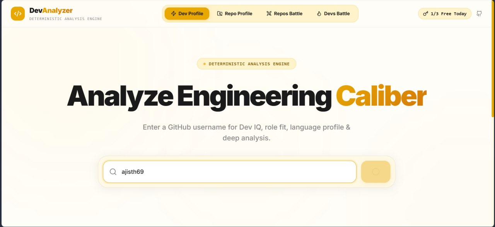
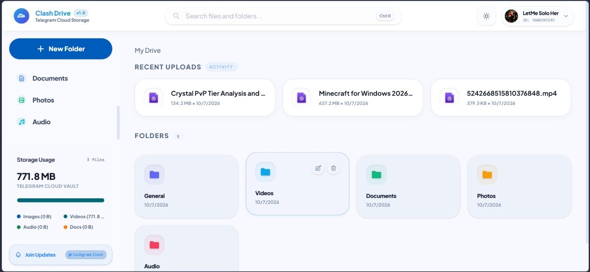
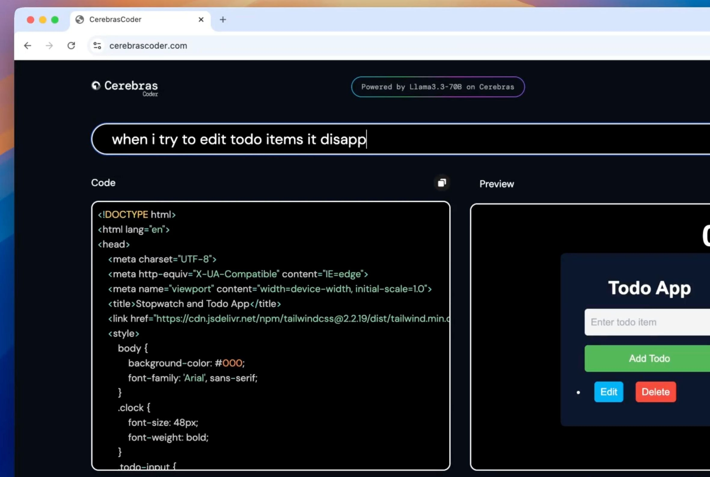
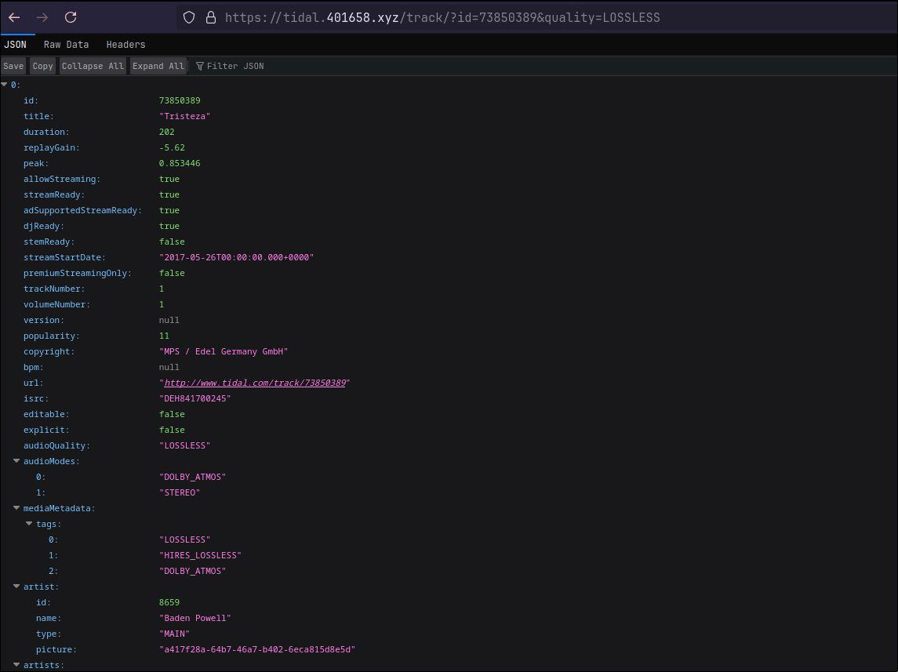
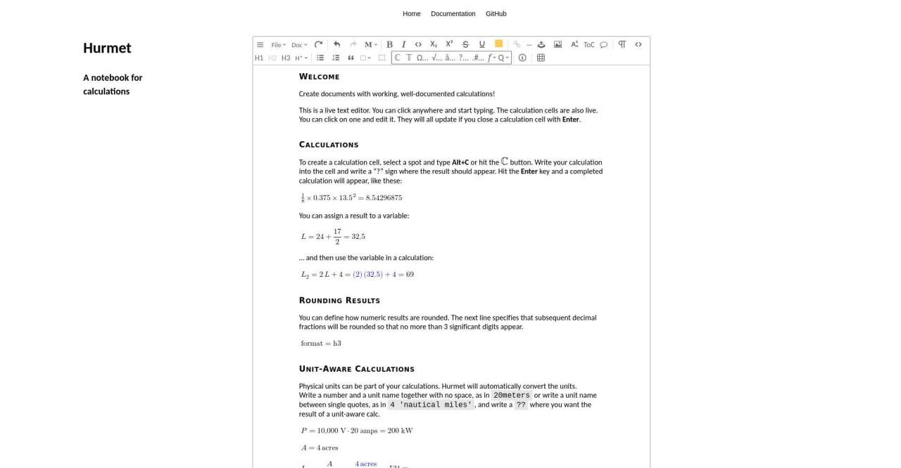
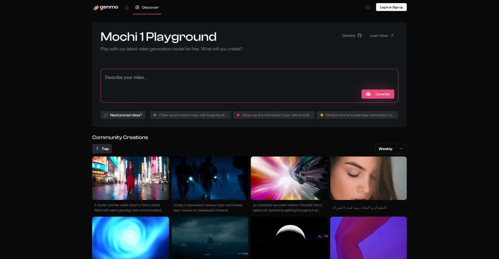
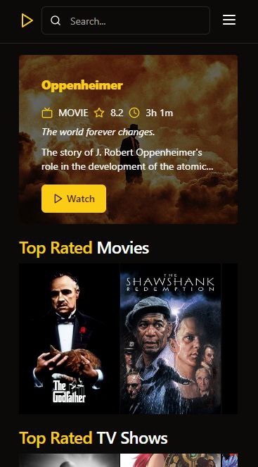

# 🌐 Web, AI & Cloud Platforms

### AI platforms, web applications, self-hosted services, and cloud tools.

[⬅️ **Back to Main Catalog**](../../README.md) • [📚 **All Apps Index**](../all-apps.md)

> **Total Apps in Category:** `193`

---

### 📦 Neuronpedia

> **Categories:** `#Website` `#AI` `#Learning`

Neuronpedia is an open-source AI interpretability platform for exploring and understanding what happens inside neural networks and LLMs. It enables researchers to inspect model features, neuron activations, circuits, and internal representations, making complex model behavior more transparent and easier to understand. It also provides tools for investigating and steering model behavior.

- 🌐 **Official Website:** [https://github.com/hijohnnylin/neuronpedia](https://github.com/hijohnnylin/neuronpedia)
- 👤 **Developer:** [Johnny Lin](https://github.com/hijohnnylin)

<b>✨ Key Features (13)</b> — <i>Click to expand</i>

- **Feature/latent exploration** — inspect individual model features and activations
- **Semantic search** — search millions of latents/features by meaning
- **Activation analysis** — view top activations, logits, and activation density
- **Model steering** — modify model behavior using latents or custom vectors
- **Circuit Tracer/graphs** — visualize relationships between model components
- **Auto-interpretability** — automatically generate and score feature explanations
- **SAE support** — work with Sparse Autoencoders and their features
- **Probes, concepts & transcoders** — support advanced interpretability research
- **Inference testing** — run prompts and examine internal model behavior
- **Dashboards & UMAP** — visualize features and embeddings
- **API + Python/TypeScript libraries** — access functionality programmatically
- **Import/export & datasets** — work with interpretability datasets
- **Self-hosting** — run the open-source platform locally or in the cloud

---

### 📦 Clash Flac

> **Categories:** `#Website` `#Stream` `#Flac` `#Lyrics`

ClashFLAC is a Stream high-resolution audio previews, search across millions of tracks, and download bit-perfect 24-bit lossless FLAC files with embedded synced lyrics effortlessly!

- 🐙 **Source Code:** [https://github.com/ajisth69/clashflac](https://github.com/ajisth69/clashflac)
- 🌐 **Official Website:** [https://clashflac.pages.dev/](https://clashflac.pages.dev/)
- 👤 **Developer:** @letmesolo_her

---

### 📦 Just A Link

> **Categories:** `#Website` `#Portfolio`

Just A Link is a serverless, zero-database "Link-in-bio". User profiles (name, avatar, bio, theme, and links) are compressed and encoded entirely inside the URL fragment

- 🐙 **Source Code:** [https://github.com/jaival-11/justalink](https://github.com/jaival-11/justalink)
- 🌐 **Official Website:** [https://t.me/popCLOUDS/13468](https://t.me/popCLOUDS/13468)
- 👤 **Developer:** @jaival_11

<b>✨ Key Features (8)</b> — <i>Click to expand</i>

- ****Zero-Server Architecture** — ** Your entire profile payload lives directly inside the URL (#data=), with no backend required.
- ****Privacy-First** — ** Your profile data is never stored on external servers or databases.
- ****Multiple Themes** — ** Choose from six built-in themes — Slate Dark, Minimal Light, Cyber High-Contrast, Emerald Solid, Berry Violet, and Neo Punch — or create your own!
- ****Fully Customisable** — ** Easily personalise every part of your page. It’s your page — make it truly yours.
- ****Restore Profiles** — ** Restore profiles directly from a URL or hash, allowing you to edit them without rebuilding everything from scratch.
- ****No Login Required** — ** Create and customise your profile without creating an account.
- ****Lightweight & Fast** — ** Built with pure client-side technology, with no unnecessary framework bloat.
- ****Professional-Ready** — ** Create polished profile pages suitable for professional use, portfolios, personal branding, and more.

---

### 📦 Revanced & Morphe Builder

> **Categories:** `#apps` `#web` `#android` `#revanced` `#morphe`

ReVanced & Morphe Builder is an automated build system for creating the latest patched Android apps and Magisk/KernelSU modules. By integrating multiple patch ecosystems and rebuilding releases 24/7, it delivers a fast, reliable, and hassle-free way to stay up to date with the newest enhancements.

- 🐙 **Source Code:** [https://github.com/nullcpy/rvb](https://github.com/nullcpy/rvb)
- 👤 **Developer:** [nullcpy](https://github.com/nullcpy)

<b>✨ Key Features (8)</b> — <i>Click to expand</i>

- **Automated Builds** — Continuously generates the latest patched apps and modules.
- **Multiple Patch Ecosystems** — Supports ReVanced, ReVanced Extended (RVX), Morphe, RVX Morphed, and ReVanced Advanced.
- **Ready-to-Use Releases** — Download pre-built APKs and Magisk/KernelSU modules without manual patching.
- **Always Up-to-Date** — Rebuilds automatically whenever new patches or app versions are available.
- **Fast & Reliable** — CI-powered build pipeline for consistent, reproducible releases.
- **Wide App Support** — Builds patched versions for a variety of supported Android applications.
- Root & Non-Root Options Provides both standalone APKs and root module variants where available.
- **Open Source** — Transparent development with publicly available source code.

---

### 📦 Clash Dev Analyser

> **Categories:** `#Website` `#GitHub` `#Analyser` `#DevProfileChecker`

A deterministic engine to analyze GitHub developers and repositories in real time. Features profile metric scoring, head-to-head battle mode, AI roasts, intelligence breakdown reports, and downloadable card exports.

- 🐙 **Source Code:** [https://github.com/ajisth69/dev-analyzer](https://github.com/ajisth69/dev-analyzer)
- 🌐 **Official Website:** [https://clashdevanalyser.vercel.app/](https://clashdevanalyser.vercel.app/)
- 👤 **Developer:** @letmesolo_her

<b>✨ Key Features (7)</b> — <i>Click to expand</i>

- **Developer Analysis** — Evaluates GitHub user profiles across key performance metrics.
- **Repository Analysis** — Provides technical depth and maintenance scores for any public repository.
- **Battle Mode** — Head-to-head metrics comparison between developers or repositories.
- **Roast Mode** — AI-generated technical feedback based on profile activity.
- **Intelligence Reports** — Per-category metrics breakdown and deterministic scoring.
- **Export Capabilities** — Generate downloadable visual summary cards.
- **Stateless Architecture** — Zero database dependency, real-time GitHub API aggregation

<b>🖼️ Preview Screenshots & Media (1)</b> — <i>Click to view images & decide if you want to use this app</i>

#### 📸 Cover / Preview

---

### 📦 Clashdrive

> **Categories:** `#Website` `#Telegram` `#TGClient` `#Privacy` `#Storage` `#Tools` `#Utilitied`

Clashdrive is an open-source Telegram-based cloud platform featuring parallel connections for downloading, uploading, and previewing every file format. It includes file indexing, search, and file sharing options, bypassing Telegram's speed and 2GB upload limits.

- 🐙 **Source Code:** [https://github.com/ajisth69/Clashdrive](https://github.com/ajisth69/Clashdrive)
- 🌐 **Official Website:** [https://t.me/popCLOUDS/13291?single](https://t.me/popCLOUDS/13291?single)
- 👤 **Developer:** @letmesolo_her

<b>🖼️ Preview Screenshots & Media (1)</b> — <i>Click to view images & decide if you want to use this app</i>

#### 📸 Cover / Preview

---

### 📦 Puzzle

> **Categories:** `#android` `#mac` `#windows` `#linux` `#web` `#puzzle` `#games`

The ultimate collection of puzzle challenge games available for Android , Linux, macOS, Web, and Windows. A professional suite of minimalist free brain games built with Flutter. Master over 273 unique puzzles in this essential logic puzzle library, featuring the best offline games including Minesweeper, 2048, Sudoku, and more.

- 🐙 **Source Code:** [https://github.com/sidhant947/Puzzle](https://github.com/sidhant947/Puzzle)
- 👤 **Developer:** [sidhant947](https://github.com/sidhant947)

<b>✨ Key Features (12)</b> — <i>Click to expand</i>

- ****Logic Puzzles** — ** Challenge your reasoning with Akari, Einstein Riddle, and classic Sudoku.
- ****Math Games** — ** Improve your mental arithmetic with 2048, KenKen, and the trending **Snake Game** variant (Sum Snake).
- ****Memory Games** — ** Sharpen your recall with N-Back, Memory Palace, and Chimp Test.
- ****Word Puzzles** — ** Expand your vocabulary with **typing games**, Crosswords, and Word Search.
- ****Minesweeper** — ** Ready to **play Minesweeper**? Enjoy it fully offline with no ads.
- ****Brain Training** — ** 273 minimalist experiences designed to sharpen your focus and attention.
- *Attention & Focus (45) - Elite Brain Training**
- *Logic & Reasoning (40) - Best Offline Logic Puzzles**
- * Math & Numbers (55) - Free Math Puzzle Games**
- *Memory Training (50) - Brain Games for Adults**
- *Spatial Awareness (34) - 3D & Rotation Challenges**
- *Word & Language (49) - Word Puzzle Games Online**

---

### 📦 ctxline-claude

> **Categories:** `#web` `#cLaude` `#cLaudecode` `#statusline` `#TelegramUnbannedinIndia`

A lightweight, zero-config statusline for Claude Code.Monitor context usage, session limits, and weekly allowance without leaving Claude Code.

- 🐙 **Source Code:** [https://github.com/MithunWijayasiri/ctxline-claude](https://github.com/MithunWijayasiri/ctxline-claude)
- 🌐 **Official Website:** [https://t.me/popCLOUDS/13086](https://t.me/popCLOUDS/13086)
- 👤 **Developer:** [MithunWijayasiri](https://github.com/MithunWijayasiri)

<b>✨ Key Features (1)</b> — <i>Click to expand</i>

- **See your current directory, active model, context window usage, and Claude usage limits at a glance** — including both your current 5-hour session and weekly allowance.

---

### 📦 Council of High Intelligence

> **Categories:** `#installation` `#AI` `#Skills` `#ClaudeCode` `#Codex`

Simulate a network of expert agents representing different philosophies and domains of knowledge. Each agent collaborates through structured deliberation rounds, balancing opposing viewpoints to produce high-quality, nuanced outputs. Ideal for research, strategy, and AI-assisted decision-making. Harness collective intelligence with modular agents and a central synthesis engine.

- 🐙 **Source Code:** [https://github.com/0xNyk/council-of-high-intelligence](https://github.com/0xNyk/council-of-high-intelligence)
- 👤 **Developer:** [0xNyk](https://github.com/0xNyk)

<b>✨ Key Features (8)</b> — <i>Click to expand</i>

- **Multi-agent deliberation** — Each agent represents a unique domain or philosophy, generating diverse perspectives simultaneously.
- **Central synthesis engine** — Combines insights from all agents into a single, coherent output, balancing competing viewpoints.
- **Modular and extensible agent roles** — Define custom agents with distinct reasoning styles or objectives.
- **Structured reasoning pipelines** — Support multiple deliberation rounds, including critique, synthesis, and validation phases for high-quality results.
- **Real-time interaction & transparency** — Monitor ongoing agent discussions and view detailed reasoning logs.
- **Integration-ready** — Connect external tools, data sources, and APIs for grounded, real-world decision-making.
- **Quality control** — Peer review, bias mitigation, and audit trails ensure accuracy, safety, and reproducibility.
- **Scalable deployment** — Configure agent count, deliberation style, and workflow to fit different applications and research needs.

---

### 📦 Clashgram

> **Categories:** `#Web` `#Desktop` `#Telegr` `#Client`

Clashgram is a highly optimized, privacy-focused hybrid web and native client for Telegram. Architected on top of the official Telegram Web A client, Clashgram introduces rigorous privacy controls, client-side message retention, multi-account routing, dynamic glassmorphism interface layers, and local machine learning audio transcription.

- 🐙 **Source Code:** [https://github.com/ajisth69/clashgram](https://github.com/ajisth69/clashgram)
- 🌐 **Official Website:** [https://t.me/popCLOUDS/12945](https://t.me/popCLOUDS/12945)
- 👤 **Developer:** [Ajisth Singh](https://github.com/ajisth69)

<b>✨ Key Features (10)</b> — <i>Click to expand</i>

- **Encrypted Login Storage** — Protects local Telegram login/session data with strong encryption instead of leaving sensitive keys exposed in the browser.
- **Passcode Lock** — Adds a local passcode layer so private chats stay protected even if someone opens your browser.
- **Ghost Mode** — Privacy-focused tools for reading messages, viewing stories, and using hidden client-side features with more control.
- **Anti-Delete & Anti-Edit Tools** — Helps you see message changes by keeping track of deleted or edited messages locally.
- **Advanced Media Controls** — Gives more freedom over downloads, previews, and media handling inside the web client.
- **Modern Glassmorphism UI** — A cleaner, smoother interface with animated themes, stylish panels, and custom typography.
- **Instant Document Preview** — Open PDFs and files directly in the browser without being forced to download them first.
- **Developer Transparency Tools** — Easily view raw User IDs, Group IDs, and technical details without extra bots or extensions.
- **Fast Browser-Based Experience** — Runs directly in your browser with a lightweight, smooth, web-first design.
- **Security-First Telegram Web Alternative** — Built for users who want stronger local protection, more privacy tools, and a cleaner Telegram web experience.

---

### 📦 OmniTools

> **Categories:** `#SelfHosted` `#WebTools` `#Docker`

A privacy‑first web toolbox for everyday tasks images, PDFs, video, text, data, and math utilities, all processed directly in your browser with zero uploads. Use instantly online or self host with a lightweight Docker image.

- 🐙 **Source Code:** [https://github.com/iib0011/omni-tools](https://github.com/iib0011/omni-tools)
- 🌐 **Official Website:** [https://t.me/popCLOUDS/12901](https://t.me/popCLOUDS/12901)
- 👤 **Developer:** [iib0011](https://github.com/iib0011)

<b>✨ Key Features (8)</b> — <i>Click to expand</i>

- All in one web toolbox process images, PDFs, videos, text, lists, dates, math, and data from a single clean dashboard, directly in your browser
- Instant access, no install open omnitools.app and start using every tool immediately; no downloads, accounts, or sign ups required
- 100% client side processing every file stays on your device; nothing is ever uploaded to a server, guaranteeing full privacy and security
- Self hosting ready for those who want their own private instance, the entire app fits in a 28 MB Docker image and deploys with one command
- Modern, responsive interface built with React, TypeScript, and Material UI, works smoothly on desktops, tablets, and phones
- Broad tool selection image resizer/converter/editor, video trimmer/reverser, PDF merge/split/edit, JSON/CSV/XML formatters, case converters, list shufflers, prime number generator, Ohm’s law calculator, and more
- Ad free & anonymous no ads, no tracking, no personal data collection; just pure utility
- Community driven & multi language MIT licensed, open to contributions, feature requests, and translations via GitHub and Discord

---

### 📦 openclaw-android

> **Categories:** `#AI` `#Android` `#homelab` `#Openclaw`

Run OpenClaw on Android with a single command — no proot, no Linux

- 🐙 **Source Code:** [https://github.com/AidanPark/openclaw-android](https://github.com/AidanPark/openclaw-android)
- 👤 **Developer:** [AidanPark](https://github.com/AidanPark)

<b>✨ Key Features (12)</b> — <i>Click to expand</i>

- **One-tap setup** — bootstrap, Node.js, and OpenClaw installed from within the app
- Built-in dashboard for gateway control, runtime info, and tool management
- **Works independently of Termux** — installing the app does not affect an existing Termux + oa setup
- Android 7.0 or higher (Android 10+ recommended)
- ~1GB free storage
- Wi-Fi or mobile data connection
- ****glibc environment**** — Installs the glibc dynamic linker (via pacman's glibc-runner) so standard Linux binaries run without modification
- ****Node.js (glibc)**** — Downloads official Node.js linux-arm64 and wraps it with an ld.so loader script (no patchelf, which causes segfault on Android)
- ****Path conversion**** — Automatically converts standard Linux paths (/tmp, /bin/sh, /usr/bin/env) to Termux paths
- ****Temp folder setup**** — Configures an accessible temp folder for Android
- ****Service manager bypass**** — Configures normal operation without systemd
- ****OpenCode integration**** — If selected, installs OpenCode using proot + ld.so concatenation for Bun standalone binaries

---

### 📦 Nextup Resource

> **Categories:** `#Website` `#Learning` `#Tools` `#Android` `#AI` `#Resources` `#Courses` `#Free`

Nextup Resources puts 50+ courses, 700+ FOSS Android apps, AI tools, ebooks, Morphe builds, Shizuku apps, Material You app lists, and placement prep — all in one clean, searchable platform. Built as a PWA so you can install it like a native app. No login. No clutter. Free forever.

- 🐙 **Source Code:** [https://github.com/shreyagarwal72/nextup-resource](https://github.com/shreyagarwal72/nextup-resource)
- 🌐 **Official Website:** [https://t.me/popCLOUDS/12608](https://t.me/popCLOUDS/12608)
- 👤 **Developer:** [shreyagarwal72 | @hereyourchampion](https://github.com/shreyagarwal72)

---

### 📦 cux

> **Categories:** `#AI` `#Tools`

Claude account switcher for uninterrupted sessions. Run multiple Claude Code Pro/Max accounts as one auto-switch on rate limits, resume the same conversation without losing context.

- 🐙 **Source Code:** [http://cux.inulute.com](http://cux.inulute.com)
- 👤 **Developer:** [inulute](https://github.com/inulute)

---

### 📦 MiroFish

> **Categories:** `#AI` `#Financial_forecasting` `#Future_prediction` `#Public_opinion_analysis` `#Social_prediction` `#Swarm_intelligence`

A Simple and Universal Swarm Intelligence Engine, Predicting Anything.

- 🐙 **Source Code:** [https://github.com/666ghj/MiroFish](https://github.com/666ghj/MiroFish)
- 👤 **Developer:** [666ghj](https://github.com/666ghj)

<b>✨ Key Features (7)</b> — <i>Click to expand</i>

- ****At the Macro Level**** — We are a rehearsal laboratory for decision-makers, allowing policies and public relations to be tested at zero risk
- ****At the Micro Level**** — We are a creative sandbox for individual users — whether deducing novel endings or exploring imaginative scenarios, everything can be fun, playful, and accessible
- ****Graph Building**** — Seed extraction & Individual/collective memory injection & GraphRAG construction
- ****Environment Setup**** — Entity relationship extraction & Persona generation & Agent configuration injection
- ****Simulation**** — Dual-platform parallel simulation & Auto-parse prediction requirements & Dynamic temporal memory updates
- ****Report Generation**** — ReportAgent with rich toolset for deep interaction with post-simulation environment
- ****Deep Interaction**** — Chat with any agent in the simulated world & Interact with ReportAgent

<b>🖼️ Preview Screenshots & Media (1)</b> — <i>Click to view images & decide if you want to use this app</i>

#### 📸 Cover / Preview

---

### 📦 Revision-Master

> **Categories:** `#ai` `#aistudy` `#revision` `#study` `#android`

Revision Master - A smart, offline-first study app with AI-generated flashcards, mock tests, and a focus timer.

- 🐙 **Source Code:** [https://github.com/mkr-infinity/Revision-Master](https://github.com/mkr-infinity/Revision-Master)
- 👤 **Developer:** [mkr-infinity](https://github.com/mkr-infinity)

<b>✨ Key Features (13)</b> — <i>Click to expand</i>

- Download the APK file
- Enable **Install from Unknown Sources**
- Open the APK and install
- Enjoy the app 🎉
- ****Zero Cloud Storage** — ** All your subjects, flashcards, and progress are stored securely on your device.
- ****No Tracking** — ** No analytics, no cookies, no hidden trackers.
- ****Full Control** — ** Export your entire database as a JSON backup anytime. We don't lock you in.
- ****Native Experience** — ** Optimized for mobile with buttery-smooth animations and instant tab switching.
- ****Offline Ready** — ** Study anywhere, anytime. No internet connection required for core features.
- ****AI-Powered** — ** Generate flashcards and study materials instantly using **MKR Ai** (powered by Google Gemini).
- ****Dynamic Themes** — ** Choose from Light, Dark, OLED, Sepia, Hacker Green, and more.
- ****Native Feel** — ** Optimized for mobile with haptic-ready interactions and fluid transitions.
- ****Customizable** — ** Personalize your experience with custom avatars and exam countdowns.

---

### 📦 LeanType — AI Keyboard with Privacy Focus

> **Categories:** `#Android` `#FOSS` `#Keyboard` `#AI` `#Productivity`

LeanType is a powerful open-source Android keyboard that combines privacy with optional AI features. Built as a fork of HeliBoard, it offers a clean offline typing experience while letting you enable AI tools only when you need them. You get full control over your data, with support for both local models and cloud providers.

- 🐙 **Source Code:** [https://t.me/popCLOUDS/11989](https://t.me/popCLOUDS/11989)
- 👤 **Developer:** [LeanBitLab](https://github.com/LeanBitLab/)

---

### 📦 SwiftSlate

> **Categories:** `#Android` `#Ai` `#Gemini`

System-wide AI text assistant for Android — powered by Gemini and custom providers

- 🐙 **Source Code:** [https://github.com/Musheer360/SwiftSlate](https://github.com/Musheer360/SwiftSlate)
- 👤 **Developer:** [Musheer Alam](http://github.com/musheer360)

<b>✨ Key Features (8)</b> — <i>Click to expand</i>

- **Works Everywhere** — System-wide AI typing in any app via Accessibility Service.
- **Instant Inline Replacement** — Trigger AI and replace text instantly in the same field.
- **Multi-Key Rotation** — Automatically switches between multiple API keys.
- **AMOLED Dark Theme** — Pure black Material 3 UI optimized for OLED screens.
- **Gemini & Custom Providers** — Use Gemini or any OpenAI-compatible API.
- **Custom Commands** — Create triggers like ?poem, ?eli5, or your own prompts.
- **Encrypted Key Storage** — Keys secured with AES-256-GCM via Android Keystore.
- **Privacy-First** — No analytics or tracking; text goes directly to your provider.

---

### 📦 Nullclaw

> **Categories:** `#AI` `#AI_assistant`

Fastest, smallest, and fully autonomous AI assistant infrastructure written in Zig

- 🐙 **Source Code:** [https://github.com/nullclaw/nullclaw](https://github.com/nullclaw/nullclaw)
- 👤 **Developer:** [nullclaw](https://github.com/nullclaw)

<b>✨ Key Features (5)</b> — <i>Click to expand</i>

- ****Impossibly Small** — ** 678 KB static binary — no runtime, no VM, no framework overhead.
- ****Near-Zero Memory** — ** ~1 MB peak RSS. Runs comfortably on the cheapest ARM SBCs and microcontrollers.
- ****Instant Startup** — ** <2 ms on Apple Silicon, <8 ms on a 0.8 GHz edge core.
- ****True Portability** — ** Single self-contained binary across ARM, x86, and RISC-V. Drop it anywhere, it just runs.
- ****Feature-Complete** — ** 22+ providers, 11 channels, 18+ tools, hybrid vector+FTS5 memory, multi-layer sandbox, tunnels, hardware peripherals, MCP, subagents, streaming, voice — the full stack.

---

### 📦 PaperKnife

> **Categories:** `#Android` `#Web` `#PDF`

Privacy-first PDF utility (Zero-Server Architecture). Merge, split, compress, and edit PDFs 100% locally on your device. No uploads, no servers, no tracking.

- 🐙 **Source Code:** [https://t.me/popCLOUDS/11567](https://t.me/popCLOUDS/11567)
- 👤 **Developer:** [potatameister](https://github.com/potatameister)

<b>✨ Key Features (6)</b> — <i>Click to expand</i>

- ****Modify** — ** Merge multiple files, split pages, rotate, and rearrange.
- ****Optimize** — ** Reduce file size with different quality presets.
- ****Secure** — ** Encrypt files with passwords or remove them locally.
- ****Convert** — ** Convert between PDF and images (JPG/PNG) or plain text.
- ****Sign** — ** Add an electronic signature to your documents safely.
- ****Sanitize** — ** Deep clean metadata (like Author or Producer) to keep your files anonymous.

<b>🖼️ Preview Screenshots & Media (1)</b> — <i>Click to view images & decide if you want to use this app</i>

#### 📸 Cover / Preview

---

### 📦 ToolNeuron

> **Categories:** `#features` `#Android` `#AI` `#Offline`

ToolNeuron is the most advanced offline-first AI assistant for Android, featuring complete on-device processing with enterprise-grade encryption, intelligent document understanding through RAG (Retrieval-Augmented Generation), text-to-speech, an extensible plugin system, and sophisticated memory management. Your data never leaves your device. No cloud dependencies. No subscriptions. True digital sovereignty.

- 🐙 **Source Code:** [https://github.com/Siddhesh2377/ToolNeuron](https://github.com/Siddhesh2377/ToolNeuron)
- 👤 **Developer:** [Siddhesh2377](https://github.com/Siddhesh2377)

---

### 📦 Kipty

> **Categories:** `#Android` `#AI` `#Audio` `#Transcriber`

Android app that transcribes audio to help English learners follow podcasts, improve listening comprehension, and study spoken content.

- 🐙 **Source Code:** [https://github.com/Vinnih-1/Kipty](https://github.com/Vinnih-1/Kipty)
- 👤 **Developer:** [Vinnih-1](https://github.com/Vinnih-1)

<b>✨ Key Features (8)</b> — <i>Click to expand</i>

- support English learners
- improve listening comprehension
- make podcast/audio study easier
- provide a simple transcription management tool
- Clone the repository
- Open the project in **Android Studio**
- Sync Gradle
- Run on an emulator or physical device

---

### 📦 yoink

> **Categories:** `#Downloader` `#Website`

A simple, open-source media downloader powered by yt-dlp

- 🐙 **Source Code:** [https://github.com/coah80/yoink](https://github.com/coah80/yoink)
- 🌐 **Official Website:** [https://t.me/popCLOUDS/11442](https://t.me/popCLOUDS/11442)
- 👤 **Developer:** [coah80](https://github.com/coah80)

<b>✨ Key Features (3)</b> — <i>Click to expand</i>

- Download videos and audio from 1000+ sites
- Convert between formats
- Compress videos to a target file size

---

### 📦 WebToApp

> **Categories:** `#Android` `#AI` `#PWA` `#Tools`

A native Android application that converts any website URL into a standalone Android App.

- 🐙 **Source Code:** [https://t.me/popCLOUDS/11323](https://t.me/popCLOUDS/11323)
- 👤 **Developer:** [shiaho](https://github.com/shiahonb777)

<b>✨ Key Features (24)</b> — <i>Click to expand</i>

- **URL to App** — Generate a standalone Android app from any website URL
- **Media to App** — Convert images and videos into independent apps
- **HTML to App** — Convert standalone HTML/CSS/JS projects into apps
- **Frontend Framework Support** — One-click packaging for React, Vue, Next.js, Nuxt, Svelte
- **Custom Icon** — Choose from gallery or generate app icons using AI
- **Custom App Name** — Set a custom display name for the generated app
- **Custom Package Name** — Define custom APK package name and version
- **Tampermonkey-like Scripts** — Inject custom JavaScript/CSS into webpages
- **10 Built-in Modules** — Video downloader, Bilibili/Douyin/Xiaohongshu extractors, video enhancer, web analyzer, dark mode, privacy protection, content enhancer, element blocker
- 30+ Code Templates for quick module creation
- Module Categories across 20+ types (content filter, style modifier, function enhancer, media, etc.)
- URL Match Rules including wildcards and regex support
- Module Config System with user-customizable settings
- Fine-grained Permission Declaration for modules
- **Share Code** — Generate shareable code snippets easily
- Import/Export support for module files
- **Natural Language AI Development Agent** — Describe features in text and generate module code
- Syntax Check and Security Scan for generated AI code
- Auto Fix for detected code issues
- Code Snippet Library for fast development
- Built-in Debug/Test pages to verify module behavior
- **Multi-Provider AI Support** — Google Gemini, OpenAI, GLM, Volcano, MiniMax, OpenRouter, etc.
- AI-Assisted HTML/CSS/JS code generation
- **Icon Library** — Manage and collect generated icons

---

### 📦 TypeAssist

> **Categories:** `#Android` `#AI` `#Productivity` `#Tools`

TypeAssist is a powerful Android Accessibility Service that acts as an intelligent layer over your existing keyboard. It integrates cutting-edge AI (Google Gemini, Cloudflare Workers AI) and a suite of offline utility tools directly into any text input field on your device.

- 🐙 **Source Code:** [https://t.me/popCLOUDS/11283](https://t.me/popCLOUDS/11283)
- 👤 **Developer:** [Istiak Ahmmed Soyeb](https://github.com/estiaksoyeb)

<b>✨ Key Features (13)</b> — <i>Click to expand</i>

- ****Ask AI** — ** Query Google Gemini or Cloudflare Workers AI directly from any app.
- ****Grammar Fix** — ** Instantly correct spelling, punctuation, and grammar errors.
- ****Translation** — ** Translate text from any language to English (or your preferred language).
- ****Tone Adjustment** — ** Rewrite messages to be more professional, polite, or friendly.
- ****Inline Commands** — ** Embed AI queries within sentences using `(.ta: your prompt)`.
- ****Smart Calculator** — ** Solve math expressions in-place.
- **Example** — `(.c: 25 * 4 + 10)` -> `110`
- ****Snippets (Text Expander)** — ** Expand shortcuts into full text blocks.
- ****Date & Time** — ** Insert current timestamps with `.now` or `.date`.
- ****Password Generator** — ** Generate strong random passwords on the fly with `.pass`.
- ****Global Undo** — ** Revert any action instantly using `.undo`.
- ****History Manager** — ** View and recover original text from the last 2 minutes.
- ****Privacy First** — ** Processes text **only** when a trigger is detected. No data is stored permanently.

<b>🖼️ Preview Screenshots & Media (1)</b> — <i>Click to view images & decide if you want to use this app</i>

#### 📸 Cover / Preview

---

### 📦 Randwabot

> **Categories:** `#AI` `#Bot`

Clawdbot is a personal AI assistant you run on your own devices. It answers you on the channels you already use (WhatsApp, Telegram, Slack, Discord, Signal, iMessage, Microsoft Teams, WebChat), can speak and listen on macOS/iOS/Android, and can render a live Canvas you control. The Gateway is just the control plane — the product is the assistant.

- 🐙 **Source Code:** [https://github.com/clawdbot/clawdbot](https://github.com/clawdbot/clawdbot)

---

### 📦 PAIOS

> **Categories:** `#Android` `#AI` `#Local`

Run Gemini Nano 100% offline. A powerful, private, & open-source AI interface.

- 🐙 **Source Code:** [https://t.me/popCLOUDS/11201](https://t.me/popCLOUDS/11201)
- 👤 **Developer:** [Puzzak's](https://github.com/Puzzaks)

<b>✨ Key Features (7)</b> — <i>Click to expand</i>

- 100% Offline & Private
- Full Model Control
- Multiple chats!
- Custom Instructions
- Context-Aware
- Total Transparency
- A (Strong) Personality

---

### 📦 Picarta AI

> **Categories:** `#Website`

Picarta AI is an image location search engine that utilizes Artificial Intelligence to determine where a photo has been taken in the world. Our mission is to verify photo locations worldwide, ensuring authenticity, countering misinformation, and offering reliable geolocation solutions.

- 🌐 **Official Website:** [https://github.com/PicartaAI](https://github.com/PicartaAI)

---

### 📦 aihub

> **Categories:** `#Android` `#AI` `#Hub`

All-in-one Kotlin app that aggregates multiple AI assistants in a single tabbed interface, featuring webview integration, Material Design 3, and persistent session management.

- 🐙 **Source Code:** [https://github.com/SilentCoderHere/aihub](https://github.com/SilentCoderHere/aihub)
- 👤 **Developer:** [Silent Coder](https://github.com/SilentCoderHere)

---

### 📦 LightSession for ChatGPT

> **Categories:** `#Extension` `#Tools` `#AI`

Keep ChatGPT fast by keeping only the last N messages in the DOM. Local-only, privacy-first browser extension that fixes UI lag in long conversations.

- 🐙 **Source Code:** [https://github.com/11me/light-session](https://github.com/11me/light-session)
- 👤 **Developer:** [11me](https://github.com/11me/)

---

### 📦 city-roads

> **Categories:** `#Website` `#Utilities` `#Mapping`

city-roads is a browser-based mapping tool that draws every road in a selected city as a single, clean line map. After a user enters a city name, it retrieves the city’s road geometry from OpenStreetMap and renders the full street network in the browser, making it useful for exploring urban layouts, comparing city structures, and creating visually striking map graphics.

- 🐙 **Source Code:** [https://github.com/anvaka/city-roads](https://github.com/anvaka/city-roads)
- 🌐 **Official Website:** [https://t.me/popCLOUDS/11077](https://t.me/popCLOUDS/11077)
- 👤 **Developer:** [Andrei Kashcha](https://github.com/anvaka)

<b>✨ Key Features (8)</b> — <i>Click to expand</i>

- **Renders complete city road networks** as clean, minimalist line maps
- **City search by name** with automatic place lookup and boundary detection
- **Pulls live road geometry from OpenStreetMap** (via Overpass)
- **Fast rendering with WebGL** for smooth interaction on large datasets
- **Style customization** (line, background, and label colors)
- **Export options** to save the current view as **PNG** or **SVG**
- **Works directly in the browser** (no install required)
- **Optimized for popular cities** using cached city data to reduce load time

---

### 📦 zenshin.

> **Categories:** `#Windows` `#Linux` `#Web`

A poorly written web and electron based anime list manager with media streaming capabilities.

- 🐙 **Source Code:** [https://m.youtube.com/watch?v=cpMpWohodUc](https://m.youtube.com/watch?v=cpMpWohodUc)
- 👤 **Developer:** [hitarth.](https://github.com/hitarth-gg)

---

### 📦 DroidRun

> **Categories:** `#Linux` `#MacOS` `#Windows` `#Automation` `#AI`

1DroidRun is a powerful framework for controlling Android and iOS devices through LLM agents. It allows you to automate device interactions using natural language commands.

- 🐙 **Source Code:** [https://github.com/droidrun/droidrun](https://github.com/droidrun/droidrun)

---

### 📦 Kelivo

> **Categories:** `#Android` `#iOS` `#AI`

A Flutter LLM Chat Client

- 🐙 **Source Code:** [https://kelivo.psycheas.top](https://kelivo.psycheas.top)
- 👤 **Developer:** [Chevey339](https://github.com/Chevey339)

<b>✨ Key Features (18)</b> — <i>Click to expand</i>

- **Modern Design** - Material You design language with dynamic color theming support (Android 12+).
- **Dark Mode** - Perfectly adapted dark theme to protect your eyes.
- **Multi-language Support** - Supports both English and Chinese interfaces.
- **Multi-platform Support** - Mobile (Android/iOS/Harmony) and Desktop (Windows/macOS/Linux).
- **Multi-provider Support** - Supports major AI providers like OpenAI, Google Gemini, Anthropic, etc.
- **Custom Assistants** - Create and manage personalized AI assistants.
- **Multimodal Input** - Supports various formats including images, text documents, PDFs, Word documents, etc.
- **Markdown Rendering** - Full support for code highlighting, LaTeX formulas, tables, and more.
- **Voice/TTS Providers** - Built-in system TTS plus OpenAI / Google Gemini / ElevenLabs voice servers.
- **MCP Support** - Model Context Protocol tool integration.
- **Built-in MCP Tools** - Includes a built-in MCP Fetch tool.
- **Web Search** - Integrated with multiple search engines (Exa, Tavily, Zhipu, LinkUp, Brave, Bing, Metaso, SearXNG, Ollama, Jina, Perplexity, Bocha).
- **Prompt Variables** - Supports dynamic variables like model name, time, etc.
- **QR Code Sharing** - Export and import provider configurations via QR codes.
- **Data Backup** - Supports chat history backup and restoration.
- **Custom Requests** - Supports custom HTTP request headers and bodies.
- **Custom Fonts** - Bring your own fonts (system fonts / Google Fonts).
- **Android Background Generation** - Keep chat generation running in the background (optional setting).

---

### 📦 BrowserOS

> **Categories:** `#AI` `#Agent` `#Browser` `#Linux` `#MacOS` `#Windows`

BrowserOS is an open-source chromium fork that runs AI agents natively. Your open-source, privacy-first alternative to ChatGPT Atlas, Perplexity Comet, Dia.

- 🐙 **Source Code:** [https://browseros.com](https://browseros.com)
- 👤 **Developer:** [BrowserOS](https://github.com/browseros-ai)

---

### 📦 Summary Expressive

> **Categories:** `#Android` `#AI` `#Tools`

A modern, BYOK and FOSS android app to summarize videos(YouTube, BiliBili), articles, images and documents with AI/LLM.

- 🐙 **Source Code:** [https://github.com/kid1412621/SummaryExpressive](https://github.com/kid1412621/SummaryExpressive)
- 👤 **Developer:** [NanoNova](https://github.com/kid1412621)

---

### 📦 RepoHub

> **Categories:** `#Website` `#Windows` `#MacOS` `#Linux` `#Tools`

RepoHub simplifies software installation on Linux, Windows, and macOS with a unified interface that uses official repositories for discovering and installing packages.

- 🐙 **Source Code:** [https://github.com/yusufipk/RepoHub](https://github.com/yusufipk/RepoHub)
- 🌐 **Official Website:** [https://github.com/yusufipk](https://github.com/yusufipk)
- 👤 **Developer:** Yusuf İpek

---

### 📦 Hacker AI

> **Categories:** `#AI` `#Website`

Provides advanced AI and integrated tools to help security teams conduct comprehensive penetration tests effortlessly. Scan, exploit, and analyze web applications, networks, and cloud environments with ease and precision, without needing expert skills.

- 🌐 **Official Website:** [https://github.com/hackerai-tech](https://github.com/hackerai-tech)

---

### 📦 Chitralaya

> **Categories:** `#Cloud` `#Android`

__
Chitralaya CloudGallery is your personal photo fortress that transforms Telegram into unlimited, truly private cloud storage! Say goodb__ye to the anxiety of losing precious memories and hello to unlimited backup freedom.

- 🐙 **Source Code:** [https://github.com/AKS-Labs/CloudGallery](https://github.com/AKS-Labs/CloudGallery)
- 👤 **Developer:** Aks-labs

<b>✨ Key Features (7)</b> — <i>Click to expand</i>

- 100% private - no telemetry or tracking
- Beautiful Material Design 3 interface
- Customizable photo grid (3-6 columns)
- Smart sync with change detection
- Cross-device access via Telegram
- AES-256 encryption for security
- Battery-friendly background sync

---

### 📦 Art of Manliness

> **Categories:** `#Website` `#Android` `#iOS` `#SelfDevelopment`

Art of Manliness is a men’s lifestyle platform that focuses on helping people build character, develop practical skills, stay strong in body and mind, and live with purpose. It blends timeless wisdom with modern insights through articles, guides, and podcasts on topics like fitness, relationships, style, and self-discipline. The tone is thoughtful and grounded, aiming to inspire real-world growth and confidence rather than quick fixes or trends.

- 🌐 **Official Website:** [https://t.me/popCLOUDS/10498](https://t.me/popCLOUDS/10498)

---

### 📦 Claude Enhanced

> **Categories:** `#features` `#Extension` `#Tools` `#AI`

This extension adds a bunch of QOL/Utility features to Claude.ai, like Search, Navigation, TTS, STT, forking, exporting, etc.

- 🐙 **Source Code:** [https://github.com/lugia19/Claude-Enhanced](https://github.com/lugia19/Claude-Enhanced)
- 👤 **Developer:** lugia19

---

### 📦 Zenime - Ad free anime streaming platform

> **Categories:** `#general` `#Website` `#Streaming` `#Media` `#Anime`

Zenime is an open-source anime streaming service that uses a custom API, built using ReactJS with JavaScript and Tailwind CSS. It lets you easily find any anime with an intuitive search & suggestion feature and stream without any ads.

- 🐙 **Source Code:** [https://github.com/itzzzme/zenime](https://github.com/itzzzme/zenime)
- 🌐 **Official Website:** [https://t.me/popCLOUDS/10429](https://t.me/popCLOUDS/10429)
- 👤 **Developer:** [itzzzme](https://github.com/itzzzme)

---

### 📦 oxproxion

> **Categories:** `#Android` `#AI`

oxproxion is a versatile and user-centric Android chat application designed to interact with various Language Learning Models (LLMs). It provides a seamless interface for managing conversations, customizing bot personas, and saving chat histories.

- 🐙 **Source Code:** [https://github.com/stardomains3/oxproxion](https://github.com/stardomains3/oxproxion)
- 👤 **Developer:** [stardomains3](https://github.com/stardomains3)

<b>✨ Key Features (12)</b> — <i>Click to expand</i>

- ***🤖 Multi-Model Support**** — Switch between different LLM bots and models.
- ***💬 Chat Interface**** — A clean and intuitive interface for conversing with AI models.
- ***💾 Save & Load Chats**** — Save your text chat sessions and load them later to continue the conversation.
- ***📥 Import & Export**** — Easily import and export your chat histories.
- ***⚡ Streaming or Non-Streaming Responses**** — You choose!
- ***🖼️ Chat with Images**** — With models that support it!
- ***🖼️ Image Generation**** — With models that support it!
- Tap icon in model list to open the OpenRouter models list in your browser.
- Long-press the API key icon to view your remaining OpenRouter credits.
- ***🛠️ Built with Modern Tech**** — 100 % Kotlin, leveraging Jetpack libraries, Coroutines for asynchronous tasks, and Ktor for networking.
- **GitHub** — https://github.com/stardomains3/oxproxion/releases
- **F-Droid** — https://f-droid.org/packages/io.github.stardomains3.oxproxion/

---

### 📦 Just Delete Me

> **Categories:** `#Website` `#Android` `#Security` `#Tools`

Just Delete Me maps out the account deletion procedures for many platforms and provides a directory with instructions on how to request the deletion of your data from them.

- 🐙 **Source Code:** [https://github.com/AmanoTeam/JustDeleteMe](https://github.com/AmanoTeam/JustDeleteMe)
- 👤 **Developer:** [Amano LLC](https://github.com/AmanoTeam)

---

### 📦 Keybr

> **Categories:** `#Website`

Keybr is a smart typing trainer that goes beyond static drills. It records each keystroke and computes per-key statistics, then auto-generates lessons focused on the keys you find hardest. You can set a target WPM, the app introduces letters one by one until you reach that goal, and it even predicts how many lessons you’ll need. A clean profile view visualizes your learning progress.

- 🐙 **Source Code:** [https://github.com/aradzie/keybr.com](https://github.com/aradzie/keybr.com)
- 🌐 **Official Website:** [https://t.me/popCLOUDS/10262](https://t.me/popCLOUDS/10262)
- 👤 **Developer:** [Aliaksandr Radzivanovich](https://github.com/aradzie)

---

### 📦 Emoji Encoder/Decoder

> **Categories:** `#Website` `#Tools`

Encode arbitrary data inside a single emoji (or any Unicode character) using chained variation selectors—with a browser encoder/decoder demo.

- 🌐 **Official Website:** [https://github.com/paulgb/emoji-encoder](https://github.com/paulgb/emoji-encoder)
- 👤 **Developer:** [paulgb](https://github.com/paulgb)

---

### 📦 AnswerGit

> **Categories:** `#Website` `#Tools` `#AI`

AnswerGit is a platform that allows you to analyze Git repositories and ask AI questions about the code. It uses AI to provide detailed explanations and summaries of Git commands, workflows, and code structure, making it easier to understand and interact with code repositories.

- 🐙 **Source Code:** [https://answergit.vercel.app](https://answergit.vercel.app)
- 👤 **Developer:** [TharaneshA](https://github.com/TharaneshA)

---

### 📦 Coreply

> **Categories:** `#Android` `#AI` `#Tools` `#Writing`

Coreply is an open-source Android app designed to make texting faster and smarter by providing texting suggestions while you type. Whether you're replying to friends, family, or colleagues, Coreply enhances your typing experience with intelligent, context-aware suggestions.

- 🐙 **Source Code:** [https://discord.gg/zCsQKmTFTk](https://discord.gg/zCsQKmTFTk)

<b>✨ Key Features (3)</b> — <i>Click to expand</i>

- ****Real-time AI Suggestions**** — Get accurate, context-aware suggestions as you type.
- ****Customizable LLM Settings**** — Supports any inference service having an OpenAI compatible API.
- ****No Data Collection**** — All traffic goes directly to the inference API. No data passes through intermediate servers (except for the hosted version).

---

### 📦 OpenCut

> **Categories:** `#Website` `#Media` `#Editor`

The open-source CapCut alternative

- 🌐 **Official Website:** [https://github.com/OpenCut-app/OpenCut](https://github.com/OpenCut-app/OpenCut)
- 👤 **Developer:** [OpenCut-app](https://github.com/OpenCut-app)

<b>✨ Key Features (6)</b> — <i>Click to expand</i>

- Timeline-based editing
- Multi-track support
- Real-time preview
- No watermarks or subscriptions
- Analytics provided by Databuddy, 100% Anonymized & Non-invasive.
- Blog powered by Marble, Headless CMS.

---

### 📦 Repertoire

> **Categories:** `#Android` `#Linux` `#Windows` `#Web` `#Entertaiment`

Repertoire is a cross-platform application designed for musicians, dancers, magicians, or performers to help manage their repertoire (musical pieces, dance routines, or even magic tricks), track practice sessions, and organize all related media in one place. Built with Flutter, it offers a seamless experience on mobile, web, and desktop platforms.

- 🐙 **Source Code:** [https://github.com/Adithya-Jayan/MyRepertoirApp](https://github.com/Adithya-Jayan/MyRepertoirApp)
- 👤 **Developer:** [Adithya Jayan](https://github.com/Adithya-Jayan)

---

### 📦 Telegram Downloader

> **Categories:** `#Website` `#Extension` `#Utilities`

Instantly save any video (MP4, MKV), photo, music (MP3), or document directly from Telegram with just one click. (No app needed)

- 🌐 **Official Website:** [https://t.me/popCLOUDS/9920](https://t.me/popCLOUDS/9920)

---

### 📦 GLM AI

> **Categories:** `#AI`

- 🐙 **Source Code:** [https://github.com/zai-org/GLM-4.5](https://github.com/zai-org/GLM-4.5)
- 👤 **Developer:** [Z.ai](https://github.com/zai-org)

---

### 📦 Github Profile Analyser

> **Categories:** `#Website` `#Tools`

A serverless web app built with Cloudflare Workers to fetch and visualize GitHub user data. This tool helps developers understand their GitHub presence through visualizations, badge tracking, and AI-powered analysis.

- 🐙 **Source Code:** [https://github.com/0xarchit/github-profile-analyzer](https://github.com/0xarchit/github-profile-analyzer)
- 👤 **Developer:** [0xarchit](https://github.com/0xarchit)

---

### 📦 olmOCR

> **Categories:** `#Website` `#AI` `#Tools`

A toolkit for converting PDFs and other image-based document formats into clean, readable, plain text format.

- 🌐 **Official Website:** [https://github.com/allenai/olmocr](https://github.com/allenai/olmocr)

<b>✨ Key Features (6)</b> — <i>Click to expand</i>

- Convert PDF, PNG, and JPEG based documents into clean Markdown
- Support for equations, tables, handwriting, and complex formatting
- Automatically removes headers and footers
- Convert into text with a natural reading order, even in the presence of figures, multi-column layouts, and insets
- Efficient, less than $200 USD per million pages converted
- (Based on a 7B parameter VLM, so it requires a GPU)

---

### 📦 RikkaHub

> **Categories:** `#Android` `#AI` `#Productivity`

A native Android LLM chat client that supports switching between different providers for conversations

- 🐙 **Source Code:** [https://discord.gg/9weBqxe5c4](https://discord.gg/9weBqxe5c4)

---

### 📦 Nanobrowser

> **Categories:** `#AI` `#Browser` `#Extension`

Nanobrowser is an open-source AI web automation tool that runs in your browser. A free alternative to OpenAI Operator with flexible LLM options and multi-agent system.

- 🐙 **Source Code:** [https://github.com/nanobrowser/nanobrowser](https://github.com/nanobrowser/nanobrowser)

<b>✨ Key Features (6)</b> — <i>Click to expand</i>

- ***Multi-agent System**** — Specialized AI agents collaborate to accomplish complex web workflows
- ***Interactive Side Panel**** — Intuitive chat interface with real-time status updates
- ***Task Automation**** — Seamlessly automate repetitive web automation tasks across websites
- ***Follow-up Questions**** — Ask contextual follow-up questions about completed tasks
- ***Conversation History**** — Easily access and manage your AI agent interaction history
- ***Multiple LLM Support**** — Connect your preferred LLM providers and assign different models to different agents

---

### 📦 React Bits

> **Categories:** `#Website` `#Design`

React Bits is a large collection of animated React components made to spice up your web creations. We've got animations, components, backgrounds, and awesome stuff that you won't be able to find anywhere else - all free for you to use! These components are all enhanced with customization options as props, to make it easy for you to get exactly what you need.

- 🌐 **Official Website:** [https://github.com/DavidHDev/react-bits](https://github.com/DavidHDev/react-bits)
- 👤 **Developer:** [DavidHDev](https://github.com/DavidHDev)

<b>✨ Key Features (4)</b> — <i>Click to expand</i>

- 60 total components (text animations, animations, components, backgrounds), growing every day
- All components are lightweight, with minimal dependencies, and highly customizable
- Designed to integrate seamlessly with any modern React project
- Each component comes in 4 variants, to keep everyone happy

---

### 📦 SwitchAI** (formerly [VoiceGPT](https://t.me/popMODS/4657))

> **Categories:** `#Android` `#AI`

SwitchAI lets you seamlessly choose your preferred AI assistant. With a single tap, access your selected AI or set a default assistant for your device’s digital assistant feature. Boost productivity by effortlessly switching between AI assistants for different tasks.

- 🐙 **Source Code:** [https://github.com/WSTxda/SwitchAI](https://github.com/WSTxda/SwitchAI)
- 👤 **Developer:** @WSTxda

---

### 📦 Zed

> **Categories:** `#Linux` `#Windows` `#MacOS` `#Web` `#Coding`

Zed is a high-performance, multiplayer code editor from the creators of Atom and Tree-sitter.

- 🐙 **Source Code:** [https://github.com/zed-industries/zed](https://github.com/zed-industries/zed)
- 🌐 **Official Website:** [https://zed.dev/about](https://zed.dev/about)

---

### 📦 Revengi

> **Categories:** `#downloads` `#screenshots` `#features` `#Tools` `#Android` `#Linux` `#Windows` `#Website` `#Bot`

Your all-in-one toolkit for reverse engineering: Smali Grammar, DexRepair, Flutter Analysis and much more...

- 🐙 **Source Code:** [https://github.com/RevEngiSquad/revengi-app](https://github.com/RevEngiSquad/revengi-app)
- 🌐 **Official Website:** [https://github.com/RevEngiSquad/revengi-app#downloads](https://github.com/RevEngiSquad/revengi-app#downloads)
- 👤 **Developer:** [RevEngi](https://github.com/RevEngiSquad)

---

### 📦 Google AI Edge Gallery

> **Categories:** `#Android` `#Local` `#AI`

The Google AI Edge Gallery is an experimental app that puts the power of cutting-edge Generative AI models directly into your hands, running entirely on your Android __(available now)__ and iOS __(coming soon)__ devices. Dive into a world of creative and practical AI use cases, all running locally, without needing an internet connection once the model is loaded. Experiment with different models, chat, ask questions with images, explore prompts, and more.

- 🐙 **Source Code:** [https://github.com/google-ai-edge/gallery](https://github.com/google-ai-edge/gallery)
- 👤 **Developer:** [google-ai-edge](https://github.com/google-ai-edge)

---

### 📦 Terabox Downloader Unlimited

> **Categories:** `#Website` `#Tools`

This Downloader will give you fast download url from a Terabox shared link.

- 🌐 **Official Website:** [https://github.com/0xarchit/Terabox-Downloader](https://github.com/0xarchit/Terabox-Downloader)
- 👤 **Developer:** [Archit Jain](https://github.com/0xarchit)

---

### 📦 NullFlix

> **Categories:** `#Website` `#Streaming`

NullFlix is a free, web-based movie streaming platform built with Next.js and TailwindCSS. It lets you browse and watch movies from multiple providers in a sleek, responsive interface. Powered by OMDb for metadata and real-time streaming from various sources, it’s the ultimate fusion of clean UI and hidden firepower.

- 🐙 **Source Code:** [https://v0-nullflix.vercel.app](https://v0-nullflix.vercel.app)
- 🌐 **Official Website:** [https://github.com/X-TechPro/NullFlix](https://github.com/X-TechPro/NullFlix)
- 👤 **Developer:** [X-TechPro](https://github.com/X-TechPro)

---

### 📦 AppSumo

> **Categories:** `#Website` `#Deals` `#LifetimeDeals`

A platform that offers lifetime deals on software and digital tools for entrepreneurs, developers, and small businesses. AppSumo helps you discover new and useful apps at heavily discounted prices — often one-time payments instead of recurring subscriptions.

- 🌐 **Official Website:** [https://www.youtube.com/channel/UCRrAZbOmqB3pX7dWHC_-wEQ](https://www.youtube.com/channel/UCRrAZbOmqB3pX7dWHC_-wEQ)

---

### 📦 Complexity

> **Categories:** `#Extension` `#Desktop` `#Android` `#AI`

Supercharge your favourite AI Chat web apps.

- 🐙 **Source Code:** [https://github.com/pnd280/complexity](https://github.com/pnd280/complexity)
- 👤 **Developer:** [Pham Ngoc Duong](https://github.com/pnd280)

---

### 📦 LLMs

> **Categories:** `#Website` `#Android` `#AI`

Discover the power of AI with our Kotlin Multiplatform app. Choose from the latest open-source text and image models to boost your creativity. Pick the model that fits you, create unique texts or images.

- 🐙 **Source Code:** [https://t.me/popCLOUDS/9177](https://t.me/popCLOUDS/9177)
- 🌐 **Official Website:** [https://github.com/yassineAbou](https://github.com/yassineAbou)
- 👤 **Developer:** Yassine Abouabdellah

---

### 📦 Tiny8Bit

> **Categories:** `#Website` `#Emulator` `#8bit` `#RetroComputing`

Chips is a collection of 8-bit chip and system emulators implemented as standalone, dependency-free C headers.  It allows for the emulation of classic systems by wiring together chip emulators using a 'pin bit mask' approach, where each tick function processes a 64-bit input representing the chip's I/O pins.

- 🐙 **Source Code:** [https://github.com/floooh/chips](https://github.com/floooh/chips)
- 👤 **Developer:** [Andre Weissflog](https://github.com/floooh)

---

### 📦 Codedex

> **Categories:** `#Website` `#Learning`

Codédex is an interactive platform that teaches programming through a gamified experience, guiding users through languages like Python, HTML, CSS, and JavaScript while they earn XP, unlock levels, and collect badges. It’s designed for learners of all levels and emphasizes a fun, self-paced approach to building coding skills.

- 🌐 **Official Website:** [https://github.com/sonnynomnom](https://github.com/sonnynomnom)
- 👤 **Developer:** [Sonny Li](https://github.com/codedex-io)

---

### 📦 Openleaf

> **Categories:** `#features` `#Website` `#Utilities`

Openleaf is a minimalist, browser-based rich text editor that lets you start writing instantly without signup, downloads, or configuration. Just go to any URL and start typing!

- 🐙 **Source Code:** [https://github.com/AashishRichhariya/openleaf](https://github.com/AashishRichhariya/openleaf)
- 🌐 **Official Website:** [https://github.com/AashishRichhariya/openleaf](https://github.com/AashishRichhariya/openleaf)
- 👤 **Developer:** [AashishRichhariya](https://github.com/AashishRichhariya)

---

### 📦 LLM.pdf

> **Categories:** `#AI`

A fully offline, self-contained AI that runs inside a PDF. No internet, no app, just open and chat. Powered by llama.cpp and asm.js. Custom model support included. A new way to experience language models anywhere.

- 🐙 **Source Code:** [https://github.com/EvanZhouDev](https://github.com/EvanZhouDev)
- 👤 **Developer:** Evan Zhou

---

### 📦 Kanshi.

> **Categories:** `#Android` `#Website` `#Tools`

Anime, Manga, & Novel Recommender (Website and Android Application). Also includes Manhwa, Light Novel (LN), Manhua, & One Shot.

- 🐙 **Source Code:** [https://github.com/u-Kuro/Kanshi-Anime-Recommender](https://github.com/u-Kuro/Kanshi-Anime-Recommender)
- 👤 **Developer:** [Reaven Dupitas](https://github.com/u-Kuro)

---

### 📦 Zero Width Shortener (ZWS)

> **Categories:** `#Website` `#URL` `#URLShortener`

Shorten URLs with invisible spaces.

- 🐙 **Source Code:** [https://github.com/zws-im/zws](https://github.com/zws-im/zws)
- 🌐 **Official Website:** [https://github.com/zws-im](https://github.com/zws-im)

---

### 📦 OpenAPK is a curated repository of open-source Android application and games, updated weekly. it offers users enhanced privacy, improved security, and greater control by providing transparent and customisable apps options. Developers can list their open-source apps to reach a broader audience of FOSS enthusiasts

> **Categories:** `#Website` `#Android` `#OpenSource` `#Privacy` `#Security` `#Utilities`

- 🐙 **Source Code:** [https://github.com/mobilenetworkltd/openapk](https://github.com/mobilenetworkltd/openapk)
- 🌐 **Official Website:** [https://www.openapk.net/](https://www.openapk.net/)
- 👤 **Developer:** [gdimoff](https://github.com/gdimoff)

---

### 📦 Nokia Design Archive

> **Categories:** `#research` `#Website` `#Education`

A graphic and interactive platform that allows you to explore behind-the-scenes design processes at Nokia.

- 🌐 **Official Website:** [https://nokiadesignarchive.aalto.fi/research.html#research-team-members](https://nokiadesignarchive.aalto.fi/research.html#research-team-members)

---

### 📦 Instagram Unfollowers

> **Categories:** `#Website` `#Social`

A nifty tool that lets you see who doesn't follow you back on Instagram.
Browser-based and requires no downloads or installations!

- 🐙 **Source Code:** [https://github.com/davidarroyo1234/InstagramUnfollowers](https://github.com/davidarroyo1234/InstagramUnfollowers)
- 👤 **Developer:** [David Arroyo](https://github.com/davidarroyo1234)

---

### 📦 Gemini Code

> **Categories:** `#installation` `#setup` `#usage` `#Android` `#Linux` `#Windows` `#AI` `#Tools`

A powerful AI coding assistant for your terminal, powered by Gemini 2.5 Pro with support for other LLM models.

- 🐙 **Source Code:** [https://github.com/raizamartin/gemini-code](https://github.com/raizamartin/gemini-code)
- 👤 **Developer:** [raizamartin](https://github.com/raizamartin)

---

### 📦 Invoke AI

> **Categories:** `#Desktop` `#Windows` `#Linux` `#MacOS` `#AI` `#Utilities`

A leading creative engine built to empower professionals and enthusiasts alike. Generate and create stunning visual media using the latest AI-driven technologies. Invoke offers an industry leading web-based UI, and serves as the foundation for multiple commercial products.

- 🐙 **Source Code:** [https://github.com/invoke-ai/InvokeAI](https://github.com/invoke-ai/InvokeAI)
- 🌐 **Official Website:** [https://t.me/popCLOUDS/8924](https://t.me/popCLOUDS/8924)

<b>✨ Key Features (11)</b> — <i>Click to expand</i>

- Web Server & UI
- Unified Canvas
- Workflows & Nodes
- Board & Gallery Management
- Support for both ckpt and diffusers models
- SD1.5, SD2.0, SDXL, and FLUX support
- Upscaling Tools
- Embedding Manager & Support
- Model Manager & Support
- Workflow creation & management
- Node-Based Architecture

---

### 📦 Morphic

> **Categories:** `#Website` `#AI`

An AI-powered search engine with a generative UI.

- 🐙 **Source Code:** [https://github.com/miurla/morphic](https://github.com/miurla/morphic)
- 🌐 **Official Website:** [https://github.com/miurla/morphic?tab=readme-ov-file#-features](https://github.com/miurla/morphic?tab=readme-ov-file#-features)
- 👤 **Developer:** [Yoshiki Miura](https://github.com/miurla)

---

### 📦 ChatSutra

> **Categories:** `#android` `#wensite` `#AI`

A multilingual AI assistant by TWO AI. Free to use, ultrafast and available in 50+ languages. Good alternative of ChatGPT, DeepSeek, Grok etc.

- 🌐 **Official Website:** [https://t.me/popCLOUDS/8787](https://t.me/popCLOUDS/8787)
- 👤 **Developer:** Twodots

---

### 📦 Killed by Microsoft

> **Categories:** `#Website`

A full list of dead products which are killed by Microsoft

🔗 Link:
- [Website](https://killedbymicrosoft.info/)

♥️ Special thanks [@miragzamov](https://t.me/popMODS/6437?comment=584099) for recommending!

- 🌐 **Official Website:** [https://killedbymicrosoft.info/](https://killedbymicrosoft.info/)

---

### 📦 SpeakGPT

> **Categories:** `#Android` `#AI`

An advanced and highly intuitive open-source AI assistant that utilizes the powerful large language models (LLM) to provide you with unparalleled performance and functionality. Officially it supports GPT models, LLAMA, MIXTRAL, GEMMA, Gemini (regular and pro) Vision, DALL-E and other models.

- 🐙 **Source Code:** [https://github.com/AndraxDev/speak-gpt](https://github.com/AndraxDev/speak-gpt)
- 👤 **Developer:** Andraxdev

---

### 📦 End of Life Date

> **Categories:** `#Website`

endoflife.date is a platform that aggregates and presents end-of-life (EOL) and support lifecycle information for various products in a clear and concise manner. It currently tracks 369 products across categories such as programming languages, devices, databases, operating systems, frameworks, desktop applications, server applications, cloud services, and standards

- 🐙 **Source Code:** [https://github.com/endoflife-date/endoflife.date](https://github.com/endoflife-date/endoflife.date)
- 🌐 **Official Website:** [https://github.com/endoflife-date](https://github.com/endoflife-date)
- 👤 **Developer:** EOLD

---

### 📦 Chemist Lab

> **Categories:** `#Android` `#Website` `#Learning`

A comprehensive simulation lab for exploring chemical elements

- 🐙 **Source Code:** [https://github.com/MrMR-711/Web-Chemistry-Lab](https://github.com/MrMR-711/Web-Chemistry-Lab)

<b>✨ Key Features (4)</b> — <i>Click to expand</i>

- Change the number of protons, neutrons, and electrons and observe the changes live
- Display the name, atomic number, atomic mass, and properties of the element
- Present a modern and attractive user interface for better learning
- An interactive environment that provides a deeper understanding of the periodic table

---

### 📦 Maid - Mobile Artificial Intelligence Distribution

> **Categories:** `#Android` `#AI` `#Tools`

Maid is a cross-platform free and an open-source application for interfacing with llama.cpp models locally, and remotely with Ollama, Mistral, Google Gemini and OpenAI models remotely. Maid supports sillytavern character cards to allow you to interact with all your favorite characters. Maid supports downloading a curated list of Models in-app directly from huggingface.

- 🐙 **Source Code:** [https://github.com/Mobile-Artificial-Intelligence/maid](https://github.com/Mobile-Artificial-Intelligence/maid)
- 👤 **Developer:** [Dane Madsen](https://github.com/danemadsen)

<b>✨ Key Features (4)</b> — <i>Click to expand</i>

- **[Get it on F-Droid](https** — //f-droid.org/packages/com.danemadsen.maid/)
- **[Get it on OpenAPK](https** — //www.openapk.net/maid/com.danemadsen.maid/)
- **[Get it on Android Freeware](https** — //www.androidfreeware.net/download-maid-apk.html)
- **[Get it on Google Play](https** — //play.google.com/store/apps/details?id=com.danemadsen.maid&pcampaignid=pcampaignidMKT-Other-global-all-co-prtnr-py-PartBadge-Mar2515-1)

---

### 📦 Plotwist

> **Categories:** `#Website` `#Entertainment`

Open-source easy management and reviews about movies, series and animes.

- 🐙 **Source Code:** [https://github.com/plotwist-app/plotwist](https://github.com/plotwist-app/plotwist)
- 🌐 **Official Website:** [https://t.me/popCLOUDS/8489](https://t.me/popCLOUDS/8489)
- 👤 **Developer:** [Luiz Henrique](https://github.com/lui7henrique)

<b>✨ Key Features (7)</b> — <i>Click to expand</i>

- Review TV shows, movies, anime, and K-dramas
- Create lists
- Track your cinema history
- Manage watched, ongoing, and planned content
- Follow other users
- Get personalized recommendations
- Gain insights with charts

---

### 📦 Codename Goose

> **Categories:** `#Desktop` `#Linux` `#MacOS` `#AI`

An open-source, extensible AI agent that goes beyond code suggestions
Install, execute, edit, and test with any LLM

🔗Links
- [Official Site](https://block.github.io/goose/)
- [Download](https://github.com/block/goose/releases/latest)
- [Screenshots](https://t.me/popCLOUDS/8371)
- [Source code](https://github.com/block/goose)
Organization: [Block Open Source](https://github.com/block)

- 🐙 **Source Code:** [https://github.com/block/goose](https://github.com/block/goose)
- 🌐 **Official Website:** [https://t.me/popCLOUDS/8371](https://t.me/popCLOUDS/8371)

<b>🖼️ Preview Screenshots & Media (1)</b> — <i>Click to view images & decide if you want to use this app</i>

#### 📸 Cover / Preview

---

### 📦 Onit-AI

> **Categories:** `#MacOS` `#AI` `#Utilities`

An open-source AI chat assistant that lives in your desktop!
It's like ChatGPT Desktop, but with local mode and support for other model providers (Anthropic, Google AI, xAI, etc.). It's also like Cursor Chat, but everywhere on your computer — not just in your IDE.

🔗Links
- [Official Website](https://getonit.ai/)
- [Download](https://syntheticco.blob.core.windows.net/onit-release/Onit_02.07.2025.dmg)
- [Features](https://t.me/popCLOUDS/8370)
- [Screenshots](https://t.me/popCLOUDS/8367)
- [Source code](https://github.com/synth-inc/onit)

Organization: [Synth.Inc](https://github.com/synth-inc)

- 🐙 **Source Code:** [https://github.com/synth-inc/onit](https://github.com/synth-inc/onit)
- 🌐 **Official Website:** [https://t.me/popCLOUDS/8370](https://t.me/popCLOUDS/8370)

<b>✨ Key Features (5)</b> — <i>Click to expand</i>

- **Local Mode** — Chat with any model running locally on Ollama - no internet required
- **Multi-Provider Support** — Toggle between top models from OpenAI, Anthropic, and xAI
- **File Upload** — Add context through images or files (with drag & drop support)
- **History** — Access previous chats through history view or up/down arrow shortcuts
- **Customizable Shortcuts** — Choose your hotkey to launch the chat window

<b>🖼️ Preview Screenshots & Media (1)</b> — <i>Click to view images & decide if you want to use this app</i>

#### 📸 Cover / Preview

---

### 📦 AI Logo Generator

> **Categories:** `#Website` `#AI` `#Design` `#Tools`

An open source logo generator – create professional logos in seconds with customizable styles.

__Note: Each account (from site) have 3 generate credit__

- 🌐 **Official Website:** [https://github.com/Nutlope/logocreator](https://github.com/Nutlope/logocreator)
- 👤 **Developer:** [Hassan El Mghari](https://github.com/Nutlope)

---

### 📦 RXResu

> **Categories:** `#Website` `#AI`

Reactive Resume is a free, open-source resume builder designed to streamline creating, updating, and sharing your resume while prioritizing privacy—featuring zero user tracking or ads. Extremely user-friendly and self-hostable in under 30 seconds for full data control, it offers multi-language support, real-time editing, diverse templates, drag-and-drop customization, and OpenAI integration to enhance your content. Share your resume via personalized links, track views/downloads, adjust layouts by rearranging sections, and choose from multiple fonts and themes—including a dark mode for comfort.

- 🐙 **Source Code:** [https://github.com/AmruthPillai/Reactive-Resume](https://github.com/AmruthPillai/Reactive-Resume)
- 🌐 **Official Website:** [https://t.me/popCLOUDS/8295](https://t.me/popCLOUDS/8295)
- 👤 **Developer:** Amruth Pillai

<b>✨ Key Features (24)</b> — <i>Click to expand</i>

- Free, forever and open-source
- No telemetry, user tracking or advertising
- You can self-host the application in less than 30 seconds
- Available in multiple languages (help add/improve your language here)
- Use your email address (or a throw-away address, no problem) to create an account
- You can also sign in with your GitHub or Google account, and even set up two-factor authentication for extra security
- Create as many resumes as you like under a single account, optimising each resume for every job application based on its description for a higher ATS score
- Bring your own OpenAI API key and unlock features such as improving your writing, fixing spelling and grammar or changing the tone of your text in one-click
- Translate your resume into any language using ChatGPT and import it back for easier editing
- Create single page resumes or a resume that spans multiple pages easily
- Customize the colours and layouts to add a personal touch to your resume
- Customise your page layout as you like just by dragging-and-dropping sections
- Create custom sections that are specific to your industry if the existing ones don't fit
- Jot down personal notes specific to your resume that's only visible to you
- Lock a resume to prevent making any further edits (useful for master templates)
- Dozens of templates to choose from, ranging from professional to modern
- Design your resume using the standardised EuroPass design template
- Supports printing resumes in A4 or Letter page formats
- Design your resume with any font that's available on Google Fonts
- Share a personalised link of your resume to companies or recruiters for them to get the latest updates
- You can track the number of views or downloads your public resume has received
- Built with state-of-the-art (at the moment) and dependable technologies that's battle tested and peer reviewed by the open-source community on GitHub
- MIT License, so do what you like with the code as long as you credit the original author
- And yes, there’s a dark mode too 🌓

---

### 📦 LLPlayer

> **Categories:** `#Windows` `#Desktop` `#Utilities` `#AI`

A video player focused on subtitle-related features such as dual subtitles, AI-generated subtitles, real-time OCR, real-time translation, word lookup, and more!

🔗Links
- [Official Site](https://llplayer.com/)
- [Download](https://github.com/umlx5h/LLPlayer/releases)
- [Features](https://t.me/popCLOUDS/8266)
- [Screenshot](https://t.me/popCLOUDS/8267)
- [Live Preview](https://t.me/popCLOUDS/8268)
- [Source code](https://github.com/umlx5h/LLPlayer)

- 🐙 **Source Code:** [https://github.com/umlx5h/LLPlayer](https://github.com/umlx5h/LLPlayer)
- 🌐 **Official Website:** [https://llplayer.com/](https://llplayer.com/)
- 👤 **Developer:** [umlx5h](https://github.com/umlx5h)

<b>✨ Key Features (14)</b> — <i>Click to expand</i>

- **Dual Subtitles** — Two subtitles can be displayed simultaneously. Both text subtitles and bitmap subtitles are supported.
- **AI-generated subtitles (ASR)** — Real-time automatic subtitle generation from any video and audio, powered by OpenAI Whisper. 100 languages are suported!
- **Real-time Translation** — Supports Google and DeepL API, 134 languages are currently supported!
- **Real-time OCR subtitles** — Can convert bitmap subtitles to text subtitles in real time, powered by Tesseract OCR and Microsoft OCR.
- **Subtitles Sidebar** — Both text and bitmap are supported. Seek and word lookup available. Has anti-spoiler functionality.
- **Instant word lookup** — Word lookup and browser searches can be performed on subtitle text.
- **Customizable Browser Search** — Browser searches can be performed from the context menu of a word, and the search site can be completely customized.
- **Plays online videos** — With yt-dlp integration, any online video can be played back in real time, with AI subtitle generation, word lookups!
- **Flexible Subtitles Size/Placement Settings** — The size and position of the dual subtitles can be adjusted very flexibly.
- **Subtitles Seeking for any format** — Any subtitle format can be used for subtitle seek.
- **Built-in Subtitles Downloader** — Supports opensubtitles.org
- **Customizable Dark Theme** — The theme is based on black and can be customized.
- **Fully Customizable Shortcuts** — All keyboard shortcuts are fully customizable. The same action can be assigned to multiple keys!
- **Built-in Cheat Sheet** — You can find out how to use the application in the application itself.

<b>🖼️ Preview Screenshots & Media (1)</b> — <i>Click to view images & decide if you want to use this app</i>

#### 📸 Cover / Preview

---

### 📦 Loras-dev

> **Categories:** `#Website` `#AI` `#Tools`

An open source real-time AI image generator. Powered by Flux through Together.ai.

🔗Links
- [Website](https://www.loras.dev/)
- [Preview](https://t.me/popCLOUDS/8251)
- [Source code](https://github.com/Nutlope/loras-dev)

- 🌐 **Official Website:** [https://github.com/Nutlope/loras-dev](https://github.com/Nutlope/loras-dev)
- 👤 **Developer:** [Hassan El Mghari](https://github.com/Nutlope)

---

### 📦 Learn Anything

> **Categories:** `#Website` `#Productivity`

Organize world's knowledge, explore connections and curate learning paths.

- 🐙 **Source Code:** [https://github.com/learn-anything/learn-anything](https://github.com/learn-anything/learn-anything)
- 🌐 **Official Website:** [https://github.com/nikitavoloboev](https://github.com/nikitavoloboev)
- 👤 **Developer:** nikitavoloboev

---

### 📦 DaedalOS

> **Categories:** `#Website` `#Windows` `#MacOS` `#iOS` `#Android` `#utilities` `#tools`

A Web-based operating system, similar to windows, yet contains some good features, and built-in apps and games. (including doom)

🔗Links
- [Try it now ](https://dustinbrett.com/)
- [Features](https://t.me/popCLOUDS/8132)
- [Screenshots](https://t.me/popCLOUDS/8130)
- [Source code](https://github.com/DustinBrett/daedalOS)

- 🐙 **Source Code:** [https://github.com/DustinBrett/daedalOS](https://github.com/DustinBrett/daedalOS)
- 👤 **Developer:** Dustin Brett

---

### 📦 Open Genmoji

> **Categories:** `#tutorial` `#Customization` `#Ai` `#Tools`

Open Genmoji attempts to recreate Apple's Genmoji feature, but with open technology. Open Genmoji works anywhere—Not just Apple devices.

- 🐙 **Source Code:** [https://github.com/EvanZhouDev/open-genmoji](https://github.com/EvanZhouDev/open-genmoji)
- 👤 **Developer:** [Evan Zhou EvanZhouDev](https://github.com/EvanZhouDev)

---

### 📦 FullMoon

> **Categories:** `#IOS` `#MacOS` `#AI` `#AI_Models` `#llama`

The simplest way to use private LLMs: This program works fully offline and private when you don’t have internet. It also runs models on-device optimized for Apple silicon. Supports only Llama 3.2 1B and Llama 3.2 3B.

🔗Links
- [Website](https://fullmoon.app/)
- [Download](https://apps.apple.com/us/app/fullmoon-local-intelligence/id6727014156)
- [Screenshots](https://t.me/popCLOUDS/8039)
- [Source code](https://github.com/mainframecomputer/fullmoon-ios)
Organization : [Mainframe](https://github.com/mainframecomputer)

- 🐙 **Source Code:** [https://github.com/mainframecomputer/fullmoon-ios](https://github.com/mainframecomputer/fullmoon-ios)
- 🌐 **Official Website:** [https://t.me/popCLOUDS/8039](https://t.me/popCLOUDS/8039)

---

### 📦 Scira (Formerly MiniPerplx)

> **Categories:** `#Website` `#AI` `#Tools`

A minimalistic AI-powered search engine that helps you find information on the internet. Powered by Vercel AI SDK! Search with models like Grok 2.0.

- 🌐 **Official Website:** [https://github.com/zaidmukaddam/scira](https://github.com/zaidmukaddam/scira)
- 👤 **Developer:** Zaid Mukaddam

<b>✨ Key Features (14)</b> — <i>Click to expand</i>

- **AI-powered search** — Get answers to your questions using Anthropic's Models.
- **Web search** — Search the web using Tavily's API.
- **URL Specific search** — Get information from a specific URL.
- **Weather** — Get the current weather for any location using OpenWeather's API.
- **Programming** — Run code snippets in multiple languages using E2B's API.
- **Maps** — Get the location of any place using Google Maps API, Mapbox API, and TripAdvisor API.
- **Translation** — Translate text to different languages using Microsoft's Translator API.
- **YouTube Search** — Search for videos on YouTube and get timestamps and transcripts.
- **Academic Search** — Search for academic papers.
- **Product Search** — Search for products on Amazon.
- **X Posts Search** — Search for posts on X.com.
- **Flight Tracker** — Track flights using AviationStack's API.
- **Trending Movies and TV Shows** — Get information about trending movies and TV shows.
- **Movie or TV Show Search** — Get information about any movie or TV show.

---

### 📦 FacePoke

> **Categories:** `#Website` `#Ai` `#Tools`

FacePoke is an online AI-powered tool that allows you to edit and animate facial expressions in real-time. You can upload a portrait and use a simple drag-and-drop interface to adjust facial features, head movements, and subtle emotions.

- 🌐 **Official Website:** [https://github.com/jbilcke-hf/FacePoke](https://github.com/jbilcke-hf/FacePoke)
- 👤 **Developer:** [Julian BILCKE](https://github.com/jbilcke-hf)

---

### 📦 AliasVault

> **Categories:** `#Docker` `#Windows` `#Linux` `#RaspberryPI`

An end-to-end encrypted password and alias manager that protects your privacy by creating alternative identities, passwords and email addresses for every website you use.

🔗Links
- [Installation guide](https://docs.aliasvault.net/installation/install) (docker)
- [Features](https://t.me/popCLOUDS/7974)
- [Screenshots](https://t.me/popCLOUDS/7971)
- [Discord server](https://discord.gg/DsaXMTEtpF)
- [Source code](https://github.com/lanedirt/AliasVault)

- 🐙 **Source Code:** [https://github.com/lanedirt/AliasVault](https://github.com/lanedirt/AliasVault)
- 🌐 **Official Website:** [https://docs.aliasvault.net/installation/install](https://docs.aliasvault.net/installation/install)
- 👤 **Developer:** Leendert de Borst

---

### 📦 Dotomo

> **Categories:** `#IOS` `#Utilities` `#AI` `#notes`

This intuitive note-taking tool efficiently transforms bedtime thoughts into actionable tasks. With AI-powered reminders, scheduling, and unique night-time focus, it offers personalized insights and notifications to enhance productivity and task management, ensuring every thought counts.

🔗Links
- [Website ](https://www.dotomo.dev/)(For Early access request)
- [Screenshots](https://t.me/popCLOUDS/7958)
- [Source Code](https://github.com/arashmidus/dotomo)

- 🐙 **Source Code:** [https://github.com/arashmidus/dotomo](https://github.com/arashmidus/dotomo)
- 🌐 **Official Website:** [https://t.me/popCLOUDS/7958](https://t.me/popCLOUDS/7958)
- 👤 **Developer:** [arashmidus](https://github.com/arashmidus)

---

### 📦 MMAudio

> **Categories:** `#Desktop` `#AI`

**Generating synchronized audio from video/text

- 🐙 **Source Code:** [https://github.com/hkchengrex/MMAudio](https://github.com/hkchengrex/MMAudio)
- 👤 **Developer:** [Rex Cheng](https://github.com/hkchengrex)

---

### 📦 CerebrasCoder

> **Categories:** `#utilities` `#AI` `#website`

An open-source app that generates websites with Llama3.3-70b as fast as you can type. 100% free and open-source.

🔗Links
- [Website](https://cerebrascoder.com/)
- [Screenshots](https://t.me/popCLOUDS/7817)
- [Source code ](https://t.co/QTflqX2SPg)

- 🐙 **Source Code:** [https://cerebrascoder.com](https://cerebrascoder.com)
- 🌐 **Official Website:** [https://t.co/QTflqX2SPg](https://t.co/QTflqX2SPg)

<b>🖼️ Preview Screenshots & Media (1)</b> — <i>Click to view images & decide if you want to use this app</i>

#### 📸 Cover / Preview

---

### 📦 Fli.so

> **Categories:** `#Website` `#Utilities`

a lightning-fast URL shortener built with SvelteKit and PocketBase. Clean interface, powerful features, zero complexity.

- 🌐 **Official Website:** [https://t.me/popCLOUDS/7584](https://t.me/popCLOUDS/7584)
- 👤 **Developer:** ThisUX

---

### 📦 Sticker Baker

> **Categories:** `#AI` `#Stickers` `#Customization`

A versatile and feature-packed sticker creation tool for messaging apps, designed to make sticker crafting seamless and fun. Whether you’re creating custom stickers for personal use or sharing with friends, Sticker Baker provides everything you need in one place.

- 🐙 **Source Code:** [https://github.com/cbh123/stickerbaker](https://github.com/cbh123/stickerbaker)

---

### 📦 v0 by Vercel

> **Categories:** `#website` `#ai`

Vercel's AI Products consist of tools that help users generate code and improve their technical skills and ship web applications, including through a generative chat assistant.

- 🌐 **Official Website:** [https://github.com/vercel](https://github.com/vercel)
- 👤 **Developer:** Vercel

---

### 📦 CityHop Cafe

> **Categories:** `#Website` `#VirtualTravel` `#Relaxation` `#OpenSource` `#LoFi`

You can travel the world from the comfort of your desk at CityHop Cafe, where you can drive or walk through new cities while enjoying relaxing music. Just take a seat back and unwind.

- 🌐 **Official Website:** [https://github.com/Nickersoft/cityhop.cafe](https://github.com/Nickersoft/cityhop.cafe)
- 👤 **Developer:** [Nickersoft](https://github.com/Nickersoft)

---

### 📦 HIFI TUI

> **Categories:** `#Music` `#Terminal` `#Privacy` `#SelfHosted`

HIFI TUI is a privacy-focused, cross-platform, self-hostable Tidal instance that brings the power of HiFi audio to your terminal.  Enjoy lossless FLAC audio, MQA, and all the Tidal goodness, all from the comfort of your command line.  Perfect for audiophiles who appreciate both great sound and elegant command-line interfaces.

- 🐙 **Source Code:** [https://github.com/sachinsenal0x64/hifi-tui](https://github.com/sachinsenal0x64/hifi-tui)
- 👤 **Developer:** [sachin senal](https://github.com/sachinsenal0x64)

<b>✨ Key Features (9)</b> — <i>Click to expand</i>

- **Tidal Premium (HiFi-Plus) Access** — Listen for free using HiFi API (requires a Tidal subscription for self-hosting)
- Supports Sony 360RA, Dolby Atmos, MQA, Hi-Res FLAC, Lossless FLAC, and more ...
- Vim-like Keybindings
- Plays Tidal music and podcasts
- Tidal Account Management
- Playlist & Library Management
- Bypass Geo-Restricted Content
- Powerful Async/Concurrency Support ... Blazing fast playback
- Control playback remotely over the network

<b>🖼️ Preview Screenshots & Media (1)</b> — <i>Click to view images & decide if you want to use this app</i>

#### 📸 Cover / Preview

---

### 📦 Hurmet

> **Categories:** `#utilities` `#web` `#text`

A web-based rich text editor endowed with live calculations. With it, you can create documents that do calculations and preserve an easy-to-read record of your work.

- 🌐 **Official Website:** [https://github.com/ronkok/Hurmet](https://github.com/ronkok/Hurmet)
- 👤 **Developer:** [RonKok](https://github.com/ronkok)

<b>🖼️ Preview Screenshots & Media (1)</b> — <i>Click to view images & decide if you want to use this app</i>

#### 📸 Cover / Preview

---

### 📦 Mochi Ai** ✨

> **Categories:** `#Ai` `#video` `#generate` `#innovate`

A Built-different AI video generation model from Genmo, Allows you to generate realistic videos, respecting laws of physics, considering every detail.

- 🌐 **Official Website:** [https://github.com/genmoai/models](https://github.com/genmoai/models)
- 👤 **Developer:** [Genmo.Ai](https://github.com/genmoai)

<b>🖼️ Preview Screenshots & Media (1)</b> — <i>Click to view images & decide if you want to use this app</i>

#### 📸 Cover / Preview

---

### 📦 Scarbir.com is a website dedicated to providing honest reviews of affordable true wireless earphones (for example; best under $100, best under $50, best under $25)

> **Categories:** `#Website` `#Guides`

- 🌐 **Official Website:** [https://www.scarbir.com/](https://www.scarbir.com/)

---

### 📦 Bolt.new

> **Categories:** `#Website` `#Online` `#Tools`

Prompt, run, edit, and deploy full-stack web applications.

- 🐙 **Source Code:** [https://github.com/stackblitz/bolt.new](https://github.com/stackblitz/bolt.new)
- 🌐 **Official Website:** [https://github.com/stackblitz](https://github.com/stackblitz)
- 👤 **Developer:** stackblitz

---

### 📦 X to Voice

> **Categories:** `#Online` `#AI`

Open-source tool that analyzes your X/Twitter profile data to generate a custom voice with ElevenLabs Voice Design API, integrating with Hedra's video API for an innovative audio-visual experience.

- 🌐 **Official Website:** [https://github.com/elevenlabs/elevenlabs-examples/tree/main/examples/text-to-voice/x-to-voice](https://github.com/elevenlabs/elevenlabs-examples/tree/main/examples/text-to-voice/x-to-voice)
- 👤 **Developer:** [@elevenlabs](https://github.com/elevenlabs)

---

### 📦 GPRM : GitHub Profile ReadMe Maker

> **Categories:** `#Website` `#Tools`

Best Profile Generator, Create your perfect GitHub Profile ReadMe in the best possible way. Lots of features and tools included, all for free

- 🐙 **Source Code:** [https://github.com/VishwaGauravIn/github-profile-readme-maker](https://github.com/VishwaGauravIn/github-profile-readme-maker)
- 🌐 **Official Website:** [https://t.me/popCLOUDS/7158](https://t.me/popCLOUDS/7158)
- 👤 **Developer:** [VishwaGauravIn](https://github.com/VishwaGauravIn)

---

### 📦 Photes. io

> **Categories:** `#Website` `#Tools`

Photes is an AI-powered tool that transforms photos into well-structured text notes. It can be particularly useful for converting images from meetings, classes, or any other context into organized notes.

- 🌐 **Official Website:** [https://t.me/popCLOUDS/7128](https://t.me/popCLOUDS/7128)

---

### 📦 VideoLingo - Connect the World, Frame by Frame

> **Categories:** `#Online` `#AI` `#Translation`

VideoLingo is an all-in-one video translation, localization, and dubbing tool aimed at generating Netflix-quality subtitles. It eliminates stiff machine translations and multi-line subtitles while adding high-quality dubbing, enabling global knowledge sharing across language barriers. With an intuitive Streamlit interface, you can transform a video link into a localized video with high-quality bilingual subtitles and dubbing in just a few clicks.

- 🐙 **Source Code:** [https://github.com/Huanshere/VideoLingo](https://github.com/Huanshere/VideoLingo)

---

### 📦 GPTMobile

> **Categories:** `#Android` `#AI`

Your all in one chat assistant - Chat with multiple LLMs at once and an Material3 style chat app that supports answers from multiple LLMs at once.

- 🐙 **Source Code:** [https://github.com/Taewan-P/gpt_mobile](https://github.com/Taewan-P/gpt_mobile)

---

### 📦 chatAir - Chat and Collaboration Tool

> **Categories:** `#Android` `#ChatApp` `#AI`

A versatile chat application for real-time collaboration and communication. It supports messaging, file sharing, and task management. Integrated with AI for enhanced productivity and automated responses. Perfect for teams, whether you're working remotely or in the office.

- 🐙 **Source Code:** [https://t.me/popCLOUDS/6949](https://t.me/popCLOUDS/6949)

---

### 📦 Deal With It

> **Categories:** `#Website` `#Online` `#Fun`

GIF emoji generator. All done artisanally and securely in your browser.

- 🐙 **Source Code:** [https://github.com/klimeryk/dealwithit](https://github.com/klimeryk/dealwithit)
- 🌐 **Official Website:** [https://t.me/popCLOUDS/6910](https://t.me/popCLOUDS/6910)

---

### 📦 Blitz AI

> **Categories:** `#supported` `#Android` `#Productivity` `#AI`

Blitz AI is an android application built with jetpack Compose which utilizes Groq Cloud to generate responses

🤔 Why Blitz AI?
- Ridiculously Fast: Responses happen in real time—no more long waits for answers.
- Super Accurate: Delivers better results than competitors, so you're not left second-guessing.
- Groq Cloud Power: Blitz AI is backed by the speed and efficiency of Groq Cloud, meaning it’s optimized for performance.

- 🐙 **Source Code:** [https://t.me/blitzzAI](https://t.me/blitzzAI)

---

### 📦 TIDY - Find your photos, Fast and Offline

> **Categories:** `#search` `#photos` `#offline` `#android` `#AI`

**TIDY** is an offline semantic Text-to-Image and Image-to-Image search app for your Android phone. It's powered by a state-of-the-art vision-language model and keeps your photos private by never uploading them to a server.

✨ Features
• Text-to-Image search: Find photos using natural language descriptions.
• Image-to-Image search: Discover visually similar images.
• Automatic indexing: New photos are automatically added to the index.
• Fast and efficient: Get search results quickly.
• Privacy-focused: Your photos never leave your device.
• No internet required: Works perfectly offline.
• Powered by OpenAI's CLIP model: Uses advanced AI for accurate results.

- 🐙 **Source Code:** [https://github.com/slavabarkov/tidy](https://github.com/slavabarkov/tidy)

---

### 📦 TextBin

> **Categories:** `#Website`

A modern, responsive web app and FOSS alternative to Pastebin. It provides a user-friendly interface for creating, managing, and sharing text snippets with powerful features like syntax highlighting and expiration settings.

- 🌐 **Official Website:** [https://github.com/The-Enthusiast-404/text-bin-frontend](https://github.com/The-Enthusiast-404/text-bin-frontend)

---

### 📦 Lost Media Archive

> **Categories:** `#Website`

- 🌐 **Official Website:** [https://t.me/popCLOUDS/6339](https://t.me/popCLOUDS/6339)

---

### 📦 Bookracy

> **Categories:** `#Website` `#Ebooks`

Bookracy is a open-source project that aims to provide a platform for sharing and discovering books for free built with shadcn. Bookracy is currently a work in progress while we build out the features and functionality.

⚒ **Features**:
- Free Access: Over 2,000,000 books, articles, and publications are available for free.
- Customizable Reading Experience: Users can adjust fonts, themes, and more to personalize their reading.
- Device Syncing: Access your library from any device and sync across multiple devices.
- Organizational Tools: Tag and organize your personal collection for easy management.
- Offline Access: Download books and documents for offline reading.
- Advanced Search Filters: Easily find specific books or documents with advanced search options.
- Regular Updates: The catalog is regularly updated with new additions.

🔗 **Links**:
- [Website](https://github.com/bookracy)
- [Screenshots](https://t.me/popCLOUDS/6502)
- [Source Code](https://github.com/bookracy)
- [Discord Server](https://discord.com/invite/bookracy)

🌐 @popmodsnetwork
🎁 [Donate to our admins](https://t.me/popCLOUDS/6339)

- 🐙 **Source Code:** [https://discord.com/invite/bookracy](https://discord.com/invite/bookracy)
- 🌐 **Official Website:** [https://github.com/bookracy](https://github.com/bookracy)

---

### 📦 LittleLink

> **Categories:** `#Website`

The DIY self-hosted LinkTree alternative. LittleLink has more than 100 branded button styles you can easily use, with more regularly added by our community.

- 🐙 **Source Code:** [https://github.com/sethcottle/littlelink](https://github.com/sethcottle/littlelink)

---

### 📦 CleanSnap

> **Categories:** `#Website` `#AI`

**
__Instantly transform your screenshots into stunning images with AI. It's free, fast, and watermark-free—perfect for creating professional visuals in seconds.
__
🔗Link:
- [Website](https://www.cleansnap.co/)

🌐 @popmodsnetwork
🎁 [Donate to our admins](https://t.me/popMODS/4195)

- 🌐 **Official Website:** [https://t.me/popMODS/4195](https://t.me/popMODS/4195)

---

### 📦 Lucida

> **Categories:** `#Website`

Lucida is an all in one solution to download music from every popular platform at high speed with the highest quality including lossless support without needing any subscription.

💾 **Supports**:
- __Tidal
- Spotify
- Qobuz
- Soundcloud
- Deezer__

🔗 **Links**:
- [Lucida (website)](http://lucida.to/)
- [Screenshots](https://t.me/popCLOUDS/6186)
- [Support group](https://t.me/lucidahasmusic)

🌐 @popmodsnetwork
🎁 [Donate to our admins](https://t.me/popMODS/4195)

- 🌐 **Official Website:** [https://t.me/lucidahasmusic](https://t.me/lucidahasmusic)

---

### 📦 LastMinute

> **Categories:** `#Website`

LastMinute is a travel website where you can find amazing late travel deals. Whether you're looking for hotels, flights, holidays, or city breaks, they offer substantial savings. You can reserve seats on flights, read reviews, and book hotels directly on their website.

🔗 Link:
- [Website](https://www.lastminute.com/)

🌐 @popmodsnetwork
🎁 [Donate to our admins](https://t.me/popMODS/4195)

- 🌐 **Official Website:** [https://www.lastminute.com/](https://www.lastminute.com/)

---

### 📦 Farfalle- Open-source AI-powered search engine. (Perplexity Clone)

> **Categories:** `#use` `#Website` `#Windows` `#macOS` `#Linux` `#Android`

Run local LLMs (llama3, gemma, mistral, phi3), custom LLMs through LiteLLM, or use cloud models (Groq/Llama3, OpenAI/gpt4-o)

- 🐙 **Source Code:** [https://github.com/rashadphz/farfalle](https://github.com/rashadphz/farfalle)

---

### 📦 tillywork

> **Categories:** `#Website`

Manage projects, streamline marketing and sales, and create your product roadmap in one app.

🤔 What you can do with tillywork?:
- Plan your tasks down to every last detail: Using our Notion-like editor, plan your projects with ease, leaving no stone unturned.
- Create views for all your needs: Create multiple views, customize each view for the data you need.
- Collaborate on projects: Easily share feedback between your team, and take your project to the finish line.

- 🐙 **Source Code:** [https://github.com/tillywork/tillywork](https://github.com/tillywork/tillywork)
- 🌐 **Official Website:** [https://t.me/popCLOUDS/6087](https://t.me/popCLOUDS/6087)

---

### 📦 AI Uncensored

> **Categories:** `#Website` `#AI`

AI Uncensored is an Artificial Intelligence with no filters, designed for freedom and to fight against censorship.

You can use this AI to ask any questions that other AIs won't answer, including sensitive information or Not Safe For Work content.

- 🌐 **Official Website:** [https://t.me/popCLOUDS/6007?single](https://t.me/popCLOUDS/6007?single)

---

### 📦 Miruro

> **Categories:** `#Website`

Miruro is a cutting-edge anime streaming platform2. It's powered by the Consumet API and crafted using React and Vite42. The platform boasts a stylish and contemporary interface2, ensuring an immersive viewing journey without interruptions2.

- 🐙 **Source Code:** [https://github.com/Miruro-no-kuon/Miruro](https://github.com/Miruro-no-kuon/Miruro)

---

### 📦 PenPot** - The open-source design tool

> **Categories:** `#Web` `#Design`

Penpot is the first open-source design tool for design and code collaboration. Designers can create stunning designs, interactive prototypes, design systems at scale, while developers enjoy ready-to-use code and make their workflow easy and fast. And all of this with no handoff drama.

🛠 **Features**:
• Designed for both designers and developers
• Work with ready-to-use code with the Inspect Tab
• Self host your own instance or run on the web
• Use Webhooks and API for integration into the development toolchain.
• A complete user-guide from zero to hero!
• Completely free
🚀 Full list of features [here](https://penpot.app/features)

🔗 **Links**:
- [Website](https://penpot.app/)
- [Documentation](https://help.penpot.app/technical-guide/)
- [Tutorials](https://www.youtube.com/playlist?list=PLgcCPfOv5v54WpXhHmNO7T-YC7AE-SRsr)
- [Video Presentation](https://t.me/popCLOUDS/5816)
- [Source Code](https://github.com/penpot/penpot)

🌐 @popmodsnetwork
🎁 [Donate to our admins](https://t.me/popMODS/4195)
🏷 **Tags**: #Web #Design

- 🌐 **Official Website:** [https://github.com/penpot/penpot](https://github.com/penpot/penpot)

---

### 📦 CarCareKiosk

> **Categories:** `#Website`

CarCareKiosk is an online platform that offers a vast library of free how-to videos to assist car owners with vehicle maintenance and repairs. Established in 2010, the website features over 60,000 instructional videos created by ASE-certified technicians. These videos are designed to be high-quality, concise, and specific to the viewer's car model, empowering users to perform repairs and maintenance tasks confidently.

- 🌐 **Official Website:** [https://t.me/popMODS/4195](https://t.me/popMODS/4195)

---

### 📦 finelock.app

> **Categories:** `#Website` `#Android` `#OneUI`

Good Lock and Good Guardians (previously Galaxy Labs) are great official tools for customizing and optimizing Android experience on Samsung devices. Unfortunately, they're only available for download on Galaxy Store in a few select markets. Even if you have them installed, they may not work at all. Fine Lock is here to solve the problem by acting like a launcher for Good Lock and Good Guardians modules.

🔗 **__Links__**:
- You can visit the [website](https://finelock.app/).
- Download it from [Play Store](https://play.google.com/store/apps/details?id=yuh.yuh.finelock&hl=ru&gl=US)

🌐 @popmodsnetwork
🎁 [Donate to our admins](https://t.me/popMODS/4195)

- 🌐 **Official Website:** [https://play.google.com/store/apps/details?id=yuh.yuh.finelock&hl=ru&gl=US](https://play.google.com/store/apps/details?id=yuh.yuh.finelock&hl=ru&gl=US)

---

### 📦 Fusor.net

> **Categories:** `#Website`

**An open-source nuclear fusion reactor website that is accessible to everyone, that contains a lot of guides on the materials that are required to build a nuclear fusion reactor, the nuclear process in a detailed way and how to build a nuclear fusion reactor using safe materials without causing any harm.**

🔗 **__Links__**:
- Visit the website from [here](http://fusor.net/).

🌐 @popmodsnetwork
🎁 [Donate to our admins](https://t.me/popMODS/4195)

- 🌐 **Official Website:** [https://t.me/popMODS/4195](https://t.me/popMODS/4195)

---

### 📦 Ente Photos

> **Categories:** `#Android` `#IOS` `#Web` `#Windows` `#Linux`

Encrypted photo storage - backup, organize and share your photos and videos
Ente is a simple app to automatically backup and organize your photos and videos.

🔗 **Links**:
- Download From [Github](https://github.com/ente-io/ente/releases?q=tag%3Aauth-v2) or [F-Droid](https://f-droid.org/packages/io.ente.photos.fdroid/) or [WebApp](https://web.ente.io/)
- [Website](https://ente.io/)
- [Screenshots](https://t.me/popCLOUDS/5232)
- [SourceCode](https://github.com/ente-io/ente/)

🌐 @popmodsnetwork
🎁 [Donate to our admins](https://t.me/popMODS/4195)

- 🐙 **Source Code:** [https://web.ente.io](https://web.ente.io)

---

### 📦 Lumi AI

> **Categories:** `#screenshots` `#Android` `#AI`

A friendly AI sidekick with a human-like personality.

- 🐙 **Source Code:** [https://github.com/iamlooper/Lumi-AI](https://github.com/iamlooper/Lumi-AI)

---

### 📦 HeyForm

> **Categories:** `#Web` `#SelfHost`

HeyForm is an open-source form builder that allows anyone to create engaging conversational forms for surveys, questionnaires, quizzes, and polls. No coding skills required.

⚒ **Features**:
-  Unlimited forms, Unlimited questions.
-  Versatile Inputs: Text, email, numbers, pictures, files...
-  Smart Logic: Conditional logic and URL redirections for dynamic, adaptable forms.
-  Powerful Integrations: Connect with tools like Zapier, Telegram, Google...
-  Spam prevention
-  You can self-host it!

🔗 **Links**:
- [Website](https://heyform.net/)
- [Self-Hosting](https://docs.heyform.net/self-hosting) (Zeabur, Railway, Docker)
- [Screenshots](https://t.me/popCLOUDS/5156)
- [Source Code](https://github.com/heyform/heyform)

🌐 @popmodsnetwork
🎁 [Donate to our admins](https://t.me/popMODS/4195)

- 🐙 **Source Code:** [https://github.com/heyform/heyform](https://github.com/heyform/heyform)

---

### 📦 Ricochlime

> **Categories:** `#Games` `#Android` `#IOS` `#Windows` `#MacOS` `#Web`

Ricochlime is a game where you attack the advancing monsters with your ricocheting projectiles. The game is made with the Flame game engine and Flutter.

🔗 **Quick Access**;
- Try It Out: [Download](https://t.me/fossclouds/73)
- Gallery: Check from market
- Learn More: [Github Repo](https://github.com/adil192/ricochlime)

❤️ Don't forget: If you like it and find it useful, you can support the developer by giving the software a star in the repository/release market, donating or following the developer.

🗨️ **Let's Talk**: @fosspalchat

🏷️ **Tags**: #Games #Android #IOS #Windows #MacOS #Web

- 🐙 **Source Code:** [https://github.com/adil192/ricochlime](https://github.com/adil192/ricochlime)

---

### 📦 SendAnywhere

> **Categories:** `#Android` `#Linux` `#Windows` `#IOS` `#MacOS` `#Web`

Easy, Quick File Transfer, but with ads..

- 🐙 **Source Code:** [https://github.com/estmob/SendAnywhere-Android-SDK](https://github.com/estmob/SendAnywhere-Android-SDK)

<b>🖼️ Preview Screenshots & Media (1)</b> — <i>Click to view images & decide if you want to use this app</i>

#### 📸 Cover / Preview

---

### 📦 MyMap.ai

> **Categories:** `#Website` `#AI`

MyMap.ai is a digital tool that helps you create mind maps. A mind map is a diagram used to visually organize information, often starting with a central idea and branching out to show related concepts. MyMap.ai’s tool makes it easy to turn written ideas into these visual diagrams. It’s useful for organizing your thoughts, planning projects, or studying for exams. The tool is user-friendly and doesn’t require any special design skills, making it accessible for anyone looking to organize their ideas better.

🔗 Link:
- [Website](https://www.mymap.ai/mindmap)

🌐 @popmodsnetwork
🎁 [Donate to our admins](https://t.me/popMODS/4195)

- 🌐 **Official Website:** [https://t.me/popMODS/4195](https://t.me/popMODS/4195)

---

### 📦 Medium Unlocker

> **Categories:** `#Web`

Medium Unlocker is a web tool designed to access Medium articles without any paywalls. It utilizes Google Webcache to display Medium articles for free.

- 🐙 **Source Code:** [https://github.com/inulute/medium-unlocker](https://github.com/inulute/medium-unlocker)
- 🌐 **Official Website:** [https://t.me/popCLOUDS/4849](https://t.me/popCLOUDS/4849)

<b>✨ Key Features (3)</b> — <i>Click to expand</i>

- *
- ****Unlock Medium Articles**** — Enter the URL of the Medium article you want to read, and the tool will fetch and display the content without requiring a Medium account or subscription.
- ****Educational Purposes**** — This tool is intended for educational purposes only. We do not encourage any illegal activities.

---

### 📦 STREAMit!

> **Categories:** `#features` `#Website`

STREAMit! is a free and ad-free Movies/TV Shows streaming app. No sign up or registration needed.

- 🐙 **Source Code:** [https://github.com/sinnedpenguin/streamit](https://github.com/sinnedpenguin/streamit)
- 🌐 **Official Website:** [https://github.com/sinnedpenguin/streamit#features](https://github.com/sinnedpenguin/streamit#features)

<b>🖼️ Preview Screenshots & Media (1)</b> — <i>Click to view images & decide if you want to use this app</i>

#### 📸 Cover / Preview

---

### 📦 Emojied 🌐

> **Categories:** `#Website`

An open-source URL-shortener service that uses emojis in the shortened links. You can also customize them and see statistics, and it even works without JS!

- 🐙 **Source Code:** [https://github.com/sekunho/emojied](https://github.com/sekunho/emojied)
- 🌐 **Official Website:** [https://emojied.net/👩🏼‍💻](https://emojied.net/👩🏼‍💻)

---

### 📦 ExplainShell

> **Categories:** `#Website`

Discover ExplainShell, an innovative web-based tool that demystifies shell commands. With its extensive database of parsed man pages, it provides clear, detailed explanations for each part of a command, making it easier to understand and learn the Linux command line.

- 🌐 **Official Website:** [https://github.com/idank/explainshell](https://github.com/idank/explainshell)

---

### 📦 GigaBrain

> **Categories:** `#Website` `#Extension`

GigaBrain is an innovative platform designed to streamline the process of finding authentic answers from real people across various online communities, particularly Reddit. It utilizes advanced language models and human feedback to sift through billions of discussions, extracting the most relevant posts and comments. The service aims to cut through the noise, providing users with concise, threaded answers complete with source citations, saving time and enhancing knowledge

- 🌐 **Official Website:** [https://chrome.google.com/webstore/detail/gigabrain-ai-companion-fo/kofkhnkdmpbngifdgbjeedlppjilcaei](https://chrome.google.com/webstore/detail/gigabrain-ai-companion-fo/kofkhnkdmpbngifdgbjeedlppjilcaei)

---

### 📦 Open-Sora Plan

> **Categories:** `#AI`

- 🐙 **Source Code:** [https://github.com/PKU-YuanGroup/Open-Sora-Plan](https://github.com/PKU-YuanGroup/Open-Sora-Plan)

---

### 📦 Zty.pe

> **Categories:** `#Website` `#Game` `#Android`

- 🌐 **Official Website:** [https://phoboslab.org/](https://phoboslab.org/)
- 👤 **Developer:** Germany-based developer Dominic Szablewski of PhobosLab, originally developed for web browsers in 2011 and later released for mobile in 2016.

---

### 📦 HeliBoard

> **Categories:** `#Android` `#Keyboard` `#AI`

**HeliBoard** is an __up-to-date__ fork of [OpenBoard](https://github.com/openboard-team/openboard), maintained by Helium314; with numerous added & revised changes.

🛠️ **Features**:
- Fully offline
- Multilingual
- Dictionaries
- Monet theming
- Glide typing
- Word suggestions
- Additionally, you can use [FUTO Voice Input](https://voiceinput.futo.org/) for voice typing too!

🔗 **Links**:
- [Download](https://github.com/Helium314/HeliBoard/releases/latest)
- [Screenshots](https://t.me/popCLOUDS/4412)
- [Source Code](https://github.com/Helium314/HeliBoard)

🌐 @popmodsnetwork
🎁 [Donate to our admins](https://t.me/popMODS/4195)

- 🐙 **Source Code:** [https://github.com/openboard-team/openboard](https://github.com/openboard-team/openboard)
- 👤 **Developer:** [LeanBitLab](https://github.com/LeanBitLab)

<b>✨ Key Features (6)</b> — <i>Click to expand</i>

- **🤖 Gemini AI Proofreading** - Fix grammar and spelling with one tap (Standard only)
- **🌐 AI Translation** - Translate selected text directly (Standard only)
- **🎨 Modern UI** - "Squircle" key backgrounds and refined icons (incognito, etc.)
- **🕵️ Clear Incognito Mode** - Distinct "Hat & Glasses" icon for clear visibility
- **🔒 Privacy Choices** - Choose **Standard** (Offline-first with opt-in AI) or **Offline** (Hard-disabled network) versions
- **📥 Gesture Library Downloader** - Easier setup for glide typing

---

### 📦 Pocket Broomball

> **Categories:** `#Android` `#Web` `#Linux` `#IOS`

The world's first broomball video game, made with Godot Engine for iOS, Android and html5.

- 🐙 **Source Code:** [https://play.google.com/store/apps/details?id=com.salvai.broomball](https://play.google.com/store/apps/details?id=com.salvai.broomball)

---

### 📦 IFixIt

> **Categories:** `#Website`

ifixit is a website that helps you fix your own stuff, such as phones, laptops, cameras, cars, and more. It has free guides that show you how to take apart, repair, and reassemble your devices. It also sells parts and tools that you can use for your repairs. You can join the website and share your own repair stories, ask questions, and learn from others. The website wants to make the world a better place by reducing waste and saving money.

🔗 Link:
- [Website](http://ifixit.com/)

🌐 @popmodsnetwork
🎁 [Donate to our admins](https://t.me/popMODS/4195)

- 🌐 **Official Website:** [https://t.me/popMODS/4195](https://t.me/popMODS/4195)

---

### 📦 Wojak Paradise

> **Categories:** `#Website`

Wojak Paradise is a website dedicated to the art and culture of wojaks, which are simple but expressive drawings of human faces. Wojaks are used to create memes, comics, and other forms of online communication. On Wojak Paradise, you can browse, download, and upload thousands of wojaks of different styles and themes. You can also join the community of wojak enthusiasts on the subreddit r/Wojakcomic. Wojak Paradise is the ultimate destination for all wojak lovers.

🔗 Link:
-  [Website](https://wojakparadise.net/)

🌐 @popmodsnetwork
🎁 [Donate to our admins](https://t.me/popMODS/4195)
🏷 **Tags**: #Website

- 🌐 **Official Website:** [https://t.me/popMODS/4195](https://t.me/popMODS/4195)

---

### 📦 LBRY** - Content Freedom

> **Categories:** `#Android` `#IOS` `#Web` `#Linux` `#Windows` `#MacOS`

LBRY (pronounced "library") is a blockchain-based file-sharing and payment network that powers decentralized platforms, primarily social networks and video platforms.

🔗 **Links**:
- [Download](https://f-droid.org/en/packages/io.lbry.browser/) (F-Droid)
- [Download](https://play.google.com/store/apps/details?id=io.lbry.browser) (Play Store)
- [Download](https://lbry.com/releases/lbry-android.apk) (Direct APK)
- [Download](https://apps.apple.com/us/app/odysee/id1539444143) (App Store)
- [Download](https://lbry.com/windows) (Windows)
- [Download](https://lbry.com/osx) (MacOS)
- [Download](https://lbry.com/linux) (Linux)
- [Website](https://odysee.com/) (Odysee)
- [Screenshots](https://t.me/popCLOUDS/3876)
- [Source Code](https://github.com/lbryio/lbry-sdk)

🌐 @popmodsnetwork
🎁 [Donate to our admins](https://t.me/popMODS/4195)

- 🐙 **Source Code:** [https://github.com/lbryio/lbry-sdk](https://github.com/lbryio/lbry-sdk)

---

### 📦 Fossify File Manager

> **Categories:** `#Android` `#Website` `#iOS` `#Linux` `#MacOS` `#Windows` `#News` `#AI`

Tired of file managers that slow you down and invade your privacy? Unlock a lightning-fast, secure, and completely customizable experience with Fossify File Manager.

- 🐙 **Source Code:** [https://t.me/popMODS/4195](https://t.me/popMODS/4195)

<b>✨ Key Features (5)</b> — <i>Click to expand</i>

- ***🚀 DOMINATE YOUR DIGITAL WORLD WITH BLAZING-FAST NAVIGATION** — **
- ***🔐 FORTIFY YOUR DATA WITH UNPARALLELED PRIVACY AND SECURITY** — **
- ***💾 MASTER YOUR STORAGE LIKE A PRO** — **
- ***📁 OPTIMIZE YOUR WORKFLOW WITH HANDY TOOLS** — **
- ***🌈 MAKE IT YOUR OWN WITH ENDLESS CUSTOMIZATION** — **

---

### 📦 Winget.run

> **Categories:** `#Website` `#Desktop` `#Windows`

An open-source website to view, discover, install and get more information on all winget packages.

- 🐙 **Source Code:** [https://github.com/microsoft/winget-cli](https://github.com/microsoft/winget-cli)
- 🌐 **Official Website:** [https://t.me/popMODS/4195](https://t.me/popMODS/4195)

<b>🖼️ Preview Screenshots & Media (1)</b> — <i>Click to view images & decide if you want to use this app</i>

#### 📸 Cover / Preview

---

### 📦 Plexus

> **Categories:** `#Android` `#Website`

Plexus is a crowd sourced project that tries to remove fear of app compatibility on de-googled roms and devices with micro-g.

The way they do this is by having an easily accessible open database where they store compatibility data per app.

- 🐙 **Source Code:** [https://github.com/techlore/Plexus-app](https://github.com/techlore/Plexus-app)
- 🌐 **Official Website:** [https://plexus.techlore.tech/help](https://plexus.techlore.tech/help)

---

### 📦 Use Bing or Bard in your search engines

> **Categories:** `#Web` `#Extension`

These browser add-ons (for Chromium and Firefox) use the popular artificial intelligences Bing and Bard to transform your search experience, shorten your search time and help you quickly find anything you're looking for but can't find. There are hundreds of use cases I haven't mentioned. Use it however you want, it's up to you.

- 🐙 **Source Code:** [https://github.com/Dj0ulo/OptiSearch](https://github.com/Dj0ulo/OptiSearch)

---

### 📦 Pinokio - The AI Browser for Creative Minds

> **Categories:** `#AI` `#macOS` `#Linux` `#Windows`

Pinokio is an AI platform that lets you create amazing things with various tools, such as voice cloning, face swapping, animation, and more . You can use Pinokio on any OS, and it is loved by artists and designers . You don’t need to deal with complicated installs, slow servers, or long queues - just download Pinokio here, pick the tools you want and start making music, sounds and images on your own computer. Pinokio is also an open-source AI browser that you can help improve on GitHub

- 🐙 **Source Code:** [https://pinokio.computer](https://pinokio.computer)

---

### 📦 Privacy.sexy

> **Categories:** `#Website` `#Desktop` `#Windows` `#MacOS` `#Linux`

An open-source website and tool to enforce privacy and security on Windows, MacOS and Linux, because privacy is sexy

- 🌐 **Official Website:** [https://GitHub.com/undergroundwires/privacy.sexy/](https://GitHub.com/undergroundwires/privacy.sexy/)

---

### 📦 Beatbump

> **Categories:** `#instances` `#Website`

Another privacy-respecting alternative frontend for YouTube Music which provides a fully-featured music listening experience while helping to ease your privacy concerns associated with other platforms.

- 🐙 **Source Code:** [https://github.com/snuffyDev/Beatbump](https://github.com/snuffyDev/Beatbump)

---

### 📦 Dumb for Genius

> **Categories:** `#Website`

Genius's website for lyrics sucks, it's full of trackers and ads. So Dumb fixes this problem by providing privacy-focused frontends.

- 🐙 **Source Code:** [https://github.com/rramiachraf/dumb](https://github.com/rramiachraf/dumb)

---

### 📦 OpenSubtitles

> **Categories:** `#Website` `#Web`

The most famous website to download subtitles for movies and shows.

🔗 **Links**:
- [Website](https://www.opensubtitles.org/)
- [Forum](https://forum.opensubtitles.org/)
- [Apps and players using it](https://trac.opensubtitles.org/projects/opensubtitles/wiki/ProgramsUsingAPI)

- 🌐 **Official Website:** [https://trac.opensubtitles.org/projects/opensubtitles/wiki/ProgramsUsingAPI](https://trac.opensubtitles.org/projects/opensubtitles/wiki/ProgramsUsingAPI)

---

### 📦 mmm.page

> **Categories:** `#Website` `#Design`

A dead simple website creator, free and without ads.

🔗 **Links**:
- [Website](https://mmm.page/)
- [Screenshots](https://t.me/popCLOUDS/3212)
- [Demo](http://alph4.mmm.page/)

- 🌐 **Official Website:** [http://alph4.mmm.page/](http://alph4.mmm.page/)

---

### 📦 HuggingChat

> **Categories:** `#Web`

Open-source alternative to ChatGPT by [HuggingFace](https://huggingface.co/), which has the goal of making the best community driven AI chat models available for everyone.

- 🐙 **Source Code:** [https://huggingface.co](https://huggingface.co)
- 🌐 **Official Website:** [https://t.me/popMODS/4195](https://t.me/popMODS/4195)

---

### 📦 ️ **Notepher** - A note-taking mini app right inside Telegram!

> **Categories:** `#Android` `#IOS` `#Windows` `#MacOS` `#Linux` `#Web` `#Bot`

**NotepherBot is an intuitive note-taking Telegram Mini App designed to effortlessly capture your ideas, to-do lists, and important information. Stay organized and productive without leaving your favorite messenger.

⚒** Features**:
• Synchronization between devices
• Organization with hashtags
• Full-text search
• Text formatting and lists
- All the other other described [here](https://telegra.ph/Notepher-Bot-10-09)

- 🐙 **Source Code:** [https://github.com/deptyped/notepher-bot](https://github.com/deptyped/notepher-bot)

---

### 📦 Linux Command Library** (Mobile+CLI+Web)

> **Categories:** `#Linux` `#Android` `#Web`

LinuxCommandLibrary is a GitHub repository created by Simon Schubert that contains a collection of cheat sheets, tips, and examples for various Linux commands and topics. The repository also provides a mobile app, a command-line interface, and a web app that allows users to access the information offline and without any tracking software. The app currently has 5055 manual pages, 22+ basic categories and a bunch of general terminal tips.

- 🐙 **Source Code:** [https://github.com/SimonSchubert/LinuxCommandLibrary](https://github.com/SimonSchubert/LinuxCommandLibrary)

---

### 📦 ([Enhanced Post](https://t.me/popMODS/4066)) **FreeTube | FreeTube Cordova

> **Categories:** `#download` `#FOSS` `#Android` `#Windows` `#macOS` `#Ubuntu` `#Linux` `#Web`

FreeTube and FreeTube Cordova are privacy-focused YouTube players, blocking ads and preventing Google tracking. FreeTube is for desktop (Windows, Mac, Linux), while FreeTube Cordova is a Beta version for Android and as a Progressive Web App (PWA). Both aim to provide an ad-free and tracking-free YouTube experience.

** **🛠 **Highlighted Features
**- Watch videos without ads
- Use YouTube without Google tracking you using cookies and JavaScript
- Subscribe to channels without an account.
- YouTube Trending
- Sponsor block
- Open videos from your browser directly into FreeTube (with extension)
- Watch videos using an external player
- Full Theme support
- Connect to an externally setup proxy such as Tor.
[click here for see all features...

- 🐙 **Source Code:** [https://t.me/popCLOUDS/2229](https://t.me/popCLOUDS/2229)

---

### 📦 SimpleLogin | Anti-Spam

> **Categories:** `#Android` `#Web`

**SimpleLogin is an open source solution to protect your email inbox. It allows you to create quickly a random email address (aka alias). All emails sent to an alias is forwarded to your personal email address.

🔗 **Links**:
- [Download](https://play.google.com/store/apps/details?id=io.simplelogin.android) (PlayStore)
- [Download](https://chrome.google.com/webstore/detail/simpleloginreceive-send-e/dphilobhebphkdjbpfohgikllaljmgbn) (Chrome Extension)
- [Download](https://addons.mozilla.org/firefox/addon/simplelogin/) (Firefox Extension)
- [Website](https://simplelogin.io/)
- [Features](https://t.me/popCLOUDS/2306?single)
- [Screenshots](https://t.me/popCLOUDS/2307?single)
- [SourceCode](https://github.com/simple-login/app)

🌐 @popmodsnetwork
🏷 **Tags**: #Android #Web

- 🐙 **Source Code:** [https://github.com/simple-login/app](https://github.com/simple-login/app)

---

### 📦 FreeTube

> **Categories:** `#download` `#FOSS` `#Windows` `#macOS` `#Ubuntu` `#Linux` `#Web`

FreeTube is an open source desktop YouTube player built with privacy in mind. Use YouTube without advertisements and prevent Google from tracking you with their cookies and JavaScript. Available for Windows, Mac & Linux.

**🛠️ ** **Highlighted Features **
- Watch videos without ads
- Use YouTube without Google tracking you using cookies and JavaScript
- Subscribe to channels without an account.
- Youtube Trending
- Sponsor block
- Open videos from your browser directly into FreeTube (with extension)
- Watch videos using an external player
- Full Theme support
- Connect to an externally setup proxy such as Tor.
[click here for see all features...](https://t.me/popCLOUDS/2228)

- 🐙 **Source Code:** [https://addons.mozilla.org/en-US/firefox/addon/privacy-redirect](https://addons.mozilla.org/en-US/firefox/addon/privacy-redirect)
- 🌐 **Official Website:** [https://chrome.google.com/webstore/detail/privacy-redirect/pmcmeagblkinmogikoikkdjiligflglb](https://chrome.google.com/webstore/detail/privacy-redirect/pmcmeagblkinmogikoikkdjiligflglb)

<b>✨ Key Features (23)</b> — <i>Click to expand</i>

- Watch videos without ads
- Use YouTube without Google tracking you using cookies and JavaScript
- Two extractor APIs to choose from (Built in or Invidious)
- Subscribe to channels without an account
- Connect to an externally setup proxy such as Tor
- View and search your local subscriptions, history, and saved videos
- Organize your subscriptions into "Profiles" to create a more focused feed
- Export & import subscriptions
- Youtube Trending
- Youtube Chapters
- Most popular videos page based on the set Invidious instance
- SponsorBlock
- Open videos from your browser directly into FreeTube (with extension)
- Watch videos using an external player
- Full Theme support
- Make a screenshot of a video
- Multiple windows
- Mini Player (Picture-in-Picture)
- Keyboard shortcuts
- Option to show only family friendly content
- Show/hide functionality or elements within the app using the distraction free settings
- View channel community posts
- View most age restricted videos

---

### 📦 Friendly Adblock for YouTube

> **Categories:** `#features` `#Web`

A fast, lightweight, and undetectable YouTube Ads Blocker for Chrome, Opera and Firefox.

- 🐙 **Source Code:** [https://github.com/0x48piraj/fadblock](https://github.com/0x48piraj/fadblock)

---

### 📦 TagSpaces

> **Categories:** `#Android` `#Windows` `#Web`

TagSpaces is a free, no vendor lock-in, open source application for organizing, annotating and managing local files with the help of tags. It features advanced note taking functionalities and some capabilities of to-do apps. The application is available for Windows, Linux, Mac OS and Android. We provide a web clipper extension for Firefox, Edge and Chrome for easy collecting of online content in the form of local files.

- 🐙 **Source Code:** [https://t.me/popCLOUDS/2179](https://t.me/popCLOUDS/2179)

<b>✨ Key Features (10)</b> — <i>Click to expand</i>

- ****File and folder management** — ** TagSpaces provides a convenient user interface for browsing, viewing and man files and folders.
- ****File tagging** — ** The application supports two ways for tagging files. The default one embeds the tags directly in the name of the file, the other one uses a so called sidecar files for persisting the tags.
- ****Searching** — ** The search functionality supports fussy functionality and can filter your locations for files and folders containing one or more tags.
- ****Browser for local content** — ** TagSpaces can be used just as browser for your local photos or navigation thought your local ebook library.
- ****Media player** — ** It supports playing for common audio and video files types and has integrated basic media player functionalities.
- ****No-Cloud** — ** TagSpaces is running completely offline and serverless on your laptop, desktop or tablet and does not require an internet connection and any kind of online registration or service provider.
- ****Note Taking** — ** you can create and edit notes in plain text, markdown and html file formats.
- ****To-Do Management** — ** with the help of the build in HTML editor you are able to create simple todo lists in every HTML file.
- ****Cross-platform** — ** TagSpaces runs on Windows, Linux, Mac and Android.
- ****Web Clipper** — ** for saving web pages and screenshots from your browsers is also available as extension for [Firefox](https://addons.mozilla.org/en-US/firefox/addon/tagspaces/) and [Chrome](https://chrome.google.com/webstore/detail/tagspaces-web-clipper/ldalmgifdlgpiiadeccbcjojljeanhjk).

---

### 📦 Addy.io

> **Categories:** `#Website` `#Web`

Addy.io (formerly AnonAddy) allows you to create temporary aliases that send to your personal mail. The web interface allows you to create aliases easily, or they can be created on the fly without needing to visit the site. You are able to deactivate any alias at any time, stopping the spam from services you no longer need. It also has a generous free tier that allows for unlimited aliases with a 10MB / month bandwidth. If this is not enough, you can pay or host it yourself.

🔗 **Link:**
- [Website](https://addy.io/)
- [Source Code](https://github.com/anonaddy/anonaddy)

👇**About us:**
🔔 @popmods
💬 @popmodschat
🇷🇺 @popmods_ru
🗂 @popmodsindex
🚀 [Boost our channel!](https://t.me/+AXtVO6WYNKozZDMx)

- 🐙 **Source Code:** [https://github.com/anonaddy/anonaddy](https://github.com/anonaddy/anonaddy)

---

### 📦 Upscayl - Cross-Platform AI Upscaling

> **Categories:** `#Windows` `#macOS` `#Linux` `#Web`

**Upscayl is a Free and Open Source cross-platform AI Image Upscaler application built with the Linux-first philosophy.

- 🐙 **Source Code:** [https://github.com/upscayl/upscayl](https://github.com/upscayl/upscayl)

---

### 📦 📽️🔧 Cobalt Tools

> **Categories:** `#Web` `#Website` `#Tools`

**Your one stop for all your social media downloading needs! Download videos (and audios) from YouTube, Instagram, TikTok, Reddit and more, right through your browser! You also have control over the quality and file format of your downloads. Completely open source, zero ads and trackers.

🔗 **Links**:
- [Website
](https://cobalt.tools/)- [Screenshots](https://t.me/popCLOUDS/1802)
- [Supported Services](https://t.me/popCLOUDS/1801)
- [Source Code](https://github.com/wukko/cobalt)

👇**About us:**
🔔 @popmods
💬 @popmodschat
🇷🇺 @popmods_ru
🗂 @popmodsindex
🚀 [Boost our channel!](https://t.me/+AXtVO6WYNKozZDMx)

🏷 **Tags**: #Web

- 🐙 **Source Code:** [https://github.com/wukko/cobalt](https://github.com/wukko/cobalt)
- 🌐 **Official Website:** [https://t.me/popCLOUDS/1801](https://t.me/popCLOUDS/1801)
- 👤 **Developer:** [Imputnet](https://github.com/imputnet)

---

### 📦 Rethink DNS + Firewall + VPN for Android

> **Categories:** `#Android` `#Web` `#iOS`

In** other words, Rethink DNS + Firewall has three primary modes, VPN, DNS, and Firewall. The VPN (proxifier) mode supports multiple WireGuard upstreams in a split-tunnel configuration. The DNS mode routes all DNS traffic generated by apps to any user chosen DNS-over-HTTPS or DNSCrypt resolver. The Firewall mode lets the user deny internet-access to entire applications based on events like screen-on / screen-off, app-foreground / app-background, unmetered-connection / metered-connection; or based on play-store defined categories like Social, Games, Utility, Productivity; or additionally, based on user-defined denylists.

- 🐙 **Source Code:** [https://github.com/celzero/rethink-app](https://github.com/celzero/rethink-app)

---

### 📦 Another notes app

> **Categories:** `#Android` `#Web`

Another notes app, like there have been tens of thousands before. This app doesn't strive to innovate, it strives to provide a simple way to take notes. Material design is used to create a visually attractive interface.

- 🐙 **Source Code:** [https://github.com/maltaisn/another-notes-app](https://github.com/maltaisn/another-notes-app)

<b>✨ Key Features (9)</b> — <i>Click to expand</i>

- Text and list notes.
- Archive and recycle bin.
- Labeled notes.
- Reminders, including recurring reminders.
- Search text across all notes.
- Basic import and export.
- Light and dark theme support.
- Customizable interface.
- Open source app.

---

### 📦 Remove Paywall

> **Categories:** `#Web`

**RemovePaywall is a useful tool for those who don’t subscribe to certain websites but still need to read articles from them. As an occasional user, RemovePaywall enables me to avoid the paywalls and access the content I need without having to subscribe or make any payment. It’s a great way to bypass the amount of money charged for accessing valuable information and insights on the website. RemovePaywall makes my online experience easier as it helps save money on multiple subscriptions!

- 🌐 **Official Website:** [https://removepaywall.gumroad.com/l/RemovePaywall](https://removepaywall.gumroad.com/l/RemovePaywall)

---

### 📦 Stable Diffusion AI (SDAI)

> **Categories:** `#features` `#Android` `#Web`

**Stable Diffusion AI is an easy-to-use app that lets you quickly generate images from text or other images with just a few clicks. With Stable Diffusion AI, you can communicate with your own server and generate high-quality images in seconds.

- 🐙 **Source Code:** [https://github.com/ShiftHackZ/Stable-Diffusion-Android](https://github.com/ShiftHackZ/Stable-Diffusion-Android)

---

### 📦 Remove YouTube Suggestions - extension

> **Categories:** `#Web`

**Spend less time on YouTube. Customize YouTube's user interface to be less engaging.
Hide recommended videos on YouTube and customize the user interface. 65+ options.

Completely free and open-source.
No need to sign up or log in.
Lightweight and fast.
Regularly updated.
Schedule specific times for the extension to be active.
Privacy-focused. Does not share data and respects users' privacy.

🔗 **Link and Credits
**- Extension for [Chrome](https://chrome.google.com/webstore/detail/rys-%E2%80%94-remove-youtube-sugg/cdhdichomdnlaadbndgmagohccgpejae),  [Firefox
](https://addons.mozilla.org/en-US/firefox/addon/remove-youtube-s-suggestions)- [Features
](https://lawrencehook.com/rys/features/)- [Source code](https://github.com/lawrencehook/remove-youtube-suggestions)

**Support us & Enable notifications
**🔔 @popmods
⬛️ @popmodschat
📂 @popmodsindex

Platform(s); #Web (Extension)

- 🐙 **Source Code:** [https://github.com/lawrencehook/remove-youtube-suggestions](https://github.com/lawrencehook/remove-youtube-suggestions)

---

### 📦 GPTZero

> **Categories:** `#Web`

GPTZero is a classification model that predicts whether a document was written by a large language model, providing predictions on a sentence, paragraph, and document level. GPTZero was trained on a large, diverse corpus of human-written and AI-generated text, with a focus on English prose.

🔗 **Link and Credits
**- [Website
](https://gptzero.me/)- [Extension
](https://chrome.google.com/webstore/detail/origin-by-gptzero/kgobeoibakoahbfnlficpmibdbkdchap)- [FAQs

](https://gptzero.me/faq)**Support us & Enable notifications
**🔔 @popmods
⬛️ @popmodschat
📂 @popmodsindex

Platform(s); #Web (Extension)

- 🌐 **Official Website:** [https://gptzero.me/faq](https://gptzero.me/faq)

---

### 📦 Integrating ChatGPT into your browser deeply, everything you need is here** **-  A Chrome Extension

> **Categories:** `#credit` `#Web`

**✨ Features
🌈 Call up the chat dialog box on any page at any time.
🔗 Multiple API support (Web API for Free and Plus users, GPT-3.5, GPT-4).
📦 Integration adaptation for various commonly used websites (reddit, quora, youtube, github, gitlab, stackoverflow, zhihu, bilibili). (Inspired by wimdenherder)
🔍 Adaptation to all mainstream search engines, and custom queries to support additional sites.
🧰 Selection tool and right-click menu to perform various tasks, such as translation, summarization, polishing, sentiment analysis, paragraph division, code explain and queries.
🗂 Static cards support floating chat boxes for multi-branch conversations.
🖨 Easily save your complete chat records or copy them partially.
🎨 Powerful rendering support, whether for code highlighting or complex mathematical formulas.
🌍 Language preference support.
📝 Custom API address support.
⚙️ All site adaptations and selection tools(bubble) can be freely switched on or off, disable modules you don't need.
💡 Selection tools and site adaptation are easy to develop and extend, see the Development&Contributing section.
😉 In addition, if there are any deficiencies in answers, just chat to correct.

🔗**Links
**- [Github
](https://github.com/josStorer/chatGPTBox)- [Download](https://chrome.google.com/webstore/detail/chatgptbox/eobbhoofkanlmddnplfhnmkfbnlhpbbo)
- [Screenshot
](https://t.me/popCLOUDS/489)- [Guide
](https://github.com/josStorer/chatGPTBox/wiki/Guide)- [Video Demonstration

](https://www.youtube.com/watch?v=E1smDxJvTRs)🚮 **Credits
**- [josStorer

](https://github.com/josStorer/chatGPTBox#credit)**Support us & Enable notifications
**🔔 @popmods
⬛️ @popmodschat
📂 @popmodsindex

Platform(s); #Web (Extension)

- 🐙 **Source Code:** [https://github.com/josStorer/chatGPTBox](https://github.com/josStorer/chatGPTBox)

---

### 📦 Neverinstall | Run any app from your browser

> **Categories:** `#Web`

**Have you ever wished you could run any desktop app from your browser without installing anything? Well, now you can with Neverinstall!

Neverinstall is a cloud platform that lets you stream applications over the web with lightning-fast speeds and superior performance. You can access apps like VS Code, Android Studio, Chrome, Firefox, Slack, Telegram, Spotify and more from any device and any location.

With Neverinstall, you can also:

- Create spaces of all your favorite apps and launch them with one click
- Collaborate with your team in real-time using co-browsing and co-editing features
- Boost your productivity and creativity with powerful tools and extensions
- Save your device storage and battery life by running apps in the cloud

Neverinstall is free to try and easy to use. Just sign up with your email or Google account and start exploring the app library. You can also create your own custom apps using Docker images or GitHub repositories.

If you want to learn more about Neverinstall, check out their website, blog, FAQ or Capterra reviews.

Neverinstall is changing the way we run apps. Experience it for yourself today!

🔗**Links and Credits
**- [Website
](http://neverinstall.com/)- [Blog
](https://blog.neverinstall.com/)- [Signup
](https://neverinstall.com/signup?utm_source=blog&utm_medium=blog&utm_campaign=blog)- [FAQ

](https://neverinstall.com/faqs)**Support us & Enable notifications
**🔔 @popmods
⬛️ @popmodschat
📂 @popmodsindex

Platform(s); #Web

- 🌐 **Official Website:** [https://neverinstall.com/signup?utm_source=blog&utm_medium=blog&utm_campaign=blog](https://neverinstall.com/signup?utm_source=blog&utm_medium=blog&utm_campaign=blog)

---

### 📦 ChatGPT for Browsers

> **Categories:** `#Web`

**Display ChatGPT response alongside search engine results

- 🐙 **Source Code:** [https://github.com/wong2/chat-gpt-google-extension](https://github.com/wong2/chat-gpt-google-extension)

---

### 📦 İn2White - This 365- Gigapixel monster is the world largest panoramic photo

> **Categories:** `#Web`

**Have you ever wondered about the world's largest sized photo?
With just one square you can make a print the size of a football field.
You can use the links below to browse or download the original version.

**Original Site, Site for download
**- [Original
](http://www.in2white.com/)- [Download

](https://iso.500px.com/this-365-gigapixel-monster-is-the-worlds-largest-panorama/?utm_source=500px&utm_medium=social&utm_campaign=may24_1030AM_this-365-gigapixel-monster-is-the-worlds-largest-panorama)About us:
🔔 @popmods
💬 @popmodschat
🗂 @popmodsindex

Platform(s); #Web

- 🌐 **Official Website:** [http://www.in2white.com/](http://www.in2white.com/)

---

### 📦 Mailvelope

> **Categories:** `#Web`

Mailvelope is a browser extension for Google Chrome and Firefox that allows secure email communication based on the OpenPGP standard. It can be configured to work with arbitrary Webmail provider.

**Extensions,Credits
**- [Chrome](https://chrome.google.com/webstore/detail/kajibbejlbohfaggdiogboambcijhkke) | - [Firefox
](https://addons.mozilla.org/en/firefox/addon/mailvelope/)- [GitHub page
](https://github.com/mailvelope/mailvelope)by [Mailvelope

](https://github.com/mailvelope)About us:
🔔 @popmods
💬 @popmodschat
🗂 @popmodsindex

Platform(s); #Web (Extension)

- 🐙 **Source Code:** [https://github.com/mailvelope/mailvelope](https://github.com/mailvelope/mailvelope)

---

### 📦 Buffer

> **Categories:** `#Web`

**Buffer is a great tool for scheduling and sharing content on social media, and the browser extension allows you to publish content from anywhere on the web with just a click of the mouse. When you find something you want to share, just click the Buffer bookmarklet in your browser toolbar, customize your tweet or status update and publish immediately or add to your Buffer Queue.

**Site**,**Download,Add
**- [Site
](http://buffer.com/)- [GPlay
](https://play.google.com/store/apps/details?id=org.buffer.android)- [Add to Chrome](https://chrome.google.com/webstore/detail/buffer/noojglkidnpfjbincgijbaiedldjfbhh#:~:text=The%20Buffer%20Chrome%20extension%20allows,the%20new%20features%20here%2C%20too!) | [Add to Firefox
](https://addons.mozilla.org/tr/firefox/addon/buffer-for-firefox/)About us:
🔔 @popmods
💬 @popmodschat
🗂 @popmodsindex

Platform(s); #Web (Extension)

- 🌐 **Official Website:** [http://buffer.com/](http://buffer.com/)

---

### 📦 UIzard.io

> **Categories:** `#Web`

**Uizard is a rapid, AI-powered prototyping tool used for designing wireframes, mockups, and prototypes in minutes. Uizard's smart features also allow you to convert hand-drawn sketches into wireframes and transform wireframes into prototypes with the click of a button — Uizard has a whole host of pre-made design templates and elements that you can drag, drop, and tweak in seconds. Built to empower designers and non-designers alike, Uizard is the perfect tool for collaboration and iteration.

**Website, FAQs
**- [Website
](http://uizard.io/)- [FAQs
](https://uizard.io/#:~:text=What%20is%20Uizard%20used%20for,mockups%2C%20and%20prototypes%20in%20minutes.)About us:
🔔 @popmods
💬 @popmodschat
🗂 @popmodsindex

Platform(s); #Web

- 🌐 **Official Website:** [https://uizard.io/#:~:text=What%20is%20Uizard%20used%20for,mockups%2C%20and%20prototypes%20in%20minutes.](https://uizard.io/#:~:text=What%20is%20Uizard%20used%20for,mockups%2C%20and%20prototypes%20in%20minutes.)

---

### 📦 [​​](https://telegra.ph/file/c968570052fa59a700d8d.jpg)🎧 **How to cut a voice or minus from a track without complex programs

> **Categories:** `#Web`

Let's use the VocalRemover service, which is able to separate text from music. For example, you can completely remove the vocals from the song and get an instrumental part and vice versa.

1. Go to the website https://vocalremover.org/
2. Select __"Browse my files"__.
3. Wait for the processing to finish.
4. Listen to the processed version.
5. By clicking on __"Download music"__, download the audio file.

About us:
🔔 @popmods
💬 @popmodschat
🗂 @popmodsindex

Platform(s); #Web

- 🌐 **Official Website:** [https://vocalremover.org/](https://vocalremover.org/)

---

### 📦 You.c**om** - Google Search Engine alternative

> **Categories:** `#Android` `#Web`

[You.com](http://You.com/) is the search engine you control — your time, sources and privacy.

Tired of your search engine feeding you the results it wants you to see? With [You.com](http://You.com/) Search Engine & Browser, you control your search – your sources, privacy, and time. Choose the sources you want to see and how private you want to be.
And yes, it's Firefox based a browser

**Download,Site, Features, Captures
**- [Download](https://play.google.com/store/apps/details?id=com.you.browser)
- [Site](http://you.com/)
- [Features](https://telegra.ph/Features-of-Youcom-06-17)
- [Screenshots
](https://t.me/popmodschat/58995)
About us:
🔔 @popmods
💬 @popmodschat
🗂 @popmodsindex

Platform(s); #Android , #Web

- 🌐 **Official Website:** [https://t.me/popmodschat/58995](https://t.me/popmodschat/58995)

---

### 📦 Genia**lly **- A Tool for Creating Infographics and Animated Presentations

> **Categories:** `#Web`

Genially is a web-based tool, available in a free version, that allows you to create animated infographics, interactive presentations and even escape games.

Use this tool to present content to your students in a fun way. Or offer it to your students as a visual aid during their oral presentations. Genially offers a host of possibilities!

**Site and Sources
**- [Genially
](https://genial.ly/)Contents and more by [ProfWeb
](https://www.profweb.ca/en/publications/digital-tools/genially-a-tool-for-creating-infographics-and-animated-presentations)
**Follow Us & Enable Notifications**
About us:
🔔 @popmods
💬 @popmodschat
🗂 @popmodsindex

Platform(s); #Web

- 🐙 **Source Code:** [https://www.profweb.ca/en/publications/digital-tools/genially-a-tool-for-creating-infographics-and-animated-presentations](https://www.profweb.ca/en/publications/digital-tools/genially-a-tool-for-creating-infographics-and-animated-presentations)
- 🌐 **Official Website:** [https://genial.ly/](https://genial.ly/)

---

### 📦 Googl**e Arts & Culture launches ‘Giga Manga’ web app that lets you create manga characters using AI

> **Categories:** `#Web`

Giga Manga is an online experiment that allows you to create unique manga characters with the help of machine learning. In this unique experiment, all you need to do is sketch a few simple lines and add some splashes of color – then let machine learning fill in the rest. You can also draw freeform to personalize your creation further. And when you’re done, the tool will help you discover manga similar to the one you’ve drawn.

For this experiment, we used a model trained on more than 140k high-resolution images to help us predict and suggest how your drawing might develop. We then customized a colorization model – called Adeleine created by Mr. So Hasegawa – to detect the colored scribbles you added to the drawing and color it accordingly.

**Site, Download and Credits**
- [Giga Manga ](https://artsandculture.google.com/experiment/giga-manga/UAHzM-yZUdUpNA) (WEB)
- [Mobile ](https://play.google.com/store/apps/details?id=com.google.android.apps.cultural&hl=en)(App)
by Google

About us:
🔔 @popmods
💬 @popmodschat
🗂 @popmodsindex

Platform(s); #Web

- 🌐 **Official Website:** [https://artsandculture.google.com/experiment/giga-manga/UAHzM-yZUdUpNA](https://artsandculture.google.com/experiment/giga-manga/UAHzM-yZUdUpNA)

---

### 📦 LibreTube | YouTube Vanced Alternative 1

> **Categories:** `#Android` `#Website`

Alternative YouTube frontend for Android
built with [Piped
](https://github.com/TeamPiped/Piped)
Features            Availability
**User Accounts     ✅
Subscriptions      ✅
User Playlists      🔴
Trending              ✅
Channels             ✅
Channel Playlists✅
Search                 ✅
Search Suggestions✅
Search Filters.    🔴
Subtitles             ✅
Comments         🔴**

Download and Credits
[**Download**](https://github.com/libre-tube/LibreTube/releases/tag/v0.2.4) here
by [**LibreTube **](https://github.com/libre-tube)( GitHub Profile )
[SCREENSHOTS](https://t.me/popmodschat/21448)

RECOMMENDED POSTS
-  [popWALLS](https://t.me/popmods/677)__
__- [WaifuPX- Anime Wallpapers app
](https://t.me/popmods/627)- [SimplyTranslate Mobile
](https://t.me/popmods/565)- [IOS-PILL | Magisk Module
](https://t.me/popmods/508)- [De-bloater
](https://t.me/popmods/488)- [Magnetar](https://t.me/popmods/655)

About us:
🔔 @popmods
💬 @popmodschat
🗂 @popmodsindex

Platform(s); #Android

thanks @NameLess_Legend for banner

- 🐙 **Source Code:** [https://github.com/TeamPiped/Piped](https://github.com/TeamPiped/Piped)

---

### 📦 AlternativeTo | Find alternatives for every software.

> **Categories:** `#Website`

**AlternativeTo** is a website which lists alternatives to web-based software, desktop computer software, and mobile apps, and sorts the alternatives by various criteria, including the number of registered users who have clicked the "Like" button for each of them on AlternativeTo.

**//Site and Credits**
-[AlternativeTo](https://alternativeto.net/)
-[Credits(owner)](http://27kilobyte.se/)

About us:
🔔 @popmods
💬 @popmodschat
🗂 @popmodsindex

Platform(s); #Website

- 🌐 **Official Website:** [https://alternativeto.net/](https://alternativeto.net/)

---

### 📦 Snapdrop

> **Categories:** `#Windows` `#macOS` `#Android` `#iOS` `#Web`

Android app for [Snapdrop.net](https://snapdrop.net/) - The easiest way to transfer files across devices on same wifi or hotspot.

This app is a wrapper around [snapdrop project](https://github.com/RobinLinus/snapdrop) using webview and some javascript interface for downloads.

**Advantages**
You can select files on your phone share it directly using this app, instead of opening a browser and searching for the files. I'm also planning to add a download/upload history section once the following issues are fixed.

**Known issues**
It changes the downloaded file name.

Might not support downloading some file types. (Please create an issue, mention the file type and attach the file too, if possible.)

**// Downloads and Credit**
[Snapdrop](https://github.com/robinlinus/snapdrop/) by [Robin Linus
](https://twitter.com/robin_linus)Install from [Play Store](https://play.google.com/store/apps/details?id=net.snapdrop) or [APK release.](https://github.com/tanujnotes/Snapdrop/releases)

About us:
🔔 @popmods
💬 @popmodschat
🗂 @popmodsindex

Platform(s); #Windows, #macOS, #Android, #iOS, #Web

- 🐙 **Source Code:** [https://github.com/RobinLinus/snapdrop](https://github.com/RobinLinus/snapdrop)

---
