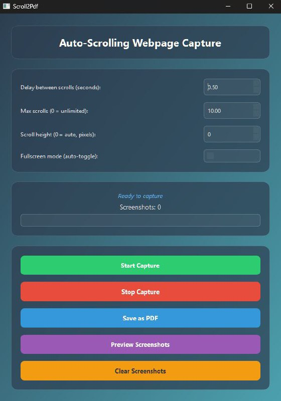
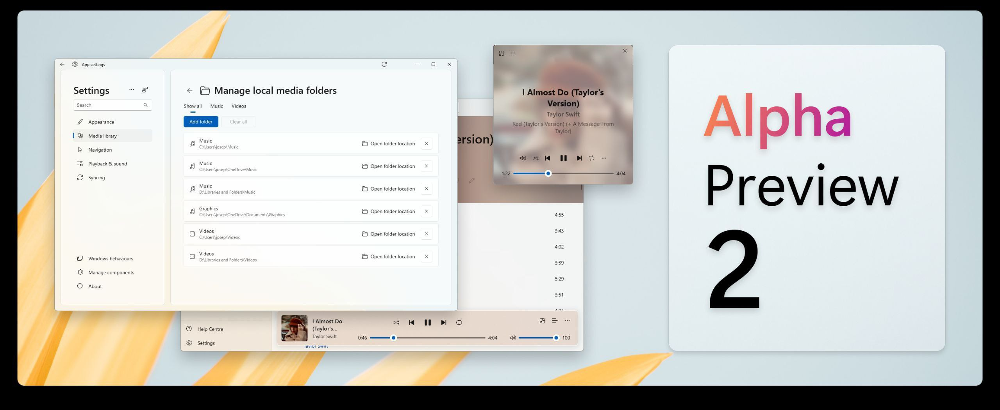
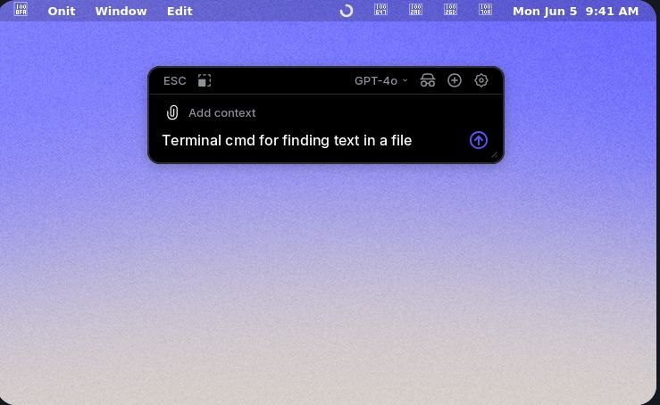
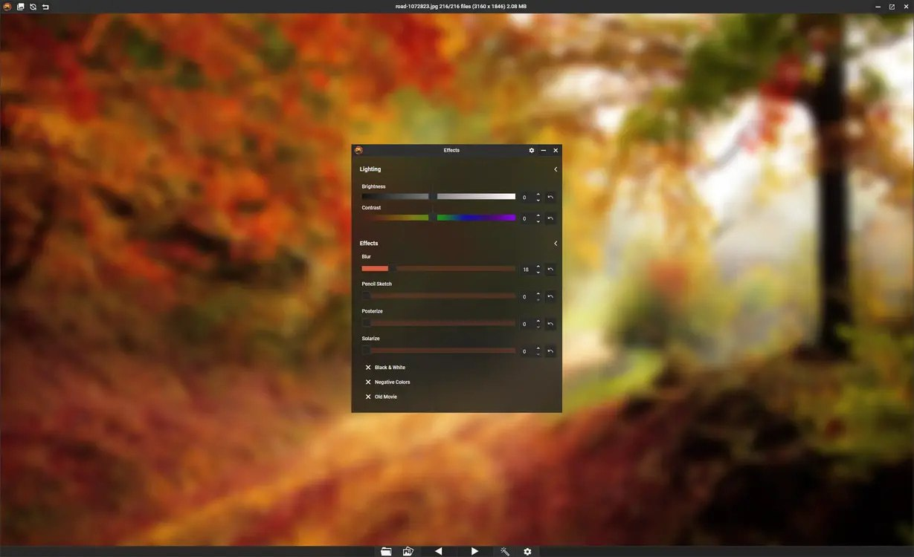
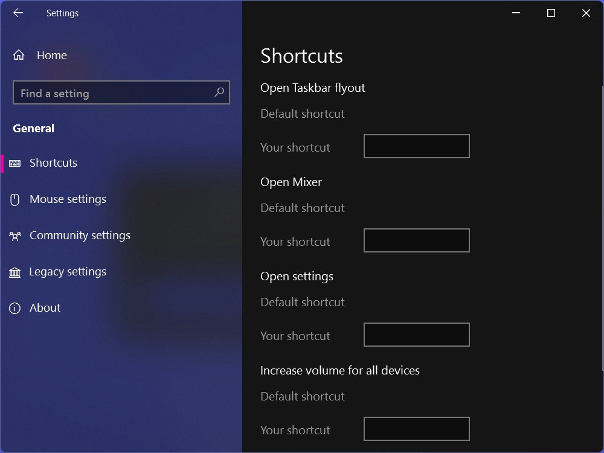
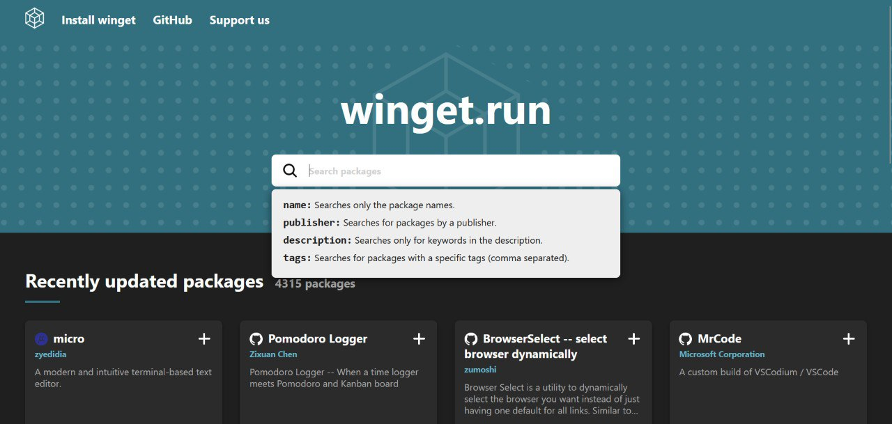
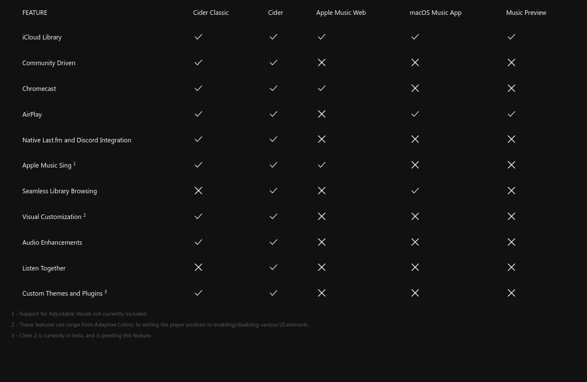

# 💻 Windows Applications & Tweaks

### Open-source tools, desktop software, and customizers for Windows.

[⬅️ **Back to Main Catalog**](../../README.md) • [📚 **All Apps Index**](../all-apps.md)

> **Total Apps in Category:** `826`

---

### 📦 Komi Store

> **Categories:** `#Android` `#Windows` `#Mac` `#Linux` `#Store` `#FOSS`

Komi Store is a free, open-source, cross-platform app store focused on discovering and installing software published through GitHub, Codeberg, and Forgejo releases. It brings release discovery, app information, downloads, installation, and update tracking into one clean interface.

- 🐙 **Source Code:** [https://github.com/kurikomi-labs/komi-store](https://github.com/kurikomi-labs/komi-store)
- 👤 **Developer:** [KuriKomi](https://github.com/kurikomi-labs/)

<details>
<summary><b>✨ Key Features (24)</b> — <i>Click to expand</i></summary>

- Open-source app discovery
- Curated app categories
- GitHub, Codeberg & Forgejo support
- Multi-platform app support
- One-click app installation
- Automatic release & update tracking
- App library & favourites
- Recently viewed apps
- Download mirrors
- SHA-256 download verification
- APK metadata inspection
- APK signing information
- Permissions & components inspection
- App compatibility information
- GitHub repository browsing
- Release, issues & pull request information
- Privacy-focused & ad-free
- No account required for basic usage
- Custom themes & accent colors
- Manga & Classic UI personalities
- Light, Dark & System modes
- AMOLED true-black mode
- Multi-language support
- Customizable connection settings

</details>


---

### 📦 Croc

> **Categories:** `#Windows` `#Mac` `#linux` `#readme` `#golang` `#tcp` `#transfer` `#peer_to_peer` `#file_sharing` `#data_transfer` `#pake` `#GitHub` `#OpenSource` `#go` `#Interesting` `#Useful`

croc is a simple, secure, and fast command-line file transfer tool that allows users to send files and folders between devices over the internet. It uses end-to-end encryption, works across platforms and networks without port forwarding, supports resumable transfers, and can use relay servers when direct connections aren't possible. It also supports text transfers, browser-based receiving, custom transfer codes, proxies, and self-hosted relays.

- 🐙 **Source Code:** [https://github.com/schollz/croc](https://github.com/schollz/croc)
- 🌐 **Official Website:** [https://github.com/schollz/croc#readme](https://github.com/schollz/croc#readme)
- 👤 **Developer:** [Zack Schollz](https://github.com/schollz)

<details>
<summary><b>✨ Key Features (32)</b> — <i>Click to expand</i></summary>

- **End-to-End Encryption** — Secure file transfers
- **Cross-Platform** — Windows, Linux, macOS, and Android
- **File & Folder Transfer** — Transfer files, multiple files, or directories
- **Resume Transfers** — Continue interrupted transfers
- **No Port Forwarding** — Works without router configuration
- **Relay-Based Transfers** — Works across different networks
- IPv6 & IPv4 Support
- **Proxy Support** — Supports SOCKS5 proxies
- **Browser Support** — Transfer files through a web browser
- **Encrypted Temporary Storage** — Store files securely for later download
- **Custom Code Phrases** — Easy device-to-device pairing
- **QR Code Support** — Quickly share transfer codes
- Clipboard Integration
- Multiple File Transfer
- **stdin/stdout Support** — Pipe data directly through croc
- **Text Transfer** — Send text and URLs
- File & Folder Exclusion
- Automatic File Renaming
- Transfer Integrity Verification
- Configurable Encryption Options
- **Quiet Mode** — Suitable for scripts and automation
- **Self-Hosted Relay** — Run your own relay server
- Docker Support
- Lightweight CLI
- **Open Source** — MIT License
- *Send a File**
- ***Receive a File** — **
- ***Send Multiple Files** — **
- ***Send a Folder** — **
- ***Send Text** — **
- ***Custom Code** — **
- ***Receiver** — **

</details>


---

### 📦 Audiomonitorrouter

> **Categories:** `#GitHub` `#OpenSource`

As soon as you move the browser window, video player or game to another screen, AudioMonitorRouter instantly redirects the sound of this program to the speakers of the exact monitor where its window is located! Windows 10.11 platform

🐱** **[**GitHub**](https://t.me/github)

- 🐙 **Source Code:** [https://github.com/kitbee/AudioMonitorRouter](https://github.com/kitbee/AudioMonitorRouter)
- 👤 **Developer:** [kitbee](https://github.com/kitbee)


---

### 📦 MSNightmare/ShieldBreak

> **Categories:** `#GitHub` `#OpenSource`

Windows Defender 0day vulnerability
**Language**: C++
**Stars**: 543 **Issues**: 7 **Forks**: 170
[https://github.com/MSNightmare/ShieldBreak](https://github.com/MSNightmare/ShieldBreak)

- 🐙 **Source Code:** [https://github.com/MSNightmare/ShieldBreak](https://github.com/MSNightmare/ShieldBreak)
- 👤 **Developer:** [MSNightmare](https://github.com/MSNightmare)


---

### 📦 Holaos

> **Categories:** `#GitHub` `#OpenSource` `#typescript` `#agent` `#agent_harness` `#agent_os` `#agentic` `#ai` `#ai_agent` `#ai_agents` `#artificial_intelligence` `#claude_code` `#codex` `#electron` `#holaboss` `#holaos` `#llm` `#mcp` `#memory` `#model_context_protocol` `#runtime` `#workspace`

🔗 [https://github.com/holaboss-ai/holaOS](https://github.com/holaboss-ai/holaOS)
📝 Open-source All in One AI agent workspace. Run any agent — Claude Code, Codex — across your tools (100+ integrations + MCP), apps, browser, and files, with shared memory. Built-in models or BYOK.
──────────────────────────────

**Meet holaOS**, the ultimate workspace for you and your agent. It allows you to run __any__ agent, including Claude Code, Codex, or the built-in holaOS agent, in one local-first workspace. This means you can work with multiple agents, sharing the same memory, tools, and skills, without having to switch between them.

__Key features__ include:
- Running any agent in one workspace
- Shared memory across agents and sessions
- Support for frontier models, including Kimi K3, GLM 5.2, GPT 5.6, Claude Opus 5, and Fable 5
- Ability to bring your own model keys
- HolaApps, which allow you to install apps from the in-workspace marketplace and use them side-by-side with your agent
- Skills, integrations, and Model Context Protocol (MCP) support

__Usage__ is straightforward: simply download and install the desktop app, and you're ready to go. The app is __open-source__ and __free to start__, with optional enterprise features available.

From a __technical__ standpoint, holaOS is built using TypeScript and Electron, and supports macOS, Windows, and Linux platforms.

The __target audience__ for holaOS includes anyone looking for a flexible and powerful workspace for their agent, including developers, researchers, and business users.

__In summary__, holaOS is a game-changer for anyone working with agents, offering a flexible, powerful, and easy-to-use workspace that can be customized to meet your needs.
Get started with holaOS today and experience the power of a unified workspace for you and your agent!

──────────────────────────────
🧠 **Channel: ****https://t.me/GithubRe**

- 🐙 **Source Code:** [https://github.com/holaboss-ai/holaOS](https://github.com/holaboss-ai/holaOS)
- 👤 **Developer:** [holaboss-ai](https://github.com/holaboss-ai)


---

### 📦 genspark-ai/genoffice

> **Categories:** `#ai` `#docx` `#electron` `#office_suite` `#pdf` `#pptx` `#xlsx`

An AI-native office suite for macOS and Windows: word processor, spreadsheet, presentations, and PDF.
**Language**: TypeScript

- 🐙 **Source Code:** [https://github.com/genspark-ai/genoffice](https://github.com/genspark-ai/genoffice)
- 👤 **Developer:** [genspark-ai](https://github.com/genspark-ai)


---

### 📦 Reverse Skill

> **Categories:** `#GitHub` `#OpenSource` `#powershell`

🔗 [https://github.com/zhaoxuya520/reverse-skill](https://github.com/zhaoxuya520/reverse-skill)
📝 Reverse Engineering / Authorized Penetration Testing / Security Research Skill Router Pack AI-powered routing + On-demand toolchain bootstrapping + Self-evolving knowledge base Supports Claude Code, Kiro, Cursor, Cline, and other AI coding clients 逆向/渗透/安全技能路由包 - AI 自动路由 + 按需自举工具链 + 自动进化经验库 | 支持 Claude Code / Kiro / Cursor / Cline 等代码 AI 客户端
──────────────────────────────

**reverse-skill** is a cybersecurity skills router designed to navigate complex security tasks with ease. The package routes AI agents or users to the right methodology, checks available tools, and executes a repeatable workflow for various scenarios, including APK analysis, binary reverse engineering, and penetration testing.

__Key features__ include a PRIMARY fast ladder, a task → skill routing matrix, and a repository layout that organizes various skills and tools. The project supports multiple platforms, including Windows, Linux, and macOS, and provides platform-specific documentation.

`Usage` involves cloning the repository, refreshing the tool index, and using the provided scripts to initiate cases and execute tasks. The repository includes a range of skills, such as APK reverse, mobile reverse, and binary reverse, as well as tools like IDA Pro, radare2, and Ghidra.

**Technical highlights** include the use of Python, Node.js, and PowerShell, as well as the integration of various tools and frameworks. The project is primarily licensed under the MIT License, with some submodules and third-party dependencies subject to other licenses.

__Audience__ includes security researchers, penetration testers, and AI agents, such as Claude Code, Codex CLI, and Cursor. The project is designed to streamline complex security tasks and provide a repeatable workflow for various scenarios.

In short, **reverse-skill** is a powerful tool for navigating complex security tasks, and its modular design and flexible workflow make it an essential resource for security professionals and AI agents alike: `Streamline your security workflow with reverse-skill`.

──────────────────────────────
🧠 **Channel: ****https://t.me/GithubRe**

- 🐙 **Source Code:** [https://github.com/zhaoxuya520/reverse-skill](https://github.com/zhaoxuya520/reverse-skill)
- 👤 **Developer:** [zhaoxuya520](https://github.com/zhaoxuya520)


---

### 📦 Snipe It

> **Categories:** `#GitHub` `#OpenSource` `#php` `#asset_management` `#asset_manager` `#assets_management` `#itam` `#license_management`

🔗 [https://github.com/grokability/snipe-it](https://github.com/grokability/snipe-it)
📝 A free open source IT asset/license management system
──────────────────────────────

The **Snipe-IT** repository on GitHub is a __FOSS project__ designed for asset management in IT operations. It helps track and manage company assets, such as laptops, software licenses, and other equipment. `Snipe-IT` is built on `Laravel 12` and is actively developed with frequent releases.

The software is __web-based__, so it can be accessed through a web browser and runs on various operating systems, including Mac OSX, Linux, and Windows. A `Docker image` is also available for easy deployment.

To get started, users can follow the `installation manual` and check the `requirements documentation` for full requirements. The repository also includes a `user's manual` for help with using the software.

- 🐙 **Source Code:** [https://github.com/grokability/snipe-it](https://github.com/grokability/snipe-it)
- 👤 **Developer:** [grokability](https://github.com/grokability)


---

### 📦 Gpupixel

> **Categories:** `#GitHub` `#OpenSource`

Built in C++11 and OpenGL/ES, the app provides beauty filters and supports iOS, Android, Mac, Windows, and Linux—it's compatible with any OpenGL/ES platform.

🐱** **[**GitHub**](https://t.me/github)

- 🐙 **Source Code:** [https://github.com/pixpark/gpupixel](https://github.com/pixpark/gpupixel)
- 👤 **Developer:** [pixpark](https://github.com/pixpark)


---

### 📦 Omniget

> **Categories:** `#Windows` `#Linux` `#Mac` `#DownloadManager` `#MediaDownloader` `#Study` `#GitHub` `#OpenSource`

OmniGet is an open-source, all-in-one desktop application for downloading, organizing, and studying online content. It combines a powerful media downloader with a built-in course player, PDF/EPUB reader, music library, and productivity tools—allowing you to learn, watch, read, and manage everything from a single, privacy-focused interface.

- 🐙 **Source Code:** [https://github.com/tonhowtf/omniget](https://github.com/tonhowtf/omniget)
- 👤 **Developer:** [tonhowtf](https://github.com/tonhowtf)

<details>
<summary><b>✨ Key Features (12)</b> — <i>Click to expand</i></summary>

- **Universal Downloader** — Download videos, audio, courses, books, and files from 1,000+ supported websites.
- **Course Downloader & Player** — Download and watch Udemy, Hotmart, Kiwify, Teachable, Kajabi, Thinkific, Skool, Wondrium, and more with resume support.
- **Timestamped Notes** — Create notes linked to exact video timestamps for faster revision.
- **Built-in PDF & EPUB Reader** — Read books with highlights, bookmarks, focus mode, and annotations.
- **Music Library** — Organize and play local music with synced lyrics, equalizer, playlists, and streaming service integration.
- **Torrent Support** — Download .torrent files and magnet links with native support.
- **FFmpeg Converter** — Convert audio and video files directly within the app.
- **Telegram Media Browser** — Browse chats and save photos, videos, and files from Telegram.
- **Pomodoro Focus Timer** — Stay productive with an integrated focus timer and study tools.
- **Knowledge Management** — Daily journal, bidirectional notes, knowledge graph, flashcards, and study progress tracking.
- **Browser Extension & Global Hotkey** — Send links to OmniGet instantly from Chrome, Firefox, or your clipboard.
- **Cross-Platform & Privacy-First** — Available on Windows, macOS, and Linux, with all downloads and data stored locally.

</details>


---

### 📦 Amnezia Client

> **Categories:** `#GitHub` `#OpenSource` `#cplusplus` `#cloak` `#gfw` `#ikev2` `#openvpn` `#shadowsocks` `#vpn` `#vpn_client` `#vpn_server` `#wireguard`

🔗 [https://github.com/amnezia-vpn/amnezia-client](https://github.com/amnezia-vpn/amnezia-client)
📝 Amnezia VPN Client (Desktop+Mobile)
──────────────────────────────

**Amnezia VPN Client** is an open-source VPN solution that allows you to deploy your own VPN server. Its key features include ease of use, support for classic VPN protocols like OpenVPN, WireGuard, and IKEv2, as well as protocols with traffic masking. The client supports split tunneling and is available on Windows, MacOS, Linux, Android, and iOS.

__Technical highlights__ of the project include the use of `Qt`, `OpenSSL`, `OpenVPN`, and `WireGuard`. The project is licensed under the GNU General Public License v3.0 and is supported by donations.

The **Amnezia VPN Client** is suitable for anyone looking for a self-hosted VPN solution, including individuals and organizations. To get started, simply download the client, enter your server details, and connect to your VPN.

With its strong focus on security, ease of use, and flexibility, the **Amnezia VPN Client** is a great option for anyone looking to protect their online identity: __Take control of your online security with Amnezia VPN Client__.

──────────────────────────────
🧠 **Channel: ****https://t.me/GithubRe**

- 🐙 **Source Code:** [https://github.com/amnezia-vpn/amnezia-client](https://github.com/amnezia-vpn/amnezia-client)
- 👤 **Developer:** [amnezia-vpn](https://github.com/amnezia-vpn)


---

### 📦 Pause Windows Updates

> **Categories:** `#GitHub` `#OpenSource`

🐱** **[**GitHub**](https://t.me/github)

- 🐙 **Source Code:** [https://github.com/Aetherinox/pause-windows-updates](https://github.com/Aetherinox/pause-windows-updates)
- 👤 **Developer:** [Aetherinox](https://github.com/Aetherinox)


---

### 📦 Moonshine

> **Categories:** `#GitHub` `#OpenSource` `#c_lang`

🔗 [https://github.com/moonshine-ai/moonshine](https://github.com/moonshine-ai/moonshine)
📝 Very low latency speech to text, intent recognition, and text to speech, for building voice agents and interfaces
──────────────────────────────

__Moonshine__ is an open-source AI toolkit that enables developers to build real-time voice agents and applications. Its key features include on-device processing for fast, private, and account-free usage, low-latency responses, and high accuracy speech-to-text models. The framework supports multiple languages, platforms, and devices, including `Python`, `iOS`, `Android`, `MacOS`, `Linux`, `Windows`, `Raspberry Pi`, and `microcontrollers`. **Usage** is straightforward, with example apps and a `Python` library that can be installed via `pip`. The toolkit is suitable for developers building voice applications, and its high-level APIs offer complete solutions for common tasks. One notable takeaway: __Moonshine__ offers a significant speed boost over Whisper, with some models running **5x faster** or more.

──────────────────────────────
🧠 **Channel: ****https://t.me/GithubRe**

- 🐙 **Source Code:** [https://github.com/moonshine-ai/moonshine](https://github.com/moonshine-ai/moonshine)
- 👤 **Developer:** [moonshine-ai](https://github.com/moonshine-ai)


---

### 📦 Jellium Desktop

> **Categories:** `#GitHub` `#OpenSource` `#rust`

🔗 [https://github.com/andrewrabert/jellium-desktop](https://github.com/andrewrabert/jellium-desktop)
📝 An unofficial desktop client for Jellyfin
──────────────────────────────

**Jellium Desktop** is an unofficial __desktop client__ for __Jellyfin__, built on top of __CEF__ and __mpv__. It provides an easy-to-use interface for managing and streaming media content. The app is available for download on __Linux__, __macOS__, and __Windows__ platforms, with various installation options such as __AppImage__, __Flatpak__, and __Arch Linux (AUR)__.

To get started, users can download the app from the provided links and follow the installation instructions. On __macOS__, users need to remove the quarantine flag using the command `sudo xattr -cr /Applications/Jellium\ Desktop.app`.

From a development perspective, the project utilizes __just__ as a command runner, providing various recipes for building, testing, and maintaining the app. Some of the available recipes include:
```just build
just run
just test
just fmt```

The app is designed for __Jellyfin__ users looking for a seamless desktop experience.
Jellium Desktop: stream your media, simplified.

──────────────────────────────
🧠 **Channel: ****https://t.me/GithubRe**

- 🐙 **Source Code:** [https://github.com/andrewrabert/jellium-desktop](https://github.com/andrewrabert/jellium-desktop)
- 👤 **Developer:** [andrewrabert](https://github.com/andrewrabert)


---

### 📦 meron

> **Categories:** `#android` `#windows` `#ios` `#linux` `#msStore` `#iosAppStore` `#SnapStore`

Meron is a modern, open-source mail and RSS client that combines IMAP/SMTP email and RSS/Atom feeds in one elegant interface, featuring threaded conversations, OAuth sign-in, encrypted local storage, and a high-performance Rust-powered core.

- 🐙 **Source Code:** [https://github.com/nonbili/meron](https://github.com/nonbili/meron)
- 👤 **Developer:** [nonbili](https://github.com/nonbili)

<details>
<summary><b>✨ Key Features (7)</b> — <i>Click to expand</i></summary>

- **Email** over IMAP/SMTP, with threaded conversations and a rich-text composer
- **RSS / Atom feeds** alongside your mail
- **OAuth** sign-in (e.g. Gmail) plus password auth with mailbox autodiscovery
- **Encrypted local storage** (SQLite via SQLCipher), with credentials kept in
- ****Native notifications**, system tray, and mailto** — handling on desktop
- **Push notifications** on mobile via IMAP IDLE
- **Localized** into 20+ languages (see [locales/](locales/))

</details>


---

### 📦 🐧 20 Top Linux-related GitHub Projects

> **Categories:** `#GitHub` `#OpenSource` `#readme` `#c_lang`

**1. **[**Linux**](https://github.com/torvalds/linux)
The official Linux kernel source code maintained by Linus Torvalds. The foundation of most Linux operating systems.

**2. **[**Oh My Zsh**](https://github.com/ohmyzsh/ohmyzsh)
A community-driven framework that makes the Zsh shell more powerful with themes and thousands of plugins.

**3. **[**The Art of Command Line**](https://github.com/jlevy/the-art-of-command-line)
A practical guide packed with useful command-line tips and best practices for Linux users.

**4. **[**yt-dlp**](https://github.com/yt-dlp/yt-dlp)
A feature-rich command-line tool for downloading videos and audio from YouTube and hundreds of other websites.

**5. **[**Neovim**](https://github.com/neovim/neovim)
A modern, extensible fork of Vim with improved performance, built-in LSP support, and a rich plugin ecosystem.

**6.**[** fzf**](https://github.com/junegunn/fzf)
A blazing fast fuzzy finder that lets you instantly search files, command history, Git branches, and more.

**7. **[**ripgrep**](https://github.com/BurntSushi/ripgrep)
An extremely fast recursive search tool that outperforms traditional grep for searching code and text.

**8. **[**tldr-pages**](https://github.com/tldr-pages/tldr)
Community-maintained cheat sheets that provide simple, practical examples for thousands of terminal commands.

**9. **[**bat**](https://github.com/sharkdp/bat)
A modern replacement for `cat` with syntax highlighting, Git integration, and line numbers.

**10. **[**tmux**](https://github.com/tmux/tmux)
A terminal multiplexer that lets you run and manage multiple terminal sessions from a single window.

**11. **[**Helix**](https://github.com/helix-editor/helix)
A modern modal text editor built with speed, multiple selections, and native Language Server Protocol support.

**12. **[**fd**](https://github.com/sharkdp/fd)
A simple, user-friendly, and much faster alternative to the traditional `find` command.

**13. **[**curl**](https://github.com/curl/curl)
A powerful command-line tool and library for transferring data over HTTP, HTTPS, FTP, and many other protocols.

**14. **[**Vim**](https://github.com/vim/vim)
The classic and highly customizable text editor used by developers and system administrators for decades.

**15. **[**Pure Bash Bible**](https://github.com/dylanaraps/pure-bash-bible)
A collection of Bash techniques that replace common external commands using pure Bash.

**16. **[**Linux Insides**](https://github.com/0xAX/linux-insides)
A free online book explaining how the Linux kernel works from the inside.

**17. **[**fish Shell**](https://github.com/fish-shell/fish-shell)
A smart, user-friendly command-line shell with autosuggestions, syntax highlighting, and sensible defaults.

**18. **[**btop**](https://github.com/aristocratos/btop)
A beautiful terminal-based system monitor for CPU, memory, disks, processes, and network usage.

**19. **[**Proton**](https://github.com/ValveSoftware/Proton)
Valve's compatibility layer that lets Windows games run on Linux through Steam.

**20. **[**OpenSSL**](https://github.com/openssl/openssl)
The industry-standard toolkit for SSL/TLS encryption, cryptography, and secure network communication.


💡 **Save this list if you're learning Linux or want to level up your command-line workflow.**

- 🐙 **Source Code:** [https://github.com/torvalds/linux](https://github.com/torvalds/linux)
- 👤 **Developer:** [torvalds](https://github.com/torvalds)


---

### 📦 Bonsai Demo

> **Categories:** `#GitHub` `#OpenSource` `#shell` `#bonsai` `#llamacpp` `#llm` `#mlx` `#prism_ml` `#small_models`

🔗 [https://github.com/PrismML-Eng/Bonsai-demo](https://github.com/PrismML-Eng/Bonsai-demo)
📝 Bonsai Demo
──────────────────────────────

The **Bonsai-demo** repository provides a local demo for running __Bonsai__ and __Ternary-Bonsai__ language models on various platforms, including Mac, Linux, Windows, and CPU. The repository features **vision-language models** that accept images and text, as well as **agentic tool calling** and **reasoning models**.

To get started, users can run the `./setup.sh` command to download the required models and binaries, and then use the `./scripts/start_llama_server.sh` command to start the demo server. The repository supports different model sizes, including **27B**, **8B**, **4B**, and **1.7B**, and allows users to switch between the __Ternary__ and __1-bit__ families.

The demo is suitable for developers and researchers interested in natural language processing and computer vision. With its **tiny footprint** and support for **long context conversations**, the Bonsai-demo is an exciting project that showcases the potential of efficient language models.

One-liner takeaway: Experience the power of efficient language models with the **Bonsai-demo**, where you can run __vision-language models__ locally and explore the possibilities of __agentic tool calling__ and __reasoning models__.

──────────────────────────────
🧠 **Channel: ****https://t.me/GithubRe**

- 🐙 **Source Code:** [https://github.com/PrismML-Eng/Bonsai-demo](https://github.com/PrismML-Eng/Bonsai-demo)
- 👤 **Developer:** [PrismML-Eng](https://github.com/PrismML-Eng)


---

### 📦 Airi

> **Categories:** `#GitHub` `#OpenSource` `#vue` `#ai_companion` `#ai_vtuber` `#digital_life` `#grok_companion` `#live2d` `#moeru_ai` `#neuro_sama` `#neurosama` `#vrm` `#vtuber`

🔗 [https://github.com/moeru-ai/airi](https://github.com/moeru-ai/airi)
📝 💖🧸 Self hosted, you-owned Grok Companion, a container of souls of waifu, cyber livings to bring them into our worlds, wishing to achieve Neuro-sama's altitude. Capable of realtime voice chat, Minecraft, Factorio playing. Web / macOS / Windows supported.
──────────────────────────────

**Project AIRI** is an open-source project inspired by Neuro-sama, aiming to create a digital companion that can interact with users in various ways, including playing games, chatting, and more. The project's key features include its ability to play games, engage in conversations, and interact with users in real-time.

__Usage__ is straightforward, with options to download and install the software on various platforms, including Windows, macOS, and Linux. The project also has a dedicated `Discord` server and other social media channels for community engagement.

- 🐙 **Source Code:** [https://github.com/moeru-ai/airi](https://github.com/moeru-ai/airi)
- 👤 **Developer:** [moeru-ai](https://github.com/moeru-ai)


---

### 📦 Real Video Enhancer

> **Categories:** `#GitHub` `#OpenSource`

This program provides easy access to frame interpolation and scaling functions on Windows, Linux and MacOS and is an alternative to legacy software such as Flowframes or enhancr.

🐱** **[**GitHub**](https://t.me/github)

- 🐙 **Source Code:** [https://github.com/TNTwise/REAL-Video-Enhancer](https://github.com/TNTwise/REAL-Video-Enhancer)
- 👤 **Developer:** [TNTwise](https://github.com/TNTwise)


---

### 📦 Fprime

> **Categories:** `#GitHub` `#OpenSource`

🔗 [https://github.com/nasa/fprime](https://github.com/nasa/fprime)
📝 F´ - A flight software and embedded systems framework
──────────────────────────────

**NASA's F Prime** is a __flight-proven, open-source framework__ for developing spaceflight and embedded software applications. It provides a `component-driven architecture` with well-defined interfaces, a `C++ framework` for core capabilities, and `modeling tools` for specifying components and connections.

To get started, you'll need `Linux, Windows with WSL, or macOS`, `git`, `Python 3.10+`, and a `C++ compiler`. Then, install the `fprime-bootstrap` tool and create a new project.

The framework is suitable for small-scale spaceflight systems like __CubeSats and SmallSats__. For help, you can use `GitHub Discussions` or report issues on the `GitHub repository`.

F Prime's key features include a __growing collection of ready-to-use components__ and __testing tools__ for unit and integration testing.

One-liner takeaway: __F Prime is your launchpad for rapid development of spaceflight and embedded software applications__.

──────────────────────────────
🧠 **Channel: ****https://t.me/GithubRe**

- 🐙 **Source Code:** [https://github.com/nasa/fprime](https://github.com/nasa/fprime)
- 👤 **Developer:** [nasa](https://github.com/nasa)


---

### 📦 Crossmacro

> **Categories:** `#GitHub` `#OpenSource`

This application combines Avalonia's polished GUI, scripting-enabled CLI, text substitution, keyboard shortcuts, and a non-GUI desktop environment.

Wayland and X11 support for Linux, with daemon and direct device input modes, and allowing for compositing when positioning the cursor
Windows support via Microsoft Store, winget, MSIX and portable binaries
macOS support via Apple Silicon and Intel DMG packages

🐱** **[**GitHub**](https://t.me/github)

- 🐙 **Source Code:** [https://github.com/alper-han/CrossMacro](https://github.com/alper-han/CrossMacro)
- 👤 **Developer:** [alper-han](https://github.com/alper-han)


---

### 📦 ai4s-research/open-science

> **Categories:** `#ai_agent` `#ai_for_science` `#ai_scientist` `#ai4s` `#claude_science` `#claude_science_alternative` `#claude_science_desktop_alternative` `#desktop_app` `#linux` `#local_first` `#macos` `#mcp` `#open_science` `#open_science_desktop` `#reproducible_research` `#research_tools` `#research_workbench` `#scientific_research` `#tauri` `#windows`

Open Science Desktop — local-first, model-agnostic AI research workbench for macOS, Windows & Linux. Open-source Claude Science desktop alternative built on Tauri + MCP + agent skills.
**Language**: TypeScript

- 🐙 **Source Code:** [https://github.com/ai4s-research/open-science](https://github.com/ai4s-research/open-science)
- 👤 **Developer:** [ai4s-research](https://github.com/ai4s-research)


---

### 📦 Ipban

> **Categories:** `#GitHub` `#OpenSource`

IPBan supports Windows and Linux and provides protection for your dedicated or cloud server.

Upgrade to IPBan Pro today and get a discount.

🐱** **[**GitHub**](https://t.me/github)

- 🐙 **Source Code:** [https://github.com/DigitalRuby/IPBan](https://github.com/DigitalRuby/IPBan)
- 👤 **Developer:** [DigitalRuby](https://github.com/DigitalRuby)


---

### 📦 Axis

> **Categories:** `#Linux` `#Windows` `#Tools`

Axis is an open-source desktop application built with HTML, CSS, JavaScript, and Tauri that lets you compare, rank, and organize virtually anything. Games, movies, anime, phones, PC hardware, books, cars — if it can be rated, it can be ranked.

- 🐙 **Source Code:** [https://github.com/PR0Gorib/Axis](https://github.com/PR0Gorib/Axis)
- 👤 **Developer:** [Ramim Hasan](https://github.com/PR0Gorib)

<details>
<summary><b>✨ Key Features (16)</b> — <i>Click to expand</i></summary>

- Custom ranking categories
- Side-by-side comparison mode
- Radar & bar chart visualizations
- Dynamic rankings, podiums & score tiers
- Advanced image manager (up to 5 images per item)
- Automatic backups & restore manager
- Bulk stat editing tools
- Keyboard shortcuts
- Centralized settings panel
- Search, tags & advanced filtering
- Category templates
- Beautiful Share as Image exports
- Favorites / pinned items
- Dark & Light themes
- Native desktop app via Tauri
- Fully offline & privacy-friendly

</details>


---

### 📦 HoldSpace

> **Categories:** `#Windows` `#Utilities`

HoldSpace is a lightweight, zero-distraction shortcut launcher for Windows that stays completely invisible until you hold your activation key. Instantly launch apps, folders, or web links from a floating canvas, and let go to return to your work.

- 🐙 **Source Code:** [https://github.com/anuroopkdas/HoldSpace](https://github.com/anuroopkdas/HoldSpace)
- 👤 **Developer:** [anuroopkdas](https://github.com/anuroopkdas)

<details>
<summary><b>✨ Key Features (5)</b> — <i>Click to expand</i></summary>

- **Hold-to-Reveal Interface** — Stays hidden to prevent visual clutter. Simply press and hold your designated trigger key to reveal your canvas, and release to launch.
- **Custom Triggers** — Bind any key on your keyboard to instantly summon the launcher.
- **Fast and Lightweight** — Runs quietly in the system tray with negligible memory and CPU usage.
- **Universal Shortcuts** — Add folder paths, local applications, or website links to your canvas.
- **Easy Backup** — Export your layout configuration to a single file and restore it on any device in one click.

</details>


---

### 📦 GitSwitch

> **Categories:** `#Git` `#Client` `#Linux` `#Windows` `#MacOS`

GitSwitch is a fast, lightweight desktop application built with Tauri and React that allows developers to seamlessly manage and switch between multiple Git profiles and SSH keys.

- 🐙 **Source Code:** [https://github.com/iput-object/GitSwitch](https://github.com/iput-object/GitSwitch)
- 👤 **Developer:** [OBITO XD](https://github.com/iput-object)

<details>
<summary><b>✨ Key Features (5)</b> — <i>Click to expand</i></summary>

- ****One-Click Profile Switching** — ** Instantly swap between identities across GitHub, GitLab, Bitbucket, and custom providers.
- ****Automated SSH Setup** — ** Auto-generates keys and manages your `~/.ssh/config` without conflicts.
- ****Automatic Commit Signing** — ** Flawlessly wires up SSH commit signing so your work is always verified.
- ****Config Repair & Health Checks** — ** Automatically detects and repairs drift in your live Git or SSH configuration.
- ****System Tray Integration** — ** Lives in your background for fast access on macOS, Windows, and Linux.

</details>


---

### 📦 Terax Ai

> **Categories:** `#GitHub` `#OpenSource` `#typescript` `#agents` `#ai` `#code_editor` `#linux` `#macos` `#reactjs` `#rust` `#tauri` `#terminal` `#windows` `#xterm_js`

🔗 [https://github.com/crynta/terax-ai](https://github.com/crynta/terax-ai)
📝 Lightweight (7MB) Terminal-first AI-native dev workspace
──────────────────────────────

**Terax** is a __lightweight terminal-first AI-native dev workspace__ built with Tauri 2, Rust, and React 19. It features a native PTY backend, WebGL renderer, and an agentic AI side-panel that runs against your own keys or fully local models. The workspace includes a code editor, file explorer, source control with a git graph, and a web preview pane.

Key features include:
- `xterm.js` with WebGL renderer and multi-tab support
- GPU-accelerated block-based terminal with editor-like command input
- Inline AI autocomplete with local model support
- AI edit diffs and accept or reject hunk by hunk
- Custom themes and customization options

To get started, you can install Terax from the [Releases](https://github.com/crynta/terax-ai/releases/latest) page. Configure your AI settings by opening **Settings -> AI**, picking a provider, and pasting your API key.

Terax is perfect for developers who want a __fast, lightweight, and feature-rich development environment__.
The takeaway: __Terax is the ultimate terminal-first dev workspace that combines the power of AI with a lightning-fast interface__.

──────────────────────────────
🧠 **Channel: ****https://t.me/GithubRe**

- 🐙 **Source Code:** [https://github.com/crynta/terax-ai](https://github.com/crynta/terax-ai)
- 👤 **Developer:** [crynta](https://github.com/crynta)


---

### 📦 Meetily

> **Categories:** `#1`

🔗 [https://github.com/Zackriya-Solutions/meetily](https://github.com/Zackriya-Solutions/meetily)
📝 Privacy first, AI meeting assistant with 4x faster Parakeet/Whisper live transcription, speaker diarization, and Ollama summarization built on Rust. 100% local processing. no cloud required. Meetily (Meetly Ai -https://meetily.ai) is the #1 Self-hosted, Open-source Ai meeting note taker for macOS & Windows.
──────────────────────────────

Meetily is a **privacy-first AI meeting assistant** that runs entirely on your local machine, capturing and transcribing meetings in real-time without sending any data to the cloud. Its key features include __local transcription__, __real-time transcription__, and __AI-powered summaries__. Meetily supports multiple platforms, including macOS, Windows, and Linux, and is `open-source` and free to use.

To get started, you can `download and install` Meetily from the releases page, or `build from source` using the provided guides. Meetily also offers a **PRO version** with enhanced accuracy and advanced features for serious users and teams.

The system architecture is built with `Tauri` and uses a `Rust-based backend` and a `Next.js frontend`. Meetily is perfect for professionals and enterprises that need to maintain complete control over their sensitive information.

In short, Meetily gives you __complete data sovereignty__ and __advanced meeting intelligence__ without compromising on privacy, compliance, or control - and that's a meeting assistant that truly meets your needs.

──────────────────────────────
🧠 **Channel: ****https://t.me/GithubRe**

- 🐙 **Source Code:** [https://github.com/Zackriya-Solutions/meetily](https://github.com/Zackriya-Solutions/meetily)
- 👤 **Developer:** [Zackriya-Solutions](https://github.com/Zackriya-Solutions)


---

### 📦 Puzzle

> **Categories:** `#android` `#mac` `#windows` `#linux` `#web` `#puzzle` `#games`

The ultimate collection of puzzle challenge games available for Android , Linux, macOS, Web, and Windows. A professional suite of minimalist free brain games built with Flutter. Master over 273 unique puzzles in this essential logic puzzle library, featuring the best offline games including Minesweeper, 2048, Sudoku, and more.

- 🐙 **Source Code:** [https://github.com/sidhant947/Puzzle](https://github.com/sidhant947/Puzzle)
- 👤 **Developer:** [sidhant947](https://github.com/sidhant947)

<details>
<summary><b>✨ Key Features (12)</b> — <i>Click to expand</i></summary>

- ****Logic Puzzles** — ** Challenge your reasoning with Akari, Einstein Riddle, and classic Sudoku.
- ****Math Games** — ** Improve your mental arithmetic with 2048, KenKen, and the trending **Snake Game** variant (Sum Snake).
- ****Memory Games** — ** Sharpen your recall with N-Back, Memory Palace, and Chimp Test.
- ****Word Puzzles** — ** Expand your vocabulary with **typing games**, Crosswords, and Word Search.
- ****Minesweeper** — ** Ready to **play Minesweeper**? Enjoy it fully offline with no ads.
- ****Brain Training** — ** 273 minimalist experiences designed to sharpen your focus and attention.
- *Attention & Focus (45) - Elite Brain Training**
- *Logic & Reasoning (40) - Best Offline Logic Puzzles**
- * Math & Numbers (55) - Free Math Puzzle Games**
- *Memory Training (50) - Brain Games for Adults**
- *Spatial Awareness (34) - 3D & Rotation Challenges**
- *Word & Language (49) - Word Puzzle Games Online**

</details>


---

### 📦 yabai

> **Categories:** `#macOS` `#Productivity` `#DeveloperTools` `#GitHub` `#OpenSource`

A tiling window manager for macOS that automatically arranges your windows using binary space partitioning turning Apple's clunky default window management into something closer to a Linux power-user setup. Pairs with skhd for full keyboard-driven control. A cult favorite among devs.

Creator: koekeishiya
Stars ⭐️: 29,100
Forked by: 724

- 🐙 **Source Code:** [https://github.com/koekeishiya/yabai](https://github.com/koekeishiya/yabai)
- 👤 **Developer:** koekeishiya


---

### 📦 Langflow

> **Categories:** `#GitHub` `#OpenSource` `#python` `#chatgpt` `#generative_ai` `#large_language_models` `#react_flow`

🔗 [https://github.com/langflow-ai/langflow](https://github.com/langflow-ai/langflow)
📝 Langflow is a powerful tool for building and deploying AI-powered agents and workflows.
──────────────────────────────

**Langflow** is a powerful platform for building and deploying AI-powered agents and workflows. It offers a __visual authoring experience__ and built-in API and MCP servers, allowing developers to integrate workflows into applications built on any framework or stack. Key features include a __visual builder interface__, __source code access__, and __interactive playground__.

**Technical Highlights:**
```uv pip install langflow -U
uv run langflow run```
These commands install and start Langflow locally.

**Audience:** Developers of all levels can use Langflow to build and deploy AI-powered agents and workflows. With its __enterprise-ready__ security and scalability, Langflow is suitable for large-scale applications.

**Usage:** Langflow can be installed locally, run from source, or deployed using Docker. It's also available as a desktop application for Windows and macOS.

Get started with Langflow and unlock the full potential of AI-powered agents and workflows - __build, deploy, and innovate with ease__!

──────────────────────────────
🧠 **Channel: ****https://t.me/GithubRe**

- 🐙 **Source Code:** [https://github.com/langflow-ai/langflow](https://github.com/langflow-ai/langflow)
- 👤 **Developer:** [langflow-ai](https://github.com/langflow-ai)


---

### 📦 Herdr

> **Categories:** `#GitHub` `#OpenSource` `#rust` `#agent` `#agent_orchestration` `#ai` `#ai_agents` `#claude_code` `#cli` `#codex` `#coding_agents` `#developer_tools` `#devtools` `#multiplexer` `#terminal` `#terminal_multiplexer` `#terminal_ui` `#tmux` `#tui` `#workspace_manager`

🔗 [https://github.com/ogulcancelik/herdr](https://github.com/ogulcancelik/herdr)
📝 agent multiplexer that lives in your terminal.
──────────────────────────────

**Herdr** is a terminal-based tool that allows you to run multiple coding agents in a single terminal, providing a unified view of their status. With __herdr__, you can see which agents are blocked, working, or done at a glance. It provides a real terminal per agent, allowing full-screen TUIs to render correctly. `herdr` also supports workspaces, tabs, and panes, making it easy to organize your agents.

The tool is highly customizable, with a local socket API and CLI that agents can use to drive `herdr`. It also supports plugins written in any language. **Herdr** runs anywhere, including Linux, macOS, and Windows (in beta), and can be accessed remotely over SSH.

One of the key features of __herdr__ is its ability to keep agents running even when the terminal is closed. This allows you to detach and reattach to the terminal from any device, including your phone. `herdr` also supports mouse-native interactions, making it easy to use without needing to learn complex keyboard shortcuts.

The tool is designed to be lightweight and efficient, with a single 10MB Rust binary that can be installed using a variety of methods, including `curl` and `brew`. **Herdr** is also highly scriptable, with a local socket API and CLI that can be used to automate tasks.

Whether you're a developer or a power user, __herdr__ is a powerful tool that can help you manage multiple coding agents with ease. With its customizable interface, lightweight design, and robust feature set, `herdr` is a must-have for anyone looking to streamline their workflow.
Herdr simplifies coding agent management - **try it today**!

──────────────────────────────
🧠 **Channel: ****https://t.me/GithubRe**

- 🐙 **Source Code:** [https://github.com/ogulcancelik/herdr](https://github.com/ogulcancelik/herdr)
- 👤 **Developer:** [ogulcancelik](https://github.com/ogulcancelik)


---

### 📦 Dbt Core

> **Categories:** `#GitHub` `#OpenSource`

🔗 [https://github.com/dbt-labs/dbt-core](https://github.com/dbt-labs/dbt-core)
📝 dbt enables data analysts and engineers to transform their data using the same practices that software engineers use to build applications.
──────────────────────────────

**dbt Core v2.0** is a groundbreaking, __open-source__ tool that revolutionizes data transformation by allowing analysts and engineers to apply software engineering principles to their data workflows. At its core, `dbt Core` is designed for __performance at scale__, boasting dramatically improved parse and compile times, a __stricter language specification__, and __more scalable artifacts__.

Key features of `dbt Core v2.0` include:
- __Faster__ parse and compile times
- __Stricter__ language specification for correctness
- __More scalable artifacts__ in Parquet format
- __Easier installation__ as a self-contained binary
- __Improved local documentation experience__

`dbt Core v2.0` supports various operating systems, including __macOS__, __Linux__, and __Windows__, on both __x86-64__ and __ARM__ architectures.

To get started with `dbt Core`, simply choose a distribution - either `dbt Core` or `Fusion` - and install it locally.

- 🐙 **Source Code:** [https://github.com/dbt-labs/dbt-core](https://github.com/dbt-labs/dbt-core)
- 👤 **Developer:** [dbt-labs](https://github.com/dbt-labs)


---

### 📦 Simplex Chat

> **Categories:** `#GitHub` `#OpenSource` `#Interesting` `#Security` `#Privacy` `#Messaging` `#Private`

🔗 [https://github.com/simplex-chat/simplex-chat](https://github.com/simplex-chat/simplex-chat)
📝 SimpleX - the first messaging network operating without user identifiers of any kind - 100% private by design! iOS, Android and desktop apps 📱!
──────────────────────────────

The **SimpleX Chat** is a revolutionary messaging platform that prioritizes user privacy, with __no user identifiers of any kind__. It protects your messages and metadata with `double ratchet end-to-end encryption` and an additional encryption layer. Available on __Android__ and __iOS__, as well as a terminal app on __Linux, MacOS, and Windows__, SimpleX Chat allows users to make private connections by sharing a link or scanning a QR code. The platform has a strong focus on community, with user groups and a directory for users to connect and share information. To get started, simply `install the app` and connect with the team or other users. SimpleX Chat is __100% private by design__, and its `open-source` nature allows for transparency and community involvement. Join the movement and experience the power of private messaging - __your conversations, your privacy, your way__.

──────────────────────────────
🧠 **Channel: ****https://t.me/GithubRe**

- 🐙 **Source Code:** [https://github.com/simplex-chat/simplex-chat](https://github.com/simplex-chat/simplex-chat)
- 👤 **Developer:** [simplex-chat](https://github.com/simplex-chat)


---

### 📦 sums001/Windows-Copilot-API

> **Categories:** `#ai` `#ai_agents` `#api` `#copilot` `#llm` `#microsoft_copilot` `#openai`

Reverse engineered Windows Copilot into an OpenAI-compatible API. Access GPT-4 and GPT-5 models through a simple REST interface without API keys or billing.
**Language**: Python

- 🐙 **Source Code:** [https://github.com/sums001/Windows-Copilot-API](https://github.com/sums001/Windows-Copilot-API)
- 👤 **Developer:** [sums001](https://github.com/sums001)


---

### 📦 Voicebox

> **Categories:** `#GitHub` `#OpenSource` `#typescript` `#ai` `#cuda` `#mlx` `#qwen3_tts` `#qwen3_tts_ui` `#voice_ai` `#voice_clone` `#whisper`

🔗 [https://github.com/jamiepine/voicebox](https://github.com/jamiepine/voicebox)
📝 The open-source AI voice studio. Clone, dictate, create.
──────────────────────────────

The **Voicebox** GitHub repository is an open-source AI voice studio that allows you to clone any voice, generate speech, and dictate into any app. This __local-first__ solution provides complete privacy, as your models, voice data, and captures never leave your machine.

Key `features` include 7 TTS engines, voice cloning, 23 languages, post-processing effects, and unlimited length generation. You can use Voicebox to create __expressive speech__ with paralinguistic tags, and it also supports `voice input` with a global dictation hotkey.

The **technical highlights** of Voicebox include its `REST API`, `MCP server`, and native performance built with Tauri (Rust). It runs everywhere, including macOS, Windows, Linux, and Docker.

Voicebox is perfect for __developers__, __content creators__, and anyone looking for a powerful, private, and customizable voice studio.

In short, Voicebox is the ultimate voice studio that puts you in control of your voice - __literally__.

──────────────────────────────
🧠 **Channel: ****https://t.me/GithubRe**

- 🐙 **Source Code:** [https://github.com/jamiepine/voicebox](https://github.com/jamiepine/voicebox)
- 👤 **Developer:** [jamiepine](https://github.com/jamiepine)


---

### 📦 Aspnetcore

> **Categories:** `#GitHub` `#OpenSource` `#csharp` `#aspnetcore` `#dotnet` `#hacktoberfest` `#help_wanted`

🔗 [https://github.com/dotnet/aspnetcore](https://github.com/dotnet/aspnetcore)
📝 ASP.NET Core is a cross-platform .NET framework for building modern cloud-based web applications on Windows, Mac, or Linux.
──────────────────────────────

**ASP.NET**** Core** is an open-source, cross-platform framework for building modern cloud-based internet-connected applications. It's part of the __.NET__ ecosystem, allowing you to develop and run apps on __Windows__, __Mac__, and __Linux__. The framework is modular, providing flexibility while keeping overhead minimal.

You can get started by following the `Getting Started` instructions and exploring the __.NET Homepage__ for guides and resources. To engage with the community, try out daily builds, file issues, and join design conversations.

For developers, ```ASP.NET Core``` offers a lot, including a cross-platform runtime and data access technology.

If you're looking for a powerful framework to build modern applications, **ASP.NET**** Core** is the way to go - __build fast, build cross-platform, build with ____ASP.NET____ Core__.

──────────────────────────────
🧠 **Channel: ****https://t.me/GithubRe**

- 🐙 **Source Code:** [https://github.com/dotnet/aspnetcore](https://github.com/dotnet/aspnetcore)
- 👤 **Developer:** [dotnet](https://github.com/dotnet)


---

### 📦 Optimizerduck

> **Categories:** `#GitHub` `#OpenSource` `#csharp` `#debloat` `#dotnet` `#gaming` `#open_source` `#optimization` `#optimizer` `#optimizerduck` `#performance` `#privacy` `#tweaker` `#tweaks` `#windows` `#winui`

🔗 [https://github.com/itsfatduck/optimizerDuck](https://github.com/itsfatduck/optimizerDuck)
📝 Free, open-source Windows optimization tool for performance, privacy, and simplicity.
──────────────────────────────

**OptimizerDuck** is a free, open-source Windows optimization tool that focuses on performance, privacy, and simplicity. It offers a range of __system tweaks__ to reduce overhead and block unwanted behavior, as well as management tools to help you see what's running, remove what you don't want, and revert changes if needed.

The tool includes __over 30 tweaks__ across six categories, including performance, privacy, GPU, power, bloatware and services, and user experience. It also features a __system dashboard__, __startup manager__, __scheduled tasks__, __disk cleanup__, and __bloatware remover__.

**Key features** include automatic backups, one-click revert, risk ratings, and no defaults applied. The tool is __fully open-source__ and does not collect any telemetry, usage data, or personal information.

To get started, simply download the tool from `GitHub Releases`, run the `.exe` directly, and choose the optimizations you want to apply.

OptimizerDuck is suitable for anyone looking to improve their Windows performance and privacy, from __casual users__ to __power users__ and __developers__.

In short, optimizerDuck is a powerful tool that helps you take control of your Windows system - __optimize your PC, simplify your life__.

──────────────────────────────
🧠 **Channel: ****https://t.me/GithubRe**

- 🐙 **Source Code:** [https://github.com/itsfatduck/optimizerDuck](https://github.com/itsfatduck/optimizerDuck)
- 👤 **Developer:** [itsfatduck](https://github.com/itsfatduck)


---

### 📦 Win11Debloat

> **Categories:** `#GitHub` `#OpenSource` `#powershell` `#automated` `#bloatware` `#bloatware_removal` `#cleanup` `#debloat` `#debloater` `#interactive` `#optimize` `#powershell_script` `#privacy` `#ps1` `#registry_tweaks` `#tweaks` `#windows` `#windows_10` `#windows_11` `#windows_11_debloat` `#windows10` `#windows11`

🔗 [https://github.com/Raphire/Win11Debloat](https://github.com/Raphire/Win11Debloat)
📝 A simple, lightweight PowerShell script that allows you to remove pre-installed apps, disable telemetry, as well as perform various other changes to declutter and customize your Windows experience. Win11Debloat works for both Windows 10 and Windows 11.
──────────────────────────────

**Win11Debloat** is a lightweight PowerShell script that helps you customize and declutter your Windows experience. With this script, you can remove pre-installed apps, disable telemetry, and remove intrusive interface elements, all without needing to navigate through numerous settings or remove apps individually.

The script features a powerful command-line interface, supports Windows Audit mode, and allows you to make changes to other Windows users. You can use it via a quick method where you download and run the script automatically, a traditional method where you manually download and run the script, or an advanced method for more experienced users.

__Key features__ include app removal, privacy and suggested content settings, AI feature disabling, system tweaks, Windows Update customization, and appearance customization. The script is `easy to use` and `customizable`, with a simple and intuitive menu.

Win11Debloat is ideal for __system administrators__ and __power users__ who want to optimize their Windows experience. The script is __well-documented__, with a comprehensive wiki that provides detailed information on its features and usage.

In short, Win11Debloat is a must-have tool for anyone looking to take control of their Windows experience - it's like a `breath of fresh air` for your PC.

──────────────────────────────
🧠 **Channel: ****https://t.me/GithubRe**

- 🐙 **Source Code:** [https://github.com/Raphire/Win11Debloat](https://github.com/Raphire/Win11Debloat)
- 👤 **Developer:** [Raphire](https://github.com/Raphire)


---

### 📦 odysseus

> **Categories:** `#quick` `#windows` `#mac` `#linux` `#odysseus` `#gayniggers` `#GitHub` `#OpenSource`

A self-hosted AI workspace -- meant to be the self-hosted version of the UI experience you get from ChatGPT and Claude. But with more jank and fun. Running on your own hardware, with your own data -- local-first, privacy-first, and no trojan.

- 🐙 **Source Code:** [https://github.com/pewdiepie-archdaemon/odysseus](https://github.com/pewdiepie-archdaemon/odysseus)
- 👤 **Developer:** [PewDiePie](https://github.com/pewdiepie-archdaemon)

<details>
<summary><b>✨ Key Features (12)</b> — <i>Click to expand</i></summary>

- **Chat** -- chat with any local model or API; adding them is super simple.
- **Agent** -- hand it tools and let it run the whole task itself.
- **Cookbook** -- Scans your hardware.
- **Deep Research** -- multi-step runs that gather, read, and synthesize sources into a nice visual report.
- **Compare** -- a fun tool to compare models side by side. Test completely blind, no bias! multi-model ·
- **Documents** -- YOU write the text, AI is there to assist, not the opposite.
- **Memory / Skills** -- Persistent memory and skills, your agent evolves over time as it better understands you and your tasks! ChromaDB ·
- ****Email** -- IMAP/SMTP inbox with AI triage built in** — urgency reminders, auto-tag, auto-summary, auto-reply drafts, auto-spam.
- **Notes & Tasks** -- Quick notes with reminders, a todo list, and scheduled tasks the agent can act on.
- **Calendar** -- Local-first calendar with CalDAV sync to Radicale / Nextcloud / Apple / Fastmail.
- **Works on mobile** -- looks and runs great on your phone, not just desktop.
- **Extras** -- more to explore, happy if you give it a go! image editor ·

</details>


---

### 📦 Fanqiang

> **Categories:** `#GitHub` `#OpenSource`

🔗 [https://github.com/bannedbook/fanqiang](https://github.com/bannedbook/fanqiang)
📝 翻墙-科学上网
──────────────────────────────

**Fanqiang** is a comprehensive project library for __scientific internet access and wall-jumping tools__, providing various tutorials and software for different devices and operating systems. The project includes `Chrome one-click wall-jumping package`, `Android wall-jumping APP tutorials`, `iPhone/iPad/iOS V2ray/SS wall-jumping APP tutorials`, and more. It also covers `Windows V2ray/SS/SSR wall-jumping tutorials`, `Mac翻墙软件教程`, and `Linux翻墙教程`. The goal is to provide __free and stable internet access__ to users.
**Takeaway:** Freedom to access the internet, no matter where you are.

──────────────────────────────
🧠 **Channel: ****https://t.me/GithubRe**

- 🐙 **Source Code:** [https://github.com/bannedbook/fanqiang](https://github.com/bannedbook/fanqiang)
- 👤 **Developer:** [bannedbook](https://github.com/bannedbook)


---

### 📦 Mattermost

> **Categories:** `#GitHub` `#OpenSource`

🔗 [https://github.com/mattermost/mattermost](https://github.com/mattermost/mattermost)
📝 Mattermost is an open source platform for secure collaboration across the entire software development lifecycle..
──────────────────────────────

**Mattermost** is an open core, self-hosted collaboration platform that offers __chat__, __workflow automation__, __voice calling__, __screen sharing__, and __AI integration__. The platform is written in `Go` and `React`, and runs as a single Linux binary, relying on `PostgreSQL`.

To get started, you can __deploy Mattermost on-premises__ or __try it for free in the cloud__. The platform has a variety of __use cases__, including __DevSecOps__, __Incident Resolution__, and __IT Service Desk__.

Mattermost has __native mobile and desktop apps__ for __Android__, __iOS__, __Windows PC__, __macOS__, and __Linux__. The platform also offers a range of __installation guides__, including __Docker__, __Ubuntu__, and __Kubernetes__.

The platform is suitable for __developers__, __system administrators__, and __business users__ who want a self-hosted collaboration platform with a range of features and integrations.

Mattermost is a powerful tool for teams and organizations - __join the community today and experience the benefits of self-hosted collaboration__!

──────────────────────────────
🧠 **Channel: ****https://t.me/GithubRe**

- 🐙 **Source Code:** [https://github.com/mattermost/mattermost](https://github.com/mattermost/mattermost)
- 👤 **Developer:** [mattermost](https://github.com/mattermost)


---

### 📦 MSNightmare/RoguePlanet

> **Categories:** `#GitHub` `#OpenSource`

RoguePlanet Windows Defender Vulnerability
**Language**: C++
**Stars**: 394 **Issues**: 1 **Forks**: 137
[https://github.com/MSNightmare/RoguePlanet](https://github.com/MSNightmare/RoguePlanet)

- 🐙 **Source Code:** [https://github.com/MSNightmare/RoguePlanet](https://github.com/MSNightmare/RoguePlanet)
- 👤 **Developer:** [MSNightmare](https://github.com/MSNightmare)


---

### 📦 Unicornronote/Microsoft-Office-Activated

> **Categories:** `#free_office` `#microsoft_365_free` `#microsoft_365_pro` `#microsoft_office` `#microsoft_office_365_activator` `#microsoft_office_365_product_key_generator` `#microsoft_suite` `#windows_10_pro_activator_kms`

📊 Microsoft Office Professional Edition — Complete Productivity & Document Management Suite for Windows (2026)
**Language**: C++

- 🐙 **Source Code:** [https://github.com/Unicornronote/Microsoft-Office-Activated](https://github.com/Unicornronote/Microsoft-Office-Activated)
- 👤 **Developer:** [Unicornronote](https://github.com/Unicornronote)


---

### 📦 Tolaria

> **Categories:** `#GitHub` `#OpenSource` `#typescript`

🔗 [https://github.com/refactoringhq/tolaria](https://github.com/refactoringhq/tolaria)
📝 Desktop app to manage markdown knowledge bases
──────────────────────────────

Meet **Tolaria**, a desktop app for managing __markdown knowledge bases__ on macOS, Windows, and Linux. It's designed for personal knowledge management, company documentation, and storing AI assistant memory.

Key features include:
- `files-first` approach with plain markdown files,
- `git-first` with every vault being a git repository,
- `offline-first` with no accounts or subscriptions needed, and
- `open source` with a permissive license.

To get started, you can install Tolaria via `Homebrew` or download the latest release. The app is built with `Tauri`, `React`, and `TypeScript`, and its tech docs provide a detailed overview of the system design and data flow.

Tolaria is perfect for power-users who want to manage their knowledge base efficiently.
One notable takeaway: Tolaria is the ultimate tool for organizing your digital life - __it's like having your own personal superpower__.

──────────────────────────────
🧠 **Channel: ****https://t.me/GithubRe**

- 🐙 **Source Code:** [https://github.com/refactoringhq/tolaria](https://github.com/refactoringhq/tolaria)
- 👤 **Developer:** [refactoringhq](https://github.com/refactoringhq)


---

### 📦 Chinatextbook

> **Categories:** `#GitHub` `#OpenSource` `#roff`

🔗 [https://github.com/TapXWorld/ChinaTextbook](https://github.com/TapXWorld/ChinaTextbook)
📝 所有小初高、大学PDF教材。
──────────────────────────────

**ChinaTextbook** is a GitHub repository that aims to provide free access to Chinese textbooks, promoting equal education opportunities. The repository contains a wide range of textbooks, including __mathematics__ for primary, secondary, and university levels.

Key features of this repository include:
- A vast collection of textbooks, covering various subjects and levels
- `PDF` files for easy access and download
- A `mergePDFs-windows-amd64.exe` program to merge split files

To use the repository, simply browse through the folders, download the desired textbooks, and use the provided program to merge any split files.

This repository is ideal for __students__, __teachers__, and __overseas Chinese__ who want to access Chinese educational resources.

- 🐙 **Source Code:** [https://github.com/TapXWorld/ChinaTextbook](https://github.com/TapXWorld/ChinaTextbook)
- 👤 **Developer:** [TapXWorld](https://github.com/TapXWorld)


---

### 📦 Mxc

> **Categories:** `#rust` `#GitHub` `#OpenSource`

MXC is a sandbox system that runs untrusted code safely on Windows, Linux, and macOS with shared JSON settings and a TypeScript SDK. It helps you control files, network access, and UI use while giving you a safer way to test or run code; this can protect your computer and make automation easier to build. The project is still early preview, so its security rules are not yet final and should not be treated as fully trusted security boundaries.

https://github.com/microsoft/mxc

- 🐙 **Source Code:** [https://github.com/microsoft/mxc](https://github.com/microsoft/mxc)
- 👤 **Developer:** [microsoft](https://github.com/microsoft)


---

### 📦 Flowsint

> **Categories:** `#GitHub` `#OpenSource` `#typescript` `#investigation` `#osint` `#python` `#recon`

🔗 [https://github.com/reconurge/flowsint](https://github.com/reconurge/flowsint)
📝 A modern platform for visual, flexible, and extensible graph-based investigations. For cybersecurity analysts and investigators.
──────────────────────────────

**Introduction to Flowsint**: Flowsint is an open-source OSINT graph exploration tool designed for __ethical investigation, transparency, and verification__. It's built to help users explore relationships between entities through a visual graph interface and automated enrichers.

__Key Features__:
- Graph-based investigation
- Automated enrichers for domains, IPs, social media, and more
- Support for multiple data types, including domains, IPs, ASNs, and more
- Modern and user-friendly interface

**Usage**: To get started, users can install Flowsint using Docker and Make on Linux/macOS or using Docker Desktop on Windows. The application is accessible at `http://localhost:5173`.

__Technical Highlights__:
- Modular structure with separate modules for core utilities, enrichers, API, and frontend
- Built using Python, FastAPI, and Pydantic
- Supports PostgreSQL and Neo4j databases

**Audience**: Flowsint is designed for __cybersecurity researchers, journalists, law enforcement, and organizations conducting internal threat intelligence or digital risk analysis__.

__Important Note__: Flowsint is strictly for **lawful, ethical investigation and research purposes**. Any misuse of this software is prohibited.

In short, Flowsint is a powerful tool for OSINT investigations - use it to uncover hidden connections, and always remember: with great power comes great responsibility.

──────────────────────────────
🧠 **Channel: ****https://t.me/GithubRe**

- 🐙 **Source Code:** [https://github.com/reconurge/flowsint](https://github.com/reconurge/flowsint)
- 👤 **Developer:** [reconurge](https://github.com/reconurge)


---

### 📦 Openclaw Windows Node

> **Categories:** `#GitHub` `#OpenSource` `#csharp`

🔗 [https://github.com/openclaw/openclaw-windows-node](https://github.com/openclaw/openclaw-windows-node)
📝 Windows companion suite for OpenClaw - System Tray app, Shared library, Node, and PowerToys Command Palette extension
──────────────────────────────

The **openclaw-windows-node** repository is a native Windows companion suite for __OpenClaw__, the AI-powered personal assistant. This monorepo contains the Windows hub, shared client libraries, and CLI utilities. The suite includes a system tray application, a shared gateway client library, and a CLI validator for WebSocket connections.

To get started, users can download the latest stable installer from the OpenClaw Windows docs or build the project using the provided `build.ps1` script. The suite features a modern Windows 11-style system tray companion with dark/light mode support, quick send functionality, and auto-updates. It also includes an embedded chat window with WebView2, toast notifications, and channel control.

Technical highlights of the project include the use of `WinUI 3` for the system tray application and `WebView2` for the embedded chat window. The project also utilizes `dotnet` for building and running the application.

The audience for this project includes users of the OpenClaw personal assistant who want a native Windows companion suite. The project is designed to be user-friendly, with a simple setup process and an intuitive interface.

In summary, the **openclaw-windows-node** repository provides a powerful and user-friendly native Windows companion suite for OpenClaw, with a range of features and technical capabilities. __Transform your Windows PC into a node that OpenClaw can control, and unlock a world of possibilities!__

──────────────────────────────
🧠 **Channel: ****https://t.me/GithubRe**

- 🐙 **Source Code:** [https://github.com/openclaw/openclaw-windows-node](https://github.com/openclaw/openclaw-windows-node)
- 👤 **Developer:** [openclaw](https://github.com/openclaw)


---

### 📦 Open Llm Vtuber

> **Categories:** `#GitHub` `#OpenSource` `#python` `#ai` `#ai_companion` `#ai_vtuber` `#ai_waifu` `#chatbots` `#live2d` `#live2d_web` `#llm` `#neuro_sama` `#ollama`

🔗 [https://github.com/Open-LLM-VTuber/Open-LLM-VTuber](https://github.com/Open-LLM-VTuber/Open-LLM-VTuber)
📝 Talk to any LLM with hands-free voice interaction, voice interruption, and Live2D taking face running locally across platforms
──────────────────────────────

**Open-LLM-VTuber** is a __voice-interactive AI companion__ that supports __real-time voice conversations__ and __visual perception__. It features a __lively Live2D avatar__ and can run completely offline on your computer. The project offers `cross-platform support` for Windows, macOS, and Linux, and has `two usage modes`: web version and desktop client.

The __desktop client__ has a `transparent background desktop pet mode`, allowing the AI companion to accompany you anywhere on your screen. It also supports `advanced interaction features` like visual perception, voice interruption, touch feedback, and Live2D expressions.

**Key technical highlights** include `extensive model support` for Large Language Models, Automatic Speech Recognition, and Text-to-Speech, as well as `high customizability` through simple module configuration, character customization, and flexible Agent implementation.

The project is suitable for __users looking for a personalized AI companion__ and __developers interested in contributing to or customizing the project__.

Get your own AI companion today - it's like having a `virtual friend` by your side!

──────────────────────────────
🧠 **Channel: ****https://t.me/GithubRe**

- 🐙 **Source Code:** [https://github.com/Open-LLM-VTuber/Open-LLM-VTuber](https://github.com/Open-LLM-VTuber/Open-LLM-VTuber)
- 👤 **Developer:** [Open-LLM-VTuber](https://github.com/Open-LLM-VTuber)


---

### 📦 osulazerdownload/osulazer

> **Categories:** `#beatmap` `#osu_game` `#osu_lazer` `#osu_mania` `#osu_skin` `#osu_skins` `#osugame` `#osumania`

osu mania download skin lazer map open source rhythm game windows 11 macos linux android ios mobile default client latest version 2026 download beatmaps skins custom rulesets multiplayer free
**Language**: C#

- 🐙 **Source Code:** [https://github.com/osulazerdownload/osulazer](https://github.com/osulazerdownload/osulazer)
- 👤 **Developer:** [osulazerdownload](https://github.com/osulazerdownload)


---

### 📦 Liteparse

> **Categories:** `#GitHub` `#OpenSource` `#LiteParse` `#PDF` `#Markdown` `#Rust` `#LLM` `#document_ocr` `#document_processing` `#ocr` `#ocr_recognition` `#pdf_parser` `#text_extraction`

🔗 [https://github.com/run-llama/liteparse](https://github.com/run-llama/liteparse)
📝 A fast, helpful, and open-source document parser
──────────────────────────────

**LiteParse** is a fast and lightweight, open-source PDF parsing tool that delivers high-quality spatial text parsing with bounding boxes. It runs locally on your machine, without relying on proprietary features or cloud dependencies.

__Key features__ of LiteParse include fast text parsing using PDFium, a flexible OCR system with built-in Tesseract and support for HTTP servers, screenshot generation, and multiple output formats like JSON and text. It also supports multi-language use from Rust, Node.js/TypeScript, Python, or the browser (WASM) and is multi-platform, compatible with Linux, macOS, and Windows.

To `install` LiteParse, you can use your preferred package manager. For example, you can install it via `npm` for Node.js/TypeScript, `pip` for Python, or `cargo` for Rust.

The `CLI usage` is straightforward. You can parse files using the `lit parse` command, generate screenshots with `lit screenshot`, and perform batch parsing with `lit batch-parse`.

__Technical highlights__ include automatic conversion of various document formats to PDF before parsing, support for office documents via LibreOffice, and image formats via ImageMagick.

**Audience**: LiteParse is suitable for developers and users who need fast and accurate PDF parsing capabilities, especially those working with large volumes of documents or requiring precise text positioning information.

In summary, LiteParse is a powerful, user-friendly tool that provides fast and accurate PDF parsing, making it an excellent choice for anyone looking to extract valuable information from their documents - __Parse your documents, unleash the power of your data__.

──────────────────────────────
🧠 **Channel: ****https://t.me/GithubRe**

- 🐙 **Source Code:** [https://github.com/run-llama/liteparse](https://github.com/run-llama/liteparse)
- 👤 **Developer:** [run-llama](https://github.com/run-llama)


---

### 📦 Unclecheng-li/poc-lab

> **Categories:** `#c` `#cybersecurity` `#linux` `#poc` `#python` `#python3` `#vulnerability`

Recent CVE PoC & reproduction scripts. Focused on high-severity vulnerabilities across Linux kernel, Windows, macOS and more.
**Language**: C

- 🐙 **Source Code:** [https://github.com/Unclecheng-li/poc-lab](https://github.com/Unclecheng-li/poc-lab)
- 👤 **Developer:** [Unclecheng-li](https://github.com/Unclecheng-li)


---

### 📦 ZoyaMalhotra/DualSenseX-DSX-Steam-Edition

> **Categories:** `#adaptive_triggers_pc` `#ds4` `#ds4_controller` `#ds4_windows` `#ds4windows` `#dsx_download` `#dsx_steam` `#dsx_windows` `#dual_sense_on_pc` `#dualsense` `#dualsense_controller` `#dualsense_pc_adaptive_triggers` `#dualshock4` `#game_controller` `#hidhide` `#ps3_controller` `#ps5_controller` `#psrp` `#steam` `#vigembus`

DualSenseX Steam: DSX free download github, adaptive triggers test mod PC, audio to haptics setup, Xbox 360 DualShock 4 emulation. ViGEmBus driver error fix, Bluetooth audio latency, Cyberpunk 2077 controller mod, non-steam games controller not working, DS4Windows alternative. Paliverse crack bypass, BSOD crash fix, Steam Xbox Extended Feature
**Language**: C++

- 🐙 **Source Code:** [https://github.com/ZoyaMalhotra/DualSenseX-DSX-Steam-Edition](https://github.com/ZoyaMalhotra/DualSenseX-DSX-Steam-Edition)
- 👤 **Developer:** [ZoyaMalhotra](https://github.com/ZoyaMalhotra)


---

### 📦 Sparkle

> **Categories:** `#Windows` `#Tools` `#Tweak` `#GitHub` `#OpenSource`

Open-Source tool to optimize Windows and boost gaming performance
and enhance privacy.

- 🐙 **Source Code:** [https://github.com/thedogecraft/sparkle](https://github.com/thedogecraft/sparkle)
- 👤 **Developer:** [thedogecraft](https://github.com/thedogecraft)


---

### 📦 Presenton

> **Categories:** `#GitHub` `#OpenSource` `#javascript` `#ai_agent` `#ai_presentation` `#api` `#gamma` `#powerpoint_automation` `#powerpoint_free` `#powerpoint_generation` `#presentation`

🔗 [https://github.com/presenton/presenton](https://github.com/presenton/presenton)
📝 Open-Source AI Presentation Generator and API (Gamma, Beautiful AI, Decktopus Alternative)
──────────────────────────────

**Presenton** is an open-source AI presentation generator and API that offers a self-hosted solution, giving you full control over your models and data. With __no SaaS lock-in or forced subscriptions__, you can use it with various models like OpenAI, Gemini, Vertex AI, and more. The key features include `AI presentation generation`, `customizable templates and themes`, and `export options to PPTX and PDF`. You can run Presenton using `Docker` or as an `Electron desktop app` on Windows, macOS, or Linux. It's also deployable to cloud providers like Railway and DigitalOcean. Presenton is __fully editable__ and allows you to bring your own models and API keys, making it a versatile tool for creating professional presentations. **Get started with Presenton today and take control of your AI presentation workflow**!

──────────────────────────────
🧠 **Channel: ****https://t.me/GithubRe**

- 🐙 **Source Code:** [https://github.com/presenton/presenton](https://github.com/presenton/presenton)
- 👤 **Developer:** [presenton](https://github.com/presenton)


---

### 📦 Helvesec/rmux

> **Categories:** `#agent` `#ai` `#cli` `#linux` `#macos` `#multiplexer` `#multiplexers` `#powershell` `#ratatui` `#rust` `#terminal` `#tokio` `#windows`

Universal Rust multiplexer with a typed SDK — drive any CLI or TUI app from code. Native on Linux, macOS, and Windows.
**Language**: Rust

- 🐙 **Source Code:** [https://github.com/Helvesec/rmux](https://github.com/Helvesec/rmux)
- 👤 **Developer:** [Helvesec](https://github.com/Helvesec)


---

### 📦 Oh My Pi

> **Categories:** `#GitHub` `#OpenSource` `#typescript` `#ai_agent` `#ai_coding_agent` `#anthropic` `#bun` `#claude` `#cli` `#coding_assistant` `#llm` `#mcp` `#multi_provider` `#openai` `#rust` `#terminal` `#tui`

🔗 [https://github.com/can1357/oh-my-pi](https://github.com/can1357/oh-my-pi)
📝 ⌥ AI Coding agent for the terminal — hash-anchored edits, optimized tool harness, LSP, Python, browser, subagents, and more
──────────────────────────────

**Introducing oh-my-pi**, a cutting-edge coding agent that integrates a powerful IDE into its core. This innovative tool, built on top of __Mario Zechner's Pi__, is designed to revolutionize the way you code. With **40+ providers**, **32 built-in tools**, and **13 LSP operations**, oh-my-pi is an all-in-one solution for developers.

To get started, you can install oh-my-pi using `curl -fsSL https://omp.sh/install | sh` on macOS and Linux, or `bun install -g @oh-my-pi/pi-coding-agent` with Bun. Windows users can use `irm https://omp.sh/install.ps1 | iex` in PowerShell.

Oh-my-pi boasts an impressive array of features, including **code execution** with tool-calling, **LSP integration** for seamless coding, and a **real debugger** for efficient issue resolution. It also supports **time-traveling stream rules**, **first-class subagents**, and **native performance** on all platforms, including Windows.

The tool is designed to be **user-friendly**, with features like **code review** with priorities and verdicts, **hashline editing** for perfect edits, and **hindsight** for curated memory. Oh-my-pi also integrates seamlessly with **GitHub** and supports **ACP** for editor-drivable functionality.

In summary, oh-my-pi is a game-changing coding agent that streamlines your development workflow. With its extensive features and user-friendly interface, it's an essential tool for any serious developer. __Revolutionize your coding experience with oh-my-pi – it's the ultimate productivity boost!__

──────────────────────────────
🧠 **Channel: ****https://t.me/GithubRe**

- 🐙 **Source Code:** [https://github.com/can1357/oh-my-pi](https://github.com/can1357/oh-my-pi)
- 👤 **Developer:** [can1357](https://github.com/can1357)


---

### 📦 mark9-droid/TomodachiPC

> **Categories:** `#island_life` `#life_sim` `#life_simulator` `#living_the_dream` `#mii` `#mii_game` `#mii_sharing` `#nintendo_port` `#nintendo_switch_emulator` `#nintendo_tomodachi_life` `#nintendoswitch` `#tomodachi` `#tomodachi_life` `#tomodachi_life_2026` `#tomodachi_life_desktop` `#tomodachi_life_living_the_dream` `#tomodachi_life_pc` `#tomodachi_life_windows` `#tomodachi_living_the_dream` `#tomodachi_pc`

Tomodachi Life Living The Dream PC: Ultimate Mii manager and life simulator. Virtual island community, custom apartment editor, food preferences database, gift system. Mii personality maker, character interaction logs, voice synthesizer, QR code gallery, daily events tracker, dream collection, island news.
**Language**: C++

- 🐙 **Source Code:** [https://github.com/mark9-droid/TomodachiPC](https://github.com/mark9-droid/TomodachiPC)
- 👤 **Developer:** [mark9-droid](https://github.com/mark9-droid)


---

### 📦 Dreamserver

> **Categories:** `#GitHub` `#OpenSource` `#python` `#ai_agents` `#amd` `#comfyui` `#docker` `#llama_cpp` `#llm` `#local_ai` `#n8n` `#nvidia` `#open_webui` `#rag` `#self_hosted` `#speech_to_text` `#strix_halo` `#text_to_speech` `#workflow_automation`

🔗 [https://github.com/Light-Heart-Labs/DreamServer](https://github.com/Light-Heart-Labs/DreamServer)
📝 Local AI anywhere, for everyone — LLM inference, chat UI, voice, agents, workflows, RAG, and image generation. No cloud, no subscriptions.
──────────────────────────────

**Dream Server** is an open-source, local-first AI stack that empowers individuals to self-host their AI infrastructure. The project's primary goal is to provide a __sovereign__ AI solution, allowing users to run their AI models on their own hardware, without relying on cloud services or centralized providers.

Key features of **Dream Server** include:
- __One-command installation__: detects GPU, picks the right model, and launches all services
- __Chatting in under 2 minutes__: bootstrap mode enables instant chatting while the full model downloads in the background
- __Full service stack__: chat, agents, voice, workflows, search, RAG, image generation, and privacy tools, all pre-wired and talking to each other

From a technical standpoint, **Dream Server** supports various platforms, including `Linux`, `Windows`, and `macOS`, with `NVIDIA`, `AMD`, and `Intel Arc` GPUs. The project also features __hardware auto-detection__, which selects the optimal model based on the user's hardware.

The target audience for **Dream Server** includes individuals and organizations seeking to maintain control over their AI infrastructure and data. With its user-friendly installation process and extensive documentation, **Dream Server** makes it possible for anyone to self-host their AI, regardless of their technical background.

**Dream Server** is the ultimate game-changer: __Take back control of your AI, and never look back__.

──────────────────────────────
🧠 **Channel: ****https://t.me/GithubRe**

- 🐙 **Source Code:** [https://github.com/Light-Heart-Labs/DreamServer](https://github.com/Light-Heart-Labs/DreamServer)
- 👤 **Developer:** [Light-Heart-Labs](https://github.com/Light-Heart-Labs)


---

### 📦 Open Generative Ai

> **Categories:** `#GitHub` `#OpenSource` `#javascript` `#ai_art_generator` `#ai_image_generation` `#ai_video_generation` `#creative_tools` `#flux_1` `#generative_ai` `#higgsfield` `#higgsfield_ai` `#higgsfield_alternative` `#image_to_video` `#kling_ai` `#midjourney_alternative` `#muapi` `#open_source` `#sora_alternative` `#text_to_video` `#uncensored` `#unrestricted` `#wan_video`

🔗 [https://github.com/Anil-matcha/Open-Generative-AI](https://github.com/Anil-matcha/Open-Generative-AI)
📝 Open-source alternative to AI video platforms — Free AI image & video generation studio with 200+ models (Flux, Midjourney, Kling, Sora, Veo). No content filters. Self-hosted, MIT licensed.
──────────────────────────────

__Open Generative AI__ is a free, open-source AI image, video, cinema, and lip sync studio that offers full creative freedom with no content filters or guardrails. It supports text-to-image, image-to-image, text-to-video, image-to-video, and audio-driven lip sync generation across **200+ state-of-the-art models**. The platform is **self-hosted**, allowing users to keep their data on their machine, and is **extensible**, enabling users to add their own models, modify the UI, and build on top of it.

The platform has a **hosted version** that can be accessed directly in the browser, with no installation required. It also has a **desktop app** that can be downloaded and installed on various platforms, including macOS, Windows, and Linux.

The desktop app supports **two independent local engines**: `sd.cpp` and `Wan2GP`. The `sd.cpp` engine is bundled with the app and can run on the same machine, while the `Wan2GP` engine requires a separate server with a CUDA or ROCm GPU.

The platform is designed for users who want full control over their creative workflow and are looking for a free and open-source alternative to AI video platforms. It's perfect for __artists, designers, and creators__ who want to generate high-quality AI images and videos without any restrictions.

In short, __Open Generative AI__ is a powerful tool that offers **unlimited creative possibilities** with its open-source and self-hosted approach, making it an attractive option for those seeking a free and flexible AI image and video generation platform. __Unleash your creativity with Open Generative AI — where art meets AI__.

──────────────────────────────
🧠 **Channel: ****https://t.me/GithubRe**

- 🐙 **Source Code:** [https://github.com/Anil-matcha/Open-Generative-AI](https://github.com/Anil-matcha/Open-Generative-AI)
- 👤 **Developer:** [Anil-matcha](https://github.com/Anil-matcha)


---

### 📦 Rhythmplocutter/printer-offline-fix

> **Categories:** `#brother_printer_offline` `#fix_printer_offline` `#how_to_fix_printer_offline` `#hp_printer_offline` `#hp_printer_offline_fix` `#offline_printer` `#offline_printer_fix` `#printer_is_offline` `#printer_is_offline_how_to_fix` `#printer_offline` `#printer_offline_fix` `#printer_says_offline` `#printer_showing_offline` `#why_is_my_printer_offline`

printer offline fix || printer offline || printer offline driver || printer offline fix windows
**Language**: PowerShell

- 🐙 **Source Code:** [https://github.com/Rhythmplocutter/printer-offline-fix](https://github.com/Rhythmplocutter/printer-offline-fix)
- 👤 **Developer:** [Rhythmplocutter](https://github.com/Rhythmplocutter)


---

### 📦 AvenueSleuth/delta-exec

> **Categories:** `#delta_executor_windows` `#delta_exploit` `#delta_pc`

Delta Exec scripting utility
**Language**: Python

- 🐙 **Source Code:** [https://github.com/AvenueSleuth/delta-exec](https://github.com/AvenueSleuth/delta-exec)
- 👤 **Developer:** [AvenueSleuth](https://github.com/AvenueSleuth)


---

### 📦 Legcord

> **Categories:** `#typescript` `#armcord` `#discord` `#discord_client` `#discord_mod` `#discord_plugin` `#discord_theme` `#electron` `#legcord` `#nodejs` `#shelter` `#vencord`

Legcord is a standalone Discord client that blocks all trackers for top privacy, includes built-in mods like Vencord for extras or vanilla use, supports themes, rich presence, and experimental mobile on Linux phones. It's more stable with newer Electron, works cross-platform (Windows, Linux, macOS via easy installs like winget, deb, brew), and avoids the official app. You gain secure, customizable chatting with better performance and no bans reported, despite ToS note—download from legcord.app for instant safe upgrades.

https://github.com/Legcord/Legcord

- 🐙 **Source Code:** [https://github.com/Legcord/Legcord](https://github.com/Legcord/Legcord)
- 👤 **Developer:** [Legcord](https://github.com/Legcord)


---

### 📦 RadianceToadAmend/ARC-Raiders-External-Tool

> **Categories:** `#arc` `#arc_raiders` `#d3d11` `#external` `#game_tool` `#imgui` `#memory_reader` `#mit_license` `#overlay` `#ue5` `#windows`

External overlay tool for ARC Raiders. UE5 memory reader, entity , radar, performance monitor. D3D11 render, no injection. For offline training purposes only.
**Language**: C++

- 🐙 **Source Code:** [https://github.com/RadianceToadAmend/ARC-Raiders-External-Tool](https://github.com/RadianceToadAmend/ARC-Raiders-External-Tool)
- 👤 **Developer:** [RadianceToadAmend](https://github.com/RadianceToadAmend)


---

### 📦 pauseCat

> **Categories:** `#windows` `#productivity` `#break` `#pauseCat`

Increase productivity with paws-itive breaks

- 🐙 **Source Code:** [https://github.com/0xarchit/pauseCat](https://github.com/0xarchit/pauseCat)
- 👤 **Developer:** [0xarchit](https://github.com/0xarchit)


---

### 📦 Cua

> **Categories:** `#GitHub` `#OpenSource` `#python` `#agent` `#ai_agent` `#apple` `#computer_use` `#cua` `#lume` `#macos` `#manus` `#operator` `#swift` `#virtualization` `#virtualization_framework`

🔗 [https://github.com/trycua/cua](https://github.com/trycua/cua)
📝 Open-source infrastructure for Computer-Use Agents. Sandboxes, SDKs, and benchmarks to train and evaluate AI agents that can control full desktops (macOS, Linux, Windows).
──────────────────────────────

The **trycua/cua** GitHub repository is a game-changer for anyone interested in building, benchmarking, and deploying agents that interact with computers. At its core, __Cua__ provides a versatile platform for creating autonomous agents that can perform tasks on various operating systems, including macOS, Linux, Windows, and Android.

One of the **key features** is the `cua-driver`, which allows agents to interact with native macOS apps in the background, enabling tasks like clicking, typing, and verifying without interrupting the user. The `cua` package provides a unified API for building sandboxes on any OS or container image, making it easy to develop and deploy agents across different environments.

To get started, users can install `cua` using `pip install cua` and explore the various tools and libraries, including `cuabot` for co-op computer-use, `cua-bench` for benchmarks and RL environments, and `lume` for macOS virtualization.

The **technical highlights** of __Cua__ include its support for multiple platforms, near-native performance on Apple Silicon, and a wide range of tools and libraries for building and deploying agents. The project is well-documented, with extensive guides, examples, and API references available.

The target **audience** for __Cua__ includes developers, researchers, and anyone interested in building autonomous agents for computer-use tasks. With its open-source license and active community, __Cua__ is an exciting project that has the potential to revolutionize the way we interact with computers.

In a nutshell, __Cua__ is a powerful platform for building autonomous agents that can interact with computers in a variety of ways, and its potential impact on the field of AI and computer science is enormous: __Cua__ is not just a tool, it's a **new paradigm** for human-computer interaction.

──────────────────────────────
🧠 **Channel: ****https://t.me/GithubRe**

- 🐙 **Source Code:** [https://github.com/trycua/cua](https://github.com/trycua/cua)
- 👤 **Developer:** [trycua](https://github.com/trycua)


---

### 📦 patchfighterway90/cs2-external-overlay

> **Categories:** `#c_plus_plus` `#cs2` `#directx` `#external` `#game_development` `#game_helper` `#game_module` `#game_tool` `#game_utility` `#graphics_programming` `#overlay` `#python` `#windows` `#windows_api` `#windows_overlay`

The cs2 external helper tool is a software utility designed for gamers and developers. It provides a set of features to enhance the gaming experience, including a customizable overlay. The tool is particularly useful for users who want to access additional information during gameplay.
**Language**: Python

- 🐙 **Source Code:** [https://github.com/patchfighterway90/cs2-external-overlay](https://github.com/patchfighterway90/cs2-external-overlay)
- 👤 **Developer:** [patchfighterway90](https://github.com/patchfighterway90)


---

### 📦 Gtweak

> **Categories:** `#GitHub` `#OpenSource` `#csharp` `#activator` `#debloat` `#disable_services` `#disable_windows_defender` `#disable_windows_services` `#hwid` `#kms` `#monitoring_system` `#optimazation` `#registry_tweaks` `#system_utility` `#telemetry_disabling` `#tweaker` `#windows_10` `#windows_11` `#windows_debloat` `#windows_optimization` `#windows_optimization_tool` `#windows_optimizer` `#windows_tweaks`

🔗 [https://github.com/Greedeks/GTweak](https://github.com/Greedeks/GTweak)
📝 Portable Tool for an Ideal Windows Setup
──────────────────────────────

The **GTweak** GitHub repository offers a comprehensive tool for customizing and optimizing Windows. Key features include __activating Windows__, __disabling unnecessary services__, and __enhancing system performance__. Users can `execute custom scripts` and `remove pre-installed UWP apps`. The tool is available in __multiple languages__ and supports `Windows 10 and 11`. To get started, simply `download the latest version` and follow the instructions.

The ```GTweak``` tool is designed for advanced users looking to __tweak their Windows settings__ for optimal performance. With its **wide range of functions** and __user-friendly interface__, GTweak is a must-have for anyone looking to take control of their Windows experience.

The GTweak tool is perfect for those who want to __optimize their Windows settings__ without the hassle of manually editing system files or registry entries. Overall, GTweak is a powerful tool that offers a **wide range of customization options** and is suitable for both __beginner and advanced users__. GTweak: __take control of your Windows experience__ and unlock its full potential.

──────────────────────────────
🧠 **Channel: ****https://t.me/GithubRe**

- 🐙 **Source Code:** [https://github.com/Greedeks/GTweak](https://github.com/Greedeks/GTweak)
- 👤 **Developer:** [Greedeks](https://github.com/Greedeks)


---

### 📦 ShutApp

> **Categories:** `#Android` `#Utilities`

ShutApp lets you control your Windows and Linux computers from your Android phone over your local network. Add or scan for devices, then shut down, restart, sleep, or lock them remotely.

- 🐙 **Source Code:** [https://github.com/S2009-dev/ShutApp](https://github.com/S2009-dev/ShutApp)
- 👤 **Developer:** [S2009](https://github.com/S2009-dev)

<details>
<summary><b>✨ Key Features (21)</b> — <i>Click to expand</i></summary>

- Manage multiple computers from one Android device
- Add computers manually by IP address
- Scan the local network for compatible ShutApp Desktop devices
- Save added devices for quick access later
- View detected device information such as hostname, IP address, and operating system
- See whether a saved device is online or offline
- Remotely shut down a computer
- Remotely restart a computer
- Remotely put a computer to sleep/suspend
- Remotely lock a computer session
- Supports Windows computers through the desktop companion
- Supports Linux computers through the desktop companion
- Uses local network communication through WebSocket
- Uses port `7421` for desktop communication
- Long-press remote action buttons to help avoid accidental commands
- Works over Wi-Fi/LAN without needing a cloud account
- Free and open-source
- Licensed under GPL-3.0-only
- Available on F-Droid
- APK can also be downloaded from GitHub releases
- Requires Android 8.0 or newer

</details>


---

### 📦 PentHertz/LUKSbox

> **Categories:** `#encryption` `#file` `#secure` `#sensitive_data` `#vault`

Store sensitive files in the cloud, or on shared media without trusting the host. LUKSbox is a Rust-based encrypted-container tool with passphrase, FIDO2 (YubiKey, Titan, Nitrokey, Windows Hello), TPM 2.0, and hybrid post-quantum (ML-KEM-768 / 1024) keyslots. Mounts as a real drive on Linux, macOS, and Windows.
**Language**: Rust

- 🐙 **Source Code:** [https://github.com/PentHertz/LUKSbox](https://github.com/PentHertz/LUKSbox)
- 👤 **Developer:** [PentHertz](https://github.com/PentHertz)


---

### 📦 Hermes Agent

> **Categories:** `#GitHub` `#OpenSource` `#python`

🔗 [https://github.com/NousResearch/hermes-agent](https://github.com/NousResearch/hermes-agent)
📝 The agent that grows with you
──────────────────────────────

**Hermes Agent** is a self-improving AI agent that creates skills from experience, improves them during use, and builds a deepening model of the user across sessions. It can run on various platforms, including a $5 VPS, GPU cluster, or serverless infrastructure. __Key features__ include a real terminal interface, cross-platform conversation continuity, a closed learning loop, scheduled automations, and delegates and parallelizes tasks. `hermes model` allows switching between different models and providers, such as Nous Portal, OpenRouter, and Hugging Face, without code changes. The agent can be used via Telegram, Discord, Slack, WhatsApp, Signal, or the command-line interface.

To get started, users can run the `curl -fsSL https://raw.githubusercontent.com/NousResearch/hermes-agent/main/scripts/install.sh | bash` command for Linux, macOS, WSL2, or Termux, or use the PowerShell script for Windows. After installation, users can start chatting with the agent using `hermes`, configure tools with `hermes tools`, or set individual config values with `hermes config set`.

The **target audience** includes researchers, developers, and individuals interested in AI and self-improving systems. With its __extensive documentation__ and `contributing guide`, Hermes Agent is an open and collaborative project.

- 🐙 **Source Code:** [https://github.com/NousResearch/hermes-agent](https://github.com/NousResearch/hermes-agent)
- 👤 **Developer:** [NousResearch](https://github.com/NousResearch)


---

### 📦 Openhuman

> **Categories:** `#GitHub` `#OpenSource` `#rust`

🔗 [https://github.com/tinyhumansai/openhuman](https://github.com/tinyhumansai/openhuman)
📝 Your Personal AI super intelligence. Private, Simple and extremely powerful.
──────────────────────────────

**OpenHuman** is an open-source agentic assistant designed to integrate with your daily life, providing a simple and human-centric experience. It features a clean desktop interface, __auto-fetch__ capabilities, and `118+ third-party integrations` via OAuth. The assistant has a __memory tree__ and an __Obsidian wiki__ to store and summarize your data, allowing it to learn and remember your context in minutes.

To get started, you can download OpenHuman from the website or run the installation script using
`curl -fsSL https://raw.githubusercontent.com/tinyhumansai/openhuman/main/scripts/install.sh | bash` for MacOS/Linux or
`irm https://raw.githubusercontent.com/tinyhumansai/openhuman/main/scripts/install.ps1 | iex` for Windows.

**Key highlights** include smart token compression, messaging channels, and a focus on privacy and security. The project is suitable for individuals looking for a personal AI assistant and developers interested in contributing to an open-source project.

The ultimate goal of OpenHuman is to provide an assistant that can **learn and remember your context in minutes**, making it a powerful tool for anyone looking to streamline their daily tasks.
In a nutshell, OpenHuman is your __personal AI superpower__ - private, simple, and extremely powerful.

──────────────────────────────
🧠 **Channel: ****https://t.me/GithubRe**

- 🐙 **Source Code:** [https://github.com/tinyhumansai/openhuman](https://github.com/tinyhumansai/openhuman)
- 🌐 **Official Website:** [https://raw.githubusercontent.com/tinyhumansai/openhuman/main/scripts/install.sh](https://raw.githubusercontent.com/tinyhumansai/openhuman/main/scripts/install.sh)
- 👤 **Developer:** [tinyhumansai](https://github.com/tinyhumansai)


---

### 📦 OnionMedia

> **Categories:** `#Converter` `#Downloaer` `#tool` `#windows` `#Foss`

Open-Source Mediaconverter and -downloader

- 🐙 **Source Code:** [https://github.com/onionware-github/OnionMedia](https://github.com/onionware-github/OnionMedia)
- 👤 **Developer:** [onionware-github](https://github.com/onionware-github)

<details>
<summary><b>✨ Key Features (15)</b> — <i>Click to expand</i></summary>

- #### Converting files
- Recode to other video and audio codecs.
- Hardware-Accelerated-Encoding for video files.
- Change resolution, aspect ratio, bitrates and frames per second.
- Short the file and get only a part instead of the full content.
- Edit the Tags from files (e.g. Title, Author, Album...)
- #### Downloading files
- Supports many platforms
- Search videos or add them directly with an URL.
- Add multiple videos to the queue and download them at the same time.
- Lets you select a resolution to download the video, or download only the audio of the file.
- Recode the video after download directly to H.264
- #### Other
- Adapts to the selected Systemtheme and Accent Color in Windows
- Completely free and Open-Source

</details>


---

### 📦 Deepseek Tui

> **Categories:** `#GitHub` `#OpenSource` `#rust` `#cli` `#deepseek` `#llm` `#terminal` `#tui`

🔗 [https://github.com/Hmbown/DeepSeek-TUI](https://github.com/Hmbown/DeepSeek-TUI)
📝 Coding agent for DeepSeek models that runs in your terminal
──────────────────────────────

**DeepSeek TUI** is a terminal-based coding agent that streamlines your workflow by integrating file editing, shell commands, web search, git management, and more. It's built around DeepSeek V4, offering features like __auto mode__, __thinking-mode streaming__, and a __full tool suite__.

To get started, install `deepseek-tui` using npm, Cargo, or by downloading prebuilt binaries. You can then run `deepseek` in your terminal to access the TUI.

The app offers __three modes__: Plan (read-only), Agent (interactive), and YOLO (auto-approve). It also supports __session save/resume__, __workspace rollback__, and __live cost tracking__.

Key technical highlights include a `ratatui` interface, an `async engine`, and an OpenAI-compatible streaming client. The tool is designed for developers who want to boost their productivity and is available for Linux, macOS, and Windows.

In short, DeepSeek TUI is a powerful tool that helps you code smarter, not harder - __streamline your workflow and take your productivity to the next level__.

──────────────────────────────
🧠 **Channel: ****https://t.me/GithubRe**

- 🐙 **Source Code:** [https://github.com/Hmbown/DeepSeek-TUI](https://github.com/Hmbown/DeepSeek-TUI)
- 👤 **Developer:** [Hmbown](https://github.com/Hmbown)


---

### 📦 Ladybird

> **Categories:** `#GitHub` `#OpenSource` `#cplusplus` `#browser` `#browser_engine`

🔗 [https://github.com/LadybirdBrowser/ladybird](https://github.com/LadybirdBrowser/ladybird)
📝 Truly independent web browser
──────────────────────────────

Check out **Ladybird**, a revolutionary web browser built from the ground up with a novel engine based on web standards. It's currently in pre-alpha, so it's best suited for __developers__ who want to get involved early on.

Key features include a `multi-process architecture` for improved security and robustness, with each tab running in its own sandboxed `renderer process`. It also inherits a range of core library support components from __SerenityOS__, such as `LibWeb`, `LibJS`, and `LibCrypto`.

To get started, you can build and run Ladybird on `Linux`, `macOS`, `Windows` (with WSL2), and other `*Nixes` by following the build instructions. You can find code-related documentation in the `documentation` folder.

If you're interested in contributing, join the __Discord server__ to participate in development discussions and check out the `CONTRIBUTING.md` file for guidelines.

Ladybird is licensed under a __2-clause BSD license__, making it a great open-source project to get involved with.

One-liner takeaway: Ladybird is the **future of browsing**, and you can be a part of it.

──────────────────────────────
🧠 **Channel: ****https://t.me/GithubRe**

- 🐙 **Source Code:** [https://github.com/LadybirdBrowser/ladybird](https://github.com/LadybirdBrowser/ladybird)
- 👤 **Developer:** [LadybirdBrowser](https://github.com/LadybirdBrowser)


---

### 📦 Grafyx

> **Categories:** `#Windows` `#Linux` `#MacOS` `#Tools` `#Utilities`

Grafyx is a high-performance, CLI-driven code knowledge graph tool designed to map and visualize the complex relationships and architecture within modern codebases.

- 🐙 **Source Code:** [https://github.com/0xarchit/grafyx](https://github.com/0xarchit/grafyx)
- 👤 **Developer:** [0xarchit](https://github.com/0xarchit)

<details>
<summary><b>✨ Key Features (10)</b> — <i>Click to expand</i></summary>

- **◬ Deep Recursive Scanning** — Maps complex directory structures and service interactions with sub-millisecond precision
- **⨠ Automated Service Discovery** — Detects monorepos and microservice boundaries without manual configuration
- **⊚ Local-First Execution** — Processes entirely on-device ensuring zero cloud dependencies and absolute privacy
- **∿ Fluid "Hot" Physics** — Offers liquid-smooth visual adjustments to node repulsion and gravity without re-rendering
- **⧉ Interactive Node Graphs** — Explores dependency chains and bottlenecks via a highly responsive D3.js frontend
- **◐ Semantic Highlighting** — Fixed dark mode with color-scaled nodes and edges distinguishing services from structural hierarchy
- **Universal Native Performance** — Ships as highly optimized, pre-compiled static binaries for Apple Silicon, Windows, and Linux
- **⟴ Zero-Friction Lifecycle** — Features built-in, system-aware commands for seamless self-installation and automated updates
- **⑇ Decoupled Architecture** — Separates heavy static analysis from the frontend to guarantee silky-smooth UI frame rates
- **◫ Dual-Pipeline Storage** — Exports structural data to both human-readable JSON and high-performance SQLite simultaneously

</details>


---

### 📦 jcode is a fast, low-RAM coding agent for Linux, macOS, and Windows that boosts your skills with multi-session workflows, smart memory recall, swarm collaboration, side panels for diagrams/files, and logins for models like Claude or OpenAI. Install easily via `curl -fsSL https://raw.githubusercontent.com/1jehuang/jcode/master/scripts/install.sh | bash`, then run `jcode`. It uses far less memory (27MB vs. 300MB+ for rivals) and starts in 14ms, letting you handle many agents smoothly without slowdowns or high costs—perfect for efficient, scalable coding.

> **Categories:** `#rust` `#ai` `#claude` `#cli` `#coding_agent` `#llm` `#mcp` `#openai` `#terminal` `#tui`

jcode is a fast, low-RAM coding agent for Linux, macOS, and Windows that boosts your skills with multi-session workflows, smart memory recall, swarm collaboration, side panels for diagrams/files, and logins for models like Claude or OpenAI. Install easily via `curl -fsSL https://raw.githubusercontent.com/1jehuang/jcode/master/scripts/install.sh | bash`, then run `jcode`. It uses far less memory (27MB vs. 300MB+ for rivals) and starts in 14ms, letting you handle many agents smoothly without slowdowns or high costs—perfect for efficient, scalable coding.

https://github.com/1jehuang/jcode

- 🐙 **Source Code:** [https://raw.githubusercontent.com/1jehuang/jcode/master/scripts/install.sh](https://raw.githubusercontent.com/1jehuang/jcode/master/scripts/install.sh)


---

### 📦 Beads

> **Categories:** `#go` `#agents` `#claude_code` `#coding`

Beads (bd) is a free CLI tool for macOS, Linux, Windows, and FreeBSD that gives AI coding agents persistent, structured memory via a version-controlled Dolt SQL database with graphs for tasks, dependencies, and hierarchies. Install once with `curl` script or brew, then `bd init` in any project—no repo cloning needed. Key commands like `bd ready`, `bd create`, and `bd update` track blockers, claim tasks, and auto-detect ready work in JSON for agents. It prevents conflicts with hash IDs, compacts old tasks, and supports stealth/git-free modes. You benefit by replacing messy plans with clear, long-term task tracking that keeps AI agents focused without losing context, boosting productivity on complex projects.

https://github.com/gastownhall/beads

- 🐙 **Source Code:** [https://github.com/gastownhall/beads](https://github.com/gastownhall/beads)
- 👤 **Developer:** [gastownhall](https://github.com/gastownhall)


---

### 📦 Kagi

> **Categories:** `#windows` `#linux` `#macos` `#kagi` `#paasword` `#local`

🔑 A Fast Minimal and Secure Local Password Manager.

- 🐙 **Source Code:** [https://github.com/koiverse/Kagi](https://github.com/koiverse/Kagi)
- 👤 **Developer:** [koiverse](https://github.com/koiverse)

<details>
<summary><b>✨ Key Features (13)</b> — <i>Click to expand</i></summary>

- Local-only encrypted vault (AES-256-GCM)
- **Master password** — based unlock and auto-lock
- Entry types
- Login
- Credit Card
- Secure Notes
- Identity
- **Credit card fields** — number, expiration (MM/YY), CVV, notes
- Lightweight notes with title and content
- CSV import and export
- Secure vault purge and full reset actions
- Modern acrylic UI with Material components
- Optimized for fast desktop performance

</details>


---

### 📦 Dynamic** **SideBar

> **Categories:** `#windows` `#customisation` `#productivity` `#DynamicSideBar`

Dynamic SideBar is a premium productivity tool designed for Windows 11. It provides a sleek, glassmorphic dock that integrates essential system controls, media management, and productivity widgets directly into your desktop experience.

- 🐙 **Source Code:** [https://github.com/rajsriv/Dynamic-sideBar-for-windows](https://github.com/rajsriv/Dynamic-sideBar-for-windows)
- 👤 **Developer:** [rajsriv](https://github.com/rajsriv)

<details>
<summary><b>✨ Key Features (4)</b> — <i>Click to expand</i></summary>

- *Visual & Theme Features**
- *Basic Control Panel**
- *Productivity Dock**
- *System & Personalization**

</details>


---

### 📦 SteveTheKiller/KillerPDF

> **Categories:** `#dotnet` `#gplv3` `#opensource` `#pdf` `#pdf_editor` `#portable` `#windows` `#wpf` `#GitHub`

Portable PDF editor for Windows. GPLv3. No installer, no account, no subscription, no telemetry.
**Language**: C#

- 🐙 **Source Code:** [https://github.com/SteveTheKiller/KillerPDF](https://github.com/SteveTheKiller/KillerPDF)
- 👤 **Developer:** [SteveTheKiller](https://github.com/SteveTheKiller)


---

### 📦 Pixelle Video

> **Categories:** `#python` `#aigc` `#comfyui` `#image_generation` `#tts` `#video_generation` `#GitHub` `#OpenSource`

Pixelle-Video is an AI tool that fully automates short video creation: input a theme, and it writes scripts, generates images/videos, adds voiceovers, music, and compiles the final clip—no editing skills needed. Recent updates include action transfer, multi-language TTS, and custom uploads for personalized results. Download the Windows package or install via source for easy web use with free local options. You benefit by quickly making pro videos for social media or content, saving hours of manual work and costs.

https://github.com/AIDC-AI/Pixelle-Video

- 🐙 **Source Code:** [https://github.com/AIDC-AI/Pixelle-Video](https://github.com/AIDC-AI/Pixelle-Video)
- 👤 **Developer:** [AIDC-AI](https://github.com/AIDC-AI)


---

### 📦 Dynamic Island For Windows:

> **Categories:** `#windows` `#dynamic`

A sleek, fluid, and highly customizable Dynamic Island for Windows built with Python and PyQt6.

- 🐙 **Source Code:** [https://github.com/rajsriv/dynamic-island-for-windows](https://github.com/rajsriv/dynamic-island-for-windows)
- 👤 **Developer:** [rajsriv](https://github.com/rajsriv)

<details>
<summary><b>✨ Key Features (6)</b> — <i>Click to expand</i></summary>

- ****Fluid Animations**** — Smooth transitions between states (Idle, Hover, Music, Notifications).
- ****System Monitoring**** — Real-time CPU and RAM usage tracking.
- ****Media Controls**** — Integrated media playback controls with album art accent color detection.
- ****Event Notifications**** — Visual feedback for Caps Lock/Num Lock changes and system notifications.
- ****Customizable Appearance**** — Choose between different animation styles (Glow Sweep, Fluid Blobs, Neon Border) and island styles (Default, Liquid Glass).
- ****Auto-start**** — Option to start with Windows.

</details>


---

### 📦 SyrianSegoe

> **Categories:** `#Windows` `#Segoe` `#font` `#Microsoft`

A Next-Gen Windows System Font Setting Tool

- 🐙 **Source Code:** [https://github.com/SyrianTurk/Syriansegoe](https://github.com/SyrianTurk/Syriansegoe)
- 👤 **Developer:** [Abdullah Azizi](https://github.com/SyrianTurk/)


---

### 📦 Optimize Windows

> **Categories:** `#GitHub` `#OpenSource`

They are ideal for gamers, power users, and even owners of budget laptops and PCs.

🐱** **[**GitHub**](https://t.me/github)

- 🐙 **Source Code:** [https://github.com/ShivamXD6/Optimize-Windows](https://github.com/ShivamXD6/Optimize-Windows)
- 👤 **Developer:** [ShivamXD6](https://github.com/ShivamXD6)


---

### 📦 Unifi Docker

> **Categories:** `#shell` `#GitHub` `#OpenSource`

Unifi-in-Docker lets you run Ubiquiti's Unifi Controller easily in a Docker container on Ubuntu, Debian, macOS, Windows, or Raspberry Pi. Install Docker, create ~/unifi/data and ~/unifi/log folders, then run a simple docker command to start it—access at https8443. Upgrades are easy: stop the old container, run the new one; your data stays safe on your disk. This benefits you by skipping version conflicts with Java or OS updates, making setup and maintenance fast and hassle-free.

https://github.com/jacobalberty/unifi-docker

- 🐙 **Source Code:** [https://github.com/jacobalberty/unifi-docker](https://github.com/jacobalberty/unifi-docker)
- 👤 **Developer:** [jacobalberty](https://github.com/jacobalberty)


---

### 📦 HumanCrop

> **Categories:** `#Windows` `#image` `#photo`

High-performance desktop app designed for the automated batch processing of official ID and passport photos

- 🐙 **Source Code:** [https://github.com/roymejia2217/HumanCrop](https://github.com/roymejia2217/HumanCrop)
- 👤 **Developer:** [roymejia2217](https://github.com/roymejia2217)

<details>
<summary><b>✨ Key Features (8)</b> — <i>Click to expand</i></summary>

- ****Offline AI Processing**** — Execute high-precision tasks locally using **@vladmandic****/human** and **@imgly****/background-removal-node**, ensuring no data leaves the device.
- ****Biometric Cropping**** — Intelligent face detection and standardized cropping powered by the **Human** library (BlazeFace) to meet international ICAO requirements.
- ****Background Removal**** — State-of-the-art subject extraction using the **IMG.LY** engine (RMBG-1.4), optimized for offline execution.
- ****Batch Processing**** — Simultaneous handling of multiple images or entire directories using a multi-threaded architecture.
- ****Privacy First**** — All image data is processed locally on the user's hardware; no data is uploaded to external servers.
- ****Dynamic Resource Management**** — Advanced WorkerPool implementation with process hibernation and memory cleanup to optimize system performance.
- ****Multilingual Support**** — Fully localized interface available in English and Spanish.
- ****Atomic File Operations**** — Prevents file corruption through temporary staging and atomic renaming protocols.

</details>


---

### 📦 BeeProtego

> **Categories:** `#Security` `#Windows` `#Cyber`

a lightweight cybersecurity toolkit designed for malware scanning, threat detection, and security research

- 🐙 **Source Code:** [https://t.me/popCLOUDS/11966](https://t.me/popCLOUDS/11966)
- 👤 **Developer:** [Smilymouth](https://github.com/smilymouth/)

<details>
<summary><b>✨ Key Features (6)</b> — <i>Click to expand</i></summary>

- **Malware & Suspicious File Detection** — Scans files to identify potential malware, malicious scripts, and suspicious patterns.
- **YARA Rule Scanning** — Uses rule-based detection to detect known malware signatures and indicators.
- **Heuristic Analysis** — Identifies unknown or modified threats by analyzing suspicious behavior patterns.
- **Buzzy AI Assistant** — Built-in AI that explains scan results, analyzes threats, and provides security insights.
- **Lightweight Performance** — Designed to run efficiently without heavily impacting system resources.
- **Multiple Scanning Modes** — Supports quick scan, full system scan, and custom file or folder scanning.

</details>


---

### 📦 webadderall/Recordly

> **Categories:** `#electron` `#free` `#linux` `#macos` `#open_source` `#screen_recorder` `#screen_studio` `#windows`

A free, open-source Screen Studio alternative that adds auto-zoom, cursor animations and more to your screen recordings.
**Language**: TypeScript

- 🐙 **Source Code:** [https://github.com/webadderall/Recordly](https://github.com/webadderall/Recordly)
- 👤 **Developer:** [webadderall](https://github.com/webadderall)


---

### 📦 Widelands

> **Categories:** `#cplusplus` `#apple_silicon` `#bsd` `#c_plus_plus` `#cmake` `#floss` `#game` `#gplv2` `#json` `#linux` `#lua` `#macos_app` `#python` `#strategy` `#windows` `#GitHub` `#OpenSource`

Widelands is a free, open-source real-time strategy game like Settlers II, where you lead a small clan to build roads, gather resources like wood and gold, manage four unique tribes, trade, or fight in single-player campaigns and multiplayer. Download it easily for Windows, Mac, or Linux, or compile from source with simple scripts and tools like CMake on various systems. This lets you enjoy deep, replayable empire-building fun at no cost, anytime with friends or AI.

https://github.com/widelands/widelands

- 🐙 **Source Code:** [https://github.com/widelands/widelands](https://github.com/widelands/widelands)
- 👤 **Developer:** [widelands](https://github.com/widelands)


---

### 📦 Michaelliv/pi-generative-ui

> **Categories:** `#GitHub` `#OpenSource`

Claude.ai's generative UI — reverse-engineered, rebuilt for pi. Interactive HTML/SVG widgets in native macOS windows.
**Language**: TypeScript
**Stars**: 616 **Issues**: 0 **Forks**: 35
[https://github.com/Michaelliv/pi-generative-ui](https://github.com/Michaelliv/pi-generative-ui)

- 🐙 **Source Code:** [https://github.com/Michaelliv/pi-generative-ui](https://github.com/Michaelliv/pi-generative-ui)
- 👤 **Developer:** [Michaelliv](https://github.com/Michaelliv)


---

### 📦 RuView

> **Categories:** `#Wifi` `#Security` `#Scan` `#Windows` `#MAC` `#readme` `#densepose` `#densepose_controlnet` `#GitHub` `#OpenSource`

π RuView: WiFi DensePose turns commodity WiFi signals into real-time human pose estimation, vital sign monitoring, and presence detection — all without a single pixel of video.

- 🐙 **Source Code:** [https://github.com/ruvnet/RuView](https://github.com/ruvnet/RuView)
- 🌐 **Official Website:** [https://github.com/ruvnet/RuView#readme](https://github.com/ruvnet/RuView#readme)
- 👤 **Developer:** [ruvnet](https://github.com/ruvnet)

<details>
<summary><b>✨ Key Features (40)</b> — <i>Click to expand</i></summary>

- ***🏥 Everyday** — Healthcare, retail, office, hospitality (commodity WiFi)**
- ***🏟️ Specialized** — Events, fitness, education, civic (CSI-capable hardware)**
- ***🤖 Robotics & Industrial** — Autonomous systems, manufacturing, android spatial awareness**
- ***🔥 Extreme** — Through-wall, disaster, defense, underground**
- ***🧩 Edge Intelligence** — All 65 Modules Implemented (ADR-041 complete)**
- ***🧠 Self-Learning WiFi AI (ADR-024)** — Adaptive recognition, self-optimization, and intelligent anomaly detection**
- Turns any WiFi signal into a 128-number "fingerprint" that uniquely describes what's happening in a room
- **Learns entirely on its own from raw WiFi data** — no cameras, no labeling, no human supervision needed
- Recognizes rooms, detects intruders, identifies people, and classifies activities using only WiFi
- Runs on an $8 ESP32 chip (the entire model fits in 55 KB of memory)
- Produces both body pose tracking AND environment fingerprints in a single computation
- ***Guided Installer** — Interactive hardware detection and profile selection**
- ***From Source** — Rust (primary) or Python**
- ***Docker** — Pre-built images, no toolchain needed**
- *System Requirements**
- ****Rust**** — 1.70+ (primary runtime — install via [rustup](https://rustup.rs/))
- ****Python**** — 3.8+ (for verification and legacy v1 API)
- ****OS**** — Linux (Ubuntu 18.04+), macOS (10.15+), Windows 10+
- ****Memory**** — Minimum 4GB RAM, Recommended 8GB+
- ****Storage**** — 2GB free space for models and data
- ****Network**** — WiFi interface with CSI capability (optional — installer detects what you have)
- ****GPU**** — Optional (NVIDIA CUDA or Apple Metal)
- ***Rust Crates** — Individual crates on ****crates.io**
- *First API call in 3 commands**
- ***📡 Signal Processing & Sensing** — From raw WiFi frames to vital signs**
- ***🧠 Models & Training** — DensePose pipeline, RVF containers, SONA adaptation, RuVector integration**
- ***🖥️ Usage & Configuration** — CLI flags, API endpoints, hardware setup**
- ***⚙️ Development & Testing** — 542+ tests, CI, deployment**
- ***📊 Performance & Benchmarks** — Measured throughput, latency, resource usage**
- ***📄 Meta** — License, changelog, support**
- ***🌍 Cross-Environment Generalization (ADR-027** — Project MERIDIAN) — Train once, deploy in any room without retraining**
- Bounded calibration buffer (max 10,000 frames) prevents memory exhaustion
- **adapt() returns Result** — no panics on bad input
- Atomic instance counter ensures unique weight initialization across threads
- Division-by-zero guards on all augmentation parameters
- ***🔍 Independent Capability Audit (ADR-028)** — 1,031 tests, SHA-256 proof, self-verifying witness bundle**
- ***📡 Multistatic Sensing (ADR-029/030/031** — Project RuvSense + RuView) — Multiple ESP32 nodes fuse viewpoints for production-grade pose, tracking, and exotic sensing**
- 4 ESP32-S3 nodes ($48 total) provide 12 TX-RX measurement links covering 360 degrees
- Each node hops across WiFi channels 1/6/11, tripling effective bandwidth from 20→60 MHz
- **Coherence gating rejects noisy frames automatically** — no manual tuning, stable for days

</details>


---

### 📦 Cursor Clip

> **Categories:** `#GitHub` `#OpenSource`

Supports Windows 11 style clipboard history, customized to GNOME's signature design.

**Characteristics**
▫️ Windows 11 style clipboard history
Clean List Interface: Similar to Clipboard History in Windows 11
▫️Content type indicators: icons for text, URLs, code, files, etc.
▫️Visual previews: formatted display of text, images and file paths
▫️Time stamps: time to copy each element
▫️Quick selection: click on any item to copy it back to the clipboard
▫️Pin or remove items: Easily manage your story

🐱** **[**GitHub**](https://t.me/github)

- 🐙 **Source Code:** [https://github.com/Sirulex/cursor-clip](https://github.com/Sirulex/cursor-clip)
- 👤 **Developer:** [Sirulex](https://github.com/Sirulex)


---

### 📦 Iped

> **Categories:** `#java` `#digital_forensics` `#forensic` `#recovery`

IPED is a free, open-source Java tool from Brazilian Federal Police for processing and analyzing digital evidence from crime scenes or corporate probes. It handles huge cases fast—up to 400GB/hour and 135 million items—with features like data carving, hashing, regex searches for wallets/emails, face/image matching, timelines, GPS maps, OCR, and browser history parsing. Runs on Windows/Linux from USB drives with an easy interface. You benefit by getting powerful, stable forensics without cost, saving time on large investigations.

https://github.com/sepinf-inc/IPED

- 🐙 **Source Code:** [https://github.com/sepinf-inc/IPED](https://github.com/sepinf-inc/IPED)
- 👤 **Developer:** [sepinf-inc](https://github.com/sepinf-inc)


---

### 📦 React Grab

> **Categories:** `#typescript` `#ai` `#coding` `#react` `#react_grab` `#GitHub` `#OpenSource`

React Grab lets you point at any UI element on your React site, press Cmd+C (Mac) or Ctrl+C (Windows/Linux), and copy its exact file name, React component, and HTML code to your clipboard. Install it easily in Next.js or Vite projects with one command like `npx grab@latest init`. This speeds up AI coding tools like Cursor or Claude by up to 3x, saves time and costs by giving precise context instead of vague searches, and makes edits faster and more accurate right from your browser.

https://github.com/aidenybai/react-grab

- 🐙 **Source Code:** [https://github.com/aidenybai/react-grab](https://github.com/aidenybai/react-grab)
- 👤 **Developer:** [aidenybai](https://github.com/aidenybai)


---

### 📦 Crosspaste Desktop

> **Categories:** `#GitHub` `#OpenSource`

▫️ Real-time sharing: Instantly share clipboard content between devices.
▫️ Single cross-platform version: single interface for Mac, Windows and Linux. No need to change habits.
▫️ Supports different types of clipboard: work with different types of clipboard: text, color, URL, HTML, RTF, image, file.
▫️ End-to-end encryption: Uses asymmetric encryption to completely protect your data.

🐱** **[**GitHub**](https://t.me/github)

- 🐙 **Source Code:** [https://github.com/CrossPaste/crosspaste-desktop](https://github.com/CrossPaste/crosspaste-desktop)
- 👤 **Developer:** [CrossPaste](https://github.com/CrossPaste)


---

### 📦 SecureFolderFS

> **Categories:** `#Windows` `#FileManager`

Powerful, secure, modern way to keep your files protected.

- 🐙 **Source Code:** [https://github.com/securefolderfs-community/SecureFolderFS](https://github.com/securefolderfs-community/SecureFolderFS)
- 👤 **Developer:** [securefolderfs-community](https://github.com/securefolderfs-community)


---

### 📦 Lossless Cut

> **Categories:** `#Video` `#Editor` `#Windows` `#Linux` `#MacOS` `#GitHub` `#OpenSource`

LosslessCut aims to be the ultimate cross platform FFmpeg GUI for extremely fast and lossless operations on video, audio, subtitle and other related media files. The main feature is lossless trimming and cutting of video and audio files, which is great for saving space by rough-cutting your large video files taken from a video camera, GoPro, drone, etc. It lets you quickly extract the good parts from your videos and discard many gigabytes of data without doing a slow re-encode and thereby losing quality.

- 🐙 **Source Code:** [https://github.com/mifi/lossless-cut](https://github.com/mifi/lossless-cut)
- 👤 **Developer:** [Mikael Finstad](https://github.com/mifi/)


---

### 📦 Dismtools

> **Categories:** `#visual_basic_` `#dism` `#gui` `#sysadmin` `#windows`

DISMTools is a free, open-source graphical tool that simplifies managing Windows images and installations using DISM commands. It offers project-based workflows, online/offline modes, AppX handling, ISO creation, and repairs without reinstalling Windows, working on Windows 8.1+ with great speed. You benefit by easily customizing, fixing, and optimizing systems or creating automated setups, saving time over complex command lines and avoiding paid tools.

https://github.com/CodingWonders/DISMTools

- 🐙 **Source Code:** [https://github.com/CodingWonders/DISMTools](https://github.com/CodingWonders/DISMTools)
- 👤 **Developer:** [CodingWonders](https://github.com/CodingWonders)


---

### 📦 Desk Troll

> **Categories:** `#GitHub` `#OpenSource`

🎬 **What happens at startup**
— All windows are minimized (Win+D)
— A screenshot of the desktop is taken
— The screenshot is displayed on top of the entire screen — fake desktop
— The image __assets/kong.jpg__ is hidden under the screenshot
— A hazbek and a fly start running across the screen

🐱** **[**GitHub**](https://t.me/github)

- 🐙 **Source Code:** [https://github.com/ngixsystem/desk_troll](https://github.com/ngixsystem/desk_troll)
- 👤 **Developer:** [ngixsystem](https://github.com/ngixsystem)


---

### 📦 Cc Switch

> **Categories:** `#typescript` `#ai_tools` `#claude_code` `#codex` `#desktop_app` `#kimi_k2_thiking` `#mcp` `#minimax` `#open_source` `#opencode` `#provider_management` `#rust` `#skills` `#skills_management` `#tauri` `#wsl_support` `#GitHub` `#OpenSource`

CC-Switch is a free desktop app (v3.10.2) for Windows, macOS, and Linux that lets you easily switch API providers, manage MCP servers, install Claude skills, and edit prompts for Claude Code, Codex, and Gemini CLI tools. It offers speed tests, auto-backups, cloud sync, and sponsor discounts up to 66% off APIs. This saves you time from manual config edits, picks the fastest services, and boosts coding productivity with seamless AI tool management.

https://github.com/farion1231/cc-switch

- 🐙 **Source Code:** [https://github.com/farion1231/cc-switch](https://github.com/farion1231/cc-switch)
- 👤 **Developer:** [farion1231](https://github.com/farion1231)


---

### 📦 CopyCat-Clipboard

> **Categories:** `#Utilities` `#Android` `#Linux` `#MacOS` `#Windows`

Copycat Clipboard is an intuitive clipboard manager designed to enhance your workflow. Seamlessly switch between documents, apps, and devices while keeping all your copied items organized and accessible and synced.

- 🐙 **Source Code:** [https://github.com/raj457036/CopyCat-Clipboard](https://github.com/raj457036/CopyCat-Clipboard)
- 👤 **Developer:** [raj457036](https://github.com/raj457036)

<details>
<summary><b>✨ Key Features (16)</b> — <i>Click to expand</i></summary>

- Save and retrieve all your copied items without limits.
- Unlimited number of concurrent devices.
- Access your clipboard history on Android, Windows, Mac, iPhone, iPad, and Linux effortlessly.
- Easily categorize and find your clips using collections.
- Whether it's your project assets, DevOps command list, or memes, collections provide instant access.
- Clips stored in collections are always available and won’t be automatically deleted like history.
- Instantly find any copied item with powerful search functionality.
- Categorical search quickly locates the exact type you need.
- Your data is encrypted to ensure privacy and security.
- Opt for end-to-end encryption for added security.
- End-to-end encryption uses 256-bit AES encryption, ensuring even Copycat cannot access your clips.
- Copy on one device and paste on any other instantly with real-time syncing.
- Access your Copycat clipboard anywhere with a configurable shortcut.
- Paste directly into any application using smart paste.
- Add titles and descriptions to clips for easy searching.
- **[*Mabisi - Simplified Chinese*](https** — //github.com/Mabisi)

</details>


---

### 📦 quoroom-ai/room

> **Categories:** `#ai` `#automaton` `#claude` `#claudecode` `#linux` `#llm` `#macos` `#openclaw` `#windows`

Autonomous AI agents will earn money — with or without us. It's already happening behind closed doors. We believe this should be studied in the open, where everyone can watch, learn, and build on the results.  Quoroom is a public experiment: let's see what a swarm of AI agents can actually do when given a goal and a wallet.
**Language**: TypeScript

- 🐙 **Source Code:** [https://github.com/quoroom-ai/room](https://github.com/quoroom-ai/room)
- 👤 **Developer:** [quoroom-ai](https://github.com/quoroom-ai)


---

### 📦 quickemu

> **Categories:** `#GitHub` `#OpenSource` `#shell` `#9p` `#efi` `#hackintosh` `#hacktoberfest` `#kvm` `#linux` `#macos` `#qemu` `#spice` `#tpm` `#virgl` `#virglrenderer` `#virtio` `#virtualization` `#windows` `#Emulator` `#Terminal` `#Interesting`

Quickly create and run optimised Windows, macOS and Linux virtual machines

Creator:   quickemu-project
Stars ⭐️:  13649
Forked by:  591

- 🐙 **Source Code:** [https://github.com/quickemu-project/quickemu](https://github.com/quickemu-project/quickemu)
- 👤 **Developer:** quickemu-project


---

### 📦 LinOffice

> **Categories:** `#Linux` `#Office`

LinOffice lets you run Microslop Office on Linux by automatically installing Windows and Office inside a virtual machine. It makes Microslop Office applications (like Word, Excel, PowerPoint, OneNote and Outlook) behave as if they are native Linux apps

- 🐙 **Source Code:** [https://github.com/eylenburg/linoffice](https://github.com/eylenburg/linoffice)
- 👤 **Developer:** [eylenburg](https://github.com/eylenburg)

<details>
<summary><b>✨ Key Features (28)</b> — <i>Click to expand</i></summary>

- [x] **Automatic non-interactive setup**
- [x] **Run Microsoft Office apps as if they were native Linux apps**
- [x] **Office apps have access to ****/home**** folder and Linux clipboard**
- [x] Run Publisher or Access, if manually installed by user
- [x] Quickly access useful tools such as Powershell, Command Prompt, Windows Explorer, Registry Editor, Office Language Settings
- [x] Run a full Windows session via RDP or VNC
- [x] Automatic suspension of the Windows container when inactive, resume when starting an Office app
- [x] Automatic deletion of Office lock files (like ~$file.docx)
- [x] Force time sync in Windows after Linux host wakes up from sleep, to avoid time drift (time zone is always set to UTC for simplicity)
- [x] Automatic detection of language, date format, thousand and decimal separator, currency symbol, keyboard layout etc
- [x] Toggle settings such as display scaling, auto-suspend on/off, network on/off (to prevent Windows and Office from "phoning home")
- [x] Circumvent geo-blocking for the Office installation
- [x] Install updates for Windows and Office
- [x] Tidy Quick Access pane in Windows File Explorer
- **[x] Automatically debloats Windows and disables telemetry and ads, using [Win11Debloat](https** — //github.com/Raphire/Win11Debloat/)
- [x] Troubleshooting functions e.g. force cleanup of Office lock files, recreate .desktop files for the Office apps, reboot the Windows container, container health check
- *Planned features**
- [ ] Logo to use for the GUI
- [ ] Translations for the GUI
- [ ] Deliver as Flatpak or AppImage, which would have these benefits
- Bundles dependencies such as FreeRDP and Podman-Compose; only Podman would need to be installed on the system already
- Installation and uninstallation more straight-forward for Linux beginners
- Code changes needed
- APPDATA folder should not be hardcoded (in setup.sh, linoffice.sh, mainwindow.py, installer.py, linoffice.py, TimeSync.ps1, FirstRunRDP.ps1, and RegistryOverride.ps1) or at least only hardcoded in one of them and then read by the others (like uninstall.sh is doing).
- Flatpak would not allow creatingfiles in the config folder inside the app's folder (compose.yaml, linoffice.conf, oem/registry/regional-settings.reg), so it might be better to to move this whole folder out of the app directory and change the file references (perhaps copy to the APPDATA folder)
- [ ] ARM support (should be possible as both Windows and Office have ARM versions)
- [ ] Support for non-core Office apps (e.g. Access, Publisher, Visio)
- [ ] Support for older Office versions (e.g. 2016, 2019, 2021)

</details>


---

### 📦 tnbeznlacut/sora2-watermark-deleter-windows-macos

> **Categories:** `#awesome_lists` `#sora2_watermark_deleter_windows_macos` `#sysops`

sora2 watermark deleter windows macos
**Language**: Python

- 🐙 **Source Code:** [https://github.com/tnbeznlacut/sora2-watermark-deleter-windows-macos](https://github.com/tnbeznlacut/sora2-watermark-deleter-windows-macos)
- 👤 **Developer:** [tnbeznlacut](https://github.com/tnbeznlacut)


---

### 📦 Network Checker

> **Categories:** `#Android` `#Windows` `#Linux` `#Network` `#Utilities`

Network Checker — A curated set of network diagnostic and testing tools
Network Checker is a cross-platform toolkit designed for monitoring and analyzing internet connectivity and access, especially tailored toward challenging network environments such as those found in Iran’s internet infrastructure. It provides a suite of utilities for checking domain accessibility, measuring DNS performance, scanning edge IPs, and modifying VLESS configs, with support for Android, Windows, and Linux.

- 🐙 **Source Code:** [https://github.com/mirarr-app/network-checker](https://github.com/mirarr-app/network-checker)
- 👤 **Developer:** [mirarr-app](https://github.com/mirarr-app)


---

### 📦 SamNet-dev/paqctl

> **Categories:** `#china` `#firewall_bypass` `#gfw` `#gfw_breaker` `#iran` `#proxy` `#raw_socket` `#socks5` `#socks5_proxy` `#tunnel` `#vpn` `#windows`

Unified proxy manager for bypassing firewalls - supports Paqet (KCP/raw socket) and GFW-Knocker (violated TCP/QUIC) with dual-backend simultaneous operation
**Language**: Shell

- 🐙 **Source Code:** [https://github.com/SamNet-dev/paqctl](https://github.com/SamNet-dev/paqctl)
- 👤 **Developer:** [SamNet-dev](https://github.com/SamNet-dev)


---

### 📦 Litebox

> **Categories:** `#rust` `#GitHub` `#OpenSource`

LiteBox is a new open-source Rust library OS from Microsoft that sandboxes apps with a tiny host interface to slash attack risks and boost security. It runs Linux programs on Windows without changes, sandboxes Linux apps better than containers, supports secure tech like SEV-SNP and OP-TEE, and works in kernel or non-kernel setups under MIT license. You gain safer app isolation, easier cross-platform runs, and smaller vulnerability blasts for secure coding, CI jobs, or cloud tasks—while it's evolving, so adapt as it improves.

https://github.com/microsoft/litebox

- 🐙 **Source Code:** [https://github.com/microsoft/litebox](https://github.com/microsoft/litebox)
- 👤 **Developer:** [microsoft](https://github.com/microsoft)


---

### 📦 Dropp

> **Categories:** `#GitHub` `#OpenSource`

They will be available on your Android phone and other devices. Unlike traditional file transfer methods, Dropp gives you a persistent folder with the ability to quickly move files between your devices.

The app currently runs on macOS and Android, with Windows support coming soon.

🐱** **[**GitHub**](https://t.me/github)

- 🐙 **Source Code:** [https://github.com/spacefarers/Dropp](https://github.com/spacefarers/Dropp)
- 👤 **Developer:** [spacefarers](https://github.com/spacefarers)


---

### 📦 Arozos

> **Categories:** `#GitHub` `#OpenSource`

**User Interface**
▫️Desktop web interface
▫️Ubuntu Remix style startup menu and taskbar for Windows
▫️Clean and easy to use file manager (supports drag and drop, upload, etc.)
▫️Simplified system settings menu
▫️Module naming scheme without unnecessary pathos

🐱** **[**GitHub**](https://t.me/github)

- 🐙 **Source Code:** [https://github.com/tobychui/arozos](https://github.com/tobychui/arozos)
- 👤 **Developer:** [tobychui](https://github.com/tobychui)


---

### 📦 Ducky

> **Categories:** `#GitHub` `#OpenSource`

Stop switching between dozens of windows and get everything you need in one place.

🐱** **[**GitHub**](https://t.me/github)

- 🐙 **Source Code:** [https://github.com/thecmdguy/Ducky](https://github.com/thecmdguy/Ducky)
- 👤 **Developer:** [thecmdguy](https://github.com/thecmdguy)


---

### 📦 Sucrose

> **Categories:** `#Windows` `#Wallpaper` `#Customization` `#Engine`

Sucrose is a free and open-source wallpaper engine that lets you create and use interactive, dynamic wallpapers with full support for all screen resolutions and multi-monitor setups. It offers light and dark themes, media-responsive and system-aware wallpapers, web-based wallpapers, and a community store to share and discover creations. Optimized for performance, Sucrose minimizes CPU and GPU usage, pauses wallpapers during fullscreen apps or games, and includes a power-saving mode for laptops

- 🐙 **Source Code:** [https://t.me/popCLOUDS/11431](https://t.me/popCLOUDS/11431)
- 👤 **Developer:** [Taiizor](https://github.com/Taiizor)

<details>
<summary><b>✨ Key Features (15)</b> — <i>Click to expand</i></summary>

- Free and fully open-source wallpaper engine
- Modern WPF-based desktop application
- Light and dark theme support
- Full multi-monitor support with independent wallpapers
- Supports all screen resolutions and DPI scaling
- Multiple wallpaper types (Video, GIF, Web, URL, Application-based)
- Web wallpapers powered by CefSharp and WebView
- Audio-responsive wallpapers via Sucrose Audio API
- System-aware wallpapers via Sucrose System API
- Custom wallpaper creation with simple or advanced configurations
- Community-powered Sucrose Store to share and download wallpapers
- Automatic pause when fullscreen apps or games are detected
- Power-saving mode that pauses wallpapers on battery
- Optimized CPU and GPU usage for smooth performance
- Actively maintained and extensible architecture

</details>


---

### 📦 Windowscleanerutility

> **Categories:** `#GitHub` `#OpenSource`

If you've been using Windows for a long time without cleaning your system or don't know how to do it, you'll be amazed at how much space this tool can free up!

🐱** **[**GitHub**](https://t.me/github)

- 🐙 **Source Code:** [https://github.com/chainski/WindowsCleanerUtility](https://github.com/chainski/WindowsCleanerUtility)
- 👤 **Developer:** [chainski](https://github.com/chainski)


---

### 📦 Moltbot

> **Categories:** `#typescript` `#ai` `#assistant` `#clawd` `#crustacean` `#moltbot` `#molty` `#own_your_data` `#personal`

Moltbot is your personal AI assistant that runs on your devices like Mac, Linux, or Windows. It chats on WhatsApp, Telegram, Slack, Discord, and more, with voice on phones and live visuals. Install easily with `npm install -g moltbot@latest` then `moltbot onboard`. Use top models like Claude Opus for smart replies. It remembers talks, runs tasks, sends reminders, and builds skills itself. You gain a fast, private helper that acts first—handling emails, calendars, and chores proactively to save time and boost productivity every day.

https://github.com/moltbot/moltbot

- 🐙 **Source Code:** [https://github.com/moltbot/moltbot](https://github.com/moltbot/moltbot)
- 👤 **Developer:** [moltbot](https://github.com/moltbot)


---

### 📦 ADB D**evice Manager

> **Categories:** `#Android` `#Windows` `#ADB` `#Media`

A powerful Windows+Android app for full Android device control through two modes: ADB Mode (screen mirroring via scrcpy with keyboard/mouse input) and App Mode (wireless access to calls, SMS, media, notifications, photos, contacts, files, and audio casting). Fully offline, zero data collection, local network only—perfect for privacy-focused users. Works via USB, Wi-Fi ADB, or LAN.

- 🐙 **Source Code:** [https://github.com/Shrey113/Adb-Device-Manager-2](https://github.com/Shrey113/Adb-Device-Manager-2)
- 👤 **Developer:** [Shrey113](https://github.com/Shrey113)

<details>
<summary><b>✨ Key Features (4)</b> — <i>Click to expand</i></summary>

- **Screen & Audio** — Mirror display (up to 4K/120FPS), stream low-latency audio to PC, control Android TV/Cast media.
- **App Controls** — Real-time notifications, music playback, photo gallery browsing, fast LAN file transfers.
- **Communication** — Manage calls/contacts/SMS directly from Windows; auto device discovery.
- **Windows Integration** — Browser-based file sharing, Bluetooth pairing, desktop-style "Android Dex" mode.

</details>


---

### 📦 Qualityscaler

> **Categories:** `#python` `#amd` `#anime` `#compression_artifact_reduction` `#deep_learning` `#directx_12` `#gui_application` `#intel` `#manga` `#noise_reduction` `#nvidia` `#onnx` `#onnxruntime` `#opencv` `#python3` `#pytorch` `#super_resolution` `#video` `#video_processing` `#windows` `#GitHub` `#OpenSource`

QualityScaler is a free Windows AI app that upscales, enhances, and denoises your images and videos with a simple drag-and-drop GUI. It supports formats like JPG, PNG, MP4, MKV; works offline on any DirectX12 GPU (4GB+ VRAM, 8GB RAM); and offers features like multi-GPU use, resize, interpolation, and stop/resume. Download from itch.io, Steam, or GitHub. Benefit: Quickly turn low-quality photos/videos into sharp HD masterpieces privately on your PC, saving time and money vs. online tools.

https://github.com/Djdefrag/QualityScaler

- 🐙 **Source Code:** [https://github.com/Djdefrag/QualityScaler](https://github.com/Djdefrag/QualityScaler)
- 👤 **Developer:** [Djdefrag](https://github.com/Djdefrag)


---

### 📦 Leocad

> **Categories:** `#GitHub` `#OpenSource`

It is distributed free of charge under the GNU Public License v2 and runs on Windows, Linux and macOS operating systems.

🐱** **[**GitHub**](https://t.me/github)

- 🐙 **Source Code:** [https://github.com/leozide/leocad](https://github.com/leozide/leocad)
- 👤 **Developer:** [leozide](https://github.com/leozide)


---

### 📦 Xray 16

> **Categories:** `#cplusplus` `#3d_engine` `#arm64` `#cmake` `#cpp17` `#d3d11` `#directx` `#directx11` `#engine` `#game` `#game_engine` `#gamedev` `#mod` `#opengl` `#opensource` `#sdl` `#sdl2` `#stalker` `#x64` `#xray_engine` `#GitHub`

OpenXRay is a free, improved version of the X-Ray Engine for S.T.A.L.K.E.R. games like Call of Pripyat and Clear Sky. It adds 64-bit support, higher FPS, bug fixes, modding tools, and runs on Linux, macOS, and more. This benefits you with smoother, more stable gameplay, better performance on modern or non-Windows PCs, and easy access to new mods without changing the classic feel.

https://github.com/OpenXRay/xray-16

- 🐙 **Source Code:** [https://github.com/OpenXRay/xray-16](https://github.com/OpenXRay/xray-16)
- 👤 **Developer:** [OpenXRay](https://github.com/OpenXRay)


---

### 📦 SkyStream

> **Categories:** `#Android` `#Media` `#Streaming`

SkyStream is a modern, cross-platform media streaming client inspired by CloudStream. It utilizes a custom JavaScript runtime for extensions, allowing users to scrape and stream content from various sources on Android, iOS, Windows, macOS, and Linux from a single codebase.

- 🐙 **Source Code:** [https://t.me/popCLOUDS/11312](https://t.me/popCLOUDS/11312)
- 👤 **Developer:** [Akash Hiremath](https://github.com/akashdh11)


---

### 📦 Taskexplorer

> **Categories:** `#c_lang` `#GitHub` `#OpenSource`

TaskExplorer is a powerful Windows task manager that gives you deep insight into what your applications are doing in real-time. It displays process information in easy-to-use panels showing threads, memory, network connections, and system resources without cluttering your screen. You benefit from advanced diagnostic tools like stack traces for finding performance problems, memory editing capabilities, and detailed monitoring of disk operations and network activity. The streamlined interface lets you navigate quickly using arrow keys while watching live updates, making it ideal for troubleshooting software issues, optimizing system performance, and detecting problems that standard Task Manager cannot reveal.

https://github.com/DavidXanatos/TaskExplorer

- 🐙 **Source Code:** [https://github.com/DavidXanatos/TaskExplorer](https://github.com/DavidXanatos/TaskExplorer)
- 👤 **Developer:** [DavidXanatos](https://github.com/DavidXanatos)


---

### 📦 Aionui

> **Categories:** `#typescript` `#acp` `#ai` `#ai_agent` `#banana` `#chat` `#chatbot` `#claude_code` `#codex` `#cowork` `#excel` `#gemini` `#gemini_cli` `#gemini_pro` `#llm` `#multi_agent` `#nano_banana` `#office` `#qwen_code` `#skills` `#webui` `#GitHub` `#OpenSource`

AionUi is a free, open-source app that gives your CLI AI tools like Gemini CLI, Claude Code, and Qwen Code a simple graphical interface on macOS, Windows, or Linux. It auto-detects them for easy chatting, saves talks locally with multi-sessions, organizes files smartly, previews 9+ formats like PDF or code instantly, generates/editing images, and offers web access. You benefit by ditching complex commands for quick, secure AI help in office tasks, coding, or data work—saving time and boosting productivity without data leaving your device.

https://github.com/iOfficeAI/AionUi

- 🐙 **Source Code:** [https://github.com/iOfficeAI/AionUi](https://github.com/iOfficeAI/AionUi)
- 👤 **Developer:** [iOfficeAI](https://github.com/iOfficeAI)


---

### 📦 Basalt

> **Categories:** `#GitHub` `#OpenSource`

Basalt is a cross-platform application and can be installed and run on major operating systems: Windows, macOS and Linux.

Basalt is not a full-fledged replacement for Obsidian, but rather a minimalistic approach to managing notes in the terminal with an easy-to-read Markdown display and a WYSIWYG interface.

🐱** **[**GitHub**](https://t.me/github)

- 🐙 **Source Code:** [https://github.com/erikjuhani/basalt](https://github.com/erikjuhani/basalt)
- 👤 **Developer:** [erikjuhani](https://github.com/erikjuhani)


---

### 📦 star

> **Categories:** `#Android` `#Emulator` `#GitHub` `#OpenSource`

star is the successor to the famous [Winlator](https://t.me/popMODS/3539) fork "Winlator@Frost". It aims to run Windows application using box64 and Wine.

- 🐙 **Source Code:** [https://github.com/jacojayy/star](https://github.com/jacojayy/star)
- 👤 **Developer:** [KebaJay](https://github.com/jacojayy)


---

### 📦 Removewindowsai

> **Categories:** `#powershell` `#ai` `#bloatware` `#bloatware_removal` `#copilot` `#debloat` `#generative_ai` `#image_creator` `#optimizer` `#privacy` `#recall` `#rewrite` `#security` `#windows` `#GitHub` `#OpenSource`

This PowerShell script removes all AI features from Windows 11 (like Copilot, Recall, AI in Paint/Notepad/Edge), disables registry keys, deletes packages/files, prevents reinstalls, and offers classic app replacements with backup/revert options. Run it as admin via UI or commands for a cleaner system. You gain better privacy, security, faster performance, and no unwanted bloat—full control over your PC.

https://github.com/zoicware/RemoveWindowsAI

- 🐙 **Source Code:** [https://github.com/zoicware/RemoveWindowsAI](https://github.com/zoicware/RemoveWindowsAI)
- 👤 **Developer:** [zoicware](https://github.com/zoicware)


---

### 📦 Com.N0N3M4.Diii4A

> **Categories:** `#cplusplus` `#android` `#diii4a` `#doom3` `#idtech4` `#prey` `#quake4`

idTech4A++ (Harmattan Edition v1.1.0) lets you play DOOM III, Quake 4, Prey (2006), DOOM 3 BFG, Quake 1-3, RTCW, The Dark Mod, GZDOOM, Jedi Knight games, Serious Sam, Urban Terror, and more on Android 4.4+, Windows, or Linux with OpenGLES rendering, multi-threading, soft shadows, PBR lighting, global illumination, bots, full-body awareness, and mod support. Download from GitHub or F-Droid, add your PC game files to `/sdcard/diii4a`, pick a game in the launcher, and start. This brings classic idTech shooters to mobile with smooth performance and modern graphics tweaks, so you enjoy nostalgic gaming anywhere without a PC.

https://github.com/glKarin/com.n0n3m4.diii4a

- 🐙 **Source Code:** [https://github.com/glKarin/com.n0n3m4.diii4a](https://github.com/glKarin/com.n0n3m4.diii4a)
- 👤 **Developer:** [glKarin](https://github.com/glKarin)


---

### 📦 mausimus/ShaderBeam

> **Categories:** `#GitHub` `#OpenSource`

Overlay for running BFI/CRT Beam Simulation shaders on Windows desktop
**Language**: C++
**Stars**: 268 **Issues**: 7 **Forks**: 5
[https://github.com/mausimus/ShaderBeam](https://github.com/mausimus/ShaderBeam)

- 🐙 **Source Code:** [https://github.com/mausimus/ShaderBeam](https://github.com/mausimus/ShaderBeam)
- 👤 **Developer:** [mausimus](https://github.com/mausimus)


---

### 📦 SpotiFLAC

> **Categories:** `#Linux` `#Windows` `#MacOS` `#Music` `#Downloader` `#readme` `#spotify` `#spotify_downloader` `#wails` `#typescript` `#GitHub` `#OpenSource`

Get Spotify tracks in true FLAC from Tidal, Qobuz & Amazon Music — no account required.

- 🐙 **Source Code:** [https://github.com/afkarxyz/SpotiFLAC](https://github.com/afkarxyz/SpotiFLAC)
- 👤 **Developer:** [afkarxyz](https://github.com/afkarxyz)


---

### 📦 Vanilla

> **Categories:** `#c_lang`

Vanilla is an alpha-stage, open-source Wii U gamepad clone that lets you use devices like Steam Deck, Linux PCs, Nintendo Switch, Android phones, Windows, or Raspberry Pi as a replacement controller with touchscreen, needing 5GHz Wi-Fi (check compatibility). Download official builds from GitHub releases or distro packages; use keyboard mappings (e.g., Z=A, Enter=Plus) or controllers, with shortcuts like F5 for recording. It benefits you by fixing broken gamepads, enabling off-TV play, and preserving Wii U games cheaply without Nintendo hardware.

https://github.com/vanilla-wiiu/vanilla

- 🐙 **Source Code:** [https://github.com/vanilla-wiiu/vanilla](https://github.com/vanilla-wiiu/vanilla)
- 👤 **Developer:** [vanilla-wiiu](https://github.com/vanilla-wiiu)

<details>
<summary><b>🖼️ Preview Screenshots & Media (1)</b> — <i>Click to view images & decide if you want to use this app</i></summary>

#### 📸 Cover / Preview
<p align="center"></p>

</details>


---

### 📦 Flowsurface

> **Categories:** `#rust` `#cryptocurrency` `#iced` `#orderbook_tick_data`

Flowsurface is a free, open-source desktop app for charting crypto trades on Binance, Bybit, Hyperliquid, and OKX. It offers real-time tools like heatmaps of order books, candlestick and footprint charts, time & sales lists, DOM ladders, and comparison graphs, plus sound alerts, multi-monitor support, and customizable layouts. Download prebuilt files for Windows, macOS, or Linux, or build with Rust. This helps you analyze liquidity, order flow, and market intent directly and privately, improving your trading decisions without paid software lock-in.

https://github.com/flowsurface-rs/flowsurface

- 🐙 **Source Code:** [https://github.com/flowsurface-rs/flowsurface](https://github.com/flowsurface-rs/flowsurface)
- 👤 **Developer:** [flowsurface-rs](https://github.com/flowsurface-rs)


---

### 📦 zenshin.

> **Categories:** `#Windows` `#Linux` `#Web`

A poorly written web and electron based anime list manager with media streaming capabilities.

- 🐙 **Source Code:** [https://m.youtube.com/watch?v=cpMpWohodUc](https://m.youtube.com/watch?v=cpMpWohodUc)
- 👤 **Developer:** [hitarth.](https://github.com/hitarth-gg)


---

### 📦 parcadei/Continuous-Claude

> **Categories:** `#agents` `#claude_code` `#claude_code_cli` `#claude_code_hooks` `#claude_code_mcp` `#claude_code_skills` `#claude_code_subagents` `#claude_skills` `#mcp`

Context management for Claude Code. Hooks maintain state via ledgers and handoffs. MCP execution without context pollution. Agent orchestration with isolated context windows.
**Language**: Python

- 🐙 **Source Code:** [https://github.com/parcadei/Continuous-Claude](https://github.com/parcadei/Continuous-Claude)
- 👤 **Developer:** [parcadei](https://github.com/parcadei)


---

### 📦 0xDABmusic

> **Categories:** `#Linux` `#Windows` `#MacOS` `#Music`

0xDABmusic is a high-performance, native music player built with Go and Wails, designed for those who demand quality and privacy. Experience lightning-fast playback, studio-grade audio, and seamless integration without the bloat.

- 🐙 **Source Code:** [https://dab.0xarchit.is-a.dev](https://dab.0xarchit.is-a.dev)
- 👤 **Developer:** [Archit Jain](https://github.com/0xarchit)

<details>
<summary><b>✨ Key Features (14)</b> — <i>Click to expand</i></summary>

- Built with Go & Wails for instant startup
- Extremely low resource usage
- Smooth native experience on all platforms
- Full support for FLAC and high-fidelity artifacts
- Pure, uncompromised sound quality
- Import playlists directly from Spotify & Youtube music
- Convert streaming tracks to local files
- Sync enhanced metadata automatically
- Real-time lyrics with karaoke-style highlighting
- Auto-fetch capability for supported tracks
- Integrated seamless display
- No ads, no tracking, no subscriptions
- You own your data, always
- All api keys and passwords remains upto your device only

</details>


---

### 📦 App Group

> **Categories:** `#Windows` `#Tools`

App Group lets you organize, customize, and launch your apps. Create groups, set custom icons, and access your apps faster.

- 🐙 **Source Code:** [https://github.com/iandiv/AppGroup](https://github.com/iandiv/AppGroup)
- 👤 **Developer:** [IanDiv](https://github.com/iandiv)


---

### 📦 Bluerestd

> **Categories:** `#GitHub` `#OpenSource`

Currently runs on Linux and Windows, with support for FreeBSD and MacOS coming soon.

A demo version for Windows is shown above.

🐱** **[**GitHub**](https://t.me/github)

- 🐙 **Source Code:** [https://github.com/bluetuith-org/bluerestd](https://github.com/bluetuith-org/bluerestd)
- 👤 **Developer:** [bluetuith-org](https://github.com/bluetuith-org)


---

### 📦 Turing Smart Screen Python

> **Categories:** `#rich_text_format` `#lcd_display` `#python` `#serial_communication` `#smart_display` `#smart_screen` `#system_monitor` `#system_monitoring` `#turing_smart_screen` `#xuanfang`

**turing-smart-screen-python** is free open-source Python software (3.9+) for small USB-C IPS smart screens like Turing 3.5"/5", XuanFang, and others on Windows, Linux, Raspberry Pi, or macOS. Use it as a standalone system monitor showing CPU/GPU usage, temps, memory, and custom data via easy themes (with editor and community shares), or integrate into your Python projects to display text, images, progress bars, brightness, rotation, and RGB LEDs. It auto-detects ports with a simple GUI wizard—no coding needed. You benefit by turning your screen into a customizable HW dashboard or app display affordably, cross-platform, without vendor limits.

https://github.com/mathoudebine/turing-smart-screen-python

- 🐙 **Source Code:** [https://github.com/mathoudebine/turing-smart-screen-python](https://github.com/mathoudebine/turing-smart-screen-python)
- 👤 **Developer:** [mathoudebine](https://github.com/mathoudebine)


---

### 📦 OpenScreen

> **Categories:** `#Utilities` `#Linux` `#Windows` `#MacOS` `#readme` `#electron` `#open_source` `#screen_recorder` `#screen_capture` `#pixijs` `#typescript` `#GitHub` `#OpenSource`

OpenScreen is a free, open‑source alternative to Screen Studio that lets you create clean, polished product demos and walkthroughs without subscriptions, watermarks, or usage limits.

- 🐙 **Source Code:** [https://github.com/siddharthvaddem/openscreen](https://github.com/siddharthvaddem/openscreen)
- 🌐 **Official Website:** [https://openscreen.vercel.app](https://openscreen.vercel.app)
- 👤 **Developer:** [siddharthvaddem](https://github.com/siddharthvaddem)


---

### 📦 Dissent

> **Categories:** `#Social` `#Linux` `#Windows`

Dissent is a third-party Discord client designed for a smooth, native experience on Linux/Windows desktops.

- 🐙 **Source Code:** [https://github.com/diamondburned/dissent](https://github.com/diamondburned/dissent)
- 👤 **Developer:** [diamondburned](https://github.com/diamondburned)

<details>
<summary><b>✨ Key Features (9)</b> — <i>Click to expand</i></summary>

- Text chat with complete Markdown and custom emoji support
- Guild folders and channel categories
- Tabbed chat interface
- Quick switcher for channels and servers
- Image and file uploads, previews, and downloads
- User theming via custom CSS
- Partial thread/forum support
- Partial message reaction support
- Partial AI summary support (provided by Discord)

</details>


---

### 📦 Modernwms

> **Categories:** `#vue` `#inventory` `#inventory_management` `#warehouse_management` `#warehouse_management_system` `#wms`

**ModernWMS** is a free, open-source warehouse management system built with .NET 7, Vue 3, and tools like QR codes, Docker, and databases (MySQL 8+, SQL Server, PostgreSQL). It supports Linux, Windows, and easy Docker setup for quick deployment. Access via browser with admin/1 login; try the demo. You save IT costs with real-time inventory tracking, order management, and efficiency for small/medium businesses, avoiding expensive proprietary software while handling core logistics fast.

https://github.com/fjykTec/ModernWMS

- 🐙 **Source Code:** [https://github.com/fjykTec/ModernWMS](https://github.com/fjykTec/ModernWMS)
- 👤 **Developer:** [fjykTec](https://github.com/fjykTec)


---

### 📦 3lp4tr0n/SessionHop

> **Categories:** `#GitHub` `#OpenSource`

Windows Session Hijacking via COM
**Language**: C#
**Stars**: 241 **Issues**: 0 **Forks**: 25
[https://github.com/3lp4tr0n/SessionHop](https://github.com/3lp4tr0n/SessionHop)

- 🐙 **Source Code:** [https://github.com/3lp4tr0n/SessionHop](https://github.com/3lp4tr0n/SessionHop)
- 👤 **Developer:** [3lp4tr0n](https://github.com/3lp4tr0n)


---

### 📦 🔥 Trending Repository: Harden-Windows-Security

> **Categories:** `#readme` `#windows` `#security` `#encryption` `#audit` `#defender` `#compliance` `#security_hardening` `#tpm2` `#proactive` `#bitlocker` `#firewall_configuration` `#intune` `#harden` `#windowsdefender` `#enterprise_security` `#wdac` `#windows11` `#applicationcontrol` `#operation_system_security` `#1st_party_security` `#GitHub` `#OpenSource`

📝 **Description:** Harden Windows Safely, Securely using Official Supported Microsoft methods and proper explanation | Always up-to-date and works with the latest build of Windows | Provides tools and Guides for Personal, Enterprise, Government and Military security levels | SLSA Level 3 Compliant for Secure Development and Build Process | Apps Available on MS Store✨

🔗 **Repository URL:** [https://github.com/HotCakeX/Harden-Windows-Security](https://github.com/HotCakeX/Harden-Windows-Security)

- 🐙 **Source Code:** [https://github.com/HotCakeX/Harden-Windows-Security](https://github.com/HotCakeX/Harden-Windows-Security)
- 🌐 **Official Website:** [https://hotcakex.github.io](https://hotcakex.github.io)
- 👤 **Developer:** [HotCakeX](https://github.com/HotCakeX)


---

### 📦 DroidRun

> **Categories:** `#Linux` `#MacOS` `#Windows` `#Automation` `#AI` `#GitHub` `#OpenSource` `#llmagents`

1DroidRun is a powerful framework for controlling Android and iOS devices through LLM agents. It allows you to automate device interactions using natural language commands.

- 🐙 **Source Code:** [https://github.com/droidrun/droidrun](https://github.com/droidrun/droidrun)


---

### 📦 Kaiju

> **Categories:** `#go` `#game_engine` `#game_engine_2d` `#game_engine_3d` `#game_engine_development` `#game_engine_framework` `#gameengine` `#golang`

Kaiju Engine is a fast, modern 2D/3D game engine written in Go and powered by Vulkan, designed for simplicity and high performance. It runs on Windows, Linux, Android, and is working on Mac support. Kaiju offers much faster rendering speeds and lower memory use than popular engines like Unity, making game development quicker and more efficient. It uses Go’s garbage collector to help prevent common programming errors, improving stability. You can write games directly in Go, and the engine supports local AI integration and a flexible UI system using HTML/CSS. Although the editor is still in development, the engine itself is production-ready, offering a powerful tool for developers who want speed and simplicity.

https://github.com/KaijuEngine/kaiju

- 🐙 **Source Code:** [https://github.com/KaijuEngine/kaiju](https://github.com/KaijuEngine/kaiju)
- 👤 **Developer:** [KaijuEngine](https://github.com/KaijuEngine)


---

### 📦 Foundry Local

> **Categories:** `#svelte`

Foundry Local lets you run powerful AI models directly on your own computer without needing an Azure subscription or internet connection. This means your data stays private and secure because everything happens locally on your device. It automatically picks the best model version for your hardware, whether you have a GPU, NPU, or just a CPU, ensuring fast and efficient performance. You can easily install it on Windows or macOS, run models via simple commands, and integrate AI into your apps using SDKs for Python, C#, or JavaScript. This gives you full control, reduces costs, and speeds up AI tasks without relying on the cloud.

https://github.com/microsoft/Foundry-Local

- 🐙 **Source Code:** [https://github.com/microsoft/Foundry-Local](https://github.com/microsoft/Foundry-Local)
- 👤 **Developer:** [microsoft](https://github.com/microsoft)


---

### 📦 PlayTorrio

> **Categories:** `#download` `#Inactive` `#Streaming` `#Linux` `#Windows` `#MacOS`

PlayTorrio is an all-in-one media center application that brings together streaming, torrenting, and media management in a beautiful, easy-to-use interface.

- 🐙 **Source Code:** [https://github.com/ayman707-ux/PlayTorrio](https://github.com/ayman707-ux/PlayTorrio)
- 🌐 **Official Website:** [https://t.me/aalexismaple](https://t.me/aalexismaple)
- 👤 **Developer:** [ayman707-ux](https://github.com/ayman707-ux)

<details>
<summary><b>✨ Key Features (24)</b> — <i>Click to expand</i></summary>

- WebTorrent Integration - Stream torrents directly without waiting for downloads
- Debrid Services - Support for Real-Debrid, AllDebrid, and more
- Multi-File Selection - Choose which files to stream from torrents
- Resume Playback - Continue watching where you left off
- Movies & TV Shows - Browse and search extensive catalogs
- Anime - Dedicated anime section with subtitles
- Metadata - Rich information from TMDB, TVDB, and more
- Jackett Integration - Search across hundreds of torrent sites
- Chromecast Support - Cast to your TV seamlessly
- MPV Player - High-quality playback with hardware acceleration
- VLC Integration - Alternative player support
- Subtitle Support - Automatic subtitle downloading and loading
- EPUB Downloads - Download and read books
- Z-Library Integration - Access millions of books
- Cover Art - Beautiful library with cover images
- Offline Reading - Books saved locally
- Music Streaming - Stream from various sources
- Offline Downloads - Save music for offline listening
- Cover Art & Metadata - Rich music library
- Discord Rich Presence - Show what you're watching
- Auto-Updates - Stay up to date automatically
- Cache Management - Control storage and cleanup
- Custom Cache Location - Choose where to store files
- Dark Mode UI - Beautiful, modern interface

</details>


---

### 📦 Misuzu Music

> **Categories:** `#Player` `#Linux` `#Windows` `#MacOS`

A cross-platform local music player that supports automatic matching of lyrics and posters, playlist creation, and furigana (kana) annotations for Japanese kanji. The interface is styled after Apple Music.

- 🐙 **Source Code:** [https://github.com/MCDFsteve/MisuzuMusic](https://github.com/MCDFsteve/MisuzuMusic)
- 👤 **Developer:** [MCDFsteve](https://github.com/MCDFsteve)

<details>
<summary><b>✨ Key Features (9)</b> — <i>Click to expand</i></summary>

- Import local music
- Allows creating playlists
- Allow loading local lyric LRC files
- Supports displaying furigana readings for Japanese kanji
- Supports automatically fetching lyrics and cover art online for music without lyrics or cover art
- Lightweight
- Cross-platform
- Apple Music-inspired design style
- Desktop lyrics

</details>


---

### 📦 Treemd

> **Categories:** `#GitHub` `#OpenSource`

treemd is an interactive navigator for Markdown with a header tree that can be collapsed.

Read Markdown like code.

Two windows, vim-style navigation, live search, and synchronized scrolling.

🦀 Written in Rust, built on top of ratatui

- 🐙 **Source Code:** [https://github.com/Epistates/treemd](https://github.com/Epistates/treemd)
- 👤 **Developer:** [Epistates](https://github.com/Epistates)


---

### 📦 Mpvpaper Stop

> **Categories:** `#GitHub` `#OpenSource`

It automatically pauses mpvpaper when any window appears in the active Hyprland workspace and resumes playback when no windows are visible.

🐱** **[**GitHub**](https://t.me/github)

- 🐙 **Source Code:** [https://github.com/pvtoari/mpvpaper-stop](https://github.com/pvtoari/mpvpaper-stop)
- 👤 **Developer:** [pvtoari](https://github.com/pvtoari)


---

### 📦 BrowserOS

> **Categories:** `#AI` `#Agent` `#Browser` `#Linux` `#MacOS` `#Windows` `#GitHub` `#OpenSource`

BrowserOS is an open-source chromium fork that runs AI agents natively. Your open-source, privacy-first alternative to ChatGPT Atlas, Perplexity Comet, Dia.

- 🐙 **Source Code:** [https://browseros.com](https://browseros.com)
- 👤 **Developer:** [BrowserOS](https://github.com/browseros-ai)


---

### 📦 ebook2audiobook

> **Categories:** `#audiobook` `#readme` `#multilingual` `#windows` `#linux` `#docker` `#mac` `#kaggle` `#tts` `#english` `#epub` `#chinese` `#gradio` `#audiobooks` `#colab_notebook` `#voice_cloning` `#xtts` `#python` `#GitHub` `#OpenSource`

ebook2audiobook is a command-line tool that takes your EPUB files and converts them into spoken audio. It processes the book chapter by chapter, cleans up the text, and generates natural-sounding speech using either Google's Text-to-Speech API or OpenAI's TTS service. The result is a properly or organized audiobook with chapters preserved as separate audio files. It works with over 1,100 languages.

Creator:   DrewThomasson
Stars ⭐️:  14,000
Forked by: 1,000

- 🐙 **Source Code:** [https://github.com/DrewThomasson/ebook2audiobook](https://github.com/DrewThomasson/ebook2audiobook)
- 👤 **Developer:** DrewThomasson


---

### 📦 RepoHub

> **Categories:** `#Website` `#Windows` `#MacOS` `#Linux` `#Tools`

RepoHub simplifies software installation on Linux, Windows, and macOS with a unified interface that uses official repositories for discovering and installing packages.

- 🐙 **Source Code:** [https://github.com/yusufipk/RepoHub](https://github.com/yusufipk/RepoHub)
- 🌐 **Official Website:** [https://github.com/yusufipk](https://github.com/yusufipk)
- 👤 **Developer:** Yusuf İpek


---

### 📦 Aptakube

> **Categories:** `#GitHub` `#OpenSource`

Available for Windows, macOS and Linux.

**Characteristics:**
— Simultaneous connection to one or more clusters
- Aggregated log viewing
— Difference in resources
- Multiple namespace selector
— User-friendly type of resources
— View and change objects

🐱** **[**GitHub**](https://t.me/github)

- 🐙 **Source Code:** [https://github.com/aptakube/aptakube](https://github.com/aptakube/aptakube)
- 👤 **Developer:** [aptakube](https://github.com/aptakube)


---

### 📦 loosehose/SilentButDeadly

> **Categories:** `#GitHub` `#OpenSource`

SilentButDeadly is a network communication blocker specifically designed to neutralize EDR/AV software by preventing their cloud connectivity using Windows Filtering Platform (WFP). This version focuses solely on network isolation without process termination.
**Language**: C
**Stars**: 211 **Issues**: 0 **Forks**: 25
[https://github.com/loosehose/SilentButDeadly](https://github.com/loosehose/SilentButDeadly)

- 🐙 **Source Code:** [https://github.com/loosehose/SilentButDeadly](https://github.com/loosehose/SilentButDeadly)
- 👤 **Developer:** [loosehose](https://github.com/loosehose)


---

### 📦 Music You

> **Categories:** `#typescript` `#electron` `#material_you` `#music` `#music_player` `#netease_cloud_music` `#react` `#reactjs`

Music You is a free desktop music player that lets you enjoy all the features of NetEase Cloud Music on your computer, with a modern, easy-to-use design that follows Google’s Material You style. You can log in with your phone, browse recommendations, manage your music library, listen to podcasts and radio, see lyrics (including word-by-word highlights), play local files, and access your cloud music. The app is built with React and Electron, works on Windows, macOS, and Linux, and is open source—so you can even download and modify the code yourself. This gives you a smooth, full-featured music experience right on your desktop, with regular updates and a clean, customizable interface.

https://github.com/GuMengYu/music-you

- 🐙 **Source Code:** [https://github.com/GuMengYu/music-you](https://github.com/GuMengYu/music-you)
- 👤 **Developer:** [GuMengYu](https://github.com/GuMengYu)


---

### 📦 Paddle Lite

> **Categories:** `#cplusplus` `#arm` `#baidu` `#deep_learning` `#embedded` `#fpga` `#mali` `#mdl` `#mobile` `#mobile_deep_learning` `#neural_network`

Paddle Lite is a lightweight, high-performance deep learning inference framework designed to run AI models efficiently on mobile, embedded, and edge devices. It supports multiple platforms like Android, iOS, Linux, Windows, and macOS, and languages including C++, Java, and Python. You can easily convert models from other frameworks to PaddlePaddle format, optimize them for faster and smaller deployment, and run them with ready-made examples. This helps you deploy AI applications quickly on various devices with low memory use and fast speed, making it ideal for real-time, resource-limited environments. It also supports many hardware accelerators for better performance.

https://github.com/PaddlePaddle/Paddle-Lite

- 🐙 **Source Code:** [https://github.com/PaddlePaddle/Paddle-Lite](https://github.com/PaddlePaddle/Paddle-Lite)
- 👤 **Developer:** [PaddlePaddle](https://github.com/PaddlePaddle)


---

### 📦 WinBoat

> **Categories:** `#Linux` `#Tools` `#readme` `#windows` `#docker` `#docker_compose` `#virtualization` `#rdp` `#typescript` `#GitHub` `#OpenSource`

WinBoat is a simple tool that lets you run Windows applications on Linux as if they were native. It automatically creates a Windows virtual machine in Docker, connects it to your system, and lets you open Windows programs directly on your Linux desktop without complex setup.

- 🐙 **Source Code:** [https://github.com/TibixDev/winboat](https://github.com/TibixDev/winboat)
- 👤 **Developer:** TibixDev

<details>
<summary><b>✨ Key Features (6)</b> — <i>Click to expand</i></summary>

- Elegant Interface
- Automated Installs
- Run Any App
- Full Windows Desktop
- Filesystem Integration
- And Many More

</details>


---

### 📦 PixiEditor

> **Categories:** `#Windows` `#Linux` `#MacOS` `#Editor` `#Graphic` `#Design` `#csharp` `#2d` `#avaloniaui` `#dotnet_core` `#dotnetcore` `#game_development` `#graphics` `#graphics_editor` `#linux_desktop` `#painting` `#pixel_art` `#pixi` `#procedural_drawing` `#procedural_generation` `#raster_graphics` `#sprites` `#tabs` `#vector_graphics`

PixiEditor is a universal 2D editor that was made to provide you with tools and features for all your 2D needs. Create beautiful sprites for your games, animations, edit images, create logos. All packed up in an intuitive and familiar interface.

- 🐙 **Source Code:** [https://github.com/PixiEditor/PixiEditor](https://github.com/PixiEditor/PixiEditor)


---

### 📦 Desktop-TUI

> **Categories:** `#install` `#Windows` `#Linux` `#MacOS` `#GitHub` `#OpenSource`

A desktop environment without graphics, terminal-driven, minimalist, and nostalgic.

- 🐙 **Source Code:** [https://github.com/Julien-cpsn/desktop-tui](https://github.com/Julien-cpsn/desktop-tui)
- 👤 **Developer:** [Julien C.](https://github.com/Julien-cpsn)

<details>
<summary><b>✨ Key Features (10)</b> — <i>Click to expand</i></summary>

- Parse shortcut files containing apps
- Custom additional commands
- Custom window options
- Custom terminal options
- Display any application or command that uses stdout
- Move and resize windows
- Handle and display application error
- Change tiling options
- Let the user select a file or a folder to use its path as a command argument
- Clock

</details>


---

### 📦 GitNuro  - Multiplatform Git Client

> **Categories:** `#downloadinstall` `#features` `#Learning` `#Linux` `#Windows` `#MacOS` `#kotlin` `#compose_multiplatform` `#git` `#jetbrains_compose` `#jgit` `#multiplatform` `#rust` `#GitHub` `#OpenSource`

The main goal of GitNuro is to provide a multiplatform open source Git client without any kind of constraint on how you can use it nor relying on web technologies.

- 🐙 **Source Code:** [https://github.com/JetpackDuba/Gitnuro](https://github.com/JetpackDuba/Gitnuro)
- 👤 **Developer:** [Abdelilah El Aissaoui](https://github.com/JetpackDuba)


---

### 📦 Blind Watermark

> **Categories:** `#python` `#blind_watermark` `#image_processing` `#watermark` `#watermark_image`

You can add invisible watermarks to images using a Python tool based on DWT-DCT-SVD techniques, which hides your watermark securely without changing the image's appearance. This watermark can be embedded and later extracted even if the image is rotated, cropped, resized, or altered by noise or brightness changes. You can use it easily via command line or Python code, protecting your images from unauthorized use while keeping them visually unchanged. This helps prove ownership and maintain image authenticity without affecting quality or usability. The tool supports embedding text, images, or bit arrays as watermarks and works on Windows, Linux, and macOS.

https://github.com/guofei9987/blind_watermark

- 🐙 **Source Code:** [https://github.com/guofei9987/blind_watermark](https://github.com/guofei9987/blind_watermark)
- 👤 **Developer:** [guofei9987](https://github.com/guofei9987)


---

### 📦 Quitter

> **Categories:** `#Android` `#Windows` `#Linux` `#Utilities`

Record your quitting journey

- 🐙 **Source Code:** [https://t.me/popCLOUDS/10435](https://t.me/popCLOUDS/10435)
- 👤 **Developer:** [Brandon Dick](https://github.com/brandonp2412)

<details>
<summary><b>✨ Key Features (7)</b> — <i>Click to expand</i></summary>

- **No tracking** We don't save any of your user data. Everything is stored locally.
- **No internet** Our app doesn't request internet access, at all.
- **Multiple journeys** Monitor progress for different habits simultaneously.
- **Milestone tracking** Record and celebrate key achievements in your quitting journey.
- **Journaling** Write your thoughts and feelings as you progress.
- **Notifications** Be encouraged with progress notifications.
- **Completely custom** Toggle features on/off, change colors & themes with settings.

</details>


---

### 📦 SteamBrew/Millennium

> **Categories:** `#Windows` `#Linux` `#Tools` `#Gaming`

SteamBrew/Millennium is a mod manager for the Steam desktop client. It lets you browse, install, update, and toggle themes and plugins (Millennium) in one place, no manual patching, easy rollback to stock.

- 🐙 **Source Code:** [https://github.com/SteamClientHomebrew/Millennium](https://github.com/SteamClientHomebrew/Millennium)

<details>
<summary><b>✨ Key Features (7)</b> — <i>Click to expand</i></summary>

- **Plugin system** — Built-in plugin loader + JavaScript plugin API; browse community plugins.
- **Themes/skins** — CSS-based theming with a public theme catalog and dev docs.
- **Install / enable / update add-ons** — In-client install & enable flows; updater fixes are actively shipped in releases.
- **Run popular tools inside Steam** — Plugins can port browser extensions like Augmented Steam into the client (now superseded by Extendium, but shows the capability).
- **For developers** — Open-ended framework + “Developer API” for building themes/plugins.
- **URL protocol** — Custom steam:// commands to drive Millennium actions.
- **Platform support** — Windows script installer; Linux packages (AUR, Nix); macOS has no official build yet.

</details>


---

### 📦 Everywhere

> **Categories:** `#csharp` `#agent` `#ai` `#avalonia` `#chat` `#claude` `#deepseek` `#gpt_oss` `#grok` `#llm` `#mcp` `#ollama` `#openai` `#rag` `#ui_automation` `#GitHub` `#OpenSource`

Everywhere is an AI assistant that works directly on your screen without needing screenshots or app switching. You just press a shortcut and it understands the context instantly to help you with tasks like fixing errors, summarizing articles, translating text, or improving your writing tone. It supports many AI models and runs on Windows, with macOS and Linux versions coming soon. This tool saves you time and effort by giving quick, relevant help exactly where you need it, making your work and browsing smoother and more efficient. It also supports multiple languages and has a modern, easy-to-use interface.

https://github.com/DearVa/Everywhere

- 🐙 **Source Code:** [https://github.com/DearVa/Everywhere](https://github.com/DearVa/Everywhere)
- 👤 **Developer:** [DearVa](https://github.com/DearVa)


---

### 📦 Openemr

> **Categories:** `#php` `#ehr` `#emr` `#fhir` `#global_health` `#health` `#healthcare` `#hit` `#international` `#linux` `#medical` `#medical_informatics` `#medical_information` `#medical_records` `#openemr` `#osx` `#practice_management` `#proprietary_counterparts` `#sponsors` `#windows`

OpenEMR is a free, open-source electronic health records (EHR) and medical practice management software that works on many platforms like Windows, Linux, and Mac. It offers features such as patient scheduling, electronic billing, integrated health records, and support for both outpatient and inpatient care. It supports modern standards like FHIR for easy and secure data sharing between healthcare providers. OpenEMR is highly customizable, allowing you to tailor it to your specific needs, and it is ONC certified, ensuring compliance with healthcare regulations. Using OpenEMR can save costs compared to paid EHRs and gives you control over your patient data while benefiting from a supportive community and free resources.

https://github.com/openemr/openemr

- 🐙 **Source Code:** [https://github.com/openemr/openemr](https://github.com/openemr/openemr)
- 👤 **Developer:** [openemr](https://github.com/openemr)


---

### 📦 Spek

> **Categories:** `#Linux` `#MacOS` `#Windows` `#Audio` `#Tools`

Spek is a free, open-source spectrogram viewer that helps you analyze audio by visualizing its frequency content over time. It’s written in C/C++, decodes with FFmpeg, and uses wxWidgets for a fast, cross-platform GUI. If you’ve ever wanted to spot lossy transcodes, inspect bandwidth limits, or just see what’s really inside a track, Spek gives you a clean, responsive spectrogram with sensible defaults and expert controls.

- 🐙 **Source Code:** [https://github.com/alexkay/spek](https://github.com/alexkay/spek)
- 👤 **Developer:** [Alexander Kojevnikov](https://github.com/alexkay)

<details>
<summary><b>✨ Key Features (13)</b> — <i>Click to expand</i></summary>

- Supports a wide range of **lossy and lossless** audio formats via FFmpeg
- Ultra-fast, multi-threaded signal processing
- Displays codec name and audio parameters
- Save spectrogram as an image (e.g., PNG)
- Drag-and-drop loading and file-type associations
- Auto-fitting time, frequency, and spectral-density rulers
- Adjustable spectral-density range (dB scale)
- Adjustable colour palette
- Adjustable FFT/DFT size and window function
- Switch between audio streams/channels
- High-DPI display support
- **Cross-platform GUI** — GNU/Linux, Windows, macOS
- Translations / multi-language UI

</details>


---

### 📦 Clip Vault

> **Categories:** `#GitHub` `#OpenSource`

Clip Vault automatically saves and encrypts your clipboard history, making it searchable.

**Characteristics**
▫️End-to-end encryption - all data on the clipboard is encrypted using SQLCipher
▫️Cross-platform - works on macOS, Windows and Linux
▫️Quick search - quickly search for items from the clipboard in your history
▫️Global hotkeys - access your clipboard from anywhere

🐱** **[**GitHub**](https://t.me/+3xphzXTayGE1NDVi)

- 🐙 **Source Code:** [https://github.com/densumesh/clip-vault](https://github.com/densumesh/clip-vault)
- 👤 **Developer:** [densumesh](https://github.com/densumesh)


---

### 📦 Handy

> **Categories:** `#typescript` `#accessibility` `#cross_platform` `#speech_to_text` `#tauri_v2` `#GitHub` `#OpenSource`

Handy is a free, open-source speech-to-text app that works offline on Windows, macOS, and Linux. You press a shortcut, speak, and your words appear in any text field without sending your voice to the cloud, keeping your data private. It uses advanced models like Whisper and Parakeet for accurate transcription and supports GPU acceleration or CPU-only modes. Handy is simple, privacy-focused, and customizable, making it ideal if you want a secure, extensible tool for converting speech to text without relying on internet services. This helps you type hands-free while protecting your privacy and controlling your data.

https://github.com/cjpais/Handy

- 🐙 **Source Code:** [https://github.com/cjpais/Handy](https://github.com/cjpais/Handy)
- 👤 **Developer:** [cjpais](https://github.com/cjpais)


---

### 📦 Libdatachannel

> **Categories:** `#cplusplus` `#c_plus_plus` `#cpp` `#datachannel` `#libdatachannel` `#libnice` `#p2p` `#peer_to_peer` `#peerconnection` `#rfc_8831` `#rfc_8834` `#rtcdatachannel` `#rtcpeerconnection` `#sctp` `#webrtc` `#webrtc_datachannel` `#webrtc_video` `#websocket`

libdatachannel is a lightweight, easy-to-use C/C++ library that lets you add real-time peer-to-peer data, media, and WebSocket communication to your apps across many platforms like Linux, Windows, macOS, Android, and iOS. It simplifies WebRTC by providing a smaller, simpler alternative to Google's library, with compatibility for browsers like Firefox and Chrome. You can use it to connect native apps directly to web browsers with minimal dependencies, supporting secure connections via GnuTLS, Mbed TLS, or OpenSSL. It also supports compiling to WebAssembly for browser use, making it flexible for cross-platform real-time communication development[1][4]. This helps you build fast, efficient apps for video, audio, or data sharing without heavy libraries.

https://github.com/paullouisageneau/libdatachannel

- 🐙 **Source Code:** [https://github.com/paullouisageneau/libdatachannel](https://github.com/paullouisageneau/libdatachannel)
- 👤 **Developer:** [paullouisageneau](https://github.com/paullouisageneau)


---

### 📦 DeprecatedLuar/better-curl-saul

> **Categories:** `#cli_tool` `#curl` `#curl_commands` `#golang` `#http` `#http_client` `#http_requests` `#linux` `#macos` `#windows`

Better Curl Saul is a terminal based lightweight API testing client focused on user experience and simplicity when compared to other clients
**Language**: Go

- 🐙 **Source Code:** [https://github.com/DeprecatedLuar/better-curl-saul](https://github.com/DeprecatedLuar/better-curl-saul)
- 👤 **Developer:** [DeprecatedLuar](https://github.com/DeprecatedLuar)


---

### 📦 RapidRAW

> **Categories:** `#Windows` `#Linux` `#MacOS` `#Tools` `#Media` `#Editing` `#GitHub` `#OpenSource`

A beautiful, non-destructive, and GPU-accelerated RAW image editor built with performance in mind.

- 🐙 **Source Code:** [https://github.com/CyberTimon/RapidRAW](https://github.com/CyberTimon/RapidRAW)
- 👤 **Developer:** [Timon Käch](https://github.com/CyberTimon)

<details>
<summary><b>✨ Key Features (26)</b> — <i>Click to expand</i></summary>

- *Core Editing Engine**
- *GPU-accelerated processing** (custom WGSL shader) for instant feedback
- ***Masking** — ** AI Subject, **Sky**, **Foreground** + Brush, Linear, Radial
- ***Generative edits** — ** remove/add with prompts; non-destructive **patch layers** (optional ComfyUI backend)
- *Full RAW support** via rawler; **non-destructive** sidecar (.rrdata); **32-bit precision** pipeline
- *Professional-grade Adjustments**
- ***Tone** — ** Exposure, Contrast, Highlights, Shadows, Whites, Blacks
- ***Curves** — ** Luma + RGB (R/G/B channels)
- ***Color** — ** Temperature, Tint, Vibrance, Saturation, full **HSL** mixer
- ***Detail** — ** Sharpening, Clarity, Structure, Noise Reduction
- ***Effects** — ** **LUTs**, Dehaze, Vignette, Film Grain
- ***Transform** — ** Crop (aspect-ratio lock), Rotate, Flip
- *Library & Workflow**
- ***Image Library** — ** sort, rate, tag, and manage collections
- ***Folder Management** — ** built-in tree (create/rename/delete)
- ***File Ops** — ** import, copy/move, rename, duplicate (with edits)
- *Filmstrip View** for quick navigation while editing
- *Batch operations** (apply settings / export)
- *EXIF viewer** (shutter, aperture, ISO, lens, etc.)
- *Productivity & UI**
- ***Presets** — ** create, save, import, export
- *Copy/Paste settings** across images
- *Undo/Redo** history for every edit
- ***Customizable UI** — ** resizable panels, multiple themes, smooth animations
- *Panorama stitcher**
- ***Export controls** — ** format, quality, naming, metadata, resizing options

</details>


---

### 📦 Ludi

> **Categories:** `#Android` `#MacOS` `#Windows` `#Linux` `#Utilities`

Ludi is a Kotlin multiplatform app(Android + Desktop) For browsing & discovering new games, Checking daily updated price discounts & giveaways on games, and RSS gaming news feed reader from your favorite gaming news websites, All in one single app.

- 🐙 **Source Code:** [https://github.com/mr3y-the-programmer/Ludi](https://github.com/mr3y-the-programmer/Ludi)
- 👤 **Developer:** [M R 3 Y](https://github.com/mr3y-the-programmer)

<details>
<summary><b>✨ Key Features (9)</b> — <i>Click to expand</i></summary>

- Discover trending, top rated, and other highly recommended games.
- Search for a specific game or filter games by store, tag or platform.
- RSS news reader for your favorite gaming websites.
- Offline support/Caching for RSS feed articles.
- Full-text search for RSS feed articles.
- Get updated with the latest deals on games, prices & giveaways.
- Adaptive layout design for (Mobile, tablet or Desktop).
- Dark Theme.
- Material 3 design language.

</details>


---

### 📦 Opcode

> **Categories:** `#typescript` `#anthropic` `#anthropic_claude` `#claude` `#claude_4` `#claude_4_opus` `#claude_4_sonnet` `#claude_ai` `#claude_code` `#claude_code_sdk` `#cursor` `#ide` `#llm` `#llm_code` `#rust` `#tauri`

opcode is a powerful desktop app that makes working with Claude Code easier and more visual. It lets you manage projects and coding sessions with a clear interface, create custom AI agents for specific tasks, track your usage and costs, and organize servers all in one place. You can save and restore session checkpoints, view detailed logs, and edit project files with live previews. It runs securely on your computer, keeping your data private, and supports Windows, macOS, and Linux. This tool helps you be more productive and organized when coding with Claude Code by replacing complex command-line work with a user-friendly GUI.

https://github.com/winfunc/opcode

- 🐙 **Source Code:** [https://github.com/winfunc/opcode](https://github.com/winfunc/opcode)
- 👤 **Developer:** [winfunc](https://github.com/winfunc)


---

### 📦 Gurk

> **Categories:** `#installation` `#usage` `#Linux` `#MacOS` `#Windows` `#Social`

Signal Messenger client for terminal

- 🐙 **Source Code:** [https://github.com/boxdot/gurk-rs](https://github.com/boxdot/gurk-rs)
- 👤 **Developer:** [boxdot](https://github.com/boxdot)


---

### 📦 TwoSevenOneT/WSASS

> **Categories:** `#GitHub` `#OpenSource`

This is the tool to dump the LSASS process on modern Windows 11
**Language**: C++
**Stars**: 261 **Issues**: 1 **Forks**: 35
[https://github.com/TwoSevenOneT/WSASS](https://github.com/TwoSevenOneT/WSASS)

- 🐙 **Source Code:** [https://github.com/TwoSevenOneT/WSASS](https://github.com/TwoSevenOneT/WSASS)
- 👤 **Developer:** [TwoSevenOneT](https://github.com/TwoSevenOneT)


---

### 📦 Karing

> **Categories:** `#install` `#features` `#Android` `#Windows` `#MacOS` `#iOS` `#Utilities` `#Network`

Simple & Powerful proxy utility, Support routing rules for clash/sing-box

- 🐙 **Source Code:** [https://github.com/KaringX/karing](https://github.com/KaringX/karing)
- 👤 **Developer:** [KaringX](https://github.com/KaringX)


---

### 📦 ntdevlabs/nano11

> **Categories:** `#GitHub` `#OpenSource`

Script to build possibly the most trimmed-down Windows 11 experience.
**Language**: PowerShell
**Stars**: 224 **Issues**: 4 **Forks**: 12
[https://github.com/ntdevlabs/nano11](https://github.com/ntdevlabs/nano11)

- 🐙 **Source Code:** [https://github.com/ntdevlabs/nano11](https://github.com/ntdevlabs/nano11)
- 👤 **Developer:** [ntdevlabs](https://github.com/ntdevlabs)


---

### 📦 Shiru

> **Categories:** `#Android` `#Linux` `#Windows` `#MacOS` `#Streaming` `#Entertaiment` `#Anime` `#GitHub` `#OpenSource`

BitTorrent streaming software with no paws in the way—watch anime in real-time, no waiting for downloads!

- 🐙 **Source Code:** [https://github.com/RockinChaos/Shiru](https://github.com/RockinChaos/Shiru)
- 👤 **Developer:** [RockinChaos](https://github.com/RockinChaos)


---

### 📦 Antimicrox

> **Categories:** `#cplusplus` `#controller` `#gamepad` `#gamepad_api` `#games` `#gaming` `#keyboard_emulation` `#Interesting` `#Graphics`

AntiMicroX lets you use a gamepad to control your computer by mapping gamepad buttons to keyboard keys, mouse actions, scripts, or macros. It works on Linux and Windows, supports many gamepads, and allows you to create multiple profiles for different apps or games. This makes it easier to play games that don’t support controllers or to control desktop apps with a gamepad, improving comfort and accessibility. You can install it easily on various systems, including Windows, Linux (via Flatpak, AppImage, or package managers), and customize it to fit your needs. It’s open-source and free to use.

https://github.com/AntiMicroX/antimicrox

- 🐙 **Source Code:** [https://github.com/AntiMicroX/antimicrox](https://github.com/AntiMicroX/antimicrox)
- 👤 **Developer:** [AntiMicroX](https://github.com/AntiMicroX)


---

### 📦 WhatsCLI

> **Categories:** `#installation` `#features` `#Social` `#MacOS` `#Windows` `#Linux`

A command-line WhatsApp client written in Go and highly riceable with Lua scripts

- 🐙 **Source Code:** [https://github.com/ArturCSegat/whats-cli](https://github.com/ArturCSegat/whats-cli)
- 👤 **Developer:** [ArturCSega](https://github.com/ArturCSegat)


---

### 📦 AdbPad

> **Categories:** `#Windows` `#MacOS` `#Tools`

AdpPad is a GUI software to test android apps using adb.

- 🐙 **Source Code:** [https://github.com/kaleidot725/AdbPad](https://github.com/kaleidot725/AdbPad)
- 👤 **Developer:** [kaleidot725](https://github.com/kaleidot725)

<details>
<summary><b>✨ Key Features (4)</b> — <i>Click to expand</i></summary>

- Get a connected android device list.
- Execute adb shell command.
- Input text to android device.
- Take a screenshot for each theme.

</details>


---

### 📦 Reinstall

> **Categories:** `#shell` `#alpine` `#alpine_linux` `#boot` `#distro` `#grub` `#installer` `#iso` `#linux` `#linux_distribution` `#liveos` `#netboot` `#netinst` `#netinstall` `#operating_systems` `#os` `#reinstall` `#shell_script` `#vps` `#windows`

You can use a powerful script to easily reinstall Linux or Windows on your server with just one command. It supports 19 popular Linux versions and all Windows versions from Vista to Windows 11, automatically downloading official ISO files and drivers. It works for switching between Linux and Windows, handles different network setups without manual IP input, and supports BIOS, EFI, and ARM servers. The script is lightweight, safe, and fetches all resources live from official sources. This saves you time and effort in system installation or reinstallation, especially on low-memory or cloud servers. You can also customize passwords, SSH keys, and ports during installation.

https://github.com/bin456789/reinstall

- 🐙 **Source Code:** [https://github.com/bin456789/reinstall](https://github.com/bin456789/reinstall)
- 👤 **Developer:** [bin456789](https://github.com/bin456789)


---

### 📦 No Neck Pain.Nvim

> **Categories:** `#lua` `#layout` `#neovim` `#neovim_plugin` `#neovim_ui` `#nvim` `#plugin` `#scratchpad` `#ui` `#ux` `#zen_mode` `#zenmode`

The no-neck-pain.nvim plugin for Neovim centers your active editing window by adding empty buffers on each side, creating padding that keeps your focus in the middle of the screen. It works right away without setup, supports multiple tabs, split windows, and integrates with popular file tree and dashboard plugins. You can customize its width, colors, and behavior, and even use the side buffers as scratchpads for notes. This helps reduce neck strain and improves focus, especially on wide monitors, by keeping your code or text centered and easy to read without distractions.

https://github.com/shortcuts/no-neck-pain.nvim

- 🐙 **Source Code:** [https://github.com/shortcuts/no-neck-pain.nvim](https://github.com/shortcuts/no-neck-pain.nvim)
- 👤 **Developer:** [shortcuts](https://github.com/shortcuts)


---

### 📦 Print3M/DllShimmer

> **Categories:** `#backdoor` `#dll_hijacking` `#dll_sideloading` `#golang` `#initial_access` `#malware` `#pentesting` `#persistence` `#redteam` `#security` `#security_tools` `#windows` `#windows_security` `#GitHub` `#OpenSource`

Weaponize DLL hijacking easily. Backdoor any function in any DLL.
**Language**: Go

- 🐙 **Source Code:** [https://github.com/Print3M/DllShimmer](https://github.com/Print3M/DllShimmer)
- 👤 **Developer:** [Print3M](https://github.com/Print3M)


---

### 📦 WinApps

> **Categories:** `#installation` `#officially` `#Linux` `#Tools` `#shell` `#cassowary` `#docker` `#freerdp` `#gnome` `#hacktoberfest` `#integration` `#kde` `#libvirt` `#linux_app` `#nautilus` `#nix_flake` `#podman` `#qemu` `#qemu_kvm` `#seamless` `#winapps` `#windows` `#wine` `#xfce`

Run Windows apps such as Microsoft Office/Adobe in Linux (Ubuntu/Fedora) and GNOME/KDE, Arch Linux, Gentoo Linux, OpenSUSE as if they were a part of the native OS, including Nautilus integration.

- 🐙 **Source Code:** [https://github.com/winapps-org/winapps](https://github.com/winapps-org/winapps)


---

### 📦 Repertoire

> **Categories:** `#Android` `#Linux` `#Windows` `#Web` `#Entertaiment`

Repertoire is a cross-platform application designed for musicians, dancers, magicians, or performers to help manage their repertoire (musical pieces, dance routines, or even magic tricks), track practice sessions, and organize all related media in one place. Built with Flutter, it offers a seamless experience on mobile, web, and desktop platforms.

- 🐙 **Source Code:** [https://github.com/Adithya-Jayan/MyRepertoirApp](https://github.com/Adithya-Jayan/MyRepertoirApp)
- 👤 **Developer:** [Adithya Jayan](https://github.com/Adithya-Jayan)


---

### 📦 Clippy (Unofficial)

> **Categories:** `#Windows` `#Tools`

Clippy by FireCube (Not by Microsoft) brings back the infamous Clippit into your desktop powered by the OpenAI GPT 3.5 model (OpenAI key required as of this version). Clippy can be pinned to the screen for quick access to chat or just be left for nostalgia.

- 🐙 **Source Code:** [https://github.com/FireCubeStudios/Clippy](https://github.com/FireCubeStudios/Clippy)
- 👤 **Developer:** [FireCubeStudios](https://github.com/FireCubeStudios)


---

### 📦 Nob.H

> **Categories:** `#c_lang`

You can build C projects using only a C compiler without needing tools like make or cmake by using the "nob" library, which lets you write build instructions in C itself. This makes your build process very portable across many systems (Linux, Windows, MacOS, etc.) because it depends only on the C compiler, which is widely available. It also lets you reuse code between your project and build system since both use C. However, it requires comfort with C programming and is mainly useful for simpler C/C++ projects, not complex ones with many dependencies. You just include the single header file "nob.h" to start using it. This approach simplifies building and increases control if you prefer coding your build steps in C directly.

https://github.com/tsoding/nob.h

- 🐙 **Source Code:** [https://github.com/tsoding/nob.h](https://github.com/tsoding/nob.h)
- 👤 **Developer:** [tsoding](https://github.com/tsoding)


---

### 📦 Magentic Ui

> **Categories:** `#python` `#agents` `#ai` `#ai_ux` `#autogen` `#browser_use` `#computer_use_agent` `#cua` `#ui`

Magentic-UI is a tool that helps you automate complex web tasks by working together with you. It lets you plan step-by-step actions, watch the progress, and approve sensitive steps to keep control and safety. You can interact with it through a browser, upload files, and even run multiple tasks at once. It learns from past tasks to improve future automation. This means you save time on repetitive or complicated web activities while staying in control, making your work easier and more efficient. It supports Python 3.10+ and works best with Docker or WSL2 on Windows.

https://github.com/microsoft/magentic-ui

- 🐙 **Source Code:** [https://github.com/microsoft/magentic-ui](https://github.com/microsoft/magentic-ui)
- 👤 **Developer:** [microsoft](https://github.com/microsoft)


---

### 📦 Abogen

> **Categories:** `#python` `#audiobook` `#audiobooks` `#content_creation` `#content_creator` `#epub_converter` `#kokoro` `#kokoro_82m` `#kokoro_tts` `#media_generation` `#narrator` `#speech_synthesis` `#subtitles` `#text_to_audio` `#text_to_speech` `#tts` `#voice_synthesis` `#GitHub` `#OpenSource`

Abogen is a user-friendly tool that quickly converts ePub, PDF, or text files into natural-sounding audio with synchronized subtitles, perfect for creating audiobooks or voiceovers for social media and other projects. You can customize speech speed, choose or mix voices, generate subtitles by sentence or word, and select various audio and subtitle formats. It supports batch processing with queue mode and lets you save chapters separately or merged. Installation is straightforward on Windows, Mac, and Linux, with options for GPU acceleration. This saves you time and effort in producing high-quality audio content from text files efficiently.

https://github.com/denizsafak/abogen

- 🐙 **Source Code:** [https://github.com/denizsafak/abogen](https://github.com/denizsafak/abogen)
- 👤 **Developer:** [denizsafak](https://github.com/denizsafak)


---

### 📦 Dart Simple Live

> **Categories:** `#dart`

You can watch live streams simply on multiple platforms like Huya, Douyu, Bilibili, and Douyin using an app called Simple Live. It works on Android, iOS, Windows, MacOS, Linux, and Android TV, though some versions are still in beta. The app is built with Flutter and includes features to get live video and chat messages (danmaku) from these sites. You need to compile the app yourself since no ready-made installer is provided. This gives you a lightweight, easy way to watch live broadcasts from popular Chinese streaming platforms on many devices without extra cost or ads.

https://github.com/xiaoyaocz/dart_simple_live

- 🐙 **Source Code:** [https://github.com/xiaoyaocz/dart_simple_live](https://github.com/xiaoyaocz/dart_simple_live)
- 👤 **Developer:** [xiaoyaocz](https://github.com/xiaoyaocz)


---

### 📦 Vibe

> **Categories:** `#typescript` `#ai` `#cross_platform` `#desktop` `#openai` `#rust` `#transcribe` `#whisper`

You can use Vibe to easily transcribe audio and video files on your own computer without needing the internet. It works offline using OpenAI’s Whisper engine, so your data stays private and never leaves your device. Vibe supports many languages, multiple file formats like SRT for captions, and can transcribe from system audio, microphone, or popular websites. It runs on Mac, Windows, and Linux, and offers features like batch transcription, real-time preview, translation, and AI-powered summaries. This helps you quickly get accurate transcripts while keeping your information secure and under your control.

https://github.com/thewh1teagle/vibe

- 🐙 **Source Code:** [https://github.com/thewh1teagle/vibe](https://github.com/thewh1teagle/vibe)
- 👤 **Developer:** [thewh1teagle](https://github.com/thewh1teagle)


---

### 📦 Dyad

> **Categories:** `#typescript` `#ai_app_builder` `#bolt` `#lovable` `#v0` `#GitHub` `#OpenSource`

Dyad is a free, open-source AI app builder that runs entirely on your own computer, giving you full control, privacy, and fast performance without relying on cloud services. You can use your own AI API keys, avoid vendor lock-in, and build full-stack apps easily on Mac or Windows. It offers real-time editing, instant previews, and smooth local development, making app building faster and more private. This means you save money, protect your data, and work more efficiently without subscription fees or limits from other platforms. You just download it and start building right away, no sign-up needed[1][2][4].

https://github.com/dyad-sh/dyad

- 🐙 **Source Code:** [https://github.com/dyad-sh/dyad](https://github.com/dyad-sh/dyad)
- 👤 **Developer:** [dyad-sh](https://github.com/dyad-sh)


---

### 📦 Fgo Py

> **Categories:** `#python` `#adb` `#airtest` `#cv` `#fate_grand_order` `#fgo` `#qt6`

This program automates playing Fate/Grand Order on Android in multiple languages (Chinese, Japanese, English, Taiwanese). It can run on Windows, Linux, Mac, Android, and Docker, requiring minimal setup. It smartly controls battles by choosing skills, cards, and support servants without needing manual input or special equipment. It also automates weekly missions, friend support selection, and item management, saving you time and effort. You can run it on your phone or PC, even using tools like AidLux or AzurLaneAutoScript. It helps you farm efficiently without worrying about complicated setups or "best" cards, making the game easier and less time-consuming[5].

https://github.com/hgjazhgj/FGO-py

- 🐙 **Source Code:** [https://github.com/hgjazhgj/FGO-py](https://github.com/hgjazhgj/FGO-py)
- 👤 **Developer:** [hgjazhgj](https://github.com/hgjazhgj)


---

### 📦 Copyparty

> **Categories:** `#python` `#copyparty` `#file_server` `#file_sharing` `#file_upload_server` `#ftp_server` `#nas_frontend` `#tftp_server` `#webdav_server` `#GitHub` `#OpenSource`

Copyparty is a free, open-source file server that runs on almost any device with Python, letting you share files easily through any web browser or protocols like FTP, WebDAV, and SMB. It supports resumable, fast uploads and downloads, folder zipping, media streaming, and file searching. You can upload by dragging files into the browser, and uploads resume automatically if interrupted. It works on many platforms including Windows, Linux, Mac, Android, and even old browsers or devices. Copyparty is lightweight, flexible, and secure, with features like password protection, file deduplication, and temporary file sharing. This makes it a powerful tool for simple, fast, and versatile file sharing without complex setup.

https://github.com/9001/copyparty

- 🐙 **Source Code:** [https://github.com/9001/copyparty](https://github.com/9001/copyparty)
- 👤 **Developer:** [9001](https://github.com/9001)


---

### 📦 Sine

> **Categories:** `#Linux` `#Windows` `#MacOS` `#Browser` `#Customization`

Sine is a community-driven mod/theme manager for all Firefox-based browsers, designed to be a more efficient, powerful, user-friendly, and compatible alternative to manual installation.

- 🐙 **Source Code:** [https://github.com/CosmoCreeper/Sine](https://github.com/CosmoCreeper/Sine)
- 👤 **Developer:** [CosmoCreeper](https://github.com/CosmoCreeper)


---

### 📦 Pakeplus

> **Categories:** `#vue` `#pake` `#pakeplus` `#rust` `#tauri` `#tauri2` `#vue3` `#webapp`

You can quickly turn any website or web project like Vue or React into a small, fast desktop or mobile app under 5MB using PakePlus. It works on Mac, Windows, Linux, Android, and iOS without needing complex setups. PakePlus is much smaller and faster than similar tools, supports custom JavaScript, and keeps your data secure by using your own GitHub repository. It’s easy to use with just one GitHub token or even without one for local packaging. This helps you create apps fast, hide website addresses, add custom features, and run your web projects as apps on many platforms.

https://github.com/Sjj1024/PakePlus

- 🐙 **Source Code:** [https://github.com/Sjj1024/PakePlus](https://github.com/Sjj1024/PakePlus)
- 👤 **Developer:** [Sjj1024](https://github.com/Sjj1024)


---

### 📦 Trippy

> **Categories:** `#rust` `#cli` `#command_line_interface` `#command_line_tool` `#dns` `#icmp` `#linux` `#macos` `#mtr` `#netbsd` `#network` `#networking` `#ping` `#ratatui` `#rustlang` `#tool` `#traceroute` `#tui` `#tui_rs` `#windows`

Trippy is a powerful tool that combines traceroute and ping functions to help you analyze network problems easily. It works on Linux, BSD, macOS, and Windows, and you can install it through many package managers or directly with commands like `cargo install trippy`. Running a simple trace is as easy as typing `sudo trip example.com`. Trippy offers detailed network tracing with features like multipath strategies and unprivileged modes, making it flexible for different needs. Using Trippy helps you quickly find where network issues occur, saving time and improving troubleshooting efficiency. Full guides and documentation are available online to get you started smoothly.

https://github.com/fujiapple852/trippy

- 🐙 **Source Code:** [https://github.com/fujiapple852/trippy](https://github.com/fujiapple852/trippy)
- 👤 **Developer:** [fujiapple852](https://github.com/fujiapple852)


---

### 📦 Glow - System Analysis Software

> **Categories:** `#Windows` `#Tools`

Glow is a powerful system analysis tool designed to provide an intuitive overview of both the hardware and software capabilities of your computer. With its simple, user-friendly interface, even users with limited technical knowledge can access detailed system information with ease.

- 🐙 **Source Code:** [https://github.com/turkaysoftware/glow](https://github.com/turkaysoftware/glow)
- 👤 **Developer:** [turkaysoftware](https://github.com/turkaysoftware)


---

### 📦 tldr-pages/tldr

> **Categories:** `#github` `#markdown` `#android` `#bsd` `#cheatsheet` `#cheatsheets` `#command_line` `#console` `#documentation` `#examples` `#hacktoberfest` `#help` `#linux` `#macos` `#man_page` `#manpages` `#manual` `#osx` `#shell` `#terminal` `#tldr` `#windows` `#OpenSource`

Community-driven cheatsheets for console commands

Creator:   tldr-pages
Stars ⭐️:  56,467
Forked by:   4,567

- 🐙 **Source Code:** [https://github.com/tldr-pages/tldr](https://github.com/tldr-pages/tldr)
- 👤 **Developer:** tldr-pages


---

### 📦 Runcat365

> **Categories:** `#csharp`

RunCat 365 is a fun and cute app that shows a running cat animation on your Windows taskbar. The cat’s running speed changes based on your computer’s CPU usage, so you can easily see how hard your computer is working just by watching the cat. It’s made for Windows only and is built with C# and .NET 9.0. This app adds a playful and useful visual indicator to your taskbar, making it easier and more enjoyable to monitor your PC’s performance at a glance. It’s free and open-source, with many users enjoying its charm and functionality[4].

https://github.com/Kyome22/RunCat365

- 🐙 **Source Code:** [https://github.com/Kyome22/RunCat365](https://github.com/Kyome22/RunCat365)
- 👤 **Developer:** [Kyome22](https://github.com/Kyome22)


---

### 📦 Scroll2PDF

> **Categories:** `#Windows` `#Utilities` `#Productivity`

Its a open-source windows software built in python that can convert any scrollable content like webpage, any content inside some other software, etc. to PDF with preview options

- 🐙 **Source Code:** [https://github.com/0xarchit/Scroll-To-Pdf](https://github.com/0xarchit/Scroll-To-Pdf)
- 👤 **Developer:** [0xarchit](https://github.com/0xarchit)

<details>
<summary><b>🖼️ Preview Screenshots & Media (1)</b> — <i>Click to view images & decide if you want to use this app</i></summary>

#### 📸 Cover / Preview
<p align="center"></p>

</details>


---

### 📦 Pybind11

> **Categories:** `#cplusplus` `#bindings` `#python`

**pybind11** is a tool that helps connect C++ and Python. It allows you to use C++ code in Python and vice versa. This means you can take advantage of C++'s speed and Python's ease of use. **pybind11** is lightweight and easy to use, making it simpler to create Python bindings for C++ code compared to older tools like Boost.Python. It supports many C++ features and works on multiple platforms, including Windows, Linux, and macOS. Using **pybind11** can make your programs smaller and faster to compile.

https://github.com/pybind/pybind11

- 🐙 **Source Code:** [https://github.com/pybind/pybind11](https://github.com/pybind/pybind11)
- 👤 **Developer:** [pybind](https://github.com/pybind)


---

### 📦 Proxypin

> **Categories:** `#dart` `#capture_traffic` `#httpdebug` `#proxy` `#proxypin` `#zhuabao`

ProxyPin is a free, open-source tool that lets you capture, inspect, and modify HTTP(S) traffic on many devices like Windows, Mac, Android, iOS, and Linux. It’s easy to use with a nice interface and supports features like scanning QR codes to connect devices without manual setup, filtering traffic by domain, searching requests, rewriting or blocking requests, and saving traffic history. You can also write JavaScript scripts to customize how requests and responses are handled. This helps you debug network issues, analyze app traffic (including Flutter apps), and improve security or performance efficiently across platforms[1][3].

https://github.com/wanghongenpin/proxypin

- 🐙 **Source Code:** [https://github.com/wanghongenpin/proxypin](https://github.com/wanghongenpin/proxypin)
- 👤 **Developer:** [wanghongenpin](https://github.com/wanghongenpin)


---

### 📦 Gyroflow

> **Categories:** `#rust` `#fpv` `#gopro` `#gpu` `#gpu_computing` `#gyroscope` `#insta360` `#rolling_shutter_undistortion` `#sony_alpha_cameras` `#stabilization` `#video` `#video_processing` `#Interesting` `#Useful`

Gyroflow is a powerful video stabilization software that uses gyroscope data from cameras like GoPro, Sony, and Insta360 to make your videos smooth and steady. It corrects lens distortion, rolling shutter effects, and can even level the horizon for a professional look. You can preview changes in real-time, use GPU acceleration for fast processing, and apply stabilization directly in popular video editors with plugins. It supports many video formats and works on Windows, Mac, Linux, Android, and iOS. Using Gyroflow helps you create high-quality, cinematic videos without bulky equipment or complicated setups[1][3][5].

https://github.com/gyroflow/gyroflow

- 🐙 **Source Code:** [https://github.com/gyroflow/gyroflow](https://github.com/gyroflow/gyroflow)
- 👤 **Developer:** [gyroflow](https://github.com/gyroflow)


---

### 📦 Zluda

> **Categories:** `#rust` `#cuda` `#GitHub` `#OpenSource`

ZLUDA is a software that lets you run CUDA programs, originally made for NVIDIA GPUs, on AMD Radeon RX 5000 series and newer GPUs without changing the programs. It aims to give near-native performance on non-NVIDIA hardware, making CUDA applications more accessible. Currently, ZLUDA is still being developed and mainly supports Geekbench tests, so it might not work perfectly with all applications yet. It works on Windows and Linux but not on MacOS. If you have an AMD GPU and want to try running CUDA apps without an NVIDIA card, ZLUDA could be very useful as it opens up more hardware options for CUDA software[3][5].

https://github.com/vosen/ZLUDA

- 🐙 **Source Code:** [https://github.com/vosen/ZLUDA](https://github.com/vosen/ZLUDA)
- 👤 **Developer:** [vosen](https://github.com/vosen)


---

### 📦 Thorium

> **Categories:** `#cplusplus` `#aes` `#avx` `#avx_instructions` `#chrome` `#chrome_devtools` `#chromedriver` `#chromium` `#chromium_browser` `#content_shell` `#jpeg_xl` `#jpegxl` `#jxl` `#libjxl` `#linux` `#thorium` `#thorium_browser` `#thoriumos` `#web_browser` `#web_platform` `#webbrowser`

Thorium is a fast, optimized web browser based on Chromium, designed to work well on modern CPUs with advanced instruction sets like AVX and SSE4. It offers better performance than standard Chromium and Chrome, opening tabs and rendering pages quickly. Thorium includes enhanced privacy features such as DNS over HTTPS and Do Not Track enabled by default, plus support for modern media formats like HEVC and JPEG XL. It keeps the familiar Chrome interface and supports all Chrome extensions, making it easy to switch. Available on Windows, Linux, macOS, Android, and Raspberry Pi, it suits users wanting speed, privacy, and compatibility across devices[3][5][1].

https://github.com/Alex313031/thorium

- 🐙 **Source Code:** [https://github.com/Alex313031/thorium](https://github.com/Alex313031/thorium)
- 👤 **Developer:** [Alex313031](https://github.com/Alex313031)


---

### 📦 AYA

> **Categories:** `#Windows` `#MacOS` `#Linux` `#Tools` `#GitHub` `#OpenSource`

AYA is a desktop application for easily controlling android devices, which can be considered as a GUI wrapper for ADB.

- 🐙 **Source Code:** [https://aya.liriliri.io](https://aya.liriliri.io)
- 👤 **Developer:** [LiriLiri](https://github.com/liriliri)

<details>
<summary><b>✨ Key Features (8)</b> — <i>Click to expand</i></summary>

- Screen mirror
- File explorer
- Application manager
- Process monitor
- Layout inspector
- CPU, memory and FPS monitor
- Logcat viewer
- Interactive shell

</details>


---

### 📦 Tablecruncher

> **Categories:** `#GitHub` `#OpenSource`

It is available for macOS, Windows and Linux.

♎️** **[**GitHub**](https://t.me/+3xphzXTayGE1NDVi)

- 🐙 **Source Code:** [https://github.com/Tablecruncher/tablecruncher](https://github.com/Tablecruncher/tablecruncher)
- 👤 **Developer:** [Tablecruncher](https://github.com/Tablecruncher)


---

### 📦 Codenameengine

> **Categories:** `#haxe` `#cne` `#codename_engine` `#fnf` `#fnf_engine` `#fnf_team` `#fridaynightfunkin`

Codename Engine is a new, easy-to-use engine for Friday Night Funkin' that makes modding simpler and more flexible. It is still in beta, so some features are missing, but it supports creating and playing mods, modpacks, and even making your own sub-engines with proper credit. You can build it on Windows, Linux, or Mac by following specific steps. The engine is optimized and allows source-like editing without constant recompiling, making it great for both beginners and advanced modders. Using Codename Engine helps you customize your Friday Night Funkin' experience more easily and creatively[1][3][5].

https://github.com/CodenameCrew/CodenameEngine

- 🐙 **Source Code:** [https://github.com/CodenameCrew/CodenameEngine](https://github.com/CodenameCrew/CodenameEngine)
- 👤 **Developer:** [CodenameCrew](https://github.com/CodenameCrew)


---

### 📦 Bilitools

> **Categories:** `#typescript` `#bilibili` `#download` `#rust` `#tauri_app` `#vue`

BiliTools is a tool that helps you download and manage content from Bilibili. It supports downloading videos, audio, music, and subtitles in various formats. You can also use it to parse historical and real-time comments, and it includes AI summary features. The tool is easy to install on Windows and macOS and supports multiple languages. It's free and open-source, making it a convenient option for users who want to manage their Bilibili content efficiently. This tool benefits users by simplifying the process of accessing and organizing Bilibili resources.

https://github.com/btjawa/BiliTools

- 🐙 **Source Code:** [https://github.com/btjawa/BiliTools](https://github.com/btjawa/BiliTools)
- 👤 **Developer:** [btjawa](https://github.com/btjawa)


---

### 📦 App Manager GUI

> **Categories:** `#first` `#features` `#Windows` `#Linux` `#Tools`

A multiplatform tool using ADB to effortlessly manage Android apps: extract icons, view app info, debloat, reinstall, and more with intuitive controls.

- 🐙 **Source Code:** [https://github.com/BlassGO/AppManager-GUI](https://github.com/BlassGO/AppManager-GUI)
- 👤 **Developer:** [BlassGO](https://github.com/BlassGO)


---

### 📦 Paperwise PDF Maker

> **Categories:** `#Android` `#Linux` `#Windows` `#MacOS` `#Utilities`

A simple, private, and open-source app to scan images and create PDF documents.

- 🐙 **Source Code:** [https://github.com/prateek54353/PaperWise](https://github.com/prateek54353/PaperWise)
- 👤 **Developer:** [Aishwarya Prateek](https://github.com/prateek54353)


---

### 📦 GodSVG

> **Categories:** `#Android` `#Linux` `#Windows` `#MacOS` `#Tools` `#Design` `#GitHub` `#OpenSource`

GodSVG is a structured SVG editor[**.**](https://godsvg.com/) Unlike other editors, GodSVG represents the SVG code directly, doesn't add any metadata, and even lets you edit the code in real time. It aims to be a structured SVG editor with low abstraction, producing clean, precise, optimized files.

- 🐙 **Source Code:** [https://github.com/MewPurPur/GodSVG](https://github.com/MewPurPur/GodSVG)
- 👤 **Developer:** [Mew Pur Pur](https://github.com/MewPurPur)

<details>
<summary><b>✨ Key Features (3)</b> — <i>Click to expand</i></summary>

- **Interactive SVG editing** — Modify individual elements of an SVG file using a user-friendly interface.
- **Real-time code** — As you manipulate elements in the UI, code is instantly generated and can be edited. Generated code is human-readable, since no metadata is added.
- **Optimized SVGs** — The generated SVG files are small and efficient, and GodSVG provides various options to assist with optimization.

</details>


---

### 📦 Serial Studio

> **Categories:** `#cplusplus` `#arduino` `#cansat` `#csv` `#embedded` `#graph` `#ground_station` `#iot` `#microcontroller` `#network` `#projects` `#qt` `#serial` `#serial_studio`

Serial Studio is a free, easy-to-use tool that lets you visualize real-time data from devices like microcontrollers via serial ports, Bluetooth, or network connections. It works on Windows, macOS, and Linux, and offers customizable dashboards with various widgets to monitor sensor data, debug info, or telemetry. You can quickly plot data, export it as CSV for analysis, and even use advanced features like checksum validation and JavaScript data processing. It supports hobbyists, educators, and professionals by simplifying data monitoring and debugging, saving you time and effort in understanding your device’s output. Pro versions add commercial use and extra features[1][4][5].

https://github.com/Serial-Studio/Serial-Studio

- 🐙 **Source Code:** [https://github.com/Serial-Studio/Serial-Studio](https://github.com/Serial-Studio/Serial-Studio)
- 👤 **Developer:** [Serial-Studio](https://github.com/Serial-Studio)


---

### 📦 Trayy

> **Categories:** `#Windows` `#Utilities`

Trayy is a Windows utility that allows you to send applications to the system tray, helping you maintain a cleaner desktop workspace.

- 🐙 **Source Code:** [https://github.com/alirezagsm/Trayy](https://github.com/alirezagsm/Trayy)
- 👤 **Developer:** [Alireza Ghasemi](https://github.com/alirezagsm)

<details>
<summary><b>✨ Key Features (5)</b> — <i>Click to expand</i></summary>

- **Send to Tray** — Send your favorite apps to the system tray for a clutter-free workspace!
- **Hide and Seek Champion** — Enjoy the power to completely hide applications from the taskbar, keeping your desktop neat and tidy.
- **App Support** — Ideal for Progressive Web Apps (PWAs) and (most) apps that didn't get the memo about system tray support such as Thunderbird.
- **Compatible with Windows** — Tested on Windows 10 and 11 with support for toast notifications.
- **Light as a Feather** — Fully portable and extremely lightweight.

</details>


---

### 📦 Mootdx

> **Categories:** `#python` `#mootdx` `#pytdx` `#tdx` `#tdxpy`

mootdx is a free, open-source Python tool that helps you easily read and use stock market data from Tongdaxin on Windows, MacOS, and Linux. It supports Python 3.8+ and can read offline daily, minute, and timeline stock data, as well as online real-time market quotes and financial files. You can install it simply with pip and use it to get detailed stock info for analysis or trading. This saves you time and effort by providing a ready-made, flexible way to access and work with Chinese stock market data in Python. It’s great for learning, research, and personal projects but not for commercial use[1][4].

https://github.com/mootdx/mootdx

- 🐙 **Source Code:** [https://github.com/mootdx/mootdx](https://github.com/mootdx/mootdx)
- 👤 **Developer:** [mootdx](https://github.com/mootdx)


---

### 📦 Pocsaw

> **Categories:** `#Android` `#Linux` `#Windows` `#MacOS` `#Tools`

Pockaw is a free and simple budgeting app designed to help you manage your finances with ease. Track expenses, monitor income, set budget goals, and visualize spending trends—all in one place.

- 🐙 **Source Code:** [https://github.com/layground/pockaw](https://github.com/layground/pockaw)


---

### 📦 Isle Portable

> **Categories:** `#cplusplus`

The LEGO Island portable project recreates the original LEGO Island game (version 1.1, English) so it can run on many platforms like Windows, Linux, macOS, and even the web, without changing the gameplay or adding new features. It replaces Windows-only parts with cross-platform libraries like SDL3 to make the game work smoothly on different systems. You need an original copy of LEGO Island to use it, and while developer builds exist, user-friendly versions are still being made. This means you can enjoy the classic LEGO Island game on modern devices and operating systems that it wasn’t originally designed for, preserving the nostalgic experience across platforms[2].

https://github.com/isledecomp/isle-portable

- 🐙 **Source Code:** [https://github.com/isledecomp/isle-portable](https://github.com/isledecomp/isle-portable)
- 👤 **Developer:** [isledecomp](https://github.com/isledecomp)


---

### 📦 Spaghettikart

> **Categories:** `#c_lang`

SpaghettiKart is an unofficial PC port of Mario Kart 64 that runs smoothly on Windows, Linux, and even Nintendo Switch, offering better performance and online multiplayer, which the original N64 version lacked. You need a legal US ROM in .z64 format to use it, as the game itself doesn’t include any copyrighted assets. It supports custom mods and different graphics backends for better visuals and stability. This means you can enjoy Mario Kart 64 with improved graphics, online play, and modding options on modern devices, making the classic game more accessible and fun today[2][4].

https://github.com/HarbourMasters/SpaghettiKart

- 🐙 **Source Code:** [https://github.com/HarbourMasters/SpaghettiKart](https://github.com/HarbourMasters/SpaghettiKart)
- 👤 **Developer:** [HarbourMasters](https://github.com/HarbourMasters)


---

### 📦 Snipping Lens

> **Categories:** `#Desktop` `#Windows` `#Linux` `#Utilities`

Snipping Lens is a cross-platform application that automatically detects when you take screenshots and searches them using Google Lens for quick image lookup, and text extraction and translation.

- 🐙 **Source Code:** [https://t.me/popCLOUDS/9640](https://t.me/popCLOUDS/9640)
- 👤 **Developer:** [RisPNG](https://github.com/RisPNG)

<details>
<summary><b>✨ Key Features (6)</b> — <i>Click to expand</i></summary>

- Found a coding video but cannot copy the code?
- You're a dyslexic or know a dyslexic fella that has trouble spelling and copying things properly?
- Need texts from meetings share screen?
- Found a meme and wanna reverse search its origin?
- Want to quickly translate foreign text from screenshots?
- Working with scanned documents or textbooks?

</details>


---

### 📦 Edit

> **Categories:** `#rust` `#editor` `#terminal` `#text_editor`

Microsoft Edit is a simple, modern text editor designed for easy use, especially for those not familiar with command-line tools. It combines the classic feel of the old MS-DOS Editor with a fresh interface like Visual Studio Code, supporting mouse use, multiple files, find and replace (including regex), and word wrap. It’s lightweight (under 250KB) and built in Rust, making it fast and efficient. You can install it easily on Windows using WinGet. This editor is great for quick, basic text editing tasks without needing complex setups or third-party tools, making editing straightforward and accessible for everyone[1].

https://github.com/microsoft/edit

- 🐙 **Source Code:** [https://github.com/microsoft/edit](https://github.com/microsoft/edit)
- 👤 **Developer:** [microsoft](https://github.com/microsoft)


---

### 📦 Terminator

> **Categories:** `#GitHub` `#OpenSource`

AI-based GUI automation for Windows, MacOS, Linux.

♎️** **[**GitHub**](https://t.me/+3xphzXTayGE1NDVi)

- 🐙 **Source Code:** [https://github.com/mediar-ai/terminator](https://github.com/mediar-ai/terminator)
- 👤 **Developer:** [mediar-ai](https://github.com/mediar-ai)


---

### 📦 ApexElusion/apex-cheat

> **Categories:** `#GitHub` `#OpenSource`

Apex Cheat is a cutting-edge, undetected tool for Apex Legends featuring Apex Aimbot, ESP, 2D Radar, No Recoil, Skinchanger, and HWID Spoofer. Fully compatible with Windows 10/11 and all hardware. Dominate your enemies with precision, awareness, and customization.
**Language**: Python
**Stars**: 304 **Issues**: 0 **Forks**: 51
[https://github.com/ApexElusion/apex-cheat](https://github.com/ApexElusion/apex-cheat)

- 🐙 **Source Code:** [https://github.com/ApexElusion/apex-cheat](https://github.com/ApexElusion/apex-cheat)
- 👤 **Developer:** [ApexElusion](https://github.com/ApexElusion)


---

### 📦 Geyser

> **Categories:** `#java` `#bedrock` `#bedrock_edition` `#bedrock_to_java` `#bungee` `#fabric` `#geyser` `#geysermc` `#hacktoberfest` `#java_edition` `#minecraft` `#minecraft_bedrock_edition` `#packet` `#pe` `#protocol` `#proxy` `#spigot` `#translator` `#velocity`

Geyser is a free tool that lets you play Minecraft across different versions by connecting Minecraft Java Edition servers. It works by translating data between the two game versions, enabling cross-platform play on devices like Windows, iOS, Android, and consoles. You can install it as a plugin or standalone, and it supports recent Minecraft versions. This means you can join Java servers even if you only have Bedrock Edition, expanding your multiplayer options without needing a separate Java account if you use the Floodgate plugin. It’s great for seamless crossplay but may have some minor limitations due to game differences[1][2][5].

https://github.com/GeyserMC/Geyser

- 🐙 **Source Code:** [https://github.com/GeyserMC/Geyser](https://github.com/GeyserMC/Geyser)
- 👤 **Developer:** [GeyserMC](https://github.com/GeyserMC)


---

### 📦 Esp Idf

> **Categories:** `#c_lang`

ESP-IDF is Espressif's official software framework for developing applications on ESP32 and related chips, supporting Windows, Linux, and macOS. It offers a complete set of tools, libraries, and drivers for Wi-Fi, Bluetooth, and IoT features, enabling you to build connected devices efficiently using C or C++. ESP-IDF supports multiple chip versions with stable releases and ongoing updates, ensuring reliability and production readiness. It includes easy commands for building, flashing, and monitoring your projects, plus example templates to start quickly. Using ESP-IDF helps you create robust, feature-rich IoT applications with strong community and official support. This saves time and effort in development and deployment.

https://github.com/espressif/esp-idf

- 🐙 **Source Code:** [https://github.com/espressif/esp-idf](https://github.com/espressif/esp-idf)
- 👤 **Developer:** [espressif](https://github.com/espressif)


---

### 📦 Scrcpy-GUI

> **Categories:** `#Windows` `#Utilities`

An unofficial beginner-friendly user interface for the Scrcpy Project.

- 🐙 **Source Code:** [https://github.com/GeorgeEnglezos/Scrcpy-GUI](https://github.com/GeorgeEnglezos/Scrcpy-GUI)
- 👤 **Developer:** [GeorgeEnglezos](https://github.com/GeorgeEnglezos)


---

### 📦 ios12checker/Windows-Maintenance-Tool

> **Categories:** `#GitHub` `#OpenSource`

**Language**: Batchfile
**Stars**: 354 **Issues**: 3 **Forks**: 15
[https://github.com/ios12checker/Windows-Maintenance-Tool](https://github.com/ios12checker/Windows-Maintenance-Tool)

- 🐙 **Source Code:** [https://github.com/ios12checker/Windows-Maintenance-Tool](https://github.com/ios12checker/Windows-Maintenance-Tool)
- 👤 **Developer:** [ios12checker](https://github.com/ios12checker)


---

### 📦 Zettlr

> **Categories:** `#typescript` `#desktop` `#docx` `#electron` `#html` `#languages` `#libreoffice` `#linux` `#macos` `#markdown` `#nodejs` `#office` `#offline` `#pandoc` `#pdf` `#productivity` `#windows` `#zettlr`

Zettlr is a free, open-source app that helps you write, organize, and publish your notes and documents using simple Markdown files. It works on Windows, macOS, and Linux, and lets you manage your notes with features like workspaces, tags, and powerful search, so you can quickly find what you need. Zettlr supports easy citations with reference managers like Zotero, offers code highlighting, dark mode, and flexible export options to PDF, Word, or LaTeX, making it ideal for students, researchers, and writers who want a privacy-focused, distraction-free way to work with their ideas and publish their work[1][3][5]. The benefit is that you can focus on your content, not formatting, and easily turn your notes into professional documents.

https://github.com/Zettlr/Zettlr

- 🐙 **Source Code:** [https://github.com/Zettlr/Zettlr](https://github.com/Zettlr/Zettlr)
- 👤 **Developer:** [Zettlr](https://github.com/Zettlr)


---

### 📦 Wgpu

> **Categories:** `#rust` `#d3d12` `#gpu` `#hacktoberfest` `#metal` `#opengl` `#vulkan` `#webgpu`

**wgpu** is a powerful graphics library for Rust that works on many platforms, including Windows, macOS, Linux, and the web. It supports various graphics APIs like Vulkan, Metal, and DirectX. This library is safe and portable, making it easy to create graphics and compute applications. Using **wgpu**, you can build fast and efficient graphics programs that run on different devices and browsers, which is beneficial for developers who want to create cross-platform applications.

https://github.com/gfx-rs/wgpu

- 🐙 **Source Code:** [https://github.com/gfx-rs/wgpu](https://github.com/gfx-rs/wgpu)
- 👤 **Developer:** [gfx-rs](https://github.com/gfx-rs)


---

### 📦 Cava

> **Categories:** `#c_lang` `#alsa` `#audio_visualizer` `#freebsd` `#glsl_shaders` `#linux` `#macos` `#ncurses` `#pipewire` `#portaudio` `#pulseaudio` `#sdl2` `#sndio` `#windows`

Cava is a free, open-source audio visualizer that works on Linux, FreeBSD, macOS, and Windows, letting you see music as moving bars right in your terminal or desktop window[1][3]. It’s easy to install and use, supports many audio systems, and lets you customize colors and settings. The main benefit is that it makes listening to music more fun and visually engaging, especially for people who enjoy seeing sound represented in real time, and it works on almost any computer or device[1][3][4].

https://github.com/karlstav/cava

- 🐙 **Source Code:** [https://github.com/karlstav/cava](https://github.com/karlstav/cava)
- 👤 **Developer:** [karlstav](https://github.com/karlstav)


---

### 📦 Note Gen

> **Categories:** `#typescript` `#assistant` `#chatbot` `#knowledge_base` `#llm` `#markdown` `#nextjs` `#note_taking` `#notes_app` `#openai` `#rag` `#tauri` `#webdav`

NoteGen is a helpful tool for taking notes. It works on many devices like Mac, Windows, and Linux, and will soon work on iOS and Android. It uses AI to help you organize your recordings into readable notes. You can record audio, take screenshots, and add text or images to your notes. NoteGen also supports Markdown, which makes it easy to format your notes. It helps you save time by automatically organizing your recordings and allows you to use AI models like ChatGPT for assistance. This makes it easier to write and manage your notes efficiently.

https://github.com/codexu/note-gen

- 🐙 **Source Code:** [https://github.com/codexu/note-gen](https://github.com/codexu/note-gen)
- 👤 **Developer:** [codexu](https://github.com/codexu)


---

### 📦 Downlodr

> **Categories:** `#Windows` `#VideoDownloader` `#ElectronApp` `#YouTubeDL` `#FFmpeg`

Downlodr is a powerful, user-friendly video downloading solution that supports over 1,800 platforms, including YouTube, Facebook, and many more. Downlodr provides a seamless experience for managing your video downloads, tracking download progress, and organizing content with tags and categories.

- 🐙 **Source Code:** [https://github.com/Talisik/Downlodr](https://github.com/Talisik/Downlodr)
- 👤 **Developer:** [Talisik](https://github.com/Talisik)


---

### 📦 Netpad

> **Categories:** `#typescript` `#aurelia` `#cross_platform` `#csharp` `#database` `#desktop` `#dotnet` `#editor` `#electron` `#ide` `#linux` `#macos` `#playground` `#roslyn` `#tauri` `#windows` `#GitHub` `#OpenSource`

NetPad is a tool that lets you write and run C# code easily without creating projects. It helps you prototype, test code, visualize data, and query databases. You can use it to learn C# or experiment with new features. NetPad is available on Windows, macOS, and Linux, making it useful for developers across different platforms. It offers features like code completion, syntax highlighting, and the ability to add NuGet packages, making coding more efficient and accessible.

https://github.com/tareqimbasher/NetPad

- 🐙 **Source Code:** [https://github.com/tareqimbasher/NetPad](https://github.com/tareqimbasher/NetPad)
- 👤 **Developer:** [tareqimbasher](https://github.com/tareqimbasher)


---

### 📦 Spotizerr

> **Categories:** `#installation` `#Utilities` `#Tools` `#Music` `#Windows` `#Linux` `#MacOS` `#GitHub` `#OpenSource`

a music downloader which combines the best of two worlds: Spotify's catalog and Deezer's quality. Search for a track using Spotify search api, click download and, depending on your preferences, it will download directly from Spotify or firstly try to download from Deezer, if it fails, it'll fallback to Spotify.

- 🐙 **Source Code:** [https://github.com/Xoconoch/spotizerr](https://github.com/Xoconoch/spotizerr)
- 👤 **Developer:** [Xoconoch](https://github.com/Xoconoch)

<details>
<summary><b>✨ Key Features (11)</b> — <i>Click to expand</i></summary>

- Browse through artist, albums, playlists and tracks and jump between them
- Dual-service integration (Spotify & Deezer)
- Direct URL downloads for Spotify tracks/albums/playlists/artists
- Search using spotify's catalog
- Credential management system
- Download queue with real-time progress
- Service fallback system when downloading
- Real time downloading
- Quality selector
- Customizable track number padding (01. Track or 1. Track)
- Customizable retry parameters (max attempts, delay, increase per retry)

</details>


---

### 📦 Assimp

> **Categories:** `#cplusplus` `#3mf` `#android` `#asset_pipeline` `#assets` `#assimp` `#c_plus_plus` `#collada` `#dae` `#fbx` `#fbx_exporter` `#game_development` `#gamedev_tool` `#gamedevelopment` `#gltf` `#gltf2` `#ifc` `#patreon` `#python` `#stl`

The Open Asset Import Library (Assimp) is a tool that helps load many different 3D file formats into a common format. It supports over 40 formats for importing and several for exporting. Assimp works on various platforms like Windows, macOS, Linux, Android, and iOS. It also provides tools to improve the 3D models, such as fixing errors and making them look better. This library is useful for developers because it simplifies working with different 3D file types, making it easier to create and manage 3D content across different systems.

https://github.com/assimp/assimp

- 🐙 **Source Code:** [https://github.com/assimp/assimp](https://github.com/assimp/assimp)
- 👤 **Developer:** [assimp](https://github.com/assimp)


---

### 📦 Ok Wuthering Waves

> **Categories:** `#python` `#okww` `#wuthering_waves` `#wuthering_waves_hack` `#wuthering_waves_software` `#wutheringwaves` `#wuwa`

This tool helps automate gameplay in "Wuthering Waves" by simulating user clicks on Windows. It doesn't read or modify game data, keeping the game fair. The tool is free, open-source, and designed for personal use only. It supports various screen resolutions and can run in the background. Users can download it from GitHub or other platforms. The benefit is that it simplifies gameplay interactions without cheating, making it easier for players to manage their game time.

https://github.com/ok-oldking/ok-wuthering-waves

- 🐙 **Source Code:** [https://github.com/ok-oldking/ok-wuthering-waves](https://github.com/ok-oldking/ok-wuthering-waves)
- 👤 **Developer:** [ok-oldking](https://github.com/ok-oldking)


---

### 📦 WikWok

> **Categories:** `#installation` `#Learning` `#Android` `#Linux` `#Windows` `#MacOS`

WikWok is a beautiful and functional app that transforms your Wikipedia reading experience into an engaging, TikTok-style article feed. Learn something new with every scroll!

- 🐙 **Source Code:** [https://github.com/terrakok/WikWok](https://github.com/terrakok/WikWok)
- 👤 **Developer:** [Konstantin terrakok](https://github.com/terrakok)


---

### 📦 Zed

> **Categories:** `#Linux` `#Windows` `#MacOS` `#Web` `#Coding` `#rust` `#gpui` `#rust_lang` `#text_editor` `#zed` `#GitHub` `#OpenSource`

Zed is a high-performance, multiplayer code editor from the creators of Atom and Tree-sitter.

- 🐙 **Source Code:** [https://github.com/zed-industries/zed](https://github.com/zed-industries/zed)
- 🌐 **Official Website:** [https://zed.dev/about](https://zed.dev/about)
- 👤 **Developer:** [zed-industries](https://github.com/zed-industries)


---

### 📦 Ncspot

> **Categories:** `#rust`

ncspot is a lightweight Spotify client that runs in the terminal, written in Rust and using librespot. It works only with Spotify premium accounts and supports playing tracks, albums, playlists, and searching music. It is designed to use very little computer resources and works on many platforms, including those without official Spotify apps like BSD systems. It comes with Vim-style keybindings and allows remote control via an IPC socket. You can easily install it on macOS, Windows, Linux, and BSD, and customize it with a config file. This makes it a simple, fast, and efficient way to enjoy Spotify on various systems[1][2][5].

https://github.com/hrkfdn/ncspot

- 🐙 **Source Code:** [https://github.com/hrkfdn/ncspot](https://github.com/hrkfdn/ncspot)
- 👤 **Developer:** [hrkfdn](https://github.com/hrkfdn)


---

### 📦 Revengi

> **Categories:** `#downloads` `#screenshots` `#features` `#Tools` `#Android` `#Linux` `#Windows` `#Website` `#Bot`

Your all-in-one toolkit for reverse engineering: Smali Grammar, DexRepair, Flutter Analysis and much more...

- 🐙 **Source Code:** [https://github.com/RevEngiSquad/revengi-app](https://github.com/RevEngiSquad/revengi-app)
- 🌐 **Official Website:** [https://github.com/RevEngiSquad/revengi-app#downloads](https://github.com/RevEngiSquad/revengi-app#downloads)
- 👤 **Developer:** [RevEngi](https://github.com/RevEngiSquad)


---

### 📦 Brisk

> **Categories:** `#package` `#Linux` `#Windows` `#MacOS` `#Downloader` `#GitHub` `#OpenSource`

Brisk is a high-performance download manager, built from scratch without external tools like aria2. It maximizes download speeds by dynamically managing multiple connections and offers seamless browser integration via an extension for direct download capture and management.

- 🐙 **Source Code:** [https://github.com/BrisklyDev/brisk](https://github.com/BrisklyDev/brisk)
- 👤 **Developer:** [Briskly Dev](https://github.com/BrisklyDev)

<details>
<summary><b>✨ Key Features (9)</b> — <i>Click to expand</i></summary>

- ****Dynamic Connection Spawn** — ** Downloads start with a single connection; new connections are added dynamically as needed without disrupting active ones, improving speeds especially for small to medium files.
- ****Dynamic Connection Reuse** — ** Once a connection finishes its assigned byte range, it is immediately reassigned to assist other connections, maintaining a high number of active connections and consistent peak speeds.
- ****Automatic Connection Reset** — ** Connections that hang or stall are automatically reset to maintain download stability.
- Captures download requests directly from the browser and adds them to Brisk automatically.
- Extracts multiple download links from selected text areas for batch adding.
- Captures and downloads M3U8 video streams from the browser (requires the extension).
- Organize downloads into queues and schedule them to run later for better management.
- Quickly add URLs from clipboard using Ctrl + Alt + A.
- Automatically detects file types (documents, videos, audio, archives, etc.) and sorts downloads into appropriate folders by default.

</details>


---

### 📦 Wsl2 Linux Kernel

> **Categories:** `#c_lang`

Windows Subsystem for Linux 2 (WSL2) lets you run Linux on Windows using a lightweight virtual machine. This means you can use Linux tools and apps directly from Windows, which is great for developers. WSL2 is faster and more efficient than its predecessor, WSL1, because it uses a complete Linux kernel. This setup allows for better performance and compatibility with Linux applications. Users can also customize their WSL2 kernel by building it from source, which can be useful for adding specific features or fixing issues.

https://github.com/microsoft/WSL2-Linux-Kernel

- 🐙 **Source Code:** [https://github.com/microsoft/WSL2-Linux-Kernel](https://github.com/microsoft/WSL2-Linux-Kernel)
- 👤 **Developer:** [microsoft](https://github.com/microsoft)


---

### 📦 Highs

> **Categories:** `#cplusplus` `#high_performance` `#interior_point_method` `#linear_optimization` `#mixed_integer_programming` `#parallel` `#quadratic_programming` `#simplex`

HiGHS is a free, high-performance software that solves large and complex optimization problems like linear, quadratic, and mixed-integer programming. It works fast on many computers, including Linux, MacOS, and Windows, without needing extra software. You can use it through various programming languages like Python, C, C#, and Fortran, making it easy to integrate into your projects. HiGHS supports both serial and parallel computing, and it is advancing GPU acceleration for even faster solutions. This helps you efficiently find the best solutions for planning, scheduling, and decision-making problems in science, engineering, and business. Installation is straightforward, and detailed documentation is available to guide you[1][2][3][4].

https://github.com/ERGO-Code/HiGHS

- 🐙 **Source Code:** [https://github.com/ERGO-Code/HiGHS](https://github.com/ERGO-Code/HiGHS)
- 👤 **Developer:** [ERGO-Code](https://github.com/ERGO-Code)


---

### 📦 CrapF*cker

> **Categories:** `#Windows` `#Utilities`

CrapFixer is a modern, simple, and effective tool to clean up unnecessary software and settings on recent Windows versions. Its user-friendly design and undo options make it a safe choice for users wanting to optimize their system without hassle.

- 🐙 **Source Code:** [https://t.me/popCLOUDS/9317](https://t.me/popCLOUDS/9317)
- 👤 **Developer:** [Builtbybel](https://github.com/builtbybel)


---

### 📦 DeskFrame

> **Categories:** `#Windows` `#Tools`

A customizable, frameless folder viewer for your desktop minimal, snappy, and always at hand.

- 🐙 **Source Code:** [https://github.com/PinchToDebug/DeskFrame](https://github.com/PinchToDebug/DeskFrame)
- 👤 **Developer:** [PinchToDebug](https://github.com/PinchToDebug)


---

### 📦 spotify-qt

> **Categories:** `#installing` `#Linux` `#Windows` `#Music`

An unofficial Spotify client using Qt as a simpler, lighter alternative to the official client. Please note that you need an actual Spotify client running, for example librespot, which can be configured from within the app.

- 🐙 **Source Code:** [https://github.com/kraxarn/spotify-qt](https://github.com/kraxarn/spotify-qt)
- 👤 **Developer:** [kraxie](https://github.com/kraxarn)


---

### 📦 Tchmaterial Parser

> **Categories:** `#python`

This tool helps you easily download PDF textbooks from the National Primary and Secondary School Smart Education Platform by extracting the book URLs and saving the files automatically with correct names. Since February 2025, the platform requires login, so you must set an Access Token (login credential) in the tool to download books. It supports batch downloads, shows progress, works on Windows, Linux, and macOS, and saves your token securely on your device. This makes getting and managing digital textbooks much faster and more convenient for study or teaching.

https://github.com/happycola233/tchMaterial-parser

- 🐙 **Source Code:** [https://github.com/happycola233/tchMaterial-parser](https://github.com/happycola233/tchMaterial-parser)
- 👤 **Developer:** [happycola233](https://github.com/happycola233)


---

### 📦 Pywxdump

> **Categories:** `#python` `#pywxdump` `#wechat` `#wx` `#wxdump` `#wxexport`

PyWxDump is a Python tool that helps you get detailed WeChat account info like nicknames, phone numbers, emails, and keys, decrypt WeChat databases, and view or export chat histories as HTML or CSV files. It supports remote chat viewing over a network and combines multiple databases for easy access. You can back up chats, analyze data, and even use a web interface for convenience. This tool is useful for network security, daily backups, and managing WeChat data efficiently. It’s open-source, mainly for Windows, and includes tutorials and FAQs to help you use it safely and legally[1][2][3].

https://github.com/xaoyaoo/PyWxDump

- 🐙 **Source Code:** [https://github.com/xaoyaoo/PyWxDump](https://github.com/xaoyaoo/PyWxDump)
- 👤 **Developer:** [xaoyaoo](https://github.com/xaoyaoo)


---

### 📦 Efeckc17/simple-todo-c

> **Categories:** `#c` `#gui` `#minimal` `#native` `#todo` `#todo_app` `#tray_application` `#winapi_application` `#windows`

A lightweight, native Windows Todo application built with pure C and the Win32 API. Just 54 KB
**Language**: C

- 🐙 **Source Code:** [https://github.com/Efeckc17/simple-todo-c](https://github.com/Efeckc17/simple-todo-c)
- 👤 **Developer:** [Efeckc17](https://github.com/Efeckc17)


---

### 📦 YASB Reborn (Yet Another Status Bar)

> **Categories:** `#windows` `#statusbar` `#customization`

YASB Reborn is a highly customizable Windows status bar written in Python, designed for users who appreciate a clean, minimal desktop aesthetic.  It integrates seamlessly with tiling window managers like Komorebi and GlazeWM, offering a modern alternative to the traditional Windows taskbar.

- 🐙 **Source Code:** [https://github.com/amnweb/yasb-themes](https://github.com/amnweb/yasb-themes)
- 👤 **Developer:** [amnweb](https://github.com/amnweb)

<details>
<summary><b>✨ Key Features (1)</b> — <i>Click to expand</i></summary>

- *

</details>


---

### 📦 Freelens

> **Categories:** `#GitHub` `#OpenSource`

This is a standalone application that is compatible with macOS, Windows and Linux operating systems, making it accessible to a wide range of users.

5️⃣** **[**GitHub**](https://t.me/+3xphzXTayGE1NDVi)

- 🐙 **Source Code:** [https://github.com/freelensapp/freelens](https://github.com/freelensapp/freelens)
- 👤 **Developer:** [freelensapp](https://github.com/freelensapp)


---

### 📦 Compose Multiplatform

> **Categories:** `#kotlin` `#android` `#awt` `#compose` `#declarative_ui` `#desktop` `#gui` `#ios` `#javascript` `#multiplatform` `#reactive` `#swing` `#ui` `#wasm` `#web` `#webassembly` `#GitHub` `#OpenSource`

Compose Multiplatform is a Kotlin-based framework by JetBrains that lets you build user interfaces for multiple platforms—iOS, Android, desktop (Windows, macOS, Linux), and web—using mostly shared code. It is based on Jetpack Compose for Android, so you can use similar APIs across platforms, speeding up development and ensuring consistent UI design. iOS support is in beta, web is in alpha, and desktop and Android are stable. You can also access native features like camera or maps easily. This helps you save time, reduce bugs, and create apps that work well everywhere with less effort.

https://github.com/JetBrains/compose-multiplatform

- 🐙 **Source Code:** [https://github.com/JetBrains/compose-multiplatform](https://github.com/JetBrains/compose-multiplatform)
- 👤 **Developer:** [JetBrains](https://github.com/JetBrains)


---

### 📦 Beekeeper Studio

> **Categories:** `#typescript` `#bigquery` `#cassandra` `#cockroachdb` `#database` `#electron` `#firebird` `#linux_app` `#mac_app` `#mariadb` `#mssql` `#mysql` `#postgresql` `#sql` `#sql_server` `#sqlite` `#windows_app` `#GitHub` `#OpenSource`

Beekeeper Studio is a free, open-source SQL editor and database manager that works on Windows, Mac, and Linux. It supports many databases like MySQL, PostgreSQL, and SQLite. The app offers features like auto-complete SQL queries, syntax highlighting, and a tabbed interface for multitasking. You can sort and filter data, save queries, and even export data in formats like CSV or JSON. It's designed to be easy to use and enjoyable, making database management simpler for everyone. You can download it for free and upgrade to premium features if needed.

https://github.com/beekeeper-studio/beekeeper-studio

- 🐙 **Source Code:** [https://github.com/beekeeper-studio/beekeeper-studio](https://github.com/beekeeper-studio/beekeeper-studio)
- 👤 **Developer:** [beekeeper-studio](https://github.com/beekeeper-studio)


---

### 📦 Alacritty

> **Categories:** `#rust` `#bsd` `#gpu` `#linux` `#macos` `#opengl` `#terminal` `#terminal_emulators` `#vte` `#windows` `#Emulator` `#Interesting` `#GitHub` `#OpenSource`

Alacritty is a fast, cross-platform terminal emulator that uses OpenGL for smooth performance, works on BSD, Linux, macOS, and Windows, and offers customizable settings while keeping things simple. It’s lightweight, integrates well with tools like window managers or terminal multiplexers, and is already reliable enough for daily use despite being in beta, making it ideal for users who want speed and flexibility without unnecessary features.

https://github.com/alacritty/alacritty

- 🐙 **Source Code:** [https://github.com/alacritty/alacritty](https://github.com/alacritty/alacritty)
- 👤 **Developer:** [alacritty](https://github.com/alacritty)


---

### 📦 Drawpile

> **Categories:** `#Android` `#Linux` `#Windows` `#MacOS` `#Drawing`

Drawpile is a Free, Libre and Open Source program that lets you draw, paint, sketch and animate together with other people on the same canvas. Basically a drawing program with a multiplayer mode. It can also be used offline, where it's a fast and lightweight drawing program.

- 🐙 **Source Code:** [https://github.com/drawpile/Drawpile](https://github.com/drawpile/Drawpile)


---

### 📦 Breeze Shell

> **Categories:** `#Windows` `#Utilities`

Breeze is an alternative context menu for Windows 10 and Windows 11.

- 🐙 **Source Code:** [https://github.com/std-microblock/breeze-shell](https://github.com/std-microblock/breeze-shell)
- 👤 **Developer:** [MicroBlock](https://github.com/std-microblock)


---

### 📦 Sourcetrail

> **Categories:** `#cplusplus` `#c` `#cpp` `#java` `#python`

Sourcetrail is a free, offline-friendly tool that helps you quickly understand unfamiliar code by visualizing its structure through interactive dependency graphs and code views, supporting C, C++, Java, and Python across Windows, macOS, and Linux. Though development stopped in 2021, it remains useful for exploring codebases without needing an internet connection, making it easier to navigate complex projects and find how different parts connect.

https://github.com/CoatiSoftware/Sourcetrail

- 🐙 **Source Code:** [https://github.com/CoatiSoftware/Sourcetrail](https://github.com/CoatiSoftware/Sourcetrail)
- 👤 **Developer:** [CoatiSoftware](https://github.com/CoatiSoftware)


---

### 📦 Windows Api Function Cheatsheets

> **Categories:** `#GitHub` `#OpenSource` `#info`

5️⃣** **[**GitHub**](https://t.me/+3xphzXTayGE1NDVi)

- 🐙 **Source Code:** [https://github.com/7etsuo/windows-api-function-cheatsheets](https://github.com/7etsuo/windows-api-function-cheatsheets)
- 👤 **Developer:** [7etsuo](https://github.com/7etsuo)


---

### 📦 Netexec

> **Categories:** `#python` `#active_directory` `#hacking` `#infosec` `#infosectools` `#networks` `#pentest` `#pentest_tool` `#pentest_tools` `#pentesting` `#python3` `#red_team` `#security` `#security_tools` `#windows`

NetExec is a powerful tool for network security testing. It helps users automate tasks like finding vulnerabilities, executing commands on remote machines, and gathering network information. This tool is especially useful for penetration testers and cybersecurity professionals. By using NetExec, users can efficiently assess and improve the security of large networks, making it easier to identify and fix weaknesses. It supports various network protocols and integrates well with other security tools, making it a valuable asset for those in the cybersecurity field.

https://github.com/Pennyw0rth/NetExec

- 🐙 **Source Code:** [https://github.com/Pennyw0rth/NetExec](https://github.com/Pennyw0rth/NetExec)
- 👤 **Developer:** [Pennyw0rth](https://github.com/Pennyw0rth)


---

### 📦 Meeting Minutes

> **Categories:** `#cplusplus` `#ai` `#automation` `#cross_platform` `#linux` `#live` `#llm` `#mac` `#macos_app` `#meeting_minutes` `#meeting_notes` `#recorder` `#rust` `#whisper` `#whisper_cpp` `#windows` `#GitHub` `#OpenSource`

Meetily is an AI meeting assistant that helps teams by capturing and transcribing meeting audio in real-time. It generates meeting summaries and action items, making it easier to review and follow up on discussions. Meetily focuses on privacy by processing data locally on your device, ensuring your meeting content remains secure. It's cost-effective, works offline, and supports multiple platforms. Users can customize it to fit their needs, making it a convenient tool for efficient meeting management. This helps teams focus on discussions without worrying about taking notes manually.

https://github.com/Zackriya-Solutions/meeting-minutes

- 🐙 **Source Code:** [https://github.com/Zackriya-Solutions/meeting-minutes](https://github.com/Zackriya-Solutions/meeting-minutes)
- 👤 **Developer:** [Zackriya-Solutions](https://github.com/Zackriya-Solutions)


---

### 📦 JADX is a powerful open-source tool that enables users to decompile Android applications, converting Dalvik bytecode into readable Java source code. This facilitates in-depth analysis and understanding of APK, DEX, AAR, AAB, and ZIP files, offering developers and security researchers enhanced transparency and control over application code.

> **Categories:** `#Windows` `#MacOS` `#Linux` `#Decompiler` `#OpenSource` `#Utilities`

- 🐙 **Source Code:** [https://t.me/popCLOUDS/9014](https://t.me/popCLOUDS/9014)
- 👤 **Developer:** [skylot](https://github.com/skylot/)


---

### 📦 Galaxy Buds Client

> **Categories:** `#Android` `#Linux` `#Windows` `#MacOS` `#Utilities`

Galaxy Buds Client is an unofficial manager for configuring and controlling Samsung Galaxy Buds devices. It allows you to integrate it into your desktop. Alongside standard features, it helps you unlock the full potential of your earbuds.

- 🐙 **Source Code:** [https://t.me/popCLOUDS/8981](https://t.me/popCLOUDS/8981)
- 👤 **Developer:** [Tim Schneeberger](https://github.com/timschneeb)

<details>
<summary><b>✨ Key Features (7)</b> — <i>Click to expand</i></summary>

- **Detailed Battery Statistics** — You can analyze battery levels and battery drain data.
- **Diagnostics and Factory Tests** — Allows you to run device diagnostics and factory tests.
- **Hidden Debug Information** — Display hidden debug data such as detailed firmware information, battery voltage, and temperature.
- **Customizable Long Press Touch Actions** — You can customize touch actions.
- **Firmware Flashing and Downgrading** — Firmware flashing and downgrading support for Buds+ and Buds Pro models.
- **Multiple Device Support** — You can register and switch between multiple devices.
- **Hidden Commands** — Ability to send hidden commands and change device credentials.

</details>


---

### 📦 Rdpwrap.Ini

> **Categories:** `#other`

RDP Wrapper is a free, open-source tool that allows users to enable Remote Desktop Protocol (RDP) on Windows versions that do not support it natively. It acts as a bridge between the operating system and RDP services, enabling multiple users to connect simultaneously without modifying system files. This means you can access your computer remotely, making it easier to work from different locations or manage multiple systems. Regular updates ensure compatibility with the latest Windows versions, enhancing security and functionality. Using RDP Wrapper can significantly improve your remote work experience and productivity.

https://github.com/sebaxakerhtc/rdpwrap.ini

- 🐙 **Source Code:** [https://github.com/sebaxakerhtc/rdpwrap.ini](https://github.com/sebaxakerhtc/rdpwrap.ini)
- 👤 **Developer:** [sebaxakerhtc](https://github.com/sebaxakerhtc)


---

### 📦 Cursor Free Vip

> **Categories:** `#python` `#automation` `#cursor` `#cursor_ai` `#cursor_ide` `#cursorai` `#cursors` `#free` `#freetrial` `#pro` `#GitHub` `#OpenSource`

Cursor Free VIP is an open-source tool that allows users to bypass the membership verification of Cursor AI, granting access to premium features without a subscription. It supports Windows, macOS, and Linux, and automates account registration and configuration resets. By using this tool, you can enjoy the full capabilities of Cursor AI, such as Google and GitHub OAuth authentication, without the limitations of free trials. This means you can enhance your coding experience and productivity without incurring additional costs, making it a valuable resource for developers looking to maximize their tools.

https://github.com/yeongpin/cursor-free-vip

- 🐙 **Source Code:** [https://github.com/yeongpin/cursor-free-vip](https://github.com/yeongpin/cursor-free-vip)
- 👤 **Developer:** [yeongpin](https://github.com/yeongpin)


---

### 📦 OnL👀k

> **Categories:** `#Desktop` `#Windows` `#Linux` `#MacOS` `#Utilities` `#github` `#AI` `#typescript` `#browser` `#design` `#devtool` `#electron` `#figma` `#frontend` `#hacktoberfest` `#local_first` `#low_code` `#nextjs` `#no_code` `#react` `#tailwindcss` `#ui` `#vitejs` `#webflow` `#OpenSource`

Seamlessly integrate with any website or web app running on React + TailwindCSS, and make live edits directly in the browser DOM. Customize your design, control your codebase, and push your changes without compromise

- 🐙 **Source Code:** [https://github.com/onlook-dev/onlook](https://github.com/onlook-dev/onlook)
- 🌐 **Official Website:** [https://t.me/popCLOUDS/8963](https://t.me/popCLOUDS/8963)


---

### 📦 Action Gh Release

> **Categories:** `#typescript` `#github_actions` `#github_releases`

This GitHub Action helps create and manage GitHub Releases automatically. It supports Linux, Windows, and macOS environments. You can use it to limit releases to specific tags, upload release assets, and include external release notes. Customization options allow you to control the release name, notes, and whether it's a draft or prerelease. This automation saves time and ensures consistency in your release process, making it easier to manage software deployments efficiently.

https://github.com/softprops/action-gh-release

- 🐙 **Source Code:** [https://github.com/softprops/action-gh-release](https://github.com/softprops/action-gh-release)
- 👤 **Developer:** [softprops](https://github.com/softprops)


---

### 📦 Gemini Code

> **Categories:** `#installation` `#setup` `#usage` `#Android` `#Linux` `#Windows` `#AI` `#Tools` `#GitHub` `#OpenSource`

A powerful AI coding assistant for your terminal, powered by Gemini 2.5 Pro with support for other LLM models.

- 🐙 **Source Code:** [https://github.com/raizamartin/gemini-code](https://github.com/raizamartin/gemini-code)
- 👤 **Developer:** [raizamartin](https://github.com/raizamartin)


---

### 📦 Fleet

> **Categories:** `#go` `#device_management` `#employee_experience` `#endpoint_ops` `#endpoint_security` `#gitops` `#mdm_api` `#open_source` `#osquery` `#security_analytics` `#vulnerability_management`

Fleet is an open-source platform that helps organizations manage and secure their devices. It supports many operating systems like macOS, Windows, Linux, and ChromeOS. Fleet provides a simple dashboard to control devices from anywhere and integrates well with other tools like Puppet and Splunk. It also offers features like automatic software updates, disk encryption, and remote device management. This makes it easier for IT teams to keep devices secure and up-to-date. Additionally, Fleet is customizable and free to use, which can save organizations money and make their IT processes more efficient.

https://github.com/fleetdm/fleet

- 🐙 **Source Code:** [https://github.com/fleetdm/fleet](https://github.com/fleetdm/fleet)
- 👤 **Developer:** [fleetdm](https://github.com/fleetdm)


---

### 📦 Invoke AI

> **Categories:** `#Desktop` `#Windows` `#Linux` `#MacOS` `#AI` `#Utilities` `#Interesting` `#Web` `#Useful`

A leading creative engine built to empower professionals and enthusiasts alike. Generate and create stunning visual media using the latest AI-driven technologies. Invoke offers an industry leading web-based UI, and serves as the foundation for multiple commercial products.

- 🐙 **Source Code:** [https://github.com/invoke-ai/InvokeAI](https://github.com/invoke-ai/InvokeAI)
- 🌐 **Official Website:** [https://t.me/popCLOUDS/8924](https://t.me/popCLOUDS/8924)

<details>
<summary><b>✨ Key Features (11)</b> — <i>Click to expand</i></summary>

- Web Server & UI
- Unified Canvas
- Workflows & Nodes
- Board & Gallery Management
- Support for both ckpt and diffusers models
- SD1.5, SD2.0, SDXL, and FLUX support
- Upscaling Tools
- Embedding Manager & Support
- Model Manager & Support
- Workflow creation & management
- Node-Based Architecture

</details>


---

### 📦 DosX-dev/Astral-PE

> **Categories:** `#cpp` `#cs` `#cybersecurity` `#dotnet` `#hacktoberfest` `#infosec` `#low_level` `#malware_analysis` `#mutator` `#native` `#obfuscation` `#obfuscator` `#pe` `#pentest` `#reverse_engineering` `#static_analysis`

Astral-PE is a low-level mutator (Headers/EP obfuscator) for native Windows PE files (x32/x64)
**Language**: C#

- 🐙 **Source Code:** [https://github.com/DosX-dev/Astral-PE](https://github.com/DosX-dev/Astral-PE)
- 👤 **Developer:** [DosX-dev](https://github.com/DosX-dev)


---

### 📦 Karui ToDo

> **Categories:** `#Android` `#Notes` `#Productivity`

An open source Google Tasks alternative to quickly jot down things to do.
Inspired by the system-24 theme and the Windows Mobile design system, this app's design is set to evolve into something even more eye-catching.

- 🐙 **Source Code:** [https://github.com/ronynn/karui](https://github.com/ronynn/karui)
- 👤 **Developer:** [ronynn ʕ •ᴥ•ʔ](https://github.com/ronynn)


---

### 📦 Hydra Launcher

> **Categories:** `#Windows` `#Linux` `#Gaming` `#typescript` `#Interesting` `#Game` `#BitTorrent`

Hydra is a game launcher with its own embedded bittorrent client.

- 🐙 **Source Code:** [https://github.com/hydralauncher/hydra](https://github.com/hydralauncher/hydra)

<details>
<summary><b>✨ Key Features (5)</b> — <i>Click to expand</i></summary>

- Own embedded bittorrent client
- How Long To Beat (HLTB) integration on game page
- Downloads path customization
- Windows and Linux support
- Constantly updated

</details>


---

### 📦 ApkToolGUI

> **Categories:** `#Windows` `#Utilities`

a tool for reverse engineering 3rd party, closed, binary Android apps. It makes possible to debug smali code step by step. Also it makes working with app easier because of project-like files structure and automation of some repetitive tasks like building apk, etc.

🔗Links
- [Download](https://github.com/AndnixSH/APKToolGUI/releases/latest)
- [Requirements](https://t.me/popCLOUDS/8880)
- [Features](https://t.me/popCLOUDS/8881)
- [Screenshot](https://t.me/popCLOUDS/8884)
- [Source code](https://github.com/AndnixSH/APKToolGUI)

- 🐙 **Source Code:** [https://t.me/popCLOUDS/8884](https://t.me/popCLOUDS/8884)
- 👤 **Developer:** [AndnixSH](https://github.com/AndnixSH)

<details>
<summary><b>✨ Key Features (17)</b> — <i>Click to expand</i></summary>

- Decompile & compile APK using Apktool
- Decompile APK/XAPK/APKS/ZIP/APKM & compile APK using APKEditor.jar. Automatically detect if APK was decompiled using Apktool or APKEditor
- Merge XAPK/APKS/ZIP/APKM using APKEditor.jar
- Sign APK
- Zipalign APK
- ADB
- Framework
- Drag and drop
- APK info
- Log output
- All other features from Apktool
- Fix some Apktool errors, such as removing DUMMY_APKTOOL, clear framework before decompiling
- Multi language
- Right-click context menu
- Create unsigned APK for Core Patch
- High DPI support
- Long path support (Windows 10 and above)

</details>


---

### 📦 Persepolis

> **Categories:** `#Desktop` `#Windows` `#Linux` `#MacOS` `#Tools` `#GitHub` `#OpenSource`

Persepolis is a download manager written in Python. Persepolis is a sample of free and open-source software. It's developed for GNU/Linux distributions, BSDs, macOS, and Microsoft Windows.

- 🐙 **Source Code:** [https://github.com/persepolisdm/persepolis](https://github.com/persepolisdm/persepolis)
- 👤 **Developer:** Persepolisdm

<details>
<summary><b>✨ Key Features (4)</b> — <i>Click to expand</i></summary>

- Multi-segment downloading (64 connections)
- Scheduling downloads
- Download queuing
- Downloading videos from Youtube and more.

</details>


---

### 📦 RiseMediaPlayer

> **Categories:** `#Windows` `#Media` `#Player`

**
One media player for everything you own or stream

- 🐙 **Source Code:** [https://github.com/Rise-Software/Rise-Media-Player](https://github.com/Rise-Software/Rise-Media-Player)

<details>
<summary><b>✨ Key Features (15)</b> — <i>Click to expand</i></summary>

- *
- ****Music and video playback**** — Play music and videos from any source across your device and the internet in high quality
- ****Sorting for songs, albums and videos**** — Sort and find any track
- ****Now Playing bar**** — Stunningly designed "now playing" experience
- ****Fullscreen music experience**** — Comes complete with a beautiful fullscreen listening interface
- **`last.fm`** integration**** — Find your favourite tracks from last.fm
- ****Internet based artist images**** — Carefully curated artist image
- ****Playlists**** — Sort all your music into playlist
- ****Modern Settings UI**** — Customise your experience in RiseMP with themes, change the layout and modify your connected service
- ****OneDrive support**** — Browse music from your favourite cloud provider
- ****Properties **windows** — View metadata attached to your song
- ****Colourful icons settings**** — Customise your experience with icons with a Windows 11 style
- ****Casting to devices, repeat, shuffle**le** — Cast music with ease anywhere in your hom
- ****Insider exclusives**es** — Exclusive wallpapers and feature sneak peeks for those enlisted in the programm
- ****Pick up where you left off support**rt** — Support for history and remembering exactly where you were when you last opened the app

</details>

<details>
<summary><b>🖼️ Preview Screenshots & Media (1)</b> — <i>Click to view images & decide if you want to use this app</i></summary>

#### 📸 Cover / Preview
<p align="center"></p>

</details>


---

### 📦 Readest

> **Categories:** `#Android` `#iOS` `#Windows` `#Linux` `#MacOS` `#Utilities`

A modern, feature-rich ebook reader designed for avid readers offering seamless cross-platform access, powerful tools, and an intuitive interface to elevate your reading experience.

- 🐙 **Source Code:** [https://github.com/readest/readest](https://github.com/readest/readest)

<details>
<summary><b>✨ Key Features (12)</b> — <i>Click to expand</i></summary>

- Multi-Format Support
- Scroll/Page View Modes
- Full-Text Search
- Annotations and Highlighting
- Excerpt Text for Note-Taking
- Dictionary/Wikipedia Lookup
- Translate with DeepL
- Parallel read
- Customize Font and Layout
- File Association and Open With
- Sync across Platforms
- Text-to-Speech (TTS) Support

</details>

<details>
<summary><b>🖼️ Preview Screenshots & Media (1)</b> — <i>Click to view images & decide if you want to use this app</i></summary>

#### 📸 Cover / Preview
<p align="center"></p>

</details>


---

### 📦 HyperSploit

> **Categories:** `#Tools` `#Windows` `#MacOS` `#Linux`

HyperSploit is a user-friendly, standalone utility designed to bypass HyperOS restrictions on bootloader unlocking. It offers a streamlined experience without external dependencies and includes an older version of the Settings app to facilitate rollback if the current version is patched.

- 🐙 **Source Code:** [https://t.me/popCLOUDS/8757](https://t.me/popCLOUDS/8757)
- 👤 **Developer:** [TheAirBlow](https://github.com/TheAirBlow)


---

### 📦 Flying Carpet

> **Categories:** `#Android` `#iOS` `#Windows` `#Linux` `#Utilities` `#MacOS` `#File_transfer` `#Interesting` `#WiFi` `#GitHub` `#OpenSource`

Send and receive files between Android, iOS, Linux, macOS, and Windows over ad hoc WiFi. No shared network or cell connection required, just two devices with WiFi chips in close range.

- 🐙 **Source Code:** [https://github.com/spieglt/FlyingCarpet](https://github.com/spieglt/FlyingCarpet)
- 👤 **Developer:** [Theron Spiegl](https://github.com/spieglt)

<details>
<summary><b>🖼️ Preview Screenshots & Media (1)</b> — <i>Click to view images & decide if you want to use this app</i></summary>

#### 📸 Cover / Preview
<p align="center"></p>

</details>


---

### 📦 CryptPad - Secure and Privacy-Focused Collaboration

> **Categories:** `#windows` `#collaboration`

**
Welcome to CryptPad, a privacy-first collaborative office suite! Built for secure document editing, real-time collaboration, and encrypted storage, CryptPad ensures your data stays private while offering powerful features for teams and individuals. Whether you're working on documents, spreadsheets, or whiteboards, CryptPad has you covered! 🔐✨

- 🐙 **Source Code:** [https://github.com/cryptpad](https://github.com/cryptpad)
- 🌐 **Official Website:** [https://github.com/cryptpad/cryptpad](https://github.com/cryptpad/cryptpad)
- 👤 **Developer:** CryptPad


---

### 📦 Openvino Notebooks

> **Categories:** `#jupyter_notebook` `#computer_vision` `#deep_learning` `#inference` `#machine_learning` `#openvino`

OpenVINO Notebooks are a collection of interactive Jupyter notebooks that help developers learn and experiment with the OpenVINO Toolkit. These notebooks provide an introduction to OpenVINO basics and show how to optimize deep learning inference using the API. They can be run on various platforms, including Windows, Ubuntu, macOS, and cloud services like Azure ML or Google Colab. This makes it easy for users to get started with AI development without needing extensive hardware knowledge, allowing them to focus on building applications efficiently across different devices.

https://github.com/openvinotoolkit/openvino_notebooks

- 🐙 **Source Code:** [https://github.com/openvinotoolkit/openvino_notebooks](https://github.com/openvinotoolkit/openvino_notebooks)
- 👤 **Developer:** [openvinotoolkit](https://github.com/openvinotoolkit)


---

### 📦 Robotgo

> **Categories:** `#go` `#automation` `#c` `#golang` `#hook` `#image` `#mouse` `#opencv` `#robot` `#robotgo` `#rpa` `#window`

Robotgo is a tool that helps automate tasks on your computer using the Go programming language. It can control the mouse and keyboard, capture screenshots, and work with windows. This means you can use it to automatically do things like scrolling, clicking, or typing text. Robotgo works on Windows, Mac, and Linux systems, making it very versatile. Using Robotgo can save time by automating repetitive tasks, allowing you to focus on more important things.

https://github.com/go-vgo/robotgo

- 🐙 **Source Code:** [https://github.com/go-vgo/robotgo](https://github.com/go-vgo/robotgo)
- 👤 **Developer:** [go-vgo](https://github.com/go-vgo)


---

### 📦 Go Cursor Help

> **Categories:** `#shell` `#cursor` `#error`

Using the Cursor Free Trial Reset Tool helps you continue using Cursor AI's premium features without paying. This tool resets your device identifier, making it seem like a new user to Cursor AI. It supports Windows, macOS, and Linux systems. By resetting the trial period, you can access advanced features for free again. However, be aware that this method may not work forever as Cursor AI updates its system[1][3].

https://github.com/yuaotian/go-cursor-help

- 🐙 **Source Code:** [https://github.com/yuaotian/go-cursor-help](https://github.com/yuaotian/go-cursor-help)
- 👤 **Developer:** [yuaotian](https://github.com/yuaotian)


---

### 📦 Ezbookkeeping

> **Categories:** `#GitHub` `#OpenSource`

It can be deployed on almost all platforms, including Windows, macOS and Linux on x86, amd64 and ARM architectures.

5️⃣** **[**GitHub**](https://t.me/+3xphzXTayGE1NDVi)

- 🐙 **Source Code:** [https://github.com/mayswind/ezbookkeeping](https://github.com/mayswind/ezbookkeeping)
- 👤 **Developer:** [mayswind](https://github.com/mayswind)


---

### 📦 MSEdgeRedirect

> **Categories:** `#Windows` `#Utilities`

A tool to redirect Windows's news, widgets, weather, search and more to your default browser, instead of Microsoft Edge.

🔗 **Links**
- [Downloads](https://t.me/popCLOUDS/8594)
- [Source code](https://github.com/rcmaehl/MSEdgeRedirect)

- 🐙 **Source Code:** [https://github.com/rcmaehl/MSEdgeRedirect](https://github.com/rcmaehl/MSEdgeRedirect)
- 👤 **Developer:** [Rob C. Maehl](https://github.com/rcmaehl)


---

### 📦 Hitomi Downloader

> **Categories:** `#Windows` `#MacOS` `#Utilities` `#Extension` `#GitHub` `#OpenSource` `#Interesting` `#Downloander`

Desktop utility to download images/videos/music/text from various websites, and more.

- 🐙 **Source Code:** [https://github.com/KurtBestor/Hitomi-Downloader](https://github.com/KurtBestor/Hitomi-Downloader)
- 🌐 **Official Website:** [https://t.me/popCLOUDS/8586](https://t.me/popCLOUDS/8586)
- 👤 **Developer:** [Kurt Bestor](https://github.com/KurtBestor)


---

### 📦 Lively Wallpaper

> **Categories:** `#features` `#Windows` `#Personilation`

Free and open-source software that allows users to set animated desktop wallpapers and screensavers powered by WinUI 3.

- 🐙 **Source Code:** [https://github.com/rocksdanister/lively](https://github.com/rocksdanister/lively)
- 👤 **Developer:** [Dani John](https://github.com/rocksdanister)


---

### 📦 Versoft-Software/Free95

> **Categories:** `#GitHub` `#OpenSource`

Free95 is an open-source windows-compatible operating system.
**Language**: C
**Stars**: 311 **Issues**: 0 **Forks**: 13
[https://github.com/Versoft-Software/Free95](https://github.com/Versoft-Software/Free95)

- 🐙 **Source Code:** [https://github.com/Versoft-Software/Free95](https://github.com/Versoft-Software/Free95)
- 👤 **Developer:** [Versoft-Software](https://github.com/Versoft-Software)


---

### 📦 T3nb3w/ComDotNetExploit

> **Categories:** `#GitHub` `#OpenSource`

A C++ proof of concept demonstrating the exploitation of Windows Protected Process Light (PPL) by leveraging COM-to-.NET redirection and reflection techniques for code injection. This PoC showcases bypassing code integrity checks and loading malicious payloads in highly protected processes such as LSASS. Based on research from James Forshaw.
**Language**: C++
**Stars**: 225 **Issues**: 0 **Forks**: 34
[https://github.com/T3nb3w/ComDotNetExploit](https://github.com/T3nb3w/ComDotNetExploit)

- 🐙 **Source Code:** [https://github.com/T3nb3w/ComDotNetExploit](https://github.com/T3nb3w/ComDotNetExploit)
- 👤 **Developer:** [T3nb3w](https://github.com/T3nb3w)


---

### 📦 Text Grab

> **Categories:** `#Windows` `#Productivity` `#Tools` `#GitHub` `#OpenSource`

A quick app to grab any on screen text using the Optical Character Recognition (OCR) built into Windows 10. Text Grab does not need to run in the background and does not require the internet to work. This app was built to be quick and get out of the way, making you more productive on Windows. By using the built-in notifications, minimal clicks, and quick startup; Text Grab can easily be used hundreds of times a day!

- 🐙 **Source Code:** [https://github.com/TheJoeFin/Text-Grab](https://github.com/TheJoeFin/Text-Grab)
- 👤 **Developer:** [Joe Finney](https://github.com/TheJoeFin)

<details>
<summary><b>✨ Key Features (6)</b> — <i>Click to expand</i></summary>

- OCR
- Screenshot OCR
- Manipulate text
- Clean data
- Find tables in images
- Machine vision

</details>


---

### 📦 FamiStudio NES Music Editor

> **Categories:** `#Android` `#Linux` `#Windows` `#MacOS` `#iOS` `#Audio` `#Editor` `#GitHub` `#OpenSource`

FamiStudio is a simple music editor for the Nintendo Entertainment System or Famicom. It is targeted at both chiptune artists and NES homebrewers.

- 🐙 **Source Code:** [https://github.com/BleuBleu/FamiStudio](https://github.com/BleuBleu/FamiStudio)
- 👤 **Developer:** [BleuBleu](https://github.com/BleuBleu)


---

### 📦 Vtm

> **Categories:** `#cplusplus` `#desktop_environment` `#multiplexer` `#terminal` `#text_based` `#windows_console`

**vtm** is a special program that turns your terminal into a text-based desktop. It lets you run many console applications in separate windows, which can be moved and resized like regular windows. This makes it easier to organize and use multiple tools at once. **vtm** works on Windows, Linux, macOS, and other Unix-like systems. Using **vtm**, users can have a more organized workspace with floating windows for different tasks, making it simpler to manage multiple applications simultaneously.

https://github.com/directvt/vtm

- 🐙 **Source Code:** [https://github.com/directvt/vtm](https://github.com/directvt/vtm)
- 👤 **Developer:** [directvt](https://github.com/directvt)


---

### 📦 ShonenX

> **Categories:** `#Android` `#Windows` `#Anime` `#Entertainment`

A modern, feature-rich anime streaming application built with Flutter, offering a seamless experience across mobile and desktop platforms.

- 🐙 **Source Code:** [https://github.com/Darkx-dev/ShonenX](https://github.com/Darkx-dev/ShonenX)
- 👤 **Developer:** [Roshan Darkx-dev](https://github.com/Darkx-dev/)

<details>
<summary><b>✨ Key Features (3)</b> — <i>Click to expand</i></summary>

- *Core Features**
- *Streaming Features**
- *User Features**

</details>


---

### 📦 natbro/kaon

> **Categories:** `#crossover_windows` `#gaming` `#gptk` `#macos` `#steam`

Tools, and instructions for more easily installing and launching Windows games via Wine or CrossOver  directly in the macOS Steam client
**Language**: C++

- 🐙 **Source Code:** [https://github.com/natbro/kaon](https://github.com/natbro/kaon)
- 👤 **Developer:** [natbro](https://github.com/natbro)


---

### 📦 shadPS4

> **Categories:** `#github` `#Gaming` `#Emulation` `#OpenSource` `#readme` `#windows` `#macos` `#linux` `#emulator` `#cpp` `#vulkan` `#imgui` `#ps4` `#cpp20` `#playstation4` `#sdl3` `#cplusplus`

shadPS4 is an early PlayStation 4 emulator for Windows, Linux and macOS written in C++.

Creator: Shadps4-emu
Stars ⭐️: 14.1k
Forked by: 919

- 🐙 **Source Code:** [https://github.com/shadps4-emu/shadPS4](https://github.com/shadps4-emu/shadPS4)
- 👤 **Developer:** Shadps4-emu


---

### 📦 Wack0/entii-for-workcubes

> **Categories:** `#nintendo` `#powerpc` `#windows_nt` `#windows_nt_351` `#windows_nt_40`

PowerPC Windows NT ported to Nintendo GameCube/Wii/Wii U
**Language**: C

- 🐙 **Source Code:** [https://github.com/Wack0/entii-for-workcubes](https://github.com/Wack0/entii-for-workcubes)
- 👤 **Developer:** [Wack0](https://github.com/Wack0)


---

### 📦 Venera

> **Categories:** `#Android` `#Linux` `#Windows` `#MacOS` `#iOS` `#Reader`

A comic reader that support reading local and network comics.

- 🐙 **Source Code:** [https://github.com/venera-app/venera](https://github.com/venera-app/venera)
- 👤 **Developer:** [venera-app](https://github.com/venera-app)


---

### 📦 Rememory

> **Categories:** `#Windows` `#Utilities` `#Productivity`

A powerful clipboard manager designed to boost your productivity by saving unlimited clipboard history. Whether it's formatted text, HTML pages, or images, Rememory ensures you never lose important data. Easily access the app using a keyboard shortcut or the tray icon for quick and efficient use. With features like quick search and organized data grouping by favorites, images, and links, managing your clipboard has never been easier.

🔗Links
- [Download](https://apps.microsoft.com/detail/9nkgmcqgvpl1?mode=full)
- [Features](https://t.me/popCLOUDS/8419)
- [Screenshots](https://t.me/popCLOUDS/8414)
- [Source code](https://github.com/hpavlo/Rememory)

- 🐙 **Source Code:** [https://github.com/hpavlo/Rememory](https://github.com/hpavlo/Rememory)
- 👤 **Developer:** [Pavlo Huk](https://github.com/hpavlo)

<details>
<summary><b>✨ Key Features (7)</b> — <i>Click to expand</i></summary>

- Unlimited clipboard history storage
- **Save various data types** — formatted text, images, HTML
- Quick search
- Organized data grouping
- Drag and Drop
- Window pinning
- Edit clipboard content

</details>

<details>
<summary><b>🖼️ Preview Screenshots & Media (1)</b> — <i>Click to view images & decide if you want to use this app</i></summary>

#### 📸 Cover / Preview
<p align="center"></p>

</details>


---

### 📦 Yaak

> **Categories:** `#typescript` `#desktop` `#http_client` `#linux` `#macos` `#tauri` `#windows` `#GitHub` `#OpenSource`

Yaak is a powerful desktop tool for working with different types of APIs like REST, GraphQL, and WebSockets. It lets you import data from tools like Postman and organize your requests into workspaces. You can automatically authorize requests with various authentication methods and filter responses using JSONPath or XPath. Yaak also allows you to chain multiple requests, use environment variables, and send dynamic values. It has many themes and lets you create custom plugins. The benefit to you is that it makes managing and testing APIs much easier and more efficient, saving you time and effort.

https://github.com/mountain-loop/yaak

- 🐙 **Source Code:** [https://github.com/mountain-loop/yaak](https://github.com/mountain-loop/yaak)
- 👤 **Developer:** [mountain-loop](https://github.com/mountain-loop)


---

### 📦 Source Sdk 2013

> **Categories:** `#cplusplus`

The Source SDK 2013 allows you to create and build mods for games like Half-Life 2, Half-Life 2: Deathmatch, and Team Fortress 2. To use it, you need to install the Source SDK 2013 Multiplayer via Steam and have either Visual Studio 2022 for Windows or podman for Linux. You clone the repository, run a script to generate the project files, and then build and launch your mod using the provided instructions. This toolkit helps you create custom content for these games and distribute your mods on Steam or elsewhere, making it easier to share your creations with others.

https://github.com/ValveSoftware/source-sdk-2013

- 🐙 **Source Code:** [https://github.com/ValveSoftware/source-sdk-2013](https://github.com/ValveSoftware/source-sdk-2013)
- 👤 **Developer:** [ValveSoftware](https://github.com/ValveSoftware)


---

### 📦 Sly

> **Categories:** `#Android` `#Linux` `#Windows` `#MacOS` `#Media` `#Editor`

Sly is a friendly image editor that requires no internet connection or preexisting expertise. Just open some photos and have at it.

- 🐙 **Source Code:** [https://t.me/popCLOUDS/8373](https://t.me/popCLOUDS/8373)
- 👤 **Developer:** [kra-mo](https://github.com/kra-mo)


---

### 📦 Onit-AI

> **Categories:** `#MacOS` `#AI` `#Utilities`

An open-source AI chat assistant that lives in your desktop!
It's like ChatGPT Desktop, but with local mode and support for other model providers (Anthropic, Google AI, xAI, etc.). It's also like Cursor Chat, but everywhere on your computer — not just in your IDE.

🔗Links
- [Official Website](https://getonit.ai/)
- [Download](https://syntheticco.blob.core.windows.net/onit-release/Onit_02.07.2025.dmg)
- [Features](https://t.me/popCLOUDS/8370)
- [Screenshots](https://t.me/popCLOUDS/8367)
- [Source code](https://github.com/synth-inc/onit)

Organization: [Synth.Inc](https://github.com/synth-inc)

- 🐙 **Source Code:** [https://github.com/synth-inc/onit](https://github.com/synth-inc/onit)
- 🌐 **Official Website:** [https://t.me/popCLOUDS/8370](https://t.me/popCLOUDS/8370)

<details>
<summary><b>✨ Key Features (5)</b> — <i>Click to expand</i></summary>

- **Local Mode** — Chat with any model running locally on Ollama - no internet required
- **Multi-Provider Support** — Toggle between top models from OpenAI, Anthropic, and xAI
- **File Upload** — Add context through images or files (with drag & drop support)
- **History** — Access previous chats through history view or up/down arrow shortcuts
- **Customizable Shortcuts** — Choose your hotkey to launch the chat window

</details>

<details>
<summary><b>🖼️ Preview Screenshots & Media (1)</b> — <i>Click to view images & decide if you want to use this app</i></summary>

#### 📸 Cover / Preview
<p align="center"></p>

</details>


---

### 📦 Nerd Fonts

> **Categories:** `#css` `#font` `#font_awesome` `#fonts` `#hacktoberfest` `#icon_font` `#iconic_fonts` `#octicons` `#patched_fonts` `#patcher` `#powerline` `#python` `#shell` `#statusline` `#GitHub` `#OpenSource`

Nerd Fonts is a project that adds a large number of glyphs (icons) to popular programming fonts. It includes icons from sets like Font Awesome, Devicons, and Octicons. You can download and install these fonts in various ways, such as through release archives, Homebrew on macOS, Chocolatey or Scoop on Windows, or using a PowerShell web installer. There is also a font patcher tool that allows you to patch your own fonts with these glyphs. This benefits users by enhancing their coding environment with visually appealing and useful icons, making it easier to distinguish different types of files and code elements.

https://github.com/ryanoasis/nerd-fonts

- 🐙 **Source Code:** [https://github.com/ryanoasis/nerd-fonts](https://github.com/ryanoasis/nerd-fonts)
- 👤 **Developer:** [ryanoasis](https://github.com/ryanoasis)


---

### 📦 PicView

> **Categories:** `#Windows` `#Utilities` `#GitHub` `#OpenSource`

a fast, free and fully customizable picture viewer & editor for Windows 10 and 11. It supports all image file types, including (animated) WEBP, (animated) GIF, SVG, AVIF, JXL, HEIC, PSD and many others.

🔗Links
- [Download](https://t.me/popCLOUDS/8349)
- [Screenshots](https://t.me/popCLOUDS/8350)
- [Source code](https://github.com/Ruben2776/PicView)

- 🐙 **Source Code:** [https://github.com/Ruben2776/PicView](https://github.com/Ruben2776/PicView)
- 👤 **Developer:** [Ruben](https://github.com/Ruben2776)

<details>
<summary><b>🖼️ Preview Screenshots & Media (1)</b> — <i>Click to view images & decide if you want to use this app</i></summary>

#### 📸 Cover / Preview
<p align="center"></p>

</details>


---

### 📦 Whisky

> **Categories:** `#MacOS` `#Tools`

Whisky is a modern Wine wrapper for macOS designed to simplify running Windows applications via a user-friendly SwiftUI interface.

- 🐙 **Source Code:** [https://getwhisky.app](https://getwhisky.app)
- 👤 **Developer:** [Isaac Marovitz](https://github.com/IsaacMarovitz)

<details>
<summary><b>✨ Key Features (13)</b> — <i>Click to expand</i></summary>

- Bottle Management
- Create/manage "bottles" (isolated Wine prefixes) to sandbox Windows apps.
- Customizable bottle settings (Windows version, environment variables).
- Wine Integration
- Auto-download Wine binaries (including custom versions like vanilla or Wine-GE).
- CLI access via winetricks for advanced configurations.
- Game Porting Toolkit (GPTK) Support
- Optimizes gaming performance using Apple's GPTK (D3DMetal for DirectX translation).
- Requires manual GPTK installation (due to licensing).
- GUI Tools
- .exe installer wizard.
- Shortcut creation for installed apps.
- Built-in logs and bottle file directory access.

</details>


---

### 📦 Snake QR

> **Categories:** `#Windows` `#Games`

An implementation of a simple snake game inside a QR code, playable on windows 7 and above.

🔗Links
- [Try it](https://www.mattkc.com/etc/snakeqr/)
- [Source code](https://github.com/EimaMei/snake-qr)

- 🐙 **Source Code:** [https://github.com/EimaMei/snake-qr](https://github.com/EimaMei/snake-qr)
- 👤 **Developer:** [Sakodas](https://github.com/EimaMei)


---

### 📦 Universal Android ROM Flasher

> **Categories:** `#installation` `#usage` `#requirements` `#Windows` `#MacOS` `#Linux` `#Tools`

A next-gen Android flashing tool with multi-device support and enhanced safety features for devices based on Qualcomm and MediaTek platforms.

- 🐙 **Source Code:** [https://github.com/PHATWalrus/universal-flasher](https://github.com/PHATWalrus/universal-flasher)
- 👤 **Developer:** [PHATWalrus](https://github.com/PHATWalrus)

<details>
<summary><b>✨ Key Features (10)</b> — <i>Click to expand</i></summary>

- Multi-Device Support via devices.json configuration
- A/B Slot Management with automatic partition handling
- Platform-Tools Auto-Setup (bundled or system)
- Verified Boot (AVB) Control with disable options
- Windows Admin Privilege Handling with UAC elevation
- Cross-Platform Support (Windows/Linux/macOS)
- Comprehensive Logging with timestamped records
- Interactive Menu System with color-coded UI
- Smart Partition Resizing for logical partitions
- Device Compatibility Verification via board checks

</details>


---

### 📦 TouchHLE

> **Categories:** `#Android` `#MacOS` `#Windows` `#Utilities`

A high-level emulator for iPhone OS apps. It runs on modern desktop operating systems and Android, and is written in Rust.

- 🐙 **Source Code:** [https://github.com/touchHLE/touchHLE](https://github.com/touchHLE/touchHLE)
- 👤 **Developer:** [Touch HLE](https://github.com/touchHLE)


---

### 📦 Sherpa Onnx

> **Categories:** `#cplusplus` `#aarch64` `#android` `#arm32` `#asr` `#cpp` `#csharp` `#dotnet` `#ios` `#lazarus` `#linux` `#macos` `#mfc` `#object_pascal` `#onnx` `#raspberry_pi` `#risc_v` `#speech_to_text` `#text_to_speech` `#vits` `#windows`

This tool supports various speech functions like speech recognition, text-to-speech, speaker identification, and more. It works on multiple platforms including Android, iOS, Windows, macOS, and Linux, and supports several programming languages such as C++, Python, JavaScript, and others. You can use it locally or through web assembly, making it versatile and convenient. This benefits you by allowing you to integrate advanced speech capabilities into your projects easily, regardless of the platform or programming language you use.

https://github.com/k2-fsa/sherpa-onnx

- 🐙 **Source Code:** [https://github.com/k2-fsa/sherpa-onnx](https://github.com/k2-fsa/sherpa-onnx)
- 👤 **Developer:** [k2-fsa](https://github.com/k2-fsa)


---

### 📦 NextChat is a fast and lightweight AI assistant that supports multiple models like Claude, DeepSeek, GPT4, and Gemini Pro. You can use it on the web, or download desktop apps for Windows, MacOS, and Linux. Here are the key benefits You can deploy it for free with one click on Vercel in under a minute.

> **Categories:** `#typescript` `#calclaude` `#chatgpt` `#claude` `#cross_platform` `#desktop` `#fe` `#gemini` `#gemini_pro` `#gemini_server` `#gemini_ultra` `#gpt_4o` `#groq` `#nextjs` `#ollama` `#react` `#tauri` `#tauri_app` `#vercel` `#webui`

NextChat is a fast and lightweight AI assistant that supports multiple models like Claude, DeepSeek, GPT4, and Gemini Pro. You can use it on the web, or download desktop apps for Windows, MacOS, and Linux. Here are the key benefits You can deploy it for free with one click on Vercel in under a minute.
- **Privacy** It includes markdown support, responsive design, dark mode, and real-time chat capabilities.
- **Customization** Available in several languages including English, Chinese, Japanese, French, Spanish, and more.

Overall, NextChat provides a versatile and secure way to interact with advanced AI models.

https://github.com/ChatGPTNextWeb/NextChat

- 🌐 **Official Website:** [https://github.com/ChatGPTNextWeb/NextChat](https://github.com/ChatGPTNextWeb/NextChat)


---

### 📦 LLPlayer

> **Categories:** `#Windows` `#Desktop` `#Utilities` `#AI` `#asr` `#csharp` `#flyleaf` `#language_learning` `#media_player` `#ocr` `#player` `#tesseract` `#video` `#video_player` `#whisper` `#wpf` `#yt_dlp` `#GitHub` `#OpenSource`

A video player focused on subtitle-related features such as dual subtitles, AI-generated subtitles, real-time OCR, real-time translation, word lookup, and more!

🔗Links
- [Official Site](https://llplayer.com/)
- [Download](https://github.com/umlx5h/LLPlayer/releases)
- [Features](https://t.me/popCLOUDS/8266)
- [Screenshot](https://t.me/popCLOUDS/8267)
- [Live Preview](https://t.me/popCLOUDS/8268)
- [Source code](https://github.com/umlx5h/LLPlayer)

- 🐙 **Source Code:** [https://github.com/umlx5h/LLPlayer](https://github.com/umlx5h/LLPlayer)
- 🌐 **Official Website:** [https://llplayer.com/](https://llplayer.com/)
- 👤 **Developer:** [umlx5h](https://github.com/umlx5h)

<details>
<summary><b>✨ Key Features (14)</b> — <i>Click to expand</i></summary>

- **Dual Subtitles** — Two subtitles can be displayed simultaneously. Both text subtitles and bitmap subtitles are supported.
- **AI-generated subtitles (ASR)** — Real-time automatic subtitle generation from any video and audio, powered by OpenAI Whisper. 100 languages are suported!
- **Real-time Translation** — Supports Google and DeepL API, 134 languages are currently supported!
- **Real-time OCR subtitles** — Can convert bitmap subtitles to text subtitles in real time, powered by Tesseract OCR and Microsoft OCR.
- **Subtitles Sidebar** — Both text and bitmap are supported. Seek and word lookup available. Has anti-spoiler functionality.
- **Instant word lookup** — Word lookup and browser searches can be performed on subtitle text.
- **Customizable Browser Search** — Browser searches can be performed from the context menu of a word, and the search site can be completely customized.
- **Plays online videos** — With yt-dlp integration, any online video can be played back in real time, with AI subtitle generation, word lookups!
- **Flexible Subtitles Size/Placement Settings** — The size and position of the dual subtitles can be adjusted very flexibly.
- **Subtitles Seeking for any format** — Any subtitle format can be used for subtitle seek.
- **Built-in Subtitles Downloader** — Supports opensubtitles.org
- **Customizable Dark Theme** — The theme is based on black and can be customized.
- **Fully Customizable Shortcuts** — All keyboard shortcuts are fully customizable. The same action can be assigned to multiple keys!
- **Built-in Cheat Sheet** — You can find out how to use the application in the application itself.

</details>

<details>
<summary><b>🖼️ Preview Screenshots & Media (1)</b> — <i>Click to view images & decide if you want to use this app</i></summary>

#### 📸 Cover / Preview
<p align="center"></p>

</details>


---

### 📦 Spotify AdBlocker (Spotify AB)

> **Categories:** `#Windows` `#Music` `#Tools`

Spotify AB  provides a tool to block ads and trackers in the Spotify desktop app for Windows using JavaScript injection. It offers both an automated installer and manual installation instructions, allowing users to enjoy an uninterrupted, ad-free music streaming experience.

- 🐙 **Source Code:** [https://github.com/An0n-00/SpotifyAB](https://github.com/An0n-00/SpotifyAB)
- 👤 **Developer:** [An0n-00](https://github.com/An0n-00)


---

### 📦 Aliyunpan

> **Categories:** `#go` `#adrive` `#backup` `#linux` `#macos` `#sync` `#windows`

This tool is a command-line client for Aliyun Pan, similar to Linux shell commands. It supports multiple platforms like Windows, macOS, Linux, Android, and iOS. You can use it to download and upload files, sync your local and cloud files, and even batch download photos and videos from your album.

The benefits include Works on various operating systems.
- **Sync and backup** Supports JavaScript plugins to customize upload and download behaviors.
- **Efficient downloads** Includes commands like `ls`, `cd`, `mkdir`, `upload`, and `download` for easy file management.

Overall, it makes managing your Aliyun Pan cloud storage more efficient and flexible.

https://github.com/tickstep/aliyunpan

- 🐙 **Source Code:** [https://github.com/tickstep/aliyunpan](https://github.com/tickstep/aliyunpan)
- 👤 **Developer:** [tickstep](https://github.com/tickstep)


---

### 📦 Windows Nfs Manager

> **Categories:** `#GitHub` `#OpenSource`

Mount, unmount, and monitor NFS shares using an intuitive interface—no command line required.

5️⃣** **[**GitHub**](https://t.me/+3xphzXTayGE1NDVi)

- 🐙 **Source Code:** [https://github.com/yani-/windows-nfs-manager](https://github.com/yani-/windows-nfs-manager)
- 👤 **Developer:** [yani-](https://github.com/yani-)


---

### 📦 x86matthew/WinVisor

> **Categories:** `#GitHub` `#OpenSource`

WinVisor - A hypervisor-based emulator for Windows x64 user-mode executables using Windows Hypervisor Platform API
**Language**: C++
**Stars**: 340 **Issues**: 0 **Forks**: 22
[https://github.com/x86matthew/WinVisor](https://github.com/x86matthew/WinVisor)

- 🐙 **Source Code:** [https://github.com/x86matthew/WinVisor](https://github.com/x86matthew/WinVisor)
- 👤 **Developer:** [x86matthew](https://github.com/x86matthew)


---

### 📦 Baidupcs Go

> **Categories:** `#go` `#baidupcs`

This tool, BaiduPCS-Go, is a command-line client for Baidu Netdisk that works like a Linux shell. Here’s what you need to know It works on Windows, macOS, Linux, and even mobile devices.
- **Multiple Account Support** You can download, upload, copy, move, delete, and share files and directories. It also supports downloading entire directories and uploading large files.
- **Offline Download** You can share files and directories, and manage the recycling bin.
- **Configuration**: You can customize settings such as download/upload speeds, concurrent tasks, and more.

Using this tool simplifies managing your Baidu Netdisk files and directories efficiently, especially for those familiar with Linux commands. It's beneficial because it offers advanced features like offline downloads, file sharing, and detailed configuration options, making it a powerful tool for managing your cloud storage.

https://github.com/qjfoidnh/BaiduPCS-Go

- 🐙 **Source Code:** [https://github.com/qjfoidnh/BaiduPCS-Go](https://github.com/qjfoidnh/BaiduPCS-Go)
- 👤 **Developer:** [qjfoidnh](https://github.com/qjfoidnh)


---

### 📦 DaedalOS

> **Categories:** `#Website` `#Windows` `#MacOS` `#iOS` `#Android` `#utilities` `#tools`

A Web-based operating system, similar to windows, yet contains some good features, and built-in apps and games. (including doom)

🔗Links
- [Try it now ](https://dustinbrett.com/)
- [Features](https://t.me/popCLOUDS/8132)
- [Screenshots](https://t.me/popCLOUDS/8130)
- [Source code](https://github.com/DustinBrett/daedalOS)

- 🐙 **Source Code:** [https://github.com/DustinBrett/daedalOS](https://github.com/DustinBrett/daedalOS)
- 👤 **Developer:** Dustin Brett


---

### 📦 Z**asper

> **Categories:** `#windows` `#linux` `#mac` `#ide`

Zasper is an IDE designed from the ground up to support massive concurrency. It provides a minimal memory footprint, exceptional speed, and the ability to handle numerous concurrent connections. It's perfectly suited for running REPL-style data applications, with Jupyter notebooks being one example.

- 🐙 **Source Code:** [https://github.com/zasper-io/zasper](https://github.com/zasper-io/zasper)
- 👤 **Developer:** [zasper](https://github.com/daniebeler)


---

### 📦 MrAle98/CVE-2024-49138-POC

> **Categories:** `#clfs` `#exploitation` `#kernel` `#windows`

POC exploit for CVE-2024-49138
**Language**: C++

- 🐙 **Source Code:** [https://github.com/MrAle98/CVE-2024-49138-POC](https://github.com/MrAle98/CVE-2024-49138-POC)
- 👤 **Developer:** [MrAle98](https://github.com/MrAle98)


---

### 📦 Tabby

> **Categories:** `#AI` `#typescript` `#serial` `#ssh_client` `#telnet_client` `#terminal` `#terminal_emulators` `#rust` `#codegen` `#coding_assistant` `#coding_language` `#developer_experience` `#developer_tools` `#gen_ai` `#ide` `#llms` `#GitHub` `#OpenSource`

Tabby is a highly configurable terminal emulator that works on Windows, macOS, and Linux. It includes an integrated SSH and Telnet client, a serial terminal, and supports multiple shells like PowerShell, WSL, and Git-Bash. You can customize shortcuts, themes, and color schemes, and it also features split panes, tab memory, and direct file transfer via Zmodem. Tabby has full Unicode support and doesn't slow down with fast output. It also offers plugins and themes that can be installed directly from the settings. This makes Tabby a powerful and flexible tool for managing remote environments and terminal tasks efficiently.

https://github.com/Eugeny/tabby

- 🐙 **Source Code:** [https://github.com/TabbyML/tabby](https://github.com/TabbyML/tabby)
- 👤 **Developer:** TabbyML


---

### 📦 DOOM On PDF

> **Categories:** `#Android` `#iOS` `#PC` `#Windows` `#game`

Yes, that's correct. Doom can be run on a PDF file!  Just open the pdf using a chromium-based browser and you're good to go. (Note: External PDF viewers are not supported.)

🔗Links
- [Play](https://doompdf.pages.dev/doom.pdf)
- [Preview](https://t.me/popCLOUDS/8053)
- [Source code](https://github.com/ading2210/doompdf)

- 🐙 **Source Code:** [https://github.com/ading2210/doompdf](https://github.com/ading2210/doompdf)
- 👤 **Developer:** [ading2210](https://github.com/ading2210)


---

### 📦 Arnis

> **Categories:** `#question` `#Windows` `#Linux` `#Tools` `#readme` `#rust` `#minecraft` `#maps` `#openstreetmap` `#osm` `#overpass_api` `#tauri` `#Interesting` `#Game` `#GitHub` `#OpenSource`

Generate any location from the real world in Minecraft Java Edition with a high level of detail

- 🐙 **Source Code:** [https://github.com/louis-e/arnis](https://github.com/louis-e/arnis)
- 👤 **Developer:** [Louis Erbkamm louis-e](https://github.com/louis-e)


---

### 📦 czkawka

> **Categories:** `#Desktop` `#Windows` `#linux` `#Mac` `#Utilities` `#readme` `#rust` `#gtk_rs` `#duplicates` `#cleaner` `#multiplatform` `#similar_images` `#similar_music` `#similar_videos` `#Useful`

A simple, fast and free app to remove unnecessary files from your computer.

🔗Links
- [Download](https://github.com/qarmin/czkawka/releases)
- [Features](https://t.me/popCLOUDS/8038)
- [Screenshots](https://t.me/popCLOUDS/8035)
- [Source code](https://github.com/qarmin/czkawka)

- 🐙 **Source Code:** [https://github.com/qarmin/czkawka](https://github.com/qarmin/czkawka)
- 👤 **Developer:** [Rafał Mikrut](https://github.com/qarmin)

<details>
<summary><b>✨ Key Features (20)</b> — <i>Click to expand</i></summary>

- Written in memory-safe Rust
- Amazingly fast, due to using more or less advanced algorithms and multithreading
- Free, Open Source without ads
- **Multiplatform** — works on Linux, Windows, macOS, FreeBSD and many more
- **Cache support** — second and further scans should be much faster than the first one
- **CLI frontend** — for easy automation
- **GUI frontend** — uses GTK 4 or Slint frameworks
- **No spying** — Czkawka does not have access to the Internet, nor does it collect any user information or statistics
- **Multilingual** — support multiple languages like Polish, English or Italian
- **Duplicates** — Finds duplicates based on file name, size or hash
- Empty Folders - Finds empty folders with the help of an advanced algorithm
- Big Files - Finds the provided number of the biggest files in given location
- Empty Files - Looks for empty files across the drive
- Temporary Files - Finds temporary files
- Similar Images - Finds images which are not exactly the same (different resolution, watermarks)
- Similar Videos - Looks for visually similar videos
- Same Music - Searches for similar music by tags or by reading content and comparing it
- Invalid Symbolic Links - Shows symbolic links which point to non-existent files/directories
- Broken Files - Finds files that are invalid or corrupted
- Bad Extensions - Lists files whose content not match with their extension

</details>


---

### 📦 FaFa Runner

> **Categories:** `#Games` `#Android` `#iOS` `#Linux` `#Windows`

FaFa Runner is an exciting gaming project that delivers a captivating experience through smooth gameplay and impressive graphics, all inspired by the popular concept of Darkness Dungeon. Designed to provide endless entertainment, this game aims to engage players with its dynamic mechanics and visually appealing design, making it a great choice for those looking for fun and immersive gameplay.

- 🐙 **Source Code:** [https://github.com/fafarunner/fafarunner](https://github.com/fafarunner/fafarunner)
- 👤 **Developer:** [fafarunner](https://github.com/fafarunner)

<details>
<summary><b>✨ Key Features (5)</b> — <i>Click to expand</i></summary>

- **Dynamic Combat System** — Enjoy intuitive controls and fluid action as you take on powerful enemies and formidable bosses.
- **Gorgeous Visuals** — Experience vivid graphics and captivating animations, thanks to the powerful Flutter and Flame engine.
- **Rich Quest System** — Engage in main quests and side stories, with each adventure offering surprises and challenges.
- **Customizable Character Growth** — Tailor your hero with various skills and equipment to build the ultimate warrior.
- **Interactive World Exploration** — Discover hidden treasures and secret locations across a fantastical map.

</details>


---

### 📦 Vcpkg

> **Categories:** `#cmake` `#c` `#cplusplus` `#cpp` `#libraries` `#package_manager` `#packages` `#vcpkg` `#visual_studio` `#windows` `#GitHub` `#OpenSource`

**4️⃣**** **[**GitHub**](https://t.me/+rB2DxiwI4X5iYjcy)

- 🐙 **Source Code:** [https://github.com/microsoft/vcpkg](https://github.com/microsoft/vcpkg)
- 👤 **Developer:** [microsoft](https://github.com/microsoft)


---

### 📦 AliasVault

> **Categories:** `#Docker` `#Windows` `#Linux` `#RaspberryPI`

An end-to-end encrypted password and alias manager that protects your privacy by creating alternative identities, passwords and email addresses for every website you use.

🔗Links
- [Installation guide](https://docs.aliasvault.net/installation/install) (docker)
- [Features](https://t.me/popCLOUDS/7974)
- [Screenshots](https://t.me/popCLOUDS/7971)
- [Discord server](https://discord.gg/DsaXMTEtpF)
- [Source code](https://github.com/lanedirt/AliasVault)

- 🐙 **Source Code:** [https://github.com/lanedirt/AliasVault](https://github.com/lanedirt/AliasVault)
- 🌐 **Official Website:** [https://docs.aliasvault.net/installation/install](https://docs.aliasvault.net/installation/install)
- 👤 **Developer:** Leendert de Borst


---

### 📦 Parabolic

> **Categories:** `#Linux` `#Windows` `#Tools` `#readme` `#music` `#downloader` `#youtube` `#qt` `#cpp` `#youtube_dl` `#gnome` `#videos` `#flathub` `#gtk4` `#yt_dlp` `#libadwaita` `#cplusplus`

Download web video and audio

- 🐙 **Source Code:** [https://github.com/NickvisionApps/Parabolic](https://github.com/NickvisionApps/Parabolic)
- 🌐 **Official Website:** [https://github.com/NickvisionApps/Parabolic#readme](https://github.com/NickvisionApps/Parabolic#readme)
- 👤 **Developer:** [Nickvision](https://github.com/NickvisionApps)

<details>
<summary><b>✨ Key Features (3)</b> — <i>Click to expand</i></summary>

- A basic yt-dlp frontend (supported sites)
- Supports downloading videos in multiple formats (mp4, webm, mp3, opus, flac, and wav)
- Run multiple downloads at a time

</details>


---

### 📦 FeedDeck

> **Categories:** `#Android` `#iOS` `#Linux` `#Windows` `#MacOS` `#Productivity`

FeedDeck is an open source RSS and social media feed reader, inspired by TweetDeck. FeedDeck allows you to follow your favorite feeds in one place on all platforms.

- 🐙 **Source Code:** [https://github.com/feeddeck/feeddeck](https://github.com/feeddeck/feeddeck)
- 👤 **Developer:** [FeedDeck](https://github.com/feeddeck)

<details>
<summary><b>✨ Key Features (4)</b> — <i>Click to expand</i></summary>

- **[Android](https** — //play.google.com/store/apps/details?id=app.feeddeck.feeddeck)
- **[iOS](https** — //apps.apple.com/app/feeddeck/id6451055362)
- **[Windows](https** — //www.microsoft.com/store/apps/9NPHPGRRCT5H)
- **[Linux](https** — //flathub.org/apps/app.feeddeck.feeddeck)

</details>


---

### 📦 SafeBreach-Labs/CVE-2024-49113

> **Categories:** `#GitHub` `#OpenSource`

LdapNightmare is a PoC tool that tests a vulnerable Windows Server against CVE-2024-49113
**Language**: Python
**Stars**: 287 **Issues**: 3 **Forks**: 63
[https://github.com/SafeBreach-Labs/CVE-2024-49113](https://github.com/SafeBreach-Labs/CVE-2024-49113)

- 🐙 **Source Code:** [https://github.com/SafeBreach-Labs/CVE-2024-49113](https://github.com/SafeBreach-Labs/CVE-2024-49113)
- 👤 **Developer:** [SafeBreach-Labs](https://github.com/SafeBreach-Labs)


---

### 📦 Cherry Studio

> **Categories:** `#typescript` `#agent` `#anthropic` `#assistant` `#chatbot` `#chatbotai` `#electron` `#llm` `#openai` `#GitHub` `#OpenSource`

Cherry Studio is a powerful desktop app that works on Windows, Mac, and Linux. It supports many different AI services like OpenAI, Gemini, and more. You can use pre-configured AI assistants or create your own, and even have conversations with multiple AI models at once. The app also helps with documents, images, and other files, and includes tools like global search, topic management, and AI translation. It's easy to use, has light and dark themes, and allows easy content sharing. This makes it very useful for anyone who needs to work with AI tools regularly.

https://github.com/kangfenmao/cherry-studio

- 🐙 **Source Code:** [https://github.com/kangfenmao/cherry-studio](https://github.com/kangfenmao/cherry-studio)
- 👤 **Developer:** [kangfenmao](https://github.com/kangfenmao)


---

### 📦 Iterm2 Color Schemes

> **Categories:** `#shell` `#color_scheme` `#freebsd_vt` `#iterm` `#iterm2` `#konsole` `#konsole_color_schemes` `#lxterminal` `#osx_terminal_themes` `#putty` `#putty_color_schemes` `#schemes` `#terminal` `#terminal_schemes` `#terminal_themes` `#terminator` `#theme` `#themes` `#windows_terminal` `#xrdb` `#xresources`

This collection of color schemes is designed for iTerm and other terminals, offering a wide range of themes to customize your terminal appearance. You can easily install these themes in iTerm using three methods: via keyboard shortcut, through iTerm preferences, or with a Bash script. The collection includes over 200 different color schemes, each with its own unique look, and also provides instructions for installing these themes on other terminals like Konsole, PuTTY, and Windows Terminal. This helps you maintain a consistent look across different platforms and enhances your overall terminal experience.

https://github.com/mbadolato/iTerm2-Color-Schemes

- 🐙 **Source Code:** [https://github.com/mbadolato/iTerm2-Color-Schemes](https://github.com/mbadolato/iTerm2-Color-Schemes)
- 👤 **Developer:** [mbadolato](https://github.com/mbadolato)


---

### 📦 GreasyFork

> **Categories:** `#Browser` `#Tweaking` `#Linux` `#Windows` `#MacOS`

Greasy Fork is a platform that hosts user scripts—small programs designed to enhance your browsing experience by adding features, simplifying usage, or removing unwanted elements from websites. These scripts are created and shared by users worldwide, are free to install, and are easy to use.

- 🐙 **Source Code:** [https://github.com/greasyfork-org/greasyfork](https://github.com/greasyfork-org/greasyfork)
- 🌐 **Official Website:** [https://t.me/popCLOUDS/7820](https://t.me/popCLOUDS/7820)
- 👤 **Developer:** [GreasyFork.org](https://github.com/greasyfork-org/)


---

### 📦 DarkSky

> **Categories:** `#windows` `#socialmedia` `#client`

Presenting DarkSky, a cutting-edge Windows BlueSky client. Constructed with UWP and improved with GlowUI, it uses quick technologies and elegant design to make using the app worthwhile.

- 🐙 **Source Code:** [https://t.me/popCLOUDS/7811](https://t.me/popCLOUDS/7811)
- 👤 **Developer:** [FireCubeStudios](https://github.com/FireCubeStudios)


---

### 📦 Viper4Windows

> **Categories:** `#Windows` `#Utilities`

Unofficial version of Viper4Android, made for Windows.

🔗Links
- [Download](https://t.me/popCLOUDS/7800)
- [Screenshots](https://t.me/popCLOUDS/7799)
- [Set up presets](https://t.me/popCLOUDS/7801)
- [Source code](https://github.com/masudcloud/Viper4Windows)

- 🐙 **Source Code:** [https://github.com/masudcloud/Viper4Windows](https://github.com/masudcloud/Viper4Windows)
- 👤 **Developer:** [Abdullah Al Masud](https://github.com/masudcloud)


---

### 📦 Mangal

> **Categories:** `#Android` `#Linux` `#Windows` `#MacOS`

The most advanced CLI manga downloader in the entire universe!

🔗 **Links**:
- [Installation](https://t.me/popCLOUDS/7780)
- [Features](https://t.me/popCLOUDS/7782)
- [Demo](https://t.me/popCLOUDS/7783)
- [Source code](https://github.com/metafates/mangal)

- 🐙 **Source Code:** [https://github.com/metafates/mangal](https://github.com/metafates/mangal)
- 👤 **Developer:** [Metafates](https://github.com/metafates)

<details>
<summary><b>✨ Key Features (11)</b> — <i>Click to expand</i></summary>

- **Lua Scrapers!!! You can add any source you want by creating your own (or using someone's else) scraper with Lua 5.1. See [mangal-scrapers repository](https** — //github.com/metafates/mangal-scrapers)
- 4 Built-in sources - Mangadex, Manganelo, Manganato & Mangapill
- Download & Read Manga - I mean, it would be strange if you couldn't, right?
- Caching - Mangal will cache as much data as possible, so you don't have to wait for it to download the same data over and over again.
- 4 Different export formats - PDF, CBZ, ZIP and plain images
- Scriptable - You can use Mangal in your scripts, it's just a CLI app after all. Examples
- History - Resume your reading from where you left off!
- Fast? - YES.
- Monolith - ZERO runtime dependencies. Even Lua is built in. Easy to install and use.
- Cross-Platform - Linux, macOS, Windows, Termux
- Anilist integration - Mangal will collect additional data from Anilist and use it to improve your reading experience. It can also sync your progress!

</details>


---

### 📦 Pcsx2

> **Categories:** `#cplusplus` `#cpp` `#emulation` `#emulator` `#pcsx2` `#ps2` `#Interesting`

PCSX2 is a free and open-source emulator that lets you play PlayStation 2 (PS2) games on your PC. It works on Windows, Linux, and Mac platforms. With PCSX2, you can run most PS2 games at full speed, including popular ones like Final Fantasy X and Devil May Cry 3. You need a BIOS dump from a legitimate PS2 console to use it. The benefit is that you can enjoy your favorite PS2 games without needing the original console, making it convenient and fun for gamers.

https://github.com/PCSX2/pcsx2

- 🐙 **Source Code:** [https://github.com/PCSX2/pcsx2](https://github.com/PCSX2/pcsx2)
- 👤 **Developer:** [PCSX2](https://github.com/PCSX2)


---

### 📦 Radarr

> **Categories:** `#csharp` `#bittorrent` `#couchpotato` `#hacktoberfest` `#movie` `#movies` `#nzb` `#torrent` `#usenet` `#GitHub` `#OpenSource`

Radarr is a tool that helps you manage your movie collection. It can find new movies from various sources like Usenet and BitTorrent, and it automatically downloads, sorts, and renames them. It also upgrades the quality of your movies if a better version becomes available. Radarr works on many platforms including Windows, Linux, and macOS, and it integrates well with media players like Kodi and Plex. This makes it easy to keep your movie library organized and up-to-date, saving you time and effort.

https://github.com/Radarr/Radarr

- 🐙 **Source Code:** [https://github.com/Radarr/Radarr](https://github.com/Radarr/Radarr)
- 👤 **Developer:** [Radarr](https://github.com/Radarr)


---

### 📦 Windows Rs

> **Categories:** `#rust` `#windows`

Using the `windows` and `windows-sys` crates in Rust allows you to easily call any Windows API directly from your Rust code. This means you can use Windows functions just like they are part of the Rust language, making it natural and easy for Rust developers. You get safer bindings for various Windows APIs, including COM and WinRT, and tools to handle errors and work with the Windows registry. This makes developing Windows applications in Rust much simpler and more efficient.

https://github.com/microsoft/windows-rs

- 🐙 **Source Code:** [https://github.com/microsoft/windows-rs](https://github.com/microsoft/windows-rs)
- 👤 **Developer:** [microsoft](https://github.com/microsoft)


---

### 📦 Gitea

> **Categories:** `#go` `#devops` `#docker_registry_v2` `#git` `#git_gui` `#git_server` `#gitea` `#github` `#github_actions` `#gitlab` `#gogs` `#golang` `#hacktoberfest` `#maven_server` `#npm_registry` `#vue` `#Interesting` `#Useful`

Gitea is a simple and fast way to set up your own Git service. It works on many platforms like Linux, macOS, and Windows. You can easily install it and use it to manage your code repositories. Gitea is free, open-source, and has a community that helps with translations and contributions. You can try it online or set up your own instance quickly. This makes it easy for developers to host their own Git servers without much hassle, giving them full control over their code.

https://github.com/go-gitea/gitea

- 🐙 **Source Code:** [https://github.com/go-gitea/gitea](https://github.com/go-gitea/gitea)
- 👤 **Developer:** [go-gitea](https://github.com/go-gitea)


---

### 📦 Xlwings

> **Categories:** `#GitHub` `#OpenSource`

▫️**Scripting**: Automate/interact with Excel from Python using VBA-like syntax.
▫️**Macros**: Replace cumbersome VBA macros with clean, powerful Python code.
▫️**UDF**: Writing User Defined Functions (UDFs) in Python (Windows only).

**4️⃣**** **[**GitHub**](https://t.me/+3xphzXTayGE1NDVi)

- 🐙 **Source Code:** [https://github.com/xlwings/xlwings](https://github.com/xlwings/xlwings)
- 👤 **Developer:** [xlwings](https://github.com/xlwings)


---

### 📦 Helium

> **Categories:** `#python` `#chrome` `#firefox` `#helium` `#python3` `#selenium` `#selenium_python` `#web_automation` `#web_scraping` `#webdriver` `#GitHub` `#OpenSource`

Helium is a Python library that makes it easier to automate web browsers like Chrome and Firefox. It simplifies tasks compared to using Selenium, another popular automation tool. With Helium, you can write shorter and more readable scripts because it lets you refer to web page elements by their visible labels instead of complicated IDs or selectors. Helium also handles tricky tasks like interacting with nested frames, managing windows, and waiting for elements to appear on the page automatically. This makes your scripts more stable and easier to maintain. Overall, Helium saves you time and effort in web automation.

https://github.com/mherrmann/helium

- 🐙 **Source Code:** [https://github.com/mherrmann/helium](https://github.com/mherrmann/helium)
- 👤 **Developer:** [mherrmann](https://github.com/mherrmann)


---

### 📦 Waveterm

> **Categories:** `#typescript` `#command_line` `#developer_tools` `#linux` `#macos` `#productivity` `#terminal` `#windows` `#GitHub` `#OpenSource`

It includes a basic terminal, directory browser, file previewer (images, media, markup), graphics editor (for code/text files), web browser and integrated AI chat.

Wave is not just another terminal emulator; it's a rethinking of how terminals are created.

**4️⃣**** **[**GitHub**](https://t.me/+3xphzXTayGE1NDVi)

- 🐙 **Source Code:** [https://github.com/wavetermdev/waveterm](https://github.com/wavetermdev/waveterm)
- 👤 **Developer:** [wavetermdev](https://github.com/wavetermdev)


---

### 📦 Well, the **new site is open for you.

> **Categories:** `#site` `#Giveaways` `#Wallpapers` `#icons` `#Android` `#iOS` `#PC`

By the way, GiveAways are already available, the next one will start in ~ 8 minutes, hurry.

- 🌐 **Official Website:** [https://pashapumadesign.com/](https://pashapumadesign.com/)


---

### 📦 Curd

> **Categories:** `#Windows` `#Linux`

A cli application to stream anime with Anilist integration and Discord RPC written in golang. Works on Windows and Linux

🔗 **Links**:
- [Download](https://t.me/popCLOUDS/7656)
- [Demo](https://t.me/popCLOUDS/7653)
- [Features](https://t.me/popCLOUDS/7657)
- [SourceCode](https://github.com/Wraient/curd)

- 🐙 **Source Code:** [https://github.com/Wraient/curd](https://github.com/Wraient/curd)
- 👤 **Developer:** [Wraient](https://github.com/Wraient)

<details>
<summary><b>✨ Key Features (12)</b> — <i>Click to expand</i></summary>

- **[Windows](https** — //github.com/Wraient/curd/releases/)
- **[Linux](https** — //github.com/Wraient/curd#linux)
- Stream anime online
- Update anime in Anilist after completion
- Skip anime Intro and Outro
- Skip Filler and Recap episodes
- Discord RPC about the anime
- Rofi support
- Image preview in rofi
- Local anime history to continue
- Save mpv speed for next episode
- Configurable through config file

</details>


---

### 📦 Winit

> **Categories:** `#rust` `#android` `#gui` `#ios` `#macos` `#rust_lang` `#wasm` `#wayland` `#windowing` `#windows` `#x11`

Winit is a library that helps you create and manage windows on different platforms using the Rust programming language. It allows you to handle events like window resizing, key presses, and mouse movements. To show something on the window, you need to use platform-specific functions or another library. The benefit to you is that Winit provides a flexible and low-level way to manage windows, making it easier to build cross-platform applications such as games or graphical user interfaces.

https://github.com/rust-windowing/winit

- 🐙 **Source Code:** [https://github.com/rust-windowing/winit](https://github.com/rust-windowing/winit)
- 👤 **Developer:** [rust-windowing](https://github.com/rust-windowing)


---

### 📦 Gucken

> **Categories:** `#Android` `#Linux` `#Windows`

Gucken is a Terminal User Interface which allows you to browse and watch your favorite anime's with style.

🔗 **Links**:
- [Download](https://github.com/Commandcracker/gucken/releases)
- [Screenshots](https://t.me/popCLOUDS/7627)
- [SourceCode](https://github.com/Commandcracker/gucken)

🌐 @popmodsnetwork
🎁 [Donate to our admins](https://t.me/popCLOUDS/6339)

- 🐙 **Source Code:** [https://github.com/Commandcracker/gucken](https://github.com/Commandcracker/gucken)


---

### 📦 Xx Net

> **Categories:** `#python` `#gfw` `#goagent` `#proxy` `#uncensored` `#vpn`

XX-Net is a reliable system to bypass internet restrictions, running for 9 years. It works by making your internet traffic look like normal traffic, so it can't be detected. It supports many platforms like Android, iOS, Windows, Mac, and Linux. The software is open-source, doesn't need installation, and can connect multiple devices at once. It also includes ChatGPT with a million tokens. This helps you access the internet freely and securely without being detected, and you get additional AI assistance with ChatGPT.

https://github.com/XX-net/XX-Net

- 🐙 **Source Code:** [https://github.com/XX-net/XX-Net](https://github.com/XX-net/XX-Net)
- 👤 **Developer:** [XX-net](https://github.com/XX-net)


---

### 📦 Dotnet Docker

> **Categories:** `#dockerfile`

.NET is a powerful development platform that lets you build applications for Windows, macOS, and Linux. It supports various scenarios like devices, cloud, and IoT. You can use languages like C# or F# to write .NET apps, which offer features like automatic memory management and asynchronous constructs. .NET is open source, so anyone can use it for free, and it's maintained by Microsoft and the .NET community. You can easily run .NET applications using Docker images, which come in different variants to suit your needs, such as distroless images for better security and smaller sizes. This makes it easy to develop and deploy high-quality applications quickly and efficiently.

https://github.com/dotnet/dotnet-docker

- 🐙 **Source Code:** [https://github.com/dotnet/dotnet-docker](https://github.com/dotnet/dotnet-docker)
- 👤 **Developer:** [dotnet](https://github.com/dotnet)


---

### 📦 Rapidjson

> **Categories:** `#cplusplus`

RapidJSON is a fast and efficient JSON parser and generator for C++. It is small, complete, and supports both SAX and DOM style APIs. Here are the key benefits Comparable to `strlen()` and optionally uses SSE2/SSE4.2 for acceleration.
- **Memory-Friendly** Handles UTF-8, UTF-16, UTF-32, and their detection, validation, and transcoding.
- **Easy Installation** Works on various platforms including Windows, Linux, Mac OS X, iOS, and Android.

Using RapidJSON helps you parse and generate JSON quickly and efficiently without depending on external libraries like BOOST or STL. This makes it a great tool for developers working with JSON data in C++.

https://github.com/Tencent/rapidjson

- 🐙 **Source Code:** [https://github.com/Tencent/rapidjson](https://github.com/Tencent/rapidjson)
- 👤 **Developer:** [Tencent](https://github.com/Tencent)


---

### 📦 Wvp Gb28181 Pro

> **Categories:** `#java` `#28181` `#28181web` `#gb28181` `#gb28181server` `#wvp`

This video platform is easy to use and follows the GB28181-2016 standard. It supports various video devices, including those from brands like Hikvision, Dahua, and Uniview. You can watch camera videos directly in your browser without any plugins. It also works with non-standard devices and allows cross-network video preview and alarm information handling. The platform supports multiple streaming protocols, cloud recording, and remote control of cameras. It is compatible with different operating systems like Linux, macOS, and Windows. This makes it very versatile and convenient for managing and viewing video feeds from different sources.

https://github.com/648540858/wvp-GB28181-pro

- 🐙 **Source Code:** [https://github.com/648540858/wvp-GB28181-pro](https://github.com/648540858/wvp-GB28181-pro)
- 👤 **Developer:** [648540858](https://github.com/648540858)


---

### 📦 Serverstatus Rust

> **Categories:** `#rust` `#probe` `#railway` `#serverstatus` `#serverstatus_rust` `#telegram` `#vnstat` `#webhook` `#wechat`

This tool, called "ServerStatus-Rust," is a lightweight and easy-to-deploy server monitoring system. Here are the key benefits It works on various systems including Linux, MacOS, Windows, Android, and Raspberry Pi.
- **Simple Deployment** It supports alerts via Telegram, WeChat, email, and webhooks for events like going online or offline.
- **Traffic Statistics** The configuration file `config.toml` makes it simple to set up and manage your servers.
- **Client Options**: You can use either a Rust or Python version of the client, depending on your system compatibility.

Overall, it's designed to be simple, efficient, and highly customizable for personal server monitoring needs.

https://github.com/zdz/ServerStatus-Rust

- 🐙 **Source Code:** [https://github.com/zdz/ServerStatus-Rust](https://github.com/zdz/ServerStatus-Rust)
- 👤 **Developer:** [zdz](https://github.com/zdz)


---

### 📦 Bosssensor

> **Categories:** `#GitHub` `#OpenSource`

As it gets closer, the software extracts images of the face and classifies them.

If an image is classified as Boss, it will hide all inappropriate windows.

**4️⃣**** **[**GitHub**](https://t.me/+3xphzXTayGE1NDVi)

- 🐙 **Source Code:** [https://github.com/Hironsan/BossSensor](https://github.com/Hironsan/BossSensor)
- 👤 **Developer:** [Hironsan](https://github.com/Hironsan)


---

### 📦 Iptvnator

> **Categories:** `#typescript` `#chromeos` `#electron` `#epg` `#fair_source` `#iptv` `#iptv_m3u` `#iptv_player` `#iptv_player_application` `#linux` `#m3u` `#m3u8` `#macos` `#player` `#player_video` `#playlist` `#pwa` `#snap` `#tauri` `#tv` `#video` `#GitHub` `#OpenSource`

IPTVnator is a free video player application that lets you watch IPTV channels using m3u and m3u8 playlists. You can add these playlists from files or internet links and even get TV guides (EPG) in XMLTV format. It supports multiple players like MPV and VLC, has features like channel search, favorite channels, and different themes. It's available for macOS, Windows, and Linux, and you can download it from the release page or install it using package managers. This app is helpful because it allows you to organize and watch your IPTV channels easily on various devices.

https://github.com/4gray/iptvnator

- 🐙 **Source Code:** [https://github.com/4gray/iptvnator](https://github.com/4gray/iptvnator)
- 👤 **Developer:** [4gray](https://github.com/4gray)


---

### 📦 Alamofire

> **Categories:** `#swift` `#alamofire` `#carthage` `#certificate_pinning` `#cocoapods` `#httpurlresponse` `#networking` `#parameter_encoding` `#public_key_pinning` `#request` `#response` `#swift_package_manager` `#urlrequest` `#urlsession` `#xcode` `#Interesting` `#MacOS`

Alamofire is a powerful library for making HTTP requests in Swift. It makes networking easier with its simple and concise syntax. You can write complex requests with features like automatic retry, authentication, and response validation in just a few lines of code. Alamofire supports various platforms including iOS, macOS, tvOS, watchOS, and even Linux and Windows, though with some limitations on the latter. It also integrates well with tools like CocoaPods, Carthage, and the Swift Package Manager for easy installation. Using Alamofire helps you manage network requests efficiently and debug them easily, making your development process faster and more reliable.

https://github.com/Alamofire/Alamofire

- 🐙 **Source Code:** [https://github.com/Alamofire/Alamofire](https://github.com/Alamofire/Alamofire)
- 👤 **Developer:** [Alamofire](https://github.com/Alamofire)


---

### 📦 Wattesigma?🗿

> **Categories:** `#compiling` `#Windows` `#Browser`

A skibidi browser made for sigmas. Built on the goofy ahh Godot game engine, and powered by the max level of gyatt of CEF (Chromium Embedded Framework). It has also lots of brain-rot features.

- 🐙 **Source Code:** [https://t.me/popCLOUDS/7460](https://t.me/popCLOUDS/7460)


---

### 📦 Joplin

> **Categories:** `#windows` `#desktop` `#linux` `#mac` `#utilities` `#joplin` `#typescript` `#android` `#dropbox` `#electron` `#enex_files` `#evernote` `#javascript` `#nextcloud` `#nodejs` `#note_taking` `#onedrive` `#react_native` `#synchronisation` `#web_clipper` `#webdav` `#Interesting` `#Useful` `#GitHub` `#OpenSource`

A great app to take notes and make to-do lists, eazy to use and also packed with features. Supports mobile phones and desktops.

- 🐙 **Source Code:** [https://github.com/laurent22/joplin](https://github.com/laurent22/joplin)
- 👤 **Developer:** [Laurent Cozic](https://github.com/laurent22)

<details>
<summary><b>✨ Key Features (14)</b> — <i>Click to expand</i></summary>

- Desktop, mobile and terminal applications.
- Web Clipper for Firefox and Chrome.
- End To End Encrypted (E2EE) synchronisation (but not encrypted locally at rest)
- Synchronisation with various services, including NextCloud, Dropbox, WebDAV and OneDrive.
- Import Enex files (Evernote export format) and Markdown files.
- Export JEX files (Joplin Export format) and raw files.
- Support for notifications in mobile and desktop applications.
- Offline first, so the entire data is always available on the device even without an internet connection.
- Markdown notes. Support for extra features such as math notation, checkboxes and Fountain (screenwriting markup language).
- File attachment support, images, etc.
- Search functionality.
- Geo-location support.
- Supports multiple languages
- External editor support - open notes in your favorite external editor with one click in Joplin.

</details>

<details>
<summary><b>🖼️ Preview Screenshots & Media (1)</b> — <i>Click to view images & decide if you want to use this app</i></summary>

#### 📸 Cover / Preview
<p align="center"></p>

</details>


---

### 📦 Rpcs3

> **Categories:** `#cplusplus` `#assembly_language` `#c` `#cpp` `#emulation` `#emulator` `#hacktoberfest` `#llvm` `#multiplatform` `#opengl` `#ps3` `#vulkan`

RPCS3 is the first free and open-source emulator for the PlayStation 3, working on Windows, Linux, macOS, and FreeBSD. It allows you to play PS3 games on your computer. You can find more information on their website, wiki, and forums. To use it, make sure your computer meets the minimum requirements and has the latest graphics driver and necessary software installed. By using RPCS3, you can enjoy PS3 games without needing a PS3 console, which is a big benefit for gamers who want to play these games on different devices.

https://github.com/RPCS3/rpcs3

- 🐙 **Source Code:** [https://github.com/RPCS3/rpcs3](https://github.com/RPCS3/rpcs3)
- 👤 **Developer:** [RPCS3](https://github.com/RPCS3)


---

### 📦 Xmrig

> **Categories:** `#c_lang` `#argon2` `#cpuminer` `#cryptocurrency` `#cryptonight` `#miner` `#monero` `#randomx` `#xmr` `#xmrig`

XMRig is a powerful and free mining software that works on many operating systems like Windows, Linux, macOS, and FreeBSD. It supports various mining algorithms and can use both CPU and GPU for mining. You can easily configure it using a JSON file or a command line interface. There's also a wizard to help you set it up quickly. The benefit to you is that XMRig is highly customizable, efficient, and easy to use, making it a great tool for miners who want flexibility and high performance.

https://github.com/xmrig/xmrig

- 🐙 **Source Code:** [https://github.com/xmrig/xmrig](https://github.com/xmrig/xmrig)
- 👤 **Developer:** [xmrig](https://github.com/xmrig)


---

### 📦 xoofx/ultra

> **Categories:** `#dotnet` `#etw` `#profiler` `#GitHub` `#OpenSource`

An advanced profiler for .NET Applications on Windows
**Language**: C#

- 🐙 **Source Code:** [https://github.com/xoofx/ultra](https://github.com/xoofx/ultra)
- 👤 **Developer:** [xoofx](https://github.com/xoofx)


---

### 📦 Hackbrowserdata

> **Categories:** `#GitHub` `#OpenSource`

It supports the most popular browsers on the market and runs on Windows, macOS and Linux.

**4️⃣**** **[**GitHub**](https://t.me/+3xphzXTayGE1NDVi)

- 🐙 **Source Code:** [https://github.com/moonD4rk/HackBrowserData](https://github.com/moonD4rk/HackBrowserData)
- 👤 **Developer:** [moonD4rk](https://github.com/moonD4rk)


---

### 📦 Freecad

> **Categories:** `#cplusplus` `#3d` `#3d_printing` `#architecture` `#bim` `#cad` `#coin` `#engineering` `#fem` `#freecad` `#linux` `#mac_osx` `#opencascade` `#windows`

FreeCAD is a free, open-source 3D parametric modeler that lets you design real-life objects of any size. You can easily modify your designs by changing parameters in your model history. It allows you to create 3D models from 2D sketches and generate high-quality production-ready drawings. FreeCAD is versatile, suitable for product design, mechanical engineering, and architecture, and it works on Windows, macOS, and Linux. The software has a strong community support with extensive documentation, forums, and a bug tracker, making it easier to get help when you need it. This makes FreeCAD a powerful tool for hobbyists, students, teachers, and professionals alike.

https://github.com/FreeCAD/FreeCAD

- 🐙 **Source Code:** [https://github.com/FreeCAD/FreeCAD](https://github.com/FreeCAD/FreeCAD)
- 👤 **Developer:** [FreeCAD](https://github.com/FreeCAD)


---

### 📦 MzHmO/Exploit-Street

> **Categories:** `#GitHub` `#OpenSource`

Complete list of LPE exploits for Windows (starting from 2023)
**Language**: C++
**Stars**: 356 **Issues**: 0 **Forks**: 52
[https://github.com/MzHmO/Exploit-Street](https://github.com/MzHmO/Exploit-Street)

- 🐙 **Source Code:** [https://github.com/MzHmO/Exploit-Street](https://github.com/MzHmO/Exploit-Street)
- 👤 **Developer:** [MzHmO](https://github.com/MzHmO)


---

### 📦 Hyperfine

> **Categories:** `#rust` `#benchmark` `#cli` `#command_line` `#terminal` `#tool`

Hyperfine is a powerful tool that helps you measure how long different commands or programs take to run. Here’s why it’s useful:

- You can compare the speed of different commands or programs easily.
- It runs multiple tests and gives you detailed statistics, including average, minimum, and maximum times.
- You can prepare the system before each test (e.g., clear disk caches) to get accurate results.
- It supports various output formats like CSV, JSON, and Markdown, making it easy to analyze and share results.
- It works on many operating systems, including Windows, macOS, and Linux.

Overall, hyperfine helps you understand which commands or programs are faster and why, making it a valuable tool for optimizing performance.

https://github.com/sharkdp/hyperfine

- 🐙 **Source Code:** [https://github.com/sharkdp/hyperfine](https://github.com/sharkdp/hyperfine)
- 👤 **Developer:** [sharkdp](https://github.com/sharkdp)


---

### 📦 Win11 Edit Menu Enabler and Default Program Setter

> **Categories:** `#Windows` `#Utilities`

This program enables the **"**Edit**"** option in the right-click context menu for specific file extensions in Windows 11 and allows users to configure the default program for editing those files by modifying the Windows Registry.

- 🐙 **Source Code:** [https://github.com/osmanonurkoc/edit_menu_configurator](https://github.com/osmanonurkoc/edit_menu_configurator)
- 👤 **Developer:** @osmanonurkoc


---

### 📦 Focalboard

> **Categories:** `#typescript` `#asana` `#collaboration` `#goal_tracking` `#golang` `#hacktoberfest` `#kanban_board` `#notion` `#project` `#project_management` `#trello` `#Interesting` `#Useful` `#GitHub` `#OpenSource`

Focalboard is a free, open-source tool for managing projects, similar to Trello, Notion, and Asana. It helps you organize and track work for yourself or your team. You can use it as a standalone desktop app for personal projects on Windows, Mac, or Linux, or set up a personal server for multiple users. To get started, you can download the app from app stores or follow the installation guides on the website. This tool is beneficial because it allows you to define, organize, and manage your work efficiently, all while being customizable and self-hosted.

https://github.com/mattermost-community/focalboard

- 🐙 **Source Code:** [https://github.com/mattermost-community/focalboard](https://github.com/mattermost-community/focalboard)
- 👤 **Developer:** [mattermost-community](https://github.com/mattermost-community)


---

### 📦 Mkcert

> **Categories:** `#go` `#certificates` `#chrome` `#firefox` `#https` `#ios` `#linux` `#local_development` `#localhost` `#macos` `#root_ca` `#tls` `#windows` `#GitHub` `#OpenSource`

mkcert is a simple tool that helps you create and use trusted certificates for local development without any complicated setup. It automatically installs a local Certificate Authority (CA) on your system, which allows you to generate certificates that your browser and other tools will trust. This is especially useful because using real certificates for development can be risky or impossible for certain hosts like `localhost` or `example.test`. With mkcert, you can avoid trust errors and manage your own CA easily, making your development process smoother and more secure.

https://github.com/FiloSottile/mkcert

- 🐙 **Source Code:** [https://github.com/FiloSottile/mkcert](https://github.com/FiloSottile/mkcert)
- 👤 **Developer:** [FiloSottile](https://github.com/FiloSottile)


---

### 📦 Lazydocker

> **Categories:** `#go` `#GitHub` `#OpenSource`

Lazydocker is a simple terminal UI for managing Docker and Docker Compose. It helps you manage your containers and services in one window, making it easier to view logs, metrics, and perform common tasks like restarting or removing containers. You can install it using Homebrew, Scoop, Chocolatey, or by downloading a binary release. The tool simplifies managing multiple terminal windows and memorizing Docker commands, allowing you to focus on your work with keybindings and custom commands at your fingertips. This makes your development process faster and more efficient.

https://github.com/jesseduffield/lazydocker

- 🐙 **Source Code:** [https://github.com/jesseduffield/lazydocker](https://github.com/jesseduffield/lazydocker)
- 👤 **Developer:** [jesseduffield](https://github.com/jesseduffield)


---

### 📦 Pywalfox

> **Categories:** `#Extension` `#Windows` `#Linux` `#MacOS`

Pywalfox is a Firefox theme generator that dynamically changes the browser's appearance based on color schemes. It uses Pywal, a popular Python tool for color palette generation, to create aesthetically consistent themes. Pywalfox applies these palettes to Firefox, customizing UI elements, backgrounds, and more. It's designed for users who want their browser to match their system's colors or a specific theme.

- 🐙 **Source Code:** [https://github.com/Frewacom/pywalfox](https://github.com/Frewacom/pywalfox)
- 👤 **Developer:** [Frewacom](https://github.com/Frewacom)


---

### 📦 Tabby - Window & Tab Manager

> **Categories:** `#Firefox` `#Extension`

Tabby is an open-source window & tab manager that can manage great amounts of windows and tabs at ease.

- 🐙 **Source Code:** [https://github.com/Bill13579/tabby](https://github.com/Bill13579/tabby)
- 👤 **Developer:** [Bill13579](https://github.com/Bill13579)


---

### 📦 Retrom

> **Categories:** `#installation` `#Linux` `#Windows` `#MacOS` `#Gaming` `#Tools`

Host your game collection centrally, play on any device, and manage emulators & artwork via a web client.

- 🐙 **Source Code:** [https://github.com/JMBeresford/retrom](https://github.com/JMBeresford/retrom)
- 👤 **Developer:** [John Beresford](https://github.com/JMBeresford)


---

### 📦 AIDE - Your Coding Pal 👨‍💻

> **Categories:** `#Code` `#Linux` `#IDE` `#VScode` `#Windows` `#MacOS` `#programming` `#coding`

An Open Source AI-native code editor. It is a fork of VS Code, yet it is better and comes with great AI features :)

- 🐙 **Source Code:** [https://github.com/codestoryai/aide](https://github.com/codestoryai/aide)
- 👤 **Developer:** [CodeStory](https://github.com/codestoryai)


---

### 📦 Seanime

> **Categories:** `#features` `#Windows` `#Tools` `#readme` `#react` `#go` `#bittorrent` `#anime` `#scanner` `#manga` `#media_server` `#self_hosted` `#anilist` `#debrid` `#myanimelist` `#manga_downloader` `#anime_downloader` `#anime_streaming` `#anime_library` `#GitHub` `#OpenSource`

Seanime is a free, open-source and self-hosted media server built around APIs to provide a seamless experience for anime and manga enthusiasts. It combines a lightweight server and a user-friendly web interface to manage and consume your local anime library, download new episodes, find new shows, read and download manga chapters, and more.

- 🐙 **Source Code:** [https://github.com/5rahim/seanime](https://github.com/5rahim/seanime)
- 🌐 **Official Website:** [https://seanime.app](https://seanime.app)
- 👤 **Developer:** [5rahim](https://github.com/5rahim)


---

### 📦 Onnxruntime

> **Categories:** `#cplusplus` `#ai_framework` `#deep_learning` `#hardware_acceleration` `#machine_learning` `#neural_networks` `#onnx` `#pytorch` `#scikit_learn` `#tensorflow` `#GitHub` `#OpenSource`

ONNX Runtime is a tool that makes machine learning faster and cheaper. It works on many different devices and operating systems, like Windows, Linux, and Mac, and supports popular machine learning frameworks like PyTorch and TensorFlow. This means you can use it to speed up your machine learning models, making your applications run faster and more efficiently. It also helps in training models quickly, especially on powerful NVIDIA GPUs. This benefits you by providing faster customer experiences and lower costs for your machine learning projects.

https://github.com/microsoft/onnxruntime

- 🐙 **Source Code:** [https://github.com/microsoft/onnxruntime](https://github.com/microsoft/onnxruntime)
- 👤 **Developer:** [microsoft](https://github.com/microsoft)


---

### 📦 Cognitive Services Speech Sdk

> **Categories:** `#csharp`

The Microsoft Cognitive Services Speech SDK allows you to add speech-enabled features to your apps. It supports various programming languages like C++, C#, Java, JavaScript, and more. You can use it for speech recognition, translation, and synthesis across different platforms such as Windows, Linux, Android, and iOS. The SDK provides numerous samples and quickstarts to help you get started quickly with features like one-shot speech recognition, translation, and synthesis. These samples are easy to download and run, and they include detailed instructions for setup and execution. Using this SDK, you can enhance your applications with powerful speech capabilities, making them more interactive and user-friendly.

https://github.com/Azure-Samples/cognitive-services-speech-sdk

- 🐙 **Source Code:** [https://github.com/Azure-Samples/cognitive-services-speech-sdk](https://github.com/Azure-Samples/cognitive-services-speech-sdk)
- 👤 **Developer:** [Azure-Samples](https://github.com/Azure-Samples)


---

### 📦 Stirling-PDF

> **Categories:** `#Windows` `#Tools` `#pdf` `#Privacy` `#SelfHosted` `#1` `#readme` `#java` `#docker` `#pdf_converter` `#pdf_manipulation` `#pdfmerger` `#pdf_merger` `#pdf_tools` `#pdf_editor` `#pdf_web_apps` `#pdf_ocr` `#Interesting` `#AI` `#GitHub` `#OpenSource`

Stirling-PDF is a robust, locally hosted web-based PDF manipulation tool using Docker. It enables you to carry out various operations on PDF files, including splitting, merging, converting, reorganizing, adding images, rotating, compressing, and more. This locally hosted web application has evolved to encompass a comprehensive set of features, addressing all your PDF requirements.

**🛠️ Features**:
• Custom download options
• Parallel file processing and downloads
• Custom 'Pipelines' to run multiple features in a queue
• API for integration with external scripts
• Optional Login and Authentication support
• Database Backup and Import

- 🐙 **Source Code:** [https://github.com/Stirling-Tools/Stirling-PDF](https://github.com/Stirling-Tools/Stirling-PDF)
- 🌐 **Official Website:** [https://stirlingpdf.com](https://stirlingpdf.com)
- 👤 **Developer:** Stirling-Tools


---

### 📦 Llbc

> **Categories:** `#cplusplus`

The llbc framework is a simple, efficient, and cross-platform tool for server development. It supports multiple languages and is built with C++. Here are the key benefits Works on Windows, Linux, Mac, iOS, and Android.

- 🐙 **Source Code:** [https://github.com/lailongwei/llbc](https://github.com/lailongwei/llbc)
- 👤 **Developer:** [lailongwei](https://github.com/lailongwei)


---

### 📦 Flutterunit

> **Categories:** `#dart` `#flutter` `#learning` `#painting` `#widget_library`

FlutterUnit is an app that lets you explore and learn about Flutter, a platform for building apps. You can download it for Android, iOS, macOS, Windows, and even use it on the web. The app showcases over 300 Flutter components with live demos and code examples, allowing you to interact with them directly. It also features search and collection functions, theme and font settings, and the ability to view and share code. This makes it a powerful tool for learning and experimenting with Flutter, helping you to understand and use its various components effectively.

https://github.com/toly1994328/FlutterUnit

- 🐙 **Source Code:** [https://github.com/toly1994328/FlutterUnit](https://github.com/toly1994328/FlutterUnit)
- 👤 **Developer:** [toly1994328](https://github.com/toly1994328)


---

### 📦 Tess** - **Hackable, Simple, Rapid & Beautiful

> **Categories:** `#Linux` `#Windows` `#Tools`

terminal for the new era of technology.**

Tess is a terminal emulator. It lets you have a full access to your computer, use command line based programs and many more.

- 🐙 **Source Code:** [https://t.me/popCLOUDS/7180](https://t.me/popCLOUDS/7180)
- 👤 **Developer:** [SquitchYT](https://github.com/SquitchYT)


---

### 📦 Chatgpt Mirai Qq Bot

> **Categories:** `#python` `#bard` `#bot` `#chatglm_6b` `#chatgpt` `#discord` `#ernie` `#go_cqhttp` `#mirai` `#mirai_qq` `#new_bing` `#openai` `#poe` `#qq` `#qqbot` `#sydney` `#telegram` `#wechat` `#xinghuo`

This project is about a chatbot that supports various language models and can be used on multiple platforms like QQ, Telegram, Discord, and more. Here’s what you need to know The bot works on several chat platforms, including Mirai, go-cqhttp, Telegram, Discord, and WeChat.
- **Features** There are easy-to-follow deployment guides for Linux, Windows, and Mac users, including automated scripts.
- **HTTP API** You can load pre-set chat styles and convert text to images or voice messages.

Using this bot can help you automate and enhance your chat interactions across different platforms with advanced AI capabilities.

https://github.com/lss233/chatgpt-mirai-qq-bot

- 🐙 **Source Code:** [https://github.com/lss233/chatgpt-mirai-qq-bot](https://github.com/lss233/chatgpt-mirai-qq-bot)
- 👤 **Developer:** [lss233](https://github.com/lss233)


---

### 📦 Mirarr

> **Categories:** `#Android` `#IOS` `#Windows` `#Linux` `#GitHub` `#OpenSource`

This is a movie app that aims to simplify the process of watching movies and tv shows.

**🛠️ Features**:
• Trending movies and TV shows
• Watchlist, Favorites and Rating
• Feed of released movies and TV shows.
• External links to movies and tv shows to watch.

- 🐙 **Source Code:** [https://github.com/mirarr-app/mirarr](https://github.com/mirarr-app/mirarr)
- 👤 **Developer:** [mirarr-app](https://github.com/mirarr-app)


---

### 📦 Td

> **Categories:** `#cplusplus` `#cross_platform` `#library` `#telegram`

TDLib is a powerful tool for building Telegram clients that works on many different platforms like Android, iOS, Windows, and more. It can be used with almost any programming language, making it very versatile. TDLib takes care of network details, encryption, and data storage, making it easy to use and secure. It is also high-performance, reliable on slow internet connections, and fully documented. This means you can build efficient and stable Telegram clients quickly and securely, without worrying about the complex underlying details.

https://github.com/tdlib/td

- 🐙 **Source Code:** [https://github.com/tdlib/td](https://github.com/tdlib/td)
- 👤 **Developer:** [tdlib](https://github.com/tdlib)


---

### 📦 Taichi Flet

> **Categories:** `#python`

TAICHI-flet is a Windows desktop app that offers many features for entertainment. You can browse pictures, listen to music, read novels, and search for various resources. It also includes advanced functions like ChatGPT and AI painting. The app has a beautiful and simple interface, making it easy to use. It is constantly updated with new features, so you always have something new to explore. Downloading the latest version ensures you get all the latest improvements and functionalities. This app benefits you by providing a single platform for multiple entertainment and utility needs, making your life more convenient and enjoyable.

https://github.com/cuifengcn/TAICHI-flet

- 🐙 **Source Code:** [https://github.com/cuifengcn/TAICHI-flet](https://github.com/cuifengcn/TAICHI-flet)
- 👤 **Developer:** [cuifengcn](https://github.com/cuifengcn)


---

### 📦 Kanata

> **Categories:** `#rust` `#cross_platform` `#interception_driver` `#keyboard` `#keyboard_layout` `#linux` `#macos` `#mouse` `#mouse_emulation` `#windows`

Kanata is a software that helps you customize your keyboard to make it more comfortable and efficient. It works on Linux, macOS, and Windows. Here’s how it benefits you:

- You can create multiple layers of key functions, similar to how the Shift key works but for any key.
- You can customize advanced key behaviors like tap-hold, macros, and Unicode output.
- It allows live reloading of configurations, so you can easily test and adjust your settings.
- You can also use features like Vim-like leader sequences and run a TCP server to interact with other programs.

This means you can set up your keyboard to fit your specific needs and workflows, making typing more comfortable and productive. For example, you could map arrow keys or a numpad to easier-to-reach positions, helping reduce strain on your hands.

https://github.com/jtroo/kanata

- 🐙 **Source Code:** [https://github.com/jtroo/kanata](https://github.com/jtroo/kanata)
- 👤 **Developer:** [jtroo](https://github.com/jtroo)


---

### 📦 Splitcat

> **Categories:** `#Android` `#Windows` `#Linux` `#Tools`

Simple flutter app for spliting and merging files with predefined application limits.

- 🐙 **Source Code:** [https://github.com/vogonwann/splitcat](https://github.com/vogonwann/splitcat)


---

### 📦 Fzf

> **Categories:** `#go` `#bash` `#cli` `#fish` `#fzf` `#neovim` `#tmux` `#unix` `#vim` `#zsh` `#Interesting` `#Ruby` `#Terminal`

fzf is a powerful command-line fuzzy finder that helps you quickly find and select items from lists, such as files, command history, processes, and more. Here are the key benefits fzf is highly optimized and can process millions of items instantly. It is fully customizable and works with various shell environments like bash, zsh, and fish.
- **Easy Installation** fzf uses a "fuzzy" matching algorithm, allowing you to type patterns with omitted characters and still get the results you want.
- **Shell Integration** You can set up custom key bindings, preview windows, and integrate it with tools like Vim and Neovim.
- **Performance**: Despite its features, fzf remains fast and efficient, making it suitable for large datasets.

Overall, fzf enhances your command-line experience by making it easier and faster to find what you need.

https://github.com/junegunn/fzf

- 🐙 **Source Code:** [https://github.com/junegunn/fzf](https://github.com/junegunn/fzf)
- 👤 **Developer:** [junegunn](https://github.com/junegunn)


---

### 📦 builtbybel/Flyby11

> **Categories:** `#24h2` `#flybyscript` `#windows_11`

FlybyScript
**Language**: C#

- 🐙 **Source Code:** [https://github.com/builtbybel/Flyby11](https://github.com/builtbybel/Flyby11)
- 👤 **Developer:** [builtbybel](https://github.com/builtbybel)


---

### 📦 Autogluon

> **Categories:** `#python` `#autogluon` `#automated_machine_learning` `#automl` `#computer_vision` `#data_science` `#deep_learning` `#ensemble_learning` `#forecasting` `#gluon` `#hyperparameter_optimization` `#machine_learning` `#natural_language_processing` `#object_detection` `#pytorch` `#scikit_learn` `#structured_data` `#tabular_data` `#time_series` `#transfer_learning`

AutoGluon makes machine learning easy and fast. With just a few lines of code, you can train and use high-accuracy models for images, text, time series, and tabular data. This means you can quickly build and deploy powerful machine learning models without needing to write a lot of code. It supports Python 3.8 to 3.11 and works on Linux, MacOS, and Windows, making it convenient for various users. This saves time and effort, allowing you to focus on other parts of your project.

https://github.com/autogluon/autogluon

- 🐙 **Source Code:** [https://github.com/autogluon/autogluon](https://github.com/autogluon/autogluon)
- 👤 **Developer:** [autogluon](https://github.com/autogluon)


---

### 📦 Domain Admin

> **Categories:** `#python` `#domain` `#ssl` `#ssl_cert`

Domain Admin is a tool that helps you monitor and manage your domain names and SSL certificates. It alerts you when these certificates are about to expire, so you don't miss the renewal and your website stays online. It supports various types of certificates and notification methods like email, Webhook, and messaging apps. You can install it on different platforms like macOS, Linux, and Windows. The benefit is that it saves you from the hassle of manual tracking and ensures your website remains secure and accessible without interruptions.

https://github.com/dromara/domain-admin

- 🐙 **Source Code:** [https://github.com/dromara/domain-admin](https://github.com/dromara/domain-admin)
- 👤 **Developer:** [dromara](https://github.com/dromara)


---

### 📦 Ruby

> **Categories:** `#ruby` `#c` `#jit` `#language` `#object_oriented` `#programming_language` `#ruby_language` `#rust`

Ruby is a simple and powerful programming language used for web development and scripting. It has a straightforward syntax and advanced object-oriented features, making it easy to learn and use. Ruby works on many platforms, including Windows, macOS, and Unix-like systems. You can install Ruby using various methods, including downloading from the official website or using Git. The language offers features like exception handling, iterators, and garbage collection, making it highly portable and efficient. This makes Ruby beneficial for users who need a flexible and easy-to-use programming language for various tasks.

https://github.com/ruby/ruby

- 🐙 **Source Code:** [https://github.com/ruby/ruby](https://github.com/ruby/ruby)
- 👤 **Developer:** [ruby](https://github.com/ruby)


---

### 📦 Srs

> **Categories:** `#cplusplus` `#audio` `#c` `#c_plus_plus` `#dash` `#hevc` `#hls` `#live` `#live_streaming` `#low_latency` `#media_server` `#multimedia` `#prometheus_exporter` `#rtmp` `#server_side` `#srt` `#streaming` `#video` `#video_conferencing` `#video_streaming` `#webrtc`

SRS (Simple Realtime Server) is a powerful and efficient video server that supports multiple streaming protocols like RTMP, WebRTC, HLS, and more. It works on various operating systems (Linux, Windows, macOS) and hardware architectures. You can easily set it up using Docker and stream videos using tools like FFmpeg or OBS. SRS is free and open-source, licensed under MIT, making it a great choice for developers to build high-quality streaming platforms. It also offers extensive documentation and community support, making it easier to get started and troubleshoot issues.

https://github.com/ossrs/srs

- 🐙 **Source Code:** [https://github.com/ossrs/srs](https://github.com/ossrs/srs)
- 👤 **Developer:** [ossrs](https://github.com/ossrs)


---

### 📦 Server Box

> **Categories:** `#Network` `#Tools` `#Android` `#MacOS` `#iOS` `#Windows` `#Linux` `#GitHub` `#OpenSource`

A Flutter project which provide charts to display Linux server status and tools to manage server.

- 🐙 **Source Code:** [https://github.com/lollipopkit/flutter_server_box](https://github.com/lollipopkit/flutter_server_box)
- 👤 **Developer:** [lollipopkit](https://github.com/lollipopkit)


---

### 📦 Vernet

> **Categories:** `#Network` `#Tools` `#Android` `#Linux` `#Windows` `#MacOS` `#Dart` `#Analyzer` `#Monitoring`

Network Analyzer and Monitoring Tool

- 🐙 **Source Code:** [https://t.me/popCLOUDS/7001](https://t.me/popCLOUDS/7001)
- 👤 **Developer:** [git-elliot](https://github.com/git-elliot)

<details>
<summary><b>✨ Key Features (4)</b> — <i>Click to expand</i></summary>

- Shows Wi-Fi details such as BSSID and MAC Address.
- Scans for devices(or hosts) on network
- Scans for open ports of target IP
- Shows ISP details

</details>


---

### 📦 Phpmailer

> **Categories:** `#php` `#attachment` `#email` `#hacktoberfest` `#php_library` `#phpmailer` `#smtp` `#tls_support` `#xoauth2` `#GitHub` `#OpenSource`

PHPMailer is a powerful tool for sending emails in PHP. It offers many features that make it easier and safer to send emails compared to using the basic `mail()` function in PHP. Here are the key benefits You can send emails without needing a local mail server, which is especially useful on Windows.
- **Multiple Addresses and Attachments** Send emails in both HTML and plain text formats.
- **Security Features** Can be installed via Composer, making it simple to integrate into your project.
- **Localization**: Error messages are available in over 50 languages.

Using PHPMailer helps you avoid common pitfalls and security issues associated with manual email sending, making your email sending process more reliable and secure.

https://github.com/PHPMailer/PHPMailer

- 🐙 **Source Code:** [https://github.com/PHPMailer/PHPMailer](https://github.com/PHPMailer/PHPMailer)
- 👤 **Developer:** [PHPMailer](https://github.com/PHPMailer)


---

### 📦 Ngcbot

> **Categories:** `#python` `#bot` `#crawler` `#security` `#wei_xin` `#weixin` `#wxbot`

This is a powerful WeChat bot called NGCBot V2.2, which offers many useful features. Here’s what you need to know It supports various tasks like security news updates, vulnerability queries, phone number location checks, knowledge base queries, weather updates, horoscope checks, and more.
- **AI Integration** You can set up administrators, add or remove managers, automate group welcomes, and manage blacklists and whitelists for groups.
- **Entertainment** Users can earn and use points for different services like MD5 queries or AI conversations.
- **Easy Setup**: The bot is relatively easy to set up on Windows systems, though it requires specific configurations and keys for some features.

Using this bot can make managing your WeChat interactions much easier and more automated, saving you time and effort. It also provides a lot of fun and useful features that can enhance your social experience.

https://github.com/ngc660sec/NGCBot

- 🐙 **Source Code:** [https://github.com/ngc660sec/NGCBot](https://github.com/ngc660sec/NGCBot)
- 👤 **Developer:** [ngc660sec](https://github.com/ngc660sec)


---

### 📦 Playwright Python

> **Categories:** `#python` `#chromium` `#firefox` `#playwright` `#webkit`

Playwright is a Python library that helps you automate browsers like Chromium, Firefox, and WebKit using a single API. It makes automation ever-green, capable, reliable, and fast. This means you can easily write code to control these browsers on Linux, macOS, and Windows without worrying about different APIs for each browser. The benefit to you is that you can automate tasks quickly and efficiently across multiple browsers, saving time and effort. Here’s an example of how simple it is to use Playwright to take screenshots of a webpage using different browsers.

https://github.com/microsoft/playwright-python

- 🐙 **Source Code:** [https://github.com/microsoft/playwright-python](https://github.com/microsoft/playwright-python)
- 👤 **Developer:** [microsoft](https://github.com/microsoft)


---

### 📦 Papermark - The open-source DocSend alternative.

> **Categories:** `#getting` `#Linux` `#Windows` `#MacOS` `#analysis` `#typescript` `#dataroom` `#hacktoberfest` `#next_auth` `#nextjs` `#open_source` `#pdf` `#postgresql` `#prisma` `#tailwindcss` `#zod` `#GitHub` `#OpenSource`

Papermark is the open-source document-sharing alternative to DocSend, featuring built-in analytics and custom domains.

- 🐙 **Source Code:** [https://github.com/mfts/papermark](https://github.com/mfts/papermark)
- 👤 **Developer:** mfts


---

### 📦 Snap.Hutao

> **Categories:** `#csharp` `#dotnet` `#genshin` `#genshin_impact` `#hoyoverse` `#hutao` `#mihoyo` `#snap_hutao` `#windows` `#winui3` `#yuanshen`

- 🐙 **Source Code:** [https://github.com/DGP-Studio/Snap.Hutao](https://github.com/DGP-Studio/Snap.Hutao)
- 👤 **Developer:** [DGP-Studio](https://github.com/DGP-Studio)


---

### 📦 Smartdns

> **Categories:** `#c_lang` `#c` `#dns` `#dns_over_https` `#dns_over_tls` `#dns_server` `#dns64` `#doh` `#dot` `#nftables` `#nftables_sets` `#openwrt` `#openwrt_package` `#smartdns` `#stubby`

SmartDNS is a local DNS server that makes your internet faster and more private. It checks multiple DNS servers to find the fastest response for your queries, so you get the best internet speed. It also blocks ads by allowing you to specify specific IP addresses for certain domains and supports secure protocols like DNS over TLS and HTTPS to protect your privacy. You can use it on various devices including Raspberry Pi, OpenWrt, Asus routers, and Windows systems. This helps in filtering out unwanted websites and ensuring a faster and safer browsing experience.

https://github.com/pymumu/smartdns

- 🐙 **Source Code:** [https://github.com/pymumu/smartdns](https://github.com/pymumu/smartdns)
- 👤 **Developer:** [pymumu](https://github.com/pymumu)


---

### 📦 Clash For Windows Chinese

> **Categories:** `#javascript` `#chinese` `#clash` `#clash_chinese` `#shadowsocks` `#windows` `#zh_cn`

This version of Clash for Windows is translated into Chinese, making it easier for Chinese users to use. It includes a simplified installation process and automatic updates. Here’s how it benefits you: you can download and install a Chinese version of Clash for Windows, which is easier to navigate if you don’t speak English. The installation program handles updates, so you don’t have to worry about manually updating the software. This makes using Clash for Windows more convenient and user-friendly for Chinese speakers.

https://github.com/Z-Siqi/Clash-for-Windows_Chinese

- 🐙 **Source Code:** [https://github.com/Z-Siqi/Clash-for-Windows_Chinese](https://github.com/Z-Siqi/Clash-for-Windows_Chinese)
- 👤 **Developer:** [Z-Siqi](https://github.com/Z-Siqi)


---

### 📦 Toastfish

> **Categories:** `#csharp`

ToastFish is a software that helps you learn vocabulary using Windows notifications. You can use it discreetly while working or in class. Here’s how it works: you choose a word list, set the number of words to learn, start the session, and then take a test after finishing. It keeps a record of your progress in Excel files. You can also import and customize your own word lists. The software is free, open-source, and requires Windows 10 or later. This tool is beneficial because it allows you to learn vocabulary anywhere, anytime, without disturbing your other activities.

https://github.com/Uahh/ToastFish

- 🐙 **Source Code:** [https://github.com/Uahh/ToastFish](https://github.com/Uahh/ToastFish)
- 👤 **Developer:** [Uahh](https://github.com/Uahh)


---

### 📦 Faceplugin-ltd/Open-Source-Face-Recognition-SDK

> **Categories:** `#biometric_authentication` `#deep_learning` `#face_detection` `#face_landmark_detection` `#face_matching` `#face_recognition` `#identity_verification` `#machine_learning` `#python` `#GitHub` `#OpenSource`

The worlds's 1st open source face recognition SDK for Windows and Linux (Face detection, Face landmark extraction, Face feature extraction, Face template mathcing)
**Language**: Python

- 🐙 **Source Code:** [https://github.com/Faceplugin-ltd/Open-Source-Face-Recognition-SDK](https://github.com/Faceplugin-ltd/Open-Source-Face-Recognition-SDK)
- 👤 **Developer:** [Faceplugin-ltd](https://github.com/Faceplugin-ltd)


---

### 📦 Speedy - Combine multiple internet connections to maximize your speed.

> **Categories:** `#Windows` `#Linux` `#MacOS` `#Tools`

If you are in a place that you have multiple internet connections ( WiFi, 3g, 4g, 5g, Lan, etc. ) with poor speed, you can combine them together to get a faster and more reliable connection.

- 🐙 **Source Code:** [https://github.com/RezaRafia/Speedy](https://github.com/RezaRafia/Speedy)


---

### 📦 Duckstation

> **Categories:** `#cplusplus` `#appimage` `#emulator` `#enhancements` `#fast` `#hardware_renderers` `#jit_compiler` `#opengl` `#playstation` `#ps1` `#psx` `#vulkan` `#GitHub` `#OpenSource`

DuckStation is a simulator for the Sony PlayStation 1 (PS1) console that lets you play PS1 games on your computer or other devices. It focuses on being fast, accurate, and easy to use, even on lower-end devices. You need a PS1 BIOS image to start it, which you can get from your own console.

Key features include:
- Support for various operating systems like Windows, Linux, and macOS.
- High-performance rendering with upscaling and texture filtering.
- Save state support and rewind functionality.
- Compatibility with different controller types and lightgun support.
- Automatic updates and content scanning.

To use it, download the latest build from GitHub, extract the files, and follow the setup wizard. This emulator is beneficial because it allows you to play classic PS1 games with enhanced graphics and performance on modern devices.

https://github.com/stenzek/duckstation

- 🐙 **Source Code:** [https://github.com/stenzek/duckstation](https://github.com/stenzek/duckstation)
- 👤 **Developer:** [stenzek](https://github.com/stenzek)


---

### 📦 Wiliwili

> **Categories:** `#cplusplus` `#bilibili` `#mpv` `#nanovg` `#nintendo_switch` `#nintendo_switch_homebrew` `#opencc` `#opengl` `#ps4` `#psv` `#xbox`

This is a special app called wiliwili, designed for users who use game controllers. It allows you to watch videos from Bilibili (a popular video platform) on various devices like Nintendo Switch, PSVita, PS4, Windows, macOS, and Linux.

### Benefits:
- You can control the app using touch screens, mice, keyboards, or game controllers.
- It offers a similar experience to the official PC client but is optimized for handheld devices.
- The app supports multiple languages and has features like search, filters for videos, live streams, and personal pages.
- You can customize the layout and theme colors.
- It works smoothly on different platforms, including older computers.

Overall, wiliwili provides a convenient and customizable way to enjoy Bilibili content on various devices.

https://github.com/xfangfang/wiliwili

- 🐙 **Source Code:** [https://github.com/xfangfang/wiliwili](https://github.com/xfangfang/wiliwili)
- 👤 **Developer:** [xfangfang](https://github.com/xfangfang)


---

### 📦 Rufus

> **Categories:** `#c_lang` `#bios` `#boot` `#bootable_drives` `#freedos` `#gpt` `#grub` `#grub4dos` `#iso` `#mbr` `#md5` `#persistence` `#rufus` `#secure_boot` `#sha1` `#sha256` `#syslinux` `#uefi` `#usb` `#windows` `#windows_to_go` `#C` `#Useful` `#GitHub` `#OpenSource`

Rufus is a tool that helps you format and create bootable USB drives. It can format USB drives in various file systems and create bootable drives for Windows, Linux, and other operating systems. You can also use it to create Windows installation drives, even for PCs without certain security features. Rufus is free, secure, and easy to use, with a simple interface available in many languages. It doesn't need to be installed and works on both old and new computers. This makes it very useful for setting up new operating systems or fixing computer problems quickly and easily.

https://github.com/pbatard/rufus

- 🐙 **Source Code:** [https://github.com/pbatard/rufus](https://github.com/pbatard/rufus)
- 👤 **Developer:** [pbatard](https://github.com/pbatard)


---

### 📦 Hanko

> **Categories:** `#go` `#2fa` `#authentication` `#ciam` `#fido2` `#hacktoberfest` `#jwt` `#oauth` `#passkeys` `#passwordless` `#saml` `#sign_in_with_apple` `#sign_in_with_google` `#sso` `#user_management` `#webauthn` `#GitHub` `#OpenSource`

Hanko is a free and open-source tool that helps you move away from using passwords for logging in. It uses "passkeys," which are supported by Apple, Google, and Microsoft, and work with Touch ID, Face ID, and Windows Hello. This makes logging in faster and more secure. Hanko is easy to integrate into your website or app with just a few lines of code and offers customizable web components. It also supports other features like user management, JWT signing, and OAuth logins. Using Hanko benefits you by providing a better login experience without the need for passwords, making it more secure and convenient for your users.

https://github.com/teamhanko/hanko

- 🐙 **Source Code:** [https://github.com/teamhanko/hanko](https://github.com/teamhanko/hanko)
- 👤 **Developer:** [teamhanko](https://github.com/teamhanko)


---

### 📦 Deno

> **Categories:** `#rust` `#deno` `#javascript` `#typescript`

Deno is a powerful tool for developers that allows you to run JavaScript, TypeScript, and WebAssembly with strong security features. It's built on top of V8, Rust, and Tokio, making it reliable and efficient. You can easily install Deno using simple commands on Mac, Linux, or Windows. Once installed, you can create web servers or other applications quickly. For example, you can write a simple "Hello World" web server in TypeScript and run it locally with just a few lines of code. Deno also offers extensive documentation and community resources to help you get started and stay updated.

The benefit to you is that Deno provides a secure and user-friendly environment to develop web applications quickly and efficiently, with robust support from its community and detailed documentation.

https://github.com/denoland/deno

- 🐙 **Source Code:** [https://github.com/denoland/deno](https://github.com/denoland/deno)
- 👤 **Developer:** [denoland](https://github.com/denoland)


---

### 📦 Et

> **Categories:** `#csharp` `#actor` `#c_sharp` `#dotnet` `#game` `#game_engine` `#meta` `#metaverse` `#mmo` `#mmorpg` `#server` `#unity` `#unity3d` `#web3`

ET is a powerful and flexible game development framework for distributed game servers and clients. It uses C# and .NET Core, and works on Windows and Linux. Key benefits include:

- Fast development: Hot reloading for both client and server code changes without restarts
- Shared code between client and server
- Supports KCP, ENET, TCP and WebSocket protocols for low-latency networking
- Easy AI development, simpler than behavior trees
- Visual tools to debug and monitor client and server data

These features make ET well-suited for large game projects, improving development speed and performance.

https://github.com/egametang/ET

- 🐙 **Source Code:** [https://github.com/egametang/ET](https://github.com/egametang/ET)
- 👤 **Developer:** [egametang](https://github.com/egametang)


---

### 📦 Maaassistantarknights

> **Categories:** `#cplusplus` `#arknights` `#computer_vision` `#maa`

MAA Assistant Arknights is a powerful tool designed to help players of the game "Arknights" automate daily tasks. It uses image recognition technology to complete tasks such as daily missions, recruiting operators, and managing base facilities. The tool supports multiple platforms including Windows, Linux, and macOS.

Using MAA Assistant Arknights, you can automatically complete daily routines like collecting credits, shopping, and receiving rewards. It also helps in identifying operator lists, tracking materials needed for development, and optimizing base scheduling. The tool integrates with various platforms like Penguin Logistics and Yituliu to upload data and plan strategies.

By using this assistant, you save time and effort by automating repetitive tasks, allowing you to focus on other aspects of the game or your daily life. Additionally, it supports multiple languages and has an active community for support and development contributions.

Overall, MAA Assistant Arknights makes playing Arknights more efficient and enjoyable by handling mundane tasks automatically.

https://github.com/MaaAssistantArknights/MaaAssistantArknights

- 🐙 **Source Code:** [https://github.com/MaaAssistantArknights/MaaAssistantArknights](https://github.com/MaaAssistantArknights/MaaAssistantArknights)
- 👤 **Developer:** [MaaAssistantArknights](https://github.com/MaaAssistantArknights)


---

### 📦 Deskflow

> **Categories:** `#cplusplus` `#keyboard` `#keyboard_emulation` `#mouse` `#mouse_emulation` `#network` `#GitHub` `#OpenSource`

Deskflow is a free and open-source app that lets you use the keyboard, mouse, or trackpad of one computer to control nearby computers. This makes it easy to work seamlessly between multiple devices. It supports all major operating systems like Windows, macOS, Linux, and Unix-like BSD-derived systems. You can install Deskflow using various package managers or build it yourself. The project values community involvement, privacy by default, and fun development without business pressures. By using Deskflow, you can enhance your productivity by effortlessly switching between different computers with just one set of input devices.

https://github.com/deskflow/deskflow

- 🐙 **Source Code:** [https://github.com/deskflow/deskflow](https://github.com/deskflow/deskflow)
- 👤 **Developer:** [deskflow](https://github.com/deskflow)


---

### 📦 Nekoray

> **Categories:** `#cplusplus` `#linux` `#proxy` `#qt` `#shadowsocks` `#sing_box` `#trojan` `#v2ray` `#vless` `#vmess` `#windows`

NekoBox is a user-friendly tool that helps you manage proxy settings on your computer. It works on both Windows and Linux without needing any installation, making it easy to use right away. You can download it from GitHub and start using it immediately. NekoBox supports various proxy protocols like SOCKS, HTTP(S), Shadowsocks, and more, allowing you to customize your internet connection settings easily. This tool simplifies managing proxies, making it beneficial for users who need flexible and secure internet access.

https://github.com/MatsuriDayo/nekoray

- 🐙 **Source Code:** [https://github.com/MatsuriDayo/nekoray](https://github.com/MatsuriDayo/nekoray)
- 👤 **Developer:** [MatsuriDayo](https://github.com/MatsuriDayo)


---

### 📦 Mind Map

> **Categories:** `#javascript` `#graph` `#jsmind` `#mind_map` `#mind_mapping` `#mindmap` `#mindmapping` `#svg` `#xmind` `#Security` `#Useful` `#GitHub` `#OpenSource`

This tool is called "Simple Mind Map" and it helps you create and manage mind maps easily. You can use it to develop web-based mind map products without relying on any specific framework. It supports various types of diagrams, such as logical structure graphs, mind maps, organizational charts, and more. You can customize the appearance with multiple themes and styles, drag-and-drop nodes, export to different formats like JSON, PNG, SVG, PDF, Markdown, and XMind.

The tool also offers features like keyboard shortcuts, search and replace functions, mini maps, watermarks, and collaborative editing. It's available online or can be downloaded for Windows, Mac, and Linux. The project is open-source under the MIT license and has a community support group for any questions or custom development needs.

Using this tool simplifies your workflow by providing a flexible and powerful way to visualize ideas and projects.

https://github.com/wanglin2/mind-map

- 🐙 **Source Code:** [https://github.com/wanglin2/mind-map](https://github.com/wanglin2/mind-map)
- 👤 **Developer:** [wanglin2](https://github.com/wanglin2)


---

### 📦 DPI bypass multi platform

> **Categories:** `#c_lang` `#anti_dpi` `#censorship_circumvention` `#freebsd` `#linux` `#macos` `#openbsd` `#openwrt` `#russian` `#windows`

DPI bypass multi platform

https://github.com/bol-van/zapret

- 🐙 **Source Code:** [https://github.com/bol-van/zapret](https://github.com/bol-van/zapret)
- 👤 **Developer:** [bol-van](https://github.com/bol-van)


---

### 📦 Element Web

> **Categories:** `#typescript` `#hacktoberfest` `#matrix`

Element is a web client for the Matrix communication platform, built using the Matrix React SDK. It supports various environments, including recent versions of Chrome, Firefox, Edge, and Safari on desktop OSes like macOS, Windows, and Linux. For mobile devices, it recommends using native apps for Android and iOS. To get started, you can use the hosted version at [app.element.io](https://app.element.io) or set up your own instance by following the installation guide. Element also offers a desktop app version wrapped in Electron. The key benefit to users is that Element provides a secure and customizable way to communicate over the Matrix network. It includes important security measures such as preventing cross-site scripting (XSS) vulnerabilities and clickjacking protection through proper web server configurations. Additionally, it allows for community contributions and translations, making it accessible to a wider audience.

https://github.com/element-hq/element-web

- 🐙 **Source Code:** [https://github.com/element-hq/element-web](https://github.com/element-hq/element-web)
- 🌐 **Official Website:** [https://app.element.io](https://app.element.io)
- 👤 **Developer:** [element-hq](https://github.com/element-hq)


---

### 📦 Powershell Obfuscation Bible

> **Categories:** `#GitHub` `#OpenSource`

• This repository contains a ton of useful techniques, examples and theory on the topic of manual obfuscation of PowerShell scripts. Well, most importantly, the contents of this repo are the result of trial and error by the author, who has extensive experience in conducting penetration tests.

➡ https://github.com/t3l3machus/PowerShell-Obfuscation-Bible

• Extras! Powershell for pentesters is a voluminous article that contains examples of various commands, tricks and useful things:

- Capture keystrokes;
- Extract Wi-Fi profiles and passwords;
- Retrieve saved browser passwords;
- Working with the network and uploading configurations;
- Uploading system information;
- Detailed uploading of information about running processes;
- Access to event logs;
- Execute scripts from the specified URL;
- Monitoring file system changes;
- Disable Windows Defender;
.... and a hundred more useful commands: https://redteamrecipe.com/

- 🐙 **Source Code:** [https://github.com/t3l3machus/PowerShell-Obfuscation-Bible](https://github.com/t3l3machus/PowerShell-Obfuscation-Bible)
- 👤 **Developer:** [t3l3machus](https://github.com/t3l3machus)


---

### 📦 Qt Frameless Windows

> **Categories:** `#GitHub` `#OpenSource`

**4️⃣**** **[**GitHub**](https://t.me/github_tg)

- 🐙 **Source Code:** [https://github.com/tongmon/qt-frameless-windows](https://github.com/tongmon/qt-frameless-windows)
- 👤 **Developer:** [tongmon](https://github.com/tongmon)


---

### 📦 Awesome Windows

> **Categories:** `#GitHub` `#OpenSource`

**4️⃣**** **[**GitHub**](https://t.me/github_tg)

- 🐙 **Source Code:** [https://github.com/0PandaDEV/awesome-windows](https://github.com/0PandaDEV/awesome-windows)
- 👤 **Developer:** [0PandaDEV](https://github.com/0PandaDEV)


---

### 📦 2Fast

> **Categories:** `#Windows`

2fast (acronym for two factor authenticator supporting TOTP) is a free, open source, two factor authenticator for Windows and other platforms. 2fast has the ability to store the encrypted data at a place of your choice instead of a 3rd party cloud location.

- 🐙 **Source Code:** [https://t.me/popCLOUDS/6615](https://t.me/popCLOUDS/6615)


---

### 📦 Lisa

> **Categories:** `#Windows` `#Linux` `#Interesting`

A Desktop application, for streaming and downloading your favourite Anime & Manga.

- 🐙 **Source Code:** [https://github.com/Cosmicoppai/LiSA](https://github.com/Cosmicoppai/LiSA)
- 👤 **Developer:** [danieluhricek](https://github.com/danieluhricek)


---

### 📦 Dbgate

> **Categories:** `#GitHub` `#OpenSource`

Runs on Windows, Linux, Mac or as a web application.

**4️⃣**** **[**GitHub**](https://t.me/+rB2DxiwI4X5iYjcy)

- 🐙 **Source Code:** [https://github.com/dbgate/dbgate](https://github.com/dbgate/dbgate)
- 👤 **Developer:** [dbgate](https://github.com/dbgate)


---

### 📦 Capter

> **Categories:** `#Linux` `#MacOS` `#Windows` `#Tools`

A simple cross-platform screenshot tool made in Rust

- 🐙 **Source Code:** [https://t.me/popCLOUDS/6508](https://t.me/popCLOUDS/6508)


---

### 📦 Uwidgets

> **Categories:** `#Windows` `#Customization`

The standalone .NET application features customizable widgets such as a clock, calendar, notes, reminders, weather, and monitor. The clock widget has three styles: Analog, Digital, and World, with timezone selection, 12/24 hour modes, and a seconds display option.

🔗 **Quick Access**;
- Try It Out: [Download](https://github.com/creewick/uWidgets/releases)
- Gallery: [Screenshots](https://t.me/fossclouds/138)
- Learn More:  [Features](https://t.me/fossclouds/137), [Github Repo](https://github.com/creewick/uWidgets)
- Must Read: [Read Me](https://t.me/fossclouds/106)

🗨 **Let's Talk**: @fosspalchat

🏷 **Tags**: #Windows #Customization

- 🐙 **Source Code:** [https://t.me/fossclouds/137](https://t.me/fossclouds/137)


---

### 📦 https://github.com/7etsuo/windows-api-function-cheatsheets

> **Categories:** `#GitHub` `#OpenSource`

- 🐙 **Source Code:** [https://github.com/7etsuo/windows-api-function-cheatsheets**](https://github.com/7etsuo/windows-api-function-cheatsheets**)
- 👤 **Developer:** [7etsuo](https://github.com/7etsuo)


---

### 📦 1. CVE-2022-22265:

> **Categories:** `#exploit`

1. CVE-2022-22265:
Samsung NPU driver
https://soez.github.io/posts/CVE-2022-22265-Samsung-npu-driver

2. Streaming vulnerabilities from Windows Kernel - Proxying to Kernel
https://devco.re/blog/2024/08/23/streaming-vulnerabilities-from-windows-kernel-proxying-to-kernel-part1-en

- 🐙 **Source Code:** [https://soez.github.io/posts/CVE-2022-22265-Samsung-npu-driver](https://soez.github.io/posts/CVE-2022-22265-Samsung-npu-driver)


---

### 📦 Kdrill: Python tool to check rootkits in Windows kernel.

> **Categories:** `#GitHub` `#OpenSource`

https://github.com/ExaTrack/Kdrill

- 🐙 **Source Code:** [https://github.com/ExaTrack/Kdrill](https://github.com/ExaTrack/Kdrill)
- 👤 **Developer:** [ExaTrack](https://github.com/ExaTrack)


---

### 📦 Conferences

> **Categories:** `#workshop` `#Windows`

https://github.com/OtterHacker/Conferences/tree/main/Defcon32

- 🐙 **Source Code:** [https://github.com/OtterHacker/Conferences](https://github.com/OtterHacker/Conferences)
- 👤 **Developer:** [OtterHacker](https://github.com/OtterHacker)


---

### 📦 Windows Token Stealing Expert

> **Categories:** `#tools` `#Red_Team_Tactics`

- 🐙 **Source Code:** [https://github.com/BeichenDream/SharpToken](https://github.com/BeichenDream/SharpToken)
- 👤 **Developer:** [BeichenDream](https://github.com/BeichenDream)


---

### 📦 Xtreme DL Manager** **(XDM)

> **Categories:** `#downloads` `#windows` `#linux` `#mac` `#chrome` `#edge` `#firefox` `#utilities` `#tools` `#GitHub` `#OpenSource`

**XDM** is a **download manager** that **boosts download speeds** by **up to 500%.** It also lets you **grab videos from websites**, **resume interrupted downloads,** and even **convert them to different formats**.  It **works with popular browsers** like **Chrome**, **Firefox**, **Edge**, **Brave**, etc.

✨ Features
• Download files at **maximum possible speed**
• **XDM** can **save video** from **video streaming sites.**
• Works on **Windows**, **Linux** and **MacOS**.
• **XDM** has **built in video converter**.
• Supports **HTTP**, **HTTPS**, **FTP** as well as **MPEG-DASH**, **Apple HLS**, and **Adobe HDS**.
• XDM also supports **authentication**, **proxy servers**, etc.
• **Automation on download completion.**
• **Resumes broken / dead downloads** caused by connection problem, power failure or session expiration.
• Works with **Windows ISA**, **auto proxy scripts**, **proxy servers**, **NTLM**, **Kerberos authentication.**

- 🐙 **Source Code:** [https://github.com/subhra74/xdm](https://github.com/subhra74/xdm)
- 👤 **Developer:** [subhra74](https://github.com/subhra74)


---

### 📦 PasteBar

> **Categories:** `#windows` `#mac` `#utilities` `#tools` `#productivity`

**Limitless Clipboard Manager**

**PasteBar** is the **ultimate**, **free clipboard manager** that changes **copying**, **organizing**, and **pasting** forever, designed to **boost your productivity** by **reducing repetitive copying and pasting tasks.**

✨ **Features**

**• Unlimited clipboard history
• Searchable copy history
• Custom saved clips
• Quick-access paste menus
• Collections, tabs, and boards for organization
• Local storage for privacy and security
• Lock screen and passcode protection
• Support for text, images, files, links, and code snippets
• Automatic programming language detection and syntax highlighting:
• Markdown support in notes
• Instant pasting from system menu
• Dark theme
• Global search functionality
• Customizable clips and menus
• Support for forms and templates
• Web scraping and API data** extraction capabilities

- 🌐 **Official Website:** [https://github.com/PasteBar/PasteBarApp/](https://github.com/PasteBar/PasteBarApp/)


---

### 📦 Screenbox Media Player

> **Categories:** `#windows` `#video` `#music`

**Screenbox** is a **sleek**, **fast player** works seamlessly on **Windows** and **Xbox**, and **adapts to your system**.

✨ Features

>> **Interface & Navigation**

• **Fluent Design UI:**  A sleek and modern look that's easy on the eyes.
• **Gesture Support:**  Control playback with intuitive swipes for seeking and volume.
• **Window Resize Hotkeys**
• **YouTube-Inspired Hotkeys: ** Familiar controls for a smooth experience.

- 🐙 **Source Code:** [https://github.com/huynhsontung/Screenbox](https://github.com/huynhsontung/Screenbox)


---

### 📦 WinDiskWriter

> **Categories:** `#macOS` `#Tools`

A macOS app that creates bootable USB drives for Windows. Patches Windows 11 to bypass TPM and Secure Boot requirements.

- 🐙 **Source Code:** [https://github.com/TechUnRestricted/WinDiskWriter](https://github.com/TechUnRestricted/WinDiskWriter)


---

### 📦 Magpie

> **Categories:** `#magpie` `#Windows` `#Tools` `#Gaming`

A lightweight window scaling tool that comes equipped with various efficient scaling algorithms and filters. Its primary purpose is to enhance game graphics and enable non-fullscreen games to display in fullscreen mode.

⚒ Features
- Scaling any window to fullscreen mode.
- Numerous built-in algorithms, such as Lanczos, Anime4K, FSR, Adaptive Sharpen, and various CRT shaders.
- A WinUI-based user interface with support for light and dark themes.
- Creating configuration profiles for specific windows.
- Multi-monitor support.

- 🐙 **Source Code:** [https://github.com/Blinue/Magpie](https://github.com/Blinue/Magpie)


---

### 📦 FadCrypt

> **Categories:** `#windows` `#privacy`

Advanced and elegant Windows app encryption – powerful, customizable, open-source, and completely free!

- 🐙 **Source Code:** [https://github.com/anonfaded/FadCrypt](https://github.com/anonfaded/FadCrypt)

<details>
<summary><b>✨ Key Features (11)</b> — <i>Click to expand</i></summary>

- **Application Locking** — Secure apps with an encrypted password, it can't be recovered if lost nor the tool can be stopped.
- **Real-time Monitoring** — Detects and auto- recovers critical files if deleted.
- **Auto-Startup** — Automatically enabled for every session after starting monitoring.
- **Aesthetic UI** — Choose custom wallpapers or a minimal style with smooth animations.
- **System Tools Disabled** — Disables Command Prompt, Task Manager, msconfig, Control Panel, and Registry Editor; a nightmare for a layman to bypass. (Manual PowerShell Disabling is recommended for maximum security.)
- **Encrypted Storage** — Password and config Data are encrypted and backed up somewhere in C://drive.
- **Testing Blocked Tools** — Confirm effectiveness by searching for Control Panel or Task Manager and try to open it during monitoring.
- **Snake Game** — Enjoy the classic Snake game on the main tab or from the tray icon!:)
- **Password Recovery** — Recover forgotten passwords with ease.
- **Logging and Alerts** — Includes screenshots, email alerts on wrong password attempts, and detailed logs.
- **Community Input** — Integrates feedback for improved security and usability.

</details>


---

### 📦 YouTube Music Desktop App

> **Categories:** `#available` `#translation` `#build` `#Windows` `#Music`

Looking for a better way to enjoy YouTube Music on your desktop? The YouTube Music Desktop App offers a native experience with powerful customization options. Whether you're on Windows, MacOS, or Linux, this app has you covered with a range of features and plugins that enhance your listening experience.

🛠 Features
- Native Look & Feel: Maintains the original YouTube Music interface with a familiar user experience.
- Custom Plugins: Tailor the app to your needs with plugins that add, remove, or tweak functionality.
- Built-in Ad Blocker: Automatically blocks all ads and tracking, so you can enjoy uninterrupted music.
- Downloader: Download MP3s directly from the app using youtube-dl.
- Ambient Mode: Creates a visual lighting effect by casting colors from the video into your screen’s background.

- 🐙 **Source Code:** [https://t.me/popCLOUDS/6318](https://t.me/popCLOUDS/6318)
- 🌐 **Official Website:** [https://github.com/th-ch/youtube-music/releases](https://github.com/th-ch/youtube-music/releases)


---

### 📦 AB Download Manager

> **Categories:** `#Windows` `#Linux` `#readme` `#desktop_app` `#kotlin` `#firefox` `#chrome` `#downloader` `#download` `#desktop` `#downloadmanager` `#compose` `#download_manager` `#kotlin_multiplatform` `#compose_desktop` `#compose_multiplatform`

AB Download Manager is a desktop app which lets you manage and organize your download files better than before

• **Features**
⚡️ Faster Download Speed
⏰ Queues and Schedulers
🌐 Browser Extensions
💻 Multiplatform (Windows / Linux for now)
🌙 Multiple Themes (Dark/Light) with modern UI
❤️ Free and Open Source

- 🐙 **Source Code:** [https://github.com/amir1376/ab-download-manager](https://github.com/amir1376/ab-download-manager)
- 🌐 **Official Website:** [https://abdownloadmanager.com](https://abdownloadmanager.com)
- 👤 **Developer:** [amir1376](https://github.com/amir1376)


---

### 📦 Introduction to Windows Kernel Exploitation for Beginners

> **Categories:** `#GitHub` `#OpenSource`

Part 1: https://mdanilor.github.io/posts/hevd-0/

Part 2: mdanilor.github.io/posts/hevd-1/

Part 3: mdanilor.github.io/posts/hevd-2/

Part 4: mdanilor.github.io/posts/hevd-3/

Part 5: mdanilor.github.io/posts/hevd-4/

- 🐙 **Source Code:** [https://mdanilor.github.io/posts/hevd-0](https://mdanilor.github.io/posts/hevd-0)


---

### 📦 ️ **Manipulating Shim and Office for Code Injection

> **Categories:** `#windows` `#office` `#rpc` `#inject` `#lpe` `#GitHub` `#OpenSource`

Office Injector - Invokes an RPC method in OfficeClickToRun service that will inject a DLL into a suspended process running as NT AUTHORITY\SYSTEM launched by the task scheduler service, thus achieving privilege escalation from administrator to SYSTEM.

Shim Injector - Writes an undocumented shim data structure into the memory of another process that causes apphelp.dll to apply the “Inject Dll” fix on the process without registering a new SDB file on the system, or even writing such file to disk.

[DefCon Presentation](https://infocon.org/cons/DEF%20CON/DEF%20CON%2032/DEF%20CON%2032%20presentations/DEF%20CON%2032%20-%20Ron%20Ben-Yizhak%20David%20Shandalov%20-%20SHIM%20me%20what%20you%20got%20-%20Manipulating%20Shim%20and%20Office%20for%20Code%20Injection.pdf)

- 🐙 **Source Code:** [https://github.com/deepinstinct/ShimMe](https://github.com/deepinstinct/ShimMe)
- 👤 **Developer:** [deepinstinct](https://github.com/deepinstinct)


---

### 📦 Layeredsyscall

> **Categories:** `#bypass` `#EDR` `#Windows` `#1N73LL1G3NC3`

ThX #1N73LL1G3NC3

https://github.com/WKL-Sec/LayeredSyscall

- 🐙 **Source Code:** [https://github.com/WKL-Sec/LayeredSyscall](https://github.com/WKL-Sec/LayeredSyscall)
- 👤 **Developer:** [WKL-Sec](https://github.com/WKL-Sec)


---

### 📦 ImageGlass

> **Categories:** `#Windows`

**ImageGlass is a lightweight software designed for seamless viewing of images in a clean and intuitive interface. With support for over 80 common image formats including WEBP, GIF, SVG, PNG, JXL, HEIC,... ImageGlass also offers advanced features that cater to the needs of both regular users and designers, making it the excellent tool to enhance workflow efficiency.

🛠**Requirements**:
• Windows 10/11 64-bit, version 1809 (build 17763) or later
• .NET Desktop Runtime 8 (64-bit)
• WebView2 Runtime 64-bit v119.0.2151 or later

🔗 **Links**:
- [Download](https://github.com/d2phap/ImageGlass/releases/)
- [Screenshot](https://t.me/popCLOUDS/6182)
- [Support Dev](https://github.com/d2phap/ImageGlass?tab=readme-ov-file#-this-project-needs-your-help)
- [SourceCode](https://github.com/d2phap/ImageGlass?tab=readme-ov-file)

🌐 @popmodsnetwork
🎁 [Donate to our admins](https://t.me/popMODS/4195)

- 🐙 **Source Code:** [https://github.com/d2phap/ImageGlass](https://github.com/d2phap/ImageGlass)


---

### 📦 Taiga

> **Categories:** `#Windows`

**
Taiga is an open-source desktop application for Windows. It automatically detects the anime videos you watch on your computer and synchronizes your progress with AniList, Kitsu or MyAnimeList. It helps you manage your anime library, discover new series, share watched episodes and download new ones.

🔗 **Links**:
- [Download](https://github.com/erengy/taiga/releases/)
- [Screenshots](https://t.me/popCLOUDS/6160)
- [Support](https://discord.gg/yeGNktZ)
- [SourceCode](https://github.com/erengy/taiga)

🌐 @popmodsnetwork
🎁 [Donate to our admins](https://t.me/popMODS/4195)

- 🐙 **Source Code:** [https://github.com/erengy/taiga](https://github.com/erengy/taiga)


---

### 📦 GoAwayEdge

> **Categories:** `#Windows`

**
GoAwayEdge is designed for those who, like me, aren’t fans of Microsoft Edge. If you find yourself constantly annoyed by Edge popping up unexpectedly, fear not! This clever utility redirects all Edge-related calls to your preferred browser, ensuring a seamless browsing experience.

**🛠️** **How It Works?**:
GoAwayEdge interrupts the Edge process from launching by hooking via Image File Execution Options. It then reads the arguments, parses them and redirects them to your default browser.

🔗 **Links**:
- [Download](https://github.com/valnoxy/GoAwayEdge/releases)
- [Screenshot](https://t.me/popCLOUDS/6133)
- [SourceCode](https://github.com/valnoxy/GoAwayEdge)

🌐 @popmodsnetwork
🎁 [Donate to our admins](https://t.me/popMODS/4195)

- 🐙 **Source Code:** [https://github.com/valnoxy/GoAwayEdge](https://github.com/valnoxy/GoAwayEdge)


---

### 📦 OpenDevin

> **Categories:** `#Windows` `#macOS` `#Linux`

- 🌐 **Official Website:** [https://github.com/OpenDevin/OpenDevin](https://github.com/OpenDevin/OpenDevin)


---

### 📦 TagStudio

> **Categories:** `#current` `#Windows` `#macOS` `#Linux`

TagStudio is a photo & file organization application with an underlying system that focuses on giving freedom and flexibility to the user. No proprietary programs or formats, no sea of sidecar files, and no complete upheaval of your filesystem structure.

- 🐙 **Source Code:** [https://github.com/TagStudioDev/TagStudio](https://github.com/TagStudioDev/TagStudio)


---

### 📦 Mica For Everyone!

> **Categories:** `#Windows` `#Tools`

Mica For Everyone is a tool to customize system backdrop on Win32 apps using [DwmSetWindowAttribute](https://docs.microsoft.com/en-us/windows/win32/api/dwmapi/nf-dwmapi-dwmsetwindowattribute) and other methods. It can apply Mica (or any other backdrop materials) on the non-client area (window frame) or background of supported apps and its behavior is customizable through a GUI and a config file.

- 🐙 **Source Code:** [https://github.com/MicaForEveryone/MicaForEveryone](https://github.com/MicaForEveryone/MicaForEveryone)


---

### 📦 Unyo - Anime streaming and Manga reader desktop app without ads.

> **Categories:** `#Windows` `#Linux`

Unyo is a desktop application (inspired from Dantotsu) where you can watch and read your favourite animes and mangas, it is fully integrated with anilist so whatever content you consume will always be synced automatically. It has a great UI and animations, and above all Add-Free.

- 🐙 **Source Code:** [https://github.com/K3vinb5/Unyo](https://github.com/K3vinb5/Unyo)


---

### 📦 Farfalle- Open-source AI-powered search engine. (Perplexity Clone)

> **Categories:** `#use` `#Website` `#Windows` `#macOS` `#Linux` `#Android` `#GitHub` `#OpenSource`

Run local LLMs (llama3, gemma, mistral, phi3), custom LLMs through LiteLLM, or use cloud models (Groq/Llama3, OpenAI/gpt4-o)

- 🐙 **Source Code:** [https://github.com/rashadphz/farfalle](https://github.com/rashadphz/farfalle)
- 👤 **Developer:** [rashadphz](https://github.com/rashadphz)


---

### 📦 Taisei

> **Categories:** `#Linux` `#Windows` `#Mac`

A free and open-source Touhou(Danmaku/Bullet Hell) Project fangame.
**

- 🐙 **Source Code:** [https://t.me/popCLOUDS/6093](https://t.me/popCLOUDS/6093)


---

### 📦 Mythic

> **Categories:** `#MacOS`

An open-source Epic Games Launcher alternative and normal game launcher for macOS written in Swift. We started this project to create a GUI frontend for Legendary and to play Windows games using game porting toolkit by Apple.

**Features**
☑️ Windows Game Support (DX9-12) (64-bit)
❌ Steam Support (Coming in update <1.x.x)
☑️ Epic Games Support
☑️ Manual Game Imports
☑️ Game management
☑️ Discord Integration

- 🐙 **Source Code:** [https://github.com/MythicApp/Mythic](https://github.com/MythicApp/Mythic)


---

### 📦 OpenRecall

> **Categories:** `#get` `#why` `#Windows` `#MacOS` `#Linux`

OpenRecall is a fully open-source, privacy-first alternative to proprietary solutions like Microsoft's Windows Recall. With OpenRecall, you can easily access your digital history, enhancing your memory and productivity without compromising your privacy.

- 🐙 **Source Code:** [https://github.com/openrecall/openrecall](https://github.com/openrecall/openrecall)


---

### 📦 Wack0/maciNTosh

> **Categories:** `#powermac` `#powerpc` `#windows` `#windows_nt`

PowerPC Windows NT ported to Power Macintosh systems
**Language**: C

- 🐙 **Source Code:** [https://github.com/Wack0/maciNTosh](https://github.com/Wack0/maciNTosh)
- 👤 **Developer:** [Wack0](https://github.com/Wack0)


---

### 📦 Rhythia

> **Categories:** `#Linux` `#Windows`

**Rhythm-based aim game
**

- 🐙 **Source Code:** [https://github.com/David20122/sound-space-plus](https://github.com/David20122/sound-space-plus)


---

### 📦 Phiola

> **Categories:** `#Music` `#Android` `#Windows` `#Linux`

Fast audio player, recorder, converter for Windows, Linux & Android.

- 🐙 **Source Code:** [https://github.com/stsaz/phiola](https://github.com/stsaz/phiola)

<details>
<summary><b>✨ Key Features (12)</b> — <i>Click to expand</i></summary>

- **Play audio** — `.mp3`, `.ogg`(Vorbis/Opus), `.mp4`/`.mov`(AAC/ALAC/MPEG), `.mkv`/`.webm`(AAC/ALAC/MPEG/Vorbis/Opus/PCM), `.caf`(AAC/ALAC/PCM), `.avi`(AAC/MPEG/PCM), `.aac`, `.mpc`; `.flac`, `.ape`, `.wv`, `.wav`.  Note: on Android phiola can play only what your Android supports!
- **Record audio** — `.m4a`(AAC), `.ogg`, `.opus`; `.flac`, `.wav`
- Convert audio
- List/search file meta tags; edit MP3 tags
- List available audio devices
- **Input** — file, directory, HTTP/HTTPS URL, console (stdin), playlists: `.m3u`, `.pls`, `.cue`
- Command Line Interface for Desktop OS
- Terminal/Console UI for interaction at runtime
- GUI for Windows, Linux, Android
- **Instant startup time** — very short initial delay until the audio starts playing (e.g. Linux/PulseAudio: TUI: `~25ms`, GUI: `~50ms`)
- **Fast (low footprint)** — keeps your CPU, memory & disk I/O at absolute minimum; spends 99% of time inside codec algorithms
- ***Bonus** — ** Convenient API with plugin support which allows using all the above features from any C/C++/Java app!

</details>


---

### 📦 Material** **World Clock v2

> **Categories:** `#Android` `#Linux` `#Windows` `#MacOS`

World Clock is a Flutter app that displays the current time and weather for various cities. The app uses the Material You theme to provide a modern and unique user experience.

- 🐙 **Source Code:** [https://t.me/popCLOUDS/5810](https://t.me/popCLOUDS/5810)


---

### 📦 Cassowary

> **Categories:** `#GitHub` `#OpenSource`

Use linux applications to run files located in a windows vm without having to install applications on the vm.

**4️⃣**** **[**GitHub**](https://t.me/+rB2DxiwI4X5iYjcy)

- 🐙 **Source Code:** [https://github.com/casualsnek/cassowary](https://github.com/casualsnek/cassowary)
- 👤 **Developer:** [casualsnek](https://github.com/casualsnek)


---

### 📦 onuratakan/gpt-computer-assistant

> **Categories:** `#assistant` `#chatgpt` `#chatgpt_app` `#gpt` `#gpt_4o` `#openai` `#ubuntu` `#windows` `#GitHub` `#OpenSource`

gpt-4o for windows and ubuntu
**Language**: Python

- 🐙 **Source Code:** [https://github.com/onuratakan/gpt-computer-assistant](https://github.com/onuratakan/gpt-computer-assistant)
- 👤 **Developer:** [onuratakan](https://github.com/onuratakan)


---

### 📦 SpotX

> **Categories:** `#Windows` `#MacOS` `#Linux`

Spotify adblocker with experemental features and more

- 🐙 **Source Code:** [https://github.com/SpotX-Official/SpotX](https://github.com/SpotX-Official/SpotX)


---

### 📦 thebookisclosed/AmperageKit

> **Categories:** `#GitHub` `#OpenSource`

One stop shop for enabling Recall in Windows 11 version 24H2 on unsupported devices
**Language**: C#
**Stars**: 188 **Issues**: 3 **Forks**: 15
[https://github.com/thebookisclosed/AmperageKit](https://github.com/thebookisclosed/AmperageKit)

- 🐙 **Source Code:** [https://github.com/thebookisclosed/AmperageKit](https://github.com/thebookisclosed/AmperageKit)
- 👤 **Developer:** [thebookisclosed](https://github.com/thebookisclosed)


---

### 📦 xaitax/TotalRecall

> **Categories:** `#GitHub` `#OpenSource`

This tool extracts and displays data from the Recall feature in Windows 11, providing an easy way to access information about your PC's activity snapshots.
**Language**: Python
**Stars**: 235 **Issues**: 0 **Forks**: 13
[https://github.com/xaitax/TotalRecall](https://github.com/xaitax/TotalRecall)

- 🐙 **Source Code:** [https://github.com/xaitax/TotalRecall](https://github.com/xaitax/TotalRecall)
- 👤 **Developer:** [xaitax](https://github.com/xaitax)


---

### 📦 Winfetch

> **Categories:** `#Windows`

🛠 A command-line system information utility written in PowerShell. Like Neofetch, but for Windows.

- 🐙 **Source Code:** [https://github.com/lptstr/winfetch](https://github.com/lptstr/winfetch)


---

### 📦 Open WebUI

> **Categories:** `#how` `#Linux` `#Windows` `#MacOS` `#github` `#AI` `#SelfHosted` `#Productivity` `#readme` `#ui` `#mcp` `#openapi` `#self_hosted` `#openai` `#webui` `#rag` `#llm` `#llms` `#ollama` `#llm_ui` `#ollama_webui` `#llm_webui` `#open_webui` `#OpenSource`

Open WebUI is an extensible, feature-rich, and user-friendly self-hosted WebUI designed to operate entirely offline. It supports various LLM runners, including Ollama and OpenAI-compatible APIs.

- 🐙 **Source Code:** [https://github.com/open-webui/open-webui](https://github.com/open-webui/open-webui)
- 🌐 **Official Website:** [https://github.com/open-webui/open-webui](https://github.com/open-webui/open-webui)
- 👤 **Developer:** Open-webui

<details>
<summary><b>✨ Key Features (1)</b> — <i>Click to expand</i></summary>

- * **

</details>


---

### 📦 Superfile

> **Categories:** `#Linux` `#Windows` `#MacOS` `#github` `#OpenSource` `#go` `#bubbletea` `#cli` `#file_manager` `#filemanager` `#filesystem` `#golang` `#linux_app` `#terminal_app` `#terminal_based` `#terminal_file_manager` `#tui` `#Terminal` `#Useful`

Pretty fancy and modern terminal file manager

- 🐙 **Source Code:** [https://superfile.netlify.app/getting-started/installation](https://superfile.netlify.app/getting-started/installation)
- 👤 **Developer:** yorukot


---

### 📦 es3n1n/no-defender

> **Categories:** `#GitHub` `#OpenSource`

A slightly more fun way to disable windows defender. (through the WSC api)
**Language**: C++
**Stars**: 182 **Issues**: 0 **Forks**: 25
[https://github.com/es3n1n/no-defender](https://github.com/es3n1n/no-defender)

- 🐙 **Source Code:** [https://github.com/es3n1n/no-defender](https://github.com/es3n1n/no-defender)
- 👤 **Developer:** [es3n1n](https://github.com/es3n1n)


---

### 📦 FluentWeather

> **Categories:** `#Windows` `#Weather`

A beautiful & modern UWP weather app for Windows. This app lets you see the weather for a specific place, along with useful insights for each day.

- 🐙 **Source Code:** [https://github.com/Gabboxl/FluentWeather](https://github.com/Gabboxl/FluentWeather)


---

### 📦 Corsixth

> **Categories:** `#GitHub` `#OpenSource`

It added support for modern operating systems (Windows, macOS, Linux and BSD)

**4️⃣**** **[**GitHub**](https://t.me/+rB2DxiwI4X5iYjcy)

- 🐙 **Source Code:** [https://github.com/CorsixTH/CorsixTH](https://github.com/CorsixTH/CorsixTH)
- 👤 **Developer:** [CorsixTH](https://github.com/CorsixTH)


---

### 📦 Ton-Wallet/MyTonWallet

> **Categories:** `#blockchain` `#crypocurrency` `#desktop_app` `#desktop_application` `#ton` `#ton_blockchain` `#ton_coin` `#ton_wallet` `#ton_wallet_free` `#toncoin` `#wallet` `#windows`

The most feature-rich Windows Desktop Application  for TON (The Open Network) with support of jettons, NFT, TON DNS, TON Sites, TON Proxy, and TON Magic.

- 🐙 **Source Code:** [https://github.com/Ton-Wallet/MyTonWallet](https://github.com/Ton-Wallet/MyTonWallet)
- 👤 **Developer:** [Ton-Wallet](https://github.com/Ton-Wallet)


---

### 📦 vasiliev640/Shadow-ClipperMalvare

> **Categories:** `#bitcoin` `#bitcoin_malware` `#clippboard_malware` `#clippboard_wallets` `#clipper` `#erc20` `#ethereum` `#keylogger` `#keyzetsu` `#malware` `#rat` `#scam` `#stealer` `#substitution_wallets` `#ton` `#toncoin` `#trc20` `#tron` `#virus` `#windows`

Hiden Clipper Keyzetsu + Auto-Run + Hiden Installer + ByPass Antiviruses, wallets in clipboard (btc,bch,eth,ton,xmr,xrp,xlm,nec,ltc,doge,dash,trx,zcash,bnb,ton...)

- 🐙 **Source Code:** [https://github.com/vasiliev640/Shadow-ClipperMalvare](https://github.com/vasiliev640/Shadow-ClipperMalvare)
- 👤 **Developer:** [vasiliev640](https://github.com/vasiliev640)


---

### 📦 Karbonized

> **Categories:** `#Linux` `#Windows` `#MacOS`

Karbonized is a user-friendly app designed to help you create stunning visuals with ease. Our block-based system allows you to customize and arrange code snippets, text, images, QR codes, and more, giving you the freedom to bring your ideas to life.

- 🐙 **Source Code:** [https://github.com/yossthedev/karbonized](https://github.com/yossthedev/karbonized)


---

### 📦 vakhitovae/BlazingTool

> **Categories:** `#brute_force` `#brute_force_attacks` `#bruteforce_attacks` `#btc` `#crypto_wallet_generator` `#eth` `#ethereum` `#ethereum_wallet_generator` `#mnemonic_generator` `#python` `#seed` `#seed_phrase` `#seed_phrase_generator` `#solana` `#wallet` `#wallet_generator` `#windows`

Brute force ethereum wallet mnemonics. Multi-threaded and suprisingly fast. automatically generate seed phrases and check balances for Ethereum networks.

- 🐙 **Source Code:** [https://github.com/vakhitovae/BlazingTool](https://github.com/vakhitovae/BlazingTool)
- 👤 **Developer:** [vakhitovae](https://github.com/vakhitovae)


---

### 📦 vakhitovae/CrystalTool

> **Categories:** `#bitcoin_brutforce` `#bitcoin_mining_software` `#brute_force` `#bruteforce_attacks` `#btc` `#crypto_bruteforce` `#eth` `#metamask` `#python` `#seed_phrase` `#wallet` `#wallet_generator` `#wallet_stealer` `#windows`

Crypto Wallet Cracker is a powerful tool for cracking cryptocurrency wallet passwords by brute force. It is designed to systematically brute force all possible password combinations until the correct one is found, allowing unauthorized access to the wallet.

- 🐙 **Source Code:** [https://github.com/vakhitovae/CrystalTool](https://github.com/vakhitovae/CrystalTool)
- 👤 **Developer:** [vakhitovae](https://github.com/vakhitovae)


---

### 📦 Tauri

> **Categories:** `#getting` `#Android` `#Linux` `#Windows` `#MacOS` `#iOS` `#GitHub` `#OpenSource` `#readme` `#desktop_app` `#rust` `#webview` `#high_performance` `#mobile_app` `#web_frontend` `#native_app` `#Useful` `#Interesting`

Tauri is a framework for building tiny, blazingly fast binaries for all major desktop platforms. Developers can integrate any front-end framework that compiles to HTML, JS and CSS for building their user interface. The backend of the application is a rust-sourced binary with an API that the front-end can interact with.

- 🐙 **Source Code:** [https://github.com/tauri-apps/tauri](https://github.com/tauri-apps/tauri)
- 🌐 **Official Website:** [https://tauri.app](https://tauri.app)
- 👤 **Developer:** Tauri

<details>
<summary><b>✨ Key Features (7)</b> — <i>Click to expand</i></summary>

- Built-in app bundler to create app bundles in formats like .app, .dmg, .deb, .rpm, .AppImage and Windows installers like .exe (via NSIS) and .msi (via WiX).
- Built-in self updater (desktop only)
- System tray icons
- Native notifications
- Localhost free (🔥)
- GitHub action for streamlined CI
- VS Code extension

</details>


---

### 📦 ActivityWatch

> **Categories:** `#Android` `#Linux` `#Windows` `#Extension` `#Interesting` `#Useful` `#GitHub` `#OpenSource`

Records what you do so that you can know how you've spent your time. All in a secure way where you control the data.

- 🐙 **Source Code:** [https://addons.mozilla.org/en-US/firefox/addon/aw-watcher-web](https://addons.mozilla.org/en-US/firefox/addon/aw-watcher-web)
- 👤 **Developer:** [ActivityWatch](https://github.com/ActivityWatch)


---

### 📦 Lidarr

> **Categories:** `#Linux` `#Windows`

Lidarr is a music collection manager for Usenet and BitTorrent users. It can monitor multiple RSS feeds for new tracks from your favorite artists and will grab, sort and rename them. It can also be configured to automatically upgrade the quality of files already downloaded when a better quality format becomes available.

- 🐙 **Source Code:** [https://lidarr.audio/discord](https://lidarr.audio/discord)


---

### 📦 Babylonnative

> **Categories:** `#Java` `#Android` `#Linux`

The goal of this project is to allow the same JavaScript that powers Babylon.js apps on the web to work equally well in native apps for Windows, macOS, iOS, Android, and Linux.

⤷ [**Link to project**](https://github.com/BabylonJS/BabylonNative)

📢[GitHub](https://t.me/+rB2DxiwI4X5iYjcy) | #Java #Android #Linux

- 🐙 **Source Code:** [https://github.com/BabylonJS/BabylonNative](https://github.com/BabylonJS/BabylonNative)
- 👤 **Developer:** [BabylonJS](https://github.com/BabylonJS)


---

### 📦 xM4ddy/OFGB

> **Categories:** `#GitHub` `#OpenSource`

GUI Tool To Removes Ads From Various Places Around Windows 11
**Language**: C#
**Stars**: 415 **Issues**: 1 **Forks**: 3
[https://github.com/xM4ddy/OFGB](https://github.com/xM4ddy/OFGB)

- 🐙 **Source Code:** [https://github.com/xM4ddy/OFGB](https://github.com/xM4ddy/OFGB)
- 👤 **Developer:** [xM4ddy](https://github.com/xM4ddy)


---

### 📦 Rectify** ([Enhanced Post](https://t.me/popMODS/3264))

> **Categories:** `#permissions` `#Windows`

Rectify11 improves the consistency of Windows 11 by modifying system files in a safe way, and by using various programs to improve the Windows 11 experience. A lot things in this project changed from our last post, just check this stuff, it's awesome

🔗 Explore More:
- Get it from: [Github](https://github.com/Rectify11/Installer/releases)
- Gallery: [Screenshots](https://t.me/popCLOUDS/5372)
- Learn more: [Discord Community](https://discord.gg/rectify11-community-1077324213142175744), [FAQ](https://rectify11.net/faq), [Site](https://rectify11.net/)[ ](https://github.com/aj3423/SpamBlocker#permissions-required), [Github Repo](https://github.com/Rectify11)

🌐 @popmodsnetwork
🎁 [Donate to our admins](https://t.me/popMODS/4195)

- 🐙 **Source Code:** [https://discord.gg/rectify11-community-1077324213142175744](https://discord.gg/rectify11-community-1077324213142175744)


---

### 📦 Ani-Cli

> **Categories:** `#tier` `#Android` `#IOS` `#Windows` `#MacOS` `#Linux` `#Anime` `#GitHub` `#OpenSource`

A cli to browse and watch anime (alone AND with friends). This tool scrapes the site allanime.

- 🐙 **Source Code:** [https://github.com/pystardust/ani-cli](https://github.com/pystardust/ani-cli)
- 👤 **Developer:** [pystardust](https://github.com/pystardust)


---

### 📦 Akuse

> **Categories:** `#Windows` `#Anime`

Simple and easy to use anime streaming desktop app without ads.

- 🐙 **Source Code:** [https://t.me/popCLOUDS/5338](https://t.me/popCLOUDS/5338)


---

### 📦 Open Shell Menu

> **Categories:** `#Windows` `#Tool` `#Useful`

Brings back a classic-style Start menu for Windows 7, 8, 8.1, 10 and 11, has a toolbar for Windows Explorer, and a title bar and status bar for Internet Explorer.

**⤷ **[**Link to project**](https://github.com/Open-Shell/Open-Shell-Menu)

📢[GitHub](https://t.me/+rB2DxiwI4X5iYjcy) | #Windows #Tool #Useful

- 🐙 **Source Code:** [https://github.com/Open-Shell/Open-Shell-Menu](https://github.com/Open-Shell/Open-Shell-Menu)
- 👤 **Developer:** [Open-Shell](https://github.com/Open-Shell)


---

### 📦 Macchina - Neofetch clone written in Rust

> **Categories:** `#Linux` `#Windows` `#Mac` `#Android`

Macchina lets you view system information, like your kernel version, uptime,
memory usage, processor load and much more. __macchina__ is basic by default and
extensible by design.

- 🐙 **Source Code:** [https://github.com/Macchina-CLI/macchina](https://github.com/Macchina-CLI/macchina)


---

### 📦 BlazorProtect/BlazorCrypter

> **Categories:** `#bypass_antivirus` `#bypass_av` `#bypass_fud` `#bypass_windows_defender` `#crypter_fud` `#crypter_fud_2024` `#fud` `#fud_crypter` `#fud_crypter_2024` `#fud_crypter_bypass_wd` `#fud_crypter_software` `#fud_software` `#fudcrypter` `#fudcrypter2024`

Blazor Crypter Simple Obfuscation Tool
**Language**: Visual Basic .NET

- 🐙 **Source Code:** [https://github.com/BlazorProtect/BlazorCrypter](https://github.com/BlazorProtect/BlazorCrypter)
- 👤 **Developer:** [BlazorProtect](https://github.com/BlazorProtect)


---

### 📦 Intelli Shell

> **Categories:** `#Tool` `#Terminal`

**
Allows users to easily find useful commands without having to maintain a clean command history. It currently runs on Bash, Zsh and Fish and is compatible with most GNU/Linux, Windows and macOS systems.

**⤷ **[**Link to project**](https://github.com/lasantosr/intelli-shell)

📢[GitHub](https://t.me/+rB2DxiwI4X5iYjcy) | #Tool #Terminal

- 🐙 **Source Code:** [https://github.com/lasantosr/intelli-shell](https://github.com/lasantosr/intelli-shell)
- 👤 **Developer:** [lasantosr](https://github.com/lasantosr)


---

### 📦 Ente Photos

> **Categories:** `#Android` `#IOS` `#Web` `#Windows` `#Linux`

Encrypted photo storage - backup, organize and share your photos and videos
Ente is a simple app to automatically backup and organize your photos and videos.

🔗 **Links**:
- Download From [Github](https://github.com/ente-io/ente/releases?q=tag%3Aauth-v2) or [F-Droid](https://f-droid.org/packages/io.ente.photos.fdroid/) or [WebApp](https://web.ente.io/)
- [Website](https://ente.io/)
- [Screenshots](https://t.me/popCLOUDS/5232)
- [SourceCode](https://github.com/ente-io/ente/)

🌐 @popmodsnetwork
🎁 [Donate to our admins](https://t.me/popMODS/4195)

- 🐙 **Source Code:** [https://web.ente.io](https://web.ente.io)


---

### 📦 DosX-dev/obfus.h

> **Categories:** `#antidebug` `#c` `#compile_time` `#confuse` `#easy_to_use` `#information_security` `#low_level` `#macro` `#msvc` `#native` `#obfuscate` `#obfuscation` `#obfuscator` `#protect` `#protection` `#tcc` `#tiny` `#tinycc` `#windows`

Macro-header for compile-time C obfuscation (tcc, win x86/x64)
**Language**: C

- 🐙 **Source Code:** [https://github.com/DosX-dev/obfus.h](https://github.com/DosX-dev/obfus.h)
- 👤 **Developer:** [DosX-dev](https://github.com/DosX-dev)


---

### 📦 Ricochlime

> **Categories:** `#Games` `#Android` `#IOS` `#Windows` `#MacOS` `#Web`

Ricochlime is a game where you attack the advancing monsters with your ricocheting projectiles. The game is made with the Flame game engine and Flutter.

🔗 **Quick Access**;
- Try It Out: [Download](https://t.me/fossclouds/73)
- Gallery: Check from market
- Learn More: [Github Repo](https://github.com/adil192/ricochlime)

❤️ Don't forget: If you like it and find it useful, you can support the developer by giving the software a star in the repository/release market, donating or following the developer.

🗨️ **Let's Talk**: @fosspalchat

🏷️ **Tags**: #Games #Android #IOS #Windows #MacOS #Web

- 🐙 **Source Code:** [https://github.com/adil192/ricochlime](https://github.com/adil192/ricochlime)


---

### 📦 OpenNote

> **Categories:** `#features` `#Android` `#FOSS` `#windows` `#mac` `#linux` `#notes` `#GayNiggers`

**OpenNote is a modern Android note-taking application built entirely with Compose.

__🛠️ __**Features**__:__
- Material You UI
- Easily sort and filter notes and folders based on various criteria.
- Supports both CommonMark and GitHub Flavored Markdown (GFM) syntax for versatile formatting options
- Notes can be exported in various formats including TXT, MD (Markdown), and HTML for versatile sharing and usage.
- Supports LaTeX math syntax for mathematical equations.
- Utilizes ML Kit and CameraX for optical character recognition (OCR) directly from images.
[More...](https://github.com/YangDai2003/OpenNote-Compose#features)

- 🐙 **Source Code:** [https://github.com/YangDai2003/OpenNote-Compose](https://github.com/YangDai2003/OpenNote-Compose)
- 👤 **Developer:** [rajsriv](https://github.com/rajsriv)

<details>
<summary><b>✨ Key Features (5)</b> — <i>Click to expand</i></summary>

- ****Project & Task Tracker** — ** Organize your daily priorities, habits, and tasks.
- ****College Notes Organizer** — ** Import PDF lecture notes and organize them into subject folders.
- ****Built-in Document Viewer** — ** View your PDFs or rich-text notes in a beautiful fullscreen experience.
- ****Cross-Platform** — ** Available on Linux, Windows, and macOS.
- ****Dark & Light Themes** — ** Premium design that adapts to your system preferences.

</details>

<details>
<summary><b>🖼️ Preview Screenshots & Media (1)</b> — <i>Click to view images & decide if you want to use this app</i></summary>

#### 📸 Cover / Preview
<p align="center"></p>

</details>


---

### 📦 Notepadnext

> **Categories:** `#Notepad` `#Useful`

While the application is generally stable and usable, it cannot be considered secure for very sensitive work. Installation packages are available for Windows, GNU/Linux and MacOS.

⤷** **[**Link to project**](https://github.com/dail8859/NotepadNext)

📢[GitHub](https://t.me/+rB2DxiwI4X5iYjcy) | #Notepad #Useful

- 🐙 **Source Code:** [https://github.com/dail8859/NotepadNext](https://github.com/dail8859/NotepadNext)
- 👤 **Developer:** [dail8859](https://github.com/dail8859)


---

### 📦 SendAnywhere

> **Categories:** `#Android` `#Linux` `#Windows` `#IOS` `#MacOS` `#Web`

Easy, Quick File Transfer, but with ads..

- 🐙 **Source Code:** [https://github.com/estmob/SendAnywhere-Android-SDK](https://github.com/estmob/SendAnywhere-Android-SDK)

<details>
<summary><b>🖼️ Preview Screenshots & Media (1)</b> — <i>Click to view images & decide if you want to use this app</i></summary>

#### 📸 Cover / Preview
<p align="center"></p>

</details>


---

### 📦 🗃️ Flut Renamer

> **Categories:** `#screenshots` `#Android` `#IOS` `#Windows` `#MacOS` `#Linux` `#Utilities`

**__Flut Renamer__** is a powerful yet easy-to-use tool designed to help users manage and rename files and directories. No more manually renaming one by one – our app offers various features including inserting text, inserting file metadata and Exif data, replacing text, deleting text, rearranging, and more, allowing you to quickly batch rename files according to your needs.

🔗 **Quick Access**;
- Try It Out: [Download](https://github.com/sun-jiao/renamer/releases)
- Gallery:  [Screenshots](https://github.com/sun-jiao/renamer?tab=readme-ov-file#screenshots)
- Learn More: [Check Repo](https://github.com/sun-jiao/renamer)

❤️ Don't forget: If you like it and find it useful, you can support the developer by giving the software a star in the repository/release market, donating or following the developer.

🗨️ **Let's Talk**: @fosspalchat

🏷️ **Tags**: #Android #IOS #Windows #MacOS #Linux #Utilities

- 🐙 **Source Code:** [https://github.com/sun-jiao/renamer](https://github.com/sun-jiao/renamer)


---

### 📦 suyu-emu/suyu

> **Categories:** `#GitHub` `#OpenSource` `#Interesting` `#Useful`

suyu is the continuation of the world's most popular, open-source, Nintendo Switch emulator, yuzu. It is written in C++ with portability in mind, and we're actively working on builds for Windows, Linux and Android.
**Language**: C++
**Stars**: 626 **Issues**: 0 **Forks**: 53
[https://github.com/suyu-emu/suyu](https://github.com/suyu-emu/suyu)

- 🐙 **Source Code:** [https://github.com/suyu-emu/suyu](https://github.com/suyu-emu/suyu)
- 👤 **Developer:** [suyu-emu](https://github.com/suyu-emu)


---

### 📦 ScreenPlay

> **Categories:** `#Windows` `#Linux` `#MacOS`

ScreenPlay is an Open Source cross-platform app for displaying Live Wallpaper, Widgets and AppDrawer.

- 🌐 **Official Website:** [https://store.steampowered.com/app/672870/ScreenPlay/](https://store.steampowered.com/app/672870/ScreenPlay/)


---

### 📦 MIO KITCHEN

> **Categories:** `#Linux` `#Windows` `#MacOS`

An Open-Source Android Tool project created with Python , This tool contains many cool feature along with GUI support for Windows , Linux and MacOS .

- 🐙 **Source Code:** [https://github.com/ColdWindScholar/MIO-KITCHEN-SOURCE](https://github.com/ColdWindScholar/MIO-KITCHEN-SOURCE)


---

### 📦 osu!lazer

> **Categories:** `#Android` `#MacOS` `#Linux` `#iOS` `#Windows`

A free-to-win rhythm game. Rhythm is just a click away!

- 🌐 **Official Website:** [https://github.com/ppy/osu](https://github.com/ppy/osu)


---

### 📦 Moonlight

> **Categories:** `#Android`

Moonlight for Android is an open source client for NVIDIA GameStream and Sunshine.
Moonlight for Android will allow you to stream your full collection of games from your Windows PC to your Android device, whether in your own home or over the internet.

- 🐙 **Source Code:** [https://play.google.com/store/apps/details?id=com.limelight](https://play.google.com/store/apps/details?id=com.limelight)


---

### 📦 AutoEq

> **Categories:** `#usage` `#Android` `#IOS` `#Windows` `#Linux` `#MacOS`

AutoEq is a tool for creating equalizer settings which give a neutral sound for headphones and does this based on headphone frequency response measurements and established target curves.

🔗 **Links**:
- Download From [AutoEq](https://autoeq.app/)
- [Usage](https://github.com/jaakkopasanen/AutoEq#usage) & [Equalizer](https://github.com/jaakkopasanen/AutoEq/wiki/Choosing-an-Equalizer-App)
- [Import To Wavelet](https://t.me/popCLOUDS/4522?) or Similar
- [Source Code](https://github.com/jaakkopasanen/AutoEq#usage)

And Thx To Everyone For Suggesting

🌐 @popmodsnetwork
🎁 [Donate to our admins](https://t.me/popMODS/4195)
🏷 **Tags**: #Android #IOS #Windows #Linux #MacOS

- 🐙 **Source Code:** [https://github.com/jaakkopasanen/AutoEq](https://github.com/jaakkopasanen/AutoEq)


---

### 📦 Tlm

> **Categories:** `#Terminal` `#CLI` `#GitHub` `#OpenSource`

It does not require an API key or internet connection. Capable of automatically detecting shells, can generate strings and explain commands. Works on macOS, Linux, Windows.

**⤷ **[**Link to project**](https://github.com/yusufcanb/tlm)

🐱 [GitHub](https://t.me/+rB2DxiwI4X5iYjcy) | #Terminal #CLI

- 🐙 **Source Code:** [https://github.com/yusufcanb/tlm](https://github.com/yusufcanb/tlm)
- 👤 **Developer:** [yusufcanb](https://github.com/yusufcanb)


---

### 📦 Powershellrun

> **Categories:** `#Terminal` `#PowerShell`

Installation requires Windows or macOS with PowerShell 7 or later. Options include customizing hotkeys and themes.
**
⤷ **[**Link to project**](https://github.com/mdgrs-mei/PowerShellRun)

🐱 [GitHub](https://t.me/+rB2DxiwI4X5iYjcy) | #Terminal #PowerShell

- 🐙 **Source Code:** [https://github.com/mdgrs-mei/PowerShellRun](https://github.com/mdgrs-mei/PowerShellRun)
- 👤 **Developer:** [mdgrs-mei](https://github.com/mdgrs-mei)


---

### 📦 ghfetch

> **Categories:** `#quick` `#usage` `#obtaining` `#Windows` `#Linux`

ghfetch is a CLI tool to fetch GitHub user information and show like neofetch.

• [QuickStart](https://github.com/orangekame3/ghfetch?tab=readme-ov-file#quick-start)
• [Usage](https://github.com/orangekame3/ghfetch?tab=readme-ov-file#usage)
• [For Access Token](https://github.com/orangekame3/ghfetch?tab=readme-ov-file#obtaining-a-github-personal-access-token)

🔗 **Links**:
- Download From [Github](https://github.com/orangekame3/ghfetch/releases/)
- [Preview](https://t.me/popCLOUDS/4504?single)
- [SourceCode](https://github.com/orangekame3/ghfetch/)

🌐 @popmodsnetwork
🎁 [Donate to our admins](https://t.me/popMODS/4195)
🏷 **Tags**: #Windows #Linux

- 🐙 **Source Code:** [https://github.com/orangekame3/ghfetch](https://github.com/orangekame3/ghfetch)


---

### 📦 QtScrcpy

> **Categories:** `#Windows` `#Linux` `#MacOS` `#Interesting` `#Android` `#USB` `#GitHub` `#OpenSource`

QtScrcpy supports displaying and controlling Android devices via USB or over network. It does NOT require root privileges.

- 🐙 **Source Code:** [https://github.com/barry-ran/QtScrcpy](https://github.com/barry-ran/QtScrcpy)
- 👤 **Developer:** [barry-ran](https://github.com/barry-ran)


---

### 📦 Playnite

> **Categories:** `#Windows` `#csharp` `#gaming` `#launcher` `#wpf`

An open source video game library manager and launcher with support for 3rd party libraries like Steam, Epic, GOG, EA App, Battle.net and others. Includes game emulation support, providing one unified interface for your games.

- 🐙 **Source Code:** [https://t.me/popCLOUDS/4446?single](https://t.me/popCLOUDS/4446?single)
- 👤 **Developer:** [JosefNemec](https://github.com/JosefNemec)


---

### 📦 BlockTheSpot

> **Categories:** `#Windows`

A multi-purpose adblocker and skip-bypass for the Spotify for Windows (64 bit)

- 🐙 **Source Code:** [https://github.com/mrpond/BlockTheSpot](https://github.com/mrpond/BlockTheSpot)

<details>
<summary><b>✨ Key Features (2)</b> — <i>Click to expand</i></summary>

- Unlocks all premium features except downloads.
- Lives through Spotify updates. No need to patch Spotify after every update anymore.

</details>


---

### 📦 ThemeSong for YouTube Music (Enhancer)

> **Categories:** `#Windows` `#Extension`

Enhancer for YouTube Music™. Dynamic Themes, Visualizers, Side Panel Mini Player, Lyrics, Sleep Timer, Notifications, and more!

- 🐙 **Source Code:** [https://github.com/KristofferTroncoso/ThemeSong](https://github.com/KristofferTroncoso/ThemeSong)

<details>
<summary><b>✨ Key Features (7)</b> — <i>Click to expand</i></summary>

- **Sleep Timer** — Auto-pause your music after a set amount of time.
- **Open in YouTube** — Open the song or video on YouTube to see view counts, likes, and comments!
- **Search for Lyrics** — Search for the song's lyrics on Genius, Musixmatch, and more!
- **Desktop Song Notifications (toggle-able)** — Quick pop-up notification on what song is playing while playing in the background.
- **Quick Access Panel** — Quickly switch visualizers, themes, and dark/light modes right from the playbar!
- **Now Playing / Mini-player** — Access player controls from your Chrome toolbar
- **Side Panel Player** — Mini-player on your browser side panel

</details>


---

### 📦 Cinny | Yet another matrix client

> **Categories:** `#Windows` `#Mac` `#Linux`

A Matrix client focusing primarily on simple, elegant and secure interface. The main goal is to have an instant messaging application that is easy on people and has a modern touch.

- 🐙 **Source Code:** [https://github.com/cinnyapp/cinny-desktop](https://github.com/cinnyapp/cinny-desktop)


---

### 📦 KDE Connect

> **Categories:** `#Android` `#Linux` `#MacOS` `#iOS` `#Windows`

**KDE Connect** is a handy __cross-platform__ tool which provides the ability to transfer data wirelessly between your smartphone & desktop; supporting not just KDE Plasma but all other desktop environments and operating systems such as Windows & MacOS too.

🛠️ **Features**:
- Share files, text & links between devices
- Sync your smartphone notifications and other information to your desktop
- Use your smartphone as a remote controller for your desktop
- Run commands remotely through your smartphone!

🔗 **Links**:
- [Site](https://kdeconnect.kde.org/)
- [Wiki](https://userbase.kde.org/KDEConnect)
- [Screenshots](https://t.me/popCLOUDS/4375)
- [Download](https://kdeconnect.kde.org/download.html)
- [Source Code](https://invent.kde.org/network?filter=kde%20connect)

🌐 @popmodsnetwork
🎁 [Donate to our admins](https://t.me/popMODS/4195)

- 🌐 **Official Website:** [https://kdeconnect.kde.org/download.html](https://kdeconnect.kde.org/download.html)


---

### 📦 Saber

> **Categories:** `#Android` `#Linux` `#IOS` `#dart` `#cross_platform` `#f_droid` `#flatpak` `#flutter` `#handwritten_notes` `#macos` `#notes` `#notes_app` `#saber` `#windows` `#GitHub` `#OpenSource`

Saber is the notes app built for handwriting.
It's designed to be as simple and intuitive as possible, while still delivering unique features that you'll actually use. Additionally, Saber is available across all your devices, large and small, and syncs between them seamlessly.

🔗 **Links**:
- Download from [Github](https://github.com/saber-notes/saber/releases)[,](https://github.com/Lasslos/your_schedule/releases/) [F-Droid](https://f-droid.org/packages/com.adilhanney.saber/) ,[PlayStore,](https://play.google.com/store/apps/details?id=com.adilhanney.saber) [AppStore,](https://apps.apple.com/us/app/saber/id1671523739) [FlatHub,](https://flathub.org/apps/details/com.adilhanney.saber) [SnapStore
](https://snapcraft.io/saber)- [Features](https://github.com/saber-notes/saber/discussions/1)
- [Screenshots](https://t.me/popCLOUDS/4334?single)
- [Source Code](https://github.com/saber-notes/saber?tab=readme-ov-file)

🌐 @popmodsnetwork
🎁 [Donate to our admins](https://t.me/popMODS/4195)
🏷 **Tags**: #Android #Linux #IOS

- 🐙 **Source Code:** [https://play.google.com/store/apps/details?id=com.adilhanney.saber](https://play.google.com/store/apps/details?id=com.adilhanney.saber)
- 👤 **Developer:** [saber-notes](https://github.com/saber-notes)


---

### 📦 Materialgram

> **Categories:** `#Windows`

Telegram Desktop fork with Material Design and other improvements, which is based on the Telegram API and the MTProto secure protocol.

- 🐙 **Source Code:** [https://t.me/popCLOUDS/4278](https://t.me/popCLOUDS/4278)


---

### 📦 Introducing Sudo for Windows!

> **Categories:** `#GitHub` `#OpenSource`

https://devblogs.microsoft.com/commandline/introducing-sudo-for-windows/

Sudo for Windows is a new way for users to run elevated commands directly from an unelevated console session. It is an ergonomic and familiar solution for users who want to elevate a command without having to first open a new elevated console.

**More Details:**
https://github.com/microsoft/sudo

- 🐙 **Source Code:** [https://github.com/microsoft/sudo](https://github.com/microsoft/sudo)


---

### 📦 LibreWolf** - A custom version of Firefox, focused on privacy, security and freedom.

> **Categories:** `#Windows`

This project is a custom and independent version of Firefox, with the primary goals of privacy, security and user freedom.

LibreWolf is designed to increase protection against tracking and fingerprinting techniques, while also including a few security improvements. This is achieved through our privacy and security oriented settings and patches.

🛠️ __Features__:
- No Telemetry - No experiments, adware, annoyances, or unnecessary distractions
- Private Search - Privacy-conscious search providers like DuckDuckGo
- Content Blocker Included - uBlock Origin is already included
- Enhanced Privacy - Hardened to maximize privacy, without sacrificing usability
- Fast Updates - LibreWolf is always updated
- Open Source - Everyone can participate in the development of LibreWolf.

🔗 **__Links__**:
- [Download it from their official website](https://librewolf.net/installation/)
- [Screenshots](https://t.me/popCLOUDS/4246)
- [Source Code](https://codeberg.org/librewolf/source)

🌐 @popmodsnetwork
🎁 [Donate to our admins](https://t.me/popMODS/4195)
🏷 **Tags**: #Windows

- 🌐 **Official Website:** [https://codeberg.org/librewolf/source](https://codeberg.org/librewolf/source)


---

### 📦 Simplewall **- **Open-Source firewall app.

> **Categories:** `#Windows`

This is Simplewall. A simple tool to configure Windows Filtering Platform (WFP) which can configure network activity on your computer.

The lightweight application is less than a megabyte, and it is compatible with Windows 8.1 and higher operating systems. You can download either the installer or portable version. For correct working you are require administrator rights.

🛠️ __Features__:
- Simple interface without annoying pop ups
- Rules editor (create your own rules)
- Internal blocklist (block Windows spy / telemetry)
- Windows Subsystem for Linux (WSL) support
- Windows Store support
- Dropped packets information with notification and logging to a file feature (win7+)
- Allowed packets information with logging to a file feature (win8+)

🔗 **__Links__**:
- [Download it from Github](https://github.com/henrypp/simplewall/releases)
- [Screenshots](https://t.me/popCLOUDS/4198)
- [Source Code ](https://github.com/henrypp/simplewall)

🌐 @popmodsnetwork
🎁 [Donate to our admins](https://t.me/popMODS/4195)

- 🐙 **Source Code:** [https://github.com/henrypp/simplewall](https://github.com/henrypp/simplewall)


---

### 📦 maui

> **Categories:** `#GitHub` `#OpenSource` `#csharp` `#android` `#desktop` `#dotnet` `#hacktoberfest` `#ios` `#maccatalyst` `#maui` `#microsoft` `#mobile` `#multi_platform` `#user_interface` `#winui` `#winui3`

**.NET Multi-platform App UI (.NET MAUI) is a cross-platform framework for creating mobile and desktop apps with C# and XAML. Using .NET MAUI, you can develop apps that can run on Android, iOS, iPadOS, macOS, and Windows from a single shared codebase.

Creator: .NET Platform
Stars ⭐️: 20.5k
Forked By: 1.5k

- 🐙 **Source Code:** [https://github.com/dotnet/maui](https://github.com/dotnet/maui)
- 👤 **Developer:** .NET Platform


---

### 📦 FireCubeStudios/StartStrikesBack

> **Categories:** `#GitHub` `#OpenSource`

Fixed Windows 11 start menu by FireCube
**Language**: C#
**Stars**: 189 **Issues**: 2 **Forks**: 0
[https://github.com/FireCubeStudios/StartStrikesBack](https://github.com/FireCubeStudios/StartStrikesBack)

- 🐙 **Source Code:** [https://github.com/FireCubeStudios/StartStrikesBack](https://github.com/FireCubeStudios/StartStrikesBack)
- 👤 **Developer:** [FireCubeStudios](https://github.com/FireCubeStudios)


---

### 📦 EarTrumpet

> **Categories:** `#Desktop` `#Windows`

A better volume control for Windows.

- 🐙 **Source Code:** [https://github.com/File-New-Project/EarTrumpet](https://github.com/File-New-Project/EarTrumpet)

<details>
<summary><b>🖼️ Preview Screenshots & Media (1)</b> — <i>Click to view images & decide if you want to use this app</i></summary>

#### 📸 Cover / Preview
<p align="center"></p>

</details>


---

### 📦 MusicSearch

> **Categories:** `#Android` `#MacOS` `#Linux` `#Windows` `#Music`

An Android app for browsing songs, artists, and anything related to them using [MusicBrainz's API](https://wiki.musicbrainz.org/MusicBrainz_API).

- 🐙 **Source Code:** [https://github.com/lydavid/MusicSearch](https://github.com/lydavid/MusicSearch)


---

### 📦 dockur/windows

> **Categories:** `#docker` `#docker_container` `#windows` `#windows_virtual_machines` `#shell` `#virtualization` `#windows_virtual_desktop` `#windows_virtual_machine` `#windows_vm` `#GitHub` `#OpenSource`

Windows in a Docker container.
**Language**: Shell

- 🐙 **Source Code:** [https://github.com/dockur/windows](https://github.com/dockur/windows)
- 👤 **Developer:** [dockur](https://github.com/dockur)


---

### 📦 Falling Blocks

> **Categories:** `#Android` `#Windows` `#Linux`

Manoeuvre a block between the colors to get the highest score.
Navigate the block by tapping the center, right, or left, and score by collecting blocks of the same color and avoiding those that are different.

🔗 **Links**:
- Download from [Github](https://github.com/Sajeg/falling-blocks?tab=readme-ov-file/releases), [F-Driod](https://f-droid.org/packages/org.sajeg.fallingblocks/), [PlayStore](https://play.google.com/store/apps/details?id=org.sajeg.fallingblocks&utm_source=GitHub&pcampaignid=pcampaignidMKT-Other-global-all-co-prtnr-py-PartBadge-Mar2515-1)
- [Screenshots](https://t.me/popCLOUDS/3980?single)
- [source code](https://github.com/Sajeg/falling-blocks?tab=readme-ov-file)

🌐 @popmodsnetwork
🎁 [Donate to our admins](https://t.me/popMODS/4195)
🏷 **Tags**: #Android #Windows #Linux

- 🐙 **Source Code:** [https://play.google.com/store/apps/details?id=org.sajeg.fallingblocks&utm_source=GitHub&pcampaignid=pcampaignidMKT-Other-global-all-co-prtnr-py-PartBadge-Mar2515-1](https://play.google.com/store/apps/details?id=org.sajeg.fallingblocks&utm_source=GitHub&pcampaignid=pcampaignidMKT-Other-global-all-co-prtnr-py-PartBadge-Mar2515-1)


---

### 📦 Jammer

> **Categories:** `#usage` `#Windows`

Play songs from cli on Windows with youtube and soundcloud support

- 🐙 **Source Code:** [https://github.com/jooapa/jammer](https://github.com/jooapa/jammer)


---

### 📦 LBRY** - Content Freedom

> **Categories:** `#Android` `#IOS` `#Web` `#Linux` `#Windows` `#MacOS`

LBRY (pronounced "library") is a blockchain-based file-sharing and payment network that powers decentralized platforms, primarily social networks and video platforms.

🔗 **Links**:
- [Download](https://f-droid.org/en/packages/io.lbry.browser/) (F-Droid)
- [Download](https://play.google.com/store/apps/details?id=io.lbry.browser) (Play Store)
- [Download](https://lbry.com/releases/lbry-android.apk) (Direct APK)
- [Download](https://apps.apple.com/us/app/odysee/id1539444143) (App Store)
- [Download](https://lbry.com/windows) (Windows)
- [Download](https://lbry.com/osx) (MacOS)
- [Download](https://lbry.com/linux) (Linux)
- [Website](https://odysee.com/) (Odysee)
- [Screenshots](https://t.me/popCLOUDS/3876)
- [Source Code](https://github.com/lbryio/lbry-sdk)

🌐 @popmodsnetwork
🎁 [Donate to our admins](https://t.me/popMODS/4195)

- 🐙 **Source Code:** [https://github.com/lbryio/lbry-sdk](https://github.com/lbryio/lbry-sdk)


---

### 📦 Sophia Script For Windows

> **Categories:** `#Windows` `#GitHub` `#OpenSource`

**
More than 150 unique tweaks with guides for setting up Windows without harming the system.
**
⤷ **[**Link to project**](https://github.com/farag2/Sophia-Script-for-Windows)**
**
[GitHub](https://t.me/+rB2DxiwI4X5iYjcy) | #Windows

- 🐙 **Source Code:** [https://github.com/farag2/Sophia-Script-for-Windows](https://github.com/farag2/Sophia-Script-for-Windows)
- 👤 **Developer:** [farag2](https://github.com/farag2)


---

### 📦 Fossify File Manager

> **Categories:** `#Android` `#Website` `#iOS` `#Linux` `#MacOS` `#Windows` `#News` `#AI`

Tired of file managers that slow you down and invade your privacy? Unlock a lightning-fast, secure, and completely customizable experience with Fossify File Manager.

- 🐙 **Source Code:** [https://t.me/popMODS/4195](https://t.me/popMODS/4195)

<details>
<summary><b>✨ Key Features (5)</b> — <i>Click to expand</i></summary>

- ***🚀 DOMINATE YOUR DIGITAL WORLD WITH BLAZING-FAST NAVIGATION** — **
- ***🔐 FORTIFY YOUR DATA WITH UNPARALLELED PRIVACY AND SECURITY** — **
- ***💾 MASTER YOUR STORAGE LIKE A PRO** — **
- ***📁 OPTIMIZE YOUR WORKFLOW WITH HANDY TOOLS** — **
- ***🌈 MAKE IT YOUR OWN WITH ENDLESS CUSTOMIZATION** — **

</details>


---

### 📦 Pulse Browser

> **Categories:** `#Windows` `#MacOS` `#Linux` `#Interesting` `#Web` `#Browser`

An experimental Firefox fork that enhances focus and increases work productivity due to its hyper minimalistic UI and built-in tools.

- 🐙 **Source Code:** [https://github.com/pulse-browser/browser](https://github.com/pulse-browser/browser)
- 🌐 **Official Website:** [https://discord.com/invite/xNkretH7sD](https://discord.com/invite/xNkretH7sD)
- 👤 **Developer:** [pulse-browser](https://github.com/pulse-browser)


---

### 📦 Standard Notes

> **Categories:** `#Android` `#IOS` `#Linux` `#MacOS`

Standard Notes is a secure and private notes app. It syncs your notes securely across all your devices, including your Android devices, Windows, iOS, Linux, and Web.

🔗 **Links**:
- Download from [Github](https://github.com/standardnotes/app/releases/), [Playstore](https://play.google.com/store/apps/details?id=com.standardnotes)
- [Screenshots](https://t.me/popCLOUDS/3806)
- [SourceCode](https://github.com/standardnotes/app)

🌐 @popmodsnetwork
🎁 [Donate to our admins](https://t.me/popMODS/4195)
🏷 **Tags**: #Android #IOS #Linux #MacOS

- 🐙 **Source Code:** [https://t.me/popCLOUDS/3806](https://t.me/popCLOUDS/3806)


---

### 📦 Floorp

> **Categories:** `#Linux` `#macOS` `#Windows` `#cplusplus` `#browser` `#firefox` `#gecko` `#mozilla` `#webbrowser` `#Interesting` `#Web`

Floorp is a web browser that offers strong privacy and customization options. It's based on Mozilla Firefox but adds features like vertical tabs, workspaces, and built-in tracking protection. This means you can manage your tabs more efficiently and keep your browsing private without being tracked. Floorp also allows you to customize its appearance and layout, making it a great choice for users who want control over their browsing experience. It supports Windows, macOS, and Linux, so you can use it across different devices.

https://github.com/Floorp-Projects/Floorp

- 🐙 **Source Code:** [https://t.me/popCLOUDS/3650](https://t.me/popCLOUDS/3650)
- 👤 **Developer:** the Floorp project, which is a group of open-source contributors from Japan. Floorp claims to be the most sophisticated, unlimitedly customizable and unsupervised web browser in the Firefox derivation.


---

### 📦 Winget.run

> **Categories:** `#Website` `#Desktop` `#Windows`

An open-source website to view, discover, install and get more information on all winget packages.

- 🐙 **Source Code:** [https://github.com/microsoft/winget-cli](https://github.com/microsoft/winget-cli)
- 🌐 **Official Website:** [https://t.me/popMODS/4195](https://t.me/popMODS/4195)

<details>
<summary><b>🖼️ Preview Screenshots & Media (1)</b> — <i>Click to view images & decide if you want to use this app</i></summary>

#### 📸 Cover / Preview
<p align="center"></p>

</details>


---

### 📦 AppCopier

> **Categories:** `#Windows` `#backup` `#reset` `#timemachine` `#windows10` `#windows11`

It allows you to back up and restore your most important Windows 11 preferences and settings offline and locally. The app mimics the new backup app of Windows 11 - which is part of the Windows 11 2023 Update (23H2) - but without the obligation of the cloud.

📕Note:
- App is WIP, so instability should be expected

- 🐙 **Source Code:** [https://github.com/builtbybel/Appcopier](https://github.com/builtbybel/Appcopier)
- 👤 **Developer:** [builtbybel](https://github.com/builtbybel)


---

### 📦 netero1010/EDRSilencer

> **Categories:** `#GitHub` `#OpenSource`

A tool uses Windows Filtering Platform (WFP) to block Endpoint Detection and Response (EDR) agents from reporting security events to the server.
**Language**: C
**Stars**: 223 **Issues**: 3 **Forks**: 30
[https://github.com/netero1010/EDRSilencer](https://github.com/netero1010/EDRSilencer)

- 🐙 **Source Code:** [https://github.com/netero1010/EDRSilencer](https://github.com/netero1010/EDRSilencer)
- 👤 **Developer:** [netero1010](https://github.com/netero1010)


---

### 📦 Play Deals

> **Categories:** `#Android` `#Linux` `#Windows` `#macOS`

Play deals is a simple app that puts together and notifies about the paid apps that have ongoing deals and discounts, aka you can get the paid apps free or with a discount.

- 🐙 **Source Code:** [https://github.com/psuzn/Play-Deals](https://github.com/psuzn/Play-Deals)


---

### 📦 Pinokio - The AI Browser for Creative Minds

> **Categories:** `#AI` `#macOS` `#Linux` `#Windows`

Pinokio is an AI platform that lets you create amazing things with various tools, such as voice cloning, face swapping, animation, and more . You can use Pinokio on any OS, and it is loved by artists and designers . You don’t need to deal with complicated installs, slow servers, or long queues - just download Pinokio here, pick the tools you want and start making music, sounds and images on your own computer. Pinokio is also an open-source AI browser that you can help improve on GitHub

- 🐙 **Source Code:** [https://pinokio.computer](https://pinokio.computer)


---

### 📦 Infomaniak Workspace

> **Categories:** `#Workspace` `#Android` `#IOS` `#Windows` `#MacOS` `#Linux`

Infomaniak Workspace is an online service that gives you access to your emails, contacts, and calendars on any device. It is powered by Infomaniak, a Swiss company that provides web hosting, cloud storage, and other online solutions. With Infomaniak Workspace, you can benefit from unlimited email storage, large attachments up to 200 MB, sync and share features for calendars and contacts, and more. Infomaniak Workspace also works with Android devices, thanks to the Infomaniak Sync Workspace app. Infomaniak Workspace is a simple and safe way to handle your personal and professional communication.

- 🐙 **Source Code:** [https://www.infomaniak.com/en/ksuite](https://www.infomaniak.com/en/ksuite)
- 👤 **Developer:** [aniak](https://github.com/Infomaniak)


---

### 📦 Privacy.sexy

> **Categories:** `#Website` `#Desktop` `#Windows` `#MacOS` `#Linux` `#Interesting` `#Privacy`

An open-source website and tool to enforce privacy and security on Windows, MacOS and Linux, because privacy is sexy

- 🐙 **Source Code:** [https://github.com/undergroundwires/privacy.sexy](https://github.com/undergroundwires/privacy.sexy)
- 🌐 **Official Website:** [https://GitHub.com/undergroundwires/privacy.sexy/](https://GitHub.com/undergroundwires/privacy.sexy/)
- 👤 **Developer:** [undergroundwires](https://github.com/undergroundwires)


---

### 📦 Li-Ri** - An arcade game

> **Categories:** `#Android` `#MacOS` `#Linux`

Li-Ri is an arcade game.
You drive a toy wood engine in many levels and you must collect all the coaches for win.

⚒ **Features**:
- 19 different languages
- Colorful animated wood engine
- 50 levels in this first version
- 3 beautiful musics and many sound effects

🔗 **Links**:
- [Download](https://f-droid.org/en/packages/org.liri.liri/) (F-Droid)
- [Download](https://github.com/petitlapin/Li-Ri/releases/download/v3.0.1/Li_ri-3.0-win64.exe) (Windows)
- [Download](https://github.com/petitlapin/Li-Ri/releases/download/v3.0.1/Li_ri-3.0-Darwin.dmg) (MacOS)
- [Download](https://github.com/petitlapin/Li-Ri/releases/download/v3.0.1/Li_ri-3.0-Linux.sh) (Linux)
- [Screenshots](https://t.me/popCLOUDS/3514)
- [Source Code](https://github.com/petitlapin/Li-ri)

🌐 @popmodsnetwork
🎁 [Donate to our admins](https://t.me/popMODS/4195)

- 🐙 **Source Code:** [https://github.com/petitlapin/Li-ri](https://github.com/petitlapin/Li-ri)


---

### 📦 Mercurius

> **Categories:** `#Android` `#Windows`

A powerful and beautiful diary app for Android and Windows.

- 🐙 **Source Code:** [https://github.com/Cierra-Runis/mercurius](https://github.com/Cierra-Runis/mercurius)

<details>
<summary><b>✨ Key Features (2)</b> — <i>Click to expand</i></summary>

- **Support** rich text editing
- **Supports import and export diary in json format**

</details>


---

### 📦 Fibratus

> **Categories:** `#Interesting` `#Windows` `#Useful` `#Debug`

Intercepts process lifecycle, file system I/O, registry changes or network requests, and many other surveillance signals

⤷ [Project link](https://github.com/rabbitstack/fibratus)

[GitHub](https://github.com/rabbitstack/fibratus) | #Interesting #Windows #Useful #Debug

- 🐙 **Source Code:** [https://github.com/rabbitstack/fibratus](https://github.com/rabbitstack/fibratus)
- 👤 **Developer:** [rabbitstack](https://github.com/rabbitstack)


---

### 📦 microsoft/windows-ai-studio

> **Categories:** `#GitHub` `#OpenSource`

**Stars**: 429 **Issues**: 3 **Forks**: 6
[https://github.com/microsoft/windows-ai-studio](https://github.com/microsoft/windows-ai-studio)

- 🐙 **Source Code:** [https://github.com/microsoft/windows-ai-studio](https://github.com/microsoft/windows-ai-studio)
- 👤 **Developer:** [microsoft](https://github.com/microsoft)


---

### 📦 Files - Explore a beautiful File Manager

> **Categories:** `#Windows` `#files` `#community` `#CSharp`

Introducing Files, the ultimate Windows file manager app. Its sleek and intuitive design simplifies navigating through your files. Enjoy tabs for seamless switching between folders, a column view for quick browsing, and dual pane support for efficient management.

🛠️ **Features**:
- Multitask with tabs
- Create and extract archives
- QuickLook for previewing files
- Seamless cloud integration

You can download it from the Microsoft Store. But it is paid. Download directly from website is free.

• [Download](https://cdn.files.community/files/download/Files.Stable.exe)
• [Official Website](https://files.community/)
• [Github](https://github.com/files-community/Files)

🌐 @popmodsnetwork
🎁 [Donate to our admins](https://t.me/popMODS/4195)
[ᴊᴇʟʟʏʙᴇᴀɴ's ᴄʟᴏᴜᴅ](http://t.me/JCloud1) x [𝗽𝗼𝗽𝗠𝗢𝗗𝗦](http://t.me/popMODS)

- 🐙 **Source Code:** [https://github.com/files-community/Files](https://github.com/files-community/Files)
- 🌐 **Official Website:** [https://cdn.files.community/files/download/Files.Stable.exe](https://cdn.files.community/files/download/Files.Stable.exe)
- 👤 **Developer:** files-community


---

### 📦 es3n1n/obfuscator

> **Categories:** `#bin2bin` `#cpp` `#cpp23` `#obfuscation` `#obfuscator` `#reverse_engineering` `#windows`

PE bin2bin obfuscator
**Language**: C++

- 🐙 **Source Code:** [https://github.com/es3n1n/obfuscator](https://github.com/es3n1n/obfuscator)
- 👤 **Developer:** [es3n1n](https://github.com/es3n1n)


---

### 📦 Psychphinder

> **Categories:** `#Android` `#Windows` `#Linux`

Psychphinder is an app made in Flutter to search for your favorite quotes from the TV show Psych

🛠️ **Features**
- Available as a [web app](https://daih27.github.io/psychphinder) for full cross-platform support
- Search throughout all the episodes and movies
- Save your favorite quotes
- Backup and restore your saved quotes
- View the references made in each episode
- Search what a reference means in your prefered search engine
- Share a quote as a link, image or text
- Create wallpapers of your favorite quotes from the show

- 🐙 **Source Code:** [https://github.com/daih27/psychphinder](https://github.com/daih27/psychphinder)


---

### 📦 Xplorer - A customizable, modern and cross-platform File Explorer.

> **Categories:** `#Windows` `#Linux` `#macOS`

Xplorer is a modern file explorer built from ground-up to be fully customizable to fit 2022's need. Besides, Xplorer is a cross-platform application powered by the web that is being wrapped using [Tauri](https://tauri.studio/) framework in which you can run Xplorer on Windows, MacOS, or Linux without having much trouble.

**🛠️ Highlighted Features **
- It looks modern
- Easy to use
- Cross-platform
- File Preview, even for videos!
- Customizable
- Supports multiple tabs
- Most importantly, It's an Open Source Software (OSS)!

- 🐙 **Source Code:** [https://t.me/popCLOUDS/3341](https://t.me/popCLOUDS/3341)


---

### 📦 Vesktop

> **Categories:** `#installing` `#Desktop` `#Linux` `#Windows` `#vencord` `#Interesting` `#Useful`

Vesktop is a cross-platform 3rd party Discord client for desktop aiming to give you a snappier experience with [Vencord](https://github.com/Vendicated/Vencord) pre-installed.

📕Note:
- Just like ArmCord, it is against Discord tos, but not that much for getting something crazy to happen, but still try not to flex too much.

- 🐙 **Source Code:** [https://github.com/Vendicated/Vencord](https://github.com/Vendicated/Vencord)
- 👤 **Developer:** [Vendicated](https://github.com/Vendicated)


---

### 📦 ArmCord

> **Categories:** `#how` `#features` `#Desktop` `#Windows` `#Linux`

ArmCord is a custom desktop client designed to enhance your Discord experience while keeping everything lightweight.

- 🐙 **Source Code:** [https://github.com/ArmCord/ArmCord](https://github.com/ArmCord/ArmCord)


---

### 📦 OpenTabletDriver

> **Categories:** `#Windows` `#Linux` `#macOS`

An cross-platform opensource drawing tablet driver alternative to your proprietary drivers with plugins support and more

- 🐙 **Source Code:** [https://github.com/OpenTabletDriver/OpenTabletDriver](https://github.com/OpenTabletDriver/OpenTabletDriver)


---

### 📦 YoutubeDownloader

> **Categories:** `#Windows`

YoutubeDownloader is an application that lets you download videos from YouTube. You can copy-paste URL of any video, playlist or channel and download it directly to a format of your choice. It also supports searching by keywords, which is helpful if you want to quickly look up and download videos.

- 🐙 **Source Code:** [https://github.com/Tyrrrz/YoutubeDownloader](https://github.com/Tyrrrz/YoutubeDownloader)


---

### 📦 yazi

> **Categories:** `#rust` `#android` `#asyncio` `#cli` `#concurrency` `#file_explorer` `#file_manager` `#hacktoberfest` `#helix` `#linux` `#macos` `#neovim` `#productivity` `#terminal` `#tui` `#vim` `#windows` `#yazi` `#Interesting` `#GitHub` `#OpenSource`

**Yazi ("duck" in Chinese) is a terminal file manager written in Rust, based on non-blocking async I/O. It aims to provide an efficient, user-friendly, and customizable file management experience.


Creator:  Misaki Masa
Stars ⭐️: 3.7k
Forked By: 73
https://github.com/sxyazi/yazi

- 🐙 **Source Code:** [https://github.com/sxyazi/yazi](https://github.com/sxyazi/yazi)
- 👤 **Developer:** Misaki Masa


---

### 📦 Muffon

> **Categories:** `#Windows` `#Linux` `#MacOS` `#Vue` `#Ruby` `#Interesting` `#Browser`

Muffon is a cross-platform music streaming client for desktop, which helps you listen to, discover and organize music in an advanced way

- 🐙 **Source Code:** [https://t.me/popCLOUDS/3028?single](https://t.me/popCLOUDS/3028?single)
- 👤 **Developer:** [staniel359](https://github.com/staniel359)

<details>
<summary><b>✨ Key Features (35)</b> — <i>Click to expand</i></summary>

- **absolutely free**
- **no ads**
- **no login** (but required for certain features)
- **listening** (artists / albums / tracks) (+ offline) (+ equalizer)
- **artists** (tracks / albums / similar / shows)
- **albums**
- **tracks** (similar / albums)
- **tags** (artists / albums / tracks)
- **queue** (+ shuffle / loop) (+ albums adding)
- **music library** (+ import from account) (+ compatibility)
- **music services integration** (Last.FM, Spotify - Coming soon)
- **recommendations** (artists / tracks) (based on your library) (+ filters)
- **search** (artists / albums / album groups / tracks / lyrics / tags / videos / video channels / video playlists) (through all of the sources above)
- **radio** (tags / artists / top)
- **scrobbling** (Last.FM)
- **Discord Rich Presence** (+ buttons customization)
- **videos** (+ related / channels / playlists) (YouTube, YouTube Music)
- **lyrics** (+ annotations) (Genius, MusixMatch)
- **top** (artists / albums / tracks / tags) (+ country select)
- **new / upcoming releases**
- **multitag search** (artists / albums)
- **external links** (artists / albums / tracks / videos / video channels / video playlists)
- **playlists** (+ import from account) (+ album / queue adding)
- **favorites** (artists / albums / tracks / videos) (+ import from account)
- **bookmarks** (artists / albums / tracks / videos / video channels / video playlists)
- **listened** (artists / albums / tracks)
- **watched** (videos)
- **posting** (+ comments)
- **following**
- **messaging**
- **feed** (+ global)
- **communities**
- >**sharing** (artists / albums / tracks / videos / video channels / video playlists / playlists / communities)
- **theming** (dark mode / background / transparency)
- **history** (activity / player / browser)

</details>


---

### 📦 bgstaal/multipleWindow3dScene

> **Categories:** `#GitHub` `#OpenSource` `#javascript`

A quick example of how one can "synchronize" a 3d scene across multiple windows using three.js and localStorage
**Language**: JavaScript
**Stars**: 2085 **Issues**: 4 **Forks**: 281
[https://github.com/bgstaal/multipleWindow3dScene](https://github.com/bgstaal/multipleWindow3dScene)

- 🐙 **Source Code:** [https://github.com/bgstaal/multipleWindow3dScene](https://github.com/bgstaal/multipleWindow3dScene)
- 👤 **Developer:** [bgstaal](https://github.com/bgstaal)


---

### 📦 teh031684/FURY_KMS_Activator

> **Categories:** `#GitHub` `#OpenSource`

Activate Windows&Office conveniently without virus with FuryKms
**Stars**: 207 **Issues**: 0 **Forks**: 0
[https://github.com/teh031684/FURY_KMS_Activator](https://github.com/teh031684/FURY_KMS_Activator)

- 🐙 **Source Code:** [https://github.com/teh031684/FURY_KMS_Activator](https://github.com/teh031684/FURY_KMS_Activator)
- 👤 **Developer:** [teh031684](https://github.com/teh031684)


---

### 📦 valy-82/kms

> **Categories:** `#activator_office` `#activator_windows` `#download_kms` `#kms` `#kms_activator_download_free` `#kms_free_activator_windows` `#kms_pico` `#kmsauto` `#kmsauto_2023` `#kmsauto_download` `#kmsauto_free_download` `#microsoft_office_activate` `#microsoft_office_free` `#windows_11_activator` `#windows_activator`

KMS Activator Windows, Microsoft Office (KMS Lite v1.0)

- 🐙 **Source Code:** [https://github.com/valy-82/kms](https://github.com/valy-82/kms)
- 👤 **Developer:** [valy-82](https://github.com/valy-82)


---

### 📦 AppFlowy

> **Categories:** `#Windows` `#Linux` `#MacOS` `#Android` `#iOS` `#GitHub` `#OpenSource` `#Productivity` `#Notes` `#dart` `#blog` `#content_management` `#content_services` `#documentation` `#note_taking` `#project_management` `#task_management` `#team_collaboration` `#wiki` `#why` `#Flutter` `#Rust` `#Notion`

AppFlowy - An open source cross platform alternative to Notion

- 🐙 **Source Code:** [https://github.com/AppFlowy-IO/AppFlowy](https://github.com/AppFlowy-IO/AppFlowy)
- 👤 **Developer:** AppFlowy-IO


---

### 📦 Win Vind

> **Categories:** `#Interesting` `#Useful`

**
It provides a Vim-like interface to control the Windows GUI. There are many useful built-in commands, eliminating the need for complex scripts and dependencies

⤷ [Project link](https://github.com/pit-ray/win-vind)

[GitHub](https://t.me/+rB2DxiwI4X5iYjcy) | #Interesting #Useful

- 🐙 **Source Code:** [https://github.com/pit-ray/win-vind](https://github.com/pit-ray/win-vind)
- 👤 **Developer:** [pit-ray](https://github.com/pit-ray)


---

### 📦 ️ **Notepher** - A note-taking mini app right inside Telegram!

> **Categories:** `#Android` `#IOS` `#Windows` `#MacOS` `#Linux` `#Web` `#Bot`

**NotepherBot is an intuitive note-taking Telegram Mini App designed to effortlessly capture your ideas, to-do lists, and important information. Stay organized and productive without leaving your favorite messenger.

⚒** Features**:
• Synchronization between devices
• Organization with hashtags
• Full-text search
• Text formatting and lists
- All the other other described [here](https://telegra.ph/Notepher-Bot-10-09)

- 🐙 **Source Code:** [https://github.com/deptyped/notepher-bot](https://github.com/deptyped/notepher-bot)


---

### 📦 Ascii Image Converter

> **Categories:** `#Interesting` `#Useful`

It supports various input formats such as JPEG, PNG, BMP and GIF.
This tool is available on Windows, Linux, and macOS
Now it also supports braille

⤷ [Project link](https://github.com/TheZoraiz/ascii-image-converter)

[GitHub](https://t.me/+rB2DxiwI4X5iYjcy) | #Interesting #Useful

- 🐙 **Source Code:** [https://github.com/TheZoraiz/ascii-image-converter](https://github.com/TheZoraiz/ascii-image-converter)
- 👤 **Developer:** [TheZoraiz](https://github.com/TheZoraiz)


---

### 📦 Ultimate Vocal Remover GUI

> **Categories:** `#installation` `#Windows` `#macOS` `#Linux` `#GitHub` `#OpenSource`

GUI for a Vocal Remover that uses Deep Neural Networks.
This application uses state-of-the-art source separation models to remove vocals from audio files. UVR's core developers trained all of the models provided in this package (except for the Demucs v3 and v4 4-stem models).

- 🐙 **Source Code:** [https://github.com/Anjok07/ultimatevocalremovergui](https://github.com/Anjok07/ultimatevocalremovergui)
- 👤 **Developer:** [Anjok07](https://github.com/Anjok07)


---

### 📦 LazyGIt

> **Categories:** `#features` `#Android` `#Linux` `#MacOS` `#Windows` `#GitHub` `#OpenSource` `#go` `#cli` `#git` `#terminal`

Git for people that are lazy...?

LazyGit is a program for people that hate to type git pull, git commit -m "i'm lazy" and stuff because LazyGit is here to make your life easier, by using keybinds instead of typing commands and Lazygit also have a simple terminal interface for users to interact with!

- 🐙 **Source Code:** [https://github.com/jesseduffield/lazygit](https://github.com/jesseduffield/lazygit)
- 👤 **Developer:** jesseduffield


---

### 📦 Nicotine+ for Soulseek

> **Categories:** `#nicotine` `#FOSS` `#Windows` `#Linux` `#MacOS` `#Music`

**Nicotine+ is an advanced multiplatform client for the Soulseek P2P protocol, which is made for high quality music sharing.

⚒** Features**:
- Available for Linux, Windows and MacOS
- Customize your search queries using filters like bitrate, file size etc.
- Order results by download speed or any of the above filters
- Chat with other people about music with the inbuilt chatrooms support
- Share your musical library with other users
- Set yours and see other people's profile bio and interests
- Extend its functionality with useful plugins

- 🐙 **Source Code:** [https://github.com/nicotine-plus/nicotine-plus](https://github.com/nicotine-plus/nicotine-plus)


---

### 📦 Http Tracker

> **Categories:** `#Interesting` `#Useful` `#Browser` `#HTTP`

It provides a centralized window that displays requests and responses from all tabs and windows

⤷ [Project link](https://github.com/venukbh/http-tracker)

[GitHub](https://t.me/+rB2DxiwI4X5iYjcy) | #Interesting #Useful #Browser

- 🐙 **Source Code:** [https://github.com/venukbh/http-tracker](https://github.com/venukbh/http-tracker)
- 👤 **Developer:** [venukbh](https://github.com/venukbh)


---

### 📦 AniStream

> **Categories:** `#Android` `#Windows` `#Anime` `#Streaming`

An Android app to watch anime on your phone without ads.AniStream parses website data and filter required info, thus It removes the ads for seamless experience. The app doesn't require account creation to use it.

**🛠Features**
- Search Anime
- Recently Added Episodes
- Popular Animes
- Anime Movies
- Add To Favourites
- Auto Quality for Video Playback
- Ads Free Video Playback
- Online syncing of Favourite list & watched progress (requires login)

🔗 **Links**:
- [Download](https://github.com/jerry08/AniStream/releases/) (Github)
- [Screenshots](https://t.me/popCLOUDS/2544?single)
- [Source Code](https://github.com/jerry08/AniStream)

🌐 @popmodsnetwork
🏷 **Tags**: #Android

- 🐙 **Source Code:** [https://github.com/jerry08/AniStream](https://github.com/jerry08/AniStream)
- 👤 **Developer:** [FrostNova](https://github.com/frostnova721)


---

### 📦 Nora

> **Categories:** `#Windows` `#Linux` `#Android` `#Social`

**Nora is an elegant music player built using Electron and React.
Inspired from Oto Music (Android) by Piyush Mamidwar.

- 🐙 **Source Code:** [https://t.me/popCLOUDS/2528](https://t.me/popCLOUDS/2528)
- 👤 **Developer:** [ノンビリ](https://github.com/nonbili)


---

### 📦 Komorebi

> **Categories:** `#getting` `#Windows` `#Interesting` `#Extension` `#GitHub` `#OpenSource`

You want tilling manager experience like linux users? i got chu

Komorebi A tiling window manager for Windows

komorebi is a tiling window manager that works as an extension to Microsoft's Desktop Window Manager in Windows 10 and above.

komorebi allows you to control application windows, virtual workspaces and display monitors with a CLI which can be used with third-party software such as AutoHotKey to set user-defined keyboard shortcuts.

- 🐙 **Source Code:** [https://github.com/LGUG2Z/komorebi](https://github.com/LGUG2Z/komorebi)
- 👤 **Developer:** [LGUG2Z](https://github.com/LGUG2Z)


---

### 📦 ️ **Super Productivity

> **Categories:** `#heavy_check_mark` `#Android` `#MacOS` `#Windows`

Organize your daily tasks at one place while making time tracking a lot less annoying. Super Productivity is a ToDo List / Time Tracker / Personal Jira Task Manager for multiple platforms.

🛠 **Features
**- Plan, track & summarize.
- Integrate with Jira, Github and Gitlab.
- Create notes, attach files or create bookmarks
- Helps you to establish healthy habits
- Super Productivity's anti procrastination feature
- Pomodoro timer

[Check all the features here

](https://github.com/johannesjo/super-productivity#heavy_check_mark-features)🔗 **Links**:
- [Download](https://github.com/johannesjo/super-productivity-android/releases/latest) (Github)
- [Download](https://f-droid.org/packages/com.superproductivity.superproductivity/) (F-Droid)
- [Download](https://play.google.com/store/apps/details?id=com.superproductivity.superproductivity) (Play Store)
- [Download](https://apps.apple.com/us/app/super-productivity/id1482572463) (App Store)
- [Download](https://apps.microsoft.com/detail/9NHFVG8361TW) (Microsoft Store)
- [Screenshots
](https://t.me/popCLOUDS/2432)- [Source Code

](https://github.com/johannesjo/super-productivity)🌐 @popmodsnetwork
🏷 **Tags**: #Android #MacOS #Windows

- 🐙 **Source Code:** [https://github.com/johannesjo/super-productivity](https://github.com/johannesjo/super-productivity)


---

### 📦 Moosync

> **Categories:** `#Windows` `#Linux` `#MacOS`

**
**Moosync is a desktop music player that can play local audio files or stream songs from Youtube, Spotify and other sources. It has features like ad-free playback, realtime lyrics, LastFM scrobbling, music recommendations, playlist integration, theme customization, and extension support.

🔗 **Links**:
- [Download](https://github.com/Moosync/Moosync/releases/) (Github)
- [Extensions](https://discord.com/invite/xKYWDYsbhG) (Discord)
- [Website](https://moosync.app/)
- [Features](https://t.me/popCLOUDS/2398?single)
- [Screenshots](https://t.me/popCLOUDS/2399?single)
- [SourceCode](https://github.com/Moosync/Moosync)

🌐 @popmodsnetwork
🏷 **Tags**: #Windows #Linux #MacOS

- 🐙 **Source Code:** [https://moosync.app](https://moosync.app)

<details>
<summary><b>✨ Key Features (11)</b> — <i>Click to expand</i></summary>

- Play audio files on your desktop.
- Seamlessly integrate your Spotify and Youtube (including Invidious) songs.
- Ad-free
- Realtime lyrics
- Scrobble your tracks on LastFM.
- Get music recommendations directly from Spotify, Youtube and LastFM
- Mix and match songs from different providers in a single playlist
- Easy to use interface
- Customizable theme engine
- Develop own apps on top of Moosync • Extension API
- Available on Windows and Linux and MacOS

</details>


---

### 📦 Mangayomi

> **Categories:** `#Android` `#IOS` `#Windows` `#Linix` `#MacOS`

**
**Mangayomi is free an open source manga reader and anime streaming cross-plateform app inspired by Tachiyomi made with Flutter. It allows users to read manga and watch anime from a variety of sources.

🔗 **Links**:
- [Download](https://github.com/kodjodevf/mangayomi/releases/) (Github)
- [Features](https://t.me/popCLOUDS/2356?single)
- [Screenshots](https://t.me/popCLOUDS/2357?single)
- [SourceCode](https://github.com/kodjodevf/mangayomi#-mangayomi-)

🌐 @popmodsnetwork
🏷 **Tags**: #Android #IOS #Windows #Linix #MacOS

- 🐙 **Source Code:** [https://github.com/kodjodevf/mangayomi](https://github.com/kodjodevf/mangayomi)

<details>
<summary><b>✨ Key Features (9)</b> — <i>Click to expand</i></summary>

- Supports external sources
- Online reading from a variety of sources
- Watch anime from a variety of sources
- Local reading of downloaded content
- Read and manage local archives (.cbz, .zip)
- Watch and manage local Anime
- A configurable reader with multiple viewers, reading directions.
- **Tracker support for anime and manga** — MyAnimeList and AniList support
- Categories to organize your library

</details>


---

### 📦 ([Enhanced Post](https://t.me/popMODS/4066)) **FreeTube | FreeTube Cordova

> **Categories:** `#download` `#FOSS` `#Android` `#Windows` `#macOS` `#Ubuntu` `#Linux` `#Web`

FreeTube and FreeTube Cordova are privacy-focused YouTube players, blocking ads and preventing Google tracking. FreeTube is for desktop (Windows, Mac, Linux), while FreeTube Cordova is a Beta version for Android and as a Progressive Web App (PWA). Both aim to provide an ad-free and tracking-free YouTube experience.

** **🛠 **Highlighted Features
**- Watch videos without ads
- Use YouTube without Google tracking you using cookies and JavaScript
- Subscribe to channels without an account.
- YouTube Trending
- Sponsor block
- Open videos from your browser directly into FreeTube (with extension)
- Watch videos using an external player
- Full Theme support
- Connect to an externally setup proxy such as Tor.
[click here for see all features...

- 🐙 **Source Code:** [https://t.me/popCLOUDS/2229](https://t.me/popCLOUDS/2229)


---

### 📦 FreeTube

> **Categories:** `#download` `#FOSS` `#Windows` `#macOS` `#Ubuntu` `#Linux` `#Web` `#javascript` `#freetube` `#privacy` `#subscriptions` `#video` `#videos` `#youtube` `#Useful` `#Interesting`

FreeTube is an open source desktop YouTube player built with privacy in mind. Use YouTube without advertisements and prevent Google from tracking you with their cookies and JavaScript. Available for Windows, Mac & Linux.

**🛠️ ** **Highlighted Features **
- Watch videos without ads
- Use YouTube without Google tracking you using cookies and JavaScript
- Subscribe to channels without an account.
- Youtube Trending
- Sponsor block
- Open videos from your browser directly into FreeTube (with extension)
- Watch videos using an external player
- Full Theme support
- Connect to an externally setup proxy such as Tor.
[click here for see all features...](https://t.me/popCLOUDS/2228)

- 🐙 **Source Code:** [https://addons.mozilla.org/en-US/firefox/addon/privacy-redirect](https://addons.mozilla.org/en-US/firefox/addon/privacy-redirect)
- 🌐 **Official Website:** [https://chrome.google.com/webstore/detail/privacy-redirect/pmcmeagblkinmogikoikkdjiligflglb](https://chrome.google.com/webstore/detail/privacy-redirect/pmcmeagblkinmogikoikkdjiligflglb)
- 👤 **Developer:** [FreeTubeApp](https://github.com/FreeTubeApp)

<details>
<summary><b>✨ Key Features (23)</b> — <i>Click to expand</i></summary>

- Watch videos without ads
- Use YouTube without Google tracking you using cookies and JavaScript
- Two extractor APIs to choose from (Built in or Invidious)
- Subscribe to channels without an account
- Connect to an externally setup proxy such as Tor
- View and search your local subscriptions, history, and saved videos
- Organize your subscriptions into "Profiles" to create a more focused feed
- Export & import subscriptions
- Youtube Trending
- Youtube Chapters
- Most popular videos page based on the set Invidious instance
- SponsorBlock
- Open videos from your browser directly into FreeTube (with extension)
- Watch videos using an external player
- Full Theme support
- Make a screenshot of a video
- Multiple windows
- Mini Player (Picture-in-Picture)
- Keyboard shortcuts
- Option to show only family friendly content
- Show/hide functionality or elements within the app using the distraction free settings
- View channel community posts
- View most age restricted videos

</details>


---

### 📦 DeepNotes

> **Categories:** `#Windows` `#Linux` `#MacOS` `#FOSS` `#GitHub` `#OpenSource`

DeepNotes is an open source, end-to-end encrypted infinite canvas note-taking app with deep page navigation and live collaboration.

- 🐙 **Source Code:** [https://t.me/popCLOUDS/2212](https://t.me/popCLOUDS/2212)
- 👤 **Developer:** [deepnote](https://github.com/deepnote)

<details>
<summary><b>✨ Key Features (6)</b> — <i>Click to expand</i></summary>

- **Infinite canvas note-taking** — Free yourself from the big wall of text.
- **Deep page navigation** — Explore concepts in all their complexity.
- **End-to-end encryption** — Keep your notes well protected.
- **Live collaboration** — Create groups to collaborate with your team.
- **Flexible note system** — Organize your notes in whatever way you want.
- **Lifelong storage** — Never lose your notes ever again.

</details>


---

### 📦 WinPaletter** **- Windows Customization Tool

> **Categories:** `#Windows`

WinPaletter is an advanced Windows customization tool. You can customize almost everything on Windows 11 or Windows 10.

- 🐙 **Source Code:** [https://github.com/Abdelrhman-AK/WinPaletter](https://github.com/Abdelrhman-AK/WinPaletter)


---

### 📦 TagSpaces

> **Categories:** `#Android` `#Windows` `#Web`

TagSpaces is a free, no vendor lock-in, open source application for organizing, annotating and managing local files with the help of tags. It features advanced note taking functionalities and some capabilities of to-do apps. The application is available for Windows, Linux, Mac OS and Android. We provide a web clipper extension for Firefox, Edge and Chrome for easy collecting of online content in the form of local files.

- 🐙 **Source Code:** [https://t.me/popCLOUDS/2179](https://t.me/popCLOUDS/2179)

<details>
<summary><b>✨ Key Features (10)</b> — <i>Click to expand</i></summary>

- ****File and folder management** — ** TagSpaces provides a convenient user interface for browsing, viewing and man files and folders.
- ****File tagging** — ** The application supports two ways for tagging files. The default one embeds the tags directly in the name of the file, the other one uses a so called sidecar files for persisting the tags.
- ****Searching** — ** The search functionality supports fussy functionality and can filter your locations for files and folders containing one or more tags.
- ****Browser for local content** — ** TagSpaces can be used just as browser for your local photos or navigation thought your local ebook library.
- ****Media player** — ** It supports playing for common audio and video files types and has integrated basic media player functionalities.
- ****No-Cloud** — ** TagSpaces is running completely offline and serverless on your laptop, desktop or tablet and does not require an internet connection and any kind of online registration or service provider.
- ****Note Taking** — ** you can create and edit notes in plain text, markdown and html file formats.
- ****To-Do Management** — ** with the help of the build in HTML editor you are able to create simple todo lists in every HTML file.
- ****Cross-platform** — ** TagSpaces runs on Windows, Linux, Mac and Android.
- ****Web Clipper** — ** for saving web pages and screenshots from your browsers is also available as extension for [Firefox](https://addons.mozilla.org/en-US/firefox/addon/tagspaces/) and [Chrome](https://chrome.google.com/webstore/detail/tagspaces-web-clipper/ldalmgifdlgpiiadeccbcjojljeanhjk).

</details>


---

### 📦 Thorium - The fastest browser on Earth

> **Categories:** `#features` `#Windows` `#Linux` `#macOS` `#Android`

**A Chromium-based browser with privacy-friendly tweaks and patches, resulting in an enhanced browsing experience with improved speed.

- 🐙 **Source Code:** [https://github.com/Alex313031/Thorium](https://github.com/Alex313031/Thorium)
- 🌐 **Official Website:** [https://github.com/Alex313031/thorium](https://github.com/Alex313031/thorium)


---

### 📦 Scoop

> **Categories:** `#Windows` `#Interesting` `#Terminal`

**
A command-line installer for Windows

Scoop installs programs you know and love, from the command line with a minimal amount of friction. It:

Eliminates permission popup windows
Hides GUI wizard-style installers
Prevents PATH pollution from installing lots of programs
Avoids unexpected side-effects from installing and uninstalling programs
Finds and installs dependencies automatically
Performs all the extra setup steps itself to get a working program

- 🐙 **Source Code:** [https://t.me/popMODS/870](https://t.me/popMODS/870)
- 🌐 **Official Website:** [https://github.com/ScoopInstaller/Scoop](https://github.com/ScoopInstaller/Scoop)
- 👤 **Developer:** [ScoopInstaller](https://github.com/ScoopInstaller)


---

### 📦 Modded Youtube Music

> **Categories:** `#Windows` `#Linux` `#macOS` `#github` `#typescript` `#adblock` `#adblocker` `#blocker` `#desktop_app` `#electron` `#mac` `#macosx` `#music` `#music_player` `#music_player_application` `#node` `#youtube` `#youtube_dl` `#youtube_downloader` `#youtube_music` `#youtube_music_player` `#youtube_player` `#youtube_playlist`

**
YouTube Music Desktop App bundled with custom plugins (and built-in ad blocker / downloader)

Electron wrapper around YouTube Music featuring:
Native look & feel, aims at keeping the original interface
Framework for custom plugins: change YouTube Music to your needs (style, content, features), enable/disable plugins in one click

- 🐙 **Source Code:** [https://github.com/th-ch/youtube-music](https://github.com/th-ch/youtube-music)
- 🌐 **Official Website:** [https://github.com/open-webui/open-webui](https://github.com/open-webui/open-webui)
- 👤 **Developer:** th-ch


---

### 📦 Collapse Launcher

> **Categories:** `#Windows`

**
An Advanced Launcher for miHoYo Games

it have alot of features including game repair, game graphics settings, change game region, game region convert (for hi3) and more

- 🐙 **Source Code:** [https://github.com/CollapseLauncher/Collapse](https://github.com/CollapseLauncher/Collapse)


---

### 📦 ️ **Mindustry

> **Categories:** `#Android` `#Windows` `#Linux` `#Games` `#readme` `#game` `#java` `#desktop` `#tower_defense` `#mobile_game` `#multiplatform` `#rts` `#sandbox_game` `#mindustry`

**An open-ended factory management game with RTS and tower defense elements.
Mindustry is a factory-building game with tower defense and RTS elements. Create elaborate supply chains to feed ammo into your turrets, produce materials to use for building, and construct units. Command units to capture enemy bases, and expand your production. Defend your core from waves of enemies.

🔗 **Links**:
- [Download](https://f-droid.org/packages/io.anuke.mindustry) (F-Driod)
- [Download](https://anuke.itch.io/mindustry) (Itch.io)
- [Download](https://play.google.com/store/apps/details?id=io.anuke.mindustry) (PlayStore)
- [Features](https://t.me/popCLOUDS/2078)
- [Screenshots](https://t.me/popCLOUDS/2079)
- [Source Code](https://github.com/Anuken/Mindustry)

**👇About us:
**🔔 @popmods
💬 @popmodschat
🇷🇺 @popmods_ru
🇹🇷 @acikkaynak_ozguryazilim
🗂 @popmodsindex
[🚀 Boost our channel!
](https://t.me/+AXtVO6WYNKozZDMx)
🏷 **Tags**: #Android #Windows #Linux #Games

- 🐙 **Source Code:** [https://github.com/Anuken/Mindustry](https://github.com/Anuken/Mindustry)
- 🌐 **Official Website:** [https://mindustrygame.github.io](https://mindustrygame.github.io)
- 👤 **Developer:** [Anuken](https://github.com/Anuken)

<details>
<summary><b>✨ Key Features (8)</b> — <i>Click to expand</i></summary>

- Use production blocks to create a wide variety of advanced materials
- Defend your structures from waves of enemies
- Play with your friends in cross-platform multiplayer co-op games, or challenge them in team-based PvP matches
- Distribute liquids and fight constant challenges, like outbreaks of fire or enemy flier raids
- Get the most out of your production by supplying optional coolant and lubricant
- Produce a wide variety of units for automatic management of your base or assault on enemy bases
- Set up assembly lines to construct armies of mechanized units
- Use your units to square up against fully functional enemy bases

</details>


---

### 📦 CatBox

> **Categories:** `#Android` `#typescript` `#ai` `#chatbot` `#chatgpt` `#copilot` `#desktop` `#desktop_app` `#gpt` `#gpt_4` `#linux` `#macos` `#ollama` `#openai` `#ubuntu` `#windows` `#Interesting` `#GitHub` `#OpenSource`

**CatBox is a universal proxy program for Android using sing-box. It was adapted from NekoBoxForAndroid, removing some unappealing content and improving the experience in some cases.

🔗 **Links**:
- [Download](https://github.com/AntiNeko/CatBoxForAndroid/releases/) (GitHub)
- [Download](https://f-droid.org/packages/moe.cb4a/) (F-Driod)
- [Source Code](https://github.com/AntiNeko/CatBoxForAndroid)

👇**About us**:
🔔 @popmods
💬 @popmodschat
🇷🇺 @popmods_ru
🗂 @popmodsindex
🚀 [Boost our channel!](https://t.me/+AXtVO6WYNKozZDMx)

🏷 **Tags**: #Android

- 🐙 **Source Code:** [https://github.com/AntiNeko/CatBoxForAndroid](https://github.com/AntiNeko/CatBoxForAndroid)
- 👤 **Developer:** [Bin-Huang](https://github.com/Bin-Huang)


---

### 📦 rabbitGram Desktop

> **Categories:** `#Windows`

**rabbitGram Desktop is a full-featured open source Telegram Desktop client. It has automatic notification hiding, sidebar editor, rounded userpics, comma after mention and much more!

- 🐙 **Source Code:** [https://github.com/rabbitGramDesktop/rabbitGramDesktop](https://github.com/rabbitGramDesktop/rabbitGramDesktop)


---

### 📦 Cross Platform Disk Test (CPDT)

> **Categories:** `#Android` `#Windows` `#Linux` `#macOS`

Measuring storage performance (SSD, HDD, USB Flash etc.) and RAM speed across Windows, macOS and Android devices. Random and sequential throughput (read/write operations) is calculted in MB/s and can be compared in consistent and reliable manner between mobile and desktop platfotms and devices.

- 🐙 **Source Code:** [https://github.com/maxim-saplin/CrossPlatformDiskTest](https://github.com/maxim-saplin/CrossPlatformDiskTest)


---

### 📦 Midnight Commander - FOSS Text-Based File Manager

> **Categories:** `#Android` `#Root` `#Guides` `#Linux` `#Windows`

**Midnight Commander is a free and open-source text-based file manager. It allows users to perform a variety of file and directory operations including: copy, move and delete files and whole directory trees, search for files and run commands in the subshell.

Its dual-panel interface. This allows users to view two directories simultaneously, making it easy to copy and move files between them.

Also includes a built-in file viewer and editor, which allows users to view and edit files without having to leave the application.

- [Website
](https://midnight-commander.org/)- [Download (Windows
](https://sourceforge.net/projects/mcwin32/files/)- [Github
](https://github.com/MidnightCommander/mc)- [For Linux Users](https://linux.die.net/man/1/mc)
- [Android usage](https://t.me/popCLOUDS/1962)
thanks @JELLYBEANx1 for help

👇**About us**:
🔔 @popmods
💬 @popmodschat
🇷🇺 @popmods_ru
🇹🇷 @acikkaynak_ozguryazilim
🗂 @popmodsindex
🚀 [Boost our channel!](https://t.me/+AXtVO6WYNKozZDMx)

- 🌐 **Official Website:** [https://github.com/MidnightCommander/mc](https://github.com/MidnightCommander/mc)


---

### 📦 Gopeed

> **Categories:** `#Android` `#IOS` `#Windows` `#MacOS` `#Linux` `#GitHub` `#OpenSource` `#Interesting` `#Go` `#Useful`

**GoPeed is a cross-platform download manager that is open source, native, and lightweight. It supports various protocols such as HTTP, BitTorrent, and Magnet. It has clients for Windows, macOS, Linux, Android, and iOS, and can also be run as a web service using Docker.

🔗 **Links**:
- [Download](https://github.com/GopeedLab/gopeed/releases/) (GitHub)
- [Website](https://gopeed.com/)
- [Features](https://t.me/popCLOUDS/1904)
- [Source Code ](https://github.com/GopeedLab/gopeed)

👇**About us**:
🔔 @popmods
💬 @popmodschat
🇷🇺 @popmods_ru
🗂 @popmodsindex
🚀 [Boost our channel!](https://t.me/+AXtVO6WYNKozZDMx)

🏷 **Tags**: #Android #IOS #Windows #MacOS #Linux

- 🐙 **Source Code:** [https://t.me/popCLOUDS/1904](https://t.me/popCLOUDS/1904)
- 👤 **Developer:** GopeedLab

<details>
<summary><b>✨ Key Features (3)</b> — <i>Click to expand</i></summary>

- **Full Platform Support**
- **High Speed**
- **Beautiful UI**

</details>


---

### 📦 Ventoy

> **Categories:** `#Windows` `#Linux` `#GitHub` `#OpenSource` `#c_lang` `#auto_install` `#bootable_usb` `#bsd` `#chromeos` `#iso_files` `#legacy` `#multiboot` `#persistence` `#secure_boot` `#uefi` `#unattended` `#unix` `#usb` `#C` `#Useful` `#Boot` `#Interesting`

**Ventoy is an open source tool to create bootable USB drive for ISO/WIM/IMG/VHD(x)/EFI files.

🔗 **Links**:
- [Download](https://github.com/ventoy/Ventoy/releases/) (Github)
- [Website](https://www.ventoy.net/)
- [Features](https://t.me/popCLOUDS/1879)
- [Screenshots](https://t.me/popCLOUDS/1880)
- [Source Code](https://github.com/ventoy/Ventoy)

👇**About us**:
🔔 @popmods
💬 @popmodschat
🇷🇺 @popmods_ru
🗂 @popmodsindex
🚀 [Boost our channel!](https://t.me/+AXtVO6WYNKozZDMx)

🏷 **Tags**: #Windows #Linux

- 🐙 **Source Code:** [https://t.me/popCLOUDS/1879](https://t.me/popCLOUDS/1879)
- 👤 **Developer:** longpanda ventoy

<details>
<summary><b>✨ Key Features (32)</b> — <i>Click to expand</i></summary>

- 100% open source
- Simple to use
- Fast (limited only by the speed of copying iso file)
- Can be installed in USB/Local Disk/SSD/NVMe/SD Card
- Directly boot from ISO/WIM/IMG/VHD(x)/EFI files, no extraction needed
- Support to browse and boot ISO/WIM/IMG/VHD(x)/EFI files in local disk
- No need to be continuous in disk for ISO/WIM/IMG/VHD(x)/EFI files
- MBR and GPT partition style supported (1.0.15+)
- x86 Legacy BIOS, IA32 UEFI, x86_64 UEFI, ARM64 UEFI, MIPS64EL UEFI supported
- IA32/x86_64 UEFI Secure Boot supported (1.0.07+)
- Linux Persistence supported (1.0.11+)
- Windows auto installation supported (1.0.09+)
- Linux auto installation supported (1.0.09+)
- Variables Expansion supported for • Windows/Linux auto installation script
- FAT32/exFAT/NTFS/UDF/XFS/Ext2(3)(4) supported for main partition
- ISO files larger than 4GB supported
- Menu alias, Menu tip message supported
- Password protect supported
- Native boot menu style for Legacy & UEFI
- Most types of OS supported, 1100+ iso files tested
- Linux vDisk boot supported
- Not only boot but also complete installation process
- Menu dynamically switchable between List/TreeView mode
- "Ventoy Compatible" concept
- Plugin Framework and GUI plugin configurator
- Injection files to runtime environment
- Boot configuration file dynamically replacement
- Highly customizable theme and menu
- USB drive write-protected support
- USB normal use unaffected
- Data nondestructive during version upgrade
- No need to update Ventoy when a new distro is released

</details>


---

### 📦 Delta İcon Pack

> **Categories:** `#Android` `#Linux` `#iOS` `#Windows`

Delta includes thousands of hand-designed icons and supports 20+ launchers thanks to the awesome CandyBar Dashboard.

- 🌐 **Official Website:** [https://t.me/+AXtVO6WYNKozZDMx](https://t.me/+AXtVO6WYNKozZDMx)


---

### 📦 Fulguris Browser

> **Categories:** `#Android`

Fulguris is a web browser for Android. Through a customizable interface it offers a premium experience on a range of Android, Chromebooks and Windows 11 devices.

- 🐙 **Source Code:** [https://github.com/nift4/Jellyfish](https://github.com/nift4/Jellyfish)


---

### 📦 Ocean

> **Categories:** `#Windows` `#Games`

An isometric, colorful Role Playing Game with scientific value made in Unity for practical project course at The University of Applied Sciences (HTW) Berlin in Germany, __thus the game is in german__.
After a shipwreck you find yourself on a tiny island surrounded by water. Luckily someone from a nearby, bigger island noticed you floating there in your bright life vest. They would like to bring you to the main island, as there is a ship which might bring you home. You need to **earn** your spot on the boat, so go and see what the island inhabitants have in store for you!
Your initial goal is getting home, but that might depend on what you call home.

- 🐙 **Source Code:** [https://github.com/ginogeorgiev/WerDuBist](https://github.com/ginogeorgiev/WerDuBist)


---

### 📦 Upscayl - Cross-Platform AI Upscaling

> **Categories:** `#Windows` `#macOS` `#Linux` `#Web` `#Interesting` `#Code` `#Tool` `#AI` `#Useful` `#GitHub` `#OpenSource`

**Upscayl is a Free and Open Source cross-platform AI Image Upscaler application built with the Linux-first philosophy.

- 🐙 **Source Code:** [https://github.com/upscayl/upscayl](https://github.com/upscayl/upscayl)
- 👤 **Developer:** [upscayl](https://github.com/upscayl)


---

### 📦 Skiff Workspace ✉️🗒️☁️🗓️

> **Categories:** `#Android` `#Windows`

Tired of Google? Here's an open-source project, Skiff, hosting an end-to-end encrypted email and collaboration tool. It offers a number of features that make it a privacy-focused alternative to other email providers. In addition to email, Skiff also offers a number of other features, including: Secure file sharing, Calendar and Notes.

- 🐙 **Source Code:** [https://t.me/+AXtVO6WYNKozZDMx](https://t.me/+AXtVO6WYNKozZDMx)


---

### 📦 Cider

> **Categories:** `#Windows` `#Linux`

**A new cross-platform Apple Music experience based on Electron and Vue.js written from scratch with performance & visuals in mind.

🔗 **Links**:
- [Download](https://www.microsoft.com/store/apps/9PL8WPH0QK9M) (Windows Store)
- [Download](https://cidercollective.itch.io/cider) (Itch.io)
- [Download](https://flathub.org/apps/sh.cider.Cider) (Flathub)
- [Download](https://github.com/ciderapp/Cider/releases) (GitHub)
- [Website
](https://cider.sh/)- [Features](https://t.me/popCLOUDS/1725)
- [Source Code

](https://github.com/ciderapp/Cider)👇**About us**:
🔔 @popmods
💬 @popmodschat
🇷🇺 @popmods_ru
🗂 @popmodsindex
🚀 [Boost our channel!

](https://t.me/+AXtVO6WYNKozZDMx)🏷 **Tags**: #Windows #Linux

- 🐙 **Source Code:** [https://github.com/ciderapp/Cider](https://github.com/ciderapp/Cider)

<details>
<summary><b>🖼️ Preview Screenshots & Media (1)</b> — <i>Click to view images & decide if you want to use this app</i></summary>

#### 📸 Cover / Preview
<p align="center"></p>

</details>


---

### 📦 MapSCII - The Whole World In Your Console.

> **Categories:** `#Windows` `#Linux` `#Android` `#GitHub` `#OpenSource`

A JavaScript based Vector Tile to Braille & ASCII Map Renderer for your console - install locally or just telnet

You can also run it with [Termux](https://f-droid.org/tr/packages/com.termux/)/[Termux Monet ](https://t.me/popMODS/2561)too

You can try it out before installing:
`$ telnet mapscii.me`

How to run it locally?
With a modern node installation available, just start it with:
`npx mapscii`

With npm
If you haven't already got Node.js >= version 10, then [go get it](http://nodejs.org/).
`npm install -g mapscii `

If you're on OSX, or get an error about file permissions, you may need to do sudo npm install -g mapscii

With snap
In any of the [supported Linux distros](https://snapcraft.io/docs/core/install):
`sudo snap install mapscii `


Running
This is pretty simple too.
`mapscii`

Keyboard shortcuts
Arrows **up**, **down**, **left**, **right** to scroll around
Press **a** or **z** to zoom in and out
Press **c** to switch to block character mode
Press **q** to quit

Mouse control
If your terminal supports mouse events you can drag the map and use your scroll wheel to zoom in and out.

[If you want to get more information about this project or review the source code, click this sentence](https://github.com/rastapasta/mapscii)

**👇About us:
**🔔 @popmods
💬 @popmodschat
🇷🇺 @popmods_ru
🗂 @popmodsindex
🚀 [Boost our channel!

](https://t.me/+AXtVO6WYNKozZDMx)[🏷](http://t.me/popmods?boost) Ta**gs**: #Windows #Linux #Android

- 🐙 **Source Code:** [https://github.com/rastapasta/mapscii](https://github.com/rastapasta/mapscii)
- 👤 **Developer:** [rastapasta](https://github.com/rastapasta)


---

### 📦 File Converter

> **Categories:** `#Windows` `#GitHub` `#OpenSource`

File** Converter is a very simple tool which allows you to convert and compress one or several file(s) using the context menu in windows explorer. And it's FREE!

- 🐙 **Source Code:** [https://github.com/Tichau/FileConverter](https://github.com/Tichau/FileConverter)
- 👤 **Developer:** [Tichau](https://github.com/Tichau)


---

### 📦 QRServ

> **Categories:** `#Android` `#Windows` `#Linux`

**QRServ is a file sharing application that utilises its own HTTP server to serve files while having a clean & functional user interface.

- 🐙 **Source Code:** [https://github.com/uintdev/qrserv](https://github.com/uintdev/qrserv)


---

### 📦 ⏱ **Pomatez

> **Categories:** `#Windows` `#MacOS` `#Linux`

**Stay Focused. Take a Break.

- 🐙 **Source Code:** [https://snapcraft.io/pomatez](https://snapcraft.io/pomatez)
- 🌐 **Official Website:** [https://t.me/popCLOUDS/1602](https://t.me/popCLOUDS/1602)

<details>
<summary><b>✨ Key Features (20)</b> — <i>Click to expand</i></summary>

- *Built-in task list -** it allows you to create a simple list of todos and mark the items done when it's done.
- *Full-screen breaks -** once enabled, it will force you to not continue working during break time by occupying the whole screen of your desktop, but right now it doesn't support multiple monitors.
- *Desktop notification -** once enabled, you will get desktop notifications from time to time depending on the notification type you selected.
- *- None** - no notification will be shown. default
- *- Normal -** will show notification in every break.
- *- Extra -** will show notification 60 seconds before the break starts, and 30s before the break ends, and the actual break starts.
- *Special breaks -** a special feature that enables you to set specific times to take important breaks like lunch, snack, dinner and etc.. without updating the Pomodoro configuration.
- *Keyboard shortcuts -** might be helpful for you depending on your use case but currently, these keyboard shortcuts are not yet customizable.
- *Auto updates -** the app will automatically check for updates and download them in the background. You will be notified when the update is ready to be installed.
- *Always on top -** once enabled, the app will always be on top of other apps running on your Operating System.
- *Minimize to tray -** once enabled, the minimize action will not minimize the app. Instead, it will be hidden and sent to the tray.
- *Close to tray -** once enabled, the close action will not quit the app. Instead, it will be hidden and sent to the tray.
- *Progress on tray -** the app will show a progress indicator on your system tray. This feature can be activated if minimize to tray or close to tray feature is enabled also.
- *Progress animation -** by default, you will get a smooth timer progress animation but if you're worried about the app's memory consumption on your computer, you can disable it by the way.
- *Toggle native titlebar -** it allows you to switch between the custom title bar of the app to a native one provided by your Operating System and vice versa, depending on your personal preference.
- *Auto-start work time -** once enabled, you will no longer need to manually start the work timer again after the break ends, it will automatically start for you.
- *Voice assistance -** once enabled, your desktop notification will include a male voice to inform you of things related to your Pomodoro session. Useful sometimes especially when you're away from your computer during break time.
- *Dark theme -** it allows you to use dark mode and helps you reduce eye strain and improves visibility if you are the type of person with low vision and high sensitivity to bright light.
- *Strict mode -** once enabled, the app will strictly follow the rules you have set and prevent you from pausing, skipping, and resetting the timer when it started.
- *Compact Mode -** once enabled, the app will occupy less space on your screen and it will be useful if you're using a small-screen device.

</details>


---

### 📦 microsoft/windows-drivers-rs

> **Categories:** `#drivers` `#rust` `#rust_lang` `#rust_library` `#wdf` `#wdk` `#windows`

- 🐙 **Source Code:** [https://github.com/microsoft/windows-drivers-rs](https://github.com/microsoft/windows-drivers-rs)
- 👤 **Developer:** Surface.


---

### 📦 Unciv** - **Civ V remake for Android & Desktop

> **Categories:** `#unciv` `#Android` `#Windows` `#Games` `#GitHub` `#OpenSource` `#kotlin` `#4x` `#4x_strategy_game` `#civ` `#civilization` `#civilization_v` `#game` `#itch` `#libgdx` `#strategy_game`

**An open source, mod-friendly Android and Desktop remake of Civ V, made with LibGDX

- 🐙 **Source Code:** [https://github.com/yairm210/Unciv](https://github.com/yairm210/Unciv)
- 👤 **Developer:** [yairm210](https://github.com/yairm210)


---

### 📦 Final2X

> **Categories:** `#Interesting` `#Useful` `#Windows`

The tool is available for Windows, MacOS and GNU/Linux

⤷ [Project link](https://github.com/Tohrusky/Final2x)

[GitHub](https://t.me/+rB2DxiwI4X5iYjcy) | #Interesting #Useful #Windows

- 🐙 **Source Code:** [https://github.com/Tohrusky/Final2x](https://github.com/Tohrusky/Final2x)
- 👤 **Developer:** [Tohrusky](https://github.com/Tohrusky)


---

### 📦 AudioShare - play your Windows computer's audio on your phone.

> **Categories:** `#usage` `#Android` `#GitHub` `#OpenSource`

**This app allows you to play your Windows computer's audio on your phone. This could be useful if your PC doesn't have bluetooth but you want to play the audio on your bluetooth headphones/speakers, or when your audio system is too far from your pc and you need to use your phone as a cable extender.

- 🐙 **Source Code:** [https://github.com/mkckr0/audio-share](https://github.com/mkckr0/audio-share)
- 👤 **Developer:** [mkckr0](https://github.com/mkckr0)


---

### 📦 Termux_XFCE

> **Categories:** `#readme` `#Android`

**A script for Termux, that sets up a desktop environment called XFCE, in Termux. It also brings a whole Linux distro (Debian on proot) to the palm of your hands. You can then access it using the Termux X11 app that the script installs, or remotely by following some additional steps. XFCE on Android could provide a powerful environment for development. You can also install Wine and Box64, which allows for some x86 Windows applications to be used.

- 🐙 **Source Code:** [https://github.com/phoenixbyrd/Termux_XFCE](https://github.com/phoenixbyrd/Termux_XFCE)

<details>
<summary><b>🖼️ Preview Screenshots & Media (1)</b> — <i>Click to view images & decide if you want to use this app</i></summary>

#### 📸 Cover / Preview
<p align="center"></p>

</details>


---

### 📦 schalkburger/ExplorerF11Fix

> **Categories:** `#ahk` `#ahk_script` `#autohotkey` `#file_explorer` `#windows`

An AutoHotkey script that opens File Explorer and switches in and out of fullscreen mode (F11)
**Language**: AutoHotkey

- 🐙 **Source Code:** [https://github.com/schalkburger/ExplorerF11Fix](https://github.com/schalkburger/ExplorerF11Fix)
- 👤 **Developer:** [schalkburger](https://github.com/schalkburger)


---

### 📦 Converter** **NOW

> **Categories:** `#Android` `#Windows` `#Linux`

**A simple, immediate and fast unit converter!

- 🐙 **Source Code:** [https://github.com/ferraridamiano/ConverterNOW](https://github.com/ferraridamiano/ConverterNOW)

<details>
<summary><b>✨ Key Features (9)</b> — <i>Click to expand</i></summary>

- Simplify the tedious conversion process between units of measurement in a few clicks.
- **It is fast and immediate** — just start typing and immediately you have the real-time conversion with all the other units of measurement.
- **It is customizable** — the units can be reorganized according to your priorities and your use.
- It integrates a calculator that let you do the calculations in every page.
- Currency exchange rates updated daily
- Dynamic theming based on your device settings
- **Choose your favorite theme** — dark and white theme
- **Multiplatform** — available for Android, Web, Linux and Windows
- It is free, no ads, no data collection, no permissions (just Internet to update currency conversions) and first of all it is open source!

</details>


---

### 📦 Kando

> **Categories:** `#Interesting` `#Useful` `#GitHub` `#OpenSource`

**
It is currently available for Windows and GNU/Linux, with potential future support for macOS

⤷ [Project link](https://github.com/kando-menu/kando)

[GitHub](https://t.me/+rB2DxiwI4X5iYjcy) | #Interesting #Useful

- 🐙 **Source Code:** [https://github.com/kando-menu/kando](https://github.com/kando-menu/kando)
- 👤 **Developer:** [kando-menu](https://github.com/kando-menu)


---

### 📦 Super TuxKart

> **Categories:** `#Android` `#Windows` `#MacOS` `#Linux` `#Games`

- 🐙 **Source Code:** [https://github.com/supertuxkart/stk-code](https://github.com/supertuxkart/stk-code)
- 👤 **Developer:** the SuperTuxKart Team and is available for Windows, Mac OS X, Linux, and Android. The game features a variety of tracks, karts, and characters, and players can compete against each other in single-player mode or multiplayer mode.


---

### 📦 Winlator

> **Categories:** `#Android` `#GitHub` `#OpenSource`

**Winlator is an Android application that lets you to run Windows (x86_64) applications with Wine and Box86/Box64.

**Installation
**Download and install the APK from GitHub Releases
Download the OBB file (main.1.com.winlator.obb) and put it into the directory /storage/emulated/0/Android/obb/com.winlator (create it if it doesn't exist)
Launch the app and wait for the installation process to finish

- 🐙 **Source Code:** [https://github.com/brunodev85/winlator](https://github.com/brunodev85/winlator)
- 👤 **Developer:** [brunodev85](https://github.com/brunodev85)


---

### 📦 RustDesk

> **Categories:** `#snapshots` `#Android` `#Windows` `#MacOS` `#Linux` `#GitHub` `#OpenSource` `#rust` `#anydesk` `#dart` `#flutter` `#flutter_apps` `#flutter_desktop` `#flutter_examples` `#flutter_mobile` `#flutter_ui` `#flutter_web` `#hacktoberfest` `#p2p` `#rdp` `#remote_control` `#remote_desktop` `#rust_lang` `#teamviewer` `#vnc` `#wayland` `#Interesting` `#Code`

**Yet another remote desktop software, written in Rust. Works out of the box, no configuration required. You have full control of your data, with no concerns about security.

- 🐙 **Source Code:** [https://github.com/rustdesk/rustdesk](https://github.com/rustdesk/rustdesk)
- 👤 **Developer:** rustdesk


---

### 📦 wh0amitz/KRBUACBypass

> **Categories:** `#infosec` `#kerberos` `#redteam` `#redteam_tools` `#uac_bypass` `#windows`

UAC Bypass By Abusing Kerberos Tickets
**Language**: C#

- 🐙 **Source Code:** [https://github.com/wh0amitz/KRBUACBypass](https://github.com/wh0amitz/KRBUACBypass)
- 👤 **Developer:** [wh0amitz](https://github.com/wh0amitz)


---

### 📦 S12cybersecurity/WinDefenderKiller

> **Categories:** `#GitHub` `#OpenSource`

Windows Defender Killer | C++ Code Disabling Permanently Windows Defender using Registry Keys
**Language**: C++
**Stars**: 207 **Issues**: 0 **Forks**: 32
[https://github.com/S12cybersecurity/WinDefenderKiller](https://github.com/S12cybersecurity/WinDefenderKiller)

- 🐙 **Source Code:** [https://github.com/S12cybersecurity/WinDefenderKiller](https://github.com/S12cybersecurity/WinDefenderKiller)
- 👤 **Developer:** [S12cybersecurity](https://github.com/S12cybersecurity)


---

### 📦 agmmnn/tauri-controls

> **Categories:** `#cross_platform` `#desktop` `#desktop_app` `#macos` `#tauri` `#tauri_app` `#tauri_plugin` `#windows`

🚥 Native-looking window controls for Tauri 2. (React+Tailwind)
**Language**: TypeScript

- 🐙 **Source Code:** [https://github.com/agmmnn/tauri-controls](https://github.com/agmmnn/tauri-controls)
- 👤 **Developer:** [agmmnn](https://github.com/agmmnn)


---

### 📦 liltom-eth/llama2-webui

> **Categories:** `#llama_2` `#llama2` `#llm` `#llm_inference`

Run Llama 2 locally with gradio UI on GPU or CPU from anywhere (Linux/Windows/Mac). Supporting Llama-2-7B/13B/70B with 8-bit, 4-bit. Supporting GPU inference (6 GB VRAM) and CPU inference.
**Language**: Python

- 🐙 **Source Code:** [https://github.com/liltom-eth/llama2-webui](https://github.com/liltom-eth/llama2-webui)
- 👤 **Developer:** [liltom-eth](https://github.com/liltom-eth)


---

### 📦 Fadi002/unshackle

> **Categories:** `#bypass_password` `#linux` `#linux_password_bypass` `#password_crack` `#unshackle` `#windows` `#windows_password_bypass`

Open-source tool to bypass windows and linux passwords from bootable usb
**Language**: Shell

- 🐙 **Source Code:** [https://github.com/Fadi002/unshackle](https://github.com/Fadi002/unshackle)
- 👤 **Developer:** [Fadi002](https://github.com/Fadi002)


---

### 📦 ldpreload/BlackLotus

> **Categories:** `#GitHub` `#OpenSource` `#Black` `#lotus`

BlackLotus UEFI Windows Bootkit
**Language**: C
**Stars**: 400 **Issues**: 0 **Forks**: 146
[https://github.com/ldpreload/BlackLotus](https://github.com/ldpreload/BlackLotus)

- 🐙 **Source Code:** [https://github.com/ldpreload/BlackLotus](https://github.com/ldpreload/BlackLotus)
- 👤 **Developer:** [ldpreload](https://github.com/ldpreload)


---

### 📦 Halloy

> **Categories:** `#Interesting` `#Code` `#GitHub` `#OpenSource`

It aims to provide a simple and fast client for Mac, Windows and GNU/Linux platforms

⤷ [Project link](https://github.com/squidowl/halloy)

[GitHub](https://t.me/github_society) | #Interesting #Code

- 🐙 **Source Code:** [https://github.com/squidowl/halloy](https://github.com/squidowl/halloy)
- 👤 **Developer:** [squidowl](https://github.com/squidowl)


---

### 📦 zhaoyun0071/DragGAN-Windows-GUI

> **Categories:** `#GitHub` `#OpenSource`

**Stars**: 215 **Issues**: 5 **Forks**: 8
[https://github.com/zhaoyun0071/DragGAN-Windows-GUI](https://github.com/zhaoyun0071/DragGAN-Windows-GUI)

- 🐙 **Source Code:** [https://github.com/zhaoyun0071/DragGAN-Windows-GUI](https://github.com/zhaoyun0071/DragGAN-Windows-GUI)
- 👤 **Developer:** [zhaoyun0071](https://github.com/zhaoyun0071)


---

### 📦 Dwm Win32

> **Categories:** `#Interesting` `#Windows`

It manages windows in tiled, monocular, and floating layouts. Any layout can be applied dynamically, optimizing the environment for the application being used and the task being performed

⤷ [Project link](https://github.com/prabirshrestha/dwm-win32)

[GitHub](https://t.me/github_society) | #Interesting #Windows

- 🐙 **Source Code:** [https://github.com/prabirshrestha/dwm-win32](https://github.com/prabirshrestha/dwm-win32)
- 👤 **Developer:** [prabirshrestha](https://github.com/prabirshrestha)


---

### 📦 Logseq - __A privacy-first, open-source platform for knowledge management and collaboration

> **Categories:** `#table` `#Android` `#Windows` `#Linux` `#GitHub` `#OpenSource` `#clojure` `#clojurescript` `#git` `#graph` `#knowledge_base` `#knowledge_graph` `#local_first` `#markdown` `#note_taking` `#org_mode` `#pkm` `#Interesting` `#Useful`

__** Logseq is a software that helps you write and organize your notes in a way that makes sense to you. You can use different formats and tools to structure your notes, such as headings, lists, tables, links, etc. You can also sync your notes with other services like GitHub or Dropbox, so you can access them from anywhere. Logseq also lets you do more than just writing notes. You can use it to highlight and comment on PDF files, keep track of your tasks and projects, and draw diagrams and sketches on a virtual canvas. Logseq is free and open-source, which means anyone can use it and improve it. Logseq has a lot of fans and supporters who share their ideas and feedback on its website and forum.

**🔗**** Link and Credits
**- [Download for PCs and Mobile
](https://github.com/logseq/logseq/releases)- [Documents
](https://github.com/logseq/logseq#table-of-contents)- [Extensions
](https://github.com/logseq/awesome-logseq)- [Forum
](https://discuss.logseq.com/)- [Discord Server
](https://discord.gg/KpN4eHY)[and more...
](https://github.com/logseq/logseq#table-of-contents)by [logseq](https://github.com/logseq) Team

If you will consider my opinion; an app / platform that you must try or check out.

**Support us & Enable notifications
**🔔 @popmods
⬛️ @popmodschat
📂 @popmodsindex

Platform(s); #Android #Windows #Linux

- 🐙 **Source Code:** [https://github.com/logseq/logseq](https://github.com/logseq/logseq)


---

### 📦 terhechte/Ebou

> **Categories:** `#app` `#desktop_app` `#dioxus` `#linux` `#macos` `#mastodon` `#mastodon_client` `#rust` `#windows` `#Interesting`

A cross platform Mastodon Client written in Rust
**Language**: Rust

- 🐙 **Source Code:** [https://github.com/terhechte/Ebou](https://github.com/terhechte/Ebou)
- 👤 **Developer:** [terhechte](https://github.com/terhechte)


---

### 📦 Bottles

> **Categories:** `#shortcuts` `#faq` `#notices` `#Linux` `#Interesting` `#Game` `#GitHub` `#OpenSource`

**An open-source program to run Windows software and games on Linux!

**🔗**** Link and Credits
**- [Download
](https://github.com/bottlesdevs/Bottles/releases)- [İnstall](https://github.com/bottlesdevs/Bottles#%EF%B8%8F-install)
- [Shortcuts
](https://github.com/bottlesdevs/Bottles#shortcuts)- [FAQs
](https://github.com/bottlesdevs/Bottles#faq)- [Notices for package maintainers

](https://github.com/bottlesdevs/Bottles#notices-for-package-maintainers)**Support us & Enable notifications
**🔔 @popmods
⬛️ @popmodschat
📂 @popmodsindex

Platform(s); #Linux

- 🐙 **Source Code:** [https://github.com/bottlesdevs/Bottles](https://github.com/bottlesdevs/Bottles)
- 👤 **Developer:** [bottlesdevs](https://github.com/bottlesdevs)


---

### 📦 Neo-Desktop/WindowsXPKg

> **Categories:** `#GitHub` `#OpenSource`

Keygen for Windows XP
**Language**: C++
**Stars**: 291 **Issues**: 4 **Forks**: 31
[https://github.com/Neo-Desktop/WindowsXPKg](https://github.com/Neo-Desktop/WindowsXPKg)

- 🐙 **Source Code:** [https://github.com/Neo-Desktop/WindowsXPKg](https://github.com/Neo-Desktop/WindowsXPKg)
- 👤 **Developer:** [Neo-Desktop](https://github.com/Neo-Desktop)


---

### 📦 Custom WSABuilds ( Windows Subsystem Android)

> **Categories:** `#requirements` `#Windows` `#readme` `#android` `#google_apps` `#windows_10` `#windows10` `#android_emulator` `#subsystem` `#magisk` `#windows_11` `#wsa` `#windows_subsystem_for_android` `#windows_subsystem_android` `#windowssubsystemforandroid` `#magiskonwsa` `#wsa_with_gapps_and_magisk` `#wsa_root` `#kernelsu` `#magiskonwsalocal` `#wsapatch` `#python`

**MustardChef’s WSABuilds GitHub project is a repository that provides custom versions of Windows Subsystem For Android (WSA), which lets Windows users run Android apps. The project adds features like Google Play Store, root access, and Magisk Delta. [Magisk Delta](https://t.me/popMODS/3023) is a feature that lets users update Magisk without reinstalling WSA. Magisk is a tool that lets users modify their Android system. The project is open source and has a wiki page for users.

🔗 **Link and Credits
**- [Download options
](https://github.com/MustardChef/WSABuilds#--want-to-request-a-prebuilt-custom-build-)- [Requirements
](https://github.com/MustardChef/WSABuilds#requirements)- [İnstallation
](https://github.com/MustardChef/WSABuilds#--installation)- [Updating
](https://github.com/MustardChef/WSABuilds#--updating)- [Uninstallation
](https://github.com/MustardChef/WSABuilds#--uninstallation)- [Backup and restore userdata
](https://github.com/MustardChef/WSABuilds#--backup-and-restore-userdata)- [FAQs
](https://github.com/MustardChef/WSABuilds#--faq)**by** [MustardChef

](https://github.com/MustardChef)**Support us & Enable notifications
**🔔 @popmods
⬛️ @popmodschat
📂 @popmodsindex

Platform(s); #Windows

- 🐙 **Source Code:** [https://github.com/MustardChef/WSABuilds](https://github.com/MustardChef/WSABuilds)


---

### 📦 Rectify11 İnstaller

> **Categories:** `#projects` `#Windows`

- 🐙 **Source Code:** [https://github.com/MishaProductions/Rectify11Installer](https://github.com/MishaProductions/Rectify11Installer)
- 👤 **Developer:** [MishaProductions and hosted on GitHub. The project uses various tools and libraries to replace resources, render controls, patch themes, apply effects, and add features to Windows 11. Some of these tools and libraries are Resource Hacker, Libmsstyle, SecureUxTheme, MicaForEveryone, WinverUWP, RectifyPad, AccentColorizer, 7-zip, and 8GadgetPack](https://github.com/MishaProductions)


---

### 📦 Lyricify - A fantastic app to provide scroll lyrics for Spotify

> **Categories:** `#Android` `#Windows`

Lyricify** is a software project that aims to provide scroll lyrics for  Spotify. It has three versions: Lyricify 4, Lyricify Mobile and Lyricify 3. With Lyricify, you can get real-time scrolling lyrics, share lyrics, get info about songs, and more.

- Lyricify 4 is designed for Spotify users on Windows and offers more than lyrics, such as Apple Music Lyrics UI, lyrics images, custom lyrics vault and more. Lyricify Mobile is the mobile version of Lyricify, for Spotify users on Android and iOS devices (but iOS version is currently not available).

__- Lyricify 3 (End-Of-Support) is an older version of Lyricify that supports Spotify, iTunes, Music Center, QQ Music, Netease Cloud Music and YesPlayMusic on Windows

- 🐙 **Source Code:** [https://github.com/WXRIW/Lyricify-App](https://github.com/WXRIW/Lyricify-App)


---

### 📦 Smartdock

> **Categories:** `#Interesting` `#Android`

Functions:
▫️Supports multiple windows
▫️Hot keys
▫️Supports desktop and tablet layouts

⤷ [Project link](https://github.com/axel358/smartdock)

[GitHub](https://t.me/github_society) | #Interesting #Android

- 🐙 **Source Code:** [https://github.com/axel358/smartdock](https://github.com/axel358/smartdock)
- 👤 **Developer:** [axel358](https://github.com/axel358)

<details>
<summary><b>✨ Key Features (4)</b> — <i>Click to expand</i></summary>

- ***Hiding Android navigation buttons** — **
- ***With root** — **
- *Without root**
- ***With LSPosed (might help on Android 11+)** — **

</details>


---

### 📦 Xyrem/HyperDeceit

> **Categories:** `#GitHub` `#OpenSource`

HyperDeceit is the ultimate all-in-one library that emulates Hyper-V for Windows, giving you the ability to intercept and manipulate operating system tasks with ease.
**Language**: C++
**Stars**: 201 **Issues**: 0 **Forks**: 32
[https://github.com/Xyrem/HyperDeceit](https://github.com/Xyrem/HyperDeceit)

- 🐙 **Source Code:** [https://github.com/Xyrem/HyperDeceit](https://github.com/Xyrem/HyperDeceit)
- 👤 **Developer:** [Xyrem](https://github.com/Xyrem)


---

### 📦 Frogmouth

> **Categories:** `#Interesting` `#Linux` `#macOS` `#GitHub` `#OpenSource`

There is a familiar browser navigation stack, history, bookmarks and table of contents
Frogmouth runs on GNU/Linux, macOS and Windows

⤷ [Project link](https://github.com/Textualize/frogmouth)

[GitHub](https://t.me/github_society) | #Interesting #Linux #macOS

- 🐙 **Source Code:** [https://github.com/Textualize/frogmouth](https://github.com/Textualize/frogmouth)
- 👤 **Developer:** [Textualize](https://github.com/Textualize)


---

### 📦 smol-ai/developer

> **Categories:** `#GitHub` `#OpenSource`

with 100k context windows on the way, it's now feasible to for every dev to have their own smol developer
**Language**: Python
**Stars**: 469 **Issues**: 0 **Forks**: 30
[https://github.com/smol-ai/developer](https://github.com/smol-ai/developer)

- 🐙 **Source Code:** [https://github.com/smol-ai/developer](https://github.com/smol-ai/developer)
- 👤 **Developer:** [smol-ai](https://github.com/smol-ai)


---

### 📦 dice2o/BingGPT

> **Categories:** `#BingGpt`

Desktop** application of new Bing's AI-powered chat (Windows, macOS and Linux)

Creator:  DICE
Stars ⭐️: 1.3k
Forked By: 92
https://github.com/dice2o/BingGPT

- 🐙 **Source Code:** [https://github.com/dice2o/BingGPT](https://github.com/dice2o/BingGPT)
- 👤 **Developer:** DICE


---

### 📦 PDFgear - A free PDF editor that lets you chat with PDFs 📚**🤖

> **Categories:** `#Windows`

PDFgear is a PDF editing software that has an **AI technology called PDF Chatbot** that allows you to interact with PDFs as if they were human. PDFgear is the **first PDF company that integrates AI with offline PDF software**. Today, PDFgear is bringing PDF software to the next generation with the Chatbot feature powered by the **GPT-3.5-turbo AI model**, and the developer team is now working hard on the GPT-4 integration.
With PDFgear Chatbot, you can intuitively understand what any PDF is about by directly and intuitively “chatting” with PDFgear Chatbot. For example, you can ask questions like “What is this PDF about” or “Summarize the PDF” and the **PDF information extraction process is fully automated**.
PDFgear Chatbot is an exceptional way to discover knowledge from lengthy PDF documents, such as books, textbooks, essays, manuals, etc. An AI chatbot is built into the PDF editor PDFgear and helps pull information from the imported PDF documents and summarize it into digestible sentences.
PDFgear Desktop uses the Chatgpt-3.5 AI model, which is implemented using the costly API, but the **program and the Chatbot feature are completely free**, which is quite impressive.

🔗 **Links and Resources
**-  [Official Website](https://www.pdfgear.com/chat-pdf/)
- [Features
](https://t.me/popCLOUDS/531)- [FAQs

](https://t.me/popCLOUDS/530)**Support us and enable notifications
**🔔 @popmods
⬛️ @popmodschat
📂 @popmodsindex

Platform(s); #Windows

- 🐙 **Source Code:** [https://t.me/popCLOUDS/531](https://t.me/popCLOUDS/531)


---

### 📦 United Sets

> **Categories:** `#Windows`

**An open-sourced program that groups windows into tabs, inspired by the unreleased Sets feature

🔗 **Link and Credits
**- [Download Release build
](https://www.microsoft.com/store/apps/9N7CWZ3L5RWL)- [Download İnDev build
](https://www.microsoft.com/store/apps/9N9FR4ZZ6TQP)- Screenshots (Check banner)
- [Source (GitHub)

](https://github.com/FireCubeStudios/UnitedSets)**Support us & Enable notifications
**🔔 @popmods
⬛️ @popmodschat
📂 @popmodsindex

Platform(s); #Windows

- 🐙 **Source Code:** [https://github.com/FireCubeStudios/UnitedSets](https://github.com/FireCubeStudios/UnitedSets)


---

### 📦 VpnHood!

> **Categories:** `#Android` `#Windows` `#csharp` `#cross_platform` `#vpn` `#xamarin`

Fast and Secure Free VPN
**Undetectable VPN for ordinary users and experts. VpnHood is a solution to bypass Advanced Firewall and can circumvent deep packet inspection.
Available for Windows and Android

🔗 **Links**
- [Features
](https://t.me/popCLOUDS/404)- Download for Android  [Play](https://play.google.com/store/apps/details?id=com.vpnhood.client.android) | [GitHub](https://github.com/vpnhood/VpnHood)
- [Download for Windows
](https://www.google.com/url?q=https%3A%2F%2Fgithub.com%2Fvpnhood%2FVpnHood%2Freleases%2Flatest%2Fdownload%2FVpnHoodClient-Win-x64.msi&sa=D&sntz=1&usg=AOvVaw3jVSQokKBXgp-AcUMVK41v)- [How does VpnHood work?

](https://github.com/vpnhood/VpnHood/wiki/How-does-VpnHood-work)**Support us & Enable notifications
**🔔 @popmods
⬛️ @popmodschat
📂 @popmodsindex

Platform(s); #Android, #Windows

- 🐙 **Source Code:** [https://github.com/vpnhood/VpnHood](https://github.com/vpnhood/VpnHood)
- 👤 **Developer:** [vpnhood](https://github.com/vpnhood)


---

### 📦 ntdevlabs/tiny11builder

> **Categories:** `#GitHub` `#OpenSource` `#readme` `#powershell`

Scripts to build a trimmed-down Windows 11 image.
**Language**: Batchfile
**Stars**: 499 **Issues**: 14 **Forks**: 33
[https://github.com/ntdevlabs/tiny11builder](https://github.com/ntdevlabs/tiny11builder)

- 🐙 **Source Code:** [https://github.com/ntdevlabs/tiny11builder](https://github.com/ntdevlabs/tiny11builder)
- 👤 **Developer:** [ntdevlabs](https://github.com/ntdevlabs)


---

### 📦 SophiApp - the best Windows tweaker

> **Categories:** `#Android`

**SophiApp is an open-source tweaker for Windows 10 and 11. It has more than 130 options available.

- 🐙 **Source Code:** [https://t.me/sophia_chat](https://t.me/sophia_chat)


---

### 📦 Lwp

> **Categories:** `#Interesting` `#Windows` `#Linux`

Each of these layers will move with the mouse cursor, creating a beautiful visual Parallax effect like in the video.

⤷ [Project link](https://github.com/jszczerbinsky/lwp)

[GitHub](https://t.me/github_society) | #Interesting #Windows #Linux

- 🐙 **Source Code:** [https://github.com/jszczerbinsky/lwp](https://github.com/jszczerbinsky/lwp)
- 👤 **Developer:** [jszczerbinsky](https://github.com/jszczerbinsky)


---

### 📦 [LocalSend

> **Categories:** `#Android` `#Windows` `#Linux` `#macOS` `#iOS` `#localsend` `#FileTransfer` `#Networking` `#Productivity` `#GitHub` `#OpenSource` `#dart` `#file_sharing` `#flutter` `#flutter_apps` `#Interesting` `#File` `#Useful`

](https://localsend.org/)Share files to nearby devices. Free, open source, cross-platform. This app allows you to send files and messages over the local LAN network. No internet required, no external servers needed.

- 🐙 **Source Code:** [https://github.com/localsend/localsend](https://github.com/localsend/localsend)
- 👤 **Developer:** localsend


---

### 📦 Ferdium - all your services in one place

> **Categories:** `#Windows` `#MacOS` `#Linux`

**Ferdium is a multi-platform program that aggregates all your services (like Whatsapp, Telegram, Instagram etc.) in one desktop app.

- 🐙 **Source Code:** [https://github.com/ferdium/ferdium-app](https://github.com/ferdium/ferdium-app)
- 🌐 **Official Website:** [https://ferdium.org/faq](https://ferdium.org/faq)


---

### 📦 Flow Launcher - Quick file search & app launcher for Windows with community-made plugins

> **Categories:** `#system` `#Windows`

- 🐙 **Source Code:** [https://github.com/Flow-Launcher/Flow.Launcher](https://github.com/Flow-Launcher/Flow.Launcher)


---

### 📦 Octoberfest7/Inline-Execute-PE

> **Categories:** `#GitHub` `#OpenSource`

Execute unmanaged Windows executables in CobaltStrike Beacons
**Language**: C
**Stars**: 142 **Issues**: 0 **Forks**: 21
[https://github.com/Octoberfest7/Inline-Execute-PE](https://github.com/Octoberfest7/Inline-Execute-PE)

- 🐙 **Source Code:** [https://github.com/Octoberfest7/Inline-Execute-PE](https://github.com/Octoberfest7/Inline-Execute-PE)
- 👤 **Developer:** [Octoberfest7](https://github.com/Octoberfest7)


---

### 📦 Cinnxp

> **Categories:** `#Linux` `#Windows` `#Interesting`

Powered by Mint-XP (fmcgorenc) and Adwaita
Supports various themes and fonts

⤷ [Project link](https://github.com/ndwarshuis/CinnXP)

[GitHub](https://t.me/github_society) | #Linux #Windows #Interesting

- 🐙 **Source Code:** [https://github.com/ndwarshuis/CinnXP](https://github.com/ndwarshuis/CinnXP)
- 👤 **Developer:** [ndwarshuis](https://github.com/ndwarshuis)


---

### 📦 Customtkinter

> **Categories:** `#Interesting` `#Python` `#Useful`

**Widget and window colors either adapt to the system's appearance or to a manually set mode (light, dark), and all CustomTkinter widgets and windows support HighDPI scaling

⤷ [Project link](https://github.com/TomSchimansky/CustomTkinter)

[GitHub](https://t.me/github_society) | #Interesting #Python #Useful

- 🐙 **Source Code:** [https://github.com/TomSchimansky/CustomTkinter](https://github.com/TomSchimansky/CustomTkinter)
- 👤 **Developer:** [TomSchimansky](https://github.com/TomSchimansky)


---

### 📦 D1rkMtr/FilelessNtdllReflection

> **Categories:** `#GitHub` `#OpenSource`

Bypass Userland EDR hooks by Loading Reflective Ntdll in memory from a remote server based on Windows ReleaseID to avoid opening a handle to ntdll, and trigger exported API from the export table
**Language**: C++
**Stars**: 149 **Issues**: 0 **Forks**: 25
[https://github.com/D1rkMtr/FilelessNtdllReflection](https://github.com/D1rkMtr/FilelessNtdllReflection)

- 🐙 **Source Code:** [https://github.com/D1rkMtr/FilelessNtdllReflection](https://github.com/D1rkMtr/FilelessNtdllReflection)
- 👤 **Developer:** [D1rkMtr](https://github.com/D1rkMtr)


---

### 📦 WingetUI - GUI for winget

> **Categories:** `#Android`

**WingetUI is a very useful Windows app that allows you to install and update apps available via winget (Windows' package manager)

- 🐙 **Source Code:** [https://github.com/marticliment/WingetUI](https://github.com/marticliment/WingetUI)


---

### 📦 vitoplantamura/BugChecker

> **Categories:** `#kernel_debugger` `#windows_kernel`

SoftICE-like kernel debugger for Windows 11
**Language**: C

- 🐙 **Source Code:** [https://github.com/vitoplantamura/BugChecker](https://github.com/vitoplantamura/BugChecker)
- 👤 **Developer:** [vitoplantamura](https://github.com/vitoplantamura)


---

### 📦 Popcorn Desktop

> **Categories:** `#JavaScript` `#Interesting` `#Torrent`

Works on Windows/Mac/Linux

⤷ [Project link](https://github.com/popcorn-official/popcorn-desktop)

[GitHub](https://t.me/github_community) | #JavaScript #Interesting #Torrent

- 🐙 **Source Code:** [https://github.com/popcorn-official/popcorn-desktop](https://github.com/popcorn-official/popcorn-desktop)
- 👤 **Developer:** [popcorn-official](https://github.com/popcorn-official)


---

### 📦 Polaris Crypter Fud Bypassing Windows Defender With Startup

> **Categories:** `#crypter` `#crypter_defender` `#crypter_fud` `#crypter_rat` `#crypter2022` `#crypterapk` `#crypterbypass` `#crypterbypasswd` `#data_encoding` `#dataobfuscation` `#encryption` `#encryption_algorithm` `#encryption_decryption` `#encryption_tool` `#obfuscation` `#obfuscation_algorithms` `#obfuscation_options` `#obfuscation_script` `#obfuscation_tool` `#obfuscations`

polaris crypter fud bypassing windows defender with startup

- 🐙 **Source Code:** [https://github.com/polarisobfuscation/polaris-crypter-fud-bypassing-windows-defender-with-startup](https://github.com/polarisobfuscation/polaris-crypter-fud-bypassing-windows-defender-with-startup)
- 👤 **Developer:** [polarisobfuscation](https://github.com/polarisobfuscation)


---

### 📦 Gamingxp

> **Categories:** `#Interesting` `#OS`

Based on the version of Windows XP SP3
• Everything unnecessary has been cut out, except for games and some system components.
• No Internet access
• Internet games have been removed because Microsoft shut down the servers

⤷ [Project link](https://github.com/UnSkillTeam/GamingXP)

[GitHub](https://t.me/github_society) | #Interesting #OS

- 🐙 **Source Code:** [https://github.com/UnSkillTeam/GamingXP](https://github.com/UnSkillTeam/GamingXP)
- 👤 **Developer:** [UnSkillTeam](https://github.com/UnSkillTeam)


---

### 📦 Wtftw

> **Categories:** `#Rust` `#Windows` `#Manager`

**⤷ [Project link](https://github.com/Kintaro/wtftw)

[GitHub](https://t.me/github_society) | #Rust #Windows #Manager

- 🐙 **Source Code:** [https://github.com/Kintaro/wtftw](https://github.com/Kintaro/wtftw)
- 👤 **Developer:** [Kintaro](https://github.com/Kintaro)


---

### 📦 Idov31/Venom

> **Categories:** `#backdoor` `#cpp` `#cyber` `#cyber_security` `#cybersecurity` `#infosec` `#red_team` `#red_team_tools` `#redteam` `#windows`

Venom is a library that meant to perform evasive communication using stolen browser socket
**Language**: C++

- 🐙 **Source Code:** [https://github.com/Idov31/Venom](https://github.com/Idov31/Venom)
- 👤 **Developer:** [Idov31](https://github.com/Idov31)


---

### 📦 binderlabs/DirCreate2System

> **Categories:** `#GitHub` `#OpenSource`

Weaponizing to get NT SYSTEM for Privileged Directory Creation Bugs with Windows Error Reporting
**Language**: C++
**Stars**: 141 **Issues**: 0 **Forks**: 14
[https://github.com/binderlabs/DirCreate2System](https://github.com/binderlabs/DirCreate2System)

- 🐙 **Source Code:** [https://github.com/binderlabs/DirCreate2System](https://github.com/binderlabs/DirCreate2System)
- 👤 **Developer:** [binderlabs](https://github.com/binderlabs)


---

### 📦 usememos/memos

> **Categories:** `#GitHub` `#OpenSource` `#readme` `#react` `#go` `#docker` `#markdown` `#social_network` `#memo` `#sqlite` `#foss` `#self_hosted` `#note_taking` `#microblog` `#notecard` `#Interesting` `#Windows` `#Android` `#MacOS`

**An open-source, self-hosted memo hub with knowledge management and collaboration.

Creator: memos
Stars ⭐️: 2.5k
Forked By: 151

- 🐙 **Source Code:** [https://github.com/usememos/memos](https://github.com/usememos/memos)
- 🌐 **Official Website:** [https://usememos.com](https://usememos.com)
- 👤 **Developer:** memos


---

### 📦 lencx/ChatGPT

> **Categories:** `#application` `#chatgpt` `#desktop_app` `#linux` `#macos` `#tauri` `#windows` `#GPT`

🤖 ChatGPT Desktop Application (Mac, Windows and Linux)
**Language**: Rust

- 🐙 **Source Code:** [https://github.com/lencx/ChatGPT](https://github.com/lencx/ChatGPT)
- 👤 **Developer:** [lencx](https://github.com/lencx)


---

### 📦 sonnylazuardi/chatgpt-desktop

> **Categories:** `#ai` `#chatgpt` `#desktop` `#desktop_app` `#gpt_3` `#mac` `#macos` `#menu_bar` `#nextjs` `#openai` `#tauri` `#windows`

OpenAI ChatGPT desktop app for Mac, Windows, & Linux menubar using Tauri & Rust
**Language**: Rust

- 🐙 **Source Code:** [https://github.com/sonnylazuardi/chatgpt-desktop](https://github.com/sonnylazuardi/chatgpt-desktop)
- 👤 **Developer:** [sonnylazuardi](https://github.com/sonnylazuardi)


---

### 📦 ShareX** - **Screen capture, file sharing and productivity tool

> **Categories:** `#Windows` `#productivity` `#opensource` `#readme` `#screenshot` `#share` `#ocr` `#csharp` `#image_annotation` `#dropbox` `#color_picker` `#ftp` `#file_upload` `#file_sharing` `#url_shortener` `#screen_recorder` `#gif` `#avalonia` `#capture` `#screen_capture` `#region_capture` `#gif_recorder` `#sharex` `#GitHub`

**ShareX is a free and open source program that lets you capture or record any area of your screen and share it with a single press of a key.

**Why ShareX?
**Completely free
Open source
No advertisements
Lightweight
Over 14 years of active development
Trusted by big companies
Designed for power users
Quick screen capture sharing
Easy GIF recording
Supports over 80 destinations
Advanced custom uploader support
Customizable workflow system

**Links and Credits
**- [Download
](https://getsharex.com/)- [Source Code](https://github.com/ShareX/ShareX)
- [Features](https://t.me/popCLOUDS/240)
- [Screenshots

](https://t.me/popCLOUDS/241)About us:
🔔 @popmods
💬 @popmodschat
🗂 @popmodsindex

Platform(s); #Windows

- 🐙 **Source Code:** [https://github.com/ShareX/ShareX](https://github.com/ShareX/ShareX)
- 🌐 **Official Website:** [https://getsharex.com](https://getsharex.com)
- 👤 **Developer:** ShareX


---

### 📦 Xplorer

> **Categories:** `#Interesting` `#File` `#Useful` `#GitHub` `#OpenSource`

• Works on Windows, GNU/Linux and MacOS.
• Supports preview of not only images or documents, but also videos

⤷ [Project link](https://github.com/kimlimjustin/xplorer)

[GitHub](https://t.me/github_society) | #Interesting #File

- 🐙 **Source Code:** [https://github.com/kimlimjustin/xplorer](https://github.com/kimlimjustin/xplorer)
- 👤 **Developer:** [kimlimjustin](https://github.com/kimlimjustin)


---

### 📦 WerWolv/ImHex

> **Categories:** `#GitHub` `#OpenSource` `#readme` `#windows` `#c_plus_plus` `#multi_platform` `#cpp` `#static_analysis` `#reverse_engineering` `#disassembler` `#hacking` `#forensics` `#analyzer` `#hex_editor` `#cybersecurity` `#dear_imgui` `#binary_analysis` `#ips` `#hacktoberfest` `#dark_mode` `#pattern_language` `#mathematical_evaluator` `#dcode_2025` `#cplusplus` `#preprocessor` `#Interesting` `#Hex` `#Useful` `#Editor`

**A Hex Editor for Reverse Engineers, Programmers and people who value their retinas when working at 3 AM.

Creator: WerWolv Nik
Stars ⭐️: 22.1k
Forked By: 1k

- 🐙 **Source Code:** [https://github.com/WerWolv/ImHex](https://github.com/WerWolv/ImHex)
- 🌐 **Official Website:** [https://imhex.werwolv.net](https://imhex.werwolv.net)
- 👤 **Developer:** WerWolv Nik


---

### 📦 Pyusb

> **Categories:** `#Python` `#Windows` `#Linux` `#Interesting` `#Useful`

PyUSB is developed and tested on Linux and Windows and should work on any platform with Python >= 3.7

⤷ [Project link](https://github.com/pyusb/pyusb)

[GitHub](https://t.me/github_community) | #Python #Windows #Linux #Interesting #Useful

- 🐙 **Source Code:** [https://github.com/pyusb/pyusb](https://github.com/pyusb/pyusb)
- 👤 **Developer:** [pyusb](https://github.com/pyusb)


---

### 📦 Windows 10 Sophia Script

> **Categories:** `#Interesting` `#Windows`

There is a GUI add-on

⤷ [Project link](https://github.com/farag2/Windows-10-Sophia-Script)

[GitHub](https://t.me/github_society) | #Interesting #Windows

- 🐙 **Source Code:** [https://github.com/farag2/Windows-10-Sophia-Script](https://github.com/farag2/Windows-10-Sophia-Script)
- 👤 **Developer:** [farag2](https://github.com/farag2)


---

### 📦 windows-powertool/Powertool

> **Categories:** `#GitHub` `#OpenSource`

Windows powertool is a windows 10 and 11 utility designed to provide one click solution to reduce and trim down unnecessary burden that comes by default with windows. its used to Improve speed, remove bloatware, protect privacy, eliminate data collection, and so more.
**Stars**: 171 **Issues**: 0 **Forks**: 13
[https://github.com/windows-powertool/Powertool](https://github.com/windows-powertool/Powertool)

- 🐙 **Source Code:** [https://github.com/windows-powertool/Powertool](https://github.com/windows-powertool/Powertool)
- 👤 **Developer:** [windows-powertool](https://github.com/windows-powertool)


---

### 📦 mashiAl/AIpredictionBot

> **Categories:** `#bot` `#cryptocurrency` `#pancake` `#pancake_bot` `#pancake_prediction` `#pancakeswap` `#pancakeswap_bot` `#pancakeswap_bot_prediction` `#pancakeswap_prediction_bot` `#pancakeswap_prediction_bot_windows` `#pancakeswap_prediction_winner` `#pancakeswap_predictions` `#poocoin` `#prediction` `#prediction_bot` `#predictionbot` `#sniper_bot` `#trading_bot` `#uniswap_bot`

Pancakeswap prediction bot ai powered
**Language**: JavaScript

- 🐙 **Source Code:** [https://github.com/mashiAl/AIpredictionBot](https://github.com/mashiAl/AIpredictionBot)
- 👤 **Developer:** [mashiAl](https://github.com/mashiAl)


---

### 📦 Portwine

> **Categories:** `#Interesting` `#Linux` `#Windows` `#Game`

Allows you to use Valve's well-known Wine fork, but at the same time exclude Steam from the dependency, using instead the minimal Steam Runtime Sniper environment

⤷ [Project link](https://github.com/Castro-Fidel/PortWINE)

[GitHub](https://t.me/github_society) | #Interesting #Linux #Windows #Game

- 🐙 **Source Code:** [https://github.com/Castro-Fidel/PortWINE](https://github.com/Castro-Fidel/PortWINE)
- 👤 **Developer:** [Castro-Fidel](https://github.com/Castro-Fidel)


---

### 📦 anil-yelken/cyber-security-tools

> **Categories:** `#blue_team` `#burp_extensions` `#cyber` `#cyber_security` `#incident_response` `#iot_hacking` `#linux` `#linux_incident_response` `#purple_team` `#python_for_hackers` `#red_team` `#sigma_rules` `#source_code_analysis` `#threat_hunting` `#vulnerable_flask_app` `#vulnerable_soap_service` `#web` `#web_vulnerability_scanner` `#windows` `#windows_incident_response`

My cyber security tools

- 🐙 **Source Code:** [https://github.com/anil-yelken/cyber-security-tools](https://github.com/anil-yelken/cyber-security-tools)
- 👤 **Developer:** [anil-yelken](https://github.com/anil-yelken)


---

### 📦 Better Discord **-  **Better Discord enhances Discord desktop app with new features.

> **Categories:** `#manual` `#Windows` `#Linux` `#MacOS`

**BetterDiscord is a client modification for Discord. This allows you to add plugins and themes to your personal copy of Discord. BetterDiscord also adds a number of other features out of the box.

**Links and credits
**• Download:
- [Windows](https://github.com/BetterDiscord/Installer/releases/latest/download/BetterDiscord-Windows.exe) | [Linux](https://github.com/BetterDiscord/Installer/releases/latest/download/BetterDiscord-Linux.AppImage) | [MacOs
](https://github.com/BetterDiscord/Installer/releases/latest/download/BetterDiscord-Mac.zip)- For installation guide, follow their GitHub clicking [here
](https://github.com/BetterDiscord/BetterDiscord#manual-installation)- Thanks for [BetterDiscord](https://github.com/BetterDiscord)** **team

About us:
🔔 @popmods
💬 @popmodschat
🗂 @popmodsindex

Platform(s); #Windows , #Linux , #MacOS

- 🐙 **Source Code:** [https://github.com/BetterDiscord/BetterDiscord](https://github.com/BetterDiscord/BetterDiscord)


---

### 📦 Vial Gui

> **Categories:** `#Interesting` `#Windows` `#Linux` `#MacOS` `#Useful`

Allows you to configure layers, macros, keyboard shortcuts, custom layouts and much more

⤷ [Project link](https://github.com/vial-kb/vial-gui)

[GitHub](https://t.me/github_society) | #Interesting #Windows #Linux #MacOS #Useful

- 🐙 **Source Code:** [https://github.com/vial-kb/vial-gui](https://github.com/vial-kb/vial-gui)
- 👤 **Developer:** [vial-kb](https://github.com/vial-kb)


---

### 📦 OPENCYBER-FR/RustHound

> **Categories:** `#active_directory` `#bloodhound` `#collector` `#cross_compiled` `#cross_platform` `#network` `#pentesting` `#rust` `#windows`

Active Directory data collector for BloodHound written in rust. 🦀
**Language**: Rust

- 🐙 **Source Code:** [https://github.com/OPENCYBER-FR/RustHound](https://github.com/OPENCYBER-FR/RustHound)
- 👤 **Developer:** [OPENCYBER-FR](https://github.com/OPENCYBER-FR)


---

### 📦 Peazip

> **Categories:** `#Interesting` `#Pascal` `#Zip` `#Windows` `#Linux`

Works with more than 200 types and variants of archives (7z, ace, arc, bz2, cab, gz, iso, paq, pea, rar, tar, wim, zip, zipx ...), can process compound archives (001, r01, z01), supports several archive encryption standards and compression types

⤷ [Project link](https://github.com/peazip/PeaZip)

[GitHub](https://t.me/github_society) | #Interesting

- 🐙 **Source Code:** [https://github.com/peazip/PeaZip](https://github.com/peazip/PeaZip)
- 👤 **Developer:** [peazip](https://github.com/peazip)


---

### 📦 Gitlint

> **Categories:** `#Interesting` `#Python`

Works on Linux and Mac, Windows is still in experimental mode

In other words, it checks your commit messages to see if they adhere to the general style

⤷ [Project link](https://github.com/jorisroovers/gitlint)

[GitHub](https://t.me/github_society) | #Interesting #Python

- 🐙 **Source Code:** [https://github.com/jorisroovers/gitlint](https://github.com/jorisroovers/gitlint)
- 👤 **Developer:** [jorisroovers](https://github.com/jorisroovers)


---

### 📦 Sysmontask

> **Categories:** `#Python` `#Monitoring`

Looks exactly like Windows Task Manager and has the same functionality

⤷ [Project link](https://github.com/KrispyCamel4u/SysMonTask)

[GitHub](https://t.me/github_society) | #Python #Monitoring

- 🐙 **Source Code:** [https://github.com/KrispyCamel4u/SysMonTask](https://github.com/KrispyCamel4u/SysMonTask)
- 👤 **Developer:** [KrispyCamel4u](https://github.com/KrispyCamel4u)


---

### 📦 Idov31/Cronos

> **Categories:** `#assembly` `#c` `#cyber_security` `#cybersecurity` `#encryption` `#evasion` `#infosec` `#red_team` `#redteam` `#windows`

PoC for a new sleep obfuscation technique leveraging waitable timers to evade memory scanners.
**Language**: C

- 🐙 **Source Code:** [https://github.com/Idov31/Cronos](https://github.com/Idov31/Cronos)
- 👤 **Developer:** [Idov31](https://github.com/Idov31)


---

### 📦 macbian-linux/macos-subsystem-for-linux

> **Categories:** `#GitHub` `#OpenSource`

Guide on how to use Qemu to create a similar effect to Windows Subsystem for Linux on macOS. Unfinished; contributions are welcome!
**Stars**: 411 **Issues**: 0 **Forks**: 4
[https://github.com/macbian-linux/macos-subsystem-for-linux](https://github.com/macbian-linux/macos-subsystem-for-linux)

- 🐙 **Source Code:** [https://github.com/macbian-linux/macos-subsystem-for-linux](https://github.com/macbian-linux/macos-subsystem-for-linux)
- 👤 **Developer:** [macbian-linux](https://github.com/macbian-linux)


---

### 📦 Echelon

> **Categories:** `#Interesting` `#Go` `#Windows` `#Logging` `#Useful`

Customizable and works with any VT100 compatible terminal. Can be used from multiple goroutines

⤷ [Project link](https://github.com/cirruslabs/echelon)

[GitHub](https://t.me/+odUTRyjOxj41NjY6) | #Interesting #Go #Windows #Logging #Useful

- 🐙 **Source Code:** [https://github.com/cirruslabs/echelon](https://github.com/cirruslabs/echelon)
- 👤 **Developer:** [cirruslabs](https://github.com/cirruslabs)


---

### 📦 Sanakan8472/copy-dialog-lunar-lander

> **Categories:** `#GitHub` `#OpenSource` `#Interesting` `#Windows` `#Game`

Play lunar lander in you windows file copy dialog
**Language**: C#
**Stars**: 1046 **Issues**: 2 **Forks**: 10
[https://github.com/Sanakan8472/copy-dialog-lunar-lander](https://github.com/Sanakan8472/copy-dialog-lunar-lander)

- 🐙 **Source Code:** [https://github.com/Sanakan8472/copy-dialog-lunar-lander](https://github.com/Sanakan8472/copy-dialog-lunar-lander)
- 👤 **Developer:** [Sanakan8472](https://github.com/Sanakan8472)


---

### 📦 A PoC to remotely control Windows machines over Websockets

> **Categories:** `#GitHub` `#OpenSource`

https://github.com/ps1337/reinschauer

- 🌐 **Official Website:** [https://github.com/ps1337/reinschauer](https://github.com/ps1337/reinschauer)


---

### 📦 Kudaes/Elevator

> **Categories:** `#hacking` `#redteam` `#rust` `#uac_bypass` `#windows`

UAC Bypass by abusing RPC and debug objects.
**Language**: C++

- 🐙 **Source Code:** [https://github.com/Kudaes/Elevator](https://github.com/Kudaes/Elevator)
- 👤 **Developer:** [Kudaes](https://github.com/Kudaes)


---

### 📦 Idov31/Sandman

> **Categories:** `#backdoor` `#csharp` `#cybersecurity` `#infosec` `#python` `#red_team` `#red_team_tools` `#redteam` `#windows`

Sandman is a NTP based backdoor for red team engagements in hardened networks.
**Language**: C#

- 🐙 **Source Code:** [https://github.com/Idov31/Sandman](https://github.com/Idov31/Sandman)
- 👤 **Developer:** [Idov31](https://github.com/Idov31)


---

### 📦 gmh5225/CallMeWin32kDriver

> **Categories:** `#anti` `#anticheat` `#cheat` `#driver` `#dump` `#game` `#hack` `#hide` `#llvm_msvc` `#mmcopymemory` `#psloadedmodulelist` `#rootkit` `#win32k` `#windows`

Load your driver like win32k.sys
**Language**: C++

- 🐙 **Source Code:** [https://github.com/gmh5225/CallMeWin32kDriver](https://github.com/gmh5225/CallMeWin32kDriver)
- 👤 **Developer:** [gmh5225](https://github.com/gmh5225)


---

### 📦 brave/brave-browser

> **Categories:** `#GitHub` `#OpenSource` `#readme` `#windows` `#macos` `#linux` `#browser` `#chromium` `#brave` `#Interesting`

**This repository holds the build tools needed to build the Brave desktop browser for macOS, Windows, and Linux.

Creator: Brave Software
Stars ⭐️: 13.3k
Forked By: 1.5k

- 🐙 **Source Code:** [https://github.com/brave/brave-browser](https://github.com/brave/brave-browser)
- 🌐 **Official Website:** [https://brave.com](https://brave.com)
- 👤 **Developer:** Brave Software


---

### 📦 hmaverickadams/Windows-WiFi-Extractor

> **Categories:** `#GitHub` `#OpenSource`

Extract Windows Wi-Fi Passwords to Remote URL
**Language**: Python
**Stars**: 127 **Issues**: 0 **Forks**: 30
[https://github.com/hmaverickadams/Windows-WiFi-Extractor](https://github.com/hmaverickadams/Windows-WiFi-Extractor)

- 🐙 **Source Code:** [https://github.com/hmaverickadams/Windows-WiFi-Extractor](https://github.com/hmaverickadams/Windows-WiFi-Extractor)
- 👤 **Developer:** [hmaverickadams](https://github.com/hmaverickadams)


---

### 📦 Barracudach/CallStack-Spoofer

> **Categories:** `#callstack` `#cpp` `#game_hacking` `#reverse_engineering` `#shellcode` `#spoofer` `#windows`

This tool will allow you to spoof the return addresses of your functions as well as system functions.
**Language**: C++

- 🐙 **Source Code:** [https://github.com/Barracudach/CallStack-Spoofer](https://github.com/Barracudach/CallStack-Spoofer)
- 👤 **Developer:** [Barracudach](https://github.com/Barracudach)


---

### 📦 imbushuo/EnergyStar

> **Categories:** `#GitHub` `#OpenSource`

A terrible application setting SV2 Efficiency Mode for inactive Windows apps and user background apps
**Language**: C#
**Stars**: 182 **Issues**: 6 **Forks**: 12
[https://github.com/imbushuo/EnergyStar](https://github.com/imbushuo/EnergyStar)

- 🐙 **Source Code:** [https://github.com/imbushuo/EnergyStar](https://github.com/imbushuo/EnergyStar)
- 👤 **Developer:** [imbushuo](https://github.com/imbushuo)


---

### 📦 hackerhouse-opensource/iscsicpl_bypassUAC

> **Categories:** `#GitHub` `#OpenSource`

UAC bypass for x64 Windows 7 - 11
**Language**: C++
**Stars**: 346 **Issues**: 1 **Forks**: 54
[https://github.com/hackerhouse-opensource/iscsicpl_bypassUAC](https://github.com/hackerhouse-opensource/iscsicpl_bypassUAC)

- 🐙 **Source Code:** [https://github.com/hackerhouse-opensource/iscsicpl_bypassUAC](https://github.com/hackerhouse-opensource/iscsicpl_bypassUAC)
- 👤 **Developer:** [hackerhouse-opensource](https://github.com/hackerhouse-opensource)


---

### 📦 Translucenttb

> **Categories:** `#GitHub` `#OpenSource`

**Features:**
• Expanded color palette,
• Taskbar state (different color can be configured for each state):
• Dynamic modes (these can be used together, and each provides a taskbar state and color that you can customize):
• Dynamic Windows: Will change the taskbar to a different appearance if the window is currently maximized or visible.
• Dynamic Start Menu: Changes the appearance of the taskbar when you open the Start menu.

- 🐙 **Source Code:** [https://github.com/TranslucentTB/TranslucentTB](https://github.com/TranslucentTB/TranslucentTB)
- 👤 **Developer:** [TranslucentTB](https://github.com/TranslucentTB)


---

### 📦 winterknife/PINKPANTHER

> **Categories:** `#GitHub` `#OpenSource`

Windows x64 handcrafted token stealing kernel-mode shellcode
**Language**: Assembly
**Stars**: 324 **Issues**: 0 **Forks**: 25
[https://github.com/winterknife/PINKPANTHER](https://github.com/winterknife/PINKPANTHER)

- 🐙 **Source Code:** [https://github.com/winterknife/PINKPANTHER](https://github.com/winterknife/PINKPANTHER)
- 👤 **Developer:** [winterknife](https://github.com/winterknife)


---

### 📦 emredavut/Chrome-Android-and-Windows-0day-RCE-SBX

> **Categories:** `#GitHub` `#OpenSource`

Chrome Android and Windows 0day RCE+SBX.. DPRK
**Language**: JavaScript
**Stars**: 108 **Issues**: 0 **Forks**: 30
[https://github.com/emredavut/Chrome-Android-and-Windows-0day-RCE-SBX](https://github.com/emredavut/Chrome-Android-and-Windows-0day-RCE-SBX)

- 🐙 **Source Code:** [https://github.com/emredavut/Chrome-Android-and-Windows-0day-RCE-SBX](https://github.com/emredavut/Chrome-Android-and-Windows-0day-RCE-SBX)
- 👤 **Developer:** [emredavut](https://github.com/emredavut)


---

### 📦 Community Edition

> **Categories:** `#JavaScript` `#Interesting`

Available for Windows, Mac and Linux

[GitHub](https://t.me/github_community) | #JavaScript #Interesting

- 🐙 **Source Code:** [https://github.com/ramboxapp/community-edition](https://github.com/ramboxapp/community-edition)
- 👤 **Developer:** [ramboxapp](https://github.com/ramboxapp)


---

### 📦 builtbybel/LoveWindowsAgain

> **Categories:** `#windows11`

Fall in love with Windows 11
**Language**: C#

- 🐙 **Source Code:** [https://github.com/builtbybel/LoveWindowsAgain](https://github.com/builtbybel/LoveWindowsAgain)
- 👤 **Developer:** [builtbybel](https://github.com/builtbybel)


---

### 📦 sdushantha/recycle-bin-themes

> **Categories:** `#GitHub` `#OpenSource`

Silly icons for the Windows Recycle Bin
**Language**: PowerShell
**Stars**: 187 **Issues**: 5 **Forks**: 18
[https://github.com/sdushantha/recycle-bin-themes](https://github.com/sdushantha/recycle-bin-themes)

- 🐙 **Source Code:** [https://github.com/sdushantha/recycle-bin-themes](https://github.com/sdushantha/recycle-bin-themes)
- 👤 **Developer:** [sdushantha](https://github.com/sdushantha)


---

### 📦 Lakr233/ActivateMac

> **Categories:** `#GitHub` `#OpenSource`

Show MS Windows style activation dialog on my screen.
**Language**: Objective-C
**Stars**: 89 **Issues**: 0 **Forks**: 2
[https://github.com/Lakr233/ActivateMac](https://github.com/Lakr233/ActivateMac)

- 🐙 **Source Code:** [https://github.com/Lakr233/ActivateMac](https://github.com/Lakr233/ActivateMac)
- 👤 **Developer:** [Lakr233](https://github.com/Lakr233)


---

### 📦 Windows Kernel Exploits

> **Categories:** `#GitHub` `#OpenSource`

miniPack + bonus ([HEVD-HackSys Extreme Vulnerable Driver](https://github.com/hacksysteam/HackSysExtremeVulnerableDriver))

- 🐙 **Source Code:** [https://github.com/hacksysteam/HackSysExtremeVulnerableDriver](https://github.com/hacksysteam/HackSysExtremeVulnerableDriver)
- 👤 **Developer:** [hacksysteam](https://github.com/hacksysteam)


---

### 📦 sailay1996/SpoolTrigger

> **Categories:** `#dll_hijacking` `#windows_exploitation` `#windows_persistence` `#windows_privilege_escalation`

Weaponizing for privileged file writes bugs with PrintNotify Service
**Language**: PowerShell

- 🐙 **Source Code:** [https://github.com/sailay1996/SpoolTrigger](https://github.com/sailay1996/SpoolTrigger)
- 👤 **Developer:** [sailay1996](https://github.com/sailay1996)


---

### 📦 gabriel-sztejnworcel/pipe-intercept

> **Categories:** `#interception_tools` `#mitm` `#named_pipes` `#windows_internals`

Intercept Windows Named Pipes communication using Burp or similar HTTP proxy tools
**Language**: Python

- 🐙 **Source Code:** [https://github.com/gabriel-sztejnworcel/pipe-intercept](https://github.com/gabriel-sztejnworcel/pipe-intercept)
- 👤 **Developer:** [gabriel-sztejnworcel](https://github.com/gabriel-sztejnworcel)


---

### 📦 Hello to Everyone.

I am @decipher3114. I am a beginner in Software development. I use Windows 11. Windows Subsystem for Android is the most awaited feature of Windows 11. I use it a lot. But because Android use a encrypted system.img, File transfer between Windows and WSA is very tedious process. One way is using Android Debug Bridge, but that also need to enter commands.
Thus, I made [WSA Utils](https://github.com/decipher3114/WSAUtils). It can transfer files and install apks directly.
It is a an interactive batch file, which is easy to use.
I hope you like it. Don't forget to Star this repo. It would be very helpful to me.
Report issues and bugs. Suggestions are welcome.

- 🐙 **Source Code:** [https://github.com/decipher3114/WSAUtils](https://github.com/decipher3114/WSAUtils)


---

### 📦 PowerShell/PowerShell

> **Categories:** `#GitHub` `#OpenSource` `#readme` `#windows` `#macos` `#linux` `#shell` `#command_line` `#powershell` `#netcore` `#hacktoberfest` `#csharp`

PowerShell Core is a cross-platform (Windows, Linux, and macOS) automation and configuration tool/framework that works well with your existing tools and is optimized for dealing with structured data (e.g. JSON, CSV, XML, etc.), REST APIs, and object models.

Creator: PowerShell
Stars ⭐️: 33.2k
Forked By: 5.5k

- 🐙 **Source Code:** [https://github.com/PowerShell/PowerShell](https://github.com/PowerShell/PowerShell)
- 👤 **Developer:** PowerShell


---

### 📦 kkoomen/pointless

> **Categories:** `#canvas` `#cross_platform` `#desktop` `#drawing` `#endless` `#linux` `#macos` `#react` `#reactjs` `#rust` `#tauri` `#windows` `#GitHub` `#OpenSource`

An endless drawing canvas desktop app made with Tauri (Rust) and React 🎨 ✍️
**Language**: JavaScript

- 🐙 **Source Code:** [https://github.com/kkoomen/pointless](https://github.com/kkoomen/pointless)
- 👤 **Developer:** [kkoomen](https://github.com/kkoomen)


---

### 📦 Yggdrasil Go

> **Categories:** `#Go` `#Interesting` `#Web` `#Security`

**__Yggdrasil runs on a range of platforms including Linux, macOS, Ubiquiti EdgeRouter, VyOS, Windows, FreeBSD, OpenBSD and OpenWrt__

Data transmitted within the network is encrypted. End-to-end asymmetric elliptic curve encryption is used. Additional anonymization can be provided through the Tor and I2P networks

[GitHub](https://t.me/github_community) | #Go #Interesting #Web #Security

- 🐙 **Source Code:** [https://github.com/yggdrasil-network/yggdrasil-go](https://github.com/yggdrasil-network/yggdrasil-go)
- 👤 **Developer:** [yggdrasil-network](https://github.com/yggdrasil-network)


---

### 📦 Lockphish

> **Categories:** `#GitHub` `#OpenSource`

Lockphish it's the first tool (07/04/2020) for phishing attacks on the lock screen, designed to grab Windows credentials, Android PIN and iPhone Passcode using a https link.

- 🐙 **Source Code:** [https://github.com/jaykali/lockphish](https://github.com/jaykali/lockphish)
- 👤 **Developer:** [jaykali](https://github.com/jaykali)


---

### 📦 Dec0ne/KrbRelayUp

> **Categories:** `#GitHub` `#OpenSource`

KrbRelayUp - a universal no-fix local privilege escalation in windows domain environments where LDAP signing is not enforced (the default settings).
**Language**: C#
**Stars**: 186 **Issues**: 0 **Forks**: 24
[https://github.com/Dec0ne/KrbRelayUp](https://github.com/Dec0ne/KrbRelayUp)

- 🐙 **Source Code:** [https://github.com/Dec0ne/KrbRelayUp](https://github.com/Dec0ne/KrbRelayUp)
- 👤 **Developer:** [Dec0ne](https://github.com/Dec0ne)


---

### 📦 witalihirsch/QTWin11

> **Categories:** `#pyside2` `#python` `#qt` `#stylesheet` `#theme` `#windows` `#windows11`

QT Theme for Win32 apps on Windows 11
**Language**: Python

- 🐙 **Source Code:** [https://github.com/witalihirsch/QTWin11](https://github.com/witalihirsch/QTWin11)
- 👤 **Developer:** [witalihirsch](https://github.com/witalihirsch)


---

### 📦 Wox

> **Categories:** `#CSharp` `#Windows` `#Useful`

**Features:**
• Vox can search and launch almost anything - applications, UWP, folders, files and much more.
• Search on YouTube, Google, Twitter and many other platforms
• __[custom themes](http://www.wox.one/theme/builder) available
__• Handheld mode
• Autocomplete text sentence

__[GitHub](https://t.me/github_community) | #CSharp #Windows #Useful

- 🐙 **Source Code:** [https://github.com/Wox-launcher/Wox](https://github.com/Wox-launcher/Wox)
- 👤 **Developer:** [Wox-launcher](https://github.com/Wox-launcher)


---

### 📦 kagancapar/CVE-2022-29072

> **Categories:** `#GitHub` `#OpenSource`

7-Zip through 21.07 on Windows allows privilege escalation and command execution when a file with the .7z extension is dragged to the Help>Contents area.
**Language**: HTML
**Stars**: 497 **Issues**: 6 **Forks**: 78
[https://github.com/kagancapar/CVE-2022-29072](https://github.com/kagancapar/CVE-2022-29072)

- 🐙 **Source Code:** [https://github.com/kagancapar/CVE-2022-29072](https://github.com/kagancapar/CVE-2022-29072)
- 👤 **Developer:** [kagancapar](https://github.com/kagancapar)


---

### 📦 [S](https://raw.githubusercontent.com/Speek-App/Speek/main/images/Screenshot2.jpg)**peek.**[C](https://t.me/open_source_friend)**hat

> **Categories:** `#GitHub` `#OpenSource`

S**peek.[C](https://t.me/open_source_friend)hat is a messaging app that is anonymous[ ](https://t.me/open_source_friend)and censorship resistant. Plus, i[t](https://t.me/open_source_friend) doesn't co[m](https://t.me/open_source_friend)promise on ease of use and is just as easy to use as popular messaging apps.

Speek is serv[e](https://t.me/open_source_friend)rless, stores no metadata, requires no ID or phone [n](https://t.me/open_source_friend)umber, and all messages are [f](https://t.me/open_source_friend)ully encrypted and ro[u](https://t.me/open_source_friend)ted through the Tor network. This makes it pos[s](https://t.me/open_source_friend)ible for IP addresses to never be public and users to remain anonymous.
[
](https://t.me/open_source_friend)▫️You can chat withou[t](https://t.me/open_source_friend) revealing your identity (or IP address) to any[o](https://t.me/open_source_friend)ne
▫️No one can know who your contacts are [o](https://t.me/open_source_friend)r when you speak (no m[e](https://t.me/open_source_friend)tadata!)
▫️There are no servers or operators that could be compromised by[ ](https://t.me/open_source_friend)exposing your information.
▫️Speek.Chat is cross-platform and easy for non-technical user[s](https://t.me/open_source_friend).
▫️Works on OS X, GNU/Linux, Windows

https://github.com/speek-app/speek

- 🐙 **Source Code:** [https://t.me/open_source_friend](https://t.me/open_source_friend)


---

### 📦 [

> **Categories:** `#Selection` `#Linux` `#OSINT` `#Cobalt_Strike` `#Pentest` `#Android` `#Anonymity` `#Book` `#Course`

](https://telegra.ph/file/bb790668d1bd51465d01a.jpg)**​🔖 A selection of useful information and resources. P**`art 6

🖖🏻 Hello user_name.

💬 H`__ere is the 6th part of the collections of useful material, thanks to this information you can upgrade your skill in the category you need and get unique knowledge - for free.
__

[• Start](https://t.me/Social_engineering/1093)ing [with a ](https://t.me/Social_engineering/1168)huge [collect](https://t.me/Social_engineering/1190)ion o[f OSINT](https://t.me/Social_engineering/1233) reso[urces. ](https://t.me/Social_engineering/1280)Tools, news, blogs, learning material, podcasts, videos, playlists, forums, CTFs, streams, etc.

https://start.me/p/DPYPMz/the-ultimate-osint-collection

• Useful material on penetration testing.

https://github.com/enaqx/awesome-pentest

https://github.com/Muhammd/Awesome-Pentest

https://github.com/oneplus-x/Awesome-Pentest

https://github.com/wtsxDev/Penetration-Testing

https://github.com/anubi5egypt/awesome-web-pentest

https://github.com/Nieuport/Awesome-Penetration-Testing

https://github.com/majidkalantarii/AwesomePenetrationTest

• Red Teaming for beginners and pros. A lot of useful material for every taste.

https://github.com/tcostam/awesome-command-control
https://github.com/marcosValle/awesome-windows-red-team

https://github.com/yeyintminthuhtut/Awesome-Red-Teaming

https://github.com/r3p3r/yeyintminthuhtut-Awesome-Red-Teaming

https://github.com/mishmashclone/yeyintminthuhtut-Awesome-Red-Teaming

• Selection of rootkits, with a different set of functions. From hidden SSH to a full-fledged keylogger with a built-in IRC bot.

https://github.com/milabs/awesome-linux-rootkits

• Reverse Engineering: books, courses, practice and more.

https://github.com/wtsxDev/reverse-engineering

• A selection of materials on the fight against Cobalt Strike.

https://github.com/MichaelKoczwara/Awesome-CobaltStrike-Defence

• A selection of vulnerable VMs and applications. Includes: Online platforms, Docker, SSO systems, Paid, Android.

https://github.com/vavkamil/awesome-vulnerable-apps/

• Useful material on the subject of Active Directory security testing.

https://github.com/balaasif6789/AD-Pentesting

• i2p and TOR. Software for Android and iOS, books, articles, server protection tools, presentations, distributions and much more.

https://github.com/mikalv/awesome-i2p
https://github.com/ajvb/awesome-tor

‼️ The list does not claim to be complete,  we will supplement this collection with new material. Share with friends and save to favorites so as not to lose. You can find other useful information by hashtags in our group #Selection #Linux #OSINT #Cobalt_Strike #Pentest #Android # #Anonymity #Book #Course #Pentest. Your S.E.‌‌

This info is only shared in
t.me/githubx

- 🐙 **Source Code:** [https://github.com/enaqx/awesome-pentest](https://github.com/enaqx/awesome-pentest)
- 🌐 **Official Website:** [https://github.com/anubi5egypt/awesome-web-pentest](https://github.com/anubi5egypt/awesome-web-pentest)
- 👤 **Developer:** [enaqx](https://github.com/wtsxDev/Penetration-Testing)


---

### 📦 EYHN/space-thumbnails

> **Categories:** `#3d` `#explorer` `#preview` `#rust` `#thumbnails`

Generates preview thumbnails for 3D model files. Provide a Windows Explorer extensions that adds preview thumbnails for 3D model files.
**Language**: Rust

- 🐙 **Source Code:** [https://github.com/EYHN/space-thumbnails](https://github.com/EYHN/space-thumbnails)
- 👤 **Developer:** [EYHN](https://github.com/EYHN)


---

### 📦 [

> **Categories:** `#Selection____` `#Linux____` `#__Anonymity` `#Book` `#Course` `#Pentest` `#CTF` `#Raspberry` `#Android` `#Forensics`

](https://telegra.ph/file/7a945558bfe385693b50a.jpg)​🔖** A selection of useful information and res**`ources.

💬 Hello user_name.

📌` Today I have collected enough useful information for you to study in various fields. Hope you find what you've been looking for. Add to favorites so **as not to** lose.

➖ More than 100K resour**ces **on various topics. Starting from books on programming, ending with various blogs of software developers.
https://gi`thub.com/sindresorhus/awesome

https://tw````itter.com/awesome__re

➖ A huge n```umber of resources on the topic of searching and collecting information from open sources`.
https://github.com/jivoi/awesome-osint
`
➖ Information security, forensics, cryptography, CTF, etc.
https:/`/github.com/carpedm20/awesome-hacking

➖ List o`f Honeypots (Traps for hackers). Manuals, tools, instructions, etc.
https://github.com/`paralax/awesome-honeypots

➖ List of tools and `resources for malware analysis.
https://github.com/rshipp/awesome-`malware-analysis

➖ List of frameworks, libraries, so`ftware and resources related to Python.
https://github.com**/vinta**/a```wesome-python

➖ List of various PHP libr````a`ries, resources and** ch**eat sheets.
https://github.com/zia```doz/awesome-php

➖ List of CTFs, librar````i`es, resou**rce**s, software and tutorials.
https://github.com`/apsdehal/awesome-ctf

➖ A collection of `resources related to Android security + software and various guides.
https://githu`b.com/ashishb/android-security-awesome

https://githu````b.com/JStumpp/awesome-android

➖ Web applica```tion security. XSS, CSV and SQL Injection, ClickJacking and hundreds more.
https://github.com/q`azbnm456/awesome-web-security

➖ List of the best a`pplications and tools for Windows.
https://gith**ub.com/**Aw`esome-Windows/Awesome

➖ List of application`s and tools for Linux.
https://github.co**m/ale**ks`andar-todorovic/awesome-linux

➖ A collection of Raspbe`rry Pi tools, projects and resources.
https**://github.com/**```thibmaek/awesome-raspberry-pi

➖ A collection of p```entest resources, from tools to books.
https://github.com/`enaqx/awesome-pentest

P.S. This list does`__ not claim to be complete, if you have something to add to this list, write to the feedback bot in the channel description. Well, I remind you that you can find other useful information by hashtags in our group ____#Selection____ ____#Linux____ ____#__Anonymity #Book #Course #Pentest #CTF #Raspberry #Android #Forensics

Share with your friends and stay with us.

Such posts are only posted on our github channel

T.me/githubx

- 🐙 **Source Code:** [https://github.com/jivoi/awesome-osint](https://github.com/jivoi/awesome-osint)
- 🌐 **Official Website:** [https://github.com/q`azbnm456/awesome-web-security](https://github.com/q`azbnm456/awesome-web-security)
- 👤 **Developer:** [jivoi](https://gi`thub.com/sindresorhus/awesome)


---

### 📦 CVE-2022-21971**:  Windows Runtime RCE

> **Categories:** `#git` `#exploit` `#pentest`

https://github.com/0vercl0k/CVE-2022-21971

- 🐙 **Source Code:** [https://github.com/0vercl0k/CVE-2022-21971](https://github.com/0vercl0k/CVE-2022-21971)
- 👤 **Developer:** [0vercl0k](https://github.com/0vercl0k)


---

### 📦 [

> **Categories:** `#GitHub` `#OpenSource`

](https://telegra.ph/file/97b80745adc99fd962017.jpg)**​📦 Ready-made VM images for quick deployment and experimentation.**```

🖖🏻 Hello user_name.

• Today I``` have selected for you a list of repositories w**ith read**y-made images for VirtualBox and** VMWare vi**rtu**al mach**ines. Very handy for quick deployment as test benches.

• Free VirtualBox Images fr[om the developers of VirtualBox.
• A collection of p](http://virtualboxes.org/images)reb[uilt VMs from Oracle.
• Absolute](http://www.fors.ru/upload/magazine/02/html_texts/oracle_anons_vm.html)ly [any VM configurations based on Linux and Open Sources.
• VMwar](http://www.turnkeylinux.org/all)e i[mage with older versions of Windows (98, 2000, XP)

• VM o](http://www.iaf-virtualization.narod.ru/)n iOS and MacOS:
https://getutm.app
https://mac.getutm.app
Images:
https://mac.getutm.app/gallery/
https://github.com/utmapp/vm-downloads/releases

Your **S.E.‌**[**‌**](https://t.me/Social_engineering)

- 🐙 **Source Code:** [https://github.com/utmapp/vm-downloads](https://github.com/utmapp/vm-downloads)
- 👤 **Developer:** [of VirtualBox.
• A collection of phttp://virtualboxes.org/i](http://www.turnkeylinux.org/all)


---

### 📦 Redisdesktopmanager

> **Categories:** `#Redis` `#Cpp` `#Useful`

It is an easy-to-use graphical tool available for Windows, Linux, MacOS and iPadOS

⤷ [Documentation](https://docs.resp.app/en/latest/)

[GitHub](https://t.me/github_community) | #Redis #Cpp #Useful

- 🐙 **Source Code:** [https://github.com/uglide/RedisDesktopManager](https://github.com/uglide/RedisDesktopManager)
- 👤 **Developer:** [uglide](https://github.com/uglide)


---

### 📦 Uacme

> **Categories:** `#Windows` `#C`

[Why and why](https://devblogs.microsoft.com/oldnewthing/20160816-00/?p=94105)?

**Warning**: ⚠️
• Most methods are created for x64, without x86-32 support.
• When running on a real computer, be sure to remove all traces of the program after use.

**! **__We do not accept any responsibility for the use of this tool for malicious purposes

__[GitHub](https://t.me/github_community) | #Windows #C

- 🐙 **Source Code:** [https://github.com/hfiref0x/UACME](https://github.com/hfiref0x/UACME)
- 👤 **Developer:** [hfiref0x](https://github.com/hfiref0x)


---

### 📦 Flutter Random Face Generator

> **Categories:** `#Android` `#Windows`

**
A flutter app to generate random faces. The Generated faces do not actually exist in real life. This app uses the [thispersondoesnotexist](https://thispersondoesnotexist.com/) and the [fakeface](https://hankhank10.github.io/fakeface/) api. Each image has been pre-analyzed by an AI algorithm called [pypy-agender](https://github.com/aristofun/py-agender) to identify the gender and age.

**Features
**Generate a Random Face Filter by Gender
Filter by a Age Range
Dark Mode
Switch Themes
VResponsive Design

**//Download,Links and Credits**
-[Website](https://adityar224.github.io/Random-Face-Generator/#/)
-[Android app](https://github.com/adityar224/Random-Face-Generator/releases/download/2.0.0/Random-Face-Generator-2.0.0.apk)
-[Windows Installer](https://github.com/adityar224/Random-Face-Generator/releases/download/2.0.0/Random-Face-Generator-Setup-2.0.0.exe)

About us:
🔔 @popmods
💬 @popmodschat
🗂 @popmodsindex

Platform(s); #Android, #Windows

- 🐙 **Source Code:** [https://github.com/aristofun/py-agender](https://github.com/aristofun/py-agender)


---

### 📦 Snapdrop

> **Categories:** `#Windows` `#macOS` `#Android` `#iOS` `#Web`

Android app for [Snapdrop.net](https://snapdrop.net/) - The easiest way to transfer files across devices on same wifi or hotspot.

This app is a wrapper around [snapdrop project](https://github.com/RobinLinus/snapdrop) using webview and some javascript interface for downloads.

**Advantages**
You can select files on your phone share it directly using this app, instead of opening a browser and searching for the files. I'm also planning to add a download/upload history section once the following issues are fixed.

**Known issues**
It changes the downloaded file name.

Might not support downloading some file types. (Please create an issue, mention the file type and attach the file too, if possible.)

**// Downloads and Credit**
[Snapdrop](https://github.com/robinlinus/snapdrop/) by [Robin Linus
](https://twitter.com/robin_linus)Install from [Play Store](https://play.google.com/store/apps/details?id=net.snapdrop) or [APK release.](https://github.com/tanujnotes/Snapdrop/releases)

About us:
🔔 @popmods
💬 @popmodschat
🗂 @popmodsindex

Platform(s); #Windows, #macOS, #Android, #iOS, #Web

- 🐙 **Source Code:** [https://github.com/RobinLinus/snapdrop](https://github.com/RobinLinus/snapdrop)


---

### 📦 Cracked5pider/ShellcodeTemplate

> **Categories:** `#GitHub` `#OpenSource`

An easily modifiable shellcode template for Windows x64/x86
**Language**: C
**Stars**: 158 **Issues**: 0 **Forks**: 21
[https://github.com/Cracked5pider/ShellcodeTemplate](https://github.com/Cracked5pider/ShellcodeTemplate)

- 🐙 **Source Code:** [https://github.com/Cracked5pider/ShellcodeTemplate](https://github.com/Cracked5pider/ShellcodeTemplate)
- 👤 **Developer:** [Cracked5pider](https://github.com/Cracked5pider)


---

### 📦 nihui/realcugan-ncnn-vulkan

> **Categories:** `#amd` `#gpu` `#intel` `#linux` `#macos` `#ncnn` `#nvidia` `#realcugan` `#vulkan` `#windows`

real-cugan converter ncnn version, runs fast on intel / amd / nvidia GPU with vulkan
**Language**: C

- 🐙 **Source Code:** [https://github.com/nihui/realcugan-ncnn-vulkan](https://github.com/nihui/realcugan-ncnn-vulkan)
- 👤 **Developer:** [nihui](https://github.com/nihui)


---

### 📦 Win11 in React!

> **Categories:** `#react` `#win`

**This open source project is made in the hope to replicate the Windows 11 desktop experience on web, using standard web technologies like React, CSS (SCSS), and JS.

Creator:   Blue edge
Stars ⭐️: 5.6k
Forked By: 138

- 🐙 **Source Code:** [https://github.com/blueedgetechno/win11React](https://github.com/blueedgetechno/win11React)
- 👤 **Developer:** Blue edge


---

### 📦 Ferdi

> **Categories:** `#JavaScript` `#Interesting` `#Windows`

**Ferdi is a desktop application that helps you organize your favorite applications by combining them into one application. It is based on Franz - a software already used by thousands of people - with the difference that Ferdi gives you many additional features and does not limit its use!

__Plus, Ferdi is compatible with your existing Franz account, so you can pick up where you left off

__[GitHub](https://t.me/github_community) | #JavaScript #Interesting #Windows

- 🐙 **Source Code:** [https://github.com/getferdi/ferdi](https://github.com/getferdi/ferdi)
- 👤 **Developer:** [getferdi](https://github.com/getferdi)


---

### 📦 ly4k/SpoolFool

> **Categories:** `#GitHub` `#OpenSource`

Exploit for CVE-2022–22718 - Windows Print Spooler Elevation of Privilege Vulnerability (LPE)
**Language**: C#
**Stars**: 148 **Issues**: 0 **Forks**: 22
[https://github.com/ly4k/SpoolFool](https://github.com/ly4k/SpoolFool)

- 🐙 **Source Code:** [https://github.com/ly4k/SpoolFool](https://github.com/ly4k/SpoolFool)
- 👤 **Developer:** [ly4k](https://github.com/ly4k)


---

### 📦 Idov31/FunctionStomping

> **Categories:** `#attack` `#cpp` `#cyber` `#cybersecurity` `#methodology` `#rust` `#shellcode` `#shellcode_injection` `#windows`

A new shellcode injection technique. Given as C++ header or standalone Rust program.
**Language**: C++

- 🐙 **Source Code:** [https://github.com/Idov31/FunctionStomping](https://github.com/Idov31/FunctionStomping)
- 👤 **Developer:** [Idov31](https://github.com/Idov31)


---

### 📦 DevToys

> **Categories:** `#GitHub` `#OpenSource` `#Interesting`

**A Swiss Army knife for developers.

**DevToys** helps in daily tasks like formatting JSON, comparing text, testing RegExp. No need to use many untruthful websites to do simple tasks with your data. With Smart Detection, DevToys is able to detect the best tool that can treat the data you copied in the clipboard of your Windows. Compact overlay lets you keep the app in small and on top of other windows. Multiple instances of the app can be used at once.

Creator:  Etienne BAUDOUX
Stars ⭐️: 3.5k
Forked By: 149

- 🐙 **Source Code:** [https://github.com/veler/DevToys](https://github.com/veler/DevToys)
- 👤 **Developer:** Etienne BAUDOUX


---

### 📦 We create a virus for Android/Windows/Linux

> **Categories:** `#GitHub` `#OpenSource`

Hello everyone.
Well Z Virus is a collection of ready made viruses. This software is capable of generating viruses for all operating systems, and all you need to do is send a link to your victim and force them to download the virus.

Installation:
▪️git clone https://github.com/ZechBron/zVirus-Gen.git
▪️cd zVirus-Gen
chmod +x setup.sh
▪️./setup.sh

Usage:
▪️bash zVirus - program launch

All information is provided for informational purposes only. We are not responsible for your actions.

- 🐙 **Source Code:** [https://github.com/ZechBron/zVirus-Gen](https://github.com/ZechBron/zVirus-Gen)
- 👤 **Developer:** [ZechBron](https://github.com/ZechBron)


---

### 📦 paranoidninja/EtwTi-Syscall-Hook

> **Categories:** `#GitHub` `#OpenSource`

A simple program to hook the current process to identify the manual syscall executions on windows
**Language**: C
**Stars**: 119 **Issues**: 0 **Forks**: 19
[https://github.com/paranoidninja/EtwTi-Syscall-Hook](https://github.com/paranoidninja/EtwTi-Syscall-Hook)

- 🐙 **Source Code:** [https://github.com/paranoidninja/EtwTi-Syscall-Hook](https://github.com/paranoidninja/EtwTi-Syscall-Hook)
- 👤 **Developer:** [paranoidninja](https://github.com/paranoidninja)


---

### 📦 Powerful SMS bomber impulse

> **Categories:** `#GitHub` `#OpenSource`

This bomber has more than 60 services, is cross-platform software, runs on Linux, Windows, as well as Termux.

Windows (Requires Python 3.8)

Download Impulse from github https://github.com/LimerBoy/Impulse/
Open the command line in the software directory
We execute the commands:
pip install -r requirements.txt
•• python impulse.py --help

Linux

sudo apt update
• sudo apt install python3 python3-pip git -y
• git clone https://github.com/LimerBoy/Impulse
• cd Impulse /
• pip3 install -r requirements.txt
• python3 impulse.py --help

Termux

pkg update
• pkg install python3 python3-pip git -y
• git clone https://github.com/LimerBoy/Impulse
• cd Impulse /
• pip3 install -r requirements.txt
• python3 impulse.py --help

Launch example

python3 impulse.py --method SMS --time 20 --threads 15 --target +79255554566

Bombie, have fun ✌️

- 🐙 **Source Code:** [https://github.com/LimerBoy/Impulse](https://github.com/LimerBoy/Impulse)
- 👤 **Developer:** [LimerBoy](https://github.com/LimerBoy)


---

### 📦 patriksvensson/ghostly

> **Categories:** `#github` `#github_client` `#uwp` `#windows_10` `#windows_11` `#CSharp` `#Notifications` `#Useful`

Ghostly is a GitHub notification client for Windows 10/11
**Language**: C#

- 🐙 **Source Code:** [https://github.com/patriksvensson/ghostly](https://github.com/patriksvensson/ghostly)
- 👤 **Developer:** [patriksvensson](https://github.com/patriksvensson)


---

### 📦 Cocos2D X

> **Categories:** `#Cpp` `#Game` `#GitHub` `#OpenSource`

**This is a multi-platform framework for creating 2D games, interactive books, demos and other graphic applications. It is based on cocos2d-iphone, but instead of using Objective-C, it uses C++.
__Works on iOS, Android, macOS, Windows and Linux.

__[GitHub](https://t.me/github_community) | #Cpp #Game

- 🐙 **Source Code:** [https://github.com/cocos2d/cocos2d-x](https://github.com/cocos2d/cocos2d-x)
- 👤 **Developer:** [cocos2d](https://github.com/cocos2d)


---

### 📦 HACKING PC THROUGH PDF FILE

> **Categories:** `#GitHub` `#OpenSource`

The PDF format has many vulnerabilities, thanks to which viruses and the like can be embedded into files. This post introduces the automated Insanity Framework for creating an infected PDF file that will allow remote access to machines on Windows.

First, download Termux

Installation:
$ git clone https://github.com/4w4k3/Insanity-Framework
$ cd Insanity-Framework
$ chmod + x insanity.py
$ ./install.sh

Usage:
$ sudo python2 insanity.py

On the first launch, all necessary dependencies will be installed and the main menu will open. In it, we select the first item to create the payload. Next, select Fake Acrobat PDF. Enter the ip address and port.

- 🐙 **Source Code:** [https://github.com/4w4k3/Insanity-Framework](https://github.com/4w4k3/Insanity-Framework)
- 👤 **Developer:** [4w4k3](https://github.com/4w4k3)


---

### 📦 Hacking an encrypted ZIP archive!

> **Categories:** `#GitHub` `#OpenSource`

For this we will use the ZIP-Password-BruteForcer utility. It is written in Python, so it can run on both Termux and Windows.

Installation in Termux:
▪️git clone https://github.com/The404Hacking/ZIP-Password-BruteForcer

Usage:
▪️cd ZIP-Password-BruteForcer
▪️python ZIP-Password-BruteForcer.py

Next, we enter the path to the encrypted archive itself, as well as to the dictionary for searching. The process will start, and the speed of searching passwords will depend on the power of your device.

- 🐙 **Source Code:** [https://github.com/The404Hacking/ZIP-Password-BruteForcer](https://github.com/The404Hacking/ZIP-Password-BruteForcer)
- 👤 **Developer:** [The404Hacking](https://github.com/The404Hacking)


---

### 📦 mergebase/log4j-detector

> **Categories:** `#cve_2021_44228` `#cve_2021_45046` `#cybersecurity` `#log4j` `#pentest` `#sca`

Detects vulnerable log4j versions on your file-system within any application. It is able to even find instances that are hidden several layers deep. Works on Linux, Windows, and Mac, and everywhere else Java runs, too!
**Language**: Java

- 🐙 **Source Code:** [https://github.com/mergebase/log4j-detector](https://github.com/mergebase/log4j-detector)
- 👤 **Developer:** [mergebase](https://github.com/mergebase)


---

### 📦 Deanon victim multitool using phishing link

> **Categories:** `#GitHub` `#OpenSource`

Storm Breaker is a utility for creating phishing links, which in turn generates and "steals" a photo from the victim's camera. You can also access the location of the victim's smartphone, steal Windows 10 passwords, access the webcam and microphone.

Installation on Linux

$ git clone https://github.com/ultrasecurity/Storm-Breaker
$ cd Storm-Breaker
$ sudo bash linux-installer.sh
$ python3 -m pip install -r requirments.txt

Running

$ sudo python3 Storm-Breaker.py

Strictly for informational purposes only ✌️

- 🐙 **Source Code:** [https://github.com/ultrasecurity/Storm-Breaker](https://github.com/ultrasecurity/Storm-Breaker)
- 👤 **Developer:** [ultrasecurity](https://github.com/ultrasecurity)


---

### 📦 NattyNarwhal/vmwmouse

> **Categories:** `#driver` `#driver_programming` `#mouse` `#vmware` `#windows_3_x`

VMware mouse driver for Windows 3.1
**Language**: Assembly

- 🐙 **Source Code:** [https://github.com/NattyNarwhal/vmwmouse](https://github.com/NattyNarwhal/vmwmouse)
- 👤 **Developer:** [NattyNarwhal](https://github.com/NattyNarwhal)


---

### 📦 miroslavpejic85/p2p

> **Categories:** `#anydesk` `#csharp` `#help_desk` `#messaging` `#p2p` `#p2p_chat` `#p2p_network` `#p2p_node` `#peer_to_peer` `#remote_access` `#remote_admin_tool` `#remote_assistance` `#remote_control` `#remote_desktop` `#remote_desktop_control` `#teamviewer` `#vnc` `#windows`

🖥️ Portable Remote Desktop P2P based. No configuration or installation needed, communicate your endpoint to the peer, and vice versa, press connect and enjoy. 🖥️
**Language**: C#

- 🐙 **Source Code:** [https://github.com/miroslavpejic85/p2p](https://github.com/miroslavpejic85/p2p)
- 👤 **Developer:** [miroslavpejic85](https://github.com/miroslavpejic85)


---

### 📦 hectorm/docker-qemu-win2000

> **Categories:** `#GitHub` `#OpenSource`

A Docker image for Windows 2000 Advanced Server with SP4.
**Language**: Makefile
**Stars**: 457 **Issues**: 0 **Forks**: 18
[https://github.com/hectorm/docker-qemu-win2000](https://github.com/hectorm/docker-qemu-win2000)

- 🐙 **Source Code:** [https://github.com/hectorm/docker-qemu-win2000](https://github.com/hectorm/docker-qemu-win2000)
- 👤 **Developer:** [hectorm](https://github.com/hectorm)


---

### 📦 CCob/lsarelayx

> **Categories:** `#GitHub` `#OpenSource`

NTLM relaying for Windows made easy
**Language**: C++
**Stars**: 186 **Issues**: 0 **Forks**: 19
[https://github.com/CCob/lsarelayx](https://github.com/CCob/lsarelayx)

- 🐙 **Source Code:** [https://github.com/CCob/lsarelayx](https://github.com/CCob/lsarelayx)
- 👤 **Developer:** [CCob](https://github.com/CCob)


---

### 📦 LSPosed/MagiskOnWSA

> **Categories:** `#wsa`

Integrate Magisk root and OpenGApps into WSA (Windows Subsystem for Android)

- 🐙 **Source Code:** [https://github.com/LSPosed/MagiskOnWSA](https://github.com/LSPosed/MagiskOnWSA)
- 👤 **Developer:** [LSPosed](https://github.com/LSPosed)


---

### 📦 Paving-Base/APK-Installer

> **Categories:** `#GitHub` `#OpenSource`

An Android Application Installer for Windows
**Language**: C#
**Stars**: 161 **Issues**: 13 **Forks**: 5
[https://github.com/Paving-Base/APK-Installer](https://github.com/Paving-Base/APK-Installer)

- 🐙 **Source Code:** [https://github.com/Paving-Base/APK-Installer](https://github.com/Paving-Base/APK-Installer)
- 👤 **Developer:** [Paving-Base](https://github.com/Paving-Base)


---

### 📦 Footsiefat/zspotify

> **Categories:** `#GitHub` `#OpenSource`

Spotify song downloader without injecting into the windows client
**Language**: Python
**Stars**: 186 **Issues**: 5 **Forks**: 29
[https://github.com/Footsiefat/zspotify](https://github.com/Footsiefat/zspotify)

- 🐙 **Source Code:** [https://github.com/Footsiefat/zspotify](https://github.com/Footsiefat/zspotify)
- 👤 **Developer:** [Footsiefat](https://github.com/Footsiefat)


---

### 📦 AveYo/MediaCreationTool.bat

> **Categories:** `#GitHub` `#OpenSource`

Universal MCT wrapper script for all Windows 10/11 versions from 1507 to 21H2!
**Language**: Batchfile
**Stars**: 166 **Issues**: 2 **Forks**: 76
[https://github.com/AveYo/MediaCreationTool.bat](https://github.com/AveYo/MediaCreationTool.bat)

- 🐙 **Source Code:** [https://github.com/AveYo/MediaCreationTool.bat](https://github.com/AveYo/MediaCreationTool.bat)
- 👤 **Developer:** [AveYo](https://github.com/AveYo)


---

### 📦 coofcookie/Windows11Upgrade

> **Categories:** `#GitHub` `#OpenSource`

Windows 11 Upgrade tool that bypasses Microsoft´s requirements
**Language**: C#
**Stars**: 110 **Issues**: 4 **Forks**: 7
[https://github.com/coofcookie/Windows11Upgrade](https://github.com/coofcookie/Windows11Upgrade)

- 🐙 **Source Code:** [https://github.com/coofcookie/Windows11Upgrade](https://github.com/coofcookie/Windows11Upgrade)
- 👤 **Developer:** [coofcookie](https://github.com/coofcookie)


---

### 📦 boku7/Ninja_UUID_Dropper

> **Categories:** `#GitHub` `#OpenSource`

Module Stomping, No New Thread, HellsGate syscaller, UUID Dropper for x64 Windows 10!
**Language**: C
**Stars**: 133 **Issues**: 0 **Forks**: 22
[https://github.com/boku7/Ninja_UUID_Dropper](https://github.com/boku7/Ninja_UUID_Dropper)

- 🐙 **Source Code:** [https://github.com/boku7/Ninja_UUID_Dropper](https://github.com/boku7/Ninja_UUID_Dropper)
- 👤 **Developer:** [boku7](https://github.com/boku7)


---

### 📦 Enjoys-1/winSnake

> **Categories:** `#GitHub` `#OpenSource`

Python made from windows on windows using python
**Language**: Python
**Stars**: 139 **Issues**: 0 **Forks**: 10
[https://github.com/Enjoys-1/winSnake](https://github.com/Enjoys-1/winSnake)

- 🐙 **Source Code:** [https://github.com/Enjoys-1/winSnake](https://github.com/Enjoys-1/winSnake)
- 👤 **Developer:** [Enjoys-1](https://github.com/Enjoys-1)


---

### 📦 mmozeiko/wcap

> **Categories:** `#GitHub` `#OpenSource`

simple and efficient screen recording utility for Windows
**Language**: C
**Stars**: 155 **Issues**: 1 **Forks**: 1
[https://github.com/mmozeiko/wcap](https://github.com/mmozeiko/wcap)

- 🐙 **Source Code:** [https://github.com/mmozeiko/wcap](https://github.com/mmozeiko/wcap)
- 👤 **Developer:** [mmozeiko](https://github.com/mmozeiko)


---

### 📦 boku7/azureOutlookC2

> **Categories:** `#GitHub` `#OpenSource`

Azure Outlook Command & Control (C2) - Remotely control a compromised Windows Device from your Outlook mailbox. Threat Emulation Tool for North Korean APT InkySquid / ScarCruft / APT37. TTP: Use Microsoft Graph API for C2 Operations.
**Language**: C
**Stars**: 95 **Issues**: 0 **Forks**: 25
[https://github.com/boku7/azureOutlookC2](https://github.com/boku7/azureOutlookC2)

- 🐙 **Source Code:** [https://github.com/boku7/azureOutlookC2](https://github.com/boku7/azureOutlookC2)
- 👤 **Developer:** [boku7](https://github.com/boku7)


---

### 📦 mmazzarolo/react-native-universal-monorepo

> **Categories:** `#android` `#electron` `#ios` `#macos` `#react` `#react_native` `#react_native_web` `#windows`

React Native boilerplate supporting multiple platforms: Android, iOS, macOS, Windows, web, browser extensions, Electron.
**Language**: JavaScript

- 🐙 **Source Code:** [https://github.com/mmazzarolo/react-native-universal-monorepo](https://github.com/mmazzarolo/react-native-universal-monorepo)
- 👤 **Developer:** [mmazzarolo](https://github.com/mmazzarolo)


---

### 📦 aaaddress1/PR0CESS

> **Categories:** `#GitHub` `#OpenSource`

some gadgets about windows process and ready to use :)
**Language**: C
**Stars**: 123 **Issues**: 0 **Forks**: 23
[https://github.com/aaaddress1/PR0CESS](https://github.com/aaaddress1/PR0CESS)

- 🐙 **Source Code:** [https://github.com/aaaddress1/PR0CESS](https://github.com/aaaddress1/PR0CESS)
- 👤 **Developer:** [aaaddress1](https://github.com/aaaddress1)


---

### 📦 jfmaes/LazySign

> **Categories:** `#GitHub` `#OpenSource`

Create fake certs for binaries using windows binaries and the power of bat files
**Language**: Batchfile
**Stars**: 96 **Issues**: 0 **Forks**: 11
[https://github.com/jfmaes/LazySign](https://github.com/jfmaes/LazySign)

- 🐙 **Source Code:** [https://github.com/jfmaes/LazySign](https://github.com/jfmaes/LazySign)
- 👤 **Developer:** [jfmaes](https://github.com/jfmaes)


---

### 📦 deapplization/awesome-switching

> **Categories:** `#GitHub` `#OpenSource`

switching from the *pple ecosystem to Windows / Linux / Android or BSD
**Stars**: 121 **Issues**: 2 **Forks**: 7
[https://github.com/deapplization/awesome-switching](https://github.com/deapplization/awesome-switching)

- 🐙 **Source Code:** [https://github.com/deapplization/awesome-switching](https://github.com/deapplization/awesome-switching)
- 👤 **Developer:** [deapplization](https://github.com/deapplization)


---

### 📦 HuskyHacks/ShadowSteal

> **Categories:** `#windows` `#nim` `#exploit` `#exploit_development`

Pure Nim implementation for exploiting CVE-2021-36934, the SeriousSAM local privilege escalation
**Language**: Nim

- 🐙 **Source Code:** [https://github.com/HuskyHacks/ShadowSteal](https://github.com/HuskyHacks/ShadowSteal)
- 👤 **Developer:** [HuskyHacks](https://github.com/HuskyHacks)


---

### 📦 GossiTheDog/HiveNightmare

> **Categories:** `#security` `#cybersecurity` `#exploits`

Exploit allowing you to read registry hives as non-admin on Windows 10 and 11
**Language**: C++

- 🐙 **Source Code:** [https://github.com/GossiTheDog/HiveNightmare](https://github.com/GossiTheDog/HiveNightmare)
- 👤 **Developer:** [GossiTheDog](https://github.com/GossiTheDog)


---

### 📦 blueedgetechno/windows11

> **Categories:** `#react` `#redux` `#javascript` `#css` `#windows` `#website` `#reactjs`

windows 11 in react 💻🌈⚡
**Language**: CSS

- 🐙 **Source Code:** [https://github.com/blueedgetechno/windows11](https://github.com/blueedgetechno/windows11)
- 👤 **Developer:** [blueedgetechno](https://github.com/blueedgetechno)


---

### 📦 0vercl0k/wtf

> **Categories:** `#bochs` `#fuzzer` `#code_coverage` `#winhv` `#kvm_api` `#snapshot_fuzzer` `#bochscpu`

wtf is a distributed, code-coverage guided, customizable, cross-platform snapshot-based fuzzer designed for attacking user and / or kernel-mode targets running on Microsoft Windows.
**Language**: C++

- 🐙 **Source Code:** [https://github.com/0vercl0k/wtf](https://github.com/0vercl0k/wtf)
- 👤 **Developer:** [0vercl0k](https://github.com/0vercl0k)


---

### 📦 kkent030315/PageTableInjection

> **Categories:** `#windows` `#injection` `#page_tables` `#pagetable` `#injection_attacks`

Code Injection, Inject malicious payload via pagetables pml4.
**Language**: C++

- 🐙 **Source Code:** [https://github.com/kkent030315/PageTableInjection](https://github.com/kkent030315/PageTableInjection)
- 👤 **Developer:** [kkent030315](https://github.com/kkent030315)


---

### 📦 hlldz/CVE-2021-1675-LPE

> **Categories:** `#windows` `#lpe` `#cobaltstrike` `#reflectivedll` `#cve_2021_1675`

Local Privilege Escalation Edition for CVE-2021-1675
**Language**: C

- 🐙 **Source Code:** [https://github.com/hlldz/CVE-2021-1675-LPE](https://github.com/hlldz/CVE-2021-1675-LPE)
- 👤 **Developer:** [hlldz](https://github.com/hlldz)


---

### 📦 rcmaehl/WhyNotWin11

> **Categories:** `#readiness` `#windows_11`

Detection Script to help identify why your PC isn't Windows 11 ready
**Language**: AutoIt

- 🐙 **Source Code:** [https://github.com/rcmaehl/WhyNotWin11](https://github.com/rcmaehl/WhyNotWin11)
- 👤 **Developer:** [rcmaehl](https://github.com/rcmaehl)


---

### 📦 TheBobPony/****getwindows11.tech

> **Categories:** `#microsoft` `#windows` `#html` `#website` `#windows_11` `#windows11`

Mirrors to download the leaked Windows 11 build.
**Language**: HTML

- 🐙 **Source Code:** [https://github.com/TheBobPony/getwindows11.tech](https://github.com/TheBobPony/getwindows11.tech)
- 👤 **Developer:** [TheBobPony](https://github.com/TheBobPony)


---

### 📦 Activision/USDShellExtension

> **Categories:** `#GitHub` `#OpenSource`

USD shell extension for Windows.
**Language**: C++
**Stars**: 109 **Issues**: 0 **Forks**: 3
[https://github.com/Activision/USDShellExtension](https://github.com/Activision/USDShellExtension)

- 🐙 **Source Code:** [https://github.com/Activision/USDShellExtension](https://github.com/Activision/USDShellExtension)
- 👤 **Developer:** [Activision](https://github.com/Activision)


---

### 📦 aleksey-hoffman/sigma-file-manager

> **Categories:** `#electron` `#vue` `#electron_app` `#file_manager` `#modern_applications` `#Interesting` `#Useful` `#File` `#GitHub` `#OpenSource`

"Sigma File Manager" is a free, open-source, quickly evolving, modern file manager (explorer / finder) app for Windows, MacOS, and Linux.
**Language**: HTML

- 🐙 **Source Code:** [https://github.com/aleksey-hoffman/sigma-file-manager](https://github.com/aleksey-hoffman/sigma-file-manager)
- 👤 **Developer:** [aleksey-hoffman](https://github.com/aleksey-hoffman)


---

### 📦 Cr4sh/KernelForge

> **Categories:** `#windows` `#library` `#kernel` `#exploit` `#hypervisor` `#vbs` `#rookit` `#hvci`

A library to develop kernel level Windows payloads for post HVCI era
**Language**: C++

- 🐙 **Source Code:** [https://github.com/Cr4sh/KernelForge](https://github.com/Cr4sh/KernelForge)
- 👤 **Developer:** [Cr4sh](https://github.com/Cr4sh)


---

### 📦 Cr4sh/MicroBackdoor

> **Categories:** `#GitHub` `#OpenSource`

Small and convenient C2 tool for Windows targets
**Language**: C++
**Stars**: 100 **Issues**: 0 **Forks**: 17
[https://github.com/Cr4sh/MicroBackdoor](https://github.com/Cr4sh/MicroBackdoor)

- 🐙 **Source Code:** [https://github.com/Cr4sh/MicroBackdoor](https://github.com/Cr4sh/MicroBackdoor)
- 👤 **Developer:** [Cr4sh](https://github.com/Cr4sh)


---

### 📦 ehmicky/cross-platform-terminal-characters

> **Categories:** `#ascii` `#bash` `#characters` `#cli` `#codepoints` `#cross_platform` `#encoding` `#font` `#linux` `#macos` `#operating_system` `#os` `#portability` `#shell` `#terminal` `#ucd` `#unicode` `#unix` `#utf_8` `#windows`

All the characters that work on most terminals
**Language**: JavaScript

- 🐙 **Source Code:** [https://github.com/ehmicky/cross-platform-terminal-characters](https://github.com/ehmicky/cross-platform-terminal-characters)
- 👤 **Developer:** [ehmicky](https://github.com/ehmicky)


---

### 📦 Hammster/windows-terminal-shaders

> **Categories:** `#GitHub` `#OpenSource`

(Hopefully) a small collection of terminal shaders
**Language**: HLSL
**Stars**: 223 **Issues**: 3 **Forks**: 7
[https://github.com/Hammster/windows-terminal-shaders](https://github.com/Hammster/windows-terminal-shaders)

- 🐙 **Source Code:** [https://github.com/Hammster/windows-terminal-shaders](https://github.com/Hammster/windows-terminal-shaders)
- 👤 **Developer:** [Hammster](https://github.com/Hammster)


---

### 📦 hasherezade/malware_training_vol1

> **Categories:** `#GitHub` `#OpenSource`

Materials for Windows Malware Analysis training (volume 1)
**Language**: Assembly
**Stars**: 462 **Issues**: 0 **Forks**: 26
[https://github.com/hasherezade/malware_training_vol1](https://github.com/hasherezade/malware_training_vol1)

- 🐙 **Source Code:** [https://github.com/hasherezade/malware_training_vol1](https://github.com/hasherezade/malware_training_vol1)
- 👤 **Developer:** [hasherezade](https://github.com/hasherezade)


---

### 📦 nccgroup/Wubes

> **Categories:** `#GitHub` `#OpenSource`

Qubes containerization on Windows
**Language**: Python
**Stars**: 90 **Issues**: 1 **Forks**: 3
[https://github.com/nccgroup/Wubes](https://github.com/nccgroup/Wubes)

- 🐙 **Source Code:** [https://github.com/nccgroup/Wubes](https://github.com/nccgroup/Wubes)
- 👤 **Developer:** [nccgroup](https://github.com/nccgroup)


---

### 📦 vxunderground/WinAPI-Tricks

> **Categories:** `#c` `#cpp` `#malware` `#malware_analysis` `#windows`

Collection of various WINAPI tricks / features used or abused by Malware
**Language**: C

- 🐙 **Source Code:** [https://github.com/vxunderground/WinAPI-Tricks](https://github.com/vxunderground/WinAPI-Tricks)
- 👤 **Developer:** [vxunderground](https://github.com/vxunderground)


---

### 📦 itm4n/Perfusion

> **Categories:** `#pentest_tool` `#windows_privilege_escalation`

Exploit for the RpcEptMapper registry key permissions vulnerability (Windows 7 / 2088R2 / 8 / 2012)
**Language**: C++

- 🐙 **Source Code:** [https://github.com/itm4n/Perfusion](https://github.com/itm4n/Perfusion)
- 👤 **Developer:** [itm4n](https://github.com/itm4n)


---

### 📦 0xyg3n/UAC_Exploit

> **Categories:** `#csharp` `#exploit` `#silent` `#uac` `#uac_authorization` `#uac_bypass` `#uacbypass` `#windows`

Escalate as Administrator bypassing the UAC affecting administrator accounts only.
**Language**: C#

- 🐙 **Source Code:** [https://github.com/0xyg3n/UAC_Exploit](https://github.com/0xyg3n/UAC_Exploit)
- 👤 **Developer:** [0xyg3n](https://github.com/0xyg3n)


---

### 📦 square/curtains

> **Categories:** `#GitHub` `#OpenSource`

Lift the curtain on Android Windows!
**Language**: Kotlin
**Stars**: 135 **Issues**: 0 **Forks**: 1
[https://github.com/square/curtains](https://github.com/square/curtains)

- 🐙 **Source Code:** [https://github.com/square/curtains](https://github.com/square/curtains)
- 👤 **Developer:** [square](https://github.com/square)


---

### 📦 sdushantha/wifi-password

> **Categories:** `#commandline` `#linux` `#macos` `#network` `#python` `#python3` `#qrcode` `#wifi` `#wifi_network` `#windows`

Quickly fetch your WiFi password and if needed, generate a QR code of your WiFi to allow phones to easily connect
**Language**: Python

- 🐙 **Source Code:** [https://github.com/sdushantha/wifi-password](https://github.com/sdushantha/wifi-password)
- 👤 **Developer:** [sdushantha](https://github.com/sdushantha)


---

### 📦 tjackenpacken/taskbar-groups

> **Categories:** `#GitHub` `#OpenSource` `#CSharp` `#Windows` `#Useful` `#Customization`

**Language**: C#
**Stars**: 132 **Issues**: 7 **Forks**: 7
[https://github.com/tjackenpacken/taskbar-groups](https://github.com/tjackenpacken/taskbar-groups)

- 🐙 **Source Code:** [https://github.com/tjackenpacken/taskbar-groups](https://github.com/tjackenpacken/taskbar-groups)
- 👤 **Developer:** [tjackenpacken](https://github.com/tjackenpacken)


---

### 📦 MythicAgents/Apollo

> **Categories:** `#GitHub` `#OpenSource`

A .NET Framework 4.0 Windows Agent
**Language**: C
**Stars**: 96 **Issues**: 0 **Forks**: 11
[https://github.com/MythicAgents/Apollo](https://github.com/MythicAgents/Apollo)

- 🐙 **Source Code:** [https://github.com/MythicAgents/Apollo](https://github.com/MythicAgents/Apollo)
- 👤 **Developer:** [MythicAgents](https://github.com/MythicAgents)


---

### 📦 nneonneo/universal-doom

> **Categories:** `#GitHub` `#OpenSource`

A single .exe binary which runs DOOM on DOS 6, Windows 95 and Windows 10 (and probably everything in between).
**Language**: Python
**Stars**: 153 **Issues**: 0 **Forks**: 5
[https://github.com/nneonneo/universal-doom](https://github.com/nneonneo/universal-doom)

- 🐙 **Source Code:** [https://github.com/nneonneo/universal-doom](https://github.com/nneonneo/universal-doom)
- 👤 **Developer:** [nneonneo](https://github.com/nneonneo)


---

### 📦 DigitalMachinist/win-zsh

> **Categories:** `#GitHub` `#OpenSource`

A guide for setting up the nicest terminal Windows has ever had
**Stars**: 97 **Issues**: 0 **Forks**: 0
[https://github.com/DigitalMachinist/win-zsh](https://github.com/DigitalMachinist/win-zsh)

- 🐙 **Source Code:** [https://github.com/DigitalMachinist/win-zsh](https://github.com/DigitalMachinist/win-zsh)
- 👤 **Developer:** [DigitalMachinist](https://github.com/DigitalMachinist)


---

### 📦 Fmstrat/winapps

> **Categories:** `#GitHub` `#OpenSource` `#Shell` `#Linux` `#Windows` `#Interesting`

Run Windows apps such as Microsoft Office in Linux (Ubuntu) and GNOME as if they were a part of the native OS, including Nautilus integration.
**Language**: Shell
**Stars**: 491 **Issues**: 7 **Forks**: 9
[https://github.com/Fmstrat/winapps](https://github.com/Fmstrat/winapps)

- 🐙 **Source Code:** [https://github.com/Fmstrat/winapps](https://github.com/Fmstrat/winapps)
- 👤 **Developer:** [Fmstrat](https://github.com/Fmstrat)


---

### 📦 LloydLabs/wsb-detect

> **Categories:** `#GitHub` `#OpenSource`

wsb-detect enables you to detect if you are running in Windows Sandbox ("WSB")
**Language**: C
**Stars**: 123 **Issues**: 0 **Forks**: 15
[https://github.com/LloydLabs/wsb-detect](https://github.com/LloydLabs/wsb-detect)

- 🐙 **Source Code:** [https://github.com/LloydLabs/wsb-detect](https://github.com/LloydLabs/wsb-detect)
- 👤 **Developer:** [LloydLabs](https://github.com/LloydLabs)


---

### 📦 tothi/ad-honeypot-autodeploy

> **Categories:** `#GitHub` `#OpenSource`

Deploy a small, intentionally insecure, vulnerable Windows Domain for RDP Honeypot fully automatically.
**Language**: Shell
**Stars**: 101 **Issues**: 0 **Forks**: 5
[https://github.com/tothi/ad-honeypot-autodeploy](https://github.com/tothi/ad-honeypot-autodeploy)

- 🐙 **Source Code:** [https://github.com/tothi/ad-honeypot-autodeploy](https://github.com/tothi/ad-honeypot-autodeploy)
- 👤 **Developer:** [tothi](https://github.com/tothi)


---

### 📦 shaswata56/WindowsXP

> **Categories:** `#4chan` `#code` `#leaked` `#source` `#torrent` `#windows` `#windows_xp` `#windowsxp` `#xp`

This is the leaked source code of Windows XP Service Pack 1

- 🐙 **Source Code:** [https://github.com/shaswata56/WindowsXP](https://github.com/shaswata56/WindowsXP)
- 👤 **Developer:** [shaswata56](https://github.com/shaswata56)


---

### 📦 iPower/KasperskyHook

> **Categories:** `#GitHub` `#OpenSource`

Hook system calls on Windows by using Kaspersky's hypervisor
**Language**: C++
**Stars**: 138 **Issues**: 0 **Forks**: 33
[https://github.com/iPower/KasperskyHook](https://github.com/iPower/KasperskyHook)

- 🐙 **Source Code:** [https://github.com/iPower/KasperskyHook](https://github.com/iPower/KasperskyHook)
- 👤 **Developer:** [iPower](https://github.com/iPower)


---

### 📦 knightswarrior/AppAutoUpdater

> **Categories:** `#GitHub` `#OpenSource`

AutoUpdater is a library which allows developers to easily add auto update feature to their desktop (Windows, macOS and Linux) application.
**Language**: C#
**Stars**: 84 **Issues**: 0 **Forks**: 17
[https://github.com/knightswarrior/AppAutoUpdater](https://github.com/knightswarrior/AppAutoUpdater)

- 🐙 **Source Code:** [https://github.com/knightswarrior/AppAutoUpdater](https://github.com/knightswarrior/AppAutoUpdater)
- 👤 **Developer:** [knightswarrior](https://github.com/knightswarrior)


---

### 📦 sailay1996/cve-2020-1337-poc

> **Categories:** `#cve_2020_1337` `#windows_exploitation` `#windows_privilege_escalation`

poc for CVE-2020-1337 (Windows Print Spooler Elevation of Privilege)
**Language**: PowerShell

- 🐙 **Source Code:** [https://github.com/sailay1996/cve-2020-1337-poc](https://github.com/sailay1996/cve-2020-1337-poc)
- 👤 **Developer:** [sailay1996](https://github.com/sailay1996)


---

### 📦 builtbybel/bloatbox

> **Categories:** `#appmanager` `#debloating` `#uninstaller` `#uwp_apps` `#windows_10`

☑️🌠 Get rid of bloatware and clean your Windows 10 Start menu
**Language**: C#

- 🐙 **Source Code:** [https://github.com/builtbybel/bloatbox](https://github.com/builtbybel/bloatbox)
- 👤 **Developer:** [builtbybel](https://github.com/builtbybel)


---

### 📦 hlldz/dazzleUP

> **Categories:** `#GitHub` `#OpenSource`

A tool that detects the privilege escalation vulnerabilities caused by misconfigurations and missing updates in the Windows operating systems.
**Language**: C++
**Stars**: 134 **Issues**: 0 **Forks**: 15
[https://github.com/hlldz/dazzleUP](https://github.com/hlldz/dazzleUP)

- 🐙 **Source Code:** [https://github.com/hlldz/dazzleUP](https://github.com/hlldz/dazzleUP)
- 👤 **Developer:** [hlldz](https://github.com/hlldz)


---

### 📦 microsoft/ProcMon-for-Linux

> **Categories:** `#GitHub` `#OpenSource`

Procmon is a Linux reimagining of the classic Procmon tool from the Sysinternals suite of tools for Windows. Procmon provides a convenient and efficient way for Linux developers to trace the syscall activity on the system.
**Language**: C++
**Stars**: 116 **Issues**: 1 **Forks**: 4
[https://github.com/microsoft/ProcMon-for-Linux](https://github.com/microsoft/ProcMon-for-Linux)

- 🐙 **Source Code:** [https://github.com/microsoft/ProcMon-for-Linux](https://github.com/microsoft/ProcMon-for-Linux)
- 👤 **Developer:** [microsoft](https://github.com/microsoft)


---

### 📦 ZephrFish/CVE-2020-1350

> **Categories:** `#cve_2020_1350` `#sigred`

Proof-of-Concept (PoC) script to exploit SIGRed (CVE-2020-1350). Achieves Domain Admin on Domain Controllers running Windows Server 2000 up to Windows Server 2019.
**Language**: PowerShell

- 🐙 **Source Code:** [https://github.com/ZephrFish/CVE-2020-1350](https://github.com/ZephrFish/CVE-2020-1350)
- 👤 **Developer:** [ZephrFish](https://github.com/ZephrFish)


---

### 📦 cbwang505/CVE-2020-0787-EXP-ALL-WINDOWS-VERSION

> **Categories:** `#GitHub` `#OpenSource`

Support ALL Windows Version
**Language**: C++
**Stars**: 148 **Issues**: 0 **Forks**: 39
[https://github.com/cbwang505/CVE-2020-0787-EXP-ALL-WINDOWS-VERSION](https://github.com/cbwang505/CVE-2020-0787-EXP-ALL-WINDOWS-VERSION)

- 🐙 **Source Code:** [https://github.com/cbwang505/CVE-2020-0787-EXP-ALL-WINDOWS-VERSION](https://github.com/cbwang505/CVE-2020-0787-EXP-ALL-WINDOWS-VERSION)
- 👤 **Developer:** [cbwang505](https://github.com/cbwang505)


---

### 📦 sickcodes/Docker-OSX

> **Categories:** `#GitHub` `#OpenSource` `#shell` `#container` `#docker` `#docker_osx` `#kvm` `#macos` `#os` `#osx` `#osx_kvm` `#x` `#x11` `#Windows` `#Linux`

Mac in Docker! Run near native OSX-KVM in Docker! X11 Forwarding!
**Language**: Dockerfile
**Stars**: 1745 **Issues**: 6 **Forks**: 73
[https://github.com/sickcodes/Docker-OSX](https://github.com/sickcodes/Docker-OSX)

- 🐙 **Source Code:** [https://github.com/sickcodes/Docker-OSX](https://github.com/sickcodes/Docker-OSX)
- 👤 **Developer:** [sickcodes](https://github.com/sickcodes)


---

### 📦 FULLSHADE/WindowsExploitationResources

> **Categories:** `#0day` `#cve` `#kernel` `#windows`

Some random resources I have enjoyed for certain topics of Windows exploit development and semi-related topics

- 🐙 **Source Code:** [https://github.com/FULLSHADE/WindowsExploitationResources](https://github.com/FULLSHADE/WindowsExploitationResources)
- 👤 **Developer:** [FULLSHADE](https://github.com/FULLSHADE)


---

### 📦 ionescu007/PrintDemon

> **Categories:** `#GitHub` `#OpenSource`

PrintDemon is a PoC for a series of issues in the Windows Print Spooler service, as well as potetial misuses of the functionality.
**Language**: C
**Stars**: 123 **Issues**: 0 **Forks**: 24
[https://github.com/ionescu007/PrintDemon](https://github.com/ionescu007/PrintDemon)

- 🐙 **Source Code:** [https://github.com/ionescu007/PrintDemon](https://github.com/ionescu007/PrintDemon)
- 👤 **Developer:** [ionescu007](https://github.com/ionescu007)


---

### 📦 flwmxd/PharaohStroy

> **Categories:** `#android` `#client` `#cpp` `#editor` `#game` `#game_engine_2d` `#ios` `#lua` `#maplestory` `#opengl` `#opengl_es` `#opengl2` `#switch` `#windows`

A maplestory IDE which can develop the multi-platform maplestory game
**Language**: Lua

- 🐙 **Source Code:** [https://github.com/flwmxd/PharaohStroy](https://github.com/flwmxd/PharaohStroy)
- 👤 **Developer:** [flwmxd](https://github.com/flwmxd)


---

### 📦 DarkCoderSc/win-brute-logon

> **Categories:** `#GitHub` `#OpenSource`

Crack any Microsoft Windows users password without any privilege (Guest account included)
**Language**: Pascal
**Stars**: 184 **Issues**: 3 **Forks**: 31
[https://github.com/DarkCoderSc/win-brute-logon](https://github.com/DarkCoderSc/win-brute-logon)

- 🐙 **Source Code:** [https://github.com/DarkCoderSc/win-brute-logon](https://github.com/DarkCoderSc/win-brute-logon)
- 👤 **Developer:** [DarkCoderSc](https://github.com/DarkCoderSc)


---

### 📦 antonioCoco/RoguePotato

> **Categories:** `#GitHub` `#OpenSource`

Another Windows Local Privilege Escalation from Service Account to System
**Language**: C
**Stars**: 161 **Issues**: 0 **Forks**: 27
[https://github.com/antonioCoco/RoguePotato](https://github.com/antonioCoco/RoguePotato)

- 🐙 **Source Code:** [https://github.com/antonioCoco/RoguePotato](https://github.com/antonioCoco/RoguePotato)
- 👤 **Developer:** [antonioCoco](https://github.com/antonioCoco)


---

### 📦 Flangvik/NetLoader

> **Categories:** `#GitHub` `#OpenSource`

Loads any C# binary in mem, patching AMSI and bypassing Windows Defender
**Language**: C#
**Stars**: 112 **Issues**: 0 **Forks**: 22
[https://github.com/Flangvik/NetLoader](https://github.com/Flangvik/NetLoader)

- 🐙 **Source Code:** [https://github.com/Flangvik/NetLoader](https://github.com/Flangvik/NetLoader)
- 👤 **Developer:** [Flangvik](https://github.com/Flangvik)


---

### 📦 Jamesits/dropWPBT

> **Categories:** `#acpi` `#uefi` `#uefi_application` `#wpbt`

Disables the Windows Platform Binary Table (WPBT) in your UEFI firmware.
**Language**: C

- 🐙 **Source Code:** [https://github.com/Jamesits/dropWPBT](https://github.com/Jamesits/dropWPBT)
- 👤 **Developer:** [Jamesits](https://github.com/Jamesits)


---

### 📦 jdan/98.css

> **Categories:** `#css` `#design_system` `#guy_fieri` `#windows98`

A design system for building faithful recreations of old UIs
**Language**: CSS

- 🐙 **Source Code:** [https://github.com/jdan/98.css](https://github.com/jdan/98.css)
- 👤 **Developer:** [jdan](https://github.com/jdan)


---

### 📦 CCob/SweetPotato

> **Categories:** `#GitHub` `#OpenSource`

Local Service to SYSTEM privilege escalation from Windows 7 to Windows 10 / Server 2019
**Language**: C#
**Stars**: 148 **Issues**: 0 **Forks**: 28
[https://github.com/CCob/SweetPotato](https://github.com/CCob/SweetPotato)

- 🐙 **Source Code:** [https://github.com/CCob/SweetPotato](https://github.com/CCob/SweetPotato)
- 👤 **Developer:** [CCob](https://github.com/CCob)


---

### 📦 bats3c/Ghost-In-The-Logs

> **Categories:** `#GitHub` `#OpenSource`

Evade sysmon and windows event logging
**Language**: C
**Stars**: 173 **Issues**: 1 **Forks**: 40
[https://github.com/bats3c/Ghost-In-The-Logs](https://github.com/bats3c/Ghost-In-The-Logs)

- 🐙 **Source Code:** [https://github.com/bats3c/Ghost-In-The-Logs](https://github.com/bats3c/Ghost-In-The-Logs)
- 👤 **Developer:** [bats3c](https://github.com/bats3c)


---

### 📦 danigargu/CVE-2020-0796

> **Categories:** `#SMBGhost` `#coronablue` `#cve_2020_0796` `#exploit` `#poc`

CVE-2020-0796 - Windows SMBv3 LPE exploit #SMBGhost
**Language**: C

- 🐙 **Source Code:** [https://github.com/danigargu/CVE-2020-0796](https://github.com/danigargu/CVE-2020-0796)
- 👤 **Developer:** [danigargu](https://github.com/danigargu)


---

### 📦 windows-internals-guide/security

> **Categories:** `#GitHub` `#OpenSource`

**Language**: C++
**Stars**: 163 **Issues**: 0 **Forks**: 0
https://github.com/windows-internals-guide/security

- 🐙 **Source Code:** [https://github.com/windows-internals-guide/security](https://github.com/windows-internals-guide/security)
- 👤 **Developer:** [windows-internals-guide](https://github.com/windows-internals-guide)


---

### 📦 surparallel/pelagia

> **Categories:** `#automaitc` `#c` `#cpp` `#embedded_kv` `#key_value` `#kv` `#linux` `#lock_free` `#lockfree` `#lua` `#luajit` `#macos` `#multithreading` `#thread` `#windows`

- 🐙 **Source Code:** [https://github.com/surparallel/pelagia](https://github.com/surparallel/pelagia)
- 👤 **Developer:** Surparallel Open Source based on the concept of sequential virtual machine.


---

### 📦 maharmstone/quibble

> **Categories:** `#GitHub` `#OpenSource`

Quibble - the custom Windows bootloader
**Language**: C
**Stars**: 200 **Issues**: 4 **Forks**: 12
https://github.com/maharmstone/quibble

- 🐙 **Source Code:** [https://github.com/maharmstone/quibble](https://github.com/maharmstone/quibble)
- 👤 **Developer:** [maharmstone](https://github.com/maharmstone)


---

### 📦 JPCERTCC/EmoCheck

> **Categories:** `#emotet` `#malware_detection` `#security`

Emotet detection tool for Windows OS
**Language**: C++

- 🐙 **Source Code:** [https://github.com/JPCERTCC/EmoCheck](https://github.com/JPCERTCC/EmoCheck)
- 👤 **Developer:** [JPCERTCC](https://github.com/JPCERTCC)


---

### 📦 bitsadmin/fakelogonscreen

> **Categories:** `#cobaltstrike` `#fake` `#logon` `#screen` `#windows` `#winlogon`

Fake Windows logon screen to steal passwords
**Language**: C#

- 🐙 **Source Code:** [https://github.com/bitsadmin/fakelogonscreen](https://github.com/bitsadmin/fakelogonscreen)
- 👤 **Developer:** [bitsadmin](https://github.com/bitsadmin)


---

### 📦 sailay1996/awesome_windows_logical_bugs

> **Categories:** `#GitHub` `#OpenSource`

collect for learning cases
**Stars**: 89 **Issues**: 1 **Forks**: 10
https://github.com/sailay1996/awesome_windows_logical_bugs

- 🐙 **Source Code:** [https://github.com/sailay1996/awesome_windows_logical_bugs](https://github.com/sailay1996/awesome_windows_logical_bugs)
- 👤 **Developer:** [sailay1996](https://github.com/sailay1996)


---

### 📦 antonioCoco/Mapping-Injection

> **Categories:** `#GitHub` `#OpenSource`

Just another Windows Process Injection
**Language**: C
**Stars**: 89 **Issues**: 0 **Forks**: 16
https://github.com/antonioCoco/Mapping-Injection

- 🐙 **Source Code:** [https://github.com/antonioCoco/Mapping-Injection](https://github.com/antonioCoco/Mapping-Injection)
- 👤 **Developer:** [antonioCoco](https://github.com/antonioCoco)


---

### 📦 peleghd/Windows-10-Exploitation

> **Categories:** `#GitHub` `#OpenSource`

**Stars**: 91 **Issues**: 0 **Forks**: 10
https://github.com/peleghd/Windows-10-Exploitation

- 🐙 **Source Code:** [https://github.com/peleghd/Windows-10-Exploitation](https://github.com/peleghd/Windows-10-Exploitation)
- 👤 **Developer:** [peleghd](https://github.com/peleghd)


---

### 📦 yeokm1/w31slack

> **Categories:** `#GitHub` `#OpenSource`

A proof-of-concept Slack client for Windows for Workgroups 3.11 with tests.
**Language**: C
**Stars**: 112 **Issues**: 0 **Forks**: 3
https://github.com/yeokm1/w31slack

- 🐙 **Source Code:** [https://github.com/yeokm1/w31slack](https://github.com/yeokm1/w31slack)
- 👤 **Developer:** [yeokm1](https://github.com/yeokm1)


---

### 📦 alphaSeclab/awesome-reverse-engineering

> **Categories:** `#binaryninja` `#binnavi` `#dynamorio` `#frida` `#ghidra` `#idapro` `#idapython` `#intelpt` `#radare2` `#reverse_engineering` `#x64dbg`

Reverse Engineering Resources About All Platforms(Windows/Linux/macOS/Android/iOS/IoT) And Every Aspect!

- 🐙 **Source Code:** [https://github.com/alphaSeclab/awesome-reverse-engineering](https://github.com/alphaSeclab/awesome-reverse-engineering)
- 👤 **Developer:** [alphaSeclab](https://github.com/alphaSeclab)


---

### 📦 sailay1996/UAC_Bypass_In_The_Wild

> **Categories:** `#GitHub` `#OpenSource`

Windows 10 UAC bypass for all executable files which are autoelevate true .
**Language**: C
**Stars**: 106 **Issues**: 0 **Forks**: 27
https://github.com/sailay1996/UAC_Bypass_In_The_Wild

- 🐙 **Source Code:** [https://github.com/sailay1996/UAC_Bypass_In_The_Wild](https://github.com/sailay1996/UAC_Bypass_In_The_Wild)
- 👤 **Developer:** [sailay1996](https://github.com/sailay1996)


---

### 📦 mzfr/rsh

> **Categories:** `#awk` `#bash` `#linux` `#netcat` `#perl` `#php` `#powershell` `#python` `#reverse_shell` `#windows`

generate reverse shell from CLI for linux and Windows.
**Language**: Python

- 🐙 **Source Code:** [https://github.com/mzfr/rsh](https://github.com/mzfr/rsh)
- 👤 **Developer:** [mzfr](https://github.com/mzfr)


---

### 📦 SteveSandersonMS/WebWindow

> **Categories:** `#GitHub` `#OpenSource`

.NET Core library to open native OS windows containing web UI on Windows, Mac, and Linux. Experimental.
**Language**: TypeScript
**Stars**: 216 **Issues**: 3 **Forks**: 5
https://github.com/SteveSandersonMS/WebWindow

- 🌐 **Official Website:** [https://github.com/SteveSandersonMS/WebWindow](https://github.com/SteveSandersonMS/WebWindow)


---

### 📦 can1357/ByePg

> **Categories:** `#exploit` `#kernel` `#patchguard` `#windows`

Defeating Patchguard universally for Windows 8, Windows 8.1 and all versions of Windows 10 regardless of HVCI
**Language**: C++

- 🐙 **Source Code:** [https://github.com/can1357/ByePg](https://github.com/can1357/ByePg)
- 👤 **Developer:** [can1357](https://github.com/can1357)


---

### 📦 ehmicky/human-signals

> **Categories:** `#error` `#error_handling` `#es6` `#exit` `#exitcode` `#handlers` `#interrupts` `#irq` `#javascript` `#linux` `#macos` `#nodejs` `#operating_system` `#process` `#sigint` `#signal` `#signals` `#sigterm` `#status` `#windows`

Human-friendly process signals
**Language**: JavaScript

- 🐙 **Source Code:** [https://github.com/ehmicky/human-signals](https://github.com/ehmicky/human-signals)
- 👤 **Developer:** [ehmicky](https://github.com/ehmicky)


---

### 📦 DFIR-ORC/dfir-orc

> **Categories:** `#collection` `#dfir` `#incident_response`

Forensics artefact collection tool for systems running Microsoft Windows
**Language**: C++

- 🐙 **Source Code:** [https://github.com/DFIR-ORC/dfir-orc](https://github.com/DFIR-ORC/dfir-orc)
- 👤 **Developer:** [DFIR-ORC](https://github.com/DFIR-ORC)


---

### 📦 Licoy/girls-reptile

> **Categories:** `#crawler` `#downloads` `#electron` `#electron_vue` `#girls` `#iview` `#reptile`

:art: Beautiful girl picture collector based on electron-vue development, Support for Mac/Windows
**Language**: JavaScript

- 🐙 **Source Code:** [https://github.com/Licoy/girls-reptile](https://github.com/Licoy/girls-reptile)
- 👤 **Developer:** [Licoy](https://github.com/Licoy)


---

### 📦 mzfr/gtfo

> **Categories:** `#binaries` `#enumeration` `#exe` `#exploit` `#gtfobins` `#linux` `#lolbas` `#windows`

Search gtfobins and lolbas files from your terminal
**Language**: Python

- 🐙 **Source Code:** [https://github.com/mzfr/gtfo](https://github.com/mzfr/gtfo)
- 👤 **Developer:** [mzfr](https://github.com/mzfr)


---

### 📦 jiansiting/Kali-Windows

> **Categories:** `#GitHub` `#OpenSource`

Kali Windows
**Stars**: 113 **Issues**: 1 **Forks**: 14
https://github.com/jiansiting/Kali-Windows

- 🐙 **Source Code:** [https://github.com/jiansiting/Kali-Windows](https://github.com/jiansiting/Kali-Windows)
- 👤 **Developer:** [jiansiting](https://github.com/jiansiting)


---

### 📦 drakkan/sftpgo

> **Categories:** `#go` `#linux` `#macos` `#sftp_server` `#unix` `#windows`

Full featured and highly configurable SFTP server software
**Language**: Go

- 🐙 **Source Code:** [https://github.com/drakkan/sftpgo](https://github.com/drakkan/sftpgo)
- 👤 **Developer:** [drakkan](https://github.com/drakkan)


---

### 📦 ipasimulator/ipasim

> **Categories:** `#emulator` `#ios` `#objective_c` `#winobjc`

iOS emulator for Windows
**Language**: C++

- 🐙 **Source Code:** [https://github.com/ipasimulator/ipasim](https://github.com/ipasimulator/ipasim)
- 👤 **Developer:** [ipasimulator](https://github.com/ipasimulator)


---

### 📦 blaCCkHatHacEEkr/PENTESTING-BIBLE

> **Categories:** `#awesome` `#awesome_list` `#bugbounty` `#csrf` `#cybersecurity` `#hacking` `#hacking_tool` `#kali_linux` `#linux` `#malware_analysis` `#mitm` `#osint` `#osint_resources` `#pentesting` `#redteam` `#resources` `#sql_injection` `#windows` `#xss` `#xxe` `#Interesting` `#Security` `#Privacy`

Leran Ethical Hacking and penetration testing .hundreds of ethical hacking & penetration testing & red team & cyber security & computer science resources.

- 🐙 **Source Code:** [https://github.com/blaCCkHatHacEEkr/PENTESTING-BIBLE](https://github.com/blaCCkHatHacEEkr/PENTESTING-BIBLE)
- 👤 **Developer:** [blaCCkHatHacEEkr](https://github.com/blaCCkHatHacEEkr)


---

### 📦 charliegerard/flappy-windows

> **Categories:** `#css` `#game` `#javascript`

Flappy Bird with browser windows
**Language**: JavaScript

- 🐙 **Source Code:** [https://github.com/charliegerard/flappy-windows](https://github.com/charliegerard/flappy-windows)
- 👤 **Developer:** [charliegerard](https://github.com/charliegerard)


---

### 📦 captn3m0/****endoflife.date

> **Categories:** `#alpine` `#alpinelinux` `#django` `#end_of_life` `#eol` `#iphone` `#java` `#laravel` `#lts` `#mariadb` `#php` `#postgres` `#python` `#redis` `#release_policy` `#release_schedule` `#rhel` `#symfony` `#ubuntu` `#windows`

Informative site with EoL dates of everything
**Language**: HTML

- 🐙 **Source Code:** [https://github.com/captn3m0/endoflife.date](https://github.com/captn3m0/endoflife.date)
- 👤 **Developer:** [captn3m0](https://github.com/captn3m0)


---

### 📦 2dust/v2rayN

> **Categories:** `#GitHub` `#OpenSource` `#readme` `#windows` `#proxy` `#socks5` `#shadowsocks` `#trojan` `#v2ray` `#vmess` `#xray` `#v2fly` `#vless` `#xtls` `#csharp` `#Client` `#Useful`

**Language**: C#
**Stars**: 117 **Issues**: 1 **Forks**: 90
https://github.com/2dust/v2rayN

- 🐙 **Source Code:** [https://github.com/2dust/v2rayN](https://github.com/2dust/v2rayN)
- 🌐 **Official Website:** [https://v2rayn.2dust.link](https://v2rayn.2dust.link)
- 👤 **Developer:** [2dust](https://github.com/2dust)


---

### 📦 0vercl0k/CVE-2019-9810

> **Categories:** `#GitHub` `#OpenSource`

Exploit for CVE-2019-9810 Firefox on Windows 64 bits.
**Language**: JavaScript
**Stars**: 127 **Issues**: 0 **Forks**: 24
https://github.com/0vercl0k/CVE-2019-9810

- 🐙 **Source Code:** [https://github.com/0vercl0k/CVE-2019-9810](https://github.com/0vercl0k/CVE-2019-9810)
- 👤 **Developer:** [0vercl0k](https://github.com/0vercl0k)


---

### 📦 beckzhu/SimpleRemote

> **Categories:** `#administration` `#administrator` `#console` `#mahapps` `#metro` `#putty` `#rdp` `#remote` `#remote_access` `#remote_desktop` `#ssh` `#telnet` `#terminals` `#windows` `#wpf`

Remote Administration Tools
**Language**: C#

- 🐙 **Source Code:** [https://github.com/beckzhu/SimpleRemote](https://github.com/beckzhu/SimpleRemote)
- 👤 **Developer:** [beckzhu](https://github.com/beckzhu)


---

### 📦 microsoft/PowerToys

> **Categories:** `#GitHub` `#OpenSource` `#microsoft` `#powertoys` `#Windows` `#Productivity` `#DeveloperTools` `#readme` `#color_picker` `#desktop` `#keyboard_manager` `#fancyzones` `#microsoft_powertoys` `#powerrename` `#csharp` `#Useful` `#Interesting`

Windows system utilities to maximize productivity
**Stars**: 169 **Issues**: 8 **Forks**: 6
https://github.com/microsoft/PowerToys

- 🐙 **Source Code:** [https://github.com/microsoft/PowerToys](https://github.com/microsoft/PowerToys)
- 👤 **Developer:** [microsoft](https://github.com/microsoft)


---

### 📦 skijump/windows-media-center-sdk

> **Categories:** `#GitHub` `#OpenSource`

**Language**: C#
**Stars**: 146 **Issues**: 0 **Forks**: 43
https://github.com/skijump/windows-media-center-sdk

- 🐙 **Source Code:** [https://github.com/skijump/windows-media-center-sdk](https://github.com/skijump/windows-media-center-sdk)
- 👤 **Developer:** [skijump](https://github.com/skijump)


---

### 📦 zerosum0x0/smbdoor

> **Categories:** `#GitHub` `#OpenSource`

Windows kernel backdoor via registering a malicious SMB handler
**Language**: C
**Stars**: 153 **Issues**: 0 **Forks**: 40
https://github.com/zerosum0x0/smbdoor

- 🐙 **Source Code:** [https://github.com/zerosum0x0/smbdoor](https://github.com/zerosum0x0/smbdoor)
- 👤 **Developer:** [zerosum0x0](https://github.com/zerosum0x0)


---

### 📦 fireeye/commando-vm

> **Categories:** `#penetration_testing` `#red_teaming` `#windows`

**Language**: PowerShell

- 🐙 **Source Code:** [https://github.com/fireeye/commando-vm](https://github.com/fireeye/commando-vm)
- 👤 **Developer:** [fireeye](https://github.com/fireeye)


---

### 📦 ShizukuIchi/winXP

> **Categories:** `#GitHub` `#OpenSource`

🏁 Web based Windows XP desktop recreation.
**Language**: JavaScript
**Stars**: 160 **Issues**: 0 **Forks**: 1
https://github.com/ShizukuIchi/winXP

- 🐙 **Source Code:** [https://github.com/ShizukuIchi/winXP](https://github.com/ShizukuIchi/winXP)
- 👤 **Developer:** [ShizukuIchi](https://github.com/ShizukuIchi)


---

### 📦 bitsadmin/wesng

> **Categories:** `#exploit` `#microsoft` `#patches` `#suggester` `#updates` `#windows`

Windows Exploit Suggester - Next Generation
**Language**: PowerShell

- 🐙 **Source Code:** [https://github.com/bitsadmin/wesng](https://github.com/bitsadmin/wesng)
- 👤 **Developer:** [bitsadmin](https://github.com/bitsadmin)


---

### 📦 gamozolabs/mesos

> **Categories:** `#GitHub` `#OpenSource`

Binary coverage tool without binary modification for Windows
**Language**: Rust
**Stars**: 118 **Issues**: 1 **Forks**: 8
https://github.com/gamozolabs/mesos

- 🐙 **Source Code:** [https://github.com/gamozolabs/mesos](https://github.com/gamozolabs/mesos)
- 👤 **Developer:** [gamozolabs](https://github.com/gamozolabs)


---

### 📦 secrary/idenLib

> **Categories:** `#binary_analysis` `#debugging` `#malware_analysis` `#reverse_engineering` `#windows`

idenLib - Library Function Identification
**Language**: C++

- 🐙 **Source Code:** [https://github.com/secrary/idenLib](https://github.com/secrary/idenLib)
- 👤 **Developer:** [secrary](https://github.com/secrary)


---

### 📦 ehmicky/portable-node-guide

> **Categories:** `#cross_platform` `#guide` `#guidelines` `#linux` `#macos` `#macosx` `#node` `#operating_system` `#os` `#portability` `#portable` `#unix` `#windows`

Practical guide on how to write portable/cross-platform Node.js code

- 🐙 **Source Code:** [https://github.com/ehmicky/portable-node-guide](https://github.com/ehmicky/portable-node-guide)
- 👤 **Developer:** [ehmicky](https://github.com/ehmicky)


---

### 📦 SwiftOnSecurity/OrgKit

> **Categories:** `#active_directory` `#azure` `#office_365` `#template` `#windows` `#windows_10`

Provision a brand-new company with proper defaults in Windows, Offic365, and Azure

- 🐙 **Source Code:** [https://github.com/SwiftOnSecurity/OrgKit](https://github.com/SwiftOnSecurity/OrgKit)
- 👤 **Developer:** [SwiftOnSecurity](https://github.com/SwiftOnSecurity)


---

### 📦 ReneLergner/WPinternals

> **Categories:** `#GitHub` `#OpenSource`

Tool to unlock the bootloader and enable Root Access on Windows Phones
**Language**: C#
**Stars**: 222 **Issues**: 1 **Forks**: 39
https://github.com/ReneLergner/WPinternals

- 🐙 **Source Code:** [https://github.com/ReneLergner/WPinternals](https://github.com/ReneLergner/WPinternals)
- 👤 **Developer:** [ReneLergner](https://github.com/ReneLergner)


---

### 📦 OneLogicalMyth/zeroday-powershell

> **Categories:** `#GitHub` `#OpenSource`

A PowerShell example of the Windows zero day priv esc
**Language**: PowerShell
**Stars**: 167 **Issues**: 0 **Forks**: 38
https://github.com/OneLogicalMyth/zeroday-powershell

- 🐙 **Source Code:** [https://github.com/OneLogicalMyth/zeroday-powershell](https://github.com/OneLogicalMyth/zeroday-powershell)
- 👤 **Developer:** [OneLogicalMyth](https://github.com/OneLogicalMyth)


---

### 📦 felixrieseberg/windows95

> **Categories:** `#GitHub` `#OpenSource`

💩🚀 Windows 95 in Electron. Runs on macOS, Linux, and Windows.
**Language**: JavaScript
**Stars**: 2462 **Issues**: 23 **Forks**: 115
https://github.com/felixrieseberg/windows95

- 🐙 **Source Code:** [https://github.com/felixrieseberg/windows95](https://github.com/felixrieseberg/windows95)
- 👤 **Developer:** [felixrieseberg](https://github.com/felixrieseberg)


---

### 📦 google/filament

> **Categories:** `#3d_graphics` `#android` `#graphics` `#opengl` `#opengl_es` `#pbr` `#real_time` `#vulkan`

Filament is a physically based rendering engine for Android, Windows, Linux and macOS
**Language**: C++

- 🐙 **Source Code:** [https://github.com/google/filament](https://github.com/google/filament)
- 👤 **Developer:** [google](https://github.com/google)


---

### 📦 360-A-Team/EventCleaner

> **Categories:** `#GitHub` `#OpenSource`

A tool mainly to erase specified records from Windows event logs, with additional functionalities.
**Language**: C++
**Stars**: 134 **Issues**: 2 **Forks**: 26
https://github.com/360-A-Team/EventCleaner

- 🐙 **Source Code:** [https://github.com/360-A-Team/EventCleaner](https://github.com/360-A-Team/EventCleaner)
- 👤 **Developer:** [360-A-Team](https://github.com/360-A-Team)


---

### 📦 DominicMaas/TimelineExtension

> **Categories:** `#chrome_extension` `#firefox_extension` `#microsoft_graph` `#vivaldi_extension` `#windows_timeline`

Windows Timeline extension for Google Chrome and Firefox.
**Language**: JavaScript

- 🐙 **Source Code:** [https://github.com/DominicMaas/TimelineExtension](https://github.com/DominicMaas/TimelineExtension)
- 👤 **Developer:** [DominicMaas](https://github.com/DominicMaas)


---

### 📦 Athari/CssGitHubWindows

> **Categories:** `#css` `#github` `#microsoft` `#stylish` `#stylus` `#theme` `#windows` `#windows_95` `#windows_98`

(UserStyle) GitHub Windows Edition [MIT]
**Language**: CSS

- 🐙 **Source Code:** [https://github.com/Athari/CssGitHubWindows](https://github.com/Athari/CssGitHubWindows)
- 👤 **Developer:** [Athari](https://github.com/Athari)


---

### 📦 chrisknepper/android-messages-desktop

> **Categories:** `#android` `#android_messages` `#android_messaging` `#desktop` `#linux` `#macos` `#sms` `#windows`

Android Messages as a Cross-platform Desktop App
**Language**: JavaScript

- 🐙 **Source Code:** [https://github.com/chrisknepper/android-messages-desktop](https://github.com/chrisknepper/android-messages-desktop)
- 👤 **Developer:** [chrisknepper](https://github.com/chrisknepper)


---

### 📦 totec448-spec/chat-on-steroids

> **Categories:** `#automation` `#chatgpt` `#chrome_extension` `#electron` `#linux` `#local_first` `#macos` `#mcp` `#multi_agent` `#windows`

Cross-platform local MCP capabilities for ChatGPT with Chrome integration, Goal, Compact & Resume, and durable multi-agent workflows.
**Language**: TypeScript

- 🐙 **Source Code:** [https://github.com/totec448-spec/chat-on-steroids](https://github.com/totec448-spec/chat-on-steroids)
- 👤 **Developer:** [totec448-spec](https://github.com/totec448-spec)


---
